<!-- page:1 -->
# Sentaurus™ Process User Guide

Version O-2018.06, June 2018

# Copyright and Proprietary Information Notice

<!-- page:2 -->
© 2018 Synopsys, Inc. This Synopsys software and all associated documentation are proprietary to Synopsys, Inc. and may only be used pursuant to the terms and conditions of a written license agreement with Synopsys, Inc. All other use, reproduction, modification, or distribution of the Synopsys software or the associated documentation is strictly prohibited.

# Destination Control Statement

All technical data contained in this publication is subject to the export control laws of the United States of America. Disclosure to nationals of other countries contrary to United States law is prohibited. It is the reader’s responsibility to determine the applicable regulations and to comply with them.

# Disclaimer

SYNOPSYS, INC., AND ITS LICENSORS MAKE NO WARRANTY OF ANY KIND, EXPRESS OR IMPLIED, WITH REGARD TO THIS MATERIAL, INCLUDING, BUT NOT LIMITED TO, THE IMPLIED WARRANTIES OF MERCHANTABILITY AND FITNESS FOR A PARTICULAR PURPOSE.

# Trademarks

Synopsys and certain Synopsys product names are trademarks of Synopsys, as set forth at https://www.synopsys.com/company/legal/trademarks-brands.html. All other product or company names may be trademarks of their respective owners.

# Free and Open-Source Licensing Notices

If applicable, Free and Open-Source Software (FOSS) licensing notices are available in the product installation.

# Third-Party Links

Any links to third-party websites included in this document are for your convenience only. Synopsys does not endorse and is not responsible for such websites and their practices, including privacy practices, availability, and content.

Synopsys, Inc.

Mountain View, CA 94043

www.synopsys.com

<!-- page:3 -->
# About This Guide xxxi

Related Publications . . xxxi

Conventions xxxi

Customer Support . . . . xxxii

Accessing SolvNet. . . . xxxii

Contacting Synopsys Support . . . . xxxii

Contacting Your Local TCAD Support Team Directly. . . . xxxiii

Acknowledgments. . . . xxxiii

# Chapter 1 Working With the Simulator 1

Introduction to Sentaurus Process. .

Simulation Projects . . .

Setting Up the Environment . . .

Environment Variables for Supporting Files . . . .

Starting Sentaurus Process . . .

Command-Line Options . .

Interactive Mode . .

Batch Mode . .

Terminating Execution . . .

Fast Mode . 8

File Types . . .

Interactive Visualization . . 10

Interface to Sentaurus Visual . .

Setting Up the Interface . . . 12

Loading Command Files . . . 13

Inserting Breakpoints in the Flow . . 13

Deleting Breakpoints in the Flow . . . . . 14

Indicating Status of Steps . . . . . 14

Updating the Structure . . . 15

Controlling the Interface to Sentaurus Visual With the graphics Command . . . . . . . 15

Syntax for Creating Command Files. . . . 16

Tcl Input. . . . 16

Specifying Materials . . . 18

Aliases . . . 19

Default Simulator Settings: SPROCESS.models File. . . . . 20

Compatibility With Previous Releases . . . . 20

Parameter Database. . . . 21

<!-- page:4 -->
Parameter Inheritance . 23

Like Materials: Material Parameter Inheritance . 23

Interpolation Between Like Materials . . . . 24

Interface Parameters . 24

Alloy Materials and Parameter Interpolation. . . . . 24

Using Parameter Interpolation . . . . . 25

Interpolation Function Types . . . . . 25

Interpolation at Interfaces . . . . 28

Defining Alloy Materials . . . . 28

Regionwise Parameters and Region Name-Handling . . . . 29

Parameter Database Browser: Viewing the Defaults . . . 31

Starting the Parameter Database Browser . . . . 32

PDB Browser Functions . 32

Viewing Parameter Information . . . 34

PDB Browser Preferences . . . . 34

Viewing Parameters Stored in TDR Files . . . . 35

Understanding Coordinate Systems . . . . 36

Wafer Coordinate System . . . . 36

Simulation Coordinate System . . . . 36

Creating and Loading Structures and Data . . . . 38

Defining the Structure: The line and region Commands . . . . 38

Creating the Structure and Initializing Data . . . . 39

Defining the Crystal Orientation . . . . 40

Automatic Dimension Control. . . 41

Interpolating Field Data From an External Structure File Using the load Command . 42

Loading 1D Profiles: The profile Command . . . . 43

Saving Structures . . . 44

Saving a Structure for Restarting Simulations. . . . . 44

Saving a Structure for Device Simulation . . . . 46

Converting Silicon Material to SiGe Material . . . 47

Saving Doping Information in SiC and GaN for Device Simulations. . . . . 48

Saving 1D Profiles for Inspect. . . . 48

Saving 1D TDR Files From 2D and 3D Simulations, and 2D TDR Files From 3D Simulations . . . . 48

The select Command (More 1D Saving Options) . . . . 49

The datexcodes.txt File . . . . 49

References . . . . 50

Chapter 2 Ion Implantation 51

Overview . . . 51

Working With Ion Implantation . . . . 52

<!-- page:5 -->
Specifying Analytic or Monte Carlo Implantation . . . 52

Specifying Implantation Parameters . . . 52

Selecting Models . . . . 54

Simulating Multirotation Implantations. . . . 55

Simulating Energy Contamination Implantations . . . . 56

Specifying Adaptive Meshing During Implantation . . . . . 56

Defining New Species . . . . 57

Coordinate System for Implantation: Tilt and Rotation Angles . . . 57

2D Coordinate System . . . . 60

Analytic Implantation . . . . 61

Primary Distribution Functions . . . . 62

Dual-Pearson Distribution: dualpearson. . . . 63

Gaussian Distribution: gaussian . . . . 64

Pearson Distribution: pearson. . . . 64

Pearson Distribution With Linear Exponential Tail: pearson.s . . . . . 65

Point-Response Distribution: point.response . . . . . 66

Screening (Cap) Layer-Dependent Moments . . . . 66

Lateral Straggle . . . . 67

Depth-Dependent Lateral Straggle: Sentaurus Process Formulation . . . . . . 68

Depth-Dependent Lateral Straggle: Dios Formulation. . . . . 68

Depth-Dependent Lateral Straggle: Taurus Formulation . . . . 69

Analytic Damage: Hobler Model. . . 69

Datasets . . 71

Implantation Tables . . . . 72

Default Tables. . . . 72

Dios Tables . . . . 73

Tasch Tables . . . . . 74

Taurus Tables . . . . 74

TSUPREM-4 Native Implantation Tables . . . . 75

Implantation Table Formats. . . . . 77

Single-Pearson Table Format: <file>.sp. . . . . 77

SUPREM-III Table Format: <file>.s3 . . . 77

Dios Table Format: <file>.tab . . . 78

Damage Table Format: <file>.dam . . . 80

Taurus Table Format: <file> . . . . 80

Multilayer Implantations . . . 82

Lateral Integration . . . . 84

Local Layer Structure in Two Dimensions. . . . 84

Primary Direction and Scaling . . . . . 85

Point-Response Interface . . . . . . 87

Implantation Damage and Point-Defect Calculation . . . . 88

<!-- page:6 -->
Implantation Damage . . . . 88

Point-Defect Calculation: Elemental Materials . . . . 89

Point-Defect Calculation: Multicomponent Materials . . . . . 91

Backscattering Algorithm . . . . 91

Multiple Implantation Steps. . . . . . . 92

Preamorphization Implantation (PAI) Model. . . . . 92

CoImplant Model . . . . 93

Profile Reshaping. . . . . 96

Germanium-Dependent Analytic Implantation . . . . 98

Analytic Molecular Implantation. . . . 99

Molecular Implantation With Implantation Tables . . . . 101

Molecular Implantation Without Implantation Tables . . . . . 101

Boron Difluoride Implantation . . . . 101

Damage Calculation . . . . . 101

1D or 2D Analytic Implantation in 3D Mode . . . . . . 102

Implantation on (110)/(111) Wafers Using (100) Implantation Tables. . . . . . . . 103

Multithreaded Parallelization of 3D Analytic Implantation . . . . 104

Monte Carlo Implantation . . . . 104

Running Sentaurus MC . . 104

Structure of Target Materials . . . . 108

Composition . . . . . . 108

Single-Crystalline Materials . . . . . 108

Amorphous Materials . . . 11

Polycrystalline Materials . . . 11

Molar Fractions. . . . . 112

Physical Models of Sentaurus MC. . 112

Binary Collision Theory . . . . 112

Implantation Into Amorphous Materials . . . . 116

Implantation Into Crystalline Materials . . . . 118

Electronic Stopping Model. . . . 119

Damage Accumulation and Dynamic Annealing . . . . . 121

Improved Binary Collision Approximation Damage Model . . . . 125

Monte Carlo Molecular Implantations. . . . 128

Monte Carlo Implantation Into Polysilicon . . . . . 129

Monte Carlo Implantation Into Alloy Materials . . . . 130

Defining Alloy Materials . . . . . 130

Interpolating Physical Parameters . . . . 131

Monte Carlo Implantation Into Silicon Carbide . . . . 132

Recoil Implantation . . . . 134

Plasma Implantation . . . 134

Simple Source. . . . 135

<!-- page:7 -->
Complex Source . . . . . 136

Deposition of Material . . . . 136

Knock-on and Knock-off Effect . . . . 137

Conformal Doping . . . . . 137

Other Plasma Implantation–Related Parameters and Procedures. . . . . . . 138

Implantation Damage and Point-Defect Calculation . . . . . 141

Point Defects: Elemental Materials . . . 141

Point Defects: Multicomponent Materials . . . . 142

Statistical Enhancement. . . 143

Trajectory Splitting. . . . . . 144

Dose Split . . . . . 145

Trajectory Replication . . . . . . 145

Datasets . . 148

Multithreaded Parallelization of Sentaurus MC Implantation . . . . . 149

Distributed Parallelization of Sentaurus MC Implantation . . . . 149

Boundary Conditions and Domain Extension. . . . 150

Unified Implantation Boundary Conditions . 151

Implantation Boundary Conditions Using PDB Commands . . . . 151

Monte Carlo Implantation . . . . 151

Analytic Implantation . . . . 155

Smoothing Implantation Profiles . . . . 156

Smoothing All As-Implanted Profiles . . . . 156

Smoothing Dopant and Damage Fields . . . . . 157

Smoothing Point Defects . . . . 157

Automatically Extracting Implantation Moments. . . . . 157

Required Parameters . . . 158

Optional Parameters. . . . 158

Output Format . . . . . 159

Utilities. . . 159

Interactive Mode. . . . . 160

Batch Mode. . . . 160

Example of Batch File for ImplantTableMaker Script. . . . . 161

Loading External Profiles . . . . 162

Loading External Profiles Using load.mc Switch . . . . . 162

Automated Monte Carlo Implantation. . . . 163

References. . . 164

# Chapter 3 Diffusion 167

Overview. . . . 167

Basic Diffusion . . . 168

Obtaining Active and Total Dopant Concentrations . . . . 170

<!-- page:8 -->
Transport Models . . . . 171

Recombination and Reaction Models . . . 173

Boundary Conditions . . . . . 173

Other Materials and Effects . . . . 174

General Formulation . . . 174

Transport Models . . . . . 175

ChargedReact Diffusion Model . . . 176

React Diffusion Model. . . 183

ChargedPair Diffusion Model . . . 185

Pair Diffusion Model . . . 187

ChargedFermi Diffusion Model. . . 188

Fermi Diffusion Model . . . 190

Constant Diffusion Model . . . 191

NeutralReact Diffusion Model. . . 192

Carbon Diffusion Model. . . . . 193

Nitrogen Diffusion Model . . . 193

ChargedEquilibrium Diffusion Model. . . 194

Copper Diffusion Model. . . . . 195

Mobile Impurities and Ion-Pairing . . . . 196

Solid Phase Epitaxial Regrowth Model . . . 197

Level-Set Method . . 197

Phase Field Method . . . . 200

Flash or Laser Anneal Model . . . 201

Heat Transfer Equation . . . 202

Energy Implantation Method . . . . 203

Transfer Matrix Method . . . . 203

Finite-Difference Time-Domain Method . . . . . 207

Melting Phase Field Equation . . . . . 211

Crystallinity Phase Field Equation . . . . . 213

Dopant Diffusion in Melting Laser Anneal . . . . . 213

Parameter Setting Guidelines . . . . . 215

Saving a Thermal Profile . . . . . 215

Boundary Conditions . . . . . 216

Structure Extension . . . . 216

Intensity Models for Flash Anneal. . . . . 217

Gaussian Model . . 218

Table Lookup Method . . 218

User-Specified Model. . . 219

Intensity Model for Scanning Laser. . . . 219

Control Parameters . . . . 221

Notes . . . . 223

<!-- page:9 -->
Diffusion in Polysilicon . . . . 223

Isotropic Diffusion Model . . . 224

Grain Shape and the Grain Growth Equation. . . . . 224

Diffusion Equations . . . . 227

Anisotropic Diffusion Model. . . 229

Diffusion in Grain Interiors . . . . 229

Grain Boundary Structure. . . . 230

Diffusion Along Grain Boundaries. . . . . 230

Segregation Between Grain Interior and Boundaries . . . . 232

Grain Size Model . . . 233

Surface Nucleation Model . . . 234

Grain Growth . . . . 235

Interface Oxide Breakup and Epitaxial Regrowth . . . . 236

Dependence of Polysilicon Oxidation Rate on Grain Size. . . . . 237

Boundary Conditions . . . . . . 238

Boundary Conditions for Grain Growth Equation . . . . . . 238

Dopant Diffusion Boundary Conditions. . . . . . 239

Dopant Diffusion in Silicon Germanium . . . 240

SiGe Interdiffusion Model . . . 241

Low-to-High Germanium-Doped SiGe Model . . . 243

Defining Mole Fractions. . . . 244

Bandgap Model. . . . . 244

Low Germanium-Doped SiGe Model . . . . 245

Bandgap Effect . . . . . . 245

Potential Equation. . . . . . 246

Effects on Point-Defect Equilibrium Concentrations . . . . 247

Effect of Germanium on Point-Defect Parameters. . . . 248

Impact of Germanium on Extended-Defect Parameters. . . . 248

Impact of Dopant Diffusivities . . . . . 248

SiGe Strain and Dopant Activation . . . . . 249

Germanium–Boron Pairing . . . . . 249

Initializing Germanium–Boron Clusters . . . 250

Diffusion in III–V Compounds . . . . 250

Converting Materials . . . . . 251

Merging Materials . . . . . 251

Dopant Diffusion . . . . 252

ChargedReact Model . . . 252

Fermi Model . . . 255

Constant Model. . . . . 256

Activation Model . . . . 256

Point-Defect Diffusion. . . . 256

<!-- page:10 -->
Poisson Equation . . . . . 258

Diffusion in Silicon Carbide . . . . 259

Pressure-Dependent Defect Diffusion . . . . . 261

Electron Concentration . . . 262

Poisson Equation for Heterojunctions . . . . 264

Bandgap Narrowing. . . . . . 266

Epitaxy . . 268

Using LKMC for Deposition Shape . . . . 270

Epi Doping . . . . . . 270

Initializing Dopant Clusters in Epi . . . . . . 271

Epi Auto-Doping . . . . . . 271

Epi Doping Using Resistivity . . . . . . 272

Epi Growth Settings: Low-Temperature Epitaxy . . . . . . 273

Simulating Facet Growth During Selective Epitaxy . . . . . 274

Controlling Where Facets Form . . . . . . 274

Time-Stepping . . . . . . 275

Other Effects on Dopant Diffusion . . . . 275

Pressure-Dependent Dopant Diffusion . . . 275

Diffusion Prefactors . . . . 276

High-Concentration Effects on Dopant Diffusion . . . . . . 277

Hydrogen Effects on Dopant Diffusion . . . . . 277

Dopant Activation and Clustering. . . . . . 278

Dopant Active Model: None . . . . . 279

Dopant Active Model: Solid . . . 279

Dopant Active Model: Precipitation . . . . . 280

Initializing Precipitation Model . . . . 281

Dopant Active Model: FullPrecipitation . . . . 282

Initializing FullPrecipitation Model . . . . . 284

Dopant Active Model: Transient . . . . 284

Initializing Transient Model . . . . 286

Dopant Active Model: Cluster . . . . . 287

Initializing Cluster Model. . . 289

Dopant Active Model: NeutralCluster . . . . . . 290

Initializing NeutralCluster Model. . . . 291

Carbon Cluster . . . . 292

Nitrogen Cluster . . . . . 292

Dopant Active Model: FVCluster . . . . . 293

Initializing the FVCluster Model . . . . 294

Dopant Active Model: Equilibrium . . . . . . 295

Dopant Active Model: BIC . . . 296

Initializing BIC Model . . . 297

<!-- page:11 -->
Dopant Active Model: ChargedCluster . . . . 298

Initializing ChargedCluster Model . . . . . 300

Dopant Active Model: ComplexCluster . . . . . 301

Initializing ComplexCluster Model . . . . 302

Initializing Dopant and Dopant–Defect Clusters. . . . . 303

Dopant Trapping at EOR Defects . . . . . . 305

Initializing Dopant Trapping in EOR Model . . . . . . 307

Defect Clusters . . . . 307

Defect Cluster Model: None . . . . 308

Defect Cluster Model: Equilibrium . . . . . 308

Defect Cluster Model: 311. . . . 309

Initializing 311 Model . . . 315

Defect Cluster Model: Loop . . . 316

Direct Model. . . 316

Size-Dependent Model . . . . . 317

Initializing Loop Model . . . . . 318

Defect Cluster Model: LoopEvolution . . . . 319

Initializing LoopEvolution Model . . . 320

Defect Cluster Model: FRENDTECH . . . 321

Initializing FRENDTECH Model. . . . . 324

Defect Cluster Model: 1Moment . . . . . 325

Interstitial . . . 325

Vacancy . . . . 327

Initializing 1Moment Model. . . 329

Defect Cluster Model: 2Moment . . . . . 329

Interstitial . . . 329

Vacancy . . . . 331

Initializing 2Moment Model. . . . . 333

Defect Cluster Model: Full . . 333

Interstitial . . . 333

Vacancy . . . . 336

Initializing Full Model . . . . 339

Ion Implantation to Diffusion . . . . 340

Initializing Solution Variables . . . . . 343

Boundary Conditions . . . . . 345

HomNeumann . . . 345

Natural . . . 346

Surface Recombination Model: PDependent . . . . . 346

Surface Recombination Model: InitGrowth . . . 348

Surface Recombination Model: Simple . . . . . . 348

Surface Recombination Model: Normalized . . 348

<!-- page:12 -->
Modifying Point-Defect Equilibrium Values at Surface . . . . 349

Segregation . . . . 349

Surface Recombination Model: Default . . . . 350

Surface Recombination Model: PairSegregation . . . . . 351

Dirichlet . . . . 352

ThreePhaseSegregation . . . . 353

Surface Recombination Model: Default . . . . 354

Surface Recombination Model: PairSegregation . . . . . 357

ThreePhaseSegregation During SPER . . . . . . 358

Trap . . . . . 359

TrapGen . . . . . 359

Continuous. . . . 359

Dependency on Interface Crystal Orientation . . . . . 360

Periodic Boundary Condition . . . . . 362

Boundary Conditions at Moving Interfaces . . . . . . 362

Enhanced and Retarded Diffusion . . . 362

Emulated Oxidation-Enhanced Diffusion . . . 362

Conserving Dose . . . . . 363

Common Dopant and Defect Dataset Names . . . . . . 364

References. . . . 370

# Chapter 4 Atomistic Kinetic Monte Carlo Diffusion 375

Overview. . . . 375

Kinetic Monte Carlo Method. . . 376

Operating Modes. . . . . . 376

Atomistic Mode . . . . 377

Restrictions . . . . . 377

Implantation . . . . . 378

Diffusion . . . 379

Nonatomistic Mode . . . . 380

Translating Atomistic and Nonatomistic Information . . . . 381

Sano Method. . . . 382

Simulation Domain . . . 383

Recommended Domain Size . . . . . 383

Internal Grid . . . . 384

Randomization . . 386

Boundary Conditions . . . . 386

Parallelism. . . . . . 387

How Parallelism Works . . . . 388

Estimating CPU Time . . . . . 389

Atomistic Diffusion. . . . 390

<!-- page:13 -->
Units . . . . 391

Space Management . . . . . 391

Materials and Space . . . . 393

Supported Material Models . . . . . 394

Material Alloying. . . . . . 396

Point Defects. . . . . . 397

Alloying . . . . . 397

Time Management . . . . . 398

Simulation and CPU Times . . . . 399

Parallelism and CPU Time . . . . . 401

Snapshots . . . . . 401

Movie . . . . 402

Time Internal Representation and Limitations . . 403

Particles . . . . 403

Particle Types . . . . . . 403

Particles in Models . . . . . 405

Aliases of Particle Names. . . . . 406

Colors of Particles . . . . 406

Particles and Parameters . . . . 407

Undefining Particles . . . . . 409

Defect Types . . . . . . 410

Point Defects, Impurities, Dopants, and Impurity-Paired Point Defects . . . . . . . 411

Interstitials and Vacancies . . . 411

Impurities . . . . . 413

Diffusion . . . . 414

Breakup. . . . . 415

Percolation . . . . 416

Parameters . . 417

Parameter Examples . . . . . 417

Hopping Mode . . . . . . 419

The short Mode. . . . . . 419

The long Mode . . . . . . 419

The double Mode . . . . . 419

The longdouble Mode. . . . . . . 420

Enabling and Disabling Interactions . . . . . 420

Interaction Rules. . . . . 421

Examples . . . . 422

Defining Nonstandard Interactions . . . . . 423

Nonstandard Interaction Rules . . . . . 423

Example . . . . . 424

Stress Effects on Point Defects, Impurities, Dopants, and Impurity-Paired Point

Defects . . . . . 424

<!-- page:14 -->
Migration Energy . . . . . 425

Binding Energy. . . . . . 425

Alloys . . . . . . 426

Alloy Diffusion. . . . . . 427

Alloy Effects . . . . . . . 428

Introducing Alloys in Simulations . . . . . . . 430

Damage Accumulation Model: Amorphous Pockets . . . . . 430

Shape of Amorphous Pockets . . . . . 431

Growth of Amorphous Pockets . . . . . 432

Recombination . . . . 432

Parameters . . 432

Emission. . . . 433

Parameters . . 435

Amorphous Pockets Life Cycle . . . . . . 436

Parameters . . . . . 437

Interactions of Amorphous Pockets . . . . . 438

Interaction With Point Defects: I and V . . . . 438

Interaction With Impurities . . . . . 439

Extended Defects . . . . 440

{311} Defects (ThreeOneOne) . . . . . . 440

Shape of {311} Defects . . . . . 440

Capture . . . . . . 442

Emission . . . . 442

Recombination . . . . . . 443

Interactions . . . . . 443

Dislocation Loops . . . . . 444

Shape of Dislocation Loops . . . . . . 445

Capture . . . . . 445

Emission . . . . 445

Interactions . . . . . . 448

Voids . . . . 449

Shape . . . . 450

Capture . . . . . 450

Emission . . . . 451

Recombination . . . . 451

Interactions . . . . . 451

Amorphization and Recrystallization . . . . . . 452

Amorphous Defects . . . . . 453

Material. . . . 453

Shape . . . . 453

Growth . . . 454

<!-- page:15 -->
Recombination . . . . 454

Diffusion in Amorphous Materials . . . . 454

Direct Diffusion Model . 454

Indirect Diffusion Model . . . 455

Impurity Clusters in Amorphous Materials . . . . 457

Recrystallization . . . . . 457

KMC: Simple Solid Phase Epitaxial Regrowth . . . . . . 458

LKMC: Fully Atomistic Modeling of Solid Phase Epitaxial Regrowth . . . . . . . 460

Defect Generation During SPER . . . . . 466

Redistributing Damage . . . . . . 469

Impurity Sweep/Deposit . . . . . . 469

Laser Anneal in Kinetic Monte Carlo . . . . . . 472

Impurity Clusters. . . . . . 473

Shape of Impurity Clusters . . . . . 474

Diffusion of Impurity Clusters. . . . . . 475

Limitations of Diffusion . . . 476

Growth of Impurity Clusters . . . . . 477

Initial Seeds . . 478

Percolation . . . . 479

Parameters . . 479

Emission. . . . . 481

Parameters . . . . 482

Recombination . . . . 482

Frank–Turnbull Mechanism . 483

Parameters . . . . 484

Complementary Recombination . . . 485

Parameters . . 485

Complementary Emission . . . . . 486

Parameters . . 486

Charge Dependency. . . . . . . 487

Neutral Reactions . . . . . 487

Nonneutral Reactions . . . . . 487

Interactions of Impurity Cluster Model . . . 489

Complex Impurity Clusters . . . . . . 489

Parameters . . 490

Setting Up Impurity Clusters in a Material . . . . 491

Fermi-Level Effects: Charge Model . . . 492

Sentaurus Process KMC Approach . . . . . 493

Assumptions. . . . . 493

Formation Energies for Charged Species . . . . . . 494

Parameters . . 495

<!-- page:16 -->
Binding Energies for Particles . . . . . 495

Binding Energies for Impurity Clusters. . . . . . 495

Temperature Dependency . . . . . . 496

Parameters . . 496

Charge Attractions and Repulsions . . . . . . . 497

Fermi-Level Computation . . . . . 497

Parameters . . 498

Updating Charge States . . . . . . 499

Electronic Concentrations and Charge-State Ratios. . . . . . 499

Mobile Particles . . . . . 499

Pairing and Breakup Reactions. . . . . 500

Electric Drift . . . . 501

Bandgap Narrowing. . . . . 502

Narrowing due to Dopant Concentration . . . . 502

Narrowing due to Strain . . . . . . 504

Narrowing due to Presence of an Alloy . . . . . . . 506

Bandgap Narrowing Use . . . . . . 507

Example: Charge Model and Boron Diffusion . . . . 507

Example: Charge Model and Arsenic Diffusion . . . . 508

Interfaces and Surfaces . . . 510

Interface Models . 511

Interfaces for Self-Silicon Point Defects . . . 511

Capture . . . . . 512

Emission . . . 512

Stress. . . . 513

Alloys . . . . 513

Parameters . 514

Oxidation-Enhanced Diffusion (OED) Model . . . . . 515

Interfaces for Impurities. . . . . 517

Simple Material Side . . . . . 517

Full Material Side . . . . 519

Oxidation. . . . 521

Silicidation . . . . 522

Including New Impurities . . . . 523

Impurities Diffusing Without Pairing . . 525

Normal Diffusion . . . 525

Diffusion Without Pairing . . . . . 525

Reports . . . . 526

Models Used Report . . 527

Particle Distribution Report . . . . 528

Cluster Distribution Report . . . . . 529

<!-- page:17 -->
Defect Activity Report. . . . . 529

Interactions Report. . . . . 530

PointDefect . . . . 531

AmorphousPocket . . 531

ThreeOneOne . . . . . 532

Loop . . . . . 532

ImpurityCluster. . . . . . 532

Interface . . . . 532

Event Report . . . . 533

PointDefect . . . . . 533

AmorphousPocket . . 534

ThreeOneOne . . . . . 534

Loop . . . . 534

ImpurityCluster. . . . . . 535

Amorphous Defects . . . . . . 535

Lattice Atoms . . . . . 535

Simple Materials. . . . . 536

Extracting KMC-Related Information . . 536

Transferring Fields From KMC to Continuum Information: deatomize . . . . . . . . . . 537

Smoothing Out Deatomized Concentrations . . . . . 538

Smoothing Performance . . . . . 540

Adding and Obtaining Defects in Simulations: add, defects.add, and defects.write. 540

Updating a KMC Structure in Nonatomistic Mode . . . . . 542

Using the Sentaurus Process Interface. . . . 542

The select, print, WritePlx, and plot Commands . . . . 542

The init Command . 543

The struct Command . 543

The load Command . 544

The deposit Command . . 544

The diffuse Command . . 544

Nonatomistic Mode . . . 544

Atomistic Mode . . . . 544

Calling Directly the Sentaurus Process KMC Kernel . . . . . 545

Writing and Displaying TDR Files With KMC Information . . . . . . 545

Extracting KMC Profiles, Histograms, and Defects . . . . . . 548

Extracting Histogram Information . . . . 549

Extracting Concentrations . . . . . 552

Extracting Supersaturation . . . . . 555

Extracting Raw Atomistic Information . . . . 557

Extracting Concentration per Surface Unit . . . . . . 559

Extracting List of Materials . . . 561

<!-- page:18 -->
Extracting Amorphous–Crystalline Interfaces . . . . 562

Common Dopant and Point-Defect Names . . . . . 562

Advanced Calibration for Sentaurus Process KMC . . . 567

References. . . 568

# Chapter 5 Lattice Kinetic Monte Carlo: Epitaxial Deposition 573

Overview of Epitaxial Deposition. . . . . . 573

Epitaxy Models . . . . . . 574

Planar Epitaxy Models . . . 574

Parameters of the Planar Epitaxy Models . . . . . 577

Dopant-Dependent Growth Rate Factor . . . . . . 578

Epitaxy Models Based on Atomic Bonding . . . . . 578

Running the Coordinations and Coordinations.Reactions Models . . . . . 579

Growth Rate of the Coordinations Model . . . . 581

Coordinations.Reactions Model. . . . 582

Reaction Rates in the Coordinations.Reactions Model . . 584

Parameters of the Epitaxy Models Based on Atomic Bonding . . . . . . 585

Boundary Conditions . . . . . . 586

Controlling Point-Defect Injections at Interfaces and Their Diffusion . . . . . . . 587

Modifying and Extending the Epitaxy Models . . . . . . 587

Surface Diffusion Model . . . . 590

Anisotropic Gas Fluxes and Atomic Layer Deposition . . . . . 591

Anisotropic Gas Flows . . . . . . 593

SiGe and Mole Fraction–Dependent Growth . . . . 594

Visibility . . . . 595

Twin-Defect Formation . . 596

Surface Segregation . . . . . . 597

Secondary Reactions: Allowing Products Leaving the Surface to Initiate New Reactions . . 599

Orientation-Dependent Prefactors in the Coordinations.Reactions Model . . . . . . . . 600

Mimicking Dangling Bonds Using Shared Occupancy. . . . . . . 602

Nonselective Epitaxial Deposition of Polysilicon on Oxide . . . . . . 604

Calculating the Rate of the Nucleation Reaction . . . . . 605

Pressure-Dependent Growth Rate Correction . . . . . . . 606

Dopant Activation and Clustering During Epitaxy . . . . . . . . 607

Updating the Finite-Element Structure During and After Epitaxy . . . . . . . 608

Updating a PDE Structure During Epitaxy in Nonatomistic Mode. . . . . . . 610

Etching . . . . . . 611

Extracting LKMC Data During a Simulation . . . . . . 612

Extracting the Epitaxial Surface . . . . . 612

<!-- page:19 -->
Extracting LKMC Event Rates and Counts. . . . . 613

References. . . . 615

# Chapter 6 Writing Partial Differential Equations Using Alagator 617

Available Operators and Variables . . . . 617

Binary and Unary Operators . . . . . 617

Simple Functions . . . . . 619

Differential Functions . . . . . 619

String Names . . . . . . 620

Solution Names and Subexpressions . . . . . . 620

Constants and Parameters . . . . 620

Basics of Specifying Partial Differential Equations . . . . . 621

Building Partial Differential Equations . . . . . 622

Setting the Boundary Conditions. . . . . . 623

Dirichlet Boundary Condition . . . . . 623

Segregation Boundary Condition . . . . 624

Using Terms. . . . . . . 624

Basics of Specifying Generic Growth Equations . . . . . . 626

Epitaxial Growth . . . . . 629

Modifying Built-in Equations and Terms . . . . 629

UserAddEqnTerm and UserSubEqnTerm . . . . . 630

UserAddToTerm and UserSubFromTerm . . . . . 631

MultiplyTerm. . . . . 632

Using Callback Procedures to Build Models . . . . . 632

Callbacks During Execution of the diffuse Command . . 633

The diffPreProcess Procedure . . . . 635

Initialization . . . . 636

Building and Solving PDEs . . . . . 637

The diffPostProcess Procedure. . . . . . 637

Callbacks During Execution of Generic Growth Equations . . . . . 638

The growthPreProcess Procedure. . . . . 640

Specifying Callback Procedures Using Keywords . . . . . . 640

Common Features of Using Keywords . . . . . . 640

Cleaning Up Equation Strings: InitProc . . . . . . 641

Constructing Equation Strings: EquationProc . . . . . 642

Defining the Initialization Equations: InitSolve . . . . . 645

Constructing Initialization Equation String: EquationInitProc . . . . . . 645

Cleaning Up Equation Strings and Terms: InitGrowth . . . 646

Constructing Equation Strings: EquationGrowthProc . . . . . 648

Epitaxy Growth Rate: GrowthRateProc . . . . . 649

Summary . . . . 650

<!-- page:20 -->
Diffusion . . 650

Generic Growth . . . . 652

References. . . . 654

# Chapter 7 Advanced Calibration 655

Overview. . . . 655

Using Advanced Calibration. . . . . 655

Additional Calibration by Users . . . . . . 656

# Chapter 8 Oxidation and Silicidation 659

Oxidation. . . . 659

Basic Oxidation . . . . . 660

Temperature Cycles . . . . . . . 660

Ambients and Gas Flows . . . . . 661

Specifying Gas Flows . . . . . . 662

Computing Partial Pressures. . . . . . . 663

In Situ Steam-Generated Oxidation . . . . . 664

Oxidant Diffusion and Reaction . . . . 664

Transition to Linear and Parabolic Rate Constants . . . . . 666

Massoud Model . . . 667

Orientation-Dependent Oxidation . . . . 668

Stress-Dependent Oxidation . . . . . . 669

Trap-Dependent Oxidation . . . . . 670

Dopant-Dependent Oxidation. . . . . . 672

Diffusion Prefactors . . . . . 673

Oxidation With Dielectric on Top . . . . . . . 674

N2O Oxidation. . . . . . 674

SiGe Oxidation . . . . . 675

SiC Oxidation . . 675

Orientation Dependence in Silicon Carbide Oxidation . . . . 677

In Situ Steam-Generated Oxidation. . . . . 677

Nitridation . . . . 679

Silicidation . . . . 679

TiSi2 Growth Kinetics . . . . . . 679

TiSi2 Formation Reactions . . . . . 680

Tungsten-, Cobalt-, and Nickel-Silicide Models . . . . . . 682

Multiphase Nickel Silicidation . . . . 682

Stress-Dependent Silicidation . . . . . 685

Oxygen-Retarded Silicidation . . . . . 686

Triple-Point Control. . . . . 687

<!-- page:21 -->
Dopants and Defects in Oxides and Silicides . . . . . 688

Numerics . . . . 688

Outer Time Loop . . . . . 689

Inner Time Loop . . . . 689

References. . . . 690

# Chapter 9 Computing Mechanical Stress 693

Overview of Mechanical Stress . . . . . 693

Material Models . . . . 694

Viscoelastic Materials . . . . 695

Maxwell Model. . . . 695

Standard Linear Solid Model . . . . 696

Purely Viscous Materials . . . . . 698

Shear Stress–Dependent Viscosity . . . . . . 698

Purely Elastic Materials . . . . 699

Anisotropic Elastic Materials. . . . . 699

Cubic Crystal Anisotropy . . . . . . . 700

Hexagonal Crystal Anisotropy . . . . . 700

Orthotropic Model . . . . 701

Plastic Materials. . . . 703

Incremental Plasticity . . . . . 704

Mole Fraction–Dependent Mechanical Properties of Compound Materials . . . . . . . 706

Temperature-Dependent Mechanical Properties . . . . . 707

Plane Stress Analysis . . . . 708

Equations: Global Equilibrium Condition . . . . 708

Boundary Conditions . . . . 709

Example: Applying Boundary Conditions. . . . . 711

Deprecated Syntax . . . . . 711

Pressure Boundary Condition . . . . 712

Periodic Boundary Condition . . . 713

Stress-Causing Mechanisms . . . . 714

Growth of Material . . 714

Densification . . . . . 714

Selectively Switching Off Grid Movement . . . 715

Thermal Mismatch. . . 715

Lattice Mismatch . . . 717

Using the Lattice Mismatch Model . . . 719

Total Concentration Model. . . . . 721

Reference Concentration Model. . . 721

Strained Deposition . . . . 722

Edge Dislocation . . . . . 723

<!-- page:22 -->
Intrinsic Stress . . . . 725

Stress Rebalancing After Etching and Deposition. . . . . 727

Automated Tracing of Stress History . . . . . . . 727

Sentaurus Process–ParaDiS Application Programming Interface . . . . 728

Saving Stress and Strain Components . . . 729

Description of Output Fields . . . . . 729

Tracking Maximum Stresses . . . 733

Principal Stresses . . . . . 733

Principal Strains . . . . . 735

Nodal Stress and Strain at Like-Material Interface . . . . 736

References. . . . 736

# Chapter 10 Mesh Generation 737

Overview of Mesh Generation . . . 737

Mesh Refinement. . . 738

Viewing Mesh Refinement . . 739

Static Mesh Refinement . . . . 739

Standard Refinement Boxes. . . . . . 739

Interface Axis-Aligned Refinement Boxes . . . . . 740

Interface Offsetting Refinement Boxes . . . . 741

Refinement Inside a Mask . . . 742

Refinement Near Mask Edges or Mark Corners . . . . 743

Uniform Mesh Scaling. . . . 744

Adaptive Mesh Refinement . . 745

Adaptive Refinement Criteria . . . . 746

Relative Difference Criteria . . . . . 747

Absolute Difference Criteria . . . . 747

Logarithmic Difference Criteria . . . . . 748

Inverse Hyperbolic Sine (asinh) Difference Criteria . . . . . 748

Gradient Criteria . . . . 748

Local Dose Error Criteria . . . . . 749

Interval Refinement Criteria . . . . . . 750

Summary of Refinement Parameters . . . . . 751

Localizing Adaptive Meshing Using refinebox Command . . . 752

Examples . . . . 753

Adaptive Meshing During Diffusion . . . . . . 753

Adaptive Meshing During Implantation . . . . . 754

Tips for Adaptive Meshing . . . . . . 755

Default Refinement . . . . . 756

Manipulating Refinement Boxes: transform.refinement Command. . . 757

Settings for Sentaurus Mesh . . . . 758

<!-- page:23 -->
Displaying Refinement Boxes . . 763

Controlling the Mesh During Moving-Boundary Problems . . . . 765

TSUPREM-4 Moving-Boundary Meshing Library. . . . . . 765

Control Parameters in TS4 Mesh Library. . . . . . 765

Moving Mesh and Mechanics Displacements . . . . . . 767

Controlling the Grid Spacing . . . . . . 767

Cleaning Up the Grid . . . . . 768

Maximum-Allowed Rate of Growth . . . . 768

Miscellaneous Tricks . . . . 768

Meshing for 3D Moving-Boundary Problems . . . . . 769

MovingMesh Algorithm . . . . . 769

UseLines: Keeping User-Defined Mesh Lines . . . . 773

Using line Commands After init Command . 773

Dimension Within Current Spatial Dimension. . . . 774

Dimension Greater Than Current Spatial Dimension. . . . . . 774

Using line Commands to Create Virtual Spacing . . . . 774

UseLines and the transform Command . . 775

Reflection . . . . . 775

Stretch . . . 775

Rotation . . 775

Translation . . 776

Cut . 776

Example: Testing line Commands. . . 776

Example: Showing Clearing Lines for a New Structure . . . . 777

Data Interpolation . . . . 777

Data Interpolation Near Boundaries . . . 778

Troubleshooting . . . 779

Checking Mesh Quality . . 781

# Chapter 11 Structure Generation 783

Overview of Etching, Deposition, and Geometric Operations . . . . . . 783

Etching . . . . . 784

Isotropic Etching . . . . 787

Anisotropic and Directional Etching . . . . 788

Polygonal Etching and CMP . . . . . 792

Fourier Etching . . . . . 793

The shadowing and shadowing.nonisotropic Options . . . . 795

Crystallographic Etching . . . . . . 796

Trapezoidal Etching . . . . . . 797

Two-Dimensional Trapezoidal Etching . . . . . 797

Three-Dimensional Trapezoidal Etching . . . . . 800

<!-- page:24 -->
Trapezoidal Etching Using force.full.levelset Option . . . . . 801

Piecewise Linear Etching. . . . . 801

Etching Beams . . . . . 802

Etching Tips . . . . . . 802

Deposition . . . . . 803

Isotropic Deposition. . . . . . . 806

Polygonal Deposition and Fill . . . . 806

Crystallographic Deposition . . . . . 807

Fourier Deposition . . . . . 808

Trapezoidal Deposition . . . . . 808

Selective Deposition . . 809

Fields in Deposited Layers . . . . 810

Handling Stress in Etching and Deposition . . . . 810

Suppressing Mesh Generation in 3D Simulations . . . 811

Shape Library . . . . . . 812

PolyHedronSTI . . 812

PolyHedronSTIaccc . . . . . 815

PolyHedronSTIaccv. . . . . 815

PolyHedronCylinder . . . . . 816

PolyHedronEllipticCylinder . . . . . 817

PolygonSTI . . . . 818

PolygonWaferMask . . . . . 819

PolyHedronEpiDiamond . . . . 819

Masks and Lithographic Patterning . . . . 820

Photoresist Masks . . . . 823

Boolean Masks. . . . . 824

Line Edge Roughness Effect . . . . . 825

Mirror Boundary Conditions . . . . 827

Geometric Transformations . . 828

Refinement Handling During Transformation. . . . . . 829

Contact Handling During Transformation. . . . . . 829

Reflection. . . . 830

Refinement Handling During Reflection . . . . . 830

Stretch . . . 831

Refinement Handling During Stretch . . . . . 831

Cut . . . 831

Refinement Handling During Cut. . . . . . 832

Flip and Backside Processing . . . . 832

Refinement Handling During Flip . . . . . . 834

Rotation . . . 834

Refinement Handling During Rotation. . . . . . 834

<!-- page:25 -->
Translation . . . . 834

MGOALS . . . 835

MGOALS Boundary-Moving Algorithms. . . . . . 835

MGOALS Boundary-Moving Parameters . . . . . 836

MGOALS 3D Boundary-Moving Algorithms. . . . . . . 839

Summary of MGOALS Etching . . . . . 840

MGOALS Backward Compatibility . . . 841

Boundary Repair Algorithm . . . . . 841

Structure Assembly in MGOALS Mode . . . . . . 842

Multithreading . . . . . 843

Insertion: Internal Mode . . . . 843

Inserting Segments. . . . . 843

Inserting Polygons . . . . . 843

Inserting Polyhedra . . . . . 844

Reading Polyhedra From TDR Boundary File . . . . . . 844

Creating a Cuboid (Brick) Polyhedron. . . . . . 845

Extruding 2D Polygons . . . . 845

Creating Polyhedron From Its Constituent Polygonal Faces . . . . . . 845

Insertion: External Mode . 845

Inserting Polyhedra . . . . . . 846

Sentaurus Structure Editor Interface . . . . 847

Sentaurus Topography Interface . . . . . 850

Sentaurus Topography 3D Interface . . . . . 852

References. . . . 853

# Chapter 12 ICWBEV Plus Interface for Layout-Driven Simulations 855

Introduction . . . . . 855

Introducing ICWBEV Plus for TCAD Users . . . . 856

Opening GDSII Layout Files . . . . . . . 856

User Interface of ICWBEV Plus . . . . . 857

Sentaurus Markups . . . 858

Stretch Utility. . . . . . . 860

Renaming Markups . . . . . . 862

Auxiliary Layers . . 863

Text Labels . . 864

Editing Polygons . . . . . 865

Resizing a Rectangle . . . . 865

Converting a Rectangle to a Polygon . . . . . . . 865

Nonaxis-Aligned Simulation Domains . . . . . 866

Sentaurus Markup Files and TCAD Layout Files. . . . . . 867

Saving the Sentaurus Markup File. . . . . . 868

<!-- page:26 -->
Contents of Sentaurus Markup File . . . . . 869

Reloading the Markup File . . . . . 870

Saving the TCAD Layout File . . . . . . 871

Contents of TCAD Layout File . . . . . . 872

Reloading the TCAD Layout File . . . . . . 873

Starting ICWBEV Plus in Batch Mode and Using Macros . . . 874

ICWBEV Plus Macros. . . . . 874

Tcl-Based Macros for Layout Parameterization . . . . 874

TCAD Layout Reader . . . . . . 875

Loading the TCAD Layout . . . 876

Finding Simulation Domains . . . . 876

Finding Layer Names and Layer IDs. . . . . . 876

Selecting the Simulation Domain . . 877

Loading a GDSII Layout . . . . 877

Finding Domain Dimensions . . . . . 878

Finding Bounding Box of Domain . . . . 878

Interface With line Commands . . . 879

Creating Masks . . . . . . 879

Mask-Driven Meshing . . . . . 882

Layout-Driven Contact Assignment . . . . 883

Aligning Wafer and Simulation Domain . . . . . 886

Additional Query Functions. . . . . 888

# Chapter 13 Extracting Results 891

Overview. . . . 891

Saving Data Fields . . . . . 891

Selecting Fields for Viewing or Analysis . . . . . 892

Obtaining 1D Data Cuts . . 893

Examples . . . . . . 893

Determining the Dose: Layers . . . . . 895

Extracting Values and Level Crossings: interpolate . . . . . . 896

Extracting Values During diffuse Step: extract . . . . . 896

Optimizing Parameters Automatically . . . . . 897

Fitting Routines . . . . . 898

FitArrhenius Command . . . 898

FitLine Command . . 898

FitPearson Command. . . . 899

FitPearsonFloor Command . . 899

Resistivity . . . . . 899

Sheet Resistance . . . . 901

References. . . . 902

<!-- page:27 -->
# Chapter 14 Numerics 903

Overview. . . . 903

Setting Parameters of the Iterative Solver ILS . . . 904

Partitioning and Parallel Matrix Assembly . . . . . 907

Numeric Accuracy and Reproducibility of Results . . . . . 909

Matrix Size Manipulation . . . . . 909

Node and Equation Ordering . . . 910

Time Integration . . . . . 910

Time-Step Control. . . . . 911

Time-Step Control for PDEs . . . . . 911

Error Control for PDEs . . . . 913

Time-Step Control for Mechanics . . . . 914

Convergence Criteria . . . . 914

Time-Step Cutback . . . . 916

References. . . . 917

# Appendix A Commands 919

Syntax Conventions . . 919

Example of Command Syntax . . . . . . 920

Common Arguments . . . . 921

Quantities and Units for Command Arguments . . . . . 922

2DOxidationSetUp . . . . 925

alias . . . . 926

ambient . . . . 927

ArrBreak . . . . 929

Arrhenius. . . . 930

beam . . 931

bound. . . . 933

boundary . . . . . 934

Compatibility . . . . 938

contact . . . 939

contour . . 944

Coordinations.Planes.Compatibility . . . . . . 946

CutLine2D. . . . 947

define. . . . . 948

defineproc . . . . 949

DeleteRefinementboxes . . . . 950

deposit . . . . 951

diffuse . . . . 958

doping . . . . . 969

<!-- page:28 -->
element . . . 971

Enu2G . . 972

Enu2K . . . . 973

equation . . . . . 974

etch . . 975

exit. . . . 983

extract . . . . 984

fbreak . . . 987

fcontinue . . 987

fexec . . . 988

fproc . . . 988

fset . . . . . 988

gas\_flow . . . . . 989

GetMoleFractionFields . . . . . 993

GetMoleFractionParam. . . . . . 995

graphics . . . . . 996

grid . 1000

help . . . . 1013

icwb . 1014

icwb.composite . . . . . 1018

icwb.contact.mask . . . . . 1020

icwb.create.all.masks . . . . . 1023

icwb.create.mask . . . 1024

implant . . 1027

init . . . 1046

insert . . . 1050

integrate. . . . . 1053

interface. 1056

interpolate . . . . . 1059

KG2E . . . 1062

KG2nu . . . . . 1063

kmc 1064

KMC2PDE . . 1077

layers . . . . . 1078

line. . . . 1080

line\_edge\_roughness. . . . . . 1084

load . 1086

LogFile . . . . . 1090

mask 1092

mater . . . . 1096

math. . . 1100

<!-- page:29 -->
mgoals . . . . 1110

MoleFractionFields . . 1116

optimize. . . . . 1117

paste . 1121

pdbDelayDouble . . . . . 1123

pdbdiff . . . . 1124

pdbDopantLike . . . . 1125

pdbExprDouble . . . . . 1126

pdbGet and Related Commands . . 1127

pdbIsAvailable . . . . 1129

pdbLike . . . . . 1130

pdbSet and Related Commands . . 1131

pdbUnSet-Related Commands . . . . 1134

PDE2KMC . 1135

photo . . . . . 1136

plot.1d . . . . 1138

plot.2d . 1141

plot.xy . . . . . 1145

point . . 1147

point.xy . . . . . 1149

polygon . . . . 1151

polyhedron . . . . . 1155

PowerDeviceMode . . . . 1159

print.1d . . 1160

print.data . . . . . 1162

print\_interpolated\_params . . . . . 1163

profile . . . . . 1164

RangeRefineboxes . . . . 1170

reaction . . . . 1173

refinebox . . . . . 1178

region . . . . . 1188

sde . . . 1192

select . . . 1195

Set3DDeviceMeshMode . . . . . 1199

Set3DMovingMeshMode . . . 1201

SetAtomistic . . . 1202

SetDielectricOxidationMode . . . . 1203

SetFastMode . . . 1205

SetIIIVDiffParams . . 1206

SetInterfaceInjectionLKMC . . 1207

setMobilityModel . . . 1208

<!-- page:30 -->
SetMoleFractionFields . . 1210

SetMultiphaseNickelSilicide. . . . . 1212

SetPerformanceMode . . . . 1213

SetPlxList . . 1214

SetTDRList . . . 1215

SetTemp . . . 1216

SetTS4ImplantMode . . . . 1217

SetTS4MechanicsMode . . . . 1218

SetTS4OxidationMode . . . . 1219

SetTS4PolyMode . . . . 1220

SheetResistance. . . . 1221

simDelayDouble . . . . 1222

simGetBoolean . . . 1223

simGetDouble . . . . 1224

simSetBoolean . . . 1225

simSetDouble . . . . 1226

slice . . . 1227

smooth. . 1230

solution . . . 1231

sptopo . . . . 1234

stdiff . . 1235

strain\_profile . . . . . 1236

stressdata . . . . 1237

StressDependentSilicidation . 1243

strip . . . 1244

struct . . 1245

substrate\_profile . . . . 1249

tclsel . . 1250

temp\_ramp . . . . 1252

term . . 1260

topo . . . . . . 1263

transform . . . . . 1264

transform.mask . . . 1270

transform.refinement. . . . 1274

translate . . . . 1279

UnsetAtomistic . . . 1280

UnsetDielectricOxidationMode . . . . 1282

update\_principal\_strain . . . . . 1283

update\_principal\_stress . . . . 1283

WritePlx . . . 1284

<!-- page:31 -->
The Synopsys Sentaurus™ Process tool is an advanced 1D, 2D, and 3D process simulator suitable for silicon and nonsilicon semiconductor devices. It features modern software architecture and state-of-the-art models to address current and future process technologies.

Sentaurus Process simulates all standard process simulation steps, diffusion, analytic implantation, Monte Carlo implantation, oxidation, etching, deposition, and silicidation. Three-dimensional capabilities include meshing of 3D boundary files using the MGOALS module, mechanics (stress and strain), diffusion, a limited capability for 3D oxidation, and an interface to Sentaurus Structure Editor, which is the 3D geometry editing tool based on the ACIS solid modeling library.

Sentaurus Process uses the Alagator scripting language that allows users to solve their own diffusion equations. Alagator can be used to solve any diffusion equation including dopant, defect, impurity, and oxidant diffusion equations. Simulation of 3D diffusion is handled exactly as for 1D and 2D. Therefore, all the advanced models and user programmability available in 1D and 2D can be used in 3D. In addition, a set of built-in calibrated parameters is available with Advanced Calibration.

# Related Publications

For additional information, see:

The TCAD Sentaurus release notes, available on the Synopsys SolvNet® support site (see Accessing SolvNet on page xxxii).   
■ Documentation available on SolvNet at https://solvnet.synopsys.com/DocsOnWeb.

# Conventions

The following conventions are used in Synopsys documentation.

<table><tr><td>Convention</td><td>Description</td></tr><tr><td>Blue text</td><td>Identifies a cross-reference (only on the screen).</td></tr><tr><td>Bold text</td><td>Identifies a selectable icon, button, menu, or tab. It also indicates the name of a field or an option.</td></tr><tr><td>Courier font</td><td>Identifies text that is displayed on the screen or that the user must type. It identifies the names of files, directories, paths, parameters, keywords, and variables.</td></tr><tr><td>Italicized text</td><td>Used for emphasis, the titles of books and journals, and non-English words. It also identifies components of an equation or a formula, a placeholder, or an identifier.</td></tr><tr><td>Menu &gt; Command</td><td>Indicates a menu command, for example, File &gt; New (from the File menu, select New).</td></tr></table>

<!-- page:32 -->
# Customer Support

Customer support is available through the Synopsys SolvNet customer support website and by contacting the Synopsys support center.

# Accessing SolvNet

The SolvNet support site includes an electronic knowledge base of technical articles and answers to frequently asked questions about Synopsys tools. The site also gives you access to a wide range of Synopsys online services, which include downloading software, viewing documentation, and entering a call to the Support Center.

To access the SolvNet site:

1. Go to the web page at https://solvnet.synopsys.com.

2. If prompted, enter your user name and password. (If you do not have a Synopsys user name and password, follow the instructions to register.)

If you need help using the site, click Help on the menu bar.

# Contacting Synopsys Support

If you have problems, questions, or suggestions, you can contact Synopsys support in the following ways:

■ Go to the Synopsys Global Support Centers site on synopsys.com. There you can find e-mail addresses and telephone numbers for Synopsys support centers throughout the world.

Go to either the Synopsys SolvNet site or the Synopsys Global Support Centers site and open a case online (Synopsys user name and password required).

# Contacting Your Local TCAD Support Team Directly

<!-- page:33 -->
Send an e-mail message to:

■ support-tcad-us@synopsys.com from within North America and South America   
support-tcad-eu@synopsys.com from within Europe   
support-tcad-ap@synopsys.com from within Asia Pacific (China, Taiwan, Singapore, Malaysia, India, Australia)   
support-tcad-kr@synopsys.com from Korea   
support-tcad-jp@synopsys.com from Japan

# Acknowledgments

Sentaurus Process is based on the 2000 and 2002 releases of FLOOPS written by Professor Mark Law and coworkers at the University of Florida. Synopsys acknowledges the contribution of Professor Law and his advice in the development of Sentaurus Process. Go to http://swamp.mse.ufl.edu/ for more information about TCAD at the University of Florida.

Sentaurus Process Kinetic Monte Carlo is based on DADOS written by Professor Martin Jaraiz and coworkers at the University of Valladolid, Spain. Synopsys acknowledges Professor Jaraiz’ contribution and advice.

<!-- page:35 -->
This chapter describes the functionality of Sentaurus Process, how to start the tool, and how Sentaurus Process operates.

The syntax and features of the command file are described, followed by an overview of the parameter database, which contains all of the model parameters, and technical details regarding the running of the tool.

For new users, see Interactive Mode on page 6, Syntax for Creating Command Files on page 16, and Creating and Loading Structures and Data on page 38. For advanced users who need to adjust model parameters, see Parameter Database on page 21.

# Introduction to Sentaurus Process

Sentaurus Process is a complete and highly flexible, multidimensional, process modeling environment. With its modern software architecture and extensive breadth of capabilities, Sentaurus Process is a state-of-the-art process simulation tool. Calibrated to a wide range of the latest experimental data using proven calibration methodology, Sentaurus Process offers unique predictive capabilities for modern silicon and nonsilicon technologies.

Sentaurus Process accepts as input a sequence of commands that is either entered from standard input (that is, at the command prompt) or composed in a command file. A process flow is simulated by issuing a sequence of commands that corresponds to the individual process steps. In addition, several commands allow you to select physical models and parameters, grid strategies, and graphical output preferences, if required. You should place parameter settings in a separate file, which is sourced at the beginning of command files using the source command.

In addition, the Alagator scripting language allows you to describe and implement your own models.

# Simulation Projects

The Sentaurus Process module of the TCAD Sentaurus Tutorial provides various projects demonstrating the capabilities of Sentaurus Process.

<!-- page:36 -->
To access the TCAD Sentaurus Tutorial, open Sentaurus Workbench and either choose Help > Training or click the corresponding toolbar button.

Alternatively, to access the TCAD Sentaurus Tutorial, go to:

\$STROOT/tcad/\$STRELEASE/Sentaurus\_Training/index.html

where the STROOT environment variable indicates where the Synopsys TCAD distribution has been installed, and STRELEASE indicates the Synopsys TCAD release number.

# Setting Up the Environment

The STROOT environment variable is the TCAD Sentaurus root directory, and you must set this variable to the installation directory of TCAD Sentaurus.

You can set the STRELEASE environment variable to specify the version of the software to run. If you do not set STRELEASE, the default version is used, which is usually the last version installed.

To set the environment variables:

1. Set the TCAD Sentaurus root directory environment variable STROOT to the TCAD Sentaurus installation directory, for example:

```txt
* Add to .cshrc
setenv STROOT <Sentaurus directory>
* Add to .profile, .kshrc, or .bashrc
STROOT=<Sentaurus directory>; export STROOT 
```

2. Add the <Sentaurus directory>/bin directory to the user path.

For example:

```txt
* Add to .cshrc:
set path=(<Sentaurus directory>/bin $path)
* Add to .profile, .kshrc, or .bashrc:
PATH=<Sentaurus directory>/bin:$PATH
export PATH 
```

# Environment Variables for Supporting Files

<!-- page:37 -->
The Sentaurus Process binary relies on several supporting files found using the environment variables SPHOME and SCHOME. To change default models and parameters without modifying the installed Sentaurus Process files, copy the default SPHOME and SCHOME directories and set the environment variables (SPHOME and SCHOME) to the location of the modified directories.

By default, SPHOME and SCHOME are set based on the Synopsys standard environment variables STROOT and STRELEASE, and by the version number of Sentaurus Process using:

```txt
SPHOME = $STROOT/tcad/$STRELEASE/lib/sprocess-<version number>
SCHOME = $STROOT/tcad/$STRELEASE/lib/score-<version number> 
```

The SPHOME directory has two major subdirectories, TclLib and ImpLib, where:

The subdirectory \$SPHOME/TclLib contains all the default model selections in the file SPROCESS.models.   
■ The Tcl files are located in the subdirectories \$SPHOME/TclLib and \$SCHOME/TclLib.   
The subdirectory \$SCHOME/Params contains the parameter database (see Parameter Database on page 21).   
■ The subdirectory \$SPHOME/ImpLib contains all the implantation tables.

# Starting Sentaurus Process

The following syntax is used to start Sentaurus Process on the command line:

```txt
> sprocess [<options>] [<commandfile> | <commandfile.cmd>] 
```

If you do not specify a command file, Sentaurus Process runs in interactive mode. In this mode, an entire process flow can be simulated by entering commands line-by-line as standard input (see Interactive Mode on page 6).

To start Sentaurus Process in interactive mode, enter the following on the command line:

```txt
> sprocess 
```

Version and host information is displayed, followed by the Sentaurus Process command prompt, for example:

```txt
**********************************************************************
***    Sentaurus Process    ***
***    Version 0-2018.06    ***
***    (1.563, x86_64, Linux)    ***
*** 
```

<!-- page:38 -->
# 1: Working With the Simulator

# Starting Sentaurus Process

```txt
*** Copyright (C) 1993-2002 ***  
*** The board of regents of the University of Florida ***  
*** Copyright (C) 1994-2018 ***  
*** Synopsys, Inc. ***  
*** This software and the associated documentation are confidential ***  
*** and proprietary to Synopsys, Inc. Your use or disclosure of this ***  
*** software is subject to the terms and conditions of a written ***  
*** license agreement between you, or your company, and Synopsys, Inc. *** 
```

Compiled Fri Apr 27 04:45:36 PDT 2018 on tcadprod35   
```txt
Started at: Fri Jan 26 14:23:45 2018 (CEST)
User name: jbrowne
Host name: topo3
PID: 43289
Architecture: x86_64
Operating system: Linux rel. 2.6.32-642.13.1.el6.x86_64 ver. #1 SMP Wed Nov 23 16:03:01 EST 2016 
```  
Loading models file: /u/isedist/sentaurus/tcad/O-2018.06/lib/sprocess-28.0.563/TclLib/SPROCESS.models... done. sprocess>

This is a flexible way of working with Sentaurus Process to test individual process steps or short sequences, but it is inconvenient for long process flows. It is more useful to compile the command sequence in a command file, which can be run in batch mode or inside Sentaurus Workbench.

To run Sentaurus Process in batch mode, specify a command file when starting Sentaurus Process, for example:

```txt
> sprocess input.cmd 
```

See Batch Mode on page 7.

<!-- page:39 -->
# Command-Line Options

Table 1 lists the command-line options that are available in Sentaurus Process.

Table 1 Command-line options 

<table><tr><td>Option</td><td>Description</td></tr><tr><td>-b | --batchMode</td><td>Switch off graphics.</td></tr><tr><td>--diff</td><td>Diff mode. See differences in data and Sentaurus Process parameter settings between two TDR files. Interpolation is used to compare results from different meshes. Usage: sprocess --diffwhereandare TDR files.</td></tr><tr><td>-e | --encrypt</td><td>Read recipe file and encrypt it.</td></tr><tr><td>-f | --FastMode</td><td>Generate structure, no diffusion, no Monte Carlo implantation, no partial differential equation solve, and so on (see Fast Mode on page 8).</td></tr><tr><td>-h</td><td>Print usage and command-line options.</td></tr><tr><td>-n | --noSyntaxCheck</td><td>Switch off syntax checking.</td></tr><tr><td>-o | --home</td><td>Sets SPHOME to.</td></tr><tr><td>-p | --pdb</td><td>Run the Parameter Database Browser showing parameters as they are set during runtime. Include default parameters and parameters from the command file if specified.</td></tr><tr><td>--ponly</td><td>Same as -p, except only shows parameters set in the command file; does not show default parameters.</td></tr><tr><td>-q | --quickSyntaxCheck</td><td>Check only the syntax of branches that are true.</td></tr><tr><td>-r | --readProtectedFile</td><td>Read encrypted recipe file and run under restricted mode.</td></tr><tr><td>-rel</td><td>Select a specific release of Sentaurus Process to launch. For example: sprocess -rel N-2017.09</td></tr><tr><td>-releases</td><td>List all available releases in the TCAD Sentaurus installation directory. Usage: sprocess -releases</td></tr><tr><td>-s | --syntaxCheckOnly</td><td>Only check the syntax; no execution.</td></tr><tr><td>--svi</td><td>Switch on the Sentaurus Visual interface mode. This option is usually specified in the User Preferences dialog box of Sentaurus Visual (see Setting Up the Interface on page 12).</td></tr><tr><td>-u | --GENESISeMode</td><td>Switch off the creation of the log file.</td></tr><tr><td>-v</td><td>Print header with version number.</td></tr><tr><td>-ver</td><td>Start Sentaurus Process by specifying a particular version. For example: sprocess -ver 1.4</td></tr><tr><td>-versions</td><td>List all versions in a particular release directory. Usage: sprocess -versions</td></tr><tr><td>-x</td><td>Check catching of floating-point exceptions.</td></tr><tr><td>-X</td><td>Switch off catching of floating-point exceptions.</td></tr><tr><td>--xml</td><td>Switch on the creation of an XML-style marked-up log file for use in the TCAD Log File Browser (see Utilities User Guide, Chapter 2 on page 5).</td></tr></table>

# Example of Starting Different Version of Sentaurus Process

<!-- page:40 -->
The following command starts the simulation of nmos\_fps.cmd using version 1.2 of release N-2017.09 as long as this version is installed:

> sprocess -rel N-2017.09 -ver 1.2 nmos\_fps.cmd

# Interactive Mode

Sentaurus Process runs in interactive mode if no command file is given. In this mode, commands can be entered (at the command prompt) line-by-line and are executed immediately.

It is useful to run Sentaurus Process in the interactive mode for the following reasons:

When debugging Tcl code, the program does not quit if a Tcl error is found. The error is displayed and you are prompted again for input. You can source a command file repeatedly if required.   
■ To easily obtain Parameter Database parameter names and defaults with the pdbGet command.   
To print the list of built-in functions with the help command, and to print the list of Tcl procedures with the info procs command.   
To obtain command parameter names and defaults for any built-in command by using the params flag available in all built-in functions.

Another use of the interactive mode is to pause the simulation using the fbreak command. When the simulation is paused in interactive mode, the state of the simulator can be queried using a number of commands including grid, mater, and select. Pausing the simulation can also be useful when using interactive graphics as described in Interactive Visualization on page 10.

<!-- page:41 -->
# Batch Mode

Instead of entering Sentaurus Process commands line-by-line, the required sequence of commands can be saved to a command file, which can be written entirely by users. To save time and reduce syntax errors, you can copy and edit examples of command files available from the TCAD Sentaurus Tutorial or in this user guide.

If a command file has been prepared, run Sentaurus Process by typing the following command:

sprocess <commandfile>

Alternatively, you can automatically start Sentaurus Process through the Scheduler in Sentaurus Workbench. The command file has the extension .cmd. (This is the convention used in Sentaurus Workbench.)

The command file is checked for correct syntax and then commands are executed in sequence until the simulation is stopped by the command exit or the end of the file is reached. Since Sentaurus Process is written as an extension of the tool command language (Tcl), all Tcl commands and functionalities (such as loops, control structures, creating and evaluating variables) are available in command files. This results in some limitations in syntax control if the command file contains complicated Tcl commands. You can switch off syntax-checking with the command-line option -n, for example:

sprocess -n commandfile

Sentaurus Process ignores character strings starting with a hash (#) character (although Sentaurus Workbench interprets # as a special character for conditional statements). Therefore, this special character can be used to insert comments in the simulation command file.

A file with the extension .log is created automatically whenever Sentaurus Process is run from a command line, that is, outside the Sentaurus Workbench environment. This file contains the runtime output, which is generated by Sentaurus Process and is sent to standard output. When Sentaurus Process is run using a command file <root\_filename>\_fps.cmd, the output file is named <root\_filename>\_fps.log.

When Sentaurus Process is run from Sentaurus Workbench, the output file is named <root\_filename>\_fps.out.

For a complete list of commands, see Appendix A on page 919.

<!-- page:42 -->
# Terminating Execution

You can terminate a running Sentaurus Process job in several ways. In some cases, the termination will take time or will fail for other reasons. The most fail-safe method is to use the UNIX command:

kill -9 <process\_id>

where <process\_id> is the process ID number of the running Sentaurus Process job which can be obtained with the UNIX ps command. This sends a signal SIGKILL to the corresponding Sentaurus Process job, which will cause the job to terminate immediately.

If Sentaurus Process is run directly from a UNIX shell, usually you can terminate the run by using shortcut keys. The key sequence is interpreted by the shell command, which sends a signal to the job in the foreground. Usually, Ctrl+C sends a SIGINT signal and Ctrl+\ (backslash) sends a SIGQUIT signal. The running Sentaurus Process job catches all SIGINT signals and waits for three signals to be caught (in case it was typed accidentally) before terminating itself.

However, Sentaurus Process does not catch the SIGQUIT signal, so this signal will typically cause Sentaurus Process to terminate immediately.

Because the exact behavior depends on your UNIX shell, the operating system, and the local configuration, refer to the manual for the UNIX shell you are running or contact your local systems administrator for more information.

# Fast Mode

When working on a new process flow, it is useful to run Sentaurus Process a few times using the fast mode (-f command-line option). Developing a new process flow can be complex, involving many etch, deposit, and photo steps, some with masks; sometimes adjustments are required. In the fast mode, all diffusion including oxidation, Monte Carlo implantation, and 3D remeshing commands are ignored. Only process commands for structure generation and analysis are performed. In this mode, when in three dimensions, all struct commands will write only a boundary into a TDR file, since the simulation mesh is not synchronized with the modified structure.

<!-- page:43 -->
# File Types

The following file types are the main ones used in Sentaurus Process:

Command file (\*.cmd): This is the main input file for Sentaurus Process and contains all the process steps, which can be edited. It is referred to as the command file or input file.   
Log file (\*.log and \*.out): Sentaurus Process generates a .log file when it is run from the command line and an .out file when run from Sentaurus Workbench. Whichever file is written contains information about each processing step, and the models and values of physical parameters used in it. The amount of information written to the log file is controlled by the info argument, which is available for nearly all commands (see Common Arguments on page 921). The global default information level (0) can be changed with pdbSet InfoDefault <n>. Allowed values of InfoDefault are 0, 1, and 2 with higher values indicating more verbose output. Any value higher than 2 will be interpreted as 2.

There is a limit to the size of the log file. By default, it is 1.e9 (\~1 GB). The simulation terminates if the limit is reached. This limit can be changed using the double-parameter Log.File.Limit:

pdbSet Log.File.Limit <value>

In addition, you can set the simulation to continue without logging any more entries after the limit is reached using:

pdbSet Continue.Past.Log.Limit 1

Marked-up log file (\*.xml): When the --xml option is specified on the command line, Sentaurus Process generates a separate log file containing XML-like tags. This file contains exactly the same information as the .log file. The additional XML-like tags are used to format the .log file for efficient access to the information by displaying the structure of the log file content in the TCAD Log File Browser. Tags for common modules are written automatically. You can add custom section tags to mark important processing units with the Section, SubSection.Start, and SubSection.End commands. Refer to the Utilities User Guide for information about the TCAD Log File Browser.   
TDR boundary file (\*\_bnd.tdr): This file stores the boundaries of the structure without the bulk mesh or fields. It can be used as the structure file for the Sentaurus Mesh meshing engine and can be loaded into Sentaurus Visual for viewing. The name of a TDR boundary file can be specified using the tdr argument of the init command, and then the loaded boundary will be meshed.   
TDR grid and doping file (\*\_fps.tdr): TDR files can be used to split and restart a simulation. Such restart files are saved using the struct tdr=<c> command because restarting requires interface data, parameter and command settings, mesh ordering information as well as bulk grid and data. If either !pdb or !interfaces is specified in the struct command, the TDR file will not be suitable for restarting. The TDR file can be loaded into Sentaurus Process using the init command, but the results of the

<!-- page:44 -->
subsequent simulation steps might differ in the simulation with the split and restart compared to a simulation of the entire flow in one attempt. TDR files store the following types of information:

• Geometry of the device and the grid.   
• Distribution of doping and other datasets in the device.   
The internal structure of the mesh in Sentaurus Process required to restore the simulation mesh to the same state in memory that is present at the time of saving the file. Restart files store coordinates and field values without scaling to prevent round-off errors.   
By default, Sentaurus Process stores all changes to the parameter database made after initial loading of the database and all commands that create objects later referenced, such as refinement boxes and masks in the TDR file. A TDR file can be either reloaded into Sentaurus Process to continue the simulation or loaded into Sentaurus Visual for visualization.

You can view the parameter settings stored in a TDR file by specifying the following:

pdbBrowser -nopdb -tdr <tdrfile>

See Viewing Parameters Stored in TDR Files on page 35.

For information about the TDR format, refer to the Sentaurus™ Data Explorer User Guide.

■ XGRAPH file (\*.plx): This file is used to save 1D distributions of the doping concentration or other fields in a specified 1D cross section. This file can be viewed by loading it into Inspect.

# Interactive Visualization

The options for interactive visualization in Sentaurus Process are:

■ An X-Windows-based graphical display   
This viewer can be used for 1D and 2D simulations, and is launched with either the plot.1d or plot.2d command (see plot.1d on page 1138 and plot.2d on page 1141).   
An interface to Sentaurus Visual (which will eventually replace the X-Windows display)

<!-- page:45 -->
# Interface to Sentaurus Visual

The interface to Sentaurus Visual can visualize 1D, 2D, and 3D structures and data evolution while the simulation progresses (see Figure 1 on page 12). The interface is initiated and controlled from Sentaurus Visual, including control of the simulation.

Table 2 Buttons of the Simulation Control panel of Sentaurus Visual 

<table><tr><td>Button</td><td>Description</td></tr><tr><td></td><td>Load: Load a command file.When a command file is loaded, it is thereafter referred to as the flow.</td></tr><tr><td></td><td>Run: Run the flow.Use this button either to start running the flow or to continue execution after pausing the flow. The simulation continues at the location of the cursor (line with a light-yellow background).</td></tr><tr><td></td><td>Pause: Pause the running flow.The pause occurs either when the currently executing step (command) is finished or, for a long-running step, when the current time step is completed.</td></tr><tr><td></td><td>Reset: Reset the running flow.The running flow stops, the connection to the simulator is terminated, and you return to the start of the flow.</td></tr><tr><td></td><td>Run Step: Run the next step in the flow.When you click this button, either a single step (command) is executed or a group of commands enclosed in braces is executed. You must repeatedly click this button to execute the next steps.</td></tr><tr><td></td><td>Save: Save the flow.</td></tr><tr><td></td><td>Save As: Save the flow under a new name.</td></tr></table>

<!-- page:46 -->
In addition, the graphics command can be used to control the plot settings in Sentaurus Visual and to select which fields are visible (see graphics on page 996).


<details>
<summary>text_image</summary>

Sentaurus Visual
File Edit View Tools Data Window Help
File Edit View Tools Data Window Help
Sentaurus Visual
File Edit View Tools Data Window Help
File Edit View Tools Data Window Help
NetActive (cm^-3) bulk
1
4.502e+17
2.443e+15
1.324e+13
-3.402e+12
-6.402e+14
-1.180e+17
-2.174e+19
boundary
1
174
175
LogFile TL0
**************************
LogFile " Have a look at Indium.Implant"
LogFile
**************************
diffuse temp=1050 time=1e-4<s>
#struct dfise=ld2d
line z loc=0
line z loc=1
grid 3D
pdbSet Mechanics EtchDepoRelax 0
graphics xmin = -0.8 xmax = 1.3
diffuse temp=1050 time=1e-4<s>
deposit oxide thickness = 0.025 isotropic
deposit oxide thickness = 0.025 isotropic
deposit oxide thickness = 0.025 isotropic
deposit oxide thickness = 0.025 isotropic
etch oxide anisotropic thickness = 0.11
struct tdr= 3D
exit 0
Initialization:
Call boxmethod by region...
Initialization is done.
Diffusion: 0s to 0.0001s step (s): 0.0001s
Elapsed time for diffuse 68.55s
deposit Oxide thickness= 0.0250<um> isotropic
MGoals time: 30.1941
deposit Oxide thickness= 0.0250<um> isotropic
MGoals time: 28.9914
remote/tcadreg/examples/new_test5.fps
</details>

Figure 1 Interface to Sentaurus Visual: upper pane of Simulation Control panel shows command file and lower pane of Simulation Control panel shows log file

# Setting Up the Interface

To set up and to run the interface:

1. Launch Sentaurus Visual with the following command-line options:

```txt
> svisual -spi & 
```

2. In Sentaurus Visual, choose Edit > Preferences.

3. In the User Preferences dialog box, expand the categories to Common > Miscellaneous.

<!-- page:47 -->
4. In the Simulator group box:

a) In the Command field, type the tool binary as well as any command-line option required, for example:   
sprocess -n   
b) In the Communication Option field, type --svi.

5. Click Save.

# Loading Command Files

To load a command file:

1. In the Simulation Control panel, click the Load button (see Figure 1 on page 12).   
The Load File dialog box is displayed.   
2. Select the command file to open.   
3. Click Open.

In addition, a command file can be loaded from the command line using:

svisual -spi <filename>

# Inserting Breakpoints in the Flow

To set breakpoints to pause the simulation at a particular step in the flow:

1. Click in the left margin, at the line corresponding to the step (command) where you want the flow to stop.

A red circle marks the breakpoint (see Figure 2 on page 14).

2. Click the Run button to execute the entire flow or the Run Step button to execute individual steps.

NOTE You can set multiple breakpoints in a flow.

<!-- page:48 -->
# Deleting Breakpoints in the Flow

To delete a breakpoint:

Click the red circle in the left margin.


<details>
<summary>text_image</summary>

mgoals on min.normal.size= 0.001/$f normal.growth.ratio= 2.0
refinebox interface.materials= $Sub

icwb.create.mask name= Active layer.name= "Active" polarity= positive

refinebox name= WellVt mask= Active \
    min= "0.0 $Ymin" max= "0.4 $Ymax" \
    extend= 0.004 extrusion.min= 0.0 extrusion.max= 0.4 \
    xrefine= "0.05/$f" yrefine= "$PolyPitch/(8.0*$f)" all add

grid remesh

deposit material= {Oxide} type= isotropic rate= {1.0} time= 0.005

icwb.create.mask layer.name= "pWELL" name= PWELL info= 1 polarity= negative
photo mask= PWELL thickness= 1.5

implant Boron dose= 2e+13 energy= 300.0 tilt= 0.0
implant Boron dose= 2e+13 energy= 200.0 tilt= 0.0
implant Boron dose= 1e+13 energy= 70.0 tilt= 0.0
implant Boron dose= 1e+13 energy= 25.0 tilt= 0.0
strip Photoresist

icwb.create.mask layer.name= "pWELL" name= NWELL info= 1 polarity= positive
photo mask= NWELL thickness= 1.5

implant Phosphorus dose= 1.0e13 energy= 140 tilt= 0.0
implant Phosphorus dose= 7.5e12 energy= 100 tilt= 0.0
implant Phosphorus dose= 5.0e12 energy= 60 tilt= 0.0

implant Arsenic dose= 1.0e+13 energy= 90 tilt= 0.0
implant Arsenic dose= 2.5e+12 energy= 40 tilt= 0.0
implant Arsenic dose= 4.0e+12 energy= 30 tilt= 0.0
strip Photoresist

SetPlxList { Boron_Implant Arsenic_Implant Phosphorus_Implant }
WritePlx n38_well_imp.plx y= $Ymid

temp_ramp name= well time= 1.8<s> temp= 600.0 ramprate= 250.0000
temp_ramp name= well time= 20.0<s> temp= 1050.0 ramprate= 0.0000
temp_ramp name= well time= 5.0<s> temp= 1050.0 ramprate= -90.0000

if { #FastMode != 1 } {
</details>

Figure 2 Setting a breakpoint in the flow (red circle indicates location of breakpoint)

# Indicating Status of Steps

In the Simulation Control panel, as the flow is being executed, a green triangle in the left margin (in the same location as breakpoints) indicates the step that will be executed next. A red triangle indicates the step that is currently being executed.

<!-- page:49 -->
Already executed steps are indicated with a gray background. This part of the flow cannot be changed further.

In addition, wherever the cursor is in the flow, its position is indicated by highlighting the line with a light yellow background.

# Updating the Structure

In 3D simulations, two plots are shown with the titles ‘bulk’ and ‘boundary’ (see Figure 1 on page 12). This is because, in 3D simulations, both the bulk and boundary are not always up to date. The plot with its title in bold shows the last updated information. For example, if the insert command is called in a 3D simulation, the boundary is updated; however, by default, the mesh is not updated. After the insertion operation is completed, the title of the ‘boundary’ plot will be bold, and the title of the ‘bulk’ plot will not be bold.

# Controlling the Interface to Sentaurus Visual With the graphics Command

To quickly visualize the evolution of a structure or data, the use of the graphics command is not necessary. Simply launch the interface to Sentaurus Visual and adjust the plot settings in Sentaurus Visual.

However, when setting up a flow for the first time or for calibration-type activities, the same command file might need to be run and rerun many times. In these cases, it is convenient to use the graphics command to specify the Sentaurus Visual plot settings directly into the command file to avoid having to repeatedly change the plot settings in Sentaurus Visual for each run.

Another case where the graphics command is needed is choosing the availability or selection of nonstandard fields for visualization.

In general, graphics commands are executed in the usual sequential order as specified in the command file; whereas, settings specified in Sentaurus Visual will be executed immediately. In either case, the latest command to be executed will determine the current settings.

Unless otherwise specified, the arguments of the graphics command are independent and can be used in any combination (see graphics on page 996).

<!-- page:50 -->
# Syntax for Creating Command Files

This section describes how to create command files manually. It is important to remember that Sentaurus Process is written as an extension of the tool command language (Tcl). This means that the full capability and features of Tcl are available in the command files as well as the interactive mode of Sentaurus Process.

Standard Tcl syntax must be followed; for example, a hash symbol (#) at the beginning of a line denotes a comment and the dollar sign (\$) is used to obtain the value of a variable. Major features of Tcl include for loops, while loops, if then else structures, switch statements, file input and output, sourcing external files, and defining procedures (functions). Variables can be numbers, strings, lists, or arrays. Refer to the literature for more information [1].

Before the command file is executed, its syntax is checked. This is accomplished by first modifying the command file so that all branches of control structures such as if then else and switch commands are executed. In addition, a special flag is set so that no structure operations or operations that depend on the structure are performed. This allows the syntax check to run quickly but thoroughly. Sometimes, the modifications made to the command file during syntax checking interfere with the definition or redefinition of Tcl variables, generating a false syntax error. In these cases, switch off syntax checking for the part of a command file using the special CHECKOFF and CHECKON commands:

```tcl
# Skip syntax check for part of command file
# The CHECKOFF/CHECKON commands must start at the beginning of the line
# and be the only command on the line
CHECKOFF
if { $mode } {
    array set arr $list1
} else {
    set arr $list2 ;# error only if both branches are executed
}
CHECKON
# further commands are syntax checked 
```

# Tcl Input

Sentaurus Process has been designed to optimize the use of Tcl. Some examples of this interaction include:

■ Command parameter values are evaluated with Tcl. For example, expr can appear in the value of an expression, that is, parameter=[expr \$pp/10.0] is valid Sentaurus Process syntax. This particular expression sets the parameter parameter to the value of pp/10 if the Tcl variable pp was previously defined with the Tcl set command.

Tcl expressions can appear in model parameter values in the parameter database. In some cases, Sentaurus Process parameters are set with Tcl commands to be a function of other parameters.   
Sentaurus Process contains many callback procedures, which can be redefined by users to provide flexibility. For example, a callback procedure is used to initialize defects after implantation.   
Many modular built-in functions are available for postprocessing, which can be combined into a Tcl script to create powerful analytic tools.   
There are special Sentaurus Process versions of set (fset) and proc (fproc), which are stored in TDR files. When simulations are restarted using a TDR file, the settings given by fset and fproc from the previous simulation will be available.

<!-- page:51 -->
Other syntax rules to consider when writing command files are:

■ One command is entered on one line only. There are two exceptions to this rule:

• A backslash (\) is used to extend a command on to multiple lines if it appears as the last character on the line.   
• If there is an opening brace, Tcl will assume the command has not finished until the line containing the matching closing brace.

Command parameters have the following form:

Boolean parameters are true if the name appears on the line. They are false if they are preceded by an exclamation mark (!).   
• Parameters that are of type integer or floating point must appear as parameter=value pairs.   
String parameters are enclosed, in general, in double quotation marks (" "), for example, parameter="string".   
• Lists can be enclosed in double quotation marks or braces, for example:

```txt
parameter= {item1 item2 ...}
parameter= "item1 item2 ..." 
```

You must have a space between the equal sign and the opening brace.

NOTE It is important to separate the equal sign from the parameter value by a space because Tcl delimiters such as ‘"’ and ‘{’ are ignored if they appear in the middle of a string. Sentaurus Process can handle no space between an equal sign and a double quotation mark, but it cannot correct the case where there is no space between an equal sign and an opening brace.

• Some parameters take a list of keyword=value pairs, for example:

```txt
epi.doping= {Boron = 1e20 Arsenic = 1e18} 
```

<!-- page:52 -->
NOTE For convenience, all parameters that take a numeric value will have an extra Tcl eval applied to them. This means that even if the value of a parameter is enclosed in braces { }, the parameter will still be evaluated.

For example:

```tcl
set val1 1.0
set val2 2.0
refinebox xrefine= {$val1 $val2} 
```

will be evaluated as:

```txt
refinebox xrefine= {1.0 2.0} 
```

# Specifying Materials

Materials are specified in the same way for all Parameter Database (PDB) commands that require a material parameter. For a bulk material, specify only one material. For an interface material, specify two materials combined with an underscore (\_).

Some examples of specifying materials with PDB commands are:

```txt
pdbSet ... Oxide ... ;# Command applies to oxide.
pdbSet ... Oxide_Silicon ... ;# Command applies to the Si-SiO2 interface. 
```

The order of materials for interfaces is lexical. However, some common material combinations have aliases. For example, Silicon\_Oxide is an alias for Oxide\_Silicon.

Materials are specified in the same way for all other commands that require a material parameter. For a bulk material, specify only one material. For an interface material, specify two materials: one without a slash and one with a slash (/).

Some examples of specifying materials with other commands are:

```txt
<command> ... oxide ;# Command applies to oxide.
<command> ... silicon /oxide ;# Command applies to the Si-SiO2 interface. 
```

The complete list of materials available can be found in the file:

```txt
$STROOT/tcad/$STRELEASE/lib/score-<version number>/TclLib/tcl/Mater.tcl 
```

In that file, the lines that contain mater add create a material. For more information about creating new materials, see mater on page 1096.

NOTE Materials present in the Mater.tcl file do not necessarily have parameters in the parameter database. Attention must be paid to initializing parameters for a new material.

<!-- page:53 -->
# Aliases

Sentaurus Process allows more control over the names of command parameters, the abbreviations of parameter names, as well as interface names. These aliases only apply to parameters of built-in Sentaurus Process commands, and the pdbSet and pdbGet family of commands.

This permits clarity and uniformity to commonly used names. Another benefit is that it is easier to maintain backward compatibility for parameter names while not restricting future parameter names that could conflict with common abbreviations (that is, V could refer to either vacancy or void).

An explicit list of allowed aliases is maintained in the \$SCORE/TclLib directory (see File Types on page 9 for information about how the location of the TclLib directory is determined). The alias command is used to view and extend the list of allowed aliases (see alias on page 926).

To print the list of aliases:

```txt
sprocess> alias -list 
```

To view the alias of a parameter name, for example, Vac:

```txt
sprocess> alias Vac
Vacancy 
```

If an alias does not exist, the same parameter name is returned:

```txt
sprocess> alias NotAParam
NotAParam 
```

To create a new alias for a parameter name, for example, the alias Vaca for the parameter Vacancy:

```txt
sprocess> alias Vaca
Vaca
sprocess> alias Vaca Vacancy
sprocess> alias Vaca
Vacancy 
```

For interface names, aliases for the sides can be used irrespective of the order. For example, if Ox is an alias for Oxide and Si is an alias for Silicon, then Ox\_Si or Si\_Ox is automatically an alias for the Oxide\_Silicon interface. This flexibility does not apply to side-specific interface parameters. For example, TransferRate\_Si is not automatically an alias for TransferRate\_Silicon.

# Default Simulator Settings: SPROCESS.models File

<!-- page:54 -->
Sentaurus Process starts a simulation by reading the SPROCESS.models file in the \$SPHOME/ TclLib directory. This file defines various default parameters and directories used during the simulation such as:

The path for Tcl library files   
■ The path for Advanced Calibration Tcl library files   
The path for implantation tables   
Default material names   
■ The math parameters for 1D, 2D, and 3D oxidation and diffusion simulations   
Default solution names   
■ Default diffusion callback procedures   
Default oxidation or silicidation reactions   
■ Default oxidation or silicidation solution callback procedures   
■ Default epitaxial growth callback procedures

The SPROCESS.models file is read once at the beginning of the simulation. You can override any of the default parameters after the file is read.

# Compatibility With Previous Releases

Occasionally, the default parameter and model settings change in Sentaurus Process to ensure that the default behavior gives robust, accurate, and computationally efficient results on current production technologies. Usually, when new models and algorithms are developed, they are optional. After some experience is gained, the default can be changed to take advantage of the new model or algorithm.

The old model and algorithm settings are collected into a file for each release and are available so that you can recover results from previous releases. Each file contains only those parameter changes that occurred for that particular release, so that if the release specified in the Compatibility command is older than the most recent release, the most recent release parameters are set first, followed by older releases in reverse chronological order (see Compatibility on page 938).

<!-- page:55 -->
NOTE The Compatibility command does not change the default parameter and algorithm settings for Sentaurus Mesh, Sentaurus Structure Editor, and the MGOALS module. To change the backward compatibility setting for MGOALS, see MGOALS Backward Compatibility on page 841.

Files with the compatibility parameter settings are stored in \$STROOT/tcad/\$STRELEASE/ lib/sprocess/TclLib/Compatibility. These files provide a list of all default parameter changes for each release.

NOTE As a result of code corrections and numeric accuracy limitations, exact reproduction of results from previous releases is not always possible.

# Parameter Database

The parameter database stores all Sentaurus Process material and model parameters as well as global information needed for save and reload capabilities. There is a hierarchical tree directory inside the Params directory, which stores the default values. (To locate the Params directory, see File Types on page 9.)

Data is retrieved using the pdbGet command and is set using the pdbSet command. The pdbGet and pdbSet commands are checked for correctness of syntax, and they print the allowed parameter names if a mistake is made. These commands are used to obtain and set all types of data stored in the parameter database: Boolean, string, double, double array, and switch.

The higher-level pdbSet and pdbGet commands call lower-level type-specific commands (pdbGetBoolean, pdbGetDouble, pdbGetDoubleArray, pdbGetString,

pdbGetSwitch, pdbGetSwitchString, pdbSetBoolean, pdbSetDouble,

pdbSetDoubleArray, pdbSetString, and pdbSetSwitch) that are not checked for errors and, therefore, are not recommended for typical use. These commands have a slight performance advantage and are used internally.

You can set some parameters in a region-specific manner. Regions can be named with the region and deposit commands and, if region-specific parameters exist, they will override the material-specific parameters if any. However, there are many circumstances where this will not give the desired behavior. In that case, you must create a new material that inherits its parameters from an existing material. Then, you must change the material properties of the new material as needed (see Like Materials: Material Parameter Inheritance on page 23).

Inside the Params directory are subdirectories that define the highest level nodes in the database. Inside each subdirectory is a file Info, which contains parameters of that level. In addition, directories in the database have named files that contain parameters, which are under the node defined by the file name. For example, in the Params database, there is a directory called Silicon, which contains a file Info. The parameters inside Info are located under the Silicon node. As another example, inside the Silicon directory is another file Interstitial that contains parameters under the Interstitial node, which is under the Silicon node.

<!-- page:56 -->
Inside the files of the parameter database are commands that set the database parameters. The commands have the form:

```txt
array set $Base { <NAME> { <TYPE> <VALUE> } } 
```

where:

<NAME> is the parameter name.   
<TYPE> is one of Boolean, String, Double, DoubleArray, or Switch.   
<VALUE> is a Tcl expression that sets the default value.

It is often necessary to enclose the <VALUE> expression in braces. Some Tcl procedures have been created to increase the usefulness of <VALUE> expressions. For example, in many places in the database, the built-in function Arrhenius is used to set the value of a parameter. Parameters that contain a Tcl function are evaluated at each diffusion time step so that temperature-dependent parameters will update correctly during a temperature ramp. It is important to remember that the Arrhenius function uses the global Tcl variable for temperature, which defaults to room temperature.

If you start Sentaurus Process and call the pdbGet command of a parameter that contains an Arrhenius function, it will return the value of that parameter at room temperature. The temperature can be changed with the SetTemp function. Subsequent calls to the Arrhenius command through pdbGet return values based on the given temperature. In addition, the diffusion command changes the global temperature for each time step, and the temperature after diffusion will be same as the temperature in the last diffusion time step.

Other functions that appear in the pdb parameters are DiffLimit, which calculates a diffusion-limited reaction rate given the diffusivity of the two reacting species, and pdbGet\* functions, which allow parameters to be set as a function of other parameters.

For the DoubleArray type, a Tcl list is set that is ordered pairwise:

{key1 value1 key2 value2 ...} where the parameter setting for key1 is value1.

Material parameters can be stored under the known region name. To set and obtain the parameter value, use the region name instead of the material name. If the parameter is not found under the region name, it is taken from the material of that region.

Sentaurus Process writes directly to the parameter database in a number of ways. Mostly this is performed to save information for reload capabilities using the TDR format. Data written by the program into the parameter database is not available within the default Params directory or the Parameter Database Browser, but can be read using the pdbGet command.

<!-- page:57 -->
For information about the TDR format, refer to the Sentaurus™ Data Explorer User Guide.

# Parameter Inheritance

The parameter database has a parameter inheritance feature where parameters at a certain level or node can inherit the parameters from another node at the same level. The inherited parameters can be overwritten with new values. Inheritance is indicated by the presence of a special parameter named Like. In one of the parameter database files, the Like parameter is specified as follows:

array set \$Base {Like <Node>}

which means that parameters at the level of the file inherit parameters from <Node>, which should be another node at the same level. For example, the file:

Params/Silicon/Arsenic/Info

contains the line array set \$Base {Like Dopant}, which indicates that Arsenic in Silicon should inherit the common parameters of all Dopant species in Silicon. Other parameters specified in that file indicate parameter settings specific to Arsenic in Silicon.

It is also possible to use inheritance to create new parameters from the command line using the pdbLike command (see pdbLike on page 1130). For example, assuming MyBoron is defined as the solution:

pdbLike Silicon MyBoron Boron

then, MyBoron will inherit Boron parameters including user-defined and callback parameters for MyBoron in silicon. The new parameters are used to set up diffusion equations for MyBoron.

# Like Materials: Material Parameter Inheritance

The parameters of a material can be inherited from the parameters of another material using the special Like parameter in the PDB. When this is the case, the two materials are referred to as like materials. This can be used to specify different settings in different regions. First, a new material is created and made to be like an existing material using:

mater add name=<c> new.like=<c>

<!-- page:58 -->
# where:

name specifies the name of the material to be created.   
new.like is the name of the existing material from which all default values are inherited.

# NOTE

It is important to use the mater command instead of directly creating the Like parameter because the mater command will make all interfaces to the new material like the appropriate interface to the existing material.

Reaction specifications, such as oxidation, silicidation, and epitaxy, are not stored in the PDB. Therefore, for a new material to react, a new reaction command must be issued (see reaction on page 1173).

# Interpolation Between Like Materials

By default, data is interpolated between like materials, for example, when you insert a region that overlaps an existing region of a like material. The inheritance direction does not matter; either the inserted material is like the existing material, or the existing material is like the inserted material.

To prevent interpolation between a material and other materials that are like it, use:

mater name=<c> add !like.interpolate

# Interface Parameters

When using the Parameter Database commands and the Alagator language, interfaces are specified as a pair of materials separated by an underscore (\_), for example, Gas\_Oxide and Oxide\_Silicon. The official name follows alphabetic order, and the first letter is capitalized. However, aliases are provided that allow their order to be reversed; some shorter names are allowed; and all lowercase is generally available.

As an example of setting an interface parameter, the following command sets the numeric tolerance Abs.Error at the gas–silicon interface to 1e3:

pdbSet Gas\_Silicon Vac Abs.Error 1e3

# Alloy Materials and Parameter Interpolation

Material parameters in random alloys are typically assumed to depend on the mole fraction. To capture this effect, Sentaurus Process uses automatic mole fraction–dependent parameter interpolation. After a material has been set up as an alloy of a set of base materials, the mole fraction is updated automatically if the base material fields are modified, for example, during implantation or diffusion. All material parameters that have been interpolation enabled will automatically vary throughout regions of the alloy material depending on the local mole fraction of the base materials. For example, the alloy ${ \mathrm { S i } } _ { \mathrm { ( 1 - x ) } } { \mathrm { G e } } _ { \mathrm { x } }$ , which is given the name SiliconGermanium (and the shorthand alias SiGe) in Sentaurus Process, is composed of the base materials Silicon and Germanium. The base material concentration and the mole fraction ‘x’ (xMoleFraction) are stored as fields in the material SiliconGermanium.

<!-- page:59 -->
# Using Parameter Interpolation

Switches are available to turn parameter interpolation on and off at different levels: global, module, material, region, and parameter. By default, parameter interpolation is used in any material that is specified as an alloy (see Defining Alloy Materials on page 28).

The default list of alloy materials includes SiliconGermanium, AlGaAs, AlInGaAs, InGaAs, InGaAsP, GaAlN, GaAsP. For backward-compatibility reasons, interpolation is not used in Silicon and Germanium by default.

To switch on interpolation for Silicon with a Germanium field (of significant mole fraction), use:

pdbSet Silicon Skip.Parameter.Interpolation 0

# Interpolation Function Types

Besides the default linear interpolation, the available interpolation functions are parabolic, piecewise linear table, logarithmic, and user defined.

Not all interpolation types are available for all parameters. Further details regarding available interpolation types for specific parameters and other alloy-specific information can be found in the following sections:

Monte Carlo Implantation Into Alloy Materials on page 130   
Low-to-High Germanium-Doped SiGe Model on page 243   
Diffusion in III–V Compounds on page 250   
Parameter Interpolation in Alloys on page 428   
SiGe and Mole Fraction–Dependent Growth on page 594

In addition, to see which parameters have been handled by the mole fraction–dependent interpolation, you can use the print\_interpolated\_params command (see print\_interpolated\_params on page 1163).

<!-- page:60 -->
The following commands can be used to choose one of the nonlinear interpolation methods.

This command is only for logarithmic interpolation:

pdbSet <Alloy Material> Log.Interpolated.Params {<list of parameters>}

For all other types:

pdbSet <parameter name>.<interpolation type> {<interpolation coefficients>}

Many of the interpolation types require coefficients. For these, it is necessary to set the coefficients using the composite name <parameter>.<interpolation type>.

Table 3 Nonlinear mole fraction–dependent interpolation types 

<table><tr><td>Interpolation</td><td></td><td>Coefficients</td></tr><tr><td>Linear</td><td>(default)</td><td>(Default - no coefficient)</td></tr><tr><td>Parabolic</td><td>X2</td><td>Second-order coefficient.</td></tr><tr><td>Piecewise linear</td><td>XTable</td><td>Table of mole fraction-value pairs.</td></tr><tr><td>User defined</td><td>Function</td><td>Only available for diffusion parameters. Specify a script that returns an Alagator expression of xMoleFraction (and yMoleFraction and zMoleFraction).</td></tr><tr><td>Logarithmic</td><td>Use parameterLog.Interpolated.Params</td><td>(No coefficients)</td></tr></table>

For example, to use parabolic interpolation for the BulkModulus in SiGe, specify:

pdbSet SiliconGermanium Mechanics BulkModulus.X2 5e10

The parameters are interpolated with the parameter values of silicon and germanium materials when the following conditions are satisfied:

The parameter values for SiGe material are not set by users.

When you set the value for a parameter for SiGe material, it is assumed that you want to use this value instead of the interpolated value. For example, when using the command:

pdbSet SiGe Boron Dstar 1E-10

Dstar is not interpolated. Instead, the 1E-10 value is used. Note that the parameter is not interpolated even when you set it to the same value as the default value.

■ The parameters are not in the list of Not.Interpolated.Params in SiGe material.

<!-- page:61 -->
# Linear Interpolation

For the parameter of a ternary material, $\mathbf { A } _ { ( \mathrm { x } ) } \mathbf { B } _ { ( 1 - \mathrm { x } ) } \mathbf { C }$ :

$$
P _ {\mathrm{A} _ {(x)} \mathrm{B} _ {(1 - x)} \mathrm{C}} = P _ {\mathrm{AC}} \cdot x + P _ {\mathrm{BC}} \cdot (1 - x) \tag {1}
$$

For the parameter of a quaternary $\mathbf { A } _ { ( \mathrm { x } ) } \mathbf { B } _ { ( \mathrm { y } ) } \mathbf { C } _ { ( 1 - \mathrm { x } - \mathrm { y } ) } \mathbf { D } \colon$

$$
P _ {\mathrm{A} _ {(x)} \mathrm{B} _ {(y)} \mathrm{C} _ {(1 - x - y)} \mathrm{D}} = P _ {\mathrm{AD}} \cdot x + P _ {\mathrm{BD}} \cdot y + P _ {\mathrm{CD}} \cdot (1 - x - y) \tag {2}
$$

For the parameter of a quaternary $\begin{array} { r } { \mathbf { A } _ { \mathrm { ( x ) } } \mathbf { B } _ { \mathrm { ( 1 - x ) } } \mathbf { C } _ { \mathrm { ( y ) } } \mathbf { D } _ { \mathrm { ( 1 - y ) } } \mathbf { : } } \end{array}$

$$
P _ {\mathrm{A} _ {(x)} \mathrm{B} _ {(1 - x)} \mathrm{C} _ {(y)} \mathrm{D} _ {(1 - y)}} = P _ {\mathrm{AC}} \cdot x y + P _ {\mathrm{AD}} \cdot x (1 - y) + P _ {\mathrm{BC}} \cdot (1 - x) y + P _ {\mathrm{BD}} \cdot (1 - x) (1 - y) \tag {3}
$$

# Parabolic Interpolation

The extension X2 of a parameter defines a parabolic dependency on the x–mole fraction of a ternary compound. The parabolic interpolation is performed by:

$$
P _ {\mathrm{A} _ {(x)} \mathrm{B} _ {(1 - x)} \mathrm{C}} = P _ {\mathrm{AC}} \cdot x + P _ {\mathrm{BC}} \cdot (1 - x) + P. X 2 _ {\mathrm{ABC}} \cdot x \cdot (1 - x) \tag {4}
$$

For example, when the energy bandgap at 300 K $( E _ { \mathrm { g } 3 0 0 } )$ for InGaAs shows parabolic dependency on the x–mole fraction as follows:

$$
E _ {\mathrm{g} 3 0 0} (\text { InGaAs }) = E _ {\mathrm{g} 3 0 0} (\text { GaAs }) \cdot x + E _ {\mathrm{g} 3 0 0} (\text { InGa }) (1 - x) - 0. 4 8 5 \times (1 - x) \tag {5}
$$

the following command is needed:

pdbSetDouble InGaAs Potential Eg300.X2 -0.485

# Logarithmic Interpolation

Some parameters such as diffusivity are more physically appropriate to be logarithmically interpolated despite that the simulation might require more time than linear interpolation due to its complexity. The parameter value in logarithmic interpolation is taken from its logarithmic value. For example, Eq. 4 is applied by:

$$
P _ {\mathrm{A} _ {(x)} \mathrm{B} _ {(1 - x)} \mathrm{C}} = \exp (\ln (P _ {\mathrm{AC}}) x + \ln (P _ {\mathrm{BC}}) (1 - x) + \ln (P. X 2 _ {\mathrm{ABC}}) x \cdot (1 - x)) \tag {6}
$$

The parameter list for logarithmic interpolation is specified by:

pdbSetString <alloy> <p\_1> ... <p\_n> Log.Interpolated.Params {<param\_list>}

For example:

pdbSetString InGaAs Silicon IntIII Log.Interpolated.Params { D Dpair }

<!-- page:62 -->
# User-Defined Interpolation

For parameters that cannot be interpolated with the abovementioned functions, you can define your own interpolation function with the Tcl proc command. The function can be defined using the .Function extension, that is, <param>.Function.

The Tcl proc command must return the string expression depending on mole fractions. The following is an example for the energy bandgap of SiGe since the mole fraction dependency shows abrupt change due to the transition between the X-valley and the L-valley:

```txt
pdbSet SiGe Potential Eg300 "[pdbGet Si Potential Eg300]"
pdbSet SiGe Potential delEg.Function { [mySiGeDelEg] }
fproc mySiGedelEg {} {
    set delEgX "(-0.3758*((0.7795-xMoleFraction)^2)+0.2315)"
    set delEgL "0.2406*exp(-(((xMoleFraction-1)/0.1176)^2))"
    return "(-$delEgX - $delEgL)"
} 
```

# Interpolation at Interfaces

At a material interface, parameters are interpolated with the parameter values of the neighbor material with Si and one with Ge. For example, the parameter values of an interface with oxide are interpolated with the parameter values of Oxide\_Silicon and Germanium\_Oxide.

# Defining Alloy Materials

An alloy material has the parameter MoleFraction.Atoms of the Parameter Database that specifies the mole fraction definition. The MoleFraction.Atoms parameter is set internally by reading the Molefraction.txt file in the \$STROOT/tcad/\$STRELEASE/lib directory, which is shared with Sentaurus Device. This guarantees identical definitions for both tools. The parameters of an alloy that depends on mole fractions are interpolated with the parameter values of the base materials.

The parameter Derived.Materials of the Parameter Database is used to define a non-alloy material to be handled like an alloy material. For example, the Ge-doped silicon region where the maximum Ge concentration exceeds can be handled like SiGe by the1 ×10 cm following commands:

```batch
pdbSet Si Derived.Materials {SiGe}
pdbSet SiGe Ge Min.Conv.Conc 1E21 
```

# Regionwise Parameters and Region Name-Handling

<!-- page:63 -->
Many parameters in the parameter database can be specified regionwise including parameters related to meshing, parameters for both analytic implantation and Monte Carlo implantation, and mechanics parameters. Those parameters used by Alagator as part of equations and terms, however, cannot be specified regionwise: this includes all dopant diffusion parameters and all oxidation and silicidation parameters. For the rest of the parameters, internally, the program checks if there is a regionwise specification of the parameter; if not, the materialwise specification is used.

The name of regions can be specified with the region command and deposit command; however, the name:

Must not contain an underscore (\_) or a period (.) because these characters have special meaning.

Must be different than an existing material name.

During the course of the simulation, geometric operations such as etch and reflect can split regions in two. If this happens, the history of the region is maintained through its name. For example, if a region is originally named layer1 and it is etched into two pieces, they will be named layer1.1 and layer1.2 according to rules given below.

These two regions will inherit the parameters of layer1. Furthermore, parameters for layer1.1 and layer1.2 also can be specified separately. If a subsequent step such as a deposit reunites layer1.1 and layer1.2, the region will be given the name layer1. Conversely, if layer1.1 is split into two regions, the regions will be named layer1.1.1 and layer1.1.2, and so on. In this way, regionwise parameter specification is preserved for the life of the region or its parts.

The numbering of split regions is performed according to the spatial location of the pieces. The lowest point of each piece to be renamed is found (in the coordinate system of Sentaurus Process, this would be the largest x-coordinate). To avoid numeric noise, the coordinates are compared with a specified epsilon given by pdbGet Grid RenameDelta (hereafter, referred to as RN). If the x-coordinates of the pieces to be renamed are not within RN of each other, the regions are ordered from lowest to highest, that is, from the highest x-coordinate to the lowest. If any piece has its lowest coordinate within RN, its y-coordinate is compared, that is, from the lowest coordinate to the highest.


<details>
<summary>text_image</summary>

layer1
deltax
layer1.1
layer1.2
</details>

Figure 3 Illustration of region-naming rules

<!-- page:64 -->
For example, in Figure 3, layer1 is split into two regions and the quantity deltax is less than RN, so the region on the left is given the name layer1.1 and the region on the right is given the name layer1.2. If deltax had been greater than RN, the region on the right would have been given the name layer1.1 because it would have been considered lower than the region on the left. Similarly, in three dimensions, first x and y are compared, and if they are both within RN, z is used for ordering, that is, from the lowest coordinate to the highest.

You can apply the above operation to the whole structure with grid rename. In this case, all the regions are renamed similarly to the above rules but, instead of the root being chosen by the user, all regions of the same material have the root given by the names of the materials and the extension is \_<n> where <n> is the region number, for example Silicon\_1, Silicon\_2, and so on. This should only be used as a postprocessing step because all region-specific parameters no longer apply when the name of a region has changed.

For example, if two oxide layers are grown, one with steam (if it is the first oxide region, its name would be Oxide\_1) and one from pure O2 (which would be Oxide\_2 if it were the second oxide region), they can have different densities. This can be considered in an MC implantation using:

```txt
pdbSetDouble Oxide_1 MassDensity <wet oxide density>
pdbSetDouble Oxide_2 MassDensity <dry oxide density> 
```

where <wet oxide density> and <dry oxide density> would be replaced with values given in g/cm3 .

Sentaurus Process automatically unites regions with the same material type. For example, if silicon is deposited on top of an existing silicon region, both regions are united, so there will be only one silicon region. If regions must be united and region names do not follow the rules mentioned in this section, the united region will take the name of one of the materials in the united region.

# Parameter Database Browser: Viewing the Defaults

<!-- page:65 -->
The Parameter Database (PDB) Browser is a graphical representation of the parameter database that allows you to view and edit parameters. The PDB Browser has three distinct areas (see Figure 4):

Parameter hierarchy overview in a tree structure representation.   
Parameter information in a spreadsheet representation. The columns are Parameter, Type, Value, Unit, Evaluate, Comment, Tool, and Info Level (hidden by default).   
Graphic window to plot the parameter dependency on the temperature.

The status bar has three indicators that show:

■ The temperature used in temperature-dependent functions such as Arrhenius.   
The temperature point set for the x-axis.   
The x-coordinate and y-coordinate of the pointer in the graphic window.


<details>
<summary>line</summary>

| Parameter | Type | Value | Unit | Evaluate | Comment | Tool | Info Level |
| --- | --- | --- | --- | --- | --- | --- | --- |
| 1 | Compute.Regrid.Steps | Double | 4 | unitless | Number of diffuse/solve steps between regrid and next regrid check (>0 to turn on). | shared | 0 |
| 2 | Convergence.Info | Boolean | 0 | unitless | Report largest updates for solution variables in each material. | shared | 0 |
| 3 | delNT | Double | 50.0 | C | Maximum diffusion temperature increase during ramp down. | shared | 0 |
| 4 | delT | Double | 10.0 | C | Maximum diffusion temperature increase during temp ramp. | shared | 0 |
| 5 | dThickness | Double | 1e-3 | um | Limit on boundary movement per time step. | shared | 0 |
| 6 | FastMode | Boolean | 0 | unitless | Turn off doping in the deposited region and mechanics during etch/depo | shared | 0 |
| 7 | IncreaseRatio | Double | 2.0 | unitless | Maximum allowed ratio between two consecutive time steps. | shared | 0 |
| 8 | Initialize | Boolean | 1 | unitless | Turn on/off initial solve for models that need to have an equation solved to set the initial conditions. | shared | 0 |
| 9 | InitTimeSten | Double | 1e-4 | s | Initial time step used during diffusion shared | shared | 0 |
| tempK Value: 1400, tempK0: 1300, X=0.07377, Y=1.08844
</details>

Figure 4 Parameter Database Browser

# Starting the Parameter Database Browser

<!-- page:66 -->
To start the PDB Browser from the command line, type:

pdbBrowser

This searches for the parameter database in the same location as Sentaurus Process.

You can set the environment variables SPHOME and SCHOME to change the location of the parameter database for the PDB Browser and Sentaurus Process (see File Types on page 9).

You can select Tools > Filter to choose which parameters to display.

To view parameters in a command file merged with defaults, use:

sprocess --pdb <command file>

To view only the parameters specified as input in a command file, use:

sprocess --ponly <command file>

# PDB Browser Functions

The following functions are available from the File and Tools menus:

File > Export Node

Saves the selected node into a specified file in tab-delimited format.

File > Export Tree

Saves the entire parameter database into a specified file in tab-delimited format. The fields of the file are Parameter Name, Type, Value Evaluation, Original Value, and Comments.

Tools > Evaluate

Evaluates the value of the selected parameter and displays the result in the Evaluate column of the spreadsheet. Values can contain Tcl expressions.

Tools > Plot

(Applies only to parameters of type double and double array.) Plots the dependency of the selected parameter on the temperature in logarithmic coordinates versus 1/T. The default set of temperature values is {700.0 800.0 900.0 1000.0 1100.0}. The resulting graphs are displayed in the graphic window; otherwise, an error message is displayed.

<!-- page:67 -->
# Tools > Plot Over

The same as Plot but it does not clear the graphic window of previous graphs.

NOTE You can zoom in by dragging the mouse. To zoom out, use the middle mouse button, or click the Zoom Out and Zoom Off buttons.

# Tools > Arrhenius Fit

Using the Arrhenius Fit dialog box, you can find the best prefactor and energy for an Arrhenius fit of a given profile, taken from the list of temperature–value pairs. The results can be plotted in the graphic window:


<details>
<summary>text_image</summary>

Pairs
Temperature
Value
Clear All
>> 
Input List
700 3.7
800 4.8
900 5.9
Results
57.33428593400796 0.229762945104335 -0.9999167691;
Plot	Plot Over	Cancel
</details>

# Tools > Find, Tools > Find Next

Matches the pattern entered against parameter names according to the options selected in the Find dialog box. Patterns can include regular Tcl expressions. The match is highlighted when found:


<details>
<summary>text_image</summary>

Find Goto
Find what: "Late
Whole Word Search In
Match Case Tree Table
OK Cancel
</details>

# Tools > Goto Line

Highlights a table row or tree node that corresponds to the number entered.

# Tools > Filter

Selects which parameters to display.

# Tools > Info Level

Chooses which parameters to display ranging from basic parameters to all parameters.

<!-- page:68 -->
# Viewing Parameter Information

Double-clicking a nonempty cell in the spreadsheet allows you to view the corresponding parameter information in a separate window. To close the window, click the Close button.

NOTE To display a shortcut menu, right-click a parameter and select commands for editing, evaluating, or plotting.

# PDB Browser Preferences

The PDB Browser allows you to reset the default settings for the following values using the Preferences menu, the shortcut keys, or the shortcut menu of the graphic window:

Preferences > Editor > Change Editor

Resets the default editor.

Preferences > Editor > Reset Update Time

Resets the update interval.

Preferences > Graph > Set Temperature

Sets the global temperature used in the temperature-dependent functions. Default: 1000.0.

Preferences > Graph > Reset X Points

Displays the Reset Temperature Points dialog box where you set the x-axis temperature points. The default set is {700.0 800.0 900.0 1000.0 1100.0}:


<details>
<summary>text_image</summary>

Temperature X Points: 700.0 800 900 ...
700.0 800.0 900.0 1000.0 1100.0
OK Cancel
</details>

Preferences > Graph > Data Point Symbol

Sets the symbol to use for data points.

Preferences > Graph > X Scale

Resets the x-scale to logarithmic or linear.

Preferences > Graph > Y Scale

Resets the y-scale to logarithmic or linear.

<!-- page:69 -->
Preferences > Tree Node

Hides the node tip or shows the node tip.

Preferences > Info Level

Shows or hides the Info Level column of the spreadsheet.

Preferences > Font > Family

Changes the font family.

Preferences > Font > Size

Changes the font size.

Preferences > Cursor

Changes the style of the cursor.

# Viewing Parameters Stored in TDR Files

Parameters stored in TDR files can be viewed using the pdbBrowser command run from the command line instead of through Sentaurus Process. By default, the PDB Browser reads parameters from the Sentaurus Process database directory (which can be changed with the SPHOME and SCHOME environment variables). In addition, parameters stored in a TDR file can be read in using the -tdr <filename> option of the PDB Browser. Parameters that appear in the parameter database are overwritten by those contained in the TDR file, so the resultant parameter set will be the same as if Sentaurus Process had read in the file. On the other hand, it is also useful to know which parameters are only in the TDR file. To read only those parameters, the database reading can be switched off using the -nopdb command-line option.

For example, the following command reads the PDB Browser and then reads the parameters from the n10\_fps.tdr file, overwriting values contained in the parameter database:

> pdbBrowser -tdr n10\_fps.tdr

For example, the following command reads only the parameters in the n10\_fps.tdr file:

> pdbBrowser -nopdb -tdr n10\_fps.tdr

<!-- page:70 -->
# Understanding Coordinate Systems

Sentaurus Process and related tools use different coordinate systems.

# Wafer Coordinate System

The wafer coordinate system is fixed with respect to the wafer flat or notch, and is used to define the relationship of all other coordinate systems to the physical wafer.

The wafer x- and y-axes form a naturally oriented coordinate system when the wafer is drawn with the flat pointing down as shown in Figure 5. This coordinate system is used for layout information, such as mask locations, and for setting a cutline using the CutLine2D command.


<details>
<summary>text_image</summary>

Zw
Yw
Xw
</details>

Figure 5 Wafer coordinate system


<details>
<summary>text_image</summary>

Y_W
Z_W
X_W
</details>

# Simulation Coordinate System

The simulation coordinate system is used to define the mesh for the simulation. The default coordinate system is the unified coordinate system (UCS).

The visualization coordinate system is the UCS as well.

<!-- page:71 -->
In the UCS, the x-axis points into the wafer and the y-axis is rotated with respect to the wafer y-axis. Figure 6 shows the UCS. Simulations in one dimension use only the x-axis. Simulations in two dimensions use only the x- and y-axes.


<details>
<summary>text_image</summary>

Zw
Ys
slice.angle
Yw
Zs
Xs
Xw
</details>


<details>
<summary>text_image</summary>

slice.angle
Y_W
Y_S
Z_S
X_S
X_W
</details>

Figure 6 Unified coordinate system (slice.angle= 45)

The rotation of the simulation axes with respect to the wafer axes is given by the slice.angle parameter of the init command. The slice angle is measured from the wafer y-axis to the simulation y-axis with positive angles counterclockwise about the wafer z-axis.

The default value of slice.angle is . This causes the simulation y-axis to match the–90° wafer x-axis, which is the usual cut direction through the layout for 2D simulations (see Figure 7).


<details>
<summary>text_image</summary>

Zw
Yw
slice.angle
Zs
Xs
YS Xw
</details>


<details>
<summary>text_image</summary>

Yw
slice.angle
Xw
Xs
Ys
Zs
</details>

Figure 7 Unified coordinate system when using default value of slice.angle (–90o )

NOTE For backward compatibility, the DF–ISE coordinate system is still available, but it is not recommended.

# Creating and Loading Structures and Data

The first step in most simulations is either to load an existing structure or to create a new one. New structures are created through a combination of the line, region, and init commands. The initial mesh is a tensor-product mesh where the density of lines is specified using the line command, and the regions are defined by specifying tags in the line commands and defined in the region command. The initial regions are always defined as axis-aligned rectangles in two dimensions and axis-aligned bricks in three dimensions.

# Defining the Structure: The line and region Commands

The line and region commands are used together to define the structure. In the init command, the structure is actually formed. Care must be taken when creating a structure because there are few checks for errors.

These rules must be followed to obtain a valid structure:

If this is not the first structure being created in a command file, the command line clear must be issued to remove line commands and stored mesh ticks.   
Line locations must be given in increasing order.   
The region boundaries are defined by tagged lines. Tagged lines are created with the line command where the parameter tag has been set (as well as the location parameter).   
■ At least one region command must be given to define the substrate.   
Regions must have a material specification, except for the substrate case described below.   
Regions must have the same dimensionality as the line commands used (that is, if line y is given, a 2D region is expected with ylo and yhi set in the region command).   
The spacing parameter of the line command is used to create lines between user-defined lines, so that not every line must be specified in the command file. Sentaurus Process smoothly grades the line density between user-defined lines to match as closely as possible the spacing at each user-defined line. In addition, there will be lines at locations given by the location parameter of the line command. By default, the spacing parameter is extremely large, so that if it is not set, only lines given by the location parameter will be in the mesh.   
The \*lo parameter refers to the lowest coordinate value, that is, the location of the line corresponding to the xlo tag must be less than the coordinate corresponding to the xhi tag.   
The region command can be used to tag a region as a substrate in two ways:   
If the region is being defined with the material name and the parameters \*hi and \*lo, the Boolean keyword substrate will tag this region as the substrate.

If the structure is being loaded from a previously saved file, the command:

region name=<c> substrate

will tag the region with <c> as the name of the substrate. This is the only occasion when the region command will be called after the init command.

Considerations when creating structures are:

For 2D and 3D simulations, it is advantageous to create a coarse mesh in the lateral (that is, y- or z-directions) because lines created with the line command run all the way through the structure. Often, finer spacing in the y- or z-direction is required near the surface; whereas, further in the bulk, a coarser spacing is required (to minimize the size of the problem).   
When MGOALS is used for etching and deposition, it automatically creates a local refinement near interfaces that does not run the length of the structure.   
To specify refinement boxes, use the refinebox command.

# Creating the Structure and Initializing Data

The init command is used to create the structure. If the line and region commands have been given to create a structure from the beginning, the init command does not require any options. It will take the structure definition and create a new structure.

Many process steps such as etching and deposition require a gas mesh. By default, Sentaurus Process does not add a gas mesh during the init command, but delays creating the gas mesh until it is needed. To add the gas mesh immediately, use the command:

pdbSet Grid AddGasMesh 1

NOTE The parameter must be set before the init command to generate the gas mesh during the init command.

There are different ways to initialize fields at the time the initial structure is created from line and region commands:

To initialize data everywhere in the structure, a field specification can be given in the init command.   
To initialize data in one particular region only, a field specification is given in the region command.

In both the init and region commands, the field parameter specifies the name of the data field that will be created, and either the concentration parameter or the resistivity parameter is used to specify the value created. Although initialization was intended for dopants, a field with any name can be initialized with the concentration parameter.

However, because the init command will only create a field with nodal values and, because stresses are computed on elements, the init command must not be used to initialize stress values (use instead either the stressdata command or the select command). The resistivity parameter only works for fields that have the resistivity parameters set (which by default are only As, B, P, Sb, and In in silicon).

The init command also can read a structure from a file, for example:

```txt
init tdr= file ;# Read geometry, data, and PDB parameters from file.tdr 
```

The TDR format is the default format and can store all the information necessary to restart a simulation when using ‘splits’ in Sentaurus Workbench. This format stores all pdb parameter settings as well as numerous other settings coming from commands (see Saving a Structure for Restarting Simulations on page 44).

The init command specifies the principal wafer orientation (wafer.orient), the lateral crystal orientation of the wafer flat or notch (notch.direction), and the slice.angle of the implant command, that is angle:

```javascript
init wafer.orient= {<i> <j> <k>} notch.direction= {<i> <j> <k>} slice.angle=<n> 
```

where the first set of <i>, <j>, and <k> specifies the crystallographic (Miller) indices for the wafer orientation plane, and the second set of <i>, <j>, and <k> specifies the Miller indices for the direction of the wafer notch or the primary flat orientation, which is a direction pointing from the center of the wafer to the flat. For more information about the wafer orientation and the slice angle, see 2D Coordinate System on page 60.

You also can set the slice.angle using a 2D cutline, for example:

```txt
init slice.angle= [CutLine2D <x1> <y1> <x2> <y2>] 
```

The first two values define the start point, and the third and fourth values define the endpoint in the wafer plane. The two points are defined in the wafer coordinate system (see Wafer Coordinate System on page 36).

# Defining the Crystal Orientation

Generally, the orientation of a hexagonal crystal system can be described using four Miller indices <ijtk>; whereas, only three Miller indices <ijk> are needed for other systems. In a hexagonal crystal system, the sum of the first three indices equals zero (i+j+t = 0); therefore, the third index t is redundant and can be omitted. For simplicity and consistency, the wafer orientation and the flat orientation are specified using three Miller indices for all lattice systems including hexagonal.

The crystal orientation of the wafer is established by specifying the Miller indices of the wafer surface and the wafer flat. The wafer.orient and notch.direction (originally flat.orient) arguments of the init command specify the Miller indices of the wafer z-axis and negative y-axis, respectively. The wafer surface orientation (whose surface normal is chosen as the wafer z-axis) is set using wafer.orient= {<i> <j> <k>} where <i>, <j>, and <k> are the crystallographic (Miller) indices of the plane. The notch direction or the flat orientation (a direction that coincides with the wafer negative y-axis) can be set arbitrarily, but it must be orthogonal to the surface normal of the wafer orientation.

The default surface orientation is 100 and the default flat orientation is a 110 direction for all lattice systems.

# NOTE

The wafer.orient and notch.direction arguments of the init command apply to any crystalline systems in the structure. However, these settings are superseded by the material-specific wafer orientation (vertical.orient) and flat orientation (horizontal.orient) as specified in the mater command.

Table 4 lists the crystallographic directions of the wafer axes for the most common crystallographic orientations of the wafer as shown in Figure 5 on page 36.

Table 4 Miller indices of wafer axes for each value of wafer.orient (wafer axes are defined in Figure 5) 

<table><tr><td>Wafer orientation</td><td> $X_W$ </td><td> $Y_W$ </td><td> $Z_W$ </td></tr><tr><td>100</td><td>[110]</td><td>[110]</td><td>[001]</td></tr><tr><td>110</td><td>[001]</td><td>[110]</td><td>[110]</td></tr><tr><td>111</td><td>[112]</td><td>[110]</td><td>[111]</td></tr></table>

To facilitate simulations of hybrid orientation technology, Sentaurus Process predefines three materials (Silicon, Silicon110, and Silicon111) for crystalline silicon. These materials have exactly the same properties, except for the default crystal orientations that are <100>, <110>, and <111> for Silicon, Silicon110, and Silicon111, respectively.

# Automatic Dimension Control

The maximum dimension of a simulation is determined by the specified line commands:

line x commands define the extensions in the vertical direction and are required for 1D, 2D, and 3D simulations.   
If, in addition, line y commands are specified, the maximum dimension of the simulation will be at least two dimensions.

# 1: Working With the Simulator

<!-- page:72 -->
Creating and Loading Structures and Data

If, in addition, line z commands are specified, the maximum dimension of the simulation will be three dimensions.

By default, Sentaurus Process delays the creation of a full-dimensional structure until it becomes necessary. This means that if you specify a 2D structure where all regions span the entire simulation domain in the y-direction, Sentaurus Process will create a 1D structure.

When a 2D or 3D mask is used in an etch, a deposit, or a photo command, Sentaurus Process automatically extrudes the structure and the mesh into the appropriate dimension and copies the data. This delay of creating a full-dimensional structure can be switched off in the init command using the option !DelayFullD. To increase the dimension manually, use the grid command. If a 2D structure is required, that is, both the line x and line y commands but no line z commands have been specified, grid 2D or grid FullD will cause a 2D structure to be created.

Similarly, if line x, line y, and line z commands have been specified, grid 2D can be used to extrude a 1D structure to two dimensions, and a 1D or 2D structure is extruded to three dimensions using grid 3D or grid FullD. This functionality also can be used to increase the dimension of structures loaded from files. After the structure has been loaded, line commands can be issued and the dimension of the structure will increase automatically when necessary or manually using the grid command.

Sentaurus Process does not provide a facility to reduce the dimension of a simulation.

When structures are saved to TDR files (other than TDR restart files), the current maximum dimension as specified with line commands is used by default in the file. The dimension of the simulation itself is not affected. To save files in the current dimension, the !FullD parameter of the struct command can be used (see Saving Structures on page 44). TDR restart files are always saved in the dimension currently used in the simulation.

# Interpolating Field Data From an External Structure File Using the load Command

The load command can be used to interpolate data from a TDR file onto the current structure (see load on page 1086). For 1D structures, 1D TDR files are allowed. For 3D structures, 3D TDR files are allowed. However, for 2D structures, either a 2D TDR file or a 3D TDR file is allowed.

When loading a 3D file to a 2D structure, the data on the 2D overlap cross-section, between the 3D structure and the 2D structure, is interpolated to the current 2D mesh. The 2D structure is assumed to be located at z=0.

Several options can handle the new and old datasets. For example, the merge option loads only datasets that do not currently exist in the structure, the sum option adds new datasets and sums the matching datasets, the replace option adds new datasets and replaces existing datasets with new datasets of the same name, and the rename option adds new datasets and renames them by adding the suffix \_\_load. These actions also can be applied individually to selected datasets using the species and actions arguments.

For example, the following command sums Arsenic\_Implant and the existing Arsenic\_Implant (if available), and replaces the existing Damage\_Implant data field by the one in the TDR file:

load tdr= in species= {Arsenic\_Implant Damage\_Implant} actions= {sum replace}

The external structure also can be translated or rotated before interpolation with the transform argument. This is especially useful when loading 3D data to a 2D structure since the cross section must be at z=0 (the 2D structure is assumed to be allocated at z=0). For example, the following command loads the 3D data at z=0.5 instead of z=0:

load tdr= source3d transform= { 1 0 0 0 1 0 0 0 1 0. 0. -0.5 }

While the following command loads the 3D data at y=0 since the 3D structure was rotated, and the y-axis and the z-axis were exchanged:

load tdr= source3d transform= { 1 0 0 0 0 1 0 1 0 0. 0. 0. }

To ensure the transformation is performed correctly, you can save a TDR file for the transformed structure with the save.transform argument.

# Loading 1D Profiles: The profile Command

The profile command can load a 1D profile into 1D, 2D, or 3D structures (see profile on page 1164). The file to be read must contain one x-coordinate data pair per line. Both linear and logarithmic interpolation are available. For example, profiles are loaded using:

profile infile= file.dat name= Boron

In this case, Sentaurus Process reads the file.dat file and sets the Boron field accordingly.

# Saving Structures

Sentaurus Process uses the TDR file format for saving the structure geometry with and without the bulk mesh and data, and with contacts. TDR files contain simply connected regions to operate smoothly with other Synopsys TCAD tools. One important option available for saving files is to omit saving gas regions because this might cause problems for other tools.

The TDR format allows you to save and load geometry and data information along with pdb parameters (see File Types on page 9).

TDR files can be used to split a simulation, and to restart and continue the simulation as if no file save or file load was performed. Besides the simulation grid and data, additional information is stored to facilitate such a restart.

NOTE It is recommended to set the simulation coordinate system using the math coord.ucs command, which specifies the use of the unified coordinate system (UCS). When using the UCS, the visualization coordinates are identical to the simulation coordinates.

To select the fields stored in TDR files, use the SetTDRList command. Each field name in the SetTDRList command is added to the list of fields, which are usually saved (if the field is present in the structure). This command also takes as arguments the macro parameters Dopants and Solutions, and their negative counterparts !Solutions and !Dopants. Solutions refers to variables of partial differential equations (PDEs). The solution variables must be stored in a TDR file if that file is to be used to continue a simulation. The parameter Dopants refers to the total and active dopant concentration fields. By default, TDR files are saved with both Solutions and Dopants names in SetTDRList. However, this requires many fields to be stored in the TDR files and, sometimes, it is more convenient to have fewer fields.

To do this, set !Solutions in SetTDRList, which deselects all fields. Then, specify the field names to be stored in the TDR file (see SetAtomistic on page 1202 for saving kinetic Monte Carlo fields).

# Saving a Structure for Restarting Simulations

When saving files using the TDR format, the current state of the parameter database is, by default, saved in the file. The parameter database contains all of the information necessary to restart a simulation including:

Model settings   
Parameter settings

Geometric tolerance settings   
Refinement boxes from the refinebox command   
Temperature ramps from the temp\_ramp command   
Gas flow specifications from the gas\_flow command   
■ Line specifications from the line command   
Region specifications from the region command   
Reaction specifications from the reaction command   
Specifications for point, polygon, polyhedron   
■ Doping specifications with the doping command   
User materials created with the mater command   
Contact definitions created with the contact command   
■ Mask definitions created with the mask command   
Solution commands can be optionally stored using the store parameter of the solution command   
Term commands can be optionally stored using the store parameter of the term command   
Global Tcl variables can be stored with fset   
Tcl procedures can be stored using fproc

By default, when loading a TDR file, the changes in the parameter database are read in from the TDR file and are applied. For information about the TDR format, refer to the Sentaurus™ Data Explorer User Guide.

When saving a TDR file, the simulation coordinate system used is also included in the file and is used by Sentaurus Visual when opening the file.

The visualization coordinate system is the same as the simulation coordinate system. To change the coordinate system, use the math command. For the UCS, use:

math coord.ucs

NOTE It is recommended to always use the math coord.ucs command.

# Saving a Structure for Device Simulation

In general, the main steps to saving a structure appropriate for device simulation are:

1. Define contacts.   
2. Remesh the structure with appropriate refinement for device simulation.   
3. Save the structure with contacts and with Delaunay weights.

Contacts are defined using the contact command. To define contacts, you can either:

■ Use a box where the contact is created at the intersection of a material interface and a box.   
Use a region contact in which a region is specified by giving a point inside the region; then all boundaries of this region become a contact.

The contact is given a name and, if the command is executed multiple times with the same contact and the add parameter, the contact will include all parts specified. There are also options for creating a contact on the outer boundaries and so on (see contact on page 939).

Remeshing the structure is needed to create a mesh that is better suited to device simulation. Typically, this means discarding process-based refinements, creating a very fine mesh under the channel, and refining on the p-n junction. A typical sequence of steps is:

```python
- Clear the process mesh:
    refinebox clear
    line clear
- Set high-quality Delaunay meshes:
    grid set.Delaunay.type= boxmethod
- Specify refinement boxes, for example:
    refinebox min=<list> max=<list> xrefine=<list> \
    yrefine=<list> zrefine=<list> ;# gate refinement
    refinebox Adaptive refine.fields= NetActive \
    max.asinhdiff= {NetActive= 1.0} \
    refine.min.edge=<list> Silicon ;# adaptive refinement on NetActive 
```

```txt
- Set mesh spacing at silicon interfaces:
    refinebox interface.materials= {Silicon} min.normal.size=<n> \
    normal.growth.ratio=<n> 
```

```txt
■ Specify lines if necessary:
line y loc= $Ymin+0.001
line z loc= $Zmin+0.001 
```

If you use the IC WorkBench Edit/View Plus–TCAD Sentaurus interface, it might be helpful to consider using the mask argument of the refinebox command (see Chapter 12 on page 855 and refinebox on page 1178).

To save the structure for device simulation, use the command struct tdr=<c> !Gas. This command causes a remesh if necessary, stores any contacts that have been defined previously, and includes fields required for device simulation.

Delaunay weights can be saved in the structure intended for device simulation by setting these parameters before generating the mesh:

pdbSet Grid SnMesh StoreDelaunayWeight 1 pdbSet Grid Contacts.In.Brep 1

The first parameter StoreDelaunayWeight creates the field variable Delaunay–Voronoï weight (DelVorWeight) that is used in the weighted box method in Sentaurus Device. The second parameter Contacts.In.Brep switches on a feature that creates contacts in the boundary representation (brep) and prevents changes to the mesh that can locally invalidate the Delaunay weight.

# Converting Silicon Material to SiGe Material

You can save germanium-doped Silicon material as SiliconGermanium material when either:

The Skip.Parameter.Interpolation parameter is switched on and the maximum germanium concentration exceeds SiliconGermanium.ConversionConc.

The mole-fraction field, xMoleFraction, is generated by the definition of the BinaryCompounds parameter when saving a structure. The following commands are set by default:

pdbSet Silicon SiliconGermanium.ConversionConc 5E19 pdbSet Silicon BinaryCompounds {{SiliconGermanium GeTotal "GeTotal/5E22"}}

The Skip.Parameter.Interpolation parameter is switched off and the maximum germanium concentration exceeds TDR.Min.Conv.Conc, which is set to the same value as Min.Conv.Conc by default (see Defining Alloy Materials on page 28).

NOTE Do not set TDR.Min.Conv.Conc to a value greater than Min.Conv.Conc because TDR still saves the xMoleFraction field, which can be generated during the diffusion step.

# Saving Doping Information in SiC and GaN for Device Simulations

Basic process simulation capabilities such as etching, deposition, and implantation with Monte Carlo are available for multicomponent materials, for example, silicon carbide (SiC) and gallium nitride (GaN). However, there are no activation models for some of the dopants in these materials, while the activation of some dopants (for example, boron) in SiC is determined by solid solubility. To create proper active doping concentration fields, when saving a file for transfer to device simulation, use the diffuse command with zero time and proper diffusion temperature, for example:

diffuse time= 0 temperature= 2100

struct tdr= filename

# Saving 1D Profiles for Inspect

To store .plx files, use the WritePlx command. The command SetPlxList selects the fields to be stored in the .plx file. The SetPlxList command is similar to the SetTDRList command, except that no fields are selected by default. Only the field names specified in SetPlxList are stored in the .plx file (see SetPlxList on page 1214 and WritePlx on page 1284).

# Saving 1D TDR Files From 2D and 3D Simulations, and 2D TDR Files From 3D Simulations

The command struct also saves a 1D TDR file if the proper cutting coordinates are specified (see struct on page 1245). In two dimensions, only one cutting coordinate is needed (either x or y; the z-coordinate makes no sense here). In three dimensions, the command saves the intersection of the planes specified by two cutting coordinates (for example, specifying x and z will save the y line containing those x- and z-coordinates). In addition to storing the mesh and data, these files save any contacts that apply at the cut point, so that the file can be loaded into Sentaurus Device for electrical analysis. This file can be visualized with Sentaurus Visual.

For 3D simulations, the struct command also saves 2D TDR files when one cutting coordinate is specified.

For example, in a 2D simulation, the following command picks up all the x-coordinates with y=0.5 and saves them in a 1D TDR file:

struct tdr= filename y= 0.5

In addition, in a 3D simulation, the following command saves the y-coordinates with x=0.2 and z=0.1 as a 1D TDR file:

```txt
struct tdr= filename x= 0.2 z= 0.1 
```

The following command saves a 2D cross section of the 3D structure to a 2D TDR file at x=0.2:

```txt
struct tdr= filename x= 0.2 
```

# The select Command (More 1D Saving Options)

The select command is a versatile command for many operations such as viewing results, postprocessing, and initializing or changing datasets. The basic command is:

```txt
select z=<c> 
```

where <c> is an Alagator expression (see Chapter 6 on page 617). A simple example of an expression is the name of a data field such as Potential and VTotal. The value of the expression is stored in the selected field.

This selected field can be viewed with print.data or print.1d, for example, or the integrated values can be obtained using the layers command. The select command can also be used to set an existing data field or create a new data field, for example:

```txt
select z= 1.0 name= MyDataField ;# create a new data field named MyDataField
;# and set it to 1.0 (everywhere)
select z= 0.1*Vacancy name= Void store ;# Set Void equal to 0.1*Vacancy 
```

# The datexcodes.txt File

The datexcodes.txt file is the Synopsys configuration database for materials, doping species, and other quantities that are used in semiconductor process and device simulations. Sentaurus Process uses this file in two ways:

The "floops" property of each field is read in and is used as a conversion factor between short internal names and proper DATEX names expected by other tools.   
The unit field is read from the datexcodes.txt file and is used to convert internal units to those units expected by other tools.

For example, the distributed datexcodes.txt file contains the following field definition:

```txt
VacancyConcentration {
    label = "total Vacancy concentration"
    symbol = "VTotal" 
```

# 1: Working With the Simulator

References

```txt
unit = "cm^-3"
factor = 1.000E+12
precision = 4
interpol = arsinh
material = All
alter1 = vacancy
alter2 = 0
property("floops") = "VTotal"
} 
```

From this definition, Sentaurus Process reads property("floops") to enable conversion of the internally named field VTotal to VacancyConcentration in the TDR file and to save VacancyConcentration in cm .

# References

[1] B. B. Welch, Practical Programming in Tcl & Tk, Upper Saddle River, New Jersey: Prentice Hall PTR, 3rd ed., 2000.

The chapter describes how ion implantation is implemented in Sentaurus Process.

# Overview

Ion implantation is a widely used processing technique to introduce impurity atoms into semiconductor materials. In Sentaurus Process, either analytic functions or the Monte Carlo (MC) method can be used to compute the distribution of implanted ions and the implantation damage.

Analytic implantation models use the simple Gaussian and Pearson functions as well as the advanced dual-Pearson functions. The algorithms for analytic implantation are integrated in Sentaurus Process. The implantation damage with analytic models is calculated according to the Hobler model [1].

The MC method uses a statistical approach to calculate the penetration of implanted ions into the target and the accumulation of crystal damage based on the binary collision approximation (BCA) [2]. The engine for MC implantation is Sentaurus MC [3].

Sentaurus Process handles 1D, 2D, and 3D geometries for both analytic implantation and MC implantation. The algorithms for analytic implantation are an integral part of Sentaurus Process; whereas, MC implantation is performed based on the BCA.

Analytic implantation simulates the spatial distribution of implanted ions based on the selected distribution function, which is described by moments. The distribution moments depend on the ionic species, implantation energy, dose, tilt angle, and rotation angle. Sets of moments for a given range of implantation parameters are provided in the form of lookup tables. Sentaurus Process can use different implantation tables in various formats.

Both analytic implantation and MC implantation are performed using the implant command (see implant on page 1027). There are two aspects to using the implant command: selecting models and parameters, and then running the simulation.

NOTE In most cases, you do not need to select models and parameters. Sentaurus Process makes the selection automatically. You should select models using the implant command only if you are an advanced user.

# Working With Ion Implantation

This section presents how to implement an ion implantation.

# Specifying Analytic or Monte Carlo Implantation

Analytic implantation is performed using the implant command. At its simplest, you can use:

```txt
implant <species> energy=<n> dose=<n> tilt=<n> rotation=<n> 
```

See Analytic Implantation on page 61.

To switch from analytic implantation to MC implantation using Sentaurus MC, use:

```html
implant <species> energy=<n> dose=<n> tilt=<n> rotation=<n> sentaurus.mc 
```

If cascades is specified in addition to sentaurus.mc, the MC implantation is run in fullcascade mode:

```txt
implant <species> energy=<n> dose=<n> tilt=<n> rotation=<n> sentaurus.mc \
cascades 
```

See Monte Carlo Implantation on page 104.

A previously generated MC implantation profile can be loaded using load.mc:

```html
implant <species> energy=<n> dose=<n> tilt=<n> rotation=<n> load.mc file=<c> 
```

A TDR file must be specified using the file argument. The load.mc option works with files created by Sentaurus MC. See Loading External Profiles on page 162.

# Specifying Implantation Parameters

The implantation energy is given in keV by default.

The implantation dose has two modes:

The wafer dose (WaferDose) refers to the expected dose in the structure after the implantation is finished. This dose is measured in ions per .cm   
The beam dose (BeamDose).

In the wafer dose mode, the final implanted dose does not depend on the wafer orientation with respect to the ion beam. In the beam dose mode, the final implanted dose can change as the tilt angle and the rotation angle change. All angles are measured in degrees. For more information, see Coordinate System for Implantation: Tilt and Rotation Angles on page 57.

The mode of the implanted dose can be specified with the following switches:

pdbSet ImplantData DoseControl {Default WaferDose BeamDose}

The default value of DoseControl is Default, in which case, the mode of the implanted dose is chosen automatically based on the implantation table format. If the currently selected implantation tables are in Taurus™ or TSUPREM-4™ format, the beam dose mode is used automatically. Otherwise, the wafer dose mode is applied. If DoseControl is set to WaferDose, the wafer dose mode is used for all implantations regardless of table formats, likewise for BeamDose.

NOTE To obtain consistent results and to prevent an unexpected dose mode, it is strongly recommended to always set DoseControl at the start of command files to either WaferDose or BeamDose.

To override these global settings, use beam.dose in the implant command:

implant <species> dose=<n> beam.dose

NOTE The main implantation parameters (energy, dose, rotation, and tilt) of the implant command must always be specified. Otherwise, default values are chosen that might not reflect the assumed process conditions.

In addition to energy, dose, tilt, and rotation, you can specify the implantation temperature and the dose rate. Temperature and dose rate are recognized as parameters by the format moment tables of Taurus Process.

If the structure is completely covered by photoresist, you can omit an implantation step by using the following command:

pdbSet ImplantData ResistSkip 1

By default, the implantation step is not omitted.

The amount of information displayed and printed to the log file is controlled by the common optional argument info, which can be specified in the implant command (see Common Arguments on page 921).

# Selecting Models

The implanted species must be a previously initialized species. To initialize an implantation species, use:

```txt
implant species=<c> <material> [imp.table=<c>] [damage]
[dualpearson | gaussian | pearson | pearson.s | point.response] 
```

where species can be any name, and <material> must be an initialized material (see Specifying Materials on page 18).

NOTE This implant command does not perform an implantation. It is distinguished by the argument species (or tables).

At the beginning of a Sentaurus Process run, all species are initialized automatically using species=<c>.

To select an implantation table containing moments for the primary and lateral distributions, use imp.table.

As previously mentioned, it is not necessary to select the implantation model since this is performed automatically. If required, you can specify explicitly one of the available implantation models (see Primary Distribution Functions on page 62).

To switch on damage calculation based on the Hobler model, use the damage option.

For example, the following command changes the default implantation table for boron in silicon to my\_table.tab, changes the implantation model to single Pearson, and switches off the damage calculation for boron in silicon:

implant species= Boron Silicon imp.table= my\_table.tab pearson !damage

Table 5 on page 55 lists the species that are initialized and supported in a Sentaurus Process run. If you want to implant an unknown species, you can define a new species by first setting its atomic number and atomic mass using PDB commands:

```html
pdbSetDouble ImplantData <species> AtomicNumber <n>
pdbSetDouble ImplantData <species> AtomicMass <n> 
```

Then, initialize the new species using the implant command:

implant species=<c> Silicon

Now you can perform a MC implantation for this newly defined species like any other built-in species. For analytic implantation, you also need to select the implantation model and to set the implantation table for the new species.

Table 5 Species initialized and supported by Sentaurus Process 

<table><tr><td>Atomic species</td><td>Molecular species</td><td>Description</td></tr><tr><td>Aluminum, Antimony, Arsenic, Boron, Carbon, Fluorine, Gallium, Germanium, Indium, Nitrogen, Phosphorus, Silicon</td><td>AsH2, BF2, B10H14, B18H22, BCl2, C2B10H12, C2B10H14, PH2</td><td>Used in analytic and MC implantations. Implantation tables are available for atomic species and molecular BF2. For other molecular species, implantation is performed based on the tables for the primary dopant species (As, B, or P).</td></tr><tr><td>Argon, Beryllium, Bromine, Cadmium, Chlorine, Helium, Hydrogen, Iodine, Iron, Krypton, Lead, Magnesium, Neon, Oxygen, Selenium, Sulfur, Tellurium, Tin, Titanium, Xenon, Zinc</td><td></td><td>No implantation tables are available.Analytic implantation will terminate.Recommended for MC implantations only.</td></tr></table>

You can overwrite or extend these settings at any time during a Sentaurus Process run. There are three principal ways to change the initial settings.

With the previously described command, you can change the settings for one pair of dopant species and material.

To overwrite the settings for one particular dopant species in all materials, use:

implant [species=<c>] tables= Default | Dios | Tasch | Taurus | TSuprem4

Internally, Sentaurus Process executes a set of implant species=<c> <material> commands, which set the implantation parameters for one pair of dopant species and material, respectively.

NOTE The tables argument does not refer to a particular table or table name. It sets all tables and model switches for the species in all materials using a Tcl procedure.

The available options for tables are discussed in Implantation Tables on page 72.

# Simulating Multirotation Implantations

To simulate multirotation implantations for both the analytic functions and the MC method, use mult.rot=<i>. If mult.rot is set to an integer greater than 1, an implantation with a revolving ion beam is simulated. Starting with the user-defined rotation angle, Sentaurus Process performs multirotation implantations with the same energy and tilt in one implant command.

The rotation angle is incremented by /mult.rot and, for each implantation step, the360° dose is the 1/mult.rot-th part of the user-specified dose.

# Simulating Energy Contamination Implantations

Sentaurus Process can perform implantations with energy contamination, in which a fraction of the nominal dose has a different energy from the specified energy.

To perform an energy contamination implantation, you must specify contamination in the implant command. The syntax is:

```txt
implant dose=<n> energy=<n> contamination= {energy=<n1> dose.fraction=<n2>} 
```

Sentaurus Process treats the implantation as two separate implantations in the following order:

```txt
implant dose=<n*n2> energy=<n1> ...
implant dose=<n*(1-n2)> energy=<n> ... 
```

# Specifying Adaptive Meshing During Implantation

Adaptive meshing during implantation is active whenever adaptive meshing is switched on, that is, pdbGet Grid Adaptive returns a 1.

It also can be switched on by specifying Adaptive in the implant command (see Adaptive Meshing During Implantation on page 754).

In addition, the mult.rot.adaptive argument of the implant command allows you to switch on or off adaptive remeshing in certain rotations in multirotation implantations. The mult.rot.adaptive argument takes a list of Boolean switches (0 or 1). The number of Booleans in this list must be the same as mult.rot=<i>. If the number of Booleans specified is less than <i>, the remaining Booleans are assumed to be the same as the main adaptive switch. That is, if adaptive remeshing (Adaptive in the implant command or the PDB parameter Grid Adaptive) is true, the unspecified switches in the mult.rot.adaptive list are also true. On the other hand, if adaptive remeshing is false, the unspecified switches in the mult.rot.adaptive list are also false.

In general, since analytic implantation and MC implantation produce similar results, MC implantation can use this similarity for adaptive meshing.

When adaptive meshing is active, MC implantation first calls analytic implantation for mesh refinement. At the end of the analytic implantation, the concentration generated by the analytic implantation is discarded, while the new mesh is used for MC implantation.

If the analytic implantation fails for whatever reason (for example, there are no implantation tables for certain materials), Sentaurus Process issues a warning, and the MC implantation proceeds with the original mesh.

# Defining New Species

You can define new implantation species in an initialized material from an existing species using the following commands in the given order:

```xml
pdbLike <material> <new_species> <existing_species> 
```

```txt
implant species=<c> new.like=<c> <material> 
```

For the implant command, species specifies the name of the new species, which is based on the species specified in new.like.

These commands also set the default diffusion parameters for the new species.

To select an implantation table containing moments for the primary and lateral dopant or damage distribution, use:

```txt
implant <material> species=<c> imp.table=<c> dam.table=<c> 
```

# Coordinate System for Implantation: Tilt and Rotation Angles

Regardless of whether a simulation is 1D, 2D, or 3D, the direction of the ion beam is defined relative to the wafer coordinate system (see Figure 5 on page 36) by the values of the tilt and rotation arguments of the implant command.

Figure 8 shows the tilt and rotation angles in the wafer coordinate system.   


<details>
<summary>text_image</summary>

Zw
tilt
ion beam
Yw
rotation
Xw
</details>


<details>
<summary>text_image</summary>

Yw
rotation
Xw
</details>

Figure 8 Tilt and rotation angles for implantation; beam angle shown corresponds to tilt= 20 and rotation= 45

The tilt and rotation angles are measured from the ion beam to the wafer z-axis and the wafer y-axis, respectively. In this definition, the tilt angle is always positive, and between $0 ^ { \circ }$ (inclusive) and $9 0 ^ { \circ }$ . However, for convenience, a negative tilt angle is allowed, and it is converted automatically to a positive tilt by adding $1 8 0 ^ { \circ }$ to the specified rotation angle. The rotation angle is positive when the beam is rotated in a clockwise direction about the wafer zaxis, and it is negative when the beam is rotated counterclockwise.

Since the tilt and rotation angles are measured with respect to the wafer axes, the direction of the beam in the simulation coordinate system depends on the slice angle.

Figure 9 shows the relationship between wafer coordinates, simulation coordinates, and the beam direction.   


<details>
<summary>text_image</summary>

Zw tilt
Ys ion beam
slice.angle
YW
Zs rotation
Xs Xw
</details>


<details>
<summary>text_image</summary>

slice.angle
Yw
Zs
Ys
rotation
Xs
Xw
</details>

Figure 9 Tilt and rotation angles for implantation; angles shown correspond to tilt= 20, rotation= 45, and slice.angle= 60

The default values of tilt and rotation are $7 ^ { \circ }$ and $- 9 0 ^ { \circ }$ , respectively; in other words, by default the incident ion beam is directed parallel to the wafer flat tilted away from the wafer xaxis. For the default slice angle of $- 9 0 ^ { \circ }$ (specified in the init command), this corresponds to an ion beam in the simulator $\mathbf { X y }$ plane, tilted away from the simulator y-axis. In a 2D simulation, the default ion beam comes from the left side.


<details>
<summary>text_image</summary>

0°
-90°
Xs
Ys
Zs
180°
90°
</details>

Figure 10 Implantation rotation directions for positive tilt

Figure 10 shows the projection into the wafer plane of the direction from which the beam strikes the wafer for tilt > 0 and various rotation angles. The default simulation coordinate system (slice.angle=-90) is also shown.

Figure 11 shows clearly that the orientations shown in Figure 10 on page 59 are consistent with the conventions defined in Figure 8 on page 58. A rotation of $9 0 ^ { \circ }$ corresponds to rotating the wafer a quarter turn counterclockwise.


<details>
<summary>text_image</summary>

ion beam
rotate wafer +90°
90°
ion beam
90°
</details>

Figure 11 Rotating wafer and fixed beam direction

# 2D Coordinate System

In a 2D simulation, the orientation of the 2D simulation plane with respect to the wafer coordinate system must be defined. The angle between the 2D simulation plane and the y-axis is set by slice.angle in the init command (see init on page 1046). Its default value of orients the 2D simulation plane parallel to the wafer flat. The transformed y-axis (ys) is–90° the y-axis in the 2D simulation plane.

To set slice.angle, you can either:

■ Set it directly:

```txt
init slice.angle=<n> 
```

Set it by specifying a 2D cutline (see CutLine2D on page 947):

```txt
init slice.angle= [CutLine2D <x1> <y1> <x2> <y2>] 
```

where <x1> and <y1> define the start point, and <x2> and <y2> define the end point in the wafer plane. The two points are in the wafer coordinate system (see Wafer Coordinate System on page 36).

NOTE To make a TCAD layout compatible with the slice.angle, use the following commands:

```txt
set SliceAngle -90
set SliceOffset [icwb slice.angle.offset]
init slice.angle= [expr $SliceAngle+$SliceOffset] 
```

In general, the tilt projected into the 2D simulation plane is different from the tilt value. It is given by the geometric relation:

$$
\cos (\text { tilt2D }) = \frac {\cos (\text { tilt })}{\sqrt {\cos^ {2} (\text { tilt }) + \sin^ {2} (\text { tilt }) \cdot \cos^ {2} (\text { rotation } + \text { slice.angle })}} \tag {7}
$$

The angle tilt2D can be found in the output of Sentaurus Process and can be negative depending on the rotation angle and slice angle.

The tilt value defines the relation between the wafer dose (dose), given on the command line by default, and the dose, which must be specified in the beam dose mode to obtain the same final implanted dose, that is:

$$
\text { BeamDose } = \frac {\text { dose }}{\cos (\text { tilt })} \tag {8}
$$

BeamDose2D as it appears in the Sentaurus Process output is defined using tilt2D, that is:

$$
\text { BeamDose2D } = \frac {\text { dose }}{\cos (\text { tilt2D })} \tag {9}
$$

# Analytic Implantation

Analytic implantation is performed using empirical point-response distributions, which are generated using moments. The moments representing the primary and lateral point-response functions are taken from implantation tables.

For 2D simulations based on analytic functions, an ion beam incident at the point $( \xi , \eta )$ is assumed to generate a distribution function $F ( x , y , \xi , \mathfrak { \eta } )$ .

To calculate the concentration of the implanted species at a point of the simulation( ) x y, domain, the superposition of all distribution functions of all possible points of incidence ( ) Γ ξ( ) η s , ( )s ∈ gas $( \xi ( s ) , \eta ( s ) ) \in \Gamma _ { \mathrm { g a s } }$ must be computed:

$$
C (x, y) = N _ {d} \int_ {\Gamma_ {\text { gas }}} F (x, y, \xi (s), \eta (s)) d s \tag {10}
$$

where $N _ { d }$ is the total dose per exposed area, and $C ( x , y )$ is the doping profile.


<details>
<summary>text_image</summary>

(ξ,η)
(x,y)
</details>

Figure 12 Point-response distribution for a particle incident at the point $( \xi , \mathfrak { n } )$ at the surface; intervals are used for lateral integration at the point (x, y); shaded regions to left and right mark the lateral extension elements

The 2D distribution functions are always assumed to be given as a product of two 1D distribution functions orthogonal to each other: a primary distribution function $f _ { \mathfrak { p } } ( x )$ and a lateral distribution function $f _ { 1 } ( y )$ :

$$
F (x, y, \xi , \eta) = f _ {\mathrm{p}} (x - \xi (s)) \cdot f _ {1} (y - \eta (s)) \tag {11}
$$

To compute the convolution integral in two dimensions, Sentaurus Process uses a set of lateral intervals perpendicular to the projected ion beam. A local 1D layer structure is computed in each interval. The spacing and the width of these intervals depend on the complexity of the exposed gas surface.

In three dimensions, Sentaurus Process uses a slightly different algorithm. The point-response function is a 3D function. The lateral function $f _ { 1 } ( z )$ also is used in the third direction, assuming an axially symmetric point-response function:

$$
F (x, y, z, \xi , \eta , \Theta) = f _ {\mathrm{p}} (x - \xi (s)) \cdot f _ {\mathrm{l}} (y - \eta (s)) \cdot f _ {\mathrm{l}} (z - \Theta (s)) \tag {12}
$$

The lateral integration is performed in the plane perpendicular to the ion beam. For each point in the lateral integration plane, again, a local 1D layer structure is computed.

# Primary Distribution Functions

Primary distribution functions can be set for a species–material combination using:

```txt
implant species=<c> <material>
[dualpearson | gaussian | pearson | pearson.s | point.response] 
```

The previous model selection is used if no model selection is made.

The primary distribution is used to represent the point-response function in one dimension, or the vertical point-response in two dimensions and three dimensions. Point-response functions are characterized by moments.

The first moment, the projected range $R _ { \mathrm { p } }$ , is defined as:

$$
R _ {\mathrm{p}} = \int_ {- \infty} ^ {\infty} x \cdot f (x) \cdot d x \tag {13}
$$

The higher moments $m _ { i }$ are defined as:

$$
m _ {i} = \int_ {- \infty} ^ {\infty} (x - R _ {\mathrm{p}}) ^ {i} \cdot f (x) \cdot d x \tag {14}
$$

The standard deviation , the skewness , and the kurtosis are defined as:σ γ β

$$
\sigma = \sqrt {m _ {2}}
$$

$$
\gamma = \frac {m _ {3}}{\sigma^ {3}} \tag {15}
$$

$$
\beta = \frac {m _ {4}}{\sigma^ {4}}
$$

# Dual-Pearson Distribution: dualpearson

The most advanced primary distributions are available with the dual-Pearson function [4]. The dual-Pearson model includes a superposition of two Pearson functions:

$$
f _ {\mathrm{p}} (x) = \text { ratio } \cdot f _ {\text { head }} (x) + (1 - \text { ratio }) \cdot f _ {\text { tail }} (x) \tag {16}
$$

The head and tail functions are two independent Pearson functions. The head function accounts for the profile of ions that do not channel (nonchanneling or amorphous part). The tail function accounts for the channeled ions that form the characteristic tail in the implantation profile.

A dual-Pearson function is characterized by nine parameters: the two sets of four Pearson parameters and the ratio between the amorphous and channeling doses. These parameters are usually taken from moment table files.

You can set the individual moments directly on the command line, for example:

```txt
implant species=<c> <material> [rp=<n>] [stdev=<n>] [gamma=<n>]
    [beta=<n>] [rp2=<n>] [stdev2=<n>] [gamma2=<n>] [beta2=<n>] [ratio=<n>]
    [lat.stdev=<n>] [lat.stdev2=<n>] 
```

This overwrites the parameters found in the specified implantation table. It is also possible to force the Pearson distributions in the dual-Pearson and Pearson models to behave like a Gaussian distribution, for example:

implant species= Boron Silicon pearson gamma= 0 beta= 3

The first statement sets the implantation model to a Pearson distribution. The parameters are read from the default table. The skewness and the kurtosis are set according to Eq. 18, overwriting the values found in the table. This results in a Gaussian distribution for the function characterizing the amorphous part of the profile.

You can enable or disable individual moments using <moment>.isset switches, where <moment> is the name of the moments such as rp, stdev, rp2, and stdev2. For example, to disable a user set value for rp, use:

pdbSetBoolean Silicon Boron rp.isset 0

NOTE All moments set on the command line are ignored after a new implantation table is selected, or an implantation table has been specified again using the implant species=<c> <material> imp. $\mathtt { f i l e = < c > }$ command. In this case, the moments from this new implantation table will be used, regardless of which moments have been set previously on the command line.

# Gaussian Distribution: gaussian

$$
f _ {\mathrm{p}} (x) = \frac {1}{\sqrt {2 \pi} \sigma} \exp \left(- \frac {(x - R _ {\mathrm{p}}) ^ {2}}{2 \sigma^ {2}}\right) \tag {17}
$$

$$
\begin{array}{l} \gamma = 0 \\ \beta = 3 \end{array} \tag {18}
$$

# Pearson Distribution: pearson

The Pearson distributions are the solution to the following differential equations:

$$
\frac {d}{d y} f (y) = \frac {y - a}{b _ {0} + b _ {1} \cdot y + b _ {2} \cdot y ^ {2}} \cdot f (y), \qquad y = x - R _ {\mathrm{p}}
$$

$$
a = b _ {1} = - \frac {\gamma \cdot \sigma \cdot (\beta + 3)}{A}
$$

$$
b _ {0} = - \frac {\sigma^ {2} \cdot (4 \beta - 3 \gamma^ {2})}{A} \tag {19}
$$

$$
b _ {2} = - \frac {2 \beta - 3 \gamma^ {2} - 6}{A}
$$

$$
A = 1 0 \beta - 1 2 \gamma^ {2} - 1 8
$$

Different types of Pearson distribution are distinguished by different values of $\gamma$ and $\beta$ :

$$
\begin{array}{c} 0 <   \gamma <   3 2 \\ \beta > \frac {4 8 + 3 9 \gamma^ {2} + 6 (\gamma^ {2} + 4) ^ {3 / 2}}{3 2 - \gamma^ {2}} \end{array} \quad \text { Type   IV } \tag {20}
$$

$$
\beta = \frac {0 <   \gamma <   3 2}{\frac {4 8 + 3 9 \gamma^ {2} + 6 (\gamma^ {2} + 4) ^ {3 / 2}}{3 2 - \gamma^ {2}}} \quad \text { Type   V } \tag {21}
$$

$$
0 <   \gamma <   3 2
$$

$$
3 + 1. 5 \cdot \gamma <   \beta <   \frac {4 8 + 3 9 \gamma^ {2} + 6 (\gamma^ {2} + 4) ^ {3 / 2}}{3 2 - \gamma^ {2}} \quad \text { Type   VI } \tag {22}
$$

The Pearson–IV distribution is given by:

$$
f _ {\mathrm{p}} (y) = K \left| b _ {2} y ^ {2} + b _ {1} y + b _ {0} \right| ^ {\frac {1}{2 b _ {2}}} \cdot \exp \left(- \frac {\frac {b _ {1}}{b _ {2}} + 2 a}{\sqrt {4 b _ {2} b _ {0} - b _ {1} ^ {2}}} \operatorname{atan} \left(\frac {2 b _ {2} y + b _ {1}}{\sqrt {4 b _ {2} b _ {0} - b _ {1} ^ {2}}}\right)\right) \tag {23}
$$

Sentaurus Process automatically switches between the Pearson–IV, Pearson–V, and Pearson–VI distribution functions depending on the conditions for and given in Eq. 20 toγ β Eq. 22. The factor is chosen to fulfill the normalization condition:K

$$
\int_ {- \infty} ^ {\infty} f _ {p} (x) d x = 1 \tag {24}
$$

# Pearson Distribution With Linear Exponential Tail: pearson.s

A linear exponential tail is added to the Pearson distribution. This is performed in an attempt to describe more accurately the profile tails for some implantations, that is:

$$
f _ {\mathrm{p}} (x) = \left\{ \begin{array}{l} P _ {\mathrm{p}} (x), 0 \leq x <   x _ {\max} \\ P _ {\mathrm{v}} (x), x _ {\max} <   x \leq x _ {a} \\ P _ {\mathrm{l}} (x), x _ {a} \leq x <   \infty \end{array} \right. \tag {25}
$$

where $P _ { \mathrm { p } }$ is the Pearson distribution, $P _ { \mathrm { ~ v ~ } }$ is a transition function, and $P _ { 1 }$ is the exponential tail.

The decay length of the exponential tail is give by the parameter $l _ { \mathrm { e x p } }$ :

$$
x _ {\max} \colon P _ {\max} := P _ {\mathrm{p}} (x _ {\max}) = \max P _ {\mathrm{p}} (x)
$$

$$
x _ {a} \geq x _ {\max}: P _ {a} := P _ {\mathrm{p}} (x _ {a}) = \frac {1}{2} P _ {\mathrm{p}} (x _ {\max})
$$

$$
P _ {\mathrm{v}} (x) = P _ {\mathrm{p}} \left(x _ {\max}\right) \cdot \exp \left(A _ {1} \left(x - x _ {\max}\right) ^ {2} + B \left(x - x _ {\max}\right) ^ {3}\right) \tag {26}
$$

$$
P _ {\mathrm{l}} (x) = P _ {\mathrm{p}} (x) + \frac {x - x _ {\mathrm{max}}}{l _ {\mathrm{exp}}} \cdot P _ {\mathrm{p}} (x _ {\mathrm{max}}) \cdot \exp \left(- \frac {x - x _ {\mathrm{max}}}{l _ {\mathrm{exp}}}\right)
$$

The constants $A _ { 1 }$ and are computed from the continuity conditions:B

$$
P _ {1} \left(x _ {a}\right) = P _ {\mathrm{v}} \left(x _ {a}\right) \tag {27}
$$

and:

$$
\frac {d}{d x} P _ {\mathrm{l}} (x) \bigg | _ {x _ {a}} = \frac {d}{d x} P _ {\mathrm{v}} (x) \bigg | _ {x _ {a}} =: P _ {a} ^ {\prime}
$$

$$
A _ {1} = \frac {3 \ln \frac {P _ {a}}{P _ {\max}}}{\left(x _ {a} - x _ {\max}\right) ^ {2}} - \frac {P _ {a} ^ {\prime}}{P _ {a} \left(x _ {a} - x _ {\max}\right)} \tag {28}
$$

$$
B = \frac {- 2 \ln \frac {P _ {a}}{P _ {\mathrm{max}}}}{(x _ {a} - x _ {\mathrm{max}}) ^ {3}} + \frac {P _ {a} ^ {\prime}}{P _ {a} (x _ {a} - x _ {\mathrm{max}}) ^ {2}}
$$

NOTE Exponential tail distributions are available with the Dios tables. However, care is required when using the exponential tail for implantation with large tilt angles. The $l _ { \mathrm { e x p } } \mathrm { - f i t }$ in these tables was performed for a standard tilt in amorphous materials and does not7° apply to large tilt angles or strong channeling conditions.

# Point-Response Distribution: point.response

See Point-Response Interface on page 87.

# Screening (Cap) Layer-Dependent Moments

Cap layer–dependent implantation tables are used to describe correctly the screening of the ion beam in the structure. The implantation moments in a particular region generally depend on the combined thickness of all layers above this region. The moments are parameterized with respect to the effective thickness $t _ { i } ^ { \mathrm { c a p } }$ , which is defined as:

$$
t _ {i} ^ {\text { cap }} = \sum_ {j} ^ {j <   i} t _ {j} f _ {j} ^ {\text { eff }} \tag {29}
$$

that is, as the sum over the thicknesses of all layers above the current layer multiplied by the corresponding efficiency factors $f _ { j } ^ { \mathrm { e f f } }$ . These factors can be set for a particular material and a species using:

implant species= Boron Oxide eff.caplayer.thick= 1.0

The default value is 1 for all materials other than silicon, where it is set to zero. Therefore, silicon layers are effectively not included in the total effective cap layer thickness.

If the implantation table for a specific species–material combination does not contain an explicit cap layer dependency, the effective channeling suppression model is used. This model suppresses the channeling tail by multiplying the channeling part in Eq. 29 by a factor  rsuppress calculated according to:

$$
r _ {\text { suppress }} = \frac {1}{\frac {1}{2} \cdot \frac {C (R _ {\mathrm{p,head}})}{C (R _ {\mathrm{p,head}}) + C (R _ {\mathrm{p,tail}})} + \left(\frac {\text { MinRatio }}{\sigma}\right) ^ {- \text { Exponent }}} \tag {30}
$$

where is defi $C ( R _ { \mathrm { p , h e a d } } )$ and $C ( R _ { \mathrm { p , t a i l } } )$ are the peak concentrations of the unscaled profile, and  σ

$$
\sigma = \sum_ {i} \frac {t _ {i}}{R _ {\mathrm{p} i}} \tag {31}
$$

using the values of $R _ { \mathfrak { p } }$ for the amorphous (head) part of the profile for all layers above thei present layer. The amorphous part of the profile is multiplied by $1 - r _ { \mathrm { s u p p r e s s } }$ to conserve the total dose.

MinRatio is the minimum value of the ratio . The parameters MinRatio and Exponentσ can be set in the parameter database, that is:

pdbSet <material> <species> MinRatio pdbSet <material> <species> Exponent

The model is applied only for values of greater than MinRatio and for an effective cap layerσ thickness greater than 2.1 nm. The effective channeling suppression model can be switched on using:

implant species=<c> <material> eff.channeling.suppress

The model remains inactive for explicitly cap layer–dependent implantation tables.

NOTE This model is switched off by default and is switched on in the Taurus or TSUPREM-4 mode.

# Lateral Straggle

The lateral straggling of the distribution of implanted ions is specified by defining a lateral distribution function, which is a Gaussian distribution with a lateral standard deviation $\sigma _ { 1 }$ :

$$
f _ {1} (x, y) = \frac {1}{\sqrt {2 \pi} \sigma_ {1} (x)} \exp \left(- \frac {y ^ {2}}{2 \sigma_ {1} ^ {2} (x)}\right) \tag {32}
$$

In general, the lateral standard deviation depends on the vertical depth of the profile. The depth dependency can be switched on or off for a particular combination of dopant species and material using depth.dependent:

implant species=<c> <material> depth.dependent

The lateral standard deviation also can be set in the implant command using lat.stdev:

implant species=<c> <material> [lat.stdev=<n>] [lat.stdev2=<n>]

where lat.stdev2 sets the lateral standard deviation for the tail function. If either lat.stdev or lat.stdev2 is set, Sentaurus Process switches to depth-independent lateral straggling. All depth.dependent flags are ignored in this case.

An additional scaling factor for both the depth-dependent and depth-independent lateral standard deviation can be used to vary the lateral straggling:

implant species=<c> <material> [lat.scale=<n>] [lat.scale2=<n>]

# Depth-Dependent Lateral Straggle: Sentaurus Process Formulation

If a TSUPREM-3-compatible implantation table is used (.s3), the depth-dependent lateral standard deviation is calculated according to:

$$
\sigma_ {1} (x) = \operatorname{lstdev} \cdot \exp \left(- \frac {x}{\operatorname{lstdev} \cdot \operatorname{lv}}\right) \tag {33}
$$

where lstdev and lv are parameters taken from the implantation table. There are two independent sets of parameters for the two Pearson functions in the dual-Pearson model. This formulation also is used with the Tasch implantation tables.

# Depth-Dependent Lateral Straggle: Dios Formulation

If a Dios-compatible implantation table is used, the depth-dependent lateral standard deviation is calculated using a vector of five parameters (p1, p2, p3, p4, p5). The following formula is applied [5]:

$$
\sigma_ {1} (x) = \text { stdev } \max \left(0. 0 1, \frac {\log \left(\exp \left(p 1 \cdot \left(\frac {p 2 \cdot x}{R _ {p}} + p 3\right)\right) + \exp \left(p 1 \cdot \left(\frac {p 4 \cdot x}{R _ {p}} + p 5\right)\right)\right)}{p 1}\right) \tag {34}
$$

There is only one set of these parameters in each table entry. In the case of the dual-Pearson implantation model (see Eq. 35), the same set of parameters (p1, p2, p3, p4, p5) together with the standard deviation of the first Pearson function described by stdev is applied to both the amorphous and the channeling part of the distribution.

# Depth-Dependent Lateral Straggle: Taurus Formulation

If an implantation table compatible with TSUPREM-4 or Taurus is used, the depth-dependent lateral standard deviation is calculated using two parameters:

$$
\sigma_ {1} (x) = \sigma_ {0} \cdot \left(1 + \Delta \sigma \left(\frac {x}{R _ {\mathrm{p}}} - 1\right)\right) \tag {35}
$$

The depth-independent standard deviation $\sigma _ { 0 }$ and the depth-dependent slope are readΔσ from the moment table.

This formulation is compatible with the Dios formulation (see Depth-Dependent Lateral Straggle: Dios Formulation on page 68) for the following conditions: p4 = 0, .p1 p5 ⋅ ∞ = – The remaining parameters can be translated as follows:

$$
\sigma_ {0} = \text { stdev } \cdot (\mathrm{p2} + \mathrm{p3}) \tag {36}
$$

$$
\Delta \sigma = \frac {\mathrm{p2}}{\mathrm{p2} + \mathrm{p3}}
$$

# Analytic Damage: Hobler Model

The damage distribution is calculated using Eq. 35 and Eq. 11, p. 61. The primary and lateral distribution functions are taken from the literature [5]. The primary function consists of a Gaussian function and an exponential tail, joined continuously with continuous first derivatives. The distribution is normalized. The normalization factors are and , and c1 c2 Nvac $c _ { 1 }$ $c _ { 2 }$ $N _ { \mathrm { v a c } }$ is the number of Frenkel defects per ion.

Three types of primary function are distinguished:

Type 0: A simple Gaussian distribution with the primary range $R _ { \mathrm { p } }$ and the standard deviation :σ

$$
f _ {\mathrm{p}} (x) = N _ {\text { vac }} c _ {1} \exp \left(- \frac {(x - R _ {\mathrm{p}}) ^ {2}}{2 \sigma^ {2}}\right) \tag {37}
$$

■ Type 1: For light ion species:

$$
f _ {\mathrm{p}} (x) = \left\{ \begin{array}{l} N _ {\text { vac }} c _ {1} \exp \left(\frac {x}{l}\right), \quad x \leq x _ {0} \\ N _ {\text { vac }} c _ {1} \exp \left(- \frac {(x - R _ {\mathrm{p}}) ^ {2}}{2 \sigma^ {2}}\right), \quad x > x _ {0} \end{array} \right. \tag {38}
$$

where is the decay length of the exponential function. The joining pointl $x _ { 0 }$ is calculated by:

$$
x _ {0} = R _ {\mathrm{p}} - \frac {\sigma^ {2}}{l} \tag {39}
$$

■ Type 2: For heavier ions, the exponential tail is directed towards the bulk:

$$
f _ {\mathrm{p}} (x) = \left\{ \begin{array}{l} N _ {\text {vac}} c _ {2} \exp \left(- \frac {(x - R _ {\mathrm{p}}) ^ {2}}{2 \sigma^ {2}}\right), \quad x \leq x _ {0} \\ N _ {\text {vac}} c _ {1} \exp \left(\frac {x}{l}\right), \quad x > x _ {0} \end{array} \right. \tag {40}
$$

In this model, four parameters $R _ { \mathfrak { p } } , \sigma , l$ , and $N _ { \mathrm { v a c } }$ are required. These parameters were obtained by MC simulations between 1 keV and 300 keV. If damage calculation is switched on, that is, if:

implant species=<c> damage

has been set, Sentaurus Process generates these parameters using an internal lookup table, which contains the original data available for antimony, arsenic, $\mathrm { B F } _ { 2 } ,$ boron, and phosphorus in silicon.

NOTE For some other species, the parameters of these original species are used that are closest with respect to the atomic number in the periodic table of elements. Nitrogen uses the boron parameters. Silicon and aluminum use the phosphorus parameters. Germanium and gallium use the arsenic parameters, and indium uses the antimony parameters. Damage calculation is automatically switched off for any other species.

The Type 0 primary function is used for boron at energies < 20 keV, phosphorus atE $E < 5 5 \mathrm { k e V } ,$ and arsenic at $E > 1 7 0 \mathrm { k e V } .$ The Type 1 primary function is applied to boron and phosphorus elsewhere, and the Type 2 primary function is applied to arsenic at energies below 170 keV and antimony at all energies.

The lateral distribution is modeled using Eq. 35, p. 69. The lateral parameters $( \mathtt { p 1 } , . . . , \mathtt { p 5 } )$ are provided in the internal lookup table.

An alternative to the internal lookup table is to load a table file similar to the implantation tables using dam.table:

implant species=<c> <material> dam.table=<c>

This overwrites the internal lookup table for the abovementioned species using the parameters from the table instead. In addition, it enables damage calculation for species other than the original ones.

# Datasets

Several datasets store the as-implanted profile and the implantation damage. Point-defect profiles are created at the end of the implantation step. Datasets with the ending \_Implant contain profiles generated during subsequent implantation steps. These datasets are deleted at the beginning of the next diffusion step.

Table 6 Datasets used in analytic implantation 

<table><tr><td>Dataset</td><td>Description</td></tr><tr><td>Damage</td><td>Accumulative damage (damage history). At the end of an implantation step, the Damage_LastImp concentration is added to Damage using DFactor. The diffuse command deletes this dataset.</td></tr><tr><td>Damage_LastImp</td><td>Damage created during the last implantation step. This dataset is deleted at the end of the implantation step.</td></tr><tr><td></td><td>Accumulative density of the dopant concentration. At the end of an implantation step, the_.LastImp concentration is added to.</td></tr><tr><td></td><td>Accumulative density of the dopant concentration. At the end of an implantation step, the_.LastImp concentration is added to_.Implant. The diffuse command deletes this dataset.</td></tr><tr><td></td><td>As-implanted dopant concentration that contains the profile generated during the last implantation step. This dataset is deleted at the end of the implantation step.</td></tr><tr><td>Int_Implant</td><td>Accumulative interstitial profile updated at the end of an implantation step.</td></tr><tr><td>Int_.Implant</td><td>Accumulative interstitial profiles in multicomponent material with DistinctDefects set to true, whereis the component of the composition of the material. For example, in SiC, interstitial profiles include IntSilicon_Implant and IntCarbon_Implant.</td></tr><tr><td>Vac_Implant</td><td>Accumulative vacancy profile updated at the end of an implantation step.</td></tr><tr><td>Vac_.Implant</td><td>Accumulative vacancy profiles in multicomponent material with DistinctDefects set to true, whereis the component of the composition of the material. For example, in SiC, vacancy profiles include VacSilicon_Implant and VacCarbon_Implant.</td></tr></table>

# Implantation Tables

The implantation tables are located at \$SPHOME/ImpLib/.

# Default Tables

The Default directory contains tables extracted from MC simulations with Crystal-TRIM [6], which are tabulated in Dios format. Data is available for arsenic, antimony, $\mathrm { B F } _ { 2 } ,$ boron, phosphorus, indium, and germanium in silicon, polysilicon, oxide, and nitride.

The default value for tables is Default, and the command:

implant tables= Default

is equivalent to the (default) initialization of all species and models at the beginning of each Sentaurus Process run.

These tables provide moments that can be used with all implantation models including dual Pearson. For silicon, dual-Pearson moments are available that depend on energy, tilt, dose, and cap-layer thickness. For polysilicon, oxide, and nitride, single-Pearson moments are available that depend on energy and tilt only.

The tables cover different energy ranges. The tilt angles range from $0 ^ { \circ }$ to $6 0 ^ { \circ }$ , and the oxide thickness ranges from 0 nm to 100 nm. There are tables for low, medium, and high doses for all species except germanium where only one table for a medium to high dose is available. Sentaurus Process selects the correct table depending on the implantation dose. These tables constitute most of the default tables used in Sentaurus Process.

This implant command not only selects the tables from the Default directory for arsenic, antimony, $\mathrm { B F } _ { 2 } ,$ boron, phosphorus, indium, and germanium in silicon, polysilicon, oxide, and nitride, but also selects the tables from the Taurus directory for carbon, fluorine, and germanium in silicon, polysilicon, oxide, and nitride (see Table 7 on page 73). For all other species and materials, the respective Dios tables are used.

NOTE Outside the specified range, the Default implantation tables might revert to the Dios tables. Therefore, near the boundaries of the Default implantation tables, inconsistent results might occur.

Table 7 Default tables 

<table><tr><td>Species</td><td>Table file</td><td>Energy range [keV]</td></tr><tr><td rowspan="2">Antimony</td><td></td><td rowspan="2">1.5–600</td></tr><tr><td></td></tr><tr><td rowspan="2">Arsenic</td><td></td><td rowspan="2">0.5–400</td></tr><tr><td></td></tr><tr><td rowspan="2">BF2</td><td></td><td rowspan="2">0.5–400</td></tr><tr><td></td></tr><tr><td rowspan="2">Boron</td><td></td><td rowspan="2">0.2–517 (silicon)0.2–480 (other materials)</td></tr><tr><td></td></tr><tr><td>Carbon</td><td>carbon_in_standard</td><td>0.2–400</td></tr><tr><td>Fluorine</td><td>fluorine_in_standard</td><td>0.2–400</td></tr><tr><td>Germanium</td><td>germanium_in_2007</td><td>0.6–800</td></tr><tr><td rowspan="2">Indium</td><td></td><td rowspan="2">1–400</td></tr><tr><td></td></tr><tr><td>Nitrogen</td><td>nitrogen_in_standard</td><td>0.2–400</td></tr><tr><td>Phosphorus</td><td></td><td>0.3–4000.12–3000</td></tr></table>

# Dios Tables

The Dios directory contains the tables used by default in Dios. These implantation tables can be made the default for all species in all materials in Sentaurus Process using:

implant tables= Dios

The following command changes all implantation specifications for the species boron from the default to the Dios implantation tables and models:

implant species= Boron tables= Dios

For arsenic, antimony, phosphorus, indium, germanium, gallium, nitrogen, and aluminum, the data in these tables are taken from the literature [7]. The values for boron are obtained from simulations with the 1D process simulator TESIM [8]. The values for energies 1 MeV are≥ taken from the literature [2]. These tables provide moments that can be used with the Gaussian and Pearson implantation models.

# Tasch Tables

The Tasch directory contains the University of Texas implantation tables for boron, $\mathrm { B F } _ { 2 } ,$ phosphorus, and arsenic in silicon [9]. For all other materials and species, single-Pearson tables are available. The tables can be selected to be the default using:

implant tables= Tasch

The tables cover different energy ranges. The boron table ibout1.s3 contains cap layer–dependent implantation moments valid for thicknesses between 1.5–40 nm. The moments in all other tables are cap layer independent.

Table 8 Tasch tables 

<table><tr><td>Species</td><td>Table file</td><td>Energy range [keV]</td></tr><tr><td>Arsenic</td><td>iasut0.s3</td><td>7–180</td></tr><tr><td>BF2</td><td>ibfut0.s3</td><td>0.5–65</td></tr><tr><td rowspan="2">Boron</td><td>ibout0.s3</td><td>0.5–80</td></tr><tr><td>ibout1.s3</td><td>15–80</td></tr><tr><td>Phosphorus</td><td>iphut0.s3</td><td>15–180</td></tr></table>

The valid range for the tilt is to and, for the rotation, the range is0° 10° $0 ^ { \circ }$ to $4 5 ^ { \circ }$ . These tables provide data to be used with all implantation models.

The single-Pearson tables provide only energy-dependent data covering the range between 10 keV and 1000 keV.

# Taurus Tables

The Taurus directory contains the Taurus Process implantation tables for boron, BF2, phosphorus, fluorine, carbon, nitrogen, germanium, indium, antimony, and arsenic. The tables contain calibrated data from sub-keV to above 10 MeV. The calibration was performed using both SIMS data and Taurus MC calculations [10]. This means that Sentaurus Process uses the same moment tables as the Taurus Process implantation library in TSUPREM-4.

To select these tables as the default, use:

implant tables= Taurus [data.suf=<c>] [dam.suf=<c>]

The file names for Taurus tables are conventionally named:

<ion>\_in\_<material>\_<suffix> for implantation data.   
<ion>\_damage\_in\_<material>\_<suffix> for damage data.

The default suffix is standard for both implantation data and damage data. You can use the optional arguments data.suf and dam.suf to change the default suffix for implantation data and damage data, respectively. By using different suffices, different tables for the same species–material combination can coexist in the same directory.

In addition, if tables=Taurus, several models are switched on that are not used by default:

■ Beam dose control: beam.dose (see Specifying Implantation Parameters on page 52)   
■ Proportional range scaling: range.sh (see Multilayer Implantations on page 82)   
Effective channeling suppression: eff.channeling.suppress (see Screening (Cap) Layer-Dependent Moments on page 66)   
■ Profile reshaping: profile.reshaping (see Profile Reshaping on page 96)   
Preamorphization implantation: pai (see Preamorphization Implantation (PAI) Model on page 92)

NOTE This does not give the same results as tables=TSuprem4; however, the results are similar.

# TSUPREM-4 Native Implantation Tables

The TSuprem4 directory contains the TSUPREM-4 native implantation tables (s4imp0.ts4) for antimony, arsenic, BF2, boron, fluorine, indium, and phosphorus. These tables contain the original implantation moments of TSUPREM-4.

To select these tables as the default, use:

implant [species=<c>] tables= TSuprem4 [ts4.prefix=<c>]

If species is specified, TSUPREM-4 native implantation tables are applied to this particular species only. If species is not specified, implantation tables are applied to all species supported by TSUPREM-4.

The name of the TSUPREM-4 native implantation table conventionally uses the species name or the species name with a prefix. Eight different implantation tables in silicon are distinguished by a prefix. For example, chboron (which means channeling boron) is one of the boron implantation tables in silicon.

The ts4.prefix argument takes one of the following values: default, none, le, ch, dual, ut, tr, or scr:

ts4.prefix=default

This is the default. It selects the TSUPREM-4 default implantation tables, that is, antimony, fluorine, chboron, dual.ars, dual.pho, dual.bf2, and tr.indium for antimony, fluorine, boron, arsenic, phosphorus, BF2, and indium, respectively.

ts4.prefix=none   
If this is used, no prefix is added. Therefore, the TSUPREM-4 implantation tables (antimony, boron, and so on) are used for antimony, boron, and so on, respectively. If the corresponding table for a species in a material is not available, the default table is used.   
ts4.prefix=le or ts4.prefix=ch   
If either is used, then le<species> or ch<species> tables are selected, for example, leboron or chboron for boron implantation. If the corresponding table for a species in a material is not available, the default table is used.   
ts4.prefix=dual, ut, tr, or scr   
If any of these values are used, then <prefix>.<species> tables are selected, for example, dual.boron, ut.boron, tr.boron, and scr.boron for boron implantation. If the corresponding table for a species in a material is not available, the default table is used.

You also can use your own TSUPREM-4 native-formatted implantation tables using the following command:

implant species=<c> <material> imp.table=<c> ts4.species=<c> ts4.material=<c>

# where:

imp.table specifies the file name (it must include the extension .ts4) that contains implantation moment tables in TSUPREM-4 format, for example, mys4imp0.ts4. If the file is in the same directory where Sentaurus Process is running, only the name of the file is needed for imp.table; otherwise, the full path is required.   
ts4.species specifies the TSUPREM-4 table name for the dopant, which is one of the predefined impurity names in the implantation data file. For example, in the standard s4imp0, the valid names for boron implantation are boron, leboron, chboron, ut.boron, tr.boron, and scr.boron.   
ts4.material specifies the material name used in TSUPREM-4, which is one of the predefined material names in the implantation data file. For example, in the standard s4imp0, the material names include silicon, polysilicon, oxide, and nitride.

If not specified, ts4.species and ts4.material default, respectively, to the species name (for example, Boron) and the material name (for example, Silicon) used in Sentaurus Process.

NOTE Ensure that these names match exactly the names in the TSUPREM-4 implantation data file. While these names are case insensitive, they cannot be abbreviated. For example, ts4.material=Polysilicon will work, but ts4.material=poly will generate an error.

# Implantation Table Formats

Sentaurus Process handles different table formats and automatically recognizes the format of an implantation table from the file extension.

# Single-Pearson Table Format: <file>.sp

This is the simplest table format that can be used by Sentaurus Process. It contains energydependent entries for the moments to be used with the single-Pearson or Gaussian model.

NOTE These tables cannot be used with the dual-Pearson model.

The format of the table entries is:

```txt
*
energy rp stdev gamma beta lat.stdev 
```

There is no dependency of the moments on dose, tilt, rotation, or cap-layer thickness. Lines with an asterisk in the first column are treated as comment lines. Missing or incomplete blocks are not read properly when the file is parsed.

# SUPREM-III Table Format: <file>.s3

This format allows for the handling of dual-Pearson moments that depend on energy, dose, tilt, rotation, and cap-layer thickness. A SUPREM-III implantation table consists of two sections: one for the primary moments and one for the lateral moments. Both sections start with a header, which contains the parameter range covered by the table.

The header is organized as follows:

```python
*Energies:
    NumberOfEnergies energy1 energy2 ...
*Tilts:
    NumberOfTilts tilt1 tilt2 ...
*Rotations:
    NumberOfRotations rotation1 rotation2 ...
*Doses:
    NumberOfDoses dose1 dose2 ...
*Thickness:
    NumberOfThickness thickness1 thickness2 ... 
```

NOTE The order of these entries must not be changed.

Lines with an asterisk in the first column are treated as comment lines. A table entry for a particular combination of lookup parameters has the format:

```txt
* rp stdev gamma beta rp2 stdev2 gamma2 beta2 ratio1
rp stdev gamma beta rp2 stdev2 gamma2 beta2 ratio2
...
rp stdev gamma beta rp2 stdev2 gamma2 beta2 ratio<NumberOfDoses> 
```

Each line contains eight dual-Pearson moments and the ratio as defined in Eq. 30, p. 67. The entries are ordered increasingly with respect to cap-layer thickness, energy, tilt, and rotation.

NOTE There is no automatic check of the order of table entries.

The tables are for one species/material combination only. The cap-layer thickness, rp, rp2, stdev, and stdev2 must be given in micrometers and the angles, in degrees. The energy values must be specified in keV. No units must be specified in the tables.

The lateral part is organized in the same way. Corresponding to the header information, the entries are ordered in the same manner as in the primary part. Each entry has the format:

```c
*
<void> lstdev lv lstdev2 lv2
```

The first item is void and can be used for information purposes. The parameters are used in Eq. 33, p. 68 to calculate the depth-dependent lateral standard deviation. The unit for lstdev and lstdev2 is micrometer, but lv and lv2 are unitless.

# Dios Table Format: <file>.tab

The Dios table format for implantation data files allows for dependencies on energy, dose, tilt, rotation, and the cap-layer thickness. It provides the primary moments for all implantation models including the dual-Pearson model. Parameters for depth-dependent lateral straggling are available as well. The format of the table entries is:

```markdown
# Look up parameters
material species thickness rotation tilt energy NumberOfFunctions
NumberOfDoses
# Primary moments
rp stdev <void> gamma beta lexp <void>
rp2 stdev2 <void> gamma2 beta2 lexp2 <void>
# Channeling table
dose ChannelingDose
dose ChannelingDose
...
# Lateral straggling
p1 p2 p3 p4 p5 
```

Lines starting with a hash (#) character in the first column are treated as comment lines. Missing or incomplete blocks are not read properly when the file is parsed.

The first block contains entries for the material and species names, the cap-layer thickness, the rotation angle, the tilt angle, and the energy. The NumberOfFunctions defines the number of components of the primary distribution function. A maximum of two functions are allowed. NumberOfDoses defines the number of entries in the channeling table. Each entry consists of a dose and the corresponding channeling dose. All doses are expected to be positive.


<details>
<summary>line</summary>

| Total Dose | Nonchanneling Dose | Channeling Dose |
| ---------- | ------------------ | --------------- |
| 10^13      | 10^13              | 10^12           |
| 10^14      | 10^14              | 10^13           |
| 10^15      | 10^15              | 10^14           |
</details>

Figure 13 Piecewise linear nonchanneling dose and channeling dose for a dual-Pearson profile as represented in default channeling table

The ratio of the amorphous part and the channeling part in Eq. 30, p. 67 is calculated from the channeling table using:

$$
\text { ratio } = 1 - \frac {\text { ChannelingDose }}{\text { dose }} \tag {41}
$$

where the value for ChannelingDose is interpolated linearly using the value of the implantation dose.

The second block contains the moments for all the components of the primary distribution function. Parameters, which by definition do not exist for the function the set describes, are ignored.

NOTE Some entries are always ignored since they are not used in the implantation models of Sentaurus Process. For example, the last moment entry (<void>) is always disregarded.

The third block contains the channeling table ordered with increasing dose, and the fourth block contains parameters for the depth-dependent lateral straggling.

NOTE The entries must be increasingly ordered with respect to the cap-layer thickness, rotation, tilt, and energy, so that the values for various energies (but the same other three parameters) follow each other. All data entries for the same material–dopant combination should follow each other with no interruption by entries for another material–dopant combination. The cap-layer thickness, rp, rp2, stdev, and stdev2 should be given in micrometers and the angles, in degrees. The energy values must be specified in keV. No units must be specified in the tables.

# Damage Table Format: <file>.dam

The damage tables for the Hobler damage model are similar to the Dios table format, which allows for dependencies on energy, tilt, and rotation. The Hobler damage model table provides the primary moments for the damage model. Moments for depth-dependent lateral straggling are available as well. The format of the table entries is:

```txt
# Look up parameters
material species rotation tilt energy
# Primary moments
rp stdev decay nvac type
# Lateral straggling
p1 p2 p3 p4 p5 
```

The syntax is the same as for the Dios table format. The item decay refers to the parameter ,l and the item nvac refers to the parameter $N _ { \mathrm { v a c } }$ in Analytic Damage: Hobler Model on page 69. The item type refers to the type of Hobler model.

# Taurus Table Format: <file>

The Taurus table format, which is the most general table format used in Sentaurus Process, handles data for all implantation and damage models. Implantation tables in the Taurus format have no file extension, that is, an implantation table without a file extension is considered to have the Taurus table format.

It contains a file header and a block of numeric data. The file header consists of a list of names of the implantation conditions. The names must be lowercase only. The following names are recognized:

energy tilt rotation dose screen temperature current

The sequence of these names can be arbitrary. Some of these names can be omitted. The following units must be used for the implantation conditions:

```txt
energy, [keV]
tilt, [degrees]
rotation, [degrees] 
```

```csv
dose, [cm-2]
screen, [um]
temperature, [K]
current, [mA/cm2] 
```

The numeric data consists of an arbitrary number of lines that form the lookup tables for implantation conditions and implantation moments. Each line should contain a list of numeric values for the implantation conditions followed by the implantation moments. The numeric values must be separated by whitespace.

The number of numeric values must be the same on each line. There should be at least +4n values per line for a Gaussian profile, +6 values per line for a Pearson profile, and +13n n values per line for a dual-Pearson profile, where is the number of the implantation conditionsn specified in the file header.

The sequence of implantation conditions must correspond exactly to the sequence of implantation condition names in the file header. The sequence of the implantation moments in one line is fixed as follows:

Gaussian: rp stdev lat.stdev lat.slope

Pearson: gamma beta

Dual Pearson: rp2 stdev2 lat.stdev2 lat.slope2 gamma2 beta2 ratio

Any line that starts with a double slash (//) is considered a comment and is omitted. Always put the double slash at the first position in the line.

If the requested set of implantation conditions does not have an exact match in the lookup table, a multidimensional linear interpolation is used. If a requested implantation condition extends beyond the range of the lookup table, the closest value from the lookup table is used.

If the lookup table contains several lines with identical sets of implantation conditions, only the last set is used, and all the previous lines are discarded.

If a table contains data for the Hobler damage model, the following sequence of moments is used:

rp stdev lat.stdev lat.slope gamma beta decay nvac

# Multilayer Implantations

Point-response functions are valid only for a single-material layer. For multiple layers of different materials, the point-response functions must be combined in a way that corrects the effect of different stopping powers in the covering layers. This must be performed for each lateral interval taking into account the local layer sequence, parallel to the ion beam. Two algorithms are available in Sentaurus Process:

■ Numerical range scaling (NRS) [11]   
Dose-matching [9]

Both algorithms calculate a shift $\delta _ { i }$ applied to the primary point-response function. Sentaurus Process also provides an option no, which switches off the matching. In this case, $\delta _ { i }$ is set to zero in all layers.

The matching algorithm can be selected globally using the command:

pdbSet ImplantData MatchControl {range | dose | no}

The default value of MatchControl is range.

In addition, you can select locally the matching algorithm using match in each implant command:

implant <species> match= range | dose | no

The locally selected algorithm overwrites the one globally set in the Parameter Database (PDB).

The NRS algorithm accounts for the different stopping powers in different materials using the ratio of the projected ranges of the materials.


<details>
<summary>text_image</summary>

C(x)
R_{p2}+\delta_2 R_{p2}
\delta_2
x
C(x)
</details>

Figure 14 NRS algorithm: (left) the point-response function in the second material is shifted and rescaled due to existence of a layer with different stopping power (shaded region), and (right) the new profile is combined from the point response in the first layer and the shifted point response in the second layer

The shift in the -th layer is calculated according to:i

$$
\delta_ {i} = \sum_ {j = 1} ^ {j <   i} t _ {j} \left(1 - \frac {R _ {\mathrm{p} i}}{R _ {\mathrm{p} j}}\right) \tag {42}
$$

where $t _ { j } = d _ { j } - d _ { j - 1 }$ represents the thickness of the -th layer. The profiles are matchedj according to:

$$
C (x) = \left\{ \begin{array}{l l} f _ {\mathrm{p} 1} (x) & \text { for } 0 <   x <   d _ {1} \\ \alpha_ {i} \cdot f _ {\mathrm{p} 1} (x - \delta_ {i}) & \text { for } d _ {i - 1} <   x <   d _ {i} \end{array} \right. \tag {43}
$$

where $\alpha _ { i }$ is a rescaling factor that satisfies the normalization condition. The point-response function in the first layer is always used without a shift.

The proportional range shift model is used to shift the channeling portion of the implantation profile independent of the amorphous part. To calculate the shift of the channeling part, the shift of the amorphous part is scaled by the ratio of the channeling range and the amorphous range:

$$
\delta_ {i, \text { tail }} = \delta_ {i, \text { head }} \frac {R _ {\mathrm{p} i , \text { tail }}}{R _ {\mathrm{p} i , \text { head }}} \tag {44}
$$

The proportional range scaling can be switched on with:

implant <species> range.sh

The default setting for this model is off. In the Taurus or TSUPREM-4 mode, the range scaling is switched on.

The dose-matching algorithm can be selected with dose. The shift $\delta _ { i }$ is calculated according to the dose accumulated in the above layers:

$$
\delta_ {i} = d _ {i} - d _ {\mathrm{eff}}
$$

J

$$
D _ {\text { sofar }} = \int_ {0} ^ {a _ {\text { eff }}} f _ {\mathrm{p}} (x) d x \tag {45}
$$

where $d _ { i }$ is the position of the top of the -th layer. The dosei $D _ { \mathrm { s o f a r } }$ is the integral over the primary point-response function.

# Lateral Integration

# Local Layer Structure in Two Dimensions

Local 1D layer structures are defined for a set of lateral intervals. These lateral intervals are chosen perpendicular to the projection of the ion beam into the simulation plane as shown in Figure 15.


<details>
<summary>text_image</summary>

f_p(x)
f_l(y)
f_p(x)
f_l(y)
</details>

Figure 15 (Left) Beam projection mode and (right) wafer normal mode for analytic implantation

The width of the lateral intervals is controlled by several parameters set in the parameter database. The default values can be changed using:

pdbSet ImplantData LateralGridSpacing <n> pdbSet ImplantData VerticalGridSpacing <n>

Starting from an initial grid, the intervals are bisected until a certain limit is reached. This limit is set by LateralGridSpacing, which has the default value of . Then, the intervals0.01 μm are bisected again until a certain vertical limit is reached. This limit is set by VerticalGridSpacing with the default value of .0.01 μm

The lateral integration is limited to a certain range of intervals to the left and right of a mesh node. This integration range depends on the maximum lateral standard deviation applied to the structure.

Control over the lateral integration is possible by setting the number of lateral standard deviations used to set the integration range:

$$
C (x, y) = \int_ {y - N \sigma_ {l, \max}} ^ {y + N \sigma_ {l, \max}} f _ {\mathrm{p}} (x) f _ {l} (x, y ^ {\prime}) d y ^ {\prime} \tag {46}
$$

The value of can be set using:N

pdbSet ImplantData NumLateralStdev <n>

The default value is 5, which means that the total lateral integration width is 10 .σl, max $\sigma _ { l , \left. \right. }$

In three dimensions, the integration is performed over a square grid in the plane perpendicular to the ion beam. The grid is centered about a mesh node. It has a fixed size and resolution. The size is controlled by the parameter:

pdbSet ImplantData NumLateralStdev3D <n>

having the same meaning as the corresponding 2D parameter. The default value is 3.5. Each interval is subdivided by a certain number of grid points. The subdivision can be set using:

pdbSet ImplantData NumGridPoints3D <n>

so that the total number of grid points is .( ) 2 NumLateralStdev3D NumGridPoints3D ⋅ ⋅ 2

The default value for NumGridPoints3D is 4. Therefore, the total number of grid points is 784. The size of the integration grid is the parameter that limits the time performance of analytic implantation in three dimensions.

NOTE The default value of NumGridPoints3D is a trade-off between speed and accuracy. Under certain implantation conditions, especially at high energy, the profiles might exhibit stepped, striped, or noisy behavior. In such cases, you can increase NumGridPoints3D to as much as 20.

The lateral intervals are expanded by a certain amount over the left and right boundaries of the 2D device to ensure flat profiles on the left and right sides. This extension depends on the implantation tilt and the maximum lateral standard deviation. The maximum extension can be controlled from the parameter database. The value can be changed using:

pdbSet ImplantData MaxLateralExtension <n>

The default is set to . A similar extension is applied in three dimensions.1.5 μm

# Primary Direction and Scaling

The interpretation of the range and the lateral range parameters depends on the value of primary:

implant <species> primary= beam | wafer

The option beam switches to the beam projection mode. In this case, the primary moments are applied along the projection of the ion beam on to the simulation plane, and the lateral integration is performed perpendicular to the projection of the ion beam. This is the default mode in Sentaurus Process.

The option wafer switches to the wafer normal mode. Here, the primary distribution function and the moments are interpreted orthogonally to the wafer surface.

An implantation table can be declared to be angle dependent or angle independent using:

implant species=<c> angle.dependent

Tilt-dependent and rotation-dependent data values extracted from SIMS measurements or userspecified range parameters are assumed to be angle dependent. On the other hand, theoretical range parameters, such as those calculated by Lindhard, Scharff, and Schiøtt (LSS) theory, are assumed to be angle independent.

For the same pair of tilt and rotation parameters, different projected tilt angles can be observed in the 2D simulation plane. This angle is called tilt2D and depends on both rotation and slice.angle. Profiles in quasi-1D parts of the structure away from mask edges depend on the choice of slice.angle. Exactly the same 1D profiles can be observed only for symmetric primary distribution functions like the ones used in the Gaussian model and only if the primary and lateral standard deviations have the same value.

To ensure, at least approximately, that the same depth profiles are obtained for different rotation angles and for different dimensions, the range parameters for the primary distribution function are scaled depending on tilt (for one dimension and three dimensions) or tilt2D (for two dimensions). For example, the projected range $R _ { \mathfrak { p } }$ is scaled as follows:

$$
R _ {\mathrm{p}} ^ {\prime} = R _ {\mathrm{p}} \cdot s _ {r} \tag {47}
$$

For tilt implantations, the integrated dopant profile depends not only on the primary range parameters $( R _ { \mathfrak { p } } , \sigma _ { \mathfrak { p } }$ , and so on), but also on the lateral straggling $( \sigma _ { 1 } )$ . To ensure that the same depth profiles are obtained approximately for different rotation angles and for different dimensions, the primary standard deviation is scaled as follows:

$$
\sigma_ {\mathrm{p}} ^ {\prime} = \sqrt {s _ {r} ^ {2} \cdot \sigma_ {\mathrm{p}} ^ {2} + \left(1 - s _ {r} ^ {2}\right) \cdot \sigma_ {\mathrm{l}} ^ {2}} \tag {48}
$$

Note that if the ratio ${ \sigma } _ { \mathrm { l } } / { \sigma } _ { \mathrm { p } }$ is too large, the scaling of the primary standard deviation might not be possible. In such a case, Sentaurus Process issues a warning message and continues by assuming $\sigma _ { \mathrm { { p } } } ^ { \prime } = \sigma _ { \mathrm { { p } } }$ .

The scaling factor $^ { s } { } _ { r } \cdot$ , which is used to scale $R _ { \mathfrak { p } }$ and $\sigma _ { \mathfrak { p } }$ , is selected with respect to the values of primary and angle.dependent, as shown in Table 9 on page 87.

Table 9 Scaling factor for the primary range 

<table><tr><td>Dimension</td><td>primary</td><td>!angle.dependent</td><td>angle.dependent</td></tr><tr><td rowspan="2">One</td><td>wafer</td><td> $s_r = \cos(tilt)$ </td><td> $s_r = 1$ </td></tr><tr><td>beam</td><td> $s_r = \cos(tilt)$ </td><td> $s_r = 1$ </td></tr><tr><td rowspan="2">Two</td><td>wafer</td><td> $s_r = \cos(tilt)$ </td><td> $s_r = 1$ </td></tr><tr><td>beam</td><td> $s_r = \frac{\cos(tilt)}{\cos(tilt2D)}$ </td><td> $s_r = \frac{1}{\cos(tilt2D)}$ </td></tr><tr><td rowspan="2">Three</td><td>wafer</td><td> $s_r = \cos(tilt)$ </td><td> $s_r = 1$ </td></tr><tr><td>beam</td><td> $s_r = 1$ </td><td> $s_r = \frac{1}{\cos(tilt)}$ </td></tr></table>

# Point-Response Interface

The point-response interface allows the use of externally generated point responses in analytic implantation. As an alternative to using implantation tables, it replaces the moment-based point-response distributions. Only 1D primary distributions can be loaded with Sentaurus Process.

To use the point-response interface, change the implantation model to point.response, for example:

implant species=<c> <material> point.response file=<c> y.position=<n>

To revert to the moment-based point-response distribution, switch to one of the analytic functions, for example, switch to the dual-Pearson model for boron in silicon:

implant species= Boron Silicon dualpearson

The default table setting can be used again since it has not been overwritten by point.response.

The external primary distribution function and the damage are read from a .plx file. A separate file can be selected for each species–material combination with the file argument and the above command.

The 1D MC implantation run is started to generate the data if the file is not found. This run is fully automated. The 1D layer structure for this run consists of an oxide layer on top and a layer of the specified material. The thickness of the oxide layer is chosen as the total effective overlayer thickness at some point of reference at the gas surface of the structure. The position of this point at the y-axis is specified with the y.position argument.

The integration routine treats the data as a continuous set to be used in the material as specified. In the convolution integral computation, the zero of the x-axis is locally matched to the surface of the structure.

The initial damage for the MC implantation is taken from the damage already present in the device along a line starting from the surface at the y.position normal to the wafer surface.

The external profiles are interpreted as being normal to the wafer surface. Therefore, the direction of the primary distribution must change from beam to wafer (see Primary Direction and Scaling on page 85). In addition, the multilayer matching method must be set to dosematching (see Multilayer Implantations on page 82), that is:

implant <species> primary= wafer match= dose

The value for the primary range $R _ { \mathrm { p } }$ is taken from the implantation table if match=range.

# Implantation Damage and Point-Defect Calculation

Analytic implantation can generate damage profiles that are stored in the dataset Damage, and interstitial and vacancy profiles that are stored in the datasets Int\_Implant and Vac\_Implant, respectively.

# Implantation Damage

The damage to the crystal is calculated on the basis of analytic damage models. Sentaurus Process calculates the damage using the model by Hobler and Selberherr [1]. Damage calculation for a species in a material can be switched on using damage:

implant species=<c> <material> damage

A damage profile is calculated if damage is set and the moments are found in the internal lookup table. Sentaurus Process can use the moments provided by [1] as described in Analytic Damage: Hobler Model on page 69. At the end of an implantation step, the damage for this step (Damage\_LastImp) is added to the Damage profile (damage history) using:

$$
\text { Damage } + = \text { DFactor } \cdot \text { Damage\_LastImp } \tag {49}
$$

where += indicates that the total damage is the sum of the new damage and the existing damage.

The default value for DFactor is 1, which can be changed in the implant command or in the parameter database:

```txt
implant <species> dfactor=<n>
pdbSetDouble <material> <dopant> DFactor <n> 
```

# Point-Defect Calculation: Elemental Materials

The interstitial and vacancy profiles are calculated in a postprocessing step at the end of the implant command. The model used to calculate point defects is selected using defect.model:

```txt
implant <species>
    defect.model= effective.plus.n | frenkel.pair | plus.one | user.defined 
```

# The effective.plus.n Model

The effective.plus.n option selects the ‘+n’ model to calculate dynamically an NFactor using an energy-dependent and a dose-dependent fitting formula after Hobler and Moroz [12]. The NFactor replaces the IFactor in Eq. 52. The ‘+n’ model provides an improved way to calculate the interstitial profile for heavy ions and low implantation doses. Under these implantation conditions, the NFactor can significantly deviate from 1 [12].

# The frenkel.pair Model

The frenkel.pair option selects the Frenkel pair model with which the interstitial and vacancy profiles are calculated from the damage and dopant profiles resulting from the last implantation step:

```txt
Int_Implant += FPIFactor · Damage_LastImp + IFactor · <dopant>_LastImp
Vac_Implant += FPVFactor · Damage_LastImp
(50) 
```

where the <dopant>\_LastImp term accounts for the extra interstitials coming from substituted dopants. FPIFactor and FPVFactor can be set in the parameter database and can be overwritten using fp.ifactor and fp.vfactor in the implant command.

If crit.dose is defined, the given value of IFactor in the ‘+1’ model and the damage model for point defects is taken from:

$$
\text { IFactor } = \text { IFactor } \cdot \min \left(1, \frac {\text { crit.dose }}{\text { dose }}\right) \tag {51}
$$

# The plus.one Model

The plus.one option selects the ‘+1’ model to calculate the interstitial and vacancy profiles from the as-implanted profile at a particular implantation step <dopant>\_LastImp:

$$
\begin{array}{l} \text {Int\_Implant} + = \text {IFactor} \cdot <   \text {dopant} > _ {\text {LastImp}} \\ \text {Vac\_Implant} + = \text {VFactor} \cdot <   \text {dopant} > _ {\text {LastImp}} \end{array} \tag {52}
$$

where IFactor and VFactor are material-dependent factors that can be set in the parameter database. For example, for boron in silicon, this is performed using:

pdbSet Silicon Boron IFactor <n>

The internal default values are 1 for IFactor and 0 for VFactor. This is motivated by a simple lattice site balance argument: for each dopant atom that is assumed after implantation on a lattice site, one free interstitial is produced. The global values for IFactor and VFactor can be overwritten in the implant command:

implant <species> <material> ifactor=<n> vfactor=<n>

# The user.defined Model

The user.defined option allows you to define your own algorithms to calculate interstitial and vacancy profiles. It is expected that you will define the algorithm in the UserPointDefectModel procedure, for example:

```txt
fproc UserPointDefectModel { Species Name Energy Dose Model IFactor \
    VFactor CDose } {
    ...
}
```

# where:

Species is the name of the implanted species.   
Name is the name of the dopant.   
Energy is the implantation energy.   
Dose is the implantation dose.   
■ Model is the implantation model (for example, tables or sentaurus.mc).   
IFactor and VFactor are the interstitial and vacancy factors.   
CDose is the critical dose.

# Point-Defect Calculation: Multicomponent Materials

In multicomponent materials, such as silicon carbide (SiC), the material is composed of different atom types. When an impurity is implanted into SiC, both silicon and carbon lattice atoms can be displaced, thereby forming silicon interstitials or carbon interstitials, and leaving behind silicon-site or carbon-site vacancies. Instead of classifying them together as interstitials or vacancies, as in silicon, Sentaurus Process provides a mechanism to distinguish different types of interstitial or vacancy.

To generate distinct types of point defect in multicomponent materials, you must switch on the DistinctDefects flag, for example:

pdbSetBoolean SiliconCarbide DistinctDefects 1

By default, this flag is true for SiC but false for other materials. As a result, instead of Int\_Implant and Vac\_Implant, the generated point-defect datasets in SiC are IntSilicon\_Implant, IntCarbon\_Implant, VacSilicon\_Implant, and VacCarbon\_Implant.

In this model, the total point-defect concentration is computed in the same way as the elemental material. The implantation parameters defect.model, ifactor, vfactor, fp.ifactor, and fp.vfactor of the implant command still work. The parameters ifactor and vfactor are scaling factors for interstitial profiles and vacancy profiles, respectively, in the plus.one model; while fp.ifactor and fp.vfactor are scaling factors for interstitial profiles and vacancy profiles, respectively, in the frenkel.pair model. The same Tcl procedure CalcPlusNFactor calculates automatically the plus factors for the effective.plus.n model.

Then, the individual point-defect concentration is computed by multiplying the total pointdefect concentration by the fraction of each component. The fraction of each component is, by default, their stoichiometric weight, but it can be changed in the parameter database with the parameters IFactor.Fraction and VFactor.Fraction. For example, in SiC:

```txt
pdbSet SiC Composition Component0 IFactor.Fraction <n>
pdbSet SiC Composition Component1 IFactor.Fraction <n>
pdbSet SiC Composition Component0 VFactor.Fraction <n>
pdbSet SiC Composition Component1 VFactor.Fraction <n> 
```

# Backscattering Algorithm

During implantation, some particles can be backscattered and lost to the ambient. Analytic implantation accounts for this effect by assuming that a portion of the distribution that protrudes from the structure is backscattered from the surface, resulting in less dose being implanted in the structure.

This backscattering model – the TS4 backscattering model – is switched off by default. To switch on the model, either specify ts4.backscattering in the implant command or use the global switch:

pdbSet ImplantData TS4Backscattering 1

In addition to the TS4 backscattering model, Sentaurus Process uses an advanced integration algorithm that accounts for particles backscattered from the surface. The lateral integration for a mesh node also is performed over 1D intervals above the surface. The point response is taken from the surface layer. The contributions from backscattered ions make a difference in the profile of vertical mask edges. The mask example in Figure 16 illustrates the difference.

This backscattering algorithm is switched on by default. To switched off the algorithm, use either !backscattering in the implant command, or the global switch:

pdbSet ImplantData Backscattering 0


<details>
<summary>heatmap</summary>

| X Range       | Y Range       | Value     |
| ------------- | ------------- | --------- |
| -0.5 to 0.5   | -0.5 to 0.5   | 2.8e+18   |
| -0.5 to 0.5   | -0.5 to 0.5   | 1.7e+15   |
| -0.5 to 0.5   | -0.5 to 0.5   | 1.0e+12   |
</details>


<details>
<summary>heatmap</summary>

| X Range       | Y Range       | Value     |
| ------------- | ------------- | --------- |
| -0.2 to 0.4   | -0.5 to 0.0   | 2.8e+18   |
| -0.2 to 0.4   | -0.5 to 0.0   | 1.7e+15   |
| -0.2 to 0.4   | -0.5 to 0.0   | 1.0e+12   |
</details>

Figure 16 Boron implantation at a vertical mask edge (left) with backscattering and (right) without backscattering; tilt angle is $0 ^ { \circ }$ and energy is 35 keV

# Multiple Implantation Steps

# Preamorphization Implantation (PAI) Model

A structure already has implantation-related damage by the time an implantation is performed. This damage contributes to the suppression of the channeling tail. This applies to a series of implantations performed without intermediate anneals. In this case, an equivalent amorphous thickness is extracted as:

$$
t _ {i, \text { eqv }} = \frac {1}{\text { PAITHreshold }} \sum_ {j} ^ {j \leq i} \int_ {x _ {i}} \text { Damage } d x \tag {53}
$$

where Damage denotes the pre-existing implantation damage in terms of Frenkel pairs, and PAIThreshold is a normalization parameter that can be specified in the parameter database:

pdbSet <material> PAIThreshold <n>

This normalization parameter is used for all species in this material, unless you specify the species-specific parameter using the following PDB command:

pdbSetDouble <material> <species> PAIThreshold <n>

The extracted equivalent amorphous thickness is added to the total amorphous layer thickness. If the implantation table contains screen (cap) layer-dependent data, the total amorphous thickness is used as a parameter to select the implantation moments as described in Screening (Cap) Layer-Dependent Moments on page 66. Otherwise, the profile reshaping model and the effective channeling suppression model are used.

The integral over the preamorphizing damage assumes periodic boundary conditions for the structure in two dimensions.

To switch on the PAI model, use:

implant <species> energy=<n> dose=<n> pai

NOTE The PAI model is switched off by default. It is switched on for the Taurus implantation tables.

# CoImplant Model

The fraction of the ions described by the second Pearson function is taken from implantation tables, which have been created for single ion implantation steps. This treatment is acceptable only for low-dose implantations, which create little crystal damage, but it leads to a severe overestimation of the ion channeling in successive implantations with medium and high doses.

Without a thermal annealing step between several ion implantations, the crystal damage of the first implantations remains present and reduces the ion channeling of the subsequent implantations. The channeling tail is lowered. Besides the PAI model, analytic implantation provides the CoImplant model, which also takes this effect into account.

In contrast to the PAI model in which the implantation moments are modified locally for each cutline during the integration, the CoImplant model modifies the channeling ratio globally for each implantation. The CoImplant model is switched on using the command:

pdbSetBoolean ImplantData UseCoImplant 1

The CoImplant model is switched on by default.

NOTE The CoImplant model is active only for the Default implantation tables and does not affect any other implantation tables.

The CoImplant model considers damage produced by analytic or MC implantation steps. The damage information is used in subsequent analytic implantation steps to estimate the channeling ratio.

Using a least-square fit, an equivalent dose ${ \boldsymbol { D } } ^ { \mathrm { { e q } } }$ is calculated. This dose is chosen as the dose that would give the same amount of damage in one implantation step (using the present species and implantation conditions) as the pre-existing damage, that is:

$$
\int \left(\text { damage } [ D ^ {\mathrm{eq}} (x) ] - \text { damage } _ {\text { preexist }}\right) ^ {2} d x = \min \tag {54}
$$

This is used to calculate the channeling dose $ { D _ { \mathrm { c } } } ^ { \mathrm { n e w } }$ from the total channeling dose and the equivalent channeling dose, that is:

$$
D _ {\mathrm{c}} ^ {\text { new }} = D _ {\mathrm{c}} ^ {\text { total }} - D _ {\mathrm{c}} ^ {\text { eq }} \tag {55}
$$

The channeling dose is calculated from the total dose using the differential channeling dose ee Figure 17). into undamag $ { D _ { \mathrm { c } } ^ { \mathrm { t o t a l } } }$ is the channeling dose corresponding to an implantation ofcon. Deq $D _ { c } ^ { \mathrm { e q } } + \dot { D } _ { \mathrm { c } } ^ { \mathrm { n e w } }$


<details>
<summary>line</summary>

| Dose | Channeling Dose |
|------|-----------------|
| D_eq | D_c^eq          |
| D_new| D_c^new         |
</details>

Figure 17 Channeling dose as a function of dose

In Figure 17 on page 94, due to the creation of damage during implantation, the number of channeling ions increases sublinearly with the total ion dose, and it eventually saturates at very high total doses. The damage from previous implantations is set equivalent to a dose ${ \boldsymbol { D } } ^ { \mathrm { { e q } } }$ . The dose of the additional implantation is shifted and, consequently, the gradient $\boldsymbol { D } _ { \mathrm { c } } ^ { \mathrm { n e w } } / \boldsymbol { D } ^ { \mathrm { n e w } }$ / aw Dnew nd, therefore, the dual-Pearson ratio are reduced.

Both $\boldsymbol { D } _ { \mathrm { c } } ^ { \mathrm { e q } }$ and $ { D _ { \mathrm { c } } ^ { \mathrm { t o t a l } } }$ are stored in lookup tables. The channeling dose Dcnew $ { D _ { \mathrm { c } } ^ { \mathrm { n e w } } }$ is used to calculate the new ratio for the dual-Pearson model (see Primary Distribution Functions on page 62).

This simple model is very accurate for mixed species implantations and works best in cases of subsequent implantations with similar energies. The model is only available for the Default implantation mode.

The simplest way to calibrate the strength of de-channeling is given by using the effective damage factor that scales the calculated equivalent dose:

```txt
pdbSetDouble ImplantData <species> EffDamFac <factor> 
```

The default value is 1. Increased values lead to less channeling; lower values increase the channeling of the species specified.

To calibrate the effective damage factor depending on parameters of the implantation, the following procedure must be overwritten:

```tcl
fproc CI::coimp_dosesofar_calib { species energy dose tilt rotation } {
    switch $species {
    Boron { set cuc <expression_for_Boron> }
    default { set cuc 1.0 }
}; # end of switch
return $cuc
} 
```

Sometimes, it will be necessary to reset the accumulated damage field internally used by the CoImplant model. This can be achieved using:

```autohotkey
CI::Reset 
```

To save and load the accumulated damage field, use:

```autohotkey
CI::Save <filename>
CI::Load <filename> 
```

The loaded damage is added to the existing accumulated damage. The accumulated damage produced by any implantation history can be checked with:

```txt
CI::Get_Damage_pdb Accumulated_Damage 
```

This returns a list containing the vector describing the damage in the wafer on a logarithmic depth scale. A zero vector means no damage history is seen by any follow-up table implantation.

For more details about the CoImplant model, see [13].

To choose the PAI or CoImplant model, use the global switch DamageControl:

pdbSet ImplantData DamageControl {Default | CoImplant | PAI}

The default value of DamageControl is Default in which the PAI model is automatically switched on when Taurus tables are used. Whereas, the CoImplant model is chosen when default tables are used. If DamageControl is set to PAI, the PAI model is active for all subsequent implantations regardless of which tables are used. If DamageControl is set to CoImplant, the CoImplant model is used for all subsequent implantations (note that the CoImplant model only supports default tables), and PAI is disabled even for Taurus tables.

NOTE Both the PAI model and the CoImplant model are designed to take into account the pre-existing damage. However, the PAI model modifies the implantation moments locally, while the CoImplant model modifies the channeling ratio globally. Generally, for a complex structure, the PAI model is more accurate at the expense of a longer computation time.

The CoImplant model is designed to work on the same structure among a sequence of implantation steps. If the structure changes between implantations, erroneous results could occur.

To avoid double-counting the damage effect, when the PAI model is active, the CoImplant model is disabled automatically.

# Profile Reshaping

The profile reshaping model can be switched on using:

implant <species> profile.reshaping

The model remains inactive for explicitly cap layer–dependent implantation tables.

NOTE This model is switched off by default, and it is switched on in the Taurus or TSUPREM-4 mode.

Traditionally, it is believed that the first peak of the implanted profile in monocrystalline silicon is due to random scattering and is described by the first Pearson distribution in the dual-Pearson analytic model. The second peak (or hump) of the implanted distribution is attributed to ion channeling and is described by the second Pearson distribution in the dual Pearson model.

This approach works well for implantations with tilt angles above approximately $4 ^ { \circ }$ , where the position and width of the first Pearson distribution do not change as a function of the screen oxide thickness. However, for low tilt implantations (below ), the position and width of the4° first Pearson distribution changes considerably (up to 50%) with the thickness of the screen oxide.

Typically, for a low-tilt implantation performed into bare silicon, the first Pearson distribution shifts deeper into the substrate and is much wider than for a similar high-tilt implantation. As the screen oxide thickness increases, the projected range and the standard deviation of the first Pearson distribution relax to their respective values at high tilt angles due to reduced channeling. Physically, this means that, for a low-tilt implantation, even the first peak contains a considerable number of channeled ions. To model this effect, it is necessary to reshape both Pearsons in the dual-Pearson model. This profile reshaping complements the reduction in channeling fraction provided by the effective channeling suppression model.

For ions with explicit dependency on the screen oxide thickness in the implantation tables, this change in shape is addressed automatically. Otherwise, a shift is added to the projected range, the standard deviation, and the lateral standard deviation of both Pearson distributions. The shift is given by:

$$
\Delta_ {i} = \left(1 - e ^ {\frac {- \alpha_ {i} t}{\sigma}}\right) (M H _ {i} - M L _ {i}) \tag {56}
$$

where:

■ $\Delta _ { i }$ is the shift for moment .i   
$\alpha _ { i }$ is the shift factor for moment .i   
■ is the cap-layer thickness.t   
■ $M H _ { i }$ is the value of moment at high tilt value i $( 7 ^ { \circ } )$ ).   
■ $M L _ { i }$ is the value of moment at a given low tilt angle.i   
For historical reasons, is the standard deviation of the first Pearson distribution.σ However, this normalization quantity can be switched to the projected range using the command:

pdbSet ImplantData ProfileReshaping.Rp 1

The shift factor parameters of the profile reshaping model can be set in the parameter database, that is:

```perl
pdbSet <material> <species> RangeFactor
pdbSet <material> <species> SigmaFactor
pdbSet <material> <species> ChannelingRangeFactor
pdbSet <material> <species> ChannelingSigmaFactor 
```

The value of RangeFactor is used when calculating the shift of the projected range. The value of SigmaFactor is used for both the standard deviation and the lateral standard deviation. Setting a shift factor to zero effectively switches off this model for the respective moments. Higher values of the shift factor lead to a faster transition from a low tilt profile to a high tilt profile, with increasing amorphous layer thickness. By default, the shift factors are zero in all materials except silicon.

# Germanium-Dependent Analytic Implantation

SiGe material technology is used widely in stress engineering to improve device performance (such as mobility). In addition, the depth of the source/drain junctions in ${ \mathrm { S i } } _ { { \mathrm { 1 - x } } } { \mathrm { G e } } _ { \mathrm { x } }$ can be greatly reduced by increasing the Ge content, which results from, not only the reduced boron diffusion for PMOS source/drain, but also the reduced projected range and channeling in asimplant itself.

Since the average mass of the atomic nucleus of the target is heavier in SiGe than in pure silicon, a scattering angle from a nuclear collision is larger. In addition, SiGe has a larger electronic stopping power than silicon due to the higher electron density. Therefore, similar to the PAI model, the Ge effect on implantation can be modeled by using similar models for profile reshaping and effective channeling suppression.

In this Ge-dependent model, first the equivalent germanium thickness is extracted:

$$
t _ {\mathrm{Ge,eqv}} = \frac {1}{\text { GeThreshold }} \int C _ {\mathrm{Ge}} d x \tag {57}
$$

where $C _ { \mathrm { G e } }$ denotes the germanium concentration and GeThreshold is a normalization parameter that can be specified in the parameter database:

pdbSet <material> <species> GeThreshold <n>

Then, the following formulas are used for the projected range reduction and the standard deviation shift:

$$
\Delta R _ {\mathrm{P}, \mathrm{Ge}} = - \text {Ge.RangePreFactor} \cdot R _ {\mathrm{P}, 0} \cdot \left(1 - \exp \left(- \text {Ge.RangeFactor} \cdot \frac {t _ {\mathrm{Ge,eqv}}}{R _ {\mathrm{P} , 0}}\right)\right) \tag {58}
$$

$$
\Delta \sigma_ {\mathrm{Ge}} = - \text {Ge.SigmaPreFactor} \cdot \sigma_ {\mathrm{Ge,0}} \cdot \left(1 - \exp \left(- \text {Ge.SigmaFactor} \cdot \frac {t _ {\mathrm{Ge,eqv}}}{R _ {\mathrm{P,0}}}\right)\right)
$$

where:

```txt
Ge.RangePreFactor
Ge.RangeFactor
Ge.SigmaPreFactor
Ge.SigmaFactor 
```

can be specified, respectively, in the parameter database as:

```txt
pdbSet <material> <species> Ge.RangePreFactor <n>
pdbSet <material> <species> Ge.RangeFactor <n>
pdbSet <material> <species> Ge.SigmaPreFactor <n>
pdbSet <material> <species> Ge.SigmaFactor <n> 
```

Similar formulas also exist for the channeling projected range and the channeling standard deviation shifts with the parameter names:

```txt
Ge.ChannelingRangePreFactor
Ge.ChannelingRangeFactor
Ge.ChannelingSigmaPreFactor
Ge.ChannelingSigmaFactor 
```

Finally, the following formula is used for effective channeling suppression:

$$
r _ {\mathrm{Ge}} = r _ {\mathrm{Ge}, 0} \cdot \left(\frac {\text { Ge.Sup.Ratio }}{\text { Ge.Sup.Ratio } + \frac {t _ {\mathrm{Ge,eqv}}}{R _ {\mathrm{P} , 0}}}\right) ^ {\text { Ge.Sup.Exponent }} \tag {59}
$$

where Ge.Sup.Ratio and Ge.Sup.Exponent can be specified in the parameter database:

```txt
pdbSet <material> <species> Ge.Sup.Ratio <n>
pdbSet <material> <species> Ge.Sup.Exponent <n> 
```

# Analytic Molecular Implantation

Sentaurus Process allows for the implantation of arbitrary molecular species (such as $\mathrm { B F } _ { 2 }$ and $\mathrm { B } _ { 1 0 } \mathrm { H } _ { 1 4 } )$ . The implantation can proceed with or without the implantation tables for the molecular species. If implantation tables are unavailable for the molecular species, an approximate calculation of the dopant distribution is performed, based on the tables for the primary dopant species. Therefore, the only requirement for analytic molecular implantation is that implantation data tables are available for the primary dopant species (such as B, As, or P).

The primary dopant species, for which the profile is calculated, is specified using dataset in the implant command:

```txt
implant species=<c> dataset=<c> 
```

To switch on the damage calculation in silicon for analytic molecular implantation, use:

```txt
implant species=<c> Silicon damage 
```

In a molecule, the implantation energy is shared by several atoms according to:

$$
E _ {i} = \text { energy } \cdot \frac {M _ {i}}{\sum_ {j} w _ {j} M _ {j}} \tag {60}
$$

where:

■ $E _ { i }$ is the energy of the -th species.i   
$M _ { i }$ is the atomic mass.   
■ $w _ { j }$ is the statistical weight according to the stoichiometry of the molecule.

The constituents and the stoichiometry of the molecule are defined in the PDB.

You can define new molecular species with PDB commands. For example, you can define carborane as follows:

```txt
pdbSetString ImplantData Carborane Atom0 Name Boron
pdbSetDouble ImplantData Carborane Atom0 StWeight 10
pdbSetString ImplantData Carborane Atom1 Name Hydrogen
pdbSetDouble ImplantData Carborane Atom1 StWeight 14 
```

Then, to initialize the species, use:

```txt
implant species= Carborane dataset= Boron 
```

After the above two steps are performed, you can use carborane like any other predefined implantation species. For example, use the following command to perform analytic implantation for carborane:

```txt
implant Carborane energy= 10 dose= 1e14 
```

NOTE The dose specified for analytic molecular implantation is the dose for the molecular species. In the above example, the implanted dose for carborane is . Therefore, the boron dose is 1 14×10 cm–2 $1 { \times } 1 0 ^ { 1 5 } \mathrm { c m } ^ { - 2 }$ and the hydrogen dose is $1 . 4 { \times } 1 0 ^ { 1 5 } \mathrm { c m } ^ { - 2 }$

Sentaurus Process predefines the following molecular species: AsH2 (AsH2), BCl2 (BCl2), BF2 (BF2), $\mathrm { B } _ { 1 8 } \mathrm { H } _ { 2 2 }$ (B18H22), $\mathrm { C } _ { 2 } \mathrm { B } _ { 1 0 } \mathrm { H } _ { 1 2 }$ (C2B10H12), $\mathrm { C } _ { 2 } \mathrm { B } _ { 1 0 } \mathrm { H } _ { 1 4 }$ (C2B10H14), and PH2 (PH2).

Depending on whether the implantation tables are supplied for the molecular species, analytic molecular implantation can proceed in two different ways:

With implantation tables   
Without implantation tables

# Molecular Implantation With Implantation Tables

If implantation tables are available for the molecular species, the implantation proceeds in the same way as the atomic species; in other words, the specified energy and dose are used to look up the moments in the implantation tables. No scaling is applied to the energy, the dose, or the resulting profiles.

The implantation tables can be specified for a molecular species using:

implant species=<c> <material> imp.table=<c> dam.table=<c>

The implantation data files must be located in the current working directory or the full path to the file must be specified in imp.table.

# Molecular Implantation Without Implantation Tables

If implantation tables are not available for the molecular species, Sentaurus Process performs an approximate calculation of the dopant distribution using the implantation tables for the primary dopant species. The energy $E _ { i }$ for the -th species (which is assumed to be the primaryi dopant species) is calculated using Eq. 60, p. 100.

Assuming that there are $N _ { i }$ dopant atoms in a molecule, the molecular implantation is equivalent to a single atomic species implantation with the energy and dose equal to $E _ { i }$ and $N _ { i } \times \mathrm { d o s e }$ (where dose is the molecular dose), respectively. $E _ { i }$ and $N _ { i }$ are used to look× dose up the implantation moments. Then, the dopant distribution is calculated in the same way as for atomic implantation.

# Boron Difluoride Implantation

$\mathrm { B F } _ { 2 }$ is a special molecular species in analytic implantation because both boron and fluorine distributions are calculated in Sentaurus Process. By default, the fluorine profile is simply a boron profile multiplied by two. However, you can use the following switch to enable the separate calculation of fluorine distribution using the fluorine implantation tables:

pdbSet ImplantData BF2 TS4FluorineMode 1

When TS4FluorineMode is true, the fluorine profile is computed using the fluorine implantation tables in the same way as for TSUPREM-4.

# Damage Calculation

If damage tables are not supplied for the molecular species, the damage also can be calculated using the internal damage tables for the primary dopant species.

The Boolean parameter FullDamage can be used to control the amount of damage for the molecular species:

pdbSetBoolean ImplantData <molecule> FullDamage <1 | 0>

If FullDamage is true, the calculated damage is multiplied by a scaling factor:

$$
S _ {i} = \frac {\sum_ {j} w _ {j} M _ {j}}{M _ {i}} \tag {61}
$$

This damage scaling factor approximately takes into account the damage produced by all atomic species (including the primary dopant species) and is consistent with the damage calculation used in TSUPREM-4 for BF implantation.

# 1D or 2D Analytic Implantation in 3D Mode

Because analytic implantation performs lateral integration differently for one, two, and three dimensions, it might result in slightly different profiles from vertical 1D cuts, even though the same implantation moments are used. In addition, for a 2D structure, the vertical 1D profiles also might be different depending on the beam direction on the simulation plane or not, in other words, depending on the rotation angles.

To obtain the same results in any dimension or with different rotation angles, Sentaurus Process provides an option to perform 1D or 2D analytic implantation in 3D mode, in which case, a 1D or 2D structure is first extruded into a pseudo-3D structure. In other words, only the surfaces and interfaces (not the bulk) are extended in the y-direction, or z-direction, or both directions, with the boundary conditions being taken into account.

In the case of PAI, damage integration is performed in a real 1D or 2D structure. Then, the lateral integration proceeds in exactly the same way as in a 3D analytic implantation. This ensures consistent results for 1D, 2D, and 3D implantations.

To switch on this option, use either extrude in the implant command or the global switch:

pdbSet ImplantData Extrude 1

# Implantation on (110)/(111) Wafers Using (100) Implantation Tables

Sentaurus Process typically includes a large set of implantation tables for Si(100) wafers, but it does not include any implantation tables for Si(110) or Si(111) wafers. However, you sometimes need to perform process simulations on (110) or (111) wafers.

Since the Si(100) implantation moments cannot be used directly for Si(110) or Si(111) wafers, certain transformations of implantation moments are required to use these tables for Si(110) or Si(111) wafers.

Since SIMS depth profiles are measured along the wafer normal direction, the extracted implantation moments also are obtained with respect to the wafer normal direction. On the other hand, analytic implantation is usually calculated using the beam direction as its primary direction. If the beam direction is coincidental with the normal direction, the implantation moments can be used directly without modification. However, for tilt implantations, the beam direction does not coincide with the wafer normal direction. In this case, implantation moments to be applied to the primary beam direction must be scaled, or transformed, to reproduce the 1D profiles in the wafer normal direction (see Primary Direction and Scaling on page 85).

Essentially, the projected range $R _ { \mathrm { P } }$ is scaled as follows:

$$
R _ {\mathrm{P}} ^ {\prime} = R _ {\mathrm{P}} \cdot s _ {r} \tag {62}
$$

where $s _ { r }$ is the scaling factor shown in Table 9 on page 87, and the primary standard deviation $\sigma _ { \mathrm { p } }$ is scaled as follows:

$$
\sigma_ {\mathrm{p}} ^ {\prime} = \sqrt {s _ {r} ^ {2} \cdot \sigma_ {\mathrm{p}} ^ {2} + \left(1 - s _ {r} ^ {2}\right) \cdot \sigma_ {l} ^ {2}} \tag {63}
$$

To use Si(110) implantation tables for Si(110) or Si(111) implantations, you must calculate the corresponding angles on the (100) wafers from the specified implantation angles on the (110) or (111) wafers. For typical implantations (for example, $\mathtt { t i l t } = 7 ^ { \circ }$ ), these angles are very large.

When you know the corresponding angle on the (100) wafer, you can use Eq. 62 and Eq. 63 to transform $R _ { \mathrm { P } }$ and ${ \sigma } _ { \mathfrak { p } }$ . Eq. 62 works by simple geometry consideration. Eq. 63 works reasonably well for small tilt implantations and, in theory, is accurate for isotropic amorphous material. However, due to ion channeling, Eq. 63 might not be good under all situations. Therefore, the following options for $\sigma _ { \mathrm { p } }$ scaling are provided:

■ Case 0 (constant):  σ' p σp= $\sigma _ { \mathrm { { p } } } ^ { \prime } = \sigma _ { \mathrm { { p } } }$   
■ Case 1 (linear):  σ' p σp sr= ⋅ $\sigma _ { \mathrm { { p } } } ^ { \prime } = \sigma _ { \mathrm { { p } } } \cdot s _ { r }$   
■ Case 2 (standard): $\mathfrak { O } _ { \mathrm { p } } ^ { \prime } = \sqrt { s _ { r } ^ { 2 } \cdot \sigma _ { \mathrm { p } } ^ { 2 } + ( 1 - s _ { r } ^ { 2 } ) \cdot \sigma _ { l } ^ { 2 } }$

The default ${ \sigma } _ { \mathfrak { p } }$ scaling is the same as the $R _ { \mathrm { P } }$ scaling (linear scaling). These cases can be selected using the command:

pdbSet ImplantData StdevScalingMode {0 | 1 | 2}

# Multithreaded Parallelization of 3D Analytic Implantation

Parallel processing has become ubiquitous with the advent of multicore processors. The performance of 3D analytic implantation can be improved dramatically by exploiting the parallel processing power of multicore processors. In multithreaded mode, each thread works on separate nodes, sharing the workload, thereby reducing the computation time.

To engage the multithreaded parallelization of 3D analytic implantation, use the math command (see math on page 1100):

math numThreads=<i> | numThreadsImp3d=<i>

where numThreads is a general argument for 3D analytic implantation and MC implantation. However, numThreadsImp3d has a higher priority over numThreads for 3D analytic implantations and can be used to create the number of threads specifically for 3D analytic implantation, which is different from that for other multithreaded operations. The value of numThreads or numThreadsImp3d must equal the number of cores in multicore processors.

You also can modify the stack size for each thread using the command:

math threadStackSize=<i>

The default stack size (218 = 262144 bytes) is usually sufficient for 3D analytic implantation.

# Monte Carlo Implantation

This section describes Monte Carlo (MC) ion implantation.

# Running Sentaurus MC

Sentaurus Process can perform an atomistic simulation of ion implantation using the Monte Carlo simulator Sentaurus MC. MC implantation simulates ion implantation into singlecrystalline materials or amorphous materials of arbitrary composition. In Sentaurus Process, to select MC implantation on the command line, use:

implant <species> sentaurus.mc

Alternatively, to select MC implantation as the default implantation model, use a global switch:

pdbSet ImplantData MonteCarlo 1

When MonteCarlo is set to 1, Sentaurus Process performs all the implantations using Sentaurus MC.

Fundamental parameters, such as the implantation energy and the dose, and the orientation of the ion beam with respect to the substrate must be specified using energy, dose, tilt, and rotation in the same way as for analytic implantation.

To run MC implantation in full-cascade mode or using the improved BCA (iBCA) damage model, use the cascades or iBCA switch:

implant <species> sentaurus.mc [cascades] [iBCA]

or use a global switch:

pdbSet MCImplant cascades 1

pdbSet MCImplant iBCA 1

In the KMC mode, to specify the dose rate of the implantation, use dose.rate:

implant <species> sentaurus.mc [cascades] [iBCA] dose.rate=<n>

If dose.rate is specified, it is assumed to be a uniform dose rate in units of cm–2/s. If it is not specified, a Tcl procedure will be called:

fproc DoseRate {dose} {...}

which returns an implantation time as a function of implantation dose. By default, it is a uniform dose rate; that is, DoseRate is a linear function of dose. However, you can specify any monotonic function to take into account the particular implantation equipment setup or scanning patterns.

During the implantation, pseudoparticles representing a part of the whole dose start from the start surface, which is constructed above the target, parallel to the wafer surface. For 2D and 3D target geometries, the start surface is subdivided into segments of equal size for which the required implantation dose is accumulated. The size of these segments is controlled by setting:

pdbSet MCImplant Intervals dy <n>

pdbSet MCImplant Intervals dz <n>

NOTE Generally, dy and dz are not recommended to set to small values (default is ), since these parameters need, at least, a few times0.05 μm lateral straggling to make the errors caused by trajectory replication negligible.

For 1D structures, no subdivision is performed. The number of pseudoparticles that will start per segment can be set in the parameter database or on the command line:

pdbSet MCImplant Particles <n>

or:

implant <species> sentaurus.mc particles=<n>

The default value is 1000. Increasing this number leads to better accuracy and an increase in simulation time. Together with the sizes of the segments, particles determines the statistical weight of each pseudoparticle.

For KMC simulations, the number of particles ( ) per segment is computed automaticallyn using the formula .n = dose dy dz cos(tilt) ⋅ ⋅ ⋅

NOTE For KMC simulations, it is recommended to set dy and dz to the domain dimensions to achieve the best accuracy. In the case of a small value for dy or dz, or a low dose, or a high tilt angle, the computed number of particles can be less than 1, in which case, a warning message is issued and the number is rounded up to one particle.

Launching particles are assumed to travel along the direction as specified by the tilt and rotation angles. However, there is usually a small angular divergence of the ion beam so that the particles form a right circular cone in which particles are assumed to be uniformly distributed. To specify the beam divergence angle (the angle between the cone axis and the cone surface), use:

pdbSet MCImplant BeamDivergence <n>

Parameters controlling the electronic and nuclear stopping as well as the damage accumulation are available in the parameter database. You can set these parameters in the parameter database (see Parameter Database on page 21).

If the information level is set to 1 or more, a progress report similar to the following will be shown during the progress of the implantation:

<table><tr><td>implanted particles</td><td>orig trajectory</td><td>equiv classes</td><td>active segm</td><td>repl OK</td><td>trajectory fail</td><td>CPU step</td><td>time total</td></tr><tr><td>1300(5%)</td><td>84</td><td>4</td><td>26</td><td>1216</td><td>6</td><td>0.22</td><td>0.22</td></tr><tr><td>2600(10%)</td><td>170</td><td>4</td><td>26</td><td>2430</td><td>9</td><td>0.21</td><td>0.43</td></tr><tr><td>3900(15%)</td><td>262</td><td>4</td><td>26</td><td>3638</td><td>16</td><td>0.21</td><td>0.64</td></tr><tr><td>5200(20%)</td><td>349</td><td>4</td><td>26</td><td>4851</td><td>24</td><td>0.30</td><td>0.94</td></tr><tr><td>6500(25%)</td><td>437</td><td>4</td><td>26</td><td>6063</td><td>29</td><td>0.47</td><td>1.41</td></tr><tr><td>7800(30%)</td><td>523</td><td>4</td><td>26</td><td>7277</td><td>33</td><td>0.28</td><td>1.69</td></tr><tr><td>......</td><td></td><td></td><td>......</td><td></td><td></td><td></td><td>......</td></tr><tr><td>22100(85%)</td><td>1894</td><td>4</td><td>5</td><td>20206</td><td>131</td><td>3.15</td><td>7.27</td></tr><tr><td>23400 ( 90%)</td><td>2875</td><td>4</td><td>5</td><td>20525</td><td>272</td><td>5.20</td><td>12.47</td></tr><tr><td>24700 ( 95%)</td><td>3837</td><td>4</td><td>5</td><td>20863</td><td>394</td><td>4.75</td><td>17.22</td></tr><tr><td>24960 ( 96%)</td><td>4029</td><td>4</td><td>5</td><td>20931</td><td>419</td><td>0.99</td><td>18.21</td></tr><tr><td>25220 ( 97%)</td><td>4231</td><td>4</td><td>5</td><td>20989</td><td>453</td><td>1.13</td><td>19.34</td></tr><tr><td>25480 ( 98%)</td><td>4422</td><td>4</td><td>5</td><td>21058</td><td>472</td><td>0.90</td><td>20.24</td></tr><tr><td>25740 ( 99%)</td><td>4628</td><td>4</td><td>1</td><td>21112</td><td>483</td><td>0.93</td><td>21.17</td></tr><tr><td>26000 (100%)</td><td>4888</td><td>4</td><td>0</td><td>21112</td><td>483</td><td>0.45</td><td>21.62</td></tr></table>

Pseudo particles:

implanted : 26000

lost : 0 (0%)

Trajectories : 4888

Equivalence classes: 4

# where:

implanted particles: The total number of pseudoparticles implanted, which is, at the end of the simulation, equal to the product of the specified number of particles and the total number of segments of the implantation surface. This number includes both the calculated number of particles and the successfully replicated number of particles. The percentage of already finished particles is also indicated in parentheses.

NOTE In a multithreaded implantation, the thread ID also is shown before the percentage. For example, 6500 (2: 25%) means that thread #2 has implanted 6500 particles and is 25% finished.

orig traject: The original number of trajectories that are based on the physical calculations.   
equiv classes: The number of equivalence classes in the current structure as detected by probing ions (see Trajectory Replication on page 145).   
active segm: The number of currently active segments of the implantation surface. At the beginning of the implantation, this number equals the total number of start segments. This number should decrease as the implantation progresses. At the end of the implantation, the number becomes zero because all segments have the required implantation dose and are deactivated.   
repl traject (OK and fail): The number of replicated trajectories. The number of successfully replicated trajectories is shown in the OK column; whereas, the number of unsuccessful trajectories is shown in the fail column.   
CPU time (step and total): This CPU time includes the time spent for the current step and the total CPU time for the current implantation.

For 2D structures, the progress of an ion implantation step can be graphically viewed using ion.movie, for example:

implant <species> [sentaurus.mc] ion.movie

# Structure of Target Materials

MC implantation simulates the motion of energetic particles in single-crystalline materials and amorphous materials.

# Composition

For each material, the composition is set in the parameter database. The composition can be found in the <material> -> Composition entry.

For each <n>-component of the material, the entry Component<n> gives the name and the stoichiometric weight, which is generally the subscript of the component in a chemical (molecular) formula. For example, for gallium arsenide (GaAs):

```txt
GaAs -> Composition -> Component0 -> Name = Gallium
GaAs -> Composition -> Component0 -> StWeight = 1
GaAs -> Composition -> Component1 -> Name = Arsenic
GaAs -> Composition -> Component1 -> StWeight = 1 
```

or for silicon nitride (Si3N4):

```txt
Nitride -> Composition -> Component0 -> Name = Silicon
Nitride -> Composition -> Component0 -> StWeight = 3
Nitride -> Composition -> Component1 -> Name = Nitrogen
Nitride -> Composition -> Component1 -> StWeight = 4 
```

The composition for both single-crystalline and amorphous materials is set in this way.

NOTE Only integer values are allowed for StWeight. If a real number is specified, it is rounded to the nearest integer, and a warning message is issued. In addition, if the number is rounded to zero, Sentaurus Process stops.

# Single-Crystalline Materials

# Lattice Structure

In the case of a single-crystalline material, the positions of target atoms are calculated based on the lattice system and the polytype. Sentaurus MC supports several lattice systems including cubic, orthorhombic, and hexagonal. To specify the lattice system, use:

```txt
mater name=<c> [cubic | hexagonal | orthorhombic] 
```

# Polytypes

To completely specify a lattice structure, in addition to the lattice system, you must specify the polytype:

For cubic or orthorhombic systems, the following polytypes can be specified: Sc (simple cubic), Bcc (body-center cubic), Fcc (face-center cubic), and Zincblende (zinc-blende).   
■ For hexagonal systems, the following polytypes can be specified: 2H, 3C, 4H, and 6H.

To specify a polytype, use either:

```txt
mater name=<c> [cubic | orthorhombic] (polytype= Sc | Bcc | Fcc | Zincblende) 
```

```txt
mater name=<c> hexagonal (polytype= 2H | 3C | 4H | 6H) 
```

The default polytype for silicon carbide (SiC) is 4H. For details, see Monte Carlo Implantation Into Silicon Carbide on page 132.

# Lattice Constants

For all lattice systems, Sentaurus MC supports different lattice constants for three different axes. Lattice constants for crystalline materials can be defined using the mater command:

```txt
mater name=<c> lattice.const=<n> lattice.const.b=<n> lattice.const.c=<n> 
```

The unit of the lattice constants is micrometer in the mater command. If lattice.const.b or lattice.const.c is not defined, it is assumed to be the same as lattice.const. In addition, for a hexagonal system, lattice.const.b must be equal to lattice.const.

# Atomic Basis Vectors

The crystal structure consists of the lattice sites plus a group of atoms. An atom basis can be a single atom or a group of atoms attached to each lattice site.

In Sentaurus MC, the undisturbed positions of the lattice sites are constructed automatically using the information of the lattice system, the polytype, and the lattice constants. Then, an atom or a group of atoms is assigned to each lattice site.

For simple crystals (such as a single-atom basis with simple cubic, face-centered cubic, or body-centered cubic lattice, or binary compounds with zinc-blende and hexagonal lattice), each lattice site is occupied by one atom only. In this case, the atomic basis need not be specified as it has the same positions as the lattice sites.

For more complex crystal structures, the positions of basis atoms should be specified with the PDB parameter BasisVector. The units of basis vectors are lattice constants in the three crystallographic axes. Note that for each atom type, only one basis vector needs to be specified. Sentaurus MC automatically shifts and adds the other positions according to the symmetry of the structure. For example, for zinc-blende silicon, only two basis vectors, (0, 0, 0) and (0.25, 0.25, 0.25), need to be specified as follows:

```txt
Silicon -> Composition -> Component0 -> Name = Silicon
Silicon -> Composition -> Component0 -> StWeight = 1
Silicon -> Composition -> Component0 -> BasisVector = {0 0 0 0.25 0.25 0.25}
Silicon -> Composition -> Component0 -> BasisVector = {0 0 0 0.25 0.25 0.25} 
```

The corresponding PDB commands are:

```txt
pdbSet Silicon Composition Component0 Name Silicon
pdbSet Silicon Composition Component0 StWeight 1
pdbSetDoubleArray Silicon Composition Component0 BasisVector
{0 0.0 0.0 0.0 1 0.25 0.25 0.25} ; # 0 and 1 are array indices 
```

For another example, NaCl has a face-centered cubic (Fcc) lattice. Again, only two atomic basis vectors need to be specified, and these positions are shifted and added to their symmetric positions according to Fcc symmetry automatically. The positions of Na and Cl can be specified as follows:

```txt
NaCl -> Composition -> Component0 -> Name = Sodium
NaCl -> Composition -> Component0 -> StWeight = 1
NaCl -> Composition -> Component0 -> BasisVector = {0 0 0}
NaCl -> Composition -> Component1 -> Name = Chloride
NaCl -> Composition -> Component1 -> StWeight = 1
NaCl -> Composition -> Component1 -> BasisVector = {0.5 0.0 0.0} 
```

The corresponding PDB commands are:

```tcl
pdbSetString NaCl Composition Component0 Name Sodium
pdbSetDouble NaCl Composition Component0 StWeight 1
pdbSetDoubleArray NaCl Composition Component0 BasisVector {0 0.0 0.0 0.0}
pdbSetString NaCl Composition Component1 Name Chlorine
pdbSetDouble NaCl Composition Component1 StWeight 1
pdbSetDoubleArray NaCl Composition Component1 BasisVector {0 0.5 0.0 0.0} 
```

# Thermal Vibrations

The thermal vibrations of the target atoms are important for the treatment of the motion of a projectile in single-crystalline material. In MC implantation, only instantaneous thermal displacements of target atoms from their ideal lattice sites are considered.

The displacements are assumed to obey a 3D Gaussian distribution with a root-mean-square obtained by the Debye model. The Debye temperature is set in the parameter database and can be changed with:

```txt
pdbSet <material> DebyeTemperature <n> 
```

The default Debye temperature is 519 K for silicon.

The substrate temperature for the Debye model can be set by:

pdbSetDouble MCImplant Temperature <n>

The default substrate temperature is 300 K.

# Amorphous Materials

The structure of an amorphous material is described in a simplified manner by assuming an average interatomic distance in the target material.

You can use the MassDensity dataset as the mass density of an amorphous material:

pdbSetBoolean <material> VariableMassDensity 1

Using molar fractions is disabled in amorphous materials (see Molar Fractions on page 112).

# Polycrystalline Materials

A polycrystalline material is characterized by its crystal orientation and grain size. Crystal orientation (one of <100>, <110>, and <111>) can be specified using a material-specific command:

mater name= PolySilicon vertical.orient= {<n> <n> <n>}

There are two different ways to change the crystallinity (Amorphous, Crystalline, and Polycrystalline) of a material. If the parameter Crystallinity is available (which is true for polysilicon) in the PDB, use this switch to set the crystallinity, for example:

pdbSet PolySilicon Crystallinity Polycrystalline

This command makes MC implantation models consider both crystal orientation and grain size for polysilicon.

If Crystallinity does not exist for a material, use the Amorphous and Granular parameters:

pdbSet <material> Amorphous 0

pdbSet PolySilicon Granular 1

The first command switches off the amorphous treatment, and the second command makes MC implantation models consider the grain size.

See Monte Carlo Implantation Into Polysilicon on page 129.

# Molar Fractions

In Sentaurus Process, a mole fraction–dependent compound material is defined using a concentration field in a base material. For example, $\mathrm { S i } _ { \mathrm { 1 - x } } \mathrm { G e } _ { \mathrm { x } }$ is defined by either adding a germanium field in the base material silicon, or adding a silicon field in the base material germanium. As another example, $\begin{array} { r } { { { \mathrm { I n } } _ { 1 - \mathrm { x } } } { { \mathrm { G a } } _ { \mathrm { x } } } { { \mathrm { A s } } } } \end{array}$ is defined by either adding a gallium field in the base material InAs, or adding an indium field in the base material GaAs.

See Monte Carlo Implantation Into Alloy Materials on page 130.

# Physical Models of Sentaurus MC

The Sentaurus MC implantation engine is designed to be generally accurate and predictive with minimum user calibrations for most implantation conditions. It has been calibrated from sub-keV to above 10 MeV, and for different implantation conditions including random implantation direction, <100>, <111>, and <110> channeling directions, with the same set of parameters for boron, phosphorus, and arsenic implantations [3]. It also is accurate for other implantation species such as $\mathrm { B F } _ { 2 } ,$ C, N, F, Al, Ge, In, and Sb [3][14].

For a detailed discussion of the physical models of Sentaurus MC and an extensive comparison with experimental SIMS profiles from sub-keV to above 10 MeV and with other MC simulators, refer to the literature [3][14].This section briefly outlines the pertinent theory and models.

The calculation used in Sentaurus MC assumes that ions lose energy through two processes:

Nuclear scattering, where the nucleus of the ion elastically scatters off the nucleus of an atom in the target. This interaction is based on the binary collision theory (see Binary Collision Theory on page 112).   
Interaction of the ion with the electrons of the target atoms. This mechanism is inelastic and does not alter the direction of the motion of the ion.

Therefore, the total change in energy of the ion after the -th collision is the sum of the nucleari energy loss $\Delta E _ { \mathrm { n } }$ and the electronic energy loss $\Delta E _ { \mathrm { e } }$ :

$$
E _ {i} = E _ {i - 1} - \Delta E _ {\mathrm{n}} - \Delta E _ {\mathrm{e}} \tag {64}
$$

# Binary Collision Theory

Sentaurus MC implantation models the energy loss of nuclear collision according to the classical binary scattering theory. The basic assumption of the mechanism for the energy loss of nuclear collision is that the ion interacts with only one target atom at a time. This assumption enables the use of the binary scattering theory from classical mechanics [15].

BCA is valid in a wide range of projectile energies, from approximately 100 eV to many MeV. It can, therefore, be used over the whole range of energies of interest for ion implantation. For energies below approximately $1 0 0 { \mathrm { e V } } ,$ collective interactions might play an increasingly important role and BCA might become invalid. Nevertheless, the applications of Sentaurus MC simulation to ultralow-energy implantations lead to results that are still sufficiently good compared with experimental data.

Consider a particle of mass $M _ { 1 }$ and kinetic energy $E _ { 0 }$ approaching a stationary particle with mass $M _ { 2 }$ . The impact parameter is the distance of closest approach if the particle is notb deflected and gives a convenient measure of how close the collision is. After collision, the first particle deviates from its original course by an angle .θ

# Energy Loss

It can be shown that the first particle loses kinetic energy:

$$
\frac {\Delta E _ {\mathrm{n}}}{E _ {0}} = \frac {4 M _ {1} M _ {2}}{\left(M _ {1} + M _ {2}\right) ^ {2}} \cos^ {2} (b I) \tag {65}
$$

where:

■ $\Delta E _ { \mathrm { n } }$ is the energy lost by particle 1.   
■ $E _ { 0 }$ is its energy before collision.   
■ is the integral:I

$$
I = \int_ {0} ^ {s _ {\max}} \frac {d s}{\sqrt {1 - \frac {V (s)}{E _ {r}} - b ^ {2} s ^ {2}}} \tag {66}
$$

where $s = r ^ { - 1 }$ is the inverse separation between the two particles. $V ( s )$ is the potential between the two particles (assumed to be repulsive), and:

$$
E _ {r} = \frac {E _ {0}}{1 + M _ {1} / M _ {2}} \tag {67}
$$

is the reduced energy in the center of the mass coordinates.

The upper limit of the integral, $s _ { \mathrm { m a x } }$ , is the inverse distance of closest approach of the two particles and is given by the solution to the equation:

$$
1 - \frac {V (s _ {\max})}{E _ {r}} - b ^ {2} s _ {\max} ^ {2} = 0 \tag {68}
$$

# Scattering Angle

The angle by which particle 1 is deflected is given by:θ

$$
\cos \theta = \frac {1 - 0 . 5 \left[ 1 + \frac {M _ {2}}{M _ {1}} \right] \Delta E _ {\mathrm{n}} / E _ {0}}{\sqrt {1 - \Delta E _ {\mathrm{n}} / E _ {0}}} \tag {69}
$$

NOTE For $\Delta E _ { \mathrm { n } } / E _ { 0 } \ast 1$ , approaches zero.θ

# Dimensionless Form

Eq. 65 to Eq. 69 are the basic equations for classical two-body scattering. The scattering integral, Eq. 66, can be cast into a dimensionless form by assuming the potential has the form:

$$
V (s) = Z _ {1} Z _ {2} k _ {1} s g \left(a _ {u} s\right) \tag {70}
$$

where:

■ $Z _ { 1 }$ is the charge on particle 1.   
■ $Z _ { 2 }$ is the charge on particle 2.   
■ $k _ { 1 }$ is the constant: $k _ { 1 } = { \frac { q ^ { 2 } } { 4 \pi \varepsilon _ { 0 } } } = 1 4 . 3 9 4 9 5 { \times } 1 0 ^ { - 7 } { \mathrm { k e V } } { \mu \mathrm { m } }$ 4πε .   
$g ( a _ { u } s )$ is an arbitrary function of $a _ { u } s$ , to be defined later, and $a _ { u }$ is a unit of length. Sentaurus MC uses the so-called universal screening length [16]:

$$
a _ {u} = 0. 8 8 5 4 \times 1 0 ^ {- 4} \frac {0 . 5 2 9}{\left(Z _ {1} ^ {0 . 2 3} + Z _ {2} ^ {0 . 2 3}\right)} \mu \mathrm{m} \tag {71}
$$

and a dimensionless impact parameter:

$$
b _ {n} = \frac {b}{a _ {u}} \tag {72}
$$

and a dimensionless energy:

$$
\varepsilon = \frac {a _ {u} E _ {r}}{Z _ {1} Z _ {2} k _ {1}} \tag {73}
$$

Using Eq. 70, Eq. 72, and Eq. 73 in the scattering integral Eq. 66 and making the substitution $\boldsymbol { s } ^ { \prime } = a _ { u } \boldsymbol { s }$ gives:

$$
I = \frac {1}{a _ {u}} \int_ {0} ^ {s _ {\max} ^ {\prime}} \frac {d s ^ {\prime}}{\sqrt {1 - s ^ {\prime} g (s ^ {\prime}) / \varepsilon - b _ {n} ^ {2} s ^ {\prime 2}}} \tag {74}
$$

From Eq. 65, the quantity of interest is $\cos ^ { 2 } ( b I )$ , which becomes:

$$
\cos^ {2} (b I) = \cos^ {2} \left[ b _ {n} \int_ {0} ^ {s _ {\max} ^ {\prime}} \frac {d s ^ {\prime}}{\sqrt {1 - s ^ {\prime} g (s ^ {\prime}) / \varepsilon - b _ {n} ^ {2} s ^ {\prime 2}}} \right] \tag {75}
$$

Therefore, using Eq. 75, $\cos ^ { 2 } ( b I )$ can be evaluated in terms of the dimensionless variables $b _ { n }$ and , without reference to the charge or mass of a particular particle.ε

# Coulomb Potential

As an example of the above procedure, consider the Coulomb potential between two particles:

$$
V (r) = \frac {Z _ {1} Z _ {2} k _ {1}}{r} \tag {76}
$$

or:

$$
V (s) = Z _ {1} Z _ {2} k _ {1} s \tag {77}
$$

In this case, $g ( a _ { u } s ) = 1$ . Then, from Eq. 75:

$$
\cos^ {2} (b I) = \cos^ {2} \left[ b _ {n} \int_ {0} ^ {s _ {\max} ^ {\prime}} \frac {d s ^ {\prime}}{\sqrt {1 - s ^ {\prime} / \varepsilon - b _ {n} ^ {2} s ^ {\prime 2}}} \right] \tag {78}
$$

with:

$$
s _ {\max} ^ {\prime} = \frac {\sqrt {1 + 4 b _ {n} ^ {2} \varepsilon^ {2}} - 1}{2 \varepsilon b _ {n} ^ {2}} \tag {79}
$$

from a solution of Eq. 68.

Then, the integral can be evaluated exactly, giving:

$$
\cos^ {2} (b I) = \frac {1}{1 + 4 b _ {n} ^ {2} \varepsilon^ {2}} \tag {80}
$$

For a given impact parameter and incident energyb $E _ { 0 }$ , the dimensionless $b _ { n }$ and can beε obtained from Eq. 72 and Eq. 74, giving from Eq. 80. Then, the energy loss due tocos  ( ) bI the collision is given by Eq. 65, and the angle at which particle 1 leaves the collision is given by Eq. 75.

# Universal Potential

For the simple form of the Coulomb potential used in the previous example, the scattering integral can be solved analytically. For more realistic interatomic potentials, however, the scattering integral cannot be evaluated analytically.

For example, the universal potential [16] that is used in Sentaurus MC is:

$$
V (r) = \frac {Z _ {1} Z _ {2} k _ {1}}{r} \left[ 0. 1 8 1 7 5 e ^ {- 3. 1 9 9 8 r / a _ {u}} + 0. 5 0 9 8 6 e ^ {- 0. 9 4 2 2 9 r / a _ {u}} + 0. 2 8 0 2 2 e ^ {- 0. 4 0 2 9 r / a _ {u}} + 0. 0 2 8 1 7 1 e ^ {- 0. 2 0 1 6 2 r / a _ {u}} \right] \tag {81}
$$

An analytic solution does not exist since the upper limit of the integral in Eq. 66 is given by Eq. 68, which becomes a transcendental equation with this potential.

In Sentaurus MC, the quantity $\cos ^ { 2 } ( b I )$ , in its dimensionless form (Eq. 75), is numerically integrated for a wide range of its parameters $b _ { n }$ and . These results are stored in tables. Then,ε at each collision, cos $^ { \angle } ( b I )$ is obtained from these tables. This scheme eliminates the need to find $s _ { \mathrm { m a x } }$ for each collision, minimizing the amount of arithmetic operations performed during the calculation of the trajectory of an ion, while retaining accuracy.

Tables for the universal potential over a wide range of energies and impact parameters are provided for immediate use in Sentaurus MC. These tables span the normalized energy range of ${ { 1 0 } ^ { - 3 } } \le \varepsilon \le 1 0 0$ and the normalized impact parameter range $0 \leq b _ { n } \leq 3 0$ . For $\varepsilon > 1 0 0$ , the Coulombic form (Eq. 81) is used.

Values of $\varepsilon < { 1 0 } ^ { - 5 }$ are not encountered for ion–atom combinations of interest at energies above the energy at which the ion is assumed to have stopped (5 eV). For values of $b _ { n } > 3 0$ , the ion is assumed to be undeflected.

# Implantation Into Amorphous Materials

This section describes how the binary collision theory is used to calculate ion trajectories in an amorphous solid. Assume an ion with kinetic energy $E _ { 0 }$ hits a target with an angle $\theta _ { 0 }$ with respect to the target normal. The surface of the target is assumed to be at $y = 0$ , with  y increasing vertically into the target.

To set the incident energy $E _ { 0 }$ in the implant command, use the Energy argument. To specify the incident angle $\theta _ { 0 }$ in the implant command, use the tilt argument.

Given the atomic density $N _ { \mathrm { d e n s } _ { 1 } }$ for the target material, the mean atomic separation between3⁄ atoms in the target is $1 / ( N _ { \mathrm { d e n s } } ) ^ { 1 / 3 }$ . Between scattering events, the ion is assumed to travel a distance:

$$
L = \frac {1}{\left(N _ {\mathrm{dens}}\right) ^ {1 / 3}} \tag {82}
$$

As the ion enters the target material, it approaches the first target atom with impact parameter , defined in Binary Collision Theory on page 112. The probability of finding a target atomb between andb $b + 8 b$ is given by:

$$
w (b) \delta b = 2 \pi N _ {\mathrm{dens}} ^ {2 / 3} b \delta b \tag {83}
$$

for .b 1 πNdens2 3⁄< ⁄ $b < 1 / \sqrt { \pi N _ { \mathrm { d e n s } } ^ { 2 / 3 } }$

If $R _ { \mathrm { r a n d } }$ is a uniformly distributed random number between 0 and 1, the probability distribution $\mathrm { g i v e s } { \mathrm { : } }$

$$
b = \sqrt {\frac {R _ {\text { rand }}}{\pi N _ {\text { dens }} ^ {2 / 3}}} \tag {84}
$$

Given the above definitions, the algorithm for calculating the energy loss through nuclear collisions experienced by the ion proceeds as follows:

■ A random number between 0 and 1 is chosen.   
■ The normalized impact parameter for this collision is calculated from Eq. 72 and Eq. 84:

$$
b = \frac {1}{a _ {u}} \sqrt {\frac {R _ {\text { rand }}}{\pi N _ {\text { dens }} ^ {2 / 3}}} \tag {85}
$$

■ The ion energy $E _ { 0 }$ is normalized to:

$$
\varepsilon = \frac {a _ {u} E _ {0}}{(1 + M _ {1} / M _ {2}) Z _ {1} Z _ {2} k _ {1}} \tag {86}
$$

from Eq. 68 and Eq. 73.

Now, the value of $\cos ^ { 2 } ( b I )$ can be obtained from the implantation tables, and Eq. 65 gives the energy loss due to nuclear scattering:

$$
\Delta E _ {0} = \text { nucl.cor } \cdot E _ {0} \frac {4 M _ {1} M _ {2}}{\left(M _ {1} + M _ {2}\right) ^ {2}} \cos^ {2} (b I) \tag {87}
$$

where nucl.cor is an empirical nuclear-scattering correction factor with a default value of 1.0, which can be changed in the parameter database using:

pdbSetDouble <material> <dopant> nucl.cor <n>

This procedure is repeated for each collision event.

# Implantation Into Crystalline Materials

The binary collision calculation for crystalline materials proceeds in the same way as for amorphous materials, except that the selection of the collision partners of the projectile with target atoms is conducted in a more sophisticated manner.

Instead of using the density of the target material and a random number, Sentaurus MC determines the collision partners based on the position of the projectile relative to the sites on an idealized lattice. The algorithm for selecting the collision partners is based on MARLOWE [17].

Sentaurus MC implantation uses a sophisticated multibody collision algorithm to simulate the collisions of well-channeled particles, as shown in Figure 18.


<details>
<summary>flowchart</summary>

```mermaid
graph TD
    A["Incident Particle"] --> B["1"]
    A --> C["2"]
    D["Lattice Atoms"] --> E["3"]
    style A fill:#f9f,stroke:#333
    style B fill:#9cf,stroke:#333
    style C fill:#9cf,stroke:#333
    style D fill:#9cf,stroke:#333
    note right of B: d.sim
```
</details>

Figure 18 Illustration of simultaneous collision, and definition of d.sim argument

To find the collision partners, Sentaurus MC first collects all the lattice atoms that are within half the lattice constant of the incident particle and also in the forward direction of the incident particle. Then, these lattice atoms are projected to the moving direction of the incident particle. The closest atom (call it atom 1, for example) is then selected and, if the distance of one or more projected lattice atoms is less than d.sim (simultaneous collision distance in units of the lattice constant) from the projected position of atom 1, these atoms are also considered to be collision partners, and the multibody collision algorithm is invoked. For example, in Figure 18, 1 and 2 are considered to be simultaneous collisions, but 3 is not.

The default value of d.sim is 0.5 lattice constant for all crystalline materials except for SiC, which has a default value of 0.25 lattice constant. To change the value of d.sim for a material, use:

pdbSetDouble <material> d.sim <n>

The scattering events are computed for each target individually, and the final moment and energy of the incident particle are computed by applying momentum and energy conservation principles.

The simultaneous collisions are handled in the same way as for MARLOWE, except for the location of the turning point. In MARLOWE, the turning point is assumed to be the average of those of the simultaneous collision partners. In Sentaurus MC, the turning point is placed at a point determined by the collision with the minimum impact parameter.

Simulations have indicated that such a scheme obtains better results for ultralow energy implantations, while it has little impact on implantation energies above 5 keV. This allows Sentaurus MC to treat the entire implantation energy range, including ultralow energy and very high energy, with the same model, in exactly the same way.

Ion channeling, which is the preferential penetration of implanted ions along crystal axes or planes, occurs naturally due to the inclusion of the crystal structure of the lattice. Both axial and planar channeling show enhanced penetrations. The effect of the tilt and rotation arguments is much more pronounced for implantations into crystalline silicon than into amorphous silicon.

# Electronic Stopping Model

A moving ion loses energy by inelastic electronic processes, which include both nonlocal and local stopping power. Sentaurus MC uses the same electronic stopping model for both amorphous and crystalline materials.

For each collision, the energy loss due to electronic stopping is:

$$
\Delta E _ {e} = x ^ {\mathrm{nl}} \cdot \Delta E _ {e} ^ {\mathrm{nl}} + x ^ {\mathrm{loc}} \cdot \Delta E ^ {\mathrm{loc}}
$$

$$
x ^ {\mathrm{nl}} + x ^ {\mathrm{loc}} = 1 \tag {88}
$$

$$
x ^ {\mathrm{nl}} = \min (\text { nloc.pre } \cdot \varepsilon^ {\text { nloc.exp }}, 1)
$$

where is the scaled dimensionless energy.ε

Both nloc.pre and nloc.exp are specified in the material parameter database and can be changed using:

pdbSet <material> <dopant> nloc.pre <n>

pdbSet <material> <dopant> nloc.exp <n>

# Nonlocal Electronic Stopping

Nonlocal electronic stopping acts as the dragging (frictive) force on moving ions, which is proportional to the ion velocity and is independent of the impact parameter:

$$
\Delta E _ {e} ^ {\mathrm{nl}} = L \cdot N _ {\text {dens}} \cdot S _ {e} \tag {89}
$$

$$
S _ {e} = \mathrm{LSS.pre} \cdot S _ {e s} \cdot \sqrt {E _ {m}} \cdot f _ {e s} ^ {- 1}
$$

where is the free flight path between collisions, and L $E _ { m }$ is the ion energy at the stopping power maximum.

You can specify LSS.pre in the material parameter database. To change it, use:

pdbSet <material> <dopant> LSS.pre <n>

The quantities $S _ { e s }$ and $f _ { e s }$ are given by [3][18]:

$$
S _ {e s} = \frac {1 . 2 1 2 Z _ {1} ^ {7 / 6} Z _ {2}}{\left[ Z _ {1} ^ {2 / 3} + Z _ {2} ^ {2 / 3} \right] ^ {3 / 2} M _ {1} ^ {1 / 2}} \tag {90}
$$

$$
f _ {e s} = \left[ \left(\frac {E _ {0} / E _ {m}}{\ln (E _ {0} / E _ {m} + E _ {m} / E _ {0} + e - 2)}\right) ^ {\delta / 2} + \left(\frac {E _ {m}}{E _ {0}}\right) ^ {\delta / 2} \right] ^ {1 / \delta}
$$

where:

■ $Z _ { 1 }$ is the ion atomic number.   
■ $Z _ { 2 }$ is the composite target atomic number.   
■ is the base of the natural logarithm.e   
■ $\delta \ : = \ : 1 . 4 2 5$ is a fitting parameter.

# Local Electronic Stopping

Local electronic loss is the result of the electron exchange between the moving ion and the target atom, which is based on the Oen–Robinson model [19] and is dependent on the impact parameter:

$$
\Delta E _ {e} ^ {\mathrm{loc}} = \frac {S _ {e}}{2 \pi a ^ {2}} \cdot \exp \left(- \frac {b}{a}\right)
$$

$$
a = f \cdot \frac {a _ {u}}{0 . 3} \tag {91}
$$

$$
f = \mathrm{scr.par} \cdot \frac {1 . 4 5}{Z _ {1} ^ {2 / 5}}
$$

where scr.par is an adjustable screening length parameter that you can change using:

pdbSet <material> <dopant> scr.par <n>

# Damage Accumulation and Dynamic Annealing

As ions travel through a crystalline target, they collide with the target atoms and displace many of them from their lattice sites. In the binary collision approximation (BCA) code, it is assumed that, if the transferred energy exceeds a certain threshold, the target atom is displaced and, at this lattice site, a vacancy is generated.

When the displaced atom comes to rest, it is identified as an interstitial. This defect production rate can be evaluated either by the modified Kinchin–Pease formula [20] or by simulating the full cascade. Sentaurus MC provides both types of damage calculation.

# Damage Accumulation Models

The default damage model calculates the deposit energy $E _ { \mathrm { D } } ( x )$ for each collision, which is then converted to the number of point defects (Frenkel pairs) using the modified Kinchin–Pease formula [20]:

$$
n (x) = \kappa \left(\frac {E _ {\mathrm{D}}}{2 \cdot \text { disp.thr }}\right) \tag {92}
$$

where and disp.thr = 15 eV for silicon by default.κ = 0.8

If cascades is specified in the implant command, Sentaurus MC traces all of the generated secondary recoils. After each collision, a calculation is performed to determine the trajectories of the silicon lattice atoms that are knocked from their sites in the lattice by collisions with implanted ions. A silicon atom is assumed to be knocked from its site when it absorbs an energy greater than a damage threshold casc.dis from a collision.

The silicon atoms freed from the lattice can, in turn, knock other atoms from their sites so that cascades of damage result. Sentaurus MC calculates the trajectories of these knock-ions with the same detail as the implanted ions. A vacancy is assumed to have formed whenever a lattice atom is knocked from its site. An interstitial is assumed to have formed whenever a silicon lattice atom that has been knocked from its site comes to rest. This damage model can be used to calculate the different profiles of interstitials and vacancies, that is, I–V separations.

Both disp.thr and casc.dis are specified in the material PDB, and you can change them using:

```txt
pdbSet <material> <dopant> disp.thr <n>
pdbSet <material> <dopant> casc.dis <n> 
```

Ideally, the displacement threshold should remain the same for all implanted species in a given material. However, for the purpose of calibration, for each dopant species, you can specify an individual displacement threshold. A question arises regarding the full cascade damage model (using silicon as an example): When a silicon atom is displaced by another silicon atom, which displacement threshold should be used (that of the dopant or that of silicon)?

The default behavior is to use the displacement threshold of the dopant, which has the following advantages:

■ Different dopant species are decoupled from each other when performing calibration.   
The damage parameters can be transferred easily from the default (noncascade) damage model to the cascade damage model.

However, if the model is fully calibrated, using the displacement threshold of silicon for all implanted species would help find a better set of damage parameters. To decouple or couple different dopant species, use the following command:

```txt
pdbSet MCImplant Cascades.Damage.Model {Decoupled | Coupled} 
```

So far, for the purpose of calibration, for each dopant species, you can specify its own displacement threshold. However, this displacement threshold is the same for each component of the material. Ideally, the displacement threshold is associated with a specific material, and each component of the material could have its own displacement threshold, and these should remain the same for all implanted species.

To specify a different displacement threshold for each different component in compound materials, you must switch on the following PDB command:

```txt
pdbSet MCImplant Individual.Displace.Threshold 1 
```

In addition, you must specify the displacement for each component as follows:

```txt
pdbSetDouble <material> Composition Component<n> disp.thr <n> 
```

For example, for silicon carbide, you can specify the following:

```html
pdbSetDouble SiC Composition Component0 disp.thr <n1>
pdbSetDouble SiC Composition Component1 disp.thr <n2> 
```

where the displacement threshold for the silicon component takes the <n1> value, while that for the carbon component takes the <n2> value.

NOTE When Individual.Displace.Threshold is switched on, you must specify the displacement threshold for each component, which can have different values. However, these displacement threshold values will be the same for all implanted species.

# Dynamic Annealing

Not all of the defects as calculated above will survive. Some of the generated defects will recombine within the cascade as well as with the pre-existing defects. To achieve computational efficiency, Sentaurus MC uses a statistical approach to account for the I–V recombination in both intracascades and intercascades. The encounter probability of the projectile with interstitials also is accounted for statistically. The net increase of the defects in a local region with defect concentration is:C x( )

$$
\Delta n (x) = \operatorname{surv.rat} \cdot n (x) \cdot \left(1 - \frac {\operatorname{sat.par} \cdot C (x)}{N _ {\text { dens }}}\right) \tag {93}
$$

In the cascade damage model, surv.rat and sat.par are replaced with casc.sur and casc.sat. To conserve particle numbers, interstitials and vacancies are recombined in pairs, and the model distinguishes between recoiled interstitials and recoiled lattice atoms. When an interstitial is recoiled, the local interstitial number decreases by one and no vacancy is produced. On the other hand, when a lattice atom is recoiled, a vacancy is created. However, defect recombination must be considered.

The intracascade recombination is accounted for by a factor casc.sur, while intercascade recombination is accounted for by a probability $1 - ( N _ { I } / N _ { \mathrm { d e n s } } )$ , which describes that the vacancy is not located within the capture radius of an interstitial.

When a recoil comes to rest, it is only allowed to recombine with vacancies from previous cascades, which is described by a factor $1 - ( N _ { \mathrm { v } } / N _ { \mathrm { d e n s } } )$ , but not with those of the same cascade since this recombination has already been accounted for by vacancy intracascade recombination in the previous step.

Both surv.rat and casc.sur are specified in the material PDB, and you can change them using:

```txt
pdbSet <material> <dopant> surv.rat <n>
pdbSet <material> <dopant> casc.sur <n> 
```

For light implantation species, damage could saturate at certain concentrations due to the balance between defect production and dynamic annealing. Damage saturation is controlled by the parameters sat.par and casc.sat for the default damage model and cascade damage model, respectively. The default value is 1 for all implantation species. Therefore, with the default parameter, the maximum damage is equal to the lattice density.

If, for example, sat.par is set to 4.35, damage saturates at 23% of the lattice density and cannot exceed the amorphization threshold (1.15e22 cm–3 by default). Therefore, the crystal will never be amorphized in this case. To change these parameters, use:

```txt
pdbSetDouble <material> <dopant> sat.par <n>
pdbSetDouble <material> <dopant> casc.sat <n> 
```

NOTE For heavy species, a single cascade might amorphize the crystal. Therefore, the intracascade parameter sat.par might not prevent the amorphization even if it is set to a very large value.

# Damage De-Channeling

The accumulated damage has a significant effect on the destination of the subsequent ions, thereby altering the shape of the impurity profiles. This effect is known as damage dechanneling. Sentaurus MC handles this problem by switching from the crystalline model to the amorphous model based on the damage that has accumulated in the substrate. If the local defect concentration is greater than the amorphization threshold, this local region is assumed toC x( ) be amorphized, and the amorphous collision model is used for this local region.

For the local regions with defect concentrations below the amorphization threshold, the probability of selecting the amorphous model is proportional to the local defect concentration and a random number call. The amorphous collision model is selected when:C x( )

$$
R _ {\text { rand }} <   \text { amor.par } \cdot \frac {C (x)}{N _ {\text { dens }}} \tag {94}
$$

Increasing amor.par makes the profiles more like those implantations into amorphous materials. For the cascade damage model, amor.par is replaced with casc.amo. The parameters amor.par and casc.amo are specified in the material PDB, and you can change them using:

```perl
pdbSet <material> <dopant> amor.par <n>
pdbSet <material> <dopant> casc.amo <n> 
```

NOTE For low-energy implantations, due to very shallow projected ranges, the mesh near the surface must be refined to account fully for the damage de-channeling effect.

NOTE Sentaurus MC does not explicitly simulate the amorphization process. However, for Sentaurus MC, by common practice, when a critical amount of damage accumulates in a certain region, a crystal/amorphous phase transition is assumed to occur in that region. For a silicon target, this critical amorphization threshold is approximately 25% of the lattice density. Therefore, if the defect concentration reaches more than $1 . 1 5 { \times } \mathrm { i } 0 ^ { 2 2 } \mathrm { c m } ^ { - 3 }$ for silicon, this region is considered to be amorphized. Using this criterion, Sentaurus MC predicts the onset of amorphization and the thicknesses of the amorphous layers for high-dose implantations.

# Improved Binary Collision Approximation Damage Model

During implantation, energetic ions penetrate the target and lose their energy through collisions with atoms and electrons. It is traditionally assumed that only energy deposited in the form of nuclear collisions contributes to damage generation; whereas, energy transfers to the electronic system are taken as inelastic losses. While energetic atoms are in the ballistic regime (that is, they have energies well above the displacement threshold casc.dis), they can be well simulated using binary collision approximation (BCA) algorithms. However, as their energy decreases to the thermal regime (around and below the displacement threshold), multiple interactions with target atoms become important. Molecular dynamics (MD) simulations demonstrate that energy transfers among atoms at this low-energy regime can generate amorphous pockets, thereby generating more damage than BCA models. The improved BCA (iBCA) damage model is an attempt to simulate MD simulation results within the framework of BCA.

The iBCA damage model implemented in Sentaurus MC is largely based on Santos et al. [21] (for the detailed physical basis of the model, refer to this article).

This section briefly describes the model, its usage, and the parameters that are accessible to users.

The procedure followed in the iBCA model is:

1. The collision phase of the cascade is simulated with the conventional BCA model.   
2. The BCA simulation provides the position of Frenkel pairs generated during the cascade, the remaining energy of the recoils at the end of their trajectories, and the position and energy of all atoms that receive any amount of energy above the minimum energy (MinHotEnergy). These particles are hot particles.   
3. At the end of the collision phase, there is a set of vacancies, interstitials, and hot particles.

Within the BCA, the energy conservation principle applied to elastic binary collisions implies that the energy of the incident particle must be equal to its energy after the collision plus the recoil energy plus the energy required to take the recoil away from its lattice site.

A moving atom stops when its energy is insufficient to generate more subcascades. However, the remaining energy of the generated interstitial at the end of its trajectory can still contribute to generate more damage if low-energy interactions were modeled. To consider this effect within the iBCA model, the residual energy of each generated interstitial is shared equally with its neighboring atoms. Ballistic collision only considers the impinging atom and the closest target atom (two-body interactions). However, as energy decreases, collisions with several target atoms occur more often, and groups of energetic atoms are created as the cascade develops (manybody interactions).

After this energy rearrangement, you evaluate which atoms are disordered taking into account their efficiencies:

$$
\text { efficiency } = \frac {\rho - E _ {\mathrm{T}}}{D _ {\mathrm{C}}} \tag {95}
$$

where is the energy density, andρ $E _ { \mathrm { T } }$ and $D _ { \mathrm { C } }$ are the threshold energy density and the damage generation cost, respectively. If the calculated efficiency of a given atom is below zero, it is not disordered.

If efficiency is between 0 and 1, the atom is disordered with a random probability given by its efficiency. If efficiency is 1 or greater, the atom is disordered and a random neighbor is disordered with the probability given by the remaining efficiency (efficiency – 1) and so on.

To simulate the energy diffusion process: First, evaluate the efficiency of those atoms with the highest amount of energy in their environment. Second, repeat the process until no more energy remains to create more disordered atoms.

This scheme for damage generation can be regarded as a combination of the two traditional BCA approaches for damage description. As in the full-cascade BCA, ion and recoil trajectories are followed to generate damage at the atomic level and to provide the individual positions of Frenkel pairs, but you also must consider the energy deposited in atoms not displaced by ballistic collisions. This energy is used to generate thermally disordered atoms following a scheme similar to the modified Kinchin–Pease approach. Nevertheless, since the residual deposited energies that are being considered to determine efficiencies are always at the low-energy regime, the local character of damage generation is guaranteed. In addition, the damage efficiency expression accounts for phase transformation (melting) and heat dissipation through the dependency of the parameters $E _ { \mathrm { T } }$ and $D _ { \mathrm { C } }$ on the number of energetic neighbors. This feature captures the nonlinear effects on damage generation due to the proximity of several energetic atoms as it occurs in molecular implantation.

To activate the iBCA damage model, specify iBCA in the implant command or use the global switch:

```batch
pdbSet MCImplant iBCA 1 
```

You can calibrate the iBCA damage model by changing the minimum energy for hot particles (MinHotEnergy) and the maximum distance for the local neighbors (DistLocalNeighbors):

```txt
pdbSet Silicon MinHotEnergy <n>
pdbSet Silicon DistLocalNeighbors <n> 
```

By default, MinHotEnergy is 1 eV, and DistLocalNeighbors is 3.84e-4 .μm

In addition, you can calibrate the model by changing the formulas for the threshold energy density (Et\_iBCA) and the damage generation cost (Dc\_iBCA) by modifying Tcl procedures. As noted in [21], the default Tcl procedures for these quantities are defined as (where ln is the number of local neighbors):

```tcl
fproc Et_iBCA { ln } {
    set et [expr 11.348 * pow($ln+1, -0.837) + 0.931]
    return $et;
}
fproc Dc_iBCA { ln } {
    set dc [expr 11.211*exp(-0.146*$ln + 0.00158*$ln*$ln)];
    return $dc;
}
```

NOTE To avoid nonphysical results, only fine-tuning of these formulas is recommended.

Because the iBCA damage model is substantially more CPU intensive than the cascade damage model, only low-energy implantation is practical for this damage model.

# Monte Carlo Molecular Implantations

The MC method allows for the implantation of molecular ions or atomic cluster species such as $\operatorname { B F } _ { 2 } .$ The assumption is that the molecule immediately breaks up into its constituents upon impact on a solid surface.


<details>
<summary>text_image</summary>

BF₂⁺
Target Surface
B (w=1)
F (w=2)
</details>

Figure 19 Schematic of molecular implantation of $\mathsf { B F } _ { 2 } \colon$ one trajectory is calculated for each atomic species, and w is the weight assigned to the species

This is a valid approximation if the binding energy of the molecule is considerably smaller than the implantation energy (for example, for $\mathrm { B F } _ { 2 } \colon \mathrm { E _ { B } } \sim 9 \ : \mathrm { e V } )$ .

The implantation energy is shared by several atoms according to:

$$
E _ {i} = \text { energy } \cdot \frac {M _ {i}}{\sum_ {j} w _ {j} M _ {j}} \tag {96}
$$

where:

■ $E _ { i }$ is the energy of the -th species.i   
$M _ { i }$ is the atomic mass.   
■ $w _ { j }$ is the statistical weight according to the stoichiometry of the molecule.

The constituents move as separate particles. However, particles of different species are not completely independent because of the interaction through implantation damage.

Sentaurus Process supports several molecular species: $\mathrm { B F } _ { 2 }$ (BF2), $\mathrm { B C l } _ { 2 }$ (BCl2), $\mathrm { B } _ { 1 8 } \mathrm { H } _ { 2 2 }$ (B18H22), $\mathrm { A s H } _ { 2 }$ (AsH2), and $\mathrm { P H } _ { 2 }$ (PH2).

For example, an implantation of $\mathrm { B } _ { 1 8 } \mathrm { H } _ { 2 2 }$ can be performed with:

implant B18H22 energy= 100 sentaurus.mc

The atomic masses, the statistical weights, and the molecular composition are available in the parameter database. A full MC molecular implantation is performed if full.molecular is explicitly specified, for example:

implant <dopant> sentaurus.mc full.molecular

In this case, the trajectories of all atomic species are calculated. At the end of the simulation, datasets for each ballistic constituent of the original molecule are generated. This is the default. Only the trajectory of the significant species (B in the case of BF ) is calculated if !full.molecular is specified.

# Monte Carlo Implantation Into Polysilicon

Polysilicon has three states of crystallinity:

Amorphous   
Crystalline   
■ Polycrystalline

By default, polysilicon is considered amorphous and can be treated as a single-crystalline or polycrystalline material using:

pdbSet PolySilicon Crystallinity Crystalline pdbSet PolySilicon Crystallinity Polycrystalline

Crystal orientation (one of <100>, <110>, and <111>) can be specified using the mater command, for example:

mater name=PolySilicon vertical.orient= {1 1 0}

This command sets the vertical orientation for all polysilicon regions to <110>.

If crystallinity is set to Polycrystalline, MC implantation checks for the existence of the GSize dataset or the GrainSize parameter. If neither is found, the grain model is disabled, and the material is assumed to be single crystalline. The default grain size is [cm], and5 ×10 it can be changed with the command:

pdbSet PolySilicon GrainSize <n>

or by initializing the GSize dataset:

select z=<n> name= GSize

The unit for both GrainSize and GSize is centimeter.

The grain size also can be scaled with the GrainFactor parameter:

pdbSet PolySilicon GrainFactor <n>

The default value of GrainFactor is 1.

The polycrystalline model works by frequently switching between the crystal algorithm and the amorphous algorithm. The probability of switching from the crystal model to the amorphous model is determined by the accumulative path length in crystal (pathlength) and polycrystalline grain size (GrainSize). It switches from the crystal model to the amorphous model if:

$$
\text { pathlength } > R _ {\text { rand }} \cdot (\text { GrainFactor } \cdot \text { GrainSize }) \tag {97}
$$

where $R _ { \mathrm { r a n d } }$ rand is a random number between 0 and 1. The polycrystalline model shares the same random number sequence with other modules in MC implantation. Therefore, if the random seed is reset, the random numbers used in the polycrystalline model are changed as well.

After an amorphous collision is processed, the pathlength is reset to zero, and the crystal model is selected. The pathlength is accumulated again. The model used for the next collision is again determined by the same rules. This process is repeated until the particle exits the polycrystalline region.

# Monte Carlo Implantation Into Alloy Materials

This section describes MC implantation into alloy materials.

# Defining Alloy Materials

In Sentaurus Process, a mole fraction–dependent alloy material is defined using a concentration field in a base material. For example, $\mathrm { S i _ { \mathrm { 1 - x } } G e _ { \mathrm { x } } }$ is defined by either adding a germanium field in the base material silicon, or adding a silicon field in the base material germanium. As an another example, In $_ { \mathrm { \ 1 - x } } \mathrm { G a _ { x } A s }$ is defined by either adding a gallium field in the base material InAs, or adding an indium field in the base material GaAs.

In the previous scheme, the alloy material definitions are specified in the base material using CompoundNumber, TernaryCompounds, and QuaternaryCompounds. The mole fraction is calculated by dividing the field concentration by the lattice density of the base material.

In the more generalized scheme, the alloy materials are specified using the PDB parameters Derived.Materials in the base materials and MoleFraction.Atoms in the compound materials.

For example, SiGe is defined as an alloy material by default with the following commands:

```txt
pdbSetString Si Derived.Materials {SiGe}
pdbSetString Ge Derived.Materials {SiGe}
pdbSetArray SiGe MoleFraction.Atoms {x Ge} 
```

III–V alloys, for example, can be defined using the following commands:

```txt
pdbSet GaAs Derived.Materials {InGaAs AlGaAs GaPAs}
pdbSet InAs Derived.Materials {InPAs InGaAs}
pdbSet InGaAs MoleFraction.Atoms {x Gallium} ;# In(1-x)Ga(x)As
pdbSet AlInGaAs MoleFraction.Atoms {x Aluminum y Indium} ;# Al(x)In(y)Ga(1-x-y)As 
```

When group III or group V atoms are doped into a III–V material, and the atoms are a different species from the components of the material, the material is converted to the new III–V alloy with the component list, including the doping species if the doping concentration exceeds the minimum concentration Min.Conv.Conc. For example, when indium atoms are doped into a GaAs material region, GaAs is converted to InGaAs if InGaAs is one of the derived materials of GaAs, and the maximum concentration of indium atoms in the region exceeds the indium Min.Conv.Conc parameter value of InGaAs. The mole fraction is calculated with the interpolated lattice density.

In MC implantation, the lattice is constructed with the base material, with the lattice constants interpolated between the base materials with mole fraction, and each lattice site is assigned to a type of atom with a probability proportional to their mole fractions. Sentaurus MC considers the fact that each specific lattice site will be occupied with certain types of atom only. Therefore, the substitution of the lattice atoms occurs only for those atoms with the same Group number. The default group number for each type of atom is the same as that in the periodic table. To change the group number, for example, use:

pdbSet ImplantData Carbon Group 4

For example, in $\mathrm { S i _ { 1 - x - y } G e _ { x } C _ { y } , }$ Ge and C have the same group number (IV) as Si, so both of them can substitute silicon atoms in its lattice sites.

Another example is $\mathrm { I n _ { x } G a _ { 1 - x } A s _ { 1 - y } P _ { y } } ,$ where In and Ga belong to the same group number (III), and As and P belong to the same group number (V). Suppose Ga occupies site 0 and As occupies site 1 in zinc-blende structures, then In can only occupy site 0 and P can only occupy site 1, with the occupation probabilities proportional to their mole fractions.

# Interpolating Physical Parameters

To obtain consistent results with mole fractions from 0 to 1, all MC implantation–related parameters must be interpolated in mole fraction–dependent materials.

# These include:

Material-related parameters: AmorpThreshold, d.sim, DebyeTemperature, LatticeConstant, and SurfaceDisorder   
Species-related parameters: amor.par, casc.amo, casc.dis, casc.sat, casc.sur, disp.thr, ibca.amo, ibca.dis, ibca.sat, ibca.sur, LSS.pre, nloc.exp, nloc.pre, sat.par, scr.par, and surv.rat

See Alloy Materials and Parameter Interpolation on page 24.

# Monte Carlo Implantation Into Silicon Carbide

Sentaurus MC supports ion implantation into crystalline silicon carbide (SiliconCarbide) with a hexagonal lattice. The hexagonal system has four crystallographic axes: three -axesa ( , , ) forming a plane, and a -axis that is normal to the plane. The crystallographica1 a2 a3 c orientations (planes and directions) typically are described with four Miller indices <ijtk>. In the hexagonal system, since the sum of the first three indices is zero (i+j+t = 0), the third index (t) is redundant and can be omitted. Therefore, when specifying crystal orientations in hexagonal SiC, only three Miller indices <ijk> are used in Sentaurus Process commands, such as init and mater.

Silicon carbide exists in many different crystal structures, called polytypes. All polytypes have a hexagonal frame with a carbon atom situated above the center of a triangle of Si atoms and underneath a Si atom belonging to the next layer. The difference among the polytypes is the stacking sequence between the succeeding double layers of carbon and silicon atoms. For example, 2H-SiC, 4H-SiC, and 6H-SiC have the AB, ABCB, and ABCACB stacking sequence, respectively. On the other hand, 3C-SiC has an ABC stacking sequence and is the only form of SiC with a zinc-blende crystal lattice structure. The default polytype for SiC is 4H.

To change to a different polytype, use the mater command:

```txt
mater name=SiliconCarbide hexagonal polytype= 2H | 3C | 4H | 6H 
```

NOTE The lattice constants, the mass density, and the Debye temperature might differ for different polytypes. For convenience, Tcl procedures (set2H-SiC, set3C-SiC, set4H-SiC, and set6H-SiC) are provided to set these parameters for different SiC polytypes.

The default principal wafer orientation is <0001> in SiC. The default primary flat orientation is <1120>. The wafer orientation (wafer.orient) and the flat orientation (notch.direction) can be changed using:

```javascript
init wafer.orient = {<i> <j> <k>} notch.direction = {<i> <j> <k>} 
```

However, these settings are superseded by those material-specific settings as set in the mater command:

```javascript
mater name=SiC vertical.orient= {<i> <j> <k>} horizontal.orient= {<i> <j> <k>} 
```

where vertical.orient specifies the wafer orientation, and horizontal.orient specifies the flat orientation.

NOTE While the SiC wafer orientation is mostly <0001>, the common primary flat orientation can be either <1100> or <1120>, depending on the manufacturer. The primary flat orientation must be set accordingly to predict the channeling behavior correctly for a given implantation angle.

A miscut of typically exists in SiC (0001) wafers. Sentaurus MC implantation can3.5–8.5° take into account this wafer miscut by specifying miscut.tilt and miscut.toward in the init command:

miscut.tilt is the angle by which the actual wafer normal is tilted with respect to wafer.orient (that is, the -axis in the default wafer orientation) in the crystalc coordinate system.   
■ miscut.toward specifies the direction towards which the wafer normal is tilted.

Generally, the crystal -axis, the wafer normal, and the miscut.toward direction form fan-c shaped angles with the wafer normal in between, that is, in the default wafer orientation, the projection of the wafer normal to the crystal plane, formed by the -axis and -axis, is thea1 a2 miscut.toward direction. By default, there is no wafer miscut, that is, miscut.tilt=0.

The following simple example illustrates how to perform an MC implantation in SiC with wafer miscut:

```python
# Set up the structure
line x loc= 0.0 tag= oxtop spac= 0.001
line x loc= 0.0015 tag= top spac= 0.001
line x loc= 0.5 spac= 0.0025
line x loc= 2.0 tag= bottom spac= 0.01

region Oxide xlo= oxtop xhi= top
region SiliconCarbide xlo= top xhi= bottom

# Specify the wafer miscut
init miscut.tilt= 4 miscut.toward= {1 -1 0}

# Choose different polytype (default is 4H-SiC)
set 6H-SiC

# Perform the implantation
implant Aluminum energy= 60 dose= 1e13 tilt= 0 rot= 0 sentaurus.mc \
particles= 10000 info= 2 
```

\# Save the result

struct tdr= sic

For details about the model and a comparison with experimental data for various implantation conditions, see [22].

# Recoil Implantation

Sentaurus MC implantation provides a general model for recoil implantation, such as an oxygen knock-on effect. Recoil implantation is generally handled in the same way as the cascade model, that is, vacancies are generated when the recoil species (such as oxygen or nitrogen atoms) are displaced, and no additional recoil species are displaced when a moving particle hits a vacancy. The only difference between recoil implantation and the cascade model is that no recombination between vacancies and recoil species is permitted, and the recoil species are not recorded as interstitials when they stop. Instead, a separate dataset is created for each recoil species.

The recoil species is specified in the material composition. For example, to simulate the oxygen knock-on effect, the following is defined in the parameter database:

Oxide -> Composition -> Component0 -> Name = Silicon

Oxide -> Composition -> Component0 -> StWeight = 1

Oxide -> Composition -> Component1 -> Name = Oxygen

Oxide -> Composition -> Component1 -> StWeight = 2

Oxide -> Composition -> Component1 -> Recoil = 1

To initiate oxygen recoil implantation, specify recoils in the implant command:

implant <species> energy=<n> dose=<n> recoils

The datasets Oxygen\_Implant and Oxygen are created, which contain displaced oxygen distributions that can be used to analyze the oxygen knock-on effect.

# Plasma Implantation

Three-dimensional tri-gated devices (FinFETs) have been used at the 22 nm node and are expected to continue at and beyond the 16 nm node. Doping of FinFETs must be three dimensional, and conformal doping with plasma implantation is a promising approach. Likewise, doping of planar devices is challenging, and plasma implantation offers capabilities not available in beamline implantations.

To offer this simulation capability, Sentaurus Process provides a plasma implantation doping module that accurately reflects both the hardware and process signatures as well as the physical properties of the associated deposition, etching, sputtering, implantation, knock-on, defect creation, and annihilation processes.

This MC implantation module includes the following features:

Perform alternating steps of deposition and MC implantation. Users can specify the number of steps.   
Deposition of material on the surface is performed isotropically (that is, constant growth rate over the surface). Users specify the thickness. A minimum thickness is imposed by Sentaurus MC, which reduces the number of steps if necessary to prevent the deposition of a layer that is too thin. The deposited material must be defined as usual, and users must specify the material composition of the layer.   
Specification of multiple-ion incidents on the wafer. The ion species must be defined before implantation as usual, and some typical ion species used in plasma implantation will be predefined. You can specify the dose, the energy distribution, and the angular distribution of each ion species. The dose for each ion is applied evenly for each step.   
An empirical model for conformal doping, in which the level of conformity can be specified by users.   
In addition to computing the concentration of ions that penetrate through the deposited overlayer, the MC implantation module allows for atoms to be knocked out of the overlayer and into the wafer, and tracks the damage and amorphization as usual.

You must define the plasma source before implantation can be performed. To avoid overly complex syntax in the implant command, Sentaurus Process provides two ways to specify the plasma source: simple source and complex source.

# Simple Source

Assuming that the multiple ion species in plasma have the same energy and angle distributions, simply specify the multiple species as a list in the implant command (other parameters such as dose, energy, and tilt can be specified as for a typical implantation):

```txt
plasma.source= {<species1>=<n> <species2>=<n> <species3>=<n> ...} 
```

# where:

plasma.source specifies a list of ion species to be implanted. These species must be predefined in ImplantData as usual.   
The number after each species is the fraction of the total dose (as specified by the dose parameter) for the given species.   
■ All these species will have the same energy, tilt, en.stdev, and tilt.stdev as specified.

# Complex Source

In more complex cases, different species can have different energies and angle distributions. In this case, each species can be specified with its own implantation parameters (energy, tilt, en.stdev, and tilt.stdev). So, for each species, define it with an implant command:

```txt
implant species=<species1> energy=<n> tilt=<n> en.stdev=<n> tilt.stdev=<n>
implant species=<species2> energy=<n> tilt=<n> en.stdev=<n> tilt.stdev=<n>
implant species=<species3> energy=<n> tilt=<n> en.stdev=<n> tilt.stdev=<n>
... 
```

where <species1>, <species2>, <species3> must be predefined in ImplantData as usual. Only parameters that differ from the default values must be specified.

Then, you can perform the real implantation in the same way as in the simple source case:

```txt
implant plasma.source= {<species1>=<n> <species2>=<n> ...} dose=<n> energy=<n>
    tilt=<n> en.stdev=<n> tilt.stdev=<n> ... 
```

# where:

plasma.source specifies a list of ion species to be implanted. These species must be the same as those in previous implant commands.   
The regular implantation parameters (dose, energy, and so on) will be the default for those species that are not specified. Essentially, this syntax is consistent with that for the simple source and reduces to the simple source if no implantation parameters are specified for each individual species.

# Deposition of Material

To specify the deposition of material during implantation, use plasma.deposit in the implant command:

```txt
implant plasma.source= {<species1>=<n> <species2>=<n> ...}
    plasma.deposit= {material=<c> thickness=<n> steps=<n>}
    dose=<n> energy=<n> tilt=<n> ... 
```

# where:

material is the name of the material to be deposited, which must be specified before the implantation.   
thickness is the total thickness of the deposit material.   
steps is the number of deposition steps.

The deposition and implantation are performed alternatively. If plasma.deposit is not specified, or material is not specified, or thickness is not specified (or is equal to zero), no deposition is performed.

Two PDB parameters are available to allow users to control the minimum deposition thickness:

```txt
pdbSet MCIimplant PLAD Min.Deposit.Thickness <n>
pdbSet MCIimplant PLAD Min.Deposit.Thickness.3D <n> 
```

The Min.Deposit.Thickness and Min.Deposit.Thickness.3D parameters control the minimum deposition thickness in two dimensions and three dimensions, respectively. The unit for these parameters is micrometer.

# Knock-on and Knock-off Effect

The MC implantation module simulates the dopant knock-on and knock-off effect by specifying recoils in the implant command. In addition, you must specify the recoil species to be simulated in material composition.

For example, assuming the deposited material is BHx, and Atom0 is Boron, the following commands specify boron as a recoil species:

```txt
pdbSetString BHx Composition Atom0 Name Boron
pdbSetDouble BHx Composition Atom0 StWeight 1
pdbSetBoolean BHx Composition Atom0 Recoil 1
pdbSetString BHx Composition Atom1 Name Hydrogen
pdbSetDouble BHx Composition Atom1 StWeight <x> 
```

# Conformal Doping

Conformal doping is an important characteristic in plasma implantation. However, due to the complexity of plasma dynamics that involves manybody long-range interactions, the exact mechanism for conformal doping in plasma implantation is not well understood. Physically, this might be possible if one of the following mechanisms or their combination occurs, for example, in a trench:

The ions become ionized anywhere in the ambient (including inside the trenches) and start their acceleration towards the silicon surface.   
The ions scatter off other particles in the plasma/ambient (including inside the trenches) and change their direction.

To account for such effects, an empirical model has been developed that is compatible with the current plasma implantation. In this model, instead of launching all ions from above the device, as in standard implantation, some ions are launched along the device surface (that is, the solid–ambient interface).

The fraction of ions launched along the surface can be specified using the conformal.spec argument in the implant command:

```txt
implant <species> energy=<n> dose=<n> sentaurus.mc \
conformal.spec= {
    [fraction=<n>] |
    [fraction.field=<c>] |
    [xdir= {x.location= {<n> <n> ...} fraction= {<n> <n> ...}
    ydir= {x.location= {<n> <n> ...} fraction= {<n> <n> ...}
    zdir= {x.location= {<n> <n> ...} fraction= {<n> <n> ...}] } 
```

A spatial-dependent conformal ratio can be specified in any of the following (mutually exclusive) ways:

Use fraction=<n> to specify a uniform conformal ratio, where fraction is a number between 0 and 1.0. For example, if fraction=0, you will obtain standard plasma implantation results. If fraction=1, you will obtain fully conformal doping.   
Use the select command to define a scalar conformal ratio field with a value ranging from 0 to 1. This field is then specified in fraction.field.   
Use piecewise linear functions xdir, ydir, and zdir to specify the depth-dependent conformal ratios.

xdir, ydir, and zdir specify conformal ratios for surface elements whose surface normals point in the x-, y-, or z-direction, respectively. If the surface normal of an element is not aligned with either the x-, y-, or z-direction, interpolation among different directions is performed. In two dimensions, only xdir and ydir are required. In three dimensions, xdir, ydir, and zdir are required.

Piecewise linear conformal ratios are specified using a pair of lists, x.location={...} and fraction={...} (x.location and fraction must have the same number of elements), where x.location is the x-coordinate (depth).

If the depth is outside the specified range, the closest fraction will be used.

# Other Plasma Implantation–Related Parameters and Procedures

Sentaurus Process provides a simple model for taking into account the energy and tilt angle distributions of the plasma source. Given the mean and the standard deviation of the implantation energy and tilt angles, Sentaurus MC implantation samples the given energy and tilt distributions for each implantation particle. After the implantation energy and the tilt angle are determined, the particle tracing is computed using a standard procedure.

In addition to the normal implantation parameters, such as energy and tilt, you can specify the standard deviation of the implantation energy (en.stdev) or the standard deviation of the tilt angle (tilt.stdev) or both.

# For example:

implant <species> plasma dose=<n> energy=<n> en.stdev=<n> tilt=<n> tilt.stdev=<n> sentaurus.mc

where the implantation parameters energy and tilt are the mean energy and the mean tilt angle, respectively.

You also can specify the minimum energy that is allowed for implantation using the command:

pdbSet MCImplant MinEnergyCutoff <n>

Energy below the minimum energy will be truncated. The default minimum energy is zero. In addition, you can specify the maximum energy that is allowed using the command:

pdbSet MCImplant MaxNumStdevCutoff <n>

Here, MaxNumStdevCutoff must be an integer (default is 5). The highest energy for a given implantation must not exceed the mean energy by the amount of en.stdev x MaxNumStdevCutoff. Energy higher than this number will be truncated.

# Energy Distributions

The energetic distribution of different molecular and atomic ions, after extraction from the plasma, is known to cover the range from zero to the maximum energy $E _ { \mathrm { m a x } }$ , which is equal to the product of the ion charge multiplied by the extraction voltage. Sentaurus Process allows easy selection and addition of various energy distribution models.

In addition to the default Gaussian distribution, Sentaurus Process implements an alternative Burenkov model [23]. In this model, the energy distribution, as presented by Tian et al. [24] as an integral number of particles having their energy in a given interval, can be written in a differential form as follows [23]:

$$
f (E) = \frac {5}{6 \cdot E _ {\max}} \cdot \left(\frac {E}{E _ {\max}}\right) ^ {- 1 / 6} \tag {98}
$$

The energy distribution presented in Eq. 98 is normalized, that is, the integral over allf E( ) possible energies of the extracted ions, ranging from 0 to $E _ { \mathrm { m a x } }$ , is equal to one. Burenkov et al. have shown that, by using the energy distribution given by Eq. 98, excellent agreement can be obtained between simulations and experiments for $\mathrm { B F } _ { 3 }$ plasma implantation [23].

# Tilt Angle Distributions

Different tilt angle distributions are available in plasma implantation. You can select the tilt angle distribution model using:

```txt
pdbSet MCImplant PlasmaEnergyDistributionModel \
{Gaussian | Gaussian.Solid.Angle | Gaussian.3D} 
```

The default Gaussian model is:

$$
f (\text { tilt }) = \frac {1}{\sqrt {2 \pi} \sigma} \exp \left(- \frac {1}{2} \left(\frac {\text { tilt }}{\sigma}\right) ^ {2}\right) \tag {99}
$$

This is a first-order approximation in which the number of particles per solid angle has a sharp maximum at tilt=0. This might not be ideal in certain situations.

The Gaussian.Solid.Angle model is:

$$
f (\text { tilt }) = \frac {\text { tilt }}{\sqrt {2 \pi} \sigma} \exp \left(- \frac {1}{2} \left(\frac {\text { tilt }}{\sigma}\right) ^ {2}\right) \tag {100}
$$

Here, the additional factor tilt considers that the solid angle corresponding to a tilt angle is proportional to the tilt angle. Note that the standard deviation ( ) has a slightly differentσ meaning from the regular Gaussian distribution, that is, only 1-1/e = 63.2% of ions will be in the interval [0, ].σ

For Gaussian.3D (suggested by Burenkov et al. [23]), you must add a random 3D vector, in which each component has a random Gaussian distribution to the vertical unit vector, and calculate the corresponding tilt angle. In this case, the knock-on process in the plasma might lead to additional ion energy that has a Gaussian distribution. Here again, has a differentσ meaning from the standard Gaussian distribution, that is, only \~40% of ions are within the interval [0, ].σ

To select a different energy distribution model, use:

```txt
pdbSet MCImplant PlasmaEnergyDistributionModel {Gaussian | Burenkov} 
```

To provide maximum flexibility for energy and tilt angle distributions, you also can provide your own distributions by modifying the following Tcl procedures in Plasma.tcl:

```tcl
Plasma::Energy_Distribution {energy stdev}
Plasma::Tilt_Distribution {mean stdev} 
```

NOTE Sentaurus Process does not check the validity of these user-defined distributions. If you change these distributions, you must provide the correct distributions to ensure correct implantation results.

# Implantation Damage and Point-Defect Calculation

The damage in a Sentaurus MC implantation is computed either using the Kinchin–Pease formula [20] (default) or in full-cascade mode if cascades is specified in the implant command. For details about damage calculation, see Damage Accumulation and Dynamic Annealing on page 121.

The calculation of the damage datasets for Sentaurus MC is consistent with analytic implantation. At the end of an implantation step, the damage for this step (Damage\_LastImp) is added to the Damage profile using:

$$
\text { Damage } + = \text { MCDFactor } \cdot \text { Damage\_LastImp } \tag {101}
$$

where += indicates that the total damage is the sum of the new damage and the existing damage. The default value for MCDFactor is 1 and can be changed in the implant command or in the parameter database:

```txt
implant <species> sentaurus.mc mc.dfactor=<n>
pdbSetDouble <material> <dopant> MCDFactor <n> 
```

The accumulated damage is taken into account automatically for subsequent MC implantations, unless the Damage dataset is reset by the diffuse command.

# Point Defects: Elemental Materials

Point-defect profiles after an MC run can be generated from the ballistic dopant profile using the plus.one or effective.plus.n model, or from the ballistic vacancy (Frenkel pair) and recoil profiles using the frenkel.pair model.

The plus.one model is the default for all MC simulations. In this case, the ballistic dopant profile <dopant>\_LastImp is used according to Eq. 52, p. 90.

Interstitial and vacancy profiles also can be calculated using the ballistic vacancy dataset Vac\_LastImp generated during an MC implantation run. The argument defect.model must be set to frenkel.pair:

implant <species> sentaurus.mc defect.model= frenkel.pair

Using the MC-specific factors MCIFactor and MCVFactor, the profiles are calculated according to:

$$
\begin{array}{l} \text {Int\_Implant} + = \text {MCIFactor} \cdot \text {Vac\_LastImp} + \text {IFactor} \cdot <   \text {dopant} > _ {\text {LastImp}} \\ \text {Vac\_Implant} + = \text {MCVFactor} \cdot \text {Vac\_LastImp} \end{array} \tag {102}
$$

The default values for IFactor, MCIFactor, and MCVFactor are 1. These factors can be changed in the parameter database:

```txt
pdbSet <material> <dopant> IFactor <n>
pdbSet <material> <dopant> MCIFactor <n>
pdbSet <material> <dopant> MCVFactor <n> 
```

or on the command line:

```txt
implant <species> sentaurus.mc ifactor=<n> mc.ifactor=<n> mc.vfactor=<n> 
```

Setting ifactor, mc.ifactor, and mc.vfactor in the implant command overwrites the parameter database entries.

If cascades is enabled in MC implantation and the point-defect model is set to frenkel.pair, the interstitial and vacancy profiles are calculated using the concentration of the recoil and vacancy as calculated based on the physics model:

```txt
implant <species> sentaurus.mc cascades defect.model= frenkel.pair 
```

In this case, the interstitial and vacancy densities increase according to:

$$
\text { Int\_Implant } + = <   \text { recoil } > _ {\text { LastImp }} + <   \text { dopant } > _ {\text { LastImp }} \tag {103}
$$

$$
\text { Vac\_Implant } + = <   \text { vacancy } > _ {\text { LastImp }}
$$

# Point Defects: Multicomponent Materials

In multicomponent materials, such as SiC, the material is composed of different atom types. When an impurity is implanted into SiC, both silicon and carbon lattice atoms can be displaced, thereby forming silicon interstitials or carbon interstitials, and leaving behind silicon-site or carbon-site vacancies. Instead of classifying them together as interstitials or vacancies, as in silicon, Sentaurus Process provides a mechanism to distinguish different types of interstitial or vacancy.

To generate distinct types of point defect in multicomponent materials, you must switch on the DistinctDefects flag, for example:

pdbSetBoolean SiliconCarbide DistinctDefects 1

By default, this flag is true for SiC but false for other materials. As a result, instead of Int\_Implant and Vac\_Implant, the generated point-defect datasets in SiC are IntSilicon\_Implant, IntCarbon\_Implant, VacSilicon\_Implant, and VacCarbon\_Implant.

In this model, the total point-defect concentration is computed in the same way as for elemental materials. The implantation arguments defect.model, ifactor, vfactor, mc.ifactor, and mc.vfactor in the implant command still work:

ifactor and vfactor are scaling factors for interstitial profiles and vacancy profiles, respectively, in the plus.one model.   
mc.ifactor and mc.vfactor are scaling factors for interstitial profiles and vacancy profiles, respectively, in the frenkel.pair model.

The same Tcl procedure CalcPlusNFactor calculates automatically the plus factors for the effective.plus.n model.

Then, the individual point-defect concentration is computed by multiplying the total pointdefect concentration by a fraction of each component. The fraction of each component is, by default, its stoichiometric weight, but it can be changed in the parameter database with the parameters IFactor.Fraction and VFactor.Fraction. For example, in SiC:

```txt
pdbSet SiC Composition Component0 IFactor.Fraction <n>
pdbSet SiC Composition Component1 IFactor.Fraction <n>
pdbSet SiC Composition Component0 VFactor.Fraction <n>
pdbSet SiC Composition Component1 VFactor.Fraction <n> 
```

If cascades is enabled in MC implantation and the point-defect model is set to frenkel.pair, the interstitial and vacancy profiles are calculated using the concentration of the recoils and vacancies as calculated based on the physical model.

In this case, the interstitial and vacancy densities increase according to:

Int<component>\_Implant += <component>\_LastImp + IFactor.Fraction <dopant>\_LastImp ⋅ (104)

Vac<component>\_Implant += <vacancy-component>\_LastImp

# Statistical Enhancement

The energetic pseudoparticles in an MC simulation are statistical objects representing several actual particles or only a fraction of an actual particle. Pseudoparticles start their motion at a plane above the target parallel to the wafer surface. The starting surface is subdivided into segments of equal size. The size of these segments is controlled by setting dy and dz in the MCImplant -> Intervals entry in the parameter database.

The number of pseudoparticles per segment (dy in two dimensions, and dy x dz in three dimensions) is set using:

pdbSet MCImplant Particles <n>

or:

implant <species> sentaurus.mc particles=<n>

The default value for particles is 1000. The random number generator can be started with a specified random seed. The integer value used can be set with RandomSeed:

pdbSet MCImplant RandomSeed <n>

The default is 1. Random seeds also can be chosen randomly by using the internal clock, thereby giving different results for different runs. This feature is useful for statistical analysis of MC implantations. To use this feature, specify:

pdbSet MCImplant Randomize 1

# Trajectory Splitting

Trajectory splitting artificially increases the number of trajectories in regions with low particle concentration. It can be switched on or off using:

pdbSet MCImplant TrajectorySplitting 1

When a particle is split, it is replaced by two child particles having half the statistical weight of the parent particle. At a split point, the two child projectiles start under identical conditions. Then, the trajectories of both child particles are simulated in the same way as for the original particle. However, consideration of thermal vibrations of target atoms leads to a deviation of the trajectories of the child projectiles after a few collisions. In this way, a high number of different particle trajectories with low statistical weight is obtained, which leads to an important decrease of the statistical noise in the tail parts of the dopant distribution.

Further splitting might occur that leads to a splitting tree related to the parent particle. The maximum depth of the splitting tree is defined by a global parameter MaxSplitLevels:

pdbSet MCImplant MaxSplitLevels <n>

In Sentaurus MC, you can chose the type of splitting model with the following command:

pdbSet MCImplant SplitModel {depth.sp | traj.density | coll.density}

depth.sp (depth split) is the default model. It dynamically determines the splitting depths. If a particle reaches the splitting depth, it is replaced by two child particles, each with half the weight of the parent particle. A particle can be split multiple times if it reaches several splitting depths. This model maintains the same number of virtual particles at any depth, but their weights decrease with depth. The total number of virtual particles could be several times larger than the number of original particles. This model is very effective for reducing the noise in the tail portion of the profiles. However, it is less effective in improving the lateral statistics in 2D or 3D applications.

traj.density (trajectory density) is a splitting model based on the trajectory density that has been accumulated in each volume element during the simulation. Trajectory density is the sum of the trajectory segments of all particles previously registered in the element divided by its volume. If a particle reaches an element with a small trajectory density from an element with a high trajectory density, a split point is set, that is, the particle is replaced by two child particles having half the statistical weight of the parent projectile. This splitting model is more effective in improving lateral statistics such as channels in 2D or 3D applications. However, it generally splits more particles and is slower than depth.sp.

coll.density (collision density) is a splitting model based on the collision density. It splits the particles if the difference between two adjacent elements is sufficiently large. This model is less efficient and is deprecated.

# Dose Split

In the conventional pseudoparticle MC approach, all particles have the same weighting. In contrast, the dose split algorithm uses smart particle weighting with first-coming ions weighing less than later ions. This prevents crystalline from amorphizing too quickly, thereby allowing more ions to enter the channeling regions. This model can drastically reduce the noise of the channeling tails. By default, dose split is switched off. To activate the model, use the command:

pdbSet MCImplant DoseSplit 1

The dose split model is especially effective for high-dose amorphizing implantations, such as arsenic implantation with a dose of . For a typical run, the CPU time is about 28 ×10 cm to 3 times slower than that without dose split for the same number of particles. However, dose split improves the statistics in the channeling tails by at least two orders of magnitude.

To achieve the same statistical significance, the conventional approach requires at least 100 times more particles; this means that the effective speedup is about 30 to 50 times.

# Trajectory Replication

The trajectory replication algorithm uses the fact that in almost all 2D or 3D target structures, several regions with 1D topology can be found. A particle trajectory going through such a part can be copied many times by shifting its origin. Within the 1D region, each shifted trajectory is a valid particle trajectory. Its reproduction by copying is much faster than its physical calculation.

The subdivision into 1D parts or equivalence classes is performed automatically during the implantation. A subdivision is performed using the segments of the start surface. At the beginning, all the start segments are in the same equivalence class.

First, the entire trajectory tree is calculated including splits and recoils. The increments of all concentration-type values, between entering and leaving a grid element, are stored for each trajectory point (at least one per grid element). A start segment is chosen from the same equivalence class. The starting point of the copy trajectory is set randomly within this start segment. The point where the copied trajectory enters the material is found in the same way as for the original trajectory. The vector between the first material point of the master trajectory and the copied trajectory serves as a shift vector. All increments of the master trajectory are transferred point-by-point into grid elements that correspond to the shifted points.

During the trajectory replication process, for each collision point along the trajectory, Sentaurus Process checks the initial conditions (initial damage, material composition, and geometry variation) between the master and the replica points. Replication can occur only if the two points are equivalent. However, to maximize replication efficiency, equivalent does not require an exact match. Two points are equivalent if their difference is within reasonably tight bounds. By default, the tolerance is 1% for both the initial damage Traj.Rep.Damage.Tol and the material composition (the molar fraction difference) Traj.Rep.Mole.Tol, and the geometry tolerance Traj.Rep.Geom.Tol is . That is, if the master point is within1.5e-4 μm the geometry tolerance of the replica point, the same material as that of the master point should be found. This discounts the slight mismatch near material interfaces. Generally, the tighter the tolerance, the more accurate the simulation (but it might require more CPU time due to more failed replications). You can change these parameters using the following commands:

```java
pdbSet MCImplant Traj.Rep.Damage.Tol <n>
pdbSet MCImplant Traj.Rep.Geom.Tol <n>
pdbSet MCImplant Traj.Rep.Mole.Tol <n> 
```

If the master and the replica points are not equivalent, replication fails and the start segment is taken out of the present equivalence class and placed into a new equivalence class. The generation of new equivalence classes ceases after a certain number of particles has been implanted. These initial particles are called probing ions.

Due to the random nature of ion trajectories, for the same structure, the equivalence classes as discovered by the probing ions could be slightly different depending on the random seeds, implanted species, or the number of probing ions.

The number of probing ions is set empirically to the total number of start segments. However, depending on the situation, this number might be too small for 2D simulations; whereas, it might be too large for 3D simulations. You can control this number using the command:

pdbSet MCImplant ReplicationLearningFactor <n>

After this command, the new number of probing ions will be equal to the original number of probing ions multiplied by ReplicationLearningFactor. Generally, the more probing ions, the more equivalence classes will be created for a given structure. More equivalence classes will reduce the ratio of the replicated trajectories to the calculated trajectories, thereby providing more accurate results at the expense of more CPU time.

The total number of implanted particles is given as the number of start segments multiplied by the number of particles per segment, which can be set using the parameter particles. Due to the replication, the number of physically calculated trajectories is usually much smaller and is given rather by the number of equivalence classes multiplied by particles.

When lateral straggling is greater than the length of the start segments, the trajectories replicated in neighboring segments might overlap significantly. This overlap might result in reduced simulation accuracy because, essentially, the damage effect between these trajectories is ignored (physically, the damage will cause different trajectories since the initial trajectories create damage and the subsequent trajectories see the damage). To preserve the accuracy, the length of the start segment dy or dz must be at least a few times larger than the lateral straggling. The defaults dy=0.05 and dz=0.05 are reasonable choices for low-to-μm μm medium energy implantations. However, for high-energy implantations, the lateral straggling can be quite large. Therefore, you might need to increase dy and dz. In the worst case, dy and dz might be so large (especially for high-energy implantations) that they cover the entire lateral dimension of the device. In this case, no replication can be performed, thereby reducing the simulation performance.

Smaller values of $\mathtt { d y }$ and dz result in a higher replication ratio and, therefore, better performance. However, smaller values can cause significant trajectory overlap, thereby degrading simulation quality. To preserve the accuracy of the simulation with trajectory replication, it is crucial to be able to choose dy and dz automatically. This can be achieved by launching a 1D simulation to precompute the lateral straggling.

To enable automatic values for dy and dz, use the following commands:

pdbSet MCImplant Auto.Dy.Dz 1

pdbSet MCImplant Dy.Dz.Factor <n>

The default of Dy.Dz.Factor is 2.0. Assuming that the calculated straggling by 1D MC implantation is , dy and dz are determined by the following formula:σ

$$
\mathrm{dy} = \mathrm{dz} = \mathrm{Dy}. \mathrm{Dz}. \text { Factor } \cdot \sigma \tag {105}
$$

The trajectory replication algorithm is based on the heuristic argument that the 1D part of the structure should be equivalent. However, some parts of the 1D region might be close to the sidewalls. Therefore, the dopant concentration is contributed to not only from the direct exposure to the ion beam, but also from the particles scattered from the sidewalls and reentering the 1D region. In such situations (such as high-energy implantation into a photoresist mask or pocket implantations), trajectory replication might not give accurate results near the sidewalls. In addition, for high-tilt pocket implantations, saving CPU time by trajectory replication is limited. Therefore, under such circumstances, you should switch off trajectory replication.

NOTE Trajectory replication is switched on by default. To switch off trajectory replication, use the global switch:

pdbSet MCImplant TrajectoryReplication 0

# Datasets

The datasets used in an MC run follow the same naming conventions as those used in analytic implantation. Datasets unique to the MC implantation method are:

The ballistic vacancy density Vac\_LastImp.   
The nuclear energy deposition EnergyDeposition.

Table 10 Datasets used in Monte Carlo implantations 

<table><tr><td>Dataset</td><td>Description</td></tr><tr><td>Damage</td><td>Accumulative damage (damage history). At the end of an implantation step, the Damage_LastImp concentration is added to Damage, similar to analytic implantation. The diffuse command deletes this dataset.</td></tr><tr><td>Damage_LastImp</td><td>Damage created during the last implantation step.</td></tr><tr><td></td><td>Accumulative density of the dopant concentration. At the end of an implantation step, the_.LastImp concentration is added to.</td></tr><tr><td>_.Implant</td><td>Accumulative density of the dopant concentration. At the end of an implantation step, the_.LastImp concentration is added to_.Implant. The diffuse command deletes this dataset.</td></tr><tr><td>_.LastImp</td><td>Ballistic dopant concentration generated during the last implantation step. It is reset at the beginning of each implantation step.</td></tr><tr><td>EnergyDeposition</td><td>Accumulated energy deposition (in units of eV/cm3) from nuclear collisions.</td></tr><tr><td>Int_Implant</td><td>Accumulative interstitial profile updated at the end of an implantation step.</td></tr><tr><td>Int_.Implant</td><td>Accumulative interstitial profiles in multicomponent material with DistinctDefects set to true, whereis the component of the composition of the material. For example, in SiC, interstitial profiles include IntSilicon_Implant and IntCarbon_Implant.</td></tr><tr><td>Vac_Implant</td><td>Accumulative vacancy profile updated at the end of an implantation step.</td></tr><tr><td>Vac_LastImp</td><td>Ballistic vacancy density generated during the last implantation step.</td></tr><tr><td>Vac_.Implant</td><td>Accumulative vacancy profiles in multicomponent material with DistinctDefects set to true, whereis the component of the composition of the material. For example, in SiC, vacancy profiles include VacSilicon_Implant and VacCarbon_Implant.</td></tr></table>

# Multithreaded Parallelization of Sentaurus MC Implantation

You can improve the performance of Sentaurus MC significantly by using multithreaded parallelization. In this approach, a large job with many particles ( ) is divided into multipleN ( ) separate jobs with a smaller number of particles p $( N / p )$ . Sentaurus Process then creates multiple threads and launches instances of Sentaurus MC implantation. Each instance ofp Sentaurus MC implantation runs independently on its own thread. After these threads are finished, the results are averaged, thereby improving the effective execution speed for a large job.

To engage the multithreaded parallelization of Sentaurus MC implantation, use the math command (see math on page 1100):

```txt
math numThreads=<i> | numThreadsMC=<i> 
```

where numThreads is a general keyword for MC implantation and 3D analytic implantation. However, numThreadsMC has higher priority over numThreads for Sentaurus MC implantations and can be used to create the number of threads specifically for Sentaurus MC implantation, which is different from that for other multithreaded operations. The value of numThreads or numThreadsMC must equal the number of cores in multicore processors.

You also can modify the stack size for each thread using the command:

```txt
math threadStackSize=<i> 
```

The default stack size $( 2 ^ { 1 8 } = ~ 2 6 2 1 4 4 ~ \mathrm { { \ b y t e s } ) }$ is usually sufficient for Sentaurus MC implantation.

NOTE In multithreaded parallelization, due to repeatability requirements from run to run, each thread requires its own random number generator and random seed. This has the same effect as changing the random seed in a single thread. Therefore, multithreaded MC implantation does not produce identical results as a single thread, but it produces statistically similar results as a single thread.

# Distributed Parallelization of Sentaurus MC Implantation

You can improve the performance of Sentaurus MC significantly by using distributed parallelization based on the message passing interface (MPI). Sentaurus MC implantation uses the MPICH library for MPI implementation [25]. The approach used in distributed parallelization is similar to that of multithreaded parallelization. A large job with many particles ( ) is divided into multiple ( ) separate jobs with a smaller number of particles ( /N p N ) for each implantation step. Sentaurus Process then launches a group of processes withp p one instance of Sentaurus MC implantation each. Each instance of Sentaurus MC implantation runs independently within the implantation step. After all processes are finished for the implantation step, the results from all processes are synchronized and averaged.

MC implantation is the only Sentaurus Process module using MPI. To save computing resources, it is recommended to create splits as follows:

■ Run in serial mode for splits with major process steps other than MC implantation.   
■ Run in MPI mode only for MC implantation steps.

To engage MPI parallelization of Sentaurus MC implantation from the command line, use the command:

sprocess --mpi-type mpich.hydra --mpi-file <host\_file>

--processes <number\_of\_processes> <args>

For information about how to set up the distributed processing system and to engage MPI parallelization of Sentaurus MC implantation from Sentaurus Workbench or the command line, refer to the TCAD Parallelization Environment Setup User Guide.

With an MPI run, only the master process is responsible for writing output to the log file and terminal, except for warning messages and error messages. When a warning message appears for any process, it is written to the terminal immediately. At the end of a simulation, the master process collects warning messages from all processes and reports these messages at both the end of the log file and the terminal. If an exception occurs for any process, the error message is written immediately to both the log file and the terminal before terminating the simulation.

Distributed parallelization can be used with multithreaded parallelization to take full advantage of computing resources. To run a simulation with hybrid distributed and multithreaded parallelization, you must follow the recommendations, in this section, for running jobs with distributed parallelization, and you must use the syntax for multithreaded parallelization (see Multithreaded Parallelization of Sentaurus MC Implantation on page 149).

# Boundary Conditions and Domain Extension

Boundary conditions are needed in ion implantations to account for geometric effects (such as shadowing) and lateral scattering of the implied structure. Both these effects require knowledge of the materials and damage concentration outside the simulation domain. The required information is synthesized by the definition of the boundary conditions. This section describes how to specify these boundary conditions.

# Unified Implantation Boundary Conditions

NOTE This is the preferred method for specifying implantation boundary conditions.

Sentaurus Process has two different sets of implantation boundary conditions: one for analytic implantation and one for MC implantation. To ensure consistent results between analytic and MC implantations, Sentaurus Process provides a unified method for specifying implantation boundary conditions. This method uses the implant command to specify the boundary conditions with the following syntax:

implant boundary.conditions= {left=<c> right=<c> front=<c> back=<c>}

where the valid options are Periodic, Reflect, or Extend.

In contrast to the boundary conditions specified by PDB commands, if Periodic or Reflect is specified in the implant command, TruePeriodic and TrueReflect will be used for MC implantation since these ensure the most consistent results between analytic and MC implantations.

You do not need to specify boundary conditions for all four sides. The Extend boundary condition is assumed for unspecified sides, except for periodic boundary conditions. Since periodic boundary conditions must be paired (left and right, or front and back), they must have the same periodic boundary conditions. For simplicity, you need only specify periodic boundary conditions on one side; the other side is assumed automatically to have the same periodic boundary condition. If the other side is specified for a different type of boundary condition, Sentaurus Process issues a warning and uses periodic boundary conditions.

# Implantation Boundary Conditions Using PDB Commands

NOTE This method for specifying implantation boundary conditions is obsolete. Do not use this method when creating new command files.

Boundary conditions can be specified directly using PDB commands. Advanced users can use these commands to adjust the implantation boundary conditions under certain circumstances.

# Monte Carlo Implantation

Boundary conditions determine how particles leaving the simulation domain at its outer boundaries will be processed.

# 2: Ion Implantation

Boundary Conditions and Domain Extension

It is assumed that the simulation domain is rectangular if viewed from the top and is contained between:

LeftBoundary and RightBoundary (y-direction)

and:

BackBoundary and FrontBoundary (z-direction)

# TruePeriodic Boundary Conditions

These boundary conditions consider the device to be a true periodic structure. To select TruePeriodic boundary conditions, use:

pdbSet MCImplant TruePeriodicY 1

pdbSet MCImplant TruePeriodicZ 1

Here, TruePeriodicY and TruePeriodicZ are applied to the left and right, and to the front and back, respectively.

NOTE The TruePeriodic boundary conditions take precedence over legacy periodic boundary conditions and other types of boundary condition. If Periodic is specified in the implant command for unified implantation boundary conditions, TruePeriodic boundary conditions are selected automatically for MC implantation.

# Legacy Periodic Boundary Conditions

NOTE These boundary conditions are obsolete. Do not use them when creating new command files.

In this boundary condition, boundaries exist only in solid regions. In solid regions, when a particle reaches one side of the boundary, it is moved to the other side of the boundary. However, in ambient (or gas), particles are free to enter or exit. Therefore, the periodic boundary conditions in MC implantation only mean translating the position of particles from one boundary to the opposite boundary in solid regions. It takes the structure as it is and does not extend to form a true periodic structure.

To select these boundary conditions, use the following commands:

pdbSet MCImplant BoundaryPeriodicY 1

pdbSet MCImplant BoundaryPeriodicZ 1

This switches on periodic boundary conditions in the left–right and front–back, respectively.

# TrueReflect Boundary Conditions

Instead of reflecting the direction of the moving particles at the boundary, Sentaurus Process provides TrueReflect boundary conditions that automatically reflect the structure, perform the implantation, and then cut the structure to its original domain. To specify TrueReflect boundary conditions, use:

```txt
pdbSet MCIimplant LeftBoundary TrueReflect
pdbSet MCIimplant RightBoundary TrueReflect
pdbSet MCIimplant FrontBoundary TrueReflect
pdbSet MCIimplant BackBoundary TrueReflect 
```

NOTE If Reflect is specified in the implant command for unified implantation boundary conditions, TrueReflect boundary conditions are selected automatically in MC implantation.

Generally, reflective boundary conditions (including both Reflect and TrueReflect) can be used only if there are the same reflect-symmetric ion beams, such as tilt=0 (or projected tilt2D=0 in two dimensions), or approximately, multiple rotation implantations. To improve performance, averaging of the simulation results (including dopant and damage fields) over the original and reflected domains can be performed. If tilt (or tilt2D) < , Sentaurus Process2° automatically averages the simulation results. In the case of multiple rotation (mult.rot) implantations (or a sequence of multiple implant commands consisting of multirotation implantation), no automatic averaging is performed. However, you can specify average in the implant command to perform the averaging. To overwrite such default behaviors, specify average or !average in the implant command.

In cases where average is applied successfully, TrueReflect generally achieves more accurate results than Reflect without the significant performance penalty.

# Legacy Reflect Boundary Conditions

A particle hitting the boundary will have its position and direction of motion reflected with respect to the boundary plane:

```batch
pdbSet MCImplant LeftBoundary Reflect
pdbSet MCImplant RightBoundary Reflect
pdbSet MCImplant FrontBoundary Reflect
pdbSet MCImplant BackBoundary Reflect 
```

# Extending the Simulation Domain

The simulation domain is extended artificially in the corresponding direction:

```batch
pdbSet MCImplant LeftBoundary Extend
pdbSet MCImplant RightBoundary Extend
pdbSet MCImplant BackBoundary Extend
pdbSet MCImplant FrontBoundary Extend 
```

This compensates for the decay of the profile near the boundaries of the simulation domain. Sentaurus Process determines these extension lengths automatically by using tilt, rotation, and slice.angle, and the user-defined parameters MinExtension and ExtensionLength:

```txt
Extension Length = MinExtension + ExtensionLength · f(tilt, rotation, slice.angle) (106) 
```

where the function is between 0 and 1. If tilt=0, equals 0. Therefore, for tilt=0, thef f extension length equals MinExtension. The default value for MinExtension is ,0.1 μm which is usually sufficient for low-energy implantations. For high-energy implantations, you might need to increase MinExtension to avoid decaying concentration near the boundaries.

To control the size of the extension, use:

```txt
pdbSet MCImplant ExtensionLength <n>
pdbSet MCImplant MinExtension <n> 
```

# Transparent Boundary

All particles crossing the boundary leave the simulation domain and are lost:

```csv
pdbSet MCImplant LeftBoundary Transparent
pdbSet MCImplant RightBoundary Transparent
pdbSet MCImplant BackBoundary Transparent
pdbSet MCImplant FrontBoundary Transparent 
```

NOTE For given boundary conditions other than Transparent, it is important that the boundaries, which are lines in two dimensions and planes in three dimensions, are continuous, that is, they should show no holes. The crossing of a particle can only be registered if it happens within the material region. The particle will finally leave the structure if it crosses the side while in a gas region.

# Analytic Implantation

Analytic implantation uses the same syntax as MC implantation for specifying boundary conditions. It is assumed that the simulation domain is rectangular if viewed from the top and is contained between:

LeftBoundary and RightBoundary (y-direction)

and:

BackBoundary and FrontBoundary (z-direction)

# Extended Boundary Conditions

The simulation domain is extended artificially in the corresponding direction:

```txt
pdbSet ImplantData LeftBoundary Extend
pdbSet ImplantData RightBoundary Extend
pdbSet ImplantData FrontBoundary Extend
pdbSet ImplantData BackBoundary Extend 
```

This compensates for the decay of the profile near the boundaries of the simulation domain. The extended structure is removed after the implantation is completed. Extend is the default boundary condition for ion implantation. To control the size of the lateral extension, use:

pdbSet ImplantData MaxLateralExtension <n>

# Reflective Boundary Conditions

In reflective boundary conditions, a reflected image with respect to the domain boundary is first constructed:

```txt
pdbSet ImplantData LeftBoundary Reflect
pdbSet ImplantData RightBoundary Reflect
pdbSet ImplantData BackBoundary Reflect
pdbSet ImplantData FrontBoundary Reflect 
```

Depending on the boundary condition specified on the other side, the composite structure is either extended (if the other side is extended) or repeated (if the other side is also reflective). The added structure including the reflected image is removed after the implantation is completed.

NOTE These boundary conditions are equivalent to TrueReflect boundary conditions in MC implantation.

# Periodic Boundary Conditions

These commands switch the periodicity in the left–right or front–back direction, respectively:

pdbSet ImplantData BoundaryPeriodicY 1

pdbSet ImplantData BoundaryPeriodicZ 1

An array of periodic images is constructed outside the simulation domain before the implantation is performed. These added periodic images are removed after the implantation is finished.

NOTE These boundary conditions are equivalent to TruePeriodic boundary conditions in MC implantation.

# Smoothing Implantation Profiles

The implantation profiles produced by MC simulations are typically noisy, especially in low concentration regions. This might cause convergence problems or might require a very small time step in diffusion. To overcome this problem, Sentaurus Process provides a facility for smoothing the implantation profiles.

The smoothing is enabled by using a simple diffusion equation:

$$
\frac {\partial C}{\partial t} - (D \cdot \nabla C) = 0 \tag {107}
$$

where:

■ is the concentration.C   
■ is the diffusion coefficient.D   
$\sqrt { D \cdot t }$ is the characteristic diffusing distance.

# Smoothing All As-Implanted Profiles

To smooth all as-implanted profiles, specify smooth in the implant command, or use the global switch Smoothing, for example:

pdbSet MCImplant Smoothing 1

In this case, all as-implanted fields are smoothed including dopant, damage, and point-defect profiles.

# Smoothing Dopant and Damage Fields

For flexibility, Sentaurus Process provides facilities to smooth selected fields using smooth.field= <list> in the implant command. If smooth.field is specified, only the specified fields are smoothed. The valid fields are <dopant> or Damage. For example, for $\mathrm { B F } _ { 2 }$ implantation, the valid fields are Boron, Fluorine, or Damage. Note that point defects (interstitial and vacancy) are generally not independent and cannot be specified in smooth.field. In addition, depending on the point-defect model used, the smoothing of dopant or damage fields also might cause the point defects to be smoothed.

To control smoothing behavior, specify smooth.distance= {<double array>}. This list specifies the smoothing distances (diffusing distance) for each of the fields as specified in smooth.field. If this list is missing, the smoothing distances are retrieved from the PDB:

pdbSetDouble MCImplant Smooth <dopant> Smooth.Distance <n>

If no pdb parameter is available for a given species, the global default (2 nm) is used.

# Smoothing Point Defects

If only point defects are smoothed, you must use the smooth command after the implant command (instead of specifying smooth or smooth.field in the implant command). The syntax is:

smooth smooth.field= <list> smooth.distance= {<double array>}

This is a general command that can be used to smooth any field. For example, to smooth point defects after implantation, use:

smooth smooth.field= {Int\_Implant Vac\_Implant} smooth.distance= {1<nm> 5<nm>}

NOTE If you use the smooth command to smooth a field, the pdb parameter Smooth.Distance will not be read. Therefore, smooth.distance must be specified in the smooth command if it differs from the default 2 nm.

# Automatically Extracting Implantation Moments

Implantation moments are one of the most critical elements in analytic implantation. By default, Sentaurus Process provides a large set of implantation tables that cover many species and materials, and a wide range of implantation conditions. However, occasionally, you might want to explore new species, new materials, or the implantation parameter space, which is outside of the supplied implantation tables. In this case, you need to perform experiments or to run MC implantation simulations to obtain accurate implantation profiles. Automatically extracting implantation moments bridges the gap of converting these raw profiles into the moments that can be used in analytic implantation.

The critical part of automatic extraction of implantation moments is the optimization (or leastsquare fit) algorithm, that is, given a profile or a set of pairs of data points m $( x _ { i } , y _ { i } )$ , you optimize the parameter set of the model function , so that the sum of the squares ofβ f x( ) , β the errors at each point becomes minimal:

$$
S (\beta) = \sum_ {i = 1} ^ {m} \left[ y _ {i} - f (x _ {i}, \beta) \right] ^ {2} \tag {108}
$$

Sentaurus Process uses the same optimizer as TSUPREM-4, which implements the popular Levenberg–Marquardt algorithm, also known as the damped least-squares method. Since this algorithm only finds the local minimum, the initial parameter values might affect the extracted results.

# Required Parameters

To extract the moments, you must specify extract.moments and data.file in the implant command:

extract.moments simply indicates that instead of performing an implantation or setting implantation parameters, the implant command is used to extract implantation moments.   
data.file specifies the ASCII data file from where implantation moments will be extracted.

# Optional Parameters

To better control the extraction process, the following optional parameters are available in the implant command:

dualpearson (default), gaussian, and pearson specify the type of moments to be extracted.   
rp, stdev, gamma, beta, rp2, stdev2, gamma2, beta2, and ratio specify the initial values for optimization. If not specified, initial values will be guessed from the profile data.   
data.units, data.xcol, data.col, data.xlo, data.xhi, data.min, and data.max specify how the data in data.file will be interpreted and retrieved.

max.iter specifies the maximum number of iterations allowed in the optimization loop. Default is 500.   
■ tolerance specifies the tolerance of target errors. Default is 0.1.

# Output Format

Extracting implantation moments provides two types of output, at the same time, to facilitate further manipulation of the moments:

Command line. This is useful for copying and inserting the output into the implant command. The extracted moments are printed on the screen and in the log file in the format:

```html
rp=<n> stdev=<n> gamma=<n> beta=<n> ... 
```

■ Tcl list. The output list of moments has the format:

```txt
{model dualpearson rp <n> stdev <n> gamma <n> beta <n> ... rms <n>} 
```

The output Tcl list can be converted into a Tcl array using array set, which then can be used to access the moments conveniently, for example:

```txt
set moms [implant extract.moments data.file=myfile]
array set m $moms
LogFile ''model = $m(model)'
LogFile ''rp = $m(rp)'
LogFile ''stdev = $m(stdev)'
LogFile ''rms = $m(rms)' 
```

The root mean square (RMS) error is an important gauge for the fitting accuracy. Generally, if the RMS error is less than 1, the fitting looks very good visually.

# Utilities

The Tcl script ImplantTableMaker can be used to guide users through selecting implantation conditions to automatically create a Taurus-formatted implantation table from MC implantations. You must first input various implantation parameters that are necessary to create an implantation table.

The resulting table is named <species>\_in\_<material>\_mystandard.

This script can be run in either interactive mode or batch mode. To use this script, start Sentaurus Process:

```txt
% sprocess 
```

# 2: Ion Implantation

Automatically Extracting Implantation Moments

Sentaurus Process enters interactive mode.

At the prompt, invoke ImplantTableMaker with or without a file name:

sprocess> ImplantTableMaker <filename>

If a file name is not specified, the default file name ImplantTableMaker.in is used. If the file does not exist, the script will create a file, enter interactive mode, and save user inputs into the newly created file. If the file exists, the script will enter batch mode and read the parameters from the file.

# Interactive Mode

In interactive mode, you will be asked to input the control parameters and the implantation conditions. All the control parameters have default values. Either press the Enter key to accept the default values or enter new values. The accepted values are shown on the screen.

The implantation conditions include the implantation species, the range of implantation energy, the dose, the tilt, the rotation angles, and the screen oxide thicknesses. These can be entered by a set of values separated by space or commas (,). The accepted values are shown on the screen.

User inputs are recorded in a text file. The file name is specified as an argument when you invokes ImplantTableMaker. If a file name is not specified when invoking ImplantTableMaker, a default file named ImplantTableMaker.in will be created. This file can be edited and then read by ImplantTableMaker, so that you do not need to enter the same information every time ImplantTableMaker is run.

NOTE If you do not specify a file name when invoking ImplantTableMaker and ImplantTableMaker.in exists in the current directory, Sentaurus Process will enter batch mode and read the information contained in the ImplantTableMaker.in file instead of entering interactive mode and requesting user information.

# Batch Mode

If the ImplantTableMaker.in file or a user-specified file exists, ImplantTableMaker will enter batch mode. In this mode, ImplantTableMaker will read the control parameters and the implantation conditions from the text file. This text file contains many lines with the format of a keyword and value pair. The following keywords are accepted:

■ particles: The number of particles for the initial (first iteration of the) MC simulation.   
particles.multiplier: The multiplier of the particle number for the next iteration of the MC simulation if the previous extraction does not converge.

max.rms: The maximum RMS error for acceptable fitting. Generally, the smaller the value, the better the fitting. A value of rms=1.0 is recommended.   
■ max.iterations: The maximum number of iterations of MC implantation simulations if the previous extractions do not converge, that is, rms > max.rms for the previous iterations. If after max.iterations, the extraction still does not converge, a warning message is displayed, and manual extraction might be needed. If max.iterations is set to a very high value, in theory, the implantation table will be completed without any user intervention. However, it might take a very long CPU time to complete.   
max.dynamic.range: The maximum dynamic range is the range from the peak concentration to the minimum concentration that is taken into account in the extraction. Below the minimum concentration, the data points will be discarded for the purpose of extraction. This avoids any problems caused by profile noise. Typically, max.dynamic.range is 1e4 or 1e5.   
lat.stdev.factor: Specifies lat.stdev as a fraction of the vertical stdev for the first Pearson, that is, lat.stdev = lat.stdev.factor\*stdev.   
lat.stdev2.factor: Specifies lat.stdev2 as a fraction of the vertical stdev for the second Pearson, that is, lat.stdev2 = lat.stdev2.factor\*stdev2.   
smooth: Specifies whether smoothing is performed in the MC implantation. The accepted value is either 0 or 1.   
■ AdvancedCalibration: Specifies the Advanced Calibration version. The default is off.   
species: Specifies the implantation species.   
material: Specifies the material into which implantation is performed.   
■ energies: Specifies the energy range for the table using a list of discrete values.   
doses: Specifies the dose range for the table using a list of discrete values.   
■ tilts: Specifies the range of the implantation tilt angles using a list of discrete values.   
■ rotations: Specifies the range of rotation angles using a list of discrete values.   
screens: Specifies the screen oxide thicknesses using a list of discrete values. The unit is micrometer.

NOTE In batch mode, you can create a Sentaurus Process command file (for example, maker.fps), which contains one line (ImplantTableMaker <filename>), and then run Sentaurus Process as usual:

% sprocess maker.fps

# Example of Batch File for ImplantTableMaker Script

The following is an example of an ImplantTableMaker.in file. Note that each line consists of a keyword and a list of values separate by space or commas.

This file is generated automatically in interactive mode, and can be edited and used in batch mode:

```yaml
particles: 10000
max.rms: 1.0
max.iterations: 5
max.dynamic.range: 1e5
lat.stdev.factor: 1.0
lat.stdev2.factor: 0.6
smooth: 1
AdvancedCalibration: off
species: Boron
material: Silicon
energies: 1, 10, 100
doses: 1e13, 1e14, 1e15
tilts: 0, 7, 15, 30
rotations: 0, 10, 20, 30
screens: 0.0015 
```

NOTE Since each implantation profile is extracted independently and the Levenberg–Marquardt optimization algorithm can find only the local minima, slightly different profiles might result in totally different implantation moments. Interpolation between these moments might not give optimal results. Therefore, when using the Tcl script ImplantTableMaker, the quality of implantation tables cannot be guaranteed.

# Loading External Profiles

This section describes how to load external profiles.

# Loading External Profiles Using load.mc Switch

A precomputed external profile can be loaded in to a given structure using load.mc:

implant <species> energy=<n> dose=<n> tilt=<n> rotation=<n> load.mc file=<c>

If you use load.mc, you must also use the file argument to specify the TDR file to load. Sentaurus Process takes the TDR file specified and loads the datasets into the present structure. Interpolation of the datasets is performed if the structure in the TDR file differs from the present structure.

Sentaurus Process attempts to find the doping profiles required from the implantation species and the damage dataset. For example, in the following command, Sentaurus Process opens the file my\_data{\_fps}.tdr and checks for the Boron\_LastImp and Damage\_LastImp datasets:

implant Boron load.mc file= my\_data energy= 10 dose= 1e14

If successful, these datasets are restored. If one or more of the required datasets is missing, the respective fields remain empty. Then, during implantation postprocessing, Boron\_LastImp and Damage\_LastImp are added to the Boron\_Implant and Damage datasets.

When using load.mc, the following options are available for 2D structures:

shift=<n>: Shifts the dataset along the y-axis.   
flip: Flips the dataset to the left.   
■ left, right: Specifies the flipping direction.   
multiply=<n>: Multiplies the dopant data in the dataset by a factor; the damage remains untouched.

NOTE The load.mc switch restores the datasets from the files without checking the implantation conditions specified in the implant command. Therefore, load.mc by itself does not require implantation parameters such as energy and dose to be specified. However, the CoImplant model can use these parameters (energy and dose) for its calculations. Therefore, it is recommended that energy and dose are always specified along with load.mc.

# Automated Monte Carlo Implantation

If no TDR file with the specified name is found or file is omitted, a separate run of Sentaurus MC is started to generate these files and the required datasets. Sentaurus Process internally switches from the load.mc mode to the sentaurus.mc mode. All implantation parameters related to MC implantation (particles, cascades, full.molecular) are used in this run.

NOTE The load.mc switch is designed to reuse precomputed MC results. However, the profiles to load do not necessarily need to be generated using the MC method.

# Example

$\begin{array} { r l } & { \mathrm { i m p l a n t ~ \mathsf { \partial B F 2 ~ d o s e } = \tau _ { 1 } d \mathsf { 4 } \quad e n e r g y = \tau _ { 4 } ( \mathsf { 0 } \ t i l t = \tau _ { 2 } 0 \quad r o t a t i o n = \tau \mathsf { a } \ t o 4 . \mathsf { m o d } . \mathsf { m o d } . \mathsf { \partial } V . } } \\ & { \mathrm { ~ \mathsf { \partial ~ f ~ i 1 e } = \tau _ { b f 2 \_ 1 e l 4 \_ 4 0 } \mathsf { \partial ~ p a r t i c l e s } = \tau _ { 5 } 0 0 \quad c a s c a d e s } } \end{array}$

In the first run of this command, Sentaurus Process checks for the TDR file named $\mathtt { b f } 2 \_ 1 \mathtt { e } 1 4 \_ 4 0$ . Since there is no file with this name, a full-cascade Sentaurus MC run is started using the parameters specified. At the end, the TDR file bf2\_1e14\_40\_fps.tdr is saved. The following are stored as well:

■ All datasets related to the $\mathrm { B F } _ { 2 }$ impurity profile (Boron\_LastImp, Fluorine\_LastImp).   
The damage (Damage\_LastImp).   
The recoil profile (Silicon\_LastImp) and the vacancy profile (Vac\_LastImp) because the command is run in full-cascade mode.

In a subsequent run of the same command, Sentaurus Process loads and restores these datasets in a preprocessing step. The postprocessing is the same as after a MC run.

# References

[1] G. Hobler and S. Selberherr, “Two-Dimensional Modeling of Ion Implantation Induced Point Defects,” IEEE Transactions on Computer-Aided Design, vol. 7, no. 2, pp. 174–180, 1988.   
[2] J. P. Biersack, “Basic Physical Aspects of High Energy Implantation,” Nuclear Instruments and Methods in Physics Research, vol. B35, no. 2, pp. 205–214, 1988.   
[3] S. Tian, “Predictive Monte Carlo ion implantation simulator from sub-keV to above 10 MeV,” Journal of Applied Physics, vol. 93, no. 10, pp. 5893–5904, 2003.   
[4] A. F. Tasch et al., “An Improved Approach to Accurately Model Shallow B and BF Implants in Silicon,” Journal of the Electrochemical Society, vol. 136, no. 3, pp. 810–814, 1989.   
[5] G. Hobler, E. Langer, and S. Selberherr, “Two-Dimensional Modeling of Ion Implantation with Spatial Moments,” Solid-State Electronics, vol. 30, no. 4, pp. 445–455, 1987.   
[6] C. Zechner et al., “New Implantation Tables for B, BF2, P, As, In and Sb,” in 14th International Conference on Ion Implantation Technology (IIT), Taos, NM, USA, pp. 567–570, September 2002.   
[7] J. F. Gibbons, W. S. Johnson, and S. W. Mylroie, Projected Range Statistics: Semiconductors and Related Materials, Pennsylvania: Dowden, Hutchinson & Ross, 2nd ed., 1975.

[8] A. Stolmeijer et al., “General Expressions for the Impurity Distributions of B and P Implanted in $\mathrm { S i O } _ { 2 } , \mathrm { \ ' }$ Journal of the Electrochemical Society, vol. 135, no. 9, pp. 2309–2311, 1988.   
[9] For information about the FLOOPS process and device simulator, go to http:// www.flooxs.tec.ufl.edu/.   
[10] S. Tian, V. Moroz, and N. Strecker, “Accurate Monte Carlo Simulation of Ion Implantation into Arbitrary 1D/2D/3D Structures for Silicon Technology,” in MRS Symposium Proceedings, Silicon Front-End Junction Formation—Physics and Technology, vol. 810, San Francisco, CA, USA, pp. 287–292, April 2004.   
[11] H. Ryssel, W. Krüger, and J. Lorenz, “Comparison of Monte Carlo Simulations and Analytical Models for the Calculation of Implantation Profiles in Multilayer Targets,” Nuclear Instruments and Methods in Physics Research, vol. B19/20, no. 20, pp. 40–44, 1987.   
[12] G. Hobler and V. Moroz, “Initial Conditions for Transient Enhanced Diffusion: Beyond the Plus-Factor Approach,” in International Conference on Simulation of Semiconductor Processes and Devices (SISPAD), Athens, Greece, pp. 34–37, September 2001.   
[13] S. Strauss et al., “Analytic model for ion channeling in successive implantations in crystalline silicon,” Materials Science and Engineering B, vol. 124–125, pp. 376–378, December 2005.   
[14] S. Tian, “Accurate Monte Carlo simulation of fluorine and $\mathrm { B F } _ { 2 }$ ion implantation into crystalline silicon,” Nuclear Instruments and Methods in Physics Research B, vol. 215, no. 3–4, pp. 403–412, 2004.   
[15] H. Goldstein, Classical Mechanics, Cambridge, Massachusetts: Addison-Wesley Press, 1950.   
[16] J. F. Ziegler, J. P. Biersack, and U. Littmark, “The Stopping and Range of Ions in Solids,” The Stopping and Ranges of Ions in Matter, vol. 1, New York: Pergamon Press, 1985.   
[17] M. T. Robinson and I. M. Torrens, “Computer simulation of atomic-displacement cascades in solids in the binary-collision approximation,” Physical Review B, vol. 9, no. 12, pp. 5008–5024, 1974.   
[18] J. Lindhard and M. Scharff, “Energy Dissipation by Ions in the kev Region,” Physical Review, vol. 124, no. 1, pp. 128–130, 1961.   
[19] O. S. Oen and M. T. Robinson, “Computer Studies of the Reflection of Light Ions from Solids,” Nuclear Instruments and Methods, vol. 132, pp. 647–653, 1976.   
[20] M. Posselt et al., “Modeling of Damage Accumulation during Ion Implantation into Single-Crystalline Silicon,” Journal of the Electrochemical Society, vol. 144, no. 4, pp. 1495–1504, 1997.

[21] I. Santos et al., “Improved atomistic damage generation model for binary collision simulations,” Journal of Applied Physics, vol. 105, p. 083530, April 2009.   
[22] S. Tian, “Monte Carlo Simulation of Ion Implantation in Crystalline SiC With Arbitrary Polytypes,” IEEE Transactions on Electron Devices, vol. 55, no. 8, pp. 1991–1996, 2008.   
[23] A. Burenkov et al., “Simulation of BF3 Plasma Immersion Ion Implantation into Silicon,” in 19th International Conference on Ion Implantation Technology (IIT), Valladolid, Spain, pp. 233–236, June 2012.   
[24] X. B. Tian, D. T. K. Kwok, and P. K. Chu, “Modeling of incident particle energy distribution in plasma immersion ion implantation,” Journal of Applied Physics, vol. 88, no. 9, pp. 4961–4966, 2000.   
[25] For information about High-Performance Portable MPI, go to https://www.mpich.org.

This chapter discusses the continuum models for dopant and defect diffusion models and parameters. For an atomistic approach, see Chapter 4.

# Overview

During the fabrication process, dopants are introduced into the substrate with different concentration profiles. As processing proceeds through various thermal annealing cycles, dopants diffuse and redistribute through the structure. The following effects contribute to dopant redistribution and can be modeled by Sentaurus Process:

■ Dopant (de)activation   
■ Dopant–defect interaction   
■ Chemical reactions at interfaces and in bulk materials   
Material flow   
■ Moving material interfaces   
Internal electric fields

Sentaurus Process is designed to address the challenges of integrated-circuit process modeling. As technology development continues, the need for new process models increases. The Alagator language is a versatile way to add and modify diffusion models quickly. This chapter describes the diffusion models in Sentaurus Process. To modify or add new diffusion models, see Modifying Built-in Equations and Terms on page 629.

The diffuse command represents the main simulation capabilities of Sentaurus Process and simulates:

Thermal annealing of impurities.   
Material growth processes during annealing, for example, oxidation, silicidation, and epitaxy (see Epitaxy on page 268 and Oxidation on page 659).   
Process-induced stress (see Chapter 9 on page 693).

# Basic Diffusion

The diffuse command is used to model the diffusion of impurities under oxidizing and nonoxidizing conditions. The arguments of the diffuse command set the diffusion conditions as well as time-stepping options (see diffuse on page 958). For example, a command for a simple non-oxidizing annealing at a temperature of for 10 s is:900°C

```txt
diffuse temperature= 900<C> time= 10<s> 
```

To perform the same anneal with a wet (H2O) oxidizing ambient, use the following command:

```txt
diffuse temperature= 900<C> time= 10<s> H2O 
```

A simple temperature ramp can be specified directly in the diffuse command using the ramprate keyword, which sets the change in the temperature over time:

```txt
diffuse temperature= 900<C> time= 10<min> O2 ramprate= 10<C/min> 
```

This example describes a dry oxidation of 10 minutes, starting at and ending at900°C . The same example can be repeated using the temp\_ramp command as follows:1000°C

```go
temp_ramp name= MyTempRamp temperature= 900 time= 10 O2 ramprate= 10<C/min>
diffuse temp.ramp= MyTempRamp 
```

The first line creates a temperature ramp with given conditions, and the second line specifies a diffusion referring to this temperature ramp.

To describe more complex temperature cycles within one diffuse command, multiple instances of the temp\_ramp command can be used. A temperature ramp can consist of several segments and, for each segment, one temp\_ramp command is required. In addition, segments can be grouped by using the same name for each segment. For example, a ramp-up, plateau, and ramp-down can be specified as:

```python
temp_ramp name= MyCycle temperature= 500<C> time= 5<min> H2O \
ramprate= 100<C/min>
temp_ramp name= MyCycle temperature= 1000<C> time= 10<min> O2
temp_ramp name= MyCycle temperature= 1000<C> time= 10<min> \
ramprate= -50<C/min> last
diffuse temp.ramp= MyCycle 
```

The last option in the third temp\_ramp command declares the last segment of the temperature ramp.

Sentaurus Process allows for thermal oxidation from O2 and H2O. The gas\_flow command is used to specify a mixed gas flow by specifying directly either the partial pressures of the gas components or the flow [volume/time]. If the flows are defined, they are converted to partial pressures by taking ratios. The use of the gas\_flow command is similar to the temp\_ramp command; however, multiple gas flows using the same name must not be specified. When a gas\_flow is specified, it can be referred to from both the temp\_ramp and diffuse commands:

```python
gas_flow name= MyGasFlow pH2O= 0.5 pO2= 0.5 pH2= 0.1
```

To invoke the gas flow specification as given above, use:

```txt
temp_ramp name= MyTempRamp temperature= 1000<C> time= 10<min> \
gas.flow= MyGasFlow
diffuse temp.ramp= MyTempRamp 
```

or:

```txt
diffuse temperature= 1000<C> time= 10<min> gas.flow= MyGasFlow 
```

Sentaurus Process also allows you to select various diffusion models for point defects and dopants (see Transport Models on page 175). Diffusion model setting and parameter setting are performed with the pdbSet command. The basic settings are:

```txt
pdbSet <material> Dopant DiffModel <model> 
```

where <model> can be any of Constant, Fermi, Pair, React, ChargedFermi, ChargedPair, or ChargedReact.

Epitaxy can be simulated if either the Epi (also known as epi) or LTE ambient is specified in either the temp\_ramp or diffuse command. If Epi is specified, Silicon will grow on Silicon and PolySilicon will grow on PolySilicon. If the LTE ambient is specified, Silicon will again grow on Silicon, but PolySilicon will grow on Oxide, Nitride, and PolySilicon.

```txt
pdbSet Silicon Dopant DiffModel Pair
diffuse temperature= 800<C> time= 60<min> Epi thick= 0.01 \
epi.doping= {Germanium=8e21} 
```

This example sets the dopant diffusion model for all dopants in silicon to the Pair model and grows a thick epi layer with a Germanium concentration of .0.01 μm 8 21×10

It is also possible to set the initial diffusion time-step and the minimum annealing temperature with the diffuse command.

```txt
diffuse temp.ramp= MyCycle minT= 600<C> init= 0.01<s> 
```

This example uses the temp\_ramp created in the earlier example. The initial time step is set to 0.01 s and the minimum annealing temperature is set to . The diffusion and reaction600°C equations will be switched off below but the mechanics will be solved.600°C

To set the minimum annealing temperature and initial time-step globally for all diffusion commands, use the following commands:

```txt
pdbSet Diffuse minT <n>
pdbSet Diffuse InitTimeStep <n> 
```

It is also possible to set the minimum and maximum temperature limits for the annealing process using the following commands:

```txt
pdbSet Diffuse minAnnealT <n>
pdbSet Diffuse maxAnnealT <n> 
```

If the annealing temperature goes above or below these limits, Sentaurus Process will quit with an error message.

See Parameter Database Browser: Viewing the Defaults on page 31 for other parameters related to Diffuse.

# Obtaining Active and Total Dopant Concentrations

By default, active and total dopant concentrations are updated only during diffusion steps. For example, after an implantation, the active concentrations (BoronActiveConcentration, ArsenicActiveConcentration, and so on) and the total concentrations (BoronConcentration, ArsenicConcentration, and so on) are not modified, which makes them out of date.

Similarly for other commands that can change the dopant concentrations, the active and total concentrations are not updated. These commands include, but are not limited to, select, load, init, and profile.

After one of these commands is issued, the active and total dopant concentrations might not be current. To update the active and total dopant concentrations, use the diffuse time=0 ... command.

NOTE To update the active and total concentrations of the dopants without dopant redistribution, the diffuse command with zero time can be used. For example, to calculate the active dopant concentration at for the chosen diffusion model, use:850°C

```txt
diffuse time= 0.0 temperature= 850 
```

Since the diffuse command performs the recrystallization and the initialization of clusters even with zero time, it must not be added between consecutive implantation steps.

# Transport Models

Sentaurus Process has several basic transport models with varying levels of complexity for computing flux, . This diversity of models is needed to balance accuracy with simulationJ times, which vary widely depending on the model selection:

The React (see React Diffusion Model on page 183) and ChargedReact (see ChargedReact Diffusion Model on page 176) diffusion models, also known as five-stream diffusion models, are the most advanced dopant diffusion models in Sentaurus Process. They solve up to three separate equations per dopant – a substitutional dopant – and up to two dopant–defect pairs and two defect equations. The ChargedReact model is the most accurate model available in Sentaurus Process. but because of the large number of equations required, it also is the most computationally expensive. The React model, which is an uncharged version of the ChargedReact model, is provided for backward compatibility.   
The Pair (see Pair Diffusion Model on page 187) and ChargedPair (see ChargedPair Diffusion Model on page 185) diffusion models, also known as three-stream diffusion models, assume that dopant–defect pairs are in local equilibrium but still solve for separate point-defect equations. These models solve one equation per dopant and two defect equations. The ChargedPair diffusion model allows the pairing coefficients to vary with charge state. These models are the most commonly used for advanced CMOS processes as they represent a balance between accuracy and computational expense. For extremely fast ramp rates or for customized initial conditions, the ChargedReact model or React model is a better choice. The Pair model, which is an uncharged version of the ChargedPair model, is provided for backward compatibility.   
The Fermi and ChargedFermi diffusion models are trimmed versions of the Pair and the ChargedPair diffusion models. In certain use cases (for details, see ChargedFermi Diffusion Model on page 188 and Fermi Diffusion Model on page 190), both models assume that point defects as well as dopant–defect pairs are in equilibrium. The ChargedFermi diffusion model allows the diffusivity of each charge state to be set separately. An uncharged version of the model is provided for backward compatibility. These models can be used for long-term high-temperature anneals where the transient effect of annealing implantation damage is minimal.   
The Constant diffusion model (see Constant Diffusion Model on page 191), unlike all other transport models, assumes a constant diffusivity and no electric-field effect, and is used mainly for dopant diffusion in oxide.

The selection of transport model is specified as follows:

pdbSet <material> Dopant DiffModel <model>

where <model> must be one of the valid diffusion model names: Constant, Fermi, Pair, React, ChargedFermi, ChargedPair, or ChargedReact.

It is also possible to select a different diffusion model for each dopant in the same material. In this case, use the command:

pdbSet <material> <dopant> DiffModel <model>

where <dopant> is a valid dopant name (for example, Boron).

The ChargedFermi, ChargedPair, and ChargedReact diffusion models take into account each charged point defect individually. Otherwise, they are very similar to the Fermi and Pair diffusion models.

NOTE Even though you can select any diffusion model individually for each dopant, it is not recommended to mix the ChargedFermi, ChargedPair, or ChargedReact models with the uncharged versions.

In Table 11, <material> is a valid material name, <defect> is either Int or Vac, and <dopant> is a valid dopant name.

Table 11 Summary of dopant diffusion models and parameters 

<table><tr><td rowspan="2">Parameter Database command</td><td colspan="8">Diffusion model</td></tr><tr><td>Type</td><td>ChargedReact</td><td>React</td><td>ChargedPair</td><td>Pair</td><td>ChargedFermi</td><td>Fermi</td><td>Constant</td></tr><tr><td>pdbSetChargeStates</td><td>Charging Coeff.</td><td>X</td><td>X</td><td>X</td><td>X</td><td>X</td><td></td><td></td></tr><tr><td>pdbSetChargeStatesScale</td><td>Charging Coeff.</td><td>X</td><td>X</td><td>X</td><td>X</td><td>X</td><td></td><td></td></tr><tr><td>pdbSetCstar</td><td>Concentration</td><td>X</td><td>X</td><td>X</td><td>X</td><td>X</td><td>X</td><td>X</td></tr><tr><td>pdbSetD</td><td>Diffusivity</td><td>X</td><td>X</td><td>X</td><td>X</td><td>X</td><td></td><td></td></tr><tr><td>pdbSetKbulkChargeStates</td><td>Charging Coeff.</td><td>X</td><td>X</td><td>X</td><td>X</td><td>X</td><td></td><td></td></tr><tr><td>pdbSetBinding</td><td>Pairing Coeff.</td><td></td><td>X</td><td></td><td>X</td><td></td><td></td><td></td></tr><tr><td>pdbSetChargePair</td><td>Pairing Coeff.</td><td>X</td><td></td><td>X</td><td></td><td></td><td></td><td></td></tr><tr><td>pdbSetD</td><td>Diffusivity</td><td>X</td><td>X</td><td>X</td><td>X</td><td></td><td></td><td></td></tr><tr><td>pdbSetDstar</td><td>Diffusivity</td><td></td><td></td><td></td><td></td><td>X</td><td>X</td><td></td></tr><tr><td>pdbSetkfFTM</td><td>Rate</td><td>X</td><td></td><td></td><td></td><td></td><td></td><td></td></tr><tr><td>pdbSetkfKickOut</td><td>Rate</td><td>X</td><td></td><td></td><td></td><td></td><td></td><td></td></tr><tr><td>pdbSetDstar</td><td>Diffusivity</td><td></td><td></td><td></td><td></td><td></td><td></td><td>X</td></tr></table>

# Recombination and Reaction Models

Many reactions and recombination models are available. Different diffusing species such as dopants, defects, and impurities will all have different recombination and reaction terms. These terms come from the following models:

Dopant clusters–solid solubility, transient, and dopant–defect cluster models (see Dopant Activation and Clustering on page 278).   
Defect clusters–Equilibrium, {311}, Loop, LoopEvolution, 1Moment, 2Moment, Full, and FRENDTECH models (see Defect Clusters on page 307).   
■ Impurity species:   
• Carbon model, nitrogen model (see NeutralReact Diffusion Model on page 192).   
• Fluorine model (see Dopant Active Model: FVCluster on page 293).

# Boundary Conditions

Sentaurus Process can simulate various boundary conditions for dopants and defects. You can select from the following boundary conditions:

HomNeumann can be applied to any boundary (see HomNeumann on page 345).   
Natural is for point defects (see Natural on page 346).   
Segregation is for dopants (see Segregation on page 349).   
Dirichlet is for dopants and defects (see Dirichlet on page 352).   
ThreePhaseSegregation is for dopants (see ThreePhaseSegregation on page 353).   
GrainBoundarySegregation is for dopants in polycrystalline materials (see Boundary Conditions on page 238).   
GrainGrainBoundarySegregation is for dopants in polycrystalline materials (see Boundary Conditions on page 238).   
■ Trap is for dopants such as fluorine and nitrogen in trap-dependent oxidation.   
TrapGen is for dopants such as nitrogen in ${ \bf N } _ { 2 } { \bf O }$ oxidation.   
Continuous is for dopants used only during epi growth (see Continuous on page 359).

The Natural and Dirichlet boundary conditions consider interstitial injection during oxidation for oxidation-enhanced diffusion (OED) of dopants.

# Other Materials and Effects

In addition to generic transport and recombination and reaction models, other effects can be simulated:

Polysilicon model (see Diffusion in Polysilicon on page 223).   
■ SiGe diffusion model (see Dopant Diffusion in Silicon Germanium on page 240).   
Epitaxy (see Epitaxy on page 268).

# General Formulation

The general expression for the particle current of a diffusing species of charge is given by:A c

$$
\boldsymbol {J} _ {A ^ {c}} = - d _ {A ^ {c}} \left(\frac {n}{n _ {i}}\right) ^ {- c} \nabla \left(A ^ {c} \left(\frac {n}{n _ {i}}\right) ^ {c}\right) \tag {109}
$$

where $A ^ { c }$ is the concentration, $d _ { _ A ^ { c } }$ is the diffusivity, is the electron concentration, andn $n _ { i }$ is the intrinsic electron concentration.

The continuity equation for species of charge is given by:A c

$$
\frac {\partial A}{\partial t} ^ {c} = - \nabla \bullet J _ {A ^ {c}} + R _ {A ^ {c}} ^ {t r a n s} - R _ {A ^ {c}} ^ {c l u s} \tag {110}
$$

where the recombination/reaction term is split into two parts: $R _ { A ^ { c } } ^ { t r a n s }$ is a possible contribution coming from the transport model selection (see Transport Models on page 175) and A RAcclus $\boldsymbol { R } _ { \boldsymbol { A } ^ { c } } ^ { c l u s }$ can contain terms from other reactions, which are most often clustering reactions but could include any type of reaction. Reactions that transform species $A ^ { c }$ into another species will introduce positive terms into the expression for $\boldsymbol { R } _ { \boldsymbol { A } ^ { c } } ^ { c l u s }$ . Total dopant concentration of dopant will beA equal to the sum of all dopants, dopant–defect pairs, and any related clusters (for example, $\hat { \boldsymbol { A } _ { T o t a l } ^ { c } } = \boldsymbol { A } ^ { c } + \boldsymbol { A } _ { p a i r } ^ { c } + \boldsymbol { A } _ { c l u s } ^ { c } \hat { \mathbf { ) } } .$ .

For the models that do not consider different charge states, computation of the electron concentration by default is given by the charge neutrality condition $- { n + p } + \Delta N = 0$ , where is given by the active dopant concentrations (for example, ΔN $\Delta N = N _ { d } - N _ { a }$ where $N _ { d }$ is the active donor concentration and $N _ { a }$ is the active acceptor concentration). For the charged models, the charge states of the defects or defect pairs are considered individually.

It is expected that the charge reactions are in equilibrium, so that the ratio in the various charge states is set by the Fermi level:

$$
A ^ {c + r} = k _ {A ^ {c}} A ^ {r} \left(\frac {n}{n _ {l}}\right) ^ {- (c)} \tag {111}
$$

where is a reference charge state, which is chosen as 0 for interstitials and vacancies, and isr chosen as the dopant charge for dopant–defect pairs. The $k _ { _ { A _ { . } ^ { c } } }$ are parameters that are set by default to an Arrhenius expression. In addition, for the charged models, it is necessary to solve a coupled equation for the electron concentration. The default equation is the same as for the uncharged case, that is, the charge neutrality equation but, in this case, – n + + 0 p NΔ = ΔN is a function of because it contains contributions from charged defects or charged defectn pairs as well as dopants. It is also possible for both the charged and uncharged models to solve the Poisson equation (see Electron Concentration on page 262).

# Transport Models

Transport models compute the particle flux of dopants and are the core diffusion models solved by Sentaurus Process. In addition to particle flux, pairing reactions can be computed depending on the transport model selection. Transport models are usually used with one or more clustering or activation models available. The reaction or clustering models will not modify the dopant flux, but will compute terms to be added to $\boldsymbol { R } _ { c l u s } ^ { c }$ from Eq. 110. The models are described in detail here.

The selection of the transport model is made with the command:

pdbSet <material> <dopant> DiffModel <model>

# where:

<material> is the material name.   
<dopant> can be either "Dopant" to apply to all dopants or a named dopant such as boron, arsenic, phosphorus, antimony, and indium.   
<model> is one of the models: ChargedReact, React, ChargedPair, Pair, ChargedFermi, Fermi, or Constant.

Table 12 Solution names 

<table><tr><td>Symbol</td><td>Boron</td><td>Arsenic</td><td>Phosphorus</td><td>Antimony</td><td>Indium</td></tr><tr><td> $C_A$ </td><td>Boron</td><td>Arsenic</td><td>Phosphorus</td><td>Antimony</td><td>Indium</td></tr><tr><td> $C_{AI}$ </td><td>BoronInt</td><td>ArsenicInt</td><td>PhosphorusInt</td><td>AntimonyInt</td><td>IndiumInt</td></tr><tr><td> $C_{AV}$ </td><td>BoronVac</td><td>ArsenicVac</td><td>PhosphorusVac</td><td>AntimonyVac</td><td>IndiumVac</td></tr><tr><td> $C_{A}^{+}$ </td><td>BActive</td><td>AsActive</td><td>PActive</td><td>SbActive</td><td>InActive</td></tr></table>

Table 13 Point-defect names 

<table><tr><td>Symbol</td><td>Interstitial</td><td>Vacancy</td></tr><tr><td> $C_X$ </td><td>Int</td><td>Vac</td></tr><tr><td> $C_X^*$ </td><td>EqInt</td><td>EqVac</td></tr><tr><td> $C_{X^0}^*$ </td><td>IntNeutralStar</td><td>VacNeutralStar</td></tr><tr><td> $C_{X^0}$ </td><td>IntNeutral</td><td>VacNeutral</td></tr></table>

The transport for point defects is computed when Compute.Point.Defect is set to 1:

pdbSet <material> Compute.Point.Defect <0 | 1>

# ChargedReact Diffusion Model

The ChargedReact diffusion model is the most general transport model in Sentaurus Process. The model has an immobile substitutional dopant and up to two mobile charged dopant–defect pair species. Mobile charged point defects are also included in the model.

The following reactions are considered:

$$
A ^ {z} + I ^ {i} \leftrightarrow A I ^ {(z + j)} - (i - j) e \tag {112}
$$

$$
A ^ {z} + V ^ {i} \leftrightarrow A V ^ {(z + j)} - (i - j) e \tag {113}
$$

$$
I ^ {i} + V ^ {j} \leftrightarrow - (i + j) e \tag {114}
$$

$$
A I ^ {(z + i)} + V ^ {j} \leftrightarrow A ^ {z} - (i + j) e \tag {115}
$$

$$
A V ^ {(z + i)} + I ^ {j} \leftrightarrow A ^ {z} - (i + j) e \tag {116}
$$

The differential equations that are solved in this model are:

$$
\frac {\partial C _ {A}}{\partial t} = - R _ {A I} - R _ {A V} + R _ {A I, V} + R _ {A V, I} - R _ {A} ^ {\text {clus}} \tag {117}
$$

$$
\frac {\partial C _ {A I}}{\partial t} = - \nabla \bullet J _ {A I} + R _ {A I} - R _ {A I, V} - R _ {A I} ^ {\text {clus}} \tag {118}
$$

$$
\frac {\partial C _ {A V}}{\partial t} = - \nabla \bullet J _ {A V} + R _ {A V} - R _ {A V, I} - R _ {A V} ^ {\text {clus}} \tag {119}
$$

$$
\frac {\partial C _ {I}}{\partial t} = - \nabla \bullet J _ {I} - R _ {I V} - R _ {A I} - R _ {A V, I} - R _ {I} ^ {\text {clus}} \tag {120}
$$

$$
\frac {\partial C _ {V}}{\partial t} = - \nabla \bullet J _ {V} - R _ {I V} - R _ {A V} - R _ {A I, V} - R _ {V} ^ {\text {   c   l   u   s   }} \tag {121}
$$

where $C _ { A }$ is the concentration of substitutional (and assumed to be immobile) dopants, $C _ { X }$ is the concentration of ‘free’ defects of type (either interstitials or vacancies), in other words,X those defects not in clusters or pairs. The reaction rates of the different species ( ) are definedR later in this section.

Next, the flux of the mobile defect pair is considered. Working with Eq. 109, p. 174 for the charged pairs, the equation will be written in terms of the total concentration of pairs.

In the ChargedReact model, it is assumed that the dopant–defect pairing reaction is not in equilibrium but is solved using a separate PDE. The flux of the pairs is computed from Eq. 109, p. 174:

$$
\begin{array}{l} J _ {A X} = - \sum_ {c} J _ {A X ^ {c}} \\ = - \sum_ {c} D _ {A X ^ {c}} \left(\frac {n}{n _ {i}}\right) ^ {- c - z} \nabla \left(\frac {C _ {A X}}{C _ {X ^ {0}} ^ {*} \sum_ {q} k _ {A X ^ {q}} k _ {X ^ {q}} \left(\frac {n}{n _ {i}}\right) ^ {- q}} \left(\frac {n}{n _ {i}}\right) ^ {z}\right) \tag {122} \\ \end{array}
$$

where $D _ { _ { A X } ^ { c } }$ is an effective diffusivity of dopant point-defect pairs at charge state and isc related to the self diffusivityAX $d _ { _ { A X ^ { c } } }$ by:

$$
\begin{array}{l} D _ {A X ^ {c}} = C _ {X ^ {0}} ^ {*} k _ {A X ^ {c}} k _ {X ^ {c}} d _ {A X ^ {c}} \\ = D _ {A X ^ {c}} ^ {0} \exp \left(\frac {- D _ {A X ^ {c}} ^ {E}}{k _ {\mathrm{B}} T}\right) \tag {123} \\ \end{array}
$$

The following relation defines the pairing coefficients for dopant–defect pairs when pairs $C _ { A X }$ are in equilibrium with substitutional dopants $C _ { A }$ and point defects $C _ { X }$ :

$$
C _ {A X} \equiv C _ {A} ^ {+} C _ {X ^ {0}} \sum_ {c} k _ {A X ^ {c}} k _ {X ^ {c}} \left(\frac {n}{n _ {i}}\right) ^ {- c} \tag {124}
$$

# where:

■ is either an interstitial or a vacancy.X   
■ is the charge state of the point defect.c   
$\boldsymbol { C } _ { A } ^ { + }$ is the active portion of $C _ { A }$   
$C _ { { { \chi } ^ { 0 } } }$ is the concentration of the neutral point defect .X   
■ The ionization equilibrium constant $k _ { _ { X } ^ { c } }$ is given by Eq. 126, p. 179 and Eq. 127, p. 179.

The concentration of pairs is expressed as the sum of pairs in all possible charge states in Eq. 124. When pairs are not in local equilibrium with substitutional dopants and point defects, Eq. 124 is not valid, but it still governs the relative fraction of pairs in each possible charge state of pairs. This reflects the assumption that charge change reactions are very fast, compared to any other reactions, such as diffusion. The pairing coefficients for the dopant–defect pairs with different charge states, $k _ { _ { A X } ^ { c } }$ , can be modified with the command:

pdbSet <material> <dopant> <defect> ChargePair <c> <n>

# where:

<material> is a material name (see Specifying Materials on page 18).   
<dopant> is one of the existing Sentaurus Process dopants.   
<defect> is either Interstitial or Vacancy.   
<c> is the charge state.   
<n> is a Tcl expression that returns a number. It can be simply a number.

$C _ { { X ^ { 0 } } } ^ { * }$ is the equilibrium concentration of the neutral defects and is related to the total equilibrium intrinsic concentration of defect by:X

$$
C _ {X ^ {0}} ^ {*} = \frac {C _ {X (\text { intrinsic })} ^ {*}}{\sum_ {c} k _ {X ^ {c}}} \tag {125}
$$

The quantities $C _ { I ( i n t r i n s i c ) } ^ { ^ { * } }$ and $C _ { V ( i n t r i n s i c ) } ^ { * }$ , which by default follow an Arrhenius law, can be changed by using the command:

pdbSet <material> <defect> Cstar {<n>}

To set $D _ { _ { A X } ^ { c } }$ , use:

pdbSet <material> <dopant> <defect> D $< \mathsf { C } > \quad \left\{ < \mathsf { n } > \right\}$

A set of equilibrium-charging constants, $k _ { _ { X } ^ { c } }$ , for defect is defined:X

$$
C _ {X ^ {c}} = k _ {X ^ {c}} C _ {X ^ {0}} \left(\frac {n}{n _ {i}}\right) ^ {- c} \tag {126}
$$

where is either I or V, andX $k _ { _ { X } ^ { c } }$ is the charging coefficient for the defect and is given by:X

$$
k _ {X ^ {c}} = k _ {X ^ {c}} ^ {0} \exp \left(\frac {- k _ {X ^ {c}} ^ {E}}{k _ {\mathrm{B}} T}\right) \tag {127}
$$

To set $k _ { _ { X ^ { c } } }$ , use:

pdbSet <material> <defect> ChargeStates $< \mathsf { C } > \{ < \mathsf { n } > \}$

NOTE The neutral charge state must always be 1.0.

Similar to the pairs, the defect fluxes are computed from Eq. 109, p. 174:

$$
\boldsymbol {J} _ {X} = - \sum_ {c} \boldsymbol {J} _ {X ^ {c}}
$$

$$
= - \frac {\sum_ {c} k _ {X ^ {c}} D _ {X ^ {c}} \left(\frac {n}{n _ {i}}\right) ^ {- c} C _ {X} ^ {*}}{\sum_ {q} k _ {X ^ {q}} \left(\frac {n}{n _ {i}}\right) ^ {- q}} \nabla \left(\frac {C _ {X}}{C _ {X} ^ {*}}\right) \tag {128}
$$

where $C _ { X }$ is the total concentration of defects that is the sum of the concentrations of defect  X at every charge state and $D _ { { } _ { X ^ { c } } }$ is the diffusivity of the defect of charge state and is given by:X c

$$
\begin{array}{l} D _ {X ^ {c}} = d _ {X ^ {c}} \\ = D _ {X ^ {c}} ^ {0} \exp \left(\frac {- D _ {X ^ {c}} ^ {E}}{k _ {\mathrm{B}} T}\right) \tag {129} \\ \end{array}
$$

To set $D _ { { _ { X } ^ { c } } }$ , use:

pdbSet <material> <defect> D <c> {[Arrhenius <prefactor> <energy>]}

Now, the reaction rates can be written by considering Eq. 112, p. 176 to Eq. 116, p. 176 and the general formula for the rate of all combinations of charge states:

$$
A ^ {a} + B ^ {b} \leftrightarrow A B ^ {c} + (c - a - b) e
$$

$$
R _ {A ^ {a}, B ^ {b}, c} = k _ {A ^ {a}, B ^ {b}, c} ^ {f} \left(C _ {A ^ {a}} C _ {B ^ {b}} - k _ {A ^ {a}, B ^ {b}, c} ^ {r} C _ {A B ^ {c}} \left(\frac {n}{n _ {i}}\right) ^ {(c - a - b)}\right) \tag {130}
$$

Therefore, summing all possible charge states gives:

$$
R _ {A X} \equiv - \overline {{{K}}} _ {A X} ^ {f} \left(C _ {A} C _ {X} - \frac {C _ {A X}}{\overline {{{K}}} _ {A X} ^ {r}}\right) \tag {131}
$$

$$
R _ {A I, V} \equiv \overline {{K}} _ {A I, V} ^ {f} (C _ {A I} C _ {V} - \overline {{K}} _ {A X} ^ {r} C _ {I} ^ {*} C _ {V} ^ {*} C _ {A}) \tag {132}
$$

$$
R _ {A V, I} \equiv \overline {{K}} _ {A V, I} ^ {f} (C _ {A V} C _ {I} - \overline {{K}} _ {A X} ^ {r} C _ {I} ^ {*} C _ {V} ^ {*} C _ {A}) \tag {133}
$$

where:

$$
\overline {{K}} _ {A X} ^ {f} \equiv \frac {\sum_ {i} K _ {f _ {X} K O i} k _ {X ^ {i}} \left(\frac {n}{n _ {i}}\right) ^ {- i}}{\sum_ {c} k _ {X ^ {c}} \left(\frac {n}{n _ {i}}\right) ^ {- c}} \tag {134}
$$

$$
\overline {{K}} _ {A X} ^ {r} \equiv \frac {\sum_ {i} k _ {A X ^ {i}} k _ {X ^ {i}} \left(\frac {n}{n _ {i}}\right) ^ {- i}}{\sum_ {c} k _ {X ^ {c}} \left(\frac {n}{n _ {i}}\right) ^ {- c}} \tag {135}
$$

$$
\overline {{K}} _ {A I, V} ^ {f} \equiv \frac {\sum_ {i} \sum_ {j} K _ {f _ {A I ^ {i} , V ^ {j}}} F T k _ {A I ^ {i}} k _ {V ^ {j}} \left(\frac {n}{n _ {i}}\right) ^ {- (i + j)}}{\sum_ {c} k _ {A I ^ {c}} \left(\frac {n}{n _ {i}}\right) ^ {- c} \sum_ {z} k _ {V ^ {z}} \left(\frac {n}{n _ {i}}\right) ^ {- z}} \tag {136}
$$

$$
\bar {K} _ {A V, I} ^ {f} \equiv \frac {\sum_ {i} \sum_ {j} K _ {f _ {A V ^ {j} , l ^ {j}}} F T k _ {A V ^ {i}} k _ {l ^ {i}} \left(\frac {n}{n _ {i}}\right) ^ {- (i + j)}}{\sum_ {c} k _ {A V ^ {c}} \left(\frac {n}{n _ {i}}\right) ^ {- c} \sum_ {z} k _ {\tilde {I} ^ {c}} \left(\frac {n}{n _ {i}}\right) ^ {- z}} \tag {137}
$$

where $\overline { { K } } _ { A X } ^ { f }$ is the forward reaction rate for the kick-out mechanism, and is either interstitialX or vacancy, $\overline { { K } } _ { A I , V } ^ { f }$ and $\overline { { K } } _ { A V , I } ^ { f }$ are forward reaction rates for the Frank–Turnbull mechanism and $K _ { A X } ^ { r }$ is the equilibrium constant.

The forward $( K _ { f _ { X } K O i , j } )$ kick-out reaction rates can be set by using the following commands:

pdbSet <material> <dopant> <defect> kfKickOut <c> {<n>}

where c is the charge state. By default, kfKickOut values for each charge state are given as:

$$
K _ {f _ {X} K O i} \equiv \frac {D _ {A X ^ {i}} \sum_ {i} k _ {X ^ {i}}}{C _ {X (\text { intrinsic })} ^ {*} k _ {X ^ {i}} \lambda^ {2}} \tag {138}
$$

where is the hopping length, which can be set using the command:λ

pdbSet <material> <dopant> <defect> lambdaK

An alternative simplified formula for the forward reaction rate $( \overline { { K } } _ { A X } ^ { f } )$ in Eq. 131 can be defined as:

$$
\overline {{{K}}} _ {A X} ^ {f} = \frac {\left(\sum_ {i} D _ {A X ^ {i}}\right) \cdot \text {DiffFactors} \cdot \text {ReactFactor}}{C _ {X} ^ {*} \cdot \lambda^ {2}} \tag {139}
$$

Here, DiffFactors represents the product of all related user-defined diffusion factors, such as <dopant><defect>DiffFactor and <dopant>DiffFactor. If these factors are not defined, either by users or by AdvancedCalibration, their value is set to 1.

ReactFactor represents React<dopant><defect>Factor. If it is not defined, it is assumed to equal 1. This term provides additional flexibility to control the dependency of the pair formation rate on certain process variables. For example, to enhance phosphorus–vacancy pair formation and dissolution in the presence of arsenic in Si, you can use the following definition:

term Si name=ReactPhosphorusVacFactor eqn= "(1.0e20+AsTotal)/1.0e20" add store

To use this simplified version of the forward reaction rate, a Boolean parameter has been introduced, which can be set using the command:

pdbSet <material> <dopant> Kick.Out.Rate.Based.On.Lambda 1

The default value of Kick.Out.Rate.Based.On.Lambda is false (0) to maintain backward compatibility.

When Kick.Out.Rate.Based.On.Lambda is set to 1, you can define an additional term factor named <dopant><defect>IonPairFactor, which, if defined, is multiplied by the corresponding forward reaction term of the pair formation (proportional to $C _ { A } C _ { X } )$ in the definition of the overall reaction rate $R _ { A X }$ in Eq. 131.

The simplified implementation of $\overline { { K } } _ { A X } ^ { f }$ in Eq. 139 has advantages compared to Eq. 134 and Eq. 138:

In Eq. 139, the effective hopping length of dopant-defect pairs (that is, the average distance between pair formation and pair dissociation) is exactly equal to . Therefore, has a clear physical meaning. It defines theλ ⁄ ( ) sqrt( ) ReactFactor λ hopping length and, therefore, the steepness of the diffusion tails for thermal anneals with very small thermal budgets. In contrast, when using Eq. 134 and Eq. 138, the hopping length can differ from , in particular, when diffusion enhancement factors are defined,λ and also for dopant-defect pair diffusion in strained Si and SiGe.   
■ It allows additional flexibility using the React<dopant><defect>Factor term.   
■ It makes the expression for $\overline { { K } } _ { A X } ^ { f }$ shorter, allowing for a small speedup.

Similarly, the forward $( \overline { { K } } _ { A I , V } ^ { f } , \overline { { K } } _ { A V , I } ^ { f } )$ Frank–Turnbull reaction rates can be defined using the commands:

```txt
pdbSet <material> <dopant> <defect> kfFTM <i,j> {<n>} 
```

NOTE The indices of the forward recombination rates have the form of $i , j$ . Both and are integers and are separated by a comma; no space isi j allowed between the indices.

The I–V recombination reaction is given as:

$$
R _ {I V} = \bar {K} _ {I V} (C _ {I} C _ {V} - C _ {I} ^ {*} C _ {V} ^ {*}) \tag {140}
$$

where:

$$
\bar {K} _ {I V} = \frac {C _ {I (i n t r i n s i c)} ^ {*} C _ {V (i n t r i n s i c)} ^ {*}}{C _ {I} ^ {*} C _ {V} ^ {*} \sum_ {z} k _ {i} \sum_ {z} k _ {V ^ {z}}} \sum_ {i} \sum_ {j} K _ {I ^ {i} V ^ {j}} k _ {I ^ {i}} k _ {V ^ {i}} \left(\frac {n}{n _ {i}}\right) ^ {- (i + j)} \tag {141}
$$

The superscript ‘\*’ refers to the equilibrium concentration, and the subscripts and are forI V the interstitials and vacancies, respectively. The subscripts are the charge states of thez i j , , defects. $K _ { \scriptscriptstyle { I ^ { i } V ^ { j } } }$ is the bulk recombination rate for interstitials and vacancies at the charge stated and , respectively. The bulk recombination ratei j $K _ { \scriptscriptstyle { I ^ { i } V ^ { j } } }$ for each charged point defect can be set using the command:

```typescript
pdbSet <mater> <defect> KbulkChargeStates <i,j> {<n>} 
```

The recombination rate is multiplied by the terms IntBulkRecombinationFactor and VacBulkRecombinationFactor, which equal 1.0 if these terms are not defined. In the Advanced Calibration file, these terms are defined and include common factors applied to all pairs <i,j> of charge state indices.

The equilibrium concentration of the unpaired point defect can be calculated by:

$$
C _ {X} ^ {*} = C _ {X (\text { intrinsic })} ^ {*} \frac {\sum_ {c} k _ {X ^ {c}} \left(\frac {n}{n _ {i}}\right) ^ {- c}}{\sum_ {c} k _ {X ^ {c}} ^ {s}} \tag {142}
$$

where $\boldsymbol { k } _ { \boldsymbol { X } ^ { c } } ^ { s }$ is the scaled charging coefficient for the defect and can be set by using:X

pdbSet <material> <defect> ChargeStatesScale $< \mathsf { C } > \{ < \mathsf { n } > \}$

$\boldsymbol { k } _ { \boldsymbol { X } ^ { c } } ^ { s }$ is set to $k _ { _ { X ^ { c } } }$ as a default.

NOTE The indices for the parameter KbulkChargeStates have the form of $i , j$ . Both and are integers and are separated by a comma; no spacei j is allowed between the indices.

# React Diffusion Model

The React model is similar to the ChargedReact model, except that the reaction rates are not charge state–dependent and the electron concentration is computed directly from the net doping concentration. In addition, the Frank–Turnbull mechanism is not considered.

The reactions considered are:

$$
A + I \leftrightarrow A I \tag {143}
$$

$$
A + V \leftrightarrow A V \tag {144}
$$

where is the dopant, is the interstitial, and is the vacancy.A I V

The following set of differential equations represents the model:

$$
\frac {\partial C _ {A}}{\partial t} = - R _ {A I} - R _ {A V} - R _ {A} ^ {c l u s} \tag {145}
$$

$$
\frac {\partial C _ {A X}}{\partial t} = - \nabla \bullet J _ {A X} + R _ {A X} - R _ {A X} ^ {c l u s} \tag {146}
$$

$$
\frac {\partial C _ {X}}{\partial t} = - \nabla \bullet J _ {X} - R _ {I V} - R _ {A X} - R _ {X} ^ {c l u s} \tag {147}
$$

where $C _ { A }$ is the concentration of substitutional (and assumed to be immobile) dopant and $C _ { X }$ is the concentration of ‘free’ defects of type (either interstitials or vacancies), that is, thoseX defects not in clusters or pairs.

Next, the flux of the mobile–defect pair is considered. In this model, the reaction rates are assumed to be independent of the charge state, so the pair charging constants are only needed for the flux of the pairs and are absorbed into the diffusivity of the pairs in this way:

$$
\boldsymbol {J} _ {A X} = \frac {- \sum_ {c} \left(D _ {A X ^ {c}} \left(\frac {n}{n _ {i}}\right) ^ {- c - z}\right)}{B _ {A X}} \nabla \frac {C _ {A X}}{C _ {X} ^ {*}} \left(\frac {n}{n _ {i}}\right) ^ {z} \tag {148}
$$

where is the charge state of dopant , is either interstitial or vacancy, and z A X $D _ { _ { A X } ^ { c } }$ is the effective diffusivity of dopant point-defect pair at charge state and is related to the barec diffusivity, $d _ { _ { A X } ^ { c } }$ by:

$$
\begin{array}{l} D _ {A X ^ {c}} = C _ {X ^ {0}} ^ {*} B _ {A X} k _ {X ^ {c}} d _ {A X ^ {c}} \\ = D _ {A X ^ {c}} ^ {0} \exp \left(\frac {- D _ {A X ^ {c}} ^ {E}}{k _ {\mathrm{B}} T}\right) \tag {149} \\ \end{array}
$$

where $k _ { _ { X ^ { c } } }$ is a set of equilibrium charging constants for defect defined by Eq. 126, p. 179X and Eq. 127, p. 179, and $C _ { X ^ { 0 } } ^ { ^ { * } }$ is the equilibrium concentration of the neutral defects defined by Eq. 125, p. 178.

To set $D _ { _ { A X } ^ { c } }$ , use:

pdbSet <material> <dopant> <defect> D <c> {<n>}

# where:

<material> is a material name (see Specifying Materials on page 18).   
<dopant> is one of the existing Sentaurus Process dopants.   
<defect> is either Interstitial or Vacancy.   
<c> is the charge state.   
<n> is a Tcl expression that returns a number; it can be simply a number.

The commonly used Tcl procedure Arrhenius is used to set parameters, and it takes a prefactor and an energy as arguments, and returns prefactor ⋅ $\mathrm { e x p } \Big ( \frac { - \mathrm { e n e x g y } } { k _ { \mathrm { B } } T } \Big )$

You can modify the entire array with the command (for example, arsenic–vacancy pairs):

```txt
pdbSet Si Arsenic Vac D {
    0 { [Arrhenius 0.0 3.45] }
    -1 { [Arrhenius 12.8 4.05] }
} 
```

The defect flux $J _ { X }$ is the same as the ChargedReact model and is given by Eq. 128, p. 179. The reaction can be written as:

$$
R _ {A X} \equiv K _ {A X r} \left(C _ {A} ^ {+} C _ {X} - \frac {C _ {A X}}{B _ {A X}}\right) \tag {150}
$$

where is either interstitial or vacancy,X $B _ { A X }$ is the binding coefficient of defect and dopantX $A , K _ { A X r }$ is the rate constant for the chemical reaction, and ${ C } _ { A } ^ { + }$ is the active portion of $C _ { A }$ .

The binding term between the defect and dopant also follows the Arrhenius law:

$$
B _ {A X} = B _ {A X 0} \exp \left(\frac {- B _ {A X E}}{k T}\right) \tag {151}
$$

The term can be changed with the command:

pdbSet <material> <dopant> <defect> Binding <n>

The chemical reaction term is expressed with:

$$
K _ {r} = K _ {r 0} \exp \left(\frac {- K _ {r E}}{k T}\right) \tag {152}
$$

and can be modified by using the command:

pdbSet <material> <dopant> <defect> Krate <n>

The defect recombination rate $R _ { I V }$ is the same as in the ChargedReact model and is given by Eq. 140, p. 182.

# ChargedPair Diffusion Model

The ChargedPair diffusion model assumes that the dopant–defect pairs are in local equilibrium with the dopant and defect concentration. Point defects themselves are not assumed to be in equilibrium. The kick-out mechanism that describes the dopant–defect pairing is given by:

$$
A ^ {z} + I ^ {c} \leftrightarrow A I ^ {(z + c)} \tag {153}
$$

$$
A ^ {z} + V ^ {c} \leftrightarrow A V ^ {(z + c)} \tag {154}
$$

and is assumed to be in equilibrium. In these two equations, is the dopant, is the interstitial,A I is the vacancy, and is the charge state.V c

The differential equations solved with this model are:

$$
\frac {\partial C _ {A}}{\partial t} = - \nabla \bullet J _ {A} - R _ {A} ^ {c l u s} \tag {155}
$$

$$
\frac {\partial}{\partial t} \left(C _ {X ^ {\text { total }}}\right) = - \nabla \bullet J _ {X} - \nabla \bullet J _ {A} - R _ {I V} - R _ {X} ^ {\text {   clus }} \tag {156}
$$

where $C _ { g ^ { t o t a l } } \equiv C _ { X } + C _ { A X }$ is the total interstitial concentration including dopant–defect pairsX but excluding clusters, $J _ { A }$ is the sum of AI and AV pair fluxes, $J _ { X }$ is the defect flux, and $C _ { A }$ is the total dopant concentration excluding clusters.

To write an expression for the pair fluxes, it is necessary to first define the equilibrium condition as in Eq. 124, p. 178.

The flux for the impurity is given by:

$$
\boldsymbol {J} _ {A} = - \sum_ {c, X} D _ {A X ^ {c}} \left(\frac {n}{n _ {i}}\right) ^ {- c - z} \nabla \left(C _ {A} ^ {+} \frac {C _ {X ^ {0}}}{C _ {X ^ {0}} ^ {*}} \left(\frac {n}{n _ {i}}\right) ^ {z}\right) \tag {157}
$$

where charge $D _ { _ { A X } ^ { c } }$ is the effecti of dopant ,A diffusivity of dopant pis the active portion of ct pair at charge state is the concentration of $c , z$ is theeutral ${ C } _ { A } ^ { + }$ $C _ { A } , C _ { { X ^ { 0 } } }$ point defect , and X $C _ { X ^ { 0 } } ^ { ^ { * } }$ is the equilibrium concentration of the same defect and is given by Eq. 125, p. 178.

The effective diffusivity is related to the bare dopant–defect diffusivity, $d _ { _ { A X } ^ { c } }$ , by:

$$
\begin{array}{l} D _ {A X ^ {c}} = C _ {X ^ {0}} ^ {*} k _ {X ^ {c}} k _ {A X ^ {c}} d _ {A X ^ {c}} \\ = D _ {A X ^ {c}} ^ {0} \exp \left(\frac {- D _ {A X ^ {c}} ^ {E}}{k _ {B} T}\right) \tag {158} \\ \end{array}
$$

You can set $D _ { _ { A X } ^ { c } }$ using:

pdbSet <material> <dopant> <defect> D <c> <n>

NOTE Diffusion coefficients for the ChargedPair model and Dstar forD the ChargedFermi model include the interstitial efficiency factors.

Both the flux for the defects $( J _ { X } )$ and the defect recombination rate $( R _ { I V } )$ are the same as the ChargedReact model and are given by Eq. 128, p. 179 and Eq. 140, p. 182, respectively.

# Pair Diffusion Model

The Pair diffusion model is similar to the ChargedPair model except that the reaction rates are not charge state–dependent, and the electron concentration is computed directly from the net doping concentration. In addition, the Frank–Turnbull mechanism is not considered. The kick-out mechanism, which describes the dopant–defect pairing, is given by:

$$
A + I \leftrightarrow A I \tag {159}
$$

$$
A + V \leftrightarrow A V \tag {160}
$$

and is assumed to be in equilibrium. In these two equations, is the dopant, is the interstitial,A I and is the vacancy.V

As in the ChargedPair model, the following set of differential equations is solved:

$$
\frac {\partial C _ {A}}{\partial t} = - \nabla \bullet J _ {A} - R _ {A} ^ {c l u s} \tag {161}
$$

$$
\frac {\partial}{\partial t} \left(C _ {X ^ {\text { total }}}\right) = - \nabla \bullet J _ {X} - \nabla \bullet J _ {A} - R _ {I V} - R _ {X} ^ {\text {   clus }} \tag {162}
$$

where $C _ { { } _ { X ^ { t o t a l } } } \equiv C _ { X } + C _ { A X }$ is the total interstitial concentration including dopant–defect pairsX but excluding clusters, $J _ { A }$ is the sum of AI and AV pair fluxes, $J _ { X }$ is the defect flux, and $C _ { A }$ is the total dopant concentration excluding clusters.

An equilibrium constant for the pairing reactions is defined and given by:

$$
C _ {A X} \equiv B _ {A X} C _ {A} ^ {+} C _ {X} \tag {163}
$$

where is either interstitial or vacancy, X $B _ { A X }$ is the binding coefficient of defect and dopantX , and A ${ C } _ { A } ^ { + }$ is the active portion of $C _ { A }$ .

The binding term between the defect and dopant also follows the Arrhenius law:

$$
B _ {A X} = B _ {A X 0} \exp \left(\frac {- B _ {A X E}}{k T}\right) \tag {164}
$$

The term can be changed with the command:

pdbSet <material> <dopant> <defect> Binding {<n>}

The flux for the impurity is given by:

$$
\boldsymbol {J} _ {A} = - \sum_ {c, X} D _ {A X ^ {c}} \left(\frac {n}{n _ {i}}\right) ^ {- c - z} \nabla \left(C _ {A} ^ {+} \frac {C _ {X}}{C _ {X} ^ {*}} \left(\frac {n}{n _ {i}}\right) ^ {z}\right) \tag {165}
$$

where $D _ { _ { A X } ^ { c } }$ represents the diffusivity of dopant point-defect pairs at charge state $c , z$ is the charge state of dopant $A , C _ { A } ^ { + }$ is the active portion of $C _ { A }$ , and is either interstitial or vacancy.X The effective diffusivity is related to the bare dopant–defect diffusivity, $d _ { _ { A X } ^ { c } }$ , by:

$$
\begin{array}{l} D _ {A X ^ {c}} = C _ {X ^ {0}} ^ {*} k _ {X ^ {c}} B _ {A X} d _ {A X ^ {c}} \\ = D _ {A X ^ {c}} ^ {0} \exp \left(\frac {- D _ {A X ^ {c}} ^ {E}}{k _ {B} T}\right) \tag {166} \\ \end{array}
$$

where $C _ { X ^ { 0 } } ^ { ^ { * } }$ is the equilibrium concentration of the neutral point defect and the ionizationX equilibrium constant, $k _ { _ { X } ^ { c } }$ , is defined by Eq. 126, p. 179 and Eq. 127, p. 179.

To modify diffusivity terms, use the command:

$\mathtt { p d b S e t \_ c m a t e r i a l > \mathtt { d o p a n t } > \mathtt { d e f e c t } > \mathtt { D } \_ c c h a r g e > \mathtt { \left\{ < n > \right\} } }$

Both the flux for the defects $( J _ { X } )$ and the defect recombination rate $( R _ { I V } )$ are the same as the ChargedReact model and are given by Eq. 128, p. 179 and Eq. 140, p. 182, respectively.

# ChargedFermi Diffusion Model

The ChargedFermi diffusion model is similar to the ChargedPair diffusion model. The dependency of diffusivities on the electron and hole concentration is taken into account with the following exceptions:

No point-defect equations are solved, and point defects are considered to be in equilibrium for inert anneals, if the point-defect clusters are switched off.   
Only the interstitial point-defect equation is solved, and vacancies are considered to be in equilibrium for oxidizing anneals, if the point-defect clusters are switched off.   
■ Both point-defect equations are solved if the point-defect clusters are switched on.

NOTE If the point-defect equations are solved, the transport of point defects by diffusion of dopant–defect pairs is ignored.

The substitutional dopants are immobile and the total dopant flux is due to the dopant–defect pairs. The following set of differential equations is solved along with the potential equation Eq. 371, p. 262:

$$
\frac {\partial C _ {A}}{\partial t} = - \nabla \bullet \boldsymbol {J} _ {A} \tag {167}
$$

As in the ChargedPair model, a set of pairing constants $( k _ { _ { A X } ^ { c } } )$ that define the pair concentration is defined:

$$
C _ {A X} \equiv C _ {A} ^ {+} C _ {X ^ {0}} \sum_ {c} k _ {A X ^ {c}} k _ {X ^ {c}} \left(\frac {n}{n _ {i}}\right) ^ {- c} \tag {168}
$$

where:

is either interstitial or vacancy.X   
is the charge state of the point defect.c   
is the charge state of dopant .z A   
$\boldsymbol { C } _ { A } ^ { + }$ is the active portion of $C _ { A }$ .

The ionization equilibrium constant $k _ { _ { X ^ { c } } }$ is given by Eq. 126, p. 179 and Eq. 127, p. 179.

The dopant flux $J _ { A }$ is given by:

$$
\boldsymbol {J} _ {A} = - \sum_ {c, X} D _ {A X ^ {c}} \left(\frac {n}{n _ {i}}\right) ^ {- c - z} \nabla \left(C _ {A} ^ {+} \frac {C _ {X ^ {0}}}{C _ {X ^ {0}} ^ {*}} \left(\frac {n}{n _ {i}}\right) ^ {z}\right) \tag {169}
$$

where:

■ $D _ { _ { A X } ^ { C } }$ is the effective diffusivity of dopant point–defect pairs at charge state .c   
$C _ { { { \chi } ^ { 0 } } }$ is the concentration of the neutral point defect .X   
$C _ { X ^ { 0 } } ^ { ^ { * } }$ is the equilibrium concentration of the same defect and is given by Eq. 125, p. 178.   
■ $C _ { { { \chi } ^ { 0 } } }$ will be equal to $C _ { { X ^ { 0 } } } ^ { * }$ if the point-defect equations are switched off.   
$D _ { _ { A X } ^ { C } }$ is related to the bare diffusivity $d _ { _ { A X ^ { c } } }$ by:

$$
D _ {A X ^ {c}} = C _ {X ^ {0}} ^ {*} k _ {A X ^ {c}} k _ {X ^ {c}} d _ {A X ^ {c}}
$$

$$
= D _ {A X ^ {c}} ^ {0} \exp \left(\frac {- D _ {A X ^ {c}} ^ {E}}{k _ {B} T}\right) \tag {170}
$$

To set DAXc $D _ { _ { A X } ^ { c } }$ use:

pdbSet <material> <dopant> <defect> Dstar $< \mathsf { C } > \{ < \mathsf { n } > \}$

The pairing coefficients for the dopant–defect pairs with different charge states, $k _ { _ { A X } ^ { c } }$ , can be defined with the command:

pdbSet <material> <dopant> <defect> ChargePair <c> {<n>}

# Fermi Diffusion Model

The Fermi diffusion model is more complex than the Constant diffusion model. The dependency of diffusivities on the electron and hole concentration is taken into account with the following exceptions:

No point-defect equations are solved, and point defects are considered to be in equilibrium for inert anneals, if the point-defect clusters are switched off.   
Only the interstitial point-defect equation is solved, and vacancies are considered to be in equilibrium for oxidizing anneals, if the point-defect clusters are switched off.   
■ Both point-defect equations are solved if the point-defect clusters are switched on.

NOTE If the point-defect equations are solved, the transport of point defects by diffusion of dopant–defect pairs is ignored.

As in the ChargedPair model, the following set of differential equations is solved:

$$
\frac {\partial C _ {A}}{\partial t} = - \nabla \bullet \boldsymbol {J} _ {A} \tag {171}
$$

where $J _ { A }$ is the sum of AI and AV pair fluxes, and $C _ { A }$ is the total dopant concentration including clusters.

An equilibrium constant for the pairing reactions is defined and given by:

$$
C _ {A X} \equiv B _ {A X} C _ {A} ^ {+} C _ {X} \tag {172}
$$

where is either interstitial or vacancy, X $B _ { A X }$ is the binding coefficient of defect and dopantX , and A ${ C } _ { A } ^ { + }$ is the active portion of $C _ { A }$ . The dopant flux is given by:

$$
J _ {A} = - \sum_ {X, c} D _ {A X ^ {c}} \left(\frac {n}{n _ {i}}\right) ^ {- c - z} \nabla \left(C _ {A} ^ {+} \left(\frac {n}{n _ {i}}\right) ^ {z}\right) \tag {173}
$$

where:

■ is the charge state of the point defect.c   
is the charge state of dopant .z A   
$\boldsymbol { C } _ { A } ^ { + }$ is the active portion of $C _ { A }$ .

■ is either interstitial or vacancy.X   
$D _ { _ { A X } ^ { C } }$ is the effective diffusivity of dopant point-defect pairs at charge state and is relatedc to the bare diffusivity $d _ { _ { A X } ^ { c } }$ by:

$$
D _ {A X ^ {c}} = C _ {X ^ {0}} ^ {*} B _ {A X} k _ {X ^ {c}} d _ {A X ^ {c}}
$$

$$
= D _ {A X ^ {c}} ^ {0} \exp \left(\frac {- D _ {A X ^ {c}} ^ {E}}{k _ {B} T}\right) \tag {174}
$$

The pairing ratio $B _ { A X }$ only appears in the formula for and cannot be modified independentlyD in the Fermi model. You can set using: DAXc $D _ { _ { A X } ^ { c } }$

pdbSet <material> <dopant> <defect> Dstar <c> {<n>}

# Constant Diffusion Model

The Constant diffusion model is the simplest diffusion model used in Sentaurus Process and is mainly for dopant diffusion in oxide. It assumes that there is no interaction between dopants and point defects, and that there are no electric-field effects on dopant diffusion. The pointdefect equations are also switched off. The impurity diffusion is given by:

$$
\frac {\partial C _ {A}}{\partial t} = \nabla \bullet (D _ {s t a r} \nabla C _ {A} ^ {+}) \tag {175}
$$

where $D _ { s t a r }$ is the intrinsic diffusivity of the impurity , and A ${ \boldsymbol { C } } _ { A } ^ { + }$ is the active portion of $C _ { A }$ . The diffusivity follows the Arrhenius law:

$$
D _ {s t a r} = D _ {s t a r 0} \exp \left(\frac {- D _ {s t a r E}}{k T}\right) \tag {176}
$$

For example, the following command sets $D _ { s t a r 0 }$ to $6 . 6 6 \times { 1 0 } ^ { - 2 } \mathrm { { c m } } ^ { 2 } / \mathrm { { s } }$ and $D _ { s t a r E }$ to 3.44 eV: pdbSet Silicon Arsenic Dstar {[Arrhenius 6.66e-2 3.44]})

The general format of the command is:

pdbSet <material> <dopant> Dstar {<n>}

NOTE Unlike the ChargedFermi model, Dstar is not defined as an array for the Constant model.

# NeutralReact Diffusion Model

NeutralReact diffusion in silicon is close to the React model (see React Diffusion Model on page 183) except that there are no charged atoms. The model can be switched on using the command:

pdbSet <material> <dopant> DiffModel NeutralReact

NeutralReact diffusion in silicon is described by a kick-out mechanism [1]. Other mechanisms such as dissociation and clustering can also be taken into account. In the integration in Sentaurus Process, each of these mechanisms is described by one or more terms:

$$
A + I \leftrightarrow A I \tag {177}
$$

$$
A I + V \leftrightarrow A \tag {178}
$$

where is the substitutional dopant, is the mobile dopant–interstitial pair, is interstitial,A AI I and is vacancy. The first reaction is the kick-out reaction and the second one is theV dissociation reaction. These reaction can be written as:

$$
R _ {\text { KickOut }} \equiv K _ {f I} (C _ {A} C _ {I} - B _ {A I} C _ {A I}) \tag {179}
$$

$$
R _ {\text { Dissociation }} \equiv K _ {f V} (C _ {A I} C _ {V} - C _ {I} ^ {*} C _ {V} ^ {*} B _ {A V} C _ {A}) \tag {180}
$$

# where:

$C _ { A }$ is the concentration of substitutional dopant atoms.   
$C _ { A I }$ is the concentration of mobile dopant atoms.   
$K f _ { I }$ and $K f _ { V }$ are the forward reaction rates.   
$B _ { A I }$ and $B _ { A V }$ are the binding coefficients.

To set, use:

```tcl
pdbSet <material> <dopant> Interstitial Kf {<n>}
pdbSet <material> <dopant> Vacancy Kf {<n>}
pdbSet <material> <dopant> Interstitial Bind {<n>}
pdbSet <material> <dopant> Vacancy Bind {<n>} 
```

The differential equations that describe the model are:

$$
\frac {\partial C _ {A}}{\partial t} = R _ {\text {Dissociation}} - R _ {\text {KickOut}} \tag {181}
$$

$$
\frac {\partial C _ {A I}}{\partial t} = \nabla \bullet (D _ {A I ^ {0}} \nabla C _ {A I}) + R _ {K i c k O u t} - R _ {D i s s o c i a t i o n} \tag {182}
$$

where $D _ { { \scriptscriptstyle A I } ^ { 0 } }$ is the diffusivity of mobile dopant–interstitial pairs and can be set using the command:

pdbSet <material> <dopant> Interstitial D 0 {<n>}

# Carbon Diffusion Model

Carbon diffusion is a typical example for the NeutralReact diffusion model. The kick-out reaction rate is defined by:

```txt
pdbSet Silicon Carbon Interstitial Kf {\
    [expr ([pdbGetElement Si Carbon D 0] / ([pdbDelayDouble Si Carbon\
    MigrationLength] * [pdbDelayDouble Si Carbon\
    MigrationLength] * [pdbDelayDouble Si Int Cstar])]]\
} 
```

It will set $K _ { f I } { \mathrm { \scriptsize ~ t o } } \frac { D _ { C ^ { 0 } } } { \textstyle \lambda ^ { 2 } C _ { I } ^ { * } ( i n t r i n s i c ) } .$ D C 0

is the migration length (cm) of carbon atoms andλ $D _ { { { c } ^ { 0 } } }$ is the diffusivity of carbon, and these parameters can be set using the commands:

```txt
pdbSet <material> Carbon MigrationLength {<n>}
pdbSet <material> Carbon D 0 {<n>} 
```

For the details of the carbon-clustering model, see Carbon Cluster on page 292.

# Nitrogen Diffusion Model

Nitrogen diffusion is defined according to the Constant diffusion model by default. However, instead of the Constant model, the NeutralReact diffusion model can be used for nitrogen diffusion. If the NeutralReact model is specified for nitrogen diffusion, the nitrogen dimer forms and diffuses. The dimer is formed by the following reaction:

$$
N I + N I \leftrightarrow N 2 \tag {183}
$$

In the above reaction, is the monomer, in other words, nitrogen interstitial NI $N _ { i }$ , and  N2 denotes the dimer $( N _ { i } ) _ { 2 }$ , which has the solution name NDimer. The nitrogen monomer and dimer equations are formulated by:

$$
\frac {\partial C _ {N}}{\partial t} = R _ {\text {Dissociation}} - R _ {\text {KickOut}} - R _ {N V} \tag {184}
$$

$$
\frac {\partial C _ {N I}}{\partial t} = \nabla \bullet (D _ {N I ^ {0}} \nabla C _ {N I}) + R _ {\text {KickOut}} - R _ {\text {Dissociation}} - R _ {N 2} \tag {185}
$$

$$
\frac {\partial C}{\partial t} _ {N 2} = \nabla \bullet (D _ {N 2} \nabla C _ {N 2}) + R _ {N 2} - R _ {N 2 V} \tag {186}
$$

$$
\frac {\partial C _ {N 2 V}}{\partial t} = R _ {N 2 V} - R _ {N 2 V 2} \tag {187}
$$

$$
\frac {\partial C}{\partial t} _ {N 2 V 2} = R _ {N 2 V 2} \tag {188}
$$

The reaction $R _ { N 2 }$ for dimer formation is given by:

$$
R _ {N 2} \equiv K _ {f N 2} (C _ {N I} C _ {N I} - B _ {N 2} C _ {N 2}) \tag {189}
$$

where:

$C _ { N I }$ is the concentration of nitrogen monomers.   
$C _ { N 2 }$ is the concentration of nitrogen dimers.   
$K _ { f N 2 }$ is the forward reaction rate.   
$B _ { N 2 }$ is the binding coefficient.

To set, use:

```txt
pdbSet <material> NDimer Kf {<n>}
pdbSet <material> NDimer Bind {<n>} 
```

NOTE NDimer is a cluster of nitrogen that can be diffused using the NeutralReact diffusion model and is initialized by nitrogen cluster initialization. For details about nitrogen clusters including NV, $\mathrm { N } _ { 2 } \mathrm { V } ,$ and $\mathrm { N } _ { 2 } \mathrm { V } _ { 2 }$ , see Nitrogen Cluster on page 292.

# ChargedEquilibrium Diffusion Model

ChargedEquilibrium diffusion in silicon is close to the point-defect diffusion model (see ChargedReact Diffusion Model on page 176). The model can be switched on using the command:

pdbSet <material> <dopant> DiffModel ChargedEquilibrium

ChargeEquilibrium diffusion in silicon is described by:

$$
\frac {\partial C _ {A}}{\partial t} = - \nabla \bullet J _ {A} \tag {190}
$$

$$
\begin{array}{l} J _ {A} = - \sum_ {c} J _ {A ^ {c}} \\ = - \sum_ {c} k _ {A ^ {c}} D _ {A ^ {c}} \left(\frac {n}{n _ {l}}\right) ^ {- c} \nabla \frac {C _ {A}}{\sum_ {c} k _ {A ^ {c}} \left(\frac {n}{n _ {l}}\right) ^ {- c}} \tag {191} \\ \end{array}
$$

As in the point defect model, a set of equilibrium constants $( k _ { _ { A } ^ { c } } )$ that define the charged concentration is defined:

$$
C _ {A ^ {c}} = k _ {A ^ {c}} C _ {A ^ {0}} \left(\frac {n}{n _ {i}}\right) ^ {- c} \tag {192}
$$

where is the charge state of the dopant. To setc $k _ { _ A ^ { c } }$ and $D _ { { _ A } ^ { c } }$ , use:

pdbSet <material> <dopant> ChargeStates $< \mathsf { C } > \{ < \mathsf { n } > \}$

pdbSet <material> <dopant> Dstar <c> {<n>}

# Copper Diffusion Model

Copper diffusion is a typical use of the ChargedEquilibrium diffusion model. The model is given in [2], and it assumes that copper not only diffuses interstitially, but also sits primarily at interstitial sites. Therefore, substitutional copper can be neglected. Copper contamination and precipitation can be detrimental to device performance. For details about the copper precipitation model, see Dopant Active Model: FullPrecipitation on page 282.

# Copper–Boron Pairing

Copper can pair with boron. This pairing reaction affects copper diffusion and precipitation [2]:

$$
C _ {\mathrm{Cu}} ^ {+} + C _ {\mathrm{B}} ^ {-} \leftrightarrow C _ {\mathrm{CuB}} \tag {193}
$$

In Sentaurus Process, this reaction is modeled with the following differential equation:

$$
\frac {\partial C _ {\mathrm{CuB}}}{\partial t} = K f \left(C _ {\mathrm{Cu}} ^ {+} C _ {\mathrm{B}} ^ {-} - K b C _ {\mathrm{CuB}}\right) \tag {194}
$$

where:

$C _ { \mathrm { C u B } }$ is the concentration of copper–boron pairs.   
$C _ { \mathrm { C u } } ^ { + }$ is the concentration of active copper.

$C _ { \mathrm { B } } ^ { - }$ is the concentration of active boron.   
■ and are the forward reaction rate and the equilibrium constant, respectively.Kf Kb

You can specify the model parameters with the commands:

```txt
pdbSet Silicon Copper Boron Kf {<n>}
pdbSet Silicon Copper Boron Kb {<n>} 
```

# Mobile Impurities and Ion-Pairing

The ion-pairing model includes the pairing of positively and negatively charged dopant ions [3][4][5]. Ion-pairing reduces the diffusivity of dopants where the concentration of dopants of the opposite type is large. The ion-pairing model assumes that positively charged donors can bind with negatively charged acceptors to form neutral pairs. The ion-pairing model is significant because it allows the dependency of the impurity diffusivity to be modeled in both n-type and p-type materials. In particular, it reduces the effective diffusivity of boron in n-type materials without affecting its diffusivity at high p-type concentrations.

The model reduces the mobile concentration of dopant species by the following factors:

$$
f _ {p d} = \left(1 - \frac {N _ {p}}{N _ {d}}\right) \text {   for   donor   species   } \tag {195}
$$

$$
f _ {p a} = \left(1 - \frac {N _ {p}}{N _ {a}}\right) \text { for   acceptor   species } \tag {196}
$$

# where:

$N _ { d }$ and $N _ { a }$ are the total concentrations of electrically active donors and acceptors, respectively.   
■ $N _ { p }$ is the concentration of ion pairs.   
■ $f _ { p d }$ and $f _ { p a }$ are the ion-pairing factors for donors and acceptors, respectively.

The concentration of ion pairs $N _ { p }$ is given by:

$$
N _ {p} = \frac {1}{2} ((N _ {d} + N _ {a} + \Omega) - \sqrt {(N _ {d} + N _ {a} + \Omega) ^ {2} - 4 N _ {d} N _ {a}}) \tag {197}
$$

The parameter is given by:Ω

$$
\Omega = \text { Ion. Pair. Omega } \cdot n _ {i} \tag {198}
$$

where Ion.Pair.Omega is a parameter for material; the default value for silicon and polysilicon is 6.0 [4].

The ion-pairing model is enabled or disabled for each material by the Ion.Pair parameter. By default, it is disabled for all materials.

# Solid Phase Epitaxial Regrowth Model

The solid phase epitaxial regrowth (SPER) model simulates the movement of amorphous and crystalline boundaries due to the recrystallization of the amorphous silicon and the dopant dynamics during such process. The SPER model is switched on by:

pdbSet Diffuse SPER 1

The boundary movement is described with the specific solution fields, either the distance field by the level-set method or the phase field by the phase-field method. You can select one of the models by:

pdbSet Diffuse SPER.Model {LevelSet | PhaseField} ;# default=LevelSet

# Level-Set Method

The level-set method solves the equation for the distance field , which is named withϕ AmorpDistance:

$$
\frac {\partial \varphi}{\partial t} + v \left| \vec {\nabla} \varphi \right| = 0 \tag {199}
$$

# where:

■ is the recrystallization velocity perpendicular to a boundary surface.v   
■ is positive in an amorphous region, negative in a crystalline region, and zero at anϕ amorphous–crystalline boundary.

The velocity is defined by:v

$$
v = f _ {v} \cdot v _ {\text { ori }} (\mathrm{V} 1 0 0, \mathrm{V} 1 1 0, \mathrm{V} 1 1 1) \cdot \left(1 - (1 - s _ {v}) \exp \left(- \frac {d}{L _ {v r}}\right)\right) \tag {200}
$$

# where:

■ $f _ { \nu }$ is the scaling factor.   
$\nu _ { o r i }$ is the orientation-dependent velocity.   
■ $s _ { \nu }$ is the scaling factor of velocity near surfaces.   
一 is the shortest distance from the surface.d   
■ $L _ { \nu r }$ is the characteristic length for velocity reduction near surfaces.

```txt
pdbSet Silicon SPER V.Factor {<expression>} ;# f_v (unitless)
pdbSet Silicon SPER V100 {<n>} ;# cm/s
pdbSet Silicon SPER V110 {<n>} ;# cm/s
pdbSet Silicon SPER V111 {<n>} ;# cm/s
pdbSet Silicon SPER VsurfScale {<n>} ;# s_v (unitless)
pdbSet Silicon SPER VsurfScaleLength {<n>} ;# L_vr (um) 
```

The tensor mesh structure to solve the level-set equation is defined by:

```txt
pdbSet Grid SPER TensorMeshSpacing {X <n> Y <n> Z <n>} ;# um 
```

The level-set algorithm used is the general time-stepping initial-value formulation as described in MGOALS on page 835.

It is assumed that all dopant atoms are mobile in an amorphous region. The diffusion coefficient of the mobile species in the amorphous region is specified by:

```txt
pdbSet Silicon <dopant> DAmor {<n>} ;# cm2/sec 
```

It has been experimentally observed that during regrowth of an amorphous layer, dopants can be swept along by the amorphous–crystalline boundary. The physical mechanism for this sweeping behavior is not well understood. To model this effect, a phenomenological model has been introduced as follows:

$$
\frac {\partial X}{\partial t} = \vec {\nabla} \cdot \left(f _ {D} \alpha v _ {D} L _ {d} \left(1 - (1 - P) \exp \left(- \frac {d}{L _ {d r}}\right)\right) X \vec {\nabla} \alpha_ {S}\right) \tag {201}
$$

where:

■ $f _ { D }$ is the user-defined multiplication factor.   
$\nu _ { D }$ is the local speed of distance variation.   
$L _ { d }$ is the characteristic length of dopant drift.   
■ is the drift probability near material interfaces.P   
is the shortest distance from material interfaces.d   
$L _ { d r }$ is the characteristic length for drift reduction near material interfaces.   
is the amorphous state calculated by:α

$$
\alpha = \frac {1}{2} \cdot \operatorname{erfc} \left(- \frac {\varphi}{w _ {T}}\right) \tag {202}
$$

where $w _ { T }$ is the phase transition width. is 1.0 and 0.0 in a completely amorphous andα crystalline region, respectively.

$\alpha _ { S }$ is the shifted amorphous state given by:

$$
\alpha_ {S} = \frac {1}{2} \cdot \operatorname{erfc} (- \frac {\varphi - d _ {D}}{w _ {D}}) \tag {203}
$$

```txt
pdbSet Silicon SPER PhaseTransWidth {<n>} ;# w_T (um)
pdbSet Silicon SPER DriftWidth {<n>} ;# w_D (um)
pdbSet Silicon SPER DriftFactor {<expression>} ;# f_D (unitless)
pdbSet Silicon SPER DriftDistance {<n>} ;# d_D (um)
pdbSet Silicon SPER SurfaceDriftProbability {<n>} ;# P (unitless)
pdbSet Silicon SPER DriftReductionLength ;# L_dr (um)
pdbSetDouble Silicon <dopant> SPER.DriftLength {<n>} ;# L_d (um) 
```

The parameters SurfaceDriftProbability and DriftReductionLength can be specified for a specific dopant by:

```txt
pdbSetDouble Silicon <dopant> SPER.SurfaceDriftProbability {<n>}
pdbSetDouble Silicon <dopant> SPER.DriftReductionLength {<n>} 
```

To control the clustering rate in the region between amorphous and crystalline regions, an additional term can be defined by:

```txt
pdbSetString Si <cluster> SPERBoundaryTerm {<expression>}
pdbSetString Si <dopant> SPERBoundaryTerm {<expression>} 
```

NOTE The term added by SPERBoundaryTerm of <cluster> must be correctly subtracted by SPERBoundaryTerm of <dopant> so that the total dose conservation is kept, for example:

```powershell
pdbSetString Si As3 SPERBoundaryTerm "-1e1*(0.99*AsTotal-3.0*As3)"
pdbSetString Si Arsenic SPERBoundaryTerm "3e1*(0.99*AsTotal-3.0*As3)" 
```

The full equation of a dopant is described by:

$$
\begin{array}{l} \frac {\partial X}{\partial t} = (1 - \alpha) \frac {\partial X}{\partial t} \Bigg | _ {c r y s t a l} \tag {204} \\ + \alpha \vec {\nabla} \cdot \left(D _ {a m o r} \vec {\nabla} X\right) + \vec {\nabla} \cdot \left(f _ {D} \alpha v _ {D} L _ {d} \Big (1 - (1 - P) \exp \Big (- \frac {d}{L _ {d r}} \Big)\right) X \vec {\nabla} \alpha_ {S}\left. \right) - R \cdot \exp \left(- \frac {9 \varphi^ {2}}{W _ {T} ^ {2}}\right) \\ \end{array}
$$

where is defined by SPERBoundaryTerm.R

The maximum time step during SPER is set by:

$$
\Delta t _ {\text { max }} = \min (\text { SPER.TimeStepScale } \cdot \frac {W _ {T}}{\max (v)}, \text { SPER.MaxTimeStep }) \tag {205}
$$

# Phase Field Method

Since the level-set method requires Cartesian grids to calculate the distance field, it might cause instability from the difficult time-step control as well as the interpolation error due to the decoupled method with the different mesh structure. The phase field method uses a consistent mesh structure, so that the phase and the other solutions are coupled seamlessly into the hydrodynamic Scharfetter–Gummel discretization scheme, which improves the convergence if there is high drift due to an abrupt phase change.

The phase field method solves the equation for the phase field , which is named withϕ SPERPhase:

$$
\tau \frac {\partial \varphi}{\partial t} = w ^ {2} \nabla^ {2} \varphi - (\varphi^ {2} - 1) (\varphi - \lambda (\varphi^ {2} - 1)) \tag {206}
$$

where:

, , and are the relaxation time, the phase transition width, and the phase (–1 forτ w ϕ completely amorphous, 1 for completely crystalline), respectively.   
■ and are given by the parameters PhaseTransWidth and Lambda.Fac, respectively. w λ

The inverse of the relaxation time is calculated by:τ

$$
\tau^ {- 1} = f _ {i s o} f _ {a n i s o} R \exp \left(- \frac {E _ {a n i s o} + E _ {S v} + E _ {S s}}{k T}\right) \tag {207}
$$

where:

■ $f _ { i s o }$ and $f _ { a n i s o }$ are the isotropic and anisotropic multiplication factors, respectively.   
is the relaxation rate.R   
$E _ { a n i s o } , E _ { s \nu }$ and $E _ { S s }$ are the orientation-dependent, the hydrostatic stress–dependent, and shear stress–dependent activation energies, respectively.

$$
E _ {\text {aniso}} = \sum_ {1 0 0, 1 1 0, 1 1 1} \mathrm{E.Aniso} \cdot \frac {\nabla \varphi}{\| \nabla \varphi \|} \tag {208}
$$

$$
E _ {S v} = P \cdot \text { V   F   r   e   c   r   y   s } \tag {209}
$$

$$
E _ {S s} = \text { Shear.Coupling } \cdot \left(\left| \varepsilon_ {x y} \right| + \left| \varepsilon_ {y z} \right| + \left| \varepsilon_ {z x} \right|\right) \tag {210}
$$

```batch
pdbSet Silicon SPER Relax.Rate {<n>} ;# R(1/s)
pdbSet Silicon SPER R.Fac {<expression>} ;# f_iso (unitless)
pdbSet Silicon SPER R.Fac.Aniso {100 <n> 110 <n> 111 <n>} ;# f_aniso (unitless)
pdbSet Silicon SPER E.Aniso {100 <n> 110 <n> 111 <n>} ;# E_aniso (eV) 
```

```txt
pdbSet Silicon SPER VFrecrys {<n>} ;# (cm-3)
pdbSet Silicon SPER Shear.Coupling {<n>} ;# (eV) 
```

The phase field method assumes no diffusion in a crystalline region during SPER, so that the diffusion equation of a dopant is formulated by:

$$
\frac {\partial X}{\partial t} = \left(\frac {1 - \varphi}{2}\right) \vec {\nabla} \cdot \left(D _ {a m o r} \vec {\nabla} X + D _ {a m o r} X \frac {E _ {s e g}}{k T} \vec {\nabla} \varphi\right) \tag {211}
$$

where $E _ { s e g }$ is the chemical potential energy difference to cause the dopant segregation at an amorphous–crystalline boundary.

$E _ { s e g }$ is given by the parameter SPER.Energy that you can define with a string expression:

pdbSet Silicon <dopant> SPER.Energy {<expression>} ;# E\_seg (eV)

The maximum time step during SPER is set by:

$$
\Delta t _ {\text { max }} = \min (\text { SPER.TimeStepScale } \cdot \frac {\tau_ {\text { min }}}{4}, \text { SPER.MaxTimeStep }) \tag {212}
$$

As soon as regrowth is completed, the dopant activation in the regrowth region is performed with the pdb parameter AmInit or the term \${Sol}AmInit.

NOTE Since the dopant active concentration is initialized after regrowth is completed, the evaluated values of some terms, such as \${Sol}Total and \${Sol}Active can be incorrect during SPER.

# Flash or Laser Anneal Model

The flash or laser anneal model becomes necessary for an advanced process that requires diffusionless, but high activation. The model can simulate the inhomogeneous thermal distribution, which results in better accuracy for stress calculation as well as heat transfer delay to the region in which the devices form.

The solution name of the local temperature (in kelvin) is Temperature. The model isT switched on by specifying the Boolean parameter laser in a diffusion statement. For example:

diffuse temperature=500 time=1<ms> laser

For a melting laser anneal, the phase field variable is introduced to describe whether theϕ material is liquid or solid. The solution name of the phase is HeatPhase. The melting laserϕ anneal model is invoked by switching on the Boolean parameter Use.Melting.Laser:

pdbSet Heat Use.Melting.Laser 1

# Heat Transfer Equation

The heat transfer equation is:

$$
\rho c _ {P} \frac {\partial T}{\partial t} = \nabla \bullet (\kappa \nabla T) + G + 3 0 \rho L \varphi^ {2} (1 - \varphi) ^ {2} \frac {\partial \varphi}{\partial t} \tag {213}
$$

where:

, , and κ ρ $c _ { P }$ are the conductivity, the mass density, and the specific heat capacity, respectively. and κ $c _ { P }$ can depend on temperature.   
is the unit mass latent heat (Eq. 244). The phase-dependent term takes the heatL consumption (or generation) due to the solid-to-liquid (or liquid-to-solid) phase change into account.

$c _ { P }$ and vary with the liquid, or amorphous, or crystalline phase as follows:κ

$$
c _ {P} = \varphi (\alpha c _ {P a} + (1 - \alpha) c _ {P c}) + (1 - \varphi) c _ {P l} \tag {214}
$$

$$
\kappa = \varphi (\alpha \kappa_ {a} + (1 - \alpha) \kappa_ {c}) + (1 - \varphi) \kappa_ {l} \tag {215}
$$

where the subscripts , , and of a c l $c _ { P }$ and indicate the amorphous phase, the crystallineκ phase, and the liquid phase, respectively. The is the degree of the structural disorder in aα material that is calculated by:

$$
\alpha = \frac {1}{2} \left(1 + \tanh \left(1 0 \ln \left(\frac {D _ {\mathrm{FP}}}{D _ {\max}}\right)\right)\right) \tag {216}
$$

where $D _ { \mathrm { F P } }$ is the Frenkel pair concentration by implantation damage, and $D _ { \mathrm { m a x } }$ is the amorphous threshold to determine the amorphous and crystal transition:

```txt
pdbSet <material> SpecificHeatCapacity {<expression>} ;# Cpc (J/kg/K)
pdbSet <material> Amorphous.SpecificHeatCapacity {<expression>} ;# Cpa (J/kg/K)
pdbSet <material> Liquid.SpecificHeatCapacity {<expression>} ;# Cpl (J/kg/K)
pdbSet <material> ThermalConductivity {<expression>} ;# kc (W/cm/K)
pdbSet <material> Amorphous.ThermalConductivity {<expression>} ;# ka (W/cm/K)
pdbSet <material> Liquid.ThermalConductivity {<expression>} ;# kl (W/cm/K) 
```

The heat generation rate is calculated by:G

$$
G = I _ {0} \cdot g \tag {217}
$$

where $I _ { 0 }$ and $g$ represent the given intensity and the normalized profile, respectively. See Intensity Models for Flash Anneal on page 217 and Intensity Model for Scanning Laser on page 219 for the intensity models of $I _ { 0 }$ .

The normalized profile is calculated by one of the following methods:

■ Energy implantation method (the default) (see Energy Implantation Method)   
Transfer matrix method (see Transfer Matrix Method)   
Finite-difference time-domain method (see Finite-Difference Time-Domain Method on page 207)

# Energy Implantation Method

The energy implantation method (EIM) assumes conservation of energy dose and no reflection at material interfaces. EIM applies only to 1D and 2D structure simulations. To calculate the heat generation with EIM, use:

pdbSet Heat Heat.Rate.Model EIM

The implantation profile is generated as follows:

The first moment is zero, so that the peak value of the distribution in each region is located at the surface of the region.

■ The lateral decay length is given by HeatLateralDecayLength, that is:

pdbSet <mat> HeatLateralDecayLength <n> ;# cm (default: 1e-6)

■ The normalized distribution is of which the integration along the light path is 1.0:g

$$
g = \alpha \exp \left(- \int_ {l = 0} ^ {l = d} \alpha d l\right) \tag {218}
$$

where is the absorption coefficient, which is given by the user-defined expression:α

pdbSet <material> Absorptivity {<expression>} ;# cm-1

# Transfer Matrix Method

The transfer matrix method (TMM) calculates the reflectance, transmittance, and absorbance for both parallel and perpendicular polarizations. The monochromatic plane waves with arbitrary angles of incidence and polarization states penetrating a number of planar, parallel layers are assumed. TMM applies only to 1D and 2D structure simulations. To calculate the heat generation with TMM, use:

pdbSet Heat Heat.Rate.Model TMM

NOTE For backward compatibility with releases prior to Version L-2016.03, when you switch on Use.TMM, TMM will be used regardless of the specification of Heat.Rate.Model.

The 2D simulation structure is split into multiple vertical segments. The boundary of each region is traced and evaluated for a change of the edge direction. When the edge direction is changed more than the given criterion Minimum.Angle.Between.Segments, the region is split unless the width of the segment is narrower than the given criterion Minimum.Segment.Width. An identical layer stack is assumed within each vertical segment. The TMM solver calculates the heat generation rate per each vertical segment:

```txt
pdbSet Heat Minimum.Angle.Between.Segments <n> ;# degree (default: 8.11)
pdbSet Heat Minimum.Segment.Width <n> ;# cm (default: 1E-7) 
```

Each layer must be homogeneous, isotropic, and optically linear. In this case, the amplitudes of the forward and backward running waves $A _ { j } ^ { \pm }$ and $\boldsymbol { B } _ { j } ^ { \pm }$ in each layer in Figure 20 on page 206 are calculated with the help of transfer matrices. These matrices are functions of the complex wave impedances $Z _ { j }$ given by:

■ $Z _ { j } = { \tilde { n } } _ { j }$ in the case of E polarization (TE).cos Θj⋅   
■ $Z _ { j } = \tilde { n _ { j } } / ( \cos \Theta _ { j } )$ in the case of H polarization (TM).

Here, $\tilde { n } _ { j }$ denotes the complex index of refraction and $\Theta _ { j }$ is the complex counterpart of the angle of refraction $( \tilde { n _ { 0 } } \cdot \sin \Theta _ { 0 } = \tilde { n _ { j } } \cdot \sin \Theta _ { j } )$ . The incidence angle $\Theta _ { 0 }$ , which is the angle of incident light to the vertical axis (the x-axis in the unified coordinate system (UCS)), is given by:

```txt
pdbSet Heat Incidence.Polar.Angle <n> ;# degree (default: 0.0) 
```

The complex refractive index (CRI) $\tilde { n }$ can be written as:

$$
\tilde {n} = n + i \cdot k \tag {219}
$$

with:

$$
n = n _ {0} (\lambda) + \Delta n _ {T} \tag {220}
$$

where $\lambda$ is the wavelength of the incident light. The real part is composed of the wavelength-n dependent refractive index $n _ { 0 }$ and the correction terms $\Delta n _ { T }$ for the dependency on temperature:

$$
\Delta n _ {T} = n _ {T} \cdot (T - T _ {\mathrm{npar}}) \tag {221}
$$

where $n _ { 0 } , n _ { T } .$ , and $T _ { \mathrm { n p a r } }$ are given by:

pdbSet <mat> Refractive.Index {< $\lambda_{1}$ ><n $_{1}$ > ... < $\lambda_{m}$ ><n $_{m}$ >} ;# wavelength (nm)
pdbSet <mat> Refractive.Index.T0 <n>
pdbSet <mat> Refractive.Index.Tpar <n>

The imaginary part is composed of the wavelength-dependent extinction coefficientk $k _ { 0 }$ and the temperature-dependent factor:

$$
k = k _ {0} (\lambda) \cdot \exp (k _ {T} \cdot (T - T _ {\mathrm{kpar}})) \tag {222}
$$

where $k _ { 0 } , k _ { T }$ , and $T _ { \mathrm { k p a r } }$ are given by:

pdbSet <mat> Extinction.Coeff $\{ < \lambda _ { 1 } > ~ < k _ { 1 } > ~ . ~ . ~ . ~ < \lambda _ { m } > ~ < k _ { m } > \}$ ;# wavelength (nm) pdbSet <mat> Extinction.Coeff.T0 <n> pdbSet <mat> Extinction.Coeff.Tpar <n>

NOTE The TMM assumes a constant CRI in the same material region at a given global temperature.

The absorption coefficient is computed from andα k $\lambda$ according to:

$$
\alpha = \frac {4 \pi}{\lambda} \cdot k \tag {223}
$$

The transfer matrix of the interface between layers and is defined by:j j + 1

$$
T _ {j, j + 1} = \frac {1}{2 Z _ {j}} \cdot \left[ \begin{array}{l l} Z _ {j} + Z _ {j + 1} & Z _ {j} - Z _ {j + 1} \\ Z _ {j} - Z _ {j + 1} & Z _ {j} + Z _ {j + 1} \end{array} \right] \tag {224}
$$

The propagation of the plane waves through layer can be described by the transfer matrix:j

$$
T _ {j} \left(d _ {j}\right) = \left[ \begin{array}{c c} \exp \left(2 \pi \mathrm{i} n _ {j} \cos \Theta_ {j} \frac {d _ {j}}{\lambda}\right) & 0 \\ 0 & \exp \left(- 2 \pi \mathrm{i} n _ {j} \cos \frac {\Theta_ {j} d _ {j}}{\lambda}\right) \end{array} \right] \tag {225}
$$

with the thickness $d _ { j }$ of layer $j$ .

The transfer matrices connect the amplitudes of Figure 20 on page 206 as follows:

$$
\left[ \begin{array}{l} B _ {j} ^ {+} \\ A _ {j} ^ {+} \end{array} \right] = T _ {j, j + 1} \cdot \left[ \begin{array}{l} A _ {j + 1} ^ {-} \\ B _ {j + 1} ^ {-} \end{array} \right] \tag {226}
$$

$$
\left[ \begin{array}{c} A _ {j} ^ {-} \\ B _ {j} ^ {-} \end{array} \right] = T _ {j} (d _ {j}) \cdot \left[ \begin{array}{c} B _ {j} ^ {+} \\ A _ {j} ^ {+} \end{array} \right]
$$


<details>
<summary>text_image</summary>

n_{j-1} A^{+}_{j-1} \downarrow \uparrow B^{+}_{j-1} T_{j-1,j}
n_j A^{-}_j \uparrow \downarrow B^{-}_j T_j
A^{+}_j \downarrow \uparrow B^{+}_j
n_{j+1} A^{-}_{j+1} \uparrow \downarrow B^{-}_{j+1} T_{j,j+1}
</details>

Figure 20 Wave amplitudes in a layered medium and transfer matrices connecting them

It is assumed that there is no backward-running wave behind the layered medium, and the intensity of the incident radiation is known. Therefore, the amplitudes $A _ { j } ^ { \pm }$ and $\boldsymbol { B } _ { j } ^ { \pm }$ at each interface can be calculated with appropriate products of the transfer matrices.

For both cases of polarization, the intensity in layer at a distance from the upper interfacej d $( j , j + 1 )$ is given by:

$$
I _ {T (\mathrm{TE}, \mathrm{TM})} (d) = \frac {\Re (Z _ {j})}{\Re (Z _ {0})} \cdot \left\| T _ {j} (d) \cdot \left( \begin{array}{c} A _ {j} ^ {-} \\ B _ {j} ^ {-} \end{array} \right) \right\| ^ {2} \tag {227}
$$

with the proper wave impedances. If is the angle between the vector of the electric field andδ the plane of incidence, the intensities must be added according to:

$$
I (d) = I _ {\mathrm{TM}} (d) + I _ {\mathrm{TE}} (d) \tag {228}
$$

where $I _ { \mathrm { T M } } = ( 1 - a ) I ( d )$ and $I _ { \mathrm { T E } } = a I ( d ) { \mathrm { ~ w i t h ~ } } a = \cos ^ { 2 } \delta$ .

The polarization angle is given by:δ

$\mathtt { p d b S e t } \mathtt { H e a t } \mathtt { P o l a r i z a t i o n . A n g l e } \mathtt { < n > } \mathtt { \xi } \mathtt { \mathtt { i f } } \mathtt { d e g r e e } ( \mathtt { d e f a u l t : } \mathtt { 4 5 } )$

The absorption coefficient is the relative rate of decrease in the light intensity along its pathα of propagation due to absorption. This decrease must be distinguished from variations caused by the superposition of waves. Therefore, the normalized heat generation rate is:

$$
g = \alpha \frac {I (d)}{I _ {0}} \tag {229}
$$

# Finite-Difference Time-Domain Method

NOTE You must have licenses for Sentaurus Mesh and Sentaurus Device Electromagnetic Wave Solver (EMW) to use this method.

The finite-difference time-domain (FDTD) method is the most accurate method for complex structures. It executes EMW to calculate the heat generation rate. To calculate the heat generation rate using the FDTD method, specify:

pdbSet Heat Heat.Rate.Model EMW

To generate the correct tensor mesh structure for this solver, the FDTD method executes Sentaurus Mesh. The FDTD method applies only to 2D and 3D structure simulations.

The TMM and the FDTD method share PDB parameters such as the complex refractive index (CRI), the incidence angles, and the polarization angle, as well as the temperature-dependent CRI model (see Eq. 219–Eq. 222). The following parameters are shared:

```elixir
pdbSet Heat Polarization.Angle <n> ;# degree (default: 45)
pdbSet Heat Incidence.Polar.Angle <n> ;# degree (default: 0.0)

pdbSet <mat> Refractive.Index {<λ₁><n₁> ... <λₘ><nₘ>} ;# wavelength (nm)
pdbSet <mat> Extinction.Coeff {<λ₁><k₁> ... <λₘ><kₘ>} ;# wavelength (nm)
pdbSet <mat> Refractive.Index.T0 <n>

pdbSet <mat> Refractive.Index.Tpar <n>

pdbSet <mat> Extinction.Coeff.T0 <n>

pdbSet <mat> Extinction.Coeff.Tpar <n> 
```

However, for Eq. 221 and Eq. 222, a local temperature is used in the FDTD method, while a global temperature is used in TMM. In the FDTD method, the CRI in amorphous or liquid regions can be specified to different values from that of the crystal region. The following parameters are available only for the FDTD method:

```txt
pdbSet Heat Incidence.Azimuthal.Angle <n>

pdbSet <mat> Liquid.Refractive.Index {<λ₁><n₁> ... <λₘ><nₘ>}
pdbSet <mat> Liquid.Extinction.Coeff {<λ₁><n₁> ... <λₘ><nₘ>}
pdbSet <mat> Liquid.Refractive.Index.T0 <n> ;# default 0.0 1/K
pdbSet <mat> Liquid.Refractive.Index.Tpar <n> ;# default 300.0 K
pdbSet <mat> Liquid.Extinction.Coeff.T0 <n> ;# default 0.0 1/K
pdbSet <mat> Liquid.Extinction.Coeff.Tpar <n> ;# default 300.0 K

pdbSet <mat> Amorphous.Refractive.Index {<λ₁><n₁> ... <λₘ><nₘ>}
pdbSet <mat> Amorphous.Extinction.Coeff {<λ₁><n₁> ... <λₘ><nₘ>}
pdbSet <mat> Amorphous.Refractive.Index.T0 <n> ;#def. Refractive.Index.T0
pdbSet <mat> Amorphous.Refractive.Index.Tpar <n> ;#def. Refractive.Index.Tpar
pdbSet <mat> Amorphous.Extinction.Coeff.T0 <n> ;#def. Extinction.Coeff.T0
pdbSet <mat> Amorphous.Extinction.Coeff.Tpar <n> ;#def. Extinction.Coeff.Tpar 
```

In EMW, the propagation direction is defined by the Incidence.Polar.Angle $( \theta ^ { \ast } )$ parameter and the Incidence.Azimuthal.Angle $( \phi ^ { * } )$ parameter, which denote the angles in degrees from the –x-axis and y-axis, respectively (see Figure 21). The parameter Incidence.Azimuthal.Angle is the angle to the horizontal axis (the y-axis in the UCS) and applies only to 3D simulations. It is set to zero for 2D simulations.

In addition, the parameter Polarization.Angle $( \Psi ^ { * } )$ is used to set the polarization angle, which is measured from the $x \times { \hat { k } }$ axis (see Figure 21). In this definition:

Polarization.Angl $\mathsf { e } = 9 0 ^ { \circ }$ and Polarization. ${ \tt A n g l e } = 2 7 0 ^ { \circ }$ correspond to TE polarization.   
Polarization.Angl $\ e = 0 ^ { \circ }$ and Polarization. ${ \tt A n g l e } = 1 8 0 ^ { \circ }$ correspond to TM polarization.

NOTE Before passing the excitation angles $\theta ^ { * } , \phi ^ { * }$ , and $\psi ^ { * }$ to EMW, the angles are converted to comply with the definition of EMW.


<details>
<summary>text_image</summary>

H
ψ*
E
x × k
θ*
φ*
X
Y
Z
</details>

Figure 21 Definition of coordinate system for 3D plane wave excitation and examples of parameters of 3D plane wave: $\theta ^ { * } , \phi ^ { * }$ , and $\psi ^ { * }$ are the Incidence.Polar.Angle, Azimuthal.Angle, and Polarization.Angle, respectively

The refractive index and the extinction coefficient are calculated by:

$$
n (\varphi , \alpha , T) = \varphi ((1 - \alpha) n _ {c} (T) + \alpha n _ {a} (T)) + (1 - \varphi) n _ {l} (T) \tag {230}
$$

$$
k (\varphi , \alpha , T) = \varphi ((1 - \alpha) k _ {c} (T) + \alpha k _ {a} (T)) + (1 - \varphi) k _ {l} (T) \tag {231}
$$

where , , and are the solid phase, the degree of structural disorder, and the localϕ α T temperature, respectively.

$$
n (T) = n (T _ {\mathrm{npar}}) + T _ {n 0} (T - T _ {\mathrm{npar}}) \quad \text { for } n _ {c}, n _ {a}, \text { and } n _ {l} \tag {232}
$$

$$
k (T) = k \left(T _ {\text {kpar}}\right) \exp \left(T _ {k 0} \left(T - T _ {\text {kpar}}\right)\right) \quad \text {for} k _ {c}, k _ {a}, \text {and} k _ {l} \tag {233}
$$

If and for liquid and amorphous regions are not specified, the values of an T( ) k T( ) crystalline material are used. The FDTD method generates the tensor-mesh structure by setting the maximum cell size to Eq. 234 in each material region:Δx

$$
\Delta x = \frac {\lambda}{\max (\sqrt {n ^ {2} + k ^ {2}})} / \text { Nodes.Per.Wavelength } \tag {234}
$$

However, if you want to control more details such as a denser mesh near the interface, you might want to directly write the Sentaurus Mesh command file. In that case, you must include the following section in the command file:

```hcl
IOControls {
    inputFile = "@inputfile@"
    outputFile = "@outputfile@"
} 
```

In addition, you must define EMW.Mesh.Template to the name of the Sentaurus Mesh command file, for example, smesh.template, as follows:

pdbSet Heat EMW.Mesh.Template smesh.template

To run EMW, the FDTD method generates the command file from the template file provided by users. The template file for the command file of EMW must include the following sections:

```hcl
Global {
    FieldDataFile = "@fielddatafile@"
    GridFile = "@gridfile@"
    LogFile = "@logfile@"
    ResultFile = "@resultfile@"
}

PlaneWaveExcitation {
    BoxCorner1 = @boxcorner1@
    BoxCorner2 = @boxcorner2@
    Wavelength = @wavelength@
    Psi=@psi@
    Theta=@theta@
    Phi=@phi@
    Intensity=@intensity@
} 
```

```hcl
Extractor {
    Name = "@extname@"
    Quantity = { AbsorbedPhotonDensity }
    GridFile = "@extgridfile@"
} 
```

NOTE The excitation angles @theta@, @phi@, and @psi@ refer to the angles , , and as defined in Figure 21 on page 208.θ∗ φ∗ ψ∗

Since the FDTD method runs Sentaurus Mesh and EMW, temporary files are generated for communication between the tools and these files are cleaned up after communication. If you want to keep the temporary files for debugging purposes, switch on the following parameter:

pdbSet Heat EMW.Keep.Temporary.Files 1 ;# default 0

Since the CRI varies with temperature and the thermodynamic phase such as crystallinity and solid phase, the normalized heat rate must be recalculated when the CRI changes. Theg recalculation at every internal diffusion step can be forced by:

pdbSet Heat UpdateHeatRate 1

However, running EMW at each step takes a long time even for a single diffusion command. Therefore, it is better to update the normalized heat rate only when the CRI change is notg negligible. Such a criterion to run EMW with the updated CRI can be specified by:

pdbSet Heat Retrace.CRI.Change <n>

The normalized heat rate is recalculated when:g

$$
\max \left(\left| \left(n - n ^ {\prime}\right) / n \right|\right) > \text { Retrace.CRI.Change } \tag {235}
$$

or:

$$
\max \left(\left| \left(k - k ^ {\prime}\right) / k \right|\right) > \text { Retrace.CRI.Change } \tag {236}
$$

where is the previously stored refractive index, and is the previously stored extinctionn' k' coefficient.

In addition to the CRI change criterion, you can force to continue the simulation without running EMW when the time step from the previous CRI update is shorter than Min.Time.Step.CRI.Change. This criterion takes precedence over the Retrace.CRI.Change criterion:

pdbSet Heat Min.Time.Step.CRI.Change <n> ;# unit=seconds, default= 1E-11

# Melting Phase Field Equation

The governing equation of the phase field is given by:ϕ

$$
\frac {\partial \varphi}{\partial t} = \mu \gamma \nabla^ {2} \varphi - \frac {\mu \gamma}{\delta^ {2}} \varphi (1 - \varphi) (1 - 2 \varphi) + 5 \frac {v _ {\text {int}}}{\delta} \varphi^ {2} (1 - \varphi) ^ {2} + s (T, \varphi) \tag {237}
$$

# where:

, , and are the melting interface mobility, the surface tension, and the interfaceμ γ δ thickness, respectively. and depend on material crystallinity.μ γ   
■ is the seed function to start melting.s T( ) , ϕ   
$\mathbf { v } _ { \mathrm { i n t } }$ is the interface response function to describe the front moving velocity of the flat melting interface:

$$
\mu = \alpha \mu_ {a} + (1 - \alpha) \mu_ {c} \tag {238}
$$

$$
\gamma = \alpha \gamma_ {a} + (1 - \alpha) \gamma_ {c} \tag {239}
$$

```txt
pdbSet <material> Melting.Interface.Mobility {<n>} ;# uc (cm4/J/sec)
pdbSet <material> Amorphous.Melting.Interface.Mobility {<n>} ;# ua (cm4/J/sec)
pdbSet <material> Surface.Tension {<n>} ;# gammac (J/cm2)
pdbSet <material> Amorphous.Surface.Tension {<n>} ;# gammaa (J/cm2)
pdbSet <material> AmorpDensity {<n>} ;# Dmax (cm-3) 
```

The seed function is modeled by:

$$
s (T, \varphi) = - f _ {s} \frac {\mu \gamma}{\delta^ {2}} \varphi \left(1 - \frac {1}{2} e r f c (\frac {T - T _ {m}}{T _ {s}})\right) \tag {240}
$$

where $T _ { m }$ is the melting point. $f _ { s }$ and $T _ { s }$ are the multiplier and the temperature to control initial melting. The seed term in Eq. 237 is switched off when is reduced to less than theϕ SeedOffPhase value:

```txt
pdbSet Heat Seed.Factor {<expression>} ;# fs (unitless)
pdbSet Heat Seed.Temperature {<n>} ;# Ts (K)
pdbSet Heat SeedOffPhase {<n>} ;# unitless 
```

It is known that the melting point varies with the dopant concentration, such as for germanium, as well as material crystallinity. The melting point is calculated by:

$$
T _ {m} = \alpha \left(T _ {m a 0} + \left(T _ {m a 1} - T _ {m a 0}\right) \frac {C _ {x}}{C _ {\max}}\right) + (1 - \alpha) \left(T _ {m c 0} + \left(T _ {m c 1} - T _ {m c 0}\right) \frac {C _ {x}}{C _ {\max}}\right) \tag {241}
$$

where , α $T _ { m a 0 }$ , and $T _ { m c 0 }$ are the degree of structural disorder, and the melting point of amorphous material and crystalline material, respectively. $C _ { x }$ is the concentration of the dopant that affects the melting point. For example:

```txt
pdbSet Silicon Melting.Point 1690 ;# Tmc0
pdbSet Silicon Amorphous.Melting.Point 1420 ;# Tma0
pdbSet Silicon Dop.Dep.Melting.Point { Ge {960 1211} } ;# Tma1 and Tmc1 
```

The interface response function $V _ { \mathrm { i n t } }$ is modeled by the Frenkel–Wilson law [6]:

$$
V _ {\text { int }} = v \left(1 - \exp \left(\frac {\rho L / C _ {\max}}{k T T _ {m}} (T - T _ {m})\right)\right) \tag {242}
$$

where $C _ { \mathrm { m a x } }$ is the lattice density. The liquid-to-solid interface transfer rate is given by:ν

$$
v = \left( \begin{array}{c c} v _ {0} \exp \left(- \frac {H}{k T}\right) & \text { for   Arrhenius   model } \\ v _ {0 f} \exp \left(- \frac {B}{k (T - T _ {g})}\right) & \text { for   Vogel-Fulcher   model } \end{array} \right. \tag {243}
$$

where the model can be selected by:

pdbSet <material> Melting.Velocity.Model {Arrhenius | FulcherVogel}

The latent heat and the liquid-to-solid interface transfer rate depend on crystallinity as follows:

$$
L = \alpha L _ {a} + (1 - \alpha) L _ {c} \tag {244}
$$

$$
v _ {0} = \alpha v _ {0 a} + (1 - \alpha) v _ {0 c} \tag {245}
$$

$$
H = \alpha H _ {a} + (1 - \alpha) H _ {c} \tag {246}
$$

$$
v _ {0 f} = \alpha v _ {0 f a} + (1 - \alpha) v _ {0 f c} \tag {247}
$$

$$
B = \alpha B _ {a} + (1 - \alpha) B _ {c} \tag {248}
$$

$$
T _ {g 0} = \alpha T _ {g a} + (1 - \alpha) T _ {g c} \tag {249}
$$

where the subscripts and indicate the parameter for the amorphous and crystallinea c materials, respectively.

```txt
pdbSet <material> Latent.Heat {<n>} ;# Lc (J/kg)
pdbSet <material> Amorphous.Latent.Heat {<n>} ;# La (J/kg)
pdbSet <material> Melting.Velocity.0 {<n>} ;# v0c (cm/s)
pdbSet <material> Melting.Velocity.E {<n>} ;# Hc (eV)
pdbSet <material> Amorphous.Melting.Velocity.0 {<n>} ;# v0a (cm/s) 
```

```txt
pdbSet <material> Amorphous.Melting.Velocity.E {<n>} ;# Ha (eV)
pdbSet <material> FV.Melting.Velocity.0 {<n>} ;# v0c (cm/s)
pdbSet <material> FV.Melting.Velocity.E {<n>} ;# Hc (eV)
pdbSet <material> FV.Melting.Velocity.T {<n>} ;# Tgc (K)
pdbSet <material> FV.Amorphous.Melting.Velocity.0 {<n>} ;# v0a (cm/s)
pdbSet <material> FV.Amorphous.Melting.Velocity.E {<n>} ;# Ha (eV)
pdbSet <material> FV.Amorphous.Melting.Velocity.T {<n>} ;# Tga (K) 
```

# Crystallinity Phase Field Equation

When an amorphous region is molten and solidified, its crystallinity depends on the cooling rate. It is assumed that the cooling rate is small enough to fully crystallize the solidified region. The crystallinity phase field is updated by solving the equation:

$$
\Delta \alpha = - \alpha \left(1 - \frac {1}{2} \operatorname{erfc} \left(\log \left(\frac {\varphi_ {\mathrm{rec}}}{\varphi + \varepsilon \varphi_ {\mathrm{rec}}}\right)\right)\right) \tag {250}
$$

where:

is the change of crystallinity per time step.Δα   
$\Phi _ { \mathrm { r e c } }$ is the parameter to control which melting status begins to lose crystallinity information.   
■ is a scaling factor of ε $\Phi _ { \mathrm { r e c } }$ to avoid a zero denominator:

pdbSet Heat RecrystalOnPhase <n> ;# default: 1E-2

pdbSet Heat Recrystal.Control.Factor <n> ;# default: 1E-6

# Dopant Diffusion in Melting Laser Anneal

Since a melting or solidification process occurs too quickly to observe the dopant diffusion in a solid region, it is assumed that the dopant atoms diffuse only by entropic force and temperature gradient. The different chemical potentials of dopants at liquid, solid, and boundary regions induce the segregation. During melting laser anneal, the temperature varies greatly depending on the location.

Therefore, the dopant diffusion equation must be solved by coupling it to the heat equation (Eq. 213, p. 202) and the phase equation (Eq. 237, p. 211):

$$
\frac {\partial C}{\partial t} = \nabla \bullet \left(D \frac {C _ {e q}}{C _ {e q 0}} \nabla \left(C \frac {C _ {e q 0}}{C _ {e q}}\right)\right) \tag {251}
$$

$$
D = \left( \begin{array}{c c} D _ {\text { liquid }} + (D _ {\text { ils }} - D _ {\text { liquid }}) \frac {\varphi}{\varphi_ {L}} & \text { for } (\varphi \leq \varphi_ {L}) \\ D _ {\text { ils }} & \text { for } (\varphi_ {L} <   \varphi \leq \varphi_ {S}) \\ D _ {\text { solid }} + (D _ {\text { ils }} - D _ {\text { solid }}) \frac {1 - \varphi}{1 - \varphi_ {S}} & \text { for } (\varphi_ {S} \leq \varphi) \\ \varphi D _ {\text { solid }} + (1 - \varphi) D _ {\text { liquid }} & \text { if } (\varphi_ {L} > \varphi_ {S}) \end{array} \right. \tag {252}
$$

$$
\frac {C _ {e q}}{C _ {e q 0}} = \exp \left(- \frac {\varphi E _ {\text {seg}} + 1 6 \varphi^ {2} (1 - \varphi) ^ {2} E _ {\text {intf}}}{k T}\right) \tag {253}
$$

where:

$D _ { \mathrm { l i q u i d } } , D _ { \mathrm { i l s } }$ , and $D _ { \mathrm { s o l i d } }$ are the dopant diffusivities in a liquid, a liquid–solid interface, and solid regions, respectively. $D _ { \mathrm { s o l i d } }$ is calculated by an Arrhenius formula with global temperature.   
$E _ { \mathrm { s e g } }$ and $E _ { \mathrm { i n t f } }$ are the chemical potential energies in a solid state and an interface state relative to that in a liquid state, respectively.

```txt
pdbSet Heat Max.Liquid.Phase {<n>} ;# phi_L (unitless)
pdbSet Heat Min.Solid.Phase {<n>} ;# phi_S (unitless)
pdbSet <material> <dopant> Dliquid.0 {<n>} ;# cm2/s
pdbSet <material> <dopant> Dliquid.E {<n>} ;# eV
pdbSet <material> <dopant> Dils.0 {<n>} ;# cm2/s
pdbSet <material> <dopant> Dils.E {<n>} ;# eV
pdbSet <material> <dopant> Dstar {<n>} ;# cm2/s (Dsolid)
pdbSet <material> <dopant> Melting.Seg.E {<n>} ;# eV
pdbSet <material> <dopant> Melting.Intf.Seg.E {<n>} ;# eV 
```

To solve the dopant diffusion equation by coupling it with the heat and phase equations, use:

```txt
solution name= <dopant> ifpresent= <dopant> !negative Heat
pdbSetString <material> <dopant> InitHeatProc InitLiquidDopant
pdbSetString <material> <dopant> EquationHeatProc DopantLiquidBulk 
```

By default, it is applied to boron, phosphorus, arsenic, antimony, and indium impurities.

The instant recrystallization of an amorphous region, that is, the initialization of cluster solutions, is performed before diffusion. The cluster solutions are reset to zero in a melted region during diffusion by multiplying by the cluster solutions, which implies that allϕ dopants in a liquid region are activated fully. Like the cluster solutions, the point-defect and defect-cluster solutions are reset to zero in liquid regions.

# Parameter Setting Guidelines

The default value $\left( 1 \times 1 0 ^ { - 7 } \right.$ cm) of the Heat.Phase.Width variable (interface thickness ) isδ typically good for simulating melting depths of \~100 nm. For larger melting depths (such as ), a value of 1 μm ${ \sim } 2 { \times } 1 0 ^ { - 7 }$ cm can reduce the simulation time and still maintain reasonable accuracy:

pdbSet Si Heat.Phase.Width 1e-7 ;# cm

Mesh spacing in the molten region must always be smaller than Heat.Phase.Width ( ) toδ obtain proper convergence. A larger mesh spacing results in a faster simulation and less noise. Larger values of can speed up convergence even for a fixed mesh spacing. The simulatedδ dopant distribution depends on both mesh spacing and . For an equidistant 1D mesh, theδ simulation results are almost the same for all mesh spacing < . For an inhomogeneous 1Dδ mesh, the simulated melting front speed changes when the solid–liquid interface reaches the region of mesh inhomogeneity, unless the maximum mesh spacing is smaller than $\delta / 8$ . A mesh finer than $\delta / 8$ might result in a larger CPU time. This basically means that mesh refinements are allowed only if the background mesh is finer than $\delta / 8$ . Therefore, an equidistant mesh should be used in the melting region whenever possible.

If mesh spacing is not smaller than the inverse of absorptivity ( ), a numeric error appears inα the expression for heat generation. The total integrated dose of scaled HeatRate is a good indicator of the presence of such an error, which can be checked in the output file. For example, for a 0.5-nm mesh and $\propto \mathrm { \Omega } \propto ~ 1 . 4 6 { \times } 1 0 ^ { 6 } \mathrm { c m } ^ { - 1 }$ , the scaled HeatRate dose equals $1 . 0 0 0 4 \times 1 0 ^ { - 1 4 }$ . The analytic total integrated HeatRate dose equals $1 . 0 \times 1 0 ^ { 1 4 }$ . A difference of more than $1 . 0 { \times } 1 0 ^ { - 3 }$ might cause a pronounced increase of the melting depth. Two solutions are possible:

A finer mesh at the outer silicon interface. It might be limited by an increase of CPU time related to the mesh inhomogeneity constraint previously described.   
The laser fluence can be multiplied by the factor $1 . 0 \times 1 0 ^ { 1 4 }$ TotalHeatRateDose. This is performed automatically when pdbSet Heat Correct.Energy.Dose 1 is applied. This option obtains good results at meshes when mesh spacing does not satisfy the criterion mesh spacing $< < 1 / \alpha$ .

# Saving a Thermal Profile

To save the thermal profile computed during this step to a file, use the write.temp.file argument of the diffuse command. In a subsequent simulation, you can use this file to create a temperature ramp using the read.temp.file argument of the temp\_ramp command. For more information, see diffuse on page 958 and temp\_ramp on page 1252.

# Boundary Conditions

At the top surface, that is, the gas interface, the heat emission flux from the top material is given by:

$$
F = - 5. 6 7 0 3 \cdot 1 0 ^ {- 1 2} \cdot \text { Emissivity } \cdot (T ^ {4} - T _ {0} ^ {4}) \tag {254}
$$

where $T _ { 0 }$ is the environment temperature specified by temperature in the diffuse command.

At the bottom, the boundary condition depends on whether the thermal resistor is attached. If AttachThermalResistor is switched on, the emission flux at bottom is calculated by:

$$
F = - \left(\frac {\kappa}{t _ {w} - x _ {b o t}}\right) (T - T _ {0}) \tag {255}
$$

where $t _ { w }$ and $x _ { b o t }$ are the wafer thickness and the bottom coordinate of a simulation structure, respectively. Otherwise:

$$
F = - \text { HeatSinkTransfer } (T - T _ {0}) \tag {256}
$$

The wafer thickness in micrometers is specified by:

pdbSet Heat WaferThickness <n>

At the sides, the flux is calculated by:

$$
F = - \text { SideHeatTransfer } (T - T _ {0}) \tag {257}
$$

By default, SideHeatTransfer is set to zero for all materials.

# Structure Extension

The heat transfer is much faster in comparison with an impurity or a point-defect diffusion. For example, in silicon, the diffusion length of the heat temperature is 20–30 times longer than that of interstitials at $8 0 0 ^ { \circ } \mathrm { C }$ . Therefore, solving the heat equation requires a much larger structure size than for diffusion equations. The model provides the method to temporarily extend the current structure for solving the heat equation, and then recovers the original structure after finishing the laser or flash anneal. The downward extension is controlled by the Boolean parameter ExtendBottom.

The location of the extended bottom is specified by WaferThickness, for example:

```txt
pdbSet Heat ExtendBottom 1
pdbSet Heat WaferThickness 700 
```

which are defined by default.

Since the flash light source transfers heat to the whole wafer surface at the same time, no heat flux is assumed at the structure sides so that you do not have to extend the structure along the side directions. However, since the laser anneal scans a wafer by beaming a laser on a localized spot, the structure must be extended to the side directions to correctly take into account the heat transfer from the beamed spot. The extended distance in micrometers to the sides is defined with:

```txt
pdbSet Heat SideExtension <n> 
```

To reduce the computation time for the extension, one side among the left and right sides is extended first, and then the extended structure is reflected on the side that is defined by:

```txt
pdbSet Heat ReflectSide <Left | Right | None> 
```

For example, the following statements specify an extension of in the right direction200 μm and a reflection of the extended structure on the left side:

```txt
pdbSet Heat SideExtension 200
pdbSet Heat ReflectSide Left 
```

When ReflectSide is set to None, each side (that is, both the left and right sides) is extended.

The material of all the extended regions is set to HeatSubstrate. The thermal properties of the HeatSubstrate material are defined internally to the same as the BulkMaterial material (default value: Si). In the region of HeatSubstrate, only the heat equation is solved.

# Intensity Models for Flash Anneal

Intensity can be specified by a Gaussian model, a table lookup method, or a user-specified model:

```txt
pdbSet Heat Intensity.Model {Gaussian | Table | User} 
```

# Gaussian Model

The intensity can be given by the Gaussian profile as follows:I

$$
I = \frac {\text { Fluence }}{\sqrt {2 \pi} t _ {s}} \exp \left(- \frac {(t - t _ {0}) ^ {2}}{2 t _ {s} ^ {2}}\right) \tag {258}
$$

$$
t _ {s} = \frac {\text { Pulse }}{2 \sqrt {2 \ln 2}} \tag {259}
$$

where Pulse is the full width at half maximum (FWHM) time interval. The parameter Fluence is the energy dose in . J/cm2


<details>
<summary>line</summary>

| Time (t_s) | Current (I) |
|------------|-------------|
| 0          | ~0          |
| 3          | Peak        |
| 6          | ~0          |
</details>

Figure 22 Heat Intensity for flash anneal with respect to time

# Table Lookup Method

The table of time versus intensity can be given by:

```html
pdbSet Heat Intensity.Table { <t1> <I1> <t2> <I2> ... <tn> <In> } 
```

The intensity values in the table can be scaled by:

```txt
pdbSet Heat Intensity.Table.Factor {<n>} 
```

# User-Specified Model

You can define the heat intensity profile by using IntensityProfile (unit is ). TheJ/cm2 /s heating time, that is, the light-sourcing time for the user-specified intensity is given by the parameter HeatingTime. For example, for the sum of two different Gaussian intensities:

```txt
set ttime " [simGetDouble Heat time] "
set rt2pi [expr sqrt(2*3.141592)]
set tp1 3e-3 #from 3*sigma = 3*1e-3
set tp2 6e-3 #from 3*sigma = 3*2e-3
set ts1 2e-6 #from 2*sigma*sigma = 2*1e-3*1e-3
set ts2 8e-6 #from 2*sigma*sigma = 2*2e-3*2e-3

pdbSet Heat HeatingTime 12e-3
pdbSet Heat IntensityProfile "1e4/$rt2pi*exp(-((($ttime-$tp1)^2)/$ts1)) \
+2.5e3/$rt2pi*exp(-(((($ttime-$tp2)^2)/$ts2))" 
```

Here, [simGetDouble Heat time] returns the current time that is used to solve the heat equation.

# Intensity Model for Scanning Laser

The scanning laser beam is characterized with the scanning speed (cm/s), the beam width ( ), and the beam fading distance ( ) by diffraction:μm μm

```txt
pdbSet Heat ScanSpeed <n>
pdbSet Heat BeamWidth <n>
pdbSet Heat BeamFadeDistance <n> 
```

The intensity specification for laser beam precedents that of a flash light source. When a positive ScanSpeed is specified, the laser scanning model is assumed and the heat intensity is calculated with the laser beam parameters.

Two complementary error functions are multiplied to generate the laser beam intensity as shown in Figure 23 on page 220.

# 3: Diffusion

Flash or Laser Anneal Model


<details>
<summary>line</summary>

| Distance | I/BeamIntensity |
| -------- | -------------- |
| 0        | 0.0786         |
| Peak     | 1.0            |
| End      | 0.0786         |
</details>

Figure 23 Heat intensity profile for laser beam

The laser beam moves by the distance (BeamWidth-BeamOverlap) after (BeamWidth-BeamOverlap)/ScanSpeed anneal time step. As BeamOverlap approaches BeamWidth, the simulation accuracy is improved.


<details>
<summary>line</summary>

| Time | Reality (um) | Model (um) |
|------|--------------|----------|
| 0    | 0            | 0        |
| >0   | >0           | >0       |
</details>

Figure 24 Beam location along time


<details>
<summary>line</summary>

| Distance | I/BeamIntensity (solid) | I/BeamIntensity (dashed) |
| -------- | ---------------------- | ----------------------- |
| 0        | 0.0                    | 0.0                     |
| t=0 s    | 1.0                    | 1.0                     |
| t=(BeamWidth-BeamOverlap)/ScanSpeed (10⁻⁴s) | 1.0                    | 1.0                     |
| BeamOverlap | 1.0                  | 1.0                     |
</details>

Figure 25 Laser beam displacement at each time step

# Control Parameters

Table 14 lists the control parameters. These parameters must be used with:

pdbSet Heat

For example:

pdbSet Heat HeatingTime 12e-3

pdbSet Heat MaxTimeStep 500

Table 14 Control parameters 

<table><tr><td>Parameter (with available options)</td><td>Default value Unit (if applicable)</td><td>Description</td></tr><tr><td>AttachThermalResistor &lt;0 | 1&gt;</td><td>0</td><td>Attaches the thermal resistor to the bottom. Options are 0 | 1.</td></tr><tr><td>BulkMaterialExtendBottom &lt;0 | 1&gt;</td><td>Si1</td><td>Indicates that the global temperature for solving diffusion equations will be calculated by averaging the local temperatures at interfaces of the specified material. In addition, the material HeatSubstrate of the extended region will have the same thermal properties as BulkMaterial ones.Extends bottom of the simulation structure to the WaferThickness thickness. Options are 0|1.</td></tr><tr><td>HeatingTime</td><td>0.0 ms</td><td>Defines the time the heating source is switched on. Not applicable to the scanning laser model.</td></tr><tr><td>HeatSinkTransfer</td><td> $1e5 \text{ W/(cm}^{2}\text{K)}$ </td><td>Defines the heat transfer rate coefficient at the extended structure bottom. Only applicable when AttachThermalResistor is set to 0.</td></tr><tr><td>MaxTimeStep</td><td>600.0 s</td><td>Defines the maximum time step for solving the heat equation.</td></tr><tr><td>ReflectSide</td><td>Left</td><td>Specifies the side at which the structure will be reflected after extending the structure to the other side by SideExtension. Only applicable for positive SideExtension. Options are Left | Right | None.</td></tr><tr><td>SideExtension</td><td>0.0 μm</td><td>Defines the extended distance to side. The extended region is set to the HeatSubstrate material, which has the same thermal properties as the BulkMaterial ones. Note that only the heat equation is solved in the region of HeatSubstrate.</td></tr><tr><td>TempAverageBox "</td><td>-</td><td>Defines the box area to average the local temperatures for calculating the global temperature. It must be satisfied that x1&lt;=x2 and y1&lt;=y2 and z1&lt;=z2.pdbSet Heat TempAverageBox "-0.1 0.1 0.0 1.0 2.0 0.0"</td></tr><tr><td>TimeSampleSize</td><td>20.0</td><td>Specifies the number of time steps during the sourcing of the heat energy. Not applicable to the scanning laser model. The maximum time step is given by the minimum time step among MaxTimeStep and  $\frac{3 \cdot \text{Pulse}}{\text{TimeSampleSize} \cdot \sqrt{2\ln 2}}$  (ms)for HeatingTime &lt;= 0.0, or HeatingTime/ TimeSampleSize.</td></tr><tr><td>UpdateHeatRate &lt;0 | 1&gt;</td><td>0</td><td>Updates heat rate at each time step. Options are 0 | 1.</td></tr><tr><td>WaferThickness</td><td>700.0 μm</td><td>Defines the wafer thickness to which the simulation structure is to be extended if ExtendBottom is set to 1.</td></tr></table>

# Notes

# Notes are:

It takes three times the standard deviation time to reach the peak intensity. After six times the standard deviation time, the heat source is switched off.   
The global temperature, which is calculated by averaging the local temperature distribution, is used to solve the diffusion equations.   
The global temperature is calculated by:

$$
T _ {g l o b a l} = \frac {\sum_ {i = 1} ^ {n} V _ {i} T _ {i}}{\sum_ {i = 1} ^ {n} V _ {i}} \tag {260}
$$

where $V _ { i }$ and $T _ { i }$ are the volume and the local temperature at a node in BulkMaterial material. By default, the nodes on the nonreflecting surfaces of BulkMaterial are taken. When you set TempAverageBox, the nodes within the specified box are taken.

By default, the global temperature is used to solve the mechanics equations. If you are interested in local temperature variation within the structure for mechanical analysis, you can use the following command before the laser annealing step:

pdbSetBoolean Mechanics UseTemperatureField 1

■ When UseTemperatureField in mechanics is switched on, the local temperature is used to solve the mechanics equations. This PDB parameter must be used only for laser annealing and must be switched off after laser annealing. When this parameter is switched off, the local temperature must match the global temperature for accurate tracing of thermal stress history for the next process step.

# Diffusion in Polysilicon

Polysilicon has a microstructure composed of small monocrystalline grains of different crystalline orientation. The grains are separated by 2D surfaces – the grain boundaries.

Sentaurus Process uses a two-stream model to simulate polycrystalline or granular materials. Granular diffusion can be switched on with:

pdbSet PolySilicon Arsenic DiffModel Granular

# Isotropic Diffusion Model

The dopant concentration for species is split into a fraction of dopants in the grain and aA fraction of dopants in the grain boundary, that is:

$$
C _ {A} = f _ {g} \cdot c _ {A} ^ {g} + f _ {g b} \cdot c _ {A} ^ {g b} \tag {261}
$$

Here, $c _ { A } ^ { g }$ denotes the total concentration inside the grain per grain volume and $c _ { A } ^ { g b }$ denotes the concentration inside the grain boundaries per grain boundary volume. Both quantities are defined in the entire polysilicon region representing average concentrations.

The ratio of grain volume to the polysilicon volume is known as the volume share. The volume share of the grain regions $f _ { g }$ depends on the shape and size of the grain. The volume share of the grain boundary is defined as:

$$
f _ {g b} = 1 - f _ {g} \tag {262}
$$

The grain volume share and grain boundary share are defined by the terms GVolShare and GbVolShare, respectively.

The concentration of the grain boundary is assumed to be electrically inactive. The grain density is identified with the active portion of the total concentration $\boldsymbol { C } _ { A } ^ { + }$ . The active concentration is stored in the dataset <dopant>Active. The grain boundary concentration $C _ { A } ^ { g b } = f _ { g b } \cdot c _ { A } ^ { g b }$ CAgb fgb cAgb = ⋅ is stored in the dataset <dopant>Gbc and is initialized with the portion of the total dopant concentration in the grain boundary $f _ { g b } \cdot C _ { A }$ . In the absence of clusters, the total dopant concentration is given as:

$$
C _ {A} = f _ {g} \cdot C _ {A} ^ {+} + C _ {A} ^ {g b} \tag {263}
$$

# Grain Shape and the Grain Growth Equation

The microscopic shape and size of the grains is not described in the model. Instead the size, orientation, and type of a prototype grain is used to compute all parameters that depend on the grain size.

The growth model can be switched on by:

pdbSet PolySilicon Dopant DiffModel Granular

In Sentaurus Process, a columnar grain structure is assumed by default. The grains are assumed to be columns that are oriented along the vertical axis, extending through the entire polycrystalline layer.


<details>
<summary>text_image</summary>

δ
L
d
δ
L
</details>

Figure 26 (Left) Columnar grains and (right) cubic grains: L is the grain size, is the grainδ boundary thickness, and d is the layer thickness

The grain size defines the average edge length of the square cross section of the columns.L The grain size is stored in the dataset GSize. The volume share of the grain region is given as:

$$
f _ {g} = \left(\frac {L}{L + \delta}\right) ^ {2} \tag {264}
$$

For cubic grains, the volume share is:

$$
f _ {g} = \left(\frac {L}{L + \delta}\right) ^ {3} \tag {265}
$$

The grain shape and the initial values for the grain size (cm) and grain boundary thicknessL (cm) can be set in the parameter database, that is:δ

```txt
pdbSet PolySilicon GrainShape <model>
pdbSet PolySilicon GrainSize 5.0e-6
pdbSet PolySilicon GrainBoundaryThickness 5.0e-8 
```

where <model> is either Columnar or Cubic. It is assumed that the layer thickness is ad constant value set as:

pdbSet PolySilicon LayerThickness 1.0e-6

The grains grow during thermal processes. During the grain growth, the volume share of the grains increases and the volume share of the grain boundary decreases. The grain growth is modeled by:

$$
\frac {d L}{d t} L = \frac {\tau^ {2} a _ {0} b _ {0} ^ {2} D \lambda}{k T} \cdot \frac {1}{1 + \frac {1}{a _ {r}}} \cdot \left(1 - \frac {\sum c _ {g b}}{C _ {S i}}\right) \tag {266}
$$

where $a _ { r }$ denotes the ratio between the grain boundary volume inside the polycrystalline layer and the grain boundary volume at the material interfaces of the polycrystalline layer bounding other materials. The grain size, , is represented with the solution name GSize and can beL monitored like other solution fields.

The grain growth parameters can be specified in the parameter database in the material entry. The following names are used: Tau, Lambda, and τ λ $a _ { 0 }$ A0. The parameter $b _ { 0 }$ is twice the lattice spacing of silicon. The Arrhenius values for the various contributions to the silicon selfdiffusivity can be specified with the parameter Dself.D

For columnar grains:

$$
a _ {r} = \frac {(2 L + \delta) d}{2 (L + \delta) ^ {2}} \tag {267}
$$

$$
\frac {d L}{d t} L \left(1 + \frac {2 (L + \delta) ^ {2}}{(2 L + \delta) d}\right) = \frac {\tau^ {2} a _ {0} b _ {0} ^ {2} D \lambda}{k T} \cdot \left(1 - \frac {\sum c _ {g b}}{C _ {S i}}\right) \tag {268}
$$

For cubic grains, this is:

$$
a _ {r} = \frac {(3 L ^ {2} + 3 L \delta + \delta^ {2}) d}{2 (L + \delta) ^ {3}} - \frac {1}{2} \tag {269}
$$

$$
\frac {d L}{d t} L \frac {d (3 L ^ {2} + 3 L \delta + \delta^ {2}) + (L + \delta) ^ {3}}{d (3 L ^ {2} + 3 L \delta + \delta^ {2}) - (L + \delta) ^ {3}} = \frac {\tau^ {2} a _ {0} b _ {0} ^ {2} D \lambda}{k T} \cdot \left(1 - \frac {\sum c _ {g b}}{C _ {S i}}\right) \tag {270}
$$

The grain shape switches from Cubic to Columnar when the grain size reaches the layerL thickness and the grain shape is set to Cubic, that is:d

pdbSet PolySilicon GrainShape Cubic

This is the default. No switching is performed if the grain shape is set to Columnar. The grain growth equation is solved with the dopant diffusion equations.

Note that the GSize and the dopant distribution in the grain boundary <dopant>Gbc are not reset automatically at the beginning of a new diffusion step. The pdb switch GbcNew can be used to reset the grain size dataset GSize to the current value of GrainSize, that is:

pdbSet PolySilicon GrainSize 1e-6

pdbSet PolySilicon GbcNew 1

will reset the grain size in polysilicon to 10 nm. It also resets the <dopant>Gbc dataset to the value calculated using the grain size and the grain-boundary volume share.

The GSize and the initial <dopant>Gbc distribution in a newly deposited layer can be specified in the fields and in the values list in the deposit command, that is:

```txt
deposit PolySilicon type= isotropic rate= 1.0 time= 0.1 \
fields= {GSize Arsenic} values= {4e-6 1e19} 
```

This will initialize the GSize to 40 nm and the arsenic concentration to a constant value of . The ArsenicGbc solution will be created and the value of the corresponding1019 cm–3 $1 0 ^ { 1 9 } \mathrm { c m } ^ { - 3 }$ dataset will be set automatically.

# Diffusion Equations

The diffusion in polycrystalline materials is modeled with two separate diffusion fluxes for the diffusion of ${ C } _ { A } ^ { + }$ inside the grains and the diffusion of $c _ { A } ^ { g b }$ along the grain boundaries. The diffusion inside the grain regions is modeled as for crystalline silicon with the ChargedFermi diffusion model. The diffusion fluxes are scaled with the ratio of the grain boundary volume to the polysilicon volume, that is:

$$
J _ {A} = - f _ {g} \sum_ {X, c} D _ {A X ^ {c}} \left(\frac {n}{n _ {i}}\right) ^ {- c - z} \nabla \left(C _ {A} ^ {+} \left(\frac {n}{n _ {i}}\right) ^ {\bar {z}}\right) \tag {271}
$$

$$
\frac {\partial C _ {A}}{\partial t} = - \nabla \bullet J _ {A} - R \tag {272}
$$

For details on the ChargedFermi model parameters, see ChargedFermi Diffusion Model on page 188. The diffusivity $D _ { _ { A X } ^ { c } }$ for the grain interior is set as usual for the ChargedFermi model, for example:

```txt
pdbSet PolySilicon Boron Int Dstar \
{ 0 { [Arr 0.743e2 3.56] } 1 { [Arr 0.617e2 3.56] } } 
```

For the fluxes along the grain boundaries, the gradient of the concentration in the grain boundary is multiplied by a constant diffusivity and the grain boundary volume share $f _ { g b }$ :

$$
\frac {\partial C _ {A} ^ {g b}}{\partial t} = - \nabla \bullet J _ {A} ^ {g b} + R \tag {273}
$$

$$
J _ {A} ^ {g b} = - f _ {g b} D _ {A} ^ {g b} \left(1 - \frac {c _ {A} ^ {g b}}{C _ {S i}}\right) \nabla (c _ {A} ^ {g b}) \tag {274}
$$

The grain boundary diffusivity $D _ { A } ^ { g b }$ can be set in the parameter database using:

pdbSet PolySilicon Arsenic Dgb {[Arrhenius 1100.0 3.53]}

In polycrystalline materials, a segregation reaction is assumed to occur at the surface of the grains. The reaction describes the exchange of dopants between grain and grain boundary regions. The reaction term is given as:R

$$
R = a (L) \cdot K \cdot \left[ C _ {A} ^ {+} \cdot \left(1 - \frac {c _ {A} ^ {g b}}{C _ {S i}}\right) - \frac {c _ {A} ^ {g b}}{s _ {g}} \cdot \left(1 - \frac {C _ {A} ^ {+}}{C _ {S i}}\right) \right] \tag {275}
$$

The segregation term depends on the transport coefficient , multiplied by the grain surfaceK area per unit volume of polysilicon .a L( )

The transport coefficient can be specified in the parameter database using:K

$\mathtt { p d b S e t } \ \mathtt { P o l y S i l i c o n \ \mathtt { A r s e n i c \ K s g b } } \ \left\{ \mathtt { [ R r r h e n i u s \ 1 . 6 3 0 e 4 . \ 3 . 5 8 6 ] } \ \right\}$

The dopant segregation coefficient $s _ { g }$ for the segregation between the grain and grain boundary can be specified by using:

pdbSet PolySilicon Arsenic Sgb {[Arrhenius 2.75 -0.44]}

The grain surface area per unit volume depends on the grain structure. For columnara L( ) grain structures, this is:

$$
a (L) = \frac {4 \cdot L}{(L + \delta) ^ {2}} \tag {276}
$$

and, for cubic grains, this is:

$$
a (L) = \frac {6 \cdot L ^ {2}}{(L + \delta) ^ {3}} \tag {277}
$$

Table 15 Solution names 

<table><tr><td>Symbol</td><td>Boron</td><td>Arsenic</td><td>Phosphorus</td><td>Antimony</td><td>Indium</td></tr><tr><td> $C_A$ </td><td>Boron</td><td>Arsenic</td><td>Phosphorus</td><td>Antimony</td><td>Indium</td></tr><tr><td> $c_A^{gb}$ </td><td>BoronGbc</td><td>ArsenicGbc</td><td>PhosphorusGbc</td><td>AntimonyGbc</td><td>IndiumGbc</td></tr><tr><td> $C_A^+$ </td><td>BActive</td><td>AsActive</td><td>PActive</td><td>SbActive</td><td>InActive</td></tr></table>

Table 16 Solution names for granular model 

<table><tr><td>Symbol</td><td>Solution name</td></tr><tr><td>L</td><td>GSize</td></tr></table>

# Anisotropic Diffusion Model

The behavior of dopants in polycrystalline materials is strongly influenced by the boundaries between crystalline grains. Dopant atoms tend to segregate from the interior of a grain to the boundaries, which provide paths for rapid diffusion. The rate of segregation depends on the rate of grain growth, while the number of diffusion paths along the boundaries depends on the grain size. In addition, the boundaries of the polycrystalline material act like grain boundaries, providing sites for electrically inactive dopant atoms and paths for diffusion. The diffusion equations for the grain-interior and grain-boundary components of the doping profile are solved separately. The equations are coupled by terms describing the segregation between the grain interiors and grain boundaries. To determine the rate of segregation and the density of grain-boundary diffusion paths, you also solve for the growth in grain size during hightemperature processing. The boundaries of the polycrystalline region are included as explicit grain boundaries in the diffusion and segregation equations. The model has been implemented in Sentaurus Process [7][8][9][10].

The model is invoked by specifying the polycrystalline material, for example:

pdbSet PolySilicon PolyCrystalline 1

To set the model to the TSUPREM-4 compatible mode, use the command:

SetTS4PolyMode

# Diffusion in Grain Interiors

Redistribution of dopants in polycrystalline materials occurs by the parallel diffusion of dopants through the interiors of grains and along grain boundaries.

In the grain interiors, diffusion of the active dopant is given by:

$$
\frac {\partial c _ {\mathrm{g}}}{\partial t} = - \vec {\nabla} \cdot \left[ - D _ {\mathrm{g}} \left(\vec {\nabla} c _ {\mathrm{g}} - z _ {s} c _ {\mathrm{g}} q \frac {\vec {E} _ {\mathrm{g}}}{k T}\right) \right] - G \tag {278}
$$

where:

$c _ { \mathrm { g } }$ is the active concentration in the grain interior.   
The diffusivity $D _ { \mathrm { g } }$ and the electric field $\vec { E } _ { \mathrm { g } }$ in the grain interior are calculated from the electron concentration $n _ { \mathrm { g } }$ , which is in turn calculated from the doping concentrations $c _ { \mathrm { g } } ^ { \ }$ .   
accounts for the segregation of dopant to grain boundaries as described in SegregationG Between Grain Interior and Boundaries on page 232.

The parameter Grain.Crystallinity specifies the initial crystallinity of the grain interiors. If Grain.Crystallinity is set to Crystalline, the initial active concentration is determined by the pdb parameter AcInit or the term \${Sol}AcInit. If Grain.Crystallinity is set to Amorphous, the initial active concentration is determined by the pdb parameter AmInit or the term \${Sol}AmInit. The initialization is performed for the remainder after some implantation atoms go to a grain boundary according to Eq. 287, p. 232.

# Grain Boundary Structure

Diffusion along grain boundaries is described in terms of the dopant concentration per unit area of grain boundary $c _ { g b }$ , and the average area of grain boundaries per unit volume:

$$
\rho^ {\prime} = \rho + \delta_ {i f} \tag {279}
$$

where is the average area of grain boundaries per unit volume in the bulk of the poly layerρ and $\delta _ { i f }$ accounts for the dopant at interfaces between poly and other materials (or ambient).  ρ is inversely proportional to the average grain size $L _ { g }$ :

$$
\rho = \frac {\text { GBGeomFactor }}{L _ {g}} \tag {280}
$$

where GBGeomFactor is a geometric factor specified for the polycrystalline material, for example:

pdbSet PolySilicon GBGeomFactor 2.0

$\ S _ { i f }$ is a function of position defined by the fact that its integral over any volume is equal to the area $A _ { i f }$ of the polysilicon interface passing through that volume:

$$
\int \delta_ {i f} d V = A _ {i f} \tag {281}
$$

The concentration of dopants in the grain boundaries per unit volume of material is then given by:

$$
c _ {A} ^ {g b} = \rho^ {\prime} c _ {g b} \tag {282}
$$

# Diffusion Along Grain Boundaries

The diffusion of dopant in the grain boundaries is given by:

$$
\frac {\partial c _ {A} ^ {g b}}{\partial t} = - \vec {\nabla} \cdot \left[ - F D _ {g b} \left(\vec {\nabla} c _ {g b} - z _ {s} c _ {g b} \frac {q E _ {g b}}{k T}\right) \right] + G \tag {283}
$$

The diffusivity $D _ { g b }$ and electric field $\vec { E } _ { g b }$ along the grain boundaries are calculated from the electron concentration $n _ { g b } ; n _ { g b }$ is calculated by assuming that the net donor and acceptor concentrations are calculated from $c _ { g b } / K$ , the equilibrium dopant concentrations in the grain interior near the grain boundary, where is the segregation coefficient given by Eq. 289,K p. 232. accounts for the segregation of dopant to grain boundaries as described inG Segregation Between Grain Interior and Boundaries on page 232.

Diffusivity $D _ { g b }$ is given by:

$$
D _ {g b} = \mathrm{Dgb} \cdot \sum \mathrm{Dgb}. \text {Fermi} \cdot \left(\frac {n _ {g b}}{n _ {i}}\right) ^ {- c} \tag {284}
$$

Dgb and Dgb.Fermi are defined by:

```txt
pdbSet <material> <dopant> Dgb <value>
pdbSet <material> <dopant> Dgb.Fermi <array> 
```

is a tensor that describes the diffusion paths available to dopant in the grain boundaries. It isF composed of two parts: $F = F _ { b } + ( 1 - F _ { b u } ) F _ { i f } . \ F _ { b }$ describes the available paths within the bulk of the poly layer. For a horizontal poly layer, it is given by:

$$
F _ {b} = \operatorname{diag} \left(\frac {\mathrm{Dgb.F22}}{L _ {g}}, \frac {\mathrm{Dgb.F11}}{L _ {g}}, \frac {\mathrm{Dgb.F11}}{L _ {g}}\right) \tag {285}
$$

Because of the columnar grain structure, Dgb.F22 is larger than Dgb.F11, which implies that diffusion through the layer is faster than diffusion parallel to the layer.

Dgb.F11 and Dgb.F22 are defined for the polycrystalline material, for example:

```txt
pdbSet PolySilicon Dgb.F11 1.0
pdbSet PolySilicon Dgb.F22 2.0 
```

$F _ { i f }$ describes the available paths for diffusion along material interfaces. In the vicinity of a horizontal interface, it has the value:

$$
F _ {i f} = \operatorname{diag} (0, \delta_ {i f}, \delta_ {i f}) \tag {286}
$$

For the interface between polysilicon and silicon, the phenomenon of interfacial breakup accompanied by epitaxial realignment can occur, as described in Interface Oxide Breakup and Epitaxial Regrowth on page 236. $F _ { b u }$ is the fraction of the polysilicon–silicon interface that has broken up. For layers or interfaces that are not horizontal, $F _ { b }$ and $F _ { i f }$ are rotated by the angle of the layer or interface, respectively, with respect to the horizontal axis.

# Segregation Between Grain Interior and Boundaries

When dopant is initially introduced into a polycrystalline material, some of the dopant occupies sites in the interior of a grain and some occupies sites on a grain boundary. The initial segregation of dopant is given by:

$$
c _ {g b} = \frac {\text { GBMaxDensity }}{\text { GMaxConc }} \text { GSegInit } c _ {g} \tag {287}
$$

GBMaxDensity, GMaxConc, and GSegInit represent the density of available sites on grain boundaries, and in the grain interiors and the initial segregation entropy, respectively. In the case of ion implantation, $c _ { g }$ and $c _ { g b }$ describe the additional dopant introduced by the implantation; dopant that is present before the implantation is not redistributed.

Dopant atoms are free to move between sites in the interior of a grain and sites on the grain boundary during high-temperature processing. The rate of segregation is given by:

$$
G = \left(\rho q _ {b} + \left(1 - F _ {b u}\right) \delta_ {i f} q _ {i f}\right) \left(f _ {g b} c _ {g} - f _ {g} \frac {c _ {g b}}{K}\right) \tag {288}
$$

The segregation coefficient is given by [11]:K

$$
K = \frac {\text { GBMaxDensity }}{\text { GMaxConc }} \text { Sgb } \tag {289}
$$

GBMaxDensity, GMaxConc, GSegInit, and Sgb are defined for dopants, for example:

```swift
pdbSet PolySilicon Dopant GBMaxDensity 2.5e15
pdbSet PolySilicon Dopant GMaxConc 5e22
pdbSet PolySilicon Dopant GSegInit 1.0
pdbSet PolySilicon Boron Sgb { [Arrhenius 0.2 -0.38] } 
```

The segregation velocities associated with the bulk of the poly region and the material interfaces are given by:

$$
q _ {b} = \frac {1}{\text { GBVFactor }} \frac {\partial L _ {g}}{\partial t} + \text { KsgbFactor } \frac {D _ {g}}{L _ {g}} \tag {290}
$$

GBVFactor is the parameter for the material. KsgbFactor and $q _ { i f }$ , which is defined by Vsgb, are specified for dopants. For example:

```txt
pdbSet PolySilicon GBVFactor 1.33
pdbSet PolySilicon Dopant KsgbFactor { [Arr 4.0 0.0] }
pdbSet PolySilicon Dopant Vsgb { [Arr 1e7 3.0] } 
```

$f _ { g }$ and $f _ { g b }$ are the fractions of unfilled interior and boundary sites:

$$
f _ {g} = 1 - \frac {c _ {g}}{\text { GMaxConc }} \tag {291}
$$

$$
f _ {g b} = 1 - \sum \frac {c _ {g b}}{\text { GBMaxDensity }} \tag {292}
$$

where the sum is taken over all the dopant species present in the structure. $F _ { b u }$ is the fraction of the polysilicon–silicon interface that has broken up, as described in Interface Oxide Breakup and Epitaxial Regrowth on page 236.

# Grain Size Model

The grains in the polycrystalline material are assumed to be oriented as columns that extend through the wafer. The structure is characterized by $L _ { g }$ , the average grain size in the lateral direction (in other words, in the plane of the layer), and a vector describing the orientation of the columnar grains.

The initial grain size is determined by the temperature of the poly deposition process:

$$
L _ {g} = \left\{ \begin{array}{l l} \max (\text { Frac.TA } \times t _ {a}, \text { GrainSize }) & T _ {c} \leq \text { GrainSizeTempC } \\ \text { GrainSize } + 2 \cdot \text { GrainSizeFactor } \cdot z & T _ {c} > \text { GrainSizeTempC } \end{array} \right. \tag {293}
$$

# where:

■ $T _ { c }$ is the deposition temperature (specified in the deposit command) in degree Celsius.   
■ $t _ { a }$ is the thickness of the amorphous silicon layer produced by low-temperature deposition.   
■ is the distance from the bottom of the layer.z

For high-temperature depositions, grain size depends on the thickness specified in the deposit command. Dividing a deposition into multiple smaller depositions produces different results for the grain size. For low-temperature depositions, the material is assumed to be amorphous (a negative grain size is reported in printing or plotting). The initial grain size is calculated from the thickness $t _ { a }$ of the amorphous layer at the beginning of the next diffusion step.

Frac.TA, GrainSize, GrainSizeFactor, and GrainSizeTempC are the material parameters, for example:

```txt
pdbSet PolySilicon Frac.TA 0.5
pdbSet PolySilicon GrainSize 5e-6 ;# cm
pdbSet PolySilicon GrainSizeFactor { [Arr 0.1 0.0] }
pdbSet PolySilicon GrainSizeTempC 600.0 
```

# Surface Nucleation Model

An alternative model for the standard grain size model (see Grain Size Model on page 233) is the surface nucleation model. In this model, grains are assumed to grow from small clusters formed at the early stages of deposition. The kinetics of nucleation, under this assumption, determines the average distance between clusters, thereby, the average starting grain size near the surface upon which deposition occurs. The model for atomistic nucleation is derived from rate equations for growth, surface diffusion, and desorption [12]. Different regimes are considered:

Large deposition rates (compared to surface diffusion or evaporation) are labeled complete condensation.   
Conditions where the deposition rate between surface diffusion and evaporation are labeled incomplete condensation.   
■ Low deposition rates are labeled extremely incomplete condensation.

Besides the deposition rates, two types of nuclei are considered: 2D or 3D islands. The following formula computes the nucleation density:

$$
n = n _ {0} R ^ {p} \exp \left(\frac {E}{k T}\right) \tag {294}
$$

where and are given by Table 17. The choice of regime is set with:p E

pdbSet SNG.Model <regime>

where <regime> is one of Complete, Initially.Incomplete, Extreme.Incomplete, or None (default) meaning the model is switched off.

Table 17 Formulas for surface nucleation model 

<table><tr><td>Regime</td><td>3D islands</td><td>2D islands</td></tr><tr><td>Extremely incomplete</td><td> $p = \frac{2}{3}i$  $E = \frac{2}{3}(E_i + (i + 1)E_a - E_d))$ </td><td> $p = i$  $E = E_i + (i + 1)E_a - E_d)$ </td></tr><tr><td>Incomplete</td><td> $p = \frac{2}{5}i$  $E = \frac{2}{5}(E_i + iE_a)$ </td><td> $p = \frac{i}{2}$  $E = E_i + iE_a$ </td></tr><tr><td>Complete</td><td> $p = i/(i + 2.5)$  $E = (E_i + iE_d)/(i + 2.5)$ </td><td> $p = i/(i + 2)$  $E = (E_i + iE_d)/(i + 2)$ </td></tr></table>

NOTE Default values for parameters of the surface nucleation model have not been calibrated for any process. They have simply been set to give approximately the same values as the grain size model in polysilicon diffusion.

Table 18 Parameters of surface nucleation model set with pdbSet PolySilicon <parameter> <value> 

<table><tr><td>Symbol</td><td>Parameter name</td></tr><tr><td>Island dimension</td><td>SNG.Island.Dim</td></tr><tr><td> $R$ </td><td>SNG.Growth.Flux</td></tr><tr><td> $n_0$ </td><td>SNG.Prefactor</td></tr><tr><td> $i$ </td><td>SNG.Critical.Island.Size</td></tr><tr><td> $E_a$ </td><td>SNG.Adsorption.Energy</td></tr><tr><td> $E_d$ </td><td>SNG.Diffusion.Energy</td></tr><tr><td> $E_i$ </td><td>SNG.Critical.Island.Energy</td></tr></table>

# Grain Growth

The growth of the grains during high-temperature processing is given by [13]:

$$
\frac {\partial L _ {g}}{\partial t} = \frac {1}{L _ {g}} \mathrm{A0} \times \text { DselfFactor } \times \text { Dself } \times \frac {E _ {g b}}{k T} \times F _ {s e g} + G _ {E A} \tag {295}
$$

A0, DselfFactor, and Dself represent the empirical geometric factor, the enhancement factor of silicon self-diffusivity at the grain boundary, and the silicon self-diffusivity in the vicinity of a grain boundary, respectively:

```txt
pdbSet PolySilicon A0 6.0
pdbSet PolySilicon DselfFactor { [Arrhenius 5.6e-6 -1.73] }
pdbSet PolySilicon Dself { -2 { [Arrhenius 5.6e-6 2.86] }
    -1 0.0
    0 { [Arrhenius 4.29e-7 2.18] }
    1 0.0
    2 0.0 } 
```

$E _ { g b }$ is the surface energy per atom associated with the grain boundary [13][14][15]; $F _ { s e g }$ models the segregation drag effect; and $G _ { E A }$ models epitaxial regrowth of the poly layer (see Interface Oxide Breakup and Epitaxial Regrowth on page 236).

$$
E _ {g b} = (2 \cdot \text { LatticeSpacing } \cdot \mathrm{Tu}) ^ {2} \cdot \text { Lambda } \cdot \left(\frac {1}{1 + \text { Lambda } \cdot h f _ {n}} + \text { Lambda }. 1 \frac {L _ {g}}{t _ {\text { poly }}}\right) \tag {296}
$$

$$
f _ {n} = \left\{ \begin{array}{l l} \frac {L _ {g}}{2 t _ {\text {poly}} - L _ {g}} & L _ {g} <   t _ {\text {poly}} \\ \frac {L _ {g}}{t _ {\text {poly}}} & L _ {g} \geq t _ {\text {poly}} \end{array} \right. \tag {297}
$$

$t _ { p o l y }$ is the thickness of the polycrystalline layer.

The segregation drag effect reduces the grain growth rate [16]:

$$
F _ {s e g} = \left(1 + \sum \frac {c _ {g b}}{\text { GBMaxDensity }}\right) ^ {- \text { SegDragExponent }} \tag {298}
$$

SegDragExponent is defined for the material, for example:

pdbSet PolySilicon SegDragExponent 2.0

# Interface Oxide Breakup and Epitaxial Regrowth

A thin interfacial oxide layer is typically present between a deposited polysilicon layer and any underlying single-crystal silicon. This interfacial oxide presents a barrier to epitaxial realignment of the poly layer. With sufficient high-temperature processing, the oxide layer breaks up into a discrete set of small spheres, allowing epitaxial regrowth of the poly to proceed.

The oxide breakup is modeled by the formation of voids in the interfacial oxide layer [17]–[20]. The radius of the voids $R _ { \nu o i d }$ increases as:

$$
\frac {d R _ {\text { void }}}{d t} = \frac {\beta}{t _ {o x} ^ {3}} \times \exp \left(- \frac {E _ {b u}}{k T}\right) \tag {299}
$$

where:

$\beta$ is a constant.   
$t _ { o x }$ is the initial oxide thickness.   
$E _ { b u }$ is the activation energy of the breakup process.   
$R _ { \nu o i d }$ is initialized to zero whenever poly is deposited on exposed silicon.

The fraction of the interface that is broken up is given by:

$$
F _ {b u} = 1 - \exp (- \pi N _ {E A} R _ {\text { void }} ^ {2}) \tag {300}
$$

where $N _ { E A }$ is the areal density of the voids.

The parameters for the model are specified in terms of a characteristic breakup time for the thinnest (5 Å) interfacial oxide layers:

$$
t _ {b u} \equiv \frac {5 \dot {A} ^ {3}}{\sqrt {\pi N _ {E A} \beta}} \times \exp \frac {E _ {b u}}{k T} \tag {301}
$$

$t _ { b u }$ is defined with the parameter PolyOxBreakTime, for example:

pdbSet PolySilicon PolyOxBreakTime {[Arrhenius 1.0 -5.0]} ;# seconds

$$
\frac {d R _ {\text { void }}}{d t} = \frac {1}{t _ {b u}} \left(\frac {5 \dot {A}}{t _ {o x}}\right) ^ {3} \frac {1}{\sqrt {\pi N _ {E A}}} \tag {302}
$$

In the present implementation, assume that all polycrystalline or single-crystalline interfaces share a common oxide thickness given by:

$$
t _ {o x} = \text { PolyOxThickness } \tag {303}
$$

PolyOxThickness is defined in the material:

pdbSet PolySilicon PolyOxThickness 5e-8 ;# cm

Epitaxial regrowth is modeled by increasing the poly grain size to a value larger than the thickness of the poly layer. This grain growth is described by $G _ { E A }$ in Eq. 286, p. 231 for the grain size:

$$
G _ {E A} = F _ {b u} v _ {E A} \delta_ {i f} \tag {304}
$$

It serves as a driving force for epitaxial regrowth from the interface at the silicon–polysilicon interface. Parameters for this model are given by:

$$
v _ {E A} = \text { EpiGrowthVelocity } \tag {305}
$$

pdbSet PolySilicon EpiGrowthVelocity {[Arrhenius 100.0 3.0]} ;# cm2/s

# Dependence of Polysilicon Oxidation Rate on Grain Size

It has been observed experimentally that the oxidation rate for fine-grained polysilicon is faster than for coarser-grained polycrystalline or single-crystalline silicon, presumably because of enhanced oxidation at the grain boundaries.

You can model this enhancement by assuming a faster surface reaction rate where grain boundaries intersect the oxide–poly interface:

$$
k _ {s} = (1 - f) k _ {g} + f k _ {g b} \tag {306}
$$

where:

$k _ { g } = \frac { B } { A } \frac { C _ { o x } } { C ^ { * } }$ k is the surface reaction rate in the absence of grain boundaries.   
$k _ { g b }$ is the reaction rate at a grain boundary.   
■ $f = \mathrm { m i n } \Big ( \frac { \delta T } { L _ { g } } , 1 \Big )$ is the fraction of the surface within a distance of a grain boundary.δT ⁄ 2

The enhancement factor at grain boundaries is specified as:

$$
\frac {k _ {g b}}{k _ {g}} = \text { GBFactor } \tag {307}
$$

```txt
pdbSet Oxide_PolySilicon H2O GBFactor { [Arr 10.0 0.0] }
pdbSet Oxide_PolySilicon O2 GBFactor { [Arr 10.0 0.0] }
pdbSet Oxide_PolySilicon N2O GBFactor { [Arr 10.0 0.0] } 
```

The effective thickness of the grain boundaries is given by , whereδT = GBEffThick GBEffThick is specified for each material.

# Boundary Conditions

# Boundary Conditions for Grain Growth Equation

Several boundary conditions are available to control the grain size (GSize) in the grain growth equation. The reflective (HomNeumann) boundary condition assumes that the interface value grows like the bulk value. The minimum value (MinimumSize) boundary condition sets the interface value at the minimum value for GSize. The minimum value is set with:

```txt
pdbSet <material> GSize minConc {<n>} 
```

The initial size (InitialSize) boundary condition fixes the interface value at the initial value of GSize.

The boundary conditions can be switched on using:

```txt
pdbSet Oxide_PolySilicon GSize BoundaryCondition
[ {HomNeumann MinimumSize InitialSize}] 
```

The default setting for the grain growth boundary condition is HomNeumann.

# Dopant Diffusion Boundary Conditions

There are three additional segregation-type boundary conditions available with the polycrystalline diffusion model. The first can be selected with:

pdbSet Oxide\_PolySilicon Arsenic BoundaryCondition GrainBoundarySegregation

The total dopant fluxes at the interfaces between the grain boundary and the neighboring layer are balanced. The fluxes are given by:

$$
\mathbf {j} \bullet \mathbf {n} = k _ {\text { Transfer }} \left(C _ {A} ^ {\text { other }} - \frac {C _ {A} ^ {g b}}{f _ {g b} s _ {g} k _ {\text { Segregation }} ^ {g b}}\right) \tag {308}
$$

wherebound $C _ { A } ^ { o t h e r }$ is the concncentration, of dopant on the other is the transfer rate, and interface, is the se $C _ { A } ^ { g b }$ is the graination rate of $k _ { T r a n s f e r }$ $k _ { S e g r e g a t i o n } ^ { g b }$ dopant in the grain boundary.A

To set these parameters, use:

```txt
pdbSet <interface_material> <dopant> Transfer {<n>}
pdbSet <interface_material> <dopant> SegregationGb {<n>} 
```

The coefficient $s _ { g }$ is the grain–grain boundary segregation coefficient.

To select the second boundary condition, use:

pdbSet Oxide\_PolySilicon Arsenic BoundaryCondition GrainGrainBoundarySegregation

The total dopant fluxes at the interfaces between the grain and the neighboring layer and the grain boundary and neighboring layer are balanced. The fluxes are given by:

$$
\mathbf {j} _ {g} \bullet \mathbf {n} = k _ {\text {Transfer}} \left(C _ {A} ^ {\text {other}} - \frac {f _ {g} C _ {A} ^ {+}}{k _ {\text {Segregation}}}\right) \tag {309}
$$

$$
\mathbf {j} _ {g b} \bullet \mathbf {n} = k _ {\text { Transfer }} \left(C _ {A} ^ {\text { other }} - \frac {C _ {A} ^ {g b}}{s _ {g} k _ {\text { Segregation }} ^ {g b}}\right) \tag {310}
$$

and:

$$
\mathbf {j} \bullet \mathbf {n} = \mathbf {j} _ {g} \bullet \mathbf {n} + \mathbf {j} _ {g b} \bullet \mathbf {n} \tag {311}
$$

where $\boldsymbol { C } _ { A } ^ { + }$ is the active concentration of dopant in the grain and $k _ { S e g r e g a t i o n }$ is the segregation rate of dopant in the grain. To set this parameter, use:A

pdbSet <interface material> <dopant> Segregation {<n>}

To select the third boundary condition, use:

pdbSet Oxide\_PolySilicon Arsenic BoundaryCondition \ BulkGrainBoundarySegregation

The total dopant fluxes at the interfaces between the grain and the neighboring layer and between the grain and the grain boundary are balanced. The fluxes are given by:

$$
\mathbf {j} \bullet \mathbf {n} = k _ {\text { Transfer }} \left(C _ {A} ^ {\text { other }} - \frac {f _ {g} C _ {A} ^ {+}}{k _ {\text { Segregation }}}\right) \tag {312}
$$

$$
\mathbf {j} _ {g b} \bullet \mathbf {n} = k _ {\text { Transfer }} \left(\frac {f _ {g} C _ {A} ^ {+}}{k _ {\text { Segregation }}} - \frac {C _ {A} ^ {g b}}{f _ {g b} s _ {g} k _ {\text { Segregation }} ^ {g b}}\right) \tag {313}
$$

NOTE For the anisotropic polycrystalline model, use the Segregation model for the boundary condition:

pdbSet PolySilicon\_Silicon Boron BoundaryCondition Segregation pdbSet Oxide\_PolySilicon Boron BoundaryCondition Segregation pdbSet Gas\_PolySilicon Boron BoundaryCondition Segregation

# Dopant Diffusion in Silicon Germanium

The presence of germanium in silicon affects dopant diffusion in various ways. The Constant diffusion model and the Interdiffusion model are available for germanium diffusion in silicon (see Constant Diffusion Model on page 191 and SiGe Interdiffusion Model). By default, the Constant diffusion model is set for germanium diffusion in silicon (and for silicon diffusion in germanium).

Germanium is defined as a silicon-like material and has the same terms of silicon if the terms are not defined otherwise.

# SiGe Interdiffusion Model

Defect-mediated interdiffusion of silicon and germanium can be set using the following switches:

pdbSet Silicon Germanium DiffModel Interdiffusion pdbSet Germanium Silicon DiffModel Interdiffusion

NOTE These switches are set automatically when using Advanced Calibration together with Ge\_Chem\_Eff 1 in the SiGe\_and\_Stress\_Effect procedure to switch on the recommended models and parameters in SiGe (see Advanced Calibration for Process Simulation User Guide, Ge Chemical Effect (Ge\_Chem\_Eff) on page 39).

In SiGe, the interdiffusion of Si and Ge atoms is a consequence of point-defect diffusion [21]. Contributions from a direct exchange mechanism can be neglected. SiGe interdiffusion is described as the sum of a contribution from vacancy diffusion and a contribution from interstitial diffusion [22]. Therefore, interdiffusion in SiGe can be described by the following equations:

$$
\frac {d}{d t} C _ {\mathrm{Ge}, \mathrm{Si}} = \nabla \bullet \left(D _ {\text {inter}} \nabla C _ {\mathrm{Ge}, \mathrm{Si}}\right) - \nabla \bullet \left(D _ {\text {inter}} C _ {\mathrm{Ge}, \mathrm{Si}} \cdot (1 - \mathrm{xMoleFraction}) \frac {\Delta \mathrm{V}}{k _ {\mathrm{B}} T} \nabla \mathrm{P}\right) \tag {314}
$$

$$
D _ {\text { inter }} = D _ {\text { inter }} ^ {\mathrm{V}} D _ {\mathrm{VF}} \frac {C _ {\mathrm{V}}}{C _ {\mathrm{V} (\text { intrinsic })} ^ {*}} D _ {\text { interF }} ^ {\mathrm{V}} + D _ {\text { inter }} ^ {\mathrm{I}} D _ {\mathrm{IF}} \frac {C _ {\mathrm{I}}}{C _ {\mathrm{I} (\text { intrinsic })} ^ {*}} D _ {\text { interF }} ^ {\mathrm{I}} \tag {315}
$$

# where:

$C _ { \mathrm { G e } } ~ ( \mathrm { o r } ~ C _ { \mathrm { S i } } )$ are concentrations of Ge (or Si) atoms in SiGe material based on Silicon (or Germanium) material, respectively. Since the sum of Si and Ge atoms is given by the lattice density, it is sufficient to solve only one equation for $C _ { \mathrm { G e } }$ or $C _ { \mathrm { S i } }$ . For most applications, SiGe is considered to be Silicon with Ge as an impurity, in which case, Eq. 314 must be solved for $C _ { \mathrm { G e } }$ only.   
$k _ { \mathrm { B } }$ is the Boltzmann constant, and is the temperature in kelvin.T   
is a parameter with the dimension of volume.ΔV   
■ is the pressure.P

Eq. 315 computes the integral coefficient of interdiffusion $D _ { \mathrm { i n t e r } }$ . It consists of interstitial and vacancy components. $C _ { \mathrm { v } }$ and $C _ { \mathrm { I } }$ are the concentrations of vacancies and interstitials, respectively. $\dot { D } _ { \mathrm { i n t e r } } ^ { \mathrm { v } }$ and $D _ { \mathrm { i n t e r } } ^ { 1 }$ are the interdiffusion coefficients in undoped and unstrained SiGe for the vacancy and interstitial mechanisms, respectively.

They are Ge mole fraction–dependent parameters and can be set using the PDB parameter D.Inter in the materials Silicon and Germanium for Interstitial and Vacancy defects:

```powershell
pdbSet Silicon Int D.Inter { [Arr 1400 4.95] }
pdbSet Germanium Int D.Inter { [Arr 353 4.28] }
pdbSet Silicon Vac D.Inter { [ArrBreak 240 4.69 2343.304 4.94 1000] }
pdbSet Germanium Vac D.Inter { [Arr 41.6 3.32] } 
```

By default, the following coefficients are used for quadratic interpolation of D.Inter parameters:

```txt
pdbSet SiGe Int D.Inter.X2 { [Arr 0.0016 -0.29] }
pdbSet SiGe Vac D.Inter.X2 { [Arr 2.6e5 1.52] } 
```

The quantities $C _ { \mathrm { V ( i n t r i n s i c ) } } ^ { \mathrm { * } }$ and $C _ { \mathrm { I ( i n t r i n s i c ) } } ^ { * }$ are the equilibrium concentrations of the vacancies and changed using the command:

```txt
pdbSet <material> <defect> Cstar {<n>} 
```

The following factors are necessary to include effects of doping and mechanical strain in SiGe. They are defined as terms (see Effect of Germanium on Point-Defect Parameters on page 248), which are equal to 1.0 if not redefined by other Sentaurus Process models or by users. The contribution from vacancy diffusion is multiplied by all of the following factors:

$D _ { \mathrm { V F } }$ is VacDiffFactor. It takes into account that the diffusivity of vacancies is modified in strained SiGe, as a function of pressure.   
$D _ { \mathrm { i n t e r F } } ^ { \mathrm { V } }$ is InterVDiffFactor. It has a constant value 1.0 by default and serves as aolder for users who want to include contributions from dopant–vacancy pair diffusion to SiGe interdiffusion. For SiGe with a high concentration of As or P, it is possible that a significant or even dominant contribution to the intermixing of Si and Ge atoms is caused by As–V or P–V pair diffusion not present in undoped SiGe.

Similarly, the contribution to SiGe interdiffusion from interstitial diffusion contains the corresponding factors:

$D _ { \mathrm { { I F } } }$ is IntDiffFactor.   
$D _ { \mathrm { i n t e r F } } ^ { \mathrm { I } }$ D is InterIDiffFactor.

The second term in Eq. 314 corresponds to the Ge (or Si) atoms flux contribution, which is proportional to the gradient of (pressure). Therefore, it can be called the interdiffusion driftP term. Usually, it is smaller than the flux in the first term, which is proportional to the gradient of $C _ { \mathrm { G e } } ~ ( \mathrm { o r } ~ C _ { \mathrm { S i } } )$ .

The interdiffusion drift term is switched off by default and is switched on by the following parameters:

pdbSet Silicon Germanium Interdiffusion.Drift 1

pdbSet Germanium Silicon Interdiffusion.Drift 1

The parameter corresponds to the difference of atomic volumes between the two basicΔV materials. It does not depend on the Ge mole fraction in SiGe and has the dimension . It is defined by the following parameters in materials Silicon and10 m3 ⋅ ⋅ eV/J Germanium, respectively:

pdbSet Silicon Germanium Interdiffusion.Drift.Vol 1.65e-12

pdbSet Germanium Silicon Interdiffusion.Drift.Vol -1.65e-12

# Low-to-High Germanium-Doped SiGe Model

The diffusion model in SiGe described in Low Germanium-Doped SiGe Model on page 245 is based on a silicon material–oriented approach by fine-tuning the parameters (using either the term command or a specific procedure) of silicon material. However, this approach is only applicable for low Ge mole fraction. For high mole-fraction Ge, such an approach does not work. Even when you have adjusted for Ge-doped Si and Si-doped Ge, it is not guaranteed that both will give the same (at least similar) results for near 0.5 mole-fraction cases, which requires the correct application window.

The low-to-high Ge-doped SiGe model uses the values of physical PDB parameters depending on the Ge concentration, which are interpolated with those for silicon and germanium materials. The model provides the solution to apply all ranges of mole fraction ( ).0 ≤ ≤ x 1

The parameter interpolation is switched on using:

pdbSet Diffuse Parameter.Interpolation 1 ;# default=1

The model is applied to a Ge-doped silicon material if the maximum Ge concentration in the silicon region exceeds Min.Conv.Conc and the Skip.Parameter.Interpolation parameter is switched off as follows:

pdbSet SiGe Ge Min.Conv.Conc 5E20 ;# default=5E20

pdbSet Silicon Skip.Parameter.Interpolation 0 ;# default=1

Likewise, for a Si-doped germanium material:

pdbSet SiGe Si Min.Conv.Conc 5E20 ;# default=5E20

pdbSet Germanium Skip.Parameter.Interpolation 0 ;# default=1

For SiGe material, the model is switched on by default. To switch it off, use:

pdbSet SiGe Skip.Parameter.Interpolation 1 ;#default=0

For details, see Alloy Materials and Parameter Interpolation on page 24.

# Defining Mole Fractions

At the beginning of diffusion, the xMoleFraction term is defined with the lattice density of silicon $( L D _ { \mathrm { { S i } } } )$ and germanium $( L D _ { \mathrm { G e } } )$ as follows:

■ For Ge-doped silicon material:

$$
\mathrm{xMoleFraction} = 2 \frac {C _ {\mathrm{Ge}}}{L D _ {\mathrm{Si}} + \sqrt {L D _ {\mathrm{Si}} ^ {2} + 4 C _ {\mathrm{Ge}} (L D _ {\mathrm{Ge}} - L D _ {\mathrm{Si}})}} \tag {316}
$$

■ For Si-doped germanium material:

$$
\mathrm{xMoleFraction} = 1 - 2 \frac {C _ {\mathrm{Si}}}{L D _ {\mathrm{Ge}} + \sqrt {L D _ {\mathrm{Ge}} ^ {2} + 4 C _ {\mathrm{Si}} (L D _ {\mathrm{Si}} - L D _ {\mathrm{Ge}})}} \tag {317}
$$

■ For Si-doped or Ge-doped SiGe material:

$$
\mathrm{xMoleFraction} = \frac {C _ {\mathrm{Ge}}}{C _ {\mathrm{Ge}} + C _ {\mathrm{Si}}} \tag {318}
$$

where the silicon concentration is calculated by solving:

$$
\frac {\partial C _ {\mathrm{Si}}}{\partial t} = - \frac {2 (C _ {\mathrm{Ge}} + C _ {\mathrm{Si}}) - L D _ {\mathrm{Ge}}}{2 (C _ {\mathrm{Ge}} + C _ {\mathrm{Si}}) - L D _ {\mathrm{Si}}} \frac {\partial C _ {\mathrm{Ge}}}{\partial t} \tag {319}
$$

# Bandgap Model

The change in the energy bandgap along with the mole fraction shows a very nonlinear curve due to the transition between the X-valley $( x < 0 . 8 )$ and the L-valley $( x > 0 . 8 )$ . To model such nonlinearity, the parameter delEg.Function for the interpolation method is set in SiGe material. The function returns the string expression fed to the potential equation:

$$
\Delta E _ {g} = (0. 3 7 5 8 (0. 7 7 9 5 - x) ^ {2} - 0. 2 2 8 3 5) - 0. 2 4 0 6 \exp \left(- \left(\frac {1 - x}{0 . 1 1 7 6}\right) ^ {2}\right) \tag {320}
$$

NOTE The following models are not supported for the low-to-high Ge-doped SiGe model:

• Other defect clustering model than 1Moment   
• EOR dopant trapping model   
BIC   
• $\Nu _ { 2 }$ dimer model

If a Ge–Si (doped with respective alloy) interface is present, for example, Si-doped germanium deposited on silicon, the boundary condition at the Ge–Si interface should be Continuous.

# Low Germanium-Doped SiGe Model

First, the band gap of silicon is lowered in the presence of germanium. Second, germanium affects the point-defect equilibrium concentration. In addition, germanium can pair with boron forming an immobile but electrically active species.

# Bandgap Effect

The effect of bandgap narrowing on the dopant diffusion arises from the change in the intrinsic carrier concentration $n _ { i } ( S i )$ . This has been implemented in Sentaurus Process as follows:

$$
n _ {i} = n _ {i} (S i) e ^ {\frac {- \Delta E g}{2 k T}} \tag {321}
$$

where $\Delta E g$ is bandgap narrowing due to germanium content. It can be defined using the command:

pdbSet <material> Germanium delEg $\left\{ < \mathtt { n } > \right\}$

The band gap, delEg $( \Delta E g )$ , is a function of germanium concentration and is given by:

$$
\Delta E g \equiv \Delta E g s + (\Delta E g r - \Delta E g s) (1 - F p m) \tag {322}
$$

$$
\Delta E _ {g s} = 0. 8 3 5 x ^ {2} - 1. 0 1 x \tag {323}
$$

$$
\Delta E _ {g r} = 0. 3 3 x ^ {2} - 0. 5 5 x \tag {324}
$$

$$
x = \frac {C _ {G e}}{5 . 0 \times 1 0 ^ {2 2}} \tag {325}
$$

where [23] is the bandgap narrowing in strained silicon, [24] is the bandgapΔEgs ΔEgr narrowing in the relaxed silicon, is a pseudomorphic factor that shows the degree of theFpm relaxation, and is the germanium fraction in silicon. is calculated with respect to latticex Fpm mismatch in the substrate. For example:

$$
F p m = \frac {\left(a _ {S i G e} - a\right)}{a _ {S i G e} - a _ {S i}} \tag {326}
$$

where:

$a _ { S i G e }$ is the lattice-spacing of the silicon-germanium region.   
$a _ { S i }$ is the lattice-spacing of silicon.   
is the lattice-spacing calculated in the mechanics.a

If the system is fully relaxed, is zero. If it is fully strained, is one. will be usedFpm Fpm ΔEg if the germanium percentage is greater than 0.1% (if parameter interpolation is not used and the default PDB parameter <material> Germanium delEg {[GedelEg]} is used together with the default procedure GedelEg), and the bandgap narrowing effects due to other strain sources will be ignored (see Pressure-Dependent Defect Diffusion on page 261).

# Potential Equation

The permittivity of ‘Ge-doped’ silicon can be calculated by the following formula, in which $x _ { \mathrm { G e } }$ is the germanium concentration in silicon:

$$
\varepsilon = (1 - x _ {\mathrm{Ge}}) \times \varepsilon_ {\mathrm{Si}} + x _ {\mathrm{Ge}} \times \varepsilon_ {\mathrm{Ge}} \tag {327}
$$

where $\mathfrak { E } _ { \mathrm { S i } }$ and $\pmb { \varepsilon } _ { \mathrm { G e } }$ are defined as PDB parameters:

pdbSet Ge Potential Permittivity 15.8

pdbSet Si Potential Permittivity 11.7

This calculation is included when setting:

pdbSetString Si CompSpecies "Germanium" pdbSetBoolean Si Potential PermittivityContentEffect 1

The product of the density-of-states in the conduction and valence bands, $N _ { \mathrm { c } } \times N _ { \mathrm { v } }$ , is multiplied by the factor defined as:

pdbSetFunction Si Ge factorNcNv [GefactorNcNv]

when the following PDB value is set:

pdbSetBoolean Si Potential BandgapContentEffect 1

Such a factor can be defined as:

$$
\left(1 - x _ {\mathrm{Ge}} \times 0. 4 7 / 0. 8 1\right) ^ {3 / 4} \tag {328}
$$

with the following line:

fproc GefactorNcNv { } { return "(1.0-(Germanium/5.0e22)\*0.47/0.81)^0.75" }

# Effects on Point-Defect Equilibrium Concentrations

The introduction of germanium acts thermodynamically on the equilibrium of the silicon matrix. Compressive strain increases the equilibrium concentration of vacancies and decreases the equilibrium concentration of interstitials, and the tensile strain has the opposite effect on the point-defect equilibrium concentrations [25][26].

These effects are modeled in Sentaurus Process by modifying the equilibrium point-defect concentrations:

$$
C _ {X} ^ {*} = C _ {X} ^ {*} (S i, P \equiv 0) e ^ {\frac {- (\Delta V _ {X} P + \Delta V _ {G e X})}{k T}} \tag {329}
$$

$$
\Delta V _ {G e X} = \Delta V _ {o l G e X} \Delta a _ {S i G e} \frac {C _ {G e}}{5 \times 1 0 ^ {2 2}} \tag {330}
$$

where $C _ { X } ^ { * }$ is the equilibrium concentration of point defects (interstitial or vacancy), and $\Delta V _ { X }$ is the activation volume change of equilibrium point defects due to the pressure $P$ .

The following set of commands can be used to modify $\Delta V _ { X }$ :

```txt
pdbSet Silicon Interstitial Volume 8.59e-24
pdbSet Silicon Vacancy Volume -5.52e-24 
```

To switch on strain effects on point defects, set the following switches:

```txt
pdbSet Silicon Interstitial CStarMod FermiPressureDependent
pdbSet Silicon Vacancy CStarMod FermiPressureDependent 
```

$\Delta V _ { G e X }$ is the total activation volume change of equilibrium point defects due to the presence of germanium and is calculated from the activation volume change $\Delta V _ { o l G e X }$ , the lattice mismatch coefficient $\Delta a _ { S i G e }$ , and the germanium fraction in the structure (see Eq. 330). These quantities can be modified using the following commands:

```txt
pdbSet Silicon Germanium Interstitial delVol 11.8
pdbSet Silicon Germanium Vacancy delVol 25.6
pdbSet Silicon Germanium LatticeMismatch 0.0425 
```

NOTE The parameter delVol is given in units of eV, and Volume is given in units of .cm 3

# Effect of Germanium on Point-Defect Parameters

You can define arbitrary Alagator expressions for the point-defect basic parameter prefactors. The names of terms used for the vacancy and interstitial equilibrium concentration are VacCStarFactor and IntCStarFactor, respectively. Corresponding terms for the vacancy and interstitial diffusivity are VacDiffFactor and IntDiffFactor. These expressions can be used to include the effect of germanium on point-defect parameters. For example, the prefactor for the vacancy equilibrium concentration in SiGe can be calculated as follows:

MultiplyTerm Si VacCStarFactor "exp((1.088\*(\$x\_Ge))\*\$Vt\_i)"

where x\_Ge is the germanium content, and Vt\_i is in .1 (kT) ⁄ eV–1

NOTE By default, the MultiplyTerm command is not saved to TDR files. If the command file is split, this command must be included in the new command file. Alternatively, to save MultiplyTerm to TDR files, define MultiplyTerm with the keyword store.

# Impact of Germanium on Extended-Defect Parameters

The parameters IClusterDissIntFactor, C311DiffIntFactor, and CLoopTransfer (used in the Full model for I-clusters) can be used to include the impact of germanium on extended defects.

# Impact of Dopant Diffusivities

The germanium chemical effect is simulated by the activation energy correction using diffusivity prefactors. For example, in the case of boron, it is performed by the term BoronIntDiffFactor, which can be defined in silicon:

MultiplyTerm Si BoronIntDiffFactor "exp(-0.227\*(\$x\_Ge)\*\$Vt\_i)"

NOTE By default, the MultiplyTerm command is not saved to TDR files. If the command file is split, this command must be included in the new command file. Alternatively, to save MultiplyTerm to TDR files, define MultiplyTerm with the keyword store.

During assembly of the diffusion equations, Sentaurus Process checks each dopant and material for whether such diffusion factors exist. The diffusivity through dopant–interstitial or dopant–vacancy pairs is then multiplied by the corresponding diffusion enhancement factors. A separation between interstitial and vacancy effects is necessary because with increasing germanium content of SiGe, the fractions of diffusion mediated by dopant–interstitial and dopant–vacancy pairs change.

# SiGe Strain and Dopant Activation

The solid solubility of dopants depends on the strain. In general, for compressive strain, the solubility of atoms smaller than silicon increases; whereas, the solubility of larger atoms decreases. In the Transient model, the stress effect is taken into account by introducing the pressure-dependent parameters Solubility and TotalSolubility:

$$
S (P) = S (P = 0) \exp (- P V / k T) \tag {331}
$$

An example of the definition of boron pressure-dependent solid solubility is:

```txt
pdbSet Si B SS.Factor "exp(3.636e-24*Pressure*$kT_i)"
pdbSet Si B Total.SS.Factor "exp(3.636e-24*Pressure*$kT_i)" 
```

Since the emission rate for the silicon side in the three-phase segregation model is proportional to the solid solubility, a corresponding modification also must be included in the boundary condition. For example, this can be achieved by the following line for boron:

```txt
pdbSetString Si B Side.SS.Factor "exp(3.636e-24*Pressure_Silicon*$kT_i)" 
```

NOTE You can define the arbitrary Alagator expressions for the dopant solid solubility prefactors in Sentaurus Process. The name of strings used for the solid solubility, the total solid solubility, and the emission rate correction are SS.Factor, Total.SS.Factor, and Side.SS.Factor, respectively.

# Germanium–Boron Pairing

Germanium can pair with boron and the pairs are known to be electrically active [27] but not mobile:

$$
G e + B \leftrightarrow G e B \tag {332}
$$

In Sentaurus Process, this reaction is modeled with the following differential equation:

$$
\frac {\partial C _ {G e B}}{\partial t} = K f (C _ {G e} C _ {B} - K b C _ {G e B}) \tag {333}
$$

where $C _ { G e B }$ is the concentration of germanium–boron pairs, $C _ { G e }$ is the concentration of germanium, $C _ { B }$ is the concentration of boron, and and are the forward reaction rateKf Kb and equilibrium constant, respectively.

You can specify the model parameters with the commands:

```txt
pdbSet Silicon Germanium Boron Kf {<n>}
pdbSet Silicon Germanium Boron Kb {<n>} 
```

Germanium diffusion is modeled by assuming a constant diffusion model:

$$
\frac {\partial C _ {G e}}{\partial t} = \nabla \bullet (D \nabla C _ {G e}) \tag {334}
$$

where is the diffusivity of germanium and can be set using the command:D

pdbSet Silicon Germanium Dstar {<n>}

Of course, if boron is present in silicon, the reaction in Eq. 333 is automatically added to Eq. 334.

Table 19 Solution names for germanium model 

<table><tr><td>Symbol</td><td>Solution name</td></tr><tr><td> $C_{Ge}$ </td><td>Germanium</td></tr><tr><td> $C_{GeB}$ </td><td>GeB</td></tr></table>

# Initializing Germanium–Boron Clusters

Initially, germanium–boron cluster concentrations are set to zero. If there is an existing cluster concentration field, the field is used. To initialize the cluster concentration field, use the select command in the input command file.

# Diffusion in III–V Compounds

This section discusses diffusion in III–V compounds. For details on parameter interpolation, see Alloy Materials and Parameter Interpolation on page 24.

# Converting Materials

When group III or group V atoms are doped into a III–V material, and the atoms are a different species from the components of the material, the material is converted to the new III–V material at the beginning of a diffuse command if the III–V material to be converted is in the Convert.Materials list for the converted III–V material:

```txt
pdbSet <converted_mat> Convert.Materials {<mat_to_be Converted list>} 
```

For example:

```txt
pdbSet InGaAs Convert.Materials {GaAs} 
```

specifies that a GaAs region will be converted to InGaAs at the beginning of a diffusion step under the following conditions:

The Derived.Materials list of GaAs includes InGaAs:   
pdbSet GaAs Derived.Materials {InGaAs AlGaAs AlInGaAs}  
■ The maximum indium concentration in the region exceeds Min.Conv.Conc of indium for InGaAs:   
pdbSet InGaAs Indium Min.Conv.Conc 1E19

NOTE The diffusion model for alloy III–V materials requires correct material conversion. For example, GaAs doped with indium must be converted to InGaAs for the III–V diffusion model with mole fraction–dependent parameter values.

# Merging Materials

When different III–V material regions are adjacent and there is a common material derived from each III–V material, the regions merge into the common derived material region at the beginning of a diffuse command if one of the neighbor materials has its neighbor material in the Merge.Materials list.

For example, if the neighbor region of a GaAs material region is InAs, two regions are merged and converted into InGaAs material if:

The Merge.Materials list of GaAs (or InAs) includes InAs (or GaAs):   
pdbSetString GaAs Merge.Materials {InAs}

InGaAs is the derived material of both GaAs and InAs:

pdbSet GaAs Derived.Materials {InGaAs AlGaAs AlInGaAs}pdbSet InAs Derived.Materials {InGaAs AlInGaAs}

Likewise, InGaAs merges its neighbor GaAs (or InAs) if the Merge.Materials list of InGaAs includes GaAs (or InAs). When materials merge, the proper concentrations of the constituent atoms are allocated so that gallium atoms are doped (x=1.0) in the GaAs region, and indium in InAs is also x=1.0 in the InAs region.

# Dopant Diffusion

To model dopant diffusion in a III–V material, the following assumptions are applied:

Point defects diffuse by the second nearest neighbor hopping.   
Group II dopants react only with group III point defects.   
Group VI dopants react only with group V point defects.   
There are no antisite defects.   
The charging reaction is in equilibrium.

■ There are two types of vacancy (that is, at group III and V sites): VacIII and VacV.

Since the substitutional concentrations of group IV dopants on group III sites and group V sites are modeled and calculated separately, the autocompensation effect due to the amphoteric behavior is implicitly taken into account.

# ChargedReact Model

$$
\frac {\partial A I}{\partial t} = \sum_ {m} \left(\nabla \cdot \left(\left(\sum_ {j} D _ {A I _ {m} j} \eta^ {- j}\right) \eta^ {- z _ {A m}} \nabla \left(\frac {A I _ {m}}{\alpha_ {A I _ {m}}} \eta^ {z _ {A m}}\right)\right) + \sum_ {Y _ {m}} R _ {A Y _ {m}} ^ {(k o)} - R _ {A I V _ {m}} ^ {(f t)}\right) \tag {335}
$$

$$
\frac {\partial A V}{\partial t} = \sum_ {m} \left(\nabla \cdot \left(\left(\sum_ {j} D _ {A V _ {m} j} \eta^ {- j}\right) \eta^ {- z _ {A m}} \nabla \left(\frac {A V _ {m}}{\alpha_ {A V _ {m}}} \eta^ {z _ {A m}}\right)\right) + R _ {A V _ {m}} ^ {(k o)} - \sum_ {Y _ {m}} R _ {A V Y _ {m}} ^ {(f t)}\right) \tag {336}
$$

$$
\frac {\partial A _ {m , s}}{\partial t} = - \sum_ {Y _ {m}} R _ {A Y _ {m}} ^ {(k o)} - R _ {A V _ {m}} ^ {(k o)} + R _ {A I V _ {m}} ^ {(f t)} + \sum_ {Y _ {m}} R _ {A V Y _ {m}} ^ {(f t)} \tag {337}
$$

where:

$$
R _ {A Y _ {m}} ^ {(k o)} = \left(\sum_ {j} k _ {A Y _ {m} j} ^ {(k o)} Y _ {m, i} * \phi_ {Y _ {m} j} \eta^ {- j}\right) \left(A _ {m, s} \frac {Y _ {m}}{Y _ {m} *} - \frac {A I _ {m}}{\alpha_ {A I _ {m}}} \frac {Y _ {m , s}}{Y _ {m , s} *}\right) \tag {338}
$$

$$
R _ {A V _ {m}} ^ {(k o)} = \left(\sum_ {j} k _ {A V _ {m} j} ^ {(k o)} V _ {m, i} * \phi_ {V _ {m} j} \eta^ {- j}\right) \left(A _ {m, s} \frac {V _ {m}}{V _ {m} *} - \frac {A V _ {m}}{\alpha_ {A V _ {m}}}\right) \tag {339}
$$

$$
R _ {A I V _ {m}} ^ {(f t)} = \left(\sum_ {j, k} k _ {A I _ {m} j k} ^ {(f t)} \alpha_ {A I _ {m}, j} V _ {m, i} * \phi_ {V _ {m} k} \eta^ {- (j + k)}\right) \left(\frac {A I _ {m}}{\alpha_ {A I _ {m}}} \frac {V _ {m}}{V _ {m} *} - A _ {m, s}\right) \tag {340}
$$

$$
R _ {A V Y _ {m}} ^ {(f t)} = \left(\sum_ {j, k} k _ {A V _ {m} j k} ^ {(f t)} \alpha_ {A V _ {m}, j} Y _ {m, i} * \phi_ {Y _ {m} k} \eta^ {- (j + k)}\right) \left(\frac {A V _ {m}}{\alpha_ {A V _ {m}}} \frac {Y _ {m}}{Y _ {m} *} - A _ {m, s} \frac {Y _ {m , s}}{Y _ {m , s} *}\right) \tag {341}
$$

$$
\alpha_ {A I _ {m}} = \sum_ {j} \alpha_ {A I _ {m}, j} \eta^ {- j} \text {   and   } \alpha_ {A I _ {m}, j} \equiv D _ {A I _ {m} j} / d _ {A I _ {m} j} \tag {342}
$$

$$
\alpha_ {A V _ {m}} = \sum_ {j} \alpha_ {A V _ {m}, j} \eta^ {- j} \text {   and   } \alpha_ {A V _ {m}, j} \equiv D _ {A V _ {m} j} / d _ {A V _ {m} j} \tag {343}
$$

$$
A I _ {I I I} = \frac {\alpha_ {A I _ {I I I}} \eta^ {- 1}}{\alpha_ {A I _ {I I I}} \eta^ {- 1} + \alpha_ {A I _ {V}} \eta^ {1} / r _ {I I I V}} A I \tag {344}
$$

$$
A I _ {V} = \frac {\alpha_ {A I _ {V}} \eta^ {1}}{r _ {I I I V} \alpha_ {A I _ {I I I}} \eta^ {- 1} + \alpha_ {A I _ {V}} \eta^ {1}} A I \tag {345}
$$

$$
A V _ {I I I} = \frac {\alpha_ {A V _ {I I I}} \eta^ {- 1}}{\alpha_ {A V _ {I I I}} \eta^ {- 1} + \alpha_ {A V _ {V}} \eta^ {1} / r _ {I I I V}} A V \tag {346}
$$

$$
A V _ {V} = \frac {\alpha_ {A V _ {V}} \eta^ {1}}{r _ {I I I V} \alpha_ {A V _ {I I I}} \eta^ {- 1} + \alpha_ {A V _ {V}} \eta^ {1}} A V \tag {347}
$$

Table 20 Description of symbols for the ChargedReact model 

<table><tr><td>Symbol</td><td>Description</td><td>Unit</td></tr><tr><td> $m$ </td><td>The Mendeleev group number of a constituent atom of III–V material,  $m \in \{III, V\}$ .</td><td>Unitless</td></tr><tr><td> $A_{m,s}$ </td><td>Substitutional dopant concentration at group  $m$  lattice sites.</td><td> $cm^{-3}$ </td></tr><tr><td> $AI$ </td><td>Dopant–interstitial pair concentration. For example,  $AI$  is SiInt for Silicon.</td><td> $cm^{-3}$ </td></tr><tr><td> $AI_{m}$ </td><td>Dopant–group  $m$  interstitial pair concentration.</td><td> $cm^{-3}$ </td></tr><tr><td> $AV$ </td><td>Dopant–vacancy pair concentration. For example,  $AV$  is SiVac for Silicon.</td><td> $cm^{-3}$ </td></tr><tr><td> $AV_{m}$ </td><td>Dopant–group  $m$  vacancy pair concentration.</td><td> $cm^{-3}$ </td></tr><tr><td> $Y_m$ </td><td>Self-interstitial concentration. For example,  $Y_{III}$  is GaInt or InInt, and  $Y_V$  is AsInt in InGaAs.</td><td> $cm^{-3}$ </td></tr><tr><td> $Y_{m,s}$ </td><td>Constituent atom concentration. For example,  $Y_{III,s}$  is Gallium or Indium, and  $Y_V$  is Arsenic in InGaAs.</td><td> $cm^{-3}$ </td></tr><tr><td> $Y_m^*$ </td><td>Self-interstitial concentration in equilibrium (Eq. 361, p. 257).</td><td> $cm^{-3}$ </td></tr><tr><td> $Y_{m,i}^*$ </td><td>Self-interstitial concentration in intrinsic equilibrium: The interpolated value is used unless users specify the value for the alloy, for example:pdbSet InGaAs GaInt Cstar { }</td><td> $cm^{-3}$ </td></tr><tr><td> $Y_{m,s}^*$ </td><td>Constituent atom concentration in equilibrium:pdbSet InGaAs Gallium CsubStar { }</td><td> $cm^{-3}$ </td></tr><tr><td> $\phi_{Y_m}$ </td><td>Charge-state fractions of self-interstitials:  $\phi_{Y_mj} = \phi_{Y_mj}' / \sum_{j} \phi_{Y_mj}' \cdot \phi_{Y_mj}'$  is specified, for example, by:pdbSet GaAs GaInt ChargeStates { -2 &lt;n&gt; ... 2 }</td><td>Unitless</td></tr><tr><td> $V_m$ </td><td>Vacancy concentration.  $V_{III}$  is VacIII and  $V_V$  is VacV.</td><td> $cm^{-3}$ </td></tr><tr><td> $V_m^*$ </td><td>Vacancy concentration in equilibrium (Eq. 362, p. 257).</td><td> $cm^{-3}$ </td></tr><tr><td> $V_{m,i}^*$ </td><td>Vacancy concentration in intrinsic equilibrium:pdbSet GaAs VacIII Cstar { }</td><td> $cm^{-3}$ </td></tr><tr><td> $\phi_{V_m}$ </td><td>Charge-state fractions of vacancies:  $\phi_{V_mj} = \phi_{V_mj}' / \sum_{j} \phi_{V_mj}' \cdot \phi_{V_mj}'$  is specified, for example, by:pdbSet GaAs VacIII ChargeStates { -2 &lt;n&gt; ... 2 }</td><td>Unitless</td></tr><tr><td> $D_{AIm}$ </td><td>Effective diffusivity of dopant-group m interstitial:pdbSet &lt;mat&gt; &lt;dopant&gt; IntIII D { -2 &lt;n&gt; ... 2 }pdbSet &lt;mat&gt; &lt;dopant&gt; IntV D { -2 &lt;n&gt; ... 2 }</td><td> $cm^2/s$ </td></tr><tr><td> $D_{AVm}$ </td><td>Effective diffusivity of dopant-group m vacancy:pdbSet &lt;mat&gt; &lt;dopant&gt; VacIII D { -2 &lt;n&gt; ... 2 }pdbSet &lt;mat&gt; &lt;dopant&gt; VacV D { -2 &lt;n&gt; ... 2 }</td><td> $cm^2/s$ </td></tr><tr><td> $d_{AIm}$ </td><td>Self-diffusivity of dopant-group m interstitial:pdbSet &lt;mat&gt; &lt;dopant&gt; IntIII Dpair { -2 &lt;n&gt; ... 2 }pdbSet &lt;mat&gt; &lt;dopant&gt; IntV Dpair { -2 &lt;n&gt; ... 2 }</td><td> $cm^2/s$ </td></tr><tr><td> $d_{Avm}$ </td><td>Self-diffusivity of dopant-group m vacancy:pdbSet &lt;mat&gt; &lt;dopant&gt; VacIII Dpair { -2 &lt;n&gt; ... 2 }pdbSet &lt;mat&gt; &lt;dopant&gt; VacV Dpair { -2 &lt;n&gt; ... 2 }</td><td> $cm^2/s$ </td></tr><tr><td> $\alpha_{AI_m}$ </td><td>Ratio of dopant-group m interstitial pair concentration to substitutional concentration in equilibrium.</td><td>Unitless</td></tr><tr><td> $\alpha_{AV_m}$ </td><td>Ratio of dopant-group m vacancy pair concentration to substitutional concentration in equilibrium.</td><td>Unitless</td></tr><tr><td> $z_{Am}$ </td><td>Charge of ionized substitutional atom at group m lattice sites.</td><td>Unitless</td></tr><tr><td> $\eta$ </td><td>Ratio of electron concentration to intrinsic carrier concentration  $(n/n_1)$ .</td><td>Unitless</td></tr><tr><td> $R_{AY_m}^{(ko)}$ </td><td>Kick-out reaction rate at which  $Y_m$  kicks out  $A_{m,s}$ , generates  $AI_m$ , and increases the mole fraction of  $Y$ .</td><td>cm $^{-3}$ /s</td></tr><tr><td> $R_{AV_m}^{(ko)}$ </td><td>Kick-out reaction rate at which  $V_m$  reacts with  $A_{m,s}$  and generates a dopant–vacancy pair  $AV_m$ .</td><td>cm $^{-3}$ /s</td></tr><tr><td> $R_{AIV_m}^{(ft)}$ </td><td>Frank–Turnbull reaction rate at which  $AI_m$  reacts with  $V_m$  and generates a substitutional dopant  $A_{m,s}$ .</td><td>cm $^{-3}$ /s</td></tr><tr><td> $R_{AVY_m}^{(ft)}$ </td><td>Frank–Turnbull reaction rate at which  $AV_m$  reacts with  $Y_m$ , generates a substitutional dopant  $A_{m,s}$ , and increases the mole fraction of  $Y$ .</td><td>cm $^{-3}$ /s</td></tr><tr><td> $k_{AY_m}^{(ko)}$ </td><td>Reaction rate constant associated with  $R_{AY_m}^{(ko)}$ , for example:pdbSet GaAs Si Gallium kfKickOut { -2 &lt;n&gt; ... 2 &lt;n&gt; }</td><td>cm $^{-3}$ /s</td></tr><tr><td> $k_{AV_m}^{(ko)}$ </td><td>Reaction rate constant associated with  $R_{AV_m}^{(ko)}$ , for example:pdbSet GaAs Si VacV kfKickOut { -2 &lt;n&gt; ... 2 &lt;n&gt; }</td><td>cm $^{-3}$ /s</td></tr><tr><td> $k_{AIV_m}^{(ft)}$ </td><td>Reaction rate constant associated with  $R_{AIV_m}^{(ft)}$ , for example:pdbSet GaAs Si VacIII kfFTM { {-2,-2} &lt;n&gt; ... {2,2} &lt;n&gt; }</td><td>cm $^{-3}$ /s</td></tr><tr><td> $k_{AVY_m}^{(ft)}$ </td><td>Reaction rate constant associated with  $R_{AVY_m}^{(ft)}$ , for example:pdbSet GaAs Si Gallium kfFTM { {-2,-2} &lt;n&gt; ... {2,2} &lt;n&gt; }</td><td>cm $^{-3}$ /s</td></tr><tr><td> $r_{IIIV}$ </td><td>Ratio of the substitutional concentration at group III lattice sites to group V sites in intrinsic equilibrium.  $r_{IIIV} \equiv (A_{III,s}/A_{V,s})^*$ . Applies only to group IV dopants. For example:pdbSet GaAs Si Csub.Ratio {&lt;n&gt;}</td><td>Unitless</td></tr></table>

# Fermi Model

The point-defect concentrations are assumed to be at thermal equilibrium:

$$
\frac {\partial A}{\partial t} = \sum_ {m} \nabla \cdot \left(\left(D _ {I _ {m}} + D _ {V _ {m}}\right) \eta^ {- z _ {m}} \nabla \left(A _ {m, s} \eta^ {z _ {m}}\right)\right) \tag {348}
$$

where:

$$
A _ {I I I, s} = \frac {\eta^ {- 1}}{\eta^ {- 1} + \eta^ {1} / r _ {I I I V}} A _ {s} \tag {349}
$$

$$
A _ {V, s} = \frac {\eta^ {1}}{r _ {I I I V} \eta^ {- 1} + \eta^ {1}} A _ {s} \tag {350}
$$

# Constant Model

The point-defect concentrations are assumed to be at intrinsic equilibrium:

$$
\frac {\partial A}{\partial t} = \sum_ {m} \nabla \cdot (D ^ {*} \nabla (A _ {m, s})) \tag {351}
$$

where:

$$
A _ {I I I, s} = \frac {1}{1 + 1 / r _ {I I I V}} A _ {s} \tag {352}
$$

$$
A _ {V, s} = \frac {1}{r _ {I I I V} + 1} A _ {s} \tag {353}
$$

# Activation Model

The solid solubility model can be specified. For more information, see Dopant Active Model: Solid on page 279. For group IV dopants, the amount of substitutional concentration on group III and group V sites is reduced by the ratio of a given parameter Csub.Clust.Ratio to the clustering concentration, respectively:

$$
A _ {I I I, s} ^ {+} = A _ {I I I, s} - \frac {1}{1 + 1 / \text { Csub.Clust.Ratio }} \left(A _ {s} - A _ {s} ^ {+}\right) \tag {354}
$$

$$
A _ {V, s} ^ {+} = A _ {V, s} - \frac {1}{\text { Csub.Clust.Ratio } + 1} (A _ {s} - A _ {s} ^ {+}) \tag {355}
$$

# Point-Defect Diffusion

$$
\frac {\partial Y _ {m}}{\partial t} = \nabla \cdot \left(\left(\sum_ {j} d _ {Y _ {m}, j} Y _ {m, i} * \phi_ {Y _ {m} j} \eta^ {- j}\right) \nabla \left(\frac {Y _ {m}}{Y _ {m} ^ {*}}\right)\right) - R _ {Y V _ {m}} - \sum_ {Y _ {m} ^ {\prime}} R _ {Y Y _ {m} ^ {\prime}} - \sum_ {A} (R _ {A Y _ {m}} ^ {(k o)} + R _ {A V Y _ {m}} ^ {(f t)}) \tag {356}
$$

$$
\frac {\partial V _ {m}}{\partial t} = \nabla \cdot \left(\left(\sum_ {j} d _ {V _ {m}, j} V _ {m, i} * \phi_ {V _ {m}, j} \eta^ {- j}\right) \nabla \left(\frac {V _ {m}}{V _ {m} *}\right)\right) - \sum_ {Y _ {m}} R _ {Y V _ {m}} - \sum_ {A} (R _ {A V _ {m}} ^ {(k o)} + R _ {A I V _ {m}} ^ {(f t)}) \tag {357}
$$

$$
\frac {\partial Y _ {m , s}}{\partial t} = R _ {Y V _ {m}} + \sum_ {Y _ {m} ^ {\prime}} R _ {Y Y _ {m} ^ {\prime}} + \sum_ {A} (R _ {A Y _ {m}} ^ {(k o)} + R _ {A V Y _ {m}} ^ {(f t)}) \tag {358}
$$

where:

$$
R _ {Y V _ {m}} = \left(\sum_ {j, k} k _ {Y V _ {m} j} (Y _ {m, i} * \phi_ {Y _ {m} j}) (V _ {m, i} * \phi_ {V _ {m} k}) \eta^ {- (j + k)}\right) \left(\frac {Y _ {m}}{Y _ {m} *} \frac {V _ {m}}{V _ {m} *} - \frac {Y _ {m , s}}{Y _ {m , s} *}\right) \tag {359}
$$

$$
R _ {Y Y ^ {\prime} m} = \left(\sum_ {j} k _ {Y Y ^ {\prime} m j} Y _ {m, s} ^ {\prime *} \left(Y _ {m, i} * \phi_ {Y _ {m} j}\right) \eta^ {- j}\right) \left(\frac {Y _ {m}}{Y _ {m} *} \frac {Y _ {m , s} ^ {\prime}}{Y _ {m , s} ^ {\prime *}} - \frac {Y _ {m} ^ {\prime}}{Y _ {m} ^ {\prime *} Y _ {m , s} ^ {\prime *}}\right) \tag {360}
$$

$$
Y _ {m} ^ {*} = \sum_ {j} Y _ {m, i} ^ {*} \phi_ {Y _ {m} j} \eta^ {- j} \tag {361}
$$

$$
V _ {m} ^ {*} = \sum_ {j} V _ {m, i} ^ {*} \phi_ {V _ {m} j} \eta^ {- j} \tag {362}
$$

Table 21 Description of symbols for the pair diffusion model 

<table><tr><td>Symbol</td><td>Description</td><td>Unit</td></tr><tr><td> $m$ </td><td>The Mendeleev group number of a constituent atom of III–V material,  $m \in \{III, V\}$ .</td><td>Unitless</td></tr><tr><td> $Y_{m}$ </td><td>Self-interstitial concentration. For example,  $Y_{III}$  is GaInt or InInt, and  $Y_{V}$  is AsInt in InGaAs.</td><td> $cm^{-3}$ </td></tr><tr><td> $Y_{m,s}$ </td><td>Constituent atom concentration. For example,  $Y_{III,s}$  is Gallium or Indium, and  $Y_{V}$  is Arsenic in InGaAs.</td><td> $cm^{-3}$ </td></tr><tr><td> $Y_{m}^{*}$ </td><td>Self-interstitial concentration in equilibrium (Eq. 361, p. 257).</td><td> $cm^{-3}$ </td></tr><tr><td> $Y_{m,i}^{*}$ </td><td>Self-interstitial concentration in intrinsic equilibrium:pdbSet InGaAs GaInt Cstar { }</td><td> $cm^{-3}$ </td></tr><tr><td> $Y_{m,s}^{*}$ </td><td>Constituent atom concentration in equilibrium:pdbSet InGaAs Gallium CsubStar { }</td><td> $cm^{-3}$ </td></tr><tr><td> $\phi_{Y_{m}}$ </td><td>Charge-state fractions of self-interstitials:  $\phi_{Y_{m}j} = \phi_{Y_{m}j}' / \sum_{j} \phi_{Y_{m}j}'$ .  $\phi_{Y_{m}j}'$  is specified, for example, by:pdbSet GaAs GaInt ChargeStates { -2 &lt;n&gt; ... 2 &lt;n&gt; }</td><td>Unitless</td></tr><tr><td> $V_{m}$ </td><td>Vacancy concentration.  $V_{III}$  is VacIII and  $V_{V}$  is VacV.</td><td> $cm^{-3}$ </td></tr><tr><td> $V_{m}^{*}$ </td><td>Vacancy concentration in equilibrium (Eq. 362, p. 257).</td><td> $cm^{-3}$ </td></tr><tr><td> $V_{m,i}^{*}$ </td><td>Vacancy concentration in intrinsic equilibrium:pdbSet GaAs VacIII Cstar { }</td><td> $cm^{-3}$ </td></tr><tr><td> $\phi_{V_{m}}$ </td><td>Charge-state fractions of vacancies:  $\phi_{V_{m}j} = \phi_{V_{m}j}' / \sum_{j} \phi_{V_{m}j}'$ .  $\phi_{V_{m}j}'$  is specified, for example, by:pdbSet GaAs VacIII ChargeStates { -2 &lt;n&gt; ... 2 &lt;n&gt; }</td><td>Unitless</td></tr><tr><td> $d_{Ym}$ </td><td>Self-interstitial diffusivity:pdbSet InGaAs GaInt D { -2 &lt;n&gt; ... 2 &lt;n&gt; }</td><td>cm2/s</td></tr><tr><td> $d_{Vm}$ </td><td>Vacancy diffusivity:pdbSet GaAs VacIII D { -2 &lt;n&gt; ... 2 &lt;n&gt; }</td><td>cm2/s</td></tr><tr><td>η</td><td>Ratio of electron concentration to intrinsic carrier concentration (n/n1).</td><td>Unitless</td></tr><tr><td> $R_{AY_m}^{(ko)}$ </td><td>Kick-out reaction rate at which  $Y_m$  kicks out  $A_{m,s}$ , generates  $AI_m$ , and increases the mole fraction of Y. See Eq. 338, p. 252 for details.</td><td>cm-3/s</td></tr><tr><td> $R_{AV_m}^{(ko)}$ </td><td>Kick-out reaction rate at which  $Y_m$  reacts with  $A_{m,s}$  and generates a dopant-vacancy pair  $AV_m$ . See Eq. 339, p. 252 for details.</td><td>cm-3/s</td></tr><tr><td> $R_{AIV_m}^{(ft)}$ </td><td>Frank-Turnbull reaction rate at which  $AI_m$  reacts with  $V_m$  and generates a substitutional dopant  $A_{m,s}$ . See Eq. 340, p. 253 for details.</td><td>cm-3/s</td></tr><tr><td> $R_{AVY_m}^{(ft)}$ </td><td>Frank-Turnbull reaction rate at which  $AV_m$  reacts with  $Y_m$ , generates a substitutional dopant  $A_{m,s}$ , and increases the mole fraction of Y. See Eq. 341, p. 253 for details.</td><td>cm-3/s</td></tr><tr><td> $R_{YV_m}$ </td><td>Interstitial-vacancy bulk recombination rate for group m.</td><td>cm-3/s</td></tr><tr><td> $R_{YY'_m}$ </td><td>Kick-out reaction rate at which  $Y_m$  kicks out  $Y_{m,s}$  and occupies the lattice site by generating  $Y_m$ . The reaction increases the mole fraction of Y but decreases that of Y'.</td><td>cm-3/s</td></tr><tr><td> $k_{YV_m}$ </td><td>Reaction rate constant associated with  $R_{YV_m}$ , for example:pdbSet GaAs GaInt KbulkChargeStates { -2 &lt;n&gt; ... 2 &lt;n&gt; }</td><td>cm-3/s</td></tr><tr><td> $k_{YY'_m}$ </td><td>Reaction rate constant associated with  $R_{YY'_m}$ , for example:pdbSet InGaAs GaInt Indium kfKickOut { -2 &lt;n&gt; ... 2 &lt;n&gt; }</td><td>cm-3/s</td></tr></table>

# Poisson Equation

$$
\begin{array}{l} \nabla \bullet (\varepsilon_ {r} \varepsilon_ {0} \nabla (\psi - \theta)) \\ = - q \Bigg (p - n + \sum_ {A} \sum_ {m} (z _ {A m} A _ {m, s}) + \sum_ {A} \sum_ {m} \left(\left(\sum_ {j} ((z _ {A m} + j) \alpha_ {A I _ {m}, j} \eta^ {- j})\right) \frac {A I _ {m}}{\alpha_ {A I _ {m}}} + \left(\sum_ {j} ((z _ {A m} + j) \alpha_ {A V _ {m}, j} \eta^ {- j})\right) \frac {A V _ {m}}{\alpha_ {A V _ {m}}}\right) \\ + \sum_ {m} \left(\sum_ {Y _ {m}} \left(\sum_ {j} j Y _ {m, i} * \phi_ {Y _ {m} j} \eta^ {- j}\right) \frac {Y _ {m}}{Y _ {m} *} + \left(\sum_ {j} j V _ {m, i} * \phi_ {V _ {m} j} \eta^ {- j}\right) \frac {V _ {m}}{V _ {m} *}\right) \tag {363} \\ \end{array}
$$

The band structure parameter (Eq. 375, p. 264) relies on the mole fraction–dependentθ affinity and the energy bandgap (see Poisson Equation for Heterojunctions on page 264).

# Diffusion in Silicon Carbide

A simpler version of the defect diffusion model, compared to III–V systems, including antisites is available for silicon carbide (SiC) material. This model allows the following set of defect reactions:

■ Annihilation of interstitials or vacancies through recombination   
Formation of antisites through reactions between interstitials at one component site and vacancies at another component site   
Interaction of interstitials and vacancies with antisites, and conversion to another type of native defect

These reactions are defined as Reaction.List for each of the six native point defects in SiC material.

To enable this model, you must set the following parameters for SiC:

pdbSet SiliconCarbide DistinctDefects 1

pdbSet SiliconCarbide Antisite.Defects 1

These parameters activate solving the six native point defects in SiC. The equations to solve point-defect reactions are similar to those for III–V materials given in Eq. 356–Eq. 358.

Table 22 Important bulk and interface parameters for diffusion in SiC 

<table><tr><td>Parameter</td><td>Description</td></tr><tr><td>Antisite.Defects</td><td>Boolean flag to specify whether to include antisite defects in diffusion equations</td></tr><tr><td>ChargeStates</td><td>Various charge states of the defect</td></tr><tr><td>Cstar</td><td>Equilibrium concentration of the defect</td></tr><tr><td>D</td><td>Diffusivities of various charge states of the defect</td></tr><tr><td>KbulkChargeStates</td><td>Forward rates for reactions between different charge states of the defect</td></tr><tr><td>Reaction.List</td><td>List of defect reactions in the bulk SiC</td></tr><tr><td>Solubility</td><td>Solubility of the defect</td></tr></table>

A new Stoichiometry interface boundary condition has been introduced for native point defects in SiC. This boundary condition can be set as follows:

pdbSet Oxide\_SiliconCarbide <defect> BoundaryCondition Stoichiometry

This boundary condition assumes a large and constant kink concentration at the interface, which is used for sinking sites for native point defects. By default, carbon and silicon kink sites are assumed to be in a 1:1 ratio, but you can change this ratio using the following setting:

pdbSet Oxide\_SiliconCarbide Ckink.Ratio <value>

The parameter Kink.Reactions defines the interactions between kink sites and native point defects:

pdbSet Oxide\_SiliconCarbide <defect> Kink.Reactions {...}

The rate constant for the reaction with silicon kink sites is given by the parameter KfKink, and that for carbon kink sites is given by KfKink x Ckink.Ratio.

There are different types of reaction at interfaces:

A defect reacts with a kink site and is annihilated at the kink site. The equation for this boundary condition is given as:

$$
\frac {\partial D}{\partial t} = K _ {\mathrm{r}} \cdot C _ {\mathrm{eq}} \cdot (\text {Kink} \cdot C _ {\mathrm{Sol}} - 1. 0) \tag {364}
$$

A defect reacts with a kink site and produces another defect. The equation for this boundary condition is given as:

$$
\frac {\partial D}{\partial t} = K _ {\mathrm{r}} \cdot C _ {\mathrm{eq}} \cdot (\text {Kink} \cdot C _ {\mathrm{Sol}} - C _ {\mathrm{prod}}) \tag {365}
$$

# Here:

$K _ { \mathrm { r } }$ is the rate constant for kink sites.   
■ $C _ { \mathrm { e q } }$ is the equilibrium concentration of the reactant defect on the SiC side of the interface.   
$C _ { \mathrm { { S o l } } }$ is the solubility of the reactant defect on the SiC side of the interface.   
$C _ { \mathrm { p r o d } }$ is the solubility of the product defect on the SiC side of the interface.

Table 23 Important interface parameters for interfaces with SiC 

<table><tr><td>Parameter</td><td>Description</td></tr><tr><td>BoundaryCondition</td><td>Boundary condition for SiC interface; the Stoichiometry boundary condition includes defect reactions with kink sites at the interface</td></tr><tr><td>Ckink.Ratio</td><td>Ratio of carbon kink sites to silicon kink sites</td></tr><tr><td>KfKink</td><td>Forward rates for kink reactions</td></tr><tr><td>Kink.Reactions</td><td>List of reactions for each defect with the kink sites</td></tr></table>

# Pressure-Dependent Defect Diffusion

Eq. 142, p. 183 shows that $C _ { X } ^ { * }$ depends on the Fermi level. However, you can select one of the available models using the command:

pdbSet <material> <defect> CStarMod <model>

# where:

<defect> is interstitial or vacancy.   
<model> is one of the following models: Constant, FermiLevelDependent, or FermiPressureDependent.

The Constant model simply sets $C _ { X } ^ { * }$ to $C _ { X ( i n t r i n s i c ) } ^ { * }$ , the FermiLevelDependent model is given in Eq. 142, and the FermiPressureDependent model includes both Fermi effects and pressure-field effects.

The pressure effects are modeled in Sentaurus Process by modifying the equilibrium pointdefect concentrations:

$$
C _ {X} ^ {*} = C _ {X} ^ {*} (S i, P \equiv 0) e ^ {- \frac {\left(\Delta V _ {X} P\right)}{k T}} \tag {366}
$$

where $C _ { X } ^ { * }$ is the total equilibrium concentration of point defect (interstitial or vacancy). X $\Delta V _ { X }$ is the activation volume change of equilibrium point defects due to the pressure and is givenP by:

$$
\Delta V _ {I} = \varepsilon 4 \pi r _ {o} ^ {3} \tag {367}
$$

$$
\Delta V _ {V} = - 2 \pi r _ {s} ^ {2} 3 \frac {(1 - \eta)}{1 + \eta} \frac {\Gamma}{\mu} \tag {368}
$$

where is the dilatation,ε $r _ { o }$ is the measure of the sphericity of the interstitial, $r _ { s }$ is the radius of the vacancy, is the Poisson ratio of silicon, is the surface tension of the vacancy, and η Γ μ is the shear modulus of silicon. The following set of commands can be used to modify $\Delta V _ { X }$ :

pdbSet Silicon Interstitial Volume 8.59e-24

pdbSet Silicon Vacancy Volume -5.52e-24

The unit of Volume is .cm 3

# Electron Concentration

To calculate the electron concentration or, alternatively, the electron potential, Sentaurus Process solves either the Poisson equation or charge balance equation in semiconductors such as silicon, germanium, and polysilicon. By default, the ChargedReact, ChargedPair, and ChargedEquilibrium models all solve the charge balance equation. The uncharged models do not require a separate equation because the electron concentration can be computed directly from the net doping.

The Poisson equation is given by:

$$
\nabla \bullet (\varepsilon \nabla \psi) = - q (p - n + \Delta N) \tag {369}
$$

where is the permittivity, is the potential, and are the electron and holeε ψ n p concentrations, and is the net charge.ΔN

Electrons and holes are always assumed to be in equilibrium, such that:

$$
p n = n _ {i} ^ {2} \tag {370}
$$

The charge balance equation is:

$$
- n + p + \Delta N = 0 \tag {371}
$$

In Eq. 369 and Eq. 371, the must be calculated. The net charge is given by:ΔN

$$
\Delta N = \sum_ {j} z _ {j} C _ {A _ {j}} ^ {+} + \sum_ {c} c C _ {X ^ {c}} + \sum_ {X, c, j} (z _ {j} + c) C _ {A _ {j} X} ^ {(c + z _ {j})} \tag {372}
$$

where:

■ is the charge state of the defect , interstitial, or vacancy.c X   
$C _ { { _ { X ^ { c } } } }$ is the concentration of the defect in the charge state .X c   
$z _ { j }$ is the charge state of dopant .Aj   
■ $A _ { j } X$ is the dopant $A _ { j }$ and defect pair.X

You can exclude or include the charged dopant–defect pairs or charged defects in Eq. 372, for example:

pdbSet Si Dopant ChargeModel DopantOnly

pdbSet Si Dopant ChargeModel DopantDefect

The first command, which is the default behavior for dopants, includes only the charged dopants in silicon in Eq. 372. The second command includes the charged dopants as well as the charged dopant–defect pairs in Eq. 372.

In a similar way:

```txt
pdbSet Si Defect ChargeModel None
pdbSet Si Defect ChargeModel Defect 
```

The first command, which is the default behavior for defects, excludes the charged defects in silicon in Eq. 372 and the second command includes them.

NOTE The diffusion models Constant, Fermi, Pair, and React always exclude the charged dopant–defect pairs.

The Poisson equation is switched on or off with the command:

```txt
pdbSet Si Potential Poisson <1 | 0> 
```

NOTE The above switch is used to change from the Poisson equation to the charge balance equation, and vice versa.

If it is switched off, the charged defects and charged dopant–defect pairs are not included in Eq. 372, and Eq. 373 is used to calculate the potential:

$$
\psi = \frac {1}{V _ {t i}} \log \left(\frac {1}{2 n _ {i}} \left(\Delta N + \sqrt {\Delta N ^ {2} + 4 n _ {i} ^ {2}}\right)\right) \tag {373}
$$

where $V _ { t i }$ is , and1 ⁄ kT $n _ { i }$ is the intrinsic concentration of electrons and can be set using the command:

```solidity
pdbSet <material> Potential ni {<n>} 
```

To switch on or off the solution of the Poisson equation or the charge balance equation, regardless of the diffusion model selected, use the commands:

```typescript
pdbSetBoolean Potential ForcedTurnOff <0 | 1>
pdbSetBoolean Potential ForcedTurnOn <1 | 0> 
```

NOTE If the potential equation is switched off, charge neutrality is assumed. If the selected diffusion or cluster models use complex charges, this might lead to instability in the code.

# Poisson Equation for Heterojunctions

A heterojunction is the interface that occurs between two layers or regions of dissimilar crystalline semiconductors. At the interface, the behavior of a semiconductor junction depends strongly on the alignment of the energy bands. The different electron affinity or the energy bandgap causes the electron pileup or depletion, which affects the dopant diffusion. The Poisson equation for heterojunctions is given by:

$$
\nabla \bullet (\varepsilon_ {r} \varepsilon_ {0} \nabla (\psi - \theta)) = - q (p - n + \Delta N) \tag {374}
$$

where:

$$
q \theta = \chi + \frac {E _ {g}}{2} + \frac {k T}{2} \ln \left(\frac {N _ {c}}{N _ {v}}\right) \tag {375}
$$

$$
n = n _ {i} \exp \left(\frac {q \Psi}{k T}\right) \text {   and   } p = n _ {i} \exp \left(- \frac {q \Psi}{k T}\right) \tag {376}
$$

$$
N _ {c} = N _ {c 3 0 0} \left(\frac {T}{3 0 0}\right) ^ {3 / 2} \tag {377}
$$

$$
N _ {v} = N _ {v 3 0 0} \left(\frac {T}{3 0 0}\right) ^ {3 / 2} \tag {378}
$$

$$
n _ {i} = \sqrt {N _ {c} N _ {v}} \exp \left(- \frac {E _ {g}}{2 k T}\right) \tag {379}
$$

$$
E _ {g} = E _ {g 3 0 0} + E _ {g \alpha} \left(\frac {3 0 0 ^ {2}}{3 0 0 + \beta} - \frac {T ^ {2}}{T + \beta}\right) \tag {380}
$$

Table 24 Description of symbols for Poisson equation 

<table><tr><td>Symbol</td><td>Description</td><td>Unit</td></tr><tr><td> $\psi$ </td><td>Intrinsic Fermi potential.</td><td>V</td></tr><tr><td> $\theta$ </td><td>Band structure parameter.</td><td>V</td></tr><tr><td> $\varepsilon_0$ </td><td>Vacuum permittivity ( $8.854\times10^{-12}$  F/m).</td><td>F/m</td></tr><tr><td> $\varepsilon_r$ </td><td>Relative permittivity:pdbSet &lt;material&gt; Potential Permittivity { }</td><td>Unitless</td></tr><tr><td> $\eta$ </td><td>Ratio of electron concentration to intrinsic carrier concentration ( $n/n_i$ ).</td><td>Unitless</td></tr><tr><td> $\chi$ </td><td>Affinity that depends on the mole fraction  $x$ :pdbSet Potential Affinity { }</td><td>eV</td></tr><tr><td> $E_{g300}$ </td><td>Band gap at 300 K, which depends on the mole fraction  $x$ :pdbSet Potential Eg300 { }</td><td>eV</td></tr><tr><td> $E_{g\alpha}$ </td><td>Bandgap modification for temperature dependency:pdbSet Potential Eg.Alpha { }</td><td>eV</td></tr><tr><td> $\beta$ </td><td>Temperature constant for band gap depending on temperature:pdbSet Potential Eg.Beta { }</td><td>K</td></tr><tr><td> $N_c$ </td><td>Density-of-states of a conduction band.</td><td> $cm^{-3}$ </td></tr><tr><td> $N_{c300}$ </td><td>Density-of-states of a conduction band at 300 K:pdbSet Potential Nc300 { }</td><td> $cm^{-3}$ </td></tr><tr><td> $N_v$ </td><td>Density-of-states of a valence band.</td><td> $cm^{-3}$ </td></tr><tr><td> $N_{v300}$ </td><td>Density-of-states of a valence band at 300 K:pdbSet Potential Nv300 { }</td><td> $cm^{-3}$ </td></tr></table>

Switching on Use.DOS specifies using the density-of-states to calculate the intrinsic carrier concentration. If Use.DOS is switched off, is set to 0.0 andθ $n _ { i }$ is given by the PDB parameter ni:

pdbSet Silicon Potential Use.DOS 0

To solve the Poisson equation in insulators or to apply Dirichlet boundary conditions at conductor surfaces, use:

pdbSet <material> Potential Poisson 1

For example:

pdbSet Oxide Potential Poisson 1

pdbSet Aluminum Potential Poisson 1

NOTE Dirichlet boundary conditions are applied automatically to metal– insulator or metal–semiconductor interfaces only when the Poisson equation is switched on in both neighboring materials.

Continuous boundary conditions are applied automatically to insulator– insulator, insulator–semiconductor, and semiconductor–semiconductor interfaces only when the Poisson equation is switched on in both neighboring materials.

To define a conductor, set the Conductor and WorkFunction parameters. For example:

```txt
pdbSet Aluminum Conductor 1
pdbSet Aluminum Potential WorkFunction 4.1 
```

Table 25 Default conductor materials and their workfunctions 

<table><tr><td>Material</td><td>Workfunction [eV]</td></tr><tr><td>Aluminum</td><td>4.10</td></tr><tr><td>Cobalt</td><td>5.00</td></tr><tr><td>CobaltSilicide</td><td>4.76</td></tr><tr><td>Copper</td><td>4.70</td></tr><tr><td>Nickel</td><td>5.20</td></tr><tr><td>NickelSilicide</td><td>4.84</td></tr><tr><td>Platinum</td><td>5.50</td></tr><tr><td>TiSilicide</td><td>4.56</td></tr><tr><td>Titanium</td><td>4.33</td></tr><tr><td>Tungsten</td><td>4.80</td></tr><tr><td>TungstenSilicide</td><td>4.76</td></tr></table>

To switch on the Poisson equation for all material regions in a simulation structure, use:

pdbSet Compute All.Poisson 1

# Bandgap Narrowing

If bandgap narrowing effects must be considered, Sentaurus Process uses the effective intrinsic electron density $\left( n _ { i e } \right)$ instead of $n _ { i } . ~ n _ { i e }$ is given by:

$$
n _ {i e} = n _ {i} e ^ {- \frac {\Delta E g}{2 k T}} \tag {381}
$$

where $\Delta E _ { g }$ is the reduction in the bandgap energy of silicon and is defined as:

$$
\Delta E g = \Delta E g u + \Delta E g s \tag {382}
$$

where $\Delta E g u$ is the user-defined bandgap narrowing and can be set using:

pdbSet <material> Potential delEg {<n>}

is the bandgap narrowing due to strain in the structure. To switch on this effect, theΔEgs intrinsic electron density model (niMod) must be set to StrainDependent. To select the model, use:

pdbSet <material> Potential niMod <Constant | StrainDependent>

If the Constant model is selected, it will ignore .ΔEgs

If the StrainDependent model is selected, will be calculated [28] using:ΔEgs

$$
\Delta E c i = D _ {c i} \left(\varepsilon_ {x x} + \varepsilon_ {y y} + \varepsilon_ {z z}\right) + D _ {c x i} \varepsilon_ {x x} + D _ {c y i} \varepsilon_ {y y} + D _ {c z i} \varepsilon_ {z z} \tag {383}
$$

$$
\begin{array}{l} \Delta E v i = D _ {v i} (\varepsilon_ {x x} + \varepsilon_ {y y} + \varepsilon_ {z z}) \\ \pm \sqrt {\left(0 . 5 D _ {v b i} ^ {2} \left(\left(\varepsilon_ {x x} - \varepsilon_ {y y}\right) ^ {2} + \left(\varepsilon_ {y y} - \varepsilon_ {z z}\right) ^ {2} + \left(\varepsilon_ {z z} - \varepsilon_ {x x}\right) ^ {2}\right) + D _ {v d i} ^ {2} \left(\varepsilon_ {x y} ^ {2} + \varepsilon_ {x z} ^ {2} + \varepsilon_ {y z} ^ {2}\right)\right)} \tag {384} \\ \end{array}
$$

where is the strain in the respected direction, and ε $D _ { c i } , D _ { \nu i }$ are the dilatational deformation potentials for the conduction and valence band valleys, respectively.

To set, use:

```txt
pdbSet Silicon Potential Ec Dilatational { 1 -8.6
    2 -8.6
    3 -8.6 }
pdbSet Silicon Potential Ev Dilatational { 1 -2.1
    2 -2.1 } 
```

$D _ { c x i } , D _ { c y i } , D _ { c z i }$ and $D _ { \nu b i } , D _ { \nu d i }$ are the deviatoric deformation potential of conduction and valence band valleys. They can be set using the commands:

```txt
pdbSet Si Potential Ec Deviatoric(1) { 1 9.5
    2 0.0
    3 0.0 }
pdbSet Si Potential Ec Deviatoric(2) { 1 0.0
    2 9.5
    3 0.0 }
pdbSet Si Potential Ec Deviatoric(3) { 1 0.0
    2 0.0
    3 9.5 }
pdbSet Si Potential Ev Deviatoric(1) { 1 0.5
    2 4.0 }
pdbSet Si Potential Ev Deviatoric(2) { 1 0.5
    2 4.0 } 
```

Sentaurus Process uses the averaged values of the conduction band and valence band energies, :ΔEci,ΔEvi

$$
\Delta E c = - k T \log \left(\frac {1}{3} \sum_ {i = 1} ^ {3} e ^ {- \frac {\Delta E c i}{k T}}\right) \tag {385}
$$

$$
\Delta E v = k T \log \left(\frac {1}{2} \sum_ {i = 1} ^ {2} e ^ {\frac {\Delta E v i}{k T}}\right) \tag {386}
$$

This approach assumes that the mechanical strain keeps the densities-of-states unchanged in each subband of an initially degenerated band extremum, producing only the splitting of the subbands, thereby changing the effective band-edge position. In addition, the effective densities-of-states are assumed to be equal among the three conduction-band minima and among the two valence-band (light hole and heavy hole) maxima. The bandgap narrowing becomes:

$$
\Delta E g s = \Delta E c - \Delta E v \tag {387}
$$

If Use.DOS is switched on and niMod is StrainDependent, stress corrections  ΔEci, ΔEgs are included in the computation of terms and θ $n _ { i }$ using the corrections of $\chi$ and $E _ { g }$ (see Eq. 375, p. 264 and Eq. 379, p. 264).

NOTE is ignored in silicon-like materials where ,ΔEgs Ge/5e22 0.1% > when parameter interpolation is not used and the default PDB parameter <material> Germanium delEg {[GedelEg]} is used together with the default procedure GedelEg (see Dopant Diffusion in Silicon Germanium on page 240).

# Epitaxy

Epitaxial growth is simulated when an Epi type ambient is specified in either the diffuse command or a temp\_ramp ramp used by the diffuse command.

By default, two Epi type ambients are available: Epi and LTE. If Epi is specified, Silicon will grow on Silicon and PolySilicon will grow on PolySilicon. If LTE is specified, Silicon will again grow on Silicon, but PolySilicon will grow on Oxide, Nitride, and PolySilicon. The layer thickness is specified with the thick parameter and doping is specified with the epi.doping parameter.

Epitaxy is solved using the Alagator generic growth scheme (see Basics of Specifying Generic Growth Equations on page 626). This allows you to introduce new materials and materialdependent growth rates.

An unlimited number of species can be incorporated into the epitaxial layer. Doping is specified using the epi.doping and epi.doping.final parameters in either the diffuse command or a temp\_ramp included in a diffuse command. The parameters <material> <solution> Cepi0 and <material> <solution> CepiE set the default value of fields in the growing material. The defaults are overwritten by setting the epi.doping and epi.doping.final parameters of the diffuse or temp\_ramp commands.

The same set of equations as for the single-crystalline silicon is solved for the epitaxial silicon during the diffusion step simulation. If the growth temperature decreases below the minimum diffusion temperature, the diffusion equations will be switched off, but the boundary conditions for dopant incorporation will be applied. In this case, the Continuous boundary condition is applied to all the mobile species at the interface between the epitaxial layer and singlecrystalline silicon to take into account the variable jump.

It is also possible to incorporate dopants by auto-doping during the epitaxial growth using the auto.doping parameter in either the diffuse command or a temp\_ramp included in a diffuse command. Auto-doping can be switched on only for dopants that are not listed in the epi.doping or epi.doping.final parameters (see Epi Auto-Doping on page 271).

In certain examples, it is easier to specify a resistivity of a required homogeneous doping level in the epi layer. The resistivity can be specified using the epi.resist parameter in either the diffuse command or a temp\_ramp included in a diffuse command.

Different methods can be selected to simulate the epitaxial growth. The epi.model argument of the diffuse command is used to switch between them:

■ epi.model=0 (default) applies a moving-boundary algorithm similar to the oxidation one.   
epi.model=1 uses alternating doped deposition and inert annealing steps. Model 1 supports selective epitaxy and material-dependent growth rates, and can be used with both Sentaurus Structure Editor and the MGOALS module. For 3D epitaxy, Model 1 is recommended because of computational time and reliability issues related to moving boundaries (Model 0) in 3D simulations.

Both epitaxy models support graded doping. For epi.model=0, a correction towards grading is applied to boundary values for the solution fields that do not have any equation to be solved.

Both epitaxy models use native layer deposition to initiate epi growth. However, you can switch off native layer deposition for epi.model=1 using the following command:

pdbSet Grid Add.Native.Layer.Epi.Model1 0

To set the grid spacing, use the epi.layers argument, which sets the number of grid layers that are deposited during the corresponding diffuse or temp\_ramp steps.

NOTE Model 1 is recommended for 3D epitaxy and can be used with 2D.

# Using LKMC for Deposition Shape

The shape of the growing epi layer can be controlled by lattice kinetic Monte Carlo (LKMC) to obtain more realistic deposition shapes without having the performance penalty associated with the pure atomistic mode. To use this mode, specify lkmc in the diffuse command and the PDB parameter KMC Epitaxy, for example:

```txt
pdbSet KMC Epitaxy 1
diffuse time= 1<s> temperature= 550 Epi lkmc epi.thickness= 0.02 
```

In this example, the LKMC epi growth rate is scaled such that the <100> direction (by default, the fastest direction) grows at . For more information about controlling LKMC0.02 μm/s epitaxy, see Chapter 5 on page 573.

# Epi Doping

Two parameter lists of the diffuse and temp\_ramp commands are used to control doping: epi.doping and epi.doping.final. Both lists take <field>=<concentration> elements as arguments.

If a dopant or field name appears in only one of the lists or in both lists with the same value, the value of the doping is constant throughout the step. If the dopant or field appears in both lists with different values, a linear gradient of the doping is applied by default. For example:

```txt
temp_ramp name= t1 temperature= 550 t.final= 700 time= 1<min>
temp_ramp name= t1 t.final= 700 time= 5<min> Epi thick= 0.1<um> \
epi.doping= {Boron=1e18 Germanium=1e21} epi.doping.final= {Germanium=5e21} diffuse temp.ramp= t1 
```

In this example, epitaxy is simulated after an inert temperature ramp. During epitaxy, the boron concentration is a constant , and germanium is ramped from to1018 cm–3 1021 cm–3 $5 \times { 1 0 } ^ { 2 1 } ~ \mathrm { c m } ^ { - 3 }$ . In addition, all these parameters can be set in the diffuse command, for example:

```txt
diffuse temperature= 700 time= 5<min> LTE epi.doping.final= {Arsenic=1e18} \
thick= 0.1<um> 
```

In this case, a constant arsenic doping of $1 0 ^ { 1 8 } \mathrm { c m } ^ { - 3 }$ is incorporated in an LTE type of epitaxial growth.

# Initializing Dopant Clusters in Epi

The dopant cluster concentration in an epitaxial layer is initialized by:

$$
\Delta C _ {A c l u s t, i} = C _ {A d o p i n g, c l u s t, i} + f _ {A c l u s t, i} \cdot \max (C _ {A d o p i n g, d o p a n t} - \text { EpiIni }, 0. 0) \tag {388}
$$

where f Aclust i, = $f _ { A c l u s t , i } = \frac { \mathrm { F r a c t i o n E p i } _ { i } } { \sum \mathrm { F r a c t i o n E p i } _ { i } } .$

EpiInit and FractionEpi are specified by:i

```txt
pdbSet <material> <dopant> EpiInit {<n>}
pdbSet <material> <cluster> FractionEpi {<n>} 
```

The epi.doping list can include both a dopant and its cluster solutions, for example:

```txt
epi.doping= { Boron= 1e20 B4= 1e19 } 
```

With EpiInit= , the concentrations of active boron (Boron) and 2 19 ×10 ${ \bf B } _ { 4 }$ (B4) are set to and 2 19 ×10 $3 { \times } 1 0 ^ { 1 9 } ~ ( 1 { \times } 1 0 ^ { 1 9 } + ( 1 { \times } 1 0 ^ { 2 0 } { - } 2 { \times } 1 0 ^ { 1 9 } ) / 4 )$ , respectively.

# Epi Auto-Doping

The auto.doping argument of the diffuse and temp\_ramp commands controls doping and takes a list of <field>=<concentration> elements as its value. If a dopant or field name appears in auto.doping and in either epi.doping or epi.doping.final, auto-doping of this dopant is ignored. For example:

```txt
temp_ramp name= t1 temperature= 550 t.final= 700 time= 1<min>
temp_ramp name= t1 t.final= 700 time= 5<min> Epi thick= 0.1<um> \
auto.doping= { Boron Germanium } epi.doping= { Germanium=1e21 }
diffuse temp.ramp= t1 
```

In this example, only auto-doping of boron is simulated. The parameter auto.doping switches on the following phase transition (segregation) model automatically at Gas and epitaxially grown material interfaces:

$$
\mathbf {j} \bullet \mathbf {n} = k _ {\text { Transfer }} \left(\left(C _ {A} ^ {*} e ^ {- \left(\frac {k _ {\text { Decay }} \Delta t}{t}\right)} + C _ {A} ^ {\min}\right) - \frac {C _ {A}}{k _ {\text { Segregation }}}\right) \tag {389}
$$

where $k _ { T r a n s f e \prime }$ is the transfer rate, $k _ { S e g r e g a t i o n }$ is the segregation rate, $C _ { A } ^ { ^ { * } }$ is the peak value of the dopant concentration in the auto-doped region, ${ C } _ { A } ^ { m \bar { i } n }$ is the minimum value of the dopant concentration, $k _ { D e c a y }$ is the decay rate of the auto-doping, and $C _ { A }$ is the dopant concentration. These parameters can be modified using the following commands, where <interface\_material> is the Gas and epitaxially grown material interface:

```txt
pdbSet <interface_material> <dopant> TransferAutoDoping <n>
pdbSet <interface_material> <dopant> SegregationAutoDoping <n>
pdbSet <interface_material> <dopant> Cstar <n>
pdbSet <interface_material> <dopant> minConc <n>
pdbSet <interface_material> <dopant> DecayRate <n> 
```

In Eq. 389, is the percentage of the simulation time since the diffusion started, and is theΔt t total simulation time from the beginning to the end of diffusion. Eq. 389 is created automatically and stored in a term called <dopant>AutoDoping. You can overwrite this by defining your own reactions. For example:

```txt
term name=BoronAutoDoping EpiOnSilicon /Gas add eqn = \
"1e-3*(1e16-Boron_EpiOnSilicon/0.1)" 
```

NOTE Since the model does not solve equations in gas, the dose loss or gain of the dopant is expected.

# Epi Doping Using Resistivity

The epi.resist parameter of the diffuse and temp\_ramp commands controls doping. The parameter takes a list of parameters, that is, dopant name and resistivity, as its argument.

If more than one dopant name appears in the list, the doping concentration is calculated individually for each dopant by ignoring the other ones. For example:

```ini
temp_ramp name= t1 temperature= 550 t.final= 700 time= 1<min>
temp_ramp name= t1 t.final= 700 time= 5<min> Epi thick= 0.1<um> \
epi.resist= { Arsenic=1e-2 Phosphorus=2e-3 }
diffuse temp.ramp= t1 
```

In this example, epitaxy is simulated after an inert temperature ramp. During epitaxy, the active arsenic concentration and phosphorus concentration are calculated as $4 . 3 \times 1 0 ^ { 1 9 }$ cm–3 and $9 . 7 \times 1 0 ^ { 1 9 } \ \mathrm { c m } ^ { - 3 }$ , respectively (see Resistivity on page 899). In addition, all of these parameters can be set in the diffuse command, for example:

```txt
diffuse temperature= 700 time= 5<min> LTE \
epi.resist= { Arsenic=1e-2 Phosphorus=2e-3 } thick= 0.1<um> 
```

The doping concentration calculations use the silicon-based mobility models (see Resistivity on page 899).

# Epi Growth Settings: Low-Temperature Epitaxy

Several parameters are available for the simulation of effects seen in low-temperature epitaxy (LTE). LTE growth can result in the growth of polysilicon on insulators such as oxide and nitride after a seed layer has nucleated. In addition, the growth rate can depend on the starting material where the growth occurs. To allow different growth rates and nucleation times, Sentaurus Process uses temporary materials with distinct names that are converted back to standard names at the end of the diffuse command.

For example, during LTE, LTEOnOxide is grown on oxide, and LTEOnSilicon is grown on silicon (there are also the materials LTEOnPolySilicon and LTEOnNitride). After the diffusion step is completed, LTEOnOxide is converted to PolySilicon, and LTEOnSilicon is converted to Silicon.

NOTE Be aware that after material conversion, regions will merge if there are interfaces with the same material on both sides.

To set the nucleation delay for LTE growth on oxide, use:

```txt
pdbSet Gas_<starting_material><ambient>NucleationDelay <n> 
```

where <n> is the time in seconds. For the case of LTEOnOxide, <starting\_material> is Oxide and <ambient> is LTE.

NOTE The exposure time is not saved, so nucleation must happen within one diffuse command (use the temp\_ramp command to create long diffusion steps with optional ramp-up or ramp-down).

The growth rate for all materials is determined by default from the native layer thickness as well as the thick and time arguments of the diffuse command or the temp\_ramp command. However, you can set the growth rate manually using a callback procedure like this:

```txt
pdbSet <growing_material>_Gas <ambient> GrowthRateProc <proc_name> 
```

Inside <proc\_name>, you should set the pdb parameter GrowthReaction. For example:

```tcl
pdbSet Gas_LTEOnOxide LTE GrowthRateProc MyGRProc
fproc MyGrProc { Mat Sol } {
    set myGrowthRate 1.0e-7 ;# in cm/s
    pdbSetString $Mat $Sol GrowthReaction "$myGrowthRate"
} 
```

It is possible to set GrowthReaction to any Alagator expression not involving derivative expressions or element values.

# Simulating Facet Growth During Selective Epitaxy

To switch on faceting, use either:

■ The angles.factors argument of the temp\_ramp (or diffuse) command.   
The PDB parameter <epimat gas interface> angles.factors along with setting the parameter pdbSet Grid AnisotropicGrowth 1.

The syntax for both angles.factors is similar:

```txt
temp_ramp angles.factors= {
    <interface material1>= { angle1(degrees) factor1(unitless)
    angle2 factor2 ...}
    <interface material2>= { angle1(degrees) factor1(unitless)
    angle2 factor2 ...}
...
pdbSet <interface material> angles.factors {
    angle1(degrees) factor1(unitless) angle2 factor2 ...
} 
```

where the interface material would be, for example, EpiOnSilicon\_Gas for epi growth on silicon and Gas\_LTEOnSilicon for LTE on silicon. There are aliases for all materials, so the order of the interface materials is not important.

To form facets, a large range of degrees near 0 that have a factor of 1.0 is needed. For larger angles, the factor should monotonously decrease to 0 at the required facet angle. For example, to form facets during epi on silicon, the following setting could be used:35°

```txt
temp_ramp thick= <thick> epi time= <time> temperature= <temp> \
epi.layers= <nlay> \
angles.factors= { EpiOnSilicon_Gas= {0.0 1.0 20.0 1.0 35.0 0.0} } 
```

# Controlling Where Facets Form

By default, facets form at all triple points (see Triple-Point Control on page 687). To switch off these facets, use:

```txt
pdbSet AnisoGrowthTriplePoints 0 
```

By default, facets will not form on the outer boundaries. To switch on faceting on the outer boundary, use:

```txt
pdbSet AnisoGrowOuterBoundaries 1 
```

# Time-Stepping

This algorithm and anisotropic growth in general can be inherently unstable. If a ‘bump’ develops during growth, it might persist or perhaps even grow larger. To prevent bumps from forming, it is necessary to take small time steps. The parameter dThicknessAnisoGrowth can be used to control time-stepping during anisotropic growth.

It sets a maximum thickness per time step:

pdbSet Diffuse dThicknessAnisoGrowth <thickness in um> #; default 0.001 um

# Other Effects on Dopant Diffusion

# Pressure-Dependent Dopant Diffusion

Dopant diffusivities can be enhanced or retarded due to stress or pressure. In addition to this, shrinking device dimensions can cause significant stress or pressure gradients affecting dopant diffusion further [28]. With this model, Sentaurus Process allows diffusivities and gradients to be multiplied by user-defined factors as follows:

$$
j = - D D _ {S S} \nabla \frac {C}{D _ {S P}} \tag {390}
$$

where is the concentration, is the diffusivity, and C D $D _ { S S }$ and $D _ { S P }$ are user-definable terms. You can define both factors. To switch the model on or off, use the command:

pdbSet <material> <dopant> StressModel <model>

where <model> is either None (off, default) or PDependent (on).

For the definition of terms, see Chapter 6 on page 617.

For example, in the case of specified boron in silicon, this is given by:

term name=BoronIntSSFactor add Silicon eqn= {user-defined equation} store term name=BoronIntSPFactor add Silicon eqn= {user-defined equation} store

To allow Sentaurus Process to use these terms, specify a term with the name <dopant><defect>SSFactor or <dopant><defect>SPFactor.

If the model is switched on and you do not provide the terms, $D _ { S S }$ and $D _ { S P }$ are calculated as:

$$
D _ {S S} = e ^ {- \frac {\left(\Delta V _ {V} P\right)}{k T}} \tag {391}
$$

$$
D _ {S P} = e ^ {- \frac {\left(\Delta V _ {S} P\right)}{k T}} \tag {392}
$$

where $\Delta V _ { V }$ and $\Delta V _ { S }$ are activation volumes and can be set using the commands:

```txt
pdbSet <material> <dopant> <defect> delVolV {<n>}
pdbSet <material> <dopant> <defect> delVolS {<n>} 
```

# Diffusion Prefactors

Dopant diffusivities can be enhanced or retarded due to various new process conditions. If a new model does not exist to simulate the observed behavior, you might want to multiply the existing diffusivity with a prefactor. Sentaurus Process allows diffusivities to be multiplied by user-defined factors as follows:

$$
j = - D D _ {F} \nabla C \tag {393}
$$

where is the concentration, is the diffusivity, and C D $D _ { F }$ is the diffusion prefactor. For example, in the case of specified boron in silicon, this is given by:

```txt
term name= BoronDiffFactor add Silicon \
eqn="exp(0.042 * $Vti * 125 * Germanium / 5e22)" store 
```

The effective diffusivity of boron $( D _ { B } = D _ { B I } + D _ { B V } )$ will be multiplied by BoronDiffFactor. (For the definition of terms, see Using Terms on page 624.) Sentaurus Process also allows each dopant–defect diffusivity to be multiplied by a different user-defined factor:

$$
j = - \left(D _ {C I} D _ {I F} + D _ {C V} D _ {V F}\right) \nabla C \tag {394}
$$

where $D _ { C I }$ is the diffusivity of the dopant–interstitial pair, $D _ { C V }$ is the diffusivity of the dopant– vacancy pair, and $D _ { I F }$ and $D _ { { \scriptscriptstyle V F } }$ are the diffusion prefactors for each dopant–defect pair.

In the following example, the diffusivity of boron–interstitial pairs $( D _ { B I } )$ and the diffusivity of boron–vacancy pairs $( D _ { B V } )$ will be multiplied by BoronIntDiffFactor and BoronVacDiffFactor, respectively:

```python
term name= BoronIntDiffFactor add Silicon \
eqn = "exp(0.042 * $Vti * 125 * Germanium / 5e22)" store 
```

```shell
term name= BoronVacDiffFactor add Silicon \
eqn="exp(0.042 * $Vti * 25 * Germanium / 5e22)" store 
```

To allow Sentaurus Process to use these terms, specify a term with the name <dopant>DiffFactor or <dopant><defect>DiffFactor.

Anisotropic (optionally stress-dependent) diffusivities can be specified using the diffusion prefactors as well.

# High-Concentration Effects on Dopant Diffusion

To model experimentally observed sharp increases in arsenic diffusion in silicon at high dopant concentrations, diffusivity coefficients must be modified. Dunham and Wu [29] proposed that interactions of vacancies with more than one dopant result in the enhancement of dopant– vacancy pair diffusivity by a factor:

$$
j = - D D _ {F} \nabla C \tag {395}
$$

$$
D _ {F} = 1 + \left(\frac {C _ {A}}{C _ {r e f}}\right) ^ {C _ {p o w}} \tag {396}
$$

where $C _ { A s }$ is the active concentration of arsenic, and $C _ { { r e f } } { \sim } 2 { \times } 1 0 ^ { 2 0 } ~ \mathrm { c m } ^ { - 3 }$ and $C _ { p o w } \sim 4$ for arsenic. The correction factor can be applied to all dopant–defect pairs as long as the parameters are supplied. The model can be switched on with the command:

```txt
pdbSet <material> <dopant> <defect> HighConcDiffEffect 1 
```

The default of the model is off (0). The model parameters are set using the command:

```txt
pdbSet <material> <dopant> <defect> Cref {<n>}
pdbSet <material> <dopant> <defect> Cpow {<n>} 
```

For example:

```txt
pdbSet Silicon Arsenic Vacancy Cref 1.6e20
pdbSet Silicon Arsenic Vacancy Cpow 4.0 
```

# Hydrogen Effects on Dopant Diffusion

To model experimentally observed sharp increases in boron diffusion in oxide at the presence of hydrogen, diffusivity coefficients of boron must be modified.

Chakravarthi et al. [30] proposed that the presence of hydrogen results in the enhancement of boron diffusivity by the following factor:

$$
j = - D D _ {F} \nabla C \tag {397}
$$

$$
D _ {F} = 1 + \left(\frac {C _ {H}}{C _ {r e f}}\right) ^ {C _ {p o w}} \tag {398}
$$

where $C _ { H }$ is the active concentration of hydrogen, and $C _ { r e f } \sim 1 { \times } 1 0 ^ { 1 5 } \ \mathrm { c m } ^ { - 3 }$ and $C _ { p o w } \sim 1$ for boron. If hydrogen is present in the structure, the enhancement factor for boron will be applied automatically.

The model parameters are set using the command:

```txt
pdbSet <material> Hydrogen <dopant> Cref {<n>}
pdbSet <material> Hydrogen <dopant> Cpow {<n>} 
```

For example:

```txt
pdbSet Oxide Hydrogen Boron Cref 1.6e20
pdbSet Oxide Hydrogen Boron Cpow 4.0 
```

The correction factor can be applied to other dopants if the dopant is given in the dopant list using the command:

```txt
pdbSet <material> Hydrogen Dopants <list> 
```

where <list> is the list of dopants. For example:

```vba
pdbSet Oxide Hydrogen Dopants "Boron Arsenic" 
```

The diffusion of hydrogen itself is modeled using the constant diffusion model (see Constant Diffusion Model on page 191).

# Dopant Activation and Clustering

It is possible to select a different clustering or activation model for each dopant in different materials with the command:

```txt
pdbSet <material> <dopant> ActiveModel <model> 
```

where <dopant> is a valid dopant name and <model> is one of the valid active models (None, Solid, Transient, Cluster, ChargedCluster, BIC, FVCluster, Precipitation, FullPrecipitation, or Equilibrium).

NOTE BIC is valid only for boron and is not recommended because the ChargedCluster model is better suited for modeling boron– interstitial clusters. FVCluster is valid only for fluorine. FullPrecipitation is valid only for copper.

# Dopant Active Model: None

If ActiveModel is set to None, all dopants are assumed to be active. No solid solubility or dopant clustering effects will be taken into account for dopant activation.

# Dopant Active Model: Solid

If ActiveModel is set to Solid, a simple solid solubility for the dopant activation is considered:

$$
C _ {A} ^ {+} = \frac {C _ {A} ^ {s s} C _ {A}}{\left(C _ {A} ^ {s s} + C _ {A}\right)} \tag {399}
$$

$C _ { A } ^ { S S }$ is calculated by:

$$
C _ {A} ^ {S S} = f \cdot C _ {A} ^ {s s 0} \tag {400}
$$

where is the multiplication factor that is defined by:f

pdbSet <material> <dopant> SS.Factor <expression>

and the solid solubility $C _ { A } ^ { S S 0 }$ SS0 of the dopant that can be set with:A

pdbSet <material> <dopant> Solubility {<n>}

when SS.Model is set to Analytic. However, when SS.Model is set to Table, the solid solubility is taken from the temperature-versus-solid solubility table.

The SS.Model is defined by:

pdbSet <material> <dopant> SS.Model <Analytic or Table>

The temperature-versus-solid solubility table is defined by:

pdbSet <material> <dopant> SS.Table <temp1 ss1 temp2 ss2 ... temp# ss#>

With the table, the solid solubility for the given temperature is logarithmically interpolated or extrapolated when the given temperature is out of range.

# Dopant Active Model: Precipitation

Setting ActiveModel to Precipitation or setting ActiveModel to the other activation model the list of More.Active.Model.List including Precipitation solves the transient equation:

$$
\frac {\partial C _ {A p p t}}{\partial t} = - \frac {C _ {A p p t} - C _ {A p p t} ^ {*}}{\tau_ {A p p t}} \tag {401}
$$

with the constraint:

$$
0. 0 \leq C _ {A p p t} \leq \max (C _ {A} - \sum n C _ {A C l} - C _ {A m i n} ^ {+}, 0. 0) \tag {402}
$$

$C _ { A p p t }$ is the precipitates concentration of the dopant and $C _ { A p p t } ^ { * }$ is the equilibrium precipitates concentration given by:

$$
C _ {A p p t} ^ {*} = C _ {A} - \sum n C _ {A C l} - C _ {A E q} \tag {403}
$$

where:

$C _ { A }$ is the total chemical concentration.   
■ $\sum { n C _ { A C l } }$ represents the total dopant concentration in other clusters than precipitates.   
$C _ { A E q }$ is the equilibrium active concentration calculated by Dopant Active Model: Equilibrium on page 295. You do not have to switch on the Equilibrium model for the $C _ { A E q }$ calculation.

$\sum n C _ { A C l }$ in Eq. 402 and Eq. 403 are included only when the other clustering model is invoked with the list of More.Active.Model.List, for example:

pdbSet Si Boron More.Active.Model.List { Precipitation } pdbSet Si Boron ActiveModel Transient

The time constant $\tau _ { A p p t }$ is given by:

$$
\tau_ {A p p t} = \text { ClusteringTime   for } C _ {A p p t} \leq C _ {A p p t} ^ {*} \tag {404}
$$

$$
\tau_ {A p p t} = \text { DeclusteringTime   for } C _ {A p p t} > C _ {A p p t} ^ {*} \tag {405}
$$

The solution for $C _ { A p p t }$ is named with <species name>Ppts; for example, BPpts for boron precipitates. The parameters ClusteringTime and DeclusteringTime are defined for the precipitates in the material, for example:

pdbSet Silicon BPpts ClusteringTime {[Arr 8e-16 -4.2]} pdbSet Silicon BPpts DeclusteringTime {[Arr 8e-16 -4.2]} $\boldsymbol { C } _ { A m i n } ^ { + }$ is the minimum active concentration defined by the parameter MinimumActive, for example:

pdbSetString Silicon Boron MinimumActive "0.0"

# Initializing Precipitation Model

The initialization of the precipitation concentration depends on the value of the parameters AmInit and AcInit. The initial level of active concentration in amorphized and crystalline regions can be specified per dopant as AmInit and AcInit, respectively. You can specify the AmInit and AcInit parameters using:

```txt
pdbSet <material> <dopant> AcInit {<n>}
pdbSet <material> <dopant> AmInit {<n>} 
```

If the AcInit parameter is not defined, the solid solubility of the dopant is used to calculate the AcInit parameter. If you want AcInit and AmInit to be a function of other fields for a specific dopant, define the terms <dopant>AcInit and <dopant>AmInit in your input files.

The precipitation model can be used with other activation models, for example:

```txt
pdbSet Si B ActiveModel BIC
pdbSet Si B More.Active.Model.List { Precipitation } 
```

NOTE The items allowed in More.Active.Model.List are Precipitation or ComplexCluster. The equilibrium activation model cannot be used with the precipitation model.

When the precipitation model is invoked with other activation models, the initial concentrations of the clusters and the precipitates are set as follows.

In the amorphous region:

$$
C _ {A p p t} = f _ {A p p t} \cdot \max (C _ {A} - \text { AmInit }, 0. 0) \tag {406}
$$

$$
C _ {A c l u s t, i} = f _ {A c l u s t, i} \cdot \max (C _ {A} - \text { AmInit }, 0. 0) \tag {407}
$$

where the fraction ratio $f _ { A p p t }$ for precipitation and $f _ { A c l u s t , i }$ for the cluster of other activation model are written as:i

$$
f _ {A p p t} = \frac {\text { FractionAmor } _ {p p t}}{\text { FractionAmor } _ {p p t} + \text { FractionAmor } _ {d o p a n t} + \sum_ {i} \text { FractionAmor } _ {i}} \tag {408}
$$

$$
f _ {A c l u s t, i} = \frac {\text { FractionAmor } _ {i}}{\text { FractionAmor } _ {p p t} + \text { FractionAmor } _ {d o p a n t} + \sum_ {i} \text { FractionAmor } _ {i}} \tag {409}
$$

In the crystalline region:

$$
\Delta C _ {A p p t} = f _ {A p p t} \cdot \max (C _ {\text { Aimplant }} - \mathrm{AcInit}, 0. 0) \tag {410}
$$

$$
\Delta C _ {A c l u s t, i} = f _ {A c l u s t, i} \cdot \max (C _ {A i m p l a n t} - \mathrm{AcInit}, 0. 0) \tag {411}
$$

where:

$$
f _ {A p p t} = \frac {\text { FractionCryst } _ {p p t}}{\text { FractionCryst } _ {p p t} + \text { FractionCryst } _ {d o p a n t} + \sum_ {i} \text { FractionCryst } _ {i}} \tag {412}
$$

$$
f _ {A c l u s t, i} = \frac {\text { FractionCryst } _ {i}}{\text { FractionCryst } _ {p p t} + \text { FractionCryst } _ {d o p a n t} + \sum_ {i} \text { FractionCryst } _ {i}} \tag {413}
$$

The parameters FractionAmor and FractionCryst for the precipitation are written as:

pdbSet <material> <precipitates> FractionAmor <number> pdbSet <material> <precipitates> FractionCryst <number>

# Dopant Active Model: FullPrecipitation

If you set ActiveModel to FullPrecipitation or set ActiveModel to another activation model in the More.Active.Model.List that includes FullPrecipitation, the selected model solves the reaction equations:

$$
C _ {A _ {n - 1}} + C _ {A} ^ {+} \leftrightarrow C _ {A _ {n}} \tag {414}
$$

$$
C _ {A _ {n + 1}} \leftrightarrow C _ {A _ {n}} + C _ {A} ^ {+}
$$

where $C _ { A _ { n } }$ and $C _ { A _ { n + 1 } }$ are the dopant clusters consisting of and dopant atoms.n n + 1

The reactions can be written as:

$$
\begin{array}{l} R _ {1} \equiv k _ {f _ {n - 1}} C _ {A _ {n - 1}} - k _ {r _ {n}} C _ {A _ {n}} \\ R _ {2} = (k _ {1} C _ {n - 1} - k _ {2} C _ {n - 1}) \end{array} \tag {415}
$$

$$
R _ {2} \equiv - (k _ {f _ {n}} C _ {A _ {n}} - k _ {r _ {n + 1}} C _ {A _ {n + 1}})
$$

and the model is given by:

$$
\frac {\partial C _ {A _ {n}}}{\partial t} = R _ {1} + R _ {2} \quad 2 \leq n <   n _ {\max} \tag {416}
$$

where $C _ { A _ { n } }$ is the density of clusters containing atoms, and n $n _ { \mathrm { m a x } }$ can be set using the command:

pdbSet Silicon Copper CL.Size {<n>}

The emission rate $k _ { r _ { n } }$ is given by:

$$
k _ {r _ {n}} = D _ {\text { eff }} C _ {A} ^ {\mathrm{ss}} \frac {p}{n _ {i}} \frac {A _ {n - 1}}{R _ {\text { eff }} + K _ {\text { ref }} \frac {p}{n _ {i}}} e ^ {\left(\frac {+ E _ {f n}}{k T}\right)} \tag {417}
$$

where:

$D _ { \mathrm { e f f } }$ is the effective diffusivity of the dopant.   
${ \cal C } _ { A } ^ { \mathrm { s s } }$ is the solid solubility of the dopant.   
$\frac { A _ { n - 1 } } { R _ { \mathrm { e f f } } }$ An – 1 Reff is the capture efficiency of the dopant.   
$E _ { f n } ^ { - }$ is its formation energy.   
$K _ { \mathrm { r e f } }$ is the reference rate, which can be set by:

pdbSet <material> <dopant> Kref {<n>}

The formation energy is given as:

$$
E _ {f n} = - \left(\Delta G _ {n} ^ {\text {exc}} - \Delta G _ {n - 1} ^ {\text {exc}}\right) \tag {418}
$$

$$
\Delta G _ {n} ^ {\mathrm{exc}} = 2 \pi R _ {n} \gamma
$$

where $\gamma \left( \mathrm { e V / c m } \right)$ is the surface/strain energy per unit perimeter, and $R _ { n }$ is the radius of the disk and is given as:

$$
R _ {n} = \sqrt {\frac {n \Omega}{\pi d}} \tag {419}
$$

where is the volume density, and is the thickness of the disk.Ω d

In addition:

$$
A _ {n} = 4 \pi^ {2} R _ {n} b \tag {420}
$$

where is the reaction distance.b

The capture rate $k _ { f _ { n } }$ is:

$$
k _ {f _ {n}} = D _ {\text { eff }} C _ {A} ^ {+} \frac {A _ {n}}{R _ {\text { eff }} + K _ {\text { ref }} \frac {p}{n _ {i}}} \tag {421}
$$

where $\boldsymbol { C } _ { A } ^ { + }$ is the active concentration of dopants, and $A _ { n } / R _ { \mathrm { e f f } }$ and $E _ { f n }$ can be defined using the command:

pdbSet <material> <dopant> Bind.Cluster <cluster> {<n>}

where <cluster> is a valid cluster name (for example, Cu2, Cu3, or Cu21), and <n> must be an Arrhenius expression with a prefactor of $A _ { n } / R _ { \mathrm { e f f } }$ and an activation energy of $E _ { f n }$ .

The following example sets $A _ { n } / R _ { \mathrm { e f f } }$ to $3 . 8 2 5 7 8 { \times } 1 0 ^ { - 7 } { \mathrm { e V } }$ and $E _ { f n }$ to –1.29 eV for $n = 6$ :

pdbSet Silicon Copper Bind.Cluster Cu6 {[Arrhenius 3.82578e-07 -1.29]}

To modify the capture and emission rates, $k _ { f _ { n } }$ and $k _ { r _ { n } }$ , by complex prefactors, you can define the following terms in the command file:

term name= Cu2FormCopperFactor silicon add eqn= {equation} store term name= Cu2DissCopperFactor silicon add eqn= {equation} store

To reduce the number of equations and to increase time efficiency, it is assumed that small clusters fold to precipitates as:

$$
\frac {\partial C _ {A _ {n _ {\max}}}}{\partial t} = \frac {\partial C _ {A _ {\text {ppts}}}}{\partial t} = n _ {\max} k _ {f _ {n - 1}} C _ {A _ {n - 1}} \tag {422}
$$

# Initializing FullPrecipitation Model

The initial concentration of clusters and precipitates is set in the diffPreProcess procedure (see Ion Implantation to Diffusion on page 340). By default, there are no changes to clusters and precipitates in amorphous regions.

# Dopant Active Model: Transient

If ActiveModel is set to Transient, a transient dopant-cluster model is used. The transient dopant cluster is more complicated than the simple, solid solubility model. The following set of equations is solved along with the appropriate diffusion model equations:

$$
\frac {\partial C _ {A C}}{\partial t} = k _ {f} \left(\frac {n}{n _ {i}}\right) ^ {k _ {c}} \left(\frac {1}{1 \times 1 0 ^ {1 8}}\right) ^ {k _ {c} - 1 + l _ {c}} n _ {i} ^ {k _ {c}} \left(K _ {F f w d} \left(C _ {A} ^ {+}\right) ^ {l _ {c}} - K _ {F b w d} k _ {b} \left(n _ {s s}\right) ^ {z l _ {c}} n _ {i} ^ {- z l _ {c}} C _ {A C} \left(\frac {n}{n _ {i}}\right) ^ {- z l _ {c}}\right) \tag {423}
$$

# where:

$k _ { f }$ is the forward-clustering reaction rate.   
$k _ { b }$ is the de-clustering rate.   
$\boldsymbol { C } _ { A } ^ { + }$ is the active dopant concentration.   
$C _ { A C }$ is the concentration of clusters.   
■ $l _ { c }$ is the number of dopant atoms in the cluster.   
$k _ { c }$ is the number of electrons participating in the reaction.   
is the electron concentration.n   
$n _ { i }$ is the intrinsic electron concentration.   
$n _ { s s }$ is the electron concentration assuming that the dopant reached the limits of solidA solubility.

These quantities can be set using the commands:

```txt
pdbSet <material> <dopant> Kc <n>
pdbSet <material> <dopant> Lc <n>
pdbSet <material> <dopant> KcEqu <n>
pdbSet <material> <dopant> CluRate <n> 
```

where KcEqu and CluRate correspond to $k _ { b }$ and $k _ { f }$ . Initialization of transient dopant clusters is explained in Ion Implantation to Diffusion on page 340. The default value of KcEqu is calculated by using:

$$
K _ {c E q u} = l _ {c} \left(\frac {C _ {s s} ^ {l _ {c}}}{C _ {s s t o t} - C _ {s s}}\right) \tag {424}
$$

where $C _ { s s }$ is the solid solubility of the unpaired dopant, set by the parameter Solubility, and $C _ { s s t o t }$ is the solid solubility of the total concentration of the dopant, set by the parameter TotSolubility, that is, the total dopant concentration at which the equilibrium active concentration of the dopant equals its solubility.

$K _ { c E q u }$ can be set directly using the command:

pdbSet Silicon Arsenic KcEqu 1e66

or can be set indirectly using the commands:

```batch
pdbSet Silicon Arsenic Solubility 1e20
pdbSet Silicon Arsenic TotSolubility 1e21 
```

and its modifying factors:

```batch
pdbSet Silicon Arsenic SS.Factor 1
pdbSet Silicon Arsenic Total.SS.Factor 1 
```

In the case of alloys (for example, SiGe) where the mole-fraction interpolation scheme is switched on, $K _ { c E q u }$ is interpolated according to the mole fraction. By default, for example in SiGe, the above expression in Eq. 424 is evaluated first for pure Si and pure Ge, and then is interpolated for the appropriate mole fraction. If the KcEqu.From.Default.Formula parameter is set to 1, $K _ { c E q u }$ is calculated from the same formula in Eq. 424, but the molefraction interpolation is applied to individual parameters such as Solubility and TotSolubility, before the complete expression is evaluated. In such a situation, a direct setting of the parameter KcEqu is not applied. For example, this option is selected for phosphorus in Si using the following command:

pdbSet Silicon P KcEqu.From.Default.Formula 1

In addition, $K _ { F f w d }$ and $K _ { F b w d }$ are forward and backward reaction factors, respectively, and can be defined as:

```txt
term name= <dopant>TClusterForwardFac <mater> eqn= {user-defined equation}
store
term name= <dopant>TClusterBackwardFac <mater> eqn= {user-defined equation}
store 
```

If they are not defined, their default value is 1.

Table 26 Solution names for transient model 

<table><tr><td>Symbol</td><td>Boron</td><td>Arsenic</td><td>Phosphorus</td><td>Antimony</td><td>Indium</td></tr><tr><td> $C_{AC}$ </td><td>B4</td><td>As3</td><td>P3</td><td>Sb3</td><td>In3</td></tr></table>

# Initializing Transient Model

If you switch on the transient dopant cluster model or cluster model, initialization of the dopant clusters is performed in the diffPreProcess procedure (see Ion Implantation to Diffusion on page 340).

The initialization of the dopant-cluster concentration depends on the value of the parameters AmInit and AcInit. The initial level of active concentration in amorphized and crystalline regions can be specified per dopant as AmInit and AcInit, respectively.

You can specify the AmInit and AcInit parameters using:

```txt
pdbSet <material> <dopant> AcInit <n>
pdbSet <material> <dopant> AmInit <n> 
```

If the AcInit parameter is not defined, the solid solubility of the dopant is used to calculate the AcInit parameter. If you want AcInit and AmInit to be a function of other fields for a specific dopant, define the terms <dopant>AcInit and <dopant>AmInit in your input files.

# For example:

```txt
term name= ArsenicAcInit silicon add \
eqn= "Germanium/5e22 * [pdbDelayDouble Silicon Arsenic Solubility]" store
term name= ArsenicAmInit silicon add eqn= "Germanium/5e22*1e19" store 
```

In this case AcInit and AmInit for arsenic are replaced with ArsenicAcInit and ArsenicAmInit.

If the dopant concentration is lower than AcInit in crystalline regions, dopants are considered to be active. If the dopant concentration is higher than AcInit, the number of active dopants is initially AcInit, and the concentration of clustered dopants is given by Dopant – AcInit. The following outlines the initilization of dopant clusters.

In crystalline regions:

```txt
Dopant = Dopant + min(AcInit, Dopant_Implant)
DopantCluster = DopantCluster + Dopant_Implant - min(AcInit, Dopant_Implant) (425) 
```

In amorphous regions:

```txt
Dopant = min(AmInit, Dopant+DopantCluster+Dopant_Implant)
DopantCluster = Dopant + DopantCluster + Dopant_Implant
- min(AmInit, Dopant+DopantCluster+Dopant_Implant) 
```

where Dopant is the dopant name (for example, Boron, B4, and Boron\_Implant). Smoothing also can be applied to dopant profiles using the AmorpGamma parameter (see Ion Implantation to Diffusion on page 340).

# Dopant Active Model: Cluster

If ActiveModel is set to Cluster, a dopant–defect cluster model is used. The model is primarily implemented to simulate arsenic–vacancy clusters, but if the model parameters are provided, it is possible to simulate other dopant–defect clusters.

The model assumes that arsenic–vacancy clusters are formed in silicon during arsenic deactivation [31][32]. It is also assumed that neutral clusters $( A s _ { m } V _ { k } )$ are formed. Different charge states are taken into account by:

$$
m A s + f \leftrightarrow A s _ {m} V _ {k} + k I ^ {[ j ]} \tag {427}
$$

$$
f = (m - k j) e, \text {   if   } (k j - m) <   0 \tag {428}
$$

$$
f = (m - k j) h, \text {   if   } (k j - m) \geq 0 \tag {429}
$$

where denotes interstitial charge, and are the electron and hole densities, and and j e h m k are the dopant and defect sizes, respectively.

The following commands can be used to set the reacting defect species, and , respectively:m k

```txt
pdbSet <material> <dopant> ClusterDefects <c>
pdbSet <material> <dopant> <defect> ClusterSizes  
```

for example:

```txt
pdbSet Silicon Arsenic ClusterDefects Vac
pdbSet Silicon Arsenic Vacancy ClusterSizes {{4 1}} 
```

where 4 is the number of arsenic atoms in the cluster and 1 is the number of vacancies in the cluster. They form the As4Vacancy clusters.

NOTE Cluster sizes are defined as {i j} where i and j are integers, and are separated by a space.

The reaction rate for the cluster formation can be written as:

$$
R _ {j} \equiv K _ {f j} C _ {A s} ^ {m} \left(\frac {n}{n _ {i}}\right) ^ {m - k j} - K _ {r j} C _ {A s _ {m} V _ {k}} C _ {I ^ {0}} \left(\frac {n}{n _ {i}}\right) ^ {k j} \tag {430}
$$

where $C _ { A s }$ is the active arsenic concentration, $C _ { A s _ { m } V _ { k } }$ is the arsenic–vacancy cluster concentration, $C _ { I ^ { 0 } }$ is the neutral interstitial concentration, is the electron concentration, n $n _ { i }$ is the intrinsic electron concentration, $K _ { f j }$ is the forward reaction rate, and $K _ { r j }$ is the backward reaction rate.

An additional assumption was made for all :j

$$
\frac {K _ {r j}}{K _ {f j}} = K _ {e q u} \tag {431}
$$

Then, the total rate is the sum of R $R _ { j }$ over all :j

$$
R = \sum_ {j} K _ {f j} \left(\frac {n}{n _ {i}}\right) ^ {k j} \left(C _ {A s} ^ {m} \left(\frac {n}{n _ {i}}\right) - K _ {e q u} C _ {A s _ {m} V _ {k}} C _ {I ^ {0}}\right) \tag {432}
$$

The forward reaction rate $K _ { f j }$ can be set using the command:

pdbSet <material> <dopant> <defect> CluRateChargeStates {<n>}

for example:

```txt
pdbSet Silicon Arsenic Vacancy CluRateChargeStates
{-2 { [Arrhenius 5.0e-42 7.8] }
-1 { [Arrhenius 5.0e-42 7.8] } 
```

```txt
0 { [Arrhenius 5.0e-42 7.8] }
1 { [Arrhenius 5.0e-42 7.8] }
2 { [Arrhenius 5.0e-42 7.8] } 
```

The equilibrium reaction rate is calculated by:

$$
K _ {e q u} = \frac {K _ {c E q u} \left(\frac {n _ {s s}}{n _ {i}}\right) ^ {m}}{\left(C _ {I} ^ {* k}\right)} \tag {433}
$$

where $n _ { s s }$ is the electron concentration assuming that arsenic reached the limits of solid solubility and $\boldsymbol { C } _ { I } ^ { * }$ is the equilibrium concentration of interstitials. $K _ { c E q u }$ is given as:

$$
K _ {c E q u} = m \left(\frac {C _ {s s} ^ {m}}{C _ {s s t o t} - C _ {s s}}\right) \tag {434}
$$

where $C _ { s s }$ is the solid solubility of the unpaired arsenic dopants and $C _ { s s t o t }$ is the solid solubility of total arsenic concentration.

You can either set the solid solubility values or $K _ { c E q u }$ using the commands:

```txt
pdbSet Silicon Arsenic Solubility 1e20
pdbSet Silicon Arsenic TotSolubility 1e21
pdbSet Silicon Arsenic Vac KcEqu 1e66 
```

In addition, Solubility and TotSolubility can be changed through their modifying factors:

```batch
pdbSet Silicon Arsenic SS.Factor 1
pdbSet Silicon Arsenic Total.SS.Factor 1 
```

NOTE For high-concentration effects, see High-Concentration Effects on Dopant Diffusion on page 277. For smoothing dopant profiles around amorphous to crystalline regions, see Ion Implantation to Diffusion on page 340.

Table 27 Solution for cluster model 

<table><tr><td>Symbol</td><td>Arsenic</td></tr><tr><td> $C_{As_mV_k}$ </td><td>As4Vac</td></tr></table>

# Initializing Cluster Model

Initially, dopant–interstitial cluster concentrations (for example, As4Vac) are set to zero. If there is an existing cluster concentration field, the field is used. If there are amorphized regions, dopant–defect pairs and clusters are redistributed in these regions (see Initializing Dopant and Dopant–Defect Clusters on page 303). In addition, you can initialize any of the cluster concentration fields using the select command in the command file.

# Dopant Active Model: NeutralCluster

The NeutralCluster model assumes that all reactants as well as clusters are neutral. If the NeutralCluster model is selected, the following reactions are taken into account:

$$
A _ {i} I _ {j} + I \leftrightarrow A _ {i} I _ {j + 1} \tag {435}
$$

$$
A _ {i} I _ {j} + V \leftrightarrow A _ {i} I _ {j - 1} \tag {436}
$$

$$
A _ {i} I _ {j} + A I \leftrightarrow A _ {i + 1} I _ {j + 1} \tag {437}
$$

$$
A _ {i} V _ {j} + V \leftrightarrow A _ {i} V _ {j + 1} \tag {438}
$$

$$
A _ {i} V _ {j} + I \leftrightarrow A _ {i} V _ {j - 1} \tag {439}
$$

$$
A _ {i} V _ {j} + A V \leftrightarrow A _ {i + 1} V _ {j + 1} \tag {440}
$$

where $i , j$ are the number of dopant and defect atoms in the cluster, respectively. The clusters can be specified using the command:

pdbSet <material> <dopant> <defect> ClusterSizes <list>

For example, the carbon clusters are defined by:

pdbSet Silicon Carbon Interstitial ClusterSizes $\left\{ \left\{ \begin{array} { c c } { { 1 } } & { { 0 } } \end{array} \right\} \left\{ \begin{array} { c c } { { 1 } } & { { 1 } } \end{array} \right\} \left\{ \begin{array} { c c } { { 2 } } & { { 0 } } \end{array} \right\} \left\{ \begin{array} { c c } { { 2 } } & { { 1 } } \end{array} \right\} \left\{ \begin{array} { c c } { { 3 } } & { { 1 } } \end{array} \right\} \right\}$

NOTE This sets up the diffusion equations for $C , C I , C _ { 2 } , C _ { 2 } I$ , and $C _ { 3 } I$ . Cluster sizes given in the ClusterSizes list increase in size. For example, the following is incorrect:

pdbSet Si Boron Int ClusterSizes $\begin{array}{c} \left\{ \begin{array} { c c } { { \left\{ \begin{array} { c c } { { 1 } } & { { 0 } } \end{array} \right\} } } & { { \left\{ \begin{array} { c c } { { 3 } } & { { 1 } } \end{array} \right\} } } \end{array} \left\{ \begin{array} { c c } { { 1 } } & { { 1 } } \end{array} \right\}  \end{array} \right.$

If you add new cluster sizes, you must define the aliases for the new clusters. For example:

alias C2I2 Carbon2Int2

The reactions are written as:

$$
R _ {I A I} \equiv K _ {f I A _ {i} I _ {j}} (C _ {A _ {i} I _ {j}} C _ {I} - B _ {I A _ {i} I _ {j}} C _ {A _ {i} I _ {j + 1}}) \tag {441}
$$

$$
R _ {V A I} \equiv K _ {f V A _ {i} I _ {j}} (C _ {A _ {i} I _ {j}} C _ {V} - B _ {V A _ {i} I _ {j}} C _ {A _ {i} I _ {j - 1}}) \tag {442}
$$

$$
R _ {A I} \equiv K _ {f A I A _ {i} I _ {j}} (C _ {A _ {i} I _ {j}} C _ {A I} - B _ {A I A _ {i} I _ {j}} C _ {A _ {i + 1} I _ {j + 1}}) \tag {443}
$$

$$
R _ {V A V} \equiv K _ {f V A _ {i} V _ {j}} (C _ {A _ {i} V _ {j}} C _ {V} - B _ {V A _ {i} V _ {j}} C _ {A _ {i} V _ {j + 1}}) \tag {444}
$$

$$
R _ {I A V} \equiv K _ {f I A _ {i} V _ {j}} (C _ {A _ {i} V _ {j}} C _ {I} - B _ {I A _ {i} V _ {j}} C _ {A _ {i} V _ {j - 1}}) \tag {445}
$$

$$
R _ {A V} \equiv K _ {f A V A _ {i} V _ {j}} (C _ {A _ {i} V _ {j}} C _ {A V} - B _ {A V A _ {i} V _ {j}} C _ {A _ {i + 1} V _ {j + 1}}) \tag {446}
$$

where:

■ $K _ { f I A _ { i } I _ { j } } , K _ { f V A _ { i } I _ { j } } , K _ { f A I A _ { i } I _ { j } } , K _ { f I V A _ { i } V _ { j } } , K _ { f I A _ { i } V _ { j } }$ , and $K _ { f A V A _ { i } V _ { j } }$ are the forward reaction rates.   
■ $B _ { I A _ { i } I _ { j } } , B _ { V A _ { i } I _ { j } } , B _ { A I A _ { i } I _ { j } } , B _ { V A _ { i } V _ { j } } , B _ { I A _ { i } V _ { j } }$ , and $B _ { A V A _ { i } V _ { j } }$ are the binding coefficients.

To set these parameters, use the following commands:

```txt
pdbSet <material> <dopant> Interstitial KfCluster <cluster> {<n>}
pdbSet <material> <dopant> Vacancy KfCluster <cluster> {<n>}
pdbSet <material> <dopant> <pair> KfCluster <cluster> {<n>}
pdbSet <material> <dopant> Interstitial Bind.Cluster <cluster> {<n>}
pdbSet <material> <dopant> Vacancy Bind.Cluster <cluster> {<n>}
pdbSet <material> <dopant> <pair> Bind.Cluster <cluster> {<n>} 
```

where <cluster> is a valid cluster name (for example, C2, C2I, C3I, C3I2), and <pair> is a dopant–interstitial pair (for example, CarbonInt) or a dopant–vacancy pair.

The following example sets the forward reaction rate of the CarbonInt and C3I2 reaction to {[Arrhenius 1e-10 0.3]}:

pdbSet Silicon Carbon CarbonInt KfCluster C3I2 {[Arrhenius 1e-10 0.3]}

# Initializing NeutralCluster Model

Initially, cluster concentrations are set to zero. If there is an existing cluster concentration field, the field is used. If there are amorphized regions, dopant–defect pairs and clusters are redistributed in these regions (see Initializing Dopant and Dopant–Defect Clusters on page 303).

In addition, you can initialize any of the cluster concentration fields using the select command in the command file.

# Carbon Cluster

The carbon-clustering model uses the NeutralCluster model. The following solutions are solved for the carbon model.

Table 28 Solution names for carbon model 

<table><tr><td>Symbol</td><td>Solution name</td><td>Symbol</td><td>Solution name</td></tr><tr><td> $C$ </td><td>Carbon</td><td> $C_{3}I_{2}$ </td><td>C3I2</td></tr><tr><td> $CI$ </td><td>CarbonInt</td><td> $C_{4}I_{2}$ </td><td>C4I2</td></tr><tr><td> $C_{2}$ </td><td>C2</td><td> $C_{4}I_{3}$ </td><td>C4I3</td></tr><tr><td> $C_{2}I$ </td><td>C2I</td><td> $C_{5}I_{3}$ </td><td>C5I3</td></tr><tr><td> $C_{3}I$ </td><td>C3I</td><td> $C_{5}I_{4}$ </td><td>C5I4</td></tr></table>

# Nitrogen Cluster

The nitrogen-clustering model uses the NeutralCluster model. The following solutions are solved for the nitrogen model.

Table 29 Solution names for nitrogen model 

<table><tr><td>Symbol</td><td>Solution name</td></tr><tr><td> $N$ </td><td>Nitrogen</td></tr><tr><td> $NI$ </td><td>NitrogenInt</td></tr><tr><td> $NV$ </td><td>NV</td></tr><tr><td> $N_{2}$ </td><td>NDimer</td></tr><tr><td> $N_{2}V$ </td><td>N2V</td></tr><tr><td> $N_{2}V_{2}$ </td><td>N2V2</td></tr></table>

NDimer is a cluster; therefore, it is initialized by FractionAmor or FractionCryst or both in the same way as other cluster initializations.

NOTE If an activation model other than NeutralCluster is used for nitrogen, the reactions between Nitrogen and NDimer are switched off.

NV is not a mobile pair but an immobile cluster. For example, the reaction is defined by:

```tcl
pdbSet Si N Vac ClusterSizes { {1 0} {1 1} }
pdbSet Si N Vac KfCluster N { [expr [DiffLimit Silicon Vac 0.0]] }
pdbSet Si N Vac Bind.Cluster N { [Arr 5e22 1.58]} } 
```

# Dopant Active Model: FVCluster

If ActiveModel is set to FVCluster, the fluorine–vacancy cluster model is used. The model based on fluorine–point defect interaction is implemented [33]. The primary reactions used in the model are:

$$
F _ {3} V + I \leftrightarrow 3 F \tag {447}
$$

$$
F _ {3} V \leftrightarrow 3 F + V \tag {448}
$$

where is mobile fluorine, is interstitial, is vacancy, and F I V $F _ { 3 } V$ is an immobile cluster (three fluorine atoms bound to a vacancy). The model assumes that $F _ { 3 } V$ is the dominant cluster.

These reactions can be written as:

$$
R _ {1} \equiv K _ {I} D _ {I 0} \left(C _ {F _ {3} V} C _ {I} - \frac {C _ {F} ^ {3}}{C _ {F _ {3} V} ^ {*}}\right) \tag {449}
$$

$$
R _ {2} \equiv K _ {V} D _ {I 0} \left(C _ {F _ {3} V} - \frac {C _ {F} ^ {3} C _ {V}}{C _ {F _ {3} V} ^ {*} C _ {I} ^ {*} C _ {V} ^ {*}}\right) \tag {450}
$$

where $K _ { I }$ and $K _ { V }$ are the forward reaction rates. They can be defined using the commands:

```txt
pdbSet <material> Fluorine F3V KfI {<n>}
pdbSet <material> Fluorine F3V KfV {<n>} 
```

$D _ { I 0 }$ is the diffusivity of neutral interstitials, $C _ { F _ { 3 } V }$ is the concentration of fluorine–vacancy clusters, $C _ { F }$ is the concentration of fluorine, and $C _ { I }$ and $C _ { V }$ are the concentration of interstitials and vacancies, respectively.

Quantities with a superscript (\*) correspond to their equilibrium values. The equilibrium value of $C _ { F _ { 3 } V }$ can be set by:

pdbSet <material> Fluorine F3V Cstar <n>

The differential equations that describe the model are:

$$
\frac {\partial C _ {F}}{\partial t} = \nabla \bullet (D _ {0} \nabla C _ {F}) + 3 R _ {1} + 3 R _ {2} \tag {451}
$$

$$
\frac {\partial C}{\partial t} _ {F _ {3} V} = - R _ {1} - R _ {2} \tag {452}
$$

The fluorine diffusion coefficient, $D _ { 0 }$ , can be set using the command:

pdbSet <material> Fluorine Dstar {<n>}

The quantity $R _ { 1 }$ is subtracted from $R _ { I } ^ { c l u s }$ and the quantity $R _ { 2 }$ is added to $R _ { V } ^ { c l u s }$ .

NOTE The fluorine model is switched off by default. To switch it on, use the following commands:

solution add name= Fluorine ifpresent= "Fluorine" !negative solution add name= F3V ifpresent= "F3V Fluorine" !negative

Table 30 Solution names for fluorine model 

<table><tr><td>Symbol</td><td>Solution name</td></tr><tr><td> $C_{F}$ </td><td>Fluorine</td></tr><tr><td> $C_{F_{3}V}$ </td><td>F3V</td></tr></table>

# Initializing the FVCluster Model

You can select a different initialization model for fluorine with the command:

pdbSet <material> Fluorine FVCluster.Init <model>

where <model> is either FV.Full or DAC.

If the FV.Full model is selected, it is assumed that the complete fluorine dose is implanted as fluorine–vacancy clusters $( C _ { F _ { 3 } V } )$ . Since the ‘+1’ model is used to generate the excess interstitials, this effectively introduces interstitials of a concentration equal to $C _ { F _ { 3 } V }$ , except in amorphous regions.

If the DAC model is selected, initially, the fluorine–vacancy cluster concentration is set to zero. If there is an existing cluster concentration field, this field is used. If there are amorphized regions, clusters are redistributed in these regions (see Initializing Dopant and Dopant–Defect Clusters on page 303). In addition, you can initialize any of the cluster concentration fields using the select command in the input command file.

NOTE The DAC model does not modify the vacancy field during initialization of $\mathrm { F } _ { 3 } \mathrm { V } .$

# Dopant Active Model: Equilibrium

If ActiveModel is set to Equilibrium, solid solubility or dopant clustering is considered. In the clustering model, the active concentration of the dopant, $C _ { A } ^ { + }$ , is obtained by solving:

$$
C _ {A S} = C _ {A} ^ {+} + \left(K _ {C T N} C _ {A} ^ {+}\right) ^ {K _ {C T N. F}} \tag {453}
$$

where $K _ { C T N }$ and $K _ { C T N , F }$ are clustering parameters and can be set by:

```txt
pdbSet <material> <dopant> Kctn {<n>}
pdbSet <material> <dopant> Kctn.F {<n>} 
```

$C _ { A S }$ is also given by:

$$
C _ {A S} = \left\{ \begin{array}{c c} C _ {A} & C _ {A} <   0. 9 C _ {A} ^ {S S} \\ C _ {A} ^ {S S} - \frac {\left(C _ {A} - 1 . 1 C _ {A} ^ {S S}\right) ^ {2}}{0 . 4 C _ {A} ^ {S S}} & 0. 9 C _ {A} ^ {S S} \leq C _ {A} \leq C _ {A} ^ {S S} \\ C _ {A} ^ {S S} & C _ {A} > 1. 1 C _ {A} ^ {S S} \end{array} \right. \tag {454}
$$

where $C _ { A }$ is the total unpaired dopant concentration, and $C _ { A } ^ { S S }$ is calculated as described in Dopant Active Model: Solid on page 279.

If the clustering parameters $K _ { C T N , F }$ and $K _ { { \scriptscriptstyle C T N } }$ are zero, the active concentration is determined by Eq. 454; otherwise, Eq. 453 is solved numerically.

Table 31 Solution names for equilibrium model 

<table><tr><td>Symbol</td><td>Boron</td><td>Arsenic</td><td>Phosphorus</td><td>Antimony</td><td>Indium</td></tr><tr><td> $C_{AS}$ </td><td>BoronEqu</td><td>ArsenicEqu</td><td>PhosphorusEqu</td><td>AntimonyEqu</td><td>IndiumEqu</td></tr></table>

When the parameter Equil.Active.Conc is specified, the expression of Equil.Active.Conc is evaluated for the active concentration in equilibrium, instead of calculating Eq. 453 and Eq. 454. For example:

pdbSet Si B Equil.Active.Conc "(Boron>1E19)?(1E19):(Boron)"

# Dopant Active Model: BIC

ActiveModel can be set to BIC for boron. The model is implemented to simulate boron– interstitial clusters (BICs).

The model makes no assumptions regarding the diffusion model to generate the diffusion equation for the substitutional and the mobile species. However, it should be used with either the Pair or React model. The model does not take charge-state–dependent reaction rates into account.

The following types of clustering reaction are taken into account:

$$
B _ {i} I _ {j} + I \leftrightarrow B _ {i} I _ {j + 1} \tag {455}
$$

$$
B _ {i} I _ {j} + V \leftrightarrow B _ {i} I _ {j - 1} \tag {456}
$$

$$
B _ {i} I _ {j} + B I \leftrightarrow B _ {i + 1} I _ {j + 1} \tag {457}
$$

where are the number of boron and interstitial atoms in the clusteri j , $B _ { i } I _ { j }$ , respectively.

The clusters can be specified using the command:

pdbSet Silicon Boron Interstitial ClusterSizes <list>

The following example sets up the diffusion equations for $B I _ { 2 } , B _ { 2 } I , B _ { 3 } I$ , and $B _ { 3 } I _ { 2 }$ :

pdbSet Silicon Boron Interstitial ClusterSizes $\left\{ \begin{array} { c c } { { \left\{ \begin{array} { c c } { { 1 } } & { { 0 } } \end{array} \right\} } } & { { \left\{ \begin{array} { c c } { { 1 } } & { { 1 } } \end{array} \right\} } } \end{array} \left\{ \begin{array} { c c } { { 1 } } & { { 2 } } \end{array} \right\} \begin{array} { c c } { { \left\{ \begin{array} { c c } { { 2 } } & { { 1 } } \end{array} \right\} } } \end{array} \right.$ {3 1} {3 2}}

NOTE Cluster sizes given in the ClusterSizes list are increasing in size. For example, the following command is incorrect:

pdbSet Si B Int ClusterSizes { {1 0} {3 1} {1 1} }

The reactions are written as:

$$
R _ {I} \equiv K _ {f I B _ {i} I _ {j}} (C _ {B _ {i} I _ {j}} C _ {I} - B _ {I B _ {i} I _ {j}} C _ {B _ {i} I _ {j + 1}}) \tag {458}
$$

$$
R _ {V} \equiv K _ {f V B _ {i} I _ {j}} (C _ {B _ {i} I _ {j}} C _ {V} - B _ {V B _ {i} I _ {j}} C _ {B _ {i} I _ {j - 1}}) \tag {459}
$$

$$
R _ {C I} \equiv K _ {f B I _ {B _ {i} I _ {j}}} \left(C _ {B _ {i} I _ {j}} C _ {B I} - B _ {B I _ {B _ {i} I _ {j}}} C _ {B _ {i + 1} I _ {j + 1}}\right) \tag {460}
$$

where , , and KfIBiIj KfVBiIj KfBIB $K _ { f I B _ { i } I _ { j } } , K _ { f V B _ { i } I _ { j } }$ $K _ { f B I _ { B _ { i } I _ { i } } }$ are the forward reaction rates, and , , and Ij BIBi Ij BVBi Ij BBIBiI j $B _ { I B _ { i } I _ { j } } , B _ { V B _ { i } I _ { j } }$ $B _ { B I _ { B _ { i } I _ { j } } }$ are the binding coefficients.

To set these parameters, the following commands can be used:

```txt
pdbSet <material> Boron Interstitial KfCluster <cluster> {<n>}
pdbSet <material> Boron Vacancy KfCluster <cluster> {<n>}
pdbSet <material> Boron BoronInt KfCluster <cluster> {<n>}
pdbSet <material> Boron Interstitial Bind.Cluster <cluster> {<n>}
pdbSet <material> Boron Vacancy Bind.Cluster <cluster> {<n>}
pdbSet <material> Boron BoronInt Bind.Cluster <cluster> {<n>} 
```

where <cluster> is a valid cluster name, for example, BI2, B2I, B3I, B3I2.

The following example sets the forward reaction rate of the BoronInt and B3I2 reaction to {[Arrhenius 1e-10 0.3]}:

pdbSet Silicon Boron BoronInt KfCluster B3I2 {[Arrhenius 1e-10 0.3]}

The differential equations for the clusters are:

$$
\frac {\partial}{\partial t} B _ {i} I _ {j} = - R _ {I} - R _ {V} - R _ {B I} \tag {461}
$$

The reactions $R _ { I } , \ R _ { V }$ , and $R _ { B I }$ are added to the appropriate point-defect equations, and substitutional and mobile boron diffusion equations.

Table 32 Solution names for BIC model 

<table><tr><td>Symbol</td><td>Solution name</td></tr><tr><td> $C_B$ </td><td>Boron</td></tr><tr><td> $C_{BI}$ </td><td>BoronInt</td></tr><tr><td> $C_{BI_2}$ </td><td>BI2</td></tr><tr><td> $C_{B_2I}$ </td><td>B2I</td></tr><tr><td> $C_{B_3I}$ </td><td>B3I</td></tr><tr><td> $C_{B_3I_2}$ </td><td>B3I2</td></tr></table>

# Initializing BIC Model

Initially, boron–interstitial cluster concentrations (for example, B3I) are set to zero. If there is an existing cluster concentration field, the field is used. If there are amorphized regions, boron defect pairs, and clusters are redistributed in these regions. For details, see Initializing Dopant and Dopant–Defect Clusters on page 303. In addition, you can initialize any of the cluster concentrations field using the select command in the input command file.

# Dopant Active Model: ChargedCluster

ActiveModel can be set to ChargedCluster for dopant. The model is implemented to simulate dopant-defect clusters including different charge states.

The model makes no assumptions regarding the diffusion model to generate the diffusion equation for the substitutional and the mobile species. However, it should be used with either the Pair or ChargedPair or React or ChargedReact model.

The following types of clustering reaction are taken into account:

$$
C _ {A _ {m} I _ {n}} ^ {c} + C _ {I} ^ {z} \leftrightarrow C _ {A _ {m} I _ {n + 1}} ^ {y} + (y - c - z) \bar {e} \tag {462}
$$

$$
C _ {A _ {m} I _ {n}} ^ {c} + C _ {A I} ^ {z} \leftrightarrow C _ {A _ {m + 1} I _ {n + 1}} ^ {y} + (y - c - z) \bar {e} \tag {463}
$$

$$
C _ {A _ {m} I _ {n}} ^ {c} + C _ {V} ^ {z} \leftrightarrow C _ {A _ {m} I _ {n - 1}} ^ {y} + (y - c - z) \bar {e} \tag {464}
$$

$$
C _ {A _ {m} I _ {n}} ^ {c} + C _ {A V} ^ {z} \leftrightarrow C _ {A _ {m + 1} I _ {n - 1}} ^ {y} + (y - c - z) \bar {e} \tag {465}
$$

where:

are the number of dopant and interstitial atoms in the cluster m n, $C _ { A _ { m } I _ { r } }$ , respectively, and they are the number of dopant and vacancy atoms in the cluster $C _ { A _ { m } V _ { n } }$ , respectively.   
$C _ { I } , C _ { V }$ are the concentration of interstitials and vacancies.   
$c , y , z$ are different charge states of clusters and point defects.

The clusters can be specified using the command:

```txt
pdbSet Silicon <dopant> <defect> ClusterSizes <list> 
```

The following example sets up the diffusion equations for $B I _ { 2 } , B _ { 2 } I , B _ { 3 } I$ , and $B _ { 3 } I _ { 2 }$ :

```awk
pdbSet Silicon Boron Interstitial ClusterSizes {{1 0} {1 1} {1 2} {2 1} \
{3 1} {3 2}} 
```

NOTE Cluster sizes given in the ClusterSizes list are increasing in size. For example, the following command is incorrect:

```txt
pdbSet Si Boron Int ClusterSizes { {1 0} {3 1} {1 1} } 
```

The reactions are written as:

$$
R _ {A _ {m} I _ {n + 1}} \equiv K _ {f A _ {m} I _ {n + 1}} \left(C _ {A _ {m} I _ {n}} ^ {c} C _ {I} ^ {z} - K _ {r A _ {m} I _ {n + 1}} C _ {A _ {m} I _ {n + 1}} ^ {y} \left(\frac {n}{n _ {i}}\right) ^ {(y - c - z)}\right) \tag {466}
$$

$$
R _ {A _ {m + 1} I _ {n + 1}} \equiv K _ {f A _ {m + 1} I _ {n + 1}} \left(C _ {A _ {m} I _ {n}} ^ {c} C _ {A I} ^ {z} - K _ {r A _ {m + 1} I _ {n + 1}} C _ {A _ {m + 1} I _ {n + 1}} ^ {y} \left(\frac {n}{n _ {l}}\right) ^ {(y - c - z)}\right) \tag {467}
$$

$$
R _ {A _ {m} I _ {n - 1}} \equiv K _ {f A _ {m} I _ {n - 1}} \left(C _ {A _ {m} I _ {n}} ^ {c} C _ {V} ^ {z} - K _ {r A _ {m} I _ {n - 1}} C _ {A _ {m} I _ {n - 1}} ^ {y} \left(\frac {n}{n _ {l}}\right) ^ {(y - c - z)}\right) \tag {468}
$$

$$
R _ {A _ {m + 1} I _ {n - 1}} \equiv K _ {f A _ {m + 1} I _ {n - 1}} \left(C _ {A _ {m} I _ {n}} ^ {c} C _ {A V} ^ {z} - K _ {r A _ {m + 1} I _ {n - 1}} C _ {A _ {m + 1} I _ {n - 1}} ^ {y} \left(\frac {n}{n _ {l}}\right) ^ {(y - c - z)}\right) \tag {469}
$$

where:

■ $K _ { f A _ { m } I _ { n + 1 } } , K _ { f A _ { m + 1 } I _ { n + 1 } } , K _ { f A _ { m } I _ { n - 1 } }$ , and $K _ { f A _ { m + 1 } I _ { n - 1 } }$ are the forward reaction rates.   
■ $K _ { r A _ { m } I _ { n + 1 } } , K _ { r A _ { m + 1 } I _ { n + 1 } } , K _ { r A _ { m } I _ { n - 1 } }$ , and $K _ { r A _ { m + 1 } I _ { n - 1 } }$ are the equilibrium constants.

The forward reaction rates are a function of the lattice spacing ( ), the capture radius factorL ( ), and the diffusion of point defect r $( D _ { I } ^ { z } , D _ { V } ^ { z } )$ or dopant-defect pair $( D _ { A I } ^ { z } , D _ { A V } ^ { z } ) \colon$ :

$$
K _ {f A _ {m} I _ {n + 1}} \propto 4 \pi L r _ {A _ {m} I _ {n + 1}} D _ {I} ^ {z} \tag {470}
$$

$$
K _ {f A _ {m + 1} I _ {n + 1}} \propto 4 \pi L r _ {A _ {m + 1} I _ {n + 1}} D _ {A I} ^ {z} \tag {471}
$$

$$
K _ {f A _ {m} I _ {n - 1}} \propto 4 \pi L r _ {A _ {m} I _ {n - 1}} D _ {V} ^ {z} \tag {472}
$$

$$
K _ {f A _ {m + 1} I _ {n - 1}} \propto 4 \pi L r _ {A _ {m + 1} I _ {n - 1}} D _ {A V} ^ {z} \tag {473}
$$

To set the capture radius factor parameter, use the following command:

pdbSet <material> <dopant> <defect | mobile> CaptureRadiusFactor <cluster> \ {<expression>}

where mobile is the mobile species (for example, BoronInt, BoronVac). For example:

pdbSet Silicon Boron BoronInt CaptureRadiusFactor B2 1.3

means that the capture radius for $B _ { 2 } + B o r o n I n t  B _ { 3 } I$ is 1.3 times the lattice spacing.

The equilibrium conditions are calculated internally using:

$$
C _ {A _ {m} I _ {n}} ^ {c} = \frac {N C _ {A} ^ {m}}{\left(5 \times 1 0 ^ {2 2}\right) ^ {m - 1}} \frac {C _ {I}}{C _ {I} ^ {0}} \left(\frac {n}{n _ {i}}\right) ^ {- m - c} e ^ {\frac {E _ {\text {form}}}{k T}} \tag {474}
$$

where is the cluster degeneracy, is the cluster charge, and N c $E _ { f o r m }$ is the formation energy of the cluster.

To set these parameters, use the following commands:

```txt
pdbSet <material> <dopant> <defect> ClusterDegeneracy <cluster> {<n>}
pdbSet <material> <dopant> <defect> ClusterCharge <cluster> {<n>}
pdbSet <material> <dopant> <defect> ClusterFormE <cluster> {<expression>} 
```

where <cluster> is a valid cluster name, for example, BI2, B2I, B3I, or B3I2.

The following example sets the formation energy of cluster $\mathbf { B } _ { 3 } \mathbf { I } _ { 2 }$ to 0.3 eV:

pdbSet Silicon Boron Int ClusterFormE B3I2 {0.3}

The differential equations for the clusters are:

$$
\frac {\partial C _ {A _ {m} I _ {n}}}{\partial t} = - R _ {A _ {m} I _ {n + 1}} - R _ {A _ {m + 1} I _ {n + 1}} - R _ {A _ {m} I _ {n - 1}} - R _ {A _ {m + 1} I _ {n - 1}} \tag {475}
$$

The reactions are added to the appropriate point-defect equations, and substitutional and mobile boron diffusion equations.

Table 33 Solution names for ChargedCluster model assuming the base defect is boron 

<table><tr><td>Symbol</td><td>Solution name</td></tr><tr><td> $C_B$ </td><td>Boron</td></tr><tr><td> $C_{BI}$ </td><td>BoronInt</td></tr><tr><td> $C_{BI_2}$ </td><td>BI2</td></tr><tr><td> $C_{B_2I}$ </td><td>B2I</td></tr><tr><td> $C_{B_3I}$ </td><td>B3I</td></tr><tr><td> $C_{B_3I_2}$ </td><td>B3I2</td></tr></table>

# Initializing ChargedCluster Model

Initially, dopant–interstitial cluster concentrations (for example, B3I) are set to zero. If there is an existing cluster concentration field, the field is used. If there are amorphized regions, dopant-defect pairs and clusters are redistributed in these regions (see Initializing Dopant and

Dopant–Defect Clusters on page 303). In addition, you can initialize any of the cluster concentration fields using the select command in the command file.

# Dopant Active Model: ComplexCluster

The reaction of the ComplexCluster model is as follows:

$$
n _ {1} X + n _ {2} Y + n _ {3} P _ {1} + n _ {4} e \leftrightarrow X _ {n 1} Y _ {n 2} P _ {2, m 1} + m _ {2} P _ {3} + m _ {3} e \tag {476}
$$

where:

■ and denote two different dopant species.X Y   
■ $X _ { n 1 } Y _ { n 2 } P _ { 2 , m 1 }$ is a complex cluster.   
■ $P _ { 1 } , P _ { 2 }$ , and $P _ { 3 }$ denote point defects, that is, either a Si self-interstitial or vacancy.   
indicates an electron.e

The reaction is formulated by:

$$
R = K _ {f} C _ {\text {norm}} \left(\frac {C _ {A _ {1}} ^ {+}}{C _ {\text {norm}}}\right) ^ {n _ {1}} \left(\frac {C _ {A _ {2}} ^ {+}}{C _ {\text {norm}}}\right) ^ {n _ {2}} \left(\frac {P _ {1}}{P _ {1} ^ {*}}\right) ^ {n _ {3}} \left(\frac {n}{n _ {l}}\right) ^ {n _ {4}} - K _ {r} C _ {X _ {n 1} Y _ {n 2} P _ {2, m 1}} \left(\frac {P _ {3}}{P _ {3} ^ {*}}\right) ^ {m _ {2}} \left(\frac {n}{n _ {l}}\right) ^ {m _ {3}} \tag {477}
$$

$C _ { n o r m }$ is the normalization factor that is specified by:

term name= $\$  { X } _ { \mathrm { n 1 } } \mathrm { Y } _ { \mathrm { n 2 } } \mathrm { P } _ { 2 , \mathrm { m 1 } }$ }NormValue <material> add eqn= <equation> store

By default, $C _ { n o r m }$ is set to the intrinsic carrier concentration, $n _ { i }$ .

The chemical elements of the complex cluster $X _ { n 1 } Y _ { n 2 } P _ { 2 , m 1 }$ are defined by:

pdbSetDoubleArray <material> <X $_{n1}$ Y $_{n2}$ P $_{2,m1}$ > Component.List \
{<X> <n $_{1}$ > <Y> <n $_{2}$ > <P $_{2}$ > <m $_{1}$ >}

For example:

pdbSetDoubleArray Silicon BCI Component.List { Boron 1 Carbon 1 Int 1 }

When the charge state of the complex cluster, $P _ { 3 } , m _ { 2 }$ , and $m _ { 3 }$ are given, the other unknowns $P _ { 1 } , n _ { 3 }$ , and $n _ { 4 }$ are determined automatically.

$P _ { 3 } , m _ { 2 }$ , and $m _ { 3 }$ are specified by:

```txt
pdbSetDoubleArray <material> <Xn1Yn2P2,m1> Product.List \
{<P3><m2><Electron | Hole><|m3|>} 
```

For example:

```txt
pdbSetDoubleArray Silicon BCI Product.List { Electron 1 }
pdbSetDoubleArray Silicon BCI ChargeState { 0 1.0 } 
```

With the two examples above, the reaction is defined as follows:

$$
R = K _ {f} n _ {i} \left(\frac {C _ {B} ^ {+}}{n _ {i}}\right) \left(\frac {C _ {C} ^ {+}}{n _ {i}}\right) \left(\frac {I}{I ^ {*}}\right) - K _ {r} C _ {B C I} \left(\frac {n}{n _ {i}}\right) \tag {478}
$$

The forward and reverse reaction rates, $K _ { f }$ and $K _ { r }$ , are calculated by:

$$
K _ {f} = \text { factor } _ {f} \times K _ {f 0} \tag {479}
$$

$$
K _ {r} = \text { factor } _ {r} \times K _ {r 0} \tag {480}
$$

where , , , and are specified by:Kf Kr factorf factorr

pdbSetDouble <material> <X $_{n1}$ Y $_{n2}$ P $_{2,m1}$ > KF <n>
pdbSetDouble <material> <X $_{n1}$ Y $_{n2}$ P $_{2,m1}$ > KR <n>
term name = ${X $_{n1}$ Y $_{n2}$ P $_{2,m1}$ }KFFactor <material> add eqn= <equation> store
term name = ${X $_{n1}$ Y $_{n2}$ P $_{2,m1}$ }KRFactor <material> add eqn= <equation> store

By default, and are set to 1.0.factorf factorr

# Initializing ComplexCluster Model

The initialization of the clusters in the ComplexCluster model is performed in a similar way to that of the precipitation model (see Initializing Precipitation Model on page 281).

The ComplexCluster model can be used with other activation models, for example:

```txt
pdbSet Si B ActiveModel BIC
pdbSet Si B More.Active.Model.List { ComplexCluster } 
```

NOTE The items allowed in More.Active.Model.List are Precipitation or ComplexCluster.

For the initialization of the clusters with the other activation models, see Initializing Precipitation Model on page 281.

When the multiple dopant species are involved in the reaction of the ComplexCluster model, the initialization is more complicated because the dose conservations of both dopant species must be satisfied.

For example, the silicon substrate is doped with $1 \times { 1 0 } ^ { 2 0 } \mathrm { c m } ^ { - 3 }$ boron atoms and $1 \times { 1 0 } ^ { 2 0 } \mathrm { c m } ^ { - 3 }$ carbon atoms, and the following specifications for their activation models and initializations are given by:

```txt
pdbSet Si B ActiveModel ComplexCluster
pdbSet Si C ActiveModel ComplexCluster
pdbSet Si B AmInit 4E19
pdbSetDouble Si C AmInit 1E19
pdbSet Si BCI FractionAmor 1.0 
```

In the amorphous region, the initial boron active concentration needs to be set to $4 \times 1 0 ^ { 1 9 } \mathrm { c m } ^ { - 3 ^ { 1 } }$ . This means that the BCI concentration must be $6 \times 1 0 ^ { 1 9 } \mathrm { c m } ^ { - 3 }$ , while the initial active concentration of carbon is set to $1 \times { 1 0 } ^ { 1 9 } \mathrm { c m } ^ { - 3 }$ . Therefore, the BCI concentration is supposed to be set to . In this case, the smaller BCI concentration 9 1019 × cm–3 6 1019 × cm–3 $9 \times { 1 0 } ^ { 1 9 } ~ \mathrm { c m } ^ { - 3 }$ $6 \times 1 0 ^ { 1 9 } \mathrm { c m } ^ { - 3 }$ is set for BCI, so that the active concentration of carbon is adjusted to $4 \times { 1 0 } ^ { 1 9 } \mathrm { c m } ^ { - 3 }$ ; although, AmInit for carbon is given as .1 1019 × cm–3 $1 \times { 1 0 } ^ { 1 9 } \mathrm { c m } ^ { - 3 }$

# Initializing Dopant and Dopant–Defect Clusters

If you switch on the BIC, ChargedCluster, CarbonCluster, React, ChargedReact, or NeutralReact model, initialization of the dopant and dopant-defect clusters are performed in the diffPreProcess procedure (see Ion Implantation to Diffusion on page 340). It is possible to redistribute dopants and dopant-defect clusters in the amorphous and crystalline regions after implantation.

The initialization of the dopant and dopant-defect clusters depends on the value of the parameters AmInit, AcInit, FractionCryst, and FractionAmor. The initial level of active concentration of dopants in amorphized and crystalline regions can be specified per dopant as AmInit and AcInit, respectively. You can specify the AmInit and AcInit parameters by using:

```txt
pdbSet <material> <dopant> AcInit {<n>}
pdbSet <material> <dopant> AmInit {<n>} 
```

If the AcInit or AmInit parameter is not defined, the default value of $5 \times { 1 0 } ^ { 2 2 }$ is used. If you want AcInit and AmInit to be a function of other fields for a specific dopant, define the terms <dopant>AcInit and <dopant>AmInit in your input files.

# For example:

```txt
term name= ArsenicAcInit silicon add \
eqn= "Germanium/5e22 * [pdbDelayDouble Silicon Arsenic Solubility]" store
term name= ArsenicAmInit silicon add eqn= "Germanium/5e22*1e19" store 
```

In this case, AcInit and AmInit for arsenic are replaced with ArsenicAcInit and ArsenicAmInit.

The FractionCryst and FractionAmor parameters are used to calculate the fraction of dopants and dopant-defect clusters in crystalline and amorphized regions. To specify the FractionCryst and FractionAmor parameters, use:

```txt
pdbSetDouble <material> <dopant | cluster> FractionCryst {<n>}
pdbSetDouble <material> <dopant | cluster> FractionAmor {<n>} 
```

The following outlines the initilization of dopant clusters.

In crystalline regions:

$$
\text {Crytalline} \% = \frac {\text {FractionCryst}}{\text {DopantSize} \sum_ {\text {Dopant} \mid \text {Cluster}} \text {FractionCryst}} \tag{481}
$$

$$
\text { MaxDopant } = \max (\text { Dopant\_Implant } - \text { AcInit }, 0)
$$

$$
\text {DopantCluster} = \text {DopantCluster} + \text {Crystalline} \% \times \text {MaxDopant} \tag{482}
$$

$$
\text {Dopant} = \text {Dopant} + \text {Dopant\_Implant} - \text {MaxDopant} + \text {Crystalline}
$$

In amorphous regions:

$$
\text{Amorphous} \% = \frac {\text {FractionAmor}}{\text {DopantSize} \sum_ {\substack {\text {Dopant} | \text {DopantCluster}}} \text {FractionAmor}} \tag{483}
$$

$$
\text { MaxDopant } = \max (\text { DopantTotal } + \text { Dopant\_Implant } - \text { AmInit }, 0)
$$

$$
\text {DopantCluster} = \text {Amorphous} \% \times \text {MaxDopant} \tag{484}
$$

$$
\text {Dopant} = \text {DopantTotal} + \text {Dopant\_Implant} - \text {MaxDopant} + \text {Amorphous}
$$

# where:

Dopant is the dopant name (for example, Boron).   
DopantCluster is the cluster name (for example, B4I2).   
■ DopantTotal is the total dopant (for example, Boron+4\*B4I2).   
■ Dopant\_Implant is the implanted dopant (for example, Boron\_Implant).   
DopantSize is the size of the dopant (for example, 4 for B4I2).

# Dopant Trapping at EOR Defects

To simulate dopant trapping at EOR defects [34], interstitial clusters must be switched on (311 or 2Moment), loops must be switched on, and one of the following dopant diffusion models also must be used:

React (see React Diffusion Model on page 183)   
ChargedReact (see ChargedReact Diffusion Model on page 176)   
NeutralReact (see NeutralReact Diffusion Model on page 192)

To switch on the model, use:

```typescript
pdbSet <material> <dopant> EORTrap <1 | 0> 
```

The following type of clustering reactions are taken into account:

$$
C _ {A I} + C _ {A 3 1 1} \leftrightarrow C _ {A 3 1 1} + 1 \tag {485}
$$

$$
C _ {A I} + C _ {A D L} \leftrightarrow C _ {A D L} + 1 \tag {486}
$$

$$
C _ {A 3 1 1} \rightarrow C _ {A D L} \tag {487}
$$

where $C _ { A I }$ is the mobile dopant, $C _ { A 3 1 1 }$ is the concentration of mobile dopants trapped at {311} defects, and $C _ { A D L }$ is the concentration of mobile dopants trapped at dislocation loops.

For these reactions:

■ The first reaction describes the capture and release of mobile dopants at {311} defects.   
■ The second one describes the capture and release of mobile dopants at dislocation loops.   
The last reaction explains the transformation of mobile dopants trapped at a {311} defect to mobile dopants trapped at a dislocation loop.

The capture rate for the mobile dopant and {311} defect reaction is written as:

$$
R _ {A 3 1 1} ^ {\text { c   a   p   t   u   r   e }} \equiv k _ {f 3 1 1} \left(C _ {3 1 1} C _ {\max} ^ {3 1 1} - C _ {A 3 1 1}\right) \tag {488}
$$

where defects $k _ { f 3 1 1 }$ e forward reaction rate, is the density of traps al $C _ { 3 1 1 }$ is the concentration of interstitials in {311}he {311} defects for the mobile dopants. $C _ { m a x } ^ { 3 1 1 }$

To change $k _ { f 3 1 1 }$ , use:

pdbSet <material> <dopant> EORForwardReaction <trapped dopant> <n>

where <trapped dopant> is $C _ { A 3 1 1 }$ (for example, B311).

For boron, it is currently set to:

$$
k _ {f 3 1 1} = 4 \pi r _ {A 3 1 1} C _ {A I} D _ {A I} \tag {489}
$$

where $r _ { A 3 1 1 }$ is the capture radius and $D _ { A I }$ is the diffusivity of neutral dopant–defect pair, $C _ { A I }$

To change the capture radius, use:

$\mathtt { p d b S e t \_ m a t e r i a l > \mathtt { c d o p a n t } > \mathtt { E O R C a p t u r e { R a d i u s } }  t r a p p e d \ d o p a n t > \mathtt { c n } s }$

$C _ { m a x } ^ { 3 1 1 }$ is proportional to the length of the {311} defect. It is defined as a term and is user definable:

$\mathtt { t e r m \_ n a m e = \mathtt { E O R D o p a n t 3 1 \_ M a x } \_ m a t e r i a l > \mathtt { a d d \ e q n = \mathtt { f m } \_ \mathtt { e q u a t i o n } \mathtt { i } \mathtt { s t o r e } } }$

The release rate for the mobile dopant and {311} defect reaction is written as:

$$
R _ {A 3 1 1} ^ {\text { release }} \equiv C _ {A 3 1 1} E _ {A 3 1 1} \tag {490}
$$

where $E _ { A 3 1 1 }$ is the emission rate of trapped mobile dopant from {311} defects. To change it, use:

pdbSet <material> <dopant> EOREmissionRate <trapped\_dopant> <n>

The capture rate for the mobile dopant and dislocation loop reaction is written as:

$$
R _ {A D L} ^ {\text { c   a   p   t   u   r   e }} \equiv k _ {f D L} \left(C _ {D L} C _ {\max} ^ {D L} - C _ {A D L}\right) \tag {491}
$$

where $k _ { f D L }$ is the forward reaction rate and $C _ { m a x } ^ { D L }$ is the density of traps along the edge of dislocation loops for the mobile dopants. To change $k _ { f D L }$ , use:

pdbSet <material> <dopant> EORForwardReaction <trapped dopant> <n>

where <trapped\_dopant> is $C _ { A D L }$ (for example, BDL). It is set to:

$$
k _ {f D L} = \pi r _ {A D L} C _ {A I} D _ {A I} \tag {492}
$$

where $r _ { A D L }$ is the capture radius. To change the capture radius, use:

pdbSet <material> <dopant> EORCaptureRadius <trapped\_dopant> <n>

$C _ { m a x } ^ { D L }$ is proportional to the density of dislocation loops. It is defined as a term and is user definable:

term name= EORDopantDL\_Max <material> add eqn= {equation} store

The release rate for the mobile dopant and dislocation loop reaction is written as:

$$
R _ {A D L} ^ {\text { release }} \equiv C _ {A D L} E _ {A D L} \tag {493}
$$

where $E _ { A D L }$ is the emission rate of trapped mobile dopant from a dislocation loop. To change it, use:

pdbSet <material> <dopant> EOREmissionRate <trapped dopant> <n>

The unfaulting of {311} defects in the presence of trapped mobile dopants is given as:

$$
R _ {A 3 1 1 \rightarrow A D L} ^ {\text {Unfold}} \equiv K _ {D 3 1 1 \rightarrow D L o o p} s _ {3 1 1} \frac {C _ {A 3 1 1}}{C _ {3 1 1}} \tag {494}
$$

where:

$K _ { D 3 1 1 } \rvert _ {  D L o o p }$ is the unfaulting rate of {311} defects to dislocation loops and comes from the Loop model (see Defect Cluster Model: Loop on page 316).   
$s _ { 3 1 1 }$ is the size of the {311} defect.

Table 34 Solution names for EOR trap model 

<table><tr><td>Symbol</td><td>Solution name</td></tr><tr><td> $C_{AI}$ </td><td>BoronInt</td></tr><tr><td> $C_{A311}$ </td><td>B311</td></tr><tr><td> $C_{ADL}$ </td><td>BDL</td></tr></table>

# Initializing Dopant Trapping in EOR Model

Initially, trapped dopants at EOR are set to zero. If there is an existing cluster concentration field, the field is used. If there are amorphized regions, dopant–defect pairs and clusters are redistributed in these regions. For details, see Initializing Dopant and Dopant–Defect Clusters on page 303. In addition, you can initialize any of the cluster concentration fields using the select command in the command file.

# Defect Clusters

The available cluster models are None, Equilibrium, 311, Loop, LoopEvolution, FRENDTECH, 1Moment, 2Moment, Full, and the model is selected with the command:

pdbSet <material> <defect> ClusterModel <model>

where <defect> is interstitial or vacancy, and <model> is one of the valid model names.

These clusters play an important part in transient-enhanced diffusion (TED) of impurities following ion implantation. The main effect of the models is to delay the onset of TED at low temperatures and to distribute the diffusion enhancement over a longer period of time. This eliminates the excessive diffusion at low temperatures that is predicted without any clustering.

In some cases, multiple cluster equations must be switched on. The following command can be used:

```txt
pdbSet <material> <defect> MultiClusterModel { <cluster model> <list> } 
```

The following example switches on the 1Moment model if the interstitial cluster model Full is selected:

```txt
pdbSet Silicon Int MultiClusterModel { Full {1Moment} Loop {311} } 
```

In the same way, it will switch on the 311 model if the interstitial cluster model Loop is selected.

The following example switches on the model given in [35]:

```txt
pdbSet Si Int ClusterModel Full
pdbSet Si Int MultiClusterModel Full {2Moment Loop} 
```

In this model, seven equations are solved to describe the kinetics of self-interstitial clusters:

Three data fields (I2, I3, I4) describe small interstitial clusters (SMICs).   
Two data fields (D311, density of {311} defects, and C311, density of interstitials bound in {311} defects) describe the presence of {311} defects.   
Two data fields (DLoop, density of dislocation loops, and CLoop, density of interstitials bound in dislocation loops) describe dislocation loops.

# Defect Cluster Model: None

If ClusterModel is set to None, no point-defect clustering effects will be taken into account.

# Defect Cluster Model: Equilibrium

If you set the model to Equilibrium, the following nonlinear algebraic equation along with the related diffusion equations are solved:

$$
\left(C _ {X ^ {0}}\right) ^ {4} - k _ {b} C _ {X C} = 0 \tag {495}
$$

where $k _ { b }$ is the equilibrium constant, is either interstitial or vacancy, 4 is the size of theX cluster, and $C _ { X C }$ is the concentration of point-defect cluster. $k _ { b }$ can be specified with:

pdbSet <material> <defect> KCluster {<n>}

NOTE The equilibrium cluster model is defined only for interstitials in silicon.

# Defect Cluster Model: 311

If you set the defect cluster model to 311, the {311} point-defect model developed by Law and Jones [36] is activated. It solves for the concentration of interstitials in the defects $C _ { 3 1 1 }$ and the concentration of defects $D _ { 3 1 1 }$ , as well as for the concentration of interstitials in small interstitial clusters (SMICs).

SMICs come in two types. The small type SmicS is assumed to have a cluster size of 2. The larger type Smic is assumed to have a cluster size of $N _ { s i z e } = 4$ , by default.

This value is, however, user accessible:

pdbSet <material> C311 NSize {<n>}

Nucleation of defects occurs during the implantation process. Initial distribution of defects comes from the implantation code (see Ion Implantation to Diffusion on page 340), in particular, all interstitials created during the implantation process are assumed to be in immobile SmicS. Vacancies and interstitials recombine or can form di-interstitials and divacancies. Some interstitials will also form small interstitial clusters (SmicS, Smic) or {311} defects. The SMICs dissolve to the surface through the release of interstitials. The capture and release of interstitials on the {311} defects occur only at the end of the defects and, therefore, are proportional to the number of defects $D _ { 3 1 1 }$ .

The reactions involved in the {311} model are given by:

$$
I + I \leftrightarrow I _ {2} \tag {496}
$$

$$
V + V \leftrightarrow V _ {2} \tag {497}
$$

$$
R _ {I _ {2} \text { form }} = k _ {f} (C _ {I} ^ {2} - B _ {I _ {2}} C _ {I}) \tag {498}
$$

$$
R _ {V _ {2} \text { form }} = k _ {f} (C _ {V} ^ {2} - B _ {V _ {2}} C _ {V}) \tag {499}
$$

where $I _ { 2 }$ and $V _ { 2 }$ are di-interstitials and di-vacancies, and $B _ { X _ { \gamma } }$ is the binding coefficient between the di-defect, for example, $I _ { 2 }$ , and the base defect, (where refers to either I or V),I X and $k _ { f }$ is the forward reaction rate for the recombination of di-defects.

To change these variables, use the commands:

$$
\begin{array}{l} \text {pdbSet <   material> <   di - defect> Kforward \{<  n >\}} \\ \text {pdbSet <   material> <   di - defect> Bind \{<  n >\}} \end{array}
$$

$$
I _ {2} + V \leftrightarrow I \tag {500}
$$

$$
V _ {2} + I \leftrightarrow V \tag {501}
$$

$$
V _ {2} + I _ {2} \leftrightarrow 0 \tag {502}
$$

$$
R _ {I _ {2} r e c} = k _ {f} \left(C _ {I _ {2}} C _ {V} - C _ {I _ {2}} ^ {*} C _ {V} ^ {*} \frac {C _ {I}}{C _ {I} ^ {*}}\right) \tag {503}
$$

$$
R _ {V _ {2} r e c} = k _ {f} \left(C _ {V _ {2}} C _ {I} - C _ {V _ {2}} ^ {*} C _ {I} ^ {*} \frac {C _ {V}}{C _ {V} ^ {*}}\right) \tag {504}
$$

$$
R _ {I _ {2} V _ {2} r e c} = k _ {f} (C _ {I _ {2}} C _ {V _ {2}} - C _ {I _ {2}} ^ {*} C _ {V _ {2}} ^ {*}) \tag {505}
$$

where $C _ { X } ^ { * }$ is the equilibrium concentration of the respective defect or di-defect, and $k _ { f }$ is the forward reaction rate for the respective recombination process.

To change these variables, use the commands:

$$
\begin{array}{l} \text {pdbSet <   material> <   di - defect> KRecomb <   n > } \\ \text {pdbSet <   material> <   di - defect> KBiMole <   n > } \\ \text {pdbSet <   material> <   di - defect> Cstar <   n > } \end{array}
$$

Aggregation or emission of interstitials from SmicS and Smic are given by:

$$
S m i c S + I \leftrightarrow (S m i c S + 1) \tag {506}
$$

$$
R _ {I S m i c S a g g} = k _ {f I} C _ {S m i c S} \left(C _ {I} - B _ {I S m i c S}\right) \tag {507}
$$

This process increases the concentration of interstitials in SmicS by $1 / { \mathrm { c m } } ^ { 3 }$ .

$$
S m i c + I \leftrightarrow (S m i c + 1) \tag {508}
$$

$$
R _ {I S m i c a g g} = k _ {f I} C _ {S m i c} \left(C _ {I} - B _ {I S m i c}\right) \tag {509}
$$

This process increases the concentration of interstitials in Smic by $1 / \mathrm { c m } ^ { 3 } \cdot k _ { f I }$ is the forward reaction rate for SMIC–interstitial reactions, and $B _ { I S m i c S }$ and $B _ { I S m i c }$ are the binding coefficients between interstitials and SMICs.

To change these variables, use the commands:

```tcl
pdbSet <material> SmicS KfI {<n>}
pdbSet <material> SmicS Bind {<n>}
pdbSet <material> Smic KfI {<n>}
pdbSet <material> Smic Bind {<n>} 
```

The recombination of SmicS or Smic with a vacancy or bi-vacancies is given by:

$$
S m i c S + V \leftrightarrow (S m i c S - 1) \tag {510}
$$

$$
R _ {V S m i c S r e c} = k _ {f V} C _ {V} C _ {S m i c S} \tag {511}
$$

This process decreases the concentration of interstitials in SmicS by $1 / { \mathrm { c m } } ^ { 3 }$ .

$$
S m i c + V \leftrightarrow (S m i c - 1) \tag {512}
$$

$$
R _ {V S m i c r e c} = k _ {f V} C _ {V} C _ {S m i c} \tag {513}
$$

This process decreases the concentration of interstitials in Smic by $1 / { \mathrm { c m } } ^ { 3 }$ .

$$
S m i c S + V _ {2} \leftrightarrow (S m i c S - 2) \tag {514}
$$

$$
R _ {V _ {2} S m i c S r e c} = k _ {f V _ {2}} C _ {V _ {2}} C _ {S m i c S} \tag {515}
$$

This process decreases the concentration of interstitials in SmicS by $2 / \mathrm { { c m } } ^ { 3 }$ .

$$
S m i c + V _ {2} \leftrightarrow (S m i c - 2) \tag {516}
$$

$$
R _ {V _ {2} S m i c r e c} = k _ {f V _ {2}} C _ {V _ {2}} C _ {S m i c} \tag {517}
$$

This process decreases the concentration of interstitials in Smic by $2 / \mathrm { c m } ^ { 3 } \cdot k _ { f V }$ and $k _ { f V _ { 2 } }$ are the diffusion-limited SMIC–(di-)vacancy capture rates and are defined as:

$$
k _ {f V} = 4 \pi a D _ {V ^ {0}} \tag {518}
$$

$$
k _ {f V} = 4 \pi a D _ {V _ {2} ^ {0}} \tag {519}
$$

where:

■ $D _ { \nu ^ { 0 } }$ and $D _ { { { \scriptscriptstyle V } _ { \gamma } } ^ { 0 } }$ are the diffusivities of neutral vacancies and di-vacancies.   
is the lattice spacing of silicon.a

To change these variables, use the commands:

```txt
pdbSet <material> Vacancy D 0 {<n>}
pdbSet <material> V2 D0 {<n>}
pdbSet <material> LatticeSpacing {<n>} 
```

A Smic is assumed to contain $N _ { s i z e }$ interstitials, with a default value of 4. A SmicS contain two interstitials less than a Smic. A SmicS can be converted to a Smic by combining with a diinterstitial. Formation of a Smic from a SmicS and bi-interstitials is given by:

$$
S m i c S + I _ {2} \rightarrow S m i c \tag {520}
$$

$$
R _ {S m i c f o r m} = k _ {f I _ {2}} C _ {S m i c S} C _ {I _ {2}} \tag {521}
$$

This process increases the concentration of interstitials in Smic by $ { N _ { s i z e } } / \mathrm { c m } ^ { 3 }$ and decreases the concentration of interstitials in SmicS by $( N _ { s i z e } - 2 ) / \mathrm { c m } ^ { 3 } . \ k _ { f I _ { 3 } }$ is the forward reaction rate for SMIC–di-interstitial reactions. To change these variables, use:

```txt
pdbSet <material> SmicS KfI2 {<n>}
pdbSet <material> C311 NSize {<n>} 
```

When a Smic combines with an additional di-interstitial, they form a {311} defect. Formation of a new {311} defect from a Smic and bi-interstitials is given by:

$$
I _ {2} + \text { Smic } \rightarrow 3 1 1 \tag {522}
$$

$$
R _ {3 1 1 n I f o r m} = k _ {n I _ {2}} C _ {S m i c} C _ {I _ {2}} \tag {523}
$$

This process increases the concentration of {311} defects by $1 / { \mathrm { c m } } ^ { 3 }$ and the concentration of interstitials in {311} defects by $( N _ { s i z e } + 2 ) / \mathrm { c m } ^ { 3 }$ , and deceases the number of interstitials in a Smic by $N _ { s i z e } / { \mathrm { c m } } ^ { 3 } . k _ { n I , }$ is the reaction rate.

To change these variables, use:

pdbSet <material> C311 KnI2 {<n>}

The emission of interstitials from {311} defects is given by:

$$
C _ {3 1 1} \rightarrow (C _ {3 1 1} - 1) + I \tag {524}
$$

$$
R _ {C _ {3 1 1} I e m} = C _ {3 1 1} D _ {\text { Rate }} \tag {525}
$$

This process decreases the concentration of interstitials in {311} defects by $1 / { \mathrm { c m } } ^ { 3 }$ , but does not change the number of {311} defects. The {311} defect simply became shorter. $C _ { 3 1 1 }$ is the concentration of interstitials in the {311} defects and $D _ { R a t e }$ is the decay rate.

To change these variables, use the commands:

pdbSet <material> C311 Decay {<n>}

The dissolution of a defect is given by:

$$
D _ {3 1 1} \rightarrow D _ {3 1 1} - 1 \tag {526}
$$

$$
R _ {D _ {3 1 1} \text { decay }} = D _ {3 1 1} D _ {\text { Rate }} \tag {527}
$$

This process changes the number of {311} defects, but does not affect the number of interstitials in the {311} defects. The interstitials released in this process immediately aggregate on other {311} defects. $D _ { 3 1 1 }$ is the concentration of {311} defects and $D _ { R a t e }$ is the defect decay rate.

A set of 14 interstitials can nucleate at the end of a {311} defect. The formation or dissolution of a {311} defect from interstitials is given by:

$$
1 4 I \leftrightarrow 3 1 1 \tag {528}
$$

$$
R _ {C _ {3 1 1} I f o r m} = k _ {f I} D _ {3 1 1} 1 4 R _ {I} \left(C _ {I} - B _ {D _ {3 1 1} I}\right) \tag {529}
$$

This process increases the concentration of interstitials in {311} defects by $1 4 / \mathrm { { c m } } ^ { 3 }$ ; the number of defects remains unchanged. $k _ { f I }$ is the forward reaction rate, $R _ { I }$ is the capture (reaction) range, and $B _ { D _ { 3 1 1 } I }$ is the binding coefficient between the {311} defect and the interstitial. To change these variables, use:

```txt
pdbSet <material> C311 KfI {<n>}
pdbSet <material> C311 BindI {<n>}
pdbSet <material> C311 RangeI {<n>} 
```

A set of 14 di-interstitials can nucleate at the end of a {311} defect. The formation of two {311} defects from seven bi-interstitials is given by:

$$
1 4 I _ {2} \leftrightarrow 3 1 1 \tag {530}
$$

$$
R _ {C _ {3 1 1} I _ {2} \text { form }} = D _ {3 1 1} k _ {f I _ {2}} 1 4 R _ {I _ {2}} (C _ {I _ {2}} - B _ {D _ {3 1 1} I _ {2}}) \tag {531}
$$

This process increases the concentration of interstitials in {311} defects by $2 8 / \mathrm { c m } ^ { 3 }$ ; the number of defects remains unchanged. $k _ { f I _ { \mathit { 1 } } }$ is the forward reaction rate, $R _ { I _ { \gamma } }$ is the capture (reaction) range, and $B _ { D _ { 3 1 1 } I _ { 2 } }$ is the binding coefficient between the {311} defect and the interstitial. To change these variables, use:

```txt
pdbSet <material> C311 BindI2 {<n>}
pdbSet <material> C311 KfI2 {<n>}
pdbSet <material> C311 RangeI2 {<n>} 
```

A {311} defect can dissolve into interstitials or di-interstitials. The probability of this process is proportional to the inverse length of the defect, which can be expressed as the ratio of the concentration of defects and the concentration of interstitials in defects $( D _ { 3 1 1 } / C _ { 3 1 1 } )$ . Then, the dissolution of {311} defects is given by:

$$
R _ {D _ {3 1 1} I e m} = D _ {3 1 1} 1 4 C _ {\text { Rate }} \frac {D _ {3 1 1}}{C _ {3 1 1}} k _ {f I} R _ {I} B _ {D _ {3 1 1} I} \tag {532}
$$

$$
R _ {D _ {3 1 1} I _ {2} e m} = D _ {3 1 1} 1 4 C _ {\text { Rate }} \frac {D _ {3 1 1}}{C _ {3 1 1}} k _ {f I _ {2}} R _ {I _ {2}} B _ {D _ {3 1 1} I _ {2}} \tag {533}
$$

This process does not change the number of free interstitials or the number of interstitials in {311} defects. It is assumed that all interstitials were released from the defect aggregate in other {311} defects. $C _ { R a t e }$ is the spontaneous combustion rate and gives the percentage of interstitials dissolved from {311} defects by dissolution of all defects. To change these variables, use:

pdbSet <material> C311 CombRate {<n>}

The following set of differential equations is solved with the {311} model. The point-defect equations are:

$$
\frac {\partial C _ {I}}{\partial t} = - \nabla \bullet J _ {I} - R _ {I V} - 2 R _ {I _ {2} f o r m} + R _ {I _ {2} r e c} - R _ {V _ {2} r e c} - R _ {C _ {3 1 1} I f o r m} \tag {534}
$$

$$
+ R _ {C _ {3 1 1} I e m} - R _ {I S m i c S a g g} - R _ {I S m i c a g g}
$$

$$
\frac {\partial C _ {V}}{\partial t} = - \nabla \bullet J _ {V} - R _ {I V} - 2 R _ {V _ {2} \text {form}} + R _ {V _ {2} r e c} - R _ {I _ {2} r e c} - R _ {V S m i c S r e c} - R _ {V S m i c r e c} \tag {535}
$$

The di-defect equations are:

$$
\frac {\partial C _ {I _ {2}}}{\partial t} = \nabla \bullet \left(D _ {I _ {2}} \nabla C _ {I _ {2}}\right) + R _ {I _ {2} f o r m} - R _ {I _ {2} r e c} - R _ {I _ {2} V _ {2} r e c} - R _ {S m i c f o r m} - R _ {3 1 1 n I f o r m} - R _ {C _ {3 1 1} I _ {2} f o r m} \tag {536}
$$

$$
\frac {\partial C _ {V _ {2}}}{\partial t} = \nabla \bullet (D _ {V _ {2}} \nabla C _ {V _ {2}}) + R _ {V _ {2} f o r m} - R _ {V _ {2} r e c} - R _ {I _ {2} V _ {2} r e c} - R _ {V _ {2} S m i c S r e c} - R _ {V _ {2} S m i c r e c} \tag {537}
$$

where $D _ { X _ { \gamma } }$ is the diffusivities of di-defects (where refers to either I or V).X

To change these variables, use:

pdbSet <material> <di-defect> D0 {<n>}

The equation for is given by:SmicS

$$
\frac {\partial C _ {S m i c S}}{\partial t} = - R _ {V S m i c S r e c} - 2 R _ {V _ {2} S m i c S r e c} + R _ {I S m i c S a g g} - R _ {S m i c f o r m} \tag {538}
$$

The equation for is given by:Smic

$$
\frac {\partial C _ {S m i c}}{\partial t} = - R _ {V S m i c r e c} - 2 R _ {V _ {2} S m i c r e c} + R _ {I S m i c a g g} + R _ {S m i c f o r m} N _ {S i z e} + R _ {3 1 1 n I f o r m} N _ {S i z e} \tag {539}
$$

The equation for the density of {311} defects is given by:

$$
\frac {\partial C _ {D _ {3 1 1}}}{\partial t} = - R _ {D _ {3 1 1} \text { decay }} - R _ {D _ {3 1 1} I e m} - 2 R _ {D _ {3 1 1} I _ {2} e m} + R _ {3 1 1 n I f o r m} \tag {540}
$$

The equation for the concentration of interstitials in {311} defects is given by:

$$
\frac {\partial C}{\partial t} _ {C _ {3 1 1}} = - R _ {C _ {3 1 1} I e m} + R _ {C _ {3 1 1} I f o r m} + 2 R _ {C _ {3 1 1} I _ {2} f o m} + \left(N _ {\text {size}} + 2\right) R _ {3 1 1 n I f o r m} \tag {541}
$$

The initialization of {311} defect fields is given in Ion Implantation to Diffusion on page 340.

Table 35 Solution names for 311 model 

<table><tr><td>Symbol</td><td>Solution name</td></tr><tr><td> $C_{311}$ </td><td>C311</td></tr><tr><td> $D_{311}$ </td><td>D311</td></tr><tr><td> $C_{Smic}$ </td><td>Smic</td></tr><tr><td> $C_{SmicS}$ </td><td>SmicS</td></tr><tr><td> $C_{I_2}$ </td><td>I2</td></tr><tr><td> $C_{V_2}$ </td><td>V2</td></tr></table>

NOTE Even though the 311 model and the model parameters are given in general format, they are defined only for silicon. If these models must be used in other materials, their parameters must be copied.

# Initializing 311 Model

The defect-cluster concentrations I2, V2, C311, SmicS, Smic, and D311 are initialized in the diffPreProcess procedure. The model assumes that all the free implantation interstitials (Int\_Implant) are transferred to SmicS. Initially, other transient defect-cluster concentrations are set to zero. If there is an existing cluster concentration field, the field is used.

By default, clusters are assumed to break apart in the amorphous regions. You can specify the percentage of clusters retained in the amorphous region per cluster solution variable using the parameter AmPercent:

pdbSet <mater> <cluster> AmPercent {<n>}

For example:

$$
\text { SmicS } = \left\{ \begin{array}{l l} \text { SmicS } * \text { AmPercent } & \text { Amorphous   regions } \\ \text { SmicS } + \text { Int\_Implant } & \text { Crystalline   regions } \end{array} \right. \tag {542}
$$

$$
\mathrm{C} _ {3 1 1} = \left\{ \begin{array}{l l} C _ {3 1 1} ^ {*} \text {AmPercent} & \text {Amorphous regions} \\ \mathrm{C} _ {3 1 1} & \text {Crystalline regions} \end{array} \right. \tag {543}
$$

The value of the AmPercent parameter must be between 0 and 1.

# Defect Cluster Model: Loop

If you set the defect cluster model to Loop, the modified version of the dislocation loop nucleation model [37] is used to solve for the concentration of interstitials in the defects $C _ { L o o p }$ and the concentration of defects $D _ { L o o p }$ . The model assumes that the dislocation loops come from unfaulted {311} defects. The unfaulting rate can be defect size–dependent or not.

The following switch can be used to change the unfaulting rate:

pdbSet <material> CLoop Unfault.Model <model>

where <model> is either Direct or SizeDependent.

# Direct Model

If the Unfault.Model is set to Direct, the following reaction equations as well as the {311} defect equations (see Defect Cluster Model: 311 on page 309) are solved:

$$
\frac {\partial C _ {L o o p}}{\partial t} = K _ {3 1 1} C _ {3 1 1} + 2 \pi^ {2} R _ {L o o p} D _ {L o o p} D _ {I ^ {0}} K _ {C L o o p} (C _ {I} - C _ {I L o o p} ^ {*}) \tag {544}
$$

$$
C _ {I L o o p} ^ {*} \equiv C _ {I} ^ {*} e ^ {\left(\frac {\gamma \Omega}{b k T}\right)} e ^ {\left(\frac {\mu b \Omega}{4 \pi R _ {L o o p} k T (1 - v)} \ln \left(\frac {8 R _ {L o o p}}{b}\right)\right)} \tag {545}
$$

$$
\frac {\partial D _ {L o o p}}{\partial t} = K _ {3 1 1} D _ {3 1 1} - K _ {D L o o p} \frac {2 D _ {L o o p}}{R _ {L o o p} ^ {2}} \tag {546}
$$

# where:

$K _ { 3 1 1 }$ is the unfaulting rate of {311} defects to dislocation loops.   
$R _ { L o o p }$ is the average radius of loops.   
$D _ { \boldsymbol { I } ^ { 0 } }$ is the diffusivity of neutral interstitials.   
■ is the shear modulus (dyn/ ).μ cm 2   
■ is the stacking fault energy (dyn/cm).γ   
■ is the atomic value of siliconΩ $\left( 2 \times 1 0 ^ { - 2 3 } \right)$ ).   
■ is the Poisson ratio.υ   
■ is the magnitude of the Burgers vector.b   
$K _ { { C L o o p } }$ and $K _ { D L o o p }$ are fitting parameters for the model.

These parameters can be set using the following commands:

```txt
pdbSet <material> CLoop K311 {<n>}
pdbSet <material> Mechanics ShearModulus {<n>}
pdbSet <material> CLoop Stacking.Fault.Energy {<n>}
pdbSet <material> CLoop Burgers.Vector {<n>}
pdbSet <material> CLoop KCLoop {<n>}
pdbSet <material> DLoop KDLoop {<n>} 
```

# Size-Dependent Model

If the Unfault.Model is set to SizeDependent, the following reaction equations and the {311} defect equations (see Defect Cluster Model: 311 on page 309) are solved:

$$
\frac {\partial C _ {L o o p}}{\partial t} = K _ {3 1 1} C _ {3 1 1} ^ {2} C _ {T} + 2 \pi^ {2} R _ {L o o p} D _ {L o o p} D _ {I ^ {0}} K _ {C L o o p} (C _ {I} - C _ {I L o o p} ^ {*}) \tag {547}
$$

$$
\frac {\partial D _ {L o o p}}{\partial t} = K _ {3 1 1} D _ {3 1 1} C _ {3 1 1} C _ {T} K _ {D 3 1 1} - \frac {2 \pi^ {2} R _ {L o o p} D _ {L o o p} ^ {2} D _ {I ^ {0}} K _ {C L o o p} C _ {I L o o p} ^ {*}}{C _ {L o o p}} \tag {548}
$$

where $K _ { D 3 1 1 }$ is the scaling factor for the unfaulting rate and can be defined using the command:

pdbSet <material> CLoop KD311 {<n>}

$C _ { T }$ is the user-defined term to further modify the unfaulting rate and can be defined using the command:

$\mathtt { t e r m \_ n a m e } = \mathtt { C L o o p T r a n s f e r \_ m a t e r i a l } \mathtt { s t o r i a l } \mathtt { \_ e q u a l } \mathtt { s e r i a l } \mathtt { s t o e \_ f l u s e r \_ d e f i n e d \ e q u a t i o n } \mathtt { \_ s t o r e }$

The model is used to simulate all three phases of dislocation nucleation and evolution: nucleation, Ostwald ripening, and dissolution.

To modify the equilibrium concentration of interstitials at the loop boundaries $( C _ { I L o o p } ^ { * } )$ by complex prefactors, you can define the following terms in the command file:

term name= CLoopDissIntFactor silicon add eqn= {equation} store

CILoop\* $C _ { I L o o p } ^ { * }$ increases dramatically as the loop radius becomes smaller. To avoid convergence problems, $C _ { I L o o p } ^ { * }$ is limited by a minimum loop radius $( R _ { L o o p M i n } )$ and $C _ { L o o p } ^ { d F a c t o r }$ as follows:

$$
C _ {I L o o p} ^ {*} = \frac {C _ {I L o o p} ^ {*} (R _ {L o o p M i n}) C _ {I L o o p} ^ {*} (R _ {L o o p})}{C _ {I L o o p} ^ {*} (R _ {L o o p M i n}) + C _ {I L o o p} ^ {*} (R _ {L o o p})} \left(1 - \frac {C _ {L o o p} ^ {d F a c t o r}}{C _ {L o o p} + C _ {L o o p} ^ {d F a c t o r}}\right) \tag {549}
$$

The minimum radius and the damping factor are set with the commands:

pdbSet <material> CLoop RLoopMin {<n>} pdbSet <material> CLoop DampFactor {<n>}

If the Loop model is used with the 2Moment model, to avoid convergence problems, the interstitial evaporation terms in Eq. 587, Eq. 588, Eq. 589, and Eq. 590 are scaled by:

$$
R _ {\text { limit }} = \left(1 - \frac {C _ {3 1 1} ^ {\text { dFactor }}}{C _ {3 1 1} ^ {\text { dFactor }} + C _ {3 1 1}}\right) \tag {550}
$$

The damping factor for the {311} defects can be set:

pdbSet <material> C311 DampFactor {<n>}

Table 36 Solution names for loop model 

<table><tr><td>Symbol</td><td>Solution name</td></tr><tr><td> $C_{Loop}$ </td><td>CLoop</td></tr><tr><td> $D_{Loop}$ </td><td>DLoop</td></tr></table>

# Initializing Loop Model

Since the loop model relies on the {311} defect model, first, the {311} defect model is initialized (see Initializing 311 Model on page 315). Then, the loop model fields CLoop and DLoop are initialized. If there is no preexisting data field, the fields are set to $\boldsymbol { 1 } \times \boldsymbol { 1 0 } ^ { \boldsymbol { 1 0 } }$ and ${ 5 } { \times } { 1 0 } ^ { \bar { 7 } }$ , respectively. If there is an existing data field, the existing fields are used. By default, the loops are assumed to break apart in the amorphous regions.

You can specify the percentage of loops retained in the amorphous region per solution variable using the parameter AmPercent:

pdbSet <mater> DLoop AmPercent {<n>} pdbSet <mater> CLoop AmPercent {<n>}

For example:

$$
\mathrm{D} _ {\text {Loop}} = \left\{ \begin{array}{l l} D _ {\text {Loop}} * \text {AmPercent} & \text {Amorphous regions} \\ \mathrm{D} _ {\text {Loop}} & \text {Crystalline regions} \end{array} \right. \tag {551}
$$

$$
\mathrm{C} _ {\text {Loop}} = \left\{ \begin{array}{l l} C _ {\text {Loop}} * \text {AmPercent} & \text {Amorphous regions} \\ \mathrm{C} _ {\text {Loop}} & \text {Crystalline regions} \end{array} \right. \tag {552}
$$

The value of the AmPercent parameter must be between 0 and 1.

# Defect Cluster Model: LoopEvolution

If you set the defect cluster model to LoopEvolution, the TSUPREM-4-style loop evolution model [38] is used. The rate of absorption of interstitials by dislocation loops is given by:

$$
R _ {I} \equiv 2 \pi^ {2} R _ {\text { Loop }} K _ {C L o o p} D _ {\text { Loop }} D _ {I} (C _ {I} - C _ {I L o o p} ^ {*}) \tag {553}
$$

$$
C _ {I L o o p} ^ {*} \equiv C _ {I} ^ {*} e ^ {\left(\frac {\gamma \Omega}{b k T}\right)} e ^ {\left(\frac {\mu b \Omega}{4 \pi R _ {L o o p} k T (1 - v)} \ln \left(\frac {8 R _ {L o o p}}{b}\right)\right)} \tag {554}
$$

# where:

$R _ { L o o p }$ is the average loop radius.   
■ $D _ { L o o p }$ is the loop density.   
■ $D _ { I }$ is the diffusivity of interstitials.   
$K _ { C L o o p }$ is the fitting parameter.   
■ is the shear modulus (dyn ).μ /cm2   
■ is the stacking fault energy (dyn/cm).γ   
■ is the atomic value of siliconΩ $\left( 2 \times 1 0 ^ { - 2 3 } \right)$ .   
■ is the Poisson ratio.υ   
■ is the magnitude of the Burgers vector.b

These parameters can be set using the following commands:

```txt
pdbSet <material> CLoop ShearModulus {<n>}
pdbSet <material> CLoop Stacking.Fault.Energy {<n>}
pdbSet <material> CLoop Burgers.Vector {<n>}
pdbSet <material> CLoop KCLoop {<n>} 
```

The evolution of the loop radius is given by:

$$
\frac {\partial R}{\partial t} _ {L o o p} = \frac {\pi}{N _ {0}} K _ {C L o o p} D _ {I} (C _ {I} - C _ {I L o o p} ^ {*}) \tag {555}
$$

where $N _ { 0 }$ is the {111} planar density of silicon $( 1 . 5 7 \times { 1 0 } ^ { 1 5 } \mathrm { c m } ^ { - 2 } )$ .

The equilibrium concentration of interstitials at the loop boundaries $( C _ { I L o o p } ^ { * } )$ increases dramatically as the loop radius becomes smaller. To avoid convergence problems, $R _ { I }$ is limited by a minimum loop radius $( R _ { L o o p M i n } )$ as follows:

$$
D a m p _ {0} \equiv \frac {R _ {\text {Loop}}}{R _ {\text {LoopMin}}}; \quad D a m p \equiv \frac {D a m p _ {0} (4 . 6 0 5)}{D a m p _ {0} + 4 . 6 0 5} \tag {556}
$$

$$
R _ {I} \equiv R _ {I} (R _ {L o o p}) (1 - e ^ {- (D a m p)})
$$

To set the minimum radius, use:

pdbSet <material> CLoop RLoopMin {<n>}

To set the density of loops to a fixed value, use:

pdbSet <mater> DLoop ConstantDensity {<n>}

Table 37 Solution names for LoopEvolution model 

<table><tr><td>Symbol</td><td>Solution name</td></tr><tr><td> $R_{Loop}$ </td><td>RLoop</td></tr></table>

# Initializing LoopEvolution Model

To specify the initial loop radius, use:

pdbSet <mater> RLoop InitialRadius {<n>}

To set the density of loops to a fixed value, use:

pdbSet <mater> DLoop ConstantDensity {<n>}

or it will be calculated using the following:

$$
D _ {L o o p} = \frac {\text { Fraction } (C _ {I} - \text { Threshold })}{\pi N _ {0} R _ {L o o p} ^ {2}} \tag {557}
$$

where Fraction and Threshold can be set with:

pdbSet <material> CLoop Fraction {<n>}

pdbSet <material> CLoop Threshold {<n>}

NOTE If ConstantDensity is zero, Eq. 557 will be used.

Loops are produced in that portion of the structure where the interstitial concentration (due to implantation damage, before recombination) is in the range:

$$
D \max > D a m a g e > D \min \tag {558}
$$

and can be set:Dmax Dmin

```txt
pdbSet <material> CLoop Dmin {<n>}
pdbSet <material> CLoop Dmax {<n>} 
```

The concentration of interstitials corresponding to the edge of the amorphous region is from the work of Fair and Pappas [3]. The concentration of interstitials is not reduced by the formation of end-of-range loops if DLoop is set to a constant value. Pre-existing dislocation loops in the region are presumed to be destroyed by the implantation.

NOTE In this model, CLoop and DLoop are terms. Therefore, they must be either converted to data fields with the select command or added to the plx/TDR list to save in a file.

# Defect Cluster Model: FRENDTECH

If you set the model to FRENDTECH, this activates the extended defect model developed by FRENDTECH partners [39][40][41]. The model assumes the following reactions:

$$
I _ {n - 1} + I \leftrightarrow I _ {n} \tag {559}
$$

$$
I _ {n + 1} \leftrightarrow I _ {n} + I \tag {560}
$$

where $I _ { n }$ and $I _ { n + 1 }$ are the interstitial defects consisting of and n $n + 1$ silicon atoms. The reactions can be written as:

$$
R _ {1} \equiv k _ {f _ {n - 1}} C _ {I _ {n - 1}} - k _ {r _ {n}} C _ {I _ {n}} \tag {561}
$$

$$
R _ {2} \equiv - (k _ {f _ {n}} C _ {I _ {n}} - k _ {r _ {n + 1}} C _ {I _ {n + 1}}) \tag {562}
$$

and the model is given by:

$$
\frac {\partial C _ {I _ {n}}}{\partial t} = R _ {1} + R _ {2} \tag {563}
$$

where $C _ { I _ { n } }$ is the density of defects containing atoms. n

The emission rate $k _ { r _ { n } }$ is given by:

$$
k _ {r _ {n}} = D _ {l ^ {0}} C _ {I} ^ {*} \frac {A _ {n - 1}}{R _ {\text {eff}}} e ^ {\left(\frac {+ E _ {f n}}{k T}\right)} \tag {564}
$$

where:

$D _ { \boldsymbol { r } ^ { 0 } }$ is the diffusion coefficient of neutral interstitials.   
$\boldsymbol { C } _ { I } ^ { * }$ is the equilibrium concentration of interstitials.   
$\frac { A _ { n - 1 } } { R _ { \mathrm { e f f } } }$ An – 1 is the capture efficiency of the defect. Reff   
$E _ { f n }$ is its formation energy.

The capture rate $k _ { f _ { n } }$ is:

$$
k _ {f _ {n}} = D _ {I ^ {0}} C _ {I} \frac {A _ {n}}{R _ {\text { eff }}} \tag {565}
$$

where $C _ { I }$ is the concentration of interstitials.

$A _ { n } / R _ { \mathrm { e f f } }$ and $E _ { f n }$ can be defined using the command:

pdbSet <material> Interstitial Bind.Cluster <cluster> {<n>}

where <cluster> is a valid cluster name (for example, I2, I3, I21) and <n> must be an Arrhenius expression with a prefactor of $A _ { n } / R _ { \mathrm { e f f } }$ and an activation energy of $E _ { f n }$ .

The following example sets $A _ { n } / R _ { \mathrm { e f f } }$ to $3 . 8 2 5 7 8 \mathrm { ~ x ~ } 1 0 ^ { - 7 }$ eV and $E _ { f n }$ to –1.29 eV for $n = 6$ :

pdbSet Silicon Interstitial Bind.Cluster I6 {[Arrhenius 3.82578e-07 -1.29]}

Since cluster sizes can change easily from a few atoms to a few thousand atoms, it is not feasible to solve all cluster equations. Therefore, the number of equations to be solved is reduced by using the method proposed by FRENDTECH partners [42]. The method allows for the logarithmic discretization of clusters:

$$
\begin{array}{l} \frac {d}{d t} \mathsf {p} (u) = - \bigg (1 + \frac {e ^ {- u}}{2} \bigg) \frac {e ^ {- u}}{2 \alpha} (k _ {F _ {u + \alpha}} \mathsf {p} _ {u + \alpha} - k _ {F _ {u - \alpha}} \mathsf {p} _ {u - \alpha}) \\ + \left(1 - \frac {e ^ {- u}}{2}\right) \frac {e ^ {- u}}{2 \alpha} (k _ {R _ {u + \alpha}} \rho_ {u + \alpha} - k _ {R _ {u - \alpha}} \rho_ {u - \alpha}) (566) \\ + \frac {e ^ {- 2 u}}{2 \alpha^ {2}} (k _ {F _ {u + \alpha}} \rho_ {u + \alpha} - 2 k _ {F _ {u}} \rho_ {u} + k _ {F _ {u - \alpha}} \rho_ {u - \alpha}) (566) \\ + \frac {e ^ {- 2 u}}{2 \alpha^ {2}} (k _ {R _ {u + \alpha}} \rho_ {u + \alpha} - 2 k _ {R _ {u}} \rho_ {u} + k _ {R _ {u - \alpha}} \rho_ {u - \alpha}) \\ \end{array}
$$

where $\rho ( u )$ is the density function, and is the step of the logarithmic discretization.α $k _ { F _ { u } }$ and $k _ { R _ { u } }$ are related to the capture and emission rate $k _ { f _ { n } }$ and $k _ { r _ { n } }$ by the relations:

$$
k _ {F _ {u}} = k _ {f} \underset {n = e ^ {u}} {\text {   }} \tag {567}
$$

$$
k _ {R _ {u}} = k _ {r} \underset {n = e ^ {u}} {\text {   }} \tag {568}
$$

The discretization is regular on a regularities scale. For example, the step in the reduced region is calculated by:

$$
\alpha = \frac {\log (n _ {\max} (- 1)) - \log (n _ {\text { lastlin }} + 1)}{n _ {\text { logsteps }}} \tag {569}
$$

where $n _ { \mathrm { m a x } }$ is the biggest cluster size, $n _ { \mathrm { l a s t l i n } }$ is the number of small interstitial clusters in the linear region, and $n _ { \mathrm { l o g s t e p s } }$ is the number of steps in the reduced region. You can specify $n _ { \mathrm { m a x } }$ , $n _ { \mathrm { l a s t l i n } }$ , and $n _ { \mathrm { l o g s t e p s } }$ using the following commands:

```txt
pdbSet <material> Int Biggest.Cluster.Size {<n>}
pdbSet <material> Int Number.Of.Small.Clusters {<n>}
pdbSet <material> Int Log.Steps {<n>} 
```

The following example allows Sentaurus Process to solve the cluster equations for I2, I3, I4, I5, I6, I7, I8, I9, I10, I11, I12, I46, I177, I679, I2605, and I10000:

```batch
pdbSet Silicon Int Biggest.Cluster.Size 10000
pdbSet Silicon Int Number.Of.Small.Clusters 11
pdbSet Silicon Int Log.Steps 5 
```

The capture and emission rate $k _ { f _ { n } }$ and $k _ { r _ { n } }$ are stored in the parameter database for cluster sizes less than 10. If you do not specify the rates for bigger clusters, they will be calculated using the following formulas:

$$
\left. \frac {A _ {n}}{R _ {\text {eff}}} \right| _ {\{3 1 1 \}} = \frac {4 \pi a L + 4 \pi a W + 8 \pi a ^ {2}}{\frac {\log \left(1 + \sqrt {1 + \left(\frac {2 a}{W}\right) ^ {2}}\right) - \log \left(\frac {2 a}{W}\right) + \log \left(1 + \sqrt {1 + \left(\frac {2 (L + a)}{W}\right) ^ {2}}\right) - \log \left(\frac {2 (L + a)}{W}\right)}{\frac {1}{a} \sqrt {1 + \left(\frac {2 a}{W}\right) ^ {2}} + \frac {1}{L + a} \sqrt {1 + \left(\frac {2 (L + a)}{W}\right) ^ {2}}}} \tag {570}
$$

$$
E _ {\text { strain }} ^ {n} = \frac {\mu b ^ {2} L}{2 \pi (1 - v)} \log \left(\frac {2 W}{b}\right) + \frac {\mu b ^ {2} W}{2 \pi} \left((\cos \theta) ^ {2} + \left(\frac {(\sin \theta) ^ {2}}{1 - v}\right)\right) \log \left(\frac {2 L}{b}\right) \tag {571}
$$

$$
E _ {f n} = E _ {\text { strain }} ^ {n + 1} + \gamma \cdot (n + 1) - E _ {\text { strain }} ^ {n} + \gamma \cdot n \tag {572}
$$

# where:

and are the length and width of the {311} defect L W $\left( L = n \cdot 5 \times 1 0 ^ { - 9 } \right.$ cm and $W = 4 \times { { 1 0 } ^ { - 7 } }$ cm).   
is the lattice spacing of silicon.a   
■ denotes the shear modulus of siliconμ $\mathrm { ( \mu ~ = ~ 7 . 5 5 \times 1 0 ^ { 1 1 } }$ dyn/cm).   
■ is the Poisson ratio ( ).v v = 0.3   
■ is the length of the Burgers vectorb $( b \ = \ 1 . 1 \times 1 0 ^ { - 8 } \ \mathrm { c m } )$   
is the angle between the Burgers vector and the normal vector perpendicular to the planeθ of the defect $( \theta = 7 7 . 8 ^ { \circ } )$ .   
■ is the stacking fault energy per atomγ $( \gamma = 0 . 3 8 \ \mathrm { e V } )$

The Burgers vector and the stacking fault energy can be set using the commands:

```txt
pdbSet <material> C311 Burgers.Vector {<n>}
pdbSet <material> Int Stacking.Fault.Energy {<n>} 
```

Table 38 Solution names for FRENDTECH model 

<table><tr><td>Symbol</td><td>Solution name</td></tr><tr><td> $C_{I_2}$ </td><td>I2</td></tr><tr><td> $C_{I_3}$ </td><td>I3</td></tr><tr><td> $C_{I_{10}}$ </td><td>I10</td></tr></table>

NOTE Since FRENDTECH models solve for a range of cluster sizes, simulations might be slower.

# Initializing FRENDTECH Model

By default, the interstitial clusters are assumed to break apart in amorphous regions. You can specify the percentage of clusters retained in the amorphous region per solution variable using the parameter AmPercent:

```txt
pdbSetDouble <mater> I200 AmPercent {<n>}
pdbSetDouble <mater> I100 AmPercent {<n>} 
```

For example:

$$
\mathrm{I} _ {2 0 0} = \left\{ \begin{array}{l l} I _ {2 0 0} * \text {AmPercent} & \text {Amorphous regions} \\ \mathrm{I} _ {2 9 9} & \text {Crystalline regions} \end{array} \right. \tag {573}
$$

Since not all clusters have been incorporated into the parameter database, the pdbSetDouble command must be used; the shorthand pdbSet command cannot be used to specify these parameters. The value specified for the AmPercent parameter must be between 0 and 1.

# Defect Cluster Model: 1Moment

# Interstitial

If you set the model to 1Moment, the model for the formation and dissolution of interstitial clusters ({311} or {113} defects) is included. The 1Moment model uses a single equation to calculate the total number of interstitials bound in clusters. The following nonlinear algebraic equation along with the related diffusion equations are solved:

$$
\frac {\partial C _ {I C l u s t e r}}{\partial t} = R _ {C I} - R _ {C V} \tag {574}
$$

where $C _ { I C l u s t e r }$ is the concentration of clustered interstitials, and $R _ { { \cal C I } }$ and $R _ { C V }$ describe cluster interaction with interstitials and vacancies, respectively.

The interstitial interaction includes two terms describing the clustering of interstitials and one describing the de-clustering:

$$
R _ {C I} = I _ {k f i} \frac {\left(C _ {I}\right) ^ {I _ {f i}}}{\left(C _ {I} ^ {*}\right) ^ {I _ {s f i}}} + I _ {k f c} \frac {\left(C _ {I}\right) ^ {I _ {f c}}}{\left(C _ {I} ^ {*}\right) ^ {I _ {s f c}}} \left(C _ {I C l u s t e r} + I _ {k f c i} C _ {I}\right) - I _ {k r} \left(C _ {I C l u s t e r}\right) ^ {I _ {c r}} \tag {575}
$$

where $C _ { I }$ is the concentration of unclustered interstitials, and $C _ { I } ^ { * }$ is the equilibrium concentration of interstitials. The first term models nucleation of the interstitial clusters at high interstitial supersaturation. The second term models growth of the interstitial clusters by consuming free interstitials. The third term models dissolution of the interstitial clusters by emitting interstitials. If the 1Moment model is used with the Full cluster model, Eq. 575 is modified as follows:

$$
R _ {C I} = (m a x + 1) R _ {s I c l (m a x + 1)} + I _ {k f c} \frac {\left(C _ {I}\right) ^ {I _ {f c}}}{\left(C _ {I} ^ {*}\right) ^ {I _ {s f c}}} \left(C _ {I C l u s t e r} + I _ {k f c i} C _ {I}\right) - I _ {k r} \left(C _ {I C l u s t e r}\right) ^ {I _ {c r}} \tag {576}
$$

where $R _ { s I c l ( m a x + 1 ) }$ is given in Defect Cluster Model: Full on page 333. The smallest large cluster forms when the small cluster captures one free interstitial by the reaction rate $R _ { s I c l ( m a x + 1 ) }$ . The vacancy interaction includes one recombination and one generation term:

$$
R _ {C V} = V _ {k r v} \frac {\left(C _ {V}\right) ^ {V _ {r v}}}{\left(C _ {V} ^ {*}\right) ^ {V _ {s r v}}} \left(C _ {I C l u s t e r}\right) ^ {V _ {c r v}} - V _ {k f} \left(C _ {V} ^ {*}\right) ^ {V _ {s f v}} \left(C _ {I C l u s t e r}\right) ^ {V _ {c f v}} \tag {577}
$$

where $C _ { V }$ is the concentration of free vacancies and $C _ { V } ^ { * }$ is the equilibrium concentration of vacancies. The first term models dissolution of the interstitial clusters by consuming vacancies. The second term models the emission of vacancies by the interstitial clusters.

To modify the dissolution rates $I _ { k r }$ and $V _ { k f }$ by complex prefactors, you can define the following terms in the input file:

```txt
term name= IClusterDissIntFactor silicon add eqn= {equation} store
term name= IClusterDissVacFactor silicon add eqn= {equation} store 
```

For extrinsic silicon, the prefactors can be made a function of $\left( { \frac { n } { n } } \right)$ to provide consistent TED results.

If the 1Moment model is used with the Full cluster model, Eq. 577 is modified as follows:

$$
R _ {C V} = (m a x + 1) R _ {s I c V (m a x + 1)} + V _ {k r v} \frac {\left(C _ {V}\right) ^ {V _ {r v}}}{\left(C _ {V} ^ {*}\right) ^ {V _ {s r v}}} \left(C _ {I C l u s t e r}\right) ^ {V _ {c r v}} - V _ {k f} \left(C _ {V} ^ {*}\right) ^ {V _ {s f v}} \left(C _ {I C l u s t e r}\right) ^ {V _ {c f v}} \tag {578}
$$

where $R _ { s I c V ( m a x + 1 ) }$ is given in Defect Cluster Model: Full on page 333. It is the reaction rate of small interstitial clusters with vacancies. The reaction constants of the model can be modified using the following commands:

```tcl
pdbSet <material> ICluster Ikfi {<n>}
pdbSet <material> ICluster Ikfc {<n>}
pdbSet <material> ICluster Ikr {<n>}
pdbSet <material> ICluster Ifi {<n>}
pdbSet <material> ICluster Isfi {<n>}
pdbSet <material> ICluster Ifc {<n>}
pdbSet <material> ICluster Isfc {<n>}
pdbSet <material> ICluster Icf {<n>}
pdbSet <material> ICluster Icr {<n>}
pdbSet <material> ICluster Ikfci {<n>}
pdbSet <material> ICluster Vkrv {<n>}
pdbSet <material> ICluster Vrv {<n>}
pdbSet <material> ICluster Vsrv {<n>}
pdbSet <material> ICluster Vcrv {<n>}
pdbSet <material> ICluster Vkfv {<n>}
pdbSet <material> ICluster Vsfv {<n>}
pdbSet <material> ICluster Vcfv {<n>} 
```

The changes are accompanied by corresponding inverse changes in $C _ { I }$ . Therefore, clustering reduces the number of free interstitials, while the dissolution of clusters releases interstitials.

Table 39 Solution names for 1Moment model of interstitials 

<table><tr><td>Symbol</td><td>Solution name</td></tr><tr><td> $C_{ICluster}$ </td><td>ICluster</td></tr></table>

# Vacancy

If you set the model to 1Moment, the model for the formation and dissolution of vacancy clusters or voids is included. The 1Moment model uses a single equation to calculate the total number of vacancies bound in clusters.

The following nonlinear algebraic equation along with the related diffusion equations are solved:

$$
\frac {\partial C _ {V C l u s t e r}}{\partial t} = R _ {C V} - R _ {C I} \tag {579}
$$

where $C _ { V C l u s t e r }$ is the concentration of clustered vacancies, and $R _ { C V }$ and $R _ { C I }$ describe cluster interaction with vacancies and interstitials, respectively.

The vacancy interaction includes two terms describing the clustering of vacancies and one describing the declustering:

$$
R _ {C V} = V _ {k f i} \frac {\left(C _ {V}\right) ^ {V _ {f i}}}{\left(C _ {V} ^ {*}\right) ^ {V _ {s f i}}} + V _ {k f c} \frac {\left(C _ {V}\right) ^ {V _ {f c}}}{\left(C _ {V} ^ {*}\right) ^ {V _ {s f c}}} \left(C _ {V C l u s t e r} + V _ {k f c i} C _ {V}\right) - V _ {k r} \left(C _ {V C l u s t e r}\right) ^ {V _ {c r}} \tag {580}
$$

where $C _ { V }$ is the concentration of unclustered vacancies, and $C _ { V } ^ { * }$ is the equilibrium concentration of vacancies. The first term models nucleation of the vacancy clusters at high vacancy supersaturation. The second term models growth of the vacancy clusters by consuming free vacancies. The third term models dissolution of the vacancy clusters by emitting vacancies.

If the 1Moment model is used with the Full cluster model, Eq. 580 is modified as follows:

$$
R _ {C V} = (m a x + 1) R _ {s V c l (m a x + 1)} + V _ {k f c} \frac {\left(C _ {V}\right) ^ {V _ {f c}}}{\left(C _ {V} ^ {*}\right) ^ {V _ {s f c}}} \left(C _ {V C l u s t e r} + V _ {k f c i} C _ {V}\right) - V _ {k r} \left(C _ {V C l u s t e r}\right) ^ {V _ {c r}} \tag {581}
$$

where $R _ { s V c l ( m a x + 1 ) }$ is given in Defect Cluster Model: Full on page 333. The smallest largecluster forms when the small cluster captures one free vacancy by the reaction rate .Rs Vcl max ( ) + 1 $R _ { s V c l ( m a x + 1 ) }$

The interstitial interaction includes one recombination and one generation term:

$$
R _ {C I} = I _ {k r v} \frac {\left(C _ {I}\right) ^ {I _ {r v}}}{\left(C _ {I} ^ {*}\right) ^ {I _ {s r v}}} \left(C _ {V C l u s t e r}\right) ^ {I _ {c r v}} - I _ {k f} \left(C _ {I} ^ {*}\right) ^ {I _ {s f v}} \left(C _ {V C l u s t e r}\right) ^ {I _ {c f v}} \tag {582}
$$

where $C _ { I }$ is the concentration of free interstitials, and $C _ { I } ^ { * }$ is the equilibrium concentration of interstitials. The first term models dissolution of the vacancy clusters by consuming interstitials. The second term models the emission of interstitials by the vacancy clusters.

To modify the dissolution rates $V _ { k r }$ and $I _ { k f }$ by complex prefactors, you can define the following terms in the command file:

term name= VClusterDissVacFactor silicon add eqn= {equation} store term name= VClusterDissIntFactor silicon add eqn= {equation} store

If the 1Moment model is used with the Full cluster model, Eq. 582 is modified as follows:

$$
R _ {C I} = (m a x + 1) R _ {s V c I (m a x + 1)} + I _ {k r v} \frac {\left(C _ {I}\right) ^ {I _ {r v}}}{\left(C _ {I} ^ {*}\right) ^ {I _ {s r v}}} \left(C _ {V C l u s t e r}\right) ^ {I _ {c r v}} - I _ {k f} \left(C _ {I} ^ {*}\right) ^ {I _ {s f v}} \left(C _ {V C l u s t e r}\right) ^ {I _ {c f v}} \tag {583}
$$

where $R _ { s V c I ( m a x + 1 ) }$ is given in Defect Cluster Model: Full on page 333. It is the reaction rate of small vacancy clusters with interstitials.

The reaction constants of the model can be modified using the following commands:

```tcl
pdbSet <material> VCluster Vkfi {<n>}
pdbSet <material> VCluster Vkfc {<n>}
pdbSet <material> VCluster Ukr {<n>}
pdbSet <material> VCluster Vfi {<n>}
pdbSet <material> VCluster Vsfi {<n>}
pdbSet <material> VCluster Vfc {<n>}
pdbSet <material> VCluster Vsfc {<n>}
pdbSet <material> VCluster Vcf {<n>}
pdbSet <material> VCluster Vcr {<n>}
pdbSet <material> VCluster Vkfci {<n>}
pdbSet <material> VCluster Ikrv {<n>}
pdbSet <material> VCluster Irv {<n>}
pdbSet <material> VCluster Isrv {<n>}
pdbSet <material> VCluster Icrv {<n>}
pdbSet <material> VCluster Ikfv {<n>}
pdbSet <material> VCluster Isfv {<n>}
pdbSet <material> VCluster Icfv {<n>} 
```

The changes are accompanied by corresponding inverse changes in $C _ { V }$ . Therefore, clustering reduces the number of free vacancies; while the dissolution of clusters releases vacancies.

Table 40 Solution names for 1Moment model for vacancies 

<table><tr><td>Symbol</td><td>Solution name</td></tr><tr><td> $C_{VCluster}$ </td><td>VCluster</td></tr></table>

# Initializing 1Moment Model

The initial concentration of interstitial clusters or vacancy clusters after implantation is set in the diffPreProcess procedure (see Ion Implantation to Diffusion on page 340) and can be changed using the parameter InitPercent as follows:

```txt
pdbSet <material> ICluster InitPercent {<n>}
pdbSet <material> VCluster InitPercent {<n>} 
```

InitPercent is the percentage of free implantation interstitials used to initialize the model, for example:

$$
\text { ICluster } = \left\{ \begin{array}{l l} \text { Int\_Implant*InitPercent } & \text { Crystalline   regions } \\ 0 & \text { Amorphous   regions } \end{array} \right. \tag {584}
$$

$$
V \text { Cluster } = \left\{ \begin{array}{l l} \text { Vac\_Implant*InitPercent } & \text { Crystalline   regions } \\ 0 & \text { Amorphous   regions } \end{array} \right. \tag {585}
$$

The value of InitPercent must be between 0 and 1. The model assumes that existing interstitial or vacancy clusters in the amorphized region break apart.

# Defect Cluster Model: 2Moment

# Interstitial

If you set the model to 2Moment, the model for the formation and dissolution of interstitial clusters ({311} or {113} defects) and conversion of {311} clusters into dislocation loops are included [42]. The model calculates the first two moments of the size distribution of interstitial clusters, in other words, the number of clusters and the number of interstitials contained in the clusters. It can be used with the existing model for dislocation loops (LoopEvolution), although it is designed to include modeling of at least some dislocation loops.

The 2Moment clustering model is an implementation of the Gencer analytic kinetic precipitation model (AKPM). The density of clusters $( D _ { 3 1 1 } )$ and concentration of interstitials $( C _ { 3 1 1 } )$ ) contained in clusters are calculated as:

$$
\frac {\partial D _ {3 1 1}}{\partial t} = D _ {I} \lambda_ {0} (C _ {I} ^ {2} - D _ {3 1 1} C _ {I i} ^ {*} C _ {s} \gamma_ {0}) \tag {586}
$$

$$
\frac {\partial C _ {3 1 1}}{\partial t} = 2 \frac {\partial D _ {3 1 1}}{\partial t} + D _ {I} \lambda_ {1} D _ {3 1 1} (C _ {I} - C _ {s} C _ {I i} ^ {*} \gamma_ {1}) \tag {587}
$$

where $C _ { I }$ and $D _ { I }$ are the concentration and diffusivity of free interstitials. If the 2Moment model is used with the Full cluster model, Eq. 586 and Eq. 587 are modified as follows:

$$
\frac {\partial D _ {3 1 1}}{\partial t} = R _ {s I c l (m a x + 1)} - R _ {s I c V (m a x + 1)} - D _ {I} \lambda_ {0} D _ {3 1 1} C _ {I i} ^ {*} C _ {s} \gamma_ {0} \tag {588}
$$

$$
\frac {\partial C _ {3 1 1}}{\partial t} = (m a x + 1) \left(R _ {s I c l (m a x + 1)} - R _ {s I c V (m a x + 1)}\right) + D _ {I} \lambda_ {1} D _ {3 1 1} \left(C _ {I} - C _ {s} C _ {I i} ^ {*} \gamma_ {1}\right) \tag {589}
$$

$C _ { s } \gamma _ { 0 }$ , which gives the dependence of the dissolution rate on the average cluster size, is given by:

$$
C _ {s} \gamma_ {0} = \left\{ \begin{array}{c c} C _ {s s} \frac {K _ {1}}{s - 1} & s <   n _ {\text {crit}} \\ C _ {s l} K _ {3} \left(\frac {1}{s - 1}\right) ^ {\alpha} & s > n _ {\text {crit}} \end{array} \right. \tag {590}
$$

where:

$K _ { 1 }$ controls the dissolution of two atom clusters.   
■ $s = C _ { 3 1 1 } / D _ { 3 1 1 }$ is the average number of interstitials in a cluster.

$C _ { s } \gamma _ { 1 }$ , which gives the dependence of the rate of interstitial release on the average cluster size, is given by:

$$
C _ {s} \gamma_ {1} = \left\{ \begin{array}{c c} C _ {s s} \frac {s - 2}{s + K _ {0}} \left[ 1 + \frac {\left(K _ {0} + 2\right) K _ {2}}{s + K _ {0}} \right] & s <   n _ {c r i t} \\ C _ {s l} \left[ 1 + K _ {4} \left(\frac {K _ {0} + 2}{s + K _ {0}}\right) ^ {\alpha} \right] & s > n _ {c r i t} \end{array} \right. \tag {591}
$$

where $K _ { 3 }$ and $K _ { 4 }$ are chosen to make $C _ { s } \gamma _ { 0 }$ and $C _ { s } \gamma _ { 1 }$ continuous at $s = n _ { c r i t } . \ C _ { s s } , C _ { s l }$ are the solid solubility of smaller and larger clusters.

To modify $C _ { s } \gamma _ { 0 }$ and $C _ { s } \gamma _ { 1 }$ by complex prefactors, you can define the following terms in the command file:

$\mathtt { t e r m \ n a m e = \ C 3 1 1 D i s s I n t F a c t o r \ s i l i c o n \ a d d \ e q n = \ \{ e q u a t i o n \} s t o r e }$

To set the model parameters, use the following commands:

```txt
pdbSet <material> C311 Lambda0 {<n>}
pdbSet <material> C311 Lambda1 {<n>}
pdbSet <material> C311 K0 {<n>}
pdbSet <material> C311 K1 {<n>}
pdbSet <material> C311 K2 {<n>} 
```

```tcl
pdbSet <material> C311 Alpha {<n>}
pdbSet <material> C311 NCritical {<n>}
pdbSet <material> Int SolubilitySmall {<n>}
pdbSet <material> Int SolubilityLarge {<n>} 
```

Eq. 586 models the nucleation and dissolution of two-atom clusters. $\lambda _ { 0 }$ is the capture length for these processes.

Eq. 587 models the absorption and release of interstitials by clusters. The three terms on the right side model the absorption of interstitials during nucleation, the absorption of interstitials by nucleated clusters, and the release of interstitials by nucleated clusters. $\lambda _ { 1 }$ is the capture length for absorption and release of interstitials by nucleated clusters. $C _ { I i } ^ { ^ { * } } C _ { s s }$ is the concentration of interstitials in equilibrium with a population of large {311} clusters.

For $s > n _ { c r i t }$ , some {311} defects unfault to form dislocation loops. These dislocation loops are included in the 2Moment model by modifying the cluster dissolution rates. controls theα dissolution rate when loops are present, and $\boldsymbol { C } _ { I i } ^ { * } \boldsymbol { C } _ { s l }$ is the concentration of interstitials in equilibrium with a population of large dislocation loops, $C _ { I i } C _ { s l }$ .

Table 41 Solution names for 2Moment model of interstitials 

<table><tr><td>Symbol</td><td>Solution name</td></tr><tr><td> $C_{311}$ </td><td>C311</td></tr><tr><td> $D_{311}$ </td><td>D311</td></tr></table>

# Vacancy

If you set the model to 2Moment – the model for the formation and dissolution of vacancy clusters – the model calculates the first two moments of the size distribution of vacancy clusters, that is, the number of clusters and the number of vacancies contained in the clusters.

The 2Moment clustering model is an implementation of the Gencer analytic kinetic precipitation model (AKPM). The density of clusters $( D _ { \nu o i d } )$ and concentration of vacancies $( C _ { \nu o i d } )$ contained in clusters are calculated as:

$$
\frac {\partial D _ {v o i d}}{\partial t} = D _ {V} \lambda_ {0} (C _ {V} ^ {2} - D _ {v o i d} C _ {V i} ^ {*} C _ {s} \gamma_ {0}) \tag {592}
$$

$$
\frac {\partial C _ {v o i d}}{\partial t} = 2 \frac {\partial D _ {v o i d}}{\partial t} + D _ {V} \lambda_ {1} D _ {v o i d} (C _ {V} - C _ {s} C _ {V i} ^ {*} \gamma_ {1}) \tag {593}
$$

where $C _ { V }$ and $D _ { V }$ are the concentration and diffusivity of free vacancies.

If the 2Moment model is used with the Full cluster model, Eq. 592 and Eq. 593 are modified as follows:

$$
\frac {\partial D _ {v o i d}}{\partial t} = R _ {s V c l (m a x + 1)} - R _ {s V c I (m a x + 1)} - D _ {V} \lambda_ {0} D _ {v o i d} C _ {V i} ^ {*} C _ {s} \gamma_ {0} \tag {594}
$$

$$
\frac {\partial C _ {v o i d}}{\partial t} = (m a x + 1) \left(R _ {s V c l (m a x + 1)} - R _ {s V c I (m a x + 1)}\right) + D _ {V} \lambda_ {1} D _ {v o i d} \left(C _ {V} - C _ {s} C _ {V i} ^ {*} \gamma_ {1}\right) \tag {595}
$$

$C _ { s } \gamma _ { 0 }$ , which gives the dependence of the dissolution rate on the average cluster size, is given by:

$$
C _ {s} \gamma_ {0} = C _ {s s} \frac {K _ {1}}{s - 1} \tag {596}
$$

where:

$K _ { 1 }$ controls the dissolution of two atom clusters.   
■ $s = C _ { \nu o i d } / D _ { \nu o i d }$ is the average number of vacancies in a cluster.

$C _ { s } \gamma _ { 1 }$ , which gives the dependence of the rate of vacancy release on the average cluster size, is given by:

$$
C _ {s} \gamma_ {1} = C _ {s s} \frac {s - 2}{s + K _ {0}} \left[ 1 + \frac {\left(K _ {0} + 2\right) K _ {2}}{s + K _ {0}} \right] \tag {597}
$$

$C _ { s s }$ are the solid solubility of clusters.

To modify $C _ { s } \gamma _ { 0 }$ and $C _ { s } \gamma _ { 1 }$ by complex prefactors, you can define the following terms in the command file:

term name= CVoidDissVacFactor silicon add eqn= {equation} store

To set the model parameters, use the following commands:

```tcl
pdbSet <material> CVoid Lambda0 {<n>}
pdbSet <material> CVoid Lambda1 {<n>}
pdbSet <material> CVoid K0 {<n>}
pdbSet <material> CVoid K1 {<n>}
pdbSet <material> CVoid K2 {<n>}
pdbSet <material> Vac SolubilitySmall {<n>} 
```

Eq. 592 models the formation and dissolution of di-vacancy clusters. $\lambda _ { 0 }$ is the capture length for these processes.

Eq. 593 models the absorption and release of vacancies by clusters. The three terms on the right side model the absorption of vacancies during di-vacancy cluster formation, the absorption of vacancies by clusters, and the release of vacancies by clusters. $\lambda _ { 1 }$ is the capture length for absorption and release of vacancies by clusters. $\boldsymbol { C } _ { V i } ^ { * } \boldsymbol { \bar { C } } _ { s s }$ is the concentration of vacancies in equilibrium with a population of large vacancy clusters.

Table 42 Solution names for 2Moment model of vacancies 

<table><tr><td>Symbol</td><td>Solution name</td></tr><tr><td> $C_{void}$ </td><td>CVoid</td></tr><tr><td> $D_{void}$ </td><td>DVoid</td></tr></table>

# Initializing 2Moment Model

The initial concentration of interstitial clusters after implantation is set in the diffPreProcess procedure (see Ion Implantation to Diffusion on page 340). By default, clusters are assumed to break apart in the amorphous regions.

You can specify the percentage of clusters retained in the amorphous region per cluster solution variable using the parameter AmPercent:

```tcl
pdbSet <material> C311 AmPercent {<n>}
pdbSet <material> D311 AmPercent {<n>}
pdbSet <material> CVoid AmPercent {<n>}
pdbSet <material> DVoid AmPercent {<n>} 
```

For example:

$$
D _ {3 1 1} = \left\{ \begin{array}{l l} D _ {3 1 1} * \text {AmPercent} & \text {Amorphous regions} \\ D _ {3 1 1} & \text {Crystalline regions} \end{array} \right. \tag {598}
$$

The value of the AmPercent parameter must be between 0 and 1.

# Defect Cluster Model: Full

# Interstitial

If you set the defect cluster model to Full, the TS4 style transient small interstitial cluster model is used. The reactions associated with the size-n small interstitial cluster is as follows:

$$
I _ {n - 1} + I \leftrightarrow I _ {n} \tag {599}
$$

$$
I _ {n} + I \leftrightarrow I _ {n + 1} \tag {600}
$$

$$
I _ {n} + V \leftrightarrow I _ {n - 1} \tag {601}
$$

$$
I _ {n + 1} + V \leftrightarrow I _ {n} \tag {602}
$$

$I _ { n }$ denote the n-size interstitial small cluster; are the interstitials and vacancies. TheI V, transient equation for the n-size small interstitial cluster is:

$$
\frac {\partial C _ {n}}{\partial t} = R _ {c I (n)} - R _ {c V (n)} \quad 2 \leq n <   n _ {\max} \tag {603}
$$

$n _ { m a x }$ can be set using the following command:

pdbSet Si Int CL.Size {<n>}

$R _ { c I ( n ) }$ and $R _ { c V ( n ) }$ are described as follows:

$$
R _ {c I (n)} = R _ {c I ((n - 1) \rightarrow (n))} - R _ {c I ((n) \rightarrow (n + 1))} \tag {604}
$$

$$
R _ {c V (n)} = R _ {c V ((n) \rightarrow (n - 1))} - R _ {c V ((n + 1) \rightarrow (n))} \tag {605}
$$

$$
R _ {c I ((n - 1) \rightarrow (n))} = k _ {f i} ^ {(n)} C _ {I (n - 1)} \frac {C _ {I}}{C _ {I} ^ {*}} - k _ {r i} ^ {(n)} C _ {I (n)} \tag {606}
$$

$$
R _ {c I ((n) \rightarrow (n + 1))} = k _ {f i} ^ {(n + 1)} C _ {I (n)} \frac {C _ {I}}{C _ {I} ^ {*}} - k _ {r i} ^ {(n + 1)} C _ {I (n + 1)} \tag {607}
$$

$$
R _ {c V ((n) \rightarrow (n - 1))} = k _ {r v} ^ {(n)} C _ {I (n)} \frac {C _ {V}}{C _ {V} ^ {*}} - k _ {f v} ^ {(n)} C _ {I (n - 1)} \tag {608}
$$

$$
R _ {c V ((n + 1) \rightarrow (n))} = k _ {r v} ^ {(n + 1)} C _ {I (n + 1)} \frac {C _ {V}}{C _ {V} ^ {*}} - k _ {f v} ^ {(n + 1)} C _ {I (n)} \tag {609}
$$

here:

$$
k _ {f i} ^ {(n)} = C _ {I i} ^ {*} \sum_ {z} f _ {n z} ^ {i} k _ {I ^ {z}} \left(\frac {n}{n _ {i}}\right) ^ {- z} \quad n > 2 \tag {610}
$$

$$
k _ {f i} ^ {(2)} = \frac {C _ {I i} ^ {* 2}}{C _ {I} ^ {*}} \sum_ {z, q} f _ {2 q z} ^ {i} k _ {I z} k _ {I q} \left(\frac {n}{n _ {i}}\right) ^ {- (z + q)} \quad n = 2 \tag {611}
$$

$$
k _ {r i} ^ {(n)} = C _ {I i} ^ {*} \sum_ {z} r _ {n z} ^ {i} k _ {I ^ {\bar {z}}} \left(\frac {n}{n _ {i}}\right) ^ {- z} \quad n > 2 \tag {612}
$$

$$
k _ {r i} ^ {(2)} = C _ {I i} ^ {*} \sum_ {z, q} r _ {2 q z} ^ {i} k _ {I ^ {z}} k _ {I ^ {q}} \left(\frac {n}{n _ {i}}\right) ^ {- (z + q)} \quad n = 2 \tag {613}
$$

$$
k _ {f v} ^ {(n)} = C _ {V i} ^ {*} \sum_ {z} f _ {n z} ^ {v} k _ {V z} \left(\frac {n}{n _ {i}}\right) ^ {- z} \quad n > 2 \tag {614}
$$

$$
k _ {f v} ^ {(2)} = \frac {C _ {I i} ^ {*} C _ {V i} ^ {*}}{C _ {I} ^ {*}} \sum_ {z} f _ {2 z} ^ {v} k _ {V ^ {z}} \left(\frac {n}{n _ {i}}\right) ^ {- z} \quad n = 2 \tag {615}
$$

$$
k _ {r v} ^ {(n)} = C _ {V i} ^ {*} \sum_ {z} r _ {n z} ^ {v} k _ {V z} \left(\frac {n}{n _ {i}}\right) ^ {- z} \tag {616}
$$

To set the reaction rate constants, $f ^ { \ i } = k _ { _ { f I } } , f ^ { \nu } = k _ { _ { f V } } , r ^ { i } = k _ { _ { r I } } , r ^ { \nu } = k _ { _ { r V } }$ , use:

```tcl
pdbSet Si I2 kfI {<i,j>} {<n>}
pdbSet Si I2 krI {<i,j>} {<n>}
pdbSet Si I2 kfV {<i>} {<n>}
pdbSet Si I2 krV {<i>} {<n>}
pdbSet Si I3 kfI {<i>} {<n>}
pdbSet Si I3 krI {<i>} {<n>}
pdbSet Si I3 kfV {<i>} {<n>}
pdbSet Si I3 krV {<i>} {<n>}
pdbSet Si I4 kfI {<i>} {<n>}
pdbSet Si I4 krI {<i>} {<n>}
pdbSet Si I4 kfV {<i>} {<n>}
pdbSet Si I4 krV {<i>} {<n>}
pdbSet Si I5 kfI {<i>} {<n>} 
```

The indices andi $j$ are integers representing the charge state of interstitials and reacting interstitials. The shorthand pdbSet command can be used for clusters up to size 5. For all other clusters, the longhand pdbSetDoubleArray command must be used.

NOTE The indices for the parameters kfI and krI for $\mathrm { I } _ { 2 }$ clusters have the form $i , j$ . The indices are separated by a comma; no space is allowed between the indices.

If you want to use same reaction rate constants for all charges, use:

$\mathtt { p d b S e t \ S i } \mathtt { I n t \ C L . A l 1 } < 1 | \begin{array} { l } { 0 > } \end{array}$

If CL.ALL is set to 1, the model uses the 0th indexed reaction rate constants (for example, kfI(0,0) or kfI(0), krV(0) and so on) in the reaction calculation for all charge states.

To modify $k _ { r i }$ and $k _ { f \nu }$ by complex prefactors, you can define the following terms in the command file, for example, for $\operatorname { I } _ { 2 } { \mathrm { : } }$

term name= I2DissIntFactor silicon add eqn= {equation} store term name= I2DissVacFactor silicon add eqn= {equation} store

The net capture rate of free interstitials by the small interstitial clusters is given by:

$$
R _ {s I c l} = R _ {c l (1 \rightarrow 2)} + \sum_ {n = 1} ^ {\max} R _ {c l (n \rightarrow n + 1)} \tag {617}
$$

The net capture rate of free vacancies by the small interstitial clusters is given by:

$$
R _ {s I c V} = \sum_ {n = 1} ^ {\max} R _ {c V (n \rightarrow n + 1)} \tag {618}
$$

Table 43 Solution names for full model of interstitials 

<table><tr><td>Symbol</td><td>Solution name</td></tr><tr><td> $C_{I_2}$ </td><td>I2</td></tr><tr><td> $C_{I_3}$ </td><td>I3</td></tr><tr><td> $C_{I_4}$ </td><td>I4</td></tr><tr><td> $C_{I_5}$ </td><td>I5</td></tr></table>

# Vacancy

If you set the defect cluster model to Full, the TSUPREM-4-style transient small-vacancy cluster model is used. The reactions associated with the -size small interstitial cluster are:n

$$
V _ {n - 1} + V \leftrightarrow V _ {n} \tag {619}
$$

$$
V _ {n} + V \leftrightarrow V _ {n + 1} \tag {620}
$$

$$
V _ {n} + I \leftrightarrow V _ {n - 1} \tag {621}
$$

$$
V _ {n + 1} + I \leftrightarrow V _ {n} \tag {622}
$$

where $V _ { n }$ denotes the -size small vacancy cluster, and are the interstitials and vacancies.n I V,

The transient equation for the -size small vacancy cluster is:n

$$
\frac {\partial C}{\partial t} _ {n} = R _ {c V (n)} - R _ {c I (n)} \quad 2 \leq n <   n _ {\max} \tag {623}
$$

$n _ { m a x }$ can be set using:

pdbSet Si Vac CL.Size {<n>}

$R _ { c V ( n ) }$ and $R _ { c I ( n ) }$ are described as follows:

$$
R _ {c V (n)} = R _ {c V ((n - 1) \rightarrow (n))} - R _ {c V ((n) \rightarrow (n + 1))} \tag {624}
$$

$$
R _ {c I (n)} = R _ {c I ((n) \rightarrow (n - 1))} - R _ {c I ((n + 1) \rightarrow (n))} \tag {625}
$$

$$
R _ {c V ((n - 1) \rightarrow (n))} = k _ {f v} ^ {(n)} C _ {V (n - 1)} \frac {C _ {V}}{C _ {V} ^ {*}} - k _ {r v} ^ {(n)} C _ {v (n)} \tag {626}
$$

$$
R _ {c V ((n) \rightarrow (n + 1))} = k _ {f v} ^ {(n + 1)} C _ {V (n)} \frac {C _ {V}}{C _ {V} ^ {*}} - k _ {r v} ^ {(n + 1)} C _ {V (n + 1)} \tag {627}
$$

$$
R _ {c I ((n) \rightarrow (n - 1))} = k _ {r i} ^ {(n)} C _ {V (n)} \frac {C _ {I}}{C _ {I} ^ {*}} - k _ {f i} ^ {(n)} C _ {V (n - 1)} \tag {628}
$$

$$
R _ {c I ((n + 1) \rightarrow (n))} = k _ {r i} ^ {(n + 1)} C _ {V (n + 1)} \frac {C _ {I}}{C _ {I} ^ {*}} - k _ {f i} ^ {(n + 1)} C _ {V (n)} \tag {629}
$$

here:

$$
k _ {f v} ^ {(n)} = C _ {V i} ^ {*} \sum_ {z} f _ {n z} ^ {i} k _ {V ^ {z}} \left(\frac {n}{n _ {i}}\right) ^ {- z} \quad n > 2 \tag {630}
$$

$$
k _ {f v} ^ {(2)} = \frac {C _ {V i} ^ {* 2}}{C _ {V z , q} ^ {*}} \sum f _ {2 q z} ^ {i} k _ {V ^ {z}} k _ {V ^ {q}} \left(\frac {n}{n _ {t}}\right) ^ {- (z + q)} \quad n = 2 \tag {631}
$$

$$
k _ {r v} ^ {(n)} = C _ {V i} ^ {*} \sum_ {z} r _ {n z} ^ {i} k _ {V z} \left(\frac {n}{n _ {i}}\right) ^ {- z} \quad n > 2 \tag {632}
$$

$$
k _ {r v} ^ {(2)} = C _ {V _ {i}} ^ {*} \sum_ {z, q} r _ {2 q z} ^ {i} k _ {V ^ {z}} k _ {V ^ {q}} \left(\frac {n}{n _ {i}}\right) ^ {- (z + q)} \quad n = 2 \tag {633}
$$

$$
k _ {f i} ^ {(n)} = C _ {I i} ^ {*} \sum_ {z} f _ {n z} ^ {i} k _ {I ^ {z}} \left(\frac {n}{n _ {i}}\right) ^ {- z} \quad n > 2 \tag {634}
$$

$$
k _ {f i} ^ {(2)} = \frac {C _ {I i} ^ {*} C _ {V i} ^ {*}}{C _ {V} ^ {*}} \sum_ {z} f _ {2 z} ^ {i} k _ {I ^ {z}} \left(\frac {n}{n _ {i}}\right) ^ {- z} \quad n = 2 \tag {635}
$$

$$
k _ {r i} ^ {(n)} = C _ {I i} ^ {*} \sum_ {z} r _ {n z} ^ {i} k _ {I z} \left(\frac {n}{n _ {i}}\right) ^ {- z} \tag {636}
$$

To set the reaction rate constants, $f ^ { \nu } = k _ { f V } , f ^ { i } = k _ { f I } , r ^ { \nu } = k _ { r V } , r ^ { i } = k _ { r I }$ , use:

<table><tr><td>pdbSet</td><td>Si</td><td>V2</td><td>kfV</td><td>{&lt;i,j&gt;}</td><td>{&lt;n&gt;}</td></tr><tr><td>pdbSet</td><td>Si</td><td>V2</td><td>krV</td><td>{&lt;i,j&gt;}</td><td>{&lt;n&gt;}</td></tr><tr><td>pdbSet</td><td>Si</td><td>V2</td><td>kfI</td><td>{&lt;i&gt;}</td><td>{&lt;n&gt;}</td></tr><tr><td>pdbSet</td><td>Si</td><td>V2</td><td>krI</td><td>{&lt;i&gt;}</td><td>{&lt;n&gt;}</td></tr><tr><td>pdbSet</td><td>Si</td><td>V3</td><td>kfV</td><td>{&lt;i&gt;}</td><td>{&lt;n&gt;}</td></tr><tr><td>pdbSet</td><td>Si</td><td>V3</td><td>krV</td><td>{&lt;i&gt;}</td><td>{&lt;n&gt;}</td></tr><tr><td>pdbSet</td><td>Si</td><td>V3</td><td>kfI</td><td>{&lt;i&gt;}</td><td>{&lt;n&gt;}</td></tr><tr><td>pdbSet</td><td>Si</td><td>V3</td><td>krI</td><td>{&lt;i&gt;}</td><td>{&lt;n&gt;}</td></tr><tr><td>pdbSet</td><td>Si</td><td>V4</td><td>kfV</td><td>{&lt;i&gt;}</td><td>{&lt;n&gt;}</td></tr><tr><td>pdbSet</td><td>Si</td><td>V4</td><td>krV</td><td>{&lt;i&gt;}</td><td>{&lt;n&gt;}</td></tr><tr><td>pdbSet</td><td>Si</td><td>V4</td><td>kfI</td><td>{&lt;i&gt;}</td><td>{&lt;n&gt;}</td></tr><tr><td>pdbSet</td><td>Si</td><td>V4</td><td>krI</td><td>{&lt;i&gt;}</td><td>{&lt;n&gt;}</td></tr><tr><td>pdbSet</td><td>Si</td><td>V5</td><td>kfV</td><td>{&lt;i&gt;}</td><td>{&lt;n&gt;}</td></tr><tr><td>pdbSet</td><td>Si</td><td>V5</td><td>krV</td><td>{&lt;i&gt;}</td><td>{&lt;n&gt;}</td></tr><tr><td>pdbSet</td><td>Si</td><td>V5</td><td>kfI</td><td>{&lt;i&gt;}</td><td>{&lt;n&gt;}</td></tr><tr><td>pdbSet</td><td>Si</td><td>V5</td><td>krI</td><td>{&lt;i&gt;}</td><td>{&lt;n&gt;}</td></tr><tr><td>pdbSet</td><td>Si</td><td>V6</td><td>kfV</td><td>{&lt;i&gt;}</td><td>{&lt;n&gt;}</td></tr><tr><td>pdbSet</td><td>Si</td><td>V6</td><td>krV</td><td>{&lt;i&gt;}</td><td>{&lt;n&gt;}</td></tr><tr><td>pdbSet</td><td>Si</td><td>V6</td><td>kfI</td><td>{&lt;i&gt;}</td><td>{&lt;n&gt;}</td></tr><tr><td>pdbSet</td><td>Si</td><td>V6</td><td>krI</td><td>{&lt;i&gt;}</td><td>{&lt;n&gt;}</td></tr><tr><td>pdbSet</td><td>Si</td><td>V7</td><td>kfV</td><td>{&lt;i&gt;}</td><td>{&lt;n&gt;}</td></tr><tr><td>pdbSet</td><td>Si</td><td>V7</td><td>krV</td><td>{&lt;i&gt;}</td><td>{&lt;n&gt;}</td></tr><tr><td>pdbSet</td><td>Si</td><td>V7</td><td>kfI</td><td>{&lt;i&gt;}</td><td>{&lt;n&gt;}</td></tr><tr><td>pdbSet</td><td>Si</td><td>V7</td><td>krI</td><td>{&lt;i&gt;}</td><td>{&lt;n&gt;}</td></tr><tr><td>pdbSet</td><td>Si</td><td>V8</td><td>kfV</td><td>{&lt;i&gt;}</td><td>{&lt;n&gt;}</td></tr></table>

The indices andi $j$ are integers representing the charge state of vacancies and reacting vacancies. The shorthand pdbSet command can be used for clusters up to size 8. For all other clusters, the longhand pdbSetDoubleArray command must be used.

NOTE The indices for the parameters kfV and krV for $\mathrm { v } _ { 2 }$ clusters have the form of $i , j$ . The indices are separated by a comma; no space is allowed between the indices.

If you want to use same reaction rate constants for all charges, use:

pdbSet Si Vac CL.All <1 | 0>

If CL.ALL is set to 1, the model uses the 0th indexed reaction rate constants (for example, kfV(0,0) or kfV(0), krI(0) and so on) in the reaction calculation for all charge states.

To modify $k _ { r \nu }$ and $k _ { f i }$ by complex prefactors, you can define the following terms in the command file, for example, for $\mathrm { v } _ { 2 } { \mathrm { : } }$

term name= V2DissVacFactor silicon add eqn= {equation} store term name= V2DissIntFactor silicon add eqn= {equation} store

The net capture rate of free vacancies by the small vacancy clusters is given by:

$$
R _ {s V c l} = R _ {c V (1 \rightarrow 2)} + \sum_ {n = 1} ^ {\text { max }} R _ {c V (n \rightarrow n + 1)} \tag {637}
$$

The net capture rate of free interstitials by the small vacancy clusters is given by:

$$
R _ {s V c I} = \sum_ {n = 1} ^ {\max} R _ {c I (n \rightarrow n + 1)} \tag {638}
$$

Table 44 Solution names for full model of vacancies 

<table><tr><td>Symbol</td><td>Solution name</td></tr><tr><td> $C_{V_2}$ </td><td>V2</td></tr><tr><td> $C_{V_3}$ </td><td>V3</td></tr><tr><td> $C_{V_4}$ </td><td>V4</td></tr><tr><td> $C_{V_5}$ </td><td>V5</td></tr><tr><td> $C_{V_6}$ </td><td>V6</td></tr><tr><td> $C_{V_7}$ </td><td>V7</td></tr><tr><td> $C_{V_8}$ </td><td>V8</td></tr></table>

# Initializing Full Model

The initial concentration of interstitial or vacancy clusters after implantation is set in the diffPreProcess procedure (see Ion Implantation to Diffusion on page 340). By default, clusters are assumed to break apart in the amorphous regions.

You can specify the percentage of clusters retained in the amorphous region per cluster solution variable using the parameter AmPercent:

pdbSet <material> <cluster> AmPercent {<n>}

For example:

$$
I _ {4} = \left\{ \begin{array}{l l} I _ {4} * \text { AmPercent } & \text { Amorphous   regions } \\ I _ {4} & \text { Crystalline   regions } \end{array} \right. \tag {639}
$$

The value of the AmPercent parameter must be between 0 and 1.

In addition, you can specify the initial concentration of interstitial or vacancy clusters after implantations by using the parameter InitPercent as follows:

pdbSet <material> <cluster> InitPercent {<n>}

The parameter InitPercent is the percentage of free implantation interstitials or vacancies used to initialize the model, for example:

$$
\text { ICluster } = \left\{ \begin{array}{l l} \text { Int\_Implant*InitPercent } & \text { Crystalline   regions } \\ 0 & \text { Amorphous   regions } \end{array} \right. \tag {640}
$$

The value of InitPercent must be between 0 and 1.

# Ion Implantation to Diffusion

During implantation, important data fields (see Chapter 2 on page 51) such as Int\_Implant, Vac\_Implant, and Damage are created.

Int\_Implant and Vac\_Implant represent the total number of interstitial and vacancy pointdefects coming from the ion implantation. Since it is possible that the point defects already exist in the structure or amorphization occurred due to ion implantation, the point-defect fields must be updated before any diffusion step.

Sentaurus Process calls a default procedure, diffPreProcess, to process these fields. The main goal of the procedure is to process the point-defect fields and to store the processed fields in the Interstitial and Vacancy data fields. These data fields represent the total number of interstitials and vacancies that will be used to initialize the total number of unpaired interstitials (Int) and vacancies (Vac) (see Initializing Solution Variables on page 343):

$$
\text { Interstitial } = \left\{ \begin{array}{c c} \text { Interstitial + Int\_Implant } & \text { Crystalline   regions } \\ C _ {I} ^ {*} & \text { Amorphous   regions } \end{array} \right. \tag {641}
$$

$$
\text { Vacancy } = \left\{ \begin{array}{c c} \text { Vacancy } + \text { Vacancy\_Implant } & \text { Crystalline   regions } \\ C _ {V} ^ {*} & \text { Amorphous   regions } \end{array} \right. \tag {642}
$$

First, interstitials and vacancies from implantations (Int\_Implant, Vac\_Implant) are added to existing Interstitial and Vacancy fields in the crystalline regions. If the fields do not exist, they are created and set to their equilibrium values.

The Damage field is used to determine whether the material is amorphized. The threshold value for the amorphization can be set by:

pdbSet <material> AmorpDensity {<n>}

It is assumed that if a material amorphizes due to ion implantation, the amorphized portion of the material will grow to a perfect crystalline material and point-defect densities in this region will be equal to their thermal equilibrium values (see Eq. 642). If a material is an amorphized material (that is, polysilicon), the point-defect densities in this material are set automatically to their equilibrium values.

The abovementioned amorphization algorithm leads to very steep interstitial profiles at the amorphous–crystalline boundary. This boundary can be softened using an error function. The degree of smoothing can be controlled using the parameter AmorpGamma, that is:

pdbSet <material> AmorpGamma {<n>}

The value of this parameter must be between 0 and 1, where 1 means a very steep transition. Smoothing also will be applied to dopant profiles if the transient or cluster model is selected. To find out whether a material is amorphous, use the commands:

pdbGet <material> Amorphous pdbSet <material> Amorphous 1 or 0

When the point-defect concentrations are set to their equilibrium values in the amorphous regions, their densities in non-amorphous regions are compared to the solid solubility values of these defects in each material. If the solid solubility values are defined, the defect profiles are cut off at the solid solubility values. To specify the solid solubility numbers for the Interstitial and Vacancy fields, use:

pdbSet <material> Int TotSolubility {<n>}pdbSet <material> Vac TotSolubility {<n>}

$$
\text { Interstitial } = \min (\text { Interstitial }, \text { IntTotSolubility }) \tag {643}
$$

$$
\text { Vacancy } = \min (\text { Vacancy }, \text { VacTotSolubility })
$$

In addition to the processing of implantation data fields, the diffPreProcess procedure determines whether point-defect equations need to be solved. As a default behavior, Sentaurus Process does not solve the defect equations if the dopant diffusion models are set to Fermi (see Fermi Diffusion Model on page 190), or Constant (see Constant Diffusion Model on page 191), or ChargedFermi (see ChargedFermi Diffusion Model on page 188) in all materials with the following exceptions:

■ Both point-defect equations are switched on if the point-defect clusters are switched on.   
Only the interstitial point-defect equation is switched on during oxidation unless the pointdefect clusters are switched on.

Both point-defect equations are solved if the dopant diffusion models are set to Pair (see Pair Diffusion Model on page 187), or React (see React Diffusion Model on page 183), ChargedPair (see ChargedPair Diffusion Model on page 185), or ChargedReact (see ChargedReact Diffusion Model on page 176) in any material.

Although it is not recommended, you might want to switch on or off the point-defect equations for any chosen dopant diffusion model. In this case, use the commands:

```csv
pdbSetBoolean Defect Int ForcedTurnOff 1
pdbSetBoolean Defect Vac ForcedTurnOff 1
pdbSetBoolean Defect Int ForcedTurnOn 1
pdbSetBoolean Defect Vac ForcedTurnOn 1 
```

NOTE These parameters are not in the parameter database and are provided for advanced users.

To change the initialization of point defects in the amorphous regions, use:

```txt
pdbSet <material> Int Truncation.Model <model>
pdbSet <material> Vac Truncation.Model <model> 
```

where <model> is either None or Equilibrium. The default is None and follows the initialization procedure previously explained in Initializing Solution Variables on page 343.

The Equilibrium model sets the unpaired total interstitial (Int) and vacancy (Vac) concentrations to the user-defined equilibrium values, $C _ { X } ^ { * }$ (see Eq. 142, p. 183).

The diffPreProcess procedure also initializes the fluorine model (see Initializing the FVCluster Model on page 294), the active dopant models Cluster and Transient (see Initializing Transient Model on page 286), the {311} defect-clustering model (see Initializing 311 Model on page 315), and the 1Moment defect-clustering model (see Initializing 1Moment Model on page 329).

When the preprocessing of the data fields is completed, most implantation fields are deleted. Sentaurus Process also calls the diffPostProcess procedure as soon as diffusion has finished. In this procedure, remaining implantation fields are cleared and total defect concentrations are stored for use with the next diffuse command during initialization.

NOTE Every time that an implantation is followed by an annealing, the equilibrium concentration of a point defect is added to the concentration of the defect during initialization. Therefore, it might lead to an unexpected increase in the concentrations of the defects in the depth of the structure in some special cases. To resolve this, switch on the Use.New.Init.Method parameter:

pdbSet Diffuse Use.New.Init.Method 1

# Initializing Solution Variables

Initializing solution variables is typically a minor task in Sentaurus Process. You can manipulate data and easily modify any data field using the select command (see select on page 1195). Data fields can be added, subtracted, truncated, or manipulated in many ways.

You also can define special callback procedures to initialize solution variables in different ways. This section covers the callback procedures and the keywords used by Sentaurus Process to initialize solution variables.

No nonlinear or partial differential equations are solved to initialize dopant solutions. Dopant data fields generated during implantation are simply added to existing ones. For example, if you select the dopant diffusion model React (see React Diffusion Model on page 183), there is no contribution to the dopant–defect pair fields from the implantation. However, you can use the select command to distribute dopants among the other fields as required.

Conversely, Sentaurus Process uses callback procedures (see Using Callback Procedures to Build Models on page 632) to initialize the total number of unpaired interstitials (Int) and vacancies (Vac), which are used as solution names. Since extra dopant–defect equations are not solved for the Pair, ChargedPair, or ChargedFermi dopant diffusion models, transferring all point defects from implantation to their respective solution names might cause an artificial increase of dopant–defect pairs in the structure. To prevent this artificial dopant– defect pair increase, defects from implantation must be added to the total interstitials and vacancies.

The main callback procedures to initialize solution variables are EquationInitProc and InitSolve. To initialize a solution variable, the keyword InitStep must be defined with the solution variable. This is different from the typical use of callback procedures (see Using Callback Procedures to Build Models on page 632):

pdbSetString <material> <solution> InitSolve <callback procedure> pdbSetString <material> <solution> EquationInitProc <callback procedure>

The procedures take three arguments: a material, a solution, and the name of the callback procedure. For example, the following command informs the code to invoke the ResetInit procedure every time that solutions are checked:

pdbSetString Si Int InitSolve ResetInt

This is usually performed at the very beginning of a diffusion step. The ResetInit procedure could be defined as:

```txt
fproc ResetInit { Mat Sol } {
    pdbUnSetString $Mat $Sol Equation
}
```

When a solution variable requires initialization, Sentaurus Process searches for whether the EquationInitProc callback procedure is used for the solution name. If it is used, Sentaurus Process executes the procedure given with the command. Otherwise, you must provide the initialization equation. The following command informs Sentaurus Process to call the procedure InitializeInt before parsing the initialization equation for the solution Int:

pdbSetString Si Int EquationInitProc InitializeInt

The InitializeInt procedure could be defined as:

```txt
fproc InitializeInit { Mat Sol } {
    pdbSetString $Mat $Sol Equation "$Sol - 1e17"
} 
```

In this case, the initialization equation for the solution name Int will be set to Int-1e17=0.

When the initialization is completed, Int will have the value of $1 \times { 1 0 } ^ { 1 7 }$ in the specified material. This is a trivial example, but you can define any valid equation in this procedure.

For example, the default initialization equation for Int in Sentaurus Process, which can change depending on the dopants and diffusion models, can be:

```ini
Interstitial - (Int + (I0 * BActive * (( [expr [Arrhenius 5.68 0.48] * \
[pdbGetDouble Si Boron Int Binding] ] + [expr 0.0 * \
[pdbGetDouble Si Boron Int Binding] ] * Noni) * Noni + ( \
[expr [Arrhenius 5.68 0.42] * [pdbGetDouble Si Boron Int Binding] ] + \
[expr 0.0 * [pdbGetDouble Si Boron Int Binding] ] * Poni) * Poni + \
([expr 1.0 * [pdbGetDouble Si Boron Int Binding] ])))) = 0 
```

where I0, BActive, Noni, and Poni are a function of the solution Int.

NOTE The InitPostProcess procedure (see Figure 75 on page 634) can be used to save and plot solution variables after the initialization is completed.

# Boundary Conditions

Different boundary conditions can be selected in Sentaurus Process using:

```txt
pdbSet <interface_material> <dopant> | <defect> BoundaryCondition <model> 
```

where:   
```txt
- <interface_material> is the name of an interface material (see Specifying Materials on page 18).
- <dopant> is the name of a dopant.
- <defect> is either Interstitial or Vacancy.
- <model> is one of the available models:
    - HomNeumann
    - Natural
    - Segregation
    - Dirichlet
    - ThreePhaseSegregation
    - Trap
    - TrapGen
    - Continuous 
```

For example, the following command sets the Dirichlet boundary condition at the oxide– silicon interface for interstitials:

```txt
pdbSet Oxide_Silicon Int BoundaryCondition Dirichlet 
```

# HomNeumann

It is assumed that there are no fluxes and transfers across the interface. This is chosen by default at the front, back, left, right, and bottom boundaries, and can be applied to any boundary.

# Natural

This is the default boundary condition for point defects at gas–silicon and oxide–silicon interfaces. The normal flux across an outer surface is given by:

$$
\mathbf {j} \bullet \mathbf {n} = h (C - C ^ {*}) \tag {644}
$$

where is the surface recombination rate, and and are the concentration of interstitialsh C C\* or vacancies and equilibrium concentration of interstitials and vacancies, respectively. The equilibrium concentration of point defects at the surface can be modified using user-defined parameters (see Modifying Point-Defect Equilibrium Values at Surface on page 349). There are four surface recombination velocity models:

PDependent   
InitGrowth   
Simple   
Normalized

To set the models, use:

pdbSet <interface material> <defect> Surf.Recomb.Vel <model>

where:

<interface material> is an interface material name (see Specifying Materials on page 18).   
<defect> is either Interstitial or Vacancy.   
<model> is one of the model names.

In each case, the surface recombination rate depends on the motion of the interface due to oxidation.

# Surface Recombination Model: PDependent

The PDependent model is the pressure-dependent surface recombination model. The flux that takes into account the interstitial injection during oxidation is given by:

$$
\mathbf {j} \bullet \mathbf {n} = k _ {s} \left(1 + k _ {\text {Rat}} \left(\frac {\| V _ {o x} \|}{V _ {\text {Scale}}}\right) ^ {k _ {\text {pow}}} P _ {o} ^ {k _ {\text {ppow}}}\right) (C _ {X ^ {0}} - C _ {X ^ {0}} ^ {*}) - G _ {o x} \tag {645}
$$

# where:

$k _ { s }$ is the surface recombination rate.   
$G _ { o x }$ is the generation rate.   
■ $P _ { o }$ is the oxygen partial pressure.   
■ $\| V _ { o x } \|$ is the local oxidation rate (ReactionSpeed).   
$V _ { S c a l e }$ is the reference oxidation rate for bare, undoped silicon.   
$k _ { R a t } , k _ { p o w }$ , and $k _ { p p o w }$ are model parameters.

To modify these parameters, use:

```txt
pdbSet <interface material> <defect> Ksurf {<n>}
pdbSet <interface material> <defect> Scale {<n>}
pdbSet <interface material> <defect> Krat {<n>}
pdbSet <interface material> <defect> Kpow {<n>}
pdbSet <interface material> <defect> Kppow {<n>} 
```

The generation term, $G _ { o x }$ , is given by:

$$
G _ {o x} = \theta \| V _ {o x} \| L _ {d e n} \left(\frac {\| V _ {o x} \|}{V _ {S c a l e}}\right) ^ {G _ {p o w}} P _ {o} ^ {G _ {g p o w}} G _ {S c a l e} \tag {646}
$$

$G _ { p o w } , G _ { g p o w }$ , and are model parameters to adjust the interstitial injection during oxidation. υ

To modify these parameters, use:

```txt
pdbSet <interface material> <defect> Gpow {<n>}
pdbSet <interface material> <defect> Ggpow {<n>}
pdbSet <interface material> <defect> theta {<n>} 
```

$L _ { d e n }$ is the lattice density of silicon and can be set by:

```txt
pdbSet <material> LatticeDensity {<n>} 
```

$G _ { S c a l e }$ is the scaling factor for the generation rate and given by:

$$
G _ {S c a l e} = \left\{ \begin{array}{l l} G _ {0} & \quad G _ {l o w} = 0 \text {   and   Charged   Model } \\ G _ {1} G _ {l o w} & \quad G _ {l o w} \neq 0 \end{array} \right. \tag {647}
$$

$$
G _ {0} = \frac {C _ {X i} ^ {*}}{C _ {X} ^ {*}} \tag {648}
$$

$$
G _ {1} = \frac {m m + m + 1 + p + p p}{m m \left(\frac {n}{n _ {i}}\right) ^ {2 P o t O x} + m \left(\frac {n}{n _ {i}}\right) ^ {P o t O x} + 1 + p \left(\frac {p}{n _ {i}}\right) ^ {P o t O x} + p p \left(\frac {p}{n _ {i}}\right) ^ {2 P o t O x}} \tag {649}
$$

If the dopant diffusion model is set to ChargedFermi or ChargedPair or ChargedReact and $G _ { l o w }$ is zero, $G _ { S c a l e }$ will be set to $G _ { 0 }$ ; otherwise, it will be set to $G _ { 1 }$ .

$G _ { l o w }$ , , , , , and PotOx mm m p $p p$ are model parameters that can be modified with the commands:

```txt
pdbSet <interface material> <defect> PotOx {<n>}
pdbSet <interface material> <defect> mm {<n>}
pdbSet <interface material> <defect> m {<n>}
pdbSet <interface material> <defect> p {<n>}
pdbSet <interface material> <defect> pp {<n>}
pdbSet <interface material> <defect> Glow {<n>} 
```

# Surface Recombination Model: InitGrowth

The InitGrowth model is almost identical to PDependent (see Surface Recombination Model: PDependent on page 346) except that $\| V _ { o x } \| / V _ { S c a l e }$ is set to 1 for nonoxidizing cases in Eq. 645.

# Surface Recombination Model: Simple

The Simple model takes into account the interstitial injection through total free and equilibrium point-defect concentrations during oxidation. The recombination flux is given by:

$$
\mathbf {j} \bullet \mathbf {n} = k _ {s} \left(1 + k _ {\text {Rat}} \left(\frac {\left\| V _ {o x} \right\|}{V _ {\text {Scale}}}\right)\right) \left(C _ {X} - C _ {X} ^ {*}\right) - G _ {o x} \tag {650}
$$

$$
G _ {o x} = \theta \| V _ {o x} \| L _ {d e n} G _ {\text { Scale }} \tag {651}
$$

$G _ { S c a l e }$ is given by Eq. 647.

# Surface Recombination Model: Normalized

The Normalized model is a TSUPREM-4-type surface recombination model. This model provides both the time dependence and the dependence on the oxidation conditions by using a constant normalizing factor:

$$
\mathbf {j} \bullet \mathbf {n} = \left(k _ {s} + k _ {s v e l} \left(\frac {\left\| V _ {o x} \right\|}{V _ {S c a l e}}\right) ^ {k p o w}\right) (C _ {X} - C _ {X} ^ {*}) - G _ {o x} \tag {652}
$$

$$
G _ {o x} = \theta L _ {d e n} \| V _ {o x} \| \left(\frac {\| V _ {o x} \|}{V _ {S c a l e}}\right) ^ {G _ {p o w}} G _ {S c a l e} \tag {653}
$$

To set the normalizing factor, use:

pdbSet <interface material> <defect> Ksvel {<n>}

$G _ { S c a l e }$ is given by Eq. 647.

# Modifying Point-Defect Equilibrium Values at Surface

The equilibrium value of point defects at the interface can be enhanced as follows:

$$
C _ {X \text {   Enhanced }} ^ {*} = C _ {X} ^ {*} \left(1 + F _ {o x} G _ {1} \left(\frac {\| V _ {o x} \|}{V _ {r e f}}\right) ^ {P _ {o x}}\right) \tag {654}
$$

$G _ { 1 }$ is given by Eq. 649.

$V _ { r e f } , F _ { o x }$ , and $P _ { o x }$ are model parameters that can be modified with the commands:

```typescript
pdbSet <interface material> <defect> VrefRate {<n>}
pdbSet <interface material> <defect> Fox {<n>}
pdbSet <interface material> <defect> Pox {<n>} 
```

To switch on the enhancement, use the command:

pdbSet <interface material> <defect> HybridBC {1 | 0}

# Segregation

This is the default boundary condition for dopants at all interfaces except for phosphorus at oxide–silicon, oxide–SiC, and oxynitride–silicon interfaces. The segregation boundary condition is also known as the two-phase segregation boundary condition. The total dopant fluxes at the interfaces are balanced. The fluxes are assumed to be proportional to the deviation from the segregation equilibrium. The fluxes are given by:

$$
\mathbf {j} \bullet \mathbf {n} = h \left(C _ {A} ^ {a} - \frac {C _ {A} ^ {b}}{s}\right) \tag {655}
$$

where:

$\boldsymbol { C } _ { A } ^ { a }$ is the concentration of dopant on one side of the interface.   
$C _ { A } ^ { b }$ is the concentration of dopant on the other side of the interface.   
is the transfer rate.h   
is the segregation rate of dopant .s A

If the charge states of the dopants must be included or the boundary condition for dopant– defect pairs must be set, use the command:

```txt
pdbSet <interface_material> <dopant> Surf.Recomb.Model <bulk_diffusion_model> <model> 
```

where:

<interface\_material> is the name of an interface material (see Specifying Materials on page 18).   
<dopant> is a valid dopant name.   
<bulk\_diffusion\_model> is one of the following dopant diffusion models for <dopant> on either side of the interface: Constant, Fermi, ChargedFermi, Pair, ChargedPair, React, or ChargedReact.   
<model> is either Default or PairSegregation.

NOTE See Dependency on Interface Crystal Orientation on page 360 for orientation-dependent segregation.

# Surface Recombination Model: Default

If the surface recombination model is set to Default for any dopant diffusion model, the segregation fluxes are given by:

$$
\mathbf {j} \bullet \mathbf {n} = k _ {\text { Transfer }} \left(C _ {A} ^ {a} - \frac {C _ {A} ^ {b}}{k _ {\text { Segregation }}}\right) \tag {656}
$$

To set these parameters, use the commands:

```txt
pdbSet <interface material> <dopant> Transfer {<n>}
pdbSet <interface material> <dopant> Segregation {<n>} 
```

NOTE If the dopant diffusion model is set to React or ChargedReact, $C _ { A }$ will be the substitutional dopant.

Sentaurus Process allows these transfer rates and segregation rates to be multiplied by a userdefined term for individual dopants. For example, for the Transfer parameter, the value of $k _ { \mathrm { T r a n s f e r } }$ will become:

$$
k _ {\text { Transfer }} = \text { TransferFactor } \times k _ {\text { Transfer }} \tag {657}
$$

These term factors must be defined as <dopant>SegregationFactor and <dopant>TransferFactor.

For example, the factors for boron at the oxide–silicon interface can be defined as follows:

term name= <dopant>SegregationFactor add Oxide /Silicon eqn= "<expr>" store

term name= <dopant>TransferFactor add Oxide /Silicon eqn= "<expr>" store

# Surface Recombination Model: PairSegregation

If the surface recombination model is set to PairSegregation for the Constant, Fermi, ChargedFermi, Pair, or ChargedPair diffusion models, the segregation fluxes are given by:

$$
\mathbf {j} \bullet \mathbf {n} = k _ {\text { Transfer }} k _ {\text { rate }} ^ {a} k _ {\text { rate }} ^ {b} \left(C _ {A} ^ {a} \left(\frac {n}{n _ {i}}\right) _ {b} ^ {z} - \frac {C _ {A} ^ {a} \left(\frac {n}{n _ {i}}\right) _ {a} ^ {z}}{k _ {\text { Segregation }}}\right) \tag {658}
$$

$$
k _ {\text { rate }} ^ {a / b} = \left(f _ {I} \left[ \frac {C _ {I ^ {0}}}{C _ {I ^ {0}} ^ {*}} \right] _ {a / b} ^ {(1 - \gamma_ {I})} + (1 - f _ {I}) \left[ \frac {C _ {V ^ {0}}}{C _ {V ^ {0}} ^ {*}} \right] _ {a / b} ^ {(1 - \gamma_ {V})}\right) \tag {659}
$$

where:

■ $f _ { I }$ is the interstitial fraction of dopant trapping in equilibrium.   
$\gamma _ { I }$ and $\gamma _ { V }$ are the parameters Scale.PairSegregation $( 0 \leq \gamma _ { I } , \gamma _ { V } \leq 1 )$ that control interstitial and vacancy injections, respectively.

To set these parameters, use:

```txt
pdbSet <interface material> <dopant> Trap.Fi {<n>}
pdbSet <interface material> <dopant> <defect> Scale.PairSegregation_${side} {<n>} 
```

To use the total unpaired interstitial concentration, instead of the neutral one, use:

```txt
pdbSet <interface material> <dopant> UseUnpairedTotalInt <1 | 0> 
```

In this case, Eq. 659 will be:

$$
k _ {r a t e} ^ {a / b} = \left(f _ {I} \left[ \frac {C _ {I} ^ {*}}{C _ {I} ^ {*}} \right] _ {a / b} ^ {(1 - \gamma_ {I})} + (1 - f _ {I}) \left[ \frac {C _ {V} ^ {*}}{C _ {V} ^ {*}} \right] _ {a / b} ^ {(1 - \gamma_ {v})}\right) \tag {660}
$$

If the dopant diffusion model is not Pair or ChargedPair model on interface side ,a $k _ { r a t e } ^ { a }$ is set to 1. If the same is true for interface side $b , k _ { r a t e } ^ { b }$ is set to 1.

If the surface recombination model is set to PairSegregation for React or ChargedReact diffusion models, the segregation fluxes are given by:

$$
\mathbf {j} \bullet \mathbf {n} = k _ {\text { Transfer }} k _ {A I r a t e} ^ {a} \left(\left[ C _ {I ^ {0}} ^ {*} \right] ^ {b} C _ {A} ^ {a} \left(\frac {n}{n _ {i}}\right) ^ {z} - \frac {C _ {A I} ^ {b} \left(\frac {n}{n _ {i}}\right) ^ {z}}{k _ {\text { Segregation }} \sum_ {z} k _ {A I z} ^ {b} k _ {I z} ^ {b} \left(\frac {n}{n _ {i}}\right) ^ {- z}}\right) \tag {661}
$$

$$
\mathbf {j} \bullet \mathbf {n} = k _ {\text { Transfer }} k _ {A V r a t e} ^ {a} \left(\left[ C _ {V ^ {0}} ^ {*} \right] ^ {b} C _ {A} ^ {a} \left(\frac {n}{n _ {i}}\right) ^ {z} - \frac {C _ {A V} ^ {b} \left(\frac {n}{n _ {i}}\right) ^ {z}}{k _ {\text { Segregation }} \sum_ {z} k _ {A V ^ {z}} ^ {b} k _ {V ^ {z}} ^ {b} \left(\frac {n}{n _ {i}}\right) ^ {- z}}\right) \tag {662}
$$

$$
k _ {A I r a t e} ^ {a} = \frac {f _ {I}}{\left[ C _ {I ^ {0}} ^ {*} \right] ^ {b}} k _ {r a t e} ^ {a} \tag {663}
$$

$$
k _ {A V r a t e} ^ {a} = \frac {1 - f _ {I}}{\left[ C _ {V ^ {0}} ^ {*} \right] ^ {b}} k _ {\text { rate }} ^ {a} \tag {664}
$$

where $C _ { A I }$ and $C _ { A V }$ are the concentration of dopant–defect pairs. $C _ { A }$ is the concentration of the total unpaired dopant.

To use the total unpaired interstitial and vacancy concentrations, Eq. 663 and Eq. 664 will be:

$$
k _ {A I r a t e} ^ {a} = \frac {f _ {I}}{\left[ C _ {I ^ {0}} ^ {*} \right] ^ {b}} \frac {\sum_ {c} k _ {I ^ {c}} \left(\frac {n}{n _ {i}}\right) ^ {- c}}{\sum_ {c} k _ {I ^ {c}} ^ {s}} k _ {r a t e} ^ {a} \tag {665}
$$

$$
k _ {A V r a t e} ^ {a} = \frac {1 - f _ {I}}{\left[ C _ {V ^ {0}} ^ {*} \right] ^ {b}} \frac {\sum_ {c} k _ {V ^ {c}} \left(\frac {n}{n _ {i}}\right) ^ {- c}}{\sum_ {c} k _ {V ^ {c}} ^ {s}} k _ {r a t e} ^ {a} \tag {666}
$$

# Dirichlet

The Dirichlet boundary condition can be used with both point defects and dopants. However, it can be set only at gas and any other material interfaces for dopants. In this way, ‘in-diffusion’ for a dopant can be simulated using the Dirichlet boundary condition.

If the Dirichlet boundary condition is selected, the defect or dopant concentration at the boundary is set to its equilibrium value. The equilibrium value can be specified with:

```txt
pdbSet <material> {<dopant> | <defect>} Cstar <n> 
```

# where:

<material> is a material name.   
<dopant> is a valid dopant name.   
<defect> is either Interstitial or Vacancy.   
Cstar is the equilibrium value of the solution variable.

If the Dirichlet boundary condition is selected and the oxidation is switched on, the modified Dirichlet boundary condition is used for interstitials. The equilibrium value of interstitial pointdefects at the interface is enhanced (see Modifying Point-Defect Equilibrium Values at Surface on page 349) and the new equilibrium at the interface becomes:

$$
C _ {I ^ {0} o x} ^ {*} = C _ {I ^ {0}} ^ {*} \left(1 + F _ {o x} G _ {1} \left(\frac {\| V _ {o x} \|}{V _ {r e f}}\right) ^ {P _ {o x}}\right) \tag {667}
$$

# ThreePhaseSegregation

This is the default boundary condition for phosphorus at oxide–silicon, oxide–SiC, and oxynitride–silicon interfaces. Dose loss during diffusion can be modeled with three-phase segregation in Sentaurus Process. Dopants can segregate from both silicon and oxide to the silicon–oxide interface where they are considered inactive. The model in Sentaurus Process is based on the original model by Lau et al. [43], and Oh and Ward [44]. The diffusion equation at the interface is given by:

$$
\frac {\partial C _ {A}}{\partial t} = \nabla D _ {0} \nabla C _ {A} + F _ {a} + F _ {b} \tag {668}
$$

where $D _ { 0 }$ is the diffusivity of the dopant at the interface, and $F _ { a }$ and $F _ { b }$ are the flux towards the interface from material and material , respectively.a b

The diffusivity at the interface can be defined by:

```typescript
pdbSet <interface material> <dopant> D <c> {<n>} 
```

# where:

<interface material> is an interface material name (see Specifying Materials on page 18).   
<dopant> is one of the existing Sentaurus Process dopants.

<c> is the charge state.   
■ <n> is a Tcl expression that returns a number; it can be simply a number.

NOTE Only a neutral charge state is considered at the interface.

The fluxes $F _ { a }$ and $F _ { b }$ depend on the surface recombination model used. The surface recombination models are Default or PairSegregation, and can be set for different diffusion models using the command:

```txt
pdbSet <interface_material> <dopant> Surf.Recomb.Model <bulk_diffusion_model> <model> 
```

where:

<interface material> is an interface material name (see Specifying Materials on page 18).   
<dopant> is the name of the dopant.   
<bulk\_diffusion\_model> is one of the following dopant diffusion models for <dopant> on either side of the interface: Constant, Fermi, ChargedFermi, Pair, ChargedPair, React, or ChargedReact.

For example, if the boron diffusion model is set to the Pair model on the silicon side of an interface and the Constant model is set on the oxide side, and Surf.Recomb.Model is set as follows:

```txt
pdbSet Oxide_Silicon Boron Surf.Recomb.Model {Constant {Default} Pair {PairSegregation}} 
```

$F _ { a }$ and $F _ { b }$ are calculated using the Default model and the PairSegregation model, respectively.

<model> is either Default or PairSegregation.

NOTE See Dependency on Interface Crystal Orientation on page 360 for orientation-dependent segregation.

# Surface Recombination Model: Default

If the surface recombination model is set to Default for any dopant diffusion model, the segregation fluxes are given by:

$$
F _ {a / b} = T _ {\text { Rate }} ^ {a / b} \left(\left[ C _ {A} ^ {T m a x} \right] ^ {a / b} - \sum_ {i} C _ {A _ {i}}\right) \left[ C _ {A} ^ {+} \right] ^ {a / b} \left(\frac {n}{n _ {i}}\right) _ {a / b} ^ {z} - E _ {\text { Rate }} ^ {a / b} C _ {A} \left(\frac {\left[ C _ {A} ^ {s s} \right] ^ {a / b} \cdot \left[ C _ {A} ^ {s s} \right] ^ {a / b}}{\left[ C _ {A} ^ {s s} \right] ^ {a / b} + \left[ C _ {A} ^ {+} \right] ^ {a / b}}\right) \tag {669}
$$

# where:

$T _ { R a t e }$ is the trapping rate.   
$C _ { A } ^ { T m a x }$ CA is the maximum number of sites in the adjacent bulk regions.   
$C _ { A _ { i } }$ is the concentration of trapped dopant $A _ { i }$   
$\boldsymbol { C } _ { A } ^ { s s }$ is the solid solubility of the dopant.   
$\boldsymbol { C } _ { A } ^ { + }$ is the active concentration of dopant .A   
■ is the charge state of the dopant.z   
$E _ { R a t e }$ is the emission rate.

To set the model parameters, use:

```typescript
pdbSet <interface material> <dopant> TrappingRate_<side> {<n>}
pdbSet <interface material> <dopant> EmissionRate_<side> {<n>}
pdbSet <interface material> CMax {<n>} 
```

where <side> is one side of the interface and <interface material> is the interface material. For example, the side would be either Oxide or Silicon for an oxide–silicon interface.

Sentaurus Process allows the $C _ { A } ^ { T m a x }$ parameter to be multiplied by user-defined factors as follows:

$$
C _ {A F a c t o r} ^ {T \max} \times C _ {A} ^ {T \max} \tag {670}
$$

For example, in the case of an oxide–silicon interface, this is given by:

term name= CMaxFactor add Oxide /Silicon eqn= "exp(0.02)" store

To allow Sentaurus Process to use this term, specify a term with the name CMaxFactor for the interface material.

Similarly, you can modify $T _ { R a t e }$ and $E _ { R a t e }$ (the trapping and emission rates, respectively) using user-defined factors such as:

$$
T _ {\text { Rate   -   Factor }} \times T _ {\text { Rate }} \text { and } E _ {\text { Rate   -   Factor }} \times E _ {\text { Rate }} \tag {671}
$$

The rate factors are specified as follows:

```txt
term name= <dopant>EmissionRateFactor_<side> add <InterfaceMaterial1> \
<InterfaceMaterial2> eqn="<expr>" store
term name= <dopant>TrappingRateFactor_<side> add <InterfaceMaterial1> \
<InterfaceMaterial2> eqn="<expr>" store 
```

The factors are specified for an interface, for a particular dopant and specific to the side from which the interface is being approached. For example, given an oxide–silicon interface and an arsenic dopant, the EmissionRateFactor from the oxide side can be specified as:

```txt
term name= ArsenicEmissionRateFactor_Oxide add Oxide /Silicon \
eqn = "exp(2.0)" store 
```

You also can use the individual trap density by switching off the UseTotalInterfaceTrap flag by:

pdbSet <interface material> <dopant> UseTotalInterfaceTrap 0

By default, the flag is switched off (0). If the flag is switched off, Eq. 669 becomes:

$$
F _ {a / b} = T _ {\text { Rate }} ^ {a / b} \left(\left[ C _ {A} ^ {\max} \right] ^ {a / b} - C _ {A}\right) \left[ C _ {A} ^ {+} \right] ^ {a / b} \left(\frac {n}{n _ {t}}\right) _ {a / b} ^ {z} - E _ {\text { Rate }} ^ {a / b} C _ {A} \left(\frac {\left[ C _ {A} ^ {s s} \right] ^ {a / b} \cdot \left[ C _ {A} ^ {s s} \right] ^ {a / b}}{\left[ C _ {A} ^ {s s} \right] ^ {a / b} + \left[ C _ {A} ^ {+} \right] ^ {a / b}}\right) \tag {672}
$$

where $C _ { A } ^ { m a x }$ is the maximum number of sites in the adjacent bulk region for this solution variable.

To change this parameter, use:

```txt
pdbSet <interface material> <dopant> CMax {<n>} 
```

NOTE If the dopant diffusion model is set to React or ChargedReact, $C _ { A } ^ { + }$ will be the substitutional dopant.

Sentaurus Process allows the $C _ { A } ^ { m a x }$ parameter to be multiplied by user-defined factors as follows:

$$
C _ {A F a c t o r} ^ {\text { max }} \times C _ {A} ^ {\text { max }} \tag {673}
$$

For example, in the case of specified boron at the oxide–silicon interface, this is given by:

term name= BoronCMaxFactor add Oxide /Silicon eqn= "exp(0.02)" store

To allow Sentaurus Process to use this term, specify a term with the name <dopant>CMaxFactor for the interface material.

Sentaurus Process also allows the parameter $C _ { A } ^ { S S }$ to be multiplied by a user-defined factor defined as Side.SS.Factor, for example:

pdbSetString Si B Side.SS.Factor "exp(3.636e-24\*Pressure\_Silicon/\$kbT)"

# Surface Recombination Model: PairSegregation

If the Surface Recombination model is set to PairSegregation for the Pair or ChargedPair dopant diffusion model, the segregation fluxes are given by:

$$
F _ {a / b} = \left(\left[ \frac {C _ {I ^ {0}}}{C _ {I ^ {0}} ^ {*}} \right] ^ {a / b} f _ {I} T _ {\text {Rate}} ^ {a / b} + \left[ \frac {C _ {V ^ {0}}}{C _ {V ^ {0}} ^ {*}} \right] ^ {a / b} (1 - f _ {I}) T _ {\text {Rate}} ^ {a / b}\right) \times \tag {674}
$$

$$
\left(\left([ C _ {A} ^ {T m a x} ] ^ {a / b} - \sum_ {i} C _ {A _ {i}}\right) [ C _ {A} ^ {+} ] ^ {a / b} \left(\frac {n}{n _ {i}}\right) _ {a / b} ^ {z} - C _ {A} [ C _ {A} ^ {s s} ] ^ {a / b} \frac {E _ {\text {Rate}} ^ {a / b}}{T _ {\text {Rate}}}\right)
$$

To use the total unpaired interstitial concentration, instead of the neutral one, use the command:

pdbSet <interface material> <dopant> UseUnpairedTotalInt $< 1 \ \mid \ 0 \ >$ In this case, $\left[ \frac { C _ { _ { X ^ { 0 } } } } { C _ { _ { X ^ { 0 } } } ^ { * } } \right] ^ { a / b }$ CX in Eq. 674 will be replaced with $\left[ \frac { C _ { X } } { C _ { X } ^ { * } } \right] ^ { a / b }$ \* C 0

To enable explicit dependency of the emission flux from the interface to the material $< \mathtt { S i d e } >$ on the active dopant concentration (similar to Surface Recombination Model: Default on page 354), use the command:

pdbSet <interface\_material> <dopant> Emission.Active.Dependent\_<side> <1 | 0>

When this parameter is switched on for side a/b (by default, this parameter is switched off), then iCAss [ ]a b⁄ $\left[ C _ { A } ^ { s s } \right] ^ { a / b }$ n Eq. 674 and Eq. 675 is replaced by the expression C As s [ ] a b⁄ [⋅ C As s [ ] a b⁄ + $\frac { { [ { C _ { A } ^ { s s } } ] } ^ { a / b } \cdot { [ { C _ { A } ^ { s s } } ] } ^ { a / b } } { { [ { C _ { A } ^ { s s } } ] } ^ { a / b } + { [ { C _ { A } ^ { + } } ] } ^ { a / b } }$ C A+ [ ] a b⁄ CAs s  ] a b⁄

If the surface recombination model is set to PairSegregation for the React or ChargedReact diffusion model, the segregation fluxes are given by:

$$
F _ {a / b} = \frac {f _ {I} T _ {\text {Rate}} ^ {a / b}}{\left[ C _ {I ^ {0}} ^ {*} \right] ^ {a / b}} \left(\left[ C _ {A} ^ {\text {Tmax}} \right] ^ {a / b} - \sum_ {i} C _ {A _ {i}}\right) \frac {\left[ C _ {A I} \right] ^ {a / b} \left(\frac {n}{n _ {i}}\right) ^ {z}}{\sum_ {z} k _ {A I ^ {z}} ^ {a / b} k _ {I ^ {z}} ^ {a / b} \left(\frac {n}{n _ {i}}\right) ^ {- z}} - C _ {A} \left[ C _ {A} ^ {s s} \right] ^ {a / b} \frac {E _ {\text {Rate}} ^ {a / b}}{T _ {\text {Rate}} ^ {a / b}} \left[ C _ {I ^ {0}} \right] ^ {a / b}\left. \right) \times \tag {675}
$$

$$
\frac {(1 - f _ {I}) T _ {R a t e} ^ {a / b}}{[ C _ {V ^ {0}} ^ {*} ] ^ {a / b}} \Bigg ([ C _ {A} ^ {T _ {m a x}} ] ^ {a / b} - \sum_ {i} C _ {A _ {i}} \Bigg) \frac {[ C _ {A V} ] ^ {a / b} \left(\frac {n}{n _ {i}}\right) _ {a / b} ^ {z}}{\sum_ {z} k _ {A V ^ {z}} ^ {a / b} k _ {V ^ {z}} ^ {a / b} \left(\frac {n}{n _ {i}}\right) _ {b} ^ {- z}} - C _ {A} [ C _ {A} ^ {s s} ] ^ {a / b} \frac {E _ {R a t e} ^ {a / b}}{T _ {R a t e} ^ {a / b}} [ C _ {V ^ {0}} ] ^ {a / b} \Bigg)
$$

where $f _ { I }$ is the interstitial fraction of dopant trapping in equilibrium and can be set using the command:

pdbSet <interface material> <dopant> Trap.Fi {<n>}

To use the total unpaired interstitial and vacancy concentration, $f _ { I }$ in Eq. 675 will be scaled with:

$$
\frac {\sum_ {c} k _ {X ^ {c}} \left(\frac {n}{n _ {i}}\right) ^ {- c}}{\sum_ {c} k _ {X ^ {c}} ^ {s}} \tag {676}
$$

All other parameters have the usual meaning as explained above.

If the individual trap density is switched off, a b⁄ CAmax [ ]  – ( $\left( \left[ C _ { A } ^ { m a x } \right] ^ { a / b } - C _ { A } \right)$ . $\left( \big [ C _ { A } ^ { T m a x } \big ] ^ { a / b } { - } \big [ \frac { } { } \mathrm { { Z } } C _ { A _ { i } } \right)$ will be replaced with

$C _ { A I }$ and $C _ { A V }$ are the concentrations of dopant-defect pairs. $C _ { A }$ is the concentration of the total unpaired dopant. If the surface recombination model is set to PairSegregation for the Constant, Fermi, or ChargedFermi diffusion model, the Default model will be used.

# ThreePhaseSegregation During SPER

During solid phase epitaxial regrowth (SPER), only solutions with nonzero DAmorph are solved, while the solutions in crystalline regions are frozen. Any diffusion model that takes into account pairs, such as ChargedReact or Pair, set by users has no effect in the material that has been amorphized.

In this case, a modified version of the ThreePhaseSegregation boundary condition is applied to interfaces with amorphous material. The equation for the segregation flux for the side that has been amorphized can be given by:

$$
F _ {a / b} = \text { AmorphState } \times \left(\mathrm{AmT} _ {\text { Rate }} ^ {a / b} \left([ C _ {A} ^ {T \max} ] ^ {a / b} - \sum_ {i} C _ {A _ {i}}\right) [ C _ {A} ] ^ {a / b} \left(\frac {n}{n _ {i}}\right) _ {a / b} ^ {z} - \mathrm{AmE} _ {\text { Rate }} ^ {a / b} C _ {A}\right) \tag {677}
$$

# where:

■ AmorphState is the fraction of the material in the amorphous state.   
$\mathrm { { A m T } _ { \mathrm { { R a t e } } } }$ and $\mathrm { { A m E } _ { \mathrm { { R a t e } } } }$ are the trapping and emission rates for the amorphous phase of the material, respectively, and can be set by:

```txt
pdbSet Ox_Si As Amorphous.TrappingRate_Silicon <n>
pdbSet Ox_Si As Amorphous.EmissionRate_Silicon <n> 
```

By default, Amorphous.TrappingRate\_<side> takes the value of TrappingRate\_<side>, and Amorphous.EmissionRate\_<side> takes the value of EmissionRate\_<side>.

# Trap

The Trap boundary condition is used to trap species at the interface. This boundary condition is a combination of the Segregation model (see Segregation on page 349) and the ThreePhaseSegregation model (see ThreePhaseSegregation on page 353).

The model is used mainly to trap nitrogen and fluorine during oxidation to reduce the oxidation rate (see Trap-Dependent Oxidation on page 670).

# TrapGen

The TrapGen boundary condition defines not only dopant trapping, but also dopant generation depending on the reaction velocity at a boundary.

# Continuous

For all of the same material interfaces (for example, Silicon\_Silicon), by default, continuous flux and solution boundary conditions apply:

$$
C _ {1} (x \rightarrow i) = C _ {2} (i \leftarrow x) \tag {678}
$$

$$
\left. D _ {1 ^ {\prime}} \nabla C _ {1} \right| _ {n 1} = \left. D _ {2} \nabla C _ {2} \right| _ {n 2} \tag {679}
$$

# where:

■ Indices 1 and 2 indicate the two sides of the interface .i   
■ indicates the component of the dopant gradient normal to the interface.n   
■ is the diffusivity, and is the concentration of the solution variable.D C

If the boundary condition is not specified using the callback procedures for the solution variable at the interface, the continuous boundary condition can be set using the command:

pdbSetBoolean <mater> <dopant> Continuous 1

where <mater> is the interface material, and <dopant> is the solution variable name.

The following example sets the potential solution and its fluxes continuous at the polysilicon– silicon interface if Potential is solved on both sides of the interface:

pdbSetBoolean PolySilicon\_Silicon Potential Continuous 1

# Dependency on Interface Crystal Orientation

Segregation of dopants at material interfaces (of crystalline or polycrystalline materials) can depend on the crystallographic orientation of the interfaces. For example, the surface density of atoms depends on the surface crystallographic orientation. It can be important to include orientation dependency in simulations of structures with multiple orientations present (or with nonflat interfaces), where interface orientation varies in space, for example, in FinFETs and trenches. Sentaurus Process supports orientation dependency of segregation parameters in the Segregation and ThreePhaseSegregation models.

Internally, Sentaurus Process computes the data fields Ori100, Ori110, and Ori111. These fields are the coordinates of a unit vector normal to the surface of a material relative to the basis (coordinate system) of the (nonorthogonal) unit vectors (100), (110), and (111) of the crystal. The surface normal vector is normalized such that Ori100 + Ori110 + Ori111 = 1.0. The following constant values are set for these data fields on the interface side of materials that are marked as amorphous in the PDB using <material> Amorphous 1:

$$
\text { Ori100 } = 1. 0, \text { Ori110 } = 0. 0, \text { Ori111 } = 0. 0
$$

Linear interpolation of the segregation parameters is introduced between the three main symmetry axis orientations of the cubic crystal (100), (110), and (111). Therefore, this approach is good for cubic crystals due to their symmetry properties, but it is not sufficient for other crystal types. For example, for hexagonal crystals the three necessary basic directions are (100), (110), and (001) in the hexagonal crystal coordinate system.

NOTE Crystal types except for cubic crystal are not supported for orientation dependency segregation.

Segregation parameters depend on the crystal orientation at one (reference) side of the interface only, which is sufficient to simulate the case of amorphous–crystalline interfaces (for example, Oxide\_Silicon). This reference side is determined by the Segregation.Side.Aniso parameter, for example:

pdbSetString GaAs\_Nitride Segregation.Side.Aniso GaAs

If the Segregation.Side.Aniso parameter is not present, or the material specified in it is amorphous (which is determined by the PDB parameter <material> Amorphous), no orientation dependency is applied to the segregation at this interface. In addition, no orientation dependency is applied to the segregation at the interfaces of the same materials.

To account for the orientation dependency, the segregation parameters described in Segregation on page 349 and ThreePhaseSegregation on page 353 are multiplied by the anisotropy prefactors of the orientation dependency. The prefactors $k _ { \mathrm { a n i s o } }$ take the following general form:

$$
k _ {\text { aniso }} = k _ {\langle 1 0 0 \rangle} \text { Ori100 } + k _ {\langle 1 1 0 \rangle} \text { Ori110 } + k _ {\langle 1 1 1 \rangle} \text { Ori111 } \tag {680}
$$

where Ori100, Ori110, and Ori111 are the values of the corresponding fields at the reference side. The directional prefactors , , and are defined by thek   100 k   110 k   111 corresponding PDB parameters of type double array:

pdbSet <interface\_materials> <dopant> <segregation\_parameter>.Fac.Aniso

or:

pdbSet <interface\_materials> <dopant> <segregation\_parameter>.Fac.Aniso\_<side>

with the values {100 <k100> 110 <k110> 111 <k111>}, which are introduced on the same level as the corresponding segregation parameter (<segregation\_parameter>). The following segregation parameters can be orientation dependent: Cmax, D, Segregation, Transfer, Trap.Fi, TrappingRate\_<side>, and EmissionRate\_<side>.

For example, orientation dependency for boron at the Oxide\_Silicon interface can be set by the following commands:

```txt
pdbSet Oxide_Silicon Boron Segregation.Side.Aniso Silicon
pdbSet Oxide_Silicon Boron CMax.Fac.Aniso {100 1.0 110 1.0 111 1.0}
pdbSet Oxide_Silicon Boron D.Fac.Aniso {100 1.0 110 1.0 111 1.0}
pdbSet Oxide_Silicon Boron Segregation.Fac.Aniso {100 1.0 110 1.0 111 1.0}
pdbSet Oxide_Silicon Boron Transfer.Fac.Aniso {100 1.0 110 1.0 111 1.0}
pdbSet Oxide_Silicon Boron Trap.Fi.Fac.Aniso {100 1.0 110 1.0 111 1.0}
pdbSet Oxide_Silicon Boron TrappingRate.Fac.Aniso_Oxide {100 1.0 110 1.0 111 1.0}
pdbSet Oxide_Silicon Boron TrappingRate.Fac.Aniso_Silicon {100 1.0 110 1.0 111 1.0}
pdbSet Oxide_Silicon Boron EmissionRate.Fac.Aniso_Oxide {100 1.0 110 1.0 111 1.0}
pdbSet Oxide_Silicon Boron EmissionRate.Fac.Aniso_Silicon {100 1.0 110 1.0 111 1.0} 
```

If the directional segregation parameters:

pdbSet <interface\_materials> <dopant> <segregation\_parameter>.Fac.Aniso

or:

pdbSet <interface\_materials> <dopant> <segregation\_parameter>.Fac.Aniso\_<side>

are not defined in the PDB, or all of the three prefactor values of the parameter are 0 or 1.0, the orientation dependency prefactors of these segregation parameters are not computed in Sentaurus Process and no orientation dependency for these parameters is used in the simulation. The default set of parameters results in the orientation dependency for segregation parameters being disabled.

NOTE The directional segregation parameters are subject to mole fraction– dependent parameter interpolation. Therefore, they must be defined for all the base interface materials involved to obtain the correct results when such interpolation is switched on.

# Periodic Boundary Condition

The periodic boundary condition can be applied when a device structure has a repetitive pattern:

pdbSet Diffuse <Left | Right | Front | Back> Periodic <0 | 1>

The Front and Back definitions apply to 3D structures only.

NOTE The periodic boundary condition for diffusion uses interpolation at the boundaries when mesh points are not aligned. Such interpolation might result in poor convergence, leading to excessive simulation times. Be careful when you use this boundary condition.

# Boundary Conditions at Moving Interfaces

# Enhanced and Retarded Diffusion

During the growth of materials (for example, oxide and silicide), the reaction speed is calculated at the moving interfaces. The data field is called ReactionSpeed. The reaction speed can be used to simulate the enhanced dopant diffusion (for example, oxidation-enhanced diffusion (OED)) or the retarded dopant diffusion (for example, oxidation-retarded diffusion (ORD)) by allowing for the injection of interstitials and vacancies.

In Eq. 645, p. 346, the injection rate is given as a function of the reaction speed ( = ReactionSpeed) and is used to simulate OED effects.Vox

# Emulated Oxidation-Enhanced Diffusion

Moving boundaries especially in three dimensions has its own meshing challenges. It is very common to deposit a thick layer of oxide as a native layer to improve stability and performance in three dimensions, while allowing the boundary to move.

In some cases, the required oxide thickness is deposited, and boundary movement is not allowed at all. In both cases, due to the reaction speed, OED effects will not be captured correctly.

To compensate for the thickness of the native layer, you can use the emulated.oed option of the diffuse command (see diffuse on page 958). If you specify this option, the reaction speed is calculated assuming a 1D structure where oxide is grown from an OED starting layer thickness to that of the native layer thickness. The reaction speed is applied to the 1D, 2D, or 3D simulation structure during this process.

When the 1D oxidation thickness reaches the native layer thickness, the reaction speed is calculated using the simulation structure. The reaction speed from the 1D results is applied to all oxide–silicon interfaces. However, you can use the emulated.oed.box argument of the diffuse command to apply the reaction speed to a specific region. The OED starting layer thickness can be set using the command:

pdbSet Grid OED.Starting.Layer.Thickness <n>

If OED.Starting.Layer.Thickness is greater than NativeLayerThickness, emulation will not be switched on.

# Conserving Dose

The mesh of the simulated structure is modified during the growth of materials with each diffusion step. Some elements of the mesh will become bigger and some will shrink during this process. The change in the element size from one diffusion step to another will artificially change the dopant doses in the structure.

This artificial effect has two components. One is due to the change of element sizes and the other is due to the material consumption at the moving boundaries. The first effect is accounted for internally by applying an up-wind term to the solution equations. The second effect is accounted for using the Alagator scripting language. If the total dopant concentration on one side of the interface is different from the other side, the total concentration of the consumed material is used.

For example, if you assume that there are no dopant clusters and the React diffusion model for boron is selected on the silicon side and the Constant diffusion model is selected on the oxide side of an oxide–silicon interface, the total boron concentration would be Boron+BoronInt+BoronVac on the silicon side and Boron on the oxide side. Since the consumed material is silicon during the oxidation, the dopant consumption due to growth is passed using the command:

pdbSetString Oxide\_Silicon Boron Consumed\_Silicon \ "Boron\_Silicon+BoronInt\_Silicon+BoronVac\_Silicon"

This is performed automatically. If the React diffusion model for boron was also selected on the oxide side, the total dopant concentration on the oxide side would be Boron+BoronInt+BoronVac, and the following command would be used:

pdbSetString Oxide\_Silicon Boron Consumed\_Silicon "Boron\_Silicon"

# Common Dopant and Defect Dataset Names

Sentaurus Process does not solve the diffusion equations for the total dopant or defect concentrations, but solves the equations for the total unpaired dopant and defect concentrations. Sentaurus Process monitors the total dopant and defect concentration through various terms. Depending on the diffusion models selected, Sentaurus Process will update these terms. For example, the commands:

pdbSet Silicon Dopant DiffModel React

pdbSet Silicon B ActiveModel None

will set the dopant diffusion model in silicon to React and the active model to None for boron in silicon. Assuming that there is only boron in the structure, various terms and data fields will be created after the diffusion. The most important ones are Boron, BActive, BTotal, BoronInt, BoronVac, Int, ITotal, Interstitial, Vac, VacTotal, and Vacancy. Boron, BoronInt, BoronVac, Int, and Vac are the solution names.

Table 45 Terms and data fields created after diffusion with React diffusion model and None activation model for boron 

<table><tr><td>Term or data field</td><td>Description</td></tr><tr><td>BActive</td><td>Active boron concentration. (Since the active model is none, it will be equal to Boron).</td></tr><tr><td>Boron</td><td>Total unpaired boron concentration (for example, no clusters, no boron-defect pairs).</td></tr><tr><td>BoronInt</td><td>Concentration of boron-interstitial pairs.</td></tr><tr><td>BoronVac</td><td>Concentration of boron-vacancy pairs.</td></tr><tr><td>BTotal</td><td>Boron + BoronInt + BoronVac = Total boron concentration.</td></tr><tr><td>Int</td><td>Total unpaired interstitial concentration.</td></tr><tr><td>Interstitial</td><td>Total interstitial concentration used to initialize Int. (In this example, it will be Int.)</td></tr><tr><td>ITotal</td><td>Int + BoronInt = Total interstitial concentration.</td></tr><tr><td>Vac</td><td>Total unpaired vacancy concentration.</td></tr><tr><td>Vacancy</td><td>Total vacancy concentration used to initialize Vac. (In this example, it will be Vac.)</td></tr><tr><td>VTotal</td><td>Vac + BoronVac = Total vacancy concentration.</td></tr></table>

If the following cluster models for both interstitial and boron are switched on, some of the previous fields will be updated:

```txt
pdbSet Si Dopant DiffModel React
pdbSet Si B ActiveModel Transient
pdbSet Si I ClusterModel 1Moment 
```

Two additional solution variables will be solved:

ICluster is the clustered interstitials used with the 1Moment model (see Defect Cluster Model: 1Moment on page 325).   
B4 is the clustered boron used with the Transient model (see Dopant Active Model: Transient on page 284).

The changed fields will be:

```txt
BTotal    Boron + 4*B4 + BoronInt + BoronVac = Total boron concentration.
ITotal    Int + BoronInt + ICluster = Total interstitial concentration. 
```

If the diffusion and cluster models are changed as follows:

```txt
pdbSet Si Dopant DiffModel ChargedPair
pdbSet Si B ActiveModel Transient
pdbSet Si I ClusterModel Equilibrium 
```

Sentaurus Process uses the ChargedPair diffusion model (see ChargedPair Diffusion Model on page 185), and the Transient active model (see Dopant Active Model: Transient on page 284) for boron, and the Equilibrium cluster model (see Defect Cluster Model: Equilibrium on page 308) for interstitials.

In this case, Boron, B4, Int, and Vac will be the solution names. BoronInt and BoronVac will not be solved, but there will be BoronInt and BoronVac terms to calculate boron– interstitial and boron–vacancy concentrations. In this case, total unpaired Boron also will include BoronInt and BoronVac since they are not solved. Table 46 lists the important fields.

Table 46 Terms and data fields created after diffusion with React diffusion model and Transient activation model for boron, and 1Moment cluster model 

<table><tr><td>Data field</td><td>Description</td></tr><tr><td>BActive</td><td>Boron - BoronInt - BoronVac = Active boron concentration.</td></tr><tr><td>Boron</td><td>Total unpaired boron concentration.</td></tr><tr><td>BoronInt</td><td>Concentration of boron-interstitial pairs calculated using Eq. 124, p. 178.</td></tr><tr><td>BoronVac</td><td>Concentration of boron-vacancy pairs calculated using Eq. 124.</td></tr><tr><td>BTotal</td><td>Boron + 4*B4 = Total boron concentration.</td></tr><tr><td>ICluster</td><td>Equilibrium interstitial concentration calculated using Eq. 495, p. 308.</td></tr><tr><td>Int</td><td>Total unpaired interstitial concentration.</td></tr><tr><td>Interstitial</td><td>Int + 4*ICluster + BoronInt = Total interstitial concentration used to initialize Int.</td></tr><tr><td>ITotal</td><td>Int + 4*ICluster + BoronInt = Total interstitial concentration.</td></tr><tr><td>Vac</td><td>Total unpaired vacancy concentration.</td></tr><tr><td>Vacancy</td><td>Vac + BoronVac = Total vacancy concentration used to initialize Vac.</td></tr><tr><td>VTotal</td><td>Vac + BoronVac = Total vacancy concentration.</td></tr></table>

NOTE If the dopant, defect, or cluster fields are modified by other process steps (for example, implantation or deposition), terms that define active dopant concentration and total dopant concentration might not be current. They are updated in the next diffusion step.

Table 47 Variable names used in diffusion and reaction solvers 

<table><tr><td>Name</td><td>Comment</td><td>Solution (S), Term (T), Data field (F)</td></tr><tr><td>Antimony</td><td>Total unpaired antimony concentration</td><td>S, F</td></tr><tr><td>AntimonyGbc</td><td>Antimony grain boundary concentration</td><td>S, F</td></tr><tr><td>AntimonyInit</td><td>Antimony–interstitial pair concentration</td><td>T or (S, F) (depends on the model)</td></tr><tr><td>AntimonyVac</td><td>Antimony–vacancy pair concentration</td><td>T or (S, F) (depends on the model)</td></tr><tr><td>Arsenic</td><td>Total unpaired arsenic concentration</td><td>S, F</td></tr><tr><td>ArsenicGbc</td><td>Arsenic grain boundary concentration</td><td>S, F</td></tr><tr><td>ArsenicInt</td><td>Arsenic–interstitial pair concentration</td><td>T or (S, F) (depends on the model)</td></tr><tr><td>ArsenicVac</td><td>Arsenic–vacancy pair concentration</td><td>T or (S, F) (depends on the model)</td></tr><tr><td>As3</td><td>Three-arsenic cluster concentration (default size is three, user-configurable)</td><td>S, F</td></tr><tr><td>As4Vac</td><td>Four-arsenic and a vacancy cluster concentration</td><td>S, F</td></tr><tr><td>AsActive</td><td>Arsenic active concentration</td><td>T</td></tr><tr><td>AsTotal</td><td>Total arsenic concentration</td><td>T (for example, Arsenic+4*As4Vac)</td></tr><tr><td>B2</td><td>Two-boron cluster concentration</td><td>S, F</td></tr><tr><td>B2I</td><td>Two-boron and interstitial cluster concentration</td><td>S, F</td></tr></table>

Table 47 Variable names used in diffusion and reaction solvers (Continued) 

<table><tr><td>Name</td><td>Comment</td><td>Solution (S), Term (T), Data field (F)</td></tr><tr><td>B2I2</td><td>Two-boron and two-interstitial cluster concentration</td><td>S, F</td></tr><tr><td>B2I3</td><td>Two-boron and three-interstitial cluster concentration</td><td>S, F</td></tr><tr><td>B3</td><td>Three-boron cluster concentration</td><td>S, F</td></tr><tr><td>B3I</td><td>Three-boron and interstitial cluster concentration</td><td>S, F</td></tr><tr><td>B3I2</td><td>Three-boron and two-interstitial cluster concentration</td><td>S, F</td></tr><tr><td>B3I3</td><td>Three-boron and three-interstitial cluster concentration</td><td>S, F</td></tr><tr><td>B3I4</td><td>Three-boron and four-interstitial cluster concentration</td><td>S, F</td></tr><tr><td>B4</td><td>Four-boron cluster concentration (default size is four, user-configurable)</td><td>S, F</td></tr><tr><td>BActive</td><td>Boron active concentration</td><td>T</td></tr><tr><td>BI2</td><td>Boron and two-interstitial cluster concentration</td><td>S, F</td></tr><tr><td>Boron</td><td>Total unpaired boron concentration</td><td>S, F</td></tr><tr><td>BoronGbc</td><td>Boron grain boundary concentration</td><td>S, F</td></tr><tr><td>BoronInt</td><td>Boron-interstitial pair concentration</td><td>T or (S, F) (depends on the model)</td></tr><tr><td>BoronVac</td><td>Boron-vacancy pair concentration</td><td>T or (S, F) (depends on the model)</td></tr><tr><td>BTotal</td><td>Total boron concentration</td><td>T (for example, Boron+2*B2I)</td></tr><tr><td>C2</td><td>Two-carbon cluster concentration</td><td>S, F</td></tr><tr><td>C2I</td><td>Two-carbon and interstitial cluster concentration</td><td>S, F</td></tr><tr><td>C311</td><td>Concentration of interstitials trapped in {311} defects</td><td>S, F</td></tr><tr><td>C3I</td><td>Three-carbon and interstitial cluster concentration</td><td>S, F</td></tr><tr><td>C3I2</td><td>Three-carbon and two-interstitial cluster concentration</td><td>S, F</td></tr><tr><td>C4I2</td><td>Four-carbon and two-interstitial cluster concentration</td><td>S, F</td></tr><tr><td>C4I3</td><td>Four-carbon and three-interstitial cluster concentration</td><td>S, F</td></tr><tr><td>C5I3</td><td>Five-carbon and three-interstitial cluster concentration</td><td>S, F</td></tr><tr><td>C5I4</td><td>Five-carbon and four-interstitial cluster concentration</td><td>S, F</td></tr><tr><td>C6I5</td><td>Six-carbon and five-interstitial cluster concentration</td><td>S, F</td></tr><tr><td>C6I6</td><td>Six-carbon and six-interstitial cluster concentration</td><td>S, F</td></tr><tr><td>Carbon</td><td>Total unpaired carbon concentration</td><td>S, F</td></tr><tr><td>CarbonInt</td><td>Carbon–interstitial pair concentration</td><td>S, F</td></tr><tr><td>CLoop</td><td>Concentration of interstitials trapped in dislocation loops</td><td>T or (S, F) (depends on the model)</td></tr><tr><td>CTotal</td><td>Total carbon concentration</td><td>T</td></tr><tr><td>D311</td><td>Density of {311} defects</td><td>S, F</td></tr><tr><td>DLoop</td><td>Density of dislocation loops</td><td>T or (S, F) (depends on the model)</td></tr><tr><td>EqInt</td><td>Equilibrium interstitial concentration</td><td>T</td></tr><tr><td>EqVac</td><td>Equilibrium vacancy concentration</td><td>T</td></tr><tr><td>F3V</td><td>Three-fluorine and vacancy cluster concentration</td><td>S, F</td></tr><tr><td>Fluorine</td><td>Total unpaired fluorine concentration</td><td>S, F</td></tr><tr><td>FluorineTotal</td><td>Total fluorine concentration</td><td>T</td></tr><tr><td>GeB</td><td>Germanium–boron pair concentration</td><td>S, F</td></tr><tr><td>Germanium</td><td>Total unpaired germanium concentration</td><td>S, F</td></tr><tr><td>GermaniumTotal</td><td>Total germanium concentration</td><td>T</td></tr><tr><td>GSize</td><td>Grain size</td><td>S</td></tr><tr><td>H2O</td><td>Wet oxidant concentration</td><td>S, F</td></tr><tr><td>I2</td><td>Two-interstitial cluster concentration</td><td>S, F</td></tr><tr><td>ICluster</td><td>Interstitial cluster concentration</td><td>T or (S, F) (depends on the model)</td></tr><tr><td>In3</td><td>Three-indium cluster concentration (default size is three, user-configurable)</td><td>S, F</td></tr><tr><td>InActive</td><td>Indium active concentration</td><td>T</td></tr><tr><td>Indium</td><td>Total unpaired indium concentration</td><td>S, F</td></tr><tr><td>IndiumGbc</td><td>Indium grain boundary concentration</td><td>S, F</td></tr><tr><td>IndiumInt</td><td>Indium-interstitial pair concentration</td><td>T or (S, F) (depends on the model)</td></tr><tr><td>IndiumVac</td><td>Indium-vacancy pair concentration</td><td>T or (S, F) (depends on the model)</td></tr><tr><td>Int</td><td>Total unpaired interstitial concentration</td><td>S, F</td></tr><tr><td>Interstitial</td><td>Total interstitial concentration excluding cluster solutions, used to initialize Int</td><td>F</td></tr><tr><td>IntNeutral</td><td>Neutral interstitial concentration (I0)</td><td>T</td></tr><tr><td>InTotal</td><td>Total indium concentration</td><td>T</td></tr><tr><td>IntTotal</td><td>Total interstitial concentration</td><td>T</td></tr><tr><td>O2</td><td>Dry oxidant concentration</td><td>S, F</td></tr><tr><td>P3</td><td>Three-phosphorus cluster concentration (default size is three, user-configurable)</td><td>S, F</td></tr><tr><td>PActive</td><td>Phosphorus active concentration</td><td>T</td></tr><tr><td>Phosphorus</td><td>Total unpaired phosphorus concentration</td><td>S, F</td></tr><tr><td>PhosphorusGbc</td><td>Phosphorus grain boundary concentration</td><td>S, F</td></tr><tr><td>PhosphorusInt</td><td>Phosphorus-interstitial pair concentration</td><td>T or (S, F) (depends on the model)</td></tr><tr><td>PhosphorusVac</td><td>Phosphorus-vacancy pair concentration</td><td>T or (S, F) (depends on the model)</td></tr><tr><td>Potential</td><td>Electrostatic potential</td><td>T or (S, F) (depends on the model)</td></tr><tr><td>PTotal</td><td>Total phosphorus concentration</td><td>T</td></tr><tr><td>Sb3</td><td>Three-antimony cluster concentration (default size is three, user-configurable)</td><td>S, F</td></tr><tr><td>SbActive</td><td>Antimony active concentration</td><td>T</td></tr><tr><td>SbTotal</td><td>Total antimony concentration</td><td>T (for example, Antimony+AntimonyVac)</td></tr><tr><td>Smic</td><td>Concentration of submicroscopic interstitial clusters (default size 4)</td><td>S, F</td></tr><tr><td>SmicS</td><td>Concentration of smaller submicroscopic interstitial clusters (default size 2)</td><td>S, F</td></tr><tr><td>V2</td><td>Two-vacancy cluster concentration</td><td>S, F</td></tr><tr><td>Vac</td><td>Total unpaired vacancy concentration</td><td>S, F</td></tr><tr><td>Vacancy</td><td>Total vacancy concentration excluding cluster solutions, used to initialize Vac</td><td>F</td></tr><tr><td>VacNeutral</td><td>Neutral vacancy concentration ( $V_0$ )</td><td>T</td></tr><tr><td>VacTotal</td><td>Total vacancy concentration</td><td>T</td></tr></table>

# References

[1] B. Colombeau and N. E. B. Cowern, “Modelling of the chemical-pump effect and C clustering,” Semiconductor Science and Technology, vol. 19, no. 12, pp. 1339–1342, 2004.   
[2] H.-W. Guo and S. T. Dunham, “Accurate modeling of copper precipitation kinetics including Fermi level dependence,” Applied Physics Letters, vol. 89, no. 18, p. 182106, 2006.   
[3] R. B. Fair and P. N. Pappas, “Diffusion of Ion-Implanted B in High Concentration Pand As-Doped Silicon,” Journal of the Electrochemical Society, vol. 122, no. 9, pp. 1241–1244, 1975.   
[4] N. E. B. Cowern and D. J. Godfrey, “A Model for Coupled Dopant Diffusion in Silicon,” in Fundamental Research on the Numerical Modelling of Semiconductor Devices and Processes: Papers from NUMOS I, the First International Workshop on the Numerical Modelling of Semiconductors, pp. 59–63, Dublin, Ireland: Boole Press, 1987.   
[5] F. Wittel and S. T. Dunham, “Diffusion of phosphorus in arsenic and boron doped silicon,” Applied Physics Letters, vol. 66, no. 11, pp. 1415–1417, 1995.   
[6] A. Mittiga, L. Fornarini, and R. Carluccio, “Numerical modeling of laser induced phase transitions in silicon,” Applied Surface Science, vol. 154–155, pp. 112–117, February 2000.   
[7] S. K. Jones and A. Gérodolle, “2D Process Simulation of Dopant Diffusion in Polysilicon,” COMPEL, vol. 10, no. 4, pp. 401–410, 1991.   
[8] A. Gérodolle and S. K. Jones, “Integration in the 2D Multi-layer Simulator TITAN of an Advanced Model for Dopant Diffusion in Polysilicon,” in Simulation of Semiconductor Devices and Process (SISDEP), Zurich, Switzerland, vol. 4, pp. 381– 387, September 1991.   
[9] S. K. Jones et al., “Complete Bipolar Simulation Using STORM,” in IEDM Technical Digest, San Francisco, CA, USA, pp. 931–934, December 1992.   
[10] A. G. O’Neill et al., “A new model for the diffusion of arsenic in polycrystalline silicon,” Journal of Applied Physics, vol. 64, no. 1, pp. 167–174, 1988.   
[11] M. M. Mandurah et al., “Dopant segregation in polysilicon silicon,” Journal of Applied Physics, vol. 51, no. 11, pp. 5755–5763, 1980.

[12] J. A. Venables, Introduction to Surface and Thin Film Processes, Cambridge University Press, 2000.   
[13] L. Mei and R. W. Dutton. “A Process Simulation Model for Multilayer Structures Involving Polycrystalline Silicon,” IEEE Transactions on Electron Devices, vol. ED-29, no. 11, pp. 1726–1734, 1982.   
[14] L. Mei et al., “Grain-Growth Mechanisms in Polysilicon,” Journal of the Electrochemical Society, vol. 129, no. 8, pp. 1791–1795, 1982.   
[15] C. V. Thompson, “Secondary grain growth in thin films of semiconductors: Theoretical aspects,” Journal of Applied Physics, vol. 58, no. 2, pp. 763–772, 1985.   
[16] D. Gupta, D. R. Campbell, and P. S. Ho, “Grain Boundary Diffusion,” in Thin Films– Interdiffusion and Reactions, New York: John Wiley & Sons, pp. 161–242, 1978.   
[17] C. Hill and S. K. Jones, “Modelling Diffusion in and from Polysilicon Layers,” in MRS Proceedings, Polysilicon Thin Films and Interfaces, San Francisco, CA, USA, no. 182, pp. 129–140, April 1990.   
[18] S. A. Ajuria and R. Reif, “Early stage evolution kinetics of the polysilicon/single-crystal silicon interfacial oxide upon annealing,” Journal of Applied Physics, vol. 69, no. 2, pp. 662–667, 1991.   
[19] J. D. Williams, Epitaxial Alignment of Polycrystalline Silicon and Its Implications for Analogue Bipolar Circuits, Ph.D. thesis, University of Southampton, UK, 1992.   
[20] F. Benyaïch et al., “Kinetic and structural study of the epitaxial realignment of polycrystalline Si films,” Journal of Applied Physics, vol. 71, no. 2, pp. 638–647, 1992.   
[21] P. Castrillo et al., “Physical modeling and implementation scheme of native defect diffusion and interdiffusion in SiGe heterostructures for atomistic process simulation,” Journal of Applied Physics, vol. 109, no. 10, p. 103502, 2011.   
[22] C. Zechner and N. Zographos, “Silicon germanium interdiffusion in SiGe device fabrication: A calibrated TCAD model,” Materials Science in Semiconductor Processing, vol. 42, no. 2, pp. 230–234, 2016.   
[23] D. Dutartre et al., “Excitonic photoluminescence from Si-capped strained ${ \mathrm { S i } } _ { 1 - \mathrm { X } } { \mathrm { G e } } _ { \mathrm { x } }$ layers,” Physical Review B, vol. 44, no. 20, pp. 11525–11527, 1991.   
[24] R. Braunstein, A. R. Moore, and F. Herman, “Intrinsic Optical Absorption in Germanium-Silicon Alloys,” Physical Review, vol. 109, no. 3, pp. 695–710, 1958.   
[25] A. Pakfar, “Dopant diffusion in SiGe: modeling stress and Ge chemical effects,” Materials Science and Engineering, vol. B89, pp. 225–228, February 2002.   
[26] M. J. Aziz, “Thermodynamics of diffusion under pressure and stress: Relation to point defect mechanisms,” Applied Physics Letters, vol. 70, no. 21, pp. 2810–2812, 1997.   
[27] R. F. Lever, J. M. Bonar, and A. F. W. Willoughby, “Boron diffusion across silicon– silicon germanium boundaries,” Journal of Applied Physics, vol. 83, no. 4, pp. 1988– 1994, 1998.

[28] G. E. Pikus and G. L. Bir, “Effect of Deformation on the Hole Energy Spectrum of Germanium and Silicon,” Fizika Tverdogo Tela, vol. 1, no. 11, pp. 1642–1658, 1959.   
[29] S. T. Dunham and C. D. Wu, “Atomistic models of vacancy-mediated diffusion in silicon,” Journal of Applied Physics, vol. 78, no. 4, pp. 2362–2366, 1995.   
[30] S. Chakravarthi et al., “Modeling the Effect of Source/Drain Sidewall Spacer Process on Boron Ultra Shallow Junctions,” in International Conference on Simulation of Semiconductor Processes and Devices (SISPAD), Boston, MA, USA, pp. 159–162, September 2003.   
[31] P. Fastenko, Modeling and Simulation of Arsenic Activation and Diffusion in Silicon, Ph.D. thesis, University of Washington, Seattle, WA, USA, 2002.   
[32] S. Chakravarthi et al., “Modeling of Diffusion and Activation of Low Energy Arsenic Implants in Silicon,” in MRS Spring Meeting Proceedings, Symposium C, vol. 717, San Francisco, CA, USA, pp. C3.7.1–C3.7.6, April 2002.   
[33] M. Diebel et al., “Investigation and Modeling of Fluorine Co-Implantation Effects on Dopant Redistribution,” in MRS 2003 Spring Meeting Proceedings, Symposium D, vol. 765, San Francisco, CA, USA, p. D6.15, April 2003.   
[34] E. M. Bazizi et al., “Modelling of Boron Trapping at End-of-Range defects in preamorphized ultra-shallow junctions,” Materials Science and Engineering B, vol. 154– 155, pp. 275–278, December 2008.   
[35] N. Zographos, C. Zechner, and I. Avci, “Efficient TCAD Model for the Evolution of Interstitial Clusters, {311} Defects, and Dislocation Loops in Silicon,” in MRS Symposium Proceedings, Semiconductor Defect Engineering—Materials, Synthetic Structures and Devices II, vol. 994, San Francisco, CA, USA, p. 0994–F10–01, April 2007.   
[36] M. E. Law and K. S. Jones, “A New Model for {311} Defects Based on In-Situ Measurements,” in IEDM Technical Digest, San Francisco, CA, USA, pp. 511–514, December 2000.   
[37] I. Avci et al., “Modeling extended defect ({311} and dislocation) nucleation and evolution in silicon,” Journal of Applied Physics, vol. 95, no. 5, pp. 2452–2460, 2004.   
[38] R. Y. S. Huang and R. W. Dutton, “Experimental investigation and modeling of the role of extended defects during thermal oxidation,” Journal of Applied Physics, vol. 74, no. 9, pp. 5821–5827, 1993.   
[39] C. J. Ortiz et al., “Modeling of extrinsic extended defect evolution in ion-implanted silicon upon thermal annealing,” Materials Science and Engineering B, vol. 114–115, pp. 184–192, December 2004.   
[40] C. J. Ortiz et al., “A physically based model for the spatial and temporal evolution of self-interstitial agglomerates in ion-implanted silicon,” Journal of Applied Physics, vol. 96, no. 9, pp. 4866–4877, 2004.

[41] E. Lampin et al., “Prediction of boron transient enhanced diffusion through the atom-byatom modeling of extended defects,” Journal of Applied Physics, vol. 94, no. 12, pp. 7520–7525, 2003.   
[42] E. Lampin et al., “Combined master and Fokker–Planck equations for the modeling of the kinetics of extended defects in Si,” Solid-State Electronics, vol. 49, no. 7, pp. 1168– 1171, 2005.   
[43] F. Lau et al., “A Model for Phosphorus Segregation at the Silicon–Silicon Dioxide Interface,” Applied Physics A, vol. 49, pp. 671–675, 1989.   
[44] Y.-S. Oh and D. E. Ward “A Calibrated Model for Trapping of Implanted Dopants at Material Interface During Thermal Annealing,” in IEDM Technical Digest, San Francisco, CA, USA, pp. 509–512, December 1998.

3: Diffusion

References

This chapter describes the atomistic simulation approach to diffusion and activation processes in Sentaurus Process, as well as alternatives for faceted solid phase epitaxial regrowth.

All diffusion models described in Chapter 3 on page 167 are based on the conventional (continuum) simulation approach. The atomistic approach described here is based partially on the kinetic Monte Carlo (KMC) diffusion simulator DADOS [1][2][3] and is available with the optional Sentaurus Process Kinetic Monte Carlo license.

# Overview

The continuum approach to modeling dopant diffusion in process simulation tools is used to solve a system of partial differential equations (PDEs) that describe transport of the dopants and conservation of the dose. This approach has been useful in designing semiconductor devices in the past, but trends in the manufacturing process of sub-100-nm devices might make it difficult to maintain a high predictability in future devices.

The shrinking thermal budget significantly reduces diffusion and, therefore, reduces the need to accurately model diffusion. On the other hand, dopant activation phenomena, including the formation of a variety of dopant–defect pairs and extended defects of different configurations, often do not reach thermodynamic equilibrium and necessitate transient rather than equilibrium simulation. In the continuum diffusion model, this requires the use of one equation per each dopant–defect configuration, which leads to a multitude of equations to be solved.

The trend of reducing device sizes results in a small number of impurity atoms (as small as tens or hundreds) that determine the threshold voltage of a transistor. It is likely that a limit soon will be reached where small discretized distribution can no longer be accurately modeled with a continuum description.

A Monte Carlo (MC)–based diffusion simulation provides a valuable alternative to the continuum approach. Computational resources required for MC diffusion simulation are decreasing with device dimension because they are proportional to the number of dopants and defects in the device. On the other hand, resources for continuum simulations increase as modeling of ever more complex nonequilibrium phenomena are required. This trend has already gone a long way towards making the KMC diffusion method competitive with the most detailed continuum diffusion methods today in terms of the required computational resources.

Unlike the continuum approach, the large number of different dopant–defect configurations does not present a problem for the MC approach, which simply needs to introduce the probabilities for the additional reactions. These probabilities are calculated based on the binding energies that can be plugged in directly from experiments, molecular dynamics, or ab initio calculations.

In addition, atomistic implantation and diffusion models provide a way of determining statistical variations for a specific process flow–device geometry combination.

# Kinetic Monte Carlo Method

Sentaurus Process Kinetic Monte Carlo (Sentaurus Process KMC) considers only defects and impurities, and ignores the lattice (except for some solid phase epitaxial regrowth (SPER) and epitaxial deposition models). This drastically reduces memory requirements compared to molecular dynamics or lattice KMC techniques and allows you to investigate simulation domains that are large enough to contain deep-submicron devices. As Sentaurus Process KMC tracks the diffusion and interaction of defects, the fastest process is the jumping of a point defect with a period of approximately ${ { 1 0 } ^ { - 9 } } \mathrm { s }$ . When there are no mobile point defects in the structure, the time step is increased automatically to an emission of mobile particles from the surface or from an extended defect, which has a period of approximately $1 0 ^ { ^ { \circ } { } ^ { 3 } } \mathrm { s }$ .

Therefore, typically, Sentaurus Process KMC would begin with time steps of approximately ${ { 1 0 } ^ { - 9 } } \mathrm { { s } }$ . As the point defects are trapped by the clusters and extended defects, Sentaurus Process KMC switches automatically to larger time steps of the order of $1 0 ^ { - 3 } \mathrm { s }$ , which are large enough to model typical process steps.

# Operating Modes

Sentaurus Process KMC can operate in different modes as follows:

The atomistic mode handles data atomistically throughout the simulation and is expected to be the most accurate method.   
The nonatomistic mode allows Sentaurus Process KMC to be used for only part of a simulation. Sentaurus Process KMC transfers data back and forth to the continuum solver to allow you to take advantage of the efficiency of the continuum solver for steps closer to equilibrium and to allow Sentaurus Process KMC to handle one or more steps that are far from equilibrium (such as rapid thermal annealing) to take advantage of its accuracy.

# Atomistic Mode

When Sentaurus Process KMC is in atomistic mode, the data fields are handled completely atomistically. To select the atomistic mode at the very beginning of the simulation, use:

SetAtomistic

The SetAtomistic command sets the parameter AtomisticData to true, allowing the Sentaurus Process commands listed in Table 48 to work in atomistic mode whenever possible, and to properly synchronize Sentaurus Process KMC when the structure changes. The SetAtomistic command also sets the diffusion method as Sentaurus Process KMC, and the implantation mode as MC implantation. Finally, it calls PDE2KMC to atomize the available continuum fields into atomistic ones. To exit the atomistic mode, use:

UnsetAtomistic

The UnsetAtomistic command calls the procedure KMC2PDE to translate the atomistic quantities to fields and exits the atomistic mode.

When AtomisticData is true, Sentaurus Process KMC does not populate continuum data fields with its own results, unless instructed to do so (using kmc deatomize).

# Restrictions

The following restrictions apply when using the atomistic mode:

Do not use the command transform stretch.   
The load command only accepts the arguments tdr and replace.

The other commands work as expected, although those listed in Table 48 have been especially adapted to operate in the atomistic mode.

Table 48 Commands adapted to work in atomistic mode 

<table><tr><td>Command</td><td>Description of adaptation</td></tr><tr><td>deposit</td><td>Synchronizes the Sentaurus Process KMC structure after deposition.</td></tr><tr><td>diffuse</td><td>If the parameter kmc is specified or Diffuse KMC 1 is set in the parameter database, the diffuse command calls Sentaurus Process KMC. If AtomisticData 1 is not set, a new KMC object is created, and it will be removed at the end of the diffusion step. Oxidation, nitridation, epitaxial deposition, and so on are accepted.</td></tr><tr><td>etch</td><td>Synchronizes the Sentaurus Process KMC structure removing the etched material and its contained particles, and setting the material to gas.</td></tr><tr><td>implant</td><td>Uses MC implantation and sends the cascades directly to Sentaurus Process KMC. Dynamic annealing also is simulated during the implantation using Sentaurus Process KMC.</td></tr><tr><td>init</td><td>If a background concentration is specified, it is atomized and passed as particles to Sentaurus Process KMC.</td></tr><tr><td>line</td><td>Adds a new line to the Sentaurus Process KMC internal mesh, when possible.</td></tr><tr><td>load</td><td>Loads a Sentaurus Process KMC distribution from a TDR file and replaces the current one.</td></tr><tr><td>math</td><td>Accepts numThreadsKMC.</td></tr><tr><td>photo</td><td>Creates photoresist mask and synchronizes the new Sentaurus Process KMC structure.</td></tr><tr><td>profile</td><td>Loads and atomizes a profile.</td></tr><tr><td>region</td><td>When region changes the material, Sentaurus Process KMC is synchronized.</td></tr><tr><td>select</td><td>(Only when select creates a new field or modifies an existing one). If this field is known by Sentaurus Process KMC, the Sentaurus Process KMC concentration of particles is synchronized with the value of the field, removing or creating extra particles.</td></tr><tr><td>strip</td><td>Sentaurus Process KMC is synchronized with the new material. If there are particles in the stripped materials, they are removed.</td></tr><tr><td>struct</td><td>Automatically deatomizes some Sentaurus Process KMC data fields to make them accessible when saving to a file. It also saves Sentaurus Process KMC restart information.</td></tr><tr><td>transform</td><td>The Sentaurus Process KMC structure is updated after the transformation. Particles are removed or modified depending on the particular materials being created or removed. The option stretch is not allowed.</td></tr></table>

# Implantation

Sentaurus Process KMC requires the damage morphology (coordinates of each point defect) for its damage accumulation model; this information is not available in analytic implantations. In atomistic mode, the implant command automatically uses the Sentaurus MC engine as well as the cascades option for storing full cascades. The implantation time also is needed because, while implanting, Sentaurus Process KMC automatically performs diffusion at the specified temperature (default is ambient). Typically, the temperature and time during the implantation affect only slightly the distribution of dopants, but they might affect damage accumulation, amorphization, and subsequent recrystallization and impurity cluster formation. The implantation time is returned by the function DoseRate defined in the Implant.tcl file. This time is computed by default using a fixed dose rate equal to $1 { \times } 1 0 ^ { 1 2 } / \mathrm { c m } ^ { \bar { 2 } } \mathrm { s }$ . If a dose rate is specified in an implant command by the dose.rate argument, it is used to compute the implantation time for this particular implantation instead.

For each implantation dose and surface size, the number of implanted ions is computed. For example, $1 { \stackrel { \cdot } { \times } } 1 0 ^ { 1 4 } \mathrm { c m } ^ { - 2 }$ boron dose in a simulation cell with a surface of $4 0 \times 4 0 ~ \mathrm { n m } ^ { 2 }$ and 250-nm depth implantations $4 0 \times { { 1 0 } ^ { - 7 } } \times 4 0 \times { { 1 0 } ^ { - 7 } } \times { { 1 0 } ^ { 1 4 } } = 1 6 0 0$ boron cascades (being a cascade, one ion and all its generated damage). The information is passed to Sentaurus

Process KMC for annealing. These diffusion steps occur internally and are not user specified, but the total ‘diffused’ time can be controlled by the function DoseRate. Afterwards, the implantation report issued by Sentaurus Process KMC names the backscattered particles as outside particles.

Molecular implantations are allowed. To perform a molecular implantation, specify the name of the molecule as the implantation species (see Chapter 2 on page 51). The components of implanted molecules are introduced as isolated species in Sentaurus Process KMC; in other words, an implanted BF2 molecule will split into 2F and 1B inside Sentaurus Process KMC.

# Diffusion

For the first diffusion step after implantation, using a small temperature ramp-up is recommended. The time for this ramp-up should be chosen as realistically as possible. At the end of an implantation, the simulation cell contains the implanted ions plus a large amount of damage (point defects). During the ramp-up, this damage recombines and forms different cluster types. The use of a realistic ramp-up produces more accurate results.

You can set the pdb parameters automaticRampUp and automaticRampDown to true to automatically perform ramps whenever the requested diffusion temperature differs from the current one. These ramps are performed with a ramp rate specified by rampUpRate and rampDownRate in C/s:

```csv
sprocess> pdbGet KMC rampUpRate
100
sprocess> pdbGet KMC automaticRampUp
0 
```

Sentaurus Process KMC performs different annealings at different temperatures during the ramp-up. The objective is to perform a few large anneals at low temperature and short ones at high temperatures. This maintains a high accuracy without spending too much time at low temperatures (changes in the temperature have a performance penalty).

The way these ramp-ups are performed can be configured using the following parameters of the parameter database:

```txt
sprocess> pdbGet KMC dTBase
2.0
sprocess> pdbGet KMC nInit
1
sprocess> pdbGet KMC dTLimit
20.0 
```

The temperature steps for the highest temperature (the end of the ramp-up or the beginning of the ramp-down) are computed as:

$$
\left(\Delta T _ {\text { base }}\right) ^ {n _ {\text { init }} + n} \tag {681}
$$

where $\Delta T _ { b a s e }$ is dTBase and $n _ { i n i t }$ is nInit.

For example, using the above parameters, in a ramp-down from $6 0 0 ^ { \circ } \mathrm { C }$ to $5 0 0 ^ { \circ } \mathrm { C }$ , the first annealing is performed at $6 0 0 ^ { \circ } \mathbf { C } ~ - ~ 2 ^ { 1 + 0 } = 5 9 8 ^ { \circ } \mathbf { C }$ , the second one is performed at $5 9 8 ^ { \circ } \mathrm { C } - 2 ^ { 1 + 1 ^ { - } } = 5 9 4 ^ { \circ } \mathrm { C }$ , and so on. When $( \Delta T _ { b a s e } ) ^ { n _ { i n i t } + n }$ is greater than dTLimit, the value dTLimit is taken.

NOTE These parameters are used only for temperature ramps induced by automaticRampUp or automaticRampDown. For temperature ramps specified with the temp\_ramp command, the parameters to control the ramp are specified in the temp\_ramp or diffuse command.

Oxidation and silicidation options are allowed in Sentaurus Process KMC. See Oxidation-Enhanced Diffusion (OED) Model on page 515, Oxidation on page 521, and Silicidation on page 522.

# Nonatomistic Mode

Sentaurus Process KMC also can be used only for one diffusion step, synchronizing the status of the simulation before and after the diffusion step. This is performed with the kmc argument in the diffuse command as follows:

diffuse kmc temperature=<n> time=<n>

When Sentaurus Process KMC runs with AtomisticData set to false, a new Sentaurus Process KMC simulation is launched at the beginning of the diffuse command:

First, it receives the information (atomized from the data fields).   
Second, the diffusion is completed and, at the end of this command, Sentaurus Process KMC transfers the information to Sentaurus Process as data fields.   
■ Third, the Sentaurus Process KMC information is removed from memory.

This is similar to the following commands:

SetAtomistic diffuse temperature=<n> time=<n> UnsetAtomistic

# Translating Atomistic and Nonatomistic Information

Transformations of information back and forth from concentrations to particles are performed by the Tcl procedures PDE2KMC and KMC2PDE. These transformations might degrade the accuracy of the obtained results. By default, the transformation to continuum data is mapped to the ChargedReact (five-stream) model.

If you need a customized transformation, you can rewrite the procedures PDE2KMCUser and KMC2PDEUser with your own map. PDE2KMCUser (or KMC2PDEUser) returns a string mapping the array of transformation from continuum to atomistic (or atomistic to continuum). KMC2PDEUser cannot modify already existing fields, but it can add new ones. These maps contain three columns: the name of the original field, the name of the translated field, and the factor to be applied during the translation. For example, the following will transfer a new helium field into Sentaurus Process KMC:

```tcl
fproc PDE2KMCUser {} {
    return "Helium He 1 \
    HeInt Hei 1 \
    HeVac HeV 1"
} 
```

PDE2KMC uses the Parameter Database (PDB) parameter KMC Si Damage TrimField to trim the PDE fields that exceed this maximum value. It is useful to trim the concentration of Is and Vs in amorphized regions to more realistic values, avoiding the wasteful creation of excessive point defects. A value being at least 20% higher than the Sentaurus Process KMC amorphization threshold is suggested to properly amorphize the material.

In addition to the standard translations, there are special built-in translations for total concentrations such as BTotal (BoronConcentration) and AsTotal (ArsenicConcentration), and for the field NetActive (DopingConcentration). The computation of the total concentration is performed for dopants and germanium, and takes into account all species. For example, Bi contributes one boron atom to BTotal, and B2I3 contributes two boron atoms. The field NetActive is computed by summing all charged particles including substitutional dopants, charged dopant–defect pairs, charged clusters, and so on. The NetActive field is only computed in materials in which the Boolean PDB parameter KMC <material> Semiconductor is true.

For further customization, you can overload the Tcl procedures with your own. For more information on how to create and manipulate continuum and atomistic data, see kmc on page 1064 and select on page 1195.

NOTE KMC2PDE and PDE2KMC can consume a large amount of CPU time in large simulations. To improve efficiency, KMC2PDE keeps track of a previous translation and does not perform a new one if the previous one is still valid.

# Sano Method

The Sano method converts particles to continuum profiles inside Sentaurus Process. The conversion is performed using the same module as the one available in Sentaurus Mesh.

For details, see Sentaurus™ Mesh User Guide, Defining Particle Profiles on page 17 and Sentaurus™ Mesh User Guide, Appendix B on page 129.

To apply the Sano method to all dopants and the computed quantity NetActive, select the sano option of the UnsetAtomistic command. However, to take full advantage of having the Sano method inside Sentaurus Process:

1. Generate a mesh tailored for device simulation, including the use of adaptive refinement based on NetActive.   
2. Add contacts using the contact command.   
3. Use tdr=<c> !Gas in the struct command, which creates, by default, a mesh with contacts present and appropriate for device simulation.

As an example:

```txt
# Place mesh settings before UnsetAtomistic command in 3D, because a new mesh
# will be created during UnsetAtomistic using the current refinement settings
pdbSet Grid Adaptive 1
refinebox adaptive refine.fields = {BActive AsActive NetActive} \
    rel.error = {BActive= 1.1 AsActive= 1.1 NetActive= 1e30} \
    max.asinhdiff = {NetActive= 5} target.length= 1e5 refine.min.edge= 0.5<nm>
UnsetAtomistic sano
contact name= c1 box xlo= 0.0 ylo= 0.0025 xhi= 0.04 yhi= 0.0125 silicon \
adjacent.material= oxide
contact name= c2 box xlo= 0.025 ylo= -0.01 xhi= 0.075 yhi= 0.01 silicon
struct tdr= n10 !Gas 
```

The following parameter controls the accuracy of the Sano smoothing computation:

pdbSet KMC SanoMethod <species> ScreeningFactor <n>

The screening factor sets the inverse of the screening length of the Sano method. The smaller the screening factor, the smoother the profile and the longer the computation time.

For more options of the UnsetAtomistic command, see UnsetAtomistic on page 1280. In addition, smoothing and remeshing based on Sano fields can be called directly using the grid command (see grid on page 1000).

# Simulation Domain

All Sentaurus Process KMC simulations are performed internally in a 3D domain. If the Sentaurus Process structure is 1D or 2D, the missing lateral dimensions are created automatically to form a 3D simulation domain for Sentaurus Process KMC. For a 2D structure, the extension in the z-direction is taken from MinZum and MaxZum. For a 1D structure, the default extension is MinYum to MaxYum and MinZum to MaxZum.

To change the default values, use:

```txt
pdbSet KMC MinYum <n>
pdbSet KMC MaxYum <n> 
```

The Sentaurus Process KMC simulation domain is the same as the Sentaurus Process simulation domain, including the top of the simulation, and it cannot be changed. For Y and Z, the values MinYum, MinZum and MaxYum, MaxZum are used only when they are not set up in the command file (because the dimensionality of the simulation is smaller).

Consequently, the Sentaurus Process KMC dimensions fit Sentaurus Process dimensions. The size of the Sentaurus Process KMC simulation domain is reported in the output, for example:

KMC domain (-0.1, 0, 0) to (0.02, 0.02, 0.025) um Sentaurus domain (-0.1, 0, 0) to (0.02, 0.02, 0) um.

# Recommended Domain Size

For 3D simulations of deep-submicron transistors with twofold symmetry, you should make the size of the simulation domain one-quarter of the transistor size. The Sentaurus Process KMC domain is automatically the same.

For a 1D simulation (that can be compared to SIMS data), Sentaurus Process KMC uses as small as possible lateral domain sizes to save CPU time. However, simulation domains with lateral sizes smaller than 20 nm might be too small to represent extended defects. If you are interested in a 1D profile with less statistical noise, you should increase the lateral size.

NOTE The minimum recommended size for accurate implantation cascades and damage accumulation is . 40 40 × nm 2

The lateral domain area is multiplied by the implantation dose to obtain the number of ions implanted. For high impurity concentration levels, you can obtain enough particles in a relatively small simulation domain. For example, the implantation dose of $\overline { { { 1 0 } } } ^ { 1 5 } \mathrm { c m } ^ { - 2 }$ creates 16000 ions for the $4 0 \times 4 0 \mathrm { n m } ^ { 2 }$ lateral domain side. This might be sufficient to obtain low statistical noise, while any further increase in the $4 0 \times 4 0 \mathrm { n m } ^ { 2 }$ lateral domain size only slows the simulation.

To obtain good statistics for lower concentrations or lower doses, you must increase the lateral size of the simulation domain. For example, an implantation dose of ${ 1 0 } ^ { 1 2 }$ creates only cm–2 16 ions for the $4 0 \times 4 0 \mathrm { n m } ^ { 2 }$ lateral domain.

One way to reduce the statistical noise without increasing the waiting time is to use multithreading, available for 1D and 2D simulations (see Parallelism on page 387).

NOTE When using Sentaurus Process KMC, try to use the smallest (but still realistic) domain possible. If the simulation is too noisy or not representative, increase the lateral size. CPU time typically is proportional to the surface area. If a simulation with a $2 \mathrm { 0 } \times 2 0 \mathrm { \ n m } ^ { 2 }$ surface takes 5 minutes to finish, you can expect a $4 0 \times 4 0 ~ \mathrm { n m } ^ { 2 }$ simulation to take four times longer.

# Internal Grid

Sentaurus Process KMC uses an internal grid to:

■ Store the geometry and material assignments of the structure being simulated.   
■ Accelerate the search for possible interaction partners for each defect in the simulation.   
Compute the electronic properties.   
■ Be the minimum volume of amorphized silicon.   
Be the basis for computing the concentrations written in the TDR file (using the kmc extract tdrWrite command).

The Sentaurus Process KMC grid is a tensor-product grid. This grid is different and isolated from the regular Sentaurus Process grid. The minimum size for each rectangular grid box is set to $0 . 4 \times 0 . { \overset { \vartriangle } { 4 } } \times 0 . 4 ~ \mathrm { n m } ^ { 3 }$ , and a minimum value < 0.4 nm in any axis will not be accepted. There is no maximum size. The grid is built using Sentaurus Mesh and can be adjusted using the PDB parameters listed in Table 49 on page 385.

Table 49 PDB parameters for modifying grid 

<table><tr><td>Parameter</td><td>Default value</td><td>Description</td></tr><tr><td>Always3DMeshing</td><td>false</td><td>Use Sentaurus Mesh to extrude 2D into 3D. By default, it uses an internal algorithm.</td></tr><tr><td>NonUniformTensor</td><td></td><td>Use a nonuniform tensor grid (true) or use the old uniform tensor method (false) and the obsolete parameters BitsBoxes and MinXum. NOTE Using the old uniform tensor method is strongly discouraged.</td></tr><tr><td>XGrading</td><td>1.05</td><td>Grading in the x-direction.</td></tr><tr><td>YMaxCell</td><td>2.5 nm</td><td>Maximum cell size in y-direction [μm].</td></tr><tr><td>YMinCell</td><td>1.5 nm</td><td>Minimum cell size in y-direction [μm].</td></tr><tr><td>ZMaxCell</td><td>2.5 nm</td><td>Maximum cell size in z-direction [μm].</td></tr><tr><td>ZMinCell</td><td>1.5 nm</td><td>Minimum cell size in z-direction [μm].</td></tr></table>

NOTE The smallest minimum grid size allowed is $4 . 0 { \times } 1 0 ^ { - 4 } { \mu } \mathrm { m }$ , which corresponds to the hopping distance. To achieve this minimum mesh spacing, in addition to setting YMinCell, or ZMinCell, or both to 4.0e-4, specify spacing=4<nm> in the line command along with the following PDB setting to control mesh lines precisely:

pdbSet Grid KMC UseLines 1

If the minimum grid size (YMinCell or ZMinCell) is set to less than 0.8 nm, the long hopping models are deactivated.

There are no XMinCell and XMaxCell for the x-direction. The maximum size for X is fixed to 100 nm, but it is further controlled with refinements, as explained here. The final mesh is similar to the one obtained by Sentaurus Mesh using the following script:

```txt
tensor {
    mesh {
    mincellsize = 8e-4
    maxcellsize direction "x" 1e-1
    maxcellsize direction "y" $YMaxCell
    mincellsize direction "y" $YMinCell
    maxcellsize direction "z" $ZMaxCell
    mincellsize direction "z" $ZMinCell
    minbndcellsize = 8e-4
    maxbndcellsize = 1e-3
    grading = {$XGrading $XGrading}
    }
} 
```

where \$Name is the value of the parameter. The default parameters are set to try to minimize the Manhattan geometry at the interfaces, while maximizing the performance of the simulation. All of these parameters can be set using pdbSet KMC, for example:

```batch
pdbSet KMC ZMaxCell 3e-3 
```

Further customization can be added in the form of refinements. To refine the KMC internal grid, use the refinebox kmc command. By default, Sentaurus Process KMC applies one refinement when using SetAtomistic. This refinement is defined as:

```bib
refinebox kmc min= {0 0} max= {0.1 2} xrefine= {0.0012 0.0015 0.0015} 
```

This default refinement can be changed by overwriting the kmcDefaultRefinement procedure with a user-defined refinement. For example, to remove the default refinement only, use:

```txt
fproc kmcDefaultRefinement { } {
    LogFile "Removing the default refinement (by not defining it)..." } 
```

Finally, the lines and spacing specified with the line command also will be included in the simulation if possible.

For more information on the internal grid and how it affects the simulation, see Materials and Space on page 393.

# Randomization

You can investigate statistical variations of a process flow by selecting a different seed for the random number generator used by Sentaurus Process KMC in each run. You can specify the value of the seed by changing the parameter randomSeed in the parameter database:

```txt
pdbSet KMC randomSeed <n> 
```

The seed can be set to any value from 0 to 31328.

# Boundary Conditions

By default Sentaurus Process KMC uses periodic boundary conditions at the left, right, front, and back sides of the simulation domain. To change these conditions, use the parameters KMC PeriodicBC.Y and KMC PeriodicBC.Z.

By default, the parameter DebugFlag is set to 4. With this setting, Sentaurus Process KMC will only use periodic boundary conditions for extended defects such as {311}s and dislocation loops, but it will still use reflective boundary conditions for everything else. This setting reduces the lateral simulation domain for investigating 1D simulations. Even when the lateral simulation domain is comparable to or smaller than the typical length of the extended defect, periodic boundary conditions allow you to obtain meaningful results.

NOTE This option must not be used for 3D simulations if there are lateral variations in geometry or profiles.

When Sentaurus Process KMC detects an improper choice of periodic boundary conditions, it changes the periodic conditions:

\*\* Warning \*\*

KMC. The material structure is not the same in the plane y=0 and y=ymax.

Periodic boundary conditions for defects have been disabled!

The boundary conditions for the bottom are reflective. You can transform them into a sink using the parameter sinkProbBottom, which can be defined for any material. For example, to specify that 20% of the incoming positive interstitials should be sunk when reaching the maximum coordinate in silicon, use:

pdbSet Silicon KMC I sinkProbBottom IP 0.2

It is also possible to define sink boundary conditions for the y- and z-axis, independently of the general mirror or periodic conditions described below. Similar to the sinks defined in the xaxis, a probability for particles crossing the boundary to be annihilated will be defined. This probability is applied before the general boundary conditions. For example, if a 50% sink is defined for interstitials at the left boundary, 50% of them surviving the sink will be either mirrored or moved to the opposite side to simulate periodicity.

The parameter names for the y-axis are sinkProbLeft and sinkProbRight and, for the z-axis, they are sinkProbFront and sinkProbBack.

# Parallelism

You can use several CPUs during a Sentaurus Process KMC simulation using the math command:

math numThreadsKMC=<i>

where <i> is the number of threads to launch. When also using MC implantation, the number of threads used by Sentaurus Process KMC overwrites the number of threads used by MC implantation.

The KMC to PDE "smooth" algorithm (see Smoothing Out Deatomized Concentrations on page 538) also can work in parallel:

math numThreadsDeatomize=<i>

Sentaurus Process KMC uses the sparallel licenses in the same way as Sentaurus Process does. In particular, if no licenses are available, Sentaurus Process KMC will continue in serial or will terminate depending on whether parallel.license=go.serial or parallel.license=go.abort has been specified by the user in the math command.

# How Parallelism Works

Sentaurus Process KMC works in parallel by assuming that there is no space anisotropy in the z-direction. This assumption is trivially true for 1D and 2D simulations, and generally false for 3D simulations. Consequently, parallelism is only allowed in simulations that have a 1D or 2D domain in Sentaurus Process (even, when internally, all atomistic simulations are 3D).

The main simulation domain is divided into subdomains in the z-direction, where is then n number of threads to be used. Each subdomain is run as an independent simulation on a different CPU. Then, the boundary conditions selected for the z-boundary are applied to the new $\mathbf { Z } _ { i }$ -boundaries. At the end of the simulation (implantation or diffusion), the main domain is recreated as the simple addition of all the subdomains (see Figure 27). All these ‘splits’ and ‘forks’ of the simulation domains are performed automatically and are transparent to users.


<details>
<summary>text_image</summary>

Z
Y
X
CPU #1 #2 #3
CPU #2
</details>

Figure 27 Domain is divided into three subdomains in the z-direction, and each one is processed by a different CPU

When using parallelization, one large parallel simulation domain is run as several smaller domains. At the end of the simulation, the third dimension will be collapsed and averaged to produce a 2D result (third and second dimensions for 1D results). In any case, the subdomains must be large enough to allow an accurate representation of the physics involved in the simulation. In particular, since a minimum surface of is recommended, the40 40 × nm minimum suggested size for parallel simulations is 40 nm in the y-axis and nm in then × 40 z-axis, where is the number of threads.n

# Estimating CPU Time

CPU time and memory required for KMC diffusion simulation are directly proportional to the number of particles in the structure. For a typical 2-GHz machine, Sentaurus Process KMC performs up to 1 million events (jumps) per second. On some 64-bit platforms, the number can reach 2 million events per second.

In equilibrium conditions without implantation damage, concentrations of mobile species are low and events are rare. Therefore, the simulation requires few events to reach the required diffusion time and proceeds quickly.

For transient-enhanced diffusion (TED) after an implantation step, it takes some time to anneal the implantation damage. Depending on the implantation conditions, each implanted ion generates up to interstitials and vacancies. Each interstitial and vacancy makes up to 103 105 jumps before recombining at the surface. This means that it takes approximately 1 second of CPU time to anneal one implanted ion.

NOTE The above numbers are estimates only. The CPU speed differs depending on the machine, operating system, and other factors.

Clustering and emission processes take longer internally than diffusion processes (hops) in Sentaurus Process KMC, and similar numbers of simulated clustering or declustering processes might lead to a larger wallclock time.

NOTE Using parallelization also changes the time estimate (see Parallelism on page 387).

Using different hopping modes (KMC HoppingMode) also changes the time needed to run the simulation, with longdouble being the fastest mode (see Hopping Mode on page 419).

# Atomistic Diffusion

The nonlattice KMC method tracks only atoms in defects, while lattice silicon atoms are excluded as shown in Figure 28.


<details>
<summary>flowchart</summary>

```mermaid
graph TD
    I["Node I"] --> 311["311 Node"]
    V["Node V"] --> 311["311 Node"]
    311 --> A["Star Node"]
    A --> B["Node B"]
    B --> C["Node C"]
    C --> D["Node D"]
    D --> E["Node E"]
    E --> F["Node F"]
    F --> G["Node G"]
    G --> H["Node H"]
    H --> I["Node I"]
    style A fill:#90EE90
    style B fill:#90EE90
    style C fill:#90EE90
    style D fill:#90EE90
    style E fill:#90EE90
    style F fill:#90EE90
    style G fill:#90EE90
    style H fill:#90EE90
    note right of A: Green dot (node 311)
    note right of B: Green dot (node 311)
    note right of C: Green dot (node 311)
    note right of D: Green dot (node 311)
```
</details>

Figure 28 Nonlattice KMC method tracks only atoms in defects; lattice silicon atoms are excluded

In molecular dynamics, all lattice atoms and all defect atoms must be simulated, but in the nonlattice KMC method, only defect atoms are considered. Lattice atoms vibrate with a high frequency because of thermal energy and, occasionally, one of the point defects diffuses and moves to a neighboring position. Since Sentaurus Process KMC uses the nonlattice KMC method, it discards the lattice information and only follows the defect atoms. This greatly affects CPU time, from approximately s for lattice vibrations to approximately s10–13 10–9 for fast diffusing particles. During diffusion, moving particles can be captured by extended defects that emit isolated particles with frequencies orders of magnitude smaller than the frequency of point-defect jumps.

Sentaurus Process KMC takes the input parameters of migration, binding, emission energies, and so on and simulates the frequencies at which these different events occur. Sentaurus Process KMC starts with short time steps, but when the simulation evolves and the fast moving point defects disappear, the average time step automatically changes to adapt to the new situation.

Single particles can move alone or belong to an extended defect, like a {311}:

For self-silicon point defects, in other words, interstitial and vacancy models, see Point Defects, Impurities, Dopants, and Impurity-Paired Point Defects on page 411.   
For diffusing dopants, see Impurities on page 413.   
For self-silicon extended defects, see Damage Accumulation Model: Amorphous Pockets on page 430 and Extended Defects on page 440.   
■ For clusters involving dopants, see Impurity Clusters on page 473.

# Units

The units used by Sentaurus Process KMC are:

■ Micrometer ( ) for lengthμm   
■ Second (s) for time   
■ Electron volt (eV) for binding energies   
■ Atoms per $\mathrm { c m } ^ { 3 }$ for concentrations   
$\mathrm { c m } ^ { 2 } \mathrm { s } ^ { - 1 }$ for diffusivities   
$\mathrm { n m } ^ { 3 }$ for stress activation volumes

NOTE These units are standard in atomistic and continuum simulators. Nevertheless, Sentaurus Process KMC internally uses a nonconventional unit to measure frequencies. For consistency with migration prefactors, frequencies are measured in diffusivity units in the input parameter files. However, even for migration prefactors, which are in diffusivity units to easily compare them with experimental numbers, Sentaurus Process KMC must transform them to frequency units in s – This is performed using the expression $\upsilon = \frac { 6 D } { { \lambda } ^ { 2 } }$ where is the averageλ jump distance.

# Space Management

Sentaurus Process KMC assumes an orthogonal simulation cell to manage space. The minimum and maximum x-, y-, and z-dimensions (that is, the bounding box) are passed to Sentaurus Process KMC as simulation parameters. Sentaurus Process KMC assumes that the x-axis is the depth of the silicon wafer; whereas, yz is the wafer area.

When Sentaurus Process KMC has the simulation cell size, it splits the space (see Figure 29 on page 392) using Sentaurus Mesh. This creates an internal grid inside the rectangular simulation boundary box. This grid is used only by Sentaurus Process KMC and is fully isolated from the Sentaurus Process finite-element mesh. These rectangular elements cannot be smaller than the jump distance ( ). To customize the internal grid, see Internal Grid on page 384.0.4 nm


<details>
<summary>natural_image</summary>

Abstract diagram with scattered blue and white circles and a curved arrow, no text or symbols present
</details>


<details>
<summary>text_image</summary>

Diagram showing a grid with blue and white circles, some with curved arrows indicating movement or movement, possibly illustrating a game or puzzle.
</details>

Figure 29 Sentaurus Process KMC divides (left) the space into (right) small rectangular elements; these elements are used for neighbor search, amorphization, and charge models

Sentaurus Process KMC shows the number of elements in its output:

KMC domain (-0.1, 0, 0) to (0.3, 0.16, 0.05) um

```txt
KMC NonUniformTensor. Boxes: 430125
X=155 (1 - 100)nm
Y=111 (0.903641 - 1.7048)nm
Z=25 (2 - 2)nm 
```

In the above example, the x-axis minimum cell is 1 nm and the maximum cell is 100 nm. For the y-axis, these values are 0.9 and 1.7 nm, respectively. Finally, all cells have the same size in the z-axis: 2 nm. There are 155 cells in the x-direction, 111 cells in the y-direction, and 25 cells in the z-direction. The total number of elements is 430125.

NOTE Memory allocation depends on both the number of internal elements and the number of particles. To modify the number of internal elements, see Internal Grid on page 384.

To add user lines to the simulation, use the line command. You also can specify spacing in this command. In this case, and in contrast with the nonatomistic mode, there is a minimum size of 0.4 nm between lines. If you specify a very thin spacing, and Sentaurus Mesh tries to add some lines later to better refine a surface, these last lines could be discarded in the KMC mesh only to keep the 0.4 nm limitation. Because refinement box–based criteria will not control mesh spacing precisely, to achieve minimum mesh spacing near the interface, it is recommended to use the spacing argument of the line command with the following command:

pdbSet Grid KMC UseLines 1

NOTE For tapered structures such as tapered fins, it is advisable to use controlled line spacings along with the PDB setting pdbSet Grid KMC UseLines 1. This can be helpful in maintaining a symmetric tensor mesh during atomization and also in avoiding any changes to the tensormesh symmetry around the tapered structure due to slight boundary movements.

# Materials and Space

The transfer of materials from Sentaurus Process to Sentaurus Process KMC is straightforward: Each Sentaurus Process KMC element is assigned to a material type. Sentaurus Process KMC creates interfaces whenever two elements are set to different materials, except when instructed not to do so. Consequently, the shape and interfaces assigned by Sentaurus Process KMC depend on the smoothness of the shapes and the fineness of the internal elements (see Figure 30).


<details>
<summary>bar_stacked</summary>

| Y Range       | Layer 1 | Layer 2 | Layer 3 | Layer 4 |
| ------------- | ------- | ------- | ------- | ------- |
| -0.05 to 0.05 | 0.1     | 0.1     | 0.1     | 0.1     |
</details>


<details>
<summary>heatmap</summary>

| Y Range       | Value |
| ------------- | ----- |
| -0.05 to 0.05 | 0.0   |
| 0 to 0.1      | 0.1   |
| 0.1 to 0.2     | 0.2   |
</details>

Figure 30 Interface between materials has a Manhattan structure in Sentaurus Process KMC; each element is assigned to a material and elements are always rectangular

The meshing algorithm included in Sentaurus Mesh tries to fit the interfaces using a nonuniform tensor. This fit is perfect when the interfaces are flat and axis aligned, and there are no limitations with the element size due to spacing or very thin features. Since the minimum dimension for an element is 0.4 nm, thinner interfaces will not be accurately represented.

After the material assignment, Sentaurus Process KMC checks that there are no mistakes in the translation by reviewing the original interface elements and checking that there is a corresponding KMC interface associated with them. Whenever this correspondence is not satisfied, Sentaurus Process KMC issues a warning:

\*\* Warning \*\*

KMC. 1.79 percent of the Oxide/PolySilicon interface is lost when translating to KMC. Please, review the results carefully.

.. continuing execution

NOTE In some cases, these warnings might be produced by thin, but negligible, structure shapes. In these cases, the percentage of interface lost is small. When the percentage is significant, these warnings indicate important problems that must be resolved before continuing the simulation.

# Supported Material Models

Sentaurus Process KMC supports three material models: discard, simple, and full. These models are selected using PDB parameters. Except for the discard model, the simple model or the full model requires that material properties and all parameters for the material specific to Sentaurus Process KMC must be defined. It would be more convenient to redefine material using the mater add command with the new.like argument. This enables inheritance of material and interface parameters from the like material and respective interfaces.

For materials that are not defined in Sentaurus Process, they must be introduced to Sentaurus Process first with mater add. For example, to add a new material called AnotherSilicon, which is like silicon:

mater add name= AnotherSilicon new.like= Silicon

The material AnotherSilicon is now also available to Sentaurus Process KMC with the full model (inherited from Silicon). You can change it to the simple model using the following command:

pdbSet AnotherSilicon KMC Model simple

Alternatively, you can prevent the KMC simulation in AnotherSilicon (discarding all particles in this material) by changing to the discard model:

pdbSet AnotherSilicon KMC Model discard

You can assign Amorphous material, but it also is created automatically by changing the crystalline regions during the simulation when the damage reaches an amorphization level (see Amorphization and Recrystallization on page 452). Therefore, this material is added automatically when its crystalline counterpart is created.

Table 50 lists the PDB parameters that you must specify for every new material in Sentaurus Process KMC.

Table 50 PDB parameters required for new materials 

<table><tr><td>Parameter</td><td>Description</td></tr><tr><td>Alloy</td><td>Specify whether the material can alloy with another material to form binary alloys with corrections to activation energies. Write the alloy material here. For example, for silicon alloying with germanium, write Germanium in the Alloy field of the silicon material.</td></tr><tr><td>Crystalline</td><td>Boolean parameter that is true if the material is crystalline (silicon) or false if it is amorphous (amorphous silicon). It helps determine whether amorphization of the material is possible and is used together with the Equivalent definition. If set to false, a crystalline equivalent definition must be present.</td></tr><tr><td>Equivalent</td><td>Name of the amorphous/crystalline equivalent. For example, silicon will have amorphous silicon as its equivalent, and the amorphous silicon equivalent is silicon.</td></tr><tr><td>Field</td><td>Specify whether an alloy field should be stored in the material. This is specific to nonsemiconductor materials such as oxide/nitride. This parameter definition is not required unless a specific alloy field must be stored.</td></tr><tr><td>Liquid</td><td>Specify whether the material is liquid. This parameter is used during melting laser anneal. It is available in LiquidSilicon material.</td></tr><tr><td>Model</td><td>The options are:• The discard model creates a material empty of particles (for example, gas). All particles introduced in this material are discarded.• The simple model includes impurity clusters and simple diffusion of dopants. It does not model Fermi-level dependencies, amorphization, SPER, and extended defects. Oxide and nitride are ‘simple’ materials.• The full model allows all models: point defects (interstitials and vacancies), extended defects, impurity clusters, damage accumulation, amorphization, recrystallization, and the Fermi level-dependent diffusivity models (for example, silicon).</td></tr><tr><td>Oxide</td><td>Specify with true or false whether the material is an oxide or is not an oxide, respectively. This is used for oxidation models. For example, SiOxide and GeOxide have this field as true.</td></tr><tr><td>Semiconductor</td><td>Boolean parameter that is true for materials where DopingConcentration (NetActive) should be computed and stored.</td></tr><tr><td>ShortName</td><td>This is the short name of the material.</td></tr></table>

Defining the new.like argument in the mater command sets these material definition parameters for the new material to be the same as the like material. This also enables copying of the parameters for all the particles in this new material from the like material.

The kmc.shortname argument can be specified in the mater command, which sets the ShortName definition for this new material. The ShortName can be uniquely defined; otherwise, it will be set as the same as the like material.

NOTE To minimize the work of defining parameters for a new material, it is advisable to disable the materials (by assigning discard to the PDB parameter <material> KMC Model) that will not be used, thereby avoiding having to define parameters for the interfaces between those materials and the new one. The dopant parameters in the new material can be inherited from the like material, and you can change the parameters in the new materials as required. Parameter inheritance at interfaces complies fully with the properties of like inheritance.

Do not use the ShortName parameter for new materials, as it is not used and it will be deleted in a future release. This parameter is available for backward compatibility only.

Any other material existing in Sentaurus Process but without the KMC Model parameter is mapped as ‘Unknown’. The model for this material is discard, and all particles inside these materials are discarded and removed. They do not need parameters because they contain no particles to simulate.

# Material Alloying

Sentaurus Process KMC allows materials containing an alloying element to be treated in a quasi-atomistic framework. Such an alloying element is specified using the Alloy parameter of the material specification. In the following, as an example, it is assumed that the material is silicon and the alloy is germanium (although, this can be reversed, or any pair of materials can be used with "full" modeling).

The quasi-atomistic framework means that alloy particles (Ge) are not created as particles, but they will be taken into account as a field, so as to produce a local concentration. This saves memory and speeds up the concentration. Diffusion of the alloying element is possible using the model specified in Alloy Diffusion on page 427.

Since alloys are treated as a field, alloy distribution depends on the size of the KMC mesh elements. Process steps that change the structure of the domain, such as etch or deposit, can change mesh-element sizes and, therefore, can affect the redistribution of alloys. Using line commands with the spacing argument along with the pdbSet Grid KMC UseLines 1 setting can help to achieve reproducible distribution of alloy fields after every structurechanging process step. In addition, especially for thin structures, such mesh changes can result in changes in the material in a particular KMC mesh-element location.

In such a situation, to deatomize and transfer alloys correctly to the continuum mesh, use the following setting, with values of <n> in nm:

pdbSet KMC DeAtomize.Search.Dist <n>

The inclusion of an alloy changes the bandgap narrowing as specified in Narrowing due to Presence of an Alloy on page 506. Such a model uses a quadratic interpolation to smooth from the band gap of the pure material to the band gap of the pure alloy. Since the positions in the band gap of all particles are scaled with the total band gap, the positions for charged defects are scaled accordingly.

All activation energies for diffusion-, emission-, and activation-related processes are corrected by a term linear on the alloy concentration. If a given mechanism is simulated by following an Arrhenius expression similar to:

$$
v = P \exp (- E / k _ {\mathrm{B}} T) \tag {682}
$$

the mechanisms under an alloy concentration are corrected by a linear term in the activation energy with the concentration of the alloy (Ge):

$$
v = P \exp (- (E + \alpha [ \mathrm{Ge} ]) / k _ {\mathrm{B}} T) \tag {683}
$$

The same applies to the formation energies of point defects and the potential energies of impurity clusters. Examples of these corrections are available in Alloy Effects on page 428.

# Point Defects

Sentaurus Process KMC can distinguish different interstitials, depending on the material, using different syntax. The syntax "I" refers to an interstitial in the particular material where it is positioned; otherwise, a more concrete notation must be used. For example, in a structure where the first half is Ge and the second half is Si, "I" refers to Gei in the first half and Sii in the second half. While Sii, for example, would have the same meaning in the second half as Gei in the first half, after diffusing to the first half, it would produce Si in the first half.

# Alloying

Sentaurus Process KMC can be used with silicon germanium (SiGe). When using the material SiGe, it is important to define the silicon field and the germanium field in the SiGe material, to establish a mole fraction. By default, the material will be treated like silicon. It is recommended to use the MoleFractionFields command with the fields.values argument to set the correct mole fraction of silicon and germanium in the SiGe material (see MoleFractionFields on page 1116). The fields.values argument also is found in the deposit, doping, and init commands.

Sentaurus Process KMC also allows an older style of handling alloys used in the materials Silicon and Germanium, where there is an alloy field in a material. For example, the material Silicon has Ge specified as an alloy, so that if Ge is present in sufficient concentration and if parameter interpolation is switched on by setting Skip.Parameter.Interpolation to 0 in silicon, it will be considered SiliconGermanium without having to change the material.

# Time Management

The main component in Sentaurus Process KMC is an algorithm that sequentially selects the possible random events (such as migration of point defects or emission of extended defects) according to their corresponding frequencies, similar to the Bortz–Kalos–Liebowitz (BKL) algorithm widely used in KMC methods.

Figure 31 illustrates the selection procedure for the atomistic configuration shown in Figure 28 on page 390, consisting of three vacancies (V), two interstitials (I), and one {311} defect.   


<details>
<summary>text_image</summary>

rand
0
3000
3200
3210
I jump
V jump
{311} emission
</details>

Figure 31 Events are selected according to their rates, which in turn, depend on the current atomistic configuration

Assuming the vacancy and interstitial migration frequencies are $1 0 0 0 ~ \mathrm { { s } ^ { - 1 } }$ and $1 0 0 ~ \mathrm { { s } ^ { - 1 } }$ , respectively, and the {311} emission rate is $\overline { { 1 0 \mathrm { ~ s ~ } ^ { - 1 } } }$ , to simulate 1 s, you must simulate a total of 3210 events. Consequently, simulating one event corresponds to simulating 1/3210 s. This implies that the simulated time step is not fixed, but depends on the particular simulation configuration. In addition, you must choose a V with a probability of 3000/3210, and Is and {311} defects with probabilities of 200/3210 and 10/3210. A random number between 1 and 3210 (or 0 and 3209) is generated. For example, in Figure 31, the number 3147 selects an I migration event.

After several migration events, when one interstitial reaches and interacts with a vacancy, the simulator generates an IV pair called an amorphous pocket (AP) (see Damage Accumulation Model: Amorphous Pockets on page 430).

The simulation contains two Vs, one Is, one IV, and one {311}. You can assume the IV pair will recombine with a frequency of $5 0 0 ~ \mathrm { { \dot { s } } ^ { - 1 } }$ . The new random number will be between 1 and $2 0 0 0 + 1 0 0 + 5 0 0 + 1 0 = 2 6 1 0$ . Consequently, the time step will be 1/2610 s. If the IV recombination event is chosen and this IV pair is annihilated, the new simulation contains only two Vs, one I, and one {311}, and the following time step is 1/2110 s.

NOTE The time step is not a fixed quantity in Sentaurus Process KMC, but it depends on the state of the simulation.

The current time step depends on the:

Number of particles in the simulator.   
Frequency of the events associated with the particles, or defects, or both.

These frequencies depend on the:

Type of event.   
Arrhenius plot associated with the event.   
Temperature.

# Simulation and CPU Times

The time needed to complete a simulation depends on several factors:

How fast the computer simulates one event   
How many events need to be simulated   
■ The hopping mode chosen   
The presence of lattice KMC models (for SPER and epitaxial deposition)   
Whether you use parallel capabilities

The number of events to be simulated is inverse to the average time step (which changes during the simulation, as explained above). The speed at which the simulator processes the events depends on the types of the simulated events.

Migration events usually are simulated rapidly. Simulations involving changes in the electronic concentration or temperature or both are much slower because updating the dependencies with the temperature and the Fermi level takes extra time. Generally, the smaller the simulation, the shorter the time.

In simulations with implantations, Sentaurus MC also adds time to the simulation while computing the cascades. In amorphizing conditions, the Sentaurus Process KMC amorphous model requires extra time to smooth out the damage and to create amorphous layers. Finally, simulations with strong gradients in the electronic concentration need more charge updates, which take extra time.

During oxidation, several remeshings must be performed to update the Sentaurus Process KMC structure to the new Sentaurus Process oxide thickness, consuming extra time.

Finally, the hopping mode allows you to chose whether long hops or double hops are allowed, thereby speeding up the simulation. Both are switched on by default (see Hopping Mode on page 419).

NOTE You can estimate the time needed for a simulation by running a small simulation and assuming the CPU time is proportional to the number of particles, which is proportional to the surface area.

Sentaurus Process KMC shows the status of the current simulation, printing log messages each time the temperature changes during a temperature ramp, or whenever there is a new snapshot (see Snapshots on page 401).

An example of a log message is: 

<table><tr><td>Reaction :</td><td>31s to</td><td>63s step</td><td>:</td><td>32s</td><td>temp:</td><td>950.0C</td></tr><tr><td>Mechanics:</td><td>31s to</td><td>63s step</td><td>:</td><td>32s</td><td>temp:</td><td>950.0C</td></tr><tr><td>Diffusion:</td><td>31s to</td><td>63s step (d):</td><td colspan="2">32s</td><td>temp:</td><td>950.0C</td></tr><tr><td>KMC: Time(s)</td><td>Temp(C)</td><td>Events Events/s</td><td colspan="2">Average step(s)</td><td>%Done</td><td></td></tr><tr><td>46.416</td><td>950.01</td><td>3600728007</td><td>1877077</td><td>4.749174e-08</td><td>7.74%</td><td>(36% V)</td></tr><tr><td>Reaction :</td><td>1.05min to</td><td>2.117min step</td><td>:</td><td>1.067min</td><td>temp:</td><td>950.0C</td></tr><tr><td>Mechanics:</td><td>1.05min to</td><td>2.117min step</td><td>:</td><td>1.067min</td><td>temp:</td><td>950.0C</td></tr><tr><td>Diffusion:</td><td>1.05min to</td><td>2.117min step (d):</td><td colspan="2">1.067min</td><td>temp:</td><td>950.0C</td></tr><tr><td>KMC: Time(s)</td><td>Temp(C)</td><td>Events Events/s</td><td colspan="2">Average step(s)</td><td>%Done</td><td></td></tr><tr><td>100.000</td><td>950.01</td><td>4742533558</td><td>1865695</td><td>4.692958e-08</td><td>16.67%</td><td>(33% V)</td></tr><tr><td>Reaction :</td><td>2.117min to</td><td>4.25min step</td><td>:</td><td>2.133min</td><td>temp:</td><td>950.0C</td></tr><tr><td>Mechanics:</td><td>2.117min to</td><td>4.25min step</td><td>:</td><td>2.133min</td><td>temp:</td><td>950.0C</td></tr><tr><td>Diffusion:</td><td>2.117min to</td><td>4.25min step (d):</td><td colspan="2">2.133min</td><td>temp:</td><td>950.0C</td></tr><tr><td>KMC: Time(s)</td><td>Temp(C)</td><td>Events Events/s</td><td colspan="2">Average step(s)</td><td>%Done</td><td></td></tr><tr><td>215.444</td><td>950.01</td><td>6881748852</td><td>1868310</td><td>5.396525e-08</td><td>35.91%</td><td>(34% I)</td></tr><tr><td>Reaction :</td><td>4.25min to</td><td>7.125min step</td><td>:</td><td>2.875min</td><td>temp:</td><td>950.0C</td></tr><tr><td>Mechanics:</td><td>4.25min to</td><td>7.125min step</td><td>:</td><td>2.875min</td><td>temp:</td><td>950.0C</td></tr><tr><td>Diffusion:</td><td>4.25min to</td><td>7.125min step (d):</td><td colspan="2">2.875min</td><td>temp:</td><td>950.0C</td></tr><tr><td>Reaction :</td><td>7.125min to</td><td>10min step</td><td>:</td><td>2.875min</td><td>temp:</td><td>950.0C</td></tr><tr><td>Mechanics:</td><td>7.125min to</td><td>10min step</td><td>:</td><td>2.875min</td><td>temp:</td><td>950.0C</td></tr><tr><td>Diffusion:</td><td>7.125min to</td><td>10min step (d):</td><td colspan="2">2.875min</td><td>temp:</td><td>950.0C</td></tr><tr><td>KMC: Time(s)</td><td>Temp(C)</td><td>Events Events/s</td><td colspan="2">Average step(s)</td><td>%Done</td><td></td></tr><tr><td>464.159</td><td>950.01</td><td>11927967061</td><td>1864825</td><td>4.928753e-08</td><td>77.36%</td><td>(35% I)</td></tr><tr><td colspan="7">Elapsed time for diffuse 7.8672e+03s</td></tr><tr><td>600.000</td><td>950.01</td><td>14721335445</td><td>1882323</td><td>4.862968e-08</td><td>100.00%</td><td>(35% I)</td></tr></table>

It is easy to identify the log immediately after the Diffusion statement because KMC: starts the line. In the above example, the total simulated (annealed) time is 600 s. The (current) temperature is $9 5 0 ^ { \circ } \mathrm { C }$ . A total of $1 . 4 \times { { 1 0 } ^ { 1 0 } }$ events has been simulated so far, and the simulator processed 1.9 million events each CPU second. The averaged time step was $4 . 9 \times { { 1 0 } ^ { - 8 } } \mathrm { ~ s ~ }$ . Finally, Sentaurus Process KMC writes the particle with the biggest percentage of diffusion jumps. In the example, the diffusion of the neutral interstitial (I) has taken 33% to 36% of the total diffused particles.

This information might change from one simulation to another, and also at different times during the same simulation. The events per second and the average step statistics are recomputed between sentences.

# Parallelism and CPU Time

Table 51 lists the CPU times that can be expected when running on different numbers of threads. However, the exact time depends on the particular simulation.

Table 51 Approximate CPU times when using multiple threads 

<table><tr><td>Number of independent threads</td><td>Approximate time</td><td>Improvement</td></tr><tr><td>1</td><td>S</td><td>1x</td></tr><tr><td>2</td><td>S/2.3</td><td>2.3x</td></tr><tr><td>4</td><td>S/4.8</td><td>4.8x</td></tr><tr><td>8</td><td>S/8</td><td>8x</td></tr><tr><td>12</td><td>S/9.5</td><td>9.5x</td></tr><tr><td>16</td><td>S/10.5</td><td>10.5x</td></tr></table>

The total simulation time is superlinear for $n < 8$ and starts saturating for $n \geq 1 2$ . The reason for being superlinear for a small number of threads is that the CPU time depends superlinearly on size. Consequently, simulating a size of XYZ/n takes less CPU time than S/n. Nevertheless, as increases, different mechanisms (such as the waiting time of threads to be synchronized)n conspire to degrade the total simulation time.

# Snapshots

A snapshot is an interruption to the usual Sentaurus Process KMC simulation flow so as to print the status of the simulation and to allow you to run a customizable Tcl command (see Movie on page 402). To control these interruptions, set the parameters in Table 52.

Table 52 PDB parameters required for snapshots 

<table><tr><td>Parameter</td><td>Description</td></tr><tr><td>Decade</td><td>Sets how many snapshots will be generated per decade. Specify 0 to disable it.</td></tr><tr><td>InitOutputTime</td><td>No snapshots per decade are generated when the simulated time is smaller than.</td></tr><tr><td>maxSnapshots</td><td>Maximum number of snapshots to be stored. After this limit is reached, the oldest snapshots are deleted to make space for the new ones.</td></tr></table>

For example:

pdbSet KMC Decade 2

produces two snapshots per decade, as in:

<table><tr><td>Time (s)</td><td>Temp (C)</td><td>Events</td><td>Events/s</td><td>Average step(s)</td><td>%Done</td><td></td></tr><tr><td>0.000</td><td>26.85</td><td>0</td><td></td><td></td><td></td><td></td></tr><tr><td>548.138</td><td>700.00</td><td>1</td><td></td><td>5.481385e+02</td><td>0.05%</td><td>(35% I)</td></tr><tr><td>1492.073</td><td>700.00</td><td>5</td><td></td><td>2.359835e+02</td><td>0.15%</td><td>(33% I)</td></tr><tr><td>3639.863</td><td>700.00</td><td>7867</td><td></td><td>2.731862e-01</td><td>0.36%</td><td>(35% I)</td></tr><tr><td>10130.431</td><td>700.00</td><td>14553</td><td></td><td>9.707701e-01</td><td>1.01%</td><td>(35% I)</td></tr><tr><td>31902.727</td><td>700.00</td><td>35862</td><td></td><td>1.021742e+00</td><td>3.19%</td><td>(36% I)</td></tr><tr><td>100030.228</td><td>700.00</td><td>205821</td><td>169959</td><td>4.008467e-01</td><td>10.00%</td><td>(35% I)</td></tr><tr><td>317268.817</td><td>700.00</td><td>668173</td><td></td><td>4.698554e-01</td><td>31.73%</td><td>(34% I)</td></tr><tr><td>1000000.000</td><td>700.00</td><td>1754838</td><td>1086665</td><td>6.282812e-01</td><td>100.00%</td><td>(35% I)</td></tr></table>

# Movie

The Sentaurus Process KMC Movie command is similar to the Sentaurus Process Movie command and executes the contents of the parameter KMC Movie any time a new snapshot is generated. You can use this command interactively to obtain information about the simulation, to add data to the TDR file of Sentaurus Process KMC, and so on.

For example, it can be used to add concentration information and the positions of particles to the TDR file during the simulation:

pdbSet KMC Movie {kmc extract tdrAdd concentrations defects}

To plot the evolution of damage while the simulation is still running, use:

pdbSet KMC Movie { kmc deatomize name=ITotal; sel z=log(ITotal+1); plot.1d label=I clear; kmc deatomize name=VTotal; sel z=log(VTotal+1); plot.1d label=V !clear }

By default, the Movie command stores only a particular diffuse or implant step. In the case of multiple diffuse or implant steps, if the movie TDR file is written only once at the end of all steps, it contains only the snapshots of the last diffuse or implant step. You can, however, control whether to keep snapshots stored in previous diffuse or implant steps by specifying !kmc.reset.snapshot in subsequent diffuse or implant commands.

# Time Internal Representation and Limitations

There are no internal limits for the frequencies used in Sentaurus Process KMC. Nevertheless, very high frequencies (typically produced by small migration energies) can lead to slow simulations.

# Particles

Particles are represented in Sentaurus Process KMC with three spatial coordinates (x, y, z) and two labels:

■ The particle type identifies the species, the charge state, and the role of the particle in the simulation.   
■ The defect type indicates when the particles are agglomerated with others or when they stand alone.

# Particle Types

To list the standard particles currently defined for Sentaurus Process KMC, at the command prompt, type:

sprocess> kmc particletypes I V B As C F In O P Sb N H IMM IM IP IPP VMMM VMM VM VP VPP VPPP Asi AsiP AsV AsVP AsVM Bi BiP BiM Ci FV FI Ini IniM InV InVM Pi PiP PV PVM PVP Sbi SbiP SbV SbVP SbVM Ge Gei Si Sii

Dopants are user defined in Sentaurus Process KMC, while interstitials and vacancies are fixed and cannot be customized. Table 53 lists the interstitials and vacancies defined in Sentaurus Process KMC.

Table 53 Interstitials and vacancies defined in Sentaurus Process KMC 

<table><tr><td>Interstitial or vacancy</td><td>Description</td></tr><tr><td>I</td><td>Silicon self interstitial–neutral</td></tr><tr><td>IMM</td><td>Silicon self interstitial-double negative</td></tr><tr><td>IM</td><td>Silicon self interstitial–negative</td></tr><tr><td>IP</td><td>Silicon self interstitial–positive</td></tr><tr><td>IPP</td><td>Silicon self interstitial-double positive</td></tr><tr><td>V</td><td>Vacancy–neutral</td></tr><tr><td>VMMM</td><td>Vacancy-triple negative</td></tr><tr><td>VMM</td><td>Vacancy-double negative</td></tr><tr><td>VM</td><td>Vacancy-negative</td></tr><tr><td>VP</td><td>Vacancy-positive</td></tr><tr><td>VPP</td><td>Vacancy-double positive</td></tr><tr><td>VPPP</td><td>Vacancy-triple positive</td></tr></table>

The dopants are defined in the parameter database. By default, particles for As, B, P, In, C, F, N, Nn $( \Nu _ { 2 } )$ , H, and Sb are defined. For example, Table 54 lists the default particles for As, B, and P.

Table 54 Default particles for As, B, and P 

<table><tr><td>Particle</td><td>Description</td></tr><tr><td>As</td><td>Substitutional arsenic-positive</td></tr><tr><td>Asi</td><td>Interstitial arsenic-neutral</td></tr><tr><td>AsiP</td><td>Interstitial arsenic-positive</td></tr><tr><td>AsV</td><td>Vacancy arsenic-neutral</td></tr><tr><td>AsVM</td><td>Vacancy arsenic-negative</td></tr><tr><td>AsVP</td><td>Vacancy arsenic-positive</td></tr><tr><td>B</td><td>Substitutional boron-negative</td></tr><tr><td>Bi</td><td>Interstitial boron-neutral</td></tr><tr><td>BiM</td><td>Interstitial boron-negative</td></tr><tr><td>BiP</td><td>Interstitial boron-positive</td></tr><tr><td>P</td><td>Substitutional phosphorus-positive</td></tr><tr><td>Pi</td><td>Interstitial phosphorus-neutral</td></tr><tr><td>PiP</td><td>Interstitial phosphorus-positive</td></tr><tr><td>PV</td><td>Vacancy phosphorus-neutral</td></tr><tr><td>PVM</td><td>Vacancy phosphorus-negative</td></tr><tr><td>PVP</td><td>Vacancy phosphorus-positive</td></tr></table>

NOTE Since P at the end of the name means positive, to specify a cluster containing phosphorus, P can never be used at the end of a name. This means that AsiP is an arsenic–interstitial positive, while PAsi is a phosphorus–arsenic–interstitial cluster. Similarly, AsP will be interpreted as arsenic positive, while PAs is phosphorus–arsenic.

Table 53 on page 403 and Table 54 on page 404 list the most commonly used particles, but the list is not exhaustive. An exhaustive list contains all point defects (Is and Vs) with charges from –3 to +3, and all impurity pairs with charges from –2 to +2.

# Particles in Models

The dopants allowed in the simulation are defined in the parameter database under the label KMC Impurities. The parameter database lists the impurity name, the charge, and a Boolean parameter indicating whether the particle is allowed in the Sentaurus Process KMC simulation.

The particle name and the charge must be delimited by a comma without spaces. For example, in the case of arsenic and boron:

pdbSet KMC Impurities As,1 true

pdbSet KMC Impurities B,-1 true

When the dopant type has been defined, the paired particles (particles with I or V) can be defined in KMC Pairs. The definitions are a string containing the name of the pair, the name of the dopant, the type of pair (I or V), and the charge. These fields are separated with commas. Finally, a Boolean parameter instructs Sentaurus Process KMC to take the particle into account.

For arsenic and boron:

```csv
pdbSet KMC Pairs Asi,As,I,0 true
pdbSet KMC Pairs AsiP,As,I,1 true
pdbSet KMC Pairs AsV,As,V,0 true
pdbSet KMC Pairs AsVP,As,V,1 true
pdbSet KMC Pairs AsVM,As,V,-1 true
pdbSet KMC Pairs BV,B,V,0 false
pdbSet KMC Pairs Bi,B,I,0 true
pdbSet KMC Pairs Bi,B,I,0 true
pdbSet KMC Pairs BiP,B,I,0 true
pdbSet KMC Pairs BiM,B,I,-1 true 
```

In the above example, the boron–vacancy particle is not defined (it is set to false). A particle is not defined when it does not appear in the Pairs list, or when its Boolean value is false.

The following rules must be followed when defining particles:

■ The dopants used in the definitions of Pairs must exist in the list of impurities.   
A charge can only be defined when a charge orn n – 1 $n + 1$ is already defined, except for pairs with the same charge states as their dopants.   
■ Charge states without possible pairing reactions cannot be defined.   
The charge must be –1, 0, or +1.   
■ Pairs with a neutral state and with the charge of its dopant must always be defined.

For example, when ${ \mathrm { A s } } ^ { + }$ is defined as an impurity, $\mathrm { { A s V ^ { + } } }$ can be defined. The existence of $\mathrm { { A s V ^ { + } } }$ allows you to define $\mathrm { \ A s V ^ { 0 } }$ and $\mathrm { A s V ^ { - } . A s V ^ { - - } }$ cannot be defined (no charge –2). For B– , you can define $\mathbf { \bar { B } _ { i } } ^ { - } , \mathbf { B _ { i } } ^ { 0 }$ , and ${ \mathbf { B _ { i } } } ^ { + }$ .

# Aliases of Particle Names

Aliases of particle names are defined using KMC aliases, which is a list of particle names and alternative names separated by commas. These aliases are used only when Sentaurus Process KMC tries to map a name as a particle or a defect. For example, if there is an alias such as:

Bi BoronInt,BI

the following commands are identical:

```txt
kmc present defectname=Bi
kmc present defectname=BI 
```

In addition, the following commands create fields with different names, but the atomized particle is the same (Bi):

```txt
sel z=1e19 name=Bi
sel z=1e19 name=BI
sel z=1e19 name=BoronInt 
```

# Colors of Particles

You can change the default visualization color for the atomistic representation of particles and defects in Sentaurus Visual, or add new colors to existing particles and defects.

You can return the list of colors using KMC Colors, and the list is an array of particle names and colors in #rrggbb format (red, green, blue).

# Particles and Parameters

New particles need new parameters. For every impurity specified in Impurities, a new file must be created for each material folder and surface. The name of these files is obtained using the alias command with the name of the Sentaurus Process KMC impurity as a parameter:

sprocess> alias B

Boron

Table 55 lists the parameters required for materials defined to use the simple model.

Table 55 Nonsilicon material parameters 

<table><tr><td>Parameter</td><td>Description</td></tr><tr><td>Dm, Em</td><td>Diffusion parameters.</td></tr><tr><td>VD, VF</td><td>Activation volumes for stress.</td></tr><tr><td>sinkProbTop, sinkProbBottom, sinkProbLeft, sinkProbRight, sinkProbFront, sinkProbBack</td><td>Boundary conditions.</td></tr><tr><td>Implement.Complex</td><td>Parameters for clustering.</td></tr><tr><td>ReactionsPointDefect, ReactionsCluster</td><td>Binary interactions.</td></tr></table>

When amorphous materials (where the best example is amorphous silicon) use the dangling bond model (see Indirect Diffusion Model on page 455), the parameters in both Table 55 and Table 56 are required.

Table 56 Extra parameters for amorphous materials 

<table><tr><td>Parameter</td><td>Description</td></tr><tr><td>EmGe, EfGe</td><td>Germanium correction to migration energies.</td></tr><tr><td>gamma</td><td>Coefficient for dangling bond creation.</td></tr><tr><td>Db, Eb</td><td>Binding prefactor and energy.</td></tr></table>

Table 57 lists the parameters used on interfaces.

Table 57 Parameters used on interfaces 

<table><tr><td>Parameter</td><td>Description</td></tr><tr><td>EBarrier_?, Eb_?</td><td>Interface binding energies for dopants, where ? denotes the material. Gas for gas, Silicon for silicon, Oxide for oxide, Nitride for nitride, PolySilicon for polysilicon, AmorphousSilicon for amorphous silicon material, and so on for any material with the full model.</td></tr><tr><td>Db.Surf</td><td>Surface emission prefactor for dopants.</td></tr><tr><td>EMax.Surf, C0Max.Surf</td><td>Maximum number of particles trapped at the surface.</td></tr><tr><td>Factor.Max.Surf,Exp.Max.Surf</td><td>Controls segregation depending on the existing impurity at the interface.</td></tr><tr><td>Evaporation.Surf</td><td>Probability to evaporate (annihilate).</td></tr><tr><td>VF_?</td><td>Activation volume for stress, where ? denotes the material.</td></tr><tr><td>Pref.GrowthDeposit,Ener.GrowthDeposit</td><td>Controls redistribution of dopants during growth, such as silicidation.</td></tr></table>

Table 58 lists the parameters required for materials defined to use the full model.

Table 58 Parameters for full model 

<table><tr><td>Parameter</td><td>Description</td></tr><tr><td>Dm, Em</td><td>Diffusivities.</td></tr><tr><td>Db, Eb</td><td>Binding prefactors and energies.</td></tr><tr><td>VD, VF</td><td>Activation volumes for stress.</td></tr><tr><td>e0</td><td>Electronic levels.</td></tr><tr><td>EfGe, EmGe</td><td>Corrections for germanium.</td></tr><tr><td>C0.Epi.Max.Active, E.Epi.Max.Active,Epi.Deposit.Active, Epi.Deposit.Complex</td><td>Controls activation and clustering of dopants during epitaxy.</td></tr><tr><td>Pref.RecrystDeposit, Ener.RecrystDeposit,C0.Recryst.Max.Active, E.Recryst,E.Recryst.Exponent, E.Recryst.Max.Active,e0.Complex, Recryst.Deposit.Active,Recryst.Deposit.Complex,Recryst.Deposit.Threshold,Recryst.Max.Size,Recryst.Max.Total</td><td>SPER model (recrystallization).</td></tr><tr><td>sinkProbTop, sinkProbBottom, sinkProbLeft,sinkProbRight, sinkProbFront, sinkProbBack</td><td>Boundary conditions.</td></tr><tr><td>ReactionsPointDefect, ReactionsCluster,ReactionsClusterI, ReactionsClusterV,ReactionsClusterIV, ReactionsLoop,ReactionsVoid, Reactions311</td><td>Binary interactions.</td></tr></table>

Finally, amorphous, simple and full materials allow the definition of impurity clusters. These clusters are defined using the parameters listed in Table 59.

Table 59 Parameters used for impurity clusters 

<table><tr><td>Parameter</td><td>Description</td></tr><tr><td>Implement.Complex</td><td>Whether or not a cluster exists.</td></tr><tr><td>Etotal.Complex</td><td>Cluster potential energy.</td></tr><tr><td>e0.Complex</td><td>Cluster charge.</td></tr><tr><td>VF.Complex</td><td>Stress dependency.</td></tr><tr><td>CaptVol.Complex</td><td>Cluster capture volume used for emission.</td></tr><tr><td>D0.Cluster</td><td>Cluster emission prefactors.</td></tr><tr><td>EbarrierDopant.Complex, EbarrierIV.Complex</td><td>Cluster emission barriers.</td></tr><tr><td>Dm.Complex, Em.Complex</td><td>Cluster migration parameters</td></tr></table>

For further explanations on these parameters, see the comments in the parameter database and the model descriptions.

# Undefining Particles

A particle can be undefined by deleting its definition in the parameter database or by setting its Boolean to false. If an impurity is undefined, Sentaurus Process KMC also undefines all its pairs.

For example, to undefine indium in a simulation, use:

pdbSet KMC Impurities In,-1 false

To undefine only boron–interstitials with a positive charge, use:

pdbSet KMC Pairs BiP,B,I,1 false

NOTE Undefining particles that will not be used in a simulation saves some memory and CPU time. If an undefined dopant is used (for example, it is implanted or introduced with the select command), it generates an error message.

# Defect Types

To list the defects implemented in Sentaurus Process KMC (see Table 60), on the command line, type:

sprocess> kmc defecttypes

Table 60 Defects implemented in Sentaurus Process KMC 

<table><tr><td>Defect</td><td>Description</td></tr><tr><td>Amorphous</td><td>Amorphous region inside the crystalline silicon. Only  $I$ ,  $V$ , impurity clusters, and dopants are allowed. See Amorphization and Recrystallization on page 452.</td></tr><tr><td>AmorphousPocket</td><td>Disordered agglomeration of  $Is$  and  $Vs$  (damage). Only  $I$  and  $V$  particle types are allowed. See Damage Accumulation Model: Amorphous Pockets on page 430.</td></tr><tr><td>ImpurityCluster</td><td>Impurity clusters. Agglomeration of dopants with  $Is$  or  $Vs$ .See Impurity Clusters on page 473.</td></tr><tr><td>Interface</td><td>Dopants trapped in the interfaces (for example, Si–SiO $_{2}$ interface).See Interfaces and Surfaces on page 510.</td></tr><tr><td>LatticeAtom</td><td>Atom in the silicon lattice used for SPER or epitaxial deposition.See LKMC: Fully Atomistic Modeling of Solid Phase Epitaxial Regrowth on page 460.</td></tr><tr><td>Loop</td><td>Dislocation loops. Extended  $Is$  defect. Only  $Is$  are allowed.See Dislocation Loops on page 444.</td></tr><tr><td>PointDefect, PD</td><td>Single particles (IMM, IM, I, IP, IPP, VMM, VM, V, VP, VPP, As, and B) or paired ones (Asi, AsiP, AsVM, AsV, AsVP, BiM, Bi, and BiP) that do not belong to any extended defect or particle agglomeration; in other words, impurities, dopants, and impurity-paired point defects.</td></tr><tr><td>Rejected</td><td>A particle coming from MC implantation that is determined to be in a material that does not support the particle. For example, a point defect in a simple material such as oxide.</td></tr><tr><td>ThreeOneOne</td><td>{311} rod-like extended defects. Only  $Is$  are allowed.See {311} Defects (ThreeOneOne) on page 440.</td></tr><tr><td>TwinDefect</td><td>Can be formed during SPER if the twin defect model is switched on.See Defect Generation During SPER on page 466.</td></tr><tr><td>Void</td><td>Vacancy clusters with spherical shape. Only  $Vs$  are allowed. See Voids on page 449.</td></tr></table>

NOTE Not all possibilities of particle and defect types are allowed. Some particle types, such as paired ones (Asi, BiM), are only allowed as PointDefect. Others such as As or B can stand alone (PointDefect), can be trapped in interfaces (Interface), or can belong to an impurity cluster (ImpurityCluster). Neutral interstitials, for example, can stand alone (PointDefect) and can be in damaged clusters (AmorphousPocket), {311} defects (ThreeOneOne), or dislocation loops (Loop). Single particles can be mobile point defects (that is, interstitials and vacancies), immobile impurity atoms (like substitutional boron and arsenic), and also mobile impurity–defect pairs such as Bi or AsV. All are considered PointDefect.

# Point Defects, Impurities, Dopants, and Impurity-Paired Point Defects

This section describes the models related to the creation, diffusion, or interaction of various point defects considered in KMC simulations. It also describes the parameters that enable users to add their own interactions or to control the interactions of existing point defects.

# Interstitials and Vacancies

Interstitials and vacancies in Sentaurus Process KMC perform a diffusion event in each axis  j (x, y, and z) at a frequency given by the expression:

$$
v _ {m} ^ {j} = \frac {v _ {0 , m}}{3} \cdot \exp \left(- \left(E _ {m} + \sigma_ {j} ^ {\prime} \Delta V _ {p a r} + \sum_ {i \neq j} (\sigma_ {i} ^ {\prime} \Delta V _ {o r t}) + \Delta E _ {m} (G e)\right) / (k _ {B} T)\right) \tag {684}
$$

# where:

■ $\boldsymbol { \mathsf { v } } ^ { j } { } _ { m }$ is the jump frequency for the axis .j   
$\mathtt { V } _ { 0 , m }$ is the prefactor.   
$E _ { m }$ is the migration energy.   
$\pmb { \sigma } _ { i } ^ { \prime }$ are the principal stresses (the stresses in the coordinate system where all the stress tensor nondiagonal components are null).   
■ $\Delta V _ { p a r }$ is the activation volume for stress-parallel diffusion.   
$\Delta V _ { o r t }$ is the activation volume for stress-perpendicular diffusion.   
■ $\Delta E _ { m } ( G e ) = \alpha _ { m } [ G e ]$ is the correction due to germanium concentration.

These parameters are called Dm (prefactor), Em (migration energy), VD (activation volumes), and EmGe (for $\alpha _ { m } )$ in the parameter database. They are defined only in the full model materials:

```txt
sprocess> pdbGet Si KMC I Dm
IMM 5e-2
IM 5e-2
I 5e-2
IP 5e-2 
```

# 4: Atomistic Kinetic Monte Carlo Diffusion

Point Defects, Impurities, Dopants, and Impurity-Paired Point Defects

```csv
IPP 5e-2
sprocess> pdbGet Si KMC I Em
IMM 0.8
IM 0.8
I 0.8
IP 0.8
IPP 0.8
sprocess> pdbGet Si KMC I VD
IMM 0,0
IM 0,0
I 0,0
IP 0,0
IPP 0,0
sprocess> pdbGet Si KMC I EmGe
0 
```

The activation volumes for parallel and perpendicular diffusion are separated by a comma (no spaces) in VD.

The stresses are produced by Sentaurus Process and imported by Sentaurus Process KMC.σij This stress tensor is diagonalized to obtain the principal stresses . The directions x, y, and zσ'i used in the equation refer to the system in which the stress tensor is diagonal.

NOTE You can calibrate these parameters if necessary to change the pointdefect diffusivity and the diffusion coefficient (DC) product.

Sentaurus Process KMC simulates point-defect migration, modifying the particle coordinates in the orthogonal directions a fixed distance, called , which corresponds to the secondλ neighbor’s distance in the silicon lattice (0.384 nm). The value of can vary spatially (asλ explained in Hopping Mode on page 419).

After each diffusion event, the charge state of the point defect is updated according to the new local Fermi level (see Fermi-Level Effects: Charge Model on page 492 and Updating Charge States on page 499). Whenever a jumping point defect encounters another particle, defect, or interface, the jumping point defect interacts according to the specific situation.

The allowed interactions depend on the:

Incoming species: For example, substitutional boron plus interstitial (B + I) is allowed, and the incoming species forms a boron–interstitial. Boron plus vacancy is not allowed. This interaction can be enabled or disabled in the parameter database.   
Energetics: Sentaurus Process KMC allows interactions for {311} defects, dislocation loops, and pairing because the binding energies are greater than 0. For impurity clusters, if the reaction is unfavorable, the newly formed defect breaks up and dissolves into the original components or is rejected before reacting.

Charge states: Interactions between repulsive species are forbidden, except for the ‘percolation’ model (see Percolation on page 479).

Mobile particles can interact with other mobile particles or with the particles belonging to extended defects, whenever they enter the capture radius of the other particle or defect (see Figure 32). The capture radius of a mobile particle is , assumed to be the same as the jumpingλ distance. For extended defects, the capture volume is the sum of the capture volumes of its constituent particles. Mobile particles can interact with surfaces or interfaces (see Interfaces and Surfaces on page 510).


<details>
<summary>flowchart</summary>

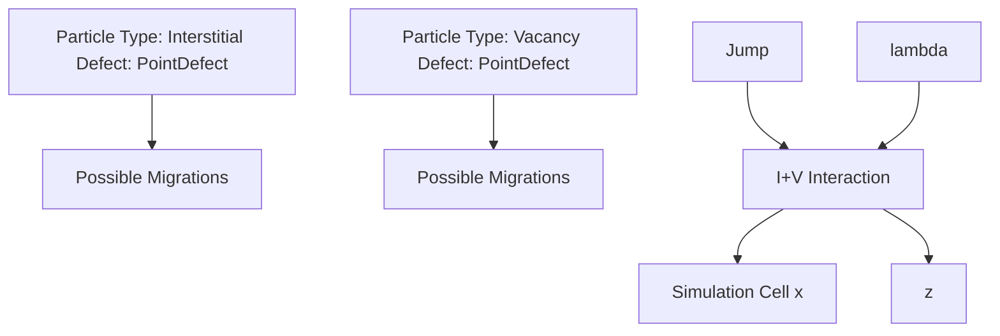
</details>

Figure 32 Point defects diffuse by jumping a distance in any orthogonal direction and can λ interact with neighbor particles

# Impurities

Isolated impurities in Sentaurus Process KMC can be in a substitutional state or can be paired with interstitials or vacancies. Substitutional impurities are electrically active and typically immobile. The acceptor and donor impurities (group III and group V of the periodic table, respectively) can move in silicon only by pairing with an interstitial or a vacancy, as shown in the literature [4][5][6][7][8]. Other impurities, such as fluorine, can diffuse without the aid of an extra I or V (see Impurities Diffusing Without Pairing on page 525).

Impurity atoms are modeled like interstitials or vacancies. They have a position, a defect type, and a particle type. The defect type is PointDefect, and the particle type characterizes the species, the charge state, and the presence of a paired I or V. For example, BiM indicates a negatively charged boron paired with an interstitial.

# 4: Atomistic Kinetic Monte Carlo Diffusion

Point Defects, Impurities, Dopants, and Impurity-Paired Point Defects

NOTE Sentaurus Process KMC assumes interstitial particles and substitutional particles paired with an interstitial have the same configuration. For example, Bi is the same as IB or BI, and there is only one position (three coordinates) for it.

Paired impurities can perform different events:

■ Diffusion   
■ Breakup of the impurity–defect pair   
Percolation


<details>
<summary>flowchart</summary>

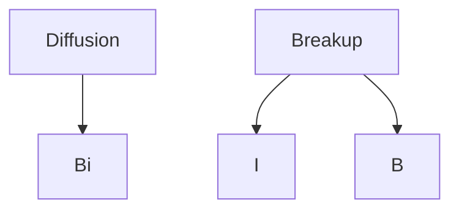
</details>

Figure 33 Impurity pairs can diffuse or break up into a substitutional plus an interstitial or a vacancy

NOTE Fluorine is modeled as an interstitial particle (in the default parameters, not in Advanced Calibration). Consequently, fluorine diffuses without pairing. See Impurities Diffusing Without Pairing on page 525.

# Diffusion

A diffusion event is defined as for point defects (see Eq. 684, p. 411). Nevertheless, the equation defines an instant diffusivity that is different from the effective diffusivity. Effective diffusivity measured in experiments involves a large number of microscopic migration steps and long times. Microscopically, dopants diffuse using the kick-out mechanism. For example, when an interstitial reacts with a substitutional boron, a boron–interstitial pair is generated: $\mathbf { B } + I  \mathbf { B } _ { i }$ . In contrast with the boron in a substitutional position, the generated pair is mobile. Then, begins to diffuse, using the diffusivity parameters specified in Eq. 684. After someBi time, the interstitial boron breaks up, releasing the interstitial. This boron will not move until a new incoming I reacts with it. Consequently, the macroscopic diffusivity is related not only with the boron–interstitial diffusivity, but also with its breakup frequency as:

$$
D ^ {\text { eff }} (\mathrm{B}) = D _ {0} ^ {\text { eff }} (\mathrm{B}) \exp \left(- \frac {E _ {\text { diff }} (\mathrm{B})}{k _ {\mathrm{B}} T}\right) \tag {685}
$$

where:

■ $D _ { 0 } ^ { \mathrm { e f f } } ( \mathbf { B } )$ depends on the Bi and I migration prefactors and on the Bi breakup prefactor.   
$E _ { \mathrm { d i f f } } ( \mathbf { B } )$ is related to the Bi microscopic migration energy $E _ { \mathrm { m } } ( \mathbf { B } _ { \mathrm { i } } )$ , the formation energy of an interstitial $E _ { \mathrm { f } } ( I )$ , and the Bi binding energy $E _ { \mathrm { { b } } } ( \mathbf { B } _ { \mathrm { { i } } } )$ (assuming there is no stress or corrections):

$$
E _ {\text { diff }} (\mathrm{B}) = E _ {\mathrm{m}} \left(\mathrm{B} _ {\mathrm{i}}\right) + E _ {\mathrm{f}} (I) - E _ {\mathrm{b}} \left(\mathrm{B} _ {\mathrm{i}}\right) \tag {686}
$$

Finally, the total boron diffusivity is given as the sum of the contribution of all mobile species. For boron–interstitial, and assuming there are three mobile species (negative, neutral, and positive):

$$
D (\mathrm{B}) = D \left(\mathrm{B} _ {\mathrm{i}} ^ {-}\right) \frac {\left[ \mathrm{B} _ {\mathrm{i}} ^ {-} \right]}{\left[ \mathrm{B} ^ {-} \right]} + D \left(\mathrm{B} _ {\mathrm{i}} ^ {0}\right) \frac {\left[ \mathrm{B} _ {\mathrm{i}} ^ {0} \right]}{\left[ \mathrm{B} ^ {-} \right]} + D \left(\mathrm{B} _ {\mathrm{i}} ^ {+}\right) \frac {\left[ \mathrm{B} _ {\mathrm{i}} ^ {+} \right]}{\left[ \mathrm{B} ^ {-} \right]} \tag {687}
$$

where $D ( \mathbf { B } _ { \mathrm { i } } ^ { x } )$ represents the microscopic pair diffusivity of charge .x

# Breakup

A breakup event for an interstitial–impurity pair can be described as:

$$
A _ {i} \leftrightarrow A _ {s} + I \tag {688}
$$

where $A _ { i }$ is an interstitial–impurity pair, is a substitutional impurity atom, and is anAs I interstitial silicon atom.

This breakup event happens with a frequency given by:

$$
v _ {b k} = v _ {0, b k} \cdot \exp (- E _ {b k} / (k _ {B} T)) \frac {1}{3} \sum_ {i} ^ {x, y, z} \exp (- \Delta E _ {m} ^ {i} / (k _ {B} T)) \tag {689}
$$

where $\mathsf { v } _ { 0 , b k }$ is the prefactor and $E _ { b k }$ is the activation energy, defined as the binding energy plus the migration energy of the emitted species and the SiGe and stress corrections:

$$
E _ {b k} \left(A _ {i}\right) = E _ {b} \left(A _ {i}\right) + E _ {m} (I) + P \left(\Delta V _ {f} (I) + \Delta V _ {f} (A) - \Delta V _ {f} \left(A _ {i}\right)\right) + [ G e ] \left(\alpha_ {f} (I) + \alpha_ {f} (A) - \alpha_ {f} \left(A _ {i}\right)\right) \tag {690}
$$

where:

■ $P = \left( - \frac { 1 } { 3 } \right) ( \mathbb { \sigma } _ { x } ^ { \prime } + \mathbb { \sigma } _ { y } ^ { \prime } + \mathbb { \sigma } _ { z } ^ { \prime } )$ is the hydrostatic pressure, computed as the mean value of the principal stresses.   
■ $\Delta V _ { f }$ are the activation volumes for the formation energies.   
is the germanium concentration.[ ] Ge   
■ $\alpha _ { f }$ accounts for the variation of the formation energy with the germanium concentration.

# 4: Atomistic Kinetic Monte Carlo Diffusion

Point Defects, Impurities, Dopants, and Impurity-Paired Point Defects

The corrections to the migration energies induced by the stress and SiGe are (as explained in Interstitials and Vacancies on page 411):

$$
\Delta E _ {m} ^ {i} = \sigma_ {j} ^ {\prime} \Delta V _ {p a r} + \alpha_ {m} [ G e ] + \sum_ {i \neq j} (\sigma_ {i} ^ {\prime} \Delta V _ {o r t}) \tag {691}
$$

Sentaurus Process KMC assumes that the activation volume and the SiGe variation for the formation energy do not depend on the charge. All the charge states of the same species share the same activation volume and SiGe dependencies for the formation energy.

Figure 34 shows the energies for boron involved in this mechanism.   


<details>
<summary>text_image</summary>

Em (I)
Ef (B)
Ef (I)
Ef (Bi)
Ee (Bi)
Em (Bi)
</details>

Figure 34 Energies involved in the kick-out mechanism for $\mathsf { B } ^ { - } + \mathsf { I } ^ { 0 } = \mathsf { B i } ^ { - }$ . Migration energy of the interstitials and boron–interstitial are specified in the parameter database as Em. The binding energies are Eb, and the I formation energy is specified as Eform. The formation energy for dopants in pure silicon is assumed to be 0 because the dopants are already in the simulation; the dopants are not created by the system.

It is easy to deduce that a change in the formation energies due to stress and SiGe will change the binding energy as:

$$
\Delta E _ {b} \left(B _ {i}\right) = \Delta E _ {f} (I) + \Delta E _ {f} (B) - \Delta E _ {f} \left(B _ {i}\right) \tag {692}
$$

# Percolation

In a percolation event, an impurity can react with any other defect in its neighborhood without the need for diffusion. In this aspect, it can simulate the reactions that occur through distortions in the lattice but without the need for the migration of particles. The neighborhood of the particle is defined in the same way as for diffusing point defects.

The percolation rate, that is, the frequency at which the particle attempts to interact with any valid defect in its neighborhood, is defined as:

$$
v _ {\text { per }} = P _ {\text { per }} \exp \left(- \frac {E _ {\text { per }}}{k _ {\mathrm{B}} T}\right) \tag {693}
$$

where and are the prefactors for percolation, specified as input parameters. PercolationP E only applies to substitutional dopants or impurities. It can provide an extra mechanism for dopant deactivation at very high concentrations.

# Parameters

The dopant diffusion parameters are stored in the parameter database for each material and dopant, under the names Dm, Em for diffusivities, and Db, Eb for binding energies. Dm and Db are prefactors, and Em and Eb are energies. The activation volumes for the formation energies have the name VF and $\alpha _ { f }$ is called EfGe. The prefactor and the activation energy for percolation are called D0.Percolation and E0.Percolation, respectively.

The following parameters can be changed:

```xml
pdbSet <material> KMC <Dopant> Dm <particle type> <value>
pdbSet <material> KMC <Dopant> Em <particle type> <value>
pdbSet <material> KMC <Dopant> Db <particle type> <value>
pdbSet <material> KMC <Dopant> Eb <particle type> <value>
pdbSet <material> KMC <Dopant> VF <particle type> <value>
pdbSet <material> KMC <Dopant> VD <particle type> <value>,<value>
pdbSet <material> KMC <Dopant> EfGe <particle type> <value>
pdbSet <material> KMC <Dopant> D0.Percolation <value>
pdbSet <material> KMC <Dopant> E0.Percolation <value> 
```

For the migration energy, the prefactor, the SiGe dependency, and the activation volumes for stresses, the specified material must be modeled as full or simple (in other words, any material that does not discard particles). For binding energies, only the full materials are valid. Percolation parameters are applied to simple and full materials.

Immobile species (substitutional dopants) have the migration prefactor set to 0, and the migration energy high, to clarify that the species will not perform diffusion steps. Finally, since Sentaurus Process KMC assumes substitutional atoms to be ionized (in other words, B– and ${ \mathrm { A s } } ^ { + } )$ , the binding parameters (both the prefactor and the binding energy) are only defined for pairing reactions with a neutral I or V, such as $\mathbf { B } ^ { - } + I ^ { 0 }  \mathbf { B } _ { i } ^ { - } ~ \mathrm { o r } ~ \bar { \mathbf { A } \mathrm { s } } ^ { + } + \bar { V ^ { 0 } }  \mathrm { A s } V ^ { + }$ . The binding energies for the other breakup reactions are computed automatically using these parameters.

# Parameter Examples

Silicon migration energies of boron particles:

```txt
sprocess> pdbGet Si KMC B Em
B 5.
BiM 0.5
Bi 0.25
BiP 1.1 
```

# 4: Atomistic Kinetic Monte Carlo Diffusion

Point Defects, Impurities, Dopants, and Impurity-Paired Point Defects

Prefactors of the above energies:

```txt
sprocess> pdbGet Si KMC B Dm
B 0.
BiM 1.e-3
Bi 1.e-3
BiP 1.e-3 
```

Migration energies for boron in oxide (the only allowed boron particle is B):

```txt
sprocess> pdbGet Oxide KMC B Em B 3.53 
```

Binding energy of boron in silicon:

```txt
sprocess> pdbGet Si KMC B Eb BiM 0.3 
```

and prefactor:

```txt
sprocess> pdbGet Si KMC B Db BiM .37 
```

Activation volumes for the formation energies of boron interstitial:

```csv
sprocess> pdbGet Si KMC B VF
BiM -0.0044 
```

Variation of formation energy with Ge concentration:

```txt
sprocess> pdbGet Si KMC B EfGe 0 
```

Finally, the binding energy cannot be defined for any material but full model ones, the result should be blank:

```txt
sprocess> pdbGet PolySilicon KMC B Eb 
```

NOTE You can change these parameters whenever necessary to calibrate intrinsic and extrinsic dopant diffusivity under equilibrium conditions. For nonequilibrium conditions, you also can change the extended defects if necessary.

# Hopping Mode

To control the way Sentaurus Process KMC performs diffusion events, you can change the hopping mode using:

pdbSet KMC HoppingMode <mode>

where <mode> can be short, long, double, or longdouble (default). Changing the hopping mode only changes the results statistically (that is, it is similar to changing the random seed); although, it might change the CPU time significantly.

# The short Mode

The short mode implies that the jumping distance for all the diffusion events is the sameλ and equal to the second neighbor’s distance. In addition, only one diffusion event is performed at a time.

# The long Mode

The long mode implies that the code increases the hopping distance to , where is annλ n integer determined internally, in regions where there are no particles with which to interact. This increase improves the simulation performance in this area (in theory, by a factor of ).n 2 In practice, the overall speed improvement is a factor of 2 or smaller, mainly because the empty regions where there are no particles to interact with are limited. The overhead is caused by the long mode implementation.


<details>
<summary>text_image</summary>

Standard 'short'
hopping mode
Volume suitable for using
the 'long' hopping mode
</details>

Figure 35 Even if the long hopping mode is available, it is used only for particles diffusing on empty volumes

# The double Mode

The double mode allows Sentaurus Process KMC to perform two diffusion events in one. Nevertheless, to properly account for interactions, the intermediate diffusion event is still simulated by Sentaurus Process KMC. Using this hopping mode saves 10% or less of CPU time.

# The longdouble Mode

The longdouble mode is the fastest mode, and enables both long and double hops.

NOTE For more information on these hopping modes, refer to the literature [9].

# Enabling and Disabling Interactions

Interactions between particles are important. Whenever one mobile particle jumps into another particle, Sentaurus Process KMC tries to make both particles interact. These interactions might or might not be possible depending on whether the interaction is allowed and if it is energetically possible.

The interactions allowed between one mobile particle and other particles are specified in the parameter database using the parameter ReactionsPointDefect. The interactions between this type of defect are assumed to be always energetically favorable.

Consequently, changing the parameter ReactionsPointDefect is the only way to establish whether a moving particle will interact with other (mobile or immobile) particles. To change this parameter, use:

pdbSet <material> KMC <dopant> ReactionsPointDefect <string> <true | false>

This parameter needs a string and Boolean value. The Boolean value specifies if the interaction is allowed (true) or disallowed (false). The string contains the name of the two interacting particles, separated by a comma. For example:

```csv
sprocess> pdbGet Si KMC C ReactionsPointDefect
C,I true
C,V false
C,Ci true
Ci,I true
Ci,V true
Ci,Ci true 
```

Therefore, in this example, the interaction between C and V is disabled. To enable it, use the command:

pdbSet Si KMC C ReactionsPointDefect C,V true

When enabling an interaction, the result does not have to be specified because Sentaurus Process KMC already knows it. The possible interaction results are:

<table><tr><td>PointDefect</td><td>Pairing reactions, in other words, dopants pairing with interstitials or vacancies to generate dopant–interstitial or dopant–vacancy particles. For example, B + I or As + IM.</td></tr><tr><td>AmorphousPocket</td><td>Reaction of interstitials or vacancies between them. For example, I + IM, I + V, or V + V. They involve both damage formation (mixed I and V) and small cluster creation (only I or V).</td></tr><tr><td>ImpurityCluster</td><td>Reactions involving the formation of impurity clusters, in other words, when the result has dopants and interstitials or vacancies with two or more of each. For example, Bi + I or AsV + AsV.</td></tr></table>

The reactions for each single charge state must be introduced, so the charged I also interacts with V and with other charge states of V:

<table><tr><td colspan="2">sprocess&gt; pdbGet Si KMC I ReactionsPointDefect</td></tr><tr><td>I,V</td><td>true</td></tr><tr><td>I,VM</td><td>true</td></tr><tr><td>I,VMM</td><td>true</td></tr><tr><td>I,VP</td><td>true</td></tr><tr><td>I,VPP</td><td>true</td></tr><tr><td>IP,V</td><td>true</td></tr><tr><td>IM,V</td><td>true</td></tr><tr><td>IM,IP</td><td>true</td></tr><tr><td>(...)</td><td></td></tr></table>

All interactions are listed in the parameter database. With that list of interactions, you can understand which reactions are considered and how they work.

# Interaction Rules

Sentaurus Process KMC does not accept all possible interactions within every two particles, but only interactions with a physical meaning, or with an available model. Consequently, the following rules apply:

Reactions must include existing particles.   
■ Some reactions are only allowed in materials with full modeling.   
Reactions for a pair must be defined in the file of the involved dopant (for example, a reaction with Bi must be in the boron file, not in the interstitial file).   
If the result of a reaction does not exist, the reaction is discarded (that is, the reaction C + V is specified, but the particle CV is not defined).

# 4: Atomistic Kinetic Monte Carlo Diffusion

Point Defects, Impurities, Dopants, and Impurity-Paired Point Defects

Repulsive reactions are not allowed (for example, Bi– + Bi– ) except for ‘percolation’ models such as $\mathrm { A s } + \mathrm { A s }$ or B + B (see Percolation on page 479).   
Reactions must satisfy microscopic reversibility. For example, if the reverse reaction is not possible, the reaction is discarded.   
Reactions creating impurity clusters must give a defined cluster. For example, Bi + Bi is allowed as long as there is a $\mathbf { B } _ { 2 } \mathbf { I } _ { 2 }$ cluster defined; in this case, Bi + BiM would also be allowed.   
Only reactions producing defined PointDefect, ImpurityCluster, or AmorphousPocket are allowed. For example, Bi + C will generate an error message if there is no BCI cluster defined.

# Examples

NOTE Only advanced users should change the default interaction list because improper modifications can drastically change the diffusion models.

The interactions for boron are:

```csv
sprocess> pdbGet Si KMC B ReactionsPointDefect
B,I true
Bi,I true
Bi,V true
BiM,V true
BiP,V true
B,Bi false
B,BiP true
B,IP true
Bi,Bi true
Bi,VM true
Bi,VMM true
Bi,VP true
Bi,VPP true
BiM,VP true
BiM,VPP true
BiP,VM true
BiP,VMM true 
```

B and I can react, giving a mobile Bi particle. B and IP also give a Bi particle. The charge state of the resulting Bi particle is computed automatically by Sentaurus Process KMC depending on the Fermi level, temperature, and Bi levels in the band gap. B– + IM is an electrostatically repulsive reaction, and is not allowed.

Bi possible charge states are neutral, positive, and negative. The reactions for these charge states should be specified as well. Bi and its different charges can react with I, V, and Bi. Bi + I produces an impurity cluster. Only microscopically reversible reactions are allowed. Because a BI2 cluster breaks up as Bi + I, any nonrepulsive reaction involving Bi and I is allowed. Bi + V recombines the IV pair, depositing substitutional boron. All nonrepulsive reactions between $\mathrm { B } _ { \mathrm { i } }$ and V are allowed, and all are specified in this example. Finally, there are more ways to produce impurity clusters including BiP + B, producing ${ \mathbf B } _ { 2 } { \mathbf I }$ , and $B _ { i } ^ { a } + B _ { i } ^ { b }  { \bf B } _ { 2 } \mathrm { I } _ { 2 }$ , as long as givinga b⋅ ≤ 0 $\mathbf { B } _ { 2 } \mathbf { I } _ { 2 }$ .

The reaction B + V is not specified here. Typing B,V false produces the same effect. Setting this reaction to true implies defining a BV particle (and its parameters) and specifying reactions for this BV particle, such as .BV I + B →

# Defining Nonstandard Interactions

Sentaurus Process KMC allows you to define nonstandard interactions, which are intended to provide a mechanism for exceptional models that cannot be implemented using standard models and interactions. These reactions are of the type:

$$
\mathrm{A} + \mathrm{B} \rightarrow \mathrm{C} \tag {694}
$$

where A, B, and C must be single particles (point defects or dopants). They are defined using SpecialReaction in the folder including the first species:

pdbSet Si KMC A SpecialReaction A,B,C true

The reactions defined with this mechanism are irreversible: C will not break into A and B back.

# Nonstandard Interaction Rules

The rules for nonstandard interactions are a subset of the rules for standard interactions (see Interaction Rules on page 421):

■ Reactions must include existing particles. The result is always a point defect, not a cluster or another defect type.   
■ Reactions are only allowed in materials with full modeling.   
Reactions for a pair must be defined in the file of the involved dopant (for example, a reaction with Bi must be in the boron file, not in the interstitial file).   
If the result of a reaction does not exist, the reaction is discarded (that is, the reaction C + V is specified, but the particle CV is not defined).

In particular, these reactions can be nonconservative. For example, you can define a carbon– interstitial interaction giving arsenic ( ). These reactions are nonstandard becauseC + As I → they lack a physical sense, but they are allowed because they offer extra flexibility to define new models.

# Example

A model for nitrogen diffusion can be defined using a nonstandard interaction, in particular, when you want to model:

$$
\mathrm{N} _ {\mathrm{i}} + \mathrm{N} _ {\mathrm{i}} \rightarrow \mathrm{N} _ {2, \mathrm{i}}
$$

$$
\mathrm{N} _ {2, \mathrm{i}} + \mathrm{V} \leftrightarrow \mathrm{N} _ {2} \mathrm{V} \tag {695}
$$

where $\mathrm { N } _ { 2 , \mathrm { i } }$ is mobile but is immobile. The second reaction is not a problem. You canN V define a dopant called Nn to be $N _ { 2 , i }$ and make it mobile, and you can define an NnV as the result of Nn + V. These reactions are standard.

The problem is that you cannot have an N + N reaction giving Nn using standard mechanisms. For this exception, you define $\Nu _ { \mathrm { i } }$ as N and use the special reaction:

pdbSet Si KMC N SpecialReaction N,N,Nn true

NOTE Special reactions are printed in the log file, for example:

KMC. Using special non-reversible reaction N + N -> Nn

# Stress Effects on Point Defects, Impurities, Dopants, and Impurity-Paired Point Defects

The stress model for Sentaurus Process KMC is disabled by default. To enable the stress model, use:

pdbSet KMC Stress 1

Alternatively, specify kmc.stress in the diffuse command:

diffuse kmc.stress time=...

Sentaurus Process KMC uses the stress provided by Sentaurus Process, but Sentaurus Process KMC does not compute it. The stress fields are updated from Sentaurus Process for each diffuse step.

Local stress dependency is introduced into Sentaurus Process KMC using the correction of the migration and binding energies of point defects and impurity-paired point defects.

Stress also affects the bandgap narrowing (see Bandgap Narrowing on page 502).

# Migration Energy

An anisotropic correction to the migration energy is introduced as:

$$
\left[ \begin{array}{l} \Delta E _ {m} ^ {x} \\ \Delta E _ {m} ^ {y} \\ \Delta E _ {m} ^ {z} \end{array} \right] = \left[ \begin{array}{l l l} \Delta V _ {\text {par}} & \Delta V _ {\text {ort}} & \Delta V _ {\text {ort}} \\ \Delta V _ {\text {ort}} & \Delta V _ {\text {par}} & \Delta V _ {\text {ort}} \\ \Delta V _ {\text {ort}} & \Delta V _ {\text {ort}} & \Delta V _ {\text {par}} \end{array} \right] \left[ \begin{array}{l} \sigma_ {x} ^ {\prime} \\ \sigma_ {y} ^ {\prime} \\ \sigma_ {z} ^ {\prime} \end{array} \right] \tag {696}
$$

where:

■ $\Delta E _ { m } ^ { i }$ are the corrections to the migration energy when diffusing in the -axis.i'   
$\pmb { \sigma } _ { i } ^ { \prime }$ are the principal stresses.   
$\Delta V _ { p a r }$ and $\Delta V _ { o r t }$ are the activation volumes for diffusion parallel and diffusion perpendicular to stress, respectively. They are included in the PDB as VD.

The relation between the -axes and the standard ones is established by a rotation tensor,i' R which diagonalizes the stresses tensor:

$$
[ R ] \left[ \begin{array}{l l l} \sigma_ {x x} & \sigma_ {x y} & \sigma_ {x z} \\ \sigma_ {x y} & \sigma_ {y y} & \sigma_ {y z} \\ \sigma_ {x z} & \sigma_ {y z} & \sigma_ {z z} \end{array} \right] [ R ] ^ {T} = \left[ \begin{array}{l l l} \sigma_ {x} ^ {\prime} & 0 & 0 \\ 0 & \sigma_ {y} ^ {\prime} & 0 \\ 0 & 0 & \sigma_ {z} ^ {\prime} \end{array} \right] \tag {697}
$$

The default setting of the parameter ChangeAxis is false (0), which disables this rotation, using the standard xyz axis instead of the -axes.i'

NOTE Setting pdbSet KMC ChangeAxis 1 changes the direction of the hopping depending on the local stresses. This, in turn, dramatically impacts {311} dissolution because the structure is sensitive to the direction of the migrating incoming particles.

For more information, see Interstitials and Vacancies on page 411.

# Binding Energy

The binding energy of an impurity-paired point defect $\mathrm { A } _ { \mathrm { i } }$ is corrected by:

$$
\Delta E _ {b} (A _ {i}) = \frac {1}{3} (\sigma_ {x x} + \sigma_ {y y} + \sigma_ {z z}) (\Delta V _ {f} (I) - \Delta V _ {f} (A _ {i})) \tag {698}
$$

where $\Delta V _ { f }$ is the activation volume for the formation energy. The activation energy for an impurity-paired point-defect breakup is defined (without stress) as the sum of the binding

# 4: Atomistic Kinetic Monte Carlo Diffusion

Point Defects, Impurities, Dopants, and Impurity-Paired Point Defects

energy and the migration energy of the emitted species (I for Ai). Then, an extra correction of the migration energy of the emitted species under stress is needed.

Since the migration energy corrections depend on the axis, but the breakup of an impurity pair in Sentaurus Process KMC does not, an average of the corrections for all the axes is performed, and the frequency is computed as:

$$
\mathrm{v} _ {b k} ^ {\text { stress }} = \mathrm{v} _ {b k} ^ {0} \exp (- \Delta E _ {b} / (k _ {\mathrm{B}} T)) \frac {1}{3} \sum_ {i} ^ {x y, z} \exp (- \Delta E _ {m} ^ {i} / (k _ {\mathrm{B}} T)) \tag {699}
$$

where $\nu { } ^ { 0 } { } _ { b k }$ is the breakup frequency when there is no stress.

For more information, see Impurities on page 413.

# Alloys

Alloys are included in Sentaurus Process KMC simulations as fields not as particles. Using Ge as an example of an alloy in Si, it means that Sentaurus Process KMC discards the particular position of Ge (the xyz coordinates) and only keeps track of how many Ge atoms were introduced in each internal element. This saves a huge amount of memory, while allowing Sentaurus Process KMC to account for SiGe effects. Ge diffusion is handled by solving a simple diffusion equation on the KMC elements. Because of this, there are some limitations:

There are no Ge particles in the atomistic 3D plot.   
Ge (including implanted Ge) is shown as a field in the atomistic 3D plot.   
■ There are no events or reports associated with Ge because there are no Ge particles.   
■ There are no Ge models (for example, no Ge clusters) except for Ge diffusion.

This model can be used to:

Simulate Ge diffusion.   
Include corrections to the migration and formation energies of point defects and impuritypaired defects when diffusing in SiGe materials.   
Include bandgap corrections due to SiGe.

NOTE Sentaurus Process KMC considers the effect of germanium whenever germanium is present. Continuum parameters (such as Silicon SiliconGermanium.ConversionConc) do not affect Sentaurus Process KMC simulations.

# Alloy Diffusion

Ge will be used as an example of an alloy in Si material. Here, the Ge model diffusion implemented has been based partially on [10]. This model defines the diffusion of Ge in an indirect way through the use of of Is and Vs for aα ${ \mathrm { S i } } _ { { \mathrm { 1 - x } } } { \mathrm { G e } } _ { \mathrm { x } }$ material as:

$$
\alpha_ {I} = \frac {D _ {I} ^ {G e} (x)}{D _ {I} ^ {S i} (x)} \tag {700}
$$

where $D _ { I } ^ { G e } ( x )$ and $D _ { I } ^ { S i } ( x )$ are the transport capacity associated with Ge and Si interstitials in ${ \mathrm { S i } } _ { { \mathrm { 1 - x } } } { \mathrm { G e } } _ { \mathrm { x } } .$ , respectively.

It can be assumed that these s follow the equation:α

$$
\alpha (x) = \alpha_ {0, S i} ^ {1 - x} \alpha_ {0, G e} ^ {x} \exp \left(- \frac {(1 - x) E _ {S i} + x E _ {G e}}{k _ {B} T}\right) \tag {701}
$$

where $\mathbf { \alpha } \propto _ { 0 , s i } , \mathbf { \alpha } \propto _ { 0 , G e } , E _ { s i }$ , and $E _ { G e }$ are input parameters specified in the PDB. Both interstitials and vacancies have a different .α

NOTE The Ge diffusion model is switched on by default. To switched it off, set $\mathsf { \alpha } _ { 0 , s i }$ and $\alpha _ { 0 , G e }$ to null values.

For SiGe material, however, you must define the D0 and E parameters for the calculation of in Si and Ge. By default, it takes the valuesα defined in Si and Ge as D0alphaSi, EalphaSi, Alloy.D0alpha, Alloy.Ealpha, and so on.

For interfaces consisting of Si material and Ge material, for example, you can initiate interdiffusion by setting:

pdbSet KMC Improved.Continuous.Interface true

This setting uses the concentration gradient as the main factor for interdiffusion across the interface, and interdiffusion follows point defects jumping across the interface.

# Parameters

The parameters $\mathbf { \alpha } \propto _ { 0 , s i } , \mathbf { \alpha } \propto _ { 0 , G e } , \mathbf { \beta } E _ { s i }$ , and $E _ { G e }$ are specified in the PDB with the names D0alphaSi, Alloy.D0alpha, EalphaSi, and Alloy.Ealpha. In particular:

```txt
sprocess> pdbGet Si KMC I EalphaSi
0.4
sprocess> pdbGet Si KMC I Alloy.Ealpha
0 
```

# 4: Atomistic Kinetic Monte Carlo Diffusion

Point Defects, Impurities, Dopants, and Impurity-Paired Point Defects

```snap
sprocess> pdbGet Si KMC I D0alphaSi
35
sprocess> pdbGet Si KMC I D0alphaGe
2.2
sprocess> pdbGet Si KMC V EalphaSi
0.25
sprocess> pdbGet Si KMC V EalphaGe
0
sprocess> pdbGet Si KMC V D0alphaSi
30
sprocess> pdbGet Si KMC V D0alphaGe
2.2 
```

# Alloy Effects

The following sections discuss alloy effects on point defects, impurities, dopants, and impuritypaired point defects. In the next sections, Ge in silicon is used as an example for these models.

# Migration and Formation Energies

The corrections $\Delta E _ { m } = \alpha _ { m } [ \mathrm { G e } ]$ and $\Delta E _ { f } = \alpha _ { f } [ \mathrm { G e } ]$ are added to the migration and the formation energies, respectively. is the germanium concentration, and [ ] Ge $\alpha _ { m } , \alpha _ { f }$ are the dependencies of energies with Ge concentration for migration and formation.

# Binding Energy

The binding energy of an impurity-paired point defect $A _ { i }$ is corrected by:

$$
\Delta E _ {b} \left(A _ {i}\right) = [ \mathrm{Ge} ] \left(\alpha_ {f} (I) + \alpha_ {f} (A) - \alpha_ {f} \left(A _ {i}\right)\right) \tag {702}
$$

For more information, see Impurities on page 413.

# Bandgap Narrowing

The Ge inclusion changes the band gap as explained in Bandgap Narrowing on page 502.

# Parameter Interpolation in Alloys

You can interpolate relevant parameters from the base materials. For example, parameters in SiGe will be interpolated from their respective values in Silicon and Germanium. Most Double and DoubleArray type parameters are interpolated, but other types of parameter such as Switch, String, and Boolean, as well as some Double and DoubleArray, are not interpolated.

Because SiGe is by default like Silicon, parameters that are not interpolated will be the same as in Silicon. For details about parameter inheritance using like materials, see Like Materials: Material Parameter Inheritance on page 23.

In addition, if a parameter is specified directly in the alloy (for example, directly in SiGe), the value is used as specified and is not interpolated.

The set of parameters that are interpolated can be printed to the log file using the command:

```ocaml
print_interpolated_params [Diffuse | KMC | Mechanics] 
```

This command must be called after the expected parameter interpolation has occurred (see print\_interpolated\_params on page 1163).

Parameter interpolation is switched on by default in SiGe and switched off by default in Silicon and Germanium.

NOTE For example, in Ge-doped silicon, parameter interpolation is switched off by default for backward compatibility and default silicon behavior should be expected. Parameter interpolation can be switched on in this case by setting:

pdbSet Si Skip.Parameter.Interpolation 0

Similar to other Sentaurus Process modules, parameter interpolation in Sentaurus Process KMC allows linear, piecewise linear, parabolic, and logarithmic interpolation. For piecewise linear interpolation, a table with parameter values for different mole fractions must be provided. For parabolic interpolation, a parameter with the .X2 suffix must be defined.

For details about parameter interpolation, see Alloy Materials and Parameter Interpolation on page 24.

# Alloy Condensation at Growing Interface

You can simulate alloy condensation or pileup at interfaces. The physical mechanism implemented is similar to snow plowing dopants during silicidation. The parameters Pref.GrowthDeposit and Ener.GrowthDeposit allow you to control the redistribution of alloys from growing oxide to substrate. The probability of alloy transfer to oxide is calculated using the following Arrhenius expression:

$$
\mathrm{p} = \text { Pref.GrowthDeposit } \times \exp \left(- \frac {\text { Ener.GrowthDeposit }}{k T}\right) \tag {703}
$$

Allowed values of Pref.GrowthDeposit are between 0 and 1. The default is 1, which means the alloy will stay in the growing oxide side. The default value of Ener.GrowthDeposit is 0. These parameters can be obtained as follows:

```txt
sprocess> pdbGet Oxide_Silicon KMC Ge Pref.GrowthDeposit 1.0
sprocess> pdbGet Oxide_Silicon KMC Ge Ener.GrowthDeposit 0.0 
```

# Introducing Alloys in Simulations

Alloys can be introduced into simulations by:

■ Using implantation.   
Using the select command.   
■ Atomizing a previous continuum structure with the alloy.   
Using kmc add to explicitly add it.   
■ Depositing a layer doped with the alloy.

# Damage Accumulation Model: Amorphous Pockets

Damage accumulation evolution, that is, the evolution of small interstitial and vacancy clusters after ion implantations, is a crucial step that affects the subsequent formation of extended defects and impurity clusters. This accumulation generates the TED of commonly used dopants, such as boron.

Experimentally, electron irradiation and light-ion implantation create isolated point defects inside the silicon. In contrast, heavy ions generate highly disordered regions called amorphous pockets (APs) as a consequence of the implanted cascades. Depending strongly on the temperature, ion mass, and dose rate, this disordered region can dissolve as a result of internal recombination or can grow until an amorphous layer is created. The activation energy for annealing this damage varies in the literature, 0.9 eV [11] at room temperature, 1.2 eV for to , but it is much less than the 2.7 eV reported for truly amorphized amorphous400°C 550°C layers. This means the damage accumulation depends on the dynamic annealing, ripening, and dissolution history of the APs during the implantation process. This annealing can have a quasi-continuum range of activation energies.

There is much discussion on how this damage is annealed. Some papers point to an annealing of the disordered region [12]: APs using an internal recombination of IV pairs rather than through the emission of point defects. Only when the AP does not contain further IV pairs does it begin to emit its remaining Is or Vs, behaving as a small I or V cluster.

Sentaurus Process KMC simulates the damage accumulation using APs, disordered collections of point defects (Is and Vs) stable at low temperatures. APs dissolve fast at higher temperatures, leaving only clusters with the net excess of Is or Vs. APs can contain IV pairs or only Is and Vs. In the first case, APs try to recombine the pairs; in the second case, APs behave as small clusters and can emit their constituent particles. Whenever an AP containing only Is or Vs (but not IV pairs) reaches a threshold size, the AP transforms into an extended defect ({311}s and loops for Is, voids for Vs).

APs can grow capturing new incoming point defects, and they can dissolve by internal recombination of IV pairs or by particle emission when there are no more IV pairs (see Figure 36).


<details>
<summary>flowchart</summary>

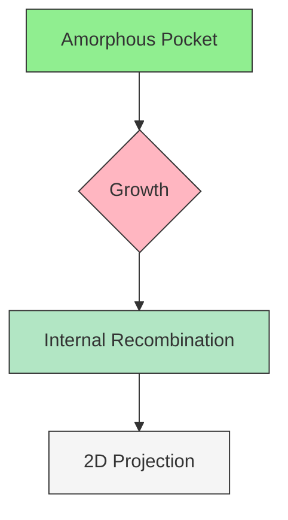
</details>

Figure 36 Growth of APs showing their internal recombination

# Shape of Amorphous Pockets

APs have an irregular shape. Sentaurus Process KMC does not reshape the defect as new; incoming particles join the AP: particles are left in their incoming positions. Figure 37 shows some APs resulting from an implanted cascade.


<details>
<summary>natural_image</summary>

Molecular cluster visualization with red and green atoms against blue background, highlighting a zoomed-in circular region (no text or labels)
</details>

Figure 37 APs formed in Sentaurus Process KMC after some implanted as cascades: interstitials are red, vacancies are green, arsenic is yellow

# Growth of Amorphous Pockets

APs capture any incoming point defect (I or V) within their capture radius. The capture radius of APs is the sum of all their constituent particles. Point defects with any charge state are captured by APs containing both Is and Vs. Only neutral Is or Vs are captured when APs contain only Is or only Vs.

# Recombination

APs containing IV pairs (that is, APs with both interstitials and vacancies) can recombine pairs using a recombination event, which recombines one I with one V at a time. This event is performed with a frequency given by:

$$
v _ {d i s s} = v _ {0, d i s s} \cdot \text { size } ^ {\beta} \exp (- (E _ {d i s s} (\text { size }) + P \Delta V _ {d i s s} + \alpha_ {I V} [ G e ]) / (k _ {B} T)) \tag {704}
$$

where:

■ The prefactor $\mathbf { v } _ { 0 , d i s s }$ is called D0.AmorphousPocket in the parameter database.   
size is the size of the cluster.

The size of a cluster $\mathrm { I _ { n } V _ { m } }$ is a Tcl procedure of n and m specified in the file KMC.tcl under the name getAmorphousPocketSize (the procedure can be modified):

```tcl
fproc getAmorphousPocketSize { sizeI sizeV } {
    return [expr ($sizeI + $sizeV)/2]
} 
```

■ is an exponent called Exponent.AmorphousPocket.β   
■ $E _ { d i s s }$ depends on the size of the AP and is specified as a list of energies for each size (Eb.AmorphousPocket). The different sizes are specified as IxeVx. If an energy is not specified for a size, Sentaurus Process KMC takes the linear interpolation between the last two specified values. For sizes higher than the last specified size, the last specified energy is assigned automatically.   
$\alpha _ { I V }$ is the germanium correction to recombination (Alloy.Eb.AmorphousPocket).   
■ is the hydrostatic pressure.P   
■ $\Delta V _ { d i s s }$ is the activation volume for the AP dissolution (VF.AmorphousPocket).

# Parameters

The parameters needed by the damage accumulation model are specified using:

pdbSet Si KMC Damage <Parameter> <value>

For example:   
```txt
sprocess> pdbGet Si KMC Damage D0.AmorphousPocket
0.0005
sprocess> pdbGet Si KMC Damage Exponent.AmorphousPocket
0.66
sprocess> pdbGet Si KMC Damage VF.AmorphousPocket
0
sprocess> pdbGet Si KMC Damage Eb.AmorphousPocket
IV 0.65
I199V199 2.4
sprocess> pdbGet Si KMC Damage Alloy.Eb.AmorphousPocket
0 
```

For the above parameters, the Eb.AmorphousPocket values for $\mathrm { I } _ { \mathrm { x } } \mathrm { V } _ { \mathrm { x } } ,$ with x > 1 and x < 199 will be generated by Sentaurus Process KMC as a linear interpolation between the points (1, 0.65) and (199, 2.4):

```txt
Silicon/Damage Eb.AmorphousPocket(IV) = 0.65
Silicon/Damage Eb.AmorphousPocket Interpolated (2) = 0.658838
Silicon/Damage Eb.AmorphousPocket Interpolated (3) = 0.667677
... 
```

NOTE You can change these parameters to calibrate the damage accumulation model.

The maximum size allowed for IV clusters is $\mathrm { I } _ { 2 4 9 } \mathrm { V } _ { 2 4 9 }$ .

# Emission

When all IV pairs have been recombined, APs behave as small I or V clusters, allowing the emission of their extra constituent particles. These defects emit neutral Is or Vs particles with a frequency given by:

$$
\mathrm{v} _ {\text { e   m   i   t }} = \mathrm{v} _ {0, \text { e   m   i   t }} \cdot \exp \left(- E _ {\text { e   m   i   t }} (\text { size }) / \left(k _ {B} T\right)\right) \tag {705}
$$

The prefactor is proportional to the input parameter D0.Cluster, but also includes a dependency on the size of the cluster. The activation energy for emission of an X (either I or V) is:

$$
E _ {e m i t} = E _ {b} (X) + E _ {m} (X) + \Delta E _ {b} (X) + \Delta E _ {m} (X) \tag {706}
$$

the sum of the corrected binding energy (that depends on the cluster size) and the migration energy. The cluster size is defined as the number of contained Is or Vs (see Figure 38 on page 434).


<details>
<summary>text_image</summary>

Eb
E diss
Em
E(n-1) + E(1)
E(n)
Ef
E(n-1)
</details>

Figure 38 Energies involved in emission of an interstitial from an n-sized cluster

The parameter D0.Cluster is the constant proportional to the emission prefactor, and Eb.Cluster is the cluster binding energy, where dependency with size is explicitly assigned. For sizes bigger than the last specified cluster, the binding energies are computed using:

$$
E _ {b} (\text { size }) = E _ {b, L} - (E _ {b, L} - E _ {b, S}) \frac {\text { size } ^ {a} - (\text { size } - 1) ^ {a}}{2 ^ {a} - 1} \tag {707}
$$

where:

$E _ { b , L }$ (Eb.LargeCluster) is the binding energy for the largest cluster.   
■ $E _ { b , S }$ (Eb.SmallestCluster) is the binding energy for the smallest cluster (size 1).   
(Exponent.Cluster) is the exponent, usually 2/3 or 3/4.a

Figure 39 shows some binding energy values and compares them with the numbers obtained using Eq. 707.   


<details>
<summary>line</summary>

| I Cluster Size | Discrete Binding Energy Eb [eV] | Continuum energies Binding Energy Eb [eV] |
| -------------- | ------------------------------- | ----------------------------------------- |
| 0              | 2.2                             | 2.4                                       |
| 5              | 2.9                             | 2.5                                       |
| 10             | 2.3                             | 2.6                                       |
| 15             | 2.7                             | 2.65                                      |
| 20             | 2.65                            | 2.68                                      |
| 40             | 2.65                            | 2.69                                      |
| 60             | 2.65                            | 2.70                                      |
| 80             | 2.65                            | 2.70                                      |
| 100            | 2.65                            | 2.70                                      |
| 120            | 2.65                            | 2.70                                      |
</details>


<details>
<summary>line</summary>

| V Cluster Size | Binding Energy E_b [eV] |
| -------------- | ------------------------ |
| 2              | 1.4                      |
| 5              | 3.0                      |
| 7              | 0.0                      |
| 9              | 3.4                      |
| 11             | 0.0                      |
| 13             | 3.0                      |
</details>

Figure 39 (Left) Interstitial-cluster binding energies and (right) vacancy-cluster binding energies; discrete values are assigned in the parameter database and the continuum energies are computed using Eq. 707

Finally, the correction applied for the migration is the normal one:

$$
\Delta E _ {m} (X) = \alpha_ {m} [ G e ] + \frac {1}{3} \sum_ {i} ^ {x y, z} \exp (- \Delta E _ {m} ^ {i} / (k _ {B} T)) \tag {708}
$$

and for the binding of the particle to the cluster is:

$$
\Delta E _ {b} (X) = P \Delta V _ {b} ^ {\text { extended }} (X) + \alpha_ {C l} [ G e ] \tag {709}
$$

where is called VF.Cluster in the PDB, and ΔVbextended $\alpha _ { C l }$ is the germanium correction to binding (Alloy.Eb.Cluster).

# Parameters

The parameters for Is and Vs emission are specified only for the silicon material. They can be found in the interstitial and vacancy files included in the parameter database.

# Prefactors

```txt
sprocess> pdbGet Si KMC I D0.Cluster
150.0
sprocess> pdbGet Si KMC V D0.Cluster
10 
```

# Energies

```txt
sprocess> pdbGet Si KMC I Eb.Cluster
I2 2.45
I3 2.45
(...)
I13 2.853
I103 2.889
sprocess> pdbGet Si KMC V Eb.Cluster
V2 1.4
V3 1.4
V4 2.4
(...) 
```

For sizes between specified sizes (for example, I14 to I102), the parameters are computed as linear interpolations of the specified values:

```txt
Silicon/I Eb.Cluster(I13) = 2.853
Silicon/I Eb.Cluster Interpolated (14) = 2.8534
(...)
Silicon/I Eb.Cluster Interpolated (102) = 2.8886
Silicon/I Eb.Cluster(I103) = 2.889 
```

and parameters for Eq. 706, p. 433:   
```txt
sprocess> pdbGet Si KMC I Eb.SmallestCluster
2.51
sprocess> pdbGet Si KMC I Eb.LargeCluster
3.09
sprocess> pdbGet Si KMC I Exponent.Cluster
0.75
sprocess> pdbGet Si KMC V Eb.SmallestCluster
1.5
sprocess> pdbGet Si KMC V Eb.LargeCluster
3.7
sprocess> pdbGet Si KMC V Exponent.Cluster
0.6667 
```

NOTE When changing these parameters, their values affect not only the damage accumulation model, but also the interstitial and vacancy supersaturation and, consequently, the TED. Because the damage accumulation model is the seed for subsequent extended defects or recrystallization, these values also affect the formation of extended defects.

# Amorphous Pockets Life Cycle

Whenever two point defects (I + I, V + V, or I + V) interact with each other, an AP is generated. When the AP is formed, subsequent incoming Is or Vs are captured and added to the AP. If the AP contains at least one IV pair, the AP recombines the IV pairs. The IV pair frequency depends on the number of IV pairs present in the AP. If there are only Is or Vs in the AP, the AP emits Is or Vs.

The evolution of APs can follow three paths:

■ APs can dissolve recombining internal IV pairs, emitting point defects, or both.   
AP containing only Is or Vs can be transformed into extended defects: {311} defects and dislocation loops for Is and voids for Vs.   
If the concentration of some of the boxes (the internal Sentaurus Process KMC grid elements) containing the AP reaches a concentration threshold, the element is considered amorphous and its particles are removed from the AP. Consequently, APs only exist in crystalline silicon.

For example, assuming there is an AP with two Vs and seven Is $( I _ { 7 } V _ { 2 } )$ , since the AP contains both Is and Vs, the only possible event is the recombination of IV pairs. The first IV pair recombines with the recombination energy assigned to size 2, leaving an $I _ { 6 } V _ { 1 }$ . The second recombination energy, with a recombination energy assigned to size 1, leaves an $I _ { 5 }$ AP. This

AP begins to emit Is, with a frequency associated to its size (5). However, if it captures a V, it becomes an $I _ { 5 } V _ { 1 }$ and must recombine the IV pair with an associated recombination size of 1.

An AP must satisfy the following conditions before being transformed into a {311} defect or void:

■ It can contain only Is or only Vs, but not both.   
It must be bigger than or equal to a threshold size.   
Transition must be enabled.

The threshold size is specified with the parameters Min.311.Size and Min.111Loop.Size for Is, and Min.Void.Size for Vs. The transition is enabled by a value between 0 and 1. This value is computed as:

$$
P = E _ {0} \times \exp ((- (E + \Delta E)) / (k _ {B} T)) \tag {710}
$$

The prefactor $E _ { 0 }$ is specified as D0.AP.To.311 for {311}s, D0.AP.To.111Loop for {111} loops, and D.AP.To.Void for voids, and the energies are specified as E.AP.To.311, E.AP.To.111Loop, and E.AP.To.Void. For {311}s, are the corrections for pressureΔE and Ge. For voids, :ΔE = 0

$$
\Delta E = P V _ {3 1 1 t o L o o p} + \alpha_ {3 1 1 t o L o o p} [ G e ] \tag {711}
$$

The volume correction is called VF.311.To.Loop, and the germanium correction is called Alloy.E.311.To.Loop.

For , the transition is disabled. For , it is enabled. For , the value is roundedP = 0 P = 1 P > 1 to 1. Values between 0 and 1 establish a probability for the transition.

# Parameters

Minimum sizes for the transitions:

```txt
sprocess> pdbGet Si KMC I Min.311.Size
33
sprocess> pdbGet Si KMC I Min.111Loop.Size
33
sprocess> pdbGet Si KMC V Min.Void.Size
27 
```

Transition probabilities:

```snap
sprocess> pdbGet Si KMC Damage D0.AP.To.311
200000000.0
sprocess> pdbGet Si KMC Damage E.AP.To.311
1.3 
```

```snap
sprocess> pdbGet Si KMC Damage D0.AP.To.111Loop 100000000.0
sprocess> pdbGet Si KMC Damage E.AP.To.111Loop 1.3
sprocess> pdbGet Si KMC Damage D0.AP.ToGCC void 200000000.0
sprocess> pdbGet Si KMC Damage E.AP.To Void 1.3 
```

# Interactions of Amorphous Pockets

To change the default AP interactions, use the parameters ReactionsClusterI, ReactionsClusterV, and ReactionsClusterIV. These parameters control the reactions between APs containing only interstitials, only vacancies, or both. APs can react not only with Is and Vs, but also with dopants. In this latter case, the result of the reaction must be specified.

# Interaction With Point Defects: I and V

To customize AP reactions, change the parameters defined for I, V, and IV clusters using the command:

```txt
pdbSet Si KMC Damage <ReactionsClusterType> <species> <true | false> 
```

For example, the following command disables the reaction $I _ { n } + I \to I _ { n + 1 }$ for small clusters:

```txt
pdbSet Si KMC Damage ReactionsClusterI I false 
```

Consequently, it disables the ripening of these clusters. The following command disables the recombination of I with small vacancy clusters:

```txt
pdbSet Si KMC Damage ReactionsClusterV I false 
```

# Parameters

Small interstitial and vacancy clusters can react with neutral interstitials and vacancies. Charged interstitials or vacancies are not allowed due to microscopic reversibility reasons:

```txt
sprocess> pdbGet Si KMC Damage ReactionsClusterI
    I true
    V true
sprocess> pdbGet Si KMC Damage ReactionsClusterV
    I true
    V true 
```

APs with both Is and Vs accept interstitials or vacancies with any charge. In this case, because they do not emit particles, there are no microscopic reversibility restrictions:

<table><tr><td colspan="2">sprocess&gt; pdbGet Si KMC Damage ReactionsClusterIV</td></tr><tr><td>I</td><td>true</td></tr><tr><td>IP</td><td>true</td></tr><tr><td>IM</td><td>true</td></tr><tr><td>V</td><td>true</td></tr><tr><td>VP</td><td>true</td></tr><tr><td>VPP</td><td>true</td></tr><tr><td>VM</td><td>true</td></tr><tr><td>VMM</td><td>true</td></tr></table>

# Interaction With Impurities

APs do not trap impurities but can interact with them. In this interaction, impurities can lose a point defect, becoming substitutional (for example, $\mathbf { B } _ { i } + I _ { 2 } V _ { 3 }  \mathbf { B } + I _ { 3 } V _ { 3 } )$ or can gain some of them being transformed into an impurity cluster (for example, $\mathbf { B } _ { i } + I _ { 2 } V _ { 3 }  \mathbf { B } I _ { 2 } + I V _ { 3 } )$ . Consequently, the interaction within impurities and APs plays a crucial role in deactivating dopants, typically during implantation and low-temperature annealings.

To control these interactions, use:

```txt
pdbSet Si KMC <impurity> <ReactionsClusterType> <species, result>
    <true | false> 
```

ReactionsClusterType can be ReactionsClusterI for small I clusters, ReactionsClusterV for small V clusters, and ReactionsClusterIV for mixed clusters.

For example, the reaction $\mathbf { B } _ { i } ^ { - } + I _ { n } V _ { m }  \mathbf { B } I _ { 2 } + I _ { n - 1 } V _ { m }$ can be disabled for mixed clusters with:

pdbSet Si KMC B ReactionsClusterIV BiM,BI2 false

NOTE A comma must separate the incoming particle from the result, without any space in between.

# Parameters

The reactions between boron (for example) and mixed clusters can be displayed with:

```csv
sprocess> pdbGet Si KMC B ReactionsClusterIV
BiM,BI2 true
Bi,BI2 true
BiP,BI2 true
B,BI2 true 
```

There are no reactions between boron and vacancy clusters:

sprocess> pdbGet Si KMC B ReactionsClusterV

The reactions between boron and small I clusters are disabled:

```csv
sprocess> pdbGet Si KMC B ReactionsClusterI
Bi,BI2 false
BiM,BI2 false 
```

# Extended Defects

Small clusters are defined as immobile agglomerations of interstitials or vacancies, and are modeled using AP defects. When the number of Is or Vs in these clusters grows above a specified threshold, the small clusters are converted into extended defects ({311} or void type). Finally, when the ripening of {311}s overcomes some limit, the {311}s are transformed into dislocation loops.

# {311} Defects (ThreeOneOne)

The {311} rod-like defects are associated with TED [13]. Consequently, they need a realistic simulation, in both shape and energetic values. Its shape is like rectangular stripes of interstitials lying on a {311} plane along a <110> direction. Takeda [14] gives an atomic model for its structure, whose stability has been confirmed by theoretical studies [15][16][17].

# Shape of {311} Defects

Sentaurus Process KMC models {311} defects as parallel stripes (rows) of I particles lying in one of the twelve orientations, randomly chosen, of a {311} plane. The {311} shape is modeled as $\Nu _ { \mathrm { r } }$ rows of Is lying on a line with a distance of <011> $\bar { a } / \sqrt { 2 }$ between Is in the same line, and as $\mathrm { N _ { c } }$ columns keeping a distance of $a \sqrt { 2 2 } / 4$ between them, with $a \ : = \ : 0 . 5 4 3$ , the nm silicon lattice constant.

The ratio between the length ( ) and the width ( ) is given by:L W

$$
W \approx \sqrt {C L} \tag {712}
$$

where . This ratio is maintained, reshaping the {311} defect (that is, changing theC = 0.5 nm number of row and columns) when necessary (see Figure 40 on page 441).

The {311} defects only exist above a size threshold. Smaller defects are assumed to be APs, and they have an irregular shape (see Amorphous Pockets Life Cycle on page 436).

When {311} defects grow enough, they are transformed into dislocation loops (see Dislocation Loops on page 444). The threshold size (number of interstitials) between {311} defects and dislocation loops is assumed to follow an Arrhenius plot:

$$
\text { size } = \text { prefactor } \times \exp (E / (k _ {\mathrm{B}} T)) \tag {713}
$$

The formation energy of the dislocation loop must be smaller than the {311} formation energy at the threshold size; otherwise, the threshold is taken as the size where both energies are equal.

Both prefactor and E are parameters available in the parameter database with the names D0.311.To.Loop and E.311.To.Loop, respectively.


<details>
<summary>natural_image</summary>

Abstract diagram with colored blocks and scattered particles, no visible text or symbols
</details>

Figure 40 {311} defects are simulated as parallel stripes (rows) of I particles lying in a {311} plane: red is silicon interstitials in {311}; green is I and V in APs; and blue is arsenic

# Parameters

The parameters to control the transformation between {311} defects and dislocation loops are specified for interstitials in silicon:

```txt
sprocess> pdbGet Si KMC I D0.311.To.Loop 1.6
sprocess> pdbGet Si KMC I E.311.To.Loop 0.68 
```

NOTE These parameters can be changed to fit the {311} defect to a dislocation loop transition size.

# Capture

Each time a neutral I point defect interacts with an I belonging to a {311} defect, the {311} captures the point defect. Since {311} defects grow and shrink at their ends, the new particle is attached at the nearest end of the defect. When the end cannot grow because it is too close to an interface or a boundary, the other end is used.

When 311.Dopant.Model 1 is set, impurities also can be trapped. These trapped impurities will remain in the captured location until they are re-emitted. Only neutral impurities (or neutral impurity pairs) are captured and re-emitted.

# Emission

To preserve microscopic reversibility between the capture and the emission processes, emitted particles (neutral interstitials) are taken randomly from one of the two ends and released from a random point at the {311} surface (see Figure 41).


<details>
<summary>flowchart</summary>

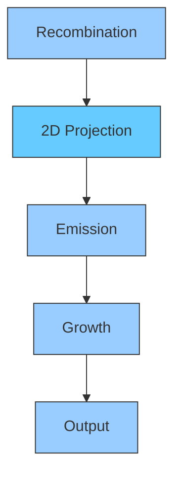
</details>

Figure 41 Recombination of defects in a {311} defect

The emission frequency is computed as in APs by:

$$
v _ {e m i t} = v _ {0, e m i t} \times \exp \left(\left(- E _ {e m i t} (\text { size }) + P \Delta V _ {3 1 1} + \alpha_ {3 1 1} [ G e ]\right) / \left(k _ {\mathrm{B}} T\right)\right)) \tag {714}
$$

where the considerations for the AP emission, including all the corrections, apply. The binding energies are taken from the list supplied with the Eb.Cluster parameter. These energies are shared with the APs. As previously explained, for sizes less than a threshold value, defects are considered APs. Otherwise, they are rearranged as {311} defects. Consequently, only binding energies for sizes equal to or greater than the AP–{311} threshold apply to {311} defects. Corrections are applied for both pressure and germanium content. These corrections are specified as VF.311 and Alloy.Eb.311, respectively.

In addition, {311} defects can emit captured dopants if 311.Dopant.Model 1 is set. The emission frequency for them is:

$$
v _ {e m i t} \left(A _ {i}\right) = v _ {0, e m i t} \left(A _ {i}\right) \times \exp \left(- E _ {e m i t} \left(\left(A _ {i}\right) / \left(k _ {\mathrm{B}} T\right)\right)\right) \tag {715}
$$

The prefactor and the activation energy are called D0.311 and Eb.311, respectively, in the PDB.

# Parameters

For impurity re-emission, the parameters are:

```csv
sprocess> pdbGet Si KMC In D0.311
200.0
sprocess> pdbGet Si KMC In Eb.311
2.0 
```

# Recombination

The {311} defects recombine incoming Vs with any charge by annihilating the Is at the nearest {311} defect end. When {311} defects dissolve, they do not become APs when the AP–{311} threshold size is reached. The emission frequency depends on the binding energy, and the binding energy only depends on the size of the defect. Since a interstitial cluster and a small {311} defect have the same binding energy when they have the same size, the defect shape affects only the capture volume, but not the emission frequency. Consequently, rearranging {311} defects as small defects, and vice versa, only changes the capture volume, and these changes are negligible for small clusters. Nevertheless, the capture volume differences between small {311} defects and irregular clusters are negligible, and there is no information about the shape of dissolving {311} defects.

Finally, when a {311} defect reaches size 2, it releases the particles as two interstitials and the {311} defect disappears.

# Interactions

Interactions between {311} defects and mobile particles can be modified with:

```txt
pdbSet Si KMC <I | V | Impurities> Reactions311 <species> <true | false> 
```

Growth reactions $( I _ { n } + I )$ are controlled with I, and recombination reactions $( I _ { n } + V )$ with V. {311} defects can break up paired dopants capturing the interstitial or recombining the vacancy (for example, $\mathbf { B } _ { i } + I _ { n }  \mathbf { B } + I _ { n + 1 } )$ . The remaining dopant will be immediately released or captured (and re-emitted later) by the defect depending on the value of the parameter 311.Dopant.Model (0 releases dopants, 1 traps it). A captured dopant can be re-emitted. These reactions enable the {311} to decrease the impurity diffusion.

Only neutral Is react with {311} defects and, consequently, only paired dopants with the same charge as the substitutional dopant react with {311} defects. Any charge state is allowed for the recombination of vacancies.

# Parameters

Use the following for growth and recombination:

```txt
sprocess> pdbGet Si KMC I Reactions311
I true
sprocess> pdbGet Si KMC V Reactions311
V true 
```

For paired impurity breakup (boron, for example), use:

```txt
sprocess> pdbGet Si KMC B Reactions311
BiM false
sprocess> pdbGet Si KMC I 311.Dopant.Model 0 
```

You can define the parameter 311.Dopant.Model globally as a default for all dopants, but define it locally with a different value that overwrites the global value for a particular dopant. For example, the following commands set the model for all the impurities as ‘release dopant,’ except for boron:

```batch
pdbSet Si KMC I 311.Dopant.Model 0
pdbSetDouble Si KMC B 311.Dopant.Model 1 
```

# Dislocation Loops

Dislocation loops are planar defects lying on {111} planes [18]. A dislocation loop can be either a faulted dislocation loop (FDL) or perfect dislocation loop (PDL). FDLs are circular stacking faults surrounded by a dislocation line. PDLs are not implemented in Sentaurus Process KMC.

The {311} defects are precursors of dislocation loops. When the implantation conditions (available concentration of I, distance to the free surface) are appropriate, {311} defects grow until they reach the threshold size and transform into dislocation loops. Dislocation loops are more stable than {311} defects; consequently, the supersaturation created by dislocation loops is lower.

# Shape of Dislocation Loops

The shape of dislocation loops is computed as a filled circle in a {111} orientation (see Figure 42). All {111} orientations are allowed, and one is randomly chosen.


<details>
<summary>natural_image</summary>

Abstract pattern of red dots forming an elongated, roughly elliptical shape against a white background (no text or symbols)
</details>

Figure 42 A dislocation loop taken from a Sentaurus Process KMC simulation

# Capture

Dislocation loops capture any incoming neutral interstitial. The original position is lost, and the particle is moved to the proper position in the disk. The capture radius is the sum of the capture radius of the constituent particles.

When the ReactionsLoop is set and Loop.Dopant.Model is true, dislocation loops capture incoming impurities. When Loop.Dopant.Model is false, the impurity is not captured. However, when it carries a point defect (in other words, is an impurity pair), the pair is broken; the impurity is deposited as a substitutional impurity; and the point defect reacts with the loop.

# Emission

Dislocation loops emit neutral interstitials with a frequency given by:

$$
\mathrm{v} _ {\text {emiss}} = \mathrm{v} _ {0, \text {emiss}} \times \exp \left(- \frac {E _ {b , \text {loop}} (\text {size}) + E _ {m} (I) + \Delta E _ {m} (I) + \Delta E _ {b , \text {loop}}}{k _ {B} T}\right) \tag {716}
$$

where:

■ $\nu _ { 0 , e m i s s }$ includes both a prefactor and a linear dependency on the dislocation loop size.   
■ $E _ { b , l o o p } ( \mathrm { s i z e } )$ is the binding energy of the dislocation loop, which only depends on the size.

Sentaurus Process KMC computes the binding energies as:

$$
E _ {b, \text { loop }} (\text { size }) = E _ {f} (I) + E _ {f, \text { loop }} (\text { size } - 1) - E _ {f, \text { loop }} (\text { size }) \tag {717}
$$

The dislocation loop formation energies are taken from [19] as:

$$
E _ {f, \text { loop }} (\text { size }) = \pi \gamma R ^ {2} + \frac {a ^ {2} \mu}{6 (1 - v)} \cdot R \cdot \log \left(\frac {8 R}{b}\right) - n E _ {f} (I) \tag {718}
$$

where:

■ $R = \sqrt { \mathrm { s i z e } / ( \pi d _ { 1 1 1 } ) }$ is the loop radius.   
$\gamma$ is the stacking fault energy per unit area.   
is the shear modulus.μ   
■ is the Poisson ratio.ν   
is the Burgers vector modulus.b   
is the silicon lattice parameter.a   
$d _ { 1 1 1 }$ is the atomic density in a {111} plane, in $\mathrm { n m } ^ { - 2 }$

The above parameters are specified in the parameter database: is called gamma, is mu, γ μ ν is nu, and is burgVectMod. The emission prefactor is called D0.Loop.b

The corrections applied to the migration energy of interstitials are the usual ones:

$$
\Delta E _ {m} (I) = \alpha_ {m} [ G e ] + \frac {1}{3} \sum_ {i} ^ {x, y, z} \exp (- \Delta E _ {m} ^ {i} / (k _ {\mathrm{B}} T)) \tag {719}
$$

and for the binding of the particle to the loop is:

$$
\Delta E _ {b, \text {   loop   }} = P \Delta V _ {b} ^ {\text {   loop   }} + \alpha_ {\text {   loop   }} [ G e ] \tag {720}
$$

where $\Delta V _ { b } ^ { l o o p }$ is called VF.Loop, and $\alpha _ { l o o p }$ is called Alloy.Eb.Loop in the PDB.

Captured impurities (when Loop.Dopant.Model is true) re-emit impurities into the bulk with a frequency given by:

$$
\mathrm{v} _ {\text { e   m   i   t }} \left(A _ {i}\right) = \mathrm{v} _ {0, \text { e   m   i   t }} \left(A _ {i}\right) \times \exp \left(- E _ {\text { e   m   i   t }} \left(\left(A _ {i}\right) / \left(k _ {\mathrm{B}} T\right)\right)\right) \tag {721}
$$

The prefactor and the activation energy are called D0.Loop and Eb.Loop in the PDB, respectively.

# Parameters

The parameters needed for the simulation of dislocation loops are defined for interstitials in silicon:

```snap
sprocess> pdbGet Si KMC I D0.311.To.Loop
1.6
sprocess> pdbGet Si KMC I E.311.To.Loop
0.68
sprocess> pdbGet Si KMC I D0.Loop
1000000.0
sprocess> pdbGet Si KMC I gamma
0.4375
sprocess> pdbGet Si KMC I mu
472
sprocess> pdbGet Si KMC I nu
0.3
sprocess> pdbGet Si KMC I Burger.Vector.Mod
0.3135
sprocess> pdbGet Si KMC I VF.Loop
0
sprocess> pdbGet Si KMC I Alloy.Eb.Loop
0 
```

For impurity re-emission, the parameters are:

```snap
sprocess> pdbGet Si KMC In D0.Loop
200.0
sprocess> pdbGet Si KMC In Eb.Loop
2.0 
```

NOTE These parameters can be changed to fit the dislocation loop formation and dissolution.

Figure 43 shows how a dislocation loop grows capturing interstitials, and how it shrinks recombining incoming vacancies or emitting interstitials.   


<details>
<summary>flowchart</summary>

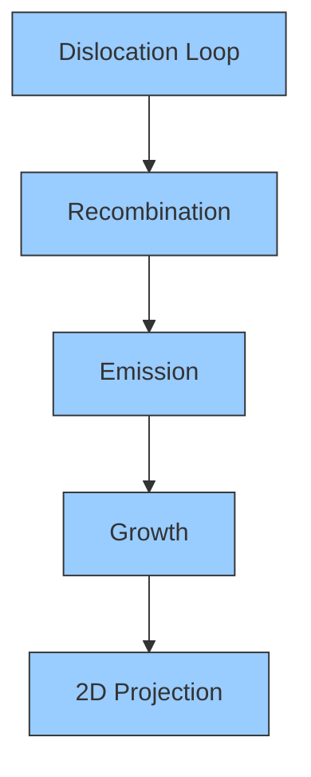
</details>

Figure 43 Emission, capture, and recombination of point defects in a dislocation loop

# Interactions

The interactions between dislocation loops and mobile particles are:

Growth reactions. Only with neutral Is:

```txt
pdbSet Si KMC I ReactionsLoop I <true | false> 
```

Recombination reactions. Any vacancy:

```txt
pdbSet Si KMC I ReactionsLoop <V | VM | VP | VMM | VPP> <true | false> 
```

Impurity pairs break up and interact with the associated point defect (I or V). Only with pairs with the substitutional charge state the same as the substitutional dopant (for example, Bi– for B– ). The interstitial or vacancy is trapped or recombined, and the dopant is released (0) or trapped (1) depending on the model used. The model is specified for all dopants (default value) using the parameter Loop.Dopant.Model for interstitials.

This particular default can be overwritten for one particular dopant.

```txt
pdbSet Si KMC I Loop.Dopant.Model <true | false>
pdbSetDouble Si KMC <dopant> Loop.Dopant.Model <true | false> 
```

# Parameters

Loops trap interstitials, but the recombination of vacancies is disabled:

```txt
sprocess> pdbGet Si KMC I ReactionsLoop
I true 
```

```txt
sprocess> pdbGet Si KMC V ReactionsLoop
V    false 
```

Loops can break up some paired dopants, for example, boron:

```txt
sprocess> pdbGet Si KMC B ReactionsLoop
BiM true
sprocess> pdbGet Si KMC I Loop.Dopant.Model 0 
```

# Voids

Small vacancy defects have been reported (using paramagnetic resonance and photoluminescence) [20][21][22][23]. Theoretical studies [24][25] indicate that some of these small clusters can be particularly stable. Sentaurus Process KMC models these small clusters as APs and, consequently, they have irregular shapes. Nevertheless, size-dependent binding energies are considered for their V emission (see Damage Accumulation Model: Amorphous Pockets on page 430).

Vacancy clusters appear as spheroidal voids when they are big enough to be seen by TEM [26]. Tight-binding molecular dynamics studies show that the binding energies are a function of the cluster size [27] (see Figure 44).


<details>
<summary>natural_image</summary>

3D molecular model of a green spherical nanoparticle with XYZ coordinate axes labeled (X, Y, Z) in the corner
</details>

Figure 44 Voids are simulated with a spherical shape; this one contains 654 vacancies

# Shape

The threshold size between irregular small vacancy clusters (APs) and voids is specified with the parameter Min.Void.Size. Another parameter, Max.Void.Diam, is used to set up the maximum-allowed diameter (in nanometers) for these defects.

Reshaping the small clusters into voids above the mentioned limit is necessary to maintain the correct volume-to-surface ratio, as the V cluster grows. A large cluster of vacancies isn reshaped to be spheroidal, occupying the volume corresponding to the same number of silicon lattice sites. Sentaurus Process KMC manages the void shape to assert that its density is correct.

# Parameters

The parameters for voids are specified for silicon material and vacancy as species:

```batch
sprocess> pdbGet Si KMC V Min.Void.Size 27
sprocess> pdbGet Si KMC V MaxGCC.Diam 5.0 
```

# Capture

Voids capture neutral vacancies, rearranging them to have a spheroidal shape. Figure 45 shows the possible interactions between voids and point defects.


<details>
<summary>flowchart</summary>

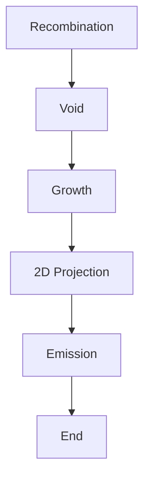
</details>

Figure 45 Voids are big cluster vacancies with a spherical shape that grow trapping neutral vacancies and shrink by recombination and vacancy emission

# Emission

Voids emit neutral vacancies with a frequency:

$$
v = v _ {0} \times \exp \left(- \left(E _ {b, v o i d} (\text { size }) + \Delta E _ {b, v o i d} + E _ {m} (V) + \Delta E _ {m} (V)\right) / \left(k _ {B} T\right)\right) \tag {722}
$$

$\mathbf { v } _ { 0 }$ is a prefactor that includes a constant and a dependency with the surface of the void, and $E _ { b , \nu o i d } ( \mathrm { s i z e } )$ is the binding energy of a void. These binding energies are assigned in the parameter database together with the small vacancy-cluster binding energies. For information on how to locate and modify them, see Amorphous Pockets Life Cycle on page 436. For voids, only the values for sizes bigger than the AP–void threshold apply.

Finally, corrections to the migration energy of vacancies and the binding of them to the void are applied. The migration correction is the usual one:

$$
\Delta E _ {m} (V) = \alpha_ {m} [ G e ] + \frac {1}{3} \sum_ {i} ^ {x y, z} \exp (- \Delta E _ {m} ^ {i} / (k _ {B} T)) \tag {723}
$$

For the binding energy, it is corrected using the parameter for small vacancy clusters:

$$
\Delta E _ {b, \text {   void   }} = P \Delta V _ {b} ^ {\text {   cluster   }} (V) + \alpha_ {\text {   void   }} [ G e ] \tag {724}
$$

where ${ \alpha } _ { \nu o i d }$ is Alloy.Eb.Void.

# Recombination

Voids recombine incoming interstitials with any charge.

# Interactions

Interactions between void defects and other particles fall into these categories:

Trapping of neutral vacancies (growth):

pdbSet Si KMC V ReactionsVoid V <true | false>

Recombination of interstitials:

pdbSet Si KMC V ReactionsVoid <I | IM | IP> <true | false>

Impurity pair breakup. Voids do not trap impurities, but they can trap or recombine the interstitial or vacancy associated with a paired impurity, for example, $\mathbf { B } _ { i } + V _ { n }  \mathbf { B } ^ { - } + V _ { n - 1 }$ . The pair must have the same charge as the substitutional dopant (in other words, $\mathrm { B _ { i } } ^ { - }$ for B–, AsV+ for As+).

pdbSet Si KMC <impurity> ReactionsVoid <species> <true | false>

# Parameters

Voids trap vacancies and recombine interstitials:

```txt
sprocess> pdbGet Si KMC V ReactionsVoid
V true
sprocess> pdbGet Si KMC I ReactionsVoid
I true 
```

Voids can break up some pairs. For example, Bi– is disabled:

```txt
sprocess> pdbGet Si KMC B ReactionsVoid
BiM    false 
```

# Amorphization and Recrystallization

A predictive atomistic process simulator must include an amorphization model. Nevertheless, accounting for each particle and position during the amorphization, although possible [28], is not convenient for the sizes, times, and computer resources involved in process modeling. Despite this, amorphization involves the destruction of the lattice structure. Without a lattice, the KMC method, which discards the lattice and tracks only defects, is opened to a quasiatomistic approach, as explained in this section.

Figure 46 shows a generic damage concentration profile after an implantation.


<details>
<summary>scatter</summary>

| Point Type | Color  |
|------------|--------|
| Red        | Green  |
| Green      | Red    |
</details>

Figure 46 Damage concentration profile after an implantation

There are two different concentrations in Figure 46 (A and C) and one concentration threshold called Amorphization. This threshold is stored in the parameter database in the damage section as Amorph.Threshold:

```txt
sprocess> pdbGet Si KMC Damage Amorph.Threshold 1.5e+22 
```

NOTE You can change this limit if necessary. The damage accumulation model is dependent on the Amorph.Threshold.

The behavior of the simulator while adding new point defects (damage) differs depending on the local concentration of the internal grid elements. A new point defect is inserted into a box depending on the concentration of that box. If the concentration is smaller than the Amorphization threshold (C, crystalline region), the point defect is inserted as it is. In other words, a particle is placed inside the simulator with its three coordinates, the defect, and the particle type. Finally, the damage concentration can be higher than the amorphization threshold (region A (amorphous) in Figure 46 on page 452). In this case, if a particular crystalline volume (specified by the parameter Min.Amorph.Vol) has an averaged damage concentration larger than the threshold, the entire internal volume is assumed to be amorphous. The atomistic 3D coordinates for Is and Vs are discarded for amorphous boxes because the definition of a point defect is now meaningless in an amorphous region, and only their concentration is stored. Finally, the material of the internal box changes from crystalline (such as silicon) to amorphous (such as amorphous silicon) and an interface, which can simulate a three-phase segregation model, is created between them.

NOTE For amorphous regions, the atomistic 3D information is discarded, and only the number of particles is stored. When asking Sentaurus Process KMC for atomistic information (the 3D coordinates for each particle), you should not expect to obtain Is and Vs in amorphous regions.

To obtain the amorphous–crystalline interface, use the command:

kmc extract acinterface

# Amorphous Defects

An amorphous defect is a special defect assigned to each grid element of Sentaurus Process KMC with a damage level above the amorphization threshold.

# Material

Amorphous defects are always associated with amorphous materials. Each amorphous internal element is paired with an amorphous defect.

# Shape

The shape of an amorphous defect coincides with the element containing it. Amorphous layers are created as a set of several amorphous defects. Consequently, amorphous layers can follow any complicated amorphous geometry, but always as a set of Sentaurus Process KMC elements.

# Growth

Amorphous defects do not grow because they are limited to the size of the element. Amorphous layers grow when new elements are amorphized and become amorphous. These amorphous elements capture any incoming particle.

# Recombination

These defects can recombine their damage and become crystalline silicon. Amorphous defects do not emit particles; recrystallization is the only event they can perform.

# Diffusion in Amorphous Materials

Two models are available for diffusion in amorphous materials:

■ A simple direct diffusion model   
■ An indirect diffusion model that uses dangling bonds as an intermediate species

To select the model to use, set:

KMC <material> Damage Amorphous.Bonds true

where <material> is the crystalline material.

# Direct Diffusion Model

Dopants can diffuse in amorphous materials using direct diffusion. The implemented diffusivity is:

$$
D _ {m} (X) = D _ {m, 0} (X) \exp (- E _ {m} ((X) / (k _ {\mathrm{B}} T))) \tag {725}
$$

The parameters $D _ { m , 0 }$ and $E _ { m }$ are input parameters. They are needed for diffusion in amorphous materials and are specified in the PDB as Dm and Em, respectively, under the amorphized material:

pdbSet <amorphous material> KMC <dopant> Em <dopant> <value>

For example:

pdbSet AmorphousSilicon KMC B Em B 0.8 pdbSet AmorphousSilicon KMC B Dm B 1e-3

NOTE The alias aSi can be used for AmorphousSilicon.

# Indirect Diffusion Model

The observed boron diffusion in amorphous silicon does not seem to obey a standard Fick’s law with constant diffusivity prefactors and activation energy, thereby making the direct diffusion model in amorphous silicon inaccurate. A different model has been proposed [29][30] that relies on the presence and distribution of dangling bonds and floating bonds, and that interacts with boron atoms. In this model, an initial number $n _ { 0 }$ of dangling bonds (threefold-coordinated atoms) and floating bonds (fivefold-coordinated atoms) is created during amorphization.

These dangling bonds and floating bonds are allowed to evolve using a simple direct diffusion $\mathrm { D _ { d } }$ for dangling bonds and $\mathrm { D } _ { \mathrm { f } }$ for floating bonds. Dangling bonds and floating bonds can interact with them, annihilating each other. Dangling bonds also can interact with boron (or any other user-defined impurity) with a proportionality constant .α

In this model, boron in amorphous silicon can exist in two different states: an immobile fourfold-coordinated $\boldsymbol { \mathrm { B } } ^ { 4 }$ state and a highly mobile threefold-coordinated $\boldsymbol { \mathrm { B } } ^ { 3 }$ state. Boron changes between these two states by capturing and releasing a dangling bond. The threefold mobile boron is allowed to diffuse with a simple Arrhenius plot. Boundary conditions can be set at the AmorphousSilicon\_Silicon and AmorphousSilicon\_Oxide interfaces for dangling bond (DB) and floating bond (DB) recombination. Finally, despite the initial concentration $n _ { 0 }$ of dangling bonds produced by amorphization, an extra contribution of  γ[ ] B is added to produce a total DB concentration of:

$$
n _ {\mathrm{B}} = n _ {0} + \gamma [ \mathrm{B} ] \tag {726}
$$

where $\gamma$ is a coefficient relating to the presence of boron atoms in amorphous silicon with an excess of dangling bonds, and is the concentration of boron in amorphous silicon.[ ] B

Consequently, the following reactions are allowed:

$$
\mathrm{DB} + \mathrm{FB} \rightarrow \varnothing \tag {727}
$$

$$
\mathrm{B} ^ {4} + \mathrm{DB} \leftrightarrow \mathrm{B} ^ {3} \tag {728}
$$

# Implementation

To minimize the number of species and physical mechanisms, the implementation of indirect diffusion through dangling bonds and FBs has been done by renaming:

■ Dangling bonds as interstitials in amorphous silicon   
Floating bonds as vacancies in amorphous silicon

# 4: Atomistic Kinetic Monte Carlo Diffusion

Amorphization and Recrystallization

$\mathrm { { B } } ^ { 4 }$ as substitutional boron in amorphous silicon   
$\boldsymbol { \mathrm { B } } ^ { 3 }$ as interstitial boron in amorphous silicon

In this way, all that is needed is to allow I and V inclusion, and the following reactions in amorphous silicon:

$$
I + V \rightarrow \emptyset \tag {729}
$$

$$
\mathrm{B} + I \leftrightarrow \mathrm{B} _ {i} \tag {730}
$$

The B interaction with and further emission by I $\mathbf { B } _ { i }$ are modeled as a regular kickout mechanism. Consequently, the parameter is modeled indirectly through the binding energyα and prefactor of the $\mathrm { \bf B } _ { i }$ pair.

When amorphizing an element with volume $\Delta V$ , an initial number of $n _ { 0 } \Delta V \delta$ Is and Vs will be created inside, where is the silicon density. If there are boron atoms inside or boron atomsδ are introduced through implantation or any other means (for example, using the select command or the profile command), an extra number of $\gamma$ Is will be introduced per boron atom.

# Parameters

The parameters needed for this model are introduced in different places. If you want to model the indirect diffusion of boron in amorphous silicon (other impurities or amorphous materials are accepted also), you can use aSi as an alias for AmorphousSilicon.

Table 61 Parameters used for indirect diffusion in amorphous silicon 

<table><tr><td>Parameter</td><td>Description</td><td>Symbol</td></tr><tr><td>aSi KMC amorphous.bond true</td><td>Model activation.</td><td>None</td></tr><tr><td>aSi KMC I Dm I</td><td rowspan="2">Dangling bond diffusion.</td><td rowspan="2"> $D_d$ </td></tr><tr><td>aSi KMC I Em I</td></tr><tr><td>aSi KMC V Dm V</td><td rowspan="2">Floating bond diffusion.</td><td rowspan="2"> $D_f$ </td></tr><tr><td>aSi KMC V Em V</td></tr><tr><td>aSi KMC B Dm Bi</td><td rowspan="2"> $B_3$  diffusion.</td><td rowspan="2">None</td></tr><tr><td>aSi KMC B Em Bi</td></tr><tr><td>aSi KMC B Eb Bi</td><td rowspan="2"> $B_3-B_4$  reaction rate.</td><td rowspan="2"> $\alpha$ </td></tr><tr><td>aSi KMC B Eb Bi</td></tr><tr><td>aSi KMC B ReactionsPointDefect B,I true</td><td> $B^4+DB \leftrightarrow B^3$ .</td><td>None</td></tr><tr><td>Si KMC Damage Amorphous.n0</td><td>Initial dangling bond and floating bond percentage (versus silicon density).</td><td> $n_0$ </td></tr><tr><td>aSi KMC B gamma</td><td>Number of dangling bonds created per boron atom.</td><td> $\gamma$ </td></tr></table>

# Impurity Clusters in Amorphous Materials

Impurities diffusing in amorphous materials can interact with each other and can form impurity clusters. In contrast with impurity clusters in crystalline volumes, amorphous impurity clusters do not contain interstitials or vacancies, and are only an agglomeration of impurities. Consequently, they can only re-emit the trapped impurities. With this exception, they behave like regular impurity clusters (see Impurity Clusters on page 473).

# Recrystallization

Different recrystallization models are implemented:

One simple KMC model assigns a recrystallization rate to each amorphous defect for recrystallization simulations. No orientation dependencies are allowed.   
Two fully atomistic models use a lattice kinetic Monte Carlo (LKMC) method to simulate the evolution of the amorphous–crystalline interface. These models include orientationdependent solid phase epitaxial regrowth (SPER) and facet formation.

The recrystallization model is set up with:

pdbSet <material> KMC Damage SPER.Model <model>

# where:

<material> is the crystalline material (typically, silicon).   
<model> is one of the following:

KMC, a simple KMC model   
• LKMC or Planes, a basic LKMC model parameterized using the crystal orientation   
Coordinations.Planes, an LKMC model that can be extended to account for local atomic configuration but currently is limited to parameterization using crystal planes, similar to the basic LKMC models

# KMC: Simple Solid Phase Epitaxial Regrowth

Recrystallization is implemented as a special event performed by the amorphous defects. At a given temperature, every amorphous defect can recombine all its internal damage, in other words, recrystallize, with a frequency $\mathbf { v } _ { r e c r y s t }$ . The recrystallization of several amorphous defects with different recrystallization frequencies, depending on their recrystallization axis and the number of amorphous neighbors, generates an advancing recrystallization front, as can be seen in Figure 47.


<details>
<summary>heatmap</summary>

| Y     | X     | ITotal [cm⁻³] |
|-------|-------|---------------|
| 0.02  | -0.05 | 1.95e+21      |
| 0.04  | 0.00  | 2.93e+20      |
| 0.06  | 0.05  | 4.41e+19      |
| 0.08  | 0.05  | 6.64e+18      |
| 0.10  | 0.05  | 1.00e+18      |
| 0.12  | 0.05  | 1.00e+18      |
</details>


<details>
<summary>heatmap</summary>

| Y     | X     | ITotal [cm⁻³] |
|-------|-------|---------------|
| 0.02  | -0.05 | 1.95e+21      |
| 0.04  | 0.00  | 2.93e+20      |
| 0.06  | 0.05  | 4.41e+19      |
| 0.08  | 0.05  | 6.64e+18      |
| 0.10  | 0.05  | 1.00e+18      |
| 0.12  | 0.05  | 1.95e+21      |
</details>


<details>
<summary>heatmap</summary>

| Y     | X     | ITotal [cm⁻³] |
|-------|-------|---------------|
| 0.02  | -0.05 | 1.95e+21      |
| 0.04  | 0.00  | 2.93e+20      |
| 0.06  | 0.05  | 4.41e+19      |
| 0.08  | 0.05  | 6.64e+18      |
| 0.10  | 0.05  | 1.00e+18      |
</details>


<details>
<summary>heatmap</summary>

| Y     | X     | ITotal [cm⁻³] |
|-------|-------|---------------|
| 0.02  | -0.05 | 1.95e+21      |
| 0.04  | -0.05 | 2.93e+20      |
| 0.06  | -0.05 | 4.41e+19      |
| 0.08  | -0.05 | 6.64e+18      |
| 0.10  | -0.05 | 1.00e+18      |
| 0.12  | -0.05 | 1.95e+21      |
</details>

Figure 47 Source and gate of a transistor during SPER as simulated by Sentaurus Process KMC. The total concentration of interstitials is represented during the evolution of the recrystallization front. At the end, there is damage only near the initial amorphous/crystalline interface. The remaining damage can form end-ofrange (EOR) defects.

Therefore, if w is the length of an amorphous defect in the recrystallization direction, the frequency associated with the recrystallization is v/w. This recrystallization velocity v is computed as an Arrhenius function that includes dependencies on both the local Fermi level and the presence of impurities [31]:

$$
V (n) = V _ {0} ^ {\text {Fermi}} (n) \times \exp (- (E _ {\text {recryst}} (n) + P \Delta V ^ {S P E R} + c) / (k _ {\mathrm{B}} T)) \tag {731}
$$

where:

$E _ { r e c r y s } ( n )$ parameters are specified as E.Recryst.   
$\Delta V ^ { S P E R }$ is the activation volume for SPER (dependency on hydrostatic pressure) called VF.Recryst.   
■ is the percentage of amorphous material around a given element.n

The time it takes to recrystallize an amorphous cell depends on the number of amorphous neighbors; the more neighbors that are amorphous, the longer it takes. The longer recrystallization takes, the more stable the amorphous defect, so its activation energy is bigger.

$V _ { 0 } ^ { F e r m i }$ accounts for the prefactor, including dependency on the Fermi level. This dependency is introduced as:

$$
V _ {0} ^ {\text { Fermi }} (n) = V _ {0} (n) \left(1 + | K \times \text { Doping } |\right) \tag {732}
$$

being $V _ { 0 } ( n )$ and the input parameter called V0.Recryst. Doping is the local amorphous element doping, and is a calibration parameter (different for n-type and p-type materials)K called V0.Recryst.ntype and V0.Recryst.ptype, respectively.

takes into account the changes in SPER regrowth due to local impurity concentration.c This correction term is modeled as:

$$
c = \sum_ {\text { Impurities }} (E _ {f} (\text { Impurity }) - E _ {\text { recrys }} (5 0)) \left(\frac {[ \text { Impurity } ]}{5 \times 1 0 ^ {2 2}}\right) ^ {x} \tag {733}
$$

The parameter controls how much each impurity changes the planarEf( ) Impurity recrystallization activation energy (assumed to have 50% amorphous neighboring elements).  x is an exponent to control how this correction depends on the dopant concentration. A null impurity concentration gives a zero correction, while an impurity concentration of $5 \times 1 0 ^ { 2 2 }$ produces $c = E _ { f ( I m p u r i t y ) } - E _ { r e c r y s } ( 5 0 )$ . Consequently, $E _ { f } ( I m p u r i t y )$ represents the planar recrystallization activation energy if the sample contains only the impurity, while allows itx to control the transition between these two opposite situations. These parameters are called E.Recryst and E.Recryst.Exponent, respectively, in the PDB.

This model, in which elements with fewer amorphous neighbors recrystallize faster, extends the ideas described in the literature [28] for amorphous elements. This simple method can simulate the faster recrystallization of amorphous corners or thin amorphous panhandlers embedded in crystalline silicon.

Finally, if a recrystallization event that will break the compactness of the amorphous layer is detected, its recrystallization will be retarded by the parameter Compact.Factor. This prevents the formation of amorphous isolated islands and ensures a better compactness of the amorphous material.

# Parameters

The parameters for the recrystallization model are:

```csv
sprocess> pdbGet Si KMC Damage VF.Recryst
0
sprocess> pdbGet Si KMC Damage V0.Recryst
0 1.7e8
99 1.7e8
100 0
sprocess> pdbGet Si KMC Damage E.Recryst
0 1.72
15 1.72
40 2.7
70 2.7
95 3.3
99 5 
```

The unspecified values between two specified ones are computed by linear interpolation.

The parameters controlling the Fermi level and impurity concentration dependencies are specified for each dopant (and material). For example, for boron, they are:

```txt
sprocess> pdbGet Si KMC B E.Recryst
2.7
sprocess> pdbGet Si KMC B E.Recryst.Exponent
1 
```

# LKMC: Fully Atomistic Modeling of Solid Phase Epitaxial Regrowth

It is well known that the SPER velocity depends on the substrate orientation with approximate ratios of 20:10:1 for orientations (100), (110), and (111), respectively. For orientation (100), two different recrystallization frequencies have been identified, depending on the total crystalline first and second neighbor atoms, which signify whether it is a high or low crystalline growth region. In addition, the recrystallization of thin layers in fin transistors is shown as an ‘arrow tip’ shape formed by two (111) planes that slow down the SPER, leading to the formation of polycrystalline silicon in regions still not recrystallized.

The LKMC or Planes model, based on [32], introduces the lattice in the amorphous–crystalline (a-c) interface and assigns a recrystallization event to each atom there.

When an internal mesh element is detected to be amorphous as explained in Amorphization and Recrystallization on page 452, the silicon lattice is recreated around it.

The Coordinations.Planes model, however, creates a lattice in the entire domain and initializes the atoms at the a-c interface. At the core, the Coordinations.Planes model uses the algorithms employed in the Coordinations model for epitaxy, which allow multiple types of species in the system. However, its flexibility in SPER is limited. The parameter settings for prefactors and energies for SPER for this model are the same as those for the LKMC or Planes model.

The lattice in all models takes into account the wafer orientation specified in the init command. Those lattice atoms belonging to crystalline elements are assigned a ‘crystalline’ flag, while those belonging to the amorphous element are assigned an ‘amorphous’ flag. This produces the initial amorphous–crystalline interface. At this point, even when the amorphous– crystalline interface still follows the contour of the internal mesh, it is formed by a set of individual lattice atoms.

From this point, different recrystallization rates are assigned to each atom at the interface. The interface is defined as the set of lattice atoms that, having an amorphous state, has at least one first neighbor with a crystalline state. Any other lattice atom that does not belong to this interface has a recrystallization rate of 0. This means that crystalline-lattice atoms have a zero probability of recrystallizing (because they are already crystalline).

In some cases where regular SPER is very slow, random nucleation and growth can produce polysilicon material [33] not simulated here. Inclusion of defective silicon created during SPER also is not simulated in the LKMC or Planes model. However, in the Coordinations.Planes model, twin defects can be simulated along the <111>-directions (see Defect Generation During SPER on page 466).

For amorphous lattice atoms belonging to the interface (in other words, surrounded by at least one crystalline lattice atom), a SPER rate is assigned. The model assumes that an atom in the amorphous phase must form two undistorted bonds with its first neighbors in the silicon phase to become crystalline. For amorphous atoms close to a (001) surface, this happens naturally. For (011) surfaces, two adjacent amorphous atoms have to cluster together so that each atom has two undistorted bonds. Finally, for (111) orientations, three atoms are needed to cluster together.

Consequently, there will be three different recrystallization prefactors – K(1), K(2), and K(3) – depending on the number of amorphous atoms needed to complete two undistorted bonds. These K(1), K(2), and K(3) prefactors will be related but not proportional to the different (001), (011), and (111) SPER velocities. The prefactor K(1), associated with the (001) orientation, can again be dependent on how many total first (c1NN) and second (c2NN) crystalline neighbor atoms are present. A low crystalline growth region is identified by c1NN + c2NN < 8, while a high crystalline growth region is identified by c1NN + c2NN > 8 [34]. In particular, K(2) and K(3) are probabilities for two and three atoms, respectively, to come together in an amorphous phase and form spontaneously undistorted crystalline bonds between them. Consequently, K(2) is expected to be smaller than K(1), and K(3) is expected to be smaller than K(2), by several orders of magnitude.

Each of these lattice atoms is given a recrystallization frequency of:

$$
v ^ {\mathrm{LKMC}} = v _ {0} ^ {\text {Fermi}} \times K (n) \times \exp \left(- \frac {(E _ {\text {recryst}} ^ {\mathrm{LKMC}} + (\left| \varepsilon_ {x y} \right| + \left| \varepsilon_ {x z} \right| + \left| \varepsilon_ {y z} \right|) \lambda + P \Delta V ^ {\mathrm{SPER}} + c)}{k _ {\mathrm{B}} T}\right) \tag {734}
$$

$K _ { ( n ) }$ are the K(1), K(2), and K(3) prefactors explained above where:

$\mathbf { V } _ { 0 } ^ { \mathrm { F e r m i } } \ : = \ : 1 + \vert K \times$ is a Fermi-level correction similar to Eq. 732.Doping   
$E _ { \mathrm { r e c r y s t } } ^ { \mathrm { L K M C } }$ is taken as $E _ { r e c r y s } ( 5 0 )$ in Eq. 731.   
■ $\left| \varepsilon _ { x y } \right| , \left| \varepsilon _ { x z } \right|$ , and $\left| \varepsilon _ { y z } \right|$ are the absolute value of the shear stresses.   
$\lambda$ is a parameter coupling the shear stresses.   
$P \Delta V ^ { \mathrm { S P E R } }$ and are the same terms as those defined in Eq. 731.c

Figure 48 shows the evolution of an amorphized fin during SPER when this model is used, after 2-, 4-, and 6-minute annealings at $5 5 0 ^ { \circ } \mathrm { C }$ .   


<details>
<summary>text_image</summary>

1: 100_a_lps.Idr 1-0
4: 100_b_lps.Idr 1-0
7: 100_c_lps.idr 1-0
</details>

Figure 48 SPER evolution (blue is crystalline silicon; red is amorphous one) with time (left to right) 2, 4, and 6 minutes at $5 5 0 ^ { \circ } \mathrm { C } )$ of a thin (20 nm) silicon fin. The oxide (brown material) does not provide the correct template for the lattice atoms to form undistorted bonds, stopping the recrystallization and leading the way to the (111) planes. When the two (111) planes are formed, no further fast (100) SPER is possible, and the SPER occurs through the very slow and defect-prone (111) recrystallization.

When the arrow tip is formed by the two lateral (111) planes, the recrystallization is almost stopped (middle and right images). The planes are formed by the presence of the oxide–silicon interface. Since the oxide does not provide the needed undistorted bonds for silicon recrystallization, it is used as a starting point for the (111) plane formation.

A similar model using LKMC for epitaxial regrowth is described in Chapter 5 on page 573.

Several corrections are applied to the recrystallization rate of a lattice atom. Three of them – the pressure correction ( ), the impurity correction (through the term ), and thePΔVSPER c Fermi-level correction $( \nu _ { 0 } ^ { \mathrm { F e r m i } } )$ – are the same in both this model and the simple KMC model (see KMC: Simple Solid Phase Epitaxial Regrowth on page 458).

# Stress Correction

Stress correction for the calculation of recrystallization frequencies has been adopted from [34]. This stress correction is applied when you set KMC Stress 1. The recrystallization frequency on stress becomes:

$$
v (T, \sigma) = v _ {0} \times \exp \left(\frac {V _ {i j} \sigma_ {i j}}{k _ {\mathrm{B}} T}\right) \tag {735}
$$

where:

$\sigma _ { i j }$ is the stress state.   
$V _ { i j }$ is the activation volume (or strain tensor) that can be represented in terms of normalized regrowth direction, , and the parallel and perpendicular components of the activationd n( ) strain tensor, $V _ { \parallel }$ and $V _ { \perp }$ , by the following relation:

$$
V _ {i j} = V _ {\parallel} d _ {i} d _ {j} + V _ {\perp} \left(\delta_ {i j} - d _ {i} d _ {j}\right) \tag {736}
$$

where $\ S _ { i j }$ is the Kronecker delta, and $d _ { i }$ and $d _ { j }$ are the Cartesian components of the normal vector $d ( n )$ .

$V _ { \parallel }$ and $V _ { \perp }$ are the only parameters needed for this model. According to [34], these two components of the activation strain tensor depend on the first crystalline nearest neighbors. See the VD.Recryst parameter in Table 62 on page 465.

# Shear-Strain Correction

The correction for shear strain, $( \left. \mathfrak { E } _ { x y } \right. + \left. \mathfrak { E } _ { x z } \right. + \left. \mathfrak { E } _ { y z } \right. ) \lambda$ , is unique to this model. Its inclusion allows the LKMC models to successfully simulate the evolution of line-shaped amorphized regions. The experimental rate at the corners of line-shaped amorphized regions is very small, producing a pinching of the SPER interface at the corners [35]. This can be simulated with the inclusion of this shear stress term [32]. The shear strain is generated during amorphization due to the different density of the amorphous phase. The expansion of the amorphous phase is not possible in embedded amorphous regions. The compression of the amorphous phase leads to a sharp gradient of shear stress at the corners. The model uses the shear strain to simulate the anomalous regrowth patterns and facet formation experimentally seen in rectangular-shaped amorphized regions, as shown in Figure 49.

Figure 49 (left) shows the distribution of lattice atoms at the amorphous interface side. A (111) plane, featuring a small nano-island, can be observed close to the interface. The trench formed at the corner is due to the perturbation introduced by shear strain. Figure 49 (right) shows the xy shear strain distribution; its maximum intensity occurs at the corner.


<details>
<summary>natural_image</summary>

3D surface plot with color-coded regions and a 3D coordinate system (X, Y, Z) inset, no text or labels present
</details>


<details>
<summary>heatmap</summary>

| X [μm] | Y [μm] | ElasticStrainELXY [1] |
|--------|--------|------------------------|
| 0.01   | 0.00   | 1.1e-02                |
| 0.02   | 0.01   | 6.1e-03                |
| 0.03   | 0.02   | 1.2e-03                |
| 0.04   | 0.03   | -3.6e-03               |
| 0.04   | 0.04   | -8.5e-03               |
| 0.04   | 0.04   | -1.3e-02               |
</details>

Figure 49 Recrystallization of a rectangular-shaped amorphous region using the LKMC model

Since this model relies on the strain created by the different density of the amorphous material versus the silicon one, some extra commands must be introduced in the script to account for it.

First, a new material to account for amorphous silicon in the mechanics simulator must be introduced:

mater add name= Amorph

Mechanics properties for this new material must be defined:

pdbSetDoubleArray Silicon Amorph Conc.Strain {0 0 1 0.02}

pdbSetBoolean Silicon Mechanics UpdateStrain 1

and Sentaurus Process KMC must be instructed that stress is being taken into account:

pdbSet KMC Stress 1

Finally, the synchronization between the atomistic and the mechanics simulator is automatic. After every mechanics step, the KMC Stress 1 parameter instructs Sentaurus Process KMC to update the stress and strain fields. After each diffusion (atomistic diffusion) step, Sentaurus Process KMC updates the Amorph distribution by automatically calling the procedure KMCSync written in the KMC.tcl file.

This procedure, which can be modified by users but, in principle, does not need to be, contains the lines responsible for updating the amorphous region in mechanics to properly account for the strain and stress:

LogFile IL2 "A/C synchronization: KMC -> PDE"

kmc deatomize name=AC

sel Silicon z=1e22\*AC name=Amorph store

Table 62 lists the parameters used in the LKMC model. It is assumed that silicon (Si) is the crystalline material and amorphous silicon (aSi) is the amorphous material.

Table 62 Parameters for LKMC model 

<table><tr><td>Parameter name in parameter database</td><td>Description</td><td>Symbol</td></tr><tr><td>Si KMC Damage SPER.Model</td><td>Sets the model to use. Either LKMC, or Planes, or Coordinations.Planes. Use KMC for quasiatomistic simulations.</td><td>None</td></tr><tr><td>Si KMC Damage SPER.Model.100</td><td>Options are:Isotropic applies a uniform prefactor along the (001) direction.Planar applies different prefactors along the (001) direction depending on whether it is a low or high crystalline growth region.</td><td>None</td></tr><tr><td>Si KMC Damage SPER.Model.111</td><td>Options are:Isotropic applies a uniform prefactor along the (111) direction.Twin.Assisted uses the same prefactors as Isotropic, but it allows for possible twinning of the lattice.</td><td>None</td></tr><tr><td>Si KMC Damage prefactor.SPER.100</td><td>Value for the prefactor associated with 100 SPER for Isotropic model.</td><td>K(1)</td></tr><tr><td>Si KMC Damage prefactor.SPER.100.7</td><td>Value for the prefactor associated with 100 SPER for Planar model for low crystalline growth region.</td><td>K(1)</td></tr><tr><td>Si KMC Damage prefactor.SPER.100.8</td><td>Value for the prefactor associated with 100 SPER for Planar model for high crystalline growth region.</td><td>K(1)</td></tr><tr><td>Si KMC Damage prefactor.SPER.110</td><td>Value for the prefactor associated with 110 SPER.</td><td>K(2)</td></tr><tr><td>Si KMC Damage prefactor.SPER.111</td><td>Value for the prefactor associated with 111 SPER.</td><td>K(3)</td></tr><tr><td>Si KMC Damage Shear.Coupling</td><td>Shear-strain coupling parameter.</td><td> $\lambda$ </td></tr><tr><td>Si KMC Damage VF.Recryst</td><td>SPER pressure correction (same as the KMC model).</td><td> $\Delta V^{SPER}$ </td></tr><tr><td>Si KMC Damage VD.Recryst</td><td>Array parameter, depending on the number of crystalline first neighbors, related to the atomic volume of the material.</td><td> $m^3/mol$ </td></tr><tr><td>Si KMC Damage E.Recryst 50</td><td>Activation energy for recrystallization (same as the KMC model).</td><td> $E_{recryst}^{LKMC}$ </td></tr><tr><td>Si KMC Damage V0.Recryst.ntype</td><td rowspan="2">Fermi-level corrections (same as the KMC model).</td><td rowspan="2"> $v_0^{Fermi}$ </td></tr><tr><td>Si KMC Damage V0.Recryst.ptype</td></tr><tr><td>Si KMC Damage E.Recryst</td><td rowspan="2">Impurity corrections (same as the KMC model).</td><td rowspan="2">c</td></tr><tr><td>Si KMC Damage E.Recryst.Exponent</td></tr><tr><td>Si KMC Damage Lattice.Constant</td><td>Lattice constant.</td><td>None</td></tr></table>

# Defect Generation During SPER

It is known that when (111) planes have formed in a simulation, the recrystallization beyond these planes is defective, and silicon of low quality, or even polysilicon, is formed. In the LKMC or Planes model, a simple predictive model for defect formation during SPER based on [36] and [37] is included. However, in the Coordinations.Planes model, lattice twinning can be modeled as well, based on [38].

# LKMC Model or Planes Model

Such modeling is performed by assigning two tags after every recrystallization event in the lattice: a normal tag for sites sharing the substrate configuration, and a defective tag for sites assumed not to bond to their neighbors and that form twin defects. Although this modeling does not physically set the atoms in twin positions, but only assigns them a tag while remaining in a perfect crystalline position, it is sufficient to predict the defective regions in silicon and to slow down SPER in a similar way to experiments [36][37].

The new defective sites are produced by two mechanisms:

■ Recrystallization of (111) sites, having a probability Pdef of becoming defective.   
Recrystallization of atoms in the neighborhood of defective sites, inheriting such tags and becoming also defective.

The definition of a coordination number, a keystone in this model to identify the microscopic configurations, also is modified to distinguish between normal and defective sites. In this way, the formation of defects slows down the recrystallization of neighboring sites.

The formed defects are represented in the non-LKMC module as an IV twin defect in the TDR file. No actions are associated with them in the regular KMC simulator. Consequently, when they are formed, twin defects do not disappear and do not interact with other particles. They are created for users to identify the regions predicted to have highly defective silicon.

The only new parameter needed for the model is the probability of (111) recrystallizations to produce twin defects. This parameter is specified in:

pdbSet KMC Si Damage probability.SPER.defect <0-1>

Figure 50 and Figure 51 on page 468 show two examples where twin-defect formation is involved. Figure 50 represents the formation of defects during the SPER of a thin silicon fin. Figure 51 shows the defective triangular-shaped region, bounded by a (111) plane, typical of SPER close to $\mathrm { S i O } _ { 2 } \mathrm { - }$ -filled trenches.   


<details>
<summary>natural_image</summary>

Three-panel scientific illustration showing layered geological or material structure with color-coded zones and 3D simulation of particle distribution (no text or symbols)
</details>

Figure 50 Evolution of a thin (20 nm width) amorphized silicon fin (amorphous is red, crystalline is blue) annealed at $6 0 0 ^ { \circ } \mathsf { C } ;$ arrow-shaped a/c interface is represented by yellow atoms and formation of defects (twins) is shown as white spheres


<details>
<summary>heatmap</summary>

| X [um] | Y [um] | I in TwinDefect [1] |
|--------|--------|---------------------|
| 0.00   | 0.00   | 0.0E+00             |
| 0.01   | 0.01   | 2.1E+20             |
| 0.02   | 0.02   | 4.1E+20             |
| 0.03   | 0.03   | 6.2E+20             |
| 0.04   | 0.04   | 8.2E+20             |
| 0.05   | 0.05   | 1.0E+21             |
| 0.06   | 0.06   | 0.0E+00             |
| 0.07   | 0.07   | 0.0E+00             |
</details>

Figure 51 Concentration of twin defects representing defective silicon formation when SPER is in an amorphous region close to $\mathsf { S i O } _ { 2 }$ (silicon is blue, $\mathsf { S i O } _ { 2 }$ is brown)

# Coordinations.Planes Model

The Coordinations.Planes model allows crystal twinning along <111> directions and, therefore, the formation of low-quality crystalline silicon. To enable twinning along <111> directions, you should also set:

pdbSet Si KMC Damage SPER.Model.111 Twin.Assisted

It uses the same defect probability specified by:

pdbSet KMC Si Damage probability.SPER.defect <0-1>

Similar to the LKMC or Planes model, the SPER plane is determined by looking at the number of crystalline first nearest neighbors. When an atom in the <111> plane is being crystallized, the local growth direction is estimated by taking the difference between the coordinates of the atom being crystallized and its only crystalline first nearest neighbor. A random number is chosen to identify whether a twinning event will occur, based on the defect probability given by users. After this atom is crystallized, a new set of nearest neighbor amorphous atoms is either created in the original lattice sites or at twinned lattice sites, chosen according to the local growth direction.

By default, at the end of the diffusion step, all the crystallized atoms are cleaned. Only atoms near the a-c interface will be visible when loading the TDR file. To save information about the crystallization of atoms along twinned directions in the TDR file, enable visualization of these twinned grain orientations using the following setting:

pdbSetBoolean LKMC SPER.Cleanup false

This setting does not clean the atoms in the crystallized region at the end of the diffusion step, and so you can visualize them along various twinned directions.

# Redistributing Damage

The recrystallization event forces all IV pairs inside an amorphous defect to recombine. The I or V excess is redistributed to the neighboring amorphous boxes if any. Otherwise, the excess is recombined at the surface. If there are no free surface or interface neighboring amorphous boxes, it is left as point defects. If the recrystallization front has crossed several elements, the amount of excess point defects can be high. When the defects are deposited in the crystalline silicon, they grow and ripen into extended defects depending on the annealing conditions.

# Parameters

The parameter Deposit.Excess.Damage controls whether to redistribute the excess or to discard it. In simulations with buried amorphous layers, setting this parameter to true is suggested:

sprocess> pdbGet Si KMC Damage Deposit.Excess.Damage 0

# Impurity Sweep/Deposit

The recrystallization process might affect the impurity concentration. The recrystallization front moves indium and other dopants away, changing the concentration profiles [39][40]. To model this effect, the amorphous defects transfer impurities during recrystallization:

Dopants usually (recrysDeposit) remain in the box or move away with the recrystallization front (see Figure 52 on page 470). The available models for this movement are Elements and Hops, chosen by the Redistribution.Model parameter:

The Elements model takes all the particles in one internal element and movesn to the adjacent one. If moving the dopant with then × Recryst.Deposit recrystallization front increases the concentration of the neighboring element more than a limit (Recryst.Max.Total), it will be deposited in the current element, no matter what its moving probability.   
• The Hops model goes particle-by-particle inside the affected element and decides whether the particle should be displaced a second neighbor distance, depending on

Recryst.Deposit. If the particle is not displaced, it remains where it was. The algorithm continues with the next particle (which might still be the same one, pushing it again through the adjacent element little by little) until no more particles remain. To prevent the concentration of displaced particles being too high, the algorithm forces the deposit probability to be 1 when a particle has 25 or more dopant neighbors. The algorithm corrects this probability by linear interpolation starting when the number of neighbors is a given a percentage of 25. This percentage is controlled by the parameter Recryst.Deposit.Threshold.

When the box is recrystallized, if the remaining dopant concentration is bigger than the solubility limit (C0.Recryst.Max.Active, E.Recryst.Max.Active) after SPER, the extra dopants are deposited as impurity clusters. These clusters have a limited size, and there are two different models to deposit these clusters depending on whether Recryst.Max.Size is defined.


<details>
<summary>line</summary>

| Depth [nm] | Total As Concentration [cm⁻³] | Swept As Concentration [cm⁻³] |
| ---------- | ----------------------------- | ---------------------------- |
| 0          | ~10²¹                         | ~10¹⁹                        |
| 1          | ~10²¹.⁵                       | ~10²¹.⁵                      |
| 2          | ~10²¹.⁵                       | ~10²¹.⁵                      |
| 3          | ~10²¹.⁵                       | ~10²¹.⁵                      |
| 4          | ~10²¹.⁵                       | ~10²¹.⁵                      |
| 5          | ~10²¹                         | ~10²¹                        |
| 6          | ~10²⁰.⁵                       | ~10²⁰.⁵                      |
| 7          | ~10²⁰                         | ~10²⁰                        |
| 8          | ~10¹⁹.⁵                       | ~10¹⁹.⁵                      |
| 9          | ~10¹⁹                         | ~10¹⁹                        |
</details>

Figure 52 Impurity sweep example showing that arsenic has been pushed through the surface during recrystallization or SPER

The parameters for the recrystallization model are defined only for impurities in silicon (or other full material). Pref.RecrystDeposit and Ener\_RecrystDeposit define (prefactor and energy) the probability for a dopant remaining in the same box after the recrystallization front passes. Setting this value to 1 disables the swept of impurities. Recryst.Max.Total establishes the maximum concentration piled up during SPER. Recryst.Max.Active is the maximum-allowed concentration of an active dopant in recrystallized areas. Finally, if Recryst.Max.Size is defined (and it is by default), the old model to limit the maximum size of the deposited impurity clusters will be used. To undefine this parameter, use:

sprocess> pdbUnSetDouble Si KMC B Recryst.Max.Size

This instructs Sentaurus Process KMC to use the new model to deposit impurity clusters after SPER. This model deposits the clusters specified in Recryst.Deposit.Complex with the probabilities defined there.

Finally, the active dopants after SPER are deposited as substitutional impurities, but you can change this default using Recryst.Deposit.Active. This parameter accepts a list of impurities and impurity pairs with the probability to be deposited. For example:

```txt
sprocess> pdbSet Si KMC F Recryst.Deposit.Active F .1
sprocess> pdbSet Si KMC F Recryst.Deposit.Active Fi .9 
```

This deposits 90% of the ‘active’ fluorine as Fi, and 10% as F.

NOTE Specifying a high probability for a cluster with a number of dopants greater than 1 does not necessarily means that you will obtain only that cluster. For example, if you specify that ${ \bf B } _ { 2 } \mathbf { I }$ should be 100% of the deposited clusters, but Sentaurus Process KMC finds only one boron particle in an element, Sentaurus Process KMC will not form a ${ \bf B } _ { 2 } \mathbf { I }$ .

In the new model, that is, when Recryst.Max.Size is not set, low values of dopant activation (set by C0.Recryst.Max.Active and E.Recryst.Max.Active) might not be resolved properly. It is recommended to set Fix.recrysMaxActive to true, to resolve such low values of dopant activation levels during SPER. To set it, use:

pdbSet KMC Fix.recrysMaxActive true

# Parameters

The recrystallization parameters for dopants can be obtained as:

```txt
sprocess> pdbGet Si KMC As Pref.RecrystDeposit 0.3
sprocess> pdbGet Si KMC As Ener.RecrystDeposit 0.0
sprocess> pdbGet Si KMC As Recryst.Max.Active 1e+21
sprocess> pdbGet Si KMC As Recryst.Max.Size 4
sprocess> pdbGet Si KMC B Recryst.Deposit.Complex B3I3 .40 B2I3 .30 BI2 .30
sprocess> pdbGet Si KMC B Recryst.Deposit.Active B 1.0 
```

To see which model is being used, use:

```txt
sprocess> pdbGet Si KMC Damage Redistribution.Model Elements 
```

The concentration thresholds associated with each model are:

```txt
sprocess> pdbGet Si KMC B Recryst.Max.Total
2e+22
sprocess> pdbGet Si KMC B Recryst.Deposit.Threshold
75 
```

# Laser Anneal in Kinetic Monte Carlo

Simulating a laser anneal process is a crucial step in understanding the evolution of implantation damage and dopant activation during a semiconductor manufacturing process. Understanding such damage evolution and dopant diffusion with a KMC model can provide greater insights into dopant–defect interactions.

Sentaurus Process KMC is coupled with continuum laser anneal in such a way that heat equations are solved in continuum and the diffusion occurs in a KMC simulation. Before solving the heat equations in continuum, the damage information in terms of amorphous field data is transferred from KMC to continuum. This damage information is translated to a degree of crystallinity for solving the heat equations, calculating heat capacities in specific regions, and so on. Different methods are available for obtaining normalized heat intensity profiles for solving heat equations in continuum. For details about solving heat equations and relevant parameters, see Flash or Laser Anneal Model on page 201.

This section describes the evolution of damage, dopant diffusion, and segregation during laser anneal. Laser anneal in KMC uses the local temperature field to estimate individual event rates. The temperature field and the melt information in the KMC grid are updated from solutions of heat equations in continuum.

In the case of melting laser anneal, information about the melt phase is updated in the KMC grid, and the material in the specific region is converted to its liquid phase. For example, melting silicon material is converted to LiquidSilicon. This material has a simple model. By default, LiquidSilicon is like AmorphousSilicon, but there are no interstitials or vacancies in liquid material. The default interface model for any nonliquid material with a liquid material (for example, LiquidSilicon or LiquidGermanium) is Liquid.

The migration prefactor $D _ { \mathrm { m } }$ and the migration energy $E _ { \mathrm { m } }$ are important parameters for controlling impurity diffusion in liquid material. All dopants in the molten region are active and mobile, following direct diffusion. A three-phase segregation model similar to other interfaces is also available to control dopant segregation at a liquid material interface. To see the effect of segregation at such an interface, set the interface model to either Interface or AllCharges, and define the relevant parameters. Parameters described in Interfaces for Impurities on page 517 apply to controlling such segregation.

In addition, during crystallization of liquid material, a snow plow model for impurity distribution is available at the interface with liquid material. The Pref.LiquidDeposit and Ener.LiquidDeposit parameters allow you to control the redistribution of doping from the liquid material to the crystallized substrate. The probability of dopant transfer to crystallized substrate is calculated using an Arrhenius expression:

$$
\mathrm{p} = \text { Pref.LiquidDeposit } \times \exp \left(\frac {- \text { Ener.LiquidDeposit }}{k T}\right) \tag {737}
$$

Allowed values of Pref.LiquidDeposit are between 0 and 1. The default value is 1. The default value of Ener.LiquidDeposit is 0, thereby giving a default effective probability of dopant transfer into solidified material equal to 1. You can set these parameters as follows:

sprocess> pdbSetDouble LiquidSilicon\_Silicon KMC Boron Pref.LiquidDeposit 1.0 sprocess> pdbSetDouble LiquidSilicon\_Silicon KMC Boron Ener.LiquidDeposit 0.0

You can save a movie of damage evolution in a TDR file using:

```solidity
pdbSet KMC Movie {
    kmc extract tdrAdd defects concentrations
} 
```

In addition, you can extract HeatPhase and Temperature profiles directly from the KMC kernel, using the command:

kmc extract profile

See Extracting KMC Profiles, Histograms, and Defects on page 548.

# Impurity Clusters

At certain concentrations, dopants are electrically inactive in crystalline silicon [7]. At the same time, high I concentration can make a fraction of boron electrically inactive even when its concentration is below its solubility [41]. These phenomena can be explained by a $\mathrm { B } _ { \mathrm { m } } \mathrm { I } _ { \mathrm { n } }$ clustering mechanism [15][42] or dopant precipitation [7]. Sentaurus Process KMC considers these mechanisms, implementing impurity clusters.

Studies [43] have shown that boron precipitation in amorphous silicon occurs through formation of a boron complex, thereby making the inclusion of impurity clusters in amorphous materials necessary. Consequently, pure dopant clusters, $B _ { n }$ , are allowed in amorphous materials and other materials modeled as simple.

The $\mathbf { A _ { n } B _ { o } . . . } X _ { \mathrm { m } }$ impurity clusters allow powerful modeling of the interaction of several impurities between them. For example, fluorine–boron clusters $\mathrm { ( F _ { n } B _ { o } I _ { m } }$ and $\mathrm { F _ { n } B _ { o } V _ { m } ) }$ can be tried to explain the effects of boron coimplanted with fluorine, or $\mathrm { A s _ { n } P _ { o } V _ { m } }$ clusters to allow a satisfactory explanation, as seen in [53]. Nevertheless, the most common use of impurity clusters is the traditional one where only one dopant is present. Consequently, except where indicated, the description of impurity clusters that follows assumes that the clusters are in the more common form $\mathrm { A _ { n } X _ { m } }$ with only one impurity involved. Impurity clusters have a simple model for diffusion, that is, they can migrate (see Diffusion of Impurity Clusters on page 475).

Finally, impurity clusters do not need to be neutral. Consequently, the charge state of each impurity cluster can be defined using the parameter e0.Complex. When needed, an impurity cluster with a particular charge such as $\mathrm { \bar { A _ { n } } X _ { m } } ^ { \mathrm { c h a r g e } }$ mcharge will be denoted. In addition, clusters can react with charged particles, as long as the reaction is not between a cluster and a particle with the same sign, in other words, it is not an electrostatic repulsive reaction.

To simplify the following descriptions, this section describes $\mathrm { A _ { n } X _ { m } }$ clusters with only one impurity and neutral reactions (that is, reactions similar to $\ O A _ { n } \dot { X } _ { m } ^ { a } + A X ^ { b }  A _ { n + 1 } \dot { X } _ { m + 1 } ^ { c }$ , $a + b \ : = \ : c \ : )$ . To see how the model works when this is not the case, see Charge Dependency on page 487.

NOTE Since P is used both for positive and phosphorus, clusters containing phosphorus cannot have P at the end of the cluster name. For example, AsIP will be interpreted as an arsenic–interstitial positive, while AsPI or PAsI will be an arsenic–phosphorus–interstitial cluster; the same is true for AsP, PAs, and so on.

# Shape of Impurity Clusters

An impurity cluster is an irregular agglomeration of impurities $( \mathbf { A } , \mathbf { B } , \ldots )$ with or without interstitials and vacancies (X) that can be written as $\mathbf { A _ { n } B _ { o } . . . X _ { m } }$ , with n impurity atoms of type A, o of type B, and so on, and m Is or Vs. If m = 0, it is a pure impurity cluster (the only ones allowed in simple materials).

For Sentaurus Process KMC, the notation $\mathbf { A _ { n } B _ { o } . . . } X _ { \mathrm { m } }$ means any possible configurations with n impurities of type A, o of type B, and so on, and m interstitial (vacancy) atoms. The interstitial (vacancy) atoms can be both silicon self-interstitials or dopant atoms in an interstitial position. Since Sentaurus Process KMC assumes all the $\mathrm { A _ { n } B _ { o } . . . } X _ { \mathrm { m } }$ configurations to be the same with only one effective formation energy, A, B, ... are represented always as a substitutional but inactive dopant or impurity, and X as a silicon interstitial or vacancy.


<details>
<summary>scatter</summary>

| x | y | color |
|---|---|-------|
| 0.1 | 0.95 | red |
| 0.2 | 0.85 | blue |
| 0.3 | 0.75 | red |
| 0.4 | 0.65 | blue |
| 0.5 | 0.55 | red |
| 0.6 | 0.45 | blue |
| 0.7 | 0.35 | red |
| 0.8 | 0.25 | blue |
| 0.9 | 0.15 | red |
| 1.0 | 0.05 | blue |
</details>

Figure 53 BI2 impurity clusters created using Sentaurus Process KMC; blue is boron and red is interstitial

# Diffusion of Impurity Clusters

A diffusion mechanism is available for impurity clusters, in which impurity clusters can perform migration hops similar to the ones performed by point defects, impurities, and dopants. An impurity cluster migration event involves all its constituent particles: The entire cluster is displaced. The particle coordinates are modified isotropically at a fixed distance of = 0.384 nm in the orthogonal direction (parallel to the x-axis, y-axis, or z-axis).λ

The migration rate for impurity clusters is assumed to be:

$$
\mathrm{v} _ {m} = \mathrm{v} _ {0, m} \times \exp (- E _ {m} / k _ {\mathrm{B}} T) \tag {738}
$$

where:

$\mathtt { V } _ { 0 , m }$ is the prefactor for each cluster.   
$E _ { m }$ is the migration energy for each cluster.

# 4: Atomistic Kinetic Monte Carlo Diffusion

Impurity Clusters

These diffusion parameters for impurity clusters are called Dm.Complex (prefactor) and Em.Complex (migration energy) in the PDB:

```txt
sprocess> pdbGet Si KMC As Dm.Complex As2V 1e-3
sprocess> pdbGet Si KMC As Em.Complex As2V 1.5 
```

# Limitations of Diffusion

The migration events for impurity clusters, although similar to the ones for single particles, do not share all their features. In particular, the following limitations apply:

The diffusivity of impurity defects is global, isotropic, and constant. There are no SiGe, stress, strain, or charge dependencies on diffusivity.   
Impurity defects do not interact with interfaces at all $( { \mathrm { S i } } { - } { \mathrm { S i O } } _ { 2 }$ and so on). All interfaces are considered mirrors.   
Periodic boundary conditions or mirror conditions are correctly applied to the limits of the simulation box.   
There is no recombination probability at the boundaries. This means that the parameters sinkProbTop, sinkProbBottom, sinkProbBack, sinkProbFront, sinkProbLeft, and sinkProbRight do not apply to diffusing impurity clusters.   
Speedup migration does not apply to impurity cluster diffusion: no long hops or double hops.

# Growth of Impurity Clusters

Impurity clusters grow trapping neutral mobile particles (see Figure 54).

  
Figure 54 Impurity clusters are disordered agglomerations of dopants and silicon point defects that trap and emit particles; Frank–Turnbull mechanisms and IV recombinations also are possible (light colors represent the reaction product, for example, light red and light blue in (b) represent the A atom and interstitial incorporation after Ai splits into A and I)

For an $\mathrm { A } _ { \mathrm { n } } I _ { \mathrm { m } }$ cluster, both I and $\mathbf { A } _ { \mathrm { i } }$ particles can be trapped:

$$
A _ {n} I _ {m} ^ {a} + I ^ {b} \leftrightarrow A _ {n} I _ {m + 1} ^ {c} \tag {739}
$$

$$
A _ {n} I _ {m} ^ {a} + A _ {i} ^ {b} \leftrightarrow A _ {n + 1} I _ {m + 1} ^ {c}
$$

The trapping is not automatic as it was for extended defects. In extended defects, the binding energy is always positive, so trapping is always allowed. For impurity clusters, the cluster can grow in both Is (Vs) or dopants. The energy between the initial and final states is not always favorable. Sentaurus Process KMC computes the probability for an impurity cluster $\mathrm { A } _ { \mathrm { n } } I _ { \mathrm { m } }$ to trap an I or $\mathrm { A } _ { \mathrm { i } }$ as:

$$
P _ {\text { capture }} = \exp \left(- \frac {E _ {\text { capture }}}{k _ {\mathrm{B}} T}\right) \tag {740}
$$

where:

$E _ { \mathrm { c a p t u r e } } ^ { A _ { n } I _ { m } } = E _ { \mathrm { b a r r i e r } } ( A _ { n } I _ { m } ) + \operatorname* { m a x } ( 0 , E _ { b } ^ { A _ { n } I _ { m } } ) .$ Ecapturen m .Ebarrier An ( ) Im max 0 Eb AnIm= + ( ) ,   
$E _ { \mathrm { b a r r i e r } } ( A _ { n } I _ { m } )$ is an optional energy barrier.

The binding energies $E _ { b } ^ { A _ { n } I _ { m } }$ are computed using the potential impurity cluster energies:

$$
E _ {b} ^ {A _ {n} I _ {m}} (I) = E _ {\text {pot}} \left(A _ {n} I _ {m + 1}\right) - E _ {\text {pot}} \left(A _ {n} I _ {m}\right) \tag {741}
$$

$$
E _ {b} ^ {A _ {n} I _ {m}} (A _ {i}) = E _ {\mathrm{pot}} (A _ {n + 1} I _ {m + 1}) - (E _ {\mathrm{pot}} (A _ {n} I _ {m}) + E _ {\mathrm{pot}} (A _ {i}))
$$

The potential energy for the neutral $A _ { i }$ , assuming that the substitutional is negative, is givenA by $- E _ { b } ( A _ { i } ^ { - } ) - e ( - , 0 ) ( A _ { i } )$ , where the binding energy includes the pressure and Ge corrections. The minus sign accounts for the fact that the binding must have a sign that is opposite that of the potentials.

These potentials energies are computed as:

$$
E _ {\text { pot }} (A _ {n} I _ {m}) = E _ {\text { pot }} ^ {0} (A _ {n} I _ {m}) + P \Delta V _ {\text { pot }} (A _ {n} I _ {m}) \tag {742}
$$

where:

$E _ { \mathrm { p o t } } ^ { 0 } ( A _ { n } I _ { m } )$ is specified in the parameter database for each impurity in silicon as Etotal.Complex.   
$\Delta V _ { \mathrm { p o t } } ( A _ { n } I _ { m } )$ is the activation volume to take into account the hydrostatic pressure dependency, also defined for each impurity cluster size as VF.Complex.

The energy barriers are called EbarrierIV.Complex and EbarrierDopant.Complex. The EbarrierIV is defined for emission and capture of interstitials and vacancies, and EbarrierDopant for dopants or paired dopants.

For example, to set the potential energy of a BIC, such as $\mathrm { B I } _ { 2 }$ to some value:

pdbSet Si KMC B Etotal.Complex BI2 <n>

and, for $\operatorname { A s } _ { 4 } \mathrm { V } ;$

pdbSet Si KMC As Etotal.Complex As4V <n>

# Initial Seeds

The clusters $A _ { 2 } I , A I _ { 2 } , A _ { 2 } I _ { 2 }$ , and $A _ { 2 }$ are the initial seeds for the impurity cluster ripening. The formation of $A _ { 2 }$ is discussed in Percolation on page 479. The others are formed by the reactions:

■ $A ^ { a } + A _ { i } ^ { b }  A _ { 2 } I ^ { c }$   
■ $A _ { i } ^ { a } + I ^ { b }  A I _ { 2 } ^ { c }$

■ $A _ { i } ^ { a } + A _ { i } ^ { b }  A _ { 2 } I _ { 2 } ^ { c }$   
■ ${ A ^ { a } + A ^ { a }  A _ { 2 } ^ { c } }$

where and are the charge states for the reactants, and for the result. All these reactionsa b c provide a cluster starting with impurities or impurity pairs. In cases where $a + b \neq c$ for the first reaction or $2 a \neq c$ for the last one, the reaction is not neutral and the special considerations of Charge Dependency on page 487 should be taken.

These initial seeds can be enabled or disabled independently using the parameter ReactionsPointDefect (see Enabling and Disabling Interactions on page 420).

# Percolation

Some dopants deactivate without visible diffusion when they are in high concentrations [44]. They also can form impurity clusters [45]. Sentaurus Process KMC models this deactivation allowing the substitutional dopants to interact with impurity clusters or with other dopants immediately after its inclusion in the simulation (for example, after being implanted or selected).

Arsenic can react with arsenic giving $\mathrm { A s } _ { 2 } .$ . Substitutional As does not migrate, so this reaction is only possible when two arsenic atoms are close enough to each other. The higher the arsenic concentration, the higher this possibility. An $\mathrm { A s } + \mathrm { A s } _ { 2 }$ reaction and $\mathrm { A s } _ { 3 } + \mathrm { A s }$ reaction also are possible. These species also are immobile. They react only when they are close enough. Consequently, the probability of forming an $\mathrm { A s } _ { 4 }$ cluster using this mechanism is low because it needs four As atoms close enough to each other. This probability increases with the concentration. With high concentration, the probability is not negligible, and the substitutional As react with each other forming As clusters and becoming inactive.

NOTE The reaction between two substitutional dopants to give an impurity cluster is the only exception to the rule that two particles with the same charge will not interact.

In simple materials, such as amorphous silicon, this percolation model is the only one allowing impurity clusters to be formed. Since all particles are neutral in simple materials, the percolation reaction does not constitute an exception there.

# Parameters

The potential and binding energies for impurity clusters are defined only in materials defined using the full and simple models, including amorphous. They are defined in arrays whose index is the cluster name. For example, for F clusters:

sprocess> pdbGet Si KMC F Etotal.Complex

FV2 -4.20

# 4: Atomistic Kinetic Monte Carlo Diffusion Impurity Clusters

<table><tr><td>F2</td><td>-0.5</td><td>F2V</td><td>-4.63</td><td>F2V2</td><td>-7.07</td></tr><tr><td>F3</td><td>-1</td><td>F3V</td><td>-7.08</td><td>F3V2</td><td>-9.04</td></tr><tr><td>F4</td><td>-1.5</td><td>F4V</td><td>-7.12</td><td>F4V2</td><td>-11.47</td></tr><tr><td>F5</td><td>-3</td><td>F5V</td><td>-8.5</td><td>F5V2</td><td>-13.29</td></tr><tr><td>F6</td><td>-4.5</td><td>F6V</td><td>-9.7</td><td>F6V2</td><td>-16.09</td></tr><tr><td></td><td></td><td>F7V</td><td>3</td><td></td><td></td></tr><tr><td></td><td></td><td></td><td></td><td>FI2</td><td>-4.20</td></tr><tr><td></td><td></td><td>F2I</td><td>-4.63</td><td>F2I2</td><td>-7.07</td></tr><tr><td></td><td></td><td>F3I</td><td>-7.08</td><td>F3I2</td><td>-9.04</td></tr><tr><td></td><td></td><td>F4I</td><td>-7.12</td><td>F4I2</td><td>-11.47</td></tr><tr><td></td><td></td><td>F5I</td><td>-8.5</td><td>F5I2</td><td>-13.29</td></tr><tr><td></td><td></td><td>F6I</td><td>-9.7</td><td>F6I2</td><td>-16.09</td></tr><tr><td></td><td></td><td>F7I</td><td>3</td><td></td><td></td></tr></table>

A particular value for only one element also can be obtained. The current potential energy for $\mathrm { A s } _ { 4 } V$ is:

```txt
sprocess> pdbGet Si KMC As Etotal.Complex As4V -5.4 
```

The barriers are not defined by default:

```txt
sprocess> pdbGet Si KMC F EbarrierIV.Complex
sprocess> pdbGet Si KMC F EbarrierDopant.Complex 
```

The charge value for the clusters is retrieved with:

<table><tr><td>sprocess&gt;</td><td>pdbGet Si</td><td>KMC F</td><td>e0.Complex</td><td></td></tr><tr><td>sprocess&gt;</td><td>pdbGet Si</td><td>KMC B</td><td>e0.Complex</td><td></td></tr><tr><td>B3</td><td>0</td><td>B3I 0</td><td>B3I2 0</td><td>B3I3 0</td></tr><tr><td>B2</td><td>0</td><td>B2I 0</td><td>B2I2 0</td><td>B2I3 0</td></tr><tr><td></td><td></td><td></td><td>BI2 0</td><td></td></tr></table>

No value means that they are neutral.

NOTE The impurity cluster model and the activation or deactivation of clusters can be calibrated further fitting the potential energies. For further accuracy, Advanced Calibration also can be used.

When a particular energy for a particular configuration is not specified (that is, when input in the parameter file exists for an $A _ { \mathrm { n } } I _ { \mathrm { m } }$ or $A _ { \mathrm { n } } V _ { \mathrm { m } }$ impurity cluster), Sentaurus Process KMC assumes this configuration to be unstable. When a barrier energy is not specified, a value of 0 eV (no barrier) is assigned.

All impurities are allowed to form impurity clusters with I, V, or both. If an impurity does not form impurity clusters, the default can be changed, modifying the parameters and the interactions (see Interactions of Impurity Cluster Model on page 489).

# Emission

Impurity clusters can emit both neutral interstitials (vacancies) or mobile dopants:

$$
A _ {n} I _ {m} \leftrightarrow A _ {n} I _ {m - 1} + I \tag {743}
$$

$$
A _ {n} I _ {m} \leftrightarrow A _ {n - 1} I _ {m - 1} + A _ {i} \tag {744}
$$

Sentaurus Process KMC computes the emission frequencies as:

$$
v _ {\text { emission }} = v _ {0, \text { emission }} \times \exp \left(- \frac {E _ {\text { emission }}}{k _ {B} T}\right) \tag {745}
$$

The emission energies are:

$$
E _ {\text { emission }} (I) = E _ {m} (I) + E _ {\text { barrier }} \left(A _ {n} I _ {m}\right) + \max \left(0, E ^ {A n I m} _ {b} (I)\right) \tag {746}
$$

$$
E _ {\text { emission }} (A _ {i}) = E _ {m} (A _ {i}) + E _ {\text { barrier }} (A _ {n} I _ {m}) + \max (0, E ^ {A n I m} _ {b} (A _ {i})) \tag {747}
$$

$E _ { m }$ is the migration energy of the emitted species, and both $E ^ { A n I m } { } _ { b } ( I )$ and $E ^ { A n I m } { } _ { b } ( A _ { i } )$ have been shown above. The emission prefactors for dopant and I or V emission depend on the model used.

When UseCaptVol.Complex is set to true, the emission prefactors are proportional to the capture volumes of the impurity clusters:

$\begin{array} { r l } { \bullet \ } & { { } \mathsf { V } _ { 0 , e m i s s i o n } ( A _ { i } ) = K ( A _ { i } ) V _ { c a p t } ( A _ { n } I _ { m } ) } \end{array}$   
$\begin{array} { r l } { \mathbf { \delta } : } & { { } \mathsf { v } _ { 0 , e m i s s i o n } ( I ) = K ( I ) V _ { c a p t } ( A _ { n } I _ { m } ) } \end{array}$

$V _ { c a p t } ( A _ { n } I _ { m } )$ is the capture volume for each impurity cluster, defined in the PDB as CaptVol.Complex, and the constant is a parameter named D0.Cluster in the PDB.K

NOTE The unit of the capture volumes is the capture volume of one point defect.

If UseCaptVol.Complex is set to false, Sentaurus Process KMC uses the default old model, in which the capture volumes are internally fixed to be for emission and m I min n m ( ) , for emission. The use of this default model is not suggested, since it does not lead toA microscopic reversibility.

When a particle is emitted, the impurity cluster tests whether the number of remaining particles is enough to maintain the cluster. If there is only an interstitial (vacancy) or an interstitial and a dopant, the cluster dissolves leaving an interstitial or a mobile paired dopant, respectively.

# Parameters

The prefactor constants are:

```txt
sprocess> pdbGet Si KMC As D0.Cluster
As, AsV 2.1
As, V 10
sprocess> pdbGet Si KMC B D0.Cluster
B, Bi 3
B, I 150 
```

The notation for these prefactors is as follows: Two strings are needed, separated by a comma. The second string represents the emitted particle for which the parameter is being defined. The first string represents the type of cluster, and it is needed to define a different prefactor for emitting a $\mathbf { B _ { i } }$ from a B cluster rather than from a hypothetical BF cluster. For example, the emission of $\mathrm { B _ { i } }$ from $\mathbf { B } _ { 2 } \mathbf { I } _ { 2 }$ will use B,Bi, while from $\mathrm { B } _ { 2 } \mathrm { F } _ { 3 } \mathrm { I } _ { 2 } .$ , it will use BF,Bi. This last one can be defined in KMC Si B and KMC Si F, but if defined in both of them with different values, it will generate an error.

The capture volume parameters are:

```csv
sprocess> pdbGet KMC UseCaptVol.Complex
0
sprocess> pdbGet Si KMC B CaptVol.Complex
B3 1 B3I 1 B3I2 2 B3I3 3
B2 1 B2I 1 B2I2 2 B2I3 2 
```

BI2 1

The notation for capture volumes is as following: If only the cluster is specified, that applies to all emissions for that particular size. If a cluster size and a particular particle are specified, separated by a comma, that applies to that cluster emitting only that particle. For example, the following applies only to emission if I by $\mathbf { B } _ { 2 } \mathbf { I } _ { 2 } .$

pdbSet Si KMC B CaptVol.Complex B2I2,I 6

The rest of the parameters needed for emission are the same as in Growth of Impurity Clusters on page 477.

# Recombination

Impurity clusters can trap incoming neutral Vs (Is) and recombine them with internal Is (Vs):

$$
A _ {n} I _ {m} + V \leftrightarrow A _ {n} I _ {m - 1} \tag {748}
$$

The capture probability is:

$$
P _ {\text {   capture   }} = \exp \left(- \frac {E _ {\text {   capture   }}}{k _ {\mathrm{B}} T}\right) \tag {749}
$$

The associated energies are:

$$
E _ {\text {   capture   }} ^ {A n I m} = E _ {b} ^ {A n I m} - E _ {p o t} (V) - E _ {I} (I) \tag {750}
$$

and:

$$
E _ {b} ^ {A n I m} = E \left(A _ {n} I _ {m - 1}\right) - E \left(A _ {n} I _ {m}\right) \tag {751}
$$

After the IV pair recombination, the cluster size is tested and, if necessary, it is dissolved as previously explained.

The parameters used for recombination of point defects are the same as in Growth of Impurity Clusters on page 477.

# Frank–Turnbull Mechanism

A generalized Frank–Turnbull (FT) mechanism is the emission of a neutral V (I) from an $A _ { \mathrm { n } } I _ { \mathrm { m } }$ $( A _ { \mathrm { n } } V _ { \mathrm { m } } )$ impurity cluster by the formation of a Frenkel pair (IV):

$$
A _ {n} I _ {m} \rightarrow I + V + A _ {n} I _ {m} \rightarrow A _ {n} I _ {m + 1} + V \tag {752}
$$

or:

$$
A _ {n} V _ {m} \rightarrow I + V + A _ {n} V _ {m} \rightarrow A _ {n} V _ {m + 1} + I \tag {753}
$$

Sentaurus Process KMC includes the FT mechanism to maintain microscopic reversibility. Since impurity clusters recombine incoming Is or Vs, the opposite mechanism (FT) also is needed. Usually, this mechanism is unfavorable, but for some particular configurations, the energetic differences between them can enable the formation of IV pairs and, therefore, the emission of particles using the FT mechanism (see Figure 55 on page 484).


<details>
<summary>flowchart</summary>

```mermaid
graph TD
    A[" "] --> B[" "]
    B --> C[" "]
    C --> D[" "]
    D --> E[" "]
    E --> F[" "]
    F --> G[" "]
    G --> H[" "]
    H --> I[" "]
    I --> J[" "]
    J --> K[" "]
    K --> L[" "]
    L --> M[" "]
    M --> N[" "]
    N --> O[" "]
    O --> P[" "]
    P --> Q[" "]
    Q --> R[" "]
    R --> S[" "]
    S --> T[" "]
    T --> U[" "]
    U --> V[" "]
    V --> W[" "]
    W --> X[" "]
    X --> Y[" "]
    Y --> Z[" "]
    Z --> A
    style A fill:#fff,stroke:#000
    style B fill:#fff,stroke:#000
    style C fill:#fff,stroke:#000
    style D fill:#fff,stroke:#000
    style E fill:#fff,stroke:#000
    style F fill:#fff,stroke:#000
    style G fill:#fff,stroke:#000
    style H fill:#fff,stroke:#000
    style I fill:#fff,stroke:#000
    style J fill:#fff,stroke:#000
    style K fill:#fff,stroke:#000
    style L fill:#fff,stroke:#000
    style M fill:#fff,stroke:#000
    style N fill:#fff,stroke:#000
    style O fill:#fff,stroke:#000
    style P fill:#fff,stroke:#000
    style Q fill:#fff,stroke:#000
    style R fill:#fff,stroke:#000
    style S fill:#fff,stroke:#000
    style T fill:#fff,stroke:#000
    style U fill:#fff,stroke:#000
    style V fill:#fff,stroke:#000
    style W fill:#fff,stroke:#000
```
</details>

Figure 55 Example of FT mechanism: an $\mathsf { A s } _ { 4 }$ cluster can emit an interstitial to become an $\mathsf { A s } _ { 4 } \mathsf { V }$ impurity cluster: blue is arsenic and white is silicon

The vacancy (interstitial) emission frequency is computed as:

$$
v _ {\text { emission }} = v _ {0, \text { emission }} \times \exp \left(- \frac {E _ {\text { emission }}}{k _ {B} T}\right) \tag {754}
$$

being:

$$
E _ {\text { emission }} (V) = E _ {m} (V) + \max \left(0, E ^ {A n I m} _ {b} (V)\right) \tag {755}
$$

and:

$$
E _ {b} ^ {A n I m} (V) = E _ {p o t} (I) + E _ {p o t} (V) + E _ {p o t} \left(A _ {n} I _ {m + 1}\right) - E _ {p o t} \left(A _ {n} I _ {m}\right) \tag {756}
$$

where the potential energies for the clusters and the point defects include pressure and Ge corrections.

# Parameters

The parameters used are the same as in Growth of Impurity Clusters on page 477. The potential energies for interstitial and vacancies are specified for the material as Ef:

```txt
sprocess> pdbGet Si KMC I Ef 4.0
sprocess> pdbGet Si KMC V Ef 3.8 
```

The corrections to the potential energies for I and V are VF and Alloy.Ef for pressure and Ge, respectively:

```txt
sprocess> pdbGet Si KMC I Alloy.Ef
I 0.0
sprocess> pdbGet Si KMC I VF
I 0.0 
```

The prefactor for I and V emission is computed automatically for impurity clusters with only one dopant (for example, $\mathrm { B } _ { \mathrm { n } } \mathrm { I } _ { \mathrm { m } }$ or $\mathrm { { A s } _ { n } \mathrm { { V } _ { m } } }$ clusters) and must be specified for other cases. For example, in a case with AsPV clusters, the prefactors for Frank–Turnbull emission are specified as follows:

```csv
pdbSet Si KMC As D0.Cluster AsP,V 50
pdbSet Si KMC As D0.Cluster AsP,I 50 
```

The following is also valid:

pdbSet Si KMC P D0.Cluster AsP,V 50

pdbSet Si KMC P D0.Cluster AsP,I 50

# Complementary Recombination

Some impurities diffuse using both interstitial and vacancy mechanisms. For these cases, the impurity clusters can react with both of them. For example, an $A _ { \mathrm { n } } V _ { \mathrm { m } }$ impurity cluster can grow trapping AsV, as previously explained, and can interact with an incoming $\mathbf { A } \mathbf { s } _ { \mathrm { i } } .$ trapping the As and recombining the I with one internal vacancy. This implies to take into account the reaction:

$$
A s _ {n} V _ {m} + A s _ {i} \leftrightarrow A s _ {n + 1} V _ {m - 1} \tag {757}
$$

These complementary recombinations of neutral particles are allowed with a probability of:

$$
P _ {\text {   capture   }} = \left\{ \begin{array}{c c} \exp (- E _ {\text {   capture   }} / (k _ {B} T)) & E _ {\text {   capture   }} > 0 \\ 1 & E _ {\text {   capture   }} \leq 0 \end{array} \right. \tag {758}
$$

The capture energies are computed as:

$$
E _ {\text {capture}} = \left\{\begin{array}{c c}E _ {p o t} (A _ {n + 1} V _ {m - 1}) - E _ {p o t} (A _ {n} V _ {m}) - E _ {f} (V) - E _ {f} (I) - E _ {p o t} (A _ {i})&m > 0\\E _ {p o t} (A _ {n + 1} V _ {m}) - E _ {p o t} (A _ {n} V _ {m}) - E _ {p o t} (A _ {i}) + E _ {m} (I) - E _ {m} (A _ {i})&m \equiv 0, n > 1\\E (A _ {i} \rightarrow A)&m \equiv 0, n \equiv 1\end{array}\right. \tag {759}
$$

where $E ( A _ { i } \to A )$ is an internal parameter that cannot be changed.

# Parameters

The parameters used are the same as in Frank–Turnbull Mechanism on page 483. The potential energy for the paired dopant is the binding energy of the pair corrected with the Fermi-level dependency.

# Complementary Emission

To maintain microscopic reversibility, the reverse reaction to complementary recombination must be defined (see Figure 56).


<details>
<summary>flowchart</summary>


</details>

Figure 56 Example of complementary emission: the cluster emits an interstitial that takes an impurity and generates a vacancy; blue is arsenic and white is silicon

The equation for this process is:

$$
A _ {n} I _ {m} \rightarrow A _ {n} I _ {m} + I + V \rightarrow A _ {V} + A _ {n - 1} I _ {m + 1} \tag {760}
$$

Its emission frequency is computed using the emission frequency equation:

$$
E _ {\text { emission }} = E _ {m} (A _ {V}) + \max (0, E ^ {A n I m} _ {b} (A _ {V})) \tag {761}
$$

where:

$$
E _ {b} ^ {A n I m} \left(A _ {V}\right) = E _ {f} (I) + E _ {f} (V) + E _ {p o t} \left(A _ {n - 1} V _ {m + 1}\right) - E _ {p o t} \left(A _ {n} I _ {m}\right) \tag {762}
$$

# Parameters

The parameters used are the same as in Recombination on page 482.

For simple impurity clusters, those with only one impurity $( \mathbf { B } _ { \mathrm { n } } \mathrm { I } _ { \mathrm { m } } , \mathbf { A } \mathbf { s } _ { \mathrm { n } } \mathrm { V } _ { \mathrm { m } } ,$ and so on), the prefactor for emission is calculated automatically. For complex impurity clusters, (such as $\mathrm { A s _ { n } P _ { o } V _ { m } ) }$ , the prefactor must be written explicitly:

pdbSet Si KMC As D0.Cluster AsP,Asi 50

# Charge Dependency

# Neutral Reactions

In previous discussions, all the impurity clusters are assumed to be neutral and, consequently, there are no explicit charge Fermi-level dependencies. Nevertheless, there are nonexplicit dependencies. In particular, for clusters emitting impurity-paired dopants, the emission energy depends on the binding of the paired dopants, which, in turn, contains a Fermi-level dependency.

The Fermi-level dependency of the binding energy is related to the level of the neutral-paired dopant in the band gap. This level also depends on the temperature and the bandgap narrowing.

All the previous dependencies are included by default, except the indirect dependency on the bandgap narrowing, which can be switched off and on using:

pdbSet <material> KMC BandGap Correct.Complex <true | false>

# Nonneutral Reactions

Assume the following reaction:

$$
B _ {n} I _ {m} ^ {a} \rightarrow B _ {o} I _ {p} ^ {b} + X ^ {c} \tag {763}
$$

The potential energy for $B _ { n } I _ { m } ^ { a }$ is defined with respect to a ground state that produces the impurity cluster in a neutral reaction. This means that:

$$
n B ^ {-} + m V ^ {0} + \left\{ \begin{array}{l} - (a + n) e ^ {-} \Rightarrow a + n <   0 \\ (a + n) h ^ {+} \Rightarrow a + n > 0 \end{array} \right. \tag {764}
$$

is the ground state for $A s _ { n } V _ { m } ^ { a }$ . Consequently, an account of holes and electrons must be followed during the reaction. In particular, calling the initial cluster and the final onei $f ,$ , these accounts are:

$$
h _ {i} ^ {+} = \left\{ \begin{array}{c} a + n \Rightarrow a + n > 0 \\ 0 \Rightarrow a + n <   0 \end{array} , e _ {i} ^ {-} = \left\{ \begin{array}{c} 0 \Rightarrow a + n > 0 \\ - a - n \Rightarrow a + n <   0 \end{array} \right. \right.
$$

$$
\blacksquare \quad h _ {f 1} ^ {+} = \left\{ \begin{array}{c} b + o \Rightarrow n + o <   0 \\ 0 \Rightarrow b + a <   o \end{array} , e _ {\bar {f 1}} = \left\{ \begin{array}{c} 0 \Rightarrow b + o > 0 \\ - b - o \Rightarrow b + o <   0 \end{array} \right. \right.
$$

# 4: Atomistic Kinetic Monte Carlo Diffusion

Impurity Clusters

The final state must account for the charge in the emitted particle. Calling the charge of thed substitutional dopant of the emitted species (in other words, if or X d = –1 Xc Bi= c d = 0 if $X ^ { c } = I ^ { c } )$ , the final accounts for holes and electrons are:

$$
h _ {f} ^ {+} = h _ {f 1} ^ {+} + \left\{ \begin{array}{c} c - d \Rightarrow c - d > 0 \\ 0 \Rightarrow c - d <   0 \end{array} \right.
$$

$$
e _ {f} ^ {-} = e _ {f 1} ^ {-} + \left\{ \begin{array}{c} 0 \Rightarrow c - d > 0 \\ d - c \Rightarrow c - d <   0 \end{array} \right.
$$

This allows writing the first energetic term for the binding energy as:

$$
E _ {\text { charges }} = \left(e _ {i} ^ {-} - e _ {f} ^ {-}\right) \left(E _ {g} - e _ {F}\right) + \left(h _ {i} ^ {+} - h _ {f} ^ {+}\right) e _ {F} \tag {765}
$$

The second term is the obvious difference in potential energies:

$$
E _ {\text { clusters }} = E _ {p o t} \left(B _ {n} I _ {m}\right) - E _ {p o t} \left(B _ {o} I _ {p}\right) \tag {766}
$$

The binding energy of the emitted particle is also needed, including the transition from the neutral state to the current emitted state:d

$$
E _ {b} \left(X ^ {c}\right) = E _ {b} \left(X ^ {d}\right) + E \left(X ^ {d} + \left\{\begin{array}{l l}(d - c) e ^ {-} \Rightarrow d - c > 0&\rightarrow X ^ {c}\\(c - d) h ^ {+} \Rightarrow c - d > 0\end{array}\right. \right. \tag {767}
$$

In addition, only in cases where a Frank–Turnbull emission is involved $( X ^ { c } = V ^ { c }$ o r $X ^ { c } = B V ^ { c } )$ , the pair recombination energy is:

$$
E _ {r e c o m} = E _ {f} (I) + E _ {f} (V) \tag {768}
$$

This gives a binding energy of:

$$
E ^ {B _ {n} I _ {m}} b (X ^ {c}) = - E _ {\text { charges }} - E _ {\text { clusters }} - E _ {b} (X ^ {c}) + E _ {\text { recom }} \tag {769}
$$

That finally allows computing the emission energy:

$$
E _ {\text { emission }} (X ^ {c}) = E _ {m} (X ^ {c}) + E _ {\text { barrier }} \left(B _ {n} I _ {m}\right) + \max \left(0, E _ {b} ^ {B n I m} (X ^ {c})\right) \tag {770}
$$

NOTE All the previous energies (such as potential, binding, and migration) are computed including hydrostatic pressure, SiGe, and bandgap narrowing local corrections.

# Interactions of Impurity Cluster Model

You can modify all the interactions involved in the impurity cluster model. The impurity clusters can be enabled or disabled with the Boolean parameter Implement.Complex. For example, to disable the $\mathrm { F } _ { n } V _ { m }$ impurity clusters, use:

pdbSet Si KMC F Implement.Complex 0

When the impurity clusters are enabled, you can set and unset the particular reactions using the ReactionsCluster parameter:

pdbSet Si KMC <dopant> ReactionsCluster <reaction> <true | false>

where reaction is a string with two fields, separated by a comma. The first field is the name of the impurity cluster, and the second is the name of the reacting particle. Spaces are not allowed between these fields. The setting or unsetting of these reactions enables or disables the specified reactions and its reverse ones. This is performed to maintain the microscopic reversibility. For example, to disable the capture of a vacancy by $\mathbf { A } \mathbf { s } _ { 2 }$ to growth to $\mathsf { A s } _ { 2 } V \colon$

pdbSet Si KMC As ReactionsCluster As2,V false

This also disables the inverse reaction, in other words, the emission of V by $\mathrm { A s } _ { 2 } \mathrm { V } .$ . To enable the recombination of I by an $\mathrm { A s } _ { 4 } V$ cluster:

pdbSet Si KMC As ReactionsCluster As4V,I true

This reaction also enables the FT emission of I by As4, that is, $\mathrm { A s } _ { 4 }  \mathrm { A s } _ { 4 } V + I$ .

Enabling a reaction does not mean that the reaction will happen; it depends on the energetics. If the reaction is unfavorable, it will not occur (but the inverse will). Disabling a reaction will forbid the reaction to occur, even if it is described by the parameters as favorable. Any reaction not listed in ReactionsClusters is disabled.

# Complex Impurity Clusters

To enable impurity clusters with more than one dopant (for example, an As2PV), the switches for both the As and P clusters should be on:

pdbSetBoolean Si KMC As Implement.Complex 1

pdbSetBoolean Si KMC P Implement.Complex 1

To enable the cluster reaction $\mathrm { A s } _ { 2 } + \mathrm { P } V  \mathrm { A s } _ { 2 } \mathrm { P } V$ (assuming As2 is predefined), use the As or the P to define the reaction. If both are used with different values, an error message will be displayed. In this example, they are defined in As:

pdbSet Si KMC As ReactionsCluster As2,PV true

The energy and capture volume of this new cluster must be defined as usual:

```batch
pdbSet Si KMC P Etotal.Complex PAs2V -3.0
pdbSet Si KMC P CaptVol.Complex PAs2V 1.3 
```

The I, V, and PV emission prefactors are:

```csv
pdbSet Si KMC P D0.Cluster PAs, I 0.5
pdbSet Si KMC P D0.Cluster PAs, V 0.5
pdbSet Si KMC P D0.Cluster PAs, PV 0.1 
```

Finally, for AsV emission from the cluster As2PV, allow the reaction byAsP As + As V ↔ 2PV defining:

pdbSet Si KMC P ReactionsClusters PAs,AsV true

This also enables the formation of the clusters through the reaction of these particles.

# Parameters

To show the parameters involved in the impurity cluster reactions, arsenic is used as an example. AsV clusters are allowed:

```txt
sprocess> pdbGet Si KMC As Implement.Complex 1 
```

Since AsV clusters are allowed in the Sentaurus Process KMC simulation, they require some enabled reactions. The reactions are explained in Percolation on page 479 and allow deactivation without arsenic diffusion:

```txt
sprocess> pdbGet Si KMC As ReactionsCluster
As2, As true
As3, As true 
```

Reactions to grow capturing V and to shrink emitting them are:

```csv
As2, V true
As3, V true
As4, V true 
```

Capture or emission of AsV is:

```csv
As2, AsV true
As3, AsV true 
```

Recombination of interstitials and Frank–Turnbull emission of interstitials are:

```csv
As2V, I true
As3V, I true
As4V, I true 
```

Recombination of interstitials, capture of arsenic, and emission of Asi are:

```csv
As2V, Asi true
As3V, Asi true 
```

The following rules must be satisfied to allow a reaction between a particle and an impurity cluster:

■ The first field must be a correct impurity cluster, and the second must be a defined particle.   
The particle must be an interstitial or a vacancy of a paired dopant. The resulting cluster must be defined (in Etotal.Complex and CaptVol.Complex).   
Only nonrepulsive interactions are allowed, except for percolation. The reactions do not need to conserve the charge.

Impurity clusters require an initial impurity cluster or ‘seed’ to begin the ripening. This initial cluster is formed with the reactions of two particles. These reactions are explained in Enabling and Disabling Interactions on page 420.

# Setting Up Impurity Clusters in a Material

To set up an impurity cluster in a material (for example, in amorphous silicon), theBn following PDB parameters must be created:

First, the cluster must be allowed:   
pdbSetBoolean aSi KMC B Implement.Complex true   
Second, an emission prefactor for the cluster, cluster potential energies, barriers, capture volumes, and stress corrections must be defined:

```txt
pdbSetDoubleArray aSi KMC B D0.Cluster { B 3.0 }
pdbSetDoubleArray aSi KMC B Etotal.Complex { B2 -0.45 B3 -2.5 }
pdbSetDoubleArray aSi KMC B EbarrierDopant.Complex {} 
pdbSetDoubleArray aSi KMC B CaptVol.Complex { B2 1.5 B3 2.0 }
pdbSetDoubleArray aSi KMC B VF.Complex {} 
```

■ Third, for these clusters to form, you must introduce a reaction path:

```txt
pdbSetArray aSi KMC B ReactionsPointDefect { B,B true }
pdbSetArray aSi KMC B ReactionsCluster { B2,B true } 
```

■ None of this will happen without a mobile particle allowing for growing and emission:

pdbSet aSi KMC B Dm B 3.0e-3

pdbSet aSi KMC B Em B 2.1

NOTE The impurity cluster parameters (energies, barriers, capture volumes, stress corrections) must be specified in the PDB only when the cluster is implemented (with Implement.Complex true). This saves many parameters in the description of impurities without impurity clusters.

# Fermi-Level Effects: Charge Model

Point defects (I, V) and impurity atoms (B, As) can appear in different charge states in silicon, while extended defects and impurity clusters have a fixed charge state in Sentaurus Process KMC. Impurity atoms are neutral in materials using the simple model.

For example, interstitials and vacancies can be triple negative, double negative, double positive, triple positive, neutral, positive, or negative. Some species and charge states are listed in Table 63. You can customize these definitions. The maximum charge state for point defects is and, for impurity paired defects, it is .±3 ±2

Table 63 Species and charge states used in Sentaurus Process KMC 

<table><tr><td>Species</td><td>Charge states</td></tr><tr><td>I</td><td> $I^{+++}, I^{++}, I^{+}, I^{0}, I^{-}, I^{-}$ ,  $I^{--}$ IPPP, IPP, IP, I, IM, IMM, IMMM</td></tr><tr><td>V</td><td> $V^{+++}, V^{++}, V^{+}, V^{0}, V^{-}, V^{-}$ ,  $V^{--}$ VPPP, VPP, VP, V, VM, VMM, VMMM</td></tr><tr><td>As</td><td> $As^{+}, As_{i}^{+}, As_{i}^{0}, AsV^{+}, AsV^{0}, AsV^{-}$ As, AsiP, Asi, AsVP, AsV, AsVM</td></tr><tr><td>B</td><td> $B^{-}, B_{i}^{+}, B_{i}^{0}, B_{i}^{-}$ B, BiP, Bi, BiM</td></tr><tr><td>C</td><td> $C^{0}, C_{i}^{0}$ C, Ci</td></tr><tr><td>F</td><td> $F^{0}, FI^{0}, FV^{0}$ F, FI, FV</td></tr><tr><td>Sb</td><td> $Sb^{+}, Sb_{i}^{0}, Sb_{i}^{+}, SbV^{-}, SbV^{0}, SbV^{+}$ Sb, Sbi, SbiP, SbVM, SbV, SbVP</td></tr><tr><td>In</td><td> $In^{-}$ ,  $In_{i}^{0}$ ,  $In_{i}^{-}$ ,  $InV^{0}$ ,  $InV^{-}$ In, Ini, IniM, InV, InVM</td></tr><tr><td>P</td><td> $P^{+}$ ,  $P_{i}^{0}$ ,  $P_{i}^{+}$ ,  $PV^{0}$ ,  $PV^{-}$ ,  $PV^{+}$ P, Pi, PiP, PV, PVM, PVP</td></tr></table>

Charge states can be modeled using different approaches. The most intuitive approach is to add a charge ‘label’ to each particle. Nevertheless, because the migration energy (and maybe some other parameters) change with the charge state, each of these states requires a full set of parameters.

# Sentaurus Process KMC Approach

No charge label is defined for particles. The charge is implicitly assumed in each particular particle, and there are different particles for each charge state. This implies the necessity of defining the interactions one by one, according not only with the particle type, but also with its charge state.

The charge is represented in a quasiatomistic approach to account for the fact that electron transport is several orders of magnitude faster than atomic transport. The charge magnitudes (for example, Fermi level and bandgap width) are associated with each internal box in the simulation. Consequently, there can be local changes between different boxes, but the charge magnitudes are considered to be homogenous in each Sentaurus Process KMC internal element.

# Assumptions

Sentaurus Process KMC takes the energy reference in the valence band. The following assumptions also are taken:

Charge reactions are faster than structural reactions [46]. Consequently, charges are updated instantaneously.   
The formation energy for neutral species (for example, $\mathrm { E f } ( \mathrm { I } ^ { 0 } ) )$ is not dependent on the Fermi level. Sentaurus Process KMC takes the formation energies for neutral species as parameters using them to compute the energies for nonneutral species.   
Potential energies for impurity clusters are not dependent on the Fermi level. For example, Sentaurus Process KMC defines the potential energy for ${ \mathrm { A s } } _ { n } V _ { m } ^ { a }$ as the energy returned by the system in the reaction $n \mathrm { A s } ^ { + } + m V ^ { 0 } + ( n - a ) \dot { e ^ { . } }  \mathrm { A s } _ { n } V _ { m } ^ { a }$ (assuming that $n - a > 0 )$ .

The electronic level dependency with temperature is proportional to the bandgap temperature dependency. The same applies to bandgap narrowing. This assumption allows Sentaurus Process KMC to establish proportionality relations to compute the electronic levels and bandgap narrowing at different temperatures using a known value for one particular temperature.   
Substitutional dopants are always ionized; that is, substitutional boron is always $\mathrm { B } ^ { - }$ and substitutional arsenic is always ${ \mathrm { A s } } ^ { + }$ .   
The properties inside each Sentaurus Process KMC element are constant. Properties can change between internal elements.

For further references on similar KMC charge models, see [1][47][48].

# Formation Energies for Charged Species

Taking $I ^ { + }$ as an example, in the reaction:

$$
I ^ {0} \rightarrow I ^ {+} + e ^ {-} \tag {771}
$$

the energy needed to take an electron from an $I ^ { 0 }$ and obtain $I ^ { + } + e ^ { - }$ – is denoted as $e ( + , 0 )$ , and is measured from the valence band. The formation energy for a positive interstitial is:

$$
E _ {f} (I ^ {+}) = E _ {f} (I ^ {0}) + e _ {F} - e (+, 0) \tag {772}
$$

where $e _ { F }$ is the Fermi level. Consequently, the concentration between different interstitial charge species using as a reference the neutral concentration is:

$$
\frac {\left[ I ^ {0} \right]}{\left[ I ^ {+} \right]} = \exp \left(\frac {e _ {F} - e (+ , 0)}{k _ {B} T}\right) \tag {773}
$$

$$
\frac {[ I ^ {-} ]}{[ I ^ {0} ]} = \exp \left(\frac {e _ {F} - e (0 , -)}{k _ {B} T}\right) \tag {774}
$$

The electronic levels (for T = 0 K) are specified in the parameter database as $\mathtt { e 0 }$ . They are defined only for silicon. They can be changed with:

pdbSet Si KMC <I | V | impurity> e0 <species> <n>

for example:

pdbSet Si KMC I e0 IP 0.35

# Parameters

The bandgap levels for interstitials and vacancies can be retrieved with:

```txt
sprocess> pdbGet Si KMC I e0
    IM 1.0
    IP 0.35
sprocess> pdbGet Si KMC V e0
VMM 1.06
VM 0.6
VP 0.03
VPP 0.13 
```

They also are specified for dopants, like As:

```txt
sprocess> pdbGet Si KMC As e0
AsVM 0.77
AsVP 0.3
AsiP 0.1 
```

NOTE The modification of these parameters affects both extrinsic and intrinsic diffusion.

# Binding Energies for Particles

The binding energy needed for pairing and breakup reactions is only specified for the reaction with the neutral interstitial or vacancy. For example, for boron, the binding energy is specified for the reaction $\mathbf { B } ^ { - } + \boldsymbol { I } ^ { 0 } = \mathbf { B } _ { \mathrm { i } } ^ { - }$ . The other binding energies (for example, $\mathbf { B } ^ { - } + \bar { I } ^ { + } = \mathbf { \bar { B } _ { i } } ^ { 0 } )$ are computed using the binding energy for the above reaction and the energy levels associated to the charge transitions [48]:

$$
E _ {b} (B _ {i} ^ {0}) = E _ {b} (B _ {i} ^ {-}) + e (B _ {i}) (0, -) - e (I) (+, 0) \tag {775}
$$

The activation energy for the ${ \bf B } _ { i } ^ { 0 }$ breakup is $E _ { b } ( { \bf B } _ { i } ^ { 0 } ) + E _ { m } ( { \boldsymbol { I } } ^ { + } )$ . Because electronic levels scale with $E _ { \mathrm { g } }$ (as shown below), a slight dependency with T is introduced in these calculated binding energies.

# Binding Energies for Impurity Clusters

For an example of how to compute the binding energy for an impurity cluster, see Nonneutral Reactions on page 487.

# Temperature Dependency

The bandgap width used in Sentaurus Process KMC is given by the expression [49]:

$$
E _ {g} (T) = E _ {g} (T = 0) - \frac {A T ^ {2}}{B + T} \tag {776}
$$

Using the assumption of proportionality with the band gap, Sentaurus Process KMC assumes that the electronic levels at different temperatures can be computed as:

$$
e (j + 1, j) (T) = e (j + 1, j) (0) \times \frac {E _ {g} (T)}{E _ {g} (0)} \tag {777}
$$

Effective state density of conduction and valence bands follows similar expressions:

$$
N _ {c} (T) = N _ {c} (3 0 0) \times \left(\frac {T}{3 0 0}\right) ^ {\exp \mathrm{Nc}} \tag {778}
$$

$$
N _ {v} (T) = N _ {v} (3 0 0) \times \left(\frac {T}{3 0 0}\right) ^ {\exp \mathrm{Nv}} \tag {779}
$$

Finally, Sentaurus Process KMC uses the values to compute the intrinsic levels and intrinsic carrier densities:

$$
e _ {i} (T) = \frac {E _ {g} (T)}{2} + \left(\frac {k _ {\mathrm{B}} T}{2}\right) \ln \left(\frac {N _ {v}}{N _ {c}}\right) \tag {780}
$$

$$
n _ {i} (T) = \sqrt {N _ {c} N _ {v}} \times \exp \left(- \frac {E _ {g} (T)}{2 k _ {\mathrm{B}} T}\right) \tag {781}
$$

# Parameters

The required parameters are specified in the Parameter Database under the BandGap folder:

Eg0 Bandgap width at $0 \mathrm { K } \left( E _ { \mathrm { g } } ( 0 ) \right)$ .

Agap Bandgap width temperature dependency parameter ( ).A

Bgap Bandgap width temperature dependency parameter ( ).B

Nc300 Effective state density for the conduction band, at 300 K ( ).Nc( ) 300

Nv300 Effective state density for the valence band, at 300 K ( ).Nv( ) 300

expNc Effective state density temperature dependency parameter (conduction).

expNv Effective state density temperature dependency parameter (valence).

They can be changed using pdbSet. For example, to set the bandgap width at 0 K, use:

pdbSet Si KMC BandGap Eg0 1.17

The parameters for the bandgap temperature dependency are defined for silicon in the BandGap folder:

```csv
sprocess> pdbGet Si KMC BandGap Eg0
1.17

sprocess> pdbGet Si KMC BandGap Agap
0.000473

sprocess> pdbGet Si KMC BandGap Bgap
636.0

sprocess> pdbGet Si KMC BandGap Nc300
3.2e+19

sprocess> pdbGet Si KMC BandGap Nv300
1.8e+19

sprocess> pdbGet Si KMC BandGap expNc
1.5

sprocess> pdbGet Si KMC BandGap expNv
1.5 
```

# Charge Attractions and Repulsions

The short-range repulsions between charged particles have been implemented forbidding interactions between particles in the same charge state (except for percolation reactions; see Percolation on page 479). Long-range forces are considered automatically due to the bias induced in the particle migration by the local Fermi level.

# Fermi-Level Computation

Sentaurus Process KMC computes the Fermi level assuming charge neutrality and Fermi– Dirac statistics. It simply makes the number of charges in each cell element equal to the concentration of substitutional dopants and charged impurity clusters in the box. The presence of mobile charged particles is neglected.

The charge concentration for each element is an average of the charge concentration in the neighborhood. The averaging radius is taken as the parameter Smooth.Radius. The power of this average is controlled with the parameter Smooth.Power. This average is important because of the atomistic nature of the simulation.

Without this averaging, a medium-dose doped sample, with some elements filled up with particles and some empty ones, could be considered as a set of intrinsic (empty) boxes and a few boxes with a very high concentration.

For example, a dopant concentration of $1 \times 1 0 ^ { 2 0 } \mathrm { c m } ^ { - 3 }$ corresponds to one particle in $1 0 ~ \mathrm { n m } ^ { 3 }$ . The volume of an internal element can be as small as $1 \mathrm { n m } ^ { 3 }$ . This means one particle per 10 boxes. Without any charge averaging, a moving interstitial would diffuse intrinsically in nine empty boxes and extrinsically in one box. With the average, the interstitial ‘sees’ the right concentration of $1 \times 1 0 ^ { 2 0 } \mathrm { c m } ^ { 3 }$ and diffuses according to this concentration (see Figure 57).


<details>
<summary>line</summary>

| Depth [nm] | V⁰       | V⁻       | V⁻⁻      | V⁺       | V⁺⁺      |
| ---------- | -------- | -------- | -------- | -------- | -------- |
| 10         | 10¹⁰     | 10⁹      | 10⁷      | 10⁷      | 10⁶      |
| 20         | 10¹⁰     | 10⁹      | 10⁷      | 10⁷      | 10⁶      |
| 30         | 10¹⁰     | 10⁸      | 10⁷      | 10⁸      | 10⁷      |
| 40         | 10¹⁰     | 10⁷      | 10⁶      | 10⁸      | 10⁸      |
| 50         | 10¹⁰     | 10⁷      | 10⁶      | 10⁸      | 10¹¹     |
| 60         | 10¹⁰     | 10⁸      | 10⁷      | 10⁷      | 10¹¹     |
| 70         | 10¹⁰     | 10⁹      | 10⁷      | 10⁷      | 10⁷      |
| 80         | 10¹⁰     | 10⁹      | 10⁷      | 10⁷      | 10⁷      |
| 90         | 10¹⁰     | 10⁹      | 10⁷      | 10⁷      | 10⁷      |
| 100        | 10¹⁰     | 10⁹      | 10⁷      | 10⁷      | 10⁷      |
</details>


<details>
<summary>line</summary>

| Depth [nm] | V⁰       | V⁻       | V⁻⁻      | V⁺       | V⁺⁺      |
| ---------- | -------- | -------- | -------- | -------- | -------- |
| 10         | ~10⁹     | ~10⁹     | ~10⁸     | ~10⁸     | ~10⁷     |
| 20         | ~10⁹     | ~10⁹     | ~10⁸     | ~10⁸     | ~10⁷     |
| 30         | ~10⁹     | ~10⁹     | ~10⁸     | ~10¹⁰    | ~10¹³    |
| 40         | ~10⁹     | ~10⁹     | ~10⁸     | ~10¹⁰    | ~10¹⁴    |
| 50         | ~10⁹     | ~10⁹     | ~10⁸     | ~10¹⁰    | ~10¹³    |
| 60         | ~10⁹     | ~10⁹     | ~10⁸     | ~10⁸     | ~10⁷     |
| 70         | ~10⁹     | ~10⁹     | ~10⁸     | ~10⁸     | ~10⁷     |
| 80         | ~10⁹     | ~10⁹     | ~10⁸     | ~10⁸     | ~10⁷     |
| 90         | ~10⁹     | ~10⁹     | ~10⁸     | ~10⁸     | ~10⁷     |
| 100        | ~10⁹     | ~10⁹     | ~10⁸     | ~10⁸     | ~10⁷     |
</details>

Figure 57 Simulated vacancy profiles for a p-sample (from 30 to 60 nm) for different vacancy charge states: (left) smoothing out the charge concentration and (right) incorrect results without smoothing

# Parameters

This smoothing is a default Sentaurus Process KMC feature performed by an ultrafast algorithm and is controlled only by the cutoff radius (in nanometers) specified in the Parameter Database:

sprocess> pdbGet Si KMC BandGap Smooth.Radius 7

NOTE To switch off this local computation and to set up a constant userdefined dopant concentration, experienced users might want to specify the following command, where <dopant\_concentration> is a positive quantity for n-type devices and a negative quantity for p-type devices:

pdbSetDouble KMC setDopantConc <dopant\_concentration>

# Updating Charge States

The charge model of Sentaurus Process KMC assumes that the electronic transport and reactions are faster than the atomic transport and reactions. Therefore, it is necessary to implement mechanisms to update the charge distribution (and the local Fermi level) that follows the structural changes. Since the equilibrium ratios depend only on the Fermi level, it is necessary to update them each time the Fermi level varies.

There are two reasons for local changes in the Fermi level:

■ Mobile particles diffuse between elements with different Fermi levels.   
The electronic concentration in one element changes.

Besides, each time a new particle appears or disappears because of pairing or breakup reactions, it is necessary to ensure that the charge state of the new particle is consistent with its local Fermi level.

Different mechanisms are implemented to maintain the correct charge ratios. All are performed at the same time, but they apply to different scenarios.

# Electronic Concentrations and Charge-State Ratios

An update algorithm periodically reviews all the particles and updates the Fermi level and the proportions of charged particles in each element. The algorithm:

Smooths the charge distribution.   
■ Computes the Fermi level for each box using the charge neutrality assumption.   
Establishes the appropriate charge ratios.

NOTE This update algorithm slows down the simulation. It is crucial to follow the changes in the Fermi level, but without spending too much CPU time.

# Mobile Particles

Mobile particles see different Fermi levels when they move from one element to another. Therefore, the charge of a mobile particle needs to be updated each time it crosses the boundaries between boxes. At the same time, particles change their charge state to maintain the proper charge distribution; consequently, they need extra updates. This is implemented with an algorithm that updates the charge of mobile particles each time they perform a migration jump. This algorithm also considers the migration frequency of each particle, as explained in [48], to avoid artificial concentration increases in the slow diffusing species concentration.


<details>
<summary>line</summary>

| x    | n(x)   | ni     | 1-(x)  | 1+(x)  |
| ---- | ------ | ------ | ------ | ------ |
| 0    | ~0.0   | ~0.0   | ~0.0   | ~0.0   |
| 1-7  | ~0.5   | ~0.8   | ~0.2   | ~0.1   |
| >7   | ~1.0   | ~1.0   | ~0.5   | ~0.3   |
</details>

Figure 58 A mobile particle (I–) sees different electronic properties when jumping from one element to a different one. Its charge state must be updated to reproduce the expected macroscopic concentration.

# Pairing and Breakup Reactions

After pairing or breakup reactions, some species appear and disappear in the Sentaurus Process KMC elements. To ensure that the concentration of these species maintains the correct proportions, a breakup, pairing charge update mechanism is implemented. It computes the probability of the new particles to be in a particular charge state.

# Parameters

The charge update algorithm uses only the ChargeVarPercent parameter in the parameter database, and it accounts for the maximum relative error allowed for the Fermi-level updates. This parameter is a compromise between accuracy and efficiency.

Decreasing its value leads to more accurate but slower simulations, and the charge model can overload your computer resources.

Increasing its value speeds up the simulation at the cost of accuracy:

```txt
sprocess> pdbGet KMC ChargeVarPercent 0.25 
```

NOTE Only small modifications to ChargeVarPercent are recommended.

In addition, you can force charge updates during each implantation step at certain dose levels, or you can force a certain number of charge updates. To force such charge updates, you can define either of the following parameters:

pdbSet KMC MCImplant.Charge.Update.Dose <n>

pdbSet KMC MCImplant.Charge.Updates <n>

Using these parameters does not disable automatic charge updates. The default value for MCImplant.Charge.Update.Dose is 1e18 and that for MCImplant.Charge.Updates is 0. If both parameters are defined, the parameter specifying the higher number of charge updates is used.

NOTE Do not use a very small value for MCImplant.Charge.Update.Dose to force frequent charge updates, as it can slow down performance significantly.

In particular, it is recommended not to set a value so low that it results in more than 100 forced charge updates per domain.

# Electric Drift

The charge model of Sentaurus Process KMC considers the:

■ Introduction of an electric field, related to the local charge variations.   
Existence of forces acting over the charged species; these forces generate a bias in the diffusion – the electric drift.

Sentaurus Process KMC models electric bias modifying the jump probabilities to account for the space anisotropy produced when an electric field is present.

A particle inside the electric field can jump in both directions, but the probability of jumping following the electric field is higher. Consequently, a ‘migration barrier’ is implemented. The barriers are related to the relative concentration of each species. For example, for an I+ jumping from a position $x _ { 2 }$ in a box to a position $x _ { 1 }$ in a different box, if $P ( x _ { 2 } ) > P ( x _ { 1 } )$ , where isP the probability of an interstitial having a positive charge, the jump is always possible. Otherwise, there is a probability of $1 - [ P ( x _ { 2 } ) ] / [ P ( x _ { 1 } ) ]$ of being rejected.

For an $\mathrm { I } ^ { + }$ particle, the jump is accepted with a probability of:

$$
\frac {P (x _ {2})}{P (x _ {1})} = \exp \left(\frac {[ e _ {F} - e (+ , 0) ] _ {2} - [ e _ {F} - e (+ , 0) ] _ {1}}{k _ {B} T}\right) \tag {782}
$$

where typically, if there are no bandgap narrowing effects, $e ( + , 0 ) _ { 2 } = e ( + , 0 ) _ { 1 }$ and:

$$
\frac {P (x _ {2})}{P (x _ {1})} = \exp \left(\frac {e _ {F 2} - e _ {F 1}}{k _ {B} T}\right) \tag {783}
$$

The subscripts 1 and 2 refer to magnitudes in different elements. Figure 59 on page 502 shows an energy diagram of this process. The number of rejected jumps for each axis is shown in a report at the end of the annealing.


<details>
<summary>text_image</summary>

Jump Prob. = 1
Jump Prob. < 1
eF₂ - eF₁
x₁ x₂
</details>

Figure 59 Energy diagram showing the jump process

# Bandgap Narrowing

# Narrowing due to Dopant Concentration

Sentaurus Process KMC includes doping-induced energy shifts of the conduction band minimum and the valence band maximum. The narrowing of the fundamental band gap is presented as the function [50] for n-type semiconductors:

$$
\Delta E _ {g d c} = A _ {c n 1 / 4} \left(\frac {N ^ {+}}{1 0 ^ {1 8}}\right) ^ {1 / 4} + A _ {c n 1 / 3} \left(\frac {N ^ {+}}{1 0 ^ {1 8}}\right) ^ {1 / 3} + A _ {c n 1 / 2} \left(\frac {N ^ {+}}{1 0 ^ {1 8}}\right) ^ {1 / 2} \tag {784}
$$

$$
\Delta E _ {g d v} = A _ {v n 1 / 4} \left(\frac {N ^ {+}}{1 0 ^ {1 8}}\right) ^ {1 / 4} + A _ {v n 1 / 3} \left(\frac {N ^ {+}}{1 0 ^ {1 8}}\right) ^ {1 / 3} + A _ {v n 1 / 2} \left(\frac {N ^ {+}}{1 0 ^ {1 8}}\right) ^ {1 / 2} \tag {785}
$$

and for p-type semiconductors:

$$
\Delta E _ {g d c} = A _ {c p 1 / 4} \left(\frac {N ^ {-}}{1 0 ^ {1 8}}\right) ^ {1 / 4} + A _ {c p 1 / 3} \left(\frac {N ^ {-}}{1 0 ^ {1 8}}\right) ^ {1 / 3} + A _ {c p 1 / 2} \left(\frac {N ^ {-}}{1 0 ^ {1 8}}\right) ^ {1 / 2} \tag {786}
$$

$$
\Delta E _ {g d v} = A _ {v p 1 / 4} \left(\frac {N ^ {-}}{1 0 ^ {1 8}}\right) ^ {1 / 4} + A _ {v p 1 / 3} \left(\frac {N ^ {-}}{1 0 ^ {1 8}}\right) ^ {1 / 3} + A _ {v p 1 / 2} \left(\frac {N ^ {-}}{1 0 ^ {1 8}}\right) ^ {1 / 2} \tag {787}
$$

The total bandgap narrowing is:

$$
\Delta E _ {g d} = E _ {g d c} - E _ {g d v} \tag {788}
$$

Since the distance between bands shrinks, Eq. 788 gives negative values.


<details>
<summary>text_image</summary>

Ec
eF
Ev
DEv
→
Ec
eF
Dec
Ev=0
</details>

Figure 60 Bandgap narrowing; Sentaurus Process KMC assumes the valence band has zero energy

# Parameters

The parameters $A _ { c n 1 / 4 }$ and so on are extracted from [49] and are listed in the parameter database for BandGap in silicon. For the conduction band:

```csv
pdbGet Si KMC BandGap Acn1.4
0
sprocess> pdbGet Si KMC BandGap Acn1.3
-0.01484
sprocess> pdbGet Si KMC BandGap Acn1.2
0.00078
sprocess> pdbGet Si KMC BandGap Acp1.4
-0.01627
sprocess> pdbGet Si KMC BandGap Acp1.3
0
sprocess> pdbGet Si KMC BandGap Acp1.2
-0.00018 
```

For the valence band:

```txt
sprocess> pdbGet Si KMC BandGap Avn1.4
0.01508

sprocess> pdbGet Si KMC BandGap Avn1.3
0

sprocess> pdbGet Si KMC BandGap Avn1.2
0.00074

sprocess> pdbGet Si KMC BandGap Avp1.4
0

sprocess> pdbGet Si KMC BandGap Avp1.3
0.01846

sprocess> pdbGet Si KMC BandGap Avp1.2
-0.00263 
```

# Narrowing due to Strain

The models available for modeling the narrowing due to stress are a simple narrowing model and a full narrowing model.

The full narrowing model is chosen by setting the PDB parameter Full.Narrowing to true. This model is the same as in Bandgap Narrowing on page 266:

$$
\Delta E c i = D _ {c i} \left(\varepsilon_ {x x} + \varepsilon_ {y y} + \varepsilon_ {z z}\right) + D _ {c x i} \varepsilon_ {x x} + D _ {c y i} \varepsilon_ {y y} + D _ {c z i} \varepsilon_ {z z} \tag {789}
$$

$$
\Delta E v i = D _ {v i} \left(\varepsilon_ {x x} + \varepsilon_ {y y} + \varepsilon_ {z z}\right) \pm 0. 5 D _ {v b i} \left(\left(\varepsilon_ {x x} - \varepsilon_ {y y}\right) ^ {2} + \left(\varepsilon_ {y y} - \varepsilon_ {z z}\right) ^ {2} + \left(\varepsilon_ {z z} - \varepsilon_ {x x}\right) ^ {2}\right) \tag {790}
$$

$$
+ D _ {v d i} (\varepsilon_ {x y} ^ {2} + \varepsilon_ {x z} ^ {2} + \varepsilon_ {y z} ^ {2})
$$

Sentaurus Process KMC also uses the averaged values of the energies of the conduction and valence bands:

$$
\Delta E _ {c s} = - k T \log \left(\frac {1}{3} \sum_ {i = 1} ^ {3} e ^ {- \frac {\Delta E c i}{k T}}\right) \tag {791}
$$

$$
\Delta E _ {v s} = k T \log \left(\frac {1}{2} \sum_ {i = 1} ^ {2} e ^ {\frac {\Delta E v i}{k T}}\right) \tag {792}
$$

defining the narrowing due to strain effects as:

$$
\Delta E _ {g s} = \Delta E _ {c s} - \Delta E _ {v s} \tag {793}
$$

The simple model computes the narrowing as:

$$
\Delta E _ {g s} = K \left| \varepsilon_ {x} + \varepsilon_ {y} + \varepsilon_ {z} \right| \tag {794}
$$

where the parameter is called DiScalar.K

When Ge is present, the narrowing is computed as a linear interpolation between the narrowing produced by strain for pure Si $( \Delta E _ { g s } ^ { \mathrm { S i } } )$ , and the one for pure Ge $( \Delta E _ { g s } ^ { \mathrm { G e } } )$ . In this way, the total narrowing for ${ \mathrm { S i } } _ { { \mathrm { 1 - x } } } { \mathrm { G e } } _ { \mathrm { x } }$ is:

$$
\Delta E _ {g s} = \Delta E _ {g s} ^ {\mathrm{Si}} + x (\Delta E _ {g s} ^ {\mathrm{Ge}} - \Delta E _ {g s} ^ {\mathrm{Si}}) \tag {795}
$$

where is the relative Ge concentration specified inx ${ \mathrm { S i } } _ { { \mathrm { 1 - x } } } { \mathrm { G e } } _ { \mathrm { x } }$ .

# Parameters

The parameters used for the full model for pure Si are defined in the Sentaurus Process KMC dataset as:

```txt
sprocess> pdbGet Si KMC BandGap EcDilatational
1 -8.6
2 -8.6
3 -8.6

sprocess> pdbGet Si KMC BandGap EvDilatational
1 -2.1
2 -2.1

sprocess> pdbGet Si KMC BandGap EcDeviatoric(1)
1 9.5
2 0.0
3 0.0

sprocess> pdbGet Si KMC BandGap EcDeviatoric(2)
1 0.0
2 9.5
3 0.0

sprocess> pdbGet Si KMC BandGap EcDeviatoric(3)
1 0.0
2 0.0
3 9.5

sprocess> pdbGet Si KMC BandGap EvDeviatoric(1)
1 0.5
2 4.0

sprocess> pdbGet Si KMC BandGap EvDeviatoric(2)
1 0.5
2 4.0 
```

The parameter for the simple model for pure Si is:

```txt
sprocess> pdbGet Si KMC BandGap DiScalar 1.75 
```

The parameters used for pure Ge are similar to those for pure Si, but with the Ge. prefix:

```txt
sprocess> pdbGet Si KMC BandGap Ge.EcDilatational
1 0.59 2 0.59 3 0.59
sprocess> pdbGet Si KMC BandGap Ge.EvDilatational
1 -1.24 2 -1.24
sprocess> pdbGet Si KMC BandGap Ge.EcDeviatoric(1)
1 -9.42 2 0.0 3 0.0
sprocess> pdbGet Si KMC BandGap Ge.EcDeviatoric(2)
1 0.0 2 -9.42 3 0.0
sprocess> pdbGet Si KMC BandGap Ge.EcDeviatoric(3)
1 0.0 2 0.0 3 -9.42 
```

# 4: Atomistic Kinetic Monte Carlo Diffusion

Fermi-Level Effects: Charge Model

```snap
sprocess> pdbGet Si KMC BandGap Ge.EvDeviatoric(1)
1 2.55 2 5.50
sprocess> pdbGet Si KMC BandGap Ge.EvDeviatoric(2)
1 2.55 2 5.50
sprocess> pdbGet Si KMC BandGap Ge.DiScalar
1.75 
```

Finally, the simple (0) or full (1) narrowing models are selected:

```txt
sprocess> pdbGet Si KMC BandGap Full.Narrowing 0 
```

# Narrowing due to Presence of an Alloy

There are two models to compute bandgap narrowing due to the presence of an alloy: Simple and Braunstein. The default is set to the Simple model.

In the Simple model, the narrowing due to an alloy concentration is computed as (assuming, in this example, that Ge is the alloy in Si material):

$$
\Delta E _ {g G e} = - [ G e ] \left(\beta_ {1} + \beta_ {2} [ G e ]\right) \tag {796}
$$

where is the germanium concentration, and are the parameters needed for the[ ] Ge β1 β2, quadratic interpolation between the silicon gap (1.12 eV) and the Ge gap (0.78 eV). They are called GeNarrowing and GeNarrowing2, respectively.

In the Braunstein model, the narrowing due to a mole fraction of the alloy is computedx using the following formula:

$$
\Delta E _ {\mathrm{gGe}} = (0. 3 7 5 8 (0. 7 7 9 5 - x) ^ {2} - 0. 2 2 8 3 5) - 0. 2 4 0 6 \exp \left(- \left(\frac {1 - x}{0 . 1 1 7 6}\right) ^ {2}\right) \tag {797}
$$

which has been fitted to the nonlinearity observed in experiments. This model does not use the GeNarrowing and GeNarrowing2 parameters.

# Parameters

```txt
sprocess> pdbGet Si KMC BandGap Alloy.Narrowing.Model
Simple
sprocess> pdbGet Si KMC BandGap GeNarrowing
6.8e-24
sprocess> pdbGet Si KMC BandGap GeNarrowing2
0 
```

This is simply (1.12-0.78)/5e22 for the Simple model.

# Bandgap Narrowing Use

The value of $\Delta E _ { g }$ , computed as:

$$
\Delta E _ {g} = \Delta E _ {g d o p} + \Delta E _ {g s} + \Delta E _ {g G e} \tag {798}
$$

is used to correct $e _ { i } , n _ { i } , e _ { F }$ , and the dopant levels in the gap, $e ( j , j + 1 ) ( A )$ . For these last ones, they are assumed to be proportional to the band gap. This means that these new values, after applying the bandgap narrowing correction, are:

$$
e (j, j + 1) (A) ^ {\text { corrected }} = e (j, j + 1) (A) \left(1 + \frac {\Delta E _ {g}}{E _ {g}}\right) \tag {799}
$$

It is interesting to note that $\Delta E _ { g } < 0$ .

Whenever a Sentaurus Process KMC model needs a bandgap level, the bandgap narrowing– corrected value is used. The only exception is the activation energy for the impurity pair emission from impurity clusters where the narrowing correction can be controlled by:

pdbSet <material> KMC BandGap Correct.Complex <false | true>

NOTE The bandgap narrowing due to doping, stress, and SiGe is always switched on by default. To disable it, set the proper parameters to zero.

# Example: Charge Model and Boron Diffusion

The known charge states of $\mathrm { B _ { i } }$ are $\mathbf { B } _ { \mathrm { i } } ^ { - } , \mathbf { B } _ { \mathrm { i } } ^ { 0 }$ , and ${ \bf B } _ { \mathrm { i } } ^ { + } [ 2 1 ] [ 2 2 ]$ . The three states are included in Sentaurus Process KMC, although the inclusion of ${ { \mathbf { B } } _ { \mathrm { i } } } ^ { + }$ is only important for systems far from equilibrium. The pairing, breakup, and charge reactions related to $\mathbf { B _ { i } }$ are represented in the current Sentaurus Process KMC model by the reactions:

$$
I ^ {0} + B ^ {-} \leftrightarrow B _ {i} ^ {-} \tag {800}
$$

$$
I ^ {+} + B ^ {-} \leftrightarrow B _ {i} ^ {0} \tag {801}
$$

$$
B _ {i} ^ {-} \leftrightarrow B _ {i} ^ {0} \leftrightarrow B _ {i} ^ {+} \tag {802}
$$

$$
I ^ {0} \leftrightarrow I ^ {+} \tag {803}
$$

Direct breakup of ${ { \mathbf { B } } _ { \mathrm { i } } } ^ { + }$ is not included because $I ^ { + + }$ is not implemented. Boron effective diffusivity $D ( B )$ is given by the sum of the contribution of all mobile species:

$$
D (B) = D \left(B _ {i} ^ {-}\right) \frac {\left[ B _ {i} ^ {-} \right]}{\left[ B ^ {-} \right]} + D \left(B _ {i} ^ {0}\right) \frac {\left[ B _ {i} ^ {0} \right]}{\left[ B ^ {-} \right]} + D \left(B _ {i} ^ {+}\right) \frac {\left[ B _ {i} ^ {+} \right]}{\left[ B ^ {-} \right]} \tag {804}
$$

Using the Maxwell–Boltzmann approximation, the previous equation is usually written as:

$$
D (B) = S _ {I} \left[ D _ {X} (B) + D _ {P} (B) \frac {p}{n _ {i}} + D _ {P P} (B) \left(\frac {p}{n _ {i}}\right) ^ {2} \right] \tag {805}
$$

where $S _ { I }$ is the interstitial supersaturation, and $p$ and $n _ { i }$ are the hole concentration and the intrinsic concentration, respectively.

The relations between the above diffusivity components and the microscopic parameters are [48]:

$$
D _ {X} (B) = v _ {\text { capt }} D \left(I ^ {0}\right) \left[ I ^ {0} \right] ^ {*} \frac {\mathrm{v} _ {m} \left(B _ {i} ^ {-}\right)}{\mathrm{v} _ {\text { break }} \left(B _ {i} ^ {-}\right)} \tag {806}
$$

$$
D _ {P} (B) = v _ {\text { capt }} D \left(I ^ {0}\right) \left[ I ^ {0} \right] ^ {*} \frac {\mathrm{v} _ {m} \left(B _ {i} ^ {0}\right)}{\mathrm{v} _ {\text { break }} \left(B _ {i} ^ {0}\right)} \exp \left(\frac {e \left(B _ {i}\right) (0 , -) - e _ {i}}{k _ {B} T}\right) \tag {807}
$$

$$
D _ {P P} (B) = v _ {\text { capt }} D \left(I ^ {0}\right) \left[ I ^ {0} \right] ^ {*} \frac {\mathrm{v} _ {m} \left(B _ {i} ^ {-}\right)}{\mathrm{v} _ {\text { break }} \left(B _ {i} ^ {-}\right)} \exp \left(\frac {e \left(B _ {i}\right) (0 , -) + e \left(B _ {i}\right) (+ , 0) - 2 e _ {i}}{k _ {B} T}\right) \tag {808}
$$

$e _ { i }$ is the intrinsic level.

These expressions can be used as a bridge between the parameters of continuum simulators and those used by Sentaurus Process KMC. The above continuum expression assumes Maxwell– Boltzmann and quasi-equilibrium conditions, which are not needed in Sentaurus Process KMC.

# Example: Charge Model and Arsenic Diffusion

A similar analysis can be performed for arsenic, which has both vacancy and interstitial contributions, related to AsV and $\mathbf { A } \mathbf { s } _ { \mathrm { i } }$ defects. The arsenic reactions are:

$$
I ^ {0} + A s ^ {+} \leftrightarrow A s _ {i} ^ {+} \tag {809}
$$

$$
I ^ {-} + A s ^ {+} \leftrightarrow A s _ {i} ^ {0} \tag {810}
$$

$$
I ^ {0} \leftrightarrow I ^ {-} \tag {811}
$$

$$
A s _ {i} ^ {+} \leftrightarrow A s _ {i} ^ {0} \tag {812}
$$

and:

$$
V ^ {0} + A s ^ {+} \leftrightarrow A s V ^ {+} \tag {813}
$$

$$
V ^ {-} + A s ^ {+} \leftrightarrow A s V ^ {0} \tag {814}
$$

$$
V ^ {-} + A s ^ {+} \leftrightarrow A s V ^ {-} \tag {815}
$$

$$
V ^ {0} \leftrightarrow V ^ {-} \leftrightarrow V ^ {- -} \tag {816}
$$

$$
A s V ^ {+} \leftrightarrow A s V ^ {0} \leftrightarrow A s V ^ {-} \tag {817}
$$

All the previously mentioned contributions are included in Sentaurus Process KMC. Consequently:

$$
D (A s) = D \left(A s V ^ {+}\right) \frac {\left[ A s V ^ {+} \right]}{\left[ A s ^ {+} \right]} + D \left(A s _ {i} ^ {+}\right) \frac {\left[ A s _ {i} ^ {+} \right]}{\left[ A s ^ {+} \right]} + D \left(A s V ^ {0}\right) \frac {\left[ A s V ^ {0} \right]}{\left[ A s ^ {+} \right]} + D \left(A s _ {i} ^ {0}\right) \frac {\left[ A s _ {i} ^ {0} \right]}{\left[ A s ^ {+} \right]} + D \left(A s V ^ {-}\right) \frac {A s V}{\left[ A s ^ {+} \right]} \tag {818}
$$

which in continuum models is usually reduced to:

$$
D (A s) = \left[ f _ {I} S _ {I} - \left(1 - f _ {I}\right) S _ {V} \right] \times \left[ D _ {X} (A s) + D _ {M} (A s) \frac {n}{n _ {i}} + D _ {M M} (A s) \left(\frac {n}{n _ {i}}\right) ^ {2} \right] \tag {819}
$$

$f _ { I }$ is the fraction of interstitial-assisted diffusion. Note, however, that this last continuum description conveys several simplifying assumptions compared with the model included in Sentaurus Process KMC. The common assumption that $D _ { X }$ and $D _ { M }$ fit an Arrhenius plot is only true if the contributions of $\mathbf { A } s V ^ { + }$ and ${ \mathrm { A s } } _ { \mathrm { i } } ^ { + }$ have the same activation energy. The same applies to the $\mathsf { A s } V ^ { 0 }$ and ${ \mathrm { A s } } _ { \mathrm { i } } ^ { 0 }$ contributions. The continuum equation also assumes that the interstitial fraction, $f _ { I } ,$ , is independent of the Fermi level (the same for the three charge states) and is independent of the temperature.

# Interfaces and Surfaces

An interface is the extension between two regions with different materials. The silicon–oxide interface is the most common interface. Sentaurus Process KMC can model all interfaces between two different materials.

As explained in Materials and Space on page 393, Sentaurus Process KMC divides the space in small rectangular elements and assigns a material to each of them. The interfaces are the set of element faces between different materials.

The element faces are independent. The interface behaves as the sum of all of its faces, but such an ‘interface’ does not really exist. What exists are the element faces, all of them emitting and trapping with different rates depending on its area, local stress, and so on. In the following sections, these element faces are called interfaces.

Interfaces set the equilibrium concentration for self-silicon point defects and the solubility concentration for impurities. Sentaurus Process KMC models the interfaces differently for silicon point defects than for impurities.


<details>
<summary>text_image</summary>

Boxes
SiO₂
Si
Interface
Small Box
Face
</details>

Figure 61 Sentaurus Process KMC interfaces are the set of element faces between different materials

# Interface Models

The parameter Model specifies the behavior of an interface:

```txt
pdbSet Oxide_Silicon KMC Model <model> 
```

where <model> can be one of the following:

<table><tr><td>Allcharges</td><td>Three-phase segregation model for dopants. Emission and capture of all the charge states of point defects on materials with full modeling. Capture of all the charge states of impurity-paired defects on materials with full modeling.</td></tr><tr><td>Amorphous</td><td>When one material is full and the other is simple, this interface acts as an asymmetric mirror. Particles going from the simple to the full material are reflected, while particles going from the full to the simple material are allowed to pass. No trapping or emission of particles on either side.</td></tr><tr><td>Interface</td><td>Three-phase segregation model for dopants. Emission and capture of neutral point defects on materials with full modeling.</td></tr><tr><td>None</td><td>No interface between materials. This model is possible only when the model of the materials involved in the interface is the same, that is, both are simple or full.</td></tr><tr><td>Reflective</td><td>The interface acts as a mirror. Particles are not trapped, and there is no emission of particles on either side.</td></tr></table>

# Interfaces for Self-Silicon Point Defects

It is common to define a recombination length $L _ { r }$ as the distance from the surface needed to obtain the equilibrium concentration (see Figure 62 on page 512).

The microscopic meaning of $L _ { r }$ can be associated with the probability of a point defect being trapped at the surface:

$$
P _ {t r a p} = \frac {\lambda}{L _ {r}} \tag {820}
$$

where $\lambda$ is the point-defect jumping distance. The smaller $L _ { r }$ , the better sink is the surface. For interstitials in the silicon–oxide interface, it is close to a perfect sink with $L _ { r } ~ < ~ 5$ nm [51][52].


<details>
<summary>text_image</summary>

x = 0
Prolongation
Silicon bar
I equilibrium concentration
I concentration
Extended defects (311)
creating I supersaturation
Recombination length
x
y
z
</details>

Figure 62 Recombination length is the distance between the interface and the point in which the prolongation of the point-defect concentration joins its equilibrium concentration

# Capture

Interfaces capture neutral interstitials and vacancies with the probability set in Eq. 820. When is set to zero, the probability is set to 1, that is, a perfect sink.Lr

# Emission

In [1], the point-defect (for example, interstitials) equilibrium concentration is related to the interface frequency emission prefactor and energy as:

$$
[ I ] ^ {*} = \frac {2}{\lambda} \times \frac {D _ {0} F S}{a ^ {2}} \exp \left(- \frac {E _ {f} (I)}{k _ {\mathrm{B}} T}\right) \tag {821}
$$

where the surface frequency emission is:

$$
v = \text { sites } \times P _ {\text { trap }} \times D _ {0} F S \frac {6}{\lambda^ {2}} D _ {0, m} \times \exp \left(- \frac {E _ {m} + \Delta E _ {m} ^ {\text { stress }} + \Delta E _ {m} ^ {\text { Ge }} + E _ {f} + \Delta E _ {f} ^ {\text { stress }} + \Delta E _ {f} ^ {\text { Ge }}}{k _ {\mathrm{B}} T}\right) \tag {822}
$$

# where:

$\mathrm { t o } \ \frac { 2 } { a ^ { 2 } } Y Z )$ the number of capture sites in the interface (proportional to its surface and equal.   
$D _ { 0 } F S$ is the surface emission prefactor.   
■ $E _ { m }$ and $E _ { f }$ are the migration and formation energies of the point defects, respectively.

■ $\Delta E _ { m } ^ { s t r e s s } , \Delta E _ { f } ^ { s t r e s s }$ are the regular corrections to migration and formation due to stress.   
$\Delta E _ { m } ^ { G e } , \Delta E _ { f } ^ { G e }$ are the corrections to migration and formation due to Ge concentration, explained below.

The point defects are emitted from a randomly chosen position at the surface. Only neutral Is or Vs are emitted when the interface model is Interface. All charge states are emitted and captured when using the Allcharges model. In equilibrium, these two models give the same results.

# Stress

The presence of stress changes the migration and formation energies of interstitial and vacancies and, consequently, the emission frequency. Each interface (where, as previously stated, interface was called to the independent element faces) is oriented in a unique axis ,j and the projections of the principal axes into should be accounted for. Then, the totalj emission frequency is:

$$
x ^ {\prime}, y ^ {\prime}, z ^ {\prime}
$$

$$
v = \sum_ {a x i s} P _ {a x i s} ^ {j} v _ {a x i s} \tag {823}
$$

where $P ^ { j } { } _ { a x i s }$ are the projections of the principal axis into the surface axis. Finally, for each axis, the migration and formation energies including stress effects are computed as:

$$
E _ {m} ^ {\text { stress }} + E _ {f} ^ {\text { stress }} = E _ {m} + E _ {f} + \sigma_ {\text { axis }} ^ {\prime} \Delta V _ {\text { par }} + \sum_ {i \neq \text { axis }} \sigma_ {i} ^ {\prime} \Delta V _ {\text { ort }} + \frac {1}{3} \Delta V ^ {f} \sum_ {i} \sigma_ {i} ^ {\prime} \tag {824}
$$

where $\Delta V _ { o r t }$ and $\Delta V _ { _ { r } { p a r } }$ are the perpendicular and parallel activation volumes for diffusion, respectively, and $\Delta V ^ { f }$ is the activation volume for formation.

For more information on these parameters and the stress models, see Stress Effects on Point Defects, Impurities, Dopants, and Impurity-Paired Point Defects on page 424.

# Alloys

The presence of an alloy (assumed to be Ge in this example) changes the migration and the formation energy of point defects in the following way, when parameter interpolation is not switched on:

$$
\Delta E _ {m} ^ {\mathrm{Ge}} = \alpha [ \mathrm{Ge} ] \tag {825}
$$

$$
\Delta E _ {f} ^ {\mathrm{Ge}} = \beta [ \mathrm{Ge} ]
$$

where [Ge] is the germanium concentration, and are the dependencies of migration andα β, formation with germanium, specified as EmGe and EfGe in the PDB. When parameter interpolation is switched on, these parameters are interpolated directly between the component materials of the alloy.

# Parameters

The parameters that control the point-defect interface model can be found in the PDB by looking in the Oxide\_Silicon folder. By default, interfaces, other than the oxide–silicon interface, have their point-defect interface model set to None and do not require any parameters. The formation energies are listed for the material, not for the interface.

For example, the formation energy of interstitials in silicon is under Silicon, not in Oxide\_Silicon or any other interface.

D0FS\_Mat Surface emission prefactor, $D _ { 0 } F S ( I )$ . Mat is the full name of the material.

Ef Formation energy, $E _ { f } ( I )$ .

RecLnm\_Mat Recombination length, . Mat is the full name of the material.L

The migration energies are displayed in the point-defect section of the file (see Point Defects, Impurities, Dopants, and Impurity-Paired Point Defects on page 411). The surface values can be easily obtained using the command line.

For example, for interstitials and vacancies in the silicon–oxide interface:

```txt
sprocess> pdbGet Oxide_Silicon KMC I DOFS_Silicon 5000.0
sprocess> pdbGet Silicon KMC I Ef 4.0
sprocess> pdbGet Oxide_Silicon KMC I RecLnm_Silicon 0
sprocess> pdbGet Oxide_Silicon KMC V DOFS_Silicon 800.0
sprocess> pdbGet Silicon KMC V Ef 3.8
sprocess> pdbGet Oxide_Silicon KMC V RecLnm_Silicon 0 
```

and for vacancies in the silicon–gas interface:

```txt
sprocess> pdbGet Gas_Silicon KMC V D0FS_Silicon 800.0
sprocess> pdbGet Gas_Silicon KMC V RecLnm_Silicon 0 
```

sprocess> pdbGet Si KMC V Ef

3.8

NOTE You can modify these values. Changes in the formation energy or surface emission prefactor will modify the diffusion coefficient (DC) equilibrium product of point defects and the diffusivity of all the species. A change, both in the formation and migration parameters, that maintains the DC product constant will not produce this unwanted effect, but might change the extended defects dissolution times.

# Oxidation-Enhanced Diffusion (OED) Model

The current flux of I (V) across an outer surface in Sentaurus Process KMC is described in the previous model as:

$$
\vec {j} \cdot \vec {n} = K _ {s} ([ I ] - [ I ^ {*} ]) \tag {826}
$$

where:

■ $K _ { s } = { \frac { 1 } { 6 } } \mathsf { v } _ { m } ( I ) { \lambda } ^ { 2 } / L _ { r }$   
■ is the jumping distance.λ

An extra term is included to account for oxidation:

$$
\vec {j} \cdot \vec {n} = K _ {s} ([ I ] - [ I ^ {*} ]) - G _ {\mathrm{ox}} \tag {827}
$$

The term $G _ { \mathrm { o x } }$ tries to combine the Sentaurus Process continuum model with an atomistic implementation (see Surface Recombination Model: PDependent on page 346). In particular, its definition is:

$$
G _ {\mathrm{ox}} = (\vec {\theta} \cdot \vec {n}) \| \vec {V} _ {\mathrm{ox}} \| f G _ {\text {scale}} \left(\frac {\| \vec {V} _ {\mathrm{ox}} \|}{V _ {\text {scale}}}\right) ^ {G _ {\text {pow}}} \exp \left(- \frac {E _ {\theta} + P \Delta V _ {\theta}}{k _ {\mathrm{B}} T}\right) \tag {828}
$$

where:

$\overrightarrow { \sf 6 }$ is a vectorial prefactor and $\vec { \bf \Phi } _ { n } ^ { \dag }$ is the normal to the interface, so that $( { \vec { \boldsymbol { \Theta } } } \cdot { \vec { n } } )$ gives the proper component for a planar, axis-oriented, interface in an internal element. T 上   
is the ReactionSpeed computed by the PDE solver in Sentaurus Process and usedVox $\mathbb { \backslash } \mathbb {  } _ { V _ { \mathrm { o x } } } ^ { \mathrm { { v } r } } \mathbb { \backslash }$ here by Sentaurus Process KMC.   
■ $V _ { \mathrm { s c a l e } }$ and $G _ { \mathrm { p o w } }$ are additional model parameters to adjust the interstitial injection.   
■ $f$ is an additional factor to reduce or scale the prefactor for injection. It can have a negative value.

$G _ { \mathrm { s c a l e } }$ is a term that accounts for Fermi-level effects and is defined similarly to the continuum one as:

$$
G _ {\text { scale }} = \frac {m m + m + 1 + p + p p}{m m \left(\frac {n}{n _ {i}}\right) ^ {2 \text { PotOx }} + m \left(\frac {n}{n _ {i}}\right) ^ {\text { PotOx }} + 1 + p \left(\frac {n}{n _ {i}}\right) ^ {- \text { PotOx }} + p p \left(\frac {n}{n _ {i}}\right) ^ {- 2 \text { PotOx }}} \tag {829}
$$

$E _ { \theta }$ is the activation energy for point-defect injection.   
■ $\Delta V _ { \theta }$ is a parameter to include a hydrostatic dependency for OED.

Consequently, this is a hybrid model in which the continuum solver computes and generates a ReactionSpeed value to be used by Sentaurus Process KMC to compute the point-defect injection prefactor.

NOTE Boundary movement is allowed in this model and is switched on by default. This implies that the model serves to generate a more adequate point-defect injection from the interface during oxidation processes, while a remeshing mechanism changes the oxide thickness. If you do not want the oxide thickness to change, set:

pdbSet Grid Reaction.Modify.Mesh 0

Point-defect injection during nitridation in Sentaurus Process KMC also can be simulated similarly to the OED model, using the same set of parameters (see Table 64). For defect injection to occur during nitridation, you must set the parameter Oxide to true in Nitride material. For example:

pdbSet Nitride KMC Oxide true

Table 64 lists the parameters defined for the oxide–silicon interface and for the nitride–silicon interface.

Table 64 Parameters used in OED model (and defect injection during nitridation) 

<table><tr><td>Parameter</td><td>Description</td></tr><tr><td>Injection.Etheta</td><td>Activation energy  $E_{\theta}$ .</td></tr><tr><td>Injection.PP, Injection.P, Injection.EP, Injection.M, Injection.MM, Injection.EM, Injection.Pot</td><td>Parameters used to compute the Fermi-level dependencies introduced by  $G_{\text{scale}}$ . In particular, prefactor and activation energies for pp, p, m, and mm terms, and exponent.</td></tr><tr><td>Injection.Theta.Factor</td><td>Additional factor to reduce or scale the prefactor for injection. It can have a negative value.</td></tr><tr><td>Injection.VFtheta</td><td>Pressure correction  $\Delta V_{\theta}$ .</td></tr></table>

Table 64 Parameters used in OED model (and defect injection during nitridation) 

<table><tr><td>Parameter</td><td>Description</td></tr><tr><td>Injection.Vscale, Injection.Gpow</td><td>ReactionSpeed control:  $V_{\text{scale}}$  and  $G_{\text{pow}}$ .</td></tr><tr><td>Injection.Xtheta, Injection.Ytheta, Injection.Ztheta</td><td>Components of the  $\vec{\theta}$  vector used as a prefactor.</td></tr></table>

To use this model, use the diffuse command with any oxidation parameter (for a list of oxidation parameters for diffuse, see diffuse on page 958).

# Interfaces for Impurities

The interface model of impurities in Sentaurus Process KMC follows the three-phase segregation model. Particles can be emitted to both sides of the interface or can stay trapped at the interface. Figure 63 shows the atomistic mechanisms and energies for trapping and detrapping impurities.


<details>
<summary>text_image</summary>

Oxide
Barrier (Ox)
Oxide/Silicon Interface
Silicon
Binding (Ox)
Barrier (Si)
Binding (Si)
</details>

Figure 63 Dopants reaching the interface might be trapped there with a different binding energy for each interface side; energy barriers for capture and emission also can be present

These interfaces are modeled between any two materials. However, depending on the material model, the interface will behave differently.

# Simple Material Side

The simple material side faces a material that uses the simple model. In these materials, only direct diffusion of dopants is allowed.

Since there are no paired dopant impurity point-defects, the model is as follows: Dopants arriving at the nonsilicon side can be captured with certain probability, and they can be remitted later.

# Capture

The capture probability is:

$$
P _ {c a p} ^ {\text { non - Si }} (A) = \exp (- B a r r i e r (A) / (k _ {\mathrm{B}} T)) \left(1 - \frac {T r a p p e d (A)}{M a x T r a p p e d (A)}\right) \tag {830}
$$

where is the dopant being trapped, Barrier is the barrier energy, Trapped is the number ofA particles trapped at the interface, and MaxTrapped is the maximum number of them that can be trapped.

If the particle is trapped, there is a probability to evaporate (annihilate) the just-trapped dopant.

# Emission

Interfaces emit particles to the nonsilicon side with a frequency given by:

$$
v _ {e m i s s} ^ {\text { non - Si }} (A) = \text { Trapped } (A) \text { Prefexp } (- E n e r / (k _ {B} T)) \tag {831}
$$

The emission is proportional to the number of trapped dopants and to a parameter Pref that acts as a prefactor. The emission energy is:

$$
E n e r (A) = \text { Barrier } (A) + E _ {m} (A) + \text { Binding } (A) \tag {832}
$$

The migration energy contains stress and Ge corrections. The binding energy contains a pressure correction:

$$
\Delta E _ {b} ^ {\text { surface }} (A) = P \Delta V _ {b} ^ {\text { surface }} (A) \tag {833}
$$

# Parameters

The energy barrier to a nonsilicon interface is introduced as EBarrier\_<mat>, where <mat> is the name of one of the sides of the interface.

The values are always specified in the interface parameter file:

sprocess> pdbGet Oxide\_Silicon KMC B EBarrier\_Oxide B 0.1

The probability to evaporate a trapped particle is called Evaporation.Surf:

```txt
sprocess> pdbGet Oxide_Silicon KMC B Evaporation.Surf B 0 Bi 0 
```

The pressure correction to the binding energy of the dopants to the surface is given by the parameter VF\_<mat>:

```txt
sprocess> pdbGet Oxide_Silicon KMC B VF_Oxide 
```

The maximum number of trapped particles per cubic centimeter follows an Arrhenius plot with prefactor C0Max.Surf:

```batch
sprocess> pdbGet Oxide_Silicon KMC B COMax.Surf 2e+14 
```

and energy EMax.Surf:

```txt
sprocess> pdbGet Oxide_Silicon KMC B EMax.Surf 0 
```

The factor to control dopant (boron) segregation in the presence of another impurity (fluorine) at the interface is called Factor.Max.Surf:

```txt
sprocess> pdbGet Oxide_Silicon KMC B Factor.Max.Surf F 1e-12 
```

The exponential term for the same is Exp.Max.Surf:

```txt
sprocess> pdbGet Oxide_Silicon KMC B Exp.Max.Surf F 1.0 
```

The prefactor for emission is called Db.Surf:

```txt
sprocess> pdbGet Oxide_Silicon KMC B Db.Surf B 1e-3 
```

Finally, the binding energy of dopants is Eb\_<mat>:

```txt
sprocess> pdbGet Oxide_Silicon KMC B Eb_Oxide B 0.28 
```

# Full Material Side

The particles transporting dopants (or impurities) in materials with full modeling are not typically the dopants themselves, but impurity-paired point defects. In other words, an impurity plus an interstitial or a vacancy. When these pairs reach the interface, if they are trapped, the accompanying interstitial or vacancy is recombined, and the dopant itself is piled at the surface.

Consequently, the dopant cannot be emitted unless an incoming interstitial or vacancy reacts with it, carrying it away from the interface.

# Capture

Neutral (or charged, if the model Allcharges is selected) impurity-paired point defects are trapped at the surface with a probability given by:

$$
P _ {c a p} ^ {S i} \left(A _ {i}\right) = \exp \left(- B a r r i e r \left(A _ {i}\right) / \left(k _ {B} T\right)\right) \left(1 - \frac {\text { Trapped } (A)}{\text { MaxTrapped } (A)}\right) \tag {834}
$$

Different barriers can be assigned to and and, consequently, different recombinationAi AV probabilities. The number of trapped particles and the maximum number of trapped particles are assigned to the interface and are shared between both sides.

Sentaurus Process KMC also allows shared trapping at interfaces. It essentially means that the presence of a certain impurity can enhance or reduce the trapping of another impurity. This can be controlled using the parameters Factor.Max.Surf and Exp.Max.Surf. Self-dependency in this case is not allowed. The allowed maximum trapped concentration for impurity at theB interface in the presence of impurity would then be:A

$$
\operatorname{MaxTrapped} (B, A) = (1 + \text { factor } (B, A) \times \text { Trapped } (A) ^ {\text { exponent } (A, B)}) \times \operatorname{MaxTrapped} (B) \tag {835}
$$

# Emission

Particles are not emitted by themselves, but the interface allows particles to move to the material bulk. Point defects (interstitials and vacancies) can react with dopants trapped at the surface, forming mobile impurity-paired point defects. The probability of these reactions being successful depends on the binding of the dopant to the surface and the barrier energy:

$$
P _ {\text { emiss }} ^ {S i} \left(A _ {i}\right) = \exp \left(- E n e r \left(A _ {i}\right) / \left(k _ {\mathrm{B}} T\right)\right) \tag {836}
$$

where .Ener Ai( ) Binding Ai( ) Barrier Ai= + ( )

The binding is corrected with a pressure-dependent term:

$$
\Delta E _ {b} ^ {\text { surface }} (A _ {i}) = P \Delta V _ {b} ^ {\text { surface }} (A _ {i}) \tag {837}
$$

# Parameters

The parameters that control the maximum number of trapped particles are discussed in Simple Material Side on page 517. The barrier energy is called EBarrier\_Silicon:

```txt
sprocess> pdbGet Oxide_Silicon KMC As EBarrier_Silicon
Asi 0.0
AsV 0.0 
```

and the binding energy is Eb\_Silicon:

```txt
sprocess> pdbGet Oxide_Silicon KMC As Eb_Silicon
Asi 0.1
AsV 0.1 
```

The stress correction is given by:

```txt
sprocess> pdbGet Oxide_Silicon KMC B VF_Silicon 
```

NOTE Negative parameter values for EBarrier\_<mat> and Eb\_<mat> are allowed at interfaces, which can help to enhance impurity segregation at interfaces.

# Oxidation

Sentaurus Process KMC is fully coupled with oxidation. Consequently, any oxidation conditions issued in the diffuse command of Sentaurus Process are transferred to Sentaurus Process KMC.

Setting Grid Reaction.Modify.Mesh 0 (it is 1 by default) disables boundary movement at the oxide–silicon interface. Otherwise, the Sentaurus Process oxidation algorithm can work during the reaction step, and the new structure (with expanded oxide) is imported into Sentaurus Process KMC immediately before the atomistic diffusion step. The velocities at which the interfaces and the oxide move are used to compute the displacement of the particles.

Sentaurus Process KMC uses the displacement to relocate the displaced particles and finishes the remeshing. After this, regular atomistic diffusion occurs. Since there are several interpolations performed in this process, minor inaccuracies in the final position of particles can be introduced during remeshing, especially during large oxidations. Regular diffusion occurring at the same time as oxidation should make these interpolation inaccuracies negligible.

In principle, Sentaurus Process KMC can be used successfully for 1D, 2D, and 3D oxidation. Since the precision of the Sentaurus Process KMC solution does not depend on a fine continuum mesh, a coarse Sentaurus Process mesh can be specified, increasing the stability of oxidation, while the Sentaurus Process KMC part takes care of the position of particles. Figure 64 on page 522 shows the results of such an approach.

Sentaurus Process KMC also allows OED (see Oxidation-Enhanced Diffusion (OED) Model on page 515).


<details>
<summary>natural_image</summary>

3D diagram of a layered structure with green and purple surfaces, showing a small coordinate system (X, Y, Z) in the corner, no text or symbols present.
</details>


<details>
<summary>natural_image</summary>

3D surface plot of a rectangular block with green and red surfaces, showing stress distribution (no text or symbols)
</details>

Figure 64 Example of Sentaurus Process KMC coupled with an oxidation in three dimensions: (left) KMC simulation in which the internal mesh is coupled to (right) continuum oxidation simulation

# Silicidation

Sentaurus Process KMC allows silicide growth by linking with the continuum silicidation model. Nickel silicide and titanium silicide are defined by default in the KMC materials list. Other silicide materials can be added by defining them as new materials and setting them to true for Sentaurus Process KMC.

The Pref.GrowthDeposit and Ener.GrowthDeposit parameters allow you to control the redistribution of doping from the growing silicide to the substrate silicon.

The probability of dopant transfer to silicide is calculated using the following Arrhenius expression:

$$
\mathrm{p} = \text { Pref.GrowthDeposit } \times \exp \left(- \frac {\text { Ener.GrowthDeposit }}{k T}\right) \tag {838}
$$

Allowed values of Pref.GrowthDeposit are between 0 and 1. By default, this value is 1. The default value of Ener.GrowthDeposit is 0, thereby giving a default effective probability for dopant transfer into silicide equal to 1. These parameters can be obtained as follows:

```txt
sprocess> pdbGet NickelSilicide_Silicon KMC Boron Pref.GrowthDeposit 1.0 
```

```txt
sprocess> pdbGet NickelSilicide_Silicon KMC Boron Ener.GrowthDeposit 0.0 
```

# Including New Impurities

You can customize Sentaurus Process KMC to include impurities that are not supported by default. The modifications affect the parameter database and the KMC.tcl file. Nevertheless, it is not necessary or recommended to modify the files included in the Sentaurus Process distribution. All the modifications can be included in the command file.

For the parameter database, the pdbSet family of commands allows overwriting previous values or defining new ones. For the procedures written in the KMC.tcl file, defining a new procedure in the command file is sufficient; the new one will be executed instead of the old one.

The modifications include the following:

1. Include the new impurity X in Sentaurus Process KMC under the KMC Impurities label.   
2. Include the impurity-related particle pairs (Xi or XV or both) in KMC Pairs (see Particles in Models on page 405). If your model does not have impurity pairs (in other words, simple material), you do not need to specify them, including Dm and Em.   
3. Be careful about which charge states you include because not all are allowed. You must specify parameters for all those included.   
4. Include possible aliases for the particle in KMC Aliases. If the particle already exists for Sentaurus Process, include this name as an alias in Sentaurus Process KMC (see Aliases of Particle Names on page 406).   
5. (Optional) Customize the colors for this particle in Sentaurus Visual in KMC Colors (see Colors of Particles on page 406).   
6. Define parameters for the new particle, as explained in Particles and Parameters on page 407, under KMC <mat> X, where <mat> is every material defined in your simulation, and X is the name of the new defined dopant. Be sure to include all of them. Parameters for the impurity cluster model are not needed if Implement.Complex is set to false. All others require values since they specify how the surface and amorphous regions interact with the new dopant X.

7. Specify the reactions for KMC <mat> X in ReactionsPointDefect. Typical reactions here include pair formation (such as X,I true) and impurity cluster formation (such as Xi,X true). These reactions only need to be defined in materials with the full model.   
8. Specify also the reactions with damage and extended defects if there are any. You can leave these fields empty. See Interaction With Impurities on page 439, Interactions on page 443, Interactions on page 448, and Interactions on page 451.

If you include impurity clusters, ensure the following:

1. Define reactions that create impurity clusters from two isolated particles.   
2. Enable the right impurity clusters for your simulation with Implement.Complex (see Impurity Clusters on page 473).   
3. Define the parameters for the impurity clusters. You can leave the energy barriers empty, but you must specify Etotal.Complex energies and CaptVol.Complex capture volumes.   
4. Write the reactions for your impurity clusters. If you have specified an energy for a particular impurity cluster, then that impurity cluster should be reachable through some reactions. Include the reactions with dopants and point defects in ReactionsCluster (see Interactions of Impurity Cluster Model on page 489).   
5. If you need dopant deactivation without diffusion for high concentrations, see Percolation on page 479.

Finally, you must define some variables set in the KMC.tcl file placed in TclLib. This can (and should) be performed locally in your command file:

1. Add the names of your new impurities and pairs to the nameOf array.   
2. Complete the map of MC implantation to Sentaurus Process KMC with MCnameOf.

If you need to transfer information back and forth from continuum to KMC simulations, you also must modify the procedures PDE2KMCUser and KMC2PDEUser:

Add the new particles and clusters to the lists in PDE2KMCUser. The first field is the field name in Sentaurus Process (continuum models), the second is the name in Sentaurus Process KMC, and the third is the conversion factor. For example:

```txt
fproc PDE2KMCUser {} {
    return "Dopant X 1 \
    DopantInt Xi 1 \
    DopantVac XV 1 \
    DopantCluster X2 .5 \
    DopantCluster X3 .3333"
}
```

Add the new particles in KMC2PDEUser. The first name is the name in Sentaurus Process KMC, the second is the Sentaurus Process field, and the third is the factor. For example:

```txt
fproc KMC2PDEUser { } {
    return "X Dopant 1\
    Xi DopantInt 1\
    XV DopantVac 1\
    X2 DopantCluster 1\
    X3 DopantCluster 1.5\
    X4 DopantCluster 2"
}
```

NOTE MCnameOf can be used to manipulate some KMC species without actually implementing them. For example, an unknown implantation can be performed to simulate preamorphization. If Sentaurus Process KMC does not support the unknown dopant, use set MCnameOf(dopant) "I" to instruct Sentaurus MC to pass the dopant atoms as interstitials to Sentaurus Process KMC. This way, all of the damage generated by an unknown dopant implantation will be correctly calculated and passed, and the dopant ions will be considered to be silicon interstitials by Sentaurus Process KMC.

# Impurities Diffusing Without Pairing

Sentaurus Process KMC allows impurities to diffuse using two different mechanisms:

■ Normal diffusion   
■ Diffusion without pairing

# Normal Diffusion

For impurities with +1 or –1 charge (that is, dopants), the substitutional dopant is active, but it does not diffuse. The substitutional dopant reacts with interstitials or vacancies, forming a pair that diffuses. These pairs break up with a given frequency, releasing the dopants back into the substitutional positions.

# Diffusion Without Pairing

For neutral impurities, normal diffusion is still available. An alternative diffusion mechanism is migration without pairing. In these cases, the impurity diffuses as it is, that is, the substitutional impurity has a nonzero diffusivity and continues forming pairs with point defects.

Diffusion without pairing has the following characteristics:

■ The impurity has nonzero diffusivity. Pairs can exist, but they do not have to diffuse:

```csv
sprocess> pdbGet Silicon KMC F Dm
F 5e-3
FV 0
FI 0
sprocess> pdbGet Silicon KMC F Em
F .8
FV 5
FI 5 
```

When a pair (for example, FI) breaks up, Eq. 689 and Eq. 690, p. 415 still apply. The migration energy of the impurity is not accounted for.   
The impurities cannot interact with extended defects, but their pairs can, as explained in Extended Defects on page 440.   
Impurities interact with interfaces. Interfaces re-emit impurities.   
Impurity clusters are possible with some variations:

Reactions within the impurities (for example, F + F) apply to the moving particles and not only the percolation model.   
Impurity clusters emit point defects and impurities, as explained in Emission on page 433, but the capture and emission reactions for impurities are:

$$
A _ {n} I _ {m} + A \leftrightarrow A _ {n + 1} I _ {m} \tag {839}
$$

• Consequently, the binding energies involved in the capture and emission of impurities will be:

$$
E _ {b} ^ {A n I m} (A) = E _ {p o t} \left(A _ {n + 1} I _ {m}\right) - E _ {p o t} \left(A _ {n} I _ {m}\right) \tag {840}
$$

Recombination, FT, and complementary FT mechanisms are implemented as well. The binding energies for them are not changed since the emission recombination of $\mathbf { A } _ { \mathrm { i } }$ (for $\mathbf { A } _ { \mathrm { n } } \mathbf { I } _ { \mathrm { m } }$ clusters) or AV (for $\mathrm { A } _ { \mathrm { n } } \mathrm { V } _ { \mathrm { m } }$ clusters) is not involved.

# Reports

Sentaurus Process KMC prints different reports in the log file including:

Models used   
Particle distribution   
Cluster distribution   
■ Defect activity

Interactions   
Event

# Models Used Report

Sentaurus Process KMC reports the models used immediately after being initialized. This summary is printed for any particle allowed in the simulation, even if the particle will not be used:

<table><tr><td>KMC models</td><td>Silicon</td></tr><tr><td>Interstitial</td><td></td></tr><tr><td>DiffModel</td><td>Direct(I)</td></tr><tr><td>ChargeModel</td><td>I(-1 0 1 )</td></tr><tr><td>ClusterModel</td><td>I+I AmorphousPocket Void ThreeOneOne Loop</td></tr><tr><td>SPERModel</td><td>Clean</td></tr><tr><td>Vacancy</td><td></td></tr><tr><td>DiffModel</td><td>Direct(V)</td></tr><tr><td>ChargeModel</td><td>V(-2 -1 0 1 2 )</td></tr><tr><td>ClusterModel</td><td>V+V AmorphousPocket Void ThreeOneOne</td></tr><tr><td>SPERModel</td><td>Clean</td></tr><tr><td>Arsenic</td><td></td></tr><tr><td>DiffModel</td><td>Kick-out(Asi) Kick-out(AsV)</td></tr><tr><td>ChargeModel</td><td>Asi(0 1 ) AsV(-1 0 1 )</td></tr><tr><td>ClusterModel</td><td>As+As AsnVm</td></tr><tr><td>SPERModel</td><td>As4Vm 30% deposited 70% moved</td></tr><tr><td>Boron</td><td></td></tr><tr><td>DiffModel</td><td>Kick-out(Bi)</td></tr><tr><td>ChargeModel</td><td>Bi(-1 0 1 )</td></tr><tr><td>ClusterModel</td><td>BnIm AmorphousPocket Loop</td></tr><tr><td>SPERModel</td><td>B3Im 100% deposited 0% moved</td></tr><tr><td>Fluorine</td><td></td></tr><tr><td>DiffModel</td><td>Direct(F)</td></tr><tr><td>ChargeModel</td><td>FI(0 ) FV(0 )</td></tr><tr><td>ClusterModel</td><td>F+F FnIm FnVm</td></tr><tr><td>SPERModel</td><td>F2Im F2Vm 30% deposited 70% moved</td></tr><tr><td>Stress model</td><td>Disable</td></tr><tr><td>SPER model</td><td>Non-Lattice KMC</td></tr></table>

Table 65 Sentaurus Process KMC models 

<table><tr><td>Model</td><td>Description</td></tr><tr><td>ChargeModel</td><td>The particles and their allowed charge states are displayed.</td></tr><tr><td>ClusterModel</td><td>The interactions between the impurity or point defect and extended defects and clusters are displayed.</td></tr><tr><td>DiffModel</td><td>The diffusion model can be direct or kick-out. Kick-out means that the particle does not diffuse unless paired with an interstitial or a vacancy.</td></tr><tr><td>SPERModel</td><td>Recrystallization model shows the percentage of dopant being deposited, and the bigger deposited cluster, if any. Point defects are solely cleaned during the recrystallization.</td></tr><tr><td>Stress model</td><td>This is either disabled or enabled.</td></tr><tr><td>SPER model</td><td>The algorithm for SPER can be nonlattice KMC (isotropic) or lattice KMC (anisotropic).</td></tr></table>

# Particle Distribution Report

The particle distribution report lists how many dopants exist per material and the state of the material:

<table><tr><td>--</td><td>KMC</td><td colspan="3">Particle distribution report</td></tr><tr><td>Material</td><td></td><td>Dopant</td><td>Total</td><td>State</td></tr><tr><td>Nitride</td><td></td><td>As</td><td>28604</td><td>100.00% mobile</td></tr><tr><td>Oxide</td><td></td><td>As</td><td>759</td><td>100.00% mobile</td></tr><tr><td>Oxide_Silicon</td><td></td><td>As</td><td>1777</td><td>100.00% trapped</td></tr><tr><td>PolySilicon</td><td></td><td>As</td><td>21986</td><td>100.00% mobile</td></tr><tr><td>Silicon</td><td></td><td>As</td><td>58394</td><td>41.55% active</td></tr><tr><td>Oxide</td><td></td><td>B</td><td>25</td><td>100.00% mobile</td></tr><tr><td>PolySilicon</td><td></td><td>B</td><td>283</td><td>100.00% mobile</td></tr><tr><td>Silicon</td><td></td><td>B</td><td>828</td><td>99.52% active</td></tr></table>

The different states depend on the material:

full material Particles can be active (substitutional dopant) or inactive (anything else).

simple material Particles can be mobile (single impurity) or immobile (impurity in a cluster).

Interface Number of particles trapped at the interface.

# Cluster Distribution Report

This report shows the distribution of clusters versus size for each material and reports how many clusters are in the simulation and their types:

<table><tr><td>--</td><td colspan="4">KMC impurity cluster distribution report</td></tr><tr><td>Name</td><td>#number</td><td></td><td></td><td></td></tr><tr><td colspan="5">--- Silicon ---</td></tr><tr><td>As4I</td><td>4889 As2</td><td>4062 As4</td><td>1110 As2V</td><td>571</td></tr><tr><td>As3I</td><td>121 As2I</td><td>95 As3</td><td>56 As3V</td><td>19</td></tr><tr><td>As4V</td><td>9 As4I2</td><td>6 B2I2</td><td>2</td><td></td></tr></table>

For example, in the above report, all the BICs are $\mathbf { B } _ { 2 } \mathbf { I } _ { 2 } .$ . The As–vacancy clusters are distributed between different types, but the most common one is $\mathrm { A s } _ { 4 } \mathrm { I }$ .

# Defect Activity Report

Sentaurus Process KMC displays the point defects, impurities, dopants, extended defects, clusters, amorphous areas, recrystallizations, and surface emission accounted for during the simulation:

<table><tr><td colspan="8">-- KMC defect activity report --</td></tr><tr><td colspan="8">First: Time Events Temp Last: Time Events Temp Label</td></tr><tr><td colspan="4">0.000 0.00e+00 27</td><td colspan="4">3e-01 2.86e+09 672 PointDefect (I)</td></tr><tr><td colspan="4">0.000 0.00e+00 27</td><td colspan="4">2e-01 2.86e+09 772 PointDefect (V)</td></tr><tr><td colspan="4">2.285897e-02 1.04e+06 27</td><td colspan="3">75610 here</td><td>PointDefect (As)</td></tr><tr><td colspan="4">0.000 0.00e+00 27</td><td colspan="3">1132 here</td><td>PointDefect (B)</td></tr><tr><td colspan="4">9.639 1.47e+06 27</td><td colspan="4">4e-01 2.86e+09 572 PointDefect (IM)</td></tr><tr><td colspan="4">1.657462e-01 1.08e+03 27</td><td colspan="4">3e-01 2.86e+09 672 PointDefect (IP)</td></tr><tr><td colspan="4">11.025 1.52e+06 27</td><td colspan="4">2e-01 2.86e+09 722 PointDefect (VMM)</td></tr><tr><td colspan="4">2.849592e-02 3.60e+01 27</td><td colspan="4">2e-01 2.86e+09 722 PointDefect (VM)</td></tr><tr><td colspan="4">103.606 2.99e+06 27</td><td colspan="4">2e-01 2.86e+09 772 PointDefect (VP)</td></tr><tr><td colspan="4">2.352941e-04 1.19e+07 650</td><td colspan="4">1e-03 1.85e+09 1230 PointDefect (VPP)</td></tr><tr><td colspan="4">6.114947e-01 1.08e+06 27</td><td colspan="4">2e-01 2.86e+09 722 PointDefect (AsV)</td></tr><tr><td colspan="4">13.397 1.60e+06 27</td><td colspan="4">2e-01 2.86e+09 722 PointDefect (AsVM)</td></tr><tr><td colspan="4">6.057627e-01 1.08e+06 27</td><td colspan="4">2e-01 2.86e+09 772 PointDefect (AsVP)</td></tr><tr><td colspan="4">0.000 1.04e+06 27</td><td colspan="4">8e-01 2.86e+09 222 PointDefect (Asi)</td></tr><tr><td colspan="4">8.988 1.45e+06 27</td><td colspan="3">33 here</td><td>PointDefect (AsiM)</td></tr><tr><td colspan="4">9.790420e-01 1.10e+06 27</td><td colspan="4">4e-01 2.86e+09 622 PointDefect (AsiP)</td></tr><tr><td colspan="4">9.143608e-01 2.14e+04 27</td><td colspan="4">6e-04 2.55e+07 1000 PointDefect (BV)</td></tr><tr><td colspan="4">1.154401e-01 5.63e+02 27</td><td colspan="4">1e-03 1.68e+09 1230 PointDefect (BVM)</td></tr><tr><td colspan="4">1.501662e-01 9.14e+02 27</td><td colspan="4">7e-04 3.78e+07 1040 PointDefect (BVP)</td></tr><tr><td colspan="4">0.000 0.00e+00 27</td><td colspan="4">3e-01 2.86e+09 672 PointDefect (Bi)</td></tr><tr><td colspan="4">7.337895e-03 2.00e+00 27</td><td colspan="4">3e-01 2.86e+09 672 PointDefect (BiM)</td></tr><tr><td colspan="4">1.501662e-01 9.14e+02 27</td><td colspan="4">1e-03 7.36e+08 1300 PointDefect (BiP)</td></tr></table>

4: Atomistic Kinetic Monte Carlo Diffusion Reports 

<table><tr><td>0.000</td><td>0.00e+00</td><td>27</td><td>3e-02</td><td>2.85e+09</td><td>862</td><td>AmorphousPocket (I)</td></tr><tr><td>5.772006e-03</td><td>1.00e+00</td><td>27</td><td>1e-03</td><td>2.07e+09</td><td>1180</td><td>AmorphousPocket (V)</td></tr><tr><td>0.000</td><td>0.00e+00</td><td>27</td><td>2e-03</td><td>2.43e+09</td><td>1030</td><td>AmorphousPocket (IV)</td></tr><tr><td>3.254430e-04</td><td>1.29e+07</td><td>720</td><td>8e-04</td><td>1.36e+08</td><td>1130</td><td>Void</td></tr><tr><td>2.241841e-03</td><td>1.04e+07</td><td>950</td><td>1 here</td><td></td><td></td><td>ThreeOneOne</td></tr><tr><td>0.000</td><td>1.04e+06</td><td>27</td><td>5111 here</td><td></td><td></td><td>ImpurityCluster (AsI)</td></tr><tr><td>7.615</td><td>1.40e+06</td><td>27</td><td>599 here</td><td></td><td></td><td>ImpurityCluster (AsV)</td></tr><tr><td>7.573</td><td>1.40e+06</td><td>27</td><td>5228 here</td><td></td><td></td><td>ImpurityCluster (As)</td></tr><tr><td>1.154401e-02</td><td>6.00e+00</td><td>27</td><td>2 here</td><td></td><td></td><td>ImpurityCluster (BI)</td></tr><tr><td>17.278</td><td>4.97e+06</td><td>27</td><td>7e-04</td><td>5.66e+07</td><td>1070</td><td>ImpurityCluster (B)</td></tr><tr><td>0.000</td><td>0.00e+00</td><td>27</td><td>1464 here</td><td></td><td></td><td>Elements emitting I</td></tr><tr><td>0.000</td><td>0.00e+00</td><td>27</td><td>1464 here</td><td></td><td></td><td>Elements emitting V</td></tr><tr><td>3.300695e-04</td><td>1.29e+07</td><td>730</td><td>936 here</td><td></td><td></td><td>Elements emitting As</td></tr><tr><td>7.478722e-04</td><td>6.83e+07</td><td>1080</td><td>1e-03</td><td>2.15e+09</td><td>1130</td><td>Elements emitting Asi</td></tr><tr><td>47.284</td><td>2.31e+06</td><td>27</td><td>7e-04</td><td>6.21e+07</td><td>1110</td><td>amorphous (Recryst.)</td></tr><tr><td>0.000</td><td>0.00e+00</td><td>27</td><td>23025 here</td><td></td><td></td><td>LatticeAtom</td></tr></table>

The report contains two columns with three subcolumns each. The first report shows when the model was first used; the last report shows when the model was last used. If the model is still being used, the number of particles or defects using it is displayed followed by here. The three subcolumns report the time, the number of simulated events, and the temperature.

For example, the previous report shows the first {311} defect (ThreeOneOne) was formed at $2 . 2 \times { { 1 0 } ^ { - 3 } } \mathrm { ~ s ~ }$ , with a temperature of $9 5 0 ^ { \circ } \mathrm { C }$ , and with one {311} still in the simulation. There was amorphous silicon, from 47 s, $2 7 ^ { \circ } \mathrm { C }$ to $6 . 7 \times { { 1 0 } ^ { - 4 } } \mathrm { ~ s ~ }$ at $1 1 1 0 ^ { \circ } \mathrm { C }$ . Since any anneal resets the time to zero, the first time applies to a previous anneal or implantation (since there is damage accumulation, in other words, room temperature annealing, during implantations).

For the interface models, the report shows how many interfaces are in the simulation (I and V), and how many of them contain trapped dopants (936 for As). It also lists the first time and the last time the interfaces let As go in the form of $\mathrm { A s } _ { \mathrm { i } }$ .

This information shows how the different models were used during the simulation and when the damage was annealed.

# Interactions Report

This reports shows, for each material and interface, all the reactions between a mobile particle (point defect or impurity-pair point defect) and the number of times they happened.

The first column lists the name of the interacting defect, the second lists the interaction itself, and the third column lists the number of times it happened from the beginning of the simulation. Columns 4, 5, 6, and 7 are the same as 2 and 3. This report explains which reactions might be important and which are not.

For example, in the report in PointDefect, the reaction I+VP (31 times) is negligible, compared to the reaction I+V (111848 times), and does not play a significant role in this simulation for the formation of APs.

Finally, depending on the defect reported, the output can differ slightly.

PointDefect 

<table><tr><td>--</td><td colspan="3">KMC interactions report</td><td colspan="3">--</td></tr><tr><td></td><td>Reaction</td><td>#Times</td><td>Reaction</td><td>#Times</td><td>Reaction</td><td>#Times---</td></tr><tr><td>Silicon ---</td><td></td><td></td><td></td><td></td><td></td><td></td></tr><tr><td>PointDefect</td><td>I+I</td><td>278778</td><td>I+V</td><td>111848</td><td>I+As</td><td>1435719</td></tr><tr><td>PointDefect</td><td>I+B</td><td>644803</td><td>I+IM</td><td>862</td><td>I+IP</td><td>7856</td></tr><tr><td>PointDefect</td><td>I+VMM</td><td>83</td><td>I+VM</td><td>3316</td><td>I+VP</td><td>31</td></tr><tr><td>PointDefect</td><td>I+AsV</td><td>273</td><td>I+AsVP</td><td>2480</td><td>I+AsVM</td><td>35</td></tr><tr><td>PointDefect</td><td>I+Bi</td><td>2809</td><td></td><td></td><td></td><td></td></tr><tr><td>PointDefect</td><td>V+V</td><td>56907</td><td>V+As</td><td>25324</td><td>V+IM</td><td>103</td></tr><tr><td>PointDefect</td><td>V+IP</td><td>3541</td><td>V+VMM</td><td>288</td><td>V+VM</td><td>4248</td></tr><tr><td>PointDefect</td><td>V+VP</td><td>77</td><td>V+Asi</td><td>12480</td><td>V+AsiP</td><td>3405</td></tr><tr><td>PointDefect</td><td>V+Bi</td><td>433</td><td>V+BiP</td><td>1924</td><td>V+BiM</td><td>44</td></tr><tr><td>PointDefect</td><td>As+As</td><td>243</td><td>As+IM</td><td>1313602</td><td>As+VMM</td><td>38966</td></tr><tr><td>PointDefect</td><td>As+VM</td><td>30332</td><td>As+AsVM</td><td>2666</td><td></td><td></td></tr><tr><td>PointDefect</td><td>B+IP</td><td>285066</td><td>B+BiP</td><td>203</td><td></td><td></td></tr></table>

It includes the reaction between two mobile particles.

# Indirect Diffusion

When using the indirect diffusion model for amorphous materials, the results are similar to crystalline ones, but I and V mean dangling bond and floating bond, respectively.

<table><tr><td></td><td>Reaction</td><td>#Times</td><td>Reaction</td><td>#Times</td><td>Reaction</td><td>#Times</td></tr><tr><td colspan="7">--- AmorphousSilicon ---</td></tr><tr><td>PointDefect</td><td>I+V</td><td>40475</td><td>I+B</td><td>30707</td><td></td><td></td></tr></table>

AmorphousPocket 

<table><tr><td>AmorphousPocket</td><td>Ix+I</td><td>713391</td><td>Ix+V</td><td>210933</td><td>Ix+VMM</td><td>305</td></tr><tr><td>AmorphousPocket</td><td>Ix+VM</td><td>4575</td><td>Ix+VP</td><td>25</td><td></td><td></td></tr><tr><td>AmorphousPocket</td><td>Vx+I</td><td>31202</td><td>Vx+V</td><td>43040</td><td>Vx+IM</td><td>126</td></tr><tr><td>AmorphousPocket</td><td>Vx+IP</td><td>11372</td><td>Vx+Bi</td><td>1281</td><td>Vx+BiM</td><td>47</td></tr><tr><td>AmorphousPocket</td><td>IxVy+I</td><td>312602</td><td>IxVy+V</td><td>910338</td><td>IxVy+B</td><td>204</td></tr><tr><td>AmorphousPocket</td><td>IxVy+IM</td><td>154</td><td>IxVy+IP</td><td>15555</td><td>IxVy+VMM</td><td>110</td></tr><tr><td>AmorphousPocket</td><td>IxVy+VM</td><td>4930</td><td>IxVy+VP</td><td>5</td><td>IxVy+Bi</td><td>4683</td></tr><tr><td>AmorphousPocket</td><td>IxVy+BiP</td><td>618</td><td>IxVy+BiM</td><td>106</td><td></td><td></td></tr></table>

# 4: Atomistic Kinetic Monte Carlo Diffusion

# Reports

It includes the reaction between small interstitial clusters (Ix), small vacancy clusters (Vx), and APs including both Is and Vs (IxVy). To keep the report small, all sizes are condensed into only one Ix, Vx, or IxVy.

# ThreeOneOne

ThreeOneOne Ix+I 1035217

All the {311} sizes are condensed under the term Ix.

# Loop

Loop Ix+I 177885 Ix+BiM 10

All the dislocation loop sizes are written under the term Ix.

# ImpurityCluster

<table><tr><td>ImpurityCluster</td><td>B2+I</td><td>31</td><td>B2+Bi</td><td>6</td><td></td><td></td></tr><tr><td>ImpurityCluster</td><td>B3+I</td><td>3</td><td></td><td></td><td></td><td></td></tr><tr><td>ImpurityCluster</td><td>B2I+I</td><td>463</td><td>B2I+V</td><td>25</td><td>B2I+Bi</td><td>21</td></tr><tr><td>ImpurityCluster</td><td>B3I+I</td><td>27591</td><td>B3I+V</td><td>1148</td><td></td><td></td></tr><tr><td>ImpurityCluster</td><td>BI2+V</td><td>3835</td><td>BI2+Bi</td><td>278</td><td></td><td></td></tr><tr><td>ImpurityCluster</td><td>B2I2+I</td><td>1518</td><td>B2I2+V</td><td>86</td><td>B2I2+Bi</td><td>1314</td></tr><tr><td>ImpurityCluster</td><td>B3I2+I</td><td>26</td><td></td><td></td><td></td><td></td></tr><tr><td>ImpurityCluster</td><td>B2I3+V</td><td>26</td><td></td><td></td><td></td><td></td></tr><tr><td>ImpurityCluster</td><td>As2+V</td><td>1728</td><td>As2+As</td><td>5</td><td>As2+AsV</td><td>1251</td></tr><tr><td>ImpurityCluster</td><td>As3+V</td><td>100</td><td>As3+AsV</td><td>69</td><td></td><td></td></tr><tr><td>ImpurityCluster</td><td>As4+V</td><td>3</td><td></td><td></td><td></td><td></td></tr><tr><td>ImpurityCluster</td><td>As2V+I</td><td>56605</td><td>As2V+Asi</td><td>20411</td><td></td><td></td></tr><tr><td>ImpurityCluster</td><td>As3V+I</td><td>87723</td><td>As3V+Asi</td><td>18437</td><td></td><td></td></tr><tr><td>ImpurityCluster</td><td>As4V+I</td><td>1973488</td><td></td><td></td><td></td><td></td></tr></table>

Since impurity clusters are important for the correct activation and deactivation of dopants, and their sizes are small numbers, all are written in the report.

# Interface

<table><tr><td colspan="6">--- Oxide_Silicon ---</td></tr><tr><td>Interface</td><td>I</td><td>11364</td><td>I+As</td><td>73</td><td>V 1141</td></tr><tr><td>Interface</td><td>AsV</td><td>410</td><td>Asi</td><td>1440</td><td></td></tr></table>

The name of each particle interacting with any interface, and the number of times it happened, is reported last.

# Event Report

The event report is the reverse of the reaction report. The reaction report shows the forward reactions; the events report shows the reverse ones. Since the reactions and other events depend strongly on the defects, this report changes from defect to defect.

PointDefect 

<table><tr><td rowspan="2">--</td><td colspan="3">KMC event report</td><td>--</td><td></td></tr><tr><td>Name</td><td>Jump X</td><td>Jump Y</td><td>Jump Z</td><td>Break-up</td></tr><tr><td>PointDefect</td><td>I</td><td>2921360317</td><td>2921305233</td><td>2921406601</td><td></td></tr><tr><td>PointDefect</td><td>V</td><td>1285293026</td><td>1285290404</td><td>1285265687</td><td></td></tr><tr><td>PointDefect</td><td>As</td><td>1120</td><td>1071</td><td>1163</td><td></td></tr><tr><td>PointDefect</td><td>B</td><td>7</td><td>23</td><td>15</td><td></td></tr><tr><td>PointDefect</td><td>IM</td><td>228653836</td><td>228646801</td><td>228625103</td><td></td></tr><tr><td>PointDefect</td><td>IP</td><td>1074734274</td><td>1074760443</td><td>1074719693</td><td></td></tr><tr><td>PointDefect</td><td>VMM</td><td>86102860</td><td>86115025</td><td>86090069</td><td></td></tr><tr><td>PointDefect</td><td>VM</td><td>846251937</td><td>846307626</td><td>846269323</td><td></td></tr><tr><td>PointDefect</td><td>VP</td><td>7881794</td><td>7875672</td><td>7878359</td><td></td></tr><tr><td>PointDefect</td><td>Asi</td><td>1144728</td><td>1144688</td><td>1142864</td><td>832840</td></tr><tr><td>PointDefect</td><td>AsiP</td><td>51512</td><td>52143</td><td>51812</td><td>1894402</td></tr><tr><td>PointDefect</td><td>AsV</td><td>18255</td><td>17863</td><td>17967</td><td>30572</td></tr><tr><td>PointDefect</td><td>AsVP</td><td>3544</td><td>3436</td><td>3438</td><td>22783</td></tr><tr><td>PointDefect</td><td>AsVM</td><td>3585</td><td>3586</td><td>3460</td><td>37804</td></tr><tr><td>PointDefect</td><td>Bi</td><td>13459181</td><td>13453297</td><td>13458878</td><td>257929</td></tr><tr><td>PointDefect</td><td>BiP</td><td>94930</td><td>95115</td><td>95524</td><td></td></tr><tr><td>PointDefect</td><td>BiM</td><td>124899</td><td>123825</td><td>124860</td><td>670411</td></tr></table>

The second column shows the name of the mobile particle. The 3rd, 4th, and 5th columns show how many diffusion events (hops or jumps) have every particle perform in the $\mathrm { X } ^ { - } , \mathrm { y } -$ , and z-axis, respectively. In the absence of anisotropies, these three numbers must be approximately the same. Finally, the last column shows the number of breakups. Since not all the mobile particles can break up (for example, $\mathbf { B _ { i } }$ will break in B + I, but I cannot break up), some particles will have an empty column. The relative number between the number of diffusion steps and the number of breakups gives an estimation of the stability of the particle. The more stable the particle (more diffusion events and fewer breakups), the larger its long-hop distance.

When using the double-hop model, the report looks like: 

<table><tr><td></td><td>Name</td><td>Jump &gt;&gt;</td><td>Jump &gt;&gt;</td><td>Jump &gt;^</td><td>Break-up</td></tr><tr><td>PointDefect</td><td>I</td><td>288583696</td><td>288599278</td><td>1154233402</td><td></td></tr><tr><td>PointDefect</td><td>V</td><td>524892</td><td>527369</td><td>2103188</td><td></td></tr><tr><td>PointDefect</td><td>IM</td><td>32935856</td><td>32946513</td><td>131772254</td><td></td></tr><tr><td>PointDefect</td><td>IP</td><td>153307399</td><td>153285675</td><td>613169175</td><td></td></tr><tr><td>PointDefect</td><td>VMM</td><td>373744</td><td>374963</td><td>1498954</td><td></td></tr><tr><td>PointDefect</td><td>VM</td><td>256003</td><td>255776</td><td>1022437</td><td></td></tr></table>

4: Atomistic Kinetic Monte Carlo Diffusion Reports 

<table><tr><td>PointDefect</td><td>VP</td><td>309</td><td>260</td><td>1111</td><td></td></tr><tr><td>PointDefect</td><td>VPP</td><td>4</td><td>4</td><td>10</td><td></td></tr><tr><td>PointDefect</td><td>AsV</td><td>14570</td><td>14473</td><td>58109</td><td>47289</td></tr><tr><td>PointDefect</td><td>AsVM</td><td></td><td></td><td></td><td>223313</td></tr><tr><td>PointDefect</td><td>AsVP</td><td>348</td><td>371</td><td>1464</td><td>3547</td></tr><tr><td>PointDefect</td><td>Asi</td><td>102330</td><td>102738</td><td>411863</td><td>839856</td></tr><tr><td>PointDefect</td><td>AsiP</td><td>8695</td><td>8669</td><td>34730</td><td>843920</td></tr><tr><td>PointDefect</td><td>BV</td><td>41</td><td>30</td><td>157</td><td>3</td></tr><tr><td>PointDefect</td><td>BVM</td><td>166</td><td>181</td><td>682</td><td>280</td></tr><tr><td>PointDefect</td><td>BVP</td><td></td><td></td><td></td><td>1</td></tr><tr><td>PointDefect</td><td>Bi</td><td>26231</td><td>25952</td><td>104499</td><td>21468</td></tr><tr><td>PointDefect</td><td>BiM</td><td>9798</td><td>9735</td><td>39016</td><td>42747</td></tr></table>

In this report, the third column reports the number of jumps in opposite directions. The fourth column reports the number of jumps in the same direction, and the fifth column lists jumps in orthogonal directions. For further information, see Hopping Mode on page 419.

AmorphousPocket 

<table><tr><td></td><td>Name</td><td>IV Recom</td><td>I Emis</td><td>V Emis</td></tr><tr><td>AmorphousPocket</td><td>Ix</td><td></td><td>300905</td><td></td></tr><tr><td>AmorphousPocket</td><td>Vx</td><td></td><td></td><td>59627</td></tr><tr><td>AmorphousPocket</td><td>IxVy</td><td>802007</td><td></td><td></td></tr></table>

Ix are small interstitial clusters. They can only emit interstitials. Vx are small vacancy clusters that can only emit vacancies. Finally, IxVy are APs. They can recombine (destroy) an internal IV pair.

ThreeOneOne 

<table><tr><td></td><td>Name</td><td>I Emis</td></tr><tr><td>ThreeOneOne</td><td>Ix</td><td>1038899</td></tr></table>

{311}s can only emit neutral interstitials.

<table><tr><td></td><td>Name</td><td>I Emis</td></tr><tr><td>Loop</td><td>Ix</td><td>181927</td></tr></table>

Dislocation loops, like the {311}s, can only emit neutral interstitials.

ImpurityCluster 

<table><tr><td>Name</td><td>Emis</td><td></td></tr><tr><td>ImpurityCluster</td><td>B3</td><td>10 V</td></tr><tr><td>ImpurityCluster</td><td>B3I3</td><td>913 I 14203 Bi</td></tr><tr><td>ImpurityCluster</td><td>B2I3</td><td>4710 I</td></tr><tr><td>ImpurityCluster</td><td>B3I2</td><td>13570 I</td></tr><tr><td>ImpurityCluster</td><td>B2I2</td><td>656 I</td></tr><tr><td>ImpurityCluster</td><td>BI2</td><td>1 I 32 Bi</td></tr><tr><td>ImpurityCluster</td><td>B2I</td><td>578 BiP</td></tr></table>

An impurity cluster (for example, a BIC) emits $\mathrm { B _ { i } }$ and $I . \ \mathbf { B } _ { 2 } I$ also can emit $\mathrm { B _ { i } P }$ particles. Finally, an internal Frenkel pair can be created, trapping the I and emitting the V. This has been the case in this simulation for 10 $\mathbf { B } _ { 3 } ( \mathbf { B } _ { 3 }  \mathbf { B } _ { 3 } I + V )$ . Since BV is not defined by default, it cannot be emitted.

<table><tr><td>Name</td><td>Emis</td><td></td><td></td></tr><tr><td>ImpurityCluster</td><td>B3</td><td>1 V</td><td></td></tr><tr><td>ImpurityCluster</td><td>B2</td><td>10 V</td><td></td></tr><tr><td>ImpurityCluster</td><td>B3I2</td><td>6 I</td><td></td></tr><tr><td>ImpurityCluster</td><td>C2I</td><td>3 I</td><td>1 V 32 Ci</td></tr><tr><td>ImpurityCluster</td><td>B3I</td><td>1 V</td><td>6 Bi</td></tr><tr><td>ImpurityCluster</td><td>B2I</td><td>107 Bi</td><td></td></tr><tr><td>ImpurityCluster</td><td>CB2I</td><td>84 Bi</td><td>2 Ci</td></tr><tr><td>ImpurityCluster</td><td>CBI</td><td>42 I</td><td>1 Bi</td></tr></table>

In this case, apart from more or less standard boron and carbon clusters, there is a hypothetical carbon–boron–interstitial (CBI) cluster. Two members of this CBI cluster are present here, $\mathrm { C B } _ { 2 } \mathrm { I }$ , emitting $\mathbf { B _ { i } }$ and $\mathrm { C _ { i } }$ , and CBI, emitting I and $\mathbf { B _ { i } }$ .

Amorphous Defects 

<table><tr><td></td><td>Name</td><td>Recryst.</td><td></td><td></td></tr><tr><td>Amorphous</td><td>Ele.</td><td>4932 B3I3</td><td>4598 B2I3</td><td>7087 BI2</td></tr></table>

This is an example of recrystallization of depositing inactive boron in different cluster configurations. In this case, the simulator tries to deposit the impurity clusters with a proportion of 30%, 30%, and 40% for $\mathrm { B } _ { 3 } \mathrm { I } _ { 3 } , \mathrm { B } _ { 2 } \mathrm { I } _ { 3 }$ , and $\mathrm { B I } _ { 2 }$ , respectively.

Lattice Atoms 

<table><tr><td></td><td>Name</td><td>SPER</td></tr><tr><td>LatticeAtom</td><td>I</td><td>2070434</td></tr></table>

Example of output related with epitaxial growth, showing the number of atoms that were incorporated into crystalline silicon.

# Simple Materials

An event report is written for simple materials as well:

<table><tr><td colspan="6">--- AmorphousSilicon ---</td></tr><tr><td></td><td>Name</td><td>Jump &gt;&gt;</td><td>Jump &gt;&gt;</td><td>Jump &gt;^</td><td>Break-up</td></tr><tr><td>PointDefect</td><td>B</td><td>4</td><td>2</td><td>16</td><td></td></tr><tr><td></td><td>Name</td><td>Recryst.</td><td></td><td></td><td></td></tr><tr><td>amorphous</td><td>I</td><td>7575</td><td></td><td></td><td></td></tr><tr><td></td><td>Name</td><td>Jump &gt;&gt;</td><td>Jump &gt;&gt;</td><td>Jump &gt;^</td><td></td></tr><tr><td>Rejected PD</td><td>As</td><td></td><td>9</td><td>42</td><td></td></tr></table>

# Indirect Diffusion

The report for amorphous materials with indirect diffusion is similar to the one of crystalline materials, but the I and V mean dangling bond and floating bond, respectively.

<table><tr><td colspan="6">--- AmorphousSilicon ---</td></tr><tr><td></td><td>Name</td><td>Jump &gt;&gt;</td><td>Jump &gt;&gt;</td><td>Jump &gt;^</td><td>Break-up</td></tr><tr><td>PointDefect</td><td>I</td><td>408765</td><td>409824</td><td>1637334</td><td></td></tr><tr><td>PointDefect</td><td>V</td><td>244177</td><td>244724</td><td>975635</td><td></td></tr><tr><td>PointDefect</td><td>Bi</td><td>456685</td><td>457074</td><td>1824373</td><td>30707</td></tr><tr><td></td><td>Name</td><td>Jump &gt;&gt;</td><td>Jump &gt;&gt;</td><td>Jump &gt;^</td><td></td></tr><tr><td>Rejected PD</td><td>I</td><td>141130</td><td></td><td></td><td></td></tr><tr><td>Rejected PD</td><td>V</td><td>85422</td><td></td><td></td><td></td></tr><tr><td>Rejected PD</td><td>Bi</td><td>155922</td><td></td><td></td><td></td></tr></table>

# Extracting KMC-Related Information

You can extract Sentaurus Process KMC information in one of the following ways:

Using the Sentaurus Process interface (in some cases, the information must be translated to Sentaurus Process fields using the kmc deatomize command before calling the Sentaurus Process commands):

The struct command   
With the select, print, WritePlx, and plot commands

Calling directly the Sentaurus Process KMC kernel:

Writing Sentaurus Process KMC TDR files   
• Extracting atomistic information with the kmc extract command (see kmc on page 1064)

Calling Sentaurus Process KMC directly has the following advantages:

■ More information can be obtained than using the regular interface.   
■ The atomistic continuum conversions needed to compute the concentrations are more accurate.   
■ The atomistic information (that is, 3D coordinates and the defect shapes) can be displayed.   
Simulations can be saved and reloaded.

# Transferring Fields From KMC to Continuum Information: deatomize

Sentaurus Process KMC is independent of the mesh and fields of Sentaurus Process. Consequently, after a diffusion in atomistic mode, there are no Sentaurus Process fields to visualize. You can instruct Sentaurus Process KMC to create fields with KMC information. For example, to deatomize the simulation and convert the 3D positions into concentrations, use:

kmc deatomize name=<c>

When the field is created, Sentaurus Process KMC will not modify it unless there is a new kmc deatomize command.

This means that the field is synchronized with the Sentaurus Process KMC simulation when it is created. However, after that, if the simulation changes (for example, performing another diffusion), the field will conserve the initial values.

The fields created by the kmc deatomize command are:

■ Concentration of particles (number of particles per volume unit). It could be substitutional (B, As, ...), paired (AsV, Bi), and the charge state is included (AsV is neutral; AsVM is negative). If these particles are mapped as mobile in the KMC.tcl file (see Including New Impurities on page 523), the field will be computed as an average of time. Otherwise, the field will contain the instantaneous concentration.   
Total concentration of impurities (number of particles in any defect per volume unit): Itotal, BTotal, …   
Concentration in the interface (number of particles in the interface per volume unit): BInterface, AsInterface…   
Concentration in amorphous material (number of particles in amorphous layers per volume unit): AsAmorphous, BAmorphous…   
Concentration of a particular extended defect (number of defects, where one defect contains more than one particle, per volume unit): I54, V23, I1026…   
Concentration of a particular AP (number of APs, where an AP contains more than one particle): IV, I3V4…

# 4: Atomistic Kinetic Monte Carlo Diffusion

Extracting KMC-Related Information

Concentration of a particular impurity cluster (number of impurity clusters, where an impurity cluster contains more than one particle): B2I3, As4V…   
Active concentrations (active number of dopants per volume unit, net, p-type, n-type, and total): NetActive, pNetActive, nNetActive, tNetActive.   
Germanium concentration: Ge.

Some fields compute the defect concentration (concentration of APs, impurity clusters, and extended defects). To transform them into particle concentrations, multiply by the size of the defect.

For example, you can obtain the concentration of boron particles in $\mathbf { B } _ { 2 } , \mathbf { B } _ { 3 } , \mathbf { B I } _ { 2 } .$ , and $\mathbf { B } _ { 2 } \mathbf { I } _ { 2 }$ in the field BICs with the following commands:

```txt
kmc deatomize name= B2
kmc deatomize name= B3
kmc deatomize name= BI2
kmc deatomize name= B2I2
select z = "2*B2 + 3*B3 + BI2 + 2*B2I2" name= BICs 
```

# Smoothing Out Deatomized Concentrations

The direct deatomization of Sentaurus Process KMC quantities into continuum mesh elements produces values with strong gradients between neighboring elements. This is especially true for small concentrations, where Sentaurus Process KMC contains a few particles that are deatomized as an ‘all or nothing’ distribution; that is, some cells can contain one particle, and this is a concentration of , while others contain no particles, thereby having a zero1 ⁄ ( ) ΔV concentration.

In some cases, especially when the Sentaurus Process KMC output is used as a device simulation input, a smoother concentration is needed, as seen in Figure 65 on page 539. This can be performed by setting the parameter Smooth.Field:

pdbSet KMC Smooth.Field <field> <n>

# where:

■ <field> is the field name to be smoothed (for example, NetActive).   
<n> is an integer.

  
Figure 65 Comparison of NetActive concentration in simulations performed with (left) Smooth.Field set to 0 (disabled) and (right) Smooth.Field set to 1

A value of 0 produces no smoothing; larger numbers produce more smoothed profiles. The smoothing algorithm works as follows:

For each node in the standard Sentaurus Process mesh, the number of particles  N associated with the node is counted.   
The concentration set to that node is, in principle, , where is the VoronoïN VVoronoi ⁄ VVoronoi volume associated with the node.   
■ is compared to , where is the value specified in Smooth.Field for this field.N M M   
If the field name does not exist in Smooth.Field, 0 is assumed.   
If , the smoothing algorithm applies. Starting at the node, the algorithm looks forN M< particles not associated with the Voronoï volume of the node, with an increasing radius.   
When particles are found in a radius , it stops searching. At this point, there areM N– R particles inside the radius, outside the Voronoï volume, and inside theM M N– N Voronoï volume.   
Then, the concentration of the node will be:

$$
N / V ^ {\text { Voronoi }} + \frac {\text { weight } \times (M - N)}{V _ {R}} \tag {841}
$$

where $V _ { R }$ is the volume associated with a segment (1D), circle (2D), or circumference (3D) of radius , and weight is the PDB value Smooth.Weight:R

pdbSet KMC Smooth.Weight 0.01

This technique is not intended to perfectly conserve the total dose, but to fill the nodes with low concentrations with values depending on the distance to the nearest particles. The factor weight is included to limit the extra dose introduced in those nodes.

The Smooth.Field parameter is used whenever a deatomization is performed. This includes calling directly kmc deatomize from the command line or indirectly through the KMC2PDE procedure or another procedure.

# Smoothing Performance

The smoothing algorithm can be relatively slow for simulations with many nodes or particles. Using parallel mode with the following command might help improve performance:

math numThreadsDeatomize=<i>

For extreme cases with very large meshes, smoothing might be too slow to be useful even in parallel mode. To disable it completely, use:

pdbSet Smooth.Field {}

This option is independent of the KMC parallel mode and does not interfere with it. It applies to the smoothing algorithm only, not to the whole deatomization.

# Adding and Obtaining Defects in Simulations: add, defects.add, and defects.write

Sentaurus Process KMC allows you to add defects to a simulation using the commands:

```txt
kmc add queue name=<c> coordx=<n> coordy=<n> coordz=<n> [amorphous]
    [crystalline]
kmc add 
```

First, the defects are added to the creation queue with the command:

kmc add queue

You can queue as many defects as you want. Queueing a defect does not actually introduce it in the simulation. You must use the command kmc add alone to empty all of the queue by generating defects in the simulation.

The name argument specifies the defect to be created (for example, B, B2I4, I54, and BInterface). The coordx, coordy, and coordz arguments specify the place where the defect (or the center of mass of the defect) will be created. The options amorphous and crystalline specify whether this defect should be created in an amorphous or a crystalline material. For example, if the current material is crystalline, but amorphous is specified, the simulator not only creates a defect, but also changes the material from crystalline to amorphous phase.

Alternatively, to add defects to the simulation, use the defects.read argument, which specifies the name of a text file from which to read its defects, for example:

kmc defects.read= my\_filename

This command takes all the defects specified in the file and adds them consecutively in a very similar way to the kmc add command. Similar to the kmc add command, only the center of mass is specified for defects having more than one particle.

One line specifies one defect. The format of each line is:

defect\_type defect\_name coord\_x coord\_y coord\_z

# where:

defect\_type is the generic name of the defect, for example, PointDefect, Loop, ThreeOneOne, Interface, ImpurityCluster.   
■ defect\_name is the particular name of the defect, for example, B, P, I50, BiM, B3I2.   
■ coord\_x, coord\_y, coord\_z are the coordinates (in nanometers) of the center of mass of the defect.

For example: 

<table><tr><td>Interface</td><td>P</td><td>1.000000</td><td>11.250000</td><td>13.000000</td></tr><tr><td>PointDefect</td><td>As</td><td>5.032000</td><td>5.320000</td><td>1.032000</td></tr><tr><td>ThreeOneOne</td><td>I50</td><td>10.000000</td><td>10.222565</td><td>9.777436</td></tr><tr><td>PointDefect</td><td>B</td><td>10.000000</td><td>5.000000</td><td>6.000000</td></tr><tr><td>PointDefect</td><td>BiM</td><td>30.000002</td><td>5.000000</td><td>14.000000</td></tr><tr><td>ThreeOneOne</td><td>I100</td><td>19.554871</td><td>20.445129</td><td>20.000000</td></tr><tr><td>Loop</td><td>PI59</td><td>13.000000</td><td>13.000000</td><td>13.000000</td></tr><tr><td>PointDefect</td><td>Bi</td><td>26.000000</td><td>26.000000</td><td>26.000000</td></tr><tr><td>ImpurityCluster</td><td>B2I</td><td>6.235641</td><td>7.115777</td><td>7.077633</td></tr><tr><td>ImpurityCluster</td><td>B3I2</td><td>4.287220</td><td>7.497602</td><td>4.604665</td></tr><tr><td>PointDefect</td><td>Ge</td><td>6.696747</td><td>7.492962</td><td>0.834044</td></tr></table>

Similarly, to write all the defects currently in the simulation into a file with the above format, specify the name of the file:

kmc defects.write= my\_filename

Files written with defects.write can be read later with defects.read. Since only the center of mass of the particle is written, this is an inaccurate way to save a simulation.

To save a simulation, use instead the struct command or the kmc extract tdrWrite command.

# Updating a KMC Structure in Nonatomistic Mode

When working in hybrid mode, the Sentaurus Process KMC structure is not updated automatically when required. For example, during an etch step or a strip step, if a region containing particles has been removed, the particle information is not removed until the Sentaurus Process KMC structure is updated.

You should specifically call kmc remesh to update the Sentaurus Process KMC structure, immediately after the step. This call ensures that any defects or particles in the region that have been removed are also removed from the Sentaurus Process KMC structure. The structure update would not occur unless the continuum structure has changed as well. In this way, unnecessary time spent in remeshing is avoided.

# Using the Sentaurus Process Interface

The select, print, WritePlx, and plot Commands

The commands select, print, WritePlx, and plot work as expected. If you need a field for them, create it using the kmc deatomize command (see Transferring Fields From KMC to Continuum Information: deatomize on page 537).

In particular, the select command creates particles inside Sentaurus Process KMC whenever the name of the field is recognized as a particle or defect. These names are:

Dopants As, B, …

Impurities C, F, …

Paired particles Bi, AsV, Ci, …

Point defects I, V

Any of the above particles with a different charge IM, VPP, BiM, AsVP, …

Amorphous BAmorphous, AsAmorphous, …

Amorphous pockets IV, I4V5, …

Dopants or impurities in an interface BInterface, AsInterface, …

Extended defects I43, V21, …

Impurity clusters AsV4, BI2, …

# Examples

For a typical situation with a 1D SIMS-like simulation (implantation and anneal), the 1D profiles can be extracted to a .plx file using WritePlx:

SetPlxList BTotal B

WritePlx file

Calling WritePlx without selecting the list with SetPlxList also works. It generates a list of the most common fields:

WritePlx file

In nonatomistic mode, the fields must be deatomized first:

kmc deatomize name=BTotal

kmc deatomize name=B

# The init Command

The init command works as expected. Background dopings can be assigned. A TDR file to be loaded can also be assigned with:

init tdr=<c>

If the file has been saved with Sentaurus Process KMC and contains atomistic information (see the option defects for tdrAdd; kmc on page 1064), Sentaurus Process will load it, and the simulation can continue.

NOTE Loading a file and continuing a simulation with the init command will give results similar, but not identical, to performing the simulation without the save/load process. The differences between the results are only statistical, that is, both represent possible solutions.

# The struct Command

The struct command works as expected, except that by default it creates some extra fields to be saved. It generates these extra fields by calling the function PDE2KMC with the argument struct. You can modify or customize this function in the KMC.tcl file. By default, PDE2KMC tries to generate and store fields similar to a five-stream model from the KMC information.

The struct command also saves restart information, allowing the Sentaurus Workbench #split command to work properly with Sentaurus Process KMC.

# The load Command

The load command accepts the options kmc and replace only. It is intended to load a TDR Sentaurus Process KMC simulation to replace the existing one. It performs the necessary conversions between the existing internal Sentaurus Process KMC and the one read from the TDR file, conserving the existing one.

# The deposit Command

The deposit command works as expected, including depositing doped layers.

# The diffuse Command

The diffuse command works as expected with Sentaurus Process KMC, except that the diffusion is performed with the atomistic solver. In particular, the options for oxidation and silicidation are supported (see Oxidation on page 521). Epitaxial options also are supported. For lattice LKMC epitaxy, see Chapter 5 on page 573.

# Nonatomistic Mode

When Sentaurus Process KMC operates in nonatomistic mode (see Nonatomistic Mode on page 380), it transforms the five-stream model fields into atomistic information before every annealing and converts the atomistic information to five-stream model information after any annealing. Sentaurus Process KMC is disabled between annealings; consequently, all information should be accessed using the standard Sentaurus Process interface. The only way to access atomistic information is to use the Movie option during the Sentaurus Process KMC annealings.

The transformation from five-stream to atomistic information is performed in the function PDE2KMC with the argument diffuse in the KMC.tcl file. The function PDE2KMC is called automatically before a Sentaurus Process KMC diffusion in nonatomistic mode. After the diffusion, the function KMC2PDE, with argument diffuse, is invoked to convert the atomistic information into five-stream fields. You can modify and customize both functions.

# Atomistic Mode

When operating in atomistic mode, Sentaurus Process KMC does not automatically perform any transformation from atomistic to continuum, or vice versa, except if the struct command is called (see Atomistic Mode on page 377).

# Calling Directly the Sentaurus Process KMC Kernel

The best way to access atomistic information is by calling directly the Sentaurus Process KMC kernel using the kmc extract command, which accesses the raw KMC information directly and returns it in different formats, or creates a TDR file to be opened with Sentaurus Visual.

# Writing and Displaying TDR Files With KMC Information

To write all snapshots to a file to be displayed by Sentaurus Visual, use:

kmc extract tdrWrite filename=<c>

Each snapshot is taken at a particular time during the simulation. The collection of snapshots provides information about the time evolution during the simulation. Each snapshot can contain concentrations and histograms, atomistic information, or both.

These snapshots must first be created with the command:

```txt
kmc extract tdrAdd [concentrations] [defects] [Stress] [histogram]
[visual= <list>] [list= <list>] 
```

The option concentrations includes a list of standard fields. These fields are the total concentration for each particle, the time-averaged concentrations of mobile particles, NetActive, the electronic concentration, the concentration of impurities in the surface, amorphous and impurity clusters, and the concentration of point defects in APs, amorphous layers, impurity clusters, and extended defects. These concentrations are displayed with the same dimension as the simulation.

Since Sentaurus Process KMC always works in three dimensions, for 1D simulations, the displayed concentrations are averaged for yz planes and, for 2D simulations, they are averaged in z-lines. An extra A/C field also is stored to let you know whether the material is amorphous or crystalline.

The histogram option includes a 2D graph representing the APs and impurity-cluster histograms. These histograms give the number of defects existing in the simulation for each different size (I and V for APs, impurities, and point defects for impurity clusters). Onedimensional histograms, giving the number of extended defects versus its size, are included as well when using the histogram option. Stress and strain information can be added to these concentrations and histograms with the Stress option.

Figure 66 on page 546 shows the visualization of a TDR file saved with the concentrations and histogram options for a 2D simulation. The concentrations option allows the concentration of several fields to be included in a TDR file.


<details>
<summary>heatmap</summary>

| Y Range       | X Range     | Fermi Level |
| ------------- | ----------- | ----------- |
| -0.05 to 0.05 | -0.1 to 0.0 | 5.55e-01    |
| -0.05 to 0.05 | -0.1 to 0.0 | 4.16e-01    |
| -0.05 to 0.05 | -0.1 to 0.0 | 2.77e-01    |
| -0.05 to 0.05 | -0.1 to 0.0 | 1.39e-01    |
| -0.05 to 0.05 | -0.1 to 0.0 | 0.00e+00    |
</details>


<details>
<summary>heatmap</summary>

| X    | Y    | IxVy     |
|------|------|----------|
| 0    | 0    | 0.00e+00 |
| 5    | 5    | 1.03e+03 |
| 10   | 10   | 2.05e+03 |
| 15   | 15   | 3.08e+03 |
| 20   | 20   | 4.11e+03 |
</details>


<details>
<summary>line</summary>

| X  | Y     |
|----|-------|
| 0  | 0     |
| 1  | 3500  |
| 2  | 1500  |
| 3  | 800   |
| 4  | 400   |
| 5  | 200   |
| 6  | 100   |
| 7  | 50    |
| 8  | 30    |
| 9  | 20    |
| 10 | 10    |
| 11 | 5     |
| 12 | 3     |
| 13 | 2     |
| 14 | 1     |
| 15 | 1     |
| 16 | 1     |
| 17 | 1     |
| 18 | 1     |
| 19 | 1     |
| 20 | 1     |
</details>

Figure 66 Visualization of a TDR file saved with the concentrations and histogram options: (upper left) 2D representation of Fermi level concentration, (upper right) 2D histogram of amorphous pockets and dopant clusters, and (lower left) histogram for clusters

Regarding NetActive, the parameter KMC tdr smoothDopingConcentration controls whether this concentration is smoothed. By default, it is not smoothed because smoothing it artificially decreases the channel length. On the other hand, the smoothing algorithm partially removes irregularities and other atomistic features that might appear on the p-n junctions. This smoothing differs from the one controlled by Smooth.Field (see Smoothing Out Deatomized Concentrations on page 538).

While smoothDopingConcentration controls the smoothing of only NetActive in the Sentaurus Process KMC TDR file, Smooth.Field controls the smoothing of any field when translating atomistic information into the continuum mesh concentration.

The option defects includes atomistic information about the defects in the simulation. This atomistic information can be used to obtain an atomistic 3D plot that is independent of the simulation dimensions. It offers the most realistic representation of the simulation.

Figure 67 shows an example of information saved with the defects option.   


<details>
<summary>scatter</summary>

| X | Y | Color |
|---|---|---|
| 0.0 | 0.0 | Red |
| 0.1 | 0.1 | Blue |
| 0.2 | 0.2 | Cyan |
| 0.3 | 0.3 | Red |
| 0.4 | 0.4 | Blue |
| 0.5 | 0.5 | Cyan |
| 0.6 | 0.6 | Red |
| 0.7 | 0.7 | Blue |
| 0.8 | 0.8 | Cyan |
| 0.9 | 0.9 | Red |
| 1.0 | 1.0 | Blue |
| 1.1 | 1.1 | Cyan |
| 1.2 | 1.2 | Red |
| 1.3 | 1.3 | Blue |
| 1.4 | 1.4 | Cyan |
| 1.5 | 1.5 | Red |
| 1.6 | 1.6 | Blue |
| 1.7 | 1.7 | Cyan |
| 1.8 | 1.8 | Red |
| 1.9 | 1.9 | Blue |
| 2.0 | 2.0 | Cyan |
| 2.1 | 2.1 | Red |
| 2.2 | 2.2 | Blue |
| 2.3 | 2.3 | Cyan |
| 2.4 | 2.4 | Red |
| 2.5 | 2.5 | Blue |
| 2.6 | 2.6 | Cyan |
| 2.7 | 2.7 | Red |
| 2.8 | 2.8 | Blue |
| 2.9 | 2.9 | Cyan |
| 3.0 | 3.0 | Red |
| 3.1 | 3.1 | Blue |
| 3.2 | 3.2 | Cyan |
| 3.3 | 3.3 | Red |
| 3.4 | 3.4 | Blue |
| 3.5 | 3.5 | Cyan |
| 3.6 | 3.6 | Red |
| 3.7 | 3.7 | Blue |
| 3.8 | 3.8 | Cyan |
| 3.9 | 3.9 | Red |
| 4.0 | 4.0 | Blue |
| 4.1 | 4.1 | Cyan |
| 4.2 | 4.2 | Red |
| 4.3 | 4.3 | Blue |
| 4.4 | 4.4 | Cyan |
| 4.5 | 4.5 | Red |
| 4.6 | 4.6 | Blue |
| 4.7 | 4.7 | Cyan |
| 4.8 | 4.8 | Red |
| 4.9 | 4.9 | Blue |
| 5.0 | 5.0 | Cyan |
| 5.1 | 5.1 | Red |
| 5.2 | 5.2 | Blue |
| 5.3 | 5.3 | Cyan |
| 5.4 | 5.4 | Red |
| 5.5 | 5.5 | Blue |
| 5.6 | 5.6 | Cyan |
| 5.7 | 5.7 | Red |
| 5.8 | 5.8 | Blue |
| 5.9 | 5.9 | Cyan |
| 6.0 | 6.0 | Red |
| 6.1 | 6.1 | Blue |
| 6.2 | 6.2 | Cyan |
| 6.3 | 6.3 | Red |
| 6.4 | 6.4 | Blue |
| 6.5 | 6.5 | Cyan |
| 6.6 | 6.6 | Red |
| 6.7 | 6.7 | Blue |
| 6.8 | 6.8 | Cyan |
| 6.9 | 6.9 | Red |
| 7.0 | 7.0 | Blue |
| 7.1 | 7.1 | Cyan |
| 7.2 | 7.2 | Red |
| 7.3 | 7.3 | Blue |
| 7.4 | 7.4 | Cyan |
| 7.5 | 7.5 | Red |
| 7.6 | 7.6 | Blue |
| 7.7 | 7.7 | Cyan |
| 7.8 | 7.8 | Red |
| 7.9 | 7.9 | Blue |
| 8.0 | 8.0 | Cyan |
| 8.1 | 8.1 | Red |
| 8.2 | 8.2 | Blue |
| 8.3 | 8.3 | Cyan |
| 8.4 | 8.4 | Red |
| 8.5 | 8.5 | Blue |
| 8.6 | 8.6 | Cyan |
| 8.7 | 8.7 | Red |
| 8.8 | 8.8 | Blue |
| 8.9 | 8.9 | Cyan |
| 9.0 | 9.0 | Red |
| 9.1 | 9.1 | Blue |
| 9.2 | 9.2 | Cyan |
| 9.3 | 9.3 | Red |
| 9.4 | 9.4 | Blue |
| 9.5 | 9.5 | Cyan |
| 9.6 | 9.6 | Red |
| 9.7 | 9.7 | Blue |
| 9.8 | 9.8 | Cyan |
| 9.9 | 9.9 | Red |
| -0.1 to +0.1 for stepwise steps; Y-axis values range from -0 to +0, X-axis values are estimated based on stepwise steps; Y-axis values are estimated based on stepwise steps; Z-axis values are estimated based on stepwise steps; Legend indicates stepwise steps; color coding represents discrete data points; no explicit numerical labels provided.
</details>

Figure 67 Visualization of individual defects of a 3D MOSFET device simulated by Sentaurus Process KMC

The defects option also includes extra information necessary to restart or load the simulation. A file saved with this option can be reloaded into Sentaurus Process KMC, and the simulation can continue. To load the simulation, use the init command.

Using the KMC Movie option, you can include the kmc extract tdrAdd command to view the evolution of the simulation with time.

Finally, the option visual stores atomistic 3D information in a way similar to the defects option. The differences between using visual and defects are:

Files saved with visual cannot be restarted.   
The visual option produces smaller file sizes than defects. In particular, visual stores the defects, but it does not store the information needed to restart the simulation. The visual files are intended for visualization purposes only.

The visual option requires a list of defects, separated by commas, to be saved. To save all defects, specify visual=all.   
Other valid defects include defect names (such as BiM or B2I3), general defect names (such as ThreeOneOne), and material names (Silicon). This lets you control which defects will be saved and visualized later, making it easier to visualize information without saving a large file with all the 3D information.

# Plotting Only Some Particles

Sentaurus Process visualization does not represent all the particles inside APs. Since the number of particles (interstitials and vacancies) in APs can be large after an implantation, only 1 in 50 particles is visualized by default. This default behavior is written in the TDR file as set by the parameter VisualizeDamage:

```txt
sprocess> pdbGet KMC VisualizeDamage 50 
```

Sentaurus Process visualization can overwrite the default set for each file using the option:

```txt
-s:psf n 
```

where n is the new value of VisualizeDamage.

NOTE Setting VisualizeDamage 1 causes Sentaurus Visual to plot all the particles present in the simulation. This number can be very large immediately after an implantation.

# Time-Averaged Concentration Name

The default field name for time-averaged concentrations in the TDR file is ‘mobile’, but it can be defined with the parameter pdbSet KMC tdr averageTag.

# Extracting KMC Profiles, Histograms, and Defects

Besides the select command and TDR files, you can extract Sentaurus Process KMC information using the kmc extract command (see kmc on page 1064) including:

■ kmc extract histogram extracts histograms for extended defects, impurity defects, and APs.   
■ kmc extract profile extracts concentrations and stresses in 1D, 2D, and 3D.   
kmc extract supersaturation extracts the concentration relative to the equilibrium concentration for point defects.   
kmc extract defects obtains the atomistic information of the defects.

■ kmc extract dose extracts doses, that is, concentrations in .cm–2   
■ kmc extract materials obtains information about the different materials in the simulation.   
kmc extract acinterface obtains the positions of the amorphous–crystalline interfaces in the simulation.

# Extracting Histogram Information

Use the command:

kmc extract histogram name=<c> [meansize [minsize=<n>]] [materialname=<c>]

Sentaurus Process KMC includes several models where the defects are not isolated, but agglomerated in extended defects that can contain many particles. The histogram option allows you to extract information about the sizes (number of particles) of these extended defects.

You must specify a valid name to compute the following available histograms:

Interstitial-extended name=I extracts information about small I clusters, {311} defects, defects and dislocation loops.

Vacancy-extended name=V extracts information about small V clusters and voids. defects

B interstitial clusters or name=XI extracts information about the dopant named X. For other clusters with I example, for boron impurity clusters (BICs), name=BI.

As vacancy clusters or name=XV. For example, set name=AsV to extract information other clusters with V about arsenic–vacancy clusters.

Cluster with multiple For example, set name=PAs for clusters with both P and As. impurities

Amorphous pockets name=IV extracts information about APs.

Use the optional meansize to display the average size of clusters instead of the whole list of clusters. Without specifying minsize, the average size begins with size 0.

The materialname argument restricts the output to the material specified instead of the entire simulation.

# Interstitial Histograms

These histograms extract the number of defects in the simulation for each size. The histograms contain information about small irregular clusters (see Amorphous Pockets Life Cycle on page 436), {311} defects (for sizes bigger than the established limit), and dislocation loops.

For example:

LogFile [kmc extract histogram name=I]

returns a list of extended defects with I:

```ini
sprocess> LogFile [kmc extract histogram name=I]
I2 302
I3 104
I4 42
I5 12
I6 4
I72 1
I677 1
sprocess> LogFile [kmc extract histogram name=I meansize]
4.11373
sprocess> LogFile [kmc extract histogram name=I meansize minsize=10]
374.5 
```

# Vacancy-Extended Defects Histogram

These histograms are similar to the interstitial-extended defects histogram, except that the extracted number of particles versus size is for vacancies. For example:

```txt
sprocess> LogFile [kmc extract histogram name=V]
V5 1
V7 2
V8 5
V9 2
V10 5
(...)
sprocess> LogFile [kmc extract histogram name=V meansize]
12.9143
sprocess> LogFile [kmc extract histogram name=V meansize minsize=10]
15 
```

# Amorphous Pockets Histogram

The AP histograms contain the number of cluster versus I and V size. APs with null Is or Vs can be considered as APs or small I or V clusters. For example:

```txt
sprocess> LogFile [kmc extract histogram name=IV]
I2 367
I3 69
I4 22
I5 1
IV 823
I2V 249
I3V 61
I4V 23
I5V 2
V2 408
IV2 251
I2V2 111
(...) 
```

The average size can be requested for these clusters. It will return values for both I and V:

sprocess> LogFile [kmc extract histogram name=IV meansize]

I2.3501V0.796781

The parameter meansize specifies the minimum size to begin the average for both species.

# Boron–Interstitial Clusters

The boron–interstitial cluster histogram offers information about the number of BICs for each BIC configuration $\mathrm { ( B _ { n } I _ { m } ) } \mathrm { : }$

```txt
sprocess> LogFile [kmc extract histogram name=BI]
B2I 16
B3I 347
sprocess> LogFile [kmc extract histogram name=BI meansize]
B2.95592I1 
```

# Arsenic–Vacancy Clusters

The arsenic–vacancy cluster histogram offers information about the number of arsenic and vacancies in impurity clusters for each configuration $( \mathrm { A s } _ { \mathrm { n } } \mathrm { I } _ { \mathrm { m } } ) { \mathrm { : } }$

```txt
sprocess> LogFile [kmc extract histogram name=AsV]
As2 277
As3 109
As4 3
As2V 752
As3V 281 
```

As4V 178

sprocess> LogFile [kmc extract histogram name=AsV meansize]

As2.47V0.756875

# Extracting Concentrations

Sentaurus Process KMC computes the profiles concentration versus size as a convenient way to directly obtain useful data.

To extract concentrations, use:

kmc extract profile name=<c> [defectname=<c>] [materialname=<c>]

[timeaveraged] [coordx=<n>] [coordy=<n>] [coordz=<n>]

where name specifies the profiles to be extracted:

electrons returns the concentration of electrons.   
holes returns the concentration of holes.   
A particle name (such as Bi, IM, or AsVP) returns the concentration of all particles in the simulation matching the given one.   
A cluster name (for example, As4V) returns the concentration of that cluster in the simulation. For example, an As4 cluster is considered to be four As particles when you request the concentration of As, but only one defect when you request the concentration of As4 clusters.   
stressXX, stressYY, stressZZ   
strainXX, strainYY, strainZZ, strainXY, strainYZ, strainXZ   
Bandgap, gap   
GapNarrowing returns the bandgap narrowing in eV.   
dopants   
Fermi\_level   
ni returns the intrinsic concentration.   
An impurity name followed by Total (such as BTotal and AsTotal) returns the total profile of that impurity (active, inactive, in pairs, clusters and so on) in the simulation.   
HeatPhase returns information about the melt phase. It varies from 0 (solid phase) to 1 (liquid phase). This is a useful profile during melting or nonmelting laser anneal.   
Temperature returns information about temperature in the KMC grid. This is a useful profile during melting or nonmelting laser anneal.

For example, 1D profiles can be compared with SIMS experiments. The profiles are an average of the concentration of particles. For 3D, Sentaurus Process KMC takes a volume to be averaged equal to an element defined by the parameters extractDeltaX, extractDeltaY, and extractDeltaZ. For 2D and 1D, this volume includes all the elements in y and z, respectively.

When a particle profile is specified, the optional argument defectname can be used to further specify the kind of particle (see Table 60 on page 410). For example, the following command computes the concentration of interstitials in any kind of defect, that is, the total interstitial concentration:

kmc extract profile name=I

The following command computes the concentration of interstitials in impurity clusters:

kmc extract profile name= I defectname= ImpurityCluster

NOTE The argument defectname must not be specified with cluster concentrations, electrons, holes, Bandgap, gap, GapNarrowing, Fermi\_level, ni, stresses, or strains.

The argument materialname restricts the output to the material specified instead of the entire simulation.

The returned concentration has the same dimensionality as the performed simulation. Use coordx, coordy, and coordz to change this default. These arguments specify cutlines. For example, in a 3D simulation, the following command returns the concentration for all the volume elements in the simulation:

kmc extract profile name=I

The following command returns a 1D profile with concentrations in the plane x = 20 nm and z = 10 nm:

kmc extract profile name= I coordx= 20<nm> coordz= 10<nm>

The following command returns only one value, the concentration at the specified point:

kmc extract profile name= I coordx= 20<nm> coordy= 15<nm> coordz= 10<nm>

The use of coordx, coordy, and coordz depends on the simulation dimensions. As previously explained, specifying coordx for 1D, 2D, or 3D simulations, coordy for 2D or 3D, or coordz for 3D, returns the concentrations only on elements including the specified cutlines. On the other hand, the use of coordy or coordz in 1D simulations, or coordz in 2D, is quite different. In this case, the result returned is not averaged for the whole remaining dimensions (y and z for 1D, z for 2D), but only calculated in the specified cutlines. In other words, specifying coordy in a 3D simulation returns all the concentrations in the x, z volumes for the y specified in coordy; while specifying coordy in a 1D simulation returns concentrations versus the x-axis, but instead of being averaged for every y and z, they will be averaged only for every z in the plane marked by coordy. In 3D, it will reduce the size of the output (since only the output for the specified plane y is written). In 1D, the output has the same number of lines (one for each x position), but the concentration displayed is different because it is averaged into z only, and not into y and z.

Sentaurus Process KMC returns the instantaneous concentration by default. For mobile particles, the instantaneous concentration does not usually contain any information other than noise. The option timeaveraged instructs Sentaurus Process KMC to return the average concentration of mobile particles between the current time and the last time Sentaurus Process KMC created a snapshot (see Snapshots on page 401).

For example, Figure 68 on page 555 has been produced with the input script:

```txt
pdbSet KMC MaxYum 40e-3
pdbSet KMC MaxZum 40e-3
SetAtomistic
pdbSet KMC Movie ""
pdbSet IncrementalHops 0
line x loc=0.0 tag=xleft spacing = 0.002
line x loc=1.5e-3 tag=xmed spacing = 0.002
line x loc=5e-3 tag=xright spacing = 0.002
region oxide xlo=xleft xhi=xmed
region silicon xlo=xmed xhi=xright
init
diffuse time=1e7<s> temp=700 info=1
kmc extract tdrClear
kmc extract tdrAdd concentrations
kmc extract tdrWrite filename equil 
```

The concentrations of neutral, positive, and negative interstitials also can be obtained with:

```html
sprocess> kmc extract profile timeaveraged name=IP coordx=2.5<nm>
162487

sprocess> kmc extract profile timeaveraged name=I coordx=2.5<nm>
1.0276e+06

sprocess> kmc extract profile timeaveraged name=IM coordx=2.5<nm>
18170.5 
```


<details>
<summary>line</summary>

| X      | Im mob(/Silicon/1e+07 s) | IM mob(/Silicon/1e+07 s) | IP mob(/Silicon/1e+07 s) |
| ------ | -------------------------- | -------------------------- | -------------------------- |
| 0      | 100000                     | 2000                       | 20000                      |
| 0.001  | 100000                     | 2500                       | 20000                      |
| 0.002  | 100000                     | 3000                       | 20000                      |
| 0.003  | 100000                     | 3500                       | 20000                      |
| 0.004  | 100000                     | 4000                       | 20000                      |
</details>

Figure 68 Equilibrium concentrations of neutral (green), positive (red), and negative (blue) interstitials at 700°C

# Extracting Supersaturation

To extract supersaturation, use:

kmc extract supersaturation name=<c>

where name can take the value I or V only.

Supersaturation is the current concentration relative to the equilibrium concentration:

$$
\operatorname{supersaturation} (X) = \frac {[ X ]}{[ X ] ^ {*}} \tag {842}
$$

# 4: Atomistic Kinetic Monte Carlo Diffusion

Extracting KMC-Related Information

Sentaurus Process KMC computes the supersaturation for Is and Vs. The current global concentration is calculated involving a time average between the current time and the last snapshot:

```txt
sprocess> LogFile [kmc extract supersaturation name=I] 1.00555 
```

To obtain the supersaturation evolution with time, use the KMC Movie parameter as shown in the following example:

```txt
SetAtomistic
set kmcSupersat ""
pdbSet KMC MaxYum 30e-3
pdbSet KMC MaxZum 30e-3
pdbSet KMC Movie {lappend kmcSupersat $time [kmc extract \
    supersaturation name=I]}
pdbSet KMC automaticRampUp 1
line x loc=0.0 tag=xleft spacing = 0.002
line x loc=1.5e-3 tag=xmed spacing = 0.002
line x loc=350e-3 tag=xright spacing = 0.002
region oxide xlo=xleft xhi=xmed
region silicon xlo=xmed xhi=xright

init
implant Silicon energy=40 dose=2e13 tilt=7
diffuse time=100000<s> temp=600
LogFile $kmcSupersat 
```

This example produces the results:

```csv
10.0007 4.29101e+07
21.5462 2.51728e+07
46.4218 1.58636e+07
100.004 1.41889e+07
215.493 7.67109e+06
464.238 3.44625e+06
1000.26 1.86513e+06
2156.46 477255
4645.69 322049
10002.8 113849
21551.6 132116
46419.1 110329
100006 81506.4 
```

Figure 69 shows a comparison with experimental results.   


<details>
<summary>line</summary>

| Time [s] | Interstitial Supersaturation |
| -------- | ---------------------------- |
| 1        | 10^7                         |
| 10       | 10^7                         |
| 100      | 10^6                         |
| 1000     | 10^5                         |
| 10000    | 10^4                         |
| 100000   | 10^5                         |
</details>

Figure 69 Supersaturation evolution with time, after a silicon implantation $( 2 \times 1 0 ^ { 1 3 }$ dose, 40 keV energy) annealed $1 \times 1 0 ^ { 5 }$ s at $6 0 0 ^ { \circ } \mathsf { C } ,$ . (Experimental points modified from [52] to use the same B diffusivity.) Points are experiments, lines are KMC.

# Extracting Raw Atomistic Information

The defects option allows access to the raw atomistic information of any simulation. The obtained information must match the arguments name and defectname when they are specified:

```txt
kmc extract defects name=<c> defectname=<c> [countparticles] [countdefects]
    [materialname=<c>] [acinterface] 
```

where:

name can be a particle $( \mathbf { B } , \mathbf { A } _ { \mathrm { i } } )$ or a cluster $( \mathrm { I _ { n } V _ { m } , B _ { n } I _ { m } } )$ .   
defectname can be ThreeOneOne, Interface, Loop, and so on.

When there are no restrictions, all defects are accessed. For example, for the following added defects:

```html
kmc add queue name=BI2 coordx=2<nm> coordy=2<nm> coordz=3<nm>
kmc add queue name=I2 coordx=3<nm> coordy=2e-3 coordz=4e-3
kmc add queue name=I3 coordx=4<nm> coordy=3<nm> coordz=1<nm>
kmc add 
```

The obtained defects are:

```csv
sprocess> kmc extract defects
0.00201273 0.00238963 0.00298179 I ImpurityCluster 0
0.00196125 0.00204962 0.00249501 I ImpurityCluster 0 
```

# 4: Atomistic Kinetic Monte Carlo Diffusion

# Extracting KMC-Related Information

<table><tr><td>0.00177392</td><td>0.00225923</td><td>0.00247647</td><td>B ImpurityCluster 0</td></tr><tr><td>0.00320253</td><td>0.00162722</td><td>0.00466375</td><td>I AmorphousPocket 1</td></tr><tr><td>0.00222551</td><td>0.00139856</td><td>0.004411</td><td>I AmorphousPocket 1</td></tr><tr><td>0.0044946</td><td>0.00317389</td><td>0.00130069</td><td>I AmorphousPocket 2</td></tr><tr><td>0.00441116</td><td>0.00353071</td><td>0.000842549</td><td>I AmorphousPocket 2</td></tr><tr><td>0.00403856</td><td>0.00351353</td><td>0.00084327</td><td>I AmorphousPocket 2</td></tr><tr><td colspan="4">sprocess&gt; kmc extract defects name=I</td></tr><tr><td>0.00201273</td><td>0.00238963</td><td>0.00298179</td><td>I ImpurityCluster 0</td></tr><tr><td>0.00196125</td><td>0.00204962</td><td>0.00249501</td><td>I ImpurityCluster 0</td></tr><tr><td>0.00320253</td><td>0.00162722</td><td>0.00466375</td><td>I AmorphousPocket 1</td></tr><tr><td>0.00222551</td><td>0.00139856</td><td>0.004411</td><td>I AmorphousPocket 1</td></tr><tr><td>0.0044916</td><td>0.00317389</td><td>0.00130069</td><td>I AmorphousPocket 2</td></tr><tr><td>0.00441116</td><td>0.00353071</td><td>0.000842549</td><td>I AmorphousPocket 2</td></tr><tr><td>0.00403856</td><td>0.003513533</td><td>0.00084327</td><td>I AmorphousPocket 2</td></tr><tr><td colspan="4">sprocess&gt; kmc extract defects name=I defectname=ImpurityCluster</td></tr><tr><td>0.00201273</td><td>0.00238963</td><td>0.00298179</td><td>I ImpurityCluster 0</td></tr><tr><td>0.00196125</td><td>0.00204962</td><td>0.00249501</td><td>I ImpurityCluster 0</td></tr><tr><td colspan="4">sprocess&gt; kmc extract defects name=BI2</td></tr><tr><td>0.00201273</td><td>0.00238963</td><td>0.00298179</td><td>I ImpurityCluster 0</td></tr><tr><td>0.00196125</td><td>0.00204962</td><td>0.00249501</td><td>I ImpurityCluster 0</td></tr><tr><td>0.00177392</td><td>0.00225923</td><td>0.00247647</td><td>B ImpurityCluster 0</td></tr></table>

The six columns present in the output are:

■ X-coordinate of the defect   
Y-coordinate of the defect   
■ Z-coordinate of the defect   
Particle name   
Defect name   
■ Index of the defect; particles with the same index belong to the same defect

NOTE The kmc extract defects command can produce large outputs.

When there are amorphous defects in the simulation, the result might not be the expected. Amorphous defects do not store damage, but only its concentration (see Amorphous Defects on page 453). Consequently, amorphous defects will not report any interstitial or vacancy inside them. Impurities are stored and displayed. Nevertheless, if the indirect diffusion model is used in amorphous silicon, the dangling bonds, the floating bonds, and the mobile and immobile impurities will be obtained as I, V, Bi and B (for boron) (see Indirect Diffusion Model on page 455).

The argument materialname restricts the output to the material specified instead of the entire simulation.

The options countparticles and countdefects do not display atomistic information, but they count the number of particles and defects, respectively, for the given conditions. This example shows how to count the particles and defects listed in the previous example:

```txt
sprocess> kmc extract defects countparticles
8
sprocess> kmc extract defects countdefects
3
sprocess> kmc extract defects name=I countparticles
7
sprocess> kmc extract defects name=I defectname=AmorphousPocket countdefects
2 
```

The option acinterface displays the lattice atoms belonging to the amorphous–crystalline interface. All the lattice atoms can be obtained using acinterface detailed, which generates output only when the LKMC model is used for recrystallization (see LKMC: Fully Atomistic Modeling of Solid Phase Epitaxial Regrowth on page 460).

# Extracting Concentration per Surface Unit

The dose option extracts the concentration per surface unit $( \mathrm { c m } ^ { - 2 } )$ for the entire simulation cell, and it can be used to look at the evolution of the species with time:

kmc extract dose name=<c> defectname=<c> [countdefects] [materialname=<c>]

# where:

name can be any particle (I, AsV, Bi– ) or any defect $( \mathrm { I _ { n } } , \mathrm { V _ { n } } , \mathrm { I _ { n } V _ { m } } , \mathrm { B _ { n } I _ { m } } )$ . It also can be a ‘total’ name – the name of an impurity followed by Total (AsTotal, BTotal) – and applies to all circumstances where the specified impurity is present, that is, in clusters, substitutional, pairs, and so on.   
defectname can be ImpurityCluster, ThreeOneOne, and so on. It can be specified only when name is a particle, and it restricts the particles to the specified type.

The arguments name and defectname restrict the species to compute the dose.

A list of defect types is obtained with kmc defecttypes.

This command counts the number of particles (such as kmc extract defects with the same restrictions and the countparticles option) and it divides this number by the surface area. The argument materialname restricts the output to the material specified instead of the entire simulation. For interfaces, instead of specifying a material name, specify a particle name such as AsInterface, BInterface.

# 4: Atomistic Kinetic Monte Carlo Diffusion

Extracting KMC-Related Information

As an example, the following command file implants silicon into silicon and extracts the dissolution of {311} defects during annealing:

```txt
set silicon_depth 350e-3
set size 50e-3
set SiO2gate 1.5e-3
SetAtomistic
set sol ""
pdbSet KMC Movie {lappend sol $time [kmc extract dose name=I \
    defectname=ThreeOneOne]}
pdbSet KMC MaxZum $size
pdbSet KMC MaxYum $size
pdbSet KMC GasUm $SiO2gate
pdbSet KMC automaticRampUp true
line x loc=0.0 tag=xtop spacing = 0.002
line x loc=$silicon_depth tag=xbottom spacing = 0.002
region silicon xlo=xtop xhi=xbottom

init
deposit oxide fill coord=[expr -$SiO2gate]
implant silicon energy=40 dose=5e13 tilt=7
diffuse time=3100 temp=670
LogFile $sol 
```

# This example produces the results:

```csv
46.4176 2.88e+12
100.01 9.56e+12
215.464 1.104e+13
464.175 1.596e+13
1000 2.172e+13
2154.45 3.144e+13
4641.63 3.736e+13
10000 3.044e+13
21544.5 1.388e+13
46417.4 9.6e+11
100233 0 
```

Figure 70 shows the comparison with experimental data [8].   


<details>
<summary>line</summary>

| Time [s] | Simulation Intersitials in Extended Defects [cm⁻²] | Experiment Intersitials in Extended Defects [cm⁻²] |
| -------- | -------------------------------------------------- | --------------------------------------------------- |
| 1000     | ~10¹³.5                                            | ~10¹³.5                                             |
| 10000    | ~10¹³.3                                            | ~10¹³.2                                             |
| 50000    | ~10¹².8                                            | ~10¹².5                                             |
| 100000   | ~10¹¹.5                                            | ~10¹¹.2                                             |
</details>

Figure 70 Dissolution of {311} extended defects at $6 7 0 ^ { \circ } \mathsf { C }$ after a silicon into silicon implantation of 40 keV, 5 x 1013 cm–2 $5 \times 1 0 ^ { 1 3 } \mathsf { c m } ^ { - 2 }$

# Extracting List of Materials

To extract a list of materials currently in the simulation, use:

kmc extract materials [coordx=<n>] [coordy=<n>] [coordz=<n>] [detailed]

For example:

sprocess> kmc extract materials Silicon Oxide Gas

The option detailed produces a list of coordinates and materials. This list contains the same number of dimensions as the simulation (except if you use coordx, coordy, or coordz). For example, in a 1D simulation:

```csv
sprocess> kmc extract materials detailed
-0.002 Gas
-0.000625 Oxide
0.00075 Oxide
0.002125 Oxide
0.0035 Oxide
0.004875 Oxide
0.00625 Oxide
0.007625 Oxide
0.009 Oxide
0.010375 Silicon
0.01175 Silicon
0.013125 Silicon 
```

0.0145 Silicon

0.015875 Silicon

0.01725 Silicon

The arguments coordx, coordy, and coordz affect the output of detailed by changing its dimensionality. They work exactly the same as in kmc extract profile (see Extracting Concentrations on page 552).

# Extracting Amorphous–Crystalline Interfaces

To extract a list of amorphous–crystalline interfaces found in the simulation given a 1D cutline, use:

kmc extract acinterface [coordx=<n>] [coordy=<n>] [coordz=<n>]

No options are needed in one dimension. In two dimensions, you must specify coordx or coordy. In three dimensions, you must specify two of coordx, coordy, and coordz. For example, in one dimension:

sprocess> kmc extract acinterface

Silicon Amorphous/Crystalline 0.0165

When the KMC model for SPER is detected, the option acinterface displays all the places where the amorphous–crystalline field crosses the threshold specified in KMC ACInterfaceAt. A value of 1 means perfectly amorphous and 0 means perfectly crystalline. The default value is 0.9. The output also displays the materials at both sides of the interface, showing first the material with a smaller coordinate value. In this case, the interface is at , and the transition is from Amorphous to Crystalline as the x-coordinate0.0165 μm increases. When the LKMC model is used for SPER, the parameter ACInterfaceAt is ignored, and a more precise interface is extracted directly from the LKMC atomistic information.

# Common Dopant and Point-Defect Names

Several options of the kmc command use the name=<c> argument. Table 66 on page 563 lists several of these names and the commands where they are applicable. Since dopants can be defined as needed, the names depend on the simulation parameters. In particular, they contain names defined when using Advanced Calibration.

A list of the names can be obtained using kmc particletypes (see Particle Types on page 403). Clusters also are included in the list. Since the number of different clusters is large, only a partial cluster list is included as an example (see Table 67 on page 566).

The kmc commands considered in these reference tables, and the symbols used to represent them, are:

■ kmc add queue (Add)   
kmc deatomize (Dea)   
kmc extract defects (Def)   
kmc extract dose (Dos)   
kmc extract histogram (His)   
kmc extract profile (Pro)   
kmc extract supersaturation (Sup)   
kmc present (Pre)

The defects used in the descriptions are:

■ Point defects, self-silicon point defects like interstitials and vacancies.   
Extended defects, agglomeration of self-silicon point defects.   
■ Clusters, agglomeration of impurities or dopants, with or without point defects.   
■ Substitutional dopants or impurities.   
■ Paired dopants or impurities, paired with point defects.   
■ Amorphous pockets, agglomeration of point defects (also sometimes called damage).   
■ Defects attached to interfaces.

Table 66 Names used in Sentaurus Process KMC 

<table><tr><td>Name</td><td>Description</td><td>Used in</td></tr><tr><td>I</td><td>Neutral interstitial in point defects, clusters, and extended defects</td><td>Sup, His, Add, Pro, Dos, Def, Dea, Pre</td></tr><tr><td>IMM</td><td> $I^{--}$ , point defect</td><td>Add, Pro, Dos, Def, Dea, Pre</td></tr><tr><td>IM</td><td> $I^{-}$ , point defect</td><td>Add, Pro, Dos, Def, Dea, Pre</td></tr><tr><td>IP</td><td> $I^{+}$ , point defect</td><td>Add, Pro, Dos, Def, Dea, Pre</td></tr><tr><td>IPP</td><td> $I^{++}$ , point defect</td><td>Add, Pro, Dos, Def, Dea, Pre</td></tr><tr><td>ITotal</td><td>Total interstitial concentration; similar to I + IMM + IM + IP + IPP</td><td>Dea, Pre, Pro, Dos</td></tr><tr><td>V</td><td>Neutral vacancy in point defects, clusters, and extended defects</td><td>Sup, His, Add, Pro, Dos, Def, Dea, Pre</td></tr><tr><td>VMMM</td><td> $V^{--}$ , point defect</td><td>Add, Pro, Dos, Def, Dea, Pre</td></tr><tr><td>VMM</td><td> $V^{--}$ , point defect</td><td>Add, Pro, Dos, Def, Dea, Pre</td></tr><tr><td>VM</td><td> $V^{-}$ , point defect</td><td>Add, Pro, Dos, Def, Dea, Pre</td></tr><tr><td>VP</td><td> $V^{+}$ , point defect</td><td>Add, Pro, Dos, Def, Dea, Pre</td></tr><tr><td>VPP</td><td> $V^{++}$ , point defect</td><td>Add, Pro, Dos, Def, Dea, Pre</td></tr><tr><td>VPPP</td><td> $V^{+++}$ , point defect</td><td>Add, Pro, Dos, Def, Dea, Pre</td></tr><tr><td>VTotal</td><td>Total vacancy concentration; similar to V + VMMM + VMM + VM + VP + VPP + VPPP</td><td>Dea, Pre, Pro, Dos</td></tr><tr><td>B</td><td>Boron, substitutional, at interfaces or in clusters</td><td>Add, Pro, Dos, Def, Dea, Pre</td></tr><tr><td>BV</td><td>Neutral-paired defect, boron vacancy</td><td>Add, Pro, Dos, Def, Dea, Pre, His</td></tr><tr><td>BVM</td><td> $BV^{-}$ , paired defect</td><td>Add, Pro, Dos, Def, Dea, Pre</td></tr><tr><td>BVP</td><td> $BV^{+}$ , paired defect</td><td>Add, Pro, Dos, Def, Dea, Pre</td></tr><tr><td>Bi</td><td>Neutral-paired defect, boron interstitial</td><td>Add, Pro, Dos, Def, Dea, Pre, His</td></tr><tr><td>BiM</td><td> $Bi^{-}$ , paired defect</td><td>Add, Pro, Dos, Def, Dea, Pre</td></tr><tr><td>BiP</td><td> $Bi^{+}$ , paired defect</td><td>Add, Pro, Dos, Def, Dea, Pre</td></tr><tr><td>BTotal</td><td>Total boron concentration; similar to B + BV + BVM + BVP + Bi + BiM + BiP</td><td>Dea, Pre, Pro, Dos</td></tr><tr><td>BInterface</td><td>Boron at interfaces</td><td>Add, Pro, Dos, Def, Dea, Pre</td></tr><tr><td>As</td><td>Arsenic, substitutional at interfaces or in clusters</td><td>Add, Pro, Dos, Def, Dea, Pre</td></tr><tr><td>AsV</td><td>Neutral-paired defect of arsenic and a vacancy</td><td>Add, Pro, Dos, Def, Dea, Pre, His</td></tr><tr><td>AsVM</td><td> $AsV^{-}$ , paired defect</td><td>Add, Pro, Dos, Def, Dea, Pre</td></tr><tr><td>AsVP</td><td> $AsV^{+}$ , paired defect</td><td>Add, Pro, Dos, Def, Dea, Pre</td></tr><tr><td>Asi</td><td>Neutral-paired defect of arsenic and an interstitial</td><td>Add, Pro, Dos, Def, Dea, Pre, His</td></tr><tr><td>AsiM</td><td> $Asi^{-}$ , paired defect</td><td>Add, Pro, Dos, Def, Dea, Pre</td></tr><tr><td>AsiP</td><td> $Asi^{+}$ , paired defect</td><td>Add, Pro, Dos, Def, Dea, Pre</td></tr><tr><td>AsTotal</td><td>Total arsenic; similar to As + AsV + AsVM + AsVP + Asi + AsiM + AsiP</td><td>Dea, Pre, Pro, Dos</td></tr><tr><td>AsInterface</td><td>Arsenic attached at interfaces</td><td>Add, Pro, Dos, Def, Dea, Pre</td></tr><tr><td>C</td><td>Carbon, substitutional, at interfaces or in clusters</td><td>Add, Pro, Dos, Def, Dea, Pre</td></tr><tr><td>CV</td><td>Neutral-paired defect of carbon and a vacancy</td><td>Add, Pro, Dos, Def, Dea, Pre, His</td></tr><tr><td>Ci</td><td>Neutral-paired defect of carbon and an interstitial</td><td>Add, Pro, Dos, Def, Dea, Pre, His</td></tr><tr><td>CInterface</td><td>Carbon attached at interfaces</td><td>Add, Pro, Dos, Def, Dea, Pre</td></tr><tr><td>CTotal</td><td>Total carbon; similar to C + CV + Ci</td><td>Dea, Pre, Pro, Dos</td></tr><tr><td>F</td><td>Fluorine, substitutional at interfaces or in clusters</td><td>Add, Pro, Dos, Def, Dea, Pre</td></tr><tr><td>FI</td><td>Neutral-paired defect of fluorine with an interstitial</td><td>Add, Pro, Dos, Def, Dea, Pre, His</td></tr><tr><td>FV</td><td>Neutral-paired defect of fluorine with a vacancy</td><td>Add, Pro, Dos, Def, Dea, Pre, His</td></tr><tr><td>FTotal</td><td>Total fluorine; similar to F + FI + FV</td><td>Dea, Pre, Pro, Dos</td></tr><tr><td>FInterface</td><td>Fluorine attached at interfaces</td><td>Add, Pro, Dos, Def, Dea, Pre</td></tr><tr><td>In</td><td>Indium, substitutional, at interfaces or in clusters</td><td>Add, Pro, Dos, Def, Dea, Pre</td></tr><tr><td>InV</td><td>Neutral-paired defect of indium and a vacancy</td><td>Add, Pro, Dos, Def, Dea, Pre, His</td></tr><tr><td>InVM</td><td> $InV^{-}$ , paired defect</td><td>Add, Pro, Dos, Def, Dea, Pre</td></tr><tr><td>InVP</td><td> $InV^{+}$ , paired defect</td><td>Add, Pro, Dos, Def, Dea, Pre</td></tr><tr><td>Ini</td><td>Neutral-paired defect of indium and an interstitial</td><td>Add, Pro, Dos, Def, Dea, Pre, His</td></tr><tr><td>IniM</td><td> $Ini^{-}$ , paired defect</td><td>Add, Pro, Dos, Def, Dea, Pre</td></tr><tr><td>IniP</td><td> $Ini^{+}$ , paired defect</td><td>Add, Pro, Dos, Def, Dea, Pre</td></tr><tr><td>InTotal</td><td>Total indium; similar to In +InV + InVM + InVP + Ini + IniM + IniP</td><td>Dea, Pre, Pro, Dos</td></tr><tr><td>InInterface</td><td>Indium attached at interfaces</td><td>Add, Pro, Dos, Def, Dea, Pre</td></tr><tr><td>P</td><td>Phosphorus, substitutional, at interfaces or in clusters</td><td>Add, Pro, Dos, Def, Dea, Pre</td></tr><tr><td>PV</td><td>Neutral-paired defect of phosphorus and a vacancy</td><td>Add, Pro, Dos, Def, Dea, Pre, His</td></tr><tr><td>PVM</td><td> $PV^{-}$ , paired defect</td><td>Add, Pro, Dos, Def, Dea, Pre</td></tr><tr><td>PVP</td><td> $PV^{+}$ , paired defect</td><td>Add, Pro, Dos, Def, Dea, Pre</td></tr><tr><td>Pi</td><td>Neutral-paired defect of phosphorus and an interstitial</td><td>Add, Pro, Dos, Def, Dea, Pre, His</td></tr><tr><td>PiM</td><td> $Pi^{-}$ , paired defect</td><td>Add, Pro, Dos, Def, Dea, Pre</td></tr><tr><td>PiP</td><td>Pi+, paired defect</td><td>Add, Pro, Dos, Def, Dea, Pre</td></tr><tr><td>PTotal</td><td>Total phosphorus; similar to P + PV + PVM + PVP + Pi + PiM + PiP</td><td>Dea, Pre, Pro, Dos</td></tr><tr><td>PInterface</td><td>Phosphorus attached at interfaces</td><td>Add, Pro, Dos, Def, Dea, Pre</td></tr><tr><td>Sb</td><td>Antimony, substitutional, at interfaces or in clusters</td><td>Add, Pro, Dos, Def, Dea, Pre</td></tr><tr><td>SbV</td><td>Neutral-paired defect of antimony and a vacancy</td><td>Add, Pro, Dos, Def, Dea, Pre, His</td></tr><tr><td>SbVM</td><td> $SbV^{-}$ , paired defect</td><td>Add, Pro, Dos, Def, Dea, Pre</td></tr><tr><td>SbVP</td><td> $SbV^{+}$ , paired defect</td><td>Add, Pro, Dos, Def, Dea, Pre</td></tr><tr><td>Sbi</td><td>Neutral-paired defect of antimony and an interstitial</td><td>Add, Pro, Dos, Def, Dea, Pre, His</td></tr><tr><td>SbiP</td><td> $Sbi^{+}$ , paired defect</td><td>Add, Pro, Dos, Def, Dea, Pre</td></tr><tr><td>SbTotal</td><td>Total antimony; similar to  $Sb + SbV + SbVM + SbVP + Sbi + SbiP$ </td><td>Dea, Pre, Pro, Dos</td></tr><tr><td>SbInterface</td><td>Antimony at interfaces</td><td>Add, Pro, Dos, Def, Dea, Pre</td></tr><tr><td>N</td><td>Nitrogen, substitutional, at interfaces or in clusters</td><td>Add, Pro, Dos, Def, Dea, Pre</td></tr><tr><td>NTotal</td><td>Total nitrogen, same as N</td><td>Dea, Pre, Pro, Dos</td></tr><tr><td>NInterface</td><td>Nitrogen at interfaces</td><td>Add, Pro, Dos, Def, Dea, Pre</td></tr><tr><td>Nn</td><td> $N_{2}$ , substitutional, at interfaces or in clusters</td><td>Add, Pro, Dos, Def, Dea, Pre</td></tr><tr><td>NnV</td><td>Moving  $N_{2}V$  particle</td><td>Add, Pro, Dos, Def, Dea, Pre, His</td></tr><tr><td>NnTotal</td><td>Similar to  $Nn + NnV$ </td><td>Dea, Pre, Pro, Dos</td></tr><tr><td>NnInterface</td><td> $N_{2}$  stored at the interface</td><td>Add, Pro, Dos, Def, Dea, Pre</td></tr><tr><td>H</td><td>Hydrogen, substitutional, at interfaces or in clusters</td><td>Add, Pro, Dos, Def, Dea, Pre</td></tr><tr><td>HTotal</td><td>Total hydrogen, only H</td><td>Dea, Pre, Pro, Dos</td></tr><tr><td>HInterface</td><td>Hydrogen at interfaces</td><td>Add, Pro, Dos, Def, Dea, Pre</td></tr><tr><td>Ge</td><td>Germanium (stored as a field, not as a particle)</td><td>Add, Pro, Dos, Def, Dea, Pre</td></tr></table>

Table 67 Some cluster names used in Sentaurus Process KMC 

<table><tr><td>Name</td><td>Description</td><td>Used in</td></tr><tr><td>IV</td><td>Interstitial-vacancy amorphous pocket.</td><td>His, Add, Pro, Dos, Def, Dea, Pre</td></tr><tr><td>I3V2</td><td>Amorphous pocket. Any other  $I_x V_y$  with x and y integers is also valid.</td><td>Add, Pro, Dos, Def, Dea, Pre</td></tr><tr><td>I8</td><td>Extended defect formed by eight interstitials. Any other  $I_x$ , where x is an integer, is also valid.</td><td>Add, Pro, Dos, Def, Dea, Pre</td></tr><tr><td>V4</td><td>Extended defect formed by four vacancies. Any other  $V_x$ , where x is an integer, is also valid.</td><td>Add, Pro, Dos, Def, Dea, Pre</td></tr><tr><td>B2I3</td><td>Boron-interstitial cluster. Other integers are also valid.</td><td>Add, Pro, Dos, Def, Dea, Pre</td></tr><tr><td>As4V</td><td>Arsenic-vacancy cluster. Other integers are also valid.</td><td>Add, Pro, Dos, Def, Dea, Pre</td></tr></table>

Table 67 Some cluster names used in Sentaurus Process KMC (Continued) 

<table><tr><td>Name</td><td>Description</td><td>Used in</td></tr><tr><td>B2IC3</td><td>Dopant cluster. Any combination of dopants with (or without) interstitials or vacancies is valid.</td><td>Add, Pro, Dos, Def, Dea, Pre</td></tr><tr><td>P2As2I</td><td>Another example for dopant cluster</td><td>Add, Prod, Dos, Def, Dea, Pre</td></tr></table>

# Advanced Calibration for Sentaurus Process KMC

NOTE The use of Advanced Calibration is strongly recommended.

The default parameters used in Sentaurus Process KMC are inherited from previous versions of Sentaurus Process KMC and might not be accurate for modern processing conditions. A more accurate calibration for Sentaurus Process KMC has been performed by the Advanced Calibration team and is available using the command:

AdvancedCalibration

This command includes the calibration of KMC models for point-defects and dopants in Si, SiGe, and Ge, as well as LKMC models for SPER and epitaxy of Si, SiGe and Ge.

This command must be written after SetAtomistic since it detects the presence of an atomistic simulation to load the Advanced Calibration parameters related to Sentaurus Process KMC:

SetAtomistic

AdvancedCalibration

In cases where Advanced Calibration for Sentaurus Process KMC must be loaded without calling SetAtomistic in advance, you must use the KMC flag as follows:

AdvancedCalibration KMC

In particular, this is the preferred mode to call Advanced Calibration for Sentaurus Process KMC in hybrid simulations, and the only way to do it when using the kmc option of the diffuse command.

NOTE For more information on the Advanced Calibration parameters and methodology, refer to the Advanced Calibration for Process Simulation User Guide.

# References

[1] I. Martin-Bragado, Simulación atomística de procesos para Microelectrónica, Ph.D. thesis, Universidad de Valladolid, Valladolid, Spain, 2004.   
[2] M. Jaraiz et al., “Atomistic Front-End Process Modelling: A Powerful Tool for Deep-Submicron Device Fabrication,” in International Conference on Simulation of Semiconductor Processes and Devices (SISPAD), Athens, Greece, pp. 10–17, September 2001.   
[3] N. Strecker, V. Moroz, and M. Jaraiz, “Introducing Monte Carlo Diffusion Simulation into TCAD tools,” in Technical Proceedings of the International Conference on Modeling and Simulation of Microsystems (Nanotech 2002), vol. 1, San Juan, Puerto Rico, USA, pp. 462–465, April 2002.   
[4] R. A. Casali, H. Rücker, and M. Methfessel, “Interaction of vacancies with interstitial oxygen in silicon,” Applied Physics Letters, vol. 78, no. 7, pp. 913–915, 2001.   
[5] N. Cowern and C. Rafferty, “Enhanced Diffusion in Silicon Processing,” MRS Bulletin, vol. 25, no. 6, pp. 39–44, 2000.   
[6] N. E. B. Cowern et al., “Impurity Diffusion via an Intermediate Species: The B-Si System,” Physical Review Letters, vol. 65, no. 19, pp. 2434–2437, 1990.   
[7] P. M. Fahey, P. B. Griffin, and J. D. Plummer, “Point defects and dopant diffusion in silicon,” Reviews of Modern Physics, vol. 61, no. 2, pp. 289–388, 1989.   
[8] P. A. Stolk et al., “Physical mechanisms of transient enhanced dopant diffusion in ionimplanted silicon,” Journal of Applied Physics, vol. 81, no. 9, pp. 6031–6050, 1997.   
[9] I. Martin-Bragado, N. Zographos, and M. Jaraiz, “Long and double hop kinetic Monte Carlo: Techniques to speed up atomistic modeling without losing accuracy,” Materials Science and Engineering B, vol. 154–155, pp. 202–206, December 2008.   
[10] P. Castrillo et al., “Atomistic Modeling of Defect Diffusion in SiGe,” in International Conference on Simulation of Semiconductor Processes and Devices (SISPAD), Vienna, Austria, pp. 9–12, September 2007.   
[11] P. J. Schultz et al., “Crystalline-to-amorphous transition for Si-ion irradiation of Si(100),” Physical Review B, vol. 44, no. 16, pp. 9118–9121, 1991.   
[12] T. Diaz de la Rubia and G. H. Gilmer, “Structural Transformations and Defect Production in Ion Implanted Silicon: A Molecular Dynamics Simulation Study,” Physical Review Letters, vol. 74, no. 13, pp. 2507–2510, 1995.   
[13] D. J. Eaglesham et al., “Implantation and transient B diffusion in Si: The source of the interstitials,” Applied Physics Letters, vol. 65, no. l8, pp. 2305–2307, 1994.   
[14] S. Takeda, “An Atomic Model of Electron-Irradiation-Induced Defects on {113} in Si,” Japanese Journal of Applied Physics, vol. 30, no. 4A, pp. L639–L642, 1991.

[15] S. M. Hu, “Diffusion in Silicon and Germanium,” Atomic Diffusion in Semiconductors, London: Plenum Press, pp. 217–350, 1973.   
[16] J. Kim et al., “Extended Si {311} defects,” Physical Review B, vol. 55, no. 24, pp. 16186–16197, 1997.   
[17] M. Kohyama and S. Takeda, “Atomic structure and energy of the {113} planar interstitial defects in Si,” Physical Review B, vol. 46, no. 19, pp. 12305–12315, 1992.   
[18] B. de Mauduit et al., “Identification of EOR defects due to the regrowth of amorphous layers created by ion bombardment,” Nuclear Instruments and Methods in Physics Research B, vol. 84, no. 2, pp. 190–194, 1994.   
[19] F. Cristiano et al., “Formation energies and relative stability of perfect and faulted dislocation loops in silicon,” Journal of Applied Physics, vol. 87, no. 12, pp. 8420–8428, 2000.   
[20] G. D. Watkins and J. W. Corbett, “Defects in Irradiated Silicon: Electron Paramagnetic Resonance of the Divacancy,” Physical Review, vol. 138, no. 2A, pp. A543–A555, 1965.   
[21] G. D. Watkins, “Defects in irradiated silicon: EPR and electron-nuclear double resonance of interstitial boron,” Physical Review B, vol. 12, no. 12, pp. 5824–5839, 1975.   
[22] G. D. Watkins, “Erratum: Defects in irradiated silicon: EPR and electron-nuclear double resonance of interstitial boron,” Physical Review B, vol. 13, no. 10, p. 4644, 1976.   
[23] B. Hourahine et al., “Identification of the hexavacancy in silicon with the $\boldsymbol { B } _ { 8 0 } ^ { 4 }$ optical center,” Physical Review B, vol. 61, no. 19, pp. 12594–12597, 2000.   
[24] D. J. Chadi and K. J. Chang, “Magic numbers for vacancy aggregation in crystalline Si,” Physical Review B, vol. 38, no. 2, pp. 1523–1525, 1988.   
[25] S. K. Estreicher, J. L. Hastings, and P. A. Fedders, “The ring-hexavacancy in silicon: A stable and inactive defect,” Applied Physics Letters, vol. 70, no. 4, pp. 432–434, 1997.   
[26] O. W. Holland and C. W. White, “Ion-induced damage and amorphization in Si,” Nuclear Instruments and Methods in Physics Research B, vol. 59/60, pp. 353–362, July 1991.   
[27] A. Bongiorno and L. Colombo, “Interaction between a monovacancy and a vacancy cluster in silicon,” Physical Review B, vol. 57, no. 15, pp. 8767–8769, 1998.   
[28] L. Pelaz et al., “Atomistic modeling of amorphization and recrystallization in silicon,” Applied Physics Letters, vol. 82, no. 13, pp. 2038–2040, 2003.   
[29] S. Mirabella et al., “Mechanism of Boron Diffusion in Amorphous Silicon,” Physical Review Letters, vol. 100, p. 155901, 2008.   
[30] I. Martin-Bragado and N. Zographos, “Indirect boron diffusion in amorphous silicon modeled by kinetic Monte Carlo,” Solid-State Electronics, vol. 55, no. 1, pp. 25–28, 2011.

[31] N. Zographos and I. Martin-Bragado, “A Comprehensive Atomistic Kinetic Monte Carlo Model for Amorphization/Recrystallization and its Effects on Dopants,” in MRS Symposium Proceedings, Doping Engineering for Front-End Processing, vol. 1070, p. 1070-E03-01, March 2008.   
[32] I. Martin-Bragado and V. Moroz, “Facet formation during solid phase epitaxy regrowth: A lattice kinetic Monte Carlo model,” Applied Physics Letters, vol. 95, p. 123123, 2009.   
[33] R. Duffy et al., “Solid phase epitaxy versus random nucleation and growth in sub-20 nm wide fin field-effect transistors,” Applied Physics Letters, vol. 90, no. 24, p. 241912, 2007.   
[34] B. Sklenard et al., “Atomistic investigation of the impact of stress during solid phase epitaxial regrowth,” Physica Status Solidi (c), vol. 11, no. 1, pp. 97–100, 2014.   
[35] K. L. Saenger et al., “An examination of facet formation during solid phase epitaxy of line-shaped amorphized regions in (001) and (011) Si,” Journal of Applied Physics, vol. 101, no. 10, p. 104908, 2007.   
[36] I. Martin-Bragado, “{111} local configurations: The main source of silicon defects during solid phase epitaxial regrowth modeled by lattice kinetic Monte Carlo,” Applied Physics Letters, vol. 98, no. 23, p. 233109, 2011.   
[37] I. Martin-Bragado, “Importance of twin defect formation created by solid-phase epitaxial growth: An atomistic study,” Scripta Materialia, vol. 66, no. 3–4, pp. 186–189, 2012.   
[38] I. Martin-Bragado and B. Sklenard, “Understanding Si(111) solid phase epitaxial regrowth using Monte Carlo modeling: Bi-modal growth, defect formation, and interface topology,” Journal of Applied Physics, vol. 112, no. 2, p. 024327, 2012.   
[39] V. C. Venezia et al., “Dopant redistribution effects in preamorphized silicon during low temperature annealing,” in IEDM Technical Digest, Washington, DC, USA, pp. 489– 492, December 2003.   
[40] O. Dokumaci et al., “Transient Enhanced Diffusion and Dose Loss of Indium in Silicon,” in MRS Symposium Proceedings, Si Front-End Processing—Physics and Technology of Dopant-Defect Interactions, vol. 568, San Francisco, CA, USA, pp. 205– 210, April 1999.   
[41] P. A. Stolk et al., “Trap-limited interstitial diffusion and enhanced boron clustering in silicon,” Applied Physics Letters, vol. 66, no. 5, pp. 568–570, 1995.   
[42] L. Pelaz et al., “B diffusion and clustering in ion implanted Si: The role of B cluster precursors,” Applied Physics Letters, vol. 70, no. 17, pp. 2285–2287, 1997.   
[43] S. Mirabella et al., “Mechanism of Boron Diffusion in Amorphous Silicon,” Physical Review Letters, vol. 100, p. 155901, April 2008.   
[44] D. C. Müller, Deactivation and Activation of Donors in Silicon, Series in Microelectronics, vol. 151, Konstanz, Germany: Hartung-Gorre, 2004.

[45] P. M. Rousseau et al., “Arsenic deactivation enhanced diffusion: A time, temperature, and concentration study,” Journal of Applied Physics, vol. 84, no. 7, pp. 3593–3601, 1998.   
[46] C. Rafferty, “Progress in Predicting Transient Diffusion,” in International Conference on Simulation of Semiconductor Processes and Devices (SISPAD), Cambridge, MA, USA, pp. 1–4, September 1997.   
[47] I. Martin-Bragado et al., “Physical modeling of Fermi-level effects for decanano device process simulations,” Materials Science and Engineering B, vol. 114–115, pp. 284–289, December 2004.   
[48] I. Martin-Bragado et al., “Fermi-level effects in semiconductor processing: A modeling scheme for atomistic kinetic Monte Carlo simulators,” Journal of Applied Physics, vol. 98, p. 053709, September 2005.   
[49] C. Persson, U. Lindefelt, and B. E. Sernelius, “Band gap narrowing in n-type and p-type 3C-, 2H-, 4H-, 6H-SiC, and Si,” Journal of Applied Physics, vol. 86, no. 8, pp. 4419– 4427, 1999.   
[50] S. C. Jain and D. J. Roulston, “A Simple Expression for Band Gap Narrowing (BGN) in Heavily Doped Si, Ge, GaAs and $\mathrm { G e } _ { \mathrm { x } } \mathrm { S i } _ { \mathrm { 1 - x } }$ Strained Layers,” Solid-State Electronics, vol. 34, no. 5, pp. 453–465, 1991.   
[51] D. R. Lim, C. S. Rafferty, and F. P. Klemens, “The role of the surface in transient enhanced diffusion,” Applied Physics Letters, vol. 67, no. 16, pp. 2302–2304, 1995.   
[52] N. E. B. Cowern et al., “Transient enhanced diffusion in preamorphized silicon: the role of the surface,” Nuclear Instruments and Methods in Physics Research B, vol. 148, no. 1–4, pp. 257–261, 1999.   
[53] B. Sahli et al., “Ab initio calculations of phosphorus and arsenic clustering parameters for the improvement of process simulation models,” Material Science and Engineering B, vol. 154–155, pp. 193–197, December 2008.

4: Atomistic Kinetic Monte Carlo Diffusion References

This chapter describes the atomistic simulation approach to epitaxial deposition in Sentaurus Process.

Epitaxial deposition methods described in Epitaxy on page 268 are based on the conventional (continuum) simulation approach. The atomistic approach to epitaxial deposition described here is based partially on the kinetic Monte Carlo (KMC) diffusion simulator DADOS [1][2][3] and is available with the optional Sentaurus Process Kinetic Monte Carlo license.

# Overview of Epitaxial Deposition

Sentaurus Process Lattice Kinetic Monte Carlo (Sentaurus Process LKMC) is coupled to Sentaurus Process Kinetic Monte Carlo (Sentaurus Process KMC), and handles epitaxial deposition and solid phase epitaxial regrowth (SPER). This chapter focuses on epitaxial deposition using Sentaurus Process LKMC. For more information about SPER, see LKMC: Fully Atomistic Modeling of Solid Phase Epitaxial Regrowth on page 460.

The basis setup for the fully atomistic mode or hybrid mode for Sentaurus Process LKMC is the same as described for Sentaurus Process KMC in Operating Modes on page 376.

Using a method similar to continuum-style simulations, epitaxial deposition in Sentaurus Process LKMC is divided into a sequence of time steps, where each time step is composed of the following in this order:

1. A doped deposition step using either native LKMC or continuum Sentaurus Process   
2. Update of continuum Sentaurus Process structure and a mechanics step   
3. An atomistic KMC diffusion step

In addition to using continuum deposition (see Epitaxy on page 268), several native LKMC options are available to perform part 1 of each time step, which is described in the rest of this section.

To use one of the native LKMC models:

■ In atomistic mode, you must specify: pdbSet KMC Epitaxy True   
■ In nonatomistic or hybrid mode, you must specify lkmc in the diffuse command.

When used in nonatomistic mode with lkmc specified in the diffuse command, doping and diffusion are controlled by the continuum solver. Sentaurus Process LKMC controls the deposition shape (see Using LKMC for Deposition Shape on page 270).

# Epitaxy Models

The following classes of epitaxy models are available:

One class is based on planar considerations as described in [4] and includes the Planes and Coordinations.Planes models.   
One class is based on atomic bonding energies and includes the Coordinations.Reactions and Coordinations models.

The growth and reaction rates in the Coordinations.Reactions and Coordinations models are determined by the coordination, that is, the number and type of bonds between the depositing species and those in the deposition surface. In addition, the model Coordinations.Reactions considers reactions that occur during chemical vapor deposition (CVD). Examples of such reactions include decomposition of source gases, site blocking effects of a carrier gas such as H2, and desorption of source gas molecules. The Coordinations model does not consider reactions, but still includes the growth rate dependency on the composition and crystal orientation of the deposition surface.

The growth rate in the planar models Coordinations.Planes and Planes is based on the growth rate of important surface orientations. The difference between these two models is the increased configurability of the Coordinations.Planes model over the Planes model. The default growth rate for these models is the same.

To choose an epitaxy model, specify:

pdbSet LKMC Epitaxy.Model <model>

where <model> is Coordinations, Coordinations.Reactions, Planes, or Coordinations.Planes.

# Planar Epitaxy Models

The Coordinations.Planes model and the Planes model introduce a lattice for the depositing atoms based on the starting growth surface and assign a status to each lattice site (either empty or filled). Then, Sentaurus Process LKMC assigns a fill rate to all the empty sites. The growth rate of the empty sites is determined by the orientation of the neighboring filled (already deposited) sites, and only empty sites next to filled sites have a rate different from zero.

Both models use the same material parameters and the same species-independent LKMC atom creation and management algorithms. However, the Coordinations.Planes model uses flexible Tcl callback procedures to set the parameters of the model.

These models share many features with the SPER model (see LKMC: Fully Atomistic Modeling of Solid Phase Epitaxial Regrowth on page 460).

The growth rate for an empty site substrate–gas interface is:

$$
\mathrm{v} _ {\text { Epi }} = K ^ {\prime} \times \mathrm{v} _ {\text { SEG }} ^ {\text { LKMC }} \tag {843}
$$

where is the frequency for selective epitaxial growth (SEG), very similar to the oneνSEGLKMC written in Eq. 734, p. 462:

$$
\mathrm{v} _ {\text { SEG }} ^ {\mathrm{LKMC}} = K _ {\text { SEG }} ^ {\mathrm{LKMC}} (\text { site }) \times \exp \left(- \frac {E _ {\text { SEG }} ^ {\mathrm{LKMC}} + \Delta E (\text { site })}{k _ {\mathrm{B}} T}\right) \tag {844}
$$

is a prefactor that accounts for the local microscopic growth for eachKSEGLKMC( ) site configuration. This prefactor depends on the following variables:

can be 100, 110, or 111 defined very similarly to K(1), K(2), and K(3) in LKMC: Fullyn Atomistic Modeling of Solid Phase Epitaxial Regrowth on page 460.   
is used to distinguish between configurations with the same but different second-m n neighbor coordination numbers.

In this model, also published in [4], 100 configurations only are split into three different ones: 100, 100.7, and 100.8 for 100 configurations with six or fewer, seven, and 8 or more secondneighbor coordination numbers.

is a correction energy applied to special sites. It is used to simulate the formation ofΔE( ) site {311} facets during SEG. As such, only one site is defined to have a non-null correction: the {311} local configuration.

This configuration is in two different situations:

(a) is a (100) generic site that lacks half of its third neighbors.   
(b) is a (110) site where the second atom in the chain needed to define the place as 110 would have its first coordination number equal to 2.

Assigning a slower rate to configuration (a) prevents a {311} facet becoming a {111} facet. The slower rate for configuration (b) ensures that the local {311} configuration is not broken by a lateral (110) regrowth.

is an empirical factor and can be set in one of the following ways depending on whetherK' epi.thickness is specified in the diffuse command:

With epi.thickness specified, this factor fits the epitaxial deposition thickness to the specified thickness. Sentaurus Process LKMC computes this empirical factor automatically, trying to match the thickness specified in the processing conditions. In particular:

$$
K ^ {\prime} = K _ {\text { thickness }} \times \frac {\text { thickness }}{\mathrm{v} _ {\mathrm{SEG}} ^ {\mathrm{LKMC}} (1 0 0) \times \text { time } \times K _ {\text { nanolayer }}} \tag {845}
$$

where:

thickness is the specified thickness.   
• time is the annealing time.   
$K _ { \mathrm { n a n o l a y e r } }$ is the thickness of a monolayer of recrystallized silicon. A monolayer is assumed to be half the lattice constant.   
LKMC νSEG $\nu _ { \mathrm { s E G } } ^ { \mathrm { L K M C } } ( 1 0 0 ) \ = \ K ( 1 0 0 ) \times \mathrm { e x p } \biggl ( - \frac { E _ { \mathrm { s E G } } ^ { \mathrm { L K M C } } } { k _ { \mathrm { B } } T } \biggr )$ ESEG is the frequency for recrystallization in a pure (100) substrate.   
$K _ { \mathrm { t h i c k n e s s } }$ is an empirical constant, available as Epitaxy prefactor.thickness in the Parameter Database (PDB), which relates the microscopic growth of a lattice atom in a (100) local neighborhood with the macroscopic growth of a (100) substrate.

■ Without epi.thickness specified, it is assumed that the growth parameters have been calibrated to a particular process. If this is the case, the <100> growth rate will depend on the temperature in addition to its usual dependency on the local microstructure. For convenient calibration, when epi.thickness is not specified, the overall empirical prefactor is set to the prefactor.thickness parameter.K'

NOTE Because prefactor.thickness has been roughly calibrated for Eq. 845, this quantity is probably too large for the mode where epi.thickness is not specified in the diffuse command. In such cases, the default deposition rate can be high. It is recommended to start with prefactor.thickness values less than 0.01 and to increase values until a reasonable growth rate is achieved.

This epitaxial deposition can create {111} facets and maintain the same (100):(110):(111) growth rate as SPER. Under regular selective epitaxial conditions, the shapes generated agree with experimental ones.

NOTE To avoid problems, the KMC Movie command is switched off during LKMC epitaxy. In addition, the diffuse movie command must not be used during LKMC epitaxial deposition.

# Parameters of the Planar Epitaxy Models

Parameters of these models are defined in the PDB under KMC Si Epitaxy.

Table 68 Parameters for the site prefactors for different site types 

<table><tr><td>Parameter</td><td>Description</td></tr><tr><td>prefactor.SEG.100.8</td><td>For (100) sites with 8 or more second-neighbor coordination number.</td></tr><tr><td>prefactor.SEG.100.7</td><td>For (100) sites with 7 second-neighbor coordination number.</td></tr><tr><td>prefactor.SEG.100</td><td>For (100) sites with 6 or fewer second-neighbor coordination number.</td></tr><tr><td>prefactor.SEG.110</td><td>For (110) sites.</td></tr><tr><td>prefactor.SEG.111</td><td>For (111) sites.</td></tr></table>

In addition to the separate prefactors for SEG for different site types, there are separate energy barriers associated with different site types. The default value for all the anisotropic barriers is 0.0 (that is, isotropic energy barriers) with a nonzero overall activation energy given by energy.SEG. The one exception to isotropic default barriers is an energy correction for the {311} site type, which is given an extra barrier.

Table 69 Parameters for the SEG activation energies and thickness 

<table><tr><td>Parameter</td><td>Description</td></tr><tr><td>SEG activation energies</td><td></td></tr><tr><td>energy.SEG</td><td>Overall activation energy for SEG. This energy is added to all sites. The default is material dependent.</td></tr><tr><td>energy.SEG.311</td><td>Correction for {311} planar SEG. The default is material dependent.</td></tr><tr><td>energy.SEG.100.8</td><td>For (100) sites with 8 or more second-neighbor coordination numbers. Default: 0.0.</td></tr><tr><td>energy.SEG.100.7</td><td>For (100) sites with 7 second-neighbor coordination numbers. Default: 0.0.</td></tr><tr><td>energy.SEG.100</td><td>For (100) sites with 6 or fewer second-neighbor coordination numbers. Default: 0.0.</td></tr><tr><td>energy.SEG.110</td><td>For (110) sites. Default: 0.0.</td></tr><tr><td>energy.SEG.111</td><td>For (111) sites. Default: 0.0.</td></tr><tr><td>Thickness</td><td></td></tr><tr><td>prefactor.thickness</td><td>Empirical factor to fit the thickness in epitaxial growth.</td></tr></table>

# Dopant-Dependent Growth Rate Factor

To add a dopant-dependent growth rate, specify the following PDB parameters:

```txt
pdbSetDouble <material> KMC Epitaxy <dopant> Growth.Rate.Factor.0 <n>
pdbSetDouble <material> KMC Epitaxy <dopant> Growth.Rate.Factor.E <n> 
```

NOTE Both parameters can be positive or negative, and both default to 0.

The growth rate is modified by a factor DDGRF, where:

$$
\mathrm{DDGRF} = 1 + r _ {0} e ^ {\frac {- r _ {E}}{k T}} <   \text {dopant mole fraction} > \tag {846}
$$

where:

The parameter $r _ { E }$ is given by Growth.Rate.Factor.E.   
The parameter $r _ { 0 }$ is given by Growth.Rate.Factor.0.

These parameters will be mole fraction–interpolated like the other growth parameters.

# Epitaxy Models Based on Atomic Bonding

The Coordinations and Coordinations.Reactions models have more capabilities than the planar epitaxy models. They both allow for multiple depositing species and have speciesdependent growth rates that depend on the composition of the deposition surface in addition to its orientation. The Coordinations.Reactions model is the most complete, allowing for the simulation of chemical reactions during growth.

The following effects can be simulated using the Coordinations model:

Mole fraction–dependent growth rate   
■ Dopant-dependent growth rate   
■ Mole fraction dependency on surface orientation, and dopant concentration   
Dopant concentration dependent on surface orientation and mole fraction   
Atomistic handling of dopants, and transfer directly to Sentaurus Process KMC for diffusion   
Twin-defect formation during epitaxy   
Segregation of species from the surface to the bulk

In addition to these effects, the Coordinations.Reactions model includes:

Carrier gas effects such as reduced growth rate due to site blocking   
Temperature-activated decomposition of source gas to material atoms   
Temperature-activated desorption of molecules such as those from carrier gas, source gas, or surface reaction products   
Etching   
■ Mimicking dangling bonds by a shared site occupancy model

# Running the Coordinations and Coordinations.Reactions Models

These physically based models depend on process conditions such as gas flows and temperature for input instead of relying on users to specify the final results such as thickness, mole fraction, and doping levels. As such, these models are invoked differently from other epitaxy models requiring the use of the gas\_flow command to set the flow rate of the source, dopant, and carrier gases as well as temperature and time.

As previously mentioned, the Coordinations and Coordinations.Reactions models require the specification of epitaxial gas conditions. This is accomplished by specifying ambients in the diffuse, temp\_ramp, or gas\_flow commands. Several ambients have been predefined for this purpose (see Table 70).

Table 70 Predefined ambients for use with the Coordinations and Coordinations.Reactions models 

<table><tr><td>Ambient name</td><td>Formula</td><td>LKMC atom name</td><td>Number of atoms</td><td>Molecular mass [amu]</td></tr><tr><td>Arsine</td><td> $AsH_{3}$ </td><td>Arsenic</td><td>1</td><td>77.9</td></tr><tr><td>Borane</td><td> $BH_{3}$ </td><td>Boron</td><td>1</td><td>13.8</td></tr><tr><td>Diborane</td><td> $B_{2}H_{6}$ </td><td>Boron</td><td>2</td><td>27.7</td></tr><tr><td>Dichlorosilane</td><td> $SiH_{2}Cl_{2}$ </td><td>Silicon</td><td>1</td><td>101.0</td></tr><tr><td>Disilane</td><td> $Si_{2}H_{6}$ </td><td>Silicon</td><td>2</td><td>62.2</td></tr><tr><td>Germane</td><td> $GeH_{4}$ </td><td>Germanium</td><td>1</td><td>76.6</td></tr><tr><td>Phosphine</td><td> $PH_{3}$ </td><td>Phosphorus</td><td>1</td><td>34.0</td></tr><tr><td>Silane</td><td> $SiH_{4}$ </td><td>Silicon</td><td>1</td><td>32.1</td></tr><tr><td>H2</td><td> $H_{2}$ </td><td>HStar</td><td>2</td><td>6.1</td></tr><tr><td>HGas</td><td> $H_{2}$ </td><td>HStar</td><td>2</td><td>6.1</td></tr><tr><td>HCl</td><td>HCl</td><td>HClStar</td><td>1</td><td>36.4</td></tr><tr><td>HClGas</td><td>HCl</td><td>HClStar</td><td>1</td><td>36.4</td></tr></table>

For example, to specify boron-doped SiGe epitaxy, use the following commands:

```txt
gas_flow name= SiGe_Bdope flowSilane= 0.75 flowGermane= 0.25 \
flowBorane= 0.0002 pressure= 1.0<torr> epi 
```

```txt
diffuse time= 2<s> temperature=375 gas.flow= SiGe_Bdope 
```

Because deposition and doping rates depend on the growth rate parameters, the mole fraction in this example will not necessarily be 0.25, and the doping concentration will not necessarily be /<lattice density>. Only if the parameters are the same for Si, Ge, and B2.0 –4×10 would the example be true.

NOTE As is the case with oxidation, you can set the gas flow specification (that is, flow<Ambient>) not only in the gas\_flow command, but also as a shorthand directly in the temp\_ramp or diffuse command.

You can also define your own ambient if one of the predefined ambients is not sufficient. The lkmc.atom.name, lkmc.mass, and lkmc.num.atoms arguments of the ambient command are specific to the Coordinations model.

The list of available LKMC atoms is taken from the PDB parameter Periodic.Table, which is at the highest level in the PDB. The lkmc.mass argument of the ambient command specifies the molecular weight of the gas delivering the atom named in lkmc.atom.name. The lkmc.num.atoms argument is used for molecules containing more than one LKMC atom, for example, diborane (B H ). The default for lkmc.num.atoms is 1.

The following ambient commands correspond to the definition of germane (GeH4), disilane (Si2H6), and borane (BH3) from Table 70 on page 579:

```python
ambient name= Germane Epi add lkmc.mass= 76.6<amu> lkmc.atom.name= Germanium
ambient name= Disilane Epi add lkmc.mass= 62.2<amu> lkmc.atom.name= Silicon \
lkmc.num. atoms= 2
ambient name= Borane Epi add lkmc.mass= 13.8<amu> lkmc.atom.name= Boron 
```

The unit <amu> is atomic mass unit or gram/mole.

NOTE The parameter Epi (or LTE or user-defined ‘Epi’ ambient) must be specified in the same location that the LKMC atom ambients are specified (either the gas\_flow or diffuse command). The material names, both deposited and seed, are determined by this parameter along with reactions defined by the reaction command.

# Growth Rate of the Coordinations Model

The growth rate of species for site configuration in the Coordinations model is given as:i c

$$
R _ {i} (c) = J _ {i} f _ {i} ^ {0} (c) \exp \left(\frac {- E _ {i} (c)}{k T}\right) \tag {847}
$$

where $J _ { i }$ is the arrival rate of species and the rest of the expression:i

$$
f _ {i} ^ {0} (c) \exp \left(\frac {- E _ {i} (c)}{k T}\right) \tag {848}
$$

can be considered to express the fraction of gas molecules arriving at the surface that deposit on or adsorb to a site of coordination . Note thatc $E _ { i }$ would also represent the energy to break up the gas molecule and diffuse to the growth site minus the binding energy of the molecule to the surface.

The molecular arrival rate is a well-known expression in the kinetic theory of gases:

$$
\begin{array}{l} J _ {i} = \frac {n _ {i} \langle \mathbf {v} _ {i} \rangle}{4} \\ = \frac {P _ {i}}{R T} \sqrt {\frac {8 k T}{\pi m _ {i}}} \tag {849} \\ = 3. 9 3 \times 1 0 ^ {1 0} \frac {P _ {i}}{\sqrt {m _ {i} T}} \mathrm{site} ^ {- 1} \mathrm{s} ^ {- 1} \\ \end{array}
$$

where:

■ $P _ { i }$ is the partial pressure of the gas delivering species in atmosphere.i   
$m _ { i }$ is the mass of the gas molecule delivering species in atomic mass unit (g/mol). Thisi expression assumes a site density of $6 . 7 8 { \times } 1 0 ^ { 1 4 } \mathrm { c m } ^ { - 2 }$ , which is the approximate density of deposition sites on the <100> surface of silicon.

■ $f _ { i } ^ { 0 } ( c )$ set by:

pdbSet <epi\_material> LKMC <Ambient/EpiAtom> prefactor.SEG.ads <n>

where:

<epi\_material> is the name of the depositing material.

<Ambient/EpiAtom> is Ambient for the Coordinations model and EpiAtom for the Coordinations.Reactions model.

can be considered a coordination-dependent formation energy and is given (forEi( ) c nonpassivating surface species) by:

$$
E _ {i} (c) = E _ {0 i} - \sum_ {j} (n n _ {j} E n n _ {i j} + n n n _ {j} E n n n _ {i j} + n 3 _ {j} ^ {\mathrm{rd}} E 3 _ {i j} ^ {\mathrm{rd}}) \tag {850}
$$

where:

$n n _ { j }$ is the number of nearest neighbors of species type .j   
$n n n _ { j }$ is the number of second-nearest neighbors of species type .j   
${ n \boldsymbol { 3 } _ { j } ^ { \mathrm { r d } } }$ is the number of third-nearest neighbors of species type .j   
$E n n _ { i j }$ is the binding energy between epi species and the nearest-neighbor surfacei species type and is set with:j   
is the binding energy between epi species type and the second-nearestEnnnij i neighbor surface species type and is set with:j   
$E 3 _ { i j } ^ { \mathrm { r d } }$ is the binding energy between epi species type and the third-nearest neighbori surface species type and is set with:j   
$E _ { 0 i }$ is the coordination and surface species-independent energy barrier for epi species to reach a growth site and is set with:i

```c
pdbSet <epi_material> LKMC <ambient/epi_species> <surface_species> \
energy.SEG.bNnn <n> 
```

```c
pdbSet <epi_material> LKMC <ambient/epi_species> <surface_species> \
energy.SEG.bNnnn <n> 
```

```c
pdbSet <epi_material> LKMC <ambient/epi_species> <surface_species> \
energy.SEG.bN3rd <n> 
```

```perl
pdbSet <epi_material> LKMC <ambient/epi_species> energy.SEG.ads <n> 
```

# Coordinations.Reactions Model

This model was developed to model chemical reactions during CVD epitaxy to improve growth rate accuracy, especially temperature and gas flow rate effects, which cannot be modeled with simpler models where the growing species deposit at a rate nearly independent of other gases present during growth.

The Coordinations.Reactions model is set up as a series of chemical reactions, including adsorption, surface reactions including decomposition of source gases into their growing component atoms, desorption, and etching. The only reactions considered occur at the surface, so that the product of any gas reactions away from the surface is taken as input for the model.

A default set of reactions is available in the SPROCESS.models file (see File Types on page 9 for information on how to find this file). The commands used to set up the model are described here to assist in understanding the model and to allow the model to be extended to include new effects.

The reactions of the model are specified using the reaction command. The adsorption reactions require specification of an LKMC ambient created with the ambient command. The species involved in the reactions can come from different sources: ambients, atoms defined with the PDB parameter Periodic.Table, which is at the highest level in the PDB, and newly created species specifically for the Coordinations.Reactions model using the parameter LKMC Species.

To add a new species, use:

pdbSet LKMC Species <species\_name> <surface\_type>,<site\_specification>

# where:

<species\_name> is the name of the new LKMC species.   
<surface\_type> can be either Grow or Passivate to specify whether atoms can be deposited on this species or not, respectively.   
<site\_specification> can be A, B, or AB to indicate the site validity for lattices with different lattice types. In Version O-2018.06, this setting has no effect, but it will be enabled in a future release.

To create a new ambient for LKMC, specify:

ambient lkmc name=<c> lkmc.mass=<n>[<amu>]

The lkmc.mass argument specifies the mass of the ambient molecule. The unit <amu> is available to indicate atomic mass unit.

To specify the following types of reaction, use these commands:

Adsorption:

```txt
reaction lkmc ambients= {<ambient1>=<n> <ambient2>=<n> ...} \
products= {<product1>=<n> <product2>=<n> ...} 
```

Surface reaction:

```txt
reaction lkmc reactants= {<reactant1>=<n> <reactant2>=<n> ...} \
products= {<product1>=<n> <product2>=<n> ...} 
```

Desorption:

```txt
reaction lkmc reactants= {<reactant1>=<n> <reactant2>=<n> ...} 
```

Etching:

```txt
reaction lkmc ambients= {<ambient1>=<n> <ambient2>=<n> ...} \
reactants= {<reactant1>=<n> <reactant2>=<n> ...} 
```

Here, <n> indicates the stoichiometry of the species in the reaction.

# Reaction Rates in the Coordinations.Reactions Model

Reaction rates in the Coordinations.Reactions model are based on the same formation energies as the Coordinations model given in Eq. 850, p. 582 except the Coordinations.Reactions model introduces the concept of passivating species. Passivating species such as H tend to relax dangling surface bonds, and so the model assumes a barrier for incorporating growing or doping species next to or on top of a passivating species. The convention for passivating species is to use the suffix Star, so H is referred to as HStar.

The coordination-dependent energies for passivating species are set independently of the depositing species type (although the coordination-independent energy, $E _ { 0 i }$ , is the same). Therefore, Eq. 850 becomes:

$$
E _ {i} ^ {*} (c) = E _ {0 i} - \sum_ {j} (n n _ {j} E n n _ {j} + n n n _ {j} E n n n _ {j} + n 3 _ {j} ^ {\mathrm{rd}} E 3 _ {j} ^ {\mathrm{rd}}) \tag {851}
$$

where:

$n n _ { j }$ is the number of nearest neighbors of species type $j$ .   
is the number of second-nearest neighbors of species type .nnnj j   
${ n \boldsymbol { 3 } _ { j } ^ { \mathrm { r d } } }$ is the number of third-nearest neighbors of species type .j   
$E n n _ { j }$ is the binding energy between any epi species and the nearest-neighbor passivating surface species type and is set with:j   
$E n n n _ { j }$ is the binding energy between any epi species and the second-nearest neighbor passivating surface species type and is set with:j   
$E 3 _ { j } ^ { \mathrm { r d } }$ is the binding energy between any epi species and the third-nearest neighbor surface species type and is set with:j   
$E _ { 0 i }$ is the same as in Eq. 850.

```txt
pdbSet <epi_material> LKMC <surface_species> energy.SEG.bNnn <n> 
```

```txt
pdbSet <epi_material> LKMC <surface_species> energy.SEG.bNnnn <n> 
```

```txt
pdbSet <epi_material> LKMC <surface_species> energy.SEG.bN3rd <n> 
```

The prefactor for reaction rates is set with the prefactor argument of the reaction command. There is also an additional energy barrier available with the energy argument of the reaction command. To set the prefactor or energy, you must redefine the equation. This can be performed by copying the equation from the SPROCESS.models file to your command file, and adding the specification of the prefactor or energy.

The reaction rate for surface reactions is given by $R _ { \mathrm { s u r f } } = r _ { 0 } e ^ { \frac { - E } { k _ { \mathrm { B } } T } }$ where:

$$
E = E _ {0} + f _ {r} \sum_ {r} E _ {r} (c) + f _ {p} \sum_ {p} E _ {p} (c) \tag {852}
$$

and:

■ $r _ { 0 }$ is given by the prefactor argument of the reaction command (default 1.0).   
■ $E _ { 0 }$ is given by the energy argument of the reaction command (default 0.0).   
■ $f _ { r }$ is given by the reactants.efactor argument of the reaction command (default –1.0).   
$f _ { p }$ is given by the products.efactor argument of the reaction command (default +1.0).   
$\textstyle E _ { r } ( c )$ and $\textstyle E _ { r } ( c )$ are given by Eq. 850.

For adsorption reactions, the rate is given by $R _ { \mathrm { a d s } } = r _ { 0 } J _ { i } e ^ { - { \frac { - E } { k _ { \mathrm { { B } } } T } } }$ , where is given by Eq. 852E with no reactants, $J _ { i }$ is given by Eq. 849, and $r _ { 0 }$ is given by the prefactor argument of the reaction command.

For desorption reactions, the rate is $R _ { \mathrm { d e s } } ~ = ~ r _ { 0 } e ^ { \frac { - E } { k _ { \mathrm { B } } T } }$ , where is given by Eq. 852 with noE products, and $r _ { 0 }$ is given by the prefactor argument of the reaction command.

For etching reactions, the rate is $R _ { \mathrm { e t c h } } = r _ { 0 } J _ { i } e ^ { - { \frac { - E } { k _ { \mathrm { { B } } } T } } }$ , where is given by Eq. 852 with noE products, $J _ { i }$ is given by Eq. 849, and $r _ { 0 }$ is given by the prefactor argument of the reaction command.

# Parameters of the Epitaxy Models Based on Atomic Bonding

Table 71 and Table 72 on page 586 summarize the parameters for both the Coordinations and Coordinations.Reactions models. The parameters in Table 71 are at the following level for both the Coordinations model and the nonpassivating surface species of the Coordinations.Reactions model:

<epi\_material> LKMC <epi\_species> <surface\_species>

For the passivating species in the Coordinations.Reactions model, the parameters are at the level:

<epi\_material> LKMC <surface\_species>

Table 71 Parameters for the Coordinations and Coordinations.Reactions models 

<table><tr><td>Parameter</td><td>Description</td></tr><tr><td>energy.SEG.bNnn</td><td>Nearest-neighbor binding energy (usually, a negative number) in eV.</td></tr><tr><td>energy.SEG.bNnnn</td><td>Second-nearest neighbor binding energy (usually, a negative number) in eV.</td></tr><tr><td>energy.SEG.bN3rd</td><td>Third-nearest neighbor binding energy (usually, a negative number) in eV.</td></tr></table>

The parameters in Table 72 are at the <epi\_material> LKMC <epi\_species> level for the Coordinations.Reactions model and at the <epi\_material> LKMC <ambient> level for the Coordinations model.

Table 72 Surface species-independent parameters for the Coordinations and Coordinations.Reactions models 

<table><tr><td>Parameter</td><td>Description</td></tr><tr><td>prefactor.SEG.ads</td><td>Adsorption prefactor.</td></tr><tr><td>energy.SEG.ads</td><td>Binding energy of the ambient or epi atom to any surface atom. When using surface species-independent binding, you must set the species-dependent binding energies (in Table 71) to 0 and vice versa.</td></tr></table>

# Boundary Conditions

In Version M-2016.12 or earlier, the Coordinations and Coordinations.Reactions models were available only with periodic boundary conditions, irrespective of the boundary conditions applied to the KMC domain.

Reflective boundary conditions are now available for these models. By default, LKMC epitaxy follows the boundary conditions available for the KMC domain, which can be set by the following commands:

```txt
pdbSet KMC PeriodicBC.Y <true | false>
pdbSet KMC PeriodicBC.Z <true | false> 
```

NOTE You can use the following command to force periodic boundary conditions for the LKMC epitaxy models, but it is not recommended to force periodic boundary conditions in this way:

pdbSetBoolean LKMC Force.PeriodicBC true

# Controlling Point-Defect Injections at Interfaces and Their Diffusion

Fast-moving point defects might result in LKMC simulations that appear very slow or unresponsive. For example, if an interstitial is injected from the interface during LKMC, it will continue to diffuse until there is a reason to slow down or it is annihilated by recombining with a vacancy. Such diffusion events can be a few orders of magnitude faster than LKMC events such as adsorption or etching and, therefore, the simulation appears frozen. To control such injections, you can switch off injection of these point defects from the interface during LKMC or reduce the diffusivity of interstitials and vacancies by scaling down the diffusivity.

By default, injection at interfaces depends on the interface model. You can switch off injection of point defects from the interface by setting the following parameter (default is true):

```txt
pdbSet <interface_mat> LKMC KMC.Injection false 
```

A more convenient way to switch on or off these interface injections for LKMC is to call the SetInterfaceInjectionLKMC procedure, set to either true or false. Calling this procedure ensures that, when reading the parameters, these injection settings are applied to all available interfaces.

To scale down the diffusivity of interstitials and vacancies during LKMC, set the following diffusivity scaling parameters:

```txt
pdbSet <mat> LKMC Interstitial Dm-scaling <0-1>
pdbSet <mat> LKMC Interstitial Em-scaling <0-1>
pdbSet <mat> LKMC Vacancy Dm-scaling <0-1>
pdbSet <mat> LKMC Vacancy Em-scaling <0-1> 
```

The range of values allowed for these scaling parameters is between 0 and 1, with a default value of 1.

# Modifying and Extending the Epitaxy Models

To make the models as flexible and configurable as possible, Tcl callback procedures allow you to specify a large number of parameters using scripting. This enables the specification of prefactors and energy functions based on the number of bonds for any combination of depositing species and surface species. In addition, scripting allows you to handle exceptional species combinations for fine-tuning or calibration.

The Coordinations model, the Coordinations.Reactions model, and to a lesser extent the Coordinations.Planes model can be modified in the command file by redefining internally specified Tcl procedures. These procedures are found in the LKMC.tcl file, which is located in the \$STROOT/tcad/\$STRELEASE/lib/sprocess/TclLib/tcl directory.

The relevant callback procedures are:

LKMCEpiEnergy sets the growth rate energy barrier that depends on the depositing species (either dopant, material, or alloy atom) and also can be made a function of the number of neighbors of each species on the surface.   
LKMCEpiPrefactor sets the species-dependent growth rate prefactor. The prefactor depends on the incoming species and can also depend on the species-independent neighbors on the surface. To reduce the complexity of calibration, you should set the prefactors to be independent of the surface configuration (and to depend only on the depositing species).   
LKMCEpiFactor0 sets an overall growth rate prefactor.   
LKMCEpiFactorE sets an overall growth rate barrier.

The calling parameter for all these procedures is a Tcl list that creates a Tcl array containing parameter names as the array index and parameter values as the indexed array value. For example, to override the internal LKMCEpiEnergy callback procedure, use:

```tcl
proc LKMCEpiEnergy { args } {
    array set argArr $args
    set Nnn $argArr(Nnn)
    set Nnnn $argArr(Nnnn)
    set N3rd $argArr(N3rd)
    set GasNeighborNN $argArr(GasNeighborNN)
    set MoleFraction $argArr(MoleFraction)
    set EpiMat $argArr(EpiMat)
    set Base0 $argArr(Base0)
    set Basel $argArr(Base1)
    set EpiMat $argArr(BaseMat)
    set energy <compute energy here using $Nnn, $Nnnn, $N3rd, and so on>
    return $energy
} 
```

Table 73 Calling parameters for the LKMCEpiEnergy and LKMCEpiPrefactor callback procedures of the Coordinations.Planes model 

<table><tr><td>Parameter name</td><td>Description</td></tr><tr><td>Base0, Base1</td><td>This is the material corresponding to mole fractions of 0 and 1, respectively. For example, if EpiMat is SiliconGermanium, then Base0==Silicon when MoleFraction==0.</td></tr><tr><td>EpiMat</td><td>Name of the material to be deposited.</td></tr><tr><td>GasNeighborNN</td><td>Maximum number of nearest neighbors of all neighboring gas sites.</td></tr><tr><td>MoleFraction</td><td>Value can be 0 or 1. For alloys, the procedure is called twice, once for mole fraction 0 and once for mole fraction 1.</td></tr><tr><td>N3rd</td><td>Number of third nearest neighbors.</td></tr><tr><td>Nnn</td><td>Number of nearest neighbors.</td></tr><tr><td>Nnnn</td><td>Number of next-nearest neighbors.</td></tr></table>

The epitaxy factor is defined by:

$$
F _ {\mathrm{epi}} = \frac {x _ {\mathrm{epi}}}{t _ {\mathrm{epi}} l _ {\mathrm{epi}}} f _ {0} \exp \left(- \frac {f _ {E}}{k T}\right) \tag {853}
$$

where:

■ $f _ { 0 }$ is the result of the Tcl procedure LKMCEpiFactor0.   
■ $f _ { E }$ is the result of the Tcl procedure LKMCEpiFactorE.   
■ $x _ { \mathrm { e p i } }$ is the epitaxy thickness specified in the temp\_ramp or diffuse command.   
$t _ { \mathrm { e p i } }$ is the epitaxy time specified in the temp\_ramp or diffuse command.   
$l _ { \mathrm { e p i } }$ is the thickness of one monolayer of epitaxial material.

The LKMCEpiFactor0 and LKMCEpiFactorE callback procedures are provided for backward compatibility. They are used to obtain a scaling factor applied to all deposition rates both for when epi.thickness is specified and for when it is not specified.

Table 74 Calling parameters for the LKMCEpiFactor0 and LKMCEpiFactorE callback procedures of the Coordinations.Planes model 

<table><tr><td>Parameter name</td><td>Description</td></tr><tr><td>Base0, Base1</td><td>This is the material corresponding to mole fractions of 0 and 1, respectively. For example, if EpiMat is SiliconGermanium, then Base0==Silicon when MoleFraction==0.</td></tr><tr><td>EpiMat</td><td>Name of the material to be deposited.</td></tr><tr><td>MoleFraction</td><td>Value can be 0 or 1. For alloys, the procedure is called twice, once for mole fraction 0 and once for mole fraction 1.</td></tr><tr><td>thicknessSpecified</td><td>Value can be 1 or 0, depending on whether epi.thickness was used in the specification of deposition conditions.</td></tr></table>

The calling parameter EpiAtom is one of the atoms being deposited, and the parameter SurfaceAtom is one of the atoms already deposited or initialized from the seed material. In addition, SurfaceAtom can be the special atom type Any. When Any is passed in, it allows the energy to be set independently of the species of the SurfaceAtom.

Because growth energies are summed (species dependent and species independent), it is possible to obtain backward compatibility for the previous species-independent Planes model (by setting all species-dependent parameters to zero). Conversely, you can specify a pure bondcounting species-dependent model by setting the species-independent parameters (that is, SurfaceAtom==Any to zero). In addition, a combination is possible where you start with the previous species-independent parameters and add small species-dependent corrections to it.

Because the LKMCEpiEnergy and LKMCEpiPrefactor procedures implement the parameters used in the Planes model, this corrective scheme can be implemented easily by renaming the internal procedures and defining your own, for example:

```tcl
rename LKMCEpiPrefactor internalLKMCEpiPrefactor
proc LKMCEpiPrefactor { args } {
    array set argArr $args

    if {$argArr(Nnn) > 2} {
    set val [expr 2.0 * [eval internalLKMCEpiPrefactor $args]]
    # LogFile IL0 "Nnn: $argArr(Nnn) - $val"
    return $val
    }
    return [eval internalLKMCEpiPrefactor $args]
} 
```

This procedure returns twice the default value if the number of nearest neighbors is greater than 2. Otherwise, it returns the default value. You can uncomment the LogFile IL0... line to see the actual values returned.

# Surface Diffusion Model

In some cases, allowing surface diffusion during LKMC might be necessary for accurate modeling. Diffusion causes surface smoothing, which for large growth rates, might otherwise become artificially rough. For lower growth rates, surface diffusion is even more important because there is more opportunity for surface rearrangement between newly arriving source molecules. In addition, there have been cases where surface diffusion was observed when heating wafers for other reasons, as well as some reports of experimentation with intentionally inducing surface diffusion to round sharp corners.

To switch on the surface diffusion model, specify:

pdbSet LKMC Diffusion 1

The surface diffusion model operates only in atomistic mode when the Coordinations.Reactions model is switched on, and only after LKMC has been initialized, which occurs automatically during the first diffuse command that executes epitaxy or etching. After LKMC has been initialized and if the surface diffusion model is switched on, all subsequent diffusion steps perform surface diffusion, even those steps that do not specify any ambient gas.

The rate of diffusion from site to site is given by:i j

$$
D _ {i j} = D _ {m} e ^ {\frac {- \left(E _ {i} ^ {d} - \Delta E _ {i j}\right)}{k _ {\mathrm{B}} T}} \tag {854}
$$

where:

■ ; is given by Eq. 850, p. 582.ΔEij = max 0( ) , Ej( ) c – Ei( ) c Ei( ) c   
$\boldsymbol { E } _ { i } ^ { d }$ is an extra diffusion barrier (in eV) given by:

pdbSet LKMC <species> Em <n>

You can specify either positive or negative energy values to decrease or increase diffusion, respectively. These values are species specific, not coordination specific.

The surface diffusion model allows any species to migrate (hop) to either nearest-neighbor sites or next nearest-neighbor sites. To improve performance, you can also switch off migration (hopping) for certain species by setting:

pdbSet LKMC <Species> Hopping false

NOTE Surface diffusion can reduce the simulation speed considerably. When introducing surface diffusion into a simulation flow, it is recommended to start with a small structure to ensure the parameters and temperatures used will achieve acceptable performance before using the model in a full-scale simulation.

# Anisotropic Gas Fluxes and Atomic Layer Deposition

Atomic layer deposition (ALD) is a special type of chemical vapor deposition (CVD), typically used to form conformal layers with a high degree of conformality and thickness control. Often used to create thin layers due to slower deposition rates than standard CVD, ALD involves the alternating introduction of two gases to deposit an atomically thin layer during each cycle of growth.

A typical pair of ALD gases is chosen to create a reaction that is catalyzed by an ambient. This step usually follows the introduction of a gas that adsorbs on the surface, creating a single passivating layer of molecules. After the molecular layer is saturated, this gas is removed, and the catalyzing gas is introduced. The catalyzing gas is maintained until the passivating species is incorporated into the layer by the catalyzing reaction, and then the gas is removed.

Because of the nature of this catalyzed growth, it is necessary to define a reaction where the passivating species is specified in the reactants, the growth species is specified in the products, and an ambient is also specified. In addition to other optional reaction parameter settings, the catalytic ALD reactions have this form:

```txt
reaction lkmc ambients = { <Ambient_species>=<n> } \
reactants = { <Passivating_species>=<n> } \
products = { <Growth_species>=<n> } ... 
```

Here, the numbers associated with the LKMC species specify the stoichiometry of the reaction. In addition to this reaction, you must specify a reaction to deposit the passivating species from the ambient and a pair of reaction commands that specify the materials to be grown.

# Example: Setting Up an Atomic Layer Deposition Simulation

The following example demonstrates how to set up ALD growth of Ge on silicon (using fictitious chemical reactions, solely to demonstrate the syntax):

```txt
# First, create the ALD species - it must be a passivating species pdbSet LKMC Species GeH2ALD Passivate, AB
# Second, create new ambients specifically for the ALD reactions ambient name= GermaneALD Epi add lkmc.mass = 32.1<amu> \
    lkmc.atom.name = Germanium
ambient name= GermaniumALD Epi add lkmc.mass = 32.1<amu> \
    lkmc.atom.name = Germanium
# Next, create the reaction to deposit GeH2ALD - the new ALD species reaction name=ALD_Germane_ads lkmc ambients = {GermaneALD=1} \
    products = {GeH2ALD=1}
# Define the catalyzing ALD reaction reaction name=ALD_Germanium lkmc prefactor = 1.e-8 energy = 1.2 \
    ambients = {GermaniumALD=1} reactants = {GeH2ALD=1} \
    products = {Germanium=1}
# Next, create a new temporary material needed during epi to separate # newly grown material from existing - as is done in continuum epi mater add name=ALDEpiOnSilicon new.like = Silicon
# Define the continuum-style reactions to specify the materials reaction name= ALDGermaneOnSiliconReaction ambient.name= GermaneALD \
    mat.l=Silicon mat.r=Gas mat.new=ALDEpiOnSilicon \
    new.like= Silicon mat.final= Silicon 
```

```txt
reaction name= ALDGermaniumOnSiliconReaction ambient.name= GermaniumALD \
    mat.l=Silicon mat.r=Gas mat.new=ALDEpiOnSilicon \
    new.like= Silicon mat.final= Silicon

# To use the new ALD model, specify two gas_flow commands and a multistep
# temp_ramp
gas_flow name= GF1 flowGermaneALD = 1.0 pressure= 100<torr>
gas_flow name= GF2 flowGermaniumALD = 1.0 pressure= 100<torr>

set nsteps 8 ;# number of ALD cycles
for { set step 1 } { $step <= $nsteps } { incr step } {
    # Each iteration adds one layer in two steps
    temp_ramp name= TR gas.flow= GF1 epi.model=1 time= 1 temp= 400
    temp_ramp name= TR gas.flow= GF2 epi.model=1 time= 1 temp= 400
}

# Finally, use the multistep temp_ramp in the diffuse command
diffuse temp.ramp = TR 
```

# Anisotropic Gas Flows

One of the main reasons to simulate ALD is to simulate incomplete passivating layer deposition or incomplete catalysis in trenches and in other areas of a structure that might have reduced gas dose exposure. To simulate this effect, a simple model allows you to track gas molecule trajectories that include reflections and surface chemistry–dependent reaction rates. To use anisotropic gas fluxes, specify:

pdbSet LKMC Use.Gas.Trajectories 1

NOTE This model is experimental and no default parameters are available.

Molecules are launched from above the structure in a distribution according to:

$$
J _ {i} (\theta) = J _ {i} \cos^ {m} (\theta) \tag {855}
$$

where is given by Eq. 849, p. 581 and is the anisotropic exponent that can be specifiedJi m with the anisotropic.exponent argument of the gas\_flow command. After the molecular species is launched, the location on the structure is determined, and either a reaction occurs or the species is reemitted. The distribution of the reemission of these molecules (as well as any desorbed molecules created in a desorption reaction) is also given by where cosm ( ) θ m is specified by:

pdbSet <material> LKMC <ambient> Desorption.Exponent <n>

In all cases, is 1 by default.m

The reaction probability $P _ { \mathrm { a n i s o } }$ (or sticking coefficient) is given by:

$$
P _ {\text { aniso }} = f _ {\text { aniso }} P _ {R} \tag {856}
$$

where $P _ { R }$ is given by Eq. 848, p. 581 and $f _ { \mathrm { a n i s o } }$ is given by the optional aniso.factor argument of the reaction command, which defaults to 1.

You can create gas flows using the gas\_flow command containing anisotropic flows or anisotropic partial pressures using the following formats, where <ambient> is the name of the ambient that has been created:

```txt
pAniso<ambient>
flowAniso<ambient> 
```

In the previous example, you would specify flowAnisoGermaneALD and then flowAnisoGermaniumALD would be used to specify anisotropic gas flows. In addition, the distribution parameter m for these anisotropic flows can be specified using:

```txt
gas_flow ... aniso.exponent= { GermaneALD=<n> GermaniumALD=<n> } 
```

# SiGe and Mole Fraction–Dependent Growth

You can simulate homo-epitaxial growth of SiGe and Ge. By default, SiGe will be deposited on exposed SiGe regions or Ge will be deposited on Ge regions when the Epi option is specified in the diffuse command. However, you cannot deposit two different materials simultaneously. If such a condition is encountered, for example, when there are two or more exposed regions of silicon, SiGe, or germanium, and Epi is specified in the diffuse command, an error message is generated and Sentaurus Process LKMC stops.

The growth of SiGe and pure Ge uses the same model and parameters as the model for Si epitaxy as described in Parameters of the Planar Epitaxy Models on page 577. Parameters for SiliconGermanium are by default interpolated from their value in the base materials, which in this case are Silicon and Germanium where the relative interpolation weight is based solely on the mole fraction specification in the diffuse command.

NOTE Because the Ge parameters have not been calibrated accurately, caution must be used when depositing both SiGe (due to its implicit reliance on Ge parameters) and Ge itself.

You can specify the mole fraction for SiliconGermanium epitaxy using the command MoleFractionFields (see MoleFractionFields on page 1116). To specify a graded doping from 0.1 to 0.5 mole fraction, the following can be added to the diffuse command:

```hcl
diffuse ... time=<n> temperature=<n> Epi epi.thickness=<n> \
epi.doping= "[MoleFractionFields SiliconGermanium 0.1]" \
epi.doping.final= "[MoleFractionFields SiliconGermanium 0.5]" 
```

In this example, the MoleFractionFields command will generate a specification for the Silicon and Germanium fields in SiliconGermanium.

You can also perform hetero-epitaxy using the ambient and reaction commands similar to continuum epitaxy. For example, to grow Germanium on Silicon, the following set of commands can be used:

```txt
# Create a new ambient so as not to interfere with default Epi ambient
ambient name= GeEpi epi add

# Next, create the new temporary material used during epi itself
mater name=GeEpiOnSilicon add new.like= Germanium kmc.shortname= GeEpi

# Ensure the new temporary material is active in KMC/LKMC
pdbSet KMC Materials GeEpiOnSilicon true

# Finally, specify the new reaction to grow on Silicon/Gas interface
# The mat.final is the name of the material after diffusion
# The name of the reaction is not important
reaction name= GeOnSiliconReaction mat.l=Silicon mat.r=Gas \
    mat.new= GeEpiOnSilicon mat.final= Germanium ambient.name= GeEpi 
```

During such growth, Ge is deposited on a Si lattice. Therefore, when transferring the mole fraction and alloy concentration, it can result in the overestimation of alloy concentration and mole fractions. To avoid overestimations or underestimations, you can apply a correction due to lattice density differences. Such a correction ensures that the mole fraction and alloy atoms are transferred according to Eq. 316, p. 244. To switch on such a correction, set the following parameter:

pdbSet LKMC Lattice.Density.Correction true

# Visibility

By default, all empty sites are candidates for epitaxial growth. However, some gas sites can be cut off from the gas flow if material grows over a void leaving a trapped bubble of gas. After the gas has reacted with the surface of the bubble, no further deposition should occur.

To capture this effect, you must switch on visibility, using:

pdbSet LKMC Use.Visibility true

Visibility is available for the Coordinations and Coordinations.Reactions models.


<details>
<summary>natural_image</summary>

Three 3D-rendered geometric shapes: a circular cutout, a teardrop-shaped hole, and a solid pink block (no text or symbols)
</details>

Figure 71 Simple example showing the effect of visibility: (left) the starting structure is a cavity with a small opening; (middle) during deposition with visibility switched on, growth occurs everywhere until the hole is filled, leaving a bubble; and (right) with visibility switched off, growth continues until no gas sites remain

# Twin-Defect Formation

In addition to the previously mentioned parameters, you can enable twin-defect formation along the <111> direction using the following setting:

pdbSet LKMC Epitaxy.Twin.Model <option>

The available options are None (default) and OneOneOne. When you use the OneOneOne option, the probability of twinning occurring in the <111> direction is taken as 0.5, that is, the lattice will grow in either perfect orientation or the twinned orientation.

You can also control the cleaning of lattice atoms at the end of diffusion steps by the following setting:

pdbSet LKMC Epitaxy.Cleanup <true | false>

To prevent the cleaning of lattice atoms, thereby enabling the visualization of lattice atoms in different twin orientations, specify:

pdbSet LKMC Epitaxy.Cleanup false

# Surface Segregation

The epitaxy models based on atomic bonding also allow species in the bulk to segregate to the surface. Surface segregation is modeled as a two-site exchange reaction for both the Coordinations and Coordinations.Reactions models, that is, the species participating in the segregation reaction exchange their sites.

The rate of segregation is given by:

$$
\text { prefactor } \times \exp \left(- \frac {E _ {\mathrm{a}}}{k T}\right) \tag {857}
$$

where:

prefactor is the prefactor of segregation defined in the reaction command, multiplied by prefactor.segregation defined in Table 75 on page 598.   
■ $E _ { \mathrm { a } }$ is defined in Figure 72 and in the subsequent description of this quantity.


<details>
<summary>text_image</summary>

Ge
Ea
Ge
E1 = Esurf(Si) +
EBulk(Ge) + Eseg1
E2 = Esurf(Ge) + Ebulk(Si) + Eseg2
Ebarrier
E12
</details>

Figure 72 Energy diagram for surface segregation reaction in SiGe

Figure 72 shows an example of an energy diagram for surface segregation in SiGe, where Ge is the bulk species before segregation and becomes the surface species after segregation, sending Si atoms into the bulk.

The quantities shown in Figure 72 on page 597 are:

$E _ { 1 }$ and $E _ { 2 }$ are the total formation energies in the states before the species are exchanged and after the species are exchanged, respectively.   
$E _ { \mathrm { b u l k } }$ is the energy of the respective species in the bulk, which is calculated by $\sum n n _ { j } \cdot E n n _ { j }$ where is the nearest-neighbor binding energy as given in Table 71 on page 586.Enn   
$E _ { \mathrm { s u r f } }$ is the energy of the respective species in the surface, which is calculated similarly to .Ebulk $E _ { \mathrm { b u l k } }$   
$E _ { \mathrm { s e g l } }$ and $E _ { \mathrm { s e g 2 } }$ are the segregation energies for Si and Ge before the species are exchanged and after the species are exchanged, respectively. These can be set as described in Table 75.   
$E _ { 1 2 }$ is the energy difference between the two states of the system, before and after segregation:

$$
E _ {1 2} = E _ {1} - E _ {2} \tag {858}
$$

$E _ { \mathrm { b a r r i e r } }$ is an additional reaction barrier.   
■ $E _ { \mathrm { a } }$ is the activation energy for the surface segregation reaction given by $E _ { \mathrm { b a r r i e r } } - E _ { 1 2 }$

A reaction definition is required to enable such species segregation. You can define a segregation reaction as:

$\mathtt { r e a c t i o n \_ l k m c \_ n a m e = < c > \_ s e g r e g a t i o n = \mathtt { < l i s t > \_ p r e f a c t o r = < n > \_ e n e r g y = < n > 0 } }$

The segregation argument specifies the two species participating in the segregation reaction, thereby exchanging places near the surface during growth. The prefactor argument is a multiplication factor to the segregation prefactor of the segregating species (see Table 75), and the energy argument is the energy barrier (see $E _ { \mathrm { b a r r i e r } }$ in Figure 72) provided by users.

Table 75 Parameters for surface segregation of species 

<table><tr><td>Parameter</td><td>Description</td></tr><tr><td>prefactor.segregation</td><td>Species-specific prefactor parameter for surface segregation.</td></tr><tr><td>energy.segregation</td><td>Species-specific segregation energy parameter for surface segregation.</td></tr></table>

The parameters for surface segregation can be set as:

pdbSet <mat> LKMC <bulk\_atom> prefactor.segregation <n> pdbSet <mat> LKMC <bulk\_atom> <surface\_atom> energy.segregation <n>

# Secondary Reactions: Allowing Products Leaving the Surface to Initiate New Reactions

The Coordinations.Reactions model enables capturing the influence of products leaving the reaction surface on the ambient fluxes using a simple model. The ambient flux in this case is modified as:

$$
J _ {\text { total }} = J _ {\text { in }} + J _ {\text { des }} \tag {859}
$$

where:

■ $J _ { \mathrm { i n } }$ is the incoming ambient arrival rate as given by Eq. 849, p. 581.   
■ $\boldsymbol { J } _ { \mathrm { d e s } }$ is the desorption flux and is calculated by:

$$
J _ {\mathrm{des}} = \text { factor } \times \frac {N _ {\mathrm{des}}}{\Delta t} \times \frac {1}{\text { Area }} \tag {860}
$$

where:

$N _ { \mathrm { d e s } }$ is the number of products leaving the surface influencing the desorption flux, over a time period given by .Δt   
• factor is a user-defined factor of the overall desorption flux, which becomes part of the incoming flux.   
• Area is the area over which influence of the desorption flux will be considered.

The effect of desorption fluxes on the ambient arrival rate is switched off by default and is switched on by the following setting:

pdbSet LKMC Epitaxy.Desorption.Flux true

In addition, reaction definitions as described in Coordinations.Reactions Model on page 582 should be modified to include the products affecting ambients with the ambient.products argument of the reaction command. For example, a modified desorption reaction can be:

```txt
reaction name=<reaction_name> lkmc \
reactants= {<reactant1>=<n1> reactant2=<n2>} \
ambient.products= {<ambient1>=<n1> ...} prefactor=<pref> energy=<ener> 
```

This reaction definition helps determine which ambient arrival rates will be affected by the products of this reaction.

NOTE For efficient updates, the ambient leaving as a reaction product should be part of the incoming gas flow. It is recommended to add such an ambient to the incoming gas flow, even with a very small partial pressure, to see the effect of the desorbed ambient.

The desorbed ambient concentration is updated at a specified number of events and can be set by:

pdbSet LKMC Epitaxy.Desorption.Flux.Update <n>

The default value of this parameter is 50000. This parameter helps calculate the time difference between subsequent updates. The area over which the influence of the desorption flux to beΔt considered is defined (in ) by:cm 2

pdbSet LKMC Epitaxy.Desorption.Area <n>

By default, the desorption flux is calculated over the area of the entire simulation domain. The factor of the desorption flux calculation can be defined by:

pdbSet LKMC Epitaxy.Desorption.Flux.Factor <ambient\_name> <n>

The default value of this factor is 0.

# Orientation-Dependent Prefactors in the Coordinations.Reactions Model

There are callback procedures to apply a multiplication factor to rates of specific reactions depending on the local neighbor configuration. This provides flexibility for calibration purposes. The following callback procedures, available in the LKMC.tcl file, enable such multiplication factors:

LKMCApplyOrientFactor\_CR takes a reaction name as its argument and returns whether to apply such factors for this reaction. This helps to limit the effect on performance due to additional parameter settings and lookup, by limiting such multiplication factors to specific reactions. By default, it returns false for all reactions.   
LKMCEpiOrientFactor\_CR can be set for specific reactions and defines the multiplication factors depending on neighbour configuration.   
LKMCReactionOrientFactor\_CR internally calls LKMCEpiOrientFactor\_CR and sets those multiplication factors for specific reactions. For example, to apply such factors to a reaction named Silane\_ads, specify:

proc LKMCEractionOrientFactor_CR { args } {
    if { $args(ReactionName) == "Silane_ads"$ } {
    return [expr 0.1*[LKMCEpiOrientFactor_CR $args$ ]
    } else {
    return [LKMCEpiOrientFactor_CR $args$ ]
    }
}

The reaction rate is modified depending on the local neighbor configuration by .ModifiedRate = factor Rate ×

The default definition of LKMCEpiOrientFactor\_CR uses the parameters in Table 76, and the procedure definition is similar to LKMCEpiPrefactor\_CP in terms of defining certain neighbor configurations for a particular orientation.

Table 76 Default factor parameters called in LKMCEpiOrientFactor\_CR 

<table><tr><td>Parameters</td><td>Description</td></tr><tr><td>Factor.SEG.100</td><td>Multiplication factor for &lt;100&gt; orientation. Default: 1.</td></tr><tr><td>Factor.SEG.110</td><td>Multiplication factor for &lt;110&gt; orientation. Default: 1.</td></tr><tr><td>Factor.SEG.111</td><td>Multiplication factor for &lt;111&gt; orientation. Default: 1.</td></tr><tr><td>Factor.SEG.311</td><td>Multiplication factor for &lt;311&gt; orientation. Default: 1.</td></tr></table>

NOTE The orientation definitions in LKMCEpiPrefactor\_CP are based on neighbor configurations for adsorption on a perfect surface, and the same is defined for LKMCEpiOrientFactor\_CR. For a reaction other than adsorption (for example, etching), you must define the correct neighbor configuration according to the reaction, to apply such factors correctly. For example, during adsorption, a growth site on a clean <111> surface has one nearest neighbor but, during etching, an etching site on a clean <111> surface can have one or three nearest neighbors.

You can define your own LKMCEpiOrientFactor\_CR procedure for specific reactions and set specific factors depending on the local neighbor configuration.

The LKMCEpiOrientFactor\_CR and LKMCReactionOrientFactor\_CR procedures take the parameters in Table 77.

Table 77 Parameters for the LKMCReactionOrientFactor\_CR and LKMCEpiOrientFactor\_CR callback procedures 

<table><tr><td>Parameter</td><td>Description</td></tr><tr><td>GasNeighborNN</td><td>Maximum number of nearest neighbors of all neighboring gas sites.</td></tr><tr><td>Nnn</td><td>Number of nearest neighbors.</td></tr><tr><td>Nnnn</td><td>Number of second-nearest neighbors.</td></tr><tr><td>N3rd</td><td>Number of third-nearest neighbors.</td></tr><tr><td>ReactionName</td><td>Name of the reaction for which the procedure is being modified.</td></tr></table>

# Mimicking Dangling Bonds Using Shared Occupancy

When reactions produce passivating species, in reality, this species consumes one dangling bond. In LKMC, this species consumes one lattice site and, therefore, all the dangling bonds associated with the nearest neighbors to that lattice site. This situation is illustrated in Figure 73.


<details>
<summary>chemical</summary>

Molecular structure diagram showing blue and red atoms in a lattice arrangement with directional arrow
</details>

H\* goes to dangling bond


<details>
<summary>chemical</summary>

Molecular structure diagram showing blue and red atoms connected by bonds, with a red arrow indicating direction or interaction.
</details>

H\* goes to lattice site


<details>
<summary>chemical</summary>

Molecular structure diagram showing blue and red atoms connected by bonds, with an arrow indicating direction
</details>

Two H\* share a site

  
Figure 73 Illustration of how the shared occupancy model mimics dangling bonds and is a more physically correct approach than a model without shared occupancy: (left) the physical situation when H\* occupies a dangling bond; (middle) in the Coordinations.Reactions model without shared occupancy, H\* consumes both dangling bonds; and (right) shared occupancy allows two H\* to share the same lattice site, mimicking two dangling bonds

You can use the shared occupancy model to simulate a near-physical representation of dangling bonds using the Coordinations.Reactions model, which allows site sharing by more than one passivating species. The occupancy factor of a shared site is equal to the number of bonds to bulk species it creates, if it were occupied by a crystal atom (for example, Si, Ge, or dopants). In other words, the occupancy factor is equal to the number of dangling bonds it consumes.

To switch on the shared occupancy model, set the following parameter:

pdbSet LKMC Dangling.Bond.Model true

Sharing sites is allowed between passivating species and can be specified by the following parameter, for example:

pdbSet LKMC Shared.Occupancy { HStar,HStar,HStar true }

This example allows a site to be shared by a maximum of three H\* species. If a bulk species is present in the shared occupancy definition, it is ignored. For example, the following definition would be ignored:

pdbSet LKMC Shared.Occupancy { Silicon,HStar,HStar true }

A maximum of three species is allowed in such a definition, since certain surfaces can have three dangling bonds (for example, a (111) surface).

In such a situation with shared occupancy, counting the neighbors to the calculated formation energies without taking into account the effect of occupied dangling bonds might result in nonphysical rates. The following counting methods are available with this model:

The default method is Count.All in which all neighbors are counted as is. Multiple species sharing a site are counted as individual neighbors. Using parameters calibrated without shared occupancy might result in an underestimation or overestimation of formation energies in such a case.   
The more detailed Count.DB method allows you to apply a penalty for the presence of dangling bonds in the neighbors.

You can specify the counting method by setting the following parameter:

pdbSet LKMC Dangling.Bond.Counting.Scheme <Count.All | Count.DB>

In the case of Count.DB, the penalty for occupied dangling bonds present in the nearest neighbor, second-nearest neighbor, and third-nearest neighbor can be set with the parameters in Table 78 on page 603.

These parameters modify the coordination-dependent formation energy in Eq. 851 as follows:

$$
E _ {i} ^ {*} (c) = E _ {0 i} - \left(\sum_ {j} \left(n n _ {j} E n n _ {j} + n n n _ {j} E n n n _ {j} + n 3 _ {j} ^ {\mathrm{rd}} E 3 _ {j} ^ {\mathrm{rd}}\right) \right. \tag {861}
$$

$$
\left. - \sum_ {k} (n n _ {k} ^ {\mathrm{DB}} E ^ {\mathrm{DB}} n n _ {k} ^ {\mathrm{DB}} + n n n _ {k j} ^ {\mathrm{DB}} E ^ {\mathrm{DB}} n n n _ {k} ^ {\mathrm{DB}} + n ^ {\mathrm{DB}} 3 _ {k} ^ {\mathrm{rd}} E ^ {\mathrm{DB}} 3 _ {k} ^ {\mathrm{rd}})\right)
$$

# where:

■ $n n _ { k } ^ { \mathrm { D B } } , n n n _ { k } ^ { \mathrm { D B } }$ , and $n _ { k } ^ { \mathrm { D B } } 3 _ { k } ^ { \mathrm { r d } }$ are the number of the nearest, second-nearest, and third-nearest neighbour dangling bonds, respectively.

1 EDB n $\boldsymbol { E } ^ { \mathrm { D B } } \boldsymbol { n } \boldsymbol { n } _ { k } ^ { \mathrm { D B } } , \ \boldsymbol { E } ^ { \mathrm { D B } } \boldsymbol { n } \boldsymbol { n } \boldsymbol { n } _ { k } ^ { \mathrm { D B } }$ , and $E ^ { \mathrm { D B } } 3 _ { k } ^ { \mathrm { r d } }$ are penalties for occupied dangling bonds in the nearest, second-nearest, and third-nearest neighbors, respectively, as given in Table 78.

The parameters in Table 78 are at the following level for the nonpassivating surface species occupied by epi\_species dangling bonds in their neighbors:

<epi\_material> LKMC <epi\_species> <surface\_species>

Table 78 Energies that provide the penalties for the presence of occupied dangling bonds in nearest, second-nearest, and third-nearest neighbors 

<table><tr><td>Parameter</td><td>Description</td></tr><tr><td>energy.DB.bNnn</td><td>Penalty parameter for presence of occupied dangling bonds in nearest neighbors.</td></tr><tr><td>energy.DB.bNnnn</td><td>Penalty parameters for presence of occupied dangling bonds in second-nearest neighbors.</td></tr><tr><td>energy.DB.bN3rd</td><td>Penalty parameters for presence of occupied dangling bonds in third-nearest neighbors.</td></tr></table>

For the passivating species in the Coordinations.Reactions model, the parameters are at the following level:

```txt
<epi_material> LKMC <surface_species> 
```

# Nonselective Epitaxial Deposition of Polysilicon on Oxide

Experimentally, some polysilicon growth on exposed oxide or nitride material surfaces has been observed during epitaxy. It is possible to model such phenomena using the Coordinations and Coordinations.Reactions models.

These models mimic such events by a controlled nucleation of epitaxial islands on the oxide or nitride surface. They use the nearest-neighbor bonding strength of atoms at the interface with oxide or nitride and, therefore, they affect the rate of growth or etching of atoms close to such surfaces.

To enable nucleation of such islands on oxide or nitride material surfaces, you must specify a list of materials, for example:

```txt
pdbSet LKMC Nucleation.Materials {
    Oxide true
    Nitride false
} 
```

This list specifies the material on which you want to enable such nucleation. In this example, oxide is chosen for such nucleation.

A reaction definition for polysilicon growth on oxide must be defined as well, for example:

```txt
reaction name= PolyOnOxide ambient.name= Epi mat.l= Oxide mat.r= Gas \
mat.new= EpiOnOxide new.like= PolySilicon mat.final= PolySilicon \
mat.lattice.lkmc= Silicon 
```

This reaction definition is similar to defining other epitaxy or low-temperature epitaxy (LTE) reactions, except that you specify mat.lattice.lkmc as well. Since there is no lattice information available for oxide material, this argument enables the use of the silicon lattice for oxide material. However, this results in the need for AmorphousEpiOnOxide material for the Sentaurus Process LKMC infrastructure. Therefore, it is recommended to switch off the use of this amorphous material using:

```txt
pdbSetString EpiOnOxide KMC Equivalent {}  
pdbSetString AmorphousEpiOnOxide KMC Equivalent {} 
```

You can also use the mater command to define AmorphousEpiOnOxide but, since it is not needed, it is better to switch off the equivalency as noted here.

For both the Coordinations and Coordinations.Reactions models, a nucleation reaction can be defined as a modified adsorption reaction by:

```txt
reaction name=<> lkmc ambients= {Silane= 1} products= {Silicon= 1} \
nucleation.material= {Oxide} energy=<> prefactor=<> 
```

The nucleation.material argument identifies this definition as a nucleation reaction.

The argument lkmc.nucleate of the temp\_ramp command or diffuse command triggers nucleation events. Therefore, in the case of multiple temp\_ramp processes, nucleation events will not be triggered until the temp\_ramp step containing lkmc.nucleate begins and any following temp\_ramp steps will have nucleation switched on. This can be defined by either of the following commands:

```txt
temp_ramp ... lkmc.nucleate 
```

```txt
diffuse ... lkmc.nucleate 
```

In addition, the effect of bond strength on the oxide or nitride material surface can be enabled for other reactions in the Coordinations.Reactions model, without triggering nucleation. This can be switched on by the following setting:

pdbSet LKMC Non.Silicon.Bonding true

Table 79 Parameters for setting bond strength and prefactor for nucleation reaction 

<table><tr><td>Parameter</td><td>Description</td></tr><tr><td>prefactor.SEG</td><td>Prefactor parameter for nucleation</td></tr><tr><td>energy.SEG.bNnn</td><td>Energy or bond strength parameter for nucleation</td></tr></table>

The parameters in Table 79 can be set as follows:

```txt
pdbSet Oxide LKMC prefactor.SEG <> 
```

```txt
pdbSet Oxide LKMC <epiAtom> energy.SEG.bNnn <> 
```

These parameters are similar to those determining binding energies and prefactors (see Table 72 on page 586).

# Calculating the Rate of the Nucleation Reaction

The rate of the nucleation reaction is given by:

$$
\mathrm{R} _ {\text { Nucl }} = J _ {i} f _ {n} f _ {i} ^ {0} (c) \exp \left(- \frac {E _ {i} (c)}{k T}\right) \tag {862}
$$

where, for the Coordinations model:

$J _ { i }$ is the ambient arrival rate.   
$f _ { n }$ is the reaction prefactor given by the reaction command for the definition of the nucleation reaction.   
■ $f _ { i } ^ { 0 }$ is the adsorption prefactor given by the prefactor.SEG parameter (see Table 79).   
$E _ { i } ( c )$ is the energy of the reaction given by:

$$
E _ {i} (c) = E _ {n} - \sum_ {j} \left(n n _ {j} E n n _ {j} + n n n _ {j} E n n n _ {j} + n 3 _ {j} ^ {\mathrm{rd}} E 3 _ {j} ^ {\mathrm{rd}}\right) - \sum_ {k} \left(n n _ {k} E n n _ {k}\right) \tag {863}
$$

where:

$E _ { n }$ is the energy given by the reaction command for the definition of the nucleation reaction.   
• The first summation term is the total binding energy in the bulk material.   
The second summation term is the nearest-neighbor binding energy in the nucleation material, for example, oxide, calculated using energy.SEG.bNnn (see Table 79).

For the Coordinations.Reactions model, in addition to all these terms for the nucleation rate calculation, rates of other reactions are adjusted by a modified $\boldsymbol { E } _ { i } ^ { * } ( \boldsymbol { c } )$ from Eq. 851 as given by:

$$
E _ {i} ^ {*} (c) = E _ {0 i} - \sum_ {j} (n n _ {j} E n n _ {j} + n n n _ {j} E n n n _ {j} + n 3 _ {j} ^ {\mathrm{rd}} E 3 _ {j} ^ {\mathrm{rd}}) - \sum_ {k} (n n _ {k} E n n _ {k}) \tag {864}
$$

Eq. 864 also applies if Non.Silicon.Bonding is set to true without triggering nucleation.

# Pressure-Dependent Growth Rate Correction

According to some data from the literature, the epi growth rate increases with total pressure, but only to \~1/3 atm. For higher total pressures, the growth rate decreases again. The reason seems to be the reduced gas diffusion due to more collisions under higher pressure. To obtain such effects without rigorous gas species collisions, a factor is introduced that can be set with a user-defined Tcl procedure.

The LKMCFluxFactor procedure in the LKMC.tcl file can be redefined in the input file:

proc LKMCFluxFactor { args } { return 1.0 }

This procedure returns a global correction factor to be applied to all ambient reactions in the Coordinations.Reactions model and all depositing species in the Coordinations model.

The parameters of the procedure are name–value pairs. Pressure can be specified in atm (PressureATM), Torr (PressureTorr), or CGS units ( ) (Pressure).dyn cm ⋅ –2

For example, to redefine the LKMCFluxFactor procedure, you could use the following syntax in the input file:

```tcl
proc LKMCFluxFactor { args } {
    array set argArr $args
    set Pressure $argArr(PressureATM)
    return [expr 1.-0.99*$Pressure*$Pressure]
} 
```

# Dopant Activation and Clustering During Epitaxy

You can control dopant activation and clustering during epitaxy using the parameters in Table 80. These activation and clustering parameters are applied to the Planes and Coordinations.Planes models by default. For the Coordinations.Reactions and Coordinations models, you can control dopant activation and clustering using the parameters in Table 80 and by setting:

pdbSet LKMC Epitaxy.Deposit.Complex true

Table 80 Parameters for controlling activation and clustering of dopants during epitaxy 

<table><tr><td>Parameter</td><td>Description</td></tr><tr><td>C0.Epi.Max.Active</td><td>Prefactor for calculating the active dopant concentration during epitaxy. Default: 5e22</td></tr><tr><td>E.Epi.Max.Active</td><td>Energy for calculating the active dopant concentration during epitaxy. Default: 0.0</td></tr><tr><td>Epi.Deposit.Active</td><td>DoubleArray type. Determines the fraction of the active dopant that must be deposited either as a dopant (for example, boron as boron particles) or as dopant–defect pairs (for example, boron as Bi or BV). Default:1.0</td></tr><tr><td>Epi.Deposit.Complex</td><td>DoubleArray type. Determines the fraction of the active dopant that must be deposited into a particular size of cluster, and determines which cluster type to be deposited for the nonactive dopants. Multiple clusters and their fractions can be provided.</td></tr></table>

The C0.Epi.Max.Active and E.Epi.Max.Active parameters are used in an Arrhenius expression, given here, to calculate the dopant concentration that will remain active:

$$
\text { C0.Epi.Max.Active } \times \exp \left(- \frac {\text { E.Epi.Max.Active }}{k T}\right) \tag {865}
$$

# Updating the Finite-Element Structure During and After Epitaxy

The following operations occur at the end of LKMC epitaxial deposition:

Sentaurus Process LKMC smooths the generated atomistic interface and reinserts it into the continuum simulator.   
The algorithm used to mesh the atomistic shape uses the KMC Simplify.Geometry parameter. A larger value provides faster insertion, but with a loss of surface details.

Before discussing boundary updating, it is worth noting that the inclusion of doping is possible during LKMC epitaxy and non-LKMC epitaxy. If a doping profile is specified, the included doping will be linear with time, not with thickness. You can also control the activation and clustering of dopant atoms. See Table 80 on page 607 for a list of relevant parameters.

Several settings affect the quality and integrity of the boundary, which in turn can affect the mesh quality and robustness of the mesh generation. If a problem is encountered, try the following suggestions in the given order. You should continue to later suggestions only if necessary:

To improve the boundary after insertion and before meshing, the boundary repair algorithm is called by default (see Boundary Repair Algorithm on page 841). In rare cases, this algorithm can use excessive memory or lead to an excessive simulation time. To switch off the algorithm, use:

pdbSet LKMC Boundary.Repair false

If meshing fails after the structure is inserted, in some cases, adjusting the mgoals argument repair.angle can help. During repair, angles in the boundary smaller than this argument are targeted for removal. It can be increased, although a value of 5 is the largest recommended value, as follows:

mgoals repair.angle=5

In atomistic mode, updating the partial differential equation (PDE) structure is a low priority. The only cases when it is mandatory are as follows:

When saving a TDR file   
• When mechanics updates are needed by Sentaurus Process KMC   
When there are structural changes due to etching or deposition

Switching off automatic remeshing of the PDE structure could save time, while still allowing the same type of cleanup steps previously described to improve the boundary so that, when a mesh is needed, quality and stability are maintained.

NOTE Be aware that when saving a TDR file using either the struct command or the kmc extract command, with mesh update switched off, only the KMC grid is saved in the TDR file.

Files created when automatic remeshing of the PDE structure is switched off cannot be used for restarting.

The following parameter setting switches off mesh update after epitaxy and etching:

pdbSet LKMC Post.Epi.Mesh.Update false

■ The surface produced by LKMC simulation might have many small features and details that, when transferred, can make it difficult to produce a finite-element mesh especially in three dimensions. In some situations such as thin gaps between the epi layer and the existing structure, or if there are sharp features in the grown layer, it is possible to avoid this problem by performing cleanup steps as follows:

To perform cleanup steps before the 3D mesh is created, the following Tcl procedures have been defined:

```txt
pdbSet LKMC LKMC.Boundary.Proc <procedure_name>
pdbSet LKMC Combined.Boundary.Proc <procedure_name> 
```

Cleanup steps can be performed either directly on the LKMC epitaxy boundary before insertion into the full structure by setting LKMC.Boundary.Proc or on the combined structure after the new layer has been inserted using Combined.Boundary.Proc. Depending on the situation or problem to be resolved, either procedure or both procedures might be more effective. For example:

```tcl
pdbSet LKMC LKMC.Boundary.Proc cleanLKMC
pdbSet LKMC Combined.Boundary.Proc cleanCombined

proc cleanLKMC { } {
    grid smooth.brep \
    set.repair.resolution=5.e-4 \
    set.delpsc.resolution=5.e-4 \
    set.delpsc.accuracy=5.e-5
    grid brep.stats
    struct tdr.bnd= smoothLKMC
}

proc cleanCombined { } {
    array set stats [grid brep.stats]
    set mda $stats(brep.min.dihedral.angle)
    LogFile "Min dihedral angle: $mda"

    if { $mda < 5 } {
    LogFile "Smoothing..."
    } else {
    LogFile "Skipping smooth." 
```

# 5: Lattice Kinetic Monte Carlo: Epitaxial Deposition

Updating the Finite-Element Structure During and After Epitaxy

```txt
return
}

grid smooth.brep \
    set.repair.resolution=5.e-4 \
    set.delpsc.resolution=5.e-4 \
    set.delpsc.accuracy=5.e-5
grid brep.stats
struct tdr.bnd= smoothCombined
} 
```

NOTE The procedures named in LKMC.Boundary.Proc and Combined.Boundary.Proc must include only operations that modify or query the boundary. Any operations working directly on the bulk mesh will be ineffective (since a mesh is generated immediately after these procedures are called) or might possibly fail.

You can use the following PDB parameter to further reduce small gaps between the extracted LKMC boundary surface and the existing structure (the parameter is switched off by default):

pdbSet LKMC Enhance.Filling 1

The finite-element structure is also updated after LKMC etching and after steps where both etching and deposition can occur (see Etching on page 611).

# Updating a PDE Structure During Epitaxy in Nonatomistic Mode

In nonatomistic mode and with lkmc specified in the diffuse command, multiple alternating continuum diffusion and LKMC growth substeps are used to simulate the process. If there are many substeps, or the overall epi thickness is thin, each substep can create structures that are so thin they cause meshing to fail.

To prevent such a situation, you have an optional flow that merges regions, creates a mesh, and applies doping after meshing has occurred. In most cases, the merged boundary is much easier to mesh, but the resolution of the doping profile is not guaranteed for this flow. Especially for graded doping, the mesh must be fine enough to capture the required doping profile. To switch on doping before meshing, set the following parameters:

pdbSetBoolean LKMC Boundary.Merge.Before.Doping 1

pdbSet Grid Interpolation.Search.Dist 1e-8

NOTE When using Boundary.Merge.Before.Doping with graded doping, it is important to specify a mesh fine enough to capture the doping profile.

# Etching

Modeling of chemical vapor etching using Sentaurus Process LKMC is available from within the Coordinations.Reactions model (see Coordinations.Reactions Model on page 582). This capability addresses the addition of etching gases during chemical vapor deposition (CVD) to help with deposition selectivity and the removal of small amounts of deposited material on insulators. Therefore, etching is available from within the diffuse command both simultaneously with deposition or independently.

Etching reactions for the Coordination.Reactions model are available only when using Advanced Calibration.

NOTE Although you can specify custom reactions and ambients for etching, when using the Coordinations.Reactions model for both etching and deposition, it is recommended to use the Advanced Calibration set of models (see Chapter 7 on page 655).

To specify custom ambients and reactions, see Coordinations.Reactions Model on page 582 and ambient on page 927.

As is the case with pure LKMC deposition, the boundary of the material is tracked with a layer of atoms. In the case of deposition, new atoms are added on top, and unused atoms are removed from the bottom. In the case of etching, new atoms are placed in front of the etching surface only in the materials being etched, which are Silicon, Germanium, and SiliconGermanium only. If the material is a random alloy, the mole fraction is handled by an appropriate ratio of randomly selected silicon and germanium atoms.

Updating the finite-element structure after etching has the same capabilities and settings as updating the structure after LKMC deposition (see Updating the Finite-Element Structure During and After Epitaxy on page 608). The only difference is that, for etching, a gas region is inserted into the structure, instead of a material region replacing gas (which is the case for deposition).

In addition, because the Coordinations.Reactions model can be used for both etching and deposition simultaneously, depending on the gases and temperatures specified, a count of the total number of atoms deposited and etched is used to determine whether to insert a gas or material region into the finite-element structure.

However, it is possible that some regions of a structure are etched while others are deposited on. If this is the case, it might be necessary to force the finite-element update module to do both. This is accomplished by specifying:

pdbSet LKMC Deposit.PDE.Structure true

pdbSet LKMC Etch.PDE.Structure true

Either command can be specified separately to force the respective insertion type or specified together to ensure both types are considered.

NOTE If the amount of boundary movement is small, the finite-element update can produce thin layers that can lead to instabilities in mesh generation. Therefore, it is suggested to force both etching and deposition updates only when both etching and deposition boundaries have moved more than 1 nm.

# Extracting LKMC Data During a Simulation

This section describes how you can extract LKMC data during simulations.

# Extracting the Epitaxial Surface

You can extract the epitaxial surface directly from the KMC kernel, without waiting for the LKMC structure to update the finite element mesh.

NOTE This feature is available only for extraction in 1D or pseudo-1D (that is, flat epitaxial surface) cases. Additional capability might be added in future releases.

You can use the kmc extract episurface command to return the epitaxial surface directly from the KMC kernel. It returns the average x-value of the epitaxial surface over the yz domain. For 2D and 3D structures, it can also take ymin, ymax, zmin, and zmax values to limit the yz domain over which average value of x for the epitaxial surface is calculated.

# Syntax Examples

sprocess>> kmc extract episurface

sprocess>> kmc extract episurface ymin= ... ymax= ... zmin= ... zmax= ...

A limited capability movie feature, pdbSet LKMC Movie ..., is also available, which can be combined with kmc extract episurface to extract the epitaxial surface during anneal steps.

NOTE Do not use any other kmc commands or other Sentaurus Process features with the LKMC Movie option. This might result in the simulation failing. Additional capabilities might be added in future releases.

# Extracting LKMC Event Rates and Counts

A diagnostic mode for LKMC is available that enables a detailed listing of the most commonly executed event types, along with the raw event rate and the coordination of the products and reactants.

This detailed information can help to better understand the interaction of various chemical reactions such as adsorption, desorption, segregation, and surface reactions during LKMC. This can help to understand rate-limiting reactions and to diagnose the cause of unexpected growth rates or unexpected simulation runtimes. To switch on the mode, set:

pdbSet LKMC Diagnostics.Num.Rates <n>

where <n> is number of event types to print. When <n> is greater than 0 (default), event types are collected for a time interval (default 300) determined by:

pdbSet LKMC Diagnostics.Seconds <n>

After the time interval has passed, the most common events are printed with their raw reaction rate and coordination information. The event counts are reset at the beginning of each time interval.

NOTE Collecting diagnostic information might add considerable computational overhead and is recommended only for investigating details of reactions, for diagnosing unexpected growth or etching rates, or for diagnosing unexpected simulation runtimes.

The raw reaction rate is simply the rate at which an individual event is executed, on average. However, the actual number of times an event executes is also determined by the multiplicity of the event type in addition to the rate. For example, surface reactions depend on specific reactants being close to each other. Even with a very high raw reaction rate, such events do not execute if any of the reactants are missing.

The following shows typical output when you set Diagnostics.Num.Rates 5:   
```txt
Top 5 executed LKMC events of similar/same rate -- showing details of 1 representative event
for each rate:
1 type: LKMCDiffusion rate: 1615.5(1/s) kT = 0.11, calls this interval: 12757
reactants:
HStar
nearest neighbors: Germanium(1)
next nearest neighbors: Germanium(3)
third nearest neighbors: Germanium(2) HStar(3)
products:
HStar
nearest neighbors: Germanium(1)
next nearest neighbors: Germanium(3)
third nearest neighbors: Germanium(2) HStar(3)
2 type: LKMCDiffusion rate: 1.6155(1/s) kT = 0.11, calls this interval: 1459
reactants:
Germanium
nearest neighbors: Germanium(2)
next nearest neighbors: Germanium(10)
third nearest neighbors: Germanium(11)
products:
Germanium
nearest neighbors: Germanium(2)
next nearest neighbors: Germanium(10)
third nearest neighbors: Germanium(11)
3 type: Reaction, reaction type: Desorption rate: 5462(1/s) kT = 0.11, calls this interval: 958
reactants:
HStar
nearest neighbors: Germanium(1)
next nearest neighbors: Germanium(3) GeH2Star(2) HStar(1)
third nearest neighbors: Germanium(2) HStar(1)
4 type: LKMCDiffusion rate: 66.5037(1/s) kT = 0.11, calls this interval: 685
reactants:
HStar
nearest neighbors: Germanium(1)
next nearest neighbors: Germanium(6) HStar(1)
third nearest neighbors: Germanium(6) HStar(1)
products:
HStar
nearest neighbors: Germanium(1)
next nearest neighbors: Germanium(6) HStar(1)
third nearest neighbors: Germanium(6) HStar(1)
5 type: LKMCDiffusion rate: 779.167(1/s) kT = 0.11, calls this 
```

```python
interval: 314
reactants:
GeH2Star
nearest neighbors: Germanium(1)
next nearest neighbors: Germanium(6)
third nearest neighbors: Germanium(6) HStar(1)
products:
GeH2Star
nearest neighbors: Germanium(1)
next nearest neighbors: Germanium(6)
third nearest neighbors: Germanium(6) HStar(1) 
```

Some information on each event type is as follows:

The LKMCDiffusion event type, the reactant, and the product are the same particle, but the coordination can change.   
type: Reaction, reaction type: Adsorption only has products that are the adsorbed species. The raw rate is determined, in part, by gas conditions as set in the gas\_flow command.   
■ type: Reaction, reaction type: Desorption/Etch only have reactants.

# References

[1] I. Martin-Bragado, Simulación atomística de procesos para Microelectrónica, Ph.D. thesis, Universidad de Valladolid, Valladolid, Spain, 2004.   
[2] M. Jaraiz et al., “Atomistic Front-End Process Modelling: A Powerful Tool for Deep-Submicron Device Fabrication,” in International Conference on Simulation of Semiconductor Processes and Devices (SISPAD), Athens, Greece, pp. 10–17, September 2001.   
[3] N. Strecker, V. Moroz, and M. Jaraiz, “Introducing Monte Carlo Diffusion Simulation into TCAD tools,” in Technical Proceedings of the International Conference on Modeling and Simulation of Microsystems (Nanotech 2002), vol. 1, San Juan, Puerto Rico, USA, pp. 462–465, April 2002   
[4] I. Martin-Bragado and V. Moroz, “Modeling of {311} facets using a lattice kinetic Monte Carlo three-dimensional model for selective epitaxial growth of silicon,” Applied Physics Letters, vol. 98, no. 15, p. 153111, 2011.

5: Lattice Kinetic Monte Carlo: Epitaxial Deposition References

This chapter discusses how to specify partial differential equations and boundary conditions for use in simulations using the Alagator scripting language.

The partial differential equations (PDEs) are expressed in a Newton iteration–ready form and are specified as strings that are assumed to equal zero. Most mathematical operators are supported, and operators for differential terms are available.

Care must be exercised with the Tcl expansion of variables and strings because, usually, users want variables to be evaluated at runtime, not when they are read.

# Available Operators and Variables

The operators and variables of the Alagator scripting language include binary operators, simple functions, differential functions, string names, solution names, subexpressions, constants, and parameters.

# Binary and Unary Operators

Most common binary algebraic operators are supported. Unary negation is also supported with the usual mathematical rules applying. Table 81 lists the supported binary and unary operators in order of precedence. Parentheses are supported for grouping operations.

NOTE The unary minus (-) and power (^) operators have nonstandard precedence.

Table 81 Precedence of supported binary and unary operators 

<table><tr><td>Operator</td><td>Description</td></tr><tr><td>-</td><td>Unary minus</td></tr><tr><td>^</td><td>Power; for example, to raise a to the b power, use:a^b</td></tr><tr><td>*, /</td><td>Multiplication, division</td></tr><tr><td>+, -</td><td>Addition, subtraction</td></tr><tr><td>&lt;, &lt;=, &gt;=, &gt;, ==, !=</td><td>Equality, inequalityNOTE Care must be used withequalsand not equals, since a comparison of floating-point values in this way can be problematic.</td></tr><tr><td>&amp;&amp;</td><td>Logical and</td></tr><tr><td>||</td><td>Logical or</td></tr><tr><td>?:</td><td>Conditional operator</td></tr><tr><td>,</td><td>Comma operator for lists</td></tr></table>

Many comparison operators are implemented. These do not support derivative operations, so they cannot be used with the grad operator (see Differential Functions on page 619). However, they can be used in the select command (see select on page 1195).

Logical operators and (&&) and or (||) are provided for use with callback procedures and initialization. When these operators are used as part of a PDE, care must be taken as the Newton method does not ensure convergence for problems that are not first-order continuous.

The conditional operator (?:) takes three operands:

The first operand is a condition.   
■ The second operand is the value of the entire conditional expression if the condition is true.   
■ The third operand is the value of the entire conditional expression if the condition is false.

NOTE When using the conditional operator (?:), use parentheses around the expressions to ensure the correct order of evaluation.

For example, the command:

```txt
select z = " (MyData > 1e15) ? (1e15) : (MyData)" name = MyData 
```

sets the value of MyData to $1 \times { 1 0 } ^ { 1 5 }$ on mesh points where MyData is greater than $1 \times { 1 0 } ^ { 1 5 }$ and does not change MyData on mesh points where MyData is smaller than $1 \times { 1 0 } ^ { 1 5 }$ . Since the select command works on mesh points, the conditional operator is very useful for truncating profiles.

# Simple Functions

All simple functions take one argument that must be enclosed in parentheses. The argument can be any expression. Most common functions are available, including:

‘exp’ natural exponentiation   
‘log’ natural log   
‘log10’ log base 10   
‘sqrt’ square root

In addition, the complementary error function ‘erfc’ and error function ‘erf’ are provided to help build initial doping profiles. All of these functions have supported derivatives and can be used in the specification of PDEs.

The ‘abs’ function and the ‘sign’ function provide an absolute value and a sign operation, respectively. The sign operation returns +1 if the argument is greater than zero and returns –1 if the argument is less than zero. These functions do not provide derivatives and cannot be used as part of a PDE.

# Differential Functions

Differential functions are used in PDEs only and are not evaluated with the select command. The differential operators are ddt and grad.

Time derivatives are supported with the ddt operator. It takes a single argument and computes the first-time derivative of the argument for use in a PDE. Time-step integration is provided automatically using the Bank–Rose trapezoidal rule/backward differentiation formula (TRBDF) method [1].

A simple gradient is supported with the grad operator. Implied is the evaluation in a discrete sense and the integral around a control volume. For this reason, the divergence (div) operator is not required. For example, A\*B\*grad(C) is treated as div(A\*B\*grad(C)).

NOTE Sentaurus Process automatically calculates the divergence if the term includes the grad operator.

# String Names

Strings that are not recognized as real numbers, operators, or functions are compared to four sets of possible matches:

The first set is valid solution names created with the solution command (see solution on page 1231).   
The second set is named subexpressions created with the term command (see term on page 1260).   
The third set is the data field name.   
Finally, any remaining strings pass to the Tcl expression function to see whether they can be parsed to a real number constant. This allows parameters from the parameter database to be used in PDEs.

# Solution Names and Subexpressions

Solution names must match exactly the string specified in the solution name=<c> command (see solution on page 1231). This is important because solution names link PDEs to the variables to be solved. Derivatives are taken automatically of all equations with respect to each solution name found in the PDE.

Terms are useful for common subexpressions (see Using Terms on page 624). The term name used in the PDEs must match exactly the string specified in the term name=<c> command (see term on page 1260).

NOTE Terms and data fields with the same name can coexist in a structure. During equation parsing, the term name has higher priority than the data field name for a region.

# Constants and Parameters

Anything that does not match the name of a term or solution passes to the Tcl expression parser to see whether it evaluates as a valid expression. The result is treated as a constant. The evaluation of the expression is performed again in the code if the temperature or time changes, so that parameters can have explicit dependencies on these values.

When defining parameters, care must be given to nested declarations. Especially when parameters are derived using the pdbDelayDouble command from other parameters, the Tcl expression parser might be unable to expand the entire expression and evaluate it correctly.

# For example:

```txt
pdbSetDouble Si Test Param1 { [Arrhenius 1 2] } (1)
pdbSetDouble Si Test Param2 {2.0* [pdbDelayDouble Si Test Param1] } (2)
pdbSetDouble Si Test Param3 {2.0* [pdbGetDouble Si Test Param1] } (3)
pdbGet Si Test Param2 (4)
pdbGet Si Test Param3 (5) 
```

Lines 1–3 set Param1, Param2, and Param3. Both Param2 and Param3 are derived parameters from Param1. While Param2 uses pdbDelayDouble to obtain the value of Param1, Param3 uses pdbGetDouble. When retrieving data, line 4 will return an error message, and line 5 will return a valid double number without an error message.

The error message is issued because pdbDelayDouble returns an expression of Param1, which is treated as a string by the Tcl expression parser during the evaluation of Param2.

To prevent such errors, Param2 can be encapsulated with the expr command, for example:

pdbSetDouble Si Test Param2 {[expr 2.0\*[pdbDelayDouble Si Test Param1]]}

NOTE If Sentaurus Process cannot evaluate an expression correctly, it assumes that it is zero.

# Basics of Specifying Partial Differential Equations

In this section, an example is used to illustrate how to specify PDEs using the Alagator scripting language. The general expression for diffusion of species $C _ { X }$ is given by:

$$
\frac {\partial C _ {X}}{\partial t} = \nabla \bullet D \nabla C _ {X} \tag {866}
$$

This will be translated to the Alagator language as:

$$
\operatorname{ddt} (\mathrm{CX}) - \mathrm{D} ^ {*} \operatorname{grad} (\mathrm{CX}) = 0
$$

where CX is the solution variable and D is the diffusivity term (see Using Terms on page 624).

NOTE The divergence (div) operator is not specified in front of D\*grad(CX) because it is implied and computed as part of the discretization of PDEs. Whenever the grad operator is in a term, it is assumed that the divergence will be taken of that term during assembly.

The argument of the grad operator must be a function of the solution variable.

Since the examples in this section use parameters that are not in the parameter database, long-hand pdbSet commands are used (see pdbSet and Related Commands on page 1131).

# Building Partial Differential Equations

The simplest diffusion equation uses a constant diffusivity and can be described by Fick’s first law and second law. Two main steps are required to initialize and solve this equation:

1. A solution must be defined (see solution on page 1231).   
2. An equation must be entered into the parameter database.

A minimum of two commands can accomplish this, for example:

```txt
solution name=CX add !negative !damp solve
pdbSetString Silicon CX Equation "ddt(CX) - [Arrhenius 0.138 1.37]*grad(CX)" 
```

The first command creates a new solution named CX and adds it to the solution list. The solution cannot take negative values, and numeric damping is not applied to the updates of the Newton iteration. The solution must always be solved.

NOTE Aliases are defined only for pdb commands. The solution name used in PDEs must match exactly the one specified with the solution command.

The second command creates an entry in the parameter database for the material Silicon and the solution variable CX. An entry is made for an Equation, which is the predefined entry that Alagator looks for to find a PDE. The string value is the PDE that will be solved for this variable in this material.

In this example, the PDE to be solved is:

```javascript
d(CX)/dt-div(0.138*exp(-1.37/kT)*grad(CX))=0 
```

Here, k is the Boltzmann constant and T is the temperature.

NOTE The backslash is required for both the opening and closing brackets to prevent immediate evaluation of the Arrhenius function (see Arrhenius on page 930). The Arrhenius function is a predefined helper function that allows for the simple creation of Arrhenius expressions. It uses the temperature set by the diffuse command or the SetTemp command (see SetTemp on page 1216). Since the Arrhenius function is not evaluated immediately, the presence of brackets means that the Arrhenius function is inserted directly into the parameter database equation and is evaluated during the diffusion. For each diffusion timestep, the Arrhenius function will then be evaluated at the current temperature.

# Setting the Boundary Conditions

After defining a solution and entering the equation into the parameter database, you need to set boundary conditions.

# Dirichlet Boundary Condition

The previous example can be enhanced by adding a boundary condition to allow in-diffusion of this species from a gas source. For simplicity, it is assumed that the gas source fixes the surface concentration of species CX at 5 19 ×10 c m –3

The following commands create this boundary condition, and both commands work on the gas–silicon interface for the CX variable:

```csv
pdbSetBoolean Gas_Silicon CX Fixed_Silicon 1
pdbSetString Gas_Silicon CX Equation_Silicon "CX_Silicon - 5.0e19" 
```

The first command indicates that the value will be set on the silicon side (with the \_Silicon option on Fixed), that is, a Dirichlet boundary condition will be applied. The keyword Fixed is used only with the Dirichlet boundary condition. Fluxes will be ignored at this node and the boundary condition will control the concentration. Specifying Fixed\_Silicon is critical because there can be three components on any interface: one for each material and one for the interface.

The second command sets the boundary condition equation. The CX variable has \_Silicon appended to indicate that the concentration of is set on the silicon side.5 19 ×10 cm–3

NOTE Equations are set to zero by definition.

Interface names are ordered alphabetically. Most interface names are set to the correct order using the alias command (for example, Silicon\_Gas will be interpreted as Gas\_Silicon). If a new interface name is introduced, the order must be followed.

# Segregation Boundary Condition

If a segregation-type boundary condition is needed, for example, at the oxide–silicon interface, use the following commands:

```powershell
pdbSetString Oxide_Silicon CX Equation_Oxide "(1.6e-7*(CX_Oxide - \ CX_Silicon/0.28))"
pdbSetString Oxide_Silicon CX Equation_Silicon "-(1.6e-7*(CX_Oxide - \ CX_Silicon/0.28))" 
```

This boundary condition assumes that an equation for CX is solved in the oxide region as well. Otherwise, the equations would be unbalanced at this interface.

Both commands work on the oxide–silicon interface. The \_Silicon and \_Oxide options on Equation indicate the side of the interface to which the given flux will be applied. The same options on the solution variable CX indicate whether the solution variable value at this interface is taken from the oxide side or the silicon side.

NOTE The fluxes have opposite signs. The first number ( ) in the flux1.6 –7×10 equation is the transfer coefficient, and the second number (0.28) is the segregation coefficient.

# Using Terms

A term is a common subexpression that can be used in multiple instances or to retrieve information. When the term appears in multiple equations, it reduces the maintenance of equations, and the values are easily retrieved from memory and accumulated. The previous example can be modified in the following way (see term on page 1260):

term name= D Silicon eqn= "\[Arrhenius 0.138 1.37\]" store pdbSetString Silicon CX Equation "ddt(CX) - D \* grad(CX)"

The first command creates the D term, not a local variable. The dollar sign (indicating a Tcl variable) is no longer needed for D in the subsequent equation.

The terms are retained until you exit the simulator, so they can be used in other PDEs or in a select command (if you want to monitor the diffusivity of CX).

To demonstrate the use of terms, you can introduce a new solution variable (CY) and the following recombination reaction between CX and CY:

$$
X + Y \leftrightarrow 0 \tag {867}
$$

$$
R _ {C X C Y} \equiv K _ {f} (C X C Y - C X ^ {*} C Y ^ {*}) \tag {868}
$$

Eq. 868 states that two species (CX and CY) annihilate each other when they react. $K _ { f }$ is the forward reaction rate, and and are the equilibrium values of the solution variables.CX∗ CY∗ The new solution variable is assumed to diffuse according to Fick’s law of diffusion.

Eq. 868 can be implemented by the following commands:

```tcl
solution add name=CX !damp !negative solve
solution add name=CY !damp !negative solve

set Kf { [Arrhenius 4.2e-11 0.1] }
set CXStar { [Arrhenius 3.6e27 3.7] }
set CYStar { [Arrhenius 4.0e26 3.97] }

set RCXCY "$Kf * (CX * CY - $CXStar * $CYStar)"
set diff { [Arrhenius 0.138 1.37] }
pdbSetString Silicon CX Equation "ddt(CX) - $diff * grad(CX) + $RCXCY"
set diff { [Arrhenius 0.02 0.3] }
pdbSetString Silicon CY Equation "ddt(CY) - $diff * grad(CY) + $RCXCY" 
```

The first two commands create solutions for CX and CY. The third command is the forward reaction rate. The next two commands set the equilibrium concentrations of CX and CY. The sixth command sets the RCXCY variable to be a subexpression for the recombination reaction. Any excess of CX and CY is annihilated until the concentrations are at the equilibrium product. Finally, the diffusivity is obtained and the equation is set, similar to the previous example. The recombination reaction is added to both solution variable equations.

A common error is not to add reaction terms to all affected equations. When the recombination is positive, it forces the time derivative to become negative to make the equation equal to zero.

Since the RCXCY variable is used more than once and might need to be used in other equations, using terms is extremely useful. For example:

```tcl
solution add name=CX !damp !negative solve
solution add name=CY !damp !negative solve
set Kf { [Arrhenius 4.2e-11 0.1] }
set CXStar { [Arrhenius 3.6e27 3.7] }
set CYStar { [Arrhenius 4.0e26 3.97] }
term name= RCXCY Silicon eqn = "$Kf * (CX * CY - $CXStar * $CYStar)" store
set diff { [Arrhenius 0.138 1.37] }
pdbSetString Silicon CX Equation "ddt(CX) - $diff * grad(CX) + RCXCY"
set diff { [Arrhenius 0.02 0.3] }
pdbSetString Silicon CY Equation "ddt(CY) - $diff * grad(CY) + RCXCY" 
```

This is almost identical to the previous example, except that a term was created. The term can be used in other equations or in a select command (if you want to monitor the recombination rates).

# Basics of Specifying Generic Growth Equations

NOTE For generic growth equations, most of the definitions are identical to those of diffusion equations. Read Basics of Specifying Partial Differential Equations on page 621 before continuing with this section.

This section provides examples of varying complexity to illustrate how to specify growth equations using the Alagator scripting language.

Consider a reaction where the ambient GX reacts with silicon and forms a new material called TEOS. Figure 74 shows the ambient concentration at each interface and the motion of the growth during the process, where J represents the fluxes towards the Gas\_TEOS and Silicon\_TEOS interfaces, and the flux of GX inside TEOS.


<details>
<summary>flowchart</summary>

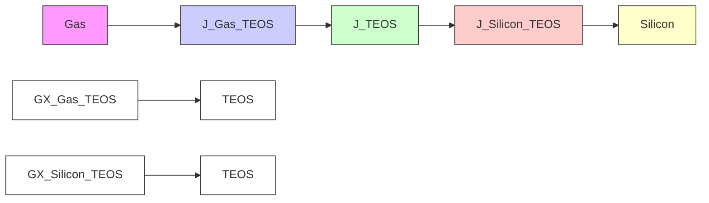
</details>

Figure 74 Flux, ambient concentration, and motion of growth front during growth process

Since TEOS is a new material, first, it must be entered into the existing material list using the command:

```txt
mater add name=TEOS 
```

Then, the reacting materials must be defined using the reaction command (see reaction on page 1173).

You can create a reaction based on existing ambients (see Ambients and Gas Flows on page 661), but in this case, a new react type (named GX) ambient is created:

```txt
ambient name=GX react add 
```

```ini
reaction name=TEOSreaction mat.l=Silicon mat.r=Gas mat.new=TEOS \
new.like=Oxide ambient.name=GX diffusing.species=GX 
```

Silicon is the material on the left side (mat.l) of the reacting interface, and Gas is the material on the right side (mat.r) of the reacting interface. The newly formed material (mat.new) at the reacting interface is TEOS. The new material and its interfaces with other materials also are defined to be like Oxide and Oxide interfaces (for example, TEOS=Oxide, PolySilicon\_TEOS=Oxide\_PolySilicon) using the new.like argument. The GX reaction requires an ambient, and the ambient name is GX. The reaction will not occur unless the ambient GX is present in a gas flow or directly in the diffuse command. (For more information about how to specify ambients, see Ambients and Gas Flows on page 661.) Reactions that require a react-type ambient cannot have more than one diffusing species name. If the reaction does not require an ambient, it can have multiple names of diffusing species. In this case, the reaction occurs if the reacting interfaces exist in the structure. (This is useful for silicidation.)

The reaction command automatically adds the diffusing species GX to the general solution list. This is performed internally using the following command, where GrowthStep identifies this solution name as a reaction solution name:

solution name=GX add !negative GrowthStep solve

When the solution name and the new material are defined, the reaction and diffusion equations could be written as follows:

```txt
pdbSetString TEOS GX Equation "ddt(GX)- [Arrhenius 0.2 1.86]*grad(GX)"
pdbSetString Gas_TEOS GX Equation_TEOS "- (GX_TEOS - 1e17)"
pdbSetString Silicon_TEOS GX Equation_TEOS "-5e-2*(GX_TEOS)"
pdbSetString Silicon_TEOS GX GrowthReaction " 5e-2*(GX_TEOS)" 
```

The first command sets the diffusion equation of GX in TEOS. The next two commands set the boundary fluxes at the Gas\_TEOS and Silicon\_TEOS interfaces. The \_TEOS option on Equation indicates the side of the interface to which the given flux will be applied. The same option on the solution variable GX indicates that the solution variable value at this interface is taken from the TEOS side. These settings are identical to the ones described in Setting the Boundary Conditions on page 623.

The last command is unique to generic growth equations. The GrowthReaction keyword defines the growth reaction flux at the reacting interface. In this example, the growth reaction flux is identical to the diffusion flux at the reacting interface. In addition, the sign of the growth reaction flux is the opposite of the sign of the diffusion flux.

Finally, you must specify the ambient in a gas flow (see gas\_flow on page 989) and use it with the diffuse command, or specify it directly in the diffuse command in order for the reaction to occur. For example, both of these commands will switch on reactions involving the ambient GX and will set the partial pressure of GX to 1:

```python
gas_flow name= gxflw partial_pressure= {GX= 1.0}
diffuse time= 100 temp=1000 gas_flow= gxflw 
```

or:

```txt
diffuse time=100 temp=1000 GX 
```

Using the gas\_flow command is more flexible in that the partial pressure can be set to any value (not just 1.0) or the partial pressure can be computed from gas flows and gas reactions.

The model can be enhanced by adding the model parameters to the parameter database. This allows other users to change the values in the equations by accessing the properties directly. The following changes make the equations dependent on the stored value in the parameter database:

```tcl
pdbSetDouble TEOS GX Dstar " [Arrhenius 0.2 1.86]\"
pdbSetDouble Gas_TEOS GX Cstar "1e17"
pdbSetDouble Silicon_TEOS GX Kfd "5e-2"
pdbSetDouble Silicon_TEOS GX Kfg "5e-2"
set diff [pdbDelayDouble TEOS GX Dstar]
pdbSetString TEOS GX Equation "ddt(GX) - $diff * grad(GX)"
set GXStar [pdbDelayDouble Gas_TEOS GX Cstar]
pdbSetString Gas_TEOS GX Equation_TEOS "-(GX_TEOS - $GXStar)"
set GKfd [pdbDelayDouble Silicon_TEOS GX Kfd]
pdbSetString Silicon_TEOS GX Equation_TEOS "-$GKfd*(GX_TEOS)"
set GKfg [pdbDelayDouble Silicon_TEOS GX Kfg]
pdbSetString Silicon_TEOS GX GrowthReaction " $GKfg*(GX_TEOS)" 
```

The first commands set the diffusivity, the equilibrium value of GX, and the forward reaction rates for the diffusion and growth fluxes in the parameter database. The pdbDelayDouble command returns the expression stored in the parameter database. This is necessary so that the evaluation of the expression does not occur until the diffuse command is executed. Now, the equation depends on the database entry.

The velocities regarding the growth reaction flux are calculated internally as follows:

$$
v _ {\text { Growth }} = \frac {\text { Beta }}{\text { Expansion.Ratio } * \text { Density.Grow }} F _ {\text { Growth }} \tag {869}
$$

# where:

$F _ { \mathrm { G r o w t h } }$ is the growth reaction flux defined using the pdbSetString command and the GrowthReaction keyword as previously explained.   
Beta is the stoichiometry of the growing material.   
Expansion.Ratio is the conversion ratio from consumed material to the growing material.   
Density.Grow is the density of the growing material.

The default values for Beta, Expansion.Ratio, and Density.Grow are taken from oxidation of silicon in ${ \bf O } _ { 2 }$ ambient.

They are 1, 2.2, and , respectively, and can be changed using the following2.2 22×10 commands:

```txt
pdbSetDouble <interface material> <ambient> Beta <n>
pdbSetDouble <interface material> <ambient> Expansion.Ratio <n>
pdbSetDouble <interface material> <ambient> Density.Grow <n> 
```

For the above example, you can change these values with these commands:

```batch
pdbSetDouble Silicon_TEOS GX Beta 1.1
pdbSetDouble Silicon_TEOS GX Expansion.Ratio 2.0
pdbSetDouble Silicon_TEOS GX Density.Grow 3e22 
```

If Expansion.Ratio is set to 0, the material will dissolve but the new material will not form. (For example, silicon will dissolve but no TEOS will form. This is useful for silicidation.)

# Epitaxial Growth

This example uses the reaction command to create a new epitaxial growth mode:

```txt
ambient name=MyEpi epi add
# Now, create the new temporary material to be used during epi growth
# the name <Ambient>On(Material> is not necessary, it is just
# the same convention as used internally
mater name=MyEpiOnNitride add
reaction name= MyEpiOnNiReact mat.l=Nitride mat.r=Gas mat.new=MyEpiOnNitride \
ambient.name=MyEpi new.like=PolySilicon mat.final=PolySilicon 
```

The mat.final argument specifies the name of the final epi material. There is a conversion from mat.new to mat.final at the end of the diffuse command. For details on how to set up epi reactions and growth rates, see Epitaxy Growth Rate: GrowthRateProc on page 649.

# Modifying Built-in Equations and Terms

Sentaurus Process builds equations and terms for known solution variables by default. If you want to add a new expression to an existing equation or term, or to subtract a new expression from an existing equation or term, you can use one of the following commands:

UserAddEqnTerm   
UserSubEqnTerm   
UserAddToTerm   
UserSubFromTerm   
MultiplyTerm

NOTE Do not use these commands within callback procedures. They are designed to change PDEs without using callback procedures (see Using Callback Procedures to Build Models on page 632).

All commands except MultiplyTerm are saved to TDR files. If the command file is split, the commands must not be included in the new command file. However, if a user-defined variable or term is used with these commands, the variable or term must be included in the new command file, or the variable must be saved with the define command (see define on page 948) and the term must be stored using the store argument (see term on page 1260).

# UserAddEqnTerm and UserSubEqnTerm

The UserAddEqnTerm and UserSubEqnTerm commands allow you to add a new expression to an existing solution variable equation or to subtract the new expression from an existing solution variable equation. The commands have the format:

```txt
UserAddEqnTerm <material> <solution> <expression> <side> \
  overwrite | !overwrite

UserSubEqnTerm <material> <solution> <expression> <side> \
  overwrite | !overwrite 
```

# where:

<material> is any valid material name.   
<solution> is any valid solution variable name.   
<expression> is the new expression to be added to or subtracted from the solution variable.   
<side> is the side of the interface material where the new expression will be added or subtracted.   
overwrite | !overwrite specifies whether or not to overwrite the previous setting. The default is not to overwrite (!overwrite).

For example, the following command adds the expression "{2e-15\*(CY\*CY-1e-16\*CX)}" to the CY equation in silicon by overwriting the previous settings during the PDE solve:

UserAddEqnTerm Silicon CY "{2e-15\*(CY\*CY-1e-16\*CX)}" overwrite

Since the equations can be set in three different ways for interfaces, you have the option to specify the side to which the expression will be added or subtracted.

For example, the commands:

UserAddEqnTerm Oxide\_Silicon CX "(CX\_Oxide - CX\_Silicon)" Silicon

UserSubEqnTerm Oxide\_Silicon CX "(CX\_Oxide - CX\_Silicon)" Oxide

add the expression "(CX\_Oxide - CX\_Silicon)" to the Oxide\_Silicon interface equation for CX on the Silicon side, and subtract the same expression from the Oxide\_Silicon interface equation for CX on the Oxide side, respectively. If no side information is given, the expression will be added to the Oxide\_Silicon interface equation for CX.

NOTE The UserAddEqnTerm and UserSubEqnTerm commands apply to materials that are like the one given with the <material> option.

# UserAddToTerm and UserSubFromTerm

The UserAddToTerm and UserSubFromTerm commands add a new expression to an existing term or subtract the new expression from an existing term. The commands have the format:

UserAddToTerm <material> <term> <expression>

UserSubFromTerm <material> <term> <expression>

where:

<material> is any valid material name.   
<term> is an existing term name.   
<expression> is the new expression to be added to or subtracted from the existing term.

For example, the following command adds the expression "2\*CX" to the term MyTerm in silicon:

UserAddToTerm Silicon MyTerm "2\*CX"

In the same way, the following command subtracts the expression "2\*CX" from the term MyTerm in silicon:

UserSubFromTerm Silicon MyTerm "2\*CX"

NOTE The UserAddToTerm and UserSubFromTerm commands do not apply to materials that are like the one given with the <material> option.

# MultiplyTerm

The MultiplyTerm command multiplies a new expression by a user-defined existing term and has the format:

MultiplyTerm <material> <term> <expression> [store]

# where:

<material> is any valid material name.   
<term> is an existing term name.   
<expression> is the new expression to be multiplied by the existing term.   
■ store specifies that the modified term will be saved to TDR files.

For example, the following command multiplies the expression "2\*CX" by the term MyTerm in silicon:

MultiplyTerm Si MyTerm "2\*CX"

NOTE By default, the MultiplyTerm command is not saved to TDR files. If MultiplyTerm is defined with the keyword store, the modification of terms is saved to TDR files.

# Using Callback Procedures to Build Models

NOTE Callback procedures involve complex operations. Only advanced users should use them.

Callbacks allow additional intelligence to be built into PDEs by allowing procedures to be called at runtime. These procedures build the Alagator equation strings according to userspecified options. By selecting model switches, you can choose between different physical models to be represented in the equation strings. By having callback procedures that use a material name, a dopant name, or a defect name as arguments, the same type of equation can be built for several materials, dopants, and defect species.

In Sentaurus Process, all frequently used equations are built-in Tcl callback procedures. Using the pdbSet command, you can instruct Alagator to use various callback procedures.

You use specific keywords to create callback procedures. Table 82 lists the callback procedure– related keywords in Alagator.

Table 82 Keywords used to create callback procedures 

<table><tr><td>Keyword</td><td>Description</td></tr><tr><td>EquationGrowthProc</td><td>Specifies the name of the callback procedure to set up equations for material growth (see Constructing Equation Strings: EquationGrowthProc on page 648).</td></tr><tr><td>EquationInitProc</td><td>Specifies the name of the callback procedure to set up the initialization equations (see Constructing Initialization Equation String: EquationInitProc on page 645).</td></tr><tr><td>EquationProc</td><td>Specifies the name of the callback procedure to set up the PDEs (see Constructing Equation Strings: EquationProc on page 642).</td></tr><tr><td>GrowthRateProc</td><td>Defines the PDEs for epitaxial growth (see Epitaxy Growth Rate: GrowthRateProc on page 649).</td></tr><tr><td>InitGrowth</td><td>Specifies the name of the callback procedure that usually resets or deletes existing parameter database equations or terms at the beginning of a diffusion simulation (see Cleaning Up Equation Strings and Terms: InitGrowth on page 646).</td></tr><tr><td>InitProc</td><td>Specifies the name of the callback procedure that usually resets or deletes existing parameter database equations or terms at the beginning of a diffusion simulation (see Cleaning Up Equation Strings: InitProc on page 641).</td></tr><tr><td>InitSolve</td><td>Specifies the name of the callback procedure to reset or delete existing parameter database equations or terms (see Defining the Initialization Equations: InitSolve on page 645).</td></tr></table>

# Callbacks During Execution of the diffuse Command

In addition to calling the callback procedures at various stages during the execution of a diffuse command, Sentaurus Process calls the diffPreProcess procedure before executing the diffuse command and the diffPostProcess procedure after executing the diffuse command. The default behavior is described in Ion Implantation to Diffusion on page 340. Figure 75 on page 634 shows the flowchart of this process.

# 6: Writing Partial Differential Equations Using Alagator

Using Callback Procedures to Build Models


<details>
<summary>flowchart</summary>

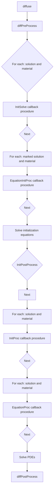
</details>

Figure 75 Flowchart with calls to callback procedures during execution of a diffuse command

# The diffPreProcess Procedure

Sentaurus Process can initialize solution variable fields on the command line using commands such as select (see select on page 1195) and profile (see profile on page 1164). If the initialization can be standardized, it is better to use the diffPreProcess procedure because, by default, it initializes the data fields for interstitials, vacancies, dopants, dopant clusters, dopant–defect clusters, and defect clusters (see Ion Implantation to Diffusion on page 340).

The execution of each diffuse command starts with a call to the diffPreProcess procedure that initializes various data fields or preprocesses the existing data fields. For example, the diffPreProcess procedure truncates interstitial and vacancy profiles in the amorphous regions. This procedure switches on or off the point-defect equations, the pointdefect solutions, and various cluster solutions according to the diffusion models selected.

You can overwrite the diffPreProcess procedure. Alternatively, to preserve the preprocessing already implemented in Sentaurus Process, you can implement commands needed for additional preprocessing in the UserDiffPreProcess procedure. By default, UserDiffPreProcess is an empty procedure and is called from the diffPreProcess procedure as one of the last commands.

For example, the following procedure will create a Gaussian profile for the solution variable CX with a peak at depth x = 0.5 and a maximum concentration of . Ten percent of2 18×10 cm–3 the CX profile will be added to the existing data field CY:

```txt
fproc diffPreProcess { } {
    LogFile "This procedure is used to initialize data fields CX and CY"
    sel z = "CX + 2.0e18 * exp(-(x - 0.5) * (x - 0.5) / (0.01 * 0.01)) + 1.0" \
    name = CX store
    sel z = "CY + CX * 0.1" name = CY store
} 
```

More complex examples can be created by combining pdb commands and callback procedures, for example:

```txt
pdbSetDouble Silicon CY minDose 1e10
fproc diffPreProcess { } {
    LogFile "This procedure is used to initialize data fields CX and CY"
    sel z = "CX + 2.0e18 * exp(-(x-0.5)*(x-0.5) / (0.01 * 0.01)) + 1.0" \
    name=CX store
    sel z = CY
    set dose [lindex [integrate] 0] ;# returns the dose of selected species
    ;# (for example, CY) in silicon
    if { $dose > [pdbGetDouble Silicon CY minDose] } {
    solution add name=CY !damp !negative solve 
```

# 6: Writing Partial Differential Equations Using Alagator

Using Callback Procedures to Build Models

```txt
} else {
    solution add name=CY !damp !negative nosolve
}
} 
```

In this example, the minDose parameter is created for CY in the parameter database to set the minimum-allowed dose for diffusion to occur. In the diffPreProcess procedure, the CX profile is set as previously explained. The third and fourth lines calculate the dose of CY in silicon. The if-else statement returns the minimum dose value from the parameter database. If the existing dose of CY is below the minimum dose, the solution for CY is switched off; otherwise, it is switched on.

To enforce additional actions to be performed upon diffusion preprocessing, it is not necessary to overwrite the default implementation of the diffPreProcess procedure. Instead, to preserve the default initialization of data fields, you can redefine the UserDiffPreProcess procedure. By default, UserDiffPreProcess is an empty procedure and is called from the diffPreProcess procedure as one of the last commands.

# Initialization

After the execution of the diffPreProcess procedure, Sentaurus Process checks all material and solution names, and whether a callback procedure has been specified using the InitSolve keyword for the material and solution names. If a callback procedure has been defined, this procedure is called using the material name and solution name as arguments (see Defining the Initialization Equations: InitSolve on page 645).

Subsequently, Sentaurus Process checks all marked materials and solutions to see whether a callback procedure has been specified using the EquationInitProc keyword for the solution variable that must be initialized (see Constructing Initialization Equation String: EquationInitProc on page 645). If this is the case, the callback procedure is executed with the material name and solution name as arguments. Typically, such a callback procedure is used to build the equation string that is solved at time=0 in the diffusion solver. Alternatively, if no callback procedure has been specified using the EquationInitProc keyword, the equation string to be used for the initialization can be specified directly on the command line.

After that, Sentaurus Process solves the initialization equations for all materials and solutions that must be initialized. The initialization equations are solved for the initial temperature of the temperature ramp specified in the diffuse command. Such an initialization is usually not required for all solutions. It is typically necessary for solutions whose initial value depends in a complex way on the data fields.

If initialization is not required at all, it can be omitted using !isolve in the diffuse command.

The Tcl procedure InitPostProcess is provided for convenience and is called after the initialization is completed. It can be used to plot or save the solution variable profiles after the initialization. By default, InitPostProcess is an empty procedure.

# Building and Solving PDEs

After initialization, Sentaurus Process checks all material and solution names to see whether a callback procedure has been specified using the InitProc keyword (see Cleaning Up Equation Strings: InitProc on page 641). If a callback procedure is defined, it is called for the specified material name and solution name. Such a callback procedure usually sets the equation strings to empty strings and removes terms defined in previous diffusion steps. By having empty equation strings, the equations and terms can be built up piecewise, by adding expressions for each selected model that contributes to an equation or a term. This is necessary because different diffusion models can be used for different diffusion steps, and because additional species can be added between diffusion steps, which might require terms to be added to the equations for existing species.

In the next step, Sentaurus Process checks all material and solution names to see whether a callback procedure has been specified using the EquationProc keyword (see Constructing Equation Strings: EquationProc on page 642). If a callback procedure is defined, it is called with the material name and the solution name as arguments. Such a callback procedure sets the diffusion equations for the solution variable. Alternatively, if no callback procedure is defined for a material and a solution, the equation string can be set on a command line without specifying any callback procedures.

NOTE If a callback procedure has been specified using the EquationProc keyword for a material name and solution name, this callback procedure typically overwrites any equation specified on the command line for that material and solution.

After the diffusion equations are set, Sentaurus Process solves the equations for the entire temperature cycle specified in the diffuse command.

# The diffPostProcess Procedure

Finally, the diffPostProcess procedure is called at the end of diffusion. It is used mainly to delete data fields that are no longer needed and, by default, it stores the total concentrations of point defects and deletes some temporary data fields such as Int\_Implant and Vac\_Implant.

The last command line of the diffPostProcess procedure calls the UserDiffPostProcess procedure, which is empty by default. To add commands to be executed after diffusion, you can redefine the UserDiffPostProcess procedure.

NOTE The diffPreProcess, InitPostProcess, and diffPostProcess procedures can be found in the TclLib directory in the DiffProcess.tcl file (see Ion Implantation to Diffusion on page 340).

# Callbacks During Execution of Generic Growth Equations

NOTE This section describes the process for executing the diffuse command that includes generic material growth. This section is an extension of Callbacks During Execution of the diffuse Command on page 633.

Figure 76 on page 639 shows the flowchart of the execution of a diffuse command including generic material growth. The sections regarding diffusion are represented on a smaller scale and are shown in Figure 75 on page 634.

See Callbacks During Execution of the diffuse Command on page 633 for descriptions of these various steps and procedures.


<details>
<summary>flowchart</summary>

```mermaid
graph TD
    A["diffuse"] --> B["growthPreProcess"]
    B --> C["For each: reactant solution and material"]
    C --> D["InitGrowth callback procedure"]
    D --> E["Next"]
    E --> F["For each: reactant solution and material"]
    F --> G["EquationGrowthProc callback procedure"]
    G --> H["Next"]
    H --> I["Solve generic growth equations"]
    I --> J["diffPreProcess"]
    J --> K["For each: solution and material"]
    K --> L["InitSolve callback procedure"]
    L --> M["Next"]
    M --> N["For each: marked solution and material"]
    N --> O["EquationInitProc callback procedure"]
    O --> P["Next"]
    P --> Q["Solve initialization equations"]
    Q --> R["InitPostProcess"]
    R --> S["Next"]
    S --> T["For each: solution and material"]
    T --> U["InitProc callback procedure"]
    U --> V["Next"]
    V --> W["For each: solution and material"]
    W --> X["EquationProc callback procedure"]
    X --> Y["Next"]
    Y --> Z["Solve PDEs"]
    Z --> AA["diffPostProcess"]
```
</details>

Figure 76 Flowchart with calls to callback procedures during execution of a diffuse command, including generic material growth

# The growthPreProcess Procedure

The execution of each diffuse command starts with a call to the growthPreProcess procedure that initializes various reaction-related data fields or preprocesses the existing data fields.

To enforce additional actions to be performed upon generic growth preprocessing, it is not necessary to overwrite the default implementation of the growthPreProcess procedure. Instead, to preserve the default initialization of data fields, you can redefine the UserGrowthPreProcess procedure. By default, UserGrowthPreProcess is an empty procedure and is called from the growthPreProcess procedure as one of the last commands.

# Specifying Callback Procedures Using Keywords

This section demonstrates how to use keywords to specify callback procedures.

# Common Features of Using Keywords

To avoid unnecessary repetition of content, this section describes common features that apply to all keywords described in the next sections.

Using the InitProc keyword as an example, here is a simple demonstration of how you would use this keyword to create a callback procedure:

```tcl
pdbSetString Silicon CX InitProc CleanEquations
proc CleanEquations { Mat Sol } {
    LogFile "This callback procedure unsets $Sol equation in $Mat."
    pdbUnSetString $Mat $Sol Equation
} 
```

where:

The first line specifies the name of the callback procedure in silicon for CX, which follows the keyword instance. In this case, the callback procedure is named CleanEquations.   
■ The second line defines the CleanEquations callback procedure.

The callback procedure takes two arguments: a material name (Mat) and a solution name (Sol). In this example, Sentaurus Process calls the CleanEquations procedure with these two arguments: The first will be Silicon and the second will be CX.

NOTE The argument names Mat and Sol are arbitrary. They can be any valid Tcl variable but the first argument is always the material name and the second argument is always the solution name.

The third line defines the message string that will be printed to the log file when the callback procedure is executed. This is to inform users that the callback procedure is called. The \$Sol variable and \$Mat variable will be replaced with the solution name and the material name, respectively. In this case, the message would be:   
This callback procedure unsets CX equation in Silicon.   
The fourth and last line unsets the equation if it exists.

# Generic Procedure

When neither the material name nor the solution name is used in the implementation of a callback procedure, it is a generic procedure and can be used for several materials and solutions.

The examples in the next sections demonstrate generic procedures.

# Cleaning Up Equation Strings: InitProc

The InitProc keyword specifies the name of the callback procedure that cleans up equation strings.

For example, the InitProc keyword defines the ResetEquations callback procedure of the solution variable CX in silicon:

```tcl
pdbSetString Silicon CX InitProc ResetEquations
proc ResetEquations { Mat Sol } {
    LogFile "This callback procedure unsets $Sol equation in $Mat."
    pdbUnSetString $Mat $Sol Equation
} 
```

Sentaurus Process will call the ResetEquations procedure with two arguments: The first will be Silicon and the second will be CX.

The procedure is called every time the solutions are checked during the diffusion. The ResetEquations procedure prints the message to the log file and removes the parameter database equation if it was defined.

This example can be extended with the following commands:

```txt
pdbSetString Silicon CX InitProc ResetEquations
pdbSetString Silicon CY InitProc ResetEquations
pdbSetString Oxide CX InitProc ResetEquations
pdbSetString Oxide CY InitProc ResetEquations 
```

In this case, the same ResetEquations callback procedure is used for the solution variables CX and CY in oxide and silicon. Sentaurus Process will print the following messages:

```txt
This callback procedure unsets CX equation in Silicon.
This callback procedure unsets CY equation in Silicon.
This callback procedure unsets CX equation in Oxide.
This callback procedure unsets CY equation in Oxide. 
```

The advantage of callback procedures is clear. With four new command lines, the equations for CX and CY in both oxide and silicon can be unset. At the same time, there is only one callback procedure to maintain. If you change the callback procedure, the changes will apply to all four settings.

# Constructing Equation Strings: EquationProc

The EquationProc keyword specifies the name of the callback procedure that constructs the equation string in the parameter database.

For example, the first command defines SetEquations as the callback procedure of the solution variable CX in silicon:

```tcl
pdbSetString Silicon CX EquationProc SetEquations
fproc SetEquations { Mat Sol } {
    LogFile "This callback procedure sets $Sol equation in $Mat."
    pdbSetString $Mat $Sol Equation "ddt($Sol) - [Arrhenius 0.138 1.37] \
    *grad($Sol)"
} 
```

Sentaurus Process will call SetEquations with two arguments: The first will be Silicon and the second will be CX.

The SetEquations callback procedure is called every time the solutions are checked during the simulation. The SetEquations procedure prints the message to the log file and sets the parameter database equation for CX in silicon.

NOTE In this example, the SetEquations callback procedure is a generic procedure. The equation setting is similar to that explained in Building Partial Differential Equations on page 622. The only difference is that, instead of using a material name and solution name, only Tcl variables are used.

This example can be extended with the following commands:

```batch
pdbSetString Silicon CX EquationProc SetEquations
pdbSetString Silicon CY EquationProc SetEquations 
```

In this case, the same SetEquations callback procedure is used for the solution variables CX and CY in silicon. Sentaurus Process will print the following messages:

This callback procedure sets CX equation in Silicon. This callback procedure sets CY equation in Silicon.

The above implementation uses the same diffusivity for both CX and CY. To use different diffusivities for each solution variable, the SetEquations callback procedure must be modified and diffusivities for each solution variable must be set as follows:

```tcl
pdbSetString Silicon CX EquationProc SetEquations
pdbSetString Silicon CY EquationProc SetEquations

pdbSetDouble Silicon CX D { [Arrhenius 0.138 1.37] }
pdbSetDouble Silicon CY D { [Arrhenius 0.02 0.3] }

fproc SetEquations { Mat Sol } {
    LogFile "This callback procedure sets $Sol equation in $Mat."
    set diff [pdbDelayDouble $Mat $Sol D]
    pdbSetString $Mat $Sol Equation "ddt($Sol) - $diff * grad($Sol)"
} 
```

The first change is setting the CX and CY diffusivities in the parameter database. The second change is in the SetEquations callback procedure. Instead of having a hard-coded diffusivity number, pdbDelayDouble is used to obtain the expression stored in the parameter database. Now, the diffusivities depend on the database entry. You can change these entries to observe the effect of different diffusivities on the final profile.

The example in Using Terms on page 624 can be enhanced by using both terms and callback procedures as follows:

```tcl
pdbSetDouble Silicon CX D { [Arrhenius 0.138 1.37] }
pdbSetDouble Silicon CY D { [Arrhenius 0.02 0.3] }
pdbSetDouble Silicon CX Kf { [Arrhenius 4.2e-11 0.1] }
pdbSetDouble Silicon CY Kf { [Arrhenius 4.2e-11 0.1] }
pdbSetDouble Silicon CX Cstar { [Arrhenius 3.6e27 3.7] }
pdbSetDouble Silicon CY Cstar { [Arrhenius 4.0e26 3.97] }
pdbSetString Silicon CX Recomb "CY"
pdbSetString Silicon CY Recomb "CX"

solution add name=CX !damp !negative solve
solution add name=CY !damp !negative solve

pdbSetString Silicon CX EquationProc SetEquations
pdbSetString Silicon CY EquationProc SetEquations

fproc SetEquations { Mat Sol } {
    LogFile "This callback procedure sets $Sol equation in $Mat."
    set diff [pdbDelayDouble $Mat $Sol D] 
```

# 6: Writing Partial Differential Equations Using Alagator

Using Callback Procedures to Build Models

```tcl
set Kf [pdbDelayDouble $Mat $Sol Kf]
set Recomb [pdbGetString $Mat $Sol Recomb]

set CXStar [pdbDelayDouble $Mat $Sol Cstar]
set CYStar [pdbDelayDouble $Mat $Recomb Cstar]

term name= RCXCY $Mat eqn = "$Kf * ($Sol * $Recomb- $CXStar * $CYStar)" store
pdbSetString $Mat $Sol Equation "ddt($Sol) - $diff * grad($Sol) + RCXCY"
} 
```

First, the diffusivity, the equilibrium concentration, and the forward reaction rate for the recombination of CX and CY are stored in the parameter database. Since CX and CY recombine with each other, this information (Recomb) is also stored in the parameter database. Then, the callback procedure is modified to read these database entries. The Tcl variable Recomb in the callback procedure will have the value of CY for CX, and CX for CY. The forward recombination rate RCXCY is the same for both solution variables. The callback procedure will be called once for CX and once for CY. During each call, the term RCXCY will be created. Since the term name does not depend on the solution name, the first term created during the CX equation setup will be deleted during the CY equation setup. This is performed intentionally, for this example, since both equations use exactly the same term. To create a unique term for each call, the callback procedure must be modified as follows:

```tcl
fproc SetEquations { Mat Sol } {
    LogFile "This callback procedure sets $Sol equation in $Mat."
    set diff [pdbDelayDouble $Mat $Sol D]
    set Kf [pdbDelayDouble $Mat $Sol Kf]
    set Recomb [pdbGetString $Mat $Sol Recomb]
    set CXStar [pdbDelayDouble $Mat $Sol Cstar]
    set CYStar [pdbDelayDouble $Mat $Recomb Cstar]
    term name = R${Sol}${Recomb} $Mat eqn = "$Kf * ($Sol * $Recomb - $CXStar * \$CYStar)"
    pdbSetString $Mat $Sol Equation "ddt($Sol) - $diff * grad($Sol) + \R${Sol}${Recomb}"
} 
```

In this case, two terms will be created: RCXCY and RCYCX.

# Defining the Initialization Equations: InitSolve

In some cases, the initialization of solution variables is very complex and cannot be accomplished using the select command. In these cases, Sentaurus Process defines initialization equations using the Alagator language and callback procedures.

Assume that the CX solution variable is initialized by solving the following equation:

$$
C X _ {\text { Total }} = C X + (\alpha C X) ^ {\beta} \tag {870}
$$

where is the total concentration of CX, and and are user-defined initializationCXTotal α β parameters. Depending on the value of and , you need to solve Eq. 870.α β

To initiate the initialization setup procedure, the solution name must be defined as:

solution add name=CX !damp !negative solve InitStep

The option InitStep allows this solution variable to be initialized.

The InitSolve keyword specifies the name of the callback procedure that Sentaurus Process calls. For example, the first command defines ResetInitEquations as the callback procedure of the solution variable CX in silicon:

```powershell
pdbSetString Silicon CX InitSolve ResetInitEquations
proc ResetInitEquations { Mat Sol } {
    LogFile "This callback procedure unsets $Sol equation in $Mat during \ initialization."
    pdbUnSetString $Mat $Sol Equation
} 
```

Sentaurus Process will call the ResetInitEquations procedure with two arguments: The first will be Silicon and the second will be CX. The solution variable CX is marked to be initialized in silicon. If there is no such setting for the solution variable CY, CY will not be initialized.

After calling the callback procedures defined by InitSolve, Sentaurus Process will look for an equation string for the solution variable. This is performed by defining a callback procedure using the EquationInitProc keyword (see Constructing Initialization Equation String: EquationInitProc).

# Constructing Initialization Equation String: EquationInitProc

The EquationInitProc keyword specifies the name of the callback procedure that constructs the equation string for initialization.

For example, the first command defines SetInitEquations as the callback procedure of the solution variable CX in silicon:

```tcl
pdbSetString Silicon CX EquationInitProc SetInitEquations
proc SetInitEquations { Mat Sol } {
    LogFile "This callback procedure sets $Sol equation in $Mat during \ initialization."
    set alpha [pdbDelayDouble $Mat $Sol Alpha]
    set beta [pdbDelayDouble $Mat $Sol Beta]
    pdbSetString $Mat $Sol Equation "${Sol}_Implant - $Sol - ($alpha * \ $(Sol)^\$beta"
} 
```

Sentaurus Process will call the SetInitEquations procedure with two arguments: The first will be Silicon and the second will be CX.

NOTE The EquationInitProc and EquationProc keywords work in the same way:

The callback procedure defined with the EquationInitProc keyword is called only during initialization.   
The callback procedure defined with the EquationProc keyword is called only during diffusion. It is assumed that Alpha and Beta are already entered in the parameter database and CXTotal is defined.

# Cleaning Up Equation Strings and Terms: InitGrowth

NOTE The InitGrowth keyword is specific to generic growth equations (see Callbacks During Execution of Generic Growth Equations on page 638).

The InitGrowth keyword specifies the name of the callback procedure that cleans up equation strings and terms. For example, the first command defines ResetEquations as the name of the callback procedure of the solution variable GX in silicon:

```powershell
pdbSetString TEOS GX InitGrowth ResetEquations
proc ResetEquations { Mat Sol } {
    LogFile "This callback procedure unsets $Sol equation in $Mat."
    pdbUnSetString $Mat $Sol Equation
} 
```

Sentaurus Process will call the ResetEquations procedure with two arguments: The first will be TEOS and the second will be GX.

The ResetEquations callback procedure prints the message to the log file and removes the parameter database equation for GX in TEOS if it was defined.

This example can be extended with the following commands:

```txt
pdbSetString TEOS GX InitGrowth ResetEquations
pdbSetString Gas_TEOS GX InitGrowth ResetEquations
pdbSetString Silicon_TEOS GX InitGrowth ResetEquations 
```

In this case, the same ResetEquations callback procedure is used for the solution variables GX inside TEOS, and at the Gas\_TEOS and Silicon\_TEOS interfaces. Sentaurus Process will print the following messages:

```txt
This callback procedure resets GX equation in TEOS.
This callback procedure resets GX equation in Gas_TEOS.
This callback procedure resets GX equation in Silicon_TEOS. 
```

Since the interface equations can be written for the interface material itself or the neighboring materials, all of them must be unset including the growth reaction equation. In this case, you can write a special Tcl procedure for the interfaces as follows:

```tcl
proc ResetInterfaceEquations {Mat Sol} {
    set mater1 [FirstMat $Mat]
    set mater2 [SecondMat $Mat]

    pdbUnSetString $Mat $Sol Equation
    LogFile "This callback procedure resets $Sol equation in $Mat."

    pdbUnSetString $Mat $Sol Equation_$mater1
    LogFile "This callback procedure resets $Sol equation in $Mat on $mater1 \
    side."

    pdbUnSetString $Mat $Sol Equation_$mater2
    LogFile "This callback procedure resets $Sol equation in $Mat on $mater2 \
    side."

    pdbUnSetString $Mat $Sol GrowthReaction
    LogFile "This callback procedure resets $Sol growth reaction equation in \
    $Mat."
}

pdbSetString Gas_TEOS GX InitGrowth ResetInterfaceEquations
pdbSetString Silicon_TEOS GX InitGrowth ResetInterfaceEquations 
```

The ResetInterfaceEquations callback procedure is similar to the ResetEquations procedure. The commands FirstMat and SecondMat in the procedure return the names of the neighboring materials (for example, Gas and TEOS for Gas\_TEOS). Then, the equations set for either side of the interface or the interface are unset including the generic growth reaction equation. This special procedure is called for GX at the Gas\_TEOS and Silicon\_TEOS interfaces.

Then, Sentaurus Process will print the following messages:

```txt
This callback procedure resets GX equation in TEOS.  
This callback procedure resets GX equation in Gas_TEOS.  
This callback procedure resets GX equation in Gas_TEOS on Gas side.  
This callback procedure resets GX equation in Gas_TEOS on TEOS side.  
This callback procedure resets GX growth reaction equation in Gas_TEOS.  
This callback procedure resets GX equation in Silicon_TEOS.  
This callback procedure resets GX equation in Silicon_TEOS on Silicon side.  
This callback procedure resets GX equation in Silicon_TEOS on TEOS side.  
This callback procedure resets GX growth reaction equation in Silicon_TEOS. 
```

# Constructing Equation Strings: EquationGrowthProc

NOTE The EquationGrowthProc keyword is specific to generic growth equations (see Callbacks During Execution of Generic Growth Equations on page 638).

Primarily, the EquationGrowthProc keyword specifies the name of the callback procedure that constructs the equation string for the material growth reaction. It uses the keyword EquationGrowthProc in the parameter database.

For example, the first command has the effect that, according to Figure 76 on page 639, Sentaurus Process calls the SetEquations procedure with the arguments TEOS and GX:

```tcl
pdbSetString TEOS GX EquationGrowthProc SetEquations
fproc SetEquations { Mat Sol } {
    LogFile "This callback procedure sets $Sol equation in $Mat."
    set diff [pdbDelayDouble $Mat $Sol Dstar]
    pdbSetString $Mat $Sol Equation "ddt($Sol) -$diff * grad($Sol)"
} 
```

The SetEquations procedure is called every time the solutions are checked during the reaction. This procedure prints the message to the log file and sets the parameter database equation for GX in TEOS.

The equation setting is similar to that explained in Building Partial Differential Equations on page 622. The only difference is that instead of using a solution name and a material name, only Tcl variables are used. Since the interface equations settings are different, this example can be extended with the following commands:

```txt
pdbSetString Gas_TEOS GX EquationGrowthProc SetInterfaceEquations
pdbSetString Silicon_TEOS GX EquationGrowthProc SetInterfaceEquations 
```

```tcl
fproc SetInterfaceEquations { Mat Sol } {
    set mater1 [FirstMat $Mat]
    set mater2 [SecondMat $Mat]

    if { [pdbIsAvailable $Mat $Sol Cstar] } {
    set GXStar [pdbDelayDouble $Mat $Sol Cstar]
    pdbSetString $Mat $Sol Equation_$mater2 "-(${Sol}_$mater2 - $GXStar)"
    LogFile "This callback procedure sets $Sol equation in $Mat on $mater2 \
    side."
    } else {
    set GKfd [pdbDelayDouble $Mat $Sol Kfd]
    pdbSetString $Mat $Sol Equation_$mater2 "-$GKfd* ({${Sol}_$mater2)"
    LogFile "This callback procedure sets $Sol equation in $Mat on $mater2 \
    side."

    set GKfg [pdbDelayDouble $Mat $Sol Kfg]
    pdbSetString $Mat $Sol GrowthReaction " $GKfg* ({${Sol}_$mater2)"
    LogFile "This callback procedure sets $Sol growth reaction equation in \
    $Mat."
    }
} 
```

Here, the same SetInterfaceEquations callback procedure sets up the interface equations on both the Gas\_TEOS and Silicon\_TEOS interfaces. The commands FirstMat and SecondMat in the procedure return the names of the neighboring materials (for example, Gas and TEOS for Gas\_TEOS). The command pdbIsAvailable returns true (1) if the Cstar value is entered in the parameter database for the given material and solution name. In this example, it returns true for the Gas\_TEOS interface and false for the Silicon\_TEOS interface. Using this information and the if-else statement, the equations can be set for the Gas\_TEOS and Silicon\_TEOS interfaces. Now, the diffusivities, the reaction rates, and the equilibrium values depend on the database entries.

# Epitaxy Growth Rate: GrowthRateProc

NOTE The GrowthRateProc keyword is specific for epitaxial growth (see Epitaxial Growth on page 629).

The GrowthRateProc keyword specifies the name of the callback procedure that sets the GrowthReaction parameter database variable during epitaxial growth. The requirements are similar to EquationGrowthProc, except that there can be a different growth rate for each epitaxial ambient. For example:

```powershell
fproc mygrproc { Mat Amb } {
pdbSetString $Mat $Amb GrowthReaction \
"([simDelayDouble Diffuse EpiThick]- \
[pdbDelayDouble $Mat $Amb NativeOffset])/ \ 
```

6: Writing Partial Differential Equations Using Alagator Summary   
```txt
[simDelayDouble Diffuse AnnealStepTime]"
}
pdbSet Gas_LTEOnOxide LTE GrowthRateProc mygrproc 
```

This example demonstrates some simulation parameters that are available to the GrowthRateProc keyword:

The command [simDelayDouble Diffuse EpiThick] retrieves the epi thickness set in the diffuse or temp\_ramp command.   
The command [pdbDelayDouble \$Mat \$Amb NativeOffset] retrieves the native layer offset specified in the diffuse command. It is set to the native layer thickness if a native layer was deposited automatically. Otherwise, it is 0.   
■ The command [simDelayDouble Diffuse AnnealStepTime] retrieves the total time of the current temp\_ramp segment or diffuse time.

If a new material is being deposited that is not a standard Sentaurus Process epi material, you must set the following parameters:

```txt
pdbSetDouble <mat.new>_Gas <ambient.name> Expansion.Ratio 1.0
pdbSetDouble <mat.new>_Gas <ambient.name> Density.Grow 1.0 
```

where:

<mat.new> is the name of the new material being grown.   
<ambient.name> is the name of the ambient triggering the growth of <mat.new>.

# Summary

This section summarizes the use of Alagator to write PDEs and the use of callback procedures.

# Diffusion

You have been shown how to set up diffusion equations and boundary equations, and to initialize solution variables. The explained approach is perfectly suitable for a small set of solutions, which can be included in one input file and used. However, expanding and maintaining such a file for new solutions and models would be difficult. Therefore, the implementation of all built-in models in Sentaurus Process is divided into three major parts.

# 1. Parameter Database Entries

All of the default Sentaurus Process model parameters such as diffusivities are stored in the parameter database located in the subdirectory \$SCHOME/Params. This allows you to examine the parameters in the Parameter Database (PDB) Browser and to use shorthand pdb commands in your input files. From the earlier example, the following parameters would be stored in the parameter database:

```tcl
pdbSetDouble Silicon CX D { [Arrhenius 0.138 1.37] }
pdbSetDouble Silicon CY D { [Arrhenius 0.02 0.3] }
pdbSetDouble Silicon CX Kf { [Arrhenius 4.2e-11 0.1] }
pdbSetDouble Silicon CY Kf { [Arrhenius 4.2e-11 0.1] }
pdbSetDouble Silicon CX Cstar { [Arrhenius 3.6e27 3.7] }
pdbSetDouble Silicon CY Cstar { [Arrhenius 4.0e26 3.97] }
pdbSetString Silicon CX Recomb "CY"
pdbSetString Silicon CY Recomb "CX"
pdbSetDouble Silicon CX Alpha { [Arrhenius 1.03103e-17 -0.4] }
pdbSetDouble Silicon CX Beta {4.0} 
```

# 2. Solution Names and Callback Procedures

The names of the solution variables and the names of the callback procedures are stored in the SPROCESS.models file located in the \$SPHOME/TclLib subdirectory. From the earlier example, the following would be stored in the SPROCESS.models file:

```txt
solution add name=CX !damp !negative solve
solution add name=CY !damp !negative solve

pdbSetString Silicon CX EquationProc SetEquations
pdbSetString Silicon CY EquationProc SetEquations

pdbSetString Silicon CX InitProc ResetEquations
pdbSetString Silicon CY InitProc ResetEquations

pdbSetString Gas_Silicon CY InitProc ResetEquations
pdbSetString Gas_Oxide CX InitProc ResetEquations

pdbSetString Silicon CX InitSolve ResetInitEquations
pdbSetString Silicon CX EquationInitProc SetInitEquations 
```

# 3. Model Files

The definition of the diffusion and initialization models are stored in Tcl files located in the \$SPHOME/TclLib subdirectory:

```powershell
fproc UserDiffPreProcess { } {
    LogFile "This procedure is used to initialize data fields CX and CY"
    sel z = "CX + 2.0e18 * exp(-(x - 0.5)*(x - 0.5) / (0.01 * 0.01)) + 1.0" \
    name = CXTotal store
    sel z = "CY + CXTotal * 0.1" name = CY store
}
fproc ResetEquations { Mat Sol } {
    LogFile "This callback procedure resets $Sol equation in $Mat." 
```

6: Writing Partial Differential Equations Using Alagator Summary   
```tcl
pdbUnSetString $Mat $Sol Equation
}

fproc SetEquations { Mat Sol } {
    LogFile "This callback procedure sets $Sol equation in $Mat."
    set diff [pdbDelayDouble $Mat $Sol D]
    set Kf [pdbDelayDouble $Mat $Sol Kf]
    set Recomb [pdbGetString $Mat $Sol Recomb]

    set CXStar [pdbDelayDouble $Mat $Sol Cstar]
    set CYStar [pdbDelayDouble $Mat $Recomb Cstar]

    term name= RCXCY $Mat eqn = "$Kf * ($Sol * $Recomb- $CXStar * $CYStar)" store
    pdbSetString $Mat $Sol Equation "ddt($Sol) - $diff * grad($Sol) + RCXCY"
}

fproc ResetInitEquations { Mat Sol } {
    LogFile "This callback procedure unsets $Sol equation in $Mat during \
    initialization."
    pdbUnSetString $Mat $Sol Equation
}

fproc SetInitEquations { Mat Sol } {
    LogFile "This callback procedure sets $Sol equation in $Mat during \
    initialization."
    set alpha [pdbDelayDouble $Mat $Sol Alpha]
    set beta [pdbDelayDouble $Mat $Sol Beta]
    pdbSetString $Mat $Sol Equation "${Sol}_Implant - $Sol
    - (($alpha*$Sol)^$beta)"
} 
```

# Generic Growth

You have been shown how to set up reaction equations and fluxes. The explained approach is perfectly suitable for a small set of solutions, which can be included in one input file and used. However, expanding and maintaining such a file for new solutions and models would be difficult. Therefore, the implementation of all built-in models in Sentaurus Process is divided into three major parts.

# 1. Parameter Database Entries

All of the default Sentaurus Process model parameters such as diffusivities are stored in the parameter database located in the subdirectory \$SCHOME/Params. This allows you to examine the parameters in the PDB Browser and to use shorthand pdb commands in your input files. From the earlier example, the following parameters would be stored in the parameter database:

pdbSetDouble TEOS

GX Dstar "\[Arrhenius 0.2 1.86\]"

```csv
pdbSetDouble Gas_TEOS GX Cstar "1e17"
pdbSetDouble Silicon_TEOS GX Kfd "5e-2"
pdbSetDouble Silicon_TEOS GX Kfg "5e-2" 
```

# 2. Solution Names and Callback Procedures

The names of the reaction variables, the names of materials, and the names of callback procedures are stored in the SPROCESS.models file located in the \$SPHOME/TclLib subdirectory. From the earlier example, the following would be stored in the SPROCESS.models file:

```txt
mater add name=TEOS
reaction name=TEOSreaction mat.l=Silicon mat.r=Gas mat.new=TEOS \
new.like=oxide diffusing.species=GX ambient
pdbSetString TEOS GX InitGrowth ResetEquations
pdbSetString Gas_TEOS GX InitGrowth ResetInterfaceEquations
pdbSetString Silicon_TEOS GX InitGrowth ResetInterfaceEquations
pdbSetString Gas_TEOS GX EquationGrowthProc SetInterfaceEquations
pdbSetString Silicon_TEOS GX EquationGrowthProc SetInterfaceEquations
pdbSetString TEOS GX EquationGrowthProc SetEquations 
```

# 3. Model Files

The definition of the reaction and initialization models are stored in Tcl files located in the \$SPHOME/TclLib subdirectory:

```tcl
fproc ResetEquations {Mat Sol} {
    LogFile "This callback procedure resets $Sol equation in $Mat."
    pdbUnSetString $Mat $Sol Equation
}

fproc ResetInterfaceEquations { Mat Sol } {
    set mater1 [FirstMat $Mat]
    set mater2 [SecondMat $Mat]

    pdbUnSetString $Mat $Sol Equation
    LogFile "This callback procedure resets $Sol equation in $Mat."

    pdbUnSetString $Mat $Sol Equation_$mater1
    LogFile "This callback procedure resets $Sol equation in $Mat on $mater1 \
side."

    pdbUnSetString $Mat $Sol Equation_$mater2
    LogFile "This callback procedure resets $Sol equation in $Mat on $mater2 \
side."

    pdbUnSetString $Mat $Sol GrowthReaction
    LogFile "This callback procedure resets $Sol growth reaction equation in \
$Mat." 
```

6: Writing Partial Differential Equations Using Alagator References   
```tcl
fproc SetEquations { Mat Sol } {
    LogFile "This callback procedure sets $Sol equation in $Mat."
    set diff [pdbDelayDouble $Mat $Sol Dstar]

    pdbSetString $Mat $Sol Equation "ddt($Sol) - $diff * grad($Sol)"
}

fproc SetInterfaceEquations { Mat Sol } {
    set mater1 [FirstMat $Mat]
    set mater2 [SecondMat $Mat]

    if { [pdbIsAvailable $Mat $Sol Cstar] } {
    set GXStar [pdbDelayDouble $Mat GX Cstar]
    pdbSetString $Mat $Sol Equation_$mater2 "-(${Sol}_$mater2 - $GXStar)"
    LogFile "This callback procedure sets $Sol equation in $Mat on $mater2 \
    side."
    } else {
    set GKfd [pdbDelayDouble $Mat $Sol Kfd]
    pdbSetString $Mat $Sol Equation_$mater2 "-$GKfd* ({${Sol}_$mater2)"
    LogFile "This callback procedure sets $Sol equation in $Mat on $mater2 \
    side."

    set GKfg [pdbDelayDouble $Mat $Sol Kfg]
    pdbSetString $Mat $Sol GrowthReaction " $GKfg* ({${Sol}_$mater2)"
    LogFile "This callback procedure sets $Sol growth reaction equation in \
    $Mat."
    }
} 
```

# References

[1] R. E. Bank et al., “Transient Simulation of Silicon Devices and Circuits,” IEEE Transactions on Electron Devices, vol. ED-32, no. 10, pp. 1992–2007, 1985.

This chapter describes the use of Advanced Calibration in Sentaurus Process.

# Overview

Synopsys’ Consulting and Engineering is working continually on improving the simulation models and optimizing the model parameters for the latest technology. This effort is based on long-standing experience of model calibration for customers and a comprehensive, growing database of state-of-the-art secondary ion mass spectrometry (SIMS) profiles.

With Advanced Calibration in Sentaurus Process, you have a set of models and parameters that have been calibrated to a broad range of technologies, from power devices to advanced CMOS. With these parameters, you can obtain accurate results for many processes in device fabrication such as ion implantation, dopant diffusion and activation, ultrashallow junction formation, and surface dose loss.

The current release of Sentaurus Process includes two different Advanced Calibration parameter files for continuum simulations. The default Advanced Calibration set of models and parameters targets the simulation of silicon, SiGe, and germanium substrates. For the current release of Sentaurus Process, it is placed in a file named AdvCal\_2018.06.fps.

An additional parameter file, AdvCal\_SiC\_2018.06.fps, targets process simulation of semiconductor devices based on 4H-SiC. Both these files are located in the directory \$STROOT/tcad/\$STRELEASE/lib/sprocess/TclLib/AdvCal.

The models and parameters of AdvCal\_2018.06.fps are recommended for all technologies for silicon, SiGe, and germanium substrates. The models have been tested extensively in 1D and 2D simulations, and have proven to be accurate and robust.

Advanced Calibration also is available for Sentaurus Process Kinetic Monte Carlo (see Advanced Calibration for Sentaurus Process KMC on page 567).

# Using Advanced Calibration

Advanced Calibration is the recommended starting point for process simulation of all siliconbased, germanium-based, and 4H-SiC-based devices.

To use Advanced Calibration in Sentaurus Process, at the beginning of the command file, insert the line:

AdvancedCalibration

or:

AdvancedCalibration 2018.06

This command sources the file \$STROOT/tcad/\$STRELEASE/lib/sprocess/TclLib/ AdvCal/AdvCal\_2018.06.fps.

The procedure AdvancedCalibration has two optional arguments <version> and <material>. The order of arguments is not important. The allowed values for <material> are "Si", "SiGe", "Ge", "4H-SiC", and "SiC". The arguments "Si", "SiGe", and "Ge" as well as no material argument will call the default Advanced Calibration parameter file for Si, SiGe, and Ge materials. The arguments "4H-SiC" and "SiC" will call the Advanced Calibration file for 4H-SiC. For example, the following command will call the Advanced Calibration file for 4H-SiC (AdvCal\_SiC\_2018.06.fps):

AdvancedCalibration 2018.06 4H-SiC

You can use Advanced Calibration parameters and models from previous releases, for example:

AdvancedCalibration 2017.09

This command sources the file \$STROOT/tcad/\$STRELEASE/lib/sprocess/TclLib/ AdvCal/AdvCal\_2017.09.fps.

# Additional Calibration by Users

Advanced Calibration is based on the assumption that all parameters that are not changed in the parameter files are the Sentaurus Process default parameters. To use the Advanced Calibration file AdvCal\_2018.06.fps, it must be sourced before the real process description.

You can further increase the accuracy of a certain technology by additional fine-tuning of physical parameters. This must be performed by experienced users with a good understanding of the diffusion models and callback procedures of Sentaurus Process.

The best way to perform this is to put all additional calibration in a user calibration file, for example, user\_calibration.fps. This file includes all project-specific changes of physical parameters or callback procedures with respect to Advanced Calibration.

In the process simulation file, at the beginning of the process simulation, insert the lines:

AdvancedCalibration 2018.06

source ./user\_calibration.fps

This method has distinct advantages as follows:

There is a clear separation between the process flow, which is contained in the Sentaurus Process command file, and the selection of physical models and parameters. During calibration of Sentaurus Process for a specific technology, you can first set up the process flow in the command file of Sentaurus Process and then improve the accuracy of the simulation by making changes only in its parameter file. Conversely, if you want to apply the same models and parameters to a different process, it is only necessary to change the file containing the process flow.   
The Advanced Calibration file is used as a starting point. The user calibration file is usually short and clear. You can see all parameter changes with respect to the original Advanced Calibration at a glance.

NOTE For detailed documentation of the contents and physical models included in Advanced Calibration as well as a discussion of its accuracy and limitations, refer to the relevant chapters in the Advanced Calibration for Process Simulation User Guide.

To accelerate process simulation for power technologies, use the procedures AdvancedPowerDeviceMode and AdvancedPowerDeviceModeReset. For details, see the Advanced Calibration for Process Simulation User Guide.

# 7: Advanced Calibration

Additional Calibration by Users

This chapter describes the oxidation and silicidation models available in Sentaurus Process.

# Oxidation

Sentaurus Process can simulate the thermal oxidation of silicon. Due to the conversion ratio from Si to $\mathrm { S i O } _ { 2 }$ being greater than one, a new volume is generated, which, in turn, leads to the motion of materials and mechanical stress in the structure. The oxidation process has the following steps:

The diffusion of oxidants $( \mathrm { H } _ { 2 } \mathrm { O } , \mathrm { O } _ { 2 } )$ from the gas–oxide interface through the existing oxide to the silicon–oxide interface.   
The reaction of the oxidant with silicon to form new oxide1 .   
The motion of materials due to the volume expansion, which is caused by the reaction between silicon and oxide.

The oxidant diffusion equation is solved using the generic partial differential equation (PDE) solver of Sentaurus Process. The simulation of thermal oxidation has the following requirements:

The silicon or polysilicon region is in contact with gas or an oxide region, which, in turn, is in contact with gas.   
The diffuse command specifies a reactive atmosphere.

If silicon or polysilicon is in contact with gas at the beginning of a thermal oxidation, an initial oxide layer is created automatically. The default thickness of this layer is 1.5 nm. The thickness of the initial oxide layer is specified in the parameter database by:

pdbSet Grid NativeLayerThickness 1.5e-7

This parameter controls the native layer thickness for oxidation and silicidation.

NOTE The value of NativeLayerThickness must be greater than the value of Grid Remove.Dist. Otherwise, Sentaurus Process will reset the value to in one and two dimensions, or it will1.5 × Remove.Dist remove entire native oxide regions in three dimensions.

There are several ways to specify a reactive atmosphere. Furthermore, temperature can vary during oxidation, and the ambient can contain contributions from different oxidants. The following sections describe how to handle these cases using Sentaurus Process.

NOTE Oxidation occurs in conjunction with mechanics. For information about the mechanical equations, boundary conditions, and material models, see Chapter 9 on page 693.

# Basic Oxidation

The diffuse command specifies two reactive ambients for oxidation, either H2O or O2. The oxidation temperature and time must be given. The following example specifies a simple oxidation using a wet ambient temperature at for 10 minutes:1000°C

diffuse temperature=1000<C> time=10<min> H2O

A simple temperature ramp can be specified directly in the diffuse command using the ramprate argument, which sets the change in the temperature over time. The following example specifies a dry oxidation of 10 minutes that starts at and ends at :1000°C 1100°C

diffuse temperature=1000<C> time=10<min> O2 ramprate=10<C/min>

NOTE The value of ramprate can be negative if the temperature must decrease.

# Temperature Cycles

The second example in Basic Oxidation also can be specified using the temp\_ramp command, for example:

temp\_ramp name=MyTempRamp temperature=1000 time=10 O2 ramprate=10<C/min> diffuse temp\_ramp=MyTempRamp

The first command creates a temperature ramp with the given conditions, and the second command specifies a diffusion referring to this temperature ramp.

To describe more complex temperature cycles within one diffuse command, you can use multiple instances of the temp\_ramp command. A temperature ramp can consist of several segments and, for each segment, one temp\_ramp command is required. In addition, segments can be grouped using the same name for each segment. For example, a ramp-up, plateau, and ramp-down can be specified as:

temp\_ramp name=MyCycle temperature=1000<C> time=5<min> H2O ramprate=20<C/min> temp\_ramp name=MyCycle temperature=1100<C> time=10<min> O2

```python
temp_ramp name=MyCycle temperature=1100<C> time=10<min> ramprate=-10<C/min>
diffuse temp_ramp=MyCycle 
```

If you want to set the minimum and maximum reaction/oxidation time steps in minutes globally, for all diffuse commands, specify the following commands:

pdbSet Diffuse MinGrowthStep <n>

pdbSet Diffuse MaxGrowthStep <n>

See Parameter Database on page 21 for other diffusion-related parameters.

# Ambients and Gas Flows

Sentaurus Process has a flexible scheme for dealing with gas flows. By default, several ambients are available (see Table 83), and you can create additional ones for new reactions (see reaction on page 1173).

Table 83 Available ambients 

<table><tr><td>Ambient name</td><td>Ambient type</td><td>Reactions</td></tr><tr><td>O2</td><td>react</td><td>Oxidation</td></tr><tr><td>H2O</td><td>react</td><td>Oxidation</td></tr><tr><td>HCl</td><td>inert</td><td>Gas reactions only</td></tr><tr><td>N2</td><td>inert</td><td>None</td></tr><tr><td>H2</td><td>inert</td><td>Gas reactions only</td></tr><tr><td>Cl2</td><td>inert</td><td>None</td></tr><tr><td>N2O</td><td>react</td><td>Oxynitridation</td></tr><tr><td>NH3</td><td>react</td><td>Nitridation</td></tr><tr><td>Epi</td><td>epi</td><td>Standard epitaxy</td></tr><tr><td>LTE</td><td>epi</td><td>Low-temperature epitaxy</td></tr></table>

The react and inert ambients can be specified in any combination using the gas\_flow command.

The inert ambients are inert in the sense that they do not switch on material reactions. However, they can be used in gas flows to change the partial pressure of react ambients through gas reactions or just taking part of the total pressure as is the case with $\mathrm { N } _ { 2 } ,$ , for example. As their name implies, the react ambients cause material reactions to occur, such as oxidation.

The epi-type ambients trigger epitaxial growth and must not be used with any other ambient.

To specify an ambient is present and to set the partial pressure to 1.0 \* total pressure, you can use the shorthand specification <ambient> in the diffuse or gas\_flow command. Only one ambient can be specified using <ambient>. The pressure argument sets the total pressure and also is available in the diffuse or gas\_flow command. The default total pressure is 1 atm. For epitaxy, specify the appropriate ambient by name.

# Specifying Gas Flows

The gas\_flow command specifies a mixed gas flow by setting directly either the partial pressures of the gas components or the flow <volume/time>. When a gas\_flow is specified, it can be referred to from the temp\_ramp and diffuse commands.

The gases present during diffusion can be specified as partial pressures or by using gas flows. When using flow specifications, the partial pressure is computed from gas reactions, the presence of inert gases, and the total pressure. Alternatively, you can specify the partial pressure directly using either p<ambient> or partial.pressure in the gas\_flow command. Some examples are:

```txt
gas_flow name=MyGasFlow pH2O=0.5 pO2=0.5
gas_flow name=MyGasFlow partial.pressure={H2O=0.5 O2=0.5} 
```

You can also specify the partial pressure directly in the diffuse command, for example:

```txt
diffuse pH2O=0.5 pO2=0.5 temperature=1000 time=10<min> 
```

Instead of specifying partial pressures directly, the gas components can be given in terms of flows using the flow<ambient> or flows argument. Some examples are:

```txt
gas_flow name=MyGasFlow flowH2O=0.5 flowO2=0.5 flowH2=0.2 flowN2=1.0
gas_flow name=MyGasFlow flows = {H2O=0.5 O2=0.5 H2=0.2 N2=1.0} 
```

If flows are specified, Sentaurus Process calculates the partial pressures of the components assuming a complete reaction of the gases. Because the only effect of inert ambients in Sentaurus Process is to change the partial pressure of reacting ambients, inert ambients must only be set using flows in the gas\_flow command.

To invoke the gas flow specification as previously given, use:

```python
temp_ramp name=MyTempRamp temperature=1000<C> time=10<min> gas_flow=MyGasFlow diffuse temp_ramp=MyTempRamp 
```

or:

```txt
diffuse temperature=1000<C> time=10<min> gas_flow=MyGasFlow 
```

# Computing Partial Pressures

Given a flow of ${ \bf O } _ { 2 }$ in addition to a flow of $\mathrm { H } _ { 2 }$ or HCl for example, a chemical reaction between the components is taken into account: ${ \bf O } _ { 2 }$ is reduced and $\mathrm { H } _ { 2 } \mathrm { O }$ increases. A complete stoichiometric reaction is assumed. The final flows1 after the reaction are computed in the AmbientReactions procedure as shown in Eq. 871.

$$
\text { If } \mathrm{flowO2} _ {\text { init }} > 0. 5 \cdot \mathrm{flowH2} _ {\text { init }}:
$$

$$
\mathrm{flowO2} _ {\text {final}} = \mathrm{flowO2} _ {\text {init}} - 0. 5 \cdot \mathrm{flowH2} _ {\text {init}}
$$

$$
\text { flowH2O } _ {\text { final }} = \text { flowH2O } _ {\text { init }} + \text { flowH2 } _ {\text { init }} \tag {871}
$$

$$
\mathrm{flowH2} _ {f i n a l} = 0
$$

else:

$$
\text { flow02 } _ {\text { final }} = 0
$$

$$
\text {flowH2O} _ {\text {final}} = \text {flowH2O} _ {\text {init}} + 2 \cdot \text {flowO2} _ {\text {init}} \tag {872}
$$

$$
\mathrm {flowH2_ {final} = flowH2_ {init} -2\cdotflowO2_ {init}}
$$

In the case where not all of the $\mathrm { H } _ { 2 }$ is consumed by the reaction, a warning is displayed. If a contribution of HCl is given, the equations read as follows.

$$
\text {   If   } \text { flowO2 } _ {\text { init }} > \text { flowHCl } _ {\text { init }}:
$$

$$
\mathrm{flowO2} _ {f i n a l} = \mathrm{flowO2} _ {i n i t} - 0. 5 \cdot \mathrm{flowHCl} _ {i n i t}
$$

$$
\text { flowH2O } _ {\text { final }} = \text { flowH2O } _ {\text { init }} + \text { flowHCl } _ {\text { init }} \tag {873}
$$

$$
\mathrm{flowHCl} _ {f i n a l} = 0
$$

else:

$$
\text { flow02 } _ {\text { final }} = 0
$$

$$
\text {flowH2O} _ {\text {final}} = \text {flowH2O} _ {\text {init}} + 2 \cdot \text {flowO2} _ {\text {init}} \tag {874}
$$

$$
\mathrm{flowHCl} _ {f i n a l} = \mathrm{flowHCl} _ {i n i t} - \mathrm{flowO2} _ {i n i t}
$$

Alternatively, a stoichiometric reaction model for the HCl ambient can be used by setting:

pdbSet Diffuse HCl.Reaction.Model Stoichiometric

In this case, the equations become the following.

$$
\text { If   } \text { flowO2 } _ {i n i t} > 0. 2 5 \cdot \text { flowHCl } _ {i n i t}:
$$

$$
\text { flowO2 } _ {\text { final }} = \text { flowO2 } _ {\text { init }} - 0. 2 5 \cdot \text { flowHCl } _ {\text { init }}
$$

$$
\text {flowH2O} _ {\text {final}} = \text {flowH2O} _ {\text {init}} + 0. 5 \cdot \text {flowHCl} _ {\text {init}} \tag {875}
$$

$$
\mathrm{flowHCl} _ {\text {final}} = 0
$$

$$
\mathrm{flowCl2} _ {f i n a l} = 0. 5 \cdot \mathrm{flowHCl} _ {i n i t}
$$

else:

$$
\mathrm{flowO2} _ {f i n a l} = 0
$$

$$
\text {flowH2O} _ {\text {final}} = \text {flowH2O} _ {\text {init}} + 2 \cdot \text {flowO2} _ {\text {init}} \tag {876}
$$

$$
\mathrm{flowHCl} _ {\text {final}} = \mathrm{flowHCl} _ {\text {init}} - 4 \cdot \mathrm{flowO2} _ {\text {init}}
$$

$$
\mathsf {f l o w C l 2} _ {f i n a l} = 2 \cdot \mathsf {f l o w O 2} _ {i n i t}
$$

The final flows are used internally to compute the partial pressure of each component. Partial pressures are the relevant quantity for the subsequent simulation. These are computed as:

$$
p _ {C o m p} = \text { pressure } \cdot \frac {\text { flow } _ {C o m p _ {\text { final }}}}{\sum_ {C o m p} \text { flow } _ {C o m p _ {\text { final }}}} \tag {877}
$$

where holds for a certain component of the gas mixture, and pressure is the totalComp pressure.

# In Situ Steam-Generated Oxidation

Specifying the in situ steam-generated (ISSG) option in the gas\_flow command means that the gas flow condition should be recognized for ISSG oxidation (see In Situ Steam-Generated Oxidation on page 677). For example:

gas\_flow name=ISSGflow pressure=12<torr> flowH2=6 flowO2=12 ISSG

# Oxidant Diffusion and Reaction

For the rigorous simulation of the oxidation process, the dissolution of the oxidant species at the gas–oxide interface, the transport through the existing or already grown oxide, and the consumption at the oxide–silicon interface must be simulated. The dissolution and consumption are modeled by boundary conditions; for the oxidant transport, a diffusion equation is solved in the oxide layer.

The oxidant species $\mathrm { H } _ { 2 } \mathrm { O } , \mathrm { O } _ { 2 } ,$ , and ${ \bf N } _ { 2 } { \bf O }$ are defined in the SPROCESS.models file (see Default Simulator Settings: SPROCESS.models File on page 20) using the reaction command (see reaction on page 1173):

```txt
reaction name=dryoxSi mat.l=Silicon mat.r=Gas mat.new=oxide
diffusing.species=O2 ambient.name=O2

reaction name=wetoxSi mat.l=Silicon mat.r=Gas mat.new=oxide
diffusing.species=H20 ambient.name=H20

reaction name=n2ooxSi mat.l=Silicon mat.r=Gas mat.new=oxide
diffusing.species=N20 ambient.name=N20 
```

For mixed oxidant flows, for each species, one diffusion–reaction system is solved. For each oxidant, one dataset is allocated: H2O or O2 or N2O [ ].1/cm3

Growth reaction fluxes at the reacting interfaces are defined using the Alagator scripting language (see Basics of Specifying Generic Growth Equations on page 626). These fluxes are divided internally by the particle density of oxide to obtain the growth velocities. Manipulation of these fluxes is essential for the implementation of empirical growth models, such as the Massoud model, which is not yet covered by a diffusion equation.

For a mixed gas flow, the contributions of both fluxes are summed. At the reaction front, the following reactions are assumed:

$$
\mathrm{Si} + \mathrm{O} _ {2} \rightarrow \quad \mathrm{SiO} _ {2} \tag {878}
$$

$$
\mathrm{Si} + 2 \mathrm{H} _ {2} \mathrm{O} \rightarrow \quad \mathrm{SiO} _ {2} + 2 \mathrm{H} _ {2}
$$

The conversion from Si to $\mathrm { S i O } _ { 2 }$ leads to a volume increase of 125%, which leads to motion and mechanical stresses in the compound.

The oxidant diffusion described by Fick’s law leads to the diffusion equation:

$$
\frac {\partial c}{\partial t} + \nabla \boldsymbol {j} = 0, \quad \text { where } \quad \boldsymbol {j} = - D \nabla c \tag {879}
$$

where is the diffusivity of the oxidant and is the particle flux.D j

The flux of oxidants in the normal direction to the surface, going from the gas region to the oxide, is given by:

$$
j = h \cdot (c ^ {*} - c) \tag {880}
$$

where is the mass transfer coefficient andh $c ^ { * }$ is the solid solubility of the oxidant. If ish sufficiently large, the concentration of oxidant at the gas–oxide interface is approximately equal to the solid solubility.

The mass transfer coefficient is defined in the parameter database by MassTransfer and ish set using the following commands:

```txt
pdbSet Gas_Oxide O2 MassTransfer <n>
pdbSet Gas_Oxide H2O MassTransfer <n>
pdbSet Gas_Oxide N2O MassTransfer <n> 
```

The solid solubility $c ^ { * }$ is a function of the pressure:

$$
c ^ {*} = p _ {\text { Comp }} \cdot c _ {\text { ref }} ^ {*} \tag {881}
$$

where $c _ { r e f } ^ { * } = c _ { L 0 } e ^ { - \left( \frac { c _ { L w } } { k T } \right) }$ is the reference solid solubility. Its value can be set using the following commands:

```txt
pdbSet Oxide O2|H2O|N2O CL0 <n>
pdbSet Oxide O2|H2O|N2O CLW <n> 
```

where the vertical bar (|) represents the logical or.

The flux caused by the chemical reaction at the oxidation front is described by:

$$
j = \beta k c _ {s i} \tag {882}
$$

The stoichiometry coefficient is 1 forβ ${ \bf O } _ { 2 }$ and 2 for $\mathrm { H } _ { 2 } \mathrm { O } ;$ , is the chemical reaction rate, andk $c _ { s i }$ is the particle density at the oxide–silicon interface. The reaction rate and diffusivity are computed from the linear and parabolic rate constants used in the Deal–Grove model.

# Transition to Linear and Parabolic Rate Constants

Assuming the stationary state in Eq. 879, the growth rate in the 1D case can be described by the Deal–Grove model:

$$
\frac {d x _ {o x}}{d t} = \frac {B}{2 x _ {o x} + A} \tag {883}
$$

where $x _ { o x }$ describes the thickness of the 1D oxide layer. This equation can be solved analytically. The parabolic rate constant is given by , and the linear rate constant is given byB B/A. A deeper analysis reveals relations between the parabolic rate and the diffusivity, and the linear rate the and reaction rate. Assuming :h k »

$$
D = \frac {\beta B c _ {o x}}{2 c ^ {*}} \tag {884}
$$

$$
k \approx \frac {c _ {o x}}{c ^ {*}} \left(\frac {B}{A}\right)
$$

where $C _ { o x }$ is the equivalent oxygen concentration in oxide, for example, it is equal to the concentration of H2O and one half (1/2) the concentration of ${ \mathrm { O } } _ { 2 } .$ . Both the parabolic rate and the linear rate are functions of pressure and temperature. For the temperature dependency, two Arrhenius functions, for a low-temperature and high-temperature regime, are available:

$$
B (T) = \left\{ \begin{array}{l} \mathrm{B0.h} \cdot \exp \left(- \frac {\mathrm{BW.h}}{k _ {B} T}\right), \text {if} T > \mathrm{BT.break} \\ \mathrm{B0.l} \cdot \exp \left(- \frac {\mathrm{BW.l}}{k _ {B} T}\right), \text {else} \end{array} \right. \tag {885}
$$

Taking pressure dependency into account, reads:B

$$
B = B (p, T) = B (T) p _ {C o m p} ^ {\mathrm{Bp.dep/[bar]}} \tag {886}
$$

The B0.h, BW.h, B0.l, BW.l, Bp.dep, and BT.break parameters are available in the parameter database in Oxide H2O | O2 | N2O.

An equivalent set of equations is solved for the linear rate B/A:

$$
\frac {B}{A} (T) = \left\{ \begin{array}{l} \mathrm{BA0.h} \cdot \exp \left(- \frac {\mathrm{BAW.h}}{k _ {B} T}\right), \text {if} T > \mathrm{BAT.break} \\ \mathrm{BA0.l} \cdot \exp \left(- \frac {\mathrm{BAW.l}}{k _ {B} T}\right), \text {else} \end{array} \right. \tag {887}
$$

The corresponding parameters are BA0.h, BAW.h, BA0.l, BAW.l, BAp.dep, and BAT.break. They are available in the parameter database as follows:

```txt
Oxide_Silicon H2O | O2 | N2O 100 | 110 | 100
Oxide_PolySilicon H2O | O2 | N2O 100 | 110 | 100 
```

They can be set using the pdbSet command, for example:

```txt
pdbSet O2 110 BA0.h <n>
pdbSet H2O 100 BAT.break <n>) 
```

Parameters defining the diffusivity and the parabolic rate constant are bulk properties and, therefore, are defined in oxide. Parameters defining the reaction rate and the linear rate constants are interface properties and, therefore, are defined on interfaces. This data can also depend on the crystal orientation when crystalline materials are involved.

# Massoud Model

This model is an empirical model that describes an enhanced growth rate in the initial regime of the oxidation. The Massoud model can be seen as an extension of the Deal–Grove model and is in good agreement with measurement. Sentaurus Process uses a slightly different form of the originally suggested model:

$$
\frac {d x _ {o x}}{d t} = \frac {B}{2 x _ {o x} + A} + C \exp \left(- \frac {x _ {o x}}{L}\right) \tag {888}
$$

Here, $x _ { o x }$ is the 1D unmasked oxide thickness. To account for the enhanced growth in the initial regime, the second term of Eq. 888 contributes to the flux (compare with Eq. 883).

Both the and parameters depend on the crystal orientation and temperature:L C

$$
C (T) = \left\{ \begin{array}{l} \mathrm{c0.h} \cdot \exp \left(- \frac {\mathrm{CW.h}}{k _ {B} T}\right), \text {if} T > \text {MBAT.break} \\ \mathrm{c0.l} \cdot \exp \left(- \frac {\mathrm{CW.l}}{k _ {B} T}\right), \text {else} \end{array} \right. \tag {889}
$$

$$
L (T) = \left\{ \begin{array}{l} \mathrm{L0.h} \cdot \exp \left(- \frac {\mathrm{LW.h}}{k _ {B} T}\right), \text {if} T > \text {MBAT.break} \\ \mathrm{L0.l} \cdot \exp \left(- \frac {\mathrm{LW.l}}{k _ {B} T}\right), \text {else} \end{array} \right. \tag {890}
$$

The parameters L0.h, LW.h, L0.l, LW.l, C0.h, CW.h, C0.l, CW.1, and MBAT.break are available in the parameter database as follows:

```txt
Oxide_Silicon O2 | H2O | N2O 100 | 110 | 111
Oxide_PolySilicon O2 | H2O | N2O 100 | 110 | 111 
```

# Orientation-Dependent Oxidation

For different crystal orientations, you can apply different reaction rates. Internally, Sentaurus Process computes the data fields Ori100, Ori110, and Ori111, which are the coordinates of a unit vector normal to the surface of the material relative to the basis (coordinate system) of the (nonorthogonal) unit vectors (100), (110), and (111) of the crystal.

The surface normal vector is normalized such that Ori100 + Ori110 + Ori111 = 1.0. Linear interpolation is used to compute the rates on the orientations that do not coincide with the crystallographic directions.

The following constant values are set for these data fields on the interface side of materials, which are marked as amorphous in the parameter database using <material> Amorphous 1:

```txt
Ori100=1.0, Ori110=0.0, Ori111=0.0 
```

When saving results in TDR files, these data fields are not stored. However, they can be accessed using the Alagator scripting language. The Tcl procedure proc OxidantReaction creates the terms ReactionRateO2 and ReactionRateH2O:

$$
k = k _ {<   1 0 0 >} \text { Ori100 } + k _ {<   1 1 0 >} \text { Ori110 } + k _ {<   1 1 1 >} \text { Ori111 } \tag {891}
$$

The reaction rates $k _ { < 1 0 0 > } , k _ { < 1 1 0 > }$ , and $k _ { < 1 1 1 > }$ are computed from the linear rates B/A given for different orientations. The parameters L0 and C used in the Massoud model depend on the crystal orientation as well.

For information about the TDR format, see the Sentaurus™ Data Explorer User Guide.

# Stress-Dependent Oxidation

Stress-dependent oxidation usually refers to the coupling of the oxidant diffusivity and the reaction rate to the local stress field. To handle the stress-dependent oxidant diffusion and stress-dependent reaction rate, two data fields are created internally. The data field Pressure is stored by default, but NStress is not stored. However, both can be accessed using the Alagator scripting language. The data fields Pressure and NStress are defined as:

$$
\text { Pressure } = - \frac {1}{3} (\sigma_ {x x} + \sigma_ {y y} + \sigma_ {z z}) \tag {892}
$$

$$
\text { NStress } = - \sum_ {j} \sum_ {k} \sigma_ {j k} n _ {j} n _ {k} \tag {893}
$$

The components of the stress tensor are given by $\sigma _ { j k }$ and the normal vector at the reaction front is given by $n _ { j }$ . The definition of NStress is only meaningful at an interface.

If either:

pdbSetBoolean Oxide Oxidant Stress.Dependent.Growth 1

or:

```batch
pdbSet Oxide_PolySilicon H2O | O2 | N2O Stress.Dependent.Growth 1
pdbSet Oxide_Silicon H2O | O2 | N2O Stress.Dependent.Growth 1 
```

is selected, the reaction rate and the diffusivity are modified in the following ways:

$$
k (\text { NStress }, T) = k (T) \cdot \min \left\{S _ {\max}, e ^ {\left(- \frac {\text { NStress } \cdot \text { Vk }}{k _ {B} T}\right)} \right\} \tag {894}
$$

$$
D (\text { Pressure }, \mathrm{T}) = D (T) \cdot \min \left\{S _ {\max}, e ^ {\left(- \frac {\text { Pressure } \cdot \mathrm{VD}}{k _ {B} T}\right)} \right\} \tag {895}
$$

The activation volume VD, being a bulk property, is defined in Oxide O2 | H2O | N2O. The activation volume Vk controls the impact of the normal stress at the reaction front and, therefore, is defined on interfaces:

Oxide\_Silicon | Oxide\_PolySilicon O2 | H2O | N2O

For example:

pdbSet Oxide\_Silicon O2 Vk <n>

$S _ { m a x }$ is the maximum stress factor and is used to cap the exponential parts. $S _ { m a x }$ is defined in Oxide O2 | H2O | N2O as MaxStressFactor, for example:

pdbSet Oxide O2 MaxStressFactor <n>

For improved numeric stability, the exponential part can be approximated by a reciprocal function for a small exponent and a linear function for a large exponent. This option is switched off by default and can be switched on with the following command:

pdbSet Mechanics TS4CappedExp 1

It replaces the maximum stress factor used to cap the exponential part.

# Trap-Dependent Oxidation

Impurities such as nitrogen and fluorine can be trapped at Oxide\_Silicon interfaces during oxidation. This will reduce the number of oxidizing sites; therefore, the oxidation rate is reduced. To switch on the trap-dependent oxidation model, use the command:

pdbSet <interface\_material> <O2 | H2O | N2O> TrapDependent <1 | 0>

The list of trapped impurities is given with the command:

pdbSet <interface\_material> O2 | H2O | N2O TrapList {<trapped\_impurity -list>}

For example, the following command switches on the trapping flux for nitrogen and fluorine:

pdbSet Oxide\_Silicon O2 TrapList {Nitrogen Fluorine}

The models available for the trapping flux of impurities are Trap and TrapGen.

# Trap Model

The interface Trap model describes the trapping flux of impurities by ignoring the detrapping flux. The total impurity flux at interfaces is the sum of the trapping flux into interfaces and the two-phase segregation. This can be achieved by setting the boundary condition to Trap (see Boundary Conditions on page 345). For example:

pdbSet Oxide\_Silicon Nitrogen BoundaryCondition Trap

Since the surface reaction rate is proportional to the number of available oxidizing sites, the rate of oxidant consumption at the oxidizing interface is given by:

$$
\vec {F} = k _ {s} C _ {o i} \left(1 - \frac {\sigma_ {C}}{\sigma_ {T C M a x}}\right) \vec {n} _ {i} \tag {896}
$$

where:

■ $k _ { s }$ is the surface recombination rate.   
$C _ { o i }$ is the oxidant concentration at the interface.   
■ $\sigma _ { C }$ and $\sigma _ { T C M a x }$ are the impurity trapped density and the maximum trap density, respectively.

The maximum trap density is orientation dependent and can be specified using the following commands:

```txt
pdbSet <interface_material> <trapped impurity> 100 CMax {<n>}
pdbSet <interface_material> <trapped impurity> 110 CMax {<n>}
pdbSet <interface_material> <trapped impurity> 111 CMax {<n>} 
```

# TrapGen Model

The interface TrapGen model calculates the trapping flux and the generation flux of impurities. The generation flux by reaction due to the Gen.Ambient gas is added to the Gen.Material side. For example:

```txt
pdbSet Oxide_Silicon Nitrogen BoundaryCondition TrapGen
pdbSet Oxide_Silicon Nitrogen Gen.Ambient N2O
pdbSet Oxide_Silicon Nitrogen Gen.Material Oxide 
```

The generation flux in the interface TrapGen model is calculated by:

$$
\vec {F} = \rho v \left(\frac {v}{v _ {\text {norm}}}\right) ^ {\alpha} n _ {i} \tag {897}
$$

where:

■ $\rho$ is the generation density, which is specified with the Gen.Density parameter.   
is the reaction velocity.v   
■ $\nu _ { n o r m }$ is the normalization velocity, which is specified with the Gen.Vnorm parameter.   
■ is the power of normalized velocity, which is specified with the Gen.Power parameter.α

# Dopant-Dependent Oxidation

A dopant-dependent oxidation rate is incorporated through the electron concentration dependence as:

$$
k \left(T, \frac {n}{n _ {i}}\right) = k (T) \cdot l c \tag {898}
$$

where:

$$
l c = 1 + \gamma_ {V} (C _ {V} - 1) \tag {899}
$$

$$
\gamma_ {V} = G A M M A 0 \times \exp \left(\frac {- G A M M A W}{k T}\right) \tag {900}
$$

$$
C _ {V} = \frac {1 + C ^ {+} \left(\frac {n _ {i}}{n}\right) + C ^ {-} \left(\frac {n}{n _ {i}}\right) + C ^ {=} \left(\frac {n}{n _ {i}}\right) ^ {2}}{1 + C ^ {+} + C ^ {-} + C ^ {=}} \tag {901}
$$

The quantities in Eq. 901 are given by the following formulas:

$$
C ^ {+} = \exp \left(\frac {E ^ {+} - E _ {i}}{k T}\right) \tag {902}
$$

$$
C ^ {-} = \exp \left(\frac {E _ {i} - E ^ {-}}{k T}\right) \tag {903}
$$

$$
C ^ {=} = \exp \left(\frac {2 E _ {i} - E ^ {-} - E ^ {-}}{k T}\right) \tag {904}
$$

$$
E ^ {+} = 0. 3 5 e V \tag {905}
$$

$$
E ^ {-} = E _ {g} - 0. 5 7 e V \tag {906}
$$

$$
E ^ {=} = E _ {g} - 0. 1 2 e V \tag {907}
$$

$$
E _ {i} = \frac {E _ {g}}{2} + 0. 7 5 \ln (0. 7 1 9) k T \tag {908}
$$

$$
E _ {g} = 1. 1 7 - \frac {(4 . 7 3 \times 1 0 ^ {- 4}) T ^ {2}}{T + 6 3 6} \mathrm{eV} \tag {909}
$$

The dependence on carrier concentration is a function of the location along the oxidizing interface.

Dopant-dependent oxidation is switched off by default and can be switched on for ${ \bf O } _ { 2 }$ and $\mathrm { H } _ { 2 } \mathrm { O } _ { \mathrm { : } }$ , with:

pdbSetBoolean Oxide\_Silicon O2 DopantDependentReaction 1

pdbSetBoolean Oxide\_Silicon H2O DopantDependentReaction 1

In Eq. 900, the quantities GAMMA0 and GAMMAW can be set for ${ \bf O } _ { 2 }$ and $\mathrm { H } _ { 2 } \mathrm { O }$ ambients, as follows:

```batch
pdbSetDouble Oxide_Silicon O2 Gamma0 2360
pdbSetDouble Oxide_Silicon O2 GammaW 1.1
pdbSetDouble Oxide_Silicon H2O Gamma0 2360
pdbSetDouble Oxide_Silicon H2O GammaW 1.1 
```

The quantities $E _ { g }$ and $E _ { i }$ are defined as procedures called DFactorEg and DFactorEi, each taking a single argument, which is temperature. If you want to overwrite them, use:

```txt
fproc DFactorEg { temp } {
    # enter the function here
}
```

Finally, Eq. 901 is implemented using the expressions for ${ \cal C } ^ { \mathrm { { + } } } , { \cal C } ^ { 0 } , { \cal C } ^ { - }$ , and $C ^ { = }$ , where $C ^ { 0 }$ is identically equal to 1. To overwrite them for ${ \bf O } _ { 2 }$ and $\mathrm { H } _ { 2 } \mathrm { O }$ ambients, use:

```txt
pdbSetDoubleArray Oxide_Silicon O2 \
DopantReactFactor {1 <expr 1> 0 <expr 2> -1 <expr 3> -2 <expr4>}
pdbSetDoubleArray Oxide_Silicon H2O \
DopantReactFactor {1 <expr 1> 0 <expr 2> -1 <expr 3> -2 <expr4>} 
```

# Diffusion Prefactors

The reactant diffusivities can be enhanced or retarded due to various new process conditions. If a new model does not exist to simulate the observed behavior, you might want to multiply the existing diffusivity with a prefactor.

Sentaurus Process allows diffusivities to be multiplied by user-defined factors. For example, in the case of specified ${ \mathrm { O } } _ { 2 }$ and $\mathrm { H } _ { 2 } \mathrm { O }$ , these are given by:

term name= O2DiffFactor add Oxide eqn= 1.0e18/(1.0\*N2ox+1.0e18) store

term name= H2ODiffFactor add Oxide eqn= 1.0e18/(1.0\*N2ox+1.0e18) store

The effective diffusivity of ${ \bf O } _ { 2 }$ and $\mathrm { H } _ { 2 } \mathrm { O }$ will be multiplied by O2DiffFactor and H2ODiffFactor, respectively. In this example, the diffusivity of both reactants will be a function of the dataset N2ox. See Chapter 6 on page 617 for the definition of terms.

# Oxidation With Dielectric on Top

Thermal oxidation of silicon with a dielectric on top can be simulated in Sentaurus Process using an Alagator generic growth script. In addition to the oxidation steps outlined in Oxidation on page 659, there are the following additional steps:

The diffusion of oxidants $( \mathrm { H } _ { 2 } \mathrm { O } , \mathrm { O } _ { 2 } )$ from the gas–dielectric interface through the dielectric to the dielectric–oxide interface.

This step involves the dissolution of the oxidant species at the gas–dielectric interface and the oxidant transport in the bulk dielectric.

The diffusion of oxidants $( \mathrm { H } _ { 2 } \mathrm { O } , \mathrm { O } _ { 2 } )$ from the dielectric to oxide.

This step is modeled by the boundary condition between the dielectric and the oxide.

Use SetDielectricOxidationMode on page 1203 and UnsetDielectricOxidationMode on page 1282 to switch on or switch off this oxidation mode.

# ${ \Nu } _ { 2 } 0$ Oxidation

In ${ \bf N } _ { 2 } \mathrm { O }$ oxidation or oxynitridation, nitrogen is trapped at ${ \mathrm { S i } } { - } { \mathrm { S i O } } _ { 2 }$ interfaces so that the number of oxidizing sites and, in turn, the oxidation rate are reduced. ${ \bf N } _ { 2 } { \bf O }$ oxidation is performed by specifying N2O in the diffuse command. For the thick oxidation regime (that is, the Deal– Grove model), the parameters for ${ \bf N } _ { 2 } { \bf O }$ oxidation are specified similarly to ${ \bf O } _ { 2 }$ or $\mathrm { H } _ { 2 } \mathrm { O }$ . For thin oxidation, the Massoud model is modified by multiplying the nitrogen effect as follows:

$$
r _ {t h i n} = C \exp \left(- \frac {x _ {o x}}{L}\right) \left(1 - \frac {\sigma_ {N}}{\sigma_ {m a x}}\right) \tag {910}
$$

$\sigma _ { m a x }$ can be defined for each of the three available silicon orientations and for polysilicon by specifying the N.Thin.Max values for the N2O ambient. For example:

pdbSet Oxide\_Silicon N2O 100 N.Thin.Max {Double {[Arrhenius 1.55e14 0.0]}}

pdbSet Oxide\_PolySilicon N2O 100 N.Thin.Max {Double {[Arrhenius 1.55e14 0.0]}}

# SiGe Oxidation

Oxidation in SiGe is modeled in the same way as in silicon. The bulk material parameters for oxidation in SiGe are interpolated from silicon and germanium, depending on the mole fraction of Ge in the bulk SiGe. The interface parameters at the oxide–SiGe interface are interpolated from the oxide–silicon and germanium–oxide interfaces. The interpolation of interface parameters is performed using the mole fraction of Ge on the SiGe side.

A model for silicon and germanium segregation is also available in Advanced Calibration. See the Advanced Calibration for Process Simulation User Guide.

# SiC Oxidation

Carbon atoms are generated during SiC oxidation. Some carbon atoms diffuse into oxide and react with diffusing oxidants. The reaction of carbon atoms with oxygen atoms generates carbon oxide (CO). Carbon dioxide $( \mathrm { C O } _ { 2 } )$ formation requires higher energy than CO formation, so that only CO, which is assumed to evaporate instantly, is accounted for. Some carbon atoms are captured at oxidizing interfaces and reduce the oxidant reaction rate. Although silicon atoms also are generated and diffuse into oxide, it is assumed that the Si–O reaction mainly occurs at SiC–oxide interfaces because Si diffusivity in oxide is very low. Therefore, two-stream, that is, carbon and oxidant diffusion in oxide is taken into account.

The default parameter set is provided for Si-face, that is, (0001) and C-face, that is, (0001) in both $\mathrm { { O } } _ { 2 }$ and $\mathrm { H } _ { 2 } \mathrm { O }$ ambients and for (1120) in ${ \mathrm { O } } _ { 2 } { \mathrm { : } }$

$$
\frac {\partial C _ {\mathrm{Ox}}}{\partial t} = \nabla (D _ {\mathrm{Ox}} \nabla C _ {\mathrm{Ox}}) - k _ {b} C _ {C} \frac {C _ {\mathrm{Ox}}}{C _ {\mathrm{Ox}} ^ {o}} \tag {911}
$$

$$
\frac {\partial C _ {C}}{\partial t} = \nabla (D _ {C} \nabla C _ {C}) - k _ {b} C _ {C} \frac {C _ {\mathrm{Ox}}}{C _ {\mathrm{Ox}} ^ {o}} \tag {912}
$$

$$
\frac {\partial \sigma_ {c}}{\partial t} = t (\sigma_ {c, \max} - \sigma_ {c}) C _ {C} - e C _ {C, \max} \sigma_ {c} \tag {913}
$$

# where:

■ $C _ { c }$ is the carbon concentration in oxide, which is named CarbonReact.   
$k _ { b }$ is the reaction rate of a carbon atom and an oxidant.   
$D _ { C }$ is the diffusivity of a carbon atom in oxide.   
$C _ { \mathrm { o x } }$ is the oxidant concentration (O2 or H2O).   
■ $D _ { \mathrm { { O x } } }$ is the oxidant diffusivity that is calculated from the parabolic parameter B.

$C _ { \mathrm { O x } } ^ { o }$ is the concentration for normalization (the Cox parameter of the oxidant is used).   
$\sigma _ { c }$ is the captured carbon density at interfaces.   
■ is the trapping rate of carbon atoms to the interfacet $( \mathrm { c m } ^ { 3 } / \mathrm { s } )$ .   
is the emission rate of carbon atoms from the interface e $( \mathrm { c m } ^ { 3 } / \mathrm { s } )$ .   
$C _ { C , \mathrm { { m a x } } }$ is the maximum carbon concentration in oxide.   
$\sigma _ { c , \mathrm { m a x } }$ is the maximum carbon trap density at the interface $( \mathrm { c m } ^ { - 2 } )$ .

$k _ { b } , D _ { C } , C _ { C , \operatorname* { m a x } } , t .$ , , ande $\sigma _ { c , \mathrm { { m a x } } }$ are given by, for example:

```txt
pdbSetDouble Oxide CarbonReact O2 Reaction.Rate <n>
pdbSetDouble Oxide CarbonReact Dstar <n>
pdbSetDouble Oxide CarbonReact CMax <n>
pdbSetDouble Ox_SiC CarbonReact 0001 O2 Trapping.Rate <n>
pdbSetDouble Ox_SiC CarbonReact 0001 O2 Emission.Rate <n>
pdbSetDouble Ox_SiC CarbonReact 0001 CMax <n> 
```

At the oxide surface, the incoming fluxes of oxidants and carbon atoms into oxide are expressed by:

$$
F _ {\mathrm{Ox}} = h \left(C ^ {*} - C _ {\mathrm{Ox}}\right) \tag {914}
$$

$$
F _ {C} = - k _ {s} C _ {C} \tag {915}
$$

where $k _ { s }$ is the mass transfer rate of carbon atoms:

pdbSet Gas\_Oxide CarbonReact MassTransfer <n>

At the SiC–oxide interface, the incoming fluxes of oxidants and carbon atoms into oxide are modeled by:

$$
F _ {\mathrm{Ox}} = - k _ {i} \left(1 - \frac {\sigma_ {c}}{\sigma_ {c , \max}}\right) C _ {\mathrm{Ox}} \tag {916}
$$

$$
F _ {C} = r _ {C} F _ {\mathrm{Ox}} - \frac {\partial \sigma_ {c}}{\partial t} \tag {917}
$$

where:

■ $k _ { i }$ is the oxidant reaction rate at the interface, which is calculated from the B/A value.   
■ $r _ { C }$ is the ratio of the carbon generation rate to the oxidant reaction rate. $r _ { C }$ is given by:   
pdbSetDoubleArray Oxide\_SiliconCarbide CarbonReact 0001 O2 Reaction.Factor <n>

NOTE The parameter interpolation of the arbitrary crystal orientation of polytype crystalline materials is not supported. Therefore, regardless of the surface geometry, uniform crystal orientation is assumed.

# Orientation Dependence in Silicon Carbide Oxidation

The four primary orientations for hexagonal polytypes, such as 4H and 6H, are Si-face ([0001]), C-face ([0001]), m-face ([1120]), and a-face ([1100]). Limited data is available for orientations other than these primary ones in hexagonal polytypes of silicon carbide (SiC).

To calculate the rate of oxidation at an arbitrary interface, an interpolation scheme in terms of the rates of the four primary orientations is applied. For an arbitrary normal vector $\overset { \cdot } { \nu } ( x , y , z )$ , the rate $k ( x , y , z )$ is given by:

$$
k (x, y, z) = k _ {\mathrm{a}} + \left(k _ {\mathrm{m}} - k _ {\mathrm{a}}\right) \left(2 \left(x ^ {2} + y ^ {2}\right) ^ {3} - \left(x ^ {2} + y ^ {2}\right) ^ {4} - x ^ {2} \left(x ^ {2} - 3 y ^ {2}\right) ^ {2}\right) + \left( \begin{array}{l l} \left(k _ {\mathrm{Si}} - k _ {\mathrm{a}}\right) z ^ {2} & \text {if} z \geq 0 \\ \left(k _ {\mathrm{C}} - k _ {\mathrm{a}}\right) z ^ {2} & \text {if} z <   0 \end{array} \right) \tag {918}
$$

Here, $k _ { \mathrm { a } } , k _ { \mathrm { m } } , k _ { \mathrm { S i } }$ , and $k _ { \mathrm { { C } } }$ are the corresponding oxidation rates for the a-face, m-face, Si-face, and C-face orientations.

The following setting activates this orientation dependence:

pdbSet Oxide\_SiliconCarbide <oxidant> OriDep 1

# In Situ Steam-Generated Oxidation

The low-pressure combustion of hydrogen–oxygen mixtures is effective in producing highquality oxides. Combustion-like chemical reactions are initiated over the heated wafer, producing a high density of gas-phase radicals (O– and OH–) that react rapidly with silicon. The model for such in situ steam-generated (ISSG) oxidation empirically describes the oxidation by the radical $\mathrm { O ^ { - } }$ , which dominates typical ISSG oxidation. When the pressure is too low, which means the hydrogen–oxygen mixtures flow too fast, the reactant residence time is too short for chemical activity to occur. However, when the pressure increases over some extent, the oxygen-atom density is localized and decreases rapidly downstream of the flame, so that the narrow reaction zone prevents oxygen atoms from reaching the wafer surface. The oxygen-atom concentration at the wafer surface is modeled by [1]:

$$
C ^ {*} = C _ {\max} \left(p _ {H 2}, f l o w\right) \cdot B P D (\alpha , \beta , P _ {\max}; P) \cdot R R Z \left(P _ {\lim}; P\right) \tag {919}
$$

$C _ { m a x } ( p _ { H 2 } \ / f l o w )$ calculates the maximum oxygen-atom concentration depending on the partial pressure of hydrogen and the total flow of the hydrogen–oxygen mixtures:

$$
f l o w = f l o w H _ {2} + f l o w O _ {2} \tag {920}
$$

$$
p _ {H 2} = \text { flow } H _ {2} / \text { flow } \tag {921}
$$

$$
C _ {m a x} \left(p _ {H 2} f l o w\right) = C _ {m a x} \left(p _ {H 2}\right) \cdot (f l o w / 1 s l m) ^ {\mathrm{C.FLOW.W}} \tag {922}
$$

$$
C _ {\max} \left(p _ {H 2}\right) = C. H 2. L. 0 \cdot \min \left(C. H 2. B r e a k, p _ {H 2}\right) ^ {C. H 2. L. W} \tag {923}
$$

$$
+ \mathrm{C.H2.H.S} \cdot m a x (p _ {H 2} - \mathrm{C.H2.Break,0})
$$

$B P D ( \alpha , \beta , P _ { m a x } ; P )$ determines the profile of the oxygen-atom concentration with a given pressure. The dependence on the pressure is modeled by the beta prime distribution (BPD) as follows:

$$
B P D (\alpha , \beta , P _ {\max}; P) = \frac {P _ {n} ^ {\alpha - 1} (1 + P _ {n}) ^ {- \alpha - \beta}}{\left(\frac {\alpha - 1}{\beta + 1}\right) ^ {\alpha - 1} \left(\frac {\alpha + \beta}{\beta + 1}\right) ^ {- \alpha - \beta}} \tag {924}
$$

$$
P _ {n} = \frac {\alpha - 1}{\beta + 1} \cdot \frac {P}{P _ {\text { max }}} \tag {925}
$$

where andα $\beta$ are specified by the parameters Alpha and Beta, respectively.

The pressure at the peak oxygen-atom concentration, $P _ { m a x }$ , is modeled as follows:

$$
P _ {\max} = \mathrm{P.Max.H2.0} \cdot p _ {H 2} ^ {\mathrm{P.Max.H2.W}} + \mathrm{P.Max.Flow.0} \cdot (f l o w / 1 s l m) ^ {\mathrm{P.Max.Flow.W}} \tag {926}
$$

$R R Z ( P _ { l i m } ; P )$ defines the rapid reaction zone where the oxygen atoms do not reach the silicon surface:

$$
R R Z (P _ {l i m}; P) = \frac {1}{2} e r f c (\mathbb {P}. \text { Limit }. \text { Smooth } \cdot (P - P _ {l i m}) / 1 t o r r) \tag {927}
$$

$$
P _ {l i m} = \mathrm{P}. \text {Limit}. 0 + \left(\mathrm{P}. \text {Limit}. \mathrm{A} + \mathrm{P}. \text {Limit}. \mathrm{B} \cdot e ^ {- \mathrm{P}. \text {Limit}. \mathrm{W} \cdot p _ {H 2}}\right) \cdot f l o w \tag {928}
$$

The values of the parameters from Eq. 922 through Eq. 928 can be modified by setting:

pdbSet Oxide ISSG <parameter> <value>

The diffusivity and reaction rates of the oxygen atoms can be modified, respectively, by:

```htaccess
pdbSet Oxide ISSG D <value>
pdbSet Oxide_Silicon ISSG Ks <value> 
```

The process conditions to invoke the ISSG oxidation are defined in the diffuse or gas\_flow command, for example:

```txt
diffuse temp=1000 time=1 pressure=12<torr> flowH2=6 flowO2=12 ISSG 
```

# Nitridation

Nitridation of silicon material injects vacancies, reduces the defects due to high interstitial supersaturation, and enhances vacancy-mediated diffusion of dopants. The vacancy injection model is described in Surface Recombination Model: Normalized on page 348. The nitride is grown by consuming silicon on an exposed silicon surface in an $\mathrm { N H } _ { 3 }$ gas environment:

```txt
diffuse temperature=<n> time=<n> NH3 
```

The nitride growth model is the same as the oxidation model. The default parameter values were calibrated with published data [2]. The orientation dependency of nitridation is negligible, so that the same parameter values are applied to all orientations by default.

NOTE Due to an absence of data, neither pressure dependency nor Fermi-level dependency is taken into account by default.

# Silicidation

You can define models for new materials and reactions. This capability has been used to define models for the growth of titanium, tungsten, cobalt, and nickel silicides. The following sections describe the kinetics of $\mathrm { T i } \mathrm { S i } _ { 2 }$ growth, the specification of the model and parameters, and suggestions for modeling other silicides.

# $\mathrm { T i S i } _ { 2 }$ Growth Kinetics

Titanium silicide is assumed to form when silicon atoms react in the silicide with titanium at the titanium silicide–titanium $( \mathrm { T i S i } _ { 2 } – \mathrm { T i } )$ interface. The dissolution of silicon and the consumption of titanium lead to the deformation of the material layers in the structure.


<details>
<summary>text_image</summary>

Gas | Ti | vgrow | TiSi2 | n → | Csi | Si
          |           |
          vTiSi2 | vSiSi dissolve
          |           |
</details>

Figure 77 Velocities in 1D silicidation process

NOTE While the discussion that follows describes the growth of $\mathrm { T i S i } _ { 2 }$ on silicon, it also applies to growth of $\mathrm { T i S i } _ { 2 }$ on polycrystalline silicon.

The silicidation process has the following main steps:

The dissolution of silicon and diffusion of silicon atoms from the $\mathrm { T i } \mathrm { S i } _ { 2 } .$ –silicon interface through the existing $\mathrm { T i } \mathrm { S i } _ { 2 }$ to the $\mathrm { T i } { - } \mathrm { T i } \mathrm { S i } _ { 2 }$ interface.   
The reaction of silicon with titanium to form new $\mathrm { T i S i } _ { 2 }$   
The motion of materials due to the volume expansion, which is caused by the reaction between diffused silicon and titanium, and also by the dissolution of silicon at the $\mathrm { T i S i } _ { 2 ^ { - } }$ silicon interface.

NOTE The name of the silicide reactant field (which represents the concentration of silicon atoms in the silicide) is SiliconReact.

If silicon or polysilicon is in contact with titanium at the beginning of a thermal silicidation, an initial $\mathrm { T i } \mathrm { S i } _ { 2 }$ layer is created automatically as in the case of oxidation. The default thickness of this layer is 1.5 nm.

The thickness of the initial $\mathrm { T i S i } _ { 2 }$ layer is specified in the parameter database by:

pdbSet Grid NativeLayerThickness 1.5e-7

It also controls the native layer thickness for oxidation.

Sentaurus Process automatically recognizes the silicidizing interfaces and switches on the reaction equations.

# $\mathrm { T i S i } _ { 2 }$ Formation Reactions

At the $\mathrm { T i } \mathrm { S i } _ { 2 }$ –silicon interface, there is the reaction:

$$
S i _ {S i} \leftrightarrow S i _ {T i S i _ {2}} \tag {929}
$$

where $S i _ { S i }$ is the silicon as a diffusing species on the silicon material side and $S i _ { T i S i _ { 2 } }$ is the silicon as a diffusing species on the $\mathrm { T i } \mathrm { S i } _ { 2 }$ material side. Therefore, silicon (on the Si side of the interface) reacts to form silicon atoms (on the $\mathrm { T i } \mathrm { S i } _ { 2 }$ side of the interface).

The reaction is reversible, allowing for the reformation of silicon (if silicon is released by nitridation of $\mathrm { T i S i } _ { 2 } ,$ for example):

$$
R _ {f} \equiv K _ {f} \left(C _ {S i} - C _ {\text {star}}\right) \tag {930}
$$

$$
R _ {g} \equiv \mathrm{Beta} R _ {f}
$$

$R _ { f }$ and $R _ { g }$ are the diffusion flux and the growth reaction flux, respectively, at the $\mathrm { T i } \mathrm { S i } _ { 2 ^ { - } }$ –silicon interface. The forward rate of this reaction depends only on temperature, while the reverse rate is also proportional to the concentration of diffusing silicon atoms in $\mathrm { T i S i } _ { 2 } . C _ { s i }$ is the concentration of silicon in $\mathrm { T i } \mathrm { S i } _ { 2 } .$ and $C _ { S t a r }$ is the equilibrium concentration of silicon at the TiSi2–silicon interface. Beta is the stoichiometry of the growing material whose default is 1.0. $K _ { f }$ is the mass transfer coefficient. To change them, use:

```txt
pdbSet Silicon_TiSilicide SiliconReact Beta <n>
pdbSet Silicon_TiSilicide SiliconReact Cstar <n>
pdbSet Silicon_TiSilicide SiliconReact Kf <n> 
```

For each silicon atom removed from the silicon side of the interface, the volume of silicon is reduced by:

$$
\Delta V = \frac {\text { Beta }}{\text { Density.Grow }} \tag {931}
$$

where Density.Grow is the density of the growing material whose default value is $5 \mathrm { { x } 1 0 } ^ { 2 2 }$ .

To change it, use:

pdbSet Silicon\_TiSilicide SiliconReact Density.Grow <n>

There is no new material formation at the $\mathrm { T i } \mathrm { S i } _ { 2 }$ –silicon interface. Silicon dissolves at this interface and is transported across the $\mathrm { T i } \mathrm { S i } _ { 2 }$ layer by simple diffusion:

$$
\frac {\partial C _ {S i}}{\partial t} = \nabla \bullet (D _ {s t a r} \nabla C _ {S i}) \tag {932}
$$

where $C _ { S i }$ is the concentration of silicon in $\mathrm { T i S i } _ { 2 }$ , and $D _ { s t a r }$ is the diffusivity of silicon in $\mathrm { T i } \mathrm { S i } _ { 2 }$ . The following command changes the diffusivity:

pdbSet TiSilicide SiliconReact Dstar {<n>}

At the $\mathrm { T i } \mathrm { S i } _ { 2 }$ –titanium interface, there is the reaction:

$$
S i _ {T i S i _ {2}} + 0. 5 T i \rightarrow 0. 5 T i S i _ {2 T i S i _ {2}} \tag {933}
$$

This reaction is assumed to be irreversible:

$$
\begin{array}{l} R _ {f} \equiv K _ {f} \left(C _ {S i} - C _ {\text {star}}\right) \\ R _ {f} = R _ {s t a r} R _ {s t a r} \end{array} \tag {934}
$$

$$
R _ {g} \equiv \mathrm{Beta} R _ {f}
$$

$R _ { f }$ and $R _ { g }$ are the diffusion flux and the growth reaction flux, respectively, at the $\mathrm { T i S i } _ { 2 ^ { - } }$ titanium interface. The reaction rate is proportional to the concentration of diffusing silicon at the $\mathrm { T i S i } _ { 2 }$ side of the interface. $C _ { S i }$ is the concentration of silicon in $\mathrm { T i S i } _ { 2 } .$ , and $C _ { s t a r }$ is the equilibrium concentration of silicon at the titanium– $- \mathrm { T i } \mathrm { S i } _ { 2 }$ interface. Beta is the stoichiometry of the growing material whose default is 0.5. $K _ { f }$ is the mass transfer coefficient. To change them, use:

```txt
pdbSet TiSilicide_Titanium SiliconReact Beta <n>
pdbSet TiSilicide_Titanium SiliconReact Cstar <n>
pdbSet TiSilicide_Titanium SiliconReact Kf <n> 
```

The volumes of titanium and $\mathrm { T i S i } _ { 2 }$ change according to:

$$
\Delta V = \frac {\text { Beta }}{\text { Expansion.Ratio } * \text { Density.Grow }} \tag {935}
$$

where Expansion.Ratio is the conversion ratio from consumed material to the growing material (default value is 2.42), and Density.Grow is the density of the growing material (default value is $2 . 3 4 \times 1 0 ^ { 2 2 } )$ . These values can be changed using the commands:

```txt
pdbSet TiSilicide_Titanium SiliconReact Expansion.Ratio <n>
pdbSet TiSilicide_Titanium SiliconReact Density.Grow <n> 
```

# Tungsten-, Cobalt-, and Nickel-Silicide Models

The tungsten-, cobalt-, and nickel-silicide models are identical in form to the titanium-silicide model. The parameters of the models are different, however, reflecting the differences between the materials (see [3][4] for the tungsten-silicide model and [5][6] for the cobalt-silicide model).

The names of the relevant materials are Tungsten and TungstenSilicide $( \mathrm { W } \mathrm { S i } _ { 2 } )$ , Cobalt and CobaltSilicide $( \mathrm { C o S i } _ { 2 } )$ , and Nickel and NickelSilicide (NiSi).

# Multiphase Nickel Silicidation

Besides the fact that nickel silicide (NiSi) shows the useful electrical property of low resistivity $( 1 2 - 2 0 \mu \Omega \cdot \mathrm { c m } )$ ), the nickel silicidation process has other advantages such as no line width effect, low Si consumption rate, low film stress, and a low-temperature process. However, NiSi has multiple phases on which its conductivity strongly depends. Simulating the correct behavior of phase transition during the forming process improves the predictability of the device simulation. The model is invoked by:

pdbSet NickelSilicide Multiphase 1 ;# default= 0

The model takes the following irreversible reactions, which are energetically favorable [7], into account: $\mathrm { 2 N i + S i  N i _ { 2 } S i , N i _ { 2 } S i + S i  2 N i S i }$ , and $\mathrm { N i S i } + \mathrm { S i }  \mathrm { N i S i } _ { 2 }$ .

The diffusion equations are:

$$
\begin{array}{l} \frac {\partial C _ {\mathrm{Ni}}}{\partial t} = \nabla \cdot (D _ {\mathrm{Ni}} \nabla C _ {\mathrm{Ni}}) - 2 k _ {1} \biggl (\frac {C _ {\mathrm{Ni}}}{C _ {\mathrm{Ni0}}} \biggr) ^ {2} C _ {\mathrm{Si}} \\ \frac {\partial C _ {\mathrm{Si}}}{\partial t} = \nabla \cdot (D _ {\mathrm{Si}} \nabla C _ {\mathrm{Si}}) - k _ {1} \left(\frac {C _ {\mathrm{Ni}}}{C _ {\mathrm{Ni0}}}\right) ^ {2} C _ {\mathrm{Si}} - k _ {2} \left(\frac {C _ {\mathrm{Ni} _ {2} \mathrm{Si}}}{C _ {\mathrm{Ni} _ {2} \mathrm{Si0}}}\right) C _ {\mathrm{Si}} - k _ {3} \left(\frac {C _ {\mathrm{NiSi}}}{C _ {\mathrm{NiSi0}}}\right) C _ {\mathrm{Si}} \\ \frac {\partial C _ {\mathrm{Ni} _ {2} \mathrm{Si}}}{\partial t} = k _ {1} \left(\frac {C _ {\mathrm{Ni}}}{C _ {\mathrm{Ni0}}}\right) ^ {2} C _ {\mathrm{Si}} - k _ {2} \left(\frac {C _ {\mathrm{Ni} _ {2} \mathrm{Si}}}{C _ {\mathrm{Ni} _ {2} \mathrm{Si0}}}\right) C _ {\mathrm{Si}} \tag {936} \\ \frac {\partial C _ {\mathrm{NiSi}}}{\partial t} = 2 k _ {2} \left(\frac {C _ {\mathrm{Ni} _ {2} \mathrm{Si}}}{C _ {\mathrm{Ni} _ {2} \mathrm{Si0}}}\right) C _ {\mathrm{Si}} - k _ {3} \left(\frac {C _ {\mathrm{NiSi}}}{C _ {\mathrm{NiSi0}}}\right) C _ {\mathrm{Si}} \\ \frac {\partial C _ {\mathrm {NiSi_ {2}}}}{\partial t} = k _ {3} \bigg (\frac {C _ {\mathrm{NiSi}}}{C _ {\mathrm{NiSi0}}} \bigg) C _ {\mathrm{Si}} \\ \end{array}
$$

where $C _ { \mathrm { N i 0 } } , \ C _ { \mathrm { N i _ { 2 } S i 0 } } , \ C _ { \mathrm { N i S i 0 } }$ , and $C _ { \mathrm { N i S i } _ { 2 } 0 }$ are the maximum concentrations calculated by the parameter MassDensity and the molecular weight of each silicide by Component information as follows:

```tcl
# Component list
pdbSet NickelSilicide SiliconNiSi Component {Silicon 1}
pdbSet NickelSilicide NickelReact Component {Nickel 1}
pdbSet NickelSilicide Ni2SiReact Component {Nickel 2 Silicon 1}
pdbSet NickelSilicide NiSiReact Component {Nickel 1 Silicon 1}
pdbSet NickelSilicide NiSi2React Component {Nickel 1 Silicon 2}
# Density
pdbSet NickelSilicide NickelReact MassDensity <n>
pdbSet NickelSilicide Ni2SiReact MassDensity <n>
pdbSet NickelSilicide NiSiReact MassDensity <n>
pdbSet NickelSilicide NiSi2React MassDensity <n> 
```

$k _ { 1 } , k _ { 2 }$ , and $k _ { 3 }$ are given by the parameter Kf:

```markdown
# Reactions
# 2Ni + Si --> Ni2Si
pdbSet NickelSilicide Ni2SiReact Reactant {NickelReact 2 SiliconNiSi 1}
pdbSet NickelSilicide Ni2SiReact Kf <n> 
```

```txt
# Ni2Si + Si --> 2NiSi
pdbSet NickelSilicide NiSiReact Reactant {Ni2SiReact 1 SiliconNiSi 1}
pdbSet NickelSilicide NiSiReact Kf <n>
# NiSi + Si --> NiSi2
pdbSet NickelSilicide NiSi2React Reactant {NiSiReact 1 SiliconNiSi 1}
pdbSet NickelSilicide NiSi2React Kf <n> 
```

The boundary conditions at the nickel–NiSi interface are as follows:

$$
F _ {\mathrm{Si}} = - k _ {\mathrm{Si}} (C _ {\mathrm{Si}} - C _ {\mathrm{Si}} ^ {*})
$$

$$
F _ {\mathrm{Ni}} = - k _ {\mathrm{Ni}} (C _ {\mathrm{Ni}} - C _ {\mathrm{Ni}} ^ {*})
$$

$$
\begin{array}{l} F _ {\mathrm{Ni} (x) \mathrm{Si} (y)} = - \frac {r}{\sum y r} F _ {\mathrm{Si}} (937) \\ v _ {\text { consumed }} = \sum x F _ {\mathrm{Ni} (x) \mathrm{Si} (y)} \Omega_ {\mathrm{Ni}} = - \frac {\Omega_ {\mathrm{Ni}} \sum x r}{\sum y r} F _ {\mathrm{Si}} = - \frac {\beta}{D \cdot R} F _ {\mathrm{Si}} (937) \\ \end{array}
$$

$$
\mathrm{v} _ {\text { grow }} = - \sum F _ {\mathrm{Ni} (x) \mathrm{Si} (y)} \Omega_ {\mathrm{Ni} (x) \mathrm{Si} (y)} = - \frac {\sum \Omega_ {\mathrm{Ni} (x) \mathrm{Si} (y)} r}{\sum y r} F _ {\mathrm{Si}} = \frac {\beta}{D} F _ {\mathrm{Si}}
$$

Therefore:

$$
D = \beta \cdot \frac {\sum y r}{\sum \Omega_ {\mathrm{Ni} (x) \mathrm{Si} (y)} r} \tag {938}
$$

$$
R = \frac {\sum \Omega_ {\mathrm{Ni} (x) \mathrm{Si} (y)} r}{\Omega_ {\mathrm{Ni}} \sum x r}
$$

where:

■ , , and are given by the Beta, Density.Grow, and Expansion.Ratioβ D R parameters, respectively.   
■ of each NiSi is given by Multiphase.Reaction.Rate.r

Density.Grow and Expansion.Ratio are calculated by the above formula when the  r (Multiphase.Reaction.Rate) and the mass density (MassDensity) of each silicide are given by the above formula.

$k _ { \mathrm { S i } }$ and $k _ { \mathrm { N i } }$ are defined by the parameter Kf:

pdbSet Nickel\_NickelSilicide SiliconNiSi Kf <n> pdbSet Nickel\_NickelSilicide NickelReact Kf <n>

$C _ { \mathrm { { S i } } } ^ { * }$ and $\boldsymbol { C } _ { \mathrm { N i } } ^ { * }$ are given by the parameter Cstar:

```txt
pdbSet Nickel_NickelSilicide SiliconNiSi Cstar <n>
pdbSet Nickel_NickelSilicide NickelReact Cstar <n> 
```

$\Omega _ { \mathrm { N i } ( x ) \mathrm { S i } ( y ) }$ is the atomic or molecular volume of Ni(x)Si(y).

Likewise, the boundary conditions at the NiSi–silicon interface are defined.

The SetMultiphaseNickelSilicide command sets the values of Density.Grow and Expansion.Ratio to be consistent with the given parameters MassDensity and Multiphase.Reaction.Rate (see SetMultiphaseNickelSilicide on page 1212).

The initial layer of NiSi is filled with 100% Ni2Si:

pdbSetDoubleArray NickelSilicide Initial.Fields {Ni2SiReact 2.99e22}

The volume fraction of each silicide is stored, that is, Ni2SiFraction, NiSiFraction, and NiSi2Fraction. The volume fraction is calculated by:

$$
f _ {\mathrm{Ni} (x) \mathrm{Si} (y)} = \frac {\Omega_ {\mathrm{Ni} (x) \mathrm{Si} (y)} C _ {\mathrm{Ni} (x) \mathrm{Si} (y)}}{\sum \Omega_ {\mathrm{Ni} (x) \mathrm{Si} (y)} C _ {\mathrm{Ni} (x) \mathrm{Si} (y)}} \tag {939}
$$

NOTE The default values of Kf and Multiphase.Reaction.Rate have not been well calibrated.

Unlike other silicidations that remove the react solutions after the silicidation finishes, multiphase nickel silicidation retains the solutions, so that the phases can change during the post-thermal anneal process. In other words, the SiliconNiSi, Ni2SiReact, NiSiReact, and NiSi2React solutions continue to be updated by the post-thermal process even after the silicidation step is completed.

# Stress-Dependent Silicidation

NOTE The stress-dependent silicidation model is experimental and can become unstable and can produce irregular shapes. Fundamental changes to the model are possible in future releases.

Similar to oxidation, the silicide reaction rate and the reactant diffusivity can be affected by local stress. For the silicide reaction, the speed of the reaction is assumed to be affected by the total stress energy, so that the stress effect is incorporated symmetrically with respect to tension versus compression.

To switch on stress-dependent silicidation, use the command:

StressDependentSilicidation <c>

where <c> can be set only to NickelSilicide.

When the stress-dependent silicidation model is switched on, the reaction rate given in Eq. 930 and Eq. 934 (that is, at both metal–silicide and silicon–silicide interfaces) is suppressed by the normal stress:

$$
K _ {f} (\text { NStress }, T) = K _ {f} (T) \quad e ^ {- \left(\frac {\text { abs(NStress) } \cdot \text { Vk }}{k _ {B} T}\right)} \tag {940}
$$

Similarly, the diffusivity of the reactant SiliconReact becomes pressure dependent:

$$
D (\text { Pressure }, \mathrm{T}) = D (T) e ^ {- \left(\frac {\text { abs } (\text { Pressure }) \cdot \mathrm{VD}}{k _ {B} T}\right)} \tag {941}
$$

The activation volume VD is a bulk property and is defined in the silicide. The activation volume Vk controls the impact of the normal stress at the reaction front and is defined on interfaces:

Nickel\_NickelSilicide | NickelSilicide\_Silicon

For example:

pdbSet Nickel\_NickelSilicide SiliconReact Vk <n> pdbSet NickelSilicide SiliconReact VD <n>

In addition to switching on stress dependency of the silicide reaction, the command StressDependentSilicidation reduces the viscosity of the silicide to a point where viscous relaxation occurs at typical silicidation temperatures (see StressDependentSilicidation on page 1243). Similar mass relaxation effects have been proposed in the literature [8][9]. To modify the relaxation of the silicide, use one or both of the following commands:

pdbSet NickelSilicide Mechanics Viscosity0 <n> pdbSet NickelSilicide Mechanics ViscosityW <n>

# Oxygen-Retarded Silicidation

The silicidation process can be influenced by the presence of oxygen in the silicide. This oxygen is assumed to enter the silicide at interfaces with silicon dioxide and to diffuse in the silicide according to Fick’s law. The oxygen retards the reaction of silicon atoms at the silicide– silicon and silicide–metal interfaces and the diffusion of silicon in the silicide. This is called oxygen-retarded silicidation (ORS).

The retardation factor is assumed to be in the form of:

$$
R _ {\text { factor }} \equiv 1 - \frac {\text { ORSOxygen }}{1 \times 1 0 ^ {2 2}} \tag {942}
$$

where ORSOxygen is the name of the retardant solution. The model can be switched on and off using the command:

pdbSet TiSi2 Silicon ORS <0 | 1>

If the model is switched on, $R _ { f a c t o r }$ is multiplied by $R _ { f }$ of Eq. 930, p. 681, $D _ { S t a r }$ of Eq. 932, p. 681, and $R _ { f }$ of Eq. 934. You can also define the retardation factors using the term command with factor terms, for example:

```python
term name= SiliconReactReactFactor add TiSilicide /Titanium eqn= \
    "((1-ORSoxygen_TiSilicide/1e22)>0)?(1-ORSoxygen_TiSilicide/1e22):(0.0)" \
store

term name= SiliconReactDiffFactor add TiSilicide \
eqn= "((1-ORSoxygen/1e22)>0)?(1-ORSoxygen/1e22):(0.0)" store

term name= SiliconReactReactFactor add Silicon /TiSilicide eqn= \
"((1-ORSoxygen_TiSilicide/1e22)>0)?(1-ORSoxygen_TiSilicide/1e22):(0.0)" \
store 
```

NOTE The oxygen-retarded silicidation model can cause instabilities (such as a zigzag shape of the silicide boundary) because of a high concentration of silicon near the oxide. Solving the silicon diffusion equation in steady-state reduces such instability. It can be switched on using the command:

pdbSet NickelSilicide Silicon Steady 1

# Triple-Point Control

During silicidation, triple points where more than two materials come together (such as oxide, silicon, and silicide node) can move inadvertently due to material consumption around the node. To control the movement, a retardation factor around the triple point is applied to the velocities. The retardation factor is assumed to be:

$$
\mathrm{R} = \text { Factor } + \frac {2 (1 - 2 \text { Factor })}{\pi} \text { atan } \left(\frac {\text { SDistance }}{\text { Distance }}\right) \tag {943}
$$

Factor is the suppression value at the triple point, and Distance is the roll-off length for silicidation triple-point suppression. The distance determines how far the suppression factor will be effective from the triple point. SDistance is the distance to the nearest node from the triple point and is calculated internally. The other parameters can be changed using the following commands:

```txt
pdbSet <material> SilicidationTripleDistance {<n>}
pdbSet <material> SilicidationTripleFactor {<n>} 
```

where <material> is the interface material (for example, Silicon\_TiSilicide). If you want to switch the triple-point control on or off, use the command:

```txt
pdbSet Mechanics SilicidationCorrection <1 | 0> 
```

# Dopants and Defects in Oxides and Silicides

Dopants in oxides and silicides are modeled in the same way as in other nonsemiconductor materials. Transport within a silicide or an oxide is governed by simple diffusion (that is, no electric field effects). For details on segregation at material interfaces, see Boundary Conditions on page 345. Point defects can participate in reactions at interfaces with silicon.

While the current oxidation model specifies the generation of interstitials by the consumption of silicon, the current titanium silicide model specifies the generation of vacancies by the same mechanism.

# Numerics

During oxidation or silicidation, one material grows at the expense of another material. To handle the growth of materials, Sentaurus Process uses two different time loops – outer and inner – as shown in Figure 78 for the case of oxidation.


<details>
<summary>flowchart</summary>

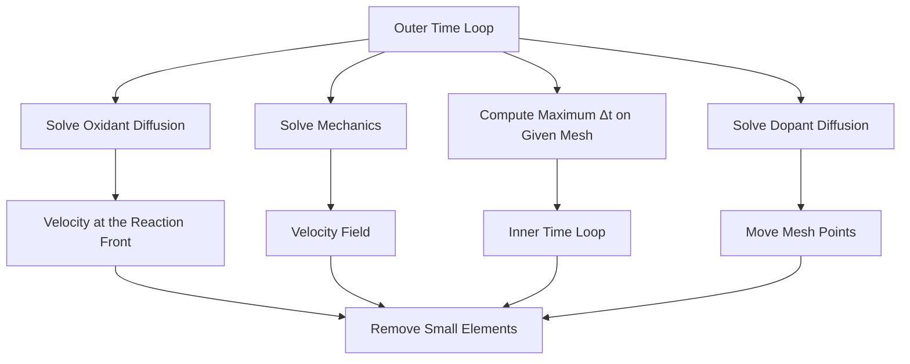
</details>

Figure 78 Flowchart for simulation of material growth

# Outer Time Loop

The diffusion equation for the oxidants is solved using the general PDE solver in Sentaurus Process. In addition, a predictor for the next time step (oxidation time step) is computed. When the concentrations of oxidants at the oxide–silicon interface are known, the corresponding growth velocities can be computed. These velocities serve as a boundary condition for the mechanics problem. After solving the mechanics problem, the velocity field in the entire structure is known. At this point, the program enters the inner time loop.

# Inner Time Loop

Given a mesh and the velocity field, a time step (grid time step) can be computed so that elements do not collapse when applying the velocities to the nodes of the mesh (moving mesh). In the next time step, the dopant diffusion is solved using the general PDE solver and a predictor for the next time step (diffusion time step) is computed. Then, mesh points are moved according to the velocity field and, subsequently, small mesh elements are removed.

After removing small elements, the next grid time step is computed. The smaller of the two time steps (grid time step and diffusion time step) is applied in the next time cycle. The inner time loop runs as long as the time step of the outer loop (oxidation time step) is fulfilled. Then, the code goes into its second time step of the outer loop. An example of typical output during oxidation is:

```txt
...
Reaction Solve from 14.86min to 15.11min. Time step: 15.32s.
Mechanics Solve from 14.86min to 15.11min. Time step: 15.32s.
Diffusion Solve from 14.86min to 14.99min. Time step: 8.144s.
Diffusion Solve from 14.99min to 15.11min. Time step: 7.176s.
Reaction Solve from 15.11min to 15.37min. Time step: 15.4s.
Mechanics Solve from 15.11min to 15.37min. Time step: 15.4s.
Diffusion Solve from 15.11min to 15.25min. Time step: 8.361s.
Diffusion Solve from 15.25min to 15.29min. Time step: 2.077s.
Diffusion Solve from 15.29min to 15.37min. Time step: 4.967s.
... 
```

This output reproduces the following time-stepping scheme:

Reaction Solve and Mechanics Solve occur in the outer time loop.   
Diffusion Solve occurs in the inner time loop.

As previously mentioned, after solving the mechanics problem, velocities are given on all mesh points. Mesh points are moved according to these velocities. This leads to a change in the geometry and, in some cases, also to a change in the topology of the structure at each time step.

At a reactive interface, for example at the oxidation front, two velocities apply: one describes the growth of a material and one describes the consumption of another material.

The velocity describing the growth of the material is used to solve the mechanics problem, and the velocities describing the consumption of a material are used to update the structure or mesh. Therefore, mesh elements on the growing side of the oxidation front are stretched, and elements on the shrinking side are compressed. Edges on the growing side, which become too long with time, are split. Edges and elements on the shrinking side of the interface that become too small are removed. This is shown in Figure 79.


<details>
<summary>text_image</summary>

Silicon
Oxide
</details>

Figure 79 Meshing strategy during thermal oxidation

# References

[1] N. Sullivan et al., “Exploring ISSG Process Space,” in 9th International Conference on Advanced Thermal Processing of Semiconductors (RTP), Anchorage, AK, USA, pp. 95– 110, September 2001.   
[2] M. M. Moslehi and K. C. Saraswat, “Thermal Nitridation of Si and SiO2 for VLSI,” IEEE Transactions on Electron Devices, vol. ED-32, no. 2, pp. 106–123, 1985.   
[3] S-L. Zhang, R. Buchta, and M. Östling, “A study of silicide formation from LPCVDtungsten films: Film texture and growth kinetics,” Journal of Materials Research, vol. 6, no. 9, pp. 1886–1891, 1991.   
[4] G. Giroult, A. Nouailhat, and M. Gauneau, “Study of a WSi2/polycrystalline silicon/ monocrystalline silicon structure for a complementary metal-oxide-semiconductor for a compatible self-aligned bipolar transistor emitter,” Journal of Applied Physics, vol. 67, no. 1, pp. 515–523, 1990.   
[5] C. M. Comrie and R. T. Newman, “Dominant diffusing species during cobalt silicide formation,” Journal of Applied Physics, vol. 79, no. 1, pp. 153–156, 1996.   
[6] R. Stadler et al., “Ab initio calculations of the cohesive, elastic, and dynamical properties of $\mathrm { C o S i } _ { 2 }$ by pseudopotential and all-electron techniques,” Physical Review B, vol. 54, no. 3, pp. 1729–1734, 1996.

[7] R. Cerny, V. Cháb, and P. Prikryl, “Numerical simulation of the formation of Ni silicides induced by pulsed lasers,” Computational Materials Science, vol. 4, no. 3, pp. 269–281, 1995.   
[8] S.-L. Zhang and F. M. d’Heurle, “Stresses from solid state reactions: a simple model, silicides,” Thin Solid Films, vol. 213, no. 1, pp. 34–39, 1992.   
[9] F. Cacho et al., “Numerical modeling of stress build up during nickel silicidation under anisothermal annealing,” Materials Science and Engineering B, vol. 135, no. 2, pp. 95– 102, 2006.

8: Oxidation and Silicidation

References

This chapter discusses the computation of mechanical stress in Sentaurus Process.

# Overview of Mechanical Stress

Mechanical stress has an important role in process modeling. It controls the structural integrity of the device, the yield from the process depends on stresses, the mobility of charged carriers is changed by stresses, and leakage currents also are a function of the stress in the system.

On a finer scale, stresses can affect dopant diffusion rates by modifying the band gap. They can affect oxidation rates and, therefore, can alter the shapes of thermally grown oxide layers.

In modern process flows, accurate computation of stress is important. However, there is a continual trend toward designing process flows that produce the right types of stress in the device. With appropriate stresses, device performance can be enhanced significantly.

Stress computation simulations are performed in the following distinct steps:

1. Define the equations for mechanics. The equations used in Sentaurus Process define force equilibrium in the quasistatic regime.   
2. Define the boundary conditions for these equations. For the elliptic equations that arise from the equations of force equilibrium, boundary conditions are needed on all boundaries. Sentaurus Process allows Dirichlet or Neumann boundary conditions, provided that certain criteria are met. The minimum criterion is to constrain the structure sufficiently so that it has no rigid body modes.   
3. Define material properties. This step defines the relationship between stresses and strains. Some materials can hold stresses for a given strain without relaxing; these are elastic materials. Other materials can relax the stresses away; these are viscous or viscoelastic materials. Sentaurus Process provides viscoelastic constitutive equations for the computation of mechanical stresses. By setting parameters appropriately, the extreme cases of a purely viscous material and a purely elastic material can be simulated as well. The viscoelastic models used in Sentaurus Process provide a choice between the Maxwell model and the standard linear solid model. The viscosity can depend on the local shear stresses, which make the viscosity a locally varying quantity and can lead to nonlinear mechanical behavior. In addition to elastic and viscoelastic materials, there are materials to model irreversible deformation and temperature-dependent volume change.

4. Define the mechanisms that drive the stresses. In Sentaurus Process, this is performed through intrinsic stresses, thermal mismatch, material growth, lattice mismatch (silicon germanium), and densification. All these processes are additive in the linear elastic regime. In the nonlinear regime, they must be updated from the available stress history.

Stress is solved in all materials. However, during an inert diffusion, the stress computation can be switched off. Parameters describing material behavior, which are introduced in this chapter, can be found in the parameter database:

```txt
<material> Mechanics 
```

The following sections discuss the constitutive equations in detail. These tensor equations can be split into two components:

The dilatational component, which corresponds to the trace of the tensor, describes the material behavior in the case of a pure volume change.   
The deviatoric component describes an arbitrary deformation but without changing the volume.

For example, the strain tensor can be decomposed as follows:

$$
\varepsilon_ {i j} = \underbrace {\varepsilon_ {i j} ^ {\prime}} _ {\text { deviatoric }} + \underbrace {\frac {1}{3} \left(\sum_ {k} \varepsilon_ {k k}\right) \delta_ {i j}} _ {\text { dilatational }} \tag {944}
$$

This decomposition will be used in subsequent equations to discuss the constitutive equation for the dilatational and deviatoric components independently.

# Material Models

Sentaurus Process implements the viscous, viscoelastic, and elastic models in a general manner, where the viscous model and elastic model can be derived from the viscoelastic model. The viscous and viscoelastic models use shear stress–dependent viscosity. The elastic model also has anisotropic elasticity where the elastic coefficients depend on the crystal orientation. The plasticity models describe the material behavior beyond yield, independent of the rate of loading.

# Viscoelastic Materials

The viscoelastic material response is characterized by elastic and viscous components. The combined response depends on how elastic and viscous stresses or strains are coupled. Sentaurus Process provides two commonly used combinations:

Maxwell model   
■ Standard linear solid model

# Maxwell Model

The viscoelastic behavior for the Maxwell model is obtained by combining elastic and viscous responses in series. The stress–strain equations are written in terms of dilatational and deviatoric components. The equations for the volumetric component of the stress tensor1 take the form:

$$
\frac {\dot {\sigma} _ {v}}{K} + \frac {\sigma_ {v}}{\eta_ {v} (T , \sigma_ {s})} = 3 \dot {\varepsilon} _ {v} \tag {945}
$$

$$
\sum_ {k} \sigma_ {k k} = - 3 p = 3 \sigma_ {v}
$$

where $\boldsymbol { \mathsf { \Pi } } \boldsymbol { \mathsf { \Pi } } \boldsymbol { \mathsf { \Pi } } \boldsymbol { \mathsf { \Pi } }$ is the bulk viscosity. In addition, the relation of the stress and strain tensor to the hydrostatic pressure $p$ is shown. The bulk modulus can be computed from the Poisson ratioK (PoissRatio) and Young’s modulus (YoungsMod) as:

$$
K = \frac {\text { YoungsMod }}{3 (1 - 2 \cdot \text { PoissRatio })} \tag {946}
$$

The deviatoric component of the stress tensor is described by:

$$
\frac {\dot {\sigma} _ {i j} ^ {\prime}}{G} + \frac {\sigma_ {i j} ^ {\prime}}{\eta^ {\prime} (T , \sigma_ {\mathrm{s}})} = 2 \dot {\varepsilon} _ {i j} ^ {\prime} \tag {947}
$$

where $\boldsymbol \eta ^ { \prime }$ is the shear viscosity. The shear modulus can be computed from the Poisson ratioG and Young’s modulus as:

$$
G = \frac {\text { YoungsMod }}{2 (1 + \text { PoissRatio })} \tag {948}
$$

By default, the viscoelastic response is applied to the deviatoric components. The linear elastic model is used for the pressure–volume response, that is:

$$
\sigma_ {v} = K \sum_ {k} \varepsilon_ {k k} \tag {949}
$$

To apply the viscoelastic response to both the deviatoric components and the volumetric component, use:

pdbSet Mechanics NoBulkRelax 0

The shear viscosity is a function of the shear stress and the temperature , where:η' T

$$
\eta^ {\prime} (T) = \text { Viscosity } 0 \cdot \exp \left(- \frac {\text { ViscosityW }}{k _ {\mathrm{B}} T}\right) \tag {950}
$$

Usually, the value of ViscosityW is negative and, therefore, the shear viscosity decreasesη' with increasing temperature. The bulk viscosity has a similar Arrhenius expression defined by the parameters Viscosity0.K and ViscosityW.K. The dependency on the shear stress $\sigma _ { \mathrm { { s } } }$ is discussed in Shear Stress–Dependent Viscosity on page 698.

# Standard Linear Solid Model

In the standard linear solid model, the material behavior is modeled by combining the elastic response in parallel with the Maxwell model–based viscoelastic response:

$$
\sigma_ {i j} = \sigma_ {i j} ^ {\mathrm{el}} + \sigma_ {i j} ^ {\mathrm{ve}} \tag {951}
$$

where ${ \sigma } _ { i j } ^ { { \mathrm { e l } } }$ is the elastic stress and ${ \sigma } _ { i j } ^ { \mathrm { v e } }$ is the viscoelastic stress. The difference compared to the Maxwell model allows the total stress to be nonzero even after the viscoelastic stress has relaxed away:

$$
\sigma_ {i j} (t \rightarrow \infty) = \sigma_ {i j} ^ {\mathrm{el}} \tag {952}
$$

The dilatational and deviatoric components of the elastic and viscoelastic stresses are written in the usual form:

$$
\sigma_ {\nu} ^ {\mathrm{el}} = 3 K _ {\mathrm{base}} \varepsilon_ {\nu}
$$

$$
\sigma_ {i j} ^ {\mathrm{el}} = 2 G _ {\mathrm{base}} \varepsilon_ {i j} ^ {\prime}
$$

$$
\frac {\dot {\sigma} _ {v} ^ {\mathrm{ve}}}{K} + \frac {\sigma_ {v} ^ {\mathrm{ve}}}{\eta_ {v} (T , \sigma_ {s} ^ {\mathrm{ve}})} = 3 \dot {\varepsilon} _ {v} \tag {953}
$$

$$
\frac {\dot {\sigma} _ {i j} ^ {\mathrm{ve}}}{G} + \frac {\sigma_ {i j} ^ {\mathrm{ve}}}{\eta^ {\prime} (T , \sigma_ {s} ^ {\mathrm{ve}})} = 2 \dot {\varepsilon} _ {i j} ^ {\prime}
$$

# where:

■ $K _ { \mathrm { b a s e } }$ and $G _ { \mathrm { b a s e } }$ are the bulk and shear moduli for the elastic response, respectively.   
and are the bulk and shear moduli for the elastic component of the viscoelasticK G response, respectively.   
$\boldsymbol { \mathsf { \Pi } } _ { \mathsf { \tiny { l } } _ { \nu } }$ and $\boldsymbol \eta ^ { \prime }$ are the bulk and shear viscosities, respectively.   
$\mathfrak { E } _ { \nu }$ and $\mathfrak { E } _ { i j } ^ { \prime }$ are the dilatational and the deviatoric components of mechanical strain, respectively.

To enable the standard linear solid model, use:

pdbSetSwitch <material> Mechanics ViscoElasticity.Model SLS-Maxwell

The default value for the above parameter is Maxwell for the Maxwell model.

The elastic response for the standard linear solid model is inactive, by default, so that the material behavior is similar to that of the Maxwell model. The elastic response can be activated by providing nonzero values for the bulk and shear moduli:

pdbSetDouble <material> Mechanics BaseBulkModulus <n>

pdbSetDouble <material> Mechanics BaseShearModulus <n>

The material parameters for the viscoelastic response are specified in the same way as for the Maxwell model. By default, the dilatational component of viscoelastic stress is assumed to be purely elastic:

$$
\sigma_ {v} ^ {\mathrm{ve}} = 3 K \varepsilon_ {v} \tag {954}
$$

To activate the viscoelastic response for the dilatational component, use:

pdbSet Mechanics NoBulkRelax 0

To visualize elastic and viscoelastic responses, this model provides additional output fields. Stresses and strains for the elastic response can be viewed with the BaseStressEL and BaseElasticStrainEL fields, respectively. Creep strains $\mathfrak { E } _ { i j } ^ { \mathrm { { c r } } }$ for the viscoelastic response can be viewed with the CreepStrainEL field:

$$
\varepsilon_ {i j} ^ {\mathrm{cr}} = \int_ {0} ^ {t} \left(\frac {\sigma_ {v} ^ {\mathrm{ve}}}{2 \eta_ {v}} + \frac {\sigma_ {i j} ^ {\mathrm{ve}}}{2 \eta^ {\prime}}\right) d t \tag {955}
$$

The solution for viscoelastic stress is time dependent. It also becomes nonlinear when viscosity is a function of viscoelastic shear stress. Therefore, the Newton method is used to solve for stresses. At the end of each Newton iteration, a check is made on whether the convergence criteria have been satisfied. More iterations are performed until all the criteria are satisfied within the specified tolerance or until the maximum number of iterations is reached. For details about convergence criteria and time-stepping for mechanics, see Time-Step Control for Mechanics on page 914.

# Purely Viscous Materials

Oxide and nitride, by default, are treated as viscoelastic materials. However, the viscosity is a function of temperature (see Eq. 950). With increasing temperature, the viscosity decreases, that is, the material becomes increasingly more liquid. When the viscosity reaches a very low value, the first term in Eq. 947 can be neglected:

$$
\frac {\sigma_ {j k} ^ {\prime}}{\eta^ {\prime} (T , \sigma_ {\mathrm{s}})} = 2 \dot {\varepsilon} _ {j k} ^ {\prime} \Leftrightarrow \sigma_ {j k} ^ {\prime} = 2 \eta^ {\prime} \dot {\varepsilon} _ {j k} ^ {\prime} \tag {956}
$$

Eq. 956 describes the deviatoric component of a purely viscous material. The relaxation time $\tau = \eta ^ { \prime } / G$ typically gives a good estimate of the behavior of a viscoelastic material. If isτ much greater than the process time, the material is in the elastic regime. The material behaves viscoelastically if is in the range of the process time. If is very small, the material is in theτ τ viscous regime.

# Shear Stress–Dependent Viscosity

For viscous and viscoelastic materials, the viscosity can depend on the temperature and the shear stress $\sigma _ { \mathrm { { s } } }$ . The temperature dependency is described by Eq. 950. The dependency on the shear stress is given by:

$$
\eta (\sigma_ {s}, T) = \eta (T) \cdot \frac {\sigma_ {s} / \sigma_ {\text { crit }}}{\sinh (\sigma_ {s} / \sigma_ {\text { crit }})} \tag {957}
$$

The shear stress $\sigma _ { \mathrm { { s } } }$ is computed from the local stress distribution based on the second invariant of the deviatoric component of the stress tensor:

$$
\sigma_ {s} = \sqrt {\frac {3}{2} \sum_ {j} \sum_ {k} \sigma_ {j k} ^ {\prime} \sigma_ {k j} ^ {\prime}} \tag {958}
$$

The viscosity breakdown value $\sigma _ { \mathrm { c r i t } }$ can be determined by:

$$
\sigma_ {\mathrm{crit}} = \frac {2 k _ {\mathrm{B}} T}{v _ {\mathrm{crit}}} \tag {959}
$$

where:

$$
v _ {\text { crit }} (T) = \mathrm{Vcrit} 0 \cdot \exp \left(- \frac {\mathrm{VcritW}}{k _ {\mathrm{B}} T}\right) \tag {960}
$$

By default, oxide and nitride are treated as viscoelastic materials with shear stress–dependent viscosity. The values for Vcrit0 and VcritW also are set in the parameter database:

pdbSetDouble <material> Mechanics Vcrit0

pdbSetDouble <material> Mechanics VcritW

# Purely Elastic Materials

If the viscosity in Eq. 947, p. 695 is chosen high enough, the second term on the left can be neglected and the equation reads:

$$
\frac {\dot {\sigma} _ {j k} ^ {\prime}}{G} = 2 \dot {\varepsilon} _ {j k} ^ {\prime} \Leftrightarrow \sigma_ {j k} ^ {\prime} = 2 G \varepsilon_ {j k} ^ {\prime} \tag {961}
$$

This equation describes the deviatoric component of a purely elastic material. By default, silicon and polycrystalline silicon are treated as purely elastic materials. To achieve this, the viscosity of these materials is set to $1 \times { 1 0 } ^ { 4 0 }$ . poise

NOTE and are the primary parameters describing elastic materials, andK G not Young’s modulus and the Poisson ratio. When changing material properties with the pdb command, only a change to the primary parameters affects the simulation. To obtain Young’s modulus and the Poisson ratio, use the commands KG2E on page 1062 and KG2nu on page 1063, respectively.

When material data is given in terms of Young’s modulus and the Poisson ratio, use the commands Enu2G on page 972 and Enu2K on page 973 to convert them to the shear modulus and the bulk modulus, respectively.

# Anisotropic Elastic Materials

The stress and strain relations for anisotropic elastic materials can be described using:

$$
\sigma_ {i} = C _ {i j} \varepsilon_ {j} \tag {962}
$$

where $\sigma _ { i }$ and $\mathfrak { E } _ { j }$ are the components of the engineering stress and strain, respectively, and $C _ { i j }$ is the component of the stiffness matrix. The engineering stress $\sigma _ { i } ( i { = } 1 , . . . , 6 )$ corresponds to the stress-tensor components $\sigma _ { \mathrm { x x } } , \sigma _ { \mathrm { y y } } , \sigma _ { \mathrm { z z } } , \sigma _ { \mathrm { x y } } , \sigma _ { \mathrm { y z } } , \sigma _ { \mathrm { x z } } ,$ , and the engineering strain $\mathfrak { E } _ { j }$ $( j = 1 , . . . , 6 )$ corresponds to the strain-tensor components $\mathfrak { E } _ { \mathrm { x x } } , \mathfrak { E } _ { \mathrm { y y } } , \mathfrak { E } _ { \mathrm { z z } } , 2 \mathfrak { E } _ { \mathrm { x y } } , 2 \mathfrak { E } _ { \mathrm { y z } } , 2 \mathfrak { E } _ { \mathrm { x z } }$ .

NOTE The engineering shear-strain components differ from the shear-strain tensor components by a factor of 2.

# Cubic Crystal Anisotropy

The mechanical responses of a crystalline solid vary along various crystal orientations. For a cubic crystal, the axes of reference are chosen to be parallel to the crystal axes. In a coordinate system with axes aligned along the crystal axes, the symmetric stiffness matrix has theC following nonzero components: $C _ { 1 1 } = C _ { 2 2 } = C _ { 3 3 } , C _ { 1 2 } = C _ { 2 3 } = C _ { 1 3 } , C _ { 4 4 } = C _ { 5 5 } = C _ { 6 6 }$ .

All other components are zeros. The anisotropic stress and strain relation is completely defined when three independent modulus parameters C11, C12, and C44 are specified.

The degree of anisotropy for a given material can be measured by the departure from unity of the ratio $A = 2 C _ { 4 4 } / ( C _ { 1 1 } - C _ { 1 2 } )$ . The anisotropic model reduces to the isotropic model if the ratio is equal to 1. When the simulation coordinate axes do not coincide with the crystal axes,A the stiffness matrix must be transformed accordingly. For this, note that is actually aC C rank-4 tensor.

By default, the anisotropic elasticity model is switched off. The following command switches on the model:

pdbSet Silicon Mechanics Anisotropic 1

The values of these three modulus parameters with respect to the cubic crystal axis can be defined using the following commands, which also show the default values for the crystalline silicon:

```batch
pdbSet Silicon Mechanics C11 16.57E11
pdbSet Silicon Mechanics C12 6.39E11
pdbSet Silicon Mechanics C44 7.96E11 
```

The unit for these default values is .dyn/cm2

This model depends on the wafer.orient and slice.angle parameters specified in the init command.

# Hexagonal Crystal Anisotropy

The mechanical responses of a crystalline solid vary along various crystal orientations. Hexagonal close-packed crystals contain a plane of isotropy. In a coordinate system with axes aligned along the crystal axes, the symmetric stiffness matrix has the following nonzeroC components: $C _ { 1 1 } = C _ { 2 2 } , C _ { 3 3 } , C _ { 1 2 } , C _ { 1 3 } = C _ { 2 3 } , C _ { 4 4 } = C _ { 5 5 } , C _ { 6 6 } = ( C _ { 1 1 } - C _ { 1 2 } ) / 2$ .

All other components are zeros. The anisotropic stress and strain relation is completely defined when five independent modulus parameters C11, C12, C13, C33, and C44 are specified.

When the simulation coordinate axes do not coincide with the crystal axes, the stiffness matrix must be transformed accordingly. The transformation depends on the crystal orientationC information specified in the init command and the mater command.

The values of these five modulus parameters with respect to the crystal axis can be defined using the following commands, which also show the default values for crystalline GaN:

```batch
pdbSet <material> Mechanics C11 39.0E11
pdbSet <material> Mechanics C12 14.5E11
pdbSet <material> Mechanics C13 10.6E11
pdbSet <material> Mechanics C33 39.8E11
pdbSet <material> Mechanics C44 10.5E11 
```

The unit for these default values is dyn/cm2 .

The hexagonal anisotropic elasticity model is applied to certain wurtzite III–V nitride materials. The following command switches on the model:

pdbSet <material> Mechanics Anisotropic 1

The material must be set to crystalline with a hexagonal lattice type.

# Orthotropic Model

Orthotropic materials have three planes of symmetry. In a coordinate system with axes aligned along the symmetry planes, the symmetric stiffness matrix has the following nonzeroC components: $C _ { 1 1 } , C _ { 2 2 } , C _ { 3 3 } , C _ { 4 4 } , C _ { 5 5 } , C _ { 6 6 } , C _ { 1 2 } = C _ { 2 1 } , C _ { 1 3 } = C _ { 3 1 } , C _ { 2 3 } = C _ { 3 2 }$ . The symmetry planes of the model coincide with the simulation coordinate system, and the axes 1, 2, and 3 become axes X, Y, and Z in the simulation coordinate system, respectively.

Orthotropic material properties can be described by specifying nine independent parameters, namely, the Young’s moduli in the symmetry planes $( E _ { x } , E _ { \mathrm { v } } , E _ { z } )$ , the directional shear moduli $( G _ { x y } , G _ { x z } , G _ { y z } )$ , and the directional Poisson ratios $( \mathbf { \Delta v } _ { x y } , \mathbf { \Delta v } _ { x z } , \mathbf { \Delta v } _ { y z } \ )$ . The other directional Poisson ratios are calculated from:

$$
\frac {v _ {i j}}{E _ {i}} = \frac {v _ {j i}}{E _ {j}} \tag {963}
$$

where $i , j = x , y , z$ .

The stiffness matrix components are calculated from the specified material properties as:

$$
C _ {1 1} = E _ {x} (1 - \nu_ {y z} \upsilon_ {z y}) \times \gamma
$$

$$
C _ {2 2} = E _ {y} (1 - v _ {x z} v _ {z x}) \times \gamma
$$

$$
C _ {3 3} = E _ {z} (1 - v _ {x y} v _ {y x}) \times \gamma
$$

$$
C _ {1 2} = C _ {2 1} = E _ {x} \left(v _ {y x} + v _ {y z} v _ {z x}\right) \times \gamma \tag {964}
$$

$$
C _ {1 3} = C _ {3 1} = E _ {z} (\upsilon_ {x z} + \upsilon_ {x y} \upsilon_ {y z}) \times \gamma
$$

$$
C _ {2 3} = C _ {3 2} = E _ {y} \left(v _ {z y} + v _ {z x} v _ {x y}\right) \times \gamma
$$

$$
\gamma = (1 - \upsilon_ {x y} \upsilon_ {y x} - \upsilon_ {y z} \upsilon_ {z y} - \upsilon_ {x z} \upsilon_ {z x} - 2 (\upsilon_ {y x} \upsilon_ {x z} \upsilon_ {z y})) ^ {- 1}
$$

$$
C _ {4 4} = G _ {y z}
$$

$$
C _ {5 5} = G _ {x z} \tag {965}
$$

$$
C _ {6 6} = G _ {x y}
$$

By default, the orthotropic model is switched off. It is switched on using the command:

pdbSet <material> Mechanics Orthotropic 1

The material properties can be specified by the command:

pdbSetDouble <material> Mechanics <material\_parameter> <n>

specifically:

```txt
pdbSetDouble <material> Mechanics YoungsModulusX <n>
pdbSetDouble <material> Mechanics YoungsModulusY <n>
pdbSetDouble <material> Mechanics YoungsModulusZ <n>
pdbSetDouble <material> Mechanics PoissonRatioXY <n>
pdbSetDouble <material> Mechanics PoissonRatioXZ <n>
pdbSetDouble <material> Mechanics PoissonRatioYZ <n>
pdbSetDouble <material> Mechanics ShearModulusXY <n>
pdbSetDouble <material> Mechanics ShearModulusXZ <n>
pdbSetDouble <material> Mechanics ShearModulusYZ <n> 
```

The units for Young’s modulus and the shear modulus are .dyn/cm2

Alternatively, you can simplify the moduli definition by specifying the following parameters:

```txt
pdbSetDouble <material> Mechanics YoungsModulusX <n>
pdbSetDouble <material> Mechanics YoungsModulusY <n>
pdbSetDouble <material> Mechanics YoungsModulusZ <n>
pdbSetDouble <material> Mechanics OrthoPoissonRatio <n> 
```

In addition to the three Young’s moduli, you only need to define a Poisson ratio between –1 and 0.5. If you do not specify the Poisson ratio, Sentaurus Process issues a warning message and sets the Poisson ratio to 0.28.

NOTE To prevent silicon and materials derived from silicon from using default orthotropic modulus settings, you must unset the corresponding default Parameter Database (PDB) parameters.

Orthotropic thermal expansion also is considered in this material model, and different coefficients of thermal expansion can be specified along the three symmetry planes:

```txt
pdbSetDouble <material> Mechanics ThExpCoeffX <n>
pdbSetDouble <material> Mechanics ThExpCoeffY <n>
pdbSetDouble <material> Mechanics ThExpCoeffZ <n> 
```

Temperature-dependent material properties can be specified for all the material parameters specified above. The variation of a property can be specified as:ξ

$$
\xi (T) = \xi_ {\text { ref }} + \xi (T - T _ {\text { ref }}) \tag {966}
$$

where the reference value is the material parameter value specified in the command file.

The values can be specified as:

pdbSet <material> Mechanics <material parameter>Rate <n>

For example:

pdbSetDouble FR4 Mechanics ThExpCoeffXRate 0

These orthotropic parameter entries exist for silicon, and the shorthand pdbSet command can be used. The default values are set to replicate isotropic elastic behavior.

NOTE The older parameters using the 1, 2, 3 indices are deprecated and are replaced with the new parameters using the X, Y, Z indices.

Anisotropic elastic models and plastic models must not be switched on simultaneously for the same material.

# Plastic Materials

Materials such as metals show linear elastic behavior at lower stresses but undergo permanent deformation at higher stresses. At low temperatures, permanent deformation in these materials is not sensitive to the rate of loading. Such material behavior is defined as plastic or elasticplastic.

To switch on the plastic material model, use the command:

pdbSet <material> Mechanics IsPlastic <n>

# Incremental Plasticity

Plastic material behavior under nonmonotonic loading is modeled using incremental formulation.

Incremental plasticity uses the von Mises yield criterion with associative flow and bilinear hardening. The von Mises yield criterion for isotropic solid materials takes the form:

$$
F \left(\sigma_ {i j} ^ {\prime}, q _ {i j}, \alpha\right) = \sqrt {\left(\sigma_ {i j} ^ {\prime} - q _ {i j}\right) \left(\sigma_ {i j} ^ {\prime} - q _ {i j}\right)} - Y (\alpha) = 0 \tag {967}
$$

where:

$q _ { i j }$ is the back stress.   
is an isotropic hardening variable.α

$Y ( \alpha )$ is a function describing the change of yield surface with progressive yielding. This function can be set to linear or exponential with:

pdbSetSwitch <material> Mechanics Incremental.Plasticity.Yield.Model <Linear | Exponential>

The linear relation takes the form $Y ( \alpha ) = \sqrt { \frac { 2 } { 3 } } ( \sigma _ { y } + H _ { \mathrm { i s o } } \alpha )$ where $\sigma _ { y }$ is the yield stress in uniaxial tension, and $H _ { \mathrm { i s o } }$ is the isotropic hardening modulus. $\sigma _ { y }$ and $H _ { \mathrm { i s o } }$ can be set respectively using the commands:

pdbSetDouble <material> Mechanics Incremental.Plasticity.SigmaY <n> pdbSetDouble <material> Mechanics Incremental.Plasticity.Hiso <n>

The exponential relation takes the form $Y ( \alpha ) \ = \ \sqrt { \frac { 2 } { 3 } ( \sigma _ { y } + R _ { \mathrm { i s o } } ( 1 - \exp ( - b _ { \mathrm { i s o } } \alpha ) ) ) }$ where23--( ) σy + Riso( ) 1 – exp ( ) –bisoα $R _ { \mathrm { i s o } }$ and $b _ { \mathrm { i s o } }$ are parameters for nonlinear (exponential) isotropic hardening. To set these parameters, use the commands:

pdbSetDouble <material> Mechanics Incremental.Plasticity.Riso <n> pdbSetDouble <material> Mechanics Incremental.Plasticity.Biso <n>

Under a small strain assumption, the strains (and strain rates) are decomposed additively:

$$
\varepsilon_ {i j} = \varepsilon_ {i j} ^ {\mathrm{e}} + \varepsilon_ {i j} ^ {\mathrm{p}} \tag {968}
$$

where $\mathfrak { E } _ { i j } ^ { \mathrm { { e } } }$ are the elastic strains, and $\mathfrak { E } _ { i j } ^ { \mathfrak { p } }$ are the plastic strains.

For incremental plasticity, the plastic strains are determined by the plastic flow rule:

$$
\dot {\varepsilon} _ {i j} ^ {\mathrm{p}} = \dot {\gamma} \frac {\partial Q}{\partial \sigma_ {i j}} \tag {969}
$$

where $\dot { \gamma } \geq 0$ is the slip rate, and is the plastic potential. Plastic flow is assumed to be volumeQ preserving, so that plastic strain is purely deviatoric:

$$
\varepsilon_ {i j} ^ {\mathrm{p}} \delta_ {i j} = 0 \quad \Rightarrow \quad \varepsilon_ {i j} ^ {\mathrm{p}} = \varepsilon_ {i j} ^ {\mathrm{p}} \tag {970}
$$

For associative plastic flow, the plastic potential is set equal to the yield function . TheQ F evolution of the isotropic hardening variable and the back-stress variable is given by:

$$
\dot {\alpha} = \dot {e} ^ {p} = \sqrt {\frac {2}{3}} \dot {\gamma} \tag {971}
$$

$$
\dot {q} _ {i j} = \frac {2}{3} \dot {\gamma} \Bigg (H _ {\mathrm{kin}} \frac {(\sigma_ {i j} ^ {\prime} - q _ {i j})}{\sqrt {(\sigma_ {k l} ^ {\prime} - q _ {k l}) (\sigma_ {k l} ^ {\prime} - q _ {k l})}} - \sqrt {\frac {3}{2}} H _ {\mathrm{NLkin}} q _ {i j} \Bigg)
$$

where $H _ { \mathrm { k i n } }$ is the linear kinematic hardening modulus, $H _ { \mathrm { { N L k i n } } }$ is the parameter for nonlinear kinematic hardening, and $\displaystyle \dot { \overline { { e } } } ^ { \mathfrak { p } }$ is the equivalent plastic strain rate. The Einstein summation convention is used to define the tensor product in this equation.

To set the kinematic hardening parameters, use the commands:

pdbSetDouble <material> Mechanics Incremental.Plasticity.Hkin <n> pdbSetDouble <material> Mechanics Incremental.Plasticity.HNLkin <n>

For linear isotropic hardening, the hardening modulus is interpreted as the slope of the stress versus the plastic strain curve (as obtained from uniaxial tension test) $H _ { \mathrm { { i s o } } } = { \frac { d { \hat { \sigma } } } { d \varepsilon ^ { \mathrm { { p } } } } }$ d ε p

It differs from the elastic-plastic tangent modulus, which is defined as the slope of the stress versus total strain curve $E ^ { \mathrm { { \hat { e p } } } } = \frac { d \sigma } { d \varepsilon }$ .

To switch on the incremental plasticity model, use:

pdbSet <material> Mechanics Plasticity.Model Incremental

The rate equations are discretized using the backward Euler scheme and then are solved using a radial return mapping algorithm (see [1] for more details).

The nonlinear nature of the plasticity model requires Newton iterations to achieve the equilibrium state for each loading step. At the end of each iteration, a check on the satisfaction of convergence criteria is made. More Newton iterations are performed until all the convergence criteria are satisfied within the specified tolerance or until the maximum number of iterations is reached. For details about convergence criteria and time-stepping for mechanics, see Time-Step Control for Mechanics on page 914.

NOTE To define the plastic model, use nonzero values for the isotropic or the kinematic hardening modulus along with yield stress. In the absence of hardening, the numeric simulation of plastic deformation might become unstable. The PDB parameters FirstYield, Hardening.Modulus.Isotropic, and Hardening.Modulus.Kinematic are deprecated and are replaced by Incremental.Plasticity.SigmaY, Incremental.Plasticity.Hiso, and Incremental.Plasticity.Hkin, respectively.

# Mole Fraction–Dependent Mechanical Properties of Compound Materials

The mechanical properties of compound materials change with the ratio of substance concentration, that is, mole fraction. For general information about alloys, mole fraction computation, and parameter interpolation, see Alloy Materials and Parameter Interpolation on page 24.

In mechanics, mole fraction dependency is used by default and is applied to:

The bulk modulus and the shear modulus for isotropic materials.   
$C _ { 1 1 } , C _ { 1 2 }$ , and $C _ { 4 4 }$ for cubic anisotropic elastic materials.   
■ $C _ { 1 1 } , C _ { 1 2 } , C _ { 1 3 } , C _ { 3 3 }$ , and $C _ { 4 4 }$ for hexagonal anisotropic elastic materials.   
The coefficient of thermal expansion.

The alloy mechanics parameters are interpolated based on the mole fraction and the parameters defined on the base materials. Base materials are non-alloy materials that form the alloy. For example, the elastic constant $C _ { 1 1 }$ of the ternary alloy AlGaN is interpolated from the elastic constant $C _ { 1 1 }$ of its base materials AlN and GaN. For the binary compound SiGe, the elastic constants are interpolated from the parameters defined on Si and Ge.

The mole fraction dependency for the above-listed mechanical properties can be defined separately. By default, a linear interpolation is used. If the parameter is defined for the compound material, the given parameter value is used.

Mole fraction dependency can be switched off with:

pdbSet Mechanics Parameter.Interpolation 0

# Temperature-Dependent Mechanical Properties

The mechanical properties of materials are different at high temperature from those at room temperature. The elastic modulus of typical materials decreases as temperature rises. Some materials show nonnegligible changes of mechanical properties at different temperatures.

The temperature dependency and mole fraction dependency are handled under the same PDB switch. The temperature dependency can be applied to:

The bulk modulus and the shear modulus for isotropic materials.   
■ $C _ { 1 1 } , C _ { 1 2 }$ , and $C _ { 4 4 }$ for cubic anisotropic elastic materials.   
■ $C _ { 1 1 } , C _ { 1 2 } , C _ { 1 3 } , C _ { 3 3 }$ , and $C _ { 4 4 }$ for hexagonal anisotropic elastic materials.   
The coefficient of thermal expansion for isotropic, cubic anisotropic, and hexagonal anisotropic elastic materials.

Table 84 Temperature-dependent mechanical parameters 

<table><tr><td>Material model</td><td>PDB parameters</td></tr><tr><td>Isotropic elasticity</td><td>BulkModulus, ShearModulus, ThExpCoeff</td></tr><tr><td>Cubic anisotropic elasticity</td><td>C11, C12, C44, ThExpCoeff</td></tr><tr><td>Hexagonal anisotropic elasticity</td><td>C11, C12, C13, C33, C44, ThExpCoeff1, ThExpCoeff2, ThExpCoeff3</td></tr><tr><td>Other</td><td>Refer to the corresponding sections for related parameters and syntax</td></tr></table>

The temperature dependency for the above-listed mechanical properties can be defined separately. The available options are:

■ The linear dependency is defined with the parameter <parameter>.T1, for example:

```txt
pdbSet <material> Mechanics BulkModulus.T1 <n> 
```

Then, the parameter is calculated using $P ( T ) = P + P . T 1 ( T - 2 6 . 8 5 )$ , where the unit of temperature is degree Celsius.   
The piecewise linear dependency can be specified with:

```html
pdbSetDoubleArray SiliconGermanium Mechanics ShearModulus.TTable {<T1> <v1> ... <Tn> <vn>} 
```

The unit of temperature is degree Celsius. The linear dependency defined by <parameter>.T1 is ignored.

The temperature dependency can be switched off with:

pdbSet Mechanics Parameter.Interpolation 0

NOTE Do not mix new syntax with old syntax (see Plane Stress Analysis on page 708). Some of the old syntax might exist in the Advanced Calibration script.

# Plane Stress Analysis

In 2D problems, the elastic models implemented in Sentaurus Process follow the plane strain formulation by default. Under the plane strain assumption:

$$
\varepsilon_ {z z} = 0; \sigma_ {z z} \neq 0 \tag {972}
$$

While this is good for structures where the strain in the third direction is very small compared to the cross section, it would give inaccurate results for thin structures.

Thin plate-like structures where one dimension is very small compared to the other two can be modeled under the plane stress assumption:

$$
\varepsilon_ {z z} \neq 0; \sigma_ {z z} = 0 \tag {973}
$$

The strain $\mathfrak { E } _ { z z }$ is obtained as a function of other strains, for example, for purely elastic structures:

$$
\varepsilon_ {z z} = - v \left(\varepsilon_ {x x} + \varepsilon_ {y y}\right) \tag {974}
$$

The plane stress model can be switched on for a particular region using:

pdbSetBoolean <material> Mechanics PlaneStress 1

NOTE You must switch on the plane stress model in all regions. Combining plane stress and plane strain formulations within a structure by switching on plane stress in only a few regions is not advisable.

# Equations: Global Equilibrium Condition

The equations for mechanics in Sentaurus Process are the quasistatic equations of force equilibrium.

The strain rate tensor is related to the symmetric component of the velocity gradient and is given by:

$$
\dot {\varepsilon} _ {j k} = \frac {1}{2} \left(\frac {\partial v _ {j}}{\partial x _ {k}} + \frac {\partial v _ {k}}{\partial x _ {j}}\right) \tag {975}
$$

Strain is then related to stresses through any of the models defined in Material Models on page 694. For all models, the global equilibrium condition is given by:

$$
\sum_ {k} \frac {\partial \sigma_ {j k} (\mathbf {v})}{\partial x _ {k}} = 0 \tag {976}
$$

The above equations are solved using the finite-element method. The solution is a vector representing the velocity components at each node. These velocities are used to compute the strain and stresses. The stresses and the boundary conditions determine the mechanical state of the system.

NOTE Stress and strain are derivatives of velocity. Therefore, they are computed at one order of accuracy lower than the solution variable. This also means that they are discontinuous across the elements. When visualized, stress values might appear poorly converged even if the linear solver has converged.

In addition, the quasistatic mechanics equations are elliptic in nature and, therefore, are prone to high levels of shape dependency. This is most frequently seen at gate corners during polysilicon reoxidation steps or at the corners of the STI trench during liner oxidation. These equations also exhibit a high sensitivity to the mesh modification algorithms at these corners.

NOTE At sharp corners, the mechanics equations have a singularity. Therefore, it is not possible to discretize at a corner correctly using regular types of element.

# Boundary Conditions

Equations for stress equilibrium require boundary conditions to define the system completely.

The default boundary conditions are zero velocities in the direction perpendicular to the boundary planes. Since velocities are set to fixed values along the boundaries, these boundary conditions are referred to as Dirichlet boundary conditions in directions perpendicular to boundary planes. The HomNeumann boundary condition is used when the plane must be free.


<details>
<summary>text_image</summary>

Vy=0
Vy=0
Vx=0
</details>

Figure 80 Default mechanics boundary conditions in the unified coordinate system

Sentaurus Process provides a general way to reset the default boundary conditions and specify boundary conditions for stress analysis using the stressdata command:

```txt
stressdata bc.location= Left | Right | Front | Back | Bottom
bc.value= {dx=<n> | dy=<n> | dz=<n>} 
```

The arguments dx, dy, and dz specify the displacement rates (default unit: cm/s).

The displacement rates are applied to the area defined by bc.location, where Left, Right, Front, Back, and Bottom refer to the outer boundary surfaces of the simulation domain. At least at one node, the displacement along any coordinate system direction must be fixed to remove the rigid body motion.

NOTE Any boundary condition defined with the stressdata command invalidates the default boundary conditions. If no boundary condition is defined, free boundary condition is applied by default.

Dirichlet boundary conditions are imposed using the penalty method, by default. To adjust the penalty factor, use the command:

pdbSet Mechanics Boundary.Penalty.Factor <n>

The default penalty factor is 1.0e12. The larger this factor, the more accurate the enforcement of Dirichlet boundary conditions. However, using an extremely large penalty factor could lead to an ill-conditioned matrix and, therefore, could slow down the linear equation solver.

Alternatively, you can use the matrix reduction method to impose Dirichlet boundary conditions. To choose the penalty method or matrix reduction method, use the command:

pdbSet Mechanics Boundary.Method.Type <model>

where <model> is Penalty or MatrixReduction.

NOTE To ensure the structure is bounded by a perfect rectangle, the displacements computed by these general boundary conditions are not applied to the structure. However, they evaluate the stresses correctly. This assumption is consistent with the small deformation assumption within each mechanics time step.

# Example: Applying Boundary Conditions

This 2D example simulates silicon covered with oxide, with the right side free to move:

```txt
line x loc= -0.02 tag= e spacing= 0.005
line x loc= 0    tag= a spacing= 0.005
line x loc= 0.2    tag= b spacing= 0.05

line y loc= 0 tag= c spacing= 0.05
line y loc= 2 tag= d spacing= 0.05

region silicon xlo= a xhi= b ylo= c yhi= d
region oxide xlo= e xhi= a ylo= c yhi= d

init !DelayFullD

pdbSetDouble Mechanics RefThExpCoeff 0
stressdata bc.location= Bottom bc.value= { dx=0 }
stressdata bc.location= Left bc.value= { dy=0 }

pdbSet Oxide Mechanics Viscosity0 1e40
pdbSet Oxide Mechanics ViscosityW 0

temp_ramp name= tr1 temperature= 600 ramprate= 30<K/min> time= 10<min>
diffuse temp.ramp= tr1

struct tdr= rampup

diffuse time= 10 temperature= 900 wet

struct tdr= postout 
```

# Deprecated Syntax

You can select various boundary conditions using:

pdbSet Mechanics <side> BoundaryCondition <model>

# where:

<side> is Left, Right, Front, or Back.   
<model> is HomNeumann or Dirichlet.

The HomNeumann boundary condition is used when the plane must be free and implies a zero normal stress (shown in Figure 81).


<details>
<summary>text_image</summary>

Vy=0
sy=0
Vx=0
</details>

Figure 81 HomNeumann boundary condition on right boundary plane

For example, if you want to set the right plane to be free, use the command:

pdbSet Mechanics Right BoundaryCondition HomNeumann

NOTE Any boundary condition or loading condition defined with the stressdata command invalidates all boundary conditions defined with pdbSet Mechanics <side> ..., including the default ones.

# Pressure Boundary Condition

The pressure boundary condition is used to apply uniform pressure on the exterior boundary. The direction of the loading depends on the normal of the exterior surface. To apply the pressure boundary condition, use the stressdata command, for example:

```txt
stressdata bc.location= Left | Right | Front | Back | Bottom
bc.value= {pressure=<n>} 
```

# Periodic Boundary Condition

The periodic boundary condition is used for structures with a periodically repeating pattern. This condition is used on periodic structures with assigned master and slave boundaries. The slave boundary has the same deformation profile as the master boundary.

In Figure 82, the left and right boundaries are bound together by the periodic boundary condition.


<details>
<summary>text_image</summary>

U₁L
U₁R
U₂L
U₂R
U₁R = U₁L; U₂R = U₂L ...
</details>

Figure 82 Periodic boundary condition

To apply the periodic boundary condition to the outer bounding surfaces, use the command:

```typescript
pdbSet Mechanics <Left | Right | Front | Back> Periodic 1 
```

If this command is specified on a sidewall, the opposite sidewall is defined automatically as a periodic boundary. Conflicts of boundary condition definitions are checked on all sidewalls. For example, to apply a periodic boundary condition on the left and right sidewalls, use one of the following commands:

```txt
pdbSet Mechanics Left Periodic 1
pdbSet Mechanics Right Periodic 1 
```

Both the periodic and coupling boundary conditions are implemented using the penalty method. To adjust the penalty factor, use the command:

```txt
pdbSet Mechanics Constraint.Penalty.Factor <n> 
```

The default penalty factor is . The larger this factor, the more accurately the periodic1.0 13×10 or coupling boundary conditions will be enforced. Using an extremely large penalty factor could lead to an ill-conditioned matrix and, therefore, slow down or even fail the linear equation solver.

NOTE If you choose to apply periodic boundary conditions, all other boundary conditions defined through the old pdbSet method will be ignored and must be redefined using the stressdata command.

# Stress-Causing Mechanisms

Every mechanical system needs a set of stress-driving mechanisms to reach a stressed state. The stress-inducing mechanisms in Sentaurus Process are described here.

# Growth of Material

During the oxidation process, volume is produced. Consuming silicon of volume 1 during thermal oxidation produces oxide of volume 2.25. This process introduces velocities at a growing interface: A velocity vector pointing into the silicon describes the progress of the oxidation front, and a velocity vector pointing into the oxide accounts for the volume expansion as described above. The latter is responsible for the generation of mechanical stresses and, therefore, is used as a boundary condition for the mechanical problem.

# Densification

A typical densification process uses thermal heating to increase the density of a porous material. As the material density increases, its volume shrinks and the volume shrinkage generates stresses.

The densification-induced stress computation is switched on using the density.increase parameter in the diffuse command or the temp\_ramp command, such as:

```python
diffuse temperature= 1000<C> time= 30<min> \
    density.increase= {<regionName>=<n> | <material>=<n>}
temp_ramp name= dens time= 1 temperature= 1000 density.increase= {oxide=0.02}
diffuse temp.ramp= dens 
```

The total amount of density increase can be specified per material or per region for a given diffuse (or temp\_ramp) step as shown above. A proportional amount of density increase is applied during each time step of the densification process.

The densification operation can be performed for all existing materials, as well as new materials defined using the mater command:

```txt
mater add name= TEOS new.like= oxide
diffuse time= 1 temperature= 1000 density.increase= {TEOS= 0.03} 
```

For densification processes involving large amounts of volume shrinkage, the material boundaries and meshes can be updated using the following settings:

```txt
pdbSet Grid Inert.Modify.Mesh 1
pdbSetDouble TEOS Grid MinimumVelocity 0 
```

For a complete densification process that has distinguished density changes, multiple diffuse steps can be used with different density increases for each segment of the process.

# Selectively Switching Off Grid Movement

The parameter MinimumVelocity can be used to selectively switch off point or interface movement. This can be useful, for example, when a mechanics simulation computes a small amount of boundary movement that is either unwanted or could cause element quality to suffer in the vicinity, and the approximation of no movement is acceptable. In general, the command is:

```txt
pdbSet <material> Grid MinimumVelocity <speed> 
```

If <material> is a bulk material (no underscore), the parameter applies to bulk points. If the speed of the bulk points is less than <speed> (in cm/s), Sentaurus Process truncates the speed to zero. This truncation is applied to material Silicon by default.

On the other hand, if <material> is an interface material (with an underscore, such as PolySilicon\_Silicon), the parameter only applies to points on that interface. This truncation is applied to material Silicon by default.

NOTE The moving mesh operations can become unstable for values of MinimumVelocity that are neither very large nor zero. Very large values stop all motion, and 0 allows all motion.

# Thermal Mismatch

Temperature changes during the process described by the temp\_ramp command or the keyword ramprate in the diffuse command lead to stress in the structure caused by the different coefficients of thermal expansion of the relevant materials.

When necessary, the stress computation can be switched off using the stress.relax flag:

diffuse temperature= 1000<C> time= 30<min> !stress.relax

NOTE If viscous or viscoelastic materials are present in the structure, the stress distribution might change even without a change in the temperature due to viscoelastic relaxation.

By default, stresses are computed during inert annealing for 2D simulations. To apply !stress.relax to all inert annealing steps, use the command:

pdbSet Compute NoStressRelax 1

To apply stress.relax to all inert annealing steps in 3D simulations, use the command:

pdbSet Diffuse 3DStressRelax 1

The coefficient of thermal expansion for certain materials can be found in the parameter database as follows:

pdbGet <material> Mechanics ThExpCoeff

Thermal expansion only affects the dilatational component of the constitutive equation. For isotropic elasticity, a small temperature change leads to a change in the dilatational stress component according to:

$$
\Delta \sigma_ {\mathrm{kk}} = - 3 K \alpha_ {\text {rel,kk}} \Delta T \tag {977}
$$

where is the bulk modulus at the current temperature. The change in the temperature isK described by and ΔT $\mathbf { \alpha } \mathbf { \alpha } \mathbf { \alpha } \mathbf { \alpha } \mathbf { \alpha } \mathbf { \alpha } \mathbf { \alpha } \mathbf { \alpha } \mathbf { \alpha } \mathbf { \alpha } \mathbf { \alpha } \mathbf { \alpha } \mathbf { \alpha } \mathbf { \alpha } \mathbf { \alpha } \mathbf { \alpha } \mathbf { \alpha } \mathbf { \alpha } \mathbf { \alpha } \mathbf { \alpha } \mathbf { \alpha } \mathbf { \alpha } \mathbf { \alpha } \mathbf { \alpha } \mathbf { \alpha } \mathbf { \alpha } \mathbf { \alpha } \mathbf { \alpha } \mathbf { \alpha } \mathbf { \alpha } \mathbf { \alpha } \mathbf { \alpha } \mathbf { \alpha } \mathbf { \alpha } \mathbf { \alpha } \mathbf { \alpha } \mathbf { \alpha } \mathbf { \alpha } \mathbf { \alpha } \mathbf { \alpha } \mathbf { \alpha } \mathbf { \alpha } \mathbf { \alpha } \mathbf { \alpha } \mathbf { \alpha } \mathbf { \alpha } \mathbf { \alpha } \mathbf { \alpha } \mathbf { \alpha } \mathbf { \alpha } \mathbf { \alpha } \mathbf { \alpha } \mathbf { \alpha } \mathbf { \alpha } \mathbf { \alpha } \mathbf { \alpha } \mathbf { \alpha } \mathbf { \alpha } \mathbf { \alpha } \mathbf { \alpha } \mathbf { \alpha \alpha } \mathbf { \alpha } \mathbf { \alpha } \mathbf { \alpha \alpha } \mathbf { \alpha } \mathbf { \alpha } \mathbf { \alpha \alpha } \mathbf { \alpha } \mathbf { \alpha } \mathbf  \alpha \mathbf { \alpha } \mathbf { \alpha } \mathbf \mathbf { \alpha } \mathbf { \alpha } \mathbf \mathbf { \alpha } \mathbf \mathbf { \alpha \alpha } \mathbf \mathbf { \alpha } \mathbf \mathbf { \alpha \alpha } \mathbf \mathbf \mathbf { \alpha \alpha } \mathbf \mathbf \mathbf { \alpha \alpha \alpha } \mathbf \mathbf \mathbf \mathbf \mathbf  \alpha \alpha \alpha \mathbf \mathbf \alpha \mathbf \alpha \mathbf \alpha \mathbf \mathbf \alpha \mathbf \mathbf \alpha \mathbf \alpha \mathbf \alpha \mathbf \mathbf \alpha \mathbf \alpha \mathbf \mathbf \alpha \mathbf \alpha \mathbf \mathbf \alpha \mathbf \mathbf \alpha \mathbf \mathbf \alpha \mathbf \mathbf \mathbf \alpha \mathbf \mathbf \alpha \mathbf \mathbf \mathbf \mathbf \alpha \alpha \mathbf \mathbf \mathbf \alpha \mathbf \mathbf \mathbf \mathbf \mathbf \alpha \mathbf \mathbf \mathbf \mathbf \mathbf \alpha \mathbf \mathbf \mathbf \mathbf \mathbf \mathbf \alpha \mathbf \mathbf \mathbf \mathbf \mathbf \mathbf \mathbf \alpha \mathbf \mathbf \mathbf \mathbf \alpha \mathbf \mathbf \mathbf \mathbf \mathbf \mathbf \mathbf $ is the relative coefficient of thermal expansion of a certain material with respect to the coefficient of thermal expansion of the substrate. The integration of thermal mismatch strain uses the midpoint rule. For anisotropic elasticity, the general tensor expression is used.

For hexagonal anisotropic materials, the coefficient of thermal expansion tensor has a symmetry plane and can be defined with:

```txt
pdbSet <material> Mechanics ThExpCoeff1 <n>
pdbSet <material> Mechanics ThExpCoeff2 <n>
pdbSet <material> Mechanics ThExpCoeff3 <n> 
```

The first two coefficients of thermal expansion must be equal for hexagonal anisotropic materials.

In certain examples, like bending, you might want to use absolute coefficients of thermal expansion instead of relative coefficients of thermal expansion. This can be achieved by setting the parameter RefThExpCoeff as follows:

pdbSetDouble Mechanics RefThExpCoeff 0.

All coefficients of thermal expansion are computed with respect to the substrate. This reference value is changed by setting a certain region as the substrate and resetting the coefficient of thermal expansion. A region can be tagged as the substrate in different ways:

Use the substrate argument when defining regions with the region command before the init command.   
■ If a saved structure is being loaded into Sentaurus Process, a region is tagged as the substrate with the command:

<!-- page:73 -->
region name=<c> substrate

The reference coefficient of thermal expansion can be directly set with:

pdbSetDouble Mechanics RefThExpCoeff <n>

This command overwrites the reference coefficient of thermal expansion setting from the substrate.

When doped deposition is used for epitaxial growth of SiGe at constant temperature, no thermal mismatch stress is introduced to the epitaxial layer with the model given by Eq. 977. To account for the thermal mismatch effect in the epitaxially grown materials, use the command:

pdbSet Mechanics Compound.ThExpCoeff 1

<!-- page:75 -->
NOTE Unlike the model given by Eq. 977, this model calculates the thermal mismatch stress in SiGe at the current temperature withoutT integration over the historical temperature ramps. Specifically, the thermal mismatch strain in SiGe is evaluated as $\mathsf { \alpha } _ { \mathrm { { r e l } } } \cdot ( T - T _ { 0 } )$ , where $T _ { 0 }$ is the room temperature (300 K) and $\bf { { Q } } _ { \mathrm { { r e l } } }$ is evaluated at the middle of the current temperature step.

# Lattice Mismatch

The presence of impurities, such as germanium and carbon, can change the lattice parameters of crystalline silicon. This effect has been exploited in two ways technologically:

■ Introducing an impurity during epitaxy to form a strained layer.   
Growing a substrate (typically, a very thick layer grown on a standard substrate) to produce a customized lattice constant.

However, most technological applications are based on the first use, for example, when SiGe source/drain pockets are grown on silicon substrates. For strained SiGe epitaxy, Sentaurus Process automatically computes and applies the strain, and no user input is necessary.


<details>
<summary>line</summary>

| Layer           | Ge Concentration |
| --------------- | ---------------- |
| Strained Layer  | 0.01             |
| Relaxed Layer   | 0.5              |
| Graded Layer    | 0.7              |
| Pure Silicon    | 0.7              |
</details>

Figure 83 Simple SiGe wafer for customizing the lattice spacing

For customized lattice-spacing substrates or other material systems, more setup is required. This section explains the theory and implementation of this model and gives an example. Figure 83 shows a simple SiGe wafer.

There are four main regions of the manufactured substrate. The silicon region has the graded buffer layer where the Ge concentration increases linearly from zero to the required concentration. The manufacturing process of this layer is designed such that all the dislocations are forced energetically to nucleate here, and the wafer is completely relaxed. The relaxed layer that is grown on top of the graded layer has no dislocations and no strain. The lattice spacing of this layer is determined by the Ge mole fraction. The lattice spacing of this layer controls the strains obtained in the top strained layer. The top strained layer is grown depending on the kind of strain required. If this layer is to be in a tensile state, the Ge concentration here must be less than that of the relaxed layer. In the case of a compressive state, the Ge concentration must be greater than that of the relaxed layer. This layer has a thermodynamic limit on its thickness since the strain energy it contains should be less than the dislocation nucleation energy. The strain energy is directly proportional to the volume that is under the strain. The strain profile of germanium in silicon is given approximately by:

$$
\varepsilon = 0. 0 4 2 5 x \tag {978}
$$

where is the Ge mole fraction calculated as the germanium concentration divided by thex silicon lattice density.

In the relaxed region, Sentaurus Process modifies the lattice spacing. This results in no stresses due to the presence of germanium. In the strained region, the lattice spacing is fixed by the lattice spacing in the relaxed region. Now, using the Ge mole fraction in the strained region, the effective unstrained lattice spacing is computed, and the stresses are based on the difference of the effective lattice constant and the lattice constant of the relaxed region.

For example, assume the strained layer has no Ge: The effective lattice constant is that of silicon given by $L _ { \mathrm { S i } }$ . The lattice constant of the relaxed SiGe component is, for example, $L _ { \mathrm { { S i G e } } }$ . The strain in the strained region is:

$$
\varepsilon = \frac {L _ {\mathrm{SiGe}} - L _ {\mathrm{Si}}}{L _ {\mathrm{Si}}} \tag {979}
$$

The strain computed using Eq. 979 is applied as a normal strain in the x-, y-, and z-directions.

# Using the Lattice Mismatch Model

For the most common case of SiGe layers grown on silicon substrates, the model is switched on by default, and strain is computed and updated as necessary. For simulating other alloy material systems, a few settings are required to instruct Sentaurus Process how the lattice mismatch strain should be computed.

If the substrate is not silicon or it is not the bottommost region in the substrate (that is, the largest x-coordinate), you must identify the substrate region in the wafer. Use the region command and include the keyword substrate for the appropriate region. If there is no substrate defined in the loaded structure, use the following command to tag a region as a substrate:

region name=<c> substrate

Regions isolated from the substrate by nonsubstrate materials must be tagged as substrate to account for the lattice mismatch effect. The mesh must be up-to-date with the region to be tagged as substrate.

For systems other than SiGe, there are two sources for lattice mismatch strain:

1. For alloy materials, the lattice mismatch strain is computed based on the difference of the local relaxed lattice constant due to varying mole fraction and the reference effective lattice constant. This model applies to both the cubic lattice system and the hexagonal lattice system. For the hexagonal lattice system, the lattice constant in the symmetry plane is used. The lattice constant of the base materials must be defined. The material SiGe is set to be a compound by default, and the strain profile definition is ignored. For more information about compound and alloy materials, see Diffusion in III–V Compounds on page 250.

2. For other impurities that have no effect on the alloy mole fraction, Sentaurus Process must know the strain profile of the field in the substrate. The strain\_profile command is used to specify this. The strain is specified as a piecewise linear function of the mole fraction. For example, for ImpurityA in silicon, it is:

```bib
strain_profile Silicon species=ImpurityA strain= {0 0.0425} ratio= {0 1}
```

or:

```powershell
pdbSetDoubleArray Silicon ImpurityA Conc.Strain {0 0 1 0.0425} 
```

NOTE To revert to the old model to treat SiGe as Si with Ge impurity, and to define the nonlinear strain profile for Ge, use the command:

pdbSet Mechanics Lattice.Constant.Mismatch 0

The lattice mismatch model for defined alloy materials is switched on by default.

Next, for customized lattice-spacing substrates, the substrate must be given an impurity profile. The profile can be specified with the profile command as a piecewise linear function of the x-coordinate:

```txt
profile region=<c> name=<c> \
concentration= {1e10 1e10 2e22 2e22 1e10 1e10} \
xcoord= {0 0.01 0.011 0.5 0.7 10} linear 
```

The location of the top of the relaxed region must be specified in Sentaurus Process. Generally, this should not be at the top of the relaxed layer (see Figure 83 on page 718) because germanium diffusion during any anneal step can cause unrealistic stress values to appear in this area. The best location for the top of the relaxed region is approximately two-thirds of the relaxed layer thickness from the top of the relaxed layer. In this example, it is approximately . This reference position can be set with the command:0.35 μm

pdbSetDouble Silicon Mechanics TopRelaxedNodeCoord 0.35e-4

NOTE This parameter specifies the location, in cm, where the reference lattice spacing is taken.

In most cases, when the simulation does not require any SiGe substrate (for example, when SiGe source/drain pockets are grown on silicon substrates), this parameter is not needed. The reference lattice spacing is the one of the substrate. Sentaurus Process detects automatically the adjacent silicon-like regions and applies to them the lattice mismatch model. For this reason, the value of this parameter defaults to the bottom coordinate of the structure.

The lattice mismatch strain is defined with respect to the lattice constant at the reference position by default. To switch to the lattice constant at the current position, use the command:

pdbSetSwitch Mechanics Lattice.Mismatch.Strain LCC

The default model is LCR. The lattice mismatch strain for the LCR model is calculated as $( L C _ { \mathrm { r e f } } - L C _ { \mathrm { r e l a x e d } } ) / L C _ { \mathrm { r e f } }$ , while for the LCC model, it is $( L C _ { \mathrm { r e f } } - L C _ { \mathrm { r e l a x e d } } ) / L C _ { \mathrm { r e l a x e d } }$ , where $L C _ { \mathrm { r e l a x e d } }$ is the relaxed lattice constant at the current position, and $L C _ { \mathrm { r e f } }$ is the lattice constant at the reference position.

Finally, for these concentrations to take effect and all mechanics computations to occur, you must add a short diffusion step if there is none.

During dopant redistribution, the lattice spacing and the lattice mismatch strains are updated, and the doping concentration at the top of the relaxed layer might change. To disable automatic updating of lattice mismatch strains, use:

pdbSet Silicon Mechanics UpdateStrain 0

To switch off the lattice-spacing tracking at the top of the relaxed layer, use:

pdbSet Mechanics LatticeHistory 0

# Total Concentration Model

The total concentration model computes the total contribution of lattice mismatch stress with the current impurity concentration and the elastic moduli at the current temperature. For binary compound materials, the elastic moduli are computed with the current mole fraction. With this approach, the lattice mismatch stress is history independent and can change even with an unchanged doping profile. The total contribution of lattice mismatch stress is stored in the field MismatchStress.

This is the default lattice mismatch model. To switch off this model by computing the lattice mismatch stress increment with the elastic moduli during doping profile change, use the command:

pdbSet Mechanics Total.Concentration.Model 0

# Reference Concentration Model

The reference concentration model is a simplified lattice mismatch model, which does not distinguish the relaxed region and strained region by specifying the location of the top of the relaxed region. Only the relative concentration accounts for the lattice spacing and the strain changes. For example, the strain in SiGe is:

$$
\varepsilon = 0. 0 4 2 5 \cdot \left(C _ {\mathrm{Ge}} - C _ {\mathrm{ref}}\right) / C _ {\mathrm{Si}} \tag {980}
$$

The lattice spacing is computed by $L _ { \mathrm { S i G e } } = L _ { \mathrm { S i } } \cdot ( 1 + \varepsilon )$ , where $C _ { \mathrm { S i } }$ is the lattice density of silicon and $C _ { \mathrm { r e f } }$ is the reference Ge concentration in SiGe defined by:

pdbSet Silicon Germanium Ref.Concentration 1e22

The lattice spacing and the strain from this model might not be physical in the relaxed region.

The reference concentration model is used when the structure is flipped for backside processing. To switch on this model, use the command:

pdbSet Mechanics Reference.Concentration.Model 1

# Strained Deposition

Impurity-induced stress can be introduced locally during deposition to account for a latticespacing change due to stress rebalancing. For example, the SiGe lattice spacing during unconstrained growth gradually returns to the unconstrained SiGe lattice spacing. The lattice mismatch effect should diminish during the SiGe growth.

The following steps are performed when strained deposition is enabled:

1. Deposit a new layer.   
2. Apply a doping profile, and compute the lattice spacing of the newly deposited layer.   
3. Set the lattice spacing of the deposited layer to that of the underlayer, and compute the mismatch strain.   
4. Perform stress relaxation to establish stress equilibrium, and update the lattice spacing.   
5. Merge layers if needed.

To correctly catch the relaxation effect, the thickness of the deposited layer must be chosen properly; a fine mesh is required. Multiple depositions can be particularly useful in such cases.

To switch on the strained deposition model, use the command:

pdbSet Mechanics StrainedDeposition 1

and specify Strained.Lattice in the deposit command.

The total concentration model is disabled during strained deposition. The reference concentration model should not be used with strained deposition.

# Edge Dislocation

The existence of crystal lattice defects, such as dislocation, affects the channel stress state. The impact of edge dislocation is included by superposing the dislocation-induced stress field for an isotropic infinite medium from elasticity theory. Each edge dislocation can be defined with:

```txt
stressdata <material> | region=<c>
apply.dislocation dislocation.origin= {<n> <n> <n>}
para.orient= {<n> <n> <n>} perp.orient= {<n> <n> <n>} stress.relax 
```

# where:

dislocation.origin is the location of the dislocation core.   
para.orient specifies the direction of the edge dislocation or the direction of the half plane.   
perp.orient is the Burgers vector in the perpendicular direction to the half plane. Here, the magnitude of perp.orient is the slip distance.   
stress.relax switches on the relaxation of stresses after superposing the dislocationinduced stress field.

You must supply either a region name or a material name. If region is specified, the stress field is superposed to this region. If a material is specified, the stress field is applied to all regions of crystalline material. To save the edge dislocation geometry information to a TDR file for visualization, specify saveTDR with the edge dislocation definition. The edge dislocation is displayed by the half plane of extra atoms. To save the half plane of the missing atoms, use:

pdbSet Mechanics Display.Missing.Plane 1

The Burgers vector can be stored in the vector data field BurgersVector by setting:

pdbSet Mechanics Display.Burgers.Vector 1

Singularity exists in the analytic solution at the dislocation core. Without using a nonlinear atomistic theory, the stresses in the core region within a few magnitudes of the Burgers vector to the dislocation core are smoothed away. The factor for this core radius can be defined with:

pdbSet Mechanics Dislocation.Coresize.Factor 2.0


<details>
<summary>text_image</summary>

n2
O
n1
</details>

Figure 84 Edge dislocation located at the origin O; n1 is the Burgers vector and n2 is the direction of the half plane

A prototype model for positioning the edge dislocations is available by minimizing the elastic strain energy [1]. The stress field from each edge dislocation is superposed. The elastic strain energy is determined after force equilibrium with edge dislocations at their initial locations.

The initial location of edge dislocation serves as the initial guess and can be defined by:

```txt
stressdata region=<c> !apply.dislocation dislocation.origin= {<n> <n> <n>}
para.orient= {<n> <n> <n>} perp.orient= {<n> <n> <n>}
```

where:

dislocation.origin is the initial location of the edge dislocation.   
!apply.dislocation is specified to delay applying the dislocation-induced stress field.

Multiple edge dislocations with different Burgers vectors can be defined separately with this syntax.

When all the edge dislocations for minimizing the elastic strain energy are specified, you can start the optimization with the command:

```html
stressdata origin.max = { <n> <n> <n>} origin.min = { <n> <n> <n>} optimize.dislocation 
```

where origin.max and origin.min define the range of dislocation positions in the specified region. Some additional parameters for optimization convergence control also can be defined in this command (see stressdata on page 1237).

The movement of edge dislocations depends on the gradient of the total elastic strain energy computed from a discrete integral over all elements. The target of the optimization is set to -5 multiplied by the absolute value of the starting elastic strain energy.

This factor can be changed with:

pdbSetDouble Mechanics Energy.Optimization.Factor <n>

The coordinates of the edge dislocations after optimization are returned in a Tcl list formatted as:

<x1> <y1> <x2> <y2> ... for two dimensions.   
<x1> <y1> <z1> <x2> <y2> <z2> ... for three dimensions.

The final stress state remains the same as before the edge dislocations are introduced. The edge dislocations might stop at the local minimum where the elastic strain energy has not reached the global minimum. In such a case, a new optimization step must be started with the initial guess of the edge dislocation positions adjusted based on the previous optimization result. It is also helpful to refine the mesh.

Resolved shear stress can be used to predict the dislocation nucleation. Slip in a grain occurs when the resolved shear stress exceeds the critical value.

The applied stress is resolved along a slip plane in the slip direction where the normal of the slip plane and the slip direction are defined with:

```txt
stressdata <material> | region=<c> slip.plane.normal= {<n> <n> <n>}
    slip.direction= {<n> <n> <n>} 
```

Both vectors are defined with Miller indices in crystal lattices. The actual calculation is switched on with:

stressdata resolved.shear.stress

This command will output a scalar field ResolvedShearStress. This calculation only applies to regions or materials with both the slip plane normal and the slip direction defined.

# Intrinsic Stress

Certain process steps require the deposition of materials with intrinsic stresses. Sentaurus Process can be used to model these process steps. The intrinsic stresses (StressELXX, StressELYY, StressELZZ, StressELXY, StressELYZ, StressELZX) can be prescribed in the deposit command (see deposit on page 951). After stress relaxation, the resulting stresses will be less than the prescribed ones by default. You can scale the prescribed stresses so that for a flat surface, the relaxed stress will be the same as the prescribed stress. To scale the stresses, use the command:

pdbSet Mechanics StressRelaxFactor 1

For deposition in three dimensions, you can specify stresses in specific layers using the stressdata command (see stressdata on page 1237). For example, the following command sets the yy component of the intrinsic stress in the nitride to $1 . 4 \times 1 0 ^ { 1 0 }$ : dyn/cm2

stressdata nitride syyi= 1.4e10

For interconnect simulations, intrinsic stresses in metal lines can be modeled as width dependent [2] with either a linear relation or a logarithmic relation, using the parameters defined through the stressdata command:

■ If modeled as a linear relation, the total intrinsic stresses are given by:

$$
\sigma_ {x x} = \sigma_ {x x i} + \sigma_ {x x 1} \frac {w _ {x}}{w _ {b}} \quad \sigma_ {y y} = \sigma_ {y y i} + \sigma_ {y y 1} \frac {w _ {y}}{w _ {b}} \quad \sigma_ {z z} = \sigma_ {z z i} + \sigma_ {z z 1} \frac {w _ {z}}{w _ {b}}
$$

■ If modeled as a natural logarithmic relation, the total intrinsic stresses are given by:

$$
\sigma_ {x x} = \sigma_ {x x i} + \sigma_ {x x 2} \ln \frac {w _ {x}}{w _ {b}} \quad \sigma_ {y y} = \sigma_ {y y i} + \sigma_ {y y 2} \ln \frac {w _ {y}}{w _ {b}} \quad \sigma_ {z z} = \sigma_ {z z i} + \sigma_ {z z 2} \ln \frac {w _ {z}}{w _ {b}}
$$

where $\sigma _ { x x i } , \sigma _ { x x 1 } , \sigma _ { x x 2 } , w _ { b }$ are defined through the parameters sxxi, sxx1, sxx2, and base of the stressdata command. The other two components ( and ) are defined in the sameyy zz way, and is calculated internally with respect to the region (not material) boundaries.w

The intrinsic stress introduced during material deposition or insertion can also be predefined per material with:

stressdata command options, for example:

stressdata <material> deposit.intrinsic sxxi=<n> syyi=<n> szzi=<n> sxyi=<n> syzi=<n> szxi=<n>

The specified material must have been defined and will be checked against the list of existing materials.

PDB parameters, for example:

```cs
pdbSetDouble <material> Mechanics Deposit.Intrinsic.StressXX <n>
pdbSetDouble <material> Mechanics Deposit.Intrinsic.StressYY <n>
pdbSetDouble <material> Mechanics Deposit.Intrinsic.StressZZ <n>
pdbSetDouble <material> Mechanics Deposit.Intrinsic.StressXY <n>
pdbSetDouble <material> Mechanics Deposit.Intrinsic.StressYZ <n>
pdbSetDouble <material> Mechanics Deposit.Intrinsic.StressZX <n> 
```

There is no syntax check of the material name or the parameter name. The stress unit here is .dyn/cm2 2

To omit the above materialwise intrinsic stress definition, use:

pdbSet Mechanics Deposit.Intrinsic.Stress 0

# Stress Rebalancing After Etching and Deposition

When materials are removed from or added to a given structure, physical stress distributions generally change with the corresponding geometry and boundary changes. In simulations, a stress-rebalancing step is required to re-establish the stress equilibrium in the structure and to conform the stress distributions to the new boundaries. By default, a stress-rebalancing operation is called after etching or deposition is performed. To omit the stress-rebalancing step, use:

pdbSet Mechanics EtchDepoRelax 0

By default, an elastic stress rebalancing is performed irrespective of the materials present. To perform stress rebalancing using other material models, the following PDB parameter must be switched on:

pdbSet Mechanics Full.Stress.Update 1

If stress balancing is switched on with the Full.Stress.Update parameter and inelastic materials (for example, viscoelastic and plastic) are present, a time of 1.0 s is used for the nonlinear simulation. This is equivalent to switching off the stress balancing step and performing a diffuse step for 1.0 s immediately after the etching or deposition step. If a time other than 1.0 s is required for nonlinear material stress balancing, switch off EtchDepoRelax, and perform a diffuse step with the time specified.

# Automated Tracing of Stress History

Thermal residual stress in a given device structure is a function of its fabrication history, which consists of process steps at various temperatures and temperature ramps in between. To model stress evolution accurately, all temperature ramps should be traced. When the parameter StressHistory is switched on, for example:

pdbSet Mechanics StressHistory 1

the temperature gaps between process steps such as diffusion, deposition, and etching are detected and filled with instant stress rebalancing, solving for thermal mismatch strains and stresses.

When stress history is traced and rebalancing is performed, it is done elastically even if inelastic materials are present.

# Sentaurus Process–ParaDiS Application Programming Interface

The Parallel Dislocation Simulator (ParaDiS) is a free discrete dislocation dynamics (DDD) simulator originally developed at Lawrence Livermore National Laboratory. ParaDiS can simulate the movement of dislocations in response to the forces imposed by external stress and interdislocation interactions. For the finite simulation domain, the force calculation requires a mechanics solver where Sentaurus Process can be used to generate the bulk mesh and to solve the mechanics equations.

For this coupled simulation, the Sentaurus Process–ParaDiS application programming interface (API) has been developed as a collaboration between Synopsys and the Micro and Nano Mechanics Group at Stanford University led by Dr. Wei Cai. The API is supported in ParaDiS version 2.5.1-SP1.0 or later. The ParaDiS code must be compiled as a shared library (.so file) and dynamically loaded by Sentaurus Process.

The ParaDiS simulation and the Sentaurus Process mechanics solver are coupled in a staggered manner. The coupled simulation is integrated in the diffuse command using the following arguments:

paradis.control.file: Specifies the path to the ParaDiS control file that defines the numeric parameters for the DDD simulation, for example, the mobility law.   
paradis.data.file: Specifies the path to the ParaDiS data file that defines the simulation domain and the dislocation segments.   
■ paradis.library: Specifies the path to the directory with the shared library file.

All these arguments must be specified in addition to other arguments of the diffuse command (see diffuse on page 958).

The simulation domain must be a single brick-shape homogeneous region. The mechanics boundary conditions on the simulation domain must be defined with the stressdata command before the diffuse command.

Refer to the ParaDiS documentation for more information about how to create the control file and the data file (http://micro.stanford.edu/wiki/ParaDiS\_Manuals).

The final configuration of the dislocation network is saved as dislocation segments in a TDR file for visualization. The TDR file also includes the following data fields:

Process stress: External stress from the process steps saved in the nodal field ProcessStress and the element field ProcessStressEL.   
Image stress: Finite-body correction of the dislocation-induced stress saved in the nodal field ImageStress and the element field ImageStressEL.

Dislocation stress: Infinite-body solution of the dislocation-induced stress saved in the nodal field DislocationStress and the element field DislocationStressEL.

# Saving Stress and Strain Components

By default, stress-tensor components are saved on both elements and nodes. The elastic portions of the strain-tensor components also are saved on both elements and nodes by default. The elastic strains are computed from stresses using isotropic elasticity by default. The anisotropic elasticity also can be used for a given crystalline material when the corresponding pdb parameter Anisotropic is set. The elastic strain-field computing and saving operation can be omitted using the command:

pdbSet Mechanics saveElasticStrain 0

The stress tensor can be decomposed and the resulting dilatational and deviatoric stress components can be saved on nodes when the following parameter is switched on:

pdbSet Mechanics decomposeStress 1

# Description of Output Fields

Sentaurus Process assumes that stresses and strains are defined on elements. However, not all tools can read or visualize element values. For this reason, Sentaurus Process performs an element-to-node interpolation of stresses as a postprocessing step and writes both forms of stresses to output.

Element stresses have the prefix StressEL and nodal stresses have the prefix Stress. The tensor components are given by the suffixes XX, XY, YY, YZ, ZX, and ZZ.

In history-dependent materials, you cannot create a simple closed-form relation between stresses and strains. It is useful, however, to compute the elastic component. The elastic component of the strain is an indicator of the stored strain energy in the system. In addition, the elastic component of the strain is the total strain in elastic materials such as silicon and polysilicon.

Pressure is one-third of the negative of the trace of the stress tensor:

$$
P = - \frac {1}{3} \sum_ {i} \sigma_ {i i} \tag {981}
$$

The field LatticeSpacing represents the lattice spacing of the crystal at the location of the node. This is controlled by the presence of lattice-altering species such as germanium or carbon in the structure. In addition, the strain\_profile command must be specified.

In Sentaurus Process, the select command performs Tcl-level and Alagator-level operations. To access the stress components, use the select command.

The stresses and strains are represented as symmetric tensors. To access the xx, yy, and zz components of nodal stress values, the variable references for the select command are Stress\_xx, Stress\_yy, and Stress\_zz, respectively. To access the xy, yz, and zx components, use Stress\_xy, Stress\_yz, and Stress\_zx, respectively.

For element values, the Boolean keyword element of the select command must be set to true. To access the xx, yy, and zz components of the element stress values, the field references for the select command are StressEL\_xx, StressEL\_yy, and StressEL\_zz, respectively. To access the xy, yz, and zx components, use StressEL\_xy, StressEL\_yz, and StressEL\_zx, respectively.

Table 85 describes the mechanics-related fields that are defined on elements. Table 86 on page 731 describes the mechanics-related fields that are defined on nodes.

Table 85 Fields defined on elements 

<table><tr><td>Field name in Sentaurus Visual</td><td>Field name in Sentaurus Process</td><td>Description</td></tr><tr><td>BaseElasticStrainEL-XX (unitless)</td><td>BaseElasticStrainEL_xx (unitless)</td><td>XX component of elastic element strain for standard linear solid viscoelasticity model</td></tr><tr><td>BaseElasticStrainEL-XY (unitless)</td><td>BaseElasticStrainEL_xy (unitless)</td><td>XY component of elastic element strain for standard linear solid viscoelasticity model</td></tr><tr><td>BaseElasticStrainEL-YY (unitless)</td><td>BaseElasticStrainEL_yy (unitless)</td><td>YY component of elastic element strain for standard linear solid viscoelasticity model</td></tr><tr><td>BaseElasticStrainEL-YZ (unitless)</td><td>BaseElasticStrainEL_yz (unitless)</td><td>YZ component of elastic element strain for standard linear solid viscoelasticity model</td></tr><tr><td>BaseElasticStrainEL-XZ (unitless)</td><td>BaseElasticStrainEL_zx (unitless)</td><td>ZX component of elastic element strain for standard linear solid viscoelasticity model</td></tr><tr><td>BaseElasticStrainEL-ZZ (unitless)</td><td>BaseElasticStrainEL_zz (unitless)</td><td>ZZ component of elastic element strain for standard linear solid viscoelasticity model</td></tr><tr><td>BaseStressEL-XX (Pa)</td><td>BaseStressEL_xx (dyn/cm^2)</td><td>XX component of elastic element stress for standard linear solid viscoelasticity model</td></tr><tr><td>BaseStressEL-XY (Pa)</td><td>BaseStressEL_xy (dyn/cm^2)</td><td>XY component of elastic element stress for standard linear solid viscoelasticity model</td></tr><tr><td>BaseStressEL-YY (Pa)</td><td>BaseStressEL_yy (dyn/cm^2)</td><td>YY component of elastic element stress for standard linear solid viscoelasticity model</td></tr><tr><td>BaseStressEL-YZ (Pa)</td><td>BaseStressEL_yz (dyn/cm^2)</td><td>YZ component of elastic element stress for standard linear solid viscoelasticity model</td></tr><tr><td>BaseStressEL-XZ (Pa)</td><td>BaseStressEL_zx (dyn/cm^2)</td><td>ZX component of elastic element stress for standard linear solid viscoelasticity model</td></tr><tr><td>BaseStressEL-ZZ (Pa)</td><td>BaseStressEL_zz (dyn/cm^2)</td><td>ZZ component of elastic element stress for standard linear solid viscoelasticity model</td></tr><tr><td>StressEL-XX (Pa)</td><td>StressEL_xx (dyn/cm^2)</td><td>XX component of element stress</td></tr><tr><td>StressEL-XY (Pa)</td><td>StressEL_xy (dyn/cm^2)</td><td>XY component of element stress</td></tr><tr><td>StressEL-YY (Pa)</td><td>StressEL_yy (dyn/cm^2)</td><td>YY component of element stress</td></tr><tr><td>StressEL-YZ (Pa)</td><td>StressEL_yz (dyn/cm^2)</td><td>YZ component of element stress</td></tr><tr><td>StressEL-XZ (Pa)</td><td>StressEL_zx (dyn/cm^2)</td><td>ZX component of element stress</td></tr><tr><td>StressEL-ZZ (Pa)</td><td>StressEL_zz (dyn/cm^2)</td><td>ZZ component of element stress</td></tr></table>

Table 86 Fields defined on nodes 

<table><tr><td>Field name in Sentaurus Visual</td><td>Field name in Sentaurus Process</td><td>Description</td></tr><tr><td>Displacement-X (um)</td><td>Displacement_x (cm)</td><td>X-component of displacement</td></tr><tr><td>Displacement-Y (um)</td><td>Displacement_y (cm)</td><td>Y-component of displacement</td></tr><tr><td>Displacement-Z (um)</td><td>Displacement_z (cm)</td><td>Z-component of displacement</td></tr><tr><td>ElasticEnergyDens (J/m^3)</td><td>ElasticEnergyDens (erg/cm^3)</td><td>Elastic strain energy density</td></tr><tr><td>ElasticStrain-XX (unitless)</td><td>ElasticStrain_xx (unitless)</td><td>XX component of elastic strain</td></tr><tr><td>ElasticStrain-XY (unitless)</td><td>ElasticStrain_xy (unitless)</td><td>XY component of elastic strain</td></tr><tr><td>ElasticStrain-YY (unitless)</td><td>ElasticStrain_yy (unitless)</td><td>YY component of elastic strain</td></tr><tr><td>ElasticStrain-YZ (unitless)</td><td>ElasticStrain_yz (unitless)</td><td>YZ component of elastic strain</td></tr><tr><td>ElasticStrain-XZ (unitless)</td><td>ElasticStrain_zx (unitless)</td><td>ZX component of elastic strain</td></tr><tr><td>ElasticStrain-ZZ (unitless)</td><td>ElasticStrain_zz (unitless)</td><td>ZZ component of elastic strain</td></tr><tr><td>LatticeSpacing (cm)</td><td>LatticeSpacing (cm)</td><td>Lattice spacing</td></tr><tr><td>MisesStress (Pa)</td><td>MisesStress (dyn/cm^2)</td><td>von Mises stress</td></tr><tr><td>Pressure (Pa)</td><td>Pressure (dyn/cm^2)</td><td>Pressure</td></tr><tr><td>Stress-XX (Pa)</td><td>Stress_xx (dyn/cm^2)</td><td>XX component of node stress</td></tr><tr><td>Stress-XY (Pa)</td><td>Stress_xy (dyn/cm^2)</td><td>XY component of node stress</td></tr><tr><td>Stress-YY (Pa)</td><td>Stress_yy (dyn/cm^2)</td><td>YY component of node stress</td></tr><tr><td>Stress-YZ (Pa)</td><td>Stress_yz (dyn/cm^2)</td><td>YZ component of node stress</td></tr><tr><td>Stress-XZ (Pa)</td><td>Stress_zx (dyn/cm^2)</td><td>ZX component of node stress</td></tr><tr><td>Stress-ZZ (Pa)</td><td>Stress_zz (dyn/cm^2)</td><td>ZZ component of node stress</td></tr></table>

NOTE The stresses and strains in the output file are according to the unified coordinate system (UCS).

Table 87 lists the mechanics-related fields available for use in the select command.

Table 87 Fields available in select command 

<table><tr><td>Field type</td><td colspan="3">Field name</td></tr><tr><td rowspan="2">Displacement</td><td>Displacement_x</td><td>Displacement_y</td><td>Displacement_z</td></tr><tr><td>StepDisplacement_x</td><td>StepDisplacement_y</td><td>StepDisplacement_z</td></tr><tr><td rowspan="6">Stress</td><td>StressEL_xx</td><td>StressEL_yy</td><td>StressEL_zz</td></tr><tr><td>StressEL_xy</td><td>StressEL_yz</td><td>StressEL_zx</td></tr><tr><td>MisesStress</td><td>Pressure</td><td></td></tr><tr><td>PrincipalStress1</td><td>PrincipalStress2</td><td>PrincipalStress3</td></tr><tr><td>Stress_xx</td><td>Stress_yy</td><td>Stress_zz</td></tr><tr><td>Stress_xy</td><td>Stress_yz</td><td>Stress_zx</td></tr><tr><td rowspan="4">Strain</td><td>ElasticStrainEL_xx</td><td>ElasticStrainEL_yy</td><td>ElasticStrainEL_zz</td></tr><tr><td>ElasticStrainEL_xy</td><td>ElasticStrainEL_yz</td><td>ElasticStrainEL_zx</td></tr><tr><td>PlasticStrainEL_xx</td><td>PlasticStrainEL_yy</td><td>PlasticStrainEL_zz</td></tr><tr><td>PlasticStrainEL_xy</td><td>PlasticStrainEL_yz</td><td>PlasticStrainEL_zx</td></tr><tr><td rowspan="4">Strain</td><td>ViscoPlasticStrainEL_xx</td><td>ViscoPlasticStrainEL_yy</td><td>ViscoPlasticStrainEL_zz</td></tr><tr><td>ViscoPlasticStrainEL_xy</td><td>ViscoPlasticStrainEL_yz</td><td>ViscoPlasticStrainEL_zx</td></tr><tr><td>ElasticStrain_xx</td><td>ElasticStrain_yy</td><td>ElasticStrain_zz</td></tr><tr><td>ElasticStrain_xy</td><td>ElasticStrain_yz</td><td>ElasticStrain_zx</td></tr></table>

# Tracking Maximum Stresses

During a typical process flow, the maximum stresses might be reached in a process step and, subsequently, the stresses might fall. If the material is prone to failure through delamination or nucleation of dislocations, the failure might occur when the maximum stress is reached.

To always track the maximum stresses, set the following parameter:

pdbSet Mechanics SaveMaxStress 1

The StressMaxEL field is updated when the current stress is greater than the stored stress. In this way, the maximum is maintained throughout the process flow. The maximum element stresses and the von Mises stress are computed and stored.

Using the stressdata command (see stressdata on page 1237), a list of maximum stresses (hot spots) and their locations can be obtained. The hot spots can be evaluated by one of the six stress components (sxx, syy, szz, sxy, syz, and szx), the von Mises stress, or the hydrostatic stress (negative pressure value or the pressure). The command returns a list of maximum stress values (largest magnitude, largest tensile, largest compressive) and the corresponding location coordinates.

# Principal Stresses

Principal stresses are normal stresses that act on the planes where shear stresses are zero, that is:

$$
(\sigma - \sigma_ {p} I) \hat {\boldsymbol {n}} = 0 \tag {982}
$$

which implies that the determinant of the Cauchy relation in matrix form is zero:

$$
\sigma_ {p} ^ {3} - I _ {1} \sigma_ {p} ^ {2} + I _ {2} \sigma_ {p} - I _ {3} = 0 \tag {983}
$$

where the coefficients are known as the three stress invariants:

$$
\sigma_ {1} = \sigma_ {i i}
$$

$$
\sigma_ {2} = \frac {1}{2} (\sigma_ {i i} \sigma_ {j j} - \sigma_ {i j} \sigma_ {j i}) \tag {984}
$$

$$
\sigma_ {3} = \det (\sigma_ {i j})
$$

The three principal stresses are ordered from the largest tensile (positive) stress to the largest compressive (negative) stress, and are named:

■ First principal stress: $\sigma _ { 1 } = \mathrm { m a x } ( \sigma _ { p 1 } , \sigma _ { p 2 } , \sigma _ { p 3 } )$   
Second principal stress: $\pmb { \sigma } _ { 2 } = I _ { 1 } - \pmb { \sigma } _ { 1 } - \pmb { \sigma } _ { 3 }$   
■ Third principal stress: $\sigma _ { 3 } = \operatorname* { m i n } ( \sigma _ { p 1 } , \sigma _ { p 2 } , \sigma _ { p 3 } )$

The first and third principal stresses are also algebraically the largest and the smallest normal stresses that can be found at this point. Therefore, principal stresses are often adopted as measures to evaluate the integrity of structures.

To calculate the principal stresses, use:

pdbSet Mechanics Calculate.Principal.Stress 1

The resulting fields are:

PrincipalStress1 for the first principal stress.   
PrincipalStress2 for the second principal stress.   
PrincipalStress3 for the third principal stress.

If the maximum-stress tracking flag is switched on:

pdbSet Mechanics SaveMaxStress 1

Sentaurus Process also tracks the maximum principal stresses that occurred during the entire simulation process and stores them as:

PrincipalStress1Max   
PrincipalStress2Max   
PrincipalStress3Max

# Principal Strains

Principal strains are normal strains that act on the planes where shear strains are zero, that is:

$$
(\varepsilon - \varepsilon_ {p} I) \hat {\boldsymbol {n}} = 0 \tag {985}
$$

which implies that the determinant of the Cauchy relation in matrix form is zero:

$$
\varepsilon_ {p} ^ {3} - I _ {1} \varepsilon_ {p} ^ {2} + I _ {2} \varepsilon_ {p} - I _ {3} = 0 \tag {986}
$$

where the coefficients are known as the three strain invariants:

$$
\varepsilon_ {1} = \varepsilon_ {i i}
$$

$$
\varepsilon_ {2} = \frac {1}{2} (\varepsilon_ {i i} \varepsilon_ {j j} - \varepsilon_ {i j} \varepsilon_ {j i}) \tag {987}
$$

$$
\varepsilon_ {3} = \det (\varepsilon_ {i j})
$$

The three principal strains are ordered from the largest tensile (positive) strain to the largest compressive (negative) strain, and are named:

First principal strain: $\mathfrak { E } _ { 1 } = \operatorname* { m a x } ( \mathfrak { E } _ { p 1 } , \mathfrak { E } _ { p 2 } , \mathfrak { E } _ { p 3 } )$   
Second principal strain: $\mathfrak { E } _ { 2 } \ = \ I _ { 1 } - \mathfrak { E } _ { 1 } - \mathfrak { E } _ { 3 }$   
Third principal strain: $\mathfrak { E } _ { 3 } = \operatorname* { m i n } ( \mathfrak { E } _ { p 1 } , \mathfrak { E } _ { p 2 } , \mathfrak { E } _ { p 3 } )$

The first and third principal strains are also algebraically the largest and the smallest normal strains that can be found at this point.

To calculate the principal strains, use:

pdbSet Mechanics Calculate.Principal.Strain 1

The resulting fields are:

PrincipalStrain1 for the first principal strain.   
PrincipalStrain2 for the second principal strain.   
PrincipalStrain3 for the third principal strain.

If the maximum-stress tracking flag is switched on:

pdbSet Mechanics SaveMaxStress 1

Sentaurus Process also tracks the maximum principal strains that occurred during the entire simulation process and stores them as:

PrincipalStrain1Max   
PrincipalStrain2Max   
PrincipalStrain3Max

# Nodal Stress and Strain at Like-Material Interface

Nodal stress and strain data fields are interpolated regionwise from the corresponding element data fields. They are discontinuous across the interfaces of different materials. At the interface of like materials, the nodal fields Pressure and ElasticStrain are specially interpolated to have a continuous distribution. This list of nodal data fields can be changed with:

pdbSet Mechanics Like.Material Boundary Continuous {<list of fields>}

Each like-material interface can have its own list of continuous nodal data fields, for example:

pdbSetString <mat1\_mat2> Mechanics Boundary Continuous {<list of fields>}

# References

[1] R. Gatti et al., “Dislocation engineering in SiGe heteroepitaxial films on patterned Si (001) substrates,” Applied Physics Letters, vol. 98, no. 12, p. 121908, 2011.   
[2] Y.-C. Joo, J.-M. Paik, and J.-K. Jung, “Effect of Microstructure and Dielectric Materials on Stress-Induced Damages in Damascene Cu/Low-k Interconnects,” in MRS Symposium Proceedings, Materials, Technology and Reliability of Advanced Interconnects, vol. 863, San Francisco, CA, USA, p. B7.6/O11.6, March 2005.

This chapter describes the mesh algorithms and meshing parameters available in Sentaurus Process.

# Overview of Mesh Generation

Sentaurus Process automatically generates meshes as they are needed. The behavior of the automatic-meshing scheme differs depending on the dimension of the simulation because of the time required to generate meshes. In one dimension and two dimensions, meshes are generated after every geometry operation such as etching and deposition. In three dimensions, meshes are only generated immediately before steps that require a bulk mesh, such as a diffuse or an implant command, and structure saving. This scheme can reduce the time spent when there are multiple geometry-changing steps without a diffuse or an implant command (or any other step requiring a mesh) in between.

Sentaurus Process uses Sentaurus Mesh as its meshing engine. Since Sentaurus Mesh is a suite of tools, when discussing its different meshing algorithms, for simplification, Sentaurus Mesh will be used in this chapter.

The mesh generation process starts with a bisection algorithm, which places mesh points as instructed by the user. Afterwards, the mesh elements are created using a modified Delaunaymeshing algorithm. Refer to the Sentaurus™ Mesh User Guide for details.

The meshes generated within Sentaurus Process can be refined adaptively, statically, or as a combination of adaptive and static refinements. The refinement can be specified using one of the major types of refinement box:

Field based (adaptive meshing)   
Mask based   
Uniform (standard)   
Interface axis-aligned   
Interface offsetting (offset normal to the interface)

All these refinement types are user controllable. In addition, Sentaurus Mesh enforces mesh smoothing to limit the changes in element size from one element to the next. This smoothing is important for mechanics accuracy and convergence behavior (see Mesh Refinement on page 738).

One important algorithm affecting refinement behavior is the UseLines algorithm. This algorithm inserts lines created using the line command into the internal bisection algorithm before any other lines are introduced. Further mesh refinement proceeds by bisecting the boxes created by the UseLines lines. This has the effect of isolating static regions of a structure from regions where the boundaries are moving due to geometric operations. Geometry movement naturally causes perturbations to the mesh lines. The UseLines lines compartmentalize this mesh movement to minimize solution degradation from interpolation. See UseLines: Keeping User-Defined Mesh Lines on page 773.

NOTE Because the bisection algorithm in Sentaurus Process differs from the one used to create mesh refinement in the standalone Sentaurus Mesh tool, it is not possible to create meshes identical to those created with Sentaurus Mesh. However, element quality, stability, and the Delaunay properties should be qualitatively the same.

# Mesh Refinement

Mesh refinement is a two-step process:

First, you define the refinement box.   
■ Second, the mesh is refined when the next remesh occurs either with an explicit grid remesh call or during standard geometry modifications such as etch, deposit, clip, or native layer formation.

The refinement boxes remain valid unless the list of refinement boxes is cleared with the refinebox clear command.

All refinement boxes have refinement criteria that add mesh and constraints that can be used to spatially limit where the mesh refinement occurs. One type of mesh refinement criteria is available for each type of refinement box, and the criteria essentially define the box type. The mesh refinement criteria and, therefore, the refinement box type can be either static or adaptive. All types of refinement box can be mixed in a command file as required.

NOTE Only one type of mesh refinement must be defined in one refinebox command.

The refinement box spatial constraints are specified along with the mesh refinement criteria in the refinebox command and can be combined in one command.

The spatial constraints available include:

■ A material constraint using the materials argument that takes a list of materials.   
■ Region constraints using the regions argument that takes a list of region names.   
The min and max arguments that limit the size of the refinement box (which by default applies to all of the space).   
■ A mask constraint using the mask, extrusion.min, and extrusion.max arguments that limit the size of the refinement box.

Refinement information also can be extracted and written to a file readable by Sentaurus Mesh using the mshcmd flag in conjunction with the tdr or tdr.bnd argument of the struct command (see struct on page 1245).

# Viewing Mesh Refinement

To aid in setting mesh refinement, you can store the current minimum edge length in each direction as a field using the command:

pdbSet Grid Set.Min.Edge 1

When specified, Sentaurus Process computes the smallest edge length in each direction and saves it in three fields:

MinXEdgeLength   
MinYEdgeLength (for 2D or 3D structures)   
MinZEdgeLength (for 3D structures)

In addition, it prints the average edge length to the screen.

# Static Mesh Refinement

This section discusses static (not adaptive) mesh refinement.

# Standard Refinement Boxes

The standard refinement box allows you to specify a smoothly varying mesh density inside the refinement box at three locations in the x-, y- and z-directions using the xrefine, yrefine, and zrefine parameter lists, respectively.

Each of the xrefine, yrefine, and zrefine parameters lists can contain from one to three values. If all three xrefine, yrefine, and zrefine values are specified, the mesh density varies quadratically in that direction. If two are specified, the variation is linear from top to bottom. If only one value is specified, a constant mesh density is assumed.

This example specifies two refinement boxes and performs a remesh:

```txt
refinebox min= {-0.25 0.4 0.0} max= {0.4 0.6 1.0} xrefine= {0.1 0.06 0.1} \
    yrefine= {0.1 0.01 0.1} zrefine = {0.01} oxide
refinebox min= {0.6 0.6} max= {0.8 0.8} xrefine= 0.1 silicon
grid remesh 
```

The first refinement box only applies to oxides within the cube delimited by ,–0.25 ≤ ≤ x 0.4 $0 . 4 \leq y \leq 0 . 6 , 0 . 0 \leq z \leq 1 . 0$ . It specifies a quadratically varying mesh density for x and y, and a constant mesh density for z.

NOTE Calculating the linear or quadratic variation of the mesh density when two or three x-, y-, or z-direction values are given requires the specification of min and max. If min and max are not specified and at least one region is specified, the minimum and maximum values of the bounding box for that region serve as min and max for the calculation. If more than one region is specified, only the bounding box of the first region is used for the calculation, although all regions are used as constraints to the refinement.

# Interface Axis-Aligned Refinement Boxes

Refinement near interfaces can be specified globally or constrained spatially inside a refinement box using the refinebox command. So it is possible to have a large global default minimum interface mesh-spacing, for example, and a smaller localized value inside a box. The parameters affecting interface refinement are demonstrated in the following examples:

Set the global mesh criteria near interfaces. This is the maximum size the first normal edge can be, and it is possible for the edge to be 0.5 min.normal.size:

```txt
pdbSet Grid SnMesh min.normal.size <n> 
```

Set the global growth rate of the edge size away from interfaces:

```java
pdbSet Grid SnMesh normal.growth.ratio.2d <n>
pdbSet Grid SnMesh normal.growth.ratio.3d <n> 
```

■ To constrain the interface mesh specification to a particular set of materials or material interfaces, set min.normal.size, or normal.growth.ratio, or both locally within a refinement box. You can also control the depth of the refinement with the normal.growth.depth argument:

```txt
refinebox min.normal.size=<n> normal.growth.ratio=<n> \ 
```

```txt
normal.growth.depth=<n> \
[interface.materials=<list> | interface.mat.pairs=<list>] 
```

# Interface Offsetting Refinement Boxes

In addition, the Sentaurus Mesh offsetting algorithm can be used to create offsetting layers that are conformal to the interface rather than aligned to the coordinate axes by specifying the offsetting keyword, which also permits regionwise interface specification in addition to the materialwise possibility:

```txt
refinebox offsetting min.normal.size=<n> normal.growth.ratio=<n>
    [interface.materials=<list> | interface.mat.pairs=<list>]
    [interface.regions=<list> | interface.region.pairs=<list>] 
```

For Sentaurus Mesh offsetting, an additional argument offsetting.maxlevel=<i> defines the number of layers to be generated at the interface. It can be defined globally through the PDB parameter Grid SnMesh offsetting.maxlevel, or on a materialwise or regionwise basis using the refinebox command as shown in the following possibilities:

```txt
pdbSet Grid SnMesh offsetting.maxlevel <i>
refinebox offsetting.maxlevel=<i> interface.materials= <list>
refinebox offsetting.maxlevel=<i> interface.regions= <list> 
```

NOTE For Sentaurus Mesh offsetting, offsetting.maxlevel can only be defined on a material or region basis with interface.materials or interface.regions or globally, not with interface.mat.pairs or interface.region.pairs.

For Sentaurus Mesh offsetting, min.normal.size and normal.growth.ratio can only be defined by material pair or region pair with interface.mat.pairs or interface.region.pairs or globally, not with interface.materials or interface.regions.

Offset-meshing parameters defined at interfaces using interface.mat.pairs or interface.region.pairs are interpreted in a symmetric way by default. This means that, given the specification of a material or region pair , the parameters are defined for bothx1 x2⁄ at the interface and at the interface. If !double.side is given, Sentaurus Meshx1 x2 x2 x1 interprets in a nonsymmetric way, that is, only for at the interface.x1 x2⁄ x1 x2

# Refinement Inside a Mask

Mask-based refinements are similar to standard refinements (see Standard Refinement Boxes on page 739), except that they have an additional constraint that is defined by a volume specified by a previously existing mask. This constraint is applied in addition to the normal box constraint defined by the min and max parameters. Mask-based refinements are a way to have layout-driven refinements.

For example, if you specify min and max, the refinement area will be the intersection of the specified rectangle and the mask. If you specify a material name, the final refinement will be the intersection of the regions with such a material and the mask.

These constraints are specified using the refinebox command with the following options:

■ A mask name (mask).   
Minimum and maximum coordinates in the x-direction where the refinement will be applied (extrusion.min and extrusion.max).   
An optional parameter to see whether the refinement should extend some distance away from the mask (extend).

Negative masks are also allowed. Mask boundaries are never interpreted as being infinite in any direction, even if they extend far from the simulation boundary. Consequently, shrinking a refinement by specifying a negative extension parameter might leave a region uncovered, even if the mask originally extended past the boundary. For example, if a mask from (–0.010 to 1) covers a domain from (0 to 2), specifying extend=-0.02 will produce a refinement extending from (0.010 to 0.98), thereby leaving the region from 0 to 0.010 unrefined.

# Example

First, create a mask, and then a refinement box can be issued:

```txt
polygon name= pol segments= { -0.5 -0.5 -.25 -.5 -.25 -.05 .25 -.05 .25 -.5 \ .5 -.5 .5 0 -.5 0 }
mask name= "Mask" polygons= {pol}
# Now that there is a mask, it can be used to produce a refinement.
refinebox name= "refi_mask" mask= "Mask" xrefine= { .075 .075 .075 } \
yrefine= { .075 .075 .075 } extrusion.min= 0 extrusion.max= 0.05 \
extend= -0.1 
```

# Refinement Near Mask Edges or Mark Corners

Refinement also can be constrained to be near mask edges or mask corners. The following arguments are available in the refinebox command:

For mask edge–based refinement:

mask.edge.refine.extent   
mask.edge.mns   
mask.edge.ngr

For mask corner–based refinement:

mask.corner.refine.extent   
mask.corner.mns   
mask.corner.ngr

The mask.edge.refine.extent argument must be specified to switch on mask edge–based refinement and to set the lateral extent of the refinement from the mask edge. Vertically, the mask edge–based refinement can be controlled with the x-coordinate of the min and max arguments. The minimum mesh spacing near the mask edge is set with mask.edge.mns (the default is taken from the PDB parameter Grid SnMesh min.normal.size), and the growth of the edge length away from the mask edge is specified with mask.edge.ngr (default is 1.0, meaning the constant edges of lengths mask.edge.mns in the normal direction).

Equivalently, the mask.corner.refine.extent argument must be specified to switch on mask corner–based refinement and to set the lateral extent of the refinement from the mask corner. Vertically, the mask corner–based refinement can be controlled with the x-coordinate of the min and max arguments. The minimum mesh spacing near the mask corner is set with mask.corner.mns (the default is taken from the PDB parameter Grid SnMesh min.normal.size), and the growth of the edge length away from the mask corner is specified with mask.corner.ngr (default is 1.0, meaning the constant edges of lengths mask.corner.mns in the normal direction).

NOTE Similar to the PDB parameter Grid SnMesh min.normal.size, actual edge lengths might be up to two times smaller than mask.edge.mns or mask.corner.mns at the mask edge or mask corner, respectively, because of the binary-tree refinement algorithm.

The refinebox command can specify either mask edge–based refinement, or mask corner–based refinement, or both at the same time.

An example of using mask edge–based refinement is:

```python
polygon name= p1 segments= {1.0 1.0 1.0 5.0 3.0 5.0 3.0 2.5 2.0 2.5 2.0 1.0}
mask name= m1 polygons= p1

refinebox clear

# Prevent mesh propagation by defining regular coarse mesh
refinebox yrefine= 0.5 zrefine= 0.5

# Add edge-based refinement
refinebox mask= m1 mask.edge.mns= 0.08 mask.edge.refine extent= 0.25
grid remesh 
```

The resist layer was created later using the command:

```txt
photo mask= m1 thickness= 0.05 
```

Figure 85 shows the result.   


<details>
<summary>natural_image</summary>

3D wireframe model of two rectangular blocks with triangular mesh patterns, no text or symbols present
</details>

Figure 85 Mask edge–based refinement shown on the mask and in silicon

# Uniform Mesh Scaling

Often in simulations, uniform mesh refinement is required to study mesh effects or convergence. After defining all of the other mesh refinement criteria, the mesh can be further split uniformly by a specified factor in each direction. This is achieved by a final split of the binary tree used in refinement.

To scale a mesh by a specified factor, you can use the binarytree.split.factor.x, binarytree.split.factor.y, and binarytree.split.factor.z parameters, for example:

```batch
pdbSet Grid SnMesh binarytree.split.factor.x 4
pdbSet Grid SnMesh binarytree.split.factor.y 2
pdbSet Grid SnMesh binarytree.split.factor.z 1
grid remesh 
```

In this example, the final mesh is refined by a factor of 4 in the x-direction and a factor of 2 in the y-direction, resulting in approximately 8 times more elements.

NOTE The split factors must be specified in powers of 2.

In addition, you can apply the split factors over a specified box, which is defined in two dimensions by:

```txt
pdbSet Grid SnMesh binarytree.split.box {xmin 0.0 ymin 0.0 xmax 0.0 ymax 0.0} 
```

and, in three dimensions by:

```txt
pdbSet Grid SnMesh binarytree.split.box {xmin 0.0 ymin 0.0 zmin 0.0 xmax 0.0 \ ymax 0.0 zmax 0.0} 
```

# Adaptive Mesh Refinement

Tailoring a mesh to a specific problem with static refinement boxes can be tedious and timeconsuming. In addition, for some applications, dopant profiles evolve so much during the process that the areas where a finer mesh was needed at the beginning are very different from the areas where a finer mesh is needed at the end.

To accurately capture the entire evolution with a static mesh, it is necessary to put a fine mesh over large areas of the structure leading to long simulation times and large memory use. Adaptive meshing in Sentaurus Process addresses these issues.

The adaptive-meshing feature has a major component: field-based refinement.

For details, see Tips for Adaptive Meshing on page 755.

Adaptive implantation for field-based refinement uses the same refinement parameters and criteria. When adaptive meshing is switched on, field-based refinement is performed during every remesh step and for any dimension. This happens for all etching, deposition, implantation, native layer, regrid, and transform operations. In addition, during time-stepping at a specified step interval, a check of the current mesh is made to determine whether a remesh is required; then the remesh is performed if necessary. For details, see Adaptive Meshing During Diffusion on page 753.

Finally, when adaptive meshing is used during implantation, in addition to adaptively refining the newly implanted species and damage, adaptive refinement (also based on existing fields) is applied simultaneously.

# Adaptive Refinement Criteria

Numerous refinement functions are available to deal with differing fields and situations. All functions involve some comparison between values on neighboring nodes and possible values between neighboring nodes. In some cases, the same refinement function is available in Sentaurus Mesh, and similar results to Sentaurus Mesh refinement will be obtained. The following refinement criteria are available:

Relative difference (default)   
■ Absolute difference   
■ Logarithmic difference   
■ Inverse hyperbolic sine (asinh) difference   
Gradient   
■ Local dose error   
Interval refinement

These refinements can be applied globally (default) or they can be limited as follows:

Boxwise   
Materialwise   
Regionwise

Detailed descriptions of the refinement types, their respective control parameters, and instructions for applying refinement constraints are given in subsequent sections. The default adaptive meshing parameters have been set to apply only relative difference criteria to the entire structure, and they typically produce a fairly coarse mesh. It is necessary to set one criterion or more to produce a mesh sufficiently fine to reach a required accuracy.

Adaptive meshing is switched off by default. To switch on adaptive meshing, use:

pdbSet Grid Adaptive 1

pdbSet Grid SnMesh UseLines 1 ;# Recommended with adaptive meshing

# Relative Difference Criteria

The relative difference between two neighboring nodes is computed as follows:

$$
2 \frac {\left| C _ {1} - C _ {2} \right|}{\left(C _ {1} + C _ {2} + \alpha\right)} \tag {988}
$$

where $C _ { i }$ is the field value on node , and is the field-specific refinement parameter set with:i α

pdbSet Grid <Field> Refine.Abs.Error <n>

or def.abs.error and abs.error, which are parameters of the refinebox command.

If the value of the expression in Eq. 988 is greater than the maximum relative difference, the edge between node 1 and node 2 is split. To set the maximum relative difference, use:

pdbSet Grid <Field> Refine.Rel.Error <n>

or def.rel.error and rel.error, which are parameters of the refinebox command.

The quantity <Field> is the name of the field, and <n> is a unitless number for Refine.Rel.Error and Refine.Abs.Error; the units are the same as those of the field. The default values for Refine.Abs.Error and Refine.Rel.Error are set from <Field> = AdaptiveField, except for the standard dopants, point defects, and Damage that have entries in the Parameter Database (PDB).

The density of the mesh is sensitive to Refine.Rel.Error because it represents the target relative change of the field across an edge. For many standard situations, a number of the order of 1.25 gives a coarse mesh, and a number of approximately 0.5 often gives a fine mesh. The parameter sets a smooth cutoff such that values of the field below result in no refinement.α α

NOTE The relative difference criteria must only be used with fields that are always positive.

# Absolute Difference Criteria

The absolute difference between two neighboring nodes is computed simply:

$$
\left| C _ {1} - C _ {2} \right| \tag {989}
$$

where is the field value on node . If the value of the expression in Eq. 989 is greater thanCi i the maximum absolute difference, the edge between nodes 1 and 2 is split. The maximum allowable absolute difference can be set with:

pdbSet Grid <Field> Refine.Max.Difference <n>

# Logarithmic Difference Criteria

The logarithmic (base 10) difference between two neighboring nodes is computed as follows:

$$
\left| \log (C _ {1} + \alpha) - \log (C _ {2} + \alpha) \right| \tag {990}
$$

where is the field value on node , and is the low value cutoff that can be set with:C i α

pdbSet Grid <Field> Refine.Abs.Error <n>

or def.abs.error and abs.error, which are parameters of the refinebox command.

If the value of the expression in Eq. 990 is greater than the maximum logarithmic difference, the edge between nodes 1 and 2 is split. To set the maximum logarithmic difference, use:

pdbSet Grid <Field> Refine.Max.LogDiff <n>

or def.max.logdiff and max.logdiff, which are parameters of the refinebox command.

NOTE The logarithmic difference criteria must only be used with fields that are always positive. Use the inverse hyperbolic sine (asinh) difference criteria for fields that can have negative values such as stresses.

# Inverse Hyperbolic Sine (asinh) Difference Criteria

The asinh difference between two neighboring nodes is computed as follows:

$$
\left| \operatorname{asinh} (C _ {1}) - \operatorname{asinh} (C _ {2}) \right| \tag {991}
$$

where is the field value on node . If the value of the expression in Eq. 991 is greater thanCi i the maximum asinh difference, the edge between nodes 1 and 2 is split. To set the maximum asinh difference, use:

pdbSet Grid <Field> Refine.Max.AsinhDiff <n>

or def.max.asinhdiff and max.asinhdiff, which are parameters of the refinebox command.

# Gradient Criteria

The gradient between two neighboring nodes is computed as follows:

$$
\frac {\left| C _ {1} - C _ {2} \right|}{l _ {1 2}} \tag {992}
$$

where $C _ { i }$ is the field value on node , andi $l _ { i j }$ is the length of the edge between nodes and .i j If the value of the expression in Eq. 992 is greater than the maximum gradient, the edge between the two nodes is split. To set the maximum gradient, use:

pdbSet Grid <Field> Refine.Max.Gradient <n>

or def.max.gradient and max.gradient, which are parameters of the refinebox command.

# Local Dose Error Criteria

If an edge between two neighboring nodes is not split, the local dose error is computed as follows:

$$
\left| 0. 5 C _ {1 2} - 0. 2 5 C _ {1} - 0. 2 5 C _ {2} \right| l _ {1 2} s _ {1 2} \tag {993}
$$

where:

$C _ { i }$ is the field value on node .i   
$C _ { i j }$ is the concentration at the midpoint between nodes and .i j   
$l _ { i j }$ is the length of the edge between nodes and .i j   
■ $s _ { i j }$ is the box size perpendicular to the edge between nodes and (see Figure 86).i j


<details>
<summary>text_image</summary>

C_i
C_ij
C_j
I_ij
</details>


<details>
<summary>text_image</summary>

i
s_ij
j
l_ij
</details>

Figure 86 (Left) One-dimensional and (right) 2D representation of dose loss criteria

The function in Figure 86 (left) is taken from the previous mesh (or from an analytic implantation). The box with four points in Figure 86 (right) represents one cell of the mesh refinement tree. The shaded area is the part of the 2D field under consideration. The dose in the shaded area is computed in two ways:

As is   
■ If the edge between and is spliti j

If the difference between these two ways is greater than max.dose.error, the edge is split.

The box size is 1.0 (unitless) in 1D; it is the box width (in cm) in 2D; and it is the box area ( ) perpendicular to the edge – in 3D. If the value of the expression in Eq. 993 is greatercm–2 i j than the normalized maximum local dose error, the edge between the two nodes is split. The local dose error can be set with:

pdbSet Grid <Field> Refine.Max.DoseError <n>

where <n> has units of , or def.max.dose.error and max.dose.error, which arecm–2 parameters of the refinebox command.

The local dose error is first multiplied by the simulation size before comparing it to the expression in Eq. 993. The simulation size is 1.0 (unitless) in 1D, the simulation width (in cm) in 2D, and the simulation lateral area in 3D (in ).cm–2

To estimate the total dose loss, you must estimate how many nodes carry a significant concentration of the field in question and then multiply that number by the local dose error to obtain approximately the maximum total dose error expected. (In practice, the dose error is often considerably less than this.) This quantity is relatively easy to understand and is less sensitive than some other parameters to process conditions.

# Interval Refinement Criteria

Interval refinement provides a way to refine the mesh such that field values within a certain interval are well resolved. Interval refinement produces mesh edges of a specified length wherever the field values are within a specified interval. Four parameters are required to define an interval refinement:

A minimum and maximum value   
$C _ { \mathrm { m i n } }$ and $C _ { \mathrm { m a x } }$   
■ A target length,  lt   
■ A target length scaling,  s

To preserve the anisotropy of the mesh, interval refinement examines each edge of a refinement cell and calculates an effective edge length $l _ { \mathrm { e f f } }$ defined by:

$$
l _ {\text { eff }} = \operatorname{abs} ((r _ {1} - r _ {2}) \cdot \nabla C) \tag {994}
$$

where $r _ { 1 }$ and $r _ { 2 }$ are the endpoints of the edge, and is the average gradient of the field in∇C the refinement cell. Edges that are nearly parallel to the contours of the field have effective edge lengths near zero. Edges that are nearly perpendicular to the contours have effective edge lengths near their actual edge length. Since edges are split only when they are longer than a given target length, edges that are parallel to the field contours are allowed to be longer than those that are perpendicular.

Interval refinement will split any edge whose effective edge length exceeds the effective target length. The effective target length is calculated differently depending on whether the field values on the edge overlap the interval specified by $C _ { \mathrm { m i n } }$ (refinebox min.value) and $C _ { \mathrm { m a x } }$ (refinebox max.value).

Let $C _ { 1 }$ and $C _ { 2 }$ be the values of the field on the endpoints of the edge. If the relation $C _ { \mathrm { m a x } } { > } C { > } C _ { \mathrm { m i n } }$ is satisfied for any value of between C $C _ { 1 }$ and $C _ { 2 }$ , the edge overlaps the interval.

For edges that overlap the interval, the effective target length is exactly the target length that you specify (refinebox target.length), that is:

$$
l t _ {\text { eff }} = l t \tag {995}
$$

For edges that do not overlap:

$$
l t _ {\text { eff }} = l t (1 + \log C _ {a} - \log C _ {b}) ^ {2} s \tag {996}
$$

where $C _ { a }$ is either $C _ { \mathrm { m i n } }$ or $C _ { \mathrm { m a x } } , C _ { b }$ is either $C _ { 1 }$ or $C _ { 2 }$ , and the values of $C _ { a }$ and $C _ { b }$ are chosen to minimize the difference.

The formula for $l t _ { \mathrm { e f f } }$ outside the interval produces a graded mesh with an edge length that falls off parabolically with distance from the interval. Default values for the parameters of the interval refinements are defined in the Parameter Database (PDB).

# Summary of Refinement Parameters

Table 88 lists refinebox parameters in the left column that can be used to specify boxwise refinement. The right column lists the corresponding PDB parameters that can be used to specify refinement criteria globally.

Table 88 Summary of refinement parameters 

<table><tr><td>refinebox parameter</td><td>Corresponding entry in parameter database</td></tr><tr><td>def.rel.error, rel.error</td><td>GridRefine.Rel.Error</td></tr><tr><td>def.abs.error, abs.error</td><td>GridRefine.Abs.Error</td></tr><tr><td>def.max.difference, max.difference</td><td>GridRefine.Max.Difference</td></tr><tr><td>def.max.logdiff, max.logdiff</td><td>GridRefine.Max.LogDiff</td></tr><tr><td>def.max.asinhdiff, max.asinhdiff</td><td>GridRefine.Max.AsinhDiff</td></tr><tr><td>def.max.gradient, max.gradient</td><td>GridRefine.Max.Gradient</td></tr><tr><td>def.max.dose.error, max.dose.error</td><td>GridRefine.Max.DoseError</td></tr><tr><td>min.value</td><td>Grid &lt;Field&gt; Refine.Min.Value</td></tr><tr><td>max.value</td><td>Grid &lt;Field&gt; Refine.Max.Value</td></tr><tr><td>target.length</td><td>Grid &lt;Field&gt; Target.Length</td></tr><tr><td>target.length.scaling</td><td>Grid &lt;Field&gt; Target.Length-scaling</td></tr></table>

# Localizing Adaptive Meshing Using refinebox Command

Adaptive meshing has been implemented through generalized refinement boxes. As such, adaptive refinement and the refinement parameters themselves can be set in a boxwise manner. The default adaptive refinement box covers the entire structure and relies on global parameters and field-based parameters for its default values. If you specify an adaptive refinement box, the default box is not created.

NOTE For field-based refinement, any adaptive refinebox that is manually created overrides the default adaptive refinebox. The default adaptive refinebox (that covers the entire structure) can be created explicitly with the refinebox adaptive command.

You can create one or more adaptive refinement boxes with different parameters. The most commonly used parameters control the size of the box (min and max), and the minimum and maximum edge lengths (refine.min.edge and refine.max.edge).

The default list of fields upon which to refine includes all dopants, point defects, and clusters in the structure. This list can be modified in several ways. For example, the following command overrides the default list:

pdbSet Grid <field> DoNotAdapt 1

The next example adds Field1 and Field2 to the default list for this particular box:

refinebox refine.add.fields= { Field1 Field2 ... }

The following command redefines the list of fields to be used as the basis for refinement; if set, this command overrides any add or subtract settings for this particular box:

refinebox refine.fields= { Field1 Field2 ... }

# Examples

To switch on adaptive meshing, use:

pdbSet Grid Adaptive 1

To apply adaptive meshing only inside a box and to set the anisotropic edge minimum in the same box, use:

refinebox min= {0.0 0.0} max= {0.01 0.5} refine.min.edge= {0.001 0.25} adaptive

To refine only considering arsenic and boron, use:

refinebox refine.fields= {Arsenic Boron} adaptive

To create a default box and, in addition, to create a refinement box where $r _ { F }$ is modified locally for all species and is modified for only boron, use:αF

```txt
refinebox adaptive
refinebox min= {0.0 0.0} max= {0.01 0.5} def.rel.error= 0.9 \
abs.error= {Boron= 1.0e14} adaptive 
```

# Adaptive Meshing During Diffusion

Adaptive meshing during diffusion is switched on by default when adaptive meshing is switched on (in other words, pdbGet Grid Adaptive returns 1). An additional control that prevents adaptive meshing at low temperatures is specified as:

pdbSet Grid Min.Adaptive.Temp <Temp C>

In any case, by default, adaptive meshing is not performed during oxidation or silicidation. You can switch on adaptive meshing during these steps by setting:

```txt
pdbSet Diffuse Compute.Regrid.Steps <n> ;# during inert annealings
pdbSet Diffuse Growth.Regrid.Steps <n> ;# during oxidation and silicidation
pdbSet Diffuse Epi.Regrid.Steps <n> ;# during epitaxy 
```

where <n> is the fixed interval of time steps. For the parameter Compute.Regrid.Steps, the default is 10 steps and, for the other two parameters, the default is –1, meaning they are switched off by default. After the specified number of steps, the mesh is checked to decide whether the refinement criteria are satisfied (within some tolerance). A remesh is performed if necessary.

The refinement criteria check is performed as follows: Axis-aligned edges are checked to see whether they satisfy:

```go
actual < Refine.Factor * error / maxerror (997) 
```

# where:

■ Refine.Factor is a direction-dependent parameter of the PDB under Grid.   
error is the error functions given in Eq. 988–Eq. 993.   
■ maxerror is the maximum error parameter associated with each refinement type.   
actual is the ‘actual’ edge length.

There parameter Grid Refine.Percent limits the percentage of edges that fail (Eq. 997) before a remesh is called. This check procedure is performed for every Diffuse Compute.Regrid.Steps whether a remesh is called or not. You can omit the refinement criteria check (which can be time-consuming for large meshes) and force a remesh by setting:

pdbSet Grid Refine.Check 0

Table 89 summarizes the parameters available for adaptive meshing for diffusion.

Table 89 Adaptive meshing parameters for diffusion 

<table><tr><td>Parameter</td><td>Description</td></tr><tr><td>Diffuse Compute.Regrid.Steps</td><td>Number of diffusion steps before refinement criteria are checked to determine whether remeshing is required.</td></tr><tr><td>Diffuse Pre.Regrid.Save</td><td>To help with tailoring the mesh, files can be saved immediately before adaptive remeshing occurs during diffusion. The files are named__preregrid_###_fps.tdr wherewould be, for example n1, if the input file was n1_fps.cmd and ### is an increasing index starting with 001.</td></tr><tr><td>Grid Refine.Check</td><td>If this parameter is set to 1 (true), refinement criteria are checked and remeshing occurs if necessary.If it is set to 0 (false), remeshing occurs without a check.</td></tr><tr><td>Grid Refine.Factor</td><td>Tolerance factor for marking an edge too long.</td></tr><tr><td>Grid Refine.Percent</td><td>Allowed percentage of edges that can be too long.</td></tr></table>

# Adaptive Meshing During Implantation

Adaptive meshing during implantation is active whenever adaptive meshing is switched on (in other words, pdbGet Grid Adaptive returns 1). It also can be enabled or disabled for each implantation step using the Adaptive option of the implant command.

Adaptive meshing during implantation differs from adaptive meshing for other process steps in one key respect: When performing an implantation step, the implanted concentrations are defined by analytic expressions instead of discretized field values. Therefore, the final values for the implanted fields are not known before the remeshing step begins, so they must be computed as the mesh is refined.

By default, refinement on damage is handled differently from refinement on dopants. For the analysis of damage, the gradient is usually uninteresting, but the location of the crystal– amorphous interface is often critical. Therefore, refinement must be added to the mesh according to whether the damage is near the amorphous–crystal threshold, not according to the damage gradient. This is accomplished using an interval refinement (see Interval Refinement Criteria on page 750). By default, the minimum and maximum values of the interval are set to the value of the amorphous–crystal threshold $( 1 . 1 5 { \times } 1 0 ^ { 2 2 } { \mathrm { c m } } ^ { - 3 } )$ . The target length is , and the target length scaling is 1.0.0.002 μm

NOTE The default target-length setting of 2 nm can produce many mesh points for amorphizing implantations in three dimensions. You should first try using a larger setting and then reduce it if necessary.

As the mesh is constructed, each cell of the refinement tree is evaluated to determine whether the refinement criteria are satisfied. The criteria for as-implanted fields are computed for each edge of the cell. If any criterion is not satisfied, the cell is split and the as-implanted concentrations are computed at the newly introduced points. This process continues until all refinement criteria are satisfied (or the minimum edge length is reached) for all cells on the refinement tree. Therefore, the constructed mesh satisfies the refinement criteria for all fields present in the structure, not solely the implanted fields.

For adaptive meshing during Monte Carlo implantation, the analytic module is used to compute refinement, the mesh is formed, and afterwards, the implantation profiles are computed with the Monte Carlo module.

# Tips for Adaptive Meshing

Some useful suggestions when using adaptive meshing are:

■ When setting boxwise meshing criteria, remember that any global criteria you have specified still apply inside the box. This means you cannot use boxwise meshing criteria to establish less stringent meshing criteria (such as a larger relative error) inside a box because the more stringent global criteria still apply. If you want to use different criteria for different parts of the structure, set the global criteria to the least stringent criteria and use boxes for more stringent criteria.   
To switch on adaptive meshing and use all the defaults, all that is needed is pdbSet Grid Adaptive 1. The main parameter for adjusting the amount of refinement is pdbSet Grid AdaptiveField Refine.Rel.Error, which defaults to 1.5. In many cases, this does not refine sufficiently. Decreasing the value causes more refinement. The number of mesh points is sensitive to this value, and it is not generally recommended to use a value

less than 0.25. This parameter generally meshes doping gradients well, but might leave the peaks too coarse. To refine the peaks, the best criterion to use is maximum dose error (Grid AdaptiveField Max.Dose.Error).

To override the default refinement box used for field-based refinement (which covers the whole structure and applies to all solution variables), you need only to create an adaptive refinement box. To add criteria in addition to the default criteria, for example, to add finer criteria under the gate while preserving standard parameters elsewhere, you can create your own default refinement box.

For example:

```python
refinebox adaptive
refinebox min= {-0.01 -0.01} max= {0.15 0.05} adaptive def.rel.error= 0.75 
```

The default refinement setting for implantation damage can give too fine a mesh. Increase Grid Damage Refine.Target.Length from the default value of 0.002 to reduce refinement.

# Default Refinement

In two dimensions, by default, interface refinement is applied to any interface in which one of the neighboring bulk regions is of material Silicon, Polysilicon, or Oxide. In two dimensions, the minimum normal mesh spacing near the interface is taken from the PDB parameter SnMesh min.normal.size. In three dimensions, by default, interface refinement is applied only to interfaces where one of the neighboring bulk regions is Silicon, and the minimum normal mesh spacing is taken to be a constant value ( ) to prevent excessive0.05 μm mesh points that could result from the default value of the PDB parameter Grid SnMesh ( ). For other interfaces, the min.normal.size criterion is not applied. To view0.0008 μm currently defined refinement boxes (including default refinement boxes), use:

refinebox print

Additional interface refinement can be specified with the command:

```txt
refinebox interface.materials= {<material1> <material2> ...} 
```

This command specifies refinement at all interfaces to both <material1> and <material2>.

```txt
refinebox interface.mat.pairs= {<material1> <material2>} 
```

This command specifies interface refinement at all interfaces where one side of the interface is <material1> and the other side is <material2>.

The interfaces that are refined are the union of interface.materials (all interfaces touching materials in the list) and interface.mat.pairs (only refined on material pairs found in the list first and second, third and fourth, and so on).

The default min.normal.size for all interface refinement boxes including the default ones is taken from the pdb parameter Grid SnMesh min.normal.size. Similarly, the default value of normal.growth.ratio for all interface refinement boxes is taken from the pdb parameter Grid SnMesh normal.growth.ratio.2d in two dimensions and from Grid SnMesh normal.growth.ratio.3d in three dimensions.

To add an interface refinement, use the refinebox command.

To remove an existing interface refinement, first execute refinebox clear, and then start again.

# Examples

The interfaces to be refined are defined as follows:

```txt
# Change the default min.normal.size (in micrometers)
pdbSet Grid SnMesh min.normal.size 2.0e-3
# Now modify which materials to apply interface refinement
# refine at all interfaces to silicon and poly (use the global min.normal.size
# and normal.growth.ratio)
refinebox clear
refinebox interface.materials= {silicon poly} 
```

The next example shows refinement only at the silicon–oxide and polysilicon–oxide interfaces, and specifies a local value for interface refinement parameters:

```txt
refinebox clear
refinebox min.normal.size= 0.005 normal.growth.ratio= 3 \
interface.mat.pairs= {Silicon Oxide PolySilicon Oxide}
```

# Manipulating Refinement Boxes: transform.refinement Command

Transformations can be performed on refinement boxes using the transform.refinement command (see transform.refinement on page 1274), which works like the transform command, except for refinement boxes.

The transform.refinement command accepts the following:

■ Transformation can be either cut, flip, reflect, rotate, stretch, or translate.   
■ Arguments depend on the type of transformation.   
name – applies the transformation to a particular refinement box if specified or to all refinement boxes otherwise.

name.new – specifies the name of the transformed refinement box.   
keep.original – specifies whether to retain the original refinement box. Specifying keep.original preserves the original refinement box and creates a new transformed one. Specifying !keep.original transforms the specified refinement box, This option is useful when you want to ‘copy and paste’ refinements by, for example, translating them to a different position while keeping the original in place.

For example, the following command creates a new refinement box called newRefBox, which is identical to refbox but is displaced in the x-direction:0.1 μm

```javascript
transform.refinement name="refbox" name.new="newRefBox" \ translate={0.1 0 0} keep.original 
```

# Settings for Sentaurus Mesh

Table 90 lists the parameters available for Sentaurus Mesh. To set the parameters, use:

```txt
pdbSet Grid SnMesh <Parameter> <value> 
```

Table 90 Parameters available for Sentaurus Mesh 

<table><tr><td>Parameter</td><td>Default</td><td>Description</td></tr><tr><td>AllowRegionMismatch</td><td>false</td><td>If this parameter is set to true, when Sentaurus Mesh checks whether the number of regions in the input boundary and the number of regions at the end of the meshing process are the same, if there is a difference between the numbers of regions, Sentaurus Mesh will ignore the discrepancy, and the meshing process will continue. If this parameter is set to true and MinimumRegionMismatchVolume has also been specified, Sentaurus Mesh checks the volumes of all deleted regions:If the volume of a deleted region is less than the value specified by MinimumRegionMismatchVolume, the meshing process will continue and the number of deleted regions is reported.If the volume of a deleted region is greater than the value specified by MinimumRegionMismatchVolume, the meshing process will stop.By default (when this parameter is set to false), when Sentaurus Mesh checks whether the number of regions in the input boundary and the number of regions at the end of the meshing process are the same, if there is a difference between the numbers of regions, the meshing process will stop.</td></tr><tr><td>Apply.Brep.DelPSC</td><td>false</td><td>Indicates whether the Delaunay refinement for piecewise smooth complex (DelPSC) algorithm is applied to the boundary at the beginning of a mesh generation step.DelPSC multithreading is controlled by:math numThreadsSnMesh</td></tr><tr><td>Apply.Brep.DelPSC.Accuracy</td><td>1e-4 μm</td><td>Specifies the accuracy used by the DelPSC algorithm when approximating high-curvature areas.In general, setting this parameter to 2% of the radius of curvature is appropriate. Larger values allow the DelPSC algorithm to run faster but generate coarser discretization on curved surfaces. Smaller values make the DelPSC algorithm run slower and generate finer discretization on curved surfaces.</td></tr><tr><td>Apply.Brep.DelPSC.Resolution</td><td>1e-2 μm</td><td>Controls the size of small triangles in the DelPSC algorithm. In general, setting this parameter to 10% of the radius of curvature is appropriate. Larger values allow the DelPSC algorithm to run faster but generate bigger triangles next to geometric features and triple lines on curved surfaces. Smaller values make the DelPSC algorithm run slower and generate smaller triangles next to geometric features and triple lines on curved surfaces.</td></tr><tr><td>Apply.Brep.DelPSC.Ridge.Angle</td><td>150 degrees</td><td>Angle threshold to detect geometric features.</td></tr><tr><td>Apply.Brep.DualContouring</td><td>false</td><td>Indicates whether to use the dual-contouring algorithm to resurface the boundary before mesh generation (3D only). Contacts are not preserved, so the algorithm must be used before adding contacts. Dual-contouring multithreading is controlled by math numThreadsSnMesh.</td></tr><tr><td>Apply.Brep.DualContouring.Decimation</td><td>false</td><td>Applies a decimation algorithm to reduce the number of nodes on the reconstructed surface.</td></tr><tr><td>Apply.Brep.DualContouring.MinAngle</td><td>5 degrees</td><td>Specifies the minimum planar angle on the reconstructed surface.</td></tr><tr><td>Apply.Brep.DualContouring.MinDihedral Angle</td><td>10 degrees</td><td>Specifies the minimum dihedral angle on the reconstructed surface.</td></tr><tr><td>Apply.Brep.DualContouring.Resolution</td><td>2e-3 μm</td><td>Specifies the feature size preserved by the dual-contouring algorithm. The smaller the value, the more accurately the new surface represents the original surface. A very high resolution can lead to an excessive number of triangles and a longer runtime. A value of at least 0.5% of the total bounding box size must be used.</td></tr><tr><td>binarytree.split.box</td><td></td><td>Specifies the region where the binary-tree split factors are applied.In two dimensions:pdbSet Grid SnMesh binarytree.split.box \{xmin 0.0 ymin 0.0 xmax 1.0 ymax 1.0\}In three dimensions:pdbSet Grid SnMesh binarytree.split.box \{xmin 0.0 ymin 0.0 zmin 0.0 xmax 1.0 ymax 1.0 \zmax 1.0\}</td></tr><tr><td>binarytree.split.factor.x</td><td>1</td><td>Splits the final binary tree used for refinement by the specified factor in the x-direction. Powers of 2 must be used.</td></tr><tr><td>binarytree.split.factor.y</td><td>1</td><td>Same as binarytree.split.factor.x but for the y-direction.</td></tr><tr><td>binarytree.split.factor.z</td><td>1</td><td>Same as binarytree.split.factor.x but for the z-direction.</td></tr><tr><td>CoplanarityAngle</td><td>175 degrees</td><td>Any pair of faces with an angle of CoplanarityAngle or more is considered coplanar by the delaunization algorithm.</td></tr><tr><td>CoplanarityDistance</td><td>1.0e-6 μm</td><td>Maximum deformation caused to the boundary when swapping the edge shared by a pair of adjacent faces.</td></tr><tr><td>DecimateBeforeImprint</td><td>true</td><td>Decimates the boundary before imprinting it with the axis-aligned mesh.</td></tr><tr><td>DecimationCoplanarityAngle</td><td>175 degrees</td><td>Any pair of faces with an angle of DecimationCoplanarityAngle or more is considered coplanar by the decimation algorithm.</td></tr><tr><td>DecimationMinAngle</td><td>3 degrees</td><td>When this angle is set, the decimation algorithm performs an extra check for minimum dihedral angles and does an extra pass with more expensive algorithms if necessary to avoid generating small angles.</td></tr><tr><td>DecimationMinEdge</td><td>1.0e-5 μm</td><td>When this value is set, the decimation algorithm performs an extra check for minimum dihedral angles and does an extra pass with more expensive algorithms if necessary to avoid generating small angles.</td></tr><tr><td>DelaunayTolerance</td><td>1.0e-4</td><td>Specifies how close the ridges and boundary faces conform to the Delaunay criterion.</td></tr><tr><td>DelaunayToleranceMat</td><td></td><td>Specifies an array pair of materials and tolerances to be used in those materials. For example: pdbSet Grid SnMesh DelaunayToleranceMat {Silicon 0.01 Oxide 1.0}</td></tr><tr><td>DelaunayToleranceReg</td><td></td><td>Specifies an array pair of regions and tolerances to be used in those regions.</td></tr><tr><td>DelaunayType</td><td>conformal</td><td>Types of mesh generated by Sentaurus Mesh. Available types are box method, conformal, or constrained.</td></tr><tr><td>DelPsc</td><td>false</td><td>Indicates whether the Delaunay refinement for piecewise smooth complex (DelPSC) algorithm is applied to the boundary at the beginning of a mesh generation step.</td></tr><tr><td>DelPscAccuracy</td><td>1e-4 μm</td><td>Specifies the accuracy used by the DelPSC algorithm when approximating high-curvature areas. This parameter is used during standard mesh generation (as opposed to using DelPSC during oxidation).</td></tr><tr><td>EdgeProximity</td><td>0.05</td><td>Specifies the minimum ratio of the edges generated when an edge is split.</td></tr><tr><td>FaceProximity</td><td>0.05</td><td>Specifies the minimum ratio of the faces generated when a face is split.</td></tr><tr><td>ImprintAccuracy</td><td>1e-5 μm</td><td>Distance used to determine when two points are too close during imprinting.</td></tr><tr><td>ImprintCoplanarFacesOnly</td><td>true</td><td>Imprints the binary tree on the coplanar sets of faces. This is useful to avoid over-refinement in curved areas.</td></tr><tr><td>ImprintCoplanarityAngle</td><td>179 degrees</td><td>Angle used to decide when two faces are coplanar. If two adjacent faces have an angle greater than this value, they will be added to the set of faces to be imprinted with the binary refinement tree cells.</td></tr><tr><td>ImprintCoplanarityDistance</td><td>1e-4 μm</td><td>Distance used to determine when two faces are coplanar. If the distance from one face to the plane of the other face is less than this value, they will be added to the set of faces to be imprinted with the binary refinement tree cells.</td></tr><tr><td>LimitMaxConnectivity</td><td>1e37</td><td>Specifies the maximum number of elements that can share any vertex.</td></tr><tr><td>LimitMaxNonDelaunay</td><td>100</td><td>Specifies the maximum percentage of all elements that can be non-Delaunay elements.</td></tr><tr><td>LimitMinAngle</td><td>0 degrees</td><td>Specifies the minimum angle defined in any element.</td></tr><tr><td>LimitMinEdgeLength</td><td>0 μm</td><td>Specifies the minimum edge length (in μm) of any element.</td></tr><tr><td>LimitMinVolume</td><td>0 μm $^{3}$ </td><td>Specifies the minimum volume (in μm $^{3}$ ) of any element.</td></tr><tr><td>max.box.angle.2d</td><td>120 degrees</td><td>Maximum angle in binary tree (2D only).</td></tr><tr><td>max.box.angle.3d</td><td>150 degrees</td><td>Maximum angle in binary tree (3D only).</td></tr><tr><td>max.lateral.size</td><td>10 μm</td><td>Specifies the maximum lateral spacing between elements in the direction parallel to the interface.</td></tr><tr><td>MaxAspectRatio</td><td>1e6</td><td>Specifies the maximum-allowed aspect ratio of an element in the binary tree.</td></tr><tr><td>MaxBoundaryCutRatio.2d</td><td>0.01</td><td>Specifies the maximum-allowed ratio between the lengths of adjacent axis-aligned edges cutting material boundaries (2D only).</td></tr><tr><td>MaxBoundaryCutRatio.3d</td><td>0.01</td><td>Specifies the maximum-allowed ratio between the lengths of adjacent axis-aligned edges cutting material boundaries (3D only).</td></tr><tr><td>MaxConnectivity</td><td>1e37</td><td>Specifies the maximum number of elements connected to a point in the final mesh.</td></tr><tr><td>MaxNeighborRatio</td><td>3.0</td><td>Binary-tree smoothing is performed after refinements have been added to the binary tree. This prevents sudden changes in the element size that can be especially detrimental to mechanics results. The ratio of neighboring collinear edges in the binary tree can be adjusted with this parameter.</td></tr><tr><td>MaxPoints</td><td>500000</td><td>Maximum number of points allowed by the Sentaurus Mesh delaunization module.</td></tr><tr><td>MaxSolidAngle</td><td>360 degrees</td><td>Specifies the maximum solid angle allowed in the elements of the mesh (3D only).</td></tr><tr><td>MaxTetQuality</td><td>1e37</td><td>Specifies the maximum circumscribed sphere radius-to-shortest edge ratio allowed in the mesh (3D only).</td></tr><tr><td>min.normal.size</td><td>8e-4 μm</td><td>Specifies the smallest normal (to the interface) mesh element size on either side of an interface.</td></tr><tr><td>MinAngle</td><td>0</td><td>Specifies the minimum angle allowed in the elements of the mesh (2D only).</td></tr><tr><td>MinDihedralAngleAllowed</td><td>0</td><td>Terminates the mesh generation algorithm if any dihedral angle on the boundary is shorter than the specified value.</td></tr><tr><td>minedge</td><td>2.0e-6 μm</td><td>Minimum edge length request.</td></tr><tr><td>MinEdgeLengthAllowed</td><td>0</td><td>Terminates the mesh generation algorithm if any edge on the boundary is shorter than the specified value.</td></tr><tr><td>MinimumRegionMismatchVolume</td><td>0</td><td>Specifies a region volume that Sentaurus Mesh uses when checking deleted regions. It is used in conjunction with AllowRegionMismatch set to true.</td></tr><tr><td>normal.growth.ratio.2d</td><td>2.0</td><td>Factor used to increase the size of the elements in the direction normal from the interface. The size of each layer equals the size of the previous layer multiplied by this factor (2D only).</td></tr><tr><td>normal.growth.ratio.3d</td><td>3.0</td><td>Factor used to increase the size of the elements in the direction normal from the interface. The size of each layer equals the size of the previous layer multiplied by this factor (3D only).</td></tr><tr><td>offsetting.maxlevel</td><td>3</td><td>Specifies the number of offsetting layers at an interface when Sentaurus Mesh offsetting is used at an interface.</td></tr><tr><td>SliverAngle</td><td>175 degrees</td><td>Limits the maximum dihedral angle on one element when the delaunizer performs the sliver removal step.</td></tr><tr><td>SliverDistance</td><td>1e-2 μm</td><td>Limits the amount of “damage” done to the standard Voronoi diagram by the sliver removal algorithm. Note that the grid produced by the sliver removal algorithm is weighted Delaunay, so the standard Voronoi diagram is “damaged” unless the Voronoi weights are stored (see the StoreDelaunayWeight parameter). When the box method library reads those weights, it calculates the correct Voronoi diagram and coefficients to solve the PDEs.</td></tr><tr><td>SliverRemovalAlgorithm</td><td>2</td><td>Algorithm for sliver removal, either 1 (original) or 2 (reduced non-Delaunay elements).</td></tr><tr><td>StoreDelaunayWeight</td><td>1</td><td>When set to 1, stores the Delaunay–Voronoi weight (DelVorWeight) for the box method library.</td></tr><tr><td>UseLines</td><td>true</td><td>Specify 1 or 0. UseLines is specified in the line command in the mesh generated by Sentaurus Mesh.</td></tr></table>

# Displaying Refinement Boxes

Refinement boxes are saved to TDR files for displaying in Sentaurus Visual. When loading a TDR file in Sentaurus Visual, if refinement boxes are present, RefinementBox will be listed on the Materials tab (see Figure 87 (left)). The list of individual refinement boxes is found on the Lines/Particles tab (see Figure 87 (right)).


<details>
<summary>text_image</summary>

Materials
Regions
Lines/Particles
Name
RefinementBox
Gas
Interface
Nitride
</details>


<details>
<summary>text_image</summary>

Materials
Regions
Lines/Particles
Name
JunctionLine
BG
Ilbox2
drain
</details>

Figure 87 (Left) Materials tab showing RefinementBox and (right) Lines/Particles tab showing refinement boxes

By default, refinement boxes are not displayed. They can be displayed in bulk or with borders. Figure 88 on page 764 shows a 2D structure with two refinement boxes and its corresponding mesh. Figure 89 on page 764 shows a 3D structure with two refinement boxes and its corresponding mesh.

# 10: Mesh Generation

Displaying Refinement Boxes


<details>
<summary>natural_image</summary>

Abstract geometric composition with two overlapping rectangles on a pink background (no text or symbols)
</details>


<details>
<summary>natural_image</summary>

Abstract geometric pattern with pink diagonal lines and black triangular shapes, no text or symbols present
</details>

Figure 88 (Left) Two-dimensional structure with two refinement boxes and (right) corresponding mesh


<details>
<summary>natural_image</summary>

3D isometric illustration of two stacked rectangular blocks with a central hole, rendered in grayscale (no text or symbols)
</details>


<details>
<summary>natural_image</summary>

3D wireframe model of a mechanical or architectural component with grid lines and central square (no text or symbols)
</details>

Figure 89 (Left) Three-dimensional structure with two refinement boxes and (right) corresponding mesh

# Controlling the Mesh During Moving-Boundary Problems

Moving-boundary problems create new regions and dramatically alter the shape of existing ones. Controlling the mesh is important. This section covers some mesh control methods.

# TSUPREM-4 Moving-Boundary Meshing Library

The TSUPREM-4 moving-boundary meshing library is available from within Sentaurus Process (hereafter, referred to as the TS4 mesh library). By default, the TS4 mesh library performs all mesh updates in 2D moving-boundary oxidation simulations.

The TS4 mesh library deposits the native oxide layer before oxidation by default. Since it removes all grids inside a gas region, the simulation performance is improved without any loss of accuracy.

For silicidation, a gas mesh is used by default. The following statement forces the use of a TSUPREM-4-style gas mesh instead of the default gas mesh:

pdbSet Grid UseTS4GasMesh 1

# Control Parameters in TS4 Mesh Library

The control parameters of the TS4 mesh library are specified with:

pdbSet Grid TS4Mesh <control parameter> <value>

The available control parameters are:

MergeSubAndAdd <0|1> (default: 1)

It optimizes the speed performance by merging the grid subtraction and addition procedures.

DoSubAfterStep <0|1> (default: 0)

Grid points that are too close to the moving boundary are removed after each diffusion step, while grid addition is performed after each mechanics step followed by the diffusion step. Switching on this flag forces only one diffusion step per each mechanics step. When this flag is switched on, MergeSubAndAdd is ignored.

SubTimeFactor <double> (default: 1.5)

The time step given by mechanics for grid removal is scaled by SubTimeFactor.

# NOTE Do not change the default.

MinSpaceOnInterface <double> (default: 2e-6 [ ])μm

The nodes on an interface mesh must be rebuilt after meshing on the moving boundary since the bulk meshes along the interface can be added or removed. Instead of destroying and rebuilding the interface mesh, the TS4 mesh library tries to reuse the original node data on the interface mesh to minimize the interpolation error. The original nodes are detected when the location difference is less than MinSpaceOnInterface.

# NOTE Do not change the default.

ExactGridSpace <0|1> (default: 1)

On the growing material side of the interface, the triangular mesh elements expand. To maintain solution accuracy in the material (for example, calculating the diffusion of oxidant in the oxide), you must add nodes to the growing material. The addition of nodes to the growing material is controlled by perp.add.dist, ExactGridSpace, and LocalGridSpace.

NOTE perp.add.dist is the grid control parameter of each material, for example: pdbSet Oxide Grid perp.add.dist 0.01e-4

Precise grid spacing is obtained by adding new nodes in a growing layer at the distance specified by perp.add.dist from the existing node in the layer. Because only one node can be added at each point on an interface during a simulation time step, the size of the time step might need to be reduced to achieve the required spacing. This reduction in the time step size can be disabled by specifying:

pdbSet Grid TS4Mesh ExactGridSpace 0

By default, ExactGridSpace is set to 1 to allow reducing the size of the time steps to control the grid spacing. The algorithm does not allow grid points to be added at spacings less than 1 Å, and control of the spacing might not be precise for spacings less than 2 Å.

LocalGridSpace <0|1> (default: 1)

The grid control algorithms and parameters apply to the entire structure. To avoid adding a very fine grid in field regions when growing gate oxides, an option allows the grid spacing to vary with the oxide growth rate. When LocalGridSpace is switched on, the grid spacing to be used at each point in the growing material is:

h = (vmax/v) perp.add.dist

where v is the growth rate at a point in the structure, and vmax is the maximum growth rate at all interfaces of the same type in the structure. LocalGridSpace is switched on by default.

OrderFlatTri <0|1> (default: 1)

When the area of a shrinking triangle becomes less than 1e-15 ( ) after a time step, thecm 2 triangle is removed. When the shrinking triangle to be removed is located at a material interface and the removal of the triangle will result in a bad mesh, the material type of the shrinking triangle is replaced with the type of the growing neighbor material, instead of removing it. When those triangles are adjacent to each other, the reordering algorithm for the replacements smooths the interface shape after conversion.

MinAreaRemovalRatio <double> (default: 10.0)

When a region has only one triangle surrounded by neighbors of different materials and its area is less than MinAreaRemovalRatio multiplied by 1e-15 ( ), the material type ofcm 2 the triangle is replaced with the neighbor material that shares the longest edge with the triangle.

Min.Split.Distance <double> (default: 1e-8 [cm])

When multiple regions with the same material meet at one point, the point is split by inserting new elements. The parameter determines the minimum split distance.

# Moving Mesh and Mechanics Displacements

The displacements computed by the mechanics solution during oxidation are applied to the nodes after checking against the MinimumVelocity criterion defined for each region. Velocity is the computed solution variable and is multiplied by the time step to compute displacements. The nodes are moved by this amount.

The computed velocities are compared against MinimumVelocity and, if the computed velocity is greater than MinimumVelocity, the displacements are computed and applied. The MinimumVelocity is set with the command:

pdbSetDouble Silicon Grid MinimumVelocity <n>

# Controlling the Grid Spacing

Grid spacing in the growing region is controlled by perp.add.dist. Its unit is centimeter, and the edges in growing regions are checked to see whether they are nearly perpendicular to the interface.

If they are perpendicular, they are split if their length exceeds the value of perp.add.dist. This value is set with the command:

pdbSet Oxide Grid perp.add.dist 2e-7

# Cleaning Up the Grid

During oxidation or silicidation, the growing region increases at the expense of a shrinking region. The shrinking regions then have a problem of small edges. Below a certain value, these edges must be removed entirely, and the mesh around them must be adjusted.

The short edge criterion is specified by the Remove.Dist parameter, which is specified in centimeters and is set as follows:

pdbSet Silicon Grid Remove.Dist 3e-8

NOTE Due to mesh quality constraints, this value must be more than .2 –8×10 cm

# Maximum-Allowed Rate of Growth

For a minimal simulation time, it would be best if the entire thickness growth were simulated in one step. However, this is not possible for different reasons, including:

■ Nonconvergence of diffusion equations.   
Inability to track material interfaces if they grow more than one edge length of a triangle or a tetrahedron.

In the new growing region, new nodes are introduced and the data is interpolated from the nearby nodes. If growth is too fast, significant interpolation errors could occur.

The rate of growth can be controlled by the parameters dThickness and IncreaseRatio. The dThickness parameter (specified in micrometers) defines the maximum-allowed oxidation front displacement per time step and is set as follows:

pdbSet Diffuse dThickness 0.001

The IncreaseRatio parameter is the factor by which the time integration step is allowed to grow. The time integration step will increase until the resulting increase in film thickness exceeds the value allows by dThickness.

# Miscellaneous Tricks

Since Sentaurus Process oxidation does not allow the interface to traverse more than one element thickness at a time, speed can be achieved by having elements with longer edge lengths near the interface.

This can be controlled by refinement boxes or the pdb parameter Grid SnMesh min.normal.size. Large structures, like those used in power devices, might need min.normal.size of , while submicron CMOS devices need .0.01 μm 8 Å

The parameter Grid SnMesh normal.growth.ratio.3d controls the mesh away from the interface. If the mesh spacing does not increase fast enough, this number can be increased.

In large structures, the interface fidelity might not need to be as tight as that of 45-nm or 32- nm gate transistors. The accuracy argument of the mgoals command can be increased to (mgoals accuracy= 1e-4), which will cause MGOALS to clean up interfaces of small1 Å (sub– ) features and ensure smooth long edges that speed up oxidation.1 Å

These options are available to simulation engineers; however, care must be exercised in varying these parameters since they might affect the final structure significantly.

# Meshing for 3D Moving-Boundary Problems

Maintaining a conformal high-quality mesh during the simulation of a 3D moving mesh is very difficult because of the following requirements: moving boundaries, accurate profiles, dose conservation, minimization of the number of mesh points, and maintaining high-quality mesh elements. In particular, handling the frequent collision of the moving front with points inside the other regions can cause intractable problems for the local mesh operations needed for maintaining dose conservation.

Before each time-step, the mesh is checked for the maximum-possible time step until the first tetrahedral element collapses (becomes flat) in the material being consumed (that is, silicon). If necessary, the time step is reduced. During simulation, all mesh points are moved using the velocity and the time step. The mesh topology is not changed during the solve time step. At the end of the solve time step, the mesh quality is improved and flat elements are removed, allowing the next time step to be sufficiently large.

# MovingMesh Algorithm

NOTE The MovingMesh algorithm is experimental and requires careful parameter settings. Contact TCAD Support for technical assistance.

The MovingMesh algorithm is used for 3D moving-boundary problems such as oxidation and silicidation. It can be switched on and off with the following command before a diffuse command:

pdbSet Grid Use.MovingMesh 1 ;# switched on by default

Three important parameters control MovingMesh:

```batch
pdbSet Oxide Grid perp.add.dist 0.005e-4 ;# centimeter
pdbSet Grid Remove.Dist 0.001e-4 ;# centimeter
pdbSet Grid MovingMesh Remove.Dist.On.Interface 0.0001e-4 ;# centimeter 
```

The perp.add.dist parameter specifies the distance (in cm) that the oxide interface can move before new mesh points are inserted in the oxide.

The Remove.Dist parameter specifies the shortest distance (in cm) the mesh vertices are allowed from the interface into the bulk. For lengths shorter than this distance, the vertices will be removed. Do not specify a distance larger than the minimum material thickness, which is typically the thickness of the native layer. For a typical example with 1.5 nm native layer, Remove.Dist of 1.0 nm or less is appropriate.

The Remove.Dist.On.Interface parameter controls small triangles on material interfaces. Triangles with an edge shorter than this distance will be removed. A smaller number makes the interfaces smoother, but results in a larger number of triangles.

The oxide interfaces can develop problematic geometric features such as knife edges, noisy surfaces, or extremely thin gaps. You can enable geometry repair and surface remeshing by using:

pdbSet Grid MovingMesh Repair.Geometry 1 ;# switched on by default

The criteria to trigger geometry repair are based on the minimum dihedral angle and the maximum face angle:

```batch
pdbSet Grid MovingMesh Repair.Geometry.Min.Dihedral.Angle 5 ;# degree
pdbSet Grid MovingMesh Repair.Geometry.Max.Face.Angle 175 ;# degree 
```

If the minimum dihedral angle between two triangles is below the threshold or the maximum face angle of a triangle is above the threshold, the geometry repair procedure starts.

The geometry repair procedure involves a multimaterial level-set (MLS) formulation. The resolution of the level-set cell size is controlled by:

pdbSet Grid MovingMesh Repair.Geometry.Resolution 0.001 ;# micrometer

NOTE The parameter Repair.Geometry.Resolution must be, at most, one-third the thickness of the thinnest region. Otherwise, the thin region might be considered noise, and it disappears.

The amount of geometry smoothing performed by the MLS algorithm depends on both the curvatures in the input and the level-set cell size. A noisy surface has a high curvature, so it will be smoothed to a large extent to remove noise. On the other hand, a planar surface has zero curvature and is well preserved. Unfortunately, a sharp corner has a theoretically infinite curvature, so it will become a rounded corner. When the corner is rounded, the next iteration of MLS smoothing will have less effect. The specified level-set cell size is the threshold to distinguish between the noise to be removed and the features to be preserved.

The boundary representation (brep) of the new geometry must go through a meshing algorithm for curved surfaces called the Delaunay refinement for piecewise smooth complex (DelPSC) that improves the quality of triangles on brep surfaces. This algorithm is enabled by:

pdbSet Grid MovingMesh Apply.Brep.DelPSC 1 ;# switched on by default

The DelPSC algorithm performs adaptive sampling on ridges (1D geometric feature) according to the refinement fields, the curvatures of the ridges, and the proximity among the ridges. On each surface patch (2D geometric feature), the DelPSC algorithm performs adaptive sampling according to the refinement fields and the curvatures of the surface. Multithreading in the DelPSC algorithm is controlled by math numThreadsSnMesh.

Ridge sampling also is controlled by:

pdbSet Grid MovingMesh Apply.Brep.DelPSC.Resolution 0.005 ;# micrometer

The above parameter ensures no ridge edge will be longer than the specification. It is useful, for example, when you have a straight line (no curvature) next to curved surfaces. You want the sampling points on the straight line to be fine enough to support the adjacent curved surfaces.

Note that you no longer require Apply.Brep.DelPSC.Resolution to be as small as the thin native layer thickness, because of the adaptive sampling based on proximity between nearby ridges.

To control accuracy in high curvature areas, you can specify the acceptable distance between the old and new curved surfaces using:

pdbSet Grid MovingMesh Apply.Brep.DelPSC.Accuracy 0.0001 ;# micrometer

NOTE Every time the DelPSC algorithm is applied, the new curved surface can deviate from the old curved surface by, at most, the value of Apply.Brep.DelPSC.Accuracy. New vertices lie exactly on the old surface, but new triangles cannot lie exactly on the old surface unless the old surface is flat. In general, the smaller the value of Apply.Brep.DelPSC.Accuracy is, the smoother the new surface becomes, and the more accurate the new surface represents the old surface.

These are typical settings for a small transistor structure:   
```txt
pdbSet Oxide Grid perp.add.dist 2e-7 ;# cm 2nm
pdbSet Silicon Grid perp.add.dist 1e-6 ;# cm 10nm
pdbSet Grid Remove.Dist 9e-8 ;# cm 9A
pdbSet Grid MovingMesh Remove.Dist.On.Interface 3e-8 ;# cm 3A
pdbSet Grid MovingMesh Repair.Geometry.Resolution 3e-4 ;# um 3A
pdbSet Grid MovingMesh Apply.Brep.DelPSC.Resolution 3e-3 ;# um 3nm
pdbSet Grid MovingMesh Apply.Brep.DelPSC.Accuracy 1e-4 ;# um 1A 
```

These are typical settings for a large power structure.   
```txt
pdbSet Oxide Grid perp.add.dist 2e-6 ;# cm 20nm
pdbSet Silicon Grid perp.add.dist 1e-5 ;# cm 100nm
pdbSet Grid Remove.Dist 9e-7 ;# cm 9nm
pdbSet Grid MovingMesh Remove.Dist.On.Interface 3e-7 ;# cm 3nm
pdbSet Grid MovingMesh Repair.Geometry.Resolution 3e-3 ;# um 3nm
pdbSet Grid MovingMesh Apply.Brep.DelPSC.Resolution 3e-2 ;# um 30nm
pdbSet Grid MovingMesh Apply.Brep.DelPSC.Accuracy 1e-3 ;# um 1nm 
```

MovingMesh has facilities for troubleshooting runtime failures. A typical setting would be:   
```txt
# Switch on level-1 diagnostics
pdbSetDouble debugLevel MovingMesh 1 ;# switched off by default
# Save intermediate result every 100 time steps
pdbSetDouble Grid MovingMesh Save.Interval 100 ;# switched off by default
# Save diagnostic files for Repair.Geometry and DelPSC
pdbSetBoolean Grid MovingMesh Repair.Geometry.Monitor 1 ;# switched off by default 
```

In level-1 diagnostics, the intermediate result will be saved after a certain number of time steps in the files:

```txt
<NodeName>_MovingMeshGridTimeStep<xxxx>.tdr 
```

The frequency of saving is specified by the Save.Interval parameter. The files are written after mechanics and before diffusion to analyze the grid-limited time step.

In the event of failure in Repair.Geometry, the level-1 diagnostics will save files with names such as:

```txt
<NodeName>_remeshBrep{In, MLS, PSC, Out}.tdr
<NodeName>_applyBrepDelPSC{In, Out}.tdr 
```

They are useful for checking whether the resolution parameters are adequate. The most likely cause of failure is a too coarse resolution to capture thin oxide layers and other small geometric features.

If the parameter Repair.Geometry.Monitor is set to 1, the intermediate files with names such as:

```txt
<NodeName>_remeshBrep_<xxxx>_{In,MLS,PSC,Out}.tdr
<NodeName>_applyBrepDelPSC_<xxxx>_{In,Out}.tdr 
```

will be saved every time the repair geometry operation is triggered. These files are useful to monitor how the MLS and DelPSC algorithms perform at various points in a simulation.

# UseLines: Keeping User-Defined Mesh Lines

During the init command, the line location and spacing specifications given by line commands are expanded into ticks and stored in the PDB and in TDR files. This is performed by default.

By carefully placing lines, you can isolate areas of the structure that changed (because of etching, deposition, and so on) from those that do not (such as bulk silicon). In this way, the mesh in areas that do not change will have the least amount of change, the least interpolation, and the most accurate results. Even the mesh in regions that do change will have a similar starting point and should also have minimal mesh-point movement coming from remeshing.

Lines for Sentaurus Process Kinetic Monte Carlo are stored separately from the lines used with continuum solvers (in other words, Sentaurus Mesh meshes). By default, line commands are applied to both kinetic Monte Carlo and continuum meshes. Use !kmc or !mgoals to not apply a particular line command. For example, for a line command to apply only to continuum meshes, use line !kmc.

In the simplest case, all the line commands are specified before the init command, and they are saved and reused every time a remesh is performed. However, there are other cases described in the following sections that allow this feature to be more powerful.

# Using line Commands After init Command

The expansion of lines from line commands into ticks (in other words, all starting mesh line locations) is performed only at the point that the lines in that direction are needed. For example, x-lines are always expanded in the init command, but y-lines are only expanded when the first etch with a mask is given. Therefore, it is possible to load a 1D structure, give y-lines, and then expand to 2D, or give both y- and z-lines and expand to 3D.

After a particular direction or dimension is expanded, it is only possible to insert one tick at a time in that direction using the line command (in other words, the spacing parameter is thereafter ignored). For example, inserting additional lines in this matter could be useful because you identified the amorphous–crystalline interface in silicon.

This is handled by specifying one of the following:

The line command in a dimension greater than the current dimension. For example, a yline specification when the simulation is one dimensional.   
The line command in a dimension at or less than the current dimension. For example, either an x-line or a y-line specified when the simulation is two dimensional.

For more information, see Automatic Dimension Control on page 41.

# Dimension Within Current Spatial Dimension

This is encountered if the user-specified x-lines and the current spatial dimension of analyses is 1D. Or, it could happen if you specify x- or y-lines in 2D, or x-, y-, or z- lines in 3D.

In this case, the line command ignores the spacing parameter and tries to insert only one tick as long as that tick (line) is not too close to an existing tick.

Inside the init command, the line commands are expanded into ticks using the spacing specifications for the dimension as they are needed. When additional line commands are given for dimensions where the ticks have already been expanded, the spacing parameter is ignored and one additional tick is added as long as it is not too close to an existing tick.

# Dimension Greater Than Current Spatial Dimension

This is encountered if you specified y- or z-lines, and the current spatial dimension of analyses is 1D. Or, it could happen if you specify z-lines and the current spatial dimension of analyses is 2D.

In this case, the line command is considered in its entirety, and the spacing parameter is used. All the intermediate lines are included in the list of ticks kept.

# Using line Commands to Create Virtual Spacing

By default, the ticks created by the line command with the spacing argument are hard lines that Sentaurus Mesh enforces whenever possible. Since such lines traverse the entire structure, they can result in unnecessary refinement, especially if the spacing argument is used with small values.

Using the virtual.spacing option, the ticks created between line commands become soft lines. This means that the refinement lines created by Sentaurus Mesh, during the binary tree construction, will snap to these ticks, thereby building a more predictable pattern instead of the pattern generated by the default bisection algorithm.

For example, the following commands create a virtual spacing of 1 nm on the device between the (0, 0) and (1, 1) coordinates. All user-defined refinement will snap to the coordinates defined in this virtual grid:

```ini
line virtual.spacing
line x loc=0 spacing=0.001
line x loc=1 spacing=0.001
line y loc=0 spacing=0.001
line y loc=1 spacing=0.001 
```

NOTE The virtual.spacing option is applied globally and affects all lines at the same time.

# UseLines and the transform Command

The ticks must be handled in a special manner with the transform command (see transform on page 1264).

# Reflection

Using transform reflect, in the reflected region, the ticks are created after applying lateral inversion along the appropriate plane.

# Stretch

On applying transform stretch at a given coordinate in a given direction, the existing ticks in the stretched area are translated by the amount of the stretch. You must insert lines in the stretched area appropriately.

# Rotation

When applying transform rotate, the ticks also are rotated and properly transferred between x-ticks, y-ticks, and z-ticks.

# Translation

The transform translate command shifts the ticks by the specified amount.

# Cut

Using transform cut, the lines in the part of the structure that is cut are deleted.

# Example: Testing line Commands

Use the following example to test line commands:   
```txt
line x loc=0 tag=a spacing=0.05
line x loc=0.1 spacing=0.05
line x loc=1 tag=b spacing=0.05
line y loc=0 tag=c spacing=0.01
line y loc=0.6 tag=d spacing=0.1

region silicon xlo=a xhi=b ylo=c yhi=d
init !DelayFullD

deposit oxide thickness=0.002 iso
grid remesh info=2

line y loc=0.026
line y loc=0.027
line y loc=0.028
line y loc=0.029
line y loc=0.025
line y loc=0.024
line y loc=0.023

grid remesh

deposit poly thickness=0.18 iso
mask name=m1 left=-0.1 right=0.025
etch aniso thickness=0.2 poly mask=m1

struct tdr=linetest 
```

# Example: Showing Clearing Lines for a New Structure

Use the following example to show clearing lines and to prepare for another structure definition within the same command file:

```txt
line x loc=0 tag=a spa=0.125
line x loc=1 tag=b spa=0.125
line y loc=0 tag=c spa=0.125
line y loc=1 tag=d spa=0.125
region silicon xlo=a xhi=b ylo=c yhi=d init
grid FullD
line clear
line x loc=0 tag=a spa=0.125
line x loc=1 tag=b spa=0.125
line y loc=0 tag=c spa=0.125
line y loc=1 tag=d spa=0.125
region silicon xlo=a xhi=b ylo=c yhi=d init
line y loc=0.3 spa=0.01
grid FullD 
```

# Data Interpolation

Sentaurus Process stores a copy of the mesh with all its data before performing any geometrychanging operation. This is the reference mesh used to interpolate data onto the new mesh. In three dimensions, a mesh is generated only when it is necessary, so you can have multiple etch, deposit, photo, and strip commands without the need to remesh in between. When a new mesh is required, data is interpolated from the stored mesh and data.

Data interpolation is performed materialwise. This is important because some nodal data can be discontinuous at material interfaces; for example, segregation causes a jump in concentration at the silicon–oxide interface. In addition, the precise location of an interface can change slightly due to numeric noise in geometry-moving algorithms. Therefore, it is necessary to allow the data to be interpolated from points in the old mesh nearby, but only from the same material.

Data also can be interpolated from materials that are Like materials (that is, the material in the old mesh is Like the material in the new mesh, or the material in the new mesh is Like the material in the old mesh). When interpolating data at an interface, the preference is to use data from the same region, then data from the same material, and finally data from Like materials. If no match is found, then 0 is set for all data at that point.

For data defined on elements, the overlap of elements from the old mesh to the new mesh is used for weighting. Similar to nodal data, interpolation of elements near interfaces uses the region, material, and Like material preference order.

You can use multithreaded interpolation to speed up interpolation in large 3D structures. Because of the memory-intensive nature of interpolation, the performance benefit of multithreading might saturate, but it depends strongly on the example. If the performance degrades when using a large number of threads, the following command can be used to reduce the number of threads for interpolation:

math numThreadsInterp=<i>

# Data Interpolation Near Boundaries

Region boundaries in a mesh can move for various reasons, including:

1. Geometric changes such as etching or deposition.   
2. Boundary cleanup operations designed to reduce the number of boundary points and, therefore, the overall number of mesh points.   
3. Moving-boundary simulations such as oxidation, silicidation, and model 0 type epitaxy.

The interpolation module has no information about all the operations that might have occurred since the last bulk mesh was created. Therefore, a tolerance is used to distinguish between boundary points displaced by case (1) where the boundary is expected to move more than a small amount, so interpolated values should be taken from exact locations in the new mesh, and cases (2) and (3) where the boundary should move only a small amount, so the values at the boundary should be transferred by interpolating from the nearest location on the old boundary.

The tolerance is set with the following command, where the distance is measured in micrometers:

pdbSet Grid Interpolation.Search.Distance <n>

Figure 90 illustrates the meaning of this parameter.   


<details>
<summary>text_image</summary>

Node value transferred
Node value not transferred
Interpolation search distance
</details>

Figure 90 (Left) The new mesh (blue) has moved from its previous position, but the distance is smaller than Interpolation.Search.Distance, so values are interpolated from the green mesh to the blue mesh at the boundary. (Right) The distance is too large, so only those points in the blue mesh that are the same material as the green mesh are interpolated.

# Troubleshooting

Sometimes, the mesh generation step fails and it is unclear what the problem could be. The following are recommendations of where to look when problems arise during meshing:

Set InfoDefault to 2 or higher, for example:

pdbSet InfoDefault 2

When Sentaurus Mesh prints the message:

"Short edge 1e-8 around points (x1, y1, z1) (x2, y2, z2)"

look at the input structure around the coordinates (x1, y1, z1) or (x2, y2, z2), and check whether there is a singularity in that area (such as a crack, fold, or surface overlap).

Sometimes, these singularities are the product of an etching or a deposition step, and action can be taken to improve the quality of the structure.

■ Check the quality of the boundary printed for the steps preceding the mesh generation process. In particular, the following line provides an indication of quality (this is output if InfoDefault is 2 or higher):

minDihedralAngle: <angle> [near (x1, y1, z1),(x2, y2, z2)] at region=Nitride\_1.

If you see an angle less than in the geometry, this might indicate a problem in the3° structure at the given coordinates. Look at the preceding process steps in Sentaurus Visual to see whether they can be modified to avoid creating the problem.

# 10: Mesh Generation

Troubleshooting

To visualize the problem area in Sentaurus Visual, choose View > Camera Configuration to open the Camera Properties panel. On the panel, click the Rotation Point tab, enter one of the coordinates where the small dihedral angle is reported, and select the Show option under Point/Line. This will display a red 3D crosshair marker indicating the location of the center of rotation. You can hide all regions, except the one where the minimum dihedral angle is reported and zoom in around the red marker to locate the problem area. Sometimes you need to rotate the structure around the red marker to see what is happening to the geometry.

You might need to add !repair to the etch or deposit command to ensure the structure is not repaired. This makes it easier to find the problem in Sentaurus Visual.   
Frequently save snapshots of the boundary file of the structure, especially before all mesh generation operations. This will help you to investigate possible problems in the input to the mesh generator. To accomplish this, use the command:

struct tdr.bnd=<c>


<details>
<summary>natural_image</summary>

Architectural detail showing a pipe connection and a cylindrical pipe assembly (no text or symbols)
</details>

Figure 91 (Left) Example of artifact in geometry and (right) magnification of artifact (circled region)

Another way of troubleshooting problems in the mesh generator or artifacts in the geometry is to instruct the mesh generator to reject any boundary that contains a short edge or a very sharp dihedral angle. This can be accomplished with the MinEdgeLengthAllowed and MinDihedralAngleAllowed parameters. By default, these parameters are set to 0, so any geometry is accepted, even though they might cause problems later in the simulation.

In the following example, you set these parameters to small values, and the mesh generator stops before attempting to generate a mesh:

pdbSet Grid SnMesh MinEdgeLengthAllowed 1e-5

pdbSet Grid SnMesh MinDihedralAngleAllowed 3

# Checking Mesh Quality

At the end of each mesh generation step, Sentaurus Process checks the quality of the produced mesh and prints a report if the information level is 1 or higher.

The report includes statistics for the following criteria:

Minimum edge length: Length of the shortest mesh edge   
Minimum element volume: Volume of the smallest mesh element   
Minimum element angle: Smallest dihedral angle defined in a mesh element   
■ Maximum connectivity: Maximum number of elements connected to a node in the mesh   
■ Non-Delaunay elements: Percentage of non-Delaunay mesh elements

In addition, the mesh generation step can be terminated if the quality limits are not met. To set the limits, use any of the following commands:

```txt
pdbSet Grid SnMesh LimitMaxConnectivity <double>
pdbSet Grid SnMesh LimitMaxNonDelaunay <double>
pdbSet Grid SnMesh LimitMinAngle <double>
pdbSet Grid SnMesh LimitMinEdgeLength <double>
pdbSet Grid SnMesh LimitMinVolume <double> 
```

# 10: Mesh Generation

Checking Mesh Quality

This chapter describes etching, deposition, insertion, and other geometric transformations available in Sentaurus Process.

# Overview of Etching, Deposition, and Geometric Operations

During device fabrication, several etching and deposition steps are necessary. Such steps can be modeled in Sentaurus Process by simple geometric operations or simple mathematical formulations in which no physical processing is simulated.

The creation of complex 3D shapes can be assisted by an interface to Sentaurus Structure Editor (see Sentaurus Structure Editor Interface on page 847) or the insertion of predefined pieces of a structure (see Inserting Polygons on page 843 and Inserting Polyhedra on page 844). A shape library is available for commonly used structures (such as shallow trench isolation). These shapes are already parameterized (see Shape Library on page 812).

For physical etching and deposition, Sentaurus Process provides interfaces to Sentaurus Topography and Sentaurus Topography 3D (see Sentaurus Topography Interface on page 850 and Sentaurus Topography 3D Interface on page 852).

Sentaurus Process provides several etching and deposition operations, in addition to purely geometric operations to help shape the geometry of devices:

Etching is described in Etching on page 784.   
Deposition is described in Deposition on page 803.   
Masks offer an effect (similar to a masking layer) to limit the etching or deposition process to a certain window or to provide a convenient way to mimic lithographic patterning (see Masks and Lithographic Patterning on page 820).   
Several geometric transformations are available (see Geometric Transformations on page 828).   
The internal module, MGOALS, which is used to perform geometric etching and deposition, is described in MGOALS on page 835.

# Etching

The main specifications required for all etching steps are:

Etching type   
Material or materials to be etched   
Amount of material to be removed

The supported etching types are specified using the type argument of the etch command.

Table 91 Supported etching types 

<table><tr><td>Etching type</td><td>Description</td></tr><tr><td>type=angles.rates</td><td>Etches according to a definition of a piecewise linear etching rate.See Piecewise Linear Etching on page 801.</td></tr><tr><td>type=anisotropic</td><td>Etches in the vertical direction only.See Anisotropic and Directional Etching on page 788</td></tr><tr><td>type=cmp</td><td>Performs chemical-mechanical polishing (CMP). The coordinate of the new surface must be specified as coord. See Polygonal Etching and CMP on page 792</td></tr><tr><td>type=cmp.flat</td><td>Similar to CMP, except the new surface specified by coord is flattened following stress relaxation and has zero displacement.</td></tr><tr><td>type=crystal</td><td>Performs angle-dependent etching where the etching rate depends on the crystallographic direction. See Crystallographic Etching on page 796</td></tr><tr><td>type=directional</td><td>Etches in one specific direction only.See Anisotropic and Directional Etching on page 788.</td></tr><tr><td>type=fourier</td><td>Performs angle-dependent etching where the etching rate is a cosine expansion of the etching angle. See Fourier Etching on page 793.</td></tr><tr><td>type=isotropic</td><td>Performs etching where the etching rate is uniform in all directions.See Isotropic Etching on page 787.</td></tr><tr><td>type=polygon</td><td>Etches according to a user-supplied polygon (2D operations only).See Polygonal Etching and CMP on page 792.</td></tr><tr><td>type=trapezoidal</td><td>Allows etching with undercut and taper angle specifications (2D operations only), or taper and bottom angle specifications (3D operations only).See Trapezoidal Etching on page 797</td></tr></table>

Some etching types have an option that can be used instead of specifying type:

anisotropic (instead of type=anisotropic)   
cmp (instead of type=cmp)   
isotropic (instead of type=isotropic)   
trapezoidal (instead of type=trapezoidal)

Each etching type requires the setting of parameters particular to that type. Many options are available and some options are available only with certain etching types. Table 92 summarizes the syntax options for each etching type.

Table 92 Options for etch command syntax 

<table><tr><td>Area</td><td>Parameter name</td><td>angles.rates</td><td>anisotropic</td><td>cmp, cmp.flat</td><td>crystal</td><td>directional</td><td>fourier</td><td>isotropic</td><td>polygon</td><td>trapezoidal</td></tr><tr><td rowspan="5">Rate</td><td>rate</td><td></td><td>*</td><td></td><td></td><td>*</td><td></td><td>*</td><td></td><td>*</td></tr><tr><td>angles.rates</td><td>*</td><td></td><td></td><td></td><td></td><td></td><td></td><td></td><td></td></tr><tr><td>coeffs</td><td></td><td></td><td></td><td></td><td></td><td>*</td><td></td><td></td><td></td></tr><tr><td>mat.coeffs</td><td></td><td></td><td></td><td></td><td></td><td>*</td><td></td><td></td><td></td></tr><tr><td>crystal.rate</td><td></td><td></td><td></td><td>*</td><td></td><td></td><td></td><td></td><td></td></tr><tr><td rowspan="6">Stop criteria</td><td>time</td><td>*</td><td>*</td><td></td><td>*</td><td>*</td><td>*</td><td>*</td><td></td><td>*</td></tr><tr><td>thickness</td><td></td><td>*</td><td></td><td></td><td>*</td><td></td><td>*</td><td></td><td>*</td></tr><tr><td>etchstop</td><td>*</td><td>*</td><td>*</td><td>*</td><td></td><td>*</td><td>*</td><td></td><td></td></tr><tr><td>coord</td><td></td><td></td><td>*</td><td></td><td></td><td></td><td></td><td></td><td></td></tr><tr><td>etchstop.overetch</td><td>*</td><td>*</td><td>*</td><td>*</td><td></td><td>*</td><td>*</td><td></td><td></td></tr><tr><td>isotropic.overetch</td><td></td><td>*</td><td></td><td></td><td>*</td><td></td><td></td><td></td><td></td></tr><tr><td rowspan="7">Shape</td><td>polygon</td><td></td><td></td><td></td><td></td><td></td><td></td><td></td><td>*</td><td></td></tr><tr><td>angle</td><td></td><td></td><td></td><td></td><td></td><td></td><td></td><td></td><td>*</td></tr><tr><td>undercut</td><td></td><td></td><td></td><td></td><td></td><td></td><td></td><td></td><td>*a</td></tr><tr><td>bottom.angle</td><td></td><td></td><td></td><td></td><td></td><td></td><td></td><td></td><td>*b</td></tr><tr><td>bottom.thickness</td><td></td><td></td><td></td><td></td><td></td><td></td><td></td><td></td><td>*b</td></tr><tr><td>direction</td><td></td><td></td><td></td><td></td><td>*</td><td></td><td></td><td></td><td></td></tr><tr><td>ambient.rate</td><td></td><td></td><td></td><td></td><td></td><td></td><td></td><td></td><td>*c</td></tr><tr><td rowspan="3">Beam</td><td>sources</td><td>*</td><td></td><td></td><td></td><td></td><td>*</td><td></td><td></td><td></td></tr><tr><td>shadowing</td><td>*</td><td>*c</td><td></td><td></td><td>*</td><td>*</td><td></td><td></td><td></td></tr><tr><td>shadowing.nonisotropic</td><td></td><td></td><td></td><td></td><td></td><td>*</td><td></td><td></td><td></td></tr><tr><td rowspan="2">Mesh</td><td>remesh</td><td>*</td><td>*</td><td>*</td><td>*</td><td>*</td><td>*</td><td>*</td><td>*</td><td></td></tr><tr><td>Adaptive</td><td>*</td><td>*</td><td>*</td><td>*</td><td>*</td><td>*</td><td>*</td><td>*</td><td></td></tr><tr><td rowspan="2">Mode</td><td>1D</td><td></td><td></td><td></td><td></td><td></td><td></td><td></td><td>*</td><td></td></tr><tr><td>force.full.levelset</td><td></td><td>*</td><td></td><td>*d</td><td>*</td><td>*d</td><td>*</td><td></td><td>*</td></tr></table>

a. In 2D when not using force.full.levelset.

b. In 3D when not using force.full.levelset.

c. When used in conjunction with force.full.levelset.

d. Full level set is the default scheme for crystallographic and Fourier etching.

# 11: Structure Generation

# Etching

NOTE To remove materials exposed to the top gas, use the strip command not the etch command. The strip command is used specifically for this purpose. It is more straightforward, less prone to user error, and more robust in delivering the expected results. For example:

strip Photoresist

Etching types have been implemented in Sentaurus Process using different methods (analytic, fast level-set, and general time-stepping level-set), which are described in MGOALS on page 835.

These methods require different inputs to perform the steps and can take different effects into account. The method is selected depending on the specified parameters and the structure to be etched.

NOTE The simplest and fastest algorithm possible is chosen by default.

If simple isotropic, anisotropic, directional, or CMP etching of a single material is requested and for polygonal etching, an analytic method is used. The analytic method is the fastest and most accurate. However, in some cases, the resulting etching front might intersect itself. Sentaurus Process detects such situations and switches to the fast level-set method.

NOTE Although analytic methods are fast and can handle most simple etching tasks, they do not consider shadowing or visibility effects, and they cannot etch more than one material at a time.

The general time-stepping level-set method is chosen if you specify any rate versus angle-type etching (Fourier or crystallographic), or if you choose to etch different materials at different rates, or if the option force.full.levelset is specified. In addition, the general timestepping level-set method can handle multiple etching beams and, optionally, shadowing.

The general time-stepping level-set method used in Sentaurus Process has the same limitations as all level-set methods:

Sharp corners in the evolving front are rounded.   
Small front movement requires a fine level-set mesh, resulting in large memory use and long simulation times.   
The accuracy is limited by the size of the level-set mesh.

Besides the etching type, the materials to be etched and the amount of material to be removed must be specified. The amount of material to be etched can be specified in three ways:

Thickness   
Rate and time   
■ Using an etch stop

The etching rate can be specified using etching beams that are created with the beam command. Beams can be used only with Fourier etching. If an etch stop is specified, the etching stops as soon as the specified material is exposed to gas.

In addition, a mask specification can be given for all etching types, except CMP and polygonal to limit the areas where material is removed.

NOTE Trapezoidal etching supports mask specification in 3D only.

# Isotropic Etching

Isotropic etching removes material at the same rate in all directions.

When isotropic etching uses either the fast level-set method or the general time-stepping levelset method, the final surface is obtained by solving a differential equation on a discrete mesh.

NOTE To control errors in the fast level-set method, use resolution in the mgoals command. For the general etch method, use either resolution or the dx and dy arguments of the mgoals command.

An example of a single-material isotropic etch is (see Figure 92):

etch silicon thickness= 0.05 type= isotropic


<details>
<summary>bar_stacked</summary>

| Category | Value |
|---|---|
| Pink Segment | -0.25 |
| Magenta Segment | -0.18 |
| Grey Segment | -0.05 |
| Pink Segment (Bottom) | 0.05 |
| Grey Segment (Top) | 0.05 |
</details>

Figure 92 Single-material isotropic etching

# 11: Structure Generation Etching

An example of a multimaterial isotropic etch is (see Figure 93):

etch material= {Silicon Oxide Poly} rate= {1.0 1.5 1.0} time= 0.05 \ type= isotropic


<details>
<summary>area</summary>

| x    | y      |
| ---- | ------ |
| 0.0  | -0.2   |
| 0.2  | -0.2   |
| 0.6  | 0.1    |
</details>

Figure 93 Multimaterial isotropic etching

# Anisotropic and Directional Etching

Anisotropic etching is designed to work primarily with masks or masking layers. Anisotropic etching removes material in a direction that is purely vertically downwards (see Figure 94).


<details>
<summary>natural_image</summary>

Two geometric shapes with shaded blocks, one increasing and the other decreasing, connected by an arrow (no text or symbols)
</details>

Figure 94 Anisotropic etching

Anisotropic etching can take more than one material if the same rate is specified for all etched materials. This can be useful to create multiple spacers since it does not produce small gaps, which are difficult to avoid when etching one spacer at a time. If you want to use different rates for each material, a better alternative is Fourier etching.

If anisotropic etching is performed to etch the shaded region in the structure shown in Figure 95, instabilities can arise. The resulting structure can be very different depending on the numeric round-off errors.


<details>
<summary>natural_image</summary>

Simple geometric shape composed of two stacked rectangles (no text or symbols)
</details>

Figure 95 For this structure, anisotropic etching would not be stable

# NOTE With regard to anisotropic etching:

Anisotropic operations are sensitive to numeric noise at vertical or nearly vertical walls.   
If the etch command is supposed to remove the entire layer, care must be taken to overetch by a small amount to prevent thin regions remaining due to numeric round-off errors.   
It is more robust and better to use the strip command to remove all exposed layers of a certain material.

In two dimensions, when anisotropic etching is performed, portions of the etched material lying underneath other material are protected by those materials and, therefore, no etching occurs in those areas. For example, in Figure 96 on page 790, when silicon is etched using anisotropic etching, the portion lying underneath oxide is not etched.

On the other hand, depending on the etching rate, in three dimensions, the silicon area underneath oxide can be etched away, as shown in Figure 97 on page 790. To make the behavior consistent with 2D anisotropic etching, you can specify the aniso.etching.protect.materials option of the mgoals command:

mgoals aniso.etching.protect.materials

# 11: Structure Generation Etching


<details>
<summary>natural_image</summary>

Abstract color block composition with magenta, brown, and pink sections (no text or symbols)
</details>


<details>
<summary>natural_image</summary>

Abstract geometric shape with pink and red colors, no text or symbols present
</details>

Figure 96 Two-dimensional anisotropic etching with material providing protection: (left) original structure and (right) result after etching


<details>
<summary>natural_image</summary>

3D rendered illustration of a rectangular box with pink and purple sections, no text or symbols visible
</details>


<details>
<summary>natural_image</summary>

3D rendered illustration of a mechanical or electronic component with pink and purple sections, no text or symbols visible
</details>


<details>
<summary>natural_image</summary>

3D rendered mechanical part with pink and purple sections, no visible text or symbols
</details>

Figure 97 Three-dimensional anisotropic etching with material providing protection: (left) original structure, (middle) default behavior leaving a floating region, and (right) behavior with aniso.etching.protect.materials option

Directional etching is similar to anisotropic etching. In this case, the specified etching rate is applied in the direction of the etching beam. Visibility effects are not considered. The etching window is determined from user-defined masks and from the exposed areas of the etched material (see Figure 98). For example:

etch silicon thickness= 0.05 type= anisotropic


<details>
<summary>bar_stacked</summary>

| Category | Value |
|---|---|
| Top Layer | -0.25 |
| Bottom Layer | 0.05 |
| Bottom Right | -0.05 |
| Bottom Left | -0.15 |
</details>

Figure 98 Anisotropic etching

In the next example of directional etching, the argument direction specifies the direction of the etching beam by setting values for $\{ \mathbf { x } \mathbf { \nabla } _ { \mathbf { X } } \mathbf { z } \}$ . This direction vector is normalized to 1.0 before the etch command is executed.

etch material= silicon rate= 0.05 time= 1.0 type= directional direction= {1 1}


<details>
<summary>bar_stacked</summary>

| Category | Value |
|---|---|
| Top Layer | -0.25 |
| Bottom Layer | 0.01 |
| Bottom Right | -0.05 |
| Bottom Left | -0.05 |
</details>

Figure 99 Directional etching (angled wall)

etch material= silicon rate= 0.05 time= 1.0 type= directional direction= {1 -1}


<details>
<summary>bar_stacked</summary>

| Category | Value |
|---|---|
| Segment 1 | -0.25 |
| Segment 2 | -0.05 |
| Total | -0.30 |
</details>

Figure 100 Directional etching with undercut

# Polygonal Etching and CMP

Polygonal etching provides a way of modifying a region without having to define etching rates or the direction of the etch. The parts of the region inside the polygon that is etched are replaced by gas.

CMP is handled as a special case of polygonal etching. Mesh elements are intersected at the specified coordinate. All elements of the specified material above the coordinate are reassigned to gas.

This example etches a polygon given as x1 y1 x2 y2 ... xn yn:

```txt
etch type= polygon material= silicon \
polygon= { -0.1 0.1 0.05 0.1 0.05 0.6 -0.1 0.6 } 
```


<details>
<summary>bar</summary>

| Category | Value |
|---|---|
| Pink Bar | -0.25 |
| Grey Bar | -0.05 |
</details>

Figure 101 Polygonal etching

For example:

```txt
etch type= cmp coord= 0.05 material= all 
```


<details>
<summary>bar_stacked</summary>

| Category | Value |
|---|---|
| Gray | -0.25 |
| Pink | -0.05 |
</details>

Figure 102 CMP

# Fourier Etching

In Fourier etching, the etching rate is a function of the angle between the incident etching beam and the normal vector of the surface being etched. This allows for reasonably directional etching with control of the slope of sidewalls. The coefficients $A _ { n }$ are defined using coeffs (for a single-material etch) or mat.coeffs (for a multimaterial etch), and the etching rate is computed according to:

$$
\text { etch   rate } = \sum_ {i = 0} ^ {m} \text { factor } _ {i} \quad \sum_ {j = 0} ^ {n} A _ {j} \cos^ {j} \theta_ {i} \tag {998}
$$

where:

■ $\theta _ { i }$ is the angle between the incident beam and the normal to the surface being etched.i   
is the factor given in the beam command for beam .factori i

Any number of coefficients $A _ { j }$ can be given for each material. If the parameters $A _ { j }$ are chosen such that negative etching rates would result in some slope angles, no etching will occur on the parts of the surface that have that slope.

It is common to set the parameters $A _ { j }$ such that the etching rate for angles less than a certain angle are positive and drop below zero (resulting in no etching) above that angle. This produces a trench with a rounded bottom and a sidewall given by the angle where the etching rate drops to zero.

Fourier etching uses the full level-set method formulated after Lax–Friedrichs. This formulation shows good stability, leading to good accuracy of etch wall-angle control. The Lax–Friedrichs formulation results in slightly less corner sharpness.

NOTE See the TCAD Sentaurus Tutorial (Sentaurus Process module) for an example of Fourier etching:

$\mathtt { A p p l i c a t i o n s \_ L i b r a r y / G e t t i n g S t a r t e d / s p r o c e s s / F o u r i e r \_ t h o r d a r y / m o d u l a t e d / s p a r t e m e n t } .$

The beam command defines the direction and the relative strength of etching beams to be used with Fourier etching. The syntax is:

$\begin{array}{c} \mathtt { b e a m \_ n a m e { = } c c { \mathtt { S } } \mathtt { \mathtt { P } } \mathtt { \mathtt { a i r e c t i o n = } \left\{ \mathtt { < X > \_ < Y > \_ < Z > } \right\} } | \mathtt { i n c i a l e n c e { = } { \mathtt { < n } } { \mathtt { > } } | \mathtt { f a c t o r = < n > } } } \end{array}$

You specify the angle of incidence of each beam using either direction (the specified direction vector is normalized automatically to unit length) or incidence (incidence=0 defines a vertical beam).

# 11: Structure Generation

# Etching

The angle $\theta _ { i }$ in Eq. 998 is measured from the surface perpendicular to the angle of incidence for beam . The relative strength factor is the weight (strength) of each beam. Each etchingi beam must be given a unique name.

Etching beams are assumed to be collimated, that is, a slight angular spread of beam direction is not considered.

The sources argument of the etch command lists the names of etching beams to be used in an etching operation.

For example (see Figure 103):

beam name= src1 direction= {1 0 0} factor= 1 etch material= silicon type= fourier sources= src1 coeffs= {0 0 1.0} time= 0.05


<details>
<summary>bar_stacked</summary>

| Category | Value |
|---|---|
| Pink Segment | -0.25 |
| Pink Segment | 0.0 |
| Gray Segment | -0.05 |
| Grey Segment | 0.0 |
</details>

Figure 103 Fourier etching

Through the selection of Fourier coefficients, the angle of the etching wall can be controlled to a large degree. In particular, the first coefficient in the list, $A _ { 0 }$ , corresponds to the equivalent of the rate of isotropic etching. The second coefficient in the list, $A _ { 1 }$ , corresponds approximately to the equivalent of the rate of anisotropic or directional etching. The approximate formula for determining the etch wall angle is given as:

$$
\varphi \approx \cos^ {- 1} \frac {- A _ {0}}{A _ {1}} \tag {999}
$$

where is the angle of the etch wall measured from the horizontal plane. For example,ϕ $A _ { 0 } = - 0 . 5$ and $A _ { 1 } = 0 . 7 0 7 1$ result in an etch wall at an angle of approximately $4 5 ^ { \circ }$ from the horizontal as shown in Figure 104 on page 795:

beam name= src1 direction= {0.1 0 0} factor= 1 etch material= {silicon} type= fourier sources= {src1} coeffs= {-0.5 0.7071} \ time= 1.0


<details>
<summary>text_image</summary>

Diagram showing a geometric structure with grid lines and angle φ labeled, likely from a physics or engineering context.
</details>

Figure 104 Fourier etching with etch wall angle of $4 5 ^ { \circ }$

Another Fourier etching example shows the functionality in three dimensions and how multiple rates for multiple materials are specified using mat.coeffs. For 3D Fourier etching, also use the command sde off.

Etching coefficients chosen for this example are illustrative and might not be physically meaningful:

```txt
beam name= src1 direction= {1 0 0} factor= 1
etch sources= {src1} type= fourier remesh= false time= 1 \
mat.coeffs= { Silicon= {-1 2} Nitride= {-0.7 1.2} Oxide= {0.01} \
PolySilicon= {-0.05 0.2} } 
```


<details>
<summary>natural_image</summary>

3D diagram of a layered block structure with purple and gold components (no text or symbols)
</details>


<details>
<summary>natural_image</summary>

3D illustration of a microchip or electronic component with two colored blocks (purple and yellow) placed on a pink base, no text or symbols visible.
</details>

Figure 105 Three-dimensional multimaterial Fourier etching: (left) before etching and (right) after etching

# The shadowing and shadowing.nonisotropic Options

NOTE Shadowing is not implemented in 3D Fourier etching.

The shadowing.nonisotropic option is used instead of shadowing when you want to allow only the 0th-order Fourier coefficient to etch areas where the beam is shadowed.

The shadowing option prevents all Fourier etching in areas shadowed from the beam; while the shadowing.nonisotropic option prevents only the Fourier coefficients of order one and higher from etching in areas where the beam is shadowed.

Be aware that even when shadowing is specified, the 0th-order Fourier coefficient $A _ { 0 }$ should continue to etch areas where the beam is shadowed. This permits pseudo-isotropic etching that is independent of shadowing, while at the same time, full Fourier etching occurs only in areas where the beam is not shadowed.

# Crystallographic Etching

The argument crystal.rate defines etching rates for different crystallographic orientations to be used in crystallographic etching (see Defining the Crystal Orientation on page 40).

Crystallographic etching rates are specified in crystal.rate as a list of one or more Miller indices , , and with corresponding etching rates. The supported indices <ijk> are <100>,i j k <110>, <111>, <311>, <511>, <911>, and <221>:

```hcl
crystal.rate = { "<100>" = <etch_rate> "<110>" = <etch_rate> "<111>" = <etch_rate>} 
```

NOTE You must add a space between the double quotation mark (") after the orientation and the equal sign.

Interpolation of the rate at a given point along the etch front is calculated as a linear combination of the <ijk> rates weighted by the component of the etch front normal vector along the corresponding crystallographic direction.

A crystallographic etching example is (see Figure 106):

```txt
etch material= silicon type= crystal \
crystal.rate = { "<100>" =1.0 "<110>" =0.5 "<111>" =0.001} time= 0.25 
```


<details>
<summary>natural_image</summary>

3D rendered diagram of a U-shaped mechanical component with pink and yellow sections (no text or symbols)
</details>

Figure 106 Crystallographic etching

# Trapezoidal Etching

Trapezoidal etching provides a simple but flexible approximation to a number of real etching processes. The location of the etch is determined by masking layers (that is, layers of nonetchable material that, if nonexistent, can be easily created with the photo command). In three dimensions, the etch location can be specified through the definition of a mask.

Trapezoidal etching uses the following arguments to specify the shape of the region to be removed:

■ thickness specifies the vertical depth (or a combination of rate and time).   
angle specifies the angle (in degrees) of the resulting sidewalls.   
undercut specifies the horizontal penetration of the etch under the edges of the masking layer. It only works in two dimensions.   
bottom.angle and bottom.thickness specify the angle and thickness of the sidewalls for a second etching after thickness and angle are already etched (3D operations only).

These arguments can be used to approximate a number of real etching processes including:

Combinations of vertical and isotropic etches.   
V-groove etches.   
Etches that produce retrograde sidewall profiles.

# Two-Dimensional Trapezoidal Etching

Trapezoidal etching is performed as follows:

1. Perform vertical etching to depth thickness. This etching does not apply to portions of the surface that are masked by nonetchable materials or shadowed by etchable or nonetchable materials. In addition, it is not used on segments of the surface that form an angle greater than angle to the horizontal.   
2. Perform horizontal etching. Surfaces that were exposed at the start of Step 1 are etched horizontally by the distance undercut. Surfaces that were exposed during Step 1 are etched by a distance proportional to the length of time between when they first became exposed and the end of Step 1. Therefore, a sidewall exposed three-fourths of the way into Step 1 is etched horizontally by one-fourth of undercut. (An exception is made when an angle greater than is specified.)90°   
3. Perform a vertical upwards etch (that is, in the direction) where overhangs of etchable material are present at the end of Step 2. On surfaces that were exposed at the start of Step 2, this etching is to a distance undercut. On surfaces that were first exposed during Step 2, the distance of this etching is reduced in proportion to the time from the start of

# 11: Structure Generation Etching

Step 2. This step approximates the undercutting of the mask due to the isotropic component of the etching.

NOTE Trapezoidal etching using a mask definition is not supported in 2D operations.

When the thickness, angle, and undercut arguments satisfy the following relationship, the etching approximates a vertical etching with an isotropic component:

$$
\text { thickness } = \text { undercut } \cdot \tan (\text { angle }) \tag {1000}
$$

This is the case whenever two or fewer of these arguments are specified with the Trapezoidal.Etch.Undercut parameter switched on (default is 0):

pdbSet Grid Trapezoidal.Etch.Undercut 1

For example:

etch material= silicon type= trapezoidal thickness= 0.25 undercut= 0.1


<details>
<summary>area</summary>

| X [μm] | Y [μm] |
| ------ | ------ |
| 0.0    | 0.5    |
| 0.5    | 0.5    |
| 1.0    | 0.5    |
| 1.5    | 0.5    |
| 2.0    | 0.5    |
</details>

Figure 107 Basic trapezoidal etching example where the surface is nonplanar

The left half of Figure 107 shows the result when etching a planar substrate. The etch region is a trapezoid of depth thickness, extending a distance undercut beneath the mask edge. The right half of Figure 107 shows the result when etching a nonplanar surface.

Step 1 of the sequence etches the exposed surface vertically to a depth of thickness micrometers. Step 2 etches the resulting sidewall in the horizontal direction, producing an undercutting of the mask and the sloped sidewall. In this case, Step 3 also has an effect, etching upwards from the undercut region. Therefore, the hook in the final silicon profile is the result of approximating the isotropic component of the etch. In each case, the intersection between the bottom of the etched region and the sidewall occurs directly under the edge of the mask.

Figure 108 and Figure 109 on page 799 show what happens when Eq. 1000 is not satisfied.

etch material= silicon type= trapezoidal thickness= 0.3 undercut= 0.1 angle= 45


<details>
<summary>area</summary>

| X [μm] | Y [μm] |
| ------ | ------ |
| 0.0    | 0.5    |
| 0.5    | 0.5    |
| 1.0    | 0.25   |
| 1.5    | 0.5    |
| 2.0    | 0.25   |
</details>

Figure 108 Trapezoidal etching example generating a narrow trench bottom

etch material= silicon type= trapezoidal thickness= 0.3 undercut= 0.1 \ angle= 135


<details>
<summary>area</summary>

| X [μm] | Y [μm] |
| ------ | ------ |
| 0.0    | 0.5    |
| 0.5    | 0.5    |
| 1.0    | 0.5    |
| 1.5    | 0.5    |
| 2.0    | 0.5    |
</details>

Figure 109 Trapezoidal etching example generating a wide trench bottom

In Figure 108, thickness/undercut are less than tan(angle). In this case, the sloped sidewall of the etch extends out under the opening in the mask. The intersection between the bottom of the etch region and the sidewall is no longer directly beneath the edge of the mask. If the mask opening is narrow enough, the bottom of the etch region disappears entirely, resulting in a V-groove etch. To produce this etch shape, Step 1 of the etch process is modified to reduce the depth of the vertical etch near the edges of the mask opening. Note that, in this situation, even the smallest amount of nonetchable material can produce a triangular mound of unetched material in the final structure.

Figure 109 shows the case with an angle greater than . In this case, the bottom of the etched90° region is wider than the opening in the masking layer, producing overhanging sidewalls. This etch is accomplished by modifying Step 2 of the procedure to etch further horizontally at the bottom of the sidewalls formed by Step 1 than at the top. The apparent etch depth of  0.5 μm at the right side of the mask opening is the result of a vertical etch of the original0.3 μm sloped surface (Step 1) followed by a horizontal etch of the sloped ‘bottom wall’ that0.4 μm results from Step 1.

# Three-Dimensional Trapezoidal Etching

There are two possible cases for 3D trapezoidal etching:

Case 1: A thickness (or rate and time) and an angle (optional) are specified. If angle is not specified, it defaults to (vertical). In contrast with case 2, angle allows90° any value between $0 ^ { \circ }$ and . Figure 110 shows examples of both cases.180°   
■ Case 2: A thickness (or rate and time), an angle (optional), and bottom.thickness and bottom.angle (optional) are specified. If angle is not specified, it defaults to (vertical). Here, a special condition applies: angle must be90° greater than or equal to , while bottom.angle must be smaller than or equal to .90° 90° That is, the first etching penetrates behind the mask, while the second one does the opposite. Figure 111 shows an example of this type.

NOTE For 3D trapezoidal etching to succeed, the initial etching surface must be flat.   


<details>
<summary>natural_image</summary>

3D diagram showing two identical views of a rectangular block with a central opening, each with a 3D coordinate axis (X, Y, Z) indicated by arrows, no text or symbols present.
</details>

Figure 110 Three-dimensional trapezoidal etching: (left) angle=45 thickness=0.3 and (right) angle=110 thickness=0.44


<details>
<summary>natural_image</summary>

3D diagram of a rectangular block with a recessed top and pink interior, showing coordinate axes (X, Y, Z) in the corner (no text or symbols on the object itself)
</details>

Figure 111 Three-dimensional trapezoidal etching produced with angle=110, thickness=0.3, bottom.angle=45, and bottom.thickness=0.400

# Trapezoidal Etching Using force.full.levelset Option

When the force.full.levelset option is specified for trapezoidal etching:

■ The etching depth is controlled by rate and time, not by thickness.   
The argument ambient.rate is used to approximate the underetch effect otherwise available in the non-force.full.levelset case controlled in two dimensions by undercut. If undercut is specified, ambient.rate will be approximated by undercut/time, and a warning message will be issued. The ambient.rate argument also approximates underetching, controlled in three dimensions in the nonforce.full.levelset case by the combination of angle, bottom.angle, and bottom.thickness.   
■ The options supported by the level-set solver such as shadowing become available.   
An additional argument roundness (default 1.0) can be used to increase the curvature of etching sidewalls.

# Piecewise Linear Etching

In piecewise linear etching, the etching rate is a user-defined piecewise linear function of the angle between the incident etching beam and the normal vector of the surface being etched. You define the points of angle versus rate on a material-by-material basis, as per the following syntax:

```lua
angles.rates = {
    matA = {angleA0 rateA0 angleA1 rateA1 ... angleAn rateAn}
    matB = {angleB0 rateB0 angleB1 rateB1 ... angleBn rateBn}
...
} 
```

where $\mathrm{angle}_{n - 1}\leq \mathrm{angle}_n$

The rates and angles are interpreted as follows:

■ Angles are given in degrees in the range [ , ].0° 180°   
The rate for angle < angle0 is rate0.   
The rate for angle > anglen is 0.   
The rate is calculated as the linear interpolation of the nearest two angle–rate pairs within which the angle lies.

While Fourier etching and trapezoidal etching also define the etching rate according to the angle between the beam direction and the surface normal, a piecewise linear function is a more general parameterization of etching rate versus angle that users control directly.

# 11: Structure Generation

# Etching

For example (see Figure 112):

```txt
beam name= src1 direction= {1 0 0} factor= 1
etch type= angles.rates sources= src1 time= 0.2 \
angles.rates= { Silicon= { 25 1.0 45 0.3 } } 
```


<details>
<summary>area</summary>

| X [μm] | Y [μm] |
| ------ | ------ |
| 0.0    | 0.0    |
| 0.5    | -0.2   |
| 1.0    | 0.0    |
</details>

Figure 112 Piecewise linear etching

You must define the piecewise linear function as smoothly as possible, avoiding discontinuous changes, to ensure well-defined level-set results.

# Etching Beams

The beam command defines the direction and the relative strength of etching beams to be used with piecewise linear etching (see Fourier Etching on page 793).

The argument sources of the etch command lists the names of etching beams to be used in an etching operation.

# Etching Tips

Some tips for etching are:

If the total etch thickness is exactly the same thickness as the layer to be etched, numeric round-off errors can cause thin pieces of the material to be retained. You should etch a little more (for example, 0.1%) than the thickness of the layer.   
■ Etching small thicknesses using a small isotropic.overetch or etching large structures can cause the simulation to allocate a large amount of memory and to increase the simulation time to solve the level-set equation. The argument resolution of the mgoals command can be increased for the simplified boundary movement mode, and the arguments dx and dy can be increased in the general boundary movement mode to reduce memory consumption. However, this might affect accuracy.

# Deposition

Three main specifications are required for all deposition steps:

■ Deposition type   
Material to be deposited   
Amount of material to be deposited

The supported deposition types are specified using the type argument of the deposit command.

Table 93 Supported deposition types 

<table><tr><td>Deposition type</td><td>Description</td></tr><tr><td>type=anisotropic</td><td>Performs anisotropic deposition.</td></tr><tr><td>type=crystal</td><td>Performs crystallographic deposition. The crystal.rate argument must be specified. See Crystallographic Deposition on page 807.</td></tr><tr><td>type=directional</td><td>Performs anisotropic deposition using a specified direction.</td></tr><tr><td>type=fill</td><td>Performs a fill of the structure with the specified material up to the coordinate specified with the argument coord. See Polygonal Deposition and Fill on page 806.</td></tr><tr><td>type=fourier</td><td>Performs Fourier deposition. See Fourier Deposition on page 808.</td></tr><tr><td>type=isotropic</td><td>Performs isotropic deposition. See Isotropic Deposition on page 806.</td></tr><tr><td>type=polygon</td><td>Performs a polygonal deposition that requires the polygon argument. The specified polygon is used to intersect all mesh elements of material gas. Then, elements inside the polygon are assigned to the specified material. (Not available in 3D operations.) See Polygonal Deposition and Fill on page 806.</td></tr><tr><td>type=trapezoidal</td><td>Performs a trapezoidal deposition that requires the angle and thickness arguments (3D operations only). See Trapezoidal Deposition on page 808</td></tr></table>

Some deposition types have an option that can be used instead of specifying type:

anisotropic (instead of type=anisotropic)   
crystal (instead of type=crystal)   
fill (instead of type=fill)   
fourier (instead of type=fourier)   
isotropic (instead of type=isotropic)

Each deposition type requires the setting of parameters particular to that type. Many options are available and some options are available only with certain deposition types. Table 94 summarizes the syntax options for each deposition type.

Table 94 Options for deposit command syntax 

<table><tr><td>Area</td><td>Parameter name</td><td>anisotropic</td><td>crystal</td><td>directional</td><td>fill</td><td>fourier</td><td>isotropic</td><td>polygon</td><td>trapezoidal</td></tr><tr><td rowspan="4">Rate</td><td>rate</td><td>*</td><td></td><td>*</td><td></td><td></td><td>*</td><td></td><td></td></tr><tr><td>coeffs</td><td></td><td></td><td></td><td></td><td>*</td><td></td><td></td><td></td></tr><tr><td>mat.coeffs</td><td></td><td></td><td></td><td></td><td>*</td><td></td><td></td><td></td></tr><tr><td>crystal.rate</td><td></td><td>*</td><td></td><td></td><td></td><td></td><td></td><td></td></tr><tr><td rowspan="3">Stop criteria</td><td>time</td><td>*</td><td>*</td><td>*</td><td></td><td>*</td><td>*</td><td></td><td></td></tr><tr><td>thickness</td><td>*</td><td></td><td>*</td><td></td><td></td><td>*</td><td></td><td>*</td></tr><tr><td>coord</td><td></td><td></td><td></td><td>*</td><td></td><td></td><td></td><td></td></tr><tr><td rowspan="3">Shape</td><td>polygon</td><td></td><td></td><td></td><td></td><td></td><td></td><td>*</td><td></td></tr><tr><td>angle</td><td></td><td></td><td></td><td></td><td></td><td></td><td></td><td>*</td></tr><tr><td>direction</td><td></td><td></td><td>*</td><td></td><td></td><td></td><td></td><td></td></tr><tr><td rowspan="3">Beam</td><td>sources</td><td></td><td></td><td></td><td></td><td>*</td><td></td><td></td><td></td></tr><tr><td>shadowing</td><td>*</td><td></td><td>*</td><td></td><td>*</td><td></td><td></td><td></td></tr><tr><td>shadowing.nonisotropic</td><td></td><td></td><td></td><td></td><td>*</td><td></td><td></td><td></td></tr><tr><td rowspan="2">Mesh</td><td>remesh</td><td>*</td><td>*</td><td>*</td><td></td><td>*</td><td>*</td><td>*</td><td></td></tr><tr><td>Adaptive</td><td>*</td><td>*</td><td>*</td><td></td><td>*</td><td>*</td><td>*</td><td></td></tr><tr><td rowspan="2">Mode</td><td>1D</td><td></td><td></td><td></td><td></td><td></td><td></td><td>*</td><td></td></tr><tr><td>force.full.levelset</td><td></td><td>*a</td><td>*</td><td></td><td>*a</td><td>*</td><td></td><td></td></tr></table>

a. Full level set is the default scheme for crystallographic and Fourier deposition.

To specify the thickness of the deposited layer for anisotropic and isotropic deposition, use either thickness or rate and time. Besides the deposition type and thickness, you must specify the material to be deposited (only one material is allowed per deposit command). To do this, either specify the material name (<material>) or material=<c> in the command.

The number of steps for a deposition is specified using steps=<n>. The specified time or thickness is subdivided accordingly. Subdividing a deposition into several steps might be useful if stresses are initialized in the deposited layer. A stressed film of a given thickness can be deposited at the same time or in several steps. Sentaurus Process simulates stress rebalancing after each deposition step.

Multistep deposition is known to generate more realistic stress profiles compared to depositing the entire layer and then performing one stress rebalancing calculation.

By default, the material is deposited on the surface exposed to the upper gas region. If a structure has buried gas bubbles, they remain untouched. To deposit inside these gas bubbles:

Specify the fill.buried option in the deposit command to fill all gas bubbles with the deposited material.   
Specify the fill.buried.match.surrounding option in the deposit command to fill all gas bubbles with the material surrounding them, while leaving bubbles at a material interface filled with gas. This option will override the behavior of fill.buried if it also is specified.   
1 Specify fill.buried.interface=<material> in the deposit command to fill all gas bubbles at a material interface with the specified material, but only if the material is already present in the simulation (for example, silicon).

The name of a mask also can be specified in the deposit command. In this case, the material is deposited outside the specified mask. Deposition inside a mask requires the mask to be inverted by specifying negative in the mask command defining the mask (see Photoresist Masks on page 823).

For deposition, the analytic method, the fast level-set method, and the full level-set method are available.

In two dimensions, the analytic method is preferred for performing deposition, and the levelset method is used when the analytic method is not possible because a front collision is detected.

In three dimensions, the analytic method is used for anisotropic deposition, the fast level-set method is used for isotropic deposition, and the full level-set method is used for Fourier deposition.

In the newly deposited region, constant field values can be initialized. For isotropic deposition, you can define piecewise linear solution fields as a function of the distance from the original surface.

# Isotropic Deposition

For simple, conforming, isotropic deposition, the boundary is offset an equal distance in all directions. For example (see Figure 113):

deposit nitride thickness= 0.05 type= isotropic


<details>
<summary>bar_stacked</summary>

| X-axis | Lower Segment | Middle Segment | Upper Segment |
|---|---|---|---|
| 0.0 | 0.0 | -0.25 | -0.05 |
| 0.2 | 0.0 | -0.2 | -0.05 |
| 0.3 | 0.0 | 0.0 | -0.1 |
| 0.6 | 0.0 | 0.0 | -0.1 |
The chart displays a single stacked area representing the total value of the sum of two components (lower and upper segments) at x=0.2. The x-axis is labeled as 'x'. There are no labels for the data series.
</details>

Figure 113 Isotropic deposition

# Polygonal Deposition and Fill

Polygonal deposition allows you to deposit polygonal shapes. The corners must be specified as pairs of xy coordinates. Existing non-gas regions will not be overwritten.

NOTE Polygonal deposition is not available in 3D simulations.

For example (see Figure 114):

deposit type= polygon material= nitride polygon= {0.1 0.1 0.1 0.6 -0.31 \ 0.6 -0.31 0.1}


<details>
<summary>bar_stacked</summary>

| Category | Value |
|---|---|
| Pink | -0.01 |
| Magenta | -0.17 |
| Yellow | -0.29 |
</details>

Figure 114 Polygonal deposition

Fill is a special case of polygonal deposition. Only the topmost coordinate must be specified. The simulation domain will be filled up to that coordinate with the specified material.

For example (see Figure 115):

deposit material= nitride type= fill coord= -0.31


<details>
<summary>bar_stacked</summary>

| Category | Value |
|---|---|
| Top | -0.25 |
| Bottom | 0.05 |
</details>

Figure 115 Fill deposition

# Crystallographic Deposition

Crystallographic deposition uses the full level-set method to grow single materials whose rate of growth is determined by the crystallographic directions. The crystal is assumed to be cubic regardless of the material being deposited. Deposition rates can be set for one or more of the directions <100>, <110>, <111>, <311>, <511>, <911>, and <221>. These rates will be applied to their respective equivalent directions based on cubic symmetry, for example, the <100> rate will apply to the <010>, <001>, <100>, <010>, and <001> directions.

For example (see Figure 116):

deposit type= crystal material= nitride time= 0.05 \ crystal.rate = {"<100>" =1.0 "<110>" =0.1 "<111>" =0.05}


<details>
<summary>bar_stacked</summary>

| Category | Value |
|---|---|
| Top Layer | -0.3 |
| Middle Layer | -0.15 |
| Bottom Layer | 0.0 |
| Right Layer | -0.05 |
</details>

Figure 116 Crystallographic deposition: vertical direction is <100>, lateral direction is <011>

Crystallographic deposition also can be simulated using an atomistic technique (see Chapter 5 on page 573).

# Fourier Deposition

Fourier deposition uses the full level-set method to grow single materials whose rate of growth is defined by a function of the angle between the surface normal of the material boundary and the deposition beams. The definition and calculation of the deposit shape are exactly analogous to Fourier etching (see Fourier Etching on page 793).

For Fourier deposition, first, define the deposition beam in the same way as in Fourier etching:

```txt
beam name=<c> (direction= {<x><y><z>} | incidence=<n>) factor=<n> 
```

Use the sources and coeffs arguments in the same way as in Fourier etching, for example:

```txt
beam name= src1 direction= {1 0 0} factor= 1
deposit nitride time= 0.2 fourier sources= {src1} coeffs= {-0.3 0.7} 
```

The coeffs argument is given in units of /minute. By default, time is given in minutes. μm


<details>
<summary>bar_stacked</summary>

| X [μm] | Y [μm] |
| ------ | ------ |
| 0.0    | 1.0    |
| 0.25   | 1.0    |
| 0.5    | 1.0    |
| 0.75   | 1.0    |
| 1.0    | 0.6    |
| 1.25   | 0.6    |
| 1.5    | 1.0    |
| 1.75   | 1.0    |
| 2.0    | 1.0    |
</details>

Figure 117 Two-dimensional Fourier deposition for demonstration purposes, nitride is deposited selectively on silicon using Fourier deposition and, then, an additional Fourier deposition step adding polysilicon selectively on nitride is performed

# Trapezoidal Deposition

Trapezoidal deposition creates a shape with sidewalls of a defined height and angle. Height is defined by thickness. Angle is defined by angle, measured in degrees from the horizontal, where:

angle = is vertical.90°   
$\mathsf { a n g l e } > 9 0 ^ { \circ }$ spreads outward as height increases.   
angle < closes inward with increasing height.90°

NOTE Trapezoidal deposition is available only in three dimensions.

Separate outward and inward deposition steps can be used to create diamond-like shapes. Trapezoidal deposition requires a flat starting surface, for which type=fill can be used.

The following example demonstrates the syntax, whose results are shown in Figure 118:

```python
# First step deposition
deposit material= PolySilicon type= trapezoidal \
    selective.materials= Silicon thickness= 0.25 angle= 120

# Provide flat surface for second step
deposit type= fill coord= -0.25 Resist

# Second step deposition
deposit material= PolySilicon type= trapezoidal \
    selective.materials= PolySilicon thickness= 0.25 angle= 60 
```


<details>
<summary>natural_image</summary>

Three 3D geometric shapes in different colors (gold, magenta, olive) with no text or symbols
</details>

Figure 118 Trapezoidal deposition: (left) before deposition, (middle) first deposition step with angle=120, and (right) second deposition step with angle=60

# Selective Deposition

Selective deposition is optionally available and can be used with isotropic, anisotropic, or Fourier deposition.

Using the selective.materials argument, you can select one or more materials to seed growth of the overlayer. In 3D SDE mode, only one material can be specified using selective.materials.

# Fields in Deposited Layers

For isotropic deposition, piecewise linear fields can be specified in the deposited layer. For crystallographic deposition, piecewise linear fields with time also can be specified. A doping command must be used for each field; each doping command must assign a unique name.

For example, the following commands create a linear Ge field in the newly deposited oxide layer. Depth 0 corresponds to the initial surface (the bottom of the new layer):

```txt
doping name= strainGe field= Germanium depths= {0 0.1} values= {1e22 1e22}
deposit material= silicon doping= {strainGe} type= isotropic thickness= 0.1 
```

The following commands create a linear boron field in the newly deposited silicon layer:

```javascript
doping name=gradB field=Boron times= {0.0 0.015} values= {1e20 3e20}
deposit type=crystal doping= {gradB} material=Silicon time= 0.015 \
crystal.rate= {<100>=1.0 <110>=0.5 <111>=0.9} selective.materials=Silicon 
```

Constant field values can be defined for all deposition types as follows:

```txt
deposit material= silicon type= isotropic thickness= 0.1 \
fields.values= {Vacancy=1e10 Germanium=2e22} 
```

NOTE To create layers with intrinsic stress, use the field names StressELXX, StressELXY, StressELYY, StressELZZ, StressELYZ, and StressELXZ. It is not necessary to specify all components of stress. Those that are not specified are assumed to be initially at zero. If stresses are added in this way, they will be rebalanced after the deposition is completed. The actual value of the stress might differ from the value that was deposited.

Constant concentrations can be defined for known solution fields (known solution fields must have been defined before the deposit command, either in the SPROCESS.models file or the command file of the user) as:

```txt
deposit material= {silicon} type= isotropic thickness= 0.1 Vacancy \
concentration= 1e10 
```

# Handling Stress in Etching and Deposition

In addition to optionally including an automatic ramp-up or ramp-down before etching and deposition, by default, Sentaurus Process automatically rebalances the stresses after etching and deposition. This updates the stress fields at the temperature of the etching or deposition step based on the new geometry.

For the best stress results, you must control the temperature history. This includes thermal ramp-up to process temperature, back to room temperature, and similarly ramp-up and rampdown for both etching and deposition. However, as a minimum, the elastic stress rebalancing can be handled automatically by switching on stress history (see Automated Tracing of Stress History on page 727).

It is sometimes useful to switch off this stress rebalancing step in 3D simulations because the rebalance triggers a new mesh to be created. Therefore, if you are more concerned about simulation time than stress accuracy, you should specify the following to allow multiple etching and deposition steps to be performed without a mesh being generated in between:

pdbSet Mechanics EtchDepoRelax 0

# Suppressing Mesh Generation in 3D Simulations

During typical operations in three dimensions, a new mesh is generated only when necessary to perform a task that requires a mesh. Operations such as etching and deposition are performed on the boundary representation and do not necessarily require a new mesh to be generated. However, mechanics steps such as stress rebalance and initializing fields in newly deposited layers do require a new mesh be generated.

By default, a mechanics step is performed after etching and deposition steps to balance the stresses after the structure has changed. The parameter Mechanics EtchDepoRelax controls this behavior. In addition, the parameter Mechanics StressHistory controls whether a stress rebalance step is added before etch, deposit, and diffuse commands. Either of these rebalance steps can trigger the generation of a new mesh.

If there are multiple etching and deposition steps in sequence, depending on the mechanics material models being used and the thermal history, it might be a good approximation to delay stress rebalancing until after the last step. This can be accomplished with the suppress.remesh option of the etch and deposit commands. Except for the case of deposition with field initialization, which requires a new mesh, this option will suppress mesh generation before and after etching and deposition steps.

NOTE When using suppress.remesh, be aware that stresses will not be rebalanced if the mesh is out-of-date because of a boundary change.

# Shape Library

The shape library provides commands for generating special-shaped polyhedra in Sentaurus Process. Sentaurus Structure Editor creates these shapes. The shape library is an interface to use those shapes in Sentaurus Process.

There are two ways to use shapes from the shape library:

In MGOALS mode, polyhedra are created using Sentaurus Structure Editor. The generated polyhedra then can be inserted into a Sentaurus Process structure using the insert command.   
In SDE mode, polyhedra are not created directly. Instead, the Sentaurus Structure Editor structure itself is modified by inserting the shapes (replacing other materials). To activate the SDE mode, use the command sde on.

The commands available in the shape library are:

■ PolyHedronSTI creates a shallow trench isolation (STI)–shaped polyhedron.   
■ PolyHedronSTIaccc creates an STI concave active corner-shaped polyhedron.   
■ PolyHedronSTIaccv creates an STI convex active corner-shaped polyhedron.   
PolyHedronCylinder creates a cylinder-shaped polyhedron.   
■ PolyHedronEllipticCylinder creates an elliptic cylinder-shaped polyhedron.   
PolygonSTI creates a 2D STI-shaped polygon.   
PolygonWaferMask creates a wafer mask polygon.   
■ PolyHedronEpiDiamond creates an epitaxial diamond-shaped polyhedron.

You can define additional commands that create parameterized custom shapes using the scripting capabilities of Sentaurus Process and Sentaurus Structure Editor.

# PolyHedronSTI

The PolyHedronSTI command creates an STI-shaped polyhedron.

The syntax is:

PolyHedronSTI name direction X0 Y0 Depth Zmin Zmax Tsti Asti Hsti Rd Rb Ru [material]

# where:

name is the name of the polyhedron.   
direction can be left, right, front, or back, which sets the facing direction of the STI polyhedron.   
material is optional and specifies the material of the inserted shape in SDE mode. In MGOALS mode, the material of the inserted shape can be specified in the insert command.   
Figure 119 describes the other parameters.


<details>
<summary>text_image</summary>

Depth
R_u
(X_0, Y_0)
H_sti
R_d
A_sti
T_sti
Y
X
R_b
</details>

Figure 119 Parameters for generating STI-shaped polyhedron

# 11: Structure Generation

# Shape Library

Figure 120 shows some generated STI shapes in different directions.   


<details>
<summary>text_image</summary>

Zmin
Zmax
Left
Right
Front
Back
</details>

Figure 120 STI-shaped polyhedra in different directions

Figure 121 shows STI shapes with different Tsti and Rb values.   


<details>
<summary>natural_image</summary>

3D diagram of a mechanical component with green and yellow sections, showing internal features (no text or symbols)
</details>

Figure 121 STI-shaped polyhedra with different Tsti and Rb

# PolyHedronSTIaccc

The PolyHedronSTIaccc creates an STI concave active corner-shaped polyhedron.

The syntax is:

PolyHedronSTIaccc name direction X0 Y0 Z0 Tsti Asti Hsti Rd Rb Ru Rac [material]

where:

name is the name of the polyhedron.   
■ direction can be rb (right back), lb (left back), lf (left front), or rf (right front).   
Rac is the radius of the STI concave corner.   
Figure 119 on page 813 describes the other parameters.

Figure 122 shows STI concave corner-shaped polyhedra in different directions.   


<details>
<summary>natural_image</summary>

Four yellow 3D-rendered conical objects with curved surfaces, shown from different angles (no text or symbols)
</details>

Figure 122 STI concave corner-shaped polyhedra in different directions: (from left to right) left back, right back, left front, and right front

# PolyHedronSTIaccv

The PolyHedronSTIaccv command creates an STI convex active corner-shaped polyhedron.

The syntax is:

PolyHedronSTIaccv name direction X0 Y0 Z0 Depth Tsti Asti Hsti Rd Rb Ru Rac [material]

where:

name is the name of the polyhedron.   
■ direction can be rb, lb, lf, or rf (as for the PolyHedronSTIaccc command).

# 11: Structure Generation

# Shape Library

Rac is the radius of the convex corner.   
Figure 119 on page 813 describes the other parameters.

Figure 123 shows a generated STI convex corner-shaped polyhedron.   


<details>
<summary>natural_image</summary>

3D illustration of a yellow geometric object with a central depression (no text or symbols)
</details>

Figure 123 STI convex corner-shaped polyhedron

Figure 124 (left) shows a structure generated by combining the above three STI commands. Figure 124 (right) illustrates the directions of the STI shapes.   


<details>
<summary>natural_image</summary>

3D mechanical part diagrams showing front, back, and left views of a mold or housing (no text or symbols present)
</details>

Figure 124 (Left) STI structures and (right) polyhedron directions

# PolyHedronCylinder

The PolyHedronCylinder command creates a cylinder-shaped polyhedron.

The syntax is:

PolyHedronCylinder name X0 Y0 Z0 Rc Hc [material] [Rotate.Y | Rotate.Z] [angle]

where:

name is the name of the polyhedron.

If Rotate.Y is specified, the cylinder is rotated at position (X0,Y0,Z0) along the y-axis for angle degrees. If Rotate.Z is specified, the cylinder is rotated along the z-axis. The right-hand rule determines the direction of the rotation.   
angle is the rotation angle in degree.   
Other parameters give the center coordination, the radius, and the height for the cylinder (see Figure 125).


<details>
<summary>text_image</summary>

(Y₀,Z₀) R_c
H_c
X₀
</details>

Figure 125 Cylinder-shaped polyhedron

# PolyHedronEllipticCylinder

The PolyHedronEllipticCylinder command creates an elliptic cylinder-shaped polyhedron.

The syntax is:

```txt
PolyHedronEllipticCylinder name X0 Y0 Z0 Y1 Z1 Ratio Hc [material] [Rotate.X | Rotate.Y | Rotate.Z] [angle] 
```

where:

name is the name of the polyhedron.   
X0,Y0,Z0 are the center coordinates of the base ellipse.   
Y1 and Z1 are the y- and z-coordinates of the major axis of the base ellipse. The base ellipse is on the yz plane.   
Ratio is the ratio of the minor axis to the major axis.   
■ Hc is the height for the cylinder. The cylinder is extruded in the –x-direction.   
If Rotate.X is specified, the cylinder is rotated at position (X0,Y0,Z0) along the x-axis for angle degrees.   
If Rotate.Y is specified, the cylinder is rotated at position (X0,Y0,Z0) along the y-axis for angle degrees.

# 11: Structure Generation

# Shape Library

If Rotate.Z is specified, the cylinder is rotated along the z-axis. The right-hand rule determines the direction of the rotation.

angle is the rotation angle in degrees (see Figure 126).


<details>
<summary>text_image</summary>

Ratio=b/a
X
b
a
(X₀,Y₀,Z₀)
(X₁,Y₁,Z₁)
Hc
</details>

Figure 126 Elliptic cylinder-shaped polyhedron

# PolygonSTI

The PolygonSTI command creates a 2D STI-shaped polygon. The syntax is the same as for PolyHedronSTI, except it does not have the Zmin and Zmax parameters (see PolyHedronSTI on page 812).

The syntax is:

PolygonSTI name direction X0 Y0 Depth Tsti Asti Hsti Rd Rb Ru [material]

# where:

name is the name of the polygon.   
■ direction can be left or right only. This sets the facing direction of the STI polygon.   
material is optional and specifies the material of the inserted shape in SDE mode. In MGOALS mode, the material of the inserted shape can be specified using the insert command.   
Figure 119 on page 813 describes the other parameters.

# PolygonWaferMask

The PolygonWaferMask command creates a wafer mask polygon.

The syntax is:

PolygonWaferMask name Y0 Z0 Rw Lf

where:

name is the name of the polygon.   
■ Other parameters give the location and the size of the mask (see Figure 127).

NOTE This command works only in MGOALS mode.


<details>
<summary>text_image</summary>

(Y₀,Z₀)
R_w
L_f
</details>

Figure 127 Wafer mask-shaped polygon

# PolyHedronEpiDiamond

The PolyHedronEpiDiamond command creates an epitaxial diamond-shaped polyhedron.

The syntax is:

PolyHedronEpiDiamond name X0 Y0 Z0 Wepi Lepi Hup Hdown Drecess [material]

where:

name is the name of the polyhedron.   
Figure 128 on page 820 describes the other parameters.


<details>
<summary>text_image</summary>

L_epi
W_epi
(Y_0,Z_0)
X_0
D_recess
H_up
H_down
</details>

Figure 128 Parameters for generating epitaxial diamond-shaped polyhedron

# Masks and Lithographic Patterning

The photo command can be used to mimic lithographic patterning. The photo command takes a mask and effectively performs a resist spin-on step followed by an exposure bake and etch. The resist layer produced has vertical walls and is a negative of the mask by default, but the positive sense can optionally be created as well.

In addition to the photo command, the etch and deposit commands allow you to use a mask directly. The mask argument in the etch, deposit, and photo commands specifies the name of one mask that has been previously defined using a mask command or by reading in masks from a layout using the IC WorkBench Edit/View Plus–TCAD Sentaurus interface (see Chapter 12 on page 855).

The mask will have an effect similar to a masking layer; it limits the etching or deposition process to a certain window. By default, etching is not performed for points inside the mask, unless the negative argument is used in the mask definition. Similarly, deposition of a new layer in the deposit command and deposition of the photoresist layer in the photo command are performed outside the mask unless the negative argument is specified in the mask command, in which case, deposition occurs inside the mask only.

NOTE Always specify the masks and the simulation domain such that masks do not end exactly on the boundary of the simulation domain, but end inside or extend safely beyond the boundary of the simulation domain.

The mask command creates a mask. You can define the geometry of the mask directly in the command file or can read masks from a layout file. Masks defined in the command file must be given a name; otherwise, the names are read from the layout file.

If list is specified in the mask command, information about the existing masks is printed. If name is specified as well, information about the specified mask is printed.

If clear is specified in the mask command, all previous mask definitions are removed. If name is specified as well, only the specified mask is removed.

A mask can be defined directly in the command file using different types of geometry object:

Segments   
Rectangles   
Polygons

Each mask can be composed of an arbitrary number of such objects.

For example, segments are defined as:

```txt
mask name= pmask segments= { -0.1 0.6 0.7 1.1 } 
```

Pairs of subsequent values define the y-coordinates of the beginning and end of one mask segment. Therefore, an even number of coordinates must be specified in the segments argument. The pairs can be defined in arbitrary order, and the segments defined by pairs of coordinates can touch or overlap each other. In three dimensions, masks defined by segments are extended over the entire range of z-coordinates.

For example, a rectangular mask is defined as:

```txt
mask name= nimask left= 0.2 right= 1 front= 0.2 back= 1 negative 
```

where:

left and right define the minimum and maximum extensions of the mask along the y-axis, respectively.   
front and back define the minimum and maximum extensions of the mask along the z-axis, respectively.

NOTE Only one rectangle can be specified per mask command. The front and back arguments can be omitted; in this case, the mask is equivalent to a mask with one segment. Additional mask commands with the same name can be used to add rectangles. The rectangles defined for a mask might arbitrarily intersect or touch each other.

Masks also can be defined by a list of names of polygons. These named polygons must have been defined before the mask command using one polygon command for each named polygon:

```txt
polygon name= LShape2 segments= {0.0 -1.5 0.0 -0.5 0.5 -0.5 0.5 1.5 1.5 \ 1.5 1.5 -1.5}
mask name= Mask2 polygons= {LShape2} negative 
```

# 11: Structure Generation

Masks and Lithographic Patterning

NOTE The segments in the polygon command are defined as a sequence of yand z-coordinates. The polygon is closed implicitly by connecting the last point to the first. Each polygon for a mask must not touch or intersect itself. The polygon can be specified with arbitrary orientation (clockwise or counterclockwise in the yz plane).

Masks also can be defined by a combination of segments, rectangles, and polygons. Different objects can touch or overlap each other.

In one dimension, the entire simulation domain is masked if the coordinate origin is masked. Any point along the y-axis in a 2D simulation and any point of the yz rectangle of the simulation domain in a 3D simulation are inside the mask if they are contained in any one of the geometry objects defined for the mask. Specifying negative inverts the mask. In other words, any point outside all the geometry objects defined for the mask is masked.

Masks can be empty. With an empty mask, the entire simulation domain is unmasked. Correspondingly, with a negative empty mask, the entire simulation domain will be masked.

These commands can be used to invert a mask at any time after it has been defined:

```txt
mask name=<c> negative
mask name=<c> !negative 
```

NOTE In the etch command, the masked area is not etched. While in the photo and deposit commands, the photoresist or the specified material is deposited in the unmasked area.

Masks also can be combined using a set of Boolean operations, which are specified using the bool argument (see Boolean Masks on page 824).

Layouts that have been defined in the GDSII format can be read into Sentaurus Process using the IC WorkBench Edit/View Plus–TCAD Sentaurus interface (see Chapter 12 on page 855).

When using a layout, the relation between the layout coordinate system and the Sentaurus Process coordinate system might need to be defined. By default, the layout-x axis corresponds to the Sentaurus Process z-axis. The layout-y axis corresponds to the Sentaurus Process y-axis. This definition matches the default definition of the argument slice.angle of the init command and the coordinate x- and y-axes when displaying the Sentaurus Process simulation results.

The coordinate transformation between the Sentaurus Process coordinate system and the layout coordinate system can be defined in two ways:

In the mask command that specifies the layout file, the name of one mask can be specified. If a mask with the specified name is contained in the layout file, it is used to position and orientate the simulation domain in the layout.

Otherwise, a mask with the specified name must have been defined before using a mask command. The specified mask is defined in layout coordinates. It can be defined as a rectangle or a polygon, containing at least two points.

In the case of a rectangle defined in a mask command, the point with the minimum layout-x and layout-y coordinate is used as the origin of the Sentaurus Process coordinate system. The direction from (min.layout-x, min.layout-y) to (min.layout-x, max.layout-y) is used as the Sentaurus Process y-axis.

If a polygon of at least two points is used (for example, a mask defined as a polygon), the first point defined is used to place the origin of the Sentaurus Process coordinate system. The direction from the first to the second point of the mask is used as the orientation of the Sentaurus Process y-axis.

The local coordinates of the specified mask with respect to the selected Sentaurus Process yaxis and origin are used as default extensions of the simulation domain. If a polygon mask with only two points is used, the default extension in the z-direction is 0. The default extension in the y-direction is defined by the distance between the two points. The default extensions in the y- and z-directions as defined by the mask are reported. If no extensions have been defined using the line y command, or the line z command, or both commands, the default extensions are defined for the simulation when the layout file is read.

If a layout file is loaded, but no mask name is specified, the Cutline2D command that might have been specified in the init command to define the parameter slice.angle will be used to orientate the coordinate systems. The first point specified in the Cutline2D command is used as the origin of the Sentaurus Process coordinate system. The direction from the first to the second point is chosen as the direction of the Sentaurus Process y-axis. If Cutline2D is used, no default extensions of the simulation domain are defined.

# Photoresist Masks

To define photoresist layers, use the photo command and specify a mask. Sentaurus Process defines photoresist layers by specifying the minimum thickness of the resist and selecting the name of a mask that has been defined by the mask command. By default, the photoresist will be deposited outside the specified mask and will have a flat top similar to resist spin-on. If negative has been specified when defining the mask, a photoresist is created inside the mask.

# Boolean Masks

Two masks can be combined using the bool argument of the mask command. Table 95 presents the Boolean operations that can be specified in the bool argument as well as examples. The bool argument only accepts simple expressions.

Complex nested expressions (for example, bool= "(M1 + M2) – bias(–50, M3 + M4)") are not possible. Therefore, they must be reduced to simple operations using a single operator (for example, bool= "(M1 + M2)"). Masks requiring a combination of three or more masks must be created using temporary masks to store the intermediate results. In addition, the bool argument cannot be used together with polygon and negative.

Table 95 Boolean operations 

<table><tr><td>Operation</td><td>Example</td><td>Description</td></tr><tr><td>+</td><td>bool= "mask1+mask2"</td><td>Unites (merges) mask1 and mask2.</td></tr><tr><td>-</td><td>bool= "mask1-mask2"</td><td>Subtracts mask2 from mask1.Note that this is a geometric subtraction. Sentaurus Process takes mask1 and removes from it the portion of mask2 that overlaps mask1.In particular, the operation mask1-mask2 is not equivalent to mask1+ (-mask2).</td></tr><tr><td>*</td><td>bool= "mask1*mask2"</td><td>Produces the intersection of mask1 and mask2.</td></tr><tr><td>^</td><td>bool= "mask1^mask2"</td><td>Produces a mask that contains the nonoverlapping portions of mask1 and mask2 (XOR operation).</td></tr><tr><td>-</td><td>bool= "-mask"</td><td>Produces a mask that is the complement of the input mask.</td></tr><tr><td>array</td><td>bool= "array(nx, ny, dx, dy, mask)"</td><td>Produces an array of  $n_x \times n_y$  masks separated by a distance specified with dx and dy.</td></tr><tr><td>bias</td><td>bool= "bias(delta,mask)"</td><td>All mask edges on the input mask are offset in the normal direction by the specified amount. A positive delta value expands the mask, while a negative delta shrinks it. Zero or negative area sections of the mask are eliminated from the output mask.Overlapping sections of the mask are merged.</td></tr><tr><td>mirror</td><td>bool= "mirror(axis, [coordinate,]mask)"</td><td>Mirrors a mask with respect to a local axis specified by x or y. The optional parameter coordinate defines the local intercept of the local axis-aligned reference line used for the mirror operation.</td></tr><tr><td>offset</td><td>bool= "offset(dy, dz, mask)"</td><td>Translates the mask by the specified amount. The dz parameter is ignored in two dimensions.</td></tr><tr><td>over_under</td><td>bool= "over_under(delta, mask)"</td><td>Expands and then shrinks the input mask by delta. This effectively merges areas in close proximity and is equivalent to bias(delta, bias(-delta, mask)).</td></tr><tr><td>rotate</td><td>bool= "rotate(direction,mask)"bool= "rotate(direction,x0, y0, mask)"</td><td>Produces a mask that is rotated with respect to the input mask. The direction parameter can be either left-90 or right-90.The optional x0 and y0 parameters specify the center of rotation. They are specified using the local mask coordinate system. If x0 and y0 are not specified, the rotation is performed with respect to the center of the bounding box of the mask.</td></tr><tr><td>scale</td><td>bool= "scale(factor,mask)"bool= "scale(factor,x0, y0, mask)"</td><td>Produces a mask that is scaled with respect to the input mask using the floating-point value of factor. The optional x0 and y0 parameters specify the center of scaling. They are specified using the local mask coordinate system. If x0 and y0 are not specified, the scaling is performed with respect to the center of the bounding box of the mask.</td></tr><tr><td>under_over</td><td>bool= "under_over(delta, mask)"</td><td>Shrinks and then expands the input mask by delta. This eliminates small areas and is equivalent to bias(delta, bias(-delta, mask)).</td></tr></table>

NOTE The bias operation can generate extraneous masked regions if the delta parameter is negative and large compared to the distance between nearby masks. Similarly, the under\_over operation can create extraneous mask regions if the delta parameter is too large. To avoid these limitations, use the under\_over operation in Sentaurus Process only with delta parameters that are smaller than the distance between neighboring mask regions. Alternatively, apply the under\_over operation in IC WorkBench Edit/View Plus instead.

# Line Edge Roughness Effect

Line edge roughness (LER) is the deviation of feature edges from ideal straight lines due to statistical fluctuations in photolithographic processes. Sentaurus Process uses the line\_edge\_roughness command to apply randomized deviations to straight mask edges, for example:

line\_edge\_roughness normal= "Z" masks= {mask1} correlation.length= 25.00<nm> \ standard.deviation= 5.00<nm> max.segment.length= 5.00<nm>

# 11: Structure Generation

Masks and Lithographic Patterning

The random noise function $f _ { \mathrm { r a n d o m } }$ applied to mask edges by the line\_edge\_roughness command is generated from the power spectrum of a Gaussian autocorrelation function. The Gaussian autocorrelation shape is characterized by the standard deviation distance specifiedδ by the standard.deviation argument and the correlation length , specified by theλ correlation.length argument:

$$
\text { Autocorrelation } (f _ {\text { random }}) = \delta^ {2} \sqrt {\pi} \lambda e ^ {- (x ^ {2} / \lambda^ {2})} \tag {1001}
$$

$f _ { \mathrm { r a n d o m } }$ is obtained by Fourier synthesis, applying the inverse Fourier transform to Eq. 1001, after adding random phases. In this way, random deviations of the mask edges can be obtained from run to run, which correspond to LER profiles having the same standard deviation andδ correlation length .λ

These random deviations are added in discrete form to the mask edges in question. First, the mask edge is subdivided into discrete segments complying with the max.segment.length argument. Second, the deviation at each segment endpoint is added in the direction normal to the initial mask edge orientation.

LER is applied to all edges of the mask by default. You can limit which edges in a named mask receive LER using normal, which specifies either the y-axis ("Y") or the z-axis ("Z"). If normal is specified, only those edges in the named masks normal to the given axis are chosen for LER to be applied. LER is applied only once per mask. Mask segments along the device bounding box do not receive LER.

The option !random.reseed bypasses the reseeding of the random number generator before the random phases are added. Using this option, the shape of the noise function and, therefore, the LER result, can be reproduced from one run to the next if needed for comparison.

The option random.seed can reproduce specific LER calculations from one run to the next by setting the same random seed in both runs. When stored in a TDR file in split simulations, random.seed is included when saving line\_edge\_roughness to the TDR file, even if it is not specified by users, to ensure proper reproduction of the same LER in a subsequent reload of the TDR file.

NOTE The structure is extruded automatically to three dimensions if it is less than three dimensions and the line\_edge\_roughness command is used.

The following strategy is used to address the problem of nearly collinear LER mask points that can trigger removal by decimation during meshing. Avoiding the decimation of nearly collinear LER mask points is desirable because removing such points might perturb the power spectrum of the Gaussian autocorrelation function represented by the mask shape and might also result in meshing difficulties.

If max.tries is set to a nonzero value, LER masks are checked for nearly collinear points, which would result in decimation by the mesher:

line\_edge\_roughness max.tries= 30

If any points in the LER mask are decimated by the mesher, based on the current mgoals accuracy=<n> setting, the LER mask is rejected and the LER generation process is restarted. After each restart, the detection and restart process is repeated until an acceptable LER mask is generated or until the number of attempts exceeds max.tries.

When max.tries is exceeded, Sentaurus Process stops with an error message that suggests using a smaller value of mgoals accuracy=<n> or a larger value of max.segment.length in the line\_edge\_roughness command.

The default value of max.tries is 0, meaning no decimation check is performed, no retries are attempted, and the initial mask LER is accepted as it is, even with nearly collinear points.


<details>
<summary>natural_image</summary>

3D diagram of a rectangular prism placed on a pink surface with a 50 nm scale indicator (no text or symbols beyond the scale)
</details>


<details>
<summary>natural_image</summary>

3D diagram of a rectangular block with wavy internal structure, placed on a pink plane (no text or symbols)
</details>


<details>
<summary>natural_image</summary>

3D diagram of a rectangular block with a wavy internal layer, placed on a pink plane (no text or symbols)
</details>


<details>
<summary>natural_image</summary>

3D diagram of a rectangular block with wavy top surface, placed on a pink base (no text or symbols)
</details>

Figure 129 Example of 3D structure with LER applied using different values of standard deviation and correlation length : (A) no LER applied, (B) LER applied with δ λ = 4 nm and = 20 nm, (C) LER applied with = 2 nm and = 20 nm, and δ λ δ λ (D) LER applied with = 2 nm and = 12 nmδ λ

# Mirror Boundary Conditions

The addition of LER is inherently 3D and nonsymmetric; therefore, it is not easily compatible as a simulation problem with the assumption of symmetry reduction. Adding LER to a structure reduced by symmetry might produce rough geometric transitions at joined geometric boundaries when pieces are reunited.

To accommodate the possibility of joining symmetry-reduced structures, an additional argument smooth.points defines the smoothing of LER at structure boundaries. The default value of smooth.points is 0, implying no smoothing.

The use of nonzero smooth.points alters the LER function that creates mirror boundary conditions at the structure boundaries. The smoothing occurs at the intersection of masks with the structure boundary sides. The argument smooth.points defines the number of segments in the discrete LER function, counting from the boundary edge of the mask that should be adjusted or smoothed. The length of segments in the discrete LER function is determined using max.segment.length.

Smoothing is calculated by generating the LER function, then creating a virtual mirroring at the structure boundary edge where a cubic spline interpolation is applied with a mirror boundary condition. The spline fit is made with the LER at smooth.points from the boundary. The smoothed LER function is then applied to the mask.

Applying nonzero values of smooth.points affects the randomness and the power spectrum characteristics of the LER offset function at the boundaries as a trade-off for permitting the smooth joining of symmetry-reduced structures.

# Geometric Transformations

Transformations supported in Sentaurus Process are reflection, stretch, cut, rotation, translation, and flip:

The transform reflect command is used with left, right, front, or back to perform the reflection centered on the outer boundary of the simulation domain. At the reflection side, regions are not merged immediately to allow a clean transform cut afterwards if required. The grid can be merged with the grid merge command manually, but if not, the structure will naturally be merged for any geometry-changing operation later (except transform reflect). It is also possible to discard the original structure when reflecting by specifying !keep.original.   
The transform stretch command is used to extend the structure. The algorithm cuts the mesh in two pieces using a cutplane defined by location and the left, right, front, or back arguments. The resulting pieces of mesh are translated perpendicular to the cutplane to create a gap of size length in the direction given by left, right, front, or back. After this translation, a set of new elements is inserted to connect both sections of the mesh.   
The transform cut command crops the structure. The algorithm cuts the structure in two pieces using a cutplane defined by location and the left, right, front, or back

arguments. If location is omitted, the algorithm will cut the structure in the middle. The left, right, front, or back arguments instruct the algorithm to remove the portion of the structure along the given direction. For a more general crop operation, the cut argument can be used with min and max that specify the cropping box.

The transform rotate command rotates the structure. The axis and angle arguments must be specified. Only , , and angles are allowed for the x-axis, and 90° 180° 270° 180° for the y- and z-axis. For 2D simulations, rotations will produce an extruded 3D simulation.   
■ The transform translate command shifts the structure by the specified quantity.

NOTE Sentaurus Process KMC does not support the flip and stretch transformations.

# Refinement Handling During Transformation

All transformations apply to the existing refinements created with either the refinebox command or the line command by default.

To disable this feature, use:

pdbSet Grid Transform.Updates.Refinement 0

# Contact Handling During Transformation

The only special contact handling occurs during transform reflect. In this case, contacts that straddle or touch the reflecting plane are enlarged to the reflected area (only one contact remains). The remainder of the contacts are duplicated and are renamed by appending a suffix as follows:

For right or left reflection, the contact on the left after reflection will be named <original contact name>.1 (where <original contact name> was the name of the contact before the reflection operation), and the contact on the right after reflection will be named <original contact name>.2.   
Similarly, for front or back reflection, the front contact (which has a larger z-coordinate) will be named <original contact name>.2, and the back contact will be named <original contact name>.1.   
For up or down reflection, the upper contact will be named <original contact name>.1, and the lower contact will be named <original contact name>.2.

You can rename contacts after the transform reflect command, or at any time, using the command:

contact name=<c> new.name=<c>

For example, after reflection, you can use the command:

contact name= SourceDrainContact.1 new.name= Source

where the original contact name before reflection was SourceDrainContact.

To keep the same contact name for both the original and reflected contacts, you can specify the merge.contacts option with the transform reflect command directly (see transform on page 1264).

NOTE It is recommended to specify all contacts after all transformation operations other than transform reflect to avoid problems during contact creation.

# Reflection

The transform reflect command reflects the structure about the left, right, front, or back boundary (at minimum y, maximum y, maximum z, or minimum z). If any remeshing or other mesh modification operations are performed after a transform reflect command, the symmetry will be lost. Using !keep.original discards the original structure leaving only the reflected one.

# Examples:

```txt
transform reflect left
transform reflect ymin
transform reflect front
transform reflect left !keep.original 
```

NOTE The option remesh is disabled in transform reflect because it might disrupt the symmetry of the reflected structure. However, the command grid merge can be used afterwards to remove samematerial interfaces at the reflecting plane.

# Refinement Handling During Reflection

In the case of !keep.original, lines coming from both the line command and refinement boxes are reflected along with the structure. However, when the original structure is kept, some special handling is required.

Typically, during any geometry operation, lines created with the line command that have been defined outside the bounding box will be removed. Therefore, there is no danger of the reflected lines conflicting with the original lines.

For refinements created with refinement boxes, if the refinement box is constrained spatially (that is, min or max has been used in the definition), the box will be duplicated, and the name of the new box will be reflected\_<c>, where <c> is the name of the original refinement box. If the original and reflected refinement boxes overlap, there is no problem since the refinement criteria are the same.

# Stretch

The transform stretch command stretches the structure in the left, right, down, up, front, or back directions at a given coordinate location by offsetting one side of the structure by the specified length. If there is no vertical line of edges at the specified location, MGOALS creates such a line and then stretches the structure. The data at the two ends of the stretched region is exactly the same as that of the unstretched mesh.

# Examples:

transform stretch location=0.001 length=5 right transform stretch down loc=0.5 length=200

NOTE Do not use a negative stretch length.

Do not use together with the atomistic mode (Sentaurus Process KMC).

# Refinement Handling During Stretch

During the stretch operation, mesh lines that were created with the line command in the part of the structure being stretched are translated with the structure. No new lines are introduced into the expanded region. The refinement boxes that straddle the stretch location increase in size by the stretch distance to follow the structure.

# Cut

The transform cut command cuts at or near the requested coordinate location. The location defines a line in two dimensions, or a plane in three dimensions, that divides the structure into the left and right, or front and back, or up and down parts. You can select the left/right, or front/ back, or up/down region to be removed. If a line of element edges in two dimensions, or a plane of element faces in three dimensions, can be identified by MGOALS, the operation eliminates only the elements in the removed region. This works well if a structure had been reflected and needs to be cut back to the original (unreflected) structure. If a line of element edges in two dimensions, or a plane of element faces in three dimensions, cannot be found, a mesh-cutting operation is performed. By default, MGOALS tries to find a mesh line or plane near the specified coordinate. Then, MGOALS removes entire mesh elements rather than cutting mesh elements to avoid arbitrarily small edges and poor element quality.

To disable the search feature and to perform the operation exactly where specified, use !mesh.align in the transform command, which will invoke a remesh unless !remesh also is specified.

Example:

transform cut location=0.5 right

You also can use the transform cut command to crop the mesh by specifying a rectangle or brick defined by the upper-left-front and lower-right-back corners, specified with the min and max arguments. The cut operation retains the region enclosed by the rectangle or brick. By default, MGOALS tries to find a mesh line or plane near the specified coordinate and removes entire mesh elements instead of cutting the mesh (which could lead to arbitrarily small edges and poor element quality).

To disable searching of a nearby mesh line or plane, and to perform the operation exactly at the specified location, specify !mesh.align, which automatically invokes a remesh unless !remesh also is specified.

Example:

transform cut min= {-10 1.35 0.15} max= {10 1.65 0.4}

# Refinement Handling During Cut

During the cut operation, lines created with the line command that are outside of the simulation domain after the cut are removed. Similarly, any refinement box that lies completely outside the simulation domain after the cut is removed as well.

# Flip and Backside Processing

The transform flip command provides a convenient way to perform process steps on the back of a wafer. During the transform flip command, the structure is rotated about180° a line by default in the center of the structure parallel to the y-axis. Therefore, the structure is upside down after the flip and in the same location.

Because most operations in Sentaurus Process require a gas region on top, a gas region is added automatically. In addition, many meshing operations require a solid material at the bottom of the structure, so the Gas region that was previously on top of the structure is converted to an auxiliary material called BackMat. If the structure is flipped again, the reverse happens, namely, BackMat is converted to Gas, and Gas is converted to BackMat. Any operation is allowed on a structure that has been flipped one or more times; however, the current bottom of the structure is never an active surface for any operation such as oxidation, epi, etching, and deposition.

There is great flexibility in handling the auxiliary material at the back of the structure. The material itself defaults to BackMat as mentioned, but you can choose another material using:

pdbSet Grid Back.Material <material>

The material BackMat inherits its parameters from (is Like) Gas so that it behaves like gas for dopant diffusion simulations. For implantation, the material is converted to Photoresist so no implantation tables are required for this material. Similarly, for mechanics, the only way to obtain Gas-like mechanics boundary conditions at interfaces to the back material is to use an actual Gas region. Therefore, the back material is converted automatically to Gas before each mechanics call and is converted back directly afterwards. Finally, when a region of material BackMat is saved in a structure, it is first converted to Gas, so that other tools reading the structure will have the proper material. However, it is also given a tag specific to Sentaurus Process, so that Sentaurus Process knows the region should actually be BackMat.

Another important point regarding mechanics simulations on flipped structures is that only a modified version of the lattice mismatch model is available. With this model, you must not set the location of the top of the relaxed region any more. Instead, the lattice-mismatch strain is added using the reference concentration model. This model uses a reference concentration and bases all strains directly on the difference between the strain field and that reference (see Reference Concentration Model on page 721).

NOTE To avoid switching from the standard lattice mismatch model to the reference concentration lattice mismatch model after transform flip is used, switch on the reference concentration model. This should be performed before initial structure creation for those simulations utilizing transform flip, using the command:

pdbSet Mechanics Reference.Concentration.Model 1

When performing laser annealing on a flipped structure, the following settings are recommended (see Flash or Laser Anneal Model on page 201):

pdbSet Grid Zero.Back.Material 0mater add name= MyBackMat new.like= Silicon addpdbSet Grid Back.Material MyBackMatpdbSet ImplantData Back.Material MyBackMat

Do not use together with the atomistic mode (Sentaurus Process KMC).

# Refinement Handling During Flip

Refinements during a flip operation are handled in the same way as refinements during reflection in the case of !keep.original. Lines coming from both the line command and refinement boxes are reflected along with the structure.

# Rotation

The transform rotate command rotates the structure at the specified angle in the specified axis using (0,0,0) as the rotation center. It accepts two arguments angle and axis to specify the rotation angle and the rotation axis, respectively. For Y and Z, 180 degrees can be specified. For X, 90, 180, and 270 degrees are allowed.

It might happen that, during the rotation, the existing initial gas must be moved to a side or the bottom of the structure instead of being at the top. In these cases, new gas will be added to the top.

The transform rotate command applies to 2D and 3D simulations. For 2D simulations, a rotation in the z-axis will produce another 2D simulation. However, rotations in the x-axis and y-axis will produce a structure equivalent to extruding the z-axis and then performing the rotation.

# Refinement Handling During Rotation

During a rotation operation, lines coming from both the line command and refinement boxes are rotated along with the structure.

# Translation

The transform translate command does not change the aspect of the structure. It only adds the coordinate specified in the translate argument to all nodes, that is, it displaces the structure or shifts it in space. It is equivalent to changing the origin of coordinates by a fixed quantity.

Similarly, mesh lines created with the line command and the bounding box of refinement boxes (which are specified with min and max of the refinebox command) are translated with the structure.

# MGOALS

By default, etching and deposition operations are performed using MGOALS in all dimensions. MGOALS operates as follows:

■ The starting structure is analyzed for the interfaces that will change during the operation.   
The geometry-changing operations are performed.   
■ In two dimensions, the entire structure is remeshed. During remeshing, nodes in the silicon region are retained as much as possible in their original locations. In most cases, a high percentage of nodes are retained after remeshing. This minimizes interpolation errors. In three dimensions, the structure is remeshed only if the next step requires an up-to-date mesh.

# MGOALS Boundary-Moving Algorithms

MGOALS uses either the analytic method or the fast level-set method to perform boundarymodifying operations. In general, the analytic method is fast, less memory intensive, and more accurate, and uses a simplified string algorithm. However, it cannot handle deposition in concave regions or etching of convex areas when there are boundary collisions and selfintersections.

Due to speed and accuracy advantages, MGOALS always tries to perform an analytic operation. If self-intersections are detected in the new boundary, MGOALS automatically switches from the analytic method to the fast level-set method. Both the analytic method and the fast level-set method can handle simple etching and deposition processes.

Besides the analytic method and the fast level-set method, the general time-stepping level-set method is available to handle more complex etching types such as Fourier, crystallographic, and multimaterial etching, and to include shadowing effects.

Both level-set methods use an approach similar to that described in [1]:

First, the level-set method identifies the interface or the part of an interface to be moved. This computation is based on nonetched overlayers, masks, and if necessary, visibility due to directional constraints specified by users.   
Second, evolution of the moving interface is performed using either the fast-marching scheme, which solves the time-independent boundary-value formulation of the Hamilton– Jacobi equation (or Eikonal equation), or the full level-set, which is a time dependent, initial-value formulation of the same equation. The fast-marching scheme computes the new boundary location for all times in a single step. The nature of the equation is such that it captures and handles collisions. However, the equation cannot identify when the collision actually occurred. The full level-set formulation is used for multimaterial, Fourier, and

crystallographic etching, and for handling shadowing effects. Its time-stepping algorithm allows for recalculating the front velocity at every time step.

In MGOALS, the fast-marching scheme and the level-set equations are solved on a separate Cartesian mesh that is independent of the simulation grid. For a description of the parameters that control the Cartesian mesh, see MGOALS Boundary-Moving Parameters.

After solving the level-set equations, the newly created boundary is extracted from the levelset function on the Cartesian mesh and then incorporated into the simulation mesh. The exact replication of the extracted boundary in the mesh can be expensive and can transfer unwanted noise from the level-set solution into the structure. To resolve these issues, MGOALS allows a certain smoothing to be performed on the extracted boundary.

In two dimensions, to incorporate the new boundary into the simulation grid, a simplified meshing step is performed. A simple mesh is created for the modified regions and connected to the mesh in unchanged regions. Since this mesh is not suitable for process simulation, by default, a full remesh is performed after each etching and deposition step.

In three dimensions, almost all boundary-modifying operations performed by MGOALS use the analytic method. The only exceptions are isotropic deposition and etching, which are performed using the fast level-set method. The new material boundary is integrated into the structure using a set of polyhedral Boolean operations.

# MGOALS Boundary-Moving Parameters

Parameters to specify the resolution of the Cartesian mesh and the interface fidelity are defined in an mgoals command before the etch or deposit command. These parameters are applied to the entire structure. The interface quality and resolution are controlled by accuracy, resolution, and full.resolution. The actual size and the placement of the Cartesian mesh bounding box is calculated starting with the initial interface being etched, extended based on the time and rates given by the user, or in the case of etch stops, extended based on the distance from the initial front to the etch stops.

# The accuracy Argument

The accuracy argument controls the noise and features at an interface. A small value of accuracy allows only small deviations between the boundary extracted from the level-set method and the piecewise linear segments incorporated into the simulation mesh. As a result, a large number of small segments might be created. In addition, a value of accuracy that is too small might interpret numeric noise as surface features, which MGOALS requires to reproduce in the simulation mesh. The default value and unit for accuracy is $1 . 0 { \times } 1 0 ^ { - 5 }$ . μm

NOTE The default value for accuracy works well for small structures that are approximately in size. For larger structures, you can1 μm 1 × μm scale up this argument to reduce geometric noise. However, using too large a value could lead to self-intersection around sharp features, to meshing failure, and to noticeable loss of curvature in rounded areas.


<details>
<summary>text_image</summary>

u
</details>

Figure 130 The curved surface represents the extracted new boundary and the piecewise linear segments represent the simplified boundary incorporated into the simulation mesh; the accuracy argument ensures that u accuracy≤

# The resolution Argument

The value of the resolution argument controls the element size in the Cartesian mesh used to perform level set–based etching and deposition. Since the thickness of the layer to be deposited or etched is user specified, the grid size is defined as a fraction of the thickness of the modified layer. The size of each grid element of the level-set mesh is given by the product of the value of resolution and the etching or deposition thickness.

The resolution is specified in the mgoals command, and the etching or deposition thickness is specified in the etch or deposit command, respectively. This scheme usually provides a good approximation of the required level-set resolution and is computationally efficient. The default value for resolution is 0.1.

NOTE Providing a small resolution for thin layers might lead to excessive time and memory consumption. For example, an isotropic deposition of 1 nm thickness with resolution=0.1 will result in facets of approximately 1Å in size. In this case, resolution=0.3 would lead to coarser facets in rounded areas.

For a thick etching or deposition, it might be necessary to reduce resolution. For example, resolution=0.1 for a deposition1 μm leads to a level-set grid size of 100 nm, which might lead to a poor approximation of sharp corners and rounded areas in the new boundary.

It is not recommended to set the resolution argument to a value greater than 0.3. Doing so might compromise the integrity of the layers being deposited or etched, since they might not be resolved by the levelset grid.

# General Time-Stepping Level-Set Parameters

The general time-stepping level-set method has some additional parameters to control and balance accuracy, simulation time, and memory use.

Usually, the full time-stepping level-set method is used in situations where more intricate boundaries will be generated. This method is needed for Fourier, crystallographic, and multimaterial etching, and for etching with shadowing. It is also used if the option force.full.levelset is specified.

The full.resolution argument can be used for the time-stepping level-set method in the same way resolution is used for the fast level-set method. You also can specify the actual spacing of the Cartesian mesh in the x-direction, or y-direction, or both directions, with the dx and dy arguments (and the z-direction in three dimensions with dz). Reducing the mesh size causes the time-stepping level-set method to allocate more memory, to take smaller time steps, and to increase the solve time for each time step, thereby increasing the overall simulation time.

NOTE In previous releases, the Upwind formulation of the time-stepping levelset method provided users with the arguments reinitfrequency and reinititerations of the mgoals command to control the frequency and quality of level-set reinitialization. The implemented Lax– Friedrichs formulation does not provide these parameters to users, since reinitialization is performed at each time step.

# Level-Set Cartesian Mesh and Resolution: Internal Calculations

The Cartesian mesh extent or bounding box, the resolution and full.resolution criteria, and the grid spacing criteria dx, dy, and dz interplay in the following ways.

The Cartesian mesh encompasses the initial interface between the Gas and all the materials the user has defined to be etched. It also encompasses the entire movement of the etching front expected throughout the entire etching process. In the case of time-based etching with the time argument, an etching distance is computed, based on the requested etching time multiplied by the maximum expected etching rate. The resolution or full.resolution argument is then used as the approximate mesh spacing unless overridden by dx, dy, or dz. The number of resulting Cartesian mesh lines follows as required to achieve the required mesh spacing within the Cartesian mesh bounding box.

In the case of an etch stop, the bounding box of the Cartesian mesh is calculated based on the initial gas–etching material interface, and its extent is determined by the position of etch stops in the simulation domain, that is, the estimated maximum etching distance. The target mesh spacing in two dimensions is the resolution or full.resolution multiplied by the estimated maximum etching distance. In three dimensions, the target mesh spacing is set to min.levelset.size, because the estimated maximum etching distance is not calculated in three dimensions for this purpose. From the size of the Cartesian mesh bounding box and the target mesh spacing, possibly overridden by dx, dy, and dz, the number of Cartesian mesh lines is determined.

# Limitations of Level Set

As a general approach, while the level-set method is especially useful for shadowing, multimaterial, sophisticated etch velocity functions (for example, surface normal dependent or crystal direction dependent), and for complex evolution of etch surfaces (that is, complicated structures), it is generally not a good choice when sharp or exact corners, and straight or exact etch walls, are required, such as in anisotropic etching.

This limitation is due to the implicit representation of the structure as a rectilinear grid of distance functions used to calculate the evolution of the moving surfaces.

# MGOALS 3D Boundary-Moving Algorithms

In three dimensions, a combination of level set, fast marching, and analytic techniques are used to perform geometric operations similar to the 2D mode. In three dimensions, MGOALS can reliably handle complicated polyhedral boundaries. This mode can perform any of the geometric operations contained in the deposit, etch, photo, polyhedron, and transform commands.

NOTE After any one of these process steps is performed in three dimensions, all subsequent geometric operations should be performed using MGOALS.

The use of the level-set method for thin etches or deposits can be prohibitively CPU intensive and memory intensive, especially for large structures or for very thin etching or deposition steps. To address this issue, etches and deposits less than 1 nm use the analytic method by default. The thickness of this cutoff can be modified using analytic.thickness of the mgoals command.

To produce meshes with the highest quality elements and the fewest points, you should reduce the number of interfaces in the structure. This is especially true for 3D simulations.

NOTE When the command sde off is specified, region-merging is switched on regardless of the previous setting.

# Summary of MGOALS Etching

Table 96 summarizes the methods used internally to implement etching:

■ Level set (LF) – General time-stepping level-set method with Lax–Friedrichs formulation.   
This is the most general method. All level-set methods have the disadvantage of a certain amount of rounding at corners and edges. The LF formulation has added stability, which can result in slightly more rounding at corners and edges.   
Fastmarch – The fast level-set method is used in simple 1D or 2D directional and anisotropic etching.   
Geometric – Three-dimensional etching algorithm inserts an analytically calculated etching shape into the device structure.   
Analytic – One-dimensional or 2D etching algorithm calculates and inserts an analytically calculated etching shape into the device structure.

Table 96 Summary of etching algorithms used for different etching input parameters 

<table><tr><td rowspan="2">Material</td><td rowspan="2">Shadowing</td><td rowspan="2">Etching type</td><td rowspan="2">Structure dimension</td><td colspan="3">Etchstop mechanism</td></tr><tr><td>Time and rate</td><td>Material Etchstop</td><td>Thickness</td></tr><tr><td rowspan="13">Single material</td><td rowspan="8">No shadowing</td><td rowspan="3">Isotropic</td><td>1D</td><td>Analytic</td><td>Level set (LF)</td><td>Analytic</td></tr><tr><td>2D</td><td>Fastmarch</td><td>Level set (LF)</td><td>Fastmarch</td></tr><tr><td>3D</td><td>Geometric</td><td>Level set (LF)</td><td>Geometric</td></tr><tr><td>Fourier</td><td>1D/2D/3D</td><td>Level set (LF)</td><td>Level set (LF)</td><td>Not supported</td></tr><tr><td rowspan="2">Directional</td><td>1D/2D</td><td>Analytic</td><td>Analytic</td><td>Analytic</td></tr><tr><td>3D</td><td>Geometric</td><td>Level set (LF)</td><td>Geometric</td></tr><tr><td rowspan="2">Anisotropic</td><td>1D/2D</td><td>Analytic</td><td>Analytic</td><td>Analytic</td></tr><tr><td>3D</td><td>Geometric</td><td>Level set (LF)</td><td>Geometric</td></tr><tr><td rowspan="5">Shadowing</td><td rowspan="2">Isotropic</td><td>2D</td><td>Level set (LF)</td><td>Level set (LF)</td><td>Level set (LF)</td></tr><tr><td>3D</td><td>Level set (LF)</td><td>Level set (LF)</td><td>Level set (LF)</td></tr><tr><td>Fourier</td><td>2D/3D</td><td>Level set (LF)</td><td>Level set (LF)</td><td>Not supported</td></tr><tr><td>Directional</td><td>2D/3D</td><td>Level set (LF)</td><td>Level set (LF)</td><td>Level set (LF)</td></tr><tr><td>Anisotropic</td><td>2D/3D</td><td>Level set (LF)</td><td>Level set (LF)</td><td>Level set (LF)</td></tr></table>

Table 96 Summary of etching algorithms used for different etching input parameters 

<table><tr><td rowspan="2">Material</td><td rowspan="2">Shadowing</td><td rowspan="2">Etching type</td><td rowspan="2">Structure dimension</td><td colspan="3">Etchstop mechanism</td></tr><tr><td>Time and rate</td><td>Material Etchstop</td><td>Thickness</td></tr><tr><td rowspan="14">Multimaterial</td><td rowspan="7">No shadowing</td><td rowspan="2">Isotropic</td><td>2D</td><td>Level set (LF)</td><td>Level set (LF)</td><td>Fastmarch</td></tr><tr><td>3D</td><td>Level set (LF)</td><td>Level set (LF)</td><td>Geometric</td></tr><tr><td>Fourier</td><td>2D/3D</td><td>Level set (LF)</td><td>Level set (LF)</td><td>Not supported</td></tr><tr><td rowspan="2">Directional</td><td>2D</td><td>Level set (LF)</td><td>Analytic</td><td>Analytic</td></tr><tr><td>3D</td><td>Level set (LF)</td><td>Level set (LF)</td><td>Geometric</td></tr><tr><td rowspan="2">Anisotropic</td><td>2D</td><td>Level set (LF)</td><td>Analytic</td><td>Analytic</td></tr><tr><td>3D</td><td>Level set (LF)</td><td>Level set (LF)</td><td>Geometric</td></tr><tr><td rowspan="7">Shadowing</td><td rowspan="2">Isotropic</td><td>2D</td><td>Level set (LF)</td><td>Level set (LF)</td><td>Level set (LF)</td></tr><tr><td>3D</td><td>Level set (LF)</td><td>Level set (LF)</td><td>Geometric</td></tr><tr><td>Fourier</td><td>2D/3D</td><td>Level set (LF)</td><td>Level set (LF)</td><td>Not supported</td></tr><tr><td rowspan="2">Directional</td><td>2D</td><td>Level set (LF)</td><td>Level set (LF)</td><td>Level set (LF)</td></tr><tr><td>3D</td><td>Level set (LF)</td><td>Level set (LF)</td><td>Geometric</td></tr><tr><td rowspan="2">Anisotropic</td><td>2D</td><td>Level set (LF)</td><td>Level set (LF)</td><td>Level set (LF)</td></tr><tr><td>3D</td><td>Level set (LF)</td><td>Level set (LF)</td><td>Geometric</td></tr></table>

# MGOALS Backward Compatibility

Default parameters and algorithm settings used by MGOALS can change from release to release in the pursuit of more accurate, more realistic, and more stable structure generation results. To use the default parameters and settings from a previous release, type the version as a string in the mgoals command (see <version> in mgoals on page 1110).

# Boundary Repair Algorithm

Anisotropic or directional operations can produce residual material when the walls of the etched material are not perfectly vertical or aligned to the etching beam. These residual materials usually cause problems for the mesh generator since they contain sharp angles and small features that cannot be meshed. To correct this problem, the boundary repair algorithm can analyze the structure and eliminate small unwanted features.

The boundary repair algorithm can be used with the deposit, etch, and photo commands. These commands include the repair option that controls this algorithm. The boundary repair algorithm is enabled by default in 3D and disabled in 2D.

To activate or deactivate the boundary repair algorithm, include repair or !repair in the command specification, for example:

etch material= {Silicon} anisotropic rate= 0.001 time= 1.0 !repair

The repair algorithm also can be controlled globally for the etch and deposit commands. To disable or enable repairs, use the following options in the mgoals command (see mgoals on page 1110):

■ repair.2d, repair.2d.deposit, repair.2d.etch, repair.2d.photo   
■ repair.3d, repair.3d.deposit, repair.3d.etch, repair.3d.photo

# Structure Assembly in MGOALS Mode

Sentaurus Process can read a 2D or 3D structure from a file and paste it into the current 2D or 3D simulation, respectively.

To perform structure assembly, use:

paste (direction= back | front | left | right) tdr=<c>

# where:

In two dimensions, direction can be left or right.   
In three dimensions, direction can be back, front, left, or right.   
■ tdr specifies the TDR file from which a structure will be read and pasted into a simulation.

Sentaurus Process automatically shifts the structure read from the file to the appropriate quantity in x, y, and z to fit to the current structure. Nevertheless, Sentaurus Process will not automatically stretch the incoming structure. Consequently, for the operation to succeed, the sizes of the pasting planes of the incoming structure and the existing one must be the same.

The values of the fields are conserved for each structure and are interpolated at the interface between the structures.

NOTE Structure assembly requires that the structure read from the file must have the same dimensionality, 2D or 3D, as the existing structure.

In three dimensions, structure assembly must be performed in MGOALS mode. That is, structure assembly is not available when sde on is specified.

# Multithreading

Some of the more sophisticated etching and deposition types require the use of the level-set method (such as multimaterial etching, crystallographic etching and deposition, and Fourier etching and deposition). This can be time consuming, especially for 3D summations. To minimize simulation time, MGOALS allows for a multithreaded solution of the level-set equations.

The multithreaded operation can be invoked using:

math numThreads=<i>

or:

math numThreadsMGoals=<i>

where <i> is an integer. It is suggested to keep <i> at or below 4 to obtain reliable speed improvement.

# Insertion: Internal Mode

This section describes different insertion operations.

# Inserting Segments

The insert command defines and inserts regions defined by segments in one dimension (see insert on page 1050). You can choose which materials or regions are replaced, and the name and the material of the new region.

Multiple regions can be inserted in one step. However, to insert multiple regions, the name cannot be specified. If multiple regions are inserted, machine-generated names are used.

# Inserting Polygons

Two-dimensional regions defined by polygons can be created and inserted directly into a 2D simulation.

Polygons are created with the polygon command, which accepts several arguments to specify how to create the polygon:

■ points specifies a list of points defining the polygon.   
rectangle, with min and max, specifies the rectangle limits.   
segments specifies pairs of numbers, which are the coordinates where each segment starts and the previous one finishes.   
xy specifies the polygon will be created in the xy plane.

Since the standard use of the polygon command (see Masks and Lithographic Patterning on page 820) is to create masks for the deposit, etch, and photo commands, the default coordinates are y and z for the segments and min and max arguments. Consequently, the option xy must be specified in order for the polygon to be created in the xy plane instead of the yz plane.

tdr specifies the name of a TDR file from which to import the polygon, and the argument materials specifies the material or list of materials that will be read from the TDR file specified.

The insert command takes the mandatory polygon argument that specifies the name of the polygon and inserts it into the structure. It allows you to specify the replace.materials, new.material, replace.regions, and new.region arguments in a very similar way to the insertion in three dimensions (see Inserting Polyhedra on page 846).

# Inserting Polyhedra

Regions defined by polyhedra can be inserted into 3D structures. The polyhedron command creates a polyhedron and adds it to the internal polyhedron list.

You can build a polyhedron in different ways. However, only one of them can be used at a time in one polyhedron command (see polyhedron on page 1155):

Reading polyhedra from a TDR boundary file.   
Creating a cuboid (brick) polyhedron.   
Extruding a 2D polygon in the x-dimension.   
Creating a polyhedron from the beginning using its constituent polygonal faces <pol1> to <poln>.

# Reading Polyhedra From TDR Boundary File

To read all the polyhedra included in a TDR boundary file called <c>, use the command:

```javascript
polyhedron name=<c> tdr=<c> [materials= {<mat1> ...<matn>}] [regions= {<reg1> ...<regn>}] 
```

The optional argument materials specifies which materials are included. In addition to explicit material names, you can use materials=bulk.materials to specify all nongaseous materials.

The optional argument regions specifies which regions of the boundary are included.

If neither regions nor materials is specified, all regions are assumed to be included. If both regions and materials are specified, the union of the two is assumed.

Several polyhedra can be included in a TDR file. Any valid TDR boundary file is allowed, regardless of the tool used to create it.

# Creating a Cuboid (Brick) Polyhedron

To create a cuboid polyhedron given the coordinates of two diametrically opposite corners, use the command:

```txt
polyhedron name=<c> brick= {<minx><miny><minz><maxx><maxy><maxz>} 
```

# Extruding 2D Polygons

To take a 2D polygon (created with the polygon command) and to extrude it in the x-direction from min to max to build a 3D polyhedron, use the command:

```txt
polyhedron name=<c> polygons=<list> min=<n> max=<n> 
```

The command expects the polygon to be planar. Only one polygon name is expected in the polygons list.

# Creating Polyhedron From Its Constituent Polygonal Faces

To build a polyhedron given its definition as a set of polygons, use the command:

```txt
polyhedron name=<c> polygons= {<pol1><pol2> ... <poln>} 
```

The polygons are <pol1> to <poln>. Obviously, the command expects the polygon list to form a valid polyhedron, that is, a compact, enclosed, nonintersecting 3D space. The polygons can be created with the polygon command.

# Insertion: External Mode

This mode differs from the standard Sentaurus Structure Editor mode (see Sentaurus Structure Editor Interface on page 847) in that a structure can be created inside Sentaurus Structure

Editor independently of the existing Sentaurus Process structure. The minimum syntax needed for creating an external structure is:

sde external {<Sentaurus Structure Editor commands>}

where <Sentaurus Structure Editor commands> are Scheme commands that are sent directly to Sentaurus Structure Editor. As an option, a polyhedron can be specified to initialize the structure, and after sde external, further geometric commands such as etch, deposit, and transform operate on the external structure until the command sde off is specified. See sde on page 1192.

To create a polyhedron from an external structure, the option external.sde of the polyhedron command must be given. In the following example, an aluminum sphere is inserted into a Sentaurus Process structure:

```txt
math coord.ucs
sde external {
    (sdegeo:create-sphere (position 0.4 0.0 0.0) 0.9 "Aluminum" "Aluminum_1")
}
polyhedron name= sphere external.sde
sde off
insert polyhedron= sphere 
```

# Inserting Polyhedra

The insert command is:

```txt
insert polyhedron=<c> [replace.materials= {<mat1><mat2>...<matn>}]  
[replace.regions= {<reg1><reg2>...<reg2>}] [new.material=<c>]  
[new.region=<c>] 
```

NOTE The argument polyhedron is mandatory and specifies the name of the polyhedron with which to operate. This polyhedron must have been previously defined with the polyhedron command (see Inserting Polyhedra on page 844).

The optional argument replace.materials lists the materials to be replaced by the polyhedron. In addition to explicit material names, you can use replace.materials= bulk.materials. If replace.materials=bulk.materials is specified, all materials in the structure, except gas, will be replaced.

The optional argument replace.regions lists the regions to be replaced by the polyhedron. If neither replace.regions nor replace.materials is specified, all materials are replaced. If both replace.regions and replace.materials are specified, the union of the two is assumed.

If the optional argument new.material is specified, all the regions in the polyhedron will change to the specified material. This argument does not change the polyhedron information except temporarily for the duration of the insert command. The material name in the inserted polyhedron is inserted, but not in the original polyhedron.

The optional argument new.region is valid only when there is one region. When set, the region name is set to the specified one after insertion. The region name in the inserted polyhedron is affected, but not the original polyhedron.

The insert command can perform polyhedron etching and polyhedron deposition as well as more general polyhedron insertion. Polyhedron etching is performed by specifying new.material=gas in the insert command or by creating a gas polyhedron. Polyhedron deposition is performed by specifying replace.materials=gas in the insert command as well as choosing one or more bulk regions or materials in the polyhedron command, such as materials=bulk.materials or new.material=Silicon.

NOTE The boundaries of the polyhedra to be inserted must not overlap any interfaces or outer boundaries of the structure. Otherwise, it is likely the operation will fail.

# Sentaurus Structure Editor Interface

Sentaurus Structure Editor can perform 3D etching, deposition, and geometric transformation operations. It uses the ACIS solid geometry modeling kernel and the Scheme scripting language. Structures are created using CAD operations and process emulation operations. All 3D etch, deposit, strip, photo, mask, and transform commands are translated into appropriate Scheme commands that are then dispatched to Sentaurus Structure Editor.

Sentaurus Process provides an interface to Sentaurus Structure Editor.

Sentaurus Structure Editor also can be used as a standalone tool to build the final structure using both its user interface and scripting capability. Then, the final structure can be used in Sentaurus Process either as a boundary file or after remeshing the structure. The mesh or the boundary for the final structure is loaded and, before each implantation or diffusion step, the material of all regions, not yet present in the structure for the process step, is changed to gas.

In addition, the Sentaurus Structure Editor external mode allows independent (that is, external) structures built in Sentaurus Structure Editor to be inserted into structures created with MGOALS (see Insertion: External Mode on page 845).

Hereafter, the standard Sentaurus Structure Editor mode (sde on) is referred to as the SDE mode.

# 11: Structure Generation

Sentaurus Structure Editor Interface

As usual, simulations can start in one or two dimensions. If a 3D mask is encountered and if zlines have been defined, the structure will be extruded to three dimensions, and if the SDE mode is switched on, the Sentaurus Structure Editor interface will be initialized. All subsequent structure-modifying steps in the etch, deposit, strip, photo, and transform commands are dispatched to Sentaurus Structure Editor.

NOTE Reading a discretized 3D structure in Sentaurus Structure Editor can be unstable. Most isotropic operations (deposition or etching) will fail if this method to initialize Sentaurus Structure Editor is used. Therefore, when initializing a 3D simulation, you should store and load .sat files, rather than simply loading a 3D TDR boundary or grid file.

When the 3D structure has been initialized in Sentaurus Structure Editor, structure generation commands (mask, etch, deposit, photo, strip, and transform) are translated by Sentaurus Process into appropriate Scheme commands and then dispatched to Sentaurus Structure Editor.

NOTE Some arguments of the etch command cannot be translated into appropriate Scheme constructs: Fourier etching, trapezoidal etching, crystallographic etching, and shadowing effects are not supported in three dimensions. The argument etchstop only works with CMP not with other etching types.

The modified structure will be retrieved from Sentaurus Structure Editor and remeshed when a command that requires the geometry and the mesh to be synchronized (for example, implant, diffuse, and struct commands that write the mesh to a file) is found in the Sentaurus Process command file.

This ‘lazy’ remeshing (only when needed) minimizes the number of 3D remeshing operations and, therefore, increases both the robustness and speed of the 3D structure generation and remeshing.

The sde command is used to configure and control the Sentaurus Structure Editor interface and to specify Scheme commands directly (see sde on page 1192).

You must specified the following command in each 3D simulation so that the simulation is performed using the Sentaurus Structure Editor interface:

sde on

To switch off the SDE mode, use:

sde off

The argument logfile of the sde command specifies a file name in which to record all Scheme commands that are dispatched to Sentaurus Structure Editor. At the end of the simulation, a complete Scheme script is generated that can be used in a standalone run for debugging, testing different algorithms, or fine-tuning a few command parameters for Sentaurus Structure Editor without rerunning the Sentaurus Process simulation, for example:

```txt
sde -l logfile.scm 
```

These modified parameters and algorithm selections can later be incorporated into the etch, deposit, and other commands by specifying the argument sde in these commands:

```txt
deposit oxide thickness= 5<nm> isotropic \
sde= {"algorithm" "lopx" "adaptive" #t "radius" 0.075}

etch silicon thickness= 0.2<um> isotropic \
sde= {"algorithm" "lopx" "radius" 0.07 "vexity" "convex" \
"blend-global" "steps" 1 "overetch" 0.2}

deposit oxide thickness= 5<nm> isotropic sde= {"algorithm" "lopx"} 
```

NOTE The Scheme language is incompatible with the Tcl used by Sentaurus Process. Therefore, all Scheme commands and parameter settings must be enclosed by a pair of braces. The opening brace must be on the same line as the sde argument.

In the sde command, the braces can contain any number of Scheme commands, each of which starts on a new line.

Since the braces protect the Scheme commands and parameter settings from being parsed by Tcl, they must not contain any calls to Tcl procedures in Tcl expressions. The Scheme language provides its own set of expressions, parameter definitions, and other language constructs.

You should increase the default verbosity level when working with the sde command:

pdbSet InfoDefault 1

Sentaurus Structure Editor does not provide any error-processing facility for errors that have occurred during the solid modeling operations. This can be time consuming if a structure generation step fails and a long diffuse or implant simulation is performed for an incorrect structure. To avoid this, use a few runs with the -f command-line option to adjust the commands and to verify that the proper structure is created. In addition, by default, all boundary files that are written in struct commands in the fast mode and before remeshing are read and checked for any geometric inconsistencies. If any defects are observed, the simulation is stopped with an error. To prevent this checking, specify !SdeCheck.

# 11: Structure Generation

Sentaurus Topography Interface

NOTE By default, Sentaurus Process performs stress relaxation at the end of each etching and deposition step. This requires that a boundary-fitted mesh be constructed at the end of each step. If you do not want to track the stress through all the process steps, use the following command before starting 3D structure generation:

pdbSet Mechanics EtchDepoRelax 0

To prevent adjacent regions of the same material (for example, gas regions) from merging, switch off region-merging using the command pdbSet Grid No3DMerge 1. During the process, as more regions need to be considered (for example, nitride spacer), appropriate materials must be reverted from gas to the required materials.

The option Grid Auto3DMergeAndSeparate (off by default) adds the following commands at the end of photo and depo when switched on:

(sdegeo:bool-unite (find-material-id 'depositedMaterial')) (sde:separate-lumps)

Only the second command is added after etching.

# Sentaurus Topography Interface

Sentaurus Process provides an interface to Sentaurus Topography, which is a 2D physical etching and deposition simulator.

Each sptopo command first transfers the current 2D geometry from Sentaurus Process to Sentaurus Topography. Then, it dispatches the command to Sentaurus Topography. Finally, it retrieves the modified 2D geometry from Sentaurus Topography and creates a mesh for it.

Sending a new geometry from Sentaurus Process to Sentaurus Topography has been restricted to cases where the geometry has actually been modified in Sentaurus Process after last retrieving the structure from Sentaurus Topography, for example, when using the Sentaurus Process etch or deposit command. Provisions also are made to detect whether Sentaurus Topography has actually modified the structure or simply a definition of it, for example, a new machine has been added to Sentaurus Topography. Remeshing is restricted to the commands that actually have changed the structure.

During syntax checking, Sentaurus Topography commands are dispatched to Sentaurus Topography and are checked for syntactical correctness.

The syntax of the sptopo command is (see sptopo on page 1234):

```txt
sptopo <Sentaurus Topography command>
sptopo <Sentaurus Topography command>
sptopo <Sentaurus Topography command> 
```

or:

```txt
sptopo {
    <Sentaurus Topography command>
    <Sentaurus Topography command>
    ...
} 
```

The first form of the sptopo command allows use of all the usual Sentaurus Process Tcl constructions in the parameter specifications of <Sentaurus Topography command>. This form of the command is parsed through the Tcl interpreter. Otherwise, the syntax used for the <Sentaurus Topography command> is the same as in each of the commands for a standalone Sentaurus Topography run. In Sentaurus Process command files, each Sentaurus Topography command must start with sptopo.

In the second form of the command, the pair of braces prevents the Sentaurus Topography commands from being parsed by the Tcl interpreter. No Tcl expressions must be used in this form of the sptopo command. On the other hand, any number of Sentaurus Topography commands can be provided in the second form of the command, each on a separate command line. If necessary, the structure will be sent from Sentaurus Process to Sentaurus Topography once at the beginning, and retrieved and remeshed once at the end of the entire command sequence.

# Example 1

The following command performs two planar deposition steps in Sentaurus Topography, where the first step fills the structure with oxide up to 5 nm above the top material position, and the second step adds a planar layer of 180 nm polysilicon:

```txt
sptopo {
    deposit material= Oxide thickness= 0.005
    deposit material= PolySilicon thickness= 0.180
} 
```

The structure is sent to Sentaurus Topography once, retrieved, and remeshed once at the end of both deposition steps.

# Example 2

If masks are required in a Sentaurus Topography simulation, segments can be specified in the sptopo command as shown here. Alternatively, you can use the Sentaurus Process photo command with a mask to define a photoresist layer that will protect certain areas from being etched in an sptopo etch command.

The Sentaurus Process strip command, or the following sptopo command, can be used later to remove the entire photoresist layer:

sptopo etch material=Photoresist complete

# Example 3

The following example defines a mask in Sentaurus Topography including:

Geometric etching of polysilicon, which is strictly vertical and restricted to the outside of the specified mask segments.   
■ An anisotropic etching machine.   
■ Execution of an anisotropic oxide etching in Sentaurus Topography.

```hcl
sptopo {
    mask name=m1 s0=-1.1 e0=-0.3 s1=0.3 e1=1.1
    etch material=PolySilicon depth=0.185 mask=m1

    machetch name=oxe1 material=Oxide anisotropy=1 rate=1
    etch machname=oxe1 time= 0.02 dx=0.03 dy=0.03 mask=m1
} 
```

To increase the default verbosity level when working with the sptopo command, use:

pdbSet InfoDefault 1

For details about the commands, parameters, and syntax rules of Sentaurus Topography, refer to the Sentaurus™ Topography User Guide.

# Sentaurus Topography 3D Interface

Sentaurus Process provides an interface to Sentaurus Topography 3D, which is a threedimensional physical etching and deposition simulator. Sentaurus Topography 3D can also act as a two-dimensional simulator for certain models. Therefore, the interface supports both 2D and 3D structures.

The Sentaurus Topography 3D interface makes advanced etching and deposition models of Sentaurus Topography 3D available from within Sentaurus Process.

The subset of commands that are needed for etching and deposition is available through the interface. The topo command in Sentaurus Process enables all the interface functionality (see topo on page 1263). The topo command is followed by the respective Sentaurus Topography 3D commands:

topo <Sentaurus Topography 3D commands>

For a list of the supported Sentaurus Topography 3D commands, refer to the Sentaurus™ Topography 3D User Guide.

# References

[1] J. A. Sethian, Level Set Methods and Fast Marching Methods: Evolving interfaces in computational geometry, fluid mechanics, computer vision, and materials science, Cambridge: Cambridge University Press, 1999.

11: Structure Generation References

This chapter describes how to use the IC WorkBench Edit/View Plus–TCAD Sentaurus interface.

# Introduction

The IC WorkBench Edit/View Plus (ICWBEV Plus)–TCAD Sentaurus interface drives the TCAD simulations from the GDSII or OASIS® layout file provided by designers, which could be at any level of integration in the hierarchy: full chip, test chip, or a single cell.

The TCAD simulation domain can be conveniently chosen using specific markups in the layout file. A single process flow can be defined for all devices in the layout and can be applied easily with minimal adjustments for 1D, 2D, and 3D simulation domains. For meshing, it provides the unique feature of layout-driven meshing. Electrical contacts can be defined easily using auxiliary masks.

This chapter includes the following sections:

Introducing ICWBEV Plus for TCAD Users on page 856 provides basic ICWBEV Plus training, especially with relevance to TCAD.   
Sentaurus Markup Files and TCAD Layout Files on page 867 introduces the files and file formats used in the ICWBEV Plus–TCAD Sentaurus interface.   
Starting ICWBEV Plus in Batch Mode and Using Macros on page 874 introduces working with macros and running ICWBEV Plus in batch mode.   
TCAD Layout Reader on page 875 presents the TCAD layout reader of Sentaurus Process that provides a file-based interface between ICWBEV Plus and Sentaurus Process.

# Introducing ICWBEV Plus for TCAD Users

Before discussing the ICWBEV Plus–TCAD Sentaurus interface, it is important to have an understanding of ICWBEV Plus itself.

The general ICWBEV Plus training is a good starting point. Here, the focus is mainly on ICWBEV Plus operations that are most relevant to TCAD Sentaurus users.

For details, refer to the ICWBEV Plus documentation available from the Help menu. For user documentation, choose Help > Documentation.

The first step consists of opening a layout file, which is typically in GDSII format.

# Opening GDSII Layout Files

To open a GDSII or an OASIS layout file:

1. On the command line, set the environment variable ICWBEV\_USER to activate the ICWBEV Plus Sentaurus User Mode by typing:

setenv ICWBEV\_USER SENTAURUS

2. Launch ICWBEV Plus by typing:

icwbev

3. Select the file to be opened by choosing File > Open.

4. In the Open File dialog box, browse to the file you want to load.

5. Click Open.

# User Interface of ICWBEV Plus

Figure 131 shows the user interface of ICWBEV Plus and illustrates the typical layout of work, panes, and toolbars. The panes can be moved and reconfigured as needed.   


<details>
<summary>text_image</summary>

Synopsys IC WorkBench Edit/View Plus
File Edit View Layout Tools Window Help
BV_LDMO BV_LDMO center Mirror Mag: 1 Angle: 0 X (nm)
Open Cells
Object	Description
Inverter	Open Cell
Cell Layers	Layers in this cell
Gauges	List of gauges
PMOS2D [3] (2080.0000, 8150...
NMOS2D [4] (3182.0000, 4250...
BJTBE [5] (6200.0000, 8150...
BJTC [6] (8250.0000, 8800...
LDMOS2D ... (6300.0000, 3250...
Highlights List of highlights
NMOSesd... (550.0000, 3750.0...
NMOS3D [9] (2600.0000, 4250...
PMOS3D [... (1300.0000, 6700...
BJT3D [11] (6300.0000, 6600...
LDMOS3D ... (6300.0000, 3500...
Overlays List of overlays
Probe Probe of this cell
Stretches List of Stretches
Views List of views
Layout Layers
Layout Layers	Layers in this layout
Cell Outline
NWELL(1:0)
NACTIVE(2:0)
PACTIVE(3:0)
NPLUS(4:0)
POLY(5:0)
PBASE(6:0)
EMIT(7:0)
CONT(9:0)
PWELL(10:0)
PPLUS(11:0)
PBODY(12:0)
NPLUG(14:0)
LDACTIVE...
source(16:0)
drain(17:0)
base(18:0)
collect(19:0)
gate(21:0)
BV_BJT(50:1)
BV_LDMO...
PMOS3D
BJT3D
PMOS2D
NJTC
NJTS
NMOS3D
NMOS2D
LDMOS3D
LDMOS2D
Command Pane
# -> 10
highlight add (6300.0 6600.0 7400.0 9800.0) BJT3D
# -> 11
highlight add (6300.0 3500.0 7750.0 3750.0) LDMOS3D
# -> 12
select clear
1dbu = 1e-09m -1751.2000, -183.8588 nm Browse
</details>

Figure 131 ICWBEV Plus main window with toolbar buttons specific to TCAD Sentaurus shown in red box at top

Figure 131 includes the following TCAD-relevant items in the GUI:

The Open Cells pane contains details about layers and markups including the TCADrelevant markups.   
The Layout Layers pane shows the list of layers.   
The Command Pane shows commands after GUI operations. Commands also can be entered directly in this pane.

Table 97 describes the relevant buttons of the TCAD Sentaurus toolbar.

Table 97 TCAD Sentaurus–specific toolbar buttons 

<table><tr><td>Button</td><td>Description</td><td>Button</td><td>Description</td></tr><tr><td></td><td>Highlight (3D simulation domain)</td><td>[DO23]</td><td>Stretch utility</td></tr><tr><td></td><td>Gauge (2D simulation domain)</td><td></td><td>Sentaurus Export for saving TCAD layout files or markup files</td></tr><tr><td></td><td>Point (1D simulation domain)</td><td></td><td></td></tr></table>

# Sentaurus Markups

Sentaurus markups are used to add the simulation domain in 1D, 2D, and 3D domains as needed. The Command Pane in Figure 132 shows the commands after adding Sentaurus markups in the layout using GUI actions.


<details>
<summary>text_image</summary>

Synopsys IC WorkBench Edit/View Plus
File Edit View Layout Tools Window Help
Open Cells
Object	Description
Inverter	Open Cell
Cell Layers	Layers in this cell
Gauges	List of gauges
Highlights	List of highlights
NMOs3D... (550.0000, 3750.0...
NMOs3D [9] (2600.0000, 4250...
PMOS3D [...] (1300.0000, 6700...
BJT3D [11] (6300.0000, 6600...
LDMOS3D ... (6300.0000, 3500...
Overlays	List of overlays
Probe-Probe of this cell
Stretches.List of Stretches
Views.List of views
Layout Layers
Layout Layers	Layers in this layout
Command Pane
# -> 8
highlight add [2600.0 4250.0 3850.0 5700.0] NMOs3D
# -> 9
highlight add [1300.0 6700.0 3350.0 9800.0] PMOS3D
# -> 10
highlight add [6300.0 6600.0 7400.0 9800.0] BJT3D
Type highlight Parent Inverter
1dbu = 1e-09m	6559.1059, 8650.3059 nm	Browse
</details>

Figure 132 Adding Sentaurus markups to a layout

To add a 3D simulation domain (highlight), a 2D simulation domain (gauge), or a 1D simulation domain (point), click the respective toolbar button and draw a rectangle, a line, or a point on the layout, respectively.

NOTE A 2D simulation domain (gauge) has a direction. The starting point is given as an open diamond, and the endpoint is given as a filled diamond. A gauge that runs parallel to an edge of a layer must have a finite orthogonal distance to that edge. If a gauge is collinear with the edges of a layer, this edge might not be included in the 2D mask.

The default naming convention is the following, where <n> is an automatically incremented number:

■ For a highlight: SIM3D<n>   
For a gauge: SIM2D<n>   
For a point: SIM1D<n>

For 2D TCAD simulations, it can be useful to work with composite simulation domains, for example, when the different contacts in a device layout cannot be connected by a single straight line. In this case, it is not possible to perform a 2D device simulation after a 2D process step using a single 2D simulation domain. However, a 2D TCAD simulation using a composite 2D simulation domain is feasible. In this case, the various 2D cuts in the layout are joined to form a composite 2D simulation domain.

An example of a composite simulation domain is shown in Figure 133, which shows a closeup of the layout of a bipolar transistor with two 2D TCAD simulation domains. The simulation domain labeled BJTBE cuts through two base–contact fingers and one emitter finger. The simulation domain labeled BJTC cuts through the collector contact.

NOTE The two simulation domains are orthogonal and not contiguous.


<details>
<summary>text_image</summary>

BJTBE
BJTBC
E=110
</details>

Figure 133 Layout of a bipolar transistor with two 2D simulation domains: BJTBE cuts through two base–contact fingers and one emitter finger, and BJTC cuts through the collector contact

# 12: ICWBEV Plus Interface for Layout-Driven Simulations

Introducing ICWBEV Plus for TCAD Users

Figure 134 shows the 2D TCAD simulation results obtained with a composite simulation domain consisting of both the BJTBE and BJTC domains. Using a composite simulation domain allows simulating a functional bipolar junction transistor (BJT) even for a 2D TCAD simulation.


<details>
<summary>text_image</summary>

BJTBE
BJTC
</details>

Figure 134 Two-dimensional TCAD simulation results using composite simulation domain consisting of the 2D domains BJTBE and BJTC

# Stretch Utility

The stretch utility provides a convenient way to parameterize a layout by inserting a uniformly stretched segment into the layout. For example, this feature can be used to generate a set of transistors that have different gate lengths but are otherwise identical.


<details>
<summary>text_image</summary>

Stretch1
</details>


<details>
<summary>text_image</summary>

Stretch1
</details>

Figure 135 (Left) Snapshot of sample ICWBEV Plus layout with stretch utility line and (right) effective layout seen by Sentaurus Process when the layout is loaded with a positive stretch amount

A stretch line must be defined in ICWBEV Plus first. The stretch amount is set after loading the TCAD layout with the Sentaurus Process command:

icwb stretch name= "<stretch-name>" value= <stretch-amount>

This feature can be used for simple parameterization of layouts for quantities such as gate length (roll-off). Figure 136 shows a close-up of the layout containing an NMOS transistor. In addition, two stretch lines are shown. The stretch line labeled NMOS\_W is used to vary gate width, and the one labeled NMOS\_L is used to vary the gate length in an NMOS.

To add a stretch line:

Click the stretch utility toolbar button, and draw a line across the required region in the layout.

NOTE The stretch line must cross the entire simulation domain to which it should be applied. Stretch lines can be used for 2D and 3D simulation domains.


<details>
<summary>text_image</summary>

NMOS
NMOS_W
↑ NMOS_L
</details>

Figure 136 Adding stretch lines in a layout to vary gate width and gate length

Figure 137 on page 862 shows the resulting changes in the NMOS gate width and gate length. The default naming scheme for a stretch line is Stretch<n>.

For example, to apply a stretch at runtime in Sentaurus Process, use a command such as:

icwb stretch name= "NMOS\_W" value= @Stretch@

# 12: ICWBEV Plus Interface for Layout-Driven Simulations

Introducing ICWBEV Plus for TCAD Users

where NMOS\_W is the name of the stretch variable. Here, the amount of stretching is defined using the Sentaurus Workbench variable @Stretch@. A positive stretch value is used for expansion; a negative value leads to shrinkage.

  
L = 25 nm   
W = 50 nm   
L = 80 nm   
W = 50 nm   
L = 80 nm   
W = 100 nm

Figure 137 Effect of stretch utility on 3D NMOS structure showing variation in width and length

# Renaming Markups

Markups can be renamed and edited.

To rename markups:

1. Choose View > Views > Open Cells.   
2. Expand the markup type, for example, Highlights.   
3. Click the respective Sentaurus Process markup to edit the name.   
4. Click the coordinates to edit the coordinate values.

Figure 138 on page 863 shows the Open Cells pane, displaying the list of Sentaurus Process markups and their coordinates that can be edited as required.


<details>
<summary>text_image</summary>

Open Cells
Object
Description
Inverter
Cell Layers
Gauges
Open Cell
Layers in this cell
List of gauges
PMOS2D [3]
(2080.0000, 8150.0000)(2080.0000, 9900.0000) nm
NMOS2D [4]
(3182.0000, 4250.0000)(3182.0000, 5700.0000) nm
BJTBE [5]
(6200.0000, 8150.0000)(8400.0000, 8150.0000) nm
BJTC [6]
(8250.0000, 8800.0000)(8250.0000, 9900.0000) nm
LDMOS2D [7]
(6300.0000, 3250.0000)(7750.0000, 3250.0000) nm
Highlights List of highlights
NMOSesd [8]
(550.0000, 3750.0000)(1100.0000, 5800.0000) nm
NMOS3D [9]
(2600.0000, 4250.0000)(3850.0000, 5700.0000) nm
PMOS3D [10]
(1300.0000, 6700.0000)(3350.0000, 9800.0000) nm
BJT3D [11]
(6300.0000, 6600.0000)(7400.0000, 9800.0000) nm
LDMOS3D [...]
(6300.0000, 3500.0000)(7750.0000, 3750.0000) nm
Overlays List of overlays
Probe Probe of this cell
Stretches List of Stretches
Lg [1] (350.0000, 4750.0000) (350.0.475, 475.1.475)
Lg [2] (175.1.475, 865.1.475) (25.1.475, 865.1.475)
Views List of views
</details>

Figure 138 Open Cells pane showing list of objects with descriptions

# Auxiliary Layers

Auxiliary layers are used, for example, to denote the position of electrical contacts in a layout. To add auxiliary layers, first a layer must be declared and attributes must be defined.

To add auxiliary layers, draw a polygon defining the region of the layer:

1. Open the layout for editing by choosing Edit > Cell.   
2. Select the active layer.   
3. Select the shape tool.   
4. Draw a polygon.

# 12: ICWBEV Plus Interface for Layout-Driven Simulations

Introducing ICWBEV Plus for TCAD Users

Figure 139 illustrates how to define a layer and its attributes.   


<details>
<summary>text_image</summary>

Synopsys IC WorkBench Edit/View Plus
File Edit View Layout Tools Window Help
BV_LDMO
NPLUG...
LDACT...
sourc...
drain(...
base(...
collec...
gate(2...
BV_BJ...
BV_LD...
New Layer...
PMOS3D
PMOS2D
NMS3D
NMS3D
New Layer
Name
Layer: 20 : 0
Name: ngate
Fill Color and Pattern
More Colors...
#FF0000
Outline Color, Style, and Width
More Colors...
#FF0000
1 pixels
OK Cancel Apply
Command Pane
gui dockable undock layout::open_cel
select set 12
# -> 1
gui dockable dock layout::open_cells
gui dockable hide layout::open_cells
gui dockable hide layout::layout_lay
Layout Layers
Layers in this layout
Cell Outline
NWELL(1:0)
NACTIVE(2:0)
PACTIVE(3:0)
NPLUS(4:0)
POLY(5:0)
PBASE(6:0)
EMIT(7:0)
CONT(9:0)
PWELL(10:0)
PPLUS(11:0)
PBODY(12:0)
NPLUG(14:0)
LDACTIVE(15:0)
source(16:0)
drain(17:0)
base(18:0)
collect(19:0)
ngate(20:0)
gate(21:0)
BV_BJT(50:1)
BV_LDMOS(51:0)
1dbu = 1e-09m 3868.3765, 10483.8118 nm Browse
</details>

Figure 139 Defining a layer and its attributes: selecting New Layer, specifying attributes of layer, and Layout Layers panel showing new layer

# Text Labels

As an alternative to auxiliary layers, you can use text labels to denote the position of electrical contacts in a layout.

To add a text label:

1. Open the layout for editing by choosing Edit > Cell.   
2. Select the active layer.   
3. Select the text-adding tool by choosing Tools > Create > Text.

4. In the layout window, click at the location where you want to add the text label.   
5. Type the name of the text label in the entry box.

# Editing Polygons

If required, polygons can be edited. You can edit polygons by either:

Resizing a rectangle.   
Converting a rectangle to a polygon.

# Resizing a Rectangle

To resize a rectangle:

1. If not already open, open the layout for editing by choosing Edit > Cell.   
2. Activate the selector tool.   
3. Click the polygon edge to select it.   
4. Move the edge as needed.

Figure 140 shows a rectangle highlighted for editing.   


<details>
<summary>natural_image</summary>

Abstract geometric pattern with blue and green dotted regions and a central green rectangle (no text or symbols)
</details>

Figure 140 Moving the edge of a rectangle: select the rectangle and drag an edge

# Converting a Rectangle to a Polygon

To convert a rectangle to a polygon:

1. Click the polygon edge to select it.   
2. Right-click and select Split Edge.   
3. Move the edge as needed.

Figure 141 illustrates the procedure.   


<details>
<summary>text_image</summary>

Move Edge
Split Edge
Paste	Ctrl+V
Probe
</details>

Figure 141 Converting a rectangle to a polygon

# Nonaxis-Aligned Simulation Domains

The ICWBEV Plus–TCAD Sentaurus interface supports nonaxis-aligned domains. To realize nonaxis-aligned simulation domains, the GDSII layout is rotated by a given angle, and the TCAD simulation domain is added as discussed in Sentaurus Markups on page 858. Figure 142 on page 867 shows the transformation of a GDSII layout and the transformation parameters.

To rotate a GDSII layout:

1. Choose Layout > Transform.   
2. In the Transform dialog box, enter the values of the fields as required.   
3. Click OK.


<details>
<summary>text_image</summary>

Synopsys IC WorkBench Edit/View Plus
File Edit View Layout Tools Window Help
ngate(20:1) ngate(20:1) center Mirror Mag: 1 Angle: 0 X (nm)
Open Cells
Object	Description
Inverter	Open Cell
Cell Layers	Layers in this...
Gauges	List of gauges
PMOS2D [3](2080.0000, 8...
NMOS2D [4](3182.0000, 4...
BJTBE [5](6200.0000, 8...
BJTC [6](8250.0000, 8...
LDMOS2D [7](6300.0000, 3...
SIM2D14 [14](7131.0000, 6...
SIM2D15 [15](4344.0000, -4.
Highlights	List of highlight
Overlays	List of overlays
Probe-Probe of this ce
Stretches	List of Stretche
Views	List of views
Layout Layers
Layers in this layout
Cell Outline
NWELL(1:0)
NACTIVE(2:0)
PACTIVE(3:0)
NPLUS(4:0)
POLY(5:0)
PBASE(6:0)
EMIT(7:0)
CONT(9:0)
PWELL(10:0)
PLUS(11:0)
PBODY(12:0)
NPLUG(14:0)
LDAACTIVE(15:0)
source(16:0)
drain(17:0)
base(18:0)
collect(19:0)
ngate(20:0)
gate(21:0)
BV_BJT(50:1)
Transform
Scale: 1
Offset: X: 0 nm Y: 0 nm
Orientation
Standard: None
Custom: Rotation: -60 degrees
Mirror about x-axis
Orient Relative to
Cell origin
Window center
Command:
view zo
view zo
gui dia
gauge a
#-> 15
gui dia
OK	Cancel
ldbu = 1e-09m	4583.5457, -1201.1634 nm Gauge
</details>

Figure 142 Rotation of layout with transformation parameters

# Sentaurus Markup Files and TCAD Layout Files

After adding Sentaurus Process markups in ICWBEV Plus, the markup information is saved in two different files:

Sentaurus markup file (\*\_mkp.mac): This file format is based on the standard ICWBEV Plus macro language. It can be used to reload and re-edit Sentaurus Process markup. It also contains a reference to the original, potentially large, GDSII file.   
TCAD layout file (\*\_lyt.mac): This file format is used as an internal file format for the exchange of layout information between ICWBEV Plus and TCAD Sentaurus. It is based on the standard ICWBEV Plus macro language. This file is flat and does not contain a

reference to the GDSII file. It is a small file because it contains only the parts of the layout needed for TCAD Sentaurus.

After performing the necessary operations on the layout file, save the resulting Sentaurus markup file.

# Saving the Sentaurus Markup File

To save a Sentaurus markup file:

1. Click the Sentaurus Export button (see Table 97 on page 858) or choose Layout > Sentaurus Export.   
2. In the Sentaurus Export dialog box, select the Markups option (see Figure 143 on page 869).   
3. If you have added auxiliary layers, which you do not want to store in the GDSII file, select the Include new layers option.

NOTE Including new layers in the markup file keeps the original GDSII file intact.

4. To open a specific layout file when reloading the markup file, select the Open a layout file option:

a) Active layout: Select this option when using a centrally located GDSII layout. This option is particularly useful when working with a very large full-chip layout.   
b) Layout: Select this option when working with an edited or a local version of the GDSII layout. Specify the name of the layout.

5. Type the file name in the Output file field.

The recommended extension for saving the file is \_mkp.mac, for example, BiCMOS\_mkp.mac.

6. Click OK.

The corresponding script command is:

sentaurus export markups <name>\_lyt.mac [-newLayers] [-active | -reference <gdsfilename>]


<details>
<summary>text_image</summary>

Sentaurus Export
○ TCAD layout
□ Merge shapes
Margin: 10 nm
● Markups
✓ Include new layers
✓ Open a layout file
● Active layout
○ Layout: ...
Output file: BiCMOS_mkp.mac
OK Cancel
</details>

Figure 143 Sentaurus Export dialog box, showing options for saving markup file

# Contents of Sentaurus Markup File

This section describes a typical markup file with a brief explanation. For a description of keywords, refer to the IC WorkBench Edit/View Plus User Guide.

Version information:

```txt
# Sentaurus markups information - Tue Mar 20 15:43:47 2018
# Version - N-2017.09-SP2 (513586) 
```

Setting for treating self-intersection: By default, all layers are ORed. This convention is expected by all subsequent tools and, therefore, this setting should not be altered.

default winding 1

Pointer to layout file:

layout open [<path>]/BICMOSinverter.gds Inverter

Global transformations:

cell transform 1 0 0 0 0

Layer declarations and display settings:

```batch
layer configure 1:0 -name NWELL -fill #00ff00 -pattern fill12-a -outline #00ff00 -lineStyle solid -lineWidth 1
```

# 12: ICWBEV Plus Interface for Layout-Driven Simulations

Sentaurus Markup Files and TCAD Layout Files

Open cell for editing (here, for adding new polygons):

cell edit\_state 1

Auxiliary layers:

```txt
polygon -layer 20:0 {950 5150 950 5350 1150 5350 1150 5150} 
```

Simulation domains:

```txt
point add {8900 8100} Emit1D
gauge add {2100 7900 2100 10000} PMOS
highlight add {7900 7550 9900 9900} BJT3D
... 
```

Text labels:

```txt
cell object add text {layer 9:3 string "gate" coords {750 150} mag 0.3 anchor c angle 0 mirror 0}
... 
```

File end:

```sql
select clear
catch {view default} 
```

# Reloading the Markup File

To edit a markup file, you must reload it.

To reload a markup file:

1. Choose File > Open.

The Open File dialog box is displayed (see Figure 144 on page 871).

2. In the Files of type field, select Flags Files (\*.mac) or Macro Files (\*.mac).

3. Select the file required.

4. Click Open.


<details>
<summary>text_image</summary>

Open File
Look in: /remote/ch10h7/repssich1/files
Computer
polmen
BCD.gds
BCD_ESD_mkp.mac
File name:
Files of type: All Supported Files (*.gds*.strm*.gds.gz*.strm.gz*.oas*.oasis*.oas.gz*.oa
All Supported Files (*.gds*.strm*.gds...p*.jpg*.jpeg*.png*.tif*.tiff*.tcl )
Layout Files (*.gds*.strm*.gds.gz*.strm.gz*.oas*.oasis*.oas.gz*.oasis.gz)
GDSII Files (*.gds*.strm)
GDSII.GZ Files (*.gds.gz*.strm.gz)
OASIS Files (*.oas*.oasis)
OASIS.GZ Files (*.oas.gz*.oasis.gz)
Contours Files (*.ctr)
Flags Files (*.mac)
Gauges Files (*.ggs)
Highlights Files (*.hlt)
</details>

Figure 144 Open File dialog box for reloading markup file

# Saving the TCAD Layout File

To save the TCAD layout file:

1. Click the Sentaurus Export button (see Table 97 on page 858) or choose Layout > Sentaurus Export.   
2. In the Sentaurus Export dialog box, select the TCAD layout option (see Figure 145 on page 872).   
3. A layer in a layout can be defined by a large number of touching or overlapping polygons. To merge all these polygons into a smaller number of possibly more complex polygons, select the Merge shapes option.   
4. For better viewing, layers are padded 10 units (nm). To change the padding value, edit the Margin field.   
5. Type the file name in the Output file field.   
The recommended extension for the TCAD layout file is \_lyt.mac, for example, BiCMOS\_lyt.mac.

6. Click OK.

# 12: ICWBEV Plus Interface for Layout-Driven Simulations

Sentaurus Markup Files and TCAD Layout Files

The corresponding script command is:

sentaurus export layout <name>\_lyt.mac [-merge | -noMerge] [-margin <number>]


<details>
<summary>text_image</summary>

Sentaurus Export
TCAD layout
Merge shapes
Margin: 10 nm
Markups
Include new layers
Open a layout file
Active layout
Layout:
Output file: BiCMOS_lyt.mac
OK Cancel
</details>

Figure 145 Sentaurus Export dialog box, showing options for saving TCAD layout file

# Contents of TCAD Layout File

This section describes the contents of the TCAD layout file and the differences between the contents of the Sentaurus markup file and TCAD layout file.

Version information: Same as Contents of Sentaurus Markup File on page 869.

Setting for treating self-intersection: Same as Contents of Sentaurus Markup File.

Pointer to layout file: Commented out.

Global transformations: Commented out.

Initialization of this self-contained layout:

layout new <cell name> -dbu 1e-09

Layer declarations and display settings: Same as Contents of Sentaurus Markup File.

File end: same as Contents of Sentaurus Markup File.

Simulation domains in a layout file are described below. Point, gauge, and highlight coordinates are mentioned first, and all polygons associated with the given simulation domains are listed:

1D simulation domains:

```txt
point add {8900 8100} Emit1D
polygon -layer 1:0 {8890 8090 8910 8090 8910 8110 8890 8110}
... 
```

■ 2D simulation domains:

```txt
gauge add {2100 7900 2100 10000} PMOS
rectangle -layer 1:0 {2090 10010 2110 7890}
... 
```

3D simulation domains:

```txt
highlight add {7900 7550 9900 9900} BJT3D
polygon -layer 1:0 {7890 7540 9910 7540 9910 9910 7890 9910}
... 
```

Text labels:

```txt
cell object add text {layer 9:3 string "gate" coords {750 150} mag 0.3 anchor c angle 0 mirror 0}
... 
```

# Reloading the TCAD Layout File

For debugging purposes, reload the TCAD layout file.

To reload the file:

1. Choose File > Open.

The Open File dialog box is displayed (see Figure 144 on page 871).

2. In the Files of type field, select Macro Files (\*.mac).

3. Select the required file.

4. Click Open.

NOTE Do not extract a TCAD layout from a reloaded TCAD layout. TCAD layout files should always be extracted from the Sentaurus markup file.

# Starting ICWBEV Plus in Batch Mode and Using Macros

To extract the TCAD layout file in batch mode, add the following command to the end of the markup file:

```typescript
sentaurus export layout <name>_lyt.mac [-merge | -noMerge] [-margin <number>]
exit 
```

To start ICWBEV Plus in batch mode, run the following command from the shell prompt:

```batch
> icwbev -nodisplay -run <name>_mkp.mac 
```

# ICWBEV Plus Macros

ICWBEV Plus macros can be used to create simple layouts. An example of a macro is:

```tcl
default winding 1
layout new a -dbu 1e-09
cell transform 1.0 0.0 0 0.0 0.0
layer add 0:0
layer configure 0:0 -name {} -fill #ff0000
layer add 1:0
layer configure 1:0 -name {} -fill #ff0000
cell edit_state 1
polygon -layer 0:0 {0 0 0 100 50 100 50 0}
polygon -layer 1:0 {-25 25 75 25 75 75 -25 75}
select clear
catch {view default} 
```

# Tcl-Based Macros for Layout Parameterization

The macro language of ICWBEV Plus is Tcl based. Figure 146 on page 875 shows a rectangle that has been replicated four times. The following Tcl command performed the replication:

```tcl
layout new a -dbu 1e-09
layer configure 0:0 -name {}
cell edit_state 1
set SHIFTS [list 0 100 200 300 400]
foreach SHIFT $SHIFTS {
    eval rectangle -layer 0:0 { $SHIFT 0 [expr 50+$SHIFT] 50 }
} 
```


<details>
<summary>text_image</summary>

Synopsys IC WorkBench Edit/View Plus - [Layout: New2 [2], Cell: a]
File Edit View Layout Tools Window Help
0
0
(0:0)
(0:0)
center Mirror Mag: 1 Angle: 0 X (nm)
Layout: New2 [2], Cell: a
0 objects selected
1dbu = 1e-09m 349.2880, 112.9701 nm Gauge
</details>

Figure 146 Shift operation using macros

# TCAD Layout Reader

The TCAD layout reader of Sentaurus Process provides a file-based interface between ICWBEV Plus and Sentaurus Process. Some of its key features include:

■ Loading the TCAD layout (optional rescaling)   
■ Layout query functions   
Selecting a simulation domain   
■ Applying stretches   
Creating masks   
Mask-driven meshing   
Mask-driven contact assignment

The following sections discuss these features in detail.

# Loading the TCAD Layout

To load a TCAD layout in Sentaurus Process, use the command:

```txt
icwb filename=<c> [scale=<n>] 
```

Coordinates found in the TCAD layout file are multiplied by the value of the optional argument scale as the file is read.

For example, to load the TCAD layout file BiCMOS\_lyt.mac and to apply a rescaling factor of 1/1000 to convert the ICWBEV Plus default unit of nanometer to the Sentaurus Process default unit of micrometer, use:

```txt
icwb filename="BiCMOS_lyt.mac" scale=1e-3 
```

# Finding Simulation Domains

To generate a list of the simulation domains, use:

```txt
icwb list domains 
```

For example:

```txt
set Domains [icwb list domains]
-> icwb: Domains -> Emit1D NBODY NMOS BJT3D PMOS3D 
```

# Finding Layer Names and Layer IDs

Each layer in the TCAD layout file has a unique ID of the form <integer>:<integer>, for example 3:0. A layer also can have an optional explicit layer name such as NWELL. If no explicit layer name has been set in ICWBEV Plus, the TCAD layout reader uses the layer ID as the default layer name. The TCAD layout reader refers to layers always by the layer name.

To find the layer names, use:

```txt
icwb list layerNames 
```

For example:

```txt
set LNames [icwb list layerNames]
-> icwb: LNames -> NWELL NPDIFF POLY EMIT METAL CONT ndrain ngate nsource base emitter collect 
```

To find the layer IDs, use:

icwb list layerIDs

For example:

```txt
set LIDs [icwb list layerIDs]
-> icwb: LIDs -> 1:0 2:0 3:0 4:0 5:0 6:0 7:0 8:0 
```

# Selecting the Simulation Domain

To select a single or a composite simulation domain, use one of the following commands:

```ruby
icwb domain=<c> | <list-of-2d-domain-names>
icwb domain= { <domain_name1> <domain_name2> ...<domain_namen> }
```

For example, to select a single simulation domain (which can be 1D, 2D, or 3D), use:

```bib
icwb domain= {PMOS} 
```

To define a composite simulation in two dimensions, use:

```txt
icwb domain= { NBODY NMOS PMOS BJTBE BJTC } 
```

# Loading a GDSII Layout

To load a GDSII layout directly in Sentaurus Process, use the command:

```txt
icwb gds.file=<c> cell=<c> layer.names= {<list>} layer.numbers= {<list>}
    sim2d | sim3d= {<n>} [domain.name=<c>] [scale=<n>]
    [stretches= {<c>= {<n>}}] 
```

For example:

```python
icwb gds.file= BCD.gds cell= Inverter \
layer.numbers= "1:0 2:0 3:0 4:0 5:0 6:0 7:0 8:0" \
layer.names= "NWELL NACTIVE PACTIVE NPLUS POLY PBASE EMIT CONT" \
sim3d = "6300 3500 7750 3750" \
stretches= {lgate= {7025 3400 7025 3850}} scale= 1e-3 
```

The domain.name argument defines the name of the simulation domain. If no name is specified, SIM3D is used for a 3D domain, and SIM2D is used for a 2D domain.

The domain will be set to be the current domain automatically, so you do not need to call icwb domain=<c> before using other icwb commands.

NOTE The simulation domain and the stretches are defined using layout coordinates. This option does not require access to ICWBEV Plus. Twodimensional composite simulation domains are supported using a variation of the icwb command (see icwb.composite on page 1018).

# Finding Domain Dimensions

To find the domain dimensions, use:

icwb dimension

This command returns 3 for 3D simulation domains (highlight), 2 for 2D simulation domains (gauge), and 1 for 1D simulation domains (point).

For example:

```txt
set DIM [icwb dimension]
-> icwb: dimension -> 3 
```

# Finding Bounding Box of Domain

To find the coordinates of the bounding box of the simulation domain in the global layout coordinates, use:

icwb bbox (xmin | xmax | ymin | ymax)

For example:

```txt
set LXmin [icwb bbox xmin] ; set LXmax [icwb bbox xmax]
set LYmin [icwb bbox ymin] ; set LYmax [icwb bbox ymax]
-> icwb: Layout Bounding Box -> 7.9 9.9 7.55 9.9 
```

To find the coordinates of the bounding box that automatically recenters the simulation domain to start at the origin, use:

icwb bbox (left | right | back | front)

For example:

```txt
set Ymin [icwb bbox left] ; set Ymax [icwb bbox right]
set Zmin [icwb bbox back] ; set Zmax [icwb bbox front]
-> icwb: Centered Bounding Box -> 0 2.35 0 2 
```

NOTE Sentaurus Process works with the centered coordinates. The coordinates in Sentaurus Process correspond to left, right, front, and back. Whereas, GDS layout coordinates correspond to xmin, ymin, xmax, and ymax. In other words, (0, 0) corresponds to (7.9 9.9) on the layout. The option !recenter can be given with the gds.file or filename argument to switch off recentering, which is supported in 3D simulations.

# Interface With line Commands

After storing the bounding box of the simulation domain in the Tcl variables such as Ymin, Ymax, Zmin, and Zmax, these variables can be used in line commands to define the initial substrate and mesh in Sentaurus Process. For example:

```tcl
if { $DIM == 3 } {
    line y location= $Ymin spacing=100.0 tag=left
    line y location= $Ymax spacing=100.0 tag=right
    line z location= $Zmin spacing=100.0 tag=back
    line z location= $Zmax spacing=100.0 tag=front
    set Ydim "ylo=left yhi=right"
    set Zdim "zlo=back zhi=front"
} elseif { $DIM == 2 } {
    line y location= $Ymin spacing=100.0 tag=left
    line y location= $Ymax spacing=100.0 tag=right
    set Ydim "ylo=left yhi=right"
    set Zdim ""
} else {
    line y location=-0.5 spacing=100.0 tag=left
    line y location= 0.5 spacing=100.0 tag=right
    set Ydim "ylo=left yhi=right"
    set Zdim ""
}
eval region silicon xlo=top xhi=bottom $Ydim $Zdim 
```

# Creating Masks

To create a mask from a layer, use the command:

```txt
icwb.create.mask
layer.name= <c> | <list>
[name= <string>] [polarity= positive | negative]
[save.to.tdr= 0 | 1]
[shift= {<dy> <dz>}]
[stretchypos= {<yo> <dy>}] [stretchyneg= {<yo> <dy>}] 
```

# 12: ICWBEV Plus Interface for Layout-Driven Simulations

# TCAD Layout Reader

```txt
[stretchzpos= {<zo> <dz>}] [stretchzneg= {<zo> <dz>}]
[reflecty= <yo>] [reflectz= <zo>] 
```

Masks can be created in the following ways:

Mask name defaults to the layer name:

```txt
icwb.create.mask layer.name= POLY 
```

Give an explicit name to the mask. For example, to distinguish between the positive mask and negative counterparts:

```txt
icwb.create.mask layer.name= NWELL name= NWELL polarity= positive
icwb.create.mask layer.name= NWELL name= NOTNWELL polarity= negative 
```

Several layers can be ORed to create a single mask. The following command illustrates the OR procedure:

```batch
icwb.create.mask layer.name="NPDIFF PPDIFF NPLUG PBASE" name=STI info=1 
```

The info argument directs more detailed information about the mask creation process to the log file.

To automatically create mask layers with both polarities, use the command:

```txt
icwb.create.all.masks 
```

The resulting mask names are <layername>\_p for the positive version and <layername>\_n for the negative version.

The optional arguments shift, stretchypos, stretchyneg, stretchzpos, and stretchzneg, reflecty, and reflectz allow you to modify individual layers during the mask generation with icwb.create.mask. For example, to generate a mask that corresponds to layer 1:0 shifted by along the y-direction and by along the z-direction,0.25 μm –0.1 μm use:

```txt
icwb.create.mask layer.name= 1:0 shift= {0.25 -0.1} 
```

For 2D simulation domains, the z-shift can be omitted.

The arguments starting with the word stretch allow you to stretch individual layers in a manner similar to the icwb stretch command. (The latter, however, is applied to all layers and takes the location of the stretch from the TCAD layout file.) The remaining part of the argument determines whether the stretch is applied along the y- or z-direction, and whether the layer is stretched to the positive or negative side of the stretch position. For example, to move the vertices of layer 1:0, which have a y-coordinate less than 1.2 by , use:–0.25 μm

```txt
icwb.create.mask layer.name= 1:0 stretchyneg= {1.2 -0.25} 
```

This command operates on layer vertex coordinates and does not check if the resulting polygon is valid. When using these commands to shrink layers, you must ensure that the resulting polygons are still well defined, for example, not self intersecting.

More than one shift, stretch\*, and reflect\* argument can be used in the icwb.create.mask command. As these operations might not commute, you must note the order in which these operations are applied if more than one is used. First, shift is applied, and then stretchypos, stretchyneg, stretchzpos, stretchzneg, reflecty, and finally reflectz are applied.

NOTE This order is hard coded and not influenced by the order the arguments appear on the command line.

If you have a large layout with masks containing many polygons, it can take some time until the Tcl function icwb.create.all.masks parses and creates the masks. In this situation, you can use the command icwb create.all.masks to create all the masks (see icwb on page 1014). This command works like the Tcl version but creates the masks much faster.

By default, all masks are saved into a TDR file and can be reused after reloading the TDR file in a different input file. Certain GDSII files can, however, contain layers with a very large number of points. Saving masks created from such GDSII layers in a TDR file is usually undesirable and is automatically suppressed. The default of the cut-off limit is 200 points per layer. If needed, you can increase this limit with:

pdbSet GDS Max.Points <n>

In addition, you can suppress the saving any mask created from GDSII layers by setting:

pdbSetBoolean GDS Save.To.TDR 0

To overwrite the default saving behavior for an individual mask, use the save.to.tdr argument, for example:

```python
icwb.create.all.masks save.to.tdr= 0 | 1
icwb.create.mask layer.name= L012 name= L012_n polarity= negative \
save.to.tdr= 0 | 1 
```

NOTE If you have a large layout with masks containing many polygons, it can take some time until the icwb.create.all.masks Tcl function parses and creates the masks. In this situation, you can use the command icwb create.all.masks to create all the masks (see icwb on page 1014). This command works like the Tcl version but creates the masks much faster. Masks created with the icwb create.all.masks command are not saved to the TDR file.

# Mask-Driven Meshing

To create a refinement box that is tied to a mask, use:

```txt
refinebox
[(mask=<c> extrusion.min=<n> extrusion.max=<n>) [extend=<n>]
([mask.corner.mns=<n>] [mask.corner.ngr=<n>]
[mask.corner.refine.extent=<n>] |
[mask.edge.mns=<n>] [mask.edge.ngr=<n>] [mask.edge.refine.extent=<n>])]
[<other_arguments>] 
```

Mask-driven meshing can be particularly useful when meshing in critical regions, such as the channel and emitter areas of BiCMOS devices. The following example illustrates the use of the POLY mask for meshing placement:

```lua
refinebox name= UnderPoly mask= POLY extend= 0.1 \
extrusion.min= -1.51 extrusion.max= -1.35 \
xrefine= 0.02 yrefine= 0.02

refinebox name= SiOxPo mask= POLY extend= 0.1 \
extrusion.min= -1.51 extrusion.max= -1.35 min.normal.size= 0.005 \
interface.mat.pairs= {Silicon Oxide Silicon Polysilicon} 
```

The extend argument provides the option to mesh in areas wider than the mask.

Figure 147 and Figure 148 on page 883 demonstrate the use of the extend argument in the emitter region of a BJT and the channel region of an NMOS, respectively.


<details>
<summary>natural_image</summary>

3D structural model of a cylindrical component with colored mesh overlay, showing layered deformation (no text or symbols)
</details>

Figure 147 Meshing in emitter region of BJT; the extend parameter is set to 0.1 μm


<details>
<summary>natural_image</summary>

3D structural model with colored triangular mesh patterns and a central oval highlighting a blue region (no text or symbols)
</details>

Figure 148 Meshing in channel region of NMOS; the extend parameter is set to 0.1 μm

# Layout-Driven Contact Assignment

The icwb.contact.mask command creates contacts for subsequent device simulations that are tied to a layer or a text label in the TCAD layout file. The command serves as an interface between the TCAD layout and the Sentaurus Process contact command by automatically obtaining the lateral placement of the contact from the specified layout layer or text label, taking the vertical placement from the argument list and passing all other options directly to the contact command. The syntax of the command is:

```txt
icwb.contact.mask
  (label.name=<c> [distance=<n>] | layer.name=<c>)
  (box <material> [adjacent.material=<c>] [boxheight=<n>] [xhi=<n>] [xlo=<n>]
  |
  point <material> [replace] [x=<n>])
  [name=<c>] [<other_arguments>] 
```

The icwb.contact.mask command supports both box-type and point-type contacts:

A box-type contact consists of elements at the surface of one region or material inside the box. The lateral extent of the box is determined automatically from the layer segment (two dimensions) or the layer polygons (three dimensions), while the vertical extent is taken from the xlo and xhi arguments of the contact command. If the xlo argument is not explicitly given, the vertical extent is determined automatically, based on the topmost interface with the material mentioned in the command call. The vertical extent of the box is controlled by boxheight. If a text label name is given, the layer associated with that text label is used.   
A point-type contact contains all the boundary elements of one region. The lateral position of the point is determined automatically as a point inside the layer segment (two dimensions) or the polygon (three dimensions), while the vertical position is taken from the

# 12: ICWBEV Plus Interface for Layout-Driven Simulations

TCAD Layout Reader

x argument of the contact command. If the x argument is not explicitly given, the vertical position is determined automatically, based on the interfaces with the material given in the command call. If a text label name is given, the anchor point of the text label is used.

Often, there is no layer or text label in the layout provided by designers that can be used readily for the creation of contacts. In this case, add auxiliary layers or text labels in ICWBEV Plus to be used as markups for device contacts.

The following example demonstrates the assignment of gate and drain contacts using layoutdriven contact assignment:

```txt
icwb.contact.mask layer.name= ndrain name= drain point aluminum \
replace x=-2.0 
```

```txt
icwb.contact.mask layer.name= ngate name= gate box polysilicon \
adjacent.material= oxide xlo= -2.05 xhi= -1.95 
```

```batch
icwb.contact.mask label.name="drain" point Aluminum replace 
```

Any other commands not explicitly handled by the icwb.contact.mask command are passed to the contact command. The argument name is optional. If no name is given, the label name or the layer name is used as the contact name, depending on whichever has been specified.

Figure 149 on page 885 shows a layout on which auxiliary layers have been added for layoutdriven contact assignment. Figure 150 on page 885 shows the 2D boundary after the process simulation with Sentaurus Process depicting the gate, drain, and source contacts.


<details>
<summary>text_image</summary>

Synopsys IC WorkBench Edit/View Plus
File Edit View Layout Tools Window Help
Open Cells
Object	Description
Inverter	Open Cell
Cell Layers	Layers in this cell
Gauges	List of gauges
Highlights	List of highlights
Overlays	List of overlays
Probe-Probe of this cell
Stretches	List of Stretches
Views	List of views
Layout Layers
Layout Layers	Layers in this layout
NACTIVE(2:0)
PACTIVE(3:0)
NPLUS(4:0)
POLY(5:0)
PBASE(6:0)
EMIT(7:0)
CONT(9:0)
PWELL(10:0)
PPLUS(11:0)
PBODY(12:0)
NPLUG(14:0)
LDACTIVE(15:0)
source(16:0)
drain(17:0)
base(18:0)
collect(19:0)
ndrain(20:0)
ngate(21:0)
nsource(22:0)
RN 5 (7:50.1)
NMOSesd
1dbu = 1e-09m	770.5296, 5973.2577 nm	Browse
</details>

Figure 149 Auxiliary layers added for gate, source, and drain contacts are represented by rectangles of solid color in the layout


<details>
<summary>natural_image</summary>

Abstract geometric composition with colored shapes and a central pink suitcase (no text or symbols)
</details>

Figure 150 Final boundary after TCAD simulation showing gate (red), drain (blue), and source (green)

# Aligning Wafer and Simulation Domain

To correctly support tilted process steps for 2D and 3D simulation domains, the alignment between the wafer and the simulation domain must be declared using the slice.angle argument of the init command.

The TCAD layout reader command icwb slice.angle.offset returns the relative angle of the active simulation domain so that the slice angle can be adjusted as needed.

Table 98 lists the returned slice.angle offset values for:

■ A 3D simulation domain (SIM3D1).   
A 2D domain along the layout x-axis extending from left to right (SIM2DXLR) and from right to left (SIM2DXRL), and along the layout y-axis from top to bottom (SIM2DYTD) and from bottom to top (SIM2DYDT).

Table 98 Values of slice.angle offset for different domains 

<table><tr><td>Domain</td><td>Offset value returned</td></tr><tr><td>SIM3D1</td><td>90</td></tr><tr><td>SIM2DXLR</td><td>0</td></tr><tr><td>SIM2DXRL</td><td>180</td></tr><tr><td>SIM2DYDT</td><td>90</td></tr><tr><td>SIM2DYTD</td><td>-90</td></tr></table>

The following commands realize a tilted process:

```txt
set SliceAngle -90
set SliceOffset [icwb slice.angle.offset]
init silicon field= Boron concentration= 1e13 \
slice.angle= [expr $SliceAngle+$SliceOffset]
implant phosphorus dose= 4e12<cm-2> energy= 100<keV> tilt= 30 rotation= 0 
```

Figure 151 on page 887 shows a sample layout with a 3D simulation domain and the four 2D simulation domains previously discussed. Figure 152 on page 887 and Figure 153 on page 888 show the dopant profiles after the tilted implantations for the different simulation domains.


<details>
<summary>text_image</summary>

SIM3D1
SIM2DXLR
SIM2DYTD
SIM2DXRL
SIM2DYDT
</details>

Figure 151 Structure layout where implantation is performed at highlighted L-shaped red region


<details>
<summary>text_image</summary>

SIM3D 1
Y
z
</details>

Figure 152 Three-dimensional implanted profile


<details>
<summary>text_image</summary>

SIM2D-X-LR
</details>


<details>
<summary>text_image</summary>

SIM2D-X-RL
</details>


<details>
<summary>heatmap</summary>

| Value Range | Color Intensity |
|-------------|-----------------|
| Low         | Blue            |
| Medium      | Green           |
| High        | Red             |
</details>


<details>
<summary>heatmap</summary>

| Value Range | Color Intensity |
|-------------|-----------------|
| Low         | Blue            |
| Medium      | Green           |
| High        | Orange          |
</details>

Figure 153 Two-dimensional implanted profile for selected slice angles as mentioned in Table 98 on page 886

# Additional Query Functions

The TCAD layout reader of Sentaurus Process provides additional layout query functions. For example, the following command returns a list of segments in the given layer for a 2D simulation domain:

set Segments [icwb list.segments layer.name= "<layer-name>"]

For a 3D simulation domain, the following command returns a list containing the bounding boxes for all polygons in the given layer (this command also can be used for 2D):

set PolyBBoxes [icwb list polygon.bounding.boxes layer.name= "<layer-name>"]

For a 3D simulation domain, the following command returns a list containing a tessellated representation of polygons in the given layer (this command also can be used for 2D):

set PolyTessel [icwb list polygon.tessellations layer.name= "<layer-name>"]


<details>
<summary>text_image</summary>

SIM302
SIM201
</details>

Figure 154 Sample layout containing two polygons

For example, Figure 154 shows a simple layout containing two polygons in layer 0:0. The following commands:

■ Load the TCAD layout file (here, called ORG\_lyt.mac).   
Select the 2D simulation domain SIM2D1.   
Query the segment, the bounding boxes, and the tessellations:

```tcl
icwb filename="ORG_lyt.mac"
icwb domain="SIM2D1"

set Segments [icwb list.segments layer.name="0:0"]
LogFile "Segments $Segments"
# -> Segments 100 200 300 400 500 800

set BBoxes [icwb list polygon.bounding.boxes layer.name="0:0"]
LogFile "BBoxes: $BBoxes"
# -> BBoxes: {100 0 200 0} {300 0 400 0} {500 0 800 0}

set Tessellations [icwb list polygon.tessellations layer.name="0:0"]
LogFile "Tessellations: $Tessellations"
# -> Tessellations: {100 0 200 0} {300 0 400 0} {500 0 800 0} 
```

NOTE The bounding box and tessellation queries are supported for 2D, and they return flat rectangles. The returned y-values are the same as for the segment query; however, zeros are padded for the z-direction.

When loading the 3D simulation domain SIM3D2, the set of rectangles returned by the polygon.bounding.boxes query and the polygon.tessellations query are different:

```tcl
icwb filename="ORG_lyt.mac"
icwb domain="SIM3D2"

set BBoxes [icwb list polygon.bounding.boxes layer.name="0:0"]
LogFile "BBoxes: $BBoxes"
# -> BBoxes: {100 100 300 400} {100 500 300 800} 
```

# 12: ICWBEV Plus Interface for Layout-Driven Simulations

# TCAD Layout Reader

```tcl
set Tessellations [icwb list polygon.tessellations layer.name="0:0"]
LogFile "Tessellations: $Tessellations"
# -> Tessellations: {100 100 150 200} {100 200 150 300} {100 300 150 400}
# {100 500 150 600} {100 700 150 800} {150 100 300 200} {150 300 300 400}
# {150 500 300 600} {150 600 300 700} {150 700 300 800} 
```

The polygon.bounding.boxes query returns the bounding box rectangle for each polygon in the layer, while the polygon.tessellations query breaks each polygon into a set of rectangles and then returns these rectangles. The set of rectangles covers the same area as the original polygon, while the bounding box rectangles can cover a larger area.

Figure 155 shows the rectangles returned by the two query functions as an ‘effective/ equivalent’ layout for better comparison with the original layout shown in Figure 154 on page 889.

NOTE The tessellation procedure supports only polygons with axis-aligned edges.


<details>
<summary>text_image</summary>

SIM3D2
SIM2D1
</details>


<details>
<summary>text_image</summary>

SIM3D2
SIM2D1
</details>

Figure 155 Set of rectangles returned by (left) polygon.bounding.boxes query and (right) polygon.tessellations query for polygons shown in Figure 154

This chapter presents strategies for analyzing simulation results.

# Overview

This chapter covers basic tasks such as obtaining a list of materials currently in the structure, and obtaining 1D dopant profiles from 2D or 3D structures to more complex ones, such as looping through all materials and extracting Pearson parameters for each material. The following commands perform these tasks: interface, interpolate, layers, mater, print.1d, select, slice, FitArrhenius, FitLine, FitPearson, and FitPearsonFloor.

All these commands are built-in procedures designed to work with the tool command language (Tcl). These commands allow you to take full advantage of the programmability of the Sentaurus Process input language and provide a powerful framework for performing complex customized tasks.

These commands return or accept a Tcl list to perform their respective functions. The Tcl list can be viewed and processed by the user, passed to another function, written to a file, or read from a file. For example, the slice command returns a Tcl list of pairs where the valuexy x gives the depth and the value gives the value chosen with the select command. This[ ] μm y list can be viewed with the Tcl puts command, written to a file with the Tcl open and puts commands, or processed with another command such as fitting a Pearson function to the profile with the FitPearson command.

An understanding of basic Tcl commands and Tcl lists is helpful to utilize fully the flexibility of these commands. For convenience, some basic aspects of Tcl are described to enable you to work efficiently with these commands, and examples of basic results analysis are provided.

# Saving Data Fields

Sentaurus Process automatically saves all solutions, active dopant concentrations, total dopant concentrations, electrostatic potential, net active concentrations, point-defect concentrations, and total point-defect concentrations along with mechanical stress results in a TDR file. The total and active concentrations of dopants and the total concentration of defects are created only after a diffusion step. Therefore, if there is no diffusion, some of these fields might not be in the TDR file. You can control the fields that will be saved in the TDR file using the SetTDRList command (see SetTDRList on page 1215).

Since the active and total dopant concentrations are defined as terms in Sentaurus Process, they are converted automatically to data fields with the same name when saved to TDR files. Because the conversion is handled internally, the data fields are not kept in the memory.

You can create new data fields and store them in a TDR file. The following example divides the active boron concentration by the total boron concentration, and saves the results in a data field called BActiveRatio:

```txt
sel z = "BActive/BTotal" name = BActiveRatio store 
```

The parameter store ensures that the newly created field will be saved in a TDR file. To see whether a field will be saved in a TDR file, the select command with the option permanent can be used (see select on page 1195). The following example returns 1 if the field will be saved in a TDR file (otherwise, it returns 0):

```txt
sel name= BActiveRatio permanent 
```

# Selecting Fields for Viewing or Analysis

Most analytic tasks begin with the select command, which is used to select a data field to be viewed or operated on (see select on page 1195). A data field in Sentaurus Process is a quantity that varies over the simulation domain, such as dopant concentration or electrostatic potential distribution. The value of the data field is defined with an Alagator expression and is set with the z parameter of the select command.

The expression can be simply the name of a solution variable (such as Boron, H2O, or Stress\_x) or it can be a complex expression depending on what is required. If the expression is the simple name of an existing data field, the select command selects this data field.

If it is more complex expression, the select command creates a corresponding data field and then selects it, for example:

```txt
select z= BTotal ;# Select the total boron concentration
    # term
select z= "Arsenic+Phosphorus-Boron" ;# Create and select a data field using
    # solution variables
select z= log10(BActive) ;# Create and select a data field from
    # the active boron concentration 
```

The list of available data fields can be retrieved by using select list. The name that can appear in the expression of the z parameter can be either a data field or a term.

A term is defined with the term command and is also an expression containing solution variables, data fields, constants, and so on (see term on page 1260). Numerous terms are created automatically in the diffuse command (see diffuse on page 958) and any of these terms can be selected.

When a data field is selected (or created and selected) with the select command, the data field can be viewed or operated on. The following commands can operate on the selected field: interpolate, layers, plot.1d, print.1d, print.data, and slice.

# Obtaining 1D Data Cuts

After a select command has been issued, you can obtain 1D cuts through the data along one of the principal axes using the slice or print.1d command. The slice command returns a list of coordinate data pairs. To make a cut perpendicular to x, specify the x parameter, similarly for y and z.

The print.1d command returns a list of data-point lists. Each data-point list contains the coordinate, data value, and the material name at that coordinate. Again, a cut perpendicular to x is made by specifying the x parameter and, similarly, for the y and z cuts.

The plot.1d command can be used to view profiles with a temporary X11 graphics tool.

# Examples

Sentaurus Process can run in interactive mode if there is no command file given on the command line. In this case, you are prompted with the sprocess> prompt for commands. If a command file is given, commands are read from this file. In interactive mode, the return value of the commands is always displayed. You can set variables to the return value of a command by using the syntax:

set var [command]

In this case, command is executed and a Tcl variable var is created if it does not already exist, and the value of var is set to the return value of command. In addition, the return value of command is displayed. It is also possible to write the return value to a user-defined file. The following examples demonstrate the differences and functionality of the slice and print.1d commands:

```txt
sprocess> select z= Vacancy
sprocess> slice y=0.6
{-1.000000e-02 4.804720e+16
-9.340278e-03 5.869015e+16} 
```

# 13: Extracting Results

# Examples

```txt
...
0.000000e+00 5.969905e+17
0.000000e+00 7.075867e+17
7.421875e-04 7.618894e+17
...
sprocess> print.1d y=0.6
{ Distance    Value    Material }
{ -1.00000e-02    4.80472e+16    Oxide }
{ -9.34028e-03    5.86902e+16    Oxide }
...
{ 0.00000e+00    5.96991e+17    Oxide }
{ 0.00000e+00    7.07587e+17    Silicon }
{ 7.42188e-04    7.61889e+17    Silicon }
... 
```

Here, the slice command returns raw coordinate data pairs, whereas print.1d returns a header and coordinate data–material triplets. In both cases, the coordinates are given in micrometers and the concentration is in .cm

To illustrate how data from these functions can be manipulated with Tcl, suppose you require a 1D profile of Vacancy, which starts with 0.0 as the first coordinate, and the Vacancy concentration to be in μm

First, create a Tcl list from the data returned by the slice, and convert data in that list to a new list, such as:

```tcl
set myList[lindex [slice y=0.6] 0] ;# Create a new list from slice
    # command called myList
set offset [lindex myList 0] ;# Grab the offset, that is, the
    # first coordinate
list modList ;# Create new Tcl list where
    # modified data will reside
foreach { coord data } $myList {
    lappend modList [expr $coord-$offset] ;# Convert coordinate by subtracting
    # the offset and append to modList
    lappend modList [expr $data*1.0e-12] ;# Convert data to um^-3 units and
    # append to modList
} 
```

The above example uses the following Tcl commands;

lindex retrieves a given element of a list.   
list creates a list.   
lappend appends an element to the end of a list.   
expr evaluates a math expression.   
foreach is used for looping.

For example, to write modList to a file called xy.dat:

```tcl
set fileID [open xy.dat w] ;# Use the Tcl open command
    # to open a file for writing
foreach { x y } $modList { puts $fileID "$x $y" } ;# Write modList line by line
close $fileID 
```

# Determining the Dose: Layers

The layers command computes the dose of the selected data field along one of the principal axes. The syntax to specify the cut is the same as the slice command (see slice on page 1227). As with the other commands, the information is returned as a list of lists:

```txt
sprocess> sel z= Vacancy
sprocess> set layerInfo [layers y=0.5]; # For a 2d structure,
either x or y must be specified
{ Top    Bottom    Integral    Material}
{-2.06000e-01    -6.00000e-03    9.98843e+14    Silicon}
{-6.00000e-03    0.00000e+00    3.97970e+09e    Oxide)
{ 0.00000e+00    1.00000e+00    2.81858e+05    PolySilicon} 
```

The top and bottom coordinates are in micrometers. To obtain the total integrated dose along y=0.5, use:

```tcl
sprocess> set total 0
0
# Loop over layerInfo list of lists skipping header list,
# and retrieve the 3rd element of each list (first element has 0 index)
# which corresponds to the Integral for that layer.
sprocess> for { set i 1 } { $i < [llength $layerInfo] } { incr i } {
> set total [expr $total + [lindex [lindex $layerInfo $i] 2]]
> }
sprocess> puts $total
9.991288377e+14
sprocess> 
```

In addition to the Tcl commands used in the previous section, this example uses the following:

llength returns the size of a given list.   
incr increases an integer by 1.

For more information about the layers command, see layers on page 1078.

# Extracting Values and Level Crossings: interpolate

The interpolate command has two purposes: to obtain the position at which a profile crosses a particular value and to retrieve a value at a particular location in space. Interpolation is used to accomplish both tasks.

The main arguments of this command are value, x, y, and z. The combination of these arguments determines how the command operates on a selected data field:

In 1D simulations, you must supply either x or value. If x is supplied, Sentaurus Process returns the value at x. If value is supplied, Sentaurus Process returns the locations at which the selected profile crosses value.   
■ In 2D simulations, two of these arguments must be given (not z).   
■ In 3D simulations, three of these arguments must be given.

For example, in 2D simulations, if x and value are given, the locations along x where value is crossed are returned. If x and y are given, the value at this location is returned.

For more information, see interpolate on page 1059.

# Extracting Values During diffuse Step: extract

The extract command is used to extract historical data during diffuse steps. This command allows you to define the data extraction script with the command parameter. The extraction script is composed typically of the select command for choosing the data field for extraction and the interpolate command for retrieving the value at a specified location. Only values returned by the interpolate command, at each time step, are stored in the historical data values.

For example, to extract the boron concentration at position in the silicon and the YY0.04 μm component of the element stress at position in the oxide for each diffuse– 0.001 μm substep:

```txt
extract name=etest command={ sel z=Boron interpolate Silicon x=0.04 sel z=StressEL_yy element interpolate Oxide x=-0.001 } 
```

This command must be defined before the diffuse step. After the diffuse steps of interest, the following command retrieves the extracted data values for the defined extraction etest:

extract name=etest print

The values are returned as a Tcl list with the format:

```txt
<time1> <Boron1> <Syy1> <time2> <Boron2> <Syy2> ... 
```

The following script demonstrates how to manipulate this list for more formatted output:

```tcl
set extdata [extract name=etest print]
foreach { time bval sval } $extdata {
    puts "$time $bval $sval"
} 
```

Output from the above script is:

```txt
0.000000e+00 4.738727e+15 6.000000e+09
1.000000e-04 4.738727e+15 4.793201e+09
2.503231e-04 4.738727e+15 4.793201e+09
5.509694e-04 4.738727e+15 4.793201e+09
1.152262e-03 4.738727e+15 4.793201e+09
... 
```

For more information, see extract on page 984.

# Optimizing Parameters Automatically

Previously, users relied on the Optimizer tool in Sentaurus Workbench to perform parameter optimization. Sentaurus Process provides a built-in capability for automatic optimization of parameters using the optimize command (see optimize on page 1117).

To use this feature, a Tcl procedure must be created that takes as input the current values of the parameters to be optimized, and returns a corresponding result. Although writing the procedure is a small extra task for users, this design allows greater flexibility in the types of optimization that can be performed. The procedure can specify anything from a simple analytic function to a complete process simulation flow. The form of the result is a vector of values from which an error is computed based on user-defined target data. This generic flow allows for various applications (such as dopant profiles resulting from multiple process steps or the thickness of an oxide layer).

To use the automatic parameter optimization feature, the Tcl procedure is introduced into an input file or sourced from an external file before calling the optimize command.

The optimize command also allows you to weigh target values, to log the history of optimization steps, and to specify the maximum number of iterations and other convergence criteria.

# Fitting Routines

The following commands provide fitting capabilities.

# FitArrhenius Command

This command is used to find the best prefactor and energy for an Arrhenius fit of a given profile, for example:

```xml
sprocess> list dat ;# This is the list to be passed to FitArrhenius
sprocess> foreach temp { 700 800 900 1000 } {
> SetTemp $temp
> lappend dat $temp ;# dat will contain "temp" - "Arrhenius val" pairs
> lappend dat [Arrhenius 0.1 1.0]; ;# Arrhenius takes prefactor and
# activation energy
> }
sprocess> FitArrhenius $dat ;# Send the list to FitArrhenius
0.0999999308634 1.00030363776 -0.999999999866 ;# Return prefactor, energy
;# and corr factor
sprocess> 
```

This command takes a list of temperature–function pairs. The unit of temperature is degree Celsius. The return value is a list where the first member is the prefactor, the second member is the activation energy [eV], and the third member is the correlation factor. Absolute values of the correlation factor close to one are desirable.

# FitLine Command

This command is used to find the best offset and slope for a given set of data, for example:

```tcl
sprocess> foreach temp { 700 800 900 1000 } {
> lappend dat $temp
> lappend dat [expr 110 + 10*$temp]
> }
sprocess> FitLine $dat ;# Get the slope, offset, and correlation factor
10.0 110.0 1.0 
```

# FitPearson Command

This command is used to extract the best Pearson parameters of a profile.

# FitPearsonFloor Command

This command is a modification of the FitPearson command and is used to set a floor for the data value so that only data points with values greater than the given floor are used for the Pearson fit.

An example of using this command is one that contains the command PearsonProfile, which can be called to create a Pearson–IV, Pearson–V, or Pearson–VI profile depending on the parameters sent. It takes as its arguments the name of the data field to be created and a list of parameters in this order: dose [cm–2], projected range, standard deviation, skewness, and kurtosis. FitPearsonFloor takes the minimum value and a list of x y values, which are to be fit to a Pearson. It returns parameters in the same order as the list of parameters for PearsonProfile:

```txt
sprocess> PearsonProfile Arsenic {1e14 0.0650 0.0228 0.577 3.4390};# Corresponds to 100 keV As implant
sprocess> select z= Arsenic
sprocess> FitPearsonFloor 1.0e10 [lindex [slice silicon] 0]
9.99999659675e+13 0.0649998507454 0.0227994405041 0.576718866676
3.4368839917
sprocess> 
```

# Resistivity

The background concentration of the wafer can be defined using the resistivity of the wafer. You can define the resistivity of the wafer with the init command, which requires a field name to calculate the background concentration. For example:

```txt
line x location = 0 tag=top
line x location = 10 tag=bottom
region silicon xlo = top xhi = bottom
init field=boron silicon resistivity=1.4 
```

sets the boron concentration of the wafer to in silicon.1.08 16×10 cm–3

The resistivity is given in , and the resistivity is calculated by:Ωcm

$$
R H O = (q N \mu) ^ {- 1} \tag {1002}
$$

# 13: Extracting Results

# Resistivity

# where:

is the electron density.q   
is the background concentration.N   
is the mobility.μ

The mobility model can be selected using the command:

pdbSet <material> <dopant> Mobility.Model <model>

where <model> can be one of the following:

Model1 [1]:

$$
\mu = \mu_ {\min} + \frac {\mu_ {\max} - \mu_ {\min}}{1 + \left(\frac {N}{N _ {r}}\right) ^ {\alpha}} \tag {1003}
$$

Model2 [2]:

$$
\mu = \mu_ {\min} e ^ {- \left(\frac {P _ {C}}{N}\right)} + \frac {\mu_ {\max} - \mu_ {\min 2}}{1 + \left(\frac {N}{N _ {r}}\right) ^ {\alpha}} - \frac {\mu_ {\mathrm{m}}}{1 + \left(\frac {N _ {s}}{N}\right) ^ {\beta}} \tag {1004}
$$

Model3 [3]:

$$
\mu_ {p} = \mu_ {\mathrm{min}} e ^ {- \left(\frac {P _ {C}}{N}\right)} + \frac {\mu_ {\mathrm{max}}}{1 + \left(\frac {N}{N _ {r}}\right) ^ {\alpha}}
$$

$$
\mu_ {n} = 1 0 ^ {\frac {A _ {0} + A _ {1} X + A _ {2} X ^ {2} + A _ {3} X ^ {3}}{1 + B _ {1} X + B _ {2} X ^ {2} + B _ {3} X ^ {3}}} \tag {1005}
$$

$$
X = \log \left(\frac {N}{N _ {r}}\right)
$$

Here, $N _ { r } , \mu _ { \mathrm { m i n } } , \mu _ { \mathrm { m i n 2 } } , \mu _ { \mathrm { m a x } } , \mu _ { \mathrm { m } } , P _ { \mathrm { C } } , \mathrm { A } _ { 0 } , \mathrm { A } _ { 1 } , \mathrm { A } _ { 2 } , \mathrm { A } _ { 3 } , \mathrm { B } _ { 1 } , \mathrm { B } _ { 2 } , \mathrm { B } _ { 3 } , \beta _ { 3 }$ , and are fittingα parameters for the empirical formulas.

The fitting parameters can be set using the following commands:

```txt
pdbSet <material> <dopant> uMin {<n>}
pdbSet <material> <dopant> uMin2 {<n>}
pdbSet <material> <dopant> uMax {<n>}
pdbSet <material> <dopant> uM {<n>}
pdbSet <material> <dopant> uNr {<n>}
pdbSet <material> <dopant> uNs {<n>}
pdbSet <material> <dopant> uPC {<n>} 
```

```tcl
pdbSet <material> <dopant> uBeta {<n>}
pdbSet <material> <dopant> uAlpha {<n>}
pdbSet <material> <dopant> A0 {<n>}
pdbSet <material> <dopant> A1 {<n>}
pdbSet <material> <dopant> A2 {<n>}
pdbSet <material> <dopant> A3 {<n>}
pdbSet <material> <dopant> B1 {<n>}
pdbSet <material> <dopant> B2 {<n>}
pdbSet <material> <dopant> B3 {<n>} 
```

In addition to these models, a user-defined mobility model can be set using the command:

```txt
pdbSet <material> <dopant> Mobility.Equation <String_Expression> 
```

For example, the Mobility1 model for boron in silicon can be set using:

```csv
pdbSet Silicon Boron Mobility.Equation \
"(49.705+(467.729-49.705)/(1+abs(tNetActive/1.606e+17)^0.7)")" 
```

tNetActive is the internal name for .N

NOTE To change the model and default model parameters, use the setMobilityModel command (see setMobilityModel on page 1208).

# Sheet Resistance

The sheet resistance and the p-n junction depth of a semiconductor layer in the vertical direction are calculated using the command (see SheetResistance on page 1221):

```txt
SheetResistance [x=<n>] [y=<n>] [z=<n>] 
```

For example, in 3D simulations, two axes must be specified:

```txt
SheetResistance y=0.4 z=-0.1 
```

The sheet resistance formula is given by:

$$
R _ {s} = \frac {1}{p n _ {i + 1}} \int_ {p n _ {i}} q (\mu_ {n} n + \mu_ {p} p) d x \tag {1006}
$$

where $\mu _ { X }$ is the mobility of holes ( ) or electrons ( ) given in Eq. 1003, or Eq. 1004, orp n Eq. 1005. The active concentration of dopants is calculated at the last diffusion temperature. The electron ( ) and hole ( ) concentrations are calculated assuming charge neutrality at an p temperature of 300 K.

# 13: Extracting Results

References

Sheet resistance can be calculated only after a diffuse command or an activation step, for example:

diffuse time=0.0 temperatur=1000

SheetResistance y=9.4 z=-0.1

Since not all data fields are stored in the TDR file, the sheet resistance might not be calculated after loading the TDR file even though the last command was a diffuse command.

# References

[1] D. A. Antoniadis, A. G. Gonzalez, and R. W. Dutton, “Boron in Near-Intrinsic <100> and <111> Silicon under Inert and Oxidizing Ambients—Diffusion and Segregation,” Journal of the Electrochemical Society, vol. 125, no. 5, pp. 813–819, 1978.   
[2] G. Masetti, M. Severi, and S. Solmi, “Modeling of Carrier Mobility Against Carrier Concentration in Arsenic-, Phosphorus-, and Boron-Doped Silicon,” IEEE Transactions on Electron Devices, vol. ED-30, no. 7, pp. 764–769, 1983.   
[3] W. R. Thurber et al., The Relationship Between Resistivity and Dopant Density for Phosphorus- and Boron-Doped Silicon, National Bureau of Standards Special Publication 400-64, Washington, DC, USA, May 1981.

This chapter discusses numerics-related issues, time integration methods, and the linear solvers used in Sentaurus Process.

# Overview

In Sentaurus Process, during the simulation of diffusion steps, different sets of nonlinear partial differential equations must be solved:

Oxidant diffusion and reaction   
Dopant diffusion and reaction   
Stress equations

In the case of silicidation, the transport and reactions of dissolved silicon or dissolved metal is handled similar to the oxidant diffusion and reaction.

The oxidant, dopant, and point-defect equations are solved on the simulation mesh using a trapezoidal rule/backward differentiation formula (TRBDF) time discretization, a finite volume (box) method for the spatial integration, and a Newton method to solve the nonlinear equations.

For the discretization of the nonlinear stress equations, piecewise linear finite elements are used. If stress history is tracked, the stress equations are solved, not only during the simulation of diffusion steps, but also at the end of etch and deposit steps.

Various direct and iterative solvers are integrated in Sentaurus Process to solve the large systems of linear equations in each Newton iteration. By default, for all equations in 1D simulations and for mechanics equations in 2D simulations, the parallel direct solver PARDISO is used. For diffusion equations in two dimensions and for all equations in three dimensions, the iterative solver ILS is used. The solver can be selected using the math command:

math ils

This command selects the solver ILS for all types of equation in 1D, 2D, and 3D. Separate selections can be made for the various spatial dimensions and for the solution of mechanics equations and diffusion equations (the same settings are used for both oxidant and dopant–point defect equations).

The parameters Flow and diffuse select the type of equation, and the parameter dim specifies the spatial dimension:

```txt
math Flow dim=2 ils
math diffuse dim=2 pardiso
math Flow dim=3 pardiso 
```

If a direct solver is used, a modified Newton method is used by default; Sentaurus Process tries to avoid the recomputation and factorization of a new matrix and will reuse the last factorized matrix, as long as the convergence rate remains sufficiently high. For the iterative solvers, by default, a modified Newton scheme is used as well.

The math command is used to specify various parameters for the Newton iterations and to define resources and specifications for the linear solvers (see math on page 1100).

For the default settings for ILS, refer to the Parameter Database (PDB). More detailed settings for ILS can be made using pdbSet commands as described in the next section.

# Setting Parameters of the Iterative Solver ILS

The iterative solver ILS is used by default to solve the linear systems for diffuse in 2D simulations and for both Flow and diffuse in 3D simulations. Default parameters for ILS have been added to the parameter database. To specify modified parameters for ILS, such as the type of iterative scheme, the number of iterations, the output verbosity, or the memory resources, use the pdbSet commands.

NOTE In the pdbSet commands, parameters must be specified separately for each type of problem (Flow or diffuse) and for each dimension (1D, 2D, or 3D).

ILS is not recommended for use in 1D simulations because of the simple structure of matrices arising in 1D cases. The default direct solver PARDISO is the correct choice for 1D simulations.

Different ILS parameters can be specified for diffuse and Flow, both in 2D or 3D. In general, the pdbSet command for the ILS parameters has the form:

pdbSet Math [diffuse | Flow] [2D | 3D] ILS.[command] [value]

The following ILS commands are available:

```txt
ILS.compact Boolean
ILS.fgmres.restart Double
ILS.gmres.restart Double
ILS.fit Double 
```

```txt
ILS.ilut.tau Double
ILS.leftPreconditioner Boolean
ILS.maxit Double
ILS.method String
ILS.nonsymmOrdering String
ILS.okayForModNewton Boolean
ILS.preconditioner String
ILS.recompute.ordering Double
ILS.refine.residual Double
ILS.refine.iterate Double
ILS.scaling String
ILS.symmOrdering String
ILS.tolabs Double
ILS.tolrel Double
ILS.tolunprec Double
ILS.useILSRCFile Boolean
ILS.verbose Double 
```

To select the GMRES method, for example, gmres(60), use:

```batch
pdbSet Math diffuse 3D ILS.method gmres
pdbSet Math diffuse 3D ILS.gmres.restart 60 
```

To specify the FlexibleGMRES method, for example, fgmres(40), to solve the stress equations, use:

```batch
pdbSet Math Flow 3D ILS.method fgmres
pdbSet Math Flow 3D ILS.fgmres.restart 40
pdbSet Math Flow 3D ILS.fit 5 
```

To select the efficient reuse mode (on each 3D diffuse time step, the costly reordering is applied only once to a first Jacobian system), specify:

pdbSet Math diffuse 3D ILS.recompute.ordering 2

and to return to reordering for every system, use:

pdbSet Math diffuse 3D ILS.recompute.ordering 1

To improve the accuracy and convergence of iterative linear solvers, use an enhanced option by specifying (default value is 0):

pdbSet Math [diffuse | Flow] [2D | 3D] ILS.refine.iterate 1

The 3D diffusion gmres solver with the most advanced parallel implementation is used by default. The advanced parallel implementation is activated using:

pdbSet Math diffuse 3D ILS.hpc.mode 4

# 14: Numerics

Setting Parameters of the Iterative Solver ILS

# where:

■ A value of 4 activates algorithmic improvements made since Version J-2014.09. This is the default.   
■ A value of 3 corresponds to Versions I-2013.12 and H-2013.03.   
■ A value of 2 corresponds to Versions G-2012.06 and F-2011.09.   
■ A value of 1 was introduced in Version E-2010.12.

To deactivate this option, use:

pdbSet Math diffuse 3D ILS.hpc.mode 0

To select the solvers for mechanics, STS2 or STCG2 for 2D, and STS3 or STCG3 for 3D, for example, sts3, use:

```txt
pdbSet Math Flow 3D ILS.method sts3
pdbSet Math Flow 3D ILS.tolrel 1e-10
pdbSet Math Flow 3D ILS.ilut.tau 5e-4
pdbSet Math Flow 3D ILS.scaling diagsym
pdbSet Math Flow 3D ILS.nonsymmOrdering none 
```

For the mechanics solvers STS2, STS3, STCG2, and STCG3, it is mandatory to specify ILS.scaling as diagsym, and ILS.nonsymmOrdering as none. It is also recommended to specify the value for the parameter ILS.ilut.tau in the range of $5 { \times } 1 0 ^ { - 4 } - 5 { \times } 1 0 ^ { - 5 }$ .

To improve convergence of the mechanics solver STS2 or STS3, use an enhanced version of the solver by specifying, respectively (default value is 0):

pdbSet Math Flow 2D ILS.refine.sts 1

or:

pdbSet Math Flow 3D ILS.refine.sts 1

The enhanced version takes advantage of results from previous solve steps, so the actual performance gain can vary depending on the simulation setup, and it performs best when there is a sequence of mechanical solve steps, as in temperature ramps.

To active the STS solver which improves robustness and speed, use:

pdbSet Math Flow 3D ILS.refine.sts 2

# Partitioning and Parallel Matrix Assembly

Sentaurus Process can assemble the diffusion and mechanics matrices in parallel on multicore machines. To switch on the parallel assembly, use:

```txt
math numThreads=<i> | numThreadsAssembly=<i> 
```

where numThreads is the number of threads that would be used during the matrix assembly. numThreads is a general keyword (see math on page 1100) used by both implantation and linear solvers. If you want to use a different number of threads for diffusion matrix assembly, use the keyword numThreadsAssembly. If the number of threads is greater than 1, Sentaurus Process first creates the threads.

To modify the thread stack size, use:

```txt
math threadStackSize=<i> 
```

NOTE Parallel assembly of the matrix is performed only for inert anneals. It is recommended that numThreadsAssembly does not exceed the number of actual cores of the computer. Parallel assembly of the matrix is not available for moving-boundary problems such as oxidation and silicidation.

Sentaurus Process then partitions the mesh structure into levels, and each level is divided into different domains at the beginning of the diffusion step. For example, Figure 156 on page 908 shows a structure with three levels. The first level (blue) (L0) has four domains: D0, D1, D2, and D3. Elements belonging to each domain on the same level do not cross over to the other domains. The second level (orange) (L1) also has four domains: D0, D1, D2, and D3. Again, the elements on the same level do not cross over to the other domains. The third level (green) (L2) has only one domain: D0. This is the last level and contains all the elements not included in the previous levels.

To control the partitioning, use:

```txt
math maxNumberOfDomains=<i> | NumberOfElementsPerDomain=<i> 
```

NOTE The maxNumberOfDomains argument is the maximum number of domains that each level of partition can have. It is recommended that maxNumberOfDomains is equal to or greater than the number of threads used. The argument NumberOfElementsPerDomain is the number of elements that should go to each domain.

# 14: Numerics

Partitioning and Parallel Matrix Assembly


<details>
<summary>text_image</summary>

L0
D0
L1
D0
L0
D1
L2
D0
L1
D2
L1
D1
L0
D2
L0
D3
L1
D3
</details>

Figure 156 Partitioned mesh structure

The final number of domains at each level is determined by:

$$
\text { domains } = \min (\max \text { NumberOfDomains }, \frac {\text { Number   of   Edges }}{\text { NumberOfElementsPerDomain }}) \tag {1007}
$$

To partition the mesh, based on material type, give weight to each material using the command:

pdbSet <material> PartitionWeight <n>

For example:

pdbSet Silicon PartitionWeight 10 pdbSet Gas PartitionWeight 0

gives more weight to silicon mesh elements than the gas mesh elements during partitioning. This allows Sentaurus Process to distribute the work among the threads more evenly since there is no matrix assembly for the gas mesh.

Partition weights for mechanics assembly can be specified separately with:

pdbSet <material> Mechanics PartitionWeight <n>

This allows balancing the workload among threads according to the stress analysis methods for different material behaviors. If the partition weights for mechanics assembly are not defined, the partition weights for diffusion assembly are used by default.

# Numeric Accuracy and Reproducibility of Results

Sentaurus Process simulations might show different results due to different hardware or operating systems, its build-in libraries, different orders of operations, and different rounding.

Sentaurus Process differentiates between the following types of reproducibility of results in serial mode:

Run-to-Run: Simulations are executed multiple times on the same machine configuration (same CPU, same operating system version, and so on).   
OS version: Simulations are executed on the same CPU model, but different operating system version (for example, RHEL 6.6 or 6.7).   
CPU model: Simulations are executed on different machines with different CPUs (for example, new Intel processor generations).

In multithreaded mode, simulation results might also differ because of different orders of operations and different rounding.

In addition, the latest Intel processors use the fused multiply–add (FMA) instruction and do not guarantee reproducibility of results for floating-point operations.

Sentaurus Process provides a method to control Intel conditional numerical reproducibility (CNR). See the auto and compatible options in math on page 1100.

# Matrix Size Manipulation

The size of the matrix used during diffusion assembly is automatically determined based on the number of solution variables and nodes in the structure. In most cases the allocated matrix size is more than sufficient. If the matrix size becomes insufficient during the assembly, the matrix size will be increased automatically by 10%. You can change the default 10% value by using the command:

pdbSet Math Matrix.Size.Scale <n>

where the value <n> should be greater than one.

You also can increase the automatically determined matrix size using the command:

pdbSet Math Assembly.Matrix.Size.Scale <n>

where the value <n> should be greater than one.

NOTE Be careful when choosing the matrix scaling values because it can exhaust the computer memory for large scaling values.

# Node and Equation Ordering

Because the order of nodes in meshes does not follow a specific order by default, adjacent nodes might be far from each other in the internal node list. The order might not have much effect on simulation time for small examples (such as 2D), but it might degrade 3D results. The nodes in the structure can be ordered meshwise or globally using the command:

pdbSet Math <1D | 2D | 3D> Reorder.Nodes <model>

where <model> is None (default), Mesh, or Global.

The default order of equation numbering in the structure is based on the meshes. Each node in the mesh receives an equation number from a solution variable and the same is repeated for the next solution. This might create many distributed entries in the assembly matrix. Again, the order might not greatly affect the simulation time for small examples (such as 2D), but it might degrade 3D results. It is possible to number equations based on solutions by taking a node in the mesh, numbering it for each solution variable, and moving to the next node in the mesh. This creates better-distributed entries in the assembly matrix. The order can be changed using the command:

pdbSet Math <1D | 2D | 3D> Reorder.Equations <model>

where <model> is None (default) or Solution.

# Time Integration

The TRBDF method [1] is used for time integration by default for time-dependent problems. It also is possible to choose the backward Euler method for the time integration. The following command can be used to switch between methods:

math [tr\_bdf | euler]

A TRBDF integration step consists of a trapezoidal step followed by a backward difference step. A second trapezoidal solution is used to estimate the local truncation error and to determine the size of the next time step.

The local truncation error can be estimated by either a Milne’s device (the default method) or the divided difference method. The following command switches between methods:

math [milne | difference]

The local truncation error for the next time-step estimation can be modified using the command:

pdbSet Math Time.Step.Function {<model>}

where <model> is Damped, UnDamped, or Linear. The Damped model applies a logarithmic damping function to the truncation error if the error is greater than 1.0. The UnDamped model does not modify the error. The Linear model applies a linear damping function to the truncation error if the error is greater than 1.0. The Linear model matches that of TSUPREM-4.

When the geometry of a simulation structure evolves, one cycle of the TRBDF time integration requires the geometric coefficients at three incidents, that is, $t = t _ { 0 } , t _ { 0 } + \Delta t _ { \mathrm { T R } } , t _ { 0 } + \Delta t$ . To reduce the computational time to calculate the geometric coefficients, especially in three dimensions, the geometric coefficients at $t = t _ { 0 } + \Delta t _ { \mathrm { T R } }$ can be set to the interpolated values by assuming that the coefficients change linearly during , which reduces the number of the boxΔt method calls by one third:

pdbSet Math 3D Use.Interpolated.Geom.Coeff 1

or:

math dimension=3 use.interpolated.geom.coeff

# Time-Step Control

This section discussed different time-step controls.

# Time-Step Control for PDEs

Sentaurus Process provides automatic time-step control. You can modify some of the control parameters.

The first time step of the diffuse command uses the initial time given with the diffuse command (see diffuse on page 958).

In an ideal situation, oxidation, mechanics, and diffusion time steps are equal to each other, and the next time step is increased by the IncreaseRatio:

$$
t _ {n + 1} = I _ {\text { ratio }} t _ {n} \tag {1008}
$$

where $t _ { n + 1 }$ is the next diffusion time step, $t _ { n }$ is the current time step, and $I _ { \mathrm { r a t i o } }$ is the IncreaseRatio. The default for IncreaseRatio is 2.

Use the following command to change IncreaseRatio:

pdbSet Diffuse IncreaseRatio {<n>}

In some cases, the ideal time step can be solution limited, grid limited, or reduced:

Solution limited is the case when the time step is shortened to decrease the local truncation error; in a log file, such steps are marked by (s).   
Grid limited is the case when the time step is reduced because of a grid motion; in a log file, such steps are marked by (g).   
Reduced is the case when the time step is reduced to prevent overstepping of oxidation or mechanics steps; in log files, such steps are marked by (r).

If convergence is not achieved, the next time step is reduced by the ReduceRatio:

$$
\tilde {t} _ {n + 1} = R _ {\text { ratio }} t _ {n + 1} \tag {1009}
$$

The following command can be used to change ReduceRatio:

pdbSet Diffuse ReduceRatio {<n>}

For more information about the convergence during diffusion, use the command:

pdbSet Diffuse Convergence.Info <1 | 0>

Typical output with information level=2 will look like: 

<table><tr><td>Iter</td><td>Potential</td><td>Boron</td><td>Arsenic</td><td>Int</td><td>Vac</td><td>B4</td><td></td><td></td></tr><tr><td>1</td><td>4.345e-02</td><td>2.244e+01</td><td>2.512e+00</td><td>5.096e+03</td><td>1.835e+02</td><td>2.599e-06</td><td></td><td></td></tr><tr><td colspan="2">Mesh: bulk</td><td colspan="7">Mater: Silicon</td></tr><tr><td></td><td>Org. Val.</td><td>Org. Updt.</td><td>Org.-Updt</td><td>Apld. Updt.</td><td>Error</td><td>Location</td><td></td><td></td></tr><tr><td rowspan="2">Boron</td><td rowspan="2">5.7e+18</td><td rowspan="2">1.8e+17</td><td rowspan="2">5.5e+18</td><td rowspan="2">5.5e+18</td><td rowspan="2">3.1e+02</td><td>(4.82e-01)</td><td>1.0e+00</td><td>1.00e+00) (UCS)</td></tr><tr><td>(1.00e+00)</td><td>1.0e+00</td><td>-4.82e-01) (DFISE)</td></tr><tr><td rowspan="2">Arsenic</td><td rowspan="2">7.2e+16</td><td rowspan="2">3.1e+14</td><td rowspan="2">7.2e+16</td><td rowspan="2">7.2e+16</td><td rowspan="2">4.3e+01</td><td>(4.82e-01)</td><td>1.0e+00</td><td>1.00e+00) (UCS)</td></tr><tr><td>(1.00e+00)</td><td>1.0e+00</td><td>-4.82e-01) (DFISE)</td></tr><tr><td rowspan="2">Int</td><td rowspan="2">2.8e+12</td><td rowspan="2">-1.3e+13</td><td rowspan="2">1.5e+13</td><td rowspan="2">1.5e+13</td><td rowspan="2">4.5e+04</td><td>(4.82e-01)</td><td>1.0e+00</td><td>1.00e+00) (UCS)</td></tr><tr><td>(1.00e+00)</td><td>1.0e+00</td><td>-4.82e-01) (DFISE)</td></tr><tr><td>Vac</td><td>3.5e+14</td><td>5.5e+13</td><td>2.9e+14</td><td>2.9e+14</td><td>1.5e+03</td><td>(4.82e-01)</td><td>1.0e+00</td><td>1.00e+00) (UCS)</td></tr></table>

```txt
(1.00e+00 1.0e+00 -4.82e-01) (DFISE)
Largest update: Int in Silicon @ (5.01e-01 1.00e+00 1.00e+00) (UCS)
(1.00e+00 1.00e+00 -5.01e-01) (DFISE) 
```

# where:

Org.Val is the original value at the node.   
Org.Updt is the original update at the node.   
Org.-Updt is the Original Value – Original Update.   
Apld. Updt. is the applied update.

Location is the location (in ) of the node in both the unified coordinate system (UCS)μm and the DF–ISE coordinate system.

Different time-step control models are available:

Two history-based models involving all previous time steps within the diffuse command: BPTS and NGLTS.

BPTS uses the biggest previous time step from the history, such that Eq. 1008 is modified as:

$$
t _ {n + 1} = I _ {\text { ratio }} t _ {\mathrm{BPTS}, n} \tag {1010}
$$

NGLTS uses the latest nongrid limited time step, and Eq. 1008 is modified as:

$$
t _ {n + 1} = I _ {\text { ratio }} t _ {\mathrm{NGLTS}, n} \tag {1011}
$$

Use the following command to choose the time-step control model:

pdbSet Compute TSEM <model>

where <model> can be None, BPTS, or NGLTS.

# Error Control for PDEs

To control errors during transient simulation, Sentaurus Process uses the following to calculate the error:

$$
e = \left(\frac {1}{N} \sum_ {i = 1} ^ {N} \left(\frac {\left| u _ {i} \right|}{\left| \operatorname{sol} _ {i} \right| \times \text { TransRelErr } + \text { AbsErr }}\right) ^ {2}\right) ^ {1 / 2} \tag {1012}
$$

where the sum is taken over all solution variables, and $u _ { i }$ is the update for solution .soli TransRelErr and AbsErr are the transient relative error and absolute error for the solution variables, respectively.

They can be set using the commands:

```txt
pdbSetDouble <mater> <solution> Transient.Rel.Error <n>
pdbSetDouble <mater> <solution> Abs.Error <n> 
```

where <mater> is the material name.

To control errors during nonlinear Newton iterations, Sentaurus Process uses the following to calculate the error:

$$
e = \left(\frac {1}{N} \sum_ {i = 1} ^ {N} \left(\frac {\left| u _ {i} \right|}{\left| \operatorname{sol} _ {i} \right| \times \text { RelErr } + \text { AbsErr }}\right) ^ {2}\right) ^ {1 / 2} \tag {1013}
$$

where RelErr is the relative error for the solution variables. It can be set using the command:

pdbSetDouble <mater> <solution> Rel.Error <n>

NOTE If the error control parameter is not defined in the PDB for a material or a solution, the long-hand command pdbSetDouble must be used.

To debug a convergence problem, the error field of each solution variable can be created internally and saved to a TDR file when convergence is not achieved. The error field has the name of the solution variable with the suffix Err. To update the error field and to write it to a TDR file for diffusion, specify the following setting:

pdbSet Diffuse Write.Convergence.Diagnostics 1

# Time-Step Control for Mechanics

Automatic time-step control for mechanics is activated only if the structure contains certain nonlinear features that require Newton iterations. The size of the time step is adjusted based on satisfaction of certain convergence criteria.

# Convergence Criteria

To check the convergence of Newton iterations for mechanics equations [2][3], the criteria are:

Force residual   
Energy   
Displacement

The force residual criterion checks the satisfaction of force equilibrium by comparing the maximum norm of the residual $( R = F ^ { \mathrm { e x t e r n a l } } - F ^ { \mathrm { i n t e r n a l } } )$ against a reference value:

$$
\left\| R _ {n + 1} ^ {i} \right\| _ {\infty} \leq \varepsilon_ {R} \left\| \overline {{{R}}} _ {n + 1} ^ {- 1} \right\| \tag {1014}
$$

The reference value of the force residual is computed automatically by taking a norm of the element force residual vector at the first Newton iteration in a time step.

The energy criterion checks the satisfaction of the minimization of energy at equilibrium by comparing the change in energy against a reference value:

$$
\sqrt {\left| \Delta u _ {n + 1} ^ {i} \cdot R _ {n + 1} ^ {i} \right|} \leq \varepsilon_ {E} \sqrt {\left| \Delta u _ {n} \cdot R _ {n + 1} ^ {1} \right|} \tag {1015}
$$

The reference value of energy is computed automatically by taking a dot product of the force residual and the displacement increment ( ) vector at the first Newton iteration in aΔu v = Δt time step.

The displacement criterion checks the satisfaction of the solution accuracy by comparing the maximum norm of the displacement increment against a reference value:

$$
\left\| \Delta u _ {n + 1} ^ {i} \right\| _ {\infty} \leq \varepsilon_ {u} \left\| \Delta u _ {n} \right\| \tag {1016}
$$

The reference value of displacement is computed automatically by taking a norm of the displacement increment vector at the start of the first Newton iteration in a time step.

The force residual and the energy criteria are checked by default. Optionally, the energy criterion can be replaced by the displacement criterion. Use the following parameters to activate or deactivate any of the convergence criteria:

```txt
pdbSet Mechanics Convergence.Force.Check <n>
pdbSet Mechanics Convergence.Energy.Check <n>
pdbSet Mechanics Convergence.Displacement.Check <n> 
```

where <n> is either 0 (deactivate) or 1 (activate).

The choices for the force residual and the displacement reference value norms that can be set using the following command are:

pdbSet Mechanics Convergence.Check.Norm [RMS | ABS]

where RMS refers to the root mean square value (default) and ABS refers to the mean absolute value.

The reference values for any of the convergence criteria can be changed by using the commands:

```txt
pdbSet Mechanics Convergence.Force.RefVal <n>
pdbSet Mechanics Convergence.Energy.RefVal <n>
pdbSet Mechanics Convergence.Displacement.RefVal <n> 
```

where <n> is a suitable positive value.

By default, the tolerance for each of the convergence criteria is set to 0.001 and can be changed by using the commands:

```txt
pdbSet Mechanics Convergence.Force.Tolerance <n>
pdbSet Mechanics Convergence.Energy.Tolerance <n>
pdbSet Mechanics Convergence.Displacement.Tolerance <n> 
```

where <n> is a value between 0.0 and 1.0.

Convergence criteria are checked in every iteration until either they are satisfied or the maximum number of Newton iterations is reached. The default value for the maximum number of Newton iteration is 8, and this can be changed using the command:

```txt
pdbSet Mechanics MaxIterations <n> 
```

where <n> is a value greater than zero.

# Time-Step Cutback

An automatic time-step cutback procedure interrupts the Newton iteration loop and restarts the time step with a smaller size when any of the following issues is encountered:

■ Convergence criteria are not satisfied within the maximum number of Newton iterations.   
The solution converges very slowly over several iterations.   
The solution diverges over several iterations.

To check convergence details during solve steps, specify info=1 in the solve command.

For more information about convergence during solve steps, use the command:

```txt
pdbSet Mechanics Convergence.Info <1 | 0> 
```

Typical output with information level=2 is:

```txt
-Iter 1
lin norm 4.6088e-13 vel err 27.792
Mesh: region_1 Mater: Metal
Org. Val. Update New Val. Error Location
Velocity_y 1.95e-05 -5.31e-05 -3.35e-05 5.20e+01 (0.00e+00 0.00e+00 4.64e-03) (UCS) 
```

(4.64e-03 0.00e+00 0.00e+00) (DFISE)

Largest update: Velocity\_y in Metal @ (-3.94e-02 0.40e+00 0.00e+00) (UCS)

( 0.00e-00 0.40e+00 3.94e-02) (DFISE)

Mechanics Assembly time: 0.09s

Maximum Residual 2.7020e+07 Reference Value 3.4748e+07 Tolerance 1.0000e-03

Energy 1.5095e+03 Reference Value 5.7383e+03 Tolerance 1.0000e-03

# where:

Org. Val. is the original value at the node.   
Update is the update at the node.   
New Val. is Org. Val. + Update.   
■ Maximum Residual is the maximum norm of the force residual over the entire structure.   
Energy is the square root of the maximum norm of change in energy over the entire structure.   
Location is the location (in ) of the node in both the UCS and the DF–ISE coordinateμm system.

To debug a convergence problem, the error field can be created internally and saved to a TDR file when convergence is not achieved. The error field is saved as the vector data field ForceResidual. To update the error field and to write it to a TDR file, specify the following setting:

pdbSet Mechanics Write.Convergence.Diagnostics 1

# References

[1] R. E. Bank et al., “Transient Simulation of Silicon Devices and Circuits,” IEEE Transactions on Electron Devices, vol. ED-32, no. 10, pp. 1992–2007, 1985.   
[2] O. C. Zienkiewicz and R. L. Taylor, The Finite Element Method, Butterworth-Heinemann: Oxford, 5th ed., 2000.   
[3] K. J. Bathe and A. P. Cimento, “Some Practical Procedures for the Solution of Nonlinear Finite Element Equations,” Computer Methods in Applied Mechanics and Engineering, vol. 22, no. 1, pp. 59–85, 1980.

14: Numerics

References

# Syntax Conventions

The commands are designed to optimize the use of the tool command language (Tcl).

The following conventions are used for the command syntax:

Each command starts on a new line.   
A backslash (\) is used to extend a command on to multiple lines if it appears as the last character on the line. It is not included on the last line of a command. For example:

```txt
refinebox name= SiOxPo mask= POLY extend= 0.1 \
extrusion.min= -1.51 extrusion.max= -1.35 min.normal.size= 0.005 \
interface.mat.pairs= {Silicon Oxide Silicon Polysilicon} 
```

■ Braces – { } – indicate a list. The braces are part of the syntax.

NOTE Usually, Tcl lists are created using braces, but Tcl does not typically evaluate expressions enclosed by braces. However, for convenience, Sentaurus Process does evaluate all parameters that take numeric values even when enclosed by braces.

■ Brackets – [ ] – indicate an optional argument. The brackets are not part of the syntax.   
Parentheses – ( ) – indicate grouping of arguments. The parentheses are not part of the syntax.   
■ A vertical bar – | – indicates options, only one of which can be specified. Vertical bars are not part of the syntax.   
Angle brackets – < > – indicate specific type of input. The angle brackets are not part of the syntax.

NOTE An exception to this is that angle brackets must be included in the syntax if units are specified in a command. For example:

line x location= 0<um> spacing= 0.02<um> tag= surf

■ The following type identifiers are used:

<c>: Replace with a string. In general, strings are enclosed in double quotation marks (" "), for example:   
<i>: Replace with an integer.   
<n>: Replace with a floating-point number.   
<list>: Replace with a Tcl list of values. The list must be enclosed in braces, for example, min= {-5.0 0.0 0.0}.   
<field>: Replace with the name of a field.   
<material>: Replace with the name of a material.   
<solution>: Replace with the name of a solution.

```txt
line_edge_roughness normal= "Z" masks= {mask1} \
correlation.length= 25.00<nm> standard.deviation= 5.00<nm> 
```

Boolean arguments are true (or on) if they appear on the command line (for example, negative).   
Boolean arguments are false (or off) if they appear on the command line preceded by an exclamation mark (for example, !negative).

# Example of Command Syntax

An example of command syntax is:

```txt
command
    argument1=<n>[<unit1>]
    argument2=<i>
    argument3=<i>
    argument4
... 
```

There are two types of argument:

Named arguments must be specified with a value, for example, name=Germanium.   
Unnamed arguments supply only the value, for example, <material> would be replaced by Oxide.

If you specify units for an argument:

■ Omit spaces between the value and unit.   
■ Include the angle brackets with the unit, for example, xlo=5<um>.

If you specify lists:

■ Lists must be enclosed in braces.   
Elements in the list must be separated by space.   
■ You must insert space between the equal sign and the opening brace. For example:

```lua
transform translate= { -1 0 0 } 
```

# Common Arguments

Nearly all Sentaurus Process commands (with the exception of those implemented as Tcl procedures as well as a few others) support two common optional arguments:

info=<i>

This argument sets the amount of information to be printed to the screen and the log file. It can take the value 0, 1, or 2. The default is 0, which is the minimum amount. Higher values give more details about the status of the simulation as well as model and parameter selection information. Any value greater than 2 will be interpreted as 2.

This argument can be used with any other argument combination for nearly all commands that are not Tcl procedures.

For example, to specify that more information should be printed to the screen and the log file for the etch command, use:

```txt
etch info= 2 
```

parameters

This argument prints all the available arguments for a command.

For example, to print the arguments for the extract command, use:

```txt
extract parameters 
```

NOTE When you use the parameters argument, the complete list of arguments for that command is generated. However, some of the arguments in this list are not documented. These parameters are used for debugging purposes only.

# Quantities and Units for Command Arguments

Table 99 lists the quantities and units for arguments used in the commands. Many command arguments specify physical values. Such arguments are given a quantity, and any unit of a given quantity can be used. The factor listed is the value that is multiplied by the given value to convert to the default unit (which has a factor of 1).

Table 99 Quantities, units, and factors for command arguments 

<table><tr><td>Quantity</td><td>Unit</td><td>Factor</td></tr><tr><td rowspan="4">Time</td><td>s</td><td>1</td></tr><tr><td>ms</td><td>1.00e-03</td></tr><tr><td>min</td><td>60</td></tr><tr><td>hr</td><td>3600</td></tr><tr><td rowspan="5">Distance</td><td>cm</td><td>1</td></tr><tr><td>Angs</td><td>1.00e-08</td></tr><tr><td>nm</td><td>1.00e-07</td></tr><tr><td>um</td><td>1.00e-04</td></tr><tr><td>m</td><td>1.00e+02</td></tr><tr><td rowspan="5">Volume</td><td>cm3</td><td>1</td></tr><tr><td>Angs3</td><td>1.00e-24</td></tr><tr><td>nm3</td><td>1.00e-21</td></tr><tr><td>um3</td><td>1.00e-12</td></tr><tr><td>m3</td><td>1.00e+06</td></tr><tr><td>Dose</td><td>cm-2</td><td>1</td></tr><tr><td rowspan="5">Concentration</td><td>cm-3</td><td>1</td></tr><tr><td>m-3</td><td>1.00e-06</td></tr><tr><td>um-3</td><td>1.00e+12</td></tr><tr><td>nm-3</td><td>1.00e+21</td></tr><tr><td>Angs-3</td><td>1.00e+24</td></tr><tr><td rowspan="7">Velocity</td><td>cm/s</td><td>1</td></tr><tr><td>Angs/hr</td><td>2.78e-12</td></tr><tr><td>Angs/min</td><td>1.67e-10</td></tr><tr><td>Angs/s</td><td>1.00e-08</td></tr><tr><td>nm/min</td><td>1.67e-09</td></tr><tr><td>nm/s</td><td>1.00e-07</td></tr><tr><td>um/min</td><td>1.67e-06</td></tr><tr><td rowspan="2">Diffusivity</td><td>cm2/s</td><td>1</td></tr><tr><td>um2/min</td><td>1.67e-10</td></tr><tr><td>Flow</td><td>l/min</td><td>1</td></tr><tr><td rowspan="7">Stress</td><td>dyn/cm2</td><td>1</td></tr><tr><td>Pa</td><td>1.00e+01</td></tr><tr><td>kPa</td><td>1.00e+04</td></tr><tr><td>MPa</td><td>1.00e+07</td></tr><tr><td>GPa</td><td>1.00e+10</td></tr><tr><td>atm</td><td>1.01e+06</td></tr><tr><td>torr</td><td>1.33e+03</td></tr><tr><td rowspan="2">Viscosity</td><td>poise</td><td>1</td></tr><tr><td>Pa*s</td><td>1.00e+01</td></tr><tr><td rowspan="3">Energy</td><td>eV</td><td>1</td></tr><tr><td>keV</td><td>1.00e+03</td></tr><tr><td>MeV</td><td>1.00e+06</td></tr><tr><td rowspan="2">Temperature</td><td>C</td><td>1</td></tr><tr><td>K</td><td>1</td></tr><tr><td rowspan="4">Temperature rate</td><td>C/s</td><td>1</td></tr><tr><td>K/s</td><td>1</td></tr><tr><td>C/min</td><td>1.67e-02</td></tr><tr><td>K/min</td><td>1.67e-02</td></tr><tr><td>Inverted temperature</td><td>1/K</td><td>1</td></tr></table>

# A: Commands

Quantities and Units for Command Arguments

Table 99 Quantities, units, and factors for command arguments (Continued) 

<table><tr><td>Quantity</td><td>Unit</td><td>Factor</td></tr><tr><td>Angle</td><td>degree</td><td>1</td></tr><tr><td rowspan="4">Heat flux</td><td>W/cm2</td><td>1</td></tr><tr><td>nW/cm2</td><td>1.00e-09</td></tr><tr><td>uW/cm2</td><td>1.00e-06</td></tr><tr><td>mW/cm2</td><td>1.00e-03</td></tr><tr><td rowspan="4">Heat transfer</td><td>W/cm2/K</td><td>1</td></tr><tr><td>nW/cm2/K</td><td>1.00e-09</td></tr><tr><td>uW/cm2/K</td><td>1.00e-06</td></tr><tr><td>mW/cm2/K</td><td>1.00e-03</td></tr><tr><td rowspan="2">Power rate</td><td>W/s</td><td>1</td></tr><tr><td>W/min</td><td>1.67e-02</td></tr><tr><td rowspan="2">Force</td><td>dyn</td><td>1</td></tr><tr><td>N</td><td>1.00e+05</td></tr><tr><td rowspan="2">Toughness</td><td>dyn/cm</td><td>1</td></tr><tr><td>N/m</td><td>1.00e+03</td></tr><tr><td rowspan="2">Moment</td><td>dyncm</td><td>1</td></tr><tr><td>Nm</td><td>1.00e+07</td></tr><tr><td rowspan="2">Mass</td><td>g</td><td>1</td></tr><tr><td>amu</td><td>1.66e-24</td></tr></table>

# 2DOxidationSetUp

Sets the parameters for the meshing, the time-stepping, the diffusion solver, and the mechanics solver for 2D oxidation simulations.

# Syntax

2DOxidationSetUp

# Description

This command is used when 2D oxidation is required. It modifies the parameters for the meshing, the time-stepping, the diffusion solver, and the mechanics solver.

If the information (info) level is set to 1 or higher, this command prints the modified parameter names and their suitable range for 2D oxidation.

# alias

Sets and prints aliases.

# Syntax

```txt
alias <c> [<c>] [-list] 
```

# Arguments

```txt
<c> If one argument is specified, only one alias for this value is printed. If two arguments are specified, a new alias is set.  
-list Prints a list of allowed aliases. 
```

# Description

This interactive mode command sets and prints aliases.

If the first argument is -list, a list of allowed aliases is printed. Otherwise, only one alias corresponding to the first argument is printed.

# Examples

Set a new alias of Temperature:

```txt
alias Temp Temperature 
```

Print the list of allowed aliases:

```txt
alias -list 
```

Print an alias of Temp:

```txt
alias Temp 
```

# ambient

Creates new ambients for material growth reactions, such as oxidation or silicidation, or creates a new epi growth mode.

# Syntax

```txt
ambient
    name=<c>
    (add | clear | delete | list | print)
    [epi | inert | react]
    [lkmc.atom.name=<c>] [lkmc.mass=<n>[<amu>|<g>]] [lkmc.num. atoms=<i>] 
```

# Arguments

add

Creates a new ambient.

clear

Clears all known ambients (only useful in very special situations).

delete

Deletes the named ambient.

epi, inert, react

When creating a new ambient, you can set the ambient type:

epi ambients are used to create new epi growth modes or models.   
inert ambients are used in gas\_flow commands to create gas reactions or to dilute active ambients.   
react creates an active ambient and is used to define material growth reactions such as oxidation.

list

Returns a Tcl list of all available ambients.

lkmc.atom.name, lkmc.mass, lkmc.num.atoms

These arguments are needed to create ambients that can be used with the LKMC Coordinations and Coordinations.Reactions models (see Epitaxy Models Based on Atomic Bonding on page 578). The lkmc.atom.name argument is mandatory. These arguments set the properties of the epi gas: lkmc.atom.name specifies the name of the

# A: Commands

ambient

atom that the gas deposits, lkmc.num.atoms specifies how many atoms of the type given by lkmc.atom.name are in each gas molecule, and lkmc.mass specifies the mass of the gas molecule (not the atomic mass of lkmc.atom.name). The default unit for lkmc.mass is g. The default for lkmc.num.atoms is 1.

name

Defines the name to be used in the diffuse, gas\_flow, reaction, and temp\_ramp commands to identify this ambient.

print

Prints all available ambients.

# Description

The ambient names can be used in the diffuse, gas\_flow, reaction, and temp\_ramp commands. Table 83 on page 661 lists the available ambients.

# Examples

Create a new ambient for a new oxidation model:

ambient name= MyO2 add react

Create a new ambient for a new epi growth mode or model:

ambient name= MyEpi add epi

Create the gas Silane for use with the LKMC Coordinations model exclusively (the gases Arsine, Borane, Diborane, Germane, Phosphine, Silane, and Disilane are available by default; you do not need to create them):

ambient name= Silane Epi add lkmc.mass= 32.1<amu> lkmc.atom.name= Silicon

List the available ambients:

ambient list

# See Also

diffuse on page 958

gas\_flow on page 989

reaction on page 1173

temp\_ramp on page 1252

# ArrBreak

Creates two Arrhenius expressions that depend on a break temperature.

# Syntax

```txt
ArrBreak <n> <n> <n> <n> <n> 
```

# Arguments

```txt
<n> 
```

The first argument is the prefactor and the second argument is the activation energy [eV] of the first Arrhenius expression.

The third argument is the prefactor and the fourth argument is the activation energy [eV] of the second Arrhenius expression.

The final argument is the break temperature $[ ^ { \circ } \mathbf { C } ]$ .

# Description

This command creates two Arrhenius expressions and switches from the first expression to the second one at the given break temperature.

The first Arrhenius expression is computed when the temperature is below the break temperature. The second Arrhenius expression is computed when the temperature is equal to or greater than the break temperature.

# Examples

Create two Arrhenius expressions – $3 . 0 ~ e ^ { - 0 . 5 / k _ { \mathrm { B } } T }$ and $2 . 0 ~ e ^ { - 0 . 4 / k _ { \mathrm { B } } T }$ – with a break temperature of $8 2 5 ^ { \circ } \mathrm { C }$ . The first Arrhenius expression is computed when $T < 8 2 5 ^ { \circ } \mathrm { C }$ , and the second Arrhenius expression is computed when $T \ge 8 2 5 ^ { \circ } \mathrm { C }$ :

ArrBreak 3.0 0.5 2.0 0.4 825.0

# Arrhenius

Creates an Arrhenius expression.

# Syntax

```txt
Arrhenius <n> <n> 
```

# Arguments

```txt
<n> 
```

The first argument is the prefactor and the second argument is the activation energy [eV] of the Arrhenius expression.

# Description

This command creates an Arrhenius expression.

# Examples

Create the Arrhenius expression $4 . 0 ~ e ^ { - 0 . 5 / k _ { \mathrm { B } } T } ;$

Arrhenius 4.0 0.5

# beam

Creates a beam for multiple-beam etching.

# Syntax

```txt
beam
    name=<c>
    (direction= {<x> <y>} | incidence=<n>)
    factor=<n>
    [list] 
```

# Arguments

direction

Defines the angle of incidence of the beam using a direction vector. The specified direction vector is normalized automatically to unit length.

factor

If multiple beams are defined, factor defines the relative strength of each beam.

incidence

Defines the angle of incidence of the beam. An angle of 0 is vertical. The angle is measured counterclockwise, that is, a positive angle implies a beam ray entering from the upper left towards the lower right. A negative angle implies a beam ray entering from the upper right towards the lower left.

list

Returns a Tcl list of known beams.

name

Specifies the beam name to be referenced using sources of the etch command.

# Description

This command defines the direction and relative strength of etchant beams. The beam name is referenced in the etch command. The angle of incidence of the beam can be given using direction or incidence. The relative strength factor is used to mix the strength of different beams. Etchant beams are assumed to be collimated, that is, a slight angular spread of beam direction is not taken into account.

# Examples

Define a vertical beam called source1 and a beam called source2 at half the strength of source1 at an angle of (positive angle implies that the beam travels from the upper left10° to the lower right). A third beam called source3 at one-tenth the strength of source1 enters from the upper right slightly towards the lower left:

```ini
beam name= source1 incidence= 0 factor= 1
beam name= source2 incidence= 10 factor= 0.5
beam name= source3 direction= {1 -0.1} factor= 0.1 
```

# See Also

etch on page 975

# bound

Extracts the boundary of a material or region, and returns the outline as a list of coordinates.

# Syntax

```txt
bound
    <material> | region=<c> [list.all] 
```

# Arguments

```txt
<material> 
```

Specifying a material extracts the boundary of all regions of the specified material. See Specifying Materials on page 18.

```txt
list.all 
```

This option lists all boundary coordinates of a region with no ordering. For regions with more than one boundary, only one closed boundary will be listed by default. If this option is switched on, all boundaries will be listed in one list but with no ordering. Default: false.

```txt
region 
```

Specifying a region extracts the boundary of that region.

# Description

This command is used to plot the limits of the regions for further processing. It returns a list of lists of coordinates of the boundary. The outer lists are distinct parts of the regions. Each outer list comprises a complete circle around that part. Each inner list contains coordinate pairs in order around the regions. The coordinate pairs are written in xy order around the material.

NOTE This command is not available for 3D simulations.

# Examples

Return the boundary of oxide material:

bound oxide

Return the boundary of the region named Silicon\_1:

bound region= Silicon\_1

# boundary

Controls the conversion of GC structures generated by Sentaurus Process Explorer into the boundary representation (brep) used by Sentaurus Process.

# Syntax

```txt
boundary
[spx2brep.advanced.neighbor.ratio=<n>]
[spx2brep.advanced.smoothing]
[spx2brep.advanced.tolerance=<n>]
[spx2brep.advanced.vertical.aspect.ratio=<n>]
[spx2brep.advanced.vertical.resolution=<n>]
[spx2brep.method= Advanced | MLS | Standard | VBE]
[spx2brep.mls.cellsize=<n>]
[spx2brep.mls.decimateblockbreps]
[spx2brep.mls.decimatebrep]
[spx2brep.mls.prefilterdecimation]
[spx2brep.mls.splinesmooth]
[spx2brep.standard.accuracy=<n>]
[spx2brep.standard.decimation]
[spx2brep.standard.decimation.accuracy=<n>]
[spx2brep.standard.decimation.ridge.angle=<n>]
[spx2brep.standard.decimation.shortest.edge=<n>]
[spx2brep.standard.tolerance=<n>] 
```

# Arguments

spx2brep.advanced.neighbor.ratio

Controls the size ratio between adjacent cells in the binary tree used to scan the GC structure. Values of this argument close to 2 provide a smooth transition between adjacent triangles in the output brep, at the expense of more points. Default: 4.

spx2brep.advanced.smoothing

If specified, it switches on a smoothing algorithm as part of the conversion undertaken by the Advanced algorithm. Default: false.

NOTE Deformations are limited to half a cell size, so sometimes they might not be very effective.

spx2brep.advanced.tolerance

Sets the internal tolerance used to avoid producing small features in the output brep. This value represents a factor of the GC cell size (small feature = ). Thecell size tolerance × largest tolerance allowed is . Default: 0.1.0.3 resolution ×

spx2brep.advanced.vertical.aspect.ratio

Controls the maximum height of the cells internally used by the Advanced algorithm. The higher the aspect ratio, the thinner the vertical surface triangles might be. This ratio is also related to the worst angle obtained in the final boundary. Smaller aspect ratios result in better angles. Default: 10.

spx2brep.advanced.vertical.resolution

Specifies the factor used to limit the thickness of thin layers. It is a factor of the cell size (smallest layer = ). Any layer thinner than the verticalcell size vertical resolution × resolution is collapsed. Default: 0.5.

spx2brep.method

Selects the conversion method from the following options:

Advanced provides a more accurate conversion, which tries to approximate vertical slopes by following the skyline of the interfaces between materials defined in GC. By default, this algorithm does not apply smoothing along the horizontal direction, so some surfaces might have a rough appearance.   
MLS uses a multimaterial level set–based conversion to smooth and filter out small features in the geometry. The MLS algorithm produces guaranteed well-defined breps that are suitable for simulation, but it is considerably slower than the standard algorithm. Internally, the algorithm first performs a standard brep conversion and then filters the resulting brep using the level-set algorithm.   
Standard provides a fast conversion, without applying any smoothing, resulting in a blocky appearance of the structure. The argument spx2brep.standard.tolerance controls this conversion method. After the conversion, the brep is decimated if the spx2brep.standard.decimation option is specified.   
VBE provides the same volume boundary extraction (VBE) method available in Sentaurus Topography 3D. The VBE algorithm produces a very smooth brep compared to the other conversion methods.

Default: Standard.

spx2brep.mls.cellsize

Sets the resolution of the cells used by the MLS algorithm. By default, the cells are four times the size of the resolution used in the GC structure.

spx2brep.mls.decimateblockbreps

If specified, the MLS algorithm decomposes the domain into blocks to improve the performance of the conversion. Default: false.

# A: Commands boundary

spx2brep.mls.decimatebrep

If specified, a decimation step is performed after the brep has been processed by the MLS algorithm. Default: false.

spx2brep.mls.prefilterdecimation

If specified, a decimation step is performed before sending the brep to the MLS algorithm. Default: false.

spx2brep.mls.splinesmooth

If specified, a b-spline filter is applied to smooth the geometry during the MLS conversion. The smoothing radius is defined as , where is the height of the GC column.16 × h h Default: true.

spx2brep.standard.accuracy

Sets the vertical tolerance used to collapse thin layers and to eliminate small steps between adjacent columns. The specified value corresponds to a fraction of the column size defined in the GC structure. Default: 0.2.

spx2brep.standard.decimation

If specified, a decimation step is performed after the GC to brep conversion. Default: true.

spx2brep.standard.decimation.accuracy

Sets the accuracy used during decimation. Points are removed from the brep only if the deformation induced in the structure is less than the value specified by this argument. Default value and unit: .1.0 –8 ×10 μm

spx2brep.standard.decimation.ridge.angle

Sets the criterion used to detect feature ridges in the structure. Feature ridges are preserved and, if possible, not deformed during the decimation process. Default value and unit: 150°.

spx2brep.standard.decimation.shortest.edge

Sets the length of the shortest edge allowed in the final brep structure. Default value and unit: .1.0 –8×10 μm

spx2brep.standard.tolerance

Specifies how much smoothing is performed on the columns during conversion. The default value is 0.0, that is, no smoothing.

The following example sets the tolerance to 5.0, which represents reasonable smoothing:

boundary spx2brep.standard.tolerance=5.0

NOTE Using the standard algorithm can result in nonconformal brep geometries for nonzero values of spx2brep.standard.tolerance. For this reason, it is recommended to set this argument only if the resulting brep structure is intended for visualization purposes.

# Description

Conversions occur when Sentaurus Process reads a TDR GC file using the init command. After the init command is executed, Sentaurus Process works as usual, using the MGOALS module to produce structures.

# Compatibility

Applies parameters consistent with the default values of a previous release.

NOTE If you use the Compatibility command, it must be the first command in a command file so that all subsequent commands that depend on the defaults take into account the compatibility setting (see Compatibility With Previous Releases on page 20).

# Syntax

Compatibility <c>

# Arguments

<c>

Specifies the release from which to apply parameters. Aliases are available for releases, so it is not necessary to use the release foundation letter. For example, you can use 2017.09 instead of N-2017.09.

# Description

The most recent release parameters are set first, followed by older releases in reverse chronological order. For example, the command Compatibility L-2016.03 issued for Version O-2018.06 first applies parameters consistent with N-2017.09, then parameters consistent with M-2016.12, and finally parameters consistent with L-2016.03.

# Examples

Apply parameters consistent with Version N-2017.09:

Compatibility 2017.09

# contact

Defines a contact for subsequent device simulation.

NOTE It is recommended to define contacts at the end of the process simulation because some process steps are not implemented for structures having contacts.

After the contacts are inserted, the mesh might no longer be Delaunay and might cause convergence problems. In three dimensions, you can insert contacts in the boundary representation using the following to achieve a Delaunay mesh: pdbSet Grid Contacts.In.Brep 1. In 2D simulations, to insert contacts in the boundary representation (brep), you must also switch on the brep mode using pdbSet Grid MGoals use.brep.2d 1. However, you can use region-type contacts or add mesh points around the contact perimeter to obtain a Delaunay mesh in both 2D and 3D simulations.

# Syntax

```ini
contact
[add] [clear]
[depth=<n>][<um>]
[left] [right] [back] [front] [top] [bottom]
[list] [list.existing] [list.region]
[merge=<list>]
[name=<c>] [new.name=<c>]
[print]
[region=<c>]
[sidewall]
[width=<n>][<um>]
(
    [box] [<material>] [adjacent.material=<c>] [cut.mesh]
    [xlo=<n>][<m>|<cm>|<um>|<nm>]
    [xhi=<n>][<m>|<cm>|<um>|<nm>]
    [ylo=<n>][<m>|<cm>|<um>|<nm>]
    [yhi=<n>][<m>|<cm>|<um>|<nm>]
    [zlo=<n>][<m>|<cm>|<um>|<nm>]
    [zhi=<n>][<m>|<cm>|<um>|<nm>]
    |
    [point]
    [x=<n>][<m>|<cm>|<um>|<nm>]
    [y=<n>][<m>|<cm>|<um>|<nm>]
    [z=<n>][<m>|<cm>|<um>|<nm>]
    [replace]
) 
```

# Arguments

add

If the contact command is called multiple times with the same name, it overwrites the previous definition by default. If add is specified, the contact command will instead add to the existing contact indicated by name or create a new contact if it does not already exist.

adjacent.material

Specifies a second material for the contact. Only elements at the interface between the two materials are allowed for the contact.

box, point

Selects one of the supported contact types:

box: Specifies a box-type contact that consists of elements at the surface of one region or material inside the box, defined for the contact. When choosing a box-type contact, the mesh is cut where the box intersects the chosen region to give an accurate size for the contact (see cut.mesh). Occasionally, this cutting produces poor quality mesh elements. In such cases, cutting can be switched off with pdbSet Grid Cut.At.Contacts 0. Use the line command to insert lines in the mesh to retain contact size accuracy if required.   
point: Specifies a region-type contact that contains all the boundary elements of one region. The region can be specified or the material and the x-, y-, and z-coordinates of one point can be specified to select the region.

NOTE Box-type contacts should be used to set up mechanical boundary conditions. Region-type contacts are not recommended for setting up mechanical boundary conditions.

clear

Clears the list of all contacts. If name is specified, clear removes only the specified contact.

cut.mesh

By default, when a box contact is created, the mesh is cut at the contact borders to ensure accurate contact dimensions. Specifying !cut.mesh switches off mesh cutting, providing better element quality at the contact borders, but possibly sacrificing accuracy of the contact borders. The contact will only include nodes of the existing mesh within the contact borders.

depth

Depth of the contact in micrometers.

left, right, back, front, top, bottom

These arguments selectively switch on certain outer boundaries where contacts will be placed. Outer boundaries are those of the simulation domain, which includes gas regions.

By default, only top and bottom are switched on, and the rest are switched off. If any of these arguments are specified, internal interfaces are switched off. In addition, sidewall is equivalent to specifying all these arguments.

list

Prints a list of currently defined contacts.

list.existing

Returns a list of all contacts currently existing in the bulk structure. Adding contacts to the mesh is delayed by default. However, additional contacts that do not appear in the returned list can be read directly from a file and, therefore, exist in the structure.

list.region

Prints a list of regions adjacent to the named contact.

<material>

Specifies the material for the contact. Contacts in TDR files are always defined as a set of surface elements. Only elements at the surface of volume regions of the specified material are selected. See Specifying Materials on page 18.

merge

Specifies a list of contacts that must be electrically merged. If name is specified, a new contact with the name name is created, and contacts in the list are deleted.

name

Name of the contact. The name must not contain any special characters such as underscores (\_).

new.name

Used with name to change the name of a contact from that specified by name to that specified by new.name. The name must not contain any special characters such as underscores (\_).

print

Prints the contact information.

# A: Commands

contact

region

Name of the volume region or name of the interface region to be used for the contact. For volume regions, only surface elements of that region are selected for the contact. For interface regions, all elements of that region are selected for contacts.

replace

If specified, the material of the region of a contact is replaced by gas for point contacts in the TDR file.

NOTE Replacement of the contact material with gas occurs only when the TDR file is written. However, material replacement is not allowed for the boundary representation geometry that is included in the TDR file. This is needed to restart simulations from a saved TDR file. In addition, the internal structure remains unchanged while the TDR file is written. Therefore, no material replacement occurs for the internal structure.

sidewall

Allows only surface elements on the external boundary of the simulation domain (left, right, front, back) to be selected for a contact. By default, only surface elements at material interfaces and surface elements at the top and bottom of the simulation domain are selected for contacts. Default: false.

width

Width of the contact in micrometers.

x, y, z

Define the coordinates of a point for a region-type contact. If some coordinates of the point are omitted, the region is selected using the specified coordinates only. Default unit: .μm

xlo, xhi, ylo, yhi, zlo, zhi

Define the low and high values in each of the coordinate directions for a box-type contact. If some coordinates are omitted, the current bounds of the simulation domain are used. Default unit: .μm

# Description

This command defines new contacts, deletes contacts, and prints contact information. The contact command can be called multiple times with the same name if the add argument is specified. In this case, the contact will have multiple parts. Contacts are written to TDR files in the struct command. They are not otherwise used in Sentaurus Process.

NOTE Contacts are not transformed using the transform command, except for the transform reflect command.

If a TDR file containing a boundary or mesh is read into Sentaurus Process (during the init command), contacts defined in this file are added to the list of contacts.

Contacts are only intended for structures written for device simulation. They must be specified immediately before the final struct command used to write a structure for device simulation.

# Examples

List all available contacts:

contact list

Define a contact named gate, which will consist of boundary elements of the region containing the point (-0.05,0.0). The region material will be replaced by gas:

contact name= gate x= -0.05 y= 0.0 replace point

Define a box-type contact containing the surface elements of an aluminum region inside the specified box:

contact box Aluminum xlo= -0.01 ylo= -0.46 xhi= 0.1 yhi= -0.16 name= source

Define the substrate contact at the bottom of the simulation domain, and switch off interior interfaces:

contact bottom name= substrate

Define a contact named lfcontact on the left side (minimum y-coordinate) and the front (maximum z-coordinate) of the simulation domain for that part of the simulation domain inside the box (0,0,0) -> (1,1,1) and not on any interior interfaces:

contact left front name= lfcontact xlo= 0 ylo= 0 zlo= 0 xhi= 1 yhi= 1 zhi= 1

Merge contacts C1 and C2 so that the same supply value applies to both contacts:

contact merge= {C1 C2}

# See Also

integrate on page 1053 line on page 1080 struct on page 1245

# contour

Plots a contour of the selected variable or named data field at the value specified on a 2D plot.

# Syntax

```txt
contour
    [color=<c>] [name=<c>] [print] [value=<n>]
    [x=<n>] [<m> | <cm> | <um> | <nm>]
    [y=<n>] [<m> | <cm> | <um> | <nm>]
    [z=<n>] [<m> | <cm> | <um> | <nm>] 
```

# Arguments

color

Specifies the line color of the contour. It can be any color supported by X11 hardware and named in the color database.

name

Name of the data field. It allows plots to be created without using the select command. Default: Z\_Plot\_Var.

print

Specifies that the contour values must be printed not plotted. The output is compatible with xgraph. In addition, a set of Tcl lists is returned.

value

Specifies the value at which the contour line should be plotted. If boron has been selected, a value of 1.0e16 would produce a line of constant boron concentration at that concentration.

x, y, z

Specify the plane on which contouring is performed. In two dimensions, they need not be specified. In three dimensions, two arguments must be specified to indicate the plane of calculation of the contour. Default unit: .μm

# Description

The value must be specified in the range of the computed variable. For example, if plotting log boron, the value must be in the range 10 to 20 not 1e10 to 1e20.

The contour command assumes that the plot.2d command has been specified and that the screen is configured to plot a 2D graphic. If this has not been set, the routine most likely will produce unhelpful results.

# Examples

Draw a line at an isoconcentration of ${ 1 0 } ^ { 1 0 }$ :

contour value= 1e10

# See Also

Compatibility on page 938 plot.2d on page 1141 slice on page 1227

# Coordinations.Planes.Compatibility

Specifies LKMC Coordinations.Planes epitaxy growth rates using the LKMC Coordinations epitaxy model.

# Syntax

Coordinations.Planes.Compatibility

# Description

This command specifies a compatibility mode of the LKMC Coordinations model. If this model has not been switched on, this command prints a warning; otherwise, it has no effect.

If the Coordinations model has been selected, this command sets a compatibility mode such that the growth rate will be the same as that of the Coordinations.Planes model.

# Examples

pdbSet LKMC Model Coordinations

Coordinations.Planes.Compatibility

# See Also

Planar Epitaxy Models on page 574

# CutLine2D

Computes the slice angle when given a cut in wafer coordinates.

# Syntax

```html
CutLine2D <x1> <y1> <x2> <y2> 
```

# Arguments

```html
<x1> <y1> <x2> <y2> 
```

Endpoints of the simulation cutline in wafer coordinates.

# Description

Given a cut in wafer coordinates defined by the endpoints (<x1>,<y1>) and $( < \mathbf { x } 2 > , < \mathbf { y } 2 > )$ , the CutLine2D command computes the slice angle.

# Examples

Set the cutline for the simulation from (0,0) to (1,0):

```txt
init slice.angle= [CutLine2D 0 0 1.0 0] 
```

# See Also

Wafer Coordinate System on page 36 init on page 1046

# define

Defines a Tcl variable.

# Syntax

```erb
define <name> <value> 
```

# Arguments

```txt
<name> 
```

Any user-defined parameter name.

```txt
<value> 
```

Any number or string value.

# Description

The define command is equivalent to the Tcl command set, except that variables defined with set are not saved or re-stored in TDR files. Variables defined using the define command are saved or re-stored.

The define and fset commands are equivalent.

# Examples

Define the Tcl variable LG, which is stored in and loaded from a TDR file. It can be used in any Tcl expression:

define LG 0.02

# See Also

Tcl documentation for description of set syntax

# defineproc

Defines a Tcl procedure.

# Syntax

```txt
defineproc <name> { <procedure_arguments> } {
    <body_of_procedure>
} 
```

# Arguments

```txt
<name>
Name of the Tcl procedure.
<procedure_arguments>
Lists the arguments of the named Tcl procedure.
<body_of_procedure>
Describes the Tcl procedure. 
```

# Description

The defineproc command is equivalent to the Tcl command proc, except that procedures defined with proc are not saved or re-stored in TDR files. Procedures defined using defineproc are saved or re-stored.

The defineproc and fproc commands are equivalent.

# Examples

Define the Tcl procedure relerr, which is stored in and loaded from a TDR file:

```tcl
defineproc relerr { newVal RefVal name my_err } {
    upvar my_err fl
    set denom [ expr abs($newVal)+abs($RefVal)+1e-20 ]
    set deviation [expr 100*abs(($RefVal - $newVal)/$denom)]
    if { $deviation > 0.5 } {
    LogFile IL0 "Compare: $name= $newVal, ref= $RefVal, relerr= $deviation\n --> failed\n"
    set fl [ expr $fl+1 ]
} else {
    LogFile IL0 "Compare: $name= $newVal, ref= $RefVal, relerr= $deviationok\n" 
```

```txt
}
} 
```

# See Also

Tcl documentation for description of proc syntax

# DeleteRefinementboxes

Deletes a set of refinement boxes based on a pattern.

# Syntax

DeleteRefinementboxes pattern=<c>

# Arguments

pattern

Specifies the pattern to use.

# Description

This command finds all the refinement boxes with names that match the defined pattern and deletes them. The pattern is expanded according to standard Tcl rules.

# Examples

Delete all refinement boxes that have names such as root\_1, root\_2, and root\_3:

DeleteRefinementboxes pattern= "root\*"

# deposit

# Deposits a new layer.

# Syntax

```ini
deposit
( [<material>] [anisotropic | crystal | fill | fourier | isotropic]
    [coord=<n>] [<m>|<cm>|<um>|<nm>]
    [thickness=<n>] [<m>|<cm>|<um>|<nm>]
[1D] [Adaptive] [angle=<n>]
[coeffs= {<A0><A1><A2> ... <An>}]
[crystal.rate= { "<100>" =<n> "<110>" =<n> "<111>" =<n> "<311>" =<n>
    "<511>" =<n> "<911>" =<n> "<221>" =<n>}
[direction= <list>]
[doping= <list>]
([<fieldname>] | [species=<c>]
    [concentration=<n>] [<m-3>|<cm-3>|<um-3>|<nm-3>])
[fields.values= <list>]
[fill.buried] [fill.buried.interface=<material>]
[fill.buried.match.surrounding]
[force.full.levelset]
[mask=<c>]
[mat.coeffs= {
    <mat1>= {<A0><A1><A2> ... <An>}
    <mat2>= {<A0><A1><A2> ... <An>}
    ...
    <matn>= {<A0><A1><A2> ... <An>} }
}
[material=<c>]
[polygon= <list>]
[rate=<n>[<um/min>]]
[region.name=<c>]
[remesh] [repair]
[sde=<c>]
[selective.materials= <list>]
[shadowing] [shadowing.nonisotropic]
[sources= {<beam1><beam2> ... <beamn>}]
[steps=<n>] [Strained.Lattice]
[suppress.remesh]
[temperature=<n>] [<C>|<K>]
[time=<n>][<hr>|<min>|<s>]
[type= anisotropic | crystal | directional | fill | fourier | isotropic |
polygon | trapezoidal] 
```

# Arguments

1D

Usually, a polygon deposition automatically increases the dimension to two dimensions before performing the operation. Specify 1D to prevent this behavior.

Adaptive

If specified, Adaptive switches on adaptive meshing for deposition. Parameters for adaptive meshing are described in Adaptive Mesh Refinement on page 745. The default is the return value of pdbGet Grid Adaptive.

angle

Specifies the sidewall angle in degrees when using type=trapezoidal. An angle of  90° is vertical; an angle > spreads outward with increasing deposited thickness; and an90° angle < closes inward with increasing deposited thickness. Default unit: degree.90°

anisotropic, crystal, fill, fourier, isotropic

Specify the type of deposition:

anisotropic defaults to vertically downward deposition.   
crystal specifies crystal deposition.   
fill is used to fill the structure with the specified material up to the specified coordinate.   
fourier specifies Fourier-type deposition. When using Fourier deposition, the coefficients must be specified using coeffs or mat.coeffs.   
isotropic implies the same rate in all directions.

These deposition types must be used with thickness or coord, not with rate and time.

coeffs

List of single-material coefficients used in Fourier deposition.

coord

Specifies the x-coordinate for type=fill. Default unit: .μm

crystal.rate

List of deposition rates defined per crystallographic direction in the format:

```json
{"<100>" =<depo_rate> "<110>" =<depo_rate> "<111>" =<depo_rate>} 
```

There is no default value for any undefined rate in a given crystallographic direction.

# direction

Specifies the direction for directional deposition as a list of x- and y-coordinates of the deposition vector. The x-coordinate must be positive. Positive-y indicates a right-pointing deposition beam, and negative-y indicates a left-pointing beam.

# doping

List of names of doping profiles that have been previously defined with the doping command.

<fieldname>, species, concentration

These arguments allow a doped layer to be deposited. species specifies the name of the data field to be incorporated (you can add a new user species this way). Instead of specifying species, you can specify a field name (for example, boron, arsenic, phosphorus, and indium). The default value and unit for concentration is 1010 c m –3 .

# fields.values

List of parameters where the parameter name is the name of the field to be introduced in the deposited layer, and the value is the initial value, for example, fields.values= {Boron=1e18}. A list of fields of any name can be initialized with this argument and, for solution variables or stress components, units are accepted.

To initialize mole fractions in alloy materials, you can either use xMoleFraction or yMoleFraction or both directly, or use the MoleFractionFields command (see MoleFractionFields on page 1116).

# fill.buried

By default, the material is deposited on the surface exposed to the upper gas region. If the structure has buried gas bubbles, they are untouched. Use fill.buried to deposit the deposition material inside those gas bubbles.

# fill.buried.interface

Specifies the material with which to fill gas bubbles present at a material interface.

NOTE The specified material must already be present in the simulation (for example, silicon).

# fill.buried.match.surrounding

Similar to fill.buried, but instead of depositing the deposition material inside gas bubbles, this option fills gas bubbles that are completely surrounded by a single material with that material, removing the bubbles from the domain entirely. Gas bubbles at material interfaces remain unfilled but can be filled using fill.buried.interface.

NOTE This option is available only for 3D deposition.

force.full.levelset

By default, the simplest algorithm is chosen to perform the deposition. However, sometimes the algorithm chosen generates incorrect results if the topology of the structure is complicated. Specifying force.full.levelset switches on the general level-set time-stepping algorithm that correctly handles these structures.

mask

Name of a mask to be used for the deposition.

NOTE The material is deposited outside of the mask. If deposition inside the mask is required, negative must be specified in the mask command.

mat.coeffs

List of multimaterial coefficients $A _ { 0 } , A _ { 1 } , . . . , A _ { n }$ used in Fourier deposition with a different set of coefficients defined for each material.

<material>

Allows the specification of the deposited material. See Specifying Materials on page 18.

material

Specifies the material to be deposited. Overrides the <material> specification.

polygon

Specifies a list of x- and y-coordinates for the deposition. This is used only for 2D deposition with type=polygon. The list of coordinates must define a single polygon with no self-intersections. The first and last points are connected implicitly to close the polygon. The specified material is deposited inside the polygon. The default unit for the coordinates is .μ m

rate

Deposition rate. Default unit: /minute.μm

region.name

Name of the region created by the deposit command. The name must not contain an underscore (\_) or a period (.) because these characters have special meaning. The name must be different than an existing material name (see Regionwise Parameters and Region Name-Handling on page 29).

remesh

Performs a remeshing after the deposition.

repair

In 3D MGOALS mode, small regions are removed automatically by default. Sometimes, this causes small gas bubbles in the structure or other problems. Use !repair to switch off the small region removal.

sde

Specifies the arguments and algorithms for 3D Sentaurus Structure Editor. By default, arguments such as rate, thickness, time, and type are translated into appropriate Sentaurus Structure Editor commands.

If an algorithm is specified, it overwrites the algorithm used by default for isotropic or anisotropic deposition, for example:

```txt
sde = {"algorithm" "lopx"}
sde = {"algorithm" "lopx" "radius" 0.07} 
```

selective.materials

Specifies that deposition will occur only on a list of selected materials. For 2D simulations, MGOALS is used and multiple materials can be selected. For 3D simulations, the Sentaurus Structure Editor interface is called and only one material can be selected. In either case, only one material can be deposited.

shadowing

In two dimensions, switches on the inclusion of shadowing effects if force.full.levelset is specified or for Fourier deposition. The visibility of each surface area to each beam is calculated at every level-set time step. In 3D MGOALS mode, this argument enables shadowing effects on both directional and anisotropic deposition. The interface to Sentaurus Structure Editor ignores shadowing.

shadowing.nonisotropic

Use instead of shadowing to allow the 0th-order Fourier coefficient to deposit in areas where the beam is shadowed.

sources

Defines the source beams for level-set deposition.

steps

Subdivides a deposition into more than one step. If necessary, stress relaxation is calculated at the end of each step. Default: 1.

Strained.Lattice

Specifies strained deposition.

suppress.remesh

Suppresses mesh generation and stress rebalance operations before 3D deposition steps. It also suppresses mesh generation and stress rebalance after a 3D deposition, except when initializing fields in the newly deposited layer. See Suppressing Mesh Generation in 3D Simulations on page 811.

temperature

Deposition temperature used for stress relaxation only. Default value and unit: .26.85°C

thickness

Thickness of the deposited layers. Default unit: .μm

time

Deposition time. It must be specified if the rate argument is used. Default unit: minute.

type

Explicitly specifies the type of deposition to be performed:

type=anisotropic performs deposition in the vertical direction only, which must be used with the rate and time arguments.   
type=crystal performs crystallographic deposition. The crystal.rate argument also must be specified.   
type=directional performs anisotropic deposition using a specified direction.   
type=fill performs a fill of a specified material up to the coordinate specified with the coord argument.   
type=fourier performs Fourier deposition, which requires the coefficients to be specified with either coeffs or mat.coeffs.   
type=isotropic performs isotropic deposition, which must be used with the rate and time arguments.   
type=polygon performs a polygonal deposition (in two dimensions), which requires the polygon argument.   
type=trapezoidal performs a trapezoidal deposition, which requires the angle and thickness arguments, and using selective.materials is recommended. This is supported in 3D deposition only. When force.full.levelset is switched on, you can no longer use the thickness argument. Instead, you must set the rate and time arguments and define the sources argument.

# Description

This command simulates a deposition step.

# Examples

Isotropic deposition of a oxide layer:0.2 μm

```txt
deposit thickness= 0.2 oxide isotropic 
```

Same as above; thickness is defined by rate and time:

```txt
deposit rate= {0.2} material= {oxide} type= isotropic time= 1 
```

Add an intrinsic isotropic stress of ${ 1 0 } ^ { 9 }$ to the deposited nitride layer before the post-Pa deposition mechanics rebalancing step:

```txt
deposit thickness= 0.1 nitride \
fields.values= {StressELXX= 1e9<Pa> StressELYY= 1e9<Pa> \
StressELZZ= 1e9<Pa>} 
```

Deposit ${ \mathrm { S i } } _ { 0 . 8 } { \mathrm { G e } } _ { 0 . 2 } \mathrm { : }$

```txt
deposit thickness= 0.1<um> SiliconGermanium \
fields.values= [MoleFractionFields SiGe 0.2] 
```

# See Also

doping on page 969

mask on page 1092

mgoals on page 1110

MoleFractionFields on page 1116

# diffuse

Simulates thermal annealing, densification, and any material growth process during annealing – oxidation, silicidation, and epitaxy.

Syntax   
```ini
diffuse
(temp.ramp=<c> | time=<n>[<hr>|<min>|<s>] temperature=<n>[<C>|<K>])
[Adaptive]
[<ambient> O2 | H2O | N2O | N2 | H2 | HCl | Cl2 | Epi | LTE]
[angles.factors= { [<interface_mat1>= <list>] [<interface_mat2>= <list>] }] [aniso.exponent= {<ambient1>=<n> <ambient2>=<n>}] [auto.doping= <list>] [coeffs= {<A0> <A1> <A2> ... <An>}] [crystal.rate= { "<100>"=<n> "<110>"=<n> "<111>"=<n>}] [delNT=<n>] [<C>|<K>] [delT=<n>] [<C>|<K>] [delTox=<n>] [<C>|<K>] [density.increase= <regionName>=<n> | <material>=<n>] [deposit.type=<c>] [emulated.oed]
[emulated.oed.box= xmin= {<n0>[<m>|<cm>|<um>|<nm>] <n1 ... <nn> [...] }
ymin= {<n0>[<m|<cm>|<um>|<nm>] <n1 ... <nn> [...] }
zmin= {<n0>[<m|<cm>|<um>|<nm>] <n1 ... <nn> [...] }
xmax= {<n0>[<m|<cm>|<um>|<nm>] <n1 ... <nn> [...] }
ymax= {<n0>[<m|<cm>|<um>|<nm>] <n1 ... <nn> [...] }
zmax= {<n0>[<m|<cm>|<um>|<nm>] <n1 ... <nn> [...] } ]
[epi.doping= <list>] [epi.doping.final= <list>] [epi.interp= linear | log]
[epi.layers=<i>] [epi.model=<i>] [epi.resist= {[<dopant1=<n>[<ohm-cm>]] [dopant2=<n>[<ohm-cm>]] ...}] [epi.thickness=<n>] [<m>|<cm>|<um>|<nm>] [eqnInfo]
[flow<ambient>=<n>] [<l/min>] [flows= { [<ambient1>=<n>] [<l/min>] [<ambient2>=<n>] [<l/min>] ...}] [gas.flow=<c>] [iiiv.epi=<c>] 
```

```ini
[init=<n>][<hr>|<min>|<s>]
[isolve] [ISSG]
[kmc] [kmc.reset.snapshot] [kmc.stress] [laser] [lkmc] [lkmc.nucleate]
[mat.coeffs= {
    <mat1>= {<A0><A1><A2> ... <An>}
    <mat2>= {<A0><A1><A2> ... <An>}
    ...
    <matn>= {<A0><A1><A2> ... <An>} }] 
[maxstep=<n>][<hr>|<min>|<s>]
[mgoals.native]
[minT=<n>][<C>|<K>]
[movie=<c>]
[p<ambient>=<n>][<atm>|<GPa>|<MPa>|<KPa>|<Pa>|<dyn/cm2>]
[paradis.control.file=<c>] [paradis.data.file=<c>] [paradis.library=<c>]
[partial.pressure= {
    [<ambient1>=<n>][<atm>|<GPa>|<MPa>|<KPa>|<Pa>|<dyn/cm2>]
    [<ambient2>=<n>][<atm>|<GPa>|<MPa>|<KPa>|<Pa>|<dyn/cm2>]
    ...}]
[pressure=<n>][<atm>|<GPa|<MPa>|<KPa>|<Pa>|<dyn/cm2>]
[ramprate=<n>][<C/s>|<K/s>|<C/min>|<K/min>]
[reload] [reloadHeat] [reloadReact]
[repair]
[sources= {<beam1><beam2> ... <beamn>}]
[stress.relax]
[t.final=<n>][<C>|<K>]
[write.temp.file=<c>] 
```

# Arguments

# Adaptive

If specified, Adaptive switches on adaptive meshing for this diffusion step. Parameters for adaptive meshing are described in Adaptive Meshing During Diffusion on page 753. The default is the return value of pdbGet Grid Adaptive.

```twig
<ambient> 
```

Shorthand specification to set the ambient partial pressure the same as the total pressure. If an ambient is specified this way, it must be the only ambient set in the diffuse command. In addition to the oxidation-type ambients (O2, H2O, N2O, ISSG), the epitaxial ambients Epi and LTE are available.

angles.factors

Specifies interface-specific anisotropic epi growth rate factors as a numeric list. This argument specifies a piecewise linear growth rate factor versus angle for each growing interface (the factors must be between 0 and 1). For example, to create a silicon facet30° and a polysilicon facet, use:40°

```lua
angles.factors = {
    EpiOnSilicon_Gas = {0.0 1.0 25.0 1.0 30 0.0}
    EpiOnPolySilicon_Gas = {0.0 1.0 35.0 1.0 40 0.0} } 
```  
aniso.exponent

When using the anisotropic gas trajectories model, this argument specifies the value of  m in the angular distribution for each ambient (see Anisotropic Gas Flows oncosm ( ) θ page 593). Default: 1.

auto.doping

List of species for which the auto-doping model will be switched on during epitaxial growth.

coeffs

List of single-material coefficients used in Fourier deposition whenA0 A1 … An , , , epi.model=1 and deposit.type=fourier.

crystal.rate

List of etching rates defined per crystallographic direction in the format:

```json
{"<100>"=<dep_rate>"<110>"=<dep_rate>"<111>"=<dep_rate>}
```

used for crystallographic deposition when epi.model=1 and deposit.type=crystal.

delNT

Defines the maximum temperature step during a temperature ramp-down if specified. Default unit: degree Celsius. It also can be defined globally with the command:

```txt
pdbSet Diffuse delNT <n> 
```  
delT

Defines the maximum temperature step during a temperature ramp-up if specified. Default unit: degree Celsius. It also can be defined globally with the command:

```txt
pdbSet Diffuse delT <n> 
```

delTox

Defines the maximum temperature step during a temperature ramp for oxidation or growth if specified. Default unit: degree Celsius. It also can be defined globally with the command:

pdbSet Diffuse delTox <n>

density.increase

Density increase. The value can be specified per region <regionName>=<n> or per material <material>=<n>.

deposit.type

When epi.model=1, epitaxy is solved as a series of alternating deposition and diffuse steps. This argument specifies the deposition type. The allowed values are:

• isotropic (default)   
crystal (in which case, crystal.rate must be specified)   
• fourier (in which case, either coeffs or mat.coeffs must be specified)

emulated.oed

This option switches on emulated OED during oxidation (see Emulated Oxidation-Enhanced Diffusion on page 362).

emulated.oed.box

Specifies the x-, y-, and z-coordinates of the upper-left back corners and the lower-right front corners of the cubes that enclose parts of the structure where the reaction velocity from the emulated.oed run will be applied. Default unit: .μm

epi.doping

List of parameters where the parameter name is the name of the species to be initialized and the value is the initial value. A list of fields of any name can be initialized with this argument and, for solution variables, units are accepted. For example:

epi.doping= {boron= 1e18<cm-3> GSize= 1<nm> myfield= 1}

For initializing alloy fields, you can use xMoleFraction, or yMoleFraction, or both of the MoleFractionFields command (see MoleFractionFields on page 1116).

epi.doping.final

List of parameters where the parameter name is the name of the species to be initialized and the value is the final value. A list of fields of any name can be initialized with this argument and, for solution variables, units are accepted. For example:

epi.doping.final= {boron= 1e18<cm-3> GSize= 1<nm> myfield= 1}

For initializing alloy fields, you can use xMoleFraction, or yMoleFraction, or both of the MoleFractionFields command (see MoleFractionFields on page 1116).

epi.interp

Specifies either a linear or logarithmic gradient of doping between the values specified by epi.doping and epi.doping.final. Default: linear.

epi.layers

Number of layers of mesh lines required during epitaxial growth (for both epi.model=0 and epi.model=1). The default is –1, which indicates that 10 layers should be used if epi.model=1, and 40 layers should be used if epi.model=0.

For epi.model=0, if the global parameter given by:

pdbSet Silicon Grid epi.perp.add.dist <n>

is set to a positive integer, epi.layers is ignored (whether set or not), and epi.perp.add.dist is used to determine the distance between mesh lines.

For epi.model=1, the number of layers is adjusted if the deposited layer thickness is less than the Parameter Database (PDB) parameter Grid MinEpiDepositThickness in SDE mode, or Grid MinEpiDepositThicknessMGoals3D in 3D MGOALS mode, or LKMC Min.Epi.Deposit.Thickness in LKMC epitaxial growth mode.

Both epi.layers and epi.perp.add.dist are used only during epitaxial growth. When remeshing occurs, the mesh for the entire structure, including the epitaxially grown region, is recreated without considering epi.layers and epi.perp.add.dist. Since remeshing can be triggered whenever the structure changes, even during epitaxial growth, you must define some refinement boxes in the epitaxially grown region to control the mesh there.

epi.model

Specifies the epitaxial method to use:

epi.model=0 (default) applies a moving-boundary algorithm similar to oxidation.   
epi.model=1 uses alternating doped deposition and inert annealing steps.

In three dimensions, epi.model=0 is not as stable or robust as epi.model=1, so epi.model=1 is recommended, and it uses native layer deposition by default. You can switch off this method by specifying:

pdbSet Grid Add.Native.Layer.Epi.Model1 0

epi.resist

List of parameters with dopant name and resistivity to calculate the background dopant concentration. If more than one dopant name appears in the list, the doping concentration is calculated individually for each dopant by ignoring the other ones.

epi.thickness

Sets the epitaxial layer thickness to be deposited. Usually, this argument must be specified for epitaxy. However, in the case of LKMC epitaxy, which is used when SetAtomistic is specified, epi.thickness can be omitted such that growth depends solely on the growth rate parameters (see Silicidation on page 679). Default unit: .μm

eqnInfo

Prints the equation updates to the log file during the Newton iteration.

flow<ambient>, flows

List of gas flows in the reaction chamber. The gas flows are used to computed the partial pressures of the active ambients (those causing material growth). Flows can be specified using either a parameter name composed of flow + <ambient> (for example, flowO2 and flowHCl where O2 and HCl are ambient names) or flows that takes a list of parameters with the names of the ambients, for example:

```txt
flows= {O2= 1.0<l/min> HCl= 1.0<l/min>} 
```

Table 83 on page 661 lists the available ambients, but this list can be extended by using the ambient command. When a gas flow is specified as a combination of flows (and not when using partial pressures), a complete reaction of the ambients is assumed to occur, for example, $\mathrm { O } _ { 2 } + 2 \mathrm { H } _ { 2 } \to 2 \mathrm { H } _ { 2 } \mathrm { O }$ . Besides gas reactions, the addition of inert gases changes the partial pressure of the material-growing ambients. For example, if the flows of only $\Nu _ { 2 }$ and $\mathrm { O } _ { 2 }$ are specified and are equal, the partial pressure of $\mathrm { ~ O } _ { 2 }$ will be <total pressure>/2.0 where <total pressure> is given by the pressure argument.

NOTE Flows and partial pressures must not be specified together in the same gas\_flow command.

gas.flow

Specifies a gas flow to be used for this diffusion step.

NOTE Do not use with other gas\_flow command arguments or with the temp\_ramp command.

iiiv.epi

Specifies the name of a III–V material for epitaxial growth. An ambient must not be specified if this argument is used.

# A: Commands

diffuse

init

First time step. The default is 0.0001 s, which is sometimes inappropriate for defect simulations, particularly in cases of damage. Default unit: minute.

isolve

Switches off the initial solve for models that must have an equation solved to set the initial conditions. In these cases, you can set an initial condition and switch off the default initialization.

ISSG

Switches on in situ steam-generated (ISSG) oxidation.

kmc

Allows the diffuse command to use Sentaurus Process Kinetic Monte Carlo (Sentaurus Process KMC).

kmc.reset.snapshot

If specified, this option cleans up any stored snapshots in previous diffuse or implant steps in Sentaurus Process KMC.

kmc.stress

Switches on the stress effect for Sentaurus Process KMC.

laser

Switches on laser annealing.

lkmc

Invokes the lattice kinetic Monte Carlo (LKMC) model during epitaxial growth without the need to use a SetAtomistic simulation. The generation of the grown epitaxial surface is performed by atomistic LKMC in a way that is transparent to users. Use lkmc for standard continuum simulations with epitaxial LKMC growth.

lkmc.nucleate

Specifies whether to begin nucleation for nonselective LKMC epi for growth on oxide or nitride.

mat.coeffs

List of multimaterial coefficients $A _ { 0 } , A _ { 1 } , . . . , A _ { n }$ used in Fourier deposition when epi.model=1 and deposit.type=fourier.

maxstep

Maximum time step. Default unit: minute.

mgoals.native

Uses MGOALS to deposit a native oxide. This is often helpful with complex structures that have several triple points.

minT

Minimum annealing temperature. If the diffusion temperature falls below this value, the diffusion solver is switched off. If it occurs during a ramp, the time-stepping is altered such that diffusion switches on or off exactly at this temperature. Default value and unit: .450°C

movie

Allows you to specify actions that occur during the annealing step. For every time step of the diffusion, the string value of the movie argument is executed. It is strongly suggested not to use the movie argument to specify actions that can change meshes. For example, movie= {grid remesh} should not be used.

p<ambient>, partial.pressure

List of the partial pressures of active ambients. Partial pressure specifications must not be used with flow, flow<ambient>, or pressure specifications. Specify partial pressures using either a parameter name composed of p + <ambient> (for example, pO2 and pN2O where O2 and N2O are active ambient names) or partial.pressure that takes a list of parameters with the names of the ambients, for example:

partial.pressure= {O2= 1.0<atm> N2O= 1.0<atm>}

Table 83 on page 661 lists the available ambients, but this list can be extended by using the ambient command. These partial pressures are assumed to contribute to the oxidation or user-defined reaction processes. No reaction between the species is assumed. Default unit: atm.

NOTE Only the partial pressures of the active ambients are used directly in the oxidation reaction equations, so setting the partial pressure of inactive (in the sense that they cause the material growth reaction) ambients such as $\Nu _ { 2 }$ or HCl has no effect.

paradis.control.file

Specifies the path to the ParaDiS control file that defines the numeric parameters for the discrete dislocation dynamics simulation (see Sentaurus Process–ParaDiS Application Programming Interface on page 728).

# A: Commands

diffuse

paradis.data.file

Specifies the path to the ParaDiS data file that defines the simulation domain and the dislocation segments.

paradis.library

Specifies the path to the directory with the ParaDiS shared library file.

pressure

The (total) pressure of the ambient gas. This setting takes effect only if flows or flow<ambient> is defined explicitly. If gas.flow is specified, the pressure is set in the corresponding gas\_flow command. Default value and unit: 1.0 atm.

ramprate

Temperature change during anneal. Default value and unit: .0.0°K/s

reload, reloadHeat, reloadReact

Allows the diffusion, laser annealing, or reaction equation to be parsed at each time step.

repair

In 3D MGOALS mode, small regions are removed automatically by default. Sometimes, this causes small gas bubbles in the structure or other problems. Use !repair to switch off the removal of small regions.

sources

Defines deposition sources used in Fourier deposition when epi.model=1 and deposit.type=fourier are specified.

stress.relax

Switches on relaxation of stresses during diffusion with an inert ambient. The default is true for two dimensions and false for three dimensions.

t.final

Final temperature for a temperature ramp-up or ramp-down. It is used if ramprate is not given. The ramp time is calculated automatically. Default unit: degree Celsius.

temp.ramp

Name of a temperature ramp created with the temp\_ramp command.

temperature

Annealing temperature. Default unit: degree Celsius.

time

Annealing time. Default unit: minute.

write.temp.file

Stores the thermal profile created during laser annealing. The format of the file is two columns: time (in seconds) and temperature (in degree Celsius). This file can be used to create a temp\_ramp to allow subsequent simulations to use the computed temperature profile without the need to resimulate laser annealing.

# Arguments: Deprecated

epi.dopants

List of the data fields to be incorporated into the epitaxial layer. Deprecated in favor of epi.doping.

# Description

This command performs annealing (either continuum or KMC) or, if the diffusion time is set to 0, it activates dopants and performs a stress update. The command arguments set diffusion conditions as well as time-stepping options.

Diffusion model and parameter setting are performed with the pdbSet command. The basic settings are:

pdbSet <material> Dopant DiffModel <model>

where <model> can be one of Constant, Fermi, Pair, React, ChargedFermi, ChargedPair, or ChargedReact.

Temperature ramps are specified by first creating a list of ramping steps using the temp\_ramp command. Then, the ramp is applied using temp.ramp. All temp\_ramp command arguments can be specified with the diffuse command.

To specify an oxidizing ambient, there are different methods:

■ Use the shorthand <ambient> flags.   
Use flow<ambient> or p<ambient>.   
Use the gas\_flow command and set the gas.flow argument to the name set in the gas\_flow command.   
Use gas\_flow inside the temp\_ramp command, and use temp.ramp to set the name of the temp\_ramp to be used.

Table 83 on page 661 lists the available ambients and includes $\mathrm { O } _ { 2 } , \mathrm { H } _ { 2 } \mathrm { O } , \mathrm { H C l } , \mathrm { N } _ { 2 } , \mathrm { H } _ { 2 } , \mathrm { C l } _ { 2 } .$ , and ${ \bf N } _ { 2 } { \bf O }$ , which can be used in oxidation specification, as well as two epi ambients Epi and LTE

# A: Commands diffuse

for specifying epitaxial growth. For more information on Epi and LTE, see Epitaxy on page 268.

# Examples

A simple low temperature $9 0 0 ^ { \circ } \mathrm { C }$ anneal for 30 s:

diffuse time= 30<s> temp= 900

An oxidation step for a thick isolation oxide:

diffuse time= 90 temperature= 1000 H2O

A diffusion step using the temperature ramp named spike:

diffuse temp.ramp= spike

# See Also

ambient on page 927

gas\_flow on page 989

temp\_ramp on page 1252

term on page 1260

# doping

Defines a named piecewise linear doping profile that can be used with the deposit command.

# Syntax

```coffeescript
doping
    field=<c> name=<c>
    (depths=<list> | times=<list>)
    stress.values=<list>
    values=<list>
    [clear] [list] [location= vertex | element] [log.grad] 
```

# Arguments

clear

Clears all doping specifications.

depths, times

You can use one of the following:

depths specifies a numeric list of the depths at which the values are applied. Default unit: .μm   
times specifies a numeric list of the times at which the values are applied. This argument works only for crystallographic and Fourier deposition. The unit is minutes and cannot be changed.

Only depths or times can be specified, but not both at the same time.

field

Name of the field. It can be the name of the dopant, or the mole fractions xMoleFraction or yMoleFraction. For stresses, use the field names:

StressELXX   
StressELXY   
StressELYY   
StressELZZ   
StressELXZ   
StressELYZ

It is not necessary to specify all stress components. Those not specified are assumed to be zero initially and are updated during the stress rebalance at the end of deposition.

# A: Commands doping

list

Returns the names of all doping specifications.

location

Location where the field is to be applied. Default: vertex.

log.grad

Specifies a piecewise logarithmic doping profile.

name

Name of the profile to be used in the deposit command.

stress.values

Numeric list of the values of the stress field. Default unit: .dyn/cm2

values

Numeric list of the values of the dopant field. Default unit: cm–3

# Description

This command allows a doping profile specification that can be used inside the deposit command to add doping and other fields to the newly deposited layer (on either vertices or elements).

# Examples

Create a doping profile definition with the name init\_boron that consists of a boron profile linearly increasing from at the starting surface to at and beyond in the1 10 ×10 1 20 ×10 0.1 μm deposited layer. This doping profile definition can be used with the deposit command to create the specified profile:

```txt
doping name= init_boron field= Boron values= {1e10 1e20} depths= {0 0.1} 
```

Add an intrinsic isotropic stress of to the deposited layer before the post-109 dyn/cm2 deposition mechanics rebalancing step:

```bib
doping name= film_Sxx field= StressELXX stress.values= {1e9 1e9} depths= {0 1}
doping name= film_Syy field= StressELYY stress.values= {1e9 1e9} depths= {0 1}
doping name= film_Szz field= StressELZZ stress.values= {1e9 1e9} depths= {0 1} 
```

# See Also

deposit on page 951

# element

Extracts the grid for a specified material and returns the grid as a list of coordinates.

# Syntax

element <material> [region]

# Arguments

<material>

Name of the material. See Specifying Materials on page 18.

region

Limits output to only one region if specified.

# Description

This command can be used to plot the grid. It returns a list of coordinates that define the grid. Each of the outer lists makes up a continuous line through the grid. Each inner list contains coordinate pairs in order for that line.

NOTE This command is not available for 3D simulations.

# Examples

Return the grid of oxide material:

element oxide

# Enu2G

Computes the shear modulus from Young’s modulus and the Poisson ratio.

# Syntax

```txt
Enu2G <n> <n> 
```

# Arguments

```txt
<n> 
```

The first value is Young’s modulus.

The second value is the Poisson ratio.

# Description

The same units are assumed for all moduli.

# Examples

Compute the shear modulus from Young’s modulus (1.620e12 dyn/cm2 ) and the Poisson ratio (0.28):

```txt
Enu2G 1.620e12 0.28 
```

# Enu2K

Computes the bulk modulus from Young’s modulus and the Poisson ratio.

# Syntax

```txt
Enu2K <n> <n> 
```

# Arguments

```txt
<n> 
```

The first value is Young’s modulus.

The second value is the Poisson ratio.

# Description

The same units are assumed for all moduli.

# Examples

Compute the bulk modulus from Young’s modulus (1.620e12 dyn/cm2 ) and the Poisson ratio (0.28):

```txt
Enu2K 1.620e12 0.28 
```

# equation

Allows test parsing and resolution of an equation string.

# Syntax

```txt
equation eqn=<c> [nodal] 
```

# Arguments

eqn

String to be checked.

nodal

If specified, nodal returns the nodal part of the string specified by eqn.

# Description

The equation string is parsed, broken into pieces, and derivatives are taken and printed. This command is useful for debugging problems with the resolver and parsing, as equation strings can be tried before being run.

# Examples

Parse and resolve the string exp(Potential\*\$Vti):

```txt
equation eqn="exp(Potential*$Vti)" 
```

# See Also

solution on page 1231

# etch

Removes part or all of an exposed layer.

Syntax   
```ini
etch
[1D] [Adaptive] [ambient.rate=<n>] [angle=<n>]
[angles.rates= {
    matA= {angleA0 rateA0 angleA1 rateA1 ... angleAn rateAn}
    matB= {angleB0 rateB0 angleB1 rateB1 ... angleBn rateBn}
    ... }] 
[anisotropic | cmp | isotropic | trapezoidal]
[bottom.angle=<n>] [bottom.thickness=<n>]
[coeffs= {<A0><A1><A2>... <An>}]
[coord=<n>][<m>|<cm>|<um>|<nm>]
[crystal.rate= { "<100>" =<n> "<110>" =<n> "<111>" =<n> "<311>" =<n>
    "<511>" =<n> "<911>" =<n> "<221>" =<n>}]
[direction=<list>]
[etch.rate.modifier=<c>]
[etchstop= {<mat1><mat2>...} [etchstop.overetch=<n>]]
[force.full.levelset]
[isotropic.overetch=<n>]
[levelset.upwind]
[mask=<c>]
[mat.coeffs= {
    <mat1>= {<A0><A1><A2>... <An>}
    <mat2>= {<A0><A1><A2>... <An>}
    ...
    <matn>= {<A0><A1><A2>... <An>} }]
[<material>]
[material=<list>]
[polygon=<list>]
[rate=<list>]
[remesh] [repair] [roundness=<n>]
[sde=<c>]
[shadowing] [shadowing.nonisotropic]
[sources= {<beam1><beam2>... <beamn>}]
[steps=<n>]
[suppress.remesh]
[temperature=<n>][<C>|<K>]
[thickness=<n>][<m>|<cm>|<um>|<nm>]
[time=<n>][<hr>|<min>|<s>]
[type= anisotropic | cmp | cmp.flat | crystal | directional | fourier |
    isotropic | polygon | trapezoidal]
[undercut=<n>] 
```

# Arguments

1D

Usually, a polygon etching automatically increases the dimension to two dimensions before performing the operation. Set 1D to prevent this behavior.

Adaptive

If specified, Adaptive switches on adaptive meshing for this etching step. Parameters for adaptive meshing are described in Adaptive Mesh Refinement on page 745. The default is the return value of pdbGet Grid Adaptive.

ambient.rate

Used with type=trapezoidal and force.full.levelset to approximate the underetch effect. Default unit: .μm/minute

angle

Specifies the etching angle for type=trapezoidal. Default unit: degree.

angles.rates

Specifies a set of angle rate pairs that gives a piecewise linear etch rate versus angle. To be stable, smaller angles must have a higher etch rate. Specify the etching rate to go to zero above some angle produces facets.

anisotropic, cmp, isotropic, trapezoidal

Specifies the type of etching:

anisotropic: Anisotropic etching.   
cmp: Chemical-mechanical polishing (CMP).   
isotropic: Isotropic etching.   
• trapezoidal: Trapezoidal etching.

bottom.angle

Specifies the angle for the bottom of a trapezoidal etching in three dimensions. Default unit: degree.

bottom.thickness

Specifies the thickness for the bottom of a trapezoidal etching in three dimensions. Default unit: .μm

coeffs

List of single-material coefficients $A _ { 0 } , A _ { 1 } , . . . , A _ { n }$ used in Fourier etching.

coord

The x-coordinate to work with type=cmp. Default unit: .μm

crystal.rate

List of etching rates defined per crystallographic direction in the format:

```json
{"<100>" =<etch_rate> "<110>" =<etch_rate> "<111>" =<etch_rate>} 
```

You must add a space between the double quotation mark (") after the crystallographic direction and the equal sign. There is no default value for any undefined rate in a given crystallographic direction. Default unit: .μm/minute

direction

Numeric list of x-, y-, and z-values specifying the etching direction for type=directional.

NOTE All three values must always be specified. In two dimensions, the zvalue must always be zero.

etch.rate.modifier

Specifies a scalar field to modify the etch rate. It is available only for 3D simulations and with the level set method. For the calibration of wet etching rate modification of oxide and nitride by a precedent ion implantation, refer to the Advanced Calibration for Process Simulation User Guide.

etchstop

Materials, instead of time, can be given as etch-stopping criteria. In this case, etching continues until any of the given etchstop materials is exposed. An additional overetch is performed, with a time equal to etchstop.overetch (default: 10%) multiplied by the accumulated time required to expose the first etchstop material.

In three dimensions, etchstop is ignored when Sentaurus Structure Editor is used.

NOTE Materials, in addition to time, can be given as etch-stopping criteria for Fourier etching. If both time and etchstop are given, Fourier etching stops when either of the two criteria is first met.

# A: Commands

etch

etchstop.overetch

When etchstop is defined, an additional overetch is performed when the first etchstop material becomes exposed to gas. The duration of this overetch step is the already performed etching time multiplied by etchstop.overetch. Default: 0.1 (10%).

force.full.levelset

By default, the simplest algorithm is chosen to perform the etching. However, sometimes, the algorithm chosen generates incorrect results if the topology of the structure is complicated. Specifying force.full.levelset switches on the general level-set timestepping algorithm, which correctly handles these structures.

isotropic.overetch

Specifies a required amount of isotropic etching following anisotropic etching. The thickness is specified as a fraction of the anisotropic component. This argument is not implemented in 3D MGOALS mode.

levelset.upwind

Used with force.full.levelset to choose the Upwind formulation of the full levelset algorithm. The Upwind algorithm is less stable and less robust than the Lax–Friedrichs algorithm, which is the default.

mask

Name of the mask to be used for the etching.

mat.coeffs

List of multimaterial coefficients $A _ { 0 } , A _ { 1 } , . . . , A _ { n }$ used in Fourier etching with a different set of coefficients defined for each material.

<material>

Specifies the material to be etched. See Specifying Materials on page 18.

material

String list of materials for multimaterial etching.

polygon

Numeric list of x- and y-coordinates for type=polygon. The list of coordinates {x0 y0 x1 y1 x2 y2 ... xn yn} defines a single polygon that must not be self-intersecting. The first and last points are connected implicitly to close the polygon. The material inside the polygon is etched. The default unit of the coordinates is .μm

rate

Numeric list of etching rates. Default unit: /minute.μm

remesh

Performs remeshing after the etching.

repair

In 3D MGOALS mode, small regions are removed automatically by default. Sometimes, this causes small gas bubbles in the structure or other problems. Use !repair to switch off the small region removal.

roundness

Tuning argument for the curvature of the etch sidewalls in the case of trapezoidal etching when force.full.levelset is used. The default value is 1.0. Increased values up to 2.0 or 3.0 increase the curvature of the etch sidewall calculated by the level-set solver.

sde

String used to specify parameters and algorithms for 3D Sentaurus Structure Editor. By default, arguments such as rate, thickness, time, and type are translated into appropriate Sentaurus Structure Editor commands. If an algorithm is specified using sde, it overwrites the algorithm used by default for isotropic or anisotropic etching, for example:

```txt
sde = {"algorithm" "lopx"}
sde = {"algorithm" "lopx" "radius" 0.07} 
```

shadowing

In two dimensions, shadowing switches on the inclusion of shadowing effects if force.full.levelset is specified or for Fourier etching. The visibility of each surface area to each beam is calculated at every level-set time step.

In 3D MGOALS mode, shadowing enables shadowing effects on both directional and anisotropic etching.

The Sentaurus Structure Editor interface ignores shadowing.

shadowing.nonisotropic

Used instead of shadowing to allow the 0th-order Fourier coefficient to etch areas where the beam is shadowed.

sources

Defines the etching source beams for level-set etching.

# A: Commands

etch

steps

Subdivides an etching operation into more than one step. If necessary, stress relaxation is calculated at the end of each step. Default: 1.

suppress.remesh

Suppresses mesh generation and stress rebalance operations before and after 3D etching steps (see Suppressing Mesh Generation in 3D Simulations on page 811).

temperature

Etching temperature. Default value and unit: .26.85°C

thickness

Thickness that is removed in the etching. Default unit: .μm

time

Refers to the etching time. It must be specified if rate is used. Default value and unit: 1.0 minute.

NOTE If both time and etchstop are given for Fourier etching, the Fourier etching stops when either of these two criteria is met.

type

Specifies the type of etching to be performed:

type=anisotropic performs etching in the vertical direction only and must be used with the rate and time arguments.   
type=cmp performs CMP and is used with the argument coord.   
type=cmp.flat performs CMP, except the new surface specified by coord is flattened following stress relaxation and has zero displacement.   
type=crystal performs etching in two dimensions or three dimensions using etching rates dependent on the crystallographic direction defined by the crystal.rate argument.   
type=directional performs anisotropic etching in other directions and must be used with the direction, rate, and time arguments.   
type=fourier performs angle-dependent etching in two dimensions or three dimensions where the rate-versus-angle functions are defined by a cosine series using coeffs or mat.coeffs.   
type=isotropic performs isotropic etching, which must be used with the rate and time arguments.

type=polygon performs polygonal etching in two dimensions and is used with the polygon argument.   
type=trapezoidal performs trapezoidal etching like Taurus™ TSUPREM-4™ in two dimensions defined by the thickness, undercut, and angle arguments, and in three dimensions defined by the thickness, angle, bottom.thickness, and bottom.angle arguments. When force.full.levelset is switched on, you can no longer use the thickness, bottom.thickness, and bottom.angle arguments. Instead, you must set the rate and time arguments and define the sources argument.

undercut

Distance to etch below the nonetchable material in 2D trapezoidal etching. Default unit: .μ m

# Description

This command etches a layer exposed to the top gas. Several materials can be etched at the same time. There are different modes to perform etching:

The MGOALS mode uses either an analytic or a level-set method performed by the MGOALS module.   
A general level-set time-stepping mode can handle more sophisticated etching capabilities such as multimaterial etching, Fourier etching, multiple beam, and shadowing.

# Examples

Etch a silicon layer anisotropically in the direction indicated by direction. A mask0.2 μm called m1 is used during etching:

```txt
etch time= 2.0 rate= {0.1} material= {silicon} type= directional \
direction= {1.0 1.0 0.0} mask= m1 
```

Etch silicon for 0.1 minute at a rate of per minute, using source1 as the etching beam,1 μm including shadowing effects, and with a Fourier response to the etchant defined by  A = 0.1 and :A3 = 1

```txt
beam name= source1 factor= 1.0 incidence= -30
etch material= {silicon} shadowing sources= {source1} type= fourier \
coeffs= {0.1 0 0 1} time= 0.1 
```

# A: Commands

etch

Perform a trapezoidal-type etching for 0.4 minutes at a rate of per minute, using1 μm source1 as the etching beam, with the general level-set time-stepping algorithm, and with an ambient.rate of per minute, etching angle of 90°, and roundness of 1.0:0.5 μm

```txt
beam name= source1 factor= 1.0 direction= {1.0 0.0 0.0}
etch material= {Silicon} type= trapezoidal force.full.levelset time= 0.4 \
rate = 1.0 source= {source1} ambient.rate= 0.5 angle= 90. roundness= 1.0 
```

Define multimaterial Fourier etching for 0.2 minutes. The Fourier coefficients for each material are given separately within mat.coeffs:

```txt
beam name= source_beam factor= 1.0 incidence= -30
etch material= {Silicon Nitride Oxide PolySi} sources= {source_beam} \
mat.coeffs= { Silicon= {0 0.5} Nitride= {0 1} Oxide= {0 0.75} \
PolySilicon= {0.5} } type= fourier time= 0.2 
```

# See Also

deposit on page 951 mask on page 1092 mgoals on page 1110

# exit

Terminates the execution of Sentaurus Process.

# Syntax

exit

# Description

This command can be used in interactive mode as well as in command files.

# See Also

fbreak on page 987

fcontinue on page 987

# extract

Extracts historical data during a diffuse step.

# Syntax

```txt
extract
    [clear]
    [command= {<c> <c> ...}]
    [extract.variable.names= {<c> <c> <c> ...}]
    [file.name=<c>]
    [name=<c>] [print]
    [syntax.check.value=<c>] 
```

# Arguments

clear

Clears the stored historical data.

command

List of commands for data interpolation.

extract.variable.names

Specifies a list of names for the output variables in the command list. If you do not specify this list, default names are used. See Examples section.

file.name

Name of the file that stores the output variables from the command list. The output file is a .plt file, which you can open and view in Sentaurus Visual and Inspect.

name

Name of data extraction.

print

Returns the extracted data values as a Tcl list with all interpolated variables.

syntax.check.value

Sets a value to be returned only during syntax-checking mode. Sometimes, the value returned by a command can cause a false syntax-check error because the value returned by the command would not be the value during the normal run mode. Setting this value avoids such problems.

# Description

Specifies the commands for data extraction during a diffuse step.

The extracted historical data can be returned as a Tcl list. Typically, the extracted data is in internal units. Internal units are the centimeter-gram-second (CGS) system of units [s, cm, g, , poise, ]. For example, the unit for stress is .dyn/cm2 cm 2 /s dyn/cm2

# Examples

Extract and store the boron concentration at the position in the silicon for each diffuse0.04 μm step:

```txt
extract name= etest command= {select z= Boron interpolate Silicon x= 0.04} 
```

Save extracted data during solve steps in the files f1.plt, f2.plt, and f3.plt (and in f3.plt, save the variables listed in extract.variable.names):

```txt
extract name= dtest file.name= f1.plt \
    command= {
    select z= Stress_xx ; interpolate min
    select z= Stress_xy ; interpolate max report.location
    }

extract name= etest file.name= f2.plt \
    command= {
    select z= Stress_xx
    interpolate max report.location
    }

extract name= ftest file.name= f3.plt \
    extract.variable.names= {Temp1 Temp2 Dx} \
    command= {
    select z= Temperature ; interpolate max
    interpolate min report.location
    select z= Displacement_x ; interpolate max report.location
    } 
```

Return the extracted data values with the extraction name etest in a Tcl list (for example, if two values are extracted in etest, the Tcl list takes the format <time1> <value1\_1> <value2\_1> <time2> <value1\_2> <value2\_2> ...):

```txt
extract print name= etest 
```

Clear all stored historical data:

```txt
extract clear 
```

# A: Commands

extract

# See Also

Extracting Values During diffuse Step: extract on page 896 interpolate on page 1059

# fbreak

Starts interactive mode.

# Syntax

fbreak

# Description

This command interrupts the execution of command files and starts the interactive mode.

# See Also

exit on page 983 fcontinue

# fcontinue

Resumes execution of command files.

# Syntax

fcontinue

# Description

This interactive mode command resumes the execution of command files in batch mode.

# See Also

exit on page 983 fbreak

# fexec

Executes system commands.

# Syntax

fexec

# Description

Executes system calls through the Tcl command exec (with exactly the same syntax). Using fexec, the system calls are not executed during syntax-checking as they would be if the plain exec command were used. If there is an error in the execution, this command prints an Error in system call message, in addition to the error output of exec.

# Examples

List the contents of the current directory:

fexec ls

# See Also

Tcl documentation for description of exec syntax

# fproc

The defineproc and fproc commands are equivalent.

See defineproc on page 949.

# fset

The define and fset commands are equivalent.

See define on page 948.

# gas\_flow

Specifies a gas mixture for use with the diffuse or temp\_ramp command.

Syntax   
```txt
gas_flow
    (clear | list | name=<c> | print)
    [<ambient>]
    [aniso.exponent= { <ambient1>=<n> <ambient1>=<n> }]
    [flow<ambient>=<n>][<l/min>]
    [flowAniso<ambient>=<n>][<l/min>]
    [flows= {
    [<ambient1>=<n>][<l/min>]
    [<ambient2>=<n>][<l/min>]
    ...}]
    [ISSG]
    [p<ambient>=<n>][<atm>|<torr>|<GPa>|<MPa>|<KPa>|<Pa>|<dyn/cm2>]
    [pAniso<ambient>=<n>][<atm>|<torr>|<GPa>|<MPa>|<KPa>|<Pa>|<dyn/cm2>]
    [partial.pressure= {
    [<ambient1>=<n>][<atm>|<torr>|<GPa>|<MPa>|<KPa>|<Pa>|<dyn/cm2>]
    [<ambient2>=<n>][<atm>|<torr>|<GPa>|<MPa>|<KPa>|<Pa>|<dyn/cm2>]
    ...}]
    [pressure=<n>][<atm>|<torr>|<GPa>|<MPa>|<KPa>|<Pa>|<dyn/cm2>] 
```

# Arguments

```twig
<ambient> 
```

Shorthand specification to set the ambient partial pressure the same as the total pressure. Only active ambients can be specified in this way, and only one ambient can be specified. The active ambients are O2, H2O, and N2O.

```txt
aniso.exponent 
```

When using the anisotropic gas trajectories model, this argument specifies the value of  m in the angular distribution for each ambient (see Anisotropic Gas Flows oncosm ( )θ page 593). Default: 1.

```txt
clear 
```

Clears the global list of gas mixtures.

```txt
flow<ambient>, flowAniso<ambient>, flows 
```

List of gas flows in the reaction chamber. The gas flows are used to compute the partial pressures of the active ambients (those causing material growth). You can specify flows using either a parameter name composed of flow + <ambient> (for example, flowO2 and flowHCl where O2 and HCl are ambient names) or flows that takes a list of parameters with the names of the ambients, for example:

```txt
flows= {O2= 1.0<l/min> HCl= 1.0<l/min>} 
```

Use flowAniso<ambient> to activate the anisotropic gas trajectory model for a specific ambient. You can use flowAniso<ambient> with flow<Ambient> to combine isotropic and anisotropic flows, but you cannot use them with flows. See Anisotropic Gas Flows on page 593 for details.

Table 83 on page 661 lists the available ambients, but this list can be extended by using the ambient command. When a gas flow is specified as a combination of flows (and not when using partial pressures), a complete reaction of the ambients is assumed to occur, for example, $\mathrm { O } _ { 2 } + 2 \mathrm { H } _ { 2 } \to 2 \mathrm { H } _ { 2 } \mathrm { O }$ .

Besides gas reactions, the addition of inert gases changes the partial pressure of the material-growing ambients. For example, if the flows of only $\Nu _ { 2 }$ and $\mathrm { { O } } _ { 2 }$ are specified and are equal, the partial pressure of $\mathrm { O } _ { 2 }$ will be <total pressure>/2.0 where <total pressure> is given by pressure.

NOTE Flows and partial pressures must not be specified together in the same gas\_flow command.

ISSG

Switches on in situ steam-generated oxidation.

list

Generates a list of gas mixtures and returns a Tcl list that can be operated on as such. The default action for commands is to print the return, so if no handling is required, this argument prints a list of names of defined gas mixtures. If a name is specified, that gas mixture only is listed with details.

name

Identifies the gas mixture description and specifies it in a diffuse or temp\_ramp command.

p<ambient>, pAniso<ambient>, partial.pressure

List of the partial pressures of active ambients. Partial pressure specifications must not be used with flows, flow<ambient>, or pressure specifications. You can specify partial pressures using either a parameter name composed of p + <ambient> (for example, pO2 and pN2O where O2 and N2O are active ambient names) or partial.pressure that takes a list of parameters with the names of the ambients, for example:

```txt
partial.pressure= {O2= 1.0<atm> N2O= 1.0<atm>} 
```

Use pAniso<ambient> to activate the anisotropic gas trajectory model for a specific ambient. You can use pAniso<ambient> with p<Ambient> to combine isotropic and anisotropic flows, but you cannot use them with partial.pressure. See Anisotropic Gas Flows on page 593 for details.

Table 83 on page 661 lists the available ambients, but this list can be extended by using the ambient command. These partial pressures are assumed to contribute to the oxidation or user-defined reaction processes. No reaction between the species is assumed. Default unit: atm.

NOTE Only the partial pressures of the active ambients are used directly in the oxidation reaction equations, so setting the partial pressure of inactive (in the sense that they cause the material growth reaction) ambients such as $\Nu _ { 2 }$ or HCl has no effect.

pressure

The (total) pressure of the ambient gas. Default value and unit: 1.0 atm.

print

Prints the gas flow information.

# Description

This command specifies a gas mixture for thermal oxidation or user-defined gas material reactions, and can be set in the diffuse command or temp\_ramp command. Specification in multiple temp\_ramp commands allows changing the gas flow during a temperature ramp. If gas flows are specified by flows, a complete gas reaction between the contributing gas types is assumed. The partial pressure of the active ambients (for example, material-growing ambients $\mathrm { O } _ { 2 } , \mathrm { H } _ { 2 } \mathrm { O }$ , and $\mathbf { N } _ { 2 } \mathbf { O } )$ are the quantities directly needed to compute oxidation rates.

If flows is specified, the partial pressures are computed from gas reactions, the mix of remaining gases after the reaction, and the total pressure. If partial pressures of the active ambients are specified, they are used directly. The default value is 0 for all arguments, except pressure. Table 83 on page 661 lists the available ambients and includes $\mathrm { O } _ { 2 } , \mathrm { H } _ { 2 } \mathrm { O } , \mathrm { H C l } , \mathrm { N } _ { 2 } ,$ $\mathrm { H } _ { 2 } , \mathrm { C l } _ { 2 } ,$ and ${ \bf N } _ { 2 } { \bf O }$ as well as two epi ambients Epi and LTE that do not apply to this command.

# Examples

These are three equivalent flow specifications for the gas mixture myflow:

```txt
gas_flow name= myflow pressure= 0.8 flows= {O2= 3.1 H2O= 1.2 H2= 0.8}
gas_flow name= myflow pressure= 0.8 flowO2= 3.1 flowH2O= 1.2 flowH2= 0.8
gas_flow name= myflow pressure= 0.8 flowO2= 3.1 flows= {H2O= 1.2 H2= 0.8} 
```

# A: Commands

gas\_flow

Similar syntax for partial pressures: Three equivalent specifications for the gas mixture mypp. When setting partial pressures, pressure, flow<ambient>, and flows must not be used:

```txt
gas_flow name= mypp partial.pressure= {O2= 3.1 H2O= 1.2}
gas_flow name= mypp pO2= 3.1 pH2O= 1.2
gas_flow name= mypp pO2= 3.1 partial.pressure= {H2O= 1.2} 
```

# See Also

diffuse on page 958

term on page 1260

# GetMoleFractionFields

Returns the fields of the constituent elements of an alloy material for a given material or region with given mole fractions.

# Syntax

```elixir
GetMoleFractionFields <material_or_region> <alloy_material> <xMoleFraction> [<yMoleFraction>] 
```

# Arguments

```txt
<alloy_material> 
```

The name of an alloy material such as SiGe or InGaAs.

```erb
<material_or_region> 
```

The name of the material or region where the fields are to be added.

```txt
<xMoleFraction>, <yMoleFraction> 
```

Sets the required mole fraction with a value between 0 and 1 inclusively. The second mole fraction <yMoleFraction> is needed when the alloy material is a quaternary material.

# Description

The constituent elements of the material (<material\_or\_region>) must be a subset of the elements of the alloy material (<alloy\_material>). Only the complementary elements of the region material are printed. In other words, only the germanium field is printed for a silicon material region for SiGe.

# Examples

Return the fields of the constituent elements of the following alloy materials:

```txt
sprocess> GetMoleFractionFields Si SiGe 0.3
Germanium = 1.4475300000000008e+22

sprocess> GetMoleFractionFields Ge SiGe 0.3
Silicon = 3.3775699999999998e+22

sprocess> GetMoleFractionFields SiGe SiGe 0.3
Silicon = 3.3775699999999998e+22 Germanium = 1.4475300000000008e+22 
```

# A: Commands

GetMoleFractionFields

Add a germanium field to the deposited silicon material with x=0.3:

deposit Si thickness= 0.1 fields.values= [GetMoleFractionFields Si SiGe 0.3]

Add a silicon field to the deposited germanium material with x=0.3:

deposit Ge thickness= 0.1 fields.values= [GetMoleFractionFields Ge SiGe 0.3]

# See Also

MoleFractionFields on page 1116

SetMoleFractionFields on page 1210

# GetMoleFractionParam

Returns the expression of the interpolation of a given parameter.

# Syntax

```txt
GetMoleFractionParam <alloy_material> <parameter> 
```

# Arguments

```txt
<alloy_material> 
```

The name of an alloy material such as SiGe or InGaAs.

```twig
<parameter> 
```

Specifies a hierarchical parameter list that is identical to the parameter specification in the Parameter Database (PDB).

# Description

This command is not applicable to KMC or MC implantation parameters.

# Examples

```clojure
sprocess> GetMoleFractionParam SiGe Int Cstar
((((expr [expr [Arr 1.4e27 3.18]]]))*xMoleFraction + ((expr [expr [Arr 3.12e23 2.932]]]))*(1.0-xMoleFraction))
sprocess> GetMoleFractionParam SiGe Int ChargeStates
0 {{([expr 1.0]))} 1 {{([expr [Arr 22.5 0.25]])*xMoleFraction + ([expr [Arr 1.68 0.0655]])*(1.0-xMoleFraction))} -1 {{([expr [Arr 6.0 0.52]])*(1.0-xMoleFraction))} 2 {{([expr [Arr 1.26e2 0.44]])*xMoleFraction)}} -2 0.0
sprocess> GetMoleFractionParam Ox_SiGe B Segregation
((((expr [expr [Arr 1.0 0.0]]]))*xMoleFraction_SiliconGermanium + ((expr [expr [Arr 404.66 0.822]]]))*(1.0-xMoleFraction_SiliconGermanium))
sprocess> GetMoleFractionParam Ox_SiGe B TrappingRate_SiGe
((((expr [expr [Arr 1.0e-14 2.0]]]))*xMoleFraction_SiliconGermanium + ((expr [expr [Arr 7.0e-13 2.5]]]))*(1.0-xMoleFraction_SiliconGermanium)) 
```

# graphics

Controls the user interface of Sentaurus Visual (both the plot and field selection) from the command file.

# Syntax

```toml
graphics
[add.active] [add.dopants] [add.total] [cmd=<c>]
[display.all= <list> | all]
[display.border= <list> | all]
[display.bulk= <list> | all]
[display.field= <list> | all]
[display.mesh= <list> | all]
[field.1d.max=<n>] [field.1d.min=<n>]
[field.max= {<c>=<n> ...}] [field.min= {<c>=<n> ...}]
[field.scale= asinh | linear | log]
[fields= <list>]
[keep.aspect.ratio] [off | on]
[svisual.cmd=<c>] [update]
[xmax=<n>] [xmin=<n>] [ymax=<n>] [ymin=<n>] 
```

# Arguments

add.active, add.dopants, add.total

These options are used to select the types of fields that will be displayed in one dimension and are available to be displayed in two and three dimensions. To switch off the active dopant concentrations and NetActive, use !add.active. To switch off the dopant fields, use !add.dopants. To switch off the total concentration fields, use !add.total. Default: true.

cmd

Whenever a graphics update is typically executed, a script defined by the value of cmd is executed in addition to the graphics updating.

display.all, display.border, display.bulk, display.field, display.mesh

These arguments switch on and off respective parts of a 2D or 3D structure. They all take a list of region names or material names, or all (meaning all regions or materials) as values. For each material or region in the list, that particular part of the structure will be visible. Using an exclamation mark in front of a material or region name will hide that part of the structure. In these lists, if all appears, it is processed first for convenience.

For example, to switch on the mesh in all regions of material Silicon and to switch off the mesh in the region named Oxide\_1, set:

```txt
display.mesh= {Silicon !Oxide_1} 
```

This applies similarly to display.border, display.bulk, and display.field. Use display.all to switch on or off all bulk, field, mesh, and borders simultaneously.

For example, to switch off all regions except for the material Silicon, use the command:

```txt
graphics display.bulk= {!all Silicon} 
```

```txt
field.1d.max, field.1d.min 
```

Set the data range for all fields in xy plots. These arguments specify the maximum and minimum of the y-axis of xy plots, and apply only when Sentaurus Visual displays an xy plot of field values versus depth.

For example, field.1d.min=1e10 sets the minimum value for an xy plot.

```txt
field.max, field.min 
```

These arguments apply only to 2D and 3D simulations when Sentaurus Visual represents field values using color contours on the structure. These arguments adjust the field values corresponding to the maximum and minimum color contours.

For example, field.min= {Boron=1e10 Interstitial=1e7} sets the minimum of the color range to when boron is displayed and to when interstitial is1010 cm–3 107 cm–3 displayed.

```txt
field.scale 
```

Changes the scaling of the contours (in 2D or 3D simulations) or the y-axis of the xy plot (1D simulation). Valid values are asinh, linear, or log.

```txt
fields 
```

Specifies which fields to display. For 1D simulations, all fields in this list are displayed on an xy plot. For 2D and 3D simulations, the first field in the list is displayed, and the remaining fields are sent to Sentaurus Visual and can be displayed using the Data menu (Scalars tab).

In addition to this list, the options add.active, add.dopants, and add.total control the default availability of the fields. Since these options are true by default, the active, total, and dopant fields are sent in addition to fields specified by the fields argument.

```txt
keep.aspect.ratio 
```

Applies to 2D simulations only. The plot range can be adjusted using xmin, xmax, ymin, and ymax. By default, the aspect ratio between the x-axis and y-axis is maintained, so that

# A: Commands graphics

the specified plot range of those arguments is not necessarily used. To remove this restriction, specify !keep.aspect.ratio.

off, on

By default, graphics updating is automatically switched on when in the Sentaurus Visual interface mode (command-line option --svi). These options can be used as follows:

• Set off to switch off automatic updating of graphics.   
• Set on to switch on automatic updating of graphics using the command given by cmd.

svisual.cmd

Specifies a Tcl command file to be sent directly to Sentaurus Visual. Refer to the Sentaurus™ Visual User Guide for commands, parameters, and syntax.

update

Forces a graphics update. Usually this is not necessary, as the graphics are updated automatically when the structure or data changes.

xmax, xmin, ymax, ymin

These arguments set the range of the plot and can be used independently if required. The xmin and xmax arguments apply to 1D and 2D simulations. The ymin and ymax arguments apply only to 2D simulations.

By default, the aspect ratio between the x-axis and the y-axis is maintained, so the specified plot range is not necessarily used. Specify !keep.aspect.ratio to remove this restriction. Default unit: .μm

# Description

The graphics command controls plot settings in Sentaurus Visual and selects which fields are available for visualization. Plot settings also can be controlled directly using the user interface of Sentaurus Visual. However, if for example, the same command file is to be run and rerun, it can be very convenient to add graphics commands to control the plot settings instead of making adjustments repeatedly in the user interface.

The graphics command also can be used to display or make available nonstandard fields. By default, standard fields will be sent to Sentaurus Visual. The fields argument is used to extend the available list (that is, to include fields not usually stored in the TDR file).

# Examples

In one dimension, add ITotal to the list of fields that are displayed (or, in two dimensions and three dimensions, display ITotal):

```txt
graphics fields= {ITotal} 
```

Set the minimum of the y-axis of the xy plot to :1010

```txt
graphics field.1d.min= 1e10 
```

Set the display range in two dimensions without maintaining the xy aspect ratio (the values default to the outer simulation boundaries, so only specify those boundaries to zoom in from the outer boundary):

```html
graphics xmin=-0.05<um>xmax=0.1<um>ymax=1.0<um>!keep.aspect.ratio 
```

Specify the default minimum values for various species:

```txt
graphics field.min= {Boron=1e15 Arsenic=1e10 Interstitial=1e7} 
```

Send a special command directly to Sentaurus Visual (in this case, to adjust the plot view):

```txt
graphics svisual.cmd="move_plot -position {0.09 -0.125}" 
```

# See Also

Sentaurus™ Visual User Guide

# grid

Sets meshing parameters, performs grid operations, and computes statistics about the mesh.

Syntax   
```txt
grid
[Gas]
[get.bbox | get.bbox.cm | get.bbox.um | get.bulk.nodes | get.bulk.regions |
get.dimension | get.elements | get.interface.nodes |
get.interface.regions | get.max.angle | get.max.connectivity |
get.max.edge | get.max.volume | get.max.volume.ratio |
get.max.volume.ratio.location | get.min.angle | get.min.edge |
get.min.edge.vertices | get.min.volume | get.min.volume.location |
get.nodes | get. obtuse | get.total.nodes | get.total.volume | get.vertices]
[get.brep.faces | get.brep.min.angle | get.brep.min.angle.location |
get.brep.min.edge | get.brep.min.edge.location | get.brep.stats |
get.brep.vertices]
[get.interface.area] [get.mesh.stats]
[interpolate]
[<material>]
[merge]
[remesh [Adaptive] | (2D | 3D | FullD) | get.refine.check]
[rename [print.names]]
[sano.remesh] [sano.smooth]
[save.min.edge] [save.volume]
[set.Delaunay.type= boxmethod | conformal | constrained]
[set.max.connectivity=<n>]
[set.max.neighbor.ratio=<n>]
[set.max.points=<n>]
[set.min.angle=<n>]
[set.min.edge=<n>[<m>|<cm>|<um>|<nm>]]
[set.min.grid=<n>[<m>|<cm>|<um>|<nm>]]
[set.min.normal.size=<n>[<m>|<cm>|<um>|<nm>]]
[set.normal.growth.ratio.2d=<n>]
[set.normal.growth.ratio.3d=<n>]
[set.sano.list= <list>] [set.sano.materials= <list>]
[set-syntax.check.value=<c>]
[smooth.brep [
    set.delpsc.accuracy=<n>[<m>|<cm>|<um>|<nm>]
    set.delpsc.resolution=<n>[<m>|<cm>|<um>|<nm>]
    set.repair.resolution=<n>[<m>|<cm>|<um>|<nm>]] 
```

# Arguments: Regridding, Renaming, Refinement

2D, 3D, FullD

Extrudes grid to higher dimension. The line commands must be issued before extruding to a higher dimension. For two dimensions, at least two y-lines must have been specified. For three dimensions, two y-lines and two z-lines must have been specified. FullD extrudes to the highest possible dimension.

Adaptive

If specified, Adaptive switches on adaptive meshing if remesh is specified. Parameters for adaptive meshing are described in Adaptive Mesh Refinement on page 745. The default is the return value of pdbGet Grid Adaptive.

get.refine.check

Returns 1 if remeshing is needed, based on refinement criteria. Otherwise, it returns 0.

interpolate

Performs interpolation if remesh is specified.

merge

Merges adjacent regions of the same material into one region.

NOTE Do not use in combination with other arguments.

print.names

Prints the region names if rename is specified.

remesh

If specified, the mesh is re-created using the active mesh generator.

rename

Renames all regions of the structure according to the material they contain and the smallest y-coordinate point of the region, that is, from the bottom of the structure upwards. Multiple regions of the same material with the smallest y-coordinate within the given coordinate interval will increase the associated index towards the positive x-axis, from left to right (see print.names).

save.min.edge

Must be used by itself. When specified, Sentaurus Process computes the smallest edge length in each direction and saves it in three fields: MinXEdgeLength, MinYEdgeLength

# A: Commands grid

(for 2D or 3D structures), and MinZEdgeLength (for 3D structures). In addition, this argument stores the element volumes in the field ElementVolume. When set.min.edge is specified, the average edge length in each direction is returned and can be used to set a Tcl variable, for example:

set aveEdgeLength [grid save.min.edge]

save.volume

Sets element volumes as element values over the mesh. This field is not updated automatically.

set.min.grid

Specifies the minimum-allowed grid spacing. Default unit: .μm

set.syntax.check.value

Sets a value to be returned only during syntax-checking mode. Sometimes, the value returned by a command can cause a false syntax-check error because the value returned by the command would not be the value during the normal run mode. Setting this value avoids such problems.

# Arguments: Setting Mesh Parameters

NOTE These arguments set the corresponding meshing parameters under pdbSet Grid SnMesh. See Table 90 on page 758 for more details.

set.Delaunay.type

Sets the meshing Parameter Database (PDB) parameter DelaunayType. Specifies the type of mesh generated by Sentaurus Mesh. Available types are boxmethod, conformal, or constrained. Default: constrained.

set.max.connectivity

Sets the meshing PDB parameter MaxConnectivity. Specifies the maximum number of elements connected to a point in the final mesh. Default: 1e37.

set.max.neighbor.ratio

Sets the meshing PDB parameter MaxNeighborRatio. Binary-tree smoothing is performed after refinements have been added to the binary tree. This prevents sudden changes in the element size that can be especially detrimental to mechanics results. The ratio of neighboring collinear edges in the binary tree can be adjusted with this argument. Default: 3.0.

set.max.points

Sets the meshing PDB parameter MaxPoints. Specifies the maximum number of points allowed by the delaunization module of Sentaurus Mesh. Default: 500000.

set.min.angle

Sets the meshing PDB parameter MinAngle. Specifies the minimum angle allowed in the elements of the mesh (2D only). Default value and unit: .0°

set.min.edge

Sets the meshing PDB parameter minedge. Specifies the minimum edge length. Default value and unit: 2.0e-6 .μm

set.min.normal.size

Sets the meshing PDB parameter min.normal.size. Specifies the smallest normal (to the interface) mesh element size on either side of an interface. Default value and unit: 8.0e-4 .μm

set.normal.growth.ratio.2d

Sets the meshing PDB parameter normal.growth.ratio.2d. This factor is used to increase the size of the elements in the direction normal from the interface. The size of each layer equals the size of the previous layer multiplied by this factor (2D only). Default: 2.0.

set.normal.growth.ratio.3d

Sets the meshing PDB parameter normal.growth.ratio.3d. This factor is used to increase the size of the elements in the direction normal from the interface. The size of each layer equals the size of the previous layer multiplied by this factor (3D only). Default: 3.0.

# Arguments: Grid Statistics

Gas

By default, quality (except volume) and bbox measures include the gas mesh. To exclude gas in the quality or bbox measure, use !Gas.

<material>

If specified, limits the measured grid statistics to the specified material.

# Arguments: Reporting Grid Statistics

get.bbox

Prints the bounding box of the structure (coordinates in ).μm

# A: Commands

grid

get.bbox.cm

Prints the bounding box of the structure (coordinates in cm).

get.bbox.um

Prints the bounding box of the structure (coordinates in ).μm

get.bulk.nodes

Returns the number of bulk nodes.

get.bulk.regions

Returns the number of bulk regions.

get.dimension

Returns the current simulation dimension.

get.elements

Returns the number of elements.

get.interface.area

Computes the area of interfaces. It can be limited to one particular interface by specifying a material interface such as "Silicon /Oxide" ( in two dimensions, in threeμm μm dimensions).

get.interface.nodes

Returns the number of interface nodes.

get.interface.regions

Returns the number of interface regions.

get.max.angle

Returns the maximum angle in degrees between edges (two dimensions) or faces (three dimensions).

get.max.connectivity

Returns the maximum number of edges connected to a single node.

get.max.edge

Returns the maximum edge length in .μm

get.max.volume

Returns the maximum element volume ( in two dimensions, in threeμm 2 μm 3 dimensions).

get.max.volume.ratio

Returns the maximum ratio of volumes of two elements that share the same node (three dimensions only).

get.max.volume.ratio.location

Returns the location where the maximum volume ratio occurs (coordinates in ).μm

get.mesh.stats

Indicates that all bulk mesh statistics must be printed. Here, all mesh statistics are listed as command arguments if they can be individually queried. They also are printed with get.mesh.stats or are listed below if they are available only by using get.mesh.stats:

• bbox: Bounding box (minimum and maximum extents) of the mesh.   
bulk.nodes: Number of nodes in mesh excluding those in the interface meshes (this gives two nodes for each vertex on an interface and one node for each bulk vertex).   
• bulk.regions: Number of regions in the mesh.   
dimension: Simulation dimension.   
elements: Number of elements in the mesh.   
interface.nodes: Number of interface nodes in mesh. This will be the same as the number of interface vertices.   
interface.regions: Number of interface regions in the mesh.   
max.angle: Maximum of all angles of all elements in the mesh.   
max.connectivity: Maximum number of edges sharing one vertex in the mesh.   
max.edge: Length of maximum edge in the mesh (in ).μm   
max.volume: Maximum element volume (in where D is the dimension).μm D   
max.volume.ratio: Maximum ratio of volumes (larger volume to smaller volume) of neighboring elements.   
max.volume.ratio.location: Location where maximum ratio of volumes occurs.   
min.angle: Minimum of all angles of all elements in the mesh.   
min.edge: Length of minimum edge in the mesh (in ).μm

# A: Commands

grid

min.edge.vertices: Endpoints of minimum edge.   
• min.volume: Minimum element volume (in where D is the dimension).μm D   
min.volume.location: Location of the center of the element with the minimum volume.   
nodes: Total number of nodes in mesh. At interfaces, there are three nodes for each vertex. In the bulk, there is one node for each vertex.   
• obtuse: Percentage of triangles or tetrahedra that have obtuse angles.   
total.nodes: Same as nodes, that is, the total number of nodes in mesh.   
total.volume: Volume of mesh (in where D is the dimension).μm D   
vertices: Number of vertices in mesh.

get.min.angle

Returns the minimum angle in degrees between edges (two dimensions) or faces (three dimensions).

get.min.edge

Returns the minimum edge length in .μm

get.min.edge.vertices

Returns the vertices of the minimum edge.

get.min.volume

Returns the element with the smallest area in two dimensions (in ) or the smallestcm 2 volume in three dimensions (in ).μm 3

get.min.volume.location

Prints the location of the smallest element (coordinates in ).μm

get.nodes

Same as get.bulk.nodes.

get.obtuse

Returns the percentage of triangles or tetrahedra that have obtuse angles.

get.total.nodes

Returns the total number of nodes in the mesh. Note the difference between points and nodes: There is a node for each region sharing an interface point in addition to each point not on an interface.

get.total.volume

Returns the total volume of the bounding box (cm in one dimension, in twocm 2 dimensions, and in three dimensions). The unit of the angles reported is degree. Ifcm 3 none of these is chosen, all values are reported.

get.vertices

Returns the total number of vertices in the mesh.

# Arguments: Boundary Representation (Brep) Statistics Reporting

get.brep.faces

Returns the number of faces in the brep.

get.brep.min.angle

Returns the brep minimum angle in degrees.

get.brep.min.angle.location

Returns the coordinates of the minimum angle (coordinates in ).μm

get.brep.min.edge

Returns the minimum edge length (in ) (three dimensions only).μm

get.brep.min.edge.location

Returns the coordinates of the minimum edge length (three dimensions only) (coordinates in ).μm

get.brep.stats

Indicates that all brep statistics must be printed. Here, all brep statistics are listed as command arguments if they can be individually queried. They also are printed with get.brep.stats or are listed below if they are available only by using get.brep.stats:

brep.are.all.boundaries.on.bbox: Returns true if all outer boundaries are on a flat bounding box; otherwise, false.   
• brep.bbox: Returns the bounding box of the brep.

# A: Commands grid

brep.conformal: Returns true if the brep is conformal; otherwise, false.   
• brep.dimension: Returns the dimension of the brep.   
• brep.max.angle: Returns the brep maximum angle in degrees.   
• brep.max.angle.from.flat: Returns -brep maximum angle (three180° dimensions only).   
brep.max.angle.location: Returns the coordinates (in ) of the maximumμm angle (three dimensions only).   
brep.min.dihedral.angle: Returns the minimum dihedral angle in degrees in the brep (three dimensions only).   
brep.min.dihedral.angle.location: Returns the coordinates (in ) of theμm minimum dihedral angle (three dimensions only).   
brep.min.dihedral.angle.material: Returns the material where the minimum dihedral angle is located (three dimensions only).   
• brep.regions: Returns the number of regions in the brep.   
brep.total.area: Returns the total brep interface area in three dimensions or the bulk area in two dimensions (in ).μm 2   
• brep.total.volume: Returns the brep volume (three dimensions only) (in ).μm 3

get.brep.vertices

Returns the number of vertices in the brep.

# Arguments: Sano Smoothing and Remeshing

sano.remesh

Switches on a special Sano remesh mode. Usually, remeshing based on Sano fields and Sano field creation are performed with the UnsetAtomistic command (see UnsetAtomistic on page 1280), which calls grid sano.remesh and grid sano.smooth. More detail is provided here if nonstandard behavior is required. During grid sano.remesh, certain fields – Sano fields – can be the target of adaptive refinement. By default, the list of Sano fields contain active dopants.

# NOTE With regard to the Sano remesh mode:

NetActive (DopingConcentration) is updated automatically using active Sano fields during sano.remesh.   
This mode does not create any new fields in the structure. Sano fields can be created using sano.smooth in a separate grid command.   
• This mode does not automatically switch on adaptive meshing.

sano.smooth

Converts KMC particle distributions to finite-element fields using the Sano method. Usually this conversion is performed with the UnsetAtomistic command, which calls grid sano.remesh and grid sano.smooth (see UnsetAtomistic on page 1280). More detail is provided here if nonstandard behavior is required. The list of fields that are converted by default contains the active dopants that are present. To change this list, use set.sano.list.

# NOTE With regard to sano.smooth:

NetActive (DopingConcentration) is updated automatically using Sano fields during sano.smooth.   
• It specifies that only KMC particles are converted to new finiteelement fields on the existing mesh; no remeshing occurs.

set.sano.list

Lists the fields for sano.remesh or sano.smooth operations. By default, the list contains the active dopant concentrations. The NetActive (DopingConcentration) field is updated automatically during Sano operations and does not need to be explicitly included here.

set.sano.materials

Lists the materials where the Sano method is applied. The default is Silicon. It is not recommended to include other materials unless special care is taken to configure Sentaurus Process KMC for those materials because, by default, the KMC models are simplistic in materials other than silicon.

# Arguments: Smoothing Boundary Representation (Brep)

smooth.brep

Removes noise and sharp features by smoothing the brep. First, a multimaterial level-set (MLS) algorithm removes any noise that might be present in the brep. Second, surface remeshing creates good-quality triangles on uneven surfaces using the Delaunay refinement for piecewise smooth complex (DelPSC) algorithm. Using multithreading with the MLS algorithm is controlled by math numThreadsMGoals, and using multithreading with the DelPSC algorithm is controlled by math numThreadsSnMesh.

set.delpsc.accuracy

Controls the deviation between the new surface from the DelPSC algorithm and the surface from the MLS algorithm. Default unit: .μm

The DelPSC surface can deviate from the MLS surface by, at most, the value of set.delpsc.accuracy. The DelPSC vertices lie exactly on the MLS surface, but DelPSC triangles cannot lie exactly on the MLS surface unless the MLS surface is flat. In general, the smaller the value of set.delpsc.accuracy is, the smoother the DelPSC surface becomes, and the more accurate the DelPSC surface represents the MLS surface. It uses the default value from:

pdbGet Grid Apply.Brep.DelPSC.Accuracy

set.delpsc.resolution

Controls the size of small triangles in the DelPSC algorithm. Default unit: . It uses theμm default value from:

pdbGet Grid Apply.Brep.DelPSC.Resolution

set.repair.resolution

Specifies the level-set cell size to remove noise and sharp features by the MLS algorithm. Default unit: .μm

It must be, at most, one-third of the thickness of the thinnest region. Otherwise, the thin region might be considered noise and might disappear. It uses the default value from:

pdbGet Grid Repair.Geometry.Resolution

The amount of geometry smoothing performed by the MLS algorithm depends on both the curvatures in the input and the level-set cell size. A noisy surface has a high curvature, so it is smoothed to a large extent to remove noise. On the other hand, a planar surface has zero curvature and is well preserved. Unfortunately, a sharp corner has a theoretically infinite curvature, so it becomes a rounded corner. The specified level-set cell size is the threshold to distinguish between the noise to be removed and the features to be preserved.

# Description

This command allows you to:

Remesh.   
■ Setting meshing parameters.   
Merge regions.

Extrude.   
Rename regions.   
Measure and report on various mesh statistics.   
■ Measure and report on various boundary representation (referred to as brep) statistics.   
■ Convert KMC particles into finite-element fields using the Sano method.   
■ Remesh while adaptively refining Sano fields.

To retrieve mesh or brep statistics, you can either:

In a single pass, all statistics can be computed and returned in a Tcl array that can be accessed by the name of the measured value, for example:

```tcl
array set returnArray [grid get.mesh.stats]
set numNodes $returnArray(get.total.nodes)
set numElements $returnArray(get.elements) 
```

To retrieve only the required parameter, use:

```txt
set numNodes [grid get.nodes] 
```

NOTE If you are interested in several mesh statistics, it is more efficient to retrieve all statistics in one pass and read them from a Tcl array.

To limit grid or brep statistics to a particular material or interface, specify the material on the command line. For example:

To limit brep statistics to silicon, use:   
■ To limit brep statistics to the oxide–silicon interface, use:

```batch
grid get.brep.stats Silicon 
```

```batch
grid get.brep.stats Silicon /Oxide 
```

Several mesh statistics parameters compute a measure of element quality including:

avg.element.quality (average element quality)   
best.element.quality   
worst.element.quality   
■ lt3.element.quality (percentage of elements whose quality is less than 0.3)   
■ gt6.element.quality (percentage of elements whose quality is greater than 0.6)

These arguments are computed and returned as part of get.mesh.stats, but they are not separately available.

NOTE For the purpose of this command, quality is defined as:

Triangles: 4.0 \* sqrt(3.0) \* area (sum of side lengths)2 .   
Tetrahedra: The ratio of the radius of the inscribed sphere to the radius of the circumsphere.

# Examples

Recreate the mesh using currently specified refinements:

grid remesh

Report the percentage of obtuse elements in silicon:

grid get.obtuse silicon

Compute all mesh statistics, and then read the number of nodes and the number of elements from the statistics array into numNodes and numElements, respectively:

```tcl
array set returnArray [grid get.mesh.stats]
set numNodes $returnArray(get.total.nodes)
set numElements $returnArray(get.elements) 
```

To have different Sano lists for remesh versus smoothing, use the following commands:

```txt
KMC2PDE
grid sano.remesh set.sano.list= BActive
grid sano.smooth set.sano.list= {AsActive BActive}
pdbSet Diffuse KMC 0
pdbSet Implant MC 0
pdbSet AtomisticData 0
kmc off 
```

Remove noise and sharp features from the brep:

```txt
grid smooth.brep set.delpsc.resolution= 0.02 set.delpsc.accuracy= 0.0002 \
set.repair.resolution= 0.003 
```

# See Also

line on page 1080

# help

Prints a list of all commands available in Sentaurus Process.

# Syntax

help

# Description

This command can be used in interactive mode as well as in command files.

# icwb

IC WorkBench (ICWB)–related functions.

Syntax   
```txt
icwb bbox (xmin | xmax | ymin | ymax | left | right | front | back)
icwb create.all.masks
icwb dimension
icwb domain=<c>
icwb domain= [list "<domain_name1>" "<domain_name2>" ... "<domain_namen>"]
icwb filename=<c> [scale=<n>] [!recenter]
icwb gds.file=<c> cell=<c> layer.names= {<list>} layer.numbers= {<list>} sim2d | sim3d= {<n>} [domain.name=<c>] [stretches= {<c>= {<n>}}] [scale=<n>] [!recenter]
icwb layer.name=<c> list polygon.names
icwb list domains
icwb list (layerIDs | layerNames)
icwb list polygon.bounding.boxes layer.name=<c>
icwb list polygon.inside.points layer.name=<c>
icwb list polygon.tessellations layer.name=<c>
icwb list polygon.tessellations layer.text=<c> [distance=<n>]
icwb polygon.name=<c> list.segments
icwb slice.angle.offset
icwb stretch name=<c> value=<n> 
```

# Description

The keyword icwb introduces commands used to operate with ICWB TCAD layout files. The different uses of the keyword icwb are given here, along with their syntax and corresponding descriptions:

icwb bbox (xmin | xmax | ymin | ymax | left | right | front | back)

Returns the corresponding coordinate, which can be one of the following in either ICWB coordinates (xmin, xmax, ymin, ymax) or Sentaurus Process coordinates (left, right, front, back).

icwb create.all.masks

Faster version of the icwb.create.all.masks command; intended to create large masks from complex layouts.

icwb dimension

Returns the dimension of the current domain. For the following domain types, the corresponding value for dimension is returned:

Point: 1   
• Gauge: 2   
• Highlight: 3

icwb domain=<c>

icwb domain= [list "<domain\_name1>" "<domain\_name2>" ... "<domain\_namen>"]

Defines the current domain. Setting the name of the current domain is a prerequisite for other ICWB commands that implicitly depend on the current domain being defined.

The second variation allows for the concatenation of multiple gauge domains, reorientated into one linear simulation domain.

icwb filename=<c> [scale=<n>] [!recenter]

Reads an ICWB TCAD layout file with the extension .mac. Coordinates in the ICWB file are multiplied by the optional scale argument as the file is read. Translation of the ICWB file coordinates to the (0,0) origin is switched off when the !recenter option is specified, which is supported in 3D simulations. The ICWB TCAD layout file must be read as a prerequisite to other ICWB commands that act on the domains and masks defined in that file.

icwb gds.file=<c> cell=<c> layer.names= {<list>} layer.numbers= {<list>} sim2d | sim3d= {<n>} [domain.name=<c>] [stretches= {<c>= {<n>}}] [scale=<n>] [!recenter]

Reads a GDSII layout file:

The gds.file argument specifies the input GDSII file name, and cell specifies the cell name. You can use ? for the cell name, in which case, the first root cell will be used. The layer.numbers is a list of selected layers from the cell, and layer.names is a list of names for those layers.

The domain.name argument defines the name of the simulation domain. If no name is specified, SIM3D is used for a 3D domain, and SIM2D is used for a 2D domain. The domain will be set to be the current domain automatically, so you do not need to call icwb domain=<c> before using other ICWB commands. However, you can call icwb domain=<c> to set another preferred current domain.

sim2d | sim3d indicates whether it is a 2D or 3D simulation domain. The simulation domain is defined by two points, with each point defined by x- and y-coordinates in the GDSII coordinate system. For two dimensions, the two points are endpoints of a segment. The segment must be horizontal or vertical in the GDSII coordinate system. For three dimensions, the two points are the two opposite corners of the simulation domain. The first point is the left-back corner and the second point is the right-front corner in the UCS.

The stretches argument is a list of stretches, with each stretch having a name and being defined by a segment with two points. For a 3D domain, the segment must cross the bounding box of the domain. For a 2D domain, the segment must intersect with the 2D domain.

The scale argument is the same as that in the icwb filename=<c> [scale=<n>] command. Coordinates in the GDSII file are multiplied by scale as the file is read in to Sentaurus Process.

Translation of the ICWB file coordinates to the (0,0) origin is switched off when the !recenter option is specified, which is supported in 3D simulations.

This command can be called multiple times to set multiple simulation domains. The GDSII layout file or the ICWB TCAD layout file must be read as a prerequisite to other ICWB commands that act on the domains and masks defined in that file.

icwb layer.name=<c> list polygon.names

Lists polygon names given a layer name.

icwb list domains

Queries the names of the current domains.

icwb list (layerIDs | layerNames)

Returns a list of layer IDs or layer names of the ICWB TCAD layout file.

icwb list polygon.bounding.boxes layer.name=<c>

Returns the bounding box rectangle for each polygon in the layer.

icwb list polygon.inside.points layer.name=<c>

Returns a point from inside each polygon in the layer.

icwb list polygon.tessellations layer.name=<c>

Breaks each polygon in the layer into a set of rectangles, and then returns these rectangles.

icwb list polygon.tessellations layer.text=<c> [distance=<n>]

Breaks each polygon that has the layer text into a set of rectangles, and then returns the triangles. The text must be associated with a layer within the current domains.

Only the text within the given distance of the active 2D simulation domain is recognized. The default for distance is . Simulation domain units are used (not layout units).0.03 μm The distance argument has no effect for 3D simulation domains.

icwb polygon.name=<c> list.segments

Lists polygon segments given a polygon name.

icwb slice.angle.offset

Returns the relative angle of the active simulation domain.

icwb stretch name=<c> value=<n>

Applies the given stretch by the given amount to the current domains. The order of applied stretches is important since the location of other stretches can change given the application of one stretch.

# icwb.composite

Loads a GDSII file for a 2D TCAD simulation based on composite simulation domains.

# Syntax

```txt
icwb.composite
cell=<c>
composite.domain.name= {<list>}
gds.file=<c>
layer.names= {<list>}
layer.numbers= {<list>}
sim2d.list= {{<n>} {<n>}}
[scale=<n>]
[stretches= {<c>= {<n>}}] 
```

# Arguments

cell

Specifies the cell name.

composite.domain.name

Defines the name of the composite simulation domain. The name must consist of one alphanumeric name for each 2D simulation domain. The names are combined with a plus sign. No whitespace is allowed.

gds.file

Specifies the name of the input GDSII file.

layer.names

List of the names for the layers specified using layer.numbers.

layer.numbers

List of the selected layers from the GDSII file specified by gds.file.

scale

Coordinates in the GDSII file are multiplied by the optional scale argument as the file is read.

sim2d.list

Defines a sequence of 2D simulation domains that are joined to form a composite 2D simulation domain.

stretches

List of stretches, with each stretch having a name and being defined by a segment with two points. For a 2D domain, the segment must intersect with the 2D domain.

# Description

This command is similar to the icwb gds.file=<c> command, but it applies to 2D composite simulation domains.

# Examples

The following command loads the BCD.gds GDSII file and activates a 2D composite simulation domain consisting of two regular simulation domains called BJT1 and BJT2:

```tcl
set LAYERS "1:0 2:0 3:0 4:0 5:0 6:0 7:0 9:0"
set NAMES "NWELL NACTIVE PACTIVE NPLUS POLY PBASE EMIT CONT"
icwb.composite \
gds.file = "BCD.gds" cell = "Inverter" scale = 1e-3 \
layer.numbers = $LAYERS layer.names = $NAMES \
composite.domain.name = "BJT1+BJT2" \
sim2d.list = {{6200.0 8150.0 8400.0 8150.0} {8250.0 8800.0 8250.0 9900.0}} 
```

# icwb.contact.mask

Creates contacts for subsequent device simulations that are tied to a layer in the ICWB TCAD layout file.

# Syntax

```txt
icwb.contact.mask
  (label.name=<c> [distance=<n>] [label.in.polygon= 0 | 1] | layer.name=<c>)
  (box <material> [adjacent.material=<c>] [boxheight=<n>] [xhi=<n>] [xlo=<n>]
  |
  point <material> [replace] [x=<n>])
  [name=<c>] [<other_arguments>] 
```

# Arguments

box, <material>, adjacent.material, boxheight, xhi, xlo

When you specify the box option, the part of the interface between the <material> and the adjacent.material that intersect the box given by the lateral extent of the layout polygon and the vertical extent given by xhi and xlo is turned into a contact.

If xlo is not specified, the vertical location of the interface is determined automatically, and the vertical extent of the box is controlled by boxheight. The default for boxheight is .0.1 μm

label.name, distance, label.in.polygon

Name of a text label in the ICWB TCAD layout file.

Only the text label within the given distance of the active 2D simulation domain is recognized. The default for distance is . Simulation domain units are used (not0.03 μm layout units). The distance argument has no effect for 3D simulation domains.

The label.in.polygon argument determines whether the contact is constructed from polygons that contain the position of the label text. When label.in.polygon=0, the contact is created from all polygons in the layer referred to by the label. Otherwise, the contact is constructed only from polygons that contain the required label. The default value for label.in.polygon is 0.

layer.name

Name of a layer in the ICWB TCAD layout file.

name

Name of the contact. If name is not specified, the default value is either the label name or the layer name, whichever is specified.

point, <material>, replace, x

A point-type contact contains all the boundary elements of one or more regions. The regions are identified by the specified material and the spatial coordinate of a set of one or more points.

If layer.name is specified, the lateral coordinates of these points are taken as a point inside each lump of the layer (if there is more than one lump).

If label.name is specified, the lateral coordinates are taken as the anchor points of all text labels with the given label name.

The height coordinate can be either specified explicitly with the x argument or computed automatically. If the replace option is specified, the original material of the region of the contact is replaced by gas in the TDR file.

<other\_arguments>

Any other arguments supported by the contact command.

# Description

This command serves as an interface between the ICWB TCAD layout and the contact command by automatically obtaining the lateral placement of the contact from the specified ICWB layer or text label location, taking the vertical placement from either the x argument (point type) or the xhi and xlo arguments (box type) (or, if not specified, computing it internally), and passing all other options directly to the contact command.

The icwb.contact.mask command supports both box-type and point-type contacts:

A box-type contact consists of elements at the surface of one region or material inside the box. The lateral extent of the box is determined automatically from the layer segment (two dimensions) or the layer polygons (three dimensions), while the vertical extent is taken from the xlo and xhi arguments of the contact command. If the xlo argument is not explicitly given, the vertical extent is determined automatically, based on the topmost interface with the material mentioned in the command call. The vertical extent of the box is controlled by boxheight. If a text label name is given, the layer associated with that text label is used. Furthermore, if label.in.polygon=1, then only segments or polygons in the associated layer that contain the text label are used.

■ A point-type contact contains all the boundary elements of one region. The lateral position of the point is determined automatically as a point inside the layer segment (two dimensions) or the polygon (three dimensions), while the vertical position is taken from the x argument of the contact command. If the x argument is not explicitly given, the vertical position is determined automatically, based on the interfaces with the material given in the command call. If a text label name is given, the anchor point of the text label is used.

For details on how to define contacts, see contact on page 939.

NOTE It might be advantageous to create auxiliary layers or text labels in IC WorkBench Edit/View Plus for the placement of contacts.

For 3D simulations, sometimes the placement of contacts in Sentaurus Process causes meshing problems. Consider using the !cut.mesh option of the contact command (see contact on page 939).

# Examples

The following commands create contacts for subsequent device simulations tied to the layers named emitter and pdrain, and the text label drain, in the example ICWB TCAD layout file:

```txt
icwb.contact.mask layer.name= emitter box polysilicon \
adjacent.material= oxide xlo= -2.05 xhi= -1.95
icwb.contact.mask layer.name= pdrain name= drain point aluminum replace \
x= -2.0
icwb.contact.mask label.name= "drain" point Aluminum replace 
```

# icwb.create.all.masks

Creates positive and negative mask versions for all layers found in the currently active ICWB simulation domain.

# Syntax

```txt
icwb.create.all.masks
[save.to.tdr= 0 | 1]
[shift= {<dy> <dz>}]
[stretchypos= {<yo> <dy>}] [stretchyneg= {<yo> <dy>}]
[stretchzpos= {<zo> <dz>}] [stretchzneg= {<zo> <dz>}]
[reflecty= <yo>] [reflectz= <zo>] 
```

# Arguments

See icwb.create.mask on page 1024.

# Description

The names of the masks are given by the layer names and the suffix \_p for the positive and \_n for the negative version of the mask.

For example, if the TCAD layout contains a layer with the name TRENCH, the corresponding mask names are TRENCH\_p and TRENCH\_n.

This command makes two calls to the icwb.create.mask command for each layer it finds in the layout file. Therefore, this command supports the reflect\*, save.to.tdr, shift, and stretch\* arguments of the icwb.create.mask command.

NOTE Use the command-line option -n to suppress automatic syntaxchecking in Sentaurus Process when using this feature. The syntaxchecker cannot determine which masks are available. Therefore, it might incorrectly flag the use of an unknown mask.

# icwb.create.mask

Creates a mask for subsequent use in etch, deposit, or photo commands from one or more ICWB layers.

# Syntax

```txt
icwb.create.mask
layer.name= <c> | <list>
[name=<c>] [polarity= positive | negative]
[save.to.tdr= 0 | 1]
[shift= {<dy> <dz>}]
[stretchypos= {<yo> <dy>}] [stretchyneg= {<yo> <dy>}]
[stretchzpos= {<zo> <dz>}] [stretchzneg= {<zo> <dz>}]
[reflecty= <yo>] [reflectz= <zo>] 
```

# Arguments

layer.name

Name of one or more layers in the ICWB TCAD layout file. If more than one layer name is given, the resulting mask is the union of the polygons (3D) or segments (2D) from all the layers listed. (Use the icwb list layerNames command to obtain a list of all layer names.)

name

Name of the mask. The mask name defaults to the layer name. If the layer name list contains more than one entry, the first layer name is used.

polarity

Sets the polarity. Select negative to invert a mask. The polarity is assumed to be positive by default, that is, points inside the mask are considered masked.

reflecty

Reflects the layer around the y-axis defined by the given coordinate before creating the mask.

reflectz

Reflects the layer around the z-axis defined by the given coordinate before creating the mask.

save.to.tdr

If save.to.tdr=0, the created masks are not saved in a TDR file. If save.to.tdr=1, the mask is saved in a TDR file if – and only if – the total number points in the mask is less than or equal to the limit set in the PDB by the GDS Max.Points parameter. The default value of save.to.tdr is 200. If needed, you can increase this limit with:

pdbSet GDS Max.Points <n>

In addition, you can suppress the saving of any mask created from GDSII layers by setting:

pdbSetBoolean GDS Save.To.TDR 0

shift

Shifts the layers by the specified amount before creating the mask.

stretchyneg, stretchypos, stretchzneg, stretchzpos

Stretches the layer before creating the mask. The last four characters of the arguments determine whether the stretch is applied along the y- or z-direction and whether the layer is stretched to the positive or negative side of the stretch position.

NOTE More than one shift, stretch\*, and reflect\* argument can be used in the icwb.create.mask command. As these operations might not commute, you must note the order in which these operations are applied if more than one is used. First, shift is applied, and then stretchypos, stretchyneg, stretchzpos, stretchzneg, reflecty, and finally reflectz are applied.

# Description

This command serves as an interface between the ICWB TCAD layout and the mask and polygon commands, and provides a convenient way to generate 1D, 2D, and 3D masks consisting of the points, segments, or polygons from one or more ICWB layers based on a dimension-independent syntax. The command automatically determines the dimension of the currently active ICWB simulation domain.

# Examples

The following commands create masks from the corresponding layers named by layer.name:

```txt
icwb.create.mask layer.name= NWELL polarity= negative
icwb.create.mask layer.name= NWELL name= NOTNWELL
icwb.create.mask layer.name= "NPDIFF PPDIFF NPLUG PBASE" name=STI info=1
icwb.create.mask layer.name= 1:0 stretchyneg= {1.2 -0.25} 
```

# See Also

deposit on page 951

etch on page 975

mask on page 1092

photo on page 1136

polygon on page 1151

# implant

Specifies implantation model parameters and implants an ion species into a wafer.

# Syntax

```ini
implant
[angle.dependent]
[beta=<n>] [beta2=<n>]
[boundary.conditions= {left=<c> right=<c> front=<c> back=<c>}]
[cap.dependent]
[dam.suf=<c>] [dam.table=<c>] [damage] [data.suf=<c>] [dataset=<c>]
[depth.dependent]
[dualpearson | gaussian | pearson | pearson.s | point.response]
[eff.caplayer.thick=<n>] [eff.channeling.suppress]
[en.stdev=<n>] [<keV>] [energy=<n>] [<keV>]
[file=<c>]
[frenkel.pair.offset= {<n> <n> <n>}]
[gamma=<n>] [gamma2=<n>]
[ge.effect]
[i.plus.offset= {<n> <n> <n>}]
[imp.table=<c>]
[lat.scale=<n>]
[lat.scale2=<n>]
[lat.stdev=<n>] [<m>|<cm>|<um>|<nm>]
[lat.stdev2=<n>] [<m>|<cm>|<um>|<nm>]
[lexp=<n>] [<um>] [lexp2=<n>] [<um>]
[<material>]
[min.conc=<n>] [<m-3>|<cm-3>|<um-3>|<nm-3>])
[new.like=<c>]
[ratio=<n>]
[rp=<n>] [<m>|<cm>|<um>|<nm>]
[rp2=<n>] [<m>|<cm>|<um>|<nm>]
[species=<c>]
[stdev=<n>] [<m>|<cm>|<um>|<nm>]
[stdev2=<n>] [<m>|<cm>|<um>|<nm>]
[tables= Default | Dios | Tasch | Taurus | TSuprem4]
[tilt=<n>] [tilt.stdev=<n>]
[ts4.material=<c>] [ts4.prefix=<c>] [ts4.species=<c>]
[v.plus.offset= {<n> <n> <n>}]
[y.position=<n>] [<um>] [z.position=<n>][<um>]

[Adaptive] [average]
[backscattering] [beam.dose]
[cascades] 
```

```ini
[conformal.spec= {
    fraction=<n> |
    fraction.field=<c> |
    xdir= {x.location= {<n> <n> ...} fraction= {<n> <n> ...}
    ydir= {x.location= {<n> <n> ...} fraction= {<n> <n> ...}
    zdir= {x.location= {<n> <n> ...} fraction= {<n> <n> ...} }] 
[contamination= {energy=<n>[<keV>] dose.fraction=<n>[<cm-2>]}]
[crit.dose=<n>] [<cm-2>]
[crystaltrim | sentaurus.mc]
[data.col=<n>] [data.file=<c>]
[data.max=<n>] [data.min=<n>] [data.units=<c>]
[data.xcol=<n>] [data.xhi=<n>] [data.xlo=<n>]
[defect.model= effective.plus.n | frenkel.pair | plus.one | user.defined]
[dfactor=<n>]
[dose=<n>] [<cm-2>]
[dose.rate=<n>] [<cm-2/s>]
[en.stdev=<n>]
[energy=<n>] [<eV>|<keV>|<MeV>]
[extract.moments] [extrude]
[flip ([left] | [right])]
[fp.ifactor=<n>] [fp.vfactor=<n>]
[full.molecular] [get.moments]
[iBCA] [ifactor=<n>] [ion.movie] [KMC] [kmc.reset.snapshot] [load.mc]
[match= range | dose | no]
[material=<c>]
[max.iter=<n>]
[mc.dfactor=<n>] [mc.ifactor=<n>] [mc.vfactor=<n>]
[mult.rot=<i>] [mult.rot.adaptive= {<Boolean array>}] [multiply=<n>]
[oxide.thickness=<n>] [<m>|<cm>|<um>|<nm>]
[pai] [particles=<n>]
[plasma]
[plasma.deposit= {material=<c> thickness=<n> steps=<n>}]
[plasma.source= {<species1>=<n> <species2>=<n> ...}]
[point implant]
[postprocess] [postprocessonly] [preprocess]
[primary= beam | wafer]
[profile.reshape]
[randomize] [range.sh] [recoils]
[rotation=<n>] [<degree>]
[rp.hi=<n>] [rp.lo=<n>]
[rp2.hi=<n>] [rp2.lo=<n>] [rp.offset=<n>]
[save.implant.domain=<c>]
[secondary.ions]
[shift=<n>]
[smooth]
[smooth.distance= {<double array>}]
[smooth.field= {<list>}]
[<species>] 
```

```ini
[temperature=<n>][<C>|<K>]
[tilt=<n>][<degree>]
[tilt.stdev=<n>]
[tolerance=<n>]
[ts4.backscattering]
[vfactor=<n>] 
```

# Arguments: Specifying Models and Parameters

angle.dependent

Declares the tilt- and rotation-dependent range parameters in the implantation table used. By default, the Dios tables are all set to be angle independent. For all other tables, angledependent moments are assumed by default.

beta

Overwrites the kurtosis found in the specified implantation table.

beta2

Overwrites the second kurtosis found in the specified implantation table for the dual-Pearson model.

```txt
boundary.conditions= {left=<c> right=<c> front=<c> back=<c>} 
```

Specifies the unified implantation boundary conditions that will be used by both analytic and Monte Carlo implantations. Valid keywords are Periodic, Reflect, or Extend.

cap.dependent

Specifies that the implantation moments are cap (screening) layer dependent in the dual-Pearson model.

dam.suf

Specifies the file name suffix for Taurus tables that contain the required implantation damage data in the format <ion>\_damage\_in\_<material>\_<suffix>.

dam.table

Defines the implantation table containing moments for the primary and lateral damage distributions.

damage

Switches on or off the damage calculation based on the Hobler model.

# A: Commands

implant

data.suf

Specifies the file name suffix for Taurus tables that contain the required implantation data in the format <ion>\_in\_<material>\_<suffix>.

dataset

Used for the data name that is created when an implantation is performed.

depth.dependent

Switches on or off the lateral standard-deviation depth dependency.

dualpearson, gaussian, pearson, pearson.s, point.response

Specifies which type of primary distribution function to use.

eff.caplayer.thick

Efficiency factor for the summation of layer thicknesses to calculate the total screening (cap) layer thickness. Default: 1.

eff.channeling.suppress

Switches on the effective channeling suppression model. The default is 1 for the Taurus or TSUPREM-4 mode, and 0 otherwise.

energy

Specifies the plasma implantation energy for the species. If energy is specified for a given ion species, this energy will be used for this species instead of the common energy as specified in the performing implantation branch of the implant command. Used for plasma implantation only. Default unit: keV.

en.stdev

Specifies the standard deviation of plasma implantation energy for the species. If en.stdev is specified for a given ion species, its value will be used for this species instead of the common energy as specified in the performing implantation branch of the implant command. Used for plasma implantation only. Default unit: keV.

file

Name of the file used in the point.response model and the load.mc mode.

frenkel.pair.offset

Specifies the amount of spatial shift for the frenkel.pair model. The actual shift occurs for interstitials. This argument takes a list of numeric values. The first, second, and third values in the list are taken as the x-, y-, and z-value, respectively. The missing value is treated as zero.

gamma

Overwrites the skewness found in the specified implantation table.

gamma2

Overwrites the second skewness found in the specified implantation table for the dual-Pearson model.

ge.effect

Specifies that the effect of germanium must be taken into account if its concentration is sufficiently large. Default: false.

i.plus.offset

Specifies the amount of spatial shift for plus interstitials as a list of numeric values. The first, second, and third values in the list are taken as the x-, y-, and z-value, respectively. The missing value is treated as zero.

imp.table

Defines the implantation table containing moments for the primary and lateral dopant distributions.

lat.scale

Scaling factor (unitless) for the lateral standard deviation. Default: 1.

lat.scale2

Scaling factor (unitless) for the second lateral standard deviation. Default: 1.

lat.stdev

Overwrites the lateral standard deviation found in the specified implantation table. Default unit: .μm

lat.stdev2

Overwrites the second lateral standard deviation found in the specified implantation table for the dual-Pearson model. Default unit: .μm

lexp

Overwrites the linear exponential tail length found in the specified implantation table. Default unit: .μm

# A: Commands

implant

lexp2

Overwrites the second linear exponential tail length found in the specified implantation table. Default unit: .μm

<material>

Specifies a material for which specification of model parameters is performed. See Specifying Materials on page 18.

min.conc

Minimum concentration of the implanted species. Default unit: .cm–3

new.like

When defining a new implantation species, this argument specifies an existing species whose characteristics the new species inherits (see Defining New Species on page 57).

ratio

Ratio between the amorphous part of the dose and the total dose for the dual-Pearson model.

rp

Overwrites the projected range found in the specified implantation table. Default unit: .μm

rp2

Overwrites the second projected range found in the specified implantation table for the dual-Pearson model. Default unit: .μm

species

Name of one of the solution variables of the simulation, for example, Boron.

stdev

Overwrites the standard deviation found in the specified implantation table. Default unit: .μ m

stdev2

Overwrites the second standard deviation found in the specified implantation table for the dual-Pearson model. Default unit: .μm

tables

Changes the implantation tables and model switches in all materials. The settings are overwritten for one particular species if species is specified. Otherwise, the implantation tables and model switches are overwritten for all species in all materials. The available options that correspond to different implantation tables are:

• Default (tables extracted from Monte Carlo simulations with Crystal-TRIM)   
• Dios (tables used by default in Dios)   
Tasch (University of Texas implantation tables)   
• Taurus (the Taurus Process tables)   
• TSuprem4 (TSUPREM-4 native implantation tables)

tilt

Specifies the tilt angle for the species. If tilt is specified for a given ion species, the tilt angle as specified is used for this species instead of the common tilt as specified in the performing implantation branch of the implant command. Used for plasma implantation only.

tilt.stdev

Specifies the standard deviation of the tilt angle for the species. If tilt.stdev is specified for a given ion species, its value is used for this species instead of the common value of tilt.stdev as specified in the performing implantation branch of the implant command. Used for plasma implantation only.

ts4.material

Specifies the name of the material as used in TSUPREM-4. This is used for TSUPREM-4- style tables only.

ts4.prefix

Specifies the prefix used in TSUPREM-4 native implantation tables. Valid prefixes include default, none, ch, dual, le, tr, ut, and scr.

ts4.species

Specifies the TSUPREM-4 implantation table name for the dopant, for example, chboron, tr.arsenic. This is used for TSUPREM-4-style tables only.

v.plus.offset

Specifies the amount of spatial shift for plus vacancies as a list of numeric values. The first, second, and third values in the list are taken as the x-, y-, and z-value, respectively. The missing value is treated as zero.

# A: Commands

implant

y.position

Point of reference in the y-direction for an automated 1D Monte Carlo run. Default unit: .μ m

z.position

Point of reference in the z-direction for an automated 1D Monte Carlo run. Default unit: .μ m

# Arguments: Performing Implantation

Adaptive

If specified, Adaptive switches on adaptive meshing for both analytic and Monte Carlo implantation. Parameters for adaptive meshing are described in Adaptive Meshing During Implantation on page 754. The default is the return value of pdbGet Grid Adaptive.

average

Specifies whether to average the as-implanted profiles over the reflected domains in the case of TrueReflect boundary conditions. The default is true if the tilt angle (or tilt2D in the case of a 2D structure) is less than , and false otherwise.2°

backscattering

Switches on or off the integration algorithm that accounts for particles backscattered from the surface. Default: true.

beam.dose

Switches to beam dose control. The default is 1 for the Taurus or TSUPREM-4 mode, and 0 otherwise.

cascades

Runs Monte Carlo simulations in full-cascade mode. Default: false.

conformal.spec

Specifies a spatial-dependent conformal ratio in one of the following (mutually exclusive) ways:

Set fraction=<n> to specify a uniform conformal ratio, using a value between 0 and 1.0. For example, if fraction=0, you will obtain standard plasma implantation results. If fraction=1, you will obtain fully conformal doping.   
Use the select command to define a scalar conformal ratio field with a value ranging from 0 to 1. This field is then specified in fraction.field.

Use the piecewise linear functions xdir, ydir, and zdir to specify depth-dependent conformal ratios.

These functions specify conformal ratios for surface elements whose surface normals point in the x-, y-, or z-direction, respectively. If the surface normal of an element is not aligned with either the x-, y-, or z-direction, interpolation among different directions is performed. In 2D simulations, only xdir and ydir are required. In 3D simulations, all functions are required.

The conformal ratios are specified using a pair of lists x.location={...} and fraction={...} (x.location and fraction must have the same number of elements), where x.location is the x-coordinate (depth).

If the depth is outside the specified range, the closest fraction will be used.

```txt
contamination= {energy=<n> dose.fraction=<n>} 
```

Specifies the parameters for energy contamination implantation, where energy is the contaminated energy, and dose.fraction is the fraction of the specified dose. The contaminated dose is dose.fraction x dose, while the main implantation dose is then (1 – dose.fraction) x dose. Default unit for dose.fraction: cm– 2

```txt
crit.dose 
```

Defines a parameter used for the point-defect profile calculation in the plus.one and frenkel.pair models in the case of analytic implantation. Default unit: .cm–2

```javascript
crystaltrim, sentaurus.mc 
```

Selects Monte Carlo simulation of ion implantation using either Crystal-TRIM or Sentaurus MC.

```txt
data.col 
```

Specifies the column number of concentration data in data.file used by extract.moments. Default: 2.

```txt
data.file 
```

Specifies the file name of the data for extract.moments.

```txt
data.max 
```

Specifies the maximum value of the concentration data to be loaded from data.file. Concentration data above data.max is ignored by extract.moments. Default value andunit: .1 30×10 cm–3

# A: Commands

implant

data.min

Specifies the minimum value of the concentration data to be loaded from data.file. Concentration data smaller than data.min is ignored by extract.moments. Default value and unit: 1 14×10 cm–3

data.units

Specifies the unit of the depth (x-)coordinate in data.file. Valid values are um, nm, and cm. Default: um.

data.xcol

Specifies the column number of the depth (x-)coordinate in data.file used by extract.moments. Default: 1.

data.xhi

Specifies the maximum value of the depth (x-)coordinate to be loaded from data.file. Depths greater than data.xhi are ignored by extract.moments. Default: .1 10×10

data.xlo

Specifies the minimum value of the depth (x-)coordinate to be loaded from data.file. Depths smaller than data.xlo are ignored by extract.moments. The default value is the first depth data in data.file.

defect.model

Selects the model used to calculate point defects:

The effective.plus.n model dynamically calculates an NFactor using an energydependent and a dose-dependent fitting formula.   
For frenkel.pair, interstitial and vacancy profiles are calculated from the damage profile resulting from the last implantation.   
plus.one selects the ‘+1’ model.   
• The user.defined model allows you to define your own models.

dfactor

Scaling factor for the damage profile calculation in analytic implantation. Default: 1.

dose

Dose of the implantation. Default value and unit: .1 14×10 cm–2

dose.rate

Dose rate of the implantation. If dose.rate is specified in the implant command, its value is used with the assumption of a uniform dose rate. If it is not specified, the dose rate is calculated from the DoseRate Tcl procedure in Implant.tcl. This argument is useful for KMC simulations only.

en.stdev

Standard deviation of implantation energy for plasma implantation. Default: 0.0. Used for plasma implantation only.

energy

Implantation energy. Default value and unit: 250 keV.

extract.moments

Specifies that the implant command will extract the implantation moments from the ASCII data file as specified by data.file.

extrude

Extrudes the 1D or 2D structure into a pseudo-3D structure before analytic implantation. This makes 1D or 2D simulation results nearly identical to those in three dimensions. Default: false.

flip ([left] | [right])

Flips the profile loaded with load.mc to the left. Optionally, left and right are direction specifiers for the flip argument.

fp.ifactor

Scaling factor for the interstitial profile calculation in the frenkel.pair model. Used for analytic implantation only.

fp.vfactor

Scaling factor for the vacancy profile calculation in the frenkel.pair model. Used for analytic implantation only.

full.molecular

Follows all particles in a Crystal-TRIM or Sentaurus MC run for a molecular species. Default: true.

# A: Commands

implant

get.moments

Returns the implantation moments instead of performing the actual implantation. The return value of the implant command is a list of keyword–value pairs. For example, for the Gaussian model, the returned list would be:

model gaussian rp <n> stdev <n>

For the dual-Pearson model, the returned list would be:

model dualpearson rp <n> stdev <n> beta <n> gamma <n> rp2 <n> stdev2 <n> beta2 <n> gamma2 <n> ratio <n>

Default: false.

iBCA

Switches on the improved binary collision approximation (iBCA) damage model. Used in Sentaurus MC implantations only. Default: false.

ifactor

Scaling factor for the interstitial profile calculation in the plus.one and frenkel.pair models. It is used for the frenkel.pair model in the case of analytic implantation only. Default: 1.

ion.movie

Plots the positions of implanted ions during a Monte Carlo run.

KMC

Switches on the KMC mode for Monte Carlo implantation. In this mode, dynamic annealing is performed using Sentaurus Process KMC.

kmc.reset.snapshot

If specified, this option cleans up any stored snapshots in previous diffuse or implant steps in Sentaurus Process KMC.

load.mc

Loads an external profile specified with file. You can select either Crystal-TRIM or Sentaurus MC for an automated Monte Carlo run by setting the model parameter in the parameter database, for example:

pdbSet MCImplant model <crystaltrim | sentaurus.mc>

Default: sentaurus.mc.

match

Selects the algorithm of the simulation in multilayer structures:

range (default) selects the numeric range scaling algorithm.   
dose selects the dose-matching algorithm.   
no switches off both algorithms.

material

Specifies the material for get.moments from which implantation moments are extracted. Default: silicon.

max.iter

Maximum number of iterations to extract the dual-Pearson implantation moments from data.file. Default: 500.

mc.dfactor

Scaling factor for the damage profile calculated by Sentaurus MC. Default: 1.

mc.ifactor

Scaling factor for the interstitial profile calculation in the frenkel.pair model. Used for Monte Carlo simulations only.

mc.vfactor

Scaling factor for the vacancy profile calculation in the frenkel.pair model. Used for Monte Carlo simulations only.

mult.rot

Specifies multiple stages of implantation at different rotation angles. For example, mult.rot=4 means one-quarter of the dose is implanted at the first rotation angle, the next quarter at the original rotation angle plus , the next quarter at the original rotation angle90° plus , and the last quarter at the original rotation plus . Default: 1.180° 270°

mult.rot.adaptive

Specifies a list of Boolean switches (1 or 0) that set the adaptive switch for each implantation rotation. The number of Booleans in the list must equal the number specified by mult.rot=<i>. If the number of Booleans specified is less than <i>, the remaining Booleans are assumed to be the same as the main adaptive switch. That is, if adaptive remeshing (Adaptive in the implant command or the PDB parameter Grid Adaptive) is true, the unspecified switches in the mult.rot.adaptive list are true as well. On the other hand, if adaptive remeshing is false, the unspecified switches in the mult.rot.adaptive list are also false.

multiply

Profile loaded with load.mc is multiplied by this value.

oxide.thickness

Specifies the oxide thickness for get.moments. For oxide thickness–dependent implantation tables, the implantation moments are interpolated with respect to the specified oxide thickness. Default value and unit: .0.0 μm

pai

Switches on preamorphization implantation (PAI). The PAI model takes preamorphization into account by converting the damage into effective screening layer thicknesses used for the moment lookup in screening (cap) layer–dependent tables. The default is 1 for the Taurus or TSUPREM-4 mode, and 0 otherwise.

particles

Number of pseudoparticles that will start per surface segment during MC simulations. Default: 1000.

plasma

Switches on plasma implantation. Valid for Sentaurus MC implantations only.

plasma.deposit= {material=<c> thickness=<n> steps=<n>}

Specifies the parameters for deposition during plasma implantation, where material specifies the deposited material, thickness specifies the total thickness of the deposited material, and steps specifies the number of steps Sentaurus Process will perform alternating between Monte Carlo implantation and material deposition. The default thickness is , and the default number of steps is 1.0.0 μm

plasma.source= {<species1>=<n> <species2>=<n> ...}

Specifies a list of plasma ion species where <species1>, <species2>, and so on can be any predefined species, and the number after each species specifies the fraction of the total dose as specified by dose.

point.implant

Switches on the point implantation mode, in which all particles are implanted into a central location of the implanted surface. Valid for Sentaurus MC implantations only.

postprocess

Switches on postprocessing of \*\_LastImp datasets. Default: true.

postprocessonly

Postprocesses existing \*\_LastImp datasets only (implantation itself is omitted).

preprocess

Switches on preprocessing. Default: true.

primary

Defines the interpretation of the range and lateral range parameters:

beam (default) switches to the beam projection mode. In this case, the primary moments are applied along the projection of the ion beam on to the simulation plane, and the lateral integration is performed perpendicular to the projection of the ion beam.

wafer switches to the wafer normal mode. Here, the primary distribution function and the moments are interpreted orthogonally to the wafer surface.

profile.reshaping

Switches on the profile reshaping model. The default is 1 for the Taurus or TSUPREM-4 mode, and 0 otherwise.

randomize

If specified, randomizes the random seed (by using an internal clock) each time the command file is run. Therefore, each run will produce different results. Used for Monte Carlo implantations only. Default: false.

range.sh

Switches on the proportional range shift mode. The channeling part of the profile is shifted proportionally to the ratio of the amorphous and the channeling range. The shift is the same for both contributions if the model is switched off. The default is 1 for the Taurus or TSUPREM-4 mode, and 0 otherwise.

recoils

Switches to recoil implantation, for example, to simulate the oxygen knock-on effect. Used for Sentaurus MC implantations only. Default: false.

rotation

Rotation angle of the wafer in the implanter. Default value and unit: . –90°

# A: Commands

implant

rp.hi

Specifies the maximum value for the projected range (rp) of the first Pearson moments extracted by extract.moments. Default unit: .μm

rp.lo

Specifies the minimum value for the projected range (rp) of the first Pearson moments extracted by extract.moments. Default unit: .μm

rp2.hi

Specifies the maximum value for the projected range (rp2) of the second Pearson moments extracted by extract.moments. Default unit: .μm

rp2.lo

Specifies the minimum value for the projected range (rp2) of the second Pearson moments extracted by extract.moments. Default unit: .μm

rp.offset

Specifies the offset for the projected ranges of the first and second Pearson moments extracted by extract.moments. The extracted projected ranges are shifted by rp.offset. Default value and unit: .0.0 μm

save.implant.domain

Specifies the name of the file that saves the reflected MC implantation domain in the boundary representation (brep) format. This argument is ignored if TrueReflect boundary conditions are not used in the MC implantation. Default: none.

secondary.ions

When this argument is switched off, secondary ion fields (for example, fluorine in a BF2 implantation) are not created for Monte Carlo implantation. Default: true.

shift

Shifts the profile loaded with load.mc by a certain amount along the y-axis. Default unit: .μ m

smooth

Switches on smoothing of the as-implanted profiles after Monte Carlo implantation. If smooth.field is not specified, all the as-implanted profiles are smoothed. Default: false.

smooth.distance

Specifies the smoothing distance for each field as specified in smooth.field. Default value and unit: 2.0 nm.

smooth.field

Specifies a list of fields to be smoothed. The valid fields are dopant names or Damage. For example, for $\mathrm { B F } _ { 2 }$ implantation, Boron, Fluorine, or Damage are valid names.

<species>

Any of the previously defined species names can be specified.

temperature

Implantation temperature (wafer temperature). Default value and unit: $2 6 . 8 4 ^ { \circ } \mathrm { C }$ .

tilt

Angle normal to the substrate at which the impurity was implanted. Default value and unit: $7 ^ { \circ }$ .

tilt.stdev

Standard deviation of the tilt angle for plasma implantation. Default value and unit: .0°

tolerance

Error tolerance for convergence to extract the dual-Pearson implantation moments from data.file. Default value and unit: 0.1%.

ts4.backscattering

Switches the TS4 backscattering model on or off. In this model, the portion of the profile distribution that sticks out of the solid structure is assumed to be lost, resulting in slightly less dose than the nominal dose. Default: false.

vfactor

Scaling factor for the vacancy profile calculation in the plus.one and frenkel.pair models. It is used for the frenkel.pair model in the case of analytic implantation only. Default: 1.

# Arguments: Deprecated

conformality

Specifies the constant conformal doping fraction between 0 and 1:

conformality=0 is standard implantation.   
conformality=1 is fully conformal doping.

igrid.file

Specifies the file name for storing the damage information in the internal grid of Crystal-TRIM. This is not used in Sentaurus MC.

keepdamage.igrid

Keeps the damage information stored at the internal grid between two runs of Crystal-TRIM. This is not used in Sentaurus MC.

mpp

Switches on or off the multiprocess parallelization (MPP) feature for Monte Carlo implantations. However, if the pdb parameter ParallelJobs is equal to 1, no parallel jobs will be run even if mpp is on. Default: true.

predamage.igrid

Uses the damage from the internal grid for a Crystal-TRIM run. This is not used in Sentaurus MC.

save1d

Specifies that the 1D profiles as calculated by Sentaurus MC implantation will be saved in (x,y) format. These saved files have the particle names as the file name extension. Valid for 1D or quasi-1D structures only.

save1d.file

Specifies the file name for the 1D profiles as calculated by Sentaurus MC implantation. These saved files have the particle names as the file name extension. Valid for 1D or quasi-1D structures only.

save1d.unit

Specifies the unit of the x-axis for the 1D profiles as calculated by Sentaurus MC implantation. Valid units are A, nm, and . μm

# Description

There are two main branches to this command. The first allows you to specify models and parameters for analytic implantation. It can be performed by specifying tables or species. The second performs an implantation into the current structure. Either analytic functions or the Monte Carlo method can be used.

# Examples

Change all implantation specifications for the species boron from the default to the Taurus implantation tables and models:

implant species= Boron tables= Taurus

Change the default implantation table for boron in silicon to my\_table.tab and the implantation model to pearson. In addition, switch off the damage calculation for boron in silicon:

implant species= Boron Silicon imp.table= my\_table.tab pearson !damage

Specify a 100 keV implantation of phosphorus with a dose of 1 14×10 cm– . The previously assigned data files and models are used to obtain range statistics:

implant Phosphorus dose= 1e14 energy= 100

Specify an implantation of arsenic with a dose of 1 15×10 cm– and energy of 60 keV. Use Sentaurus MC simulation. Point-defect profiles will be calculated from the damage profile:

implant Arsenic dose= 1e15 energy= 60 sentaurus.mc defect.model= frenkel.pair

# See Also

Chapter 2 on page 51

# init

Sets up the mesh and background doping levels.

# Syntax

```ini
init
[Adaptive]
[concentration=<n>] [<m-3>|<cm-3>|<um-3>|<nm-3>]
[DelayFullD] [done]
[field=<c>]
[fields.values=<list>]
[load.commands] [<material>]
[miscut.tilt=<n>] [miscut.toward= {<n> <n> <n>}]
[notch.direction=<list>]
[pdb] [pdb.only] [resistivity]
[sat=<c>]
[slice.angle=<n>][<degree>]
[tdr=<c>] [top]
[wafer.orient=<list>] 
```

# Arguments

Adaptive

When loading a TDR file containing geometry but no mesh, a mesh is generated automatically. This argument determines whether adaptive meshing is used. The default is the return value of pdbGet Grid Adaptive.

concentration

Concentration of the incorporated data field. The only available unit is , but any nodalcm–3 quantity (with any internal unit) can be initialized with this argument if no unit is specified. Default value and unit: 0.0 cm– 3

DelayFullD

By default, Sentaurus Process generates a minimum-dimensional structure, which will be extruded to higher dimensions when Sentaurus Process encounters a mask. To generate a full-dimensional structure, use !DelayFullD.

done

Returns 1 if the initialization is performed; otherwise, returns 0.

field

Name of the data field to be initialized everywhere in the structure.

fields.values

Specifies a list of parameters where the parameter name is the name of the field to be introduced in the bulk regions of the new structure, and the value is the initial value, for example, fields.values= {Boron=1e18}. A list of fields of any name can be initialized with this argument and, for solution variables or stress components, units are accepted.

To initialize mole fractions in alloy materials, you can either use xMoleFraction or yMoleFraction or both directly, or use the MoleFractionFields command (see MoleFractionFields on page 1116).

load.commands

Loads the commands in the TDR format file. Default: true.

<material>

Specifies a material for doping. It must be used with the field argument.

miscut.tilt

Specifies the magnitude of the wafer miscut, that is, the angle between the actual wafer normal and the direction as specified by wafer.orient. This argument is used in both analytic and Monte Carlo implantations. Default value and unit: (no wafer miscut).0°

miscut.toward

Specifies the orientation of the wafer miscut as a list of three Miller indices. That is, the wafer normal moves away from wafer.orient by a miscut.tilt angle and moves towards the miscut.toward direction. The actual wafer normal is between the wafer.orient and miscut.toward directions. This argument is used in both analytic and Monte Carlo implantations. The default value of miscut.toward is the same direction as notch.direction= {1 1 0}.

notch.direction

NOTE This was originally the flat.orient argument.

Specifies a direction from the wafer center to the notch using a list of three Miller indices, or specifies an orientation that is normal to the wafer flat (imagine that a wafer flat is a plane parallel to wafer.orient). Default: {1 1 0}.

pdb

Loads pdb parameters along with geometry and data in the TDR file. Default: true.

# A: Commands

init

pdb.only

Loads only pdb parameters without geometry and data in the TDR file. Default: false.

resistivity

Sets the value of the field by requesting a resistivity. This argument only works for fields that have the resistivity pdb parameters set (which, by default, are only As, B, P, Sb, and In in silicon).

sat

Specifies to read the structure file in the Sentaurus Structure Editor format.

slice.angle

Angle of the simulation domain with respect to the wafer coordinate system. Default value and unit: .–90°

The slice.angle can be specified using a CutLine2D command:

init slice.angle= [CutLine2D 1.65 0.15 1.95 0.6]

tdr

Specifies the TDR format file to read.

In general, a TDR file can contain a variety of information depending on which tool was used to generate the file. By default, Sentaurus Process writes files with sufficient information to restart a simulation. This includes current parameter settings, stored commands (such as polygon, mask, contact), bulk mesh and data, and, in three dimensions, a boundary (see Saving a Structure for Restarting Simulations on page 44). If such a file is specified, all this data is read and used to restart the simulation. It is also possible to read TDR files that include only bulk mesh and data, or only a boundary. If only a boundary is available, Sentaurus Process creates a mesh using current refinement criteria. Finally, a TDR file can contain information for restarting a Sentaurus Process KMC simulation. TDR files containing more information can be created by using the kmc extract tdrAdd command and the kmc extract tdrWrite command (see kmc on page 1064). However, TDR files generated by Sentaurus Device do not contain information to restart a simulation and might not be read correctly.

For information about the TDR format, refer to the Sentaurus™ Data Explorer User Guide.

top

Specifies that the gas is found at the smallest x-value (at the top of the structure). If !top is specified, the gas is added at the highest x-value (at the bottom). Default: true.

wafer.orient

Wafer orientation specified as three Miller indices. Default: wafer.orient= {0 0 1}.

# Description

Sets up the mesh from either a rectangular specification or a file. The command also allows initialization of the background doping concentration and type.

# Examples

Read in a structure previously saved using struct tdr=temp, which produces the file tmp\_fps.tdr:

init tdr= temp

Create a structure with the current mesh parameters and a uniform boron doping of :1 15×10

init field= Boron concentration= 1e15

Initialize a structure and set the Germanium and Silicon fields so that the mole fraction is 0.2, that is, Si00.8Ge0.2: $\mathrm { S i 0 } _ { 0 . 8 } \mathrm { G e } _ { 0 . 2 } \mathrm { : }$

init fields.values= [MoleFractionFields SiliconGermanium 0.2]

Initialize a structure with a (110) wafer and an miscut towards the <110> direction:8°

init wafer.orient= {1 1 0} notch.direction= {1 -1 0} miscut.tilt= 8 \ miscut.toward= {1 -1 0}

# See Also

CutLine2D on page 947

line on page 1080

MoleFractionFields on page 1116

region on page 1188

struct on page 1245

# insert

Inserts segments into 1D structures, polygons into 2D structures, and polyhedra into 3D structures.

# Syntax

```ini
insert
polygon=<c> | polyhedron=<c> | segments= {<n1> <n2> ...}
[Adaptive]
[fields.values=<list>]
[new.material=<c>] [new.region=<c>]
[repair]
[replace.materials= {<mat1> ... <matn>}]
[replace.regions= {<reg1> ... <regn>} 
```

# Arguments

Adaptive

If specified, Adaptive switches on adaptive meshing if remeshing. Parameters for adaptive meshing are described in Adaptive Mesh Refinement on page 745. The default is the return value of pdbGet Grid Adaptive.

fields.values

Specifies a list of parameters where the parameter name is the name of the field to be introduced in the inserted geometry and the value is the initial value, for example, fields.values= {Boron=1e18}. A list of fields of any name can be initialized with this argument and, for solution variables or stress components, units are accepted.

new.material

Sets the material for the inserted segment, polyhedron, or polygon. This argument is mandatory for all but TDR polyhedra or polygons.

new.region

Sets the name of the inserted region. It works with one segment, polygon, or polyhedron only, that is, it does not work if the segment, polygon, or polyhedron contains more than one region.

NOTE This argument is not allowed for TDR polyhedra.

polygon

Specifies the polygon to insert. Only polygons created with the xy argument of the polygon command are allowed. The polygon argument fails if the simulation is three dimensional, or if it is one dimensional and cannot be extruded to two dimensions because there are no y-lines available.

polyhedron

Specifies the polyhedron to insert. It needs a 3D simulation or a simulation that can be extruded to three dimensions.

repair

If specified, this option enables an algorithm that tries to repair sharp features or geometric artifacts produced by polyhedron insertion. Repair operations can be disabled either globally by setting mgoals !repair.3d or locally for each insert command by specifying !repair. Default: true.

replace.materials

Specifies a list that indicates the materials to be replaced by the polyhedron. In addition to explicit materials, the argument bulk.materials is allowed. If bulk.materials is used, it means that all materials in the structure, except gas, will be replaced.

replace.regions

Specifies a list of regions to be replaced by the polyhedron.

segments

Segments are defined as a list of an even number of coordinates (in ). If more than twoμm coordinates are specified, unique region names are generated for each segment or region.

# Description

Segments are defined using the segments argument, but polygons and polyhedra must be defined using the polygon and polyhedron commands, respectively. You must specified one of the segments, polyhedron, or polygon arguments.

When specified, replace.materials and replace.regions provide a list of materials and regions to be replaced. If neither is specified, all materials will be replaced. If both are specified, the union of them will be replaced. The new.material argument changes the polyhedron material temporarily.

The insert command can be used to perform polyhedron or polygon etching and deposition as well as the more general polyhedron or polygon insert functionality. Polyhedron or polygon etching is performed by specifying new.material=gas or by creating a gas polyhedron. You also can do the same in one dimension with segments, but this is the same as CMP or fill. Polyhedron or polygon deposition is performed by specifying replace.materials=gas as well as having one or more bulk materials in the polyhedron or polygon, or defining them temporarily with new.material.

The insert command operates only in the 3D MGOALS mode for polyhedra. If the SDE mode is switched on, calling this command will set sde off.

NOTE It is recommended that no faces of the polyhedron overlap material interfaces or the outermost simulation boundary. This might cause failures due to round-off errors or might create poor mesh elements such as slivers.

# Examples

Etch the structure using a polyhedron called prism:

insert polyhedron= prism new.material= Gas

Replace all materials in the structure with a polyhedron called smallCube, and fill the polyhedron with oxide:

insert polyhedron= smallCube new.material= Oxide

Replace the nitride, and only the nitride, in the simulation with oxide inside the polyhedron called smallCube:

insert polyhedron= smallCube replace.materials= {Nitride} new.material= Oxide

Replace all materials in the structure with a polygon called Channel, and fill the polygon with material Silicon2, and the region is named ChannelRegion. This polygon can be inserted without merging with neighboring silicon regions:

mater add name= Silicon2 new.like= Silicon alt.matername= Silicon

insert polygon= Channel new.material= Silicon2 new.region= ChannelRegion

# See Also

Inserting Polyhedra on page 844

polygon on page 1151

polyhedron on page 1155

# integrate

Returns the volume integration of the named quantity.

# Syntax

```txt
integrate
    [absolute] [average] [element] [interfaces]
    [<material>]
    [max= {<n> <n> <n>}]
    [min= {<n> <n> <n>}]
    [mode= mesh | boundary | jagged]
    [name=<c>] [region=<c>]
    [skipgas] [syntax.check.value=<c>] 
```

# Arguments

absolute

Specifies that integration is performed with the absolute values of the named quantity.

average

Specifies that the average value of the named quantity is computed and added to the returned Tcl list.

element

Specifies that integration is performed elementwise. In this case, it is expected that the quantity specified by name is an elemental quantity.

interfaces

Specifies that integration is performed on interface meshes.

<material>

Used to limit integration to regions of the specified material. See Specifying Materials on page 18.

max

List of numbers defining the x-, y-, and z-coordinates of the lower-right front corner of the cutting box. For 1D, 2D, and 3D structures, a list of one, two, or three numbers is required, respectively. The possible maximum number is used for missing numbers.

# A: Commands integrate

min

List of numbers defining the x-, y-, and z-coordinates of the upper-left back corner of the cutting box. For 1D, 2D, and 3D structures, a list of one, two, or three numbers is required, respectively. The possible minimum number is used for missing numbers.

mode

Specifies the integration mode within a given box:

• The mesh mode (default) uses a mesh-cutting algorithm.   
The boundary mode for three dimensions cuts the boundary to a cuboid and remeshes the cuboid using the given mesh refinements. The boundary mode is for 3D simulations only.   
• The jagged mode includes all nodes contained entirely within the given box for integration.

name

Quantity to be integrated. Default: Z\_Plot\_Var.

region

Limits integration to only the region specified.

skipgas

Specifies that integration is omitted on invisible meshes.

syntax.check.value

Sets a value to be returned only during syntax-checking mode. Sometimes, the value returned by a command can cause a false syntax-check error because the value returned by the command would not be the value during the normal run mode. Setting this value avoids such problems.

# Description

This command integrates the field specified with the name argument (by default, the last unnamed select command field) over the entire structure or within a given box specified by min and max. If material is specified, the integration is limited to regions of the given material. If a region is specified, the integration is limited to only the named region.

The command by default expects the quantity to be nodal and the integration is performed nodewise, but if element is given, an elemental quantity is expected and the integration proceeds elementwise.

A Tcl list is returned where the first value is the integrated value.

The second value is the volume of the computed regions:

■ In <value\_unit>\*cm for one dimension   
■ In <value\_unit>\* for two dimensionscm 2   
■ In <value\_unit>\* for three dimensionscm 3

where <value\_unit> is the unit of the named quantity.

The third value is the dose (the integrated value divided by the simulated area in in allcm–2 dimensions). The fourth and fifth values are the minimum and maximum of the named quantity, respectively. If average is specified, the averaged result for the named quantity is appended to the returned Tcl list.

# Examples

Return the integral boron in all silicon regions in the structure, the volume of all silicon regions, and the combined boron dose in all silicon regions:

```txt
integrate silicon name= Boron 
```

Return the integrated pressure elementwise in the entire structure (excluding gas) and the volume of the structure (excluding gas):

```sql
select z = "1.0/3*(StressEL_xx + StressEL_yy + StressEL_zz)"
integrate element 
```

Return a list of integral, volume, dose, minimum, maximum, and average values of boron within the box defined by the upper-left corner (0.0, 0.0) and the lower-right corner (10.0, 0.2):

```txt
integrate name= Boron average min= {0. 0.} max= {10. 0.2} 
```

Return the integrated term BActive, the volume, and the combined dose in all silicon regions in the structure. The term BActive is first converted to a temporary data field before integration:

```sql
select z= BActive
integrate silicon 
```

Return a list of integral, volume, dose, minimum, and maximum of boron within the cuboid defined by the upper-left back corner (0.0, 0.0, 0.0) and the lower-right front corner (0.4, 0.4, 0.4):

```txt
integrate name= Boron mode= jagged min= {0. 0. 0.} max= {0.4 0.4 0.4} 
```

# interface

Returns the location or the value of the selected data field at a material interface.

# Syntax

```txt
interface
[All] [data] [<material>] [name=<c>]
[p1= {<n> <n> <n>} p2= {<n> <n> <n>}]
[precision=<n>]
[region=<c>]
[side=<c>]
[syntax.check.value=<c>]
[thickness]
[x=<n>] [<m>| <cm>| <um>| <nm>]
[y=<n>] [<m>| <cm>| <um>| <nm>]
[z=<n>] [<m>| <cm>| <um>| <nm>] 
```

# Arguments

All

If specified, all interface locations are returned. Otherwise, only the first value is returned.

data

If specified, the value of the selected data field at the interface is returned.

<material>

Usually works with an interface description and returns the location or value of the selected quantity at the interface. See Specifying Materials on page 18. When the thickness option is specified, a material name can be used.

NOTE If the thickness option is not specified and an interface is not specified, an error occurs. If the specified interface does not exist in the current structure, an error is reported.

name

Name of the data field to be returned when data is specified. Default: Z\_Plot\_Var.

p1, p2

Specify the two endpoints of a cutline. Both p1 and p2 must be specified together as a list of numeric values. Only the first <dim> numbers from each list is read, where <dim> is the spatial dimension of the simulation. Specifying the endpoints with p1 and p2 allows for nonaxis-aligned cuts. Endpoints also can be used to limit axis-aligned cuts instead of cutting through the entire structure.

precision

Controls the number of precision digits of floating values (in scientific notation). Default: 6.

region

When the thickness option is specified, you can specify the name of a region from which to extract its thickness.

side

Takes its value from one of the two bulk materials consisting of the interface or the ‘interface’ (literally) itself. If side is not specified, the ‘interface’ itself is assumed. If side is specified as one of the bulk materials, the value of the selected data field for the bulk material is returned. This argument is effective only if data is specified.

syntax.check.value

Sets a value to be returned only during syntax-checking mode. Sometimes, the value returned by a command can cause a false syntax-check error because the value returned by the command would not be the value during the normal run mode. Setting this value avoids such problems.

thickness

Specify this option to extract the thickness of a region. The thickness of the first region along the cutline will be returned. The unit of the returned thickness is micrometer. When you specify this option, you can specify a material or region, but not an interface. If a material is specified, the thickness of the first material region will be returned. If a region is specified, the thickness of the region will be returned.

x, y, z

Provide the description of a line to look for the interface. These arguments are unnecessary in 1D simulations. In 2D simulations, one of x and y must be specified. In 3D simulations, two of these must be specified. Default value and unit: .0.0 μm

# Description

This command returns the position of an interface or returns the value of the selected data field if data is specified. Therefore, the command can be used to prepare plots of material thickness, silicon consumption, or material growth. It also is used to provide an argument to the interpolate command, which returns a list if there is more than one interface. The listprocessing commands of Tcl, particularly lindex, are very helpful.

# Examples

Return the silicon–oxide interface at a lateral position of :1.0 μm

interface y= 1.0 silicon /oxide

Return the top position of the oxide:

interface oxide /gas

Return any oxide–nitride interfaces between (1.0, 1.0) and (1.1, 1.1). This specification is valid for one or two dimensions, but not three dimensions. In one dimension, it returns the interfaces between 1.0 and 1.1:

interface p1= {1.0 1.0} p2= {1.1 1.1} Nitride /Oxide

# See Also

interpolate on page 1059

plot.xy on page 1145

point.xy on page 1149

# interpolate

Returns the requested position or value at a specified location.

# Syntax

```txt
interpolate
    <material>
    [extract.variable.names= {<c> <c> <c> ...}]
    [max | min]
    [name=<c>]
    [report.location]
    [syntax.check.value=<c>]
    [value=<n>]
    [x=<n>] [<m>| <cm>| <um>| <nm>]
    [y=<n>] [<m>| <cm>| <um>| <nm>]
    [z=<n>] [<m>| <cm>| <um>| <nm>] 
```

# Arguments

```txt
<material> 
```

Limits the search to a single material. See Specifying Materials on page 18.

```txt
extract.variable.names 
```

Specifies a list of names of the output variables in the command list. If you do not specify this list, default names are used.

```txt
max, min 
```

Specify either option to report the maximum or minimum of the specified field.

```txt
name 
```

Name of a data field. This allows printing without using the select or tclsel commands. Default: Z\_Plot\_Var.

```txt
report.location 
```

Specify this option to report the coordinates where the maximum or minimum of the specified field occurs.

```txt
syntax.check.value 
```

Sets a value to be returned only during syntax-checking mode. Sometimes, the value returned by a command can cause a false syntax-check error because the value returned by the command would not be the value during the normal run mode. Setting this value avoids such problems.

value, x, y, z

The combination of these arguments determines how the command operates:

In 1D simulations, you must supply either x or value. If x is supplied, Sentaurus Process returns the value at x. If value is supplied, Sentaurus Process returns the locations at which the selected profile crosses value.   
• In 2D simulations, two of the four arguments must be given (not z).   
• In 3D simulations, three of the four arguments must be given.

For example, in two dimensions, if x and value are given, the locations along x where value is crossed are returned. If x and y are given, the value at the location (x,y) is returned. The default unit of x, y, and z is .μm

# Description

This powerful command analyzes simulation results. It returns the interpolated value of one coordinate given the other two coordinates in three dimensions defined by x- and y-variables, and the data field. It also works for 1D simulations by returning values as a function of one coordinate.

This command returns a Tcl list of values if more than one is found. For example, there might be several junctions found along a given line. All of these are returned and can be processed by standard Tcl list operations. In most cases, this command returns a single value. The returned value is in internal units. Internal units are CGS; for example, the unit for stress is .dyn/cm2

In addition, this command can return the data value at a specified position in the structure or return the position at which a specified data value occurs.

# Examples

Return the value of the data field at the position ( , ) in the oxide:1.0 μm 1.0 μm

interpolate oxide x= 1.0 y= 1.0

Return a list of zero crossings in silicon of the data field along the vertical line y = :0.0 μm

interpolate y= 0.0 silicon value= 0.0

Return a list of zero crossings in silicon along a horizontal line at a depth of :2.0 μm

interpolate silicon x= 2.0 value= 0.0

Return the value of the data field at :1.0 μm

interpolate x= 1.0 silicon

Return the yy component of the element stress field at :1.0 μm

interpolate x= 1.0 oxide name= StressEL\_yy

Return a list of zero crossings in silicon material:

interpolate silicon value= 0.0

# See Also

interface on page 1056

plot.xy on page 1145

point.xy on page 1149

# KG2E

Computes Young’s modulus from the bulk modulus and the shear modulus.

# Syntax

```txt
KG2E <n> <n> 
```

# Arguments

```txt
<n> 
```

The first value is the bulk modulus.

The second value is the shear modulus.

# Description

The same units are assumed for all moduli.

# Examples

Compute Young’s modulus from the bulk modulus 1.2272e12 dyn/cm2 and the shear modulus 6.328e11 dyn/cm2 :

```txt
KG2E 1.2272e12 6.328e11 
```

# KG2nu

Computes the Poisson ratio from the bulk modulus and the shear modulus.

# Syntax

```txt
KG2nu <n> <n> 
```

# Arguments

```txt
<n> 
```

The first value is the bulk modulus.

The second value is the shear modulus.

# Description

The same units are assumed for all moduli.

# Examples

Compute the Poisson ratio from the bulk modulus 1.2272e12 dyn/cm2 and the shear modulus 6.328e11 dyn/cm2 :

```txt
KG2nu 1.2272e12 6.328e11 
```

# kmc

Specifies options for the atomistic kinetic Monte Carlo (KMC) mode.

Syntax   
```ini
kmc
add |
add queue name=<c> [amorphous | crystalline] [clustertype name=<c>]
[coordx=<n>] [<m>|<cm>|<um>|<nm>]
[coordy=<n>] [<m>|<cm>|<um>|<nm>]
[coordz=<n>] [<m>|<cm>|<um>|<nm>] |
deatomize name=<c> [active] [<material>] |
defects.read=<c> |
defects.write=<c> [defectname=<c>] [materialname=<c>] |
defecttypes [<material>] |
(extract
acinterface
[coordx=<n>] [<m>|<cm>|<um>|<nm>]
[coordy=<n>] [<m>|<cm>|<um>|<nm>]
[coordz=<n>] [<m>|<cm>|<um>|<nm>] |
defects
[name=<c>] ([acinterface] [detailed])
[countdefects] [countparticles]
[defectname=<c>] [materialname=<c>] |
dose [countdefects] [defectname=<c>] [materialname=<c>] [name=<c>] |
episurface
[ymin=<n>] [<m>|<cm>|<um>|<nm>]
[ymax=<n>] [<m>|<cm>|<um>|<nm>]
[zmin=<n>] [<m>|<cm>|<um>|<nm>]
[zmax=<n>] [<m>|<cm>|<um>|<nm>] |
histogram name=<c> [materialname=<c>] [meansize [minsize=<n>] |
materials
[coordx=<n>] [<m>|<cm>|<um>|<nm>]
[coordy=<n>] [<m>|<cm>|<um>|<nm>]
[coordz=<n>] [<m>|<cm>|<um>|<nm>] [detailed] |
profile
name=<c>
[coordx=<n>] [<m|<cm>|<um>|<nm>]
[coordy=<n>] [<m>|<cm>|<um>|<nm>]
[coordz=<n>] [<m|<cm>|<um>|<nm>]
[defectname=<c>] [materialname=<c>] [timeaveraged] |
supersaturation [name=<c>] |
tdrAdd [concentrations] ([defects] | [visual= <list>]) [histogram]
[list= <list>] [Stress] |
tdrClear |
tdrWrite [filename=<c>]) 
```

materialtypes | off | particletypes | PDEupdated | present [name=<c>] | remesh | report

# Arguments

acinterface

The kmc extract acinterface command returns the 1D coordinates of the amorphous–crystalline transitions present in the simulation. If the simulation has  N dimension, it needs cutlines, specified by coordx, coordy, or coordz.N – 1

The kmc extract defects acinterface command returns the atomistic position of lattice atoms in the amorphous–crystalline interface, when using the LKMC recrystallization mode.

active

Used by kmc deatomize to deatomize only the active part of a dopant.

add

Instructs Sentaurus Process KMC to add a new defect into the simulation cell. The defect to be included must be first sent to the queue using kmc add queue. Here, the defect is specified with name, and the coordinates with coordx, coordy, and coordz. When all defects are in the queue, the command kmc add, without any arguments, passes the defects from the queue to Sentaurus Process KMC, erasing the queue.

amorphous, crystalline

When added to kmc add, amorphous creates the defect and changes the material to amorphous.

When used with kmc add, crystalline creates the defect in a crystalline phase of the material, locally recrystallizing the area where the defect will be added when necessary.

clustertype

Defines the type of defect specified in name. For example, kmc add queue clustertype name=I56 returns if this cluster is considered an amorphous pocket (AP), a {311}, or a loop.

concentrations

Instructs Sentaurus Process KMC to generate concentration information to be included in the TDR file. It is used with kmc extract tdrAdd.

# A: Commands

kmc

coordx, coordy, coordz

Specify the x-, y-, and z-coordinates needed for the kmc add queue command. They also are used to specify the cutlines in the kmc extract profile and kmc extract materials commands. Default unit: .μm

countdefects

Used with kmc extract defects to instruct Sentaurus Process KMC to count the number of defects instead of listing the particles in the defects.

Used with kmc extract dose to compute the dose of defects, not particles. For example, the dose of loops is different from the dose of particles in loops.

countparticles

Used with kmc extract defects to instruct Sentaurus Process KMC to count and return the number of particles, instead of listing them.

deatomize

Instructs Sentaurus Process KMC to build a new data field and fill it with the concentrations taken from the KMC simulation. name is the field to create. For deatomize, the argument name also can be XTotal or NetActive, where X means any dopant. It accepts the active argument to account for the active part of the dopant only.

defectname

Specifies an optional name of a defect (for example, ThreeOneOne, ImpurityCluster) for:

• kmc defects.write=<c>   
• kmc extract defects   
• kmc extract dose   
• kmc extract profile

This argument is used to further refine name. For example, if name=I, using defectname refines these interstitials to interstitials as point defects, or in impurity clusters, and so on.

defects

kmc extract defects returns the defects currently present in the simulation.

kmc extract tdrAdd defects appends to the TDR file an atomistic 3D view of the defects currently contained in the simulation, allowing for visualization, and loading and continuing the simulation.

defects.read

Specifies the name of a text file from which to read its defects and to insert them in the current simulation.

defects.write

Specifies the name of a text file into which to write all the current defects in the simulation.

Use defectname and materialname to filter the defects written.

defecttypes

Using kmc defecttypes returns the name of the defects that can be used by defectname.

detailed

Produces different results depending on the context:

kmc materials detailed returns the current list of materials for each internal KMC element, including the element coordinates.

kmc extract defects acinterface detailed works as kmc extract defects acinterface, but returns all the lattice atoms in the LKMC model, and not solely those belonging to the amorphous–crystalline interface.

dose

Using kmc extract dose returns doses (concentration in ). The argumentcm–2 countdefects returns the dose of defects, instead of the dose of particles (which is the default). The defects and particles included in this dose are refined with name and defectname.

episurface

Using kmc extract episurface returns the x-value of the epitaxial surface, averaged over the yz domain. You can use accompanying values of ymin, ymax, zmin, and zmax to limit the size of the yz domain for averaging.

extract

kmc extract retrieves information about the current status of the KMC simulation. This information is mainly concentrations, histograms, the atomistic positions of defects, and the types of defect. kmc extract also controls the information written to the TDR file.

It is mandatory to use another argument with kmc extract:

acinterface returns the 1D coordinates of the amorphous–crystalline transitions present in the simulation.

defects returns the current list of particles in the simulation.

# A: Commands

kmc

dose computes and returns the dose of given particles or defects or both.   
episurface returns the average x-value of the epitaxial surface.   
• histogram retrieves the number of defects depending on their size.   
materials retrieves the materials currently in the simulation.   
profile returns the concentration of particles, defects, electrons, and holes in the simulation or any cutline of the simulation.   
supersaturation returns the concentration relative to equilibrium for interstitials and vacancies.   
tdrAdd, tdrClear, and tdrWrite control the information to be written to the TDR file.

# filename

Specifies the name of the TDR file to be written by kmc extract tdrWrite.

# histogram

kmc extract histogram returns the number of defects for each defect size. The argument name determines the returned histogram. If name is XI or XV (X being a dopant or impurity), it returns the histogram of impurity clusters for that dopant with Is or Vs. If the name is I or V, it produces the histogram of I or V extended defects. Finally, if name=IV, it returns the AP histograms.

If meansize is included, the returned value is not a list of defects and sizes, but the average size for these defects. The minimum size for computing this average is zero by default, but it can be changed using minsize.

kmc extract tdrAdd histogram includes histogram information in the TDR file.

# list

Adds a list of fields to be included in the TDR file. This argument is used in kmc extract tdrAdd. Any specific defect name is allowed, and generic defect names (as obtained by kmc defecttypes) also are allowed. For example, I8 adds this cluster to the TDR file, but AmorphousPockets adds any AP existing in the simulation.

# <material>

Specifies the material name for kmc deatomize or kmc defecttypes. See Specifying Materials on page 18.

# materialname

Restricts the output to the material specified. materialname adds a condition to the output of kmc extract defects, profile, dose, and histogram.

# materials

kmc extract materials returns a list of materials currently present in the simulation.

kmc extract materials detailed returns the coordinates and the materials of the KMC elements.

# materialtypes

Returns the subset of materials allowed in the Sentaurus Process KMC simulation. Any material not listed here is assigned as ‘unknown’.

# meansize

Used only with kmc extract histogram. It instructs Sentaurus Process KMC to compute the average size for the specified defect type. The minimum size needed to take the defect into account is 0, unless minsize is specified.

# minsize

Used only with kmc extract histogram meansize. It instructs Sentaurus Process KMC to use the specified value as the minimum size to take any cluster into consideration when computing the average cluster size.

# name

Specifies the name of the field, particle, or defect for the following arguments. In the following, is the name of a valid dopant (such as B or As). Any defect means veryX detailed defects such as $\mathrm { B } _ { 2 } \mathrm { I } _ { 3 } , \mathrm { I } _ { 8 } , \mathrm { I } _ { 4 } \mathrm { V } _ { 5 }$ , and $\mathrm { { A s V } _ { 4 } . }$ . Any particle means point defects, dopants, impurities, or impurity- and dopant-paired point defects in any charge state, that is, any name obtained with kmc particletypes (for example, I, VMM, BiP, or F):

add is the name of the defect or particle to be added. XAmorphous and XInterface also are acceptable.   
clustertype is any defect.   
deatomize is any defect or any particle. XAmorphous, XInterface, XTotal, NetActive, pNetActive, nNetActive, and tNetActive also are valid.   
defects is any defect or any particle.   
dose is any defect or any particle.   
• histogram: XI, XV, I, V, and IV are the only valid names.   
present is any defect or any particle. XAmorphous, XInterface, and XTotal also are valid.

# A: Commands

kmc

profile is any defect or any particle. Holes, electrons, XAmorphous, and XInterface also are valid.   
supersaturation allows only I or V.

off

Use kmc off to delete the Sentaurus Process KMC information and to remove the current KMC object from memory.

NOTE Use with caution.

particletypes

Returns a list of valid particle names. This list might change between simulations, depending on the dopants specified in the parameter database.

PDEupdated

Returns true if the state of Sentaurus Process KMC did not change since the last time the PDEs were synchronized (by using KMC2PDE).

present

Returns true when the species specified in name is in the KMC simulation.

profile

Using kmc extract profile returns concentrations. These concentrations contain 1D, 2D, or 3D information depending on the simulation dimension. Cutlines can be specified with coordx, coordy, and coordz. Each of these arguments reduces the dimensions of the output by 1. The concentrations in 1D simulations can be directly compared with SIMS profiles.

The argument name specifies the particle or defect from which the concentration is obtained. If name is a valid particle name (see particletypes), defectname can be used with a valid defect name (see defecttypes) to further refine name. When a particle is specified using name, profile returns the concentration of particles; otherwise, it returns the concentration of defects.

Some particular names that can be used are:

electrons, holes, Bandgap (or gap), GapNarrowing, Fermi\_level, and ni for electronic concentrations.   
stressXX, stressXY, stressZZ, strainXX, strainYY, strainZZ, strainXY, strainXZ, and strainYZ for mechanical properties.   
dopants for the net active concentration.   
• Ge for the germanium concentration.

# queue

Adds the new defect, specified by name, into the simulation at the coordinates coordx, coordy, and coordz. Adding defects to the queue will not put them in the KMC simulation. To transfer the defects from the queue to the simulation, use kmc add without any other arguments.

# remesh

Instructs Sentaurus Process KMC to remesh the structure. This remesh is especially helpful in the hybrid mode, where the Sentaurus Process KMC structure is not updated automatically during certain process steps, such as etch and strip. Therefore, defect or particle information from any region that has been removed during the step is not updated until this command is called. You should call the kmc remesh command immediately after such a process step.

# report

Instructs Sentaurus Process KMC to generate a list of defects created during the simulation. This list includes the first and last time the defect was seen and the temperature. If the defect is still in the simulation, the report also gives the number of defects. In addition, a report is printed automatically at the end of the diffuse and implant commands.

# Stress

Using kmc extract tdrAdd Stress adds the stress and strain distribution as imported by Sentaurus Process KMC.

# supersaturation

Using kmc extract supersaturation returns the value of the global supersaturation (concentration over equilibrium concentration). The argument name must be specified; it can only be or .I V

# tdrAdd

Using kmc extract tdrAdd instructs Sentaurus Process KMC to add a new snapshot of information ready to be written into a TDR file. This information is stored in memory and is written using kmc extract tdrWrite. In addition, kmc extract tdrAdd without arguments adds an empty snapshot. The tdrAdd options are:

concentrations computes and adds 1D, 2D, or 3D concentrations for each particle and defect.   
defects adds atomistic 3D information. It allows you to see the shape and position of the defect, and to load and continue the simulation.   
histogram adds histograms for extended defects and impurity clusters.

# A: Commands

kmc

list adds user-specified defects. For example, concentrations only adds ‘I in ThreeOneOne’, but list can be used to add $\mathrm { I } _ { 4 5 } , \mathrm { I } _ { 6 5 } .$ , and so on. Specifying the name of a defect (as obtained in kmc defecttypes) adds all the clusters in this particular defect for each existing size in the simulation.   
stress includes stress fields in the file.   
• visual includes atomistic information for visualization purposes in the file.

# tdrClear

kmc extract tdrClear removes all snapshots previously added using kmc extract tdrAdd from memory.

# tdrWrite

kmc extract tdrWrite instructs Sentaurus Process KMC to write all snapshots (previously added using tdrAdd) to a file. The name of the file is specified using filename.

# timeaveraged

Must be used with kmc extract profile. It generates time-averaged concentrations of particles, instead of instantaneous ones. The averaging is performed between two snapshots. Since timeaveraged only makes sense for mobile particles, the argument name must be a valid particle not a defect.

# visual

When added to kmc extract tdrAdd, it includes atomistic information that can be used for visualization purposes only, and not for restarting (in contrast with kmc extract defects).

visual attempts to produce a file as small as possible without losing atomistic information. You must specify a list of the type of defects to be saved. Generic defects (such as ThreeOneOne, Void), specific ones (such as B2I3), or materials (Silicon) specified act as filters for the defects to be saved.

To save all of them, use visual=all.

# ymin, ymax

Specify values that limit the size of the domain along the y-axis. Usage is limited to the extraction of the epitaxial surface.

# zmin, zmax

Specify values that limit the size of the domain along the z-axis. Usage is limited to the extraction of the epitaxial surface.

# Description

This command sends direct instructions to Sentaurus Process Kinetic Monte Carlo (Sentaurus Process KMC), which is used for diffusion. The main options are:

add creates defects in the simulation.   
■ deatomize creates fields according to the atomistic concentrations.   
extract returns physical information (mainly concentrations) about the simulation. It has different arguments including defects, dose, histogram, profile, tdrAdd, tdrClear, and tdrWrite.

# Examples

Create an $\mathrm { I } _ { 8 }$ cluster, a mobile B in interstitial position, and the BIC ${ \mathbf B } _ { 2 } { \mathbf I } _ { 2 }$ in the queue, and add the queue to the KMC simulation:

```txt
kmc add queue coordx= 10<nm> coordy= 15<nm> coordz= 6<nm> name= I8
kmc add queue coordx= 3<nm> coordy= 8<nm> coordz= 7<nm> name= B2I2
kmc add queue coordx= 5<nm> coordy= 5<nm> coordz= 5<nm> name= Bi
kmc add 
```

Return whether an $\mathrm { I } _ { 5 4 3 }$ is a ThreeOneOne or a loop in this simulation:

```txt
kmc clustertype name= I543 
```

Create a BTotal data field, which will be computed by Sentaurus Process KMC including all the boron in any defect in the simulation:

```txt
kmc deatomize name= BTotal 
```

Create an $\mathrm { A s } _ { 4 } \mathrm { V }$ data field, filled with the $\mathrm { A s _ { 4 } V }$ information taken from the KMC simulation:

```txt
kmc deatomize name= As4V 
```

Return a list of the different defect types modeled by Sentaurus Process KMC:

```txt
kmc defecttypes 
```

Return a list containing the particles currently in the KMC simulation, including its defect type, defect number, and coordinates. Particles with the same defect number belong to the same defect:

```txt
kmc extract defects 
```

Return a list of each I particle currently in the KMC simulation:

```txt
kmc extract defects name= I 
```

# A: Commands kmc

Return the B particles in impurity clusters currently in the simulation:

kmc extract defects name= B defectname= ImpurityCluster

Return the number of particles in ${ \mathbf B } _ { 2 } { \mathbf I } _ { 3 }$ defects:

kmc extract defects name= B2I3 countparticles

Return the number of ${ \mathbf B } _ { 2 } { \mathbf I } _ { 3 }$ defects in the simulation:

kmc extract defects name= B2I3 countdefects

Return a list of particles currently in the KMC simulation. It also returns the ‘hidden’ particles, which are regenerated by Sentaurus Process KMC using internal information (see Damage Accumulation Model: Amorphous Pockets on page 430):

kmc extract defects detailed

Return the $\mathrm { A s } _ { 4 } \mathrm { V }$ defects present in the simulation:

kmc extract defects name= As4V

Return the electron concentration computed by Sentaurus Process KMC:

kmc extract profile name= electrons

Return the BIC histograms:

kmc extract histogram name= BI

Return the average size of I in extended defects. The minimum size to be included in this average is set to 40:

kmc extract histogram name= I minsize= 40

Return the concentration of $\mathrm { I } _ { 2 } \mathrm { V } _ { 3 }$ defects:

kmc extract profile name= I2V3

Return the concentration of holes in the KMC simulation:

kmc extract profile name= holes

Return the concentration of boron in any defect:

kmc extract profile name= B

Return the concentration of substitutional boron:

kmc extract profile name= B defectname= PointDefect

Return the dose (concentration in ) of interstitials in {311}s:cm–2

kmc extract dose name= I defectname= ThreeOneOne

Return the list of materials currently present in the simulation:

kmc extract materials

Return the coordinates of each KMC element and its material:

kmc extract materials detailed

Return the concentration of mobile interstitials in the simulation:

kmc extract profile timeaveraged name= I

Return the interstitial supersaturation:

kmc extract supersaturation name= I

Clear all the previous stored information, add a new snapshot with the concentration of particles and the atomistic information for any defect, and write the information in a TDR file called example.tdr. Since defects is included, this file also can be used to load and continue the simulation:

kmc extract tdrClear

kmc extract tdrAdd concentrations defects

kmc extract tdrWrite filename= example.tdr

Return the list of materials supported by Sentaurus Process KMC:

kmc materialtypes

Return the list of particles supported by Sentaurus Process KMC. This list can be changed using pdb commands:

kmc particletypes

Return true (1) or false (0) depending on the presence of $\mathrm { B I } _ { 2 }$ in the simulation:

kmc present name= BI2

Exit Sentaurus Process KMC and remove all its associated information from memory:

kmc off

Print a list of the simulated defects with the first and last time they were seen and the temperature in the simulation:

kmc report

# A: Commands

kmc

In one dimension, return the concentration of ${ \mathbf B } _ { 2 } { \mathbf I } _ { 2 }$ at x = 10 nm. In two dimensions, return the concentration of ${ \mathbf B } _ { 2 } { \mathbf I } _ { 2 }$ in the line $\mathbf { X } = 1 0$ nm. In three dimensions, return the concentration of ${ \mathbf B } _ { 2 } { \mathbf I } _ { 2 }$ in the plane $\mathbf { X } = 1 0$ nm:

kmc extract profile name= B2I2 coordx= 10<nm>

Return the concentration in the line y with x = 10 nm and z = 15 nm:

kmc extract profile name= B2I2 coordx= 10<nm> coordz= 15<nm>

Create a TDR snapshot with any {311} defect and the $\mathrm { B I } _ { 2 }$ and ${ \mathbf B } _ { 2 } { \mathbf I } _ { 2 }$ defects:

kmc extract tdrAdd list= {ThreeOneOne BI2 B2I2}

# See Also

Chapter 4 on page 375

deposit on page 951

diffuse on page 958

etch on page 975

implant on page 1027

integrate on page 1053

line on page 1080

photo on page 1136

profile on page 1164

region on page 1188

select on page 1195

stressdata on page 1237

struct on page 1245

# KMC2PDE

Translates atomistic KMC information to Sentaurus Process.

# Syntax

KMC2PDE

# Description

This command translates the atomistic information stored in the KMC diffusion into continuum five-stream quantities and transfers it into the standard Sentaurus Process mesh. Consequently, there are two transformation involved here:

■ Deatomization of particles into concentrations   
■ Translation of Sentaurus Process KMC field names into Sentaurus Process field names

The deatomization is performed in a standard way by calling kmc deatomize for each existing Sentaurus Process KMC field. If the Sentaurus Process mesh is too coarse, the continuum fields will look smooth, but some information might be lost. On the other hand, if the Sentaurus Process mesh is too fine, isolated islands of concentration might form following its corresponding atomistic concentrations.

The translation is made as accurately as possible by mapping as many KMC species into similar five-stream fields. When this one-to-one mapping is not possible or not unique, acceptable approximations can be taken. For example, Bi will be translated into BoronInt, but B2I2, BI2, and so on will be translated into only BCluster. A complete list of these translations is available in the file KMC.tcl.

# See Also

UnsetAtomistic on page 1280

# layers

Prints material interfaces and integrated data field values.

# Syntax

```ini
layers
[<material>] [merge] [name]
[precision=<n>] [print.logfile]
[region.names] [syntax.check.value=<c>]
[x=<n>] [<m>|<cm>|<um>|<nm>]
[y=<n>] [<m>|<cm>|<um>|<nm>]
[z=<n>] [<m>|<cm>|<um>|<nm>] 
```

# Arguments

```txt
<material> 
```

Used to limit the reporting of layers to regions of the specified material. See Specifying Materials on page 18.

```txt
merge 
```

Specifies that the adjacent regions with the same material should be merged. Default: false.

```txt
name 
```

Name of a data field. This allows printing without using the select or tclsel commands. Default: Z\_Plot\_Var.

```txt
precision 
```

Controls the number of precision digits of floating values (in scientific notation). Default: 12.

```txt
print.logfile 
```

Allows output to be written to the log file.

```txt
region.names 
```

Specifies that region names must be printed in addition to the material names for each region in the structure.

syntax.check.value

Sets a value to be returned only during syntax-checking mode. Sometimes, the value returned by a command can cause a false syntax-check error because the value returned by the command would not be the value during the normal run mode. Setting this value avoids such problems.

x, y, z

Specify the constant values of a line along which sectioning will be performed. In one dimension, these arguments are not necessary. In two dimensions, only one of x or y can be specified for a given device. Specifying x produces a horizontal slice through the device, and y specifies a vertical slice. An easy way to remember this is that the cross section is taken at the constant value specified. For a 3D simulation, two of these three arguments must be specified. Default unit: .μm

# Description

This command prints the material interfaces and integrates the selected data field in each region. It is most useful for examining doping because it gives the integrated doping in each layer. This command can be simulated with the integrate and interface commands, and it returns a Tcl list of each material.

# Examples

In a 1D simulation, list all material interfaces:

layers

In a 2D simulation, list all material interfaces at a lateral position of and integrate the0.0 μm data field named Boron:

layers y= 0.0 name= Boron

# See Also

integrate on page 1053

interface on page 1056

select on page 1195

tclsel on page 1250

# line

Specifies the position and spacing of mesh lines.

# Syntax

```ini
line
location=<n>[<m>|<cm>|<um>|<nm>] (x | y | z)
[clear] [kmc] [mgoals]
[spacing=<n>][<m>|<cm>|<um>|<nm>]
[spacing.method= even | regular | smooth]
[tag=<c>] [virtual.spacing] 
```

# Arguments

clear

Clears lines in preparation for a new structure definition, or removes all ticks stored for the UseLines method (see UseLines: Keeping User-Defined Mesh Lines on page 773).

kmc, mgoals

Lines for KMC and Sentaurus Mesh (continuum) meshes are stored separately. By default, line commands are applied to both KMC and continuum meshes. Use negative values for these arguments to not apply mesh lines to one or the other. For example, for a line command to apply only to a continuum mesh, use !kmc.

location

Location along the chosen axis. Default unit: .μm

spacing

Local grid spacing. Each mesh line has a characteristic required spacing. Lines are graded from one spacing to the next over the interval. The default is a spacing equal to the largest interval between the neighboring lines. Default unit: .μm

spacing.method

Specifies the method to use when distributing the ticks created by the spacing argument:

even: Distributes the ticks evenly, trying to approximate the spacing specified at the beginning of the interval.   
regular: Distributes the ticks evenly using the exact spacing specified at the beginning of the interval, and leaving the last interval with an approximate size if there is no more room to accommodate the requested size.

smooth: Distributes the ticks to have a smooth grading of spacing between lines.

Default: smooth.

tag

Lines can be labeled for later reference by region commands. The label can be any word.

virtual.spacing

If specified, this option enables the creation of virtual ticks between lines. The mesh refinement will snap to these virtual ticks whenever possible. When Sentaurus Mesh attempts to produce a refinement that is finer than the spacing provided by the virtual ticks, it will proceed to split the spacing in half using the default bisection algorithm.

x, y, z

Orientation of the mesh line. Specifying x places a mesh line at a constant x-value. A series of line x commands would specify the horizontal grid locations during the simulation.

# Description

The line command is used with the init and region commands to create the initial mesh. Only rectilinear structures can be specified with the line and region commands, that is, rectangular regions in two dimensions and cuboid-shaped regions in three dimensions.

Sentaurus Process uses the unified coordinate system (UCS):

■ x is the direction normal to the wafer with positive-x oriented into the bulk of wafer.   
■ y is perpendicular to the x-direction and lies along the wafer surface; y is in the lateral direction.   
■ The z-direction is used for three dimensions, and the direction is given by .X Y ×

By default, Sentaurus Process delays promoting a structure until it is necessary (by use of a higher dimensional mask). The lines specifying the higher dimensions are stored until they are needed. During the init command, the line and spacing information is expanded into mesh ‘ticks’ that are stored in the PDB. These ticks are used every time a mesh is created if UseLines is switched on (see UseLines: Keeping User-Defined Mesh Lines on page 773).

When you specify the spacing argument, the line command generates a series of lines or ticks that is incorporated into the mesh refinement as lines that completely cut through the device. This is useful to generate the spacing for the initial structures generated by the init and the region commands. After the init command, however, if new lines are specified and UseLines is switched on, the spacing argument is ignored, and only one tick or mesh line can be added at a time.

However, if the virtual.spacing option is specified, the spacing argument will be used to build a series of soft lines or ticks. All user-defined refinement coordinates will snap to those lines, thereby creating a more predictable spacing pattern compared to the one generated by the default bisection algorithm.

To create an entirely new structure, the command line clear must first be issued to remove old lines and mesh ticks before issuing new line, region, and init commands.

# Examples

There are three user-specified y-lines and two user-specified x-lines. Taking the y-lines as an example, there is a finer spacing in the center than at the edges. After processing, Sentaurus Process produces a mesh with x-lines at 0.0, 0.42, 0.69, 0.88, 1.0, 1.12, 1.31, 1.58, and 2.0. Around the center, the spacing is 0.12, approximately what will be requested. At the edge, the spacing is 0.42 because that is as coarse as it could become without having an interval ratio greater than 1.5 (a fixed quantity). If the interval ratio was allowed to be 9, for example, there would be one interval of 0.9 and one interval of 0.1 on each side. In this example, specifying a spacing of 1 at the edges is redundant because that is what the spacing of the user-specified lines was already:

```txt
line x location= 0 spacing= 0.02 tag= surf
line x location= 3 spacing= 0.5 tag= back
line y location= 0 spacing= 1 tag= left
line y location= 1 spacing= 0.1
line y location= 2 spacing= 1 tag= right 
```

In the following example, a structure with two bricks is created using the line and region commands. After the structure is created, a set of virtual lines is enabled to guide the refinement. If the virtual.spacing option is not used, the default bisection algorithm would place the refinement at powers of 2 between the given line locations:

```txt
mgoals accuracy=0.002
line x loc=0.0 spacing=0.1 tag=top
line x loc=0.2 spacing=0.1 tag=siflat
line x loc=1.0 spacing=0.1 tag=bottom
line y loc=0.0 spacing=0.1 tag=left
line y loc=0.1 spacing=0.1 tag=mid
line y loc=0.2 spacing=0.1 tag=right
region Silicon xlo=siflat xhi=bottom
region Silicon xlo=top xhi=siflat ylo=left yhi=mid
init !DelayFullD
line clear
line virtual.spacing
line x loc=0.0 spacing=0.01
line x loc=0.2 spacing=0.01 
```

```ini
line x loc=1.0 spacing=0.01
line y loc=0.0 spacing=0.01
line y loc=0.1 spacing=0.01
line y loc=0.2 spacing=0.01

refinebox clear
refinebox xrefine = 0.1 yrefine = 0.1
refinebox interface.materials = Silicon min.normal.size = 0.0075 \
normal.growth.ratio = 1.5

deposit oxide iso thickness =0.1
struct tdr=virtualspacing 
```

# See Also

init on page 1046 region on page 1188

# line\_edge\_roughness

Adds line edge roughness (LER) to named masks.

# Syntax

```txt
line_edge_roughness
correlation.length=<n>[<m>|<cm>|<um>|<nm>]
masks=<list>
max Active segment length=<n>[<m>|<cm>|<um>|<nm>]
normal="Y" | "Z"
standard deviation=<n>[<m>|<cm>|<um>|<nm>]
[max tries=<n>] [min.radius=<n>]
[random reseed] [random.seed=<n>] [smooth.points=<n>] 
```

# Arguments

correlation.length

Specifies the correlation length of the randomized LER. Corresponds approximately to the concept of wavelength. Default value and unit: .20 μm

masks

Specifies as a list the names of masks to receive LER defined by the other arguments in the line\_edge\_roughness command.

max.segment.length

Specifies the maximum segment length. Mask edges are subdivided into segments that are approximately this size or smaller before LER deviation is added to each. Default value and unit: .1 μm

max.tries

Specifies the maximum number of LER mask generation attempts. For nonzero values, detection of nearly collinear points is performed after LER generation, and the LER process is restarted if decimation occurs based on the mgoals accuracy value. The default value is 0, meaning that the LER mask is accepted as it is, with no decimation detection.

min.radius

When normal is not specified, where two mask edges receiving LER meet, the corner is first rounded before LER is applied. This allows a well-defined application of LER and avoids discontinuous jumps in the resulting mask shape. The rounding radius is the greater of min.radius and twice the correlation.length. Default unit: .μm

# normal

Defines the normal axis. Only mask segments normal to this axis receive LER. This axis is also the reference axis along which the LER deviation is added to the given mask segment. The default is to add LER to all edges of the mask.

# random.reseed

Before the calculation of LER, the random number generator is reseeded to ensure each call of line\_edge\_roughness results in randomized noise that is uncorrelated with other calls of line\_edge\_roughness.

To switch off random reseeding, use !random.reseed to reproduce the same LER from call to call. Default: true.

# random.seed

Used to reproduce specific LER calculations from one run to the next by setting the same random seed in both runs. Ignored when !random.reseed is used.

# smooth.points

Alters the LER function at the structure boundaries, allowing for better mirror boundary conditions when uniting symmetry-reduced structure parts at those boundaries. Defines the number of segments in the discrete LER function, counting from the boundary edge of the mask, which must be adjusted or smoothed. Default: 0 (implying no smoothing).

# standard.deviation

Specifies the standard deviation of the randomized LER. Corresponds approximately to the concept of added noise amplitude. Default value and unit: .2 μm

# Description

This command adds LER to the named masks, along the mask edges normal to the given normal axis ("Y" or "Z"). LER can be added to a mask only once. See Boolean Masks on page 824.

# Examples

Add LER to the mask named mask1 along mask segments normal to the z-axis. These segments are subdivided into smaller segments of length smaller than or equal to 5 nm. LER is characterized by a correlation.length of 25 nm and standard.deviation of 5 nm. The random number generator is reseeded automatically before LER is calculated:

```txt
line_edge_roughness normal = "Z" masks = {mask1} \
correlation.length = 25.00 < nm > standard.deviation = 5.00 < nm > \
max Active Segment length = 5.00 < nm > 
```

# See Also

Line Edge Roughness Effect on page 825

# load

Interpolates data from a TDR file onto the current mesh.

# Syntax

```txt
load
tdr=<c> (merge | rename | replace | sum)
[fast.tdr.ave=<list>]
[flip (left | right | front | back | up | down)]
[keep.outside] [material.specic] [offset= {<n> <n>}]
[save.transform=<c>]
[shift=<n>]
[species= <list> actions= <list>]
[transform= {<n> <n> <n> <n> <n>} 
```

# Arguments

fast.tdr.ave

Averages the data from a list of TDR files (all with identical meshes to the current mesh) and replaces the current data with the averaged data from the files.

NOTE Do not use fast.tdr.ave with any other argument. To use it, specify a list of files, for example:

```css
fast.tdr.ave= {mydata1.tdr mydata2.tdr mydata3.tdr} 
```

flip (left | right | front | back | up | down)

Performs a flip of the data in the indicated direction about the outer boundary before interpolation. This argument must be used with a direction, for example, flip front.

keep.outside

Specifies that the fields outside the bounding box of the loaded TDR file will remain unchanged. If this option is switched off (false) and the replace option is specified, the fields outside the TDR bounding box will be deleted (assuming the TDR bounding box is smaller than the current device bounding box). Default: false.

material.specific

By default, interpolation is material specific, so that data is interpolated from the file if the material in the existing structure matches. Use !material.specific to allow interpolation regardless of material.

merge

Adds only new datasets that do not currently exist in the structure.

offset

For 2D structures only. Offsets the data by a vector before loading it.

rename

Adds new datasets and renames them by adding the suffix \_\_load.

replace

Adds new datasets and replaces existing datasets with new datasets of the same name.

save.transform

Saves a TDR file for the transformed structure. You can examine the saved TDR file to ensure the loaded structure is in the required location.

shift

Shifts the data laterally before loading it.

species, actions

These lists specify field-by-field actions. The field name must be one of those in the loaded TDR file. The actions in the actions list can be merge, rename, replace, and sum.

sum

Adds new datasets and sums matching datasets.

tdr

Specifies the name of the command file in the TDR format. Sentaurus Process checks for standard file names with the .tdr extension. For 2D structures, a 3D TDR command file is also allowed. The data on the 2D overlap cross-section between the 3D structure and the 2D structure will be interpolated to the current 2D mesh. When calculating the intersection, the 2D structure is assumed to be located at z=0.

# transform

Provides a general interface for translating or rotating the structure to be loaded before interpolation. When loading 3D results to a 2D structure, since the 2D structure is assumed to be located at z=0, to obtain 3D data other than on the cross section at z=0 of the 3D structure, this argument can be used to transform the 3D structure to a required location.

In one dimension, one value must be specified: the shift in the x-coordinate.

In two dimensions, six values must be specified: rxx, ryx, rxy, ryy, offsetx, offsety.

In three dimensions, 12 values must be specified: rxx, ryx, rzx, rxy, ryy, rzy, rxz, ryz, rzz, offsetx, offsety, and offsetz. First, the offset is applied, and then the rotation matrix is applied. Sentaurus Process uses a right-hand coordinate system, so the rotation must follow the right-hand rule and the rotation matrix should be specified correctly. For example, in three dimensions, for a 90° rotation about the x-axis, the rotation matrix should have rxx=1, rzy=-1, ryz=1, and the remaining values should be zero.

# Description

This command interpolates data from TDR files onto the current mesh. There are several options for handling the new and old datasets. First, the actions can be applied individually to selected datasets using species and actions. If the species list appears, the actions list must be specified and must have the same number of members as the species list. If this is the case, only the species in the species list are taken from the external datasets. If the species list does not appear, one of the global actions is used. The default behavior is a global sum where new datasets are added and, if there is an existing dataset with the same name, the external data is added (summed) with the existing dataset.

The other actions that can be performed are:

merge takes only the new datasets that do not currently exist in the structure.   
rename renames new datasets by appending \_\_load to the name, which can be manipulated with the select command as required.   
replace replaces current datasets with new datasets of the same name.   
In atomistic mode, only tdr and replace can be used to replace the current simulation contents with the particles stored in a TDR file.

# Examples

Replace all existing datasets with those in the file in\_fps.tdr:

load tdr= in replace

Load the TDR file in\_fps.tdr, sum Arsenic\_Implant and the existing Arsenic\_Implant (if available), and replace the existing Damage\_Implant data field by the one in the in\_fps.tdr file:

<!-- page:77 -->
load tdr= in species= {Arsenic\_Implant Damage\_Implant} actions= {sum replace}

# See Also

select on page 1195

# LogFile

Prints a message to the screen and to the log file.

# Syntax

```txt
LogFile
<c>
[IL0 | IL1 | IL2 | IL3] [PrintCommands] 
```

# Arguments

<c> Specifies the message to be printed to the screen and to the log file.

IL0, IL1, IL2, IL3 Specifies the information level.

PrintCommands

Specifies whether commands are printed to both the screen and the log file. To stop the printing of commands, use !PrintCommands. Default: true.

# Description

This command prints messages to the terminal window in which Sentaurus Process is running and to the log file. If IL0, IL1, IL2, or IL3 is given and this command is called from within a Sentaurus Process command, the message is printed only if the information level is equal to or greater than the one specified.

# Examples

Print the string "Step 25" to the screen and the log file:

LogFile "Step 25"

Print the contents of the Tcl variable DebugInfo only if info=1 or higher has been specified in the calling command:

LogFile IL1 "\$DebugInfo"

Do not print the sel z=1e10 name=Test command and subsequent commands to the screen and the log file:

LogFile !PrintCommands sel z=1e10 name=Test

# mask

Creates a mask for subsequent use in etch, deposit, or photo commands.

Syntax   
```txt
mask
[bbox] [bool=<c>] [clear] [covered.status]
[cut.x=<n> (materials=<list> | regions=<list>)]
[get.segments] [get.segments.z]
[list] [name=<c>] [negative] [positive]
(
    [polygons=<list>] [segments=<list>] |
    [left=<n>] [<m>|<cm>|<um>|<nm>]
    [right=<n>] [<m>|<cm>|<um>|<nm>]
    [front=<n>] [<m>|<cm>|<um>|<nm>]
    [back=<n>] [<m>|<cm>|<um>|<nm>]
) 
```

# Arguments

bbox

Returns the mask bounding box. The command returns a list of lists where the values are in centimeters: {ymin zmin} {ymax zmax}.

bool

Performs Boolean operations between masks. It cannot be used with polygons and negative. See Boolean Masks on page 824.

clear

Clears the list of all masks. If name is specified, it clears only that mask.

covered.status

Used to obtain information about the coverage of the simulation domain. The following strings can be returned:

covered: The mask completely covers the simulation domain.   
• uncovered: The mask does not cover the simulation domain at all.

partial.2d: The mask partially covers the domain, but in a way that the mask does not promote the simulation dimension (that is, the mask does not vary in the z-direction over the simulation domain).   
partial: The mask partially covers the simulation domain, and its use in etching or deposition forces the simulation to three dimensions.

cut.x, materials, regions

The cut.x argument is only available in two dimensions. It must be used with either regions or materials to create a mask. The mask is created by taking a cut through the set of regions created by a union of regions listed in regions and regions of one of the materials listed in materials. The cut is taken at the x-coordinate specified by cut.x, and the resulting outline is used to create the mask. Default unit of cut.x: .μm

get.segments, get.segments.z

Retrieves segments that result from cutting the mask at z=get.segments.z. The default value of get.segments.z is the midpoint of the simulation domain in the z-direction.

left, right, front, back

Specify the corners of one rectangle. The rectangle is added to the current list for the mask. If several rectangles must be specified for a mask, several mask commands must be used with the same name. Default unit: .μm

list

Prints a list of all currently defined masks. If name is specified, it prints information for that mask only.

name

Name of a mask. If used with clear or list, only the specified mask will be reported or removed. If defining a new mask, name must be specified.

negative

Inverts the type of mask. By default, points inside the mask are considered masked. For example, the command mask name=xyz negative inverts an existing mask xyz.

For an empty negative mask, all points are considered masked, and the simulation domain is fully covered by the mask.

polygons

Specifies a mask as a list of named polygons. The named polygons must have been defined using polygon commands.

positive

Sets the mask type to be positive.

segments

Specifies a list of coordinates of mask segments. Several mask segments can be specified at the same time. The first coordinate defines the beginning of a segment, the second coordinate defines the end of the segment, the third defines the beginning of the second segment, and so on. In 3D simulations, mask segments are extended across the entire structure in the z-direction. Default unit: .μm

# Description

This command manages and creates masks for use with subsequent etch, deposit, or photo commands. Mask definitions are stored in TDR files and re-stored when loading a TDR file in the init command. Masks can be defined by rectangles, polygons, and segments, or they can be read using the IC WorkBench Edit/View Plus–TCAD Sentaurus interface (see Chapter 12 on page 855).

Masks are created additively. If more than one mask command is issued with the same name, the union of the specified masks is assumed. To change a mask, first clear it and then assign a new specification (in two separate calls to the mask command).

# Examples

Define a mask named field:

```txt
mask name= field left= 0.0 right= 10.0 
```

The position of this mask is the same as in the previous example:

```lua
mask name= mgoals segments= {0.0 10.0} 
```

Return information about all masks in array format:

```txt
mask list 
```

Return a list of mask names:

array set maskinfo [mask list]

LogFile "Mask names: [array names maskInfo]"

Print all information about the mask named PolygonMask:

array set polyInfo \$maskInfo(PolygonMask)

LogFile "Contents of PolygonMask: [array names polyInfo]"

Print the number of polygons in the mask named PolygonMask:

LogFile "Number of polygons in PolygonMask: [llength \$polyInfo(polygons)]"

Print the first polygon in the mask named PolygonMask:

LogFile "polygon 0 in PolygonMask: [lindex \$polyInfo(polygons) 0]"

# See Also

deposit on page 951 etch on page 975 photo on page 1136 point on page 1147 polygon on page 1151

# mater

Returns a list of all materials in the current structure, and adds new materials to a global list.

# Syntax

```txt
mater
[add] [alt.matername=<c>]
[bbox | bbox.cm | bbox.um] [cropped.bbox]
[cubic | hexagonal | orthorhombic]
[horizontal.orient= {<n> <n> <n>}]
[Interface] [kmc.shortname=<c>]
[lattice.const=<n>] [lattice.const.b=<n>] [lattice.const.c=<n>]
[like.interpolate] [list.all]
[max= {<n> <n> <n>}] [min= {<n> <n> <n>}]
[name=<c>] [new.like=<c>]
[polytype=<c>]
[syntax.check.value=<c>]
(vertical.orient= {<n> <n> <n>}] 
```

# Arguments

add

Adds a new material specified by name to the global material list.

alt.matername

Specifies the name of the material that should be written in the TDR file for regions of the newly defined material.

For example, when writing the TDR file, if the newly defined material is called MySilicon and alt.matername=Silicon, Sentaurus Process uses Silicon for those regions of MySilicon.

This is useful when transferring the structure to device simulation.

bbox, bbox.cm, bbox.um

If specified, the mater command returns the maximum extents of the material in two points in centimeter or micrometer.

cropped.bbox

Returns the cropped bounding box of a material within a user-defined bounding box.

cubic, hexagonal, orthorhombic

Specifies the lattice system as either cubic, hexagonal, or orthorhombic for a crystalline material as specified by name.

horizontal.orient

Specifies the flat orientation for crystalline material as three Miller indices. The default value of horizontal.orient depends on the wafer orientation:

• If vertical.orient= {0 0 1}, horizontal.orient= {1 1 0}.   
• If vertical.orient= {1 1 0} or {1 1 1}, horizontal.orient= {1 -1 0}.

For all other nonstandard wafer orientations, a flat orientation that is orthogonal to the wafer orientation must be specified.

NOTE The arguments horizontal.orient and vertical.orient supersede notch.direction and wafer.orient specified in the init command for this particular material (as specified by name).

Interface

Returns a list of interface materials in the current structure.

kmc.shortname

Specifies a short name for a parameter for Sentaurus Process KMC.

NOTE The kmc.shortname argument must be specified if you intend to change the ShortName parameter for use in Sentaurus Process KMC. This enables setting up the interface parameters with the user-specified ShortName.

lattice.const

Specifies the lattice constant for the crystalline material. Default value and unit: .5.431 –4×10 μm

lattice.const.b

Specifies the lattice constant for the crystalline material. If lattice.const.b is notb specified, it is assumed to be the same as lattice.const. Default unit: .μm

lattice.const.c

Specifies the lattice constant for the crystalline material. If lattice.const.c is notc specified, it is assumed to be the same as lattice.const. Default unit: .μm

# A: Commands

mater

like.interpolate

Usually, the interpolation code interpolates data from and to materials that are like each other. Use !like.interpolate to prevent such interpolation. See Like Materials: Material Parameter Inheritance on page 23.

list.all

Lists all the materials defined.

max, min

Specify the bounding box of a material. These arguments compute the cropped bounding box of a material.

name

Name of the material.

new.like

Name of the existing material from which all default values are inherited. For newly created materials, pdb parameters for this material are checked first and, if not found, the ‘Like’ material parameters are used (see Like Materials: Material Parameter Inheritance on page 23).

polytype

Specifies the polytype for the crystalline material as specified by name. For cubic or orthorhombic lattice systems, the valid polytypes are Sc, Bcc, Fcc, and Zincblende. For a hexagonal lattice system, the valid polytypes are 2H, 3C, 4H, and 6H.

syntax.check.value

Sets a value to be returned only during syntax-checking mode. Sometimes, the value returned by a command can cause a false syntax-check error because the value returned by the command would not be the value during the normal run mode. Setting this value avoids such problems.

vertical.orient

Specifies the wafer orientation for crystalline material as three Miller indices. Default value: vertical.orient= {0 0 1}.

NOTE The arguments vertical.orient and horizontal.orient supersede wafer.orient and notch.direction specified in the init command for this particular material (as specified by name).

# Description

This command returns a list of all materials in the current structure. The format of the list is compatible with the material specification for the program. Bulk material names are returned if no arguments are given. Interface materials can be obtained by using Interface.

This command also computes the cropped bounding box of a material that lies within a userspecified bounding box defined by max and min. The name argument is given as input.

# Examples

Add germanium material to the global material list and make it inherit the default values from silicon material:

mater add name= Germanium new.like= Silicon

Specify the crystal properties for hexagonal GaN:

```txt
mater name= GaN hexagonal polytype= 2H \
lattice.const= 3.189e-4 lattice.const.c= 5.185e-4 \
vertical.orient= {0 0 1} horizontal.orient= {1 1 0} 
```

# math

Sets the numeric and matrix parameters. Parameters set with the math command are stored in TDR files by default.

Syntax   
```txt
math
[AMS.NegErrCntrl] [FTS.NegErrCntrl] [LocTrnErrCntrl] [NegErrCntrl]
[auto | compatible]
[diffuse | Flow]
[dimension= 1 | 2 | 3]
[extrapolate]
[pardiso | ils] [scale]

[fullNewton | modNewton]
[newtonDeriv] [newtonRate1=<n>] [newtonRate2=<n>]
[newtonStats=<i>] [newtonSteps1=<i>] [newtonTries1=<i>]

[coord.dfise]
[coord.transform coord.translate (coord.read | coord.write)]
[coord.ucs] [coord.xyz] [coord.yxz] [coord.-zyx]

[maxNumberOfDomains=<i>]
[NumberOfElementsPerDomain=<i>]
[numThreads=<i>]
[numThreadsAssembly=<i>]
[numThreadsBoxMethod=<i>]
[numThreadsDeatomize=<i>]
[numThreadsILS=<i>]
[numThreadsImp3d=<i>]
[numThreadsInterp=<i>]
[numThreadsKMC=<i>]
[numThreadsMC=<i>]
[numThreadsMGoals=<i>]
[numThreadsPardiso=<i>]
[numThreadsSano=<i>]
[numThreadsSnMesh=<i>]
[numThreadsTopo=<i>]
[parallel.license= go.serial | go.abort | go.keep | go.recheck | go.wait]
[threadStackSize=<i>]

[milne | difference] [tr_bdf | euler]
[use.interpolated.geom.coeff] [voronoitriangle] 
```

# Arguments: Solver Selection

AMS.NegErrCntrl

Allows stricter error control for each solve time step after an adaptive meshing step by calculating the error from negative updates instead of damped results.

auto, compatible

These options modify the conditional numerical reproducibility (CNR) for Intel CPUs. Floating-point computations on an Intel processor might not give bit-for-bit identical results for equivalent computations, even though the same hardware and binary are used. The fused multiply–add (FMA) instruction is a common source of differences. A small difference can be amplified in applications where the boundary moves (for example, oxidation). Therefore, differences can be minimized by specifying the compatible option. See Numeric Accuracy and Reproducibility of Results on page 909. Default: compatible.

NOTE The CNR value can be set only at the beginning of the simulation before any arithmetic operation is performed. The compatible mode can significantly degrade the performance of the simulation if the PARDISO solver is used.

diffuse, Flow

Specifies the type of equation to which the command specification applies. If omitted, it applies to all equation types.

dimension

Specifies the dimensionality to which the command specification applies. If omitted, it applies to all dimensions.

extrapolate

If this option is specified, extrapolated solutions can be used as the initial guess for the backward differentiation formula (BDF) step. Extrapolated solutions are calculated using solutions at the previous time step and at the first trapezoidal rule (TR1) step.

FTS.NegErrCntrl

Allows stricter error control for the first solve time step by calculating the error from negative updates instead of damped results.

# LocTrnErrCntrl

Allows stricter error control for each solve time step by modifying the handling of negative updates:

• 1 (|upd|/org\*lte+abs)   
• 0 (|upd|/org+lte\*abs)

LocTrnErrCntrl can be switched on for individual solution variables in specific materials using:

pdbSetBoolean <mater> <solution> LocTrnErrCntrl 1

# NegErrCntrl

Allows stricter error control at each Newton iteration step by calculating the error from negative updates instead of damped results. NegErrCntrl can be switched on for individual solution variables in specific materials using:

pdbSetBoolean <mater> <solution> NegErrCntrl 1

# pardiso, ils

Specifies the type of linear solver to apply to the system:

pardiso selects the parallel direct solver PARDISO, which is based on the LU factorization with pivoting of the matrix. PARDISO decomposes the matrix.   
ils selects the iterative linear solver ILS, including preconditioners, iterative methods, scaling, and convergence criteria. (You can change the default settings of ILS parameters by specifying pdbSet Math commands.) To set ILS parameters in the parameter database, see Setting Parameters of the Iterative Solver ILS on page 904.

# scale

Applies row/column scaling to the matrix in an attempt to make it better conditioned. This is a recommended argument. No scaling is performed if the modified Newton scheme (modNewton) is used.

# Arguments: Newton Method

fullNewton, modNewton

Specifies the type of nonlinear equation solver to use:

fullNewton performs a matrix factorization at each step.   
modNewton tries to reuse one matrix factorization for several solve steps.

The full Newton method can be more robust, but it can use more solution time than the modified Newton method:

modNewton is the default in two dimensions for both PARDISO and ILS.   
modNewton is the default for ILS in three dimensions.

newtonDeriv

Allows the Jacobian computation to be switched on during the modified Newton step. Default: false.

newtonRate1

For the modified Newton method, if the solution for any of the Newton steps 1 through newtonSteps1 is newtonRate1 or more times better than the previous step, the next step can be a solve-only step. Otherwise, the next step will perform a matrix factorization. Default: 4.0.

newtonRate2

For the modified Newton method, if the solution for any of the Newton steps newtonSteps1+1 onwards is newtonRate2 or more times better than the previous step, the next step can be a solve-only step. Otherwise, the next step will perform a matrix factorization. Default: 32.0.

newtonStats

Prints information on Newton iterations.

newtonSteps1

For the modified Newton method, any of the Newton steps 1 through newtonSteps1 must improve the solution by the factor newtonRate1 over the previous step. Otherwise, the next step will be a full Newton step. For Newton steps newtonSteps1+1 onwards, the solution at each step must improve by the factor newtonRate2. Otherwise, the next step will be a full Newton step. Default: 12.

newtonTries1

Number of first modified Newton step breakdowns allowed before switching to the full Newton method. Default: 2.

# Arguments: Time Discretization

milne, difference

Controls whether the next time step is estimated using the Milne’s device or the divided difference method. Default: milne.

tr\_bdf, euler

Specifies the type of time discretization scheme to use. The options are TR-BDF(2) or the backward Euler method. Default: tr\_bdf.

# Arguments: Parallel Processing

Sentaurus Process provides parallel processing for Monte Carlo implantation, interpolation, 3D analytic implantation, the KMC charge model, the matrix assembly, the box method, and the linear solvers by generating multiple threads to accelerate simulations on multicore sharedmemory computers. By default, only one processor (thread) is used.

# NOTE The following limitations apply:

The number of threads must not exceed the number of actual CPUs (cores) of the computer.   
Observe the following general recommendations to obtain the best results from a parallel run: Speedup is only obtained for sufficiently large problems. In general, the mesh should have at least 10000 nodes. Three-dimensional problems are good candidates for parallelization.   
You must run a parallel job on an unloaded computer. As soon as multiple jobs compete for processors, performance decreases significantly (a parallel job could run even longer than a serial one).   
The parallel execution of the matrix assembly on the solvers PARDISO and ILS produces different rounding errors. Therefore, the number of Newton iterations in particular might change.   
Parallel performance scalability of the different modules (such as assembly and linear solver) can vary dramatically.   
You do not need to set the OpenMP environment variable OMP\_NUM\_THREADS. You need only specify the number of threads required in the math command.

To use more than one thread, specify the following arguments of the math command in the command file:

maxNumberOfDomains

Modifies the maximum number of domains each level of partition can have (see Partitioning and Parallel Matrix Assembly on page 907).

# NumberOfElementsPerDomain

Modifies the number of elements that must go to each domain (see Partitioning and Parallel Matrix Assembly on page 907).

# numThreads

Specifies the number of parallel threads for Sentaurus Process. Applies to Sentaurus MC implantation, interpolation, 3D analytic implantation, Sentaurus Process KMC, matrix assembly, the box method, and the solvers PARDISO and ILS.

To run MGOALS, Sentaurus Process KMC, matrix assembly, the box method, or the solvers with a different number of threads, specify the following arguments:

numThreadsAssembly   
numThreadsBoxMethod   
numThreadsDeatomize   
numThreadsILS   
numThreadsImp3d   
numThreadsInterp   
numThreadsKMC   
numThreadsMC   
numThreadsMGoals   
numThreadsPardiso  
numThreadsSano   
numThreadsSnMesh   
numThreadsTopo

Separately, these arguments have priority over numThreads.

# numThreadsAssembly

Number of threads used for matrix assembly. Parallel assembly of the matrix applies only to inert anneals.

# numThreadsBoxMethod

Number of threads used for the box method.

numThreadsDeatomize

Number of threads used when deatomizing KMC particles into continuum finite-element fields.

numThreadsILS

Number of threads for the ILS solver.

Improved parallel implementations of a default diffusion iterative solver gmres can be activated by the command:

pdbSet Math diffuse <2D | 3D> ILS.hpc.mode <0 | 1 | 2 | 3 | 4>

For the high-performance computing mode, the algorithmic parallel enhancements are activated by:

• 1 for Version E-2010.12   
• 2 for Versions F-2011.09 and G-2012.06   
• 3 for Versions H-2013.03 and I-2013.12   
• 4 for Versions J-2014.09 to the latest version

Default: 4.

numThreadsImp3d

Number of threads used for 3D analytic implantation.

numThreadsInterp

Number of threads used for interpolation. Because of the memory-intensive nature of interpolation, the performance benefit of multithreading might saturate, but it depends strongly on the simulation. If you observe saturation, reduce the value of this argument.

numThreadsKMC

Number of threads used for Sentaurus Process KMC diffusion.

NOTE Parallelism for Sentaurus Process KMC only works for 1D or 2D Sentaurus Process simulations.

numThreadsMC

Number of threads used for Sentaurus MC implantation. This value is overwritten by numThreadsKMC if it is specified.

numThreadsMGoals

Number of threads used for MGOALS-related operations.

numThreadsPardiso

Number of threads when running PARDISO.

numThreadsSano

Number of threads used for the Sano method for KMC particle to finite-element field smoothing computation.

numThreadsSnMesh

Number of threads used when running Sentaurus Mesh.

numThreadsTopo

Number of threads used when calling Sentaurus Topography to perform etching and deposition steps.

parallel.license

If you run a simulation in parallel mode but the number of parallel licenses is insufficient, Sentaurus Process proceeds in serial mode (default behavior or if parallel.license=go.serial is specified), or waits for parallel licenses (parallel.license=go.wait), or aborts (parallel.license=go.abort). The option parallel.license=go.recheck checks for parallel licenses at each parallel step, regardless of whether or not the licenses were available at the previous step.

If parallel.license=go.keep, Sentaurus Process checks out a number of parallel licenses using the current value of numThreads=<i> at the next parallel step, but it will not return the parallel licenses to the server until the end of the simulation flow. In other words, the subsequent parallel license check will be disabled, and all modules will use the same number of parallel licenses in the entire run.

NOTE When the parallel licenses have been checked out, the new command math numThreads=<i> will not change the number of parallel licenses currently in use.

threadStackSize

Stack size for each thread. Default stack size is bytes (see Partitioning and218 = 262144 Parallel Matrix Assembly on page 907).

# Arguments: Coordinate System Input and Output Selection

coord.dfise

Reads or writes files using the DF–ISE coordinate system. This must be used only to revert coordinate systems. If the dimension of the structure changes, math coord.dfise must be recalled.

coord.transform, coord.translate, coord.read, coord.write

Both coord.transform and coord.translate allow a general coordinate transformation through specification of a rotation matrix defined as follows:

coord.transform= {a11 a12 a13 a21 a22 a23 a31 a32 a33}

where aij (i=row, j=column) are the members of the rotation matrix, and:

coord.translate= {x y z}

specifies a translation vector.

Both coord.transform and coord.translate must be used with either coord.read or coord.write to indicate the transformation is specifying the transformation for reading or writing, respectively. When specifying coord.write, the inverse of the specified transformation is applied when reading. When coord.read is specified, the inverse transformation is applied when writing.

coord.ucs, coord.xyz

Reads and writes files in the UCS.

coord.yxz

Same as coord.dfise in two dimensions.

coord.-zyx

Same as coord.dfise in three dimensions.

# Arguments: General

use.interpolated.geom.coeff

Switches on the method to be used for interpolating geometric coefficients for TRBDF, which reduces the number of box method calls by one third.

voronoitriangle

Switches on the internal box method calculation.

# Description

This command is used to specify the:

■ Different coordinate systems.   
■ Number of threads and the arguments used for parallel processing on shared-memory computers.   
■ Default options on the matrix packages to be used for different equations.

■ Arguments for the Newton method.   
■ Different time discretization schemes.

# Examples

Use the ILS solver for mechanics in the 2D case:

math flow dim= 2 ils

Use the PARDISO solver with two threads for the PDE system in the 2D case and specify nested dissection (ND) ordering for PARDISO:

math diffuse dim= 2 pardiso numThreadsPardiso= 2 scale pdbSetDouble Pardiso.Ordering 2

NOTE To run in parallel mode, the solvers PARDISO and ILS must be used with ND ordering for both the 2D and 3D cases. For example, to specify ND ordering, use:

pdbSetDouble Pardiso.Ordering 2 pdbSet Math diffuse 2D ILS.symmOrdering nd

Select the solver ILS for all equations in two dimensions. Print Newton statistics at the end of each diffuse command. In the first case, the modified Newton method and the TR-BFDF(2) methods are used. In the second case, the Euler and the full Newton methods are specified:

math dimension= 2 ils newtonStats= 1 math dimension= 2 ils newtonStats= 1 euler fullNewton

# mgoals

Modifies the default parameters for geometric operations available in the MGOALS module.

# Syntax

```ini
mgoals
[accuracy=<n>][<m>|<cm>|<um>|<nm>]
[analytic.thickness=<n>][<m>|<cm>|<um>|<nm>]
[aniso.etching.fragment.tol=<n>]
[aniso.etching.protect.materials]
[dx=<n> dy=<n> dz=<n>]
[fill.buried] [fill.buried.interface=<material>]
[fill.buried.match.surrounding]
[force.analytic | force.full.levelset | force.full.levelset.depo | force.full.levelset.etch]
[fourier.local.diffusivity]
[full.resolution=<n>]
[keep.closed.voids]
[max.number.levelset.cells=<n>]
[min.gas.thickness=<n>][<m>|<cm>|<um>|<nm>]
[min.levelset.size=<n>][<m>|<cm>|<um>|<nm>]
[print.params]
[reinitfrequency=<n>][reinititerations=<n>]
[remove.floating.regions]
[repair.2d] [repair.2d.deposit] [repair.2d.etch] [repair.2d.photo]
[repair.3d] [repair.3d.deposit] [repair.3d.etch] [repair.3d.photo]
[repair.angle=<n>] [repair.crystal.depo.facets]
[resolution=<n>]
[trapezoidal.algorithm=<n>] [use.brep.2d]
[<version>] 
```

# Arguments

accuracy

Specifies the error that can be tolerated in transferring the new interface definition from the level-set grid to the simulation grid. There is a compromise between smoothness and the number of grid points. Smoother grids need more points on curved regions. Default value and unit: $1 . \mathrm { \bar { 0 } } { \times } 1 \mathrm { \bar { 0 } } ^ { - 5 } { \mu } \mathrm { m }$ .

analytic.thickness

For etching and deposition steps of layers of thickness of 1 nm or less, an analytic method performs the etching because thin etches using the level-set method can be prohibitively CPU and memory intensive.

For very large or very small structures, a 1-nm cutoff might be inappropriate, so this argument can be used to modify the thickness where the analytic method is used. Default unit: .μm

aniso.etching.fragment.tol

Removes fragments remaining from 3D anisotropic etching. The tolerance measures the ratio of the volume and the surface of a region. Default: 1.0e-6.

aniso.etching.protect.materials

When switched on, the 3D anisotropic algorithm attempts to protect areas shadowed by buried materials. Default: false.

dx, dy, dz

Explicitly set the level-set grid spacing in each direction. If set, these arguments override the automatic setting of dx, dy, and dz, which uses resolution.

fill.buried

For deposition, material is deposited on the surface exposed to the upper gas region. With fill.buried specified, deposition also occurs inside the buried gas bubbles that might exist.

fill.buried.interface

Specifies the material to fill gas bubbles at material interfaces. The material must already be present in the simulation.

NOTE This argument applies only to 3D deposition.

fill.buried.match.surrounding

Similar to fill.buried, but instead of depositing the deposition material in gas bubbles, this option fills gas bubbles that are completely surrounded by a single material with that material, removing the bubbles from the domain entirely. Gas bubbles at material interfaces remain unfilled but can be filled using fill.buried.interface.

NOTE This argument applies only to 3D deposition.

force.analytic

When performing isotropic etching or deposition, this argument permits the use of an analytic algorithm even when a boundary collision will occur. Otherwise, self-intersections will force the use of the level-set algorithm. For very large structures or very small etching or deposition thicknesses, the level-set algorithm might consume too much memory and time.

# A: Commands mgoals

force.full.levelset, force.full.levelset.depo, force.full.levelset.etch

Defines the general level-set time-stepping algorithm as the default algorithm for both etching and deposition, or etching only, or deposition only, respectively.

fourier.local.diffusivity

Controls the artificial diffusion parameter. If fourier.local.diffusivity is specified, the solution is more accurate but the corners are less sharp. For complex Fourier rates, switch off fourier.local.diffusivity to enhance stability.

full.resolution

Usually, the full-time stepping level-set method is used in situations where more intricate boundaries will be generated. Default unit: .μm

The full-time stepping level-set method is needed for Fourier, crystallographic, and multimaterial etching types, and for etching with shadowing on. This argument allows a separate resolution setting for these cases. The default value is 0.025 compared to 0.1 for resolution.

keep.closed.voids

In the case of crystallographic deposition, enclosed voids might continue to grow and fill up. For efficiency, the algorithm checks for such voids only at the beginning of the deposition. Specifying this option instructs the algorithm to check for enclosed voids at each deposition time step, but at the cost of additional computational time.

max.number.levelset.cells

Specifies the maximum number of cells used by the level-set mesh. If this limit is exceeded, a warning message is issued. Default: (or cells).1.0 9 ×10 1000 1000 × × 1000

min.gas.thickness

Minimum thickness of the gas layer at the top of the simulation structure. Default value and unit: .0.1 μm

min.levelset.size

Specifies the minimum size for the level-set mesh. Usually, the level-set mesh size scales with the operation according to the resolution factor and the etching or deposition thickness. However, for thin etching or deposition steps, this might lead to a small level-set mesh causing excessive memory use and simulation time. Often, it is not necessary (for thin layers, a mesh size between thickness/2.0 and thickness/3.0 is usually sufficient). This argument limits the mesh size and, therefore, limits computational expense. Default value and unit: .1.0 –4×10 μm

print.params

Prints the current MGOALS parameters.

reinitfrequency

Level-set reinitialization is performed every reinitfrequency time step in level-set operations. A reinitialization algorithm is run to condition the level-set distance function to reduce the effect of contour bunching, which can cause etching distances to be less than expected. The default value is 0, which means that no reinitialization is performed.

reinititerations

The internal reinitialization algorithm reinitializes first the 0 level set and works outwards from the front with higher numbers of iterations. Default: 1. This argument only comes into operation if reinitfrequency is nonzero.

remove.floating.regions

Determines whether MGOALS automatically removes regions that are not attached to the bottom of the structure. Default: true.

repair.2d, repair.2d.deposit, repair.2d.etch, repair.2d.photo

repair.3d, repair.3d.deposit, repair.3d.etch, repair.3d.photo

Controls the default behavior of the boundary repair operation in two and three dimensions. The options also control whether repairs are enabled in etching and deposition. By default, boundary repairs are disabled in two dimensions and enabled in three dimensions.

repair.angle

Controls the dihedral angle at which repairs are performed. The algorithm attempts to repair any surface section with a dihedral angle less than repair.angle. Default value and unit: .1°

repair.crystal.depo.facets

During crystallographic deposition, boundary conditions near neutral walls can lead to a moving front that is perpendicular to the wall, resembling a break in facets. This option allows additional control by adding a repair step to make the surface near neutral walls more smooth.

resolution

Specifies the minimum number of level-set cells across the thickness of a deposited or etched layer. For example, resolution=0.2 implies five cells. Default: 0.1.

trapezoidal.algorithm

Sets the algorithm used for trapezoidal etching:

• A value of 1 selects the earlier algorithm.   
• A value of 2 selects the preferred, newer algorithm, which improves the quality of produced shapes, resulting in better meshes after etching.

Default: 2.

use.brep.2d

Switches on the brep structure mode for two dimensions when handling structural changes such as 2D etching and 2D deposition. Default: false.

The boundary representation (brep) structure mode in two dimensions handles structural changes similarly to how structural changes are handled by default in three dimensions. A brep of the structure is used and modified rather than the volume mesh.

Using brep reduces runtimes by avoiding unnecessary meshing operations and increases stability and accuracy by eliminating both boundary simplification and variable interpolation associated with remeshing between structural modification operations.

<version>

Sets the backward compatibility of parameters and algorithms to a specific version. Partial support for this backward compatibility is available starting with Version D-2010.03 with more complete support starting with Version E-2010.12. For example:

mgoals "N-2017.09-SP1"

# Arguments: Deprecated

The following arguments are deprecated since they belong to the deprecated MGOALS mesh generator: max.box.angle, max.lateral.size, max.neighbor.ratio, minedge, min.normal.size, normal.growth.ratio, and offsetting.maxlevel.

Instead, use the equivalent Sentaurus Mesh pdb parameters (see Table 90 on page 758).

The following arguments are deprecated and have no equivalent parameters in Sentaurus Mesh: maxangle, nlayers, sliver.split, sliver.smooth, and sliver.swap.

NOTE You should remove these arguments from command files since they might not be accepted in future releases.

# Description

This command allows you to define parameters for MGOALS-related operations.

# Examples

Explicitly set the vertical level-set mesh spacing to and the horizontal level-set mesh0.01 μm spacing to . Reinitialization of the level-set distance function is performed every five0.02 μm time steps, and every reinitialization is performed to an internal iteration accuracy of four iterations:

mgoals dx= 0.01 dy= 0.02 reinitfrequency= 5 reinititerations= 4

# MoleFractionFields

Returns the component fields and the field values in alloys for a given mole fraction.

# Syntax

```txt
MoleFractionFields <material> <xMoleFraction> [<yMoleFraction>] 
```

# Arguments

```txt
<material> 
```

Specifies an alloy material such as SiliconGermanium.

```txt
<xMoleFraction>, <yMoleFraction> 
```

Specify the required mole fraction using a value between 0 and 1 inclusively. The second mole fraction <yMoleFraction> is needed for quaternary III–V materials.

# Description

This command provides a convenient way to initialize component fields in alloy materials. It can be used with the fields.values argument of the init and deposit commands, and the epi.doping and epi.doping.final arguments of the diffuse and temp\_ramp commands.

# Examples

Initialize the structure and set the Germanium and Silicon fields so that the mole fraction is 0.2, that is, ${ \mathrm { S i } } _ { 0 . 8 } { \mathrm { G e } } _ { 0 . 2 } \colon$

```txt
init fields.values= [MoleFractionFields SiliconGermanium 0.2] 
```

The output from this command is:

```txt
sprocess> MoleFractionFields SiliconGermanium 0.2
Silicon = 3.906720000000015e+22 Germanium = 9.76680000000012e+21 
```

Deposit $\begin{array} { r } { { \bf A l } _ { 0 . 2 } \mathrm { I n } _ { 0 . 1 } \mathrm { G a } _ { 0 . 7 } \mathrm { A s } \mathrm { . } } \end{array}$ :

```txt
deposit AlInGaAs isotropic thickness= 0.1<um> \
fields.values= [MoleFractionFields AlInGaAs 0.2 0.1] 
```

# See Also

GetMoleFractionFields on page 993

SetMoleFractionFields on page 1210

# optimize

Optimizes the specified parameters to achieve the required target values.

# Syntax

```txt
optimize
    model.function=<c>
    model.parameters= {<c1><c2><c3> ...}
    (target=<list> | target.file=<c>)
    [history=<c>]
    [max.iter=<n>]
    [min.abs=<list>]
    [min.rel=<list>]
    [param.init= {<c1>=<n><c2>=<n><c3>=<n> ...}]
    [param.log= {<c1><c2> ...}]
    [param.lower= {<c1>=<n><c2>=<n><c3>=<n> ...}]
    [param.upper= {<c1>=<n><c2>=<n><c3>=<n> ...}]
    [tolerance=<n>]
    [weight=<list>] 
```

# Arguments

history

Specifies the file where the history of the optimization is stored. The history of the parameters, the corresponding target results, and the RMS errors are displayed in columns with each row corresponding to a loop.

max.iter

Specifies the maximum number of iterations allowed in the optimization loop. Default: 500.

min.abs

Lists the minimum absolute error for each target. If specified, the list must be the same length as the number of targets. It is the minimum target value for which the absolute error is used to calculate the target error during optimization. This value is compared with the absolute target value. The default is given by pdbGetDouble Optimizer min.abs, which defaults to 1.e-10 for all targets.

min.rel

Lists the minimum relative error for each target. If specified, the list must be the same length as the number of targets. It is the minimum target ratio for which the relative error is used to calculate the target error during optimization. This value is compared with the

# A: Commands optimize

ratio of the absolute target value to the maximum absolute target value. The default is given by pdbGetDouble Optimizer min.rel, which defaults to 1.e-10 for all targets.

model.function

Name of a user-defined Tcl procedure. The arguments of the procedure are those specified in model.parameters and are in the same order as in model.parameters. The procedure computes and returns the results of the model.

model.parameters

Lists the names of the parameters to be optimized.

param.init

Lists the initial values of the parameters to be optimized. If not specified, the default value is 0.5.

param.log

Lists the names of any parameter whose value you want to vary logarithmically during optimization.

param.lower

Lists the lower bound values of the parameters to be optimized. If not specified, the default value is 0.0.

param.upper

Lists the upper bound values of the parameters to be optimized. If not specified, the default value is 1.0.

target

Lists the required target data that the optimization will attempt to achieve by varying the values of parameters listed in model.parameters.

NOTE If you use target for a fitting problem, you can set up the independent variable data using a global Tcl variable and use it in your user-defined Tcl procedure specified by model.function.

You can specify either target or target.file, but not both.

# target.file

Specifies a text file (SIMS data, for example) that can be used to set target values. The file has two columns of data: The first column contains independent variable data, and the second column contains the corresponding target data. The independent variable and the target data must be in pairs. For convenience, the independent variable is saved in a global Tcl variable named opt.independent.var when loading the target file. You can use it directly in your used-defined Tcl procedure specified by model.function.

You can specify either target or target.file, but not both.

# tolerance

Specifies the root-mean-square (RMS) error for convergence criterion. The optimization terminates when the RMS error of targets is smaller than tolerance. The default value is given by pdbGetDouble Optimizer Tolerance, which defaults to 0.1.

# weight

Lists the weighting factors for targets. If specified, the list must be the same length as the number of targets. The weights control the importance of individual targets in calculations of the error during optimization. For a fitting problem, you do not need to specify weight because all targets have the same importance.

The default is given by pdbGetDouble Optimizer Weight, which defaults to 1.0 for all targets.

# Description

This command optimizes the specified parameters to achieve the required target values. Before using the optimize command, you must define a Tcl procedure that computes the results of the model, given a set of valid model parameters. The result of the command is a Tcl list with the optimized parameters in the format:

```txt
{<c1> <n> <c2> <n> ... rmsError(%) <n> TotalLoops <n>} 
```

# Examples

The following example is a procedure to optimize the process conditions for the given oxide thickness:

```tcl
fproc optFunc {temp dose}
{init tdr= init
implant Phosphorus dose=$dose energy= 80
diffuse temperature=$temp time= 20 O2
sel z= NetActive name= NetActive store
set tox [interface Silicon /Oxide y=0.1]
set lox [interface Oxide /Gas y=0.1]
set thi [expr $tox -$lox] 
```

# A: Commands optimize

```lua
return $thi
} 
```

The optimize command with the above procedure would be:

```txt
optimize model.function= optFunc model.parameters= {temp dose} \
param.init= {temp=1000 dose=1E14} \
param.lower= {temp=900 dose=1E12} \
param.upper= {temp=1200 dose=1E15} \
param.log= {dose} \
target= {0.06} \
max.iter= 500 \
tolerance= 0.1 \
min.abs= {1.e-10} \
min.rel= {1.e-10} \
history= test.dat 
```

The following example is a procedure for a fitting problem. The global Tcl variable opt.independent.var was set to store the independent variable data after the input target file is loaded. You can use it directly in the user-defined Tcl procedure:

```txt
fproc optFunc {cja vja mja} {
    global {opt.independent.var}
    foreach value ${opt.independent.var} {
    lappend z [expr $cja/(1+$value/$vja)**$mja]
    }
    return $z
} 
```

The optimize command with the above procedure would be:

```txt
optimize model.function= optFunc model.parameters= {cja vja mja} \
param.init= {cja=0.2 vja=5. mja=0.5} \
param.lower= {cja=0.1 vja=2. mja=0.1} \
param.upper= {cja=0.4 vja=7. mja=0.9} \
target.file= model.dat \
max.iter= 500 \
tolerance= 0.1 \
history= test.dat 
```

# paste

Assembles 2D or 3D simulations by incorporating fragments from a TDR file.

# Syntax

```txt
paste
tdr=<c>
direction="left" | "right" | "front" | "back"
[Adaptive] 
```

# Arguments

Adaptive

If specified, Adaptive switches on adaptive meshing. Parameters for adaptive meshing are described in Adaptive Mesh Refinement on page 745. The default is the return value of pdbGet Grid Adaptive.

direction

Selects the side where to paste the incoming simulation. In three dimensions, the new structure can be pasted on the left, right, front, or back side. In two dimensions, only the left or right sides are used.

tdr

Name of the file to be imported and pasted into the current simulation.

# Description

This command reads a TDR file containing valid geometry and appends it (pastes it) to the current structure. The new structure is displaced automatically by the correct amount to properly fit at the specified side, but the structures are not stretched automatically. If the dimensions of nongas materials at the pasting sides are not the same, the command fails and quits.

The dimension of all parts must match: You cannot mix two and three dimensions. In addition, in two dimensions, only the direction values "left" and "right" are supported.

The paste command allows for the assembly of complex 2D or 3D structures by reading the different pieces from TDR files and putting all of them together.

# A: Commands paste

# Examples

Append the structure from the file propertyx\_fps.tdr to the right side (maximum ycoordinate) of the current structure:

paste tdr= "propertyx" direction= "right"

# See Also

Inserting Polygons on page 843 struct on page 1245

# pdbDelayDouble

Retrieves an expression for a double parameter that will be evaluated at each time step during diffusion.

# Syntax

```txt
pdbDelayDouble <c> <c> ... 
```

# Arguments

```txt
<C> 
```

This argument can be any double parameter declared in the parameter database and any double parameter declared by the user in user-defined models. In all cases, the argument must be specified with the full hierarchical path for the double parameter.

# Description

This command is typically called from Alagator to retrieve a parameter expression. Since among other things, the temperature can change during a diffusion step, the evaluation of Arrhenius expressions must be delayed until the temperature is known. This command provides this functionality.

# Examples

Return an expression for D0 (not a value):

```txt
pdbDelayDouble Si B D0 
```

# pdbdiff

Compares the current structure with one from a TDR file.

# Syntax

```txt
pdbdiff <c> <c> 
```

# Arguments

```txt
<C> 
```

Specifies the full path or prefix of the TDR files to be compared. The prefix is the file name without \_fps.tdr.

# Description

The command reports any differences between the parameters stored and any differences in value.

# Examples

Compare the pdb differences between n1\_fps.tdr and n2\_fps.tdr:

```txt
pdbdiff n1 n2 
```

# pdbDopantLike

Creates new dopants in materials.

# Syntax

```html
pdbDopantLike <c> <c> 
```

# Arguments

```txt
<C> 
```

The first argument must be the name of the material.

The second argument must be the name of the new dopant.

# Description

If dopants are not present in a material, an error message is displayed.

# Examples

Create a new dopant called MyDopant in silicon. You can select dopant-related diffusion switches (such as DiffModel and ActiveModel) for MyDopant:

pdbDopantLike Silicon MyDopant

# pdbExprDouble

Retrieves an expression for a double parameter without evaluating.

# Syntax

```txt
pdbExprDouble <c> <c> ... 
```

# Arguments

```txt
<C> 
```

This argument can be any double parameter declared in the parameter database and any double parameter declared by the user in user-defined models. In all cases, the argument must be specified with the full hierarchical path for the double parameter.

# Description

This command is typically called from Alagator to retrieve a parameter expression. If the parameter depends on solution names, data fields, and so on, the evaluation of the expression must be delayed until the solution time. This command provides this functionality.

# Examples

Return an expression for Bulk (not a value):

pdbExprDouble Si Mechanics BulkModulus

# pdbGet and Related Commands

All these commands retrieve database parameters:

pdbGet   
pdbGetArray   
pdbGetBoolean   
pdbGetDouble   
pdbDelayDouble   
pdbGetDoubleArray   
pdbGetElement   
pdbGetFunction   
pdbGetString   
pdbGetSwitch   
pdbGetSwitchString

Only pdbGet has syntax checking.

# Syntax

```txt
pdbGet <c> <c> ... 
```

# Arguments

```txt
<C> 
```

This argument can be any double parameter declared in the parameter database and any double parameter declared by the user in user-defined models. In all cases, the argument must be specified with the full hierarchical path for the double parameter.

# Description

These commands are used to obtain parameters that reside in the property database, which is hierarchical and is indicated by passing a series of strings to the command. In the command file, the command pdbGet must replace all other pdbGet\* commands because the type of the parameter and the syntax are checked automatically.

If a parameter does not exist in the directory, the tool exits and prints a list of parameters that can be found. Normal aliasing is applied to each string before the parameter is retrieved from the database.

The following commands all return 0 if the parameter is not found:

pdbGetArray   
pdbGetBoolean   
pdbGetDouble   
pdbDelayDouble   
pdbGetDoubleArray   
pdbGetElement   
pdbGetFunction   
pdbGetString   
pdbGetSwitch

The command pdbGetSwitchString returns nothing if the parameter is not found.

These commands have a slight performance advantage and will not exit if a parameter has not been defined, so they are preferred for Alagator scripting.

The command pdbGetSwitch returns an integer value of a switch, and the command pdbGetSwitchString returns the string value. For example, if a switch has the choices a, b, or c, and a is chosen, pdbGetSwitch returns 0, and pdbGetSwitchString returns a.

# Examples

Retrieve the current value of StressHistory. The parameter StressHistory is known, but if it is spelled incorrectly, Sentaurus Process exits and prints a list of known parameters at the Mechanics level:

pdbGet Mechanics StressHistory

Retrieve StressHistory without syntax-checking. The command returns 0 if not found. Sentaurus Process exits if there is a type mismatch between StressHistory and Boolean (which is not the case in this example):

pdbGetBoolean Mechanics StressHistory

# pdbIsAvailable

Checks whether the given pdb command is available.

# Syntax

pdbIsAvailable <c> <c> ...

# Arguments

<c>

Specifies the pdb command.

# Description

If the pdb command exists, the pdbIsAvailable command returns 1; otherwise, it returns 0.

# Examples

Return 1 if the command "Silicon MyData" is available:

pdbIsAvailable Silicon MyData

# pdbLike

Creates a new pdb parameter like an existing parameter in a material.

# Syntax

```txt
pdbLike <c> <c> <c> 
```

# Arguments

```txt
<C> 
```

The first argument must be the name of the material.

The second argument must be the name of the new pdb parameter.

The third argument must be the name of an existing pdb parameter.

# Description

This command is used to create a new node in the parameter database where the subparameters of this node are inherited from an existing node in the database. It is typically used when creating a new solution variable to inherit parameters from an existing solution variable.

# Examples

Create a new parameter called MyBoron in silicon:

pdbLike Silicon MyBoron Boron

MyBoron inherits all the parameters defined for Boron in silicon including the user-defined ones. If MyBoron was defined as a solution name, all the inherited callback procedure names and parameters will be used to build the diffusion equations. This is a fast way of introducing a new dopant that is like an existing one.

# See Also

solution on page 1231

# pdbSet and Related Commands

All of the following commands set database parameters:

pdbSet   
pdbSetArray   
pdbSetBoolean   
pdbSetDouble   
pdbSetDoubleArray   
pdbSetElement   
pdbSetFunction   
pdbSetString   
pdbSetSwitch

Only pdbSet has syntax checking.

# Syntax

```txt
pdbSet <c> <c> ... <value> 
```

# Arguments

```txt
<C> 
```

This argument can be any parameter declared in the parameter database and any parameter declared by users in user-defined models. In all cases, the argument must be specified with the full hierarchical path for the parameter.

```txt
<value> 
```

The value associated with the type of the parameter. For example, a double value must be given for a Double parameter type.

# Description

These commands are used to set parameters that reside in the property database, which is hierarchical and is indicated by passing a series of strings to the command. In the command file, the command pdbSet must replace all other pdbSet\* commands because the type of the parameter and the syntax are checked automatically. If a parameter does not exist in the directory, the tool exits and prints a list of parameters that can be found. Normal aliasing is applied to each string before the parameter is retrieved from the database for all these commands.

The following commands all create a new parameter if one does not already exist:

pdbSetArray   
pdbSetBoolean   
pdbSetDouble   
pdbSetDoubleArray   
pdbSetFunction   
pdbSetString

These commands have a slight performance advantage, and Sentaurus Process does not exit if a parameter has not been defined, so they are preferred for Alagator scripting. The property database uses the CGS system of units, except for activation energies [eV].

The command pdbSet checks the type of variable trying to be set and checks that type against the <value> passed. The command pdbSetDouble takes a double for a value and, similarly, pdbSetString takes a string and pdbSetBoolean takes a Boolean (1 or 0). The command pdbSetSwitch will set a value for existing switches. If a switch is not found, a new one will be created.

The command pdbSetArray defines the array for string data.

The data type DoubleArray has a special format and can be modified in several different ways depending on the changes required.

This type is usually used for charge state–dependent parameters, in which case, the array index refers to the charge state. For example, the database entry for Silicon Interstitial ChargeStates is a list of length 10; the first entry is -2, the second entry is 0 (which means ChargeStates[-2]=0), the third entry is -1, and the fourth is {[Arrhenius 5.68 0.48]}, which means ChargeStates[-1]=[Arrhenius 5.68 0.48] and so on.

There are also arrays that are intended for double sums. In this case, the array index entries have a comma-separated field. For example, with Silicon Boron Interstitial kfKickOut, the first entry (which corresponds to an array index) is {-2,-2}. The following examples show how to set and change these types.

The command pdbSetElement modifies the value of one element in an array.

NOTE The arguments for pdbSetDouble, pdbSetDoubleArray, and pdbSetBoolean must evaluate to numeric data. Calls to procedures or to the pdbDelayDouble command in the arguments might cause errors if they are not constructed correctly.

# Examples

Set the Dstar parameter for boron in silicon; exit with list if not found:

```txt
pdbSet Si B Dstar 1e-7 
```

Set index 0 of ChargeStates to 0.1:

```txt
pdbSet Si Int ChargeStates 0 0.1 
```

Set all members of ChargeStates (index 0 = 0.1, and so on):

```txt
pdbSet Si Int ChargeStates {0 0.1 1 0.2 3 0.3} 
```

Set one index of a double array meant for double charge state indexing:

```txt
pdbSet Si B Int KfKickOut -2,1 { [expr 4.0*3.14159*( [Arrhenius 0.1 0.2] + [Arrhenius 0.3 0.4])]} 
```

Now for the non-syntax-checked versions:

Set Dstar; create Dstar if it does not already exist (in this example, Dstar would exist):

```txt
pdbSetDouble Si B Dstar 1e-7 
```

Set the DiffModel in silicon to Pair:

```txt
pdbSetSwitch Si Dopant DiffModel Pair 
```

Create a new DoubleArray, index 0 = 0.1, and so on:

```txt
pdbSetDoubleArray Si MyVar MyArray {0 0.1 1 0.2 3 0.3}
pdbSetArray MyArray {0 abc 1 def 2 ghi}
pdbGetArray MyArray ;# print "0 abc 1 def 2 ghi"
pdbGetElement MyArray 1 ;# print "def"
pdbSetElement MyArray 1 jkl ;# modifies A[1] data from "def" to "jkl" 
```

# pdbUnSet-Related Commands

All these commands unset database parameters:

pdbUnSetBoolean   
pdbUnSetDouble   
pdbUnSetDoubleArray   
pdbUnSetString

# Syntax

```txt
pdbUnSetBoolean <c> <c> ...
pdbUnSetDouble <c> <c> ...
pdbUnSetDoubleArray <c> <c> ...
pdbUnSetString <c> <c> ... 
```

# Arguments

```txt
<C> 
```

This argument can be any parameter declared in the parameter database and any parameter declared by users in user-defined models. In all cases, the argument must be specified with the full hierarchical path for the parameter.

# Description

This command temporarily removes parameters from the parameter database during the simulation.

# Examples

Remove the Derived.Materials list of InGaAs material:

pdbUnSetString InGaAs Derived.Materials

# PDE2KMC

Translates and transfers Sentaurus Process fields to Sentaurus Process KMC.

# Syntax

PDE2KMC

# Description

This command is called automatically when a switch from the PDE solver to the Sentaurus Process KMC solver is detected. It translates the continuum concentrations into suitable particle distributions to be used by Sentaurus Process KMC.

The atomization is performed using the select command with the appropriate KMC species names.

The translation between PDE fields and KMC species is performed with a mapping that translates the field names into their atomistic counterparts. This translation is made as accurately as possible, but sometimes a perfect one-to-one mapping is not possible. In that case, meaningful approximations are used. For example, ICluster is translated into I4.

A complete list of these translations is available in the KMC.tcl file.

# See Also

SetAtomistic on page 1202

# photo

Creates a photoresist layer of the specified thickness outside the mask.

# Syntax

```txt
photo
[Adaptive] [mask=<c>] [repair] [sde= {<c>}]
[thickness=<n>] [<m>|<cm>|<um>|<nm>] 
```

# Arguments

Adaptive

If specified, Adaptive switches on adaptive meshing. Parameters for adaptive meshing are described in Adaptive Mesh Refinement on page 745. The default is the return value of pdbGet Grid Adaptive.

mask

Name of the mask to be used to create the photoresist. The photoresist is deposited in the openings of the mask.

repair

In 3D MGOALS mode, small regions are removed automatically by default. Sometimes, this causes small gas bubbles in the structure or other problems. Use !repair to switch off the small region removal.

sde

String used to specify parameters and algorithms for 3D simulations using Sentaurus Structure Editor. By default, mask and thickness are translated into appropriate Sentaurus Structure Editor commands. If an algorithm is specified using sde, it overwrites the algorithm used by default for isotropic or anisotropic etching, for example:

```txt
photo thickness= 2<um> mask= mask1 sde= {"algorithm" "lopx"} 
```

thickness

Specifies the thickness of the photoresist. Default value and unit: .2.0 μm

# Description

The mask must have been defined using a mask command. If the photoresist must be deposited inside of the mask, the negative argument must be defined in the mask command.

# Examples

Create a resist layer of thickness. The resist layer material will appear in open areas of1 μm the mask mask1, that is, it will be the negative of mask1:

photo thickness= 1<um> mask= mask1

Create a resist layer of thickness. The resist layer will have the same polarity as mask2:2 μm

photo mask= mask2

# See Also

mask on page 1092

# plot.1d

Plots a 1D cross section.

# Syntax

```html
plot.1d
    [boundary] [clear] [close] [color=<c>] [fix.ratio] [label=<c>]
    [max=<list>] [min=<list>]
    [name=<c>] [rescale] [symb=<c>] [title=<c>]
    [x=<n>] [<m>|<cm>|<um>|<nm>]
    [y=<n>] [<m>|<cm>|<um>|<nm>]
    [z=<n>] [<m>|<cm>|<um>|<nm>] 
```

# Arguments

boundary

Specifies that any material boundaries that are crossed must be drawn in as vertical lines on the plot. Default: false.

clear

Specifies whether the graphics screen must be cleared before the graph is drawn. Default: true (the screen is cleared).

close

Closes the plot window.

color

Specifies the line color for the plot. It can be any color supported by X11 hardware and named in the color database.

fix.ratio

Specifies the x-, y-axis ratio to be fixed. Default: false.

label

Specifies the name of the line in the legend of the plot window. The default is the name of the current dataset.

max

List of numeric values that will be the ends of the x- and y-axis. The first argument is the x-value and the second is the y-value. A single value is always interpreted as the x-value. The default is the maximum extent of the current structure.

min

List of numeric values that will be the ends of the x- and y-axis. The first argument is the x-value and the second is the y-value. A single value is always interpreted as the x-value. The default is the minimum extent of the current structure.

name

Name of a data field. This allows plots to be created without using the select command. Default: Z\_Plot\_Var.

rescale

Rescales the plot to fit the entire simulation domain.

symb

Specifies a symbol type to be drawn on the cross-sectional line. Each point is drawn with the specified symbol. It defaults to no symbol. Whatever character is entered is placed at each data point on the plot.

title

Specifies the title of the plot window.

x, y, z

Specify the constant values of a line along which sectioning is performed. In one dimension, these arguments are not necessary. In two dimensions, only one of x or y can be specified for a given device. Specifying x produces a horizontal slice through the device and y specifies a vertical slice. An easy way to remember is that the cross section is taken at the constant value specified. For a 3D simulation, two of these three values must be specified. Default unit: .μm

# Description

This command plots cross sections vertically or horizontally through the device with arguments to provide for initialization of the graphics device and plotting of axes. This command can optionally draw vertical lines whenever a material boundary is crossed.

# Examples

Clear the screen, draw a set of axes, and draw the data along a horizontal cross section at $\mathbf { x } = 1 . 0 \mu \mathrm { m }$ . Each point is drawn with symbol 1:

```txt
plot.1d x= 1.0 symb= 1 clear 
```

Draw a horizontal cross section at x = on the previous set of axis. The line is labeled2.0 μm Lateral in the legend:

```txt
plot.1d x= 2.0 clear label= Lateral 
```

# See Also

select on page 1195

slice on page 1227

# plot.2d

Plots a 2D xy graphic.

# Syntax

```ini
plot.2d
[boundary] [clear] [close] [col.bound=<c>] [col.grid=<c>]
[edges] [faces] [fill] [fix.ratio] [gas] [grid] [kmc] [label.bound]
[max=<list>] [min=<list>]
[nodes] [rescale] [title=<c>]
[vector=<c>]
[vlength=<n>] [<m>|<cm>|<um>|<nm>]
[vmax=<n>] [<m>|<cm>|<um>|<nm>]
[x=<n>|y=<n>|z=<n>][<m>|<cm>|<um>|<nm>] 
```

# Arguments

boundary

Specifies that the device outline and material interfaces must be drawn. Default: false.

clear

Specifies that the graphics screen must be cleared before the graph is drawn. Default: true (the screen is cleared).

close

Closes the plot window.

col.bound

Specifies the color of the boundary. Any valid X11 color can be specified.

col.grid

Specifies the color of the grid. Any valid X11 color can be specified.

edges

Prints the edge indices on the plot. Default: false.

faces

Prints the face indices on the plot. Default: false.

# fill

Specifies that the device must be drawn with the proper aspect ratio. If fill is false, the device is drawn with the proper aspect ratio. If fill is true, the device is expanded to fill the screen. Default: false.

# fix.ratio

By default, the x to y ratio is now fixed. This can be switched off using !fix.ratio.

# gas

Specifies that the grid in the gas must also be plotted. Default: false (no gas grid is shown).

# grid

Specifies that the numeric grid on which the problem was solved must be drawn. Default: false.

# kmc

Plots particles in an atomistic KMC simulations as dots.

# label.bound

Name of the material in the lower-left corner of the material region.

# max

List of numeric values that will be the ends of the x- and y-axis, respectively. The first argument is the x-value and the second is the y-value. A single value is always interpreted as the x-value. The default is the maximum extent of the current structure. Default unit: .μ m

# min

List of numeric values that will be the ends of the x- and y-axis, respectively. The first argument is the x-value and the second is the y-value. A single value is always interpreted as the x-value. The default is the minimum extent of the current structure. Default unit: .μ m

# nodes

Prints the node indices on the plot. Default: false.

# rescale

Rescales the plot to fit the whole simulation domain.

title

Specifies the title of the plot window.

vector

Name of a vector field. This indicates arrows proportional to the size of the vector and in the direction of the vector at each node. This argument does not work in 3D simulations.

vlength

Scales the length of the vectors so that the maximum vector has length vlength. Default value and unit: .0.1 μm

vmax

Use this as the maximum velocity instead of searching for it. Default unit: .μm

x, y, z

For 2D simulations, these arguments are unnecessary. In three dimensions, one of these three must be specified to indicate the cutline through the structure. Default unit: .μm

# Description

Usually, this command is used to look at material boundaries and grids; however, it also can be used to plot a flow field. This command can be executed immediately before a contour command to allow isoconcentration lines to be plotted in context with the structure.

To obtain standard color and other settings for the plot.2d window, use the following command from the command line:

unix:> xrdb -merge \${STROOT}/tcad/\${STRELEASE}/lib/score/XFloops

# Examples

Draw the triangular grid and axis. Each material is plotted in a different color:

plot.2d grid

Draw the material interfaces with the minimum x- and y-values of and :2.0 μm 5.0 μm

plot.2d boundary min= {2 5}

Draw the material interfaces and place symbols at each coordinate in the mesh:

plot.2d boundary diamonds

# A: Commands

plot.2d

Plot the Velocity vector field. The maximum arrow drawn will have a length of . The0.1 μm plot surface will not be cleared:

plot.2d vector= Velocity vlength= 0.1 !clear

# See Also

bound on page 933

Compatibility on page 938

contour on page 944

select on page 1195

slice on page 1227

# plot.xy

Prepares an xy plot to draw on.

# Syntax

```txt
plot.xy
    [clear]
    [max=<list>] [min=<list>]
    [x.axis=<c>] [y.axis=<c>] [x.log] [y.log] 
```

# Arguments

clear

Clears the existing plot surface. Default: true.

max

List of numeric values that will be the ends of the x- and y-axis, respectively. The first argument is the x-value and the second is the y-value. A single value is always interpreted as the x-value. The default is the maximum extent of the current structure.

min

List of numeric values that will be the ends of the x- and y-axis, respectively. The first argument is the x-value and the second is the y-value. A single value is always interpreted as the x-value. The default is the minimum extent of the current structure.

x.axis, y.axis

Specify the labels for the x-axis and y-axis.

x.log, y.log

Specify whether there is a linear or log axis. If x.log or y.log is selected, the logarithm of the values on the point.xy command are taken. The axis also will have log scale form.

# Description

This command configures a 2D plot surface for use with the point.xy command. This prepares the axis scaling and labels, and controls the log axes.

Using this command and the point.xy command could simulate all other commands in this section.

# A: Commands plot.xy

# Examples

Prepare a plot area:

plot.xy min= {1 0.0} max= {3600 0.75} x.axis= Time y.axis= Thickness

# See Also

point.xy on page 1149 select on page 1195

# point

Creates a point, for example, for a mask polygon.

# Syntax

```txt
point
    [clear]
    [coord = {
    <n> [<m> | <cm> | <um> | <nm>]
    <n> [<m> | <cm> | <um> | <nm>]
    <n> [<m> | <cm> | <um> | <nm>] }
    ]
    [list] [name=<c>] 
```

# Arguments

clear

Clears the list of all points. If name is specified, it clears only this point information.

coord

Defines the coordinates of the point. For a 3D point, all three coordinates must be specified. If only two are defined, a 2D layout point in the yz plane is assumed. Default unit: .μm

list

Returns the list of currently defined points. If name is given, it prints the information for this point only.

name

Name of the point.

# Description

This command defines a point in three dimensions or a 2D point in the yz plane. It can be used to construct polygons to define masks.

# Examples

Define a 2D point with the coordinates y = 0 and z = –1.5:

```txt
point name= p1 coord= {0 -1.5} 
```

# A: Commands

point

Print the list of defined points:

LogFile [point list]

# See Also

mask on page 1092

polygon on page 1151

# point.xy

Adds a line segment to a plot.

# Syntax

```txt
point.xy
    x=<n> y=<n>
    [color=<c>] [move] [name=<c>] [symb=<c>] 
```

# Arguments

color

Specifies the color for the line. It can be any color supported by X11 hardware and named in the color database.

move

Instead of drawing from the last point, the graphics pen is placed at this point without moving. Using move with symb draws scatter plots.

name

Name of a line, so that points can be added to the line at a later time. The name can be any valid character string and is used in the plot legend. If the named line does not exist, it is created.

symb

The first character of this string is used to mark the line. If no symbol is specified, none will be used. If a symbol is specified once for a line, it is used for all lines. Default: x.

x, y

Specify the values to be added to the plot.

# Description

This command adds segments to a specified line on a plot surface using X-windows-based plotting (plot.1d or plot.2d). The command is used to plot calculated values, data, or direct outputs from the simulation. The values can be added to any named line.

A: Commands point.xy

# Examples

Add x- and y-values to the line named Thickness:

point.xy x= 60.0 y= 0.1 name= Thickness

# See Also

interface on page 1056 interpolate on page 1059 plot.xy on page 1145 select on page 1195

# polygon

Creates a polygon, for example, for a mask.

Syntax   
```txt
polygon
    clear |
    list |
    (name=<c>
    [external.sde] |
    [tdr=<c>] [materials= {<mat1> ... matn}] |
    [max = {
    <y>[<m>|<cm>|<um>|<nm>]
    <z>[<m>|<cm>|<um>|<nm>]}]
    [min = {
    <y>[<m>|<cm>|<um>|<nm>]
    <z>[<m>|<cm>|<um>|<nm>]}]
    [rectangle] |
    [points= {<point1> <point2> ... <pointn>}] [rectangle] |
    [tdr=<c>] [regions= {<reg1> ... <regn>}] |
    [segments= {
    <y_1>[<m>|<cm>|<um>|<nm>]
    <z_1>[<m>|<cm>|<um>|<nm>]
    <y_2>[<m>|<cm>|<um>|<nm>]
    <z_2>[<m>|<cm>|<um>|<nm>]
    ...
    <y_n>[<m>|<cm>|<um>|<nm>]
    <z_n>[<m>|<cm>|<um>|<nm>]}]
    )
    [xy] 
```

# Arguments

clear

Clears the list of all polygons. If name is specified, it clears only the named polygon.

external.sde

Creates a polygon from an external Sentaurus Structure Editor structure (see Sentaurus Structure Editor Interface on page 847).

list

Returns a list of all polygons. If name is given, it returns the information for this polygon only.

# A: Commands

polygon

materials

Specifies a material or list of materials that will be read when using tdr.

max

Maximum point for a rectangular box. It must be used with rectangle to create a rectangular polygon. The default is the structure bounding box maximum. Default unit: .μ m

min

Minimum point for a rectangular box. It must be used with rectangle to create a rectangular polygon. The default is the structure bounding box minimum. Default unit: .μ m

name

Name of the polygon.

points

Lists the point names used to specify the polygon. A minimum of three must be specified. The points must have been specified using the point command. The polygon is closed implicitly by connecting the first and last points.

points also can be used with rectangle to specify a rectangular polygon. In this case, two points must be given: the minimum and maximum points of the rectangle.

rectangle

Must be specified with max and min to define a rectangular box. Alternatively, two named points can be given (using points) corresponding to the minimum and maximum of the rectangle.

regions

Specifies a region or list of regions to be used when reading the polygon when using tdr.

segments

Lists the line segments in the yz plane (or the xy plane when xy is specified) used to specify a polygon in three dimensions. The polygon is closed implicitly by connecting the first and last points. A minimum of three segments must be given. Default unit: .μm

tdr

Name of the file from which to read the polygon. If you use tdr, you must specify xy. It allows you to use materials and regions to further specify which polygon to be read from the TDR file.

xy

Defines the polygon in the xy plane instead of the default yz plane. When using xy, the segments are defined as {x\_1 y\_1 ... x\_n y\_n}, and min and max as x y. You must use xy when specifying tdr. Specifying xy typically means that the polygon will be used for insertion rather than for masking.

# Description

This command defines a mask or uses the polygon during an insertion. One of the following must be used to create a polygon:

points   
rectangle   
segments   
tdr

If named points are not given explicitly when forming polygons, they are generated automatically during the creation of the polygon.

# Examples

Create three identical rectangles using points and coordinates:

```txt
point name= p1 coord= {0.0 0.0}
point name= p2 coord= {0.0 -0.5}
point name= p3 coord= {0.5 -0.5}
point name= p4 coord= {0.5 0.0}
polygon name= Box1 points= {p1 p2 p3 p4}
polygon name= Box2 points= {p2 p4} rectangle
polygon name= Box3 min= {0.0 -0.5} max= {0.5 0.0} rectangle 
```

Define an L-shaped polygon using 1D line segments:

```txt
polygon name= LShape \
segments= {0.0 -1.5 0.0 -0.5 0.5 -0.5 0.5 1.5 1.5 1.5 -1.5} 
```

Read the aluminum material structure in the file points\_bnd.tdr as a polygon called box:

```txt
polygon name="box" xy tdr="points_bnd.tdr" materials="Aluminum" 
```

Print the list of polygons that have been defined:

```txt
LogFile [polygon list] 
```

Delete Box3:

```txt
polygon name= Box3 clear 
```

# A: Commands

polygon

# See Also

Inserting Polygons on page 843

insert on page 1050

mask on page 1092

point on page 1147

# polyhedron

Creates and stores 3D polyhedra, for later insertion with the insert command or for use with the profile command.

Syntax   
```txt
polyhedron
clear |
list |
(
    name=<c>
    (
    brick= {
    <minx>[<m>|<cm>|<um>|<nm>]
    <miny>[<m>|<cm>|<um>|<nm>]
    <minz>[<m>|<cm>|<um>|<nm>]
    <maxx>[<m>|<cm>|<um>|<nm>]
    <maxy>[<m>|<cm>|<um>|<nm>]
    <maxz>[<m>|<cm>|<um>|<nm>]} |
    original.polyhedron=<c> |
    (polygons= <list> |
    min=<n>[<m>|<cm>|<um>|<nm>]
    max=<n>[<m>|<cm>|<um>|<nm>]) |
    (tdr=<c> [materials= <list>] | [regions= <list>])
    )
    [bbox | bbox.cm | bbox.um]
    [external.sde]
    [offset= {<x> <y> <z>}]
    ([rotate.angles= {<psi> <theta> <phi>}] [rotate.center= {<x> <y> <z>})]
    ([scale=<n>] [scale.center= {<x> <y> <z>})]
    ([stretch] [direction= x | -x | y | -y | z | -z] [length=<n>]
    [location=<n>])
) 
```

# Arguments

bbox, bbox.cm, bbox.um

If bbox is specified, the polyhedron command returns the maximum extents of the named polyhedron in two points. If bbox.cm is specified, the command returns the maximum extents of the polyhedron in centimeter. If bbox.um is specified, the command returns the maximum extents of the polyhedron in micrometer.

# A: Commands

polyhedron

brick

Creates a rectangular prism, given its two corners as <minx> <miny> <minz> and <maxx> <maxy> <maxz>. Default unit: .μm

clear

Removes all the previously defined polyhedra from memory.

external.sde

Creates a polyhedron from an external Sentaurus Structure Editor structure (see Sentaurus Structure Editor Interface on page 847).

list

Lists the currently defined polyhedra.

materials

It is used only with tdr and lists the materials to be included in the file. In addition to explicit material names, bulk.materials is available to specify all nongas materials.

max

Maximum x-coordinate for extrusion (see polygons). Default unit: .μm

min

Minimum x-coordinate for extrusion (see polygons). Default unit: .μm

name

Name of the polyhedron to be created.

offset

Specifies the offset to be applied before saving the named polyhedron.

original.polyhedron

Creates a new polyhedron from the specified original polyhedron before applying the transformation.

polygons

This argument can be used in two contexts:

• When specifying a list of polygons that form a polyhedron, it builds such a polyhedron.

When specifying one planar axis-oriented polyhedron, it extrudes (using min and max) that polygon in the x-direction to form a polyhedron.

regions

It is used only with tdr and lists which regions of the TDR boundary file are included.

rotate.angles, rotate.center

By default, the location of the rotation center is the geometric center of the polyhedron, which is {(xmin+xmax)/2 (ymin+ymax)/2.0 (zmin+zmax)/2.0}. The minimum and maximum coordinates of the polyhedron can be found using the bbox option. You can redefine the rotation center using the rotate.center argument.

The rotation uses the so-called intrinsic rotation of the Tait–Bryan angles, where <psi>, <theta>, and <phi> are angles rotated around the x-, y'-, and z''-axis, respectively. For more information, go to https://en.wikipedia.org/wiki/Euler\_angles.

scale, scale.center

If scale is specified, the polyhedron is enlarged or reduced proportionally. By default, the scale center is the geometric center of the polyhedron, but you can redefine the scale center using the scale.center argument.

stretch, direction, length, location

If the stretch option is specified, the polyhedron is stretched a specified length, along the specified direction, at the specified location. By default, direction=x, length=0, and location=0.

tdr

Name of the TDR boundary file from which to read all the polyhedra.

# Description

This command creates a polyhedron and stores it under the name specified. Different mechanisms can be used to create the polyhedron. It can be read from an existing polyhedron or from a TDR boundary file; it can be defined as a brick or defined from the beginning using polygonal faces; it can be created as an extruded polygon. In addition, several transformations can be applied to the polyhedron, such as offset, rotate, scale, and stretch. When a polyhedron is defined, it can be used to perform polyhedron insertion using the insert command, or it can be used as a geometric parameter in the polyhedron argument of the profile command.

NOTE If a polyhedron is created from a TDR file (tdr=<c>) and is intended for use in the profile command, you must specify either the materials or regions argument. If no materials or regions are specified, materials=bulk.materials is required.

NOTE The final result depends on the order of the transformations, if any. If offset, rotate, scale, and stretch are all specified in the same command, Sentaurus Process executes the transformations in the following sequence starting with offset, then rotate, scale, and finally stretch.

# Examples

Load the polyhedra containing silicon and gas from the boundary file sphere\_bnd.tdr with the name sphere:

polyhedron name= sphere tdr= sphere\_bnd.tdr materials= {Silicon Gas}

Create a polyhedron named prism and extrude from x = to x = an already–6 μm 2 μm existing polygon called triangle:

polyhedron name= prism polygons= {triangle} min= -6 max= 2

Using the polygons face1, face2, face3, and face4 (they must be correctly defined), build a polyhedron called tetrahedron:

polyhedron name= tetrahedron polygons= {face1 face2 face3 face4}

Define a rectangular prism (brick shape) called smallPrism by using its two corners, that is, <minx>= , <miny>= , <minz>= , <maxx>= , <maxy>= ,–6 μm –4 μm –2 μm –1 μm 4.5 μm <maxz>= :1 μm

polyhedron name= smallPrism brick= {-6 -4 -2 -1 4.5 1}

Stretch and scale a prism:

polyhedron name=new\_prism original.polyhedron=prism scale=2 stretch \ length= 0.5 direction= -x

Rotate a prism:

polyhedron name= prism polygons= {triangle} min= -6 max= 2 \ rotate.angles= {30 60 90}

# See Also

Inserting Polyhedra on page 844 insert on page 1050 profile on page 1164

# PowerDeviceMode

Sets diffusion models to match the pd.fermi model of TSUPREM-4 for power-device applications. It also relaxes time-step controls and reduces mesh refinement around the interfaces.

# Syntax

PowerDeviceMode

# Description

NOTE Do not confuse this command with AdvancedPowerDeviceMode, which is part of Advanced Calibration. The PowerDeviceMode command sets different parameters and meshing criteria similar to TSUPREM-4.

Sentaurus Process and TSUPREM-4 use different code and, sometimes, have different assumptions or algorithms for diffusion. This command tries to minimize these differences by setting appropriate switches that make the results of a Sentaurus Process simulation as close as possible to those produced by TSUPREM-4 with the pd.fermi model for boron, phosphorus, arsenic, antimony, and indium in silicon. This includes:

Switch on Fermi model.   
■ Switch on solid solubility model.   
Switch on DopantOnly charge model.   
Switch on equilibrium activation model for arsenic.   
■ Switch on segregation model at oxide–silicon interface.   
Switch off dopant and defect clusters.   
■ Switch off point-defect equations.   
Relax time-step controls by modifying InitTimeStep, delT, delTox, delNT, IncreaseRatio, ReduceRatio, and MaxGrowthStep.   
Switch on TSUPREM-4-style time-step controls.   
Reduce mesh refinement around the interfaces.   
Relax meshing criteria during boundary movement.

# print.1d

Prints values along a 1D cross section.

# Syntax

```html
print.1d
[gas] [interfaces] [<material>] [name=<c>] [region=<c>]
[syntax.check.value=<c>]
[x=<n>] [<m>|<cm>|<um>|<nm>]
[y=<n>] [<m>|<cm>|<um>|<nm>]
[z=<n>] [<m>|<cm>|<um>|<nm>] 
```

# Arguments

gas

By default, gas values are not reported. This argument allows the gas mesh to be included in the extracted data.

interfaces

Prints interface data from the field specified by name. Values from all interfaces are displayed on the screen and are organized by interface. For each point on the interface, a set of numbers is displayed as follows:

• {x value} in one dimension   
• {x y value} in two dimensions   
• {x y z value} in three dimensions

where x, y, and z are the coordinates of the interface point, and value is the value of the specified field.

<material>

Name of the material for which the data fields are printed.

name

Name of a data field. This allows printing without using the select command. The default is to use the field specified in the most recent select command.

region

Name of the region for which the data fields are printed.

syntax.check.value

Sets a value to be returned only during syntax-checking mode. Sometimes, the value returned by a command can cause a false syntax-check error because the value returned by the command would not be the value during the normal run mode. Setting this value avoids such problems.

x, y, z

Specify the constant values of a line along which sectioning is performed. In one dimension, these parameters are not necessary. In two dimensions, only one of x or y can be specified for a given device. Specifying x produces a horizontal slice through the device and y specifies a vertical slice. An easy way to remember this is that the cross section is taken at the constant value specified. For a 3D simulation, two of these three arguments must be specified. Default unit: .μm

# Description

This command is particularly useful for creating input for another xy plot. A Tcl list is returned for all values. This allows subsequent processing (for example, integration) of the resulting profile.

# Examples

Print the selected value at x equal to :1.0 μm

```txt
print.1d x= 1.0 
```

Print the data field named Arsenic along a vertical line at a lateral position of :1.0 μm

```txt
print.1d y= 1.0 name= Arsenic 
```

# See Also

plot.1d on page 1138

select on page 1195

tclsel on page 1250

# print.data

Writes data in x-, y-, and z-format.

# Syntax

```txt
print.data
[name=<c>] [NODE | EDGE] [outfile=<c>]
[xlo=<n>] [<m>|<cm>|<um>|<nm>] [xhi=<n>] [<m>|<cm>|<um>|<nm>]
[ylo=<n>] [<m>|<cm>|<um>|<nm>] [yhi=<n>] [<m>|<cm>|<um>|<nm>]
[zlo=<n>] [<m>|<cm>|<um>|<nm>] [zhi=<n>] [<m>|<cm>|<um>|<nm>] 
```

# Arguments

name

Name of a data field. This allows printing without using the select command. Default: Z\_Plot\_Var.

NODE, EDGE

Specifies either a node-based field or an edge-based field. Default: NODE.

outfile

Name of output file. The file is opened for writing, and any previous content is destroyed.

xlo, ylo, zlo, xhi, yhi, zhi

Specify a 3D bounding box. Only data within these limits is printed. Default value and unit: .0 μm

# Description

The file format is the x-position, y-position, and z-position. This command is used primarily to write a data field for use with more sophisticated 3D plotting tools.

# Examples

Print the data field named Boron:

```txt
print.data outfile= foo name= Boron 
```

# See Also

select on page 1195

# print\_interpolated\_params

Prints the parameters that have already been read and to which mole fraction–dependent interpolation has been applied, and returns them as a Tcl list.

# Syntax

print\_interpolated\_params [Diffuse | KMC | Mechanics]

# Arguments

Diffuse, KMC, Mechanics

Prints the mole fraction–dependent parameters containing the chosen option. The option Diffuse prints any unmatched parameters using the other two options. If unspecified, all mole fraction–dependent parameters will be printed.

# Description

This command prints a list of mole fraction–dependent parameters that have been used during the simulation.

The command must be called after the expected interpolation has occurred. The interpolated parameter list is created and appended to during the interpolation, for example, during the diffuse command. Therefore, if the print\_interpolated\_params command is called at the beginning of the command file, it will not print anything as the list is empty.

# Examples

Print all mole fraction–dependent parameters used in the simulation:

print\_interpolated\_params

Print the mole fraction–dependent parameters containing KMC that were used in the simulation:

print\_interpolated\_params KMC

# profile

Reads a data file and constructs a data field.

# Syntax

```coffeescript
profile
    name=<c>
    [Adaptive] [concentration=<n>] [delay.doping.3d] [gaussian.blur]
    [infile=<c>]
    [lateral.function= {xlo= {<n> ...} xhi= {<n> ...} sigma= {<n> ...}
    LDF.reshape( {<c> ...}}]
    [logarithmic | linear | arsinh]
    [mask=<n>] [mask.discretization.size=<n>]
    [<material>] [material.specic]
    [max= {<n> <n> <n>}] [min= {<n> <n> <n>}]
    [offset= {<n> <n> <n>}][<m>|<cm>|<um>|<nm>]
    [polyhedron=<c>]
    [region=<c>] [replace | sum]
    [x.sigma=<n>] [xcoord=<n>] [xscale=<n>]
    [y.sigma=<n>] [ymin=<n>] [yscale=<n>] [z.sigma=<n>] 
```

# Arguments

# Adaptive

Specifies whether this profile step is performed with adaptive remeshing. This functionality is not supported when infile is a TDR file, or when the polyhedron argument is specified. Default: [pdbGet Grid Adaptive].

# concentration

Specifies the concentration of the field at the specified xcoord or inside the specified polyhedron. When it is paired with the xcoord argument, the concentration argument is a list in which the number of list elements must match that of xcoord. When it is specified with the polyhedron argument, the concentration argument is a simple numeric value.

# delay.doping.3d

Specifies whether the placement of the dopant concentration is delayed until the next remeshing step in the 3D simulation. This might be useful if there are several consecutive profile commands, which can be put together and performed in one adaptive remeshing step.

This functionality is not supported when infile is a TDR file, or when the polyhedron argument is specified. Default: false.

gaussian.blur

Specifies whether the 2D or 3D doping distribution is generated by combining the 1D depth profile (specified by infile) with 2D mask information (specified by mask). The lateral distribution is computed by convolving the mask information with the Gaussian function.

infile

Name of the file to be read. If it is an ASCII data file, the file must be in a two-column format with depth (in ) in column 1 and the variable in column 2. It also will read theμm output of the print.1d command, which includes Tcl braces for list processing and the material name. If it is a TDR file, it must be in the same dimension as the simulated device structure and requires .tdr as the file extension.

lateral.function

Specifies the lateral straggling (sigma’s) and the lateral distribution function (LDF) for the profile reshaping (LDF.reshaping) as a function of depth in a piecewise step manner.

The xlo, xhi, and sigma arguments specify that, between xlo and xhi, the lateral straggling is sigma. These three lists must have exactly the same number of items and must cover the entire depth of the device. For simplicity, however, if sigma is a constant (that is, a single value), xlo and xhi can be omitted.

The LDF.reshaping argument specifies the file names of the LDF correction factors in .plx file format. The first item of the list specifies the file name for the first pair of xlo and xhi, and the second item specifies the file name for the second pair of xlo and xhi, and so on (the file names can be repeated if they are the same). For simplicity, however, if the correction factor is 1 (that is, no correction), the file name can be omitted.

logarithmic, linear, arsinh

Interpolates data using logarithmic, linear, or arsinh (inverse hyperbolic sine) interpolation. The default is logarithmic, which is usually more accurate for concentration profiles.

mask

Specifies the name of the mask used for Gaussian blurring.

mask.discretization.size

During computation of the Gaussian convolution, a 2D mask is divided into small slices in the z-direction. This argument specifies the maximum discretization size for each slice. Default value and unit: 1e-6 cm.

<material>

Name of the material to which the field profile is applied. See Specifying Materials on page 18.

material.specific

By default, when loading a TDR file, interpolation is material specific, so that data is interpolated from the file only if the material in the existing structure matches. Use !material.specific to allow interpolation regardless of material.

max

List of numeric values defining the x-, y-, and z- coordinates of the lower-right front corner of the 1D, 2D, or 3D rectangular box into which the profile is imported. For 1D, 2D, and 3D structures, a list of one, two, or three numbers is required, respectively. The possible maximum number is used for missing numbers. Default unit: .μm

min

List of numeric values defining the x-, y-, and z- coordinates of the upper-left back corner of the 1D, 2D, or 3D rectangular box into which the profile is imported. For 1D, 2D, and 3D structures, a list of one, two, or three numbers is required, respectively. The possible minimum number is used for missing numbers. Default unit: .μm

name

Name of the data field. This argument allows for the creation of arbitrary fields, for example, a field called Measured.

offset

List of numeric values that specify the offsets in the x-, y-, and z-direction, respectively. The missing values are treated as 0. These values will be subtracted from the x-, y-, and zcoordinate, respectively, when creating the data field from the imported field. This argument allows a profile to be shifted. Default value and unit: .0 μm

polyhedron

Specifies a name as defined by the following polyhedron command (see polyhedron on page 1155):

```txt
polyhedron name=<c> (brick= {...} | original.polyhedron=<c> |
    polygons= {...} | tdr=<c>) 
```

If a polyhedron is created by specifying brick, you can use different values of standard deviations (x.sigma, y.sigma, and z.sigma) in each of the three principal axes. However, if a polyhedron is created by specified either tdr or polygons, only a single roll-off function (x.sigma) is allowed. The roll-off is computed using the nearest distance to the polyhedron.

region

Name of the region to which the profile is applied.

replace, sum

These options specify how a newly added profile concentration is used:

Specify replace to replace the existing dataset with the new concentration of the same name inside the polyhedron or in the rectangular box (specified by the min and max arguments). Outside the polyhedron or the rectangular box, to ensure a smooth transition, the roll-off profile replaces the existing concentration only if the concentration of the roll-off profile is greater than the existing concentration.

• Specify sum to add the new concentration to the matching dataset. This is the default.

x.sigma

Standard deviation of erfc falloff from a rectangular box in the x-direction. It must be specified if a rectangular box or polyhedron is specified. Default unit: .μm

xcoord

Coordinate in the x-direction where the concentration will be defined. Default unit: .μm

xscale

The profile command assumes the x-dimension is in micrometers. This argument allows you to scale the depth dimension if necessary. For example, if the depth is in ångströms, must be specified. Default: 1.0.1 –4×10

y.sigma

Standard deviation of erfc falloff from a rectangular box in the y-direction. If it is not specified, it takes the value of x.sigma. Default unit: .μm

ymin

Minimum-acceptable value of the data field. Values less than ymin in the data field are set to ymin. This is useful for data that might approach zero when using logarithmic interpolation.

yscale

The scaling factor for the y-dimension (usually, the concentration) of the 1D profile. Default: 1.0.

z.sigma

Standard deviation of erfc falloff from a rectangular box in the z-direction. If it is not specified, it takes the value of y.sigma. Default unit: .μm

# Description

This command provides different ways of introducing dopant concentration into a device:

It reads data fields from an ASCII data file or a TDR file, and replaces or adds them to the structure. It allows you to read a doping profile from a SIMS measurement. In this case, if the simulated structure is 2D or 3D, the data field is created uniformly in the lateral direction. This command also allows you to read a field from a TDR file with the same dimension as the simulated structure. You also can limit the extent of the imported profile within a rectangular box by specifying min or max, or both. Outside this box, the profile falls off with a complementary error function (erfc) with standard deviations given by x.sigma, y.sigma, and z.sigma in the x-, y-, and z-direction, respectively.   
It places a uniform dopant concentration inside a polyhedron without triggering remeshing. The dopant and concentration are specified by the name and concentration arguments, respectively. The polyhedron must be already defined using the polyhedron command:

```txt
polyhedron name=<c> (brick= {...} | original.polyhedron=<c> |
polygons= {...} | tdr=<c>) 
```

If a polyhedron is created by specifying brick, you can use different values of standard deviations (x.sigma, y.sigma, and z.sigma) in each of the three principal axes. However, if a polyhedron is created by specifying either tdr or polygons, only a single roll-off function (x.sigma) is allowed. The roll-off is computed using the nearest distance to the polyhedron.

It computes a 2D or 3D dopant distribution by combining a 1D depth profile (specified by either infile or both the xcoord and concentration arguments) and 2D mask information. The 1D depth profile is obtained elsewhere (for example, a 1D process simulation or from a SIMS profile) and is stored in a file specified by infile in ASCII format. The 2D lateral dopant profile is generated by convolving the mask with a Gaussian function in two dimensions1 , essentially smoothing the sharp edges of the mask. Depthdependent lateral straggling and profile reshaping are specified as lists inside the lateral.function argument. The doping profile placement can be adaptive or nonadaptive. In three dimensions and with Adaptive specified, you can delay the profile placement until the next remeshing step by specifying the delay.doping.3d option.

# Examples

Read a boron profile from a Monte Carlo ion implantation. Scale the depth by $1 \times { 1 0 } ^ { - 4 }$ to convert ångström to micrometer:

```txt
profile name= Boron infile= utmar.bor xscale= 1.0e-4 
```

Read a file named SIMS into a data field called Data. This can be performed to initialize a device doping profile or to read in a measured profile that is the target of a diffusion extraction:

```txt
profile name= Data infile= SIMS 
```

Assign a phosphorus concentration of 1e21 cm–3 to nodes inside the brick as specified by the minimum and maximum coordinates {0.0 –0.5 –0.5 0.5 0.5 0.5} with different roll-offs in the three principal axes:

```txt
polyhedron name= mypoly brick= {0.0 -0.5 -0.5 0.5 0.5 0.5}
profile name= Phosphorus polyhedron= mypoly concentration= 1e21 x.sigma= 0.1 \
y.sigma=0.2 z.sigma=0.3 
```

Assign a boron concentration of 1e20 cm–3 to nodes inside the polyhedron as specified by the mypolyhedron.tdr file with a single erfc roll-off function:

```txt
polyhedron name= mypoly tdr= mypolyhedron.tdr
profile name= Boron polyhedron= mypoly concentration= 1e20 x.sigma= 0.1 
```

Compute the boron distribution by multiplying the 1D depth profile (ld.plx) with the 2D mask and Gaussian convolution. Specify the lateral sigma=0.12 everywhere above  0.1 μm and sigma=0.15 below down to the bottom of the structure ( ). Apply0.1 μm x = 50 μm profile reshaping to the first sigma, and delay the doping profile placement until the next remeshing step:

```txt
profile name=Boron infile=1d.plx mask=complex gaussian.blur \
Adaptive delay.doping.3d \
lateral.function={xlo={-1.0 0.1} xhi={0.1 50.0} sigma={0.12 0.15} \
LDF.reshape={ldf.plx}} 
```

# See Also

print.1d on page 1160

# RangeRefineboxes

Creates a set of refinement boxes based on a mask, and a set of range and extent parameters. All boxes share a set of global refinement settings, but each box can have additional local refinement settings.

# Syntax

```txt
RangeRefineboxes
boxes = {
    drange=<drange1> [<box-specific_arguments>]
    [drange=<drange2> [<box-specific_arguments>]]
    ...
}
mask=<c>
name=<c>
range=<c>
[<other_arguments>] 
```

# Arguments

```xml
<box-specific_arguments>
```

Any argument of the refinebox command. These arguments are applied only to the individual refinement box. They can overwrite global parameters defined in the <other\_arguments> section.

```txt
boxes 
```

A Tcl list containing a set of Tcl lists. Each Tcl list contains specific parameter settings for one individual refinement box.

```txt
drange 
```

Specifies the primary extent of an individual refinement box, which extends from xmin = range – drange to xmax = range + drange.

```txt
mask 
```

Specifies the mask under which the refinement is to be applied.

```txt
name 
```

Specifies the root name for the set of refinement boxes. Each individual refinement box inherits a name of the form <c>\_<n>, where <c> is the value of the name argument and <n> is a counter.

<other\_arguments>

Any valid argument of the refinebox command.

range

Specifies the center of the primary extent for all refinement boxes in the set. For example, you can use range from an implant table to define a set of refinement boxes to resolve the area that dopants penetrate in a subsequent implantation step.

# Description

The refinement is applied to the area under the specified mask. The lateral extent is controlled by the same arguments as in the refinebox command, for example, mask.edge.refine.extent and mask.edge.mns.

The primary extent is defined by range and drange. The range argument is common to all refinement boxes and can be taken as the range argument for a given implantation. The drange argument can be set for each related refinement box separately.

As optional global default arguments, any argument from the refinebox command is allowed. These arguments are applied to all refinement boxes of the set. For each individual refinement box, an additional refinebox command can be set, which can overwrite globally defined arguments or add new arguments. There are no limits on how many refinement boxes can be in the set. The individual refinement boxes inherit the root name (specified by the name argument) with a numeric suffix counter.

NOTE The RangeRefineboxes command makes one call to the refinebox command per individual refinement box.

You can use the DeleteRefinementboxes command to remove the entire set of refinement boxes created with the RangeRefineboxes command.

# Examples

Create a set of refinement boxes:

```tcl
mask name= M1_p segments= {6 10}
array set moments [implant Arsenic dose= 5e13<cm-2> energy= 1000<keV> \
    tilt= 0 rotation= 0 get.moments]
set range $moments(rp)
set sigma $moments(stdev)
eval RangeRefineboxes name= "RM1" mask= "M1_p" range= $range \
boxes= \{ \
{drange= $sigma xrefine= [expr $sigma/4.0] yrefine= [expr $sigma/4.0] \
extend= 0} \ 
```

# A: Commands

# RangeRefineboxes

```txt
{drange= [expr 4*$sigma] xrefine= $sigma yrefine= $sigma \
extend= [expr 2*$sigma]} \
{drange= [expr 2*$sigma] mask.edge.mns= [expr $sigma/8.0] \
mask.edge.refine.extent= [expr 2*$sigma] mask.edge.ngr= 1} } \ extend= 1.0 xrefine= 0.5 yrefine= 0.5 info= 2 
```

# See Also

DeleteRefinementboxes on page 950

refinebox on page 1178

# reaction

Defines reacting materials and the new material that forms as the product of the reaction.

Syntax   
```txt
reaction
(
    list |
    (lkmc [ambient.products=<list>] [ambients=<list>] [energy=<n>]
    [extra.sites=<n>] [mat.lattice.lkmc=<c>] [max.site.separation=<n>]
    [nucleation.material=<c>] [prefactor=<n>] [print]
    [products=<list>] [products.efactor=<n>]
    [reactants=<list>] [reactants.efactor=<n>] [segregation=<list>]) |
    mat.l=<c> mat.r=<c> mat.new=<c> name=<c>
)
[alt.matername=<c>] [ambient.name=<c>] [clear] [delete]
[diffusing.species=<list>]
[mat.final=<c> new.like=<c>] [multiphase] 
```

# Arguments

alt.matername

Specifies an alternative material to mat.new if a native layer is deposited in a reaction. This argument takes effect only with the setting:

pdbSet Grid Alternative.NativeLayer 1

ambient.name

Specifies an ambient-type reaction and which ambient must be present for this reaction to occur.

ambient.products

Specifies the ambient that will be the by-product of the reaction. This affects the incoming ambient flux in the Coordinations.Reactions model. For example:

ambient.products= {HGas=1}

ambients

Specifies a list of ambients along with the stoichiometry for LKMC reactions in the Coordinations.Reactions model. For example:

ambients= {SiHStar=1}

# A: Commands

reaction

clear

If a reaction is named, this argument clears the diffusing species list from that reaction. If no reaction is named, it deletes all reactions (might only be useful in special situations).

delete

Deletes the named reaction.

diffusing.species

List of reactants for material growth reactions either ambient type or nonambient type. For ambient-type reactions, the (one only) default diffusing species name is the ambient name, but it can be changed using this argument. For nonambient reactions (such as silicidation), multiple diffusing species can be listed. Reactants are added automatically to the global solution list in the SetReactantSolutions procedure.

energy

Sets an additional energy barrier for LKMC reactions when using the Coordinations.Reactions model (see Reaction Rates in the Coordinations.Reactions Model on page 584).

extra.sites

Usually, LKMC reactions are created if there are sufficient valid sites for the reaction products within the max.site.separation distance. The extra.sites argument can be used to obtain additional valid sites to account for intermediate reactions without the need to create additional reactions.

list

Lists the names of the already defined reactions.

mat.final

For reactions that use a temporary material during growth, mat.final can be set to convert the temporary material to a final material after the diffuse step is finished. This is usually used with epitaxial reactions to keep regions separated during growth and only merged afterwards.

mat.l, mat.r

Specify the material names for each side (left and right) of the interface before the reaction.

mat.lattice.lkmc

Material used for lattice creation in LKMC.

mat.new

Specifies a valid material name as the product of the reaction.

max.site.separation

Specifies the maximum reaction distance. Reactants on the surface must be separated by less than this distance for a reaction to occur. In addition, reaction products must have valid sites separated by less than this distance. The default is 0.41 nm, which is between the next nearest neighbor and the third nearest neighbor distances.

multiphase

Specify this option to switch on a multiphase reaction such as silicidation of nickel.

name

Name of the reaction. The argument name is used to identify the reactions during the growth process.

new.like

Name of the existing material that the new material is behaving like. This includes the existing material and other material interfaces. It is performed in the ReactantLike procedure.

nucleation.material

Material on which nucleation occurs during nonselective epitaxy in LKMC.

prefactor

Sets the LKMC reaction prefactor when using the Coordinations.Reactions model (see Reaction Rates in the Coordinations.Reactions Model on page 584). Default: 1.01.

print

Prints a list of reactions with their settings. If lkmc is specified, this argument only prints LKMC reactions with settings.

products

Specifies a list of products along with the stoichiometry for LKMC reactions in the Coordinations.Reactions model. For example:

products= {Silicon=1 HStar=1}

products.efactor

Sets a multiplicative factor for the contribution of the formation energy of the products to the reaction energy (see Reaction Rates in the Coordinations.Reactions Model on page 584). Default: 1.0.

reactants

Specifies a list of reactants along with the stoichiometry for LKMC reactions in the Coordinations.Reactions model. For example:

```txt
reactants= {Silicon=1 HStar=2} 
```

reactants.efactor

Sets a multiplicative factor for the contribution of the formation energy of the reactants to the reaction energy (see Reaction Rates in the Coordinations.Reactions Model on page 584). Default: –1.0.

segregation

Specifies a pair of reactants that participate in a two-site exchange segregation reaction. For example:

```txt
segregation= {Silicon Germanium} 
```

# Description

This command is used to specify either reactions for continuum moving-boundary simulations (such as oxidation, silicidation, and epitaxy) or LKMC chemical vapor epitaxy reactions (such as adsorption, surface reaction, desorption, and etching). For more information about LKMC reactions, see Coordinations.Reactions Model on page 582.

The convention for interface materials is mat1\_mat2 where the materials are ordered alphabetically. For the purpose of this command, left refers to mat1 and right refers to mat2. Both materials must be specified when using this command. Silicidation and oxidation rely on this information.

# Examples

Define a reaction named MyDryOx. The reaction will occur at the gas–silicon interface and the new material will be oxide. For the reaction to occur, $\mathrm { { O } } _ { 2 }$ must be present in the structure. It is expected that you will provide the actual reaction equation for the interface using the Alagator language:

reaction name= MyDryOx mat.l= Silicon mat.r= Gas mat.new= oxide \

diffusing.species= O2

In this example, silicon and titanium are the reacting materials. The product of the reaction is titanium silicide. Two species, silicon and titanium, are needed for the reaction. It is expected that you will provide the actual reaction equations for the interface using the Alagator language:

```txt
reaction name= silicidation mat.l= Silicon mat.r= Titanium \
mat.new= TiSilicide diffusing.species= {Silicon Titanium} new.like= oxide 
```

# See Also

Basics of Specifying Generic Growth Equations on page 626

# refinebox

Sets the local grid parameters and performs a grid refinement using the MGOALS module.

# Syntax

```ini
refinebox
[3d] [Adaptive] [clear] [double.side]
[kmc] [list]
[(mask=<c> extrusion.min=<n> extrusion.max=<n>) [extend=<n>]
([mask.corner.mns=<n>] [mask.corner.ngr=<n>]
[mask.corner.refine.extent=<n>] |
[mask.edge.mns=<n>] [mask.edge.ngr=<n>] [mask.edge.refine.extent=<n>])]
[<material>] [materials= <list>]
[max= <list>] [min= <list>]
[name=<c>]
[print]
[regions= <list>]
[xrefine= <list>] [<m>|<cm>|<um>|<nm>]
[yrefine= <list>] [<m>|<cm>|<um>|<nm>]
[zrefine= <list>] [<m>|<cm>|<um>|<nm>]

[interface.mat.pairs= <list>]
[interface.materials= <list>]
[interface.region.pairs= <list>]
[interface.regions= <list>]
[max.lateral.size=<n>] [<m>|<cm>|<um>|<nm>]
[min.normal.size=<n>] [<m>|<cm>|<um>|<nm>]
[normal.growth.depth=<n>]
[normal.growth.ratio=<n>]
[offsetting]
[offsetting.maxlevel=<i>]

[DelPSC
    [interface.mat.pairs= <list>]
    [interface.materials= <list>]
    [interface.region.pairs= <list>]
    [interface.regions= <list>]
]

[abs.error= {<field1>=<n> <field2>=<n> ...}]
[def.abs.error=<n>]
[def.max.asinhdiff=<n>]
[def.max.difference=<n>]
[def.max.dose.error=<n>]
[def.max.gradient=<n>]
[def.max.logdiff=<n>] 
```

```ini
[def.rel.error=<n>]
[max.asinhdiff= {<field1>=<n> <field2>=<n> ...}]
[max.difference= {<field1>=<n> <field2>=<n> ...}]
[max.dose.error= {<field1>=<n> <field2>=<n> ...}]
[max.gradient= {<field1>=<n> <field2>=<n> ...}]
[max.logdiff= {<field1>=<n> <field2>=<n> ...}]
[max.value=<n>] [min.value=<n>]
[refine.add.fields=<list>]
[refine.dir.factor=<list>]
[refine.expr=<c>]
[refine.field.expr= {<field1>=<c> <field2>=<c> ...}
[refine.fields=<list>]
[refine.max.edge=<list>]
[refine.min.edge=<list>]
[refine.rm.fields=<list>]
[refine.type=<c>]
[rel.error= {<field1>=<n> <field2>=<n> ...}]
[target.length=<n>] [<um>] [target.length.scaling=<n>] 
```

# Arguments

3d

Specifies the refinement box for only three dimensions, or for only one dimension and two dimensions. The default behavior is to always apply the refinement box. If 3d is specified, the refinement box only applies to three dimensions. If !3d is specified, the refinement box only applies to one dimension and two dimensions.

Adaptive

Specifies an adaptive refinement box. Adaptive refinement boxes are used during all remeshing operations (such as deposit, etch, photo, transform) but will not be used during solve unless adaptive meshing is switched on (by using pdbSet Grid Adaptive 1).

NOTE If you specify any adaptive setting parameters, then adaptive mesh refinement is active unless you specify !Adaptive explicitly. If only Adaptive is specified and no adaptive parameters are given, then the default values of these parameters are used.

clear

When used without other arguments, clear deletes all previously defined refinement boxes. When used with name, only the named refinement box is deleted.

# A: Commands

refinebox

double.side

If !double.side is specified with offsetting, Sentaurus Mesh interprets interface.mat.pairs and interface.region.pairs in a nonsymmetric fashion. The default is double.side, that is, the specification of a material or region pair $x _ { 1 } / x _ { 2 }$ is interpreted by Sentaurus Mesh as if the parameters were defined symmetrically for both $x _ { 1 } / x _ { 2 }$ and $x _ { 2 } / x _ { 1 }$ .

extend

Optional extension when using a mask-driven refinement. This value can be positive (or negative) and extends (shrinks) the refinement isotropically in y and z. The original mask remains unchanged. Default unit: .μm

extrusion.max, extrusion.min

Maximum and minimum coordinates in the x-axis where the refinement will be applied when using mask. Default unit: .μm

kmc

Refines the internal KMC boxes only.

list

Lists the defined refinement boxes.

mask

Uses an existing mask name as an extra constraint to where the refinement will be applied. If the refinement contains another spatial constraint (for example, using min and max), the final application region is the intersection of the other constraints and the specified extruded mask.

This argument requires specifying the box length in x (lacked by the mask) using extrusion.min and extrusion.max, and optionally allows the use of extend, which allows for the definition of layout (mask)-driven refinements.

mask.corner.mns

Specifies the minimum mesh size near the mask corner (actual edge length can be up to two times smaller than this setting). This argument must be used with mask.corner.refine.extent to have an effect. Default unit: .μm

mask.corner.ngr

Specifies the growth rate of refinement away from the mask corner. This argument must be used with mask.corner.refine.extent to have an effect. Default value and unit: (no growth).1.0 μm

mask.corner.refine.extent

Specifies the distance from the mask corner over which corner-based refinement occurs. It must be specified to obtain mask corner–based refinement. Default unit: .μm

mask.edge.mns

Specifies the minimum mesh size near the mask edge (actual edge length can be up to two times smaller than this setting). This argument must be used with mask.edge.refine.extent to have an effect. Default unit: .μm

mask.edge.ngr

Specifies the growth rate of refinement away from the mask edge This argument must be used with mask.edge.refine.extent to have an effect. Default value and unit:  1.0 μm (no growth).

mask.edge.refine.extent

Specifies the distance from the mask edge over which edge-based refinement occurs. It must be specified to obtain mask edge–based refinement. Default unit: .μm

<material>

Limits the refinement box to a particular material. By default, the refinement box applies to all materials. See Specifying Materials on page 18.

materials

Limits the refinement box to a list of materials. By default, the refinement box applies to all materials. See Specifying Materials on page 18.

max, min

Limits the extent of the refinement box. Both arguments take a Tcl list of numbers defining the refinement box extent in the x-, y-, and z-axes. You can specify either one or both min and max with a Tcl list of one, two, or three numbers for each argument. If one number is specified, it is taken to be the limit in the x-axis. If two numbers are specified, they set limits for the x-axis and y-axis. Similarly, three numbers specify a limit in all three axes. Default unit: .μm

name

Name of the refinement box.

print

Prints information for all refinement boxes. If name is specified, only the named refinement box information is printed.

# A: Commands

refinebox

regions

Limits the refinement box to a list of regions. By default, the refinement box applies to all regions.

xrefine

List of three numbers defining the element sizes in the x-direction at the top, middle, and bottom of the box. Default unit: .μm

yrefine

List of three numbers defining the element sizes in the y-direction at the left, middle, and right of the box. Default unit: .μm

zrefine

List of three numbers defining the element sizes in the z-direction at the front, middle, and back of the box. Default unit: .μm

# Arguments: Interface Refinement Control

interface.mat.pairs

A set of pairs of materials where interface meshing will be switched on (1st and 2nd, 3rd and 4th, and so on).

interface.materials

All interfaces that contain any of the materials listed here are refined using the min.normal.size criterion. By default, in two dimensions, interface refinement is applied to all interfaces of Silicon, Polysilicon, or Oxide. In three dimensions, interface refinement is only by default applied to interfaces of Silicon.

interface.region.pairs

A set of pairs of regions where interface meshing will be switched on (1st and 2nd, 3rd and 4th, and so on). This region-based interface specification is supported only for Sentaurus Mesh offsetting, that is, when offsetting also is given.

interface.regions

Used only in conjunction with offsetting or offsetting.maxlevel to switch on Sentaurus Mesh offsetting or to specify offsetting.maxlevel on a regionwise basis for Sentaurus Mesh offsetting.

max.lateral.size

Specifies the maximum lateral spacing at the interface. Default unit: .μm

min.normal.size

Specifies the minimum edge spacing at interfaces for this box. Default unit: .μm

normal.growth.depth

Specifies the maximum depth of the refinement away from an interface. By default, the refinement progression grows indefinitely. Default unit: .μm

normal.growth.ratio

Specifies the edge-to-edge growth ratio moving away from an interface.

offsetting

When offsetting is specified along with interface.materials, interface.mat.pairs, interface.regions, or interface.region.pairs, the Sentaurus Mesh offsetting algorithm is used to generate offsetting layers at the given interface.

offsetting.maxlevel

Specifies the number of offsetting layers at the interface when Sentaurus Mesh offsetting is used, specified either by material or region using interface.materials or interface.regions, respectively.

# Arguments: Boundary Rediscretization Using DelPSC Algorithm

DelPSC

Specify this option to apply the Delaunay refinement for piecewise smooth complex (DelPSC) algorithm to rediscretize curved surfaces on the boundary at the beginning of the Sentaurus Mesh simulation. This is equivalent to the following setting:

pdbSet Grid SnMesh Apply.Brep.DelPSC true

interface.mat.pairs

Restricts the application of the DelPSC algorithm to interfaces specified by pairs of materials (first and second, third and fourth, and so on). For example:

interface.mat.pairs= {Silicon Oxide}

interface.materials

Restricts the application of the DelPSC algorithm to interfaces of the specified materials.

For example:

```txt
interface.materials = {Silicon} 
```

interface.region.pairs

Restricts the application of the DelPSC algorithm to interfaces specified by pairs of regions (first and second, third and fourth, and so on). For example:

```txt
interface.region.pairs= {Substrate field_ox} 
```

interface.regions

Restricts the application of the DelPSC algorithm to interfaces of the specified regions. For example:

```txt
interface.regions= {Substrate} 
```

# Arguments: Adaptive Meshing

abs.error

Sets a field-dependent value of the minimum significant field value.

def.abs.error

Sets the field-independent default value of the minimum significant field value.

def.max.asinhdiff

Sets the field-independent default value of the maximum inverse hyperbolic sine (asinh) difference criteria.

def.max.difference

Sets the field-independent default value of the maximum absolute difference criteria.

def.max.dose.error

Sets the field-independent default value of the maximum local dose error criteria.

def.max.gradient

Sets the field-independent default value of the maximum gradient criteria.

def.max.logdiff

Sets the field-independent default value of the maximum logarithmic difference criteria.

def.rel.error

Sets the field-independent default value of the required relative change of a field across an edge.

max.asinhdiff

Sets a field-dependent value of the inverse hyperbolic sine difference criteria.

max.difference

Sets a field-dependent value of the maximum absolute difference criteria.

max.dose.error

Sets a field-dependent value of the maximum local dose error criteria.

max.gradient

Sets a field-dependent value of the maximum gradient criteria.

max.logdiff

Sets a field-dependent value of the maximum logarithmic difference criteria.

max.value

Maximum interval value for interval refinement.

min.value

Minimum interval value for interval refinement.

refine.add.fields

List of fields to be added to the default list of fields considered for adaptive refinement.

refine.dir.factor

Applies adaptive refinement more strongly in one direction than another. A factor of 1 has no effect. A factor less than 1 causes smaller edges in that direction.

For example, refine.dir.factor= {0.1 1.0} requests that, for a given adaptive refinement expression value, edges in the x-direction be 10 times smaller than edges in the y-direction.

refine.expr

Specifies a refinement expression. It takes any valid Alagator expression that produces a node-based result.

NOTE Earlier releases required the diff() operator, but now, the diff operator must not be used. Similar results can be obtained for earlier releases by removing the diff operator.

refine.field.expr

Sets a field-dependent refinement expression.

refine.fields

Replaces the default list of fields considered for adaptive refinement. Solution variables and terms can appear in the refine.fields list. (For a description of a term, see term on page 1260.) The default list includes all dopants and point defects.

refine.max.edge

Sets the direction-dependent maximum edge length.

refine.min.edge

Sets the direction-dependent minimum edge length.

refine.rm.fields

Removes the specified fields from the default list of fields considered for adaptive meshing.

refine.type

Specifies the type of criteria to apply for adaptive refinement. Allowed values are interval and error (default).

rel.error

Sets a field-dependent value of the required relative change of the refined field across an edge.

target.length

Target length for interval refinement. Default unit: .μm

target.length.scaling

Scaling factor used in the calculation of the effective target length for interval refinement.

# Description

This command specifies mesh refinement. The following types of refinement box are available:

■ Standard: Independent xrefine, yrefine, zrefine settings.   
Interface: Refinement near one or more interfaces.

■ Adaptive: Adaptive refinement on fields.   
■ Plane: Planar refinement for crystal boundaries.   
■ Bulk mask: Confine refinement to an extruded boundary defined by a mask.   
■ Mask edge: Confine refinement to a specified distance from a specified mask.

All refinement boxes can be limited by material or spatially by specifying x-, y-, or z- minimum or maximum limits.

# Examples

Define two refinement boxes:

```txt
refinebox min= {-0.25 0.4} max= {0.4 0.6} xrefine= {0.1 0.06 0.1} \
    yrefine= {0.1 0.01 0.1} oxide

refinebox min= {0.6 0.6} max= {0.8 0.8} xrefine= {0.1 0.03 0.1} \
    yrefine= {0.1 0.03 0.1} silicon 
```

Create an adaptive refinement box that applies maximum dose error criteria to the default list of adaptive species, and effectively switch off relative error criteria, which is on by default:

```python
refinebox adaptive def.rel.error= 100 def.max.dose.error= 5e9 
```

Form the boundary for the refinement by extending (by ) an existing mask called0.2 μm Mask1 extruded from to :0 μm 0.05 μm

```txt
polygon name= pol segments= {-.5 -.5 .5 -.5 .5 .5 0 .5 0 0 -.5 0}
mask name= Mask1 polygons= {pol}
refinebox name= "ref1" mask= Mask1 yrefine= {0.05 0.075 0.075} \
extrusion.min= 0 extrusion.max= 0.05 extend= 0.2 
```

# See Also

Mesh Refinement on page 738 mask on page 1092 mgoals on page 1110

# region

Creates regions, marks substrates, and changes region materials.

# Syntax

```txt
region
    <material>
    xlo=<c> [ylo=<c>] [zlo=<c>]
    xhi=<c> [yhi=<c>] [zhi=<c>]
    [alt.matername=<c>] [bbox | bbox.cm | bbox.um]
    [change.material] [cropped.bbox] [exact.name]
    [field=<c> (resistivity=<n>[<ohm-cm>] | concentration=<n>)]
    [left | right | back | front | top | bottom]
    [list | list.bulk | list.gas | list.interface]
    [material]
    [max= {<n> <n> <n>} min= {<n> <n> <n>}]
    [name=<c>] [new.name=<c> point= {<n> <n> <n>}]
    [substrate] [syntax.check.value=<c>] [volume] [zero.data] 
```

# Arguments

alt.matername

Specifies the name of the material that should be written in the TDR file for regions of the newly defined material.

For example, when writing the TDR file, if the newly defined material is called MySilicon and alt.matername=Silicon, Sentaurus Process uses Silicon for those regions of MySilicon.

This is useful when transferring the structure to device simulation.

bbox, bbox.cm, bbox.um

If specified, the region command returns the maximum extents of the region in two points. If bbox.cm is specified, it returns the maximum extents of the region in centimeter. If bbox.um is specified, it returns the maximum extents of the region in micrometer.

change.material

Changes the material of an existing region (must be used with name). Changing the material of selected regions (to and from gas) can be used to change the structure without remeshing. Meshes of material gas are ignored in most process steps: implantation and oxidation.

concentration

Specifies the value of the field directly. Default unit: .cm–3

cropped.bbox

If specified, returns the cropped bounding box of a region that lies within a user-specified bounding box.

exact.name

Usually when changing the material of a region, all ancestors of the named region (if there are any) are converted as well as the named region if it exists (see Regionwise Parameters and Region Name-Handling on page 29).

If exact.name is switched on, only a region whose name exactly matches the name argument will have its material changed. Default: false.

field

Name of a field to be initialized within this region.

left | right | back | front | top | bottom

If specified, returns the region names on either the left, right, back, front, top, or bottom of the structure.

list, list.bulk, list.gas, list.interface

Used to obtain a Tcl list of regions:

list returns a list of all regions.   
• list.bulk returns a list of nongas, noninterface regions (that is, all bulk regions).   
list.gas returns a list of gas regions.   
list.interface returns a list of interface regions.

<material>

Material of the region. See Specifying Materials on page 18.

material

If specified, it returns the material name of the named region.

max, min

User-specified bounding box.

name

Name of the region. The name must not contain an underscore (\_) or a period (.) because these characters have special meaning. The name must be different than an existing material name (see Regionwise Parameters and Region Name-Handling on page 29).

new.name, point

Used together to change the name of a region, where point must specify a point (a list of doubles) within a region. The point must not be on or very near a border. The argument new.name specifies the new name of the region. The name must be different than an existing material name (see Regionwise Parameters and Region Name-Handling on page 29).

resistivity

Sets the value of the field by requesting a resistivity. This argument only works for fields that have the resistivity parameters in the PDB (which by default is only As, B, P, Sb, and In in silicon).

substrate

Tags a named region as the substrate for subsequent analysis. Setting !substrate clears the substrate tag. If no region name is specified and !substrate is set, all substrate tags are cleared.

syntax.check.value

Sets a value to be returned only during syntax-checking mode. Sometimes, the value returned by a command can cause a false syntax-check error because the value returned by the command would not be the value during the normal run mode. Setting this value avoids such problems.

xlo, ylo, zlo, xhi, yhi, zhi

Specify the bounds of the region. The <c> value must be one of the tags created in a preceding line command.

volume

If specified, the region command returns the volume of the named region. The units will be in cmD, where D is the simulation dimension.

zero.data

Usually when the material of a region is changed using change.material, all data in that region is set to 0. Setting !zero.data leaves the data untouched. The default value for this parameter is taken from pdbGet Grid default.zero.data, which allows a global setting for this argument.

# Description

The region command has different applications:

At the beginning of a simulation, the initial regions are created with the region command in concert with the line command and the init command. The line command defines where mesh lines go.   
The region command specifies between which mesh lines the regions are created and what material the regions will be, and whether this region will be a substrate. It is used to change the material of a region at any point in the simulation after the structure has been initialized.   
The region command can be used to return a cropped bounding box of a region, specified within a user-specified bounding box, defined by min and max along with a region name.

# Examples

Create a new material MySilicon, and then change the material of a region named bulk to MySilicon without changing the data:

```txt
mater name= MySilicon new.like= Silicon add
region name= bulk MySilicon change.material !zero.data 
```

Change the region Gate to Gas before setting all fields to zero in Gate (zero.data defaults to true):

```txt
region name= Gate Gas change.material 
```

Create a 2D silicon region using the statements from the example for the line command:

```txt
region silicon ylo= left yhi= right xlo= surf xhi= back 
```

Return a cropped bounding box of the region bulk that lies within the specified bounding box defined by min and max:

```txt
region name= bulk min= {-5.0 0.0 0.0} max= {5.0 1.0 1.0} cropped.bbox 
```

# See Also

integrate on page 1053 line on page 1080

#

Dispatches commands to Sentaurus Structure Editor (only available for 3D simulations).

# Syntax

```txt
sde
{<Sentaurus Structure Editor commands>}
[Adaptive] [external] [logfile=<c>] [off] [on]
[polyhedron=<c>] [polyhedron.material=<c>]
[remesh] [SdeCheck] 
```

# Arguments

# Adaptive

If specified, Adaptive switches on adaptive meshing if remesh is given. Parameters for adaptive meshing are described in Adaptive Mesh Refinement on page 745. The default is the return value of pdbGet Grid Adaptive.

# external

Puts the Sentaurus Structure Editor interface in external mode, which can be used to create polyhedra to be inserted into a Sentaurus Process structure using the 3D MGOALS mode. When the external mode is switched on, all geometry transformations such as etching and deposition are applied to the external Sentaurus Structure Editor structure (see Insertion: External Mode on page 845).

# logfile

Name of the file that will log all the Scheme commands dispatched to Sentaurus Structure Editor. The recommended file extension is .scm. The file will contain both the Scheme commands translated from Sentaurus Process etch, deposit, strip, photo, and transform commands, and the user-specified Scheme commands inside the sde command.

The log file can be used for fine-tuning and debugging in a standalone run of Sentaurus Structure Editor such as:

sde -l mylogfile.scm

# off

Switches off the Sentaurus Structure Editor mode if it has been switched on previously. By default, the Sentaurus Structure Editor mode is off. Operations will be performed by MGOALS instead.

on

Switches on Sentaurus Structure Editor for 3D geometry modeling.

polyhedron

Used for external mode only (see external). This polyhedron is used to initialize the external Sentaurus Structure Editor interface. The material to be used for this polygon is chosen using polyhedron.material.

polyhedron.material

Selects the material of the polyhedron that is used to initialize the external mode (see external and polyhedron). Default: Silicon.

remesh

Forces a remesh at the end of the sde command.

<Sentaurus Structure Editor commands>

Any number of sde commands in the Scheme scripting language. You must enclose the Scheme commands in a pair of braces to protect them from the Tcl command interpreter. The opening brace must be on the same line as the sde command, for example:

```txt
sde {
(sdepe:depo "thickness" 0.01 "type" "iso" "algorithm" "pt" "max-chamfer-angle" 30 "steps" 1 "material" "Oxide")
(sdeio:save-tdr-bnd "all" "out1_sde.tdr")
} 
```

NOTE Commands to orientate Sentaurus Structure Editor based on Sentaurus Process settings are sent first through the interface before user commands. These settings can be deleted if sde:clear is specified. Therefore, never specify sde:clear in this set of commands.

SdeCheck

Performs a geometry check of every boundary file that is created by Sentaurus Structure Editor. This helps to detect failures in the geometry-modeling part and prevents the Sentaurus Process simulation from continuing after an incorrect boundary representation is found.

# Description

This command enables and configures the interface between Sentaurus Process and Sentaurus Structure Editor. When sde on is specified, all 3D geometry modeling is performed using Sentaurus Structure Editor. Sentaurus Process will translate geometry-modifying commands to the Sentaurus Structure Editor language and retrieve the resulting modified structure when necessary. The supported commands are deposit, etch, photo, strip, and transform.

NOTE Scheme commands can be sent directly to Sentaurus Structure Editor using the sde command, but they must be enclosed in a pair of braces to prevent syntax errors in the Tcl interpreter. Several Scheme commands can be specified inside one sde command; each of them must start on a new line.

# Examples

Enable the use of Sentaurus Structure Editor or geometry modeling, specify the log file for the Scheme commands, and check all boundary files written by Sentaurus Structure Editor:

```batch
sde logfile= depo.scm on SdeCheck
pdbSet InfoDefault 1 
```

Create a cuboid in Sentaurus Structure Editor with tapered sidewalls and save the structure to a TDR file:

```lisp
sde {
    (sdegeo:set-default-boolean "ABA")
    (define r1 (sdegeo:create-cuboid (position 0 0.6 0)
    (position 0.2 0.3 0.5) "Silicon" "Silicon_2"))
    (define facelist (list (car (find-face-id (position 0.1 0.3 0.25)))
    (car (find-face-id (position 0.2 0.5 0.25))))
    (sdegeo:taper-faces facelist (position 0.2 0.3 0.5) (gvector 0 0 1) 5)
    (sdeio:save-tdr-bnd "all" "out1_sde.tdr")
} 
```

# See Also

For details about Scheme commands, refer to the Sentaurus™ Structure Editor User Guide.

# select

Selects the variable for display in all postprocessing commands.

# Syntax

```txt
select
    [copy.bulk.to.interface=<c>] [copy.interface=<c>]
    [delete] [edge.vector] [element] [interfaces]
    [list] [list.all] [<material>]
    ([min | max] | [report.location])
    [name=<c>] [node.evaluate] [permanent] [present]
    [region=<c>] [store] [syntax.check.value=<c>] [value=<c>] [z=<c>] 
```

# Arguments

copy.bulk.to.interface

Copies the field at the specified interface from the bulk node to the adjacent interface node. The field is specified with the argument name. You can copy the field materialwise or regionwise.

copy.interface

Copies the field at the specified interface from the interface node to the adjacent bulk region node. The field is specified with the argument name. You can copy the field materialwise or regionwise.

delete

Deletes the data field specified by name.

edge.vector

Computes the weighted field with respect to the edge orientation strongly favoring axisoriented edges. Used with adaptive meshing.

element

Computes the field on elements interpolating fields in the z expression if necessary. If !element is specified and element fields appear in the z expression, those values are interpolated to the nodes first.

interfaces

Computes the field or minimum or maximum on interfaces as well as bulk. Default: true (include interfaces).

# A: Commands

select

list

Returns a list of currently defined and named real data fields. This returns a full Tcl list for use with those commands that require list variables.

list.all

Returns a list of currently defined and named data fields (for example, real data and vector data). This returns a full Tcl list for use with commands that require list variables.

<material>

Specifies the material to which the command applies. Different expressions for the data field initialization in different materials can be used. See Specifying Materials on page 18.

min, max

Used with the name argument. When min or max is specified, the select command returns the minimum or maximum of the field name. You can limit the query to either a specific material using <material> or a specific region using region.

name

Name of the new data field. Default: Z\_Plot\_Var. This name is used by all the commands when a plot name is not specified. This is a powerful feature, as solution fields also can be created.

node.evaluate

Computes the divergence of a vector field at a node.

permanent

Returns 1 if the data field is written into permanent storage. If not, it returns 0.

present

Returns 1 if the data field with the name defined by name exists. If it does not exist, it returns 0.

region

Name of the region. Specifies the region to which the command applies. Different expressions for the data field initialization in different regions can be used.

report.location

Works with min and max. Reports the coordinate of the minimum or maximum value of the selected field.

# store

Sets the data field with the name defined by name to be written into permanent storage when a structure file is output. Default: false.

# syntax.check.value

Sets a value to be returned only during syntax-checking mode. Sometimes, the value returned by a command can cause a false syntax-check error because the value returned by the command would not be the value during the normal run mode. Setting this value avoids such problems.

# value, z

Accepts an expression of data fields that are used to build a new data field. The operators \*, /, +, –, and ^ all work as expected. The vector variables are listed here. The data fields available can be listed using the list argument. In addition to the listed data fields, the xand y-coordinates can be specified. Several functions also are available to operate on data fields:

abs: Absolute value   
erf: Error function   
erfc: Complementary error function   
exp: Exponential   
• log: Logarithm   
• log10: Logarithm base 10   
sqrt: Square root

# Description

Data can be selected directly in most commands, but it is usually more effective to specify it with the select command, which allows for manipulation of data fields and also will list all currently defined data fields. The quantity can be computed on nodes (default) or elements using the element argument. In either case, if necessary, interpolation will be performed to obtain the proper value type (to obtain element values from nodal ones or vice versa).

NOTE The select command can be abbreviated to sel.

The select command always sets or retrieves data in internal units. Internal units are CGS, for example, pressure is . dyn/cm2

# Examples

Select as the plot variable the base 10 logarithm of the MyData concentration:

```sql
select z = log10(MyData) 
```

Select as the plot variable the MyData concentration minus a constant value of :5 14×10

```sql
select z= (MyData - 5.0e14) 
```

Select as the plot variable the difference between the MyData profile and an analytic profile. This data field will be named MyField. The store argument indicates that the doping field must be written into any saved structure files:

```txt
sel z= (MyData - 1.0e18 * exp (y * y / 1.0e-8)) name= MyField store 
```

Set the value of the data field Pressure to (CGS units are used internally for109 dyn/cm2 mechanics):

```txt
sel z= 1.0e9 name= Pressure store 
```

Delete the MyField data field:

```sql
select name= MyField delete 
```

Calculate the electric field in a new data field called ElectricField. The store argument ensures that the new data field is stored to disk in subsequent calls of the struct command:

```sql
select z = "-diff(Potential)" edge.vector store name = ElectricField 
```

List all available real data fields:

```txt
select list 
```

Calculate the total heat field in a new data field called TotalHeat:

```txt
select z = "grad(Temperature)" node.evaluate store name = TotalHeat 
```

Copy the values of the field DeepLevels from the Oxide\_Silicon interface to Silicon:

```txt
select name= DeepLevels copy.interface=Oxide_Silicon Silicon 
```

# See Also

All postprocessing commands

# Set3DDeviceMeshMode

Sets the meshing parameters for the device simulation of complex 3D structures with curved surfaces.

# Syntax

Set3DDeviceMeshMode

# Description

This command is used when remeshing for device simulation of complex 3D structures with curved surfaces. It adjusts axis-aligned meshes to be more flexible on curved surfaces in three dimensions. The Set3DDeviceMeshMode command sets the following parameters:

For device simulations requiring a box-method Delaunay mesh:

pdbSet Grid SnMesh DelaunayType boxmethod

For axis-aligned imprinting:

```csv
pdbSet Grid SnMesh ImprintCoplanarFacesOnly 1 ;# <boolean>
pdbSet Grid SnMesh ImprintCoplanarityAngle 179.9 ;# <degree>
pdbSet Grid SnMesh ImprintAccuracy 1e-4 ;# <um>
pdbSet Grid SnMesh ImprintCoplanarityDistance 1e-6 ;# <um> 
```

For axis-aligned refinement:

```txt
pdbSet Grid SnMesh EdgeProximity 0.2 ;# <unitless> default 0.05
pdbSet Grid SnMesh FaceProximity 0.2 ;# <unitless> default 0.05
pdbSet Grid SnMesh CoplanarityAngle 175 ;# <degree>
pdbSet Grid SnMesh CoplanarityDistance 1e-4 ;# <um> 
```

# Examples

Use this command with the DelPSC algorithm to create high-quality triangulation on curved surfaces:

```htaccess
Set3DDeviceMeshMode
pdbSet Grid SnMesh Apply.Brep.DelPSC 1
pdbSet Grid SnMesh Apply.Brep.DelPSC.Resolution 1e-2 ;# <um>
pdbSet Grid SnMesh Apply.Brep.DelPSC.Accuracy 1e-4 ;# <um>
grid remesh info= 1 
```

# Limitation

Some complex structures have problematic geometric features that the DelPSC algorithm cannot tolerate. In such cases, you can use the Set3DDeviceMeshMode command without the DelPSC algorithm, for example:

Set3DDeviceMeshMode

grid remesh info= 1

# Set3DMovingMeshMode

Sets the meshing parameters and relevant parameters for 3D MovingMesh applications.

# Syntax

Set3DMovingMeshMode <n>

# Arguments

<n>

Specifies the minimum feature size in micrometer. Typically, it is the smallest layer thickness of all regions.

# Description

This command simplifies the setup of moving-boundary problems by setting several parameters automatically. It checks the size of the structure and sets the appropriate parameters for the length scale. The argument <n> protects small geometric features from removal by geometry cleanup.

# Examples

Set up a 3D oxidation of a power structure with a thin spacer:3 μm 0.01 μm

Set3DMovingMeshMode 0.01

Set up a 3D oxidation of a memory structure with a thin trench:0.1 μm 0.002 μm

Set3DMovingMeshMode 0.002

# See Also

MovingMesh Algorithm on page 769

# SetAtomistic

Sets the atomistic mode as the simulation mode.

# Syntax

SetAtomistic

# Description

This command switches the simulation domain to the atomistic mode. The following commands are affected in this mode:

deposit   
diffuse   
etch   
implant   
profile   
region   
select   
strip   
struct

If there are continuum fields, SetAtomistic automatically calls PDE2KMC to atomize the fields and to make them available as an initial state for the KMC simulation.

# See Also

Chapter 4 on page 375

# SetDielectricOxidationMode

Sets the oxidation mode to grow oxide with dielectric on top.

# Syntax

```txt
SetDielectricOxidationMode
    <Dielectric> <Oxidant>
    [Continuous | Segregation]
    [Dirichlet | MassTransfer] 
```

# Arguments

Continuous, Segregation

Sets continuous boundary conditions at the dielectric–oxide interface.

Sets segregation boundary conditions at the dielectric–oxide interface.

<Dielectric>

Specifies the name of the dielectric material to grow oxide underneath.

Dirichlet, MassTransfer

Sets Dirichlet boundary conditions at the gas–dielectric interface.

Sets mass transfer boundary conditions at the gas–dielectric interface.

<Oxidant>

Specifies the name of the oxidant.

# Description

This command sets the related parameters and models for oxidation with a dielectric on top. Boundary conditions at the gas–dielectric interface and the dielectric–oxide interface default to Dirichlet and Continuous, respectively.

In addition, these settings can be changed using:

pdbSetString <Dielectric> <Oxidant> DielectricOxTransportBC MassTransfer pdbSetString <Dielectric> <Oxidant> DielectricOxInterfaceBC Segregation

# A: Commands

SetDielectricOxidationMode

# Examples

Enable oxidation with a nitride layer on top for $\mathrm { O } _ { 2 }$ ambient, and use the mass transfer boundary condition at the gas–dielectric interface and the segregation boundary condition at the dielectric–oxide interface:

SetDielectricOxidationMode Nitride O2 MassTransfer Segregation

# See Also

UnsetDielectricOxidationMode on page 1282

# SetFastMode

Omits diffusion and Monte Carlo implantation to simulate the device geometry quickly. However, oxidation is allowed since it is considered part of structure generation.

# Syntax

SetFastMode

# Description

This command runs the simulation quickly without simulating dopants and defects. However, oxidation is simulated. This can be useful when setting up a command file to confirm quickly that the geometry is satisfactory before simulating more computationally expensive steps.

To switch off implantation, use:

pdbSet ImplantData NoImplant 1

To switch off oxidation or reaction, use:

pdbSet Diffuse NoDiffusionReaction 1

This might be useful for 3D geometry simulation.

NOTE The command-line option --FastMode (or -f) (see Fast Mode on page 8) for fast structure generation works slightly differently than the SetFastMode command. This command-line option switches off all commands that require a volume mesh such as diffuse (for example, oxidation), kmc, and integrate. This allows fast structure generation using only etch and deposit commands that modify the boundary of the structure without generating a volume mesh.

# SetIIIVDiffParams

Sets the parameters and the callback procedures for diffusion in III–V materials.

# Syntax

```txt
SetIIIVDiffParams <material> [<list>] 
```

# Arguments

```txt
<list> 
```

Specifies a list of dopants. If it is not specified, the necessary parameters for the material and the generic dopants are set.

```txt
<material> 
```

Specifies the name of the III–V material.

# Description

Since there are many types of III–V material for which the parameter values are not well known for diffusion, the default values are not yet set. This command sets up the necessary parameters and the callback procedures for the diffusion simulation of the given dopants in III–V materials.

# Examples

Set up the necessary parameters and callback procedures of the dopants, Magnesium and Silicon, in the material AlGaN:

```txt
SetIIIVDiffParams AlGaN {Magnesium Silicon} 
```

# SetInterfaceInjectionLKMC

Sets whether injection of point defects must be switched on during lattice kinetic Monte Carlo (LKMC) simulations.

# Syntax

SetInterfaceInjectionLKMC true | false

# Arguments

true, false

Specify whether to switch on or switch off point-defect injections during LKMC simulations.

# Description

The command specifies whether injection of point defects is switched on during the use of epitaxy models for LKMC simulations (see Epitaxy Models Based on Atomic Bonding on page 578).

# Examples

Switch on injection of point defects:

SetInterfaceInjectionLKMC true

# setMobilityModel

Sets the mobility model and the mobility model parameters in silicon and polysilicon for antimony, arsenic, boron, indium, and phosphorus.

# Syntax

setMobilityModel <c>

# Arguments

<c>

Specifies the name of the mobility model. Valid options are:

• Antoniadis   
Masetti   
Thurber   
Model1   
Model2   
Model3

where Model1=Antoniadis, Model2=Masetti, and Model3=Thurber.

<table><tr><td>Parameters</td><td>Antimony</td><td>Arsenic</td><td>Phosphorus</td><td>Boron</td><td>Indium</td></tr><tr><td colspan="6">Antoniadis mobility model</td></tr><tr><td>uMin</td><td>55.24</td><td>55.24</td><td>55.24</td><td>49.705</td><td>49.705</td></tr><tr><td>uMax</td><td>1388.157</td><td>1388.157</td><td>1388.157</td><td>467.729</td><td>467.729</td></tr><tr><td>uNr</td><td>1.072e17</td><td>1.072e17</td><td>1.072e17</td><td>1.606e17</td><td>1.606e17</td></tr><tr><td>uAlpha</td><td>0.733</td><td>0.733</td><td>0.733</td><td>0.7</td><td>0.7</td></tr><tr><td colspan="6">Masetti mobility model</td></tr><tr><td>uMin</td><td>52.2</td><td>52.2</td><td>68.5</td><td>44.9</td><td>44.9</td></tr><tr><td>uMin2</td><td>52.2</td><td>52.2</td><td>68.5</td><td>0</td><td>0</td></tr><tr><td>uMax</td><td>1417</td><td>1417</td><td>1414</td><td>470.5</td><td>470.5</td></tr><tr><td>uM</td><td>43.4</td><td>43.4</td><td>56.1</td><td>29.0</td><td>29.0</td></tr><tr><td>uNr</td><td>9.68e16</td><td>9.68e16</td><td>9.2e16</td><td>2.23e17</td><td>2.23e17</td></tr><tr><td>uNs</td><td>3.43e20</td><td>3.43e20</td><td>3.41e20</td><td>6.1e20</td><td>6.1e20</td></tr><tr><td>uPC</td><td>0.0</td><td>0.0</td><td>0.0</td><td>9.23e16</td><td>9.23e16</td></tr><tr><td>uBeta</td><td>2.0</td><td>2.0</td><td>1.98</td><td>2.0</td><td>2.0</td></tr><tr><td>uAlpha</td><td>0.68</td><td>0.68</td><td>0.711</td><td>0.719</td><td>0.719</td></tr><tr><td colspan="6">Thurber mobility model</td></tr><tr><td>uMin</td><td>-</td><td>-</td><td>-</td><td>44.9</td><td>44.9</td></tr><tr><td>uMax</td><td>-</td><td>-</td><td>-</td><td>470.5</td><td>470.5</td></tr><tr><td>uNr</td><td>1.0e16</td><td>1.0e16</td><td>1.0e16</td><td>2.23e17</td><td>2.23e17</td></tr><tr><td>uPC</td><td>-</td><td>-</td><td>-</td><td>9.23e16</td><td>9.23e16</td></tr><tr><td>uAlpha</td><td>-</td><td>-</td><td>-</td><td>0.719</td><td>0.719</td></tr><tr><td>A0</td><td>3.0629</td><td>3.0629</td><td>3.0985</td><td>-</td><td>-</td></tr><tr><td>A1</td><td>-2.2522</td><td>-2.2522</td><td>3.3257</td><td>-</td><td>-</td></tr><tr><td>A2</td><td>0.62327</td><td>0.62327</td><td>1.2581</td><td>-</td><td>-</td></tr><tr><td>A3</td><td>-0.060415</td><td>-0.060415</td><td>0.15679</td><td>-</td><td>-</td></tr><tr><td>B1</td><td>-0.69851</td><td>-0.69851</td><td>1.0485</td><td>-</td><td>-</td></tr><tr><td>B2</td><td>0.19716</td><td>0.19716</td><td>0.4002</td><td>-</td><td>-</td></tr><tr><td>B3</td><td>-0.01995</td><td>-0.01995</td><td>0.049883</td><td>-</td><td>-</td></tr></table>

# Description

This command sets the related parameters and switches for the mobility model given in silicon and polysilicon for antimony, arsenic, boron, indium, and phosphorus. Set values are printed in the log file.

# Examples

Set the mobility model to Masetti:

setMobilityModel Masetti

or:

setMobilityModel Model2

# See Also

Resistivity on page 899

# SetMoleFractionFields

Sets the appropriate fields of the constituent elements of an alloy material to a given material or region with given mole fractions.

# Syntax

```txt
SetMoleFractionFields <material_or_region> <alloy_material> <xMoleFraction> [<yMoleFraction>] 
```

# Arguments

```txt
<alloy_material> 
```

The name of the alloy material such as SiGe or InGaAs.

```erb
<material_or_region> 
```

The name of the material or region where the fields are to be added.

```txt
<xMoleFraction>, <yMoleFraction> 
```

Specify the required mole fraction with a value between 0 and 1 inclusively. The second mole fraction <yMoleFraction> is needed when <alloy\_material> is a quaternary material.

# Description

The constituent elements of the material (<material\_or\_region>) must be a subset of the elements of the alloy material (<alloy\_material>). Only the complementary elements of the region material are added. In other words, only the germanium field is added to a silicon material region for SiGe.

# Examples

SetMoleFractionFields is useful when you want to set the proper mole fraction after the region is formed. For example:

deposit SiGe thickness=0.1

If the deposit region is the only SiGe region in the structure, the material SiGe instead of the region name can be given:

SetMoleFractionFields SiGe SiGe 0.3

Assign Si and Ge concentrations to the region SiGe\_1 of SiGe material with x=0.3:

SetMoleFractionFields SiGe\_1 SiGe 0.3

Add indium concentration to the region GaAs\_1 of GaAs material with x=0.47 for $\begin{array} { r } { \operatorname { I n } _ { 0 . 5 3 } \mathrm { { G a } } _ { 0 . 4 7 } \mathrm { { A s } } \colon } \end{array}$

SetMoleFractionFields GaAs\_1 InGaAs 0.47

Add aluminum and gallium concentrations to the material InAs region with x=0.2 and y=0.3 for $\begin{array} { r } { { \bf { A l } } _ { 0 . 2 } \mathbf { I n } _ { 0 . 3 } \mathbf { G a } _ { 0 . 5 } \mathbf { A s } \colon } \end{array}$

SetMoleFractionFields InAs AlInGaAs 0.2 0.3

# See Also

GetMoleFractionFields on page 993

MoleFractionFields on page 1116

# SetMultiphaseNickelSilicide

Sets the correct parameter values for multiphase nickel silicidation.

# Syntax

SetMultiphaseNickelSilicide

# Description

This command calculates and sets the PDB parameters Density.Grow and Expansion.Ratio at the nickel–nickel silicide and nickel silicide–silicon interfaces with the parameters MassDensity and Multiphase.Reaction.Rate as well as the initial distribution values of the phases.

In addition, it executes the following commands:

pdbSet NickelSilicide Multiphase 1 pdbSet Diffuse minT 100

The second command is required to solve equations at low temperature $( \geq 1 0 0 ^ { \circ } \mathrm { C } )$ .

# See Also

Multiphase Nickel Silicidation on page 682

# SetPerformanceMode

Modifies the automatic time-step control method and the parameters to improve simulation time.

# Syntax

SetPerformanceMode [CMOS | FinFET]

# Arguments

CMOS, FinFET

Modifies the ILS solver settings. It uses a different setting suitable for the process type selected.

# Description

Some of the algorithms are experimental and might not be suitable for all applications. Backward compatibility might not be available from release to release, since algorithms are refined constantly.

# Examples

Change the default time-stepping scheme and the controls to allow more aggressive timestepping:

SetPerformanceMode

Change the default time-stepping scheme, controls, and ILS solver settings for a FinFET process to allow more aggressive time-stepping:

SetPerformanceMode FinFET

# SetPlxList

Sets a list of solution and term names to be passed to the WritePlx command.

# Syntax

SetPlxList [<solution/term names>]

# Arguments

<solution/term names>

Defines the name list to be passed to the WritePlx command.

# Description

This command sets the list of fields to be saved in the next call to WritePlx. The list can contain solutions or term names.

# Examples

Write a .plx file with the data fields Temperature and Potential:

SetPlxList {Temperature Potential}

WritePlx T\_and\_P.plx

# See Also

WritePlx on page 1284

# SetTDRList

Sets a list of solution or term names to be included when saving TDR format files.

# Syntax

```txt
SetTDRList
[Dopants]
[<solution/term names>]
[Solutions] 
```

# Arguments

Dopants

Dopants include the total and active dopant concentrations. Specifying !Dopants does not save the total and active dopant concentrations, but does save NetActive (DopingConcentration). Default: true.

```twig
<solution/term names> 
```

Any known fields listed on the command line are added to files saved with struct tdr=<c>.

Solutions

Stores all solution variables (necessary for restarting a simulation). Using !Solutions switches off all default savings (only fields specified by name will be saved to TDR files). Default: true.

# Description

This command stores solution or term names in a TDR format file.

# SetTemp

Sets the temperature value.

# Syntax

```txt
SetTemp
<n>[<C>|<K>] 
```

# Arguments

```txt
<n> 
```

Specifies the temperature. Default unit: degree Celsius.

# Description

This command sets the temperature value. The value also is saved in a TDR file.

# Examples

Set the temperature to :1000°C

SetTemp 1000.0

# SetTS4ImplantMode

Sets implantation-related parameters and models to match those of TSUPREM-4.

# Syntax

SetTS4ImplantMode [Native | Taurus]

# Arguments

Native

Makes simulation results close to those of the TSUPREM-4 native implanter.

Taurus

Makes simulation results close to those of the Taurus TSUPREM-4 implanter.

# Description

Sentaurus Process and TSUPREM-4 use different codes and, sometimes, have different assumptions or algorithms for analytic implantations. The SetTS4ImplantMode command tries to minimize this difference by setting appropriate switches that make Sentaurus Process simulation results as close as possible to those produced by TSUPREM-4. This includes:

Use the beam dose.   
■ Switch on the ts4.backscattering model.   
Switch off the Sentaurus Process backscattering model.   
Switch on the TS4FluorineMode, which computes fluorine profiles using fluorine tables for $\mathrm { B F } _ { 2 }$ implantation.   
■ In Taurus mode, also switch on the PAI model with the TSUPREM-4-compatible PAI mode.

The results might not be exactly the same due to differences in numeric methods for some cases.

# SetTS4MechanicsMode

Sets mechanics-related parameters and models to match those of TSUPREM-4.

# Syntax

SetTS4MechanicsMode [2008.09 | advanced]

# Arguments

2008.09

Used for backward compatibility.

advanced

Sets TSUPREM-4 advanced settings.

# Description

This command sets mechanics-related parameters and models in Sentaurus Process to match TSUPREM-4 settings. This includes:

Viscoelastic model and parameters   
Elastic moduli   
Stress relaxation factor setting   
■ Stress smoothing setting   
Thermal mismatch coefficients   
Some settings for oxidation used for backward compatibility (these settings are the same as the defaults in the PDB)

The above parameters are set to match TSUPREM-4 defaults. The results might differ due to different numeric methods.

# SetTS4OxidationMode

Sets oxidation-related parameters and models to match those of TSUPREM-4.

# Syntax

SetTS4OxidationMode [2008.09 | advanced]

# Arguments

2008.09

Sets oxidation and mechanics parameters to Version A-2008.09 default values.

advanced

Sets parameters to TSUPREM-4 advanced settings.

# Description

This command sets oxidation-related parameters and models in Sentaurus Process to match TSUPREM-4 settings. This includes:

Settings from SetTS4MechanicsMode   
■ Activation volumes of stress-dependent oxidation (SDO) reaction rate and diffusivity   
■ Activation volumes of stress-dependent viscosity   
■ Native layer thickness   
Stress-dependent oxidation flag

Because TSUPREM-4 has different values for the activation volume of stress-dependent viscosity during oxidation and nonoxidation steps, it is recommended to call SetTS4OxidationMode immediately before the oxidation step and call SetTS4MechanicsMode after it.

The above parameters are set to match TSUPREM-4 defaults. The results might not be very close due to differences in numeric methods for some cases.

# SetTS4PolyMode

Sets the polycrystalline model to match those of TSUPREM-4.

# Syntax

SetTS4PolyMode

# Description

This command sets the related parameters and models for the polycrystalline model in Sentaurus Process to match TSUPREM-4 settings.

# SheetResistance

Calculates the sheet resistance and the p-n junction depth.

# Syntax

```txt
SheetResistance
[x=<n>] [y=<n>] [z=<n>] 
```

# Arguments

```txt
x, y, z 
```

Specify the cut position. For 1D simulations, no cut specification is necessary. For 2D simulations, either x or y must be specified. For 3D simulations, two axes must be specified. Default unit: .μm

# Description

This command calculates the sheet resistance and the p-n junction depth of a semiconductor layer in the vertical direction. It can only be used after a diffusion step.

# Examples

Calculate the sheet resistance and the p-n junction depth of a 3D structure using the cutplane y = and z = :0.5 μm –0.1 μm

```htaccess
SheetResistance y= 0.4 z=-0.1 
```

# See Also

Chapter 13 on page 891

# simDelayDouble

Retrieves the Tcl expression used to evaluate a double-precision simulator state variable.

# Syntax

```txt
simDelayDouble <c> [<c>] 
```

# Arguments

```txt
<C> 
```

This argument can be any double parameter declared in the parameter database and any double parameter declared by the user in user-defined models. In all cases, the argument must be specified with the full hierarchical path for the double parameter.

# Description

This command is very similar to the simGetDouble command except that the evaluation of the returned expression is delayed.

# Examples

Return [simGetDouble Diffuse tempC], which is the unevaluated expression itself:

```txt
simDelayDouble Diffuse tempC 
```

# See Also

simGetDouble on page 1224

# simGetBoolean

Reads a global simulator state variable.

# Syntax

```txt
simGetBoolean <c> [<c>] 
```

# Arguments

```txt
<C> 
```

This argument can be any double parameter declared in the parameter database and any double parameter declared by the user in user-defined models. In all cases, the argument must be specified with the full hierarchical path for the double parameter.

# Description

This command returns one of the following global simulator state variables:

AmbientReactions   
IsEpi   
IsGrowing   
laser   
MaterialReactions

# Examples

Return true if laser annealing is switched on:

simGetBoolean Diffuse laser

# simGetDouble

Reads a double-precision simulator state variable.

# Syntax

```txt
simGetDouble <c> [<c>] 
```

# Arguments

```txt
<C> 
```

This argument can be any double parameter declared in the parameter database and any double parameter declared by the user in user-defined models. In all cases, the argument must be specified with the full hierarchical path for the double parameter.

# Description

This command returns a simulator set global variable. These variables are:

EpiThick   
PH2O   
pO2   
pressure   
ramprate   
temp   
tempC   
tempK   
time   
Vt   
Vti

If the variable is not defined, it returns zero.

# Examples

Return the last diffusion temperature [K]:

simGetDouble Diffuse tempK

Return the oxygen partial pressure used during the simulation:

simGetDouble Diffuse pO2

# simSetBoolean

Sets a global simulator state variable.

# Syntax

```txt
simSetBoolean <c> [<c>] <n> 
```

# Arguments

```txt
<C> 
```

This argument can be any double parameter declared in the parameter database and any double parameter declared by the user in user-defined models. In all cases, the argument must be specified with the full hierarchical path for the double parameter.

```txt
<n> 
```

Specifies the value of the variable.

# Description

This command sets one of the following global simulator state variables:

AmbientReactions   
IsEpi   
IsGrowing   
laser   
MaterialReactions

NOTE Modifying global simulator state variables might cause errors in the simulation.

# Examples

Set the value of the global simulator state variable laser to true:

simSetBoolean Diffuse laser 1

# simSetDouble

Sets a double-precision simulator state variable.

# Syntax

```txt
simSetDouble <c> [<c>] <n> 
```

# Arguments

```txt
<C> 
```

This argument can be any double parameter declared in the parameter database and any double parameter declared by the user in user-defined models. In all cases, the argument must be specified with the full hierarchical path for the double parameter.

```txt
<n> 
```

Specifies the value of the variable.

# Description

This command sets one of the following global double-precision simulator state variables:

PH2O   
pO2   
temp   
tempC   
tempK   
Vti

NOTE Modifying global simulator state variables might cause errors in the simulation.

# Examples

Set the last diffusion temperature to $9 0 0 ^ { \circ } \mathrm { C }$ :

simSetDouble Diffuse temp 900.0

# slice

Extracts a 1D data slice through a 2D to 3D simulation object.

# Syntax

```txt
slice
    [include.interfaces] [<material>]
    [mdist] [mx] [my] [mz] [name=<c>]
    [only.interfaces]
    [p1=<list>]
    [p2=<list>]
    [side=<c>] [syntax.check.value=<c>]
    [value=<n>]
    [x=<n>] [<m>|<cm>|<um>|<nm>]
    [y=<n>] [<m>|<cm>|<um>|<nm>]
    [z=<n>] [<m>|<cm>|<um>|<nm>] 
```

# Arguments

include.interfaces

Includes interface values with the returned data. At an interface, the distance coordinate of the three nodes (two bulk and one interface) will be the same, and the interface value will be inserted between the two neighboring bulk values.

<material>

Specifies the material. See Specifying Materials on page 18.

mdist, mx, my, mz

Changes the reporting information when interface materials are selected. The interface distance can be reported as projected along one of the three primary axes (mx, my, mz). Alternately, it can be reported as the distance along the extracted line (mdist).

name

Name of the data field. Default: Z\_Plot\_Var.

only.interfaces

Returns interface values exclusively in the returned data. When specified, no bulk values are returned.

p1, p2

Specify the start point and endpoint for the cutline. Each argument takes a list of numeric values.

The first, second, and third values in the list are taken as the x-, y-, and z-value, respectively. The missing value will be treated as zero. These arguments allow the slice command to extract data along an arbitrary line. The output from the slice command is a list of (distance, value) pairs, where distance is measured from the p1 point, and value is the extracted value of the selected quantity along the line.

NOTE Error messages will be generated if p1 and p2 are mixed with x, y, z, or value.

side

Takes the value from one of the two bulk materials consisting of the interface or ‘interface’ (literally) itself. If side is not specified, ‘interface’ itself is assumed. If side is specified as one of the bulk materials, the value of the selected quantity for the bulk material at the interface is returned. This argument is effective only if an interface material is specified.

syntax.check.value

Sets a value to be returned only during syntax-checking mode. Sometimes, the value returned by a command can cause a false syntax-check error because the value returned by the command would not be the value during the normal run mode. Setting this value avoids such problems.

value, x, y, z

Specify a cutline for up to a four-dimensional solid, so that a 2D return is provided. For 1D simulations, none of these arguments is required. For 2D simulations, one is required. For 3D simulations, two are required. These requirements are reduced by one if an interface material has been specified. The default unit for x, y, and z is .μm

# Description

This is an extremely powerful data analysis command. It extracts xy data along a slice through a specified material. It returns a Tcl list of coordinate–value pairs, where the coordinate is the distance [ ] along the reference segment, and the value is the local value of the argumentμm specified either with the -name option or, if that is not provided, in the most recent select command. For example:

```txt
select z= Boron
set sliceRet [slice y= 0.5]
foreach { x value } $sliceRet {
    LogFile "$x\t$value\n"
} 
```

This command will print and send to the log file the boron profile in x-coordinate value pairs at y=0.5.

The command extracts the selected variables as a function of position along a constant line. In one dimension, the command returns the concentration versus depth, for example. It also can extract a constant contour of the data selected and returns the coordinates of the isoconcentration line.

# Examples

Return the selected variable as a function of depth at a constant lateral position of :0.01 μm

```txt
slice silicon y= 0.01 
```

Return the x- and y-positions of a contour of the selected variable at 16.0:

```txt
slice silicon value= 16.0 
```

Return the value of the selected quantity at the silicon side of the interface as a function of distance from the start of the interface:

```txt
slice silicon /oxide mdist side= silicon 
```

Return the boron concentration along a line passing through points (0, 0) and (1, 2):

```txt
slice name= Boron p1= {0 0} p2= {1. 2} 
```

# See Also

select on page 1195

tclsel on page 1250

# smooth

Smooths a set of fields.

# Syntax

```txt
smooth
    smooth.field= <list>
    [init=<n>] [<hr> | <min> | <s>]
    [smooth.distance= {<double array>}] 
```

# Arguments

init

Specifies the first time step for solving the smoothing equations. The default is 0.0001 s, which is sometimes inappropriate for defect simulations, particularly in cases of damage. Default unit: minute.

smooth.distance

Specifies the smoothing distance for each field as specified in smooth.field. Default: 2.0 nm.

smooth.field

List of fields to be smoothed. Any existing field can be specified.

# Description

This command smoothes a set of fields with specified smooth distances.

# Examples

Smooth the interstitial and vacancy implantation profiles with smooth distances of 2 nm and 3 nm, respectively:

smooth smooth.field= {Int\_Implant Vac\_Implant} smooth.distance= {2<nm> 3<nm>}

# solution

Obtains and sets solution parameters for generic solutions using the Alagator language.

# Syntax

```ini
solution
[add] [damp]
[DiffStep] [GrowthStep] [Heat] [InitStep] [linear | logarithmic] [list]
[material.list= <list>]
[name=<c>] [needsolution] [negative]
[nosolve | solve | ifpresent=<c>]
[present] [reset] [smooth] [store] [unit=<c>] 
```

# Arguments

add

Creates a new solution.

damp

Applies a damping algorithm to the Newton iteration.

DiffStep, GrowthStep, Heat, InitStep, smooth

Determines in which solver the solution variable will be solved:

• DiffStep variables are solved with the diffusion solver such as dopants and defects.   
GrowthStep variables are solved in the reaction step and are usually oxidants.   
Heat variables are solved during the laser annealing step.   
InitStep variables are solved during the initialization step.   
smooth variables are solved during smoothing steps (such as occurs when using the smooth command).

linear, logarithmic

Use linear or logarithmic extrapolation when extrapolating solution results for the next time step (see math on page 1100).

list

Lists all the currently defined solutions.

# A: Commands

solution

material.list

List of materials where the solution variable will be solved. If the list is empty, the solution variable will be solved only if the equations are set for a specific material.

name

The character string used for the solution. Capitalization is not ignored, for example, Potential and potential are different. Abbreviations of names are not accepted.

needsolution

Returns true if the solution must be solved.

negative

Allows the specified solution to have negative values.

nosolve, solve, ifpresent

Only one of these options can be used at a time. They control the solution status for the next command:

nosolve means do not solve.   
solve switches on the solution status for the next command.   
ifpresent sets up a conditional solve.

If all the solutions in the specified list also are being solved, this solution is solved.

present

Returns true if the solution is defined and a data field matches the name.

reset

Allows reaction solution variables to be reset before the diffusion starts. Default: true.

store

Allows the solution command to be stored in a TDR file.

unit

Unit of the solution variable. Default: .cm–3

# Description

This command creates and modifies solution names, and sets conditions for their inclusion in the matrix assembly. Solutions also can be listed and checked.

# Examples

Create a solution named Potential and always solve for it. Allow the solution to have negative values and use damping on the Newton iteration updates:

solution name= Potential damp negative solve add

Create a solution name Vac and always solve for it. Do not use damping and do not allow values to become negative:

solution name= Vac !damp !negative solve add

Create a solution named I2 and solve for it if Int and Vac are also present and being solved:

solution name= I2 !damp !negative ifpresent= {Int Vac} add

Return a list of all solutions:

solution list

Return a Boolean true if Vac has been defined and if there is a data field with the name Vac:

solution name= Vac present

# See Also

math on page 1100

term on page 1260

# sptopo

Transfers structures and dispatches commands to Sentaurus Topography.

# Syntax

```txt
sptopo {<Sentaurus Topography commands>} 
```

# Arguments

```txt
<Sentaurus Topography commands> 
```

Any number of Sentaurus Topography commands. Enclose the commands in a pair of braces to protect them from interpretation by the Tcl interpreter.

# Description

This command transfers the boundary representation of the current structure and dispatches the commands to Sentaurus Topography. After executing the commands in Sentaurus Topography, the modified structure is retrieved and remeshed in Sentaurus Process.

NOTE A license for Sentaurus Topography must be available, and a version of the Sentaurus Process binary with Sentaurus Topography included must be installed.

# Examples

Use Sentaurus Topography to deposit two layers isotropically, that is, oxide with a thickness of (5 nm) and polysilicon with a thickness of :0.005 μm 0.18 μm

```txt
sptopo {
    deposit material= Oxide thickness= 0.005
    deposit material= PolySilicon thickness= 0.180
} 
```

# See Also

Sentaurus™ Topography User Guide

For 3D operations, see topo on page 1263.

# stdiff

Compares the current structure with one from a TDR file.

# Syntax

```txt
stdiff <c> 
```

# Arguments

```txt
<C> 
```

Specifies the full path or the prefix of a TDR file. The prefix is the file name without \_fps.tdr.

# Description

This command reads the external TDR file, interpolates the data onto the current structure, compares data, and reports if data exceeds the relative error criteria (subject to the absolute error minimum value).

# Examples

Compare field values in the current structure in memory with those contained in the file n1\_fps.tdr:

```txt
stdiff n1_fps.tdr 
```

# strain\_profile

Defines the strain introduced by an impurity as a piecewise linear function of the mole fraction in a given substrate.

# Syntax

```txt
strain_profile
    <material> ratio= <list>
    species=<c> strain= <list>
```

# Arguments

```txt
<material>
    Substrate material where the strains are defined.
ratio
    List of numeric values of the mole fraction of the species; ranges from 0 to 1.
species
    Species in the substrate that cause the strain.
strain
    List of numeric values of the strain caused by the specified mole fraction; range 1. 
```

# Description

The presence of certain materials such as germanium in silicon can modify the lattice spacing. This command computes strains using the impurity mole fraction.

# Examples

Define the strain profile for germanium impurity in silicon:

```txt
strain_profile silicon species= Germanium ratio= {0 1} strain= {0 0.0425}
```

# See Also

transform on page 1264

# stressdata

<!-- page:100 -->
# This command:

■ Defines the intrinsic stress of materials for use in stress calculations.   
■ Defines boundary conditions for stress analysis.   
Reports the maximum stress values and their locations.   
Prints the anisotropic material matrix.   
■ Defines edge dislocation settings.

# Syntax

```txt
stressdata
[<material> | region=<c> | region.list= {<c> <c> ...}]
[deposit.intrinsic]
[sxxi=<n>] [<atm> | <GPa> | <MPa> | <KPa> | <Pa> | <dyn/cm2>]
[syyi=<n>] [<atm> | <GPa> | <MPa> | <KPa> | <Pa> | <dyn/cm2>]
[szzi=<n>] [<atm> | <GPa> | <MPa> | <KPa> | <Pa> | <dyn/cm2>]
[sxyi=<n>] [<atm> | <GPa> | <MPa> | <KPa> | <Pa> | <dyn/cm2>]
[syzi=<n>] [<atm> | <GPa> | <MPa> | <KPa> | <Pa> | <dyn/cm2>]
[szxi=<n>] [<atm> | <GPa> | <MPa> | <KPa> | <Pa> | <dyn/cm2>]

[syntax.check.value]

[base=<n>] [<m>|<cm>|<um>|<nm>]
[sxx1=<n>] [<atm> | <GPa> | <MPa> | <KPa> | <Pa> | <dyn/cm2>]
[syy1=<n>] [<atm> | <GPa> | <MPa> | <KPa> | <Pa> | <dyn/cm2>]
[szz1=<n>] [<atm> | <GPa> | <MPa> | <KPa> | <Pa> | <dyn/cm2>]
[sxx2=<n>] [<atm> | <GPa> | <MPa> | <KPa> | <Pa> | <dyn/cm2>]
[syy2=<n>] [<atm> | <GPa> | <MPa> | <KPa> | <Pa> | <dyn/cm2>]
[szz2=<n>] [<atm> | <GPa> | <MPa> | <KPa> | <Pa> | <dyn/cm2>]

[bc.location= Left | Right | Front | Back | Bottom]
[bc.rotation.axis= { [xa=<n>] | [ya=<n>] | [za=<n>] }
[bc.value= {
    [dx=<n>] | [dy=<n>] | [dz=<n>] | [pressure=<n>] |
    [pfx=<n>] | [pfy=<n>] | [pfz=<n>] |
    [rx=<n>] | [ry=<n>] | [rz=<n>] }
    ]
[point coord= {<n> <n> <n>}]

[number=<n>]
[sxx] [syy] [szz] [sxy] [syz] [szx] [hs] [pr] [ps] [vms]

[print.anisotropic.matrix]
[print.equiv.Poisson.matrix]
[print.equiv.ShearMod.xy] [print.equiv.ShearMod.yz] 
```

```ini
[print.equiv.ShearMod.zx]
[print.equiv.YoungsMod.x] [print.equiv.YoungsMod.y]
[print.equiv.YoungsMod.z]

[apply.dislocation]
[dislocation.origin = {<n> <n> <n>}]
[name=<c>]
[para.orient = {<n> <n> <n>}]
[perp.orient = {<n> <n> <n>}]
[saveTDR] [stress.relax]

[opt.maxiter=<n>] [opt.mindnrm=<n>] [opt.mindssq=<n>] [opt.tolerance=<n>]
[optimize.dislocation]
[origin.max= {<n> <n> <n>}]
[origin.min= {<n> <n> <n>}] 

[resolved.shear.stress]
[slip.direction= {<n> <n> <n>}]
[slip.plane.normal= {<n> <n> <n>}] 
```

# Arguments

<material>

Material in which the stress parameters are to be set.

region

Region where the stresses are to be applied.

region.list

List of regions where the stresses are to be reported.

deposit.intrinsic

Specifies that the intrinsic stress introduced during material deposition or insertion will be defined.

sxxi, syyi, szzi, sxyi, syzi, szxi

Intrinsic stresses. Default unit: .dyn/cm2

syntax.check.value

Sets a value to be returned only during syntax-checking mode. Sometimes, the value returned by a command can cause a false syntax-check error because the value returned by the command would not be the value during the normal run mode. Setting this value avoids such problems.

# Arguments: Width-Dependent Intrinsic Stress

base

Base width. Default unit: .μm

sxx1, syy1, szz1

Scale factors in linear width-dependent intrinsic stress. Default unit: .dyn/cm2

sxx2, syy2, szz2

Scale factors in natural logarithmic width-dependent intrinsic stress. Default unit: .dyn/cm2

# Arguments: Boundary Conditions

bc.location

Specifies the area where the boundary conditions are applied.

Left | Right | Front | Back | Bottom refer to the outer boundary surfaces of the simulation domain.

bc.rotation.axis

Specifies the coordinates of the point around which rotational boundary conditions or moment boundary conditions are applied. Default unit: cm.

bc.value

Specifies the boundary condition types and values. The type can be:

dx/dy/dz for the displacement rate (default unit: cm/s).   
pressure for pressure (default unit: ).dyn/cm2   
pfx/pfy/pfz for point force (default unit: dyne).   
rx/ry/rz for rotational velocity (default unit: rad/s).

point.coord

Specifies the location where the point force is applied. Default unit: .μm

# Arguments: Maximum Stress List

number

Specifies the number of the largest stress values to report.

sxx, syy, szz, sxy, syz, szx, hs, pr, ps, vms

Specifies from which stress component (sxx, syy, szz, sxy, syz, szx) or which derived stress (vms is the von Mises stress, ps is the principal stress, hs is the hydrostatic stress, and pr is the pressure) to extract the maximum stress values. Values for stress components and principal stresses are computed at element centroid, while values for von Mises stresses, hydrostatic stresses, and pressures are computed at nodes.

NOTE To extract maximum principal stresses, use:

pdbSet Mechanics Calculate.Principal.Stress 1

# Arguments: Anisotropic Material Matrix

print.anisotropic.matrix

Prints the anisotropic material matrix.

print.equiv.Poisson.matrix

Prints the equivalent Poisson ratio matrix.

print.equiv.ShearMod.xy

Prints the equivalent shear modulus in the xy plane.

print.equiv.ShearMod.yz

Prints the equivalent shear modulus in the yz plane.

print.equiv.ShearMod.zx

Prints the equivalent shear modulus in the zx plane.

print.equiv.YoungsMod.x

Prints the equivalent Young’s modulus in the x-direction.

print.equiv.YoungsMod.y

Prints the equivalent Young’s modulus in the y-direction.

print.equiv.YoungsMod.z

Prints the equivalent Young’s modulus in the z-direction.

# Arguments: Edge Dislocation

apply.dislocation

Indicates that an edge dislocation will be defined.

dislocation.origin

Specifies the location of the dislocation core.

name

Specifies the name of the edge dislocation.

para.orient

Specifies the direction of the edge dislocation.

perp.orient

Specifies the Burgers vector in the perpendicular direction to the half plane. The magnitude is the slip distance.

saveTDR

Saves the currently defined edge dislocation into a TDR file for visualization.

stress.relax

Switches on relaxation of stresses after superposing the dislocation-induced stress field. Default: true.

# Arguments: Edge Dislocation–Induced Strain Energy Minimization

opt.maxiter

Specifies the maximum number of iterations allowed in the optimization loop. Default: 500.

opt.mindnrm

Specifies the change in norm of the parameter vector for convergence. Default: 5e-3.

opt.mindssq

Specifies the relative change in the sum of the squares for convergence. Default:1e-5.

opt.tolerance

Specifies the tolerance of target errors. Default: 1e-3.

optimize.dislocation

Switches on the elastic strain energy minimization of edge dislocations defined with !apply.dislocation.

# A: Commandsstressdata

origin.max

List of numbers defining the x-, y-, and z-coordinates of the lower-right front corner of the bounding box for the location of the edge dislocation core.

origin.min

List of numbers defining the x-, y-, and z-coordinates of the upper-left back corner of the bounding box for the location of the edge dislocation core.

# Arguments: Resolved Shear Stress

resolved.shear.stress

Switches on the calculation of resolved shear stress.

slip.direction

Specifies the slip direction.

slip.plane.normal

Specifies the normal of the slip plane.

# Description

This command provides stress analysis parameters for input and output. Zero is the default value for all intrinsic stress parameters. Wherever possible, use the deposit command with specified stresses to apply intrinsic stresses.

<!-- page:198 -->
# Examples

Set the yy component of the intrinsic stress in nitride to :1.4 10 ×10 dyn/cm2

```txt
stressdata nitride syyi= 1.4e10 
```

Report the maximum stress for sxx only in regions si1 and ni2:

```txt
stressdata sxx region.list = {si1 ni2} 
```

# StressDependentSilicidation

Enables stress-dependent silicidation for a specified silicide.

# Syntax

StressDependentSilicidation <c>

# Arguments

```txt
<C> 
```

Name of the silicide that will use the pressure-dependent model.

# Description

In the model, reaction rates are normal stress dependent. The diffusivity of the reactant species, silicon, (represented by the field SiliconReact) is pressure dependent, and the silicide is allowed to relax.

# Examples

Enable stress-dependent silicidation for nickel silicide:

StressDependentSilicidation NickelSilicide

# See Also

Stress-Dependent Silicidation on page 685

# strip

Completely removes a layer exposed to the top gas region.

# Syntax

strip <material> [remesh] [stress.relax]

# Arguments

<material>

The specified material, if exposed, is completely removed. See Specifying Materials on page 18.

remesh

By default, the structure is remeshed in two dimensions after strip. Setting !remesh prevents remeshing. In three dimensions, the boundary is changed without generating a mesh, so this argument has no effect in three dimensions. Preventing remeshing can save time for very large structures.

stress.relax

Specify this option to switch on relaxation of stresses after the removal operation. Default: false.

# Description

In two dimensions, the mesh is regenerated immediately. In three dimensions, only the boundary is modified and the mesh is regenerated later when necessary.

# Examples

Remove all oxide regions exposed to the top gas region:

strip oxide

# struct

Writes files containing the structure or the mesh and solutions.

# Syntax

```ini
struct
[Adaptive] [alt.maternames] [compress.TDR] [contacts]
[FullD] [Gas] [interfaces]
[mshcmd] [pdb] [pdb.only]
[sat] [satfile=<c>] [simplify=<n>]
[tdr=<c>] [tdr.bnd=<c>] [tdr.spx=<c>]
[visual.1D]
([x=<n>] [<m>|<cm>|<um>|<nm>]
[y=<n>] [<m>|<cm>|<um>|<nm>]
[z=<n>] [<m>|<cm>|<um>|<nm>]) 
```

# Arguments

# Adaptive

In three dimensions, meshing is delayed until it is needed; to save a file, a mesh might need to be created. Adaptive controls whether adaptive meshing is used. The default value is the return of pdbGet Grid Adaptive.

# alt.maternames

If you had chosen alternative names for materials using mater alt.matername=<c> or region alt.matername=<c>, they are written to the TDR file in addition to the Sentaurus Process material name.

For example, a Silicon region containing a high concentration of Germanium is given the alt.matername of SiliconGermanium automatically. When writing a TDR file, the material name of this region is SiliconGermanium, but the name Silicon is stored as well, so that when reloading the TDR file, Sentaurus Process again recognizes this as a Silicon region.

# compress.TDR

Applies secondary compression to TDR files. Default: false.

It can also be switched on globally using the command:

pdbSet Compress.TDR 1

# contacts

Writes contacts defined in the contact command into the boundary file. Default: true.

# A: Commands

struct

# FullD

If FullD is specified, the mesh is extruded to the maximum dimension allowed in the simulation temporarily before saving the file. After saving the file, the simulation continues in the same dimension as before.

If !FullD is specified, the saved files contain mesh and data in the dimension currently used in the simulation.

NOTE When TDR restart files are saved, by default, no extrusion is performed.

# Gas

By default, Sentaurus Process writes regions of material gas to TDR files. If !Gas is specified, regions of material gas are not saved.

# interfaces

Saves interface data in TDR files. Specify !interfaces to prevent storing interface data. Default: true.

# mshcmd

When specified with tdr or tdr.bnd, mshcmd writes a command (.cmd) file with refinement information readable by Sentaurus Mesh. Gas, interface, and PDB parameters are not stored. Only selected data fields are stored.

# pdb

Saves pdb parameters along with the geometry and data in a TDR file.

# pdb.only

Saves only pdb parameters (without geometry and data) in a TDR file.

# sat

Enforces or prevents the saving of a Sentaurus Structure Editor restart file. This option works only when Sentaurus Structure Editor is switched on internally or is used as an external tool.

# satfile

When using Sentaurus Structure Editor for 3D geometry-modeling steps, a Sentaurus Structure Editor restart file is saved by default. The argument satfile defines the file name. The default file extension is .sat. This argument works only when Sentaurus Structure Editor is switched on internally or is used as an external tool.

simplify

When saving a 2D or 3D boundary in TDR files, the extracted geometry is simplified before being saved. The simplify argument defines the maximum deviation of the simplified boundary from the extracted geometry.

tdr

Saves a file in TDR format. The extension \_fps.tdr is added automatically. By default, all modifications to the parameter database are written to the TDR file to support splitting and restarting simulations.

By default, TDR files can be used to split and restart simulations. Coordinates and field values are stored with their unscaled internal values.

For information about the TDR format, refer to the Sentaurus™ Data Explorer User Guide.

tdr.bnd

Writes a TDR file that contains only the boundary representation.

tdr.spx

Writes a TDR file that contains only the GC boundary representation from Sentaurus Process Explorer.

visual.1D

Applies only to 1D simulations. If specified, Sentaurus Process orders the nodes when writing them in a TDR file, so that the file can be easily visualized with Sentaurus Visual.

NOTE Only nodal data, not vector or tensor data, is stored in the saved file when this option is specified.

x, y, z

Saves a 2D cross section of a 3D structure, or a 1D cutline of any dimension structure in a TDR file. Since the file is stored in TDR format, the tdr argument must be used together with these arguments.

For 1D simulations, none of these arguments is required.

For 2D simulations, to save a 1D cutline, one of these arguments is required.

For 3D simulations, to save a 1D cutline, two of these arguments are needed. To save a 2D cross section, one of these arguments is required. The saved 2D cross-section TDR file can be used to restart a simulation if it is a z-cut. If you want to use other cuts for restarting simulations, rotate the structure first and then perform a z-cut.

Default unit: . μm

NOTE Only nodal data, not vector or tensor data, is stored in the saved file for 1D cutlines.

# Description

This command writes the structure and the simulation mesh and field data to one or several files. The data saved is from the current set of solution values.

# Examples

Write a file for device simulation (output\_fps.tdr):

struct tdr= output !Gas

Write a TDR file with the current simulation mesh and data. By default, a restart file is written:

struct tdr= output

Write two files (output\_fps.tdr and output\_bnd.tdr) and apply secondary compression to the files:

struct tdr= output compress.TDR

# See Also

contact on page 939

integrate on page 1053

math on page 1100

# substrate\_profile

Defines the impurity profile in the substrate.

# Syntax

```txt
substrate_profile
    <material> species=<c>
    xcoord=<list>
    concentration=<list> 
```

# Arguments

concentration

Numeric list of concentrations of the impurity at the specified xcoord.

<material>

Substrate material where the impurities will to be defined.

species

Name of the impurity.

xcoord

Numeric list of coordinates in x-direction where the concentration will be defined.

# Description

This command defines the profile of a species in a substrate in a piecewise linear manner. The piecewise linear function is given by the concentration corresponding to xcoord.

# Examples

Define the germanium profile in silicon substrate as a piecewise linear function:

```txt
substrate_profile Silicon species= Germanium \
xcoord= {0 0.01 0.011 0.5 0.7 10} \
concentration= {1e10 1e10 2e22 2e22 1e10 1e10} 
```

# See Also

transform on page 1264

# tclsel

Selects the plot variable for the postprocessing routines.

# Syntax

```txt
tclsel
[list] [<material>] [name=<c>]
[store] [vec] [z=<c>] 
```

# Arguments

list

Returns a list of currently defined and named data fields. The real data fields are listed by default. Vector data fields can be listed using vec. This returns a Tcl list for use with those commands that require list variables.

<material>

Specifies the material to which the command applies. Different expressions for the data field initialization in different materials can be used. See Specifying Materials on page 18.

name

Name of the new data field. Default: Z\_Plot\_Var.

This is used by all commands when a plot name is not specified. This is a powerful feature, as solution fields also can be created.

store

Controls whether the data field is written into permanent storage when a structure file is output. Default: false.

vec

Lists the vector data fields. Default: false.

z

Accepts a Tcl expression that are used to build a new data field. All valid Tcl expressions can be used in the string. Existing data fields are defined as Tcl variables, and the expression is evaluated node-by-node with the updated value of the variable. In general, this argument must be enclosed in braces, so that variable substitution is performed when the string is parsed.

# Description

This command specifies the plot variable for almost all other plot commands. It is a companion to the select command, but it differs from the select command in that it accepts any general Tcl expression. Data fields are made into Tcl variables and can be accessed with standard Tcl variable methods.

# Examples

Select as the plot variable the base 10 logarithm of the arsenic concentration:

```txt
tclsel z= {log10($Arsenic)} 
```

Select as the plot variable the phosphorus concentration minus a constant value of :5 14×10

```txt
tclsel z= {($Phosphorus - 5.0e14)} 
```

Select as the plot variable the difference between the phosphorus and an analytic profile. This data field will be named Doping. The store argument indicates that the doping field must be written into any saved structure files:

```txt
tclsel z = {($Phosphorus - 1.0e18 * exp ($y * $y / 1.0e-8))} \
name= Doping store 
```

List all available real and vector data fields:

```txt
tclsel list vec 
```

# See Also

All postprocessing commands

# temp\_ramp

Defines a temperature profile for use with the diffuse command.

Syntax   
```toml
temp_ramp
    (clear | list | name=<c>)
    [<ambient>]
    [angles.factors= {
    [<interface_mat1>= <list>]
    [<interface_mat2>= <list>] }] 
    [aniso.exponent= {<ambient1>=<n> <ambient1>=<n>}]
    [auto.doping= <list>]
    [coeffs= {<A0> <A1> <A2> ... <An>}]
    [crystal.rate= { "<100>"=<n> "<110>"=<n> "<111>"=<n> "<311>"=<n>
    "<511>"=<n> "<911>"=<n> "<221>"=<n>}]
    [current.time=<n>][<hr>|<min>|<s>]
    [delNT=<n>[<C>|<K>] | delT=<n>[<C>|<K>]]
    [density.increase= <regionName>=<n> | <material>=<n>]
    [deposit.type=<c>]
    [epi.doping= <list>] [epi.doping.final= <list>] [epi.interp= linear | log]
    [epi.layers=<i>] [epi.model=<i>]
    [epi.resist= { [<dopant1=<n>[<ohm-cm>]] [<dopant2=<n>[<ohm-cm>]] ... }]
    [epi.thickness=<n>][<m>|<cm>|<um>|<nm>]
    [flow<ambient>=<n>][<l/min>]
    [flows= {
    [<ambient1>=<n>][<l/min>]
    [<ambient2>=<n>][<l/min>]
    }] 
    [gas.flow=<c>]
    [hold]
    [iiiv.epi=<c>] [ISSG]
    [last]
    [lkmc.nucleate]
    [mat.coeffs= {
    <mat1>= {<A0> <A1> <A2> ... <An>} 
    <mat2>= {<A0> <A1> <A2> ... <An>} 
    ...
    <matn>= {<A0> <A1> <A2> ... <An>} }] 
    [p<ambient>=<n>] [<atm>|<GPa>|<MPa>|<KPa>|<Pa>|<dyn/cm2>]
    [partial.pressure= {
    [<ambient1>=<n>] [<atm>|<GPa>|<MPa>|<KPa>|<Pa>|<dyn/cm2>]
    [<ambient2>=<n>] [<atm>|<GPa|<MPa>|<KPa>|<Pa>|<dyn/cm2>]
    ...}]
    [pressure=<n>] [<atm>|<GPa|<MPa|<KPa>|<Pa>|<dyn/cm2>]
    [ramprate=<n>] [<C/s>|<K/s|<C/min>|<K/min>] 
```

```ini
[read.temp.file=<c>]
[repair]
[reset.init.time]
[sources= {<beam1><beam2> ... <beamn>}]
[t.final=<n>] [<C>|<K>]
[temperature=<n>] [<C>|<K>] |
[time=<n>] [<hr>|<min>|<s>] 
```

# Arguments

```twig
<ambient> 
```

Shorthand specification to set the ambient partial pressure the same as the total pressure. If an ambient is specified this way, it must be the only ambient set in the temp\_ramp command.

```txt
angles.factors 
```

Specifies interface-specific anisotropic epi growth rate factors. This argument specifies a piecewise linear growth rate factor versus angle for each growing interface (the factors must be between 0 and 1). For example, to create a silicon facet and a polysilicon30° 40° facet, specify:

```lua
angles.factors = {
    EpiOnSilicon_Gas = {0.0 1.0 25.0 1.0 30 0.0}
    EpiOnPolySilicon_Gas = {0.0 1.0 35.0 1.0 40 0.0}
} 
```

```txt
aniso.exponent 
```

When using the anisotropic gas trajectories model, this argument specifies the value of  m in the angular distribution for each ambient (see Anisotropic Gas Flows oncosm ( ) θ page 593). Default: 1.

```txt
auto.doping 
```

String list of species for which the auto-doping model will be switched on during epitaxial growth.

```txt
clear 
```

Clears the global list of temperature ramps. When defining profiles, the action is to unite the new definition with any prior profiles of the same name.

```txt
coeffs 
```

List of single-material coefficients $A _ { 0 } , A _ { 1 } , . . . , A _ { n }$ used in Fourier deposition when epi.model=1 and deposit.type=fourier.

crystal.rate

List of etching rates defined per crystallographic direction in the format:

```txt
{"<100>"=<dep_rate> "<110>"=<dep_rate> "<111>"=<dep_rate>
    "<311>"=<dep_rate> "<511>"=<dep_rate> "<911>"=<dep_rate>
    "<221>"=<dep_rate>} 
```

used for crystallographic deposition when epi.model=1 and deposit.type=crystal. Default unit: .μm/minute

current.time

Returns the value of the ramp for the given time. Default unit: minute.

delNT

Defines the maximum temperature step during a temperature ramp-down if specified. Default unit: degree Celsius. It also can be defined globally with the command:

pdbSet Diffuse delNT <n>

delT

Defines the maximum temperature step during a temperature ramp-up if specified. Default unit: degree Celsius. It also can be defined globally with the command:

pdbSet Diffuse delT <n>

density.increase

Applies densification model where the density increases in percentage. The increase value can be specified per region <regionName>=<n> (where regionName is the name of an existing region in the current structure) or per material <material>=<n> (where material is the name of a material in the current structure).

deposit.type

When using epi.model=1, epitaxy is solved as a series of alternating deposition and diffuse steps. This argument specifies the deposit type, and the allowed values are:

isotropic (default)   
• fourier (in which case, either coeffs or mat.coeffs must be specified as well)   
• crystal (in which case, crystal.rate must be specified as well)

epi.doping

List of parameters where the parameter name is the name of the species to be initialized, and the value is the initial value. A list of fields of any name can be initialized with this argument. For solution variables, units are accepted, for example:

```txt
epi.doping= {boron= 1e18<cm-3> GSize= 1<nm> myfield= 1} 
```

For initializing alloy fields, you can use xMoleFraction, or yMoleFraction, or both of the MoleFractionFields command (see MoleFractionFields on page 1116).

epi.doping.final

List of parameters where the parameter name is the name of the species to be initialized, and the value is the final value. A list of fields of any name can be initialized with this argument. For solution variables, units are accepted, for example:

```txt
epi.doping.final= {boron= 1e18<cm-3> GSize= 1<nm> myfield= 1} 
```

For initializing alloy fields, you can use xMoleFraction, or yMoleFraction, or both of the MoleFractionFields command (see MoleFractionFields on page 1116).

epi.interp

Specifies either a linear or logarithmic gradient of doping between the values specified by epi.doping and epi.doping.final. Default: linear.

epi.layers

Number of layers of mesh lines required during epitaxial growth (for both epi.model=0 and epi.model=1). The default is –1, which indicates that 10 layers should be used if epi.model=1, and 40 layers should be used if epi.model=0.

For epi.model=0, if the global parameter given by:

pdbSet Silicon Grid epi.perp.add.dist <n>

is set to a positive integer, epi.layers is ignored (whether set or not), and epi.perp.add.dist is used to determine the distance between mesh lines.

For epi.model=1, the number of layers is adjusted if the deposited layer thickness is less than the PDB parameter Grid MinEpiDepositThickness in SDE mode, or Grid MinEpiDepositThicknessMGoals3D in 3D MGOALS mode, or LKMC Min.Epi.Deposit.Thickness in LKMC epitaxial growth mode.

Both epi.layers and epi.perp.add.dist are used only during epitaxial growth. When remeshing occurs, the mesh for the entire structure, including the epitaxially grown region, is recreated without considering epi.layers and epi.perp.add.dist. Since remeshing can be triggered whenever the structure changes, even during epitaxial growth, you must define some refinement boxes in the epitaxially grown region to control the mesh there.

epi.model

Select the method for epitaxial growth:

epi.model=0 (default) applies a boundary-moving algorithm similar to oxidation.   
epi.model=1 uses alternating doped deposition and inert annealing steps.

epi.resist

List of parameters with dopant name and resistivity to calculate the background dopant concentration. If more than one dopant name appears in the list, the doping concentration is calculated individually for each dopant by ignoring the other ones.

epi.thickness

Sets the epitaxial layer thickness to be deposited. Usually, this argument must be specified for epitaxy. However, in the case of LKMC epitaxy, which is used when SetAtomistic is specified, epi.thickness can be omitted such that growth depends solely on the growth rate parameters (see Chapter 5 on page 573). Default unit: .μm

flow<ambient>, flows

List of gas flows in the reaction chamber. The gas flows are used to compute the partial pressures of the active ambients (those causing material growth). You can specify flows using either a parameter name composed of flow + <ambient> (for example, flowO2 and flowHCl where O2 and HCl are ambient names) or flows that takes a list of parameters with the names of the ambients, for example:

$$
\text { flows } = \left\{O 2 = 1. 0 <   l / \min > H C l = 1. 0 <   l / \min > \right\}
$$

Table 83 on page 661 lists the available ambients, but this list can be extended by using the ambient command. When a gas flow is specified as a combination of flows (and not when using partial pressures), a complete reaction of the ambients is assumed to occur, for example, $\mathrm { O } _ { 2 } + 2 \mathrm { H } _ { 2 } \to 2 \mathrm { H } _ { 2 } \mathrm { O }$ . Besides gas reactions, the addition of inert gases will change the partial pressure of the material-growing ambients. For example, if the flows of only N2 and $\mathrm { { O } } _ { 2 }$ are specified and are equal, the partial pressure of $\mathrm { O } _ { 2 }$ will be <total pressure>/ 2.0 where <total pressure> is given by pressure.

NOTE Flows and partial pressures must not be specified in the same temp\_ramp command.

gas.flow

Specifies a gas flow to be used for this temp\_ramp (must not be used with other gas\_flow arguments).

hold

During this segment of the temperature ramp, hold gives the diffuse command the opportunity to specify the time of the segment.

iiiv.epi

Specifies the name of a III–V material for epitaxial growth. An ambient must not be specified if this argument is used.

ISSG

Switches on in situ steam-generated (ISSG) oxidation.

last

Defines the final component of the temperature profile. There will be no more additions to the ramp.

list

Generates a list of temperature profiles. It returns a Tcl list and can be operated on as such. The default action for commands is to print the return, so if no handling is required, this prints a list of names of defined temperature profiles. If a name is specified, the temp\_ramp command only is listed along with details about the ramps.

lkmc.nucleate

Specify this option to nucleate for LKMC nonselective epitaxy on oxide or nitride.

mat.coeffs

List of multimaterial coefficients $A _ { 0 } , A _ { 1 } , . . . , A _ { n }$ used in Fourier deposition when epi.model=1 and deposit.type=fourier.

name

Name used to identify the temperature ramp. Use this name in a subsequent diffuse command.

p<ambient>, partial.pressure

List of the partial pressures of active ambients. Partial pressure specifications must not be used with flows, flow<ambient>, or pressure specifications. Partial pressures can be specified using either a parameter name composed of p + <ambient> (for example, pO2 and pN2O where O2 and N2O are active ambient names) or partial.pressure that takes a list of parameters with the names of the ambients, for example:

$\mathtt  p a r t i a l . p r e s s u r e = \mathtt { \Omega } \{ 0 2 \mathtt { = \Omega } 1 . 0 < \mathtt { a t m } > \mathtt { N } 2 0 = \mathtt { \Omega } 1 . 0 < \mathtt { a t m } > \mathtt { N } 2 0 = \mathtt { \Omega } 1 . 0 < \mathtt { a t m } > \mathtt { N } 2 0 = \mathtt { \Omega } 1 . 0 + \mathtt { a } 1 . 0 + \mathtt { a } 1 . 0 + \mathtt { a } 1 . 0 + \mathtt { a } 1 . 0$

Table 83 on page 661 lists the available ambients, but this list can be extended by using the ambient command. These partial pressures are assumed to contribute to the oxidation or user-defined reaction processes. No reaction between the species is assumed. Default unit: atm.

NOTE Only the partial pressures of the active ambients are used directly in the oxidation reaction equations. Therefore, setting the partial pressure of inactive (in the sense that they cause a material growth reaction) ambients, such as $\Nu _ { 2 }$ and HCl, has no effect.

pressure

The (total) pressure of the ambient gas. Default value and unit: 1.0 atm. This setting takes effect only if flows or flow<ambient> is defined explicitly. If gas.flow is specified, the pressure is set in the corresponding gas\_flow command.

ramprate

Temperature change during anneal. Default value and unit: .0.0°C/s

read.temp.file

Reads a thermal profile from a file. It must not be used with any other thermal specification. To create this profile file during laser annealing, use write.temp.file of the diffuse command. The format of the file is two columns: time (in seconds) and temperature (in degree Celsius). Lines beginning with a hash (#) are ignored.

repair

In 3D MGOALS mode, small regions are removed automatically by default. Sometimes, this causes small gas bubbles in the structure or other problems. Use !repair to switch off removal of small regions.

reset.init.time

Starts each annealing step with the same initial time step.

sources

Defines deposition sources used in Fourier deposition when epi.model=1 and deposit.type=fourier.

t.final

Final temperature for a temperature ramp-up or ramp-down. It is used if ramprate is not given. The ramp time is calculated automatically. Default unit: degree Celsius.

temperature

Annealing temperature. Default unit: degree Celsius.

time

Annealing time. Default unit: minute.

# Description

This command specifies multiple-step temperature ramps and holds. It can be used to construct a complex temperature sequence to be simulated with the diffuse command (by specifying temp.ramp of the diffuse command).

All gas\_flow command arguments are available with the temp\_ramp command. Table 83 on page 661 lists the available ambients and includes $\mathrm { O } _ { 2 } , \mathrm { H } _ { 2 } \mathrm { O }$ , HCl, $\mathrm { N } _ { 2 } , \mathrm { H } _ { 2 } , \mathrm { C l } _ { 2 } ,$ and ${ \bf N } _ { 2 } { \bf O }$ . To specify epi, an epi-type ambient must be used. By default, two are available: Epi and LTE. For more information, see Epitaxy on page 268.

# Examples

Define the temperature profile named tr1 with a temperature rate of 10 K/s:

$\tan \angle \tan \angle \frac { \pi } { 2 \pi } \arctan \angle \mathrm { n a m e } =  { \mathrm { \ t r } }  { \mathrm { 1 \ t e m p { = } } } 2 0  { \mathrm { \ x a m p r a t e { = } } } 1 0 \ll \mathbb { K } / \mathbb { s } >  { \mathrm { \ t i m e } } = \ 1 0 0 < \mathbb { s } >$

# See Also

diffuse on page 958 gas\_flow on page 989

# term

Defines a new subexpression for use in the equation specification of the Alagator language.

# Syntax

```ini
term
[add] [clear] [delete] [eqn=<c>] [list]
[<material>]
[name=<c> [present]]
[print] [store] 
```

# Arguments

add

Creates a new term. A term with that name will be overwritten.

clear

Removes a term from the current set if the term exists. Otherwise, it clears the content of all terms.

delete

Removes a term from the current set.

eqn

The string defines the equation part of the term. The equation must conform to all the standard constraints of the Alagator language. Terms can be nested; the equation specified here can refer to other terms. Parsing of the equation is performed during diffusion, so there is no need for everything to be predefined.

list

Lists all the names of the current terms. This is returned as a Tcl list, so it can be used in conjunction with all the list functionality.

<material>

If a material is specified, the term becomes specific for this material only. This allows the same name to have different equations in different materials. See Specifying Materials on page 18.

name

Reference name for the term. This name is defined and is compared to strings found in the equation parsing. Capitalization is important, and only exact matches are allowed.

present

If specified, this option returns true if the term given by the name argument is defined.

print

Prints the equation for the term matching the name specified. If no term matches, 0.0 is returned. If the material name is not given, the first term with the matching name is returned (for example, you can obtain VTotal in oxide instead of silicon).

store

Allows the term command to be stored in a TDR file.

# Description

Terms are never required but can offer substantial computational benefit. Each term is evaluated only once during assembly, and the results are cached. If multiple equations refer to a term, the first equation to use it evaluates the expression and the remainder use the cached values. Terms are usually used for expressions that need to appear in several partial differential equations.

For example, a recombination term between vacancies and interstitials must appear in both the vacancy and interstitial equation. A term can be used for the recombination and can be placed in both partial differential equations. The recombination is then evaluated only once during the assembly process.

Terms can be created, searched, and printed, which allow inquiries about terms to be made in the various callback procedures. For example, the charge term in the Poisson equation can be accumulated by obtaining the current charge and adding new pieces to the term.

# Examples

Create a term named VTotal in silicon only. The keyword VTotal will be replaced with the subexpression Vacancy+VacancyGbc:

term name= VTotal add silicon eqn= "Vacancy+VacancyGbc" store

# A: Commands

term

Create a term named Noni in silicon only. The equation will be the exponential of Potential multiplied by \$Vti. The normal rules for Tcl string variables and executions apply, so that Vti must be a currently defined variable. The value will be replaced when the term command is executed:

$\mathtt { t e r m \ n a m e = \ N o n i \ a d d \ s i l i c o n \ e q n = \ e x p ( \mathtt { P o t e n t i a l } \star \ S V t i ) }$

This is the same as the previous example. The difference is the braces around the equation, which delay variable expansion. The variable will not be expanded until the diffuse command is executed. This is the more normal form. You want the Vti variable to be replaced with the value of the current temperature of the diffuse command, not the temperature at the time of the term command execution:

<!-- page:351 -->
$\mathtt { t e r m \_ n a m e } = \mathtt { N o n i } \ a d d \ \mathtt { s i l i c o n \ e q n } = \{ \mathtt { e x p } \ \mathtt { ( P o t e n t i a l \star \xi \mathtt { S V t } \mathtt { i } ) } \ \}$

Return a list of all the current term names defined:

term list

Return the currently defined equation corresponding to the name Charge:

term name= Charge print

# See Also

solution on page 1231

# topo

Performs 2D or 3D etching and deposition using Sentaurus Topography 3D.

# Syntax

topo <Sentaurus Topography 3D commands>

# Arguments

<Sentaurus Topography 3D commands>

All arguments of the topo command are described in the Sentaurus™ Topography 3D User Guide.

# Description

Physical etching and deposition are available through the interface to Sentaurus Topography 3D and are executed using the topo command.

Commands entered into the topo command are passed directly to the Sentaurus Topography 3D library. The exchange of the boundary between Sentaurus Process and Sentaurus Topography 3D is handled automatically and only when required.

NOTE A licence for Sentaurus Topography 3D must be available, and a version of the Sentaurus Process binary with Sentaurus Topography 3D included must be installed.

# Examples

Define a new machine for a deposition process and perform deposition:

topo define\_deposit\_machine model=simple material=Oxide rate=1 anisotropy=0.5 topo deposit spacing={0.01} time=0.1

# transform

Cuts, flips, reflects, rotates, stretches, or translates a structure and currently defined refinement boxes.

Syntax   
```txt
transform
cut [Adaptive] [location=<n>[<m>|<cm>|<um>|<nm>] (left | right | front | back | up | down)]
[max= {
    <n>[<m>|<cm>|<um>|<nm>]
    <n>[<m>|<cm>|<um>|<nm>]
    <n>[<m>|<cm>|<um>|<nm>]} 
    min= {
    <n>[<m>|<cm>|<um>|<nm>]
    <n>[<m>|<cm>|<um>|<nm>]
    <n>[<m>|<cm>|<um>|<nm>]} ]
[mesh.align] [remesh] |

flip [Adaptive] [location=<n>][<m>|<cm>|<um>|<nm>] |

reflect [Adaptive] [keep.original] [merge.contacts]
(left | right | front | back) | (ymin | ymax | zmin | zmax) |

rotate [Adaptive] [angle=<n> axis="X" | "Y" | "Z"] |

stretch [Adaptive] (left | right | front | back)
[length=<n>][<m>|<cm>|<um>|<nm>]
[location=<n>][<m>|<cm>|<um>|<nm>] [remesh] |

translate = {
    <n>[<m>|<cm>|<um>|<nm>]
    <n>[<m>|<cm>|<um>|<nm>]
    <n>[<m>|<cm>|<um>|<nm>]} 

[masks] 
```

# Arguments: Cut

Adaptive

If specified, Adaptive switches on adaptive meshing if remesh is given. Parameters for adaptive meshing are described in Adaptive Mesh Refinement on page 745. The default is the return value of pdbGet Grid Adaptive.

cut

Selects the cut operation. Crops a structure using either the max and min arguments, or the location argument.

location (left | right | front | back | up | down)

Specifies the coordinate where the cut will be made. In addition, you must select one of left, right, front, back, up, or down to specify an axis-aligned cut at the coordinate given by location. Default value and unit: .0.0 μm

NOTE You cannot use location with the max and min arguments.

max, min

Use these two arguments to specify the new bounding box:

```txt
max= { <maxx> <maxy> <maxz>} min= { <minx> <miny> <minz>} 
```

Default unit: .μm

NOTE You cannot use max and min with the location argument.

mesh.align

By default, MGOALS cuts the structure at the nearest mesh line and does not perform a remesh. If !mesh.align is specified, MGOALS cuts precisely at the specified coordinates and remeshes the structure.

remesh

Available only for two dimensions. Forces a remesh after the transformation. However, remeshing is always possible using the grid remesh command if required.

# Arguments: Flip

Adaptive

If specified, Adaptive switches on adaptive meshing. Parameters for adaptive meshing are described in Adaptive Mesh Refinement on page 745. The default is the return value of pdbGet Grid Adaptive.

flip

Selects the flip operation (flips from top to bottom). See Flip and Backside Processing on page 832.

# location

Selects the x-coordinate about which the structure will be flipped. By default, the middle of the structure is chosen. Subsequent transform flip commands will, by default, use the same location for flipping whether the default is used or a chosen location is used. In three dimensions, the z-coordinate of the rotation is the middle of the structure in the zdirection. The location of the flip is also the fixed coordinate for mechanics simulations, which is otherwise at the bottom of the structure when no flip has occurred.

# Arguments: Reflection

# Adaptive

If specified, Adaptive switches on adaptive meshing. Parameters for adaptive meshing are described in Adaptive Mesh Refinement on page 745. The default is the return value of pdbGet Grid Adaptive.

# keep.original

Retains the original structure after reflection (having both the original and the reflected structure), or stores only the reflected structure when disabled with !keep.original. Default: true.

left, right, front, back

Selects the side of the simulation domain at which the reflection is performed.

merge.contacts

Specifies whether the original and reflected contacts have the same name.

reflect

Selects the reflection operation.

ymin, ymax, zmin, zmax

Specifies the location where the reflection is performed:

ymin is the same as left.   
ymax is the same as right.   
zmin is the same as back.   
zmax is the same as front.

# Arguments: Rotation

# Adaptive

If specified, Adaptive switches on adaptive meshing. Parameters for adaptive meshing are described in Adaptive Mesh Refinement on page 745. The default is the return value of pdbGet Grid Adaptive.

# angle

Rotation angle. It must be one of 90, 180, or 270. Angles leading to structures having gas in a side are not allowed. This means that for axis= "Y" and axis= "Z", only 180 is allowed. For axis= "X", 90, 180, or 270 are allowed. Two-dimensional simulations are extruded into three dimensions and are then rotated.

# axis

Rotation axis. It must be the x-axis, y-axis, or z-axis.

# rotate

Specifies the rotation operation.

# Arguments: Stretch

# Adaptive

If specified, Adaptive switches on adaptive meshing. Parameters for adaptive meshing are described in Adaptive Mesh Refinement on page 745. The default is the return value of pdbGet Grid Adaptive.

left, right, front, back

Indicates which side of the structure will be moved.

# length

Length of stretching. Default value and unit: .0 μm

# location

The y- or z-coordinate where the structure will be stretched. Default value and unit: .0 μm

# remesh

Specifies that a remesh will be performed. Default: true.

# stretch

Specifies the stretch operation.

# Arguments: Translation

translate

Translates the entire structure by specifying a translation vector:

```txt
translate= {<translate_x> <translate_y> <translate_z>} 
```

Default unit: .μm

# Arguments: Transform Masks

masks

If this option is specified, masks will be transformed as well if present. If the keep.original option is specified with the reflect option, the reflected mask and the original mask will be combined into one mask. Otherwise, the reflected masks will replace the original ones. Default: false.

# Description

Previously, the cut and clip commands had slightly different behavior. Now, they are identical and are referred to as the cut command. All these transformations work in both two and three dimensions.

All these transformations, except flip and stretch, are also available in the KMC mode.

# Examples

Both commands reflect the structure and refinement boxes to the right side:

transform reflect right

transform reflect ymax

Reflect the structure and refinement boxes to the right side and keep the reflected part only:

transform reflect right !keep.original

Stretch the structure and refinement boxes to the right side. The structure and refinement boxes left of 0.7 remain unchanged; the structure and refinement boxes to the right of 0.7 will be moved by 20 nm:

transform stretch location= 0.7 length= 0.02 right remesh

Cut the structure and refinement boxes at y=0.7. The left part will be removed without remeshing:

transform cut location= 0.7 left !remesh

Cut the structure and refinement boxes at x between and , and y between 0 μm 1 μm 0 μm and :3 μm

```txt
transform cut min= {0<um> 0<um>} max= {1<um> 3<um>} 
```

Shift the structure and refinement boxes up in the x-direction by :1 μm

```lua
transform translate= { -1 0 0 } 
```

Flip the structure and refinement boxes from top to bottom about their midpoint if it is the first flip, or store the flip location for subsequent flips:

```txt
transform flip 
```

Rotate the structure and refinement boxes $9 0 ^ { \circ }$ in the x-axis:

```txt
transform rotate axis="X" angle=90 
```

# See Also

Handling Stress in Etching and Deposition on page 810 mgoals on page 1110

# transform.mask

Cuts, flips, reflects, rotates, stretches, or translates a given mask or all masks.

# Syntax

```txt
transform.mask
(cut | flip | reflect | rotate | stretch)
[angle=<n> axis="X" | "Y" | "Z"]
[keep.original]
[length=<n>] [<m>|<cm>|<um>|<nm>]
[name=<c>] [name.new=<c>]
[[location=<n>][<m>|<cm>|<um>|<nm>]
(left | right | front | back) | (ymin | ymax | zmin | zmax)]
[max= {
<n>[<m>|<cm>|<um>|<nm>]
<n>[<m>|<cm>|<um>|<nm>]
<n>[<m>|<cm>|<um>|<nm>]}]
min= {
<n>[<m>|<cm>|<um>|<nm>]
<n>[<m>|<cm>|<um>|<nm>]
<n>[<m>|<cm>|<um>|<nm>]}]
[translate=
<n>[<m>|<cm>|<um>|<nm>]
<n>[<m>|<cm>|<um>|<nm>]
<n>[<m>|<cm>|<um>|<nm>]} 
```

# Arguments: General

keep.original

Specifies whether to keep the original mask after a reflection operation. This option only works with the reflect option. The reflected mask and the original mask will be combined into one mask if specified. Default: true.

name

Name of the mask to apply the transformation.

name.new

Name of the transformed mask. If not specified, the transformed mask will replace the original one. If specified, a new mask will be created, and the original one will be retained.

# Arguments: Cut

cut

Crops the mask to a new bounding box (using max and min), or crops half of the mask (using either the left, right, front, or back option).

left, right, front, back

Indicates a cut at a location given by location, and specifies which half to remove. These options must not be used with max and min.

location

Specifies the y- or z-coordinate where the cut is to be performed. The location argument is used with left, right, front, or back to indicate which direction and side to cut. Default value and unit: .0.0 μm

max, min

The cut box can be specified by either:

• Both the max and min arguments:   
max= {maxx maxy maxz} min= {minx miny minz}

One of left, right, front, or back to specify an axis-aligned cut at the coordinate given by the location argument.

Default unit: .μm

NOTE The max and min arguments must be used together. Do not use them with any of the left, right, front, or back options.

# Arguments: Flip

flip

Flips a mask (top to bottom).

location

Selects the x-coordinate about which the mask will be flipped. By default, the middle of the structure is chosen. Subsequent transform flip commands will, by default, use the same location for flipping whether the default is used or a chosen location is used. In three dimensions, the z-coordinate of the rotation is the middle of the structure in the zdirection.

# Arguments: Reflection

left, right, front, back

Selects the side of the simulation domain at which the reflection is performed.

reflect

Indicates that a reflection will be performed.

ymin, ymax, zmin, zmax

Specify the location where the mask reflection is performed:

ymin is the same as left.   
• ymax is the same as right.   
zmin is the same as back.   
zmin is the same as front.

# Arguments: Rotation

angle

Rotation angle.

axis

Rotation axis. It must be x, y, or z. If the rotation axis is y or z, the rotation angle must be 180.

rotate

Indicates that a rotation will be performed.

# Arguments: Stretch

left, right, front, back

Indicates which side of the mask will be moved.

length

Length of stretching. Default value and unit: .0 μm

location

Specifies the y- or z-coordinate where the mask will be stretched. Default value and unit: .0 μm

stretch

Indicates that a stretch operation will be performed.

# Arguments: Translation

translate

Translates the mask by specifying a translation vector:

```txt
translate= {translate_x translate_y translate_z} 
```

Default unit: .μm

# Description

A transformed mask is created and replaces the old one by default. The transformation applies to all existing masks, except if name is specified. In this case, a transformed mask name also can be specified using name.new. If name.new is specified, the original mask will be retained, and a new one will be created. The keep.original option can be used with reflect to combine the reflected mask and the original mask into one mask.

# Examples

Reflect all the current masks to the right side:

transform.mask reflect right

Create a new mask called smask1 by stretching the existing mask mask1 to the right side. The area left of 0.7 remains unchanged; the structure to the right of 0.7 will be moved by 20 nm:

```txt
transform.mask stretch location= 0.7 length= 0.02 right name= mask1 \
name.new= smask1 
```

Cut all the existing masks at y = 0.7. The left part will be removed:

```txt
transform.mask cut location= 0.7 
```

Create a new mask named new2 by copying and shifting mask2 up in the x-direction by :1 μm

```txt
transform.mask translate= {-1 0 0} name= mask2 name.new= new2 
```

Rotate the mask named mask3 around the y-axis without changing its name:180°

```txt
transform.mask rotate axis="Y" angle=180 name=mask3 
```

# transform.refinement

Reflects, stretches, cuts, flips, rotates, or translates a given refinement box or all refinement boxes.

Syntax   
```txt
transform.refinement
(cut | flip | reflect | rotate | stretch)
[angle=<n> axis="X" | "Y" | "Z"]
[keep.original]
[length=<n>] [<m>|<cm>|<um>|<nm>]
[[location=<n>] [<m>|<cm>|<um>|<nm>]
(left | right | front | back | up | down) | (ymin | ymax | zmin | zmax)]
[max= {
    <n>[<m>|<cm>|<um>|<nm>]
    <n>[<m>|<cm>|<um>|<nm>]
    <n>[<m>|<cm>|<um>|<nm>]} 
    min= {
    <n>[<m>|<cm>|<um>|<nm>]
    <n>[<m>|<cm>|<um>|<nm>]
    <n>[<m>|<cm>|<um>|<nm>]} ]
[name=<c>] [name.new=<c>]
[translate=
    <n>[<m>|<cm>|<um>|<nm>]
    <n>[<m>|<cm>|<um>|<nm>]
    <n>[<m>|<cm>|<um>|<nm>]} 
```

# Arguments: General

keep.original

Specifies whether to keep the original after the transformation. When keeping the original refinement, the original is untouched, and a new one is created by transforming the original refinement. Otherwise, the refinement itself is transformed.

name

Name of the refinement to apply the transformation.

name.new

Name of the transformed refinement. If not specified, a default name is given.

# Arguments: Cut

cut

Crops the refinement to a new bounding box (using max and min) or crops half of it (using the left, right, front, back, up, or down arguments).

left, right, front, back, up, down

Indicates a cut at a location given by location, and specifies which half is to be removed. These arguments must not be used with max and min.

location

Specifies the x-, y-, or z-coordinate where the cut is to be performed. The location argument is used with left, right, front, back, up, or down to indicate which direction and side to cut. Default: .0.0 μm

max, min

The cut box can be specified by either:

• Both the max and min arguments:   
max= {maxx maxy maxz} min= {minx miny minz}

One of left, right, front, back, up, or down to specify an axis-aligned cut at the coordinate given by the location argument.

Default unit: .μm

NOTE The max and min arguments must be used together. Do not use them with any of the left, right, front, back, up, or down options.

# Arguments: Flip

flip

Flips a refinement (top to bottom).

location

Selects the x-coordinate about which the refinement will be flipped. By default, the middle of the structure is chosen. Subsequent transform flip commands will, by default, use the same location for flipping whether the default is used or a chosen location is used. In three dimensions, the z-coordinate of the rotation is the middle of the structure in the zdirection.

# Arguments: Reflection

left, right, front, back

Selects the side of the simulation domain at which the reflection is performed.

reflect

Indicates that a reflection will be performed.

ymin, ymax, zmin, zmax

Specify the location where the refinement reflection is performed:

ymin is the same as left.   
• ymax is the same as right.   
zmin is the same as back.   
zmin is the same as front.

# Arguments: Rotation

angle

Rotation angle. It must be 90, 180, or 270. Default unit: degree.

axis

Rotation axis. It must be x, y, or z.

rotate

Indicates that a rotation will be performed.

# Arguments: Stretch

left, right, front, back

Indicates which side of the refinement will be moved.

length

Length of stretching. Default value and unit: .0 μm

location

Specifies the y- or z-coordinate where the refinement will be stretched. Default value and unit: .0 μm

stretch

Indicates that a stretch operation will be performed.

# Arguments: Translation

translate

Translates the refinement by specifying a translation vector:

```txt
translate= {translate_x translate_y translate_z} 
```

Default unit: .μm

# Description

A new transformed refinement box is created by default, while the old one is kept. This can be overridden with !keep.original. The transformation applies to all existing refinements, except if a name is specified. In this case, a transformed refinement name also can be specified by using name.new.

# Examples

Create a set of new refinements as reflections of all the current refinements to the right side:

transform.refinement reflect right

Create a new refinement called sbox1 by stretching the existing refinement box1 to the right side. The area left of 0.7 remains unchanged; the structure to the right of 0.7 will be moved by 20 nm:

```txt
transform.refinement stretch location= 0.7 length= 0.02 right name= box1 \
name.new= sbox1 
```

Cut all the existing refinements at y = 0.7. The left part will be removed:

```txt
transform.refinement cut location= 0.7 !keep.original 
```

Create a new refinement new2 by copying and shifting r1 up in the x-direction by :1 μm

```txt
transform.refinement translate= {-1 0 0} name= r1 name.new= new2 
```

Rotate the refinement refbox around the y-axis without changing its name:270°

```txt
transform.refinement rotate axis="Y" angle=270 name=refbox \
name.new=refbox !keep.original 
```

# See Also

Mesh Refinement on page 738

Handling Stress in Etching and Deposition on page 810

refinebox on page 1178

transform on page 1264

# translate

Translates a named dataset with the specified offset.

# Syntax

```txt
translate
    [<material>]
    [min=<n>]
    [name=<c>]
    [offset= {<n> <n> <n>}] 
```

# Arguments

```txt
<material> 
```

If a material is specified, the dataset is translated in the specified material only. Otherwise, the dataset is translated in all materials. See Specifying Materials on page 18.

```txt
min 
```

Minimum value to fill the points with undefined value. Default: 0.0.

```txt
name 
```

Name of a dataset. Default: Z\_Plot\_Var.

```txt
offset 
```

List of numeric values, where the first, second, and third values in the list are taken as the x-, y-, and z-value, respectively. The missing value is treated as zero.

# Description

This command spatially shifts a profile (dataset) with the specified offset. If a material is specified, the profile is shifted in the specified material only. Otherwise, the profile is shifted in all materials. When a profile is shifted, the value at some points might become undefined, in which case, these points are filled with a minimum value as specified by the min argument.

# Examples

Shift the Boron data field with a shifting vector ( , , ):0.01 μm 0.02 μm 0.0 μm

```txt
translate name= Boron offset= {0.01 0.02} 
```

<!-- page:411 -->
# UnsetAtomistic

Disables the atomistic KMC diffusion model and continues the simulation using the PDE solver.

# Syntax

```toml
UnsetAtomistic
[sano] [sano.list= <list>] [sano.materials= <list>] 
```

# Arguments

sano

Remeshes the Sentaurus Process finite-element mesh and converts KMC particles to finiteelement fields. To adaptively remesh on Sano fields and Sano-smoothed NetActive (DopingConcentration), you must specify adaptive meshing parameters before UnsetAtomistic.

Any adaptive criteria specified for a field that is in the Sano list will be applied to the Sanosmoothed value of the field, and any criteria specified for NetActive will be applied by default to NetActive computed from Sano-smoothed active fields. To set the list of Sano fields, use sano.list, but by default the list contains the active dopants. The field NetActive is updated automatically using Sano fields and does not need to be included explicitly.

sano.list

Lists the Sano fields. These fields are converted from KMC particle distributions using the Sano method and are used for adaptive remeshing, and subsequently converted to finiteelement fields on the newly created mesh. By default, the Sano list includes all active dopants that are present. The field NetActive is updated automatically using Sano fields and does not need to be included explicitly.

sano.materials

Lists the materials in which the Sano method will be applied. By default, the list contains only Silicon because this is the only material that by default has nontrivial KMC diffusion models.

# Description

This command transfers all information into the Sentaurus Process standard mesh (by calling KMC2PDE), sets the atomistic mode to false, and deletes all atomistic-related information.

<!-- page:456 -->
# Examples

Use the default conversion (the closest mesh point) to convert discrete particles to continuum field values:

UnsetAtomistic

Use the Sano method to convert phosphorus, arsenic, and boron particles to active concentrations:

UnsetAtomistic sano sano.list= {PActive AsActive BActive}

# UnsetDielectricOxidationMode

Disables the oxidation mode to grow oxide with dielectric on top.

# Syntax

```txt
UnsetDielectricOxidationMode
<Dielectric> <Oxidant> 
```

# Arguments

```xml
<Dielectric> 
```

Specifies the name of the dielectric material to grow oxide underneath.

```txt
<Oxidant> 
```

Specifies the name of the oxidant.

# Description

This command disables the dielectric oxidation mode of material <Dielectric> and ambient <Oxidant>. It deletes all the dielectric oxidation-related callback settings, the boundary conditions, and the parameter settings.

<!-- page:458 -->
# Examples

Disable oxide growth with nitride on top of $\mathrm { ~ O } _ { 2 }$ ambient:

<!-- page:555 -->
UnsetDielectricOxidationMode Nitride O2

# See Also

SetDielectricOxidationMode on page 1203

# update\_principal\_strain

Calculates the principal strains.

# Syntax

update\_principal\_strain

# Description

This command calculates the first, second, and third principal strains, and stores them as the fields PrincipalStrain1, PrincipalStrain2, and PrincipalStrain3, respectively.

# update\_principal\_stress

Calculates the principal stresses.

# Syntax

update\_principal\_stress

# Description

This command calculates the first, second, and third principal stresses, and stores them as the fields PrincipalStress1, PrincipalStress2, and PrincipalStress3, respectively.

# WritePlx

Writes a 1D .plx file.

# Syntax

```txt
WritePlx
    <filename>
    [include.interfaces]
    [<material>]
    [only.interfaces]
    [x=<n>] [y=<n>] [z=<n>] 
```

# Arguments

```twig
<filename> 
```

Name of the output file.

NOTE This must be the first argument on the WritePlx command line.

```txt
include.interfaces 
```

Includes interface values with the returned data. At an interface, the distance coordinate of the three nodes (two bulk and one interface) will be the same, and the interface value will be inserted between the two neighboring bulk values.

```txt
<material> 
```

If a material is specified, only the plot from the given material is created. See Specifying Materials on page 18.

```txt
only.interfaces 
```

Returns interface values exclusively in the returned data. When specified, no bulk values are returned.

```txt
x, y, z 
```

Specify the cut position. For 1D simulations, no cut specification is necessary. For 2D simulations, either x or y must be specified. For 3D simulations, two axes must be specified. It is also possible to shift .plx output files by specifying PlxShift variables. Default unit: . μm

# Description

This command makes a 1D profile along a given cutline and writes a .plx file of the solutions and terms given in the list provided by the SetPlxList command. If the list is not provided, only present solution names are written. If a material is specified, only data from the given material is used to create the plot.

NOTE The <filename> argument must be the first argument on the WritePlx command line.

<!-- page:577 -->
# Examples

Write a 1D .plx file at the y = cutline:1.5 μm

WritePlx 1.5.plx y= 1.5

Shift the axis by and write a 1D .plx file:0.2 μm

set PlxShift 0.2

WritePlx test.plx

# See Also

SetPlxList on page 1214

<!-- page:958 -->
A: Commands

<!-- page:1318 -->
WritePlx
