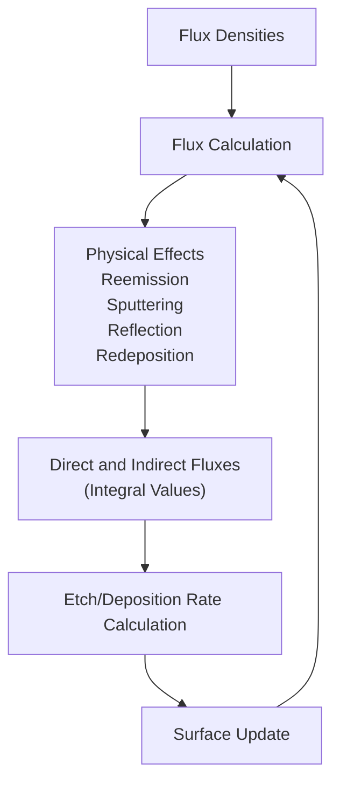
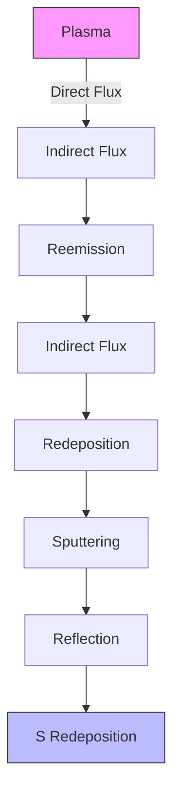
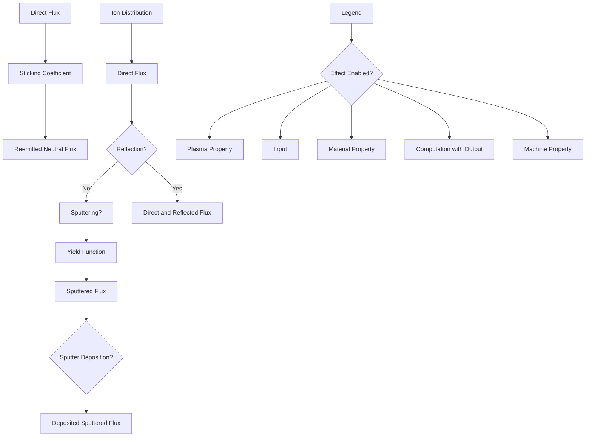
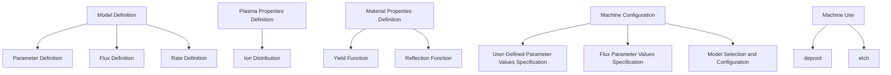
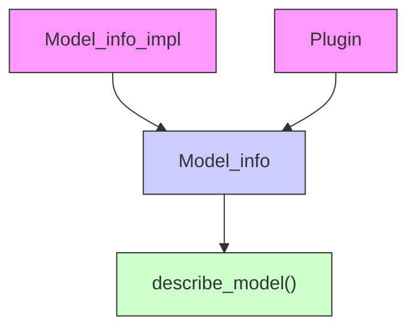
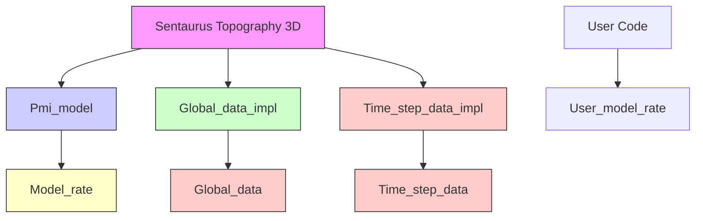

<!-- page:1 -->
# Sentaurus™ Topography 3D User Guide

Version O-2018.06, June 2018

# Copyright and Proprietary Information Notice

<!-- page:2 -->
© 2018 Synopsys, Inc. This Synopsys software and all associated documentation are proprietary to Synopsys, Inc. and may only be used pursuant to the terms and conditions of a written license agreement with Synopsys, Inc. All other use, reproduction, modification, or distribution of the Synopsys software or the associated documentation is strictly prohibited.

# Destination Control Statement

All technical data contained in this publication is subject to the export control laws of the United States of America. Disclosure to nationals of other countries contrary to United States law is prohibited. It is the reader’s responsibility to determine the applicable regulations and to comply with them.

# Disclaimer

SYNOPSYS, INC., AND ITS LICENSORS MAKE NO WARRANTY OF ANY KIND, EXPRESS OR IMPLIED, WITH REGARD TO THIS MATERIAL, INCLUDING, BUT NOT LIMITED TO, THE IMPLIED WARRANTIES OF MERCHANTABILITY AND FITNESS FOR A PARTICULAR PURPOSE.

# Trademarks

Synopsys and certain Synopsys product names are trademarks of Synopsys, as set forth at https://www.synopsys.com/company/legal/trademarks-brands.html. All other product or company names may be trademarks of their respective owners.

# Free and Open-Source Licensing Notices

If applicable, Free and Open-Source Software (FOSS) licensing notices are available in the product installation.

# Third-Party Links

Any links to third-party websites included in this document are for your convenience only. Synopsys does not endorse and is not responsible for such websites and their practices, including privacy practices, availability, and content.

Synopsys, Inc.

Mountain View, CA 94043

www.synopsys.com

<!-- page:3 -->
# About This Guide xi

Related Publications . . xi

Conventions . xi

Customer Support . . . xi

Accessing SolvNet. . . . xii

Contacting Synopsys Support . . . . xii

Contacting Your Local TCAD Support Team Directly. . . . . xi

# Chapter 1 Getting Started 1

Introduction . . .

Starting Sentaurus Topography 3D. . . .

From Sentaurus Workbench

From the Command Line. . .

Input Files . . .

Command File . . .

TDR File . .

PMC File . . .

Output Files . . . .

Standard Output and Log File . . .

TDR Files. . .

PMC File . . .

# Chapter 2 Simulation Details 5

Sentaurus Topography 3D Computational Model . . .

Computational Model When Using the Level-Set Method . .

Computational Model When Using the PMC Method

Computational Model for Spin-on-Glass Deposition . . . .

Discretization Size and Accuracy . . .

Discretization Size and Accuracy When Using the Level-Set Method . . .

Sentaurus Topography 3D Simulation Flow. . . .

Machines . .

Initial Structure Generation . 12

Creating the Initial Structure . 12

Modifying the Initial Structure . . . 12

Boundary Types. . . . 14

Simulating Process Steps on 2D and 3D Structures . . . 15

<!-- page:4 -->
Limitations When Processing 2D Structures . . . 17

Coordinate Systems. . . . 17

Wafer Coordinate System . . .

Simulation Coordinate System . . . 18

2D Coordinate System . . . 19

Structure Tilt . . . . 19

Material Names and Aliases . . . . 20

Boundary Conditions . . . . 20

Boundary Conditions: reflective . . . . 21

Radiosity Method . . . 22

Boundary Conditions: none . . . 24

Boundary Conditions: periodic . . . . 24

Units . . 24

Parallelization . . . 25

Basic Shared-Memory Parallelization . . . . 25

Advanced Shared-Memory Parallelization Options . . . . 26

Parallelization on Distributed Processing Systems Using MPI . . . 26

References. . . 27

# Chapter 3 Model Descriptions 29

Level Set–Based Models. . . . 29

Modeling of Fluxes and Related Physical Effects . . . . . 29

Neutrals. . . . 33

Ions . . . 34

Numeric Modeling . . . . 37

Orientation-Dependent Models . . . . 40

Setting Crystallographic Orientations . . . . . 41

Continuously Rotating and Tilted Structure Modeling . . . . 42

Modeling Chemical-Mechanical Polishing Processes. . . . 43

Flux and Flux-Emulating Models . . . 44

Flux and Flux-Emulating Deposition Models . . . . . 44

Flux and Flux-Emulating Etching and Simultaneous Etching and Deposition Models . . . 45

Deposition Models . . . . 46

Simple Deposition . . . . . . 46

Physical Vapor Deposition . . . . . 47

Low-Pressure Chemical Vapor Deposition . . . . 48

Plasma-Enhanced Chemical Vapor Deposition . . . . . 48

High-Density Plasma Deposition . . . . . 49

High-Density Plasma 2 Deposition . . . . . . 50

Electrodeposition . . . . 50

<!-- page:5 -->
Electroplating Deposition . . . . . 53

Crystallographic Orientation–Dependent Deposition . . . . 54

Etching Models . . . 54

Simple Etching . . . . . 54

Ion-Milling . . . . 55

Reactive Ion Etching . . . . 56

Reactive Ion Etching 2 . . . . 56

High-Density Plasma Etching . . . 57

High-Density Plasma 2 Etching . . . . . 58

Ion-Enhanced Etching . . . . 58

Wet Etching . . . 59

Dry Etching. . . . . . 59

Crystallographic Orientation–Dependent Etching . . . . . 60

Simultaneous Etching and Deposition . . . . 60

Simultaneous Etching and Deposition 2. . . . 62

Spin-on-Glass Deposition Model . . . . 63

Reaction Models . . . 63

Plasma Models . 64

Benoit-Cattin Plasma Sheath Model for CCP Reactors. . . . 65

Edelberg–Aydil Plasma Sheath Model for ICP Reactors . . . . 66

Feedback of Surface Reaction Products . . . 68

References. . . 69

# Chapter 4 Input Commands 71

Syntax of Commands and Parameters . . . 71

add\_float\_parameter . . . 74

add\_flux\_properties . . . 77

add\_formula . . . . 79

add\_int\_parameter. . . . . 81

add\_interface\_layer. . . . 83

add\_ion\_flux . . . . 87

add\_litho\_command . . 89

add\_material . . . 90

add\_neutral\_flux . . . . 93

add\_reaction . . . . 94

add\_reaction\_properties . . . . 98

add\_source\_species. . . . . 104

define\_boundary\_conditions. . . . . . 105

define\_deposit\_machine . . . . . 107

define\_etch\_machine . . . . 115

define\_extraction. . . . 120

<!-- page:6 -->
define\_iad . . . 123

define\_layout. . . . 126

define\_litho\_machine . . . . 128

define\_mask . . . 129

define\_model. . . 131

define\_probability . . . . . . 132

define\_reflection . . . . 134

define\_shape . . . . 136

define\_species\_distribution. . . . 140

Syntax for Expressions . . . . . 148

define\_species\_properties . . . . . 150

define\_structure. . . . . 151

Loading a PMC Structure . 154

define\_yield. . . . 155

deposit . . . . . 160

The stop\_plane and stop\_point Parameters . . . . . 165

TDR Dataset Names for Fluxes . . . . 166

etch . 167

The stop\_material, stop\_plane, and stop\_point Parameters. . . . 176

TDR Dataset Names for Fluxes . . . . 176

Variance Reduction in PMC Simulations . . . 177

extend\_structure . . . . . 179

extract . . . 181

Specification of Extraction Lines, Planes, and Pairs . . . . 181

Extraction Type . . . . . . 182

1D or 2D Cuts. . . . 182

Exposed Surface . . . . 183

Interface Area . . . . . . 184

Areas and Volumes of Regions and Parts . . . . 184

Region Names and Materials . . . . . 185

Region and Part Names . . . . . 185

Interface Position . . . . 186

Intersections With a Line . . . . 187

Intersections With a Plane . . . . . 188

Shortest Distance . . . . . 189

Cylindrical Hole Profile . . . . 190

Bounding Box of Materials and Regions . . . . 190

Vertical Coordinates of the Top and Bottom of the Bounding Box of Materials and Regions . . . . 191

Other Properties . . . . . 192

fill . . . 202

filter\_structure . . . . . 203

<!-- page:7 -->
finalize\_model. . . 210

layout. . . . 211

let. . . . 212

litho . . . . 214

pattern . . . . 215

remove\_material . . . 218

save . . 219

Saving Structures . . . . 224

Saving Ion Angular Distributions . . . 225

Saving PMC Structures . . . 225

Saving Boundaries for PMC Structures Using the VBE Method . . 226

Saving Species Distributions . . . . 227

set\_orientation . . . . 229

truncate . . 230

References. . . . 231

# Chapter 5 Integration With Sentaurus Process and Sentaurus Interconnect 233

Introduction . . . . 233

Supported Commands and Syntax. . . . . . 233

Additional Syntax . . . . . 234

The info Parameter . . . 234

The parameters Parameter . . . . 235

The repair Parameter . . . 235

Different Default Behavior . . . 235

Repair Behavior . . . . . 235

Merge Behavior . . . . . 236

Parallelization . . . . 236

Limitations and Known Issues . . 236

Boundary Conditions . . . . . 236

Meshing of Thin Layers. . . . . . 237

# Chapter 6 Rate Formula Module 239

Overview. . . . 239

Model Definition . . . . . 240

Machine Configuration . . . . 241

Machine Use . . . . . 241

Model Definition Details . 241

Flux Definition. . . . 242

User-Defined Parameter Definition . . . . . 242

Rate Formula Definition . . . . 243

<!-- page:8 -->
Machine Configuration Details . . . . 244

Defining Machine and Specifying User-Defined Global Parameters . . . . 244

Specifying Flux Parameter Values . . . . 245

Specifying User-Defined Material-Dependent Parameter Values. . . . . 246

RFM Commands . . . . 247

Rate Calculation . . . . . 247

Syntax . . . . . 248

Conditional and Relational Functions . . . 248

Data Available for Rate Calculation . . . . 249

Example: Reimplementing and Using ionmill Etching Model. . . . 252

References. . 252

# Chapter 7 Working With Reaction Models 253

Setting Up a Simulation Using a Reaction Model . . . . 253

Integration With Other Sentaurus Topography 3D Functionality . . . . 255

Converting a Result Structure to TDR Boundary File Format . . . . 256

Example . . . . . 256

# Chapter 8 Physical Model Interface for Etching and Deposition 259

Overview. . . 259

Command File Interface . . . . . 259

C++ Interface . . . . . 260

Implementing a New Model . . 262

Information Available to a Model . . 262

Additional Input Data . . . . 263

Data Types Used in Interface. . . . . 263

Error Handling . . . . . . 263

Compiling the Source Code. . . . . . 264

Using Additional Source Files or Libraries . . . . 264

Using the C++ Standard Library . . . . 264

Loading the Shared Library . . . . . . 265

Debugging . . . . . 265

Input and Output Parameters. . . . . 266

# Chapter 9 Known Issues and Limitations 267

Description of Known Issues and Limitations . . . . 267

<!-- page:9 -->
# Appendix A Examples 271

Initial Structure Generation. . . . 271

Simple Trench . . . . . 271

Fill . . . 272

Mask or Patterning. . . . 272

Deposition . . . . . 273

Crystallographic Orientation–Dependent Deposition . . . . . 273

Electrodeposition . . . . . 274

Electroplating Deposition . . . . . 274

High-Density Plasma Deposition. . . . . . . 275

High-Density Plasma 2 Deposition . . . . . . 275

Low-Pressure Chemical Vapor Deposition . . . . . 276

Physical Vapor Deposition . . . . . 276

Plasma-Enhanced Chemical Vapor Deposition. . . . . 276

Simple Deposition . . . . 277

Spin-on-Glass Deposition . . . . . 277

Etching . . . . . 278

Crystallographic Orientation–Dependent Etching. . . . . 278

Dry Etching . . . . . 279

Wet Etching . . . . 279

Simultaneous Etching and Deposition. . . . . 280

High-Density Plasma Etching . . . . . . . 280

High-Density Plasma 2 Etching. . . . . . 281

Ion-Enhanced Etching . . . . . 281

Ion-Milling. . . . . 282

PMI Simple Etching. . . . . . 282

Reactive Ion Etching . . . . . 283

Reactive Ion Etching 2. . . . 283

Simple Etching. . . . . 284

Tilt and Units . . . . 285

Simulations With 2D Structures . . . . . 285

Integration With Sentaurus Process . . . . 286

# Appendix B EAD File Format 287

Description of the EAD File Format. . . . 287

Mathematical Conventions . . . 288

Special Cases . . . . . . 288

Sampling From the Distribution . . 289

<!-- page:10 -->
Glossary

<!-- page:11 -->
The Synopsys Sentaurus™ Topography 3D tool is a three-dimensional simulator for evaluating and optimizing critical topography-processing steps such as etching and deposition.

The third-party software lp\_solve 5.5, modified by Synopsys, forms part of Sentaurus Topography 3D. The modified source code (lp\_solve-5.5.zip) is provided as part of the software package.

# Related Publications

For additional information, see:

The TCAD Sentaurus release notes, available on the Synopsys SolvNet® support site (see Accessing SolvNet on page xii).   
■ Documentation available on SolvNet at https://solvnet.synopsys.com/DocsOnWeb.

# Conventions

The following conventions are used in Synopsys documentation.

<table><tr><td>Convention</td><td>Description</td></tr><tr><td>Blue text</td><td>Identifies a cross-reference (only on the screen).</td></tr><tr><td>Bold text</td><td>Identifies a selectable icon, button, menu, or tab. It also indicates the name of a field or an option.</td></tr><tr><td>Courier font</td><td>Identifies text that is displayed on the screen or that the user must type. It identifies the names of files, directories, paths, parameters, keywords, and variables.</td></tr><tr><td>Italicized text</td><td>Used for emphasis, the titles of books and journals, and non-English words. It also identifies components of an equation or a formula, a placeholder, or an identifier.</td></tr></table>

# Customer Support

Customer support is available through the Synopsys SolvNet customer support website and by contacting the Synopsys support center.

<!-- page:12 -->
# Accessing SolvNet

The SolvNet support site includes an electronic knowledge base of technical articles and answers to frequently asked questions about Synopsys tools. The site also gives you access to a wide range of Synopsys online services, which include downloading software, viewing documentation, and entering a call to the Support Center.

To access the SolvNet site:

1. Go to the web page at https://solvnet.synopsys.com.

2. If prompted, enter your user name and password. (If you do not have a Synopsys user name and password, follow the instructions to register.)

If you need help using the site, click Help on the menu bar.

# Contacting Synopsys Support

If you have problems, questions, or suggestions, you can contact Synopsys support in the following ways:

Go to the Synopsys Global Support Centers site on synopsys.com. There you can find email addresses and telephone numbers for Synopsys support centers throughout the world.   
Go to either the Synopsys SolvNet site or the Synopsys Global Support Centers site and open a case online (Synopsys user name and password required).

# Contacting Your Local TCAD Support Team Directly

Send an e-mail message to:

support-tcad-us@synopsys.com from within North America and South America   
support-tcad-eu@synopsys.com from within Europe   
support-tcad-ap@synopsys.com from within Asia Pacific (China, Taiwan, Singapore, Malaysia, India, Australia)   
support-tcad-kr@synopsys.com from Korea   
support-tcad-jp@synopsys.com from Japan

<!-- page:13 -->
This chapter provides an overview of the functionality of Sentaurus Topography 3D, the required input files, and the generated output files.

# Introduction

Sentaurus Topography 3D is a three-dimensional simulator for evaluating and optimizing critical topography-processing steps such as etching and deposition. Two- and threedimensional structures composed of an arbitrary number of different materials can be handled.

The initial structure can either be created using simple geometric etching and deposition operations, or be read in from TDR files. The resulting structures can be saved in different TDR file formats and can be used for further processing.

# Starting Sentaurus Topography 3D

Sentaurus Topography 3D can be invoked and used in different modes.

# From Sentaurus Workbench

Sentaurus Topography 3D is fully integrated in Sentaurus Workbench. On the command line, type the following command to start Sentaurus Workbench:

swb

Inside Sentaurus Workbench, you can add Sentaurus Topography 3D to any process flow.

<!-- page:14 -->
# From the Command Line

You can start Sentaurus Topography 3D directly from the command line by specifying:

sptopo3d [options] commandfile.cmd

where commandfile.cmd is a file containing all the commands for a simulation. See Chapter 4 on page 71 for detailed descriptions of commands.

Table 1 Command-line options for Sentaurus Topography 3D 

<table><tr><td>Option</td><td>Description</td></tr><tr><td>--mpi-file</td><td>Sets the name of the file containing a list of hosts where you can run the processes to be used to execute the commands specified in the command file. For details, see TCAD Parallelization Environment Setup User Guide, Creating the MPICH Host File on page 4.You can specify this option only when the number of processes set by --processes is greater than 1.If you do not specify this option, all processes run on the host where Sentaurus Topography 3D is started.</td></tr><tr><td>--processes</td><td>Sets the number of processes to be used for executing the commands specified in the command file. Its value must be an integer greater than zero. If you do not specify this option, one process is used.</td></tr><tr><td>--threads</td><td>Sets the maximum number of threads per process to be used to execute the commands specified in the command file. Its value must be an integer greater than zero.Specifying the parallel and num_threads parameters of the let command has no effect when this command-line option is used (see let on page 212).</td></tr><tr><td>--use_datex true | false</td><td>When using material names defined in the datexcodes.txt file, the default behavior (--use_datex true) is that these names are translated to the canonical name for the specified material.Specify --use_datex false to deactivate the use of DATEX material aliases (see Material Names and Aliases on page 20).</td></tr></table>

# Examples

Start Sentaurus Topography 3D on the local host using one process with four threads:

sptopo3d --threads 4 commandfile.cmd

Start Sentaurus Topography 3D using two processes on the hosts listed in the file hostfile, using 8 threads for each process:

sptopo3d --mpi-file hostfile --processes 2 --threads 8 commandfile.cmd

<!-- page:15 -->
# Input Files

Sentaurus Topography 3D uses the following input files depending on the initial information available to start a simulation.

# Command File

The command file is a text file that contains a sequence of commands that direct the simulation (see Chapter 4 on page 71). The command file can also contain Tcl commands.

# TDR File

The initial structure for a simulation can be read from a TDR file containing a 2D or 3D boundary, or a 3D GC structure. The 3D boundary must have a rectangular base normal to the positive z-axis.

# PMC File

The initial structure for a particle Monte Carlo (PMC) simulation can be read from a PMC file.

# Output Files

The names of output files created by Sentaurus Topography 3D follow a naming convention. The base name of the output files is defined by the base name of the command file. Different extensions are used, depending on the type of the output file.

# Standard Output and Log File

All the commands specified by the input file as well as the messages and output indicating the progress of Sentaurus Topography 3D are, by default, displayed on-screen. Any error or warning condition encountered is also displayed.

The log file has the extension .log and contains the same information as the standard output. The file should be examined after completion of a Sentaurus Topography 3D simulation.

<!-- page:16 -->
# TDR Files

Different TDR file formats can be used to save information about structures modified by a Sentaurus Topography 3D simulation. You can use the save command (see save on page 219), for example, to:

Save structure boundary information at any stage of a simulation.   
■ Save the resulting structure of a simulation that used the particle Monte Carlo method.

Furthermore, you can use the extract command to save 1D and 2D geometric information from a structure into TDR files (see extract on page 181).

# PMC File

A PMC structure can be saved to a PMC file, which can be subsequently read in to define the initial structure of a new PMC simulation.

<!-- page:17 -->
This chapter provides details about simulations performed using

Sentaurus Topography 3D.

# Sentaurus Topography 3D Computational Model

Sentaurus Topography 3D simulates deposition, etching, and simultaneous etching and deposition processes using physical and geometric models. Except for the spin-on-glass deposition model, two simulation methods are used to implement the physical models: the level-set method and the particle Monte Carlo (PMC) method.

Some physical models can be run only using the level-set method and others can be run only using the PMC method. To the former class belong the following models:

Rate formula module (RFM)–based models (see Chapter 6 on page 239).   
Built-in models:

Etching and simultaneous etching and deposition models: crystal, dry, etchdepo, etchdepo2, hdp, ion\_enhanced, ionmill, rie, rie2, simple, and wet.

Deposition models: crystal, electrodeposition, electroplating, hdp, hdp2, lpcvd, pecvd, pvd, and simple.

To the latter class belong the reaction models, that is, those defined in terms of reactions rather than rate formulas (see add\_reaction on page 94 and define\_model on page 131).

For the spin-on-glass deposition model (named spin\_on), the surface profile evolution is determined by solving a partial differential equation describing the motion of a fluid driven by surface tension, centrifugal forces, and evaporation (see Spin-on-Glass Deposition Model on page 63).

All Sentaurus Topography 3D models take as input the structure at the beginning of the simulated process step and produce as output the structure resulting from the simulated process step.

<!-- page:18 -->
The internal representation of the output structure depends on the model used and might differ from the internal representation of the input structure. Sentaurus Topography 3D uses the following main internal structure representations:

Boundary representation   
Volumetric representation

The output of geometric models and models based on the level-set method is stored internally using the boundary representation. In contrast, the output of PMC-based models is stored internally using the volumetric representation.

In this manual, for brevity, structures stored internally using the boundary representation are referred to as boundary structures and structures stored internally using the volumetric representation are referred to as PMC structures.

# Computational Model When Using the Level-Set Method

When using the level-set method to simulate a model, the exposed surface (see Boundary Types on page 14) is discretized into a set of surface elements of finite extents, and the processing time is divided into discrete time steps.

At each time step, the velocity at each surface element is determined according to the processing conditions, and the surface is updated. The velocity is computed using the rate formula, which is specific to each model, because it expresses with a mathematical relation the deposition or etching mechanisms relevant to the modeled process.

For example, the rate formula of the LPCVD model (Eq. 16, p. 48) states that the deposition rate at any surface point is proportional to the number of neutral particles hitting the surface per unit time and area, including both those reaching the surface directly from the reactor and those that are reemitted from other surface points.

At each time step, all the quantities involved in the rate formula are computed, and the velocities are determined accordingly at each surface point. Among such quantities, a crucial role is usually played by the number of particles hitting the surface per unit time and area, as described for the LPCVD model.

For level set–based models, Sentaurus Topography 3D uses the concept of flux to model the flow of particles and their interactions with the surface. In this context, a flux denotes an abstract continuum representation of one or more chemical species having a similar role in the modeled process. Therefore, abstract means that different chemical species (which are really involved in the process) can be included in the simulation as a single flux. The term continuum refers to the fact that species are not modeled as sets of discrete particles, but by a continuum flow that is characterized by statistical properties such as the angular distribution or the energy distribution. On this basis, a flux can be considered a continuum of abstract particles.

<!-- page:19 -->
As explained in Modeling of Fluxes and Related Physical Effects on page 29, there are different kinds of flux for level set–based models:

■ Fluxes with isotropic angular distribution, which are called neutrals.   
Fluxes with an anisotropic angular distribution, which are called ion fluxes.

The different interactions between a flux and the surface are physical effects. Sentaurus Topography 3D supports the physical effects of reemission for neutral fluxes, and reflection, sputtering, and deposition of sputtered material for ion fluxes.

As mentioned, a flux provides a continuum representation of a set of species. More precisely, every flux is characterized by its flux density, which describes the statistical distribution of the velocities of the particles as emitted from their source.

The scalar quantity called the direct flux denotes the integrated flux density on a point of the surface. The direct flux is the integral of the flux density over the visible range of the surface point, or the number of particles per unit area and time that reaches the surface at this point before having interacted with the surface.

NOTE When using the level-set method, flux densities are always normalized such that the direct flux is equal to 1 on a completely visible flat surface.

A secondary flux that results from an interaction with the surface is referred to as an indirect flux. For example, the number of sputtered particles per unit area and time is referred to as the sputtered flux.

Consequently, for each flux, there is one direct flux and possibly several indirect fluxes, according to the modeled physical effects. All these fluxes can be used in the rate formula.

At each time step, all the direct and indirect fluxes involved in the rate formula are computed at each surface point. The computation of all the direct and indirect fluxes requires knowledge about the flux densities and the shape of the surface.

Accordingly, when using the level-set method, the computational flow of Sentaurus Topography 3D can be described as a loop over the following three stages:

1. If the model depends on fluxes, compute the direct flux and all indirect fluxes for each flux at each surface point.   
2. Compute the velocity at each surface point according to the rate formula.   
3. Move the surface according to the velocities provided by the rate formula.


<details>
<summary>flowchart</summary>


</details>

Figure 1 Conceptual model of Sentaurus Topography 3D when using the level-set method

# Computational Model When Using the PMC Method

<!-- page:20 -->
The PMC method uses a stochastic approach to compute the time evolution of a structure. You define interactions between the plasma species and the wafer species in terms of surface reactions (see add\_reaction on page 94, add\_source\_species on page 104, and define\_model on page 131).

# Computational Model for Spin-on-Glass Deposition

The time evolution of the film profile is determined by solving a partial differential equation describing the motion of a fluid driven by surface tension, centrifugal forces, and evaporation (see Spin-on-Glass Deposition Model on page 63).

The processing time is divided into discrete time steps, and the surface is sampled at a set of points. At each time step, the height of the film is computed at each sampling point, and the film profile is updated until the total process time is reached.

# Discretization Size and Accuracy

Numeric simulation methods, in general, only produce approximations to the exact results. Usually, the quality of the approximation can be improved by increasing the computational effort. For the level-set method and the method used to solve the spin-on-glass deposition model, the required memory and CPU time are determined mainly by the spatial and time discretization. For the PMC method, the required memory and the CPU time depend mainly on the spatial discretization, the number of simulated particles coming from the reactor, and the number of simulated reactions.

<!-- page:21 -->
In Sentaurus Topography 3D, the spacing parameter of the deposit and etch commands sets the grid discretization used to compute the structure evolution (see deposit on page 160 and etch on page 167). The flux parameter of the define\_species\_distribution command (see define\_species\_distribution on page 140) as well as the parameter time of the etch command (see etch on page 167) determine the number of simulated particles.

Decreasing the size of the spatial discretization increases the required memory and the CPU time because there are more grid points to store and process. When using the level-set method, due to the Courant–Friedrichs–Lewy (CFL) condition [1], the maximum time-step size must be reduced. This causes a further increase of the CPU time.

Usually when setting up an etching or a deposition simulation, it is necessary to find a compromise between the required accuracy and the limited available computational resources. A good understanding of the relationship between the discretization sizes and the resulting accuracy is important not only when setting up a simulation, but also when interpreting the results of a simulation.

Sentaurus Topography 3D allows you to set the spatial discretization for each coordinate axis of the computational grid. For models using the level sets, the spatial discretization along each dimension of the structure can be set. For the spin-on-glass deposition model, since the vertical dimension does not need to be discretized, only the spatial discretizations along dimensions orthogonal to the vertical can be set. You might choose the discretization in a certain direction to be much coarser than for the other directions to reduce simulation time. This is not recommended, however, for various implementation-specific reasons. It is recommended that the discretization for all axes does not vary by orders of magnitude. It has been found that a factor of three between the discretization of the axes produces good results. For models using the PMC method, the spatial discretization along all dimensions must be the same (see deposit on page 160 and etch on page 167).

# Discretization Size and Accuracy When Using the Level-Set Method

In general, the spatial accuracy that can be achieved when using the level-set method is of the order of the spatial discretization. Therefore, you must decide which features of the input structure and the expected output structure are important and choose the spatial discretization accordingly.

For models using the level sets, subresolution accuracy can be achieved in those parts of the simulation domain where the surface shows little variation. For example, when using a

<!-- page:22 -->
# 2: Simulation Details

Discretization Size and Accuracy

deposition model for which the rate does not depend on any property of the surface, the thickness of a deposited layer can be determined with higher accuracy than the spatial discretization size in those areas of the surface that are at a distance from the corners of the surface.

For etching, the situation is more complicated, and some additional considerations must be taken into account. Generally, several materials are etched simultaneously with different etching rates. Sentaurus Topography 3D determines the material-dependent etching rate on the exposed surface.

To underetch masking materials properly and to avoid certain artifacts, special treatment is necessary at the interface of two different materials. At an interface, the highest etching rate of the materials next to the interface is used. This can lead to problems with very thin layers for which the etching rate is lower than for the neighboring materials, because these thin layers can be etched away in one time-step. To avoid this, it is suggested that the spatial discretization is set to slightly less than the thickness of the thin layer.

As described in Computational Model When Using the Level-Set Method on page 6, at each time step, the exposed surface (see Boundary Types on page 14) of the processed structure is discretized into surface elements of finite extents, whose sizes depend on the level-set grid spacing.

To determine the values of the material-dependent parameters involved in the rate formulas of etching models and simultaneous etching and deposition models, it is necessary to compute the material or the materials through which each element of the exposed surface passes.

Since the surface discretization depends on the level-set grid, but the material information comes from the input structure, it is possible that some surface elements pass through multiple materials of the structure. This might happen, for example, when an interface between two materials of a structure is not aligned with the level-set grid.

In such cases, the default behavior of Sentaurus Topography 3D is to assign to each surface element the material in which its centroid is contained. When better accuracy is needed, you can change this behavior by setting region\_query\_accuracy=subresolution in the etch command (see etch on page 167). When region\_query\_accuracy= subresolution, the etching or deposition rate of each surface element is computed by taking into account all materials through which a surface element passes.

# Sentaurus Topography 3D Simulation Flow

<!-- page:23 -->
In Sentaurus Topography 3D, independently of the used numeric method, the simulation of a physical process requires:

■ A model describing the process of interest   
■ A structure to be processed

When a process step simulation is complete, you can write the resulting structure to a TDR file (see Output Files on page 3 and save on page 219) or perform measurements on it using the extract command (see extract on page 181).

A model and its parameter values are specified by defining a machine, as detailed in Machines on page 11. A machine can be applied to simulate a process running on any structure.

You can create a structure by either using Sentaurus Topography 3D commands or loading a TDR file (see Initial Structure Generation on page 12 for an overview of the commands available to define the initial structure of a simulation and the related concepts).

# Machines

Sentaurus Topography 3D can simulate different topography processes: deposition, etch, and lithography. Each process is represented by a machine that groups all of the parameters necessary to perform a simulation (see define\_deposit\_machine on page 107, define\_etch\_machine on page 115, or define\_litho\_machine on page 128).

Machines must be defined before their use, and a unique name for a given machine type (either deposition, etch, or lithography) must be assigned. When only one machine is defined, the name definition can be omitted and the simulator assigns the default machine name. If more than one machine of the same type is needed, a unique name must be set for each of the defined machines.

The definition of different machines with a corresponding unique name allows the creation of a machine library. A machine defined in such a library can be referenced at any time during the simulation.

<!-- page:24 -->
# Initial Structure Generation

The input structure to be processed in Sentaurus Topography 3D can be obtained in either of the following ways:

■ Load a TDR boundary file, for example, define\_structure\_file=input.tdr.   
Create a structure directly in Sentaurus Topography 3D, using a combination of simple geometric etch and deposition steps.

The second option is useful to create simple input structures without using external tools, as discussed in the next sections.

# Creating the Initial Structure

When a structure is created with Sentaurus Topography 3D, an initial cuboid structure must be defined. This structure constitutes the base for further etch or deposition processes. The following command creates a unit cube made of silicon (see define\_structure on page 151):

```txt
define_structure material=Silicon point_min={0 0 0} point_max={1 1 1} 
```

# Modifying the Initial Structure

The initial cuboid region can be modified either by adding materials using the deposit command or by removing parts of the structure using the etch command.

The following commands etch a rectangular trench out of the initial cuboid defined above:

```txt
define_shape type=cube point_min={0 0.3 0.5} point_max={1 0.7 1.0} \
name=etch_shape
etch shape=etch_shape 
```

The first command defines a cuboid shape that overlaps the original unit cube (see define\_shape on page 136). The second command uses the defined cube etch\_shape to remove material from the unit cube (see etch on page 167).

Similarly, it is possible to deposit a cuboid region:

```shell
define_shape type=cube point_min={0.4 0 0.5} point_max={0.6 1 1.25} \
name=depo_shape
deposit shape=depo_shape material=Tungsten 
```

The above commands define a cube, which is deposited over the trench created earlier. In the deposit command, the deposited material must be specified (see deposit on page 160). Parts of depo\_shape that overlap the existing structure will not be added.

<!-- page:25 -->
The structure that has been created could now be saved for visualization by using the command save (see save on page 219). It can also be used as the initial structure for physics-based etch or deposition steps. Figure 2 shows the results of the commands in this section.


<details>
<summary>natural_image</summary>

Three 3D geometric shapes with coordinate axes labeled X, Y, Z, showing different spatial arrangements (no text or symbols beyond axis labels)
</details>

Figure 2 Initial structure generation: (left) initial cuboid structure, (middle) trench etched from the initial structure, and (right) cuboid deposited on the trench

NOTE When using level set–based models or the spin-on-glass deposition model, Sentaurus Topography 3D does not require the presence of any gas region on top of the initial structure. However, if the initial structure contains gas regions, gas will be present also in the final structure.

When using a reaction model based on the PMC method, where deposition is allowed, the computational domain must be sufficiently large to contain also the material that will be deposited during the simulation (see Boundary Types on page 14). This goal can be achieved by adding a gas region on top of the initial structure.

A gas region can be added to an existing structure using the fill command (see fill on page 202). This feature is useful also if a structure produced by Sentaurus Topography 3D must be read by other tools that require the presence of gas on top of their initial structure.

<!-- page:26 -->
# Boundary Types

As described in Input Files on page 3, Sentaurus Topography 3D loads two- or threedimensional TDR boundary files containing all the geometric and material information of the structure that must be processed.


<details>
<summary>natural_image</summary>

Simple diagram with three stacked rectangular blocks, no text or symbols present
</details>

(a)


<details>
<summary>natural_image</summary>

Empty white square with dashed border (no text or symbols)
</details>


<details>
<summary>natural_image</summary>

Simple geometric shape with a green outline and dashed border (no text or symbols)
</details>


<details>
<summary>natural_image</summary>

Simple green outline of a sock inside a dashed border (no text or symbols)
</details>


<details>
<summary>natural_image</summary>

Simple line drawing of a sock inside a rectangular frame (no text or symbols)
</details>


<details>
<summary>natural_image</summary>

Cross-sectional diagram of a layered material or geological structure with no visible text or symbols
</details>

(f)   
Figure 3 Cross section of a 3D structure: (a) initial structure, (b) initial computational domain, (c) initial exposed surface, (d) final exposed surface, (e) final closed surface, and (f) final structure

Figure 3 (a) shows a cross section of a typical 3D structure that can be used as the initial structure of a simulation. The computational domain is defined as the minimum bounding box that contains the structure (see Figure 3 (b)).

The upper part of the surface of the structure is called the exposed surface (see Figure 3 (c)). When using the level-set method or the spin-on-glass deposition model, the exposed surface evolves until the end of the simulation when a final profile of it is obtained (see Figure 3 (d)).

At the end of the simulation, the final exposed surface can be combined with the lateral and the bottom planes of the computational domain, resulting in the closed surface (see Figure 3 (e)).

Using Boolean operations, a boundary representation of the final structure, hereafter referred to as the final boundary structure (see Figure 3 (f)), which includes all material information, can be created from the initial structure (see Figure 3 (a)) and the closed surface (see Figure 3 (e)).

The boundary data structures – exposed surface, closed surface, and final boundary structure – can be saved in a TDR boundary file using the save command (see save on page 219).

<!-- page:27 -->
The final boundary structure contains much more information than the exposed and closed surfaces, but the Boolean operations can be computationally expensive.

The final structure is necessary and must be saved when transferring the simulation results to another TCAD Sentaurus tool (for example, Sentaurus Process).

# Simulating Process Steps on 2D and 3D Structures

When using a level set–based model or the spin-on-glass deposition model, Sentaurus Topography 3D can simulate process steps on both two-dimensional (2D) and threedimensional (3D) structures. Two-dimensional and 3D structures can be simulated using the same physical models, with consistent results. When using the PMC simulation method, only process steps on 3D structures can be simulated.

Simulating 2D cuts of 3D structures typically is orders of magnitude faster than a full 3D simulation. When using level set–based models, compared to the 2D simulator Sentaurus Topography, Sentaurus Topography 3D is slower when processing 2D structures because it uses a more flexible 2D/3D engine.

Flux integration for 2D structures is performed using the radiosity method. No Monte Carlo implementation is provided.

For a full list of limitations, see Limitations When Processing 2D Structures on page 17 and Chapter 9 on page 267.

Sentaurus Topography 3D provides a command language that is mostly independent of the dimension of the structure to simulate.

A structure is defined by the define\_structure command, and there are two use cases:

define\_structure file=<c> [name=<c>]   
Sentaurus Topography 3D reads the file specified by the parameter file. The last 2D or 3D TDR boundary contained in that file is used to create a structure with the name specified by the parameter name or with the default name default\_structure.   
define\_structure point\_min=<v> point\_max=<v> material=<c> \ [name=<c>]

Sentaurus Topography 3D creates a structure – a cube or a rectangle – depending on the length of the vectors used for the parameters point\_min and point\_max, with the name specified by the parameter name or with the default name default\_structure.

See define\_structure on page 151 for a complete description of this command.

<!-- page:28 -->
Any other command either refers to an already defined structure (through its structure parameter) or does not operate on any structure. In this way, you can mix 2D and 3D simulations in the same input file, as shown in the following example:

```txt
# Define a 3D structure called 'structure_3d'. The dimension of the created
# structure is determined by the size of the 'point_min' and 'point_max'
# parameter values.
define_structure name=structure_3d material=Silicon \
    point_min={0 0 0} point_max={1 1 1}

# Define a 2D structure called 'structure_2d'. The dimension of the created
# structure is determined by the size of the 'point_min' and 'point_max'
# parameter values.
define_structure name=structure_2d material=Oxide \
    point_min={0 0} point_max={1 1}

# Define a deposition machine. The 'define_deposit_machine' command does
# not operate on any structure and the machine it defines can be used with
# both 2D and 3D structures.
define_deposit_machine anisotropy=0.8 curvature=0 material=Nitride \
    model=simple rate=1

# Simulate a deposition process for the 2D structure 'structure_2d' and
# save the result. Because the referred structure is 2D, a 2D simulation
# will be run.
deposit spacing=0.1 structure=structure_2d time=1

# Save the result of the deposition step for structure 'structure_2d'.
save structure=structure_2d

# Simulate a deposition process for the 3D structure 'structure_3d' and
# save the result. This command looks exactly like the one above. It only
# refers to a different structure. Because the referred structure is 3D,
# a 3D simulation will be run.
deposit spacing=0.1 structure=structure_3d time=1

# Save the result of the deposition step for structure 'structure_3d'.
save structure=structure_3d

# Simulate another deposition process for the 3D structure 'structure_3d' and
# save the result. Because a discretization that is not uniform across the
# coordinate directions is specified, the length of the value of the 'spacing'
# parameter must match the dimension of the structure this command operates
# If the structure had dimension 2, an error will be issued by the 'deposit'
# command.
deposit spacing={0.1 0.5 0.025} structure=structure_3d time=1

# Save the result of the second deposition step for structure 'structure_3d'
save structure=structure_3d 
```

NOTE A 2D structure can be obtained as a cut of a 3D structure using the extract command with type=slice (see extract on page 181).

# Limitations When Processing 2D Structures

<!-- page:29 -->
Table 2 lists commands that are not supported or have some limitations when processing 2D structures.

Table 2 Commands not supported or not fully supported when processing 2D structures 

<table><tr><td>Command</td><td>Functionality when processing 2D structures</td></tr><tr><td>add_litho_command</td><td>Sentaurus Lithography integration only works in three dimensions.</td></tr><tr><td>define_boundary_conditions</td><td>There is no support for nondefault boundary conditions for indirect flux computation for 2D structures.</td></tr><tr><td>define_litho_machine</td><td>Sentaurus Lithography integration only works in three dimensions.</td></tr><tr><td>define_mask</td><td>Masks are only supported to process 3D structures.</td></tr><tr><td>etch</td><td>Supported except for the mask parameter and except when using a reaction model.</td></tr><tr><td>filter_structure</td><td>Supported except for type=smooth.</td></tr><tr><td>litho</td><td>Sentaurus Lithography integration only works in three dimensions.</td></tr><tr><td>pattern</td><td>Patterning is only supported to process 3D structures.</td></tr></table>

# Coordinate Systems

This section describes the wafer coordinate system and the simulation coordinate system.

# Wafer Coordinate System

Similar to Sentaurus Process, Sentaurus Topography 3D uses a wafer coordinate system to describe the crystal orientation of the wafer. The wafer coordinate system is a right-handed coordinate system in which the x-axis is parallel to the wafer flat, and the y-axis is perpendicular to the wafer flat. The z-axis is perpendicular to the wafer surface (see Figure 4 on page 18).


<details>
<summary>text_image</summary>

Zw
Yw
Xw
</details>


<details>
<summary>text_image</summary>

Yw
Zw
Xw
</details>

Figure 4 Wafer coordinate system

<!-- page:30 -->
The tilt and rotation of the structure are defined with respect to the wafer coordinate system (see Structure Tilt on page 19).

# Simulation Coordinate System

In contrast to the simulation coordinate system of Sentaurus Process, in the simulation coordinate system of Sentaurus Topography 3D, the x-axis and y-axis lie in the wafer plane, and the z-axis is perpendicular to the wafer surface. The x-axis of the simulation coordinate system is rotated with respect to the y-axis of the wafer coordinate system by the slice angle (see Figure 5).


<details>
<summary>text_image</summary>

Zw
Zs
Xs
slice.angle
Yw
YS
Xw
</details>


<details>
<summary>text_image</summary>

slice.angle
Y_W
X_S
Z_W
Z_S
X_W
Y_S
</details>

Figure 5 Simulation coordinate system with slice.angle = 45o

<!-- page:31 -->
As in Sentaurus Process, the default value of the slice angle is $- 9 0 ^ { \circ }$ (see Figure 6).


<details>
<summary>text_image</summary>

Zw
Zs
Ys
YW
slice.angle
Xs
Xw
</details>


<details>
<summary>text_image</summary>

Yw
YS
slice.angle
Zw
Zs
Xs
Xw
</details>

Figure 6 Simulation coordinate system when using default value of slice.angle (–90o )

The simulation coordinate system is used to specify the coordinates of the simulated structure and all input and output coordinates, except for the crystal orientation.

# 2D Coordinate System

The simulation coordinate system (x/y) used for 2D structures is oriented in such a way that the positive y-axis points upwards in a device. Therefore, the y-coordinate of the simulation coordinate system used for 2D structures corresponds to the z-coordinate of the simulation coordinate system used for 3D structures.

# Structure Tilt

When a machine is defined using the define\_deposit\_machine command or the define\_etch\_machine command, you can specify the tilt of the structure by setting the parameters tilt and rotation, which represent the tilt and rotation (or twist) angles as shown in Figure 7 on page 20.

The tilt is the angle between the beam and the z-axis of the wafer coordinate system. The rotation is defined as the angle between the following two planes:

1. The plane that contains the beam and the z-axis of the wafer coordinate system.   
2. The yz plane of the wafer coordinate system.

The tilt angle is positive when measured from the beam axis to the z-axis; while the rotation angle is positive when measured from plane 1 to plane 2 as shown in Figure 7.


<details>
<summary>text_image</summary>

Tilt
Beam
z
y
Rotation
x
</details>

Figure 7 Definition of tilt and rotation angles

<!-- page:32 -->
# Material Names and Aliases

By default, when using material names defined in the datexcodes.txt file, these names are translated to the canonical name for the specified material. For example, when specifying PolySilicon, it is translated to the canonical name PolySi. Similarly, the material name Resist is translated to Photoresist.

Although using DATEX material aliases can be helpful in large simulation setups where different material names are used, which traditionally refer to the same material, it also can make some simulation setups more difficult to understand. Therefore, the use of DATEX material aliases can be deactivated with the command-line option --use\_datex false.

# Boundary Conditions

Similar to other types of simulation, topography simulations usually handle only a small part of a much larger structure. Typical reasons for this are limited computational resources or a limited area of interest. When limiting the simulation domain to a small part of a larger structure, it is necessary to use boundary conditions to take into account how the parts outside the simulation domain influence the simulation domain.

In general, for some quantities, it is sufficient if the boundary conditions model the immediate vicinity of the simulation domain and, in general, highly accurate results can be obtained. For nonlocal effects, much larger parts outside the simulation domain have a significant influence.

<!-- page:33 -->
This makes the definition of boundary conditions that lead to highly accurate results much more difficult.

For a plasma etching or deposition process, the ion or neutral flux arriving at a point on the surface of the wafer is such a nonlocal effect and can depend on parts of the surface that do not belong to the actual area of interest. Depending on the particular structure, it might still be possible to define boundary conditions that allow you to restrict the simulation domain to the area of interest and to achieve highly accurate results. Unfortunately, this is not always possible.

In cases where limiting the simulation domain to the area of interest and achieving high accuracy is not possible, it is necessary to choose the simulation domain larger than the area of interest.

When increasing the simulation domain, you need to find a trade-off between the improved accuracy in the area of interest and the increase in the required computational resources.

When simulating etching or deposition processes, different boundary conditions are available in Sentaurus Topography 3D: reflective, none, and periodic. The default for the boundary conditions at the sidewalls of the simulation domain is reflective, which implements reflective boundary conditions.

The define\_boundary\_conditions command (see define\_boundary\_conditions on page 105) specifies the boundary conditions to use when processing a structure. However, you can specify periodic boundary conditions only when processing structures using PMC-based models. Periodic boundary conditions are enabled automatically whenever you use a model that utilizes the RFM function pad\_pressure() (see Data Available for Rate Calculation on page 249) or when processing tilted structures using PMC-based models, as clarified in the following.

For tilted structures, at sidewalls that are not parallel to the tilt vector, boundary conditions of type reflective cannot be used. Therefore, another type of boundary condition must be applied at those sidewalls, independently of the boundary conditions that were specified for the sidewalls using the define\_boundary\_conditions command. When using level set–based models, the boundary condition type none is always enforced on such sidewalls; whereas, periodic boundary conditions are applied when using PMC-based models.

# Boundary Conditions: reflective

In general, with reflective boundary conditions, it is assumed that the sidewalls of the simulation domain are symmetry planes. When checking the visibility of the plasma source or other parts of the surface in a specific direction, a ray is started in this direction and the first intersection with the plasma source, the surface, or the sidewalls of the simulation domain is calculated. If the plasma source or the surface is hit, the process stops. If a sidewall of the simulation domain is hit, the ray is reflected and the next intersection is calculated.

<!-- page:34 -->
In theory, this corresponds to an infinitely extended surface and gives the correct result if the sidewalls of the simulation domain are symmetry planes. In practice, it is necessary to limit the number of reflections and, thereby, to reduce the size of the extended surface that is taken into account. As long as this limit is high enough, it will not have a significant influence on the result.

When calculating the indirect flux using the radiosity method, it is necessary to solve an equation system. The elements of the system matrix depend on the material properties of the surface and on the geometry of the surface.

# Radiosity Method

The geometric interaction between a pair of surface elements is described by the form factor. The form factor must be calculated for all pairs of elements of the original surface. However, it is also necessary to calculate the form factors between elements of the original surface and elements that are part of the extended surface, which was created by reflecting the original surface at the sidewall of the simulation domain where the boundary condition type is reflective. At corners where both adjacent sidewalls have the boundary type reflective, the surface must be extended for the corner area. This is performed by reflecting the original surface at each of these sidewalls, and the form factors between these elements and the elements of the original surface are calculated.

The complexity of calculating the form factors between elements of the original surface and elements of the extended surface increases rapidly with the number of reflections that were necessary to create the surface element. Therefore, the extended surface is limited to the direct neighbors at the sidewalls and at the corners of the simulation domain.

Therefore, the accuracy of the indirect flux calculated using the radiosity method strongly depends on the characteristic of the surface within the simulation domain. For example, if the surface inside the simulation domain represents a quarter or a half of a hole (see Figure 8 on page 23), the interaction of a surface element inside the simulation domain will be limited to other surface elements inside the simulation domain and to elements of the extended surface that were created by one reflection. In this case, the reflective boundary conditions describe the real situation very well, and the result will be highly accurate.


<details>
<summary>natural_image</summary>

3D geometric diagram of a hollow rectangular prism with a V-shaped cutout (no text or symbols)
</details>

Figure 8 Quarter of a hole

<!-- page:35 -->
If the surface inside the simulation domain represents the narrow cross section of a trench (see Figure 9), surface elements much further away than one reflection can have a significant influence. In this case, the result can contain large errors, and it is recommended to use the 2D mode for this kind of structure.


<details>
<summary>natural_image</summary>

3D geometric diagram showing two stacked rectangular blocks within a dashed cube framework (no text or symbols)
</details>

Figure 9 Trench with extended surface at the front and rear sidewalls; the surface is extended at the left and right sidewalls and at the corners but, for this structure, these extensions have no influence on the result and, therefore, are not shown

<!-- page:36 -->
# Boundary Conditions: none

When using the boundary condition type none, there is no reflection and no calculation of the next intersection when the ray hits the sidewall of the simulation domain. Boundary conditions of type none are not supported when using the PMC method.

When calculating the direct flux, the rays are started from the surface. If a ray hits a sidewall for which the boundary condition type is none, the process stops and the plasma source is considered to be visible.

When calculating the indirect flux, the original surface is not extended at sidewalls with the boundary condition type none. Therefore, there is no contribution to the indirect flux from elements that would be located in this area.

# Boundary Conditions: periodic

When using periodic boundary conditions, the processed structure is supposed to repeat infinitely many times along the direction where periodic boundary conditions are applied.

Periodic boundary conditions can be applied only to a pair of parallel sidewalls and not to a single sidewall. You can specify boundary conditions of type periodic only when simulating structures with the PMC method. Periodic boundary conditions are always used for simulating tilted structures with the PMC method as well as for RFM models that utilize the RFM function pad\_pressure().

# Units

Sentaurus Topography 3D supports a default unit set (second column in Table 3 on page 25) that is used whenever no unit is specified for a parameter in the command file.

Different units can also be used by setting them between angle brackets (< >) after the numeric value. Table 3 lists the units supported by Sentaurus Topography 3D.

For example, the default unit for a rate is <um/min>. In the command file, it is also possible to specify any of the measurement units listed in Table 3 for velocity.

For details, see Syntax of Commands and Parameters on page 71.

Table 3 Supported units in Sentaurus Topography 3D 

<table><tr><td rowspan="2">Variable</td><td colspan="2">Default</td><td colspan="2">Other possible values</td></tr><tr><td>Unit</td><td>Symbol</td><td>Unit</td><td>Symbol</td></tr><tr><td>Angle</td><td>degree</td><td></td><td>radian</td><td></td></tr><tr><td>Angular velocity</td><td>revolution per minute</td><td></td><td>radian per second</td><td></td></tr><tr><td>Density</td><td>gram per cubic centimeter</td><td></td><td>kilogram per cubic meter</td><td></td></tr><tr><td>Energy</td><td>electron volt</td><td></td><td>joule</td><td></td></tr><tr><td rowspan="2">Length</td><td rowspan="2">micrometer</td><td rowspan="2"></td><td>meter</td><td></td></tr><tr><td>nanometer</td><td></td></tr><tr><td>Surface tension</td><td>dyne per centimeter</td><td></td><td>Newton per meter</td><td></td></tr><tr><td>Time</td><td>minute</td><td></td><td>second</td><td></td></tr><tr><td rowspan="4">Velocity</td><td rowspan="4">micrometer per minute</td><td rowspan="4"></td><td>meter per second</td><td></td></tr><tr><td>micrometer per second</td><td></td></tr><tr><td>nanometer per minute</td><td></td></tr><tr><td>nanometer per second</td><td></td></tr><tr><td>Viscosity</td><td>poise</td><td></td><td>Pascal second</td><td></td></tr></table>

<!-- page:37 -->
# Parallelization

Sentaurus Topography 3D can use multiple CPU cores or CPUs to accelerate simulations on shared-memory computers and on distributed processing (DP) systems. Distributed computation is implemented using the message passing interface (MPI) [2]. Shared-memory parallelization (SMP) on the nodes of a DP system is also supported.

# Basic Shared-Memory Parallelization

To activate multithreaded computation, use the command:

let parallel=true

The number of threads is determined automatically, depending on the hardware resources, the optimum number of threads for the algorithm used, and the number of parallel licenses available. This is the recommended SMP mode.

# Advanced Shared-Memory Parallelization Options

<!-- page:38 -->
Advanced users can request a specific number of threads using the command:

let num\_threads=<n>

where <n> is an integer greater than zero. This forces Sentaurus Topography 3D to use the number of threads specified by the user. The engine tries to check out the necessary number of parallel licenses.

You can also set the number of threads per process using the command-line option --threads (see From the Command Line on page 2). When doing so, the number of threads specified using the parallel and num\_threads parameters of the let command are ignored.

If insufficient licenses are available, the behavior of the simulator is controlled by the value of the parallel\_license parameter of the let command (see let on page 212).

# Parallelization on Distributed Processing Systems Using MPI

Sentaurus Topography 3D supports parallelization on distributed processing (DP) systems using the message passing interface (MPI) [2].

To activate parallelization on DP systems, specify a number of processes greater than 1 with the --processes command-line option when starting Sentaurus Topography 3D (see From the Command Line on page 2).

You can specify the hosts where to start the processes using the --mpi-file command-line option (see From the Command Line on page 2).

For details, see TCAD Parallelization Environment Setup User Guide, Parallelization Using the Message Passing Interface on page 1 and TCAD Parallelization Environment Setup User Guide, Running TCAD Sentaurus Tools on a Cluster on page 3.

Currently, in Sentaurus Topography 3D, only the execution of etch commands issued with a value of the averaging\_runs parameter greater than 1 can be parallelized on DP systems. In particular, it is possible to distribute the execution of the PMC-averaging runs over different processes (see Variance Reduction in PMC Simulations on page 177), which can run either on the same host or on the hosts of a cluster.

Each process executing a PMC-averaging simulation can use multiple CPU cores or CPUs of the host where it is running, that is, Sentaurus Topography 3D supports SMP of each PMCaveraging simulation. For details on how to activate SMP, see Basic Shared-Memory Parallelization on page 25 and Advanced Shared-Memory Parallelization Options on page 26.

<!-- page:39 -->
NOTE For best performance, the total number of threads requested on each node must not exceed the number of CPU cores available on the node.

When running on a cluster, the speedup is limited by the performance of the slowest node and by the speed and bandwidth of the network connections between machines.

Therefore, for best performance, it is recommended to use cluster machines with uniform performance and with fast interconnections between them.

# References

[1] R. Courant, K. Friedrichs, and H. Lewy, “On the Partial Difference Equations of Mathematical Physics,” IBM Journal, vol. 11, no. 2, pp. 215–234, 1967.   
[2] For information about the MPI Forum, go to https://www.mpi-forum.org/.

<!-- page:40 -->
2: Simulation Details References

<!-- page:41 -->
This chapter describes the fundamental theory and assumptions of the physical models used in Sentaurus Topography 3D. In particular, level set–based models, the spin-on-glass deposition model, and the reaction models are addressed.

# Level Set–Based Models

This section discusses level set–based models.

# Modeling of Fluxes and Related Physical Effects

Figure 10 on page 30 shows an overview of the physical processes relevant to the process models implemented in Sentaurus Topography 3D based on the level-set method.

The source of reactants (in most cases, a plasma) is considered to consist of two kinds of particle: neutrals and ions. Neutrals and ions are assumed to be independent and do not interact with each other. However, they can interact with the surface in various ways, as described in the following.

Moreover, for all plasma processes, the pressure in the reaction chamber is assumed to be very low. Therefore, the mean free path length of ions and neutrals is much larger than the feature size.

Fluxes in Sentaurus Topography 3D are normalized such that a flux integrated on an unshadowed flat surface is equal to one. There are two different kinds of flux:

Energy-independent fluxes with an isotropic angular distribution.

These fluxes are suitable for modeling electrically neutral species. Therefore, they will be called neutral fluxes in the following.

It is assumed that neutrals travel in a straight path to the surface without interacting with other particles. On the surface, neutrals react with a certain probability, and deposit or etch material. If they do not react, they are isotropically reemitted from the surface. The reemitted particles can react elsewhere or can be reemitted again.

<!-- page:42 -->
■ Energy-dependent and energy-independent fluxes with an anisotropic angular distribution.

These fluxes are suitable for modeling charged particles. Therefore, they will be called ion fluxes in the following.

Ions are assumed to travel in a straight path to the surface. Depending on the impinging angle on the surface, ions can then react, or be reflected, or sputter away surface material.

In the case of sputtering or reaction, it is assumed that the ion is consumed. The sputtered particles generate an indirect flux, which can be redeposited elsewhere on the surface. Depending on the material that is being sputtered, the sputtered particles can have an angular distribution with the symmetry axis either normal to the surface or in the direction of the reflected impacting ion.


<details>
<summary>flowchart</summary>


</details>

Figure 10 Physical effects available in Sentaurus Topography 3D for modeling plasma processes

Ion fluxes can have arbitrarily shaped and energy-dependent angular distributions. Accordingly, to use a model involving ion fluxes, the angular distributions of each ion flux must be specified (see define\_iad on page 123). Ion angular distributions are properties only of the particles and the processing conditions, and they do not depend on the particular structure under process.

On the other hand, the distributions of neutral fluxes are always supposed to be uniform and energy independent. Therefore, no distribution needs to be explicitly defined for the neutral fluxes.

<!-- page:43 -->
Neutral and ion fluxes are also different in terms of the physical effects they support.

For neutral fluxes, only reemission is taken into account, which means that a part of the neutrals reaching the surface reacts and sticks to the surface; whereas, the remainder is reemitted isotropically. This effect is characterized by the sticking coefficient according to Eq. 2, p. 33.

For each neutral flux, a sticking coefficient must be provided to enable the computation of the reemitted flux. The total number of neutral particles reaching a surface point per unit area and time, taking into account both those directly arriving from the plasma and those reemitted from the surface, is referred to as the total flux.

For ion fluxes, it is possible to take into account three physical effects: reflection, sputtering, and deposition of the sputtered material. If reflection is enabled, ions can be reflected specularly at the surface of the structure. The reflection probability depends on both the incident angle of the particles and the surface material. As previously mentioned, reflection probabilities are a property not only of the ion flux being reflected, but also of the target material.

Accordingly, to use a model involving reflection, the reflection probability of each ion flux must be known for each material involved in the simulation. The number of particles per unit area and time reaching a surface point after being reflected by all the other surface points is referred to as the reflected flux. For built-in models, only the first reflection of ions by the surface is taken into account in the definition of the reflected flux.

If sputtering is taken into account, the number of particles removed from the surface per unit area and time by ions, referred to as the sputtered flux, is computed by Sentaurus Topography 3D. The yield function, which gives the number of sputtered atoms per incoming ion as a function of the ion incident angle, is used to specify the process, and it depends on both the properties of the incoming ions and the target material. For this reason, the yield function of each ion flux included in the model must be provided by users for all the materials involved in the structure under process.

Finally, to model reemission of sputtered material, the sticking coefficient, the angular distribution of the sputtered material, and the type of the sputter emission must be provided. For the sputter type diffuse, the symmetry axis of the angular distribution of the sputtered material is given by the surface normal. For the sputter type reflective, the symmetry axis is defined by the direction of the specular reflection of the incoming ion.

Therefore, the computation of direct and indirect fluxes might require scalar values (such as the sticking coefficient and the sputter type) as well as some functions, for example, ion angular distribution, yield, and reflection functions. Angular distributions are assumed to be only plasma dependent; whereas, yield and reflection functions are specific to both the particles and the target material.

Figure 11 summarizes the indirect fluxes available in Sentaurus Topography 3D and the information you must provide to compute each of them.   


<details>
<summary>flowchart</summary>


</details>

Figure 11 Direct and indirect fluxes and their relationships with physical effects

<!-- page:44 -->
When a physical effect is enabled for a flux, Sentaurus Topography 3D computes the corresponding indirect flux. However, if an indirect flux does not appear in the rate formula, it will have no effect on the evolution of the surface, even if it is computed by Sentaurus Topography 3D. In other words, the definition and the configuration of a flux specify which direct and indirect fluxes are computed at each time step, but the way they are used is defined only by the rate formula. This is important for user-defined models using the rate formula module (RFM) because, for these kinds of model, users are responsible for adding the appropriate fluxes, activating the required physical effects, and defining the rate formula (see Chapter 6 on page 239).

For built-in models, neutral particles are lumped and modeled as belonging to one flux. The same assumption is made for ion particles in the built-in models. For RFM models, an arbitrary number of ion and neutral fluxes can be used. Each of them can have different properties. Neutrals on page 33 and Ions on page 34 discuss the physical effects in more detail.

Deposition or etching rates for built-in models are obtained by multiplying the normalized flux with the deposition or etching rate measured on an unshadowed flat surface.

NOTE Level set–based models do not support energy-dependent fluxes.

<!-- page:45 -->
# Neutrals

A neutral flux is characterized by an isotropic source distribution that is modeled as .cos θ Neutral particles emitted from the source and arriving at a surface point can directly react onj the point or can be reemitted several times from the surface and react at a surface point (seej i Figure 12).


<details>
<summary>text_image</summary>

ni
φi
i
nj
rij
φj
j
</details>

Figure 12 Reemission of neutrals

The sticking coefficient is defined as the reaction probability with the surface:

$$
\sigma_ {j} = \frac {\Gamma_ {\text {reaction} , j}}{\Gamma_ {\text {neutral} , j}} = 1 - \frac {\Gamma_ {\text {re - emitted} , j}}{\Gamma_ {\text {neutral} , j}} \tag {1}
$$

where:

$\Gamma _ { \mathrm { n e u t r a l } , j }$ is the total incoming neutral flux at surface element $j .$   
$\Gamma _ { \mathrm { r e a c t i o n } , j }$ Γ is the fraction of the incoming flux that reacts.   
$\Gamma _ { \mathrm { r e - e m i t t e d } , j }$ is the fraction of the incoming flux that is reemitted.

The sticking coefficient $\sigma _ { j }$ is not a constant on the whole surface. It depends on the material at the surface point but not on the neutral species, and it varies between 0 and 1.j

The total neutral incoming flux on a surface point can be written as the summation of thei direct neutral flux plus all the contributions due to reemissions of the surrounding points [1]:j

$$
\Gamma_ {\text { neutral }, i} = \Gamma_ {\text { direct }, i} + \sum_ {j \neq i} (1 - \sigma_ {j}) g _ {i j} \Gamma_ {\text { neutral }, j} \tag {2}
$$

where:

$\Gamma _ { \mathrm { d i r e c t } , i }$ is the direct flux arriving from the source at the point .i   
$g _ { i j }$ is the form factor that accounts for how much of the reemitted flux from the point  j arrives at the point .i

<!-- page:46 -->
The form factor depends on the surface geometry and the reemission angular distribution. Assuming that neutrals are reemitted with an isotropic angular distribution [1] (see Figure 12 on page 33):

$$
g _ {i j} = \int_ {A _ {j}} \frac {\cos \phi_ {i} \cos \phi_ {j}}{\pi r _ {i j} ^ {2}} V _ {i j} d A _ {j} \tag {3}
$$

where:

$d A _ { j }$ is the area of the infinitesimal emitter.   
■ $\Phi _ { i }$ is the angle between the incoming particle direction and the surface normal.   
■ $\phi _ { j }$ is the angle between the emitted particle direction and the normal of the surface of the emitter.   
■ $r _ { i j }$ is the distance between the two surface elements and .i j   
$V _ { i j }$ is the mutual visibility matrix, defined as:

$$
V _ {i j} = \left\{ \begin{array}{l l} 0 & i \text {   and   } j \text {   are   not   mutually   visible } \\ 1 & i \text {   and   } j \text {   are   mutually   visible } \end{array} \right. \tag {4}
$$

Eq. 2 is one row of a system of equations that must be solved to find the unknown neutral fluxes $\Gamma _ { \mathrm { n e u t r a l } , i }$ at each surface point.

# Ions

The ion flux is characterized by a directional angular source distribution. The source distribution is either modeled as , where the exponent controls the flux anisotropy, orcos θm m specified as an arbitrary ion angular distribution (IAD), using the command define\_iad (see define\_iad on page 123) and the parameter iad in the respective etching or deposition models.

Ions can react on the surface and can etch or deposit. They also can sputter some material from the substrate or be reflected by vertical walls producing the microtrenching phenomenon at the bottom of a trench.

# Analytic Ion Angular Distribution

A good approximation to measure IADs can be obtained by defining the IAD analytically as:

$$
f (\theta) = A \cos^ {m} (\theta) \tag {5}
$$

where:

■ is the angle between the vertical and the incoming ion direction.θ   
■ is a user-defined parameter (exponent) that describes the anisotropy of the distribution.m

<!-- page:47 -->
■ is a constant that is determined by normalizing the integrated ion flux on a flatA unshadowed surface.

The flux normalization implies that the normalized flux is dimensionless. Consequently, the total etching or deposition rate can be obtained by multiplying the integrated and normalized flux on a surface element by the etching or deposition rate of a flat unshadowed surface.

# User-Defined Ion Angular Distribution

The flux models of Sentaurus Topography 3D allow the definition of user-defined IADs, which can have been obtained by measurement or from plasma simulations. Arbitrary IADs can be defined or loaded using the define\_iad command (see define\_iad on page 123). The IADs are defined in a tabular format, and linear interpolation is used between data points.

User-defined IADs will be normalized internally when used in flux models.

# Sputtering

High-energy ions can sputter some substrate material. The sputter etch rate depends greatly on the impact angle $\theta _ { \mathrm { i m } }$ of the ions (the angle between the normal of the surface element and the incoming ion direction; see Figure 13). This dependency is expressed by the yield function:

$$
\gamma (\theta_ {\mathrm{im}}) = s _ {1} \cos \theta_ {\mathrm{im}} + s _ {2} \cos^ {2} \theta_ {\mathrm{im}} + s _ {4} \cos^ {4} \theta_ {\mathrm{im}} \tag {6}
$$

where $s _ { 1 } , s _ { 2 }$ , and $s _ { 4 }$ are the sputtering coefficients.


<details>
<summary>text_image</summary>

n_i
φ_i
i
n_j
r_ij
φ_j
j
θ_im
n_i
φ_i
i
r_ij
j
</details>

Figure 13 Sputtering with the symmetry axis of the angular distribution (left) along the surface normal and (right) along the reflected impacting ion direction

In Sentaurus Topography 3D, the sputtered flux is evaluated under the assumption of a narrow angular distribution (a large coefficient in the angular distribution) for which it is possiblem to write:

$$
\Gamma_ {\text { sputter }, j} = \gamma (\theta_ {\mathrm{im}}) \Gamma_ {\text { ion }} \tag {7}
$$

<!-- page:48 -->
where $\Gamma _ { \mathrm { i o n } }$ is the total direct ion flux, which is normalized. For the sputtered flux $\Gamma _ { \mathrm { { s p u t t e r } } }$ to be normalized such that the total sputtered flux from an unshadowed flat surface is unity, it is necessary that $\gamma ( 0 ) = 1$ . Using this constraint, a relevant condition on the sputtering coefficients is obtained:

$$
s _ {1} + s _ {2} + s _ {4} = 1 \tag {8}
$$

This means that for the definition of the yield function $\gamma ( \theta _ { \mathrm { i m } } )$ , only two parameters are required, and Sentaurus Topography 3D uses the parameters $s _ { 1 }$ and $s _ { 2 }$ .

The sputtered material can be redeposited as well. It is assumed that the redeposition process occurs with a probability $\sigma _ { \mathrm { r e d e p o s i t } }$ , and no further reemissions are considered, that is, the remaining $1 - \sigma _ { \mathrm { r e d e p o s i t } }$ sputtered material is considered to be volatile. The redeposition flux is:

$$
\Gamma_ {\text { redeposition }, i} = \sigma_ {\text { redeposit }} \sum_ {j \neq i} v _ {i j} \Gamma_ {\text { sputter }, j} \tag {9}
$$

where $\mathrm { v } _ { i j }$ is another form factor that accounts for how much of the sputtered material from the point arrives at the point :j i

$$
v _ {i j} = \int_ {A _ {j}} (m + 1) \frac {\cos \phi_ {i} \cos^ {m} \phi_ {j}}{\pi r _ {i j} ^ {2}} V _ {i j} d A _ {j} \tag {10}
$$

where $\Phi _ { j }$ now has a general meaning as the angle between the emitted particle direction and the symmetry axis of the angular distribution of the sputtered material (see Figure 13 on page 35).

The differences between $g _ { i j }$ and $\mathrm { v } _ { i j }$ are:

$g _ { i j }$ is evaluated under the assumptions that the reemission of neutrals can be approximated with an isotropic angular distribution. The symmetry axis of the angular distribution is the surface normal, and the exponent of the cosine distribution is one.   
$\mathrm { v } _ { i j }$ is evaluated under more general assumptions. Depending on the surface, the angular distribution of the sputtered material can be either:

• Diffuse – The sputtered particles have no memory of the impact direction, and the axis of the distribution is normal to the surface element (see Figure 13 (left)).

Reflective – The sputtered particles keep some momentum of the impacting ion, and the axis of the distribution has a preferential direction, which is the reflected incoming ion direction (see Figure 13 (right)).

In both cases (diffuse and reflective), an exponent can be assigned to the angular distribution.

<!-- page:49 -->
# Reflection

Low-energy ions with a large incident angle have a larger probability of being reflected by walls (see Figure 14). This is an important phenomenon that contributes to microtrenching at the bottom of sidewalls. The probability that an ion is reflected is modeled according to [2]:

$$
P _ {\text { reflection }} \left(\theta_ {\mathrm{im}}\right) = \min \left\{1, k \left[ \frac {1}{2 \pi} + \left(\frac {\pi}{4} - \frac {1}{3}\right) \frac {1}{\left(\frac {\pi}{2} - \theta_ {\mathrm{im}}\right) ^ {2}} + \frac {5}{\pi^ {3}} \left(\frac {\pi}{2} - \theta_ {\mathrm{im}}\right) \right] \right\} \tag {11}
$$

where is a constant that depends on the mass and atomic number of the incoming ion and thek wall material, and on the ion energy:

$$
k \propto \frac {1}{E _ {\text { ion }} ^ {2}} \tag {12}
$$

The constant can be set for each material in the structure using the parameter reflectionk in the add\_material command (see add\_material on page 90) and the define\_deposit\_machine command (see define\_deposit\_machine on page 107).


<details>
<summary>text_image</summary>

θim
n
</details>

Figure 14 Ion reflection process: ions with a large impact angle can be reflected and react at the bottom of a trench producing microtrenching

# Numeric Modeling

The number of incoming (neutral or ion) particles on a surface element is calculated by integrating the various contributions to the total flux. Sentaurus Topography 3D offers two different numeric methods to perform the flux integration: the radiosity method and the Monte Carlo method.

You set the integration method with the parameter engine in the etch and deposit commands. Some models do not support both methods. Furthermore, models that do not perform any flux integration do not need or support these two methods.

<!-- page:50 -->
NOTE For 2D structures, the only supported flux integration method is the radiosity method.

Table 4 Deposition and etching models: Support for numeric integration methods 

<table><tr><td>Model</td><td>Radiosity support</td><td>Monte Carlo support</td></tr><tr><td colspan="3">Deposition</td></tr><tr><td>crystal</td><td>No</td><td>No</td></tr><tr><td>electrodeposition</td><td>No</td><td>No</td></tr><tr><td>electroplating</td><td>No</td><td>No</td></tr><tr><td>hdp</td><td>Yes</td><td>Yes</td></tr><tr><td>hdp2</td><td>Yes</td><td>Yes</td></tr><tr><td>lpcvd</td><td>Yes</td><td>Yes</td></tr><tr><td>pecvd</td><td>Yes</td><td>Yes</td></tr><tr><td>pvd</td><td>Yes</td><td>Yes</td></tr><tr><td>simple</td><td>No</td><td>No</td></tr><tr><td colspan="3">Etching</td></tr><tr><td>crystal</td><td>No</td><td>No</td></tr><tr><td>dry</td><td>Yes</td><td>Yes</td></tr><tr><td>etchdepo</td><td>Yes</td><td>Yes</td></tr><tr><td>etchdepo2</td><td>Yes</td><td>Yes</td></tr><tr><td>hdp</td><td>Yes</td><td>Yes</td></tr><tr><td>hdp2</td><td>Yes</td><td>Yes</td></tr><tr><td>ion_enhanced</td><td>Yes</td><td>Yes</td></tr><tr><td>ionmill</td><td>No</td><td>No</td></tr><tr><td>rie</td><td>Yes</td><td>Yes</td></tr><tr><td>rie2</td><td>Yes</td><td>Yes</td></tr><tr><td>simple</td><td>No</td><td>No</td></tr><tr><td>wet</td><td>No</td><td>No</td></tr></table>

<!-- page:51 -->
# Radiosity Method

The radiosity method is a numeric method that solves Eq. 2, p. 33 by evaluating the direct flux $\Gamma _ { \mathrm { d i r e c t } }$ and then by inverting the linear system matrix to find the unknown fluxes at each surface point.

The linear system matrix scales with the square of the number of surface elements and, therefore, it can become prohibitively large for simulations with small level-set grid spacing. In addition, inverting the system matrix does not lend itself well to parallelization and, therefore, simulations can use more wallclock time than the Monte Carlo method on multicore machines.

The radiosity method is used by default. It is activated explicitly using engine=radiosity in the etch and deposit commands.

# NOTE The following limitations apply:

The only supported flux integration method for 2D structures is the radiosity method.   
The boundary condition type reflective is not supported for the indirect flux calculation for 2D structures.   
The radiosity method does not provide accurate results for machines with a tilt angle greater than approximately for 3D structures.70°

# Monte Carlo Method

In the Monte Carlo method, neutral or ion particles are sent randomly from the top of the simulation domain to the structure. These particles interact with the surface and can be adsorbed or reemitted, and can sputter some material. The particles can be reemitted several times from the surface depending on the sticking coefficient.

The Monte Carlo method uses less memory than the radiosity method because there is no large system matrix to invert. The simulation of individual particles scales well on multiple cores. Therefore, the Monte Carlo method shows significant speedup on multicore machines when run in parallel (see Parallelization on page 25).

You activate the Monte Carlo method using engine=monte\_carlo in the etch and deposit commands.

<!-- page:52 -->
NOTE When using the Monte Carlo method, be careful with the following:

Due to its stochastic nature, the Monte Carlo method introduces some numeric noise. Therefore, the results of the radiosity method and Monte Carlo method do not always match exactly. The parameter integration\_samples can be used to increase the number of samples. This increases simulation accuracy at a higher computational cost.   
There is no Monte Carlo implementation for 2D structures. Only the radiosity method is available to perform flux integration with 2D structures.   
The Monte Carlo method can be activated only for models that perform flux integration. See Table 4 on page 38 for a list of supported models.

# Orientation-Dependent Models

Sentaurus Topography 3D supports two methods for orientation-dependent etching or deposition modeling when using the level-set method: the built-in crystal models and the function directional\_value() in the rate formula module (RFM) (see Chapter 6 on page 239).

The RFM function directional\_value() is used to introduce an orientation dependency into the rate formula of an RFM model. This function has three arguments that are the values of an arbitrary quantity for the directions <100>, <110>, and <111>, respectively. Depending on the direction of the normal of a surface element, an appropriately interpolated value of this quantity is returned and can be used in the rate calculation (see Data Available for Rate Calculation on page 249).

For each region of a structure, the crystal orientation can be defined. When creating a new region with the define\_structure, deposit, or etch command, the crystal orientation can be defined with the parameters flat\_orientation and vertical\_orientation (see define\_structure on page 151, deposit on page 160, and etch on page 167).

For structures that were loaded from a TDR file and do not yet contain crystal orientations, or to change the orientation of a region, the set\_orientation command can be used (see set\_orientation on page 229).

Crystal orientations are always specified with respect to the wafer coordinate system (see Wafer Coordinate System on page 17).

<!-- page:53 -->
# Setting Crystallographic Orientations

When using a model with orientation-dependent rates, the crystallographic orientations must be defined with respect to the wafer coordinate system.

The slice angle, which defines how the simulated structure is oriented with respect to the wafer coordinate system, can be set only with the define\_structure command (see Simulation Coordinate System on page 18). For a newly created structure, the slice angle is defined with the parameter slice\_angle. If a structure is loaded from a TDR file, the slice angle is read from that file, but the value of the slice angle can be overwritten with the parameter slice\_angle of the define\_structure command.

The flat orientation and the vertical orientation of a region can be set with the following commands:

define\_structure (only if it is not used to load a structure from a TDR file; see define\_structure on page 151)   
deposit (see deposit on page 160)   
etch (only when using a model for simultaneous etching and deposition; see etch on page 167)   
set\_orientation (see set\_orientation on page 229)

The define\_structure command is used to set the crystallographic orientation of a newly created structure.

The set\_orientation command is used to set the crystallographic orientation of any region of a structure.

NOTE The parameters flat\_orientation and vertical\_orientation of the define\_structure command are optional (without a default value). Unless specified, no crystallographic orientation will be set for a newly created region.

The parameters flat\_orientation and vertical\_orientation of the etch and deposit commands are mandatory if the crystallographic orientation is required by the model, namely, for the crystal deposition model and RFM models that use the directional\_value() function in the rate formula. Otherwise, these two parameters are optional (without a default value).

# Continuously Rotating and Tilted Structure Modeling

<!-- page:54 -->
Sentaurus Topography 3D allows you to model etching, deposition, and simultaneous etching and deposition processes for tilted structures with a continuously increasing value of their rotation angle (see Structure Tilt on page 19).

This feature is available only for rate formula module (RFM) models and reaction models, and is enabled by setting rotation=continuous in the define\_deposit\_machine or define\_etch\_machine command (see define\_deposit\_machine on page 107 and define\_etch\_machine on page 115).

The simulation of processes involving continuously rotating structures is based on the assumption that the structure rotation period is much smaller than the process time.

To simulate such processes, Sentaurus Topography 3D internally recasts the actual problem into an equivalent one, where the structure of interest is not tilted and does not rotate, and the species of the model (see add\_ion\_flux on page 87, add\_neutral\_flux on page 93, and add\_source\_species on page 104) have angular distributions different from those of the original problem. Each species of the equivalent problem has the same effect on the not tilted and nonrotating structure as the original species has on the tilted and continuously rotating structure, within a margin of error that depends only on the original angular distribution and on the tilt angle. In the following, such a discrepancy is referred to as the equivalence error for a species.

The equivalence error of each species is measured by a number in the range [0, 0.5]. You can set the maximum-tolerated equivalence error for all distributions of a model (parameter maximum\_error of the define\_deposit\_machine or define\_etch\_machine command). The actual equivalence error of each species of the model is written to the log file, when the machine is used with the deposit or etch command. If the actual equivalence error for any species of the model is greater than the one specified with the maximum\_error parameter, an error will be issued.

Figure 15 on page 43 shows the values of the equivalence error for species having an analytic angular distribution with different values of the exponent (see Eq. 5, p. 34) for different tiltm angles of the structure.

As can be seen from Figure 15, the equivalence error increases as the tilt angle increases; whereas, for a given tilt angle, the equivalence error decreases as the angular distribution becomes more focused around the source axis. The trend can be observed for species with angular distributions other than that of Eq. 5, p. 34.


<details>
<summary>line</summary>

| Tilt [degree] | m = 1  | m = 2  | m = 5  | m = 10 | m = 100 | m = 500 | m = 1000 | m = 10000 | m = 100000 |
| ------------- | ------ | ------ | ------ | ------ | ------- | ------- | -------- | --------- | ---------- |
| 0             | 0.0    | 0.0    | 0.0    | 0.0    | 0.0     | 0.0     | 0.0      | 0.0       | 0.0        |
| 10            | ~0.01  | ~0.0   | ~0.0   | ~0.0   | ~0.0    | ~0.0    | ~0.0     | ~0.0      | ~0.0       |
| 20            | ~0.03  | ~0.01  | ~0.0   | ~0.0   | ~0.0    | ~0.0    | ~0.0     | ~0.0      | ~0.0       |
| 30            | ~0.06  | ~0.02  | ~0.01  | ~0.0   | ~0.0    | ~0.0    | ~0.0     | ~0.0      | ~0.0       |
| 40            | ~0.1   | ~0.04  | ~0.02  | ~0.01  | ~0.0    | ~0.0    | ~0.0     | ~0.0      | ~0.0       |
| 50            | ~0.18  | ~0.1   | ~0.05  | ~0.02  | ~0.01   | ~0.01   | ~0.0     | ~0.0      | ~0.0       |
| 60            | ~0.25  | ~0.15  | ~0.1   | ~0.05  | ~0.02   | ~0.02   | ~0.01    | ~0.0      | ~0.0       |
| 70            | ~0.32  | ~0.25  | ~0.15  | ~0.1   | ~0.05   | ~0.05   | ~0.02    | ~0.0      | ~0.0       |
| 80            | ~0.4   | ~0.35  | ~0.25  | ~0.2   | ~0.1    | ~0.1    | ~0.05    | ~0.0      | ~0.0       |
| 90            | 0.5    | 0.45   | 0.4    | 0.35   | 0.3     | 0.3     | 0.25     | 0.2       | 0.2        |
</details>

Figure 15 Equivalence error for species having an analytic angular distribution with different values of the exponent for different tilt angles of the structure

# Modeling Chemical-Mechanical Polishing Processes

<!-- page:55 -->
When using the level-set method, Sentaurus Topography 3D allows you to model chemicalmechanical polishing (CMP) processes at feature scale, using the RFM function pad\_pressure() (see Data Available for Rate Calculation on page 249).

The RFM function pad\_pressure() returns the pressure produced by a deformable pad in contact with the simulated structure using a contact mechanics–based model [3].

In the implemented model, the pad is characterized by its Young’s modulus and Poisson ratio as well as by a Laplacian distribution of the heights of its asperities. The interaction between the pad asperities and the substrate is modeled according to the laws governing Hertz contacts [3].

The Young’s modulus of the pad and its Poisson ratio are set with the parameters pad\_young\_modulus and pad\_poisson\_ratio of the define\_etch\_machine command, respectively. Whereas, the standard deviation of the height distribution of the pad asperities is determined from the value of the parameter pad\_roughness of the define\_etch\_machine command. The pressure applied to the pad is given by the value of the parameter applied\_pressure of the define\_etch\_machine command (see define\_etch\_machine on page 115).

<!-- page:56 -->
The pressure distribution over the substrate is computed using an iterative method to solve the nonlinear integral equation of the model.

The maximum number of iterations that the solver can perform as well as the solution accuracy below which the solver stops are set with the parameters pad\_pressure\_max\_iterations and pad\_pressure\_accuracy of the etch command, respectively (see etch on page 167).

# Flux and Flux-Emulating Models

This section presents an overview of the flux and flux-emulating level set–based models available in Sentaurus Topography 3D. Flux and flux-emulating models require flux computations or approximate flux quantities using purely geometric quantities, respectively. See Deposition Models on page 46 and Etching Models on page 54 for detailed descriptions of each model.

# Flux and Flux-Emulating Deposition Models

Table 5 provides an overview of all flux and flux-emulating deposition models available in Sentaurus Topography 3D.

Table 5 Flux and flux-emulating deposition models 

<table><tr><td>Model</td><td>simple</td><td>pvd</td><td>lpcvd</td><td>pecvd</td><td>hdp</td><td>hdp2</td></tr><tr><td>Machine parameters</td><td>anisotropy curvature rate</td><td>(exponent | iad) rate</td><td>rate sticking</td><td>anisotropy (exponent | iad) rate sticking</td><td>anisotropy (exponent | iad) rate redeposition s1, s2 sputter_rate sticking</td><td>anisotropy (exponent | iad) rate redeposition reflection s1, s2 sputter_exponent sputter_rate sputter_type sticking</td></tr><tr><td>Neutral flux</td><td></td><td></td><td>Yes</td><td>Yes</td><td>Yes</td><td>Yes</td></tr><tr><td>Ion flux with exponent or IAD</td><td></td><td>Yes</td><td></td><td>Yes</td><td>Yes</td><td>Yes</td></tr><tr><td>Reemission and redeposition</td><td></td><td></td><td>Yes</td><td>Yes</td><td>Yes</td><td>Yes</td></tr><tr><td>Sputtering and redeposition of sputtered material</td><td></td><td></td><td></td><td></td><td>Yes</td><td>Yes</td></tr><tr><td>Diffusive or reflective sputtering</td><td></td><td></td><td></td><td></td><td></td><td>Yes</td></tr></table>

# Flux and Flux-Emulating Etching and Simultaneous Etching and Deposition Models

<!-- page:57 -->
Table 6 and Table 7 on page 46 give an overview of etching, and simultaneous etching and deposition, flux and flux-emulating models available in Sentaurus Topography 3D.

Table 6 Flux and flux-emulating etching models 

<table><tr><td>Model</td><td>simple</td><td>ionmill</td><td>rie</td><td>rie2</td><td>hdp</td><td>hdp2</td><td>ion_enhanced</td></tr><tr><td>Machine parameters</td><td></td><td></td><td>(exponent | iad)</td><td>(exponent | iad)</td><td>(exponent | iad)</td><td>(exponent | iad)</td><td>(exponent | iad)</td></tr><tr><td>Material parameters</td><td>anisotropy curvature rate</td><td>anisotropy rate s1, s2</td><td>anisotropy rate</td><td>anisotropy rate reflection sticking</td><td>anisotropy rate s1, s2</td><td>anisotropy rate reflection s1, s2 sputter_rate sticking</td><td>anisotropy desorption_rate rate reflection s1, s2 sticking</td></tr><tr><td>Isotropic etch rate</td><td>Yes</td><td>Yes</td><td>Yes</td><td></td><td>Yes</td><td>Yes</td><td></td></tr><tr><td>Unidirectional ion flux</td><td>Yes</td><td>Yes</td><td></td><td></td><td></td><td></td><td></td></tr><tr><td>Ion flux with exponent or IAD</td><td></td><td></td><td>Yes</td><td>Yes</td><td>Yes</td><td>Yes</td><td>Yes</td></tr><tr><td>Sputtering</td><td></td><td>Yes</td><td></td><td></td><td>Yes</td><td>Yes</td><td>Yes</td></tr><tr><td>Reemission</td><td></td><td></td><td></td><td>Yes</td><td></td><td>Yes</td><td>Yes</td></tr><tr><td>Ion reflection</td><td></td><td></td><td></td><td>Yes</td><td></td><td>Yes</td><td>Yes</td></tr></table>

Table 7 Flux and flux-emulating simultaneous etching and deposition models 

<table><tr><td>Model</td><td>dry</td><td>etchdepo</td><td>etchdepo2</td></tr><tr><td>Machine parameters</td><td>deposit_material rate sticking</td><td>deposit_material (exponent | iad) rate sticking</td><td>deposit_material (exponent | iad) rate sticking</td></tr><tr><td>Material parameters</td><td>rate s1, s2</td><td>rate reflection s1, s2 sputter_type</td><td>anisotropy desorption_rate rate reflection s1, s2 sticking</td></tr><tr><td>Isotropic etch rate</td><td></td><td></td><td></td></tr><tr><td>Unidirectional ion flux</td><td></td><td></td><td></td></tr><tr><td>Ion flux with exponent or IAD</td><td></td><td>Yes</td><td>Yes</td></tr><tr><td>Sputtering</td><td>Yes</td><td>Yes</td><td>Yes</td></tr><tr><td>Diffusive or reflective sputtering</td><td></td><td>Yes</td><td>Yes</td></tr><tr><td>Reemission</td><td>Yes</td><td></td><td>Yes</td></tr><tr><td>Redeposition</td><td></td><td>Yes</td><td></td></tr><tr><td>Ion reflection</td><td></td><td>Yes</td><td>Yes</td></tr></table>

<!-- page:58 -->
# Deposition Models

# Simple Deposition

Set model=simple in the define\_deposit\_machine command to define a simple deposition machine (see define\_deposit\_machine on page 107).

The deposition rate is evaluated as the contribution of the following components:

■ An isotropic deposition   
■ A directional deposition   
■ A curvature-dependent term

<!-- page:59 -->
The resulting rate at a surface point can be written as:( ) x y z , ,

$$
R (x, y, z) = R _ {0} \left[ (1 - A) + H (x, y, z) \vec {A v} \cdot \vec {n} (x, y, z) \right] \left(1 - k \kappa (x, y, z)\right) \tag {13}
$$

where:

■ is the anisotropy factor, parameter anisotropy.A   
$H ( x , y , z )$ is a function that accounts for point shadowing in the vertical direction, defined as:

$$
H (x, y, z) = \left\{ \begin{array}{l l} 0 & \text { vertically   shadowed   region } \\ 1 & \text { vertically   unshadowed   region } \end{array} \right. \tag {14}
$$

■ is the curvature factor; parameter curvature.k   
■ $\kappa ( x , y , z )$ is the surface curvature at the point $( x , y , z )$ .   
■ $\vec { \bf \Phi } _ { n ( x , y , z ) } ^ { }$ is the unit vector normal to the surface at the point of coordinate $( x , y , z )$   
■ $R _ { 0 }$ is the deposition rate on a completely flat surface; parameter rate.   
$\vec { \bf \Phi } _ { \nu }$ is the unit vector normal to the horizontal plane.

The limiting values of and correspond to a pure isotropic and a pure directionalA = 0 A = 1 deposition model.

The pure isotropic deposition model mimics a chemical vapor deposition (CVD) where reactants, or reactive intermediates, have a very low sticking coefficient, resulting in a uniform concentration of reactants along the surface irrespective of the geometric configuration.

The pure directional deposition model corresponds to a physical vapor deposition (PVD) process where deposition occurs in only one direction. Atoms in the vapor stream that impinge on the surface of the structure are always parallel to the vector . No material deposition occursv in the shadowed regions (see Eq. 13 and Eq. 14).

The curvature term has the effect of decreasing the deposition at convex surfaces and increasing the deposition at concave surfaces, smoothing the surface as it evolves.

# Physical Vapor Deposition

Set model=pvd in the define\_deposit\_machine command to define a physical vapor deposition (PVD) machine (see define\_deposit\_machine on page 107).

The PVD model applies to processes where the deposition involves pure physical processes rather than chemical reactions. The particle flux is characterized by a angularcos θm distribution, where is set by the parameter exponent or a user-defined IAD (the parameterm iad).

<!-- page:60 -->
The sticking coefficient is equal to one, that is, each incoming particle deposits on the surface. The deposition rate $R _ { 0 }$ on an unshadowed flat surface is set with the parameter rate.

The total deposition rate is evaluated as:

$$
R = R _ {0} \Gamma \tag {15}
$$

where is the integrated flux on the considered surface point.Γ

# Low-Pressure Chemical Vapor Deposition

Set model=lpcvd in the define\_deposit\_machine command to define a low-pressure chemical vapor deposition (LPCVD) machine (see define\_deposit\_machine on page 107).

In the LPCVD model, the vapor flux of chemical precursors is simulated by neutrals having an isotropic angular flux distribution. The incoming particles can either react on the surface and be deposited, with a probability given by the sticking coefficient (parameter sticking), or be reemitted as described in Neutrals on page 33. The reemitted flux is distributed isotropically. The deposition rate $R _ { 0 }$ on an unshadowed flat surface is set with the parameter rate. The total deposition rate is evaluated as:

$$
R = R _ {0} \Gamma_ {\text { neutral }} \tag {16}
$$

with $\Gamma _ { \mathrm { n e u t r a l } }$ evaluated from Eq. 2, p. 33.

# Plasma-Enhanced Chemical Vapor Deposition

Set model=pecvd in the define\_deposit\_machine command to define a plasmaenhanced chemical vapor deposition (PECVD) machine (see define\_deposit\_machine on page 107).

The incoming fluxes to the surface are characterized by two components: a thermally driven LPCVD precursor and ion-induced deposition precursors. The parameter anisotropy sets the ratio between the anisotropic ion rate and the total deposition rate $R _ { 0 }$ (parameter rate). The ion flux can be defined to have a angular distribution, where is set by thecos θm m parameter exponent, or can be a user-defined IAD (the parameter iad).

The total deposition rate is evaluated as:

$$
R = (1 - A) R _ {0} \Gamma_ {\text { neutral }} + A R _ {0} \Gamma_ {\text { ion }} \tag {17}
$$

<!-- page:61 -->
# High-Density Plasma Deposition

Set model=hdp in the define\_deposit\_machine command to define a high-density plasma (HDP) deposition machine (see define\_deposit\_machine on page 107).

In the HDP deposition model, two simultaneous mechanisms are competing: the deposition and the etching by physical sputtering due to high-energy ions. The neutral flux can either react and be deposited with a probability given by the sticking coefficient $\sigma _ { j }$ (see Eq. 1, p. 33), the parameter sticking, or be reemitted as described in Neutrals on page 33.

Ions are deposited on the surface and, at the same time, can induce a flux of sputtered particles. The sputtering etch rate is highly dependent on the impact angle, and it is described by a yield function (see Eq. 6, p. 35), in which $s _ { 1 }$ and $s _ { 2 }$ are set with the parameters s1 and s2, respectively.

It is assumed that the sputtered material has an isotropic angular distribution. The amount of redeposition on the surface $\mathbf { 0 } _ { \mathrm { r e d e p o s i t i o n } }$ is set by the parameter redeposition.

The total rate on an unshadowed flat surface is given by:

$$
R _ {\text { flat }} = R _ {0} - R _ {\text { sputter }} \tag {18}
$$

where:

$R _ { 0 }$ is the deposition rate on an unshadowed flat surface, without sputtering; parameter rate.   
$R _ { \mathrm { s p u t t e r } }$ is the sputtering rate; parameter sputter\_rate.

NOTE The model assumes a net deposition, that is, $R _ { 0 } > R _ { \mathrm { s p u t t e r } }$ must hold for flat surfaces.

The total deposited material is the sum of the deposition due to neutrals (direct and indirect flux), plus the deposition due to ions, plus the sputtered material that redeposits, minus the amount of locally sputtered material. Finally, for nonzero anisotropy, the deposition rate is:

$$
R = (1 - A) R _ {0} \Gamma_ {\text { neutral }} + A R _ {0} \Gamma_ {\text { ion }} + R _ {\text { sputter }} (\Gamma_ {\text { redeposition }} - \Gamma_ {\text { sputter }}) \tag {19}
$$

where is the anisotropy coefficient; parameter anisotropy.A

For anisotropy equal to zero, the deposition rate is:

$$
R = R _ {0} \Gamma_ {\text { neutral }} \tag {20}
$$

The fluxes $\Gamma _ { \mathrm { n e u t r a l } } , \Gamma _ { \mathrm { r e d e p o s i t i o n } }$ , and $\Gamma _ { \mathrm { { s p u t t e r } } }$ are evaluated as described in Neutrals on page 33 and Ions on page 34.

<!-- page:62 -->
# High-Density Plasma 2 Deposition

Set model=hdp2 in the define\_deposit\_machine command to define a high-density plasma 2 (HDP2) deposition machine (see define\_deposit\_machine on page 107).

The HDP2 model extends the HDP model. It takes ion reflection into account and allows you to specify the sputter type and sputter exponent.

For nonzero anisotropy, the deposition rate is:

$$
R = (1 - A) R _ {0} \Gamma_ {\text { neutral }} + A R _ {0} \tilde {\Gamma} _ {\text { ion }} + R _ {\text { sputter }} (\tilde {\Gamma} _ {\text { redeposition }} - \Gamma_ {\text { sputter }}) \tag {21}
$$

For anisotropy equal to zero, the deposition rate is:

$$
R = R _ {0} \Gamma_ {\text { neutral }} \tag {22}
$$

Eq. 21 has the same structure as Eq. 19, but the factors $\tilde { \Gamma } _ { \mathrm { i o n } }$ and $\tilde { \Gamma } _ { \mathrm { r e d e p o s i t i o n } }$ for the ion flux and the redeposition, respectively, are different.

$\tilde { \Gamma } _ { \mathrm { i o n } }$ takes ion reflection into account as described in Reflection on page 37. When the parameter reflection is set to $0 , \Gamma _ { \mathrm { i o n } }$ is equal to $\Gamma _ { \mathrm { i o n } }$ in Eq. 19.

$\tilde { \Gamma } _ { \mathrm { r e d e p o s i t i o n } }$ can take diffuse or reflective reemission of the sputtered material into account. By setting sputter\_type=diffuse and sputter\_exponent=1, is equal toΓ˜ redeposition $\Gamma _ { \mathrm { r e d e p o s i t i o n } }$ in Eq. 19.

As in the HDP model, the HDP2 model considers the process with two competing simultaneous mechanisms: the deposition and the etching by physical sputtering due to highenergy ions. The neutral flux can either react and be deposited with a probability given by the parameter sticking or be reemitted. Ions are deposited on the surface and, at the same time, can induce a flux of sputtered particles. The angular dependency of the sputter rate is given by the yield function as defined in Eq. 6, p. 35 by the parameters s1 and s2.

The main difference with respect to the HDP model is that the angular distribution of the sputtered material, diffuse or reflective, can be set by users (see Ions on page 34). The ion reflection index (see Reflection on page 37) is set with the parameter reflection.

The rate evaluation for the HDP2 model is the same as that described in Eq. 19.

# Electrodeposition

Set model=electrodeposition in the define\_deposit\_machine command to define an electrodeposition machine (see define\_deposit\_machine on page 107).

<!-- page:63 -->
The model takes into account the following species: plating species, inhibitors, and accelerators. They are assumed to diffuse from the bulk of the plating bath to the surface of the structure under processing, with their concentrations remaining constant at a specified distance above the top of the structure.

Inhibitors and accelerators competitively adsorb on the surface of the structure. Their adsorption kinetics are determined by their local concentration, their adsorption rates, and the local surface curvature. The additives surface interaction model also includes displacement of inhibitors by accelerators and surface saturation effects. The local surface coverage of inhibitors and accelerators, together with the local concentration of the species being plated, determine the deposition rate of the plating species.

You can set up an oscillating overpotential between two values with a given duty cycle to simulate pulse-plating conditions.

The deposition rate of the plating species at each surface element is determined by the localR surface coverage of inhibitors and accelerators, by the local concentration of the species being plated, and by the overpotential, as specified by the following equations [4][5][6]:

$$
R = \frac {\Omega}{z F} \frac {C _ {\text { depo }}}{C _ {\text { depo }} ^ {\text { ref }}} J \tag {23}
$$

where:

$$
J = \omega [ D C J _ {\mathrm{on}} + (1 - D C) J _ {\mathrm{off}} ] \tag {24}
$$

$$
J _ {\text {on}} = J _ {0} \left(1 - \vartheta_ {\text {accel}} - \vartheta_ {\text {inhib}}\right) g (\alpha , \eta_ {\text {on}}) + J _ {0} ^ {\text {accel}} \vartheta_ {\text {accel}} g \left(\alpha_ {\text {accel}}, \eta_ {\text {on}}\right) + J _ {0} ^ {\text {inhib}} \vartheta_ {\text {inhib}} g \left(\alpha_ {\text {inhib}}, \eta_ {\text {on}}\right) \tag {25}
$$

$$
J _ {\text { off }} = J _ {0} \left(1 - \vartheta_ {\text { accel }} - \vartheta_ {\text { inhib }}\right) g (\alpha , \eta_ {\text { off }}) + J _ {0} ^ {\text { accel }} \vartheta_ {\text { accel }} g \left(\alpha_ {\text { accel }}, \eta_ {\text { off }}\right) + J _ {0} ^ {\text { inhib }} \vartheta_ {\text { inhib }} g \left(\alpha_ {\text { inhib }}, \eta_ {\text { off }}\right) \tag {26}
$$

$$
g (a, \eta) = \exp \left(- a \frac {z _ {\alpha} F}{R T} \eta\right) - \exp \left((1 - a) \frac {z _ {\alpha} F}{R T} \eta\right) \tag {27}
$$

and:

■ is the molar volume of the plating species (parameter depo\_molar\_volume).Ω   
is the duty cycle of the electrode overpotential (parameter duty\_cycle). When itsDC value is 1, pulse plating is disabled.   
is the number of electrons transferred during the deposition of an ion of the platingz species (parameter z).   
■ is the Faraday constant.F = 96485.33289 C/mol   
is equal to 1 if the current surface element does not belong to a void and is equal to 0ω otherwise.

$C _ { \mathrm { d e p o } }$ is the local concentration of the plating species. Its value is computed by the simulator assuming that the concentration of the plating species remains constant to the value specified by the depo\_bulk\_concentration parameter at the distance from the top of the structure given by the bulk\_distance parameter. The diffusivity of the plating species can be specified with the depo\_diffusivity parameter. When depo\_diffusivity is not specified, the concentration of the plating species is assumed to be equal to its bulk value all over the surface. $C _ { \mathrm { d e p o } }$ depends on both the electrode overpotential and its duty cycle.   
$C _ { \mathrm { d e p o } } ^ { \mathrm { r e f } }$ is the reference concentration of the plating species at which the exchange currentties are measured (parameter depo\_reference\_concentration).   
the $J _ { 0 }$ is the exchange current density for a surface where no additives were adsorbed, when concentration of the plating species is $C _ { \mathrm { d e p o } } ^ { \mathrm { r e f } }$ a (parameter exchange\_current\_density).   
■ $\displaystyle J _ { 0 } ^ { \mathrm { a c c e l } }$ J0 is the exchange current density for a surface fully covered by entration of the plating species is erators, when the(parameter $C _ { \mathrm { d e p o } } ^ { \mathrm { r e f } }$ exchange\_current\_density\_acc).   
■ $J _ { 0 } ^ { \mathrm { i n h i b } }$ J0 is the exchange current density for a surface fully covered bentration of the plating species is ibitors, when the(parameter $C _ { \mathrm { d e p o } } ^ { \mathrm { r e f } }$ exchange\_current\_density\_inh).   
ϑaccel $\vartheta _ { \mathrm { a c c e l } }$ and $\vartheta _ { \mathrm { i n h i b } }$ are the local accelerator and inhibitor surface coverages, respectively. Their values are computed by the simulator and depend on the following quantities (among others):

• Accelerator adsorption rate (parameter acc\_adsorption\_rate).   
Inhibitor adsorption rate (parameter inh\_adsorption\_rate).   
Accelerator saturation surface concentration (parameter acc\_saturation\_surface\_concentration).   
Inhibitor saturation surface concentration (parameter inh\_saturation\_surface\_concentration).   
• Inhibitor displacement rate by accelerators (parameter inh\_displacement\_rate).   
Local concentration of accelerators. This value is computed assuming that the accelerator concentration remains constant to the value specified by the acc\_bulk\_concentration parameter at the distance from the top of the structure given by the bulk\_distance parameter. The diffusivity of accelerators can be specified with the acc\_diffusivity parameter. When acc\_diffusivity is not specified, the concentration of accelerators is assumed to be equal to its bulk value all over the surface.   
Local concentration of inhibitors. This value is computed assuming that the inhibitor concentration remains constant to the value specified by the inh\_bulk\_concentration parameter at the distance from the top of the structure

<!-- page:65 -->
given by the bulk\_distance parameter. The diffusivity of inhibitors can be specified with the inh\_diffusivity parameter.

• Local surface curvature.

■ , α $\mathbf { \alpha } \propto _ { \mathrm { a c c c e l } }$ , and $\mathbf { \alpha } \mathbf { \alpha } \mathbf { \mathrm { Q } } _ { \mathrm { i n h i b } }$ are the transfer coefficients (parameters alpha, alpha\_acc, and alpha\_inh, respectively).   
$z _ { \alpha }$ is the number of electrons transferred during the rate-determining elementary reaction (parameter z\_alpha).   
is the gas constant.R = 8.3144598 J/mol/K   
■ is the absolute temperature of the electroplating cell (parameter temperature).T   
$\boldsymbol { \mathsf { \Pi } } _ { \mathsf { \Pi } } ^ { \mathsf { \Pi } } \mathbf { \Pi } _ { \mathsf { \Pi } } ^ { \mathsf { \Pi } }$ is the electrode overpotential during the on time of the pulse period when pulse plating is either activated or deactivated (parameter overpotential).   
$\boldsymbol { \mathrm { \Pi } } \boldsymbol { \mathrm { \Pi } } \boldsymbol { \mathrm { \Pi } } \boldsymbol { \mathrm { \Pi } }$ is the electrode overpotential during the off time of the pulse period when pulse plating is activated (parameter overpotential\_off).

# Electroplating Deposition

Set model=electroplating in the define\_deposit\_machine command to define an electroplating machine (see define\_deposit\_machine on page 107).

This model applies to the electrodeposition of copper. The deposition rate is proportional to the ratio of accelerators to inhibitors on the surface. The accelerators are conserved as the surface evolves. For trenches, accelerators in the trench accumulate while the trench closes, leading to an accelerated surface growth speed in the trench, an effect that is commonly referred to as superfilling.

It is assumed that, at the beginning of a simulation, there is a starting coverage of accelerators distributed on the exposed surface. The initial distribution of accelerators either can be uniform, which is the default, or can be set to be linearly dependent on the depth of the surface. The parameter delta describes the derivative of the accelerator coverage with respect to the vertical direction. This parameter is used to emulate an unevenly distributed initial accelerator coverage, where the coverage in the depths of a trench is lower than on the top surface.

In each time step, the surface evolves; whereas, the deposition rate at each surface elementR is proportional to the ratio of accelerator coverage $C _ { \mathrm { a c c e l } }$ and inhibitor coverage $C _ { \mathrm { i n h i b } }$ at the surface element:

$$
R \propto R _ {0} \frac {C _ {\text { accel }}}{C _ {\text { inhib }}} \tag {28}
$$

<!-- page:66 -->
# where:

$R _ { 0 }$ is the deposition rate (parameter rate).   
$C _ { \mathrm { a c c e l } }$ is the accelerator coverage on the surface. The total number of accelerators is conserved over time.   
■ $C _ { \mathrm { i n h i b } }$ is the inhibitor coverage on the surface. It is assumed that inhibitors are constantly replenished from the electrolyte solution and, therefore, inhibitors are distributed uniformly in space, and the coverage remains constant in time.

# Crystallographic Orientation–Dependent Deposition

Set model=crystal in the define\_deposit\_machine command to define a crystallographic orientation–dependent deposition machine (see define\_deposit\_machine on page 107).

The deposition rate is determined by the orientation of the exposed surface with respect to the lattice of its bulk material, which is assumed to be cubic. More precisely, the deposition rate at any point of the exposed surface is computed as the spherical barycentric interpolation [7], along its normal direction, of the deposition rates along the <100>, <110> and <111> crystallographic directions (parameters rate\_100, rate\_110, and rate\_111 of the define\_deposit\_machine command, respectively).

The crystallographic orientation of the deposited material must be defined with the parameters flat\_orientation and vertical\_orientation of the deposit command. The model does not require the other regions of the structure to have crystallographic orientations defined. See Orientation-Dependent Models on page 40, Setting Crystallographic Orientations on page 41, and set\_orientation on page 229.

Moreover, unlike the other deposition models, this model makes it possible to simulate selective deposition processes, as the list of materials on which deposition will occur can be specified using the selective\_materials parameter of the define\_deposit\_machine command.

# Etching Models

# Simple Etching

Set model=simple in the define\_etch\_machine command to define a simple etching machine (see define\_etch\_machine on page 115).

<!-- page:67 -->
The etch rate is evaluated as the contribution of the following different components:

■ An isotropic etch   
■ A directional etch   
■ A curvature-dependent term

The resulting rate at the surface point $( x , y , z )$ for the material can be written as:m

$$
R _ {m} (x, y, z) = R _ {0 m} \left[ \left(1 - A _ {m}\right) + H (x, y, z) A _ {m} \vec {\mathrm{v}} \cdot \vec {n} (x, y, z) \right] \left(1 + k _ {m} \kappa (x, y, z)\right) \tag {29}
$$

where:

■ $A _ { m }$ is the anisotropy factor of material , parameter anisotropy.m   
$H ( x , y , z )$ is a function that accounts for shadowing, defined in Eq. 14.   
$k _ { m }$ is the curvature factor for material , parameter curvature.m   
$\kappa ( x , y , z )$ is the surface curvature in the point $( x , y , z )$ .   
■ $\overset { \Delta } { n } ( x , y , z )$ is the unit vector normal to the surface at the point of coordinate $( x , y , z )$   
■ $R _ { 0 m }$ is the etching rate on a completely flat surface for material , parameter rate.m   
$\widehat { \mathbf { v } }$ is the unit vector normal to the horizontal plane.

Plasma-assisted processes from reactive or nonreactive ions impinging upon the surface of the structure usually result in a directional etching. The directional component is evaluated only for unshadowed regions (see Eq. 14 and Eq. 29).

The curvature term has the effect of increasing etching at convex surfaces and decreasing etching at concave surfaces, smoothing the surface as it evolves.

# Ion-Milling

Set model=ionmill in the define\_etch\_machine command to define an ion-mill etching machine (see define\_etch\_machine on page 115).

In this model, the etch is due to high-energy (unidirectional) ions impacting the surface. The sputtering etch rate is evaluated using the yield function defined in Eq. 7, p. 35:

$$
R _ {m} (x, y, z) = R _ {0 m} \left[ \left(1 - A _ {m}\right) + H (x, y, z) A _ {m} \gamma_ {m} \left(\theta_ {\mathrm{im}}\right) \right] \tag {30}
$$

where:

■ $A _ { m }$ is the anisotropy factor of material , parameter anisotropy.m   
■ $\gamma _ { m } ( \mathsf { \theta } _ { \mathrm { i m } } )$ is the value of the yield function for the material and the ion impact anglem $\theta _ { \mathrm { i m } }$

$H ( x , y , z )$ is the function that accounts for the surface point shadowing as defined in Eq. 14, p. 47.   
$R _ { 0 m }$ is the etching rate on a completely flat surface for material ; parameter rate in them command add\_material.

<!-- page:68 -->
# Reactive Ion Etching

Set model=rie in the define\_etch\_machine command to define a reactive ion etch (RIE) machine (see define\_etch\_machine on page 115).

The etching process has two contributions: an isotropic etch and an anisotropic etch. The isotropic etch emulates the wet (chemical) etch process, while the anisotropic etch emulates the plasma etch process.

The anisotropic etch rate is proportional to the incoming ion flux. The ion flux $\Gamma _ { \mathrm { i o n } }$ either has an angular distribution $\cos ^ { m } \theta$ , where is set by the parameter exponent, or is a user-definedm IAD (the parameter iad).

The etch rate $R _ { 0 m }$ on an unshadowed flat surface for the material is set with the parameterm rate.

The total etch rate is the sum of these two etch rates:

$$
R _ {m} = (1 - A _ {m}) R _ {0 m} + A _ {m} R _ {0 m} \Gamma_ {\text { ion }} \tag {31}
$$

where is the anisotropy coefficient; parameter anisotropy.A

# Reactive Ion Etching 2

Set model=rie2 in the define\_etch\_machine command to define a reactive ion etch 2 (RIE2) machine (see define\_etch\_machine on page 115).

The RIE2 model extends the RIE model by improving both the neutral and the ion modeling. The RIE2 model considers the etching process as the result of the following contributions:

■ Chemical reactions induced by radicals   
Desorptions from the surface induced by ions

The evaluation of the neutral flux $\Gamma _ { \mathrm { n e u t r a l } }$ is performed considering the structure shadowing and the multiple reemissions as described in Neutrals on page 33 (see Eq. 2). The sticking coefficient is material dependent and must be set during the material definition with the parameter sticking.

<!-- page:69 -->
Ion reflection can be included by setting the parameter reflection as described in Reflection on page 37. The ion etch rate is proportional to the incoming ion flux. The ion flux has an angular distribution , where is set by the parameter exponent, or is a user-definedcos θm m IAD (the parameter iad).

The etch rate $R _ { 0 m }$ on an unshadowed flat surface for the material is set with the parameterm rate.

The etch contribution due to neutrals and ions is:

$$
R _ {m} = (1 - A _ {m}) R _ {0 m} \Gamma_ {\text { neutral }} + A _ {m} R _ {0 m} \Gamma_ {\text { ion }} \tag {32}
$$

where $A _ { m }$ is the anisotropy coefficient for material , parameter anisotropy. The fluxm $\Gamma _ { \mathrm { n e u t r a l } }$ is evaluated as described in Neutrals on page 33.

# High-Density Plasma Etching

Set model=hdp in the define\_etch\_machine command to define a high-density plasma (HDP) etching machine (see define\_etch\_machine on page 115).

As in the RIE process, the etch rate has two contributions: an isotropic etch and an anisotropic etch. The total etch rate is the sum of these two contributions; the parameter anisotropy defines the ratio between the anisotropic etch rate and the total rate. The isotropic etch emulates the wet (chemical) etch process. The anisotropic etch emulates the plasma etch process that, contrary to the RIE model, is due mainly to sputtering. The sputtering yield function is defined as in Eq. 6, p. 35. The anisotropic etch models the plasma etch process where the anisotropic etch rate is proportional to the incoming ion flux. The isotropic part consists of two terms: an isotropic etch term and a term that is proportional to the incoming ion flux. The latter is only active if the surface element is shadowed by another surface element in the vertical direction; whereas, the former is only active if, in the vertical direction, there is no shadowing (see Eq. 14, p. 47).

The total etch rate is:

$$
R _ {m} = (1 - A _ {m}) R _ {0 m} [ H (x, y, z) + (1 - H (x, y, z)) \Gamma_ {\text {ion}} ] + A _ {m} R _ {0 m} \gamma_ {m} (\theta_ {\text {im}}) \Gamma_ {\text {ion}} H (x, y, z) \tag {33}
$$

where:

$A _ { m }$ is the anisotropy factor of material ; parameter anisotropy.m   
$R _ { 0 m }$ is the etching rate on a completely flat surface for the material ; parameter rate inm the command add\_material.   
$H ( x , y , z )$ is the function that accounts for the surface point shadowing as defined in Eq. 14.

<!-- page:70 -->
The ion flux has an angular distribution $\cos ^ { m } \theta$ , where is set by the parameter exponent,m or is a user-defined IAD (the parameter iad).

# High-Density Plasma 2 Etching

Set model=hdp2 in the define\_etch\_machine command to define a high-density plasma 2 (HDP2) etching machine (see define\_etch\_machine on page 115).

The HDP2 model extends the HDP model by implementing the features already discussed in Reactive Ion Etching 2 on page 56 for the RIE2 model: neutral flux calculation including reemissions and ion reflections.

The HDP2 model considers etching as the result of the following contributions:

Chemical reactions induced by radicals   
■ Desorptions from the surface induced by ions   
Sputtering

The total rate is given by:

$$
R _ {m} = \left(1 - A _ {m}\right) R _ {0 m} \Gamma_ {\text { neutral }} + A _ {m} R _ {0 m} \Gamma_ {\text { ion }} + A _ {m} R _ {\text { sputter }, m} \gamma_ {m} \left(\theta_ {\mathrm{im}}\right) \Gamma_ {\text { ion }} \tag {34}
$$

where:

■ $A _ { m }$ is the anisotropy coefficient for the material ; parameter anisotropy.m   
■ $R _ { \mathrm { s p u t t e r } , m }$ is the sputtering rate for the material ; parameter sputter\_rate.m   
$R _ { 0 }$ is the etch rate on a flat unshadowed surface when there is no sputtering; parameter rate.   
$\Gamma _ { \mathrm { n e u t r a l } }$ is the neutral flux that takes shadowing and multiple reemissions into account as described in Neutrals on page 33 (see Eq. 2, p. 33). The sticking coefficient $\sigma _ { j }$ is material dependent and must be set during the material definition with the parameter sticking.

# Ion-Enhanced Etching

Set model=ion\_enhanced in the define\_etch\_machine command to define an ionenhanced etching machine. (see define\_etch\_machine on page 115)

The ion-enhanced etching model considers etching as the result of the combined effects of neutrals and ions. Neutrals are deposited on the surface (neutral flux $\Gamma _ { \mathrm { n e u t r a l } } )$ . Then, either these neutrals are removed by ions or they dissociate from the surface through thermal desorption. Where the layer of neutrals is removed, chemical etching occurs.

<!-- page:71 -->
The etching due to ions is modeled as a sputter etching process, where the sputter yield function is defined as in Eq. 6, p. 35.

In this model, the total etch rate is not considered as the linear summation of neutrals and ions etch rates, but:

$$
R _ {m} = \frac {1}{\frac {1}{(1 - A _ {m}) R _ {0 m} \Gamma_ {\text {neutral}}} + \frac {1}{A _ {m} ^ {2} R _ {0 m} \gamma_ {m} (\theta_ {\mathrm{im}}) \Gamma_ {\mathrm{ion}} + R _ {\mathrm{des} , m}}} \tag {35}
$$

where:

$R _ { \mathrm { d e s } , m }$ is the thermal desorption rate for material m; parameter desorption\_rate in the command add\_material.   
■ $A _ { m }$ is the anisotropy of material m; parameter anisotropy in the command add\_material.   
$R _ { 0 m }$ is the etch rate on a flat surface of material m; parameter rate in the command add\_material.

This model has the following properties:

If one of the fluxes is zero, the overall etch rate is zero since both neutrals and ions are required to etch the material.   
The etch rate becomes saturated when one component becomes too large relative to the other.

The neutral flux is evaluated as in the RIE2 and HDP2 models by considering the shadowing and the reemission probability on the surface. Ion reflections to the sidewalls can also be considered by setting the parameter reflection.

# Wet Etching

Set model=wet in the define\_etch\_machine command to define a wet etching machine (see define\_etch\_machine on page 115).

This model assumes that the etchant concentration is constant at a specified distance above the top of the structure, and that the transport of the etchant to the surface of the structure occurs by diffusion. At the surface of the structure, the model assumes that the etchant is consumed by a first-order reaction.

# Dry Etching

Set model=dry in the define\_etch\_machine command to define a dry etching machine (see define\_etch\_machine on page 115).

<!-- page:72 -->
This model considers the combination of sputter etching and deposition processes. The etch process is induced by unidirectional high-energy ions that sputter the material of the structure (see Ion-Milling on page 55). At the same time, an LPCVD process is considered (see Low-Pressure Chemical Vapor Deposition on page 48).

The total deposition etch rate is evaluated as:

$$
R _ {m} = R _ {\text { deposition }} \Gamma_ {\text { neutral }} - H (x, y, z) R _ {\text { ion - mill }, m} \gamma_ {m} (\theta_ {\mathrm{im}}) \tag {36}
$$

where:

$R _ { \mathrm { d e p o s i t i o n } }$ is the deposition rate on a completely flat surface; parameter rate in the command define\_etch\_machine.   
$R _ { \mathrm { i o n - m i l l } , m }$ is the etching rate on a completely flat surface for material ; parameter ratem in the command add\_material.   
$H ( x , y , z )$ is the function that accounts for the surface point shadowing as defined in Eq. 14, p. 47.

# Crystallographic Orientation–Dependent Etching

Set model=crystal in the define\_etch\_machine command to define a crystallographic orientation–dependent etching machine (see define\_etch\_machine on page 115).

The etching rate is determined by the orientation of the exposed surface with respect to the lattice of its bulk material, which is assumed to be cubic. More precisely, the etching rate at any point of the exposed surface is computed as the spherical barycentric interpolation [7], along its normal direction, of the deposition rates along the <100>, <110> and <111> crystallographic directions (parameters rate\_100, rate\_110, and rate\_111 of the define\_etch\_machine command, respectively).

Compared to other built-in etching models, only one material (specified with the parameter etchable\_material of the define\_etch\_machine command) can be etched using this model.

The crystallographic orientation of the material to be etched is expected to be set. If there are several regions with the material to be etched, their crystallographic orientations must be all set and they must be identical. See Orientation-Dependent Models on page 40, Setting Crystallographic Orientations on page 41, and set\_orientation on page 229.

# Simultaneous Etching and Deposition

Set model=etchdepo in the define\_etch\_machine command to define a simultaneous etching and deposition machine (see define\_etch\_machine on page 115).

<!-- page:73 -->
This model considers the etching process due to sputtering induced by high-energy ions and the redeposition of this sputtered material. At the bottom of the trench, the polymer is usually removed by ion bombardment; while on the sidewalls, it accumulates forming a thin layer. This layer can inhibit the etching process.

The ion flux has an angular distribution , where is set by the parameter exponent,cos θm m or is a user-defined IAD (the parameter iad).

The deposition process is simulated considering that the incoming material flux  Γsputter deposition,i at point is the sum of the integrated sputtered fluxi $\Gamma _ { \mathrm { s p u t t e r } , j }$ , which is sputtered from point  j and arriving at point , plus the reemitted flux from all the visible pointsi $j$ :

$$
\Gamma_ {\text { sputter   deposition }, i} = \sum_ {j \neq i} g _ {i j} \Gamma_ {\text { sputter }, j} + (1 - \sigma) \sum_ {j \neq i} g _ {i j} \Gamma_ {\text { sputter   deposition }, j} \tag {37}
$$

Here, $\Gamma _ { \mathrm { s p u t t e r } , j }$ is induced by the ion flux $\Gamma _ { \mathrm { i o n } }$ (see Eq. 7, p. 35).

Ion reflection at the sidewalls also can be considered by setting the parameter reflection. The angular distribution of sputtered material can be set with the parameters sputter\_type and exponent.

Finally, the total rate is evaluated as:

$$
R _ {m} = R _ {\text { deposition }} \Gamma_ {\text { sputter   deposition }} - R _ {\text { etch }, m} \Gamma_ {\text { sputter }} \tag {38}
$$

# where:

$R _ { \mathrm { d e p o s i t i o n } }$ is the deposition rate on a completely flat surface; parameter rate in the command define\_etch\_machine.   
$R _ { \mathrm { e t c h } , m }$ is the etching rate on a completely flat surface for material ; parameter rate inm the command add\_material.   
■ $\Gamma _ { \mathrm { s p u t t e r d e p o s i t i o n } }$ is the indirect flux of sputtered material, as described in Eq. 37.

A positive total rate $R _ { m }$ indicates a net deposition; whereas, a negative total rate indicates a net etching.

NOTE In contrast to other models, in the etchdepo model, the sputter flux emitted from a point is set to zero if the sputter rate for the corresponding material is exactly zero. The sputter rate for a material can be zero either because it has been specified explicitly with the add\_material command or because the properties of the material have not been specified with the add\_material command.

<!-- page:74 -->
# Simultaneous Etching and Deposition 2

Set model=etchdepo2 in the define\_etch\_machine command to define a simultaneous etching and deposition 2 machine (see define\_etch\_machine on page 115).

This model considers the combined effect of etching in the ion-enhanced regime and the deposition due to polymerization. As in the ion-enhanced model, the ion flux removes the layer of atoms formed by the chemical reactions and damages the surface that favors chemical etching. The polymer deposits on the surface as in an LPCVD process and is removed with the ion-milling mechanism.

The etching due to ions is modeled as a sputter etching process, where the sputter yield function is defined as in Eq. 6, p. 35.

The polymer also dissociates thermally, with a rate specified by the parameter desorption\_rate. At the bottom of the trench, the polymer is usually removed by ion bombardment; while on the sidewalls, it accumulates forming a thin layer. This layer can inhibit the etching process. The etch rates and fluxes are evaluated as in the ion-enhanced model; while the polymer deposition rate is evaluated as in an LPCVD process.

The total deposition rate for all materials except the deposited material is:

$$
R _ {m} = R _ {\text { deposition }} \Gamma_ {\text { neutral   depo }} - \frac {1}{\frac {1}{(1 - A _ {m}) R _ {\text { etch } , m} \Gamma_ {\text { neutral   etch }}} + \frac {1}{A _ {m} R _ {\text { etch } , m} \gamma_ {m} (\theta_ {\mathrm{im}}) \Gamma_ {\mathrm{ion}} + R _ {\mathrm{des} , m}}} \tag {39}
$$

The total deposition rate for the deposited material is:

$$
R _ {m} = R _ {\text { deposition }} \Gamma_ {\text { neutral   depo }} - R _ {\text { etch }, m} \gamma_ {m} (\theta_ {\mathrm{im}}) \Gamma_ {\text { ion }} \tag {40}
$$

# where:

$R _ { \mathrm { d e s } , m }$ is the thermal desorption rate for material m; parameter desorption\_rate in the command add\_material.   
■ $A _ { m }$ is the anisotropy for material m; parameter anisotropy in the command add\_material.   
$\Gamma _ { \mathrm { n e u t r a l ~ e t c h } }$ is the total flux of neutrals, computed with a material-dependent sticking coefficient (specified with the add\_material command).   
$\Gamma _ { \mathrm { n e u t r a l \ d e p o } }$ is the total flux of neutrals, computed with a material-independent sticking coefficient (specified with the define\_etch\_machine command).   
$\Gamma _ { \mathrm { i o n } }$ is the ion flux.

<!-- page:75 -->
# Spin-on-Glass Deposition Model

The spin\_on model is used to determine the spin-on material profile over a given topographic substrate. The profile evolution of the film is computed by solving the Navier–Stokes equations under the lubrication theory for Newtonian fluids [8][9][10].

Given the initial thickness of the spin-on material (parameter initial\_thickness), the profile evolution of the film is computed taking into account the capillarity and centrifugal forces acting on it. In addition, the film is supposed to evaporate during the process (parameter evaporation\_rate). The spin-on material is characterized by its viscosity (parameter viscosity), its density (parameter density), and its surface tension with the surrounding fluid (parameter surface\_tension).

The centrifugal force acting on the simulated structure is supposed to be constant over the simulation domain, and it is determined by the angular velocity of the wafer (parameter angular\_velocity), the position of the simulated structure on the wafer (parameters angular\_position and radial\_distance), and the film density.

# Reaction Models

Reaction models provide a very powerful and flexible means of describing the physical and chemical effects that occur on a wafer surface due to interaction with plasma species. Basic effects such as adsorption, reemission, sputtering, and chemical etching are described by surface reactions, using a syntax that is similar to that used for chemical reactions. Each reaction defines the interaction of a single gas-phase species with one or more surface species, along with the products that might result from this interaction. Reaction products can be emitted from the surface and eventually interact with other parts of the wafer surface, or they can be defined as being volatile, meaning that they have no effect in the simulation.

In the definition of a reaction model, unlike the definition of a level set–based model, there is no distinction between ion and neutral species. Indeed, a reaction model consists of a set of source species and a set of reactions. However, different properties (for example, angular distributions) can be assigned to each source species to effectively model both the neutral and the charged particles present in the reactor.

In addition, whereas for the level set–based models, the fluxes of the source species are always assumed to be normalized, reaction models require the specification of the absolute fluxes of the source species.

A reaction model is defined using the define\_model command (see define\_model on page 131). A source species is defined using the add\_source\_species command (see add\_source\_species on page 104); whereas, reactions are defined using the add\_reaction command (see add\_reaction on page 94).

<!-- page:76 -->
The angular distribution of each source species can have an arbitrary shape and must be specified with the define\_species\_distribution command (see define\_species\_distribution on page 140). However, the angular distributions of the source species are not part of any model. Only when defining a machine with the define\_etch\_machine command (see define\_etch\_machine on page 115), a reaction model is bound to the angular distributions of its source species.

As detailed in add\_reaction on page 94, a reaction states a rule to transform a set of reactants into a set of products. Each reaction must contain one reactant species coming from the reactor, which must be either a source species or a species produced as a result of another reaction.

When the reactants become available, reactions are executed with a probability specified with the add\_reaction\_properties command (see add\_reaction\_properties on page 98). In the general case, the reaction probability depends on the angle between the traveling direction of the incoming species and the normal to the surface where the incoming species collides with the structure as well as on the energy of the incoming particle. The define\_probability command allows you to define an energy-dependent and angle-dependent reaction probability (see define\_probability on page 132). Since the execution of a reaction depends on a random decision, it is possible that no reaction occurs even if the reactants are available. When the reactants are available, but no reaction is actually executed, the incoming species is either stopped or reemitted in the reactor, as specified by the default\_event parameter of the define\_species\_properties command (see define\_species\_properties on page 150).

# Plasma Models

Plasma etching processes depend crucially on the energy and angular distribution (IEAD) of the ions arriving at the wafer surface. These ions are created in the plasma bulk, which can be considered an electrically neutral cloud of free charged particles (ions and electrons) moving in random directions. Between the plasma bulk and the surface of the wafer, there exists a high electrical potential drop, the so-called sheath layer, in which the ions are strongly accelerated towards the wafer surface, where they contribute to etching [11].

There are different types of plasma discharges, such as capacitively coupled plasma (CCP) reactors and inductively coupled plasma (ICP) reactors, which can operate at different gas pressures, gas flow rates, voltages/currents, and radio frequencies of the voltage/current source. These equipment-level parameters significantly affect the physical properties of the plasma bulk and the sheath layer, and thereby determine the IEAD.

Different plasma sheath models are implemented for particle Monte Carlo (PMC) simulations.

# Benoit-Cattin Plasma Sheath Model for CCP Reactors

<!-- page:77 -->
The Benoit-Cattin plasma sheath model is an analytic model that describes a radio frequency (RF) collisionless plasma sheath in CCP reactors [11][12][13]. You specify the model using the define\_species\_distribution command with type=ccp\_sheath (see define\_species\_distribution on page 140).

This model, first described by Benoit-Cattin and Bernhard [12], predicts a bimodal ion energy distribution with two symmetric energy peaks, separated by a certain energy width (seeΔE Figure 16). The model mainly applies to plasma reactors that operate at high frequencies (typical frequencies are in the range 0.1–100 MHz) and low pressures, such that collisions within the plasma sheath are considered negligible. A sinusoidal sheath voltage is assumed, ${ \mathrm { V } } _ { \mathrm { s } } ( t ) = \overline { { \mathrm { V } } } _ { \mathrm { s } } + \tilde { \mathrm { V } } _ { \mathrm { s } } \mathrm { s i n } ( 2 \pi f _ { \mathrm { r f } } t )$ , where:

$\overline { { \mathrm { V } } } _ { \mathrm { s } }$ denotes the DC sheath voltage.   
$ { \tilde { \mathrm { V } } _ { \mathrm { s } } }$ is the AC sheath voltage.   
$f _ { \mathrm { r f } }$ is the RF.

$\overline { { \mathrm { V } } } _ { \mathrm { s } }$ and $ { \tilde { \nabla } } _ { s }$ are directly proportional to the RF voltage $\mathrm { V _ { r f } }$ applied to the CCP reactor. While the center position of the ion energy distribution is mainly determined by the DC sheath voltage, the energy width $\Delta E$ of the ion energy distribution is controlled by the AC sheath voltage. In addition, is influenced by the electron temperatureΔE $T _ { \mathrm { e } }$ , the ion bulk density $n _ { 0 }$ , the ion mass $m _ { \mathrm { i } }$ , and the RF $f _ { \mathrm { r f } }$ , which you must specify.


<details>
<summary>line</summary>

| E    | Ion Energy Distribution (f_rf = 20 MHz) | Ion Energy Distribution (f_rf = 40 MHz) | Ion Energy Distribution (f_rf = 80 MHz) |
|------|------------------------------------------|------------------------------------------|------------------------------------------|
| 0    | 0.00000                                  | 0.00000                                  | 0.00000                                  |
| 100  | 0.00000                                  | 0.00004                                  | 0.00000                                  |
| 200  | 0.00000                                  | 0.00000                                  | 0.00006                                  |
| 300  | 0.00000                                  | 0.00004                                  | 0.00006                                  |
| 450  | 0.00001                                  | 0.00000                                  | 0.00000                                  |
| 500  | 0.00001                                  | 0.00000                                  | 0.00000                                  |
</details>

Figure 16 Ion energy distribution computed using the Benoit-Cattin model for different radio frequencies

<!-- page:78 -->
The ion energy distribution has two symmetric peaks at $E _ { \mathrm { m i n } } = ( e \overline { { \mathbf { V } } } \mathrm { s } - \Delta E _ { \mathrm { i } } / 2 )$ and ${ E } _ { \mathrm { m a x } } = ( e \overline { { \mathbf { V } } } _ { \mathrm { s } } + \Delta { E } _ { \mathrm { i } } / 2 )$ .

The lower-energy peak is cut off if $\left( e \overline { { \mathrm { V } } } _ { \mathrm { s } } - \frac { \Delta E _ { \mathrm { i } } } { 2 } \right) < 0$

Given the ion energy distribution (IED), the full IEAD reads:

$$
\operatorname{IEAD} (E, \theta , \phi) \propto \operatorname{IED} (E) \cdot \frac {1}{\cos^ {2} \theta} \cdot \exp \left(- \frac {E}{k _ {\mathrm{B}} T _ {\mathrm{i}}} \tan^ {2} \theta\right) \tag {41}
$$

where:

■ $\Theta \in \left[ 0 , \frac { \pi } { 2 } \right]$ denotes the polar angle.   
$\Phi \in [ 0 , 2 \pi [$ is the azimuthal angle.   
is the ion energy.E   
$k _ { \mathrm { B } }$ is the Boltzmann constant.   
$T _ { \mathrm { i } }$ is the ion temperature at the sheath edge (see [14] for details about the angular part of the distribution).

The IEAD satisfies the normalization condition:

$$
\int_ {E _ {\min}} ^ {E _ {\max}} d E \int_ {0} ^ {2 \pi} d \phi \int_ {0} ^ {\pi / 2} \sin \theta d \theta \text {   IEAD } (E, \theta , \phi) = \Gamma_ {\mathrm{i}} \tag {42}
$$

Here, $\Gamma _ { \mathrm { i } } = n _ { \mathrm { s } } u _ { \mathrm { B } } $ denotes the total ion flux, and $u _ { \mathrm { B } } ~ = ~ \sqrt { ( k _ { \mathrm { B } } T _ { \mathrm { e } } ) / m _ { i } }$ is the Bohm velocity of the ions.

# Edelberg–Aydil Plasma Sheath Model for ICP Reactors

The Edelberg–Aydil plasma sheath model is a numeric model of the RF collisionless plasma sheath in ICP reactors [11][15]. You specify the model using the define\_species\_distribution command with type=icp\_sheath (see define\_species\_distribution on page 140).

This model proposed by Edelberg and Aydil [15] is based on physical equations describing charge transport in the sheath, coupled to an equivalent circuit model to predict the wall potential $\mathrm { V } _ { \mathrm { w } } ( t )$ at the electrode. You must specify the ion density $n _ { 0 }$ , the ion temperature $T _ { \mathrm { i } }$ and electron temperature $T _ { \mathrm { e } }$ at the edge of the plasma sheath, and reactor parameters such as the area of the electrode and the applied sinusoidal RF current A $\mathrm { I } ( t ) ~ { = } ~ \mathrm { I _ { r f } s i n } ( 2 \pi f _ { \mathrm { r f } } t )$ , where $\mathrm { I } _ { \mathrm { r f } }$ denotes the current amplitude and $f _ { \mathrm { r f } }$ is the RF.

<!-- page:79 -->
Alternatively, you can specify the (time-averaged) RF-bias power, which is related to the RF current $\mathrm { I } _ { \mathrm { r f } }$ and to the wall potential $\mathrm { v } _ { \mathrm { w } }$ by:

$$
P _ {\mathrm{rf}} = - \frac {1}{\tau} \int_ {0} ^ {\tau} \mathrm{V} _ {\mathrm{w}} (t) \mathrm{I} (t) d t \tag {43}
$$

where $\tau = 1 / f _ { \mathrm { r f } }$ denotes the RF period. Based on these parameters, a periodic steady-state solution of the sheath potential is computed, from which the ion energy distribution (IED) is derived. Like the Benoit-Cattin plasma sheath model, the full IEAD reads:

$$
\operatorname{IEAD} (E, \theta , \phi) \propto \operatorname{IED} (E) \cdot \frac {1}{\cos^ {2} \theta} \cdot \exp \left(- \frac {E}{k _ {\mathrm{B}} T _ {\mathrm{i}}} \tan^ {2} \theta\right) \tag {44}
$$

where:

■ $\theta \in \left\lceil 0 , \frac { \pi } { 2 } \right\rceil$ denotes the polar angle.   
■ $\Phi \in \left[ 0 , 2 \overline { { \pi } } \right[$ is the azimuthal angle.   
$E$ is the ion energy.   
$k _ { \mathrm { B } }$ is the Boltzmann constant.   
■ $T _ { \mathrm { i } }$ is the ion temperature at the sheath edge.

See [14] for further details.

Note that the Edelberg–Aydil plasma sheath model yields physically reasonable results only if the dimensionless parameter $\beta$ is sufficiently small (a reasonable bound is given by $\beta < 1 \up$ ):

$$
\beta = \frac {1}{3 \pi} \left(\frac {f _ {\mathrm{rf}}}{f _ {\mathrm{ip}}}\right) \left(\frac {e \mathrm{V} _ {\max}}{2 k _ {\mathrm{B}} T _ {\mathrm{e}}}\right) ^ {\frac {1}{4}} \tag {45}
$$

where:

■ $f _ { \mathrm { r f } }$ denotes the applied RF.   
■ $f _ { \mathrm { i p } }$ is the ion plasma frequency.   
$ { \mathrm { { V } } } _ { \mathrm { m a x } }$ is the maximum potential drop across the sheath.   
$T _ { \mathrm { e } }$ is the electron temperature at the sheath edge.   
$e$ is the unit charge.   
$k _ { \mathrm { B } }$ is the Boltzmann constant.

If the condition $\beta < 1$ is violated, a warning message is displayed, stating that physical results cannot be guaranteed. In that case, you should reduce the applied frequency $f _ { \mathrm { r f } }$ , the current $\mathrm { I } _ { \mathrm { r f } }$ , or the bias power $P _ { \mathrm { r f } }$ .

<!-- page:80 -->
# Feedback of Surface Reaction Products

During a topography-processing step, a significant amount of surface reaction products is produced, which desorb from the wafer and interact with the plasma source [16]. In the following, these surface reaction products are referred to as byproducts.

A reaction model can include different types of plasma feedback interaction:

Depletion of plasma radicals: The feedback of byproducts into the plasma leads to a consumption of plasma radicals (loading effect), which might result, for example, in a local decrease of the etch rate.   
Enhancement of plasma radicals: The feedback of byproducts triggers the emission of new plasma particles, which might lead, for example, to a local increase of the etch rate.

You can model both feedback effects, depletion and enhancement, in reaction models by defining feedback reactions at the plasma source (the top plane <t>), which is located at a user-defined height above the substrate.

To define a feedback reaction between a surface reaction product (for example, SiCl<g>) and a plasma bulk species in the top plane (for example, Cl<t>), you can define the following reaction:

$$
\mathrm{SiCl} <   \mathrm{g} > + \mathrm{Cl} <   \mathrm{t} > = \mathrm{SiCl} <   \mathrm{v} > + \mathrm{Cl} <   \mathrm{v} >
$$

This reaction corresponds to an annihilation of the plasma radical Cl, resulting in a decrease of the Cl concentration in the plasma bulk.

An enhancement of the particle flux emitted by the plasma source can be achieved by defining the following reaction:

$$
\mathrm{SiCl} <   \mathrm{g} > + <   \mathrm{t} > = \mathrm{Cl} <   \mathrm{g} >
$$

where <t> is a placeholder for any plasma bulk species. This reaction represents a generic reaction between an incoming surface reaction product (SiCl<g>) and a plasma bulk species (represented by the placeholder <t>) at the top plane.

See add\_reaction on page 94, add\_reaction\_properties on page 98, and define\_etch\_machine on page 115 for details on the usage of the plasma feedback model.

<!-- page:81 -->
# References

[1] J. Li, Topography Simulation of Intermetal Dielectric Deposition and Interconnection Metal Deposition Processes, Ph.D. thesis, Stanford University, Stanford, CA, USA, March 1996.   
[2] T. Mizuno et al., “Analytical Model for Oblique Ion Reflection at the Si Surface,” IEEE Transactions on Electron Devices, vol. 35, no. 12, pp. 2323–2327, 1988.   
[3] J. J. Vlassak, “A model for chemical–mechanical polishing of a material surface based on contact mechanics,” Journal of the Mechanics and Physics of Solids, vol. 52, no. 4, pp. 847–873, 2004.   
[4] J. A. Sethian and Y. Shan, “Solving partial differential equations on irregular domains with moving interfaces, with applications to superconformal electrodeposition in semiconductor manufacturing,” Journal of Computational Physics, vol. 227, no. 13, pp. 6411–6447, 2008.   
[5] R. Akolkar and U. Landau, “Mechanistic Analysis of the “Bottom-Up” Fill in Copper Interconnect Metallization,” Journal of the Electrochemical Society, vol. 156, no. 9, pp. D351–D359, 2009.   
[6] T. P. Moffat et al., “Curvature enhanced adsorbate coverage mechanism for bottom-up superfilling and bump control in damascene processing,” Electrochimica Acta, vol. 53, no. 1, pp. 145–154, 2007.   
[7] T. Langer, A. Belyaev, and H.-P. Seidel, “Spherical Barycentric Coordinates,” in Eurographics Symposium on Geometry Processing, Cagliari, Sardinia, Italy, pp. 81–88, June 2006.   
[8] S. Hirasawa et al., “Analysis of Drying Shrinkage and Flow Due to Surface Tension of Spin-Coated Films on Topographic Substrates,” IEEE Transactions on Semiconductor Manufacturing, vol. 10, no. 4, pp. 438–444, 1997.   
[9] L. M. Peurrung and D. B. Graves, “Film Thickness Profiles over Topography in Spin Coating,” Journal of the Electrochemical Society, vol. 138, no. 7, pp. 2115–2124, 1991.   
[10] L. E. Stillwagon and R. G. Larson, “Leveling of thin films over uneven substrates during spin coating,” Physics of Fluids A, vol. 2, no. 11, pp. 1937–1944, 1990.   
[11] M. A. Lieberman and A. J. Lichtenberg, Principles of Plasma Discharges and Materials Processing, Hoboken, New Jersey: John Wiley & Sons, 2nd ed., 2005.   
[12] P. Benoit-Cattin and L.-C. Bernhard, “Anomalies of the Energy of Positive Ions Extracted from High-Frequency Ion Sources. A Theoretical Study,” Journal of Applied Physics, vol. 39, no. 12, p. 5723–5726, 1968.   
[13] Y. Wang et al., “Verification of collisionless sheath model of capacitive rf discharges by particle-in-cell simulations,” Journal of Applied Physics, vol. 110, no. 3, p. 033307, 2011.

<!-- page:82 -->
# 3: Model Descriptions

References

[14] L. L. Raja and M. Linne, “Analytical model for ion angular distribution functions at rf biased surfaces with collisionless plasma sheaths,” Journal of Applied Physics, vol. 92, no. 12, pp. 7032–7040, 2002.   
[15] E. A. Edelberg and E. S. Aydil, “Modeling of the sheath and the energy distribution of ions bombarding rf-biased substrates in high density plasma reactors and comparison to experimental measurements,” Journal of Applied Physics, vol. 86, no. 9, pp. 4799–4812, 1999.   
[16] G. Cunge et al., “Ion flux composition in $\mathrm { H B r } / \mathrm { C l } _ { 2 } / \mathrm { O } _ { 2 }$ and $\mathrm { H B r / C l _ { 2 } / O _ { 2 } / C F _ { 4 } }$ chemistries during silicon etching in industrial high-density plasmas,” Journal of Vacuum Science & Technology B, vol. 20, no. 5, pp. 2137–2148, 2002.

<!-- page:83 -->
This chapter describes the input commands used by Sentaurus

Topography 3D.

# Syntax of Commands and Parameters

All commands in Sentaurus Topography 3D follow the general structure:

command parameter1=value1 [parameter2=value2]

where parameter1 and parameter2 are command parameters that are set to value1 and value2, respectively. Brackets are used to denote optional parameters.

In the following, the parameter values are denoted by an italic character inside angle brackets depending on their type:

<c> – character value   
<l> – list of strings   
<n> – numeric value   
<v> – vector of numbers

Vectors are denoted using the Tcl array syntax (braces). For example, {0 0 1} is a vector normal to the horizontal plane.

The vertical bar is used to denote that either one parameter or another is expected by a command, for example:

command parameter1=value1 | parameter2=value2

where command expects either the parameter parameter1 or the parameter parameter2.

In Units on page 24, the supported units are described. Different units can be set by specifying them inside angle brackets:

command parameter1=value1<unit1> [parameter2=value2<unit2>]

Examples can be found in Appendix A on page 271.

Table 8 Summary of Sentaurus Topography 3D commands 

<table><tr><td>Command</td><td>Function</td></tr><tr><td>add_float_parameter</td><td>Adds a new user-defined parameter for floating-point values to the specified rate formula module (RFM) model.</td></tr><tr><td>add_flux_properties</td><td>Specifies the values of the parameters for a flux associated with an RFM model.</td></tr><tr><td>add_formula</td><td>Defines a formula for calculating the deposition or etching rate for an RFM model.</td></tr><tr><td>add_int_parameter</td><td>Adds a new user-defined parameter for integer values to the specified RFM model.</td></tr><tr><td>add_interface_layer</td><td>Adds a layer across the interface between two materials, where a material-dependent parameter can take position-dependent values, and specifies the spatially dependent values of that parameter in that layer.</td></tr><tr><td>add_ion_flux</td><td>Adds a new ion flux to the specified RFM model.</td></tr><tr><td>add_litho_command</td><td>Adds a Sentaurus Lithography Tcl command.</td></tr><tr><td>add_material</td><td>Specifies the values of the parameters of an etch machine for a particular material.</td></tr><tr><td>add_neutral_flux</td><td>Adds a new neutral flux to the specified RFM model.</td></tr><tr><td>add_reaction</td><td>Adds a reaction to a reaction model.</td></tr><tr><td>add_reaction_properties</td><td>Specifies the values of the parameters for a reaction.</td></tr><tr><td>add_source_species</td><td>Adds a species to the source of a reaction model.</td></tr><tr><td>define_boundary_conditions</td><td>Specifies the boundary conditions to be used when processing a structure.</td></tr><tr><td>define_deposit_machine</td><td>Defines a machine for a built-in or an RFM deposition model.</td></tr><tr><td>define_etch_machine</td><td>Defines a machine for an etching model, or a simultaneous etching and deposition model, or a deposition reaction model.</td></tr><tr><td>define_extraction</td><td>Defines extractions that can be used during a deposition step or an etching step.</td></tr><tr><td>define_iad</td><td>Defines an ion angular distribution (IAD).</td></tr><tr><td>define_layout</td><td>Reads a GDSII, an OASIS®, or a TCAD layout file, which can then be used to create logical masks with the define_mask command.</td></tr><tr><td>define_litho_machine</td><td>Defines a machine for a lithographic process.</td></tr><tr><td>define_mask</td><td>Defines a mask to be used in an etch step or a patterning step.</td></tr><tr><td>define_model</td><td>Starts the definition of a new RFM model or a new reaction model.</td></tr><tr><td>define_probability</td><td>Defines an energy- and angle-dependent probability that can be used in a reaction model.</td></tr><tr><td>define_reflection</td><td>Defines the properties of a new reflection function.</td></tr><tr><td>define_shape</td><td>Defines a new shape for a geometric etch or deposit step.</td></tr><tr><td>define_species_distribution</td><td>Defines the angular distribution of a source species of a reaction model.</td></tr><tr><td>define_species_properties</td><td>Defines the properties of a species used in a reaction model.</td></tr><tr><td>define_structure</td><td>Defines the initial 2D or 3D boundary structure.</td></tr><tr><td>define_yield</td><td>Defines the properties of a new yield function.</td></tr><tr><td>deposit</td><td>Performs a deposition process step on a structure.</td></tr><tr><td>etch</td><td>Performs an etching process step or a simultaneous etching and deposition process step on a structure, or performs a deposition step based on a reaction model.</td></tr><tr><td>extend_structure</td><td>Extends a structure by mirroring it, or by copying and shifting it.</td></tr><tr><td>extract</td><td>Extracts properties from a structure.</td></tr><tr><td>fill</td><td>Fills up the structure with a material.</td></tr><tr><td>filter_structure</td><td>Executes Boolean operations, or converts a boundary structure to a PMC structure, or converts a PMC structure to a boundary structure, or creates a copy of an existing structure, or decimates the number of surface elements, or merges several regions into one region, or creates a structure with a different surface discretization, or removes parts that are disconnected or that fit user-specified criteria, or removes a region from a structure, or renames a region of a structure, or replaces the material of the regions of a structure, or smooths a structure.</td></tr><tr><td>finalize_model</td><td>Indicates that the definition of a model is completed.</td></tr><tr><td>layout</td><td>Queries the properties of a layout that has been created with the define_layout command.</td></tr><tr><td>let</td><td>Defines global program settings.</td></tr><tr><td>litho</td><td>Performs a lithography simulation and adds a resist region.</td></tr><tr><td>pattern</td><td>Performs a patterning step on a structure.</td></tr><tr><td>remove_material</td><td>Removes a specified material from a structure.</td></tr><tr><td>save</td><td>Saves a structure, or an ion angular distribution (IAD), or a probability function, or a reflection function, or a yield function to a TDR file, or saves a species distribution to a TDR file or to a text file, or saves a PMC structure to a PMC file, or saves a grid containing the volume fractions of the species in a PMC structure to a TDR file.</td></tr><tr><td>set_orientation</td><td>Sets or changes the crystal orientation of a region.</td></tr><tr><td>truncate</td><td>Truncates a structure.</td></tr></table>

<!-- page:86 -->
# add\_float\_parameter

The add\_float\_parameter adds a new user-defined parameter for floating-point values to the specified RFM model.

For deposition:

```erb
add_float_parameter default=<n> model=<c> name=<n> quantity=<c> \
[description=<c>] [max=<n>] [min=<n>] [optional=<c>] 
```

For etching and simultaneous etching and deposition:

```erb
add_float_parameter default=<n> model=<c> name=<n> quantity=<c> \ scope=<c> [description=<c>] [max=<n>] [min=<n>] [optional=<c>] 
```

NOTE The model parameter must specify an RFM model, that is, the type parameter must have been set in the define\_model command for that model.   
Table 9 Parameters of add\_float\_parameter command 

<table><tr><td>Parameter</td><td>Type</td><td>Description</td><td>Default value [Possible values]</td><td>Unit</td></tr><tr><td>default</td><td>number</td><td>The default value of the float parameter.</td><td>none</td><td>Default unit of quantity specified with quantity parameter.</td></tr><tr><td>description</td><td>character</td><td>A description of what the float parameter models.</td><td>empty string</td><td>none</td></tr><tr><td>max</td><td>number</td><td>The maximum value of the float parameter.</td><td>∞</td><td>Default unit of quantity specified with quantity parameter.</td></tr><tr><td>min</td><td>number</td><td>The minimum value of the float parameter.</td><td>-∞</td><td>Default unit of quantity specified with quantity parameter.</td></tr><tr><td>model</td><td>character</td><td>The RFM model to which the float parameter is added.</td><td>none</td><td>none</td></tr><tr><td>name</td><td>character</td><td>The name of the float parameter.</td><td>noneWhen scope=global, these values cannot be used: applied_pressure, deposit_material, iad, material, maximum_error, model, name, pad_poisson_ratio, pad_roughness, pad_young_modulus, reflection, rotation, tilt, yieldWhen scope=material_dependent, the value material cannot be used.</td><td>none</td></tr><tr><td>optional</td><td>character</td><td>Specifies whether the float parameter is optional when the model is used.</td><td>false [false, true]</td><td>none</td></tr><tr><td>quantity</td><td>character</td><td>The physical quantity of the value.</td><td>none [angle, dimensionless, energy, length, time, velocity]</td><td>none</td></tr><tr><td>scope</td><td>character</td><td>Specifies whether the float parameter is defined globally or per material.</td><td>none [global, material_dependent]</td><td>none</td></tr></table>

<!-- page:87 -->
For global parameters, the parameter default must be specified when optional=true, and it must not be specified when optional=false. The value specified with the parameter default is used when optional=true and the parameter has not been set explicitly with the define\_deposit\_machine or define\_etch\_machine command.

For material-dependent parameters, the parameter default must be set independently of the value of the parameter optional. The value specified with the parameter default is used for materials for which the parameters have not been specified with the add\_material command. It is also used if optional=true and the parameter has not been set explicitly with the add\_material command.

In general, it is not recommended to make a parameter optional. Instead, a model should be simplified to the degree where all user-defined parameters are required.

# 4: Input Commands add\_float\_parameter

<!-- page:88 -->
The parameter default specifies which value to assign to the new added parameter for unknown materials as well as which value to assign if the parameter is optional.

The parameter quantity specifies the physical quantity of the new added parameter. The expression for the rate defined with the add\_formula command must have the dimension of a velocity.

The parameters max and min can be used to limit the valid range of the newly defined parameter.

For etching and simultaneous etching and deposition, the parameter scope specifies whether the new parameter is valid globally or is material dependent.

<!-- page:89 -->
# add\_flux\_properties

The add\_flux\_properties command specifies the parameters of a flux associated with an RFM model. There are different forms of the command for neutral and ion fluxes.

For neutral fluxes, you must specify the value of the sticking coefficient. For deposition models, the sticking coefficient is material independent (otherwise, it is material dependent):

```txt
add_flux_properties flux=<c> sticking=<n> [machine=<c>]
add_flux_properties flux=<c> material=<c> sticking=<n> [machine=<c>] 
```

If sputter\_deposition has been activated for an ion flux during the model definition (see add\_ion\_flux on page 87), the values for the parameters sputter\_exponent (exponent of the angular distribution of the emission of the sputtered material), sputter\_type (the type of emission of the sputtered material), and sticking (the sticking coefficient of the reemitted material) must be specified. Otherwise, these parameters must not be specified.

For ion fluxes, in deposition models, the flux parameters are material independent; whereas, for etching and simultaneous etching and deposition, they are material dependent:

```txt
add_flux_properties flux=<c> [machine=<c>] [sputter_exponent=<n>] \
[sputter_type=<c>] [sticking=<n>]

add_flux_properties flux=<c> material=<c> [machine=<c>] \
[sputter_exponent=<n>] [sputter_type=<c>] [sticking=<n>] 
```

The flux parameter takes the name that was given to a flux in the model definition with the add\_neutral\_flux or add\_ion\_flux command.

If sputter\_exponent, sputter\_type, or sticking has been fixed in the model definition (given a constant value), the parameter cannot be specified again with the add\_flux\_properties command.

Table 10 Parameters of add\_flux\_properties command 

<table><tr><td>Parameter</td><td>Type</td><td>Description</td><td>Default value [Possible values]</td><td>Unit</td></tr><tr><td>flux</td><td>character</td><td>The name of the flux to configure.</td><td>none</td><td>none</td></tr><tr><td>machine</td><td>character</td><td>The name of the machine for which the flux is configured.</td><td>default_machine</td><td>none</td></tr><tr><td>material</td><td>character</td><td>The material for which the properties are specified.</td><td>none</td><td>none</td></tr><tr><td>sputter_exponent</td><td>number</td><td>Exponent used to characterize the angular distribution  $cos^{m}\theta$  of the sputtered material. The specified value must be an integer.</td><td>none[1, ∞ [</td><td>none</td></tr><tr><td>sputter_type</td><td>character</td><td>Sets the sputter reemission type of the model (see add_ion_flux on page 87).</td><td>none [diffuse, reflective]</td><td>none</td></tr><tr><td>sticking</td><td>number</td><td>The sticking coefficient.</td><td>none[0, 1]</td><td>none</td></tr></table>

<!-- page:90 -->
NOTE The machine parameter must specify a machine using an RFM model, that is, the type parameter must have been set in the define\_model command for that model.

# Example

```txt
# Define a model with sputter deposition enabled that fixes
# the sputter exponent and type, but not the sticking.
define_model name=m type=deposit description="

add_ion_flux model=m name=i energy=independent reflection=false \
    sputtering=true sputter_deposition=true sputter_exponent=1 \
    sputter_type=diffuse

add_formula model=m expression="sputter_depo_flux(i)-direct_flux(i)"
finalize_model model=m

# ...

# When model is used:
define_deposit_machine model=m material=Oxide ...

# OK: Parameter sticking is required because sputter deposition is switched on
# in the model definition.
add_flux_properties model=m flux=i sticking=0.9

# Error: sputter_exponent has a constant value of 1 and cannot be
# specified again here when model is used.
add_flux_properties model=m flux=i sputter_exponent=100 sticking=0.9 
```

<!-- page:91 -->
# add\_formula

The add\_formula command defines the formula for calculating the deposition or etching rate. To make it easier to develop and maintain an RFM model, you can define subexpressions and use them in the definition of subsequent subexpressions and the main expression for the rate.

For deposition and default rate formulas (material independent):

```txt
add_formula model=<c> name=<c> subexpression=<c> [unit=<c>]
add_formula expression=<c> model=<c> [unit=<c>] 
```

For material-dependent rate formulas:

```txt
add_formula material=<c> model=<c> name=<c> subexpression=<c> [unit=<c>]
add_formula expression=<c> material=<c> model=<c> [unit=<c>] 
```

Table 11 Parameters of add\_formula command 

<table><tr><td>Parameter</td><td>Type</td><td>Description</td><td>Default value [Possible values]</td><td>Unit</td></tr><tr><td>expression</td><td>character</td><td>The formula used to calculate the rate.</td><td>none</td><td>none</td></tr><tr><td>material</td><td>character</td><td>The material for which the formula is used.</td><td>none</td><td>none</td></tr><tr><td>model</td><td>character</td><td>The RFM model to which the formula is added.</td><td>none</td><td>none</td></tr><tr><td>name</td><td>character</td><td>The name of the subexpression.</td><td>none</td><td>none</td></tr><tr><td>subexpression</td><td>character</td><td>The formula used to calculate the subexpression.</td><td>none</td><td>none</td></tr><tr><td>unit</td><td>character</td><td>The unit of the expression or subexpression.</td><td>um min^-1 [nm min^-1, nm s^-1, um min^-1, um s^-1]</td><td>none</td></tr></table>

NOTE The model parameter must specify an RFM model, that is, the type parameter must have been set in the define\_model command for that model.

For deposition, the material-independent form of the add\_formula command is used.

<!-- page:92 -->
# 4: Input Commands

add\_formula

For etching and simultaneous etching and deposition, there is a material independent form and material dependent form of the add\_formula command:

The material-independent form is used to define a default rate formula. The default rate formula is used for all materials for which no specific rate formula has been defined.   
■ The material-dependent form is used to define a rate formula for a specific material.

Rate Calculation on page 247 describes the data and functions available for defining the formula for the rate. In addition, previously defined subexpressions can be used as part of the new rate formula.

<!-- page:93 -->
# add\_int\_parameter

The add\_int\_parameter adds a new user-defined parameter for integer values to the specified RFM model.

For deposition:

```erb
add_int_parameter default=<n> model=<c> name=<c> \
[description=<c>] [max=<n>] [min=<n>] [optional=<c>] 
```

For etching and simultaneous etching and deposition:

```txt
add_int_parameter default=<n> model=<c> name=<c> scope=<c> \
[description=<c>] [max=<n>] [min=<n>] [optional=<c>] 
```

Table 12 Parameters of add\_int\_parameter command 

<table><tr><td>Parameter</td><td>Type</td><td>Description</td><td>Default value [Possible values]</td><td>Unit</td></tr><tr><td>default</td><td>number</td><td>The default value of the integer parameter.</td><td>none</td><td>none</td></tr><tr><td>description</td><td>character</td><td>A description of what the parameter models.</td><td>empty string</td><td>none</td></tr><tr><td>max</td><td>number</td><td>The maximum value of the integer parameter.</td><td>2147483647[-2147483648, 2147483647]</td><td>none</td></tr><tr><td>min</td><td>number</td><td>The minimum value of the integer parameter.</td><td>-2147483648[-2147483648, 2147483647]</td><td>none</td></tr><tr><td>model</td><td>character</td><td>The RFM model to which the integer parameter is added.</td><td>none</td><td>none</td></tr><tr><td>name</td><td>character</td><td>The name of the integer parameter.</td><td>noneWhen scope=global, these values cannot be used: applied_pressure, deposit_material, iad, material, maximum_error, model, name, pad_poisson_ratio, pad_roughness, pad_young_modulus, reflection, rotation, tilt, yieldWhen scope=material_dependent, the material value cannot be used.</td><td>none</td></tr><tr><td>optional</td><td>character</td><td>Specifies whether the integer parameter is optional when the model is used.</td><td>false [false, true]</td><td>none</td></tr><tr><td>scope</td><td>character</td><td>Specifies whether the integer parameter is defined globally or per material.</td><td>none [global, material_dependent]</td><td>none</td></tr></table>

<!-- page:94 -->
NOTE The model parameter must specify an RFM model, that is, the type parameter must have been set in the define\_model command for that model.

For global parameters, the parameter default must be specified when optional=true, and it must not be specified when optional=false. The value specified with the parameter default is used when optional=true and the parameter has not been set explicitly with the define\_deposit\_machine or define\_etch\_machine command.

For material-dependent parameters, the parameter default must be set independently of the value of the parameter optional. The value specified with the parameter default is used for materials for which the parameters have not been specified with the add\_material command. It is also used if optional=true and the parameter has not been set explicitly with the add\_material command.

In general, it is not recommended to make a parameter optional. Instead, a model should be simplified to the degree where all user-defined parameters are required.

The parameter default specifies which value to assign to the new added parameter for unknown materials as well as which value to assign if the parameter is optional.

The parameters max and min can be used to limit the valid range of the newly defined parameter.

For etching and simultaneous etching and deposition, the parameter scope specifies whether the new parameter is valid globally or is material dependent.

<!-- page:95 -->
# add\_interface\_layer

The add\_interface\_layer command adds a layer across the interface between two different materials, where a numeric material-dependent parameter can take positiondependent values, and specifies the spatially dependent values of that parameter in that layer.

NOTE The add\_interface\_layer command can be used only for machines using level set–based models. This command cannot be used for deposition machines or for machines using simultaneous etching and deposition models.

This command uses the initial structure to determine the spatially dependent parameter values and has two versions.

The first version allows you to specify a linear grading of the specified parameter across the interface between its bulk values, which are specified with the add\_material command:

```txt
add_interface_layer material1=<c> material2=<c> parameter=<c> \
thickness1=<n> thickness2=<n> [machine=<c>] 
```

The second version allows you to specify a piecewise linear grading of the specified parameter across the interface between its bulk values, which are specified with the add\_material command:

```erb
add_interface_layer material1=<c> material2=<c> parameter=<c> \
table1=<v> table2=<v> [machine=<c>] \
[table1_distance_unit=<c>] [table2_distance_unit=<c>] 
```

Table 13 Parameters of add\_interface\_layer command 

<table><tr><td>Parameter</td><td>Type</td><td>Description</td><td>Default value [Possible values]</td><td>Unit</td></tr><tr><td>machine</td><td>character</td><td>The name of the machine to which an interface layer is added.</td><td>default_machine</td><td>none</td></tr><tr><td>material1</td><td>character</td><td>The name of the first material of the interface. It must be a material different from the material specified with material2.</td><td>none</td><td>none</td></tr><tr><td>material2</td><td>character</td><td>The name of the second material of the interface. It must be a material different from the material specified with material1.</td><td>none</td><td>none</td></tr><tr><td>parameter</td><td>character</td><td>The name of the material-dependent parameter for which an interface layer is specified.</td><td>noneOne of the material-dependent parameter names of the machine specified by machine.For RFM models, it must be one of the parameters defined using the add_float_parameter command.</td><td>none</td></tr><tr><td>table1</td><td>vector</td><td>Tabular format of the piecewise linear scaling of the parameter value in the region of space occupied by the material specified by material1 (see below for details).</td><td>none</td><td>none</td></tr><tr><td>table1_distance_unit</td><td>character</td><td>The unit of the distances listed in table1.</td><td>um[nm, m, um]</td><td>none</td></tr><tr><td>table2</td><td>vector</td><td>Tabular format of the piecewise linear scaling of the parameter value in the region of space occupied by the material specified by material2 (see below for details).</td><td>none</td><td>none</td></tr><tr><td>table2_distance_unit</td><td>character</td><td>The unit of the distances listed in table2.</td><td>um[nm, m, um]</td><td>none</td></tr><tr><td>thickness1</td><td>number</td><td>The thickness of the interface layer in the region of space occupied by the material specified by material1.</td><td>none[0, ∞ [</td><td>μm</td></tr><tr><td>thickness2</td><td>number</td><td>The thickness of the interface layer in the region of space occupied by the material specified by material2.</td><td>none[0, ∞ [</td><td>μm</td></tr></table>

<!-- page:96 -->
NOTE When using a built-in model, the add\_interface\_layer command is not supported for the sticking and reflection parameters.

The parameters table1 and table2 require a vector of numbers that fulfill the following conditions (the convention that the first vector element has index 0 is understood):

The number of elements of the vector must be even and not less than 4.   
Vector elements with an even index represent a distance from the interface and must be nonnegative, unique, and sorted in ascending order.   
Vector elements with an odd index represent a scaling factor for the corresponding bulk value of the parameter specified with the add\_material command and must be nonnegative.

■ The first vector element (that is, the first distance) must be 0.   
■ The last vector element (that is, the last scaling factor) must be 1.

<!-- page:97 -->
# Examples

The following commands define an etch machine using the simple model, where the rate parameter values vary linearly across the interfaces between silicon and oxide:

```txt
define_etch_machine model=simple
add_material material=Silicon rate=1. anisotropy=0.5 curvature=0.
add_material material=Oxide rate=0.1 anisotropy=0.5 curvature=0.
add_material material=Nitride rate=0.5 anisotropy=0.5 curvature=0.
add_interface_layer material1=Silicon material2=Oxide parameter=rate \
thickness1=0.1 thickness2=0.2 
```

<!-- page:98 -->
# In particular:

The value of the rate parameter is for points that are located in a region1 μm/min occupied by material Silicon and with a distance from a silicon–oxide interface greater than .0.1 μm   
The value of the rate parameter is for points that are located in a region0.1 μm/min occupied by material Oxide and with a distance from a silicon–oxide interface greater than .0.2 μm   
The value of the rate parameter decreases linearly from to as you1 μm/min 0.1 μm/min move along a segment that crosses the silicon–oxide interface orthogonally, starting from a point located in the silicon region at from that interface and up to a point located0.1 μm in the oxide region at from that interface.0.2 μm   
The value of the rate parameter is for points located in a region occupied by0.5 μm/min material Nitride.

The following commands define an etch machine using an RFM model, where the R parameter values vary linearly across the interfaces between silicon and oxide:

```ini
define_model name=m type=etch description="isotropic RFM etch model"
add_float_parameter name=R model=m quantity=velocity \
scope=material_dependent default=0
add_formula model=m expression="-R()"
finalize_model model=m

define_etch_machine model=m
add_material material=Silicon R=1
add_material material=Oxide R=2
add_interface_layer parameter=R material1=Silicon material2=Oxide \
table1={0 0.1 1 0.5 2 1} table1_distance_unit=nm \
table2={0 0.1 1 0.2 1.5 1} table2_distance_unit=nm 
```

# In particular:

The value of the R parameter is for points that are located in a region occupied1 μm/min by material Silicon and with a distance from a silicon–oxide interface greater than 2 nm.   
The value of the R parameter is for points that are located in a region occupied2 μm/min by material Oxide and with a distance from a silicon–oxide interface greater than 1.5 nm.   
■ The value of the R parameter changes in a piecewise linear way from to1 μm/min as you move along a segment that crosses the silicon–oxide interface2 μm/min orthogonally, starting from a point located in the silicon region at 2 nm from that interface and up to a point located in the oxide region at 1.5 nm from that interface.   
The values of the R parameter on the silicon side of the interface layer are determined by multiplying the bulk value of the R parameter (that is, ) by the piecewise linear1 μm/min scaling factor specified by the parameter table1.   
The values of the R parameter on the oxide side of the interface layer are determined by multiplying the bulk value of the R parameter (that is, ) by the piecewise linear2 μm/min scaling factor specified by the parameter table2.

NOTE When using the etch command with a machine having interface layers defined, it is recommended to set the spacing parameter such that the spatial changes of the parameter values can be properly resolved.

<!-- page:99 -->
# add\_ion\_flux

The add\_ion\_flux command adds a new ion flux to the specified RFM model.

```txt
add_ion_flux energy=<c> model=<c> name=<c> reflection=<c> \
    sputter_deposition=<c> sputtering=<c> \
    [sputter_exponent=<n>] [sputter_type=<c>] [sticking=<n>] 
```

Table 14 Parameters of add\_ion\_flux command 

<table><tr><td>Parameter</td><td>Type</td><td>Description</td><td>Default value [Possible values]</td><td>Unit</td></tr><tr><td>energy</td><td>character</td><td>Specifies whether to perform flux integration depending on the kinetic energy of the ion species.</td><td>independent [dependent, independent]</td><td>none</td></tr><tr><td>model</td><td>character</td><td>The RFM model to which the ion flux is added.</td><td>none</td><td>none</td></tr><tr><td>name</td><td>character</td><td>The name to be given to the ion flux.</td><td>none</td><td>none</td></tr><tr><td>reflection</td><td>character</td><td>Specifies whether ion reflection is taken into account.</td><td>false [false, true]</td><td>none</td></tr><tr><td>sputter_deposition</td><td>character</td><td>Indicates whether redeposition of sputtered material is calculated.NOTE This parameter must be specified if sputtering=true. Otherwise, it must not be specified.</td><td>none [false, true]</td><td>none</td></tr><tr><td>sputter_exponent</td><td>number</td><td>The distribution exponent of the sputtered material.</td><td>none [1, ∞ [</td><td>none</td></tr><tr><td>sputter_type</td><td>character</td><td>Sets the sputter reemission type of the model.</td><td>none [diffuse, reflective]</td><td>none</td></tr><tr><td>sputtering</td><td>character</td><td>Specifies whether sputtering is taken into account.</td><td>false [false, true]</td><td>none</td></tr><tr><td>sticking</td><td>number</td><td>The sticking coefficient.</td><td>none [0, 1]</td><td>none</td></tr></table>

NOTE The model parameter must specify an RFM model, that is, the type parameter must have been set in the define\_model command for that model.

The name of the ion flux is used to reference it when configuring the flux properties using the add\_flux\_properties command and when accessing the flux values in the formula for calculating the etching and deposition rates.

<!-- page:100 -->
The parameter energy specifies whether reflection and sputtering are energy dependent.

If redeposition of the sputtered material is activated, the optional parameters sputter\_exponent, sputter\_type, and sticking can be used to define constant values for the exponent of the angular distribution of the emission of the sputtered material, the type of emission of the sputtered material, and the sticking coefficient of the reemitted material, respectively. If any of these parameters is defined with the add\_ion\_flux command, its value cannot be changed with a subsequent add\_flux\_properties command.

<!-- page:101 -->
# add\_litho\_command

The add\_litho\_command command adds a Sentaurus Lithography Tcl command to a lithography machine identified by its name. A lithography machine must be created with the define\_litho\_machine command before using the add\_litho\_command command. The machine parameter specifies the name of the machine to which the Tcl command is added.

NOTE The add\_litho\_command command cannot be used when you start Sentaurus Topography 3D with a value greater than 1 for the commandline option --processes (see From the Command Line on page 2).

In general, material and simulation parameters should be specified in the SLO file or the Sentaurus Lithography material database. The add\_litho\_command command should be used mainly for varying a limited number of parameters, for example, in a parameterized Sentaurus Workbench project.

add\_litho\_command machine=<c> <slitho command> <slitho arguments>

Table 15 Parameters of add\_litho\_command command 

<table><tr><td>Parameter</td><td>Type</td><td>Description</td><td>Default value [Possible values]</td><td>Unit</td></tr><tr><td>machine</td><td>character</td><td>Name of the lithography machine. This name can be used in subsequent litho commands for creating a resist region by a lithography simulation.</td><td>none</td><td>none</td></tr><tr><td></td><td>character</td><td>Sentaurus Lithography Tcl command.</td><td>none</td><td>none</td></tr><tr><td></td><td>character</td><td>Arguments to a Sentaurus Lithography Tcl command, without the Sentaurus Lithography connection handle.</td><td>none</td><td>none</td></tr></table>

NOTE Users are responsible for specifying the correct parameters depending on the specified Sentaurus Lithography Tcl command.

<!-- page:102 -->
# add\_material

The add\_material command defines the material-dependent properties of an etch machine (define\_etch\_machine). The parameters for different models are defined as follows:

Simple etching:

```txt
add_material anisotropy=<n> curvature=<n> material=<c> rate=<n> [machine=<c>] 
```

Dry etching:

```erlang
add_material material=<c> rate=<n> s1=<n> s2=<n> [machine=<c>] 
```

Wet etching:

```txt
add_material material=<c> rate=<n> [deactivation_rate=<n>] [density=<n>] \
[machine=<c>] 
```

Simultaneous etching and deposition (etchdepo):

```txt
add_material material=<c> rate=<n> s1=<n> s2=<n> [machine=<c>] \
[sputter_type=<c>] [reflection=<n>] 
```

Simultaneous etching and deposition 2 (etchdepo2):

```txt
add_material anisotropy=<n> material=<c> rate=<n> s1=<n> s2=<n> \
sticking=<n> [desorption_rate=<n>] [machine=<c>] [reflection=<n>] 
```

High-density plasma etching:

```txt
add_material anisotropy=<n> material=<c> rate=<n> s1=<n> s2=<n> [machine=<c>] 
```

High-density plasma 2 etching:

```txt
add_material anisotropy=<n> material=<c> rate=<n> s1=<n> s2=<n> \
sputter_rate=<n> sticking=<n> [machine=<c>] [reflection=<n>] 
```

Ion-enhanced etching:

```txt
add_material anisotropy=<n> material=<c> rate=<n> s1=<n> s2=<n> \
sticking=<n> [desorption_rate=<n>] [machine=<c>] [reflection=<n>] 
```

Ion-milling:

```txt
add_material anisotropy=<n> material=<c> rate=<n> s1=<n> s2=<n> [machine=<c>] 
```

Reactive ion etching:

```txt
add_material anisotropy=<n> material=<c> rate=<n> [machine=<c>] 
```

<!-- page:103 -->
Reactive ion etching 2:

```txt
add_material anisotropy=<n> material=<c> rate=<n> sticking=<n> [machine=<c>] \ [reflection=<n>] 
```

RFM model:

```txt
add_material material=<c> [machine=<c>] ... 
```

NOTE The add\_material command is not supported by etch machines having model=crystal because it is not needed. The properties of the material etched by an etching machine having model=crystal are set using the define\_etch\_machine command. The crystallographic orientation of the regions containing the material etched by an etching machine having model=crystal can be set with the command set\_orientation. See Orientation-Dependent Models on page 40, Crystallographic Orientation–Dependent Etching on page 60, define\_etch\_machine on page 115, and set\_orientation on page 229.

The add\_material command is not supported by etching machines using reaction models because it is not needed. In fact, reaction models use reactions to specify material-dependent behavior. The properties of reactions are set using the add\_reaction\_properties command (see add\_reaction\_properties on page 98).

Table 16 Parameters of add\_material command 

<table><tr><td>Parameter</td><td>Type</td><td>Description</td><td>Default value [Possible values]</td><td>Unit</td></tr><tr><td>anisotropy</td><td>number</td><td>Anisotropy coefficient for the current material.</td><td>none[0, 1]</td><td>none</td></tr><tr><td>curvature</td><td>number</td><td>Curvature coefficient for the current material.</td><td>none[0, 0.1]</td><td>μm</td></tr><tr><td>deactivation_rate</td><td>number</td><td>The rate at which etchants are deactivated when reaching the surface.</td><td>0[0, ∞ [</td><td>μm min-1</td></tr><tr><td>density</td><td>number</td><td>The volume density of the current material.</td><td>1]0, ∞ [</td><td>mol cm-3</td></tr><tr><td>desorption_rate</td><td>number</td><td>Thermal desorption rate for the material.</td><td>0[0, ∞ [</td><td>μm min-1</td></tr><tr><td>machine</td><td>character</td><td>The machine to which the command is applied.</td><td>default_machine</td><td>none</td></tr><tr><td>material</td><td>character</td><td>Sets the material.</td><td>none</td><td>none</td></tr><tr><td>rate</td><td>number</td><td>Sets the etching rate for the current material.</td><td>none[0, ∞ [</td><td>μm min-1</td></tr><tr><td>reflection</td><td>number</td><td>Specifies the reflection parameter used to evaluate the reflection probability [1].</td><td>0[0, 1]</td><td>none</td></tr><tr><td>s1</td><td>number</td><td>The first sputter coefficient.</td><td>none</td><td>none</td></tr><tr><td>s2</td><td>number</td><td>The second sputter coefficient.</td><td>none</td><td>none</td></tr><tr><td>sputter_rate</td><td>number</td><td>Sets the sputter rate.</td><td>none[0,∞[</td><td>μm min-1</td></tr><tr><td>sputter_type</td><td>character</td><td>Sets the angular distribution type of the sputtered material. The value reflective is only supported for the radiosity method for flux integration.</td><td>diffuse [diffuse, reflective]</td><td>none</td></tr><tr><td>sticking</td><td>number</td><td>The sticking coefficient.</td><td>none[0,1]</td><td>none</td></tr></table>

<!-- page:104 -->
The add\_material command can be used several times for the same etch machine to configure the properties of different materials. A material cannot be configured with the add\_material command more than once.

The machine to be configured is referenced with the machine parameter that must match one of the names of the previously defined etch machines.

# Examples

This command configures the material-dependent parameters of the previously defined machine etchmachine for the material Silicon, with rate of , an anisotropy0.5 μm/minute coefficient of 0.3, and a curvature coefficient of :0.05 μm

```javascript
add_material machine=etchmachine material=Silicon anisotropy=0.3 \ curvature=0.05 rate=0.5 
```

NOTE For materials that are contained in the initial TDR structure, whose properties have not been defined with the add\_material command, the etch rate is zero.

<!-- page:105 -->
# add\_neutral\_flux

The add\_neutral\_flux command adds a new neutral flux to the specified RFM model.

add\_neutral\_flux model=<c> name=<c> [sticking=<n>]

Table 17 Parameters of add\_neutral\_flux command 

<table><tr><td>Parameter</td><td>Type</td><td>Description</td><td>Default value [Possible values]</td><td>Unit</td></tr><tr><td>model</td><td>character</td><td>The RFM model to which the neutral flux is added.</td><td>none</td><td>none</td></tr><tr><td>name</td><td>character</td><td>The name to be given to the neutral flux.</td><td>none</td><td>none</td></tr><tr><td>sticking</td><td>number</td><td>The sticking coefficient.</td><td>none [0, 1]</td><td>none</td></tr></table>

NOTE The model parameter must specify an RFM model, that is, the type parameter must have been set in the define\_model command for that model.

The name of the neutral flux is used to reference it when configuring the flux properties using the add\_flux\_properties command and when accessing the flux values in the formula for calculating the etching and deposition rates.

The optional parameter sticking can be used to define a constant for the sticking coefficient. If this parameter is used, the sticking coefficient for this flux cannot be changed with a subsequent add\_flux\_properties command.

<!-- page:106 -->
# add\_reaction

The add\_reaction command defines a reaction of a reaction model.

add\_reaction expression=<c> model=<c> name=<c>

Table 18 Parameters of add\_reaction command 

<table><tr><td>Parameter</td><td>Type</td><td>Description</td><td>Default value [Possible values]</td><td>Unit</td></tr><tr><td>expression</td><td>character</td><td>The expression of the reaction added to the model.</td><td>none</td><td>none</td></tr><tr><td>model</td><td>character</td><td>The name of the model to which the reaction is added.</td><td>none</td><td>none</td></tr><tr><td>name</td><td>character</td><td>The name of the reaction.</td><td>none</td><td>none</td></tr></table>

NOTE The model parameter must specify a reaction model, that is, the type parameter must not have been set in the define\_model command for that model.

A reaction specifies a rule to transform a set of reactants into a set of products. The transformation specified by the add\_reaction command is irreversible.

A reaction expression consists of two reaction states:

■ The first reaction state describes the state before the reaction (specifying the reactants).   
■ The second reaction state describes the state after the reaction (specifying the products).

The reaction states are separated by the equal sign (=).

Each reaction state consists of one or more chemical species terms. The chemical species terms are separated by the plus sign (+).

A chemical species term consists of a chemical symbol and a species-type modifier (see Table 19).

Table 19 Valid species-type modifiers 

<table><tr><td>Modifier</td><td>Description</td></tr><tr><td></td><td>Bulk species.</td></tr><tr><td></td><td>Gaseous species.</td></tr><tr><td></td><td>Sputtered product species that is tracked by the simulator.</td></tr><tr><td></td><td>Sputtered product species that is not tracked by the simulator.</td></tr><tr><td></td><td>Reflected product.</td></tr><tr><td></td><td>Surface species.</td></tr><tr><td></td><td>Top plane species (plasma source species).</td></tr><tr><td></td><td>Product that is not tracked by the simulator.</td></tr></table>

<!-- page:107 -->
# Limitations

The following limitations apply:

Each reaction must have exactly two reactants: one with the <g> species-type modifier and one with the <s> or <t> species-type modifier.   
Except for top plane reactions, each reaction is allowed to have, at most, one product that goes into the reactor and that is tracked. The species-type modifiers that denote products that go into the reactor and that are tracked are <g>, <p>, and <r>.

# Example of Adsorption Reaction

The following statement adds a reaction named r1 to the model reaction\_model:

```python
add_reaction model=reaction_model expression="F<g> + Silicon<s> = SiF<s>" \
name=r1 
```

According to the specified expression, when an atom of species F coming from the reactor reacts with an atom of Silicon on the surface of the processed structure, a SiF molecule is produced. The effect of such a reaction is that a SiF molecule is adsorbed.

# Example of Etching Reactions

The following statements add two reactions r2 and r3 to the model reaction\_model:

```txt
add_reaction model=reaction_model \
    expression="Ar<g> + Silicon<s> = Silicon<v>" name=r2
add_reaction model=reaction_model expression="Cl<g> + Silicon<s> = SiCl<g>" \
    name=r3 
```

According to reaction r2, when an atom of species Ar coming from the reactor reacts with an atom of Silicon on the surface of the processed structure, that silicon atom is removed without being tracked by the simulator.

According to reaction r3, when an atom of species Cl coming from the reactor reacts with an atom of Silicon on the surface of the processed structure, a SiCl molecule is produced and it goes into the reactor and is tracked by the simulator. The net effect of this reaction is that a silicon atom is etched from the structure.

<!-- page:108 -->
# Example of Deposition Reactions

The following statement adds a reaction named r4 to the model reaction\_model:

```python
add_reaction model=reaction_model \
    expression="SiH2<g> + Silicon<s> = Silicon<s> + Silicon<b> + H2<v>" \
    name=r4 
```

According to the specified expression, when a molecule of species SiH2 coming from the reactor reacts with an atom of Silicon on the surface of the processed structure, a Silicon atom goes into the bulk and a new Silicon atom is deposited on the surface of the structure. Moreover, a H2 molecule is produced, but it is not tracked by the simulator. Therefore, from the perspective of the simulation, the following command is equivalent to the previous one:

```txt
add_reaction model=reaction_model \
expression="SiH2<g> + Silicon<s> = Silicon<s> + Silicon<b>" name=r4 
```

However, including the chemical species term H2<v> makes the reaction clearer and more readable.

# Example of Sputtering Reactions

The following statements add two reactions r5 and r6 to the model reaction\_model:

```txt
add_reaction model=reaction_model \
    expression="I<g> + Silicon<s> = Silicon<p>" name=r5
add_reaction model=reaction_model \
    expression="Ar<g> + Photoresist<s>= Photoresist<q>" name=r6 
```

According to reaction r5, when an atom of species I coming from the reactor reacts with an atom of Silicon on the surface of the processed structure, a Silicon atom is sputtered and tracked by the simulator. Since the sputtered atom is tracked, it can be deposited somewhere if the model contains a proper reaction for silicon deposition.

According to reaction r6, when an atom of species Ar coming from the reactor reacts with an atom of Photoresist on the surface of the processed structure, a Photoresist atom is sputtered off the structure. However, the removed atom is not tracked by the simulator. As a consequence, this reaction models the sputtering of Photoresist by Ar, but it cannot be used if the deposition of the sputtered Photoresist must be modeled.

<!-- page:109 -->
# Example of Reflection Reaction

The following statement adds a reaction named r7 to the model reaction\_model:

```txt
add_reaction model=reaction_model \
expression="I<g> + Nitride<s> = I<r> + Nitride<s>" name=r7 
```

According to reaction r7, when an atom of species I coming from the reactor reacts with an atom of Nitride on the surface of the processed structure, the Nitride atom is left untouched; whereas, the I atom is reflected.

# Example of Top Plane Reactions

The following statement adds a plasma depletion reaction between gaseous surface reaction byproducts and a top plane species in the plasma source:

```txt
add_reaction model=reaction_model
expression="SiCl<g> + I<t> = SiCl<v> + I<v>" name=r8 
```

This reaction corresponds to an annihilation of the plasma radical I<t>, resulting in a decrease of the I<t> concentration in the plasma bulk.

The following statement adds a plasma enhancement reaction between gaseous surface reaction byproducts and a generic top plane species:

```txt
add_reaction model=reaction_model expression="SiCl<g> + <t> = 2Cl<g>" name=r9 
```

This reaction represents a generic reaction between a surface reaction byproduct (SiCl<g>) and a generic plasma bulk particle (represented by the placeholder <t>) at the top plane, triggering the emission of two new plasma particles (2Cl<g>) and, therefore, leading to an enhancement of the plasma particle flux.

<!-- page:110 -->
# add\_reaction\_properties

The add\_reaction\_properties command specifies the parameters of a reaction.

For reflection reactions (see add\_reaction on page 94):

```ini
add_reaction_properties machine=<c> (p=<n> | probability=<c>) reaction=<c> \
[activation_energy=<n> | (energy_exponent=<n> energy_reference=<n> \
energy_threshold=<n>)] \
[product_energy_factor=<n> | (product_energy_max=<n> \
product_energy_min=<n>)] \
[max_product_coverage=<n>] [reflection_exponent=<n>] 
```

For sputtering reactions (see add\_reaction on page 94):

```erlang
add_reaction_properties machine=<c> (p=<n> | probability=<c>) reaction=<c> \
[activation_energy=<n> | (energy_exponent=<n> energy_reference=<n> \
energy_threshold=<n>)] \
[product_energy_factor=<n> | (product_energy_max=<n> \
product_energy_min=<n>)] \
[sputter_exponent=<n>] (sputter_gamma=<n> | [sputter_type=<c>]) 
```

For top plane reactions with gaseous reaction product (see Example of Top Plane Reactions on page 97):

```erlang
add_reaction_properties machine=<c> reaction=<c> (p=<n> | probability=<c>) \
    [product_distribution=<c>] 
```

For the other reactions:

```txt
add_reaction_properties machine=<c> (p=<n> | probability=<c>) reaction=<c> \
[activation_energy=<n> | (energy_exponent=<n> energy_reference=<n> \
energy_threshold=<n>)] \
[max_product_coverage=<n>] \
[product_energy_factor=<n> | (product_energy_max=<n> \
product_energy_min=<n>)] 
```

Table 20 Parameters of add\_reaction\_properties command 

<table><tr><td>Parameter</td><td>Type</td><td>Description</td><td>Default value [Possible values]</td><td>Unit</td></tr><tr><td>activation_energy</td><td>number</td><td>Specifies the value of the activation energy parameter  $E_a$  in Eq. 46.</td><td>0[0, ∞ [</td><td>eV</td></tr><tr><td>energy_exponent</td><td>number</td><td>Specifies the value of the exponent parameter m in Eq. 47.</td><td>none]0, ∞ [</td><td>none</td></tr><tr><td>energy_reference</td><td>number</td><td>Specifies the value of the parameter  $E_{ref}$  in Eq. 47.</td><td>none]0, ∞ [</td><td>eV</td></tr><tr><td>energy_threshold</td><td>number</td><td>Specifies the value of the parameter  $E_{\text{th}}$  in Eq. 47.</td><td>none]0,∞[</td><td>eV</td></tr><tr><td>machine</td><td>character</td><td>The name of the machine for which the reaction is configured.</td><td>none</td><td>none</td></tr><tr><td>max_product_coverage</td><td>number</td><td>Sets the maximum surface coverage of the reaction product with thespecies-type modifier that allows the reaction to be executed. This parameter can be specified only if there is exactly one reaction product with thespecies-type modifier.</td><td>1[0,1]</td><td>none</td></tr><tr><td>p</td><td>number</td><td>The energy- and angle-independent value of the reaction probability.</td><td>none[0,1]</td><td>none</td></tr><tr><td>probability</td><td>character</td><td>The name of the probability function defined with the define_probability command.</td><td>none</td><td>none</td></tr><tr><td>product_distribution</td><td>character</td><td>Specifies the name of the species distribution of the gaseous reaction product.</td><td>The species distribution defined within the specified machine or, if the distribution of the species is undefined, an isotropic distribution (exponent=1)</td><td>none</td></tr><tr><td>product_energy_factor</td><td>number</td><td>Sets the ratio between the energy of any reaction products with the,,orspecies-type modifier and the energy of the gaseous reactant of the reaction being specified.</td><td>1[0,1]</td><td>none</td></tr><tr><td>product_energy_max</td><td>number</td><td>Sets the maximum energy of the products with the,,orspecies-type modifier of the reaction being specified, when they are assumed to have a uniform energy distribution.</td><td>none]0,∞[</td><td>eV</td></tr><tr><td>product_energy_min</td><td>number</td><td>Sets the minimum energy of the products with the,,orspecies-type modifier of the reaction being specified, when they are assumed to have a uniform energy distribution.</td><td>none]0,∞[</td><td>eV</td></tr><tr><td>reaction</td><td>character</td><td>The name of the reaction to configure.</td><td>none</td><td>none</td></tr><tr><td>reflection_ exponent</td><td>number</td><td>The exponent of the angular distribution  $cos^m\theta$  of the reflected species. If omitted, all particles are reflected along the direction specular to the incoming one with respect to the surface normal.</td><td>none[1, 2147483647]</td><td>none</td></tr><tr><td>sputter_exponent</td><td>number</td><td>The exponent of the angular distribution  $cos^m\theta$  of the sputtered species.</td><td>1]0,∞[</td><td>none</td></tr><tr><td>sputter_gamma</td><td>number</td><td>The value of γ in Eq. 48, p. 102 that controls the main direction of the emission of the sputtered material.</td><td>none]-∞,∞[</td><td>none</td></tr><tr><td>sputter_type</td><td>character</td><td>The sputter reemission type of the model.</td><td>diffuse [diffuse, reflective]</td><td>none</td></tr></table>

<!-- page:112 -->
When the activation\_energy parameter is specified, the following energy-dependent reaction probability $p ( E , \theta )$ is assumed for the reaction at hand:

$$
p (E, \theta) = p (\theta) \exp \left(- \frac {E _ {\mathrm{a}}}{E}\right) \tag {46}
$$

# In Eq. 46:

$p ( \boldsymbol { \Theta } )$ denotes the probability specified with the p parameter or the angle-dependent probability function specified with the probability parameter.   
$E _ { \mathrm { a } }$ denotes the value given to the activation\_energy parameter. It is worth noting that, according to Eq. 46, the probability is not zero for energies smaller than the value of the activation\_energy parameter, but it decays rapidly as the energy falls below such a value.

If the probability parameter specifies an energy-dependent probability, an error will be issued in this case.

When the parameters energy\_exponent, energy\_reference, and energy\_threshold are specified, the following energy-dependent reaction probability $p ( E , \boldsymbol { \theta } )$ is assumed for the reaction at hand [2]:

$$
p (E, \theta) = p (\theta) \cdot \left\{ \begin{array}{c c} 0 & E \leq E _ {\mathrm{th}} \\ \frac {E ^ {m} - E _ {\mathrm{th}} ^ {m}}{E _ {\mathrm{ref}} - E _ {\mathrm{th}}} & E _ {\mathrm{th}} <   E <   E _ {\mathrm{ref}} \\ 1 & E \geq E _ {\mathrm{ref}} \end{array} \right. \tag {47}
$$

<!-- page:113 -->
# In Eq. 47:

denotes the probability specified with the p parameter or the angle-dependentp( ) θ probability function specified with the probability parameter. It is the probability when the energy is greater than or equal to the value specified by the energy\_reference parameter.   
denotes the value given to the energy\_exponent parameter.m   
■ $E _ { \mathrm { r e f } }$ denotes the value given to the energy\_reference parameter given in electron volts.   
■ $E _ { \mathrm { t h } }$ denotes the value given to the energy\_threshold parameter given in electron volts.

If the probability parameter specifies an energy-dependent probability, an error will be issued in this case.

The product\_energy\_factor, product\_energy\_max, and product\_energy\_min parameters can be specified only for reactions that have at least one product with the <g>, <p>, or <r> species-type modifier.

When parameter product\_energy\_factor is specified, the energy of the product having the <g>, <p>, or <r> species-type modifier will be proportional to the energy of the reactant with the <g> species-type modifier, and the proportionality constant will be the value of the product\_energy\_factor parameter.

When parameters product\_energy\_max and product\_energy\_min are specified, the energy of the product having the <g>, <p>, or <r> species-type modifier will be uniformly distributed over the energy window defined by the values of these two parameters.

NOTE The following parameters are available only when the machine specified with the machine parameter is energy dependent: activation\_energy, energy\_exponent, energy\_reference, energy\_threshold, product\_energy\_factor, product\_energy\_max, and product\_energy\_min.

The main direction in which sputtered particles are emitted can be controlled with the parameter sputter\_gamma. It is used to specify the value of the parameter in the functionγ . This function is used to determine the angle between the surface normal and thef( ) θ γ, symmetry axis of the sputter emission distribution.

The symmetry axis of the sputter emission distribution lies in the plane defined by the direction of the incoming particles and the surface normal. The angle between the symmetry axis of the sputter emission distribution and the surface normal is considered to be negative if the symmetry axis of the sputter emission distribution is on the same side of the surface normal as the direction of the incoming particles. Otherwise, it is considered to be positive.

$$
f (\theta , \gamma) = \left\{ \begin{array}{l l} \gamma \theta & \text { for } 0 \leq | \gamma | \leq 1 \\ \operatorname{sgn} (\gamma) \frac {\pi}{2} \left(1 - \left(1 - \frac {\theta}{\frac {\pi}{2}}\right) ^ {| \gamma |}\right) & \text { for } 1 \leq | \gamma | \end{array} \right. \tag {48}
$$

<!-- page:114 -->
where:

$$
\operatorname{sgn} (x) = \left\{ \begin{array}{c l} + 1 & \text { for } x > 0 \\ 0 & \text { for } x = 0 \\ - 1 & \text { for } x <   0 \end{array} \right. \tag {49}
$$

Figure 17 shows $f ( \theta , \gamma )$ for different values of $\gamma .$ . The horizontal axis represents the angle  θ between the surface normal and the incoming particle. The vertical axis represents the angle between the surface normal and the symmetry axis of the sputter emission distribution.   


<details>
<summary>line</summary>

| θ       | f(θ,γ) for 0.125 | f(θ,γ) for 0.25 | f(θ,γ) for 0.5 | f(θ,γ) for 1 | f(θ,γ) for 2 | f(θ,γ) for 4 | f(θ,γ) for 8 |
| ------- | ---------------- | --------------- | -------------- | ------------ | ------------ | ------------ | ------------ |
| 0       | 0                | 0               | 0              | 0            | 0            | 0            | 0            |
| π/4     | ~π/4             | ~π/4            | ~π/4           | ~π/4         | ~π/4         | ~π/4         | ~π/4         |
| π/2     | ~π/2             | ~π/2            | ~π/2           | ~π/2         | ~π/2         | ~π/2         | ~π/2         |
</details>

Figure 17 Function $\hbar ( { \boldsymbol { \theta } } , { \boldsymbol { \gamma } } )$ for the values of $\gamma = 0 . 1 2 5 , 0 . 2 5 , 0 . 5 , 1 , 2 , 4$ , and 8: The horizontal axis represents the angle between the surface normal and the θ incoming particle. The vertical axis represents the angle between the surface normal and the symmetry axis of the sputter emission distribution.

For $\gamma = 0$ , the symmetry axis of the sputter emission distribution is perpendicular to the surface. Therefore, sputter\_gamma=0 gives the same result as sputter\_type=diffuse.

For $\gamma = 1$ , the symmetry axis of the sputter emission distribution is the reflected direction of the incoming particle. Therefore, sputter\_gamma=1 gives the same result as sputter\_type=reflective.

<!-- page:115 -->
For , the sputtered particles are not emitted forward as for positive values of , but backγ < 0 γ in the direction of the incoming particle.

Examples   
```prolog
# Reaction model definition
define_model name=m description=""
add_source_species model=m name=I
add_source_species model=m name=N

# Adsorption of species N on species Silicon
add_reaction model=m name=adsorption_reaction \
    expression="N<g> + Silicon<s> = SiliconN<s>"
# Reflection of species I by species Silicon
add_reaction model=m name=reflection_reaction \
    expression="I<g> + Photoresist<s> = I<r> + Photoresist<s>"
# Etching of species SiliconN by species I
add_reaction model=m name=ion_etch_reaction \
    expression="I<g> + SiliconN<s> = SiliconN<v>"
# Sputtering of species Silicon by species I
add_reaction model=m name=sputtering_reaction \
    expression="I<g> + Silicon<s> = Silicon<p>"
finalizeize_model model=m
# ...

# Define the yield function for sputtering of Silicon by species I
define_yield name=my_yield energy=0 species=I material=Silicon theta_max=60 \
yield_max=1.4

# Define the probability function for reflection of species I from Photoresist
define_probability name=my_probability energy=0 mizuno_k=0.05

# Define a machine using the reaction model 'm'. Since the used model contains
# sputtering reactions, yield functions must be provided when defining the
# machine.
define_etch_machine model=m yield=my_yield ...

# Reactions 'adsorption_reaction' and 'ion_etch_reaction' are neither
# reflection nor sputtering reactions. Therefore, the parameter 'p' is used to
# set their angle-independent probabilities.
add_reaction_properties reaction=adsorption_reaction p=0.9
add_reaction_properties reaction=ion_etch_reaction p=0.7

# Reaction 'reflection_reaction' is a reflection reaction. Therefore, it is
# possible to set parameter 'reflection_exponent' for it. Moreover, the
# probability function defined with the 'define_probability' command
# will be used as the reaction probability. 
```

```shell
add_reaction_properties reaction=reflection_reaction \
reflection_exponent=1000 probability=my_probability
# Reaction 'sputtering_reaction' is a sputtering reaction. Therefore, it is
# possible to set parameter 'sputter_exponent' for it. The default value of
# parameter 'sputter_type' is used here.
add_reaction_properties reaction=sputtering_reaction p=0.8 \
sputter_exponent=100 
```

<!-- page:116 -->
# add\_source\_species

The add\_source\_species command adds a new source species to the specified reaction model.

```erb
add_source_species model=<c> name=<c> 
```

Table 21 Parameters of add\_source\_species command 

<table><tr><td>Parameter</td><td>Type</td><td>Description</td><td>Default value [Possible values]</td><td>Unit</td></tr><tr><td>model</td><td>character</td><td>The name of the model to which the source species is added.</td><td>none</td><td>none</td></tr><tr><td>name</td><td>character</td><td>The name of the source species to add.</td><td>none</td><td>none</td></tr></table>

NOTE The model parameter must specify a reaction model, that is, the type parameter must not have been set in the define\_model command for that model.

<!-- page:117 -->
# define\_boundary\_conditions

The define\_boundary\_conditions command defines the boundary conditions to apply when using a structure in a simulation.

```txt
define_boundary_conditions [structure=<c>] [x=<c>] [y=<c>] [xmin=<c>] \ [xmax=<c>] [ymin=<c>] [ymax=<c>] 
```

Table 22 Parameters of define\_boundary\_conditions command 

<table><tr><td>Parameter</td><td>Type</td><td>Description</td><td>Default value [Possible values]</td><td>Unit</td></tr><tr><td>structure</td><td>character</td><td>Sets the name of the structure for which boundary conditions must be defined.</td><td>default_structure</td><td>none</td></tr><tr><td>x</td><td>character</td><td>Sets the boundary conditions for both planes x = x_min and x = x_max, where x_min and x_max are the minimum and the maximum x -value in the simulation domain, respectively.</td><td>none [none, periodic, reflective]</td><td>none</td></tr><tr><td>y</td><td>character</td><td>Sets the boundary conditions for both planes y = y_min and y = y_max, where y_min and y_max are the minimum and the maximum y -value in the simulation domain, respectively.</td><td>none [none, periodic, reflective]</td><td>none</td></tr><tr><td>xmax</td><td>character</td><td>Sets the boundary conditions for the plane x = x_max, where x_max is the maximum x -value in the simulation domain.</td><td>reflective [none, reflective]</td><td>none</td></tr><tr><td>xmin</td><td>character</td><td>Sets the boundary conditions for the plane x = x_min, where x_min is the minimum x -value in the simulation domain.</td><td>reflective [none, reflective]</td><td>none</td></tr><tr><td>ymax</td><td>character</td><td>Sets the boundary conditions for the plane y = y_max, where y_max is the maximum y -value in the simulation domain.</td><td>reflective [none, reflective]</td><td>none</td></tr><tr><td>ymin</td><td>character</td><td>Sets the boundary conditions for the plane y = y_min, where y_min is the minimum y -value in the simulation domain.</td><td>reflective [none, reflective]</td><td>none</td></tr></table>

# Examples

This command sets the boundary conditions on the two x-bounding planes of the structure called default\_structure and uses the default ones on the two y-bounding planes. The plane with the minimum will be considered as a reflective boundary; while in the plane ofx maximum , the boundary condition type none will be applied:x

```txt
define_boundary_conditions xmin=reflective xmax=none 
```

# NOTE The following limitations or conditions apply:

When using a level set–based model, the boundary conditions are set automatically to none in the planes in which a user-defined tilt breaks the symmetry. When using the PMC method, periodic boundary conditions are applied automatically to the planes in which a user-defined tilt breaks the symmetry (see Structure Tilt on page 19 and Boundary Conditions on page 20).   
The structure referred to by the structure parameter must be already defined before the define\_boundary\_conditions command is called.   
The define\_boundary\_conditions command affects not only flux computation, but also surface evolution. Therefore, this command is also relevant for non-flux models.   
The define\_boundary\_conditions command has no effect on the built-in deposition model crystal and the built-in etch model crystal. Boundary conditions are always reflective when using those models.   
The boundary conditions specified by the command define\_boundary\_conditions have no effect on the indirect flux computations for 2D structures.   
Only reflective boundary conditions are supported when using the electrodeposition, spin\_on, or wet built-in deposition model.   
When using RFM models that use the pad\_pressure() RFM function, boundary conditions specified by the command define\_boundary\_conditions are ignored and periodic boundary conditions are always applied.   
When using the PMC method, boundary conditions of type none are not available.   
You can specify periodic boundary conditions only for the PMC method.   
The x parameter cannot be simultaneously specified with either the xmin parameter or the xmax parameter. The y parameter cannot be simultaneously specified with either the ymin parameter or the ymax parameter.

<!-- page:119 -->
# define\_deposit\_machine

The define\_deposit\_machine command defines a new machine for a deposition process. A deposition model can be specified with the parameter model. Parameters for different models are defined as follows.

Crystal orientation–dependent deposition:   
```txt
define_deposit_machine material=<c> model=crystal rate_100=<n> rate_110=<n> \
rate_111=<n> [name=<c>] [selective_materials=<l>] 
```

Electrodeposition:   
```ini
define_deposit_machine acc_adsorption_rate=<n> acc_bulk_concentration=<n> \
bulk_distance=<n> depo_bulk_concentration=<n> \
exchange_current_density=<n> \
exchange_current_density_acc=<n> exchange_current_density_inh=<n> \
inh_adsorption_rate=<n> inh_bulk_concentration=<n> inh_diffusivity=<n> \
inh_displacement_rate=<n> \
material=<c> model=electrodeposition overpotential=<n> temperature=<n> \
[acc_alpha=<n>] [acc_diffusivity=<n>] \
[acc_saturation_surface_concentration=<n>] [alpha=<n>] \
[curvature_scaling=<n>] [depo_diffusivity=<n>] [depo_molar_volume=<n>] \
[depo_reference_concentration=<n>] [duty_cycle=<n>] \
[inh_alpha=<n>] [inh_saturation_surface_concentration=<n>] [name=<c>] \
[overpotential_off=<n>] [z=<n>] [z_alpha=<n>] 
```

Electroplating deposition:   
```m4
define_deposit_machine delta=<n> material=<c> model=electroplating rate=<n> \
[name=<c>] 
```

High-density plasma deposition:   
```txt
define_deposit_machine anisotropy=<n> (exponent=<n> | iad=<c>) material=<c> \
model=hdp rate=<n> redeposition=<n> s1=<n> s2=<n> sputter_rate=<n> \
sticking=<n> [name=<c>] [rotation=<n>] [tilt=<n>] 
```

High-density plasma 2 deposition:   
```txt
define_deposit_machine anisotropy=<n> (exponent=<n> | iad=<c>) material=<c> \
model=hdp2 rate=<n> reflection=<n> redeposition=<n> s1=<n> s2=<n> \
sputter_exponent=<n> sputter_rate=<n> sputter_type=<c> sticking=<n> \
[name=<c>] [rotation=<n>] [tilt=<n>] 
```

<!-- page:120 -->
Low-pressure chemical vapor deposition:

```txt
define_deposit_machine material=<c> model=1pcvd rate=<n> sticking=<n> \
[name=<c>] [rotation=<n>] [tilt=<n>] 
```

Plasma-enhanced chemical vapor deposition:

```txt
define_deposit_machine anisotropy=<n> (exponent=<n> | iad=<c>) material=<c> \
model=pecvd rate=<n> sticking=<n> [name=<c>] [rotation=<n>] [tilt=<n>] 
```

Physical vapor deposition:

```txt
define_deposit_machine (exponent=<n> | iad=<c>) material=<c> model=pvd \
rate=<n> [name=<c>] [rotation=<n>] [tilt=<n>] 
```

Simple deposition:

```txt
define_deposit_machine anisotropy=<n> curvature=<n> material=<c> \
model=simple rate=<n> [name=<c>] [rotation=<n>] [tilt=<n>] 
```

Spin-on-glass deposition:

```txt
define_deposit_machine angular_position=<n> angular_velocity=<n> density=<n> \ evaporation_rate=<n> initial_thickness=<n> material=<c> model=spin_on \ radial_distance=<n> surface_tension=<n> viscosity=<n> [name=<c>] 
```

RFM model:

```txt
define_deposit_machine material=<c> model=<c> [iad=<c>] [maximum_error=<n>] \
[name=<c>] [reflection=<c>] [rotation=<n> | <c>] [tilt=<n>] [yield=<c>] ... 
```

Table 23 Parameters of define\_deposit\_machine command 

<table><tr><td>Parameter</td><td>Type</td><td>Description</td><td>Default value [Possible values]</td><td>Unit</td></tr><tr><td>acc_adsorption_rate</td><td>number</td><td>The rate constant of the accelerator adsorption reaction.</td><td>none[0,∞[</td><td>μm/min</td></tr><tr><td>acc_alpha</td><td>number</td><td>The transfer coefficient for a surface fully covered by accelerators.</td><td>0.4 (from [3])[0,1]</td><td>none</td></tr><tr><td>acc_bulk_concentration</td><td>number</td><td>The bulk concentration of accelerators.</td><td>none[0,∞[</td><td>mol/cm3</td></tr><tr><td>acc_diffusivity</td><td>number</td><td>The diffusivity of accelerators. If this parameter is omitted, the concentration of accelerators will be assumed to equal the value provided by the parameter acc_bulk_concentration everywhere.</td><td>none]0,∞[</td><td>cm2/s</td></tr><tr><td>acc_saturation_surface_concentration</td><td>number</td><td>The accelerator surface concentration of a surface fully covered by accelerators.</td><td>8e-10 (from [3]) 0, ∞ [</td><td>mol/cm2</td></tr><tr><td>alpha</td><td>number</td><td>The transfer coefficient for a clean surface, that is, for a surface where no additives are adsorbed.</td><td>0.5 (from [3]) [0, 1]</td><td>none</td></tr><tr><td>angular_position</td><td>number</td><td>The angle between the plane that contains the yz plane of the wafer coordinate system and the plane that contains the z-axis of the wafer coordinate system and the center of the structure on which the process occurs.</td><td>none [-180, 180]</td><td>degree</td></tr><tr><td>angular_velocity</td><td>number</td><td>The angular velocity of the wafer.</td><td>none [0, ∞ [</td><td>rpm</td></tr><tr><td>anisotropy</td><td>number</td><td>Anisotropy coefficient.</td><td>none [0, 1]</td><td>none</td></tr><tr><td>bulk_distance</td><td>number</td><td>The distance from the topmost point of the exposed surface of the plane where the species concentrations are assumed to equal their bulk values.</td><td>none ]0, ∞ [</td><td>μm</td></tr><tr><td>curvature</td><td>number</td><td>Curvature coefficient.</td><td>none [0, 0.1]</td><td>μm</td></tr><tr><td>curvature_scaling</td><td>number</td><td>The factor by which the surface mean curvature is scaled to update the additive surface coverage.</td><td>1 [0, ∞ [</td><td>none</td></tr><tr><td>delta</td><td>number</td><td>The gradient of the accelerator surface concentration for the electrodeposition model.</td><td>none [0, ∞ [</td><td>μm-1</td></tr><tr><td>density</td><td>number</td><td>The density of the film to be deposited.</td><td>none ]0, ∞ [</td><td>g/cm3</td></tr><tr><td>depo_bulk_concentration</td><td>number</td><td>The bulk concentration of the deposited material.</td><td>none ]0, ∞ [</td><td>mol/cm3</td></tr><tr><td>depo_diffusivity</td><td>number</td><td>The diffusivity of the deposited material. If this parameter is omitted, the concentration of the material being deposited is assumed to equal its bulk value.</td><td>none ]0, ∞ [</td><td>cm2/s</td></tr><tr><td>depo_molar_volume</td><td>number</td><td>The molar volume of the deposited material.</td><td>7.1e-6 (from [4]) [0, ∞ [</td><td>m3/mol</td></tr><tr><td>depo_reference_concentration</td><td>number</td><td>The concentration at which exchange current densities are measured. If this parameter is omitted, the value of the parameter depo_bulk_concentration is assumed as the reference concentration.</td><td>none]0,∞[</td><td>mol/cm3</td></tr><tr><td>duty_cycle</td><td>number</td><td>The duty cycle of the overpotential, that is, a fraction of a pulse period. The overpotential takes the value given by the overpotential parameter. In the remaining time of a pulse period, the overpotential is assumed to equal the value given by the overpotential_off parameter.</td><td>1(0,1]</td><td>none</td></tr><tr><td>evaporation_rate</td><td>number</td><td>The evaporation rate of the film to be deposited.</td><td>none[0,∞[</td><td>μm min-1</td></tr><tr><td>exchange_current_density</td><td>number</td><td>The exchange current density on a free surface, measured at the reference concentration set by the parameter depo_reference_concentration.</td><td>none[0,∞[</td><td>mA/cm2</td></tr><tr><td>exchange_current_density_acc</td><td>number</td><td>The exchange current density on a surface fully covered by accelerators, measured at the reference concentration set by the depo_reference_concentration parameter.</td><td>none[0,∞[</td><td>mA/cm2</td></tr><tr><td>exchange_current_density_inh</td><td>number</td><td>The exchange current density on a surface fully covered by inhibitors, measured at the reference concentration set by the parameter depo_reference_concentration.</td><td>none[0,∞[</td><td>mA/cm2</td></tr><tr><td>exponent</td><td>number</td><td>Exponent used to characterize the ion angular distribution cosmθ. The specified value must be an integer.</td><td>none[1,∞[</td><td>none</td></tr><tr><td>iad</td><td>character</td><td>The name of the IAD to be used.</td><td>none</td><td>none</td></tr><tr><td>inh_adsorption_rate</td><td>number</td><td>The rate constant of the inhibitor adsorption reaction.</td><td>none[0,∞[</td><td>μm/min</td></tr><tr><td>inh_alpha</td><td>number</td><td>The transfer coefficient for a surface fully covered by inhibitors.</td><td>0.5 (from [3])[0,1]</td><td>none</td></tr><tr><td>inh_bulk_concentration</td><td>number</td><td>The bulk concentration of inhibitors.</td><td>none[0,∞[</td><td>mol/cm3</td></tr><tr><td>inh_diffusivity</td><td>number</td><td>The diffusivity of inhibitors.</td><td>none]0,∞[</td><td>cm2/s</td></tr><tr><td>inh_displacement_rate</td><td>number</td><td>The rate constant of the reaction by which inhibitors are displaced by accelerators.</td><td>none[0,∞[</td><td>μm/min</td></tr><tr><td>inh_saturation_surface_concentration</td><td>number</td><td>The inhibitor surface concentration of a surface fully covered by inhibitors.</td><td>6e-11 (from [3])0,∞[</td><td>mol/cm2</td></tr><tr><td>initial_thickness</td><td>number</td><td>The thickness of the film over the substrate when the spin-on simulation starts.</td><td>none]0,∞[</td><td>μm</td></tr><tr><td>material</td><td>character</td><td>Sets the material to be deposited.</td><td>none</td><td>none</td></tr><tr><td>maximum_error</td><td>number</td><td>Sets the maximum tolerated equivalence error for all species of the model. This parameter can be used only if rotation=continuous.See Continuously Rotating and Tilted Structure Modeling on page 42.</td><td>0.5[0,0.5]</td><td>none</td></tr><tr><td>model</td><td>character</td><td>Sets the model used to represent the physical machine.</td><td>none</td><td>none</td></tr><tr><td>name</td><td>character</td><td>Sets the name of the machine.</td><td>default_machine</td><td>none</td></tr><tr><td>overpotential</td><td>number</td><td>The overpotential of the electroplating cell during the on-cycle of the overpotential pulse.</td><td>none]-∞,0]</td><td>V</td></tr><tr><td>overpotential_off</td><td>number</td><td>The overpotential of the electroplating cell during the off-cycle of the overpotential pulse. This parameter can be specified only when duty_cycle is less than 1.</td><td>0]-∞,0]</td><td>V</td></tr><tr><td>radial_distance</td><td>number</td><td>The distance of the center of the feature from the axis of rotation of the wafer.</td><td>none[0,∞[</td><td>μm</td></tr><tr><td>rate</td><td>number</td><td>Sets the deposition rate.</td><td>none</td><td>μm min-1</td></tr><tr><td>rate_100</td><td>number</td><td>The deposition rate for the &lt;100&gt; direction.</td><td>none[0,∞[</td><td>μm min-1</td></tr><tr><td>rate_110</td><td>number</td><td>The deposition rate for the &lt;110&gt; direction.</td><td>none[0,∞[</td><td>μm min-1</td></tr><tr><td>rate_111</td><td>number</td><td>The deposition rate for the &lt;111&gt; direction.</td><td>none[0,∞[</td><td>μm min-1</td></tr><tr><td>redeposition</td><td>number</td><td>Ratio of the amount of material redeposited to the amount of material sputtered from the surface.</td><td>none[0,1]</td><td>none</td></tr><tr><td>reflection</td><td>number/character</td><td>For built-in models, it specifies the reflection parameter used to evaluate the reflection probability (parameter k in Eq. 11, p. 37). For RFM models, it specifies the name of the reflection function to use.</td><td>none[0, 1] for built-in models</td><td>none</td></tr><tr><td>rotation</td><td>number/character</td><td>Either the rotation angle in the wafer coordinate system or whether the wafer rotates continuously.</td><td>0[-180, 180] /[continuous]</td><td>degree / none</td></tr><tr><td>s1</td><td>number</td><td>The first sputter coefficient.</td><td>none</td><td>none</td></tr><tr><td>s2</td><td>number</td><td>The second sputter coefficient.</td><td>none</td><td>none</td></tr><tr><td>selective_materials</td><td>list</td><td>A list of materials on which the deposition can occur. If this list is empty, deposition occurs on all materials of the structure.</td><td>empty</td><td>none</td></tr><tr><td>sputter_exponent</td><td>number</td><td>Exponent used to characterize the angular distribution  $\cos^{m}\theta$  of the sputtered material. The specified value must be an integer.</td><td>none[1, ∞ [</td><td>none</td></tr><tr><td>sputter_rate</td><td>number</td><td>Sets the sputtering rate. Note that the net deposition rate is equal to rate - sputter_rate.</td><td>none[0, 2]</td><td> $μm min^{-1}$ </td></tr><tr><td>sputter_type</td><td>character</td><td>Sets the angular distribution type of the sputtered material.</td><td>none [diffuse, reflective]</td><td>none</td></tr><tr><td>sticking</td><td>number</td><td>Sticking probability of the deposition precursors.</td><td>none[0, 1]</td><td>none</td></tr><tr><td>surface_tension</td><td>number</td><td>The surface tension of the film to be deposited with respect to the surrounding fluid.</td><td>none[0, ∞ [</td><td>dyn/cm</td></tr><tr><td>temperature</td><td>number</td><td>The absolute temperature of the electroplating process.</td><td>none[0, ∞ [</td><td>K</td></tr><tr><td>tilt</td><td>number</td><td>The tilt angle.</td><td>0[0, 90 [</td><td>degree</td></tr><tr><td>viscosity</td><td>number</td><td>The dynamic viscosity of the film to be deposited.</td><td>none]0, ∞ [</td><td>poise</td></tr><tr><td>yield</td><td>character</td><td>Specifies the name of the yield function to use for the deposition machine.</td><td>none</td><td>none</td></tr><tr><td>z</td><td>number</td><td>The number of electrons involved in deposition reactions.</td><td>2[1, 2147483647]</td><td>none</td></tr><tr><td>z_alpha</td><td>number</td><td>The number of electrons transferred in the rate-determining elementary reaction.</td><td>1[1, 2147483647]</td><td>none</td></tr></table>

<!-- page:125 -->
NOTE The rotation and tilt parameters do not support the radian measurement unit and are not supported when model=crystal, model=electrodeposition, or model=spin\_on.

There are only two possible numeric values of the parameter rotation when defining a machine to be used with a 2D structure. The numeric values are obtained by converting, if needed, the angles given by:

-slice\_angle [deg] +  90°

-slice\_angle [deg] –  90°

into the range [-180, 180] degrees. In these formulas, slice\_angle denotes the slice angle of the structure, set by the slice\_angle parameter of the define\_structure command or stored in the loaded TDR file. When the default value of the slice angle is used (-90), the possible values of rotation are 0 and 180 degrees, respectively, for a machine to be used with a 2D structure (see Simulation Coordinate System on page 18 and define\_structure on page 151).

You can use rotation=continuous when defining a machine to be used with a 2D structure that uses a rate formula module (RFM) model supporting continuous rotation, independently of the value of the slice angle (see Continuously Rotating and Tilted Structure Modeling on page 42, Data Available for Rate Calculation on page 249, and Chapter 9 on page 267).

<!-- page:126 -->
# Examples

This command defines a machine with the name simpledepo for a silicon deposition process that uses the model simple. It sets the anisotropy coefficient to 0.5, the curvature coefficient to , and the deposition rate to :0.05 μm 1 μm/minute

```txt
define_deposit_machine anisotropy=0.5 curvature=0.05 material=Silicon \
model=simple name=simpledepo rate=1 
```

The wafer plane tilt can be defined by using the tilt and rotation angles as described in Structure Tilt on page 19. The same example with a tilted structure is:

```txt
define_deposit_machine anisotropy=0.5 curvature=0.05 material=Silicon \
model=simple name=simpledepo rate=1 rotation=20 tilt=45 
```

<!-- page:127 -->
# define\_etch\_machine

The define\_etch\_machine command defines a new machine for an etching model, or a simultaneous etching and deposition model, or a deposition reaction model. The parameters defined with the define\_etch\_machine command are material independent except when setting model=crystal.

The material-dependent parameters are defined with the command add\_material. When setting model=crystal, the specified etching rates refer to the single etchable material. The add\_material command cannot be used with a machine having model=crystal.

Parameters for different models are defined as follows.

Crystal orientation–dependent etching:

```txt
define_etch_machine etchable_material=<c> model=crystal rate_100=<n> \
rate_110=<n> rate_111=<n> [name=<c>] 
```

Dry etching:

```txt
define_etch_machine deposit_material=<c> model=dry rate=<n> sticking=<n> \
[name=<c>] [rotation=<n>] [tilt=<n>] 
```

Simultaneous etching and deposition:

```txt
define_etch_machine (exponent=<n> | iad=<c>) deposit_material=<c> \
model=etchdepo rate=<n> sticking=<n> [name=<c>] [rotation=<n>] [tilt=<n>] 
```

Simultaneous etching and deposition 2:

```txt
define_etch_machine (exponent=<n> | iad=<c>) deposit_material=<c> \
model=etchdepo2 rate=<n> sticking=<n> [name=<c>] [rotation=<n>] [tilt=<n>] 
```

High-density plasma etching:

```txt
define_etch_machine (exponent=<n> | iad=<c>) model=hdp [name=<c>] \
[rotation=<n>] [tilt=<n>] 
```

High-density plasma 2 etching:

```txt
define_etch_machine (exponent=<n> | iad=<c>) model=hdp2 [name=<c>] \ [rotation=<n>] [tilt=<n>] 
```

Ion-enhanced etching:

```txt
define_etch_machine model=ion_enhanced (exponent=<n> | iad=<c>) [name=<c>] \
[rotation=<n>] [tilt=<n>] 
```

<!-- page:128 -->
Ion-milling:

```txt
define_etch_machine model=ionmill [name=<c>] [rotation=<n>] [tilt=<n>] 
```

Reactive ion etching:

```txt
define_etch_machine (exponent=<n> | iad=<c>) model=rie [name=<c>] \ [rotation=<n>] [tilt=<n>] 
```

Reactive ion etching 2:

```txt
define_etch_machine (exponent=<n> | iad=<c>) model=rie2 [name=<c>] \ [rotation=<n>] [tilt=<n>] 
```

Simple etching:

```txt
define_etch_machine model=simple [name=<c>] [rotation=<n>] [tilt=<n>] 
```

Wet etching:

```txt
define_etch_machine model=wet diffusivity=<n> source_distance=<n> \ [name=<c>] [source_concentration=<n>] 
```

RFM model:

```txt
define_etch_machine model=<c> [applied_pressure=<n>] [deposit_material=<c>] \
[iad=<c>] [maximum_error=<n>] [name=<c>] [pad_poisson_ratio=<n>] \
[pad_roughness=<n>] [pad_young_modulus=<n>] [reflection=<c>] \
[rotation=<n> | <c>] [tilt=<n>] [yield=<c>] ... 
```

Reaction model:

```txt
define_etch_machine model=<c> species_distribution=<c> [name=<c>] \
[rotation=<n> | <c>] [species_properties=<c>] [tilt=<n>]
[top_plane_distance=<n>] [yield=<c>] 
```

Table 24 Parameters of define\_etch\_machine command 

<table><tr><td>Parameter</td><td>Type</td><td>Description</td><td>Default value [Possible values]</td><td>Unit</td></tr><tr><td>applied_pressure</td><td>number</td><td>The external pressure applied to the pad. It is mandatory for RFM models using the RFM function pad_pressure().</td><td>none[0,∞[</td><td>Pa</td></tr><tr><td>deposit_material</td><td>character</td><td>Sets the deposition material for simultaneous etching and deposition models.</td><td>none</td><td>none</td></tr><tr><td>diffusivity</td><td>number</td><td>The diffusivity of the etchant species.</td><td>none]0,∞[</td><td>cm2/s</td></tr><tr><td>etchable_material</td><td>character</td><td>The material to be etched.</td><td>none</td><td>none</td></tr><tr><td>exponent</td><td>number</td><td>Exponent used to characterize the ion angular distribution  $cos^m\theta$ . The specified value must be an integer.</td><td>none[1,∞[</td><td>none</td></tr><tr><td>iad</td><td>character</td><td>The name of the IAD to be used.</td><td>none</td><td>none</td></tr><tr><td>maximum_error</td><td>number</td><td>Sets the maximum tolerated equivalence error for all species of the model. This parameter can be used only if rotation=continuous.See Continuously Rotating and Tilted Structure Modeling on page 42.</td><td>0.5[0,0.5]</td><td>none</td></tr><tr><td>model</td><td>character</td><td>Sets the model used to represent the physical machine.</td><td>none</td><td>none</td></tr><tr><td>name</td><td>character</td><td>Sets the name of the etch machine.</td><td>default_machine</td><td>none</td></tr><tr><td>pad_poisson_ratio</td><td>number</td><td>The Poisson ratio of the pad. It is mandatory for RFM models using the RFM function pad_pressure().</td><td>none]-1,0.5]</td><td>none</td></tr><tr><td>pad_roughness</td><td>number</td><td>A parameter related to the standard deviation of the distribution of the pad asperities. It is mandatory for RFM models using the RFM function pad_pressure().</td><td>none]0,∞[</td><td>μm</td></tr><tr><td>pad_young_modulus</td><td>number</td><td>The Young's modulus of the pad. It is mandatory for RFM models using the RFM function pad_pressure().</td><td>none]0,∞[</td><td>Pa</td></tr><tr><td>rate</td><td>number</td><td>Sets the rate of deposition for the material that was specified with the parameter deposit_material.</td><td>none[0,∞[</td><td> $μm\ min^{-1}$ </td></tr><tr><td>rate_100</td><td>number</td><td>The etching rate for the &lt;100&gt; direction.</td><td>none[0,∞[</td><td> $μm\ min^{-1}$ </td></tr><tr><td>rate_110</td><td>number</td><td>The etching rate for the &lt;110&gt; direction.</td><td>none[0,∞[</td><td> $μm\ min^{-1}$ </td></tr><tr><td>rate_111</td><td>number</td><td>The etching rate for the &lt;111&gt; direction.</td><td>none[0,∞[</td><td> $μm\ min^{-1}$ </td></tr><tr><td>reflection</td><td>character</td><td>Specifies the name of the reflection function to be used.</td><td>none</td><td>none</td></tr><tr><td>rotation</td><td>number/character</td><td>Either the rotation angle in the wafer coordinate system or whether the wafer rotates continuously.</td><td>0[-180,180]/[continuous]</td><td>degree / none</td></tr><tr><td>source_concentration</td><td>number</td><td>The concentration of the etchant species on the source plane.</td><td>1]0,∞[</td><td>mol/cm3</td></tr><tr><td>source_distance</td><td>number</td><td>The distance of the plane where the etchant concentration is assumed to be fixed from the topmost point of the exposed surface.</td><td>none]0,∞[</td><td>μm</td></tr><tr><td>species_distribution</td><td>character</td><td>Specifies the name of the species distribution to be used.</td><td>none</td><td>none</td></tr><tr><td>species_properties</td><td>character</td><td>Specifies the name of the species properties to be used.</td><td>none</td><td>none</td></tr><tr><td>sticking</td><td>number</td><td>Sets the sticking coefficient for the deposition material that was specified with the parameter deposit_material.</td><td>none[0,1]</td><td>none</td></tr><tr><td>tilt</td><td>number</td><td>The tilt angle.</td><td>0[0,90[</td><td>degree</td></tr><tr><td>top_plane_distance</td><td>number</td><td>The distance between the (dynamic) top plane and the exposed surface of the structure.This parameter can be used only for top plane reactions (see Example of Top Plane Reactions on page 97).</td><td>none]0,∞]</td><td>μm</td></tr><tr><td>yield</td><td>character</td><td>Specifies the name of the yield function to be used.</td><td>none</td><td>none</td></tr></table>

<!-- page:130 -->
NOTE The rotation and tilt parameters do not support the radian measurement unit and are not supported when model=crystal or model=wet.

There are only two possible numeric values of the parameter rotation when defining a machine to be used with a 2D structure. The numeric values are obtained by converting, if needed, the angles given by:

```txt
-slice_angle [deg] + 90°
-slice_angle [deg] - 90° 
```

into the range [-180, 180] degrees. In the above formulas, slice\_angle denotes the slice angle of the structure, set by the slice\_angle parameter of the define\_structure command or stored in the loaded TDR file.

<!-- page:131 -->
When the default value of the slice angle is used (-90), the possible values of rotation are 0 and 180 degrees for a machine to be used with a 2D structure (see Simulation Coordinate System on page 18 and define\_structure on page 151).

You can use rotation=continuous when defining a machine to be used with a 2D structure that uses a rate formula module (RFM) model supporting continuous rotation, independently of the value of the slice angle (see Continuously Rotating and Tilted Structure Modeling on page 42, Data Available for Rate Calculation on page 249, and Chapter 9 on page 267).

When defining a machine that uses a reaction model, you can use rotation=continuous only if no source species of the reaction model has an energy-dependent distribution computed by HPEM, the Benoit-Cattin plasma sheath model, or the Edelberg–Aydil plasma sheath model, or imported from an EAD file (see define\_species\_distribution on page 140).

NOTE When defining an etch machine that uses a reaction model, only two cases are supported:

The species distributions specified for all the source species of the used reaction models are energy independent. In this case, also the yield functions required by the reaction model and its reaction probabilities must be energy independent.   
The species distributions specified for all the source species of the used reaction models are energy dependent. In this case, the yield functions required by the reaction model and its reaction probabilities can be either energy independent or energy dependent.

In all other cases, an error will be issued.

# Examples

This command defines a machine with the name etchmachine for an etching process that uses the model simple:

define\_etch\_machine name=etchmachine model=simple

The wafer plane tilt can be defined by using the tilt and rotation angles as described in Structure Tilt on page 19.

The same example with a tilted structure is:

define\_etch\_machine name=etchmachine model=simple rotation=45 tilt=30

<!-- page:132 -->
# define\_extraction

The define\_extraction command allows you to define extractions that can be used during a deposition step or an etching step.

```txt
define_extraction name=<c> type=interface <extraction_line> \
<extraction_pair> tcl_output_variable=<c> [description=<c>] [output=<c>

define_extraction name=<c> type=probe property=length <extraction_line> \
(materials=<l> | [probe_empty_space=<c>]) [description=<c>] [file=<c>] \
[output=<c>] [tcl_output_variable=<c>]

define_extraction name=<c> type=probe property=<c> <extraction_line> \
tcl_output_variable=<c> [description=<c>] [output=<c>] 
```

Here, an extraction line specification <extraction\_line>, as defined in the extract command, is used to specify the location at which the extraction is performed.

Here, an extraction pair specification <extraction\_pair>, as defined in the extract command, is used to specify a pair of materials, or parts, or regions for which the extraction is performed.

Table 25 Parameters of define\_extraction command 

<table><tr><td>Parameter</td><td>Type</td><td>Description</td><td>Default value [Possible values]</td><td>Unit</td></tr><tr><td> $axis^1$ </td><td>character</td><td>The direction of one of the coordinate axes.</td><td>none[x, y, z]</td><td>none</td></tr><tr><td>description</td><td>character</td><td>A description of the extraction.</td><td>none</td><td>none</td></tr><tr><td> $direction^1$ </td><td>vector</td><td>The direction of the extraction line.</td><td>none</td><td>none</td></tr><tr><td>file</td><td>character</td><td>File name or path to a file where the extraction results will be saved.</td><td>none</td><td>none</td></tr><tr><td> $material1^2$ </td><td>character</td><td>The name of the material.</td><td>none</td><td>none</td></tr><tr><td> $material2^2$ </td><td>character</td><td>The name of the material.</td><td>none</td><td>none</td></tr><tr><td>materials</td><td>list</td><td>The materials to take into account.NOTE This parameter can be specified only if property=length.</td><td>none</td><td>none</td></tr><tr><td>name</td><td>character</td><td>The name of the extraction group to which the extraction is added.</td><td>none</td><td>none</td></tr><tr><td>output</td><td>character</td><td>A filtering parameter.</td><td>all[all, first, inside, last, outside]</td><td>none</td></tr><tr><td> $point^1$ </td><td>vector</td><td>A point on the extraction line.</td><td>none</td><td>μm</td></tr><tr><td> $point1^1$ </td><td>vector</td><td>The first point on the extraction line.</td><td>none</td><td>μm</td></tr><tr><td> $point2^1$ </td><td>vector</td><td>The second point on the extraction line.</td><td>none</td><td>μm</td></tr><tr><td>probe_empty_space</td><td>character</td><td>Specifies whether to probe empty space. NOTE This parameter can be specified only if property=length.</td><td>false [false, true]</td><td>none</td></tr><tr><td>property</td><td>character</td><td>A property to be associated with the returned segments.</td><td>none [length, material, region, region_part]</td><td>none</td></tr><tr><td> $region\_part1^2$ </td><td>list</td><td>The names of the first region and part in an extraction pair specification.</td><td>none</td><td>none</td></tr><tr><td> $region\_part2^2$ </td><td>list</td><td>The names of the second region and part in an extraction pair specification.</td><td>none</td><td>none</td></tr><tr><td> $region1^2$ </td><td>character</td><td>The name of the first region in an extraction pair specification.</td><td>none</td><td>none</td></tr><tr><td> $region2^2$ </td><td>character</td><td>The name of the second region in an extraction pair specification.</td><td>none</td><td>none</td></tr><tr><td>tcl_output_variable</td><td>character</td><td>The name of the Tcl variable to which the extraction results will be written.</td><td>none</td><td>none</td></tr><tr><td>type</td><td>character</td><td>Specifies the extraction type.</td><td>none [interface, probe]</td><td>none</td></tr></table>

<!-- page:133 -->
1. These parameters specify an extraction line (see Specification of Extraction Lines, Planes, and Pairs on page 181).

2. These parameters specify an extraction pair (see Specification of Extraction Lines, Planes, and Pairs on page 181).

The extractions defined with the define\_extraction command work in a similar way as those defined with the extract command except that they are used during deposition and etching. However, there are some important differences:

Each extraction defined with the define\_extraction command is added to the group of extractions specified with the parameter name.   
To use a group of extractions defined with the define\_extraction command in the deposit or etch command, the name of the extraction group is specified with the extraction parameter, and the time interval at which the extractions are performed is specified with the extraction\_interval parameter. See deposit on page 160 and etch on page 167.   
Each extraction defined with the define\_extraction command can write its output to a Tcl variable, whose name is provided by the parameter tcl\_output\_variable.

The Tcl variable into which the extraction results are written is a list of values with the following format:   
where t\_i is the -th extraction time in minutes, and extraction\_result\_i is thei result that the corresponding extract command would produce if run on the structure at time t\_i.   
When specifying type=probe property=length, the extraction output can also be written to a TDR file such that it can be visualized in Sentaurus Visual.

```txt
t_0 extraction_result_0 t_1 extraction_result_1 ... 
```

<!-- page:134 -->
NOTE When using model=pmc in the etch command, if both the extraction\_interval and plot\_interval parameters are specified, their values must be the same.

# Examples

```shell
define_extraction name=extr axis=z point={0.2 0.2 0} type=probe \
property=length materials=Silicon file=output.tdr
define_extraction name=extr axis=z point={0.2 0.2 1} type=interface \
tcl_output_variable=res
etch time=1 spacing=0.1 extraction_interval=0.1 extraction=extr
puts "res = $res" 
```

In the first command, an extraction of type probe is added to the extraction group named extr. This will extract the vertical thickness of the material Silicon at the specified point and write the value to the specified TDR file.

In the second command, an extraction of type interface is added to the extraction group named extr. This will extract the position of an interface, and the result is assigned to the variable res.

The extraction group named extr is used every 0.1 minutes.

In the fourth line, the Tcl command puts is used to output the result of the interface extraction.

<!-- page:135 -->
# define\_iad

The define\_iad command defines a new ion angular distribution (IAD) that can be used in a flux model. IADs can be defined by either using a tabular format, reading them from a TDR file, or specifying the exponent of an analytic distribution (Eq. 5, p. 34).

For built-in models:

```m4
define_iad exponent=<n> name=<c>
define_iad file=<c> name=<c>
define_iad name=<c> table=<v> [angle_unit=<c>] 
```

For RFM models:

```erb
define_iad energy=<n> exponent=<n> name=<c> species=<c>
define_iad energy=<n> file=<c> name=<c> species=<c>
define_iad energy=<n> name=<c> species=<c> table=<v> [angle_unit=<c>] 
```

Then, the defined IAD can be referred to under the name set by the name parameter.

Table 26 Parameters of define\_iad command 

<table><tr><td>Parameter</td><td>Type</td><td>Description</td><td>Default value [Possible values]</td><td>Unit</td></tr><tr><td>angle_unit</td><td>character</td><td>The unit of the angles listed in the table parameter.</td><td>deg[deg, rad]</td><td>none</td></tr><tr><td>energy</td><td>number</td><td>The ion energy for which the angular distribution is defined.NOTE When this parameter is set to 0, the defined distribution is energy independent.</td><td>0[0, ∞ [</td><td>eV</td></tr><tr><td>exponent</td><td>number</td><td>Exponent used to characterize the ion angular distribution  $cos^m\theta$ . The specified value must be an integer.</td><td>none[1, 2147483647]</td><td>none</td></tr><tr><td>file</td><td>character</td><td>The name of the TDR file containing an IAD.</td><td>none</td><td>none</td></tr><tr><td>name</td><td>character</td><td>The name of the IAD. If the IAD is loaded from a file, this parameter refers to the TDR geometry name, which must exist. Otherwise, the name can be chosen freely. This name can be used to reference the IAD in either a define_deposit_machine or a define_etch_machine command.</td><td>none</td><td>none</td></tr><tr><td>species</td><td>character</td><td>The name of the flux species for which the angular distribution is defined.</td><td>none</td><td>none</td></tr><tr><td>table</td><td>vector</td><td>Tabular format of the IAD (seeExamples on page 125).</td><td>none</td><td>none</td></tr></table>

<!-- page:136 -->
The format of a table for an IAD is as follows:

Each line consists of a pair of numbers: The first number represents the angle and the second number represents the value of the flux distribution for this angle.   
The lines are sorted in increasing order by angle.   
The first entry is for angle $0 ^ { \circ }$ .   
■ The last entry is for angle and the flux distribution value is zero.90°   
Angles must be unique.   
■ All flux distribution values must be nonnegative and finite.

NOTE A violation of any of these conditions will cause an error.

When using spherical coordinates, the ion flux on a flat unshadowed surface is defined as:

$$
\Gamma = \int^ {2 \pi} \int f (\theta) \sin \theta d \theta d \phi
$$

where $\overset { 0 } { f ( \theta ) }$ is the IAD. Therefore, when using a tabular IAD, the provided data must not contain the factor .sinθ

The definition of ion distributions is not part of any model. In this way, it is easy to reuse data that has been measured or simulated under certain conditions. In fact, data about many ion fluxes can be stored in a file, which is sourced into the command file when needed.

For example, the following statement sets the distribution of the ion flux I according to Eq. 5, p. 34 with :m = 100

$\mathtt { d e f i n e \_ i a d \_ n a m e = m y \_ i a d \_ s p e c i e s = I \ e x p o n e n t = 1 0 0 }$

The parameter species states the name of the flux to which the ion distribution refers.

<!-- page:137 -->
Sentaurus Topography 3D supports collections of ion distributions, so that data can be reused easily. For example, a collection of ion distributions named my\_iad is defined with the commands:

```txt
define_iad name=my_iad species=I1 table=$table1
define_iad name=my_iad species=I2 exponent=1000
define_iad name=my_iad species=I3 table=$table3 
```

In this way, the entire collection can be referred to using one name.

NOTE There is no support for energy-dependent flux integration. Therefore, only energy-independent IADs can be used.

# Examples

This command loads an IAD with the TDR geometry name iad\_1 from the file iad.tdr:

```txt
define_iad name=iad_1 file=iad.tdr 
```

The following commands first define a Tcl variable called table that contains a very simple IAD consisting of eleven angles and the corresponding flux distribution values:

```tcl
# Define an IAD table using a Tcl list. The first column represents angles
# in degree, and the second column represents absolute flux values.
set table {
    0.0    1.0
    2.0    0.95
    4.0    0.8
    6.0    0.6
    8.0    0.4
    10.0    0.2
    15.0    0.1
    20.0    0.05
    30.0    0.02
    40.0    0.0
    90.0    0.0
}
# Use the Tcl variable in the definition of the IAD.
define_iad name=my_iad table=$table 
```

NOTE The user-defined IADs are normalized internally so that the direct flux on a flat unshadowed surface of the species they refer to equals one.

<!-- page:138 -->
# define\_layout

The define\_layout command reads a GDSII, an OASIS, or a TCAD layout file, which can then be used to create logical masks with the define\_mask command (see define\_mask on page 129).

For GDSII and OASIS layout files:

```txt
define_layout cell=<c> domain_max=<v> domain_min=<v> \
layer_names=<l> layer_numbers=<l> layout_file=<c> name=<c> \
[domain=<c>] [scale=<n>] [shift_to_origin=<c>] \
[tcad_layout_output_file=<c>] 
```

For TCAD layout files:

```txt
define_layout name=<c> tcad_layout_file=<c> \
    [scale=<n>] [shift_to_origin=<c>] [verbose=<c>] 
```

Table 27 Parameters of define\_layout command 

<table><tr><td>Parameter</td><td>Type</td><td>Description</td><td>Default value [Possible values]</td><td>Unit</td></tr><tr><td>cell</td><td>character</td><td>The name of the layout cell from which a domain is extracted.</td><td>none</td><td>none</td></tr><tr><td>domain</td><td>character</td><td>The name given to the domain that is extracted from a GDSII or an OASIS layout file.</td><td>SIM3D</td><td>none</td></tr><tr><td>domain_max</td><td>vector</td><td>The 2D maximum point of the layout domain.</td><td>none</td><td>μm</td></tr><tr><td>domain_min</td><td>vector</td><td>The 2D minimum point of the layout domain.</td><td>none</td><td>μm</td></tr><tr><td>layer_names</td><td>list</td><td>A list of layer names that will be used instead of the layer numbers specified in layer_numbers. The number of entries in both lists must be the same.</td><td>none</td><td>none</td></tr><tr><td>layer_numbers</td><td>list</td><td>A list of layer numbers that are read from a GDSII or an OASIS layout file.</td><td>none</td><td>none</td></tr><tr><td>layout_file</td><td>character</td><td>The name of a GDSII or an OASIS file from which the layout is read.</td><td>none</td><td>none</td></tr><tr><td>name</td><td>character</td><td>The name of the layout.</td><td>default_layout</td><td>none</td></tr><tr><td>scale</td><td>number</td><td>A scaling factor applied to all layout coordinates.</td><td>1.0]0,∞[</td><td>none</td></tr><tr><td>shift_to_origin</td><td>character</td><td>Specifies whether the layout is shifted, so that the lower-left corner of all domains in the layout shifts to the origin of the simulation coordinate system.</td><td>true [false, true]</td><td>none</td></tr><tr><td>tcad_layout_file</td><td>character</td><td>The name of the TCAD layout file from which the layout is read.</td><td>none</td><td>none</td></tr><tr><td>tcad_layout_output_file</td><td>character</td><td>If specified, the layout read from a GDSII or an OASIS file is written to a TCAD layout file with the specified name.</td><td>none</td><td>none</td></tr><tr><td>verbose</td><td>character</td><td>Specifies whether the names of 3D domains and the names of layers in the layout are output.</td><td>false [false, true]</td><td>none</td></tr></table>

<!-- page:139 -->
# Examples

Read a layout from a GDSII file:

```txt
define_layout cell=A10 domain_max={6.5 10.0} domain_min={0 0} \
layer_names={contact} layer_numbers={15:0} layout_file=cont.gds name=1 
```

<!-- page:140 -->
# define\_litho\_machine

The define\_litho\_machine command defines a new machine for a lithography process. A lithography machine and its properties are used in a lithography simulation when the name of the machine is specified with the machine parameter in the litho command.

NOTE A machine defined with the define\_litho\_machine command can be used only to process a 3D structure.

The define\_litho\_machine command cannot be used when you start Sentaurus Topography 3D with a value greater than 1 for the command-line option --processes (see From the Command Line on page 2).

define\_litho\_machine [name=<c>]

Table 28 Parameters of define\_litho\_machine command

<table><tr><td>Parameter</td><td>Type</td><td>Description</td><td>Default value [Possible values]</td><td>Unit</td></tr><tr><td>name</td><td>character</td><td>The name of the litho machine that is defined.</td><td>default_machine</td><td>none</td></tr></table>

Properties are added to the machine using the add\_litho\_command command.

<!-- page:141 -->
# define\_mask

The define\_mask command defines a new logical mask.

```txt
define_mask domain=<c> layer=<c> layout=<c> name=<c> [shift=<v>]
define_mask mask1=<c> mask2=<c> name=<c> operation=<c>
define_mask mask1=<c> name=<c> operation=complement
define_mask mask1=<c> name=<c> operation=shift shift=<v> 
```

In contrast to physical masks, logical masks do not have a polarity. They are simply a set of polygons that can be combined by different operations to form new logical masks.

The binary operations and the unary operation complement, which are used to form a new mask, can be interpreted as set operations (complement, difference, intersection, symmetric difference, or union) on the polygons in the masks. Except for the operation difference, these operations can also be interpreted as simple Boolean operations (not, and, xor, or or) where areas covered by polygons have the value true and areas that are not covered by polygons have the value false.

NOTE To use a logical mask for an etch or a patterning step, you must specify the reticle and resist type with which the logical mask is being used.

Table 29 Parameters of define\_mask command 

<table><tr><td>Parameter</td><td>Type</td><td>Description</td><td>Default value [Possible values]</td><td>Unit</td></tr><tr><td>domain</td><td>character</td><td>The name of the domain for which a mask is created.</td><td>none</td><td>none</td></tr><tr><td>layer</td><td>character</td><td>The name of the layer for which a mask is created.</td><td>none</td><td>none</td></tr><tr><td>layout</td><td>character</td><td>The name of the layout.</td><td>default_layout</td><td>none</td></tr><tr><td>mask1</td><td>character</td><td>The name of the input mask for a unary or binary mask operation.</td><td>none</td><td>none</td></tr><tr><td>mask2</td><td>character</td><td>The name of the input mask for a binary mask operation.</td><td>none</td><td>none</td></tr><tr><td>name</td><td>character</td><td>The name of the new logical mask.</td><td>default_mask</td><td>none</td></tr><tr><td>operation</td><td>character</td><td>The operation used to create a new mask from one or two existing masks.</td><td>none [complement, difference, intersection, shift, symmetric_difference, union]</td><td>none</td></tr><tr><td>shift</td><td>vector</td><td>The amount by which the output mask is shifted in relation to the input mask. This parameter is required when operation=shift.</td><td>{0 0}</td><td>μm</td></tr></table>

<!-- page:142 -->
# NOTE The following limitations apply:

When performing an operation on two input masks to create a new mask, the domains of the input masks must match.   
Since a domain contains only a small part of the layout, shifting the layout might result in the mask only partially covering the simulation domain, causing unexpected results. Therefore, when analyzing the effects of misaligned layers, it is recommended to define a layout domain that is larger than the simulation domain to ensure that the simulation domain is always fully covered.


<details>
<summary>flowchart</summary>

```mermaid
graph TD
    A["Domain Array (4,3)"] -->|shift={-3 -2}| B["Transformed Grid (1,1)"]
    A -->|shift={-1 -2}| C["Transformed Grid (3,1)"]
    B --> D["Coordinate Transformation (0,0)"]
    C --> E["Coordinate Transformation (2,0)"]
    style A fill:#f9f,stroke:#333
    style B fill:#ccf,stroke:#333
    style C fill:#cfc,stroke:#333
```
</details>

Figure 18 Illustration of the relationship of the domain\_min, domain\_max, and shift parameters

<!-- page:143 -->
# define\_model

The define\_model command starts the definition of a new RFM model or a reaction model.

define\_model description=<c> name=<c> [type=<c>]

Table 30 Parameters of define\_model command 

<table><tr><td>Parameter</td><td>Type</td><td>Description</td><td>Default value [Possible values]</td><td>Unit</td></tr><tr><td>description</td><td>character</td><td>A description of the model.</td><td>none</td><td>none</td></tr><tr><td>name</td><td>character</td><td>The name to be given to the model.</td><td>none</td><td>none</td></tr><tr><td>type</td><td>character</td><td>Specifies the type of the model. If omitted, the model being defined is assumed to be a reaction model.</td><td>none [deposit, etch, etchdepo]</td><td>none</td></tr></table>

The unique name of an RFM model is specified with the parameter name. It is used to reference the model in all commands for configuring a model and in the define\_deposit\_machine and define\_etch\_machine commands, for using the model in a machine.

If the parameter type is specified, the model being defined is assumed to be specified using rate formulas (see add\_flux\_properties on page 77, add\_formula on page 79, add\_int\_parameter on page 81, add\_ion\_flux on page 87, and add\_neutral\_flux on page 93).

Three different types are supported: deposition, etching, and simultaneous etching and deposition. If the parameter type is omitted, the model being defined is assumed to be specified using reactions (see add\_reaction on page 94 and add\_source\_species on page 104).

<!-- page:144 -->
# define\_probability

The define\_probability command defines a new energy- and angle-dependent probability (hereafter, referred to as the probability function).

You can specify the angle-dependent part of the probability function for a given energy level either as a table with the syntax:

```txt
define_probability energy=<n> name=<c> table=<v> [angle_unit<c>] 
```

or according to the Mizuno model (see Eq. 11, p. 37) with the syntax:

```txt
define_probability energy=<n> mizuno_k=<n> name=<c> 
```

or with an analytic expression with the syntax:

```txt
define_probability energy=<n> expression=<c> name=<c> 
```

An analytic energy-dependent probability function can be specified with the syntax:

```txt
define_probability expression=<c> name=<c> 
```

Table 31 Parameters of define\_probability command 

<table><tr><td>Parameter</td><td>Type</td><td>Description</td><td>Default value [Possible values]</td><td>Unit</td></tr><tr><td>angle_unit</td><td>character</td><td>The unit of the angles listed in the table parameter.</td><td>deg [deg, rad]</td><td>none</td></tr><tr><td>energy</td><td>number</td><td>The energy for which the probability function is defined.</td><td>none [0, ∞ [</td><td>eV</td></tr><tr><td>expression</td><td>character</td><td>The formula used to calculate the probability function.</td><td>none</td><td>none</td></tr><tr><td>mizuno_k</td><td>number</td><td>Species of the parameter k of Eq. 11, p. 37.</td><td>none [0, 1]</td><td>none</td></tr><tr><td>name</td><td>character</td><td>The name used to refer to the energy- and angle-dependent probability in an add_reaction_properties command.</td><td>none</td><td>none</td></tr><tr><td>table</td><td>vector</td><td>Tabular format of the probability function.</td><td>none</td><td>none</td></tr></table>

When using the parameter table, the same restrictions on the format of the table apply as described in define\_iad on page 123, except that the value specified for does not have to90° be zero. In addition, all of the probability function values must be in the range [0, 1].

<!-- page:145 -->
Energy-independent probability functions can be specified by setting energy=0. In this case, only one specification for the given name is allowed.

The syntax of the supported expressions is the same as for the define\_yield command and it is described in define\_yield on page 155.

<!-- page:146 -->
# define\_reflection

The define\_reflection command specifies the properties of a new reflection function that depends on the ion species, the ion energy, and the surface material.

This reflection function can be used in RFM models that take reflection into account.

```txt
define_reflection energy=<n> material=<c> name=<c> species=<c> table=<v> \
[angle_unit=<c>]

define_reflection energy=<n> material=<c> name=<c> species=<c> reflection=<n> 
```

Table 32 Parameters of define\_reflection command 

<table><tr><td>Parameter</td><td>Type</td><td>Description</td><td>Default value [Possible values]</td><td>Unit</td></tr><tr><td>angle_unit</td><td>character</td><td>The unit of the angles listed in the table parameter.</td><td>deg [deg, rad]</td><td>none</td></tr><tr><td>energy</td><td>number</td><td>The energy for which the reflection function is defined.</td><td>none [0, ∞ [</td><td>eV</td></tr><tr><td>material</td><td>character</td><td>The name of the surface material for which the reflection function is defined.</td><td>none</td><td>none</td></tr><tr><td>name</td><td>character</td><td>The name used to reference the reflection function in a define_deposit_machine or define_etch_machine command.</td><td>none</td><td>none</td></tr><tr><td>reflection</td><td>number</td><td>Specifies the reflection parameter used to evaluate the reflection probability according to Eq. 11, p. 37.</td><td>none [0, 1]</td><td>none</td></tr><tr><td>species</td><td>character</td><td>The name of the flux species for which the reflection function is defined.</td><td>none</td><td>none</td></tr><tr><td>table</td><td>vector</td><td>Tabular format of the reflection function.</td><td>none</td><td>none</td></tr></table>

When the parameter reflection is specified, the reflection function described in Eq. 11, p. 37 is used.

When using the parameter table, the same restrictions on the format of the table apply as described in define\_iad on page 123, except that the value specified for does not have to90° be zero. In addition, all reflection probability values must be in the range [0, 1].

For energy-dependent reflection functions, for each combination of ion species and surface material, the properties of the reflection function for at least two different energy levels must be specified.

<!-- page:147 -->
For energy values that have not been specified, the value of the reflection function is calculated by linearly interpolating the values of the parameter reflection for the analytic reflection function or the specified values for the tabular reflection functions.

Energy-independent reflection functions can be specified by setting the energy to zero. In this case, only one specification for each combination of ion species and surface material is allowed.

Sentaurus Topography 3D supports collections of reflection functions, as shown by the following commands, which define a collection of energy-independent reflection functions called my\_reflection for flux I and several target materials:

```ini
define_reflection name=my_reflection species=I energy=0 material=Silicon \
reflection=0.4
define_reflection name=my_reflection species=I energy=0 material=Oxide \
reflection=0.1
define_reflection name=my_reflection species=I energy=0 material=Nitride \
table=$reflection_table
define_reflection name=my_reflection species=I energy=0 material=Photoresist \
reflection=0.9 
```

NOTE There is no support for energy-dependent flux integration. Therefore, only energy-independent reflection functions can be used.

<!-- page:148 -->
# define\_shape

The define\_shape command defines a new shape for a geometric etch or deposit step.

The following 3D shapes are supported:

Conical shape:   
Cuboid shape:   
Cylindrical shape:   
■ Spherical shape:

```txt
define_shape type=cylinder name=<c> center1=<v> center2=<v> radius1=<n> \
radius2=<n> [refinement=<n>] 
```

```txt
define_shape type=cube name=<c> point_max=<v> point_min=<v> \
( [scale_bottom=<n>] | ( [scale_bottom_x=<n>] [scale_bottom_y=<n>] ) ) \
( [scale_top=<n>] | ( [scale_top_x=<n>] [scale_top_y=<n>] ) ) 
```

```txt
define_shape type=cylinder name=<c> center1=<v> center2=<v> radius=<n> \
[refinement=<n>] 
```

```txt
define_shape type=sphere name=<c> center=<v> radius=<n> [refinement=<n>] 
```

The following 2D shapes are supported:

Rectangular shape:

```txt
define_shape type=rectangle point_max=<v> point_min=<v> \
[scale_bottom=<n>] [scale_top=<n>] 
```

Circular shape:

```txt
define_shape type=circle center=<v> radius=<n> [refinement=<n>] 
```

Table 33 Parameters of define\_shape command 

<table><tr><td>Parameter</td><td>Type</td><td>Description</td><td>Default value [Possible values]</td><td>Unit</td></tr><tr><td>center</td><td>vector</td><td>The center point of a sphere or circle.</td><td>none</td><td>μm</td></tr><tr><td>center1</td><td>vector</td><td>The first axis point of a cylinder.</td><td>none</td><td>μm</td></tr><tr><td>center2</td><td>vector</td><td>The second axis point of a cylinder.</td><td>none</td><td>μm</td></tr><tr><td>name</td><td>character</td><td>The unique name of the shape.</td><td>none</td><td>none</td></tr><tr><td>point_max</td><td>vector</td><td>The maximum corner point of a cube or rectangle.</td><td>none</td><td>μm</td></tr><tr><td>point_min</td><td>vector</td><td>The minimum corner point of a cube or rectangle.</td><td>none</td><td>μm</td></tr><tr><td>radius</td><td>number</td><td>The radius of a circle, a sphere, or a cylinder base circle.</td><td>none[0,∞[</td><td>μm</td></tr><tr><td>radius1</td><td>number</td><td>The radius of the circle with the center at center1 of a truncated cone.</td><td>none[0,∞[</td><td>μm</td></tr><tr><td>radius2</td><td>number</td><td>The radius of the circle with the center at center2 of a truncated cone.</td><td>none[0,∞[</td><td>μm</td></tr><tr><td>refinement</td><td>number</td><td>Circular, cylindrical, or spherical refinement:If a circle, this is the number of circle vertices.If a cylinder, this is the number of base circle points of the cylinder.If a sphere, this is the number of icosahedron faces: 20·4refinement.</td><td>2 (sphere)20 (circle)20 (cylinder)[1,∞[</td><td>none</td></tr><tr><td>scale_bottom</td><td>number</td><td>Scale factor for the bottom face or edge of the initial cube or rectangle. A truncated pyramid or a symmetric trapezoid is created instead of a cube or a rectangle, respectively.</td><td>1[0,∞[</td><td>none</td></tr><tr><td>scale_bottom_x</td><td>number</td><td>Scale factor for the two sides parallel to the x-axis of the bottom face of a cube.</td><td>1[0,∞[</td><td>none</td></tr><tr><td>scale_bottom_y</td><td>number</td><td>Scale factor for the two sides parallel to the y-axis of the bottom face of a cube.</td><td>1[0,∞[</td><td>none</td></tr><tr><td>scale_top</td><td>number</td><td>Scale factor for the top face or edge of the initial cube or rectangle. A truncated pyramid or a symmetric trapezoid is created instead of a cube or a rectangle, respectively.</td><td>1[0,∞[</td><td>none</td></tr><tr><td>scale_top_x</td><td>number</td><td>Scale factor for the two sides parallel to the x-axis of the top face of a cube.</td><td>1[0,∞[</td><td>none</td></tr><tr><td>scale_top_y</td><td>number</td><td>Scale factor for the two sides parallel to the y-axis of the top face of a cube.</td><td>1[0,∞[</td><td>none</td></tr><tr><td>type</td><td>character</td><td>The type of shape to be defined.</td><td>none[circle, cube,cylinder, rectangle,sphere]</td><td>none</td></tr></table>

<!-- page:150 -->
# Examples

This command defines a 2D circle with center {0.0 0.0}, radius , and name1.0 μm circle\_1:

```txt
define_shape type=circle name=circle_1 center={0.0 0.0} radius=1.0 
```

This command defines a cube with bounding points {0.25 0.25 0.25},{0.75 0.75 1.0} and with the name cube\_1. The cube can be used in a subsequent etching or deposition step:

```txt
define_shape type=cube name=cube_1 point_max={0.75 0.75 1.0} \
point_min={0.25 0.25 0.25} 
```

This command defines a cylinder with an axis of {0.0 0.0 0.0},{0.0 0.0 1.0} parallel to the z-axis, with a radius of and the name cylinder\_1. The cylinder can be used0.25 μm in a subsequent etching or deposition step:

```txt
define_shape type=cylinder name=cylinder_1 \
center1={0.0 0.0 0.0} center2={0.0 0.0 1.0} radius=0.25 
```

This command defines a 2D rectangle with corners {0.0 0.0} {1.0 1.0} and the name r\_1:

```txt
define_shape type=rectangle name=r_1 point_max={1.0 1.0} point_min={0.0 0.0} 
```

This command defines a sphere with a center point of {0.0 0.0 0.0} and a radius of , with the name sphere\_1. The sphere can be used in a subsequent etching or0.25 μm deposition step:

```txt
define_shape type=sphere name=sphere_1 center={0.0 0.0 0.0} radius=0.25 
```

This command defines a pyramid with vertices at the points of coordinates {0.0 0.0 0.0}, {0.0 0.0 1.0}, {0.0 1.0 0.0}, {0.0 1.0 1.0}, and {0.5 0.5 1.0}. The pyramid can be used in a subsequent etching or deposition step:

```txt
define_shape type=cube name=pyramid point_min={0.0 0.0 0.0} \
point_max={1.0 1.0 1.0} scale_top=0 
```

This command defines a square truncated pyramid with vertices at the points of coordinates {0.0 0.0 0.0}, {0.0 0.0 1.0}, {0.0 1.0 0.0}, {0.0 1.0 1.0}, {0.25 0.25 1.0}, {0.75 0.25 1.0}, {0.25 0.75 1.0}, and {0.75 0.75 1.0}. The square truncated pyramid can be used in a subsequent etching or deposition step:

```txt
define_shape type=cube name=square_truncated_pyramid point_min={0.0 0.0 0.0} \
point_max={1.0 1.0 1.0} scale_top=0.5 
```

<!-- page:151 -->
This command defines a nonsquare truncated pyramid with vertices at the points of coordinates $\left\{ \begin{array} { l l l l l l l l l l l l l l l l l l } { 0 . 0 } & { 0 . 0 } & { 0 } & { 0 . 0 } \end{array} \right\} , \left\{ \begin{array} { l l l l l l l l l l l l } { 0 . 0 } & { 0 } & { 0 . 0 } & { 0 } & { 1 . 0 } \end{array} \right\} , \left\{ \begin{array} { l l l l l l l l l } { 0 . 0 } & { 1 . 0 } & { 0 . 0 } & { 0 . 0 } \end{array} \right\} , \left\{ \begin{array} { l l l l l l l l l l } { 0 . 0 } & { 1 . 0 } & { 1 . 0 } & { 1 . 0 } \end{array} \right\}$ , {0.25 0.375 1.0}, {0.75 0.375 1.0}, {0.25 0.625 1.0}, and {0.75 0.625 1.0}. The nonsquare truncated pyramid can be used in a subsequent etching or deposition step:

```txt
define_shape type=cube name=truncated_pyramid point_min={0.0 0.0 0.0} \
point_max={1.0 1.0 1.0} scale_top_x=0.5 scale_top_y=0.25 
```

<!-- page:152 -->
# define\_species\_distribution

The define\_species\_distribution command defines a new energy and angular distribution that can be used in a reaction model. As a special case, it allows you to define angular distributions that are energy independent.

A distribution whose angular-dependent part is described by Eq. 5, p. 34 can be defined with the following command:

```erb
define_species_distribution exponent=<n> flux=<c> name=<c> species=<c> \
[energy_max=<n> energy_min=<n>] [sampling_time_step=<n>] 
```

Such a distribution is energy independent only if parameters energy\_min and energy\_max are omitted. When parameters energy\_min and energy\_max are specified, the energy distribution is assumed to be uniform over the energy window specified by the values of these two parameters.

A distribution that specifies particles traveling along the vertical direction can be defined with the following command:

```txt
define_species_distribution flux=<c> name=<c> species=<c> unidirectional=<c> \
[energy_max=<n> energy_min=<n>] [sampling_time_step=<n>] 
```

Such a distribution is energy independent only if parameters energy\_min and energy\_max are omitted. When parameters energy\_min and energy\_max are specified, the energy distribution is assumed to be uniform over the energy window specified by the values of these two parameters.

A distribution whose angular-dependent part is described by tabular data can be defined with the following command:

```txt
define_species_distribution flux=<c> name=<c> species=<c> table=<v> \
[angle_unit=<c>] [energy_max=<n> energy_min=<n>] [sampling_time_step=<n>] 
```

Such a distribution is energy independent only if parameters energy\_min and energy\_max are omitted. When parameters energy\_min and energy\_max are specified, the energy distribution is assumed to be uniform over the energy window specified by the values of these two parameters.

<!-- page:153 -->
An energy and angular distribution computed by the Plasma Chemistry Monte Carlo (PCMC) module of the HPEM plasma simulator1 [5] can be imported with the following command:

```txt
define_species_distribution hpem_file=<c> name=<c> species=<c> \
[energy_max=<n> energy_min=<n> flux=<c> hpem_material_index=<n> \
hpem_species=<c>] [sampling_time_step=<n>] 
```

An energy-independent angular distribution can be defined by integrating an energy and angular distribution computed by HPEM with the following command:

```txt
define_species_distribution hpem_file=<c> integration_energy_max=<n> \
integration_energy_min=<n> name=<c> species=<c> \
[flux=<c> hpem_material_index=<n> hpem_species=<c>] \
[sampling_time_step=<n>] 
```

An energy and angular distribution can also be computed by the Benoit-Cattin plasma sheath model for capacitively coupled plasma (CCP) reactors [6][7][8]. This model depends on the parameters of the plasma reactor, such as the temperature $T _ { \mathrm { e } }$ of the electrons, the number density $n _ { \mathrm { i } }$ , mass $m _ { \mathrm { i } }$ , and temperature $T _ { \mathrm { i } }$ of the plasma ions, and the applied RF voltage $\mathrm { V } ( t ) = \mathrm { V _ { \mathrm { r f } } } \mathrm { s i n } ( 2 \pi f _ { \mathrm { r f } } t )$ , where $\mathrm { V _ { r f } }$ denotes the amplitude of the RF voltage and $f _ { \mathrm { r f } }$ is the RF pulsing frequency. The distribution can be defined with the following command:

```txt
define_species_distribution electron_temperature=<n> ion_bulk_density=<n> \
    ion_mass=<n> ion_temperature=<n> name=<c> \
    rf_frequency=<n> rf_voltage=<n> species=<c> type=ccp_sheath \
    [flux=<c>] [sampling_time_step=<n>] 
```

As an alternative to the applied RF voltage $\mathrm { V _ { r f } }$ , you can specify the sheath voltage by defining the AC sheath voltage and the DC sheath voltageVs( )t Vs V˜ = + s sin ( ) ωt V˜ s :V s

```txt
define_species_distribution ac_voltage=<n> dc_voltage=<n> \
electron_temperature=<n> ion_bulk_density=<n> ion_mass=<n> \
ion_temperature=<n> name=<c> rf_frequency=<n> species=<c> \
type=ccp_sheath [flux=<c>] [sampling_time_step=<n>] 
```

See Benoit-Cattin Plasma Sheath Model for CCP Reactors on page 65.

For inductively coupled plasma (ICP) reactors, the energy and angular distribution is computed by the Edelberg–Aydil plasma sheath model [7][9]. This model also depends on reactor parameters such as the electrode area , the electron temperature A $T _ { \mathrm { e } }$ , the number density $n _ { \mathrm { i } }$ , mass $m _ { \mathrm { i } }$ , and temperature $T _ { \mathrm { i } }$ of the plasma ions, and the applied RF current $\mathrm { I } ( t ) ~ = ~ \mathrm { I _ { r f } s i n } ( 2 \pi f _ { \mathrm { r f } } t )$ , where $\mathrm { I } _ { \mathrm { r f } }$ denotes the amplitude of the RF current and $f _ { \mathrm { r f } }$ is the RF pulsing frequency.

<!-- page:154 -->
The distribution can be defined with the following command:

```txt
define_species_distribution electrode_area=<n> electron_temperature=<n> \
    ion_bulk_density=<n> ion_mass=<n> ion_temperature=<n> name=<c> \
    rf_current=<n> rf_frequency=<n> species=<c> type=icp_sheath \
    [flux=<c>] [sampling_time_step=<n>] 
```

Instead of specifying the applied RF current $\mathrm { I } _ { \mathrm { r f } }$ , you can specify the RF bias power $P _ { \mathrm { r f } }$ :

```txt
define_species_distribution electrode_area=<n> electron_temperature=<n> \
    ion_bulk_density=<n> ion_mass=<n> ion_temperature=<n> name=<c> \
    rf_frequency=<n> rf_power=<n> species=<c> type=icp_sheath \
    [flux=<c>] [sampling_time_step=<n>] 
```

See Edelberg–Aydil Plasma Sheath Model for ICP Reactors on page 66.

An energy and angular distribution can be imported from an EAD file (see Appendix B on page 287) with the following command:

```txt
define_species_distribution file=<c> name=<c> species=<c> type=ead_file \
[energy_min=<n> energy_max=<n>] [flux=<c>] [sampling_method=<c>] \
[sampling_time_step=<n>] 
```

Table 34 Parameters of define\_species\_distribution command 

<table><tr><td>Parameter</td><td>Type</td><td>Description</td><td>Default value [Possible values]</td><td>Unit</td></tr><tr><td>ac_voltage</td><td>number</td><td>The AC sheath voltage. This parameter can be used only for type=ccp_sheath and if rf_voltage is not specified.</td><td>none]0,∞[</td><td>V</td></tr><tr><td>angle_unit</td><td>character</td><td>The unit of the angles listed in the table parameter.</td><td>deg[deg, rad]</td><td>none</td></tr><tr><td>dc_voltage</td><td>number</td><td>The DC sheath voltage. This parameter can be used only for type=ccp_sheath and if rf_voltage is not specified.</td><td>none]0,∞[</td><td>V</td></tr><tr><td>electrode_area</td><td>number</td><td>The area of the electrode. This parameter can be used only for type=icp_sheath.</td><td>none]0,∞[</td><td>cm2</td></tr><tr><td>electron_temperature</td><td>number</td><td>The electron temperature at the plasma sheath edge. This parameter can be used for either type=ccp_sheath or type=icp_sheath.</td><td>none]0,∞[</td><td>eV</td></tr><tr><td>energy_max</td><td>number</td><td>When parameter hpem_file is specified, energy_max sets the maximum energy to take into account when reading the specified HPEM output file. Otherwise, it sets the maximum energy of the specified uniform energy distribution.For EADs, this is the upper energy limit of the EAD. Energy values above this limit are not considered during import.</td><td>∞[0, ∞ [</td><td>eV</td></tr><tr><td>energy_min</td><td>number</td><td>When parameter hpem_file is specified, energy_min sets the minimum energy to take into account when reading the specified HPEM output file. Otherwise, it sets the minimum energy of the specified uniform energy distribution.For EADs, this is the lower energy limit of the EAD. Energy values below this limit are not considered during import.</td><td>0[0, ∞ [</td><td>eV</td></tr><tr><td>exponent</td><td>number</td><td>The exponent of the angular distribution  $cos^m\theta$  of the species.</td><td>none[1, 2147483647]</td><td>none</td></tr><tr><td>file</td><td>character</td><td>The path to the EAD file to be imported.</td><td>none</td><td>none</td></tr><tr><td>flux</td><td>character</td><td>The expression of the number of molecules or atoms of the specified species entering the top face of the simulation domain per unit time and area.This parameter operates as follows:If specified when reading data from an HPEM file, flux overwrites the flux specified by the HPEM file.If specified when using the Benoit-Cattin or Edelberg-Aydil plasma sheath model, flux overwrites the flux computed from the plasma sheath model.If specified when importing an energy and angular distribution from an EAD file, flux overwrites the flux specified in the EAD file.</td><td>noneThe specified expression must evaluate to a nonnegative value at any simulation time.</td><td> $mol/s/m^2$ </td></tr><tr><td>hpem_file</td><td>character</td><td>Sets the name of the file containing the output of the PCMC module of the HPEM simulator, that is, the energy and angular distributions.</td><td>none</td><td>none</td></tr><tr><td>hpem_material_index</td><td>number</td><td>Sets the index of the HPEM material where the HPEM index species was measured.</td><td>none</td><td>none</td></tr><tr><td>hpem_species</td><td>character</td><td>Sets the name of the HPEM species that the angular distributions must read. If omitted, the HPEM species with the name provided by the species parameter will be used.</td><td>none</td><td>none</td></tr><tr><td>integration_energy_max</td><td>number</td><td>Sets the maximum energy to take into account when integrating an energy and angular distribution.</td><td>none[0,∞[</td><td>eV</td></tr><tr><td>integration_energy_min</td><td>number</td><td>Sets the minimum energy to take into account when integrating an energy and angular distribution.</td><td>none[0,∞[</td><td>eV</td></tr><tr><td>ion_bulk_density</td><td>number</td><td>The number of ions per volume in the plasma bulk. This parameter can be used for either type=ccp_sheath or type=icp_sheath.</td><td>none]0,∞[</td><td>1/cm3</td></tr><tr><td>ion_mass</td><td>number</td><td>The mass of the ion species in the plasma. This parameter can be used for either type=ccp_sheath or type=icp_sheath.</td><td>none]0,∞[</td><td>g</td></tr><tr><td>ion_temperature</td><td>number</td><td>The ion temperature at the sheath edge. This parameter can be used for either type=ccp_sheath or type=icp_sheath.</td><td>none]0,∞[</td><td>eV</td></tr><tr><td>name</td><td>character</td><td>The name of the angular distribution.</td><td>none</td><td>none</td></tr><tr><td>rf_current</td><td>number</td><td>The amplitude of the sinusoidal current applied at the discharge. This parameter can be used only for type=icp_sheath and if rf_power is not specified.</td><td>none]0,∞[</td><td>A</td></tr><tr><td>rf_frequency</td><td>number</td><td>The applied radio frequency of the plasma source. This parameter can be used for either type=ccp_sheath or type=icp_sheath.</td><td>none]0,∞[</td><td>Hz</td></tr><tr><td>rf_power</td><td>number</td><td>The amplitude of the sinusoidal current applied at the discharge. This parameter can be used only for type=icp_sheath and if rf_current is not specified.</td><td>none]0,∞[</td><td>W</td></tr><tr><td>rf_voltage</td><td>number</td><td>The total voltage across the discharge. Alternatively, use ac_voltage and dc_voltage to specify the sheath voltage. This parameter can be used only for type=ccp_sheath.</td><td>none]0,∞[</td><td>V</td></tr><tr><td>sampling_method</td><td>character</td><td>The method used to sample the species distribution. This parameter can be used only for type=ead_file.</td><td>inverse_cdf[inverse_cdf,rejection]</td><td>none</td></tr><tr><td>sampling_time_step</td><td>number</td><td>Specifies the smallest time step used to sample the time-dependent expression of flux. NOTE This parameter is mandatory when the value of the flux parameter is a time-dependent expression. It cannot be specified when the value of the flux parameter is a time-independent expression. An expression is considered time dependent if it contains the t string (see Syntax for Expressions on page 148). Otherwise, it is time independent.</td><td>none</td><td>minute</td></tr><tr><td>species</td><td>character</td><td>The name of the species for which the distribution is defined.</td><td>none</td><td>none</td></tr><tr><td>table</td><td>vector</td><td>Tabular format of the distribution. The same format is used as for the table parameter of the define_iad command (see define_iad on page 123).</td><td>none</td><td>none</td></tr><tr><td>type</td><td>character</td><td>Specifies the plasma sheath model to use for defining the species distribution. Options are: • ccp_sheath: Use the Benoit-Cattin model. • icp_sheath: Use the Edelberg-Aydil model. To import an EAD file, specify type=ead_file.</td><td>none [ccp_sheath, ead_file, icp_sheath]</td><td>none</td></tr><tr><td>unidirectional</td><td>character</td><td>Specifies whether all the molecules or atoms are distributed along the vertical direction.</td><td>false [false, true]</td><td>none</td></tr></table>

<!-- page:157 -->
NOTE The format of a table specifying a distribution must be the same as that required by the define\_iad command (see define\_iad on page 123).

To ease the reuse of measured or simulated data, the definition of species distributions is not part of any model. Species distributions are bound to reaction models when a machine using a reaction model is defined (see define\_etch\_machine on page 115).

For example, the following command specifies that atoms of species Ar travel in the reactor along the vertical direction and are energy independent. The flux of Ar atoms entering the reactor is set to :10–4 mol/s/m2

define\_species\_distribution flux=1e-4 name=my\_dist species=Ar \ unidirectional=true

<!-- page:158 -->
An energy-independent angular distribution according to Eq. 5, p. 34 with can bem = 1000 set to species Ar with the following command:

define\_species\_distribution exponent=1000 flux=1e-4 name=my\_dist species=Ar

An energy and angular distribution describing molecules of species F2 moving isotropically in the reactor and with energy uniformly distributed between 10 eV and 20 eV can be specified with the following command:

define\_species\_distribution exponent=1 flux=1e-4 name=my\_dist species=F2 \ energy\_min=10 energy\_max=20

# Examples: HPEM Simulator

An energy and angular distribution computed by the PCMC module of the HPEM simulator for species AR^ and stored in a file named pcmc.prof can be imported with the following command:

define\_species\_distribution name=my\_dist species=AR^ hpem\_file=pcmc.prof

Since the flux parameter is not specified, the flux of species AR^ used in the simulation of a reaction model will be determined from the specified HPEM output.

When the flux parameter is specified, its value is used as the flux of the species distribution read from the HPEM output. For example, the following command defines an energy and angular distribution for species AR^ as computed by the HPEM simulator, but with the flux equal to :10–3 mol/s/m2

define\_species\_distribution name=my\_dist species=AR^ flux=1e-3 \ hpem\_file=pcmc.prof

When parameters energy\_min and energy\_max are not specified, all the energy levels available in the HPEM output are imported. It is possible to limit the imported energy levels to those included in the range specified by parameters energy\_min and energy\_max. For example, the following command imports only the energy levels between 100 eV and 120 eV:

define\_species\_distribution name=my\_dist species=AR^ hpem\_file=pcmc.prof \ energy\_min=100 energy\_max=120

The data computed by the HPEM simulator for one species can be used to define the distributions of multiple reaction model species. For example, the following commands define the energy and angular distributions of the reaction model species AR\_high\_energy and AR\_low\_energy using the data computed by the HPEM simulator for the HPEM species named AR^:

define\_species\_distribution name=my\_dist species=AR\_high\_energy \ hpem\_species=AR^ hpem\_file=pcmc.prof energy\_min=150 energy\_max=200

```txt
define_species_distribution name=my_dist species=AR_low_energy \
hpem_species=AR^ hpem_file=pcmc.prof energy_min=50 energy_max=100 
```

<!-- page:159 -->
It is also possible to define an energy-independent angular distribution from an energy- and angular-dependent distribution computed by the HPEM simulator. For example, the following command:

```python
define_species_distribution name=my_dist species=AR^ hpem_file=pcmc.prof \ integration_energy_min=150 integration_energy_max=200 
```

defines an energy-independent angular distribution for species AR^ obtained as the integral over the energy of the data specified for this species in the pcmc.prof file. The integration range is specified by the integration\_energy\_min and integration\_energy\_max parameters.

# Examples: Benoit-Cattin Plasma Sheath Model

An energy ion mass $m _ { \mathrm { i } } = 6 . 6 3 \cdot 1 0 ^ { - 2 3 } \mathrm { g }$ ion computed by the, ion temperature $T _ { \mathrm { i } } = 0 . 3 3 \mathrm { e V }$ model for species Ar with, and ion bulk density $n _ { \mathrm { i } } = 2 . 8 \cdot 1 0 ^ { 9 } \mathrm { c m } ^ { - 3 }$ , moving in a CCP discharge with electron temperature $T _ { \mathrm { e } } = 3 . 3 \mathrm { e V }$ , applied RF voltage $V _ { \mathrm { r f } } = 5 0 0 \mathrm { V }$ , and $f _ { \mathrm { r f } } = 8 0 \mathrm { M H z }$ can be specified with the following command:

```python
define_species_distribution name=my_dist species=Ar type=ccp_sheath \ electron_temperature=3.3 ion_bulk_density=2.8e9 ion_mass=6.63e-23 \ ion_temperature=0.33 rf_frequency=80e6 rf_voltage=500 
```

Instead of specifying the applied RF voltage $\mathrm { V _ { r f } }$ , you can define the sheath voltage ${ \bf V } _ { \mathrm { s } } ( t ) = \overline { { { \bf V } } } _ { \mathrm { s } } + \tilde { { \bf V } }$ by defining the AC sheath voltage and the DC sheath voltages sin( ) ωt V˜ s $\overline { { \nabla } } _ { \mathrm { s } } .$ . For example, for and , specify the following command:V˜ s = 415 V Vs = 207.5 V

```txt
define_species_distribution name=my_dist species=Ar type=ccp_sheath \
ac_voltage=415 dc_voltage=207.5 electron_temperature=3.3 \
ion_bulk_density=2.8e9 ion_mass=6.63e-23 ion_temperature=0.33 \
rf_frequency=80e6 
```

# Examples: Edelberg–Aydil Plasma Sheath Model

An energy and angular distribution computed by the Edelberg–Aydil model for species Ar with ion mass $m _ { \mathrm { i } } = 6 . 6 3 \cdot 1 0 ^ { - 2 3 } \mathrm { g }$ , ion temperature $T _ { \mathrm { i } } = 0 . 3 3 \mathrm { e V }$ , and ion bulk density $n _ { \mathrm { i } } = 2 . 8 \cdot 1 0 ^ { 9 } \mathrm { c m } ^ { - 3 }$ , moving in an ICP discharge with electrode area $A = 3 2 5 \mathrm { c m } ^ { 2 }$ , electron temperature $T _ { \mathrm { e } } = 3 . 3 \mathrm { e V }$ , applied RF current $\mathrm { I _ { r f } } = 6 . 1 7 5 \mathrm { A }$ , and $f _ { \mathrm { r f } } = 8 0 \mathrm { M H z }$ can be specified with the following command:

```txt
define_species_distribution name=my_dist species=Ar type=icp_sheath \
electrode_area=325 electron_temperature=3.3 \
ion_bulk_density=2.8e9 ion_mass=6.63e-23 ion_temperature=0.33 \
rf_current=6.175 rf_frequency=80e6 
```

<!-- page:160 -->
Instead of specifying the applied RF current $\mathrm { I _ { r f } }$ , you can define the applied RF bias power $P _ { \mathrm { r f } }$ . For example, for $P _ { \mathrm { r f } } = 8 0 \mathrm { W }$ , specify the following command:

```python
define_species_distribution name=my_dist species=Ar type=icp_sheath \
electrode_area=325 electron_temperature=3.3 \
ion_bulk_density=2.8e9 ion_mass=6.63e-23 ion_temperature=0.33 \
rf_frequency=80e6 rf_power=80 
```

# Examples: Importing an EAD File

To import a distribution function from an EAD file my\_sd.txt, use the following command:

define\_species\_distribution type=ead\_file name=sd species=Ar file=my\_sd.txt

# Syntax for Expressions

The syntax for expressions consists of the following components:

Numeric constants containing the decimal point   
■ Arithmetic operators: +, $- , \ast , /$   
Mathematical constants:

• M\_E (denotes the value of the Euler number)

I M\_PI (denotes the value of )π

Mathematical functions: fabs(x), sin(x), cos(x), tan(x), asin(x), acos(x), atan(x), atan2(x,y), sinh(x), cosh(x), tanh(x), exp(x), log(x), log10(x), pow(x, y), sqrt(x), ceil(x), floor(x)

The argument of the trigonometric functions should be given in radians.

Relational functions:

```txt
high_pass(x, y, z), higher_pass(x, y, z)
low_pass(x, y, z), lower_pass(x, y, z) 
```

For definitions of these functions, see Conditional and Relational Functions on page 248.

square\_pulse(x, v\_on, v\_off, period, duty\_cycle)

square\_pulse defines a square pulse function, that is, a periodic function with a period period. In the first part of each period, its value is v\_on. In the second part of each period, its value is v\_off. The length of the first part of the period is specified by the product of the duty cycle duty\_cycle and the period period. square\_pulse is defined such that a period starts when x=0.   
• period must have a positive value, and duty\_cycle must belong to the [0,1] range.

<!-- page:161 -->
square\_pulse\_arg\_on(x, period)

• It returns the difference between x and the beginning of the period of a square pulse of period period to which x belongs.   
period must have a positive value.

square\_pulse\_arg\_off(x, period, duty\_cycle)

It returns the difference between x and the largest beginning of the second part of the period of a square pulse of period period and duty cycle duty\_cycle, not larger than x.   
• period must have a positive value, and duty\_cycle must belong to the [0,1] range.

■ The conditional expression "condition ? x : y", returning x if condition is true, and y otherwise   
Parentheses   
■ The string t, which denotes the current simulation time in minutes

The arguments x, y, z, v\_on, v\_off, period, and duty\_cycle of the above functions are themselves expressions.

A condition is an expression that can also contain relational operators:

```html
<, <=, >, >=, ==, != 
```

For example, the following command defines a square pulse–shaped time-dependent flux with a period of 1 minute and a duty cycle of 0.8 for a distribution whose angular-dependent part is described by Eq. 5, p. 34. The smallest time step used to sample the defined time-dependent flux is set to 0.1 minutes:

```python
define_species_distribution name=sd species=Ar exponent=1 \
flux="square_pulse(t, 1e-3, 0.0, 1.0, 0.8)" \
sampling_time_step=0.1 
```

<!-- page:162 -->
# define\_species\_properties

The define\_species\_properties command defines the properties of a species used in a reaction model.

define\_species\_properties default\_event=<c> name=<c> species=<c>

Table 35 Parameters of define\_species\_properties command 

<table><tr><td>Parameter</td><td>Type</td><td>Description</td><td>Default value [Possible values]</td><td>Unit</td></tr><tr><td>default_event</td><td>character</td><td>Specifies what happens to a molecule or an atom of the specified species when it interacts with the structure and no reaction occurs.</td><td>reemit [discard, reemit]</td><td>none</td></tr><tr><td>name</td><td>character</td><td>The name used to refer to the species properties in a define_etch_machine command.</td><td>none</td><td>none</td></tr><tr><td>species</td><td>character</td><td>The name of the species for which the properties are defined.</td><td>none</td><td>none</td></tr></table>

It is not mandatory to issue the define\_species\_properties command for all the species involved in the simulation. The species whose properties are not set with the define\_species\_properties command will be reemitted when they interact with the structure and no reaction occurs.

<!-- page:163 -->
# define\_structure

The define\_structure command defines a new structure. The structure can be loaded from a TDR boundary file, or it can be a cuboid (3D) or a rectangle (2D). For a PMC simulation, the structure can also be loaded from a PMC file or from a TDR file containing a 3D GC structure.

NOTE Multiple structures can be defined in the same input file, even of different dimensions. This allows you to mix 2D and 3D simulations in the same input file (see Simulating Process Steps on 2D and 3D Structures on page 15).

To load a structure from a TDR file containing a boundary:

```txt
define_structure file=<c> [conformalize=<c>] [name=<c>] [slice_angle=<n>] \
[tdr_geometry=<c>] 
```

To load a structure from a TDR file containing a 3D GC structure:

```txt
define_structure file=<c> [name=<c>] [slice_angle=<n>] [tdr_geometry=<c>] 
```

To create a 3D cuboid or 2D rectangular structure from the beginning:

```erb
define_structure material=<c> point_max=<v> point_min=<v> \
    [flat_orientation=<v>] [name=<c>] [region=<c>] [slice_angle=<n>] \
    [vertical_orientation=<v>] 
```

To load a PMC structure from a PMC file:

```txt
define_structure pmc_file=<c> [initial_structure_name=<c>] [name=<c>] \
[slice_angle=<n>] 
```

Table 36 Parameters of define\_structure command 

<table><tr><td>Parameter</td><td>Type</td><td>Description</td><td>Default value [Possible values]</td><td>Unit</td></tr><tr><td>conformalize</td><td>character</td><td>If true, an operation is performed to make input boundaries conformal.</td><td>false [false, true]</td><td>none</td></tr><tr><td>file</td><td>character</td><td>Path of the TDR boundary file containing the structure.</td><td>none</td><td>none</td></tr><tr><td>flat_orientation</td><td>vector</td><td>Specifies the Miller index of the direction perpendicular to the wafer flat (y-axis of the wafer coordinate system) for the newly created region.</td><td>{1 1 0}</td><td>none</td></tr><tr><td>initial_structure_name</td><td>character</td><td>Specifies a new name for the initial structure loaded from a PMC file and that can be used as the body of Boolean operations.</td><td>none</td><td>none</td></tr><tr><td>material</td><td>character</td><td>Sets the material of the initial cube.</td><td>none</td><td>none</td></tr><tr><td>name</td><td>character</td><td>Sets the name of the structure.</td><td>none</td><td>none</td></tr><tr><td>pmc_file</td><td>character</td><td>File name or path to a PMC file from which to load the initial data structure.</td><td>none</td><td>none</td></tr><tr><td>point_max</td><td>vector</td><td>Maximum corner point of the initial cube.</td><td>none</td><td>μm</td></tr><tr><td>point_min</td><td>vector</td><td>Minimum corner point of the initial cube.</td><td>none</td><td>μm</td></tr><tr><td>region</td><td>character</td><td>Name of the created region if the structure is not loaded from a file.</td><td>none</td><td>none</td></tr><tr><td>slice_angle</td><td>number</td><td>Specifies the rotation of the x-axis of the simulation coordinate system with respect to the y-axis of the wafer coordinate system.NOTE This parameter does not support the radian measurement unit.</td><td>-90 [-180, 180]</td><td>degree</td></tr><tr><td>tdr_geometry</td><td>character</td><td>Specifies the name of a TDR geometry in the TDR file. Only this specified geometry is loaded. The name must exist in the file specified by file.</td><td>none</td><td>none</td></tr><tr><td>vertical_orientation</td><td>vector</td><td>Specifies the Miller index of the direction perpendicular to the wafer surface (z-axis of the wafer coordinate system) for the newly created region.</td><td>{0 0 1}</td><td>none</td></tr></table>

<!-- page:164 -->
NOTE To create a rectangle, the vector values of point\_min and point\_max must have two components. To create a cuboid, three components must be specified.

The Miller indices for a plane are usually written as (hkl), and the set of equivalent planes is written as {hkl}. A crystal direction is usually written as [hkl], and the set of equivalent directions is written as <hkl>. The value assigned to the parameters flat\_orientation and vertical\_orientation is a Tcl list of indices representing a crystal direction. The braces in the specified value are required to form a Tcl list and do not indicate a set of equivalent planes.

<!-- page:165 -->
# Examples

Example of conformal input:

define\_structure file=input.tdr

This command imports a structure from the file input.tdr. The input is assumed to have conformal boundaries.

NOTE If multiple geometries are present and the tdr\_geometry parameter is not specified, the last valid TDR boundary in the TDR file is selected automatically.

Example of loading a specific TDR geometry from a file:

define\_structure file=input.tdr tdr\_geometry="geometry\_0"

This command imports the TDR geometry geometry\_0 from the file input.tdr, and it ignores all other geometries in the file. The input is assumed to have conformal boundaries.

Example of nonconformal input:

define\_structure file=input.tdr conformalize=true name=conformalized\_input

This command imports a structure from the file input.tdr. An operation on the structure is performed to create conformal boundaries between regions. The name of the structure is conformalized\_input.

Example of defining a 3D cuboid structure from the beginning:

define\_structure material=Silicon point\_max={1 1 1} point\_min={0 0 0} \ region="substrate"

This command creates an initial cuboid structure, with silicon as the material and substrate as the name of the region.

Example of defining a 2D rectangular structure from the beginning:

$\mathtt { d e f i n e \_ s t r u c t u r e \ m a t e r i a l = S i l i c o n \ p o i n t \_ m a x = \left\{ 1 \right\} \mathtt { l p o i n t \_ m i n = } \left\{ 0 \right\} }$

This command creates an initial 2D rectangular structure, with silicon as the material.

<!-- page:166 -->
# Loading a PMC Structure

A PMC structure is loaded from a PMC file with the define\_structure command when the parameter pmc\_file is used.

When the PMC file contains an initial structure, it will be loaded. The parameter initial\_structure\_name can be used to rename the initial structure to the specified name. See Saving PMC Structures on page 225.

NOTE A PMC file is not a TDR file and cannot be visualized with Sentaurus Visual. It can only be loaded in to Sentaurus Topography 3D.

<!-- page:167 -->
# define\_yield

The define\_yield command specifies the properties of a new yield function that depends on the species of the incoming particles, its energy, and the target surface material. When defining a yield function for a machine using an RFM model, the value of the species parameter must be the name of an ion flux of that model.

This yield function can be used in RFM or reaction models that take sputtering into account.

```ini
define_yield energy=<n> material=<c> name=<c> normalized=<c> species=<c> \
table=<v> [angle_unit=<c>]

define_yield energy=<n> material=<c> name=<c> s1=<n> s2=<n> species=<c> \
[yield_at_zero=<n>]

define_yield energy=<n> material=<c> name=<c> species=<c> sputtering=false

define_yield energy=<n> material=<c> name=<c> species=<c> theta_max=<n> \
yield_max=<n> [yield_at_zero=<n>]

define_yield expression=<c> material=<c> name=<c> [energy=<n>] 
```

Table 37 Parameters of define\_yield command 

<table><tr><td>Parameter</td><td>Type</td><td>Description</td><td>Default value [Possible values]</td><td>Unit</td></tr><tr><td>angle_unit</td><td>character</td><td>The unit of the angles listed in the table parameter.</td><td>deg [deg, rad]</td><td>none</td></tr><tr><td>energy</td><td>number</td><td>The energy for which the yield function is defined.</td><td>none [0, ∞ [</td><td>eV</td></tr><tr><td>expression</td><td>character</td><td>The formula used to calculate the yield function.</td><td>none</td><td>none</td></tr><tr><td>material</td><td>character</td><td>The name of the surface material for which the yield function is defined.</td><td>none</td><td>none</td></tr><tr><td>name</td><td>character</td><td>The name used to reference the yield function in a define_deposit_machine or define_etch_machine command.</td><td>none</td><td>none</td></tr><tr><td>normalized</td><td>character</td><td>Specifies whether the value of the yield function at 0° must be 1 or whether it can be any nonnegative value.</td><td>none [false, true]</td><td>none</td></tr><tr><td>s1</td><td>number</td><td>The first sputter coefficient.</td><td>none</td><td>none</td></tr><tr><td>s2</td><td>number</td><td>The second sputter coefficient.</td><td>none</td><td>none</td></tr><tr><td>species</td><td>character</td><td>The name of the flux species for which the yield function is defined.</td><td>none</td><td>none</td></tr><tr><td>sputtering</td><td>character</td><td>Completely disables sputtering for the given species and material pair.</td><td>[false]</td><td>none</td></tr><tr><td>table</td><td>vector</td><td>Tabular format of the yield function.</td><td>none</td><td>none</td></tr><tr><td>theta_max</td><td>number</td><td>The angle at which the yield function has its maximum.</td><td>none [0, 90]</td><td>degree</td></tr><tr><td>yield_at_zero</td><td>number</td><td>The value of the yield function at normal incidence.</td><td>1 [0, ∞ [ (when s1 and s2 are used) (0, ∞ [ (when theta_max and yield_max are used)</td><td>none</td></tr><tr><td>yield_max</td><td>number</td><td>The maximum value of the yield function.</td><td>none [1, ∞ [</td><td>none</td></tr></table>

<!-- page:168 -->
For energy-dependent yield functions, for each combination of species and material, the properties of the yield function for at least two different energy levels must be specified.

The value of the yield function for energies below the specified minimum energy is zero. Therefore, the minimum-specified energy is the threshold energy for the yield function.

For other energy values that have not been specified, the value of the yield function is calculated by linearly interpolating the parameter values for analytic yield functions or the specified values for tabular yield functions.

Energy-independent yield functions can be specified by setting the energy to zero. In this case, only one specification for each combination of species and material is allowed.

When the parameters s1 and s2 are specified, the yield function is defined as:

$$
\gamma (\theta) = \gamma_ {0} (s _ {1} \cos \theta + s _ {2} \cos^ {2} \theta + (1 - s _ {1} - s _ {2}) \cos^ {4} \theta) \tag {50}
$$

where $\gamma _ { 0 }$ denotes the value of the yield\_at\_zero parameter.

When the parameters theta\_max and yield\_max are specified, the yield function is defined as [10]:

$$
\gamma (\theta) = \gamma_ {0} \cos^ {- f} \theta \exp (- s (1 / \cos \theta - 1)) \tag {51}
$$

<!-- page:169 -->
with:

$$
f = - \ln \left(\gamma_ {\max} / \gamma_ {0}\right) / \left(\ln \left(\cos \left(\theta_ {\max}\right)\right) + 1 - \cos \theta_ {\max}\right) \tag {52}
$$

$$
s = f \cos \theta_ {\mathrm{max}}
$$

The values of the yield function also can be specified in tabular form similar to the ion angular distribution (IAD) where the first column represents angles and the second column is the value of the yield function.

The restrictions on the format of the table are the same as for the define\_iad command (see define\_iad on page 123). In addition, if normalized=true, the value of the yield function for must be exactly one.0°

When the parameter expression is specified, the yield function is defined from the userspecified expression and the energy parameter is optional.

There are the following cases:

The parameter energy is not specified. The specified expression defines an energydependent yield function that holds true for all the energy levels.   
The parameter energy is set to 0. The specified expression defines an energy-independent yield function.   
The parameter energy is set to a positive value. The specified expression defines the angle-dependent part of the yield function for the given energy level.

The syntax for expressions consists of the following components:

■ Numeric constants containing the decimal point   
Arithmetic operators: +, -, \*, /   
Mathematical constants:   
M\_E (denotes the value of the Euler number)   
I M\_PI (denotes the value of )π   
Mathematical functions: fabs(x), sin(x), cos(x), tan(x), asin(x), acos(x), atan(x), atan2(x, y), sinh(x), cosh(x), tanh(x), exp(x), log(x), log10(x), pow(x, y), sqrt(x), ceil(x), floor(x)   
The argument of the trigonometric functions should be given in radians.

Relational functions:

```txt
high_pass(x, y, z), higher_pass(x, y, z)
low_pass(x, y, z), lower_pass(x, y, z) 
```

For definitions of these functions, see Conditional and Relational Functions on page 248.

<!-- page:170 -->
square\_pulse(x, v\_on, v\_off, period, duty\_cycle), square\_pulse\_arg\_on(x, period), square\_pulse\_arg\_off(x, period, duty\_cycle)

For definitions of these functions, see Syntax for Expressions on page 148.

The conditional expression "condition ? x : y", returning x if condition is true, and y otherwise   
Parentheses   
The string theta, which denotes the angle in radians between the normal to the surface at the collision point and the direction of the incoming particle.   
When the energy parameter is omitted, string E. This string denotes the energy in electron volts of the incoming particle.

The arguments x, y, z, v\_on, v\_off, period, and duty\_cycle of the above functions are themselves expressions.

A condition is an expression that, in addition, can contain the relational operators ("<", "<=", ">", ">=", "==", "!=").

For example, the following command defines an energy-independent yield function for Silicon sputtering from species Ar that is proportional to the cosine of the angle between the direction of the impinging particle and the surface normal at the collision point:

```txt
define_yield name=my_yield species=Ar material=Silicon energy=0 \
expression="0.3*cos(theta)" 
```

The following command defines an energy-dependent yield function for Silicon sputtering from species Ar that is equal to zero when the energy of the impinging particle is smaller than 85 eV and that is proportional to the cosine of the angle between the direction of the impinging particle and the surface normal at the collision point, otherwise:

```txt
define_yield name=my_yield species=Ar material=Silicon \
expression="E >= 85.0 ? 0.3*cos(theta) : 0." 
```

NOTE The expression parameter is supported only if the GNU compiler gcc is installed on the system where Sentaurus Topography 3D is running and it is globally available there.

When sputtering=false for a certain species and material pair, sputtering by particles of that species from that material is disabled.

<!-- page:171 -->
As for ion distributions, Sentaurus Topography 3D supports collections of yield functions. For example, the following commands define a collection of energy-independent yield functions called my\_yield for flux I and several target materials:

```ini
define_yield name=my_yield species=I energy=0 material=Silicon \
theta_max=55 yield_max=1.5
define_yield name=my_yield species=I energy=0 material=Oxide s1=6.0 s2=-5.5
define_yield name=my_yield species=I energy=0 material=Nitride theta_max=60 \
yield_max=1.75
define_yield name=my_yield species=I energy=0 material=Photoresist \
table=$yield_table 
```

NOTE Energy-dependent yield functions can be used only with reaction models, but not with level set–based models.

<!-- page:172 -->
# deposit

The deposit command starts a deposition simulation either by using a machine defined using the define\_deposit\_machine command or by geometrically depositing a shape defined by the define\_shape command.

Deposition simulation on the surface of a structure using a machine:

```txt
deposit spacing=<v> time=<n> [cfl=<n>] [comment=<c>] \
[diffusion_flux_error_control_strategy=<c>] \
[diffusion_flux_integration_error=<n>] [engine=<c>] \
[extraction=<c> extraction_interval=<n>] \
[file=<c>] [flat_orientation=<v>] \
[integration_error=<n> | integration_samples=<n>] \
[machine=<c>] [max_ion_reflections=<n>] [merge=<c>] \
[min_ion_reflection_probability=<n>] [plot_interval=<n> [plot_type=<l>] \
[region=<c>] [remove_spurious_parts=<c>] \
[stop_plane=<n> | stop_point=<v>] [structure=<c>] \
[update_scheme=<c>] [variance_reduction=<c>] [vertical_orientation=<v>] 
```

Geometric deposition using a shape:

```erb
deposit shape=<c> material=<c> [comment=<c>] [flat_orientation=<v>] \
[merge=<c>] [region=<c>] [structure=<c>] [vertical_orientation=<v>] 
```

Table 38 Parameters of deposit command 

<table><tr><td>Parameter</td><td>Type</td><td>Description</td><td>Default value [Possible values]</td><td>Unit</td></tr><tr><td>cfl</td><td>number</td><td>Courant–Friedrichs–Lewy (CFL) number [11] for the integration of the surface evolution equation.</td><td>0.95 (when using a machine having model=simple), 0.5 (when using a machine not having model=simple)]0, 1]</td><td>none</td></tr><tr><td>comment</td><td>character</td><td>Sets a comment for this process step that will be displayed or written to the log file.</td><td>empty string</td><td>none</td></tr><tr><td>diffusion_flux_error_control_strategy</td><td>character</td><td>Specifies whether the parameter diffusion_flux_integration_error calculates an absolute or a relative error.</td><td>relative [absolute, relative]</td><td>none</td></tr><tr><td>diffusion_flux_integration_error</td><td>number</td><td>Sets the requested flux error of the diffusing species.</td><td>0.05 [0, 1]</td><td>none</td></tr><tr><td>engine</td><td>character</td><td>Sets the engine to use for flux computation. This choice is available only for flux models.</td><td>radiosity [monte_carlo, radiosity]</td><td>none</td></tr><tr><td>extraction</td><td>character</td><td>The name of the group of extractions to run during this process step.</td><td>none</td><td>none</td></tr><tr><td>extraction_interval</td><td>number</td><td>Sets the process time interval after which intermediate extractions must be executed.</td><td>none]0,∞[</td><td>minute</td></tr><tr><td>file</td><td>character</td><td>Sets the file name into which intermediate surfaces and surface data should be saved. Used in conjunction with plot_interval only.</td><td>basename.tdr</td><td>none</td></tr><tr><td>flat_orientation</td><td>vector</td><td>Specifies the Miller index of the direction perpendicular to the wafer flat (y-axis of the wafer coordinate system) for the newly created region.</td><td>{1 1 0}</td><td>none</td></tr><tr><td>integration_error</td><td>number</td><td>Specifies the maximum relative discretization error in the direct flux calculation.</td><td>0.05]0,1]</td><td>none</td></tr><tr><td>integration_samples</td><td>number</td><td>Sets the number of integration points in the numeric integration.The meaning of this parameter depends on the value of the engine parameter:engine=radiosity:integration_samples describes the number of discretization points, per surface element, in the hemisphere where visibility is determined.engine=monte_carlo:integration_samples describes the number of particle paths, per surface element, used in the flux integration.NOTE This parameter is deprecated for engine=radiosity. Instead, use the integration_error parameter.</td><td>1000 (engine=radiosity), 700 (engine=monte_carlo and variance_reduction=version_M), 350 (engine=monte_carlo and variance_reduction=version_N)[1,∞[</td><td>none</td></tr><tr><td>machine</td><td>character</td><td>Sets the name of the machine that is used for the deposition process.</td><td>default_machine</td><td>none</td></tr><tr><td>material</td><td>character</td><td>Sets the material to be deposited.</td><td>none</td><td>none</td></tr><tr><td>max_ion_reflections</td><td>number</td><td>The maximum number of ion reflections to compute during flux integration. The specified value must be an integer. Only applicable when using RFM models.</td><td>1[1,∞[</td><td>none</td></tr><tr><td>merge</td><td>character</td><td>If true, the deposited region merges with the already existing regions of the same material in the structure.</td><td>false [false, true]</td><td>none</td></tr><tr><td>min_ion_reflection_probability</td><td>number</td><td>The threshold for the reflection probability below which multiple reflection is stopped.</td><td>0.001 [0, 1]</td><td>none</td></tr><tr><td>plot_interval</td><td>number</td><td>Sets the process time interval after which intermediate exposed surfaces and surface data should be plotted.</td><td>none [0, ∞ [</td><td>minute</td></tr><tr><td>plot_type</td><td>list</td><td>Specifies the type of data to save at the time intervals specified by plot_interval. The available types are exposed surface with datasets or multiregion boundary.</td><td>surface [structure, surface]</td><td>none</td></tr><tr><td>region</td><td>character</td><td>Sets the name of the region that is deposited.</td><td>none</td><td>none</td></tr><tr><td>remove_spurious_parts</td><td>character</td><td>Specifies whether to remove spurious parts after running the process step.</td><td>false [false, true]</td><td>none</td></tr><tr><td>shape</td><td>character</td><td>Sets the name of the shape that is used for the deposition process.</td><td>none</td><td>none</td></tr><tr><td>spacing</td><td>vector</td><td>Defines the cell size of the grid used to compute the surface evolution for each dimension. A vector with only one component can be used to set the grid cell size to the same value for all dimensions. For a machine using any model other than spin_on, for 2D and 3D structures, a vector with two and three components, respectively, can be used to specify the grid cell size separately for each dimension. For a machine using the spin_on model, for 3D structures, a vector with two components can be used to specify the grid cell size separately for each dimension. See Discretization Size and Accuracy on page 8.</td><td>none</td><td>μm</td></tr><tr><td>stop_plane</td><td>number</td><td>The vertical coordinate of a horizontal plane above the exposed surface. When the exposed surface reaches or crosses this plane, time-stepping stops.</td><td>none</td><td>μm</td></tr><tr><td>stop_point</td><td>vector</td><td>The coordinates of a point above the exposed surface. When the exposed surface reaches or crosses this point, time-stepping stops.</td><td>none</td><td>μm</td></tr><tr><td>structure</td><td>character</td><td>Sets the name of the structure on which deposition will occur.</td><td>default_structure</td><td>none</td></tr><tr><td>time</td><td>number</td><td>Simulation time.</td><td>none</td><td>minute</td></tr><tr><td>update_scheme</td><td>character</td><td>Specifies the update scheme for the time integration of the level-set function.</td><td>upwind[lax_friedrichs, upwind]</td><td>none</td></tr><tr><td>variance_reduction</td><td>character</td><td>Specifies the algorithm to use for variance reduction by the Monte Carlo flux integrator.</td><td>version_N[version_M, version_N]</td><td>none</td></tr><tr><td>vertical_orientation</td><td>vector</td><td>Specifies the Miller index of the direction perpendicular to the wafer surface (z-axis of the wafer coordinate system) for the newly created region.</td><td>{0 0 1}</td><td>none</td></tr></table>

<!-- page:175 -->
# NOTE The following limitations apply:

The parameter structure cannot specify a PMC structure. To process such a structure, an explicit conversion of the structure is needed before calling the deposit command (see Integration With Other Sentaurus Topography 3D Functionality on page 255).   
The cfl, file, merge, plot\_interval, plot\_type, stop\_plane, stop\_point, and update\_scheme parameters are not supported when using a machine having model=crystal.   
The stop\_plane, stop\_point, and update\_scheme parameters are not supported when using a machine having model=spin\_on.   
For machines having model=spin\_on, structures whose exposed surface cannot be described as a single-valued function of the x- and y-coordinates in three dimensions, or of the x-coordinate in two dimensions, are not supported. However, topologically connected exposed surfaces containing elements parallel to the vertical direction are supported.

<!-- page:176 -->
NOTE The Miller indices for a plane are usually written as (hkl), and the set of equivalent planes is written as {hkl}. A crystal direction is usually written as [hkl], and the set of equivalent directions is written as <hkl>. The value assigned to the parameters flat\_orientation and vertical\_orientation is a Tcl list of indices representing a crystal direction. The braces in the specified value are required to form a Tcl list and do not indicate a set of equivalent planes.

# Examples

Example of a deposition process using a machine:

deposit machine=depomachine spacing={0.05 0.3 0.05} time=0.5

This example simulates a deposition process on the structure, using the machine depomachine with a grid spacing of dx= , dy= , dz= , and a0.05 μm 0.3 μm 0.05 μm simulation time of 0.5 minutes.

NOTE The resolution is adjusted internally to match the actual structure.

Example of a deposition process using a shape:

deposit shape=shape\_1 material=Oxide comment="deposit shape"

This command deposits the shape shape\_1 onto the structure. The created region will consist of the material Oxide. The name of the process step is “deposit shape” and is displayed in the log file.

NOTE Parts of shape\_1 that overlap the existing structure are not added.

Example of a deposition process with intermediate surface plotting:

deposit machine=depomachine spacing={0.1} time=0.5 \ file=depo\_surfaces.tdr plot\_interval=0.1

This command deposits using the machine depomachine, with a grid spacing of dx=dy=dz= . Intermediate surfaces along with data such as surface velocities and0.1 μm fluxes are plotted into the file depo\_surfaces.tdr. The surface of the first and last time steps of the simulation will always be plotted. During the simulation, whenever the simulation time surpasses an integral multiple of plot\_interval (for example, 0.1, 0.2, 0.3...), a surface will be plotted to the file. This feature can check process parameters and model behavior.

# The stop\_plane and stop\_point Parameters

<!-- page:177 -->
The parameters stop\_plane and stop\_point of the deposit command allow you to stop time-stepping when a specified plane or point has been reached before the final process time.

The parameters stop\_plane and stop\_point can be used when processing both 2D and 3D structures.

The dimension of the point specified with stop\_point must match the dimension of the structure for which it is used.

The values specified with stop\_plane and stop\_point must fulfill certain constraints with respect to the computational domain and the initial exposed surface.

The computational domain and the initial exposed surface are defined in Boundary Types on page 14:

When using stop\_plane with the deposit command, the specified plane must intersect the computational domain, and the specified plane must be above the initial exposed surface.   
When using stop\_point with the deposit command, the specified point must be inside the computational domain, and the specified point must lie above the initial exposed surface.

Due to the discrete time steps, the exposed surface can cross the specified plane or point in the last time step. The maximum distance of the final exposed surface beyond the specified plane or point is limited by the value of the parameter spacing that specifies the discretization of the level-set grid.

When using stop\_plane or stop\_point, the output written to the log file indicates why the time-stepping of the corresponding process step stopped.

If the specified plane or point was reached or crossed, the output indicates this. The output includes the specified plane or point and the process time at which this occurred, for example:

Exiting loop early: stop\_plane= <> [um] has been reached at t= <>.

Exiting loop early: stop\_point= {} [um] has been reached at t= <>.

<!-- page:178 -->
If the specified plane or point is not reached or crossed, this is indicated in the output together with the specified plane or point and the specified process time, for example:

```erlang
stop_plane= <> [um] has not been reached at any time step within time= <> [min].
stop_point = {} [um] has not been reached at any time step within time= <> [min]. 
```

# Examples:

This command specifies a stop plane for deposition on a 2D or 3D structure:

```txt
deposit spacing=0.1 time=1.0 stop_plane=1.0 
```

This command specifies a stop point for deposition on a 3D structure:

```txt
deposit spacing=0.1 time=1.0 stop_point={0.0 0.5 0.3} 
```

This command specifies a stop point for deposition on a 2D structure:

```txt
deposit spacing=0.1 time=1.0 stop_point={0.0 0.5} 
```

# TDR Dataset Names for Fluxes

For models that calculate ion or neutral fluxes, the values of the fluxes are written to TDR datasets when using the parameter plot\_interval.

The name of a flux dataset starts with the name of the flux species. If the flux takes a yield function into account, it is followed by yield.

The type of flux is indicated by one of the following suffixes:

```txt
direct The direct flux that arrives from the plasma at a surface element.
reactive The incoming flux at a surface element that is available for reemission.
reflected The direct flux that has been reflected away from a surface element.
reflection The incoming flux at a surface element that has been reflected from other surface elements.
total Sum of the reactive flux and the incoming indirect flux caused by the reactive flux. 
```

<!-- page:179 -->
# etch

The etch command starts an etching simulation or a simultaneous etching and deposition simulation, as well as a deposition simulation based on a reaction model, and can be used in one of the following ways:

Using a machine defined by define\_etch\_machine.   
Geometrically etching a shape defined with the define\_shape command.   
Geometrically etching a mask defined with the define\_mask command.

Etching simulation on the surface of the structure using a machine with method=levelset:

```txt
etch method=levelset spacing=<v> time=<n> \
[cfl=<n>] [comment=<c>] \
[diffusion_flux_error_control_strategy=<c>] \
[diffusion_flux_integration_error=<n>] \
[engine=<c>] [extraction=<c> extraction_interval=<n>] \
[file=<c>] [fill_material=<c>] [fill_region=<c>] [flat_orientation=<v>] \
[integration_error=<n> | integration_samples=<n>] [machine=<c>] \
[max_ion_reflections=<n>] \
([abs_min_deposition_thickness=<n>] | min_deposition_thickness=<n>) \
[merge=<c>] [min_ion_reflection_probability=<n>] \
[pad_pressure_acceleration=<c>] [pad_pressure_accuracy=<n>] \
[pad_pressure_max_iterations=<n>] [plot_interval=<n> [plot_type=<l>]] \
[region=<c>] [region_query_accuracy=<c>] [remove_spurious_parts=<c>] \
[selective_deposition=<c> [selective_deposition_threshold=<n>]] \
[stop_plane=<n> | stop_point=<v>] [structure=<c>] \
[update_scheme=<c>] [variance_reduction=<c>] [vertical_orientation=<v>] 
```

NOTE The fill\_material and fill\_region parameters are not available for simultaneous etching and deposition models.

Etching using a machine with method=levelset is not supported when the structure specified with the parameter structure is a PMC structure. To process such a structure, an explicit conversion of the structure is needed before calling the etch command (see Integration With Other Sentaurus Topography 3D Functionality on page 255).

Etching simulation on the surface of the structure using a machine with method=pmc:

```txt
etch method=pmc spacing=<v> time=<n> [averaging_interval=<n>] \
[averaging_runs=<n>] [comment=<c>] [compute_process_graph=<c>] \
[deposition_method=<c>] [extraction=<c> extraction_interval=<n>] \
[file=<c>] [machine=<c>] [max_number_edges_process_graph=<n>] \
[max_number_reflections=<n>] \ 
```

```txt
[plot_interval=<n> [plot_type=<l> [gc_samples_per_cell=<n>] \
[num_flux_orders=<n>] [plot_quality=<n>] \
 albpoint_max=<v> point_min=<v>]] \
[selective_deposition=<c>] \
stop_material=<c> | stop_plane=<n> | stop_point=<v>] [structure=<c>] \
top_gas_thickness=<n>] 
```

<!-- page:180 -->
Geometric etching using a shape:

```txt
etch shape=<c> [comment=<c>] [fill_material=<c>] [fill_region=<c>] \
    [material=<c>] [structure=<c>] 
```

Geometric etching using a mask:

```txt
etch mask=<c> thickness=<n> type=<c> [comment=<c>] [structure=<c>] 
```

Similar to the pattern command, geometric etching using a mask conveniently combines several processing steps. It can be interpreted as a shortcut for the following process steps:

Deposition of a negative or positive resist   
Exposure of the resist with a dark-field or a light-field reticle   
■ Development of the resist   
Geometric etching of the structure   
Stripping of the resist

NOTE Geometric etching using a mask is not supported for 2D structures.

Geometric etching using a shape or using a mask is not supported when the structure specified with the parameter structure is a PMC structure. To process such a structure, an explicit conversion of the structure is needed before calling the etch command (see Integration With Other Sentaurus Topography 3D Functionality on page 255).

Table 39 Parameters of etch command 

<table><tr><td>Parameter</td><td>Type</td><td>Description</td><td>Default value [Possible values]</td><td>Unit</td></tr><tr><td>abs_min_deposition_thickness</td><td>number</td><td>Specifies the absolute minimum thickness a deposited layer must grow during a time step to be created or added.</td><td>0[0,∞[</td><td>μm</td></tr><tr><td>averaging_interval</td><td>number</td><td>The time interval after which the different PMC runs are averaged. If the parameter is omitted, the value of the time parameter is used.</td><td>none]0,∞[</td><td>minute</td></tr><tr><td>averaging_runs</td><td>number</td><td>The number of PMC runs to be averaged.</td><td>1[1,∞[</td><td>none</td></tr><tr><td>cfl</td><td>number</td><td>Courant-Friedrichs-Lewy (CFL) number [11] for the integration of the surface evolution equation.</td><td>0.95 (when using a machine having model=simple), 0.5 (when using a machine not having model=simple)]0,1]</td><td>none</td></tr><tr><td>comment</td><td>character</td><td>Sets a comment for this process step that will be displayed or written to the log file.</td><td>empty string</td><td>none</td></tr><tr><td>compute_process_graph</td><td>character</td><td>Specifies whether to compute the process graph during a PMC simulation.</td><td>false [false, true]</td><td>none</td></tr><tr><td>deposition_method</td><td>character</td><td>Selects the PMC deposition method. The methods differ with respect to the surface diffusion model, which affects the smoothness and the shape evolution of the deposited film.</td><td>minimum [generic, layer_minimum, minimum, layer, patch]</td><td>none</td></tr><tr><td>diffusion_flux_error_control_strategy</td><td>character</td><td>Specifies whether the value of the diffusion_flux_integration_error parameter is an absolute or a relative error.</td><td>relative [absolute, relative]</td><td>none</td></tr><tr><td>diffusion_flux_integration_error</td><td>number</td><td>The requested flux error of the diffusing species.</td><td>0.05[0,1]</td><td>none</td></tr><tr><td>engine</td><td>character</td><td>Sets the engine to use for flux computation. This choice is available only for flux models.</td><td>radiosity [monte_carlo, radiosity]</td><td>none</td></tr><tr><td>extraction</td><td>character</td><td>The name of the group of extractions to run during this process step.</td><td>none</td><td>none</td></tr><tr><td>extraction_interval</td><td>number</td><td>Sets the process time interval after which intermediate extractions must be executed.</td><td>none]0,∞[</td><td>minute</td></tr><tr><td>file</td><td>character</td><td>Sets the file into which intermediate surfaces and surface data should be saved. Used in conjunction with plot_interval only.</td><td>basename.tdr</td><td>none</td></tr><tr><td>fill_material</td><td>character</td><td>Sets the material to fill the etched volume. If this parameter is omitted, the etched volume is not filled.</td><td>none</td><td>none</td></tr><tr><td>fill_region</td><td>character</td><td>Sets the name of the region filling the etched volume. The structure specified with the parameter structure must not contain regions with this name. If fill_region is omitted, the name of the region filling the etched volume is generated automatically.</td><td>none</td><td>none</td></tr><tr><td>flat_orientation</td><td>vector</td><td>Specifies the Miller index of the direction perpendicular to the wafer flat (y-axis of the wafer coordinate system) for the newly created region for models that perform simultaneous etching and deposition.</td><td>{1 1 0}</td><td>none</td></tr><tr><td>gc_samples_per_cell</td><td>number</td><td>Specifies the number of samples to take along the x- and y-directions per grid cell.</td><td>1[1, 2147483647]</td><td>none</td></tr><tr><td>integration_error</td><td>number</td><td>Specifies the maximum relative discretization error in the direct flux calculation.</td><td>0.05]0, 1]</td><td>none</td></tr><tr><td>integration_samples</td><td>number</td><td>Sets the number of integration points in the numeric integration.The meaning of this parameter depends on the value of the engine parameter:engine=radiosity:integration_samples describes the number of discretization points, per surface element, in the hemisphere where visibility is determined.engine=monte_carlo:integration_samples describes the number of particle paths, per surface element, used in the flux integration.NOTE This parameter is deprecated for engine=radiosity. Instead, use the integration_error parameter.</td><td>1000 (engine=radiosity), 700 (engine=monte_carlo and variance_reduction=version_M), 350 (engine=monte_carlo and variance_reduction=version_N)[1, ∞ [</td><td>none</td></tr><tr><td>machine</td><td>character</td><td>Sets the name of the machine that is used for the etch process.</td><td>default_machine</td><td>none</td></tr><tr><td>mask</td><td>character</td><td>Sets the name of the mask to be used for the etch process.</td><td>none</td><td>none</td></tr><tr><td>material</td><td>character</td><td>Sets the material that can be etched. If omitted, all materials can be etched.</td><td>none</td><td>none</td></tr><tr><td>max_ion_reflections</td><td>number</td><td>The maximum number of ion reflections to compute during flux integration. The specified value must be an integer. Only applicable when using RFM models.</td><td>1[1,∞[</td><td>none</td></tr><tr><td>max_number_edges_process_graph</td><td>number</td><td>The maximum number of edges of the process graph that can be visualized.</td><td>10000[1,2147483647]</td><td>none</td></tr><tr><td>max_number_reflections</td><td>number</td><td>The number of reflections a species can undergo before being discarded.</td><td>2000000[0,2147483647]</td><td>none</td></tr><tr><td>merge</td><td>character</td><td>If true, the deposited region merges with the already existing regions of the same material in the structure.</td><td>false [false, true]</td><td>none</td></tr><tr><td>method</td><td>character</td><td>The simulation method to use.</td><td>levelset [levelset, pmc]</td><td>none</td></tr><tr><td>min_deposition_thickness</td><td>number</td><td>Specifies the minimum thickness a deposited layer must grow during a time step to be created or added as a fraction of the mean spacing.</td><td>0.01[0,1]</td><td>none</td></tr><tr><td>min_ion_reflection_probability</td><td>number</td><td>The threshold for the reflection probability below which multiple reflection is stopped.</td><td>0.001[0,1]</td><td>none</td></tr><tr><td>num_flux_orders</td><td>number</td><td>The number of flux orders to produce for each PMC intermediate surface plot. It can be specified only when plot_type contains the value surface.</td><td>1[1,2147483647]</td><td>none</td></tr><tr><td>pad_pressure_acceleration</td><td>character</td><td>Enables an accelerated solver to evaluate the RFM function pad_pressure().NOTE You can set this parameter to false only when processing 2D structures.</td><td>true [false, true]</td><td>none</td></tr><tr><td>pad_pressure_accuracy</td><td>number</td><td>The relative residual below which the solver stops when evaluating the RFM function pad_pressure().</td><td>1e-3[0,∞[</td><td>none</td></tr><tr><td>pad_pressure_max_iterations</td><td>number</td><td>The maximum number of iterations that are allowed to evaluate the RFM function pad_pressure().</td><td>100[1,2147483647]</td><td>none</td></tr><tr><td>plot_interval</td><td>number</td><td>Sets the process time interval after which intermediate exposed surfaces and surface data should be plotted.</td><td>none[0,∞[</td><td>minute</td></tr><tr><td>plot_quality</td><td>number</td><td>Specifies the quality of a PMC intermediate surface plot. The larger its value, the better the plot quality. It can be specified only when plot_type contains the value surface.</td><td>1]0,∞[</td><td>none</td></tr><tr><td>plot_type</td><td>list</td><td>Specifies the type of data to save at time intervals specified by plot_interval.</td><td>surface [structure, surface] (when method=levelset), [gc, surface, vbe, volume_fractions] (when method=pmc)</td><td>none</td></tr><tr><td>point_max</td><td>vector</td><td>Specifies the requested maximum corner of the bounding box of the grid containing the volume fractions. It can be set only when plot_type=volume_fractions.The actual maximum corner of the bounding box of the grid containing the volume fractions is obtained by snapping the given point_max value to a grid point of the PMC structure (specified with the parameter structure).</td><td>{∞∞∞}</td><td>μm</td></tr><tr><td>point_min</td><td>vector</td><td>Specifies the requested minimum corner of the bounding box of the grid containing the volume fractions. It can be set only when plot_type=volume_fractions.The actual minimum corner of the bounding box of the grid containing the volume fractions is obtained by snapping the given point_min value to a grid point of the PMC structure (specified with the parameter structure).</td><td>{-∞-∞-∞}</td><td>μm</td></tr><tr><td>region</td><td>character</td><td>Sets the name of the region that can be redeposited in advanced etching models. Not valid for etching models that do not create redeposition phenomena.</td><td>none</td><td>none</td></tr><tr><td>region_query_accuracy</td><td>character</td><td>Sets the accuracy used to determine the regions and materials associated with each element of the exposed surface.See Discretization Size and Accuracy on page 8.</td><td>resolution [resolution, subresolution]</td><td>none</td></tr><tr><td>remove_spurious_parts</td><td>character</td><td>Specifies whether to remove spurious parts after running the process step.</td><td>true [false, true]</td><td>none</td></tr><tr><td>selective_deposition</td><td>character</td><td>If activated, it suppresses the surface spreading of deposited material across material interfaces, thereby avoiding lateral creeping of the deposited film.</td><td>false (for method=levelset) true (for method=pmc) [false, true]</td><td>none</td></tr><tr><td>selective_deposition_threshold</td><td>number</td><td>Specifies the threshold for the thickness of a layer below which the deposited material is considered to be an artifact. The specified value is relative to the mean discretization size.</td><td>1.0 [0.0, ∞ [</td><td>none</td></tr><tr><td>shape</td><td>character</td><td>Sets the name of the shape that is used for the etch process.</td><td>none</td><td>none</td></tr><tr><td>spacing</td><td>vector</td><td>Defines the size of a grid cell for each direction. A vector with one component can be used to set the grid cell size to the same value for all dimensions. When method=pmc, this is the only supported option. Whereas, when method=levelset, nonuniform grid cell sizes are supported. When method=levelset, for 2D and 3D structures, a vector with two and three components, respectively, can be used to specify the grid cell size separately for each dimension. See Discretization Size and Accuracy on page 8.</td><td>none</td><td>μm</td></tr><tr><td>stop_material</td><td>character</td><td>Etching stops when the surface reaches the specified bulk material.</td><td>none</td><td>none</td></tr><tr><td>stop_plane</td><td>number</td><td>The vertical coordinate of a horizontal plane below the exposed surface and not intersecting any void. When the exposed surface reaches or crosses this plane, time-stepping stops.</td><td>none</td><td>μm</td></tr><tr><td>stop_point</td><td>vector</td><td>The coordinates of a point below the exposed surface and not inside any void. When the exposed surface reaches or crosses this point, time-stepping stops.</td><td>none</td><td>μm</td></tr><tr><td>structure</td><td>character</td><td>Sets the name of the structure to be etched.</td><td>default_structure</td><td>none</td></tr><tr><td>thickness</td><td>number</td><td>Specifies the etch depth when etching with a mask, measured relative to the exposed surface of the structure.</td><td>none [0, ∞ [</td><td>μm</td></tr><tr><td>time</td><td>number</td><td>Simulation time.</td><td>none</td><td>minute</td></tr><tr><td>top_gas_thickness</td><td>number</td><td>The minimum thickness of the gas region added on top of the structure when using a boundary as input.</td><td>0[0,∞[</td><td>μm</td></tr><tr><td>type</td><td>character</td><td>The type of the reticle and the resist.</td><td>none[dark_negative,dark_positive,light_negative, light_positive]</td><td>none</td></tr><tr><td>update_scheme</td><td>character</td><td>Specifies the update scheme for the time integration of the level-set function.</td><td>upwind[lax_friedrichs, upwind]</td><td>none</td></tr><tr><td>variance_reduction</td><td>character</td><td>Specifies the algorithm to use for variance reduction by the Monte Carlo flux integrator.</td><td>version_N[version_M, version_N]</td><td>none</td></tr><tr><td>vertical_orientation</td><td>vector</td><td>Specifies the Miller index of the direction perpendicular to the wafer surface (z-axis of the wafer coordinate system) for the newly created region for models that perform simultaneous etching and deposition.</td><td>{0 0 1}</td><td>none</td></tr></table>

<!-- page:186 -->
# NOTE The following limitations apply:

When method=pmc, the grid spacing specified with the parameter spacing is ignored if the structure specified with the parameter structure stores the result of a previous simulation using the PMC method.   
When running a simulation with a machine using a reaction model that allows deposition, the vertical extent of the computational domain (see Boundary Types on page 14) must be large enough to contain the deposited material. The vertical extent of the computational domain can be increased by adding Gas to the initial structure using the fill command (see fill on page 202).   
For machines using RFM models with a rate formula involving the function pad\_pressure(), 2D structures whose exposed surface cannot be described as a single-valued function of the x-coordinate are not supported.

The parameters abs\_min\_deposition\_thickness, cfl, file, min\_deposition\_thickness, plot\_interval, plot\_type, region\_query\_accuracy, stop\_plane, stop\_point, and update\_scheme are not supported when using a machine having model=crystal.   
The Miller indices for a plane are usually written as (hkl), and the set of equivalent planes is written as {hkl}. A crystal direction is usually written as [hkl], and the set of equivalent directions is written as <hkl>. The value assigned to the parameters flat\_orientation and vertical\_orientation is a Tcl list of indices representing a crystal direction. The braces in the specified value are required to form a Tcl list and do not indicate a set of equivalent planes.   
When using a combination of the averaging\_interval, extraction\_interval, and plot\_interval parameters at the same time in a PMC simulation, the specified values must be the same.

<!-- page:187 -->
# Examples

Example of an etch process using an etch machine:

```txt
etch machine=etchmachine spacing={0.05 0.3 0.05} time=0.5 
```

This command simulates an etching process on the structure, using the machine etchmachine with a grid spacing of dx= , dy= , dz= , and a simulation time of0.05 μm 0.3 μm 0.05 μm 0.5 minutes.

NOTE The resolution is adjusted internally to match the actual structure.

Example of an etch process using a shape:

```txt
etch shape=shape_1 comment="etch shape" 
```

This command etches the shape shape\_1 from the structure. The comment given to the process step is “etch shape” and is displayed in the log file.

Example of an etch process using a mask:

```python
etch mask=mask_1 thickness=0.1 comment="etch mask" 
```

This command uses the mask mask\_1 to etch , measured relative to the exposed0.1 μm surface of the structure. The comment for the process step is "etch mask" and is displayed in the log file.

<!-- page:188 -->
Example of an etching process with intermediate surface plotting:

```txt
etch machine=etchmachine spacing={0.1} time=0.5 file=etch_surfaces.tdr \
plot_interval=0.1 
```

This command etches using the machine etchmachine, with a grid spacing of dx=dy=dz= . Intermediate surfaces along with data such as surface velocities and0.1 μm fluxes are plotted into the file etch\_surfaces.tdr. The surface of the first and last time steps of the simulation will always be plotted. During the simulation, whenever the simulation time surpasses an integral multiple of plot\_interval (for example, 0.1, 0.2, 0.3...), a surface will be plotted to file. This feature is useful to check process parameters and model behavior.

# The stop\_material, stop\_plane, and stop\_point Parameters

The stop\_plane and stop\_point parameters can be used with the etch command in the same way as for the deposit command. For details, see The stop\_plane and stop\_point Parameters on page 165.

The only differences are the constraints on the values specified with stop\_plane and stop\_point:

■ When using stop\_plane with the etch command, the specified plane must intersect the computational domain. In addition, the specified plane must be below the initial exposed surface and must not intersect any voids.   
■ When using stop\_point with the etch command, the specified plane must intersect the computational domain. In addition, the specified point must be below the exposed surface and must not lie inside any void.

When method=pmc, the parameter stop\_material can be used to stop etching when the specified material is used for the first time as a bulk material in a reaction.

# TDR Dataset Names for Fluxes

For models that calculate ion or neutral fluxes, the values of the fluxes are written to TDR datasets when using the parameter plot\_interval.

The name of a flux dataset starts with the name of the flux species. If the flux takes a yield function into account, it is followed by yield.

<!-- page:189 -->
The type of flux is indicated by one of the following suffixes:

```txt
direct The direct flux that arrives from the plasma at a surface element.
reactive The incoming flux at a surface element that is available for reemission.
reflected The direct flux that has been reflected away from a surface element.
reflection The incoming flux at a surface element that has been reflected from other surface elements.
total Sum of the reactive flux and the incoming indirect flux caused by the reactive flux. 
```

# Variance Reduction in PMC Simulations

PMC simulations use pseudo-random numbers to compute the evolution of the structure under the specified process conditions. When the sequence of pseudo-random numbers changes (for example, due to a different scheduling of the threads by the operating system), the results might also change, to an extent that depends on the model used and on the simulation parameters. This variability can be reduced by running the same simulation multiple times independently and by merging the different results.

You can control the number of PMC simulations to be run and merged together using the averaging\_runs parameter. In addition, you can average the results at the end of the simulation or after a certain amount of time, which can be specified by the averaging\_interval parameter.

For example, the following command runs a PMC simulation of a 1 minute etching process 8 times and takes the average of the eight runs as the final result:

```txt
etch time=1 spacing=0.01 method=pmc averaging_runs=8 
```

The following command splits the simulation time into five intervals, each of which is 0.2 minute long:

```txt
etch time=1 spacing=0.01 method=pmc averaging_runs=8 averaging_interval=0.2 
```

The evolution of the structure is simulated 8 times over each time interval, and the average of the obtained results is used as the initial structure for the simulation over the next interval.

When starting Sentaurus Topography 3D with a value of the --processes command-line option that is greater than 1, execution of the PMC-averaging runs is distributed over different processes using MPI. The processes run on the hosts specified with the --mpi-file command-line option (see From the Command Line on page 2).

<!-- page:190 -->
# 4: Input Commands etch

Sentaurus Topography 3D tries to distribute the averaging runs evenly across the available processes, in a round-robin manner. When all PMC simulations are finished, the main process collects the results and averages them.

In addition, you can activate shared-memory parallelization of each PMC-averaging simulation (see Basic Shared-Memory Parallelization on page 25 and Advanced Shared-Memory Parallelization Options on page 26).

NOTE For best performance, consider the following recommendations:

Use a number of processes and hosts equal to the value of the averaging\_runs parameter.   
The number of threads used on each node must not exceed the number of CPU cores available on the node. Use the --threads command-line option or the num\_threads parameter of the let command to set the number of threads used by each process (see let on page 212). Use the host file specified with the --mpi-file command-line option to specify the number of processes to run on each host.

<!-- page:191 -->
# extend\_structure

The extend\_structure command extends an existing structure by mirroring it, or by copying and shifting it.

extend\_structure plane=<c> type=mirror [structure=<c>]

extend\_structure plane=<c> type=shift [structure=<c>] [times=<n>]

Table 40 Parameters of extend\_structure command 

<table><tr><td>Parameter</td><td>Type</td><td>Description</td><td>Default value [Possible values]</td><td>Unit</td></tr><tr><td>plane</td><td>character</td><td>Specifies at which side the initial structure will be extended (see Figure 19).NOTE The values back and front can be used only for 3D structures.</td><td>none[back, front, left, right]</td><td>none</td></tr><tr><td>structure</td><td>character</td><td>The name of the structure that is extended.</td><td>default_structure</td><td>none</td></tr><tr><td>times</td><td>number</td><td>Specifies the number of times the initial structure is copied and shifted.</td><td>1[1, ∞ [</td><td>none</td></tr><tr><td>type</td><td>character</td><td>Specifies which operation is used to extend the initial structure.</td><td>none[mirror, shift]</td><td>none</td></tr></table>

NOTE The parameter structure cannot specify a PMC structure. To process such a structure, an explicit conversion of the structure is needed before calling the extend\_structure command (see Integration With Other Sentaurus Topography 3D Functionality on page 255).


<details>
<summary>text_image</summary>

z
back
left
right
y
front
x
</details>

Figure 19 Initial structure and different values of the plane parameter

The initial structure and the extension created by mirroring, or copying and shifting, are merged automatically into one structure.

<!-- page:192 -->
NOTE When a structure is extended by copying and shifting (type=shift), the resulting structure might contain a path that connects the top gas with the bottom plane of the simulation domain, without passing through any other material. These types of structure are invalid for machine-based etching and deposition processes. There is no such problem with structures extended by mirroring.

# Examples

This command extends the default structure by mirroring at the xz plane at the maximum ycoordinate of the simulation domain:

extend\_structure type=mirror plane=right

Figure 20 shows the result of applying this command to the structure in Figure 19 on page 179.   


<details>
<summary>natural_image</summary>

3D diagram of a rectangular block with two small blocks on top, labeled x, y, z axes (no text or symbols on the block itself)
</details>

Figure 20 Extending structure by mirroring

This command extends the default structure by copying the default structure and shifting the copy to the xz plane at the maximum y-coordinate of the simulation domain. Then, a second copy is shifted to the maximum y-coordinate of the intermediate structure created by adding the first copy (see Figure 21):

extend\_structure type=shift plane=right times=2


<details>
<summary>natural_image</summary>

3D diagram of a rectangular block with three small cubes on top, labeled x, y, z axes (no text or symbols on the blocks themselves)
</details>

Figure 21 Extending structure by copying and shifting twice

<!-- page:193 -->
# extract

The extract command extracts different properties of a structure. The main categories are:

■ One-dimensional or 2D cuts of the processed structure.   
Properties of the exposed surface.   
The area of the interface between two regions.   
The surface area and the volume of regions and parts.   
■ The materials of a structure, the materials of regions, and the names of regions.   
The names of regions and parts.   
The bounding box of materials and regions.   
The vertical coordinates of the top and the bottom of the bounding box of materials and regions.   
The position of an interface between two different materials, two different regions, or two different parts along a line in a structure.   
The shortest distance between two different materials, two different regions, or two different parts in a structure.   
The intersection of a structure with a line.   
The intersection of a 3D structure with a plane.

NOTE The extract command can extract properties from a structure only before or after a processing step. To extract properties during processing, see define\_extraction on page 120.

# Specification of Extraction Lines, Planes, and Pairs

For some extractions, an extraction line, an extraction plane, or extraction pairs of materials or regions must be specified.

An extraction line can be specified in these different ways:

Axis-aligned direction and one point: axis=<c> point=<v>

Arbitrary direction and one point: direction=<c> point=<v>

Two points: point1=<v> point2=<v>

<!-- page:194 -->
An extraction plane can be specified in these different ways:

■ Axis-orthogonal plane at axis position:   
■ Arbitrary plane-normal direction and one point:   
Generic plane defined by three points:

```txt
axis=<c> position=<n> 
```

```twig
normal=<v> point=<v> 
```

```txt
point1=<v> point=2<v> point3=<v> 
```

An extraction pair can be specified using pairs of identifiers:

For two different materials:   
■ For two different regions:   
For two different parts:

```txt
material1=<c> material2=<c> 
```

```txt
region1=<c> region2=<c> 
```

```txt
region_part1=<l> region_part2=<l> 
```

The names of regions can be extracted with type=region\_names as described in Region Names and Materials on page 185. Lists of region and part names can be extracted with type=region\_parts (see Region and Part Names on page 185).

In the following syntax descriptions, the specifications for an extraction line, an extraction plane, and pairs of material or region are represented by <extraction\_line>, <extraction\_plane>, and <extraction\_pair>, respectively.

# Extraction Type

The extraction type is set with the parameter type.

# 1D or 2D Cuts

A 1d\_cut intersects the closed surface of a boundary structure (defined in Boundary Types on page 14) with a line (the parameter structure must denote a boundary structure):

```txt
extract type=1d_cut <extraction_line> [file=<c>] [name=<c>] [silent=<c>] \ [structure=<c>] 
```

<!-- page:195 -->
The data returned by type=1d\_cut is a list of edges represented in Tcl with the following format:


<details>
<summary>text_image</summary>

{ { {x y z}    {x y z} }    {{...} {...}} ... }
    first vertex    second vertex
    first edge        second edge
list of edges
</details>

where:

■ A vertex is a list of two or three floating-point numbers, depending on the dimension of the structure.   
■ An edge is a list of exactly two vertices.   
■ A 1D cut is a list of edges.

A 2d\_cut intersects the closed surface of a boundary structure with a plane (the parameter structure must denote a boundary structure):

```txt
extract type=2d_cut <extraction_plane> [file=<c>] [name=<c>] [silent=<c>] \ [structure=<c>] 
```

# Exposed Surface

To extract the properties of the exposed surface:

Extraction of the bounding box of the exposed surface of a boundary structure (the parameter structure must denote a boundary structure):

```txt
extract type=bounding_box_exposed [name=<c>] [silent=<c>] [structure=<c>] 
```

Returns a list containing the minimum and maximum vertices of the bounding box of the exposed surface.

Extraction of the minimum vertical coordinate of the exposed surface of a boundary structure (the parameter structure must denote a boundary structure):

```txt
extract type=bottom_exposed [name=<c>] [silent=<c>] [structure=<c>] 
```

Returns the minimum vertical coordinate of the exposed surface.

Extraction of the maximum vertical coordinate of the exposed surface of a boundary structure (the parameter structure must denote a boundary structure):

```txt
extract type=top_exposed [name=<c>] [silent=<c>] [structure=<c>] 
```

Returns the maximum vertical coordinate of the exposed surface.

<!-- page:196 -->
# Interface Area

To extract the interface area:

Extraction of the area of the interface between two regions of a boundary structure (the parameter structure must denote a boundary structure):

```txt
extract region_1=<c> region_2=<c> type=interface_area [name=<c>] \
    [silent=<c>] [structure=<c>] 
```

Returns the total area of the interface between the two specified regions.

# Areas and Volumes of Regions and Parts

To extract geometric properties:

Extraction of the surface area of a region of a boundary structure (the parameter structure must denote a boundary structure):

```txt
extract region=<c> type=area [name=<c>] [silent=<c>] [structure=<c>] 
```

Returns the total surface area of the specified region.

Extraction of the surface areas of the parts of a region of a boundary structure (the parameter structure must denote a boundary structure):

```txt
extract region=<c> type=part_area [name=<c>] [silent=<c>] [structure=<c>] 
```

Returns the surface areas of all disconnected parts of the specified region as a Tcl list.

Extraction of the volumes of the parts of a region of a boundary structure (the parameter structure must denote a boundary structure):

```txt
extract region=<c> type=part_volume [name=<c>] [silent=<c>] \
[structure=<c>] 
```

Returns the volumes of all disconnected parts of the specified region as a Tcl list.

Extraction of the volume of a region of a boundary structure (the parameter structure must denote a boundary structure):

```txt
extract region=<c> type=volume [name=<c>] [silent=<c>] [structure=<c>] 
```

Returns the total volume of the specified region.

<!-- page:197 -->
# Region Names and Materials

To extract region names and materials:

Extraction of the material names of a boundary structure (the parameter structure must denote a boundary structure):

```txt
extract type=material_names [exposed_only=<c>] [name=<c>] [silent=<c>] \ [structure=<c>] 
```

Returns the names of the materials of a structure as a Tcl list.

Extraction of the material names of a PMC structure (the parameter structure must denote a PMC structure):

```txt
extract type=material_names exposed_only=false [name=<c>] [silent=<c>] \ [structure=<c>] 
```

Returns the names of the materials of a structure as a Tcl list.

Extraction of region materials of a boundary structure (the parameter structure must denote a boundary structure):

```txt
extract region=<c> type=material_name [exposed_only=<c>] [name=<c>] \
[silent=<c>] [structure=<c>] 
```

Returns the name of the material of the specified region.

Extraction of region names of a boundary structure (the parameter structure must denote a boundary structure):

```txt
extract type=region_names [exposed_only=<c>] [name=<c>] [silent=<c>] \ [structure=<c>] 
```

Returns the names of the regions of a structure as a Tcl list.

# Region and Part Names

To extract the names of regions and the names of their parts:

Extraction of all region and part names of a boundary structure (the parameter structure must denote a boundary structure):

```txt
extract type=region_parts [exposed_only=<c>] [name=<c>] [silent=<c>] \ [structure=<c>] 
```

Returns a list of pairs. The first element of each pair is the name of a region of the structure and the second element is a list of the names of the parts contained in that region.

<!-- page:198 -->
Extraction of part names of a region of a boundary structure (the parameter structure must denote a boundary structure):

```txt
extract region=<c> type=region_parts [exposed_only=<c>] [name=<c>] \
[silent=<c>] [structure=<c>] 
```

Returns a list containing the names of the parts in the given region.

# Interface Position

Specifying type=interface locates an interface between two different materials, or two different regions, or two different parts along a line in a structure, as well as obtains a vertex for the interface that the line passes through or a segment of the interface that the line is tangent to:

```txt
extract type=interface <extraction_line> <extraction_pair> [name=<c>] \ [output=<c>] [silent=<c>] [structure=<c>] 
```

If the material1 and material2 parameters are used, the special name Gas can be used to represent not only explicitly available gaseous regions, but also the empty space at the exposed surface. The parameters material1 and material2 are supported when the structure parameter denotes a boundary structure and when it denotes a PMC structure.

If you are interested in finding interfaces between two specific but different regions of a boundary structure, use the region1 and region2 parameters. In this case, the structure parameter denotes a boundary structure.

To find the interfaces between two specific but different parts of a boundary structure, use the region\_part1 and region\_part2 parameters. In this case, the structure parameter denotes a boundary structure.

The output parameter allows you to filter the computed interface positions, and it can have the following values:

output=all: Along the input line, returns all interfaces in the output format described below. This is the default.   
output=first: Returns only the first interface.   
output=inside: Returns only the vertices or segments that are fully contained within or exactly on the point1 to point2 input segment. Only available if the extract command is specified with point1 and point2.   
output=last: Returns only the last interface.   
output=outside: Returns only the vertices or segments that do not overlap the point1 to point2 input segment. Only available if the extract command is specified with point1 and point2.

<!-- page:199 -->
The data returned by type=interface is structured as follows:

$$
\{\{x y z \} \{x y z \} \{x y z x y z \} \dots \}
$$

Each element of this list represents either a vertex or a segment.

The exposed surface is treated specially with type=interface: An interface is returned for the exposed surface even if the input structure does not contain a gas region that touches the exposed surface. The material name Gas can always be used for one of the two parameters material1 or material2, irrespective of whether the structure actually contains a gas region touching the exposed surface. On the other hand, specifying an interface using either region1 and region2, or region\_part1 and region\_part2, with an assumed gas region is not allowed.

# Intersections With a Line

Specifying type=probe intersects a structure with a line and returns a segment for each part of a region that the line passes through as well as a property associated with that segment, namely, the material name, or the region and part name:

```txt
extract type=probe <extraction_line> \
    (materials=<l> | [probe_empty_space=<c>]) \
    [name=<c>] [output=<c>] [property=<c>] [silent=<c>] [structure=<c>] 
```

The property parameter specifies the data to be associated with each extracted segment in the returned value. This data refers to the part of a region where a segment comes from:

property=length: The total length of the segments lying on the extraction line that go through the specified materials or through empty space. This property can be specified both when the structure parameter denotes a boundary structure and when it denotes a PMC structure.

If probe\_empty\_space=false, the total length of the segments lying on the extraction line that go through any material except Gas or empty space is returned.

If probe\_empty\_space=true, the total length of the segments lying on the extraction line that go through the material Gas or empty space is returned.

If the parameter materials is specified, the total length of the segments lying on the extraction line that go through the specified materials is returned.

property=material: The material name of the underlying part of a region. This is the default and can be specified both when the structure parameter denotes a boundary structure and when it denotes a PMC structure.

property=region: The region name of the underlying part. This property can be specified only when the structure parameter denotes a boundary structure.

<!-- page:200 -->
property=region\_part: A list of two elements. The first element is the region name of the underlying part, and the second element is the name of the underlying part itself. The name of the underlying part is always a number. This property can be specified only when the structure parameter denotes a boundary structure.

The output parameter can have the following values:

output=all: Along the input line, returns all segments within regions in the output format described below. This is the default.   
output=first: Returns only the first entry.   
output=inside: Returns only the segments that are fully contained within or exactly on the point1 to point2 input segment. Only available if the extract command is specified with point1 and point2.   
output=last: Returns only the last entry.   
output=outside: Returns only the segments that do not overlap the point1 to point2 input segment. Only available if the extract command is specified with point1 and point2.

For property=length, the data returned by type=probe is a number that represents the sum of the length of the segments that lie in the specified materials or in empty space.

For property=material, property=region, and property=region\_part, the data returned by type=probe is structured as follows:

```txt
{{x y z} {x y z} property } {{x y z} {x y z} property } ...} 
```

The returned property is enclosed in double quotation marks if it contains spaces.

# Intersections With a Plane

Specifying type=slice intersects a 3D boundary structure with a plane. The obtained 2D cut represents a 2D boundary that contains information about materials. The 2D boundary is saved into a TDR file:

```txt
extract type=slice <extraction_plane> [file=<c>] [name=<c>] [silent=<c>] \ [structure=<c>] 
```

The obtained 2D cut is saved into a TDR file specified using the file parameter. The structure parameter must denote a 3D boundary structure.

The saved structure can be used as input for a 2D simulation if the exposed surface of the structure (excluding voids) does not touch the bottom of the simulation domain (see Boundary Types on page 14). In other words, if you imagine pouring a liquid onto the structure, and the liquid does not reach the bottom of the rectangular domain, the structure is valid input for a simulation.

<!-- page:201 -->
# Shortest Distance

```txt
extract type=shortest_distance <extraction_pair> [name=<c>] [silent=<c>] \ [structure=<c>] 
```

Specifying type=shortest\_distance finds the shortest distance between two different materials, or two different regions, or two different parts in a boundary structure. The structure parameter must denote a boundary structure.

The material1 and material2 parameters specify two different materials between which the shortest distance is sought.

The region1 and region2 parameters specify two different regions between which the shortest distance is sought. These two regions do not have to contain two different materials as in the case of the material1 and material2 parameters. All available parts of the two regions are considered in the search.

You can use type=region\_names to extract a list of region names in a structure.

To find the shortest distance between two specific but different parts, use the region\_part1 and region\_part2 parameters.

You can use type=region\_parts to extract a list of region and part names of a structure.

The data returned by type=shortest\_distance is a list with the following two elements (an empty list is returned if one of the specified materials, regions, or parts does not exist in the structure, and a warning is issued):

```txt
{shortest_distance, segments} 
```

The first element, shortest\_distance, is the shortest distance measured in . Theμm second element, segments, indicates where the shortest distance occurs. Since the shortest distance can occur at more than one location, segments is a list in the following format:

```txt
{segment1, ...} = { {vertex1, vertex2}, ...} = { { {x, y, z}, {x, y, z}}, ...} 
```

The list contains only one segment if the shortest distance occurs uniquely at one specific location in the structure. When the shortest distance occurs at several locations, the number of segments depends on the discretization of the structure.

<!-- page:202 -->
# Cylindrical Hole Profile

```txt
extract type=cylinder_hole_profile center=<v> point_max=<v> point_min=<v> \
[file=<c>] [structure=<c>] 
```

When specifying type=cylinder\_hole\_profile, the vertical profile of a cylindrical hole is extracted from a PMC structure. The structure parameter must denote a PMC structure. The values specified with the parameters point\_max and point\_min define a cuboid within which, for each vertical coordinate, the average, the maximum, and the minimum radius and the standard deviation of the radius are extracted.

The extracted values are written to a file in comma-separated value (CSV) format. By default, the file name is the base name of the command file and it uses the suffix \_cyl.csv. Alternatively, a file name can be specified with the parameter file. The resulting file can be visualized in Sentaurus Visual, Inspect, or other visualization tools.

# Bounding Box of Materials and Regions

To extract the bounding box of regions having any of the specified materials, use the command:

```txt
extract type=bounding_box [materials=<l>] [name=<c>] [silent=<c>] \
[structure=<c>] 
```

This command returns the bounding box of regions of the given structure that have any of the specified materials. If no materials are specified, the bounding box of the entire structure is returned. If the list of materials is not empty but contains only materials that are not present in the specified structure, an error is issued.

NOTE When the structure specified with the structure parameter is the result of a PMC simulation, the specified list of materials must be empty.

To extract the bounding box of regions having any of the specified names, use the command:

```txt
extract type=bounding_box [name=<c>] [regions=<l>] [silent=<c>] \
[structure=<c>] 
```

This command returns the bounding box of regions of the given structure that have any of the specified region names. If no regions are specified, the bounding box of the entire structure is returned. If the list of regions is not empty but contains only regions that are not present in the specified structure, an error is issued.

NOTE When the structure specified with the structure parameter is the result of a PMC simulation, the specified list of region names must be empty.

# Vertical Coordinates of the Top and Bottom of the Bounding Box of Materials and Regions

<!-- page:203 -->
To extract the bottom coordinate of the bounding box of the regions of a boundary structure having any of the specified materials, use the command:

```txt
extract type=bounding_box_bottom [materials=<l>] [name=<c>] [silent=<c>] \ [structure=<c>] 
```

This command returns the vertical coordinate of the bottom of the bounding box of regions of the given structure that have any of the specified materials. The structure specified by the parameter structure must be a boundary structure. If no materials are specified, the vertical coordinate of the bottom of the bounding box of the entire structure is returned. If the list of materials is not empty but contains only materials that are not present in the specified structure, an error is issued.

<!-- page:204 -->
To extract the top coordinate of the bounding box of the regions of a boundary structure having any of the specified materials, use the command:

```txt
extract type=bounding_box_top [materials=<l>] [name=<c>] [silent=<c>] \ [structure=<c>] 
```

This command returns the vertical coordinate of the top of the bounding box of regions of the given structure that have any of the specified materials. The structure specified by the parameter structure must be a boundary structure. If no materials are specified, the vertical coordinate of the top of the bounding box of the entire structure is returned. If the list of materials is not empty but contains only materials that are not present in the specified structure, an error is issued.

To extract the bottom coordinate of the bounding box of the regions of a boundary structure having any of the specified names, use the command:

```txt
extract type=bounding_box_bottom [name=<c>] [regions=<l>] [silent=<c>] \ [structure=<c>] 
```

This command returns the vertical coordinate of the bottom of the bounding box of regions of the given structure that have any of the specified region names. The structure specified by the parameter structure must be a boundary structure. If no region names are specified, the vertical coordinate of the bottom of the bounding box of the entire structure is returned. If the list of region names is not empty but contains only regions that are not present in the specified structure, an error is issued.

To extract the top coordinate of the bounding box of the regions of a boundary structure having any of the specified names, use the command:

```txt
extract type=bounding_box_top [name=<c>] [regions=<l>] [silent=<c>] \
[structure=<c>] 
```

This command returns the vertical coordinate of the top of the bounding box of regions of the given structure that have any of the specified region names. The structure specified by the parameter structure must be a boundary structure. If no region names are specified, the vertical coordinate of the top of the bounding box of the entire structure is returned. If the list of region names is not empty but contains only regions that are not present in the specified structure, an error is issued.

# Other Properties

To extract other properties:

Extraction of the dimension of a structure:

```txt
extract type=dimension [name=<c>] [silent=<c>] [structure=<c>] 
```

Returns the dimension of a structure.

This extraction type is supported for both boundary structures and PMC structures.

Table 41 Parameters of extract command 

<table><tr><td>Parameter</td><td>Type</td><td>Description</td><td>Default value [Possible values]</td><td>Unit</td></tr><tr><td>axis</td><td>character</td><td>The direction of one of the coordinate axes.</td><td>none [x, y, z]</td><td>none</td></tr><tr><td>center</td><td>vector</td><td>Two-dimensional position of the vertical extraction axis.</td><td>none</td><td>μm</td></tr><tr><td>direction</td><td>vector</td><td>The direction of the cutting line.</td><td>none</td><td>none</td></tr><tr><td>exposed_only</td><td>character</td><td>Specifies whether only the exposed materials, regions, or region parts must be extracted.</td><td>false [false, true]</td><td>none</td></tr><tr><td>file</td><td>character</td><td>The name of the file in which the extracted information is saved.</td><td>basename_extract.tdr</td><td>none</td></tr><tr><td>material1</td><td>character</td><td>The name of a material.</td><td>none</td><td>none</td></tr><tr><td>material2</td><td>character</td><td>The name of a material.</td><td>none</td><td>none</td></tr><tr><td>materials</td><td>list</td><td>The list of materials to consider for the extraction when any of the following are specified: type=bounding_box, type=bounding_box_bottom, type=bounding_box_top, type=probe. When using type=probe, any edge found along the specified line that lies in a region having a material not included in the list will be ignored and will not be included in the result. If materials is omitted, any material will be included in the output. NOTE When type=probe, you can specify materials only if property=length.</td><td>none</td><td>none</td></tr><tr><td>name</td><td>character</td><td>The name of the current extraction.</td><td>The extraction number</td><td>none</td></tr><tr><td>normal</td><td>vector</td><td>The normal of the specified plane.</td><td>none</td><td>none</td></tr><tr><td>output</td><td>character</td><td>A filtering parameter. The values inside and outside only apply if a cutting line is specified with the point1 and point2 parameters.</td><td>all [all, first, inside, last, outside]</td><td>none</td></tr><tr><td>point</td><td>vector</td><td>A point on the cutting line or the cutting plane.</td><td>none</td><td>μm</td></tr><tr><td>point_max</td><td>vector</td><td>The maximum corner point of the cuboid.</td><td>none</td><td>μm</td></tr><tr><td>point_min</td><td>vector</td><td>The minimum corner point of the cuboid.</td><td>none</td><td>μm</td></tr><tr><td>point1</td><td>vector</td><td>The first point on the cutting line or the cutting plane.</td><td>none</td><td>μm</td></tr><tr><td>point2</td><td>vector</td><td>A second point on the cutting line or the cutting plane.</td><td>none</td><td>μm</td></tr><tr><td>point3</td><td>vector</td><td>A third point on the cutting plane.</td><td>none</td><td>μm</td></tr><tr><td>position</td><td>number</td><td>The cutting plane distance from the origin measured in the direction defined by axis.</td><td>none</td><td>μm</td></tr><tr><td>probe_empty_space</td><td>character</td><td>Specifies whether to probe empty space. NOTE You can specify this parameter only if property=length.</td><td>false [false, true]</td><td>none</td></tr><tr><td>property</td><td>character</td><td>A property to be associated with segments returned by type=probe.</td><td>material [length, material, region, region_part]</td><td>none</td></tr><tr><td>region</td><td>character</td><td>The name of the region for which properties are extracted.</td><td>none</td><td>none</td></tr><tr><td>region_1</td><td>character</td><td>The name of the region on the first side of the interface for which the area is extracted.</td><td>none</td><td>none</td></tr><tr><td>region_2</td><td>character</td><td>The name of the region on the second side of the interface for which the area is extracted.</td><td>none</td><td>none</td></tr><tr><td>region_part1</td><td>list</td><td>The name of a region and the name of a part of that region, given in the format: {region_name part_name}</td><td>none</td><td>none</td></tr><tr><td>region_part2</td><td>list</td><td>The name of a region and the name of a part of that region, given in the format: {region_name part_name}</td><td>none</td><td>none</td></tr><tr><td>region1</td><td>character</td><td>The name of a region.</td><td>none</td><td>none</td></tr><tr><td>region2</td><td>character</td><td>The name of a region.</td><td>none</td><td>none</td></tr><tr><td>regions</td><td>list</td><td>The list of regions to consider when any of the following are specified: type=bounding_box, type=bounding_box_bottom, type=bounding_box_top.</td><td>none</td><td>none</td></tr><tr><td>silent</td><td>character</td><td>When set to true, the extracted values are returned but are not written to the log file.</td><td>false [false, true]</td><td>none</td></tr><tr><td>structure</td><td>character</td><td>Sets the name of the structure whose properties must be extracted.</td><td>default_structure</td><td>none</td></tr><tr><td>type</td><td>character</td><td>The extraction type. NOTE You can use type=cylinder_hole_profile only for structures resulting from simulations that used the PMC method.</td><td>none [1d_cut, 2d_cut, area, bottom_exposed, bounding_box, bounding_box_bottom, bounding_box_exposed, bounding_box_top, cylinder_hole_profile, dimension, interface, interface_area, material_name, material_names, part_area, part_volume, probe, region_names, region_parts, shortest_distance, slice, top_exposed, volume]</td><td>none</td></tr></table>

<!-- page:207 -->
Table 42 summarizes which structure types are supported for each extraction type.

Table 42 Supported structure types for different extraction types 

<table><tr><td>Extraction type</td><td>Boundary structure</td><td>PMC structure</td></tr><tr><td>1d_cut</td><td>Supported</td><td>Not supported</td></tr><tr><td>2d_cut</td><td>Supported</td><td>Not supported</td></tr><tr><td>area</td><td>Supported</td><td>Not supported</td></tr><tr><td>bottom_exposed</td><td>Supported</td><td>Not supported</td></tr><tr><td>bounding_box</td><td>Supported</td><td>Supported when parameters materials and regions are empty</td></tr><tr><td>bounding_box_bottom</td><td>Supported</td><td>Not supported</td></tr><tr><td>bounding_box_exposed</td><td>Supported</td><td>Not supported</td></tr><tr><td>bounding_box_top</td><td>Supported</td><td>Not supported</td></tr><tr><td>cylinder_hole_profile</td><td>Not supported</td><td>Supported</td></tr><tr><td>dimension</td><td>Supported</td><td>Supported</td></tr><tr><td>interface</td><td>Supported</td><td>Supported only when using parameters material1 and material2</td></tr><tr><td>interface_area</td><td>Supported</td><td>Not supported</td></tr><tr><td>material_name</td><td>Supported</td><td>Not supported</td></tr><tr><td>material_names</td><td>Supported</td><td>Supported only when exposed_only=false</td></tr><tr><td>part_area</td><td>Supported</td><td>Not supported</td></tr><tr><td>part_volume</td><td>Supported</td><td>Not supported</td></tr><tr><td>probe</td><td>Supported</td><td>Supported only when property=length or property=material</td></tr><tr><td>region_names</td><td>Supported</td><td>Not supported</td></tr><tr><td>region_parts</td><td>Supported</td><td>Not supported</td></tr><tr><td>shortest_distance</td><td>Supported</td><td>Not supported</td></tr><tr><td>slice</td><td>Supported</td><td>Not supported</td></tr><tr><td>top_exposed</td><td>Supported</td><td>Not supported</td></tr><tr><td>volume</td><td>Supported</td><td>Not supported</td></tr></table>

<!-- page:208 -->
The command extract can be used more than once in the same command file. The first time that the command extract is used with type=1d\_cut, type=2d\_cut, type=interface, type=probe, or type=slice, an extract file is created with the name specified with the parameter file. In subsequent uses of the command with the same value of the parameter file, the results are added to the previously computed and saved extractions. Each intersection has a name that is provided by the parameter name.

The parameter silent can be used with all extraction types to control whether the extracted values are written to the log file. When silent=true, the extracted values are not written to the log file, but they can be assigned to a Tcl variable.

The dimension of the point specified with point, point1, or point2 must match the dimension of the structure for which it is used.

# Example of 1d\_cut Extraction Type

extract axis=x point={-0.5 0.5 1.3} type=1d\_cut

A line passing through the point (–0.5 0.5 1.3) and with a direction parallel to the x-axis is created and intersected with the closed surface. All the intersection points are written into a TDR file.

Example of the extraction of the third coordinate of the second vertex of the second edge of a 1D cut:

set 1dcut = [extract axis=z point={0.5 0.5 0} type=1d\_cut] set edge1 [lindex \$1dcut 1]

```tcl
set vertex1 [lindex $edge1 1]
set coord3 [lindex $vertex1 2] 
```

<!-- page:209 -->
# Example of 2d\_cut Extraction Type

```txt
extract axis=z position=0.5 type=2d_cut 
```

A plane with normal parallel to the z-axis and intersecting it at z = 0.5 is created and intersected with the closed surface. The intersection points are saved in a TDR boundary file. Every intersection between the plane and the closed surface has a name that is provided by the parameter name.

NOTE If not specified explicitly by setting the parameter file, 1D and 2D extractions are saved in the same TDR file.

# Example of area Extraction Type

```txt
extract type=area region=insulation 
```

The surface area of the region named insulation is extracted, and the following output is created:

```txt
extract
type = area
Surface_area(insulation) = 2.24
extract done. 
```

# Example of bottom\_exposed Extraction Type

```txt
extract type=bottom_exposed 
```

The minimum vertical coordinate of the bounding box of the exposed surface is extracted and output:

```txt
extract
type = bottom_exposed
Bottom_exposed = -5e-07
extract done. 
```

# Example of bounding\_box\_exposed Extraction Type

```txt
extract type=bounding_box_exposed 
```

A list containing the minimum and maximum vertices of the bounding box of the exposed surface is extracted and output:

```txt
extract
type = bounding_box_exposed 
```

```txt
Bounding_box_exposed = { -1 -1 -0.5 } { 1 1 1 } extract done. 
```

<!-- page:210 -->
# Example of dimension Extraction Type

```txt
extract type=dimension 
```

The dimension of the processed structure is extracted and output. Here, the processed structure is three dimensional:

```txt
extract
type = dimension
Dimension = 3
extract done. 
```

# Example of interface Extraction Type

```txt
extract type=interface material1=Silicon material2=Oxide point={0.5 0.5 0} \
direction={0 0 1} 
```

The interfaces between silicon and oxide in the processed structure along the specified line are extracted and output. Here, there is only one interface between silicon and oxide along the specified line at the point of the coordinates {0.5 0.5 0}:

```python
extract
type = interface
line type = 'direction - point'
point = {0.5 0.5 0} [um].
direction = {0 0 1}.
material1 = 'Silicon'.
material2 = 'Oxide'.
extract done. 
```

# Example of interface\_area Extraction Type

```txt
extract type=interface_area region_1=substrate region_2=source_contact 
```

The area formed by the interface between the regions named substrate and source\_contact is extracted, and the following output is created:

```txt
extract
type = interface_area
Interface_area(source_contact/substrate) = 0.4
extract done. 
```

<!-- page:211 -->
The following commands demonstrate how the interface area can be extracted and assigned to a Tcl variable. Here, the output usually generated by the extract command is suppressed by setting the parameter silent to true:

```txt
set contact_area [extract type=interface_area region_1=substrate \
region_2=source_contact silent=true]
puts "The source contact area is $contact_area" 
```

# Example of material\_name Extraction Type

```txt
extract type=material_name region=insulation 
```

The name of the material of the region named insulation is extracted and output. Here, the material of the region named insulation is oxide:

```txt
extract
type = material_name
Material(insulation) = Oxide
extract done. 
```

# Example of part\_area Extraction Type

```txt
extract type=part_area region=insulation 
```

The surface area of the individual parts of the region named insulation is extracted and output separately. Here, the region named insulation consists of two parts:

```python
extract
type = part_area
Part_surface_area(insulation) = 1.192 1.048
extract done. 
```

# Example of part\_volume Extraction Type

```txt
extract type=part_volume region=insulation 
```

The volume of the individual parts of the region named insulation is extracted and output separately. Here, the region named insulation consists of two parts:

```txt
extract
type = part_volume
Part_volume(insulation) = 2.2 1.7
extract done. 
```

<!-- page:212 -->
# Example of probe Extraction Type

extract type=probe point1={0 0 0} point2={0 0 1} property=material

The processed structure is intersected with a line passing through the points of the coordinates {0 0 0} and {0 0 1}.

# Example of region\_names Extraction Type

extract type=region\_names

The name of each region of the processed structure is extracted and output. Here, the structure consists of two regions named bulk and mask:

```txt
extract
type = region_names
Region_names = bulk mask
extract done. 
```

# Example of region\_parts Extraction Type

extract type=region\_parts

The name of each part of each region of the processed structure is extracted and output. Here, the structure consists of two regions named bulk and mask. The region named bulk consists of a part named 0, and the region named mask consists of two parts named 0 and 1:

```txt
extract
type = region_parts
Region_parts = {bulk 0} {mask {0 1}}
extract done. 
```

The parts of a specific region can be extracted by specifying the region parameter:

extract type=region\_parts region=mask

The name of each part of the region named mask is extracted and output separately:

```txt
extract
type = region_parts
Region_parts(mask) = 0 1
extract done. 
```

# Example of shortest\_distance Extraction Type

extract type=shortest\_distance region\_part1={mask 0} region\_part2={mask 1}

The shortest distance between the parts named 0 and 1 of the region named mask is computed and returned along with the segments where the shortest distance occurs. The command returns a list whose first element is the requested shortest distance.

<!-- page:213 -->
Example of the extraction of the shortest distance from the returned value:

```tcl
set res [extract type=shortest_distance region_part1={mask 0} \
region_part2={mask 1}]
set shortest_distance [lindex $res 0] 
```

# Example of slice Extraction Type

extract type=slice point={0 0 0} normal={0 1 0} file=slice.tdr

The processed structure is intersected with a plane having its normal direction parallel to the y-axis and passing through the point of the coordinates {0 0 0}. The 2D extracted boundary is saved in the TDR file named slice.tdr.

# Example of top\_exposed Extraction Type

extract type=top\_exposed

The maximum vertical coordinate of the bounding box of the exposed surface is extracted and output:

```txt
extract
type = top_exposed
Top_exposed = 1e-06
extract done. 
```

# Example of volume Extraction Type

extract type=volume region=bulk

The volume of the region named bulk of the processed structure is extracted and output:

```txt
extract
type = volume
Volume(mask) = 2
extract done. 
```

<!-- page:214 -->
# fill

The fill command is used to fill up a structure with a material up to a certain height, measured from the top of the existing structure. The result is similar to a deposition followed by a planarization step.

```txt
fill material=<c> thickness=<n> [comment=<c>] [merge=<c>] [region=<c>] \ [structure=<c>] 
```

Table 43 Parameters of fill command 

<table><tr><td>Parameter</td><td>Type</td><td>Description</td><td>Default value [Possible values]</td><td>Unit</td></tr><tr><td>comment</td><td>character</td><td>Sets a comment for this process step that will be displayed or written to the log file.</td><td>empty string</td><td>none</td></tr><tr><td>material</td><td>character</td><td>Sets the material.</td><td>none</td><td>none</td></tr><tr><td>merge</td><td>character</td><td>If true, the deposited region merges with the already existing regions of the same material in the structure.</td><td>false [false, true]</td><td>none</td></tr><tr><td>region</td><td>character</td><td>Sets the name of the region that is deposited.</td><td>none</td><td>none</td></tr><tr><td>structure</td><td>character</td><td>Sets the name of the structure that must be filled.</td><td>default_structure</td><td>none</td></tr><tr><td>thickness</td><td>number</td><td>Sets the thickness, measured from the top of the structure.</td><td>none [0, ∞ [</td><td>μm</td></tr></table>

NOTE The parameter structure cannot specify a PMC structure. To process such a structure, an explicit conversion of the structure is needed before calling the fill command (see Integration With Other Sentaurus Topography 3D Functionality on page 255).

# Examples

This command deposits a region consisting of material Oxide, with a thickness of .0.5 μm The thickness is measured from the top of the existing structure. The comment given to the process step is “oxide fill” and is displayed in the log file. The region name is set to filled\_oxide:

```python
fill material=Oxide thickness=0.5 comment="oxide fill" region="filled_oxide" 
```

<!-- page:215 -->
# filter\_structure

The filter\_structure command is used to perform different operations.

Execute Boolean operations:

```txt
filter_structure type=boolean [body=<c>] [deposit_material=<c>] [name=<c>] \
[structure=<c>] [surface_accuracy=<n>] [surface_decimate=<c>] \
[surface_ridge_angle=<n>] 
```

Convert a boundary structure to a PMC structure:

```erb
filter_structure type=convert_to_pmc \
[name=<c>] [spacing=<n>] [structure=<c>] [top_gas_thickness=<n>] 
```

NOTE This conversion is not available for 2D structures.

Create a copy of an existing structure:

```txt
filter_structure type=copy [name=<c>] [structure=<c>] 
```

Decimate the number of surface elements of a boundary structure:

```txt
filter_structure type=decimate tolerance=<n> [mean_spacing=<n>] [name=<c>] \ [structure=<c>] 
```

Merge several regions of a boundary structure that have the same material into one region:

```txt
filter_structure type=merge_regions new_region_name=<c> merged_regions=<l> \ [name=<c>] [structure=<c>] 
```

Create a boundary structure with a different surface discretization:

```txt
filter_structure type=rediscretize_boundary [decimate=<c> [accuracy=<n>]] \
    [material_priority=<l>] [material_selection=<c>] [mean_spacing=<n>] \
    [structure=<c>] 
```

Remove those parts from a boundary structure that are completely surrounded by gas and, therefore, are disconnected topologically from the bulk (see Figure 22 on page 209):

```python
filter_structure type=remove_disconnected_top_parts [name=<c>] [structure=<c>] 
```

Remove those parts from a boundary structure that fit the specified criteria of material, maximum area or maximum volume, and bounding box:

```txt
filter_structure type=remove_parts [exposed_only=<c>] [materials=<l>] \
[maximum_area=<n>] [maximum_volume=<n>] [name=<c>] \
[point_max=<v>] [point_min=<v>] [silent=<c>] [structure=<c>] 
```

<!-- page:216 -->
Remove those parts from a PMC structure that fit the specified criterion of maximum volume:

```txt
filter_structure type=remove_parts maximum_volume=<n> [name=<c>] \
[silent=<c>] [structure=<c>] 
```

Remove a region from a boundary structure:

```txt
filter_structure type=remove_region region=<c> [name=<c>] [structure=<c>] 
```

Rename a region of a boundary structure:

```txt
filter_structure type=rename_region new_region_name=<c> region=<c> \ [name=<c>] [structure=<c>] 
```

Replace the material of a region in a boundary structure:

```txt
filter_structure type=replace_material region=<c> new_material=<c> \
[name=<c>] [structure=<c>] 
```

Replace a material in all matching regions of a boundary structure:

```txt
filter_structure type=replace_material material=<c> new_material=<c> \
[name=<c>] [structure=<c>] 
```

Smooth a boundary structure:

```txt
filter_structure type=smooth [factor=<n>] [mean_spacing=<n>] [name=<c>] \
[structure=<c>] 
```

NOTE The filter\_structure command with type=smooth is not available for 2D structures.

Create a boundary structure from a PMC structure (see Saving Boundaries for PMC Structures Using the VBE Method on page 226):

```txt
filter_structure type=vbe [decimate=<c> [accuracy=<n>]] \
    [material_priority=<l>] [material_selection=<c>] [structure=<c>] 
```

Table 44 Parameters of filter\_structure command 

<table><tr><td>Parameter</td><td>Type</td><td>Description</td><td>Default value [Possible values]</td><td>Unit</td></tr><tr><td>accuracy</td><td>number</td><td>When type=rediscretize_boundary, the accuracy parameter specifies the maximum deformation during the decimation of the rediscretized boundary relative to the value of the mean_spacing parameter.When type=vbe, the accuracy parameter specifies the maximum deformation during the decimation of the boundary extracted with the volume boundary extraction (VBE) method relative to the mean PMC spacing.</td><td>1e-3[0,∞[</td><td>none</td></tr><tr><td>body</td><td>character</td><td>Sets the name of the structure to use as the body of the Boolean operation. If omitted, the structure specified with the parameter structure will be used as the body.</td><td>none</td><td>none</td></tr><tr><td>decimate</td><td>character</td><td>Specifies decimation of the boundary extracted with the VBE method.</td><td>true [false, true]</td><td>none</td></tr><tr><td>deposit_material</td><td>character</td><td>The material to assign to all the deposited regions of a structure obtained from a PMC simulation when executing Boolean operations.</td><td>When processing the result of a PMC simulation where a single material was deposited and deposit_material was not specified, that material is used as the deposited material for Boolean operations.If multiple materials were deposited in a PMC simulation, then Anymaterial is used as the deposited material for Boolean operations if deposit_material was not specified.If deposit_material is specified, that material is used as the deposited material for Boolean operations.</td><td>none</td></tr><tr><td>exposed_only</td><td>character</td><td>Specifies whether only exposed parts should be removed.</td><td>true [false, true]</td><td>none</td></tr><tr><td>factor</td><td>number</td><td>Specifies how strong the smoothing is relative to the mean spacing of the last preceding etching or deposition step. Higher values cause stronger smoothing.</td><td>1[0.2, 5]</td><td>none</td></tr><tr><td>material</td><td>character</td><td>Specifies the material to replace. At least one region with the specified material must exist.</td><td>none</td><td>none</td></tr><tr><td>material_priority</td><td>list</td><td>Specifies a material priority list for materials at interfaces when using the VBE method.</td><td>none</td><td>none</td></tr><tr><td>material_selection</td><td>character</td><td>Specifies the algorithm used to select the materials of a PMC cell when using the VBE method (see Saving Boundaries for PMC Structures Using the VBE Method on page 226).</td><td>mixed [maximum, mixed, proportional]</td><td>none</td></tr><tr><td>materials</td><td>list</td><td>Specifies the materials of the parts to remove. If omitted, a part will be removed if it matches the other specified criteria, independently of its material.</td><td>none</td><td>none</td></tr><tr><td>maximum_area</td><td>number</td><td>Specifies the maximum area of the parts to remove. If omitted, a part will be removed if it matches the other specified criteria, independently of its area.</td><td>[0, ∞ [</td><td>μm2</td></tr><tr><td>maximum_volume</td><td>number</td><td>Specifies the maximum volume of the parts to remove. If omitted, a part will be removed if it matches the other specified criteria, independently of its volume. This parameter is mandatory when processing PMC structures.</td><td>[0, ∞ [</td><td>μm3</td></tr><tr><td>mean_spacing</td><td>number</td><td>Specifies the mean spacing relative to which the decimation or smoothing is specified.</td><td>Mean spacing of the last preceding etching or deposition step. [0, ∞ [</td><td>μm</td></tr><tr><td>merged_regions</td><td>list</td><td>Specifies the names of regions to be merged.</td><td>none</td><td>none</td></tr><tr><td>name</td><td>character</td><td>Sets the name of the result structure. If omitted, the input structure will be replaced.</td><td>none</td><td>none</td></tr><tr><td>new_material</td><td>character</td><td>Specifies the name of the replacement material.</td><td>none</td><td>none</td></tr><tr><td>new_region_name</td><td>character</td><td>When renaming regions, this parameter specifies the new name for a region. No region with this name must exist before the renaming. When merging regions, this parameter specifies the name of the region created by merging. No region with this name must exist before the merge.</td><td>none</td><td>none</td></tr><tr><td>point_max</td><td>vector</td><td>Specifies the maximum bounding vertex of the cuboid to which the parts to remove belong. If omitted, a part will be removed if it matches the other specified criteria, independently of its position.</td><td>none</td><td>μm</td></tr><tr><td>point_min</td><td>vector</td><td>Specifies the minimum bounding vertex of the cuboid to which the parts to remove belong. If omitted, a part will be removed if it matches the other specified criteria, independently of its position.</td><td>none</td><td>μm</td></tr><tr><td>region</td><td>character</td><td>Specifies the name of a region to remove or for which region the material will be replaced, or the name of a region to be renamed. The specified region must exist and, when removing a region, this region must not be the only region of the structure.</td><td>none</td><td>none</td></tr><tr><td>silent</td><td>character</td><td>Specifies whether to write information about the parts being removed to the log file.</td><td>false [false, true]</td><td>none</td></tr><tr><td>spacing</td><td>number</td><td>Specifies the spacing to use to create a PMC structure. This parameter is mandatory if there is no preceding etching or deposition step specifying a spacing.</td><td>Minimum spacing of the last preceding etching or deposition step ]0,∞[</td><td>μm</td></tr><tr><td>structure</td><td>character</td><td>Sets the name of the structure that must be used for the Boolean operations (when type=boolean), or copied (when type=copy), or decimated (when type=decimate), or smoothed (when type=smooth), or from which the disconnected parts must be removed (when type=remove_disconnected_top_parts).</td><td>default_structure</td><td>none</td></tr><tr><td>surface_accuracy</td><td>number</td><td>The accuracy to use to decimate the exposed surface of a structure obtained from a PMC simulation before executing Boolean operations. When set to -1, the actual accuracy is determined based on the simulation grid size.</td><td>-1 {-1} ∪ [0,∞[</td><td>μm</td></tr><tr><td>surface_decimate</td><td>character</td><td>Specifies whether the exposed surface of a structure obtained from a PMC simulation should be decimated before executing Boolean operations.</td><td>false [false, true]</td><td>none</td></tr><tr><td>surface_ridge_angle</td><td>number</td><td>The ridge angle to use to decimate the exposed surface of a structure obtained from a PMC simulation before executing Boolean operations.</td><td>176 [0, 180]</td><td>degree</td></tr><tr><td>surface_simplify</td><td>character</td><td>Specifies whether the exposed surface of a structure obtained from a PMC simulation should be decimated before executing Boolean operations. NOTE This parameter is deprecated. Use surface_decimate instead.</td><td>false [false, true]</td><td>none</td></tr><tr><td>tolerance</td><td>number</td><td>Specifies the tolerance relative to the mean spacing for decimating the number of surface elements. Higher values cause stronger decimation.</td><td>none [0, 1]</td><td>none</td></tr><tr><td>top_gas_thickness</td><td>number</td><td>The minimum thickness of the gas region added on top of the created PMC structure.</td><td>0 [0, ∞ [</td><td>μm</td></tr><tr><td>type</td><td>character</td><td>Specifies the type of operation.</td><td>none [boolean, convert_to_pmc, copy, decimate, merge_regions, rediscretize_boundary, remove_disconnected_top_parts, remove_parts, remove_region, rename_region, replace_material, smooth, vbe]</td><td>none</td></tr></table>

<!-- page:220 -->
Table 45 summarizes, for each value of the type parameter, which structure type it can operate on (the parameter structure) and the type of the result structure (the parameter name).

Table 45 Supported input structures for different values of type parameter 

<table><tr><td rowspan="2">Value of type parameter</td><td colspan="2">Input structure</td><td rowspan="2">Output structure</td></tr><tr><td>Boundary</td><td>PMC</td></tr><tr><td>boolean</td><td>Not supported</td><td>Supported</td><td>Boundary</td></tr><tr><td>convert_to_pmc</td><td>Supported</td><td>Not supported</td><td>PMC</td></tr><tr><td>copy</td><td>Supported</td><td>Supported</td><td>Same type as input</td></tr><tr><td>decimate</td><td>Supported</td><td>Not supported</td><td>Boundary</td></tr><tr><td>merge_regions</td><td>Supported</td><td>Not supported</td><td>Boundary</td></tr><tr><td>rediscretize_boundary</td><td>Supported</td><td>Not supported</td><td>Boundary</td></tr><tr><td>remove_disconnected_top_parts</td><td>Supported</td><td>Not supported</td><td>Boundary</td></tr><tr><td>remove_parts</td><td>Supported</td><td>Supported</td><td>Same type as input</td></tr><tr><td>remove_region</td><td>Supported</td><td>Not supported</td><td>Boundary</td></tr><tr><td>rename_region</td><td>Supported</td><td>Not supported</td><td>Boundary</td></tr><tr><td>replace_material</td><td>Supported</td><td>Not supported</td><td>Boundary</td></tr><tr><td>smooth</td><td>Supported</td><td>Not supported</td><td>Boundary</td></tr><tr><td>vbe</td><td>Not supported</td><td>Supported</td><td>Boundary</td></tr></table>


<details>
<summary>natural_image</summary>

Abstract diagram with layered colored blocks and small geometric symbols (no text or labels)
</details>

Figure 22 Using the filter\_structure type=remove\_disconnected\_top\_parts command removes the three cross-out parts

<!-- page:221 -->
The default value of the mean spacing is calculated from the last preceding etch or deposit command. If there is no such command, the mean spacing must be specified with the parameter mean\_spacing.

The default value of the spacing parameter is calculated from the last preceding etch or deposit command specifying a spacing. If there is no such command, the spacing must be specified with the parameter spacing.

Creating a boundary structure from a PMC structure is very similar to saving a boundary structure from a PMC structure except that a new structure is created instead of saving it to a TDR file. For more information about the VBE method, see Saving Boundaries for PMC Structures Using the VBE Method on page 226.

<!-- page:222 -->
# finalize\_model

The finalize\_model command is used to indicate that the definition of the specified model is completed.

finalize\_model model=<c>

Table 46 Parameters of finalize\_model command 

<table><tr><td>Parameter</td><td>Type</td><td>Description</td><td>Default value [Possible values]</td><td>Unit</td></tr><tr><td>model</td><td>character</td><td>The name of the model that is finalized.</td><td>none</td><td>none</td></tr></table>

Following this command, the specified model cannot be modified using the command add\_float\_parameter, add\_formula, add\_int\_parameter, add\_reaction, or add\_source\_species. Before using the command add\_flux\_properties, add\_reaction\_properties, define\_deposit\_machine, or define\_etch\_machine for the specified model, you must specify the finalize\_model command.

<!-- page:223 -->
# layout

The layout command queries the properties of a layout that has been created with the define\_layout command (see define\_layout on page 126).

Query the bounding box of the specified 3D domain:

```txt
layout domain=<c> name=<c> type=bounding_box [silent=<c>] 
```

Query the names of 3D domains defined in a layout:

```txt
layout name=<c> type=domains [silent=<c>] 
```

Query the names of layers defined in a layout:

```txt
layout name=<c> type=layers [silent=<c>] 
```

Table 47 Parameters of layout command 

<table><tr><td>Parameter</td><td>Type</td><td>Description</td><td>Default value [Possible values]</td><td>Unit</td></tr><tr><td>domain</td><td>character</td><td>The name of the domain for which the bounding box is queried.</td><td>none</td><td>none</td></tr><tr><td>name</td><td>character</td><td>The name of the layout.</td><td>default_layout</td><td>none</td></tr><tr><td>silent</td><td>character</td><td>Specifies how the query results are returned, as follows:When silent=false, the results are returned as a Tcl list and are written to the log file.When silent=true, the results are returned as a Tcl list but are not written to the log file.</td><td>false [false, true]</td><td>none</td></tr><tr><td>type</td><td>character</td><td>The type of the query.</td><td>none [bounding_box, domains, layers]</td><td>none</td></tr></table>

<!-- page:224 -->
# let

The let command sets the global properties of the simulator, such as logging verbosity and parallelization options. The command let is followed by one parameter at a time, as listed in Table 48.

let <parameter>=<type>

Table 48 Parameters of let command 

<table><tr><td>Parameter</td><td>Type</td><td>Description</td><td>Default value [Possible values]</td><td>Unit</td></tr><tr><td>base_name</td><td>character</td><td>Modifies the basename for the output files (see Output Files on page 3).</td><td>none</td><td>none</td></tr><tr><td>keep_parallel_ licenses</td><td>character</td><td>Specifies whether parallel licenses must remain checked out after a command using them has been executed.</td><td>false [false, true]</td><td>none</td></tr><tr><td>log_file</td><td>character</td><td>Sets the name of the log file.</td><td>base_name.log</td><td>none</td></tr><tr><td>log_level</td><td>character</td><td>Sets the verbosity level.</td><td>info [all, error, info]</td><td>none</td></tr><tr><td>log_target</td><td>character</td><td>Sets the log output.</td><td>both [both, console, file]</td><td>none</td></tr><tr><td>num_threads</td><td>number</td><td>Sets the maximum number of threads per process to be used. Only valid if let parallel=true. If no value is specified, an implementation-defined optimum number of threads will be used (see Advanced Shared-Memory Parallelization Options on page 26). NOTE This parameter has no effect if the command-line option --threads is specified when Sentaurus Topography 3D is started (see From the Command Line on page 2).</td><td>Automatic [1...256]</td><td>none</td></tr><tr><td>parallel</td><td>character</td><td>Switches parallel computation on or off for models that support parallel computation. NOTE This parameter has no effect if the command-line option --threads is specified when Sentaurus Topography 3D is started (see From the Command Line on page 2).</td><td>false [false, true]</td><td>none</td></tr><tr><td>parallel_license</td><td>character</td><td>Specifies the behavior of the simulator if the number of requested threads cannot be used due to a lack of the respective number of parallel licenses. Options are:abort: Terminates the simulation.available: Checks out the maximum number of available licenses, and uses the maximum number of threads available. In cases where commands are parallelized using MPI, this option terminates the simulation if the maximum number of available threads is less than the number of requested processes.serial: In cases where commands are not parallelized using MPI, this option continues the simulation in serial mode. In cases where commands are parallelized using MPI, this option terminates the simulation.wait: Waits until enough parallel licenses become available.</td><td>serial[abort, available, serial, wait]</td><td>none</td></tr><tr><td>snmesh_repair</td><td>character</td><td>Enables or disables the repair of the structure after Boolean operations. Enabling repair reduces very thin regions and facilitates meshing of the structure.NOTE The repair functionality sometimes uses excessive CPU time and memory.</td><td>false [false, true]</td><td>none</td></tr></table>

<!-- page:225 -->
# Examples

let log\_level=info

let log\_target=both

let log\_file=out.log

The verbosity level is set to info; the output is directed to both the screen and a file; the log file name is set to out.log.

The parameters parallel, parallel\_license, and num\_threads refer to parallelization and are explained in more detail in Parallelization on page 25.

<!-- page:226 -->
# litho

The litho command performs a lithography simulation and adds a resist region.

NOTE The litho command is not available for 2D structures.

The litho command cannot be used when you start Sentaurus Topography 3D with a value greater than 1 for the command-line option --processes (see From the Command Line on page 2).

litho inputfile=<c> [comment=<c>] [machine=<c>] [mask=<c>] [material=<c>] \ [merge<c>] [options=<c>] [outputfile=<c>] [region=<c>] [structure=<c>]

Table 49 Parameters of litho command 

<table><tr><td>Parameter</td><td>Type</td><td>Description</td><td>Default value [Possible values]</td><td>Unit</td></tr><tr><td>comment</td><td>character</td><td>Sets a comment for this process step that will be displayed or written to the log file.</td><td>empty string</td><td>none</td></tr><tr><td>inputfile</td><td>character</td><td>The name of the input SLO file.</td><td>none</td><td>none</td></tr><tr><td>machine</td><td>character</td><td>The name of the lithography machine to be used. This must be predefined with the define_litho_machine command.</td><td>default_machine</td><td>none</td></tr><tr><td>mask</td><td>character</td><td>The name of the mask file to be used. NOTE If this parameter is not specified, the mask specified in the SLO file is used for the lithography simulation.</td><td>none</td><td>none</td></tr><tr><td>material</td><td>character</td><td>The name of the material of the created region.</td><td>Photoresist</td><td>none</td></tr><tr><td>merge</td><td>character</td><td>If true, the deposited region merges with the already existing regions of the same material in the structure.</td><td>false [false, true]</td><td>none</td></tr><tr><td>options</td><td>character</td><td>Specify additional command-line options for Sentaurus Lithography. NOTE If you specify more than one option, they must be enclosed in double quotation marks.</td><td>none</td><td>none</td></tr><tr><td>outputfile</td><td>character</td><td>The name of the output SLO file.</td><td>none</td><td>none</td></tr><tr><td>region</td><td>character</td><td>The name of the resist region that is created.</td><td>none</td><td>none</td></tr><tr><td>structure</td><td>character</td><td>Sets the name of the structure on which a lithography simulation must be run.</td><td>default_structure</td><td>none</td></tr></table>

<!-- page:227 -->
NOTE The parameter structure cannot specify a PMC structure. To process such a structure, an explicit conversion of the structure is needed before calling the litho command (see Integration With Other Sentaurus Topography 3D Functionality on page 255).

# pattern

This command uses logical masks defined with the define\_mask command to create patterned profiles on top of an existing structure (see define\_mask on page 129).

NOTE The pattern command is not available for 2D structures.

```txt
pattern material=<c> thickness=<n> type=<c> \
[comment=<c>] [mask=<c>] [merge=<c>] [region=<c>] [structure=<c>] 
```

Table 50 Parameters of pattern command 

<table><tr><td>Parameter</td><td>Type</td><td>Description</td><td>Default value [Possible values]</td><td>Unit</td></tr><tr><td>comment</td><td>character</td><td>Sets a comment for this process step that will be displayed or written to the log file.</td><td>empty string</td><td>none</td></tr><tr><td>mask</td><td>character</td><td>The name of the mask defined in a define_mask command.</td><td>default_mask</td><td>none</td></tr><tr><td>material</td><td>character</td><td>The material of the pattern that is deposited on the structure.</td><td>none</td><td>none</td></tr><tr><td>merge</td><td>character</td><td>If true, the deposited region merges with the already existing regions of the same material in the structure.</td><td>false [false, true]</td><td>none</td></tr><tr><td>region</td><td>character</td><td>The region name of the pattern that is created.</td><td>none</td><td>none</td></tr><tr><td>structure</td><td>character</td><td>Sets the name of the structure that must be patterned.</td><td>default_structure</td><td>none</td></tr><tr><td>thickness</td><td>number</td><td>The thickness of the pattern, measured from the top of the structure.</td><td>none [0, ∞ [</td><td>μm</td></tr><tr><td>type</td><td>character</td><td>The type of the reticle and the resist.</td><td>none [dark_negative, dark_positive, light_negative, light_positive]</td><td>none</td></tr></table>

NOTE The parameter structure cannot specify a PMC structure. To process such a structure, an explicit conversion of the structure is needed before calling the pattern command (see Integration With Other Sentaurus Topography 3D Functionality on page 255).

<!-- page:228 -->
The pattern command provides a convenient way to deposit a new region that depends on a logical mask by combining several process steps.

Depending on the type of the deposited material, there are different ways to interpret the pattern command:

When creating a resist region, the pattern command can be interpreted as a shortcut for the following process steps:

• Deposition of a negative or positive resist   
• Exposure of the resist with a dark-field or a light-field reticle   
• Development of the resist

When creating a region with a different material, the pattern command can be interpreted as a shortcut for the following process steps:

• Deposition of the material   
• Deposition of a negative or positive resist   
Exposure of the resist with a dark-field or a light-field reticle   
• Development of the resist   
• Geometric etching of the deposited material   
• Stripping of the resist

A reticle is a physical representation of a logical mask that has been created from a layout layer or by operations on one or more logical masks. A reticle has one of two types depending on whether the mask areas covered by polygons transmit or block light:

When exposing a reticle of type dark field, light is transmitted in areas that lie inside of the layout polygons, and light is blocked in areas that lie outside of the layout polygons.   
When exposing a reticle of type light field, light is transmitted in areas that lie outside of the layout polygons, and light is blocked in areas that lie inside of the layout polygons.

Similar to a reticle, there are different types of resist:

When exposed and developed, a negative resist is removed from areas that were not exposed to light, and it remains in areas that were exposed to light.   
When exposed and developed, a positive resist is removed from areas that were exposed to light, and it remains in areas that were not exposed to light.

<!-- page:229 -->
There are four different combinations of reticle and resist types, but there are only two possibilities for how material is deposited, as follows:

Material is deposited in areas where the polygons are located in the logical mask (dark\_negative and light\_positive).   
Material is deposited in areas that are not covered by polygons in the logical mask (dark\_positive and light\_negative).

When only looking at the resulting region, it is redundant to provide all four combinations. However, providing all four combinations makes it possible to specify the intended type of processing explicitly.

# Examples

This command uses default\_mask to pattern a film consisting of silicon material, with a thickness of , measured from the top of the current structure:0.1 μm

pattern material=Silicon thickness=0.1

Example using a mask and a region name:

pattern material=Silicon thickness=0.1 mask=mask\_1 comment="pattern mask 1" \ region=mask\_1\_pattern

This command uses the mask mask\_1 to pattern a film consisting of silicon material, with a thickness of , measured from the top of the device. The patterned region is given the0.1 μm name mask\_1\_pattern. The comment for the process step is “pattern mask 1” and is displayed in the log file.

<!-- page:230 -->
# remove\_material

The remove\_material command removes material from a boundary structure or PMC structure.

remove\_material material=<c> [comment=<c>] [exposed\_only=<c>] [structure=<c>]

Table 51 Parameters of remove\_material command 

<table><tr><td>Parameter</td><td>Type</td><td>Description</td><td>Default value [Possible values]</td><td>Unit</td></tr><tr><td>comment</td><td>character</td><td>Sets a comment for this process step that will be displayed or written to the log file.</td><td>empty string</td><td>none</td></tr><tr><td>exposed_only</td><td>character</td><td>Specifies whether only the exposed material should be removed or all materials.</td><td>true [false, true]</td><td>none</td></tr><tr><td>material</td><td>character</td><td>The material to be removed from the structure.</td><td>none</td><td>none</td></tr><tr><td>structure</td><td>character</td><td>Sets the name of the structure from which a material must be removed.</td><td>default_structure</td><td>none</td></tr></table>

# Examples

This command removes all of the exposed silicon material from the structure. Silicon that is completely covered by other material will not be removed. The comment for this process step is “strip silicon” and is displayed in the log file:

remove\_material material=Silicon comment="strip silicon"

<!-- page:231 -->
# save

The save command saves a boundary structure to a TDR file:

```txt
save [type=final_structure] [add_interfaces=<c>] [file=<c>] [structure=<c>] \ [tdr_geometry=<c>] 
```

The save command extracts the exposed surface of a boundary structure and saves it to a TDR file:

```txt
save type=exposed_surface [file=<c>] [structure=<c>] [tdr_geometry=<c>] 
```

The save command extracts the closed exposed surface of a boundary structure and saves it to a TDR file:

```txt
save type=closed_surface [file=<c>] [structure=<c>] [tdr_geometry=<c>] 
```

The save command saves a 3D GC structure to a TDR file:

```txt
save type=gc [gc_samples_per_cell=<n>] [structure=<c>] [tdr_geometry=<c>] 
```

The save command extracts the boundary of a PMC structure and saves it to a TDR file:

```txt
save type=vbe [add_interfaces=<c>] [decimate=<c> [accuracy=<n>]] [file=<c>] \
    [material_priority=<l>] [material_selection=<c>] [structure=<c>] \
    [tdr_geometry=<c>] 
```

The save command saves a PMC structure to a PMC file:

```txt
save type=pmc [file=<c>] [initial_structure=<c>] [structure=<c>] 
```

The save command saves a grid containing the volume fractions of the species in a PMC structure to a TDR file:

```txt
save type=volume_fractions [file=<c>] [point_max=<v>] [point_min=<v>] \
[structure=<c>] [tdr_geometry=<c>] 
```

The save command saves IADs, probability, reflection, and yield functions to a TDR file:

```tcl
save iad=<c> [file=<c>] [tdr_geometry=<c>]

save probability=<c> [angle_samples=<n>] [energy_max=<n>] [energy_min=<n>] \
[energy_samples=<n>] [file=<c>]

save reflection=<c> [angle_samples=<n>] [energy_max=<n>] [energy_min=<n>] \
[energy_samples=<n>] [file=<c>]

save yield=<c> [angle_samples=<n>] [energy_max=<n>] [energy_min=<n>] \
[energy_samples=<n>] [file=<c>] 
```

<!-- page:232 -->
The save command saves the angular distributions or energy angular distributions (EADs) of species distributions to a TDR file:

```erb
save species_distribution=<c> [angle_samples=<n>] \
[energy_max=<n>] [energy_min=<n>] [energy_samples=<n>] \
[file=<c>] [output_type=distribution] [t=<n>] 
```

The save command saves the numeric parameters used to create the species distributions as a function of time to a TDR file:

```txt
save species_distribution=<c> output_type=parameters time=<n> [file=<c>] 
```

Species distributions can also be saved in the EAD file format (see Appendix B on page 287) by specifying file\_type=text:

```txt
save file_type=text species=<c> species_distribution=<c> \
    [angle_samples=<n>] [conversion_factor=<n>] [distribution_format=<c>] \
    [energy_min=<n> energy_max=<n>] [energy_samples=<n>] [file=<c>] \
    [file_format=<c>] [version_number=<n>] 
```

If you do not specify the energy bounds of the species distribution (energy\_min, energy\_max), then the bounds are computed automatically within a reasonable range for the given species distribution. You can adjust the precision of the EAD to be saved by increasing the number of angle samples and energy samples.

Table 52 Parameters of save command 

<table><tr><td>Parameter</td><td>Type</td><td>Description</td><td>Default value [Possible values]</td><td>Unit</td></tr><tr><td>accuracy</td><td>number</td><td>Specifies the maximum deformation during decimation of the boundary extracted with the VBE method relative to the mean PMC spacing.</td><td>1e-3[0,∞[</td><td>none</td></tr><tr><td>add_interfaces</td><td>character</td><td>When activated, interface regions for the interface of bulk regions that touch each other are added.</td><td>false [false, true]</td><td>none</td></tr><tr><td>angle_samples</td><td>number</td><td>The number of angular samples to save.</td><td>90 if saving probability, reflection, or yield functionsIf saving species distributions, the default value is deduced automatically from the distribution[2, 2147483647]</td><td>none</td></tr><tr><td>conversion_factor</td><td>number</td><td>A global conversion factor that scales the EAD.</td><td>1]0,∞[</td><td>none</td></tr><tr><td>decimate</td><td>character</td><td>Specifies decimation of the boundary extracted with the VBE method.</td><td>true[ false, true]</td><td>none</td></tr><tr><td>distribution_format</td><td>character</td><td>The mathematical format of the distribution function.</td><td>standard[cos_convention, standard]</td><td>none</td></tr><tr><td>energy_max</td><td>number</td><td>The upper end of the energy window to save.</td><td>0 if saving probability, reflection, or yield functionsIf saving species distributions, the default value is deduced automatically from the distribution[0, ∞ [</td><td>eV</td></tr><tr><td>energy_min</td><td>number</td><td>The lower end of the energy window to save.</td><td>0 if saving probability, reflection, or yield functionsIf saving species distributions, the default value is deduced automatically from the distribution[0, ∞ [</td><td>eV</td></tr><tr><td>energy_samples</td><td>number</td><td>The number of energy samples to save.</td><td>100 if saving probability, reflection, or yield functionsIf saving species distributions, the default value is deduced automatically from the distribution[2, 2147483647]</td><td>none</td></tr><tr><td>file</td><td>character</td><td>Specifies the path of the TDR file or PMC file where the structure is saved.If saving species distributions, this parameter specifies the file where data is saved.In the file name, .tdr. .pmc (if type=pmc).txt (if file_type=text)</td><td>.tdr. .pmc (if type=pmc).txt (if file_type=text)</td><td>none</td></tr><tr><td>file_format</td><td>character</td><td>The format of the EAD file.</td><td>ead_table</td><td>none</td></tr><tr><td>file_type</td><td>character</td><td>The file type to use for saving the species distribution.</td><td>tdr [tdr, text]</td><td>none</td></tr><tr><td>gc_samples_per_cell</td><td>number</td><td>Specifies the number of samples to take along the x- and y-directions per grid cell.</td><td>1 [1, 2147483647]</td><td>none</td></tr><tr><td>iad</td><td>character</td><td>The name of the IAD to be saved.</td><td>none</td><td>none</td></tr><tr><td>initial_structure</td><td>character</td><td>The name of the initial structure that is saved in the PMC file and can be used as the body for Boolean operations.</td><td>none</td><td>none</td></tr><tr><td>material_priority</td><td>list</td><td>Specifies a material priority list for materials at interfaces when using the VBE method.</td><td>none</td><td>none</td></tr><tr><td>material_selection</td><td>character</td><td>Specifies the algorithm used to select the materials of a PMC cell when using the VBE method (see Saving Boundaries for PMC Structures Using the VBE Method on page 226).</td><td>mixed [maximum, mixed, proportional]</td><td>none</td></tr><tr><td>output_type</td><td>character</td><td>Specifies the type of output to produce when saving species distributions.</td><td>distribution [distribution, parameters]</td><td>none</td></tr><tr><td>point_max</td><td>vector</td><td>Specifies the requested maximum corner of the bounding box of the grid containing the volume fractions.The actual maximum corner of the bounding box of the grid containing the volume fractions is obtained by snapping the given point_max value to a grid point of the PMC structure (specified with the parameter structure).</td><td>{∞ ∞ ∞}</td><td>μm</td></tr><tr><td>point_min</td><td>vector</td><td>Specifies the requested minimum corner of the bounding box of the grid containing the volume fractions.The actual minimum corner of the bounding box of the grid containing the volume fractions is obtained by snapping the given point_min value to a grid point of the PMC structure (specified with the parameter structure).</td><td>{-∞ -∞ -∞}</td><td>μm</td></tr><tr><td>probability</td><td>character</td><td>Specifies the name of the probability function to save.</td><td>none</td><td>none</td></tr><tr><td>reflection</td><td>character</td><td>Specifies the name of the reflection function to save.</td><td>none</td><td>none</td></tr><tr><td>species</td><td>character</td><td>The name of the species to save.</td><td>none</td><td>none</td></tr><tr><td>species_distribution</td><td>character</td><td>The name of the species distribution to save.</td><td>none</td><td>none</td></tr><tr><td>structure</td><td>character</td><td>The name of the structure to save.</td><td>default_structure</td><td>none</td></tr><tr><td>t</td><td>number</td><td>Specifies the time at which to save the species distributions.</td><td>0[0,∞[</td><td>minute</td></tr><tr><td>tdr_geometry</td><td>character</td><td>The name of the TDR geometry to save.</td><td>none</td><td>none</td></tr><tr><td>time</td><td>number</td><td>Specifies the time until which to save the numeric parameters used to create the species distributions.</td><td>none[0,∞[</td><td>minute</td></tr><tr><td>type</td><td>character</td><td>Specifies the type of data to save.</td><td>final_structure[closed_surface,exposed_surface,final_structure,gc,pmc,vbe,volume_fractions]</td><td>none</td></tr><tr><td>version_number</td><td>number</td><td>The version number of the EAD file.</td><td>0.0[0.0,∞[</td><td>none</td></tr><tr><td>yield</td><td>character</td><td>Specifies the name of the yield function to save.</td><td>none</td><td>none</td></tr></table>

<!-- page:235 -->
NOTE When type=closed\_surface, or type=exposed\_surface, or type=final\_structure, the parameter structure cannot specify a PMC structure. To process such a structure, an explicit conversion of the structure is needed before calling the save command (see Integration With Other Sentaurus Topography 3D Functionality on page 255).

When type=gc, type=pmc, type=volume\_fractions, or type=vbe, the parameter structure must specify a PMC structure.

<!-- page:236 -->
# Saving Structures

As described in Boundary Types on page 14, the following boundary types can be saved:

Closed surface (type=closed\_surface)   
Exposed surface (type=exposed\_surface)   
Final structure (type=final\_structure)

By default, the save command saves the final structure.

NOTE See Integration With Other Sentaurus Topography 3D Functionality on page 255 for the limitations when saving a PMC structure.

The command save can be used more than once in the same command file. The first time that a file name (default name or user-defined name using the parameter file) is used, a new TDR file with that name is created or overwritten in the case where the file already exists from a previous simulation.

In subsequent uses of the save command that refer to the same file name, the results are appended to the previously saved structures in that file independently of the saved type or of the simulation step that preceded the save command. In other words, a file that is created within a simulation is never overwritten, and data is always appended to it.

You can save the resulting structure into a different file by creating a new file with the parameter file.

# Examples

```txt
save
save type=closed_surface 
```

The first save command saves the final structure into the default TDR file. The second save command adds the corresponding closed surface to the same file.

```batch
save file="mosfet.tdr" tdr_geometry="pmos" 
```

This command saves the current structure to the TDR file mosfet.tdr and gives the created TDR geometry the name pmos. The name can be reused to load this specific geometry in the define\_structure command, for example.

<!-- page:237 -->
# Saving Ion Angular Distributions

The save command can save ion angular distributions (IADs) to TDR files.

The following command saves the IAD named iad\_1 to the default TDR file:

```batch
save iad=iad_1 
```

The following command saves the IAD iad\_1 to the file iad1.tdr, and it names the IAD in the file ion\_iad:

```txt
save iad=iad_1 file=iad1.tdr tdr_geometry=ion_iad 
```

# Saving PMC Structures

A PMC structure is stored in a PMC file with the save command when type=pmc.

The advantage of using PMC files to create splits in a process flow, compared to TDR files containing boundaries, is that no conversion to a boundary and back to the PMC representation is required. Therefore, loading and saving is more efficient and does not introduce artifacts.

To perform Boolean operations and to create a boundary from a PMC structure that has been loaded from a PMC file, the initial structure from which the PMC structure has been created is required. The parameter initial\_structure is used to specify the initial structure that is stored in the PMC file.

NOTE A PMC file is not a TDR file and cannot be visualized with Sentaurus Visual. It can only be loaded in to Sentaurus Topography 3D.

# Examples

```txt
etch time=0.5 spacing=0.05 method=pmc machine=m_100
save file=pmc_only.pmc type=pmc 
```

The first command etches a structure using the PMC method. The second command saves the PMC structure to a PMC file without saving the initial structure to the PMC file. Therefore, this PMC file can be used only as a starting point for other PMC simulations. It is not possible to perform Boolean operations or to convert the PMC structure to a boundary.

```batch
define_structure pmc_file=pmc_only.pmc
etch time=0.5 spacing=0.05 method=pmc machine=m_100 
```

Here, the previously saved PMC structure is loaded from a PMC file and used for a PMC simulation.

```shell
define_structure material=Silicon point_min={0 0 0} point_max={1 1 1}
filter_structure type=copy name=sc
etch time=0.5 spacing=0.05 method=pmc machine=m_100
save file=pmc_and_initial.pmc type=pmc initial_structure=sc 
```

<!-- page:238 -->
In this example, an initial structure is created and copied to a structure named sc. After etching the initial structure, it is saved to a PMC file together with the boundary of the copy of the initial structure.

```python
define_structure pmc_file=pmc_and_initial.pmc
etch time=0.5 spacing=0.05 method=pmc machine=m_100
filter_structure type=boolean body=sc
save file=f.tdr 
```

In the first command, the PMC structure and the initial structure are loaded from a PMC file. After etching the PMC structure, Boolean operations are performed with the initial structure named sc loaded from the PMC file. Finally, the structure is saved as a boundary to a TDR file.

If the name of the initial structure stored in the PMC file is unknown, a new name can be specified with the parameter initial\_structure\_name as demonstrated in the following example:

```txt
define_structure pmc_file=pmc_and_initial.pmc initial_structure_name=xyz
etch time=0.5 spacing=0.05 method=pmc machine=m_100
filter_structure type=boolean body=xyz
save file=f.tdr 
```

# Saving Boundaries for PMC Structures Using the VBE Method

To save a boundary structure for a PMC structure that has been created from a boundary structure using a PMC etch or deposition model, you can create a new boundary structure using filter\_structure type=boolean and the initial boundary structure. The advantage of this method is that artifacts are limited to the parts of the structure that were modified by process steps. However, this method is computationally expensive.

An alternative method for saving a boundary structure is the volume boundary extraction (VBE) method that extracts a boundary structure from a PMC structure without using the initial boundary structure. The advantage of this method is that it is computationally more efficient than the previously described method. However, conversion artifacts might be created throughout the entire structure, not only in the parts modified by process steps.

The VBE method can also be used to save boundary structures for structures that were initially created as PMC structures.

<!-- page:239 -->
Converting a PMC structure to a boundary structure using the VBE method might introduce artifacts at material interfaces due to the different discretization methods. The parameters material\_priority and material\_selection provide some control over the selection of materials at the interface of different materials.

When using the material selection algorithm:

If material\_selection=maximum, the entire volume of a PMC cell is considered to be of the material that has the maximum partial volume.   
If material\_selection=proportional, each material in a PMC cell is initially represented proportionally to its partial volume. Because the final result also depends on the materials in neighboring cells, materials for which the partial volume is less than 50% might be replaced by a different material.   
If material\_selection=mixed, the effect is similar to proportional, but if the partial volume of the material with the highest partial volume in a cell is less than 50%, the partial volume is increased to 50% to ensure that this material is not replaced by a different material in the final result.

When two materials have the same partial volume in a cell, preference is given to the material with the higher priority. The parameter material\_priority can specify materials according to their priority. The material listed first has the highest priority. Materials that are not in the list have lower priority than any of the listed materials.

# Saving Species Distributions

The save command can save species distributions (EADs and angular distributions) to TDR files or EAD files.

The following command saves the EAD of a species distribution named sd in the energy range from 100 eV to 200 eV to the default TDR file:

```txt
save species_distribution=sd energy_min=100 energy_max=200 
```

To save the angular distribution of a species distribution named sd at a certain energy level (for example, 100 eV) to the default TDR file, you must set energy\_min and energy\_max to the same value:

```batch
save species_distribution=sd energy_min=100 energy_max=100 
```

You can change the default resolution of the saved EAD by specifying the number of energy and angle samples:

```ini
save species_distribution=sd angle_samples=180 energy_min=100 energy_max=200 \
energy_samples=200 
```

<!-- page:240 -->
Accordingly, to change the default resolution of the angular distribution at energy 100 eV, specify:

save species\_distribution=sd angle\_samples=180 energy\_min=100 energy\_max=100

The following command saves the species distribution to an EAD file:

save species\_distribution=sd species=Ar file\_type=text

You can change the default EAD file format, the format of the distribution, the conversion factor, the version number, the energy bounds, and the number of energy samples and angle samples:

save species\_distribution=sd species=Ar file\_type=text angle\_samples=180 \ conversion\_factor=10 distribution\_format=cos\_convention energy\_min=10 \ energy\_max=200 energy\_samples=500 file\_format=ead\_table version\_number=1.1

<!-- page:241 -->
# set\_orientation

The set\_orientation command is used to set or change the crystal orientation of a region.

set\_orientation flat\_orientation=<v> region=<c> vertical\_orientation=<v> \ [structure=<c>]

Table 53 Parameters of set\_orientation command 

<table><tr><td>Parameter</td><td>Type</td><td>Description</td><td>Default value [Possible values]</td><td>Unit</td></tr><tr><td>flat_orientation</td><td>vector</td><td>Specifies the Miller index of the direction perpendicular to the wafer flat (y-axis of the wafer coordinate system) for this region.</td><td>none</td><td>none</td></tr><tr><td>region</td><td>character</td><td>Specifies the name of the region for which the crystal orientation is set.</td><td>none</td><td>none</td></tr><tr><td>structure</td><td>character</td><td>Sets the name of the structure whose crystal orientation must be set.</td><td>default_structure</td><td>none</td></tr><tr><td>vertical_orientation</td><td>vector</td><td>Specifies the Miller index of the direction perpendicular to the wafer surface (z-axis of the wafer coordinate system) for this region.</td><td>none</td><td>none</td></tr></table>

<!-- page:242 -->
# truncate

The truncate command truncates a structure, cutting away everything that lies outside of a cuboid bounding box.

truncate point\_min=<v> point\_max=<v> [accuracy=<n>] [comment=<c>]

[decimate=<c>] [structure=<c>]

Table 54 Parameters of truncate command 

<table><tr><td>Parameter</td><td>Type</td><td>Description</td><td>Default value [Possible values]</td><td>Unit</td></tr><tr><td>accuracy</td><td>number</td><td>The maximum-allowed deformation when decimating the boundary. If this value is negative, the value actually used is determined automatically based on the structure size.</td><td>-1{-1} ∪ [0,∞[</td><td>μm</td></tr><tr><td>comment</td><td>character</td><td>Sets a comment for this process step that will be displayed or written to the log file.</td><td>empty string</td><td>none</td></tr><tr><td>decimate</td><td>character</td><td>Specifies whether to decimate the truncated boundary structure.</td><td>true [false, true]</td><td>none</td></tr><tr><td>point_max</td><td>vector</td><td>The maximum corner point of the bounding cube.</td><td>none</td><td>μm</td></tr><tr><td>point_min</td><td>vector</td><td>The minimum corner point of the bounding cube.</td><td>none</td><td>μm</td></tr><tr><td>structure</td><td>character</td><td>Sets the name of the structure that must be truncated.</td><td>default_structure</td><td>none</td></tr></table>

NOTE The parameter structure cannot specify a PMC structure. To process such a structure, an explicit conversion of the structure is needed before calling the truncate command (see Integration With Other Sentaurus Topography 3D Functionality on page 255).

# Examples

This command truncates the structure, removing all parts of the structure that lie outside the cuboid bounding box with corners {0 0 0} {1 1 1}. The comment for this process step is “truncation” and is displayed in the log file:

truncate point\_min={0 0 0} point\_max={1 1 1} comment="truncation"

<!-- page:243 -->
# References

[1] T. Mizuno et al., “Analytical Model for Oblique Ion Reflection at the Si Surface,” IEEE Transactions on Electron Devices, vol. 35, no. 12, pp. 2323–2327, 1988.   
[2] D. Zhang and M. J. Kushner, “Surface kinetics and plasma equipment model for Si etching by fluorocarbon plasmas,” Journal of Applied Physics, vol. 87, no. 3, pp. 1060–1069, 2000.   
[3] R. Akolkar and U. Landau, “Mechanistic Analysis of the “Bottom-Up” Fill in Copper Interconnect Metallization,” Journal of the Electrochemical Society, vol. 156, no. 9, pp. D351–D359, 2009.   
[4] J. A. Sethian and Y. Shan, “Solving partial differential equations on irregular domains with moving interfaces, with applications to superconformal electrodeposition in semiconductor manufacturing,” Journal of Computational Physics, vol. 227, no. 13, pp. 6411–6447, 2008.   
[5] M. J. Kushner, “Hybrid modelling of low temperature plasmas for fundamental investigations and equipment design,” Journal of Physics D: Applied Physics, vol. 42, no. 19, p. 194013, 2009.   
[6] P. Benoit-Cattin and L.-C. Bernhard, “Anomalies of the Energy of Positive Ions Extracted from High-Frequency Ion Sources. A Theoretical Study,” Journal of Applied Physics, vol. 39, no. 12, p. 5723–5726, 1968.   
[7] M. A. Lieberman and A. J. Lichtenberg, Principles of Plasma Discharges and Materials Processing, Hoboken, New Jersey: John Wiley & Sons, 2nd ed., 2005.   
[8] Y. Wang et al., “Verification of collisionless sheath model of capacitive rf discharges by particle-in-cell simulations,” Journal of Applied Physics, vol. 110, no. 3, p. 033307, 2011.   
[9] E. A. Edelberg and E. S. Aydil, “Modeling of the sheath and the energy distribution of ions bombarding rf-biased substrates in high density plasma reactors and comparison to experimental measurements,” Journal of Applied Physics, vol. 86, no. 9, pp. 4799–4812, 1999.   
[10] T. K. Chini et al., “The angular dependence of sputtering yields of Ge and Ag,” Nuclear Instruments and Methods in Physics Research Section B: Beam Interactions with Materials and Atoms, vol. 72, no. 3–4, pp. 355–358, 1992.   
[11] R. Courant, K. Friedrichs, and H. Lewy, “On the Partial Difference Equations of Mathematical Physics,” IBM Journal, vol. 11, no. 2, pp. 215–234, 1967.

<!-- page:244 -->
4: Input Commands References

<!-- page:245 -->
This chapter describes the integration of Sentaurus Topography 3D functionality into Sentaurus Process and Sentaurus Interconnect. The integration allows for advanced etching and deposition modeling in these tools in a user-friendly way.

# Introduction

The Sentaurus Process and Sentaurus Interconnect executables support a subset of Sentaurus Topography 3D functionality for advanced etching and deposition modeling. This integration enables the users of Sentaurus Process and Sentaurus Interconnect to easily incorporate one or more etching and deposition process steps into their simulation flow without having to create a separate command file and simulation node for Sentaurus Topography 3D.

Not all commands of Sentaurus Topography 3D are supported in Sentaurus Process and Sentaurus Interconnect, however.

NOTE For brevity, in this chapter, whenever Sentaurus Process is mentioned, it implicitly means Sentaurus Process and Sentaurus Interconnect.

# Supported Commands and Syntax

Sentaurus Topography 3D functionality is accessible using the topo command in Sentaurus Process. The topo command acts as a prefix and branches into a subset of Sentaurus Topography 3D commands. In general, the topo command is followed by the Sentaurus Topography 3D subcommand.

For example, this command calls the Sentaurus Topography 3D etch command from Sentaurus Process (the parameters are the same as for the original etch command):

topo etch spacing= {0.1} time=1.0

The syntax of the Sentaurus Topography 3D subcommands is the same as in Sentaurus Topography 3D. For the syntax of the commands, see Chapter 4 on page 71.

Table 55 Sentaurus Topography 3D commands supported from within Sentaurus Process 

<table><tr><td>Sentaurus Topography 3D command</td><td>Sentaurus Process command</td></tr><tr><td>add_float_parameter</td><td>topo add_float_parameter</td></tr><tr><td>add_flux_properties</td><td>topo add_flux_properties</td></tr><tr><td>add_formula</td><td>topo add_formula</td></tr><tr><td>add_int_parameter</td><td>topo add_int_parameter</td></tr><tr><td>add_ion_flux</td><td>topo add_ion_flux</td></tr><tr><td>add_material</td><td>topo add_material</td></tr><tr><td>add_neutral_flux</td><td>topo add_neutral_flux</td></tr><tr><td>define_deposit_machine</td><td>topo define_deposit_machine</td></tr><tr><td>define_etch_machine</td><td>topo define_etch_machine</td></tr><tr><td>define_iad</td><td>topo define_iad</td></tr><tr><td>define_model</td><td>topo define_model</td></tr><tr><td>define_reflection</td><td>topo define_reflection</td></tr><tr><td>define_yield</td><td>topo define_yield</td></tr><tr><td>deposit</td><td>topo deposit</td></tr><tr><td>etch</td><td>topo etch</td></tr><tr><td>finalizez_model</td><td>topo finalize_model</td></tr></table>

<!-- page:246 -->
# Additional Syntax

The topo command and Sentaurus Topography 3D subcommands in Sentaurus Process support specific parameters that are exclusive to Sentaurus Process.

# The info Parameter

The info parameter sets the verbosity of the output of the command. See the Sentaurus™ Process User Guide for usage details.

For example, this command calls the etch command from within Sentaurus Process with a verbosity level of 3:

topo etch spacing= {0.1} time=1.0 info=3

<!-- page:247 -->
# The parameters Parameter

The topo command can be called with the Boolean flag parameters to print a list of all the supported subcommands and their syntax.

For example, this command prints the syntax of all the supported Sentaurus Topography 3D subcommands:

topo parameters

# The repair Parameter

The topo etch and topo deposit subcommands support a Boolean flag in standard Sentaurus Process syntax to switch on boundary repair for etching and deposition steps. By default, boundary repair is switched on. See the Sentaurus™ Process User Guide for a description of the repair parameter.

For example, this command calls the topo deposit command with repair deactivated:

topo deposit spacing= {0.1} time=1.0 !repair

# Different Default Behavior

To ensure consistency in the behavior of the Sentaurus Topography 3D commands when they are called from within Sentaurus Process, some commands can have different default behavior. These commands will behave slightly differently when called from Sentaurus Topography 3D or from within Sentaurus Process.

# Repair Behavior

The repair behavior differs as follows:

Sentaurus Topography 3D default behavior: Boundary repair is deactivated because it can use excessive CPU time and memory. Repair can be activated by using the command:

let snmesh\_repair=true

Sentaurus Process default behavior: Boundary repair for the topo etch and topo deposit commands is activated (see The repair Parameter).

<!-- page:248 -->
# Merge Behavior

Both when calling the topo command from Sentaurus Process and when using Sentaurus Topography 3D directly, regions with the same materials are not merged by default.

This behavior is different from deposition using the MGOALS module in Sentaurus Process, where regions merge by default.

To activate region merging in the topo command, use the merge parameter in the deposit and etch commands (see deposit on page 160 and etch on page 167).

# Parallelization

Parallelization differs as follows:

In standalone Sentaurus Topography 3D, the let num\_threads and let parallel commands as well as the command-line option --threads are used to activate sharedmemory parallelization and to control the number of threads (see From the Command Line on page 2 and let on page 212).   
In Sentaurus Process, shared-memory parallelization is controlled by the math command. The topo command uses the number of threads defined with the math command. See the Sentaurus™ Process User Guide for details about parallelization.

# Limitations and Known Issues

There are limitations when using Sentaurus Topography 3D from Sentaurus Process.

# Boundary Conditions

Boundary conditions in Sentaurus Topography 3D are set using the define\_boundary\_conditions command, which is not a supported subcommand of the topo command. Therefore, only the default boundary conditions can be used from within Sentaurus Process.

<!-- page:249 -->
# Meshing of Thin Layers

In standalone mode, Sentaurus Topography 3D creates boundary files as a result of process steps. Sentaurus Process, however, needs 3D meshes for most of its functionality. Boundaries are transferred from the topo command to Sentaurus Process automatically, and they are meshed when needed using Sentaurus Process commands such as implant.

Meshing of very thin material layers can be difficult. Meshing can either take a very long time or abort if the structure cannot be meshed by Sentaurus Mesh.

Sentaurus Topography 3D often generates thin layers, especially in models where redeposition effects are modeled (for example, when using the etchdepo model).

<!-- page:250 -->
5: Integration With Sentaurus Process and Sentaurus Interconnect Limitations and Known Issues

<!-- page:251 -->
This chapter describes the rate formula module.

# Overview

The rate formula module (RFM) enables the definition of deposition and etching models in Sentaurus Topography 3D. In contrast to the physical model interface (PMI), which requires C++ programming, the RFM uses only built-in commands. Therefore, the RFM simplifies the development of new models and provides greater flexibility in modeling.

You can specify the deposition and etching rate by writing a mathematical formula. This formula can involve fluxes, geometric quantities of the surface, user-defined parameters, and mathematical functions. It is used in each time step as described in Sentaurus Topography 3D Computational Model on page 5.

There are three distinct stages when using an RFM model, as illustrated in Figure 23 on page 240 and described in the following sections:

Model definition   
<!-- page:252 -->
(see Model Definition on page 240 and Model Definition Details on page 241)   
Machine configuration   
(see Machine Configuration on page 241 and Machine Configuration Details on page 244)   
Machine use (see Machine Use on page 241)

Detailed descriptions of the first two stages are given in the following sections. For examples of how to create models using the RFM, see the Sentaurus Topography 3D module in the TCAD Sentaurus Tutorial available from Sentaurus Workbench (choose Help > Training).


<details>
<summary>flowchart</summary>


</details>

Figure 23 RFM modeling flow

# Model Definition

First, the model must be defined by specifying the fluxes used by the RFM model, the global and material-specific parameters, and the formulas for the etching or deposition rate. This stage is analogous to the creation of a PMI model where the new model is defined in the form of C++ code. Since there is only a small number of commands for defining a new model, it is much easier to learn how to create an RFM model than a PMI model.

You can add an arbitrary number of ion and neutral fluxes to an RFM model. The ion fluxes can be configured individually to take the physical effects of reflection, sputtering, and reemission into account. Modeling of Fluxes and Related Physical Effects on page 29 describes these physical effects and how they are calculated.

In general, deposition and etching models have parameters that are used to adjust the deposition and etching rates to specific process conditions. An arbitrary number of materialspecific and global parameters can be added to an RFM model. During the machine configuration, the values of these parameters can be set in the command file in the same way as for built-in and PMI models.

<!-- page:253 -->
At each time step, Sentaurus Topography 3D calculates the rate of each surface element. For an RFM model, the rate is calculated from a user-defined mathematical expression. This expression can contain the values of the previously defined fluxes, the values of user-defined parameters, mathematical functions, and arithmetic operators.

# Machine Configuration

After the definition of a new model, a machine that uses the newly defined model can be defined. This is very similar to setting up a machine using a built-in or a PMI model. However, the specification of model parameters related to ion or neutral fluxes must be performed with separate commands because an RFM model can use an arbitrary number of fluxes, and the reflection and yield functions must be configured separately.

# Machine Use

Finally, the machine is used with an etch or a deposit command. This is performed in exactly the same way as with machines that use built-in or PMI models (see deposit on page 160 and etch on page 167).

# Model Definition Details

As previously mentioned, the first stage of the modeling flow with the RFM is the definition of a model, which specifies the rate formula. The definition of a model consists of five steps, two of which are optional:

1. The definition of each model starts with the define\_model command, which provides the name and the type of the model (deposit, etch, or etchdepo), as well as a short description of the model.   
2. (Optional) For models that depend on neutral and ion fluxes, these are added with the add\_neutral\_flux and add\_ion\_flux commands, respectively.   
3. (Optional) The floating-point and integer parameters used in the rate formula are added with the add\_float\_parameter and add\_int\_parameter commands, respectively.   
4. A rate formula must be specified as a mathematical expression with the add\_formula command.   
5. The definition of the model is marked as complete by specifying the finalize\_model command.

Details of Steps 2–4 are discussed in the following sections.

<!-- page:254 -->
# Flux Definition

This step introduces the ion and neutral fluxes involved in the model and states which physical effects are taken into account for ion fluxes. For neutral fluxes, reemission is always enabled, as discussed in Modeling of Fluxes and Related Physical Effects on page 29.

Neutral and ion fluxes are introduced by the add\_neutral\_flux and add\_ion\_flux commands, respectively, and the definition of each flux requires a unique identifier for the flux using the parameter name as well as the model to which the flux refers.

Accordingly, a neutral flux called N to be used in the model my\_model is introduced with the statement:

```txt
add_neutral_flux model=my_model name=N 
```

Typically, you set the value of the sticking coefficient of a neutral flux using the add\_flux\_properties command in the machine configuration. The value also can be specified with the sticking parameter in the add\_neutral\_flux command.

It is important to note that, if the sticking coefficient of a neutral flux is set in the add\_neutral\_flux command, it is material independent and cannot be changed later. This is useful, for example, if you want to completely disable reemission for a neutral flux when defining the model, which can be achieved with a command such as:

```python
add_neutral_flux model=my_model name=N sticking=1 
```

The command add\_ion\_flux allows you to select the physical effects to take into account. For example, the following command defines an energy-independent ion flux called I for the model my\_model with sputtering and reflection enabled, and sputter deposition disabled:

```txt
add_ion_flux model=my_model name=I energy=independent reflection=true \
sputter_deposition=false sputtering=true 
```

NOTE The definition of an ion flux does not include the specification of its angular distribution, which is provided using the define\_iad command.

# User-Defined Parameter Definition

In this step, user-defined parameters are specified. Here, their attributes (for example, name, valid range, and default value) are set without assigning the actual values of the parameters.

User-defined parameters can be floating-point or integer values, and they are introduced using the add\_float\_parameter and add\_int\_parameter commands, respectively.

<!-- page:255 -->
In addition, user-defined parameters can be either material dependent or global (material independent). If a parameter is material dependent, it can be assigned a different value for each material. Since deposition uses only one material, material-dependent parameters can be used only in the rate formulas of the etch and etchdepo models. A default value must be specified for material-dependent parameters. This value is used for materials that are present in the structure but have not been configured in the machine using the add\_material command.

For example, a material-dependent floating-point parameter named p, with default value equal to 5, valid range from 3 to 7, and representing a velocity, can be introduced using the command:

```shell
add_float_parameter name=p model=my_model min=3 max=7 default=5 \
quantity=velocity scope=material_dependent 
```

As previously mentioned, the actual values of the parameters are not set here, but when you configure a machine using the model to which the parameters belong. The values of the global parameters are set with the define\_etch\_machine or define\_deposit\_machine command; whereas, the values of the material-dependent parameters are set with the add\_material command.

# Rate Formula Definition

The rate formula is defined with the expression parameter of the add\_formula command.

Such an expression might involve any user-defined parameter, and the direct and indirect fluxes of any neutral and ion fluxes, as well as built-in functions to access properties of the exposed surface and mathematical functions.

User-defined parameters can be used in the expression by using their names followed by parentheses ().

The values of the direct and indirect fluxes can be obtained in the rate formula by the RFM built-in functions listed in Data Available for Rate Calculation on page 249.

For example, if a neutral flux N, an ion flux I, and the parameters p1, p2, p3, and p4 have been introduced in the model my\_model, the following statement is a rate formula definition:

```python
add_formula model=my_model expression="p1() * total_flux(N) + \
    p2() * cos(theta()) - p3() * direct_flux(I) - p4() * sputtered_flux(I)" 
```

NOTE In the rate formula, positive rates correspond to deposition, and negative rates correspond to etching.

<!-- page:256 -->
Sentaurus Topography 3D also supports material-dependent rate formulas. This means that the mathematical expression used to compute the rate can be different for different materials. A rate formula for a specific material can be specified with the material parameter.

For example, the following commands define one rate formula specific for silicon, one specific for photoresist, and one used for all the other materials:

```python
add_formula model=my_model material=Silicon expression="-p3() * total_flux(I)"
add_formula model=my_model material=Photoresist \
expression="-p2() * cos(theta())"
add_formula model=my_model expression="-p1() * total_flux(N)" 
```

# Machine Configuration Details

The configuration of a machine based on an RFM model consists of three steps:

1. Defining the machine and specifying the user-defined global parameters.   
2. Specifying the flux parameter values.   
3. Specifying the user-defined material-dependent parameter values.

# Defining Machine and Specifying User-Defined Global Parameters

Use the define\_etch\_machine command to configure a machine for models defined with type=etch or type=etchdepo. Use the define\_deposit\_machine command to configure a machine for models defined with type=deposit.

The configuration of a machine with an RFM model requires the following additional information:

The name of the RFM model must be specified with the model parameter.   
■ If the model is a deposit model, the material to deposit must be specified with the material parameter.   
If the model is an etchdepo model, the material to deposit must be specified with the deposit\_material parameter.   
If ion fluxes are involved in the model, the name of a collection of ion distributions containing the distributions of all the ion fluxes of the model must be specified with the iad parameter.

If sputtering is enabled for at least one ion flux of the model, the name of a collection of yield functions must be specified with the yield parameter. This collection must contain a yield function for all combinations of ion fluxes for which sputtering is enabled and all materials that appear on the surface during at least one of the time steps.   
■ If reflection is enabled for at least one ion flux of the model, the name of a collection of reflection functions must be specified with the reflection parameter. This collection must contain a reflection function for all combinations of ion fluxes for which reflection is enabled and all materials that appear on the surface during at least one of the time steps.   
The values of all the global parameters that are not optional, that is, those defined with optional=false.

<!-- page:257 -->
NOTE The specified collection of reflection or yield functions does not have to contain functions for materials that are present in the structure but do not appear at the surface in any of the time steps.

For example, if my\_model is an etch RFM model with ion fluxes having sputtering enabled and it involves a mandatory global parameter p, a machine using such a model can be defined with the command:

define\_etch\_machine model=my\_model iad=my\_iad yield=my\_yield p=0.5

If the parameter p is defined with optional=true, this parameter can be omitted from the define\_etch\_machine command.

# Specifying Flux Parameter Values

The values of the parameters required to compute the indirect fluxes involved in the model are set using the add\_flux\_properties command.

For neutral fluxes, the sticking coefficient can be set with this command. For ion fluxes with sputter deposition enabled, the sticking coefficient, the sputter type, and the sputter exponent can be set with this command.

For etch and etchdepo models, the flux parameters must be material dependent; whereas, for deposit models, they must be material independent.

NOTE The set of flux parameters is not defined by users, but it is determined by the fluxes involved in the model and by the physical effects enabled for them. For example, the following command sets the sticking coefficient for the neutral flux N of a deposit model to 0.4:

add\_flux\_properties flux=N sticking=0.4

# Specifying User-Defined Material-Dependent Parameter Values

<!-- page:258 -->
The values of global parameters are set by the define\_etch\_machine or define\_deposit\_machine command; whereas, the values of material-dependent parameters are set by the add\_material command. Each add\_material command sets the values of the material-dependent parameters for a certain material.

Only the values of the material-dependent parameters defined with optional=false must be set in the add\_material command. If a parameter is defined with optional=true, the specification of its value is optional in any add\_material command, and its default value is used for all materials for which it has been omitted.

Therefore, the default value of a material-dependent parameter is used in two different cases:

When no add\_material command is issued for a certain material   
When a material-dependent parameter is defined as optional (optional=true) and it is omitted in an add\_material command

NOTE It is not necessary to specify material properties with the command add\_material for all materials, even if none of the materialdependent parameters is optional. All materials for which no properties have been specified explicitly with the command add\_material are treated equally by using the default values of the material-dependent parameters.

For example, assume that two material-dependent parameters, p1 and p2, are defined as follows:

```txt
add_float_parameter name=p1 scope=material_dependent default=0.1 \
optional=true ...

add_float_parameter name=p2 scope=material_dependent default=0.5 \
optional=false ... 
```

In addition, suppose that p1 and p2 are the only material-dependent parameters involved in the model for which the machine is being configured. Accordingly, the following statements are valid:

```txt
add_material material=Silicon p1=0.3 p2=0.9
add_material material=Oxide p2=0.7 
```

The first statement sets the values of all the material-dependent parameters. In the second statement, the specification of the value of the optional parameter is omitted and its default value 0.1 is used. For any other material, the default values 0.1 and 0.5 for the parameters p1 and p2, respectively, will be used.

<!-- page:259 -->
# RFM Commands

The commands for the creation and use of RFM models are provided in Chapter 4 on page 71.

The commands for creating RFM models are listed approximately in the order in which they are used:

define\_model   
add\_neutral\_flux   
add\_ion\_flux   
add\_float\_parameter   
add\_int\_parameter   
add\_formula   
finalize\_model

The commands for using RFM models are:

define\_deposit\_machine   
define\_etch\_machine   
add\_flux\_properties

# Rate Calculation

The rate formulas defined with the add\_formula command are used to calculate the deposition or etching rate for each surface element (see add\_formula on page 79):

■ For deposition, the rate must be greater than or equal to zero.   
■ For etching, the rate must be less than or equal to zero.   
For simultaneous etching and deposition, there is no restriction on the values of the rate; deposition is represented by positive values and etching by negative values.

<!-- page:260 -->
# Syntax

The syntax for expressions and formulas consists of the following components:

Numeric constants   
■ Arithmetic operators: +, -, \*, /   
Mathematical constants: e(), pi()   
Mathematical functions: abs(x), sin(x), cos(x), tan(x), asin(x), acos(x), atan(x), atan2(x, y), sinh(x), cosh(x), tanh(x), exp(x), log(x), log10(x), pow(x, y), sqrt(x), ceil(x), floor(x)   
Conditional and relational functions: checked\_div(x, y), checked\_div(x, y, z), high\_pass(x, y, z), higher\_pass(x, y, z), low\_pass(x, y, z), lower\_pass(x, y, z), max(x, y), min(x, y)   
Parentheses   
■ Data access functions described in Data Available for Rate Calculation on page 249   
Expressions previously defined with the subexpression parameter of the add\_formula command

The arguments x, y, and z to the above functions are themselves expressions.

# Conditional and Relational Functions

The following functions are available to implement conditions and control flow:

checked\_div(<numerator>,<denominator>) Returns numerator / denominator if denominator != 0. Otherwise, returns numerator, that is, it is equivalent to checked\_div(<numerator>,<denominator>,<numerator>).   
checked\_div(<numerator>,<denominator>,<replacement>) Returns numerator / denominator if denominator != 0. Otherwise, returns replacement.   
high\_pass(<expression>,<threshold>,<attenuation>) Returns expression if expression >= threshold. Otherwise, returns attenuation.   
higher\_pass(<expression>,<threshold>,<attenuation>) Returns expression if expression > threshold. Otherwise, returns attenuation.   
low\_pass(<expression>,<threshold>,<attenuation>) Returns expression if expression <= threshold. Otherwise, returns attenuation.   
lower\_pass(<expression>,<threshold>,<attenuation>) Returns expression if expression < threshold. Otherwise, returns attenuation.

min(<left>,<right>) Returns left if left <= right. Otherwise, returns right.   
max(<left>,<right>) Returns left if left >= right. Otherwise, returns right.

<!-- page:261 -->
# Data Available for Rate Calculation

The following functions are available to access data related to a surface element, which is available for use in the formula for a deposition or an etching rate:

defined\_yield(<flux>): Returns the value of the yield function for the specified ion flux and the material of the current surface element, and the angle between the vertical and the surface normal of the current element. This function is available for all ion fluxes and the default\_species.

<!-- page:262 -->
NOTE Models using this function in any of their rate formulas are not supported by a machine having rotation=continuous. In models to be used with machines having rotation=continuous, the sputtered flux can be computed using the function sputtered\_flux(<flux>).

defined\_yield(<flux>, <material>): Returns the value of the yield function for the specified ion flux and the specified material, and the angle between the vertical and the surface normal of the current element. This function is available for all ion fluxes and the default\_species.

NOTE Models using this function in any of their rate formulas are not supported by a machine having rotation=continuous. In models to be used with machines having rotation=continuous, the sputtered flux can be computed using the function sputtered\_flux(<flux>).

direct\_flux(<flux>): Returns the value of the direct flux arriving at the surface element for the specified flux (all neutral and ion fluxes).

directional\_value(<value\_100>, <value\_110>, <value\_111>): The first argument specifies the value for the <100> direction; the second argument, the <110> direction; and the third argument, the <111> direction. Depending on the direction of the surface normal of an element, an interpolated value is calculated and returned. This function can be used to implement orientation-dependent etching or deposition models.

■ pad\_pressure(): Returns the pressure produced by the pad at the surface element in Pa.

NOTE The following limitations apply:

Only models of type equal to etch or etchdepo support this function in their rate formula expressions.

Models using this function cannot use these RFM functions: direct\_flux(<flux>), sputter\_depo\_flux(<flux>), sputtered\_flux(<flux>), total\_flux(<flux>).   
Periodic boundary conditions are used to evaluate the RFM function pad\_pressure() independently of what has been specified with the command define\_boundary\_conditions.

<parameter>(): Returns the value of the specified global or material-dependent userdefined parameter.   
sputter\_depo\_flux(<flux>): Returns the value of the flux of the redeposited sputtered material associated with the specified ion flux arriving at the surface element (ion flux with sputter deposition enabled).   
sputtered\_flux(<flux>): Returns the value of the sputter flux emitted from the surface element for the specified ion flux (ion flux with sputtering enabled).   
sticking(<flux>): Returns the value of the sticking parameter that was specified with the add\_flux\_properties command for the given flux (neutral flux or ion flux with sputter deposition enabled).   
<subexpression>(): Returns the value of the specified subexpression. If the current expression is global, only other global subexpressions can be accessed. If the current expression is material dependent, other subexpressions for the same material or global subexpressions can be accessed.   
theta(): Returns the value of the angle between the surface normal and the vertical. The value is in the range [0, ].π

NOTE Models using this function in any of their rate formulas are not supported by a machine having rotation=continuous.

total\_flux(<flux>): Returns the value of the total flux arriving at the surface element for the specified flux (neutral flux or ion flux with reflection enabled).

The total integrated ion flux is defined as Γtotalion $\Gamma _ { \mathrm { t o t a l } } ^ { \mathrm { i o n } } = \Gamma _ { \mathrm { d i r e c t } } ^ { \mathrm { i o n } } - \Gamma _ { \mathrm { d i r e c t r e f l e c t e d } } ^ { \mathrm { i o n } } + \Gamma _ { \mathrm { r e f l e c t i o n } } ^ { \mathrm { i o n } }$ = where:

$\begin{array} { l } { { \Gamma _ { \mathrm { d i r e c t r e f l e c t e d } } ^ { \mathrm { i o n } } } } \\ { { \mathrm { e l e m e n t . } } } \end{array}$ is the portion of the direct flux that has been reflected away from a surface   
$\Gamma _ { \mathrm { r e f l e c t i o n } } ^ { \mathrm { i o n } }$ is the sum of all fluxes incoming at a surface element that were reflected from other surface elements.

visible(): Returns if the surface element is visible from vertically above. Returns 1 if the surface element is visible or 0 otherwise.

Models using the visible() function in any of their rate formulas are not supported by a machine having rotation=continuous.

NOTE A syntax error occurs if functions taking a flux name as argument are used with a flux that is of an incompatible type.

<!-- page:263 -->
NOTE The identifier default\_species can be used as a placeholder parameter for the defined\_yield functions in models that do not specify any ion fluxes to access yield functions. The yield functions must be defined with default\_species as the species.

The integrated direct reflected flux and the reflection flux are not accessible as RFM functions. However, they are available as datasets created when using the plot\_interval parameter of the deposit and etch commands.

# Examples

The direct\_flux() function is available to a model with only a neutral flux n. However, the sputtered\_flux() function is not available:

```python
define_model name=N type=deposit description=""
add_neutral_flux model=N name=n
# Next command causes a syntax error because n is not a valid argument
# for sputtered_flux().
add_formula model=N expression={direct_flux(n) + sputtered_flux(n)}
finalize_model model=N 
```

Similarly, if ion fluxes are defined for a model but the necessary effects are disabled, a syntax error occurs:

```python
define_model name=I type=deposit description=""
add_ion_flux model=I name=i energy=independent reflection=false \
    sputtering=true sputter_deposition=false
# Next command causes a syntax error because i is not a valid argument
# for sputter_depo_flux( ) .
add_formula model=I expression={direct_flux(i) + sputter_depo_flux(i)}
finalizeize_model model=I 
```

# Example: Reimplementing and Using ionmill Etching Model

<!-- page:264 -->
The following example demonstrates how the ionmill etching model can be reimplemented and used as an RFM model:

```txt
define_model name=mck_ionmill type=etch \
description="user-defined ionmill etching"

add_float_parameter model=mck_ionmill name=rate min=0 default=0 \
scope=material_dependent quantity=velocity

add_float_parameter model=mck_ionmill name=s1 default=1 \
scope=material_dependent quantity=dimensionless

add_float_parameter model=mck_ionmill name=s2 default=0 \
scope=material_dependent quantity=dimensionless

add_formula model=mck_ionmill \
expression={ -rate() * visible() * (s1() * cos(theta()) \
+ s2() * pow(cos(theta()), 2) + (1 - s1() - s2()) * pow(cos(theta()), 4)) }

finalize_model model=mck_ionmill

define_etch_machine model=mck_ionmill

add_material material=Silicon rate=0.9 s1=5.5 s2=-6

add_material material=Oxide rate=0.7 s1=5 s2=-7

etch ... 
```

# References

[1] T. K. Chini et al., “The angular dependence of sputtering yields of Ge and Ag,” Nuclear Instruments and Methods in Physics Research Section B: Beam Interactions with Materials and Atoms, vol. 72, no. 3–4, pp. 355–358, 1992.

<!-- page:265 -->
This chapter explains how to use reaction models based on the particle Monte Carlo (PMC) method in Sentaurus Topography 3D. It also discusses how to integrate PMC-based simulations with other Sentaurus Topography 3D functionality.

# Setting Up a Simulation Using a Reaction Model

This section provides a simple example to start using reaction models. A model for a simple process will be set up and a simulation using that model will be run.

In the process you want to model, fluorine gas is fed to the reactor, where a silicon wafer is being processed. When fluorine reaches silicon, they react with a given probability, and silicon is etched.

The first step is to define the model. A reaction model consists of:

■ The source species, that is, the species coming from the reactor in a gaseous state.   
The reactions relevant for the modeled process.

A reaction model for the above-described process can be set up as follows:

```python
# Begin the definition of a model named 'm1'.
define_model name=m1 description="Simple reaction model"

# Add a species named "F" coming from the reactor to model 'm1'.
add_source_species model=m1 name=F

# Add a reaction named 'etch_reaction' to model 'm1'.
# According to this reaction, when species 'F' and 'Silicon' react, a
# silicon atom is removed and a 'SiF' molecule goes into the reactor.
# The net effect is to remove a silicon atom from the structure.
add_reaction model=m1 name=etch_reaction \
    expression="F<g> + Silicon<s> = SiF<g>"

# End the definition of model 'm1'.
finalize_model model=m1 
```

As for RFM models, the definition of a new reaction model starts with the define\_model command (see define\_model on page 131) and ends with the finalize\_model command (see finalize\_model on page 210).

<!-- page:266 -->
Since fluorine gas molecules are electrically neutral, their angular distribution is assumed to be isotropic. An angular distribution described by Eq. 5, p. 34 with equal to 1 describes anm isotropic distribution. Therefore, an isotropic angular distribution can be set up for species F with the following command (see define\_species\_distribution on page 140):

```shell
define_species_distribution name=my_distribution species=F exponent=1 \
flux=1e-3 
```

After the model and the distribution of its source species have been specified, a machine can be defined using the define\_etch\_machine command (see Machines on page 11 and define\_etch\_machine on page 115):

```txt
define_etch_machine model=m1 name=m1_machine \
species_distribution=my_distribution 
```

In Sentaurus Topography 3D, machines are used to select the model to use for the simulation and to assign the parameter values required by the selected model. Reaction models require probabilities to be set for each reaction. The reaction probabilities specify the probability that a reaction will occur when its reactants become available.

The following add\_reaction\_properties command (see add\_reaction\_properties on page 98) sets the reaction probability to 0.7 for the reaction named etch\_reaction of the model used by the machine named m1\_machine:

```txt
add_reaction_properties machine=m1_machine reaction=etch_reaction p=0.7 
```

The machine is now fully set up and can be used to process a structure. As explained in Simulating Process Steps on 2D and 3D Structures on page 15, the initial structure can be either loaded from a TDR boundary file or defined using geometric etching and deposition steps. For simplicity, assume that the initial structure is stored in a TDR file called init.tdr. Then, the following two commands define the initial structure and start a simulation using the machine defined above, respectively:

```python
define_structure file=init.tdr 
```

```txt
etch spacing=0.1 time=0.5 method=pmc machine=m1_machine 
```

The results of a simulation that used the PMC method can be saved in TDR file format with the command (see save on page 219):

```txt
save type=gc 
```

# Integration With Other Sentaurus Topography 3D Functionality

The etch command runs a simulation using the selected machine. The name of the resulting structure is specified by the parameter structure of the etch command.

The data structure used to store internally the result depends on the simulation method used (see Sentaurus Topography 3D Computational Model on page 5 and parameter method of etch on page 167):

When method=levelset, when etching with a mask or etching a geometric shape, the simulation result is stored internally in a boundary data structure (see Boundary Types on page 14).   
When method=pmc, the simulation result is stored internally in a volumetric data structure.

The commands in Table 56 require input structures to be stored in a boundary data structure.

Table 56 Commands requiring input structures to be stored internally in a boundary data structure 

<table><tr><td>Command</td><td>Comment</td></tr><tr><td>deposit</td><td></td></tr><tr><td>etch</td><td>When using a level set-based model or when etching a geometric shape or a mask.</td></tr><tr><td>extend_structure</td><td></td></tr><tr><td>extract</td><td>See Table 41 on page 192.</td></tr><tr><td>fill</td><td></td></tr><tr><td>filter_structure</td><td>See Table 44 on page 205.</td></tr><tr><td>litho</td><td></td></tr><tr><td>pattern</td><td></td></tr><tr><td>save</td><td>When type=closed_surface, or type=exposed_surface, or type=final_structure.NOTE When type=gc, type=pmc, type=vbe, or type=volume_fractions is specified, the save command requires the input structure to be stored in a volumetric data structure.</td></tr><tr><td>truncate</td><td></td></tr></table>

# Converting a Result Structure to TDR Boundary File Format

Whenever any of the commands in Table 56 on page 255 must be executed on the result of a simulation that used the PMC method, an explicit conversion is needed.

You can use the filter\_structure command to convert the result of a PMC-based simulation to a structure stored in TDR boundary file format (see filter\_structure on page 203), as demonstrated in the following example. In particular, the filter\_structure command is used twice:

Before starting the simulation using the PMC method, it creates a copy of the initial structure (filter\_structure type=copy).   
When the simulation is completed, it runs Boolean operations (filter\_structure type=boolean) and produces a structure stored in TDR boundary file format.

# Example

```tcl
# The 'define_structure' command creates a structure that is internally
# stored in TDR boundary file format. The newly created structure is named
# 'default_structure'.
define_structure material=Silicon point_min={0 0 0} point_max={1 1 1}

# The 'fill' command operates on a structure stored in TDR boundary file
# format. The result of the command 'fill' overwrites the structure named
# 'default_structure' and is still stored internally in TDR boundary file
# format.
fill material=Oxide thickness=0.5

# A shape named 's' is defined to create an opening in the oxide layer
# added with the command 'fill'.
define_shape type=cube name=s point_min={0.2 0.2 1} point_max={0.8 0.8 2}

# The shape 's' is etched away from the structure named 'default_structure'.
# The result of the command 'etch' overwrites the structure 'default_structure'
# and is still stored internally in TDR boundary file format.
etch shape=s

# A copy of structure 'default_structure' is created. The copy is named
# 'initial_structure' and is stored in TDR boundary file format as well.
filter_structure type=copy name=initial_structure

# A reaction model named 'reaction_model' is defined.
define_model name=reaction_model description=""
...
finalizeized_model model=reaction_model 
```

```shell
# A machine using model 'reaction_model' is defined.
define_etch_machine model=reaction_model ...
...
# The structure named 'default_structure' is etched using the reaction model
# named 'reaction_model'. The result structure overwrites the structure named
# 'default_structure'. Since the PMC method was used, the result of this
# command is stored internally with a volumetric data structure.
etch spacing=0.1 time=1 method=pmc

# The structure 'default_structure' stored in a volumetric data
# structure is saved in the appropriate TDR file format (see Table 56).
save type=gc

# A new structure named 'boundary_structure' is created using a Boolean
# operation. The operands of the Boolean operation are specified with the
# parameters 'body' and 'structure'. It is worth noting that the structure
# given with the parameter 'body' is stored internally in TDR boundary file
# format; whereas, the structure given with parameter 'structure' is stored
# internally in a volumetric data structure in TDR file format.
filter_structure type=boolean body=initial_structure \
    structure=default_structure name=boundary_structure

# Since the structure named 'boundary_structure' is stored in TDR boundary
# file format, the 'extract' command can be used to return information
# on it (see Table 56).
extract type=1d_cut structure=boundary_structure ...
...

# Since the structure named 'boundary_structure' is stored in TDR boundary
# file format, it can be saved with type=final_structure (see Table 56).
save structure=boundary_structure type=final_structure 
```

Boolean operations are not run automatically after each PMC-based simulation to convert the resulting structure into a boundary data structure because they are computationally expensive and are not always needed. Boolean operations are necessary only when one of the commands in Table 56 on page 255 must be run, but they are not required to save the resulting structure in a TDR file format and to visualize it. In addition, PMC-based simulations can be run on the result of a previous PMC-based simulation without executing any Boolean operations.

# 7: Working With Reaction Models

<!-- page:267 -->
Integration With Other Sentaurus Topography 3D Functionality

This chapter describes the physical model interface for etching and deposition.

# Overview

The physical model interface (PMI) in Sentaurus Topography 3D gives you the possibility to extend the modeling capabilities of Sentaurus Topography 3D by implementing a new model in the form of a C++ class.

Sentaurus Topography 3D uses the level-set method to move the exposed surface during a time step. However, direct use of the level-set data structures requires detailed knowledge of the particular implementation and, therefore, direct use is complicated and error prone. Similar to the PMI in Sentaurus Topography (see the Sentaurus™ Topography User Guide), an explicit surface representation is used for the PMI in Sentaurus Topography 3D.

The PMI in Sentaurus Topography 3D supports three different modes: deposition, etching, and simultaneous etching and deposition.

The following sections describe the command file interface for using a PMI-based model, the C++ interface for creating a new model, and the input and output parameters.

# Command File Interface

The add\_material, define\_deposit\_machine, and define\_etch\_machine commands can handle PMI-based models.

The name with which a PMI-based model is specified, with the model parameter of the define\_deposit\_machine and define\_etch\_machine commands, is defined in the source code of the model and can have an arbitrary value. The only restriction is that it must not be identical to the name of a built-in model.

NOTE Model names beginning with the prefix pmi are guaranteed not to conflict with built-in models.

In the command file, the parameters of a PMI-based model are specified in the same way as for built-in models. Therefore, for deposition models, all model parameters are specified using the define\_deposit\_machine command. For etching models, the material-independent parameters of the model are specified with the define\_etch\_machine and the materialdependent parameters with the add\_material command. For simultaneous etching and deposition, the deposition-specific parameters are specified with the define\_etch\_machine command.

A PMI-based model can have an arbitrary number of model-specific command file parameters. These parameters can have arbitrary names. The only restriction on the parameter names is that they must not be identical to the names of built-in parameters of a PMI-based model.

Table 57 lists the built-in parameters of the PMI-related commands. The command file parameters have four possible types: Boolean, floating point, integer, and string.

Table 57 Built-in parameters of commands for using PMI-based models 

<table><tr><td>Command</td><td>Built-in parameters</td></tr><tr><td>add_material</td><td>machine, material</td></tr><tr><td>define_deposit_machine</td><td>material, model, name, rotation, tilt</td></tr><tr><td>define_etch_machine</td><td>deposit_material, model, name, rotation, tilt</td></tr></table>

A default value must be specified for each user-defined parameter, and you can specify whether a user-defined parameter is optional or mandatory. When specifying the parameters for a material with the add\_material command, a parameter can be omitted if it has been declared as optional. In this case, the default value will be used.

Depending on the type of a parameter, the default value can be queried directly with the bool\_parameter\_default(), float\_parameter\_default(), int\_parameter\_default(), or string\_parameter\_default() function.

# C++ Interface

At the C++ level, the interface consists of several abstract base classes:

Model\_info defines the model name, the model-specific command file parameters, and the plot datasets generated by the model.   
■ Model\_rate calculates the surface rate and the plot datasets for each time step.   
Global\_data provides access to the values of the command file parameters and other data that does not change during the time steps.   
■ Time\_step\_data provides access to surface-related data and data that changes between time steps.

The developer of a PMI-based model must implement a class that is derived from Model\_rate and must implement three free functions.

The function describe\_model(), which must be implemented by users, is called during the initialization of a PMI-based model. It defines the model name, the model parameters, and the plot datasets generated by the model. Figure 24 shows a unified modeling language (UML) diagram of the classes used to initialize a PMI-based model.


<details>
<summary>flowchart</summary>


</details>

Figure 24 UML diagram for initializing a PMI model

The class derived from Model\_rate is used in each time step to calculate the surface rate and to initialize the plot datasets. Figure 25 shows a UML diagram of the PMI-related classes used for the surface rate calculation in each time step.


<details>
<summary>flowchart</summary>


</details>

Figure 25 PMI class hierarchy for calculating surface rates

Detailed documentation of the abstract classes is available in the corresponding header files, which are located in the directory \${STROOT}/tcad/\${STRELEASE}/lib/sptopo3d/ include.

# Implementing a New Model

As previously mentioned, to implement a PMI-based model, it is necessary to implement the function describe\_model(). The only argument of this function is a reference to an object derived from Model\_info. This object is used to define the model name and whether the model is used for deposition, or etching, or simultaneous etching and deposition. Besides that, it is used to define all model-specific command file parameters (name, type, and default value if applicable), and the names and units of the datasets that are generated by the model.

A class derived from Model\_rate is used to implement the surface rate calculation for each time step. An instance of the class derived from Model\_rate is created when the deposit or etch command is executed. For each time step, the function Model\_rate::calculate\_rate() is called to calculate the surface rates and the plot datasets. The free functions model\_rate\_factory() and model\_rate\_delete() are used to create and delete instances of the class derived from Model\_rate, respectively.

# Information Available to a Model

All input data available to a PMI-based model is provided by the classes Global\_data and Time\_step\_data.

The class Global\_data makes the values of model-specific command file parameters available. In addition, it contains the names of all the materials of the input structure and other data that does not change between time steps. For example, for etching models, a list of all materials for which parameters have been defined with the add\_material command is available.

The class Time\_step\_data provides information about the current surface and its properties. It also contains other data that changes between time steps, for example, the size of the previous time step.

For each surface vertex, a list of indices in the list of structure materials at the vertex is available. If the vertex is located at a material interface, the list of structure material indices will contain more than one entry, and you are responsible for choosing which material will be used for the rate calculation.

Information about the surface material is available in all three modes. This information allows models to calculate material-specific rates also for the deposition mode.

The arguments of the free function model\_rate\_factory() are a reference to an object derived from Global\_data and a reference to an object derived from Time\_step\_data. Therefore, all information is available to the constructor of the class derived from Model\_rate, which is called in model\_rate\_factory(). The reference to the object derived from Global\_data is guaranteed to be valid for the entire lifetime of the PMI model instance.

In Model\_rate::calculate\_rate(), a reference to an object derived from Time\_step\_data is available. In addition, you obtain a reference to an object derived from Plot\_data, which provides access to the plot data arrays.

# Additional Input Data

Additional input data that is too complicated to be read from the command file might be required by a model, for example, complex chemical reactions. This kind of data can be read and stored as member data by the constructor of the derived class for later use in Model\_rate::calculate\_rate().

In some models, it might be necessary to store data from previous time steps. This additional data also can be stored as member data of the derived class object.

# Data Types Used in Interface

To avoid linking problems, only C-style data types or types for which the corresponding header files are provided are used in the interface. While this makes handling the data more cumbersome, it helps to prevent problems that are difficult to debug.

# Error Handling

The only safe way to signal to the calling code that an error has occurred in a constructor is to throw an exception. However, C++ does not allow exceptions to cross interfaces as they are used for the PMI.

An exception that is thrown in a PMI model and that is not caught and handled in the PMI model will abort the simulation immediately. For a PMI model, this means that exceptions that were thrown in the constructor must be caught in the factory functions. If there is an error, the null pointer is returned and the simulation is stopped in a controlled way.

Similarly, exceptions must not leave Model\_rate::calculate\_rate(). Here, an error is signaled to the calling code by returning the value false. The simulation is then stopped in a controlled way.

The function Global\_data::message() can be used to output messages to the standard output and the log file. For error messages, the verbosity level should be set to low; while for other messages, a verbosity level of medium or higher should be used.

# Compiling the Source Code

The source code can be compiled and linked using the cmi tool, which calls the C++ compiler and linker with the correct command-line options for each supported platform.

The cmi tool is contained in each TCAD release and is mainly used for Sentaurus Device CMIbased and PMI-based models:

```txt
cmi -I${STROOT}/tcad/${STRELEASE}/lib/sptopo3d/include User_model_rate.cc 
```

See Compact Models User Guide, Compilation of C++ (.C) Files on page 143.

# Using Additional Source Files or Libraries

A PMI-based model is not limited to the functionality declared in the abstract base classes of the PMI or directly derived from it. You can use additional source files or libraries, which provide additional functionality, to build the shared library for a model. For example, a model might need to solve a linear equation system. In this case, it is possible to link with a library that provides this functionality.

Additional source files or libraries can be specified as command-line parameters for the cmi tool, which will combine them into one shared library.

# Using the C++ Standard Library

When using the features of the C++ Standard Library in the implementation of a PMI-based model, depending on the platform, it might be necessary to link an additional library that provides this functionality. For example, on 64-bit Linux, it is necessary to link libstdc++ by adding -lstdc++ to the command-line parameters of the cmi tool.

To avoid problems at link-time or runtime, it is necessary to use exactly the same version of the C++ compiler for the compilation of the PMI code as used for the compilation of Sentaurus Topography 3D.

Refer to the Compilers for CMI and PMI in the TCAD Sentaurus release notes for information about the compiler versions used in Sentaurus Topography 3D Version O-2018.06.

# Loading the Shared Library

During the initialization of the simulator, the current directory and the path defined with the environment variable SPTOPO3D\_PMI\_PATH are searched for shared libraries that conform to the CMI-naming or PMI-naming convention (platform-specific suffix, for example .so.linux64).

These files are loaded and searched for the three free functions: describe\_model(), model\_rate\_factory(), and model\_rate\_delete(). If all three functions are found, the model is added to the list of available models and can then be used for an arbitrary number of deposition or etching steps. Otherwise, the shared library is closed again.

NOTE The shared library containing a PMI model is unloaded only when the simulator is stopped. This must be taken into account when using static variables.

# Debugging

Debugging the PMI code is more difficult than debugging a standard program for several reasons:

Only the PMI code created by users is available as source code, and debugging symbols are not available for Sentaurus Topography 3D.   
The library containing the PMI code is loaded dynamically whenever the conditions mentioned in the previous section are fulfilled.   
Typically, Sentaurus Topography 3D is started by a wrapper script that sets some environment variables. When using a debugger, it is necessary to set these environment variables manually and then to start the debugger with the executable of Sentaurus Topography 3D without the wrapper script.

The details of debugging are highly platform dependent and tool dependent, especially when using shared libraries.

# Input and Output Parameters

This section describes the input parameters available to a PMI-based model.

The following input data is available from objects derived from Global\_data, Time\_step\_data, and Plot\_data for model initialization and rate calculation:

Model-specific command file parameters   
■ Default values of model-specific command file parameters   
Model-specific plot datasets   
Surface vertices   
Surface normal at vertices   
Curvature at vertices   
■ Area associated with surface vertices   
Material at vertices   
Mutual visibility between surface vertices   
■ Point classification (inside, on surface, outside)   
Size of the previous time step   
Machine materials   
Structure materials   
Conversion between material indices and material names   
Conversion between material names and material indices   
Direct flux at vertices for analytic flux distributions   
Visibility of vertices from source vertically above   
Neighbor elements information

The output parameter for the rate calculation is an array containing the rate at each surface vertex.

Each surface vertex belongs to a discretization element of the surface. For each surface vertex, information about the neighbor elements is available.

The Plot\_data parameter provides access to the plot datasets and to a query function that determines whether plotting is enabled.

This chapter provides information about known issues and limitations in the use of Sentaurus Topography 3D.

# Description of Known Issues and Limitations

The following known issues and limitations apply to this version of Sentaurus Topography 3D:

■ There is no support for energy-dependent flux integration in level set–based models.   
■ Reflective sputtering is not supported when processing 2D structures.   
Reflection is not supported for the rate formula module (RFM) when processing 2D structures.   
Boundary conditions specified by the command define\_boundary\_conditions have no effect on the indirect flux computations for 2D structures.   
Flux integration in 2D is performed with the radiosity method exclusively. There is no Monte Carlo engine in 2D.   
The radiosity method does not provide accurate results for machines with a tilt angle greater than approximately for 3D structures. The Monte Carlo method is70° recommended for such machines.   
■ Built-in models do not support machines with rotation=continuous.   
■ The RFM functions defined\_yield(<flux>), defined\_yield(<flux, material>), theta(), and visible() are not supported by etching or deposition machines with rotation=continuous.   
When rotation=continuous is used, the actual equivalent error for any species always approaches 0.5 as the tilt angle approaches .90°   
■ When defining a machine that uses a reaction model, rotation=continuous can be used only if no source species of the reaction model has an energy-dependent distribution computed by HPEM, the Benoit-Cattin plasma sheath model, or the Edelberg–Aydil plasma sheath model, or imported from an EAD file.   
■ As described in Discretization Size and Accuracy When Using the Level-Set Method on page 9, the use of the level-set method to discretize and move the surface of a structure introduces artifacts. When using models for simultaneous etching and deposition, these artifacts can cause the creation of thin layers of deposited material. Depending on the values of the model parameters, this might prevent etching and cause even more deposition.   
Only reflective boundary conditions are supported when using the built-in electrodeposition, spin\_on, or wet deposition model.

The add\_litho\_command, define\_litho\_machine, and litho commands cannot be used when you start Sentaurus Topography 3D with a value greater than 1 for the command-line option --processes (see From the Command Line on page 2).   
The define\_deposit\_machine and define\_etch\_machine commands do not support the parameters tilt and rotation when model=crystal.   
The parameters cfl, file, merge, plot\_interval, plot\_type, stop\_plane, stop\_point, and update\_scheme are not supported by the deposit command when using a machine having model=crystal.   
The etch command does not support the abs\_min\_deposition\_thickness, cfl, file, min\_deposition\_thickness, plot\_interval, plot\_type, region\_query\_accuracy, stop\_plane, stop\_point, and update\_scheme parameters when using a machine having model=crystal.   
The define\_boundary\_conditions command has no effect on the built-in deposition and etching models named crystal. Boundary conditions are always reflective in simulations using deposition and etching machines having model=crystal.   
The define\_deposit\_machine command does not support the parameters tilt and rotation when model=electrodeposition or model=spin\_on.   
The parameters tilt and rotation are not supported by the define\_etch\_machine command when model=wet.   
The parameters tilt and rotation of the define\_deposit\_machine and define\_etch\_machine commands do not support the radian measurement unit.   
The parameters stop\_plane, stop\_point, and update\_scheme are not supported by the deposit command for machines having model=spin\_on.   
For machines having model=spin\_on, the deposit command does not support structures whose exposed surface cannot be described as a single-valued function of the xand y-coordinates in three dimensions, or of the x-coordinate in two dimensions. However, topologically connected exposed surfaces are allowed to contain elements parallel to the vertical direction.   
The etch command does not support the mask parameter for 2D structures.   
The pattern command is not available for 2D structures.   
■ Sentaurus Lithography integration only works in three dimensions.   
The slice\_angle parameter of the define\_structure command does not support the radian measurement unit.   
The filter\_structure command with type=smooth or type=convert\_to\_pmc is not available for 2D structures.   
Boundary conditions set with the define\_boundary\_conditions command are ignored when using RFM models that use the RFM function pad\_pressure() and periodic boundary conditions are always applied.

Models using the RFM function pad\_pressure() cannot use these RFM functions: direct\_flux(<flux>), sputter\_depo\_flux(<flux>), sputtered\_flux(<flux>), total\_flux(<flux>).   
The parameter structure of the following commands cannot specify a structure directly obtained as the result of a PMC-based simulation:

deposit   
etch (when performing geometric etching using a shape or using a mask, or when using a level set–based model)   
extend\_structure and fill   
filter\_structure (when type=convert\_to\_pmc, type=decimate, type=merge\_regions, type=rediscretize\_boundary, type=remove\_disconnected\_top\_parts, type=remove\_region, type=rename\_region, type=replace\_material, or type=smooth)   
• litho and pattern   
save (when type=closed\_surface, or type=exposed\_surface, or type=final\_structure)   
truncate

<!-- page:270 -->
Integration With Other Sentaurus Topography 3D Functionality on page 255 explains how to convert the structure in such a way that these commands can be used.

When type=gc, type=pmc, type=vbe, or type=volume\_fractions, the parameter structure of the save command must specify a structure obtained as the result of a PMC-based simulation.   
The flat\_orientation and vertical\_orientation parameters of the etch command are not supported when method=pmc.   
Boundary conditions of type none are not supported when processing a structure with the PMC method.   
Nonuniform spacing of the simulation grid is not supported when using the etch command with method=pmc.   
When using a built-in model, the add\_interface\_layer command is not supported for the sticking and reflection parameters.   
When using the etch method=pmc command to process a structure obtained as the result of a previous PMC-based simulation, the spacing specified with the spacing parameter is ignored.   
When running a simulation with a machine using a reaction model that allows deposition, the vertical extent of the computational domain must be large enough to contain the deposited material.

# 9: Known Issues and Limitations

<!-- page:279 -->
Description of Known Issues and Limitations

The parameter structure of the extract command can specify a PMC structure only in any of the following cases:   
When type=bounding\_box, type=dimension, or type=interface is used to extract the interface between two materials (that is, when also parameters material1 and material2 are specified)   
When type=material\_names and exposed\_only=false   
• When type=probe and property=material   
• When type=probe and property=length

<!-- page:282 -->
■ The parameter stop\_material of the etch command can be used only when method=pmc.

<!-- page:283 -->
This appendix provides examples that demonstrate how to use Sentaurus Topography 3D with different models. Three-dimensional input structures can be created using either Sentaurus Topography 3D itself or Sentaurus Structure Editor. Examples on how to create 3D structures are available in the Sentaurus™ Structure Editor User Guide.

# Initial Structure Generation

The following examples show how to use geometric etch and deposition steps to generate simple initial structures in Sentaurus Topography 3D.

# Simple Trench

This example shows how to create a simple silicon trench:

```txt
# Define a silicon unit cuboid as the initial bulk structure.
define_structure material=Silicon point_min={0 0 0} point_max={0.24 0.05 0.33}

# Define a cuboid shape that is used to etch a trench out
# of the initial structure.
define_shape type=cube name=trench point_min={0.06 0.0 0.15} \
    point_max={0.18 0.05 0.33}

# Use the shape to etch a trench.
etch shape=trench

# Save the final structure to file.
save file="Structures/trench.tdr" 
```

<!-- page:284 -->
# Fill

This example illustrates the use of the fill command when generating an initial structure:   
```tcl
# Define a silicon unit cube as the initial bulk structure.
define_structure material=Silicon point_min={0 0 0} point_max={0.35 0.05 0.07}

# Fill the initial structure with aluminum with a thickness
# of 0.08 micrometers.
fill material=Aluminum thickness=0.08

# Fill again with Photoresist with a thickness of 0.18 micrometers.
fill material=Photoresist thickness=0.18

# Define a first cuboid shape that is used to etch a first trench
# out of the previously generated structure.
define_shape type=cube name=cuboid1 point_min={0.07 0.0 0.07} \
    point_max={0.14 0.05 0.33}

# Define a second cuboid shape that is used to etch a second trench
# out of the previously generated structure.
define_shape type=cube name=cuboid2 point_min={0.21 0.0 0.07} \
    point_max={0.28 0.05 0.33}

# Etch the two cuboids.
etch shape=cuboid1
etch shape=cuboid2

# Save the final structure to file.
save file=Structures/etch_input.tdr 
```

# Mask or Patterning

This example illustrates the use of the define\_mask and pattern commands:   
```python
# Define an initial substrate.
define_structure material=Silicon point_min={0 0 0} point_max={1 1 1}

# Define a mask
# - the mask is loaded from the file 'mask.gds'.
# - the Sentaurus Topography 3D internal name is 'mask_1'.
# - the layer used from the file 'mask.gds' is called '1:0'.
# - the domain cut from the layer '1:0' is the rectangle {0 0} {1 1}.
define_mask name=mask_1 file=mask.gds layer=1:0 \
    domain_min={0 0} domain_max={1 1}

# Pattern using 'mask_1' and material Photoresist.
pattern mask=mask_1 material=Photoresist thickness=0.1 
```

<!-- page:285 -->
\# Save the resulting structure to TDR. save

# Deposition

The following examples show the use of the deposition models in Sentaurus Topography 3D.

# Crystallographic Orientation–Dependent Deposition

This example illustrates the crystallographic orientation–dependent deposition model:

```ini
# Define a crystal deposition machine, set the deposition rates along the
# <100>, <110>, and <111> directions of the lattice, set the deposited
# material, and set the material where deposition will occur.
define_deposit_machine model=crystal material=Silicon \
    selective_materials=Silicon rate_100=0.3 rate_110=0.1 rate_111=0.01

# Create the initial structure and save it.
define_structure material=Silicon point_min={0 0 0} \
    point_max={0.03 0.06 0.18} slice_angle=-90
define_shape type=cube name=c0 point_min={0.01 0.02 0.14} \
    point_max={0.02 0.04 0.18}
define_shape type=cube name=c1 point_min={0 0 0.05} point_max={0.03 0.02 0.18}
define_shape type=cube name=c2 point_min={0 0.04 0.05} \
    point_max={0.03 0.06 0.18}
define_shape type=cube name=c3 point_min={0 0 0.05} point_max={0.03 0.02 0.15}
define_shape type=cube name=c4 point_min={0 0.04 0.05} \
    point_max={0.03 0.06 0.15}
define_shape type=cube name=c5 point_min={0 0. 0.15} point_max={0.01 0.06 0.2}
define_shape type=cube name=c6 point_min={0.02 0. 0.15} \
    point_max={0.03 0.06 0.2}
etch shape=c0
etch shape=c1
etch shape=c2
deposit shape=c3 material=Oxide merge=true
deposit shape=c4 material=Oxide merge=true
deposit shape=c5 material=Nitride
deposit shape=c6 material=Nitride
save

# Start the silicon deposition process and set the crystallographic orientation
# of the deposited region.
deposit spacing={0.002 0.002 0.002} time=0.25 flat_orientation={1 1 0} \
    vertical_orientation={0 0 1} 
```

<!-- page:286 -->
\# Save the final structure to a file.

save

# Electrodeposition

This example illustrates the electrodeposition model:   
```shell
# Define an electrodeposition machine and set its physical parameters.
define_deposit_machine model=electrodeposition material=Copper \
    overpotential=-0.21 bulk_distance=0.05 temperature=300 \
    depo_bulk_concentration=2.4e-4 exchange_current_density=1 \
    exchange_current_density_inh=0.039 \
    exchange_current_density_acc=2.5 inh_bulk_concentration=5e-8 \
    inh_diffusivity=5e-7 inh_adsorption_rate=6e4 \
    inh_displacement_rate=0 acc_bulk_concentration=0.64e-7 \
    acc_adsorption_rate=6e2 depo_diffusivity=4e-6 acc_diffusivity=1e-5

# Create an initial structure with a hole by removing a cuboid
# from a block of silicon.
define_structure material=Silicon point_min={-0.2 0} point_max={0.2 2}
define_shape name=hole type=rectangle point_min={-0.1 1.5} point_max={0.1 2}
etch shape=hole

# Start the copper deposition process and create a plot every 0.1 minutes.
deposit time=1.5 spacing=0.005 plot_interval=0.1

# Save the final structure to a file.
save 
```

# Electroplating Deposition

This example illustrates the electroplating deposition model:   
```txt
# Define an electroplating deposition machine and set the deposited material,
# the rate, and the initial vertical change of the accelerator concentration.
define_deposit_machine model=electroplating material=Copper rate=0.1 delta=5
# Create an initial structure with a hole by removing a cuboid
# from a block of silicon.
define_structure material=Silicon point_min={0 0 0} point_max={1 1 1} \
region=bulk
define_shape type=cube name=hole point_min={0.3 0.3 0.5} \
point_max={0.7 0.7 1.0}
etch shape=hole 
```

```tcl
# Start the copper deposition process and create a plot every 0.1 min.
deposit time=1 spacing={0.03 0.03 0.03} plot_interval=0.1
# Save the final structure to a file.
save 
```

<!-- page:287 -->
# High-Density Plasma Deposition

This example illustrates the high-density plasma deposition model:   
```python
# Define a deposition machine that uses the hdp model
# and set the anisotropy, the angular distribution exponent,
# the deposited material, the rate, the redeposition
# coefficient, the sputtering coefficients,
# the sputter rate, and the sticking coefficient.
define_deposit_machine model=hdp material=Oxide rate=2.0 anisotropy=0.7 \
    exponent=100 redeposition=0.1 sputter_rate=0.95 s1=5.5 s2=-6 sticking=0.1

# Load a structure from a file.
define_structure file=Structures/trench.tdr

# Start the oxide deposition process.
deposit spacing={0.015 0.015 0.015} time=0.1

# Save the final structure to a file.
save 
```

# High-Density Plasma 2 Deposition

This example illustrates the high-density plasma 2 deposition model:   
```txt
# Define a deposition machine that uses the hdp2 model
# and set the anisotropy, the angular distribution exponent,
# the deposited material, the rate, the redeposition coefficient,
# the sputtering coefficients, the sputter rate,
# the sticking coefficient, the sputtering distribution type,
# the sputtering distribution exponent, and the reflection coefficient.
define_deposit_machine model=hdp2 material=Oxide rate=2.0 anisotropy=0.7 \
exponent=100 redeposition=0.1 sputter_rate=0.95 s1=5.5 s2=-6 sticking=0.1 \
sputter_type="reflective" sputter_exponent=100 reflection=0.05

# Load a structure from a file.
define_structure file=Structures/trench.tdr

# Start the oxide deposition process.
deposit spacing={0.015 0.015 0.015} time=0.1 
```

```txt
# Save the final structure to a file.
save 
```

<!-- page:288 -->
# Low-Pressure Chemical Vapor Deposition

This example illustrates the low-pressure chemical vapor deposition model:

```txt
# Define a deposition machine that uses the lpcvd model
# and set the deposited material, the rate,
# and the sticking coefficient.
define_deposit_machine model=lpcvd material=0xide rate=1.0 sticking=0.35
# Load a structure from a file.
define_structure file=Structures/trench.tdr
# Start the oxide deposition process.
deposit spacing={0.015 0.015 0.015} time=0.2
# Save the final structure to a file.
save 
```

# Physical Vapor Deposition

This example illustrates the physical vapor deposition model:

```shell
# Define a deposition machine that uses the pvd model
# and set the deposited material, the rate, and the exponent.
define_deposit_machine material=Oxide model=pvd rate=1.0 exponent=1
# Load a structure from a file.
define_structure file=Structures/trench.tdr
# Start the oxide deposition process.
deposit spacing={0.015 0.015 0.015} time=0.15
# Save the final structure to a file.
save 
```

# Plasma-Enhanced Chemical Vapor Deposition

This example illustrates the plasma-enhanced chemical vapor deposition model:

```txt
# Define a deposition machine that uses the pecvd model
# and set the anisotropy, the angular distribution exponent,
# the deposited material, the rate, and the sticking coefficient. 
```

```shell
define_deposit_machine model=pecvd material=Oxide rate=1.0 anisotropy=0.6 \
exponent=30 sticking=0.05

# Load a structure from a file.
define_structure file=Structures/trench.tdr

# Start the oxide deposition process.
deposit spacing={0.015 0.015 0.015} time=0.2

# Save the final structure to a file.
save 
```

<!-- page:289 -->
# Simple Deposition

This example illustrates the use of the simple deposition model:   
```tcl
# Define a deposition machine that uses the simple deposition model
# and set the deposited material, the curvature, and the rate.
define_deposit_machine model=simple material=Oxide rate=1.0 anisotropy=0.3 \ curvature=0.1

# Load a structure from a file.
define_structure file=Structures/trench.tdr

# Start the deposition process.
deposit spacing={0.015 0.015 0.015} time=0.1

# Save the final structure to a file.
save

# Extract the intersection points of the final structure
# with a line passing through the point (0.05 0.05 0.0)
# and parallel to the z-axis.
extract type=1d_cut axis=z point={0.05 0.05 0.0} 
```

# Spin-on-Glass Deposition

This example illustrates the spin-on-glass deposition model:   
```python
# Define a deposition machine that uses the spin_on model and set the deposited
# material, the viscosity, the density, the initial_thickness,
# the radial_distance, the surface_tension, the angular_velocity,
# the evaporation_rate, and the angular_position.
define_deposit_machine model=spin_on material=Oxide viscosity=0.015 \
    density=1 initial_thickness=2 radial_distance=2e4 surface_tension=27 \
    angular_velocity=4000 evaporation_rate=0 angular_position=0 
```

```tcl
# Create the initial structure and save it.
define_structure material=Silicon point_min={0 0 0} point_max={100 100 1}
define_shape type=cube name=l1 point_min={40 0 1} point_max={60 100 4}
define_shape type=cube name=l2 point_min={0 60 1} point_max={60 80 2.5}
define_shape type=cube name=l3 point_min={60 30 1} point_max={100 50 1.5}
deposit shape=l1 material=Aluminum
deposit shape=l2 material=Aluminum
deposit shape=l3 material=Aluminum
save

# Start the oxide deposition process.
deposit spacing={10 10} time=0.01 cfl=0.025

# Save the final structure to a file.
save 
```

<!-- page:290 -->
# Etching

The following examples show the use of the etching models in Sentaurus Topography 3D.

# Crystallographic Orientation–Dependent Etching

This example illustrates the crystallographic orientation–dependent etching model:

```python
# Define a crystal etch machine, set the etching rates along the <100>,
# <110>, and <111> directions of the lattice, and set the material to be
# etched.
define_etch_machine model=crystal rate_100=1 rate_110=1.2 rate_111=0.1 \
    etchable_material=Silicon

# Create the initial structure and save it.
define_structure material=Silicon point_min={0 0 0} point_max={0.4 0.2 0.2} \
    region=Silicon_region
fill thickness=0.05 material=Photoresist
define_shape type=cube point_min={0.1 0.05 0.2} point_max={0.3 0.2 0.3} \
    name=cuboid
etch shape=cuboid
save

# Set the crystallographic orientation of the region with the material to be
# etched.
set_orientation region=Silicon_region flat_orientation={1 1 0} \
    vertical_orientation={0 0 1}

# Start the etch simulation process.
etch spacing={0.004 0.004 0.004} time=0.2 
```

<!-- page:291 -->
\# Save the final structure to a file. save

# Dry Etching

This example illustrates the dry etching model:   
```prolog
# Define a dry-etch machine.
# Define the material that is redeposited and set
# the sticking coefficient and the redeposition rate.
define_etch_machine model=dry deposit_material=Anyinsulator \
sticking=0.035 rate=0.2

# Multimaterial etch.
# Define materials and set the machine-dependent properties:
# rates and sputtering coefficients.
add_material material=Oxide rate=2.0 s1=5.5 s2=-6
add_material material=Resist rate=0.1 s1=5.5 s2=-6
add_material material=Anyinsulator rate=0.1 s1=5.5 s2=-6

# Load a structure from a file.
define_structure file=Structures/dry_etch_input.tdr

# Start etch simulation process.
etch spacing={0.015 0.015 0.015} time=0.1

# Save the final structure to a file.
save 
```

# Wet Etching

This example illustrates the wet etching model:   
```ini
# Define a wet etch machine and set the etchant diffusivity and the
# distance of the source plane from the topmost point of the structure
# under process.
define_etch_machine model=wet diffusivity=1e-2 source_distance=1

# Define materials to be etched and their rates.
add_material material=Silicon rate=1

# Create an initial structure with a hole by removing a cuboid
# from a block of silicon.
define_structure material=Silicon point_min={0 0 0} point_max={2 3 2}
fill material=Photoresist thickness=0.5
define_shape type=cube name=c point_min={1 1 2} point_max={2 2 2.5}
etch shape=c 
```

```shell
# Start etch simulation process.
etch time=0.5 spacing=0.1
# Save the final structure to a file.
save 
```

<!-- page:292 -->
# Simultaneous Etching and Deposition

This example illustrates the simultaneous etching and deposition (etchdepo) model:

```txt
# Define an etchdepo machine and set the ion angular distribution exponent.
# Define the material that is redeposited and set the sticking coefficient
# and the redeposition rate.
define_etch_machine model=etchdepo exponent=100 \
    deposit_material=Anyinsulator sticking=0.035 rate=0.2

# Multimaterial etch.
# Define materials and set the machine-dependent properties:
# rates and sputtering coefficients.
add_material material=Oxide rate=2.0 s1=5.5 s2=-6
add_material material=Anyinsulator rate=0.1 s1=5.5 s2=-6

# Load a structure from a file.
define_structure file=Structures/dry_etch_input.tdr

# Start etch simulation process.
etch spacing={0.01 0.01 0.01} time=0.1

# Save the final structure to a file.
save 
```

# High-Density Plasma Etching

This example illustrates the high-density plasma etch model:

```python
# Define a high-density plasma etch machine and set
# its ion angular distribution exponent.
define_etch_machine model=hdp exponent=15

# Multimaterial etch.
# Define materials and set the machine-dependent properties:
# rates, anisotropy, and sputtering coefficients.
add_material material=Aluminum rate=1.13 anisotropy=0.04 s1=5.5 s2=-6
add_material material=Photoresist rate=0.663 anisotropy=0.95 s1=5.5 s2=-6

# Load a structure from a file.
define_structure file=Structures/etch_input.tdr 
```

```txt
# Start etch simulation process.
etch spacing={0.015 0.015 0.015} time=0.1
# Save the final structure to a file.
save 
```

<!-- page:293 -->
# High-Density Plasma 2 Etching

This example illustrates the high-density plasma 2 etch model:   
```python
# Define a high-density plasma 2 etch machine and
# set its ion angular distribution exponent.
define_etch_machine model=hdp2 exponent=100

# Multimaterial etch.
# Define materials and set for each of them the machine-dependent
# properties: rates, anisotropy, sputtering coefficients,
# sticking coefficient, and sputter rate.
add_material material=Aluminum rate=1.13 anisotropy=0.04 s1=5.5 s2=-6 \
sticking=0.5 sputter_rate=1.0
add_material material=Photoresist rate=0.663 anisotropy=0.95 s1=5.5 s2=-6 \
sticking=0.0 sputter_rate=0.0

# Load a structure from a file.
define_structure file=Structures/etch_input.tdr

# Start etch simulation process.
etch spacing={0.015 0.015 0.015} time=0.1

# Save the final structure to a file.
save 
```

# Ion-Enhanced Etching

This example illustrates the ion-enhanced etching model:   
```ini
# Define an ion-enhanced etch machine and set
# its ion angular distribution exponent.
define_etch_machine model=ion_enhanced exponent=10

# Multimaterial etch.
# Define materials and set the machine-dependent properties:
# rates, anisotropy, sputtering coefficients, and sticking coefficient.
add_material material=Aluminum rate=0.7 anisotropy=0.5 sticking=0.5 \
s1=5.5 s2=-6
add_material material=Photoresist rate=0.5 anisotropy=0.5 sticking=0.0 \
s1=5.5 s2=-6 
```

```txt
# Load a structure from a file.
define_structure file=Structures/etch_input.tdr
# Start etch simulation process.
etch spacing={0.015 0.015 0.015} time=0.1
# Save the final structure to a file.
save 
```

<!-- page:294 -->
# Ion-Milling

This example illustrates the ion-milling model:   
```python
# Define an ion-mill machine.
define_etch_machine model=ionmill

# Multimaterial etch.
# Define materials and set the machine-dependent properties:
# rates, anisotropy, and sputtering coefficients.
add_material material=Aluminum rate=0.505 anisotropy=1.0 s1=5.5 s2=-6
add_material material=Photoresist rate=0.18 anisotropy=1.0 s1=5.5 s2=-6
add_material material=Tantalum rate=0.18 anisotropy=1.0 s1=5.5 s2=-6

# Load a structure from a file.
define_structure file=Structures/etch_input.tdr

# Start etch simulation process.
etch spacing={0.015 0.015 0.015} time=0.1

# Save the final structure to a file.
save 
```

# PMI Simple Etching

This example illustrates the PMI simple etching model:   
```txt
# Define a PMI simple etching machine.
define_etch_machine model=pmi_simple_etch

# Multimaterial etch.
# Define materials and set the machine properties.
add_material material=Silicon rate=0.3 anisotropy=0.3
add_material material=Oxide rate=0.1 anisotropy=0.0

# Load a structure from a file.
define_structure file=Structures/etch_input.tdr

# Start etch simulation process.
etch spacing={0.005 0.005 0.005} time=0.1 plot_interval=0.03 
```

```txt
# Save the final structure to a file.
save 
```

<!-- page:295 -->
The source code for the PMI model is available in the file:

```shell
${STROOT}/tcad/${STRELEASE}/lib/sptopo3d/examples/pmi_simple_etch/pmi_simple_etch.cc 
```

# Reactive Ion Etching

This example illustrates the reactive ion etch model:

```python
# Define a reactive ion etch machine and set
# its ion angular distribution exponent.
define_etch_machine model=rie exponent=100

# Multimaterial etch.
# Define materials and set the machine-dependent properties:
# rates and anisotropy.
add_material material=Aluminum rate=0.7 anisotropy=1.0
add_material material=Photoresist rate=0.5 anisotropy=1.0

# Load a structure from a file.
define_structure file=Structures/etch_input.tdr

# Start etch simulation process.
etch spacing={0.015 0.015 0.015} time=0.1

# Save the final structure to a file.
save 
```

# Reactive Ion Etching 2

This example illustrates the reactive ion etch 2 model:

```python
# Define a reactive ion etch 2 machine and set
# its ion angular distribution exponent.
define_etch_machine model=rie2 exponent=100

# Multimaterial etch.
# Define materials and set the machine-dependent properties:
# rates, anisotropy, and the sticking coefficient.
add_material material=Aluminum rate=0.7 anisotropy=1.0 sticking=0.5
add_material material=Photoresist rate=0.5 anisotropy=1.0 sticking=0.0

# Load a structure from a file.
define_structure file=Structures/etch_input.tdr 
```

```txt
# Start etch simulation process.
etch spacing={0.015 0.015 0.015} time=0.1
# Save the final structure to a file.
save 
```

<!-- page:296 -->
This example creates a structure from the beginning and shows how to set the parameter reflection. Microtrenching at the bottom of the trench is formed:

```txt
# Define the initial bulk structure.
define_structure material=Silicon point_min= {0 0 0} \
    point_max= {0.1 0.02 0.01}

# Create an oxide and a photoresist layer.
fill material=Oxide thickness=0.15
fill material=Photoresist thickness=0.02

# Remove part of the photoresist.
define_shape type=cube point_min= {0.025 0.0 0.16} \
    point_max= {0.075 0.02 0.19} name=subtract
etch shape=subtract

# Save the initial structure.
save

# Define the rie2 machine.
define_etch_machine model=rie2 exponent=100

# Set and define the material-dependent parameters.
# Ion reflection is only considered to happen in the resist.
# No neutrals are considered.
add_material material=Photoresist rate=0.0 anisotropy=0.0 sticking=0.0 \
reflection=0.05
add_material material=Oxide rate=1.0 anisotropy=1.0 sticking=0.0
etch spacing= {0.005 0.005 0.005} time=0.05

# Save the simulation results, appending them
# in the previously generated TDR file.
save 
```

# Simple Etching

This example illustrates the simple etching model:

```txt
# Define an etch machine using a simple model.
define_etch_machine model=simple
# Multimaterial etch.
# Define materials and set the machine-dependent properties:
# rate, anisotropy, and curvature factor. 
```

```txt
add_material material=Silicon rate=0.5 anisotropy=0.3 curvature=0.0
add_material material=Oxide rate=0.1 anisotropy=0.0 curvature=0.0

# Load a structure from a file.
define_structure file=Structures/etch_input.tdr

# Start etch simulation process.
etch spacing={0.015 0.015 0.015} time=0.1

# Save the final structure to a file.
save 
```

<!-- page:297 -->
# Tilt and Units

This example shows how to tilt the wafer using the parameters tilt and rotation. At the same time, nondefault units are set:

```ini
# Define a deposition machine that uses a simple deposition model and
# set the deposited material, the anisotropy, the curvature, and the rate.
# Tilt and rotation are also set for the machine.
define_deposit_machine model=simple material=0xide anisotropy=1.0 \
curvature=0.0 rate=0.05<um/min> rotation=90 tilt=45

# Load a structure from a file.
define_structure file=Structures/trench.tdr

# Start the oxide deposition process.
deposit spacing={10<nm> 10<nm> 10<nm>} time=60<s>

# Save the final structure to a file.
save 
```

# Simulations With 2D Structures

This example shows how to use Sentaurus Topography 3D to run simulations on twodimensional structures:

```txt
# Define a 2D initial structure.
define_structure point_min={0 0} point_max={1 1} material=Silicon
# Fill works exactly as for a 3D structure.
fill material=Photoresist thickness=0.1
# Define a rectangle.
define_shape type=rectangle name=rect point_min={0.25 0.5} \
    point_max={0.75 1.5}
# Etch a trench geometrically, exactly as for a 3D structure. 
```

```python
etch shape=rect
# Define a simple deposition machine, exactly as for a 3D structure.
define_deposit_machine model=simple material=Oxide rate=1.0 anisotropy=0.7 \ curvature=0.0
# Deposit. Note that the size of the 'spacing' parameter value must match
# the dimension of the structure.
deposit spacing={0.025 0.025} time=0.2
# Save the 2D structure to TDR.
save 
```

<!-- page:298 -->
# Integration With Sentaurus Process

This example shows how to use the functionality of Sentaurus Topography 3D from within Sentaurus Process. This is a Sentaurus Process command file. Note the use of the init and struct commands instead of define\_structure and save, respectively. The topo command of Sentaurus Process calls all the functionality related to Sentaurus Topography 3D:

```shell
# Initialize Sentaurus Process with a trench.
init tdr=Structures/trench.tdr

# Define a deposition machine that uses the simple model.
# Note the 'topo' prefix.
topo define_deposit_machine model=simple material=Oxide rate=2.0 \
anisotropy=0.7 curvature=0.0

# Start the Oxide deposition process.
# Note the 'topo' prefix.
topo deposit spacing={0.015 0.015} time=0.1

# Save the structure.
struct tdr=simple_deposition 
```

<!-- page:299 -->
This appendix describes the energy angular distribution (EAD) file format.

# Description of the EAD File Format

EADs can be stored in a tabular file format, defining the values of the EAD at discrete positions , where denotes the energy and is the polar angle.( ) E, θ E θ

EAD values are given in units of flux per energy and angle, that is, mol/m2 /s/eV. A global conversion factor allows you to easily convert the values to the prescribed unit. In addition, you can specify the mathematical format of the distribution, for example, if the distribution includes an isotropy factor . cos θ


<details>
<summary>other</summary>

| Energy | ead_table 1.0 | energies [eV]: 195 200 205 210 215 220 | angles [deg]: 0 20 40 60 80 | conversion_factor: 1e-18 | distribution_format: standard |
| :--- | :--- | :--- | :--- | :--- | :--- |
| 1 | 5.54e-04 | 5.57e-5 | 3.24e-7 | 5.89e-10 | 0 |
| 2 | 3.67e-04 | 6.25e-5 | 1.56e-7 | 3.01e-10 | 0 |
| 3 | 3.29e-04 | 9.71e-5 | 1.03e-7 | 2.04e-10 | 0 |
| 4 | 3.36e-04 | 1.72e-5 | 7.93e-7 | 1.71e-10 | 0 |
| 5 | 3.94e-04 | 3.47e-5 | 6.97e-7 | 1.67e-10 | 0 |
| 6 | 6.21e-04 | 9.69e-5 | 8.34e-7 | 2.09e-10 | 0 |
Angle
</details>

Figure 26 Format of the EAD file

The file consists of the following:

The header section contains meta information about the data. The first line must be the file format specifier, followed by the version number. In Figure 26, line numbering is provided for demonstration purposes only and refers to the following:

Line 1: Format specifier (for example, ead\_table) followed by version number

Line 2: List of monotonically increasing energy values

Line 3: List of monotonically increasing polar angle values

<!-- page:300 -->
Line 4: Global scaling factor for all EAD values

Line 5: Mathematical form of the distribution

The subsequent lines of the header section can be given in arbitrary order and must contain, at least, the energy and angle values. In general, empty lines are ignored.

■ The value section contains the EAD values.

# Mathematical Conventions

The total flux of the imported EAD is computed by integrating the EAD. DifferentΓ mathematical conventions are possible as follows:

- distribution_format=standard: $E_{max}$ $2\pi$ $\pi/2$ $\int dE \int d\phi \int \sin\theta d\theta \text{ EAD}(E, \theta) = \Gamma$ $E_{min}$ 0 0
- distribution_format=cos_convention: $E_{max}$ $2\pi$ $\pi/2$ $\int dE \int d\phi \int \sin\theta d\theta \text{ EAD}(E, \theta)\cos\theta = \Gamma$ $E_{min}$ 0 0

The following example uses the standard distribution format. If you specify the parameter flux when defining the species distribution, the EAD is normalized to the specified flux:

$$
\int_ {E _ {\min}} ^ {E _ {\max}} d E \int_ {0} ^ {2 \pi} d \phi \int_ {0} ^ {\pi / 2} \sin \theta d \theta \text {   EAD } (E, \theta) = \text { flux }
$$

# Special Cases

If you specify only one energy value , the flux is computed as:E

$$
\int_ {0} ^ {2 \pi} d \phi \int_ {0} ^ {\pi / 2} \sin \theta d \theta \mathrm{EAD} (E, \theta) = \Gamma
$$

<!-- page:301 -->
If you specify only one angle value , the flux is computed as:θ

$$
\int_ {E _ {\min}} ^ {E _ {\max}} d E \int_ {0} ^ {2 \pi} d \phi \operatorname{EAD} (E, \theta) = \Gamma
$$

If you specify only one energy value and only one angle value , the flux is computed as:E θ

$$
2 \pi \operatorname{EAD} (E, \theta) = \Gamma
$$

The same convention is used to save special particle Monte Carlo (PMC) species distributions, such as:

Unidirectional distributions with only one angle value   
■ Energy-independent distributions (angular distributions), where the energy is stored as 0   
Species distributions that are saved with energy\_min=energy\_max (in which case, only one slice of the distribution, that is, an angular distribution with energy E=energy\_min, is saved)

# Sampling From the Distribution

The following methods are available to extract energy and angle samples from the given EAD:

Rejection method   
Inverse cumulative distribution function (CDF) method

You can specify the sampling method using the parameter sampling\_method of the define\_species\_distribution command (see define\_species\_distribution on page 140).

For example:

```txt
sampling_method=inverse_cdf
sampling_method=rejection 
```

<!-- page:303 -->
This glossary contains the most frequently used terms in the Sentaurus™ Topography 3D User Guide.

# A

# anisotropy

The ratio of the directional deposition or etch rate to the total deposition or etch rate, which is a combination of a directional component and an isotropic component.

# C

# CCP

Capacitively coupled plasma.

<!-- page:304 -->
# CDF

Cumulative distribution function.

# chemical vapor deposition (CVD)

The growth of the material from a gaseous medium containing a mixture of reactants that chemically interact and convert to the desired material.

# curvature-dependent deposition/etch

The deposition rate along a curved surface is a function of the local curvature, which smooths the surface as it evolves.

# conformal structure

If all the regions of a structure share the same vertices and faces along region boundaries that touch each other, the structure is conformal. If vertices or faces on shared region borders are not part of both regions, the structure is nonconformal. Sentaurus Topography 3D needs conformal structures as input. Nonconformal structures can be made conformal when read into Sentaurus Topography 3D by setting the parameter conformalize=true in the define\_structure command.

# CVD

Chemical vapor deposition.

# D

# dry etching

An etching process that uses plasma gas as the reactive source.

# E

# EAD

Energy angular distribution.

# etching

The process that removes materials from the wafer surface.

# H

# HDP

High-density plasma.

# high-density plasma (HDP) deposition

A deposition process that uses high-density plasma sources to produce deposition precursors. Usually, this process results in simultaneous deposition and sputter etching of thin film on the wafer surface, due to highly energetic ions.

# I

# IAD

Ion angular distribution. It describes the angular flux distribution of ions in flux models, that is, the probability of an ion traveling at a certain angle.

# ICP

Inductively coupled plasma.

# IEAD

Ion energy and angular distribution. It describes the energy and angular flux distribution of ions in flux models, that is, the probability of an ion traveling at a certain energy and angle.

# ion-milling

<!-- page:305 -->
A synonym for ion-mill etch.

# ion-mill etch

An etching process purely caused by physical sputtering of the surface by highly energetic ions. The sputter yield (the number of particles knocked off the surface per incoming ion) is a function of the angle between the surface normal and the direction of the incoming ion.

# L

# low-pressure chemical vapor deposition (LPCVD)

The deposition environment is at such a low pressure that particle–particle collision based on gas-vapor deposition is negligible compared to particle–surface collision. The particles travel between surfaces in a ballistic trajectory.

# LPCVD

Low-pressure chemical vapor deposition.

# M

# MPI

Message passing interface.

# P

# PECVD

Plasma-enhanced chemical vapor deposition.

# physical vapor deposition (PVD)

The condensation of material from its own vapors.

# plasma-enhanced chemical vapor deposition (PECVD)

A chemical vapor deposition technique that uses a plasma chemical vapor discharge to enhance the deposition characteristics.

# PMC

Particle Monte Carlo.

# PVD

Physical vapor deposition.

<!-- page:306 -->
# R

# reactive ion etch (RIE)

An etching process in which chemically reactive ions are the major source of the reaction that removes particles from the surface.

# RFM

Rate formula module.

# RIE

Reactive ion etch.

# S

# Sentaurus Lithography

A microlithography process simulator.

# shadowed element

When a surface element has no vertical line of sight to the source because another surface element blocks its view, the element is shadowed.

# SLO

File format used by Sentaurus Lithography.

# sticking coefficient

The statistical probability that an incoming precursor will stay on the surface and contribute to the deposition of thin film, contrary to bouncing back to the gas phase. It controls the conformality in a reemission process.

# T

# TDR

File format used for TCAD Sentaurus tools.
