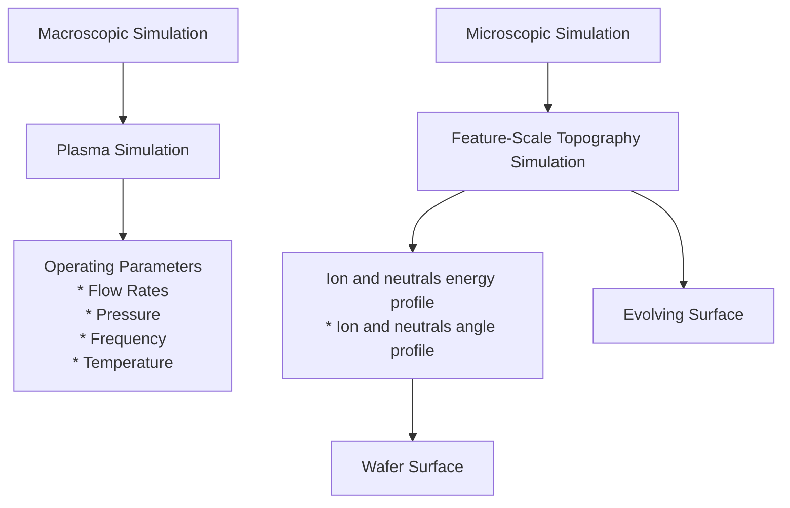
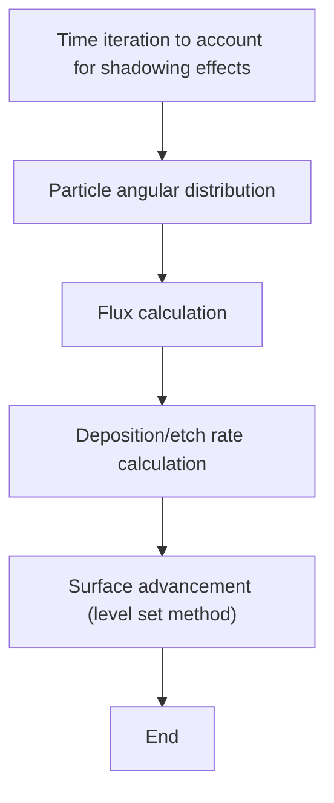
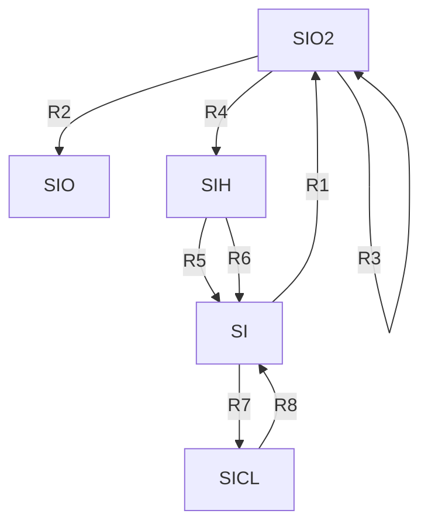
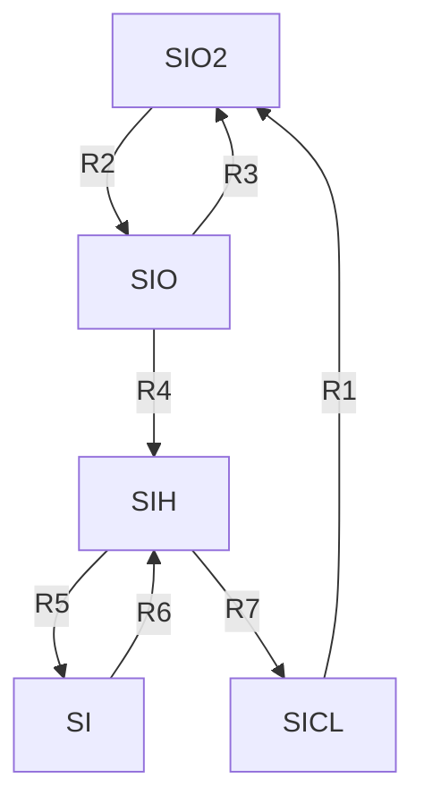
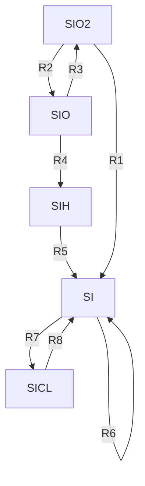
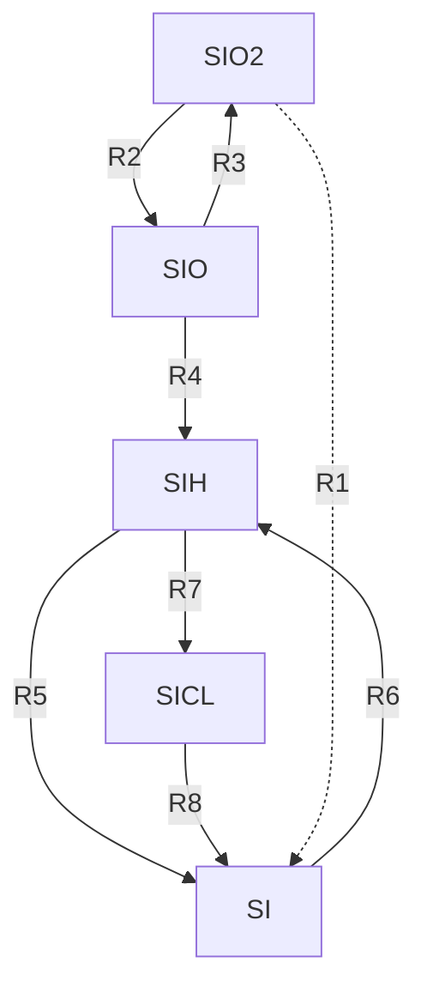
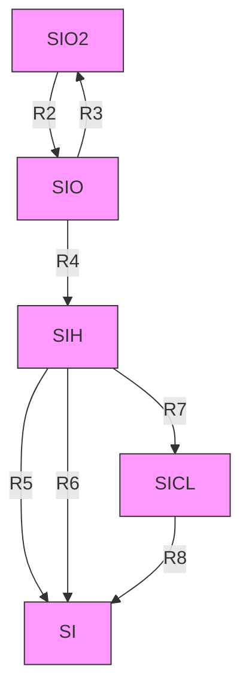
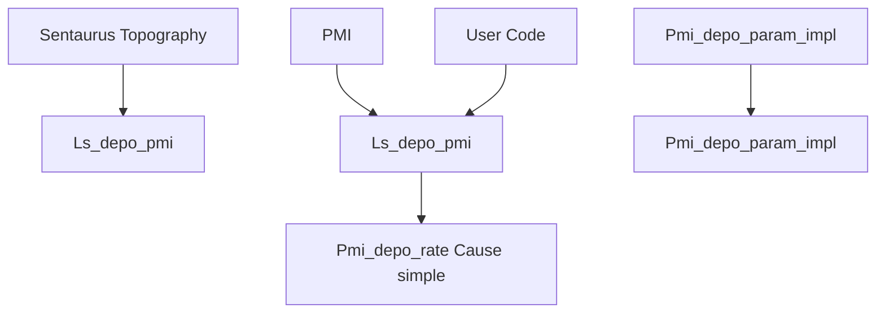
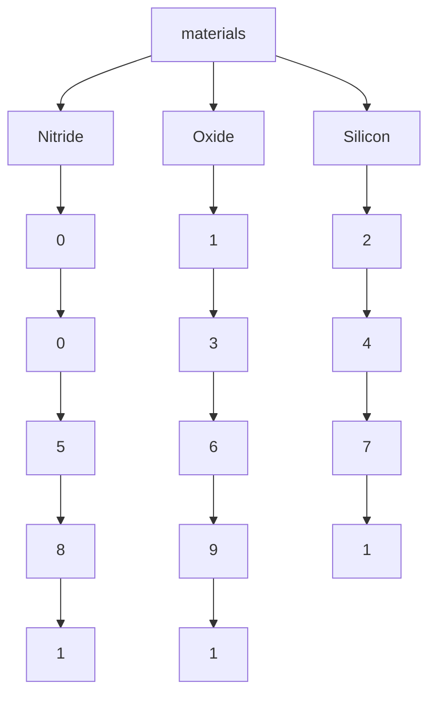
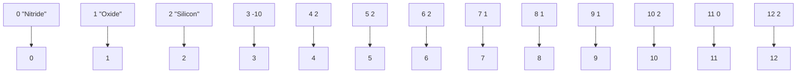

<!-- page:1 -->
# Sentaurus™ Topography User Guide

Version O-2018.06, June 2018

# Copyright and Proprietary Information Notice

<!-- page:2 -->
© 2018 Synopsys, Inc. This Synopsys software and all associated documentation are proprietary to Synopsys, Inc. and may only be used pursuant to the terms and conditions of a written license agreement with Synopsys, Inc. All other use, reproduction, modification, or distribution of the Synopsys software or the associated documentation is strictly prohibited.

# Destination Control Statement

All technical data contained in this publication is subject to the export control laws of the United States of America. Disclosure to nationals of other countries contrary to United States law is prohibited. It is the reader’s responsibility to determine the applicable regulations and to comply with them.

# Disclaimer

SYNOPSYS, INC., AND ITS LICENSORS MAKE NO WARRANTY OF ANY KIND, EXPRESS OR IMPLIED, WITH REGARD TO THIS MATERIAL, INCLUDING, BUT NOT LIMITED TO, THE IMPLIED WARRANTIES OF MERCHANTABILITY AND FITNESS FOR A PARTICULAR PURPOSE.

# Trademarks

Synopsys and certain Synopsys product names are trademarks of Synopsys, as set forth at https://www.synopsys.com/company/legal/trademarks-brands.html. All other product or company names may be trademarks of their respective owners.

# Third-Party Links

Any links to third-party websites included in this document are for your convenience only. Synopsys does not endorse and is not responsible for such websites and their practices, including privacy practices, availability, and content.

Synopsys, Inc.

690 E. Middlefield Road

Mountain View, CA 94043

www.synopsys.com

<!-- page:3 -->
# About This Guide xi

Related Publications . . xi

Conventions . xi

Customer Support . . . xi

Accessing SolvNet. . . . xii

Contacting Synopsys Support . . . . xii

Contacting Your Local TCAD Support Team Directly. . . . . xi

Acknowledgments. . . . xiii

# Chapter 1 Getting Started 1

Introduction . . .

Starting Sentaurus Topography. . . . .

From Sentaurus Workbench

From the Command Line. .

Starting Different Versions of Sentaurus Topography . . .

Input . .

Command File . . .

Boundary File . . .

Coordinate File . .

Particle Angular Distribution File . . .

Machine and Mask Library Files . . . .

Output . .

Standard Output . . . .

Log File . . . .

Boundary File . . .

Particle Angular Distribution File . . .

Extract Files . . .

File for Raphael Simulations . . .

Introductory Example . . .

References. .

# Chapter 2 Simulation Methodology 9

Modeling Hierarchy

Plasma Reactor Simulation . 10

Feature-Scale Simulation. . 10

References . .

<!-- page:4 -->
# Chapter 3 Model Descriptions 13

Introduction . . . 13

Deposition Modeling. . . . 14

Low-Pressure Effects . . . . . 14

Deposition Modeling With Reemission Mechanisms . . 15

Deposition Modeling With Redeposition Mechanisms . . . 1

Isotropic Deposition Model . . . 19

Physical Vapor Deposition Model . . . 19

Unidirectional Source Vapor Deposition Model . . . . 20

Hemispherical Source Vapor Deposition Model . . . . . 20

Low-Pressure Chemical Vapor Deposition Model. . . . . 21

Plasma-Enhanced Chemical Vapor Deposition Model . 21

High-Density Plasma Deposition Model . . . . 22

Chemical Deposition Model . . 24

Other Deposition Models. . . 24

Reflow Deposition Model . . . 24

Spin-on-Glass Deposition Model . . . . 24

Etch Modeling . . . . 25

Simple Etch Model . . 26

Hemispherical Etch Model 27

Ion-Enhanced Etch Model . . 27

Ion-Mill Etch Model . . 29

Reactive Ion Etch Model . . . 29

High-Density Plasma Etch Model . . . . 30

Chemical-Mechanical Polishing Model. . . 30

Dry Etch Model . . . . 30

Chemical Etch Model . 31

Surface Reaction Model. . . 32

General Reaction Formula . . . . 32

Simplifications . . . . 33

Generation Rates. . . . . 34

Separating Reaction Rate Parameters. . . . 35

Calculating Surface Species Density . . . . 35

Surface–Surface Reaction. . . . 36

Surface–Neutral Reaction. . . . 36

Surface–Ion Reaction . . . . 37

Growth Rate . . . . . 38

Surface Species Modeling. . . . . . 38

Very Unstable Surface Species . . . . 42

Very Stable Surface Species . . . . 42

<!-- page:5 -->
Plasma Modeling. . . . 42

Momentum Transfer or Charge Exchange. . . . . 44

Collisionless Child–Langmuir: (fieldmodel=1) . . . . . 45

Collision-Dominated Discharge: (fieldmodel=2). . . . . . 45

Linear Variation: (fieldmodel=3) . . . . . 45

Constant: (fieldmodel=4) . . . . 45

References. . . 46

# Chapter 4 Simulation Details 49

Simulated Structures and Coordinate System . . . . . 49

File Identifiers . . . . 50

Command File Identifier: <basename>.cmd . . . 50

Log File: <basename>.log . . . . . . 50

Boundary Output Files: <basename>.tdr . . . . 50

Extract Output Files: <basename>.ext . . . . 51

Environment Variables . . . 51

Discretization Size and Accuracy . . . . . 51

Integration Order . . . . . . 53

Direct Interface Between Sentaurus Topography and Sentaurus Process . . . . . 53

Syntax . . . . . 54

Standard Output and Log File . . . . . 54

Coordinate System . . . . . 54

Direct Interface Between Sentaurus Topography and Sentaurus Lithography. . . . . . . . . 55

Warning and Error Messages . . . 55

Syntax Errors . . . . 55

Timer Output . . . . 55

Execution Errors . . . 56

Known Issues . . . 56

References. . . 57

# Chapter 5 Input Commands 59

Description of Input Commands . . . 59

Parameter Types . . . 59

Logical . . . . . 60

Numeric . . . 60

Character. . . 60

Format of Command Descriptions. . . . . 60

Syntax of Parameter Lists . . . . 60

Summary of Commands . . . 62

deposit . . . . . 63

<!-- page:6 -->
Command Use . . . . . 64

Planar Deposition . . . . 65

Coordinate Deposition (Using an External Profile) . . . . . 65

Machine Deposition (Using a Specified Machine). . . . . 66

etch . 67

Command Use . . . . . . 70

Geometric Etch a Structure (Remove All Exposed Layers). . . . . . 70

Geometric Etch a Structure by Depth. . . . . . 70

Geometric Etch a Material . . . 70

Coordinate Etch a Structure (Using an External Profile) . . . . . 72

Machine Etch (Using a Specified Machine). . . . . 73

Machine Etch Using Automatic Grid Refinement . . . . 74

extract . . 75

Command Use . . . . 76

initialize. . . . . 79

Command Use . . . . . 80

Initializing With an External Structure. . . . 80

Defining a New Structure . . . . 80

Simulating Half of a Symmetric Structure . . . . 80

Simulating Half of a Cylindrically Symmetric Structure . . . . 81

litho . . . . 82

machdepo . . . . . 83

Command Use . . . . 88

machetch . . . 89

Command Use . . . . 94

machlitho. . . . 96

mask . . 97

Command Use . . . . 97

merge. . . . 98

Command Use . . . . . 98

plasma . . . . 99

Command Use . . . . . 100

save . . 101

Command Use . . . . . . 101

set . . . 102

stop . . 103

truncate . . . . 103

Command Use . . . . . 103

References. . . 103

<!-- page:7 -->
# Chapter 6 Chemical Reaction Models 105

Model Library . . . . 105

The species.dat File . . . . 106

The chem Directory . . . . 106

The flux Directory . . . . . 107

Reaction File Structure . . . 108

Definition Block . 108

Surface Species Block . . . 108

Bulk Material Block. . . 109

Density Block . . . . 110

Reaction Block. . . . 110

Reaction Path 1

Reaction Path Name. . .

Reaction Formula. . 1

Parameter List . . . 112

Examples . . . . . 115

Deposition of Polysilicon. . . . . 115

Deposition of Doped Polysilicon . . . . . 115

Isotropic Etching of Silicon . . . . 116

References . . . 117

# Chapter 7 Physical Model Interface for Deposition and Etching 119

Overview of Physical Model Interface . . . . 119

Command File Interface for Deposition Models . . . . . 119

Generic Command File Parameters for Deposition Models . . . . . 120

Defining a PMI-Based Deposition Machine . . . . 120

C++ Interface for Deposition Models . . . . . 120

Implementing a New Deposition Model . . . . 121

Level Set–Related Data . . . . 122

Additional Input Data . . . . 122

Error Handling . . . . 122

Compiling the Source Code. . . . 123

Using Additional Source Files or Libraries . . . . . 123

Using the Standard Template Library . . . . . 124

Loading the Shared Library . . . . 124

Debugging PMI Code . . . . 124

Input and Output Parameters for Deposition Models . . . . . 126

Example Model for Deposition. . . . . . 126

Pmi\_depo\_rate\_simple.hh . . . . 127

Pmi\_depo\_rate\_simple.cc . . . . . 129

<!-- page:8 -->
Command File Interface for Etching Models . . . . 130

Material-Independent Form of machetch . . 130

Material-Dependent Form of machetch. . . . 131

Defining a PMI-Based Etching Machine. . . . . 131

C++ Interface for Etching Models . . . . 131

Structure and Surface Material Information . . 132

Material Interfaces . . . 132

Input and Output Parameters for Etching Models . . . . . 133

Example Model for Etching . . . . 134

Pmi\_etch\_rate\_simple.hh. . . . . 134

Pmi\_etch\_rate\_simple.cc . . . . . 136

Command File Interface for Simultaneous Etching and Deposition Models . . . . . . . . . 139

C++ Interface for Simultaneous Etching and Deposition Models. . . . . . 139

Input and Output Parameters for Simultaneous Etching and Deposition Models . . . 139

# Chapter 8 Deposition Examples 141

Coordinate Deposition . . . . . 141

Planar Deposition (With a Specified Thickness at a Given X-Location) . . . . . . . 143

Isotropic (Conformal) Deposition . . . . . . 144

Curvature-Dependent Deposition . . . . 145

Physical Vapor Deposition . . . . 146

Low-Pressure Chemical Vapor Deposition. . . . . 147

Plasma-Enhanced Chemical Vapor Deposition . . . . 149

High-Density Plasma Deposition . . . . 151

Competing Deposition and Etching Effects. . . . . 151

Comparative Simulation Results at Selected Intervals . . . 152

Reflow Simulation . . . 154

Full Spin-on-Glass . . . . 156

Simple Spin-on-Glass . . . . 157

# Chapter 9 Plasma and Etch Examples 159

Plasma Example: Angular Distribution . 159

Geometric Etch . . . 161

Coordinate Etch. . . . . . 163

Simple Etch Model: From Directional Etch to Isotropic Etch . . . 164

Curvature-Dependent Etch . . . . 166

Hemispherical Etch Model: Emulating Broad Ion Angular Distributions . . . . . . 167

Ion-Enhanced Etch Model: Sidewall Bowing and RIE Lag Effects. . . . . 169

Ion-Mill Simulation. . . 171

Reactive Ion Etch Simulation . . . . 172

<!-- page:9 -->
High-Density Plasma Etch Simulation . . . . 173

Chemical-Mechanical Polishing . . . . 175

Dry Etch: Deep Trench Effects . . . . . 177

# Glossary

179

<!-- page:10 -->
Contents

<!-- page:11 -->
The Synopsys Sentaurus™ Topography tool simulates the critical topography-modifying processes required to fabricate integrated circuits and discrete devices in two-dimensional cross sections of the wafer. This includes several different etch and deposition processes, spinon-glass, chemical-mechanical polishing, and reflow.

# Related Publications

For additional information, see:

The TCAD Sentaurus release notes, available on the Synopsys SolvNet® support site (see Accessing SolvNet on page xii).   
■ Documentation available on SolvNet at https://solvnet.synopsys.com/DocsOnWeb.

# Conventions

The following conventions are used in Synopsys documentation.

<table><tr><td>Convention</td><td>Description</td></tr><tr><td>Blue text</td><td>Identifies a cross-reference (only on the screen).</td></tr><tr><td>Bold text</td><td>Identifies a selectable icon, button, menu, or tab. It also indicates the name of a field or an option.</td></tr><tr><td>Courier font</td><td>Identifies text that is displayed on the screen or that the user must type. It identifies the names of files, directories, paths, parameters, keywords, and variables.</td></tr><tr><td>Italicized text</td><td>Used for emphasis, the titles of books and journals, and non-English words. It also identifies components of an equation or a formula, a placeholder, or an identifier.</td></tr><tr><td>Menu &gt; Command</td><td>Indicates a menu command, for example, File &gt; New (from the File menu, select New).</td></tr></table>

# Customer Support

Customer support is available through the Synopsys SolvNet customer support website and by contacting the Synopsys support center.

<!-- page:12 -->
# Accessing SolvNet

The SolvNet support site includes an electronic knowledge base of technical articles and answers to frequently asked questions about Synopsys tools. The site also gives you access to a wide range of Synopsys online services, which include downloading software, viewing documentation, and entering a call to the Support Center.

To access the SolvNet site:

1. Go to the web page at https://solvnet.synopsys.com.   
2. If prompted, enter your user name and password. (If you do not have a Synopsys user name and password, follow the instructions to register.)

If you need help using the site, click Help on the menu bar.

# Contacting Synopsys Support

If you have problems, questions, or suggestions, you can contact Synopsys support in the following ways:

Go to the Synopsys Global Support Centers site on synopsys.com. There you can find email addresses and telephone numbers for Synopsys support centers throughout the world.   
Go to either the Synopsys SolvNet site or the Synopsys Global Support Centers site and open a case online (Synopsys user name and password required).

# Contacting Your Local TCAD Support Team Directly

Send an e-mail message to:

support-tcad-us@synopsys.com from within North America and South America   
support-tcad-eu@synopsys.com from within Europe   
support-tcad-ap@synopsys.com from within Asia Pacific (China, Taiwan, Singapore, Malaysia, India, Australia)   
support-tcad-kr@synopsys.com from Korea   
support-tcad-jp@synopsys.com from Japan

<!-- page:13 -->
# Acknowledgments

Portions of this software are owned by Spatial Corp. © 1986–2018. All rights reserved.

<!-- page:14 -->
# About This Guide

# Acknowledgments

<!-- page:15 -->
This chapter provides an overview of the functionality of Sentaurus Topography, the required input files, and the output files generated. A simple example is provided.

# Introduction

Sentaurus Topography is a two-dimensional simulator for evaluating and optimizing critical topography processing steps such as deposition, etch, spin-on-glass, reflow, and chemicalmechanical polishing.

The main objectives of Sentaurus Topography are:

For process integration and device engineers, Sentaurus Topography serves as a rapid prototyping design tool, for example, to explore the effects of the deposition or etch process variation on the structure.   
For process development engineers, Sentaurus Topography can be used (with state-of-theart physical models) to analyze an existing process or to develop a new process.

The main functionality of Sentaurus Topography is its capability to simulate various physical deposition and etching processes (the machine-based mode of deposition and etching) using the level set method [1] to perform the topographic evolution of a structure. This simulation capability is complemented by the so-called geometric deposition and etching modes, which can be used to generate structures that serve as initial structures for machine-based deposition and etching.

Two-dimensional structures are created using Sentaurus Topography. Boundary files (in TDR or SAT format) of the structures generated by Sentaurus Process or Sentaurus Structure Editor can also be a starting point for performing topography simulations in Sentaurus Topography. The resulting boundary files can then be used for further processing in Sentaurus Process or Sentaurus Structure Editor.

NOTE Sentaurus Topography deals only with the boundary of a structure. Therefore, the input structure to Sentaurus Topography must be strictly a boundary file (in TDR or SAT format), and the output from Sentaurus Topography will also be a boundary file (in TDR or SAT format). For a structure, mesh information and doping information defined on this mesh are not valid input for Sentaurus Topography.

<!-- page:16 -->
# Starting Sentaurus Topography

Sentaurus Topography simulation can be invoked and used in one of two modes.

# From Sentaurus Workbench

Sentaurus Topography is fully integrated in Sentaurus Workbench. On the command line, type the following command to start Sentaurus Workbench:

swb

# From the Command Line

Sentaurus Topography can be started directly using the command file (which can prepared using any text editor) for a simulation run, for example:

sptopo <basename>

Sentaurus Topography displays a header, which identifies the program version and then begins to execute the commands included in the file <basename>.cmd.

# Starting Different Versions of Sentaurus Topography

A specific release and version number of Sentaurus Topography can be selected using the -rel and -ver command-line options. For example, the following command starts the simulation using the 1.0 version of the release N-2017.09 as long as it is installed:

sptopo -rel N-2017.09 -ver 1.0 <basename>

# Input

Depending on the initial information available to start a simulation, Sentaurus Topography requires the following input files.

<!-- page:17 -->
# Command File

The command file is mandatory for all Sentaurus Topography simulations and contains the sequence of commands (describing the process steps) that direct the simulation. It is a text file that can be created and modified using any text editor or through Sentaurus Workbench. A detailed description of the input commands and their formats is provided in Chapter 5 on page 59.

# Boundary File

Sentaurus Topography can read the boundary file of a structure generated previously by other Sentaurus tools (such as Sentaurus Process and Sentaurus Structure Editor) or by a previous run of Sentaurus Topography. This can be in either the TDR format or SAT format (a format used by Sentaurus Structure Editor).

# Coordinate File

Sentaurus Topography can read a file containing coordinates of an arbitrary cross section, which is used to deposit a specified material or to etch a given structure as described in Coordinate Deposition (Using an External Profile) on page 65 and Coordinate Etch a Structure (Using an External Profile) on page 72, respectively. This is useful to create an initial structure in Sentaurus Topography using data from experiments (for example, a scanning electron microscope (SEM) micrograph) or from other simulators.

# Particle Angular Distribution File

For certain types of plasma deposition (for example, high-density plasma deposition) or etch simulation (for example, ion-enhanced etching), Sentaurus Topography can read a file containing the angular distribution of energetic particles arriving at a wafer surface during these plasma processes. More details can be found under machdepo (see machdepo on page 83) and machetch (see machetch on page 89).

Such distributions can be generated by plasma simulation in Sentaurus Topography using the plasma command (see plasma on page 99).

<!-- page:18 -->
# Machine and Mask Library Files

Sentaurus Topography can read the library files machdepo.lib and machetch.lib, which contain predefined deposition machines and etch machines for performing machine-based (using the level set method [1]) deposition and etching, respectively. Such files contain only machdepo and machetch commands, respectively (see machdepo on page 83 and machetch on page 89).

A library file mask.lib containing predefined masks can also be read by Sentaurus Topography. Such a mask library file can be generated using the mask command (see mask on page 97).

These library files can be shared between different topography simulation projects and between different users of Sentaurus Topography.

# Output

# Standard Output

All commands specified by the input file as well as messages and output indicating the progress of Sentaurus Topography are displayed on-screen. Any error or warning condition encountered is also displayed. The set command can be used to change the amount of output created by Sentaurus Topography (see set on page 102).

# Log File

The log file contains the same information as the standard output. The file should be examined after completion of a Sentaurus Topography simulation.

# Boundary File

Boundary files contain information about the structure generated or modified by a Sentaurus Topography simulation. At the end of each simulation, Sentaurus Topography automatically writes the structure boundary information in TDR format.

At any stage of the simulation, the save command can be used to write the structure boundary information explicitly in TDR format or SAT format (see save on page 101).

<!-- page:19 -->
Graphical output is created by Sentaurus Topography during a time profile evolution for either etching or deposition processes when the parameter dtplot has been set to a value greater than zero. Simulation results are saved in TDR format in the current working directory. See Boundary Output Files: <basename>.tdr on page 50 for additional information.

# Particle Angular Distribution File

Sentaurus Topography can simulate the angular distribution of energetic particles arriving at a wafer surface during processes that involve capacitively coupled plasmas. This is performed using the plasma command (see plasma on page 99) and the resulting distributions are saved to a file.

For certain types of plasma deposition (for example, high-density plasma deposition) or etch simulation (for example, ion-enhanced etching), Sentaurus Topography can read the angular distribution of the energetic particles, which are output by the plasma command.

# Extract Files

Sentaurus Topography can extract the thickness, slope, and minimum or maximum slope of the specified layer in a file using the extract command (see extract on page 75). This extracted information can be used to analyze or to compare the results of the Sentaurus Topography simulation with available experimental or simulation data.

# File for Raphael Simulations

When activated in the save command, Sentaurus Topography can write a file in RC2 format for the capacitance extraction tool Raphael™. Raphael uses this file to extract electrical characteristics (see save on page 101).

<!-- page:20 -->
# Introductory Example

This example shows an input file that simulates a two-dimensional cross section with deposition and etching processes, and that plots the resulting structure:

```ini
# Simple Sentaurus Topography example
# Example: spt_generalex.cmd

# Initialize the structure
initialize width=3 height=0.5

# Deposit layers
deposit thickness=0.519 material=Oxide
deposit thickness=0.91 material=Resist

# Define a simple mask
mask name=MASK1 s0=1 e0=2

# Do a geometric etch
etch mask=MASK1 material=Resist

# Define an etch machine
machetch material=Oxide name=Etcher rate=0.5 anisotropy=0.75
machetch material=Resist name=Etcher rate=0 anisotropy=0
machetch material=Silicon name=Etcher rate=0 anisotropy=0

# Etch with the defined machine
etch machname=Etcher time=1.2 dtplot=0.1 
```

The initialization of the simulation structure is specified through the parameters in the initialize command by creating a new structure using the parameters width and height with the default substrate material (Silicon).

Two planar deposition commands and a masked etch process are used to create a simple initial structure. A new etch machine is defined with the default model (simple), which is a level set–based etching model. This is then used to etch the oxide layer.

The definition of the dtplot parameter in the etch command prompts Sentaurus Topography to create a series of TDR files at the time intervals specified by dtplot. The final structure created with this example file is shown in Figure 1 on page 7.


<details>
<summary>area</summary>

| X    | Y      |
| ---- | ------ |
| 0.0  | -1.0   |
| 0.5  | -1.0   |
| 1.0  | -0.5   |
| 1.5  | -0.5   |
| 2.0  | -1.0   |
| 2.5  | -1.0   |
| 3.0  | -1.0   |
</details>

Figure 1 Final structure created with file spt\_generalex.cmd

<!-- page:21 -->
# References

[1] J. A. Sethian and D. Adalsteinsson, “An Overview of Level Set Methods for Etching, Deposition, and Lithography Development,” IEEE Transactions on Semiconductor Manufacturing, vol. 10, no. 1, pp. 167–184, 1997.

<!-- page:22 -->
1: Getting Started References

<!-- page:23 -->
Topography simulation is a vast topic spanning multiple disciplines. This chapter presents the simulation methodology used in Sentaurus Topography.

# Modeling Hierarchy

In general, topography simulation consists of two conceptually different but closely related activities: modeling reactor-scale dynamics and simulating surface feature-scale processes as shown in Figure 2. The reaction chemistry of surfaces provides boundary conditions for reactor scale processes and simulation at the feature scale requires fluxes from reactor-scale phenomena.


<details>
<summary>flowchart</summary>


</details>

Figure 2 Schematic showing the different components of topography simulation

<!-- page:24 -->
# Plasma Reactor Simulation

Most plasma deposition or etch processes are based on either DC discharges or radio frequency (RF)–excited plasmas of the capacitively coupled (CCP) or inductively coupled (ICP) type, typically driven at an RF of 13.56 MHz. In such discharges, electrons, ions, and reactive species are generated mainly in plasma bulk. The fidelity of pattern transfer during etching depends on ion impact at a process surface. Several important characteristics of ion impact phenomena can be summarized by defining ion energy distribution functions (IEDFs) and ion angular distribution functions (IADFs).

The actual forms of the IEDFs and IADFs at the process surface are controlled by the ion dynamics in negatively biased sheaths that separate the bulk from the surface. The theoretical study of sheath phenomena is therefore critical to developing analytic models that will increase understanding of the influence of reactor conditions on plasma etching behavior. Sentaurus Topography provides a basic model of plasma simulation in a CCP reactor (see Plasma Modeling on page 42).

# Feature-Scale Simulation

The feature-scale simulation component in Sentaurus Topography evaluates the normal velocity of movement of the surface at different points using fluxes of different species in the reactor: ions, chemical radicals, and deposition precursors. Figure 3 on page 11 depicts a more detailed view of the feature-scale simulator for a general deposition or etching step. The particle angular distribution (IADF) incident on the wafer surface is used. Fluxes of incoming particles are strongly influenced by shadowing effects.

For each kind of deposition process (for example, plasma-enhanced chemical vapor deposition) or etch process (for example, reactive ion etch), the flux calculation module computes these fluxes at discrete time intervals to account for this effect. This is described in Chapter 3 on page 13. These fluxes are then converted into deposition or etch rates that are finally used to advance the surface. A numeric technique such as the level set algorithm (introduced by Osher and Sethian [1]) is then used to advance the surface to a new position.


<details>
<summary>flowchart</summary>


</details>

Figure 3 Schematic showing the feature-scale simulation in Sentaurus Topography for a deposition or an etch step

<!-- page:25 -->
# References

[1] S. Osher and J. A. Sethian, “Fronts Propagating with Curvature-Dependent Speed: Algorithms Based on Hamilton–Jacobi Formulations,” Journal of Computational Physics, vol. 79, no. 1, pp. 12–49, 1988.

<!-- page:26 -->
2: Simulation Methodology References

<!-- page:27 -->
This chapter describes the simulation capabilities provided by Sentaurus Topography for the analysis of integrated circuit fabrication, including etch, deposition, chemical-mechanical polishing (CMP), spin-on-glass (SOG), and reflow processes.

# Introduction

As described in Feature-Scale Simulation on page 10, the feature-scale simulation consists of the evaluation of the normal velocity of movement of the surface at different points using fluxes of three different species:

Ions: The ions are characterized by an angular distribution obtained either through experimental measurements or by using the plasma command.   
Chemical radicals: Sentaurus Topography characterizes the chemical radical flux as a uniform flux over the surface.   
■ Deposition precursors: The deposition flux is the result of three different contributions:

• Direct or unshadowed deposition from the gas phase.   
• Reemission flux characterized by a single sticking coefficient.   
• Redeposition flux of material sputtered by ions from the surface.

Each of these fluxes has its own peculiarities. When these fluxes are calculated, surface models must be applied to obtain the etch or deposition rates at each point on the surface. A numeric technique (level set) must then be used to advance the surface to a new position.

The following sections outline the capabilities of Sentaurus Topography to simulate the topographic evolution of a structure during deposition and etching processing steps. In addition, the plasma model available in Sentaurus Topography to simulate the angular distribution of particles arriving at the wafer surface is described. For each of these processes, a description is provided of the models used and their relation to the input parameters (as documented in Chapter 5 on page 59).

<!-- page:28 -->
# Deposition Modeling

Sentaurus Topography can simulate the deposition of a specified material on the surface of the current structure or can deposit a layer of the specified material with a specific topographic shape.

There are three different modes of deposition in Sentaurus Topography: planar, coordinate, and machine (see deposit on page 63). The first two modes are provided to construct structures that can be used as initial structures for machine-based deposition. This section describes the various deposition processes (or machines) that can be simulated in Sentaurus Topography using the machine mode.

First, using the machdepo command (see machdepo on page 83 for details about each model and its parameters), a new deposition machine is defined. Alternatively, a predefined deposition machine (from the library file machdepo.lib) can be used as it is or you can alter its coefficients using the machdepo command.

Any one of several different deposition processes can be simulated: isotropic (conformal), unidirectional (beam deposition), hemispherical (physical vapor deposition), low-pressure chemical vapor deposition (LPCVD), plasma-enhanced chemical vapor deposition (PECVD), high-density plasma (HDP) deposition, spin coating, or reflow.

Next, the deposit command is used (see Machine Deposition (Using a Specified Machine) on page 66) along with the machine name as defined in the machdepo command. As a result, the machine coefficients associated with this defined machine are used for the deposition simulation. The time parameter in the deposit command specifies the total time for the simulation of the deposition step.

# Low-Pressure Effects

As most deposition processes occur at very low pressures, the mean free path of the deposition precursors is very large when compared to the feature scale. As a result, the deposited film topography is often strongly affected by the geometric self-shadowing of the structure from the vapor flux, as well as by the source geometry of the deposition system.

The mechanisms that are applicable to deposition simulations in Sentaurus Topography are:

■ Isotropic coverage   
Unidirectional source vapor deposition   
■ Hemispherical source vapor deposition   
■ Reemission models with a sticking coefficient

■ Combination of direct and isotropic deposition models   
Redeposition of sputtered material   
■ Sputtering of material from the layer being deposited

<!-- page:29 -->
For these cases, the following assumptions are made:

The mean free path of scattering for atoms in transit to the substrate is greater than the distance from the source to the substrate.   
■ The source-to-substrate distance is great compared to variations of the simulation structure.   
There is no intermixing or alteration of the underlying materials.   
■ There is no relaxation of molecules on the surface to more energetically favorable positions.   
The magnitude and direction of the film growth follows the cosine law [1][2][3], meaning that the growth direction is along the vapor stream.

The reemission and redeposition mechanisms used by certain models are now described.

# Deposition Modeling With Reemission Mechanisms

This mechanism is used by machines of type LPCVD or HDP that are defined by the command machdepo. For this deposition mechanism, the active species are classified as deposition precursors. They are transported to a given position on the surface by either direct deposition or reemission mechanisms, as depicted in Figure 4.

There is strong experimental and modeling evidence that these two transport mechanisms play a major role in defining the topological characteristics of most LPCVD systems [4][5].


<details>
<summary>text_image</summary>

Γre
Γd
</details>

Figure 4 Direct deposition $( \mathsf { F _ { d } } )$ or reemission $( \mathsf { F } _ { \mathsf { r } } )$ of active species

<!-- page:30 -->
Figure 4 on page 15 shows the domain of the integration for the direct unshadowed flux and reemitted flux in a trench. For trenches, the three-dimensional shadowing of the direct flux is reduced considerably. Since there is less shadowing, trenches exhibit better step coverage than vias with the same aspect ratio. The implementation in Sentaurus Topography follows the literature [6].

To calculate the total flux at any point on the surface, the direct flux from the gas phase is calculated. All the contributions of reemitting surfaces that have direct visibility to the point are added, as shown in Eq. 1:

$$
\Gamma_ {i} = \Gamma_ {\mathrm{d}, i} + \sum_ {j \neq i} g _ {i j} \Gamma_ {\mathrm{re}, j} \tag {1}
$$

$$
= \Gamma_ {\mathrm{d}, i} + \sum_ {j \neq i} (1 - s) g _ {i j} \Gamma_ {j}
$$

where:

■ $\Gamma _ { i }$ is the total incoming flux at position .i   
■ $\Gamma _ { \mathrm { d } , i }$ is the direct incoming flux at position .i   
$\Gamma _ { \mathrm { r e } , j }$ is the flux reemitted from position .j   
■ $g _ { i j }$ is the view factor for particles reemitted from position to position .j i   
is the sticking coefficient (parameter sc).s

The two fluxes considered correspond to the direct unshadowed flux coming from the gas phase and the reemitted flux from every point on the surface that has a direct line of sight to the point under consideration. The reemission flux is the result of particles that arrive at a certain position, are adsorbed, and are thermally reemitted into the ambient. This reemission process is characterized by a single sticking coefficient defined with the sc parameter in the machdepo command.

In Sentaurus Topography, the deposition rate is assumed to be proportional to the total deposition flux. The total deposition rate for deposition on a flat unshadowed wafer surface is defined with the rate parameter in the machdepo command. The total flux that reacts and contributes to the growing rate is normalized to unity on the wafer surface. In this way, the growth rate at any point on the surface is proportional to the reacting rate, and the proportionality constant is the value specified with the parameter rate.

The intensity of emission is a function of the sticking coefficient and the probability of a particle being reemitted in a given direction. Sentaurus Topography assumes a cosine distribution for this probability.

The terms in Eq. 1 can be rearranged into Eq. 2. In this matrix form, the vector $\begin{array} { l } { \vec { \bf \Phi } } \\ { \Gamma } \end{array}$ is the unknown total flux at every point on the surface, and the vector $\Gamma _ { \mathrm { d } }$ is the direct flux to the surface and is obtained by direct integration. The coefficient matrix contains the information associated with the view factors and intensity of emission:

$$
\mathbf {A} \cdot \stackrel {\rightarrow} {\Gamma} = \stackrel {\rightarrow} {\Gamma_ {\mathrm{d}}}
$$

$$
A _ {i j} = \left\{ \begin{array}{c c} 1 & i = j \\ (s - 1) g _ {i j} & i \neq j \end{array} \right. \tag {2}
$$

<!-- page:31 -->
where $A _ { i j }$ is the view factor for particles reemitted from position to position .j i

In general, in this matrix expression, the matrix is neither symmetric nor sparse. The numberA of null elements is a function of the visibility of every segment to every other segment. In this way, concave structures tend to give full matrices, while convex structures correspond to sparse matrices. Furthermore, applications characterized by large sticking coefficients (near unity) tend to be diagonal dominant and are solved more efficiently by iterative methods. However, for low sticking coefficients, where matrices are not diagonal dominant, direct methods are required.

# Deposition Modeling With Redeposition Mechanisms

This mechanism is used by machines of type HDP and is defined using the machdepo command. In this mechanism, the ion flux is calculated at every point on the surface of the structure by three-dimensional integrations of ion angular distributions.

These distributions are characterized by one of the following:

■ $\mathrm { \bf A } \cos ^ { m } \theta$ distribution (where is the parameter exponent).m   
■ A distribution calculated by Sentaurus Topography using the plasma command.


<details>
<summary>text_image</summary>

F_i
(x,y) → n_θ
F_rd θ
(ξ,η)
</details>

Figure 5 Ion flux (F ) material sputtered from surface with redeposition flux $( \mathsf { F } _ { \mathsf { r d } } )$ reemitted with angular cosine distribution

<!-- page:32 -->
Every point with an ion flux becomes a source of the redeposition flux with an intensity proportional to the ion flux. The yield depends on the angle between the surface normal and the mean angle of incidence of ions:

$$
\gamma \left(\theta_ {\mathrm{i}}\right) = s _ {1} \cos \theta_ {\mathrm{i}} + s _ {2} \cos^ {2} \theta_ {\mathrm{i}} + s _ {4} \cos^ {4} \theta_ {\mathrm{i}} \tag {3}
$$

where:

■ $\gamma ( \theta _ { \mathrm { i } } )$ is the sputter yield.   
$\theta _ { \mathrm { i } }$ is the angle between incoming ions and the surface normal.   
$s _ { 1 }$ is the parameter sputc1.   
$s _ { 2 }$ is the parameter sputc2.   
$s _ { 4 }$ is the parameter sputc4.

The sum of sputc1, sputc2, and sputc4 must be one.

The redeposition flux is given by:

$$
F _ {\mathrm{rd}} (x, y) = \gamma (\theta_ {\mathrm{i}}) F _ {\mathrm{i}} (x, y) \tag {4}
$$

where:

$F _ { \mathrm { i } } ( x , y )$ is the ion flux at position $( x , y )$ .   
$F _ { \mathrm { r d } } ( x , y )$ is the redeposition flux emitted from position $( x , y )$ .

The total redeposited flux at a given position $( x , y )$ on the surface is the result of the integration of all redeposition source fluxes that have direct visibility with that position:

$$
R _ {\mathrm{rd}} (x, y) = \iint F _ {\mathrm{rd}} (\xi , \eta) \cos \phi_ {1} \cos \phi_ {2} \mathrm{d} \xi \mathrm{d} \eta \tag {5}
$$

where:

■ $\Phi _ { 1 }$ is the angle between the surface normal at $( \xi , \eta )$ and the direction between $( \xi , \eta )$ and $( x , y )$ .   
■ $\Phi _ { 2 }$ is the angle between the surface normal at $( x , y )$ and the direction between $( \xi , \eta )$ and $( x , y )$ .   
■ $F _ { \mathrm { r d } } ( \xi , \eta )$ is the redeposition flux emitted from position $( \xi , \eta )$ .   
$R _ { \mathrm { r d } } ( x , y )$ is the redeposited flux at position $( x , y )$ .

<!-- page:33 -->
# Isotropic Deposition Model

A machine is defined as an isotropic deposition machine when isotropic is specified during machine definition with the machdepo command. With this model, the material is deposited conformally over the surface [7][8]. Physically, this model corresponds to the topography that results during a chemical vapor deposition (CVD) process when reactants, or reactive intermediates, have a very low sticking coefficient. Regardless of the initial surface topography, a uniform concentration of reactants is formed along the surface. As a result, along normal paths from the surface to the interface with the underlying material, the thickness of the material is constant. For the isotropic deposition model, the growth rate is:

$$
\vec {R} (x, y) = R _ {\mathrm{y}} \vec {\mathrm{n}} (x, y) \tag {6}
$$

where:

$\vec { \bf n } ( x , y )$ is the unit vector perpendicular to the surface at position $( x , y )$   
■ $_  \vec { \mathbf { \nabla } } \vec { \mathbf { \nabla } } \vec { \mathbf { \nabla } } \vec { \mathbf { \nabla } } \vec { \mathbf { \nabla } } \vec { \mathbf { \xi } } \vec { \mathbf { \nabla } } \vec { \mathbf { \xi } } \vec { \mathbf { \xi } } \vec { \mathbf { \xi } } \vec { \mathbf { \xi } } \vec { \mathbf { \xi } } \vec { \mathbf { \xi } } \vec { \mathbf { \xi } } \vec { \mathbf { \xi } } \vec { \mathbf { \xi } } \vec { \mathbf { \xi } } \vec { \mathbf { \xi } } \vec { \mathbf { \xi } } \vec { \mathbf { \xi } } \vec { \mathbf { \xi } } \vec { \mathbf { \xi } } \vec { \mathbf { \xi } } \vec { \mathbf { \xi } } \vec { \mathbf { \xi } } \vec { \mathbf { \xi } } \vec { \mathbf { \xi } } \vec { \mathbf { \xi } } \vec { \mathbf { \xi } } \vec { \mathbf { \xi } } \vec { \mathbf { \xi } } \vec { \mathbf { \xi } } \vec { \mathbf { \xi } } \vec { \mathbf { \xi } } \vec { \mathbf { \xi } } \vec { \mathbf { \xi } } \vec { \mathbf { \xi } } \vec { \mathbf { \xi } } \vec { \mathbf { \xi } } \vec { \mathbf { \xi } }$ is the vertical deposition rate on the unshadowed horizontal surface (parameter rate).   
$R ( x , y )$ is the deposition rate at position .( ) x y,

CVD of silicon dioxide by decomposition of tetraethyloxysilane (TEOS), polysilicon, and silicon nitride are examples of deposition processes that often result in isotropic deposition profiles.

A curvature-dependent deposition process can be simulated by the following relation:

$$
R (x, y) = R _ {\mathrm{y}} (1 - k \kappa (x, y)) \tag {7}
$$

where $\kappa ( x , y )$ is the curvature at position $( x , y )$ and is the parameter kcurv. With thisk parameter, the deposition rate is lower at a convex surface and higher at a concave surface. The net effect of the curvature-driven deposition is to smooth the surface as it evolves.

# Physical Vapor Deposition Model

A deposition machine is defined as a physical vapor deposition (PVD) machine when pvd is specified during machine definition with the machdepo command. In this model, the fluxes arriving at the wafer surface are characterized by their angular distribution. A sticking coefficient of unity is assumed for the deposition process, which usually applies to metallization processes. Therefore, the deposition profile is controlled by the incoming angular distribution and the geometric shadowing effect.

# Unidirectional Source Vapor Deposition Model

<!-- page:34 -->
A machine is defined as a unidirectional source vapor deposition machine when unidirectional is specified during machine definition with the machdepo command. Physically, this model simulates the physical vapor deposition (PVD) process of unidirectional-angle evaporation. Atoms in the vapor stream impinge on the structure surface at one angle only, and material deposition does not occur in the shadowed regions. For unshadowed regions, the cosine law growth rate is expressed by:

$$
R _ {\text { cosine }} (x, y) = R _ {\mathrm{y}} \cos \theta (x, y) \tag {8}
$$

where $\theta ( x , y )$ is the angle between the incoming flow and the surface normal at position .( ) x y,

# Hemispherical Source Vapor Deposition Model

A deposition machine is defined as a hemispherical source vapor deposition machine when hemispherical is specified during machine definition with the machdepo command. In this model, the vapor flux is distributed continuously throughout a range of incidence angles in three-dimensional space. Physically, this model corresponds to the topography that results during a CVD process when incoming reactants, or reactive intermediates, have a long mean free path for scattering and adsorb, react, and convert without any surface migration occurring.

This type of coverage is typical of the PVD process of aluminum when targets are sputtered at low temperatures. This model also corresponds to the type of coverage typical of many evaporated metals. The resultant deposition rate is:

$$
R (x, y) \propto R _ {\mathrm{d}} (\cos \vartheta (x, y) (\sin \phi_ {2} - \sin \phi_ {1}) + \sin \vartheta (x, y) (\cos \phi_ {1} - \cos \phi_ {2})) \tag {9}
$$

# where:

$\Phi _ { 1 }$ is the lower bound angle of the ion distribution measured from the positive x-axis and corresponds to the parameter angle1.   
$\Phi _ { 2 }$ is the upper bound angle of the ion distribution measured from the positive x-axis and corresponds to the parameter angle2.   
■ $\vartheta ( x , y )$ is the angle between the surface normal at position $( x , y )$ and the positive x-axis.   
$R _ { \mathrm { d } }$ is the directional deposition rate.   
$R ( x , y )$ is the deposition rate at position .( ) x y,

# Low-Pressure Chemical Vapor Deposition Model

<!-- page:35 -->
A deposition machine is defined as a low-pressure chemical vapor deposition (LPCVD) machine when lpcvd is specified during machine definition with the machdepo command. In this model, the vapor flux of chemical precursors is distributed continuously throughout a range of incidence angles in three-dimensional space. In addition, a chemical precursor that sticks and reacts at the place of arrival on the surface is characterized by a single parameter called the reactive sticking coefficient (parameter sc). This parameter assumes values between 0.0 and 1.0. Precursors that do not react at the surface are reemitted with a cosine probability distribution for the angular distribution with respect to the directional deposition of the surface normal. The total deposition rate at a flat unshadowed surface is specified by the parameter rate.

# Plasma-Enhanced Chemical Vapor Deposition Model

A deposition machine is defined as a plasma-enhanced chemical vapor deposition (PECVD) machine when pecvd is specified during machine definition with the machdepo command. In this model, the fluxes arriving at the wafer surface are characterized by two components: thermally driven low-pressure chemical vapor deposition precursors and ion-induced deposition precursors. The thermal CVD component is relatively more conformal, whereas the ion-induced deposition component is relatively more directional.

The thermal CVD component is simulated as a normal LPCVD process by calculating the reemission process and is characterized by a sticking coefficient parameter. The ion-induced deposition component is simulated by the calculation of the shadowing effects and is characterized by the ion angular distribution.

The total deposition rate on a flat unshadowed surface is specified by the parameter rate, and the ratio of the directional rate to total deposition rate is specified by the parameter anisotropy:

$$
R = R _ {\mathrm{i}} + R _ {\mathrm{d}} \tag {10}
$$

where:

■ is the total deposition rate on the unshadowed horizontal surface.R   
$R _ { \mathrm { d } }$ is the directional deposition rate.   
$R _ { \mathrm { i } }$ is the isotropic deposition rate.

<!-- page:36 -->
The anisotropy is defined as:A

$$
A = \frac {R _ {\mathrm{d}}}{R _ {\mathrm{i}} + R _ {\mathrm{d}}} \tag {11}
$$

# High-Density Plasma Deposition Model

A deposition machine is defined as a high-density plasma (HDP) deposition machine when hdp is specified during machine definition with the machdepo command. In this model, two competing mechanisms occur: deposition and simultaneous etching by physical sputtering. The following factors are taken into account:

■ Deposition by direct deposition from the gas phase.   
Deposition by reemission mechanisms.   
■ Ion-enhanced deposition mechanisms.   
■ Deposition by redeposition of material sputtered from the surface.   
Etching that assumes physical sputtering mechanisms.

The implementation of this model follows the work of Li [9]. The net deposition rate on a flat unshadowed surface is the result of the difference of the total deposition rate (specified by the parameter rate) minus the total etch rate (specified by the parameter millrate):

$$
R (x, y) = R _ {\mathrm{y}} - R _ {\mathrm{m}} \tag {12}
$$

where $R _ { \mathrm { m } }$ is the mill rate.

The total deposition rate is characterized by three components: an ion-enhanced deposition term $R _ { \mathrm { i o n } }$ , a component that is not affected by the ion flux (called the thermal component) $R _ { \mathrm { t h } }$ , and the contribution of redeposited material $R _ { \mathrm { r e d e p } }$ :

$$
R = R _ {\text { ion }} + R _ {\text { th }} + R _ {\text { redep }} \tag {13}
$$

where:

$R _ { \mathrm { i o n } }$ is the ion-enhanced deposition rate.   
$R _ { \mathrm { t h } }$ is the ion flux–independent rate (thermal component).   
$R _ { \mathrm { r e d e p } }$ is the redeposition rate.

<!-- page:37 -->
The ratio of the ion-enhanced deposition component to the total deposition rate on a flat surface is specified by the parameter anisotropy :A

$$
A = \frac {R _ {\text {ion}}}{R _ {\text {th}} + R _ {\text {ion}}} \tag {14}
$$

The component $R _ { \mathrm { t h } }$ is calculated with a reemission mechanism characterized by the sticking coefficient defined by the parameter sc. If the parameter sc is not specified, a perfectly isotropic deposition is assumed.

In turn, the parameter redepratio defines the fraction of the material sputtered from the surface that is to be redeposited with a unity probability.

To characterize the angular distribution of the ion flux, there are two possibilities:

An angular distribution given by where is the parameter exponent and is thecosm θ m θ angle between incoming ions and the y-axis.   
■ An angular distribution obtained with the plasma command (by specifying the parameter plasmafile).

The etch mechanism is assumed to be purely physical sputtering with a yield model defined by the parameters sputc1, sputc2, and sputc4:

$$
\gamma \left(\theta_ {\mathrm{i}}\right) = s _ {1} \cos \theta_ {\mathrm{i}} + s _ {2} \cos^ {2} \theta_ {\mathrm{i}} + s _ {4} \cos^ {4} \theta_ {\mathrm{i}} \tag {15}
$$

where:

■ $\gamma ( \theta _ { \mathrm { i } } )$ is the sputter yield.   
$\theta _ { \mathrm { i } }$ is the angle between incoming ions and the surface normal.   
$s _ { 1 }$ is the parameter sputc1.   
$s _ { 2 }$ is the parameter sputc2.   
$s _ { 4 }$ is the parameter sputc4.

The sum of sputc1, sputc2, and sputc4 must be one.

The total etch rate is calculated as the product of the yield, milling rate coefficient, and the ion flux:

$$
R (x, y) = R _ {\mathrm{m}} \gamma (\theta_ {\mathrm{i}}) F _ {\mathrm{i}} (x, y) \tag {16}
$$

where $F _ { \mathrm { i } } ( x , y )$ is the ion flux at position $( x , y )$ , and $R _ { \mathrm { m } }$ is the mill rate (parameter millrate).

<!-- page:38 -->
# Chemical Deposition Model

The chemical deposition model is based on surface chemistry models [10] and is used to simulate different deposition processes such as low-pressure chemical vapor deposition (LPCVD), physical vapor deposition (PVD), and high-density plasma (HDP) chemical vapor deposition.

You must provide ion and neutral flux distributions and surface reaction models as input. For each time step of the simulation, the incoming ion and neutral fluxes are calculated at each point of the exposed surface. Together with the surface reaction models, these fluxes are used to calculate the deposition rate for each surface point.

A deposition machine is defined as a chemical deposition machine when chem is specified during machine definition with the machdepo command.

# Other Deposition Models

# Reflow Deposition Model

A deposition machine is defined as a reflow machine when reflow is specified during machine definition with the machdepo command. In this model, the top layer of specified material redistributes between surface regions of different free energies at certain process conditions (either at high temperature or by certain chemical reaction mechanisms), with materials flowing from an area of higher free energy to an area of lower free energy.

In addition, the final flow-shape surface profile is governed by the surface tension, which is assumed to be a function of surface curvature. The dependency of the profile on the local curvature is characterized by the parameter kcurv. The rate at which the lowest point on a concave surface is filled is used to indicate the planarization speed and is specified with the parameter rate.

# Spin-on-Glass Deposition Model

A deposition machine is defined as a spin-on-glass (SOG) machine when sog is specified during machine definition with the machdepo command. This model is a combination of three processes: curvature-dependent deposition, reflow, and shrinking.

The specified material is first deposited on the surface, is subsequently reflowed for planarization purposes, and then undergoes a shrinking process. The shrinking is mainly governed by the local stress, which is assumed to be a function of surface curvature. If the simple mode is specified in the machine definition, a combination of simple planarization and shrinking is used instead to emulate the whole process.

<!-- page:39 -->
The thickness of the initial deposition is specified by the parameter initspin. The planarization speed of the reflow process is specified by the parameter sogreflow. The percentage of the material that undergoes the shrinking process is specified by the parameter shrinkage. The dependency of the profile on the local curvature in processes of either reflow or shrinking is characterized by the parameter kcurv. The model development is based on published work [11][12][13][14][15].

# Etch Modeling

Sentaurus Topography can simulate the etching of a specified material on the surface of the current structure or can etch the current structure with a specific topographic shape.

There are basically three different modes of etching in Sentaurus Topography: geometric, coordinate, and machine (see etch on page 67). The first two modes are provided to construct a structure that can serve as an initial structure for machine-based etching or to clean up or remove mask layers. This section describes the various etching processes (or machines) that can be simulated in Sentaurus Topography using the machine mode.

First, using the machetch command, a new etching machine is defined (see machetch on page 89 for details about each machine and its parameters). Alternatively, a predefined etch machine (from the library file machetch.lib) can be used as it is or you can alter its coefficients using the machetch command. Any one of several different etch processes can be simulated: isotropic/anisotropic, hemispherical, ion-enhanced etch, ion-milling, reactive ion etch, high-density plasma etch, and chemical-mechanical polishing.

Next, the etch command is used (see Machine Etch (Using a Specified Machine) on page 73) along with the machine name as defined in the machetch command. As a result, the machine coefficients associated with this defined machine are used in the etching simulation. The etch command requires the time parameter, which specifies the total time for the simulation of the etch step.

Modern integrated circuit technology relies on a diverse set of etching processes for the fabrication of these devices. These include wet chemical etch, plasma etch, and reactive ion etch. However, there are no widely applicable, physically based models for these processes.

In comparison with other critical processes, such as ion implantation and impurity diffusion for which physically based models exist (in tools such as Sentaurus Process), the etch processes are not yet well enough understood to formulate models of equivalent accuracy. Development of these models is a dynamic area of research. However, to circumvent this fundamental modeling problem and still provide a useful tool, it is possible to model these processes empirically.

<!-- page:40 -->
It has been found that many etching processes are treated as a combination of isotropic and directional parts:

$$
R = R _ {\mathrm{i}} + R _ {\mathrm{d}} \tag {17}
$$

where:

■ is the total etching rate on the unshadowed horizontal surface.R   
$R _ { \mathrm { d } }$ is the directional etching rate.   
$R _ { \mathrm { i } }$ is the isotropic etching rate.

# Simple Etch Model

In this type of etching (defined by the etch machine simple), every point on the surface of the structure exposed to the etchant moves at the same rate normal to the surface. A machine is defined to have an isotropic etching component when the etch anisotropy parameter, anisotropy, is less than one. The etch is also completely isotropic when the anisotropy parameter is zero and no other etch rate components are defined. The anisotropy coefficient as defined by Mogab [16] is:

$$
A = \frac {R _ {\mathrm{d}}}{R _ {\mathrm{i}} + R _ {\mathrm{d}}} \tag {18}
$$

where:

■ is the anisotropy.A   
$R _ { \mathrm { d } }$ is the directional etching rate.   
$R _ { \mathrm { i } }$ is the isotropic etching rate.

Physically, isotropic etching usually corresponds to the purely chemical component of the etch. For example, wet chemical etch and fluorine-based plasma etch processes, in the absence of ion flux, often result in isotropic etch profiles.

Directional etching corresponds to the opposite extreme compared to isotropic etching. In this case, only those points on the structure that are illuminated by a perfectly collimated beam of incoming energetic ions or reactants are eroded. The surface of the structure erodes in the same direction as the incoming ion flux.

A machine is defined as having a directional etching component when the anisotropy parameter is greater than zero. The etch is completely directional when the anisotropy parameter is one and no other etch rate components are defined.

<!-- page:41 -->
Physically, plasma-assisted processes from reactive ions or neutrals impinging upon the structure surface usually result in directional etching.

For unshadowed regions, the directional etch rate component is:

$$
R (x, y) = R _ {\mathrm{d}} \cos \vartheta (x, y) \tag {19}
$$

where:

■ $\vartheta ( x , y )$ is the angle between the surface normal at position and the positive x-axis.( ) x y,   
$R _ { \mathrm { d } }$ is the directional etching rate.   
■ $R ( x , y )$ is the directional etching rate at position $( x , y )$ .

A curvature-dependent etching process can be simulated by the following relation:

$$
R (x, y) = R _ {\mathrm{y}} (1 - k \kappa (x, y)) \tag {20}
$$

where $\kappa ( x , y )$ is the curvature at position $( x , y )$ and is the parameter kcurv. With thisk parameter, the etch rate is lower at a concave surface and higher at a convex surface. The net effect of the curvature-driven etch is to smooth the surface as it evolves.

# Hemispherical Etch Model

For this case, the etching machine requires the setting of the logical parameter hemispherical. For this etching model, the anisotropic component is calculated by performing a flux integration at every point of the surface, assuming an angular distribution of cosine type (isotropic) from the gas phase. The isotropic component of the etching rate is calculated as in the simple model (see Simple Etch Model on page 26).

# Ion-Enhanced Etch Model

This etching machine requires the setting of the logical parameter spetch. For this etching model, the active species are classified as chemical radicals and ions, which are key contributors to the etch rate when performing plasma-assisted etching.

As described in the literature [17][18], in this implementation, chemical radicals, which are electrically neutral, are considered unaffected by the electric field in the plasma, and they contribute isotropically to the etching rate. In contrast, ions are affected by the conditions of the plasma discharge, and the direct unshadowed flux is calculated for each point on the surface.

<!-- page:42 -->
Figure 6 shows the shadowing for the direct ion flux at a point on the surface for the case of a very long trench. The ion flux is normalized to unity on the flat unshadowed surface of the wafer. The ion angular distribution used to calculate the flux is obtained with a simulation of the plasma discharge using the plasma command.


<details>
<summary>text_image</summary>

Direct Flux
Trench
</details>

Figure 6 Shadowing for direct flux at a point on the surface

The flux of chemical radicals and the ion flux are used to obtain the etch rate using a linear superposition of both fluxes, as represented in Eq. 21:

$$
R = R _ {\text { chem }} + R _ {\text { ion }} \tag {21}
$$

where:

■ is the total etching rate (the parameter rate).R   
$R _ { \mathrm { { c h e m } } }$ is the chemical (isotropic) etching rate.   
$R _ { \mathrm { i o n } }$ is the ion flux–dependent etching rate.

The total etch rate on an unshadowed surface is defined by the rate parameter. The relative contributions of the chemical and ion components are specified by the anisotropy parameter, as shown in Eq. 22:

$$
A = \frac {R _ {\text {ion}}}{R _ {\text {chem}} + R _ {\text {ion}}} \tag {22}
$$


<details>
<summary>text_image</summary>

Mask
Wet etch
Dry etch
Mask
</details>

Figure 7 Ion-enhanced etch model with planar interfaces and underlying materials (etching over sidewall spacers)

<!-- page:43 -->
# Ion-Mill Etch Model

An etching machine is defined as an ion-mill etching machine when ionmill is specified during machine definition with the machetch command.

The etch rate in the ion-mill etch model at every surface node is defined by:

$$
\gamma \left(\theta_ {\mathrm{i}}\right) = s _ {1} \cos \theta_ {\mathrm{i}} + s _ {2} \cos^ {2} \theta_ {\mathrm{i}} + s _ {4} \cos^ {4} \theta_ {\mathrm{i}} \tag {23}
$$

where:

$\gamma ( \theta _ { \mathrm { i } } )$ is the sputter yield.   
$\theta _ { \mathrm { i } }$ is the angle between incoming ions and the surface normal.   
$s _ { 1 }$ is the parameter sputc1.   
$s _ { 2 }$ is the parameter sputc2.   
$s _ { 4 }$ is the parameter sputc4.

The sum of sputc1, sputc2, and sputc4 must be one.

More details on the theory can be found in the literature [19].

# Reactive Ion Etch Model

An etching machine is defined as a reactive ion etch (RIE) machine when rie is specified during machine definition with the machetch command. This model assumes that the etching is composed of two processes of isotropic (conformal) etch and anisotropic (nonconformal) etch. The total etch rate (rate) is the sum of the isotropic and anisotropic etch rates, while the parameter anisotropy defines the ratio of the anisotropic etch rate to the total rate.

The isotropic etch emulates the wet (chemical) etch process. The anisotropic etch emulates the plasma etch process in which the etch rate at any surface node is linear with the arriving ion flux. Therefore, the anisotropic etch process is controlled by the shadowing effect and the directionality of the incoming ions, which is characterized by the parameter exponent when analytic cosine distribution functions are used. The higher exponent is specified, the more directional the distribution is. A perfectly isotropic distribution corresponds to exponent=1, while an ion beam can be emulated by an exponent of more than 30.

<!-- page:44 -->
# High-Density Plasma Etch Model

An etching machine is defined as a high-density plasma (HDP) etch machine when hdpetch is specified during machine definition with the machetch command. The mechanism of this model is very similar to that of the rie model, except that in this case much higher ion density and ion energy are assumed. The plasma etch process is mainly ion-milling.

This model again assumes that the etching is composed of two processes of isotropic (conformal) etch and anisotropic (nonconformal) etch. The total etch rate (rate) is the sum of the isotropic and anisotropic etch rates, while the parameter anisotropy defines the ratio of the anisotropic etch rate to the total rate.

The isotropic etch emulates the wet (chemical) etch process. The anisotropic etch emulates the plasma etch process in which the etch rate at any surface node is linear with the arriving ion flux and the local sputter yield.

The local ion flux is calculated from the shadowing effect and the directionality of the incoming ions, which is characterized by the parameter exponent when using analytic cosine distribution functions. The higher exponent is specified, the more directional the distribution is. A perfectly isotropic distribution corresponds to exponent=1, while an ion beam can be emulated by an exponent of more than 30. The sputter yield calculation is the same as that of the ion-mill model (see Eq. 23).

# Chemical-Mechanical Polishing Model

An etching machine is defined as a chemical-mechanical polishing (CMP) etch machine when cmp is specified during machine definition with the machetch command. This model is an approximation of the Warnock CMP model [20]. The parameter kcmp is used in this empirical model to characterize the planarization speed. The higher kcmp is, the faster planarization is achieved. The maximum polishing rate on a surface is specified by the parameter rate.

# Dry Etch Model

With the dry etch model, a combination of sputter etching and polymer deposition can be simulated. It is especially suitable for the simulation of the dry etching process of silicon dioxide, where a thin layer of polymer is deposited on the sidewalls. The polymer can be the by-product of the gas phase reaction.

<!-- page:45 -->
The sputter yield has a strong dependency on the angle between the incoming ions and the surface normal. Usually, for angles between $0 ^ { \circ }$ and approximately $6 0 ^ { \circ }$ , the resulting etching rate is much higher than for greater angles:

$$
\gamma \left(\theta_ {\mathrm{i}}\right) = s _ {1} \cos \theta_ {\mathrm{i}} + s _ {2} \cos^ {2} \theta_ {\mathrm{i}} + s _ {4} \cos^ {4} \theta_ {\mathrm{i}} \tag {24}
$$

where:

■ $\gamma ( \theta _ { \mathrm { i } } )$ is the sputter yield.   
$\theta _ { \mathrm { i } }$ is the angle between incoming ions and the surface normal.   
$s _ { 1 }$ is the parameter sputc1.   
$s _ { 2 }$ is the parameter sputc2.   
$s _ { 4 }$ is the parameter sputc4.

At the bottom of a trench, the deposited polymer is usually removed together with the etched material, while that deposited on the sidewalls forms a thin layer. This layer may inhibit subsequent etching processes.

The etching rate on an unshadowed surface is given by:

$$
R = R _ {\text { flat }} \gamma (\theta_ {\mathrm{i}}) \tag {25}
$$

$R _ { \mathrm { f l a t } }$ is the etching rate for a flat unshadowed surface, given by the parameter rate.

The deposition of the polymer is modeled by a reemission process. It is characterized by the reemission rate $R _ { \mathrm { r e e m } }$ and the sticking coefficient  s.

$R _ { \mathrm { r e e m } }$ is the parameter reemrate.

is the parameter sc.s

# Chemical Etch Model

The chemical etch model [10] is similar to the chemical deposition model and is used to simulate different etching processes, such as reactive ion etch (RIE) and chemical dry etch (CDE). The main difference is that, instead of deposition rates, etching rates are calculated.

An etching machine is defined as a chemical etching machine when chem is specified during machine definition with the machetch command.

<!-- page:46 -->
The chemical etch model has two different modes:

■ In the first mode, only etching occurs.   
■ In the second mode, the so-called etchdepo mode, simultaneous etching and deposition occur. It is similar to the dry etch model (see Dry Etch Model on page 30). The etchdepo mode is activated when the parameter depomaterial of the machetch command is set.

# Surface Reaction Model

This section describes the modeling capabilities of the chemical reaction module, which is used by the chem models of the machdepo and machetch commands. The different input files for specifying chemical reactions and their syntax are described in Chapter 6 on page 105.

# General Reaction Formula

Typically during an etching or a deposition process, several chemical reactions occur simultaneously. For simulation with the chemical reaction module, each of these so-called reaction paths must be specified separately. The chemical reaction module then calculates the reaction rate for each reaction path.

The following formula shows the -th surface reaction path in its general form:i

$$
v _ {j i} ^ {\prime} \mathrm{I} _ {j} ^ {n +} + v _ {j i} ^ {\prime} n \mathrm{e} ^ {-} + y _ {i} (E, \theta) \left(v _ {k i} ^ {\prime} \mathrm{G} _ {k} + \sum_ {l = 1} ^ {L} v _ {l i} ^ {\prime} \mathrm{S} _ {l} + v _ {m i} ^ {\prime} \mathrm{B} _ {m}\right) \tag {26}
$$

$$
\Rightarrow v _ {j i} ^ {\prime \prime} I _ {j} ^ {0} + y _ {i} (E, \theta) \left(\sum_ {k = 1} ^ {K} v _ {k i} ^ {\prime \prime} G _ {k} + \sum_ {l = 1} ^ {L} v _ {l i} ^ {\prime \prime} S _ {l} + v _ {m i} ^ {\prime \prime} B _ {m}\right), i = 1, \dots , I
$$

# where:

■ $\Gamma _ { j } ^ { n + }$ is the -th incoming ion, which is times positively charged.j n   
$\mathrm { e } ^ { - }$ is an electron.   
$\mathbf { G } _ { k }$ is the -th gas-phase neutral species.k   
$\mathbf { S } _ { l }$ is the -th surface species.l   
$\boldsymbol { \mathrm { B } } _ { m }$ is the -th bulk material.m   
The factors $\nu _ { x i } ^ { \prime }$ and $\nu _ { \textit { x i } } ^ { \prime \prime }$ are the stoichiometric coefficients for the reactants and products, respectively.   
$y _ { i }$ is the reaction yield, which typically depends on the energy and the angle of theE θ incident ions.

<!-- page:47 -->
Each reaction path must conserve the number of surface sites:

$$
\sum_ {l = 1} ^ {L} v _ {l i} ^ {\prime} = \sum_ {l = 1} ^ {L} v _ {l i} ^ {\prime \prime} \tag {27}
$$

# Simplifications

The chemical reaction module uses several simplifications, and it takes into account only irreversible reactions. If the reverse reaction should be taken into account, an additional reaction formula must be specified.

In general, the stoichiometric coefficients are positive integers. However, the chemical reaction module only takes zero or one incoming particle per reaction formula into account. Therefore, the stoichiometric coefficients $\nu _ { j i } ^ { \prime }$ for the -th ion species and j $\nu _ { \mathit { k i } } ^ { \prime }$ for the -th neutral speciesk have the values 0 or 1. If $\nu _ { j i } ^ { \prime }$ and $\nu _ { \ k i } ^ { \prime }$ have the value 1 in the same reaction formula, only the ion-induced reaction is taken into account, and the neutral particle is neglected.

The chemical reaction module does not enforce mass conservation. For example, by-products of the reaction that are not important for the simulation can be omitted from the reaction formula. This makes it easier to specify a reaction. However, it can also make it more difficult to understand a reaction model.

The angular distribution of a neutral gas-phase species is assumed to be isotropic. The angle of incidence and the translational energy are not taken into account.

Gas-phase ion species are assumed to have an anisotropic angular distribution. However, the charge of incident ions is not taken into account. The incoming ion is modeled as being neutralized before reaching the surface and scattered as a neutral particle with high translational energy.

The chemical reaction module does not conserve charge. Therefore, the electron term in Eq. 26, p. 32 is not taken into account and can be omitted when specifying a reaction path.

In general, the flux of incident ions $F _ { \mathrm { i o n } , j } ( E , \theta )$ shows a distribution regarding the energy and the angle of incidence. It is assumed that the reaction yield can be split into the product of an energy-dependent and an energy-independent factor:

$$
y _ {i} (E, \theta) = y _ {i} (E) y _ {i} (\theta) \tag {28}
$$

<!-- page:48 -->
Using this separation, you can calculate an energy-integrated ion-flux distribution, which only depends on the angle of incidence:

$$
F _ {\text { ion }, j} (\theta) = \frac {1}{E _ {\max} - E _ {\min}} \int_ {E _ {\min}} ^ {E _ {\max}} y _ {i} (E) F _ {\text { ion }, j} (E, \theta) \mathrm{d} E \tag {29}
$$

Using an energy-integrated ion-flux distribution reduces the computation time considerably.

# Generation Rates

To calculate etching or deposition rates, you must determine the generation rates for the products of all reaction formulas describing an etching or a deposition process.I $\dot { I } _ { j } , \dot { G } _ { k } , \dot { S } _ { l }$ , and $\dot { B } _ { m }$ are the generation rates for the -th gas-phase ion species j $\mathrm { I } _ { j }$ , the -th gas-phasek neutral species $\mathbf { G } _ { k }$ , the -th surface speciesl $\mathbf { S } _ { l }$ , and the -th bulk materialm $\boldsymbol { \mathrm { B } } _ { m }$ , respectively, and have the unit mol $\mathrm { m } ^ { - 2 } \mathrm { s } ^ { - 1 }$ :

$$
\dot {I} _ {j} = \sum_ {i = 1} ^ {I} (v _ {j i} ^ {\prime \prime} - v _ {j i} ^ {\prime}) \int q _ {i} (\theta) \mathrm{d} \theta \quad j = 1, \dots , J \tag {30}
$$

$$
\dot {G} _ {k} = \sum_ {i = 1} ^ {I} (v _ {k i} ^ {\prime \prime} - v _ {k i} ^ {\prime}) \int y _ {i} (\theta) q _ {i} (\theta) \mathrm{d} \theta \quad k = 1,..., K \tag {31}
$$

$$
\dot {S} _ {l} = \sum_ {i = 1} ^ {I} (v _ {l i} ^ {\prime \prime} - v _ {l i} ^ {\prime}) \int y _ {i} (\theta) q _ {i} (\theta) \mathrm{d} \theta \quad l = 1,..., L \tag {32}
$$

$$
\dot {B} _ {m} = \sum_ {i = 1} ^ {I} (v _ {m i} ^ {\prime \prime} - v _ {m i} ^ {\prime}) \int y _ {i} (\theta) q _ {i} (\theta) \mathrm{d} \theta \quad m = 1,..., M \tag {33}
$$

The reaction rate of the -th surface reaction formulai $q _ { i } ( \theta )$ is defined in the following way:

$$
q _ {i} (\theta) = \frac {2}{\pi} k _ {i} (\theta) F _ {\text {ion}, j} (\theta) ^ {\nu_ {j i} ^ {\prime}} F _ {\text {neut}, k} ^ {\nu_ {k i} ^ {\prime}} \prod_ {l = 1} ^ {L} \left(\frac {\bar {S} _ {l}}{\bar {B} _ {m}}\right) ^ {\nu_ {l i} ^ {\prime}} \tag {34}
$$

where:

■ $k _ { i } ( \boldsymbol { \theta } )$ is the reaction rate constant of the -th reaction formula.i   
■ $F _ { \mathrm { i o n } , j } ( \boldsymbol { \theta } )$ is the incident flux of the -th ion speciesj $\mathrm { I } _ { j }$ .   
$\boldsymbol { F } _ { \mathrm { n e u t } , k }$ is the incident flux of the -th neutral species k $\mathbf { G } _ { k }$ . As previously mentioned, the neutral species is assumed to have an isotropic angular distribution.

$\bar { S } _ { l }$ is the density of the -th surface speciesl $\mathbf { S } _ { l }$ .   
$\overline { { B } } _ { m }$ is the surface density of the -th bulk materialm $\boldsymbol { \mathrm { B } } _ { m }$ .   
The ratio of $S _ { l }$ and $B _ { m }$ is the surface coverage for the -th surface species.l

<!-- page:49 -->
# Separating Reaction Rate Parameters

In general, it is difficult to extract yield $y _ { i } ( \boldsymbol { \theta } )$ and the reaction constant $k _ { i } ( \boldsymbol { \theta } )$ separately from experimental data. Therefore, usually a so-called overall reaction yield, which is the product of $y _ { i } ( \boldsymbol { \theta } )$ and $k _ { i } ( \boldsymbol { \theta } )$ , is used.

$k _ { i } ( \boldsymbol { \theta } )$ and $y _ { i } ( \boldsymbol { \theta } )$ each can be separated into the product of an angle-independent and an angledependent factor:

$$
k _ {i} (\theta) = k _ {0, i} k _ {\theta , i} (\theta) \tag {35}
$$

$$
y _ {i} (\theta) = y _ {0, i} y _ {\theta , i} (\theta)
$$

For the specification of the reaction rate parameters, the overall yield is separated into four different parts:

$$
\alpha_ {i} = y _ {0, i} k _ {0, i}
$$

$$
\beta_ {i} = y _ {\theta , i} k _ {\theta , i}
$$

$$
\gamma_ {i} = \left\{\mathrm{I} _ {j} ^ {n +}, \mathrm{G} _ {k} ^ {\nu^ {\prime} k i} \right\} \tag {36}
$$

$$
\delta_ {i} = \left\{\mathrm{S} _ {l} ^ {v _ {l i} ^ {\prime}} | l = 1, \dots , L \right\}
$$

where:

$\alpha _ { i }$ and $\beta _ { i }$ are the angle-independent and angle-dependent parts of the overall reaction yield, respectively.   
$\gamma _ { i }$ specifies the gas-phase ion and neutral species.   
$\ S _ { i }$ specifies the surface species involved in the reaction.

# Calculating Surface Species Density

From Eq. 27, p. 33, it follows that the system of reactions conserves the total number of surface sites. In addition, the overall surface coverage must be one:

$$
\sum_ {l = 1} ^ {L} \frac {\bar {S} _ {l}}{\overline {{B}} _ {m}} = 1 \tag {37}
$$

<!-- page:50 -->
In general, the surface reactions are much faster than the evolution of the surface. Therefore, it can be assumed that the surface coverage has reached its steady state when the growth rate is calculated for each time step. By setting the generation rates for the surface species to zero,Sl the density of the corresponding surface species can be calculated:

$$
\dot {S} _ {l} = \sum_ {i = 1} ^ {I} (v _ {l i} ^ {\prime \prime} - v _ {l i} ^ {\prime}) \int y _ {i} (\theta) q _ {i} (\theta) \mathrm{d} \theta = 0 \quad l = 1, \dots , L \tag {38}
$$

# Surface–Surface Reaction

For a surface–surface reaction, where adsorbed species react with the bulk material without any incident flux being involved, the general reaction formula (Eq. 26, p. 32) can be simplified:

$$
\sum_ {l = 1} ^ {L} v _ {l i} ^ {\prime} \mathrm{S} _ {l} + v _ {m i} ^ {\prime} \mathrm{B} _ {m} \Rightarrow \sum_ {k = 1} ^ {K} v _ {k i} ^ {\prime \prime} \mathrm{G} _ {k} + \sum_ {l = 1} ^ {L} v _ {l i} ^ {\prime \prime} \mathrm{S} _ {l} + v _ {m i} ^ {\prime \prime} \mathrm{B} _ {m} \tag {39}
$$

Then, the reaction rate reduces to:

$$
q _ {i} (\theta) = k _ {0, i} \prod_ {l = 1} ^ {L} \left(\frac {\bar {S} _ {l}}{\overline {{B}} _ {m}}\right) ^ {v _ {l i} ^ {\prime}} \tag {40}
$$

and the reaction rate parameters can also be simplified:

$$
\alpha_ {i} = k _ {0, i}
$$

$$
\delta_ {i} = \left\{\mathrm{S} _ {l} ^ {v _ {l i} ^ {\prime}} | l = 1, \dots , L \right\} \tag {41}
$$

# Surface–Neutral Reaction

For the reaction between a gas-phase neutral and the surface, the general reaction formula (Eq. 26, p. 32) reduces to:

$$
\mathrm{G} _ {k} + \sum_ {l = 1} ^ {L} v _ {l i} ^ {\prime} \mathrm{S} _ {l} + v _ {m i} ^ {\prime} \mathrm{B} _ {m} \Rightarrow \sum_ {k = 1} ^ {K} v _ {k i} ^ {\prime \prime} \mathrm{G} _ {k} + \sum_ {l = 1} ^ {L} v _ {l i} ^ {\prime \prime} \mathrm{S} _ {l} + v _ {m i} ^ {\prime \prime} \mathrm{B} _ {m} \tag {42}
$$

and the reaction rate is given by:

$$
q _ {i} = \frac {2}{\pi} k _ {0, i} F _ {\text {neut}, k} \prod_ {l = 1} ^ {L} \left(\frac {\bar {S} _ {l}}{\bar {B} _ {m}}\right) ^ {v _ {l i} ^ {\prime}} \tag {43}
$$

<!-- page:51 -->
The reaction rate parameters are:

$$
\alpha_ {i} = k _ {0, i}
$$

$$
\gamma_ {i} = \mathrm{G} _ {k} \tag {44}
$$

$$
\delta_ {i} = \left\{\mathrm{S} _ {l} ^ {\nu^ {\prime} l i} | l = 1, \dots , L \right\}
$$

# Surface–Ion Reaction

For the reaction between a gas-phase ion and the surface, the general reaction formula (Eq. 26, p. 32) can be written as:

$$
\mathrm{I} _ {j} ^ {n +} + n \mathrm{e} ^ {-} + y _ {i} (\theta) \left(\sum_ {l = 1} ^ {L} v _ {l i} ^ {\prime} \mathrm{S} _ {l} + v _ {m i} ^ {\prime} \mathrm{B} _ {m}\right) \tag {45}
$$

$$
\Rightarrow v _ {j i} ^ {\prime \prime} \mathrm{I} _ {j} ^ {0} + y _ {i} (\theta) \left(\sum_ {k = 1} ^ {K} v _ {k i} ^ {\prime \prime} \mathrm{G} _ {k} + \sum_ {l = 1} ^ {L} v _ {l i} ^ {\prime \prime} \mathrm{S} _ {l} + v _ {m i} ^ {\prime \prime} \mathrm{B} _ {m}\right)
$$

As previously mentioned, the charge is not conserved, and the electron term is neglected by the chemical reaction module.

The reaction rate is defined as:

$$
q _ {i} (\theta) = \frac {2}{\pi} k _ {0, i} k _ {\theta , i} F _ {\text {ion}, j} (\theta) ^ {v _ {j i} ^ {\prime}} \prod_ {l = 1} ^ {L} \left(\frac {\bar {S} _ {l}}{\overline {{B}} _ {m}}\right) ^ {v _ {l i} ^ {\prime}} \tag {46}
$$

and the reaction rate parameters are:

$$
\alpha_ {i} = y _ {0, i} k _ {0, i}
$$

$$
\beta_ {i} = y _ {\theta , i} k _ {\theta , i}
$$

$$
\gamma_ {i} = \mathrm{I} _ {j} ^ {n +} \tag {47}
$$

$$
\delta_ {i} = \left\{\mathrm{S} _ {l} ^ {v _ {l i} ^ {\prime}} | l = 1, \dots , L \right\}
$$

<!-- page:52 -->
# Growth Rate

The growth rate for the -th bulk material is calculated by dividing Eq. 33, p. 34 by the densitym of the bulk material $\rho _ { m }$ , which has the unit mol m–3

$$
r _ {m} = \frac {\dot {B} _ {m}}{\rho_ {m}} = 1 / \rho_ {m} \sum_ {i = 1} ^ {I} (v _ {m i} ^ {\prime \prime} - v _ {m i} ^ {\prime}) \int y _ {i} (\theta) q _ {i} (\theta) \mathrm{d} \theta \tag {48}
$$

The unit of $r _ { m }$ is m $\mathrm { s } ^ { - 1 }$ . Positive values of $r _ { m }$ indicate deposition; negative values indicate etching.

# Surface Species Modeling

The surface reaction model determines the etching and deposition rates by calculating the steady-state solution of Langmuir-type surface reactions [21]. For the successful use of the surface reaction model, it is necessary to create a system of surface reactions for which a steady-state solution can be found for all possible ion and neutral fluxes. This task is complicated by the fact that, on certain parts of the surface, the ion flux may be blocked by other parts of the surface. In addition, the affected parts of the surface may change from time step to time step.

A system of surface reactions must comply with the following four general rules to ensure that a steady-state solution can be found:

Rule 1: Nonzero reaction rates   
Only reaction paths with nonzero reaction rates are taken into account.   
■ Rule 2: Generating and consuming reaction paths for surface species   
Each surface species must have at least one generating and one consuming reaction path.   
■ Rule 3: Generating and consuming reaction paths for surface species groups   
Each surface species group must have at least one generating and one consuming reaction path. As a consequence, the directed graph must not be separated into disconnected subgraphs.   
Rule 4: Reactant coverage–dependent reaction paths   
The rate of any reaction path that changes the coverage of the surface site must depend on the reactant coverage of the surface site.

<!-- page:53 -->
NOTE A surface species group is a group of surface species, in which all surface species are connected by reaction paths. In the directed graph, all nodes corresponding to the surface species of a surface species group are connected by directed edges.

A system of surface reactions can be visualized by a directed graph, which makes checking the rules much easier. The surface species and the reaction paths are represented as nodes and directed edges, respectively.

A directed edge leading to a node represents a generating reaction path for the surface species corresponding to the node. A directed edge leading from a node represents a consuming reaction path for the surface species corresponding to the node. Figure 8 shows a directed graph in which all surface species have at least one generating and at least one consuming reaction path.


<details>
<summary>flowchart</summary>


</details>

Figure 8 Directed graph of a system of reaction paths that comply with all four rules

For surface-ion reactions, the reaction rate depends on the ion flux. Therefore, when checking if a system of reaction paths complies with Rule 1 to Rule 4, it is necessary to distinguish two cases depending on the ion fluxes:

In the first case, the system of reaction paths should be visualized and checked without the surface-ion reactions.   
■ In the second case, the full system of reaction paths should be visualized and checked.

The surface species SICL<S> in Figure 9 on page 40 has only a generating reaction path, but no consuming reaction path. Therefore, as the rate for this reaction is nonzero according to Rule 1, in the steady state, all surface sites will be occupied by SICL<S>. In this case, the reactions are meaningless and must removed.


<details>
<summary>flowchart</summary>


</details>

Figure 9 Directed graph of a system of reaction paths in which Rule 2 is violated for SICL<S>

<!-- page:54 -->
In Figure 10, all surface species inside the dashed loop are connected and, therefore, they form a surface species group.


<details>
<summary>flowchart</summary>


</details>

Figure 10 Surface species inside dashed loop are all connected and form a surface species group

<!-- page:55 -->
In Figure 11, the surface species inside the dashed loop are not all connected. There is no edge between SICL<S> and any of the other surface species inside the dashed loop. Therefore, the surface species inside the dashed loop do not form a surface species group.


<details>
<summary>flowchart</summary>


</details>

Figure 11 Surface species inside dashed loop are not all connected and do not form a surface species group

The surface species group indicated by the dashed loop in Figure 12 does not have a generating reaction path. If, according to Rule 1, the reaction rate for the consuming reaction path is nonzero, in the steady-state solution, the surface concentration of the surface species of this surface species group will be zero. Therefore, the surface species and the reaction paths of this surface species group should be removed from the system of surface reaction paths.


<details>
<summary>flowchart</summary>


</details>

Figure 12 Surface species group without generating reaction path

<!-- page:56 -->
# Very Unstable Surface Species

For a surface species or surface species group for which all generating reaction paths have a very low reaction rate, the coverage of the surface site tends to be zero and has no influence on the other surface site coverages. Therefore, it is recommended to remove these surface species or surface species groups and their reaction paths from the system of reaction paths.

# Very Stable Surface Species

For a surface species or surface species group for which all consuming reaction paths have a very low reaction rate, the coverage of the surface site of all other species tends to be zero. Therefore, it is recommended to remove all other surface species and reaction paths from the system of reaction paths.

# Plasma Modeling

In plasma deposition or etch systems, ions play a major role in the resulting topography either through direct physical sputtering mechanisms or by enhancing chemical reactions. The angular and energy distributions of ions are a key parameter in understanding topographic modifications. To analyze these distributions, either experimental techniques [22] or analytic techniques [17][23] are used.

For ion-enhanced etching and high-density plasma deposition, Sentaurus Topography can simulate the ion angular distribution using the plasma command (see plasma on page 99). In this way, important etching features, such as the bowing of sidewalls and RIE lag effects, can be modeled. The plasmafile parameter of the machdepo (see machdepo on page 83) and machetch (see machetch on page 89) commands can be used to specify the name of the output file of the plasma command for use with the plasma deposition or etching models.

This section describes the model used in the plasma command. In weakly ionized etching discharges, two types of region are identified: the plasma region and the bulk region. The bulk region is identified by its glow, and the dark sheath regions that surround the electrodes and the walls. The plasma region acts as a source of ions that are considered, in most cases, as thermalized with a characteristic ion temperature. The plasma region is electrically neutral and isolated from the electrodes by the sheath regions. When ions enter the sheath, they accelerate towards the electrodes because of the voltage drop in the sheath. According to the relation between the mean free path and the sheath thickness, the ions may collide with other gaseous species in their trajectory.

<!-- page:57 -->
Sentaurus Topography uses a Monte Carlo technique to follow the paths of many ions through the sheath. It is assumed that the degree of ionization is very low $\overline { { ( < 1 0 ^ { - 3 } ) } }$ , so that ion-to-ion collisions are unlikely. In addition, although the spatial field variation across the sheath is dependent on the collision mechanisms, this variation is not calculated self-consistently. Each ion trajectory is calculated independently. Figure 13 shows a schematic representation of the ion transport calculation.

  
Figure 13 Two different ion collision mechanisms: (left) momentum transfer and (right) charge exchange

Several parameters that describe the nature of the discharge and the chemicals used are defined in this command. The total pressure of the chamber is defined with the parameter pressure. The gas temperature is defined with the parameter gastemp. As ions are affected by the oscillating fields, their ‘temperature’ may be different from the gas temperature. Most discharges are correctly described with the same ion temperature as the majority neutral gas temperature by making iontemp the same as gastemp.

The time-dependent potential difference between the sheath–plasma interface and the wafer surface $( V _ { \mathrm { i } } )$ is described by the parameters dcpot, acpot, and frequency as in the following equation:

$$
V _ {\mathrm{sh}} = V _ {\mathrm{DC}} + V _ {\mathrm{AC}} \sin 2 \pi f t \tag {49}
$$

where:

■ $f$ is the parameter frequency.   
$V _ { \mathrm { A C } }$ is the parameter acpot.   
$V _ { \mathrm { D C } }$ is the parameter dcpot.

■ $V _ { \mathrm { s h } }$ is the potential difference between the sheath–plasma interface and the wafer surface.

Note here that the DC part of the sheath voltage dcpot differs from the self bias $( V _ { \mathrm { b i a s } } )$ , the measured potential between the electrode and the power supply, in that it includes the DC part of the plasma potential, that is, $V _ { \mathrm { b i a s } } = V _ { \mathrm { p l a s m a } } + \left| V _ { \mathrm { b i a s } } \right|$ , where $V _ { \mathrm { p l a s m a } }$ is the DC part of the plasma potential. For the RIE mode, $V _ { \mathrm { p l a s m a } }$ is often small compared to $V _ { \mathrm { b i a s } } , \mathrm { s o } V _ { \mathrm { D C } } \cong | V _ { \mathrm { b i a s } } |$ .

<!-- page:58 -->
Similarly, the actual position of the interface varies with time and oscillates according to:

$$
x _ {\mathrm{sh}} = x _ {\mathrm{DC}} + x _ {\mathrm{AC}} \sin 2 \pi f t \tag {50}
$$

where:

$f$ is the parameter frequency.   
■ $x _ { \mathrm { A C } }$ is the sheath thickness due to $V _ { \mathrm { A C } }$ (parameter acthickness).   
■ $x _ { \mathrm { D C } }$ is the sheath thickness due to $V _ { \mathrm { D C } }$ (parameter dcthickness).   
$x _ { \mathrm { s h } }$ is the position of the sheath–plasma interface.

The atomic mass of the majority neutral species is defined by gasmass, and the mass of the majority ion species is defined by ionmass. Since the electric field is not calculated selfconsistently, the models are selected with the fieldmodel parameter. In this type of simulation, the cross sections of two different types of interaction are defined with the parameter momentumxsect for the momentum transfer–type of collision and chargexsect for the charge exchange–type of collision.

These values are difficult to obtain for typical conditions of electronics processing. Typical values are of the order of 5 to 20 $\mathring { \mathrm { A } } ^ { 2 }$ . Usually, the momentum-transfer cross section dominates the collision process, with the exception of discharges in which both majority neutrals and ions have the same mass, such as in argon discharges. The energydiv and anglediv parameters are used to specify the number of energy and angle subdivisions in the output array for the distributions. The neutrals parameter specifies whether the distribution of the energetic neutrals must be generated.

# Momentum Transfer or Charge Exchange

Ions depart from the interface between the bulk and the sheath. In their trajectory to the electrode surface, they may interact with neutral particles with charge exchange or momentum transfer collisions. In a charge exchange, the ion is ‘neutralized,’ gaining an electron from a nearby neutral with no momentum transfer. New ion particles with a Maxwellian distribution are formed.

In a momentum transfer collision, no charge is exchanged, but momentum is transferred according to hard ball collision mechanisms. In this model, it is assumed that the collision cross sections are energy independent.

In Figure 13 on page 43, the momentum transfer collision involves the collision of an ion with a neutral. Both particles undergo a change in momentum. In the charge exchange mechanism, an ion acquires an electron, becomes a neutral, and continues in a straight path. The neutral that lost an electron becomes an ion and is accelerated by the electric field.

<!-- page:59 -->
Collisions in the sheath generate fast neutrals. These energetic neutral particles affect the etch mechanism; their angular distribution is calculated with the plasma command by setting the parameter neutrals to true.

A selection of different models for the spatial dependence of the electric field must be specified in the input file.

# Collisionless Child–Langmuir: (fieldmodel=1)

$$
E = \frac {4 V _ {\mathrm{sh}}}{3 L _ {\mathrm{sh}}} \left(\frac {x}{L _ {\mathrm{sh}}}\right) ^ {1 / 3} \tag {51}
$$

where:

■ is the electric field.E   
■ is the particle position in the sheath.x   
$L _ { \mathrm { s h } }$ is the sheath thickness.   
$V _ { \mathrm { s h } }$ is the sheath potential.

# Collision-Dominated Discharge: (fieldmodel=2)

$$
E = \frac {3 V _ {\mathrm{sh}}}{2 L _ {\mathrm{sh}}} \left(\frac {x}{L _ {\mathrm{sh}}}\right) ^ {1 / 2} \tag {52}
$$

# Linear Variation: (fieldmodel=3)

$$
E = \frac {2 V _ {\mathrm{sh}} x}{L _ {\mathrm{sh}} ^ {2}} \tag {53}
$$

# Constant: (fieldmodel=4)

$$
E = \frac {V _ {\mathrm{sh}}}{L _ {\mathrm{sh}}} \tag {54}
$$

Note that most experimental measurements of sheath fields have found a linear variation for the electric field.

In the plasma command (see plasma on page 99), the input parameters for this ion trajectory simulation are described. These parameters are necessary for the simulation. However, the Knudsen number is the most physically significant parameter, and it is calculated as follows:

$$
\sigma = \sigma_ {\mathrm{m}} + \sigma_ {\mathrm{ch}} \tag {55}
$$

<!-- page:60 -->
where is the total cross section, σ $\sigma _ { \mathrm { m } }$ is the momentum-transfer cross section, and $\sigma _ { \mathrm { c h } }$ is the charge-transfer cross section.

$$
\lambda_ {\mathrm{m}} = \frac {1}{\sigma N _ {\mathrm{n}}} \tag {56}
$$

where $\lambda _ { \mathrm { { m } } }$ is the length of the mean free path, is the total cross section, andσ $N _ { \mathfrak { n } }$ is the neutral concentration.

$$
K n = \frac {\lambda_ {\mathrm{m}}}{L _ {\mathrm{sh}}} \tag {57}
$$

where $\lambda _ { \mathrm { { m } } }$ is the length of the mean free path, is the Knudsen number, and Kn $L _ { \mathrm { s h } }$ is the thickness of the plasma sheath.

A typical Knudsen number for a reactive ion etch (RIE) process at 50 mTorr is approximately 1.0. The Knudsen number tends to increase as pressure is reduced. The ion flux tends to be very directional if the Knudsen number is greater than 3, and the ion flux tends to be more isotropic if the Knudsen number is less than 0.3. The sheath thickness is approximated as about one-half of the observed thickness of the dark space as viewed from outside of the discharge. Typically, the sheath thickness is approximately 1 cm at 50 mTorr and decreases with increasing pressure.

# References

[1] I. A. Blech, “Evaporated Film Profiles Over Steps in Substrates,” Thin Solid Films, vol. 6, no. 2, pp. 113–118, 1970.   
[2] I. A. Blech, D. B. Fraser, and S. E. Haszko, “Optimization of Al step coverage through computer simulation and scanning electron microscopy,” Journal of Vacuum Science & Technology, vol. 15, no. 1, pp. 13–19, 1978.   
[3] I. A. Blech, D. B. Fraser, and S. E. Haszko, “Erratum: Optimization of Al step coverage through computer simulation and scanning electron microscopy,” Journal of Vacuum Science & Technology, vol. 15, no. 6, p. 1856, 1978.   
[4] J. C. Rey et al., “Monte Carlo low pressure deposition profile simulations,” Journal of Vacuum Science & Technology A, vol. 9, no. 3, pp. 1083–1087, 1991.   
[5] J. P. McVittie et al., “LPCVD Profile Simulation Using a Re-Emission Model,” in IEDM Technical Digest, San Francisco, CA, USA, pp. 917–920, December 1990.   
[6] V. K. Singh, E. S. G. Shaqfeh, and J. P. McVittie, “Simulation of profile evolution in silicon reactive ion etching with re-emission and surface diffusion,” Journal of Vacuum Science & Technology B, vol. 10, no. 3, pp. 1091–1104, 1992.   
[7] A. C. Adams, “Dielectric and Polysilicon Film Deposition,” VLSI Technology, S. M. Sze (ed.), New York: McGraw-Hill Book Company, pp. 93–129, 1983.

[8] M. J. Cooke, “Monte-Carlo Simulation of Thin Film Deposition in a Square Groove,” in Simulation of Semiconductor Devices and Processes (SISDEP), vol. 2, Swansea, UK, pp. 398–404, July 1986.   
[9] J. Li, Topography Simulation of Intermetal Dielectric Deposition and Interconnection Metal Deposition Processes, Ph.D. thesis, Stanford University, Stanford, CA, USA, March l996.   
[10] T. Ichikawa, T. Takase, and N. Tamaoki, “Modeling of Deposition During C5F8/CO/O2/ Ar Plasma Etching Using Topography and Composition Simulation,” in International Conference on Simulation of Semiconductor Processes and Devices (SISPAD), Vienna, Austria, pp. 425–428, September 2007.   
[11] W. H. Press et al., Numerical Recipes in C: The Art of Scientific Computing, Cambridge: Cambridge University Press, 2nd ed., 1992.   
[12] L. M. Peurrung, and D. B. Graves, “Film Thickness Profiles over Topography in Spin Coating,” Journal of the Electrochemical Society, vol. 138, no. 7, pp. 2115–2124, 1991.   
[13] P. Haaland, J. McKibben, and M. Parodi, “The art and science of thin-film coating: A progress report,” Solid State Technology, vol. 38, no. 4, pp. 83–89, 1995.   
[14] P. Pai, W. G. Oldham, and C. H. Ting. “Process Considerations for Using Spin-on Glass as a Planarizing Dielectric Film,” in Fourth International IEEE VLSI Multilevel Interconnection Conference (VMIC), San Clara, CA, USA, pp. 364–370, June 1987.   
[15] H. W. M. Chung, S. K. Gupta, and T. A. Baldwin, “Fabrication of CMOS Circuits Using Non-Etchback SOG Processing for Dielectric Planarization,” in Sixth International IEEE VLSI Multilevel Interconnection Conference (VMIC), Santa Clara, CA, USA, pp. 373–381, June 1989.   
[16] C. J. Mogab, “Dry Etching,” VLSI Technology, S. M. Sze (ed.), New York: McGraw-Hill Book Company, pp. 303–345, 1983.   
[17] J. I. Ulacia-Fresnedo, Theoretical and experimental considerations necessary to build a dry-etching process simulator, Ph.D. thesis, Stanford University, Stanford, CA, USA, 1988.   
[18] J. P. McVittie et al., “SPEEDIE: A Profile Simulator for Etching and Deposition,” in Proceedings of SPIE, Advanced Techniques for Integrated Circuit Processing, vol. 1392, Santa Clara, CA, USA, pp. 126–138, October l990.   
[19] D. Adalsteinsson and J. A. Sethian, “A Level Set Approach to a Unified Model for Etching, Deposition, and Lithography I: Algorithms and Two-Dimensional Simulations,” Journal of Computational Physics, vol. 120, no. 1, pp. 128–144, l995.   
[20] G. Nanz and L. E. Camilletti, “Modeling of Chemical–Mechanical Polishing: A Review,” IEEE Transactions on Semiconductor Manufacturing, vol. 8, no. 4, pp. 382–389, 1995.   
[21] J. M. Thomas and W. J. Thomas, Principles and Practice of Heterogeneous Catalysis, Weinheim, Germany: VCH Verlagsgesellschaft, 1997.

<!-- page:62 -->
# 3: Model Descriptions

References

[22] H. H. Sawin, J. Liu, and G. L. Huppert, “Ion Bombardment in RF Plasmas,” in Proceedings of the Eighth Symposium on Plasma Processing, vol. 90-14, Montréal, Québec, Canada, pp. 11–24, May 1990.   
[23] M. J. Kushner, “Distribution of ion energies incident on electrodes in capacitively coupled rf discharges,” Journal of Applied Physics, vol. 58, no. 11, pp. 4024–4031, 1985.

<!-- page:63 -->
This chapter describes Sentaurus Topography simulations, including the structures simulated and the coordinate system used, the input and output file identifiers, the environment variables used, and warning and error messages. The final section mentions the known problems of this release of Sentaurus Topography.

# Simulated Structures and Coordinate System

Sentaurus Topography simulates structures that are composed of one or more distinct layers (as shown in Figure 1 on page 7). Each layer consists of a given material. The structure represents a cross section of an infinite, arbitrarily shaped, prismatic structure.

The structure can be formed by several methods:

■ Depositing new layers.   
Etching existing layers.   
Reading structure files created or modified by other Sentaurus process tools (Sentaurus Process, Sentaurus Structure Editor) in TDR or SAT format.

Sentaurus Topography uses a right-handed coordinate system with the positive x-axis pointing to the right and the positive y-axis pointing upwards.

NOTE Other TCAD Sentaurus tools such as Sentaurus Process use different coordinate systems. Therefore, it is necessary to transform coordinates when reading TDR files created by these tools and when writing TDR files for use with these tools.

The initialize and save commands have the parameter invert with which you can activate or deactivate the inversion of the y-coordinates. By default, y-coordinates are inverted for reading and writing TDR files.

When Sentaurus Topography reads or writes a SAT file, the internal coordinate system is used without any inversion of the y-coordinates.

Coordinate specifications for the extract command (see extract on page 75) and the extraction results use the internal coordinate system of Sentaurus Topography.

<!-- page:64 -->
NOTE Coordinates for the coordinate deposition and etching are given in the Sentaurus Topography coordinate system.

When an input structure uses the unified coordinate system, it is transformed to the internal coordinate system of Sentaurus Topography. Independent of the coordinate system used by the input structure, commands are given in the Sentaurus Topography coordinate system.

# File Identifiers

# Command File Identifier: <basename>.cmd

The identifier for the command file is represented in terms of the following components:

<basename> is the portion of the file name before the last period.   
<ext> is the portion of the file name after the last period.

The file identifier is represented as <basename>.<ext>. If the file name does not include a period (.), <basename> is defined as the entire file name.

# Log File: <basename>.log

The standard output is placed in the file <basename>.log and consists of a list of the simulation input commands, error and warning messages, and printed output produced during a Sentaurus Topography session. Each input command is preceded in the list by a number. The file <basename>.log should be examined after completion of a Sentaurus Topography simulation.

# Boundary Output Files: <basename>.tdr

Boundary files contain information about the structure generated or modified by a Sentaurus Topography simulation. At the end of each simulation, Sentaurus Topography automatically writes the structure boundary information in TDR format as <basename>.tdr.

At any stage of the simulation, the save command can be used to write the output in TDR or SAT format explicitly using the base name specified by the user.

During machine deposition or etching, Sentaurus Topography can create boundary files (in TDR format) at time intervals specified with the dtplot parameter.

<!-- page:65 -->
The naming convention for files created using dtplot is:

<basename>\_<command\_number>\_[etch|depo]\_<plot\_number>.tdr

where <command\_number> identifies the command number in the input file and [etch|depo] indicates that either word will be included in the output file name depending on the kind of process being executed. <plot\_number> corresponds to the number of the time plot that has been created.

During a time plot evolution, you can observe how the surface changes during the processing time.

NOTE For the full spin-on-glass (SOG) deposition model, the keyword depo will be replaced with depo\_sogdepo, depo\_sogreflow, and depo\_sogshrink. Similarly for the simple SOG deposition model, depo will be replaced with depo\_sogreflow and depo\_sogshrink.

# Extract Output Files: <basename>.ext

If no file is specified for the extract command, Sentaurus Topography writes the extracted information in the file <basename>.ext.

# Environment Variables

A unique environment variable SPTOPO\_LIBRARY\_PATH is associated with Sentaurus Topography. It defines the path to the directories in which Sentaurus Topography looks for the library files machdepo.lib, machetch.lib, and mask.lib. If a file contains a mask or machine with the same name as specified in a file that has already been read, this mask or machine is modified. If SPTOPO\_LIBRARY\_PATH is not defined or is empty, the present working directory is searched.

# Discretization Size and Accuracy

Numeric simulation methods, in general, only produce approximations to the exact results. Usually, the quality of the approximation can be improved by increasing the computational effort. For the level set method, the required memory and CPU time is determined mainly by the spatial and time discretization.

Decreasing the size of the spatial discretization increases the required memory and the CPU time because there are more grid points to store and process. Due to the Courant–Friedrichs–Lewy (CFL) condition [1], the maximum time-step size must be reduced.

<!-- page:66 -->
This causes a further increase of the CPU time.

Usually when setting up an etching or a deposition simulation, it is necessary to find a compromise between the required accuracy and the limited available computational resources. A good understanding of the relationship between the discretization sizes and the resulting accuracy is important not only when setting up a simulation, but also when interpreting the results of a simulation.

In general, the spatial accuracy that can be achieved when using the level set method is of the order of the spatial discretization. Therefore, you need to decide which features of the input structure and the expected output structure are important and to choose the spatial discretization accordingly.

Subresolution accuracy may be achieved in those parts of the simulation domain where the surface shows little variation. For example, when using a deposition model for which the rate does not depend on any property of the surface, the thickness of a deposited layer can be determined with higher accuracy than the spatial discretization size in those areas of the surface that are at a distance from the corners of the surface.

For etching, the situation is more complicated, and some additional considerations must be taken into account. Generally, several materials are etched simultaneously with different etching rates. By default, Sentaurus Topography determines the material-dependent etching rate at each level-set grid point. Thin parts of the input structure, which fall between the grid points, will not be resolved properly, leading to unexpected results. For several etching models, the material-dependent etching rate can be calculated at the vertices of the exposed surface. This increases the spatial resolution and allows the use of coarser discretizations for structures with thin layers.

To underetch masking materials properly and to avoid certain artifacts, special treatment is necessary at the interface of two different materials. At the grid points directly at an interface or next to an interface, the higher etching rate of the two materials is used. This can lead to problems with very thin layers for which the etching rate is lower than for the neighboring materials. In this case when using the default method, the spatial discretization must be chosen to be one-third of the layer thickness or less to resolve the thin layer. Otherwise, in the discretized representation, the thin layer may not be contained at all. When using the etching rate calculation at the vertices of the exposed surface, it is sufficient to choose the spatial discretization to be slightly less than the thickness of the thin layer.

The CFL condition defines an upper limit on the time-step size of the level set method. However, this only guarantees the numeric stability of the time integration. To achieve good accuracy, it may be necessary to reduce the time-step size below the CFL time-step size. For etching or deposition models where the rate depends on certain properties of the surface, different time-step sizes may lead to differences in the result. This is obvious for models in which the visibility is taken into account for determining the incoming flux. In addition, models where the rate depends on the angle between the surface normal and the vertical are affected.

<!-- page:67 -->
For etching, an automatic grid refinement mode is available. After an initial simulation with the specified value or the default value of dx, the simulation is repeated with reduced values of dx until the difference between consecutive surfaces is smaller than a threshold (see etch on page 67).

# Integration Order

By default, a convex first-order scheme is used to integrate the level-set function. The parameter secondorder of the deposit and etch commands can be used to activate a convex second-order space scheme [2]. The second-order scheme improves the accuracy and, therefore, allows the use of coarser spatial and time discretizations than the first-order scheme to achieve the same accuracy.

When using the same discretization, the computational effort for the second-order scheme is slightly higher than for the first-order scheme. However, when using a coarser discretization that results in the same accuracy, the overall computational effort for the second-order scheme is considerably lower.

# Direct Interface Between Sentaurus Topography and Sentaurus Process

A direct interface from Sentaurus Process to Sentaurus Topography is available. This interface allows you to perform etching and deposition with Sentaurus Topography by issuing the appropriate commands from within the Sentaurus Process command file.

The transfer of all required data between Sentaurus Process and Sentaurus Topography is handled automatically, without the need for any additional user intervention. This makes it much more convenient to use the etching and deposition capabilities of Sentaurus Topography in a process flow that is otherwise simulated by Sentaurus Process. The setup of such a simulation is greatly simplified, and the robustness is improved considerably when compared to a simulation flow that does not use the interface.

<!-- page:68 -->
# Syntax

Sentaurus Topography can be used from within a Sentaurus Process command file either by using the keyword sptopo followed by a Sentaurus Topography command:

```txt
sptopo <sptopo command> 
```

or by the keyword sptopo followed by a group of Sentaurus Topography commands enclosed in braces:

```txt
sptopo {
    <sptopo command>
    <sptopo command>
    ...
} 
```

The first form of the sptopo command allows the use of all of the usual Sentaurus Process Tcl constructions in the parameter specification of <sptopo command>. For more information, refer to the Sentaurus Topography interface in the Sentaurus™ Process User Guide.

# Standard Output and Log File

The output generated by Sentaurus Topography is written to the standard output and to the Sentaurus Process log file.

The Sentaurus Process parameter InfoDefault can be used to control the amount of output written by Sentaurus Topography instead of the Sentaurus Topography command:

```txt
set infolevel=<n> 
```

See set on page 102.

# Coordinate System

Independent of the coordinate system used in Sentaurus Process, the structure is transformed to the Sentaurus Topography coordinate system for simulation in Sentaurus Topography and is transformed back when the result is read by Sentaurus Process. All commands for Sentaurus Topography must be given in the Sentaurus Topography coordinate system.

# Direct Interface Between Sentaurus Topography and Sentaurus Lithography

<!-- page:69 -->
A direct interface between Sentaurus Topography and Sentaurus Lithography is available. This interface allows you to perform lithography simulations with Sentaurus Lithography to create resist regions by issuing the appropriate commands from within the Sentaurus Topography command file.

The transfer of the command, geometry, and mask data between Sentaurus Topography and Sentaurus Lithography is handled without the need for any additional user intervention. This makes it more convenient to use the lithography capabilities of Sentaurus Lithography in a process flow that is otherwise simulated by Sentaurus Topography.

Two commands, litho and machlitho, are available in Sentaurus Topography to modify the parameters of a lithography simulation and to perform such a simulation, respectively (see litho on page 82 and machlitho on page 96). The 2D cross sections of resist regions created by the lithography simulation are incorporated into the geometric structure in Sentaurus Topography.

NOTE To use the interface, you must set the environment variable PATH so that the slitho executable can be accessed. An additional license for Sentaurus Lithography is required.

# Warning and Error Messages

# Syntax Errors

The input commands in the command file are assigned sequential numbers. They are printed with these numbers to the standard output. Each command is checked for syntax errors. Syntax error messages are displayed on-screen and are written to the output file.

# Timer Output

Timers have been added to all commands. If infolevel is set to at least 2, a summary of the timings is printed at the end of the simulation. See set on page 102.

<!-- page:70 -->
# Execution Errors

If no syntax errors are found, the input commands are checked for the validity of parameter values and combinations of parameters. Warning messages are indicated by messages displayed on-screen and written to the output file.

Execution errors terminate program execution after it is determined that no further reliable error checking can be performed. Warning messages are not fatal and serve only to indicate possible problems that you can choose to correct. Warning messages also indicate the automatic corrective action taken by Sentaurus Topography.

# Known Issues

The following issues are known to exist for this release of Sentaurus Topography:

There is no warning for most invalid parameter combinations, for example, material and machname for the deposit command.   
The values specified with the initialize, machdepo, and deposit parameters diel and volt are not stored in SAT and TDR files.   
At the interface of two different materials, the greater of the two etching rates is used, which may lead to artifacts in the resulting geometry.   
Inconsistent geometry due to too coarse discretization: It is important to use an appropriate spatial discretization for the machine-based etching and deposition simulations to resolve the starting structure properly.

This is especially important for etching because it is necessary to resolve different regions to use the correct etching rates. If regions for which the etching rate is set explicitly or implicitly to zero are not resolved properly, an error may occur.

Sentaurus Lithography requires material properties for all materials in the input geometry. However, the materials in Sentaurus Topography and Sentaurus Lithography are different. This makes it necessary to add specifications for the materials used in a Sentaurus Topography structure. This can be done in several ways:

• Sentaurus Lithography database   
SLO file   
machlitho command

■ Problems with overhanging structures in Sentaurus Lithography: Etching and deposition processes can create overhanging structures. Such structures can cause problems in Sentaurus Lithography and can lead to an error message "Topography too complex for exposure".

<!-- page:71 -->
# References

[1] R. Courant, K. Friedrichs, and H. Lewy, “On the Partial Difference Equations of Mathematical Physics,” IBM Journal, vol. 11, no. 2, pp. 215–234, 1967.   
[2] J. A. Sethian, Level Set Methods and Fast Marching Methods: Evolving interfaces in computational geometry, fluid mechanics, computer vision, and materials science, Cambridge: Cambridge University Press, 1999.

<!-- page:72 -->
4: Simulation Details References

<!-- page:73 -->
This chapter describes the input commands of Sentaurus

Topography.

# Description of Input Commands

You can direct Sentaurus Topography with input commands specified in the input file. The input commands are specified in the following format:

Each command consists of a command name followed by a list of parameter names and values.   
■ A command can occupy more than one line by using continuation lines.   
■ An input line is a continuation line if the first character is a plus sign (+).   
■ Commands can only be broken for continuation between parameter specifications.   
■ Empty lines are ignored.   
Nonprinting characters such as backspace, horizontal tabulation, line feed, form feed, and return are converted to empty characters.   
Parameter names consist of one or more consecutive characters.   
■ If parameters are assigned values, the value is separated from the parameter name by an equal sign (=).   
Parameter name–value pairs are separated from the command name and from each other by empty characters. Empty characters are permitted anywhere, except within a name or a value.   
■ Comment lines can be defined beginning with # at the start of the line.   
The order of the parameters in a command is not important.

# Parameter Types

In Sentaurus Topography, the parameters can be one of the following types:

<!-- page:74 -->
■ Logical   
Numeric   
Character

The syntax for specifying the value of a parameter depends on its type.

# Logical

A logical parameter has a value of true or false. The value is true if the parameter name appears by itself. The value is false if the parameter name is preceded by an exclamation mark (!).

# Numeric

A numeric parameter is assigned a numeric value by following the parameter name with an equal sign (=) and the numeric value. Blanks on either side of the equal sign are ignored.

# Character

A character parameter assumes the character value it is assigned by following the parameter name with an equal sign (=) and the character value. Blanks on either side of the equal sign are ignored. The character value is specified with any valid character expression.

NOTE The length of a character value must not exceed 80 characters.

# Format of Command Descriptions

The remainder of this chapter describes the input commands that Sentaurus Topography recognizes. The description of each command consists of a formatted list of valid parameter combinations, followed by a list of parameter descriptions. The parameter list indicates the parameter type and identifies optional parameters.

Each item in the list of parameter descriptions gives the full name of the parameter, its type, and a description of its function, its default value, its unit and, if applicable, its valid range.

The parameter type is specified as one of the following:

■ Logical – logical parameter   
■ Number – numeric parameter   
Character – character parameter

# Syntax of Parameter Lists

The special characters used in the formatted parameter list that appear at the beginning of each command description are angle brackets < >, brackets [ ], vertical bar |, braces { }, and parentheses ( ).

<!-- page:75 -->
A lowercase letter in angle brackets represents a value of a given type, such as:

<n> – numeric value   
<c> – character value

For example, param1=<n> indicates that the param1 parameter is assigned a numeric value.

Braces, parentheses, and brackets are used to define groups of parameters or groups of groups. The following example is a valid group:

{(param1 [param2 [param3]] param4) param5}

It is composed of the subgroups (param1 [param2 [param3]] param4) and param5. The first subgroup can be further subdivided into the subgroups param1, [param2 [param3]], and param4.

Brackets enclose groups that are optional. For example:

stmt1 [param1] [param2 param3] [param4 [param5]]

indicates that, in the stmt1 command, the parameter param1 is optional. The group [param2 param3] is optional, but if param2 is specified, param3 must also be specified. The group [param4 [param5]] is optional, but param5 can be specified only if param4 is specified.

When one of a list of groups must be selected, the groups are enclosed in braces and separated by vertical bars. The following example indicates that the stmt2 command requires that one of the three groups param1, param2, or (param3 param4) must be specified:

stmt2 {param1 | param2 | (param3 param4)}

Parentheses enclose groups that are to be considered to be single items in higher level groupings. For example, in the above stmt2 command, the group (param3 param4) is one of three choices and is enclosed in parentheses.

NOTE The special characters (< >, [ ], |, { }, and ( )) in the above examples serve to indicate parameter types, optional groups, alternate choices, and group hierarchy. They must not form part of the actual input to Sentaurus Topography.

<!-- page:76 -->
# Summary of Commands

The following commands specify the initialization step that Sentaurus Topography uses and the utilities to use the program efficiently:

<table><tr><td>initialize</td><td>Initializes the structure (see initialize on page 79).</td></tr><tr><td>extract</td><td>Extracts geometric properties from structures formed by topography evolution process steps (see extract on page 75).</td></tr><tr><td>merge</td><td>Merges neighboring regions of the same material type (see merge on page 98).</td></tr><tr><td>save</td><td>Saves the structure in a file (see save on page 101).</td></tr><tr><td>set</td><td>Sets the verbosity of information written to standard output and the log file (see set on page 102).</td></tr><tr><td>stop</td><td>Ends the execution of Sentaurus Topography (see stop on page 103).</td></tr></table>

The following commands specify the process steps (including plasma simulation) simulated by Sentaurus Topography:

<!-- page:77 -->
<table><tr><td>deposit</td><td>Deposits a material layer on the structure (see deposit on page 63).</td></tr><tr><td>etch</td><td>Etches any number of material layers of the structure (see etch on page 67).</td></tr><tr><td>litho</td><td>Performs a lithography simulation and adds a resist region (see litho on page 82).</td></tr><tr><td>plasma</td><td>Simulates angular distribution of particles in plasma discharges (see plasma on page 99).</td></tr></table>

The following commands specify the machine and mask coefficients used in Sentaurus Topography:

<table><tr><td>machdepo</td><td>Defines deposition machines (see machdepo on page 83).</td></tr><tr><td>machetch</td><td>Defines etch machines (see machetch on page 89).</td></tr><tr><td>machlitho</td><td>Defines lithography machines (see machlitho on page 96).</td></tr><tr><td>mask</td><td>Defines masks (see mask on page 97).</td></tr></table>

The environment variable SPTOPO\_LIBRARY\_PATH defines the path to the directories in which Sentaurus Topography looks for the files machdepo.lib, machetch.lib, and mask.lib (see Environment Variables on page 51).

# deposit

This command simulates the deposition of a specified material on the surface of the current structure or to deposit a layer of the specified material with a specific topographic shape. When using the dtplot parameter, a two-dimensional plot sequence is generated. Different deposition modes are available.

Planar deposition:

```txt
deposit material=<c> [diel=<n>] [name=<c>] [thickness=<n>] [volt=<n>]
[xloc=<n>] 
```

Coordinate deposition (using an external profile):

```txt
deposit file=<c> material<=c> [diel=<n>] [name=<c>] [volt=<n>] 
```

Machine deposition (using a specified machine):

```txt
deposit machname=<c> time=<n>
    {(adaptive=<n> [cfl=<n>]) | cfl=<n> | [dtmax=<n>]}
    [dtplot=<n>] [dx=<n>] [dy=<n>] [finalx=<n> finaly=<n>] [fs]
    [minvoidratio=<n>] [name=<n>] [nband=<n>] [nonconvex] [secondorder] 
```

Table 1 Parameters of deposit command 

<table><tr><td>Parameter</td><td>Type</td><td>Description</td><td>Default [range]</td><td>Unit</td></tr><tr><td>adaptive</td><td>number</td><td>Activates adaptive time-stepping. The specified value is the target value for the maximum relative local discretization error for time integration.</td><td>none</td><td>none</td></tr><tr><td>cfl</td><td>number</td><td>Time-step size as a fraction of the maximum time step according to the CFL criterion.</td><td>0.5 [0.1, 1]</td><td>none</td></tr><tr><td>diel</td><td>number</td><td>Relative dielectric constant of the deposited insulator region.</td><td>1</td><td>none</td></tr><tr><td>dtmax</td><td>number</td><td>Maximum time step for the level set algorithm.</td><td>none</td><td>minute</td></tr><tr><td>dtplot</td><td>number</td><td>Time interval used for writing intermediate structures to a TDR file.</td><td>none</td><td>minute</td></tr><tr><td>dx</td><td>number</td><td>Discretization size in the horizontal direction.</td><td>0.1</td><td>micrometer</td></tr><tr><td>dy</td><td>number</td><td>Discretization size in the vertical direction.</td><td>0.1</td><td>micrometer</td></tr><tr><td>file</td><td>character</td><td>The name of the file that contains the coordinates used to define a boundary for a new material to be deposited on the structure.</td><td>none</td><td>none</td></tr><tr><td>finalx</td><td>number</td><td>Specifies the x-coordinate of the final point.</td><td>none</td><td>micrometer</td></tr><tr><td>finally</td><td>number</td><td>Specifies the y-coordinate of the final point.</td><td>none</td><td>micrometer</td></tr><tr><td>fs</td><td>logical</td><td>Specifies that the fast sweeping method is used for reinitialization of the narrow band.</td><td>true</td><td>none</td></tr><tr><td>machname</td><td>character</td><td>The name of the machine used for the deposition process. This needs to given by the user in the machdepo command.</td><td>none</td><td>none</td></tr><tr><td>material</td><td>character</td><td>The name of the material to be deposited.</td><td>none</td><td>none</td></tr><tr><td>minvoidratio</td><td>number</td><td>Specifies the minimum void area ratio.</td><td>1[0.0001, 10000]</td><td>none</td></tr><tr><td>name</td><td>character</td><td>Specifies the name of the deposited region.</td><td>region_n</td><td>none</td></tr><tr><td>nband</td><td>number</td><td>The width of the band around the exposed surface within which the simulation is performed to update the surface position, measured in the number of discretization steps.</td><td>12</td><td>none</td></tr><tr><td>nonconvex</td><td>logical</td><td>Specifies that a nonconvex integration scheme is used.</td><td>false(except for HDP model)</td><td>none</td></tr><tr><td>secondorder</td><td>logical</td><td>Indicates that a second-order space convex scheme is used.</td><td>false</td><td>none</td></tr><tr><td>thickness</td><td>number</td><td>The minimum thickness of a deposited planarization layer.</td><td>0</td><td>micrometer</td></tr><tr><td>time</td><td>number</td><td>The total time for the deposition step being simulated.</td><td>none</td><td>minute</td></tr><tr><td>volt</td><td>number</td><td>Potential of the deposited conductor or semiconductor region.</td><td>0</td><td>volt</td></tr><tr><td>xloc</td><td>number</td><td>Position at which the thickness of a deposited planarized layer is defined.</td><td>0</td><td>micrometer</td></tr></table>

<!-- page:78 -->
# Command Use

The deposit command is used to deposit a specified material on top of an existing simulation structure. The material deposited can be any one of the materials defined in the standard file datexcodes.txt. If the material you wish to deposit is not defined in the standard datexcodes.txt, you can create a local version of this file and define your material in this file.

<!-- page:79 -->
NOTE If a specified region name is not unique, it is made unique by appending \_<n> to it. If no region name is specified, then the default value region\_<n> is used. In either case, <n> is an integer that makes the name unique.

For planar and coordinate deposition modes only, the parameters diel and volt can be used to specify the relative dielectric constant and the potential for an insulator and a conductor or semiconductor regions, respectively, for export to an RC2 file.

# Planar Deposition

```txt
deposit material=<c> [diel=<n>] [name=<c>] [thickness=<n>] [volt=<n>]
[xloc=<n>] 
```

If neither file nor machname is specified, the deposition is for a planarized layer of the specified material, and the thickness is applied to the top of the highest y-coordinate in the structure. The region name can be specified by the parameter name.

The xloc parameter overrides the default behavior described above, and the thickness of the layer is applied to the specific location along the x-axis defined by this parameter.

# Coordinate Deposition (Using an External Profile)

```txt
deposit file=<c> material<=c> [diel=<n>] [name=<c>] [volt=<n>] 
```

When the file parameter is specified, a coordinate deposition is performed. This allows an arbitrarily shaped profile to be input from a text file to deposit the specified material. This allows you to:

Construct an arbitrary structure.   
Input a structure that is obtained from a SEM micrograph.   
Input a structure from another simulator.

The format is assumed to be a standard text file containing two columns:

The first column contains the x-coordinate value.   
The second column contains the y-coordinate value.

The specified surface passes from left to right on the structure, so that the deposited material is below the profile defined by each segment of the coordinate array.

The first coordinate value must start exactly at the left boundary and the last node must be exactly at the right boundary. Segments of the specified surface that lie below the surface of the current structure are clipped. The profile must not be self-intersecting or self-touching.

<!-- page:80 -->
NOTE The planar and coordinate deposition modes described above are for the sole purpose of creating the initial structures for input to the machinebased topography simulation in Sentaurus Topography. Their use is limited and they must not be considered as the main modes of deposition.

# Machine Deposition (Using a Specified Machine)

```typescript
deposit machname=<c> time=<n>
    {(adaptive=<n> [cfl=<n>]) | cfl=<n> | [dtmax=<n>]} [dtplot=<n>]
    [dx=<n>] [dy=<n>] [finalx=<n> finally=<n>] [fs] [minvoidratio=<n>]
    [name=<n>] [nband=<n>] [nonconvex] [secondorder] 
```

When the machname parameter is specified with the name of a valid deposition machine (which must be predefined by the machdepo command), any one of the different types of deposition as described under the machdepo command (see machdepo on page 83) can be simulated.

Chapter 8 on page 141 presents various examples of machine deposition simulations in more detail.

Sentaurus Topography uses the level set algorithm to move the surfaces for the machine deposition mode. The time and space discretization is controlled by Sentaurus Topography with three parameters used by the deposit command.

To control the spatial discretization along the x-direction, the parameter dx is used and, correspondingly, the parameter dy is used for the y-direction. There are three different methods for the time discretization as described below. For all three methods, the time-step size is limited for stability by the Courant–Friedrichs–Levy (CFL) condition [1]. Additional details about the level set method can be found in the literature [2][3][4][5][6][7][8].

By default, a constant time step is used, for which the value can be set using the parameter dtmax. Alternatively, a variable time step according to the CFL criterion can be used by setting the parameter cfl. The third method performs adaptive time-stepping based on the estimated maximum relative local discretization error. It is activated when the parameter adaptive is specified. The size of the time steps is chosen in such a way that the estimated value of the maximum relative local discretization error is less than the specified value. The specified value must be positive and should be in the range from 0.01 to 0.1.

Small voids can be artifacts of the level set method and can cause problems during mesh generation. The parameter minvoidratio can be used to prevent the creation of small voids. Voids for which the area is smaller than minvoidratio\*dx\*dy are ignored.

During machine deposition, Sentaurus Topography can create boundary files (in TDR format) at time intervals specified by the dtplot parameter. See Boundary Output Files:

<!-- page:81 -->
<basename>.tdr on page 50 for details. In the structures created with the dtplot parameter, the voids are filled with gas regions, and a gas region is added at the top of the structure.

The plot time step is computed to be as close as possible to a level-set time step. Level-set timestepping is not affected by the plot step. For values of dtplot that are not multiples of the time step used for time integration, the plots are created at the closest time step for time integration.

When infolevel is set to a value greater than or equal to two, the time at which a plot file is created is written to the standard output and the log file. The target value for plotting is output in parentheses.

NOTE To obtain plots at specific times, you specify a constant time step using the parameter dtmax such that dtplot is a multiple of dtmax. The value used for dtmax must be smaller than the value required by the CFL criterion.

Time-stepping can be stopped when the surface reaches or crosses a specified final point. The final point is specified with the parameters finalx and finaly. For deposition, the final point must lie above the initial surface and between the leftmost vertex and rightmost vertex of the initial structure.

By default, the fast sweeping method [9] is used to calculate the signed distance when reinitializing the narrow band. The parameter fs can be used to switch to the old and less efficient method for calculating the signed distance.

# etch

This command is used to simulate the etching of the current structure, to etch the existing structure to a specified shape, or to remove the exposed regions of a specified material. When using the dtplot parameter, the etch command generates a two-dimensional plot sequence.

The material etched can be any one of the materials defined in the standard file datexcodes.txt. If the material you want to etch is not defined in the standard datexcodes.txt file, you can create a local version of this file and define your material in this file. Different etching modes are available.

Geometric etch a structure (remove all exposed layers):

etch

Geometric etch a structure by depth:

etch depth=<n> [mask=<c> [xshift=<n>]]

<!-- page:82 -->
Geometric etch a material:

```txt
etch material=<c> [complete] [depth=<n>] [mask=<c> [xshift=<n>]] 
```

Coordinate etch a structure (using an external profile):

```txt
etch file=<c> 
```

Machine etch (using a specified machine):

```txt
etch machname=<c> time=<n>
{ (adaptive=<n> [cfl=<n>]) | cfl=<n> | [dtmax=<n>]} 
[dtplot=<n>] [dx=<n>] [dy=<n>] [finalx=<n> finally=<n>] [fs] [nband=<n>]
[nonconvex] [secondorder] 
```

Machine etch using automatic grid refinement:

```txt
etch machname=<c> time=<n>
{ (maxdiff=<n> [meandiff=<n>] [meansqdiff=<n>]) |
  (meandiff=<n> [maxdiff=<n>] [meansqdiff=<n>]) |
  (meansqdiff=<n> [maxdiff=<n>] [meandiff=<n>]) }
{ (adaptive=<n> [cfl=<n>]) | cfl=<n> | [dtmax=<n>]} 
[dtplot=<n>] [dx=<n>] [maxreflevel=<n>] [nband=<n>] [nonconvex]
[refinefactor=<n>] [refineplot] [testfraction=<n>] 
```

Table 2 Parameters of etch command 

<table><tr><td>Parameter</td><td>Type</td><td>Description</td><td>Default [range]</td><td>Unit</td></tr><tr><td>adaptive</td><td>number</td><td>Activates adaptive time-stepping. The specified value is the target value for the maximum relative local discretization error for time integration.</td><td>none</td><td>none</td></tr><tr><td>cfl</td><td>number</td><td>Time-step size as a fraction of the maximum time step according to the CFL criterion.</td><td>0.5 [0.1, 1]</td><td>none</td></tr><tr><td>complete</td><td>logical</td><td>Specifies that an etched layer is to be removed completely.</td><td>false</td><td>none</td></tr><tr><td>depth</td><td>number</td><td>The etching depth defined as the distance from the highest y-coordinate of the structure.</td><td>none</td><td>micrometer</td></tr><tr><td>dtmax</td><td>number</td><td>Maximum time step for the level set algorithm.</td><td>none</td><td>minute</td></tr><tr><td>dtplot</td><td>number</td><td>Time interval used for writing intermediate structures to a TDR file.</td><td>none</td><td>minute</td></tr><tr><td>dx</td><td>number</td><td>Discretization size in the horizontal direction.</td><td>0.1</td><td>micrometer</td></tr><tr><td>dy</td><td>number</td><td>Discretization size in the vertical direction.</td><td>0.1</td><td>micrometer</td></tr><tr><td>file</td><td>character</td><td>The identifier of the file containing data describing the etch profile. All regions of the structure existing above this profile are removed.</td><td>none</td><td>none</td></tr><tr><td>finalx</td><td>number</td><td>Specifies the x-coordinate of the final point.</td><td>none</td><td>micrometer</td></tr><tr><td>finally</td><td>number</td><td>Specifies the y-coordinate of the final point.</td><td>none</td><td>micrometer</td></tr><tr><td>fs</td><td>logical</td><td>Specifies that the fast sweeping method is used for reinitialization of the narrow band.</td><td>true</td><td>none</td></tr><tr><td>machname</td><td>character</td><td>The name of the etch machine or process to be used. This must be predefined in the machetch command.</td><td>none</td><td>none</td></tr><tr><td>mask</td><td>character</td><td>Specifies the name of the mask to be used.</td><td>none</td><td>none</td></tr><tr><td>material</td><td>character</td><td>Specifies the name of the material to be etched.</td><td>none</td><td>none</td></tr><tr><td>maxdiff</td><td>number</td><td>The threshold for the maximum difference between the surfaces of two refinement levels.</td><td>none</td><td>micrometer</td></tr><tr><td>maxreflevel</td><td>number</td><td>The maximum number of refinement levels.</td><td>16 positive</td><td>none</td></tr><tr><td>meandiff</td><td>number</td><td>The threshold for the mean absolute difference between the surfaces of two refinement levels.</td><td>none</td><td>micrometer</td></tr><tr><td>meansqdiff</td><td>number</td><td>The threshold for the mean square difference between the surfaces of two refinement levels.</td><td>none</td><td>micrometer</td></tr><tr><td>nband</td><td>number</td><td>Width of the band around the exposed surface within which the simulation is performed to update the surface position, measured in the number of discretization steps.</td><td>12</td><td>none</td></tr><tr><td>nonconvex</td><td>logical</td><td>Specifies that a nonconvex integration scheme is used.</td><td>false</td><td>none</td></tr><tr><td>refinefactor</td><td>number</td><td>The factor by which dx is decreased.</td><td>0.61803 ]0.0, 1.0[</td><td>none</td></tr><tr><td>refineplot</td><td>logical</td><td>Specifies that a TDR file is created for each refinement level.</td><td>false</td><td>none</td></tr><tr><td>secondorder</td><td>logical</td><td>Indicates that a second-order space convex scheme is used.</td><td>false</td><td>none</td></tr><tr><td>testfraction</td><td>number</td><td>Specifies the fraction of the process time after which the surfaces of two refinement levels are compared.</td><td>1.0 ]0.0, 1.0]</td><td>none</td></tr><tr><td>time</td><td>number</td><td>Total time for the etch step being simulated.</td><td>none</td><td>minute</td></tr><tr><td>xshift</td><td>number</td><td>Specifies the misalignment for the specified mask layer in the x-direction.</td><td>0</td><td>micrometer</td></tr></table>

<!-- page:84 -->
# Command Use

The etch command is used to simulate a specified etch machine or process on the current structure, to remove material within a specified etch profile, or to remove a layer entirely. The material to be etched must be any material defined in the standard file datexcodes.txt. If the material you want to etch is not in the file datexcodes.txt, you can create a local version of this file and define your material in this file.

# Geometric Etch a Structure (Remove All Exposed Layers)

etch

When no parameters are specified, the etch command completely removes all the material layers that are exposed to the gas except the substrate.

# Geometric Etch a Structure by Depth

etch depth=<n> [mask=<c> [xshift=<n>]]

When the depth parameter is specified and the material parameter is not specified, the etch command completely removes all the exposed material layers except the substrate (which can be etched until a minimum thickness of is reached) by the specified depth0.1 μm defined as the distance from the highest y-coordinate of the structure.

In addition, if the mask information is also specified by mask, all the exposed layers of the given structure are etched by the specified depth using the specified mask.

# Geometric Etch a Material

etch material=<c> [complete] [depth=<n>] [mask=<c> [xshift=<n>]]

In this mode, the etch command etches the exposed layers of the specified material vertically. A layer is considered to be exposed if it is visible from above.

In addition, if the mask information is also specified, all the exposed layers of the specified material are etched vertically using this specified mask.

If the specified material is partially covered by other materials, then only the part of the specified material exposed to the gas is etched vertically until the next underlying material layer which is then exposed. If this newly exposed layer is of the same material as the specified material, the vertical etching will continue until it reaches a layer of different material underneath.

<!-- page:85 -->
NOTE If the specified material is a substrate, the etching is performed until a minimum thickness ( ) of the substrate is reached to ensure that0.1 μm the substrate is not completely removed or etched through.

In addition, if the depth parameter is also specified, the surface of the exposed layers of the specified material will be etched vertically by the amount depth (defined as the distance from the highest y-coordinate of the structure). In addition to depth, if the mask information is also specified, all the exposed layers of the specified material are etched vertically using this specified mask by the amount depth.

If the specified material is partially covered by other materials, only the part of the specified material layers exposed to the gas is etched vertically by the depth.

If the complete parameter is specified, then all the exposed layers of the specified material are removed completely.

NOTE At any stage of the simulation, any material layers that become separated (or floating) from the underlying substrate structure are removed.

NOTE The geometric etch mode with the parameter complete is sometimes used to remove simultaneously several materials that are in contact with the gas. Often, this does not give the expected results because of a misunderstanding of how the geometric etch mode works.

The geometric etch mode only modifies layers that are visible from above. Without the parameter complete, only the parts that are visible from above are removed. With the parameter complete, a layer that is at least partially visible from above is removed completely. In addition, any layer that would be floating after this removal is also removed. However, a layer that is in contact with the gas, but is not visible from above, is not modified.

For the geometric etch mode with the parameter complete, three different configurations must be distinguished as shown in Figure 14 on page 72. When the command etch material=Oxide complete is used for this structure, the left stack of oxide and nitride is removed because the oxide is visible from above and the nitride layer would be floating. The middle stack is not modified because the oxide is not visible from above. The right stack may or may not be removed. The result depends on the exact coordinates of the boundary. If at least one point of the oxide is visible from above, even by a very small amount, the situation is the same as for the left stack. Otherwise, it is treated in the same way as the middle stack.

<!-- page:86 -->
# 5: Input Commands etch

It can be difficult to determine whether a layer is visible from above. Especially when a structure similar to Figure 14 is created by a machine-based etching step, it is difficult to predict whether the oxide layer is visible from above.

A small change in the etching parameters or the use of a different version of the simulator may give slightly different results.

Therefore, it is advisable to first remove the upper layer and then the lower layer with two separate etch commands:

```batch
etch material=Nitride complete
etch material=Oxide complete 
```


<details>
<summary>natural_image</summary>

Abstract geometric composition with red and gold blocks on a pink base, no text or symbols present
</details>

Figure 14 Oxide visible from above (left), not visible from above (middle), and possibly visible from above (right)

# Coordinate Etch a Structure (Using an External Profile)

```txt
etch file=<c> 
```

The file parameter enables you to input an arbitrary etch profile from a text file to construct a structure of your choice. All parts of the current structure that are above the specified profile are removed.

The file format is assumed to be a standard text file containing two columns:

The first column is the x-coordinate value.   
The second column is the y-coordinate value.

The specified profile must cover the entire structure from left to right with the start and end coordinates of the profile corresponding exactly with the leftmost and rightmost coordinate values in the structure, respectively. The specified profile must not be self-intersecting or selftouching.

<!-- page:87 -->
NOTE The geometric and coordinate etching modes described above are for the sole purpose of creating the initial structures for input to the machine-based topography simulation or for the removal of resist, and other cleanup steps on the final structures after the machine etching. Their use is limited and they must not be considered as the main modes of etching.

# Machine Etch (Using a Specified Machine)

```html
etch machname=<c> time=<n> { (adaptive=<n> [cfl=<n>]) | cfl=<n> | [dtmax=<n>]} [dtplot=<n>] [dx=<n>] [dy=<n>] [finalx=<n> finally=<n>] [fs] [nband=<n>] [nonconvex] [secondorder] 
```

When the machname parameter is specified with the name of a valid etch machine (which must be predefined by the machetch command), the coefficients associated with that machine are used, and the etch simulation proceeds. See the machetch command for a description of the etch machine coefficients (see machetch on page 89).

Chapter 9 on page 159 presents various examples of machine etch simulations in more detail.

As with the deposition using the machine mode, Sentaurus Topography uses the level set algorithm to move the surfaces for the machine etch mode. The time and space discretization is controlled by Sentaurus Topography with three parameters used by the etch command.

To control the spatial discretization along the x-direction, the parameter dx is used and, correspondingly, the parameter dy is used for the y-direction. There are three different methods for the time discretization as described below. For all three methods, the time-step size is limited for stability by the CFL condition [1]. Additional details about the level set method can be found in the literature [2][3][4][5][6][7][8].

By default, a constant time step is used, for which the value can be set using the parameter dtmax. Alternatively, a variable time step according to the CFL criterion can be used by setting the parameter cfl. The third method performs adaptive time-stepping based on the estimated maximum relative local discretization error. It is activated when the parameter adaptive is specified. The size of the time steps is chosen in such a way that the estimated value of the maximum relative local discretization error is less than the specified value. The specified value must be positive and should be in the range from 0.01 to 0.1.

During machine etching, Sentaurus Topography can create boundary files (in TDR format) at time intervals specified by the dtplot parameter. In the structures created with the dtplot parameter, the voids are filled with gas regions, and a gas region is added at the top of the structure.

<!-- page:88 -->
The plot time step is computed to be as close as possible to a level-set time step. Level-set timestepping is not affected by the plot step. For values of dtplot that are not multiples of the time step used for time integration, the plots are created at the closest time step for time integration.

When infolevel is set to a value greater than or equal to two, the time at which a plot file is created is written to the standard output and the log file. The target value for plotting is output in parentheses.

NOTE To obtain plots at specific times, you specify a constant time step using the parameter dtmax such that dtplot is a multiple of dtmax. The value used for dtmax must be smaller than the value required by the CFL criterion.

Time-stepping can be stopped before the specified simulation time is reached when the surface reaches or crosses a specified final point. The final point is specified with the parameters finalx and finaly. For etching, the final point must lie inside the initial structure.

In addition, time-stepping is stopped before the specified simulation time is reached when the etching rate is zero. When the parameter rateonsurface of an etching model is set to true, time-stepping is stopped when the etching rate is zero for all surface vertices. When rateonsurface is set to false, time-stepping is stopped when the etching rate for all grid points in the narrow band is zero.

By default, the fast sweeping method [9] is used to calculate the signed distance when reinitializing the narrow band. The parameter fs can be used to switch to the old and less efficient method for calculating the signed distance.

NOTE The use of the nonconvex scheme for models other than HDP deposition has not been tested. However, due to the similarity of the equations describing the hdpetch and ionmill etching models, it may be necessary to use the nonconvex integration scheme for these models to achieve good numeric results.

# Machine Etch Using Automatic Grid Refinement

```txt
etch machname=<c> time=<n>
{ (maxdiff=<n> [meandiff=<n>] [meansqdiff=<n>]) |
  (meandiff=<n> [maxdiff=<n>] [meansqdiff=<n>]) |
  (meansqdiff=<n> [maxdiff=<n>] [meandiff=<n>]) } 
{ (adaptive=<n> [cfl=<n>]) | cfl=<n> | [dtmax=<n>]} [dtplot=<n>] [dx=<n>]
[maxreflevel=<n>] [nband=<n>] [nonconvex] [refinefactor=<n>] [refineplot]
[testfraction=<n>] 
```

The automatic grid refinement starts with the specified value or the default value of dx and performs a level-set simulation. Then, dx is reduced by refinefactor, and the level-set simulation is repeated and the surfaces are compared. If the difference is smaller than at least one of the specified thresholds (maxdiff, meandiff, or meansqdiff), the refinement is stopped. Otherwise, dx is reduced by refinefactor and the refinement continues. If the maximum refinement level maxreflevel is reached and the difference between the surfaces of the last two refinement levels is too big, the refinement is stopped unsuccessfully.

<!-- page:89 -->
If the parameter timefraction is specified, the level-set simulations run only for timefraction x time before the surfaces are compared. If the refinement is successful, the level-set simulation is run for the full time with the final value of dx.

NOTE The discretization size for the x- and y-direction is specified with the parameter dx. The parameter dy has no effect.

# extract

This command is used to find certain geometric properties at specified locations on a structure formed by a series of topography evolution process steps. Targets are thickness, slope, maxslope, minslope, and surface.

The material name of the target layer and the coordinates of a point inside this layer must be specified to identify the layer from which the target will be extracted. Extract returns the target value and coordinates of the points:

```txt
extract material=<c> xlayer=<n> ylayer=<n> [file=<c>] [maxslope] [minslope] [[slope] [thickness] { [xcut=<n>] | ycut=<n> }] extract surface [file=<c>] 
```

Table 3 Parameters of extract command 

<table><tr><td>Parameter</td><td>Type</td><td>Description</td><td>Default</td><td>Unit</td></tr><tr><td>file</td><td>character</td><td>Base name of the command file to which the specified locations and the extracted target values at these locations are saved. Unless a new file name is specified, the output of the subsequent extract commands will be appended to this file.</td><td>Base name of command file</td><td>none</td></tr><tr><td>material</td><td>character</td><td>Material of the layer on which extract is to be performed.</td><td>none</td><td>none</td></tr><tr><td>maxslope</td><td>logical</td><td>Activates extraction of the maximum slope of the upper surface of a layer.</td><td>false</td><td>none</td></tr><tr><td>minslope</td><td>logical</td><td>Activates extraction of the minimum slope of the upper surface of a layer.</td><td>false</td><td>none</td></tr><tr><td>slope</td><td>logical</td><td>Activates extraction of the slope of the upper surface of a layer at a specific location (defined by either xcut or ycut).</td><td>false</td><td>none</td></tr><tr><td>surface</td><td>logical</td><td>Extracts the coordinates of the vertices of the exposed surface.</td><td>false</td><td>none</td></tr><tr><td>thickness</td><td>logical</td><td>Activates extraction of the thickness of a layer at a specific location (defined by either xcut or ycut).</td><td>false</td><td>none</td></tr><tr><td>xcut</td><td>number</td><td>The x-coordinate value of the location at which the thickness or slope is to be calculated.</td><td>xlayer</td><td>micrometer</td></tr><tr><td>xlayer</td><td>number</td><td>The x-coordinate of a point inside the material layer of which the thickness or slope is desired.</td><td>0</td><td>micrometer</td></tr><tr><td>ycut</td><td>number</td><td>The y-coordinate value of the location at which the thickness or slope is to be calculated.</td><td>none</td><td>micrometer</td></tr><tr><td>ylayer</td><td>number</td><td>The y-coordinate of a point inside the material layer of which the thickness or slope is desired.</td><td>0</td><td>micrometer</td></tr></table>

<!-- page:90 -->
# Command Use

The extract command is used to find the profile slope and layer thickness values at a specific location, or to find the minimum or maximum values of the slope of the upper surface of a layer. The extract command can be used to extract the coordinates of the vertices of the exposed surface. The extracted information can be used to analyze simulation results.

The extract command can be placed in the input file anywhere except before initialize and can be used repeatedly for extracting different target values.

The target is specified using any of the following logical parameters: slope, thickness, minslope, and maxslope. One or more logical parameters can be specified for a single extract command or they can be specified in separate commands.

The extract command needs the exact coordinates of points on the surface curve to perform calculations for slope or thickness. However, these coordinates are not easily specified. The material parameter is required to help identify the correct layer where the slope or thickness is extracted. Since different layers can contain the same material, the location (xlayer, ylayer) uniquely identifies the layer.

A cutline must be provided to help to determine the location of the target. This is necessary to perform extraction on the complex geometric structures that are formed due to the number of topography evolution steps.

<!-- page:91 -->
xcut (or ycut) is used to define the cutline to extract slope and thickness. The thickness is measured from the coordinate where the line xcut (or ycut) intersects the boundary of the specified layer. The slope of a surface is measured counterclockwise from the positive x-direction. An example is shown in Figure 15.


<details>
<summary>area</summary>

| x    | dx   | dy   |
| ---- | ---- | ---- |
| 1.25 | -1.5 | -1.5 |
| 2.0  | -1.5 | -1.5 |
</details>

Figure 15 Example showing extraction of thickness and slope using xcut

To extract the y-thickness and slope at an intermediate point of the shown structure, use the command:

```txt
extract material=Nitride file=myfile xlayer=1.25 ylayer=1.2 thickness slope + maxslope minslope 
```

The generated output (in the myfile.ext file) is:

```txt
max slope = 1.22144 between (1.58973, 1.80147) and (1.55, 1.80147)
min slope = -1.22144 between (1.45, 1.85) and (1.41027, 1.85)
slope at x = 1.25 um
y = 1.98477 um -0.585317
y-thickness at x = 1.25 um
y = 1 um dy = 0.984769 um 
```

The first two lines in the output give the maximum and minimum slopes of the upper surface of the layer and the range of the points on the surface between which it was found. Next, the extracted slope at the specified location (given by xcut, which in this example takes the default value) is written along with the y-coordinate at the upper surface of the specified layer. Finally, the y-thickness at the specified location (also given by xcut) is written along with the ycoordinate (the base of the layer) from which it was computed.

Depending on the shape of the layer and the target location, there may be multiple values for both the slope and the extracted thickness as shown in the following example.

<!-- page:92 -->
To extract the x-thickness and slope at an intermediate location of the surface of Figure 15 on page 77, use the command:

```txt
# Extract the x-thickness and slope at intermediate point of the
# structure (ycut=2.0)
extract material=Nitride xlayer=1.5 ylayer=1.2 thickness slope maxslope + minslope ycut=2.0 
```

The generated output (in the myfile.ext file) is:

```txt
max slope = 1.22144 between (1.58973, 1.80147) and (1.55, 1.80147)
min slope = -1.22144 between (1.45, 1.85) and (1.41027, 1.85)
slope at y = 2 um
x = 1.77602 um 0.548108
x = 1.77602 um 0.585317
x = 1.22398 um -0.585317
x = 1.22398 um -0.548108
x-thickness at y = 2 um
x = 0 um dx = 1.22398 um
x = 1.77602 um dx = 1.22398 um 
```

As in the last example, the first two lines in the output give the maximum and minimum slopes of the upper surface of the layer and the range of the points on the surface between which it was found.

The specified value of ycut cuts the upper surface of the specified layer at two points. Since each of these points is a vertex on the curve, at each vertex, there are two values of the slope (the left and the right). This results in a total of four values of the extracted slope, which are written along with the x-coordinate of the specified layer.

There are two extracted values for the x-thickness at the specified location (given by ycut=2.0) as measured from the x-coordinates where the ycut intersects the two vertical sides of the structure (x=0 and x=3.0).

NOTE Use a visualization tool to determine the location of xcut or ycut.

surface is used to extract the coordinates of the vertices of the exposed surface. The resulting file can be used for coordinate etching or deposition.

<!-- page:93 -->
# initialize

This command defines the initial structure for a Sentaurus Topography simulation. There are different modes.

Initialization with an external structure:

```txt
initialize file=<c> [reflect=<c> [cylindrical]] [(tdr [invert]) | sat] 
```

Initialization with a new structure:

```txt
initialize [diel=<n>] [height=<n>] [material=<c>] [name=<c>] 
```

```txt
[reflect=<c> [cylindrical]] [volt=<n>] [width=<n>] 
```

Table 4 Parameters of initialize command 

<table><tr><td>Parameter</td><td>Type</td><td>Description</td><td>Default</td><td>Unit</td></tr><tr><td>cylindrical</td><td>logical</td><td>Indicates that the cylindrical symmetry model is used for flux integration.</td><td>false</td><td>none</td></tr><tr><td>diel</td><td>number</td><td>Relative dielectric constant of the initialized insulator region.</td><td>1</td><td>none</td></tr><tr><td>file</td><td>character</td><td>Base name of the file containing information about the initial structure.</td><td>none</td><td>none</td></tr><tr><td>height</td><td>number</td><td>Specifies the thickness of the substrate.</td><td>1.0</td><td>micrometer</td></tr><tr><td>invert</td><td>logical</td><td>Specifies that the initial structure information in the TDR format is in a coordinate system that is inverted with respect to the internal coordinate system of Sentaurus Topography.</td><td>true</td><td>none</td></tr><tr><td>material</td><td>character</td><td>Specifies the substrate material when a new structure is defined. This layer is the material on which the rest of the structure is built.</td><td>Silicon</td><td>none</td></tr><tr><td>name</td><td>character</td><td>Specifies the name of the substrate region when a new structure is defined.</td><td>substrate</td><td>none</td></tr><tr><td>reflect</td><td>character</td><td>Reflection mode for calculation of visibility angles, reemission flux, and redeposition flux.</td><td>off</td><td>none</td></tr><tr><td>sat</td><td>logical</td><td>Specifies that the file containing the initial structure information is in SAT format.</td><td>false</td><td>none</td></tr><tr><td>tdr</td><td>logical</td><td>Specifies that the file containing the initial structure information is in TDR format.</td><td>true</td><td>none</td></tr><tr><td>volt</td><td>number</td><td>Potential of the initialized conductor or semiconductor region.</td><td>0</td><td>volt</td></tr><tr><td>width</td><td>number</td><td>Specifies the width of the substrate.</td><td>5.0</td><td>micrometer</td></tr></table>

<!-- page:94 -->
# Command Use

The initialize command enables you to set up the initial structure in a simulation.

NOTE It must be used before any command that requires a structure (deposit, etch, extract, litho, merge, and save).

# Initializing With an External Structure

initialize file=<c> [reflect=<c> [cylindrical]] [(tdr [invert])| sat]

Sentaurus Topography can read the boundary information of a previously generated structure in TDR or SAT formats. Such boundary files can be generated by Sentaurus Process or Sentaurus Structure Editor. The base name is specified by the file parameter; the extension is added automatically.

When a structure is read from a TDR or an SAT file, all gas regions are removed automatically. As described in the set command (see set on page 102), by default, gas regions are created when saving TDR or SAT files. However, it is not guaranteed that the names of the newly created gas regions for the voids are the same as in the loaded file.

# Defining a New Structure

initialize [diel=<n>] [height=<n>] [material=<c>] [name=<c>] [reflect=<c> [cylindrical]] [volt=<n>] [width=<n>]

If no structure file is defined, an initial rectangular structure is created.

The parameter material in this command can be any one of the materials defined in the standard file datexcodes.txt. If the material you want to use in this command is not in the standard file datexcodes.txt, you can create a local version of this file and define your material in this file.

The parameters diel and volt are used to specify the relative dielectric constant and the potential for an insulator and a conductor or semiconductor regions, respectively, for export to an RC2 file.

# Simulating Half of a Symmetric Structure

The parameter reflect can be used to specify the left and right boundary conditions for flux integration. Using a boundary condition for which the surface is reflected allows the efficient simulation of symmetric structures. The reflection mode is valid for the whole simulation, but it is not stored in TDR files.

<!-- page:95 -->
For the calculation of the visibility angles, the reemission flux, and the redeposition flux, the surface at the left and right boundaries is assumed to be either flat or reflected. Possible values for reflect are:

<table><tr><td>Value</td><td>Left Boundary</td><td>Right Boundary</td></tr><tr><td>both</td><td>Reflected</td><td>Reflected</td></tr><tr><td>left</td><td>Reflected</td><td>Flat</td></tr><tr><td>off</td><td>Flat</td><td>Flat</td></tr><tr><td>right</td><td>Flat</td><td>Reflected</td></tr></table>

Figure 16 shows examples of the extended surface, which is used for flux integration for the values off and left.   


<details>
<summary>natural_image</summary>

Two geometric shapes with pink and blue fill, connected by dotted lines (no text or symbols)
</details>

Figure 16 (Left) Extension of the surface used for flux integration for reflect=off and (right) extension of the surface used for flux integration for reflect=left

# NOTE The following restrictions apply:

Setting the parameter reflect to a value other than off causes different results only for etching and deposition models for which a flux integration is performed.   
• The reemission flux is not taken into account properly.   
The chem model for etching and deposition can be used only with reflect=off.

# Simulating Half of a Cylindrically Symmetric Structure

The parameter cylindrical can be used to specify that cylindrical symmetry is used for integration of the direct flux. In addition to setting cylindrical to true, you must set the reflect parameter to either left or right.

<!-- page:96 -->
NOTE The restrictions mentioned for the reflect parameter are also valid for the cylindrical parameter (see Simulating Half of a Symmetric Structure on page 80).

This feature has not been fully tested.

# litho

This command performs a lithography simulation and adds a resist region:

litho inputfile=<c> [cutline=<c>] [machname=<c>] [mask=<c>] [material=<c>] [options=<c>] [outputfile=<c>]

Table 5 Parameters of litho command 

<table><tr><td>Parameter</td><td>Type</td><td>Description</td><td>Default</td><td>Unit</td></tr><tr><td>cutline</td><td>character</td><td>Cutline used by Sentaurus Lithography when creating a TDR file for the simulation results.</td><td>none</td><td>none</td></tr><tr><td>inputfile</td><td>character</td><td>Name of input SLO file.</td><td>none</td><td>none</td></tr><tr><td>machname</td><td>character</td><td>Name of the lithography machine to be used. This must be predefined with a machlitho command.</td><td>none</td><td>none</td></tr><tr><td>mask</td><td>character</td><td>Specifies the name of the mask to be used.</td><td>none</td><td>none</td></tr><tr><td>material</td><td>character</td><td>Name of the material of the created region.</td><td>Photoresist</td><td>none</td></tr><tr><td>options</td><td>character</td><td>Additional command-line options for Sentaurus Lithography.</td><td>none</td><td>none</td></tr><tr><td>outputfile</td><td>character</td><td>Name of output SLO file.</td><td>none</td><td>none</td></tr></table>

When Sentaurus Lithography creates a TDR file containing the simulation results, by default, it uses the first defined cutline. Usually, this cutline is named ‘Cutline1.’ The parameter cutline allows the specification of a different cutline.

When using the periodic pattern solver, the structure and the periodic mask must be aligned correctly. This can be achieved with the Origin\_X and Origin\_Y parameters of the Periodic\_Pattern command in Sentaurus Lithography.

NOTE If machname is not specified, only the values specified in the SLO file are used for the lithography simulation.

If mask is not specified, the mask specified in the SLO file is used for the lithography simulation.

<!-- page:97 -->
NOTE If more than one command-line option is specified with the parameter options, they must be enclosed in double quotation marks.

# machdepo

This command defines a new deposition machine. A deposition machine and its properties are used in a deposition simulation when the name of the machine is specified with the machname parameter in the deposit command:

```yaml
isotropic:
    machdepo [isotropic] material=<c> name=<c> rate=<n> [diel=<n>] [kcurv=<n>]
    [volt=<n>]

chem:
    machdepo chem name=<c> fluxinp=<c> material=<c> modeldir=<c>
    [cutoffangle=<n>] [cutoffvalue=<n>] [diel=<n>] [ndphiion=<n>]
    [ndthetaion=<n>] [ndthetaionref1=<n>] [reflmodel=<c>] [rieniter=<n>]
    [temperature=<n>] [tilt=<n>] [volt=<n>]

fullsog:
    machdepo fullsog material=<c> name=<c> [diel=<n>] [georatio=<n>]
    [initspin=<n>] [kcurv=<n>] [rate=<n>] [shrinkage=<n>] [sogreflow=<n>]
    [sogxscale=<n>] [volt=<n>]

hdp:
    machdepo hdp material=<c> name=<c> rate=<n> [anisotropy=<n>] [diel=<n>]
    [[exponent=<n>] | plasmafile=<c>] [millrate=<n>] [redepratio=<n>]
    [sc=<n>] [sputc1=<n>] [sputc2=<n>] [sputc4=<n>] [tilt=<n>] [volt=<n>]

hemispherical:
    machdepo hemispherical material=<c> name=<c> rate=<n> [angle1=<n>]
    [angle2=<n>] [anisotropy=<n>] [diel=<n>]
    [dcvc1=<n>] [dcvc2=<n>] [dcvc4=<n>] [dcvc5=<n>]
    [dcvc6=<n>]

lpcvd:
    machdepo lpcvd material=<c> name=<c> rate=<n> [diel=<n>] [sc=<n>]
    [dcvc7]<n>]

pecvd:
    machdepo pecvd material=<c> name=<c> rate=<n> [anisotropy=<n>] [diel=<n>]
    [[exponent=<n>] | plasmafile=<c>] [dcvc8]<n>] [dcvc9]<n>] [dcvc10]<n>]

pmi:
    machdepo pmi material=<c> model=<c> name=<c> [character_param_x=<c>]
    [logical_param_x] [numeric_param_x=<n>] [path=<c>] [dil<nc>]
    [pvd]
    machdepo pvd material=<c> name=<c> rate=<n> [diel=<n>]
    [[exponent=<nc>] | plasmafile=<c>] [dil<nc>] [dil<nc> 
```

```yaml
reflow:
    machdepo reflow material=<c> name=<c> rate=<n> [diel=<n>] [georatio=<n>]
    [kcurv=<n>] [volt=<n>]

sog:
    machdepo sog material=<c> name=<c> [diel=<n>] [initspin=<n>] [kcurv=<n>]
    [rate=<n>] [shrinkage=<n>] [sogxscale=<n>] [volt=<n>]

unidirectional:
    machdepo unidirectional material=<c> name=<c> rate=<n> [anisotropy=<n>]
    [diel=<n>] [kcurv=<n>] [tilt=<n>] [volt=<n>] 
```

Table 6 Parameters of machdepo command   
NOTE The sum of sputc1, sputc2, and sputc4 must be one. 

<table><tr><td>Parameter</td><td>Type</td><td>Description</td><td>Default [range]</td><td>Unit</td></tr><tr><td>angle1</td><td>number</td><td>The counterclockwise rotation from the positive direction of the x-axis specifying the minimum angle of the vapor stream for a hemispherical-type deposition machine.</td><td>0 [0, angle2]</td><td>degree</td></tr><tr><td>angle2</td><td>number</td><td>The counterclockwise rotation from the positive direction of the x-axis specifying the maximum angle of the vapor stream for a hemispherical-type deposition machine.</td><td>180 [angle1, 180]</td><td>degree</td></tr><tr><td>anisotropy</td><td>number</td><td>The degree of anisotropy of the deposition (the relationship between ion-induced deposition and thermal deposition). For deposition with no ion-induced component, anisotropy=0. For purely ion-induced deposition, anisotropy=1.</td><td>1 [0, 1]</td><td>none</td></tr><tr><td>character_param_[0-9]</td><td>character</td><td>User-defined parameter.</td><td>none</td><td>none</td></tr><tr><td>chem</td><td>logical</td><td>Indicates that the machine uses the chemical reaction model.</td><td>false</td><td>none</td></tr><tr><td>cutoffangle</td><td>number</td><td>Specifies maximum angle for ion flux integration.</td><td>20 [0,90]</td><td>degree</td></tr><tr><td>cutoffvalue</td><td>number</td><td>Specifies minimum flux value for ion flux integration.</td><td>1e-6 ]0,1[</td><td>none</td></tr><tr><td>diel</td><td>number</td><td>Relative dielectric constant of the deposited insulator region.</td><td>1</td><td>none</td></tr><tr><td>exponent</td><td>number</td><td>The exponent used to characterize the ion angular distribution as a function of cosmθ. The specified value must be an integer.</td><td>1 [1, 5000]</td><td>none</td></tr><tr><td>fluxinp</td><td>character</td><td>Specifies name of file containing flux data.</td><td>none</td><td>none</td></tr><tr><td>fullsog</td><td>logical</td><td>Indicates that the machine is a full spin-on-glass machine. The simulation is a full emulation of curvature-dependent isotropic deposition, reflow, and shrinkage processes.</td><td>false</td><td>none</td></tr><tr><td>georatio</td><td>number</td><td>Indicates the effect of the surface geometric feature on the planarization speed of the reflow process. The higher this value is, the faster the planarization.</td><td>0.5 [0, 1]</td><td>none</td></tr><tr><td>hdp</td><td>logical</td><td>Indicates that the machine is used to simulate high-density plasma deposition systems.</td><td>false</td><td>none</td></tr><tr><td>hemispherical</td><td>logical</td><td>Indicates that the machine is a hemispherical-type deposition machine.</td><td>false</td><td>none</td></tr><tr><td>initspin</td><td>number</td><td>Specifies the thickness of the initial deposition (spin) in a spin-on-glass process before reflow and final shrinkage.</td><td>1 [0, 2]</td><td>micrometer</td></tr><tr><td>isotropic</td><td>logical</td><td>Indicates that the machine is an ideal isotropic-type deposition machine.</td><td>true</td><td>none</td></tr><tr><td>kcurv</td><td>number</td><td>Defines the degree of the dependency of the deposition rate on the curvature of the local surface. kcurv=0 indicates no dependency on the local curvature. The effect of the local curvature is to make the surface smoother as it evolves during a deposition process.</td><td>0 [0, 0.1]</td><td>none</td></tr><tr><td>logical_param_[0-9]</td><td>logical</td><td>User-defined parameter.</td><td>false</td><td>none</td></tr><tr><td>lpcvd</td><td>logical</td><td>Specifies that the machine is simulated with a reemission model and is used to simulate low-pressure chemical vapor deposition problems.</td><td>false</td><td>none</td></tr><tr><td>material</td><td>character</td><td>Material name for which the properties are defined.</td><td>none</td><td>none</td></tr><tr><td>millrate</td><td>number</td><td>The total etch rate on a flat unshadowed surface for HDP deposition systems. Note that the net deposition rate is equal to rate - millrate.</td><td>0 [0, 2]</td><td>micrometer/minute</td></tr><tr><td>model</td><td>character</td><td>Name of the library containing a PMI model.</td><td>none</td><td>none</td></tr><tr><td>modeldir</td><td>character</td><td>Specifies name of the directory that contains the chemical model files.</td><td>none</td><td>none</td></tr><tr><td>name</td><td>character</td><td>Name of the deposition machine. This name must be used for the subsequent deposit command for depositing a layer of the specified material.</td><td>none</td><td>none</td></tr><tr><td>ndphiion</td><td>number</td><td>Specifies number of integration intervals in the azimuth direction for ion flux integration.</td><td>20 [1, ]</td><td>none</td></tr><tr><td>ndthetaaion</td><td>number</td><td>Specifies number of integration intervals of the incident angle for ion flux integration.</td><td>20 [1, ]</td><td>none</td></tr><tr><td>ndthetaaionrefl</td><td>number</td><td>Specifies number of integration intervals of the reflection angle for ion flux integration.</td><td>20 [1, ]</td><td>none</td></tr><tr><td>numeric_param_[0-9]</td><td>number</td><td>User-defined parameter.</td><td>none</td><td>none</td></tr><tr><td>path</td><td>character</td><td>Path to the library containing a PMI model.</td><td>"."</td><td>none</td></tr><tr><td>pecvd</td><td>logical</td><td>Indicates that the machine is used to simulate plasma-enhanced chemical vapor deposition systems.</td><td>false</td><td>none</td></tr><tr><td>plasmafile</td><td>character</td><td>Basename of the TDR file that contains the ion angular distribution calculated with the command plasma that characterizes the plasma discharge.</td><td>none</td><td>none</td></tr><tr><td>pmi</td><td>logical</td><td>Indicates that the machine uses a PMI model.</td><td>false</td><td>none</td></tr><tr><td>pvd</td><td>logical</td><td>Indicates that the machine is a physical vapor deposition machine.</td><td>false</td><td>none</td></tr><tr><td>rate</td><td>number</td><td>Deposition rate on a flat unshadowed surface, associated with the specified machine or process.</td><td>none [0, ]</td><td>micrometer/minute</td></tr><tr><td>redepratio</td><td>number</td><td>Ratio of the amount of material redeposited to the amount of material sputtered from the surface.</td><td>0 [0, 1]</td><td>none</td></tr><tr><td>reflmodel</td><td>character</td><td>Specifies reflection model type. Three models are available: mirror: Specular reflection. glossy: Curvature-independent diffuse reflection.glossycurv: Curvature-dependent diffuse reflection.</td><td>mirror</td><td>none</td></tr><tr><td>reflow</td><td>logical</td><td>Indicates that the machine is a reflow machine.</td><td>false</td><td>none</td></tr><tr><td>rieniter</td><td>number</td><td>Specifies maximum number of iterations for the indirect flux calculation.</td><td>20 [1, ]</td><td>none</td></tr><tr><td>sc</td><td>number</td><td>Specifies the sticking coefficients of the deposition precursor.</td><td>0 [0, 1]</td><td>none</td></tr><tr><td>shrinkage</td><td>number</td><td>Specifies the percentage of final shrinkage of the material deposited on a wafer by a spin-on-glass machine.</td><td>0.5 [0, 1]</td><td>none</td></tr><tr><td>sog</td><td>logical</td><td>Indicates that the machine is a simple spin-on-glass machine. The simulation is a simple combination of perfect planar deposition and shrinkage processes.</td><td>false</td><td>none</td></tr><tr><td>sogreflow</td><td>number</td><td>Specifies the reflow rate of the reflow process in a spin-on-glass process.</td><td>1 [0, 1]</td><td>micrometer/minute</td></tr><tr><td>sogxscale</td><td>number</td><td>Specifies the effective range of the shrinkage process for a spin-on-glass film. Film on a big trench (or cavity) tends to have higher shrinkage due to surface stress when this parameter exceeds the feature scale of the trench (or cavity).</td><td>0</td><td>micrometer</td></tr><tr><td>sputc1</td><td>number</td><td>Angle-dependent sputtering rate of first-order coefficient.</td><td>5.5 [5, 6]</td><td>none</td></tr><tr><td>sputc2</td><td>number</td><td>Angle-dependent sputtering rate of second-order coefficient.</td><td>-6[-6.5, -5.5]</td><td>none</td></tr><tr><td>sputc4</td><td>number</td><td>Angle-dependent sputtering rate of fourth-order coefficient.</td><td>1.5 [0.5, 2.5]</td><td>none</td></tr><tr><td>temperature</td><td>number</td><td>Specifies surface temperature used for surface gas kinetics and surface reaction rates.</td><td>300 ]0, ]</td><td>kelvin</td></tr><tr><td>tilt</td><td>number</td><td>Tilt angle of wafer. A positive value corresponds to a counterclockwise rotation of the wafer.</td><td>0 ] -90, 90[</td><td>degree</td></tr><tr><td>unidirectional</td><td>logical</td><td>Indicates that the deposition is a combination of a pure isotropic (conformal) component and a unidirectional (beam) component. The ratio between the two components is defined by the anisotropy parameter.</td><td>false</td><td>none</td></tr><tr><td>volt</td><td>number</td><td>Potential of the deposited conductor or semiconductor region.</td><td>0</td><td>volt</td></tr></table>

<!-- page:102 -->
# Command Use

The machdepo command is used to define a new deposition machine. The characteristics of a deposition machine (that is, the type of deposition process performed) are described by one of several physical deposition models and the corresponding semiempirical parameters. The chosen model is used in a deposition simulation when the name of the deposition machine is specified with the machname parameter in the deposit command (see deposit on page 63).

The material deposited can be any one of the materials defined in the standard file datexcodes.txt. If the material you want to deposit is not defined in the standard datexcodes.txt, you can create a local version of this file and define your material in this file.

Only one material can be specified for a deposition machine.

A complete description of the available models, schematic representations of the corresponding machine types, and the relationship to the command parameters are in Chapter 3 on page 13.

The parameters diel and volt can be used to specify the relative dielectric constant and the potential for an insulator and conductor or semiconductor regions, respectively, for export to a Raphael RC2 file.

NOTE Sentaurus Topography is case sensitive when specifying machine, mask, or material names.

<!-- page:103 -->
When the chem model is used, the size of the time step is determined by the CFL criterion or by adaptive time-stepping. The parameter cfl of the deposit command is used to set the time-step size to a fraction of the maximum time step according to the CFL criterion. The parameter adaptive is used to activate adaptive time-stepping.

NOTE You cannot use a constant time-step size specified with the dtmax parameter.

The model directory specified with the modeldir parameter is searched for in the path defined by the environment variable LSFLUX\_LIBRARY\_PATH. If this environment variable does not exist, the model directory is expected to be located in the present directory. The environment variable LSFLUX\_LIBRARY\_PATH can be set using the set command (see set on page 102).

# machetch

This command is used to add a new etch machine or to add properties for a new material to an existing etch machine. An etch machine and its properties are used in an etch simulation when the name of the machine is specified with the parameter machname in the etch command.

A single etch machine is associated with one or more specified materials. The following list contains first, the material-independent form and second, the material-specific form of the machetch command for all machine types:

```yaml
simple:
    machetch simple name=<c> [rateonsurface [fmm]] [tilt=<n>]
    machetch name=<c> material=<c> rate=<n> [anisotropy=<n>] [kcurv=<n>]
chem:
    machetch chem name=<c> fluxinp=<c> modeldir=<c> [cutoffangle=<n>]
    [cutoffvalue=<n>] [depomaterial=<c>] [fmm] [ndphiion=<n>]
    [ndthetaion=<n>] [ndthetaionrefl=<n>] [reflmodel=<c>] [rieniter=<n>]
    [temperature=<n>] [tilt=<n>]
cmp:
    machetch cmp name=<c> [kcmp=<n>] [xscale=<n>]
    machetch name=<c> material=<c> rate=<n>
dry:
    machetch dry name=<c> depomaterial=<c> [rateonsurface] [reemrate=<n>]
    [sc=<n>] [tilt=<n>]
    machetch name=<c> material=<c> rate=<n> [sputc1=<n>] [sputc2=<n>]
    [sputc4=<n>] 
```

<!-- page:104 -->
# 5: Input Commands

machetch

```yaml
etchdepo:
    machetch etchdepo name=<c> depomaterial=<c>
    {exponent=<n> | (vertical [rotating])} [fmm] [reemrate=<n>] [sc=<n>]
    [tilt=<n>]

    machetch name=<c> material=<c> rate=<n> [sputc1=<n>] [sputc2=<n>]

hdpetch:
    machetch hdp name=<c> [[exponent=<n>] | plasmafile=<c>]
    [rateonsurface [fmm]] [tilt=<n>]

    machetch name=<c> material=<c> rate=<n> [anisotropy=<n>] [sputc1=<n>]
    [sputc2=<n>] [sputc4=<n>]

hemispherical:
    machetch hemispherical name=<c> [angle1=<n>] [angle2=<n>]
    [rateonsurface [fmm]] [tilt=<n>]

    machetch name=<c> material=<c> rate=<n> [anisotropy=<n>]

ionmill:
    machetch ionmill name=<c> [rateonsurface [fmm]] [rotating] [tilt=<n>]

    machetch name=<c> material=<c> rate=<n> [anisotropy=<n>] [sputc1=<n>]
    [sputc2=<n>] [sputc4=<n>]

pmi:
    machetch pmi name=<c> model=<c> path=<c> [character_param_x=<c>]
    [depomaterial=<c>] [fmm] [logical_param_x] [numeric_param_x=<n>]
    [tilt=<n>]

    machetch name=<c> material=<c> [character_param_x=<c>] [logical_param_x]
    [numeric_param_x=<n>]

rie:
    machetch rie name=<c> [[exponent=<n>] | plasmafile=<c>]
    [rateonsurface [fmm]] [tilt=<n>]

    machetch name=<c> material=<c> rate=<n> [anisotropy=<n>]

spetch:
    machetch spetch name=<c> plasmafile=<c> [angle1=<n>] [angle2=<n>]
    [rateonsurface [fmm]] [tilt=<n>]

    machetch name=<c> material=<c> rate=<n> [anisotropy=<n>] 
```

Table 7 Parameters of machetch command 

<table><tr><td>Parameter</td><td>Type</td><td>Description</td><td>Default [range]</td><td>Unit</td></tr><tr><td>angle1</td><td>number</td><td>The counterclockwise rotation from the positive direction of the x-axis specifying the minimum angle of the vapor stream for a hemispherical-type etch machine.</td><td>0 [0, angle2]</td><td>degree</td></tr><tr><td>angle2</td><td>number</td><td>The counterclockwise rotation from the positive direction of the x-axis specifying the maximum angle of the vapor stream for a hemispherical-type etch machine.</td><td>180 [angle1, 180]</td><td>degree</td></tr><tr><td>anisotropy</td><td>number</td><td>Specifies the degree of anisotropy of the etch. For pure isotropic etch, anisotropy=0. For pure unidirectional (beam) etch, anisotropy=1.0.</td><td>1 [0, 1]</td><td>none</td></tr><tr><td>character_param_[0-9]</td><td>character</td><td>User-defined parameter.</td><td>none</td><td>none</td></tr><tr><td>chem</td><td>logical</td><td>Indicates that the machine uses the chemical reaction model.</td><td>false</td><td>none</td></tr><tr><td>cmp</td><td>logical</td><td>Indicates that the machine is a chemical-mechanical polishing etch machine.</td><td>false</td><td>none</td></tr><tr><td>cutoffangle</td><td>number</td><td>Specifies maximum angle for ion flux integration.</td><td>20 [0,90]</td><td>degree</td></tr><tr><td>cutoffvalue</td><td>number</td><td>Specifies minimum flux value for ion flux integration.</td><td>1e-6 ]0,1[</td><td>none</td></tr><tr><td>depomaterial</td><td>character</td><td>Specifies that the etchdepo mode is used and which material is deposited.</td><td>none</td><td>none</td></tr><tr><td>dry</td><td>logical</td><td>Indicates that the machine is a dry etch machine.</td><td>false</td><td>none</td></tr><tr><td>etchdepo</td><td>logical</td><td>Indicates that the machine is an improved dry etch machine.</td><td>false</td><td>none</td></tr><tr><td>exponent</td><td>number</td><td>The exponent used to characterize the ion angular distribution as a function of  $\cos^{m}\theta$ . The specified value must be an integer.</td><td>1 [1, 5000]</td><td>none</td></tr><tr><td>fluxinp</td><td>character</td><td>Specifies name of file containing flux data.</td><td>none</td><td>none</td></tr><tr><td>fmm</td><td>logical</td><td>Activates the use of the fast marching method for the velocity extension instead of a search of the closest surface vertex.</td><td>true</td><td>none</td></tr><tr><td>hdpetch</td><td>logical</td><td>Indicates that the machine is a high-density plasma etch machine.</td><td>false</td><td>none</td></tr><tr><td>hemispherical</td><td>logical</td><td>Indicates that the machine is a combination of isotropic etch and hemispherical flux distribution for a second etch component.</td><td>false</td><td>none</td></tr><tr><td>ionmill</td><td>logical</td><td>Indicates that the named machine uses an ion-mill etch model.</td><td>false</td><td>none</td></tr><tr><td>kcmp</td><td>number</td><td>Indicates the planarization speed of a chemical-mechanical polishing process. The higher this value is, the faster the planarization.</td><td>0.5 [0, 5]</td><td>none</td></tr><tr><td>kcurv</td><td>number</td><td>Defines the degree of dependency of the etch rate on the curvature of the local surface. kcurv=0 indicates no dependency on the local curvature. The effect of local curvature is to make the surface smoother as it evolves during an etch process.</td><td>0 [0, 0.1]</td><td>none</td></tr><tr><td>logical_param_[0-9]</td><td>logical</td><td>User-defined parameter.</td><td>false</td><td>none</td></tr><tr><td>material</td><td>character</td><td>Name of the material for which any specified etch rate coefficients apply.</td><td>none</td><td>none</td></tr><tr><td>model</td><td>character</td><td>Name of the library containing a PMI model.</td><td>none</td><td>none</td></tr><tr><td>modeldir</td><td>character</td><td>Specifies name of the directory that contains the chemical model files.</td><td>none</td><td>none</td></tr><tr><td>name</td><td>character</td><td>Name of the etch machine.</td><td>none</td><td>none</td></tr><tr><td>ndphiion</td><td>number</td><td>Specifies number of integration intervals in the azimuth direction for ion flux integration.</td><td>20 [1, ]</td><td>none</td></tr><tr><td>ndthetaion</td><td>number</td><td>Specifies number of integration intervals of the incident angle for ion flux integration.</td><td>20 [1, ]</td><td>none</td></tr><tr><td>ndthetaionrefl</td><td>number</td><td>Specifies number of integration intervals of the reflection angle for ion flux integration.</td><td>20 [1, ]</td><td>none</td></tr><tr><td>numeric_param_[0-9]</td><td>number</td><td>User-defined parameter.</td><td>none</td><td>none</td></tr><tr><td>path</td><td>character</td><td>Path to the library containing a PMI model.</td><td>"."</td><td>none</td></tr><tr><td>plasmafile</td><td>character</td><td>Specifies the basename of the TDR file that contains the particle distributions simulated with the plasma command.</td><td>none</td><td>none</td></tr><tr><td>pmi</td><td>logical</td><td>Indicates that the machine uses a PMI model.</td><td>false</td><td>none</td></tr><tr><td>rate</td><td>number</td><td>The combined directional and isotropic component etch rates of the specified material.</td><td>none [0, ]</td><td>micrometer/minute</td></tr><tr><td>rateonsurface</td><td>logical</td><td>Activates the calculation of the etching rates on the surface.</td><td>false</td><td>none</td></tr><tr><td>reemrate</td><td>number</td><td>Specifies the deposition rate caused by reemission.</td><td>0 [0, 2]</td><td>μm /minute</td></tr><tr><td>reflmodel</td><td>character</td><td>Specifies reflection model type. Three models are available: mirror: Specular reflection.glossy: Curvature-independent diffuse reflection.glossycurv: Curvature-dependent diffuse reflection.</td><td>mirror</td><td>none</td></tr><tr><td>rie</td><td>logical</td><td>Indicates that the machine is a reactive ion etch machine.</td><td>false</td><td>none</td></tr><tr><td>rieniter</td><td>number</td><td>Specifies maximum number of iterations for the indirect flux calculation.</td><td>20 [1, ]</td><td>none</td></tr><tr><td>rotating</td><td>logical</td><td>Specifies that the wafer rotates.</td><td>false</td><td>none</td></tr><tr><td>sc</td><td>number</td><td>Specifies the sticking coefficients of the deposition precursor.</td><td>0 [0, 1]</td><td>none</td></tr><tr><td>simple</td><td>logical</td><td>Indicates that the machine uses a simple combination of isotropic and perfectly anisotropic etch.</td><td>true</td><td>none</td></tr><tr><td>spetch</td><td>logical</td><td>Specifies that the named machine uses an ion-enhanced etch model.</td><td>false</td><td>none</td></tr><tr><td>sputc1</td><td>number</td><td>Angle-dependent sputtering rate of first-order coefficient.</td><td>5.5 [5, 6]</td><td>none</td></tr><tr><td>sputc2</td><td>number</td><td>Angle-dependent sputtering rate of second-order coefficient.</td><td>-6 [-6.5, -5.5]</td><td>none</td></tr><tr><td>sputc4</td><td>number</td><td>Angle-dependent sputtering rate of fourth-order coefficient.</td><td>1.5 [0.5, 2.5]</td><td>none</td></tr><tr><td>temperature</td><td>number</td><td>Specifies surface temperature used for surface gas kinetics and surface reaction rates.</td><td>300 ] 0, ]</td><td>kelvin</td></tr><tr><td>tilt</td><td>number</td><td>Tilt angle of wafer. A positive value corresponds to a counterclockwise rotation of the wafer.</td><td>0 ] -90, 90[</td><td>degree</td></tr><tr><td>vertical</td><td>logical</td><td>Specifies that the ion distribution is perfectly vertical.</td><td>none</td><td>none</td></tr><tr><td>xscale</td><td>number</td><td>Specifies the effective range of the local CMP process. This parameter is used to emulate the dependency of the local polishing rate on the local pattern density on a wafer surface. It must have a value close to the distance on a wafer at which the polishing rate shows significant variation due to the pattern density variation.</td><td>100 [100, 200]</td><td>micrometer</td></tr></table>

<!-- page:108 -->
NOTE If the model type of an etching machine is repeated in machetch commands that do not create a new etching machine, the specified model type must match the model type of the machine. You cannot change the model type of an etching machine.

Except for the etchdepo model, the sum of sputc1, sputc2, and sputc4 must be one. For the etchdepo model, only sputc1 and sputc2 are specified by the user. The value of sputc4 is calculated automatically so that the sum of all sputter coefficients is one.

# Command Use

The machetch command adds a new etch machine or adds properties for a new material to an existing etch machine. The characteristics of the etch machine (that is, the type of etch process that is performed) are described by a physical etch rate model and its associated semiempirical parameters. The model is used in an etch simulation when the name of the machine is specified with the machname parameter in the etch command (see etch on page 67).

For each machine type, there is a machetch command to set material-independent parameters and a separate machetch command to set material-specific parameters. This avoids confusion about the meaning of parameters and allows better checking of model parameters.

<!-- page:109 -->
NOTE The material-independent form of the machetch command should be used only once for each etching machine.

The material-specific form of the machetch command should be used once for every material of an etching machine.

A new etching machine is created when no etching machine exists with the name specified in the name parameter of the machetch command. You should specify the type of the etching machine only when creating a new etching machine.

For simultaneous etching of different materials, you must add specifications for the different materials to one etch machine. In machetch commands used for adding settings to an existing etching machine, the type does not need to be specified.

The material etched can be any of the materials defined in the standard file datexcodes.txt. If the material you want to etch is not defined in the standard datexcodes.txt file, you can create a local version of this file and define your material in this file.

For a complete description of the available models, the schematic representations of the corresponding machine types, and the relationship to the command parameters, see Chapter 3 on page 13.

NOTE Sentaurus Topography is case sensitive when specifying machine, mask, or material names.

For a dry etching machine, a reemission rate greater than zero must be defined for one material. This material will be used for the deposited polymer region. If a reemission rate greater than zero is defined for more than one material, the material with the maximum redeposition rate will be used for the deposited polymer region.

When the chem model is used, the size of the time step is determined by the CFL criterion or by adaptive time-stepping. The parameter cfl of the etch command is used to set the timestep size to a fraction of the maximum time step according to the CFL criterion. The parameter adaptive is used to activate adaptive time-stepping.

NOTE You cannot use a constant time-step size specified with the dtmax parameter.

The model directory specified with the modeldir parameter is searched for in the path defined by the environment variable LSFLUX\_LIBRARY\_PATH. If this environment variable does not exist, the model directory is expected to be located in the present directory. The environment variable LSFLUX\_LIBRARY\_PATH can be set using the set command (see set on page 102).

NOTE If the parameter depomaterial is used, the etchdepo mode is used.

<!-- page:110 -->
The parameter rateonsurface can be used to improve the handling of thin layers. When set to true, the material information and the etching rate are determined at the surface vertices and not at the level-set grid points. This improves the spatial resolution and allows for the use of coarser discretizations for structures with thin layers.

When calculating the etching rate on the surface, by default, the fast marching method [10] is used for the velocity extension. In the case of a failure of the fast marching method, the velocity extension is repeated automatically with a slower but more robust method and, for the following time steps, the fast marching method is used again. The parameter fmm can be used to switch off the fast marching method and to use the slower but more robust velocity extension method.

# machlitho

This command is used to add a new lithography machine or to modify the properties of an existing machine. A lithography machine and its properties are used in a lithography simulation when the name of the machine is specified with the machname parameter in the litho command.

In general, material and simulation parameters should be specified in the SLO file or the Sentaurus Lithography material database. The machlitho command should be used mainly for varying a limited number of parameters, for example, in a parameterized Sentaurus Workbench project.

machlitho name=<c> command=<c> [arguments=<c>]

Table 8 Parameters of machlitho command 

<table><tr><td>Parameter</td><td>Type</td><td>Description</td><td>Default</td><td>Unit</td></tr><tr><td>arguments</td><td>character</td><td>Arguments of the Sentaurus Lithography Tcl command without the connection handle.</td><td>none</td><td>none</td></tr><tr><td>command</td><td>character</td><td>Name of the Sentaurus Lithography Tcl command.</td><td>none</td><td>none</td></tr><tr><td>name</td><td>character</td><td>Name of the lithography machine. This name can be used in subsequent litho commands for creating a resist region by a lithography simulation.</td><td>none</td><td>none</td></tr></table>

Due to the Sentaurus Topography command file parser, depending on the number and the type of the argument, it may be necessary to modify the argument:

If there is more than one argument (not including the connection handle), you must enclose the arguments in double quotation marks.   
■ If the only argument is a Tcl string, it must be enclosed in double quotation marks.

<!-- page:111 -->
Each double quotation mark in a Tcl string (including the opening and closing double quotation mark) must be replaced by two double quotation marks.

As an example, the Sentaurus Lithography Tcl command:

```shell
SL_Set_Param_Double $ConnectionHandle \
"Global Parameters/Refraction_\ "ARC\$\"_at_193.0_nm" 1.71 
```

is represented by the Sentaurus Topography command:

```txt
machlitho name=ml command=SL_Set_Param_Double
+ arguments=""Global Parameters/Refraction_\"ARC\"_at_193.0_nm" 1.71" 
```

NOTE You are responsible for specifying the correct parameters depending on the specified Sentaurus Lithography Tcl command.

# mask

This command defines new masks. Masks are used in Sentaurus Topography to perform geometric etch operations as described in etch on page 67:

```txt
mask name=<c> [s0=<n> e0=<n>] [s1=<n> e1=<n>] ... [s9=<n> e9=<n>] 
```

Table 9 Parameters of mask command 

<table><tr><td>Parameter</td><td>Type</td><td>Description</td><td>Default</td><td>Unit</td></tr><tr><td>e0</td><td>number</td><td>The x-coordinate of the end of the first mask opening.</td><td>none</td><td>micrometer</td></tr><tr><td>e9</td><td>number</td><td>The x-coordinate of the end of the tenth mask opening.</td><td>none</td><td>micrometer</td></tr><tr><td>name</td><td>character</td><td>The name of the mask.</td><td>none</td><td>none</td></tr><tr><td>s0</td><td>number</td><td>The x-coordinate of the start of the first mask opening.</td><td>none</td><td>micrometer</td></tr><tr><td>s9</td><td>number</td><td>The x-coordinate of the start of the tenth mask opening.</td><td>none</td><td>micrometer</td></tr></table>

# Command Use

The mask command is used to define a new mask. Masks defined with this command are restricted to ten open regions. The following command specifies a mask named MY\_MASK that has two openings of and (see Figure 17 on page 98):0.5 μm 1.0 μm

```batch
mask name=MY_MASK s0=1.0 e0=1.5 s1=2.0 e1=3.0 
```

The first starts at from the left boundary, and the second starts at .1.0 μm 2.0 μm


<details>
<summary>line</summary>

| μ | Value |
|---|---|
| s0 | 1.0 |
| e0 | 1.5 |
| s1 | 2.0 |
| e1 | 3.0 |
</details>

Figure 17 The mask command showing the dark regions and the open regions

<!-- page:112 -->
NOTE Sentaurus Topography is case sensitive when specifying machine, mask, or material names.

# merge

This command is used to simplify the current geometric structure by merging neighboring layers of the same material type:

merge [material=<c>]

After a series of process steps, the structure may consist of many layers. Neighboring layers of the same type of material can be merged to reduce the number of layers. Subsequent program execution takes less time based on the simplified geometric structure.

Table 10 Parameters of merge command 

<table><tr><td>Parameter</td><td>Type</td><td>Description</td><td>Default</td><td>Unit</td></tr><tr><td>material</td><td>character</td><td>Material name of the neighboring layers.</td><td>none</td><td>none</td></tr></table>

# Command Use

Use merge when the simulation structure contains many layers and when some of the neighboring layers are of the same material type. Program execution may be slow due to the increased number of layers. However, execution speeds up considerably if the merge operation is performed at an appropriate step.

The merge command without the parameter material merges all neighboring layers of the same material type.

With the parameter material, the merge command merges neighboring layers with the same material type specified by the material parameter.

<!-- page:113 -->
NOTE Neighboring layers whose material types are different cannot be merged.

If a region consists of several disconnected layers, these can be merged with layers of different regions.

# plasma

This command simulates the ion and energetic neutral angular distributions on a flat wafer surface in a capacitively coupled plasma discharge. The resulting distributions can be used for plasma-based etching or deposition simulations.

As the field is not calculated in a self-consistent manner, the parameter fieldmodel is used to choose between the different models presented in Plasma Modeling on page 42:

```txt
plasma file=<c>
{
    [acpot=<n>] [acthickness=<n>] [anglediv=<n>]
    [chargexsect=<n>]
    [dcpot=<n>] [dcthickness=<n>]
    [energydiv=<n>] [fieldmodel=<n>] [frequency=<n>]
    [gasmass=<n>] [gastemp=<n>] [ionmass=<n>] [iontemp=<n>]
    [momentumxsect=<n>]
    [neutrals] [numparticles=<n>]
    [pressure=<n>]
} 
```

Table 11 Parameters of plasma command 

<table><tr><td>Parameter</td><td>Type</td><td>Description</td><td>Default</td><td>Unit</td></tr><tr><td>acpot</td><td>number</td><td>Half of AC peak-to-peak component of the voltage at the sheath–bulk interface.</td><td>50</td><td>volt</td></tr><tr><td>actthickness</td><td>number</td><td>AC component of sheath thickness.</td><td>0</td><td>millimeter</td></tr><tr><td>anglediv</td><td>number</td><td>Specifies the number of divisions for the calculation of angular distribution. (It must be a multiple of 15.)</td><td>90</td><td>none</td></tr><tr><td>chargexsect</td><td>number</td><td>Specifies the charge-exchange cross section.</td><td>0</td><td> $m^{2}$ </td></tr><tr><td>dcpot</td><td>number</td><td>DC part of the sheath voltage.</td><td>100</td><td>volt</td></tr><tr><td>dcthickness</td><td>number</td><td>Mean sheath thickness.</td><td>10</td><td>millimeter</td></tr><tr><td>energydiv</td><td>number</td><td>Specifies the number of divisions for calculation of energy distribution.</td><td>50</td><td>none</td></tr><tr><td>fieldmodel</td><td>number</td><td>Specifies the number of the electric field-dependent model:1 = Collisionless Child–Langmuir2 = Collision-dominated discharge3 = Linear variation4 = Constant</td><td>1</td><td>none</td></tr><tr><td>file</td><td>character</td><td>The file basename for the angular distributions. This output file includes the full result of the Monte Carlo simulation of particle transport through the sheath of a capacitively coupled plasma discharge. It includes the energetic neutral and ion angular distributions. This file can be loaded into Sentaurus Topography for deposition and etching simulations.</td><td>none</td><td>none</td></tr><tr><td>frequency</td><td>number</td><td>Specifies the frequency.</td><td>13.6e+06</td><td>hertz</td></tr><tr><td>gasmass</td><td>number</td><td>Specifies the atomic mass of the gas.</td><td>40</td><td>amu</td></tr><tr><td>gastemp</td><td>number</td><td>Specifies gas temperature.</td><td>300</td><td>kelvin</td></tr><tr><td>ionmass</td><td>number</td><td>Specifies the atomic mass of the ion.</td><td>40</td><td>amu</td></tr><tr><td>iontemp</td><td>number</td><td>Specifies ion temperature.</td><td>300</td><td>kelvin</td></tr><tr><td>momentumxsect</td><td>number</td><td>Specifies the momentum-transfer cross section.</td><td>2.e-19</td><td> $m^{2}$ </td></tr><tr><td>neutrals</td><td>logical</td><td>Specifies if energetic neutrals are simulated in the discharge.</td><td>false</td><td>none</td></tr><tr><td>numparticles</td><td>number</td><td>Specifies number of particles to be simulated.</td><td>10000</td><td>none</td></tr><tr><td>pressure</td><td>number</td><td>Specifies reactor pressure.</td><td>100</td><td>mTorr</td></tr></table>

<!-- page:114 -->
# Command Use

This command is used to simulate the angular distribution of particles arriving at a wafer surface in processes that involve capacitively coupled plasma discharges. This can be used during an etching (spetch model) or a deposition (hdp model) simulation.

The angular distribution of the ions and neutrals, and the sum of ions and neutrals are stored in a TDR file, for which the basename is specified with the file parameter.

<!-- page:115 -->
# save

This command is used to save the current structure:

save file=<c> [addgas] [rc2] [sat] [tdr [invert]]

Table 12 Parameters of save command 

<table><tr><td>Parameter</td><td>Type</td><td>Description</td><td>Default</td><td>Unit</td></tr><tr><td>addgas</td><td>logical</td><td>Specifies that a gas region is added at the top of the structure.</td><td>true</td><td>none</td></tr><tr><td>file</td><td>character</td><td>Base name of the file in which the structure is to be saved.</td><td>none</td><td>none</td></tr><tr><td>invert</td><td>logical</td><td>Specifies that the TDR structure information is to be saved in a coordinate system that is inverted with respect to the internal coordinate system of Sentaurus Topography.</td><td>true</td><td>none</td></tr><tr><td>rc2</td><td>logical</td><td>Specifies that the structure information is to be saved in Raphael RC2 format.</td><td>false</td><td>none</td></tr><tr><td>sat</td><td>logical</td><td>Specifies that the structure information is to be saved in SAT format.</td><td>false</td><td>none</td></tr><tr><td>tdr</td><td>logical</td><td>Specifies that the structure information is to be saved in TDR format.</td><td>true</td><td>none</td></tr></table>

# Command Use

The save command saves the resulting boundary structure of the topography simulation in one of the available formats (TDR, SAT, or RC2). A save command can appear at any point in a processing sequence after the initialize command.

To use the boundaries created by Sentaurus Topography in Sentaurus Process, it is necessary to fill voids with gas regions and to add a gas region at the top of the existing structure. These gas regions are added by default when TDR and SAT files are created in Sentaurus Topography.

The parameter addgas is used to switch on or off the creation of the top gas region. The name of this region is Top\_gas.

The parameter fillvoids is used to specify whether voids in the structure are filled with gas regions. These regions are named Void\_<n> where <n> is the number of the void starting at zero. See also initialize on page 79 for issues regarding the names of voids.

<!-- page:116 -->
NOTE At the end of a simulation, the structure is automatically saved in a TDR file using the same base name as the command file. The voids are filled with gas regions and a gas region is added at the top of the structure.

# set

This command is used to change global simulator settings:

set [infolevel=<n>] [lsfluxlib=<c>] [simplify]

Table 13 Parameters of set command 

<table><tr><td>Parameter</td><td>Type</td><td>Description</td><td>Default [range]</td><td>Unit</td></tr><tr><td>infolevel</td><td>number</td><td>Sets the verbosity of the output.</td><td>2 [1, 4]</td><td>none</td></tr><tr><td>lsfluxlib</td><td>character</td><td>Value to which the environment variable LSFLUX_LIBRARY_PATH is set.</td><td>none</td><td>none</td></tr><tr><td>simplify</td><td>logical</td><td>Specifies that the surface created during deposition or etching is simplified.</td><td>false</td><td>none</td></tr></table>

The parameter infolevel is used to set the verbosity of information written to standard output and the log file. When infolevel is set to a value of 1, only the most important messages are output. At higher levels, more information is printed. The set command can be used repeatedly and at any location in a command file.

The parameter lsfluxlib is used to set the environment variable LSFLUX\_LIBRARY\_PATH, which is used by the chem model.

The parameter simplify is used to reduce the number of vertices in the top surface created by deposition or etching. The reduced number of vertices in the boundary can lead to a considerable reduction of the CPU time, which is required for subsequent Boolean operations.

During the simplification, edges that are collinear or nearly collinear merge. Neighboring edges for which the direction differs by less than 0.01 rad merge.

For surfaces extracted at each time step for models that use flux integration, the number of edges that can merge into one edge during simplification of the surface is limited to four. This is necessary to avoid inaccurate flux integration.

NOTE The simplification affects only new surfaces. Region boundaries between existing regions are not affected.

The surface of voids is not simplified.

#

<!-- page:117 -->
This command is used to end the execution of Sentaurus Topography. Its main use is to perform the execution of only the first part of a process flow. It is not necessary to use this command as the last command of the command file:

stop

# truncate

This command is used to truncate the structure below a specified y-coordinate:

truncate y=<n>

Table 14 Parameters of truncate command 

<table><tr><td>Parameter</td><td>Type</td><td>Description</td><td>Default [range]</td><td>Unit</td></tr><tr><td>y</td><td>number</td><td>The y-coordinate below which the structure will be truncated.</td><td>none</td><td>micrometer</td></tr></table>

# Command Use

The truncate command removes the bottom part of the structure. The y-coordinate at which the structure is truncated must be chosen in such a way that the remaining structure is not split into disconnected parts or that the maximum width of the resulting structure is smaller than the width of the initial structure.

# References

[1] R. Courant, K. Friedrichs, and H. Lewy, “On the Partial Difference Equations of Mathematical Physics,” IBM Journal, vol. 11, no. 2, pp. 215–234, 1967.   
[2] J. A. Sethian and D. Adalsteinsson, “An Overview of Level Set Methods for Etching, Deposition, and Lithography Development,” IEEE Transactions on Semiconductor Manufacturing, vol. 10, no. 1, pp. 167–184, 1997.   
[3] S. Osher and J. A. Sethian, “Fronts Propagating with Curvature-Dependent Speed: Algorithms Based on Hamilton–Jacobi Formulations,” Journal of Computational Physics, vol. 79, no. 1, pp. 12–49, 1988.

[4] J. A. Sethian, “Numerical Algorithms for Propagating Interfaces: Hamilton-Jacobi Equations and Conservation Laws,” Journal of Differential Geometry, vol. 31, no. 1, pp. 131–161, 1990.   
[5] D. Adalsteinsson and J. A. Sethian, “A Level Set Approach to a Unified Model for Etching, Deposition, and Lithography I: Algorithms and Two-Dimensional Simulations,” Journal of Computational Physics, vol. 120, no. 1, pp. 128–144, l995.   
[6] D. Adalsteinsson and J. A. Sethian, “A Level Set Approach to a Unified Model for Etching, Deposition, and Lithography II: Three-Dimensional Simulations,” Journal of Computational Physics, vol. 122, no. 2, pp. 348–366, l995.   
[7] J. A. Sethian, “Theory, algorithms, and applications of level set methods for propagating interfaces,” Acta Numerica, vol. 5, A. Iserles (ed.), Cambridge: Cambridge University Press, pp. 309–395, 1996.   
[8] J. A. Sethian, “A fast marching level set method for monotonically advancing fronts,” Proceedings of the National Academy of Sciences, vol. 93, no. 4, pp. 1591–1595, 1996.   
[9] H. Zhao, “A Fast Sweeping Method for Eikonal Equations,” Mathematics of Computation, vol. 74, no. 250, pp. 603–627, 2005.   
[10] D. Adalsteinsson and J. A. Sethian, “The Fast Construction of Extension Velocities in Level Set Methods,” Journal of Computational Physics, vol. 148, no. 1, pp. 2–22, 1999.

<!-- page:119 -->
This chapter describes the syntax of the surface reaction files used by the chem model and the organization of the models in a model library. A chemical reaction model comprises reaction files for different materials and files for distributions of ion and neutral fluxes.

# Model Library

Each of the chemical models used by the chem model of Sentaurus Topography consists of reaction and flux distribution files, which are organized in a special directory structure. To facilitate the use of calibrated chemical models among a group of users, an arbitrary number of models can be stored in a common model library.

The top directory of the model library is specified by the environment variable LSFLUX\_LIBRARY\_PATH. This environment variable can be set either in the global environment or using the lsfluxlib parameter of the set command (see set on page 102).

An arbitrary directory hierarchy is used to organize the model directories within the model library directory, for example:

```yaml
+ model_library
|
- species.dat
+ ...
+ ...
|
+ ...
|
+ example_model
|
+ chem
| |
| - Silicon.chem
| - Oxide.chem
| - ...
|
+ flux
|
- exa.tdr 
```

<!-- page:120 -->
Each model directory contains the subdirectories chem and flux, which contain the reaction files and the flux distributions, respectively. The modeldir parameter of the machdepo and machetch commands is used to specify the relative path from the model library directory to the model directory (see machdepo on page 83 and machetch on page 89).

# The species.dat File

The species.dat file contains information about all gas-phase neutral and ion species. Only species listed in this file can be used in reaction and flux files. The file is located in the model library directory.

Each neutral or ion species is defined on one line. For neutral species, the molecular mass must be specified with the unit .kg mol–1

# Syntax

```txt
<neutral-name> NEUTRAL <molecular-mass>
...
<ion-name> ION
...
```

# Example

```csv
F NEUTRAL 19E-3
C NEUTRAL 12E-3
O NEUTRAL 16E-3
O2 NEUTRAL 32E-3
C4F8 NEUTRAL 200E-3
CF+ ION
CF3+ ION
O+ ION
F+ ION
CL+ ION 
```

# The chem Directory

The chem directory contains all reaction files for a specific model. Each reaction file contains the surface reactions for one bulk material. The name of a reaction file consists of the DATEX name of the bulk material and the suffix .chem.

For a deposition process, a reaction file for the deposited material must be available. For an etch process, reaction files for each exposed material must be available. In etchdepo mode, reaction files for each exposed material and the deposited material must be available.

<!-- page:121 -->
# The flux Directory

The flux directory contains distribution files for the ion and neutral fluxes. The directory can contain an arbitrary number of flux files. This allows you to use the reaction files with different plasma conditions.

The base name of a distribution file that is used is specified with the parameter fluxinp of the machdepo and machetch commands (see machdepo on page 83 and machetch on page 89).

Neutral fluxes and analytic distributions for ion fluxes are specified in text files with the extension .flux.

The flux values for ion and neutral species are specified with the unit .mol m–2 s–1

You can define more than one flux with different properties for an ion species. Different fluxes of one ion species are distinguished by their flux type number. The flux type number is a nonnegative integer less than or equal to 20. However, usually only one flux is defined for an ion species, and the flux type should have the value 1.

The exponent is a non-negative integer and is used to characterize the angular distribution as a function of .cosm θ

# Syntax

```txt
NEUTFLX <neutral-name> <flux>
...
IONFLX <flux-type-number> <ion-name> <flux> <exponent>
... 
```

# Example

```txt
NEUTFLX CL2 0.005
IONFLX 1 CL+ 0.003 1500 
```

Ion angular distributions, which were obtained by measurements or simulations and stored in TDR xy files, can also be used. Such a file must contain a dataset with the name Angle and the quantity AngleDegree, which contains the angles (in degrees) for which the flux is specified. The values must start at 0 and increase monotonically.

For each ion species, a dataset can be specified where the dataset name is given by the name of the ion species and the quantity is IonAngularDistribution. The unit for the ion angular distribution datasets is .mol m–2 s–1

<!-- page:122 -->
# Reaction File Structure

The reaction files are text files with the following structure:

Definition block   
Surface species block   
Bulk material block   
■ Density block   
Reaction block

The examples used here are part of a file named Silicon.chem.

A reaction file can contain comments. Comments start with // and continue to the end of the line.

# Definition Block

The definition block contains an arbitrary number of definitions that associate a name with a numeric value or a mathematical expression, similar to the C preprocessor. Each definition should be written on one line.

<!-- page:123 -->
# Syntax

```erb
#DEFINE <name> <value> 
```

# Example

```txt
#DEFINE A1 0.5
#DEFINE Y1 ((1.0-0.1*THI)*COS(THI)^5) 
```

NOTE Avoid names that are part of other names.

It is recommended to enclose mathematical expressions in parentheses.

# Surface Species Block

The surface species block begins with the keyword SURFACES and ends with the keyword END. It contains surface species sites for the Langmuir-type surface site model [1]. Each entry consists of a material name and the keyword SURFACE. Up to 15 surface species can be defined for each bulk material.

# Syntax

```txt
SURFACES
<material> SURFACE
...
END 
```

# Example

```txt
SURFACES
SI SURFACE
SICL SURFACE
END 
```

NOTE The material name used in the specification of a surface species does not have to be a DATEX material name. Instead, it is the name of a material used in the reaction block. This allows the use of the usual chemical material names in reaction formulas.

# Bulk Material Block

The bulk material block begins with the keyword BULKS and ends with the keyword END. It contains the name of the bulk material for which the reactions are defined in the chem file and is followed by the keyword BULK.

# Syntax

```txt
BULKS
<material> BULK
END 
```

# Example

```txt
BULKS
SI BULK
END 
```

NOTE The material name used in the specification of the bulk material does not have to be a DATEX material name. Instead, it is the name of the bulk material used in the reaction block. This allows the use of the usual chemical material names in reaction formulas.

<!-- page:124 -->
# Density Block

The density block begins with the keyword DENSITIES and ends with the keyword END. It contains specifications of the volume density and surface site density of the bulk material. The volume density is specified with the keyword DENS, and the surface site density is specified with the keyword SDEN. The unit for DENS is and, for SDEN, the unit is .mol m–3 mol m–2

# Syntax

DENSITIES

DENS <value>

SDEN <value>

END

# Example

DENSITIES

DENS 8.32E4

SDEN 2.3E-5

END

# Reaction Block

The reaction block begins with the keyword REACTIONS and ends with the keyword END. It can contain up to 120 reaction paths. Each reaction path is specified on a separate line.

# Syntax

REACTIONS

<reaction path>

END

# Example

REACTIONS

R01 CL + SI<S> => SICL<S> RATE[1.0] PROB[SI<S>] FLUX[CL]

R02 SICL<S> => CL + SI<S> RATE[2.1E4 \* EXP(-3400/T) \* SDEN] PROB[SICL<S>] \

FLUX[1.0]

END

The syntax of a reaction path specification is described in Reaction Path on page 111.

<!-- page:125 -->
# Reaction Path

As described in Simplifications on page 33, a reaction path describes an irreversible reaction. If the reverse reaction should be taken into account, a separate reaction path for the reverse reaction must be added to the reaction block.

A reaction path consists of a:

■ Reaction path name.   
Reaction formula.   
Parameter list.

Syntax on page 113 describes the reaction path syntax formally.

# Reaction Path Name

The reaction path name identifies a reaction path. Typically, it consists of characters and numbers.

# Reaction Formula

A reaction formula consists of two reaction states:

The first reaction state describes the state before the reaction.   
The second reaction state describes the state after the reaction.

The reaction states are separated by the characters "❏=>❏", where the spaces (❏) must be included. Only irreversible reactions can be specified.

To model a reversible reaction, the reverse reaction path must be added. For example:

$$
\mathrm{CL} + \mathrm{SI} <   \mathrm{S} > = > \mathrm{SICL} <   \mathrm{S} >
$$

Each reaction state consists of one or more chemical species terms. The chemical species terms are separated by the characters "❏+❏", where the spaces must be included.

A chemical species term consists of one mandatory part and three optional parts. The chemical symbol is mandatory and consists of alphanumeric characters. It can be prefixed by a stoichiometric coefficient and a yield coefficient, which are both optional. The chemical symbol can be followed by an optional species-type modifier.

<!-- page:126 -->
In the following example, C6OH7 is the chemical symbol and 2 is the stoichiometric coefficient. The species-type modifier <S> specifies that it is a surface species:

2C6OH7<S>

Table 15 lists the available species-type modifiers. A chemical species term without a type modifier describes a general species.

Table 15 Species-type modifiers 

<table><tr><td>Modifier</td><td>Description</td><td>Required parameters</td><td>Restrictions</td></tr><tr><td></td><td>Nonsurface bulk material.</td><td></td><td></td></tr><tr><td></td><td>Anisotropic neutral species emitted by sputtering.</td><td>SPPR [ ], SPUT [ ], YIEL [ ]</td><td>Only applicable to emitted neutral species in the state after the reaction.</td></tr><tr><td></td><td>Ion species reflected from the surface.</td><td>RELF [ ], REPR [ ]</td><td>Only applicable to the incoming ion species in the state before the reaction.</td></tr><tr><td></td><td>Surface species.</td><td></td><td></td></tr><tr><td></td><td>Species that is not tracked.</td><td></td><td></td></tr></table>

NOTE The chemical symbol is simply a name; it is not interpreted in any way. In the example for the reaction formula, the chemical symbols also could have been named X, Y, and Z instead of CL, SI, and SICL, respectively.

For the surface sites, the conservation law must be satisfied. Total species conservation is not required.

The yield coefficient # has no effect and is obsolete. To define a surfaceion reaction, the parameter YIEL[] must be specified. If the parameter YIEL[] is not specified in a reaction path and a value other than 1.0 is specified with FLUX[], the reaction is interpreted as a surface-neutral reaction. If there is no flux for the neutral species defined with FLUX[], the flux is considered to be zero and the reaction has no effect.

# Parameter List

The parameter list contains expressions for the reaction parameters $\mathsf { { a } } _ { i } , \mathsf { \beta } _ { i } , \gamma _ { i }$ , and $\ S _ { i }$ , which are used to calculate the reaction rate. There are two different forms of the parameter list for surface–neutral reactions and surface–ion reactions. Surface–surface reactions are handled in the same way as surface–neutral reactions.

<!-- page:127 -->
The parameter list for surface–neutral reactions consists of three expressions RATE[], FLUX[], and PROB[] that represent the reaction rate parameters , , and , respectively.αi γi δi

For surface–surface reactions where there is no incoming flux, the value specified with the FLUX[] parameter is 1.0 instead of a species name.

For surface–ion reactions, the parameter list consists of four mandatory and five optional expressions. The mandatory expressions are RATE[], YIEL[], FLUX[], and PROB[], which represent the reaction rate parameters , , , and , respectively. The optional expressionsαi βi γi δi FLTP[], REFL[], REPR[], SPPT[], and SPUT[] are used to specify ion reflection and sputtering properties.

# Syntax

NOTE In this section, optional syntactic elements are enclosed in braces instead of brackets, because brackets are part of some syntactic constructs.

```txt
<reaction-path>::=
    <reaction-path-name>□<reaction-formula>□<parameter-list>

<reaction-path-name>::=
    alphanumeric identifier

<reaction-formula>::=
    <reaction-state>□=>□<reaction-state>

<reaction-state>::=
    <chemical-species-term-list>

<chemical-species-term-list>::=
    <chemical-species-term>{{□+□<chemical-species-term-list>}
    <chemical-species-term>::=
    {{<stoichiometric-coefficient>}{{#}<chemical-symbol>{{<type-modifier>}
    <stoichiometric-coefficient>::=
    integer

<chemical-symbol>::=
    alphanumeric identifier

<type-modifier>::=
    <B> | <P> | <R> | <S> | <V> 
```

<!-- page:128 -->
# 6: Chemical Reaction Models

Reaction Path

```txt
<parameter-list>::=
  <surface-neutral-reaction-parameters> | <surface-ion-reaction-parameters>

  <surface-neutral-reaction-parameters>::=
    <angle-independent-yield><flux-species><surface-parameter>

  <surface-ion-reaction-parameters>::=
    <angle-independent-yield><angle-dependent-yield><flux-species>
    <surface-parameter><reflection-probability>}{{<sputtering-yield>}$
    {<flux-type>},{<sputtering-spread>}

  <angle-independent-yield>::=
    RATE[<numeric-expression>]

  <angle-dependent-yield>::=
    YIEL[<numeric-expression>]

  <numeric-expression>::=
    mathematical expression involving operators and functions from Table 16 on page 116 and variables from Table 18 on page 117

  <flux-species>::=
    FLUX[<species-name>]

  <species-name>::=
    alphanumeric identifier

  <surface-parameter>::=
    PROB[<surface-species-list>]

  <surface-species-list>::=
    <surface-species>{*<surface-species-list>}
    <surface-species>::=
    <chemical-symbol><S>{{^integer}

    <reflection-probability>::=
    REFL[<numeric-expression>]

    <sputtering-yield>::=
    SPUT[<numeric-expression>]

    <flux-type>::=
    FLTP[integer] 
```

```txt
<reflection-spread>::=
REPR[<numeric-expression>]
<sputtering-spread>::=
SPPR[<numeric-expression>] 
```

<!-- page:129 -->
# Examples

This section shows some simple reaction examples.

# Deposition of Polysilicon

Both reaction paths describe surface–neutral reactions in which polysilicon and hydrogen molecules are created. The type modifier <V> indicates that the reaction module does not keep track of the hydrogen molecules:

```txt
1 SIH2 + SI<S> => SI<S> + SI<B> + H2<V> RATE[1.0] PROB[SI<S>] FLUX[SIH2]
2 SIH4 + SI<S> => SI<S> + SI<B> + 2H2<V> RATE[9.4E-5] PROB[SI<S>] FLUX[SIH4] 
```

# Deposition of Doped Polysilicon

As in the previous example, polysilicon is deposited, but here the doping gas AsH is added. This reduces the deposition of silicon by blocking surface sites. Reactions 5 and 6 are the adsorption and desorption reactions for AsH3, respectively.

The flux parameter value 1.0 in Reactions 5 and 6 indicates that these are surface–surface reactions.

Reaction 6 describes the incorporation of arsenic into silicon. However, the doping concentration in the bulk is not calculated:

```typescript
1 SIH2 + SI<S> => SI<S> + SI<B> + H2<V> RATE[1.0] PROB[SI<S>] FLUX[SIH2]
2 SIH4 + SI<S> => SI<S> + SI<B> + 2H2<V> RATE[9.4E-5] PROB[SI<S>] FLUX[SIH4]
3 SIH2 + SIASH3<S> => SI<S> + SI<B> + H2<V> RATE[1.0] PROB[SIASH3<S>] \
FLUX[SIH2]
4 ASH3 + SI<S> => SIASH3<S> RATE[1.0] PROB[SI<S>] FLUX[ASH3]
5 SIASH3<S> => SI<S> + ASH3 RATE[1.79E-5] PROB[SIASH3<S>] FLUX[1.0]
6 SIASH3<S> => SI<S> RATE[4.3E-7] PROB[SIASH3<S>] FLUX[1.0] 
```

<!-- page:130 -->
# Isotropic Etching of Silicon

In this example, fluorine is the etching species. It reacts with a surface silicon and a bulk silicon atom. An FSi molecule is formed and removed from the surface, as indicated by the speciestype modifier $< \mathsf { V } > ,$ and a bulk silicon atom is converted to a surface silicon atom:

$$
1 \mathrm{F} + \mathrm{SI} <   \mathrm{S} > + \mathrm{SI} <   \mathrm{B} > = > \mathrm{FSI} <   \mathrm{V} > + \mathrm{SI} <   \mathrm{S} > \text { RATE } [ 1 \mathrm{E} - 4 ] \text { PROB } [ \mathrm{SI} <   \mathrm{S} ] \text { FLUX } [ \mathrm{F} ]
$$

Table 16 Available operators and functions 

<table><tr><td>Function</td><td>Description</td></tr><tr><td>+</td><td>Addition</td></tr><tr><td>-</td><td>Subtraction</td></tr><tr><td>*</td><td>Multiplication</td></tr><tr><td>/</td><td>Division</td></tr><tr><td>^</td><td>Power</td></tr><tr><td>COS()</td><td>Cosine function</td></tr><tr><td>EXP()</td><td>Exponential function</td></tr><tr><td>SIN()</td><td>Sine function</td></tr><tr><td>(MAX())</td><td>Maximum</td></tr><tr><td>(MIN())</td><td>Minimum</td></tr></table>

NOTE The extra pair of parentheses around MAX() and MIN() are required to avoid parsing problems and to achieve correct results.

Table 17 Rate parameters 

<table><tr><td>Rate parameter</td><td>Description</td><td>Possible variables</td></tr><tr><td>FLTP</td><td>Flux type number.</td><td>none</td></tr><tr><td>FLUX</td><td>Gas-phase ion or neutral species.</td><td>none</td></tr><tr><td>PROB</td><td>Surface species involved in the reaction.</td><td>none</td></tr><tr><td>RATE</td><td>Angle-independent part of the overall reaction yield.</td><td>PI, SDEN, T</td></tr><tr><td>REFL</td><td>Probability of ion reflection.</td><td>PI, T, THI</td></tr><tr><td>REPR</td><td>Diffusive factor of ion reflection.</td><td>PI, T, THI</td></tr><tr><td>SPPR</td><td>Diffusive factor of sputtered particle.</td><td>none</td></tr><tr><td>SPUT</td><td>Sputter yield.</td><td>PI, T, THI</td></tr><tr><td>YIEL</td><td>Angle-dependent part of the overall reaction yield.</td><td>PI, T, THI</td></tr></table>

Table 18 Variables 

<table><tr><td>Variable</td><td>Description</td><td>Rate parameters</td></tr><tr><td>PI</td><td> $\pi$ </td><td>RATE [ ], REFL [ ], SPUT [ ], YIEL [ ]</td></tr><tr><td>SDEN</td><td>Surface density</td><td>RATE [ ]</td></tr><tr><td>T</td><td>Surface temperature [K]</td><td>RATE [ ], REFL [ ], SPUT [ ], YIEL [ ]</td></tr><tr><td>THI</td><td>Ion incident angle</td><td>REFL [ ], SPUT [ ], YIEL [ ]</td></tr></table>

<!-- page:131 -->
# References

[1] J. M. Thomas and W. J. Thomas, Principles and Practice of Heterogeneous Catalysis, Weinheim, Germany: VCH Verlagsgesellschaft, 1997.

<!-- page:132 -->
6: Chemical Reaction Models References

<!-- page:133 -->
This chapter discusses the physical model interface (PMI) for deposition and etching models in Sentaurus Topography.

# Overview of Physical Model Interface

The PMI gives you the possibility to extend the modeling capabilities of Sentaurus Topography by implementing a new deposition model, etching model, or simultaneous etching and deposition model in the form of a C++ class.

To keep the PMI and the models based on it as simple and independent of the implementation of Sentaurus Topography as possible, the main input of the model at each time step is the coordinates of the surface vertices, and the output is the deposition or etching rate at these surface vertices.

For some models, it may be necessary to determine if an arbitrary point lies above or below the current surface or to calculate the distance between an arbitrary point and the current surface. Limited access to the level-set function and level set–related data is provided to enable the efficient implementation of these types of query.

The following sections describe the command file interface for using a PMI-based deposition model, etching model, or simultaneous etching and deposition model, the C++ interface for creating a new model, and the available input and output parameters.

# Command File Interface for Deposition Models

To use a PMI-based deposition machine, the model named pmi is specified with the machdepo command. The parameters model and path are used to specify the name of the shared library and a search path for the shared library, respectively.

# Generic Command File Parameters for Deposition Models

<!-- page:134 -->
In addition to the model and path parameters, the pmi model has ten generic character, logical, and numeric parameters. The developer of a PMI-based deposition model is free to define the meaning of these parameters in the model.

Due to limitations of the command file parser of Sentaurus Topography, the names of these parameters are fixed and cannot be changed. The parameters are named:

character\_param\_[0-9]   
logical\_param\_[0-9]   
numeric\_param\_[0-9]

# Defining a PMI-Based Deposition Machine

The following example shows the definition of a deposition machine that uses a PMI-based model named Pmi\_depo\_rate\_simple (see Example Model for Deposition on page 126 for the code of this model).

The shared library for this model is located in the current working directory. One numeric parameter is specified, which is interpreted as the deposition rate by the Pmi\_depo\_rate\_simple model:

```batch
machdepo pmi material=Nitride name=m1 model=Pmi_depo_rate_simple + numeric_param_0=0.15 
```

# C++ Interface for Deposition Models

At the C++ level, the interface consists of the abstract base classes Pmi\_depo\_rate and Pmi\_depo\_param, which are declared in the public header files Pmi\_depo\_rate.hh and Pmi\_depo\_param.hh, respectively. These header files are located in the directory \${STROOT}/tcad/\${STRELEASE}/lib/sptopo/include.

Pmi\_depo\_rate is a base class for calculating the deposition rate at the surface vertices for each time step. Pmi\_depo\_param is a base class for transferring input data from Sentaurus Topography to the PMI-based deposition model.

Figure 18 shows a UML diagram of the class hierarchy.   


<details>
<summary>flowchart</summary>


</details>

Figure 18 PMI class hierarchy

<!-- page:135 -->
# Implementing a New Deposition Model

To implement a PMI-based deposition model, it is necessary to derive a concrete class from Pmi\_depo\_rate and to provide a definition for the two free functions declared in Pmi\_depo\_rate.hh.

The input data for the model is contained in an object derived from the abstract base class Pmi\_depo\_param. This makes it possible to include additional data in a later version of the interface without needing to change the rest of the interface or any existing models. It will only be necessary to recompile existing models to be able to use them with a new version of Sentaurus Topography that supports additional input data. See Input and Output Parameters for Deposition Models on page 126 for a list of available input data.

Sentaurus Topography uses the factory function pmi\_depo\_rate\_factory() to create an object of the derived class when starting the level-set simulation. The command file parameters and the coordinates of the initial surface are available as input data. The constructor of the derived model is called only from this function.

For each time step, the function calculate\_rate() is called once to calculate the deposition rates at the surface vertices. The command file parameters, the coordinates of the current surface, the size of the previous time step, and certain level set–related data are available as input data.

At the end of the level-set simulation, the pmi\_depo\_rate\_delete() function is called to delete the object of the derived class that was created with pmi\_depo\_rate\_factory(). The destructor of the derived class is called only from this function.

<!-- page:136 -->
# Level Set–Related Data

As previously mentioned, for some deposition models, it may be necessary to determine if an arbitrary point lies above or below the current surface or to calculate the distance between an arbitrary point and the current surface.

These queries can be implemented easily when the level-set function of the current structure is available. Therefore, access to the values of the level-set function in the narrow band is available. In addition, other level set–related data, which may be helpful for the efficient implementation of some models, is available in the narrow band.

The level set–related data is only available to a deposition model from within calculate\_rate(), but not from within the constructor of the deposition model.

To access the level-set function and level set–related data, it is first necessary to determine whether a point is located in the narrow band of the level set. If this is the case, the following level set–related data for this point can be queried:

The level-set function.   
The derivative of the level-set function in the x- and y-direction.   
The curvature of the level-set function.

# Additional Input Data

Additional input data that is too complicated to be read from the command file may be required by a model, for example, complex chemical reactions. This kind of data can be read and stored as member data by the constructor of the derived class for later use in calculate\_rate().

In some models, it may be necessary to store data from previous time steps. This additional data also can be stored as member data of the derived class object.

# Error Handling

Very simple deposition models can be developed in such a way that runtime errors do not occur. For more sophisticated models, the possibility of runtime errors must be taken into account.

The only safe way to signal to the calling code that an error has occurred in a constructor is to throw an exception. However, C++ does not allow exceptions to cross interfaces as they are used for the PMI. An exception that is thrown in a PMI model and that is not caught and handled in the PMI model will cause the immediate abort of the simulation.

<!-- page:137 -->
For a PMI model, this means that exceptions that were thrown in the constructor must be caught in the factory function pmi\_depo\_rate\_factory(). In the case of an error, the null pointer is returned, and the simulation is stopped in a controlled way. The documentation of pmi\_depo\_rate\_factory() in Pmi\_depo\_rate.hh demonstrates how this is performed.

Similarly, exceptions must not leave calculate\_rate(). Here, an error is signaled to the calling code by returning the value false. The simulation is then stopped in a controlled way.

The function Pmi\_depo\_param::message() can be used to output messages to the standard output and the log file. For error messages, the verbosity level should be set to low; while for other messages, the verbosity level medium or higher should be used.

# Compiling the Source Code

The source code can be compiled and linked using the cmi tool, which calls the C++ compiler and linker with the correct command-line options for each supported platform.

The cmi tool is contained in each TCAD release and is mainly used for Sentaurus Device CMIbased and PMI-based models.

See Compact Models User Guide, Compilation of C++ (.C) Files on page 143 for more information.

When using the cmi tool for compiling a PMI-based deposition model, you must specify the directory containing the model header files with the -I option:

cmi -I\${STROOT}/tcad/\${STRELEASE}/lib/sptopo/include Pmi\_depo\_rate\_simple.cc

# Using Additional Source Files or Libraries

A PMI-based deposition model is not limited to the functionality declared in Pmi\_depo\_rate.hh or directly derived from it. You can use additional source files or libraries, which provide additional functionality, to build the shared library for a model. For example, a model may need to solve a linear equation system. In this case, it is possible to link with a library that provides this functionality.

Additional source files or libraries can be specified as command-line parameters for the cmi tool, which will combine them into one shared library.

<!-- page:138 -->
# Using the Standard Template Library

When using standard template library (STL) features in the implementation of the PMI model, it may be necessary to link an additional library that provides this functionality. For example, on 64-bit Linux, it is necessary to link libstdc++ by adding -lstdc++ to the command-line parameters of the cmi tool.

To avoid problems at link time or runtime, it is necessary to use exactly the same version of the C++ compiler for the compilation of the PMI code as has been used for the compilation of Sentaurus Topography.

Refer to the Compilers for CMI and PMI in the TCAD Sentaurus release notes for information about the compiler versions used in Sentaurus Topography Version O-2018.06.

# Loading the Shared Library

The shared library specified in the machdepo command is loaded when executing a deposit command that references this deposition machine. When the deposit command is finished, the shared library is unloaded again. This must be taken into account when using static variables.

# Debugging PMI Code

Debugging the PMI code is more difficult than debugging a standard program for several reasons. First, only the PMI code created by the user is available as source code, and debugging symbols are not available for Sentaurus Topography. Second, the library containing the PMI code is loaded dynamically when it is used. Third, typically Sentaurus Topography is started by a wrapper script that sets some environment variables. When using a debugger, it is necessary to set these environment variables manually and then to start the debugger with the executable of Sentaurus Topography without the wrapper script.

The details of debugging are highly platform dependent and tool dependent, especially when using shared libraries.

The following procedure shows how to debug PMI code on Linux using gdb and ddd:

1. Since the shared library that contains the PMI code is loaded only when the PMI model is used and unloaded when the PMI model is finished, you must set a breakpoint each time the PMI model is used. The breakpoint must be set after the shared library is loaded. The definition of the breakpoint is lost when the shared library is unloaded.

<!-- page:139 -->
One way to make it easier to set the breakpoint, when the shared library is loaded, is to add a message and a call to sleep() to the constructor of the PMI model. The sleep gives you the chance to interrupt the execution and to set a breakpoint:

```cpp
sptopo::Pmi_depo_rate_simple::Pmi_depo_rate_simple(
    Pmi_depo_param const& param)
    : Pmi_depo_rate(),
    rate_m(param.numeric_param(0))
{
    param.message(Pmi_depo_param::low,
    "interrupt, set breakpoint, and continue\n");
    sleep(15);

    assert(0.0 <= rate_m);
} 
```

2. Compile the PMI code in debug mode and use the command-line option -g when creating the shared library with the cmi tool:

```shell
cmi -g -I${STROOT}/tcad/${STRELEASE}/lib/sptopo/include -lstdc++
Pmi_depo_rate_simple.cc 
```

3. Since the sptopo executable must be called directly with the debugger, you must set the environment variable LD\_LIBRARY\_PATH explicitly before running Sentaurus Topography. Depending on your platform, the appropriate path must be used. The definition for Linux is:

```cmake
setenv LD_LIBRARY_PATH ${STROOT}/tcad/${STRELEASE}/linux/lib/deviselib 
```

4. Run Sentaurus Topography in the debugger. Here, again, the Linux version is used:

```shell
ddd ${STROOT}/tcad/${STRELEASE}/linux/bin/sptopo 
```

5. Set the command-line arguments for Sentaurus Topography:

```batch
set args pmi_depo_rate_simple.cmd 
```

6. Start Sentaurus Topography and interrupt the execution as soon as the message “interrupt, set breakpoint, and continue” appears in the output:

```txt
r
i 
```

7. Set a breakpoint, for example, in the first line of calculate\_rate():

```txt
b Pmi_depo_rate_simple.cc:43 
```

8. Continue the execution:

```txt
C 
```

9. Debug your code as usual.

<!-- page:140 -->
Steps 6, 7, and 8 for setting the breakpoint must be repeated each time the PMI model is used. For other platforms or debuggers, it may be possible to set breakpoints in shared libraries before these libraries are loaded.

# Input and Output Parameters for Deposition Models

This section describes the input and output parameters available to a PMI-based deposition model through the interface. These parameters are sufficient to develop a wide range of deposition models.

The following input data is available from an object derived from Pmi\_depo\_param for model initialization and rate calculation:

Ten generic character parameters from the command file.   
Ten generic logical parameters from the command file.   
Ten generic numeric parameters from the command file.   
■ Array of coordinates of surface vertices.

The following input data is available from an object derived from Pmi\_depo\_param for rate calculation:

Size of the previous time step.   
Whether an arbitrary point lies inside the narrow band.   
■ Level-set function for points in the narrow band.   
■ Derivatives of the level-set function in the x- and y-direction for points in the narrow band.   
Curvature of the level-set function for points in the narrow band.

The output parameter for rate calculation is an array containing the deposition rate at each surface vertex.

# Example Model for Deposition

This example demonstrates how to create a PMI-based deposition model for isotropic deposition. The parameter numeric\_param\_0 of the machdepo command is interpreted as the deposition rate by the model and is stored as a data member of the derived class.

The source files and a command file are available in the directory \${STROOT}/tcad/ \${STRELEASE}/lib/sptopo/src/pmi\_depo\_rate\_simple.

Pmi\_depo\_rate\_simple.hh   
```cpp
// -* - C++ -* -
//----
#ifndef PMI_DEPO_RATE_SIMPLE_HH
#define PMI_DEPO_RATE_SIMPLE_HH

//----
#include "Pmi_depo_rate.hh"
//----
namespace sptopo {

//----
/**
 * @brief Concrete class derived from @c Pmi_depo_rate for isotropic
 * deposition.
 *
 * @invariant
 * @li @c 0 @c <= @c rate_m
 *
 * $Revision: #1 $
 */
class Pmi_depo_rate_simple : public Pmi_depo_rate {
public:
    // basic queries ----
    // derived queries ----
    // creation commands ----
    /**
    * @brief Constructor.
    */
    Pmi_depo_rate_simple(
    Pmi_depo_param const& param);
    // other commands ----
    /**
    * @brief Calculates the rates at the surface.
    *
    * @par Requires:
    * @li @c 0 @c != @c rate
    * @li @c 0 @c < @c param.size_surface()
    * 
```

<!-- page:144 -->
7: Physical Model Interface for Deposition and Etching   
Example Model for Deposition   
```c
* @par Modifies:
* @li @c rate
*
* @par Effects:
* Calculates the deposition rate for every vertex of the exposed surface and stores the rate in @a rate. @a param stores the command file parameters and the current exposed surface. Returns @c true on success.
*
* @note Any exception thrown in @c calculate_rate() or any functions called from it must be caught to avoid an abort. A failure has to be signaled by the return value @c false, which causes the simulation to stop in a controlled way.
*
* @note @a param is only guaranteed to be valid during the duration of the call of @c calculate_rate().
*
* @li @c 0 @c <= @c i @c < @c param.size_surface()_vert:
* @c 0.0 @c <= @c rate[i]
*/
virtual
bool
calculate_rate(
double* rate,
Pmi_depo_param const& param);
//----
private:
/**
 * @brief Deposition rate.
 */
double const rate_m;
};
//----
}
//----
#endif // PMI_DEPO_RATE_SIMPLE_HH 
```

Pmi\_depo\_rate\_simple.cc   
```cpp
// -* - C++ *-
//----
#include "Pmi_depo_rate_simple.hh"
#include "Pmi_depo_param.hh"
#include <cassert>
#include <vector>
// basic queries ----
// derived queries ----
// creation commands ----
sptopo::Pmi_depo_rate_simple::Pmi_depo_rate_simple(
    Pmi_depo_param const& param)
    : Pmi_depo_rate(),
    rate_m(param.numeric_param(0))
{
    assert(0.0 <= rate_m);
}
// other commands ----
bool
sptopo::Pmi_depo_rate_simple::calculate_rate(
    double* rate,
    Pmi_depo_param const& param)
{
    int const ss = param.size_surface();

    for (int i = 0; i < ss; i++) {
    rate[i] = rate_m;
    assert(0.0 <= rate[i]); // postcondition
    }

    return true;
}

//----
sptopo::Pmi_depo_rate*
sptopo::pmi_depo_rate_factory(
    Pmi_depo_param const& param)
{
    try {
    return new Pmi_depo_rate_simple(param);
    } 
```

# 7: Physical Model Interface for Deposition and Etching

Command File Interface for Etching Models

```cpp
catch (...) {
    param.message(Pmi_depo_param::low,
    "initialization of Pmi_depo_rate_simple failed\n");
    return 0;
}
//----
void
sptopo::pmi_depo_rate_delete(
    Pmi_depo_rate* model)
{
    delete model;
}
//---- 
```

# Command File Interface for Etching Models

To use a PMI-based etching machine, the model named pmi is specified with the machetch command. The parameters model and path are used to specify the name of the shared library and a search path for the shared library, respectively.

Similar to most etching models, the machetch command for the pmi model has a materialindependent and a material-dependent form. The material-independent form is used to create a new machine and to define the material-independent parameters of this machine. The material-dependent form is used to add material-specific parameters to an existing machine.

# Material-Independent Form of machetch

The parameters model and path specify the name and a search path for the shared library, respectively. In addition, the material-independent form of the machetch command for the pmi model has ten generic character, logical, and numeric parameters. The developer of a PMIbased model is free to define the meaning of these parameters in the model.

Due to limitations of the parser of Sentaurus Topography, the names of these parameters are fixed and cannot be changed by the developer of a PMI-based etching model. The parameters are named character\_param\_[0-9], logical\_param\_[0-9], and numeric\_param\_[0-9]:

```txt
machetch pmi name=<c> model=<c> path=<c> [character_param_x=<c>]
[logical_param_x] [numeric_param_x=<n>] [tilt=<n>] 
```

<!-- page:145 -->
# Material-Dependent Form of machetch

The material-dependent form of the machetch command has the parameter material that specifies the material for which the properties are defined and the parameter name that specifies to which machine these properties will be added. In addition, there are ten generic character, logical, and numeric parameters. The developer of a PMI-based model is free to define the meaning of these parameters in the model.

Due to limitations of the parser of Sentaurus Topography, the names of these parameters are fixed and cannot be changed by the developer of a PMI-based etching model. The parameters are named character\_param\_[0-9], logical\_param\_[0-9], and numeric\_param\_[0-9]:

```txt
machetch name=<c> material=<c> [character_param_x=<c>] [logical_param_x]
    [numeric_param_x=<n>] 
```

NOTE The names of the generic parameters of the material-independent and the material-dependent forms are identical, but the parameters are independent of each other.

# Defining a PMI-Based Etching Machine

The following example shows the definition of an etching machine that uses a PMI-based model named Pmi\_etch\_rate\_simple (see Pmi\_etch\_rate\_simple.cc on page 136 for the code of this model). The shared library for this model is located in the current working directory. One material-dependent numeric parameter is specified for two different materials, which is interpreted as the etching rate by Pmi\_etch\_rate\_simple:

```batch
machetch pmi name=m1 model=Pmi_etch_rate_simple
machetch name=m1 material=Silicon numeric_param_0=0.1
machetch name=m1 material=Oxide numeric_param_0=0.05 
```

# C++ Interface for Etching Models

At the C++ level, the structure of the PMI for etching models is analogous to the PMI for deposition models. For a detailed description, see C++ Interface for Deposition Models on page 120 and replace depo with etch in the names of all classes and functions.

# Structure and Surface Material Information

<!-- page:146 -->
In contrast to deposition models, the knowledge of the material at each vertex of the current surface is required for etching models. Therefore, Pmi\_etch\_param contains information about all the materials of the input structure and the materials at each vertex of the current surface. Together with the material-dependent parameters, this information allows you to calculate material-specific etching rates.

The array of materials contains the names of all materials in the input structure and is valid for the entire duration of the etching simulation.

The information about the material at each surface vertex is stored in a second array. For each surface vertex, this array contains an index into the array of materials. This array will change at every time step. Figure 19 illustrates this with a simple example.


<details>
<summary>flowchart</summary>


</details>

Figure 19 Structure and surface material information for a structure consisting of three materials and a surface with 10 vertices: the material is “Nitride” at the first six surface vertices and “Oxide” at the remaining four surface vertices

# Material Interfaces

In general, for etching models, special treatment of material interfaces is necessary. Therefore, the PMI for etching models must be able to report that a surface vertex is located at the interface of two or more materials.

If a surface vertex is located at a material interface, the corresponding entry in the array of material indices is negative, and the absolute value gives the index to a special entry in the array of material indices. This entry starts with the number of materials forming the interface and is followed by the indices into the array of materials of the input structure. Figure 20 illustrates this with a simple example.


<details>
<summary>flowchart</summary>


</details>

Figure 20 Structure and surface material information for a structure consisting of three materials and a surface with 10 vertices: the surface vertex at index 3 lies on the interface between the materials “Nitride” and “Silicon”

# Input and Output Parameters for Etching Models

<!-- page:147 -->
This section describes the input and output parameters available through the interface.

<!-- page:148 -->
The following input data is available from an object derived from Pmi\_etch\_param for model initialization and rate calculation:

Ten generic character parameters from the command file specified with the materialindependent form of the machetch command.   
Ten generic logical parameters from the command file specified with the materialindependent form of the machetch command.   
Ten generic numeric parameters from the command file specified with the materialindependent form of the machetch command.   
Array of the materials defined with the material-dependent form of the machetch command. Each entry contains the name of the material and:

Ten generic character parameters from the command file specified with the materialdependent form of the machetch command.

Ten generic logical parameters from the command file specified with the materialdependent form of the machetch command.   
Ten generic numeric parameters from the command file specified with the materialdependent form of the machetch command.

■ Array of all materials of the input structure.   
■ Array of coordinates of surface vertices.   
Array of indices into the array of materials for surface vertices.

The following input data is available from an object derived from Pmi\_etch\_param for rate calculation:

Size of the previous time step.   
Whether an arbitrary point lies inside the narrow band.   
■ Level-set function for points in the narrow band.   
■ Derivatives of the level-set function in the x- and y-direction for points in the narrow band.   
■ Curvature of the level-set function for points in the narrow band.

The output parameter for rate calculation is an array containing the etching rate at each surface vertex.

<!-- page:150 -->
# Example Model for Etching

This example demonstrates how to create a PMI-based etching model for isotropic etching. The parameter numeric\_param\_0 of the material-dependent machetch command is interpreted as the etching rate by the model and is stored as a data member of the derived class.

Pmi\_etch\_rate\_simple.hh  
```cpp
// -* - C++ -* -
//----
#ifndef PMI_ETCH_RATE_SIMPLE_HH
#define PMI_ETCH_RATE_SIMPLE_HH
//----
#include "Pmi_etch_rate.hh"
#include <vector>
//----
namespace sptopo {
```

```txt
/**
 * @brief Concrete class derived from @c Pmi_etch_rate for isotropic etching.
 *
 * The material-dependent numeric_param_0 is interpreted as the isotropic etching rate. For consistency with non-PMI etching models, the isotropic etching rate specified by the user must be nonnegative.
 *
 * @note: The etching rates calculated by calculate_rate() for each surface vertex must be less than or equal to zero.
 *
 * @invariant
 * @li @c 0 @c <= @c mat_rate_m[i]
 *
 * $Revision: 1.5 $
 */
class Pmi_etch_rate_simple : public Pmi_etch_rate {
public:
    // basic queries ----
    // derived queries ----
    // creation commands ----
    /**
    * @brief Constructor.
    */
    Pmi_etch_rate_simple(
    Pmi_etch_param const& param);
    // other commands ----
    /**
    * @brief Calculates the rates at the surface.
    *
    * @par Requires:
    * @li @c 0 @c != @c rate
    * @li @c 0 @c < @c param.size_surface()
    *
    * @par Modifies:
    * @li @c rate
    *
    * @par Effects:
    * Calculates the etching rate for every vertex of the exposed surface and stores the rate in @a rate. @a param stores the command file parameters and the current exposed surface. Returns @c true on success.
    * 
```

# 7: Physical Model Interface for Deposition and Etching

<!-- page:152 -->
# Example Model for Etching

```cpp
* @note Any exception thrown in @c calculate_rate() or any functions
* called from it must be caught to avoid an abort. A failure has to be
* signaled by the return value @c false, which causes the simulation to
* stop in a controlled way.
*
* @note @a param is only guaranteed to be valid during the duration of
* the call of @c calculate_rate().
*
* @li @c 0 @c <= @c i @c < @c param.size_surface()_vert:
* @c rate[i] @c <= @c 0.0
*/
virtual
bool
calculate_rate(
double* rate,
Pmi_etch_param const& param);
//----
private:
/**
 * @brief Material dependent etching rate.
 */
std::vector<double> mat_rate_m;
};
//----
}
//----
#endif // PMI_ETCH_RATE_SIMPLE_HH 
```

# Pmi\_etch\_rate\_simple.cc

```cpp
// -* - C++ -* -
//----
#include "Pmi_etch_rate_simple.hh"
#include "Pmi_etch_param.hh"
#include <cassert>
#include <string>
// basic queries ----
// derived queries ----
// creation commands ---- 
```

```cpp
sptopo::Pmi_etch_rate_simple::Pmi_etch_rate_simple(
    Pmi_etch_param const& param)
    : Pmi_etch_rate()
{
    int const ssm = param.size_structure_material();

    // Initialize the material-dependent etching rate for all structure
    // materials with 0.
    mat_rate_m.resize(SSM, 0.0);
    int const smm = param.size_machine_material();
    for (int i = 0; i < smm; i++) {
    std::string machine_material(param.machine_material(i));
    int str_mat_idx = -1;
    for (int j = 0; j < smm; j++) {
    if (machine_material == param.structure_material(j)) {
    str_mat_idx = j;
    break;
    }
    }
    if (-1 < str_mat_idx) {
    mat_rate_m[str_mat_idx] = param.numeric_param(i, 0);
    assert(0.0 <= mat_rate_m[str_mat_idx]);
    } else {
    // The current machine material is not a structure material.
    // Therefore, it can be ignored.
    }
    }
}

// other commands ----

bool
sptopo::Pmi_etch_rate_simple::calculate_rate(
    double* rate,
    Pmi_etch_param const& param)
{
    int const ss = param.size_surface();
    int const* surface_mat_idx = param.surface_mat_idx();
    for (int i = 0; i < ss; i++) {
    // Determine the surface material for the i-th vertex.
    int smi = surface_mat_idx[i];
    if (smi < 0) {
    // The vertex lies on a material interface. Search for the
    // interface material with the maximum absolute rate.
    int const num_int_mat = surface_mat_idx[-smi];
    int const first_int_mat_idx = -smi + 1;
    int const end = first_int_mat_idx + num_int_mat;

    smi = surface_mat_idx[first_int_mat_idx]; 
```

# 7: Physical Model Interface for Deposition and Etching

# Example Model for Etching

```cpp
double r = mat_rate_m[smi];
for (int j = first_int_mat_idx + 1; j < end; j++) {
    if (r < mat_rate_m[surface_mat_idx[j]]) {
    r = mat_rate_m[surface_mat_idx[j]];
    smi = surface_mat_idx[j];
    }
    }
}

// Calculate the etching rate for the i-th vertex. In this simple
// model, the etching rate is given by the negative value of the
// material-dependent etching rate specified by the user.
rate[i] = -mat_rate_m[smi];
assert(rate[i] <= 0.0); // postcondition
}
return true;
}

//----
sptopo::Pmi_etch_rate*
sptopo::pmi_etch_rate_factory(
    Pmi_etch_param const& param)
{
    try {
    return new Pmi_etch_rate_simple(param);
    }
    catch (...) {
    param.message(Pmi_etch_param::low,
    "initialization of Pmi_etch_rate_simple failed\n");
    return 0;
    }
}

//----
void
sptopo::pmi_etch_rate_delete(
    Pmi_etch_rate* model)
{
    delete model;
}

//---- 
```

# Command File Interface for Simultaneous Etching and Deposition Models

The command file interface for the PMI for simultaneous etching and deposition is the same as for the PMI for etching, except for the additional parameter depomaterial in the materialindependent form of the machetch command. The parameter depomaterial specifies the material of a new region that is created by deposition.

NOTE The PMI for simultaneous etching and deposition is used only if the parameter depomaterial of the material-independent form of the machetch command is used. Otherwise, the PMI for etching is used, for which the names of the classes and free functions are different.

# C++ Interface for Simultaneous Etching and Deposition Models

At the C++ level, the structure of the PMI for simultaneous etching and deposition is analogous to the PMI for etching. For a detailed description, see C++ Interface for Etching Models on page 131 and replace etch with etch\_depo in the names of all classes and functions.

# Input and Output Parameters for Simultaneous Etching and Deposition Models

The input data available from an object derived from Pmi\_etch\_depo\_param includes all input data available from Pmi\_etch\_param. In addition, the indices of the deposited material and of Gas in the list of structure materials are available.

The output parameter for the rate calculation is an array containing the etching or deposition rate at each vertex. Positive values correspond to deposition and negative values correspond to etching.

# 7: Physical Model Interface for Deposition and Etching

<!-- page:153 -->
Command File Interface for Simultaneous Etching and Deposition Models

<!-- page:155 -->
This chapter illustrates the deposition capabilities of Sentaurus

Topography with some typical examples.

The first two examples show the coordinate and planar modes of deposition, which are used to create initial structures, while the remaining examples demonstrate the use of Sentaurus Topography to simulate different deposition processes: isotropic (conformal), physical vapor deposition (PVD), low-pressure chemical vapor deposition (LPCVD), plasma-enhanced chemical vapor deposition (PECVD), high-density plasma (HDP) deposition, reflow, and spinon-glass (SOG).

# Coordinate Deposition

The input commands in the file spt\_depo\_ex01.cmd shown here define a basic structure for coordinate deposition of a material layer:

```ini
# Coordinate depo simulation (with an external profile)
# Example: spt_depo_ex01.cmd
# Initialization
initialize width=1.0 height=0.3
# Planar deposition of PolySilicon layer
deposit material=PolySilicon thickness=0.2
# Coordinate depo using an existing string data
deposit material=Resist file=spt_depo_ex01_inp.data 
```


<details>
<summary>bar_stacked</summary>

| X Range | Blue Segment | Pink Segment | Total |
|---------|--------------|--------------|-------|
| 0.0-0.2 | -0.4         | -0.6         | -0.4  |
| 0.2-0.4 | -0.4         | -0.6         | -0.4  |
| 0.4-0.6 | -0.4         | -0.6         | -0.4  |
| 0.6-0.8 | -0.4         | -0.6         | -0.4  |
| 0.8-1.0 | -0.4         | -0.6         | -0.4  |
</details>


<details>
<summary>area</summary>

| X | Y |
|---|---|
| 0.0 | -0.5 |
| 0.25 | -0.5 |
| 0.5 | -0.5 |
| 0.75 | -0.5 |
| 1.0 | -0.5 |
| 0.25 | -0.4 |
| 0.5 | -0.4 |
| 0.75 | -0.4 |
| 1.0 | -0.4 |
| 0.25 | -0.3 |
| 0.5 | -0.3 |
| 0.75 | -0.3 |
| 1.0 | -0.3 |
| 0.25 | -0.2 |
| 0.5 | -0.2 |
| 0.75 | -0.2 |
| 1.0 | -0.2 |
| 0.25 | -0.1 |
| 0.5 | -0.1 |
| 0.75 | -0.1 |
| 1.0 | -0.1 |
| 0.25 | 0.0 |
| 0.5 | 0.0 |
| 0.75 | 0.0 |
| 1.0 | 0.0 |
| 0.25 | 0.1 |
| 0.5 | 0.1 |
| 0.75 | 0.1 |
| 1.0 | 0.1 |
| 0.25 | 0.2 |
| 0.5 | 0.2 |
| 0.75 | 0.2 |
| 1.0 | 0.2 |
| 0.25 | 0.3 |
| 0.5 | 0.3 |
| 0.75 | 0.3 |
| 1.0 | 0.3 |
| 0.25 | 0.4 |
| 0.5 | 0.4 |
| 0.75 | 0.4 |
| 1.0 | 0.4 |
| 0.25 | 0.5 |
| 0.5 | 0.5 |
| 0.75 | 0.5 |
| 1.0 | 0.5 |
| 0.25 | 0.6 |
| 0.5 | 0.6 |
| 0.75 | 0.6 |
| 1.0 | 0.6 |
| 0.25 | 0.7 |
| 0.5 | 0.7 |
| 0.75 | 0.7 |
| 1.0 | 0.7 |
| 0.25 | 0.8 |
| 0.5 | 0.8 |
| 0.75 | 0.8 |
| 1.0 | 0.8 |
| 0.25 | 0.9 |
| 0.5 | 0.9 |
| 0.75 | 0.9 |
| 1.0 | 0.9 |
| 0.25 | 1.0 |
| 0.5 | 1.0 |
| 0.75 | 1.0 |
| 1.0 | 1.0 |
| 0.25 | -1.1 |
| 0.5 | -1.1 |
| 0.75 | -1.1 |
| 1.0 | -1.1 |
| 0.25 | -1.2 |
| 0.5 | -1.2 |
| 0.75 | -1.2 |
| 1.0 | -1.2 |
| 0.25 | -1.3 |
| 0.5 | -1.3 |
| 0.75 | -1.3 |
| 1.0 | -1.3 |
| 0.25 | -1.4 |
| 0.5 | -1.4 |
| 0.75 | -1.4 |
| 1.0 | -1.4 |
| 0.25 | -1.5 |
| 0.5 | -1.5 |
| 0.75 | -1.5 |
| 1.0 | -1.5 |
| 0.25 | -1.6 |
| 0.5 | -1.6 |
| 0.75 | -1.6 |
| 1.0 | -1.6 |
| 0.25 | -1.7 |
| 0.5 | -1.7 |
| 0.75 | -1.7 |
| 1.0 | -1.7 |
| 0.25 | -1.8 |
| 0.5 | -1.8 |
| 0.75 | -1.8 |
| 1.0 | -1.8 |
| 0.25 | -1.9 |
| 0.5 | -1.9 |
| 0.75 | -1.9 |
| 1.0 | -1.9 |
| 0.25 | -2.0 |
| 0.5 | -2.0 |
| 0.75 | -2.0 |
| 1.0 | -2.0 |
| 0.25 | -2.1 |
| 0.5 | -2.1 |
| 0.75 | -2.1 |
| 1.0 | -2.1 |
| 0.25 | -2.2 |
| 0.5 | -2.2 |
| 0.75 | -2.2 |
| 1.0 | -2.2 |
| 0.25 | -2.3 |
| 0.5 | -2.3 |
| 0.75 | -2.3 |
| 1.0 | -2.3 |
| 0.25 | -2.4 |
| 0.5 | -2.4 |
| 0.75 | -2.4 |
| 1.0 | -2.4 |
| 0, y = x = x / y = y / z = t / v / w / w / x / y / z
y = x / y / z = t / v / w / x / y / z
x = x / y / z = t / v / w / x / y / z
y = x / y / z = t / v / w / x / y / z
z = t / v / w / x / y / z
y = x / y / z = t / v / w / x / y / z
z = t / v / w / x / y / z
y = x / y / z = t / v / w / x / y / z
z = t / v / w / x / y / z
y = x / y / z = t / v / w / x / y / y
z = t / v / w / x / y / z
y = x / y / z = t / v / w / x / y / z
y = x / y / z = t / v / w / x / y / z
y = x / y / z = t / v / w / x / y / z
y = x / y / z = t / v / w / x / y / z
y = x / y / z = t / v / w / x / y / z
y = x / y / x = t / v / w / x / y / z
y = x / y / x = t / v / w / x / y / z
y = x / y / x = t / v / w / x / y / z
y = x / y / x = t / v / w / x / y / z
y = x / y / x = t / v / w / x / y / z
y = x / y / y = t / v / w/ x/ y/ x/ y/ x/ y/ x/ y/ x/ y/ y/ x/ y/ y/ y/ y/ y/ y/ y/ y/ y/ y/ y/ y/ y/ y/ y/ y/ y/ y/ y/ y/ y/ y/ y/ y/ y/ y/ y/ y/ y/ y/ y/ y/ y/ y/ y/ y/ y/ y/ y/ y/ y/ y/ y/ y/ y/ y/ y/ y/ y/ y/ 
y = x/ y/ z = t/ v/ w/ x/ y/ z = t/ v/ w/ x/ y/ z = t/ v/ w/ x/ y/ z = t/ v/ w/ x/ y/ z = t/ v/ w/ x/ y/ z = t/ v/ w/ x/ y/ z = t/ v/ w/ x/ y/ z = t/ v/ w/ x/ y/ z = t/ v/ w/ x/ y, 
y = x, 
y = 
y = 
y = 
y = 
y = 
y = 
y = 
y = 
y = 
y = 
y = 
y = 
y = 
y = 
y = 
y = 
y = 
y = 
y = 
y = 
y = 
y = 
y = 
y = 
y = 
y = 
y = 
y = 
y = 
y = 
y = 
y = 
y = 
y = , 
y = 
y = 
y = 
y = 
y = 
y = 
y = 
y = 
y = 
y = 
y = 
y = 
y = 
y = 
y = 
y = 
y = 
y = 
y = 
y = 
y = 
y = 
y = 
y = 
y = 
y = 
y = 
y = 
y = 
y = 
y = 
y = 
y =
</details>

Figure 21 Coordinate deposition using an external geometry profile: (left) initial structure and (right) structure after coordinate deposition. The dashed line depicts the polygon used for the deposition.

<!-- page:156 -->
See Coordinate Deposition (Using an External Profile) on page 65 for a detailed description of this mode of deposition and the parameters used. A geometry profile is created using the profile from the file spt\_depo\_ex01\_inp.data shown here:

<table><tr><td>-0.1</td><td>1.0</td></tr><tr><td>0.2</td><td>1.0</td></tr><tr><td>0.3</td><td>0.2</td></tr><tr><td>0.7</td><td>0.2</td></tr><tr><td>0.8</td><td>1.0</td></tr><tr><td>1.1</td><td>1.0</td></tr></table>

The coordinates in the profile file are given in the Sentaurus Topography coordinate system (with the positive y-direction pointing upwards).

This coordinate deposition method is an easy way to build a customized initial profile. In Chapter 9 on page 159, more examples are given illustrating the use of this method.

# Planar Deposition (With a Specified Thickness at a Given X-Location)

<!-- page:157 -->
The input commands in the file spt\_depo\_ex02.cmd shown below illustrate the planar mode of deposition (at a given x-location) using Sentaurus Topography. See Planar Deposition on page 65 for a detailed description of this mode of deposition and the parameters used:

\# 2D planar depo simulation (at given x location)

\# Example: spt\_depo\_ex02.cmd

\# Initialization with existing structure initialize file=spt\_depo\_ex02\_inp

\# Planar deposition with a thickness at a given x location deposit material=Nitride thickness=0.2 xloc=0.5


<details>
<summary>area</summary>

| X    | Y     |
|------|-------|
| 0.0  | -1.0  |
| 0.2  | -1.0  |
| 0.4  | -0.3  |
| 0.6  | -0.3  |
| 0.8  | -1.0  |
| 1.0  | -1.0  |
</details>


<details>
<summary>area</summary>

| X    | Y (Lower Layer) | Y (Middle Layer) | Y (Upper Layer) |
|------|-----------------|------------------|-----------------|
| 0.0  | 0.0             | 0.0              | 0.0             |
| 0.2  | -0.6            | -0.4             | -0.2            |
| 0.4  | -0.6            | -0.4             | -0.2            |
| 0.6  | -0.6            | -0.4             | -0.2            |
| 0.8  | -0.6            | -0.4             | -0.2            |
| 1.0  | -0.6            | -0.4             | -0.2            |
</details>

Figure 22 Planar deposition of polysilicon with a specified thickness at a given x-location: (left) initial structure before deposition and (right) structure after deposition. The initial structure also shows where xloc and thickness are applied.

An initial structure in TDR format is first read and the planar deposition of nitride with the specified thickness is performed at the specified x-location using the parameter xloc. See Planar Deposition on page 65 for detailed descriptions of this mode of deposition.

<!-- page:158 -->
# Isotropic (Conformal) Deposition

The input commands in the file spt\_depo\_ex03.cmd shown here define a basic structure for the deposition of a conformal (isotropic) deposition layer:

```txt
# Simple (isotropic) conformal deposition
# Example spt_depo_ex03.cmd

# Initialization
initialize width=3 height=0.5 material=Silicon

# Planar layer deposition and ideal masked etch
deposit material=Oxide thickness=0.5
mask name=Mask1 s0=1 e0=2
etch material=Oxide mask=Mask1

# Define a new deposition machine
machdepo material=Nitride name=Conformal_depo rate=1

# Deposit by using a machine
deposit machname=Conformal_depo time=0.6 dx=0.05 dy=0.05 dtplot=0.2 
```

The machdepo command defines a new deposition machine Conformal\_depo. A deposition machine of type isotropic is selected by default. This machine requires the parameter rate to be specified. See Isotropic Deposition Model on page 19 and machdepo on page 83 for detailed descriptions of this parameter.

The deposit command that follows the machdepo command specifies a total simulation time of 0.6 minutes and a plotting time interval of 0.2 minutes. The level-set grid size in both directions is set to for greater accuracy. The degree of conformality of the deposited0.05 μm profile can be judged by analyzing the output results.

Two of the results output by Sentaurus Topography are shown in Figure 23 for the simulation times 0.2 and 0.6 minutes.

  
Figure 23 Profile evolution at (left) 0.2 minutes and (right) 0.6 minutes for spt\_depo\_ex03.cmd

<!-- page:159 -->
To create these plots, Sentaurus Topography creates intermediate TDR files following the naming convention explained in Boundary Output Files: <basename>.tdr on page 50. The output files are called:

spt\_depo\_ex03\_006\_depo\_001.tdr   
spt\_depo\_ex03\_006\_depo\_002.tdr   
spt\_depo\_ex03\_006\_depo\_003.tdr

# Curvature-Dependent Deposition

This example illustrates the use of the curvature-dependent deposition in Sentaurus Topography. This model simulates boron silicate glass (BSG) or similar deposition processes that show flow-shape behavior or processes in which the local deposition rate has strong dependency on surface stress and curvature:

```txt
# Curvature-dependent deposition simulation
# Example spt_depo_ex04.cmd

# Initialization
initialize file=spt_depo_ex04_inp

# A new (curvdepo) deposition machine for a new material
machdepo isotropic name=CurvDepo material=Oxide rate=0.5 kcurv=0.02

# Deposit using a defined (curvdepo) machine
deposit machname=CurvDepo time=0.5 dx=0.01 dy=0.01 dtmax=0.01 dtplot=0.05 
```

An existing structure as shown in Figure 24 is used to demonstrate the curvature-dependent deposition process.


<details>
<summary>natural_image</summary>

Abstract diagram with wavy lines and geometric shapes on a pink background (no text or symbols)
</details>

Figure 24 Time evolution of curvature-dependent deposition; the evolution of the surface is shown in steps of 3 seconds

<!-- page:160 -->
A new deposition machine named Curv\_depo is defined in the machdepo command. Although the machine type is the default type (isotropic) as in the previous example, the parameter of kcurv defines the curvature dependency of this deposition process. See Isotropic Deposition Model on page 19 and machdepo on page 83 for descriptions of these parameters.

This deposition machine Curv\_depo is used in the deposit command. The level-set grid size in both directions is set to and the value of dtmax is set to 0.01 for greater accuracy.0.01 μm In Figure 24 on page 145, the profile evolution is shown in steps of 3 seconds. The deposition shows a flow-shape behavior, especially at sharp surface corners. In the final structure, the overhang structure (the cavity) is filled completely, leaving no voids. This type of deposition process has stronger gap-fill capability than conformal deposition processes.

# Physical Vapor Deposition

This example illustrates the use of the physical vapor deposition (PVD) model in Sentaurus Topography. The input file (spt\_depo\_ex05.cmd) is:

```ini
# PVD deposition model
# Example: spt_depo_ex05.cmd

# Initialization
initialize file=spt_depo_ex05_init tdr

# Define a new deposition machine
machdepo pvd material=Nitride name=Pvd_depo rate=1 exponent=1

# Deposit by using a machine
deposit machname=Pvd_depo time=1.2 dx=0.01 dy=0.01 dtmax=0.05 dtplot=0.5 
```


<details>
<summary>natural_image</summary>

Three schematic diagrams showing a V-shaped groove in different cross-sectional views, with no text or symbols present.
</details>

Figure 25 Physical vapor deposition model: (left) initial structure, (middle) profile evolution at 0.5 minutes, and (right) profile evolution at 1 minute

<!-- page:161 -->
A new deposition machine named Pvd\_depo is defined in the machdepo command. See Physical Vapor Deposition Model on page 19 and machdepo on page 83 for a description of this model and its parameters. The deposit command uses the level-set grid size in both directions of for greater accuracy. The deposition profile is controlled by the0.01 μm incoming angular distribution of the ions (characterized by the parameter exponent, which remains at the default value of 1, corresponding to isotropic distribution of the ions) and the geometric shadowing effect.

Figure 25 on page 146 shows the profile evolution at 0.5 minutes and 1 minute; the deposited thickness at the bottom of the trench does not change significantly with time due to the shadowing effect.

# Low-Pressure Chemical Vapor Deposition

Low-pressure chemical vapor deposition (LPCVD) of silicon dioxide is a key process in integrated circuit manufacturing. Most conditions of oxide deposition are accurately simulated with the reemission model implemented for the machine types lpcvd and hdp.

The input file (spt\_depo\_ex06.cmd) is:   
```ini
# LPCVD deposition using reemission model in a trench
# (aspect ratio=0.7)
# Example: spt_depo_ex06.cmd

# Simple initialization
initialize file=spt_depo_ex06_init

# Define a new deposition machine
machdepo lpcvd material=BSG name=LPCVD_depo rate=1.0 sc=0.35

# Deposit by using a machine
deposit machname=LPCVD_depo dx=0.025 dy=0.025 time=0.8 dtplot=0.2

extract material=BSG xlayer=1 ylayer=0.7 thickness xcut=1.0 
```

This input file illustrates the use of the machine type lpcvd and the reemission model for lowpressure chemical vapor deposition modeling of boron silicate glass (BSG). The input file (spt\_depo\_ex06.cmd) creates a trench of a 0.7 aspect ratio (defined here as the ratio of the height to the width of the trench). Another input file (spt\_depo\_ex06a.cmd) using the same settings as spt\_depo\_ex06.cmd shows the results on a trench with a different aspect ratio (1.2).

In both these input files, the new deposition machine of type lpcvd is defined to utilize a reemission model when calculating the total deposition rate at every point of the structure. The most important parameters necessary to characterize a deposition process of this type are the deposition rate and the sticking coefficient of the deposition precursors (the parameters rate and sc, respectively). See Low-Pressure Chemical Vapor Deposition Model on page 21 for a description of this model and machdepo on page 83 for a description of the parameters of this model.

<!-- page:162 -->
The sticking coefficient is a key parameter that controls conformality in deposition processes. Better step coverages are obtained with smaller sticking coefficients. Typical values of this parameter for low-pressure chemical vapor deposition of silicon dioxide range from 0.01 to 0.4, depending on the chemical precursors and process conditions such as pressure, temperature, and flow rates.

Values for silane-based chemistries range from 0.3 to 0.4. For diethoxysilane (DES)–based chemistries, the values are approximately 0.1; for tetraethyloxysilane (TEOS)–based chemistries, the values are usually below 0.05.


<details>
<summary>natural_image</summary>

Two abstract diagrams showing layered structures with purple and pink regions, no text or symbols present.
</details>

Figure 26 Profile evolution at (left) 0.4 minutes and (right) 0.8 minutes for spt\_depo\_ex06.cmd (aspect ratio 0.7)

The deposit command uses the level-set grid size in both directions of for greater0.025 μm accuracy. In Figure 26, the profile evolution is shown at 0.4 and 0.8 minutes.


<details>
<summary>natural_image</summary>

Two abstract geometric diagrams showing a V-shaped structure with layered pink and blue surfaces, no text or symbols present.
</details>

Figure 27 Profile evolution at (left) 0.4 minutes and (right) 0.8 minutes for spt\_depo\_ex06a.cmd (aspect ratio 1.2)

<!-- page:163 -->
The results obtained with the example file spt\_depo\_ex06a.cmd are shown in Figure 27 on page 148 at two different times, 0.4 and 0.8 minutes.

For exactly the same process conditions, in this example, it is important to observe the difference in step coverages at the same time intervals for the two different trenches. These differences are the result of different shadowing in both cases. Therefore, using the extract command, the deposited thickness of BSG at the center point of the trench (x=1) with an aspect ratio of 0.7 is , while in the case of a trench with an aspect ratio of 1.2, the deposited0.43 μm thickness is .0.3 μm

# Plasma-Enhanced Chemical Vapor Deposition

Plasma-enhanced chemical vapor deposition (PECVD) is a very important process for dielectric deposition in integrated circuit manufacturing. As described in Plasma-Enhanced Chemical Vapor Deposition Model on page 21, the PECVD simulation model included in Sentaurus Topography considers two important deposition components in the process:

Conformal thermal CVD   
■ Directional ion-induced deposition

In this example, Sentaurus Topography is used to perform a PECVD simulation on a trench with an aspect ratio of 1.25:

```txt
# PECVD deposition with void formation
# Example: spt_depo_ex07.cmd

# Initialization
initialize file=spt_depo_ex07_init

# A new (pecvd) deposition machine
machdepo pecvd name=Pecvd_depo material=Nitride rate=1.0 sc=0.05 + anisotropy=0.6 exponent=30

# Deposit using a defined (pecvd) machine
deposit machname=Pecvd_depo time=0.6 dtmax=0.02 dx=0.01 dy=0.01 
```

This input file (spt\_depo\_ex07.cmd) illustrates the use of the machine type pecvd and the simulation parameters for the PECVD model. It first creates an initial structure (a trench of 1.25 aspect ratio with a vertical sidewall by ideal masked etch) and then performs PECVD for 0.6 minutes.

The most notable aspect of this example is the definition of simulation parameters, including rate, sc, exponent, and anisotropy, in the machdepo command. This command defines a new machine of the type pecvd for the material Nitride. The rate defines the total deposition rate of both components. The parameter anisotropy defines the ratio of the directional deposition rate to the total rate, sc defines the sticking coefficient of the thermal CVD component, and exponent characterizes the directionality of the ion-induced deposition component. See Plasma-Enhanced Chemical Vapor Deposition Model on page 21 for the description of this model and machdepo on page 83 for the description of the parameters of this model.

<!-- page:164 -->
The newly defined deposition machine named Pecvd\_depo is used in the deposit command. The level-set grid size in both directions is set to for greater accuracy. 0.01 μm


<details>
<summary>natural_image</summary>

Two cross-sectional diagrams showing layered material structure with no text or symbols
</details>

Figure 28 Profile after (left) 0.02 minutes and (right) at 0.2 minutes for spt\_depo\_ex07.cmd

Figure 28 (left and right) shows the profile of the structure after 0.02 and 0.2 minutes, respectively. In Figure 29, the profile evolution is shown at 0.4 and 0.6 minutes.


<details>
<summary>natural_image</summary>

Two identical diagrams showing a V-shaped groove in a yellowish medium, with pink background layers and no text or symbols.
</details>

Figure 29 Deposition profile at (left) 0.4 minutes and (right) 0.6 minutes for spt\_depo\_ex07.cmd

It is important to observe that (as shown in Figure 29 (right)) a void is formed in the trench, and the top closes as the deposition continues. If SEM pictures of experimental PECVD results are available, simulation parameters are obtained by adjusting them and matching the simulations to the experimental results. This process is completed quickly, and the parameters offer a good interpretation of the process conditions.

<!-- page:165 -->
# High-Density Plasma Deposition

This example illustrates the use of the high-density plasma (HDP) deposition model implemented in Sentaurus Topography. The complete list of Sentaurus Topography commands for the first part of this example is shown here:

```ini
# High-density plasma deposition (no redeposition)
# Example: spt_depo_ex08.cmd
# Initialization
initialize file=spt_depo_ex08_init tdr
# Define a new deposition machine
machdepo hdp material=BSG name=HDP_depo rate=1.3 millrate=0.95 anisotropy=0.7 + exponent=100
# Deposit by using the machine
deposit machname=HDP_depo dx=0.01 dy=0.01 dtmax=0.002 time=1.0 
```

A mask is defined with two trenches separated by a distance equal to the trench width. The purpose of such an initial structure is to demonstrate one of the key mechanisms that contributes to the self-planarization characteristics of HDP deposition systems: the collision of two stable fronts to form a stationary cusp, as shown in the resulting output (see Figure 30 on page 152 to Figure 33 on page 153).

# Competing Deposition and Etching Effects

High-density plasma deposition processes involve competitive deposition and etching effects. The physical and chemical mechanisms involved require a large number of processes to be modeled. As a result, the final topography has a broad range of shapes, from PECVD-like profiles (with more or less uniform thickness in vertical walls) to stationary facets. The HDP model implemented in Sentaurus Topography simulates all these effects.

See High-Density Plasma Deposition Model on page 22 for the description of this model and machdepo on page 83 for the description of the parameters of this model.

The machdepo command in the file spt\_depo\_ex08.cmd defines a net deposition rate of . (This value results from the subtraction of the millrate parameter from the0.35 μm/minute rate parameter.) In addition, an anisotropy of 0.7 indicates that the total deposition rate on a flat surface to 70%, due to an ion-enhanced deposition mechanism, and 30% thermal deposition contribution. The default value of sc (= 0) results in isotropic deposition for the thermal deposition contribution.

<!-- page:166 -->
For this example, it is assumed that all material sputtered from the surface is lost and does not stick to any point on the surface. This is because the redepratio parameter has been set to the default value of zero.

Default values for the parameters sputc1, sputc2, and sputc4 are used for the angular dependence of the yield.

The only difference between the files spt\_depo\_ex08.cmd and spt\_depo\_ex08a.cmd is that the redeposition ratio has been defined as 0.5 in the second file. This is indicated in the machdepo command shown here:

```txt
# Define a new deposition machine
machdepo material=BSG name=HDP_depo hdp rate=1.3 millrate=0.95 anisotropy=0.7 + redepratio=0.5 exponent=100 
```

# Comparative Simulation Results at Selected Intervals

The results of the simulations for these two cases are shown at different moments in time in Figure 30 to Figure 33 on page 153. For each figure, the left graphic shows the simulation results of 0% redeposition. This result is compared to the right graphic that includes 50% redeposition.

In Figure 30 and Figure 31, the times selected for comparison are 3 s and 12 s for the two cases, respectively. In Figure 32 and Figure 33, the results are shown for 39 s and 60 s, respectively. These different time intervals have been selected because they exhibit interesting feature formation.

At 3 s (see Figure 30), the slopes of the profiles deposited inside the trenches differ for the two cases due to the different value of the equilibrium between the deposition rate and etch rate. In the case of redeposition (right), more material is deposited compared to the case without redeposition (left), especially towards the bottom of the trench.


<details>
<summary>natural_image</summary>

Cross-sectional diagram of a semiconductor device showing two layered structures with no text or symbols
</details>


<details>
<summary>natural_image</summary>

Cross-sectional diagram of a semiconductor device showing two layered structures with no text or symbols
</details>

Figure 30 Profile evolutions after 3 s for (left) spt\_depo\_ex08.cmd and (right) spt\_depo\_ex08a.cmd

<!-- page:167 -->
At 12 s (see Figure 31), the sloped profiles in the top of the pillar that separates the trenches merge and become stationary until the trenches are completely filled. The redeposition contribution in this region is smaller than inside the trench. As a result, the slope at the top does not greatly differ in either case. However, note that, in the case of redeposition (right), the trenches fill up faster than the trenches in the case of no redeposition (left) because of the contribution of redeposited material sputtered from the walls.


<details>
<summary>natural_image</summary>

Cross-sectional diagram of a semiconductor device showing two conical structures with layered materials (no text or symbols)
</details>


<details>
<summary>natural_image</summary>

Cross-sectional diagram of a semiconductor device showing two layered structures with no text or symbols
</details>

Figure 31 Profile evolutions after 12 s for (left) spt\_depo\_ex08.cmd and (right) spt\_depo\_ex08a.cmd

At 39 s (see Figure 32), the trenches in the case of redeposition (right) already fill up and the stationary front in the center pillar starts moving upwards, while the trenches in the case of no redeposition fill up at 60 s (see Figure 33, left).


<details>
<summary>natural_image</summary>

Cross-sectional diagram of a semiconductor device showing layered structure with no text or symbols
</details>


<details>
<summary>natural_image</summary>

Cross-sectional diagram of a semiconductor device showing layered structure with no text or symbols
</details>

Figure 32 Profile evolutions after 39 s for (left) spt\_depo\_ex08.cmd and (right) spt\_depo\_ex08a.cmd


<details>
<summary>natural_image</summary>

Cross-sectional diagram of a semiconductor device showing layered structure with no text or symbols
</details>


<details>
<summary>natural_image</summary>

Cross-sectional diagram of a semiconductor device showing layered structure with no text or symbols
</details>

Figure 33 Profile evolutions after 60 s for (left) spt\_depo\_ex08.cmd and (right) spt\_depo\_ex08a.cmd

<!-- page:168 -->
# Reflow Simulation

Reflow is an important process in the semiconductor manufacturing industry. At high temperatures and under certain chemical and physical environments, the deposited thin film redistributes on the surface to improve the planarity characteristics of the film. This example uses the reflow model in Sentaurus Topography.

This model assumes a surface diffusion process driven by curvature effects such that convex corners act as sources of material and concave corners behave as sinks. In this way, material flows from convex regions to concave regions:

```txt
# Reflow simulation
# Example: spt_depo_ex10.cmd

# Initialization
initialize file=spt_depo_ex10_init tdr

# A new (lpcvd) deposition machine for a new material
machdepo lpcvd name=lpcvd_depo material=Nitride rate=0.5 sc=0.8

# Deposit using a defined (lpcvd) machine
deposit machname=lpcvd_depo time=0.6 dtmax=0.02 dx=0.04 dy=0.04 dtplot=0.1

# A new (reflow) deposition machine for a new material
machdepo reflow name=Reflow_depo material=Nitride rate=0.5 kcurv=0.05 + georatio=0.9

# Deposit using a defined (reflow) machine
deposit machname=Reflow_depo material=Nitride time=0.8 dtmax=0.02 dx=0.02 + dy=0.02 dtplot=0.1 
```

<!-- page:169 -->
This input file (spt\_depo\_ex10.cmd) first creates perfect trenches using an ideal masked etch. Subsequently, a layer of nitride is deposited onto the structure by an LPCVD machine, which is defined by the machdepo command. Figure 34 (left) shows the structure after the first plot step. The sticking coefficient for this LPCVD process is set to 0.8. Figure 34 (right) shows the profile of the structure after the LPCVD process.


<details>
<summary>natural_image</summary>

Two schematic diagrams showing layered structures with pink and gold colors, no text or symbols present.
</details>

Figure 34 Profile (left) after first plot step of LPCVD and (right) before reflow for spt\_depo\_ex10.cmd


<details>
<summary>natural_image</summary>

Four-panel diagram showing layered structures with pink and gold fill patterns, no text or symbols present
</details>

Figure 35 Reflow profile at (upper left) 0.2, (upper right) 0.4, (lower left) 0.6, and (lower right) 0.8 minutes for spt\_depo\_ex10.cmd

A new deposition machine named Reflow\_depo is defined in the machdepo command for the material Nitride. The machine type is reflow. See Reflow Deposition Model on page 24 for a description of this model and machdepo on page 83 for a description of the parameters of this model.

The parameter kcurv defines the curvature dependency of the reflow process, while rate characterizes the speed of the material flowing from a higher point to a lower point. The parameter georatio indicates the effect of the surface geometric feature on the planarization speed. In Figure 35, the profile evolution is shown at 0.2, 0.4, 0.6, and 0.8 minutes. The final profile is fully planarized.

<!-- page:170 -->
# Full Spin-on-Glass

This example illustrates a key process called spin-on-glass (SOG), which is used to deposit silicon dioxide and low dielectric constant materials. To emulate this process, the example uses a three-subprocess sequence: conformal deposition, reflow, and shrinking. The conformal deposition usually shows obvious flow-shape and, therefore, is simulated with the curvaturedependent deposition model. The reflow process is simulated using the reflow model illustrated in Reflow Simulation on page 154. The shrinking process is simulated assuming similar surface stress dependency. This example illustrates the use of the fullsog model in Sentaurus Topography.

The input file (spt\_depo\_ex11.cmd) creates the initial structure by an ideal masked etch:

```shell
# Full spin-on-glass (fullsog) simulation
# Example spt_depo_ex11.cmd

# Initialization
initialize file=spt_depo_ex11_init

# A new (fullsog) deposition machine for a new material
machdepo fullsog name=sog_depo material=Oxide sogreflow=0.5 initspin=0.5 + shrinkage=0.2 sogxscale=0.5 georatio=0.5 kcurv=0.09

# Deposit using the defined (fullsog) machine
deposit machname=sog_depo time=0.6 dtmax=0.02 dx=0.04 dy=0.04 dtplot=0.06 
```

The structure shown in Figure 36 has a trench and a wide open space.

  
Figure 36 Profile (upper left) after first plotting step of conformal deposition, (upper right) at end of deposition, (lower left) at beginning of shrinkage, and (lower right) at end of shrinkage for spt\_depo\_ex11.cmd

<!-- page:171 -->
A new deposition machine named Sog\_depo is defined in the machdepo command for the material Nitride. The machine type is fullsog. See Spin-on-Glass Deposition Model on page 24 for a description of this model and machdepo on page 83 for a description of the parameters of this model.

The parameter initspin defines the thickness of the initial (conformal) deposition, sogreflow represents the planarization speed of the reflow process, kcurv characterizes the effect of surface stress and the curvature dependency, and georatio is also the simulation parameter for reflow (see Reflow Simulation on page 154 for details). The parameter shrinkage is the shrinking percentage of the film, and (1 – shrinkage) is the ratio of the final film thickness to the film thickness before shrinking. The parameter sogxscale specifies the effective range of the local shrinking process. A film close to a big trench (or cavity) tends to have higher shrinkage due to surface stress. This parameter is usually set to be the feature scale of the trench.

As noted, a full SOG process is approximated by three subprocesses: conformal deposition, reflow, and shrinking. Figure 36 on page 156 (upper left) shows the profile after the initial deposition, but before reflow, while the lower-right figure shows the final profile after film shrinking. This example assumes a 20% shrinkage.

# Simple Spin-on-Glass

The previous example illustrated the use of the full spin-on-glass (SOG) model. However, you can use a simple SOG model to approximate the SOG process. Instead of using three subprocesses (initial deposition, reflow, and shrinking), this model assumes perfect planar deposition followed by a shrinking process.

```python
The input file (spt_depo_ex12.cmd) is:
# Simple spin-on-glass simulation
# Example: spt_depo_ex12.cmd

# Initialization using an existing structure
initialize file=spt_depo_ex12_init

# A new (simple sog) deposition machine for a new material
machdepo sog name=sog_depo material=Oxide initspin=0.45 shrinkage=0.25 + sogxscale=0.7 kcurv=0.09

# Deposit using a defined (simple sog) machine
deposit machname=sog_depo time=1. dtmax=0.02 dx=0.02 dy=0.02 dtplot=0.1 
```

<!-- page:172 -->
A new deposition machine named Sog\_depo is created in the machdepo command. In this case, the machine type is sog. See Spin-on-Glass Deposition Model on page 24 for a description of this model and machdepo on page 83 for a description of the parameters of this model. The parameters initspin, shrinkage, kcurv, and sogxscale are used.

Figure 37 shows a complex initial profile. This is created in the initialize command using an existing structure spt\_depo\_ex12\_init.tdr.   
  
Figure 37 (Top) initial structure, (middle) after planarization, and (bottom) final profile after shrinking for spt\_depo\_ex12.cmd   
Figure 37 (middle) shows the result of a perfect planar deposition process. The final film profile after shrinking is shown at the bottom. In this case, the example assumes a 25% shrinkage.

<!-- page:173 -->
This chapter illustrates the plasma simulation and etching capabilities of Sentaurus Topography with some typical examples.

The first example illustrates the plasma modeling capabilities in Sentaurus Topography for calculating the angular distribution of the energetic particles. The next two examples show the geometric and coordinate mode of etching, used for creating initial structures and for cleaning up the final structures obtained from machine-based deposition and etching. The remaining examples demonstrate the use of Sentaurus Topography for simulating different etching processes: isotropic/anisotropic etch, hemispherical etch, ion-enhanced etch, ion-milling, reactive ion etch, high-density plasma etch, and chemical-mechanical polishing.

# Plasma Example: Angular Distribution

This example illustrates the use of the Monte Carlo plasma sheath module available in Sentaurus Topography (see Plasma Modeling on page 42 for a detailed description of this module and plasma on page 99 for the parameters used).

This module calculates the angular distribution of energetic particles (both ions and neutrals) arriving at a wafer surface in capacitively coupled plasma discharge equipment. The distributions obtained are used to study profile evolution under ion-enhanced etching conditions, plasma-enhanced chemical vapor deposition, or high-density plasma deposition processes.

This example uses the following input files: spt\_plasmaex1.cmd, spt\_plasmaex1a.cmd, spt\_plasmaex1b.cmd, and spt\_plasmaex1c.cmd. They correspond to four different pressures 50, 150, 300, and 600 mTorr, respectively.

The purpose of these simulations is to study the change in the characteristics of the ion and energy distributions on the flat surface of a wafer in a capacitively coupled plasma discharge reactor at different pressures. The input file spt\_plasmaex1.cmd is:

```ini
# Ion distribution at 50 mTorr
# Example: spt_plasmaex1.cmd

# Do a plasma simulation
plasma file=spt_plasmaex1_dis pressure=50 dcpot=50 acpot=55 dcthickness=4 + gasmass=55 ionmass=50 momentumxsect=8.E-20 numparticles=100000 
```

<!-- page:174 -->
The simulation is activated with the plasma command. In the input file, parameters for which values are not explicitly specified are set to their default values. The numparticles parameter specifies the number of particles used for the Monte Carlo simulation (in this case, 100000). All the parameters refer to the physical characteristics of the discharge as explained in Plasma Modeling on page 42. In this case, the simulation is performed at 50 mTorr.

The ion angular distribution is saved in the file spt\_plasmaex1\_dis.tdr.

Figure 38 shows the results obtained with the input files spt\_plasmaex1, spt\_plasmaex1a, spt\_plasmaex1b, and spt\_plasmaex1c at 50, 150, 300, and 600 mTorr, respectively. At the lowest pressure range, the angular distribution is highly peaked. With increased pressure, due to scattering mechanisms, the noncollisional peak is lowered towards larger angles. The angular spread has a strong influence on the conformality of the deposited profiles in PECVD systems and on the RIE lag effect in etching. See Ion-Enhanced Etch Model: Sidewall Bowing and RIE Lag Effects on page 169 for an example.


<details>
<summary>line</summary>

| Angle [rad] | 50 mTorr | 150 mTorr | 300 mTorr | 600 mTorr |
| ----------- | -------- | --------- | --------- | --------- |
| 0.0         | 100000   | 10000     | 1000      | 100       |
| 0.5         | 1000     | 2000      | 2500      | 3000      |
| 1.0         | 100      | 500       | 750       | 1000      |
| 1.5         | 1        | 1         | 1         | 1         |
</details>

Figure 38 Angular distributions at 50, 150, 300, and 600 mTorr

<!-- page:175 -->
# Geometric Etch

As described in etch on page 67, Sentaurus Topography provides the geometric mode of etching where structures can be etched to a given depth (using the mask information if also specified). Layers of a specific material can also be etched to a given depth. This can be used to prepare initial structures for input to the machine deposition/etching or to perform cleanup tasks such as resist removal on the final structures (after the machine-based deposition/ etching).

This example shows the various capabilities that this mode of etching provides. The result of each step is shown in Figure 39 on page 162:

```ini
# Geometric etch
# Example: spt_etchex1.cmd

# Initialization with an existing structure
initialize file=spt_etchex1inp

# Etch the structure with a depth
etch depth=0.2
save file=structure_depth

# Etch the structure with a depth and a mask
mask name=Mask1 s0=0 e0=0.5
etch depth=0.5 mask=Mask1
save file=structure_depth_mask

# Etch a material with a depth and mask
mask name=Mask2 s0=0 e0=1.2
etch material=Nitride depth=0.5 mask=Mask2
save file=material_depth_mask

# Etch (remove) a material
etch material=Nitride
save file=material_remove

# Remove all the exposed material layers
etch
save file=allexposed_remove 
```

In Figure 39, the initial structure is shown in the upper left. The etching of this structure to a depth of removes the exposed portion of this initial structure by this specified amount.0.2 μm This result is shown in the upper middle. In the next step, this structure is used as an initial structure to demonstrate the etching with a specified mask (Mask1) and depth . Note( ) 0.5 μm that portions of both, the nitride (yellow) layer as well as the oxide (brown) layer not covered by the mask, are etched to the specified depth. The upper-right graphic shows the resulting structure. See Geometric Etch a Structure by Depth on page 70 for a detailed description of this mode of etching and the parameters used.

Initial structure   


<details>
<summary>area</summary>

| X | Y |
|---|---|
| 0.0 | -1.0 |
| 0.5 | -1.0 |
| 1.0 | -1.0 |
| 1.5 | -2.0 |
| 2.0 | -1.0 |
| 2.5 | -1.0 |
| 3.0 | -1.0 |
</details>

Structure etch with depth   


<details>
<summary>bar_stacked</summary>

| X | Y1 | Y2 | Y3 |
|---|----|----|----|
| 0 | -1.0 | -0.5 | -0.5 |
| 1 | -0.5 | -0.5 | -0.5 |
| 2 | -0.5 | -0.5 | -0.5 |
| 3 | -0.5 | -0.5 | -0.5 |
</details>

Structure etch with mask and depth   


<details>
<summary>bar_stacked</summary>

| X | Y1 | Y2 | Y3 |
|---|----|----|----|
| 0.0 | -1.0 | -0.5 | -0.5 |
| 0.5 | -0.8 | -0.6 | -0.4 |
| 1.0 | -0.7 | -0.7 | -0.3 |
| 1.5 | -0.9 | -0.8 | -0.2 |
| 2.0 | -0.8 | -0.7 | -0.3 |
| 2.5 | -0.7 | -0.6 | -0.4 |
| 3.0 | -0.6 | -0.5 | -0.5 |
</details>

Material etch with mask and depth   


<details>
<summary>bar_stacked</summary>

| X | Y (Pink) | Y (Maroon) | Y (Yellow) |
|---|---|---|---|
| 0 | -1.0 | -0.5 | -0.5 |
| 1 | -1.0 | -0.5 | -0.5 |
| 2 | -1.0 | -0.5 | -1.5 |
| 3 | -1.0 | -0.5 | -1.5 |
</details>

Material remove   


<details>
<summary>bar</summary>

| X | Y     |
|---|-------|
| 0 | -1.0  |
| 1 | -0.5  |
| 2 | -1.0  |
| 3 | -1.0  |
</details>

Removal of all exposed layers   


<details>
<summary>area</summary>

| X | Y |
|---|---|
| 0 | 0 |
| 1 | 0 |
| 2 | 0 |
| 3 | 0 |
</details>

Figure 39 Geometric etch: (upper left) Initial structure, (upper middle) structure etch with depth, (upper right) structure etch with mask and depth, (lower left) material etch with mask, (lower middle) material remove, and (lower right) complete removal of all exposed layers

<!-- page:176 -->
The next step illustrates the etching of a specified material (nitride, in this case) with a specified mask (Mask2) to a given depth of . As a result of this step, only the exposed portion of0.5 μm the nitride layer (not covered by the mask) is etched leaving the oxide untouched. The result is shown in the lower left. If no mask or depth is specified for material etching, Sentaurus Topography removes the exposed layer of this material. This is illustrated in the next step, where the exposed nitride layer from the previous step is removed as shown in the lower middle. Note that the oxide layer is untouched. See Geometric Etch a Material on page 70 for a detailed description of this mode of etching and the parameters used.

In the last step, the etch command without any arguments removes all the exposed layers (the remaining oxide layer, in this case, leaving the substrate). This is shown in the lower right. See Geometric Etch a Structure (Remove All Exposed Layers) on page 70 for a detailed description of this mode of etching and the parameters used.

<!-- page:177 -->
# Coordinate Etch

The input commands in the file spt\_etchex2.cmd shown here define a basic structure for coordinate etching of a specified structure:

```ini
# Coordinate etch simulation (with an external profile)
# Example: spt_etchex2.cmd
# Initialization
initialize width=3.5 height=0.6
# Planar layer deposition of some materials
deposit material=Tantalum thickness=0.05
deposit material=Aluminum thickness=0.75
deposit material=Tantalum thickness=0.05
deposit material=Photoresist thickness=1.8
# Coordinate etch the structure using the external profile
etch file=spt_etchex2inp.data 
```


<details>
<summary>area</summary>

| X | Y (Lower Layer) | Y (Upper Layer) |
|---|---|---|
| 0 | 0 | 0 |
| 1 | -1 | -3 |
| 2 | -1 | -3 |
| 3 | -1 | -3 |
The chart displays a single horizontal layer with three vertical dashed lines at X=0, X=1, and X=2.5, each spanning from Y=-3 to Y=-1. The bottom layer contains two solid colored areas: one light blue and one pink, both spanning from Y=-1 to Y=-1.5. No explicit title or legend is present.
</details>


<details>
<summary>area</summary>

| x    | y      |
| ---- | ------ |
| 0.0  | 0.0    |
| 0.5  | -1.0   |
| 1.0  | -3.0   |
| 1.5  | -1.0   |
| 2.0  | -3.0   |
| 2.5  | -1.0   |
| 3.0  | -3.0   |
</details>

Figure 40 Example showing (left) initial structure and (right) structure after coordinate etch

See Coordinate Etch a Structure (Using an External Profile) on page 72 for a detailed description of this mode of etching and the parameters used.

Figure 40 shows the initial structure before coordinate etching. A geometry profile is created using the coordinates from the file spt\_etchex2inp.data:

```csv
-0.1 1.3
0.5 1.3
0.7 3.3
1.2 3.3 
```

```csv
1.4 1.3  
2.1 1.3  
2.3 3.3  
2.8 3.3  
3.0 1.3  
3.6 1.3 
```

<!-- page:178 -->
The resulting structure after coordinate etching is shown in Figure 40 on page 163. This coordinate etching method is an easy way to build a customized initial profile. In the following sections, more examples are presented illustrating the use of this method.

# Simple Etch Model: From Directional Etch to Isotropic Etch

The simple etch model in Sentaurus Topography is used to simulate a wide variety of etch processes that render profiles from perfectly directional etch (dry etch mechanisms) to isotropic behavior (where the lateral etch is the same as the vertical etch rate). A series of input files is used to simulate different etch conditions.

The commands used for perfectly anisotropic behavior are shown here and correspond to those in example spt\_etchex3.cmd:

```ini
# Perfectly anisotropic etch
# Example: spt_etchex3.cmd

# Initialization
initialize width=3 height=1

# Mask definition
mask name=Mask1 s0=1 e0=2

# Create initial structure
deposit material=Oxide thickness=0.5
etch material=Oxide mask=Mask1

# Define the simple etch machine
machetch name=Etcher1
machetch name=Etcher1 material=Silicon rate=1

# Do the etch operation using the defined machine
etch machname=Etcher1 time=0.6 dx=0.005 dy=0.005 dtplot=0.1 
```


<details>
<summary>natural_image</summary>

Abstract geometric composition with two dark rectangles and a pink rectangle, no text or symbols present
</details>


<details>
<summary>natural_image</summary>

Abstract geometric design with two dark rectangular blocks and pink triangular shapes forming a U-shape (no text or symbols)
</details>


<details>
<summary>natural_image</summary>

Abstract geometric diagram with two dark rectangular blocks and a pink polygonal shape, no text or symbols present.
</details>


<details>
<summary>natural_image</summary>

Abstract geometric diagram with two dark rectangular shapes and a curved black line, no text or symbols present
</details>

Figure 41 (Upper left) initial structure used to demonstrate (upper right) perfectly anisotropic etch to (lower left) isotropic/anisotropic etch to (lower right) perfectly isotropic etch

<!-- page:179 -->
The first etch command is used to produce an ideal directional etch in the oxide layer by using a sequence of the geometric mode of etching in Sentaurus Topography. The structure in Figure 41 (upper left) is then used as the starting structure for the machine etch using the simple model as described below.

A new etch machine named Etcher1 is defined in the machetch command using the default model (simple) of etching. See Simple Etch Model on page 26 and machetch on page 89 for detailed descriptions of these parameters. The rate is set to the value of 1 for silicon, and the anisotropy parameter value is set to the default value of unity. The etching rate for materials that were not added to the etch machine is zero.

The etch command that follows the machetch command specifies a total simulation time of 0.6 minutes and a plotting time interval of 0.1 minutes. The level-set grid size in both directions is set to for greater accuracy. Under these etch conditions, the resulting profile gives0.005 μm vertical walls and a flat bottom as shown in Figure 41 (upper right).

The only modification required for the result shown in Figure 41 (lower left) is to specify different etch conditions for the silicon. In this case, the commands are saved in the input file spt\_etchex3a.cmd. An anisotropy factor of 0.5 is defined to obtain a 50% anisotropic behavior (the total etch rate on the bottom of the trench is a 50% contribution from isotropic etch and 50% from perfectly anisotropic behavior).

To obtain a perfectly isotropic behavior as shown in Figure 41 (lower right), the anisotropy parameter in the machetch command is changed to a value of 0. A perfectly isotropic etch behavior is usually obtained under wet etch conditions as well as under certain dry etch processes. The most important characteristic of this process is that the amount of underetch is equal to the vertical etch depth at every instant of time. Commands for this example are in the input file spt\_etchex3b.cmd.

<!-- page:180 -->
# Curvature-Dependent Etch

This example illustrates the modeling of curvature-dependent etching in Sentaurus Topography. This model is used to simulate chemical etch (wet etch) processes in which the local etch rate has a strong dependency on the local surface curvature, that is, the material has higher etch rates at sharp convex corners and lower rates at concave corners.

The input file spt\_etchex4.cmd shown here first creates some perfect trenches of photoresist by an ideal masked etch:

```txt
# Curvature-dependent etch simulation
# Example: spt_etchex4.cmd

# Initialization
initialize width=1.2 height=0.3

# Planar deposition of oxide layer
deposit material=Oxide thickness=0.4

# Planar deposition of photoresist layer
deposit material=Photoresist thickness=0.1

# Define a new mask and etch
mask name=Mask1 s0=0.2 e0=0.5 s1=0.7 e1=1
etch material=Photoresist mask=Mask1

# Define a new (curvetch) etch machine
machetch name=curvetch_test
machetch name=curvetch_test material=Silicon rate=0.2 anisotropy=0.1 + kcurv=0.02
machetch name=curvetch_test material=Oxide rate=0.4 anisotropy=0.9 kcurv=0.02

# Etch using the defined machine
etch machname=curvetch_test time=2 dtmax=0.01 dx=0.01 dy=0.01 dtplot=0.1 
```

A new etch machine named curvetch\_test is defined in the machetch command. Although the machine type is simple, the parameter kcurv defines the curvature dependency of this etch process.

See Simple Etch Model on page 26 for a description of this model and machetch on page 89 for a description of the parameters used in this model.

The parameter rate specifies the etch rate of each material and the parameter anisotropy characterizes the directionality of the etch process. A zero anisotropy suggests that the lateral etch rate is the same as that in the vertical direction, whereas a unity anisotropy indicates that the etch is purely directional and there is no lateral etch. Materials with nonzero etch rates have their properties defined for this machine. The etch rate for silicon is half the rate for oxide.


<details>
<summary>natural_image</summary>

Abstract geometric diagram with red and pink triangular shapes and grid lines, no text or symbols present
</details>


<details>
<summary>natural_image</summary>

Abstract diagram of three symmetrical red-shaded regions on a pink base, with no text or symbols present.
</details>


<details>
<summary>natural_image</summary>

Abstract diagram with three vertical panels and a pink base, no text or symbols present
</details>


<details>
<summary>natural_image</summary>

Abstract diagram of three identical mechanical components with layered structures (no text or symbols)
</details>

Figure 42 Profile (upper left) after first plotting step, (upper right) after 1 minute, (lower left) 1.5 minutes, and (lower right) 2 minutes for spt\_etchex4.cmd

<!-- page:181 -->
This machine is used in the etch command. The level-set grid size in both directions is set to for greater accuracy. Figure 42 (upper left) shows the structure after the first plotting0.01 μm step of the curved etch simulation. In Figure 42 (upper right, lower left, and lower right), the profile evolution is shown at 1, 1.5, and 2 minutes, respectively. The final profile is clearly rounded, and the anisotropic shape is due to the fact that silicon and oxide have different etch rates and different values of anisotropy.

# Hemispherical Etch Model: Emulating Broad Ion Angular Distributions

At high pressures, the preferential directionality of ions towards the wafer surface is lost due to collisions in their path through the sheath. Usually, when the number of momentum-transfer collisions is greater than five, the shape of the ion angular distribution closely matches a cosine distribution. This example illustrates the etch profiles obtained under such conditions.

A new etch machine Etcher1 is defined in the machetch command with the specification of the etch machine as a hemispherical type. See Hemispherical Etch Model on page 27 for a description of this model and machetch on page 89 for descriptions of the parameters used in this model.

<!-- page:182 -->
# 9: Plasma and Etch Examples

Hemispherical Etch Model: Emulating Broad Ion Angular Distributions

Default values are assumed for parameters that are not explicitly set (anisotropy=1, angle1=0, and angle2=180). This machine is then used in the etch command. The levelset grid size in both directions is set to for greater accuracy.0.025 μm

The command file (spt\_etchex5.cmd) is:   
```ini
# Dry etch for a collision-dominated discharge
# Example: spt_etchex5.cmd

# Initialization
initialize width=3 height=1

# Mask definition
mask name=Mask1 s0=1 e0=2

# Create the initial structure
deposit thickness=0.5 material=Oxide
etch material=Oxide mask=Mask1

# Define the etch machine
machetch name=Etcher1 hemispherical
machetch name=Etcher1 material=Silicon rate=1

# Do the etch operation
etch machname=Etcher1 time=1.0 dx=0.025 dy=0.025 dtplot=0.1 
```

The final result is saved in the TDR file spt\_etchex5.tdr.

In Figure 43 (left), as a result of a broad angular distribution, the sidewalls formed during etching show strong bowing and a rounded bottom. The result for the same settings as spt\_etchex5.cmd, except angle1=70 and angle2=170, is shown on the right.


<details>
<summary>natural_image</summary>

Abstract geometric diagram with two dark rectangular blocks and a central oval shape, no text or symbols present.
</details>


<details>
<summary>natural_image</summary>

Abstract geometric diagram with two dark rectangular blocks and a central white oval, surrounded by pink triangular shapes (no text or symbols)
</details>

Figure 43 Etch profile (left) resulting from broad angular distribution from output file spt\_etchex5.tdr and profile (right) resulting from distribution from variation of spt\_etchex5.cmd

# Ion-Enhanced Etch Model: Sidewall Bowing and RIE Lag Effects

<!-- page:183 -->
This example illustrates the use and effect of the ion angular distributions created with the plasma simulations in Plasma Example: Angular Distribution on page 159. The commands defined in the input file spt\_etchex6.cmd are:

```ini
# Ion-enhanced etch with an angular distribution (50 mTorr)
# Example: spt_etchex6.cmd
# Initialization
initialize width=3 height=1
# Mask definition
mask name=Mask1 s0=1 e0=2
# Initial structure generation
deposit material=Oxide thickness=1
deposit material=Photoresist thickness=0.4
etch material=Photoresist mask=Mask1
# Define a new etch machine
machetch name=myetcher spetch plasmafile=spt_plasmaex1_dis
machetch name=myetcher material=Oxide rate=1
# Etch by using the defined machine
etch machname=myetcher time=1.7 dx=0.05 dy=0.05 dtplot=0.2 
```

An initial structure is first created by depositing oxide and photoresist, and by etching the photoresist. The subsequent commands, which define a new etch machine of type spetch for the different materials using the plasmafile parameter, specify that the ion angular distribution used for etching under these conditions has been saved in the file (spt\_plasmaex1\_dis.tdr) obtained in the plasma example described in Plasma Example: Angular Distribution on page 159.

See Ion-Enhanced Etch Model on page 27 for a description of this model and machetch on page 89 for descriptions of the parameters used in this model. Default values are assumed for parameters that are not explicitly set (anisotropy=1, angle1=0, and angle2=180). This machine is then used in the etch command.

The level-set grid size in both directions is set to for greater accuracy. The final result0.05 μm is saved in the TDR file spt\_etchex6.tdr, shown in Figure 44 on page 170 (left). Under these etch conditions, sidewalls tend to be more vertical and show less bowing than for higher pressures.


<details>
<summary>natural_image</summary>

Abstract geometric diagram with overlapping colored shapes and grid lines (no text or symbols)
</details>


<details>
<summary>natural_image</summary>

Abstract geometric diagram with overlapping colored shapes and grid lines (no text or symbols)
</details>


<details>
<summary>natural_image</summary>

Abstract geometric diagram with overlapping colored shapes and grid lines (no text or symbols)
</details>

Figure 44 Ion-enhanced etch at (left) 50 mTorr, (middle) 150 mTorr, and (right) 300 mTorr

<!-- page:184 -->
A series of different results is observed when pressure increases. The examples spt\_etchex6a.cmd and spt\_etchex6b.cmd correspond to initial structures that are identical to the one defined in spt\_etchex6.cmd. The only difference is that the plasma process conditions are at higher pressures: 150 mTorr and 300 mTorr, respectively, using these corresponding files in the plasmafile parameter.

The details of the input files for these distributions are described in Plasma Example: Angular Distribution on page 159. The final results for these two cases are saved in the TDR files spt\_etchex6a.tdr and spt\_etchex6b.tdr, and are shown in Figure 44 (middle and right), respectively. The increased spread of the ion angular distribution due to the increased pressure becomes noticeable in the different shapes of the sidewalls, which are formed during etching. They tend to show more bowing as shown in Figure 44.

An important effect of the spread of the angular distribution is called reactive ion etch (RIE) lag. This effect refers to the experimentally observed evidence that narrower features etch with slower rates for identical etch process conditions. One of the key mechanisms that contributes to this effect is the increased shadowing at narrower mask widths.


<details>
<summary>natural_image</summary>

Abstract geometric diagram with layered color blocks and a central blue oval (no text or symbols)
</details>

Figure 45 Ion-enhanced etch at 150 mTorr with narrow mask from output file spt\_etchex6c.tdr

The corresponding input file for this example is spt\_etchex6c.cmd. The only difference between this file and spt\_etchex6a.cmd is that a narrower mask has been used to define the oxide width. This effect is shown in Figure 45 for a wide mask opening when etching 0.4 μm at 150 mTorr. For the same total etching time, the oxide–silicon interface is reached for a wider mask opening, as shown in Figure 44 on page 170 (middle). It has not been reached in the case of the narrower mask opening.

<!-- page:185 -->
# Ion-Mill Simulation

In this example, Sentaurus Topography simulates an ion-milling process using a sputter yield function. The input commands in the file spt\_etchex7.cmd are:

```shell
# Ion-mill etch
# Example: spt_etchex7.cmd

# Initialization
initialize width=3.5 height=0.6

# Planar layer deposition and etching using an external profile
deposit material=Tantalum thickness=0.05
deposit material=Aluminum thickness=0.75
deposit material=Tantalum thickness=0.05
deposit material=Photoresist thickness=1.8

etch file=spt_etchex7inp.data

# Etch machine definition
machetch name=ionmill_test ionmill
machetch name=ionmill_test material=Aluminum rate=0.505 sputc1=5.5 sputc2=-6 + sputc4=1.5
machetch name=ionmill_test material=Photoresist rate=0.18 sputc1=5.5 sputc2=-6 + sputc4=2
machetch name=ionmill_test material=Tantalum rate=0.18 sputc1=5.5 sputc2=-6 + sputc4=2

# Do the etch operation
etch machname=ionmill_test time=2.0 dtmax=0.01 dx=0.02 dy=0.02 dtplot=0.2

# Remove the resist
etch material=Photoresist 
```

After depositing a series of planar layers, an initial structure is created as shown in Figure 46 on page 172 (left), by the coordinate etch method using the profile in spt\_etchex7inp.data. The input profile (spt\_etchex7inp.data) is the same as in Coordinate Etch on page 163 (spt\_etchex2inp.data).

A new etch machine named ionmill\_test is defined in the machetch command. The machine type is ionmill. The default value of 1 is assumed for the anisotropy parameter. The only simulation parameters for this model are rate and the sputter yield, which are sputc1, sputc2, and sputc4. See Ion-Mill Etch Model on page 29 and machetch on page 89 for detailed descriptions of these parameters.

<!-- page:186 -->
In Figure 46 (right), the etch profile after 1 minute is shown. The profile evolution is shown after 2 minutes in Figure 47 (left). Observe the strong mask erosion due to the sputtering process. The critical dimension of the metal width is also affected by the ion-milling process.


<details>
<summary>natural_image</summary>

Abstract geometric diagram with two vertical yellow trapezoids on a blue background, overlaid with diagonal lines and a pink base (no text or symbols)
</details>


<details>
<summary>natural_image</summary>

Illustration of two conical structures with layered materials, no text or symbols present
</details>

Figure 46 (Left) Initial structure before ion-milling and (right) profile after 1 minute of etching


<details>
<summary>natural_image</summary>

Illustration of two pointed objects with layered segments against a light blue background (no text or symbols)
</details>


<details>
<summary>natural_image</summary>

Simple diagram showing two vertical panels on a pink platform with blue sky background (no text or symbols)
</details>

Figure 47 (Left) Ion-mill profile at 2 minutes and (right) after removal of resist

After the ion-mill process, the mask layer is removed by etching the photoresist material. The final profile of metal layers is shown in the Figure 47 (right).

# Reactive Ion Etch Simulation

In this example, Sentaurus Topography simulates a reactive ion etch (RIE) process. The input commands in the file spt\_etchex8.cmd are:

```ini
# RIE etch
# Example: spt_etchex8.cmd
# Initialization
initialize width=3.5 height=0.7
# Planar deposit and mask etch
deposit material=Aluminum thickness=0.8
deposit material=Photoresist thickness=1.8 
```

```txt
mask name=Mask1 s0=0.7 e0=1.4 s1=2.1 e1=2.8
etch material=Photoresist mask=Mask1

# Etch machine definition
machetch name=RIEetch rie exponent=100
machetch name=RIEetch material=Aluminum rate=0.7
machetch name=RIEetch material=Photoresist rate=0.5

# Do the etch operation
etch machname=RIEetch time=1.8 dx=0.03 dy=0.03 dtmax=0.01 dtplot=0.2

# Remove the resist
etch material=Photoresist 
```

<!-- page:187 -->
After depositing a series of planar layers and a geometric etch using the specified mask, the initial structure is created as shown in Figure 48 (left).


<details>
<summary>natural_image</summary>

Two abstract diagrams showing layered structures with no text or symbols, featuring distinct color bands (yellow, blue, pink) and internal patterns.
</details>

Figure 48 (Left) Initial profile and (right) at end of reactive ion etch simulation

A new etch machine named RIEetch is defined in the machetch command. The machine type is rie. The simulation parameters for this model are rate, anisotropy, and exponent. See Reactive Ion Etch Model on page 29 and machetch on page 89 for detailed descriptions of these parameters. The default value of 1 is used for anisotropy for all materials.

The value of 100 for the exponent implies almost a beam-like ion distribution. This, together with the specified value of anisotropy, results in profiles as shown in the Figure 48 (right).

# High-Density Plasma Etch Simulation

In this example, Sentaurus Topography simulates a high-density plasma (HDP) etch. The input commands in the file spt\_etchex9.cmd are:

```txt
# HDP etch
# Example: spt_etchex9.cmd
# Initialization
initialize width=3.5 height=0.5 
```

```ini
# Planar deposit and mask etch
deposit material=Aluminum thickness=0.95
deposit material=Photoresist thickness=1.5

mask name=Mask1 s0=0.7 e0=1.4 s1=2.1 e1=2.8
etch material=Photoresist mask=Mask1

# Etch machine definition
machetch name=HDPetch hdpitch exponent=15
machetch name=HDPetch material=Aluminum rate=1.13 anisotropy=0.04
machetch name=HDPetch material=Photoresist rate=0.663 anisotropy=0.95

# Do the etch operation
etch machname=HDPetch dx=0.03 dy=0.03 dtmax=0.005 time=2 dtplot=0.2

# Remove the resist
etch material=Photoresist 
```

<!-- page:188 -->
After depositing a series of planar layers and geometric etch using the specified mask, the input file creates the initial structure (see Figure 49, left).


<details>
<summary>natural_image</summary>

Abstract geometric composition with three vertical bars and a diagonal line dividing two horizontal layers (no text or symbols)
</details>


<details>
<summary>natural_image</summary>

Pure diagram of three vertical structures with no text, numbers, or symbols
</details>

Figure 49 (Left) Initial profile before HDP etch and (right) after 1 minute of etching

A new etch machine named HDPetch is defined in the machetch command. The machine type is hdpetch. The parameters sputc1, sputc2, and sputc4 define the sputter yield for the physical sputtering process. In general, the sputter yield coefficients are material dependent. In this example, the default values are used for aluminum and photoresist. The parameter exponent defines the ion directionality. The rate is the total etch rate on a flat open surface and is the summation of the sputter etch rate and the reactive ion etch rate. The parameter anisotropy defines the ratio of sputter rate to the total etch rate. See High-Density Plasma Etch Model on page 30 and machetch on page 89 for detailed descriptions of these parameters.

In Figure 49 (right), the profile evolution is shown at 1 minute. In this case, the metal layer is etched mainly by the reactive ion etch process while the mask (photoresist) layer is subjected more to the physical sputtering process. Note the strong mask erosion due to the sputtering process. The critical dimension of the metal width is also affected by the ion-milling process. The etch profile after 1.6 minutes of etching is shown in Figure 50 (left).


<details>
<summary>natural_image</summary>

Diagram showing three identical 3D geometric shapes on a pink base, no text or symbols present
</details>


<details>
<summary>natural_image</summary>

Pure diagram of three vertical structures on a pink base, no text or symbols present
</details>

Figure 50 (Left) HDP etch profile at 1.6 minutes and (right) final profile after removing photoresist

<!-- page:189 -->
After the etch process, the mask layer is removed by etching the photoresist. The final profile of metal layers is shown in Figure 50 (right).

# Chemical-Mechanical Polishing

Chemical-mechanical polishing (CMP) is commonly used in the industry as a planarization method. This example illustrates the use of the CMP model in Sentaurus Topography.

The input commands of file spt\_etchex10.cmd are shown. To demonstrate the CMP model, an initial structure as shown in Figure 51 on page 176 (upper left) is first generated:

```ini
# CMP simulation
# Example: spt_etchex10.cmd

# Initialization
initialize width=3.0 height=0.1

# Planar deposit and coordinate etch
deposit material=Nitride thickness=0.85
deposit material=Oxide thickness=0.05
deposit material=Photoresist thickness=0.3

etch file=spt_etchex10inp.data

# Deposit oxide in the trenches
machdepo name=IsoDepo material=Oxide rate=0.5

deposit machname=IsoDepo time=1 dtmax=0.01 dx=0.01 dy=0.01

# Etch machine definition for the materials
machetch name=CmpEtch cmp kcmp=1.3 xscale=100
machetch name=CmpEtch material=Oxide rate=0.5
machetch name=CmpEtch material=Photoresist rate=0.02

# Do the etch operation
etch machname=CmpEtch time=1.5 dtmax=0.01 dx=0.02 dy=0.02 dtplot=0.1 
```

```txt
# Remove the resist
etch material=Photoresist complete 
```

<!-- page:190 -->
This initial structure is generated with the coordinate etch method, using the profile spt\_etchex10inp.data:

```csv
0.0 1.2  
0.57 1.2  
0.59 1.0  
0.68 0.5  
1.06 0.5  
1.15 1.0  
1.17 1.2  
1.95 1.2  
1.97 1.0  
2.06 0.5  
2.34 0.5  
2.43 1.0  
2.45 1.2  
3.0 1.2 
```

The oxide layer is then deposited (using the default model of deposition) to create the initial structure for CMP.

A new etch machine CmpEtch is defined in the machetch command with the cmp machine type, and the materials oxide and photoresist. See Chemical-Mechanical Polishing Model on page 30 and machetch on page 89 for detailed descriptions of the simulation parameters of this model.


<details>
<summary>natural_image</summary>

Abstract geometric pattern with red, yellow, and beige shapes (no text or symbols)
</details>


<details>
<summary>natural_image</summary>

Abstract geometric diagram with red and yellow shapes and diagonal lines (no text or symbols)
</details>


<details>
<summary>natural_image</summary>

Cross-sectional diagram of a semiconductor device with layered structure (no text or symbols)
</details>


<details>
<summary>natural_image</summary>

Pure diagram of two red geometric shapes on a yellow background with diagonal lines, no text or symbols present.
</details>

Figure 51 (Upper left) initial profile before CMP etch, (upper right) after 1 minute of etching, (lower left) 1.5 minutes of etching, and (lower right) final structure

The structure after 1 minute of CMP simulation is shown in Figure 51 (upper right). The oxide layer is planarized, and the planarization of the photoresist layer is about to begin. The structure after 1.5 minutes of CMP (lower left) shows the polishing of the photoresist layer in addition to the oxide layer. The final structure after the resist removal, using the geometric etch, is shown in the lower right.

<!-- page:191 -->
NOTE The parameter complete is used for the geometric etch of the resist in order to remove the resist completely.

# Dry Etch: Deep Trench Effects

Plasma (dry) etch is a very important etch technique. The major advantage is its highly directional etch profile with good resolution. It etches a very deep trench with nearly vertical sidewalls. The example uses an oxide etch to illustrate this process and its mechanisms.

The most important phenomenon in the dry etch process is that there is a simultaneous deposition of a thin polymer layer on the sidewalls. The polymer sources can be a by-product of the plasma reaction or the physical sputtering process. The amount of this polymer layer is mainly determined by the sputter yield and the plasma conditions. The thin polymer layer forms an etch inhibitor to prevent further etching of the sidewalls and, therefore, can strongly affect the etch profile.

In this example, the sidewalls of the oxide trench exhibited a large slope after the etch process due to the formation of the inhibiting polymer layer on the sidewalls. This slope gradually decreases with increasing depth, and the oxide sidewalls become vertical as the dry etch process continues. The example demonstrates this effect.

```shell
# Dry etch - deep trench
# Example: spt_etchex11.cmd

# Load the initial structure
initialize file=spt_etchex11init tdr

# Define a dry etch machine
machetch name=dryetch dry depomaterial=Anyinsulator reemrate=0.25 sc=0.3
machetch name=dryetch material=Oxide rate=2.00 sputc1=5.5 sputc2=-6.0 + sputc4=1.5
machetch name=dryetch material=Resist rate=0.10 sputc1=5.5 sputc2=-6.0 + sputc4=1.5
machetch dry name=dryetch material=Anyinsulator rate=0.10 sputc1=5.5 + sputc2=-6.0 sputc4=1.5

# Dry etch
etch machname=dryetch time=1.8 dx=0.02 dy=0.05 dtplot=0.2 
```

In Figure 52, the profile evolution is shown after 12, 60, and 108 s. With progression of the etch depth, the slope of the trench sidewalls increases.   
  
Figure 52 (Far left) initial structure before the dry etch, (left) after 12 s, (right) after 60 s, and (far right) final structure after 108 s

<!-- page:193 -->
This glossary contains the most frequently used terms in the Sentaurus™ Topography User Guide.

# A

# angular distribution

The distribution of incoming particles as a function of the angle between the incoming direction and the surface normal of the reference surface. Usually the open, flat surface of a wafer is used as the reference surface in a topography simulation.

# anisotropy

The ratio of the directional deposition or etch rate to the total deposition or etch rate, which is a combination of a directional component and an isotropic component.

# aspect ratio

The ratio of the height to the width of the cross-sectional profile of a trench or via structure.

# B

# beam deposition

A deposition process in which the reactive species comes to the surface vertically with no angular spread.

# beam distribution

The reactive species comes to the surface vertically with no angular spread.

# bottom rounding

The deposition or etch profile is rounded at the bottom of a surface feature, such as a trench.

# BSG

Boron silicate glass.

# bulk region

The region in a plasma reactor where plasma is generated. It is isolated from the electrodes by a sheath region, over which the electrical field drops from plasma voltage to almost zero. See plasma region.

<!-- page:194 -->
# C

<!-- page:195 -->
# CDE

Chemical dry etch.

# CFL criterion

The Courant–Friedrichs–Lewy (CFL) criterion is a stability condition that defines an upper limit for the time step when integrating an initial value problem.

# charge exchange

An ion neutralization process in which ions (charged particles) and neutrals (uncharged particles) exchange charges.

# chemical radicals

Reactive particles that directly contribute to the deposition or etching of surface film in CVD or chemical etch processes.

# chemical vapor deposition (CVD)

The growth of the material from a gaseous medium containing a mixture of reactants that chemically interact and convert to the desired material.

# chemical-mechanical polishing (CMP)

A wafer planarization method using both a chemically reactive slurry and a mechanical polishing pad.

# CMP

Chemical-mechanical polishing.

# conformal deposition

A deposition process in which film grows at the same rate anywhere along the surface.

# conformality

A parameter to measure the growth rate variation between an open flat surface and sidewall or bottom of a surface.

# coordinate deposition/etch

A simulation method using coordinates to define a customized profile.

# curvature-dependent deposition/etch

The deposition rate along a curved surface is a function of the local curvature, which smooths the surface as it evolves.

# CVD

Chemical vapor deposition.

# D

# dielectric deposition

The deposition of dielectric materials.

# directional etch

An etching process that creates a trench or via structure of vertical sidewalls.

# dry etch

An etching process that uses plasma gas a reactive source. See plasma etch.

# E

# energy distribution

The distribution of particles as a function of the energy level. Usually, it is used as a measure of ion distribution.

# etch

The process that removes materials from the wafer surface.

# F

# flow-shape behavior

The deposited film has a smooth surface that emulates the free surface of a fluid flow.

# flux

A flow of particles coming to a surface.

# G

# gap-fill capability

The performance measurement of a deposition method to fill a trench or via structure completely without leaving a void in the structure.

<!-- page:196 -->
# H

# HDP

High-density plasma.

# HDPCVD

High-density plasma chemical vapor deposition.

# hemispherical etch

An etch process in which reactive species come to the surface with an isotropic angular distribution, which results in a bowing shape of the etched sidewall.

# high-density plasma (HDP) deposition

A deposition process that uses high-density plasma sources to produce deposition precursors. Usually, this process results in simultaneous deposition and sputter etching of thin film on the wafer surface, due to highly energetic ions.

# I

# IADF

Ion angular distribution function.

# ideal masked etch

An etch simulation that assumes a perfectly directional etch of the regions not covered by the mask, forming vertical sidewalls.

# IEDF

Ion energy distribution function.

# initial structure

The single layer of material that serves as the foundation for the deposition of material layers.

# ion-milling

A synonym for ion-mill etch.

# ion-mill etch

An etch process purely caused by physical sputtering of the surface by highly energetic ions. The sputter yield (the number of particles knocked off the surface per incoming ion) is a function of the angle between the surface normal and the direction of the incoming ion.

# isotropic deposition

The deposition of material conformally over the surface.

<!-- page:197 -->
# K

# Knudsen number

The ratio of the length of the mean free path and the thickness of the plasma sheath.

# L

# lag effect

Due to the increased shadowing at narrower mask widths, narrower features etch with slower rates for identical etch process conditions.

# lateral etch

An etch in the sidewall direction due to the isotropic flow of chemical solvent in a wet etch process. This flow creates undercut and overhang structures if the protecting photoresist layer on top is etched at a lesser rate. A similar flow also occurs in a dry etch process if the incoming reactive species has an imperfect directional flux.

# layer

Singly or multiply connected area used to describe the geometry of a region. If a region consists of more than one layer, these are not connected to each other.

# level set method

A numeric method to calculate the movement of a surface. The zero level of the so-called level set function defines the position of the surface.

# low-pressure chemical vapor deposition (LPCVD)

The deposition environment is at such a low pressure that particle–particle collision based on gas-vapor deposition is negligible compared to particle–surface collision. The particles travel between surfaces in a ballistic trajectory.

# LPCVD

Low-pressure chemical vapor deposition.

# M

# masked etch process

An etch simulation that assumes the mask will cover certain areas on the wafer and etch other regions.

<!-- page:198 -->
# N

# nonconformal layer

A layer of different thicknesses in the direction of the surface normal.

# O

# overhang structure

The structure of a cavity with an undercut.

# P

# PECVD

Plasma-enhanced chemical vapor deposition.

# physical vapor deposition (PVD)

The condensation of material from its own vapors.

# planar deposition

A simulation scheme that assumes the deposited film is fully planarized.

# plasma

A format of material existence.

# plasma etch

An etching process that uses plasma gas as a reactive source, which is contrary to the etching processes that use a chemical solvent. See wet chemical etch.

# plasma region

A glowing bulk region that is isolated from electrodes and is a source of ions. See sheath region.

# plasma-enhanced chemical vapor deposition (PECVD)

A chemical vapor deposition technique that employs a plasma chemical vapor discharge to enhance the deposition characteristics.

# profile evolution simulation

The simulation of surface advancement as a function of time.

# PVD

Physical vapor deposition.

<!-- page:199 -->
# R

# RC2

File format used in the capacitance extraction tool Raphael for 2D simulations.

# reactive ion etch (RIE)

An etch process in which chemically reactive ions are the major source of the reaction that removes particles from the surface.

# redeposition

Particles that are sputtered away from the surface in an ion-mill process redeposit on the surface at a certain ratio when interacting with the surfaces.

# reemission

Chemical species absorbed by a surface can emit back to the gas phase and can travel to another surface.

# reflow

The top layer of a deposited thin film redistributes at high temperatures between surface regions of different free energies.

# region

Regions and their associated properties (material, name, and diel or volt) are created with the deposit command. They consist of one or more layers, which are used to define the geometry of the region. If a region consists of more than one layer, these are disconnected. Etching may cause the layers of a region to be split into a larger number of smaller layers.

# RIE

Reactive ion etch.

# S

# SAT

Standard ACIS Text. A geometry description format that Sentaurus Structure Editor uses and that is common to many commercial tools in structure analysis.

# self-planarization characteristics

A deposition method such as HDPCVD can produce film characteristics of a flat top surface over a nonplanar substrate without any after-process planarization operations.

# SEM

Scanning electron microscope.

<!-- page:200 -->
# Sentaurus Process

A multidimensional process simulation tool.

# Sentaurus Topography

A two-dimensional topography simulation tool performing analysis of integrated circuit fabrication, etch, deposition, and other geometric operations.

# shadowing effect

Particles coming to a surface in a ballistic trajectory can only reach unblocked regions.

# sheath region

A dark region that surrounds the electrodes and walls. See plasma region.

# sidewall bowing

The lateral etch of a sidewall due to nondirectional etch species.

# SLO

File format used by Sentaurus Lithography.

# SOG

Spin-on-glass.

# spin coating

A specific material is first deposited on the surface, is subsequently reflowed for planarization, and then undergoes a shrinking process at high temperature.

# spin-on-glass (SOG)

A synonym for the spin coating process.

# sputtering

Strong ion bombardment.

# SRAM

Static random access memory.

# sticking coefficient

The statistical probability that an incoming precursor will stay on the surface and contribute to the deposition of thin film, contrary to bouncing back to the gas phase. It controls the conformality in a reemission process.

# T

# TDR

File format used for TCAD Sentaurus tools.

# TEOS

Tetraethyloxysilane.

<!-- page:201 -->
# U

# underetch

A lateral etch in the sidewall direction.

# unidirectional source vapor deposition

Simulates the PVD process of unidirectional-angle evaporation.

# V

# void

A hole capped in a trench or via structure during a deposition process.

# W

# wet chemical etch

An etching process that uses chemical solvents compared to a plasma (dry) etch, which uses plasma gas as a reactive source. See dry etch.

# Y

# yield

The number of particles sputtered away from the surface per incoming ion.

<!-- page:202 -->
Glossary Y
