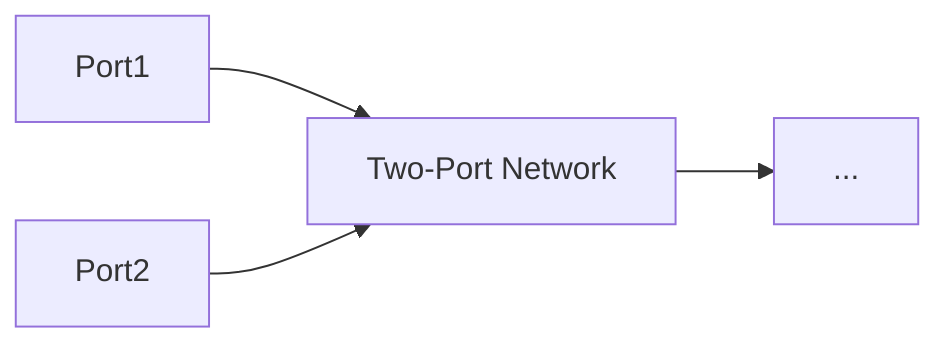

<!-- page:1 -->
# Sentaurus™ Visual User Guide

Version O-2018.06, June 2018

# Copyright and Proprietary Information Notice

<!-- page:2 -->
© 2018 Synopsys, Inc. This Synopsys software and all associated documentation are proprietary to Synopsys, Inc. and may only be used pursuant to the terms and conditions of a written license agreement with Synopsys, Inc. All other use, reproduction, modification, or distribution of the Synopsys software or the associated documentation is strictly prohibited.

# Destination Control Statement

All technical data contained in this publication is subject to the export control laws of the United States of America. Disclosure to nationals of other countries contrary to United States law is prohibited. It is the reader’s responsibility to determine the applicable regulations and to comply with them.

# Disclaimer

SYNOPSYS, INC., AND ITS LICENSORS MAKE NO WARRANTY OF ANY KIND, EXPRESS OR IMPLIED, WITH REGARD TO THIS MATERIAL, INCLUDING, BUT NOT LIMITED TO, THE IMPLIED WARRANTIES OF MERCHANTABILITY AND FITNESS FOR A PARTICULAR PURPOSE.

# Trademarks

Synopsys and certain Synopsys product names are trademarks of Synopsys, as set forth at https://www.synopsys.com/company/legal/trademarks-brands.html. All other product or company names may be trademarks of their respective owners.

# Free and Open-Source Licensing Notices

If applicable, Free and Open-Source Software (FOSS) licensing notices are available in the product installation.

# Third-Party Links

Any links to third-party websites included in this document are for your convenience only. Synopsys does not endorse and is not responsible for such websites and their practices, including privacy practices, availability, and content.

Synopsys, Inc.

Mountain View, CA 94043

www.synopsys.com

<!-- page:3 -->
# About This Guide xvii

Related Publications . . . xvii

Conventions . xvii

Customer Support . . . . xvii

Accessing SolvNet. . . . xviii

Contacting Synopsys Support . . . . xviii

Contacting Your Local TCAD Support Team Directly. . . . . xviii

# Chapter 1 Introduction to Sentaurus Visual 1

Functionality of Sentaurus Visual. .

Starting Sentaurus Visual . .

From the Command Line. . .

From Sentaurus Workbench

Accelerating the Rendering of Graphics . . . .

User Interface of Sentaurus Visual . . .

Menu Bar . .

Toolbars . . .

Plot Area

Tcl Command Panel. .

Selection and Property Panels . . .

Quick Access to Tabs of Plot Properties and Axis Properties Panels . . . .

# Chapter 2 Basic Operations 9

Loading Files. . . .

Supported File Formats . . .

Loading Scripts . . . . 10

Reloading Plot Files . . . . . 10

Managing Loaded Information . .

Customizing Settings . . . 12

Creating Custom Buttons to Access Scripts . . . . . 13

Working With Plots . . 13

Modes When Interacting With Plots . . . 13

Common Modes . . . . . 14

XY Plot–Only Modes . . . . . 15

2D Plot–Only Modes . . . . 15

3D Plot–Only Modes . . . . . . 16

<!-- page:4 -->
Linking Plots . . . . 16

Undoing Operations. . . 17

Displaying Multiple Plots . . 18

Grid Orientation . . . 18

Vertical Orientation . . . . 20

Horizontal Orientation . . . 21

Managing Frames . . . . 21

Drawing Inside Plots . . . 22

Inserting Text . . . . 22

Drawing Rectangles . . . . . 23

Drawing Ellipses . . . . 23

Drawing Lines . . . . . 24

Exporting Plots . . . . 24

Exporting Movies . . . . 25

Starting a New Movie . . . . 25

Adding Frames in a Movie . . . 26

Exporting a Movie . . . . 26

Printing Plots . . . . . 27

Zooming and Panning . . . . 27

Zoom Tool . . . 27

Reset Tool . . 28

Deleting Plots . . . . 28

Performance Options. . . . . 28

Fast Draw (3D Plots Only) . 28

Subsampling (2D and 3D Plots Only) . . . . . 28

Advanced Options (XY Plots Only) . . . . . 29

Advanced Options (2D and 3D Plots Only) . . . . 30

Selecting Log Files . . . . . 32

# Chapter 3 Working With XY Plots 35

Loading XY Plots . . . . 35

Plotting One Curve . . . . . 36

Plotting Multiple Curves . . . . 36

Visualizing Multiple TDR States. . . . 40

Cutline Plots . . . . 42

Curve Properties . . . . . 43

Modifying Properties in Multiple Curves . . . . 44

Plot Area Properties . . . . . 45

Legend Properties . . . . . . 46

Axis Properties . . . . 46

Changing the Axis Padding . . . . 47

<!-- page:5 -->
Changing the Axis Precision . . 47

Duplicating XY Plots . . . . 48

Using Symbols and Scientific Notation in Plots . . . . 48

Best Look Option . . . . 50

Plotting Band Diagrams . . . . 51

Saving the Plot to a Tcl File . . . . . 52

Probe Tool. . . 52

Probe Options . . . 53

Calculate Scalar Tool . . . 53

Analysis Tool . . . 54

Exporting Data From Variables and Curves . . . . 55

# Chapter 4 Working With 2D and 3D Plots 57

Visualizing 2D and 3D Plots. . . . 57

Changing Plot Properties . . . . . 58

Visualizing Fields . . . . 61

Visualizing Fields Defined on Interface Regions . . . . . 62

Visualizing Automatically Generated Regions . . . . . 64

Junction Lines. . . . . 64

Depletion Regions . . . . 64

Visualizing Multiple TDR States. . . . 65

Visualizing Regions With Multiple Parts . . . . 68

3D View . . . . . 70

Interacting With 3D Plots . . . . 71

2D View . . . 72

Interacting With 2D Plots . . . . . 73

Rendering Options . . . . . 73

Materials and Regions . . . . 74

Showing or Hiding Properties for Multiple Materials and Regions . . . . . . 74

Modifying Properties in Multiple Materials and Regions . . . . . 75

Contact Regions . . . . 75

Contour Plots . . . . . . 79

Contour Legend Settings . . . . 79

Displaying Contour Plots . . . . . 80

Converting Data to Nodal. . . . . 81

Creating New Scalar Fields . . . . . 82

Vector Plots . . . . 83

Importing an Image as a Background Field . . . . 84

Adjusting Magnification of an Image . . . . 86

Scaling and Shifting 2D and 3D Geometries . . . 87

Rotating Structures (3D Plots Only) . . . . . 88

<!-- page:6 -->
Rotation Point . . . 89

Customizing the Rotation Point. . . . 90

Using the Rotation Point as a Reference Point . . . . 90

Rotating Plots Using Exact Values . . . . 91

Overlaying Plots . . . . . 93

Showing Differences Between Plots. . . . . . 95

Measuring Distances . . . . 96

Integration Tool. . . . 97

Using a Custom Integration Domain . . . . 98

Integrating Only a Defined Set of Regions or Materials . . . . 98

Probe Tool. . . 98

Dataset Information Tool . . 101

Maximum and Minimum Locations of Fields . . . 102

Changing Properties of Markers . . . . 105

Value Blanking . . . . . . 106

Choosing Constraints . . . . . 106

Options for Value Blanking . . . . . 108

Visualizing Deformation of Structures . . . . 110

Cutting Structures . . . . 111

Generating Precise Cutlines and Cutplanes . . . . . 112

Cutlines in 2D Plots . . . . . 114

Manipulating Cutlines . . . . 115

Polyline Cuts in 2D Plots . . . . 115

Manipulating the Polyline . . . . 118

Cutting Along Boundaries in 2D Plots . . . . 118

Step 1: Selecting Regions or Materials. . . . . . 118

Step 2: Adding Vertex Points . . . . 119

Step 3: Choosing Segment Regions . . . . . . 120

Surface Cutlines From 3D Plots . . . . 122

Changing Properties of Cutline Along Boundaries . . . . . 124

2D Projection Plot . . . . 124

Cutplanes in 3D Plots . . . . . 126

Extracting the Path of Minimum or Maximum Values of a Scalar Field . . . . . 128

Surface Plots . . . . . 131

Creating Surface Plots . . . . 131

Isosurfaces and Isolines . . . . 132

Creating Iso-Geometries . . . 133

Modifying Iso-Geometries. . . . . 135

Streamlines . . . 135

Displaying Streamlines . . . . . 136

Position Tab . . . . 136

<!-- page:7 -->
Specifying Regions or Materials . . . 137

Representing the Streamlines. . . . 137

Integration Settings . . . . . . 138

Integration Tab . . . . . . 138

Managing Created Streamlines . . . . . 138

Configuring General Parameters of Streamlines . . . . . 139

Extracting Data From Streamlines. . . . 139

# Chapter 5 Automated Tasks 143

Running Tcl Scripts . . 143

Typical Uses of Tcl Scripts . . . . . . 143

Example: Plotting Id–Vg Curve . . . . . . 143

Example: Creating a Cutline and Exporting Cutline Data to CSV File for Further Processing . . . . . 145

Saving Command History. . . . 145

Running Inspect Command Files . . . . . . 145

Script Library . . . . 146

Restrictions . . 146

# Appendix A Tcl Commands 147

Syntax Conventions . 147

Object Names: -name Argument . . . . 147

Common Properties. . . . . 148

Colors. . . . 148

Fonts. . . . . 149

Lines. . . . 149

Markers . . . . 150

add\_custom\_button . . . . . 151

add\_frame . . . . . 152

calculate . 153

calculate\_field\_value . . . . 154

calculate\_scalar . . . . 155

create\_curve . . . . 156

create\_cut\_boundary . . . . . . 157

create\_cutline . . . 159

create\_cutplane . . . . 161

create\_cutpolyline . . . . . . 162

create\_field . . . . 163

create\_iso . . 164

create\_plot . . . . . 165

<!-- page:8 -->
create\_projection . . . . 166

create\_streamline . . 168

create\_surface . . . . . . 170

create\_variable . 171

diff\_plots . . . . 172

draw\_ellipse . . . . . . 173

draw\_line. . . . . . 174

draw\_rectangle . . . . 175

draw\_textbox. . . . 176

echo . . . 177

exit. . 177

export\_curves . . . . . 178

export\_movie . . 179

export\_settings . . . . . 180

export\_variables . . . . . . 181

export\_view. . . . . . 182

extract\_path . . . . . 183

extract\_streamlines . . . . . 184

get\_axis\_prop . . . . . 185

get\_camera\_prop. . . . . . 188

get\_curve\_data . . . . . . 189

get\_curve\_prop . . . . . . 190

get\_cutline\_prop . . . . . . 192

get\_cutplane\_prop . . . . . . . 194

get\_ellipse\_prop . . . . . . 195

get\_field\_prop . . . . . . 196

get\_grid\_prop . . . . . . 198

get\_input\_data . . . . . . . . 199

get\_legend\_prop . . . . . . 200

get\_line\_prop . . . . . . 202

get\_material\_prop . . . . . . . . 203

get\_plot\_prop . . . . . . 205

get\_rectangle\_prop . . . . . 207

get\_region\_prop . . . . . . 208

get\_ruler\_prop . . . . . . . . . 210

get\_streamline\_prop . . . . . 211

get\_textbox\_prop . . . . . . . 213

get\_variable\_data . . . . . 215

get\_vector\_prop . . . . . . 216

help . . . . . 218

import\_settings . . . . . . 218

<!-- page:9 -->
integrate\_field . . . . 219

link\_plots. . . . 221

list\_curves . . . . 223

list\_custom\_buttons . 224

list\_cutlines . . . . 225

list\_cutplanes. . . . . . 226

list\_datasets . . . . 227

list\_ellipses . . . . 228

list\_fields . . . . 229

list\_files . . . . . 230

list\_lines . . . 231

list\_materials . . . . . 232

list\_movie\_frames . . . . 233

list\_plots . . . . 234

list\_rectangles . . . . . . 235

list\_regions . . . . . 236

list\_streamlines . . . . . 237

list\_tdr\_states . . . . 238

list\_textboxes . . . . 239

list\_variables . . . . . 240

load\_file . . 241

load\_file\_datasets . . . . 242

load\_library . . . . . 243

load\_script\_file . . . . . 244

move\_plot . . . . . 245

overlay\_plots . . . . . . 246

probe\_curve. . . . . . 247

probe\_field . . . . 248

reload\_datasets . . . 249

reload\_files . . . . . 249

remove\_curves . . 250

remove\_custom\_buttons . . . . . 251

remove\_cutlines . . . 252

remove\_cutplanes . . . . . 253

remove\_datasets . . . . . 253

remove\_ellipses. . . . . . 254

remove\_lines . . . . 255

remove\_plots . . . . . 255

remove\_rectangles . . . 256

remove\_streamlines . . 257

remove\_textboxes . . . . . 258

<!-- page:10 -->
render\_mode . . . 259

reset\_settings . . . . . . 259

rotate\_plot . . . . . . . 260

save\_plot\_to\_script . . . . . 262

select\_plots . . . . . 263

set\_axis\_prop . . . . . . . 264

set\_band\_diagram . . . . . 267

set\_best\_look. . . . . 268

set\_camera\_prop . . . . . . 269

set\_curve\_prop . . . . . . . . 271

set\_cutline\_prop . . . . . . . 273

set\_cutplane\_prop . . . . . . . 275

set\_deformation. . . . . 276

set\_ellipse\_prop . . . . . 277

set\_field\_prop . . . . . . 278

set\_grid\_prop . . . . . . . . 280

set\_legend\_prop . . . . . . . . 282

set\_line\_prop . . . . . . 284

set\_material\_prop . . . . . . . . 285

set\_plot\_prop. . . . . . . . 287

set\_rectangle\_prop . . . . . . . 290

set\_region\_prop. . . . . . . . . 291

set\_ruler\_prop . . . . . . . 293

set\_streamline\_prop . . . . . . 294

set\_tag\_prop . . . . . . 296

set\_textbox\_prop . . . . . . . 297

set\_transformation. . . . . . . 299

set\_value\_blanking . . . . . . . . 300

set\_vector\_prop . . . . . . . . 301

set\_window\_full . . . . . . 303

set\_window\_size . . . . . . . 303

show\_msg . . . . . 304

start\_movie . . . 305

stop\_movie . . . . . . 305

undo. . 306

unload\_file . . . 306

version . . . . . 307

windows\_style. . . . . 308

zoom\_plot . . . . . . . 309

# Appendix B Menus and Toolbars of User Interface 311

<!-- page:11 -->
Menus . . 311

File Menu . . . . 311

Edit Menu . 312

View Menu . . . . 312

Tools Menu . . . . . 314

Data Menu . . . . . 316

Window Menu . . . . 316

Help Menu . . . . . 317

Toolbars . . . . 318

File Toolbar . . . . . 318

Edit Toolbar . . . . 318

Draw Toolbar . . . . . . 318

View Toolbar . . . . . 319

Tools Toolbar. . . . . 319

Movies Toolbar . . . . 320

Look Toolbar . . . . . 320

Additional Keyboard Shortcuts (2D and 3D Plots) . . . 321

# Appendix C Available Formulas 323

Creating a New Variable. . . . . 323

Creating a New Curve. . . . 323

Applying Functions to a Curve . . . . 324

Creating a New Field . . . 325

Available Functions . 325

# Appendix D Inspect Support in Sentaurus Visual 331

Fully Supported Commands . . . . 331

Partially Supported Commands . . . . . 333

Not Supported Commands . . . 333

Script Library Support . . . . . 334

Extraction Library . . . . . 334

Curve Comparison Library . . . . 335

The extend Library. . . . . 335

Partially Supported Commands . . . . 335

Not Supported Commands . . . . 335

<!-- page:12 -->
# Appendix E Extraction Library 337

Syntax Conventions . . 337

Help for Procedures . . 339

Output of Procedures . . . . 339

ext::AbsList . . . 341

ext::DiffForwardList . . . 342

ext::DiffList. . . . 343

ext::ExtractBVi . . 345

ext::ExtractBVv . 347

ext::ExtractEarlyV . . 348

ext::ExtractExtremum . . . . 350

ext::ExtractGm . . 351

ext::ExtractIoff . . . 353

ext::ExtractRdiff . . 355

ext::ExtractRsh . . . . 357

ext::ExtractSS . . . 360

ext::ExtractSsub . . 362

ext::ExtractValue . . 364

ext::ExtractVdlin . . . 366

ext::ExtractVdlog . . . . . . 368

ext::ExtractVglin . . . . . 370

ext::ExtractVglog . . . . . . 372

ext::ExtractVtgm . . . . . . 374

ext::ExtractVti . . . . 376

ext::ExtractVtsat . . . . 378

ext::FilterTable . . . . 380

ext::FindExtrema. . . . . 384

ext::FindVals . . . . 386

ext::LinFit . . . . 387

ext::Linspace . . . . . 390

ext::LinTransList. . . . . 391

ext::Log10List . . . . . . 392

ext::RemoveDuplicates . . . . . 393

ext::RemoveZeros . . . 394

ext::SubLists . . . . . 395

lib::SetInfoDef . . 396

References. . . 396

# Appendix F Impedance Field Method Data Postprocessing Library 397

<!-- page:13 -->
Overview. . . . 397

Syntax Conventions . 398

Help for Procedures . . 399

Output of Procedures . . . . . 400

ifm::Gauss . . . . . . 401

ifm::GetDataQuantiles . . . . 402

ifm::GetGaussian . . 403

ifm::GetHistogram . . . 405

ifm::GetMoments . . . . . 406

ifm::GetMOSIVs. . . . 408

ifm::GetMOSWeights . . . . . 413

ifm::GetNoiseStdDev . . . 415

ifm::GetQQ . . . 416

ifm::GetsIFMStdDev . . . 417

ifm::GetSNM . 419

ifm::GetSRAMVTC . . . 421

ifm::ReadCSV. . . 424

ifm::ReadsIFM . . 426

ifm::WriteCSV . 428

lib::SetInfoDef . . 429

# Appendix G Fitting Dispersive Model Parameters for EMW 431

Overview . . . . . 431

General Flow . . . . . 431

emw::fit::Clear . . . . 434

emw::fit::ComplexRefractiveIndex . . . . . 434

emw::fit::DispersiveMedia . . . . . 435

emw::fit::Fitting . . . . . . 437

emw::fit::Globals . . . 438

emw::fit::Graph . . . . . 439

emw::fit::Plot . . . . 440

emw::fit::Run . . 441

References . . . . 441

# Appendix H Two-Port Network RF Extraction Library 443

Syntax Conventions . . 444

Help for Procedures . . 445

Output of Procedures . . . . . 446

<!-- page:14 -->
Overview of RF Extraction Library Procedures . . . . . 446

Equations Used in RF Extraction Library. . . . . 448

A-Matrix, C-Matrix, and Y-Matrix . . . . . 448

Tcl Arrays rfx::AC and rfx::Y . . . 449

Power Spectral Density Matrices. . . . . 450

Power Spectral Densities . . . . . . . 450

PSDs Computed by Sentaurus Device and RF Extraction Library . . . . . . 452

Power Spectral Density Tcl Arrays . . . . . 453

Device Width Scaling for 2D Structures . . . . . 454

Matrix Conversions . . . . 455

Converting Y-Matrix to h-Matrix. . . . . 455

Converting Y-Matrix to S-Matrix. . . . . 455

Converting Y-Matrix to Z-Matrix . . . . . 456

Gains, Amplifier Stability, and Unilateralization . . . . 456

Small-Signal Current Gain . . . . . . 456

Amplifier Stability . . . . . . . 456

Maximum Stable Gain and Maximum Available Gain . . . . . 457

Unilateral Amplifier Design . . . . . . 457

Converting Gain Units to Decibels . . . . . 458

Transistor Figures of Merit . . . . 458

ft and fmax . . . . . 458

Extraction Methods for ft and fmax . . . . 460

Cutoff Frequency for Stability . . . . . . 462

Noise Figure of a Linear Two-Port Network. . . . . 462

rfx Namespace Variables . . . . . 466

Characteristic Impedance and Source Impedance . . . . 467

rfx::CreateDataset . . . . 468

rfx::Export . . . . . 472

rfx::GetFK1 . . . 474

rfx::GetFmax . . . . . . 476

rfx::GetFt. . . . 478

rfx::GetNearestIndex. . . . 480

rfx::GetNoiseFigure . . . . 481

rfx::GetParsAtPoint. . . . 484

rfx::GetPowerGain . . . . 486

rfx::Load . . . 489

rfx::NoiseFigure . . . . . 492

rfx::PolarBackdrop . . . . . 494

rfx::PowerGain . . . . 495

rfx::RFCList . . . . . 496

rfx::SmithBackdrop. . . . . 498

<!-- page:15 -->
rfx::Y2H . . 499

rfx::Y2S. . . . 500

rfx::Y2Z . . 501

Complex Arithmetic Support . . . 502

rfx::Abs\_c . . . 503

rfx::Abs\_v . . . . . 504

rfx::Abs2\_c . . 505

rfx::Abs2\_v . . . 506

rfx::Add\_c . . . . 507

rfx::Add\_v . . . . 508

rfx::Cart2Polar\_c . . . . 509

rfx::Cart2Polar\_v . . . . 510

rfx::Conj\_c . . . 511

rfx::Conj\_v. . . . 512

rfx::Div\_c . . . . . 513

rfx::Div\_v. . . . . 514

rfx::Im\_c . 515

rfx::Mul\_c . . 516

rfx::Mul\_v . . 517

rfx::Mulsc\_c. . . 518

rfx::Phase\_c . . . . 519

rfx::Phase\_v . . . . 520

rfx::Polar2Cart\_c . . . . 521

rfx::Polar2Cart\_v . . . 522

rfx::Re\_c . 523

rfx::Sign . . . . . 523

rfx::Sub\_c. . . . 524

rfx::Sub\_v . . . 525

lib::SetInfoDef . . . 526

References. . . . 526

Appendix I PhysicalConstants Library 529

Major Physical Constants . . 529

References. . . . 530

<!-- page:16 -->
Contents

<!-- page:17 -->
The Synopsys Sentaurus™ Visual tool is part of Sentaurus Workbench Visualization. It is a plotting software for visualizing data from simulations and experiments. Sentaurus Visual enables users to work interactively with data using both a user interface and a scripting language for automated tasks.

# Related Publications

For additional information, see:

The TCAD Sentaurus release notes, available on the Synopsys SolvNet® support site (see Accessing SolvNet on page xviii).   
■ Documentation available on SolvNet at https://solvnet.synopsys.com/DocsOnWeb.

# Conventions

The following conventions are used in Synopsys documentation.

<table><tr><td>Convention</td><td>Description</td></tr><tr><td>Blue text</td><td>Identifies a cross-reference (only on the screen).</td></tr><tr><td>Bold text</td><td>Identifies a selectable icon, button, menu, or tab. It also indicates the name of a field or an option.</td></tr><tr><td>Courier font</td><td>Identifies text that is displayed on the screen or that the user must type. It identifies the names of files, directories, paths, parameters, keywords, and variables.</td></tr><tr><td>Italicized text</td><td>Used for emphasis, the titles of books and journals, and non-English words. It also identifies components of an equation or a formula, a placeholder, or an identifier.</td></tr><tr><td>Key+Key</td><td>Indicates keyboard actions, for example, Ctrl+I (press the I key while pressing the Control key).</td></tr><tr><td>Menu &gt; Command</td><td>Indicates a menu command, for example, File &gt; New (from the File menu, select New).</td></tr></table>

# Customer Support

Customer support is available through the Synopsys SolvNet customer support website and by contacting the Synopsys support center.

<!-- page:18 -->
# Accessing SolvNet

The SolvNet support site includes an electronic knowledge base of technical articles and answers to frequently asked questions about Synopsys tools. The site also gives you access to a wide range of Synopsys online services, which include downloading software, viewing documentation, and entering a call to the Support Center.

To access the SolvNet site:

1. Go to the web page at https://solvnet.synopsys.com.   
2. If prompted, enter your user name and password. (If you do not have a Synopsys user name and password, follow the instructions to register.)

If you need help using the site, click Help on the menu bar.

# Contacting Synopsys Support

If you have problems, questions, or suggestions, you can contact Synopsys support in the following ways:

Go to the Synopsys Global Support Centers site on synopsys.com. There you can find email addresses and telephone numbers for Synopsys support centers throughout the world.   
Go to either the Synopsys SolvNet site or the Synopsys Global Support Centers site and open a case online (Synopsys user name and password required).

# Contacting Your Local TCAD Support Team Directly

Send an e-mail message to:

support-tcad-us@synopsys.com from within North America and South America   
support-tcad-eu@synopsys.com from within Europe   
support-tcad-ap@synopsys.com from within Asia Pacific (China, Taiwan, Singapore, Malaysia, India, Australia)   
support-tcad-kr@synopsys.com from Korea   
support-tcad-jp@synopsys.com from Japan

<!-- page:19 -->
This chapter presents basic information about Sentaurus Visual.

# Functionality of Sentaurus Visual

Sentaurus Visual allows you to visualize complex simulation results generated by physical simulation tools in one, two and three dimensions. You can visualize data for an initial understanding and analysis, and then modify the plots to gain a new perspective.

Sentaurus Visual can be used to create plots that display fields, geometries, and regions, including results such as p-n junctions and depletion layers. It also allows you to view I–V curves and doping profiles, and provides tools to zoom, pan, and rotate images. You also can extract data using measure and probe tools.

The user interface provides direct and easy-to-use functionality, as well as advanced controls for expert users. With the user interface of Sentaurus Visual, you can systematically visualize devices as xy, 2D, and 3D plots.

# Starting Sentaurus Visual

Sentaurus Visual can be started either from the command line or from Sentaurus Workbench.

# From the Command Line

To start Sentaurus Visual from the command line, type:

svisual

The following example loads the dataset associated with a file and generates its plot:

svisual n2\_fps.tdr

When starting from the command line, the following options (which can be obtained by typing svisual -h) can be used:

Usage: svisual [options] [FILES]

Description: Sentaurus Visual is a tool to display and analyze structures and curves.   
Options:
-h[elp] : Display this help message.
-v[ersion] : Print the Sentaurus Visual version.
-m[esa] : Force run Sentaurus Visual with Mesa.
-glx : Force run Sentaurus Visual with GLX driver if it exists.
-avx : Force run Sentaurus Visual with AVX support, if it is available (Mesa must be enabled).
-b[atch] : Run in pure batch mode (requires a script file).
-batchx | -bx : Run in batch mode that allows picture exporting (virtual X server, requires a script file).
-s[cript] : Force to execute the next files as Sentaurus Visual scripts.
-i[nspect] | -f : Force to execute the next files as Inspect scripts.
-library_path : Look for Tcl library files at the next path.
-nolibrary : Disable Tcl library auto-loading.
-nowait : Do not wait for license to become available.
-verbose : Log every Sentaurus Visual Tcl command executed to the log file.
-slowscript | -ss : Redraw plots automatically after each command; execution of script is slower.
-geoms : Load only geometries from the next list.

<!-- page:20 -->
NOTE Sentaurus Visual can run solely in batch mode, that is, no display is required and scripts can be run using a shell. This mode is fast but has some disadvantages, for example, exporting graphics only works in the GUI mode. To overcome this, use the -batchx option.

# From Sentaurus Workbench

Sentaurus Visual is integrated in Sentaurus Workbench. You can start Sentaurus Visual in one of the following ways:

Click a node, which displays the Node Explorer. In the Node Explorer, in the Viewer box, select svisual and click the Launch button next to it.   
■ Click the Visualize toolbar button and select Sentaurus Visual.

Sentaurus Visual can receive node data and can be inserted into tool flows.

NOTE Sentaurus Visual can run in batch mode (-b option), which is especially useful when used within tool flows. In this context, the use of macro files is also of interest (see Chapter 5 on page 143).

<!-- page:21 -->
# Accelerating the Rendering of Graphics

In Sentaurus Visual, 2D and 3D plots are rendered using OpenGL acceleration, which can produce significant differences in performance depending on the configuration of the machine where Sentaurus Visual runs.

By default, Sentaurus Visual always runs in the best supported graphics mode it can find, using the graphics card of the machine to render plots. If there is not a compliant renderer, Sentaurus Visual reverts to a generic Mesa driver for graphics rendering.

If your computer has a graphics card but Sentaurus Visual runs with Mesa rendering, you can force Sentaurus Visual to run with a GLX driver using the -glx option. If a GLX driver cannot be found, Sentaurus Visual exits with an error message. To force Mesa rendering, use the -mesa option.

NOTE You cannot use both the -glx option and the -mesa option simultaneously.

# User Interface of Sentaurus Visual

The user interface of Sentaurus Visual has different areas (see Figure 1 on page 4). The selection and properties panels are located to the left of the main window, the plot area displays the different visualizations, the Tcl Command panel is in the lower part, and the toolbars are located on the sides of the main window.

For detailed information about the menus and toolbars, see Appendix B on page 311.

NOTE You can customize the user interface of Sentaurus Visual. Different options are available, for example, you can detach the panels, adjust their size, and move the toolbars to another part of the main window.


<details>
<summary>text_image</summary>

Sentaurus Visual
File Edit View Tools Data Window Help
Selection
Materials Regions Lines/Particles
Name Oxide Silicon Contact DepletionRegion JunctionLine
Scalars Vectors
Name ConductionBandEnergy DonorConcentration DopingConcentration ElectricField-X ElectricField-Y
Range Levels Label Lines Posit
Prop -7.93874e+19 Fixed [cm^3]
Data 2.45686e+20 Fixed Reset
Plot Properties
Main Colors Scaling Contacts Markers
Title n60_des Font...
Axes Legend
Interchange Axes
Tcl Command
#-> Plot_1
select_plots {Plot_n60_des}
#-> Plot_n60_des
n60_des
C1
DopingConcentration (cm^3)
2.457e+20
3.739e+17
5.750e+14
5.954e+11
-1.859e+14
-1.214e+17
-7.939e+19
Y
C1(n10_des)
DopingConcentration (cm^3)
7.585e+20
1.462e+18
2.820e+15
5.392e+12
-2.363e+13
-1.237e+10
-0.413e+18
X= 3.880368e+00 Y= -5.472222e+15
Clear Save...
</details>

Figure 1 Main window of Sentaurus Visual showing different plots in the plot area

<!-- page:22 -->
# Menu Bar

The menu bar allows you to access the main operations of Sentaurus Visual such as opening files, showing and hiding toolbars, configuring Sentaurus Visual, manipulating loaded data, and organizing plots in the plot area.

Table 1 Menus available from user interface 

<table><tr><td>Menu</td><td>Description</td></tr><tr><td>File</td><td>Loads plots and scripts, reloads data, and exports and prints plots.</td></tr><tr><td>Edit</td><td>Selects plots, and selects settings for Sentaurus Visual.</td></tr><tr><td>View</td><td>Shows and hides toolbars and panels; plot settings and performance options.</td></tr><tr><td>Tools</td><td>Accesses analysis tools.</td></tr><tr><td>Data</td><td>Views loaded datasets, and deletes selected plots.</td></tr><tr><td>Window</td><td>Organizes and manages active plots.</td></tr><tr><td>Help</td><td>Provides information about Sentaurus Visual.</td></tr></table>

<!-- page:23 -->
# Toolbars

Toolbars offer quick access to commonly used functions that are also available from the different menus (see Toolbars on page 318).

Table 2 Toolbars 

<table><tr><td>Toolbar</td><td>Description</td></tr><tr><td>File</td><td>Loads plots and scripts, reloads data, and exports and prints plots.</td></tr><tr><td>Edit</td><td>Undoes operations, and displays toolbar for drawing shapes and inserting text onto plots.</td></tr><tr><td>View</td><td>Accesses zoom operations and subsampling.</td></tr><tr><td>Tools</td><td>Accesses analysis tools.</td></tr><tr><td>Custom Buttons</td><td>Accesses custom buttons. See Creating Custom Buttons to Access Scripts on page 13.</td></tr><tr><td>Movies</td><td>Records animated images.</td></tr><tr><td>Look</td><td>Shows or hides panels.</td></tr></table>

NOTE One toolbar is always visible to allow you to show and hide the Tcl Command panel and to organize the data selection and properties panels into tabs.

# Plot Area

The plot area displays the active plots. The toolbars and panels change depending on the type of plot that is selected.

<!-- page:24 -->
# Tcl Command Panel

The Tcl Command panel shows valuable information about the commands used to manipulate and display data in Sentaurus Visual. It can be used to enter commands manually, which is very helpful when running complex calculations on datasets and displaying results.

The Tcl Command panel has three main areas:

■ The main pane shows every action performed in Sentaurus Visual since the session started.   
■ On the right side, the Clear button is used to delete the command history from the main pane, and the Save button is used to store everything that was executed into a script file, so that it can be run without repeating all the operations.   
■ In the lower pane, you can manually enter Tcl commands.

For details about Tcl commands and scripting, see Chapter 5 on page 143 and Appendix A on page 147.

# Selection and Property Panels

Two panels are located by default at the left side of the main window:

The Selection panel displays the data to visualize and shows which data is already displayed. This panel is different for xy plots, and 2D and 3D plots. The differences are explained in Chapter 3 on page 35 and Chapter 4 on page 57.   
The Property panel lists the selected object properties. By default, it shows the plot properties. It will change after an object is selected. This panel may also be displayed (if it is arranged behind the Selection panel or if it is hidden) at its last position in the main window if you double-click the object.

If the plot area is empty (no plots are created or all plots are hidden), these panels are always hidden. After a plot is created, by default, both panels open even if both were closed by the user in the last session.

To change this default behavior:

1. Choose Edit > User Preferences.   
2. In the User Preferences dialog box, expand Application > Common.   
3. Under Force Panels to Show, deselect one or both of the Selection Panel option and Properties Panel option.   
4. Click Save.

# Quick Access to Tabs of Plot Properties and Axis Properties Panels

<!-- page:25 -->
NOTE The quick access operation for axes applies to xy and 2D plots only.

The Plot Properties panel or the Axis Properties panel must be already open for these quick access operations to work. To open the Plot Properties panel, double-click an empty part of the plot if another panel is active. To open the Axis Properties panel, double-click any axis in the plot area.

You can quickly access different tabs of the Plot Properties panel or the Axis Properties panel by clicking particular parts of a plot in the plot area:

■ Click the plot title to display the Main tab of the Plot Properties panel.   
Click an axis title (for example, X) to display the Title/Scale tab of the Axis Properties panel.   
Click any tick label on an axis (for example, -5) to display the Ticks tab of the Axis Properties panel. This operation applies only to 2D plots.   
Click an axis line to display the Main tab of the Axis Properties panel.

<!-- page:26 -->
1: Introduction to Sentaurus Visual

User Interface of Sentaurus Visual

<!-- page:27 -->
This chapter describes the basic operations that are common to all types of plot in Sentaurus Visual.

# Loading Files

You can load files from the user interface or the command line, for example:

svisual [file1.tdr file2.tdr ...]

To load a file from the user interface:

1. Choose File > Open.   
2. In the dialog box that is displayed, browse to the file you want to open, or type the file name in the File name field.   
3. Click Open.

An opened file consists of datasets. A dataset is a structure containing data that is plotted on xy, 2D, or 3D space. For example, a .plt, or .plx file can consist of one or more datasets, and .tdr files usually consist of only one dataset.

NOTE To select multiple files, hold the Ctrl key when you click the required files to load.

# Supported File Formats

Sentaurus Visual supports the most commonly used file formats, including: .csv, .plt, .plx, .tdr, and .tif.

For more information about the TDR format, see the Sentaurus™ Data Explorer User Guide.

<!-- page:28 -->
# Loading Scripts

Sentaurus Visual can load scripts from the command line. For example, you can simply type svisual with the path of the Tcl (.tcl) script, and Sentaurus Visual automatically detects the script.

Tcl scripts with the file extension .tcl run native Sentaurus Visual commands, while Inspect scripts need the -inspect or -f option to run Inspect commands in compatibility mode.

Most Inspect commands are fully supported, although some commands have only partial support and some commands are not supported at all. For detailed information about support for Inspect libraries and commands, see Appendix D on page 331. For detailed information about Inspect commands, refer to the Inspect User Guide.

From the user interface, choose File > Run Tcl Script. A dialog box is displayed where you can select the script to load. The scripts loaded using the user interface run native commands only.

# Reloading Plot Files

Sometimes, there are changes to the datasets from outside Sentaurus Visual. These changes can be shown without closing Sentaurus Visual.

To reload a specific dataset:

■ Choose File > Reload Selected or press Shift+F5.

To reload all datasets:

Choose File > Reload All or press the F5 key.

NOTE Not all changes to a dataset can be reloaded. For example, if the original structure was two dimensional, the reloaded data is expected to belong to a 2D plot. If, after changes, the dataset now contains data for a 3D structure, Sentaurus Visual cannot reload this plot.

<!-- page:29 -->
# Managing Loaded Information

Sentaurus Visual provides a dialog box to manage the information loaded in the current session.

Choose Data > View Info Loaded to display the Manage Loaded Data dialog box (see Figure 2) with all the data that is currently active and the option of removing plots and datasets.


<details>
<summary>text_image</summary>

Manage Loaded Data
Datasets
C1(n60_des)
n60_des
Files
n60_des.tdr
Dimension
XY
2D
3D
Plots
Plot_1
Plot_h60_des
Reload	Remove	Full Path	Remove	Close
</details>

Figure 2 Manage Loaded Data dialog box showing active data

To delete all xy plots:

1. In the Dimension pane, click XY.   
2. Under Datasets, click Remove.

To delete a plot:

1. In the Plots pane, click the plot to be deleted.   
2. Under Plots, click Remove.

NOTE Deleting a plot does not delete the datasets associated with it. However, deleting a dataset removes the associated 2D or 3D plots. For xy datasets, only the curves that use the datasets are deleted.

<!-- page:30 -->
# Customizing Settings

You can customize the settings of Sentaurus Visual using the User Preferences dialog box (see Figure 3).

To display the User Preferences dialog box, choose Edit > Preferences.

You can also import or export settings to a file by clicking Import or Export. To restore the preferences to their defaults, click Reset.

Alternatively, you can import and export settings using Tcl commands:

To import previously saved settings, use the import\_settings command (see import\_settings on page 218).   
To export the current settings, use the export\_settings command (see export\_settings on page 180).

NOTE Settings are applied the next time you launch Sentaurus Visual.   


<details>
<summary>text_image</summary>

S
User Preferences
Category
Preferences
1D
Axis
Curve
Label
Legend
Plot
2D/3D
Axis
Cutline
Cutplane
Contacts
Fields
Legend
Plot
Rendering
Streamlines
Application
Common
Common
Plot
Frame Sorting
Miscellaneous
View
✓ Title ✓ Scale ✓ Ticks
Major Ticks
Number: 5 Length: 5
Position: Center
Minor Ticks
Number: 10 Length: 2
Title Font: ARIAL ...
Scale Font: ARIAL ...
Scale Format: Preferred
Scale Precision: 12
Import... Export...
Reset Save Cancel
</details>

Figure 3 User Preferences dialog box showing selected settings

<!-- page:31 -->
On Linux operating systems, user preferences are stored in the following file:

\~/.config/Synopsys/SVisual.conf

# Creating Custom Buttons to Access Scripts

You can create buttons to make it easier to execute or load Tcl script files. Custom buttons are added to the Custom Buttons toolbar, which is located immediately below the menu bar and, by default, has the + and - buttons.

Each new button can be set up to load a Tcl script file or to execute directly a Tcl script code. For each button, you can assign text or an icon to display as the button, as well as a tooltip.

Custom buttons can be loaded at the start of a Sentaurus Visual session when it loads scripts stored in the Tcl script library (see Script Library on page 146).

When you click the button, Sentaurus Visual displays a message before and after the script is executed, so you can identify the section of the commands that is executed using the button. The message identifies the button that has been clicked by its name and description.

For more information, see add\_custom\_button on page 151, get\_input\_data on page 199, list\_custom\_buttons on page 224, and remove\_custom\_buttons on page 251.

# Working With Plots

Sentaurus Visual offers different modes when interacting with plots. These modes are independent for each plot instance and are enabled using toolbar buttons. However, you can apply mode changes to a group of plots by selecting the plots before applying the mode change.

# Modes When Interacting With Plots

By default, a group of linked plots shares the same mode. This behavior can be switched off in the User Preferences dialog box (expand Common > Miscellaneous) by deselecting Plot Mode (see Figure 4 on page 14). If this option is not selected, you can use special linking for a specific group of linked plots to change this behavior (see Linking Plots on page 16).

The modes temporarily modify the behavior of the left mouse button, allowing you to perform specific operations.


<details>
<summary>text_image</summary>

S
User Preferences
Category
Preferences
1D
Axis
Curve
Label
Legend
Plot
2D/3D
Axis
Cutline
Cutplane
Contacts
Fields
Legend
Plot
Rendering
Streamlines
Application
Common
Common
Plot
Frame Sorting
Miscellaneous
Export Border
Show Cursor Position
Show Logo
Linking
Auto Plot Mode
Tcl Library
Auto-Loading Tcl Library
User Path: /home/user/svisuallib
Simulator
Command sprocess
Communication Option --svi
Import... Export...
Reset Save Cancel
</details>

Figure 4 User Preferences dialog box showing Plot Mode option selected (the default)

<!-- page:32 -->
# Common Modes

All modes are enabled by clicking a toolbar button. The current mode remains active until you select another mode:

The Selection mode $\curlyeqsucc$ (the default mode) allows you to select and move all objects inside plots (such as curves, legend, rectangles, and ellipses).   
The Zoom mode allows you to drag the left mouse button to draw a box. When you release the mouse button, the area delimited by the box will be magnified.   
The Probe mode allows you to extract data by clicking in the plot. For xy plots, curve data is extracted (see Probe Tool on page 52). For 2D and 3D plots, structure data is extracted (see Probe Tool on page 98).

<!-- page:33 -->
# XY Plot–Only Modes

All modes are enabled by clicking a toolbar button. The Drawing mode displays a submenu of drawing options:

■ The Draw Line mode $\diagup$ allows you to draw a line with the left mouse button.   
■ The Draw Rectangle mode allows you to draw a rectangle with the left mouse button.   
■ The Draw Ellipse mode $\bigcirc$ allows you to draw an ellipse with the left mouse button.   
The Insert Text mode $\mathbb { T }$ allows you to insert a text box with the left mouse button at a specified position.

NOTE For all of these drawing options, when you release the mouse button, the current mode finishes and it changes to the Selection mode.

# 2D Plot–Only Modes

All modes are enabled by clicking a toolbar button. The modes specific to 2D plots only are:

■ The Cut X mode $\mathbf { \partial } \mathbb { G } \mathbf { x } ,$ , the Cut Y mode $\tilde { \bf \cal U } \tilde { \bf \cal Y }$ , and the Cut Z mode $\mathtt { L } \mathtt { z }$ allow you to generate an axis-aligned (x, y, or z) cutline at a specified position (see Cutlines in 2D Plots on page 114). When you release the mouse button, the current mode finishes and it changes to the Selection mode.   
The Cutline mode allows you to draw a cutline with the left mouse button. When you release the mouse button, the current mode finishes and it changes to the Selection mode.   
The Ruler mode allows you to draw a line with the left mouse button to perform a measurement. If you hold the Ctrl key while you click the mouse button, the snap-to-mesh mode is enabled (see Measuring Distances on page 96). This mode remains active until you select another mode.   
The Drawing mode displays a submenu of drawing options:

• The Draw Line mode $\diagup$ allows you to draw a line with the left mouse button.

• The Draw Rectangle mode allows you to draw a rectangle with the left mouse button.

• The Insert Text mode $\scriptstyle \mathbf { \tilde { I } T }$ allows you to insert a text box with an arrow that can be repositioned using the left mouse button.

NOTE For all of these drawing options, when you release the mouse button, the current mode finishes and it changes to the Selection mode.

<!-- page:34 -->
# 3D Plot–Only Modes

All modes are enabled by clicking a toolbar button. The modes specific to 3D plots only are:

The Spherical Rotation mode $\oplus$ allows you to perform a rotation in spherical coordinates using the left mouse button. This mode overrides the Selection mode as the default mode and remains active until you select another mode.   
The Rotation Axis X mode $\mathbb { X } ,$ , the Rotation Axis Y mode $\check { \mathcal { Z } }$ , and the Rotation Axis Z mode $z _ { \mathcal { X } }$ allow you to perform a rotation around a fixed x-axis, y-axis, or z-axis with the left mouse button. This mode cannot select plot elements (aside from the legend) and remains active until you select another mode.   
The Cut X mode $\mathbb { H } \mathbf { x } ,$ the Cut Y mode $\tilde { \bf \cal U } \tilde { \bf \cal Y }$ , and the Cut Z mode $\Sigma ^ { } \mathbf { z }$ allow you to generate an axis-aligned (x, y, or z) cutplane at a specified position (see Cutplanes in 3D Plots on page 126). When you release the mouse button, the current mode finishes and it changes to the Selection mode or the Spherical Rotation mode (depending on which mode was last active).   
The Ruler mode allows you to draw a line with the left mouse button to perform a measurement. If you hold the Ctrl key while you click the mouse button, the snap-to-mesh mode is enabled (see Measuring Distances on page 96). This mode remains active until you select another mode.

# Linking Plots

The feature of linking plots can be used to compare two similar models, as it allows you to manipulate elements from one plot of the group, and the linked elements will change on all plots of the group. Elements that can be linked include material/region selection, field selection and properties, movement and rotation, cutplanes and cutlines, axes properties (only in xy plots and 2D plots), legend properties, curves properties, grid properties, and plot properties.

# To link plots:

1. Select the plots to be linked by holding the Shift key and clicking the required plots.   
2. Click the $\circled S$ toolbar button.

The linking operation links all properties except for y-axes and ${ \tt y } 2 \cdot { \tt }$ -axes in xy plots and streamlines in 2D and 3D plots. For customized linking properties, special linking can be used to link only specified properties and to set the remaining properties individually.

Plot linking also links the plot mode. This behavior is switched on by default and can be changed in the User Preferences dialog box (expand Common > Miscellaneous) by deselecting Plot Mode (see Figure 4 on page 14). However, special linking can be used to change this behavior for particular groups of linked plots.

<!-- page:35 -->
NOTE All plot properties are linked by default, including the properties of the plot title, except the text of the title, which is independent of the other plots regardless of which linking option is selected.

# To use special linking:

1. Select the plots to be linked by holding the Shift key and clicking the required plots.   
2. Click the $\mathfrak { S }$ toolbar button.

The properties that can be linked or unlinked with special linking include:

Common properties:

• Legend settings and movement   
• Plot properties and plot mode

Only for xy plots:

• Curve settings and grid settings   
• Axis settings (divided into x-, y-, and y2-settings)

Only for 2D plots:

• Axis properties

Only for 2D and 3D plots:

• Material or region selection   
• Field selection and field properties   
• Deformation and streamlines   
Cuts

# Undoing Operations

Most user interaction commands in Sentaurus Visual have undo functionality that allows you to revert recent changes to the visualization.

To undo an operation, click the toolbar button or use the undo Tcl command (see undo on page 306).

<!-- page:36 -->
# Displaying Multiple Plots

In the plot area, multiple plots can be displayed in a grid, with or without keeping the aspect ratio. In addition, you can arrange plots horizontally or vertically.

# Grid Orientation

Plots can be displayed in a grid configuration (see Figure 5) by choosing Window > Tile Grid.


<details>
<summary>contour</summary>

| Y     | X     |
|-------|-------|
| -0.4  | 0.0   |
| -0.2  | 0.0   |
| 0.0   | 0.0   |
| 0.2   | 0.0   |
| 0.4   | 0.0   |
</details>


<details>
<summary>contour</summary>

| Y     | X     |
|-------|-------|
| -0.4  | 0.0   |
| -0.2  | 0.0   |
| 0.0   | 0.0   |
| 0.2   | 0.0   |
| 0.4   | 0.0   |
</details>


<details>
<summary>bar</summary>

| Y Range       | X Value |
| ------------- | ------- |
| -0.4 to -0.2  | 0.0     |
| -0.2 to 0.0   | 0.0     |
| 0.0 to 0.2    | 0.0     |
| 0.2 to 0.4    | 0.0     |
</details>

Figure 5 Multiple plots keeping the same aspect ratio

<!-- page:37 -->
By default, the aspect ratio between plots is preserved, but this can be changed by deselecting Keep Aspect Ratio in the Manage Frames dialog box (see Figure 9 on page 21). Figure 6 shows plots where the aspect ratio is not maintained.

When the aspect ratio is not maintained, the unused space is filled with the last plot frame, but the aspect ratio of the structure is preserved.


<details>
<summary>contour</summary>

| Y     | X     |
|-------|-------|
| -0.4  | 0.0   |
| -0.2  | 0.0   |
| 0.0   | 0.0   |
| 0.2   | 0.0   |
| 0.4   | 0.0   |
</details>


<details>
<summary>contour</summary>

| Y     | X     |
|-------|-------|
| -0.4  | 0.0   |
| -0.2  | 0.0   |
| 0.0   | 0.0   |
| 0.2   | 0.0   |
| 0.4   | 0.0   |
</details>


<details>
<summary>bar</summary>

| Y Range       | X Value |
| ------------- | ------- |
| -0.5 to 0.5   | 0.0     |
</details>

Figure 6 Multiple plots without keeping the same aspect ratio

<!-- page:38 -->
# Vertical Orientation

Plots can be arranged vertically (see Figure 7) by choosing Window > Tile Vertically.


<details>
<summary>area</summary>

| Y     | X     |
|-------|-------|
| -0.5  | 0.0   |
| 0.0   | -0.2  |
| 0.5   | 0.0   |
</details>


<details>
<summary>area</summary>

| Y     | X     |
|-------|-------|
| -0.5  | 0.0   |
| 0.0   | 0.2   |
| 0.5   | 0.0   |
</details>


<details>
<summary>bar</summary>

| Y Range       | Value |
| ------------- | ----- |
| -0.5 to 0.0   | 0.0   |
| 0.0 to 0.5    | 0.0   |
</details>

Figure 7 Plots arranged vertically

<!-- page:39 -->
# Horizontal Orientation

Plots can be arranged horizontally (see Figure 8) by choosing Window > Tile Horizontally.


<details>
<summary>bar_stacked</summary>

| Y Range       | Blue Layer | Orange Layer | Red Layer |
| ------------- | ---------- | ------------ | --------- |
| -0.4 to -0.2  | ~0.1       | ~0.05        | ~0.0      |
| -0.2 to 0.0   | ~0.1       | ~0.05        | ~0.0      |
| 0.0 to 0.2    | ~0.1       | ~0.05        | ~0.0      |
| 0.2 to 0.4    | ~0.1       | ~0.05        | ~0.0      |
</details>


<details>
<summary>bar_stacked</summary>

| Y Range       | Bottom Layer | Middle Layer | Top Layer |
| ------------- | ------------ | ------------ | --------- |
| -0.4 to -0.2  | 0.1          | 0.05         | 0.05      |
| -0.2 to 0.0   | 0.1          | 0.1          | 0.1       |
| 0.0 to 0.2    | 0.1          | 0.1          | 0.2       |
| 0.2 to 0.4    | 0.1          | 0.1          | 0.1       |
</details>


<details>
<summary>bar</summary>

| Y    | X     |
| ---- | ----- |
| -0.4 | 0.0   |
| -0.2 | 0.0   |
| 0.0  | -0.2  |
| 0.2  | 0.0   |
| 0.4  | 0.0   |
</details>

Figure 8 Plots arranged horizontally

# Managing Frames

More advanced sorting options can be configured in the Manage Frames dialog box (see Figure 9). To display the dialog box, choose Window > Manage Frames.


<details>
<summary>text_image</summary>

Manage Frames
Sort Plot Frames
Visible	Plot Name
✓	Plot_n10_des
✓	Plot_1
✓	Plot_example2D_3
Plot Frames Options
Arrange
Grid
Direction
Custom Max. Col.
3
✓ Keep Aspect Ratio
✓ Apply	✓ Close
</details>

Figure 9 Manage Frames dialog box

<!-- page:40 -->
Features available include setting a custom grid, sorting plots in the plot area, and changing the direction in which new plots are placed on the grid. In addition, you can manage plots by minimizing them or restoring them using the Visible option.

# Drawing Inside Plots

Sentaurus Visual allows you to draw inside plots and to insert labels to allow plot customization. This feature is not available for 3D plots.

# Inserting Text

To insert text inside a plot, click the toolbar button, or use the draw\_textbox command (see draw\_textbox on page 176).

The text properties such as font size, font color, and position can be changed using the set\_textbox\_prop command (see set\_textbox\_prop on page 297). This feature is available for xy and 2D plots.

There is a difference between the behavior of text boxes in xy plots and 2D plots, which is related to the coordinate system:

In xy plots, the lower-left corner of the text box is placed at a specified point using the world coordinate system {x, y}. The text box keeps its position even if you perform a panning operation.   
The world coordinate system is a Cartesian coordinate system where the positions of objects, such as curves and drawn objects, are defined. The scale of the axes shows the world coordinate values.   
In 2D plots, the anchor arrow also exhibits this behavior, so it is placed at a specified point using the world coordinate system. However, the text box in 2D plots always retains its specified visual position even if you perform a panning operation. This is because the text box uses relative normalized screen coordinates, so its position is defined by numbers from 0.0 to 1.0, that is, {0.0, 0.0} for the lower-left corner of the plot area and {1.0, 1.0} for the upper-right corner of the plot area.

<!-- page:41 -->
# Drawing Rectangles

NOTE This feature is available only for xy and 2D plots.

To draw a rectangle, click the toolbar button or use the draw\_rectangle command (see draw\_rectangle on page 175).

You can edit a rectangle using the user interface or the set\_rectangle\_prop command (see set\_rectangle\_prop on page 290).

To delete a rectangle, select the rectangle and press the Delete key.

To delete multiple rectangles simultaneously, use the remove\_rectangles command (see remove\_rectangles on page 256).

To list the rectangles inside a plot, use the list\_rectangles command (see list\_rectangles on page 235).

# Drawing Ellipses

NOTE This feature is available only for xy plots.

To draw an ellipse, click the toolbar button or use the draw\_ellipse Tcl command (see draw\_ellipse on page 173).

You can edit an ellipse using the user interface or the set\_ellipse\_prop command (see set\_ellipse\_prop on page 277).

To delete an ellipse, select the ellipse and press the Delete key.

To delete multiple ellipses simultaneously, use the remove\_ellipses command (see remove\_ellipses on page 254).

To list the ellipses inside a plot, use the list\_ellipses command (see list\_ellipses on page 228).

<!-- page:42 -->
# Drawing Lines

NOTE This feature is available only for xy and 2D plots.

To draw a line, click the toolbar button or use the draw\_line Tcl command (see draw\_line on page 174).

You can edit a line using the user interface or the set\_line\_prop command (see set\_line\_prop on page 284).

To delete a line, select the line and press the Delete key.

To delete multiple lines simultaneously, use the remove\_lines command (see remove\_lines on page 255).

To list the lines inside a plot, use the list\_lines command (see list\_lines on page 231).

# Exporting Plots

You can export plots to an image file. Sentaurus Visual supports exporting plots to the following file formats: BMP, EPS, JPG, JPEG, PNG, PPM, TIF, TIFF, XBM, and XPM.

To export plots:

1. Choose File > Export Plot, press Ctrl+E, or click the toolbar button.

The Export Plot dialog box is displayed.


<details>
<summary>text_image</summary>

Export Plot
Multiple Plots
Selected Plots to Separate Files
All Plots to One File
Resolution
Screen Resolution
User Defined 1200
720
Cancel OK
</details>

2. Select the option to export multiple plots.   
3. Select the option for the resolution.   
4. Click OK.

<!-- page:43 -->
NOTE The User Defined option is not available if you select All Plots to One File.

If you specify a custom resolution rather than select Screen Resolution, the exported plots might look different on-screen due to rescaling to the chosen resolution.

# Exporting Movies

You can export several captures of one or more plots to generate an animated GIF file.

# Starting a New Movie

To start a new movie:

1. Choose Tools > Movies > Start Recording, or click the toolbar button.

The Start Recording dialog box is displayed, where you can generate frames for the movie.


<details>
<summary>text_image</summary>

Start Recording
Resolution
Screen Resolution
User Defined 1200
720
Write Camera States to Tcl File
Cancel OK
</details>

2. Select the resolution:

• The Screen Resolution option keeps the size of the current view.   
• The User Defined option allows you to specify the size of the capture in pixels.

3. Click OK.

<!-- page:44 -->
# Adding Frames in a Movie

To add a new frame in the movie:

1. Click the required plot to select it. To select multiple plots, hold the Shift key while clicking the plots.   
2. Choose Tools > Movies > Add Frames, or click the toolbar button.

If several plots are selected, one frame for each plot is generated.

# Exporting a Movie

To export a movie:

1. Choose Tools > Movies > Stop Recording, or click the toolbar button.

The Export Movie dialog box is displayed.


<details>
<summary>text_image</summary>

Export Movie
Frame Plot n60 des
Frame_Plot_n60_des_0001
Frame_Plot_n60_des_0002
Frame_Plot_n60_des_0003
Frame_Plot_n60_des_0004
Frame_Plot_n60_des_0005
Frame_Plot_n60_des_0006
Frame_Plot_n60_des_0007
Frame_Plot_n60_des_0008
Frame_Plot_n60_des_0009
Frame_Plot_n60_des_0010
Up
Down
SpringConcentration (cm^3)
Frame Duration: 50 [1/100 sec]
Cancel OK
</details>

2. To see a preview of a frame, click an item in the left pane.   
3. Select the frames to export from the left pane.

To make multiple selections, drag to highlight the frames or hold the Ctrl key while clicking the frames. At least one frame must be selected.

4. If required, change the order of the frames by selecting a frame from the left pane, and clicking Up or Down.

<!-- page:45 -->
NOTE The movie is recorded sequentially from the first frame to the last frame.

5. Set the duration of each frame in the Frame Duration field (the unit is 1/100 s).   
6. Click OK to save the file.

Clicking Cancel will delete the entire frame buffer.

7. In the dialog box that is displayed, ensure that the file has the .gif extension. Add the extension if it is missing.

# Printing Plots

You can print selected plots by either clicking the toolbar button, or choosing File > Print Plots, or pressing Ctrl+P.

The Printer dialog box is displayed, where you can select a printer and set print properties.

NOTE All plots are printed on one page.

# Zooming and Panning

To take a closer look at significant details on a plot, there are various ways to zoom. On a selected plot, you can zoom by using the mouse wheel, or by clicking the middle mouse button and moving to the top or bottom of the screen. To pan, drag while holding the right mouse button.

# Zoom Tool

The zoom tool is used to magnify a particular area of a plot.

To select the zoom tool:

1. Click the $\textcircled { 4 }$ 1 toolbar button.

2. Draw a rectangle by dragging the mouse over the area you want to magnify.

<!-- page:46 -->
# Reset Tool

The reset tool restores the selected plot position and zoom level. It does not restore the rotation on 3D plots.

To select the reset tool:

Click the toolbar button.

# Deleting Plots

To delete selected plots:

■ Choose Data > Delete Selected Plots or press Ctrl+D.

NOTE Deleting a plot does not delete the associated dataset. To delete the datasets or the plots or both, choose Data > View Info Loaded (see Figure 2 on page 11).

# Performance Options

Working with complex 2D and 3D plots can be sometimes slow. To improve this, Sentaurus Visual provides two options to work faster with plots.

# Fast Draw (3D Plots Only)

This option draws only the boundaries of a 3D plot when it is manipulated, which has a large impact on performance.

To enable fast draw:

Choose View > Fast Draw or click the □ toolbar button.

# Subsampling (2D and 3D Plots Only)

This option reduces the data points when manipulating a plot, enabling better performance on slower computers.

<!-- page:47 -->
To enable subsampling:

Choose View > Subsampling.

# Advanced Options (XY Plots Only)

You can customize the minimum value to be displayed in log scale for xy plots. This configuration can be changed in the User Preferences dialog box (choose Edit > Preferences) in the Curve pane (see Figure 10).


<details>
<summary>text_image</summary>

S
User Preferences
Category
Preferences
1D
Axis
Curve
Label
Legend
Plot
2D/3D
Axis
Cutline
Cutplane
Contacts
Fields
Legend
Plot
Rendering
Streamlines
Application
Common
Common
Plot
Frame Sorting
Miscellaneous
View
Markers
Line
Curve Shape
Line Width: 1
Pattern Style: Solid
Marker Type: CircleF
Marker Size: 5
Curve Color
Line Color: Black
Constant Color
Log Scaling
Min Plot Value: 1e-20
Performance
Points/Curve: 5000
Pixels/Point: 5
Import...
Export...
Reset
Save
Cancel
</details>

Figure 10 Options for xy plots in User Preferences dialog box

You can change the minimum value using the Min Plot Value field. By default, this value is 1e-20. The minimum value is 1e-300. If you specify a value less than the minimum, the value will be rounded up to the minimum value.

The Performance group box is available to improve the performance of Sentaurus Visual when displaying large .plt files. You can reduce the number of points used to define a curve displayed in a plot, which decreases the time taken to draw a curve with a large number of points.

<!-- page:48 -->
You must define two fields:

The Points/Curve field specifies the lower limit at which to activate the Level of Detail algorithm when displaying a curve. The default value is 5000. This means that any curve containing more than 5000 points will switch on this algorithm when displaying the curve. Any curve with fewer than 5000 points will not use this algorithm.   
The Pixels/Point field defines the distance in pixels where only one point will be displayed. The default value is 5. This means that any point that is more than 5 pixels away from an already plotted point will be plotted. Any point that is less than 5 pixels away from an already plotted point will not be plotted.

NOTE For large .plt files, using the Level of Detail algorithm will increase performance, but the accuracy of the drawn curves will decrease.

# Advanced Options (2D and 3D Plots Only)

Advanced configuration of rendering can be changed in the user preferences (choose Edit > Preferences). In the User Preferences dialog box, in the Category pane, click Rendering.

Figure 11 shows the rendering fields available.


<details>
<summary>text_image</summary>

End Mouse Interaction Render Delay
500 [ms]
✓ Subsampling
✓ Automatic Factor: 1
Performance Quality
3D Performance Options
Enable Fast Draw
Caching Options
Enable Field Caching
Loading Options
Disable Drawing
</details>

Figure 11 Performance options

<!-- page:49 -->
Advanced options include setting the rendering delay after a mouse operation, modifying the quality of the subsampled interactive structure, and enabling the caching functionality for fields:

The End Mouse Interaction Render Delay field adjusts the delay after interacting with the structure in subsampling or fast draw mode, to redraw the detailed geometry.   
The Subsampling option enables the structure to be rendered with fewer points, which optimize the interactive performance with little degradation of the rendering quality.   
If you select the Automatic option, Sentaurus Visual automatically renders the subsampled structure. When you select the Automatic option, the value in the Factor field is used to fine-tune the algorithm to either performance or quality. A higher value means a higher quality subsampled structure, and a lower value means a lesser quality structure but with better interactive performance.   
If you do not select the Automatic option, you can use the Performance/Quality slider to manually choose the quality of the subsampled structure. Moving the slider to the left prioritizes interactive performance, or moving the slider to the right prioritizes rendering quality.   
■ The Enable Fast Draw option enables drawing of the boundaries only of 3D structures.   
The Enable Field Caching option helps you to obtain faster transitions between different field visualizations. When it is selected, this option avoids the recalculation of visualization field data that has already been loaded and for which its configuration has not changed.   
The Disable Drawing option helps you to improve the loading of files in Sentaurus Visual. This option switches off plot drawing when loading several files and then switches it on when the loading of files is finished.

The effects of rendering the structure with subsampling or with the Enable Fast Draw option selected are shown in Figure 12.

NOTE These changes are active only when in GUI mode. When the operation is completed, the full rendering is shown.   


<details>
<summary>natural_image</summary>

Three-panel scientific visualization showing a 3D wireframe model of an arched terrain, and two heatmaps with color-coded heat distributions over water (no text or symbols)
</details>

Figure 12 (Left) Fast draw enabled, (middle) subsampling selected, and (right) original structure

<!-- page:50 -->
# Selecting Log Files

By default, Sentaurus Visual generates the standard Tcl log file (SVisualTcl.log) with all the commands executed during a session. This log file does not store Tcl commands executed by a script or procedure. If this log file already exists, Sentaurus Visual creates a backup file called SVisual.log.BAK.

In addition, by default, another Tcl log file is created if Sentaurus Visual is executed from the command line (or Sentaurus Workbench) with a script, for example:

% svisual scriptFile.tcl

This additional log file not only stores Tcl commands executed during the session, but also writes Sentaurus Visual Tcl commands executed from a script. In this case, the log file contains more detailed information than the standard Tcl log file. This additional log file is named according to the script executed from the command line (or Sentaurus Workbench), changing the file extension of the script from .tcl to .log, for example, scriptFile.log.

To change the selection of log files:

1. Choose Edit > Preferences.   
2. In the User Preferences dialog box, expand Application > Common.


<details>
<summary>text_image</summary>

S
User Preferences
Category
Preferences
1D
Axis
Curve
Curve Colors
Label
Legend
Plot
2D/3D
Axis
Cutline
Cutplane
Contacts
Fields
Legend
Plot
Rendering
Streamlines
Application
Common
Common
Plot
Frame Sorting
Miscellaneous
Application Font
Arial
Logging
Log to Console
Log to File
Include Timestamp
Tcl Logging
Create Standard Tcl Log File
Create Tcl Log File From Script
Force Panels to Show
Selection Panel
Properties Panel
Tcl
Precision: 12
Export
Precision: 8
Import... Export...
Reset Save Cancel
</details>

3. Under Tcl Logging, change the selected options as required.   
4. Click Save.

<!-- page:52 -->
2: Basic Operations

Selecting Log Files

<!-- page:53 -->
This chapter presents specific topics about working with xy plots in Sentaurus Visual.

# Loading XY Plots

Loading an xy file does not automatically plot the dataset associated with it. Instead, the loaded datasets appear in the Selection panel, and a blank plot is created as shown in Figure 13.


<details>
<summary>text_image</summary>

Selection
Data	Curves
C1(n60_des)
C2(n60_des)
structure1_n145_des
time
TOPGATE
DRAIN
SOURCE
BOTGATE1
BOTGATE2
NTAP1
NTAP2
Substrate
OuterVoltage
InnerVoltage
QuasiFermiPotential
DisplacementCurrent
eCurrent
hCurrent
TotalCurrent
Charge
To X-Axis	New Variable...
To Left Y-Axis	To Right Y-Axis
</details>


<details>
<summary>text_image</summary>

Selection
Data	Curves
C1(n60_des)
C2(n60_des)
Abs(ElectricField-V)
Abs(TotalCurrentDensity-V)
Abs(eCurrentDensity-V)
Abs(eGradQuasiFermi-V)
Abs(hCurrentDensity-V)
Abs(hGradQuasiFermi-V)
AcceptorConcentration
AugerRecombination
BandGap
BandgapNarrowing
ConductionBandEnergy
DonorConcentration
DopingConcentration
ElectricField-X
ElectricField-Y
ElectrostaticPotential
ImpactIonization
LatticeTemperature
QuasiFormiPotential
Duplicate Plot	New Variable...
</details>

Figure 13 Selection panel showing (left) active datasets of xy plot and (right) active datasets of cutline plot

<!-- page:54 -->
The top pane corresponds to the datasets loaded, the middle pane shows the variables present in the selected dataset, and the bottom pane lists the composite variables available in the middle pane.

NOTE For .plx files and cutline plots, the x-axes and y-axes are assigned automatically, and the respective curve is generated onto the active plot.

# Plotting One Curve

To plot an xy curve, you must select a dataset, and then assign the x-axis and y-axis variables from the available options in the middle pane (or bottom pane if one variable is a composite). The result of selecting vd as the x-axis variable and ib as the left y-axis variable from the vd\_ib\_vb0\_vg0.6\_vs0 dataset can be seen in Figure 14.


<details>
<summary>line</summary>

| V(g) | i(vs, s)(Id Vg h_4_des) |
|------|--------------------------|
| 0.0  | 0.0000                   |
| 0.5  | -0.0001                  |
| 1.0  | -0.00035                 |
</details>

Figure 14 Plotting a single xy curve

# Plotting Multiple Curves

To display multiple datasets on the same plot:

1. Hold the Ctrl key and click the required datasets.

The common variables in the datasets selected are displayed in the middle pane and bottom pane.

2. Repeat the procedure in the same way as for plotting one curve.

<!-- page:55 -->
As shown in Figure 15, five datasets were selected; v(g) was selected as the x-axis variable and id(vd,d) was selected as the left y-axis variable.


<details>
<summary>line</summary>

| X    | i(vd, d)(Id Vg_1_des) | i(vd, d)(Id Vg_2_des) | i(vd, d)(Id Vg_3_des) | i(vd, d)(Id Vg_4_des) | i(vd, d)(Id Vg_5_des) |
|------|------------------------|------------------------|------------------------|------------------------|------------------------|
| 0.0  | 0.0000                 | 0.0000                 | 0.0000                 | 0.0000                 | 0.0000                 |
| 0.5  | ~2.5e-05               | ~2.8e-05               | ~2.6e-05               | ~2.7e-05               | ~2.4e-05               |
| 1.0  | ~6.0e-05               | ~5.8e-05               | ~5.6e-05               | ~5.4e-05               | ~5.2e-05               |
</details>

Figure 15 Plotting multiple xy curves

When you display multiple curves in an xy plot, the curves are colored according to userdefined rules set in the User Preferences dialog box (expand 1D > Curve Colors). By default, Sentaurus Visual displays curves using a round-robin logic from a list of colors as shown in Figure 16 on page 38.

To add a custom color to the list of colors:

1. Under Curve Color Behavior, select List Colors.   
2. Under Curve Color Selection, click Add.   
3. In the dialog box that opens, specify a custom color.   
4. Click OK to close the dialog box.   
5. Click Save.


<details>
<summary>text_image</summary>

S
User Preferences
Category
Preferences
1D
Axis
Curve
Curve Colors
Label
Legend
Plot
2D/3D
Axis
Cutline
Cutplane
Contacts
Fields
Legend
Plot
Rendering
Streamlines
Application
Common
Common
Plot
Frame Sorting
Miscellaneous
Curve Color Behavior
List Colors
Curve Color Selection
red
lime
blue
cyan
magenta
orange
grey
darkRed
darkGreen
darkBlue
darkCyan
darkMagenta
darkOrange
darkGrey
Add	Remove
Import...	Export...
Reset	Save	Cancel
</details>

Figure 16 List of default curve colors

<!-- page:56 -->
To set the same color for all curves in xy plots:

1. Under Curve Color Behavior, select Constant Color (see Figure 17 on page 39).   
2. Under Curve Color Selection, select a color from the list.   
3. Click Save.

You can also map colors to curves using curve labels as well as wildcards. The color-to-curve mapping rules are applied from top to bottom.

To map colors:

1. Under Curve Color Behavior, select Map Colors.   
2. Under Curve Color Selection, specify the mapping as required (see Figure 18 on page 40).   
3. Click Save.


<details>
<summary>text_image</summary>

S
User Preferences
Category
Preferences
1D
Axis
Curve
Curve Colors
Label
Legend
Plot
2D/3D
Axis
Cutline
Cutplane
Contacts
Fields
Legend
Plot
Rendering
Streamlines
Application
Common
Common
Plot
Frame Sorting
Miscellaneous
Import...
Export...
Curve Color Behavior
Constant Color
Curve Color Selection
Black
Reset
Save
Cancel
</details>

Figure 17 User Preferences dialog box showing a constant curve color has been specified


<details>
<summary>text_image</summary>

S
User Preferences
Category
Preferences
1D
Axis
Curve
Curve Colors
Label
Legend
Plot
2D/3D
Axis
Cutline
Cutplane
Contacts
Fields
Legend
Plot
Rendering
Streamlines
Application
Common
Common
Plot
Frame Sorting
Miscellaneous
Curve Color Behavior
Map Colors
Curve Color Selection
Curve Label	Curve Color
TotalCurrent*	#ffaa00
OuterVoltage_?	#0000ff
*
#000000
Add	Remove
Import...	Export...	Reset	Save	Cancel
</details>

Figure 18 Mapping curve colors

<!-- page:58 -->
# Visualizing Multiple TDR States

TDR files can contain multiple states of different simulation results. The states are related with regard to geometry. In other words, the main structure data (the number of points) is maintained in all states but their variable data changes. Sentaurus Visual allows you to visualize all the states.

For xy plots, variables can have multiple states. If a curve is created using such variables, a navigation area specific to the existing curve is displayed to allow you to easily navigate through the different states of the curve (see Figure 19 on page 41).


<details>
<summary>text_image</summary>

Selection
2154.43_s (1 / 3)
Data Curves
</details>

Figure 19 Navigation area displaying state name and state index of curve

<!-- page:59 -->
The navigation area allows you to switch between displayed states quickly with the:

■ Next State button   
■ Previous State button   
■ First State button   
■ Last State button

With any change to the state index, the plot title will be updated reflecting the state name.

In addition, the Play button allows you to automatically go through all the states, with a 1 second delay between changes, in ascending order. If the last state is reached and the Play button is still active, the sequence will restart.

If displayed curves do not have the same states, the navigation area changes to display the generic state name state and the state index of all curves (see Figure 20).


<details>
<summary>text_image</summary>

Selection
state (1 / 3)
Data Curves
</details>

Figure 20 Navigation area displaying state index of curve

When displaying more than one curve with different state lengths, if you increase the state index to be displayed and one of the curves already reaches its maximum state number, that curve will remain in the maximum valid state number and only the other curves will continue changing accordingly. Switching the state of a curve is a property of a plot, but it cannot be handled in isolation for a single curve being plotted with other curves with different state lengths.

Plotting a multistate curve together with non-multistate (normal) curves will still display the navigation area and the navigation of the multistate curves as previously described. However, normal curves are not affected by any state changes.

<!-- page:60 -->
# Cutline Plots

Cutline plots have a special interface that allows you to plot new curves by simply selecting one or more variables from a single dataset or a set of datasets. The curve visualization depends only on the datasets and variables selected in the Selection panel (see Figure 21 and Figure 22 on page 43). You only need to select a new variable (or a set of them) to remove the old curves and to create new ones.

The Selection panel does not have the buttons to assign variables to the x-axis or y-axis, but it maintains the New Variable button and implements the Duplicate Plot button that is used to duplicate the current plot as an xy plot, which enables the features of an xy plot for the currently displayed cutline plot by cloning it.

Cutline plots have a special plot title that follows the format: Cutline\_\* Plot, where \* can be X, Y, Z, or Free, depending on the type of cut. This helps to distinguish cutline plots from xy plots.


<details>
<summary>text_image</summary>

Selection
Data	Curves
C1(n60_des)
C2(n60_des)
AcceptorConcentration
AugerRecombination
BandGap
BandgapNarrowing
ConductionBandEnergy
DonorConcentration
DopingConcentration
ElectricField-X
ElectricField-Y
ElectrostaticPotential
Impactionization
LatticeTemperature
Duplicate Plot	New Variable...
</details>


<details>
<summary>line</summary>

| Y    | DopingConcentration(C1(n60_des)) | DopingConcentration(C2(n60_des)) |
| ---- | ------------------------------- | ------------------------------- |
| 0    | -8e+16                          | -4e+16                          |
| 5    | 4e+16                           | 3e+16                           |
| 10   | 3e+16                           | 3e+16                           |
</details>

Figure 21 Cutline plot displaying DopingConcentration from two datasets


<details>
<summary>text_image</summary>

Selection
Data	Curves
C1(n60_des)
C2(n60_des)
DopingConcentration
ElectricField-X
ElectricField-Y
ElectrostaticPotential
ImpactIonization
LatticeTemperature
QuasiFermiPotential
SpaceCharge
TotalCurrentDensity-X
TotalCurrentDensity-Y
ValenceBandEnergy
eCurrentDensity-X
Duplicate Plot	New Variable...
</details>


<details>
<summary>line</summary>

| Y    | LatticeTemperature(C1(n60_des)) | LatticeTemperature(C2(n60_des)) |
| ---- | ------------------------------ | ------------------------------ |
| 0    | 300.007                        | 300.007                        |
| 5    | 300.0095                       | 300.009                        |
| 10   | 300.007                        | 300.007                        |
</details>

Figure 22 Cutline plot displaying LatticeTemperature from two datasets

<!-- page:61 -->
# Curve Properties

To edit the properties of a curve, select it from the active plot, or you can select the curve from the list in the Selection panel. You also can select multiple curves in the Selection panel and apply properties to all of them. The Curve Properties panel is displayed (see Figure 23 on page 44).

In the Curve Properties panel:

On the Main tab, you can change the label of the curve, and select to show or hide the legend and named curve.   
On the Shape tab, you can change properties such as curve color, line style, line width, and data pointers.

On the Trans. tab, you can apply curve transformations. It is possible to apply an integration or the first and second derivative to the dataset, or to plot a function using the dataset values to evaluate the required function. In addition, you can shift and scale the selected curve in the x-axis and y-axis.   
On the Analysis tab, you can perform certain analyses on the dataset. For a detailed explanation, see Analysis Tool on page 54.


<details>
<summary>text_image</summary>

Curve Properties
Name: Curve_1
Left
Main Shape Trans. Analysis
Label: i(vd,d)(IdVg_1_des)
Dataset:
X: v(g)
Y: i(vd,d)
✓ Curve ✓ Legend
</details>

Figure 23 Curve Properties panel

# Modifying Properties in Multiple Curves

<!-- page:62 -->
Sentaurus Visual provides a dialog box where you can modify all curve properties in one view (see Figure 24 on page 45). You can modify one property in several curves at the same time.

To modify a property in multiple curves:

1. Choose Data > Curve Properties, or click the toolbar button.   
2. Select the required curve rows.   
3. Click the column header of the property you want to modify.

A dialog box is displayed where you change the value of the property.

In addition, you can change the order of curves. To do this, select one or more curve rows, and click either the Up arrow button or the Down arrow button at the left of the dialog box.

The order of curves changes immediately and is displayed in the legend as well as the list of curves in the Selection panel.

  
Figure 24 Curve Properties dialog box

<!-- page:63 -->
# Plot Area Properties

The appearance of the plot area can be modified using the Plot Properties panel (see Figure 25). The Plot Properties panel allows you to change such attributes as the background and foreground colors of the plot, and to show or hide the title, legend, axes, or curves.


<details>
<summary>text_image</summary>

Plot Properties
Main Colors Grid
Show options
✓ Title ✓ Legend
✓ Axis ✓ Grid
□ Curve Markers ✓ Curve Lines
Log Scale Axes
□ X □ Y1 □ Y2
</details>

Figure 25 Plot Properties panel showing selected options

For example, to hide the legend:

1. Select the plot.   
2. On the Main tab, deselect Legend.

NOTE To show the Plot Properties panel, double-click an empty part of the required plot if another panel is active.

See Quick Access to Tabs of Plot Properties and Axis Properties Panels on page 7.

<!-- page:64 -->
# Legend Properties

Legend properties such as position, font attributes, and colors can be changed in the Legend Properties panel (see Figure 26). To open the panel, double-click the legend of an xy plot.


<details>
<summary>text_image</summary>

Legend Properties
Main Colors Position
Position: Upper Left
ARIAL Font...
</details>

Figure 26 Legend Properties panel

# Axis Properties

The appearance of axes can be modified using the Axis Properties panel (see Figure 27).


<details>
<summary>text_image</summary>

Axis Properties
Main	Title/Scale	Ticks	Minor Ticks
✓ Title		Log. Scale
✓ Scale		Inverted
✓ Ticks
Min:	-0.05		Fixed
Max:	1.05		Fixed
Padding:	70		Auto
</details>

Figure 27 Axis Properties panel showing selected options

To open the Axis Properties panel, double-click any axis in the plot area.

See Quick Access to Tabs of Plot Properties and Axis Properties Panels on page 7.

<!-- page:65 -->
# Changing the Axis Padding

You can change the padding value using the Padding field on the Main tab of the Axis Properties panel. By default, the Auto option is selected for padding, in which case, the padding value is calculated automatically and cannot be edited.

When several xy plots are linked and the Auto option is selected, the padding for each axis is the same for all linked plots. The padding value used is the largest padding value of each axis from all linked plots. This feature helps to compare curves or plots visually.

# Changing the Axis Precision

You can set the precision of the axis (for xy plots and 2D plots) on the Title/Scale tab of the Axis Properties panel (see Figure 28). The precision refers to the number of relevant digits after the decimal point.


<details>
<summary>text_image</summary>

Axis Properties
Main
Title/Scale
Ticks
Minor Ticks
Title Attributes
X
Title Font...
Scale Attributes
Format: Preferred
Scale Font...
Precision: 3
Auto
</details>

Figure 28 Axis Properties panel showing the Title/Scale tab where you can change the precision of the axis manually

By default, the precision is chosen automatically based on the dimension of the plot, but this can be manually changed:

1. Deselect Auto.   
2. In the Precision box, select the precision required.

<!-- page:66 -->
# Duplicating XY Plots

You can duplicate an xy plot by choosing Data > Duplicate Plot. All properties of the selected plot are replicated in a new plot.

# Using Symbols and Scientific Notation in Plots

You can insert Greek symbols, subscripts, superscripts, and math symbols in xy plots by using XML tags in the text box of the plot title, the axis labels, and the legend. The available tags are:

<table><tr><td>Symbol</td><td>Tag</td><td>Example</td><td>Result</td></tr><tr><td>Greek symbol</td><td></td><td> $abcdefgh$ </td><td> $\alpha\beta\chi\delta\epsilon\phi\eta$ </td></tr><tr><td>Math symbol</td><td></td><td> $plusminus$ </td><td> $\pm$  See Table 3.</td></tr><tr><td>Subscript</td><td></td><td> $V_{d}$ </td><td> $V_{d}$ </td></tr><tr><td>Superscript</td><td></td><td> $10^{-8}$ </td><td> $10^{-8}$ </td></tr><tr><td>Bold</td><td></td><td> $word$ </td><td>word</td></tr><tr><td>Italic</td><td></td><td> $word$ </td><td>word</td></tr><tr><td>Underline</td><td></td><td> $word$ </td><td>word</td></tr><tr><td>Strikethrough</td><td></td><td> $word$ </td><td>word</td></tr></table>

Table 3 lists the defined words that are allowed in the <math> tag. Only one word is allowed in the <math> tag.

Table 3 Defined words that are allowed in <math> tag 

<table><tr><td>Word</td><td>Result</td><td>Word</td><td>Result</td></tr><tr><td>3root</td><td> $\sqrt[3]{ }$ </td><td>laplace</td><td> $\mathcal{L}$ </td></tr><tr><td>4root</td><td> $\sqrt[4]{ }$ </td><td>mho</td><td> $\cup$ </td></tr><tr><td>contains</td><td> $\ni$ </td><td>notcontains</td><td> $\nexists$ </td></tr><tr><td>contourintegral</td><td> $\oint$ </td><td>notelementof</td><td> $\notin$ </td></tr><tr><td>deriv</td><td> $\partial$ </td><td>notexists</td><td> $\nexists$ </td></tr><tr><td>doubleintegral</td><td> $\iint$ </td><td>permille</td><td> $\%_{00}$ </td></tr><tr><td>e</td><td>e</td><td>permyriad</td><td> $\%_{000}$ </td></tr><tr><td>elementof</td><td> $\in$ </td><td>plusminus</td><td> $\pm$ </td></tr><tr><td>emptyset</td><td>∅</td><td>sqroot</td><td> $\sqrt{}$ </td></tr><tr><td>exists</td><td>∃</td><td>sum</td><td> $\sum$ </td></tr><tr><td>forall</td><td>∀</td><td>surfaceintegral</td><td> $\oint\oint$ </td></tr><tr><td>fourier</td><td> $\mathcal{F}$ </td><td>tripleintegral</td><td> $\iiint\iint$ </td></tr><tr><td>gradient</td><td>∇</td><td>union</td><td> $\cup$ </td></tr><tr><td>inf</td><td>∞</td><td>volumeintegral</td><td> $\oint\oint\oint$ </td></tr><tr><td>integral</td><td>∫</td><td></td><td></td></tr></table>

Figure 29 shows an example of how these symbols are displayed.   


<details>
<summary>line</summary>

| αβχδεφγηιφκλμνοπθρστυσωξψζ | LEGEND ALSO SUPPORT SYMBOLS | αβχδεφγηιφκλμνοπθρστυσωξψζ | TICKS WITH EXPONENTIAL NOTATION | CUSTOM FRAME BORDER THICKNESS |
| -------------------------- | ----------------------------- | ----------------------------- | -------------------------------- | ------------------------------ |
| 10^19                      | ~10^18                        | ~10^18                        | ~10^18                           | ~10^18                         |
| 10^17                      | ~10^19                        | ~10^19                        | ~10^19                           | ~10^19                         |
| 10^15                      | ~10^20                        | ~10^20                        | ~10^20                           | ~10^20                         |
| 10^13                      | ~10^22                        | ~10^22                        | ~10^22                           | ~10^22                         |
| 10^11                      | ~10^25                        | ~10^25                        | ~10^25                           | ~10^25                         |
| 10^9                       | ~10^28                        | ~10^28                        | ~10^28                           | ~10^28                         |
| 10^7                       | ~10^32                        | ~10^32                        | ~10^32                           | ~10^32                         |
| 10^5                       | ~10^36                        | ~10^36                        | ~10^36                           | ~10^36                         |
| 10^3                       | ~10^40                        | ~10^40                        | ~10^40                           | ~10^40                         |
| 10^1                       | ~10^45                        | ~10^45                        | ~10^45                           | ~10^45                         |
</details>

Figure 29 Plot showing Greek symbols, math symbols, and scientific notation in axis labels and legend

<!-- page:68 -->
You also can use scientific notation in the axis labels of xy plots by choosing Scientific from the Format list on the Title/Scale tab of the Axis Properties dialog box (see Figure 30).


<details>
<summary>text_image</summary>

Axis Properties
Main
Title/Scale
Ticks
Minor Ticks
Title Attributes
< Greek >a < sup >12 </ sup > </ Greek >
Title Font...
Scale Attributes
Format: Scientific
Scale Font...
Padding: 0
Precision: 12
Auto
</details>

Figure 30 Axis Properties dialog box showing the selection of scientific notation

# Best Look Option

Best look is a useful option to select automatically the optimal parameters for the active plot. This option:

Adjusts the zoom level to the optimal position and changes the x-axis label to the variable used if it is common between curves.   
Changes the label of the legend to the variable being plotted (if there is only one curve, it disables the legend and uses the variable name for the y-axis label).   
Changes the title to the dataset name if all curves share the same dataset.

To enable best look:

Click the ★ toolbar button.

<!-- page:69 -->
# Plotting Band Diagrams

Sentaurus Visual allows you to plot band diagrams, which show the electron energy of the valence band and the conduction band edges versus a spatial dimension. Figure 31 shows an example of a band diagram.


<details>
<summary>line</summary>

| X    | Ec    | Ev    | Efn   | Efp   |
|------|-------|-------|-------|-------|
| 0.0  | 1.0   | -8.0  | 0.0   | 0.0   |
| 0.1  | -1.0  | -2.0  | 0.5   | 0.0   |
| 0.2  | 0.5   | 0.0   | 0.8   | 0.0   |
| 0.3  | 0.5   | 0.0   | 0.8   | 0.0   |
| 0.4  | 0.5   | 0.0   | 0.8   | 0.0   |
| 0.5  | 0.5   | 0.0   | 0.8   | 0.0   |
</details>

Figure 31 Example of a band diagram

To create a band diagram for datasets, click the toolbar button.

The dataset must have the following variables defined (variable names are italicized):

The conduction band energy (ConductionBandEnergy)   
The valence band energy (ValenceBandEnergy)   
The electron quasi-Fermi energy (eQuasiFermiEnergy) or the electron quasi-Fermi potential (eQuasiFermiPotential) but not both in the same dataset   
The hole quasi-Fermi energy (hQuasiFermiEnergy) or the hole quasi-Fermi potential (hQuasiFermiPotential) but not both in the same dataset

NOTE Typically, band diagrams are created from xy datasets resulting from cuts of 2D or 3D geometries.

<!-- page:70 -->
# Saving the Plot to a Tcl File

Sentaurus Visual can save the current xy plot (including the plot settings, curve data, and displayed curves) to a Tcl file that allows you to recreate the plot easily. You can either choose Data > Save Plot or use the save\_plot\_to\_script command (see save\_plot\_to\_script on page 262).

When the file is generated, you can either choose File > Run Tcl Script or use the load\_script\_file command to reproduce a previously saved plot (see load\_script\_file on page 244).

The generated file has a particular structure that you can edit for customized loads:

Plot Configuration Module: This module updates the plot with the saved properties, which is performed with the set\_axis\_prop, set\_grid\_prop, set\_legend\_prop, and set\_plot\_prop commands (the set\_axis\_prop command is executed for x-axes, yaxes, and y2-axes).   
■ Curves Configuration Module: This module updates the curves with their saved properties such as color and line width. The update is performed with the set\_curve\_prop command.   
Drawings Restoration Module: This module places the drawings in the plot and restores their properties.

NOTE Only text box properties are restored. Other drawings properties must be updated manually.

Data Initialization Module: This module initializes the curve data using a Tcl array structure. The final data is stored as:

```typescript
set datasetList(<curveName>) { {<xAxisData>} {<yAxisData>} } 
```

Plot and Curves Restoration Module: After its initialization, the data module creates the xy plot and then creates the curves using the datasetList data. In general, this module should never be modified.

# Probe Tool

The probe tool allows you to sample the intersection value for a horizontal or vertical line depending on whether the probing is performed on the x-axis or y-axis. In xy plots, the probe tool uses the interpolation that matches the axis to obtain the value: linear when the axis is in normal mode and log when the axis is in log mode.

To use the probe tool, click the toolbar button.

<!-- page:71 -->
# Probe Options

In the Probe panel, the following options are available:

To show the active curve only, select Only Active Curve.   
■ To show guide lines while probing, select Show Guide Lines.

# Calculate Scalar Tool

The calculate scalar tool allows you to perform complex mathematical operations on the available 1D data in memory. To display the Calculate Scalar dialog box, choose Tools > Calculate Scalar (see Figure 32).


<details>
<summary>text_image</summary>

Calculate Scalar
Input
Variables
Curves
Dataset vc_ib_ve0
Variables
Operators
Functions
vc
ib
ve
+
*
/
^
rms
sign
sin
sinh
sqrt
tan
tangent
tanh
vecmax
vecmin
vecvalx
vecvaly
veczero
Function: vecmax(<vc:vc_ib_ve0>)+vecmin(<ib:vc_ib_ve0>)
Output
Result: 0.830000000049
Calculate
Close
</details>

Figure 32 Calculate Scalar dialog box showing the results from the mathematical operations in the Function field

In the dialog box, you create a formula by inserting functions and operators, and using existing 1D data. For the latter, you must select whether the formula will operate on variables (from a dataset) or curves (from a plot).

<!-- page:72 -->
NOTE The last operation that encloses the entire set of functions must be a scalar value function. Otherwise, the calculation will fail.

# Analysis Tool

The analysis tool allows you to compute the electrical characteristics of field-effect transistors. Depending on the curve being plotted, different analyses can be performed, such as the threshold voltage, the maximum transconductance value, the drain saturation current, the leakage current, and the output resistances in the linear or saturation region.

To enable the analysis tool, click the toolbar button.

Table 4 lists the available curve analyses.   
Table 4 Types of analysis 

<table><tr><td>Type of analysis</td><td>Description</td></tr><tr><td> $V_{th}$ </td><td>Threshold voltage is defined as the minimum gate electrode bias required to strongly invert the surface under the poly and to form a conducting channel between the source and the drain regions. It can be calculated on  $I_d-V_g$  curves.</td></tr><tr><td> $G_{M(MAX)}$ </td><td>Transconductance is a measure of the sensitivity of the drain current to changes in the gate-source bias. It is influenced by gate width, which increases in proportion to the active area as cell density increases. It can be calculated on  $I_d-V_g$  curves.</td></tr><tr><td> $I_{D(SAT)}$ </td><td>For a constant gate voltage ( $V_g$ ), this computes the drain saturation current on  $I_d-V_d$  curves.</td></tr><tr><td> $I_{D(OFF)}$ </td><td>For a constant drain voltage ( $V_d$ ) and a gate voltage ( $V_g$ ) equal to zero, this computes the leakage drain current on  $I_d-V_g$  curves.</td></tr><tr><td> $R_{out}$ </td><td> $R_{out}$  is the value of the output resistance in the saturation region when  $V_g > V_{th}$ . This value can be calculated on  $I_d-V_d$  curves.</td></tr><tr><td> $R_{on}$ </td><td> $R_{on}$  is the value of the on-state resistance. It is calculated when the transistor is in the linear region. This value can be calculated on  $I_d-V_d$  curves.</td></tr></table>

For more information about the extraction formulas used to obtain the results in the analysis tool, see Inspect User Guide, Chapter 8 on page 69.

# Exporting Data From Variables and Curves

You can export data from variables to a .csv file and data from curves to a .csv or .plx file, to allow the use of other tools for further analysis and plotting.

To export data from a variable or curve:

1. Select an xy plot.   
2. Choose Data > Export XY Data, or click the toolbar button.

The Export XY Data dialog box is displayed.


<details>
<summary>text_image</summary>

Export XY Data
Curves	Variables
Dataset: C1(n60_des)
Available Variables:
Abs(hCurrentDensity-V)
Abs(hGradQuasiFermi-V)
AcceptorConcentration
AugerRecombination
BandGap
BandgapNarrowing
ConductionBandEnergy
DonorConcentration
DopingConcentration
ElectricField-X
ElectricField-Y
ElectrostaticPotential
ImpactIonization
LatticeTemperature
QuasiFermiPotential
SpaceCharge
TotalCurrentDensity-X
TotalCurrentDensity-Y
ValenceBandEnergy
eCurrentDensity-X
eCurrentDensity-Y
eDensity
Variables to Export:
Abs(ElectricField-V)
Abs(TotalCurrentDensity-V)
Abs(eGradQuasiFermi-V)
Abs(eCurrentDensity-V)
Cancel	Export...
</details>

3. Select the variables or curves to export by clicking the relevant tab.   
4. Export all variables (click the >> button), or export only the variables you need (click the > button) to the Variables to Export pane.   
5. Define the order of variables or curves in the export list using the Move Up or Move Down buttons to the right of the Variables to Export pane.

# 3: Working With XY Plots

<!-- page:73 -->
Exporting Data From Variables and Curves

6. Click Export.   
7. In the dialog box that is displayed, select the file format in which to export the data.

<!-- page:74 -->
NOTE The precision of the data exported can be changed in the User Preferences dialog box (expand Application > Common and, under Export, specify the precision).

When you export 1D plot variables to a .csv file, Sentaurus Visual might add a row to the file. The data in this row is only used internally. This additional row is always the second row and contains only none and SELECTED values. You can delete this row.

<!-- page:75 -->
This chapter presents specific topics about working with 2D and 3D plots in Sentaurus Visual.

# Visualizing 2D and 3D Plots

Sentaurus Visual can visualize simulation results for 2D and 3D plots. When a 2D or 3D file is loaded, Sentaurus Visual automatically generates a plot with the edge, field, and bulk layers activated by default as shown in Figure 33.


<details>
<summary>heatmap</summary>

| Y \ X | 0    | 5    | 10   | 15   | 20   |
|-------|------|------|------|------|------|
| 0     | -7.939e+19 | -1.214e+13 | -1.858e+06 | -3.759e+13 | 2.457e+20 |
| 5     | -7.939e+19 | -1.214e+13 | -1.858e+06 | -3.759e+13 | 2.457e+20 |
| 10    | -7.939e+19 | -1.214e+13 | -1.858e+06 | -3.759e+13 | 2.457e+20 |
| 15    | -7.939e+19 | -1.214e+13 | -1.858e+06 | -3.759e+13 | 2.457e+20 |
| 20    | -7.939e+19 | -1.214e+13 | -1.858e+06 | -3.759e+13 | 2.457e+20 |
</details>

Figure 33 Example of 2D plot

<!-- page:76 -->
# Changing Plot Properties

You can easily change the properties of the current active plot using the Plot Properties panel. The Main tab allows you to customize the plot title including text, font, and whether you want to include the file path. You can also show or hide the axes, legend, interchange axes (only for 3D plots), and grid (only for 2D plots).


<details>
<summary>text_image</summary>

Plot Properties
Main Colors Scaling Contacts Markers Grid
✓ Title
n60_des Font...
Show File Path ✓ Depth 3
✓ Axes ✓ Legend
✓ Interchange Axes ✓ Grid
</details>


<details>
<summary>text_image</summary>

Plot Properties
Main Colors Scaling Contacts Markers Grid
✓ Title
n10_des Font...
Show File Path ✓ Depth 3
✓ Cube Axes
✓ Major Ticks ✓ Minor Ticks
✓ Axes ✓ Legend
</details>

Figure 34 Main tab for (left) 2D plots and (right) 3D plots

The Colors tab allows you to change the background and foreground colors of plots. You can also select the color map to use for contouring.


<details>
<summary>text_image</summary>

Plot Properties
Main Colors Scaling Contacts Markers Grid
Plot Area
Foreground: Black
Background: White
Contour Bands
Color Map: Default
</details>

Figure 35 Colors tab for 2D and 3D plots

<!-- page:77 -->
For 2D plots, the Scaling tab lets you change the x-to-y ratio. For 3D plots, this tab lets you scale plot axes.


<details>
<summary>text_image</summary>

Plot Properties
Main Colors Scaling Contacts Markers Grid
✓ Maintain Aspect Ratio
X to Y Ratio: 1
</details>


<details>
<summary>text_image</summary>

Plot Properties
Main Colors Scaling Contacts Markers Grid
x: 1
y: 1
z: 1
</details>

Figure 36 Scaling tab for (left) 2D plots and (right) 3D plots

The Contacts tab lets you customize the behavior of the contact color.


<details>
<summary>text_image</summary>

Plot Properties
Main Colors Scaling Contacts Markers Grid
Contact Color Behavior
Constant Apply
</details>

Figure 37 Contacts tab for 2D and 3D plots

<!-- page:78 -->
The Markers tab lets you display a location marker for minimum and maximum values.


<details>
<summary>text_image</summary>

Plot Properties
Main Colors Scaling Contacts Markers Grid
Markers
Show Min Show Max
Custom Markers
</details>

Figure 38 Markers tab for 2D and 3D plots

For 2D plots only, the Grid tab allows you to customize the color and width of grid lines.


<details>
<summary>text_image</summary>

Plot Properties
Main Colors Scaling Contacts Markers Grid
Major Grid
Color Dark gray
Width 1
Minor Grid
Color Light gray
Width 1
</details>

Figure 39 Grid tab for 2D plots

<!-- page:79 -->
# Visualizing Fields

The active field to be visualized in a plot can be chosen in the Selection panel (see Figure 40). The fields can be either scalar or vector. For scalar fields, you can choose the number of colors in which the visualization will be divided as well as the scale, which can be linear, logarithmic, hyperbolic arcsine (Asinh), logarithmic of the absolute (LogAbs), or some custom list of points that you define.


<details>
<summary>text_image</summary>

Scalars
Vectors
Name
eImpactIonization
eMobility
eQuasiFermiPotential
eVelocity
hCurrentDensity-X
hCurrentDensity-Y
hDensity
hEnormal
hEparallel
hGradQuasiFermi-X
hGradQuasiFermi-Y
hImpactIonization
hMobility
hQuasiFermiPotential
hVelocity
srhRecombination
Linear
Log
Asinh
LogAbs
Custom
Edit...
Convert to Nodal
Selection
Plot Properties
</details>

Figure 40 Selection panel showing options for visualizing fields


<details>
<summary>heatmap</summary>

| Y \ X | 0    | 5    | 10   |
|-------|------|------|------|
| 0     | -10  | -5   | -10  |
| 5     | -7.541e+03 | -1.345e+05 | -2.614e+05 |
| 10    | -3.883e+05 | -2.614e+05 | -5.152e+05 |
| 15    | 2.463e+05 | 1.194e+05 | 2.463e+05 |
The plot displays a color-coded contour representing hGradQuasiFermi-X [V*cm⁻¹] values at specific coordinates. The x-axis is labeled 'Y' and the y-axis is labeled 'X'. The color scale ranges from dark blue (-5.152e+05) to deep red (+2.463e+05), indicating the magnitude of the potential value at each coordinate point. The contour lines are overlaid as thin grid lines, but no explicit numerical data points are provided for this visualization.
</details>


<details>
<summary>heatmap</summary>

| Y \ X | -10    | -5     | 0      | 5      | 10     |
|-------|--------|--------|--------|--------|--------|
| 0     | -10.0  | -5.152e+05 | 4.901e-19 | 6.914e-31 | 3.474e-07 |
| 5     | -10.0  | -5.152e+05 | 4.901e-19 | 6.914e-31 | 3.474e-07 |
| 10    | -10.0  | -5.152e+05 | 4.901e-19 | 6.914e-31 | 3.474e-07 |
| 15    | -10.0  | -5.152e+05 | 4.901e-19 | 6.914e-31 | 3.474e-07 |
| 20    | -10.0  | -5.152e+05 | 4.901e-19 | 6.914e-31 | 3.474e-07 |
</details>


<details>
<summary>heatmap</summary>

| Y \ X | -10    | -5     | 0      | 5      | 10     |
|-------|--------|--------|--------|--------|--------|
| 0     | 2.463e+05 | 5.901e+04 | 1.259e+04 | -3.773e+03 | -2.914e+04 |
| 5     | 2.463e+05 | 5.901e+04 | 1.259e+04 | -3.773e+03 | -2.914e+04 |
| 10    | 2.463e+05 | 5.901e+04 | 1.259e+04 | -3.773e+03 | -2.914e+04 |
| 15    | 2.463e+05 | 5.901e+04 | 1.259e+04 | -3.773e+03 | -2.914e+04 |
| 20    | 2.463e+05 | 5.901e+04 | 1.259e+04 | -3.773e+03 | -2.914e+04 |
</details>

  
Figure 41 Scale options for field visualization: (upper left) linear scale, (upper right) logarithmic scale, (lower left) Asinh, and (lower right) LogAbs

# Visualizing Fields Defined on Interface Regions

<!-- page:80 -->
Structures can have fields defined on interface regions. These fields are distinguished from regular region fields by the prefix Int(field name). For example, the name of the field DopingConcentration would change to Int(DopingConcentration). The prefix allows you to easily identify such fields on the Scalars tab of the Selection panel.

For 2D plots, the width of the interface increases automatically to improve visualization of the field data (see Figure 42 on page 63 (right)).


<details>
<summary>bar</summary>

| Y    | X   |
| ---- | --- |
| 0.0  | 1.0 |
| 1.5  | 0.0 |
</details>


<details>
<summary>bar_stacked</summary>

| Y Range | Int(tS) Value |
|---------|---------------|
| 0.0 - 0.5 | 2.419e-21     |
| 0.5 - 1.0 | 2.021e-21     |
| 1.0 - 1.5 | 1.623e-21     |
| 1.5 - 2.0 | 1.225e-21     |
| 2.0 - 2.5 | 8.276e-22     |
| 2.5 - 3.0 | 4.298e-22     |
| 3.0 - 3.5 | 3.205e-23     |
</details>

Figure 42 Interface data displayed in 2D plots for: (left) regular region field and (right) field defined on interface region


<details>
<summary>text_image</summary>

Plot 3D
Y
Z
X
nS
0.0
</details>


<details>
<summary>surface_3d</summary>

| Int(nS)        |
| -------------- |
| 4.658e-08      |
| 3.882e-08      |
| 3.105e-08      |
| 2.329e-08      |
| 1.553e-08      |
| 7.763e-09      |
| 0.000e+00      |
</details>

Figure 43 Interface data displayed in 3D plots for: (left) regular region field and (right) field defined on interface region

<!-- page:82 -->
NOTE When rendering 3D plots, you can observe the stitching phenomenon. It occurs when interface regions share their points with other regions. Both these types of region consist of coplanar polygons where two faces occupy essentially the same space, but neither is in front of the other. The result is a visible flickering as affected pixels are rendered from one polygon and then another polygon randomly.

For this reason, when working with 3D plots, you must switch on translucency of other regions to minimize the flickering effect.

# Visualizing Automatically Generated Regions

You can visual junction lines and depletion regions.

# Junction Lines

Sentaurus Visual calculates automatically the junction line in semiconductor regions where the Doping field is present.

The junction line is visualized as a dark-red contour line and is defined where Doping (DopingConcentration or NetActive) is equal to zero (Doping = 0).

# Depletion Regions

Sentaurus Visual calculates automatically the depletion region in semiconductor regions where the Doping field (DopingConcentration or NetActive) and the electron and hole density fields (eDensity and hDensity, respectively) are present.

The edge of the depletion region is visualized as a white contour line. The depletion region is defined by:

$$
n \cdot \frac {\mathrm{eDensity}}{\text {Doping}} - p \cdot \frac {\mathrm{hDensity}}{\text {Doping}} = \text {DepletionEdgeValue}
$$

where:

$$
n = \max \left(\frac {\text {Doping}}{\text {abs(Doping)} + 1}, 0\right)
$$

$$
p = \max \left(\frac {- \text {Doping}}{\text {abs(Doping)} + 1}, 0\right)
$$

<!-- page:83 -->
The DepletionEdgeValue is equal to 0.05 by default. You can modify this value by changing the Sentaurus Visual configuration file (\~/.config/Synopsys/SVisual.conf). The parameter that defines the DepletionEdgeValue is called depletion\edgeValue and belongs to the PlotHD group:

```ini
...
[PlotHD]
...
depletion\edgeValue=0.05
... 
```

# Visualizing Multiple TDR States

TDR files can contain multiple states of different simulation results from Sentaurus Process Kinetic Monte Carlo simulations or Sentaurus Device simulations. The states are related with regard to geometry. In other words, the main structure data and regions are maintained in all states but their field data changes. Sentaurus Visual allows you to visualize all the states.

For 2D and 3D plots that are generated from TDR files with multiple states, a navigation area specific to such plots is displayed to allow you to easily navigate through them (see Figure 44).


<details>
<summary>text_image</summary>

Selection
2154.43_s ( 1 / 3 )
Materials Regions Lines/Particles
</details>

Figure 44 Navigation area for 2D and 3D plots generated from TDR file containing multiple states

The navigation area allows you to switch between displayed states quickly with the:

■ Next State button   
■ Previous State button   
■ First State button   
■ Last State button

With any change to the state index, the plot title will be updated to show the current state name.

In addition, the Play button allows you to automatically go through all the states, with a 1 second delay between changes, in ascending order. If the last state is reached and the Play button is still active, the sequence will restart.

<!-- page:84 -->
The navigation area for 2D and 3D plots also has the Expand/Collapse States button that displays the Expand States dialog box where you can select the states to expand (see Figure 45):

Click the > button to add one state only.   
Click the < button to remove one state only.   
Click the >> button to add all states.   
Click the << button to remove all states.


<details>
<summary>text_image</summary>

S
Expand States
States Not to Expand:
state_0
state_1
state_3
state_5
state_6
States to Expand:
state_2
state_4
>
<
>>
<<
Expand	Cancel
</details>

Figure 45 Expand States dialog box

When you click the Expand button in the dialog box, all the selected states are expanded to separate plots, so that you can analyze each state one by one (see Figure 46 on page 67).

If you click the Expand/Collapse States button again in any expanded plot or the parent plot, all of the expanded plots will collapse, but not the parent plot.


<details>
<summary>natural_image</summary>

3D diagram showing a cube with blue and green dots, no text or symbols present
</details>


<details>
<summary>natural_image</summary>

3D diagram showing particle distribution in a cube with blue and green particles, no text or symbols present
</details>


<details>
<summary>natural_image</summary>

3D molecular simulation visualization with green, blue, and purple spheres inside a cube (no text or labels)
</details>


<details>
<summary>natural_image</summary>

3D molecular simulation visualization showing blue and green spheres in a cubic lattice structure (no text or labels)
</details>

Figure 46 Example of 3D kinetic Monte Carlo TDR file expanded to show the same structure with changes to the state over time

<!-- page:86 -->
Such plots can also have different field data for each state. Switching states or expanding plots can help you to visualize data (see Figure 47).


<details>
<summary>bar</summary>

| X  | Y    |
|----|------|
| 0  | -1   |
| 1  | -1   |
| 2  | -1   |
| 3  | -1   |
| 4  | -1   |
| 5  | -1   |
| 6  | -1   |
| 7  | -1   |
| 8  | -1   |
| 9  | -1   |
| 10 | -1   |
| 11 | -1   |
| 12 | -1   |
| 13 | -1   |
| 14 | -1   |
| 15 | -1   |
</details>


<details>
<summary>bar</summary>

| X Range | Y Value |
| ------- | ------- |
| 0-2     | -1      |
| 2-4     | -1      |
| 4-6     | -1      |
| 6-8     | -1      |
| 8-10    | -1      |
| 10-12   | -1      |
| 12-14   | -1      |
| 14-16   | -1      |
</details>


<details>
<summary>bar</summary>

| X Range | Y Value |
| ------- | ------- |
| 0-5     | -1.0    |
| 5-10    | -1.0    |
| 10-15   | -1.0    |
| 15-20   | -1.0    |
</details>


<details>
<summary>bar</summary>

| X Range | Y Value |
| ------- | ------- |
| 0-5     | -1      |
| 5-10    | -1      |
| 10-15   | -1      |
| 15-20   | -1      |
</details>

Figure 47 Example of multistate TDR file that has been expanded to show field data as separate plots

# Visualizing Regions With Multiple Parts

Some boundary structures, mainly originating from Sentaurus Topography 3D simulations, can contain regions with multiple parts. Sentaurus Visual can visualize and manipulate these parts independently.

When you load a TDR file from the command line, Sentaurus Workbench, or the user interface using the File Open dialog box, you can select an option to display parts individually. However, if you load a TDR file using Sentaurus Visual Tcl commands, you can display parts individually using the -parts option (see load\_file on page 241 and load\_file\_datasets on page 242).

To visualize regions with multiple parts:

1. Choose Edit > Preferences.   
2. In the User Preferences dialog box, expand 2D/3D > Plot.

# 3. Select Display and Control Parts Independently.


<details>
<summary>text_image</summary>

User Preferences
Category
Preferences
1D
Axis
Curve
Curve Colors
Label
Legend
Plot
2D/3D
Axis
Cutline
Cutplane
Contacts
Fields
Legend
Plot
Rendering
Streamlines
Application
Common
Common
Plot
Frame Sorting
Miscellaneous
View
✓ Title ✓ Axes ✓ Legend
Mouse Initial State
Normal
Title
Font: Arial ...
Show File Path Depth 3
Link Label
Font: Arial ...
KMC
Depth: 2 Sphere 5 Resolution:
✓ Convert Element to Nodal Data
□ Display and Control Parts Independently
Import... Export...
Reset Save Cancel
</details>

<!-- page:87 -->
# 4. Click Save.

NOTE If a TDR file is loaded with this option selected, field data is not loaded for regions with multiple parts.

The Regions tab and the Lines/Particles tab of the Selection panel show the hierarchy of regions and parts. All parts are shown under the parent region. Therefore, if you modify a property of the parent region (such as visibility), all its parts are also modified (see Figure 48 on page 70).


<details>
<summary>text_image</summary>

Selection
Materials	Regions	Lines/Particles
Name
region_0	✓	✓	✓	✓	✓
region_1	✓	✓	✓	✓	✓
region_2	✓	✓	✓	✓	✓
region_3	✓	✓	✓	✓	✓
region_4	✓	✓	✓	✓	✓
</details>


<details>
<summary>text_image</summary>

Selection
Materials	Regions	Lines/Particles
Name
region_0	✓	✓	✓	✓	✓	✓
region_1	✓	✓	✓	✓	✓	✓
region_2	✓	✓	✓	✓	✓	✓
region_3	✓	✓	✓	✓	✓	✓
region_4	✓	✓	✓	✓	✓	✓
</details>


<details>
<summary>text_image</summary>

Selection
Materials	Regions	Lines/Particles
Name
region_0	✓	✓	✓	✓	✓
region_1	✓	✓	✓	✓	✓
region_2	✓	✓	✓	✓	✓
region_3	✓	✓	✓	✓	✓
region_4	✓	✓	✓	✓	✓
region_4.part_0	✓	✓	✓	✓	✓
region_4.part_1	✓	✓	✓	✓	✓
region_4.part_2	✓	✓	✓	✓	✓
region_4.part_3	✓	✓	✓	✓	✓
region_4.part_4	✓	✓	✓	✓	✓
region_4.part_5	✓	✓	✓	✓	✓
region_4.part_6	✓	✓	✓	✓	✓
region_4.part_7	✓	✓	✓	✓	✓
region_4.part_8	✓	✓	✓	✓	✓
region_4.part_9	✓	✓	✓	✓	✓
</details>

Figure 48 Regions tab showing (left) no regions with parts, (middle) one region (region\_4) with parts, and (right) region with parts expanded

<!-- page:88 -->
# 3D View

The 3D view is described by the position and the orientation of the camera in the world coordinate system.

The orientation of the camera is described by the vector formed between its position and focal point. This vector is called the direction of propagation. Initially, the center of the structure is located at the focal point.

The position can be described in a spherical coordinate system by the distance between the center of the camera and the focal point, also known as the depth distance, and two angles (azimuth and elevation).


<details>
<summary>text_image</summary>

Camera Position
Focal Point←
Direction
Elevation
Azimuth
</details>

Figure 49 Description of parameters used to define camera position

<!-- page:89 -->
The camera has its own coordinate system that is defined by three vectors: the view up, the direction of propagation, and the horizontal vector.

The view is defined by the view angle of the camera and the location of the focal plane, which is the plane defined by the focal point and the view up vector. The projection of this plane in the screen will be the view observed. Figure 50 shows the variables that describe the camera and the final view given by these variables.


<details>
<summary>text_image</summary>

Camera Position
Focal Plane
View Angle
Focal Point
Depth Distance
Focal Plane
Horizontal Vector
View Up
View Up
Focal Point
</details>

Figure 50 Camera properties: (left) perspective view, (upper right) horizontal view, and (lower right) vertical view

# Interacting With 3D Plots

While a 3D plot is active, it is possible to interact directly with the camera.

Using the Select/Rotate tool and dragging, you can rotate the view in relation to the rotation center using the default rotation mode.

<!-- page:90 -->
Using the Spherical Rotation tool and dragging, you can perform a spherical rotation of the view. Originally, the rotation center is the same as the focal center and can be changed by pressing the O key (lowercase character). The rotation transformation changes the azimuth and the elevation angles (taking the rotation center as reference), thereby maintaining the distance from the origin constant. In addition, you can rotate the plot more accurately in each angle by choosing View > Rotate or using the rotate\_plot command. You can specified the use of either the x-, y-, and z-coordinates, or the psi, theta, and alpha spherical coordinates (see rotate\_plot on page 260).

In the same way, by right-clicking, you can change the position of the camera and its focal point in the plane perpendicular to the direction of propagation, keeping the direction of propagation and the depth distance constant.


<details>
<summary>text_image</summary>

z
y
x
</details>


<details>
<summary>text_image</summary>

Z
Alpha
Psi
Y
Theta
X
</details>

Figure 51 (Left) Rotation of axes in relation to rotation center and (right) spherical rotation

It is also possible to zoom in to the plot, changing the depth distance using the mouse wheel.

Furthermore, with the zoom\_plot command, you can specify a factor to change the view angle of the camera (see zoom\_plot on page 309). The factor given to the command is multiplied by the view up vector (the reflection of the view angle in the focal plane), resulting in zooming in when the factor is greater than 1 and zooming out when it is less than 1.

In addition, the positions of the camera and its focal point, in the world coordinate system, can be changed using the Camera Configuration dialog box (choose View > Camera Configuration).

# 2D View

The visualization of a 2D plot is described by the same camera values as the 3D visualization, but the difference is that, in a 2D view, the direction of propagation never changes, thereby maintaining constant azimuth and elevation angles.

<!-- page:91 -->
# Interacting With 2D Plots

Dragging across a plot changes the position of the camera and its focal point in the plane perpendicular to the direction of propagation, which is the same plane for 2D plots.

Using the mouse wheel changes the depth distance from the focal point, zooming in to and zooming out of the plot.

# Rendering Options

Two-dimensional or 3D plots are composed of materials that are distributed in regions with properties defined in contour maps (scalars) or flux lines (vectors). All these properties can be found on the Selection panel (see Figure 52).


<details>
<summary>text_image</summary>

Selection
Materials	Regions	Lines/Particles
Name
Oxide	✓	✓	✓	✓	✓	✓
Silicon	✓	✓	✓	✓	✓	✓
Contact	✓	✓	✓	✓	✓	✓
DepletionRegion	✓	✓	✓	✓	✓	✓
JunctionLine	✓	✓	✓	✓	✓	✓
Scalars	Vectors
Name
AcceptorConcentration	□
AugerRecombination	□
BandGap	□
BandgapNarrowing	□
ConductionBandEnergy	□
DonorConcentration	□
DopingConcentration	✓
ElectricField-X	□
ElectricField-Y	□
ElectrostaticPotential	□
ImpactIonization	□
LatticeTemperature	□
Range	Levels.Label	Lines	Positio
-7.93874e+19	□ Fixed	[cm^-3]
2.45686e+20	□ Fixed	Reset
</details>

Figure 52 Selection panel showing materials and scalar properties

<!-- page:92 -->
# Materials and Regions

The materials and regions of which a plot is composed are shown in the upper part of Figure 52 on page 73.

NOTE Double-clicking a cell of a structure in the plot area highlights the region or material to which that cell belongs in the Selection panel.

Table 5 Icons relevant for materials and regions 

<table><tr><td>Icon</td><td>Description</td></tr><tr><td></td><td>Shows or hides the material or region completely. If deactivated, it hides the bulk, contour fields, mesh, borders, and vector fields independent of their state.</td></tr><tr><td></td><td>Shows or hides the bulk.</td></tr><tr><td></td><td>Shows or hides the contour fields.</td></tr><tr><td></td><td>Shows or hides the mesh.</td></tr><tr><td></td><td>Shows or hides the borders.</td></tr><tr><td></td><td>Switches translucency on or off.</td></tr><tr><td></td><td>Shows or hides the vector fields.</td></tr></table>

# Showing or Hiding Properties for Multiple Materials and Regions

Clicking a check box next to a material or region shows or hides that specific property only for that region or material.

NOTE You can select multiple rows of materials or regions by dragging the cursor, or holding the Ctrl key or the Shift key while selecting rows in the Selection panel.

If you select multiple rows of materials or regions, when you click an icon itself, it shows or hides that specific property only for all the selected materials or regions.

If no materials or regions are selected, clicking an icon affects all materials or regions. These operations are immediately shown in the plot area.

# Modifying Properties in Multiple Materials and Regions

<!-- page:93 -->
Sentaurus Visual provides a dialog box where you can modify all properties in several regions, particles, or materials at the same time (see Figure 53).

To modify multiple regions:

1. Choose Data > Region Properties, or click the toolbar button.   
2. Select the required rows.   
3. Click the column header of the property you want to change.

A dialog box is displayed where you enter the value of the property.

However, if only one region needs to be modified, double-click the entry and type the new value to change the property.


<details>
<summary>heatmap</summary>

Region Properties
| Name | Color | Border Color | Border Width | Translucency Level | Particle Shape | Particle Size |
|---|---|---|---|---|---|---|
| Gas | #b0e2ff | ■ #000000 | 1 | 0.5 | | |
| Nitride | #d0a005 | ■ #000000 | 1 | 0.5 | | |
| Nitride/PointDefect | #0000ff | | | 0.7 | Points | 1 |
| Oxide | #7d0505 | ■ #000000 | 1 | 0.5 | | |
| Oxide/Interface | #337733 | | | 0.7 | Points | 1 |
| Oxide/PointDefect | #0000ff | | | 0.7 | Points | 1 |
| PolySilicon | #c71585 | ■ #000000 | 1 | 0.5 | | |
| PolySilicon/PointDefect | #0000ff | | | 0.7 | Points | 1 |
| Silicon | #ffb6c1 | ■ #000000 | 1 | 0.5 | | |
| Silicon/ImpurityCluster | #00ffff | | | 0.7 | Points | 1 |
| Silicon/PointDefect | #0000ff | | | 0.7 | Points | 1 |
Close
</details>

Figure 53 Region Properties dialog box

# Contact Regions

The contact material and its regions can be colored in a special way defined in the user preferences. This feature allows users to differentiate the contacts for better understanding of the types of region. Any change to the user preferences is applied to the next created plots.

<!-- page:94 -->
Nevertheless, the changes can be applied to the current plot using the Contacts tab of the Plot Properties panel.

In the User Preferences dialog box, select 2D/3D > Contacts. In the Contact Color Behavior box, select from one of the options:

Constant Color   
List Colors   
Map Colors

The Constant Color option loads all the contacts with the same color as a configurable default value. Magenta is the default.


<details>
<summary>text_image</summary>

User Preferences
Category
Preferences
1D
Axis
Curve
Label
Legend
Plot
2D/3D
Axis
Cutline
Cutplane
Contacts
Fields
Legend
Plot
Rendering
Streamlines
Application
Common
Common
Plot
Frame Sorting
Miscellaneous
Contact Color Behavior
Constant Color
Contact Color Selection
Cyan
Import...
Export...
Reset
Save
Cancel
</details>

Figure 54 User Preferences dialog box showing selection of Constant Color

<!-- page:95 -->
The List Colors option loads the contacts with a set of colors using round robin logic.


<details>
<summary>text_image</summary>

User Preferences
Category
Preferences
1D
Axis
Curve
Label
Legend
Plot
2D/3D
Axis
Cutline
Cutplane
Contacts
Fields
Legend
Plot
Rendering
Streamlines
Application
Common
Common
Plot
Frame Sorting
Miscellaneous
Contact Color Behavior
List Colors
Contact Color Selection
red
blue
green
cyan
magenta
yellow
olive
grey
darkCyan
darkMagenta
darkGrey
lightGrey
Add	Remove
Import...	Export...
Reset	Save	Cancel
</details>

Figure 55 User Preferences dialog box showing selection of List Colors

<!-- page:96 -->
The Map Colors option loads the specified contacts with the specified colors; otherwise, they are displayed with a constant color. The Contact Name column supports wildcards for reference contacts with common patterns in their names. This list is empty by default.


<details>
<summary>text_image</summary>

User Preferences
Category
Preferences
1D
Axis
Curve
Label
Legend
Plot
2D/3D
Axis
Cutline
Cutplane
Contacts
Fields
Legend
Plot
Rendering
Streamlines
Application
Common
Common
Plot
Frame Sorting
Miscellaneous
Contact Color Behavior
Map Colors
Contact Color Selection
Contact Name	Contact Color
dra*	#ffff00
Add	Remove
Import...	Export...	Reset	Save	Cancel
</details>

Figure 56 User Preferences dialog box showing selection of Map Colors

To apply changes to the user preferences without reloading a plot, you can use the Contacts tab of the Plot Properties panel to select the color behavior and to apply the changes (see Figure 57 on page 79).


<details>
<summary>text_image</summary>

Plot Properties
Main Colors Scaling Contacts Markers
Contact Color Behavior
Constant
List Colors
Map Colors
Apply
</details>

Figure 57 Plot Properties panel showing Contacts tab

<!-- page:97 -->
# Contour Plots

Scalar fields are used to generate contour plots. Usually, the contour levels are calculated automatically, so that they are distributed evenly within the value range of the active field.

# Contour Legend Settings

The properties of the legend of contour plots can be changed by double-clicking the legend.


<details>
<summary>text_image</summary>

Legend Properties
Main	Numbers	Background	Position
Fonts
Title:	ARIAL	Font...
Labels:	ARIAL	Font...
Orientation:	Vertical
</details>

Figure 58 Legend Properties panel

The Legend Properties panel opens (see Figure 58) where you can:

Customize the number, precision, and notation of the labels.   
Enable a background for the legend.   
Change the background color and the frame color.

Customize the font for the title and the labels.   
Set the orientation of the legend.

<!-- page:98 -->
The font size of the legend is related to the diagonal of the plot, and Sentaurus Visual internally sets a value so that the legend is visible in plots that are pixels or larger.600 600 ×

To change this value, you must apply a font scale diagonal factor to the font base every time that you rescale a plot. You can do this with the -title\_font\_factor and -label\_font\_factor arguments of the set\_legend\_prop command to change the title and labels of the legend, respectively (see set\_legend\_prop on page 282).

In addition, you can set this factor in the User Preferences dialog box.

To set a new font scale diagonal factor:

1. Choose Edit > Preferences.   
2. In the User Preferences dialog box, expand 2D/3D > Legend.   
3. Under Fonts, click the button next to the Title Font or Label Font field.   
4. In the Font dialog box, set a font scale diagonal factor.

Values greater than 1.0 will increase the font size, and values less than 1.0 but greater than zero will decrease it.

5. Click OK to close the Font dialog box.   
6. Click Save.

# Displaying Contour Plots

To create a contour plot, select the required property to be plotted on the Scalars tab of the Selection panel (see Figure 52 on page 73). The range and levels are set automatically, but they can be customized using the Range and Levels tabs (see Figure 59), where you can manually define a range and the number of levels displayed.


<details>
<summary>text_image</summary>

Range	Levels	Label	Lines	Positions	More
-9.99744e+19	□ Fixed	[cm^-3]
4.28861e+19	□ Fixed	Reset
</details>

Figure 59 Contour plot options showing the Range tab where the first field is the minimum value and the second field is the maximum value of the range

<!-- page:99 -->
On the Lines tab, you can change the properties of the contour lines of the selected field, such as the style, color, and width, and then show several contour lines at the same time.

All of the default values of field scaling and field units are defined in the datexcodes.txt file for each field (see Utilities User Guide, Variables on page 2). In addition, if a field is defined (in the datexcodes.txt file) to be present only in one type of material (for example, semiconductor), no data will be loaded (or displayed) for regions of a different material type.

Although only one field can be displayed using color-filled contour levels, you can display multiple contour lines from other fields by clicking the second column of the field list of the Selection panel (see Figure 52 on page 73).

# Converting Data to Nodal

For element-type data, there is an option that interpolates element data to nodal data.

To convert data, select the Convert to Nodal option on the Levels tab of the Selection panel. Figure 60 on page 82 shows the results of converting data to nodal. The converted data looks smoother.

In addition, in the User Preferences dialog box (expand 2D/3D > Plot), the Convert Element To Nodal Data option is selected by default.


<details>
<summary>heatmap</summary>

| X    | Y    | ElasticStrainEL-XX (1) |
|------|------|------------------------|
| -2   | 0    | 6.393e-03              |
| -1   | 0    | 4.904e-03              |
| 0    | 0    | 3.416e-03              |
| 1    | 0    | 1.927e-03              |
| 2    | 0    | 4.390e-04              |
| 3    | 0    | -1.049e-03             |
| 4    | 0    | -2.538e-03             |
| 5    | 0    | -2.538e-03             |
| 6    | 0    | -2.538e-03             |
</details>


<details>
<summary>heatmap</summary>

| Y    | X    | ElasticStrainEL-XX (1)        |
|------|------|------------------------------|
| 0    | 0    | -2.538e-03                   |
| 0    | 1    | -1.049e-03                   |
| 0    | 2    | 4.390e-04                    |
| 1    | 0    | 1.927e-03                    |
| 1    | 1    | 3.416e-03                    |
| 1    | 2    | 4.904e-03                    |
| 2    | 0    | 6.393e-03                    |
| 2    | 1    | 6.393e-03                    |
| 2    | 2    | 6.393e-03                    |
</details>

Figure 60 Comparison of (top) element-type data and (bottom) nodal-type data

<!-- page:100 -->
# Creating New Scalar Fields

Custom scalar fields can be created on the More tab (see Figure 59 on page 80). When you click the Add Field button on this tab, a dialog box is displayed where you can create a custom field (see Figure 61 on page 83). It allows insertion of functions and operators, and the use of existing fields.


<details>
<summary>text_image</summary>

Create Numeric Field
Input
Geometry: 3D
Fields
Abs(ElectricField-V)
Abs(TotalCurrentDensity-V)
Abs(eCurrentDensity-V)
Abs(eGradQuasiFermi-V)
Abs(hCurrentDensity-V)
Abs(hGradQuasiFermi-V)
AcceptorConcentration
Band2BandGeneration
BandGap
BandgapNarrowing
ConductionBandEnergy
DonorConcentration
DopingConcentration
ElectricField-V
Operators Functions
+
-
*
/
^
abs
acos
acosh
asin
asinh
atan
atanh
cbrt
ceil
cos
cosh
erf
erfc
exp
Field Name newField_1
Help Apply Close
</details>

Figure 61 Create Numeric Field dialog box displaying fields, operators, and functions

<!-- page:101 -->
# Vector Plots

To add a vector field to a plot, click the Vectors tab of the Selection panel. Select a check box next to a field to display it on the plot. Vector lines can be displayed uniformly or with a size proportional to the magnitude of the field.


<details>
<summary>natural_image</summary>

3D structural model of a mechanical component with green base and yellow internal components (no text or symbols)
</details>

Figure 62 Example of plotting a vector field


<details>
<summary>text_image</summary>

Scaling	Head Grid
By grid: 1.3846e-08
Uniform: 0.1
</details>

Figure 63 Scaling options for vectors

<!-- page:102 -->
Uniform scaling means that all vectors have the same size. The length of the arrow is the value of the scaling.

With the grid scaling option, the length of the arrow is given by the vector field magnitude (or the absolute value if required) multiplied by the scaling factor.

The default uniform value can be set in the User Preferences dialog box (select 2D/3D > Fields). In the Vector group box, if no value is set, Sentaurus Visual uses 0.1 as the default.


<details>
<summary>text_image</summary>

Scaling	Head Grid
Shape: Arrow Size: 1
Color: Black Angle: 30
Constant
</details>

Figure 64 Head tab showing property options for arrowheads

The Head tab lists the properties of the arrowhead such as shape, size, angle, and color (only available when the shape selected is Arrow Solid or Head Solid).

The Constant option maintains the size of the arrowhead regardless of the zoom level or the vector length.

# Importing an Image as a Background Field

You can load an image file into Sentaurus Visual and use it as a background field.

To load an image into Sentaurus Visual:

1. Choose File > Import Image.

The Import Image dialog box is displayed.

<!-- page:103 -->
2. Click the Browse button and select the image, or enter the path to the image in the File Name field.


<details>
<summary>text_image</summary>

S
Import Image
File Name
/tmp/pic.png
Browse
50 nm
chipworks
Name
Plot_image
New Plot
Cancel
OK
</details>

3. In the Name field, enter a name for the new dataset containing the image data.   
4. Select New Plot to create a new plot containing the dataset.

If this option is not selected, the dataset will be overlaid onto the active plot.

5. Click OK.

Alternatively, you can load an image using the load\_file and overlay\_plots Tcl commands, for example:

```txt
% load_file "pic.png"
% overlay_plots {Plot_2D} -datasets {pic} 
```

See load\_file on page 241 and overlay\_plots on page 246.

<!-- page:104 -->
# Adjusting Magnification of an Image

After an image is loaded and overlaid onto a plot, you can adjust the magnification to a specific area in the image.

To adjust the magnification of an image:

1. Choose View > Scale to Image.

The Scale to Image dialog box is displayed.


<details>
<summary>text_image</summary>

Scale to Image
Distance
p1 18 84
p2 159 84
Add by Click
Scale
50 nm
Apply Close
</details>

2. Specify two points of the screen: the first is the x-coordinate and the second is the ycoordinate.   
3. In the Scale field, specify the length and unit that will be the scale used for the distance between the two points.   
4. Click Apply.


<details>
<summary>heatmap</summary>

| X     | Y     |
|-------|-------|
| 0.1   | 0.05  |
| 0.2   | 0.05  |
| 0.3   | 0.05  |
</details>

Figure 65 Example of a plot with an overlaid image

# Scaling and Shifting 2D and 3D Geometries

<!-- page:105 -->
Sentaurus Visual can transform the geometry of 2D and 3D geometries, and change how they are visualized in a plot. Two geometric transformations are available: scale and shift.

To scale or shift a geometry:

1. Choose Tools > Transformation.   
The Transformation dialog box is displayed (see Figure 66 on page 88).   
2. Change the scale and shift values for each axis for a certain geometry.   
3. Click Apply.


<details>
<summary>text_image</summary>

Transformation
Geometry: 2D
Scale
X: 1
Y: 1
Z: 1
Shift
X: 0
Y: 0
Z: 0
Close Apply
</details>

Figure 66 Transformation dialog box

<!-- page:106 -->
# Rotating Structures (3D Plots Only)

Three-dimensional plots can be rotated freely over a rotation point or fixed to an axis.

To rotate a plot, you must be in selection mode (click the toolbar button). Drag to rotate the plot. When you release the mouse button, the rotation stops.

To set the origin of a rotation point, use the camera configuration by either choosing View > Camera Configuration or placing the cursor on the required point and pressing the O key.

Table 6 Rotation modes 

<table><tr><td>Toolbar button</td><td>Shortcut keys</td><td>Description</td></tr><tr><td></td><td>Press the N key while dragging the cursor.</td><td>Enables standard rotation until you release the N key.</td></tr><tr><td></td><td>Press the S key while dragging the cursor</td><td>Enables spherical rotation until you release the S key.</td></tr><tr><td></td><td>Press the X key while dragging the cursor</td><td>Fixes the rotation around the x-axis until you release the X key.</td></tr><tr><td></td><td>Press the Y key while dragging the cursor</td><td>Fixes the rotation around the y-axis until you release the Y key.</td></tr><tr><td></td><td>Press the Z key while dragging the cursor</td><td>Fixes the rotation around the z-axis until you release the Z key.</td></tr></table>

<!-- page:107 -->
# Rotation Point

The rotation point is the reference location for free rotation, that is, when not rotating around an axis. Default coordinates are calculated for every plot, locating the rotation point in the center of the initial visible structure. The same rotation point also is used in Spherical Rotation mode.

The rotation-point coordinates can be changed along with the properties of the rotation point by using either:

The menu bar (choose View > Camera Configuration and, in the Camera Properties panel, click the Rotation Point tab)   
The set\_camera\_prop command (see set\_camera\_prop on page 269)


<details>
<summary>natural_image</summary>

3D rendered diagram of a container with internal structures and color-coded regions, no visible text or symbols
</details>


<details>
<summary>text_image</summary>

Camera Properties
Position Rotation Point More...
Position (X , Y, Z)
0.0979505
0
0.025
Set With Mouse...
Point/Line
✓ Show Size: 3 Width: 1
Color: Red
</details>

Figure 67 (Left) Three-dimensional structure showing the default rotation point (translucency activated) and (right) the Rotation Point tab in the Camera Properties panel

<!-- page:108 -->
# Customizing the Rotation Point

The rotation point is visualized as a tiny sphere with axes crossing it over three dimensions. Moreover, the properties of the rotation point can be customized. Table 7 summarizes these properties.

Table 7 Properties of the rotation point that can be customized 

<table><tr><td>Property</td><td>Description</td><td>Tcl command example</td></tr><tr><td>Color</td><td>Determines the color of the rotation point when it is visible in &lt;#rrggbb&gt; format.</td><td>set_camera_prop -rot_color #FF00FF</td></tr><tr><td>Size</td><td>Sets the length of the rotation point axes. The size is an integer.</td><td>set_camera_prop -rot_size 5</td></tr><tr><td>Width</td><td>Sets the thickness of the rotation point axes. The width is an integer.</td><td>set_camera_prop -rot_width 3</td></tr><tr><td>Visibility</td><td>Determines whether to show or hide the rotation point.</td><td>set_camera_prop -show_rotation_pointset_camera_prop -hide_rotation_point</td></tr><tr><td>Position</td><td>Sets the location of the rotation point. The position is defined by three floating-point values.</td><td>set_camera_prop -rotation_point {0.0 1.0 -0.8}</td></tr></table>

# Using the Rotation Point as a Reference Point

The rotation point can be used as a reference point when inspecting 3D structures. As previously mentioned, you can move the rotation point to a specific position using either the user interface or the set\_camera\_prop command. Using the Tcl command, it is only possible to set the position by exact coordinates, for example:

```tcl
set_camera_prop -rotation_point {0.0 1.0 -0.8} 
```

Using the user interface, the position of the rotation point can be set by either exact coordinates or the cursor. In both cases, you must show the Rotation Point tab by choosing View > Camera Configuration to display the Camera Properties panel. On the Rotation Point tab, the Position fields allow you to introduce the values of the x-axis, y-axis, and z-axis of the position. The position is updated every time you leave any of the fields or if you press the Return key.

<!-- page:109 -->
Another option is to use the Set With Mouse button. To set the position of the rotation point with this feature:

# 1. Click Set With Mouse.

The button remains selected. Note that the cursor changes appearance to a cross when it hovers over the plot.

2. Click the structure at the required location to set the position of the rotation point. Note that the point will be set at the surface of the structure.

After this, the Set With Mouse button is released, and the cursor returns to its previous state.

The rotation point is visible while the Set With Mouse button remains selected. Since the rotation point is in the inner part of the structure by default, it is not visible unless translucency is enabled or any region obstructing its view is hidden.

To make the rotation point permanently visible, select Show (see Figure 67 on page 89 (right)). Deselect the option to hide the rotation point.

NOTE A shortcut exists to set the rotation point when using the Set With Mouse button: Hover the cursor in the required location over the structure and press the O key. This will set the position of the rotation point in the same way as the Set With Mouse button.

To set the rotation point inside the structure, you can either:

Set the rotation point on the surface and, then modify it by using the set\_camera\_prop command or by setting the values in the Position fields.

Hide regions or materials before setting the rotation point with the cursor.

NOTE The position of the rotation point is constant with regard to deformation, value blanking, and other Sentaurus Visual features that alter the structure.

# Rotating Plots Using Exact Values

You can rotate 3D plots precisely using the Rotate dialog box (choose View > Rotate) or the corresponding rotate\_plot command (see rotate\_plot on page 260).

The dialog box has the following tabs (see Figure 68 on page 92):

On the XYZ Axis tab, you can rotate the structure around the x-, y-, or z-axis using relative angles with a defined number of steps, or you can set absolute angles.

<!-- page:110 -->
On the Spherical tab, you can rotate the structure using spherical coordinates (see 3D View on page 70 and Figure 51 on page 72) with a defined number of steps, or you can change the angles directly.

The Step field applies to both tabs and is used to define the number of steps.


<details>
<summary>text_image</summary>

Rotate
XYZ Axis Spherical
Relative Angles Absolute Angles
- X +
- Y +
- Z +
α: 135.00
β: 90.00
γ: -60.00
Step: 5.00
Planes
xy yz xz
Close
</details>


<details>
<summary>text_image</summary>

Rotate
XYZ Axis Spherical
θ: - 140.77 +
ψ: - 52.24 +
α: - 116.57 +
Step: 5.00
Planes
xy yz xz
Close
</details>

Figure 68 Rotate dialog box showing (left) XYZ Axis tab and (right) Spherical tab

The Planes group area is independent of the rotation mode. You can change the view of the structure to a specific plane using the View Plane XY, View Plane YZ, and View Plane XZ buttons, or you can rotate the structure 90° in different directions using the arrow buttons.

The rotations performed by the arrow buttons are equivalent to the rotations performed by mouse operations when the rotation mode is in its default state (see Figure 69):

The Left Arrow button and the Right Arrow button rotate the plot around an imaginary, completely vertical vector that is located at the rotation point of the plot.   
The Up Arrow button and the Down Arrow button rotate the plot around an imaginary, completely horizontal vector (perpendicular to the vertical vector) that is located at the rotation point of the plot.

You can use the arrow keys of the keyboard as shortcut keys to rotate the plot in the same way as the arrow buttons of the Rotate dialog box. This functionality is available when a 3D plot is selected or when the Rotate dialog box is open.


<details>
<summary>text_image</summary>

Left Arrow
Right Arrow
Up Arrow
Down Arrow
</details>

Figure 69 Directions of rotation performed when using the arrow buttons

<!-- page:111 -->
# Overlaying Plots

Overlaying 2D or 3D plots allows you to examine the differences between two similar plots.

To overlay plots:

1. Select two or more plots to be overlaid.

2. Click the toolbar button.

A new plot is generated with the selected plot structures overlaid.


<details>
<summary>heatmap</summary>

| Y Range       | X Range       | DopingConcentration (cm^-3) |
| ------------- | ------------- | -------------------------- |
| -0.2 to -0.1   | -0.2 to -0.1   | ~4.584e+20                 |
| -0.1 to 0.0    | -0.1 to 0.0    | ~1.192e+18                 |
| 0.0 to 0.1     | -0.1 to 0.0    | ~3.099e+15                 |
| 0.1 to 0.2     | -0.1 to 0.0    | ~8.026e+12                 |
| 0.2 to 0.3     | -0.1 to 0.0    | ~-1.191e+13                |
| 0.3 to 0.4     | -0.1 to 0.0    | ~-4.590e+15                |
| 0.4 to 0.5     | -0.1 to 0.0    | ~-1.766e+18                |
| 0.5 to 0.6     | -0.1 to 0.0    | ~-4.590e+15                |
| 0.6 to 0.7     | -0.1 to 0.0    | ~-1.191e+13                |
| 0.7 to 0.8     | -0.1 to 0.0    | ~3.099e+15                 |
| 0.8 to 0.9     | -0.1 to 0.0    | ~8.026e+12                 |
| 0.9 to 1.0     | -0.1 to 0.0    | ~1.192e+18                 |
| 1.0 to 1.1     | -0.1 to 0.0    | ~3.099e+15                 |
| 1.1 to 1.2     | -0.1 to 0.0    | ~8.026e+12                 |
| 1.2 to 1.3     | -0.1 to 0.0    | ~1.192e+18                 |
| 1.3 to 1.4     | -0.1 to 0.0    | ~3.099e+15                 |
| 1.4 to 1.5     | -0.1 to 0.0    | ~8.026e+12                 |
| 1.5 to 1.6     | -0.1 to 0.0    | ~1.192e+18                 |
| 1.6 to 1.7     | -0.1 to 0.0    | ~3.099e+15                 |
| 1.7 to 1.8     | -0.1 to 0.0    | ~8.026e+12                 |
| 1.8 to 1.9     | -0.1 to 0.0    | ~1.192e+18                 |
| 1.9 to 2.0     | -0.1 to 0.0    | ~3.099e+15                 |
</details>

Figure 70 Example of overlaying plots

When plots are overlaid, the Selection panel changes to a tree view to allow for the visualization of different geometries as shown in Figure 71 on page 94.

The geometries can be easily distinguished by selecting different boundary or contour line colors.

<!-- page:112 -->
To select a specific boundary line color:

1. On the Materials tab, double-click the filled rectangle preceding the geometry name.   
2. Choose a color from the list, and press the Enter key.

To select a specific contour line color:

1. On the Scalars tab, double-click the filled rectangle preceding the geometry name.   
2. Choose a color from the list, and press the Enter key.

If you want to change the colors of specific materials or regions, you must use the Region Properties dialog box (press Ctrl+Shift+E). See Modifying Properties in Multiple Materials and Regions on page 75.


<details>
<summary>text_image</summary>

Selection
Materials	Regions	Lines/Particles
Name
n10_des
n13_des
Nitride	✓	✓	✓	✓	✓	✓
Oxide	✓	✓	✓	✓	✓	✓
PolySilicon	✓	✓	✓	✓	✓	✓
Silicon	✓	✓	✓	✓	✓	✓
Contact	✓	✓	✓	✓	✓	✓
DepletionRegion	✓	✓	✓	✓	✓	✓
JunctionLine	✓	✓	✓	✓	✓
Scalars	Vectors
Name
n10_des
n13_des
Abs(ElectricField-V)	
Abs(TotalCurrentDensity-V)	
Abs(eCurrentDensity-V)	
Abs(eGradQuasiFermi-V)	
Abs(hCurrentDensity-V)	
Abs(hGradQuasiFermi-V)	
AcceptorConcentration	
Band2BandGeneration	
BandGap	
BandgapNarrowing	
ConductionBandEnergy	
DonorConcentration	
DopingConcentration	✓
ElectricField_Y
Range	Levels	Label	Lines	Positions	More
-6.413e+18	Fixed	[cm^-3]
7.58454e+20	Fixed	Reset
</details>

Figure 71 Selection panel showing tree view when plots are overlaid

<!-- page:113 -->
# Showing Differences Between Plots

Differentiating 2D or 3D plots allows you to determine the differences in the common fields of two different plots. A new plot is generated showing the field differences between the two plots.

# To differentiate plots:

1. Select two plots with common fields.   
2. Click the toolbar button.


<details>
<summary>heatmap</summary>

| Y     | X      | NetActive (cm^2·3) |
|-------|--------|-------------------|
| -0.1  | 0.1    | -1.02e+19         |
| 0.0   | 0.0    | 7.281e+13         |
| 0.1   | 0.1    | 5.302e+15         |
| 0.0   | -0.15  | 4.513e+13         |
| -0.1  | -0.1   | 2.776e+11         |
| 0.0   | 0.0    | 0.309e+17         |
</details>


<details>
<summary>heatmap</summary>

| Y     | X     | NetActive (cm^2·3) |
|-------|-------|---------------------|
| -0.1  | 0.0   | 0.309e+17           |
| -0.05 | 0.05  | 5.302e+15           |
| 0.0   | 0.1   | 4.813e+13           |
| 0.05  | 0.05  | 2.778e+11           |
| 0.1   | 0.0   | 2.514e+13           |
| 0.05  | -0.05 | 2.241e+13           |
| 0.0   | -0.1   | 1.182e+13           |
</details>


<details>
<summary>heatmap</summary>

| X Range       | Y Range       | NetActive (cm^-3) |
| ------------- | ------------- | ----------------- |
| -0.15 to -0.05 | -0.2 to 0.0   | -1.102e+18        |
| -0.15 to -0.05 | 0.0 to 0.2     | -9.281e+15        |
| -0.15 to -0.05 | 0.2 to 0.4     | -7.814e+13        |
| -0.15 to -0.05 | 0.4 to 0.6     | -2.778e+11        |
| -0.15 to -0.05 | 0.6 to 0.8     | 4.513e+13         |
| -0.15 to -0.05 | 0.8 to 1.0     | 5.362e+15         |
| -0.15 to -0.05 | 1.0 to 1.2     | 6.369e+17         |
</details>

Figure 72 Example of a difference plot resulting from comparison of two plots

<!-- page:114 -->
# Measuring Distances

You can measure the distance between two points in a plane or in space for 2D and 3D plots.

To measure a distance in a plot:

1. Click the Ruler toolbar button.   
2. Drag from the starting point of the measurement.   
3. Release the mouse at the end point of the measurement.

The Data tab of the Ruler panel shows the coordinates and distances calculated (see Figure 73).


<details>
<summary>text_image</summary>

Ruler
Data Properties
P1: 0.0609935 , -0.0581726 , 0.05
P2: 0.163416 , 0.0192747 , 0.05
Distances
dX: 0.102422
dY: 0.0774473
dZ: 0
d: 0.128407
</details>


<details>
<summary>text_image</summary>

Ruler
Data	Properties
Color: Black
Width: 1
Precision: 6
Snap to Mesh
</details>

Figure 73 Ruler panel showing (left) Data tab and (right) Properties tab

The Properties tab shows the properties of the ruler and provides a snap-to-nearest point function. When you select the Snap to Mesh option, Sentaurus Visual automatically selects the nearest point in the grid to the one clicked when measuring distances.

You can also change the ruler properties using set\_ruler\_prop on page 293.

While measuring distances, you can rotate a structure using any of the rotation shortcut keys (see Rotating Structures (3D Plots Only) on page 88).

<!-- page:115 -->
# Integration Tool

You can integrate the active field on all the materials of the current 2D or 3D plot.

To enable the integration tool, click the $\int d r$ toolbar button.

The Field Integration dialog box is displayed (see Figure 74) with the results of the integration for each material and a total value calculated over the active field. Integration can be performed on other fields without changing the active field displayed on the structure.

Integration over the active field commences immediately, but it can be stopped by clicking the Cancel Integration button of the Field Integration dialog box.

Integration on large structures can take some time. To see the progress of the integration, a progress bar is visible in the lower-right corner of the user interface.


<details>
<summary>text_image</summary>

Field Integration
Geometry: n60_des
Field: DopingConcentration
Domain Region/Material
X Axis
Min: -11.34
Max: 11.02
Y Axis
Min: -0.55
Max: 11.55
Z Axis
Min: 0.00000
Max: 0.00000
✓ Complete Domain
Dataset: n60_des
Field: DopingConcentration
-------- Regions of Dimension 2
1. Oxide_1.1 (Oxide)
Integral: 0.000000e+00 [um^-1]
Domain: 4.162121e+00 [um^2]
2. Oxide_1.2 (Oxide)
Integral: 0.000000e+00 [um^-1]
Domain: 1.705527e-01 [um^2]
3. Silicon_1 (Silicon)
Integral: 1.282243e+08 [um^-1]
Domain: 2.176993e+02 [um^2]
-------- Total Integral: 1.282243e+08 [um^-1]
Total Domain: 2.220320e+02 [um^2]
-------- Start Integration Close
</details>

Figure 74 Field Integration dialog box

<!-- page:116 -->
# Using a Custom Integration Domain

Integration can be performed over the complete structure or inside a defined bounding box.

To change the integration domain:

1. In the Field Integration dialog box, deselect Complete Domain.   
2. Enter the custom ranges.   
3. Click Start Integration to obtain the updated value.

# Integrating Only a Defined Set of Regions or Materials

By default, integration is performed over all regions or materials of a structure. This can be changed on the Region/Material tab of the Field Integration dialog box by selecting only the regions or materials that you want to integrate, and then clicking Start Integration.

# Probe Tool

The probe tool for 2D and 3D plots allows you to display information about a selected point on a structure.

To probe a point:

1. Click the - toolbar button.   
2. Click the point to be evaluated.

The Probe panel opens, which shows various information about the point such as the values of all fields and information about the cell (see Figure 75 on page 99).

NOTE If you hold the Ctrl key when you click the point to be evaluated, the cursor (crosshairs) snaps to the closest mesh point. The same is achieved by selecting Snap to Mesh on the Probe panel, which provides information about the closest edge to the probed point of the structure.


<details>
<summary>text_image</summary>

Probe
1 2 +
x: -2.52745498432
y: 2.65133828724
z: 0
Var Values Cell Info Nodes Face Neighbor
Zone Silicon_1(Silicon)
Field Magnitude
Abs(ElectricField-V) 643.432642529
Abs(TotalCurrentDensity-V) 6.01719672719e-05
Abs(eCurrentDensity-V) 1.76901481445e-10
Abs(eGradQuasiFermi-V) 117.785926502
Abs(hCurrentDensity-V) 6.01718419657e-05
Abs(hGradQuasiFermi-V) 6.2826386292e-05
AcceptorConcentration 1.82278643902e+16
AugerRecombination 824354.232215
BandGap 1.12415780403
BandgapNarrowing 0
ConductionBandEnergy 0.931126684088
DonorConcentration 1.05048302894e+14
DopingConcentration -1.81228160873e+16
ElectricField-X 643.429027261
ElectricField-Y 2.11611083838
ElectrostaticPotential -0.370123786595
ImpactIonization 0
LatticeTemperature 300.005603503
QuasiFermiPotential 0
□ Show Only Active Field
□ Snap to Mesh Close All Probe At...
</details>

Figure 75 Probe panel

<!-- page:117 -->
You can keep a selected point on screen and probe other points. Each point has its own numbered tab and you can click tabs to switch the active point and highlight the cursor (crosshairs) in the plot. In the Probe panel, you can click the Close All button on the first point tab to delete all points except the first one.

In addition, you can display information from different plot groups at the same time. However, only information that is available for all group members will be shown (see Figure 76 on page 100). If one member of the plot group does not have the same information as the plot group leader, it will show nan (not a number) as the current value. This feature is compatible with displaying multiple crosshairs (see Figure 77 on page 101).


<details>
<summary>text_image</summary>

Probe
1 2 3 +
x: -8.31801175398
y: 7.76238869846
z: 0
Var Values Cell Info Nodes Face Neighbor
Zone Silicon_1(Silicon)
Field Plot_n60_des Plot_n61_des
Abs(ElectricField-V) 170000.329055 167316.671296
Abs(TotalCurrentDensity-V) 9.26569587562e-06 9.19096182817e-06
Abs(eCurrentDensity-V) 7.99904751135e-06 7.92106797464e-06
Abs(eGradQuasiFermi-V) 169225.613399 166538.283631
Abs(hCurrentDensity-V) 1.26667857106e-06 1.26992377178e-06
Abs(hGradQuasiFermi-V) 169755.692385 167082.245152
AcceptorConcentration 4.91560441337e+15 4.88927538336e+15
AugerRecombination 0 0
BandGap 1.12415742235 1.12415737914
BandgapNarrowing 0 0
ConductionBandEnergy -59.2677543438 -58.9963031239
DonorConcentration 1.96282438855e+16 1.95856775902e+16
DopingConcentration 1.47126394721e+16 1.46964022069e+16
ElectricField-X 169699.355466 167041.077256
ElectricField-Y -10072.2661695 -9561.1894649
ElectrostaticPotential 59.8287570504 59.5573058089
ImpactIonization 5.25611809406e+15 4.38306251865e+15
LatticeTemperature 300.007102548 300.00727223
QuasiFermiPotential 0 0
Show Only Active Field
Snap to Mesh Remove Probe At...
</details>

Figure 76 Probe panel showing multiple probe points on linked plots


<details>
<summary>heatmap</summary>

| X    | Y    | DopingConcentration (cm^-3) |
|------|------|-----------------------------|
| -10  | 0    | 2.457e+20                   |
| -5   | 6    | 3.590e+17                   |
| 0    | 10   | 5.247e+14                   |
| 5    | 6    | 4.407e+11                   |
| 10   | 10   | -1.527e+17                  |
| 0    | 0    | -2.231e+14                  |
| 5    | 6    | -1.045e+20                  |
| 10   | 10   | -1.045e+20                  |
</details>


<details>
<summary>heatmap</summary>

| Y    | X    | DopingConcentration (cm^-3) |
|------|------|-----------------------------|
| 0    | -10  | 2.457e+20                   |
| 0    | 0    | 3.590e+17                   |
| 0    | 5    | 5.247e+14                   |
| 0    | 10   | 4.407e+11                   |
| 2    | -10  | 2.457e+20                   |
| 2    | 0    | 3.590e+17                   |
| 2    | 5    | 5.247e+14                   |
| 2    | 10   | 4.407e+11                   |
| 4    | -10  | 2.457e+20                   |
| 4    | 0    | 3.590e+17                   |
| 4    | 5    | 5.247e+14                   |
| 4    | 10   | 4.407e+11                   |
| 6    | -10  | 2.457e+20                   |
| 6    | 0    | 3.590e+17                   |
| 6    | 5    | 5.247e+14                   |
| 6    | 10   | 4.407e+11                   |
| 8    | -10  | 2.457e+20                   |
| 8    | 0    | 3.590e+17                   |
| 8    | 5    | 5.247e+14                   |
| 8    | 10   | 4.407e+11                   |
| 10   | -10  | 2.457e+20                   |
| 10   | 0    | 3.590e+17                   |
| 10   | 5    | 5.247e+14                   |
| 10   | 10   | 4.407e+11                   |
| 10   | -5   | -2.231e+14                  |
| 10   | -10  | -1.527e+17                  |
| 10   | -5   | -1.045e+20                  |
| 10   | 0    | -1.527e+17                  |
| 10   | -5   | -1.045e+20                  |
| 10   | -10  | -1.527e+17                  |
| 5    | -10  | -2.231e+14                  |
| 5    | 0    | -1.527e+17                  |
| 5    | 5    | -1.045e+20                  |
| 5    | 10   | -2.231e+14                  |
| 8    | -10  | -2.231e+14                  |
| 8    | 0    | -1.527e+17                  |
| 8    | 5    | -1.045e+20                  |
| 8    | 10   | -2.231e+14                  |
| 10   | -10  | -2.231e+14                  |
| 10   | 0    | -1.527e+17                  |
| 10   | 5    | -1.045e+20                  |
| 10   | 10   | -2.231e+14                  |
| 10   | -5   | -2.231e+14                  |
| 10   | -10  | -1.527e+17                  |
| 10   | -5   | -1.045e+20                  |
| 10   | 0    | -2.231e+14                  |
| 10   | -5   | -2.231e+14                  |
| 10   | -10  | -2.231e+14                  |
| 3    | -10  | -2.231e+14                  |
| 3    | 0    | -2.231e+14                  |
| 3    | 5    | -2.231e+14                  |
| 3    | 10   | -2.231e+14                  |
| 6    | -10  | -2.231e+14                  |
| 6    | 0    | -2.231e+14                  |
| 6    | 5    | -2.231e+14                  |
| 6    | 10   | -2.231e+14                  |
| 9    | -10  | -2.231e+14                  |
| 9    | 0    | -2.231e+14                  |
| 9    | 5    | -2.231e+14                  |
| 9    | 10   | -2.231e+14                  |
| 3    | -5   | -2.231e+14                  |
| 3    | -10  | -2.231e+14                  |
| 3    | -5   | -2.231e+14                  |
| 3    | -10  | -2.231e+14                  |
| 6    | -5   | -2.231e+14                  |
| 6    | -10  | -2.231e+14                  |
| 6    | -5   | -2.231e+14                  |
| 6    | -10  | -2.231e+14                  |
| 9    | -5   | -2.231e+14                  |
| 9    | -10  | -2.231e+14                  |
| 9    | -5   | -2.231e+14                  |
| 9    | -10  | -2.231e+14                  |
| 3    | -5   | -2.231e+14                  |
| 3    | -10  | -2.231e+14                  |
| 3    | -5   | -2.231e+14                  |
| 3    | -10  | -2.231e+14                  |
|
| 6    | -5   | -2.231e+14                  |
| 6    | -10  | -2.231e+14                  |
| 6    | -5   | -2.231e+14                  |
| 6    | -10  | -2.231e+14                  |
| ... (additional non-zero values) for all X and Y positions are not explicitly provided in the code.
</details>

Figure 77 Multiple crosshairs shown in different plot groups

<!-- page:119 -->
# Dataset Information Tool

You can access 2D or 3D dataset information, such as the number of points or elements in a specific material or region with the Dataset Information tool. To display the relevant dialog box, choose Data > Dataset Information.

In the Dataset Information dialog box, relevant information about the dataset will be displayed, depending of the dataset and the materials or regions selected. In the Datasets group box (see Figure 78 on page 102), all the 2D and 3D datasets are displayed so you can choose the dataset from which the data will be extracted. The number of fields, elements, and points are shown in the table located in the upper-right part of the dialog box.

<!-- page:120 -->
In the Materials/Regions group box, you can select various materials or regions, and the sum of points and elements of each region selected is displayed in the table in the lower-right part of the dialog box.


<details>
<summary>text_image</summary>

Dataset Information
Datasets
n18_des
n48_bnd-grid_env
n60_des
n60_des_2
Materials/Regions
Materials	Regions
Nitride_1
Nitride_1.2
Oxide_1
PolySilicon_1
Silicon_1
Fields	Elements	Points
Nitride_1	2	1	56
Nitride_1.2	2	1	56
Oxide_1	2	1	258
PolySilicon_1	2	1	19
Silicon_1	2	1	19
Selected	Fields	Elements	Points	Regions
2	5	408	5
Close
</details>

Figure 78 Dataset Information dialog box

The total number of points and elements of a 2D or 3D dataset is displayed at any time at the bottom of the main window. It is important to mention that this value may not be the same at the one displayed in this dialog box, since this value is extracted directly from the geometry and the dialog box sums the points and elements of each region separately.

# Maximum and Minimum Locations of Fields

Sentaurus Visual can easily display the maximum and minimum locations of a particular field.

To display these values:

1. On the Plot Properties panel, click the Markers tab.   
2. Select Show Min or Show Max or both options.

When either option is selected, a marker like the one shown in Figure 79 on page 103 is displayed.


<details>
<summary>heatmap</summary>

| X Range | Y Range | DopingConcentration (cm^-3) |
|---------|---------|-----------------------------|
| 0-600   | -100    | 9.998e+18                   |
| 0-600   | 0       | 3.683e+16                   |
| 0-600   | 100     | 1.357e+14                   |
| 0-600   | 200     | -9.501e+07                  |
| 600-1200| -100    | -1.357e+14                  |
| 600-1200| 0       | -3.684e+16                  |
| 600-1200| 100     | -1.000e+19                  |
</details>

Figure 79 Maximum marker (black circle with cross hairs) and minimum marker (gray circle with cross hairs) shown to left of structure

<!-- page:121 -->
You also can define constraints for the search pool in the Minimum/Maximum Field Value dialog box. To display this dialog box, choose Tools > Min/Max Field Value.

In the Minimum/Maximum Field Value dialog box, you can select certain regions or materials for the search, and you can define a 3D box limiting the search area.

<!-- page:122 -->
# 4: Working With 2D and 3D Plots

Maximum and Minimum Locations of Fields


<details>
<summary>text_image</summary>

Minimum/Maximum Field Value
Field Abs(ElectricField-V)
Minimum Maximum
Constraints
Materials Regions
Oxide
Silicon
X
Min -10.32
Max 10
Y
Min 0
Max 11
Z
Min 0
Max 0
Minimum
X Y Z
Position -9.91205 3.92345 0
Value 0
Maximum
X Y Z
Position -9.91171 3.92843 0
Value 1.68993e+06
Close Delete Calculate
</details>

Figure 80 Minimum/Maximum Field Value dialog box

<!-- page:123 -->
# Changing Properties of Markers

You also can change the properties of the marker.

To change to the marker properties:

1. Choose Edit > Preferences.   
2. In the User Preferences dialog box, expand 2D/3D > Fields (see Figure 81).   
3. Change the preferences as required.   
4. Click Save.

You can change the color, the size, and the visualization of both the minimum and maximum markers. When you save the settings, they will be used in the next session of Sentaurus Visual.


<details>
<summary>text_image</summary>

User Preferences
Category
Preferences
1D
Axis
Curve
Label
Legend
Plot
2D/3D
Axis
Cutline
Cutplane
Contacts
Fields
Legend
Plot
Rendering
Streamlines
Application
Common
Common
Plot
Frame Sorting
Miscellaneous
Scalar
Min Marker
Color Light gray
Size 1
Show
Max Marker
Color Black
Size 1
Show
Vector
Default Values
Uniform: 0.1
Import... Export...
Reset Save Cancel
</details>

Figure 81 Available preferences for minimum and maximum markers

<!-- page:124 -->
# Value Blanking

Value blanking allows you to display only the required areas of interest in a plot. You can enter multiple constraints to blank out areas that meet the criteria.

To use value blanking, click the


toolbar button. A dialog box is displayed (see Figure 82)

where you can insert constraints on the required fields.

Value blanking keeps the enabled constraints even after closing the window. If you want to revert the changes, you must deactivate the specified constraint or reset all the constraints to return to the usual plot display.


<details>
<summary>text_image</summary>

Value Blanking
Constraints:
[1] | 2 | 3 | 4 | 5 | 6 | 7 | 8 |
Enable
Blank Cell if—
Field Abs(ElectricField)
is less than
1e5
for any vertex
Apply Reset All Close
</details>

Figure 82 Value Blanking dialog box

# Choosing Constraints

In the Value Blanking dialog box, you can create a maximum of 10 constraints including different field values. Each constraint creates a particular set of data to be blanked. The sets constructed can be united or intersected, depending of the option selected for the particular constraint.

For example, if cons1 defines set and cons2 defines set , the result set to be blanked canA B C be either or depending of the option selected in cons2 (that is, eitherC A B = ∪ C A B = ∩ the Union option or the Intersection option) (see Figure 83 on page 107).


<details>
<summary>text_image</summary>

Value Blanking
Constraints:
[1] [2] 3 4 5 6 7 8
Enable
Blank Cell if
Field X
is less than
-5
for any vertex
Apply Reset All Close
</details>


<details>
<summary>text_image</summary>

Value Blanking
Constraints:
[1] [2] 3 4 5 6 7 8
Enable
Union Intersection
Blank Cell if
Field Y
is less than
5
for any vertex
Apply Reset All Close
</details>

Figure 83 Value Blanking dialog box showing constraints


<details>
<summary>heatmap</summary>

| Y  | X  | DopingConcentration [cm⁻³] |
|----|----|---------------------------|
| 0  | 0  | 2.457e+20                 |
| 0  | 5  | 3.759e+17                 |
| 0  | 10 | 5.750e+14                 |
| 5  | 0  | 5.954e+11                 |
| 5  | 5  | -1.858e+14                |
| 5  | 10 | -1.214e+17                |
| 10 | 0  | -7.939e+19                |
| 10 | 5  | -1.858e+14                |
| 10 | 10 | -1.214e+17                |
</details>

Figure 84 Blanked plot

<!-- page:126 -->
# Options for Value Blanking

The options for value blanking are available from the for list of the Value Blanking dialog box (see Figure 82 on page 106). The options are:

all vertices   
any vertex   
■ interpolate vertices

Examples using these options are displayed in the following figures.


<details>
<summary>heatmap</summary>

| Abs(ElectricField-V) (V* cm^-1) |
| ------------------------------- |
| 7.222e+06                       |
| 6.019e+06                       |
| 4.815e+06                       |
| 3.611e+06                       |
| 2.407e+06                       |
| 1.204e+06                       |
| 0.000e+00                       |
</details>

Figure 85 Example of value blanking using the all vertices option


<details>
<summary>heatmap</summary>

| Abs(ElectricField-V) (V*cm^-1) |
| ------------------------------- |
| 7.222e+06                       |
| 6.019e+06                       |
| 4.815e+06                       |
| 3.611e+06                       |
| 2.407e+06                       |
| 1.204e+06                       |
| 0.000e+00                       |
</details>

Figure 86 Example of value blanking using the any vertex option


<details>
<summary>heatmap</summary>

| Abs(ElectricField-V) (V*cm^-1) |
| ------------------------------- |
| 7.222e+06                       |
| 6.019e+06                       |
| 4.815e+06                       |
| 3.611e+06                       |
| 2.407e+06                       |
| 1.204e+06                       |
| 0.000e+00                       |
</details>

Figure 87 Example of value blanking using the interpolate vertices option

<!-- page:128 -->
As shown in Figure 87 on page 109, the interpolate vertices option makes the surface of the field being blanked smoother than when the other options are selected.

# Visualizing Deformation of Structures

Sentaurus Visual allows you to deform a structure according to a certain vector field. In general, the required vector field that will be used to deform the structure is Displacement and, in Sentaurus Visual, it is called Displacement-V (all vector fields have the suffix -V).

Every region that contains the selected vector field will be deformed. This means that every point that defines the region will be moved in the direction and the magnitude of the vector. The magnitude of the displacement can be modified by a factor of the vector. This value is 1.0 by default (no factor is applied).

You can deform structures using either the user interface or the set\_deformation Tcl command (see set\_deformation on page 276).

In addition, you can apply a deformation factor or create a new deformation plot in a group of plots using the link\_plots command. However, if you want to apply a deformation operation but not to all members of a plot group, you must create a special linked group without specifying the deformation property (see link\_plots on page 221).

To display the Deformation dialog box, choose Tools > Deformation (see Figure 88). The Deformation dialog box includes the following fields and buttons:

■ The Vector field is used to select the vector field that will be used to deform the structure.   
■ The Factor field is used to specify the factor of the magnitude vector to be used.   
The Reset button reverts the structure to its original state.   
■ The Apply button applies the specified deformation to the current plot.   
■ The Create Plot button creates a new plot with the same structure already deformed.


<details>
<summary>text_image</summary>

Deformation
Vector: Displacement-V
Factor: 1
Reset	Apply
Close	Create Plot
</details>

Figure 88 Deformation dialog box

<!-- page:129 -->
By default, if the Displacement-V vector field is available, it will be selected automatically in the Vector field. If this vector field is not available, no vector field will be selected. By default, the factor value is 1.0.


<details>
<summary>heatmap</summary>

| Abs(Displacement) (um) |
| ---------------------- |
| 5.770e-01              |
| 4.809e-01              |
| 3.847e-01              |
| 2.885e-01              |
| 1.923e-01              |
| 9.617e-02              |
| 0.000e+00              |
</details>


<details>
<summary>heatmap</summary>

| Abs(Displacement) (um) | Value        |
| ---------------------- | ------------ |
| 5.770e-01              | Red          |
| 4.809e-01              | Orange       |
| 3.847e-01              | Yellow       |
| 2.885e-01              | Green        |
| 1.923e-01              | Cyan         |
| 9.617e-02              | Blue         |
| 0.000e+00              | Dark Blue    |
</details>


<details>
<summary>heatmap</summary>

| Abs(Displacement) (um) | Value        |
| ---------------------- | ------------ |
| 5.770e-01              | Red          |
| 4.809e-01              | Orange       |
| 3.847e-01              | Yellow       |
| 2.885e-01              | Green        |
| 1.923e-01              | Cyan         |
| 9.617e-02              | Blue         |
| 0.000e+00              | Dark Blue    |
</details>

Figure 89 (Left) Original structure, (middle) structure deformed by a factor of 3, and (right) structure deformed by a factor of 10

# Cutting Structures

Sentaurus Visual provides tools for generating xy and 2D cuts, custom cutlines, and cutlines or cutplanes orthogonal to an axis.

Table 8 Tools for cutting structures 

<table><tr><td>Toolbar button</td><td>Description</td></tr><tr><td></td><td>Displays the Cutlines and Cutplanes dialog box, where you can generate non-orthogonal cutplanes or cutlines directly from a 3D plot, and you can cut in specific values.</td></tr><tr><td></td><td>Creates a custom cutline in a 2D plot. The result is an xy plot of the selected field and datasets for all the fields on the cutline.</td></tr><tr><td></td><td>Creates an orthogonal plot in one axis. The result is a 2D plot of the cutplane if cutting a 3D plot, or an xy plot from a cutline in a 2D plot. If an axis has a constant value, cuts for that axis are deactivated.</td></tr></table>

<!-- page:130 -->
NOTE In linked plots, the newly cut structures are created by frame order not load order.

# Generating Precise Cutlines and Cutplanes

Advanced options such as cutting a 3D structure non-orthogonally by specifying a normal and an origin point, or creating a cutline directly from a 3D structure can be performed using the Cutlines and Cutplanes dialog box (see Figure 90). It allows a greater degree of precision than using mouse operations to generate cuts that require an exact point in the structure.


<details>
<summary>text_image</summary>

S
Cutlines and Cutplanes
Cut Type
Cutline
Multiple Cuts
Number: 2
Source
All Regions
Visible Regions Only
Custom Selection
Target
New Plot
Related Plot Plot_C1(n60_des)
Orthogonal Free Polyline Boundary Surface
Alignment
X Y Z
First Outline
-0.16 Add by Click
Last Outline
-0.16 Add by Click
Close Create Cuts
</details>

Figure 90 Cutlines and Cutplanes dialog box

To display the Cutlines and Cutplanes dialog box, click the toolbar button.

In addition for 2D plots, other cuts can be performed such as a polyline cut or a cut along boundaries. The Cutlines and Cutplanes dialog box provides various Add by Click buttons that allow you to click a point in the plot and to add it to a specific text box. The point clicked in this way will be marked in the plot.

<!-- page:131 -->
For 2D and 3D structures, when Cut Type is set to Cutline, you can specify the regions to use as the source for the cutlines and specify the resulting target plot where the cutline curve will be displayed.

For the source, the following options are available under Source:

■ All Regions (default): All regions are cut.   
■ Visible Regions Only: All visible regions are cut.   
Custom Selection: You select the regions or materials to be cut in the Custom Selection dialog box (see Figure 91).


<details>
<summary>text_image</summary>

Custom Selection
Source Custom Selection
● Regions ○ Materials
n60_des/Oxide_1.1
n60_des/Oxide_1.2
n60_des/Silicon_1
Close
</details>

Figure 91 Custom Selection dialog box

The default target plot is Related Plot (see Figure 90 on page 112). A related plot refers to any xy plot that has already displayed at least one cutline dataset with the same type of the current cut. For example, if you perform an orthogonal x-cut, a related plot would be a plot created to display another orthogonal x-cut.

The list of the Related Plot option shows the plots associated with the cutline type specified:

For 2D plots, this is for all cutline types (X, Y, Z, or Free), including polyline cuts and cuts along boundaries.   
■ For 3D plots, this is for free-type cutlines only.

<!-- page:132 -->
You can use the User Preferences dialog box (see Figure 92) to override the default option of the Cutlines and Cutplanes dialog box.


<details>
<summary>text_image</summary>

S
User Preferences
Category
Preferences
1D
Axis
Curve
Label
Legend
Plot
2D/3D
Axis
Cutline
Cutplane
Contacts
Fields
Legend
Plot
Rendering
Streamlines
Application
Common
Common
Plot
Frame Sorting
Miscellaneous
Properties
Color: Black
Constant Color
Target
Related Plot New Plot
Import... Export...
Reset Save Cancel
</details>

Figure 92 Specifying the default for cutline target plots in the User Preferences dialog box

# Cutlines in 2D Plots

Creating a new cutline is as easy as selecting an axis and a point in the plane to perform an orthogonal cut or drawing a line using the custom cutline button. The result is a new xy plot as shown in Figure 93 on page 115.

In the generated xy plot, the y-axis will be displayed in logarithmic scale if the active scalar field in the original 2D plot is visualized using one of the following scales: logarithmic (Log), logarithmic of the absolute (LogAbs), or hyperbolic arcsine (Asinh). Otherwise, the y-axis will be displayed in linear scale.

If the active scalar field uses a custom scale, the y-axis will also be displayed in linear scale. See Visualizing Fields on page 61.


<details>
<summary>heatmap</summary>

| X    | Y    | DopingConcentration [cm⁻³] |
|------|------|---------------------------|
| -10  | 0    | 2.457e+20                 |
| -5   | 5    | 3.759e+17                 |
| 0    | 10   | 5.750e+14                 |
| 5    | 15   | 5.954e+11                 |
| 10   | 20   | -1.858e+14                |
| 15   | 25   | -1.214e+17                |
| 20   | 30   | -7.939e+19                |
</details>


<details>
<summary>line</summary>

| Y    | DopingConcentration(C1(n60_des)) |
| ---- | ------------------------------- |
| 0    | 1e+17                           |
| 1    | 1e+17                           |
| 2    | 1e+16                           |
| 3    | 1e+14                           |
| 4    | 1e+16                           |
| 5    | 1e+17                           |
| 6    | 1e+17                           |
| 7    | 1e+17                           |
| 8    | 1e+17                           |
| 9    | 1e+17                           |
| 10   | 1e+17                           |
</details>

Figure 93 (Left) Cutline drawn on 2D plot and (right) xy plot generated from cut

<!-- page:133 -->
# Manipulating Cutlines

Cutlines can be moved and resized by dragging the cutline handles (the circles at the ends of the cutline), and the cutline plot is updated automatically.

To delete a cutline, select the cutline and press the Delete key.

NOTE The xy plot created is not deleted. Deleting the xy plot does not delete the cutline in the 2D plot.

# Polyline Cuts in 2D Plots

A polyline cut is the union of two or more cutlines where the end point of one is the start point of the other. Polyline cuts can be created selecting the Polyline tab in the Cutlines and Cutplanes dialog box (see Figure 94 on page 116).

The points that define the polyline can be added by using the keyboard, or using the fields in the Point group box, or clicking directly in the plot after clicking the Start Add by Click button. When a point is added, the position of the point is marked on the plot. For example, the points added in Figure 94 will produce the marks shown in Figure 95 on page 117.

<!-- page:134 -->
# 4: Working With 2D and 3D Plots

# Cutting Structures


<details>
<summary>text_image</summary>

Cutlines and Cutplanes
Cut Type
Cutline
Multiple Cuts
Number: 2
Source
All Regions
Visible Regions Only
Custom Selection ...
Target
New Plot
Related Plot < New >
Orthogonal Free Polyline Boundary Surface
Point
X : 0.194568
Y : 0.184509
Z : 0.0
Add
Start Add by Click
X	Y
1	0.130144	-0.422727
2	0.0245971	-0.170512
3	0.0245971	0.407939
4	0.194568	0.184509
5
Remove Selected
Close Create Cuts
</details>

Figure 94 Polyline tab


<details>
<summary>heatmap</summary>

| Y Range | X Range | DopingConcentration (cm^-3) |
|---------|---------|-----------------------------|
| -0.5 to 0 | -0.6 to 0 | ~4.585e+20 (Red)            |
| -0.5 to 0 | -0.6 to 0 | ~1.150e+18 (Yellow)         |
| -0.5 to 0 | -0.6 to 0 | ~2.884e+15 (Green)          |
| -0.5 to 0 | -0.6 to 0 | ~7.200e+12 (Yellow)         |
| -0.5 to 0 | -0.6 to 0 | ~-1.376e+13 (Green)         |
| -0.5 to 0 | -0.6 to 0 | ~-5.493e+15 (Blue)          |
| -0.5 to 0 | -0.6 to 0 | ~-2.190e+18 (Blue)          |
| 0 to 0.5 | -0.6 to 0 | ~4.585e+20 (Red)            |
| 0 to 0.5 | -0.6 to 0 | ~1.150e+18 (Yellow)         |
| 0 to 0.5 | -0.6 to 0 | ~2.884e+15 (Green)          |
| 0 to 0.5 | -0.6 to 0 | ~7.200e+12 (Yellow)         |
| 0 to 0.5 | -0.6 to 0 | ~-1.376e+13 (Green)         |
| 0 to 0.5 | -0.6 to 0 | ~-5.493e+15 (Blue)          |
| 0 to 0.5 | -0.6 to 0 | ~-2.190e+18 (Blue)          |
| 1 to 1   | -0.6 to 0 | ~4.585e+20 (Red)            |
| 1 to 1   | -0.6 to 0 | ~1.150e+18 (Yellow)         |
| 1 to 1   | -0.6 to 0 | ~2.884e+15 (Green)          |
| 1 to 1   | -0.6 to 0 | ~7.200e+12 (Yellow)         |
| 1 to 1   | -0.6 to 0 | ~-1.376e+13 (Green)         |
| 1 to 1   | -0.6 to 0 | ~-5.493e+15 (Blue)          |
| 1 to 1   | -0.6 to 0 | ~-2.190e+18 (Blue)          |
</details>

Figure 95 Marks indicate position of points generated from values in Figure 94

<!-- page:135 -->
When all the points have been added, the cut is created by clicking Create Cuts. An xy plot is created immediately, showing the active field versus distance of the line. In addition, a new dataset is created containing the values along the line in all fields. Figure 96 shows the plot created.


<details>
<summary>line</summary>

| X    | DopingConcentration(C1(n99_des)) |
| ---- | ------------------------------- |
| 0.0  | 0                               |
| 0.25 | 4e+20                           |
| 0.75 | 4e+20                           |
| 1.0  | 0                               |
</details>

Figure 96 New xy plot created from polyline cut

<!-- page:136 -->
# Manipulating the Polyline

The location of each point can be changed by dragging its handle to a new position. This will update the values of the already created xy plot using the new positions of the points. Other properties such as the line style, color, and size can be changed on the CutPolyline Properties tab of the Properties panel, when the polyline is selected.

# Cutting Along Boundaries in 2D Plots

You can cut along boundaries in 2D plots using a simple wizard, which is on the Boundary tab of the Cutlines and Cutplanes dialog box. Alternatively, you can use the create\_cut\_boundary command (see create\_cut\_boundary on page 157).

# Step 1: Selecting Regions or Materials

Select the target regions or materials of interest. If you do not know which regions or materials you need, you can choose all of them and define them later.

To select regions or materials:

1. Select Regions or Materials.   
2. Move the available regions or materials to the Selected pane as required.   
3. When you are finished, click Next.


<details>
<summary>text_image</summary>

Cutlines and Cutplanes
Cut Type
Cutline
Multiple Cuts
Number: 2
Source
All Regions
Visible Regions Only
Custom Selection
Target
New Plot
Related Plot < New >
Orthogonal Free Polyline Boundary Surface
Regions Materials
Available
Contact
Selected
Oxide
Silicon
Back Next
<-
</details>

Figure 97 Step 1: selecting regions or materials

<!-- page:137 -->
# Step 2: Adding Vertex Points

Add the vertex points through which the line will pass. The first point and last point added will be the start and end of the line along the boundaries. The line will also pass through any middle point added in the respective order. If more than one path is possible, Sentaurus Visual will choose the shortest path along the available regions or materials selected in the past step.

# To add points:

1. Add points in one of the following ways:

a) Click Start Add by Click (which changes to the End Add by Click button). Click to add points inside the 2D plot. When you have finished adding points, click End Add by Click.

<!-- page:138 -->
b) Use the Add Point fields to enter the x- and y-coordinates for a point. Click Add Point. The point is listed in the Selected Points pane. Continue to add points as required (see Figure 98).

In both cases, if the point added is not on a boundary, Sentaurus Visual selects the nearest boundary to that point.

# 2. When you have finished adding points, click Next.


<details>
<summary>text_image</summary>

Cutlines and Cutplanes
Cut Type
Cutline
Multiple Cuts
Number: 2
Source
All Regions
Visible Regions Only
Custom Selection ...
Target
New Plot
Related Plot < New >
Orthogonal Free Polyline Boundary Surface
Add Point
X -9.979
Y 11
Selected Points
1 2
1 -9.6411 0
2 -9.97889 0.902344
3 -9.98347 2.92188
4 -9.57617 6.53125
5 -9.979 11
Add Point
Start Add by Click
Remove Point
Back Next
Close Create Cuts
</details>

Figure 98 Step 2: adding vertex points

# Step 3: Choosing Segment Regions

After you have added the vertex points, Sentaurus Visual divides the resulting line into various segments defined by the intersections of neighboring regions. In each segment, the required region from which the data will be extracted can be chosen by clicking the cell in the Region column (column 3), as shown in Figure 99 on page 121.

<!-- page:139 -->
When all the regions in each section are selected, the cut can be created by clicking Create Cuts. The default segment regions are chosen by the order of regions or materials previously set.


<details>
<summary>text_image</summary>

Cutlines and Cutplanes
Cut Type
Cutline
Multiple Cuts
Number: 2
Source
All Regions
Visible Regions Only
Custom Selection
Target
New Plot
Related Plot < New >
Orthogonal Free Polyline Boundary Surface
Lines
1	2	3
(-9.6411, 0)	(-9.97889, 0)	Silicon_1
(-9.97889, 0)	(-9.97889, 0.5)	Silicon_1
(-9.97889, 0.5)	(-9.97889, 0.902344)	Silicon_1
(-9.97889, 0.902344)	(-9.97889, 1.5)	Silicon_1
(-9.97889, 1.5)	(-9.98347, 2.92188)	Oxide_11
(-9.98347, 2.92188)	(-9.57617, 6.53125)	Oxide_11
(-9.57617, 6.53125)	(-9.97338, 10)	Oxide_11
Back	Next
Close Create Cuts
</details>

Figure 99 Step 3: choosing segment regions

<!-- page:140 -->
The resulting plot shows the values along the selected regions of the active field versus distance. In addition, a dataset containing all the respective fields is created (see Figure 100).


<details>
<summary>heatmap</summary>

| Y    | X    | Doping Concentration [cm⁻³] |
|------|------|-----------------------------|
| 0.0  | -10.0| -7.939e+19                  |
| 0.0  | -8.0 | -1.214e+17                  |
| 0.0  | -6.0 | 5.954e+11                  |
| 0.0  | -4.0 | 5.750e+14                  |
| 0.0  | -2.0 | 3.759e+17                  |
| 0.0  | 0.0  | 2.457e+20                  |
| 2.0  | -10.0| -7.939e+19                 |
| 2.0  | -8.0 | -1.214e+17                 |
| 2.0  | -6.0 | 5.954e+11                  |
| 2.0  | -4.0 | 5.750e+14                  |
| 2.0  | -2.0 | 3.759e+17                  |
| 2.0  | 0.0  | 2.457e+20                  |
| 4.0  | -10.0| -7.939e+19                 |
| 4.0  | -8.0 | -1.214e+17                 |
| 4.0  | -6.0 | 5.954e+11                  |
| 4.0  | -4.0 | 5.750e+14                  |
| 4.0  | -2.0 | 3.759e+17                  |
| 4.0  | 0.0  | 2.457e+20                  |
| 6.0  | -10.0| -7.939e+19                 |
| 6.0  | -8.0 | -1.214e+17                 |
| 6.0  | -6.0 | 5.954e+11                  |
| 6.0  | -4.0 | 5.750e+14                  |
| 6.0  | -2.0 | 3.759e+17                  |
| 6.0  | 0.0  | 2.457e+20                  |
| 8.0  | -10.0| -7.939e+19                 |
| 8.0  | -8.0 | -1.214e+17                 |
| 8.0  | -6.0 | 5.954e+11                  |
| 8.0  | -4.0 | 5.750e+14                  |
| 8.0  | -2.0 | 3.759e+17                  |
| 8.0  | 0.0  | 2.457e+20                  |
</details>


<details>
<summary>line</summary>

| Distance | DopingConcentration (C1(n60_des)) |
| -------- | ------------------------------- |
| 0        | -5e+19                          |
| 1        | 0                               |
| 2        | 1e+20                           |
| 3        | 0                               |
| 4        | 0                               |
| 5        | 0                               |
| 6        | 0                               |
| 7        | 0                               |
| 8        | 0                               |
| 9        | 0                               |
| 10       | 0                               |
</details>

Figure 100 (Left) Original 2D plot and (right) resulting xy plot from cutting along boundaries

# Surface Cutlines From 3D Plots

You can extract data defined on the surface of a structure along an axis-aligned cutplane. The extraction generates 1D data, where a curve is displayed automatically with the active scalar field in the source plot.

NOTE This feature is available only for particle Monte Carlo (PMC) structures generated by Sentaurus Topography 3D.

To create a surface cutline from a PMC structure:

1. On the Surface tab of the Cutlines and Cutplanes dialog box, under Plane Component, select the axis to which the cutplane should be aligned (see Figure 101 on page 123).   
2. Under Position, specify where the cutline should be located.   
3. Under Axis X, select the component variable to use in the abscissa (x-axis) for xy plots.   
4. Click Create Cuts.

Alternatively, you can use the create\_cutline command (see create\_cutline on page 159).


<details>
<summary>text_image</summary>

S
Cutlines and Cutplanes
Cut Type
Cutline
Multiple Cuts
Number: 2
Source
All Regions
Visible Regions Only
Custom Selection ...
Target
New Plot
Related Plot < New >
Orthogonal Free Polyline Boundary Surface
Plane Component
X Y Z
Position
0.2 Add by Click
Axis X
Z
Close Create Cuts
</details>

Figure 101 Surface tab


<details>
<summary>surface_3d</summary>

| Column | Flux Value        |
|--------|-------------------|
| 1      | 1.402e-03         |
| 2      | 1.168e-03         |
| 3      | 9.344e-04         |
| 4      | 7.008e-04         |
| 5      | 4.672e-04         |
| 6      | 2.336e-04         |
| 7      | 0.000e+00         |
</details>


<details>
<summary>line</summary>

| z    | I_total_flux(C2(n44_surface_plots_etch_1_t=0000000)) |
| ---- | -------------------------------------------------- |
| 0.0  | 0.001                                              |
| 0.5  | ~1e-05                                             |
| 1.0  | ~0.001                                             |
</details>

Figure 102 (Left) Cutplane on the surface of a PMC structure and (right) xy plot generated from the surface cut

# Changing Properties of Cutline Along Boundaries

<!-- page:142 -->
Some properties such as the color, size, and type of the line can be changed in the Cutline Properties tab, which is displayed when the line is selected in the plot. The color and visibility of the handles of the first and last points can be changed as well.

# 2D Projection Plot

You can create 2D projection plots based on 3D plots. The resulting plot is either the maximum or minimum field value projected to one plane aligned to the orthogonal axes.

You can create a 2D projection of a 3D plot by either choosing Tools > Create Projection, which displays the 2D Projection dialog box (see Figure 103 on page 125), or using the create\_projection command (see create\_projection on page 166).


<details>
<summary>text_image</summary>

2D Projection
Geometry: 3D
Field: ElectrostaticPotential
Window Region/Material
X Axis
Min: -0.010
Max: 0.210
Y Axis
Min: -0.034
Max: 0.724
Z Axis
Min: -0.530
Max: 0.135
Conditions
Plane: Y-Z (normal X)
Function: max
Resolution
X: 50
Y: 50
Z: 50
Complete Domain
Create Projection Cancel
</details>

Figure 103 2D Projection dialog box

<!-- page:143 -->
In the Conditions group box, you can choose the plane for the projection and the function to apply (either maximum or minimum). The Resolution variables define the number of points to consider in each axis. More resolution means a more exact plot, but it will take longer to process the data. The projection can be performed in all domains, or in a smaller window defined on the Window tab, and can contain all regions and materials, or only specific ones.

When the variables have been defined, click Create Projection to create the projection.

Figure 104 shows the final plot for the maximum value of a zy projection.   


<details>
<summary>heatmap</summary>

| Electrostatic Potential (V) |
| --------------------------- |
| 1.52e+00                    |
| 1.02e+00                    |
| 5.26e-01                    |
| 2.92e-02                    |
| -4.67e-01                   |
</details>


<details>
<summary>heatmap</summary>

| Z     | -0.08   | -0.04   | 0.00    | 0.04    | 0.08    |
|-------|---------|---------|---------|---------|---------|
| 0.06  | 1.52e+00| 1.27e+00| 1.02e+00| 7.78e-01| 5.30e-01|
| 0.08  | 1.52e+00| 1.27e+00| 1.02e+00| 7.78e-01| 5.30e-01|
| 0.10  | 1.52e+00| 1.27e+00| 1.02e+00| 7.78e-01| 5.30e-01|
</details>

Figure 104 (Left) Original 3D plot and (right) 2D projection of the 3D plot

<!-- page:144 -->
# Cutplanes in 3D Plots

In 3D plots, orthogonal cutplanes can be created by selecting a cut axis and then clicking the required point of the plot. The result is a new 2D plot with the same fields as the original plot as seen in Figure 105 on page 127. Such a 2D plot can be cut further by a cutline to generate an xy cut.


<details>
<summary>heatmap</summary>

| Layer | DopingConcentration (cm^-3) |
|-------|-----------------------------|
| n10_des | 7.585e+20 |
| n10_des | 1.462e+14 |
| n10_des | 2.820e+07 |
| n10_des | 5.392e+00 |
| n10_des | -2.384e+05 |
| n10_des | -1.237e+12 |
| n10_des | -6.413e+18 |
| C3(n10_des) | 7.585e+20 |
| C3(n10_des) | 1.462e+14 |
| C3(n10_des) | 2.820e+07 |
| C3(n10_des) | 5.392e+00 |
| C3(n10_des) | -2.384e+05 |
| C3(n10_des) | -1.237e+12 |
| C3(n10_des) | -6.413e+18 |
</details>


<details>
<summary>line</summary>

| Y       | DopingConcentration |
| ------- | ------------------- |
| -0.10   | 190000              |
| -0.09   | 185000              |
| -0.08   | 195000              |
| -0.07   | 215000              |
| -0.06   | 220000              |
| -0.05   | 255000              |
| -0.04   | 225000              |
| -0.03   | 210000              |
| -0.02   | 185000              |
| -0.01   | 165000              |
| 0.00    | 135000              |
| 0.01    | 125000              |
| 0.02    | 115000              |
| 0.03    | 135000              |
| 0.04    | 155000              |
| 0.05    | 175000              |
| 0.06    | 195000              |
| 0.07    | 185000              |
| 0.08    | 215000              |
| 0.09    | 265000              |
</details>

Figure 105 Cutplane in a 3D plot and the generated 2D plot, which is cut further to generate an xy plot

<!-- page:145 -->
Cutplanes also can be moved by dragging, and the 2D plot is updated automatically. In addition, xy plots created from such 2D cuts are updated automatically.

To delete a cutplane, select the cutplane and press the Delete key.

NOTE Deleting the 2D plot does not delete the cutplane in the 3D plot.

The mesh shown on the cutplane is recalculated by triangulating the resulting points of the cut, which means, for example, that an axisaligned cut of a rectangular mesh shows a triangular mesh.

# Extracting the Path of Minimum or Maximum Values of a Scalar Field

<!-- page:146 -->
NOTE This operation applies only to 2D plots.

Sentaurus Visual can extract the path of either the minimum or maximum values of a specified scalar field along the horizontal axis. This extraction does not refer to a specific axis, so interchanging the x-axis and y-axis of a 2D plot will lead to different results.

You can use a Tcl command to extract the path (see extract\_path on page 183) or the corresponding dialog box, which is available from Tools > Extract Path (see Figure 106).


<details>
<summary>text_image</summary>

S
Extract Path
Plot: Plot_n60_des
Geometry: n60_des
Scalar Field: ElectrostaticPotential
Type: Minimum Path Maximum Path
Region/Material Domain
All Materials Regions
Available Selected
Contact > Silicon
Oxide
<
OK Cancel
</details>


<details>
<summary>text_image</summary>

Extract Path
Plot: Plot_n60_des
Geometry: n60_des
Scalar Field: ElectrostaticPotential
Type: Minimum Path Maximum Path
Region/Material Domain
Complete Domain
Start Point End Point
X -10.32 X 10
Y 0 Y 11
Add by Click Reset
Note: Specifying or clicking points outside the 2D structure could lead to unexpected behavior.
OK Cancel
</details>

Figure 106 Extract Path dialog box showing (left) Region/Material tab and (right) Domain tab

To extract a path:

1. Leave the plot name in the Plot field. This is the name of the active plot.   
2. Select the geometry from the Geometry list.   
3. Select the scalar field for the extraction from the Scalar Field list.   
4. Choose which values you want to extract: Minimum Path or Maximum Path.   
5. On the Region/Material tab, you select either to extract the path over all materials and regions (the All option), or selected materials, or selected regions.

The materials and regions shown in the Available pane depend on which ones are present in the 2D plot.

<!-- page:147 -->
6. Optionally, if you require greater precision, click the Domain tab to specify the start and end points of a smaller window of analysis (see Figure 106 on page 128 (right)).

# 7. Click OK.

The algorithm for the extraction involves recalculating the mesh for a 2D structure, normalizing the mesh to the smallest cell width in the horizontal direction. However, if this recalculation exceeds millions of divisions, Sentaurus Visual resolves this to one million divisions to maintain tool performance (see Figure 107).


<details>
<summary>heatmap</summary>

| Y    | X    | Electrostatic Potential (V) |
|------|------|-----------------------------|
| 4    | -10  | 6.539e+01                   |
| 4    | -8   | 5.440e+01                   |
| 4    | -6   | 4.341e+01                   |
| 4    | -4   | 3.242e+01                   |
| 6    | -10  | 2.143e+01                   |
| 6    | -8   | 1.044e+01                   |
| 6    | -6   | 0.540e+01                   |
| 6    | -4   | -5.519e-01                  |
| 8    | -10  | 0.539e+01                   |
| 8    | -8   | 0.539e+01                   |
| 8    | -6   | 0.539e+01                   |
| 8    | -4   | 0.539e+01                   |
| 10   | -10  | 0.539e+01                   |
| 10   | -8   | 0.539e+01                   |
| 10   | -6   | 0.539e+01                   |
| 10   | -4   | 0.539e+01                   |
| 12   | -10  | 0.539e+01                   |
| 12   | -8   | 0.539e+01                   |
| 12   | -6   | 0.539e+01                   |
| 12   | -4   | 0.539e+01                   |
</details>


<details>
<summary>heatmap</summary>

| Y    | X     | Electrostatic Potential (V) |
|------|-------|-----------------------------|
| 4    | -10   | 6.539e+01                   |
| 4    | -8    | 5.440e+01                   |
| 4    | -6    | 4.341e+01                   |
| 4    | -4    | 3.242e+01                   |
| 6    | -10   | 2.143e+01                   |
| 6    | -8    | 1.044e+01                   |
| 6    | -6    | -5.19e-01                   |
| 6    | -4    | -5.19e-01                   |
| 8    | -10   | 6.539e+01                   |
| 8    | -8    | 5.440e+01                   |
| 8    | -6    | 4.341e+01                   |
| 8    | -4    | 3.242e+01                   |
| 10   | -10   | 2.143e+01                   |
| 10   | -8    | 1.044e+01                   |
| 10   | -6    | -5.19e-01                   |
| 10   | -4    | -5.19e-01                   |
| 12   | -10   | 6.539e+01                   |
| 12   | -8    | 5.440e+01                   |
| 12   | -6    | 4.341e+01                   |
| 12   | -4    | 3.242e+01                   |
| 12   | -2    | 2.143e+01                   |
| 12   | 0     | -5.19e-01                   |
| 12   | 2     | -5.19e-01                   |
| 12   | 4     | -5.19e-01                   |
| 12   | 6     | -5.19e-01                   |
| 12   | 8     | -5.19e-01                   |
| 12   | 10    | -5.19e-01                   |
| 12   | 12    | -5.19e-01                   |
</details>

Figure 107 (Left) Original 2D structure and (right) extracted path over the entire 2D structure

The extraction results in the creation of a new geometry in the 2D structure that behaves like an interface region, allowing you to visualize the field values in the path, even if the main geometry does not display field data (see Figure 108 on page 130).

See Visualizing Fields on page 61 for more information about visualizing scalar fields.


<details>
<summary>heatmap</summary>

| Y    | X     | Electrostatic Potential [V] |
|------|-------|-----------------------------|
| 4    | -8    | -5.519e-01                  |
| 6    | -10   | 6.539e+01                  |
| 8    | -10   | 5.440e+01                  |
| 10   | -10   | 4.341e+01                  |
| 12   | -10   | 3.242e+01                  |
| 12   | -4    | 2.143e+01                  |
| 12   | -8    | 1.044e+01                  |
| 12   | -12   | -5.519e-01                 |
</details>

Figure 108 Field values along the extracted path, with main geometry displaying no field data

<!-- page:148 -->
When you extract a path using the Extract Path dialog box, which is not a cutting operation, in addition to the path shown in the 2D plot, a regular xy plot is generated showing a curve of the extracted path field (see Figure 109). This xy plot is generated using the create\_curve and create\_plot commands.


<details>
<summary>line</summary>

| Distance [μm] | Electrostatic Potential [V] |
| ------------- | --------------------------- |
| 0             | 0                           |
| 2             | 0                           |
| 4             | 20                          |
| 5             | 40                          |
| 6             | 55                          |
| 7             | 65                          |
| 8             | 65                          |
| 9             | 65                          |
| 10            | 65                          |
| 11            | 65                          |
</details>

Figure 109 Extracted path displayed as an xy plot; curve represents the banded field (ElectrostaticPotential)

<!-- page:149 -->
# Surface Plots

A surface plot is a 3D plot generated from a 2D dataset (or plot), where the constant component (the z-axis if the original structure plane is the xy plane) is filled with an existing scalar field. As the new dataset contains the three components (x-axis, y-axis, and z-axis) defined, it behaves as a typical 3D dataset. If a 3D dataset is created, it will be shown as a new plot.

The new 3D dataset will contain the same regions and fields as the source dataset, which can be independent of the source plot. In addition, Sentaurus Visual recalculates the junction line and the depletion region, to show them according to the new surface.

The created 3D surface plot inherits the current field with filled contour bands and the visibility options of all regions. This means that the surface plot hides regions that are not shown in the source plot.

# Creating Surface Plots

You can create a surface plot using either the Surface Plot dialog box (select Tools > Surface Plot) or the create\_surface command (see create\_surface on page 170).


<details>
<summary>text_image</summary>

Surface Plot
Plot: Plot_2D
Geometry: 2D
Field: ElectrostaticPotential
Range: -1.81914 0.434852
Scale: Linear
Factor: 1
Name: Surface1(2D)
Create Close
</details>


<details>
<summary>text_image</summary>

Surface Plot
Plot: Plot_Surface1(2D)
Geometry: Surface1(2D)
Field: ElectrostaticPotential
Range: -1.81914 0.434852
Scale: Asinh
Factor: 1
Name: Surface1(2D)
Apply Close
</details>

Figure 110 Surface Plot dialog box: (left) creating a surface plot and (right) modifying the newly created surface plot

In the Surface Plot dialog box, you can choose the geometry of the plot (if there is more than one), the field to be used, the range, the scaling type, the factor to define how the values of the field will affect the constant component, and the name of the new dataset generated.

<!-- page:150 -->
After the new surface plot is created, the dialog box does not close. It changes appearance to allow you to modify the last generated surface plot (see Figure 110 on page 131, right). Some fields are deactivated. The remaining fields can be changed to fine-tune the surface plot. With each change that is applied, the plot is updated.


<details>
<summary>heatmap</summary>

| ElectrostaticPotential [V] |
| -------------------------- |
| 6.539e+01                  |
</details>

Figure 111 (Left) Two-dimensional source plot and (right) generated surface plot using the ElectrostaticPotential field

# Isosurfaces and Isolines

Sentaurus Visual can extract isosurfaces and isolines from 3D and 2D structures, respectively. These iso-geometries are extracted using a constant value (isovalue) over a specified field and structure. The extracted iso-geometry is displayed in the same plot as the source geometry, such as an overlay plot. The new iso-geometry is divided into different regions and contains the same fields as the source geometry. This means that it is possible to display the same or different fields in both geometries. By default, the new iso-geometry has a constant color to help identify it easily. A plot can contain as many iso-geometries as you want.

The new iso-geometry does not contain any line or particle region from the source geometry and contains only the regions that have values of the specified field.

<!-- page:151 -->
# Creating Iso-Geometries

You can create a new iso-geometry using either the Create Isovalue Geometry dialog box or the create\_iso command (see create\_iso on page 164).

To create a new iso-geometry using the Create Isovalue Geometry dialog box:

# 1. Choose Tools > Create Isovalue.

The Create Isovalue Geometry dialog box is displayed. The New option is selected by default.


<details>
<summary>text_image</summary>

Create Isovalue Geometry
New
Modify
Geometry: 3D
Field: DopingConcentration AsinH
Name: Iso1(3D) Gray
Value: -2e+18 Factor 10
Range: -
min=-2e+18 max=1.19545e+20
Create Close
</details>

2. Select the geometry of the plot (if there is more than one).   
3. Select the field to be used.   
4. Enter the name of the new iso-geometry (or dataset).   
5. Select the color with which to display the new iso-geometry.   
6. In the Value field, enter the isovalue to use to build the iso-geometry.   
7. In the Factor field, enter a factor.

For nonlinear fields, the Factor field defines how the slider value changes between steps. By default, this value is 10. For linear fields, the Delta value defines the size between steps.

8. Use the Range slider or the - and + buttons to identify where the value lies in the range of the field.

The slider responds according to the selected field scale, shown to the right of the Field list.

9. Click Create.

<!-- page:152 -->
NOTE After you create an iso-geometry, the Create Isovalue Geometry dialog box remains open and changes automatically to the modification mode, so that you can modify the iso-geometry if required (see Modifying Iso-Geometries on page 135).


<details>
<summary>heatmap</summary>

| ElectrostaticPotential (V) |
| -------------------------- |
| 1.519e+00                  |
| 1.188e+00                  |
| 8.571e-01                  |
| 5.259e-01                  |
| 1.948e-01                  |
| -1.363e-01                |
| -4.675e-01                |
</details>


<details>
<summary>heatmap</summary>

| Region | Value |
|--------|-------|
| Coastal | High |
| Inland | Medium-High |
| Northern | Low |
| Central | Medium |
| Southern | Low |
</details>

Figure 112 (Top) Source geometry with translucency showing the new iso-geometry generated (ElectrostaticPotential = 0 V) and (bottom) iso-geometry displaying the DopingConcentration field

<!-- page:153 -->
# Modifying Iso-Geometries

You can modify iso-geometries using either the Create Isovalue Geometry dialog box (see Creating Iso-Geometries on page 133) or the create\_iso command (see create\_iso on page 164).

To modify an iso-geometry using the Create Isovalue Geometry dialog box:

1. Ensure the Modify option is selected.


<details>
<summary>text_image</summary>

S
Create Isovalue Geometry
New
Modify
Geometry: Iso1(3D)
Field: DopingConcentration AsinH
Name: Iso1(Iso1(3D)) Gray
Value: -2e+17 Factor 10
Range: -
min=-2e+18 max=1.19545e+20
Apply Close
</details>

2. Change the fields as required.

NOTE You can change all the fields except the name of the iso-geometry.

3. Click Apply.

# Streamlines

Streamlines are a family of curves that are instantaneously tangent to the velocity vector of the flow. Sentaurus Visual allows you to visualize these streamlines for the available vector fields in 2D or 3D plots.

Streamlines are created only in the active plot by default, even if the active plot is part of a linked plot group. This is mainly because the velocity vector might not be present in all plots belonging to the group and the extensibility of the create\_streamlines, extract\_streamlines, and set\_streamlines\_prop commands cannot be ensured. However, if you want to apply streamlines to a plot group, you must create a special linked plot group to allow streamlines for that plot group (see Linking Plots on page 16 and link\_plots on page 221).

<!-- page:154 -->
NOTE If plot group members do not have similar data, the results might be unexpected.

# Displaying Streamlines

Click the toolbar button to display the Streamlines dialog box (see Figure 113), where you can select the vector field, the starting point, and the display properties.


<details>
<summary>text_image</summary>

Streamlines
Streamline Names
<New>
Geometry: 2D
Position Regions/Materials Integration Representation
Vector Field: ElectricField-V
Direction: Both
Start Point
X: -0.50000
Y: 0.20000
Z: 0.00000
Rake End Point
X: 0.50000
Y: 0.20000
Z: 0.00000
Add by Click
Create Rake Streamlines per Rake: 3
Create Streamlines Close
Extract Delete
</details>

Figure 113 Streamlines dialog box showing Position tab, before creating streamlines

In this dialog box, several properties can be defined to customize the display of the streamlines.

# Position Tab

The fields of the Position tab are:

■ The Vector Field box is where you select the field used to calculate the streamlines.   
The Direction box allows you to show only streamlines ending on a point, starting from a point, or both.   
The Create Rake option allows you to create multiple streamlines between the start and end points. The number of streamlines is defined by the value in the Streamlines per Rake box.

The Add by Click button allows you to add the start point and the endpoint for the rake using the mouse to click the selected plot. If the Create Rake option is selected, you can add two positions. If the Create Rake option is not selected, you can add one position.   
The Create Streamlines button allows you to create a family of streamlines going from a starting point to a rake end point. This button also changes its behavior when existing streamlines are selected from the list, allowing you to modify their attributes without creating new streamlines.


<details>
<summary>natural_image</summary>

Geological cross-section diagram showing tectonic features and structural layers (no text or labels)
</details>

Figure 114 Example of displaying streamlines on plot

<!-- page:155 -->
# Specifying Regions or Materials

On the Regions/Materials tab, you can specify in which regions or materials the streamlines will be plotted. Not selecting a region or material causes Sentaurus Visual to plot the streamlines over the complete structure.

# Representing the Streamlines

On the Representation tab, you can make cosmetic changes to the appearance of streamlines such as the line style, width, and resolution, as well as the color and the size of the vector field arrows.

<!-- page:156 -->
# Integration Settings

Sentaurus Visual has default integration settings that work with most of the simulation results obtained from other TCAD tools. However, users have the opportunity to fine-tune these values if needed. The Integration tab is for this purpose.

# Integration Tab

By default, the Runge-Kutta 4 (RK4) algorithm is used for numeric integration of the fields. Some details about this integration can be modified. These values are included in the create\_streamline command (see create\_streamline on page 168). When you use the Streamlines dialog box, you can select between the values calculated by Sentaurus Visual or the default values specified in the User Preferences.

# Step options are:

Initial sets the initial step for the vector field integration. In the Runge-Kutta 4 (RK4) algorithm, the initial step is also a constant length for all steps.   
Max Step sets the maximum number of steps until the end of the integration. For termination constraints, either the Max Step value or the Terminal Speed value can be changed.

# Others options are:

Maximum Propagation controls the length of the streamline. If the Both Direction option is selected, the maximum length will be two times this value.   
■ Terminal Speed sets an end constraint for the numeric integration. If the particle speed is reduced to a value less than this number, the integration will end. For termination constraints, either the Terminal Speed value or the Max Step value can be changed.

# Managing Created Streamlines

The Streamlines dialog box includes a list of the created streamlines in the Streamline Names pane. If you select <New> in this pane, you enter the creation mode, in which you can create streamlines. In the same way, if you select another streamline, the update mode is activated.

In the update mode, the Streamlines dialog box executes the set\_streamline\_prop Tcl command, which changes the representation of the streamlines by updating their properties without creating new ones in a faster way. Selecting a streamline in the Streamline Names pane also highlights the streamline in the plot, allowing you to easily identify the active streamline.

# Configuring General Parameters of Streamlines

<!-- page:157 -->
In the User Preferences dialog box (Edit > Preferences), several parameters are available that can be changed to improve the performance of creating streamlines (select 2D/3D > Streamlines) (see Figure 115).


<details>
<summary>text_image</summary>

Integration
Initial Step: 0.001 ✓ Auto
Max nof Steps: 100000 ✓ Auto
Terminal Speed: 1e-29 ✓ Auto
Max Propagation: 10000 ✓ Auto
Threads
Max Number: 10 ✓ Auto
</details>

Figure 115 Parameters available for streamlines in User Preferences dialog box

Sentaurus Visual calculates the best integration parameters depending on the selected structure and vector fields. By default, it uses 10 threads to create rakes of streamlines. However, you can deactivate this behavior by deselecting Auto next to the Max Number field (see Figure 115) and specifying another value.

# Extracting Data From Streamlines

Sentaurus Visual can extract data from existing streamlines. Each streamline generates its own 1D dataset that contains the coordinates data defining the streamline as well as all scalar fields defined in the geometry.

Extracting data using the Streamlines dialog box will create a new xy plot (if it is not created already) and one curve for each streamline extracted, displaying the current contour-banded field (from the source plot) versus distance. If the field is scaled with something other than Linear or Custom, Sentaurus Visual will set the vertical axis (left y-axis) to logarithmic scale (see Visualizing Fields on page 61).

<!-- page:158 -->
To extract data from streamlines:

1. Select one or more streamlines from the Streamline Names pane.

This makes the Extract and Delete buttons available (see Figure 116).

2. Click Extract.


<details>
<summary>text_image</summary>

Streamlines
Streamline Names
<New>
Streamline_1
Streamline_2
Streamline_3
Geometry: 2D
Position Regions/Materials Integration Representation
✓ Line ✓ Arrows
Color: Black
Style: Solid Line
Width: 1
Resolution: 0.001
Color: Black
Style: Solid Line
Size: 1 Width: 1
Step: 0.1 Angle: 30
Constant Inverted
Extract Delete
Update Streamlines Close
</details>

Figure 116 Streamlines dialog box showing Representation tab: streamlines have been created and some are selected, and the Extract button is available

Figure 117 on page 141 shows the results of the extraction operation.

The equivalent command for extracting data from streamlines is extract\_streamlines (see extract\_streamlines on page 184).


<details>
<summary>heatmap</summary>

| X Range | Y Range | Electrostatic Potential [V] |
|---------|---------|-----------------------------|
| -1.0 to 1.0 | 1.0 to 1.0 | -1.819e+00 to 4.349e-01 |
</details>


<details>
<summary>line</summary>

| Distance [µm] | Streamline_1(Plot_2D) | Streamline_2(Plot_2D) | Streamline_3(Plot_2D) |
| ------------- | ---------------------- | ---------------------- | ---------------------- |
| 0.0           | 0.0                    | 0.0                    | 0.0                    |
| 0.5           | 0.0                    | 0.0                    | 0.0                    |
| 0.8           | -0.5                   | -0.5                   | -0.5                   |
| 1.0           | -1.5                   | -1.5                   | -1.5                   |
| 1.2           | -2.0                   | -2.0                   | -2.0                   |
| 1.5           | -2.0                   | -2.0                   | -2.0                   |
</details>

Figure 117 (Top) Two-dimensional plot displaying three streamlines and (bottom) xy plot displaying three curves from the data extracted from the streamlines

<!-- page:160 -->
4: Working With 2D and 3D Plots Streamlines

<!-- page:161 -->
This chapter presents how to automate tasks with Tcl scripting and Inspect compatibility.

# Running Tcl Scripts

Sentaurus Visual allows scripts to be called from the command line or the user interface.

To run a script from the command line, type:

svisual /path/to/script.tcl

To run a script from the user interface:

Choose File > Run Tcl Script.

# Typical Uses of Tcl Scripts

The following examples illustrate some typical scripting uses in the context of batch scripts.

# Example: Plotting Id–Vg Curve

The contents of the script plot\_idvg.tcl are:

```tcl
# Load PLT data file.
set mydata [load_file IdVg_n62_des.plt]

# Create new empty xy plot.
set myplot [create_plot -1d]

# Create Id-Vg curve using loaded dataset and display on new xy plot.
set IdVgcurve [create_curve -plot $myplot -dataset $mydata \
-axisX "gate InnerVoltage" -axisY "drain TotalCurrent"]

# Customize the curve.
set_curve_prop $IdVgcurve -plot $myplot -show_markers -markers_size 7 \
-color red -label "nMOS" 
```

```tcl
# Display grid and set grid properties.
set_plot_prop -show_grid
set_grid_prop -show_minor_lines \
-line1_style dash -line1_color #a0a0a4 \
-line2_style dot -line2_color #c0c0c0

# Assign axis labels and set range.
set_axis_prop -plot $myplot -axis x -title "Vgate (V)"
set_axis_prop -plot $myplot -axis y -title "Idrain (A/um)" -type log
set_axis_prop -plot $myplot -axis y -range {1e-09 0.0002}

# Export plot into PNG file.
export_view "curve.png" -plots $myplot -resolution 500x500 -format PNG \
-overwrite 
```

<!-- page:162 -->
The first three commands of this script open a .plt file and create an $\mathrm { I _ { d } { - } V _ { g } }$ curve. Next, the plot is customized to make it more readable. Finally, the plot is exported to a .png file (see Figure 118).

NOTE This script must be executed with the virtual X server option to allow graphics export in batch mode, for example:

```tcl
% svisual -batchx plot_idvg.tcl 
```


<details>
<summary>line</summary>

| Vgate (V) | Idrain (A/um) |
| --------- | ------------- |
| 0.0       | 1e-09         |
| 0.1       | 1e-08         |
| 0.2       | 1e-07         |
| 0.3       | 1e-06         |
| 0.4       | 1e-05         |
| 0.5       | 1e-04         |
| 0.6       | 1e-03         |
| 0.7       | 1e-02         |
| 0.8       | 1e-01         |
| 0.9       | 1e-01         |
| 1.0       | 1e-01         |
| 1.1       | 1e-01         |
| 1.2       | 1e-01         |
| 1.3       | 1e-01         |
| 1.4       | 1e-01         |
| 1.5       | 1e-01         |
</details>

Figure 118 ${ \sf I } _ { { \sf d } } { - \sf V } _ { \sf g }$ plot from xy data

# Example: Creating a Cutline and Exporting Cutline Data to CSV File for Further Processing

<!-- page:163 -->
The contents of the script plot\_npn.tcl are:

```tcl
# Load TDR file.
set mydata2D [load_file npn_msh.tdr]

# Create new plot.
set myplot2D [create_plot -dataset $mydata2D]

# Create 1D cutline normal to x-axis at point x=-0.005.
set mydata1D [create_cutline -plot $myplot2D -type x -at -0.005]

export_variables {DopingConcentration xMoleFraction Y} \
-dataset $mydata1D -filename "data.csv" -overwrite 
```

The first two commands load and display a TDR file. The next create\_cutline command creates a cutline at the specified location. The last command exports the selected variables from the cutline to a CSV file.

NOTE This script can be run solely in batch mode, with the command:

% svisual -batch plot\_npn.tcl

# Saving Command History

Almost every action performed in Sentaurus Visual is replicated in the Tcl Command panel. These actions can be saved to be executed in another session by clicking the Save button of the Tcl Command panel.

# Running Inspect Command Files

Sentaurus Visual can run Inspect command files.

You can run an Inspect command file in the same way as for a native Sentaurus Visual Tcl script.

<!-- page:164 -->
# Script Library

Sentaurus Visual allows you to add Tcl script files as libraries, which can be loaded automatically at startup or manually using the Tcl command load\_library (see load\_library on page 243).

A script library has the file name formatted as <libraryName>.tcl.

The default library path is \$STROOT\_LIB/svisuallib. In addition, it includes a user-defined library path, which is set by default to \${HOME}/svisuallib, but it can be modified in the user preferences.

NOTE The default value for the STROOT\_LIB variable is:

\$STROOT/tcad/\$STRELEASE/lib

Both paths can be checked for Tcl scripts (any file with the extension .tcl) for auto-loading at startup, which can be switched on or off in the user preferences.

The following options related to launching Sentaurus Visual are only valid when the autoloading of the script library is switched on:

-nolibrary

Deactivates the auto-loading of scripts from the library.

-library\_path <customPath>

Adds a custom path to the list of library paths to look for script files when auto-loading is switched on.

# Restrictions

Every procedure defined in a script library must begin with the prefix lib\_ to avoid the possible redefining of any existing Sentaurus Visual command.

At the time of loading one or more script files from the script library paths, if there are procedures that have been defined without this prefix, a warning message will be displayed, listing these procedures.

Moreover, if there are procedures that redefine Sentaurus Visual commands, a second warning message is displayed.

<!-- page:165 -->
This appendix describes the tool command language (Tcl) commands that can be used in Sentaurus Visual.

The Tcl commands apply to all plots and structures unless stated otherwise.

# Syntax Conventions

The following conventions are used for the syntax of Tcl commands:

Angle brackets – <> – indicate text that must be replaced, but they are not part of the syntax.   
■ Braces – {} – are used for lists of values, and they must be included in the syntax.   
■ Brackets – [] – indicate that the argument is optional, but they are not part of the syntax.   
Parentheses – () – are used solely to group arguments to improve legibility of commands, but they are not part of the syntax.   
■ A vertical bar – | – indicates options, only one of which can be specified.

# Object Names: -name Argument

For all Tcl commands that use the -name argument, if a name conflict is detected, Sentaurus Visual will print an error message and stop execution of the command, for example:

```tcl
create_plot -name newPlot -dataset 3D
#-> newPlot

create_plot -name newPlot -dataset 2D
#-> "Error: create_plot: The plot couldn't be created. Plot name 'newPlot' already exists." 
```

If you do not specify the -name argument in a command, Sentaurus Visual will generate an internal name that will remain consistent in a script. If the name generated conflicts with a name defined later in a script for the same type of element (such as a curve or cutline), Sentaurus Visual will print an error message and stop execution of the command.

<!-- page:166 -->
# Common Properties

The following properties are used in several Tcl commands.

# Colors

In Tcl commands that allow you to specify color properties (such as the -color <#rrggbb> option), a string specifying red, green, and blue components of the RGB system is expected. The string is preceded by a hash (#) character, and each value is provided in hexadecimal form. Common colors also have aliases as listed in Table 9.

Table 9 Common colors 

<table><tr><td>Alias</td><td>General form</td><td>Description</td></tr><tr><td>white</td><td>#ffffff</td><td>White</td></tr><tr><td>black</td><td>#000000</td><td>Black</td></tr><tr><td>red</td><td>#ff0000</td><td>Red</td></tr><tr><td>darkRed</td><td>#800000</td><td>Dark red</td></tr><tr><td>green</td><td>#00ff00</td><td>Green</td></tr><tr><td>darkGreen</td><td>#008000</td><td>Dark green</td></tr><tr><td>blue</td><td>#0000ff</td><td>Blue</td></tr><tr><td>darkBlue</td><td>#000080</td><td>Dark blue</td></tr><tr><td>cyan</td><td>#00ffff</td><td>Cyan</td></tr><tr><td>darkCyan</td><td>#008080</td><td>Dark cyan</td></tr><tr><td>magenta</td><td>#ff00ff</td><td>Magenta</td></tr><tr><td>darkMagenta</td><td>#800080</td><td>Dark magenta</td></tr><tr><td>yellow</td><td>#ffff00</td><td>Yellow</td></tr><tr><td>olive</td><td>#808000</td><td>Olive</td></tr><tr><td>gray</td><td>#a0a0a4</td><td>Gray</td></tr><tr><td>darkGray</td><td>#808080</td><td>Dark gray</td></tr><tr><td>lightGray</td><td>#c0c0c0</td><td>Light gray</td></tr></table>

<!-- page:167 -->
# Fonts

For Tcl commands that allow you to adjust font properties, Sentaurus Visual defines a specific list of font families and attributes listed in Table 10.

Table 10 Font families and their attributes 

<table><tr><td>Font family</td><td>Attribute</td></tr><tr><td>Arial</td><td>Bold</td></tr><tr><td>Courier</td><td>Italic</td></tr><tr><td>Times</td><td>Normal</td></tr><tr><td></td><td>Strikeout</td></tr><tr><td></td><td>Underline</td></tr></table>

NOTE In xy plots, the font size of different elements of the plot are set with the font\_size argument; whereas in 2D and 3D plots, the font size cannot be set directly. Instead, the font size is set as a factor of the plot frame (the default value is 1.0), with the font\_factor argument.

# Lines

For Tcl commands that allow you to adjust line properties (such as the -line\_style option), Sentaurus Visual defines a specific list of line styles listed in Table 11. You can provide the name of the style or its short form directly.

Table 11 Line styles 

<table><tr><td>Name of line style</td><td>Short form of line style</td><td>Description</td></tr><tr><td>solid</td><td>-</td><td>Continuous line: _</td></tr><tr><td>dot</td><td>.</td><td>Dotted line: ......</td></tr><tr><td>dash</td><td>-</td><td>Dashed line: ----</td></tr><tr><td>dashdot</td><td>-.</td><td>Alternating dash-and-dot line:----</td></tr><tr><td>dashdotdot</td><td>-. .</td><td>Alternating dash-and-two-dots line:----</td></tr></table>

<!-- page:168 -->
# Markers

Table 12 lists the different markers available to use in xy plots in Sentaurus Visual. Tcl commands allow you to use the name or the short form of each marker.

Table 12 Marker types 

<table><tr><td>Name of marker type</td><td>Short form of marker type</td><td>Description</td></tr><tr><td>circle</td><td>○</td><td>○</td></tr><tr><td>circlef</td><td>of</td><td>●</td></tr><tr><td>diamond</td><td></td><td>◇</td></tr><tr><td>diamondf</td><td></td><td>◆</td></tr><tr><td>square</td><td></td><td>□</td></tr><tr><td>squaref</td><td></td><td>■</td></tr><tr><td>plus</td><td>+</td><td>+</td></tr><tr><td>cross</td><td>x</td><td>x</td></tr></table>

<!-- page:169 -->
# add\_custom\_button

Adds a custom button to the Scripts toolbar.

NOTE This command works only in interactive mode. It has no effect in batch mode.

If both -icon and -name are specified, only the icon is shown in the toolbar.

# Syntax

```txt
add_custom_button
    -file <stringValue> | -script <stringValue> | -separator
    [-desc <stringValue>] [-icon <stringValue>]
    [-label <stringValue>] [-name <stringValue>] 
```

<table><tr><td>Argument</td><td>Description</td></tr><tr><td>-desc</td><td>Text that describes the button. This appears as the tooltip of the button.</td></tr><tr><td>-file</td><td>Name of a Tcl file to execute.</td></tr><tr><td>-icon</td><td>Specifies a graphics file to be used as the button icon. Supported file formats are BMP, GIF, PNG, and SVG.</td></tr><tr><td>-label</td><td>Specifies a label for the button.</td></tr><tr><td>-name</td><td>Name of the button in the Scripts toolbar. See Object Names: -name Argument on page 147.</td></tr><tr><td>-script</td><td>Name of a Tcl script to execute.</td></tr><tr><td>-separator</td><td>Adds a separator between buttons in the Scripts toolbar.</td></tr></table>

# Returns

String with the name of the custom button specified by -name. If this argument is not specified, the command returns the default name, which is S<number>, where <number> starts at 1 and increases each time a custom button is created.

# Example

```shell
add_custom_button -script "echo Hello World!" -name Greetings \
desc "Echoes a Hello World Message."
#-> Greetings 
```

<!-- page:170 -->
# add\_frame

Adds a new frame to the frame buffer.

NOTE You must use of the start\_movie command before using the add\_frame command.

# Syntax

add\_frame [-name <stringValue] [-plot <stringValue>]

<table><tr><td>Argument</td><td>Description</td></tr><tr><td>-name</td><td>Name of the new frame to be captured. See Object Names: -name Argument on page 147.</td></tr><tr><td>-plot</td><td>Name of the plot where the new frame will be saved. Current active plot is used by default.</td></tr></table>

# Returns

String.

# Example

add\_frame -name Frame1

#-> Frame1

# See Also

start\_movie on page 305

<!-- page:171 -->
# calculate

This function extracts FET parameters from $\mathrm { I _ { d } - V _ { d } }$ or $\mathrm { I _ { d } { - } V _ { g } }$ curves.

NOTE This command applies to xy plots only.

# Syntax

```typescript
calculate <stringValue> -op vth | gmmax | idsat | ioff | rout | ron [-plot <stringValue>] 
```

<table><tr><td>Argument</td><td>Description</td></tr><tr><td></td><td>Name of the curve on which to apply the parameter extraction.</td></tr><tr><td>-op vth | gmmax | idsat | ioff | rout | ron</td><td>Parameter to be extracted from the curve. For more detailed information about the extraction parameters, see Analysis Tool on page 54.</td></tr><tr><td>-plot</td><td>Name of the plot on which to apply the parameter extraction.</td></tr></table>

# Returns

Double.

# Example

```txt
calculate Curve_1 -op ron
#-> 0.0554013 
```

<!-- page:172 -->
# calculate\_field\_value

Calculates the minimum and maximum values of a particular field, and shows (with a marker) the location of these values.

NOTE This command applies to 2D and 3D plots only.

# Syntax

```txt
calculate_field_value -min | -max
[-dataset <stringValue> | -plot <stringValue>] [-field <stringValue>]
[-geom <stringValue>] [-materials <stringList> | -regions <stringList>]
[-ranges {<x1> <y1> [<z1>] <x2> <y2> [<z2>]} 
```

<table><tr><td>Argument</td><td>Description</td></tr><tr><td>-min | -max</td><td>Selects whether the point returned will be the minimum or maximum value.</td></tr><tr><td>-dataset| -plot</td><td>Selects either the dataset (for batch mode only) or the plot from which the data should be extracted.</td></tr><tr><td>-field</td><td>Name of the field from which the data will be obtained. If not specified, the command uses the current contour-band field displayed in the plot.</td></tr><tr><td>-geom</td><td>Selects the geometry from which the data will be extracted.</td></tr><tr><td>-materials| -regions</td><td>Sets a list of materials or regions that will be used to find the minimum or maximum value.</td></tr><tr><td>-ranges {,[x2]</td><td>Sets a specific range of values to find the minimum or maximum value. After the command is executed, the minimum or maximum value and its position are returned.</td></tr></table>

# Returns

Double and a list of coordinate values.

# Example

calculate\_field\_value -plot Plot\_n9\_des -field Abs(TotalCurrentDensity-V) -min

\# position:

\# min: 271.172 5.39062 0 value 0.0206237

\# max: 277 -0.546875 0 value 426.765

#-> 0.0206237318885 {271.172 5.39062 0}

<!-- page:173 -->
# calculate\_scalar

Calculates a scalar value.

This command operates over curves or variables. If -curves is specified, -plot can specify a plot in memory. Otherwise, the command uses the curve in the selected plot.

NOTE This command applies to xy plots only.

# Syntax

```erb
calculate_scalar
(-curves [-plot <stringValue>] | -variables)
-function <stringValue> 
```

<table><tr><td>Argument</td><td>Description</td></tr><tr><td>-curves | -variables</td><td>Select whether the command parses the specified formula as a function of curves or variables.</td></tr><tr><td>-function</td><td>Specifies a formula to be used to extract a scalar value. All mathematical operations can be used; however, you must ensure that the last operation that encloses the entire set of functions is a scalar value function. Otherwise, the command fails.For information about which functions return a double value (scalars), seeAppendix C on page 323.</td></tr><tr><td>-plot</td><td>Name of the plot where the command will search for curves. If not specified, the command uses the selected xy plot.</td></tr></table>

# Returns

Double.

# Example

```txt
calculate_scalar -curves -plot Plot_1 \
-function vecmax(<Curve_1>) + vecmin(<Curve_1>)
#-> 0.000351277048757
```

<!-- page:174 -->
# create\_curve

Creates a new curve for an xy plot.

If -plot is not specified, the command draws the curve on the selected plot. If there are no xy plots created or the selected plot is not an xy plot, the command returns an error.

NOTE This command applies to xy plots only.

# Syntax

```txt
create_curve
    -dataset <stringList> -axisX <stringValue>
    (-axisY <stringValue> | -axisY2 <stringValue>) |
    -function <stringValue>
    [-name <stringValue>] [-plot <stringValue>] [-y <intValue>] 
```

<table><tr><td>Argument</td><td>Description</td></tr><tr><td>-dataset| -function</td><td>Specify either a list of dataset names where the information is extracted or a formula from which to create a curve.</td></tr><tr><td>-axisX</td><td>Specifies the variable to be used for the x-axis.</td></tr><tr><td>-axisY| -axisY2</td><td>Specifies the variable to be used for the y-axis or the y2-axis.</td></tr><tr><td>-name</td><td>Name of the new curve. If not specified, the command assigns a default curve name. See Object Names: -name Argument on page 147.</td></tr><tr><td>-plot</td><td>Name of the plot where the new curve will be displayed. If not specified, the command draws the curve on the selected xy plot.</td></tr><tr><td>-y</td><td>Specifies whether a function is created against a particular axis:• -y 1 specifies the y-axis.• -y 2 specifies the y2-axis.This argument works only with -function.</td></tr></table>

# Returns

List.

# Example

```txt
create_curve -plot Plot_1 -dataset IdVd_example -axisX "drain OuterVoltage"
-axisY "drain TotalCurrent"
#-> Curve_1 
```

<!-- page:175 -->
# create\_cut\_boundary

Creates a cutline along the specified structure boundary.

You must select the regions or materials associated with the boundary for avoid the interface between regions becoming ambiguous.

The command produces a list of line segments that define the cutline. A segment is defined as the union of two vertices, where a vertex is a point that defines a region (angle > with its30° neighboring points).

If -plot or -dataset is not specified, the command uses the selected 2D plot dataset.

NOTE This command applies to 2D plots only.

# Syntax

```txt
create_cut_boundary
(-materials <stringList> | -regions <stringList>)
-points <pointList>
[-dataset <stringValue> | -plot <stringValue>] [-name <stringValue>]
[-reverse] [-segments <stringList>] 
```

<table><tr><td>Argument</td><td>Description</td></tr><tr><td>-materials| -regions</td><td>Materials or regions to which the boundary belongs.</td></tr><tr><td>-points</td><td>Vertices on the boundary through which the cutline will pass. Points must be defined as:{&quot;x0 y0 [z0]&quot; &quot;x1 y1 [z1]&quot; ...}Any component not present in the plot must be set to 0.</td></tr><tr><td>-dataset| -plot</td><td>Specifies the plot or dataset from which to retrieve the regions or materials. If not specified, the command uses the selected plot.</td></tr><tr><td>-name</td><td>Name of the cutline dataset. If not specified, the command generates a default name. See Object Names: -name Argument on page 147.</td></tr><tr><td>-reverse</td><td>Reverses the direction of the cutline creation backwards.</td></tr><tr><td>-segments</td><td>Specifies the regions from which the data will be extracted in each segment line. The length of the list must be exactly the number of vertices along the cutline minus 1.</td></tr></table>

<!-- page:176 -->
# Returns

String (the name of the resultant 1D dataset).

# Example

```txt
create_cut_boundary -plot Plot_2D -regions {R.Gateox R.PolyReox}
-segments {R.Gateox R.PolyReox}
-points {"-0.5125 -0.002 0" "-0.6 -0.002 0" "-0.6 0 0"} -name myCut
#->myCut 
```

<!-- page:177 -->
# create\_cutline

Creates a new cutline.

If the type of cutline is aligned to an axis, you must specify the -at argument.

If -type free is specified, you must specify the -points argument.

The new plot created has the same name as the cutline dataset, with the prefix Plot\_.

NOTE This command applies to 2D and 3D plots only. Axis-aligned cutlines can be generated from 3D plots only if they are particle Monte Carlo (PMC) structures, even though they accept only -type free cutlines.

# Syntax

```txt
createOutline
    -type x | y | z
    -at <doubleValue> [-axisX x | y | z [-surface]] |
    -type free -points {<x1> <y1> [<z1>] <x2> <y2> [<z2>]}
    [-dataset <stringValue> | -plot <stringValue>]
    [-materials <stringList> | -regions <stringList>] [-name <stringValue>] 
```

<table><tr><td>Argument</td><td>Description</td></tr><tr><td>-at[-axisX x | y | z [-surface]] | -points {,[x1] [] [y2] }]</td><td>If an axis is selected using -type, the -at argument must be used. If -type free is specified, two (x,y) points must be specified with the -points argument. (In 3D plots, you must specify two (x, y, z) points.)If the source structure is a 3D PMC structure, you can specify -surface to extract the surface data as a 1D dataset.If -surface is specified, -axisX sets the reference axis against which curves are displayed.</td></tr><tr><td>-type x | y | z | free</td><td>Selecting x, y, or z ties the cutline to the specified axis. The free option allows you to create a cutline, drawing a line between two (x,y) coordinates.</td></tr><tr><td>-dataset| -plot</td><td>Name of the dataset or plot from where the cutline is generated. If neither is specified, the command uses the selected 2D or 3D plot dataset.</td></tr><tr><td>-materials| -regions</td><td>If specified, the cutline operation is performed only on the materials or regions listed.</td></tr><tr><td>-name</td><td>Name of the new cutline dataset. If not specified, the command generates a default name. See Object Names: -name Argument on page 147.</td></tr></table>

<!-- page:178 -->
# Returns

String (the name of the resultant 1D dataset).

# Example

```shell
createOutline -plot Plot_2D -type free -points {-0.45 -0.15 0.30 0.80}
-name myOutlineDataset
#-> myOutlineDataset 
```

<!-- page:179 -->
# create\_cutplane

Creates a new cutplane.

The new plot created has the name of the cutplane. If -plot or -dataset is not specified, the command uses the selected 3D plot dataset.

NOTE This command applies to 3D plots only.

# Syntax

```txt
create_cutplane
    -type x | y | z | free -at <doubleValue> |
    -type free -origin {<x> <y> <z>} -normal {<x> <y> <z>}
    [-dataset < inchValue> | -plot < inchValue>] [-name < inchValue>]
```

<table><tr><td>Argument</td><td>Description</td></tr><tr><td>-at| -origin {&lt;x&gt;&lt;y&gt;} -normal {&lt;x&gt;&lt;y&gt;}</td><td>With -at, cuts the structure at the value specified in the axis defined by -type (it must not be free). With -origin and -normal, cuts the structure with a plane defined by the given origin and normal. The argument -type must be free.</td></tr><tr><td>-type x | y | z | free</td><td>Selects the axis from which the cutplane is generated.</td></tr><tr><td>-dataset| -plot</td><td>Name of the dataset or plot from where the cutplane is generated. If not specified, the command uses the selected plot.</td></tr><tr><td>-name</td><td>Name of the new cutplane dataset. If not specified, the command generates a default name as a function of the original 3D dataset. See Object Names: -name Argument on page 147.</td></tr></table>

# Returns

String (the name of the resultant 2D dataset).

# Example

```txt
create_cutplane -plot Plot_3D -name Cut1 -type y -at 0.3
#-> Cut1 
```

<!-- page:180 -->
# create\_cutpolyline

Creates a new cutline with the specified number of vertex points.

NOTE This command applies to 2D plots only.

# Syntax

```txt
create_cutpolyline -points <pointList>
[-dataset <stringValue> | -plot <stringValue>]
[-materials <stringList> | -regions <stringList>] [-name <stringValue>] 
```

<table><tr><td>Argument</td><td>Description</td></tr><tr><td>-points</td><td>Points in the region where the cutline will pass through. Points must be defined as {&quot;x0 y0&quot; &quot;x1 y1&quot; ...}.</td></tr><tr><td>-dataset | -plot</td><td>Name of the dataset or plot from where the cutline will be created. If neither is specified, the command uses the selected 2D plot dataset.</td></tr><tr><td>-materials | -regions</td><td>If specified, the cutline will be performed only on the materials or regions listed.</td></tr><tr><td>-name</td><td>Name of the cutline. See Object Names: -name Argument on page 147.</td></tr></table>

# Returns

String.

# Example

```txt
create_cutpolyline -plot Plot_2D
-points {"0.05872 -0.260434" "0.46536 -0.034674" "0.26 0.074126"}
#-> C1(2D) 
```

<!-- page:181 -->
# create\_field

Creates a new field using data from the plot or the dataset specified in the arguments.

The command uses the selected 2D or 3D dataset if -plot or -dataset is not specified.

NOTE This command applies to 2D and 3D plots only.

# Syntax

```txt
create_field -function <stringValue> -name <stringValue>
[-dataset <stringValue> | -plot <stringValue> [-geom <stringValue>]]
[-show] 
```

<table><tr><td>Argument</td><td>Description</td></tr><tr><td>-function</td><td>Specifies the function to be evaluated. For a complete list of operations, see Appendix C on page 323.</td></tr><tr><td>-name</td><td>Name of the new field. See Object Names: -name Argument on page 147.</td></tr><tr><td>-dataset | -plot [-geom]</td><td>Name of the plot or dataset from where the field is created. If not specified, the command uses the active plot.The argument -geom can be used only with -plot. It specifies the name of the geometry in the plot. If not specified, the command uses the first geometry associated with the plot.</td></tr><tr><td>-show</td><td>Shows immediately the newly created field if specified.</td></tr></table>

# Returns

String.

# Example

```shell
create_field -name newFld -dataset 3D -function "log(<ElectricField>)"
#-> newFld 
```

<!-- page:182 -->
# create\_iso

Creates a new iso-geometry using an isovalue from the field of a geometry, or modifies an existing iso-geometry.

NOTE This command applies to 2D and 3D plots only.

# Syntax

```txt
create_iso -field <stringValue> -value <doubleValue>
[-color <#rrggbb>] [-geom <stringValue>] [-modify | -name <stringValue>]
[-plot <stringValue>] 
```

<table><tr><td>Argument</td><td>Description</td></tr><tr><td>-field</td><td>Selects the field on which the isovalue is used. If not specified, the command uses the current contour band field displayed in the plot.</td></tr><tr><td>-value</td><td>Specifies the isovalue with which to create the new iso-geometry.</td></tr><tr><td>-color &lt;#rrggbb&gt;</td><td>Specifies the color to be used for the new iso-geometry. If not specified, the command uses the default color (gray).</td></tr><tr><td>-geom</td><td>Name of the geometry in the plot. If not specified, the command uses the first geometry associated with the plot.If -modify is specified, this argument is the name of the iso-geometry to be modified.</td></tr><tr><td>-modify | -name</td><td>Specifies either the name of the new iso-geometry to be created or that the geometry defined by -geom will be modified by the arguments in the command. See Object Names: -name Argument on page 147.</td></tr><tr><td>-plot</td><td>Specifies the plot from which to retrieve the geometry. If not specified, the command uses the selected plot.</td></tr></table>

# Returns

String naming the new geometry or the modified geometry.

# Example

```txt
create_iso -plot Plot_3D -geom 3D -field ElectrostaticPotential -value 0.0
-name Iso1(3D) -color blue
#-> Iso1(3D)
create_iso -modify -geom Iso1(3D) -value 0.8 -color green
#-> Iso1(3D)
```

<!-- page:183 -->
# create\_plot

Creates an empty xy plot, or creates a plot from 2D or 3D datasets.

# Syntax

```txt
create_plot
    -1d | -dataset <stringValue> | -duplicate <stringValue>
    [-name <stringValue>]
    [-ref_plot <stringValue>]
    [-tdr_state_index <intValue>] 
```

<table><tr><td>Argument</td><td>Description</td></tr><tr><td>-1d | -dataset| -duplicate</td><td>The arguments are:• -1d creates an empty xy plot.• -dataset creates a plot from a loaded 1D, 2D, or 3D dataset.• -duplicate replicates the properties of the plot in a new plot (applies to xy plots only).</td></tr><tr><td>-name</td><td>Name of the new plot. See Object Names: -name Argument on page 147.</td></tr><tr><td>-ref_plot</td><td>Name of the plot to be used as a reference to inherit the fields and the region properties. This argument applies to 2D and 3D plots only.</td></tr><tr><td>-tdr_state_index</td><td>The new plot will load only the specified TDR state index from an already loaded dataset. The resulting plot is not considered be to a multistate plot. This argument applies to 2D and 3D plots only.</td></tr></table>

# Returns

String.

# Example

```tcl
create_plot -dataset 3D
#-> Plot_3D 
```

<!-- page:184 -->
# create\_projection

Creates a 2D plot with maximum or minimum values along a 3D plot axis.

The argument -resolution increases the precision of the maximum or minimum calculation.

Higher values of resolution lead to longer calculation times.

NOTE This command applies to 3D plots only.

# Syntax

```txt
create_projection
    -field <stringValue>
    -function max | min
    -normal x | y | z
    [-dataset <stringValue> | -plot <stringValue>] [-geom <stringValue>]
    [-materials <stringList> | -regions <stringList> |
    -window {<x1> <y1> [<z1>] <x2> <y2> [<z2>]}]
    [-name <stringValue>] [-resolution <x>x<y>x<z>] 
```

<table><tr><td>Argument</td><td>Description</td></tr><tr><td>-field</td><td>Name of the field to be projected.</td></tr><tr><td>-function max | min</td><td>Specifies either the maximum values projection or minimum values projection.</td></tr><tr><td>-normal x | y | z</td><td>Specifies the axis to be projected:• x projects a 2D yz plot.• y projects a 2D xz plot.• z projects a 2D xy plot.</td></tr><tr><td>-dataset| -plot</td><td>Specifies the plot or dataset from which to retrieve the regions or materials. If not specified, the command uses the selected plot.</td></tr><tr><td>-geom</td><td>Geometry that has the given field. If not specified, the command uses the first shown geometry from the selected dataset.</td></tr><tr><td>-materials| -regions| -window {[]}]</td><td>Materials or regions where maximum or minimum data will be extracted.If -window is used, all regions inside that window are selected.If none of these options is specified, the command uses all regions in the entire domain.</td></tr><tr><td>-name</td><td>Name of the resultant 2D projection plot.See Object Names: -name Argument on page 147.</td></tr><tr><td>-resolutionxx</td><td>Specifies the resolution of the maximum or minimum search data algorithm. If not specified, -resolution 50x50x50 is used by default.</td></tr></table>

<!-- page:185 -->
# Returns

String.

# Example

```txt
create_projection -Plot_3D -field DopingConcentration -function max -normal x -resolution 50x50x50
#-> Projection_max(3D) 
```

<!-- page:186 -->
# create\_streamline

Creates a new streamline on a 2D or 3D plot.

NOTE The command applies to 2D and 3D plots only.

# Syntax

```txt
create_streamline
    -direction forward | backward | both
    -field <stringValue>
    (-point {<x> <y> [<z>]} |
    -p1 {<x> <y> [<z>]} -p2 {<x> <y> [<z>]} -nofpoints <intValue>)
    [-geom <stringValue>]
    [-integ_initial_step <doubleValue>]
    [-integ_max_propagation <doubleValue>]
    [-integ_max_steps <intValue>]
    [-integ_terminal_speed <doubleValue>]
    [-materials <stringList> | -regions <stringList>]
    [-name <stringValue>] [-plot <stringValue>] 
```

<table><tr><td>Argument</td><td>Description</td></tr><tr><td>-direction forward | backward | both</td><td>Direction of the streamline created. Default: both.</td></tr><tr><td>-field</td><td>Selects the field on which the streamline is created.</td></tr><tr><td>-point {,[]} | -p1 {[]} -p2 {[]} -nofpoints</td><td>Use the -point argument to create one streamline as follows:If the direction is forward, the point specified is the starting point of the streamline.If the direction is backward, the point specified is the end point of the streamline.If the direction is both, the point specified is the middle of the streamline.Use the -nofpoints argument to create a custom number of streamlines going from point 1 to point 2 with the -p1 and -p2 arguments. For example, if you specify -nofpoints 9, then 7 streamlines in addition to the streamlines originating from point 1 and point 2 are created. Analogous to the -point argument, the direction determines the type of point.</td></tr><tr><td>-geom</td><td>Name of the geometry in the plot. If not specified, the command uses the first geometry associated with the plot.</td></tr><tr><td>-integ_initial_step</td><td>Specifies the initial step used in all the calculations of the Runge-Kutta 4 algorithm. This step remains unchanged in all the mathematical processes.</td></tr><tr><td>-integ_max_propagation</td><td>Maximum propagation is the maximum length of the streamline after calculating the magnitude of each step iteration. This is related to the ‘line’ length at the calculation level. This represents the maximum amount of data that will be calculated to generate a line of ‘x’-length. However, you can represent the line with less data using the -line_resolution argument of the set_streamline_prop command.The value of -line_resolution must not be less than the value of -integ_max_propagation. Otherwise, it can lead to unexpected results.</td></tr><tr><td>-integ_max_steps</td><td>Specifies the number of iterations of the Runge-Kutta 4 algorithm to be applied.</td></tr><tr><td>-integ_terminal_speed</td><td>For each iteration, the Runge-Kutta 4 algorithm calculates the differential value of the vector field in the point and, using the Picard-Lindelöf iteration method, this value is equal to the speed value of the field in that point. This argument specifies the ‘terminal speed’ of the algorithm. If the next result iteration of the Runge-Kutta 4 algorithm is lower than this value, the integration stops.</td></tr><tr><td>-materials | -regions</td><td>Specify either:Materials on which the streamline will be created. Default: All materials.Region on which the streamline will be created. Default: All regions.</td></tr><tr><td>-name</td><td>Identifier for the new streamline created. If not specified, the command generates a default name. See Object Names: -name Argument on page 147.</td></tr><tr><td>-plot</td><td>Name of the plot. If not specified, the command uses the selected plot.</td></tr></table>

<!-- page:187 -->
# Returns

List.

# Example

create\_streamline -field ElectricField -point {0.5 0.2} -direction both #-> Streamline\_1

<!-- page:188 -->
# create\_surface

Creates a new 3D dataset using a 2D dataset or geometry of a plot as source, or modifies an existing 3D surface dataset.

NOTE This command applies to 2D datasets (or plots) and 3D surface datasets (or plots) only.

# Syntax

create\_surface

```txt
[-dataset <stringValue> | -plot <stringValue> [-geom <stringValue>]]
[-factor <doubleValue>] [-field <stringValue>] [-name <stringValue>]
[-range <doubleList>] [-scale linear | logabs | asinh] 
```

<table><tr><td>Argument</td><td>Description</td></tr><tr><td>-dataset</td><td>Specifies the dataset to be used to build the surface dataset.</td></tr><tr><td>-factor</td><td>Specifies the factor that is used to multiply the coordinate to generate the surface. If not specified, the command uses one (1).</td></tr><tr><td>-field</td><td>Selects the field on which the surface is used. If not specified, the command uses the current contour band field displayed in the plot.</td></tr><tr><td>-geom</td><td>Name of the geometry in the plot. If not specified, the command uses the first geometry associated with the plot.</td></tr><tr><td>-name</td><td>Name of the surface dataset to be created.See Object Names: -name Argument on page 147.</td></tr><tr><td>-plot</td><td>Specifies the plot from which to retrieve the geometry. If the plot is not specified, the command uses the selected plot.</td></tr><tr><td>-range</td><td>Pair of values (min and max) that defines the range to be used to limit the new coordinate values that generate the surface. If not specified, the command uses the entire range of the field.</td></tr><tr><td>-scale linear | logabs | asinh</td><td>Specifies the scale to be used on the coordinates to generate the surface dataset. If not specified, the command uses the linear scale.</td></tr></table>

# Returns

String naming the new dataset.

# Example

```txt
create_surface -plot Plot_2D -geom 2D -field ElectrostaticPotential
-factor 0.2 -name Surface1(2D)
#-> Surface1(2D)
```

<!-- page:189 -->
# create\_variable

Creates a new variable.

NOTE This command applies to xy plots only.

# Syntax

```txt
create_variable
    -dataset <stringValue>
    (-function <stringValue> | -values <doubleList>)
    -name <stringValue> 
```

<table><tr><td>Argument</td><td>Description</td></tr><tr><td>-dataset</td><td>Dataset from which values are obtained to evaluate functions.</td></tr><tr><td>-function | -values</td><td>Expression to evaluate or the list of values to add to the dataset specified.</td></tr><tr><td>-name</td><td>Name of the new variable. See Object Names: -name Argument on page 147.</td></tr></table>

# Returns

String.

# Example

```tcl
create_variable -name nVar -dataset idvd -values {0.1 0.3 0.5 0.7 0.9}
#-> nVar
```

<!-- page:190 -->
# diff\_plots

Creates a new dataset with the difference in the common fields of the selected plots.

NOTE This command applies to 2D and 3D plots only.

# Syntax

diff\_plots <stringList> [-display] [-normalized]

<table><tr><td>Argument</td><td>Description</td></tr><tr><td></td><td>List of plots to use to create the differential plot.</td></tr><tr><td>-display</td><td>Creates a new plot with the field difference dataset.</td></tr><tr><td>-normalized</td><td>Normalizes the values between the two plots.</td></tr></table>

# Returns

String.

# Example

diff\_plots {Plot1 Plot2}

#-> Plot1-Plot2

<!-- page:191 -->
# draw\_ellipse

Draws an ellipse at the specified position. The ellipse is represented in relation to the rectangle that envelops it, although the rectangle is not drawn.

NOTE This command applies to xy plots only.

# Syntax

```txt
draw_ellipse -p1 {<x1> <y1>} -p2 {<x2> <y2>} [-plot <stringValue>]
```

<table><tr><td>Argument</td><td>Description</td></tr><tr><td>-p1 {}</td><td>Specifies the upper-left corner of the rectangle that envelops the ellipse.</td></tr><tr><td>-p2 {}</td><td>Specifies the lower-right corner of the rectangle that envelops the ellipse.</td></tr><tr><td>-plot</td><td>Name of the plot where the ellipse will be drawn. If not specified, the command uses the selected plot.</td></tr></table>

# Returns

Returns a string naming the ellipse. The ellipse will be numbered if other ellipses are already drawn.

# Example

```txt
draw_ellipse -plot Plot_XY -p1 {0 0.5} -p2 {0.75 0.25}
#->Ellipse_1 
```

<!-- page:192 -->
# draw\_line

Draws a line connecting two points.

NOTE This command applies to xy and 2D plots only.

# Syntax

draw\_line -p1 <doubleList> -p2 <doubleList>

[-plot <stringValue>]

<table><tr><td>Argument</td><td>Description</td></tr><tr><td>-p1</td><td>List of double values representing a point in the plot. This point is the first point of the line.</td></tr><tr><td>-p2</td><td>List of double values representing a point in the plot. This point is the second point of the line.</td></tr><tr><td>-plot</td><td>Name of the plot in which the line will be drawn.</td></tr></table>

# Returns

Returns a string naming the line. The line will be numbered if other lines are already drawn.

# Example

draw\_line -plot Plot\_n9\_des -p1 {62.9161 49.8411} -p2 {138.117 60.5841} #-> MakoVtkLine\_1

<!-- page:193 -->
# draw\_rectangle

Draws a rectangle in the current plot.

NOTE This command applies to xy and 2D plots only.

# Syntax

```perl
draw_rectangle -p1 <doubleList> -p2 <doubleList>
[-plot <stringValue>] 
```

<table><tr><td>Argument</td><td>Description</td></tr><tr><td>-p1</td><td>List of double values representing the upper-left corner of the rectangle.</td></tr><tr><td>-p2</td><td>List of double values representing the lower-right corner of the rectangle.</td></tr><tr><td>-plot</td><td>Name of the plot in which the rectangle will be drawn.</td></tr></table>

# Returns

Returns a string naming the rectangle. The rectangle will be numbered if other rectangles are already drawn.

# Example

```txt
draw_rectangle -plot Plot_n9_des -p1 {46.0341 38.0749} -p2 {97.1916 112.253}
#-> Plane_1 
```

<!-- page:194 -->
# draw\_textbox

Draws a text box with a label at a position indicated by the -at argument, and inserts an arrow that points to the direction of the text box indicated by the -anchor argument.

NOTE This command applies to xy and 2D plots only. The arrow and its properties work only in 2D plots.

# Syntax

```txt
drawwithin -at <doubleList> -label <stringValue> [-anchor <doubleList>] [-plot <stringValue>] 
```

<table><tr><td>Argument</td><td>Description</td></tr><tr><td>-at</td><td>List of two double values indicating the lower-right corner of the text box.</td></tr><tr><td>-label</td><td>Specifies the text to be displayed in the text box.</td></tr><tr><td>-anchor</td><td>List of double values representing a position where the arrow will point to.</td></tr><tr><td>-plot</td><td>Name of the plot in which the text box will be drawn.</td></tr></table>

# Returns

Returns a string naming the text box. The text box will be numbered if other text boxes are already drawn.

# Example

```txt
draw_textbox -at {219.458 41.6559} -anchor {219.458 41.1443} -label Text #->Text 
```

<!-- page:195 -->
# echo

Prints a string in the Tcl Command panel.

# Syntax

echo [<stringValue>]

<table><tr><td>Argument</td><td>Description</td></tr><tr><td></td><td>Specify the text to be printed in the Tcl Command panel.</td></tr></table>

# Returns

None.

# Example

echo "Hello World"

#-> Hello World

# exit

Exits Sentaurus Visual with the status given as an argument.

# Syntax

exit [<intValue>]

<table><tr><td>Argument</td><td>Description</td></tr><tr><td></td><td>Exit code as an integer. Default: 0.</td></tr></table>

# Returns

None.

# Example

exit 1

#-> Exit status: 1

<!-- page:196 -->
# export\_curves

Exports a curve to the specified file format.

# Syntax

```txt
export_curves -filename <stringValue> -plot <stringValue> [<stringList>] [-format csv | plx] [-overwrite] 
```

<table><tr><td>Argument</td><td>Description</td></tr><tr><td>-filename</td><td>Name of the exported file or files.</td></tr><tr><td>-plot</td><td>Exports the curves from the specified plot.</td></tr><tr><td></td><td>Specifies a list of curves to be exported.</td></tr><tr><td>-format csv | plx</td><td>Format of the output file. Default: csv.</td></tr><tr><td>-overwrite</td><td>Overwrites existing files if specified.</td></tr></table>

# Returns

Integer.

# Example

```tcl
export_curves -plot Plot_1 -filename testFile.csv -format csv
#-> 0
```

<!-- page:197 -->
# export\_movie

Creates a new movie by exporting the selected frames into a GIF file.

NOTE You must use the start\_movie and add\_frame commands before using the export\_movie command.

# Syntax

```txt
export_movie -filename <stringValue>
[-frame_duration <intValue>]
[-frames <stringList>] [-overwrite] 
```

<table><tr><td>Argument</td><td>Description</td></tr><tr><td>-filename</td><td>Name of the file for the new movie. Add .gif extension if necessary.</td></tr><tr><td>-frame_duration</td><td>Specifies the duration of each frame with 1/100 s as unit. Default: 50.</td></tr><tr><td>-frames</td><td>Specifies a list of frames to be exported. The entire frame buffer is used by default.</td></tr><tr><td>-overwrite</td><td>Overwrites existing files if specified.</td></tr></table>

# Returns

String.

# Example

```shell
export_movie -filename Movie.gif -frame_duration 2 -overwrite
#-> Movie.gif 
```

# See Also

add\_frame on page 152 start\_movie on page 305

<!-- page:198 -->
# export\_settings

Exports Sentaurus Visual settings to a file.

# Syntax

export\_settings <stringValue>

<table><tr><td>Argument</td><td>Description</td></tr><tr><td></td><td>Specifies the name of the file. It must have the file extension .conf.</td></tr></table>

# Returns

Integer.

# Example

export\_settings settings.conf

<!-- page:199 -->
# export\_variables

Exports variables from a curve to a file.

# Syntax

```txt
export_variables -dataset <stringValue> -filename <stringValue> [-overwrite] [<stringList>] 
```

<table><tr><td>Argument</td><td>Description</td></tr><tr><td>-dataset</td><td>Specifies the name of the dataset where specified variables (by default, all) are read for export.</td></tr><tr><td>-filename</td><td>Specifies the path of the exported file.</td></tr><tr><td>-overwrite</td><td>Overwrites existing files if specified.</td></tr><tr><td></td><td>Specifies a list of variables to be saved. If not specified, the command exports all variables from the dataset provided.</td></tr></table>

# Returns

Integer.

# Example

```txt
export_variables -dataset Data_1 -filename exportedVars.csv
#-> 0 
```

<!-- page:200 -->
# export\_view

Exports a plot to the specified file format.

If -plots is used, the command exports only the specified plots. If it is not specified, the command exports all plots.

# Syntax

```typescript
export_view <stringValue>
    [-format <stringValue>] [-overwrite] [-plots <stringList>]
    [-resolution <width>x<height>] 
```

<table><tr><td>Argument</td><td>Description</td></tr><tr><td></td><td>Name of the exported file or files.</td></tr><tr><td>-format</td><td>Specifies the type of file format to use when exporting the plots. The supported formats are BMP, EPS, JPEG, JPG, PNG, PPM, TIF, TIFF, XBM, and XPM.</td></tr><tr><td>-overwrite</td><td>Overwrites existing files if specified.</td></tr><tr><td>-plots</td><td>Exports the list of plots specified. If not specified, the command exports all the plots.</td></tr><tr><td>-resolutionxx</td><td>Specifies the output resolution in pixels.</td></tr></table>

# Returns

Integer.

# Example

```txt
export_view /path/to/examplePlot.bmp -format bmp
#-> 0 
```

<!-- page:201 -->
# extract\_path

Extracts the path of the maximum or minimum values of a specified scalar field along the horizontal axis. This command returns the name of a new geometry that is added automatically to the 2D plot.

NOTE This command applies only to 2D plots.

# Syntax

```txt
extract_path <stringValue> -max | -min
[-geom <stringValue>] [-materials <stringList> | -regions <stringList>]
[-plot <stringValue>] [-window {<x1> <y1> <x2> <y2>} 
```

<table><tr><td>Argument</td><td>Description</td></tr><tr><td></td><td>Name of the scalar field whose values are extracted along a path.</td></tr><tr><td>-max | -min</td><td>Specifies whether the command extracts the maximum or minimum values of the scalar field.</td></tr><tr><td>-geom</td><td>Specifies the dataset (or geometry) where the command will search for the scalar field. If not specified, the command uses the main one from the active plot.</td></tr><tr><td>-materials | -regions</td><td>Specifies either a list of materials or a list of regions where the field values will be extracted. If not specified, the command uses the entire 2D plot.</td></tr><tr><td>-plot</td><td>Name of the plot. If not specified, the command uses the selected plot.</td></tr><tr><td>-window {</td><td>Specifies a window defined by x1, y1 (the lower-left corner of the window) and x2, y2 (the upper-right corner of the window). These values must be specified in Cartesian coordinates. If not specified, the command uses the entire 2D plot.</td></tr></table>

# Returns

String.

# Example

```txt
extract_path ElectrostaticPotential -plot Plot_2D -geom 2D -materials {Oxide Silicon} -window {-10.32 0 10 10} -max #-> PathGeometry_2D 
```

<!-- page:202 -->
# extract\_streamlines

Extracts the fields and coordinates data from one or more streamlines created in 2D or 3D plots.

NOTE This command applies to 2D and 3D plots only.

# Syntax

extract\_streamlines <stringList> [-plot <stringValue>]

<table><tr><td>Argument</td><td>Description</td></tr><tr><td></td><td>Specifies a list of streamlines from which to extract data.</td></tr><tr><td>-plot</td><td>Name of the plot. If not specified, the command uses the selected plot.</td></tr></table>

# Returns

List (names of the 1D datasets created).

# Example

```erlang
extract_streamlines {Streamline} -plot Plot_2D
#-> {Streamline(Plot_2D)}

extract_streamlines {Streamline_1 Streamline_2 Streamline_3} -plot Plot_2D
#-> {Streamline_1(Plot_2D) Streamline_1(Plot_2D) Streamline_1(Plot_2D)} 
```

<!-- page:203 -->
# get\_axis\_prop

<!-- page:205 -->
Returns axis properties.

NOTE The command returns only one property at a time for the specified axis.

Syntax   
```txt
get_axis_prop -axis x | y | z | y2
(
    -anchor | -auto_padding | -auto_precision | -auto_spacing | -inverted |
    -major_ticks_length | -max | -max_fixed | -min | -min_fixed |
    -minor_ticks_length | -minor_ticks_position | -nof_minor_ticks | -padding |
    -range | -scale_font_att | -scale_font_color | -scale_font_factor |
    -scale_font_family | -scale_font_size | -scale_format | -scale_padding |
    -scale_precision | -show | -show_minor_ticks | -show_scale | -show_ticks |
    -show_title | -spacing | -ticks_position | -title | -title_font_att |
    -title_font_color | -title_font_factor | -title_font_family |
    -title_font_size | -type
)
[-plot <stringValue>] 
```

<table><tr><td>Argument</td><td>Description</td></tr><tr><td>-axis x | y | z | y2</td><td>Specifies from which axis the properties will be returned. The axis identifier y2 is valid only for xy plots.</td></tr><tr><td>-anchor</td><td>Starting point where ticks are computed.</td></tr><tr><td>-auto_padding</td><td>Shows whether automatic padding of the axis is active (applies to xy plots only).</td></tr><tr><td>-auto_precision</td><td>Returns the property if the precision of the axis is automatic.</td></tr><tr><td>-auto_spacing</td><td>Shows if automatic ticks spacing is used.</td></tr><tr><td>-inverted</td><td>Shows inverted axis.</td></tr><tr><td>-major_ticks_length</td><td>Length of the major ticks.</td></tr><tr><td>-max</td><td>Returns the maximum value of the axis.</td></tr><tr><td>-max_fixed</td><td>Shows whether the maximum value of the axis is fixed.</td></tr><tr><td>-min</td><td>Returns the minimum value of the axis.</td></tr><tr><td>-min_fixed</td><td>Shows whether the minimum value of the axis is fixed.</td></tr><tr><td>-minor_ticks_length</td><td>Length of the minor ticks.</td></tr><tr><td>-minor_ticks_position</td><td>Shows the position of minor ticks (in, out, or center) (applies to 2D plots only).</td></tr><tr><td>-nof_minor_ticks</td><td>Number of minor ticks on the selected axis.</td></tr><tr><td>-padding</td><td>Padding value of the axis scale, in pixels (applies to xy plots only).</td></tr><tr><td>-range</td><td>Range covered on the axis.</td></tr><tr><td>-scale_font_att</td><td>Font attributes of the axis scale.</td></tr><tr><td>-scale_font_color</td><td>Color of the axis scale.</td></tr><tr><td>-scale_font_factor</td><td>Size factor of the axis scale (applies to 2D and 3D plots only).</td></tr><tr><td>-scale_font_family</td><td>Font of the axis scale.</td></tr><tr><td>-scale_font_size</td><td>Size of the axis scale (applies to xy plots only).</td></tr><tr><td>-scale_format</td><td>Numeric format of the axis scale.</td></tr><tr><td>-scale_padding</td><td>Padding of the axis scale.</td></tr><tr><td>-scale_precision</td><td>Precision of the axis scale.</td></tr><tr><td>-show</td><td>Shows axis.</td></tr><tr><td>-show_minor_ticks</td><td>Shows minor ticks.</td></tr><tr><td>-show_scale</td><td>Shows scale if values for the major ticks are displayed.</td></tr><tr><td>-show_ticks</td><td>Shows major ticks.</td></tr><tr><td>-show_title</td><td>Shows title.</td></tr><tr><td>-spacing</td><td>Shows the spacing between two major ticks.</td></tr><tr><td>-ticks_position</td><td>Shows the position of major ticks (in, out, or center).</td></tr><tr><td>-title</td><td>Axis label.</td></tr><tr><td>-title_font_att</td><td>Font attributes of the axis label.</td></tr><tr><td>-title_font_color</td><td>Color of the axis label.</td></tr><tr><td>-title_font_factor</td><td>Font size factor of the axis label (applies to 2D and 3D plots only).</td></tr><tr><td>-title_font_family</td><td>Font of the axis title.</td></tr><tr><td>-title_font_size</td><td>Font size of the axis label (applies to xy plots only).</td></tr><tr><td>-type</td><td>Scale type: linear or logarithmic.</td></tr><tr><td>-plot</td><td>Name of the plot from where the axis properties will be returned.</td></tr></table>

# Returns

The value of the queried property.

# Example

```txt
get_axis_prop -axis x -type
#-> linear 
```

<!-- page:206 -->
# get\_camera\_prop

Returns camera properties.

NOTE The command returns only one property at a time and applies to 3D plots only.

Syntax   
```txt
get_camera_prop
(
    -focal_point | -position | -rot_color | -rot_size | -rot_width |
    -rotation_point | -setup | -show_rotation_point | -view_angle | -view_up
)
[-plot <stringValue>] 
```

<table><tr><td>Argument</td><td>Description</td></tr><tr><td>-focal_point</td><td>Returns position of the focal point.</td></tr><tr><td>-position</td><td>Returns position of the camera.</td></tr><tr><td>-rot_color</td><td>Returns color of the rotation point.</td></tr><tr><td>-rot_size</td><td>Returns size of the rotation point.</td></tr><tr><td>-rot_width</td><td>Returns width of the lines of the rotation point.</td></tr><tr><td>-rotation_point</td><td>Returns position of the rotation point.</td></tr><tr><td>-setup</td><td>Returns the current setup of the camera.</td></tr><tr><td>-show_rotation_point</td><td>Shows rotation point.</td></tr><tr><td>-view_angle</td><td>Shows the actual view angle of the camera in degrees.</td></tr><tr><td>-view_up</td><td>Returns the view-up vector of the camera.</td></tr><tr><td>-plot</td><td>Name of the plot from which to obtain the required property. If not specified, the command uses the selected plot.</td></tr></table>

# Returns

The value of the queried property.

Example   
```csv
get_camera_prop -position
#-> 3.53079 -0.0263978 0.392817
```

<!-- page:207 -->
# get\_curve\_data

Returns data from the specified curve axis.

# Syntax

```txt
get_curve_data <stringValue> -axisX | -axisY
[-plot <stringValue>] 
```

<table><tr><td>Argument</td><td>Description</td></tr><tr><td></td><td>Name of the curve from where data is retrieved.</td></tr><tr><td>-axisX | -axisY</td><td>Curve axis from where data is retrieved.</td></tr><tr><td>-plot</td><td>Name of plot where curve is displayed.</td></tr></table>

# Returns

List.

# Example

```txt
get_curve_data Curve_1 -axisX
#-> 0 0.05 0.1 0.15 0.2 0.25 0.3 0.35 0.4 0.45 0.5 
```

<!-- page:208 -->
# get\_curve\_prop

<!-- page:209 -->
Returns curve properties.

NOTE The command returns only one property at a time and applies to xy plots only.

Syntax   
```txt
get_curve_prop <stringValue>
(
    -axis | -color | -deriv | -function | -integ | -label | -line_style |
    -line_width | -markers_size | -markers_type | -selected | -show |
    -show_legend | -show_line | -show_markers | -xScale | -xShift | -yScale |
    -yShift
)
[-plot <stringValue>] 
```

<table><tr><td>Argument</td><td>Description</td></tr><tr><td></td><td>Identifier of the curve.</td></tr><tr><td>-axis</td><td>Shows axis alignment of selected curve (left or right aligned).</td></tr><tr><td>-color</td><td>Shows the selected curve line color.</td></tr><tr><td>-deriv</td><td>Shows the order of the derivative applied to the curve.</td></tr><tr><td>-function</td><td>Shows a function applied to the curve.</td></tr><tr><td>-integ</td><td>Shows the integration applied to the curve.</td></tr><tr><td>-label</td><td>Shows the selected curve label.</td></tr><tr><td>-line_style</td><td>Shows the line style of the curve.</td></tr><tr><td>-line_width</td><td>Shows the selected curve line width.</td></tr><tr><td>-markers_size</td><td>Shows the selected curve markers size.</td></tr><tr><td>-markers_type</td><td>Shows the selected curve markers type.</td></tr><tr><td>-selected</td><td>Shows whether the curve is selected.</td></tr><tr><td>-show</td><td>Shows curve.</td></tr><tr><td>-show_legend</td><td>Shows whether the legend is visible.</td></tr><tr><td>-show_line</td><td>Shows curve line.</td></tr><tr><td>-show_markers</td><td>Shows activated markers.</td></tr><tr><td>-xScale</td><td>Shows the scale of the curve in the x-axis.</td></tr><tr><td>-xShift</td><td>Shows the shift of the curve in the x-axis.</td></tr><tr><td>-yScale</td><td>Shows the scale of the curve in the y-axis.</td></tr><tr><td>-yShift</td><td>Shows the shift of the curve in the y-axis.</td></tr><tr><td>-plot</td><td>Name of the plot. If not specified, the command uses the selected plot.</td></tr></table>

# Returns

The value of the queried property.

# Example

```txt
get_curve_prop Curve_1 -deriv
#-> 2 
```

<!-- page:210 -->
# get\_cutline\_prop

<!-- page:211 -->
Returns the properties of cutlines.

NOTE This command returns only one property at a time. It applies to 2D and 3D plots only.

Syntax   
```txt
getOutline_prop <stringValue> -plot <stringValue>
(
    -handles_color | -hide_handles | -label_op | -label_pos | -label_size |
    -line_color | -line_style | -line_width | -pos1 | -pos2 | -show_handles |
    -show_label
)
```

<table><tr><td>Argument</td><td>Description</td></tr><tr><td></td><td>Name of the cutline from which the property will be returned.</td></tr><tr><td>-plot</td><td>Name of the plot in which the cutline is located.</td></tr><tr><td>-handles_color</td><td>Color of the handles.</td></tr><tr><td>-hide_handles</td><td>Shows whether the handles are hidden.</td></tr><tr><td>-label_op</td><td>The side of the cutline where the label is displayed. It returns false (0) if it is the “normal” position or true (1) if it is the opposite position.</td></tr><tr><td>-label_pos</td><td>Position of the label.</td></tr><tr><td>-label_size</td><td>Size of the label.</td></tr><tr><td>-line_color</td><td>Color of the line.</td></tr><tr><td>-line_style</td><td>Style of the line.</td></tr><tr><td>-line_width</td><td>Width of the line.</td></tr><tr><td>-pos1</td><td>Position of the first point.</td></tr><tr><td>-pos2</td><td>Position of the second point.</td></tr><tr><td>-show_handles</td><td>The status of the visibility of the handles.</td></tr><tr><td>-show_label</td><td>The status of the visibility of the label.</td></tr><tr><td>-handles_color</td><td>Color of the handles.</td></tr></table>

# Returns

String.

# Example

```txt
get_cutline_prop C1 -plot Plot_2D -pos1
#-> 0.1 2.7891 0 
```

<!-- page:212 -->
# get\_cutplane\_prop

Returns cutplane properties.

NOTE This command applies to 3D plots only.

# Syntax

```txt
get_cutplane_prop <stringValue> -plot <stringValue>
(
    -at | -hide_label | -label_position | -label_size | -normal | -origin |
    -show_label
) 
```

<table><tr><td>Argument</td><td>Description</td></tr><tr><td></td><td>Name of the cutplane from which the property is returned.</td></tr><tr><td>-plot</td><td>Name of the plot in which the cutplane is located.</td></tr><tr><td>-at</td><td>Position value of an -at type cutplane.</td></tr><tr><td>-hide_label</td><td>Shows whether the label in the cutplane is hidden.</td></tr><tr><td>-label_position</td><td>Position of the label.</td></tr><tr><td>-label_size</td><td>Size of the label.</td></tr><tr><td>-normal</td><td>The normal vector of a free-type cutplane.</td></tr><tr><td>-origin</td><td>The origin vector of a free-type cutplane.</td></tr><tr><td>-show_label</td><td>The status of the visibility of the label.</td></tr></table>

# Returns

String.

# Example

```tcl
get_cutplane_prop C1 -plot Plot_3D -at
#-> 0.483
```

<!-- page:213 -->
# get\_ellipse\_prop

Returns ellipse properties.

NOTE This command returns only one property at a time and applies only to xy plots.

# Syntax

```txt
get_ellipse_prop <stringValue>
(-fill_color | -line_color | -line_style | -line_width | -p1 | -p2)
[-plot <stringValue>] 
```

<table><tr><td>Argument</td><td>Description</td></tr><tr><td></td><td>Name of the ellipse object from which the property will be returned.</td></tr><tr><td>-fill_color</td><td>Returns the color inside of the ellipse.</td></tr><tr><td>-line_color</td><td>Returns the line color.</td></tr><tr><td>-line_style</td><td>Returns the line pattern.</td></tr><tr><td>-line_width</td><td>Returns the line width.</td></tr><tr><td>-p1</td><td>Returns a list of double values representing the start point of the ellipse (upper-left corner).</td></tr><tr><td>-p2</td><td>Returns a list of double values representing the end point of the ellipse (lower-right corner).</td></tr><tr><td>-plot</td><td>Name of the plot. If not specified, the command uses the selected plot.</td></tr></table>

# Returns

The value of the queried property.

# Example

```tcl
get_ellipse_prop Ellipse_1 -plot Plot_1 -line_style
#->dashdotdot 
```

<!-- page:214 -->
# get\_field\_prop

<!-- page:215 -->
Returns field properties.

NOTE The command returns only one property at a time and applies only to 2D and 3D plots.

Syntax   
```txt
get_field_prop [<stringValue>]
(
    -custom_levels | -interpolated_values | -label | -levels | -line_color |
    -line_style | -line_width | -max | -max_fixed | -min | -min_fixed |
    -range | -scale | -show | -show_bands
)
[-geom <stringValue>] [-plot <stringValue>] 
```

<table><tr><td>Argument</td><td>Description</td></tr><tr><td></td><td>Name of the field. If not specified, the command uses the active field.</td></tr><tr><td>-custom_levels</td><td>Shows custom levels defined for the selected field.</td></tr><tr><td>-interpolated_values</td><td>Returns whether the interpolated values on its vertices are used for visualization (this property is only valid for fields defined on cells).</td></tr><tr><td>-label</td><td>Label of the field.</td></tr><tr><td>-levels</td><td>Levels of the selected field.</td></tr><tr><td>-line_color</td><td>Color of the contour lines.</td></tr><tr><td>-line_style</td><td>Style of the contour lines.</td></tr><tr><td>-line_width</td><td>Width of the contour lines.</td></tr><tr><td>-max</td><td>Maximum value of the field.</td></tr><tr><td>-max_fixed</td><td>Shows whether the maximum value of the field is fixed.</td></tr><tr><td>-min</td><td>Minimum value of the field.</td></tr><tr><td>-min_fixed</td><td>Shows whether the minimum value of the field is fixed.</td></tr><tr><td>-range</td><td>Range of the selected field.</td></tr><tr><td>-scale</td><td>Scale of the selected field.</td></tr><tr><td>-show</td><td>Shows the selected field on the plot.</td></tr><tr><td>-show_bands</td><td>Shows bands.</td></tr><tr><td>-geom</td><td>Name of the dataset (or geometry). If not specified, the command uses the main one from the active plot.</td></tr><tr><td>-plot</td><td>Name of the plot. If not specified, the command uses the active plot.</td></tr></table>

# Returns

String.

# Example

```txt
get_field_prop -range
#-> {2.36618e-05 4.36902e+06} 
```

<!-- page:216 -->
# get\_grid\_prop

Returns grid properties of a plot.

NOTE The command applies to xy and 2D plots only.

# Syntax

```txt
get_grid_prop
(
    -align | -line1_color | -line1_style | -line1_width | -line2_color |
    -line2_style | -line2_width | -show | -show_minor_lines
)
[-plot <stringValue>] 
```

<table><tr><td>Argument</td><td>Description</td></tr><tr><td>-align</td><td>Shows plot alignment (applies to xy plots only).</td></tr><tr><td>-line1_color</td><td>Shows color of major lines.</td></tr><tr><td>-line1_style</td><td>Shows style of major lines (applies to xy plots only).</td></tr><tr><td>-line1_width</td><td>Shows width of major lines.</td></tr><tr><td>-line2_color</td><td>Shows color of minor lines.</td></tr><tr><td>-line2_style</td><td>Shows style of minor lines (applies to xy plots only).</td></tr><tr><td>-line2_width</td><td>Shows width of minor lines.</td></tr><tr><td>-show</td><td>Shows major lines.</td></tr><tr><td>-show_minor_lines</td><td>Shows minor lines.</td></tr><tr><td>-plot</td><td>Name of the plot. If not specified, the command uses the selected plot.</td></tr></table>

# Returns

String.

# Example

```tcl
get_grid_prop -line1_color
#-> #ff0000 
```

<!-- page:217 -->
# get\_input\_data

Displays a customizable dialog box that requires user input.

NOTE This command works only in interactive mode. Otherwise, it fails unless a default value is provided.

# Syntax

```txt
get_input_data [-default <stringValue>] [-desc <stringValue>]
[-double | -file | -int | -list | -string | -yesno]
[-elements <stringList>] 
```

<table><tr><td>Argument</td><td>Description</td></tr><tr><td>-default</td><td>Sets the default value of a variable.</td></tr><tr><td>-desc</td><td>Text that describes the input.</td></tr><tr><td>-double | -file | -int | -list | -string | -yesno</td><td>Sets the type of input to be expected. Options are:• -double: Sets the input to expect a double number.• -file: Sets the input to be selected from the file dialog box.• -int: Sets the input to expect an integer.• -list: Sets the input to be selected from a list.• -string: Sets the input to expect a string. This is the default if no type input is specified.• -yesno: Sets the input to expect a Yes or No value. It returns 1 for Yes and 0 for No.</td></tr><tr><td>-elements</td><td>List of possible elements.</td></tr></table>

# Returns

The result of the input as a string.

If you cancel the input, the result is equal to the default value. If a default value is not specified, the command generates an error message.

# Example

```tcl
get_input_data -desc "Variable that defines the cut point." -default 0.0 \
-double
#-> 1.5 
```

<!-- page:218 -->
# get\_legend\_prop

<!-- page:219 -->
Returns legend properties.

NOTE The command returns only one property at a time.

Syntax   
```txt
get_legend_prop
(
    -color_bg | -color_fg | -label_font_att | -label_font_color |
    -label_font_factor | -label_font_family | -label_font_size |
    -label_format | -location | -margins | -nof_labels | -orientation |
    -position | -precision | -show_background | -size | -title_font_att |
    -title_font_color | -title_font_factor | -title_font_family
)
[-plot <stringValue>] 
```

<table><tr><td>Argument</td><td>Description</td></tr><tr><td>-color_bg</td><td>Background color of the legend.</td></tr><tr><td>-color_fg</td><td>Foreground color of the legend.</td></tr><tr><td>-label_font_att</td><td>Font attribute of the legend labels.</td></tr><tr><td>-label_font_color</td><td>Font color of the legend labels.</td></tr><tr><td>-label_font_factor</td><td>Font multiplier of the legend labels.</td></tr><tr><td>-label_font_family</td><td>Font type of the legend labels.</td></tr><tr><td>-label_font_size</td><td>Font size of the legend labels.</td></tr><tr><td>-label_format</td><td>Numeric format of the legend labels.</td></tr><tr><td>-location</td><td>Location in the plot area where the legend is displayed (only for xy plots).</td></tr><tr><td>-margins</td><td>Margins of the legend box.</td></tr><tr><td>-nof_labels</td><td>Number of labels used in the legend.</td></tr><tr><td>-orientation</td><td>Orientation of the legend.</td></tr><tr><td>-position</td><td>Position of the legend that is normalized to the window coordinates between 0 and 1.</td></tr><tr><td>-precision</td><td>Precision of the legend labels.</td></tr><tr><td>-show_background</td><td>Shows whether legend is transparent.</td></tr><tr><td>-size</td><td>Legend size is normalized to window coordinates.</td></tr><tr><td>-title_font_att</td><td>Font attribute of the legend title.</td></tr><tr><td>-title_font_color</td><td>Font color of the legend title.</td></tr><tr><td>-title_font_factor</td><td>Font multiplier of the legend title.</td></tr><tr><td>-title_font_family</td><td>Font type of the legend title.</td></tr><tr><td>-plot</td><td>Name of the plot. If not specified, the command uses the selected plot.</td></tr></table>

# Returns

String.

# Example

```txt
get_legend_prop -orientation
#-> vertical 
```

<!-- page:220 -->
# get\_line\_prop

Returns line properties.

NOTE This command returns only one property at a time and applies only to xy and 2D plots.

# Syntax

```ocaml
get_line_prop <stringValue>
(-line_color | -line_style | -line_width | -p1 | -p2)
[-plot <stringValue>] 
```

<table><tr><td>Argument</td><td>Description</td></tr><tr><td></td><td>Name of the line object from which the property is returned.</td></tr><tr><td>-line_color</td><td>Returns the line color.</td></tr><tr><td>-line_style</td><td>Returns the line pattern (applies only to xy plots).</td></tr><tr><td>-line_width</td><td>Returns the line width in pixels.</td></tr><tr><td>-p1</td><td>Returns a list of double values representing the start point of the line.</td></tr><tr><td>-p2</td><td>Returns a list of double values representing the end point of the line.</td></tr><tr><td>-plot</td><td>Name of the plot. If not specified, the command uses the selected plot.</td></tr></table>

# Returns

The value of the queried property.

# Example

```txt
get_line_prop Line_1 -plot Plot_1 -line_width
#-> 4 
```

<!-- page:221 -->
# get\_material\_prop

<!-- page:222 -->
Returns material properties.

NOTE The command returns only one property at a time and applies only to 2D and 3D plots.

Syntax   
```txt
get_material_prop <stringValue>
(
    -border_color | -border_width | -color | -on | -particles_shape |
    -particles_size | -show_all | -show_border | -show_bulk | -show_field |
    -show_mesh | -show_vector | -translucency_level | -translucency_on
)
[-geom <stringValue>] [-plot <stringValue>] 
```

<table><tr><td>Argument</td><td>Description</td></tr><tr><td></td><td>Name of the material.</td></tr><tr><td>-border_color</td><td>Color of material border.</td></tr><tr><td>-border_width</td><td>Width of material border in pixels.</td></tr><tr><td>-color</td><td>Material bulk color.</td></tr><tr><td>-on</td><td>Status of the visibility of the material.</td></tr><tr><td>-particles_shape</td><td>Shape of the particles.</td></tr><tr><td>-particles_size</td><td>Size of the particles.</td></tr><tr><td>-show_all</td><td>Shows the visibility status of the material.</td></tr><tr><td>-show_border</td><td>Shows the visibility status of the material border.</td></tr><tr><td>-show_bulk</td><td>Shows the visibility status of the material bulk.</td></tr><tr><td>-show_field</td><td>Shows the scalar field visibility status of the material.</td></tr><tr><td>-show_mesh</td><td>Shows the visibility status of the material mesh.</td></tr><tr><td>-show_vector</td><td>Shows the status of the vector field visibility of the material.</td></tr><tr><td>-translucency_level</td><td>Translucency level of the material.</td></tr><tr><td>-translucency_on</td><td>Shows whether translucency is activated.</td></tr><tr><td>-geom</td><td>Specifies the geometry from where the material property will be requested. If not specified, the command uses first geometry of given -plot.</td></tr><tr><td>-plot</td><td>Name of the plot from where the material property will be requested. If not specified, the command uses selected plot.</td></tr></table>

# Returns

String.

# Example

```tcl
get_material_prop Silicon -plot Plot_2D -show_mesh
#-> false 
```

<!-- page:223 -->
# get\_plot\_prop

<!-- page:224 -->
Returns plot properties.

NOTE The command returns only one property at a time.

Syntax   
```tcl
get_plot_prop
(
-axes_interchanged | -color_bg | -color_fg | -color_map | -frame_width |
-keep_aspect_ratio | -ratio_xtoy | -show | -show_axes | -show_axes_scale |
-show_axes_title | -show_cube_axes | -show_curve_lines |
-show_curve_markers | -show_grid | -show_legend | -show_major_ticks |
-show_max_marker | -show_min_marker | -show_minor_ticks | -show_title |
-tdr_state | -tdr_state_index | -title | -title_font_att |
-title_font_color | -title_font_factor | -title_font_family |
-title_font_size | -transformation
)
[-plot <stringValue>] 
```

<table><tr><td>Argument</td><td>Description</td></tr><tr><td>-axes_interchanged</td><td>Returns a value indicating whether the axes are interchanged (only for 2D plots).</td></tr><tr><td>-color_bg</td><td>Shows the background color used.</td></tr><tr><td>-color_fg</td><td>Shows the foreground color used.</td></tr><tr><td>-color_map</td><td>Returns a value indicating whether the color map is in default mode (full palette) or grayscale mode.</td></tr><tr><td>-frame_width</td><td>Returns a value that is a positive integer less than 8, denoting the frame width in pixels.</td></tr><tr><td>-keep_aspect_ratio</td><td>Returns a value indicating whether the aspect ratio is maintained (only for 2D plots).</td></tr><tr><td>-ratio_xtoy</td><td>Returns the transformation ratio between the x-axis and y-axis (only for 2D plots).</td></tr><tr><td>-show</td><td>Returns a value indicating whether the plot is displayed.</td></tr><tr><td>-show_axes</td><td>Returns a value indicating whether the axes are present.</td></tr><tr><td>-show_axes_scale</td><td>Returns a value indicating whether axes scales are present (only for xy plots).</td></tr><tr><td>-show_axes_title</td><td>Returns a value indicating whether the axes labels are displayed (only for xy plots).</td></tr><tr><td>-show_cube_axes</td><td>Returns a value indicating whether cube axes are displayed (only for 3D plots).</td></tr><tr><td>-show_curve_lines</td><td>Returns a value indicating whether the curve lines are displayed (only for xy plots).</td></tr><tr><td>-show_curve_markers</td><td>Returns a value indicating whether the markers are enabled (only for xy plots).</td></tr><tr><td>-show_grid</td><td>Returns a value indicating whether the grid is displayed (only for xy and 2D plots).</td></tr><tr><td>-show_legend</td><td>Returns a value indicating whether legend is displayed.</td></tr><tr><td>-show_major_ticks</td><td>Returns a value indicating whether the major ticks are displayed (only for 3D plots).</td></tr><tr><td>-show_max_marker</td><td>Returns a value indicating whether the maximum marker is displayed (only for 2D and 3D plots).</td></tr><tr><td>-show_min_marker</td><td>Returns a value indicating whether the minimum marker is displayed (only for 2D and 3D plots).</td></tr><tr><td>-show_minor_ticks</td><td>Returns a value indicating whether the minor ticks are displayed (only for 3D plots).</td></tr><tr><td>-show_title</td><td>Returns a value indicating whether title is displayed.</td></tr><tr><td>-tdr_state</td><td>Returns the name of the TDR state currently displayed in the plot.</td></tr><tr><td>-tdr_state_index</td><td>Returns the index of the TDR state currently displayed in the plot.</td></tr><tr><td>-title</td><td>Shows the plot label.</td></tr><tr><td>-title_font_att</td><td>Shows the plot label attribute (normal, bold, italic, underline or strikeout).</td></tr><tr><td>-title_font_color</td><td>Shows the plot label color used.</td></tr><tr><td>-title_font_factor</td><td>Returns a value indicating the font factor size (only for 2D and 3D plots).</td></tr><tr><td>-title_font_family</td><td>Shows the label font family used (arial, courier or times).</td></tr><tr><td>-title_font_size</td><td>Returns a value indicating the label font size (only for xy plots).</td></tr><tr><td>-transformation</td><td>Shows the transformation used (only for 3D plots).</td></tr><tr><td>-plot</td><td>Name of the plot. If not specified, the command uses the selected plot.</td></tr></table>

# Returns

The value of the queried property.

# Example

get\_plot\_prop -title

#-> Test Plot

<!-- page:225 -->
# get\_rectangle\_prop

Returns rectangle properties.

NOTE This command returns only one property at a time and applies only to xy plots and 2D plots.

# Syntax

```txt
get_rectangle_prop <stringValue>
(-fill_color | -line_color | -line_style | -line_width | -p1 | -p2)
[-plot <stringValue>] 
```

<table><tr><td>Argument</td><td>Description</td></tr><tr><td></td><td>Name of the rectangle object from which the property is returned.</td></tr><tr><td>-fill_color</td><td>Returns the color inside of the rectangle.</td></tr><tr><td>-line_color</td><td>Returns the line color.</td></tr><tr><td>-line_style</td><td>Returns the line pattern.</td></tr><tr><td>-line_width</td><td>Returns the line width.</td></tr><tr><td>-p1</td><td>Returns a list of double values representing the start point of the rectangle (lower-left corner in 2D plots or upper-left corner in xy plots).</td></tr><tr><td>-p2</td><td>Returns a list of double values representing the end point of the rectangle (upper-right corner in 2D plots or lower-right corner in xy plots).</td></tr><tr><td>-plot</td><td>Name of the plot. If not specified, the command uses the selected plot.</td></tr></table>

# Returns

The value of the queried property.

# Example

```txt
get_rectangle_prop Rectangle_1 -plot Plot_1 -fill_color
#-> #00FF3B
```

<!-- page:226 -->
# get\_region\_prop

<!-- page:227 -->
Returns region properties.

NOTE The command returns only one property at a time and applies only to 2D and 3D plots.

Syntax   
```txt
get_region_prop <stringValue>
(
    -border_color | -border_width | -color | -on | -particles_shape |
    -particles_size | -show_all | -show_border | -show_bulk | -show_field |
    -show_mesh | -show_vector | -translucency_level | -translucency_on
)
[-geom <stringValue>] [-plot <stringValue>] 
```

<table><tr><td>Argument</td><td>Description</td></tr><tr><td></td><td>Name of the region.</td></tr><tr><td>-border_color</td><td>Color of region border.</td></tr><tr><td>-border_width</td><td>Width of region border in pixels.</td></tr><tr><td>-color</td><td>Region bulk color.</td></tr><tr><td>-on</td><td>Status of the visibility of the material.</td></tr><tr><td>-particles_shape</td><td>Current particles shape. Applies only to particle (kinetic Monte Carlo) regions.</td></tr><tr><td>-particles_size</td><td>Current particles size. Applies only to particle (kinetic Monte Carlo) regions.</td></tr><tr><td>-show_all</td><td>Shows the visibility status of the region.</td></tr><tr><td>-show_border</td><td>Shows the visibility status of the region border.</td></tr><tr><td>-show_bulk</td><td>Shows the visibility status of the region bulk.</td></tr><tr><td>-show_field</td><td>Shows the status of the scalar field visibility of the region.</td></tr><tr><td>-show_mesh</td><td>Shows the visibility status of the region mesh.</td></tr><tr><td>-show_vector</td><td>Shows the status of the vector field visibility of the region.</td></tr><tr><td>-translucency_level</td><td>Translucency level of the region.</td></tr><tr><td>-translucency_on</td><td>Shows whether translucency is activated.</td></tr><tr><td>-geom</td><td>Specifies the geometry from where the region property will be requested. If not specified, the command uses the first geometry of the given -plot.</td></tr><tr><td>-plot</td><td>Name of the plot from where the region property will be requested. If not specified, the command uses the selected plot.</td></tr></table>

# Returns

String.

# Example

```shell
get_region_prop RGate -plot Plot_2D -border_color
#->#0000FF 
```

<!-- page:228 -->
# get\_ruler\_prop

Returns ruler properties.

NOTE This command returns only one property at a time.

# Syntax

get\_ruler\_prop -color | -precision | -snap\_on | -width

[-plot <stringValue>]

<table><tr><td>Argument</td><td>Description</td></tr><tr><td>-color</td><td>Color of the ruler.</td></tr><tr><td>-precision</td><td>Decimal precision of the measurements.</td></tr><tr><td>-snap_on</td><td>Status of the snap-to-mesh feature.</td></tr><tr><td>-width</td><td>Width of the ruler in pixels.</td></tr><tr><td>-plot</td><td>Name of the plot where the command will search for properties. If not specified, the command uses the selected plot.</td></tr></table>

# Returns

The value of the queried property.

# Example

get\_ruler\_prop -width

#-> 4

<!-- page:229 -->
# get\_streamline\_prop

<!-- page:230 -->
Returns the specified property of a streamline.

NOTE This command applies to 2D and 3D plots only.

# Syntax

```txt
get_streamline_prop <stringValue> -plot <stringValue>
(
    -arrow_angle | -arrow_color | -arrow_size | -arrow_step | -arrow_style |
    -arrow_width | -constant_arrow | -line_color | -line_resolution |
    -line_style | -line_width | -positive_direction | -show_arrows | -show_line
) 
```

<table><tr><td>Argument</td><td>Description</td></tr><tr><td></td><td>Name of the streamline from which the specified property will be returned.</td></tr><tr><td>-plot</td><td>Name of the plot from where the streamline property will be requested. If not specified, the command uses the selected plot.</td></tr><tr><td>-arrow_angle</td><td>Arrowhead angle.</td></tr><tr><td>-arrow_color</td><td>Color of the arrows.</td></tr><tr><td>-arrow_size</td><td>Size of the arrows.</td></tr><tr><td>-arrow_step</td><td>Step between arrows.</td></tr><tr><td>-arrow_style</td><td>Returns the style of the streamline arrowheads.</td></tr><tr><td>-arrow_width</td><td>Width of the arrowheads.</td></tr><tr><td>-constant_arrow</td><td>Returns whether the zoom for the streamline arrowheads is constant in the plot area.</td></tr><tr><td>-line_color</td><td>Color of the line.</td></tr><tr><td>-line_resolution</td><td>Distance between the points that conform the line.</td></tr><tr><td>-line_style</td><td>Line style.</td></tr><tr><td>-line_width</td><td>Width of the line.</td></tr><tr><td>-positive_direction</td><td>Shows whether the arrow is displayed in the normal view or inverted view.</td></tr><tr><td>-show_arrows</td><td>Shows whether arrows are visible.</td></tr><tr><td>-show_line</td><td>Shows whether the line is visible.</td></tr></table>

# Returns

String.

# Example

```txt
get streamline_prop Streamline_1 -plot Plot_2D -arrow_angle
#-> 30 
```

<!-- page:231 -->
# get\_textbox\_prop

<!-- page:232 -->
Returns the specified property of a text box.

NOTE This command applies to xy and 2D plots only.

# Syntax

```txt
get_textbox_prop <stringValue>
(
    -anchor_pos | -arrow_size | -font_att | -font_color | -font_factor |
    -font_family | -font_size | -line_color | -line_style | -line_width | -pos |
    -rotation | -show_anchor | -show_border | -text
)
[-plot <stringValue>]
```

<table><tr><td>Argument</td><td>Description</td></tr><tr><td></td><td>Name of the text box.</td></tr><tr><td>-anchor_pos</td><td>Returns anchor position using the world coordinate system (only for 2D plots).</td></tr><tr><td>-arrow_size</td><td>Returns arrow size (only for 2D plots).</td></tr><tr><td>-font_att</td><td>Returns font attribute of text box.</td></tr><tr><td>-font_color</td><td>Returns color of text font.</td></tr><tr><td>-font_factor</td><td>Returns multiplier for text font (only for 2D plots).</td></tr><tr><td>-font_family</td><td>Returns font family of text.</td></tr><tr><td>-font_size</td><td>Returns font size (only for xy plots).</td></tr><tr><td>-line_color</td><td>Returns line and arrow color (only for 2D plots).</td></tr><tr><td>-line_style</td><td>Returns the representation style of the text box line (only for 2D plots).</td></tr><tr><td>-line_width</td><td>Returns width of text box and anchor line (only for 2D plots).</td></tr><tr><td>-pos</td><td>Returns the lower-left corner position of the text box.For xy plots, it returns a point in the world coordinate system {x, y} (see Inserting Text on page 22 for a description of the world coordinate system).For 2D plots, it returns a relative normalized screen coordinates pair (from 0.0 to 1.0).</td></tr><tr><td>-rotation</td><td>Returns the rotation of the text box in degrees (only for xy plots).</td></tr><tr><td>-show_anchor</td><td>Returns true if the text box anchor is shown (only for 2D plots).</td></tr><tr><td>-show_border</td><td>Returns true if the text box border is shown (only for 2D plots).</td></tr><tr><td>-text</td><td>Returns text in text box.</td></tr><tr><td>-plot</td><td>Name of the plot where the command will search for the text box. If not specified, the command uses the selected plot.</td></tr></table>

# Returns

String.

# Example

get\_textbox\_prop Textbox\_1 -text #-> Hello World

<!-- page:233 -->
# get\_variable\_data

Returns a list of variable values.

NOTE This command applies to xy plots only.

# Syntax

get\_variable\_data <stringValue> -dataset <stringValue>

<table><tr><td>Argument</td><td>Description</td></tr><tr><td></td><td>Name of the variable.</td></tr><tr><td>-dataset</td><td>Name of the dataset.</td></tr></table>

# Returns

List.

# Example

get\_variable\_data X -dataset plotXY #-> 1 2 3 4 5

<!-- page:234 -->
# get\_vector\_prop

<!-- page:235 -->
Returns the specified property of a vector field.

NOTE This command applies to 2D and 3D plots only.

# Syntax

```txt
get_vector_prop <stringValue>
(
    -constant_heads | -fill_color | -head_angle | -head_shape | -head_size |
    -line_color | -line_pattern | -line_width | -scale | -scale_factor_grid |
    -scale_factor_uniform | -show
)
[-geom <stringValue>] [-plot <stringValue>]
```

<table><tr><td>Argument</td><td>Description</td></tr><tr><td></td><td>Name of the vector field.</td></tr><tr><td>-constant_heads</td><td>Shows whether the arrows are constant to the plot area regardless of the vector magnitude or proportional (normal) to the vector magnitude.</td></tr><tr><td>-fill_color</td><td>Color of a solid arrowhead.</td></tr><tr><td>-head_angle</td><td>Arrowhead angle.</td></tr><tr><td>-head_shape</td><td>Shape of the arrows.</td></tr><tr><td>-head_size</td><td>Size of the arrows.</td></tr><tr><td>-line_color</td><td>Color of the arrows.</td></tr><tr><td>-line_pattern</td><td>Line pattern of the arrows.</td></tr><tr><td>-line_width</td><td>Width of the arrows.</td></tr><tr><td>-scale</td><td>Scale for displaying the arrows, either uniform size or a grid display.</td></tr><tr><td>-scale_factor_grid</td><td>Grid factor for displaying the arrows.</td></tr><tr><td>-scale_factor_uniform</td><td>Uniform factor for displaying the arrows.</td></tr><tr><td>-show</td><td>Shows whether arrows are visible.</td></tr><tr><td>-geom</td><td>Specifies the geometry where the command will search for the vector.</td></tr><tr><td>-plot</td><td>Name of the plot where the command will search for the geometry. If not specified, the command uses the selected plot.</td></tr></table>

# Returns

String.

# Example

get\_vector\_prop ElectricField-V -plot Plot\_2D -geom 2D -scale #-> uniform

<!-- page:236 -->
# help

Displays information about Sentaurus Visual Tcl commands.

Without any arguments, the command returns a complete list of the available Tcl commands.

# Syntax

help [<stringValue>]

<table><tr><td>Argument</td><td>Description</td></tr><tr><td></td><td>Sentaurus Visual Tcl command.</td></tr></table>

# Returns

String.

# Example

```txt
help import_settings
#-> import_settings <stringValue> 
```

# import\_settings

Imports Sentaurus Visual settings from a previously saved configuration file.

# Syntax

import\_settings <stringValue>

<table><tr><td>Argument</td><td>Description</td></tr><tr><td></td><td>Name of the configuration file.</td></tr></table>

# Returns

Integer.

# Example

```txt
import_settings /path/to/settings.conf
#-> 0 
```

<!-- page:237 -->
# integrate\_field

Integrates a field over a complete 2D or 3D plot, or in specific regions.

NOTE The command applies to 2D and 3D plots only.

# Syntax

```txt
integrate_field
    [-dataset <stringValue> | -plot <stringValue>]
    [-field <stringValue>]
    [-geom <stringValue>]
    [-materials <stringList> | -regions <stringList>]
    [-returndomain]
    [-window {<xmin><ymin>[<zmin>] <xmax><ymax>[<zmax>]} 
```

<table><tr><td>Argument</td><td>Description</td></tr><tr><td>-dataset| -plot</td><td>Name of the plot or dataset. If not specified, uses the selected plot.</td></tr><tr><td>-field</td><td>Specifies the field to integrate. If not specified, uses the current active field.</td></tr><tr><td>-geom</td><td>Specifies the name of the dataset.</td></tr><tr><td>-materials| -regions</td><td>List of regions or materials to integrate. If not specified, integrates all regions.</td></tr><tr><td>-returndomain</td><td>Sets the function to return the integrated domain value (an integrated volume when used in three dimensions, or an integrated surface when used in two dimensions).</td></tr><tr><td>-window{,[][}</td><td>Defines a specific window to integrate. NOTE When the plot to be integrated is a 2D plot with x- and z-axes, the parameters change to {. In the same way, when the plot has y- and z-axes, the parameters change to {.</td></tr></table>

# Returns

Double.

Example   
```ini
integrate_field -field Abs(ElectricField) -regions {RGate}
# Dataset: 3D
# Field: Abs(ElectricField)
# ====================
# Regions of Dimension 3
# ----
# 1. RGate (PolySi)
# Integral: 3.697957e-04 [V*um^2]
# Domain: 9.211180e-04 [um^3]
# ----
# Total Integral: 3.697957e-04 [V*um^2]
# Total Domain: 9.211180e-04 [um^3]
# ====================
#-> 0.000369796 
```

<!-- page:239 -->
# link\_plots

Links plot properties of two or more plots.

# Syntax

```txt
link_plots <stringList>
[-id <intValue>]
[-special {axes_prop axis_x axis_y axis_y2 blanking curve_prop cuts deformation field_prop field_sel grid_prop legend_prop matreg move plot_mode plot_prop streamlines}]
[-unlink] 
```

<table><tr><td>Argument</td><td>Description</td></tr><tr><td></td><td>List of all the plots to be linked.</td></tr><tr><td>-id</td><td>Integer identifier for the linked plots.</td></tr><tr><td>-special { }</td><td>Links only the specified properties:</td></tr><tr><td>axes_prop</td><td>Links axes properties (only for 2D plots).</td></tr><tr><td>axis_x, axis_y, axis_y2</td><td>Links properties of the x-, y-, and y2-axis, respectively (only for xy plots).</td></tr><tr><td>blanking</td><td>Links blanking operations (only for 2D and 3D plots).</td></tr><tr><td>curve_prop</td><td>Links curve properties (only for xy plots).</td></tr><tr><td>cuts</td><td>Links cuts such as cutlines and cutplanes (only for 2D and 3D plots).</td></tr><tr><td>deformation</td><td>Links deformation operations (only for 2D and 3D plots).</td></tr><tr><td>field_prop</td><td>Links the properties of fields such as the range, scale, and number of levels (only for 2D and 3D plots).</td></tr><tr><td>field_sel</td><td>Links the selection of fields (on and off for contour band and line fields) (only for 2D and 3D plots).</td></tr><tr><td>grid_prop</td><td>Links grid properties (only for xy plots).</td></tr><tr><td>legend_prop</td><td>Links legend properties.</td></tr><tr><td>matreg</td><td>Links material and region properties.</td></tr><tr><td>move</td><td>Links movements such as zoom, pan, and rotation (only for 3D plots).</td></tr><tr><td>plot_mode</td><td>Links the plot mode, such as select, zoom window, and probe.</td></tr><tr><td>plot_prop</td><td>Links plot properties, except the text of the plot title.</td></tr><tr><td>streamlines</td><td>Links operations on streamlines. Deactivated by default (only for 2D and 3D plots).</td></tr><tr><td>-unlink</td><td>Removes linking.</td></tr></table>

<!-- page:240 -->
# Returns

Integer.

# Example

```txt
link_plots {Plot_1 Plot_2} -id 10
#-> 10 
```

<!-- page:241 -->
# list\_curves

Returns a list of curve names.

NOTE The command applies to xy plots only.

# Syntax

```txt
list_curves [<stringValue>] [-plot <stringValue>] [-selected | -not_selected] [-show | -hide] 
```

<table><tr><td>Argument</td><td>Description</td></tr><tr><td></td><td>Specifies the search pattern to use.</td></tr><tr><td>-plot</td><td>Searches on a specific plot. If not specified, the command searches on the selected plot.</td></tr><tr><td>-selected | -not_selected</td><td>Returns a list of curves that are selected or are not selected.</td></tr><tr><td>-show | -hide</td><td>Shows or hides the results.</td></tr></table>

# Returns

List.

# Example

```txt
list_curves _1
#-> Curve_1 Curve_12 
```

<!-- page:242 -->
# list\_custom\_buttons

Returns a list of custom buttons.

# Syntax

list\_custom\_buttons [<stringValue>]

<table><tr><td>Argument</td><td>Description</td></tr><tr><td></td><td>Specifies the search pattern to use. If not specified, the command lists all custom buttons.</td></tr></table>

# Returns

List of all custom buttons and separators that match the pattern. If no search pattern is specified, the command returns all custom buttons.

# Example

list\_custom\_buttons Buttons

#-> Buttons1 Custom\_Button2 MyButton

<!-- page:243 -->
# list\_cutlines

Returns a list of cutlines. If no arguments are specified, the command returns all cutlines.

NOTE The command applies to 2D plots only.

# Syntax

list\_cutlines [<stringValue>] [-plot <stringValue>] [-type x | y | z | free]

<table><tr><td>Argument</td><td>Description</td></tr><tr><td></td><td>Specifies the search pattern to use.</td></tr><tr><td>-plot</td><td>Searches on a specific plot. If not specified, the command searches on the selected plot.</td></tr><tr><td>-type x | y | z | free</td><td>Specifies the type of cutline to search for.</td></tr></table>

# Returns

List.

# Example

```txt
list_cutlines -type y
#-> C1 C2 
```

<!-- page:244 -->
# list\_cutplanes

Returns a list of cutplanes. If no arguments are specified, the command returns all cutplanes.

NOTE The command applies to 3D plots only.

# Syntax

list\_cutplanes [<stringValue>] [-plot <stringValue>] [-type x | y | z | free]

<table><tr><td>Argument</td><td>Description</td></tr><tr><td></td><td>Specifies the search pattern to use.</td></tr><tr><td>-plot</td><td>Searches on a specific plot. If not specified, the command searches on the selected plot.</td></tr><tr><td>-type x | y | z | free</td><td>Specifies the type of cutplane to search for.</td></tr></table>

# Returns

List.

# Example

```txt
list_cutplanes -type y
#-> C3 
```

<!-- page:245 -->
# list\_datasets

Returns a list of dataset names according to the given pattern. If no pattern is specified, all datasets are returned.

# Syntax

list\_datasets [<stringValue>] [-dim <intValue>]

<table><tr><td>Argument</td><td>Description</td></tr><tr><td></td><td>Specifies the search pattern to use.</td></tr><tr><td>-dim</td><td>Dimension of datasets, which can be 1, 2, or 3.</td></tr></table>

# Returns

List.

# Example

```c
list_datasets -dim 3
#-> 3D_3 
```

<!-- page:246 -->
# list\_ellipses

Returns a list of names of ellipses.

NOTE This command applies to xy plots only.

# Syntax

list\_ellipses [<stringValue>] [-plot <stringValue>]

<table><tr><td>Argument</td><td>Description</td></tr><tr><td></td><td>Specifies the search pattern to use. If no search pattern is specified, the names of all ellipses are returned.</td></tr><tr><td>-plot</td><td>Name of a plot to search. If not specified, the command uses the selected plot.</td></tr></table>

# Returns

List of names of ellipses matching the search pattern.

# Example

```txt
list_ellipses -plot Plot_1
#-> Ellipse_1 Ellipse_2 
```

<!-- page:247 -->
# list\_fields

Returns a list of field names.

NOTE This command applies to 2D and 3D plots only.

# Syntax

```txt
list_fields [<stringValue>]
[-dataset <stringValue> | -geom <stringValue> | -plot <stringValue>]
[-show | -hide] [-show_bands | -hide_bands]
```

<table><tr><td>Argument</td><td>Description</td></tr><tr><td></td><td>Specifies the search pattern to use.</td></tr><tr><td>-dataset | -geom | -plot</td><td>Searches a specific plot, dataset, or geometry.</td></tr><tr><td>-show | -hide</td><td>Shows or hides contour bands.</td></tr><tr><td>-show_bands | -hide_bands</td><td>Searches fields with contour bands shown or hidden.</td></tr></table>

# Returns

List.

# Example

```txt
list_fields ElectricField -plot Plot_3D
#-> Abs(ElectricField) ElectricField-X ElectricField-Y ElectricField-Z 
```

<!-- page:248 -->
# list\_files

Returns a list of opened files according to the given pattern. If no pattern is specified, all files are returned.

# Syntax

list\_files [<stringValue>] [-fullpath]

<table><tr><td>Argument</td><td>Description</td></tr><tr><td></td><td>Specifies the search pattern to use.</td></tr><tr><td>-fullpath</td><td>Specifies the full path to where the directory resides that contains the opened files. If not specified, uses the current work directory.</td></tr></table>

# Returns

List.

# Example

```txt
list_files
#-> 2D_file.tdr 3D_file.tdr 
```

<!-- page:249 -->
# list\_lines

Returns a list of line names.

NOTE This command applies to xy and 2D plots only.

# Syntax

list\_lines [<stringValue>] [-plot <stringValue>]

<table><tr><td>Argument</td><td>Description</td></tr><tr><td></td><td>Specifies the search pattern to use. If no search pattern is specified, the names of all lines are returned.</td></tr><tr><td>-plot</td><td>Name of the plot. If not specified, the command uses the selected plot.</td></tr></table>

# Returns

List of names of lines matching the search pattern.

# Example

```txt
list_lines -plot Plot_1
#-> Line_1 Line_2
```

<!-- page:250 -->
# list\_materials

Returns a list of material names.

NOTE The command applies to 2D and 3D plots only.

# Syntax

```txt
list_materials [<stringValue>]
[-dataset <stringValue> | -geom <stringValue> | -plot <stringValue>]
[-show_all | -hide_all] [-show_border | -hide_border]
[-show_bulk | -hide_bulk] [-show_field | -hide_field]
[-show_mesh | -hide_mesh]
```

<table><tr><td>Argument</td><td>Description</td></tr><tr><td></td><td>Specifies the search pattern to use.</td></tr><tr><td>-dataset | -geom | -plot</td><td>Searches a specific plot, dataset, or geometry.</td></tr><tr><td>-show_all | -hide_all</td><td>Shows or hides materials completely.</td></tr><tr><td>-show_border | -hide_border</td><td>Shows or hides borders of materials.</td></tr><tr><td>-show_bulk | -hide_bulk</td><td>Shows or hides bulk of materials.</td></tr><tr><td>-show_field | -hide_field</td><td>Shows or hides fields of materials.</td></tr><tr><td>-show_mesh | -hide_mesh</td><td>Shows or hides mesh of materials.</td></tr></table>

# Returns

List.

# Example

```txt
list_materials -plot Plot_3D
#-> Contact DepletionRegion JunctionLine nitride Oxide PolySi Silicon 
```

<!-- page:251 -->
# list\_movie\_frames

Returns the list of frames in the frame buffer.

# Syntax

```txt
list_movie_frames 
```

# Returns

List.

# Example

```python
list_movie_frames
# Frame0001 Frame0002 Frame0003 Frame0004 
```

<!-- page:252 -->
# list\_plots

Returns a list of plot names according to the given pattern. If no pattern is specified, all plots are returned.

# Syntax

```txt
list_plots [<stringValue>] [-dim <intValue>] [-link <intValue>] [-selected] [-show | -hide] 
```

<table><tr><td>Argument</td><td>Description</td></tr><tr><td></td><td>Specifies the search pattern to use.</td></tr><tr><td>-dim</td><td>Dimension of plots, which can be 1, 2, or 3.</td></tr><tr><td>-link</td><td>Returns only linked plots with the ID link equal to.</td></tr><tr><td>-selected</td><td>Returns the selected plot.</td></tr><tr><td>-show | -hide</td><td>Specifies whether only visible plots (-show) or only hidden plots (-hide) will be listed.</td></tr></table>

# Returns

List.

# Example

```txt
list_plots -dim 3
#-> 3D 
```

<!-- page:253 -->
# list\_rectangles

Returns a list of rectangle names.

NOTE This command applies to xy and 2D plots only.

# Syntax

list\_rectangles [<stringValue>] [-plot <stringValue>]

<table><tr><td>Argument</td><td>Description</td></tr><tr><td></td><td>Specifies the search pattern to use. If no search pattern is specified, the names of all rectangles are returned.</td></tr><tr><td>-plot</td><td>Name of the plot. If not specified, the command uses the selected plot.</td></tr></table>

# Returns

List of names of rectangles matching the search pattern.

# Example

```txt
list_rectangles -plot Plot_1
#-> Rectangle_1 Rectangle_2 Rectangle_3 
```

<!-- page:254 -->
# list\_regions

Returns a list of region names.

NOTE The command applies to 2D and 3D plots only.

# Syntax

```txt
list_regions [<stringValue>]
[-dataset <stringValue> | -geom <stringValue> | -plot <stringValue>]
[-material <stringValue>] [-parts]
[-show_all | -hide_all] [-show_border | -hide_border]
[-show_bulk | -hide_bulk] [-show_field | -hide_field]
[-show_mesh | -hide_mesh] 
```

<table><tr><td>Argument</td><td>Description</td></tr><tr><td></td><td>Specifies the search pattern to use.</td></tr><tr><td>-dataset | -geom | -plot</td><td>Returns the regions of the specified plot, dataset, or geometry. If not specified, the command returns the regions of the selected plot.</td></tr><tr><td>-material</td><td>Returns the regions present in the specified material.</td></tr><tr><td>-parts</td><td>Returns a list of regions that have parts.</td></tr><tr><td>-show_all | -hide_all</td><td>Filters by whether regions are completely shown or hidden.</td></tr><tr><td>-show_border | -hide_border</td><td>Filters by whether materials have their border shown or hidden.</td></tr><tr><td>-show_bulk | -hide_bulk</td><td>Filters by whether materials have their bulk shown or hidden.</td></tr><tr><td>-show_field | -hide_field</td><td>Filters by whether materials have their field shown or hidden.</td></tr><tr><td>-show_mesh | -hide_mesh</td><td>Filters by whether materials have their mesh shown or hidden.</td></tr></table>

# Returns

List.

# Example

```txt
list_regions -dataset 3D
#-> bulk gate drain DepletionRegion JunctionLine source 
```

<!-- page:255 -->
# list\_streamlines

Returns a list of streamlines created on the plot.

NOTE The command applies to 2D and 3D plots only.

# Syntax

list\_streamlines [<stringValue>] [-plot <stringValue>]

<table><tr><td>Argument</td><td>Description</td></tr><tr><td></td><td>Specifies the search pattern to use.</td></tr><tr><td>-plot</td><td>Returns the streamlines of the specified plot. If not specified, the command returns the streamlines of the selected plot.</td></tr></table>

# Returns

List.

# Example

list\_streamlines #-> Streamline\_1 Streamline\_2 Streamline\_3

<!-- page:256 -->
# list\_tdr\_states

Returns a list of state names for the geometry visualized in a plot.

# Syntax

list\_tdr\_states [<stringValue>] [-plot <stringValue>]

<table><tr><td>Argument</td><td>Description</td></tr><tr><td></td><td>Specifies the search pattern that the state name must match. If not specified, all state names are returned.</td></tr><tr><td>-plot</td><td>Specifies the name of the plot where the geometry of interest is visualized. If not specified, the command uses the selected plot.</td></tr></table>

# Returns

List.

# Example

list\_tdr\_states state\_1\* -plot Plot\_2D #-> state\_1 state\_10 state\_100

<!-- page:257 -->
# list\_textboxes

Returns a list of text box names.

NOTE This command applies to xy and 2D plots only.

# Syntax

list\_textboxes [<stringValue>] [-plot <stringValue>]

<table><tr><td>Argument</td><td>Description</td></tr><tr><td></td><td>Specifies the search pattern to use. If no search pattern is specified, the names of all text boxes are returned.</td></tr><tr><td>-plot</td><td>Name of the plot. If not specified, the command uses the selected plot.</td></tr></table>

# Returns

List of names of text boxes matching the search pattern.

# Example

list\_textboxes -plot Plot\_1

#-> TextBox\_1 TextBox\_2 TextBox\_3

<!-- page:258 -->
# list\_variables

Returns a list of variable names according to the given pattern. If no pattern is specified, all variables are returned.

NOTE The command applies to xy plots only.

# Syntax

list\_variables -dataset <stringValue> [<stringValue>]

<table><tr><td>Argument</td><td>Description</td></tr><tr><td>-dataset</td><td>Specifies the dataset to use.</td></tr><tr><td></td><td>Specifies the search pattern to use.</td></tr></table>

# Returns

List.

# Example

list\_variables -dataset testDataset #-> drainCurrent gateToSourceVoltage time

<!-- page:259 -->
# load\_file

Loads the specified file, and returns a string with the dataset name associated with the file.

# Syntax

load\_file <stringValue> [-geoms <intList>] [-name <stringValue>] [-parts]

<table><tr><td>Argument</td><td>Description</td></tr><tr><td></td><td>Name of the file to load.</td></tr><tr><td>-geoms</td><td>Specifies the geometry indices to load.</td></tr><tr><td>-name</td><td>Specifies a custom dataset name. See Object Names: -name Argument on page 147.</td></tr><tr><td>-parts</td><td>This option specifies that, if regions have parts, the parts are displayed and controlled independently.</td></tr></table>

# Returns

String.

# Example

load\_file /pathTo/Structure.tdr -geoms {0 2}

#-> Structure\_geometry\_0

<!-- page:260 -->
# load\_file\_datasets

Loads datasets from the specified file.

# Syntax

load\_file\_datasets <stringValue> [-geoms <intList>] [-parts]

<table><tr><td>Argument</td><td>Description</td></tr><tr><td></td><td>Name of the file.</td></tr><tr><td>-geoms</td><td>Specifies the geometry indices to load.</td></tr><tr><td>-parts</td><td>This option specifies that, if regions have parts, the parts are displayed and controlled independently.</td></tr></table>

# Returns

List.

# Example

load\_file\_datasets /pathTo/IdVg.tdr#-> IdVg

<!-- page:261 -->
# load\_library

Loads a Sentaurus Visual library. It can load either all libraries located at the default paths, or only libraries located at the given path, or only the library given by the specified path and the library name.

# Syntax

```txt
load_library
-all |
-path <stringValue> [<stringValue>] 
```

<table><tr><td>Argument</td><td>Description</td></tr><tr><td>-all</td><td>Loads all libraries located at the default path.</td></tr><tr><td>-path[]</td><td>Path to where libraries for loading are located.Optionally, you can specify the name of a particular library located at the specified path.</td></tr></table>

# Returns

Integer.

# Example

```txt
load_library -path ~/mySVLibs myLibrary1
#-> 0 
```

<!-- page:262 -->
# load\_script\_file

Loads a Tcl script or Inspect script.

# Syntax

load\_script\_file <stringValue> [-inspect]

<table><tr><td>Argument</td><td>Description</td></tr><tr><td></td><td>Name of the Tcl script to load.</td></tr><tr><td>-inspect</td><td>Forces Sentaurus Visual to execute the script as an Inspect script.</td></tr></table>

# Returns

Integer.

# Example

```txt
load_script_file testScript.tcl
#-> 0 
```

<!-- page:263 -->
# move\_plot

Moves the selected plot.

# Syntax

```txt
move_plot -position <doubleList>
[-absolute] [-plot <stringValue>] 
```

<table><tr><td>Argument</td><td>Description</td></tr><tr><td>-position</td><td>Sets the new position of the plot. Arguments of type Double are expected.</td></tr><tr><td>-absolute</td><td>Moves plot to an absolute position if specified.</td></tr><tr><td>-plot</td><td>Name of the plot to be moved. If not specified, the current active plot is used.</td></tr></table>

# Returns

Integer.

# Example

```txt
move_plot -position {1.5 0.5} -absolute
#-> 0 
```

<!-- page:264 -->
# overlay\_plots

Overlays two or more plots. Creates a new plot with the specified name.

NOTE The command applies to 2D and 3D plots only.

# Syntax

```erlang
overlay_plots <stringList>
    [-datasets <stringList>] [-name <stringValue>] 
```

<table><tr><td>Argument</td><td>Description</td></tr><tr><td></td><td>List of plots to be overlaid onto the first plot. If only one plot is given, the command overlays the plot onto the list of datasets.</td></tr><tr><td>-datasets</td><td>Overlays this list of datasets to the list of plots specified.</td></tr><tr><td>-name</td><td>Name of the new plot to be created. If not specified, creates a new plot with a generic name. See Object Names: -name Argument on page 147.</td></tr></table>

# Returns

String.

# Example

```tcl
overlay_plots {Plot_3D Plot_3D_2} -name Plot_Overlay
#-> Plot_Overlay 
```

<!-- page:265 -->
# probe\_curve

Probes a curve using the interpolation that matches the axis (linear if the axis is in normal mode or log if the axis is in log mode).

NOTE The command applies to xy plots only. For 2D and 3D plots, use the command probe\_field (see probe\_field on page 248).

# Syntax

```txt
probe_curve <stringValue>
    -valueX <doubleValue> | -valueY <doubleValue>
    [-extrapolate] [-plot <stringValue>] 
```

<table><tr><td>Argument</td><td>Description</td></tr><tr><td></td><td>Identifier associated with the curve to be probed.</td></tr><tr><td>-valueX | -valueY</td><td>Specifies the point to probe on the curve.</td></tr><tr><td>-extrapolate</td><td>Specifies that the probe can extrapolate values.</td></tr><tr><td>-plot</td><td>Name of the plot with the curve to be probed. If not specified, the command uses the selected plot.</td></tr></table>

# Returns

Double.

# Example

```txt
probe_curve idvg_1_des -valueX 0.85
#-> 0.5433e-6 
```

<!-- page:266 -->
# probe\_field

Probes a point on a plot, and returns the values of the defined field on that point.

NOTE This command applies to 2D and 3D plots only. For xy plots, use the command probe\_curve.

# Syntax

```txt
probe_field
-coord {<x> <y> [<z>] |
-point <intValue> -region <stringValue>
[-field <stringValue>] [-geom <stringValue> | -plot <stringValue>]
[-position] [-snap] 
```

<table><tr><td>Argument</td><td>Description</td></tr><tr><td>-coord {&lt;x&gt;&lt;y&gt; [&lt;z&gt;]}</td><td>Specifies the point to be probed. In 2D plots, the z value must be 0 or must be left undefined.</td></tr><tr><td>-point</td><td>Specifies the vertex ID relative to the region set to be probed. Use with the -region option.</td></tr><tr><td>-region</td><td>Specifies the region where the field will be probed. Use with the -point option.</td></tr><tr><td>-field</td><td>Name of the field to probe in the plot. If not specified, probes the active field.</td></tr><tr><td>-geom| -plot</td><td>Name of the plot or geometry to be probed. If not specified, the command probes the selected plot.</td></tr><tr><td>-position</td><td>Returns a vector with the coordinates of the probe.If -snap is specified, returns the coordinates of the closest node.If -snap is not specified, returns -coord.</td></tr><tr><td>-snap</td><td>Probes the field at the closest node if specified.</td></tr></table>

# Returns

Double.

# Example

probe\_field -field DopingConcentration -coord {0.2 0.3 -0.2}

#-> -2e18

<!-- page:267 -->
# reload\_datasets

Reloads all the specified datasets.

# Syntax

```xml
reload_datasets <stringList> 
```

<table><tr><td>Argument</td><td>Description</td></tr><tr><td></td><td>List of datasets to reload.</td></tr></table>

# Returns

Integer.

# Example

```txt
reload_datasets {3D 3D_2}
#-> 0 
```

# reload\_files

Reloads the specified files.

# Syntax

```txt
reload_files <stringList> 
```

<table><tr><td>Argument</td><td>Description</td></tr><tr><td></td><td>List of files to reload.</td></tr></table>

# Returns

Integer.

# Example

```txt
reload_files {2D.tdr 3D.tdr}
#-> 0 
```

<!-- page:268 -->
# remove\_curves

Removes curves from an xy plot.

# Syntax

remove\_curves <stringList> [-plot <stringValue>]

<table><tr><td>Argument</td><td>Description</td></tr><tr><td></td><td>List of curve names.</td></tr><tr><td>-plot</td><td>Name of the plot from where curves will be removed. If not specified, the command uses the active plot.</td></tr></table>

# Returns

Integer.

# Example

```txt
remove_curves {IdVg_1 IdVg_2}
#-> 0
```

<!-- page:269 -->
# remove\_custom\_buttons

Removes custom buttons.

# Syntax

```txt
remove_custom_buttons <stringList> 
```

<table><tr><td>Argument</td><td>Description</td></tr><tr><td></td><td>List of names of custom buttons.</td></tr></table>

# Returns

List of all custom buttons and separators removed.

# Example

remove\_custom\_buttons {Buttons1 MyButton}

#-> Buttons1 MyButton

<!-- page:270 -->
# remove\_cutlines

Removes the specified cutlines.

# Syntax

remove\_cutlines <stringList> [-plot <stringValue>]

<table><tr><td>Argument</td><td>Description</td></tr><tr><td></td><td>List of cutline names.</td></tr><tr><td>-plot</td><td>Name of plot from where the cutlines will be removed. If not specified, the command uses the active plot.</td></tr></table>

# Returns

List.

# Example

```txt
remove_cutlines {C1 C2}
#-> C1 C2 
```

<!-- page:271 -->
# remove\_cutplanes

Removes the specified cutplanes.

# Syntax

remove\_cutplanes <stringList> [-plot <stringValue>]

<table><tr><td>Argument</td><td>Description</td></tr><tr><td></td><td>List of cutplane names.</td></tr><tr><td>-plot</td><td>Name of plot from where the cutplanes will be removed.</td></tr></table>

# Returns

List.

# Example

```txt
remove_cutplanes {C1 C2}
#-> C1 C2 
```

# remove\_datasets

Removes the specified datasets.

# Syntax

remove\_datasets <stringList>

<table><tr><td>Argument</td><td>Description</td></tr><tr><td></td><td>List of dataset names.</td></tr></table>

# Returns

Integer.

# Example

```txt
remove_datasets {dataSet1 dataSet2 dataSet3}
#-> 0 
```

<!-- page:272 -->
# remove\_ellipses

Removes ellipses from a plot.

NOTE This command applies to xy plots only.

# Syntax

remove\_ellipses <stringList> [-plot <stringValue>]

<table><tr><td>Argument</td><td>Description</td></tr><tr><td></td><td>List of ellipse names.</td></tr><tr><td>-plot</td><td>Name of the plot. If not specified, the command uses the selected plot.</td></tr></table>

# Returns

List of deleted ellipses.

# Example

remove\_ellipses {Ellipse\_1 Ellipse\_2} -plot Plot\_1 #-> Ellipse\_1 Ellipse\_2

<!-- page:273 -->
# remove\_lines

Removes lines from a plot.

NOTE This command applies to xy and 2D plots only.

# Syntax

remove\_lines <stringList> [-plot <stringValue>]

<table><tr><td>Argument</td><td>Description</td></tr><tr><td></td><td>List of line names.</td></tr><tr><td>-plot</td><td>Name of the plot. If not specified, the command uses the selected plot.</td></tr></table>

# Returns

List of deleted lines.

# Example

remove\_lines Line\_1 -plot Plot\_n60\_des #-> Line\_1

# remove\_plots

Removes the specified plots.

# Syntax

remove\_plots <stringList>

<table><tr><td>Argument</td><td>Description</td></tr><tr><td></td><td>List of plot names.</td></tr></table>

# Returns

Integer.

# Example

remove\_plots {plotXY plot2D plot3D} #-> 0

<!-- page:274 -->
# remove\_rectangles

Removes rectangles from a plot.

NOTE This command applies to xy and 2D plots only.

# Syntax

remove\_rectangles <stringList> [-plot <stringValue>]

<table><tr><td>Argument</td><td>Description</td></tr><tr><td></td><td>List of rectangle names.</td></tr><tr><td>-plot</td><td>Name of the plot. If not specified, the command uses the selected plot.</td></tr></table>

# Returns

List of deleted rectangles.

# Example

remove\_rectangles {Rectangle\_1 Rectangle\_2} -plot Plot\_n60\_des #-> Rectangle\_1 Rectangle\_2

<!-- page:275 -->
# remove\_streamlines

Removes the specified streamlines.

# Syntax

remove\_streamlines <stringList> [-plot <stringValue>]

<table><tr><td>Argument</td><td>Description</td></tr><tr><td></td><td>List of streamline names.</td></tr><tr><td>-plot</td><td>Name of the plot from where the streamlines will be removed. If not specified, the command uses the selected plot.</td></tr></table>

# Returns

List.

# Example

remove\_streamlines {Streamline\_1 Streamline\_2} #-> Streamline\_1 Streamline\_2

<!-- page:276 -->
# remove\_textboxes

Removes text boxes from a plot.

NOTE This command applies to xy and 2D plots only.

# Syntax

remove\_textboxes <stringList> [-plot <stringValue>]

<table><tr><td>Argument</td><td>Description</td></tr><tr><td></td><td>List of names of text boxes.</td></tr><tr><td>-plot</td><td>Name of the plot. If not specified, the command uses the selected plot.</td></tr></table>

# Returns

List of deleted text boxes.

# Example

remove\_textboxes {TextBox\_1 TextBox\_2 TextBox\_3} -plot Plot\_1 #-> TextBox\_1 TextBox\_2 TextBox\_3

<!-- page:277 -->
# render\_mode

Updates the rendering status when plots are loaded. If rendering is switched off, you must switch it on when plots are finished loading; otherwise, no plots are displayed.

NOTE This command applies to 2D and 3D plots only.

# Syntax

```txt
render_mode [-on | -off] 
```

<table><tr><td>Argument</td><td>Description</td></tr><tr><td>-on | -off</td><td>Switches on or off rendering when plots are loaded. If no option is specified, the command displays the current status of rendering</td></tr></table>

# Returns

Current status of rendering mode.

# Example

```txt
render_mode -on
#-> on 
```

# reset\_settings

Reset Sentaurus Visual settings to their default values.

# Syntax

```ignorefile
reset_settings 
```

# Returns

None.

# Example

```ignorefile
reset_settings 
```

<!-- page:278 -->
# rotate\_plot

Rotates a 3D plot by specifying either axes, or angles, or a direction, or a plane. Different axes can be rotated simultaneously. The axis and angles used are explained in Figure 51 on page 72.

NOTE This command applies to 3D plots only.

# Syntax

```haskell
rotate_plot
-alpha <doubleValue> -psi <doubleValue> -theta <doubleValue> |
-angle <doubleValue> -direction (up | down | left | right) |
-plane (xy | yz | xz) |
-x <doubleValue> -y <doubleValue> -z <doubleValue> |
[-absolute] [-plot <stringValue>] 
```

<table><tr><td>Argument</td><td>Description</td></tr><tr><td>-alpha</td><td rowspan="3">Rotates the plot using alpha spherical coordinate (in degrees). Rotates the plot using psi spherical coordinate (in degrees). Rotates the plot using theta spherical coordinate (in degrees).</td></tr><tr><td>-psi</td></tr><tr><td>-theta</td></tr><tr><td>-angle</td><td rowspan="2">Rotates the plot in the specified direction by the angle specified by -angle. Rotates the plot by the specified angle (in degrees) in the direction defined by -direction.</td></tr><tr><td>-direction up | down | left | right</td></tr><tr><td>-plane xy | yz | xz</td><td>Rotates the plot in the specified plane.</td></tr><tr><td>-x</td><td rowspan="3">Rotates the plot around the x-axis (in degrees). Rotates the plot around the y-axis (in degrees). Rotates the plot around the z-axis (in degrees).</td></tr><tr><td>-y</td></tr><tr><td>-z</td></tr><tr><td>-absolute</td><td>Rotates the plot to an absolute position if specified.</td></tr><tr><td>-plot</td><td>Name of the plot. If not specified, the command uses the selected plot.</td></tr></table>

# Returns

Integer.

Example   
```perl
rotate_plot -x 10.5 -y 20
#-> 0
rotate_plot -plane xz
#-> 0
rotate_plot -direction up -angle 90
#-> 0 
```

<!-- page:280 -->
# save\_plot\_to\_script

Exports the plot properties and curve data of the current plot to a Tcl file.

NOTE This command applies to xy plots only.

# Syntax

```txt
save_plot_to_script <stringValue>
[-overwrite] [-plot <stringValue>] 
```

<table><tr><td>Argument</td><td>Description</td></tr><tr><td></td><td>Specifies the path (either absolute or relative) where the resulting Tcl file will be located.</td></tr><tr><td>- overwrite</td><td>Specifies whether the target Tcl file should be overwritten if it already exists.</td></tr><tr><td>- plot</td><td>Name of the plot to be exported. If not specified, the command uses the selected plot.</td></tr></table>

# Returns

Integer.

# Example

```txt
save_plot_to_script testFile.tcl -plot Plot_1 -overwrite
#-> 0 
```

<!-- page:281 -->
# select\_plots

Selects the plots.

# Syntax

```txt
select_plots <stringList> 
```

<table><tr><td>Argument</td><td>Description</td></tr><tr><td></td><td>List of plot names to be selected.</td></tr></table>

# Returns

List.

# Example

```txt
select_plots {plot2D anotherPlot2D}
#-> plot2D anotherPlot2D 
```

<!-- page:282 -->
# set\_axis\_prop

Sets axis properties.

If -axis is not specified, the properties are set for all axes.

NOTE The command applies to xy and 2D plots only.

# Syntax

```tcl
set_axis_prop
[-anchor <doubleValue>]
[-auto_padding | -manual_padding]
[-auto_precision | -manual_precision]
[-auto_spacing | -manual_spacing]
[-axis x | y | z | y2]
[-inverted | -not_inverted]
[-major_ticks_length <intValue>]
[-max <doubleValue>] [-max_auto | -max_fixed]
[-min <doubleValue>] [-min_auto | -min_fixed]
[-minor_ticks_length <intValue>]
[-minor_ticks_position center | in | out]
[-nof_minor_ticks <intValue>]
[-padding <intValue>]
[-plot <StringValue>]
[-range {<x1> <x2>}] [-reset]
[-scale_font_att normal | bold | italic | underline | strikeout]
[-scale_font_color <#rrggbb>]
[-scale_font_factor <doubleValue>]
[-scale_font_family arial | courier | times]
[-scale_font_size <intValue>]
[-scale_format preferred | scientific | engineering | fixed]
[-scale_padding <intValue>] [-scale_precision <intValue>]
[-show | -hide] [-show_minor_ticks | -hide_minor_ticks]
[-show_scale | -hide_scale] [-show_ticks | -hide_ticks]
[-show_title | -hide_title] [-spacing <doubleValue>]
[-ticks_position out | in | center] [-title < inchValue>]
[-title_font_att normal | bold | italic | underline | strikeout]
[-title_font_color <#rrggbb>]
[-title_font_factor < doublingValue>]
[-title_font_family arial | courier | times]
[-title_font_size <intValue>]
[-type linear | log] 
```

<table><tr><td>Argument</td><td>Description</td></tr><tr><td>-anchor</td><td>Sets the anchor of ticks.</td></tr><tr><td>-auto_padding | -manual_padding</td><td>Specifies either automatic padding or manual padding of the axis (applies to xy plots only).</td></tr><tr><td>-auto_precision | -manual_precision</td><td>Sets the automatic or manual precision of the axis.</td></tr><tr><td>-auto_spacing | -manual_spacing</td><td>Sets the spacing mode of ticks.</td></tr><tr><td>-axis x | y | z | y2</td><td>Axis to apply the settings. If not specified, the command applies the attributes to all axes.</td></tr><tr><td>-inverted | -not_inverted</td><td>Inverts the axis values.</td></tr><tr><td>-major_ticks_length</td><td>Sets the length of major ticks.</td></tr><tr><td>-max</td><td>Sets the maximum value of the axis.</td></tr><tr><td>-max_auto | -max_fixed</td><td>Sets the maximum of the axis automatically, or fixes the maximum of the axis to a user-defined value (applies to xy plots only).If -max_fixed is specified, any change to the data will not update the range.</td></tr><tr><td>-min</td><td>Sets the minimum value of the axis.</td></tr><tr><td>-min_auto | -min_fixed</td><td>Sets the minimum of the axis automatically, or fixes the minimum of the axis to a user-defined value (applies to xy plots only).If -min_fixed is specified, any change to the data will not update the range.</td></tr><tr><td>-minor_ticks_length</td><td>Sets the length of minor ticks.</td></tr><tr><td>-minor_ticks_position center | in | out</td><td>Sets the position of minor ticks (applies to 2D plots only).</td></tr><tr><td>-nof_minor_ticks</td><td>Sets the number of minor ticks.</td></tr><tr><td>-padding</td><td>Sets the padding of the axis in pixels (applies to xy plots only).If -auto_padding is specified, -padding has no effect.</td></tr><tr><td>-plot</td><td>Name of the plot. If not specified, the command applies the attributes to the selected plot.</td></tr><tr><td>-range {</td><td>Sets the axis range.</td></tr><tr><td>-reset</td><td>Resets axis parameters to default values (applies to xy plots only).</td></tr><tr><td>-scale_font_att normal | bold | italic | underline | strikeout</td><td>Sets the font attributes of the axis scale.</td></tr><tr><td>-scale_font_color &lt;#rrggbb&gt;</td><td>Sets the axis scale color.</td></tr><tr><td>-scale_font_factor</td><td>Sets the size factor of the axis scale (2D and 3D plots only).</td></tr><tr><td>-scale_font_family arial | courier | times</td><td>Sets the axis scale font.</td></tr><tr><td>-scale_font_size</td><td>Sets the font size of the axis scale (xy plots only).</td></tr><tr><td>-scale_format preferred | scientific | engineering | fixed</td><td>Sets the axis scale numeric format.</td></tr><tr><td>-scale_padding</td><td>Sets the padding of the axis scale values.</td></tr><tr><td>-scale_precision</td><td>Sets the numeric precision of the axis scale.</td></tr><tr><td>-show | -hide</td><td>Shows or hides the axis.</td></tr><tr><td>-show_minor_ticks | -hide_minor_ticks</td><td>Shows or hides the minor ticks (applies to xy plots only).</td></tr><tr><td>-show_scale | -hide_scale</td><td>Shows or hides the scale.</td></tr><tr><td>-show_ticks | -hide_ticks</td><td>Shows or hides the major ticks.</td></tr><tr><td>-show_title | -hide_title</td><td>Shows or hides the axis label.</td></tr><tr><td>-spacing</td><td>Sets the spacing between ticks.</td></tr><tr><td>-ticks_position out | in | center</td><td>Sets the position of the ticks.</td></tr><tr><td>-title</td><td>Sets the axis label.</td></tr><tr><td>-title_font_att normal | bold | italic | underline | strikeout</td><td>Sets font attributes of the axis label.</td></tr><tr><td>-title_font_color &lt;#rrggbb&gt;</td><td>Sets the axis label color.</td></tr><tr><td>-title_font_factor &lt;doubleValue&gt;</td><td>Sets the font size factor (2D and 3D plots only).</td></tr><tr><td>-title_font_family arial | courier | times</td><td>Sets the axis label font.</td></tr><tr><td>-title_font_size</td><td>Sets the font size of the axis label font size (xy plots only).</td></tr><tr><td>-type linear | log</td><td>Sets the axis scale (applies to xy plots only).</td></tr></table>

<!-- page:284 -->
# Returns

String.

# Example

set\_axis\_prop -axis y1 -title "Drain Current"

#-> 0

<!-- page:285 -->
# set\_band\_diagram

Creates a band diagram. For details, see Plotting Band Diagrams on page 51.

# Syntax

```txt
set_band_diagram [<stringList>] 
```

<table><tr><td>Argument</td><td>Description</td></tr><tr><td></td><td>List of plots created with the cutline function.</td></tr></table>

# Returns

Integer.

# Example

```txt
set_band_diagram Plot_1
#-> 0 
```

<!-- page:286 -->
# set\_best\_look

Automatically configures various plot parameters. For details, see Best Look Option on page 50.

# Syntax

```tcl
set_best_look [<stringList>] 
```

<table><tr><td>Argument</td><td>Description</td></tr><tr><td></td><td>List of plots to apply best look settings.</td></tr></table>

# Returns

Integer.

# Example

```txt
set_best_look {Plot_1 Plot_2}
#-> 0 
```

<!-- page:287 -->
# set\_camera\_prop

Sets camera properties.

NOTE The command applies to 3D plots only.

# Syntax

```tcl
set_camera_prop
[-focal_point {<x> <y> <z>}]
[-plot <stringValue>]
[-position {<x> <y> <z>}] [-reset]
[-rot_color <#rrggbb>] [-rot_size <intValue>] [-rot_width <intValue>]
[-rotation_point {<x> <y> <z>}]
[-setup <listdoubleList>] [-show_rotation_point | -hide_rotation_point]
[-view_angle <doubleValue>] [-view_up <doubleList>] 
```

<table><tr><td>Argument</td><td>Description</td></tr><tr><td>-focal_point {}</td><td>Sets the focal point of the camera.</td></tr><tr><td>-focal_point {}</td><td>Sets the focal point of the camera.</td></tr><tr><td>-plot</td><td>Name of the plot. If not specified, the command uses the selected plot.</td></tr><tr><td>-plot</td><td>Name of the plot. If not specified, the command uses the selected plot.</td></tr><tr><td>-position {}</td><td>Sets the position of the camera.</td></tr><tr><td>-position {}</td><td>Sets the position of the camera.</td></tr><tr><td>-reset</td><td>Resets camera settings to their default values.</td></tr><tr><td>-rot_color &lt;#rrggbb&gt;</td><td>Sets the color of the rotation point.</td></tr><tr><td>-rot_size</td><td>Sets the size of the rotation point.</td></tr><tr><td>-rot_width</td><td>Sets the width of the rotation point.</td></tr><tr><td>-rotation_point {}</td><td>Sets the rotation point of the structure.</td></tr><tr><td>-setup</td><td>Specifies the new setup of the camera.</td></tr><tr><td>-show_rotation_point | -hide_rotation_point</td><td>Shows or hides the rotation point on the plot.</td></tr><tr><td>-view_angle</td><td>Sets the view angle of the camera in degrees.</td></tr><tr><td>-view_up</td><td>Sets the view-up vector of the camera.</td></tr></table>

<!-- page:288 -->
# A: Tcl Commands

set\_camera\_prop

# Returns

Integer.

# Example

```tcl
set_camera_prop -rotation_point {0.2 0.35 -0.25}
#-> 0 
```

<!-- page:289 -->
# set\_curve\_prop

Sets curve properties.

NOTE The command applies to xy plots only.

# Syntax

```txt
set_curve_prop <stringList>
[-axis left | right] [-color <#rrggbb>] [-deriv <intValue> | -integ]
[-function <stringValue>] [-label <stringValue>]
[-line_style solid | dot | dash | dashdot | dashdotdot]
[-line_width <intValue>]
[-markers_size <intValue>]
[-markers_type circle | circlef | square | squaref | diamond | diamondf | cross | plus]
[-plot <stringValue>]
[-reset]
[-show | -hide] [-show_legend | -hide_legend] [-show_line | -hide_line]
[-show_markers | -hide_markers]
[-xScale <doubleValue>] [-xShift <doubleValue>]
[-yScale <doubleValue>] [-yShift <doubleValue>] 
```

<table><tr><td>Argument</td><td>Description</td></tr><tr><td></td><td>List of curves on which to apply the specified properties.</td></tr><tr><td>-axis left | right</td><td>Plots values on the left or right y-axis.</td></tr><tr><td>-color &lt;#rrggbb&gt;</td><td>Sets color of the curve.</td></tr><tr><td>-deriv | -integ</td><td>Options are:Derives the curve, specifying the order of the derivative (either first order or second order).Integrates the curve.</td></tr><tr><td>-function</td><td>Applies a function to a curve. For details on functions, see Appendix C on page 323.</td></tr><tr><td>-label</td><td>Sets a label to the curve.</td></tr><tr><td>-line_style solid | dot | dash | dashdot | dashdotdot</td><td>Sets style of the curve line.</td></tr><tr><td>-line_width</td><td>Sets line width of the curve line.</td></tr><tr><td>-markers_size</td><td>Sets size of the markers.</td></tr><tr><td>-markers_type circle | circlef | square | squaref | diamond | diamondf | cross | plus</td><td>Sets type of markers of the curve.</td></tr><tr><td>-plot</td><td>Name of the plot. If not specified, the command uses the selected plot.</td></tr><tr><td>-reset</td><td>Resets curve parameters.</td></tr><tr><td>-show | -hide</td><td>Shows or hides the specified curves.</td></tr><tr><td>-show_legend | -hide_legend</td><td>Shows or hides the curve title from the legend.</td></tr><tr><td>-show_line | -hide_line</td><td>Shows or hides the curve line.</td></tr><tr><td>-show_markers | -hide_markers</td><td>Shows or hides the curve markers.</td></tr><tr><td>-xScale</td><td>Sets the x-scale of the curve.</td></tr><tr><td>-xShift</td><td>Sets the x-shift of the curve.</td></tr><tr><td>-yScale</td><td>Sets the y-scale of the curve.</td></tr><tr><td>-yShift</td><td>Sets the y-shift of the curve.</td></tr></table>

<!-- page:290 -->
# Returns

None.

# Example

set\_curve\_prop Curve\_1 -label "NetActive Field (Cut from structure\_1 at x=0)"

<!-- page:291 -->
# set\_cutline\_prop

Changes cutline properties.

NOTE This command applies to 2D and 3D plots only.

# Syntax

```txt
setOutline_prop <stringValue> -plot <stringValue>
[-handles_color <#rrggbb>]
[-label_normal | -label_op] [-label_pos 0 | 1]
[-label_size <doubleValue>] [-line_color <#rrggbb>]
[-line_style solid | dot | dash | dashdot | dashdotdot]
[-line_width <intValue>]
[-pos1 {<x> <y> [<z>]}] [-pos2 {<x> <y> [<z>]}]
[-show_handles | -hide_handles] [-show_label | -hide_label] 
```

<table><tr><td>Argument</td><td>Description</td></tr><tr><td></td><td>Name of the cutline from which the property will be returned.</td></tr><tr><td>-plot</td><td>Name of the plot in which the cutline is located.</td></tr><tr><td>-handles_color &lt;#rrggbb&gt;</td><td>Sets the color of the handles.</td></tr><tr><td>-label_normal | -label_op</td><td>Sets the side of the label with respect to the endpoint of the label where the label will be displayed.</td></tr><tr><td>-label_pos 0 | 1</td><td>Sets the label position. The value can be either 0 or 1 indicating the edge of the cutline.</td></tr><tr><td>-label_size</td><td>Sets the label size of the cutline.</td></tr><tr><td>-line_color &lt;#rrggbb&gt;</td><td>Sets the color of the cutline.</td></tr><tr><td>-line_style solid | dot | dash | dashdot | dashdotdot</td><td>Sets the style of the cutline.</td></tr><tr><td>-line_width</td><td>Sets the width of the cutline.</td></tr><tr><td>-pos1 {&lt;x&gt;&lt;y&gt;[&lt;z&gt;]</td><td>Sets the position of the first point of the cutline.</td></tr><tr><td>-pos2 {&lt;x&gt;&lt;y&gt;[&lt;z&gt;]</td><td>Sets the position of the second point of the cutline.</td></tr><tr><td>-show_handles | -hide_handles</td><td>Shows or hides the handles of the cutline.</td></tr><tr><td>-show_label | -hide_label</td><td>Shows or hides the label of the cutline.</td></tr></table>

<!-- page:292 -->
A: Tcl Commands set\_cutline\_prop

# Returns

Integer.

# Example

```tcl
set_cutline_prop C1 -plot Plot_2D -pos1 {0.1 2.7891 0}
#-> 0 
```

<!-- page:293 -->
# set\_cutplane\_prop

Changes cutplane properties.

NOTE This command applies to 3D plots only.

# Syntax

```txt
set_cutplane_prop <stringValue> -plot <stringValue>
[-at <doubleValue> | -normal {<X> <Y> <Z>} -origin {<X> <Y> <Z>}]
[-label_position <intValue>]
[-label_size <doubleValue>]
[-show_label | -hide-label] 
```

<table><tr><td>Argument</td><td>Description</td></tr><tr><td></td><td>Name of the cutplane in which the properties will be changed.</td></tr><tr><td>-plot</td><td>Name of the plot in which the cutplane is located.</td></tr><tr><td>-at | -normal {&lt;X&gt; &lt;Y&gt; &lt;Z&gt;} -origin {&lt;X&gt; &lt;Y&gt; &lt;Z&gt;}</td><td>Sets the values of the position of the cutplane.If the cutplane is an -at type, the -at property is available.Otherwise, the normal and origin properties can be changed.</td></tr><tr><td>-label_position</td><td>Sets the label position. The value can be 0, 1, or 2, indicating different corners of the cutplane.</td></tr><tr><td>-label_size</td><td>Sets the label size of the cutplane.</td></tr><tr><td>-show_label | -hide-label</td><td>Shows or hides the label of the cutplane.</td></tr></table>

# Returns

Integer.

# Example

```txt
set_cutplane_prop C1 -plot Plot_3D -at 0.483
#-> 0
```

<!-- page:294 -->
# set\_deformation

Sets the deformation properties for a structure, or creates a plot with an already deformed structure.

NOTE The command applies to 2D and 3D plots only.

# Syntax

```txt
set_deformation <stringValue>
[-factor <doubleValue> | -reset] [-new_plot]
[-plot <stringValue>] 
```

<table><tr><td>Argument</td><td>Description</td></tr><tr><td></td><td>Name of the vector field to be used to deform the structure.</td></tr><tr><td>-factor | -reset</td><td>Factor to be applied to the deformation. The value must be greater than zero. If not specified, the default value is 1. Alternatively, reset the current deformation.</td></tr><tr><td>-new_plot</td><td>Creates a new plot.</td></tr><tr><td>-plot</td><td>Name of the plot to be used to deform the structure. If not specified, the command uses the selected plot.</td></tr></table>

# Returns

String (name of affected plot).

# Example

```txt
set_deformation -plot Plot_n60_des Displacement-V -factor 1e2
#-> Plot_n60_des 
```

<!-- page:295 -->
# set\_ellipse\_prop

Sets the properties of an ellipse.

# Syntax

```txt
set_ellipse_prop <stringValue>
[-fill_color <#rrggbb>] [-line_color <#rrggbb>]
[-line_style solid | dot | dash | dashdot | dashdotdot]
[-line_width <intValue>] [-p1 <doubleList>] [-p2 <doubleList>]
[-plot <stringValue>] 
```

<table><tr><td>Argument</td><td>Description</td></tr><tr><td></td><td>Name of the ellipse.</td></tr><tr><td>-fill_color &lt;#rrggbb&gt;</td><td>Specifies the fill color for the ellipse. Default: transparent.</td></tr><tr><td>-line_color &lt;#rrggbb&gt;</td><td>Specifies line color of the ellipse.</td></tr><tr><td>-line_style solid | dot | dash | dashdot | dashdotdot</td><td>Specifies line style of the ellipse.</td></tr><tr><td>-line_width</td><td>Specifies the line width.</td></tr><tr><td>-p1</td><td>Specifies the upper-left corner of the invisible rectangle in which the ellipse is drawn.</td></tr><tr><td>-p2</td><td>Specifies the lower-right corner of the invisible rectangle in which the ellipse is drawn.</td></tr><tr><td>-plot</td><td>Name of the plot where the command will search for the ellipse. If not specified, the command uses the selected plot.</td></tr></table>

# Returns

String.

# Example

```txt
set_ellipse_prop Ellipse_1 -fill_color red -line_style dash
#-> 0 
```

<!-- page:296 -->
# set\_field\_prop

Sets field properties for the specified field name (<stringValue>). If the field name is not specified, the properties are set for the selected field.

NOTE The command applies to 2D and 3D plots only.

# Syntax

```tcl
set_field_prop <stringValue>
[-custom_levels <doubleList> |
-scale (linear | log | asinh | logabs) -levels <intValue>]
[-geom <stringValue>] [-interpolated_values | -primary_values]
[-label <stringValue>] [-line_color <stringValue>]
[-line_style solid | dot | dash | dashdot | dashdotdot]
[-line_width <intValue>]
[-max <doubleValue>] [-max_auto | -max_fixed]
[-min <doubleValue>] [-min_auto | -min_fixed]
[-plot <stringValue>] [-range {<min> <max>} | -reset]
[-show | -hide] [-show_bands | -hide_bands] 
```

<table><tr><td>Argument</td><td>Description</td></tr><tr><td></td><td>Name of the field.</td></tr><tr><td>-custom_levels</td><td>Specifies a custom list of levels.</td></tr><tr><td>-geom</td><td>Name of the dataset (or geometry). If not specified, the command uses the main one from the active plot.</td></tr><tr><td>-interpolated_values | -primary_values</td><td>Specifies whether the primary values of a cell or the interpolated values on its vertices are used for visualization (this property is only valid for fields defined on cells).</td></tr><tr><td>-label</td><td>Specifies the label of the selected field.</td></tr><tr><td>-line_color</td><td>Sets the color of the contour lines.</td></tr><tr><td>-line_style solid | dot | dash | dashdot | dashdotdot</td><td>Sets the style of the contour lines.</td></tr><tr><td>-line_width</td><td>Sets the width of the contour lines.</td></tr><tr><td>-max</td><td>Sets the maximum value of the field.</td></tr><tr><td>-max_auto | -max_fixed</td><td>Sets the maximum value of the field automatically, or fixes the maximum value of the field.If -max_fixed is specified and, for example, plots are linked, the change to the field values does not update the range.</td></tr><tr><td>-min</td><td>Sets the minimum value of the field.</td></tr><tr><td>-min_auto | -min_fixed</td><td>Sets the minimum value of the field automatically, or fixes the minimum value of the field.If -min_fixed is specified and, for example, plots are linked, the change to the field values does not update the range.</td></tr><tr><td>-plot</td><td>Name of the plot. If not specified, the command uses the selected plot.</td></tr><tr><td>-range {} | -reset</td><td>Sets range of the field contour plot, or resets to the default values.</td></tr><tr><td>-scale linear | log | asinh | logabs-levels</td><td>Sets a scale with the specifiedlevels. The default is linear.Do not use with the -custom_levels argument.</td></tr><tr><td>-show | -hide</td><td>Shows or hides the contour plot.</td></tr><tr><td>-show_bands | -hide_bands</td><td>Shows or hides contour bands.</td></tr></table>

<!-- page:297 -->
# Returns

Integer.

# Example

```tcl
set_field_prop -range { -1e20 1e20 }
#-> 0 
```

<!-- page:298 -->
# set\_grid\_prop

Sets grid properties.

NOTE The command applies to xy and 2D plots only.

# Syntax

```txt
set_grid_prop
[-align left | right]
[-line1_color <#rrggbb>]
[-line1_style solid | dot | dash | dashdot | dashdotdot]
[-line1_width <intValue>]
[-line2_color <#rrggbb>]
[-line2_style solid | dot | dash | dashdot | dashdotdot]
[-line2_width <intValue>]
[-plot <stringValue>]
[-reset] [-show | -hide] [-show_minor_lines | -hide_minor_lines] 
```

<table><tr><td>Argument</td><td>Description</td></tr><tr><td>-align left | right</td><td>Aligns of the grid to the left or right (applies to xy plots only).</td></tr><tr><td>-line1_color &lt;#rrggbb&gt;</td><td>Sets color of the major grid lines.</td></tr><tr><td>-line1_style solid | dot | dash | dashdot | dashdotdot</td><td>Sets style of the major grid lines (applies to xy plots only).</td></tr><tr><td>-line1_width</td><td>Sets width of the major grid lines.</td></tr><tr><td>-line2_color &lt;#rrggbb&gt;</td><td>Sets color of the minor grid lines.</td></tr><tr><td>-line2_style solid | dot | dash | dashdot | dashdotdot</td><td>Sets style of the minor grid lines (applies to xy plots only).</td></tr><tr><td>-line2_width</td><td>Sets width of the minor grid lines.</td></tr><tr><td>-plot</td><td>Name of the plot. If not specified, the command uses the selected plot.</td></tr><tr><td>-reset</td><td>Resets plot grid properties (applies to xy plots only).</td></tr><tr><td>-show | -hide</td><td>Shows or hides the major grid lines.</td></tr><tr><td>-show_minor_lines | -hide_minor_lines</td><td>Shows or hides the minor grid lines.</td></tr></table>

<!-- page:299 -->
# Returns

None.

# Example

set\_grid\_prop -show\_minor\_lines

<!-- page:300 -->
# set\_legend\_prop

Sets legend properties.

These properties apply to xy plots only: -color\_bg, -color\_fg, -label\_font\_size, -location, and -margins.

These properties apply to 2D and 3D plots only: -label\_format, -nof\_labels, -orientation, and -precision.

# Syntax

```txt
set_legend_prop
    [-color_bg <#rrggbb>]
    [-color_fg <#rrggbb>]
    [-label_font_att normal | bold | italic | underline | strikeout]
    [-label_font_color <#rrggbb>]
    [-label_font_factor <doubleValue>]
    [-label_font_family arial | courier | times]
    [-label_font_size <intValue>]
    [-label_format preferred | scientific | engineering | fixed]
    [-location top_left | top_right | bottom_left | bottom_right]
    [-margins <intList>] [-nof_labels <intValue>]
    [-orientation vertical | horizontal]
    [-plot <stringValue>]
    [-position {<x> <y>}]
    [-precision <intValue>] [-reset]
    [-show_background | -hide_background] [-size {<x> <y>}]
    [-title_font_att normal | bold | italic | underline | strikeout]
    [-title_font_color <#rrggbb>]
    [-title_font_factor <doubleValue>]
    [-title_font_family arial | courier | times] 
```

<table><tr><td>Argument</td><td>Description</td></tr><tr><td>-color_bg &lt;#rrggbb&gt;</td><td>Sets background color (xy plots only).</td></tr><tr><td>-color_fg &lt;#rrggbb&gt;</td><td>Sets foreground color (xy plots only).</td></tr><tr><td>-label_font_att normal | bold | italic | underline | strikeout</td><td>Sets the attribute for the labels font.</td></tr><tr><td>-label_font_color &lt;#rrggbb&gt;</td><td>Sets font color of labels.</td></tr><tr><td>-label_font_factor &lt;doubleValue&gt;</td><td>Sets the font size of labels by specifying a factor for resizing the font (2D and 3D plots only).</td></tr><tr><td>-label_font_family arial | courier | times</td><td>Sets labels font.</td></tr><tr><td>-label_font_size</td><td>Sets the font size for the labels by specifying an integer (xy plots only).</td></tr><tr><td>-label_format</td><td>Sets label format (2D and 3D plots only).</td></tr><tr><td>-location top_left | top_right | bottom_left | bottom_right</td><td>Sets legend location (xy plots only).</td></tr><tr><td>-margins</td><td>Sets legend margins (xy plots only).</td></tr><tr><td>-nof_labels</td><td>Sets number of labels, (2D and 3D plots only).</td></tr><tr><td>-orientation vertical | horizontal</td><td>Sets legend orientation (2D and 3D plots only).</td></tr><tr><td>-plot</td><td>Name of the plot. If not specified, the command uses the selected plot.</td></tr><tr><td>-position { }</td><td>Sets the legend position that is normalized to the window coordinates between 0 and 1.</td></tr><tr><td>-precision</td><td>Sets precision of labels (2D and 3D plots only).</td></tr><tr><td>-reset</td><td>Resets legend properties.</td></tr><tr><td>-show_background | -hide_background</td><td>Sets the legend background as either solid or translucent.</td></tr><tr><td>-size { }</td><td>Sets the legend size normalized to window coordinates.</td></tr><tr><td>-title_font_att normal | bold | italic | underline | strikeout</td><td>Sets the attribute for the legend title font.</td></tr><tr><td>-title_font_color &lt;#rrggbb&gt;</td><td>Sets font color of legend title.</td></tr><tr><td>-title_font_factor</td><td>Sets legend title font size using a factor to resize the font.</td></tr><tr><td>-title_font_family arial | courier | times</td><td>Sets legend title font.</td></tr></table>

<!-- page:301 -->
# Returns

None.

# Example

set\_legend\_prop -nof\_labels 4 -orientation horizontal

<!-- page:302 -->
# set\_line\_prop

Sets the properties of a line.

# Syntax

```txt
set_line_prop <stringValue>
    [-line_color <#rrggbb>]
    [-line_style solid | dot | dash | dashdot | dashdotdot]
    [-line_width <intValue>] [-p1 <doubleList>] [-p2 <doubleList>]
    [-plot <stringValue>] 
```

<table><tr><td>Argument</td><td>Description</td></tr><tr><td></td><td>Name of a line.</td></tr><tr><td>-line_color &lt;#rrggbb&gt;</td><td>Specifies the line color.</td></tr><tr><td>-line_style solid | dot | dash | dashdot | dashdotdot</td><td>Specifies the line style (xy plots only).</td></tr><tr><td>-line_width</td><td>Specifies the line width.</td></tr><tr><td>-p1</td><td>Specifies the start point of the line.</td></tr><tr><td>-p2</td><td>Specifies the end point of the line.</td></tr><tr><td>-plot</td><td>Name of the plot where the command will search for the line. If not specified, the command uses the selected plot.</td></tr></table>

# Returns

String.

# Example

```txt
set_line_prop Line_1 -line_style dot -line_width 2
#-> 0 
```

<!-- page:303 -->
# set\_material\_prop

Sets material properties.

If -plot is not specified, the properties are set for the selected material.

NOTE The command applies to 2D and 3D plots only.

# Syntax

```tcl
set_material_prop <stringList>
[-border_color <#rrggbb>] [-border_width <intValue>] [-color <#rrggbb>]
[-geom <stringValue>]
[-on | -off]
[-particles_shape circle | pentagon | point | sphere | square | triangle]
[-particles_size <doubleValue>]
[-plot <stringValue>]
[-show_all | -hide_all] [-show_border | -hide_border]
[-show_bulk | -hide_bulk] [-show_field | -hide_field]
[-show_mesh | -hide_mesh] [-show_vector | -hide_vector]
[-translucency_level <doubleValue>]
[-translucency_on | -translucency_off] 
```

<table><tr><td>Argument</td><td>Description</td></tr><tr><td></td><td>List of materials on which to apply the specified properties.</td></tr><tr><td>-border_color &lt;#rrggbb&gt;</td><td>Specifies the border color of the materials. Color in format RGB is expected (see Colors on page 148).</td></tr><tr><td>-border_width</td><td>Specifies the border width (in pixels) of the selected materials. The default width is 1 pixel with the following exceptions:For depletion regions and overlays, the default width is 2 pixels.For junction lines, the default width is 3 pixels.For contacts and interfaces, the default width is 2 pixels for 2D geometries and 3 pixels for 3D geometries.</td></tr><tr><td>-color &lt;#rrggbb&gt;</td><td>Specifies the bulk color of the materials. Color in format RGB is expected (see Colors).</td></tr><tr><td>-geom</td><td>Name of the dataset (or geometry). If not specified, uses the main one from the active plot.</td></tr><tr><td>-on | -off</td><td>Shows or hides the material.</td></tr><tr><td>-particles_shape circle | pentagon | point | sphere | square | triangle</td><td>Sets the shape of particles of particle (kinetic Monte Carlo) materials.</td></tr><tr><td>-particles_size</td><td>Sets the size of particles of particle (kinetic Monte Carlo) material.</td></tr><tr><td>-plot</td><td>Name of the plot. If not specified, the command uses the selected plot.</td></tr><tr><td>-show_all | -hide_all</td><td>Shows or hides all the properties of the materials.</td></tr><tr><td>-show_border | -hide_border</td><td>Shows or hides the border of the materials.</td></tr><tr><td>-show_bulk | -hide_bulk</td><td>Shows or hides the bulk of the materials.</td></tr><tr><td>-show_field | -hide_field</td><td>Shows or hides the scalar fields of the materials.</td></tr><tr><td>-show_mesh | -hide_mesh</td><td>Shows or hides the mesh of the materials.</td></tr><tr><td>-show_vector | -hide_vector</td><td>Shows or hides the vector fields of the materials.</td></tr><tr><td>-translucency_level</td><td>Specifies the level of translucency when -translucency_on is specified.</td></tr><tr><td>-translucency_on | -translucency_off</td><td>Activates or deactivates the translucency of the materials.</td></tr></table>

<!-- page:304 -->
# Returns

Integer.

# Example

set\_material\_prop {Oxide Silicon} -show\_field #-> 0

<!-- page:305 -->
# set\_plot\_prop

Sets plot properties.

# Syntax

```tcl
set_plot_prop
[-axes_interchanged | -not_axes_interchanged]
[-color_bg <#rrggbb>] [-color_fg <#rrggbb>]
[-color_map grayscale | default]
[-contacts_color constant | list | map]
[-enable_path_limit | -disable_path_limit]
[-frame_width <intValue>]
[-keep_aspect_ratio | -not_keep_aspect_ratio]
[-path_depth <intValue>]
[-plot <stringList>]
[-ratio_xtoy <doubleValue>] [-reset]
[-show | -hide] [-show_axes | -hide_axes]
[-show_axes_scale | -hide_axes_scale]
[-show_axes_title | -hide_axes_title]
[-show_cube_axes | -hide_cube_axes]
[-show_curve_lines | -hide_curve_lines]
[-show_curve.markers | -hide_curve_markers]
[-show_grid | -hide_grid] [-show_legend | -hide_legend]
[-show_major_ticks | -hide_major_ticks]
[-show_max_marker | -hide_max_marker] [-show_min_marker | -hide_min_marker]
[-show_minor_ticks | -hide_minor_ticks] [-show_path | -hide_path]
[-show_title | -hide_title]
[-tdr_state <StringValue> | -tdr_state_index <intValue>]
[-title < DriveValue>]
[-title_font_att normal | bold | italic | underline | strikeout]
[-title_font_color <#rrggbb>]
[-title_font_factor <doubleValue>]
[-title_font_family arial | courier | times]
[-title_font_size <intValue>]
[-transformation {<x> <y> <z>} 
```

<table><tr><td>Argument</td><td>Description</td></tr><tr><td>-axes_interchanged | -not_axes_interchanged</td><td>Interchanges axes (xy plots only).</td></tr><tr><td>-color_bg &lt;#rrggbb&gt;</td><td>Sets the background color.</td></tr><tr><td>-color_fg &lt;#rrggbb&gt;</td><td>Sets the foreground color.</td></tr><tr><td>-color_map grayscale | default</td><td>Sets the color map used in the plot (2D and 3D plots only). Values are:When set to default, uses normal color map (full palette).When set to grayscale, uses only grayscale colors.</td></tr><tr><td>-contacts_color constant | list | map</td><td>Sets the behavior of the contact colors. The list and map options must be configured in the user preferences first.</td></tr><tr><td>-enable_path_limit | -disable_path_limit</td><td>Activates or deactivates the path limit when the path is displayed in the plot title.</td></tr><tr><td>-frame_width</td><td>Sets the plot frame width, which must be a positive integer value less than 8 (xy plots only).</td></tr><tr><td>-keep_aspect_ratio | -not_keep_aspect_ratio</td><td>Configures the aspect ratio (2D and 3D plots only).</td></tr><tr><td>-path_depth</td><td>Sets the number of path directory names to be displayed in the plot title (when activated). This number does not consider the file name. You must specify an integer between 0 and 99.</td></tr><tr><td>-plot</td><td>Specifies a list of plot names. If not specified, the command uses the selected plot.</td></tr><tr><td>-ratio_xtoy</td><td>Sets the x to y ratio of the plot (2D plots only).</td></tr><tr><td>-reset</td><td>Resets plot properties.</td></tr><tr><td>-show | -hide</td><td>Shows or hides the plot.</td></tr><tr><td>-show_axes | -hide_axes</td><td>Shows or hides the axes.</td></tr><tr><td>-show_axes_scale | -hide_axes_scale</td><td>Shows or hides the axes scale.</td></tr><tr><td>-show_axes_title | -hide_axes_title</td><td>Shows or hides the axes title.</td></tr><tr><td>-show_cube_axes | -hide_cube_axes</td><td>Shows or hides cube axes (3D plots only).</td></tr><tr><td>-show_curve_lines | -hide_curve_lines</td><td>Shows or hides the curve lines (xy plots only).</td></tr><tr><td>-show_curve_markers | -hide_curve_markers</td><td>Shows or hides the curve markers (xy plots only).</td></tr><tr><td>-show_grid | -hide_grid</td><td>Shows or hides the grid (xy and 2D plots only).</td></tr><tr><td>-show_legend | -hide_legend</td><td>Shows or hides the plot legend.</td></tr><tr><td>-show_major_ticks | -hide_major_ticks</td><td>Shows or hides the major ticks (3D plots only).</td></tr><tr><td>-show_max_marker | -hide_max_marker</td><td>Shows or hides the maximum marker (2D and 3D plots only).</td></tr><tr><td>-show_min_marker | -hide_min_marker</td><td>Shows or hides the minimum marker (2D and 3D plots only).</td></tr><tr><td>-show_minor_ticks | -hide_minor_ticks</td><td>Shows or hides the minor ticks (3D plots only).</td></tr><tr><td>-show_path | -hide_path</td><td>Shows or hides the path in the plot title.</td></tr><tr><td>-show_title | -hide_title</td><td>Shows or hides the plot title.</td></tr><tr><td>-tdr_state| -tdr_state_index</td><td>Sets the current TDR state from the state name or the state index (2D and 3D plots only). To display the last state, specify: -tdr_state_index -1</td></tr><tr><td>-title</td><td>Title of the plot.</td></tr><tr><td>-title_font_att normal | bold | italic | underline | strikeout</td><td>Sets the attribute of the title font.</td></tr><tr><td>-title_font_color &lt;#rrggbb&gt;</td><td>Sets the title font color.</td></tr><tr><td>-title_font_factor</td><td>Multiplies the font size by a factor (2D and 3D plots only).</td></tr><tr><td>-title_font_family arial | courier | times</td><td>Sets the title font.</td></tr><tr><td>-title_font_size</td><td>Sets the font size of the title (xy plots only).</td></tr><tr><td>-transformation {&lt;x&gt;&lt;y&gt;&lt;z&gt;}</td><td>Sets a linear coordinate transformation (3D plots only).</td></tr></table>

<!-- page:307 -->
# Returns

None.

# Example

```tcl
set_plot_prop -title "Example 3D Structure"
set_plot_prop -plot "Plot_n98_des Plot_n99_des" -color_bg #aa4534 
```

<!-- page:308 -->
# set\_rectangle\_prop

Sets the properties of a rectangle.

# Syntax

```txt
set_rectangle_prop <stringValue>
    [-fill_color <#rrggbb>] [-line_color <#rrggbb>]
    [-line_style solid | dot | dash | dashdot | dashdotdot]
    [-line_width <intValue>] [-p1 <doubleList>] [-p2 <doubleList>]
    [-plot <stringValue>] 
```

<table><tr><td>Argument</td><td>Description</td></tr><tr><td></td><td>Name of a rectangle.</td></tr><tr><td>-fill_color &lt;#rrggbb&gt;</td><td>Specifies the fill color of the rectangle. Transparency is the default (only for xy plots).</td></tr><tr><td>-line_color &lt;#rrggbb&gt;</td><td>Specifies the line color of the rectangle.</td></tr><tr><td>-line_style solid | dot | dash | dashdot | dashdotdot</td><td>Specifies the line style of the rectangle (only for xy plots).</td></tr><tr><td>-line_width</td><td>Specifies the line width of the rectangle.</td></tr><tr><td>-p1</td><td>Specifies the lower-left corner of the rectangle.</td></tr><tr><td>-p2</td><td>Specifies the upper-right corner of the rectangle.</td></tr><tr><td>-plot</td><td>Name of the plot where the command will search for the rectangle. If not specified, the command uses the selected plot.</td></tr></table>

# Returns

String.

# Example

```c
set_rectangle_prop Rectangle_1 -line_width 5
#-> 0 
```

<!-- page:309 -->
# set\_region\_prop

Sets region properties.

If -plot is not specified, the properties are set for the selected region.

NOTE The command applies to 2D and 3D plots only.

# Syntax

```tcl
set_region_prop <stringList>
[-border_color <#rrggbb>] [-border_width <intValue>] [-color <#rrggbb>]
[-geom <stringValue>]
[-on | -off]
[-particles_shape circle | pentagon | point | sphere | square | triangle]
[-particles_size <doubleValue>]
[-plot <stringValue>]
[-show_all | -hide_all] [-show_border | -hide_border]
[-show_bulk | -hide_bulk] [-show_field | -hide_field]
[-show_mesh | -hide_mesh] [-show_vector | -hide_vector]
[-translucency_level <doubleValue>] [-translucency_on | -translucency_off] 
```

<table><tr><td>Argument</td><td>Description</td></tr><tr><td></td><td>List of regions of the plot where the properties will be applied.</td></tr><tr><td>-plot</td><td>Name of the plot. If not specified, the command uses the selected plot.</td></tr><tr><td>-geom</td><td>Name of the dataset (or geometry). If not specified, the command uses the main one from the active plot.</td></tr><tr><td>-border_color &lt;#rrggbb&gt;</td><td>Specifies the border color of the region. Color in format RGB is expected (see Colors on page 148).</td></tr><tr><td>-border_width</td><td>Specifies the border width (in pixels) of the selected regions. The default width is 1 pixel with the following exceptions:For depletion regions and overlays, the default width is 2 pixels.For junction lines, the default width is 3 pixels.For contacts and interfaces, the default width is 2 pixels for 2D geometries and 3 pixels for 3D geometries.</td></tr><tr><td>-color &lt;#rrggbb&gt;</td><td>Specifies the bulk color of the region. Color in format RGB is expected (see Colors).</td></tr><tr><td>-on | -off</td><td>Shows or hides the region.</td></tr><tr><td>-particles_shape circle | pentagon | point | sphere | square | triangle</td><td>Sets the shape of particles of particle (kinetic Monte Carlo) regions.</td></tr><tr><td>-particles_size</td><td>Sets the size of particles of particle (kinetic Monte Carlo) regions.</td></tr><tr><td>-show_all | -hide_all</td><td>Shows or hides all the properties of the regions.</td></tr><tr><td>-show_border | -hide_border</td><td>Shows or hides the border of the regions.</td></tr><tr><td>-show_bulk | -hide_bulk</td><td>Shows or hides the bulk of the regions.</td></tr><tr><td>-show_field | -hide_field</td><td>Shows or hides the scalar fields of the regions.</td></tr><tr><td>-show_mesh | -hide_mesh</td><td>Shows or hides the mesh of the regions.</td></tr><tr><td>-show_vector | -hide_vector</td><td>Shows or hides the vector fields of the regions.</td></tr><tr><td>-translucency_level</td><td>Specifies the level of translucency when the option -translucency_on is specified.</td></tr><tr><td>-translucency_on | -translucency_off</td><td>Enables or disables translucency of the regions.</td></tr></table>

<!-- page:310 -->
# Returns

Integer.

# Example

set\_region\_prop {source gate drain} -show\_mesh #-> 0

<!-- page:311 -->
# set\_ruler\_prop

Sets ruler properties.

NOTE This command applies to 2D and 3D plots only.

# Syntax

```txt
set_ruler_prop
[-color <#rrggbb>]
[-plot <stringValue>]
[-precision <intValue>]
[-snap_on | -snap_off] [-width <intValue>] 
```

<table><tr><td>Argument</td><td>Description</td></tr><tr><td>-color &lt;#rrggbb&gt;</td><td>Sets the color of the ruler.</td></tr><tr><td>-plot</td><td>Name of the plot where the command will apply the properties. If not specified, the command uses the selected plot.</td></tr><tr><td>-precision</td><td>Sets the decimal precision of the measurements.</td></tr><tr><td>-snap_on | -snap_off</td><td>Specifies whether to activate the snap-to-mesh feature.</td></tr><tr><td>-width</td><td>Sets the width of the ruler in pixels.</td></tr></table>

# Returns

String.

# Example

```txt
set_ruler_prop -width 5 -precision 2
#-> 0 
```

<!-- page:312 -->
# set\_streamline\_prop

Sets the properties of streamlines.

NOTE This command applies to 2D and 3D plots only.

# Syntax

```txt
set_streamline_prop <stringList> -plot <stringValue>
[-arrow_angle <intValue>] [-arrow_color <#rrggbb>]
[-arrow_size <doubleValue>] [-arrow_step <doubleValue>]
[-arrow_style solid | dash | dot | dashdot | dashdotdot]
[-arrow_width <intValue>] [-constant_arrow | -normal_arrow]
[-line_color <#rrggbb>] [-line_resolution <doubleValue>]
[-line_style solid | dash | dot | dashdot | dashdotdot]
[-line_width <intValue>]
[-positive_direction | -negative_direction]
[-show_arrows | -hide_arrows] [-show_line | -hide_line] 
```

<table><tr><td>Argument</td><td>Description</td></tr><tr><td></td><td>List of the streamlines to be modified.</td></tr><tr><td>-plot</td><td>Name of the plot where the command will search for streamlines. If not specified, the command uses the selected plot.</td></tr><tr><td>-arrow_angle</td><td>Specifies the arrowhead angle in degrees. It must be between 1 and 89.</td></tr><tr><td>-arrow_color &lt;#rrggbb&gt;</td><td>Specifies the color of the arrows.</td></tr><tr><td>-arrow_size &lt;doubleValue&gt;</td><td>Specifies the size of the arrows.</td></tr><tr><td>-arrow_step &lt;doubleValue&gt;</td><td>Specifies the step between arrows. This value must be greater than the line resolution.</td></tr><tr><td>-arrow_style solid | dash | dot | dashdot | dashdotdot</td><td>Specifies the arrow line style.</td></tr><tr><td>-arrow_width</td><td>Specifies the width of the arrowheads.</td></tr><tr><td>-constant_arrow | -normal_arrow</td><td>Specifies whether the size of the arrowheads on screen does not change regardless of the zoom level (-constant_arrow), or whether the size of the arrowheads changes on screen depending on the zoom level (-normal_arrow).</td></tr><tr><td>-line_color &lt;#rrggbb&gt;</td><td>Specifies the color of the line.</td></tr><tr><td>-line_resolution &lt;doubleValue&gt;</td><td>Specifies the distance between the points that conform the line. Lower values imply better line quality but lower performance.</td></tr><tr><td>-line_style solid | dash | dot | dashdot | dashdotdot</td><td>Specifies the line style.</td></tr><tr><td>-line_width</td><td>Specifies the width of the line.</td></tr><tr><td>-positive_direction | -negative_direction</td><td>Specifies whether the arrow will be shown in the normal view or inverted view. Default: -positive_direction.</td></tr><tr><td>-show_arrows | -hide_arrows</td><td>Shows or hides the arrows.</td></tr><tr><td>-show_line | -hide_line</td><td>Shows or hides the line.</td></tr></table>

<!-- page:313 -->
# Returns

Integer.

# Example

set\_streamline\_prop Streamline\_1 -plot Plot\_2D -arrow\_angle 45 #-> 0

<!-- page:314 -->
# set\_tag\_prop

Prints text in a box.

The text displayed can be changed only with the argument -custom\_text. The size of the text depends on the box size.

NOTE The command applies only to 2D and 3D plots.

# Syntax

```txt
set_tag_prop [-custom_text <stringValue>] [-plot <stringValue>]
[-show | -hide] 
```

<table><tr><td>Argument</td><td>Description</td></tr><tr><td>-custom_text</td><td>Specifies the text to be displayed. The text is not shown unless -show is specified.</td></tr><tr><td>-plot</td><td>Names of the plot where the tag will be displayed. If not specified, the command uses the selected plot.</td></tr><tr><td>-show | -hide</td><td>Shows or hides the text.</td></tr></table>

# Returns

Integer.

# Example

```txt
set_tag_prop -plot Plot_2D -custom_text "Test to be displayed." -show #->0 
```

<!-- page:315 -->
# set\_textbox\_prop

Sets the specified properties of a text box.

NOTE This command applies to xy and 2D plots only.

# Syntax

```tcl
set_textbox_prop <stringValue>
[-anchor_pos {<x> <y>}] [-arrow_size <intValue>]
[-font_att normal | bold | italic | underline | strikeout]
[-font_color <#rrggbb>] [-font_factor <doubleValue>]
[-font_family arial | courier | times] [-font_size <intValue>]
[-line_color <#rrggbb>]
[-line_style solid | dot | dash | dashdot | dashdotdot]
[-line_width <intValue>]
[-plot <stringValue>]
[-pos {<x> <y>}] [-rotation <intValue>]
[-show_anchor | -hide_anchor] [-show_border | -hide_border]
[-text <stringValue>] 
```

<table><tr><td>Argument</td><td>Description</td></tr><tr><td></td><td>Name of the text box to be modified.</td></tr><tr><td>-anchor_pos {}</td><td>Specifies the anchor position using the world coordinate system (only for 2D plots).</td></tr><tr><td>-arrow_size</td><td>Specifies the arrow size (only for 2D plots).</td></tr><tr><td>-font_att normal | bold | italic | underline | strikeout</td><td>Specifies the font attribute of the text. Several attributes can be combined using braces, for example:-font_att {bold italic}</td></tr><tr><td>-font_color &lt;#rrggbb&gt;</td><td>Specifies the color of the text font.</td></tr><tr><td>-font_factor</td><td>Specifies the multiplier for the text font (only for 2D plots).</td></tr><tr><td>-font_family arial | courier | times</td><td>Specifies the text font family.</td></tr><tr><td>-font_size</td><td>Specifies the font size (only for xy plots).</td></tr><tr><td>-line_color &lt;#rrggbb&gt;</td><td>Specifies the line and arrow color (only for 2D plots).</td></tr><tr><td>-line_style solid | dot | dash | dashdot | dashdotdot</td><td>Specifies the representation style of the text box line (only for 2D plots).</td></tr><tr><td>-line_width</td><td>Specifies the width of the text box and anchor line (only for 2D plots).</td></tr><tr><td>-plot</td><td>Name of the plot where the command will search for the text box. If not specified, the command uses the selected plot.</td></tr><tr><td>-pos {}</td><td>Specifies the lower-left corner position of the text box.For xy plots, this is a point in the world coordinate system {x, y}. For 2D plots, this is a relative normalized screen coordinates pair (from 0.0 to 1.0).</td></tr><tr><td>-rotation</td><td>Specifies the rotation of the text box in degrees (only for xy plots).</td></tr><tr><td>-show_anchor | -hide_anchor</td><td>Shows or hides the text box anchor (only for 2D plots).</td></tr><tr><td>-show_border | -hide_border</td><td>Shows or hides the text box border (only for 2D plots).</td></tr><tr><td>-text</td><td>Specifies the text in the text box.</td></tr></table>

<!-- page:316 -->
# Returns

Integer.

# Example

```txt
set_textbox_prop Textbox_1 -text "Label Text" -font_color #ff0000
#-> 0 
```

<!-- page:317 -->
# set\_transformation

Applies a transformation to a certain geometry. You can scale a geometry, shift a geometry, or both scale and shift a geometry.

NOTE This command applies to 2D and 3D plots only.

# Syntax

```tcl
set_transformation
-scale {<scaleX> <scaleY> <scaleZ>} |
-shift {<shiftX> <shiftY> <shiftZ>} |
-scale {<scaleX> <scaleY> <scaleZ>} -shift {<shiftX> <shiftY> <shiftZ>} [-geom <stringValue>] [-plot <stringValue>] 
```

<table><tr><td>Argument</td><td>Description</td></tr><tr><td>-scale {}</td><td>Sets or returns the scale value of the axis. The list has the form {x y z} where the parameters x, y, and z are positive doubles that represent the scale value applied to each axis.</td></tr><tr><td>-shift {}</td><td>Sets or returns the shift value of the axis. The list has the form {x y z} where the parameters x, y, and z are doubles that represent the shift value applied to each axis.</td></tr><tr><td>-geom</td><td>Name of the geometry in which the transformation will be applied.</td></tr><tr><td>-plot</td><td>Name of the plot from which the geometry will be obtained.</td></tr></table>

# Returns

Integer.

# Example

```tcl
set_transformation -scale {0.5 1 1}
#-> 0 
```

<!-- page:318 -->
# set\_value\_blanking

Sets value blanking.

If -field is not specified, the command uses the selected field.

NOTE The command applies to 2D and 3D plots only.

# Syntax

```txt
set_value_blanking -field <stringValue>
    -less <doubleValue> | -greater <doubleValue> | -reset
    [-blank all | any | inter] [-cons <intValue>]
    [-plot <stringValue>] [-union | -intersection] 
```

<table><tr><td>Argument</td><td>Description</td></tr><tr><td>-field</td><td>Name of the field to set blanking parameters.</td></tr><tr><td>-less | -greater | -reset</td><td>If you specify -less, all values less than the specified value are blanked.If you specify -greater, all values greater than the specified value are blanked.Specify -reset to remove value blanking rules.</td></tr><tr><td>-blank all | any | inter</td><td>Selects the value blanking option where:all is all vertices.any is any vertex.inter is interpolate vertices.If not specified, the command uses the all option.</td></tr><tr><td>-cons</td><td>Number of the value blanking rule. Options are between 1 and 8. Default: 1.</td></tr><tr><td>-plot</td><td>Name of the plot. If not specified, the command uses the selected plot.</td></tr><tr><td>-union | -intersection</td><td>Sets whether the constraints will be united or will intersect.If not specified, the command uses the -union option.</td></tr></table>

# Returns

Integer.

# Example

```txt
set_value_blanking -field DopingConcentration -greater 0.0
#-> 0
```

<!-- page:319 -->
# set\_vector\_prop

Sets the properties of a vector field.

NOTE This command applies to 2D and 3D plots only.

# Syntax

```tcl
set_vector_prop <stringValue>
[-constant_heads | -normal_heads] [-fill_color <#rrggbb>]
[-geom <stringValue>]
[-head_angle <intValue>]
[-head_shape arrow | arrow_solid | head | head_closed | head_solid]
[-head_size <doubleValue>]
[-line_color <#rrggbb>]
[-line_pattern solid | dot | dash | dashdot | dashdotdot]
[-line_width <intValue>]
[-plot <stringValue>]
[-scale grid | uniform]
[-scale_factor_grid <doubleValue>]
[-scale_factor_uniform <doubleValue>] [-show | -hide] 
```

<table><tr><td>Argument</td><td>Description</td></tr><tr><td></td><td>Name of the vector field to be modified.</td></tr><tr><td>-constant_heads | -normal_heads</td><td>Specifies whether the arrows are constant to the plot area regardless of the vector magnitude or proportional (normal) to the vector magnitude.</td></tr><tr><td>-fill_color &lt;#rrggbb&gt;</td><td>Specifies the color of a solid arrowhead. Otherwise, this argument has no effect.</td></tr><tr><td>-geom</td><td>Specifies the geometry where the command will search for the vector.</td></tr><tr><td>-head_angle</td><td>Specifies the arrowhead angle in degrees. It must be between 1 and 89.</td></tr><tr><td>-head_shape arrow | arrow_solid | head | head_closed | head_solid</td><td>Specifies the shape of the arrows.</td></tr><tr><td>-head_size</td><td>Specifies the length of the arrows.</td></tr><tr><td>-line_color &lt;#rrggbb&gt;</td><td>Specifies the color of the arrows.</td></tr><tr><td>-line_pattern solid | dot | dash | dashdot | dashdotdot</td><td>Specifies the line pattern of the arrows.</td></tr><tr><td>-line_width</td><td>Specifies the width of the arrows.</td></tr><tr><td>-plot</td><td>Name of the plot where the command will search for the geometry. If not specified, the command uses the selected plot.</td></tr><tr><td>-scale grid | uniform</td><td>Specifies the scale for displaying the arrows, either uniform size or a grid display.</td></tr><tr><td>-scale_factor_grid</td><td>Specifies the grid factor for displaying the arrows.</td></tr><tr><td>-scale_factor_uniform</td><td>Specifies the uniform factor for displaying the arrows.</td></tr><tr><td>-show | -hide</td><td>Shows or hides the arrows.</td></tr></table>

<!-- page:320 -->
# Returns

Integer.

# Example

set\_vector\_prop ElectricField-V -plot Plot\_2D -geom 2D -scale grid#-> 0

<!-- page:321 -->
# set\_window\_full

Sets the full plot view.

# Syntax

```txt
set_window_full -on | -off 
```

<table><tr><td>Argument</td><td>Description</td></tr><tr><td>-on | -off</td><td>Activates or deactivates the full plot view.</td></tr></table>

# Returns

Integer.

# Example

```txt
set_window_full -on
#-> 0 
```

# set\_window\_size

Sets the size of the main window of the user interface.

# Syntax

```xml
set_window_size <width>x<height> 
```

<table><tr><td>Argument</td><td>Description</td></tr><tr><td></td><td>Sets the width and the height of the main window in pixels (minimum of 200x200 pixels).</td></tr></table>

# Returns

Integer.

# Example

```txt
set_window_size 1280x800
#-> 0 
```

<!-- page:322 -->
# show\_msg

Displays a message in a dialog box.

# Syntax

```txt
show_msg <stringValue>
[-error | -info | -warning] [-title <stringValue>] 
```

<table><tr><td>Argument</td><td>Description</td></tr><tr><td></td><td>Specifies the text to be displayed.</td></tr><tr><td>-error | -info | -warning</td><td>Specifies the type of message to display. Default: -info.</td></tr><tr><td>-title</td><td>Specifies the title of the dialog box.</td></tr></table>

# Returns

None.

# Example

show\_msg -warning -title "Bad Value" "There was a problem extracting the threshold voltage"

<!-- page:323 -->
# start\_movie

Starts the recording of a new movie by creating a new frame buffer.

NOTE This command only starts the creation of a movie, so you must use the add\_frame and export\_movie commands to complete the operations.

# Syntax

start\_movie [-resolution <width>x<height>]

<table><tr><td>Argument</td><td>Description</td></tr><tr><td>-resolutionxx</td><td>Specifies the resolution of each captured frame in pixels. If not specified, uses the current screen resolution.</td></tr></table>

# Returns

None.

# Example

start\_movie

# stop\_movie

Stops recording a movie.

NOTE This command deletes the stored frame buffer. It does not save it into a file.

# Syntax

stop\_movie

# Returns

None.

# Example

stop\_movie

<!-- page:324 -->
# undo

Undoes the last command implemented or the number of commands specified.

# Syntax

undo [<intValue]

<table><tr><td>Argument</td><td>Description</td></tr><tr><td></td><td>Number of commands to be reverted.</td></tr></table>

# Returns

None.

# Example

undo 2

# unload\_file

Unloads all the datasets belonging to the specified file.

# Syntax

unload\_file <stringValue>

<table><tr><td>Argument</td><td>Description</td></tr><tr><td></td><td>Name of the file.</td></tr></table>

# Returns

Integer.

# Example

unload\_file structure2D.tdr #-> 0

<!-- page:325 -->
# version

Returns the version of Sentaurus Visual.

# Syntax

version

# Returns

None.

# Example

version

#-> 25.0.7

<!-- page:326 -->
# windows\_style

Specifies the type of window style to use for the user interface of Sentaurus Visual.

# Syntax

```txt
windows_style
[-aspect_ratio_on | -aspect_ratio_off]
[-direction right_down | down_right]
[-max <intValue>]
[-sort <stringList>]
[-style horizontal | vertical | grid | max | custom] 
```

<table><tr><td>Argument</td><td>Description</td></tr><tr><td>-aspect_ratio_on | -aspect_ratio_off</td><td>Specifies whether the aspect ratio is maintained for all the plots displayed.</td></tr><tr><td>-direction right_down | down_right</td><td>Specifies the viewing direction of plots and where they will stretch: ·When using the right_down direction, the grid fills to the right until it is full and then continues adding new plots in a new row downwards from the first row. ·When using the down_right direction, this order is inverted.</td></tr><tr><td>-max</td><td>Specifies the maximum number of columns in which to display the plots when they are in a custom grid configuration.</td></tr><tr><td>-sort</td><td>Specifies the plots to be displayed.</td></tr><tr><td>-style horizontal | vertical | grid | max | custom</td><td>Specifies a horizontal or vertical orientation, or grid style, or the use of maximum space or custom style.</td></tr></table>

# Returns

Integer.

# Example

```txt
windows_style -style grid
#-> 0 
```

<!-- page:327 -->
# zoom\_plot

Zooms into a plot.

# Syntax

```txt
zoom_plot
-axis (x | y | z) -range {<min> <max>} |
-box {<minX> <maxX> <minY> <maxY> <minZ> <maxZ>} |
-factor <doubleValue> |
-reset |
-window {<x1> <y1> [<z1>] <x2> <y2> [<z2>]}
[-plot <stringValue>] 
```

<table><tr><td>Argument</td><td>Description</td></tr><tr><td>-axis x | y | z -range { }</td><td>Specifies the axis where the range is applied. The -range argument defines the minimum and maximum values of the range.</td></tr><tr><td>-box { &lt;minX&gt; &lt;minY&gt; &lt;maxY&gt; &lt;minZ&gt; }</td><td>Defines the three ranges for the boundary box.</td></tr><tr><td>-factor &lt;doubleValue&gt;</td><td>Sets the zoom factor. If the value is greater than 1, it zooms into a plot. If the value is smaller than 1, it zooms out of a plot.</td></tr><tr><td>-reset</td><td>Resets the zoom status of the plot.</td></tr><tr><td>-window { &lt;x1&gt; &lt;y1&gt; [&lt;z1&gt;] &lt;x2&gt; &lt;y2&gt; [&lt;z2&gt;] }</td><td>Sets the zoom window. It zooms into the specified window between two x,y pairs. For 2D and 3D plots, the argument accepts only four values. For 3D plots, the values can be entered in the form of pixels of the plot frame (integers) or can be normalized to screen values (doubles between 0 and 1).</td></tr><tr><td>-plot &lt;stringValue&gt;</td><td>Name of the plot.</td></tr></table>

# Returns

None.

# Example

zoom\_plot -reset

<!-- page:328 -->
A: Tcl Commands zoom\_plot

<!-- page:329 -->
This appendix describes the menus and the toolbars of the user interface of Sentaurus Visual.

# Menus

This section lists the commands of the different menus.

# File Menu

Table 13 File menu 

<table><tr><td>Command</td><td>Button</td><td>Shortcut keys</td><td>Description</td></tr><tr><td>Open</td><td></td><td>Ctrl+O</td><td>Loads a dataset or multiple datasets.</td></tr><tr><td>Reload All</td><td></td><td>F5 key</td><td>Reloads all loaded datasets.</td></tr><tr><td>Reload Selected</td><td></td><td>Shift+F5</td><td>Reloads only the selected datasets.</td></tr><tr><td>Export Plot</td><td></td><td>Ctrl+E</td><td>Exports the selected plots to an image.</td></tr><tr><td>Import Image</td><td></td><td>Ctrl+I</td><td>Displays the Import Image dialog box.</td></tr><tr><td>Run Tcl Script</td><td></td><td></td><td>Runs Tcl or Inspect scripts.</td></tr><tr><td>Print Plots</td><td></td><td>Ctrl+P</td><td>Prints the selected plots.</td></tr><tr><td>Recent Files</td><td></td><td></td><td>Lists the recently opened datasets, up to five.</td></tr><tr><td>Exit</td><td></td><td>Ctrl+Q</td><td>Quits Sentaurus Visual.</td></tr></table>

<!-- page:330 -->
# Edit Menu

Table 14 Edit menu 

<table><tr><td>Command</td><td>Button</td><td>Shortcut keys</td><td>Description</td></tr><tr><td>Undo</td><td></td><td>Ctrl+Z</td><td>Reverts the last operation executed.</td></tr><tr><td>Select All Plots</td><td></td><td>Ctrl+A</td><td>Selects all the active plots.</td></tr><tr><td>Redraw All Plots</td><td></td><td>Ctrl+R</td><td>Redraws all the active plots.</td></tr><tr><td>Delete Selected Plots</td><td></td><td>Ctrl+D</td><td>Deletes all the selected plots.</td></tr><tr><td>Preferences</td><td></td><td></td><td>Displays User Preferences dialog box.</td></tr><tr><td>Draw</td><td></td><td></td><td>Displays the Draw toolbar for drawing lines, rectangles, and ellipses, and inserting text. Available for xy and 2D plots only.</td></tr></table>

# View Menu

Table 15 View menu 

<table><tr><td>Command</td><td>Button</td><td>Shortcut keys</td><td>Description</td></tr><tr><td>Panes</td><td></td><td></td><td>Shows or hides the Selection panel, Properties panel, and Tcl Command panel.</td></tr><tr><td>Toolbars</td><td></td><td></td><td>Shows or hides the File, Edit, View, Tools, and Movies toolbars.</td></tr><tr><td>Select</td><td>[IMAGE]</td><td></td><td>Enables selection (default) mode.</td></tr><tr><td>Select/Rotate</td><td>[SHZ4]</td><td></td><td>Enables selection (default) mode.Available for 3D points only.</td></tr><tr><td>Reset</td><td>[IMAGE]</td><td>Ctrl+Shift+F</td><td>Resets plot to the default values.</td></tr><tr><td>Zoom</td><td>[XGST]</td><td>Ctrl+Shift+Z</td><td>Enables zoom tool.</td></tr><tr><td>Scale to Image</td><td></td><td></td><td>Displays the Scale to Image dialog box, where you can overlay an image onto a plot.</td></tr><tr><td>Zoom to Ranges</td><td></td><td></td><td>Displays the Zoom to Ranges dialog box, where you can zoom by specifying the range of one of the three axes using theBoxtab. Available for 3D plots only.</td></tr><tr><td>Best Look</td><td></td><td>Ctrl+Shift+L</td><td>Adjusts plotting parameters automatically.Available for xy plots only.</td></tr><tr><td>Spherical Rotation</td><td></td><td></td><td>Performs a spherical rotation of the view. Available for 3D plots only.</td></tr><tr><td>Rotation Axis X</td><td>[AKKY]</td><td></td><td>Fixes the rotation of a 3D plot to the x-axis. Available for 3D plots only.</td></tr><tr><td>Rotation Axis Y</td><td>[KZS5]</td><td></td><td>Fixes the rotation of a 3D plot to the y-axis. Available for 3D plots only.</td></tr><tr><td>Rotation Axis Z</td><td></td><td></td><td>Fixes the rotation of a 3D plot to the z-axis. Available for 3D plots only.</td></tr><tr><td>Rotate</td><td></td><td></td><td>Displays Rotate dialog box for rotate modes and angles for 3D plots. Available for 3D plots only.</td></tr><tr><td>View Plane XY</td><td></td><td></td><td>Shows a 3D plot in the xy plane. Available for 3D plots only.</td></tr><tr><td>View Plane YZ</td><td>[H0AD]</td><td></td><td>Shows a 3D plot in the yz plane. Available for 3D plots only.</td></tr><tr><td>View Plane XZ</td><td></td><td></td><td>Shows a 3D plot in the xz plane. Available for 3D plots only.</td></tr><tr><td>Default View</td><td></td><td></td><td>Restores a 3D plot point of view. Available for 3D plots only.</td></tr><tr><td>Fast Draw</td><td>[YQY]</td><td></td><td>If selected, 3D plot becomes an outline during a rotation or move. Available for 3D plots only.</td></tr><tr><td>Subsampling</td><td></td><td></td><td>Enables or disables subsampling in 2D and 3D plots. Available for 2D and 3D plots only.</td></tr><tr><td>Camera Configuration</td><td></td><td></td><td>Camera configuration for 3D plots. Available for 3D plots only.</td></tr><tr><td>Lights Configuration</td><td>[SD70]</td><td></td><td>Lighting parameters for 3D plots. Available for 3D plots only.</td></tr></table>

<!-- page:332 -->
# Tools Menu

Table 16 Tools menu 

<table><tr><td>Command</td><td>Button</td><td>Shortcut keys</td><td>Description</td></tr><tr><td>Link</td><td></td><td>Ctrl+L</td><td>Links two or more plot properties.</td></tr><tr><td>Special Link</td><td></td><td></td><td>Displays Special Link dialog box where you can set up special linking to link only specified properties.</td></tr><tr><td>Movies</td><td></td><td></td><td>Provides commands to start recording a movie, to add frames to a movie, and to stop recording a movie.</td></tr><tr><td>Probe</td><td></td><td>Ctrl+Shift+P</td><td>Probes the values on a plot.</td></tr><tr><td>Analysis</td><td></td><td></td><td>Performs analysis on a curve. Available for xy plots only.</td></tr><tr><td>Calculate Scalar</td><td></td><td></td><td>Displays the Calculate Scalar dialog box, where you can create a function to calculate scalar values. Available for xy plots only.SeeCalculate Scalar Tool on page 53.</td></tr><tr><td>Precision Cuts</td><td></td><td></td><td>Displays the Cutlines and Cutplanes dialog box. Available for 2D and 3D plots only.</td></tr><tr><td>Cutline</td><td></td><td>Ctrl+Shift+C</td><td>Generates a custom cutline on a 2D plot. Available for 2D and 3D plots only.</td></tr><tr><td>Cut X</td><td>[D8WZ]</td><td>Ctrl+Shift+X</td><td>Generates a cutplane (3D) or cutline (2D) orthogonal to the x-axis. Available for 2D and 3D plots only.</td></tr><tr><td>Cut Y</td><td></td><td>Ctrl+Shift+Y</td><td>Generates a cutplane (3D) or cutline (2D) orthogonal to the y-axis. Available for 2D and 3D plots only.</td></tr><tr><td>Cut Z</td><td></td><td>Ctrl+Shift+Z</td><td>Generates a cutplane (3D) or cutline (2D) orthogonal to the z-axis. Available for 2D and 3D plots only.</td></tr><tr><td>Ruler</td><td></td><td>Ctrl+Shift+R</td><td>Enables measuring distances. Available for 2D and 3D plots only.</td></tr><tr><td>Value Blanking</td><td></td><td>Ctrl+Shift+V</td><td>Displays Value Blanking dialog box. Available for 3D plots only.</td></tr><tr><td>Streamlines</td><td></td><td></td><td>Displays Streamlines dialog box where you can enable drawing streamlines of a vector field. Available for 2D and 3D plots only.</td></tr><tr><td>Overlay</td><td></td><td>Ctrl+Shift+Y</td><td>Overlays two or more plots onto one plot. Available for 2D and 3D plots only.</td></tr><tr><td>Diff Plots</td><td>[K77C]</td><td></td><td>Enables tool to plot the difference between common fields. Available for 2D and 3D plots only.</td></tr><tr><td>Integrate</td><td>[HH5S]</td><td></td><td>Displays the Field Integration dialog box, where you can perform integration over the active field of a plot. Available for 2D and 3D plots only.</td></tr><tr><td>Create Projection</td><td></td><td></td><td>Displays the 2D Projection dialog box, where you can create a 2D minimum or maximum projection of a field from a 3D plot. Available for 3D plots only.</td></tr><tr><td>Deformation</td><td></td><td></td><td>Displays Deformation dialog box, where you can create a deformed structure in the same plot or in a new one. Available for 2D and 3D plots only.</td></tr><tr><td>Min/Max Field Value</td><td></td><td></td><td>Displays Minimum/Maximum Field Value dialog box, where you can select certain regions or materials for the search, and you can define a 3D box limiting the search area. Available for 2D and 3D plots only.</td></tr><tr><td>Create Isovalue</td><td></td><td></td><td>Displays Create Isovalue Geometry dialog box, where you can create a new geometry from a constant field value in a structure. Available for 2D and 3D plots only.</td></tr><tr><td>Surface Plot</td><td></td><td></td><td>Displays Surface Plot dialog box, where you can create a surface plot from a 3D dataset.</td></tr><tr><td>Extract Path</td><td></td><td></td><td>Displays Extract Path dialog box, where you can extract a path of either the minimum or maximum values of a specified scalar field.</td></tr></table>

<!-- page:334 -->
# Data Menu

Table 17 Data menu 

<table><tr><td>Command</td><td>Button</td><td>Shortcut keys</td><td>Description</td></tr><tr><td>View Info Loaded</td><td></td><td></td><td>Displays Manage Loaded Data dialog box, showing all the datasets and plots currently loaded.</td></tr><tr><td>Curve Properties</td><td></td><td>Ctrl+Shift+E</td><td>Displays Curve Properties dialog box. Available for xy plots only.</td></tr><tr><td>Region Properties</td><td></td><td>Ctrl+Shift+E</td><td>Displays Region Properties dialog box. Available for 2D and 3D plots only.</td></tr><tr><td>Export XY Data</td><td></td><td></td><td>Displays Export XY Data dialog box. Available for xy plots only.</td></tr><tr><td>Save Plot</td><td></td><td></td><td>Displays a dialog box where you can save all the plot data and settings to a Tcl file. Available for xy plots only.</td></tr><tr><td>New XY Plot</td><td></td><td></td><td>Generates a new empty xy plot. Available for xy plots only.</td></tr><tr><td>Duplicate Plot</td><td></td><td></td><td>Duplicates the current plot as an xy plot. Available for xy plots only.</td></tr><tr><td>TDR Tags</td><td></td><td></td><td>Displays TDR Tags dialog box, where you can select which tags to display on the selected plot. Available for 2D and 3D plots only.</td></tr><tr><td>Dataset Information</td><td></td><td></td><td>Displays Dataset Information dialog box, where you can access 2D or 3D dataset information, such as the number of points or elements in a specific material or region. Available for 2D and 3D plots only.</td></tr></table>

# Window Menu

Table 18 Window menu 

<table><tr><td>Command</td><td>Button</td><td>Shortcut keys</td><td>Description</td></tr><tr><td>Tile Grid</td><td></td><td></td><td>Organizes loaded plots into a grid.</td></tr><tr><td>Tile Vertically</td><td></td><td></td><td>Organizes loaded plots vertically in the plot area.</td></tr><tr><td>Tile Horizontally</td><td></td><td></td><td>Organizes loaded plots horizontally in the plot area.</td></tr><tr><td>Set Default State</td><td></td><td></td><td>Restores the toolbars and workspace to their default positions in the user interface.</td></tr><tr><td>Manage Frames</td><td></td><td></td><td>Displays the Manage Frames dialog box.</td></tr><tr><td>Previous Plot</td><td></td><td>Page Up key</td><td>Moves to the previous loaded plot.</td></tr><tr><td>Next Plot</td><td>[6V2Z]</td><td>Page Down key</td><td>Moves to the next loaded plot.</td></tr><tr><td>Minimize Plot</td><td></td><td></td><td>Minimizes the selected plot.</td></tr><tr><td>Maximize</td><td></td><td>F10 key</td><td>Maximizes the selected plot.</td></tr><tr><td>Full Plot View</td><td></td><td>F12 key</td><td>Hides the toolbars and zooms into a plot using the entire workspace.</td></tr><tr><td>Restore All Plots</td><td></td><td></td><td>Restores all minimized plots.</td></tr><tr><td>Plots</td><td></td><td></td><td>Lists the open plots.</td></tr></table>

<!-- page:335 -->
# Help Menu

Table 19 Help menu 

<table><tr><td>Command</td><td>Button</td><td>Shortcut keys</td><td>Description</td></tr><tr><td>User Guide</td><td></td><td></td><td>Displays PDF file of SentaurusTM Visual User Guide.</td></tr><tr><td>Tutorial</td><td></td><td></td><td>Displays Sentaurus Visual module of TCAD Sentaurus Tutorial (HTML).</td></tr><tr><td>About</td><td></td><td>Ctrl+B</td><td>Shows information about Sentaurus Visual.</td></tr></table>

NOTE The default viewer for the PDF file of the Sentaurus™ Visual User Guide is Adobe® Reader®. Using another PDF viewer might deactivate some cross-references or external links in the PDF file.

<!-- page:336 -->
# Toolbars

# File Toolbar

Table 20 File toolbar 

<table><tr><td>Button</td><td>Description</td><td>Button</td><td>Description</td></tr><tr><td></td><td>Open</td><td></td><td>Export Plot</td></tr><tr><td></td><td>Reload All</td><td></td><td>Run Tcl Script</td></tr><tr><td></td><td>Reload Selected</td><td></td><td>Print Plots</td></tr></table>

# Edit Toolbar

Table 21 Edit toolbar 

<table><tr><td>Button</td><td>Description</td><td>Button</td><td>Description</td></tr><tr><td></td><td>Undo</td><td></td><td>Draw(xy and 2D plots only)</td></tr></table>

# Draw Toolbar

Table 22 Draw toolbar (available for xy and 2D plots only) 

<table><tr><td>Button</td><td>Description</td><td>Button</td><td>Description</td></tr><tr><td></td><td>Draw Line</td><td></td><td>Draw Ellipse</td></tr><tr><td>[2W43]</td><td>Draw Rectangle</td><td></td><td>Insert Text</td></tr></table>

<!-- page:337 -->
# View Toolbar

Table 23 View toolbar 

<table><tr><td>Button</td><td>Description</td><td>Button</td><td>Description</td></tr><tr><td></td><td>SelectSelect/Rotate (3D plots only)</td><td></td><td>Rotation Axis X (3D plots only)</td></tr><tr><td></td><td>Reset</td><td></td><td>Rotation Axis Y (3D plots only)</td></tr><tr><td></td><td>Zoom</td><td></td><td>Rotation Axis Z (3D plots only)</td></tr><tr><td></td><td>Best Look (xy plots only)</td><td></td><td>View Plane XY (3D plots only)</td></tr><tr><td></td><td>Log Scale X (xy plots only)</td><td></td><td>View Plane YZ (3D plots only)</td></tr><tr><td></td><td>Log Scale Y (xy plots only)</td><td></td><td>View Plane XZ (3D plots only)</td></tr><tr><td></td><td>Log Scale Y Right (xy plots only)</td><td></td><td>Fast Draw (3D plots only)</td></tr><tr><td></td><td>Spherical Rotation (3D plots only)</td><td></td><td></td></tr></table>

# Tools Toolbar

Table 24 Tools toolbar 

<table><tr><td>Button</td><td>Description</td><td>Button</td><td>Description</td></tr><tr><td></td><td>Link</td><td></td><td>Cut X (2D and 3D plots only)</td></tr><tr><td></td><td>Special Link</td><td>[Y8TB]</td><td>Cut Y (2D and 3D plots only)</td></tr><tr><td></td><td>Curve Properties (xy plots only)</td><td>[CKY8]</td><td>Cut Z (2D and 3D plots only)</td></tr><tr><td>[50W5]</td><td>Region Properties (2D and 3D plots only)</td><td></td><td>Ruler (2D and 3D plots only)</td></tr><tr><td></td><td>Probe</td><td></td><td>Value Blanking (3D plots only)</td></tr><tr><td>[CC03]</td><td>Analysis (xy plots only)Plot Band Diagram (xy plots only)</td><td></td><td>Streamlines (2D and 3D plots only)Overlay (2D and 3D plots only)</td></tr><tr><td></td><td>Precision Cuts(2D and 3D plots only)</td><td></td><td>Diff Plots (2D and 3D plots only)</td></tr><tr><td></td><td>Cutline (2D plots only)</td><td>[BXZA]</td><td>Integrate (2D and 3D plots only)</td></tr></table>

<!-- page:338 -->
# Movies Toolbar

Table 25 Movies toolbar 

<table><tr><td>Button</td><td>Description</td><td>Button</td><td>Description</td></tr><tr><td>[γCA8]</td><td>Start Recording</td><td></td><td>Add Frames</td></tr><tr><td>[czcg]</td><td>Stop Recording</td><td></td><td></td></tr></table>

# Look Toolbar

Table 26 Look toolbar 

<table><tr><td>Button</td><td>Description</td><td>Button</td><td>Description</td></tr><tr><td></td><td>Change Panel View(Changes presentation of left pane from separate tabs to one view)</td><td></td><td>Selection Panel(Shows or hides Selection panel)</td></tr><tr><td></td><td>Properties Panel(Shows or hides properties panel for whichever plot is selected)</td><td></td><td>Tcl Command Panel(Shows or hides Tcl Command panel)</td></tr></table>

# Additional Keyboard Shortcuts (2D and 3D Plots)

Table 27 Additional keyboard shortcuts for 2D and 3D plots 

<table><tr><td>Action</td><td>Shortcut keys</td><td>Description</td></tr><tr><td>Basic rotation</td><td>Press the N key while dragging the cursor</td><td>Enables rollerball rotation until you release the N key (applies to 3D plots only).</td></tr><tr><td>Rotate around x-axis</td><td>Press the X key while dragging the cursor</td><td>Enables rotation around the x-axis until you release the X key (applies to 3D plots only).</td></tr><tr><td>Rotate around y-axis</td><td>Press the Y key while dragging the cursor</td><td>Enables rotation around the y-axis until you release the Y key (applies to 3D plots only).</td></tr><tr><td>Rotate around z-axis</td><td>Press the Z key while dragging the cursor</td><td>Enables rotation around the z-axis until you release the Z key (applies to 3D plots only).</td></tr><tr><td>Spherical rotation</td><td>Press the S key while dragging the cursor</td><td>Enables spherical rotation until you release the S key (applies to 3D plots only).</td></tr><tr><td>Change rotation center point</td><td>Press O key</td><td>Updates the rotation point of the structure. A new point will be placed at the cursor position.</td></tr><tr><td>Switch on or off 3D guide axis</td><td>Press I key</td><td>Switches on or off the 3D guide axis. However, to see this change, a minor rotation is required.</td></tr><tr><td>Enable zoom navigation</td><td>Press Ctrl+Shift while dragging the cursor</td><td>Enables zoom navigation (equivalent to clicking and dragging the middle mouse button).</td></tr><tr><td>Zoom to cursor position</td><td>Press F key</td><td>When you place the cursor somewhere on the structure (you do not click) and then press the F key, the structure changes view so that the new center of the plot is where the cursor was placed.</td></tr><tr><td>Highlight material or region menu</td><td>Double-click</td><td>Highlights the region or material in blue in the Selection panel.</td></tr><tr><td>Highlight region</td><td>Press P key</td><td>Highlights the selected region using a red box. To cancel this operation, press the P key when the cursor is not positioned over any region.</td></tr><tr><td>Reset view</td><td>Press R key</td><td>Returns the structure to the default view.</td></tr><tr><td>Enable wireframe view</td><td>Press W key</td><td>Changes the display of the structure to a mesh view.</td></tr><tr><td>Enable solid view</td><td>Press S key</td><td>Changes the display of the structure to a non-mesh view.</td></tr></table>

<!-- page:341 -->
This appendix presents an overview of the functions available in Sentaurus Visual as well as the syntax of the formulas used to create curves, variables, and fields.

# Creating a New Variable

NOTE For new variables, variables of an existing dataset can be used in the function specification or a list of values.

To create a new variable, use the create\_variable command. For example, to create the common logarithm of the variable Y present in the dataset myDataset as a new variable, you can use the command:

```txt
create_variable -name commonLogY -dataset "myDataset" -function "log(<Y:myDataset>") 
```

To access variables on functions, use the format <VARIABLE:DATASET>. This new variable will appear in the variables list of the dataset in which it was created.

NOTE Variables can be created on the Data tab of the Selection panel by clicking New Variable. A dialog box is displayed where you can interactively add functions, operators, and variables to create a new formula.

# Creating a New Curve

NOTE For new curves, existing curves can be used in the function specification.

To create a new curve, use the create\_curve command. For example, to create the derivative of Curve\_1 and name it newCurve, you can use the command:

```txt
create_curve -name newCurve -function diff(<Curve_1>)
```

To use the curves on formulas, you must write the curve identifier in angle brackets. For example, to use the data on Curve\_1 for the differentiation function, it is written as <Curve\_1>.

<!-- page:342 -->
NOTE If you want to create a new curve from more than one curve using a function, for example:

create\_curve -name newCurve\_2 -function <Curve\_1>\*<Curve\_2>

both curves Curve\_1 and Curve\_2 must share the same x-axis and must have the same amount of valid data. Otherwise, this could lead to unexpected results.

Curves can be created on the Curves tab of the Selection panel by clicking the New button. A dialog box is displayed where you can interactively add functions, operators, and curves to create a new curve based on a formula.

# Applying Functions to a Curve

To apply a function to an existing curve, use the set\_curve\_prop command. For example, to apply the absolute value function to Curve\_1, use the command:

set\_curve\_prop Curve\_1 -function "abs"

Alternatively, you can use the Curve Properties panel:

1. Select the curve.   
2. Click the Trans. tab.   
3. From the Function list, select the required function.

NOTE It is not possible to apply more than one function to an existing curve. Instead, it is recommended to create a new curve.

Furthermore, as an exception, you can apply the integral, or a first-derivative or secondderivative function in addition to the other function, using the same command, but with another parameter (-integ or -deriv):

```tcl
set_curve_prop Curve_1 -integ
set_curve_prop Curve_1 -deriv 2 
```

Alternatively, you can use the Curve Properties panel:

1. Select the curve.   
2. Click the Trans. tab.   
3. From the Deriv / Integ list, select the function to apply.

<!-- page:343 -->
# Creating a New Field

NOTE For new fields, existing fields can be used in the function specification.

To create a new field, use the create\_field command. Existing fields are used to create new fields based on functions and operations specified by the user. In the following example, consider two fields called ElectricField-X and ElectricField-Y. You want to create a new field that contains the absolute value of the sum of both fields. This can be done with the following command:

```powershell
create_field -name AbsSumElectricField -dataset 2D
-function "abs(<ElectricField-X>+<ElectricField-Y>)" -show 
```

NOTE New fields also can be created on the More tab of the Selection panel by clicking Add Field.

# Available Functions

Table 28 on page 326 lists the available functions. The function arguments are:

Double: Numeric values, scalar field names.   
Vector: Vector field names.   
Curve: 1D curve names.

For example:

```txt
-function "sin(<ElectricField-X>+<ElectricField-Y>)" (Double or Scalar)
-function "sin(<ElectricField-V>)" (Vector)
-function "sin(<Curve_1>)" (Curve) 
```

NOTE For functions that only return a Double value and are used as the outer function in formulas, the result will be displayed only in a dialog box and cannot be used in Tcl scripts.

Table 28 Available functions 

<table><tr><td>Function</td><td>Arguments</td><td>Returns</td><td>Description</td></tr><tr><td>abs(x)</td><td>DoubleVectorCurve</td><td>DoubleVectorCurve</td><td>Absolute value.</td></tr><tr><td>acos(x)</td><td>DoubleVectorCurve</td><td>DoubleVectorCurve</td><td>ArcCosine.</td></tr><tr><td>acosh(x)</td><td>DoubleVectorCurve</td><td>DoubleVectorCurve</td><td>Hyperbolic ArcCosine.</td></tr><tr><td>asin(x)</td><td>DoubleVectorCurve</td><td>DoubleVectorCurve</td><td>ArcSine.</td></tr><tr><td>asinh(x)</td><td>DoubleVectorCurve</td><td>DoubleVectorCurve</td><td>Hyperbolic ArcSine.</td></tr><tr><td>atan(x)</td><td>DoubleVectorCurve</td><td>DoubleVectorCurve</td><td>ArcTangent.</td></tr><tr><td>atanh(x)</td><td>DoubleVectorCurve</td><td>DoubleVectorCurve</td><td>Hyperbolic ArcTangent.</td></tr><tr><td>bessel_j0(x)</td><td>DoubleVectorCurve</td><td>DoubleVectorCurve</td><td>Bessel function of first kind, order zero.</td></tr><tr><td>bessel_j1(x)</td><td>DoubleVectorCurve</td><td>DoubleVectorCurve</td><td>Bessel function of first kind, first order.</td></tr><tr><td>bessel_y0(x)</td><td>DoubleVectorCurve</td><td>DoubleVectorCurve</td><td>Bessel function of second kind, order zero.</td></tr><tr><td>bessel_y1(x)</td><td>DoubleVectorCurve</td><td>DoubleVectorCurve</td><td>Bessel function of second kind, first order.</td></tr><tr><td>cbrt(x)</td><td>DoubleVectorCurve</td><td>DoubleVectorCurve</td><td>Cube root of x.</td></tr><tr><td>ceil(x)</td><td>DoubleVectorCurve</td><td>DoubleVectorCurve</td><td>Approximates to the next integer.</td></tr><tr><td>cffim(x,y)</td><td>x: Vector, Curvey: Vector, Curve</td><td>VectorCurve</td><td>Fast Fourier transform, imaginary value.</td></tr><tr><td>cfftre(x,y)</td><td>x: Vector, Curvey: Vector, Curve</td><td>VectorCurve</td><td>Fast Fourier transform, real value.</td></tr><tr><td>cifftim(x,y)</td><td>x: Vector, Curvey: Vector, Curve</td><td>VectorCurve</td><td>Inverse fast Fourier transform, imaginary value.</td></tr><tr><td>cifftre(x,y)</td><td>x: Vector, Curvey: Vector, Curve</td><td>VectorCurve</td><td>Inverse Fourier transform, real value.</td></tr><tr><td>cos(x)</td><td>DoubleVectorCurve</td><td>DoubleVectorCurve</td><td>Cosine.</td></tr><tr><td>cosh(x)</td><td>DoubleVectorCurve</td><td>DoubleVectorCurve</td><td>Hyperbolic cosine.</td></tr><tr><td>crop(x, y, min, max)crop(c, min, max)</td><td>x: Vectory: Vectormin: Doublemax: Doublec: Curve</td><td>VectorCurve</td><td>Crops the values depending of the minimum and maximum range of x.</td></tr><tr><td>diff(c)diff(y,x)</td><td>x: Vectory: Vectorc: Curve</td><td>VectorCurve</td><td>First-order derivative.</td></tr><tr><td>erf(x)</td><td>DoubleVectorCurve</td><td>DoubleVectorCurve</td><td>Error function.</td></tr><tr><td>erfc(x)</td><td>DoubleVectorCurve</td><td>DoubleVectorCurve</td><td>Complementary error function.</td></tr><tr><td>exp(x)</td><td>DoubleVectorCurve</td><td>DoubleVectorCurve</td><td>Evaluates  $e^{(x)}$ .</td></tr><tr><td>fftabs(y,x)</td><td>x: Vector, Curvey: Vector, Curve</td><td>VectorCurve</td><td>Fast Fourier transform, absolute value.</td></tr><tr><td>fftim(x)</td><td>VectorCurve</td><td>VectorCurve</td><td>Fast Fourier transform, imaginary value.</td></tr><tr><td>fftre(x)</td><td>VectorCurve</td><td>VectorCurve</td><td>Fast Fourier transform, real value.</td></tr><tr><td>floor(x)</td><td>DoubleVectorCurve</td><td>DoubleVectorCurve</td><td>Approximates to the previous integer.</td></tr><tr><td>gamma(x)</td><td>DoubleVectorCurve</td><td>DoubleVectorCurve</td><td>Gamma function.</td></tr><tr><td>ifftim(x)</td><td>VectorCurve</td><td>VectorCurve</td><td>Inverse Fourier transform, imaginary value.</td></tr><tr><td>ifftre(x)</td><td>VectorCurve</td><td>VectorCurve</td><td>Inverse Fourier transform, real value.</td></tr><tr><td>integr(y,x) integr(c)</td><td>y: Vectorx: Vectorc: Curve</td><td>VectorCurve</td><td>Integrates the vector y over the range specified by x, or integrates the curve c.</td></tr><tr><td>inverse(x)</td><td>DoubleVectorCurve</td><td>DoubleVectorCurve</td><td>Inverse value.</td></tr><tr><td>lgamma(x)</td><td>DoubleVectorCurve</td><td>DoubleVectorCurve</td><td>Logarithmic gamma function.</td></tr><tr><td>log(x)</td><td>DoubleVectorCurve</td><td>DoubleVectorCurve</td><td>Natural logarithm.</td></tr><tr><td>log10(x)</td><td>DoubleVectorCurve</td><td>DoubleVectorCurve</td><td>Common logarithm.</td></tr><tr><td>pow(x,y)</td><td>x: Doublex: Vectorx: Curvey: Double</td><td>DoubleVectorCurve</td><td>Evaluates xy, where x is a double value, a vector of values, or a curve.</td></tr><tr><td>rms(x,y)</td><td>x: Vectorx: Curvey: Vectory: Curve</td><td>Double</td><td>Root mean square value.</td></tr><tr><td>sign(x)</td><td>DoubleVectorCurve</td><td>DoubleVectorCurve</td><td>Sign.</td></tr><tr><td>sin(x)</td><td>DoubleVectorCurve</td><td>DoubleVectorCurve</td><td>Sine.</td></tr><tr><td>sinh(x)</td><td>DoubleVectorCurve</td><td>DoubleVectorCurve</td><td>Hyperbolic sine.</td></tr><tr><td>sqrt(x)</td><td>DoubleVectorCurve</td><td>DoubleVectorCurve</td><td>Square root.</td></tr><tr><td>tan(x)</td><td>DoubleVectorCurve</td><td>DoubleVectorCurve</td><td>Tangent.</td></tr><tr><td>tangent(c,v)tangent(x,y,v)</td><td>x: Vectory: Vectorc: Curvev: Double</td><td>VectorCurve</td><td>Creates a tangent line in the point v on the curve c, or the curve defined by the vectors x and y.</td></tr><tr><td>tanh(x)</td><td>DoubleVectorCurve</td><td>DoubleVectorCurve</td><td>Hyperbolic tangent.</td></tr><tr><td>vecmax(x)vecmax(c)</td><td>x: Vectorc: Curve</td><td>Double</td><td>Returns the maximum y-value of a curve, or the maximum value of a vector.</td></tr><tr><td>vecmin(x)vecmin(c)</td><td>x: Vectorc: Curve</td><td>Double</td><td>Returns the minimum y-value of a curve, or the minimum value of a vector.</td></tr><tr><td>vecvalx(x,y,v)vecvalx(c,v)</td><td>x: Vectory: Vectorc: Curvev: Double</td><td>Double</td><td>Returns the x-value when y=v of a curve.</td></tr><tr><td>vecvaly(x,y,v)vecvaly(c,v)</td><td>x: Vectory: Vectorc: Curvev: Double</td><td>Double</td><td>Returns the y-value when x=v of a curve.</td></tr><tr><td>veczero(x,y)veczero(c)</td><td>x: Vectory: Vectorc: Curve</td><td>Double</td><td>Returns the x-value when y=0 of a curve.</td></tr></table>

<!-- page:348 -->
C: Available Formulas

Available Functions

<!-- page:349 -->
This appendix provides information about the level of support for running Inspect scripts in Sentaurus Visual.

The support of Inspect commands is available only if the commands are in a script file and it is loaded using one of the following options:

From the command line, for example, pass an Inspect script file as an argument with the corresponding option:   
svisual -inspect test\_ins.cmd   
From the user interface, choose File > Run Tcl Script. In the Open Script File dialog box, select Inspect Command File (\*.cmd) in the Files of type field.   
■ Load a Tcl script using the load\_script\_file Tcl command. For example:   
load\_script\_file test\_ins.cmd -inspect

# Fully Supported Commands

The following Inspect commands are fully supported in this version of Sentaurus Visual:

load\_library   
ft\_scalar   
proj\_getDataSet   
proj\_getList   
proj\_getNodeList   
proj\_load   
proj\_unload   
cv\_create   
cv\_createDS   
cv\_createFromScript   
cv\_createWithFormula   
cv\_delete   
cv\_display

<!-- page:350 -->
# D: Inspect Support in Sentaurus Visual

# Fully Supported Commands

cv\_logScale   
cv\_log10Scale   
cv\_split   
cv\_split\_disc   
cv\_lineColor   
cv\_lineStyle   
gr\_createLabel   
gr\_mappedAxis   
gr\_setGridAttr   
cv\_getVals   
cv\_getValsX   
cv\_getValsY   
cv\_getXaxis   
cv\_getYaxis   
cv\_printVals   
cv\_abs   
f\_Gamma   
f\_gm   
f\_IDSS   
f\_KP   
f\_Ron   
f\_Rout   
f\_TetaG   
f\_VT   
cv\_compute   
cv\_getZero   
macro\_define   
script\_exit   
script\_sleep   
gr\_formatAxis   
gr\_precision   
gr\_setLegend   
gr\_setLegendPos

<!-- page:351 -->
# Partially Supported Commands

Sentaurus Visual only partially supports the Inspect commands listed in Table 29.

Table 29 Partially supported Inspect commands 

<table><tr><td>Command</td><td>Limitations</td></tr><tr><td>cv_renameCurve</td><td>Works only if the curve is not displayed.</td></tr><tr><td>cv_set_interpol</td><td>Works only if the curve is displayed.</td></tr><tr><td>cv_setCurveAttr</td><td>Cannot set color and width of the marker outline.Cannot set the fill color of the marker.Triangle marker is not available.</td></tr><tr><td>gr_setAxisAttr</td><td>Cannot set color and width of the axis line.Cannot set number of secondary ticks and angle at which the tick labels are drawn.</td></tr><tr><td>gr_setGeneralAttr</td><td>Only background color can be set.</td></tr><tr><td>gr_setLegendAttr</td><td>Cannot set frame color, width position, and anchor.</td></tr><tr><td>gr_setTitleAttr</td><td>Cannot set title justification.</td></tr><tr><td>script_break</td><td>Suspends the script, displaying a message.</td></tr></table>

# Not Supported Commands

The following Inspect commands are not supported in this version of Sentaurus Visual:

cv\_write   
fi\_writeBitmap   
fi\_writeEps   
fi\_writePs   
graph\_load   
graph\_write   
param\_load   
param\_write   
proj\_write   
gb\_setpreferences   
gr\_deleteLabel   
cv\_delPts

cv\_inv   
cv\_reset   
f\_hideInternalCurves   
f\_showInternalCurves   
f\_VT1   
f\_VT2

<!-- page:352 -->
# Script Library Support

This section explains the support Sentaurus Visual provides for different Inspect script libraries.

# Extraction Library

All the commands from this library are fully supported only if they are calculated over displayed curves:

ExtractEarlyV   
ExtractGm   
ExtractGmb   
ExtractIoff   
ExtractMax   
ExtractRon   
ExtractSS   
ExtractValue   
ExtractVtgm   
ExtractVtgmb   
ExtractVti

If the curve is created but not displayed, the result will be the same for all commands except ExtractIoff because the interpolation will be linear not logarithmic.

<!-- page:353 -->
# Curve Comparison Library

Both commands generate a new curve with specific visual properties of the marker, which are not necessarily the same as in Inspect, that is, there is a visual difference:

cvcmp\_CompareTwoCurves   
cvcmp\_DeltaTwoCurves

# The extend Library

# Partially Supported Commands

Sentaurus Visual only partially supports the commands listed in Table 30.

Table 30 Partially supported commands of extend library 

<table><tr><td>Command</td><td>Limitations</td></tr><tr><td>cv_autoIncrStylecv_disp</td><td>Depends on cv_setCurveAttr, which is not fully supported. For more details on the limitations of cv_setCurveAttr, see Table 29 on page 333.</td></tr><tr><td>cv_nextSymbolcv_setSymbol</td><td>Triangle marker is not available.</td></tr></table>

# Not Supported Commands

The following commands are not supported in this version of Sentaurus Visual:

cv\_exists   
cv\_resetFillColor   
cv\_setFillColor   
ds\_getValue   
proj\_check   
proj\_datasetExists   
proj\_getGroups   
proj\_groupExists

<!-- page:355 -->
This appendix provides information about the procedures of the extraction library.

The procedures of the extraction library are used to extract various parameters from the I–V characteristics of various device types. The extraction library takes I–V data in the form of two Tcl lists: one list contains the voltages points and the other list contains the corresponding current values.

The extraction library is loaded automatically when Sentaurus Visual starts. However, if you have disabled the automatic loading of extension libraries, you can load the extraction library explicitly with the command:

load\_library extract

# Syntax Conventions

The extraction library uses a unique namespace identifier (ext::) for its procedures. All procedures and variables associated with this library are called with the namespace identifier prepended, for example:

ext::<proc\_name>

Each procedure has several arguments. The extraction library uses an input parser that accepts arguments of the form:

-keyword <value>

NOTE All Sentaurus Visual libraries support the standard Sentaurus Visual syntax in which keywords are preceded by a dash. For backward compatibility, all Sentaurus Visual libraries continue to support the keyword= <value> syntax as well. For each procedure call, you can use either the -keyword <value> syntax or the keyword= <value> syntax. However, within any one procedure call, only one type of syntax can be used. Only the new syntax is documented. If you want to continue using the keyword= <value> syntax, you also can insert whitespace between the keyword and the equal sign, for example, keyword = <value>. Omitting the whitespace between the equal sign and the value field will result in a failure if the value is a dereferenced Tcl variable. Use keyword= \$val (not keyword=\$val).

<!-- page:356 -->
The parser accepts arguments in any order. For some arguments, default values are predefined. Such arguments may be omitted. If arguments for which no defaults are predefined are omitted, the procedure will exit with an error message. In addition, unrecognized arguments result in an error message.

Instead of using the standard Tcl method of using the return value of the procedure to pass results back to the calling program, the extraction library uses a passing-by-reference method to return the results to the calling program. The procedure keyword -out is used to pass the results back to the calling program:

```txt
-out <var_name>, <list_name>, or <array_name> 
```

The following conventions are used for the syntax of Tcl commands:

Angle brackets – <> – indicate text that must be replaced, but they are not part of the syntax. In particular, the following type identifiers are used:

<r>: Replace with a real number, or a de-referenced Tcl variable that evaluates to a real number. For example: \$val.

<i>: Replace with an integer, or a de-referenced Tcl variable that evaluates to an integer. For example: \$i.

<string>: Replace with a string, or a de-referenced Tcl variable that evaluates to a string. For example: \$file.

<list\_of\_r>: Replace with a list of real numbers, or a de-referenced Tcl variable that evaluates to a list of real numbers. For example: \$values.

<list\_of\_strings>: Replace with a list of strings, or a de-referenced Tcl variable that evaluates to a list of strings. For example: \$files.

<var\_name>: Replace with the name of a local Tcl variable. For example: val (not \$val).

<list\_name>: Replace with the name of a local Tcl list. For example: values (not \$values).

<array\_name>: Replace with the name of a local Tcl array. For example: myarray (not \$myarray).

■ Brackets – [] – indicate that the argument is optional, but they are not part of the syntax.

■ A vertical bar – | – indicates options, only one of which can be specified.

<!-- page:357 -->
# Help for Procedures

To request help on a specific procedure, set the -help keyword to 1:

```rust
ext::<proc_name> -help 1
```

If this command is included in a Sentaurus Visual file, when Sentaurus Visual is executed in:

Batch mode in Sentaurus Workbench, the help information is printed to the runtime output file (with the extension .out) of the corresponding Sentaurus Visual node.   
Interactive mode in Sentaurus Workbench, the help information is displayed in the Tcl Command panel as well as printed in the Sentaurus Visual output file.

You also can type this command in the Tcl Command panel of the user interface, in which case, the help information is displayed in the same panel.

# Output of Procedures

As discussed in Syntax Conventions on page 337, all procedures of the extraction library pass the results back to the calling program by storing the results in a Tcl variable. The name of this Tcl variable is specified as the value of the -out keyword. All procedures beginning with ext::Extract extract a device parameter. For example, the procedure ext::ExtractVtgm extracts the threshold voltage:

```powershell
ext::ExtractVtgm -out Vt -name Vtgm -v $Vgs -i $absIds
```

Here, since -out Vt is used, the extracted threshold voltage is stored in the Tcl variable Vt.

All procedures of the extraction library beginning with ext::Extract pass the extracted value to the Sentaurus Workbench Family Tree (if the -name keyword differs from "noprint"). The extracted quantity is displayed as a Sentaurus Workbench variable.

If -name "noprint" is used, the extracted variable is not passed to the Sentaurus Workbench Family Tree. If -name out is used, the name of the variable specified by the -out keyword also is used as the name that appears in the Sentaurus Workbench Family Tree.

Here, since -name Vtgm is used, the extracted threshold voltage value is displayed as the Sentaurus Workbench variable Vtgm.

If there are errors in the procedures, the behavior of Sentaurus Visual depends on whether it is executed in batch mode or interactive mode in Sentaurus Workbench. In batch mode, Sentaurus Visual exits and an error message is printed only in the Sentaurus Visual error file (with the extension .err). In interactive mode, the error message is displayed in the Tcl Command panel as well as printed in the Sentaurus Visual error file.

<!-- page:358 -->
All procedures also print several messages (including warning messages). If Sentaurus Visual is executed in batch mode, the messages are printed only in the Sentaurus Visual output file; whereas, in interactive mode, the messages are displayed in the Tcl Command panel as well as printed in the Sentaurus Visual output file.

The amount of information printed depends on the information level specified by the procedure lib::SetInfoDef. Irrespective of the specified information level, the extracted value is printed in the output file by the procedures beginning with ext::Extract.

For example, if the information level is set to 0 for all procedures using the lib::SetInfoDef procedure:

```txt
lib::SetInfoDef 0
ext::ExtractVtgm -out Vt -name Vtgm -v $Vgs -i $absIds
```

the following message is printed:

```txt
DOE: Vtgm 0.316 
```

If the information level for the procedure ext::ExtractVtgm is set to 1 using the lib::SetInfoDef procedure:

```powershell
lib::SetInfoDef 1
ext::ExtractVtgm -out Vt -name Vtgm -v $Vgs -i $Ids -vo 1e-4
```

or by using the -info keyword:

```powershell
lib::SetInfoDef 0
ext::ExtractVtgm -out Vt -name Vtgm -v $Vgs -i $Ids -vo 1e-4 -info 1
```

the following message is printed:

```txt
DOE: Vtgm 0.316
Vtgm (Max gm method): 0.316 
```

If the extraction library procedure cannot extract the parameter, the parameter is set to the character ‘x’ and a message is printed. In the case of ext::ExtractVtgm, the following message is printed:

```txt
DOE: Vtgm x
ext::ExtractVtgm: Vtgm not found! 
```

<!-- page:359 -->
# ext::AbsList

Computes the absolute value of all elements of a list.

# Syntax

```rust
ext::AbsList -out <list_name> -x <list_of_r>
[-info 0 | 1 | 2 | 3] [-help 0 | 1] 
```

# Argument

```txt
-out <list_name>    Name of a list to store the list of absolute values. (List name, no default)
-x <list_of_r>    Input list. (List of real numbers, no default)
-info 0 | 1 | 2 | 3    Sets local info level. Default: 0
-help 0 | 1    Prints a help screen if set to 1. Default: 0 
```

# Description

# Returns

None.

# Example

```perl
load_file IdVg_des.plt -name DC
set Ids [get_variable_data "drain TotalCurrent" -dataset DC]
puts "Ids= $Ids"
ext::AbsList -out Idabs -x $Ids
puts "Idabs= $Idabs"
#-> Ids= -1.42055e-08 -3.64403e-08 -9.11723e-08 ... -3.6233e-5
#-> Idabs= 1.42055e-08 3.64403e-08 9.11723e-08 ... 3.6233e-5 
```

<!-- page:360 -->
# ext::DiffForwardList

Computes the first-order derivative of a curve using the forward finite difference method. The curve is represented by two Tcl lists: one contains the x-values (independent variable) and one contains the corresponding y-values (dependent variable).

# Syntax

```txt
ext::DiffForwardList -out <array_name> -x <list_of_r> -y <list_of_r>
[-info 0 | 1 | 2 | 3] [-help 0 | 1] 
```

<table><tr><td>Argument</td><td>Description</td></tr><tr><td>-out</td><td>Name of an array to store the results. The array has one string-valued index. The index contains the elements x and dy. The values of the x element and the dy element are lists of x-values and first-order derivatives, respectively. (Array name, no default)</td></tr><tr><td>-x</td><td>List containing the x-values (independent variable). (List of real numbers, no default)</td></tr><tr><td>-y</td><td>List containing the y-values (dependent variable). (List of real numbers, no default)</td></tr><tr><td>-info 0 | 1 | 2 | 3</td><td>Sets local info level. Default: 0</td></tr><tr><td>-help 0 | 1</td><td>Prints a help screen if set to 1. Default: 0</td></tr></table>

# Returns

None.

# Example

```txt
set Xs [list 1.0 2.0 3.0 4.0]
# Generate Ys using y=2*x
set Ys [list]
foreach x $Xs {
    lappend Ys [expr 2*$x]
}
ext::DiffForwardList -out DyDx -x $Xs -y $Ys
puts "x-values=$DyDx(x)"
puts "y-values=$Ys"
puts "derivative=$DyDx(dy)"
#-> x-values = 1.5 2.5 3.5
#-> y-values = 2.0 4.0 6.0 8.0
#-> derivative= 2.0 2.0 2.0 
```

<!-- page:361 -->
# ext::DiffList

Computes the first-order derivative of a curve. The curve is represented by two Tcl lists: one contains the x-values (independent variable) and one contains the corresponding y-values (dependent variable).

NOTE The procedure ext::DiffList uses the central finite difference method to compute the derivative at a data point. This method uses the x- and y-values of two adjacent points, which are computed internally by the procedure using either linear or logarithmic interpolation.

# Syntax

```rust
ext::DiffList -out <list_name> -x <list_of_r> -y <list_of_r>
[-yLog 0 | 1] [-xLog 0 | 1] [-info 0 | 1 | 2 | 3] [-help 0 | 1] 
```

Argument 

<table><tr><td>-out</td><td>Name of a list to store the first-order derivative. (List name, no default)</td></tr><tr><td>-x</td><td>List containing the x-values (independent variable). (List of real numbers, no default)</td></tr><tr><td>-y</td><td>List containing the y-values (dependent variable). (List of real numbers, no default)</td></tr><tr><td>-yLog 0 | 1</td><td>Selects linear (0) or logarithmic (1) interpolation for y-axis values for computing the derivative. Default: 0</td></tr><tr><td>-xLog 0 | 1</td><td>Selects linear (0) or logarithmic (1) interpolation for x-axis values for computing the derivative. Default: 0</td></tr><tr><td>-info 0 | 1 | 2 | 3</td><td>Sets local info level. Default: 0</td></tr><tr><td>-help 0 | 1</td><td>Prints a help screen if set to 1. Default: 0</td></tr></table>

# Returns

None.

Example   
```tcl
set Xs [list 1 1.5 2.5 6 7 7.5 8.5 8.7 8.8 10]
# Generate Ys using y=exp(x)+1
set Ys [list]
foreach x $Xs {
    lappend Ys [expr exp($x) + 1]
}
puts "y= $Ys"
# For exponential function, use logarithmic interpolation for y-axis values
set yLog 1
ext::DiffList -out dydx -x $Xs -y $Ys -yLog $yLog
puts "dydx= $dydx"
#-> y= 3.718 5.481 13.182 ... 22027.465
#-> dydx= 2.887 4.532 12.231 ... 22012.323 
```

<!-- page:363 -->
# ext::ExtractBVi

Extracts the breakdown voltage from an I–V curve. The breakdown voltage is defined as the bias voltage at which the current reaches a certain level. The curve is represented by two Tcl lists: one contains the voltage points and one contains the corresponding current values.

# Syntax

```rust
ext::ExtractBVi -out <var_name> -v <list_of_r> -i <list_of_r> -io <r>
[-name <string>] [-f <string>] [-info 0 | 1 | 2 | 3] [-help 0 | 1] 
```

<table><tr><td>Argument</td><td>Description</td></tr><tr><td>-out</td><td>Variable name to store the value of the breakdown voltage. (Real number, no default)</td></tr><tr><td>-v</td><td>List containing the voltage values. (List of real numbers, no default)</td></tr><tr><td>-i</td><td>List containing the current values. (List of real numbers, no default)</td></tr><tr><td>-io</td><td>Current level. (Real number, no default)</td></tr><tr><td>-name</td><td>Name of the extracted variable to appear in the Sentaurus Workbench Family Tree. NOTE If -name &quot;noprint&quot; is used, Sentaurus Workbench extraction is suppressed. NOTE If -name &quot;out&quot; is used, the name of the variable specified by the -out keyword also is used as the name that appears in the Sentaurus Workbench Family Tree. (String, default: &quot;BVi&quot;)</td></tr><tr><td>-f</td><td>Format string used to write the extracted variable to the Sentaurus Workbench Family Tree. (String, default: &quot;% .3e&quot;)</td></tr><tr><td>-info 0 | 1 | 2 | 3</td><td>Sets local info level. Default: 0</td></tr><tr><td>-help 0 | 1</td><td>Prints a help screen if set to 1. Default: 0</td></tr></table>

# Returns

None.

<!-- page:364 -->
# Example

```tcl
load_file IcVc_des.plt -name BV
set Vcs [get_variable_data "collector InnerVoltage" -dataset BV]
set Ics [get_variable_data "collector TotalCurrent" -dataset BV]
ext::ExtractBVi -out BVcboi -name "out" -v $Vcs -i $Ics -io 1e-12 puts "BVi is [format %.3e $BVcboi] V"
#-> BVi is 9.199e+00 V 
```

<!-- page:365 -->
# ext::ExtractBVv

Extracts the breakdown voltage from an I–V curve. The breakdown voltage is defined as the maximum voltage that can be applied to a contact. The curve is represented by two Tcl lists: one contains the voltage points and one contains the corresponding current values.

# Syntax

```rust
ext::ExtractBVv -out <var_name> -v <list_of_r> -i <list_of_r> -sign <+1 | -1>
[-name <string>] [-f <string>] [-info 0 | 1 | 2 | 3] [-help 0 | 1] 
```

<table><tr><td>Argument</td><td>Description</td></tr><tr><td>-out</td><td>Variable name to store the value of the breakdown voltage. (Real number, no default)</td></tr><tr><td>-v</td><td>List containing the voltage values. (List of real numbers, no default)</td></tr><tr><td>-i</td><td>List containing the current values. (List of real numbers, no default)</td></tr><tr><td>-sign &lt;+1 | -1&gt;</td><td>Distinguishes different types of bipolar transistor: +1: n-p-n transistor-1: p-n-p transistorIn general, set -sign -1 if the breakdown occurs at a negative bias. (No default)</td></tr><tr><td>-name</td><td>Name of the extracted variable to appear in the Sentaurus Workbench Family Tree.NOTE If -name &quot;noprint&quot; is used, Sentaurus Workbench extraction is suppressed.NOTE If -name &quot;out&quot; is used, the name of the variable specified by the -out keyword also is used as the name that appears in the Sentaurus Workbench Family Tree. (String, default: &quot;BVv&quot;)</td></tr><tr><td>-f</td><td>Format string used to write the extracted variable to the Sentaurus Workbench Family Tree. (String, default: &quot;% .2e&quot;)</td></tr><tr><td>-info 0 | 1 | 2 | 3</td><td>Sets local info level. Default: 0</td></tr><tr><td>-help 0 | 1</td><td>Prints a help screen if set to 1. Default: 0</td></tr></table>

# Returns

None.

<!-- page:366 -->
# Example

```tcl
load_file IcVc_des.plt -name BV
set Vcs [get_variable_data "collector InnerVoltage" -dataset BV]
set Ics [get_variable_data "collector TotalCurrent" -dataset BV]
ext::ExtractBVv -out BVcbov -name "out" -v $Vcs -i $Ics -sign 1 puts "BVv is [format %.2e $BVcbov] V"
#-> BVv is 9.20e+00 V 
```

# ext::ExtractEarlyV

Extracts the Early voltage from an $\mathrm { I } _ { \mathrm { c } } { - } \mathrm { V } _ { \mathrm { c e } }$ curve. The curve is represented by two Tcl lists: one contains the voltage points and one contains the corresponding current values.

# Syntax

```txt
ext::ExtractEarlyV -out <var_name> -v <list_of_r> -i <list_of_r> -vo <r>
[-name <string>] [-f <string>] [-info 0 | 1 | 2 | 3] [-help 0 | 1] 
```

<table><tr><td>Argument</td><td>Description</td></tr><tr><td>-out</td><td>Variable name to store the value of the Early voltage. (Real number, no default)</td></tr><tr><td>-v</td><td>List containing the voltage values. (List of real numbers, no default)</td></tr><tr><td>-i</td><td>List containing the collector current values. (List of real numbers, no default)</td></tr><tr><td>-vo</td><td>Bias point at which the slope of the  $I_c-V_{ce}$  curve is determined for the computation of the Early voltage. (Real number, no default)</td></tr><tr><td>-name</td><td>Name of the extracted variable to appear in the Sentaurus Workbench Family Tree. NOTE If -name &quot;noprint&quot; is used, Sentaurus Workbench extraction is suppressed. NOTE If -name &quot;out&quot; is used, the name of the variable specified by the -out keyword also is used as the name that appears in the Sentaurus Workbench Family Tree. (String, default: &quot;Va&quot;)</td></tr><tr><td>-f</td><td>Format string used to write the extracted variable to the Sentaurus Workbench Family Tree. (String, default: &quot;% .3e&quot;)</td></tr><tr><td>-info 0 | 1 | 2 | 3</td><td>Sets local info level. Default: 0</td></tr><tr><td>-help 0 | 1</td><td>Prints a help screen if set to 1. Default: 0</td></tr></table>

<!-- page:367 -->
# Returns

None.

# Example

```tcl
# Extract Early voltage for a p-n-p bipolar transistor
load_file IcVc_des.plt -name IcVce

set Vcs [get_variable_data "collector OuterVoltage" -dataset IcVce]
set Ics [get_variable_data "collector TotalCurrent" -dataset IcVce]
ext::AbsList -out absIcs -x $Ics ;# Compute absolute value of collector current

ext::ExtractEarlyV -out Va -name "out" -v $Vcs -i $absIcs -vo -1.25
puts "Early Voltage is [format %.3e $Va] V"
#-> Early Voltage is 1.897e+01 V 
```

<!-- page:368 -->
# ext::ExtractExtremum

Extracts the maximum or minimum of a curve. The curve is represented by two Tcl lists: one contains the x-values and one contains the corresponding y-values.

# Syntax

```txt
ext::ExtractExtremum -out <var_name> -x <list_of_r> -y <list_of_r>
[-type "max" | "min"] [-name <string>] [-f <string>]
[-info 0 | 1 | 2 | 3] [-help 0 | 1] 
```

<table><tr><td>Argument</td><td>Description</td></tr><tr><td>-out</td><td>Variable name to store the maximum or minimum of the curve. (Real number, no default)</td></tr><tr><td>-x</td><td>List containing the x-values. (List of real numbers, no default)</td></tr><tr><td>-y</td><td>List containing the y-values. (List of real numbers, no default)</td></tr><tr><td>-type &quot;max&quot; | &quot;min&quot;</td><td>Selects whether to extract the minimum (&quot;min&quot;) or maximum (&quot;max&quot;) of a curve. Default: &quot;max&quot;</td></tr><tr><td>-name</td><td>Name of the extracted variable to appear in the Sentaurus Workbench Family Tree. NOTE If -name &quot;noprint&quot; is used, Sentaurus Workbench extraction is suppressed. NOTE If -name &quot;out&quot; is used, the name of the variable specified by the -out keyword also is used as the name that appears in the Sentaurus Workbench Family Tree. (String, default: &quot;out&quot;)</td></tr><tr><td>-f</td><td>Format string used to write the extracted variable to the Sentaurus Workbench Family Tree. (String, default: &quot;% .3e&quot;)</td></tr><tr><td>-info 0 | 1 | 2 | 3</td><td>Sets local info level. Default: 0</td></tr><tr><td>-help 0 | 1</td><td>Prints a help screen if set to 1. Default: 0</td></tr></table>

# Returns

None.

# Example

```tcl
load_file IdVg_des.plt -name DC
set Vgs [get_variable_data "gate OuterVoltage" -dataset DC]
set Ids [get_variable_data "drain TotalCurrent" -dataset DC] 
```

<!-- page:369 -->
ext::ExtractExtremum -out IdSat -name "out" -x \$Vgs -y \$Ids -type "max" puts "IdSat is [format %.3e \$IdSat] A/um" #-> IdSat is 4.028e-4 A/um

# ext::ExtractGm

Extracts the maximum transconductance from an $\mathrm { I _ { d } { - } V _ { g s } }$ curve. The transconductance $g _ { m }$ is defined as:

$$
g _ {m} = \frac {d I _ {d}}{d V _ {g}} \tag {1}
$$

The gate bias at which the maximum transconductance occurs is computed using parabolic interpolation. The curve is represented by two Tcl lists: one contains the voltage points and one contains the corresponding current values.

# Syntax

```txt
ext::ExtractGm -out <var_name> -v <list_of_r> -i <list_of_r>
[-name <string>] [-f <string>] [-info 0 | 1 | 2 | 3] [-help 0 | 1] 
```

<table><tr><td>Argument</td><td>Description</td></tr><tr><td>-out</td><td>Variable name to store the value of the maximum transconductance. (Real number, no default)</td></tr><tr><td>-v</td><td>List containing the gate voltage values. (List of real numbers, no default)</td></tr><tr><td>-i</td><td>List containing the drain current values. (List of real numbers, no default)</td></tr><tr><td>-name</td><td>Name of the extracted variable to appear in the Sentaurus Workbench Family Tree. NOTE If -name &quot;noprint&quot; is used, Sentaurus Workbench extraction is suppressed. NOTE If -name &quot;out&quot; is used, the name of the variable specified by the -out keyword also is used as the name that appears in the Sentaurus Workbench Family Tree. (String, default: &quot;gm&quot;)</td></tr><tr><td>-f</td><td>Format string used to write the extracted variable to the Sentaurus Workbench Family Tree. (String, default: &quot;%.3e&quot;)</td></tr><tr><td>-info 0 | 1 | 2 | 3</td><td>Sets local info level. Default: 0</td></tr><tr><td>-help 0 | 1</td><td>Prints a help screen if set to 1. Default: 0</td></tr></table>

<!-- page:370 -->
# Returns

None.

# Example

```tcl
# Extract gm for a PMOSFET
load_file IdVg_des.plt -name DC

set Vgs [get_variable_data "gate OuterVoltage" -dataset DC]
set Ids [get_variable_data "drain TotalCurrent" -dataset DC]
ext::AbsList -out absIds -x $Ids

ext::ExtractGm -out gm -name "out" -v $Vgs -i $absIds
puts "gm is [format %.3e $gm] S/um"
#-> gm is 6.780e-05 S/um 
```

<!-- page:371 -->
# ext::ExtractIoff

Extracts the drain leakage current at the specified gate voltage from an $\mathrm { I _ { d } { - } V _ { g s } }$ curve (computed for a high drain bias). The curve is represented by two Tcl lists: one contains the voltage points and one contains the corresponding current values. The drain leakage current is extracted at a small nonzero gate voltage value to avoid noise.

# Syntax

```txt
ext::ExtractIoff -out <var_name> -v <list_of_r> -i <list_of_r> -vo <r>
[-log10 0 | 1] [-name <string>] [-f <string>]
[-info 0 | 1 | 2 | 3] [-help 0 | 1] 
```

<table><tr><td>Argument</td><td>Description</td></tr><tr><td>-out</td><td>Variable name to store the value of the drain leakage current. (Real number, no default)</td></tr><tr><td>-v</td><td>List containing the gate voltage values. (List of real numbers, no default)</td></tr><tr><td>-i</td><td>List containing the drain current values. (List of real numbers, no default)</td></tr><tr><td>-vo</td><td>Gate voltage at which the drain leakage current is extracted. It is recommended to use a small but nonzero value, such as 0.1 mV for an NMOS device and -0.1 mV for a PMOS device. (Real number, no default)</td></tr><tr><td>-log10 0 | 1</td><td>Procedure returns log10(I $_{off}$ ) if set to 1. Otherwise, the procedure returns I $_{off}$ . Default: 0</td></tr><tr><td>-name</td><td>Name of the extracted variable to appear in the Sentaurus Workbench Family Tree. NOTE If -name &quot;noprint&quot; is used, Sentaurus Workbench extraction is suppressed. NOTE If -name &quot;out&quot; is used, the name of the variable specified by the -out keyword also is used as the name that appears in the Sentaurus Workbench Family Tree. (String, default: &quot;Ioff&quot;)</td></tr><tr><td>-f</td><td>Format string used to write the extracted variable to the Sentaurus Workbench Family Tree. (String, default: &quot;% .3e&quot;)</td></tr><tr><td>-info 0 | 1 | 2 | 3</td><td>Sets local info level. Default: 0</td></tr><tr><td>-help 0 | 1</td><td>Prints a help screen if set to 1. Default: 0</td></tr></table>

# Returns

None.

<!-- page:372 -->
# Example

```tcl
load_file IdVg_des.plt -name DC
set Vgs [get_variable_data "gate OuterVoltage" -dataset DC]
set Ids [get_variable_data "drain TotalCurrent" -dataset DC]

ext::ExtractIoff -out Ioff -name "out" -v $Vgs -i $Ids -vo 1e-4 -log10 0
puts "Ioff is [format %.3e $Ioff] A/um"

ext::ExtractIoff -out log10Ioff -name "out" -v $Vgs -i $Ids -vo 1e-4 -log10 1
puts "Log10Ioff is [format %.3e $log10Ioff]"
#-> Ioff is 1.151e-7 A/um
#-> Log10Ioff is -6.939e+00 
```

<!-- page:373 -->
# ext::ExtractRdiff

Extracts the differential resistance $R _ { \mathrm { d i f f } }$ from an I–V curve at a specified voltage. $R _ { \mathrm { d i f f } }$ is defined as:

$$
R _ {\text { diff }} = \frac {d V}{d I} \tag {2}
$$

The curve is represented by two Tcl lists: one contains the voltage points and one contains the corresponding current values.

# Syntax

```txt
ext::ExtractRdiff -out <var_name> -v <list_of_r> -i <list_of_r> -vo <r>
[-yLog 0 | 1] [-xLog 0 | 1] [-name <string>] [-f <string>]
[-info 0 | 1 | 2 | 3] [-help 0 | 1] 
```

Argument 

<table><tr><td>-out</td><td>Variable name to store the value of the differential resistance. (Real number, no default)</td></tr><tr><td>-v</td><td>List containing the voltage values. (List of real numbers, no default)</td></tr><tr><td>-i</td><td>List containing the current values. (List of real numbers, no default)</td></tr><tr><td>-vo</td><td>Voltage at which the differential resistance is extracted. (Real number, no default)</td></tr><tr><td>-yLog 0 | 1</td><td>Selects linear (0) or logarithmic (1) interpolation for y-axis values for computing the derivative. See note inext::DiffList on page 343. Default: 0</td></tr><tr><td>-xLog 0 | 1</td><td>Selects linear (0) or logarithmic (1) interpolation for x-axis values for computing the derivative. See note inext::DiffList on page 343. Default: 0</td></tr><tr><td>-name</td><td>Name of the extracted variable to appear in the Sentaurus Workbench Family Tree. NOTE If -name &quot;noprint&quot; is used, Sentaurus Workbench extraction is suppressed. NOTE If -name &quot;out&quot; is used, the name of the variable specified by the -out keyword also is used as the name that appears in the Sentaurus Workbench Family Tree. (String, default: &quot;Rdiff&quot;)</td></tr><tr><td>-f</td><td>Format string used to write the extracted variable to the Sentaurus Workbench Family Tree. (String, default: &quot;%.3f&quot;)</td></tr><tr><td>-info 0 | 1 | 2 | 3</td><td>Sets local info level. Default: 0</td></tr><tr><td>-help 0 | 1</td><td>Prints a help screen if set to 1. Default: 0</td></tr></table>

<!-- page:374 -->
# Returns

None.

# Example

```tcl
# Extract on-state output resistance of a p-n-p bipolar transistor load_file IcVc_des.plt -name IcVce
set Vcs [get_variable_data "collector OuterVoltage" -dataset IcVce]
set Ics [get_variable_data "collector TotalCurrent" -dataset IcVce]
ext::AbsList -out absIcs -x $Ics
ext::ExtractRdiff -out Ron -name "out" -v $Vcs -i $absIcs -vo -1.25 puts "Ron is [format %.3e $Ron] Ohm-um"
#-> Ron is 38077.106 Ohm um 
```

<!-- page:375 -->
# ext::ExtractRsh

Calculates the sheet resistance $R _ { \mathrm { s h } } [ \Omega / \mathrm { s q } ]$ and the p-n junction depth of semiconductor layers in the vertical direction in a 2D structure by creating an axis-aligned cutline. It also calculates the total sheet resistance (the sum of the sheet resistance of each layer).

NOTE This procedure applies only to 2D structures.

The sheet resistance of each semiconductor layer is computed using:

$$
R _ {\mathrm{sh}} = \frac {1}{d} \int_ {0} ^ {\sigma (x) d x} \tag {3}
$$

where is the thickness of the semiconductor layer, and is its conductivity given by:d σ

$$
\sigma (x) = q [ n (x) \mu_ {n} (x) + p (x) \mu_ {p} (x) ] \tag {4}
$$

where:

is the elementary charge.q   
■ and are the electron and hole density, respectively.n p   
■ $\mu _ { n }$ and $\mu _ { p }$ are the electron and hole mobility, respectively.

The resistivity is given by:ρ

$$
\rho (x) = \frac {1}{\sigma (x)} \tag {5}
$$

NOTE The axis-aligned cutline is created using the create\_cutline command (see create\_cutline on page 159).

# Syntax

```txt
ext::ExtractRsh -out <array_name> -dataset <dataName> -semdataset <dataName>
-type <x | y> -at <r>
[-info 0 | 1 | 2 | 3] [-help 0 | 1] 
```

<table><tr><td>Argument</td><td>Description</td></tr><tr><td>-out</td><td>Name of an array to store the results. The array has one string-valued index.The index contains the elements d, Rsh, RshTotal, RshTop, xjTop, and other elements.The values of the elements d and Rsh are the thickness and sheet resistance of each semiconductor layer.The values of the elements RshTotal, RshTop, and xjTop are the total sheet resistance, the sheet resistance of the top semiconductor layer, and the junction depth, respectively. The index also contains the elements X (for -type y) or Y (for -type x), DopingConcentration, eMobility, hMobility, eDensity, hDensity, Conductivity, and Resistivity.The values of the elements X and Y are lists of x-axis values and y-axis values, respectively.The values of the elements DopingConcentration, eMobility, hMobility, eDensity, hDensity, Conductivity, and Resistivity are lists of the doping concentration, electron mobility, hole mobility, electron density, hole density, conductivity, and resistivity, respectively. (Array name, no default)</td></tr><tr><td>-dataset</td><td>Name of the dataset from where the cutline will be generated.(String, no default)</td></tr><tr><td>-semdataset</td><td>Name of the dataset containing the variables X (for -type y) or Y (for -type x), DopingConcentration, eMobility, hMobility, eDensity, hDensity, Conductivity, and Resistivity. These variables contain a list of x-axis values (for -type y), or y-axis values (for -type x), doping concentration, electron mobility, hole mobility, electron density, hole density, conductivity, and resistivity, respectively. (String, no default)</td></tr><tr><td>-type x | y</td><td>Links the cutline to the specified axis. If -type x (-type y) is specified, the cutline is linked to the x-axis (y-axis), and the cutline is created axis-aligned to the y-axis (x-axis). Specify -type so that the cutline is created in the vertical direction. (String, no default)</td></tr><tr><td>-at</td><td>Value where the axis-aligned cutline cuts the axis to which it is linked.(Real number, no default)</td></tr><tr><td>-info 0 | 1 | 2 | 3</td><td>Sets local info level. Default: 0</td></tr><tr><td>-help 0 | 1</td><td>Prints a help screen if set to 1. Default: 0</td></tr></table>

<!-- page:376 -->
# Returns

None.

<!-- page:377 -->
# Example

```tcl
load_file LDMOS_des.tdr -name Structure2d
create_plot -name Plot_Structure2d -dataset Structure2d
# Create cutline y=5.0
ext::ExtractRsh -out Rsh -dataset Structure2d -semdataset semdata \
-type y -at 5.0
# Plot conductivity profile
create_plot -1d -name Plot_Profile
create_curve -dataset semdata -axisX X -axisY Conductivity
# Extract sheet resistance of top layer
puts "DOE: Rshtop [format %.2f $Rsh(RshTop)]"
# Extract p-n junction depth
puts "DOE: xj [format %.3f $Rsh(xjTop)]" 
```

<!-- page:378 -->
# ext::ExtractSS

Extracts the subthreshold voltage swing, for a given gate voltage $\mathrm { V _ { g o } , }$ from an $\mathrm { I _ { d } { - } V _ { g s } }$ curve. The subthreshold voltage swing (SS) is defined as:

$$
\mathrm{SS} = \frac {1 0 0 0}{\frac {d}{d V _ {g}} \log_ {1 0} I _ {d}} \tag {6}
$$

where $\mathrm { V _ { g } }$ is given in $\mathrm { V } , \mathrm { I _ { d } }$ is given in or A, and SS is given in mV/decade. The curve isA/μm represented by two Tcl lists: one contains the voltage points and one contains the corresponding current values.

NOTE The slope may be noisy at the beginning of the curve or at very low current levels. Better results are often obtained when setting $\mathrm { V _ { g o } }$ to a small but nonzero value.

# Syntax

```txt
ext::ExtractSS -out <var_name> -v <list_of_r> -i <list_of_r> -vo <r>
[-name <string>] [-f <string>] [-info 0 | 1 | 2 | 3] [-help 0 | 1] 
```

<table><tr><td>Argument</td><td>Description</td></tr><tr><td>-out</td><td>Variable name to store the value of the subthreshold voltage swing. (Real number, no default)</td></tr><tr><td>-v</td><td>List containing the gate voltage values. (List of real numbers, no default)</td></tr><tr><td>-i</td><td>List containing the absolute value of the drain currents. (List of real numbers, no default)</td></tr><tr><td>-vo</td><td>Gate voltage at which the slope is extracted. It should be a value well below the threshold voltage. (Real number, no default)</td></tr><tr><td>-name</td><td>Name of the extracted variable to appear in the Sentaurus Workbench Family Tree. NOTE If -name &quot;noprint&quot; is used, Sentaurus Workbench extraction is suppressed. NOTE If -name &quot;out&quot; is used, the name of the variable specified by the -out keyword also is used as the name that appears in the Sentaurus Workbench Family Tree. (String, default: &quot;SS&quot;)</td></tr><tr><td>-f</td><td>Format string used to write the extracted variable to the Sentaurus Workbench Family Tree. (String, default: &quot;% .3f&quot;)</td></tr><tr><td>-info 0 | 1 | 2 | 3</td><td>Sets local info level. Default: 0</td></tr><tr><td>-help 0 | 1</td><td>Prints a help screen if set to 1. Default: 0</td></tr></table>

<!-- page:379 -->
# Returns

None.

# Example

```tcl
set Vgo 1e-2
load_file IdVg_des.plt -name DC

set Vgs [get_variable_data "gate OuterVoltage" -dataset DC]
set Ids [get_variable_data "drain TotalCurrent" -dataset DC]

ext::ExtractSS -out SS -name "out" -v $Vgs -i $Ids -vo $Vgo puts "SS (subthreshold voltage swing) is [format %.3f $SS] mV/dec" #-> SS (subthreshold voltage swing) is 89.555 mV/dec 
```

<!-- page:380 -->
# ext::ExtractSsub

Extracts the subthreshold voltage swing from an $\mathrm { I _ { d } { - } V _ { g s } }$ curve. The subthreshold voltage swing (SS) is defined as:

$$
\mathrm{SS} = \frac {1 0 0 0}{M a x \left(\frac {d}{d V _ {g}} \log_ {1 0} I _ {d}\right)} \tag {7}
$$

where $\mathrm { V _ { g } }$ is given in $\mathrm { ~ V , ~ I _ { d } ~ }$ is given in or A, SS is given in mV/decade, andA/μm $M a x \bigg ( \frac { d } { d V _ { g } } \mathrm { l o g } _ { 1 0 } I _ { d } \bigg )$ dVg is the maxima of $\frac { d } { d V _ { g } } \mathrm { l o g } _ { 1 0 } I _ { d }$ dVg .log10Id

The curve is represented by two Tcl lists: one contains the voltage points and one contains the corresponding current values.

# Syntax

```perl
ext::ExtractSsub -out <var_name> -v <list_of_r> -i <list_of_r>
[-name <string>] [-f <string>] [-info 0 | 1 | 2 | 3] [-help 0 | 1] 
```

<table><tr><td>Argument</td><td>Description</td></tr><tr><td>-out</td><td>Variable name to store the value of the subthreshold voltage swing. (Real number, no default)</td></tr><tr><td>-v</td><td>List containing the gate voltage values. (List of real numbers, no default)</td></tr><tr><td>-i</td><td>List containing the absolute value of the drain currents. (List of real numbers, no default)</td></tr><tr><td>-name</td><td>Name of the extracted variable to appear in the Sentaurus Workbench Family Tree. NOTE If -name &quot;noprint&quot; is used, Sentaurus Workbench extraction is suppressed. NOTE If -name &quot;out&quot; is used, the name of the variable specified by the -out keyword also is used as the name that appears in the Sentaurus Workbench Family Tree. (String, default: &quot;Ssub&quot;)</td></tr><tr><td>-f</td><td>Format string used to write the extracted variable to the Sentaurus Workbench Family Tree. (String, default: &quot;% .3f&quot;)</td></tr><tr><td>-info 0 | 1 | 2 | 3</td><td>Sets local info level. Default: 0</td></tr><tr><td>-help 0 | 1</td><td>Prints a help screen if set to 1. Default: 0</td></tr></table>

<!-- page:381 -->
# Returns

None.

# Example

```tcl
load_file IdVg_des.plt -name DC
set Vgs [get_variable_data "gate OuterVoltage" -dataset DC]
set Ids [get_variable_data "drain TotalCurrent" -dataset DC]
ext::ExtractSsub -out Ssub -name "out" -v $Vgs -i $Ids
puts "Ssub (subthreshold voltage swing) is [format %.3f $Ssub] mV/dec"
#-> Ssub (subthreshold voltage swing) is 82.786 mV/dec 
```

<!-- page:382 -->
# ext::ExtractValue

For a given target x-value, the procedure extracts the -th interpolated y-value in a curve. Then curve is represented by two Tcl lists: one contains the x-values and one contains the corresponding y-values.

NOTE To find the interpolated x-value for a given y-value, swap the arguments x and y.

# Syntax

```rust
ext::ExtractValue -out <var_name> -x <list_of_r> -y <list_of_r> -xo <r>
[-occurrence <i>] [-yLog 0 | 1] [-xLog 0 | 1] [-name <string>]
[-f <string>] [-info 0 | 1 | 2 | 3] [-help 0 | 1] 
```

<table><tr><td>Argument</td><td>Description</td></tr><tr><td>-out</td><td>Variable name to store the first found y-value. (Real number, no default)</td></tr><tr><td>-x</td><td>List containing the x-values. (List of real numbers, no default)</td></tr><tr><td>-y</td><td>List containing the y-values. (List of real numbers, no default)</td></tr><tr><td>-xo</td><td>Target x-value. (Real number, no default)</td></tr><tr><td>-occurrence</td><td>Specifies the n-th interpolated y-value to be extracted. (Integer, default: 1)</td></tr><tr><td>-yLog 0 | 1</td><td>Selects linear (0) or logarithmic (1) interpolation for y-axis values. Default: 0</td></tr><tr><td>-xLog 0 | 1</td><td>Selects linear (0) or logarithmic (1) interpolation for x-axis values. Default: 0</td></tr><tr><td>-name</td><td>Name of the extracted variable to appear in the Sentaurus Workbench Family Tree. NOTE If -name &quot;noprint&quot; is used, Sentaurus Workbench extraction is suppressed. NOTE If -name &quot;out&quot; is used, the name of the variable specified by the -out keyword also is used as the name that appears in the Sentaurus Workbench Family Tree. (String, default: &quot;out&quot;)</td></tr><tr><td>-f</td><td>Format string used to write the extracted variable to the Sentaurus Workbench Family Tree. (String, default: &quot;% .3e&quot;)</td></tr><tr><td>-info 0 | 1 | 2 | 3</td><td>Sets local info level. Default: 0</td></tr><tr><td>-help 0 | 1</td><td>Prints a help screen if set to 1. Default: 0</td></tr></table>

<!-- page:383 -->
# Returns

None.

# Example

```perl
set Xs [list 1e2 1e3 1e4 1e5 1e6 1e7 1e8 1e9 1e10 1e11 1e12]
set Ys [list -100 -25 25 50 100 100 75 50 25 -25 -100]

ext::ExtractValue -out Flog -x $Ys -y $Xs -yLog 1 -xo 0
puts "Flog= [format %.3e $Flog]"
ext::ExtractValue -out Flin -x $Ys -y $Xs -yLog 0 -xo 0
puts "Flin= [format %.3e $Flin]"
ext::ExtractValue -out F2nd -x $Ys -y $Xs -yLog 1 -xo 0 -occurrence 2
puts "F2nd= [format %.3e $F2nd]"
#-> Flog= 3.162e+03
#-> Flin= 5.500e+03
#-> F2nd= 3.162e+10 
```

<!-- page:384 -->
# ext::ExtractVdlin

Extracts the drain voltage for a given drain current level from an $\mathrm { I _ { d } - V _ { d s } }$ curve using linear interpolation. The curve is represented by two Tcl lists: one contains the voltage points and one contains the corresponding current values.

# Syntax

```txt
ext::ExtractVdlin -out <var_name> -v <list_of_r> -i <list_of_r> -io <r>
[-name <string>] [-f <string>] [-info 0 | 1 | 2 | 3] [-help 0 | 1] 
```

<table><tr><td>Argument</td><td>Description</td></tr><tr><td>-out</td><td>Variable name to store the value of the drain voltage corresponding to the specified drain current level. (Real number, no default)</td></tr><tr><td>-v</td><td>List containing the drain voltage values. (List of real numbers, no default)</td></tr><tr><td>-i</td><td>List containing the drain current values. (List of real numbers, no default)</td></tr><tr><td>-io</td><td>Drain current level. (Real number, no default)</td></tr><tr><td>-name</td><td>Name of the extracted variable to appear in the Sentaurus Workbench Family Tree.NOTE If -name &quot;noprint&quot; is used, Sentaurus Workbench extraction is suppressed.NOTE If -name &quot;out&quot; is used, the name of the variable specified by the -out keyword also is used as the name that appears in the Sentaurus Workbench Family Tree.(String, default: &quot;Vdlin&quot;)</td></tr><tr><td>-f</td><td>Format string used to write the extracted variable to the Sentaurus Workbench Family Tree. (String, default: &quot;% .3f&quot;)</td></tr><tr><td>-info 0 | 1 | 2 | 3</td><td>Sets local info level. Default: 0</td></tr><tr><td>-help 0 | 1</td><td>Prints a help screen if set to 1. Default: 0</td></tr></table>

# Returns

None.

<!-- page:385 -->
# Example

load\_file IdVd\_des.plt -name DC

set Vds [get\_variable\_data "drain OuterVoltage" -dataset DC] set Ids [get\_variable\_data "drain TotalCurrent" -dataset DC]

ExtractVdlin -out Vdlin -name "out" -v \$Vds -i \$Ids -io 1e-4 puts "Vdlin (Vd at Io= 1e-4 A/um) is [format %.3f \$Vdlin] V" #-> Vdlin (Vd at Io= 1e-4 A/um) is 0.046 V

<!-- page:386 -->
# ext::ExtractVdlog

Extracts the drain voltage for a given drain current level from an $\mathrm { I _ { d } - V _ { d s } }$ curve using logarithmic interpolation. The curve is represented by two Tcl lists: one contains the voltage points and one contains the corresponding current values.

# Syntax

ext::ExtractVdlog -out <var\_name> -v <list\_of\_r> -i <list\_of\_r> -io <r>

[-name <string>] [-f <string>] [-info 0 | 1 | 2 | 3] [-help 0 | 1]

<table><tr><td>Argument</td><td>Description</td></tr><tr><td>-out</td><td>Variable name to store the value of the drain voltage corresponding to the specified drain current level. (Real number, no default)</td></tr><tr><td>-v</td><td>List containing the drain voltage values. (List of real numbers, no default)</td></tr><tr><td>-i</td><td>List containing the drain current values. (List of real numbers, no default)</td></tr><tr><td>-io</td><td>Drain current level. (Real number, no default)</td></tr><tr><td>-name</td><td>Name of the extracted variable to appear in the Sentaurus Workbench Family Tree.NOTE If -name &quot;noprint&quot; is used, Sentaurus Workbench extraction is suppressed.NOTE If -name &quot;out&quot; is used, the name of the variable specified by the -out keyword also is used as the name that appears in the Sentaurus Workbench Family Tree.(String, default: &quot;Vdlog&quot;)</td></tr><tr><td>-f</td><td>Format string used to write the extracted variable to the Sentaurus Workbench Family Tree. (String, default: &quot;%.3f&quot;)</td></tr><tr><td>-info 0 | 1 | 2 | 3</td><td>Sets local info level. Default: 0</td></tr><tr><td>-help 0 | 1</td><td>Prints a help screen if set to 1. Default: 0</td></tr></table>

# Returns

None.

<!-- page:387 -->
# Example

load\_file IdVd\_des.plt -name DC

set Vds [get\_variable\_data "drain OuterVoltage" -dataset DC] set Ids [get\_variable\_data "drain TotalCurrent" -dataset DC]

ExtractVdlog -out Vdlog -name "out" -v \$Vds -i \$Ids -io 1e-4 puts "Vdlog (Vd at Io= 1e-4 A/um) is [format %.3f \$Vdlog] V" #-> Vdlog (Vd at Io= 1e-4 A/um) is 0.050 V

<!-- page:388 -->
# ext::ExtractVglin

Extracts the gate voltage for a given drain current level from an $\mathrm { I _ { d } { - } V _ { g s } }$ curve using linear interpolation. The curve is represented by two Tcl lists: one contains the voltage points and one contains the corresponding current values.

# Syntax

```rust
ext::ExtractVglin -out <var_name> -v <list_of_r> -i <list_of_r> -io <r>
[-name <string>] [-f <string>] [-info 0 | 1 | 2 | 3] [-help 0 | 1] 
```

<table><tr><td>Argument</td><td>Description</td></tr><tr><td>-out</td><td>Variable name to store the value of the gate voltage corresponding to the specified drain current level. (Real number, no default)</td></tr><tr><td>-v</td><td>List containing the gate voltage values. (List of real numbers, no default)</td></tr><tr><td>-i</td><td>List containing the drain current values. (List of real numbers, no default)</td></tr><tr><td>-io</td><td>Drain current level. (Real number, no default)</td></tr><tr><td>-name</td><td>Name of the extracted variable to appear in the Sentaurus Workbench Family Tree.NOTE If -name &quot;noprint&quot; is used, Sentaurus Workbench extraction is suppressed.NOTE If -name &quot;out&quot; is used, the name of the variable specified by the -out keyword also is used as the name that appears in the Sentaurus Workbench Family Tree.(String, default: &quot;Vglin&quot;)</td></tr><tr><td>-f</td><td>Format string used to write the extracted variable to the Sentaurus Workbench Family Tree. (String, default: &quot;% .3f&quot;)</td></tr><tr><td>-info 0 | 1 | 2 | 3</td><td>Sets local info level. Default: 0</td></tr><tr><td>-help 0 | 1</td><td>Prints a help screen if set to 1. Default: 0</td></tr></table>

# Returns

None.

<!-- page:389 -->
# Example

load\_file IdVg\_des.plt -name DC

set Vgs [get\_variable\_data "gate OuterVoltage" -dataset DC] set Ids [get\_variable\_data "drain TotalCurrent" -dataset DC]

ExtractVglin -out Vglin -name "out" -v \$Vgs -i \$Ids -io 1e-7 puts "Vglin (Vg at Io= 1e-7 A/um) is [format %.3f \$Vglin] V" #-> Vglin (Vg at Io= 1e-7 A/um) is 0.137 V

<!-- page:390 -->
# ext::ExtractVglog

Extracts the gate voltage for a given drain current level from an $\mathrm { I _ { d } { - } V _ { g s } }$ curve using logarithmic interpolation. The curve is represented by two Tcl lists: one contains the voltage points and one contains the corresponding current values.

# Syntax

ext::ExtractVglog -out <var\_name> -v <list\_of\_r> -i <list\_of\_r> -io <r>

[-name <string>] [-f <string>] [-info 0 | 1 | 2 | 3] [-help 0 | 1]

<table><tr><td>Argument</td><td>Description</td></tr><tr><td>-out</td><td>Variable name to store the value of the gate voltage corresponding to the specified drain current level. (Real number, no default)</td></tr><tr><td>-v</td><td>List containing the gate voltage values. (List of real numbers, no default)</td></tr><tr><td>-i</td><td>List containing the drain current values. (List of real numbers, no default)</td></tr><tr><td>-io</td><td>Drain current level. (Real number, no default)</td></tr><tr><td>-name</td><td>Name of the extracted variable to appear in the Sentaurus Workbench Family Tree.NOTE If -name &quot;noprint&quot; is used, Sentaurus Workbench extraction is suppressed.NOTE If -name &quot;out&quot; is used, the name of the variable specified by the -out keyword also is used as the name that appears in the Sentaurus Workbench Family Tree.(String, default: &quot;Vglog&quot;)</td></tr><tr><td>-f</td><td>Format string used to write the extracted variable to the Sentaurus Workbench Family Tree. (String, default: &quot;%.3f&quot;)</td></tr><tr><td>-info 0 | 1 | 2 | 3</td><td>Sets local info level. Default: 0</td></tr><tr><td>-help 0 | 1</td><td>Prints a help screen if set to 1. Default: 0</td></tr></table>

# Returns

None.

<!-- page:391 -->
# Example

load\_file IdVg\_des.plt -name DC

set Vgs [get\_variable\_data "gate OuterVoltage" -dataset DC] set Ids [get\_variable\_data "drain TotalCurrent" -dataset DC]

ExtractVglog -out Vglog -name "out" -v \$Vgs -i \$Ids -io 1e-7 puts "Vglog (Vg at Io= 1e-7 A/um) is [format %.3f \$Vglog] V" #-> Vglog (Vg at Io= 1e-7 A/um) is 0.142 V

<!-- page:392 -->
# ext::ExtractVtgm

Extracts the threshold voltage from an $\mathrm { I _ { d } { - } V _ { g s } }$ curve using the maximum transconductance method. The threshold voltage is defined as the gate–voltage axis intercept of the tangent line at the maximum transconductance $g _ { \mathrm { m } }$ point. The gate bias at which the maximum transconductance occurs is computed using parabolic interpolation. The curve is represented by two Tcl lists: one contains the voltage points and one contains the corresponding current values.

# Syntax

```txt
ext::ExtractVtgm -out <var_name> -v <list_of_r> -i <list_of_r>
[-name <string>] [-f <string>] [-info 0 | 1 | 2 | 3] [-help 0 | 1] 
```

Argument 

<table><tr><td>-out</td><td>Variable name to store the value of the threshold voltage. (Real number, no default)</td></tr><tr><td>-v</td><td>List containing the gate voltage values. (List of real numbers, no default)</td></tr><tr><td>-i</td><td>List containing the drain current values. (List of real numbers, no default)</td></tr><tr><td>-name</td><td>Name of the extracted variable to appear in the Sentaurus Workbench Family Tree. NOTE If -name &quot;noprint&quot; is used, Sentaurus Workbench extraction is suppressed. NOTE If -name &quot;out&quot; is used, the name of the variable specified by the -out keyword also is used as the name that appears in the Sentaurus Workbench Family Tree. (String, default: &quot;Vtgm&quot;)</td></tr><tr><td>-f</td><td>Format string used to write the extracted variable to the Sentaurus Workbench Family Tree. (String, default: &quot;% .3f&quot;)</td></tr><tr><td>-info 0 | 1 | 2 | 3</td><td>Sets local info level. Default: 0</td></tr><tr><td>-help 0 | 1</td><td>Prints a help screen if set to 1. Default: 0</td></tr></table>

# Returns

None.

<!-- page:393 -->
# Example

```tcl
# Extract Vtgm for a p-MOSFET
load_file IdVg_des.plt -name DC

set Vgs [get_variable_data "gate OuterVoltage" -dataset DC]
set Ids [get_variable_data "drain TotalCurrent" -dataset DC]
ext::AbsList -out absIds -x $Ids

ext::ExtractVtgm -out Vtgm -name "out" -v $Vgs -i $absIds
puts "Vt (Max gm method) is [format %.3f $Vtgm] V"
#-> Vt (Max gm method) is -0.234 V 
```

<!-- page:394 -->
# ext::ExtractVti

Extracts the threshold voltage for a given subthreshold current level from an $\mathrm { I _ { d } { - } V _ { g s } }$ curve. The threshold voltage is defined as the gate voltage at which the drain current reaches the current level. The curve is represented by two Tcl lists: one contains the voltage points and one contains the corresponding current values.

# Syntax

```rust
ext::ExtractVti -out <var_name> -v <list_of_r> -i <list_of_r> -io <r>
[-name <string>] [-f <string>] [-info 0 | 1 | 2 | 3] [-help 0 | 1] 
```

<table><tr><td>Argument</td><td>Description</td></tr><tr><td>-out</td><td>Variable name to store the value of the threshold voltage. (Real number, no default)</td></tr><tr><td>-v</td><td>List containing the gate voltage values. (List of real numbers, no default)</td></tr><tr><td>-i</td><td>List containing the drain current values. (List of real numbers, no default)</td></tr><tr><td>-io</td><td>Subthreshold current level. (Real number, no default)</td></tr><tr><td>-name</td><td>Name of the extracted variable to appear in the Sentaurus Workbench Family Tree. NOTE If -name &quot;noprint&quot; is used, Sentaurus Workbench extraction is suppressed. NOTE If -name &quot;out&quot; is used, the name of the variable specified by the -out keyword also is used as the name that appears in the Sentaurus Workbench Family Tree. (String, default: &quot;Vti&quot;)</td></tr><tr><td>-f</td><td>Format string used to write the extracted variable to the Sentaurus Workbench Family Tree. (String, default: &quot;%.3f&quot;)</td></tr><tr><td>-info 0 | 1 | 2 | 3</td><td>Sets local info level. Default: 0</td></tr><tr><td>-help 0 | 1</td><td>Prints a help screen if set to 1. Default: 0</td></tr></table>

# Returns

None.

<!-- page:395 -->
# Example

```tcl
load_file IdVg_des.plt -name DC
set Vgs [get_variable_data "gate OuterVoltage" -dataset DC]
set Ids [get_variable_data "drain TotalCurrent" -dataset DC]
ext::ExtractVti -out Vti -name "out" -v $Vgs -i $Ids -io 1e-7 puts "Vti (Vg at Io= 1e-7 A/um) is [format %.3f $Vti] V"
#-> Vti (Vg at Io= 1e-7 A/um) is 0.282 V 
```

<!-- page:396 -->
# ext::ExtractVtsat

Extracts the threshold voltage from a $\sqrt { I _ { \mathrm { d } } } - V _ { \mathrm { g s } }$ curve. The threshold voltage is defined as the intercept with the gate-voltage axis from the point of maximum slope of the $\sqrt { I _ { \mathrm { d } } } - V _ { \mathrm { g s } }$ curve. The gate bias at which the maximum slope of the $\sqrt { I _ { \mathrm { d } } } - V _ { \mathrm { g s } }$ curve occurs is computed using parabolic interpolation. The curve is represented by two Tcl lists: one contains the voltage points and one contains the corresponding current values.

# Syntax

```txt
ext::ExtractVtsat -out <var_name> -v <list_of_r> -i <list_of_r>
[-name <string>] [-f <string>] [-info 0 | 1 | 2 | 3] [-help 0 | 1] 
```

<table><tr><td>Argument</td><td>Description</td></tr><tr><td>-out</td><td>Variable name to store the value of the threshold voltage. (Real number, no default)</td></tr><tr><td>-v</td><td>List containing the gate voltage values. (List of real numbers, no default)</td></tr><tr><td>-i</td><td>List containing the drain current values. (List of real numbers, no default)</td></tr><tr><td>-name</td><td>Name of the extracted variable to appear in the Sentaurus Workbench Family Tree. NOTE If -name &quot;noprint&quot; is used, Sentaurus Workbench extraction is suppressed. NOTE If -name &quot;out&quot; is used, the name of the variable specified by the -out keyword also is used as the name that appears in the Sentaurus Workbench Family Tree. (String, default: &quot;Vtsat&quot;)</td></tr><tr><td>-f</td><td>Format string used to write the extracted variable to the Sentaurus Workbench Family Tree. (String, default: &quot;% .3f&quot;)</td></tr><tr><td>-info 0 | 1 | 2 | 3</td><td>Sets local info level. Default: 0</td></tr><tr><td>-help 0 | 1</td><td>Prints a help screen if set to 1. Default: 0</td></tr></table>

# Returns

None.

<!-- page:397 -->
# Example

```txt
load_file IdVg_des.plt -name DC
set Vgs [get_variable_data "gate OuterVoltage" -dataset DC]
set Ids [get_variable_data "drain TotalCurrent" -dataset DC]
ext::AbsList -out absIds -x $Ids
ext::ExtractVtsat -out Vtsat -name "out" -v $Vgs -i $absIds puts "Vtsat is [format %.3f $Vtsat] V"
#-> Vtsat is 0.193 V 
```

<!-- page:398 -->
# ext::FilterTable

Processes data from the Sentaurus Workbench Family Tree for the purpose of creating a graph of one Sentaurus Workbench parameter (y-values) as a function of another Sentaurus Workbench parameter (x-values) for a certain subset of experiments. The data is specified in the form of two lists identifying the x- and y-values, which are preprocessed to create a graph. The condition that an experiment must fulfill to be included in the graph is specified using a pair of target values and a corresponding list of Sentaurus Workbench parameters.

# Syntax

```txt
ext::FilterTable -out <array_name> -x <list_of_r> -y <list_of_r>
-conditions <array_name> -ncond <i> [-info 0 | 1 | 2 | 3] [-help 0 | 1] 
```

Argument 

<table><tr><td>-out</td><td>Name of an array to store the results. The array has one string-valued index. The index contains the elements X and Y. The values of the X element are a subset of a list of values, specified using the keyword -x. These values are in ascending order. The values of the Y element are a subset of a list of values, specified using the keyword -y. All entries of the ‘y’-list that contain a nonnumeric value are ignored. (Array name, no default)</td></tr><tr><td>-x</td><td>List containing the values of a Sentaurus Workbench parameter to be preprocessed: the x-values. (List of real numbers, no default)</td></tr><tr><td>-y</td><td>List containing the values of a Sentaurus Workbench parameter to be preprocessed: the y-values. (List of real numbers, no default)</td></tr><tr><td>-conditions</td><td>Array with two indices. The string-indexed array contains the elements &quot;Target&quot; and &quot;Values&quot;. The value of the &quot;Target&quot; element contains the required value of a Sentaurus Workbench parameter to be used as a filter condition. The &quot;Values&quot; element contains the corresponding value list of the Sentaurus Workbench parameter for all the experiments.The second integer counter enumerates the conditions. The enumerations start with 1. (Array name, no default)</td></tr><tr><td>-ncond</td><td></td></tr><tr><td>-info 0 | 1 | 2 | 3</td><td>Sets local info level. Default: 0</td></tr><tr><td>-help 0 | 1</td><td>Prints a help screen if set to 1. Default: 0</td></tr></table>

# Returns

None.

Example   
```tcl
# Plot Vt roll-off curve for PMOS under stress
set Types [list nMOS nMOS nMOS nMOS nMOS nMOS nMOS nMOS \
    pMOS pMOS pMOS pMOS pMOS pMOS pMOS]
set Lgs [list 0.090 0.090 0.045 0.045 0.130 0.130 0.065 0.065 \
    0.065 0.065 0.045 0.045 0.130 0.130 0.090 0.090]
set Stress [list no yes no yes no yes no yes \
    no yes no yes no yes no yes]
set Vtgms [list 0.424 0.0374 0.313 0.263 0.414 0.364 0.408 0.358 \
    -0.344 -0.294 -0.232 -0.182 x x -0.374 -0.324]

set Conditions(Target,1) "pMOS"
set Conditions(Values,1) $Types
set Conditions(Target,2) "yes"
set Conditions(Values,2) $Stress
ext::FilterTable -out LgVt -x $Lgs -y $Vtgms -conditions Conditions -ncond 2

create_variable -name Lg -dataset Vtgmlg -values $LgVt(X)
create_variable -name Vtgm -dataset Vtgmlg -values $LgVt(Y)
create_plot -ld -name Plot_VtRollOff
create_curve -name VtRollOff -dataset Vtgmlg -axisX "Lg" -axisY "Vtgm"

puts "Lg= $LgVt(X)"
puts "Vtgm= $LgVt(Y)"
#-> Lg= 0.045 0.065 0.090
#-> Vtgm= -0.182 -0.294 -0.324 
```

<!-- page:399 -->
# Usage Under Sentaurus Workbench

In a Sentaurus Visual script, you can use the dynamic preprocessing feature of Sentaurus Workbench @<parameter\_name>:all@ to access a list of input parameters and extracted values for all Sentaurus Workbench experiments. For example, the lists Types, Lgs, Stress, and Vtgms in the above example are generated automatically as a result of the following commands in the Sentaurus Visual script:

```tcl
set Types [list @Type:all@]
set Lgs [list @lgate:all@]
set Stress [list @stress:all@]
set Vtgms [list @Vt:all@] 
```

Here, the Tcl list Types contains, for all experiments, the values of the Sentaurus Workbench input parameter Type, which for example takes on the values nMOS or pMOS, depending on whether in this experiment an NMOS or a PMOS structure is created.

Similarly, the Tcl list Lgs contains, for all experiments, a ‘parallel’ list of values of another Sentaurus Workbench input parameter, which for example contains the value of the gate length of the given MOSFETs. The corresponding extracted parameter can be accessed in the same way. For example, the Tcl list Vtgms contains the extracted values for the threshold voltage for each respective experiment.

<!-- page:400 -->
NOTE The values in the various lists may or may not be numeric, and the values may not necessarily be ordered.

The lists of x- and y-values, which will be processed (filtered) to create the graph, are specified using the keywords -x and -y in the procedure ext::FilterTable. In the above example, the lists of gate lengths (-x \$Lgs) and $\mathrm { V _ { t g m } }$ values (-y \$Vtgms) are processed by ext::FilterTable.

The keyword -conditions controls the conditions an experiment must fulfill to be included in the graph. The total number of conditions is specified by the keyword -ncond. All the conditions are specified in a string-indexed array using the keyword -conditions. Each condition is defined by both a target value and a corresponding list of Sentaurus Workbench parameters. The target value is the required value of the parameter to be used as a filter condition.

Each element of the string-indexed array has two indices. The first index is either "Target" or "Values". The second index is the condition number. For each condition number:

The target value is specified using the "Target" element (element with first index named "Target") of the array.   
The corresponding list of Sentaurus Workbench parameters is specified using the "Values" element (element with first index named "Values") of the array.

In the above example, the following code filters out the gate length $\mathrm { ( L _ { g } ) }$ and threshold voltage $\mathrm { ( V _ { t g m } ) }$ values for PMOS devices (condition number 1). This condition is defined using the array named Conditions:

set Conditions(Target,1) "pMOS"

set Conditions(Values,1) \$Types

Here, the target value is "pMOS" and the corresponding list of Sentaurus Workbench parameters is Types.

To filter out $\mathrm { L _ { g } }$ and $\mathrm { V _ { t g m } }$ values for devices under stress (condition number 2), the following additional elements of the Conditions array are defined:

set Conditions(Target,2) "yes"

set Conditions(Values,2) \$Stress

As a result of specifying both the conditions (-conditions Conditions -ncond 2), the procedure ext::FilterTable filters out $\mathrm { L _ { g } }$ and $\mathrm { V _ { t g m } }$ values for PMOS devices under stress.

<!-- page:401 -->
In the above example, if both the conditions are defined in the Conditions array but the number of conditions is set to 1 (-conditions Conditions -ncond 1), the procedure filters out the gate length and $\mathrm { V _ { t g m } }$ values for all the PMOS devices (with and without stress). The second condition will not be taken into account.

The procedure returns an array (specified by the keyword -out) with a one string-valued index. The index contains the elements X and Y. The values of the X element are a subset of a list of values, specified using the keyword -x. These values are in ascending order. The values of the Y element are a subset of a list of values, specified using the keyword -y. These lists in the array can be used to create a graph.

In the above example, the procedure returns the array LgVt (-out LgVt) consisting of a list of $\mathrm { L _ { g } }$ values and a list of $\mathrm { V _ { t g m } }$ values for PMOS devices under stress. These lists can be used directly to create the $\mathrm { V } _ { \mathrm { t } }$ roll-off curve:

```shell
create_variable -name Lg -dataset VtgmLg -values $LgVt(X)
create_variable -name Vtgm -dataset VtgmLg -values $LgVt(Y)
create_plot -1d -name Plot_VtRollOff
create_curve -name VtRollOff -dataset VtgmLg -axisX "Lg" -axisY "Vtgm" 
```

As an additional feature, the ext::FilterTable procedure ignores all entries of the y-values that contain a nonnumeric value. Use this feature to omit failed extractions. In the tool input file that performs the extraction, for example, a previous Sentaurus Visual tool instance, use the #set directive to preset the extracted variable to the value x:

```powershell
#set Vtgm x
...
ext::ExtractVtgm -out Vtgm -name "out" -v $Vgs -i $absIds
```

The actual extraction process, here using the ext::ExtractVtgm procedure, overwrites the preset value x with the actual value. However, if the extraction process fails, the preset value persists.

The output of the above example shows that the $\mathrm { V _ { t g m } }$ value (= x) for the 130 nm gate length (Lg=0.130) PMOS device under stress is not included in the array LgVt. In addition, the gate lengths in the array LgVt are in ascending order:

```txt
puts "Lg= $LgVt(X)"
puts "Vtgm= $LgVt(Y)"
#-> Lg= 0.045 0.065 0.090
#-> Vtgm= -0.182 -0.294 -0.324 
```

<!-- page:402 -->
# ext::FindExtrema

Computes all local extrema (either maxima or minima) of a curve. The curve is represented by two Tcl lists, one containing the x-values (independent variable) and one containing the corresponding y-values (dependent variable).

NOTE If a curve exhibits a flat top or bottom (two or more neighboring xvalues have the same y-value), then the last x-value is returned as the extrema point.

# Syntax

```perl
ext::FindExtrema -out <array_name> -x <list_of_r> -y <list_of_r>
[-type "max" | "min"] [-eps <r>] [-info 0 | 1 | 2 | 3] [-help 0 | 1] 
```

<table><tr><td>Argument</td><td>Description</td></tr><tr><td>-out</td><td>Name of an array to store the results. The array has one string-valued index.The index contains the elements X and Y. The values of the X element are the x-values corresponding to all the extrema. The values of the Y element are the extrema. (Array name, no default)</td></tr><tr><td>-x</td><td>List containing the x-values. These must be in either ascending or descending order. (List of real numbers, no default)</td></tr><tr><td>-y</td><td>List containing the y-values. (List of real numbers, no default)</td></tr><tr><td>-type &quot;max&quot; | &quot;min&quot;</td><td>Selects whether to extract the maxima (&quot;max&quot;) or minima (&quot;min&quot;) of a curve.Default: &quot;max&quot;</td></tr><tr><td>-eps</td><td>If the difference between two adjacent elements of the list specified using the keyword -y is less than the value of -eps, both elements are considered to be equal. (Real number, default:  $1 \times 10^{-10}$ )</td></tr><tr><td>-info 0 | 1 | 2 | 3</td><td>Sets local info level. Default: 0</td></tr><tr><td>-help 0 | 1</td><td>Prints a help screen if set to 1. Default: 0</td></tr></table>

# Returns

None

Example   
```perl
set Xs [list 0 1.5 2.0 3.0]
set Ys [list 0 1.0 0.5 2.0]
ext::FindExtrema -out XY -x $Xs -y $Ys
puts "All maxima = $XY(Y)"
puts "All x values corresponding to the maxima = $XY(X)"
#-> All maxima = 1.0 2.0
#-> All x values corresponding to the maxima = 1.5 3.0 
```

<!-- page:404 -->
# ext::FindVals

For a given target x-value, this procedure extracts all of the corresponding interpolated y-values in a curve. The curve is represented by two Tcl lists: one contains the x-values and one contains the corresponding y-values.

NOTE To find the interpolated x-values for a given y-value, swap the value of the keywords -x and -y.

# Syntax

```rust
ext::FindVals -out <list_name> -x <list_of_r> -y <list_of_r> -xo <r>
[-yLog 0 | 1] [-xLog 0 | 1] [-info 0 | 1 | 2 | 3] [-help 0 | 1] 
```

Argument 

<table><tr><td>-out</td><td>Name of a list to store the y-values. (List name, no default)</td></tr><tr><td>-x</td><td>List containing the x-values. (List of real numbers, no default)</td></tr><tr><td>-y</td><td>List containing the y-values. (List of real numbers, no default)</td></tr><tr><td>-xo</td><td>Target x-value. (Real number, no default)</td></tr><tr><td>-yLog 0 | 1</td><td>Selects linear (0) or logarithmic (1) interpolation for y-axis values. Default: 0</td></tr><tr><td>-xLog 0 | 1</td><td>Selects linear (0) or logarithmic (1) interpolation for x-axis values. Default: 0</td></tr><tr><td>-info 0 | 1 | 2 | 3</td><td>Sets local info level. Default: 0</td></tr><tr><td>-help 0 | 1</td><td>Prints a help screen if set to 1. Default: 0</td></tr></table>

# Returns

None.

# Example

```perl
set Xs [list 0.0 1.0 2.0 3.0 4.0]
set Ys [list 0.0 2.0 4.0 2.0 0.0]

# Find all the elements of Xs corresponding to Ys= 2.0
ext::FindVals -out xos -x $Ys -y $Xs -xo 2.0
puts "The elements of Xs corresponding to Ys= 2.0 are $xos"

# Find the first element of Xs corresponding to Ys= 2.0
ext::ExtractValue -out xos -name "noprint" -x $Ys -y $Xs -xo 2.0
puts "The first element of Xs corresponding to Ys= 2.0 is $xos"
#-> The elements of Xs corresponding to Ys= 2.0 are 1.0 3.0
#-> The first element of Xs corresponding to Ys= 2.0 is 1.0 
```

<!-- page:405 -->
# ext::LinFit

Performs a linear fit to a curve using least-squares regression. The curve isy x m = • + b represented by two Tcl lists, one containing the x-values (independent variable) and one containing the corresponding y-values (dependent variable).

# Syntax

```rust
ext::LinFit -out <array_name> -x <list_of_r> -y <list_of_r>
-xmin <r> -xmax <r> [-npar 1 | 2] [-weighted "off" | "on"]
[-weights <list_of_r>] [-info 0 | 1 | 2 | 3] [-help 0 | 1] 
```

Argument 

<table><tr><td>-out</td><td>Name of an array to store the results. The array has one string-valued index.The index contains the elements X, Y, Yestimate, residuals, slope, yintercept,n, dof, and RMSE. The values of the X element are a subset of a list ofvalues, specified using the keyword -x. The values of the Y element are asubset of a list of values, specified using the keyword -y.The values of the Yestimate, residuals, slope, yintercept (for -npar 2), dof,and RMSE elements are the estimated Y values  $(\hat{y}_i)$ , the residuals  $(e_i)$ , theestimated slope  $(\hat{m})$ , the estimated y-intercept  $(\hat{b})$ , the degrees of freedom(dof), and the root-mean-square error (RMSE), respectively.The value of the n element is the number of elements (n) in the listrepresented by the X element. (Array name, no default)</td></tr><tr><td>-x</td><td>List containing the x-values. These must be in either ascending or descendingorder. (List of real numbers, no default)</td></tr><tr><td>-y</td><td>List containing the y-values. (List of real numbers, no default)</td></tr><tr><td>-xmin</td><td>Minimum x-value in the range of x-values over which the linear fit isperformed. (Real number, no default)</td></tr><tr><td>-xmax</td><td>Maximum x-value in the range of x-values over which the linear fit isperformed. (Real number, no default)</td></tr><tr><td>-npar 1 | 2</td><td>Number of computed parameters. If -npar 1 is used, only the slope iscomputed and the y-intercept is assumed to be 0. Default: 2</td></tr><tr><td>-weighted &quot;off&quot; | &quot;on&quot;</td><td>Selects either unweighted (&quot;off&quot;) or weighted (&quot;on&quot;) linear regression.Default: &quot;off&quot;</td></tr><tr><td>-weights</td><td>List containing the values of the weights for each x-value.(List of real numbers, no default)</td></tr><tr><td>-info 0 | 1 | 2 | 3</td><td>Sets local info level. Default: 0</td></tr><tr><td>-help 0 | 1</td><td>Prints a help screen if set to 1. Default: 0</td></tr></table>

<!-- page:406 -->
# Returns

None

# Example

```perl
set Xs [list 20 60 100 140 180 220 260 300 340 380]
set Ys [list 0.18 0.37 0.35 0.78 0.56 0.75 1.18 1.36 1.17 1.65]
ext::LinFit -out XY -x $Xs -y $Ys -xmin [lindex $Xs 0] -xmax [lindex $Xs end]
puts "Estimated slope= $XY(slope)"
puts "Estimated y-intercept= $XY(yintercept)"
puts "Root-MSE= $XY(RMSE)"
#-> Estimated slope= 0.00382
#-> Estimated y-intercept= 0.06924
#-> Root-MSE= 0.159 
```

# Linear Fitting Using Least-Squares Regression

The regression curve of Y as a function of X is:

$$
y = x \bullet m + b \tag {8}
$$

where is the slope and is the y-intercept.m b

The residual $e _ { i }$ of the -th data point i $( x _ { i } , y _ { i } )$ is defined as:

$$
e _ {i} = y _ {i} - \hat {y} _ {i} \tag {9}
$$

where $\hat { y } _ { i }$ is the estimate of the y-value of the -th data point.i

The sum of squares due to error (SSE) is defined as:

$$
\mathrm{SSE} = \sum_ {i = 1} ^ {n} e _ {i} ^ {2} = \sum_ {i = 1} ^ {n} \left(y _ {i} - \hat {y} _ {i}\right) ^ {2} \tag {10}
$$

Here, the number of the data point is .n

The fitted or estimated regression line:

$$
\hat {y} = x \bullet \hat {m} + \hat {b} \tag {11}
$$

is computed by minimizing SSE. Here, $\hat { y } , \hat { m }$ , and $\hat { b }$ are the estimated y-value, slope, and yintercept, respectively [1].

<!-- page:407 -->
The RMSE is defined as:

$$
\mathrm{RMSE} = \sqrt {\frac {\mathrm{SSE}}{\mathrm{dof}}} \tag {12}
$$

where the degrees of freedom (dof) for data points is defined as:n

$$
\mathrm{dof} = n - 2 \tag {13}
$$

<!-- page:408 -->
# ext::Linspace

Creates a list of linearly spaced values between and including two real numbers (xmin andn xmax).

# Syntax

```rust
ext::Linspace -out <list_name> -xmin <r> -xmax <r> -n <i>
[-info 0 | 1 | 2 | 3] [-help 0 | 1] 
```

<table><tr><td>Argument</td><td>Description</td></tr><tr><td>-out</td><td>Name of a list to store the list of linearly spaced values. (List name, no default)</td></tr><tr><td>-xmin</td><td>Minimum x-value in the range of x-values over which the list is obtained. (Real number, no default)</td></tr><tr><td>-xmax</td><td>Maximum x-value in the range of x-values over which the list is obtained. (Real number, no default)</td></tr><tr><td>-n</td><td>Number of values created, where the value of -n should be a positive integer greater than 1. (Integer, no default)</td></tr><tr><td>-info 0 | 1 | 2 | 3</td><td>Sets local info level. Default: 0</td></tr><tr><td>-help 0 | 1</td><td>Prints a help screen if set to 1. Default: 0</td></tr></table>

# Returns

None.

# Example

```perl
ext::Linspace -out X -xmin 0 -xmax 1 -n 11
puts "Xs= $X"
==> Xs= 0 0.1 0.2 0.3 0.4 0.5 0.6 0.7 0.8 0.9 1
```

<!-- page:409 -->
# ext::LinTransList

Applies a linear transformation to the elements of a list. The elements of the list are replaced by the transformed values given by:

$$
X ^ {\prime} = X \bullet m + b \tag {14}
$$

# Syntax

```rust
ext::LinTransList -out <list_name> -x <list_of_r> [-m <r>] [-b <r>]
[-info 0 | 1 | 2 | 3] [-help 0 | 1] 
```

Argument 

<table><tr><td>-out</td><td>Name of a list to store the list of transformed values. (List name, no default)</td></tr><tr><td>-x</td><td>Input list. (List of real numbers, no default)</td></tr><tr><td>-m</td><td>Slope of the linear transformation. (Real number, default: 1.0)</td></tr><tr><td>-b</td><td>Offset of the linear transformation. (Real number, default: 0.0)</td></tr><tr><td>-info 0 | 1 | 2 | 3</td><td>Sets local info level. Default: 0</td></tr><tr><td>-help 0 | 1</td><td>Prints a help screen if set to 1. Default: 0</td></tr></table>

# Returns

None.

# Example

```tcl
load_file IdVg_des.plt -name DC
create_plot -1d -name Plot_IdVg
set Vgs [get_variable_data "gate OuterVoltage" -dataset DC]
set Ids [get_variable_data "drain TotalCurrent" -dataset DC]

ext::LinTransList -out VgTrans -x $Vgs -b 0.55 ;# Shift Vg values by 0.55 V
ext::LinTransList -out IdTrans -x $Ids -m 1e6
    ;# Scale Id values from A/um to mA/mm

# Create the shifted and scaled Id-Vg curve
create_variable -name VgTrans -dataset IdVgTrans -values $VgTrans
create_variable -name IdTrans -dataset IdVgTrans -values $IdTrans
create_curve -name IdVgTrans -dataset IdVgTrans \
-axisX "VgTrans" -axisY "IdTrans 
```

<!-- page:410 -->
# ext::Log10List

Applies the log10 function to the elements of a list. The elements of the list are replaced by the function values.

# Syntax

```txt
ext::Log10List -out <list_name> -x <list_of_r>
[-info 0 | 1 | 2 | 3] [-help 0 | 1] 
```

# Argument

```txt
-out <list_name>    Name of a list to store the list of values. (List name, no default)
-x <list_of_r>    Input list. (List of real numbers, no default)
-info 0 | 1 | 2 | 3    Sets local info level. Default: 0
-help 0 | 1    Prints a help screen if set to 1. Default: 0 
```

# Description

# Returns

None.

# Example

```txt
ext::Log10List -out ys -x [list 10 100 1000]
puts "log10(x) = $ys"
==> log10(x) = 1.0 2.0 3.0 
```

<!-- page:411 -->
# ext::RemoveDuplicates

For a pair of lists x and $\mathrm { y } ,$ removes duplicate elements of the list x and the corresponding elements of the list y.

# Syntax

```txt
ext::RemoveDuplicates -out <array_name> -x <list_of_r> -y <list_of_r>
[-eps <r>] [-info 0 | 1 | 2 | 3] [-help 0 | 1] 
```

Argument 

<table><tr><td>-out</td><td>Name of an array to store the results. The array has one string-valued index.The index contains the elements X and Y. The values of the X element are a subset of a list of values, specified using the keyword -x. These do not contain duplicate values. The corresponding elements of the list specified using the keyword -y are stored in the Y element. The values of the Y element are a subset of a list of values, specified using the keyword -y.(Array name, no default)</td></tr><tr><td>-x</td><td>Input list. (List of real numbers, no default)</td></tr><tr><td>-y</td><td>Input list. (List of real numbers, no default)</td></tr><tr><td>-eps</td><td>If the difference between two adjacent elements of the list specified using the keyword -x is less than -eps, the first element is removed.(Real number, default:  $10^{-40}$ )</td></tr><tr><td>-info 0 | 1 | 2 | 3</td><td>Sets local info level. Default: 0</td></tr><tr><td>-help 0 | 1</td><td>Prints a help screen if set to 1. Default: 0</td></tr></table>

# Returns

None.

# Example

```perl
set x [list 1 1 2 3 1 1 2 2 2 3]
set y [list 10 20 30 40 50 60 70 80 90 100]
ext::RemoveDuplicates -out XY -x $x -y $y
set Xs $XY(X)
set Ys $XY(Y)
puts "Xs= $Xs"
puts "Ys= $Ys"
==> Xs= 1 2 3 1 2 3
==> Ys= 20 30 40 60 90 100 
```

<!-- page:412 -->
# ext::RemoveZeros

For a pair of lists x and y, removes zero elements of the list x and the corresponding elements of the list y.

# Syntax

```txt
ext::RemoveZeros -out <array_name> -x <list_of_r> -y <list_of_r>
[-iplists "x" | "y" | "xy"] [-eps <r>] [-info 0 | 1 | 2 | 3] [-help 0 | 1] 
```

Argument 

<table><tr><td>-out</td><td>Name of an array to store the results. The array has one string-valued index.The index contains the elements X and Y. The values of the X element are a subset of a list of values, specified using the keyword -x. These do not contain zero values. The corresponding elements of the list specified using the keyword -y are stored in the Y element. The values of the Y element are a subset of a list of values, specified using the keyword -y.(Array name, no default)</td></tr><tr><td>-x</td><td>Input list. (List of real numbers, no default)</td></tr><tr><td>-y</td><td>Input list. (List of real numbers, no default)</td></tr><tr><td>-iplists &quot;x&quot; | &quot;y&quot; | &quot;xy&quot;</td><td>Input list from which zeros are removed. If -iplists &quot;x&quot; is used, the zeros are removed from the list specified using the keyword -x.If -iplists &quot;xy&quot; is used, zeros are removed from both lists specified using the keywords -x and -y. (String, no default)</td></tr><tr><td>-eps</td><td>If an element of the list specified using the keyword -x is less than value of -eps, it is removed. (Real number, default:  $10^{-40}$ )</td></tr><tr><td>-info 0 | 1 | 2 | 3</td><td>Sets local info level. Default: 0</td></tr><tr><td>-help 0 | 1</td><td>Prints a help screen if set to 1. Default: 0</td></tr></table>

# Returns

None.

# Example

```perl
set xs [list 0 1 2 3 0 -1]
set ys [list 10 20 30 40 50 0]
ext::RemoveZeros -out XY -x $xs -y $ys -iplists "x"
puts "Xs= $XY(X)"
puts "Ys= $XY(Y)"
==> Xs= 1 2 3 -1
==> Ys= 20 30 40 0 
```

<!-- page:413 -->
# ext::SubLists

Creates a pair of sublists from a pair of lists. One of the lists is the list of x-values. The second list is the list of y-values. The sublist is created using a range of x-values.

NOTE To create a pair of sublists using a range of y-values, swap the keywords -x and -y, and specify the range of y-values using the keywords -xmin and -xmax. To create a sublist from a single list, specify the value of the list using both the -x and -y keywords.

# Syntax

```perl
ext::SubLists -out <array_name> -x <list_of_r> -y <list_of_r>
-xmin <r> -xmax <r> [-info 0 | 1 | 2 | 3] [-help 0 | 1] 
```

Argument 

<table><tr><td>-out</td><td>Name of an array to store the results. The array has one string-valued index. The index contains the elements X and Y. The values of the X element are a subset of a list of values, specified using the keyword -x. The values of the Y element are a subset of a list of values, specified using the keyword -y. (Array name, no default)</td></tr><tr><td>-x</td><td>List containing the x-values. These must be in either ascending or descending order. (List of real numbers, no default)</td></tr><tr><td>-y</td><td>List containing the y-values. (List of real numbers, no default)</td></tr><tr><td>-xmin</td><td>Minimum x-value in the range of x-values over which the sublist is obtained. (Real number, no default)</td></tr><tr><td>-xmax</td><td>Maximum x-value in the range of x-values over which the sublist is obtained. (Real number, no default)</td></tr><tr><td>-info 0 | 1 | 2 | 3</td><td>Sets local info level. Default: 0</td></tr><tr><td>-help 0 | 1</td><td>Prints a help screen if set to 1. Default: 0</td></tr></table>

# Returns

None

<!-- page:414 -->
# Example

```perl
set xs [list 1 2 3 4 5 6 7]
set ys [list 10 20 30 40 50 60 70]
ext::SubLists -out XY -x $xs -y $ys -xmin 2 -xmax 5
puts "Xs= $XY(X)"
puts "Ys= $XY(Y)"
==> Xs= 2 3 4 5
==> Ys= 20 30 40 50 
```

# lib::SetInfoDef

Sets the default information level.

NOTE Level 0: Warning, error, or status messages only.   
Level 1: Echo results.   
Level 2: Show progress and some debug information.   
Level 3: Show all debug information.

The local info level also can be set using the -info keyword of the procedures in the extraction library.

# Syntax

```txt
lib::SetInfoDef 0 | 1 | 2 | 3 
```

# Argument

```txt
<info_level> 
```

# Description

```txt
Sets the default info level. Default: 0 
```

# Returns

None.

# Example

```txt
lib::SetInfoDef 2 
```

# References

[1] W. H. Press et al., Numerical Recipes in C: The Art of Scientific Computing, Cambridge: Cambridge University Press, 2nd ed., 1992.

<!-- page:415 -->
This appendix provides information about the impedance field method data postprocessing library.

# Overview

The impedance field method in Sentaurus Device provides an accurate and efficient way to evaluate the effects of random variability on the electrical behavior of semiconductor devices (see Sentaurus™ Device User Guide, Chapter 23 on page 687).

Within the statistical impedance field method (sIFM), Sentaurus Device generates many randomized realizations of a reference device. For example, 10000 realizations with different randomized doping distributions, different randomized gate oxide thicknesses, different randomized metal grain boundaries, and so on.

For each of these individual randomizations, Sentaurus Device computes, at each bias point, the linear current response of the randomizations with respect to the reference device.

The impedance field method (IFM) data postprocessing library helps to manage and analyze large amounts of linear current response data. For example, the IFM library allows you to conveniently apply standard statistical analysis methods to data such as computing and visualizing the distribution and comparing it to a Gaussian distribution.

The IFM library also supports the construction of the individual electrical characteristics of the randomized devices from the electrical characteristics of the reference device and the linear current response data.

The IFM library is loaded automatically when Sentaurus Visual starts. However, if you have disabled the automatic loading of extension libraries, you can load the IFM library explicitly with the command:

load\_library ifm

<!-- page:416 -->
# Syntax Conventions

The IFM library uses a unique namespace identifier (ifm::) for its procedures. All procedures and variables associated with this library are called with the namespace identifier prepended, for example:

```txt
ifm::<proc_name>
```

Each procedure has several arguments. The IFM library uses an input parser that accepts arguments of the form:

```txt
-keyword <value> 
```

NOTE All Sentaurus Visual libraries support the standard Sentaurus Visual syntax in which keywords are preceded by a dash. For backward compatibility, all Sentaurus Visual libraries continue to support the keyword= <value> syntax as well. For each procedure call, you can use either the -keyword <value> syntax or the keyword= <value> syntax. However, within any one procedure call, only one type of syntax can be used. Only the new syntax is documented. If you want to continue using the keyword= <value> syntax, you also can insert whitespace between the keyword and the equal sign, for example, keyword = <value>. Omitting the whitespace between the equal sign and the value field will result in a failure if the value is a dereferenced Tcl variable. Use keyword= \$val (not keyword=\$val).

The parser accepts arguments in any order. For some arguments, default values are predefined. Such arguments may be omitted. If arguments for which no defaults are predefined are omitted, the procedure will exit with an error message. In addition, unrecognized arguments result in an error message.

Some procedures of the IFM library compute large and complex data structures. For such data structures, the standard Tcl method of using the return value of the procedure to pass results back to the calling program is not suitable. Therefore, for some datasets, the IFM library uses a passing-by-reference method to exchange information between the procedure and the calling program. Procedure arguments that use the passing-by-reference method are identified with -keyword <var\_name>, <list\_name>, or <array\_name>.

The following conventions are used for the syntax of Tcl commands:

Angle brackets – <> – indicate text that must be replaced, but they are not part of the syntax. In particular, the following type identifiers are used:

<r>: Replace with a real number, or a de-referenced Tcl variable that evaluates to a real number. For example: \$val.

<i>: Replace with an integer, or a de-referenced Tcl variable that evaluates to an integer. For example: \$i.   
<string>: Replace with a string, or a de-referenced Tcl variable that evaluates to a string. For example: \$file.   
<list\_of\_r>: Replace with a list of real numbers, or a de-referenced Tcl variable that evaluates to a list of real numbers. For example: \$values.   
<list\_of\_strings>: Replace with a list of strings, or a de-referenced Tcl variable that evaluates to a list of strings. For example: \$files.   
<var\_name>: Replace with the name of a local Tcl variable. For example: val (not \$val).   
<list\_name>: Replace with the name of a local Tcl list. For example: values (not \$values).   
<array\_name>: Replace with the name of a local Tcl array. For example: myarray (not \$myarray).   
■ Brackets – [] – indicate that the argument is optional, but they are not part of the syntax.   
■ A vertical bar – | – indicates options, only one of which can be specified.

<!-- page:417 -->
# Help for Procedures

To request help on a specific procedure, set the -help keyword to 1:

```rust
ifm::<proc_name> -help 1 
```

If this command is included in a Sentaurus Visual file, when Sentaurus Visual is executed in:

Batch mode in Sentaurus Workbench, the help information is printed to the runtime output file (with the extension .out) of the corresponding Sentaurus Visual node.   
Interactive mode in Sentaurus Workbench, the help information is displayed in the Tcl Command panel as well as printed in the Sentaurus Visual output file.

You also can type this command in the Tcl Command panel of the user interface, in which case, the help information is displayed in the same panel.

<!-- page:418 -->
# Output of Procedures

All procedures of the IFM library pass the results back to the calling program by storing the results in a Tcl variable or a Tcl array. The name of this Tcl variable or array is specified as the value of the -out keyword.

If there are errors in the IFM library procedures, the behavior of Sentaurus Visual depends on whether it is executed in batch mode or interactive mode in Sentaurus Workbench. In batch mode, Sentaurus Visual exits and an error message is printed only in the Sentaurus Visual error file (with the extension .err). In interactive mode, the error message is displayed in the Tcl Command panel as well as printed in the Sentaurus Visual error file.

All procedures also print several messages (including warning messages). If Sentaurus Visual is executed in batch mode, the messages are printed only in the Sentaurus Visual output file; whereas, in interactive mode, the messages are displayed in the Tcl Command panel as well as printed in the Sentaurus Visual output file.

The amount of information printed depends on the information level specified by the procedure lib::SetInfoDef.

<!-- page:419 -->
# ifm::Gauss

Computes the y-value of a normalized Gaussian distribution for a given x-value:

$$
y = \frac {N}{\sigma \sqrt {2 \pi}} \exp \left(- \frac {1}{2} \left(\frac {x - \mu}{\sigma}\right) ^ {2}\right) \tag {15}
$$

where is the norm of the Gaussian distribution, is the average, and is the standardN μ σ deviation.

# Syntax

```txt
ifm::Gauss -out <var_name> -x <r> -moments <array_name> [-help 0 | 1] 
```

<table><tr><td>Argument</td><td>Description</td></tr><tr><td>-out</td><td>Variable name to store the corresponding y-value of the normalized Gaussian distribution.</td></tr><tr><td>-x</td><td>The x-value. (Real number, no default)</td></tr><tr><td>-moments</td><td>Name of an array with one string-valued index, which contains the elements norm, ave, and std_dev. The values of these elements contain the requested norm, the average, and the standard deviation of the Gaussian. (Array name, no default)</td></tr><tr><td>-help 0 | 1</td><td>Prints a help screen if set to 1. Default: 0</td></tr></table>

# Returns

None.

# Example

```txt
set Moments(norm) 1.0
set Moments(ave) 0.0
set Moments(std_dev) 1.0
ifm::Gauss -out G -x 0.1 -moments Moments
puts "The result is $G" 
```

<!-- page:420 -->
# ifm::GetDataQuantiles

Computes quantiles for a list of random variables.

This procedure sorts a list of random values and associates each value with the corresponding quantile (a value between 0 and 1).

# Syntax

```txt
ifm::GetDataQuantiles -out <array_name> -rvs <list_of_r> [-help 0 | 1] 
```

# Argument

```erb
-out <array_name> 
```

# Description

Name of an array to store the results.

The array has one string-valued index, which contains the elements X and Y.

The values of these elements contain the sorted random variables (X) and the corresponding quantiles (Y). (Array name, no default)

```txt
-rvs <list_of_r> 
```

List of random variables. (List of real numbers, no default)

```txt
-help 0 | 1 
```

Prints a help screen if set to 1. Default: 0

# Returns

None.

# Example

```tcl
set RanVals [list -1.657 0.7661 2.142 1.189 -1.919 -0.6670 -0.1915 0.3662]
ifm::GetDataQuantiles -out DataQ -rvs $RanVals
puts $DataQ(X)
#-> -1.919 -1.657 -0.6670 -0.1915 0.3662 0.7661 1.189 2.142
puts $DataQ(Y)
#-> 0.0625 0.1875 0.3125 0.4375 0.5625 0.6875 0.8125 0.9375 
```

<!-- page:421 -->
# ifm::GetGaussian

Computes either a Gaussian curve:

$$
G (x) = \frac {N}{\sigma \sqrt {2 \pi}} \exp \left(- \frac {1}{2} \left(\frac {x - \mu}{\sigma}\right) ^ {2}\right) \tag {16}
$$

or the quantiles of a Gaussian curve:

$$
Q (x) = \int_ {x m i n} ^ {x} G (x) d x \tag {17}
$$

where is the norm of the Gaussian distribution, is the average, and is the standardN μ σ deviation.

# Syntax

```txt
ifm::GetGaussian -out <array_name> -moments <array_name>
    [-nsam <i>] [-type f | q] [-xmin <r>] [-xmax <r>] [-help 0 | 1] 
```

<table><tr><td>Argument</td><td>Description</td></tr><tr><td>-out</td><td>Name of an array to store the results.The array has one string-valued index, which contains the elements X and Y.The values of these elements represent the lists of x- and y-values of the Gaussian or quantile. (Array name, no default)</td></tr><tr><td>-moments</td><td>Name of an array with one string-valued index, which contains the elements norm, ave, and std_dev. The values of these elements contain the requested norm, the average, and the standard deviation of the Gaussian.(Array name, no default)</td></tr><tr><td>-nsam</td><td>Number of sample points. (Integer, default: 80)</td></tr><tr><td>-type f | q</td><td>f: A Gaussian curve defined by the given moments is returned.q: The quantiles of this Gaussian are returned.Default: f</td></tr><tr><td>-xmin</td><td>Starting x-value. (Real number, default: -3.0)</td></tr><tr><td>-xmax</td><td>Ending x-value. (Real number, default: 3.0)</td></tr><tr><td>-help 0 | 1</td><td>Prints a help screen if set to 1. Default: 0</td></tr></table>

# F: Impedance Field Method Data Postprocessing Library

ifm::GetGaussian

# Returns

None.

# Example

```tcl
create_plot -1d -name Gaussian
select_plots Gaussian
set Moments(norm) 1.0
set Moments(ave) 0.0
set Moments(std_dev) 1.0
ifm::GetGaussian -out Gaussian -type f -moments Moments \
-nsam 100 -xmin -3.5 -xmax 3.5
create_variable -name "GX" -dataset GXY -values $Gaussian(X)
create_variable -name "GY" -dataset GXY -values $Gaussian(Y)
create_curve -name gauss -dataset GXY -axisX "GX" -axisY "GY" 
```

# ifm::GetHistogram

Computes x- and y-lists to be used to plot a histogram for a given list of random variables, a given plotting range, and a given number of bins.

# Syntax

```rust
ifm::GetHistogram -out <array_name> -rvs <list_of_r> -xmin <r> -xmax <r>
    [-nbin <i>] [-info 0 | 1 | 2 | 3] [-help 0 | 1] 
```

Argument 

<table><tr><td>-out</td><td>Name of an array to store the results.The array has one string-valued index, which contains the elements X and Y.The values of these elements represent the lists of x- and y-values of the histogram. (Array name, no default)</td></tr><tr><td>-rvs</td><td>List of random variables. (List of real numbers, no default)</td></tr><tr><td>-xmin</td><td></td></tr><tr><td>-xmax</td><td>Starting x-value of histogram. (Real number, no default)Ending x-value of histogram. (Real number, no default)</td></tr><tr><td>-nbin</td><td>Number of bins for the histogram. (Integer, default: 40)</td></tr><tr><td>-info 0 | 1 | 2 | 3</td><td>Sets local info level. Default: 0</td></tr><tr><td>-help 0 | 1</td><td>Prints a help screen if set to 1. Default: 0</td></tr></table>

# Returns

None.

# Example

```tcl
create_plot -1d -name Histogram
select_plots Histogram
set Rxs [list 1 1.1 2 5 5.1 5.3 6]
ifm::GetHistogram -out Histogram -rvs $Rxs -xmin 0 -xmax 6 -nbin 6
create_variable -name "X" -dataset XY -values $Histogram(X)
create_variable -name "Y" -dataset XY -values $Histogram(Y)
create_curve -name his -dataset XY -axisX "X" -axisY "Y" 
```

# ifm::GetMoments

Computes the norm, the average, the root mean square (rms), the standard deviation, the skewness, and the excess kurtosis for a given list of random variables:

$$
\mu = \frac {1}{N} \sum_ {i} ^ {N} x _ {i} \tag {18}
$$

$$
x _ {\mathrm{rms}} = \sqrt {\frac {1}{N} \sum_ {i} ^ {N} x _ {i} ^ {2}} \tag {19}
$$

$$
\sigma = \sqrt {\frac {1}{N} \sum_ {i} ^ {N} (x _ {i} - \mu) ^ {2}} \tag {20}
$$

$$
y = \frac {1}{N \sigma^ {3}} \sum_ {i} ^ {N} (x _ {i} - \mu) ^ {3} \tag {21}
$$

$$
k = \frac {1}{N \sigma^ {4}} \sum_ {i} ^ {N} (x _ {i} - \mu) ^ {4} - 3 \tag {22}
$$

where the norm is given by the number of random values, the index enumerates theN i random values, is the average, μ $x _ { \mathrm { r m s } }$ is the root mean square, is the standard deviation, σ y is the skewness, and is the excess kurtosis.k

# Syntax

```rust
ifm::GetMoments -out <array_name> -rvs <list_of_r> [-info 0 | 1 | 2 | 3] [-help 0 | 1] 
```

# Argument

```erb
-out <array_name> 
```

```txt
-rvs <list_of_r> 
```

# Description

Name of a string-valued array to store the computed moments. This array contains the elements norm, ave, rms, std\_dev, skew, and kurtx. The values of these elements contain the computed norm, the average, the rms, the standard deviation, the skewness, and the excess kurtosis of the list of random variables. (Array name, no default)

List of random variables. (List of real numbers, no default)

```txt
-info 0 | 1 | 2 | 3 Sets local info level. Default: 0
-help 0 | 1 Prints a help screen if set to 1. Default: 0 
```

# Returns

None.

# Example

```tcl
set Vs [list 1 2 3 4 5]
ifm::GetMoments -out Moments -rvs $Vs
puts $Moments(norm)
#->5
puts $Moments(ave)
#->3
puts $Moments(rms)
#->3.31662479036
puts $Moments(std_dev)
#->1.41421356237
puts $Moments(skew)
#->0.0
puts $Moments(kurtx)
#->-1.3 
```

# ifm::GetMOSIVs

Constructs the randomized $\mathrm { I _ { d } { - } V _ { g } }$ curves for MOS-type devices for one or more randomization sources.

The boundary condition that links the linear current response $\delta I _ { \mathrm { v } , d }$ to the nodal drain current $d I _ { \mathrm { v } , d }$ and the gate voltage $d V _ { \mathrm { v } , g }$ variations is given by:

$$
d I _ {\mathrm{v}, d} = \delta I _ {\mathrm{v}, d} + y _ {d, g} d V _ {\mathrm{v}, g} \tag {23}
$$

The index enumerates the randomizations. The given equation gives the freedom to interpretν the linear current response directly as a change of the drain current:

$$
d I _ {\mathrm{v}, d} = \delta I _ {\mathrm{v}, d} \tag {24}
$$

Alternatively, you can interpret it as an adjustment of the gate bias:

$$
d V _ {\mathrm{v}, g} = - \frac {\delta I _ {\mathrm{v} , d}}{y _ {d , g}} \tag {25}
$$

For the linearized system, the following two methods yield identical results:

The gate voltage adjustment method (dV):

$$
I _ {\mathrm{v}, d} = I _ {\text {ref}, d} \left(V _ {\text {ref}, g} - d V _ {\mathrm{v}, g}\right) \tag {26}
$$

The drain current adjustment method (dI):

$$
I _ {\mathrm{v}, d} = I _ {\text { ref }, d} \left(V _ {\text { ref }, g}\right) + d I _ {\mathrm{v}, d} \tag {27}
$$

The drain current and the gate voltage of the reference device are given by $I _ { \mathrm { r e f } , d }$ and $V _ { \mathrm { r e f } , g }$ respectively.

The equivalence of these two methods can be verified by expanding the two equations into a Taylor series. For a nonlinear system, the two formulations are not equivalent and, depending on the details of the nonlinearity, one or the other method may give more accurate results. To better understand the implications, consider two limiting cases:

(i) Steeply rising $\mathrm { I _ { d } { - } V _ { g } }$ in the subthreshold and near-threshold regime

In this regime, variability effects are well approximated by a threshold voltage shift. This means that, while both $\delta I _ { \mathrm { v } , d }$ and $y _ { d , i }$ increase exponentially with increasing gate bias, the ratiog of the two quantities $d V _ { \mathrm { v } , g }$ remains approximately constant. While large values of $d I _ { \mathrm { v } , d }$ can result in unphysical negative output currents for some randomizations, when using the drain current adjustment method, the gate voltage adjustment method always guarantees positive and physical output currents.

(ii) Saturating $\mathrm { I _ { d } { - } V _ { g } }$ at low drain bias and high gate bias

In this regime, the transconductance $y _ { d , i }$ vanishes and, therefore, g $d V _ { \mathrm { v } , g }$ diverges, while $\delta I _ { \mathrm { v } , d }$ remains approximately constant. Consequently, the large values of $d V _ { \mathrm { v } , g }$ can result in unphysical gate voltages (non-monotonous, or less than ground, or larger than the supply voltage) for some randomizations, when using the gate voltage adjustment method. The drain current adjustment method, however, always guarantees monotonous and physical input voltages.

For the $\mathrm { I _ { d } { - } V _ { g } }$ characteristic, the transition point between the subthreshold and near-threshold regime and the saturation regime can be defined as the point of maximal transconductance and, therefore, you can apply either the gate voltage adjustment method or the drain current adjustment method, depending on the sign of the derivative of the transconductance. This observation is the foundation of the third method:

The weighted method (weighted):

$$
I _ {\mathrm{v}, d} = I _ {\text {ref}, d} \left(V _ {\text {ref}, g} - \frac {1 + W}{2} d V _ {\mathrm{v}, g}\right) \tag {28}
$$

$$
I _ {\mathrm{v}, d} = I _ {\mathrm{ref}, d} (V _ {\mathrm{ref}, g}) + \frac {1 - W}{2} d I _ {\mathrm{v}, d}
$$

The weights are computed internally by calling ifm::GetMOSWeights on page 413.W

The weighted method switches between the gate voltage adjustment method and the drain current adjustment method to avoid artificial over-adjustments of the currents or voltages. In situations with relatively large adjustments at the transition point, discontinuities and overlaps may be observed. The smooth option activates a smoothening procedure to eliminate these artifacts at the transition point.

An alternative weighting scheme (SSweighted) switches from the dV method to the dI method when the subthreshold slope becomes larger than the user-defined threshold ss. This method uses an error function to smooth out the transition, and you can control the smoothness by setting the normalization parameter dss. The weights are computed internally by calling ifm::GetMOSWeights on page 413.

For $\mathrm { I _ { d } { - } V _ { g } }$ sweeps in the linear regime, it is recommended to use one of the weighted methods, preferably the one that gives the smoothest resulting I–V curves.

Finally, the conceptually simpler exponential method ensures nonnegative currents and also avoids gate bias overshoots. This method often gives satisfactory results, but it violates the linearity assumption:

The exponential method (exp):

$$
I _ {\mathrm{v}, d} = I _ {\text { ref }, d} \exp \left(\frac {d I _ {\mathrm{v} , d}}{I _ {\text { ref } , d}}\right) \tag {29}
$$

Even when using the most appropriate $\mathrm { I _ { d } { - } V _ { g } }$ construction method, it may happen that for a certain randomization, the linear current response $d I _ { \mathrm { v } , d }$ becomes too large compared to the nominal current $I _ { \mathrm { v } , d }$ and the resulting $\mathrm { I _ { d } { - } V _ { g } }$ may exhibit an unexpected shape. This can result in the unreliable extraction of electrical parameters such as the subthreshold slope or the threshold voltage for these specific randomizations. You can flag and filter out such curves by looking at the maximum deviation $\lvert d I _ { \mathrm { v } , d } / I _ { \mathrm { v } , d } \rvert$ . The maximum deviation is computed within a user-specified bias range for each constructed $\mathrm { I _ { d } { - } V _ { g } }$ and is accessible using the array element maxdev of the array that also contains the x- and y-values of the $\mathrm { I _ { d } { - } V _ { g } }$ curves. You can limit the bias range by specifying the -vmin and -vmax arguments.

Syntax   
```erlang
ifm::GetMOSIVs -out <array_name> -sifm <array_name> -nrow <var_name>
-ncol <var_name> -v <list_of_r> -i <list_of_r> -y <list_of_r>
-vmin <r> -vmax <r> -id <string>
[-type IdVg] [-method dV | dI | weighted | SSweighted | exp]
[-smooth yes | no] [-sgn 1 | -1] [-ss <r> -dss <r>]
[-info 0 | 1 | 2 | 3] [-help 0 | 1] 
```

<table><tr><td>Argument</td><td>Description</td></tr><tr><td>-out</td><td>Name of a two-indexed array to store the constructed I–V curves.The first index is string valued. The elements are X and Y.The second index is integer valued. It represents the randomization index.The array element values contain the x- and y-value lists of the respective I–V curves.The array element maxdev contains the maximum deviation:maxdev = max|dI/l| for vmin &lt; V &lt; vmaxfor the given I–V curve. It can be used to filter out curves for which maxdev is too big, for example, greater than 1. (Array name, no default)</td></tr><tr><td>-sifm</td><td>Name of an array that contains the sIFM data. The array has three indices:The first index is string valued. The elements are the variability source identifiers.The second index is integer valued. It represents the row or bias index.The third index is integer valued. It represents the column or randomization index.The array element values contain the sIFM linear current response.(Array name, no default)</td></tr><tr><td>-nrow</td><td>Name of a variable containing the number of rows (bias points) in the sIFM data. (Variable name, no default)</td></tr><tr><td>-ncol</td><td>Name of a variable containing the number of columns (randomizations) in the sIFM data. (Variable name, no default)</td></tr><tr><td>-v</td><td>List containing the reference voltage values.(List of real numbers, no default)</td></tr><tr><td>-i</td><td>List containing the reference current values. (List of real numbers, no default)</td></tr></table>

```txt
-y <list_of_r> List containing the relevant reference Y-matrix values. (List of real numbers, no default)

-vmin <r> Minimum bias for dI/I monitoring.

-vmax <r> Maximum bias for dI/I monitoring.

-id <string> ID of the sIFM variability source. (String, no default)

-type IdVg Currently, only IdVg is supported. Default: IdVg

-method dV | dI | weighted | SSweighted | exp Selects the I-V construction method. Default: weighted

-smooth yes | no Activates I-V smoothening for the weighted method. Default: no

-sgn 1 | -1 Set to 1 for NMOS or -1 for PMOS. Default: 1

-ss <r> Subthreshold slope inflection point in mV/decade. (Real, only needed for SSweighted)

-dss <r> Width of transition region in mV/decade. (Real, only needed for SSweighted)

-info 0 | 1 | 2 | 3 Sets local info level. Default: 0

-help 0 | 1 Prints a help screen if set to 1. Default: 0 
```

# Returns

None.

# Example

```tcl
set IDs [list rdf ift SUM]
set FILEs [list]
foreach ID $IDs {
    lappend FILEs mos_{ID}_I_ndrain.csv
}

load_file mos_circuit_des.plt -name Data(DC)
load_file mos_ac_des.plt -name Data(AC)

set adgs [get_variable_data "a(ndrain,ngate)" -dataset Data(AC)]
set Vgs [get_variable_data "v(ngate)" -dataset Data(DC)]
set Ids [get_variable_data "i(mos,ndrain)" -dataset Data(DC)]

ifm::ReadsIFM -out sIFM -nrow Nrow -ncol Ncol -files $FILES -ids $IDs

create_plot -1d -name RanIV
select_plots RanIV 
```

# F: Impedance Field Method Data Postprocessing Library

ifm::GetMOSIVs

```tcl
set j 42
ifm::GetMOSIVs -out IV_rdf -sifm sIFM -nrow Nrow -ncol Ncol \
-method "weighted" -sgn 1.0 -v $Vgs -i $Ids -y $adgs -id "rdf" -smooth yes
create_variable -name V -dataset RanIV(rdf,$j) -values $IV_rdf(X,$j)
create_variable -name I -dataset RanIV(rdf,$j) -values $IV_rdf(Y,$j)
create_curve -name IV_rdf($j) -dataset RanIV(rdf,$j) -axisX "V" -axisY "I"

ifm::GetMOSIVs -out IV_ift -sifm sIFM -nrow Nrow -ncol Ncol \
-method "weighted" -sgn 1.0 -v $Vgs -i $Ids -y $adgs -id "ift" -smooth yes
create_variable -name V -dataset RanIV(ift,$j) -values $IV_ift(X,$j)
create_variable -name I -dataset RanIV(ift,$j) -values $IV_ift(Y,$j)
create_curve -name IV_ift($j) -dataset RanIV(ift,$j) -axisX "V" -axisY "I"

ifm::GetMOSIVs -out IV_SUM -sifm sIFM -nrow Nrow -ncol Ncol \
-method "weighted" -sgn 1.0 -v $Vgs -i $Ids -y $adgs -id "SUM" -smooth yes
create_variable -name V -dataset RanIV(SUM,$j) -values $IV_SUM(X,$j)
create_variable -name I -dataset RanIV(SUM,$j) -values $IV_SUM(Y,$j)
create_curve -name IV_SUM($j) -dataset RanIV(SUM,$j) -axisX "V" -axisY "I" 
```

# ifm::GetMOSWeights

Computes the weights for the construction of randomized MOSFET $\mathrm { I _ { d } { - } V _ { g } }$ curves.

This procedure computes, for each bias point, a weight between 1 and –1 to indicate that the gate-voltage adjustment method or the drain-current adjustment method is to be used.

For -type IdVg\_weighted, the weights are set to 1 or –1 depending on the sign of the derivative of the transconductance.

For -type IdVg\_SSweighted, the weights are computed as:

$$
W = \operatorname{erf} \left(\frac {s s - S S}{d s s}\right) \tag {30}
$$

where is the subthreshold slope, and is the user-defined switch-over threshold. TheSS ss smoothness of the transition is set by the user-defined normalization parameter .dss

# Syntax

```txt
ifm::GetMOSWeights -out <list_name> -y <list_of_r>
    [-type IdVg_weighted | IdVg_SSweighted] [-i <list_of_r> -ss <r> -dss <r>]
    [-help 0 | 1] 
```

<table><tr><td>Argument</td><td>Description</td></tr><tr><td>-out</td><td>Name of a list to store the computed weights. (List name, no default)</td></tr><tr><td>-y</td><td>List containing the relevant reference Y-matrix values.(List of real numbers, no default)</td></tr><tr><td>-type IdVg_weighted | IdVg_SSweighted</td><td>Selects the method used for the computation of the weights.Default: IdVg_weighted</td></tr><tr><td>-i</td><td>List containing the reference current values.(List of real numbers, only needed for IdVg_SSweighted)</td></tr><tr><td>-ss</td><td>Subthreshold slope inflection point in mV/decade.(Real, only needed for IdVg_SSweighted)</td></tr><tr><td>-dss</td><td>Width of transition region in mV/decade.(Real, only needed for IdVg_SSweighted)</td></tr><tr><td>-help 0 | 1</td><td>Prints a help screen if set to 1. Default: 0</td></tr></table>

# F: Impedance Field Method Data Postprocessing Library

ifm::GetMOSWeights

# Returns

None.

# Example

```txt
load_file mos_ac_des.plt -name Data(AC)
set adgs [get_variable_data a(ndrain,ngate) -dataset Data(AC)]
ifm::GetMOSWeights -out Ws -y $adgs
create_variable -name W -dataset Data(AC) -values $Ws
create_plot -1d -name Weights
select_plots Weights
create_curve -name W -dataset Data(AC) -axisX "v(ngate)" -axisY "W"
create_curve -name Y -dataset Data(AC) -axisX "v(ngate)" \
-axisY2 "a(ndrain,ngate)" 
```

# ifm::GetNoiseStdDev

Computes the drain current $\sigma ( I _ { d } )$ and the gate voltage $\sigma ( V _ { g } )$ standard deviation from the drain current noise spectral density $S _ { d , d }$ (see Sentaurus™ Device User Guide, Chapter 23 on page 687), and the gate-to-drain admittance $y _ { d , g } :$

$$
\sigma \left(I _ {d}\right) = \sqrt {S _ {d , d} \cdot 1 \mathrm{Hz}} \tag {31}
$$

$$
\sigma (V _ {g}) = \frac {\sqrt {S _ {d , d} \cdot 1 \mathrm{Hz}}}{y _ {d , g}} \tag {32}
$$

# Syntax

```perl
ifm::GetNoiseStdDev -out <array_name> -s <list_of_r> -y <list_of_r>
[-help 0 | 1] 
```

<table><tr><td>Argument</td><td>Description</td></tr><tr><td>-out</td><td>Name of an array to store the results. The array has one string-valued index.The index contains the elements I and V.The value of the I element is a list with the current standard deviations.The value of the V element is a list with the voltage standard deviations.(Array name, no default)</td></tr><tr><td>-s</td><td>List containing the current noise spectral density values.(List of real numbers, no default)</td></tr><tr><td>-y</td><td>List containing the relevant reference Y-matrix values.(List of real numbers, no default)</td></tr><tr><td>-help 0 | 1</td><td>Prints a help screen if set to 1. Default: 0</td></tr></table>

# Returns

None.

# Example

```tcl
load_file "mos_ac_des.plt" -name Data(AC)
set adgs [get_variable_data a(ndrain,ngate) -dataset Data(AC)]
set S_Ids(noise) [get_variable_data S_I(ndrain) -dataset Data(AC)]
ifm::GetNoiseStdDev -out sigIV -s $S_Ids(noise) -y $adgs
create_plot -1d -name Sig
create_variable -name sigId(noise) -dataset Data(AC) -values $sigIV(I)
create_curve -name sigId(noise) -dataset Data(AC) \
-axisX "v(ngate)" -axisY "sigId(noise)"
create_variable -name sigVg(noise) -dataset Data(AC) -values $sigIV(V) 
```

create\_curve -name sigVg(noise) -plot Sig -dataset Data(AC) \ -axisX "v(ngate)" -axisY2 "sigVg(noise)"

# ifm::GetQQ

Compares the quantiles of a given data distribution with the quantiles of a Gaussian distribution.

For each value in the quantiles of the Gaussian distribution, the matching (interpolated) value of the data distributions is found. Then, the data x-values corresponding to this match are plotted against the normalized Gaussian x-values $( x - \mu ) / \sigma$ .

# Syntax

```txt
ifm::GetQQ -out <array_name> -dq <array_name> -gq <array_name>
-moments <array_name> [-help 0 | 1] 
```

<table><tr><td>Argument</td><td>Description</td></tr><tr><td>-out</td><td>Name of an array to store the results. The array has one string-valued index, which contains the elements X and Y. The values of these elements represent the lists of x- and y-values of a quantile–quantile comparison curve. (Array name, no default)</td></tr><tr><td>-dq, -gq</td><td>Name of arrays containing the quantiles of the given data distribution (dq) and the quantiles of a corresponding Gaussian distribution (gq).The arrays dq and gq each have one string-valued index, which contains the elements X and Y. The values of these elements represent the lists of x- and y-values of the quantiles. (Array name, no default)</td></tr><tr><td>-moments</td><td>Name of an array with one string-valued index, which contains the elements norm, ave, and std_dev. The values of these elements contain the requested norm, the average, and the standard deviation of the Gaussian. (Array name, no default)</td></tr><tr><td>-help 0 | 1</td><td>Prints a help screen if set to 1. Default: 0</td></tr></table>

# Returns

None.

# Example

set RanVals [list -1.657 0.7661 2.142 1.189 -1.919 -0.6670 -0.1915 0.3662]
ifm::GetDataQuantiles -out DataQ -rvs $RanVals
ifm::GetMoments -out Moments -rvs $RanVals
ifm::GetGaussian -out GaussianQ -type q -moments Moments \
-nsam 40 -xmin -3.5 -xmax 3.5

ifm::GetQQ -out QQ -dq DataQ -gq GaussianQ -moments Moments
create_plot -1d -name QQplot
select_plots QQplot
create_variable -name "QQX" -dataset QQXY -values $QQ(X)$ create_variable -name "QQY" -dataset QQXY -values $QQ(Y)$ create_curve -name qq -dataset QQXY -axisX "QQX" -axisY "QQY"

# ifm::GetsIFMStdDev

Computes the drain current and the gate voltage standard deviation from the sIFM linear current responses and the gate-to-drain admittance.

For each bias point in the sIFM data file, this procedure reads the linear current responses and calls ifm::GetMoments to compute the drain current standard deviation $\sigma ( I _ { d } )$ . The gate voltage $\sigma ( V _ { g } )$ standard deviation is obtained by dividing the drain current standard deviation by the gate-to-drain admittance .yd g, $y _ { d , g }$

This procedure also supports the computation of the drain-current and the gate-voltage standard deviation for contact resistance variability.

# Syntax

```rust
ifm::GetsIFMStdDev -out <array_name> -sIFM <string> -y <list_of_r>
[-rsig <r> -ydd <list_of_r> -i <list_of_r>] [-help 0 | 1] 
```

<table><tr><td>Argument</td><td>Description</td></tr><tr><td>-out</td><td>Name of an array to store the results. The array has one string-valued index.The index contains the elements I and V.The value of the I element is a list with the current standard deviations.The value of the V element is a list with the voltage standard deviations.(Array name, no default)</td></tr><tr><td>-sIFM</td><td>Name of a comma-separated value (CSV) file containing the sIFM linear current responses. If this string is set to &quot;crv&quot; the contact resistance variability is computed instead. (String, no default)</td></tr><tr><td>-y</td><td>List containing the relevant reference Y-matrix values.(List of real numbers, no default)</td></tr></table>

# F: Impedance Field Method Data Postprocessing Library

ifm::GetsIFMStdDev

```txt
-rsig <r> Standard deviation of contact resistance variability in Ohm. Activated when sIFM is set to "crv". (Real, only needed for contact resistance variability)
-ydd <list_of_r> List containing the reference Y(d,d) matrix elements. Activated when sIFM is set to "crv".
(List of real numbers, only needed for contact resistance variability)
-i <list_of_r> List containing the reference current values. Activated when sIFM is set to "crv". (List of real numbers, only needed for contact resistance variability)
-help 0 | 1 Prints a help screen if set to 1. Default: 0 
```

# Returns

None.

# Example

```tcl
load_file "mos_ac_des.plt" -name Data(AC)
set adgs [get_variable_data a(ndrain,ngate) -dataset Data(AC)]
ifm::GetsIFMStdDev -out sigIV -sIFM "mos_rdf_I_ndrain.csv" -y $adgs
create_plot -1d -name Sig
set_plot_prop -plot Sig -title "Standard Deviations"
create_variable -name sigId(stat) -dataset Data(AC) -values $sigIV(I)
create_curve -name sigId(stat) -dataset Data(AC) \
-axisX "v(ngate)" -axisY "sigId(stat)"
create_variable -name sigVg(stat) -dataset Data(AC) -values $sigIV(V)
create_curve -name sigVg(stat) -dataset Data(AC) \
-axisX "v(ngate)" -axisY2 "sigVg(stat)" 
```

# ifm::GetSNM

Computes the static noise margins (SNMs) from butterfly curves for one or more randomization sources.

This procedure takes as input the voltage transfer characteristics (VTC) curves of the left and the right inverters of an SRAM cell. One plot of all VTC curves is known as a butterfly curve. The left (right) SNM is defined as the axis-aligned biggest square that can be fitted into the left (right) lob of the butterfly curve. The effective SNM is defined as the smaller value of the two.

# Syntax

```perl
ifm::GetSNM -out <array_name> -squares <array_name> -vtc_left <array_name> -vtc_right <array_name> -ncol <var_name> [-info 0 | 1 | 2 | 3] [-help 0 | 1] 
```

<table><tr><td>Argument</td><td>Description</td></tr><tr><td>-out</td><td>Name of a string-indexed array to store the results. The elements are left, right, and eff for the left, right, and effective SNMs. Each array entry contains a list of the respective SNM values for all randomizations. (Array name, no default)</td></tr><tr><td>-squares</td><td>Name of a three-indexed array to store the fitted squares representing the SNM in the butterfly curve.The first index is integer valued. The elements are 1 or 2 for the square of the left or right lob of the butterfly curve.The second index is string valued. The elements are X or Y for the x-values and y-values of the fitted square.The third index is integer valued and represents the randomization index. (Array name, no default)</td></tr><tr><td>-vtc_left</td><td rowspan="2">Names of two-indexed arrays containing the left and right VTC curves. The first index is string valued. The elements are Header or Data, where the Header contains the names of the columns, such as Vi(0). The corresponding Data field contains a list of voltage values.The second index is integer valued and represents the randomization index. (Array name, no default)</td></tr><tr><td>-vtc_right</td></tr><tr><td>-ncol</td><td>Name of a variable containing the number of randomizations in the VTC data. (Variable name, no default)</td></tr><tr><td>-info 0 | 1 | 2 | 3</td><td>Sets local info level. Default: 0</td></tr><tr><td>-help 0 | 1</td><td>Prints a help screen if set to 1. Default: 0</td></tr></table>

# Returns

None.

Example   
```tcl
ifm::ReadCSV -out VTC_L -file Left_VTC.csv -ncol Ncol
ifm::ReadCSV -out VTC_R -file Right_VTC.csv -ncol Ncol
set j 42
set i_in [expr 2*$j]
set i_ot [expr 2*$j+1]

create_variable -name Vi($j) -dataset VTC(L) -values $VTC_L(Data,$i_in)
create_variable -name Vo($j) -dataset VTC(L) -values $VTC_L(Data,$i_ot)
create_curve -name VTC(L,$j) -dataset VTC(L) -axisX "Vi($j)" -axisY "Vo($j)"
create_variable -name Vi($j) -dataset VTC(R) -values $VTC_R(Data,$i_ot)
create_variable -name Vo($j) -dataset VTC(R) -values $VTC_R(Data,$i_in)
create_curve -name VTC(R,$j) -dataset VTC(R) -axisX "Vi($j)" -axisY "Vo($j)"
ifm::GetSNM -out SNM -squares SQ -vtc_left VTC_L -vtc_right VTC_R -ncol Ncol

create_variable -name SQ1_x($j) -dataset SQs -values $SQ(1,X,$j)
create_variable -name SQ1_y($j) -dataset SQs -values $SQ(1,Y,$j)
create_variable -name SQ2_x($j) -dataset SQs -values $SQ(2,X,$j)
create_variable -name SQ2_y($j) -dataset SQs -values $SQ(2,Y,$j)

create_curve -name SQ1($j) -dataset SQs -axisX "SQ1_x($j)" -axisY "SQ1_y($j)"
create_curve -name SQ2($j) -dataset SQs -axisX "SQ2_x($j)" -axisY "SQ2_y($j)"
puts "Left SNM: [lindex $SNM(left) $j]"
puts "Right SNM: [lindex $SNM(right) $j]"
puts "Effective SNM: [lindex $SNM(eff) $j]" 
```

# ifm::GetSRAMVTC

Constructs randomized VTC curves for an SRAM cell for one or more randomization sources.

To compute the randomized VTC of an inverter from an SRAM cell, a method similar to the weighted method outlined in ifm::GetMOSIVs on page 408 for the single transistor is used. Unlike in a single transistor, in an SRAM cell, the output node is not connected to an external voltage source and, therefore, Kirchhoff’s law requires that $d I _ { \mathrm { v } , o } = 0$ .

For the extraction of SRAM SNMs, you cannot require that the output small-signal voltage variation vanishes because, during the read operation of the SRAM cell (access transistor is switched on) in the region of low output bias (PMOS transistor is switched off), the actual voltage of the output node is defined by the voltage divider formed by the access transistor and the NMOS transistor. The current flow fluctuations through the access transistor cannot be adequately compensated by adjusting the gate voltage of the NMOS (and PMOS) transistor. A solution for the -th randomized SRAM cell for which all currents through the inverters areν the same, as in the reference SRAM cell, while additionally requiring that the voltage at the output is also the same in the reference inverter would not be physical. For example, for certain bias conditions, unrealistically large gate voltage adjustments would be needed to overcompensate the random dopant fluctuation effects in the access transistor.

To obtain physically relevant VTC curves, both the output and input voltages are adjusted:

$$
\delta I _ {\mathrm{v}, o} = - y _ {o, i} d V _ {\mathrm{v}, i} - y _ {o, o} d V _ {\mathrm{v}, o} \tag {33}
$$

A method, which results in physical VTC curves, consists of adjusting both $d V _ { \mathrm { v } , i }$ and $d V _ { \mathrm { v } , o }$ based on an automatic analysis of the current flow in the reference device. For this method, the voltage variations $d V _ { \mathrm { v } , i }$ and $d V _ { \mathrm { v } , o }$ are expressed in terms of voltage variations in the coordinate system that is rotated:

$$
\left[ \begin{array}{l} d V _ {\mathrm{v}, o} \\ d V _ {\mathrm{v}, i} \end{array} \right] = \left[ \begin{array}{l l} \cos (\varphi) & \sin (\varphi) \\ - \sin (\varphi) & \cos (\varphi) \end{array} \right] \left[ \begin{array}{l} d V _ {\mathrm{v}, 1} \\ d V _ {\mathrm{v}, 2} \end{array} \right] \tag {34}
$$

In the rotated coordinate system, the boundary condition is imposed such that $d V _ { \mathrm { v , 1 } } = 0$ , resulting in:

$$
d V _ {\mathrm{v}, 2} = - \frac {\delta I _ {\mathrm{v} , o}}{y _ {o , i} \sin (\varphi) + y _ {o , o} \cos (\varphi)} \tag {35}
$$

At each bias point, an angle is selected that ensures a monotonous and physical solution.

For example, you can find out whether you are in the hold-like inverter regime (access transistor is closed) or in the voltage divider regime (PMOS transistor is closed) by monitoring the current flows in the reference SRAM cell. The reference current through the inverter is the sum of the currents through the PMOS and the access transistors. If the main contribution comes from the PMOS device, you are in the hold-like inverter regime, and you set to .ϕ π ⁄ 2 On the other hand, if the main contribution comes from the access transistor, you are in the voltage divider regime, and you set to 0. Therefore, you can use the reference current toϕ select the appropriate angle and then compute $d V _ { \mathrm { { \upsilon } } , 2 }$ .

An example of a script to compute the current-controlled angle is:

```tcl
set Ips [get_variable_data "$pSOURCE TotalCurrent" -dataset Data(DC)]
set Ias [get_variable_data "$aDRAIN TotalCurrent" -dataset Data(DC)]
foreach Ip $Ips Ia $Ias {
    set It [expr $Ip + $Ia]
    lappend fis [expr 0.5*$pi*$Ip/$It]
} 
```

Here, pSOURCE points to the source contact of the PMOS transistor, and aDRAIN points to the drain contact of the access transistor of the inverters of interest in the SRAM cell.

# Syntax

```perl
ifm::GetSRAMVTC -out <array_name> -vin <list_of_r> -vout <list_of_r>
-fi <list_of_r> -aoi <list_of_r> -aoo <list_of_r> -id <string>
-sifm <array_name> -nrow <var_name> -ncol <var_name>
[-info 0 | 1 | 2 | 3] [-help 0 | 1] 
```

<table><tr><td>Argument</td><td>Description</td></tr><tr><td>-out</td><td>Name of a two-indexed array to store the constructed VTC curves.The first index is string valued. The elements are Header or Data, where the Header contains the names of the columns, such as Vi(0). The corresponding Data field contains a list of voltage values.The second index is integer valued. It represents the randomization index.(Array name, no default)</td></tr><tr><td>-vin</td><td>List containing the reference VTC input voltage values.(List of real numbers, no default)</td></tr><tr><td>-vout</td><td>List containing the reference VTC output voltage values.(List of real numbers, no default)</td></tr><tr><td>-fi</td><td>List containing the current-controlled angle values.(List of real numbers, no default)</td></tr><tr><td>-aoi</td><td>List containing the reference ReY(out,in) matrix values.(List of real numbers, no default)</td></tr><tr><td>-aoo</td><td>List containing the reference ReY(out,out) matrix values.(List of real numbers, no default)</td></tr><tr><td>-id</td><td>ID of the sIFM variability source. (String, no default)</td></tr></table>

```txt
-sifm <array_name> Name of an array that contains the sIFM data. The array has three indices: The first index is string valued. The elements are the variability source identifiers.
The second index is integer valued and represents the row or bias index.
The third index is integer valued and represents the column or randomization index. The array element values contain the sIFM linear current response. (Array name, no default)

-nrow <var_name> Name of a variable containing the number of rows (bias points) in the sIFM data. (Variable name, no default)

-ncol <var_name> Name of a variable containing the number of columns (randomizations) in the sIFM data. (Variable name, no default)

-info 0 | 1 | 2 | 3 Sets local info level. Default: 0

-help 0 | 1 Prints a help screen if set to 1. Default: 0 
```

# Returns

None.

# Example

```tcl
load_file sys_des.plt -name SYSTEM
load_file SRAM_des.plt -name DC
load_file sram_ac_des.plt -name AC

set Vins [get_variable_data v($IN) -dataset SYSTEM]
set Vots [get_variable_data v($OUT) -dataset SYSTEM]
set aois [get_variable_data a($OUT,$IN) -dataset AC]
set aoos [get_variable_data a($OUT,$OUT) -dataset AC]
set Ips [get_variable_data "SourceP2 TotalCurrent" -dataset DC]
set Ias [get_variable_data "DrainACC2 TotalCurrent" -dataset DC]

foreach Ip $Ips Ia $Ias {
    set It [expr $Ip + $Ia]
    lappend fis [expr 0.5*$ifm::pi*$Ip/$It]
}

ifm::ReadsIFM -out sIFM -nrow Nrow -ncol Ncol \
    -files "flipL_n12_sram_rdf_I_OR.csv" -ids "rdf"

ifm::GetSRAMVTC -out VTC -id "rdf" -vin $Vins -vout $Vots \
    -fi $fis -aoi $aois -aoo $aoos -sifm sIFM -nrow Nrow -ncol Ncol

create_plot -1d -name RanVTC
select_plots RanVTC
set j 42
set i_in [expr 2*$j]
set i_ot [expr 2*$j+1] 
```

```tcl
create_variable -name Vi($j) -dataset RanVTC(rdf) -values $VTC(Data,$i_in)
create_variable -name Vo($j) -dataset RanVTC(rdf) -values $VTC(Data,$i_ot)
create_curve -name VTC($j) -dataset RanVTC(rdf) \
-axisX "Vi($j)" -axisY "Vo($j)" 
```

# ifm::ReadCSV

Reads a CSV file, and passes the read data to the calling program in the form of a Tcl array.

NOTE The CSV files are assumed to have the following format: One header line containing the names of the datasets (no whitespace) followed by a number of rows containing the values in the dataset, for example, -1.11e-12,3.92e-14,-1.66e-13,-6.09e-13,... (no whitespace).

# Syntax

```txt
ifm::ReadCSV -out <array_name> -file <string> -ncol <var_name>
[-info 0 | 1 | 2 | 3] [-help 0 | 1] 
```

<table><tr><td>Argument</td><td>Description</td></tr><tr><td>-out</td><td>Name of an array with two indices to store the read data.The first index is string valued and contains the elements Header and Data.The second index is integer valued and enumerates the number of columns in the CSV file.The values of the Header elements are the dataset names.The values of the Data elements contain lists with the values in the dataset. (Array name, no default)</td></tr><tr><td>-file</td><td>Name of the CSV file to be read. (String, no default)</td></tr><tr><td>-ncol</td><td>Name of a variable containing the number of columns found in the CSV file. (Variable name, no default)</td></tr><tr><td>-info 0 | 1 | 2 | 3</td><td>Sets local info level. Default: 0</td></tr><tr><td>-help 0 | 1</td><td>Prints a help screen if set to 1. Default: 0</td></tr></table>

# Returns

None.

Example   
```tcl
set Ncol 3
set CSV(Header,0) "A"
set CSV(Header,1) "B"
set CSV(Header,2) "C"
set CSV(Data,0) [list 1.1 1.2 1.3 1.4]
set CSV(Data,1) [list 2.1 2.2 2.3 2.4]
set CSV(Data,2) [list 3.1 3.2 3.3 3.4]
ifm::WriteCSV -csv CSV -ncol Ncol -file "my.csv"
ifm::ReadCSV -out ReadCSV -ncol ReadNcol -file "my.csv"
for {set icol 0} {$icol < $ReadNcol} {incr icol} {
    puts "Column name is: $ReadCSV(Header,$icol)"
    puts "Column data is: $ReadCSV(Data,$icol)"
}
Column name is: A
Column data is: 1.1 1.2 1.3 1.4
Column name is: B
Column data is: 2.1 2.2 2.3 2.4
Column name is: C
Column data is: 3.1 3.2 3.3 3.4 
```

# ifm::ReadsIFM

Reads one or more sIFM CSV files containing the linear current responses, and passes the read data to the calling program in the form of a Tcl array.

This procedure also supports the computation of the linear current responses for contact resistance variability.

NOTE The CSV files are assumed to have the following format: One header line containing the names of the datasets (no whitespace) followed by a number of rows containing the values in the dataset, for example, -1.11e-12,3.92e-14,-1.66e-13,-6.09e-13,... (no whitespace).

# Syntax

```rust
ifm::ReadsIFM -out <array_name> -files <list_of_strings>
-ids <list_of_strings> -nrow <var_name> -ncol <var_name>
[-rsig <r> -nrand <i> -rseed <i> -ydd <list_of_r>] -i <list_of_r>
[-info 0 | 1 | 2 | 3] [-help 0 | 1] 
```

<table><tr><td>Argument</td><td>Description</td></tr><tr><td>-out</td><td>Name of an array to store the read data. The array has three indices:The first index is string valued. The elements are the variability source identifiers.The second index is integer valued and represents the row or bias index.The third index is integer valued and represents the column or randomization index.The array element values contain the sIFM linear current response.(Array name, no default)</td></tr><tr><td>-files</td><td>List containing the names of the sIFM CSV data files.(List of strings, no default)</td></tr><tr><td>-ids</td><td>List containing the variability source identifiers. If the list contains the special identifier SUM, the combined data from all variability sources will also be computed. (List of strings, no default)</td></tr><tr><td>-nrow</td><td>Name of a variable to store the number of rows (bias points) found in the sIFM CSV file. (Variable name, no default)</td></tr><tr><td>-ncol</td><td>Name of a variable to store the number of columns (randomizations) found in the sIFM CSV file. (Variable name, no default)</td></tr><tr><td>-rsig</td><td>Standard deviation of contact resistance variability in Ohm. Activated when ids contains &quot;crv&quot;. (Real, only needed for contact resistance variability)</td></tr><tr><td>-nrand</td><td>Number of random samples. Activated when ids contains &quot;crv&quot;. (Integer, only needed for contact resistance variability)</td></tr></table>

```txt
-rseed <i> Random number seed. Activated when ids contains "crv". (Integer between 1 and 2147483647; only needed for contact resistance variability)
-ydd <list_of_r> List containing the reference Y(d,d) matrix elements. Activated when ids contains "crv". (List of real numbers, only needed for contact resistance variability)
-i <list_of_r> List containing the reference current values. Activated when ids contains "crv". (List of real numbers, only needed for contact resistance variability)
-info 0 | 1 | 2 | 3 Sets local info level. Default: 0
-help 0 | 1 Prints a help screen if set to 1. Default: 0 
```

# Returns

None.

# Example

```csv
set IDs [list rdf ift SUM]
set FILEs [list rdf_I_ndrain.csv ift_I_ndrain.csv SUM_I_ndrain.csv]
ifm::ReadsIFM -out sIFM -nrow Nrow -ncol Ncol -files $FILES -ids $IDs
puts "The linear drain current response due to random dopant fluctuations in the 42th randomization at 12th bias point is: sIFM(rdf,12,42) = $sIFM(rdf,12,42). The corresponding response to interface traps is sIFM(ift,12,42) = $sIFM(ift,12,42). The combined response is sIFM(SUM,12,42) = $sIFM(SUM,12,42)" 
```

NOTE The CSV file associated with the SUM ID is not actually read and, therefore, it does not have to exist. The actual dataset is computed automatically by summing all previously read datasets.

# ifm::WriteCSV

Writes a Tcl array to a CSV file.

Syntax 

<table><tr><td>ifm::WriteCSV -file &lt;string&gt; -csv &lt;array_name&gt; -ncol &lt;var_name&gt; [-info 0 | 1 | 2 | 3] [-help 0 | 1]</td></tr></table>

Argument 

<table><tr><td>-file</td><td>Name of a CSV file to be written. (String, no default)</td></tr><tr><td>-csv</td><td>Name of an array with two indices, containing the data to be written.The first index is string valued and contains the elements Header and Data.The second index is integer valued and enumerates the number of columns in the CSV file.The values of the Header elements are the dataset names.The values of the Data elements contain lists with the values in the dataset. (Array name, no default)</td></tr><tr><td>-ncol</td><td>Name of a variable containing the number of columns in the CSV data to be written. (Variable name, no default)</td></tr><tr><td>-info 0 | 1 | 2 | 3</td><td>Sets local info level. Default: 0</td></tr><tr><td>-help 0 | 1</td><td>Prints a help screen if set to 1. Default: 0</td></tr></table>

# Returns

None.

Example 

<table><tr><td>set Ncol 3</td></tr><tr><td>set CSV(Header,0) &quot;A&quot;</td></tr><tr><td>set CSV(Header,1) &quot;B&quot;</td></tr><tr><td>set CSV(Header,2) &quot;C&quot;</td></tr><tr><td>set CSV(Data,0) [list 1.1 1.2 1.3 1.4]</td></tr><tr><td>set CSV(Data,1) [list 2.1 2.2 2.3 2.4]</td></tr><tr><td>set CSV(Data,2) [list 3.1 3.2 3.3 3.4]</td></tr><tr><td>ifm::WriteCSV -csv CSV -ncol Ncol -file &quot;my.csv&quot;</td></tr></table>

# lib::SetInfoDef

Sets the default information level.

NOTE Level 0: Warning, error, or status messages only.

Level 1: Echo results.

Level 2: Show progress and some debug information.

Level 3: Show all debug information.

The local info level also can be set using the -info keyword of the procedures in the IFM library.

# Syntax

```txt
lib::SetInfoDef 0 | 1 | 2 | 3 
```

Argument

Description

```txt
<info_level> 
```

Sets the default info level. Default: 0

# Returns

None.

# Example

```txt
lib::SetInfoDef 2 
```

<!-- page:422 -->
F: Impedance Field Method Data Postprocessing Library lib::SetInfoDef

This appendix describes a set of procedures to fit dispersive model parameters for Sentaurus Device Electromagnetic Wave Solver (EMW).

# Overview

The emw::fit library enables users to fit wavelength-dependent complex refractive index (CRI) data to obtain a corresponding dispersive model parameter file for subsequent EMW simulations.

The emw::fit library checks the availability of an EMW license, but it does not check out any EMW license.

The library utilizes a simplex search method [1] as the core algorithm to find the minimum of the residue of the CRI.

The emw::fit library is loaded automatically when Sentaurus Visual starts. However, if you have disabled the automatic loading of extension libraries, you can load the emw::fit library explicitly with the command:

load\_library emw\_fit

# General Flow

First, you provide a parameter file (\*.par) containing the material CRI table to be fitted. The format follows the Sentaurus Device style:

```hcl
Material = "Silicon" {
    ComplexRefractiveIndex {
    Formula = 1
    NumericalTable (
    0.1908 0.84 2.73;
    ...
    )
    }
} 
```

Second, the fitting is set up using the emw::fit procedures such as:

ComplexRefractiveIndex to set the CRI models and the material.   
■ DispersiveMedia to specify the dispersive models, the starting values, and the value limits.   
Fitting to set the fitting parameters such as maximum iteration, wavelength range, and weight function.   
Globals to define the input and output files.   
■ Plot to control at which iteration steps the fit curve is plotted.

Third, the fit is performed with emw::fit::Run. At the end of the fit, a result file containing the fit curves and a dispersive model parameter file to be used in subsequent EMW simulations is written to disk, according to the Globals settings. Typical file names are n1\_001\_fit.plt for the fit curves and n1\_001\_fit.par for the parameter file.

Upon completion of the fitting, the results must be checked visually using the procedure emw::fit::Graph. If the results are acceptable, the output parameter file can be used for a subsequent EMW simulation (see Sentaurus™ Device Electromagnetic Wave Solver User Guide, Specifying User-Defined Dispersive Model Poles in Parameter File on page 39).

If the results are not acceptable, you must modify the fitting setup and rerun the fit. Calling emw::fit::Run again will increment the index in the result file and the dispersive model parameter file, such that a subsequent emw::fit::Graph procedure will allow you to compare the different fit sessions along with the reference data. In addition, the procedure emw::fit::Graph prints out the coefficient of determination $R ^ { 2 }$ for the imaginary and the real parts of the dispersive function separately:

```yaml
emw::fit::Graph
# R2(Real): 0.999673
# R2(Imag): 0.999626 
```

The closer the value of $R ^ { 2 }$ to 1, the better is the fit.

To check the current fit settings, issue a command without any arguments in the Tcl Command pane of Sentaurus Visual, for example:

```txt
emw::fit::Globals
# ResultFile = n1_basic_fit.plt
# CRITableFile = par/Aluminum.par
# ParameterFile = n1_basic_fit.par
# LogFile = n1_basic_fit.log 
```


<details>
<summary>line</summary>

| Wavelength [nm] | Reference Data Re [ε] | (6p) n1_basic_001_fit Re [ε] | Reference Data Im [ε] | (6p) n1_basic_001_fit Im [ε] |
| --------------- | ---------------------- | ----------------------------- | ---------------------- | ----------------------------- |
| 400             | -20                    | -20                           | 5                      | 5                             |
| 600             | -40                    | -40                           | 15                     | 15                            |
| 800             | -60                    | -60                           | 35                     | 35                            |
| 1000            | -80                    | -80                           | 25                     | 25                            |
</details>

Figure 119 Visual inspection of current fit settings

NOTE It is recommended that users run a small test of EMW after obtaining the fitted parameters to ensure stability before running EMW using a large simulation domain.

To reduce the interactive typing effort, you can issue the following command that will allow you to call the procedures without the namespace specification, for example, Globals instead of emw::fit::Globals:

namespace import emw::fit::\*

An example project with more detailed step-by-step instructions is provided in the TCAD Sentaurus Tutorial, Sentaurus Device Electromagnetic Wave Solver module.

# emw::fit::Clear

Removes all curves from the plot.

<!-- page:423 -->
Syntax 

<table><tr><td>emw::fit::Clear [-info 0 | 1 | 2 | 3] [-help 0 | 1]</td></tr></table>

Argument 

<table><tr><td>-info 0 | 1 | 2 | 3</td><td>Sets local info level. Default: 0</td></tr><tr><td>-help 0 | 1</td><td>Prints a help screen if set to 1. Default: 0</td></tr></table>

# Returns

None.

# emw::fit::ComplexRefractiveIndex

Sets the parameters related to the complex refractive index (CRI) model. You must specify a material. If called without arguments, this procedure prints the currently set parameters.

<!-- page:424 -->
Syntax 

<table><tr><td>emw::fit::ComplexRefractiveIndex</td></tr><tr><td>-Material &quot;&lt;string&gt;&quot;</td></tr><tr><td>[-WavelengthDep &lt;identifier&gt; | {&lt;identifier&gt; ...}]</td></tr><tr><td>[-info 0 | 1 | 2 | 3] [-help 0 | 1]</td></tr></table>

Argument 

<table><tr><td>-Material &quot;&quot;</td><td>Name of material to which dispersive media is fitted.</td></tr><tr><td>-WavelengthDep{...}</td><td>Controls the wavelength dependency of the real and imaginary parts of the complex refractive index. Options: Real, Imag.Default: {Real Imag}</td></tr><tr><td>-info 0 | 1 | 2 | 3</td><td>Sets local info level. Default: 0</td></tr><tr><td>-help 0 | 1</td><td>Prints a help screen if set to 1. Default: 0</td></tr></table>

<!-- page:425 -->
# Returns

None.

# emw::fit::DispersiveMedia

Specifies the type and number of poles for the dispersive media used for the fitting. It also specifies dispersive model–specific parameters in the triplet format of (start\_value, min\_value, max\_value). See Sentaurus™ Device Electromagnetic Wave Solver User Guide, Specifying User-Defined Dispersive Model Poles in Parameter File on page 39 for dispersive model–specific parameters. If called without arguments, this procedure prints the currently set parameters.

# Syntax

```txt
emw::fit::DispersiveMedia
[-DebyeAmp {<float> <float> <float>}]
[-DebyeRelaxTime {<float> <float> <float>}]
[-DrudeDampFac {<float> <float> <float>}]
[-DrudeFreq {<float> <float> <float>}]
[-EpsilonInf {<float> <float> <float>}]
[-LorentzAmp {<float> <float> <float>}]
[-LorentzDampFac {<float> <float> <float>}]
[-LorentzFreq {<float> <float> <float>}]
[-Model <identifier]
[-ModLorentzAmp {<float> <float> <float>}]
[-ModLorentzDampFac {<float> <float> <float>}]
[-ModLorentzDampFac2 {<float> <float> <float>}]
[-ModLorentzFreq {<float> <float> <float>}]
[-NumberDebyePoles <integer]
[-NumberDrudePoles <integer]
[-NumberLorentzPoles <integer]
[-NumberModLorentzPoles <integer]
[-info 0 | 1 | 2 | 3] [-help 0 | 1] 
```

Argument 

<table><tr><td>-DebyeAmp {</td><td>Specifies the (start, minimum, maximum) values of the Debye amplitude.</td></tr><tr><td></td><td></td></tr><tr><td>-DebyeRelaxTime {</td><td>Specifies the (start, minimum, maximum) values of the Debye relaxation time. Unit: s.</td></tr><tr><td></td><td></td></tr><tr><td>-DrudeDampFac {</td><td>Specifies the (start, minimum, maximum) values of the Drude damping factor. Unit: rad $s^{-1}$ .</td></tr><tr><td></td><td></td></tr><tr><td>-DrudeFreq {</td><td>Specifies the (start, minimum, maximum) values of the Drude frequency. Unit:  $s^{-1}$ .</td></tr><tr><td></td><td></td></tr><tr><td>-EpsilonInf {</td><td>Specifies the (start, minimum, maximum) values of ε at frequency infinity.</td></tr><tr><td></td><td></td></tr></table>

-LorentzAmp { <float> <float> } 
-LorentzDampFac { <float> <float> } 
-LorentzFreq { <float> <float> } 
-Model <identifier> 
-ModLorentzAmp { <float> <float> } 
-ModLorentzDampFac { <float> <float> } 
-ModLorentzDampFac2 { <float> <float> } 
-ModLorentzFreq { <float> <float> } 
-NumberDebyePoles <integer> 
-NumberDrudePoles <integer> 
-NumberLorentzPoles <integer> 
-NumberModLorentzPoles <integer> 
-info 0 | 1 | 2 | 3
-help 0 | 1
Specifies the (start, minimum, maximum) values of the Lorentz amplitude.
Specifies the (start, minimum, maximum) values of the Lorentz damping factor. Unit: rad s $^{-1}$ . 
Specifies the (start, minimum, maximum) values of the Lorentz frequency. Unit: s $^{-1}$ . 
Selects the dispersive model. Options:
• Debye
• Drude
• DrudeLorentz
• DrudeModLorentz
• Lorentz
• ModLorentz
Specifies the (start, minimum, maximum) values of the ModLorentz amplitude.
Specifies the (start, minimum, maximum) values of the ModLorentz damping factor. Unit: rad s $^{-1}$ . 
Specifies the (start, minimum, maximum) values of the second ModLorentz damping factor. Unit: rad s $^{-1}$ . 
Specifies the (start, minimum, maximum) values of the ModLorentz frequency. Unit: s $^{-1}$ . 
Specifies the number of Debye poles. Default: 1
Specifies the number of Drude poles. Default: 1
Specifies the number of Lorentz poles. Default: 1
Specifies the number of ModLorentz poles. Default: 1
Sets local info level. Default: 0
Prints a help screen if set to 1. Default: 0

<!-- page:429 -->
# Returns

None.

# emw::fit::Fitting

Sets fitting parameters. If called without arguments, this procedure prints the currently set parameters.

<!-- page:431 -->
# Syntax

```txt
emw::fit::Fitting
[-CRITableStep <integer>] [-MaxIterations <integer>]
[-SimplexMaxFunEvals <integer>] [-SimplexMaxIterations <integer>]
[-SimplexTolFun <float>] [-SimplexTolX <float>]
[-WavelengthRange {<float> <float>}] [-WeightImagEps <float>]
[-info 0 | 1 | 2 | 3] [-help 0 | 1] 
```

<table><tr><td>Argument</td><td>Description</td></tr><tr><td>-CRITableStep</td><td>Controls fitting everydata entries in the complex refractive index table. Default: 1</td></tr><tr><td>-MaxIterations</td><td>Maximum number of fitting iterations. Default: 100</td></tr><tr><td>-SimplexMaxFunEvals</td><td>Maximum number of objective function evaluations within a simplex search. Default: 5000</td></tr><tr><td>-SimplexMaxIterations</td><td>Maximum number of iterations within a simplex search. Default: 5000</td></tr><tr><td>-SimplexTolFun</td><td>Convergence tolerance of objective function within a simplex search. Default: 0.0001</td></tr><tr><td>-SimplexTolX</td><td>Convergence tolerance of parameters within a simplex search. Default: 0.0001</td></tr><tr><td>-WavelengthRange {</td><td>Specifies the wavelength range to be used for the fitting given by an interval (min_wavelength, max_wavelength). If no interval is given, the entire wavelength range of the complex refractive index table is used. Unit: nm.</td></tr><tr><td>-WeightImagEps</td><td>Weight on the fitting error of imaginary epsilon. Default: 2</td></tr><tr><td>-info 0 | 1 | 2 | 3</td><td>Sets local info level. Default: 0</td></tr><tr><td>-help 0 | 1</td><td>Prints a help screen if set to 1. Default: 0</td></tr></table>

<!-- page:432 -->
# Returns

None.

# emw::fit::Globals

Sets all the global parameter settings for the simulation, such as input and output file names. If called without arguments, this procedure prints the currently set parameters.

<!-- page:433 -->
# Syntax

```txt
emw::fit::Globals
[-CRITableFile "<string>"] [-LogFile "<string>"]
[-ParameterFile "<string>"] [-ResultFile "<string>"]
[-info 0 | 1 | 2 | 3] [-help 0 | 1] 
```

Argument 

<table><tr><td>-CRITableFile &quot;&quot;</td><td>Name of the input parameter file containing the complex refractive index table. Default: cri_table.par</td></tr><tr><td>-LogFile &quot;&quot;</td><td>Name of the log file. By default, the name of the command file is used with the extension.log. If the name ends with .Z or .gz, a compressed log file will be written.</td></tr><tr><td>-ParameterFile &quot;&quot;</td><td>Name of the output parameter file for the fitting results. Default: fitting_results.par</td></tr><tr><td>-ResultFile &quot;&quot;</td><td>Name of the file for visualizing the fitting results. Default: fitting_results.plt</td></tr><tr><td>-info 0 | 1 | 2 | 3</td><td>Sets local info level. Default: 0</td></tr><tr><td>-help 0 | 1</td><td>Prints a help screen if set to 1. Default: 0</td></tr></table>

# Returns

None.

# emw::fit::Graph

Plots the results of a previous fit performed with the emw::fit::Run procedure.

<!-- page:434 -->
# Syntax

```css
emw::fit::Graph [-info 0 | 1 | 2 | 3] [-help 0 | 1] 
```

# Argument

```txt
-info 0 | 1 | 2 | 3 
```

```txt
-help 0 | 1 
```

# Description

Sets local info level. Default: 0

Prints a help screen if set to 1. Default: 0

# Returns

None.

# emw::fit::Plot

Specifies at which iterations the fitted complex refractive index (CRI) data is written in the result file. This is useful when users need to investigate the sequence of convergence. In most cases, the last fitting iteration offers the best fitting result in terms of minimizing the residue of the CRI. If called without arguments, this procedure prints the currently set parameters.

# Syntax

```erlang
emw::fit::Plot
[-EndTick <integer>] [-FinalPlot <identifier>]
[-StartTick <integer>] [-TickStep <integer>]
[-info 0 | 1 | 2 | 3] [-help 0 | 1] 
```

# Argument

```txt
-EndTick <integer> Specifies the end of the active tick step interval. Default: ∞
-FinalPlot <identifier> Controls whether a final plot is created at the end of the fitting. Options: Yes, No. Default: Yes
-StartTick <integer> Specifies the beginning of the active tick step interval. Default: ∞
-TickStep <integer> Plotting is performed every <integer> tick steps only. Default: 10
-info 0 | 1 | 2 | 3 Sets local info level. Default: 0
-help 0 | 1 Prints a help screen if set to 1. Default: 0 
```

# Description

Specifies the end of the active tick step interval. Default:  ∞

Controls whether a final plot is created at the end of the fitting. Options: Yes, No. Default: Yes

Specifies the beginning of the active tick step interval. Default:  ∞

Plotting is performed every <integer> tick steps only. Default: 10

Sets local info level. Default: 0

Prints a help screen if set to 1. Default: 0

# Returns

None.

# emw::fit::Run

Executes a fit. To set up the fit, use the following procedures: ComplexRefractiveIndex, DispersiveMedia, Fitting, Globals, and Plot.

# Syntax

```txt
emw::fit::Run [-info 0 | 1 | 2 | 3] [-help 0 | 1] 
```

# Argument

```txt
-info 0 | 1 | 2 | 3 
```

```txt
-help 0 | 1 
```

# Description

Sets local info level. Default: 0

Prints a help screen if set to 1. Default: 0

# Returns

None.

# References

[1] J. C. Lagarias et al., “Convergence Properties of the Nelder–Mead Simplex Method in Low Dimensions,” SIAM Journal on Optimization, vol. 9, no. 1, pp. 112–147, 1998.

G: Fitting Dispersive Model Parameters for EMW References

This appendix provides information about the procedures of the RF extraction library.

Under the assumption that a transistor can be modeled by a two-port network, the procedures of the two-port network radio frequency (RF) extraction library are used to compute:

RF parameters from AC analysis data.   
Noise parameters from noise analysis data.

The functionality of the RF extraction library includes:

■ RF matrix conversion: Converting an admittance (Y-)matrix to a hybrid (h-)matrix, a scattering (S-)matrix, and an impedance (Z-)matrix.   
Plotting the small-signal data (conductance, capacitance, and RF parameters). In addition to rectangular plots, polar plots and Smith charts are supported.   
Plotting the following noise spectral densities (NSDs) or power spectral densities (PSDs) of various representations (noise equivalent circuits) of a noisy transistor:

• Noise voltage spectral density (NVSD) for impedance representation.   
• Noise current spectral density (NISD) for admittance representation.

RF parameter extraction:

Computing small-signal current gain, stability criteria such as the Rollett stability factor and the stability condition delta, various power gains such as maximum available gain (MAG), maximum stable gain (MSG), Mason’s unilateral gain (MUG), and unilateral figure of merit.   
Extracting transistor figures of merit such as cutoff frequency, maximum frequency of oscillation, and cutoff frequency for stability.

Noise parameter extraction:

Computing PSDs of the equivalent input noise generators in chain representation of a noisy transistor.   
• Computing the noise figure of a transistor.   
Extracting various noise parameters of a transistor such as the minimum noise figure, the equivalent noise resistance and conductance, and the optimum source admittance and impedance.

■ Complex arithmetic support (both scalar and vectorial versions).   
Exporting data in comma-separated value (CSV) file format.

The RF extraction library is loaded with the command:

load\_library rfx

# Syntax Conventions

The RF extraction library uses a unique namespace identifier (rfx::) for its procedures. All procedures and variables associated with this library are called with the namespace identifier prepended, for example:

rfx::<proc\_name>

Each procedure has several arguments. The RF extraction library uses an input parser that accepts arguments of the form:

-keyword <value>

NOTE All Sentaurus Visual libraries support the standard Sentaurus Visual syntax in which keywords are preceded by a dash. For backward compatibility, all Sentaurus Visual libraries continue to support the keyword= <value> syntax as well. For each procedure call, you can use either the -keyword <value> syntax or the keyword= <value> syntax. However, within any one procedure call, only one type of syntax can be used. Only the new syntax is documented. If you want to continue using the keyword= <value> syntax, you also can insert whitespace between the keyword and the equal sign, for example, keyword = <value>. Omitting the whitespace between the equal sign and the value field will result in a failure if the value is a dereferenced Tcl variable. Use keyword= \$val (not keyword=\$val).

The parser accepts arguments in any order. For some arguments, default values are predefined. Such arguments may be omitted. If arguments for which no defaults are predefined are omitted, the procedure will exit with an error message. In addition, unrecognized arguments result in an error message.

Instead of using the standard Tcl method of using the return value of the procedure to pass results back to the calling program, the RF extraction library uses a passing-by-reference method to return the results to the calling program. The procedure keyword -out is used to pass the results back to the calling program:

-out <var\_name>, <list\_name>, or <array\_name>

The following conventions are used for the syntax of Tcl commands:

Angle brackets – <> – indicate text that must be replaced, but they are not part of the syntax. In particular, the following type identifiers are used:   
<r>: Replace with a real number, or a de-referenced Tcl variable that evaluates to a real number. For example: \$val.   
<i>: Replace with an integer, or a de-referenced Tcl variable that evaluates to an integer. For example: \$i.   
<string>: Replace with a string, or a de-referenced Tcl variable that evaluates to a string. For example: \$file.   
<list\_of\_r>: Replace with a list of real numbers, or a de-referenced Tcl variable that evaluates to a list of real numbers. For example: \$values.   
<list\_of\_strings>: Replace with a list of strings, or a de-referenced Tcl variable that evaluates to a list of strings. For example: \$files.   
<var\_name>: Replace with the name of a local Tcl variable. For example: val (not \$val).   
<list\_name>: Replace with the name of a local Tcl list. For example: values (not \$values).   
<array\_name>: Replace with the name of a local Tcl array. For example: myarray (not \$myarray).   
<dataName>: Replace with the name of a dataset.   
<fileName>: Replace with the name of a file, or a de-referenced Tcl variable that evaluates to the name of a file.   
<plotName>: Replace with the name of a plot.   
■ Brackets – [] – indicate that the argument is optional, but they are not part of the syntax.   
■ A vertical bar – | – indicates options, only one of which can be specified.

# Help for Procedures

To request help on a specific procedure, set the -help keyword to 1:

rfx::<proc\_name> -help 1

If this command is included in a Sentaurus Visual file, when Sentaurus Visual is executed in:

Batch mode in Sentaurus Workbench, the help information is printed to the runtime output file (with the extension .out) of the corresponding Sentaurus Visual node.

Interactive mode in Sentaurus Workbench, the help information is displayed in the Tcl Command panel as well as printed in the Sentaurus Visual runtime output file.

You also can type this command in the Tcl Command panel of the user interface, in which case, the help information is displayed in the same panel.

# Output of Procedures

As discussed in Syntax Conventions on page 444, all procedures of the RF extraction library pass the results back to the calling program by storing the results in a Tcl variable. The name of this Tcl variable is specified as the value of the -out keyword.

If there are errors in the RF extraction library procedures, the behavior of Sentaurus Visual depends on whether it is executed in batch mode or interactive mode in Sentaurus Workbench. In batch mode, Sentaurus Visual exits and an error message is printed only in the Sentaurus Visual error file (with the extension .err). In interactive mode, the error message is displayed in the Tcl Command panel as well as printed in the Sentaurus Visual runtime error file.

All procedures also print several messages (including warning messages). If Sentaurus Visual is executed in batch mode, the messages are printed only in the Sentaurus Visual output file; whereas, in interactive mode, the messages are displayed in the Tcl Command panel as well as printed in the Sentaurus Visual runtime output file.

The amount of information printed depends on the information level specified by the procedure lib::SetInfoDef.

# Overview of RF Extraction Library Procedures

For the simulation of RF characteristics and the extraction of RF parameters, small-signal (AC) analysis is performed in Sentaurus Device by varying the bias at a contact and performing a frequency sweep at each bias point. The Sentaurus Device AC data file contains the conductance values $a _ { i j }$ and capacitance values $c _ { i j }$ at each bias and frequency point for all contact-to-contact combinations included in the small-signal analysis (see A-Matrix, C-Matrix, and Y-Matrix on page 448). The RF extraction library assumes that the transistor can be modeled by a two-port network as shown in Figure 120 on page 449.

The functionality of the RF extraction library and the corresponding procedures are:

Loading the Sentaurus Device AC data file, and creating a Y-matrix and PSD matrices: The Sentaurus Device AC data file is loaded in Sentaurus Visual using the rfx::Load procedure, which creates the Tcl array rfx::AC containing the conductance and capacitance values (see rfx::Load on page 489). This data also is converted to admittance or Y-parameters, and the Y-parameters or the Y-matrix are stored in the Tcl array rfx::Y. The rfx::Load procedure also creates the PSD Tcl arrays (corresponding to PSD matrices) and other variables that are summarized in Table 31 on page 466. For details about these arrays, see A-Matrix, C-Matrix, and Y-Matrix on page 448 and Power Spectral Density Matrices on page 450.

■ Converting a Y-matrix to other matrices:

The Y-matrix is converted to either an h-matrix, an S-matrix, or a Z-matrix (see Matrix Conversions on page 455) using the matrix conversion procedures rfx::Y2H (see rfx::Y2H on page 499), rfx::Y2S (see rfx::Y2S on page 500), and rfx::Y2Z (see rfx::Y2Z on page 501), respectively. All these matrices are complex and the matrix conversion procedures internally use the complex arithmetic procedures (see Complex Arithmetic Support on page 502). The RF parameters $Y _ { i j } , h _ { i j } , S _ { i j }$ , and $Z _ { i j }$ are the elements of the Y-, h-, S-, and Z-matrix, respectively.

■ Creating Sentaurus Visual datasets containing small-signal data and noise analysis data:

Sentaurus Visual datasets containing the small-signal data $( a _ { i j } , c _ { i j } , Y _ { i j } , h _ { i j } , S _ { i j } , \mathrm { o r } Z _ { i j } )$ ) as a function of frequency or bias can be created using the procedure rfx::CreateDataset (see rfx::CreateDataset on page 468). The datasets corresponding to the RF parameters contain the real and imaginary parts, as well as the absolute value and the phase of the RF parameters. The absolute value of these parameters also can be computed in units of decibel (dB). In addition, Sentaurus Visual datasets containing noise analysis data $( S _ { \mathrm { V } } ^ { i j }$ and $S _ { \mathrm { I } } ^ { i j }$ ) can be created using the rfx::CreateDataset procedure.

Plotting small-signal data and noise analysis data:

The datasets created using the rfx::CreateDataset procedure can be used to visualize the small-signal data and noise analysis data as a function of frequency or bias. The RF parameters can be visualized using the following types of plot:

• Rectangular plots using Sentaurus Visual commands.   
• Polar plots using the rfx::PolarBackdrop procedure (see rfx::PolarBackdrop on page 494).   
Smith charts using the rfx::SmithBackdrop procedure (see rfx::SmithBackdrop on page 498).

Computing power gains and stability criteria:

Various power gains and stability criteria are computed using S-parameters (see Gains, Amplifier Stability, and Unilateralization on page 456) using the rfx::GetPowerGain procedure (see rfx::GetPowerGain on page 486). This procedure also can be used to create datasets containing the power gains and stability criteria, either as a function of frequency or bias.

Extracting transistor figures of merit:

The transistor figures of merit such as cutoff frequency, maximum frequency of oscillation, and cutoff frequency for stability (see Transistor Figures of Merit on page 458) can be extracted using the procedures rfx::GetFt (see rfx::GetFt on page 478), rfx::GetFmax (see rfx::GetFmax on page 476), and rfx::GetFK1 (see rfx::GetFK1 on page 474). These procedures can be used to create the datasets containing the extracted figures of merit as a function of bias. The first two procedures also can be used to create datasets containing the derivative of the gain as a function of frequency.

Extracting transistor noise parameters:

Transistor noise parameters such as the minimum noise figure, the equivalent noise resistance and conductance, and the optimum source admittance and impedance, along with other noise parameters and noise figures (see Noise Figure of a Linear Two-Port Network on page 462), can be extracted using the rfx::GetNoiseFigure procedure (see rfx::GetNoiseFigure on page 481). This procedure can create datasets containing the extracted noise parameters as a function of frequency or bias.

Exporting small-signal data:

The small-signal data can be exported to a CSV file using the rfx::Export procedure (see rfx::Export on page 472).

# Equations Used in RF Extraction Library

# A-Matrix, C-Matrix, and Y-Matrix

The Sentaurus Device AC data file contains the conductance matrix (A-matrix, ) and theA capacitance matrix (C-matrix, ) for each bias ( ) and frequency ( ) point for all contact-to-C v f contact combinations included in the small-signal analysis. The rows and columns of these matrices are given by the nodes included in the small-signal analysis.

For a 3D device, the Sentaurus Device AC data file contains the following for each frequency and bias point:

$a _ { i j }$ , the coefficients or elements of the A-matrix

$c _ { i j }$ , the coefficients or elements of the C-matrix

The A-matrix and C-matrix are converted to an admittance matrix (Y-matrix, ) using:Y

$$
Y = A + j \omega C = A + j B \tag {36}
$$

where:

is the imaginary unit.j   
is the angular frequency.ω = 2πf   
Matrix is the susceptance matrix, with coefficientsB $b _ { i j }$ .

The RF extraction library assumes that the transistor can be modeled by a two-port network as shown in Figure 120. Therefore, the RF extraction library reads only a matrix,2 2 × corresponding to a two-port network setup. If other ports are present, they are ignored.


<details>
<summary>flowchart</summary>


</details>

Figure 120 Two-port network schematic

For a two-port network, the complex Y-matrix at a particular frequency and bias point v isf represented by:

$$
Y = \left[ \begin{array}{l l} Y _ {1 1} (f, \mathrm{v}) & Y _ {1 2} (f, \mathrm{v}) \\ Y _ {2 1} (f, \mathrm{v}) & Y _ {2 2} (f, \mathrm{v}) \end{array} \right] \tag {37}
$$

where the elements of the Y-matrix, $Y _ { i j }$ , are the admittance (Y-)parameters. The real and imaginary parts of the complex Y-parameters are given by:

$$
\Re (Y _ {i j} (f, \mathrm{v})) = a _ {i j} (f, \mathrm{v}) \tag {38}
$$

$$
I (Y _ {i j} (f, \mathrm{v})) = b _ {i j} (f, \mathrm{v}) = \omega c _ {i j} (f, \mathrm{v}) \tag {39}
$$

# Tcl Arrays rfx::AC and rfx::Y

When the Sentaurus Device AC data file is loaded in Sentaurus Visual using the procedure rfx::Load, two Tcl arrays rfx::AC and rfx::Y are created (see Table 32 on page 469). Both these arrays are two dimensional and have the same form:

rfx::AC(\$ReIm,\$P1,\$P2,\$if,\$iv)

rfx::Y(\$ReIm,\$P1,\$P2,\$if,\$iv)

# where:

ReIm: 0 (real part) or 1 (imaginary part):

• For $\mathtt { r f x } \colon : \mathtt { A C } ,$ 0 corresponds to $a _ { i j } ( f , \mathrm { v } )$ and 1 corresponds to $c _ { i j } ( f , \mathrm { v } )$ .   
• For rfx::Y, 0 corresponds to $a _ { i j } ( f , \mathbf { v } )$ and 1 corresponds to $b _ { i j } ( f , \mathrm { v } )$ (Eq. 39).

P1,P2: 1 or 2 (port number)   
if: 0-(rfx::i\_freqend) frequency index   
iv: 0-(rfx::i\_biasend) bias point index

Therefore, the rfx::AC array contains the coefficients $a _ { i j } ( f , \mathrm { v } )$ and $c _ { i j } ( f , \mathrm { v } )$ for all frequency and bias points. The rfx::Y array contains the coefficients $a _ { i j } ( f , \mathrm { v } )$ and $b _ { i j } ( f , \mathbf { v } )$ . To access the small-signal data or the RF parameter for a given bias or frequency, the appropriate array indices (frequency index and bias point index) must be given.

# Power Spectral Density Matrices

The effect of a noisy electronic device on a circuit can be analyzed using either a small-signal model of the device or a two-port network approach. RF extraction library implements noise parameter extraction using the two-port network approach.

A noisy device such as a transistor can be represented by a two-port network with internal noise sources (see Figure 121). For small signals, any noisy two-port network can be replaced by a noise equivalent circuit consisting of a noiseless two-port network and two external equivalent noise sources added to the terminals of the two-port (see Figure 121). The external noise sources are either noise voltage sources or noise current sources, and they produce the same noise voltages at the circuit terminals as the internal noise sources.

# Power Spectral Densities

As shown in Figure 121, there are several equivalent representations of a noisy two-port network depending on the type of the external noise sources and their arrangement relative to the noiseless two-port [1].

  
Figure 121 (Upper left) Two-port network with internal noise sources, and noise equivalent circuits of a two-port network: (upper right) admittance representation, (lower left) impedance representation, and (lower right) chain representation

The most commonly used representations are:

Impedance representation: Noise voltage sources ${ \tt V } _ { \mathrm { n 1 } }$ and ${ \tt V } _ { \mathrm { n } 2 }$ are placed in series with the input and output terminals (see Figure 121 on page 450, lower-left image).   
Admittance representation: Noise current sources $\dot { \bf l } _ { \mathrm { n 1 } }$ and $\dot { \mathbf { l } } _ { \mathrm { n 2 } }$ are placed in parallel with the input and output terminals (see Figure 121, upper-right image).   
■ Chain representation (equivalent input noise representation): Input noise voltage source ${ \tt V } _ { \mathrm { n } }$ and input noise current source $\dot { \mathbf { l } } _ { \mathrm { n } }$ are placed at the input terminals (see Figure 121, lowerright image).

The noise sources are characterized by a mean square value and a PSD:

■ A noise voltage source ${ \bf V } _ { \mathrm { n } }$ is characterized by the mean square value $\overline { { { \nu _ { n } ^ { 2 } } } }$ and the NVSD $S _ { \nu _ { n } }$   
■ A noise current source $\dot { \mathbf { l } } _ { \mathrm { n } }$ is characterized by the mean square value $\overline { { i _ { n } ^ { 2 } } }$ and the NISD $S _ { i _ { n } }$

The NVSD determines the mean square value of the noise voltage source, and the NISD determines the mean square value of the current voltage source within a frequency interval of width 1 Hz [2]. Therefore, the units of NVSD are $\mathrm { V } ^ { 2 }$ /Hz or ${ \mathrm { V } } ^ { 2 } { \mathrm { s } }$ , and the units of NISD are ${ \mathrm { A } } ^ { 2 } / { \mathrm { H z } }$ or $\mathsf { A } ^ { 2 } \mathsf { s }$ . The PSD gives the average power $P _ { \mathrm { a v } }$ that the noise source contributes in a 1 Hz bandwidth around frequency $f .$ The PSD spectrum shows how much average power the noise source contributes at each frequency [3].

For a noise voltage source, its average power and mean square voltage over a frequency interval $[ f _ { 1 } , f _ { 2 } ]$ are related to its NVSD by:

$$
P _ {\mathrm{av}} = \overline {{v _ {n} ^ {2}}} = \int_ {f _ {1}} ^ {f _ {2}} S _ {v _ {n}} d f \tag {40}
$$

For a contact pair $( i , j )$ (or for nodes andi $j )$ , the NVSD is denoted by $S _ { \mathrm { V } } ^ { i j }$ , and the NISD is denoted by $S _ { \mathrm { I } } ^ { i \widehat { j } }$ . Autocorrelation PSD corresponds to the case when both terminals are the same $( i = j ) ;$ ; whereas, the cross-correlation PSD corresponds to the case when both terminals are different $( i \neq j )$ .

The following PSDs can be defined for the various representations of the noisy two-port (see PSDs Computed by Sentaurus Device and RF Extraction Library on page 452):

■ $S _ { \mathrm { v } } ^ { 1 1 }$ : Noise voltage spectral density at the input port in the impedance representation.   
■ $S _ { \mathrm { v } } ^ { 2 2 }$ : Noise voltage spectral density at the output port in the impedance representation.   
$S _ { \mathrm { V } } ^ { 1 2 }$ and $S _ { \mathrm { v } } ^ { 2 1 }$ : Cross-correlation spectral density between the input and output voltage noise sources (impedance representation).   
■ $S _ { \mathrm { { I } } } ^ { 1 1 }$ : Noise current spectral density at the input port in the admittance representation.   
■ $S _ { \mathrm { I } } ^ { 2 2 }$ : Noise current spectral density at the output port in the admittance representation.

aS12 $S _ { \mathrm { I } } ^ { 1 2 }$ nd $S _ { \mathrm { I } } ^ { 2 1 }$ : Cross-correlation spectral density between the input and output current noise sources (admittance representation).   
$S _ { \nu _ { n } }$ : Noise voltage spectral density of the input noise voltage source ${ \tt V } _ { \mathrm { n } }$ in the chain representation.   
$S _ { i _ { n } }$ : Noise current spectral density of the input noise current source $\dot { \mathbf { l } } _ { \mathrm { n } }$ in the chain representation.   
$S _ { \nu _ { n } \overline { { i _ { n } } } }$ v i and $S _ { i , \nu _ { n } }$ : Cross-correlation spectral density of the equivalent input noise voltage and noise current source (chain representation).

The NISDs in the admittance representation are used to compute the noise correlation coefficient between the input and output noise current sources $C _ { i _ { n } }$ :

$$
C _ {i _ {n}} = \frac {S _ {\mathrm{I}} ^ {1 2}}{\sqrt {S _ {\mathrm{I}} ^ {1 1} S _ {\mathrm{I}} ^ {2 2}}} \tag {41}
$$

# PSDs Computed by Sentaurus Device and RF Extraction Library

As a result of noise analysis on a two-port network containing nodes $i ~ ( i = 1$ , input port) and $j ~ ( j = 2$ , output port), Sentaurus Device computes the autocorrelation and cross-correlation spectral densities for both impedance representation $( S _ { \mathrm { V } } ^ { 1 1 } , \ S _ { \mathrm { V } } ^ { 2 1 }$ , and $S _ { \mathrm { V } } ^ { 2 2 } )$ and admittance representation $( S _ { \mathrm { I } } ^ { 1 1 } , S _ { \mathrm { I } } ^ { 2 1 }$ , and $S _ { \mathrm { I } } ^ { \dot { 2 } 2 } )$ ), and writes them in the Sentaurus Device AC data file.

The RF extraction library computes the spectral densities $S _ { \mathrm { V } } ^ { 1 2 }$ and $S _ { \mathrm { I } } ^ { 1 2 }$ , as well as the spectral densities characterizing the external noise sources in the chain representation ( , , ,  Svn Sin Sv i $( S _ { \nu _ { n } } , S _ { i _ { n } } , S _ { \nu _ { n } { \overline { { i } } } _ { n } }$ and $S _ { i _ { n } \nu _ { n } } ^ { \phantom { \dagger } } )$ in vn (see rfx::GetNoiseFigure on page 481).

The RF extraction library converts the PSD data in the AC data file to PSD Tcl arrays using the rfx::Load procedure (see rfx::Load on page 489) and to Sentaurus Visual datasets using the rfx::CreateDataset procedure (see rfx::CreateDataset on page 468). Table 34 on page 471 gives examples of PSD matrix coefficients and the corresponding names of PSD variables in the AC data file, the PSD Tcl array name, and the dataset variable name.

The NISDs are computed for the current through the selected circuit nodes, assuming a fixed voltage at these nodes. The NVSDs are computed for the voltages at these nodes, assuming the net current to these nodes is fixed [4].

The NISD is saved as S\_I and the NVSD is saved as S\_V in the AC data file. In the case of the autocorrelation coefficient for node , the NISD is denoted byi $\mathrm { S \_ I \left( i \right) }$ ). The cross-correlation coefficients have both real and imaginary parts. The real part of the NISD for nodes and isi j denoted by $\mathtt { R e S \_ I X I } ( \mathtt { i } , \mathtt { j } )$ . The imaginary part is denoted by $\mathtt { I m } \mathtt { S \_ I X I } \mathtt { ( i , j ) }$ ). Similar conventions apply to the NVSD.

In addition to the previously mentioned NISD and NVSD, Sentaurus Device writes several partial noise spectral densities that describe the contribution of specific noise sources.

For example, S\_V\_ee is the NVSD due to electrons and S\_V\_eeDiff is the electron NVSD due to diffusion noise. For a list of all these spectral densities, refer to the Sentaurus™ Device User Guide [4].

# Power Spectral Density Tcl Arrays

For the impedance representation of a noisy two-port network (see Power Spectral Densities on page 450), the complex $\mathrm { S } _ { \mathrm { V } }$ matrix (NVSD matrix) at a particular frequency $f$ and bias point v is represented by:

$$
S _ {\mathrm{V}} = \left[ \begin{array}{l l} S _ {\mathrm{V}} ^ {1 1} (f, \mathrm{v}) & S _ {\mathrm{V}} ^ {1 2} (f, \mathrm{v}) \\ S _ {\mathrm{V}} ^ {2 1} (f, \mathrm{v}) & S _ {\mathrm{V}} ^ {2 2} (f, \mathrm{v}) \end{array} \right] \tag {42}
$$

Similarly, the complex $\mathrm { \bf S } _ { \mathrm { I } } .$ -matrix (NISD matrix) at a particular frequency and bias point v isf represented by:

$$
S _ {\mathrm{I}} = \left[ \begin{array}{l l} S _ {\mathrm{I}} ^ {1 1} (f, \mathrm{v}) & S _ {\mathrm{I}} ^ {1 2} (f, \mathrm{v}) \\ S _ {\mathrm{I}} ^ {2 1} (f, \mathrm{v}) & S _ {\mathrm{I}} ^ {2 2} (f, \mathrm{v}) \end{array} \right] \tag {43}
$$

The coefficients $S _ { \mathrm { v } } ^ { i j } ( f , { \mathrm { v } } )$ and $S _ { \mathrm { I } } ^ { i j } ( f , \mathrm { v } )$ are defined in Power Spectral Densities on page 450.

When the Sentaurus Device AC data file is loaded in Sentaurus Visual using the rfx::Load procedure, the PSD Tcl arrays (see Table 32 on page 469) are also created if the file contains PSD data. A Tcl array is created for each PSD data stored in the AC data file. For example, the Tcl arrays rfx::SV and rfx::SI are created and contain the coefficients $S _ { \mathrm { v } } ^ { i j } ( f , \bar { \nu } )$ and $S _ { \mathrm { I } } ^ { i j } ( f , \nu )$ (see Table 34 on page 471).

The form of these PSD Tcl arrays is the same as the Tcl arrays rfx::AC and rfx::Y. For example, the arrays rfx::SV and rfx::SI have the form:

rfx::SV(\$ReIm,\$P1,\$P2,\$if,\$iv)

rfx::SI(\$ReIm,\$P1,\$P2,\$if,\$iv)

# where:

For rfx::SV, 0 corresponds to $\Re ( S _ { \mathrm { V } } ^ { i j } ( f , \nu ) )$ and 1 corresponds to $\operatorname { I } ( S _ { \mathrm { v } } ^ { i j } ( f , \nu ) )$ (Eq. 42).   
For rfx::SI, 0 corresponds to $\Re ( S _ { \mathrm { I } } ^ { i j } ( f , \nu ) )$ and 1 corresponds to $\operatorname { I } ( S _ { \mathrm { I } } ^ { i j } ( f , \nu ) )$ (Eq. 43).

Each PSD array contains the autocorrelation coefficients (both ports are the same, ) asi j = well as the cross-correlation coefficients (both ports are different, ). Since thei j ≠ autocorrelation values are real, the imaginary part is set to 0.

The PSD arrays for the local noise source (LNS) are created depending on the specific noise models activated in the Sentaurus Device command file. For example, rfx::SVeeDiff is created only if the diffusion LNS is specified in the Sentaurus Device command file.

If there is a named noise specification in the Sentaurus Device command file, this name is prefixed to the name of the PSD Tcl array: <name>\_rfx::SV. For example, if the name of the noise specification is diff, examples of array names are diff\_rfx::SVeeDiff and diff\_rfx::SV.

NOTE Only one noise specification is supported per simulation. It can be either named or unnamed.

# Device Width Scaling for 2D Structures

A 3D device homogeneous in one of the directions (for example, the z-direction) can be analyzed by using a two-dimensional (2D) device structure. In this case, device simulation can be performed on the 2D device structure and the results for the 3D device can be obtained by multiplying the 2D simulation results (terminal currents, conductance, and capacitance) by the device width in the z-direction, , and in Eq. 36, you replace:W

$$
A = W A ^ {2 \mathrm{D}} \tag {44}
$$

$$
B = W B ^ {2 \mathrm{D}} \tag {45}
$$

where $A ^ { 2 \mathrm { D } }$ and $\boldsymbol { B } ^ { 2 \mathrm { D } }$ are the conductance matrix and the susceptance matrix of the 2D device, respectively.

can be set in one of the following ways:W

■ In the Sentaurus Device input file using the keyword AreaFactor in the Physics section.   
■ During postprocessing using the rfx::Load procedure by specifying the keyword -devicewidth (see rfx::Load on page 489).

The default value of AreaFactor as well as the keyword -devicewidth is .1 μm

NOTE Avoid applying the scaling twice by using only one of the scaling methods.

Some of the parameters such as $h _ { 2 1 }$ scale trivially with the device width. For other parameters such as S-parameters or the unilateral figure of merit, the device width is important.

NOTE Not all RF quantities scale linearly with the device width. You must use the keyword AreaFactor in the Sentaurus Device command file to take into account the device width scaling for 2D structures.

# Matrix Conversions

As discussed in Overview of RF Extraction Library Procedures on page 446, the Y-matrix is converted to either an h-matrix, an S-matrix, or a Z-matrix using the matrix conversion formulas summarized here [5][6].

# Converting Y-Matrix to h-Matrix

The complex Y-matrix is converted to the complex h-matrix using the formulas:

$$
h _ {1 1} = \frac {1}{Y _ {1 1}}
$$

$$
h _ {1 2} = \frac {- Y _ {1 2}}{Y _ {1 1}} \tag {46}
$$

$$
h _ {2 1} = \frac {Y _ {2 1}}{Y _ {1 1}}
$$

$$
h _ {2 2} = \frac {D _ {y}}{Y _ {1 1}}
$$

with $D _ { y } = Y _ { 1 1 } Y _ { 2 2 } - Y _ { 1 2 } Y _ { 2 1 }$ .

# Converting Y-Matrix to S-Matrix

The complex Y-matrix is converted to the complex S-matrix using the formulas:

$$
\begin{array}{l} S _ {1 1} = \frac {(1 - \bar {Y} _ {1 1}) (1 + \bar {Y} _ {2 2}) + \bar {Y} _ {1 2} \bar {Y} _ {2 1}}{N _ {y}} \\ S _ {1 2} = \frac {- 2 \bar {Y} _ {1 2}}{N _ {y}} \tag {47} \\ \end{array}
$$

$$
S _ {2 1} = \frac {- 2 \bar {Y} _ {2 1}}{N _ {y}}
$$

$$
S _ {2 2} = \frac {(1 - \bar {Y} _ {2 2}) (1 + \bar {Y} _ {1 1}) + \bar {Y} _ {1 2} \bar {Y} _ {2 1}}{N _ {y}}
$$

with:

$$
\bar {Y} _ {i j} = Z _ {o} Y _ {i j} \tag {48}
$$

where $Z _ { o }$ is the characteristic impedance and:

$$
N _ {y} = (1 + \bar {Y} _ {1 1}) (1 + \bar {Y} _ {2 2}) - \bar {Y} _ {1 2} \bar {Y} _ {2 1} \tag {49}
$$

# Converting Y-Matrix to Z-Matrix

The complex Y-matrix is converted to the complex Z-matrix using the formulas:

$$
Z _ {1 1} = \frac {Y _ {2 2}}{D _ {y}}
$$

$$
Z _ {1 2} = \frac {- Y _ {1 2}}{D _ {y}} \tag {50}
$$

$$
Z _ {2 1} = \frac {- Y _ {2 1}}{D _ {y}}
$$

$$
Z _ {2 2} = \frac {Y _ {1 1}}{D _ {y}}
$$

with $D _ { y } = Y _ { 1 1 } Y _ { 2 2 } - Y _ { 1 2 } Y _ { 2 1 }$ .

# Gains, Amplifier Stability, and Unilateralization

# Small-Signal Current Gain

The short-circuit small-signal current gain $h _ { 2 1 }$ of a transistor is given by:

$$
h _ {2 1} = \left| \frac {Y _ {2 1}}{Y _ {1 1}} \right| \tag {51}
$$

# Amplifier Stability

The Rollett stability factor is computed from the S-parameters using the formula [6][7]:K

$$
K = \frac {1 - \left| S _ {1 1} \right| ^ {2} - \left| S _ {2 2} \right| ^ {2} + \left| \Delta \right| ^ {2}}{2 \left| S _ {1 2} \cdot S _ {2 1} \right|} \tag {52}
$$

where:

$$
\left| \Delta \right| = \left| S _ {1 1} \cdot S _ {2 2} - S _ {1 2} \cdot S _ {2 1} \right| \tag {53}
$$

The necessary and sufficient conditions for unconditional stability for an amplifier are [6]:

$$
K > 1 \tag {54}
$$

$$
\left| \Delta \right| <   1 \tag {55}
$$

Unconditional stability indicates conjugate matching between output and input loads. For $K < 1$ , an amplifier is conditionally stable or potentially unstable and must be stabilized.

# Maximum Stable Gain and Maximum Available Gain

The maximum stable gain (MSG) $G _ { \mathrm { m s } }$ of a two-port network is given by [7][8]:

$$
G _ {\mathrm{ms}} = \left| \frac {S _ {2 1}}{S _ {1 2}} \right| \tag {56}
$$

The maximum available gain (MAG) $G _ { \mathrm { m a } }$ depends on the stability of the two-port network. For an unconditionally stable two-port network, that is, if both $K > 1$ and $| \Delta | < 1$ :

$$
G _ {\mathrm{ma}} (K > 1, | \Delta | <   1) = G _ {\mathrm{ms}} \cdot \left(\mathrm{K} - \sqrt {\mathrm{K} ^ {2} - 1}\right) \tag {57}
$$

For $K \leq 1$ or $| \Delta | > 1$ , MAG is set to MSG [9]:

$$
G _ {\mathrm{ma}} (K \leq 1, | \Delta | > 1) = G _ {\mathrm{ms}} \tag {58}
$$

# Unilateral Amplifier Design

Mason’s unilateral gain (MUG) is computed from the S-parameters using the formula [8]:U

$$
U = \frac {\left| \frac {S _ {2 1}}{S _ {1 2}} - 1 \right| ^ {2}}{2 K \left| \frac {S _ {2 1}}{S _ {1 2}} \right| - 2 \cdot \Re (\frac {S _ {2 1}}{S _ {1 2}})} \tag {59}
$$

where denotes the real part of the complex number .ℜ( )z z

The unilateral figure of merit $U _ { \mathrm { f } }$ is given by [6]:

$$
U _ {\mathrm{f}} = \frac {\left| S _ {1 2} \right| \left| S _ {2 1} \right| \left| S _ {2 2} \right| \left| S _ {1 1} \right|}{\left(1 - \left| S _ {1 1} \right| ^ {2}\right) \left(1 - \left| S _ {2 2} \right| ^ {2}\right)} \tag {60}
$$

For a unilateral amplifier design approach, $U _ { \mathrm { f } }$ must be as small as possible.

# Converting Gain Units to Decibels

The short-circuit current gain, $\left| h _ { 2 1 } \right|$ , can be expressed in units of decibel (dB) using:

$$
\left| h _ {2 1} \right| [ \mathrm{dB} ] = 2 0 \log \left| h _ {2 1} \right| \tag {61}
$$

The power gain, , is expressed in units of dB using:P

$$
P [ \mathrm{dB} ] = 1 0 \log P \tag {62}
$$

# Transistor Figures of Merit

# ft and fmax

The frequency dependency of the magnitude of the current gain $\left| h _ { 2 1 } \right|$ is given by [2]:

$$
\left| h _ {2 1} \right| \approx \frac {\beta}{\sqrt {1 + \left(\frac {f}{f _ {\beta}}\right) ^ {2}}} \tag {63}
$$

where is the current gain at low frequency, and β $f _ { \beta }$ is the $\beta$ cutoff frequency or the 3 dB frequency.

The short-circuit current gain cutoff frequency or the cutoff frequency $f _ { \mathrm { t } }$ is defined as the frequency at which $\left| h _ { 2 1 } \right| = 1$ (unit gain point):

$$
f _ {\mathrm{t}} \equiv f (\left| h _ {2 1} \right| = 1 = 0 [ \mathrm{dB} ]) \tag {64}
$$

$f _ { \mathrm { t } }$ is related to $f _ { \beta }$ :

$$
f _ {\mathrm{t}} = \beta f _ {\beta} \tag {65}
$$

Eq. 63 shows that for $f \ll f _ { \beta }$ (low frequencies):

$$
\left| h _ {2 1} \right| \approx \beta \tag {66}
$$

and for $f \gg f _ { \beta }$ (high frequencies):

$$
\left| h _ {2 1} \right| \approx \frac {f _ {\mathrm{t}}}{f} \tag {67}
$$

Converting the unit of $\left| h _ { 2 1 } \right|$ to dB (using Eq. 61), Eq. 67 can be written as:

$$
\left| h _ {2 1} \right| [ \mathrm{dB} ] = 2 0 \log f _ {\mathrm{t}} - 2 0 \log f \tag {68}
$$

Therefore, the $\left| h _ { 2 1 } \right|$ (in units of dB) versus curve (current gain curve) is flat at lowlog f frequencies, reduces by 3 dB at $f _ { \beta }$ , and falls off linearly with a slope of –20 dB/decade with increasing frequencies.

Let $( \log f _ { 0 } , \left| h _ { 2 1 , 0 } \right| [ \mathrm { d } \mathbf { B } ] )$ be a high frequency point at which the –20 dB/decade slope is fully established. From Eq. 68:

$$
2 0 \log \frac {f _ {\mathrm{t}}}{f _ {0}} = \left| h _ {2 1, 0} \right| [ \mathrm{dB} ] \tag {69}
$$

or:

$$
f _ {\mathrm{t}} = f _ {0} \cdot 1 0 ^ {\left| h _ {2 1, 0} \right| [ \mathrm{dB} ] / 2 0} \tag {70}
$$

Therefore, Eq. 68 implies that $f _ { \mathrm { t } }$ can also be determined by linear extrapolation from a high frequency point $( \log f _ { 0 } , \left| h _ { 2 1 , 0 } \right| [ \mathrm { d B } ] )$ on the current gain curve, using Eq. 70 [9].

The frequency dependency of MUG or MAG at high frequencies is given by [9]:

$$
G \approx \frac {f _ {\max} ^ {2}}{f ^ {2}} \tag {71}
$$

where $G$ is either MUG or MAG, and $f _ { \mathrm { m a x } }$ is the maximum frequency of oscillation. $f _ { \mathrm { m a x } }$ can be extracted using either MUG or MAG [9].

$f _ { \mathrm { m a x } }$ is defined as the frequency at which (unit gain point):U = 1

$$
f _ {\max} \equiv f (U = 1 = 0 [ \mathrm{dB} ]) \tag {72}
$$

or the frequency at which $G _ { \mathrm { m a } } = 1$ :

$$
f _ {\max} \equiv f (G _ {\mathrm{ma}} = 1 = 0 [ \mathrm{dB} ]) \tag {73}
$$

$f _ { \mathrm { m a x } }$ is the maximum frequency at which power gain can be extracted from an amplifier. It is also the maximum frequency of oscillation of an oscillator made from an amplifier with power gain. If $U > 1$ , the transistor is active and $f _ { \mathrm { m a x } }$ is extracted. If $U \leq 1$ , the transistor is passive and $f _ { \mathrm { m a x } }$ is not extracted [10].

Similar to $f _ { \mathrm { t } } , \ f _ { \mathrm { m a x } }$ also can be determined by linear extrapolation from a point $( \log f _ { 0 } , U _ { 0 } [ \mathrm { d B } ] )$ on the power gain curve ( in units of dB versus ) with a slope ofU log f –20 dB/decade, using [2]:

$$
f _ {\max} = f _ {0} \cdot 1 0 ^ {(U _ {0} [ \mathrm{dB} ]) / 2 0} \tag {74}
$$

A similar equation is used to extract $f _ { \mathrm { m a x } }$ from a $G _ { \mathrm { m a } }$ versus curve:f

$$
f _ {\max} = f _ {0} \cdot 1 0 ^ {(G _ {\mathrm{ma}, 0} [ \mathrm{dB} ]) / 2 0} \tag {75}
$$

# Extraction Methods for ft and fmax

$f _ { \mathrm { t } }$ and $f _ { \mathrm { m a x } }$ are extracted from the corresponding gain curves by the following RF extraction library procedures:

■ rfx::GetFt extracts $f _ { \mathrm { t } }$ from the $\left| h _ { 2 1 } \right|$ versus frequency curve.   
rfx::GetFmax extracts $f _ { \mathrm { m a x } }$ from the versus frequency curve, or the U $G _ { \mathrm { m a } }$ versus frequency curve. For brevity, either of these power gains is denoted by $G$ .

Both procedures use three different methods of extraction: unit-gain-point, extractat-dBPoint, and extract-at-frequency. The last two methods are extrapolation methods and assume the ideal frequency dependency of gain (flat at low frequencies, and falling off linearly at higher frequencies with a slope of –20 dB/decade). None of these methods checks the validity of these assumptions.

The extraction methods are (see Figure 122 on page 461):

(a) The unit gain point method uses the definition of $f _ { \mathrm { t } } ~ ( { \mathrm { E q . } } 6 4 )$ and $f _ { \mathrm { m a x } }$ (Eq. 72 or Eq. 73). It searches directly for the unit gain point but may give inappropriate results if the gain curves deviate from the –20 dB/decade slope near the unit gain point.

(b) The extract at dB point method looks for the gain point $( ( \log f _ { 0 } , \left| h _ { 2 1 , 0 } \right| [ \mathrm { d B } ] )$ o r $( \log f _ { 0 } , G _ { 0 } [ \mathrm { d B } ] ) \ )$ where the gain $( \left| h _ { 2 1 } \right|$ or ) has fallen by a certain number of decibels fromG its value at the start of the gain curve. This difference in decibels is called the $d B$ point and is specified using the keyword -parameter in units of dB. Assuming a –20 dB/decade slope, the gain point $( ( \log f _ { 0 } , \left| h _ { 2 1 , 0 } \right| [ \mathrm { d B } ] )$ or $( \log f _ { 0 } , G _ { 0 } [ \mathrm { d B } ] ) $ ) is used to compute $f _ { \mathrm { t } }$ using Eq. 70 or $f _ { \mathrm { m a x } }$ using Eq. 74 or $\operatorname { E q . 7 5 }$ . This method may give inappropriate results if the –20 dB/decade slope is not fully established at the gain point. Often, the results can be improved by adjusting the dB point.

(c) The extract at frequency method is the same as method (b), but the frequency corresponding to the unit gain point is extrapolated from a specified frequency $f _ { 0 }$ . The frequency $f _ { 0 }$ is specified using the keyword -parameter. The corresponding gain $( \left| h _ { 2 1 , 0 } \right| \left[ \mathrm { d B } \right]$ or $G _ { 0 } [ \mathrm { d B } ] )$ is computed, and $f _ { \mathrm { t } }$ or $f _ { \mathrm { m a x } }$ is computed using Eq. 70 or Eq. 74 and Eq. 75. This method may give inappropriate results if the –20 dB/decade slope is not fully established at this gain point. The optimal frequency for this method may depend on the control bias or current, and may be different for andG $\left| \dot { h } _ { 2 1 } \right|$ .


<details>
<summary>line</summary>

| Frequency | Gain [dB] |
| --------- | --------- |
| Low       | 10        |
| High      | 20        |
</details>


<details>
<summary>line</summary>

| Frequency | Gain [dB] |
| --------- | --------- |
| Not Simulated | Not Simulated |
| 1 GHz | 1 GHz |
| 20 dB/decade | 20 dB/decade |
| Method (c) | 0 dB Line |
</details>

Figure 122 Different extraction methods and the circumstances under which they may return inappropriate results

Unfortunately, no single extraction method of $f _ { \mathrm { t } }$ and $f _ { \mathrm { m a x } }$ is appropriate under all circumstances. Technically, method (a), the direct search for the unit gain point, should be the most appropriate method. However, at high frequencies, additional parasitic elements may become dominant and alter the –20 dB/decade slope near the unit gain point. Furthermore, in experiments, it is sometimes difficult to trace the gain curve to high-enough frequencies to see the unit gain point directly. Therefore, extrapolation of experimental data to the unit gain point is common. In this case, the experiment may not ‘see’ the altered slope due to the parasitics (also some parasitics may not be included in the simulation). For a comparison with experimental results, therefore, method (b) or method (c) may be better.

The extraction methods assume that, for each value of the control bias or current, a full frequency sweep is performed. Ideally, this sweep should start at a frequency where the gain is flat (low-frequency regime) and should end beyond the unit gain point. If the frequency sweep does not go beyond the unit gain point, method (a) sets the value of $f _ { \mathrm { t } }$ to zero. If the frequency sweep does not start in the flat region, methods (b) and (c) still return a (nonzero) value. However, you must ensure that, at the selected dB point (for method (b)) or the frequency point (for method (c)), the –20 dB/decade slope is established.

The transition between the flat low-frequency region of the gain curves to the –20 dB/decade slope at higher frequencies can be wide. Sometimes, a clear –20 dB/decade slope is never reached. In this case, methods (b) and (c) may give incorrect results (often, the results can be improved by adjusting the dB point used for the extrapolation).

The simulation of a full frequency sweep in Sentaurus Device can be time consuming, especially for large structures and if many equations are solved. If it is known beforehand that, at a given frequency, the slope of the gain curves is –20 dB/decade, it is sufficient to simulate the small-signal response at this single frequency only and to apply method (c). However, the band of frequencies for which the –20 dB/decade slope assumption holds true can be very narrow and can depend on the bias conditions.

This discussion shows that using solely one method may give inappropriate results. Therefore, it is recommended to always use all three methods concurrently. If the $f _ { \mathrm { t } }$ or $f _ { \mathrm { m a x } }$ curves for all three methods agree well, the results can be trusted with a high level of confidence. If the results are very different, most likely, the form of the gain curve prevents a meaningful automatic extraction of $f _ { \mathrm { t } }$ and $f _ { \mathrm { m a x } }$ . In this case, it is suggested to examine the underlying gain curves and the slope of the gain curves. In most such cases, it is clear that the assumptions on which the extractions are based are not fulfilled. That is, the gain curve does not fall off with a clean –20 dB/decade slope at high frequencies.

# Cutoff Frequency for Stability

The cutoff frequency for stability $f _ { K 1 }$ is defined as the frequency point at which $K = 1$ (the boundary between the unconditionally stable and conditionally stable region):

$$
f _ {K 1} \equiv f (K = 1) \tag {76}
$$

# Noise Figure of a Linear Two-Port Network

The noise factor of a linear two-port network is defined as the signal-to-noise ratio at theF input port divided by the signal-to-noise ratio at the output port.

In the RF extraction library, the y-parameters of the noisy two-port network and the PSDs of the admittance representation are used to compute the PSDs of the chain representation, which are then used to compute the noise figure and the noise parameters of the two-port network.

As discussed in Power Spectral Densities on page 450, in the chain representation, the noisy two-port network consists of two noise sources, ${ \bf v } _ { \mathfrak { n } }$ and $\mathrm { i } _ { \mathrm { n } } ,$ placed at the input port. The two-port is driven by a sinusoidal source of either internal admittance $Y _ { \mathrm { s } }$ (source admittance) or internal impedance $Z _ { \mathrm { s } }$ (source impedance). The noise figure (Eq. 96) of the noisy two-portNF network is the noise factor $F$ expressed in units of dB (Eq. 94). It is determined by the source admittance and the noise parameters of the two-port [9]. The noise parameters are:

Minimum noise figure, $N F _ { \mathrm { m i n } }$ (Eq. 95)   
Equivalent noise resistance $R _ { n }$ of the noise voltage source (Eq. 78)   
Optimum source admittance $Y _ { \mathrm { o p t } }$ (Eq. 89 and Eq. 90)

The optimum source admittance is the value of the source admittance at which the noise figure has its minimum value $N F _ { \operatorname* { m i n } } . \ R _ { n }$ determines the sensitivity of the noise figure to deviations from .Yopt $Y _ { \mathrm { o p t } }$

An alternative set of noise parameters is [11]:

Minimum noise figure, $N F _ { \mathrm { m i n } }$ (Eq. 95)   
Equivalent noise conductance $G _ { n }$ of the noise voltage source (Eq. 84)   
Optimum source impedance $Z _ { \mathrm { o p t } }$ (Eq. 92)

The above admittances and impedances can be normalized by dividing by the characteristic impedance $Z _ { o }$ , and these values are called normalized admittances and impedances $( r _ { n } , y _ { \mathrm { o p t } }$ , $g _ { n }$ , and $z _ { \mathrm { o p t } } )$ .

The equations used to compute the noise figure, the noise parameters, and various other quantities using the rfx::NoiseFigure procedure (see rfx::NoiseFigure on page 492) are discussed here [2][11][12][13][14].

The spectral density of the equivalent input noise voltage source $S _ { \nu _ { n } }$ is computed using:

$$
S _ {v _ {n}} = \frac {S _ {\mathrm{I}} ^ {2 2}}{\left| Y _ {2 1} \right|} \tag {77}
$$

The equivalent noise resistance $R _ { n }$ of the noise voltage source is computed using:

$$
R _ {n} = \frac {S _ {v _ {n}}}{4 k _ {\mathrm{B}} T _ {o}} \tag {78}
$$

where:

$k _ { \mathrm { B } }$ is the Boltzmann constant.   
■ $T _ { o } = 2 9 0 \mathrm { K }$ is the standard noise temperature.

The normalized equivalent noise resistance $r _ { n }$ is computed using:

$$
r _ {n} = \frac {R _ {n}}{Z _ {o}} \tag {79}
$$

The equivalent noise conductance $G _ { u }$ and the normalized equivalent noise conductance $g _ { u }$ of the uncorrelated noise current component are given by:

$$
G _ {u} = \frac {1}{4 k _ {\mathrm{B}} T _ {o}} \left(S _ {\mathrm{I}} ^ {1 1} - \frac {\left| S _ {\mathrm{I}} ^ {1 2} \right| ^ {2}}{S _ {\mathrm{I}} ^ {2 2}}\right) \tag {80}
$$

$$
g _ {u} = \frac {G _ {u}}{Z _ {o}} \tag {81}
$$

The correlation admittance $Y _ { \mathrm { c o r } }$ is given by:

$$
Y _ {\mathrm{cor}} = G _ {\mathrm{cor}} + j B _ {\mathrm{cor}} = Y _ {1 1} - Y _ {2 1} \frac {S _ {\mathrm{I}} ^ {1 2}}{S _ {\mathrm{I}} ^ {2 2}} \tag {82}
$$

where:

$G _ { \mathrm { c o r } }$ is the correlation conductance.   
$B _ { \mathrm { c o r } }$ is the correlation susceptance.

The spectral density of the equivalent input noise current source $S _ { i _ { n } }$ is given by:

$$
S _ {i _ {n}} = 4 k _ {\mathrm{B}} T _ {o} \left(\left| Y _ {\mathrm{cor}} \right| ^ {2} R _ {n} + G _ {u}\right) \tag {83}
$$

The equivalent noise conductance $G _ { n }$ and the normalized equivalent noise conductance $g _ { n }$ of the input noise current source are computed using:

$$
G _ {n} = \frac {S _ {i _ {n}}}{4 k _ {\mathrm{B}} T _ {o}} \tag {84}
$$

$$
g _ {n} = \frac {G _ {n}}{Z _ {o}}
$$

The cross-correlation spectral densities $S _ { \nu _ { n } \overline { { i } } _ { n } }$ and $S _ { i _ { n } \nu _ { n } }$ of the equivalent input noise voltage and noise current sources are given by:

$$
S _ {v _ {n} \overline {{i _ {n}}}} = \overline {{Y _ {\mathrm{cor}}}} S _ {v _ {n}} \tag {85}
$$

$$
S _ {i _ {n} \overline {{v _ {n}}}} = \overline {{S _ {v _ {n} i _ {n}}}}
$$

The noise correlation coefficient between the equivalent input noise voltage and noise current source is computed using:

$$
C _ {i _ {n} v _ {n}} = \frac {S _ {i _ {n} \overline {{v _ {n}}}}}{\sqrt {S _ {i _ {n}} S _ {v _ {n}}}} \tag {86}
$$

The source admittance and the source impedance are defined as:

$$
\begin{array}{l} Y _ {\mathrm{s}} = G _ {\mathrm{s}} + j B _ {\mathrm{s}} \\ Z _ {\mathrm{s}} = R _ {\mathrm{s}} + j X _ {\mathrm{s}} = \frac {1}{Y _ {\mathrm{s}}} \tag {87} \\ \end{array}
$$

where:

$G _ { \mathrm { s } }$ is the source conductance.   
$B _ { \mathrm { s } }$ is the source susceptance.   
$R _ { \mathrm { s } }$ is the source resistance.   
$X _ { \mathrm { s } }$ is the source reactance.

The optimum source admittance $Y _ { \mathrm { o p t } }$ is defined as:

$$
Y _ {\text { opt }} = G _ {\text { opt }} + j B _ {\text { opt }} \tag {88}
$$

The optimum source conductance $G _ { \mathrm { o p t } }$ is computed using:

$$
G _ {\text { opt }} = \sqrt {\frac {G _ {u} + R _ {n} G _ {\text { cor }} ^ {2}}{R _ {n}}} \tag {89}
$$

The optimum source susceptance $B _ { \mathrm { o p t } }$ is computed using:

$$
B _ {\text { opt }} = - B _ {\text { cor }} \tag {90}
$$

The normalized optimum source admittance $y _ { \mathrm { o p t } }$ is computed using:

$$
y _ {\text { opt }} = \frac {Y _ {\text { opt }}}{Z _ {o}} \tag {91}
$$

The optimum source impedance $Z _ { \mathrm { o p t } }$ and the normalized optimum source impedance ${ \cal Z } _ { \mathrm { o p t } }$ are defined as:

$$
\begin{array}{l} Z _ {\text {opt}} = R _ {\text {opt}} + j X _ {\text {opt}} = \frac {1}{Y _ {\text {opt}}} \tag {92} \\ z _ {\mathrm{opt}} = \frac {Z _ {\mathrm{opt}}}{Z _ {o}} \\ \end{array}
$$

The minimum noise factor $F _ { \mathrm { m i n } }$ is given by:

$$
F _ {\min} = 1 + 2 R _ {n} \left(G _ {\text {cor}} + G _ {\text {opt}}\right) \tag {93}
$$

and the noise factor is computed using:F

$$
F = F _ {\min} + \frac {R _ {n}}{G _ {\mathrm{s}}} \left[ \left(G _ {\mathrm{s}} - G _ {\text {opt}}\right) ^ {2} + \left(B _ {\mathrm{s}} - B _ {\text {opt}}\right) ^ {2} \right] \tag {94}
$$

The minimum noise figure $N F _ { \mathrm { m i n } }$ [dB] is computed using:

$$
N F _ {\min} = 1 0 \log_ {1 0} F _ {\min} \tag {95}
$$

The noise figure [dB] is computed using:NF

$$
N F = 1 0 \log_ {1 0} F \tag {96}
$$

# rfx Namespace Variables

Many RF extraction library procedures use the variables summarized in Table 31. These variables are created by the rfx::Load procedure.

NOTE If there is a named noise specification in the Sentaurus Device command file, this name is prefixed to the name of the PSD Tcl array, for example, <name>\_rfx::SV.

Table 31 rfx namespace variables 

<table><tr><td>Variable name</td><td>Description</td></tr><tr><td>rfx::AC</td><td>AC array (see A-Matrix, C-Matrix, and Y-Matrix on page 448).</td></tr><tr><td>rfx::Y</td><td>Y-matrix (see A-Matrix, C-Matrix, and Y-Matrix on page 448).</td></tr><tr><td>rfx::nfreq</td><td>Number of frequencies.</td></tr><tr><td>rfx::freq</td><td>List of frequencies.</td></tr><tr><td>rfx::i_freqstart</td><td>Index of the first element in the list of frequencies, rfx::freq.</td></tr><tr><td>rfx::i_freqend</td><td>Index of the last element in the list of frequencies, rfx::freq.</td></tr><tr><td>rfx::nbias</td><td>Number of bias points.</td></tr><tr><td>rfx::bias</td><td>List of bias points.</td></tr><tr><td>rfx::i_biasstart</td><td>Index of the first element in the list of bias points, rfx::bias.</td></tr><tr><td>rfx::i_biasend</td><td>Index of the last element in the list of bias points, rfx::bias.</td></tr><tr><td>rfx::z0</td><td>Characteristic impedance in units of Ω. Default: 50 Ω.</td></tr><tr><td>rfx::Zs</td><td>Source impedance [Ω] seen by the two-port network. Default: [$rfx::z0 0]</td></tr><tr><td>rfx::T0</td><td>Standard noise temperature.</td></tr><tr><td colspan="2">Noise or power spectral density arrays</td></tr><tr><td>rfx::SV</td><td>NVSD matrix ( $S_{V}^{11}$ ,  $S_{V}^{12}$ ,  $S_{V}^{21}$ , and  $S_{V}^{22}$ ).</td></tr><tr><td>rfx::SI</td><td>NISD matrix ( $S_{I}^{11}$ ,  $S_{I}^{12}$ ,  $S_{I}^{21}$ , and  $S_{I}^{22}$ ).</td></tr><tr><td colspan="2">Partial noise spectral density arrays</td></tr><tr><td>rfx::SVee</td><td>Electron NVSD matrix.</td></tr><tr><td>rfx::SVhh</td><td>Hole NVSD matrix.</td></tr><tr><td>rfx::SIee</td><td>Electron NISD matrix.</td></tr><tr><td>rfx::SIhh</td><td>Hole NISD matrix.</td></tr><tr><td>rfx::SVeeDiff</td><td>Electron NVSD matrix due to diffusion LNS.</td></tr><tr><td>rfx::SVhhDiff</td><td>Hole NVSD matrix due to diffusion LNS.</td></tr><tr><td>rfx::SVeeMonoGR</td><td>Electron NVSD matrix due to monopolar generation-recombination (GR) LNS.</td></tr><tr><td>rfx::SVhhMonoGR</td><td>Hole NVSD matrix due to monopolar GR LNS.</td></tr><tr><td>rfx::SVeeFlickerGR</td><td>Electron NVSD matrix due to flicker GR LNS.</td></tr><tr><td>rfx::SVhhFlickerGR</td><td>Hole NVSD matrix due to flicker GR LNS.</td></tr></table>

# Characteristic Impedance and Source Impedance

The RF extraction library uses the characteristic impedance $Z _ { o }$ to:

■ Convert Y-parameters to S-parameters (see Eq. 47, p. 455 and rfx::Y2S on page 500).   
Compute the normalized values of various noise parameter–related admittances and impedances (see Noise Figure of a Linear Two-Port Network on page 462).

The RF extraction library also uses the source impedance $Z _ { \mathrm { s } }$ to compute the noise figure (see Eq. 96, p. 466 and rfx::NoiseFigure on page 492).

In the RF extraction library, $Z _ { o }$ and $Z _ { \mathrm { s } }$ are represented by the rfx::z0 and rfx::Zs variables, respectively (see Table 31 on page 466).

$Z _ { o }$ defaults to . To change the characteristic impedance to , for example, use the50 Ω 100 Ω following command after loading the RF extraction library:

set rfx::z0 100.0

$Z _ { \mathrm { s } }$ defaults to $5 0 + j 0 \Omega$ . To change the source impedance to , for example, use the100 + j0 Ω following command after loading the RF extraction library:

set rfx::Zs [list 100.0 0.0]

# rfx::CreateDataset

Creates a Sentaurus Visual dataset corresponding to an RF matrix or a PSD matrix as a function of frequency or bias.

# Syntax

```txt
rfx::CreateDataset -dataset <dataName>
[-rfmatrix "AC" | "Y" | "H" | "Z" | "S" | "SV" | "SI"] [-dB 0 | 10 | 20]
[-noisename <string>] [-xaxis "frequency" | "bias"]
[-info 0 | 1 | 2 | 3] [-help 0 | 1] 
```

# Argument

-dataset <dataName>

# Description

Name of a Sentaurus Visual dataset. The dataset contains variables for all the RF parameters in the RF matrix specified using the keyword -rfmatrix, as a function of frequency for each bias point (-xaxis "frequency") or bias for each frequency (-xaxis "bias").

For -xaxis "frequency", the variables are created for all the bias point indices (0 to rfx::i\_biasend).

For -xaxis "bias", the variables are created for all the frequency point indices (0 to rfx::i\_freqend).

For example, for -rfmatrix "Y" and -xaxis "frequency", the dataset contains the Y-parameters as a function of frequency for each bias point.

Therefore, the variables "bias\_<i> y<ij>\_Re" and "bias\_<i> frequency" are created. Here, i is the bias point index and ij refers to the port numbers (11, 12, 21, 22). If -dB 10 (or 20) is specified, 10dB (or 20dB) is appended to the name of the variable corresponding to the absolute value of the RF parameter. The variables are summarized in Table 32 on page 469.

Similar variables are created for other RF parameters.

For -rfmatrix "SV" or -rfmatrix "SI", variables for all the power spectral densities are created. These are summarized in Table 33 on page 470. In addition, the variables for all of the Y-parameters are created.

(String, no default)

```txt
-rfmatrix "AC" | "Y" |
"H" | "Z" | "S" | "SV" |
"SI" 
```

-dB 0 | 10 | 20

Name of the RF or PSD matrix. (String, default: "AC")

Decibel level for computing the absolute value of an RF parameter. For -dB 0, the absolute value is computed on linear scale. Default: 0

-noisename <string>

Name of the noise specification. Required only for -rfmatrix "SV" or -rfmatrix "SI", and in the case when a named noise specification was used to perform noise analysis. (String, default: "")

-xaxis "frequency" | "bias"

Selects the x-axis as either frequency or bias. Selects the sorting order. For example, for -xaxis "frequency", the data is created using a loop with frequency as the inner variable and bias as the outer variable.

(String, default: "frequency")

```txt
-info 0 | 1 | 2 | 3 Sets local info level. Default: 0
-help 0 | 1 Prints a help screen if set to 1. Default: 0 
```

# Returns

None.

<!-- page:435 -->
# Example

```txt
rfx::Load -dataset "ACPLT" -file AC_des.plt -port1 1 -port2 2 -biasport "v(1)"
# Create dataset for Y-parameters as a function of frequency
rfx::CreateDataset -dataset "2port_Y_freq" -xaxis "frequency" -rfmatrix "Y"
# Create dataset for NVSD as a function of frequency
rfx::CreateDataset -dataset "2port_PSD_freq" -xaxis "frequency" -rfmatrix "SV"
# Create dataset for NISD as a function of bias and for a named noise specification
rfx::CreateDataset -dataset "2port_PSD_bias" -xaxis "bias" -rfmatrix "SI" \
-noisename diff 
```

Table 32 Dataset variable names for -xaxis "frequency" and -rfmatrix $" \mathsf { Y } ^ { \mathsf { I I } }$ 

<table><tr><td>Dataset variable name</td><td>Description</td></tr><tr><td>bias_i&gt; frequency</td><td>List of frequencies.</td></tr><tr><td>bias_i&gt;y&lt;ij&gt;_Re</td><td>List of the real parts of the Y-parameter,  $Y_{ij}$ .</td></tr><tr><td>bias_i&gt;y&lt;ij&gt;_Im</td><td>List of the imaginary parts of the Y-parameter,  $Y_{ij}$ .</td></tr><tr><td>bias_i&gt;y&lt;ij&gt;_Abs</td><td>List of the absolute values of the Y-parameter,  $Y_{ij}$ . This variable is created if the keyword -dB is not specified or -dB 0 is specified.</td></tr><tr><td>bias_i&gt;y&lt;ij&gt;_Abs_10dB</td><td>List of the absolute values of the Y-parameter,  $Y_{ij}$ , on a 10 dB scale. This variable is created only if -dB 10 is specified.</td></tr><tr><td>bias_i&gt;y&lt;ij&gt;_Abs_20dB</td><td>List of the absolute values of the Y-parameter,  $Y_{ij}$ , on a 20 dB scale. This variable is created only if -dB 20 is specified.</td></tr><tr><td>bias_i&gt;y&lt;ij&gt;_Phase</td><td>List of the phases of the Y-parameter,  $Y_{ij}$ .</td></tr><tr><td colspan="2">Here, ij refers to the port numbers (11, 12, 21, 22); i is the bias point index; iv varies from rfx::i_biasstart to rfx::i_biasend. These variables are created for all the Y-parameters:  $Y_{11}$ ,  $Y_{12}$ ,  $Y_{21}$ , and  $Y_{22}$ .</td></tr></table>

Table 33 Dataset variable names for -xaxis "frequency" and -rfmatrix "SV" 

<table><tr><td>Dataset variable name</td><td>Description</td></tr><tr><td>bias_i&gt; frequency</td><td>List of frequencies.</td></tr><tr><td>bias_i&gt; sv</td><td>List of NVSD autocorrelation coefficients ( $S_{V}^{ij}$ ,  $i = j$ ).</td></tr><tr><td>bias_i&gt; sv_i&gt;_Re</td><td>List of the real parts of the NVSD cross-correlation coefficients ( $S_{V}^{ij}$ ,  $i \neq j$ ).</td></tr><tr><td>bias_i&gt; sv_i&gt;_Im</td><td>List of the imaginary parts of the NVSD cross-correlation coefficients ( $S_{V}^{ij}$ ,  $i \neq j$ ).</td></tr><tr><td>bias_i&gt; sv_i_Abs</td><td>List of the absolute values of the NVSD cross-correlation coefficients, ( $S_{V}^{ij}$ ,  $i \neq j$ ). This variable is created if the keyword -dB is not specified or -dB 0 is specified.</td></tr><tr><td>bias_i&gt; sv_i_Phase</td><td>List of the phases of the cross-correlation coefficients, ( $S_{V}^{ij}$ ,  $i \neq j$ ).</td></tr><tr><td colspan="2">Here, ij refers to the port numbers (11, 12, 21, 22); i is the bias point index; iv varies from rfx::i biasstart to rfx::i_biasend. These variables are created for all of the coefficients of the  $S_{V}$ -matrix:  $S_{V}^{11}$ ,  $S_{V}^{12}$ ,  $S_{V}^{21}$ , and  $S_{V}^{22}$ .</td></tr></table>

NOTE Table 33 lists the variables corresponding to $S _ { \mathrm { V } } ^ { i j }$ . Similar variables are created for $S _ { \mathrm { I } } ^ { i j }$ . For the partial noise spectral densities that describe the contribution of specific noise sources, the name of the specific noise source is included in parentheses, for example, svij(ee), svij(eeMonoGR), and svij\_Re(eeMonoGR). If there is a named noise specification, this name is prefixed to the name of the variable. For example, if the name of the noise specification is diff, examples of variable names are diff\_svij(ee), diff\_svij(eeDiff), and diff\_svij\_Re(eeDiff).

Table 34 on page 471 lists examples of PSD matrix coefficients and the corresponding names of PSD variables in the AC data file, the PSD Tcl array name and element, and the name of the corresponding dataset variables.

Table 34 PSD data in AC data file, PSD Tcl array element, and dataset variables 

<table><tr><td>Coefficient of PSD matrix</td><td>PSD variable in AC data file</td><td>PSD Tcl array element</td><td>Dataset variables</td></tr><tr><td colspan="4">NVSD matrix  $S_V$ </td></tr><tr><td> $S_{V}^{11}(f,v)$ </td><td>S_V(1)</td><td>rfx::SV(0,1,1,$if, $iv)</td><td>sv11</td></tr><tr><td> $S_{V}^{12}(f,v)$ </td><td>-</td><td>rfx::SV(0,1,2,$if, $iv)rfx::SV(1,1,2,$if, $iv)</td><td>sv12_Resv12_Imsv12_Abssv12_Phase</td></tr><tr><td> $S_{V}^{21}(f,v)$ </td><td>ReS_VXV(2,1)ImS_VXV(2,1)</td><td>rfx::SV(0,2,1,$if, $iv)rfx::SV(1,2,1,$if, $iv)</td><td>sv21_Resv21_Imsv21_Abssv21_Phase</td></tr><tr><td> $S_{V}^{22}(f,v)$ </td><td>S_V(2)</td><td>rfx::SV(2,2)</td><td>sv22</td></tr><tr><td colspan="4">The matrix  $S_{V,n}^{GR}$  with coefficients corresponding to electron NVSD due to monopolar GR LNS (a partial PSD)</td></tr><tr><td> $S_{V,n}^{GR,11}(f,v)$ </td><td>S_V_eeMonoGR(1)</td><td>rfx::SVeeMonoGR(0,1,1,$if,$iv)</td><td>sv11(eeMonoGR)</td></tr><tr><td> $S_{V,n}^{GR,12}(f,v)$ </td><td>-</td><td>rfx::SVeeMonoGR(0,1,2,$if,$iv)rfx::SVeeMonoGR(1,1,2,$if,$iv)</td><td>sv12_Re(eeMonoGR)sv12_Im(eeMonoGR)sv12_Abs(eeMonoGR)sv12_Phase(eeMonoGR)</td></tr><tr><td> $S_{V,n}^{GR,21}(f,v)$ </td><td>ReS_VXV_eeMonoGR(2,1)ImS_VXV_eeMonoGR(2,1)</td><td>rfx::SVeeMonoGR(0,2,1,$if,$iv)rfx::SVeeMonoGR(1,2,1,$if,$iv)</td><td>sv21_Re(eeMonoGR)sv21_Im(eeMonoGR)sv21_Abs(eeMonoGR)sv21_Phase(eeMonoGR)</td></tr><tr><td> $S_{V,n}^{GR,22}(f,v)$ </td><td>S_V_eeMonoGR(2)</td><td>rfx::SVeeMonoGR(0,2,2,$if,$iv)</td><td>sv22(eeMonoGR)</td></tr></table>

# rfx::Export

Exports the AC array, or the Y-, h-, Z-, or S-matrix, to a CSV file.

# Syntax

```txt
rfx::Export -rfmatrix "AC" | "Y" | "H" | "Z" | "S"
[-file <fileName>] [-xaxis "frequency" | "bias"]
[-info 0 | 1 | 2 | 3] [-help 0 | 1] 
```

Argument 

<table><tr><td>-rfmatrix &quot;AC&quot; | &quot;Y&quot; | &quot;H&quot; | &quot;Z&quot; | &quot;S&quot;</td><td>Name of the RF matrix. (String, no default)</td></tr><tr><td>-file</td><td>Name of the CSV file. Default: &quot;rfmatrix.csv&quot;</td></tr><tr><td>-xaxis &quot;frequency&quot; | &quot;bias&quot;</td><td>Specifies either the frequency or the bias as the axis. Selects the sorting order. For example, for -xaxis &quot;frequency&quot;, the data is printed using a loop with frequency as the inner variable and bias as the outer variable.Default: &quot;frequency&quot;</td></tr><tr><td>-info 0 | 1 | 2 | 3</td><td>Sets local info level. Default: 0</td></tr><tr><td>-help 0 | 1</td><td>Prints a help screen if set to 1. Default: 0</td></tr></table>

<!-- page:436 -->
# Returns

None.

# Example

```txt
# Create AC array and Y-matrix.
rfx::Load -dataset "ACPLT" -file "AC_des.plt" -port1 1 -port2 2 \
-biasport "v(1)"
rfx::Export -file S_f.csv -rfmatrix "S" -xaxis "frequency" 
```

NOTE The CSV file can be loaded into any spreadsheet application. It contains a header that lists the number of bias and frequency points as well as the value of the first and last bias and frequency points. The header is followed by a table, which contains the frequency, the bias, and the real and imaginary parts of the elements of the RF matrix. Two versions of the CSV file can be written. One is sorted by frequencies and the other is sorted by bias points. The keyword -xaxis specifies whether the parameters should be sorted by frequency first (-xaxis "frequency"), with bias being the secondary parameter, or by bias first (-xaxis "bias") with frequency being the secondary parameter. For example, the CSV file S\_freq.csv generated by the rfx::Export command in the above example contains the following (for -xaxis "bias", the first two columns are reversed):

```csv
# of bias pts. : 21, first bias: -0.5, last bias: 0.5
# of frequencies: 13, first freq: 1e+08, last freq: 1e+12
bias,freq,S11_Re,S11_Im,S12_Re,S12_Im,S21_Re,S21_Im,S22_Re,S22_Im
-0.5,1e+08,0.999,-0.002,-2.570e-06,0.0002,-1.297,0.002,0.933,
-6.750e-04
-0.5,2.15e+08,0.999,-0.004,-1.34e-06,0.0005,-1.297,0.0052,0.93,-0.001
-0.5,4.64e+08,0.999,-0.010,4.336e-06,0.001,-1.297,0.012,0.933,-0.003
... 
```

# rfx::GetFK1

Computes the cutoff frequency for stability $f _ { K 1 }$ (see Cutoff Frequency for Stability on page 462) at all bias points from the Rollett stability factor versus frequency curves. Creates the corresponding datasets if the keyword -dataset is specified.

NOTE If $f _ { K 1 }$ is not found, the procedure returns 0.

<!-- page:437 -->
# Syntax

```txt
rfx::GetFK1 -out <array_name> [-dataset <dataName>] [-xscale "lin" | "log"]
[-scale <r>] [-target <r>] [-occurrence <i>] [-info 0 | 1 | 2 | 3]
[-help 0 | 1] 
```

<table><tr><td>Argument</td><td>Description</td></tr><tr><td>-out</td><td>Name of an array to store the results. The array has one string-valued index. The index contains the elements fK1 and bias. The values of the fK1 element and the bias element are lists of  $f_{K1}$  and bias, respectively. (Array name, no default)</td></tr><tr><td>-dataset</td><td>Name of Sentaurus Visual dataset containing the variables bias and fK1. The variable bias contains a list of bias values, and the variable fK1 contains a list of cutoff frequencies for stability. These variables can be used to plot a $f_{K1}$  versus bias curve. The dataset is created only if this keyword is specified. (String, no default)</td></tr><tr><td>-xscale &quot;lin&quot; | &quot;log&quot;</td><td>Specifies whether the values on the x-axis are linearly or logarithmically distributed. Default: &quot;log&quot;</td></tr><tr><td>-scale</td><td>Computed  $f_{K1}$  is divided by this scaling factor. Use to convert, for example, the  $f_{K1}$  value to GHz. (Real number, default: 1.0)</td></tr><tr><td>-target</td><td>Selects the value of K that should be looked for. (Real number, default: 1.0)</td></tr><tr><td>-occurrence</td><td>Specifies the n-th interpolated  $f_{K1}$  value to be extracted. Use this if multiple frequencies have the same K-value (specified using the keyword -target) at a bias point. (Integer, default: 1)</td></tr><tr><td>-info 0 | 1 | 2 | 3</td><td>Sets local info level. Default: 0</td></tr><tr><td>-help 0 | 1</td><td>Prints a help screen if set to 1. Default: 0</td></tr></table>

<!-- page:438 -->
# Returns

None.

# Example

```tcl
# Create Y-matrix and corresponding dataset (AC and Y-matrix).
rfx::Load -dataset "ACPLT" -file "AC_des.plt" -port1 1 -port2 2 \
-biasport "v(1)"
# # Compute fK1 versus bias and corresponding dataset.
rfx::GetFK1 -out FK -dataset "fK_bias" -xscale "log" -occurrence 1 -scale 1e9
puts "Bias Points= $FK(bias)"
puts "Cutoff frequencies for stability [GHz]= $FK(fK1)"
#-> Bias Points= -0.5 -0.45 -0.4 ...
#-> Cutoff frequencies for stability [GHz]= 135.380 133.130 130.748 ... 
```

# rfx::GetFmax

Computes the maximum frequency of oscillation $f _ { \mathrm { m a x } }$ at all bias points from the power gain (MUG or MAG) versus frequency curves at each bias point. Creates the corresponding datasets if the keywords dataset and slopedataset are specified.

NOTE This procedure can compute $f _ { \mathrm { m a x } }$ using three different methods (see Extraction Methods for ft and fmax on page 460). If $f _ { \mathrm { m a x } }$ is not found, or the power gain is less than or equal to 1 (device is passive), the procedure returns 0.

<!-- page:440 -->
# Syntax

```perl
rfx::GetFmax -out <array_name> -parameter <r> [-method <string>]
[-dataset <dataName>] [-slopedataset <dataName>]
[-powergain "MUG" | "MAG"] [-xscale "lin" | "log"] [-scale <r>]
[-info 0 | 1 | 2 | 3] [-help 0 | 1] 
```

# Argument

-out <array\_name>

# Description

Name of an array to store the results. The array has one string-valued index. The index contains the elements fmax and bias. The values of the fmax element and the bias element are lists of $f _ { \mathrm { m a x } }$ and bias, respectively. (Array name, no default)

-parameter <r>

The dB point for method "b", specified in units of dB, or the frequency point in units of Hz for method "c". This is a mandatory argument if method "b" or $" _ { \mathsf { C } } \ " _ { \mathsf { I } }$ is used. (Real number, no default)

-method <string>

Specifies the method to use for computing $f _ { \mathrm { m a x } }$ (see Extraction Methods for ft and fmax on page 460):

"a" or "unit-gain-point" extracts $f _ { \mathrm { m a x } }$ as the frequency at which power gain equals one.   
"b" or "extract-at-dbpoint" extracts $f _ { \mathrm { m a x } }$ by extrapolating the power gain from the point at which it has fallen by a certain number of decibels (called the dB point) from its initial value.   
"c" or "extract-at-frequency" is the same as "b", but the power gain is extrapolated from the specified frequency point.   
(String, default: "a")

-dataset <dataName>

Name of Sentaurus Visual dataset containing the variables bias and fmax. The variable bias contains a list of bias values, and the variable fmax contains a list of $f _ { \mathrm { m a x } }$ values. These variables can be used to plot a $f _ { \mathrm { m a x } }$ versus bias curve. The dataset is created only if -dataset is specified. (String, no default)

-slopedataset <dataName> Name of Sentaurus Visual dataset containing the variables "bias_<i> frequency" and "bias_<i> dMUG" (-powergain "MUG") or "bias_<i> dMAG" (-powergain "MAG") corresponding to the bias point bias_<i>. i is the bias point index. These variables are created for all the bias point indices (0 to rfx::i_biasend). The variable frequency contains a list of frequency values, and the variables dMUG and dMAG contain a list of derivatives of MUG and MAG, respectively as a function of frequency. The unit of the power gain derivatives is dB/decade. These variables are used to plot the power gain derivative versus frequency curve for various bias points. The dataset is created only if -slopedataset is specified. (String, no default)

-powergain "MUG" | "MAG" Selects the power gain used for extracting $f_{max}$ . (String, default: "MUG")

-xscale "lin" | "log" Specifies whether the values on the x-axis are linearly or logarithmically distributed. Default: "log"

-scale <r> Computed $f_{max}$ is divided by this scaling factor. Use to convert, for example, the $f_{max}$ value to GHz. (Real number, default: 1.0)

-info 0 | 1 | 2 | 3 Sets local info level. Default: 0

-help 0 | 1 Prints a help screen if set to 1. Default: 0

<!-- page:441 -->
# Returns

None.

# Example

```txt
# Create Y-matrix and corresponding dataset (AC array and Y-matrix).
rfx::Load -dataset "ACPLT" -file "AC_des.plt" -port1 1 -port2 2 \
-biasport "v(1)"
# Compute fmax Vs bias. Create datasets of dMUG Vs frequency and fmax Vs bias.
rfx::GetFmax -out Fmax0 -method "unit-gain-point" -scale 1e9 -xscale "log" \
-dataset "fmax0_bias" -slopedataset "MUG_slope_freq"
puts "Max frequency of oscillation= $Fmax0(fmax)"
puts "Bias Points= $Fmax0(bias)"
#-> Max frequency of oscillation= 195.560 190.733 185.724 ...
#-> Bias Points= -0.5 -0.45 -0.4 ... 
```

# rfx::GetFt

Computes the cutoff frequency $f _ { \mathrm { t } }$ at all bias points from the current gain $\left| h _ { 2 1 } \right|$ versus frequency curves at each bias point. Creates the corresponding datasets if the keywords dataset and slopedataset are specified.

NOTE This procedure can compute $f _ { \mathrm { t } }$ using three different methods (see Extraction Methods for ft and fmax on page 460). $\textnormal { I f } f _ { \mathrm { t } }$ is not found or $\left| h _ { 2 1 } \right| \leq 1$ , the procedure returns 0.

<!-- page:442 -->
# Syntax

```txt
rfx::GetFt -out <array_name> -parameter <r> [-method <string>]
    [-dataset <dataName>] [-slopedataset <dataName>] [-xscale "lin" | "log"]
    [-scale <r>] [-info 0 | 1 | 2 | 3] [-help 0 | 1] 
```

<table><tr><td>Argument</td><td>Description</td></tr><tr><td>-out</td><td>Name of an array to store the results. The array has one string-valued index.The index contains the elements ft and bias. The values of the ft element andthe bias element are lists of  $f_t$  and bias, respectively.(Array name, no default)</td></tr><tr><td>-parameter</td><td></td></tr><tr><td>-method</td><td>The dB point for method &quot;b&quot;, specified in units of dB, or the frequency pointin units of Hz for method &quot;c&quot;. This is a mandatory argument if method &quot;b&quot;or &quot;c&quot; is used. (Real number, no default)Specifies the method to use for computing  $f_t$  (see Extraction Methods for ftand fmax on page 460):“a&quot; or &quot;unit-gain-point&quot; extracts  $f_t$  as the frequency at which $|h_{21}| = 0 \text{ dB }$ .“b&quot; or &quot;extract-at-dbpoint&quot; extracts  $f_t$  by extrapolating  $|h_{21}|$  fromthe point at which  $|h_{21}|$  has fallen by a certain number of decibels (calledthe dB point) from its initial value.&quot;c&quot; or &quot;extract-at-frequency&quot; is the same as &quot;b&quot;, but  $|h_{21}|$  isextrapolated from the specified frequency point.(String, default: &quot;a&quot;)</td></tr><tr><td>-dataset</td><td>Name of Sentaurus Visual dataset containing the variables bias and ft. Thevariable bias contains a list of bias values, and the variable ft contains a listof  $f_t$  values. These variables can be used to plot a  $f_t$  versus bias curve. Thedataset is created only if -dataset is specified. (String, no default)</td></tr></table>

-slopedataset <dataName> Name of Sentaurus Visual dataset containing the variables "bias_<i> frequency" and "bias_<i> dh21" corresponding to the bias point bias_<i>. i is the bias point index. These variables are created for all the bias point indices (0 to rfx::i_biasend). The variable frequency contains a list of frequency values, and the variable dh21 contains a list of the derivatives of $|h_{21}|$ as a function of frequency. The unit of dh21 is dB/decade. It can be used to plot the derivatives of $|h_{21}|$ versus frequency curve at various bias points. The slope dataset is created only if -slopedataset is specified. (String, no default)

-xscale "lin" | "log" Specifies whether the values on the x-axis are linearly or logarithmically distributed. Default: "log"

-scale <r> Computed $f_t$ is divided by this scaling factor. Use to convert, for example, the $f_t$ value to GHz. (Real number, default: 1.0)

-info 0 | 1 | 2 | 3 Sets local info level. Default: 0

-help 0 | 1 Prints a help screen if set to 1. Default: 0

# Returns

None.

# Example

```tcl
# Create Y-matrix and corresponding dataset (AC and Y-matrix)
rfx::Load -dataset "ACPLT" -file "AC_des.plt" -port1 1 -port2 2 \
-biasport "v(1)"
# Create dataset of h-parameters versus frequency
rfx::CreateDataset -dataset 2port_H_freq -xaxis "frequency" \
-rfmatrix "H" -dB 20
# Compute ft Vs bias. Create datasets of dh21 Vs frequency and
rfx::GetFt -out Ft0 -method "unit-gain-point" -scale 1e9 -xscale "log" \
-dataset "ft0_bias" -slopedataset "h21_slope_freq"
puts "Cutoff frequencies= $Ft0(ft)"
puts "Bias Points= $Ft0(bias)"
#-> Cutoff frequencies= 67.985 66.819 65.594 ...
#-> Bias Points= -0.5 -0.45 -0.4 ... 
```

# rfx::GetNearestIndex

Finds the index of the entry in an ordered numeric list that is closest to the given target. For example, this procedure can find the index of a frequency or bias point closest to a frequency or bias point of interest (see Tcl Arrays rfx::AC and rfx::Y on page 449).

NOTE If the target is outside the range of values in the numeric list, this procedure returns the index of the first element or the last element in the numeric list. Therefore, if the frequency or bias point is outside the range of frequency or bias values, this procedure returns the index of the first element or the last element in the list of frequency or bias values.

<!-- page:444 -->
# Syntax

```erlang
rfx::GetNearestIndex -out <var_name> -target <r> -list <list_of_r>
[-info 0 | 1 | 2 | 3] [-help 0 | 1] 
```

Argument 

<table><tr><td>-out</td><td>Variable name to store the index.</td></tr><tr><td>-target</td><td>Target value. (Real number, no default)</td></tr><tr><td>-list</td><td>An ordered numeric list. The list can be in ascending or descending order. (List of real numbers, no default)</td></tr><tr><td>-info 0 | 1 | 2 | 3</td><td>Sets local info level. Default: 0</td></tr><tr><td>-help 0 | 1</td><td>Prints a help screen if set to 1. Default: 0</td></tr></table>

<!-- page:445 -->
# Returns

None.

# Example

```tcl
rfx::Load -dataset "ACPLT" -file "AC_des.plt" -port1 1 -port2 2 \
-biasport "v(1)"
rfx::GetNearestIndex -out i_bias -target 0.025 -list $rfx::bias
puts "Nearest bias point index is $i_bias"
set BiasPoint [lindex $rfx::bias $i_bias]
puts "Corresponding bias point is $BiasPoint"
rfx::GetNearestIndex -out i_freq -target 1e9 -list $rfx::freq
puts "Nearest frequency index is $i_freq"
set Frequency [lindex $rfx::freq $i_freq]
puts "Corresponding frequency is $Frequency" 
```

```txt
#-> Nearest bias point index is 11
#-> Corresponding bias point is 0.05
#-> Nearest frequency index is 3
#-> Corresponding frequency is 1e+09 
```

# rfx::GetNoiseFigure

Computes the noise figure, the noise parameters, the input-referred spectral densities, and several other parameters as a function of frequency or bias:

■ Noise figure (using Eq. 96, p. 466) and minimum noise figure NF $N F _ { \mathrm { m i n } }$ (using Eq. 95, p. 466)   
Noise factor (using Eq. 94, p. 465) and minimum noise factor F $F _ { \mathrm { m i n } }$ (using Eq. 93, p. 465)   
Equivalent noise resistance $R _ { n }$ (using Eq. 78, p. 463) and conductance $G _ { n }$ (using Eq. 84, p. 464)   
Optimum source admittance $Y _ { \mathrm { o p t } }$ (using Eq. 89 and Eq. 90, p. 465) and impedance $Z _ { \mathrm { o p t } }$ (using Eq. 92, p. 465)   
Equivalent noise conductance $G _ { u }$ (using Eq. 80, p. 463) and correlation admittance $Y _ { \mathrm { c o r } }$ (using Eq. 82, p. 464)   
■ Normalized quantities $r _ { n } , g _ { n } , y _ { \mathrm { o p t } } , z _ { \mathrm { o p t } }$ , and $g _ { u }$   
Input-referred spectral densities $S _ { \nu _ { n } }$ (using Eq. 77, p. 463), $S _ { \nu _ { n } \overline { { i _ { n } } } }$ (using Eq. 85, p. 464), $S _ { i _ { n } \nu _ { n } }$ (using Eq. 85), and $S _ { i _ { n } }$ (using Eq. 83, p. 464)   
■ Noise correlation coefficients $C _ { i _ { n } }$ (using Eq. 41, p. 452) and $C _ { i _ { n } \nu _ { n } }$ (using Eq. 86, p. 464)

NOTE This procedure uses the rfx namespace variables rfx::zo and rfx::Zs (see Characteristic Impedance and Source Impedance on page 467).

# Syntax

```txt
rfx::GetNoiseFigure -out <array_name> [-xaxis "frequency" | "bias"]
(-target <r> | -index <i>) [-dataset <dataName>]
[-info 0 | 1 | 2 | 3] [-help 0 | 1] 
```

# Argument

```erb
-out <array_name> 
```

# Description

Name of an array to store the results. The array has one string-valued index. The index contains the elements summarized in Table 35 on page 482, which also summarizes the values of these elements. The index also contains the element freq (for -xaxis "frequency") or bias (for -xaxis "bias"). (Array name, no default)

<table><tr><td>-xaxis &quot;frequency&quot; | &quot;bias&quot;</td><td>Specifies either the frequency or bias as the axis. Default: &quot;frequency&quot;</td></tr><tr><td>-target</td><td>Bias point (for -xaxis &quot;frequency&quot;) or frequency point (for -xaxis &quot;bias&quot;). Specify only one of the keywords -target or -index. (Real number, no default)</td></tr><tr><td>-index</td><td>Index of the bias point (for -xaxis &quot;frequency&quot;) or frequency point (for -xaxis &quot;bias&quot;). Specify only one of the keywords -target or -index. (Integer, no default)</td></tr><tr><td>-dataset</td><td>Name of Sentaurus Visual dataset containing the variables summarized in Table 35. The dataset also contains the variable frequency (for -xaxis &quot;frequency&quot;) or bias (for -xaxis &quot;bias&quot;). (String, no default)</td></tr><tr><td>-info 0 | 1 | 2 | 3</td><td>Sets local info level. Default: 0</td></tr><tr><td>-help 0 | 1</td><td>Prints a help screen if set to 1. Default: 0</td></tr></table>

Table 35 Elements of array index, dataset variable names, and their values 

<table><tr><td>Elements of array index</td><td>Dataset variable name</td><td>Value</td></tr><tr><td>NF, F, NFmin, Fmin</td><td>NF, F, NFmin, Fmin</td><td>Noise figure, noise factor, minimum noise figure, and minimum noise factor.</td></tr><tr><td>Rn, Gn, rn, gn</td><td>Rn, Gn, rn, gn</td><td>Equivalent noise resistance  $R_n$  and conductance  $G_n$ , and their normalized values  $r_n$  and  $g_n$ .</td></tr><tr><td>Gopt, Bopt, Ropt, Xopt, gopt, bopt, ropt, xopt</td><td>Gopt, Bopt, Ropt, Xopt, gopt, bopt, ropt, xopt</td><td>Optimum source conductance, susceptance, resistance, and reactance, and their normalized values.</td></tr><tr><td>Gcor, Bcor</td><td>Gcor, Bcor</td><td>Correlation conductance and susceptance.</td></tr><tr><td>Gu, gu</td><td>Gu, gu</td><td>Equivalent conductance  $G_u$  and its normalized values  $g_u$ .</td></tr><tr><td>ReCi, ImCi, AbsCi, PhaseCi</td><td>Ci_Re, Ci_Im, Ci_Abs, Ci_Phase</td><td>Real and imaginary parts, absolute value, and phase of  $C_{i_n}$ .</td></tr><tr><td>Sv, ReSvi, ImSvi, ReSiv, ImSiv, Si</td><td>Sv, Svi_Re, Svi_Im, Siv_Re, Siv_Im, Si</td><td> $S_{v_n}$ , real and imaginary parts of  $S_{v_n\bar{i}_n}$ , real and imaginary parts of  $S_{i_n\bar{v}_n}$ , and  $S_{i_n}$ .</td></tr><tr><td>ReCiv, ImCiv, AbsCiv, PhaseCiv</td><td>Civ_Re, Civ_Im, Civ_Abs, Civ_Phase</td><td>Real and imaginary parts, absolute value, and phase of  $C_{i_n v_n}$ .</td></tr></table>

<!-- page:446 -->
# Returns

None.

Example   
```txt
# Create Y-matrix and PSD matrices
rfx::Load -dataset "ACPLT" -file "noise_des.plt" -port1 1 -port2 2 \
-biasport "v(1)"
# Compute noise parameters, noise figure and input-referred spectral densities
# at 0 bias, as a function of frequency
rfx::GetNoiseFigure -out NFparam -dataset "NF_freq" -xaxis "frequency" \
-target 0.0

puts "frequency= $NFparam(freq)"
puts "NF= $NFparam(NF)"
puts "NFmin= $NFparam(NFmin)"
puts "Rn= $NFparam(Rn)"
puts "Gopt= $NFparam(Gopt)"
puts "Bopt= $NFparam(Bopt)"
puts "Sv= $NFparam(Sv)"
puts "Si= $NFparam(Si)"
puts "ReSvi= $NFparam(ReSvi)"
puts "ImSvi= $NFparam(ImSvi)"
#-> frequency= 0.1 0.215 0.464 ...
#-> NF= 113.505 113.505 113.505...
#-> NFmin= 5.211e-07 1.129e-06 2.475e-06 ...
#-> Rn= 1.120e13 1.120e13 1.120e13 ...
#-> Gopt= 5.463e-21 1.177e-20 2.535e-20 ...
#-> Bopt= -2.198e-16 -4.736e-16 -1.020e-15 ...
#-> Sv= 1.794e-07 1.794e-07 1.794e-07 ...
#-> Si= 8.673e-39 4.026e-38 1.868e-37 ...
#-> ReSvi= -1.087e-36 -5.047e-36 -2.342e-35 ...
#-> ImSvi= -3.945e-23 -8.500e-23 -1.831e-22 ... 
```

# rfx::GetParsAtPoint

Accesses the RF parameters of an RF matrix at a given bias and frequency point.

Syntax 

<table><tr><td>rfx::GetParsAtPoint -out &lt;array_name&gt; -rfmatrix &quot;AC&quot; | &quot;Y&quot; | &quot;H&quot; | &quot;Z&quot; | &quot;S&quot;-biaspoint &lt;r&gt; -freqpoint &lt;r&gt; [-info 0 | 1 | 2 | 3] [-help 0 | 1]</td></tr></table>

Argument 

<table><tr><td>-out</td><td>Name of an array to store the results. The array has one string-valued index.The index contains the elements bias, freq, 11, 12, 21, and 22. The values ofthe bias element and the freq element are the bias and the frequency point,respectively. The 11, 12, 21, and 22 elements are the complex RF parameters(list containing real and imaginary parts).(Array name, no default)</td></tr><tr><td>-rfmatrix &quot;AC&quot; | &quot;Y&quot; | &quot;H&quot; | &quot;Z&quot; | &quot;S&quot;</td><td>Name of the RF matrix. (String, no default)</td></tr><tr><td>-biaspoint</td><td>Bias point. (Real number, no default)</td></tr><tr><td>-freqpoint</td><td>Frequency point. (Real number, no default)</td></tr><tr><td>-info 0 | 1 | 2 | 3</td><td>Sets local info level. Default: 0</td></tr><tr><td>-help 0 | 1</td><td>Prints a help screen if set to 1. Default: 0</td></tr></table>

# Returns

None.

Example 

<table><tr><td># Create AC array and Y-matrix</td></tr><tr><td>rfx::Load -dataset &quot;ACPLT&quot; -file &quot;AC_des.plt&quot; -port1 1 -port2 2 \
-biasport &quot;v(1)&quot;</td></tr><tr><td>set BiasPoint [lindex $rfx::bias 0]</td></tr><tr><td>set Frequency [lindex $rfx::freq 0]</td></tr><tr><td>rfx::GetParsAtPoint -out ReImData -rfmatrix &quot;AC&quot; -biaspoint $BiasPoint \
-freqpoint $Frequency</td></tr><tr><td>puts &quot;Bias Point= $ReImData(bias)&quot;</td></tr><tr><td>puts &quot;Freq Point= $ReImData(freq)&quot;</td></tr><tr><td>puts &quot;ac11= $ReImData(11)&quot;</td></tr><tr><td>puts &quot;ac12= $ReImData(12)&quot;</td></tr><tr><td>puts &quot;ac21= $ReImData(21)&quot;</td></tr><tr><td>puts &quot;ac22= $ReImData(22)&quot;</td></tr></table>

```txt
#-> Bias Point = -0.5
#-> Freq Point = 1e+08
#-> ac11 = 1.21582e-09 1.32657e-15
#-> ac12 = 1.21693e-09 -1.75088e-16
#-> ac21 = 0.000536849 -6.06722e-16
#-> ac22 = 2.76303e-05 3.42598e-16 
```

# rfx::GetPowerGain

Computes the following as a function of frequency (at a fixed bias point) or bias (at a fixed frequency point):

■ Rollett stability factor (using Eq. 52) and stability condition delta (using Eq. 53)   
■ MSG (using Eq. 56) (linear scale as well as 10 dB scale)   
■ MAG (using Eq. 57 and Eq. 58) (linear scale as well as 10 dB scale)   
■ MUG (using Eq. 59) (linear scale as well as 10 dB scale)   
Unilateral figure of merit (using Eq. 60)

NOTE If the denominator in Eq. 52, Eq. 56, Eq. 59, or Eq. 60 is 0, the procedure returns a value of .1020

NOTE If MUG, MSG, or MAG is 0, the procedure returns a value of .10–20

# Syntax

```txt
rfx::GetPowerGain -out <array_name> [-xaxis "frequency" | "bias"]
(-target <r> | -index <i>) [-dataset <dataName>]
[-powergain "all" | "MUG" | "MSG" | "MAG"]
[-info 0 | 1 | 2 | 3] [-help 0 | 1] 
```

# Argument

```erb
-out <array_name> 
```

# Description

Name of an array to store the results. The array has one string-valued index. The index contains the elements K, delta, and freq (for -xaxis "frequency") or bias (for -xaxis "bias"). The values of the K, delta, freq, and bias elements are the Rollett stability factor, the stability condition delta, the frequency, and the bias, respectively.

In addition, for -powergain "all", the index contains the elements MUG, MUG\_dB, MSG, MSG\_dB, MAG, MAG\_dB, and U. These are MUG (linear scale), MUG (10 dB scale), MSG (linear scale), MSG (10 dB scale), MAG (linear scale), MAG (10 dB scale), and , respectively.Uf

For -powergain "MUG", only the MUG, MUG\_dB, and U elements are created.

For -powergain "MSG", only the MSG and MSG\_dB elements are created. For -powergain "MAG", only the MAG and MAG\_dB elements are created. (Array name, no default)

```txt
-xaxis "frequency" | "bias" 
```

Specifies either the frequency or bias as the axis. Default: "frequency"

```txt
-target <r> 
```

Bias point (for -xaxis "frequency") or frequency point (for -xaxis "bias"). Specify only one of the keywords -target or -index. (Real number, no default)

```txt
-index <i> Index of the bias point (for -xaxis "frequency") or frequency point (for -xaxis "bias"). Specify only one of the keywords -target or -index. (Integer, no default)

-dataset <dataName> Name of Sentaurus Visual dataset containing the variables K, delta, and frequency (for -xaxis "frequency") or bias (for -xaxis "bias"). In addition, for -powergain "all", the variables MSG, MSG_dB, MAG, MAG_dB, MUG, MUG_dB, and U are created.
For -powergain "MUG", the variables MUG, MUG_dB, and U are created.
For -powergain "MSG", the variables MSG and MSG_dB are created.
For -powergain "MAG", the variables MAG and MAG_dB are created. (String, no default)

-powergain "all" | "MUG" | "MSG" | "MAG" Specifies the power gains to compute:
• For -powergain "all", MSG, MAG, MUG, and U are computed.
• For -powergain "MUG", only MUG and U are computed.
• For -powergain "MSG", only MSG is computed.
• For -powergain "MAG", only MAG is computed.
The power gains are computed on both the linear scale and 10 dB scale. (String, default: "all")

-info 0 | 1 | 2 | 3 Sets local info level. Default: 0

-help 0 | 1 Prints a help screen if set to 1. Default: 0 
```

# Returns

None.

# Example

```txt
# Create AC array and Y-matrix
rfx::Load -file "AC_des.plt" -port1 1 -port2 2 -biasport "v(1)"
# Compute stability factor and power gain at 0 bias, as a function of frequency
rfx::GetPowerGain -out gain -dataset "Pgain_freq" -xaxis "frequency" \
-target 0.0
puts "frequency= $gain(freq)"
puts "K= $gain(K)"
puts "delta= $gain(delta)"
puts "MSG= $gain(MSG)"
puts "MSG_dB= $gain(MSG_dB)"
puts "MAG= $gain(MAG)"
puts "MAG_dB= $gain(MAG_dB)"
puts "MUG= $gain(MUG)"
puts "MUG_dB= $gain(MUG_dB)"
puts "U= $gain(U)" 
```

# H: Two-Port Network RF Extraction Library

rfx::GetPowerGain

```python
#-> frequency= 1e+08 2.154e+08 4.641e+08 ...
#-> K= -0.125 -0.057 -0.023 ...
#-> delta= 0.996 0.996 0.996 ...
#-> MUG= -6090.93 -6082.684 -6044.973 ...
#-> MUG_dB= 37.846 37.840 37.813
#-> MSG= 3297.908 1543.462 717.697
#-> MSG_dB= 35.182 31.884 28.559
#-> MAG= 3297.908 1543.462 717.697
#-> MAG_dB= 35.182 31.884 28.559
#-> U= 27.354 56.375 104.099 ... 
```

# rfx::Load

Loads a Sentaurus Device AC data file and creates a Sentaurus Visual dataset. It also creates the Tcl arrays, rfx::AC and rfx::Y (see Tcl Arrays rfx::AC and rfx::Y on page 449), along with several rfx namespace variables summarized in Table 31 on page 466. The Tcl arrays for the power spectral densities are created only if the AC data file contains PSD data (see Power Spectral Density Tcl Arrays on page 453).

# Syntax

```txt
rfx::Load -file <fileName>
[-biasport <stringValue>] [-biassportsign +1 | -1] [-dataset <dataName>]
[-devicewidth <r>] [-port1 <integer | stringValue>]
[-port2 <integer | stringValue>] [-info 0 | 1 | 2 | 3] [-help 0 | 1] 
```

<table><tr><td>Argument</td><td>Description</td></tr><tr><td>-file</td><td>Name of the Sentaurus Device AC data file. (String, no default)</td></tr><tr><td>-biasport</td><td>Name of biased port. For example, &quot;v(1)&quot; for voltage on port or node 1, or &quot;i(vc,2)&quot; for current flowing out of the voltage source vc at port or node 2. (String, default: &quot;v(1)&quot;)</td></tr><tr><td>-biassportsign +1 | -1</td><td>Sign of the bias port. Used to reverse the polarity of the bias. Default: +1</td></tr><tr><td>-dataset</td><td>Name of the created dataset. It contains the data from the Sentaurus Device AC data file. (String, default: &quot;ACPLT&quot;)</td></tr><tr><td>-devicewidth</td><td>Device width multiplier (device width in the z-direction,  $L_z$ ; see Device Width Scaling for 2D Structures on page 454) in μm . (Real number, default: 1.0)</td></tr><tr><td>-port1</td><td>Name of the input port of the two-port network. The port name must agree with the node names defined in the Sentaurus Device System section. (Integer or string, default: 1)</td></tr><tr><td>-port2</td><td>Name of the output port of the two-port network. The port name must agree with the node names defined in the Sentaurus Device System section. (Integer or string, default: 2)</td></tr><tr><td>-info 0 | 1 | 2 | 3</td><td>Sets local info level. Default: 0</td></tr><tr><td>-help 0 | 1</td><td>Prints a help screen if set to 1. Default: 0</td></tr></table>

# Returns

None.

Example   
```tcl
rfx::Load -dataset "ACPLT" -file AC_des.plt -port1 1 -port2 2 -biasport "v(1)"
puts "Number of bias points= $rfx::nbias"
puts "Bias points= $rfx::bias"
puts "Number of frequencies= $rfx::nfreq"
puts "Frequencies= $rfx::freq"
puts "printing the Y-matrix"
set biases [get_variable_data v(1) -dataset ACPLT]
foreach P1 {1 2} {
    foreach P1 {1 2} {
    set if 0 ;# Frequency index
    set iv 0 ;# Bias point index
    foreach Bias $biases {
    puts "Frequency= [lindex $rfx::freq $if]"
    puts "Bias point= [lindex $rfx::bias $iv]"
    puts "Y(0,$P1,$P2,$if,$iv)= $rfx::Y(0,$P1,$P2,$if,$iv)"
    puts "Y(1,$P1,$P2,$if,$iv)= $rfx::Y(0,$P1,$P2,$if,$iv)"
    if { $iv < [expr $rfx::nbias-1] } {
    incr iv
    } elseif { $if < [expr $rfx::nfreq-1] } {
    incr if
    set iv 0
    }
    }
    }
}
#-> Number of bias points= 3
#-> Bias points= -0.5 -0.45 -0.4
#-> Number of frequencies= 4
#-> Frequencies= 1e+08 4.64159e+08 2.15443e+09 1e+10
#-> printing the Y-matrix
#-> Frequency= 1e+08
#-> Bias point= -0.5
#-> Y(0,1,1,0,0)= 1.21582e-09
#-> Y(1,1,1,0,0)= 8.33508513295e-07
#-> Frequency= 1e+08
#-> Bias point= -0.45
#-> Y(0,1,1,0,1)= 1.55703e-09
#-> Y(1,1,1,0,1)= 8.38993734068e-07 
```

NOTE It is assumed that the Sentaurus Device AC data file contains one or more frequency sweeps with a voltage bias or current bias as the control variable.

The keyword -biasport defines which port is biased and whether the biasing is a voltage or a current condition. For a current condition, the syntax for biasport is more complex. For example, if the name of the current source is vc and the name of the port is 2, -biasport is specified as -biasport "i(vc,2)".

In this case, however, Sentaurus Device must also be instructed to include the current at this node through this device in the Sentaurus Device AC data file. This is performed in the System section of the Sentaurus Device input file with, for example:

```txt
System {
    HBT hbt (base=1 collector=2 emitter=0)
    Vsource_pset vb (1 0) { dc = 0 }
    Vsource_pset vc (2 0) { dc = 0 }
    ACPlot(v(1) v(2) i(vb 1) i(vc 2))
} 
```

Internally, the arrays rfx::AC and rfx::Y use the port numbers 1 and 2 corresponding to port1 and port2 as array indices (see Tcl Arrays rfx::AC and rfx::Y on page 449). This convention is also valid for the PSD Tcl arrays.

# rfx::NoiseFigure

Computes the noise figure, the noise parameters, the power spectral densities, and other parameters at a fixed frequency and bias point:

■ Noise figure (using Eq. 96, p. 466) and minimum noise figureNF $N F _ { \mathrm { m i n } }$ (using Eq. 95, p. 466)   
■ Noise factor (using Eq. 94, p. 465) and minimum noise factor F $F _ { \mathrm { m i n } }$ (using Eq. 93, p. 465)   
Equivalent noise resistance $R _ { n }$ (using Eq. 78, p. 463) and conductance $G _ { n }$ (using Eq. 84, p. 464)   
Optimum source admittance $Y _ { \mathrm { o p t } }$ (using Eq. 89 and Eq. 90, p. 465) and impedance $Z _ { \mathrm { o p t } }$ (using Eq. 92, p. 465)   
Equivalent noise conductance $G _ { u }$ (using Eq. 80, p. 463) and correlation admittance $Y _ { \mathrm { c o r } }$ (using Eq. 82, p. 464)   
■ Normalized quantities $r _ { n } , g _ { n } , y _ { \mathrm { o p t } } , z _ { \mathrm { o p t } }$ , and $g _ { u }$   
Input-referred spectral densities $S _ { \nu _ { n } }$ (using Eq. 77, p. 463), $S _ { \nu _ { n } \overline { { i _ { n } } } }$ (using Eq. 85, p. 464), $S _ { i _ { n } \nu _ { n } }$ (using Eq. 85), and $S _ { i _ { n } }$ (using Eq. 83, p. 464)n   
■ Noise correlation coefficients $C _ { i _ { n } }$ (using Eq. 41, p. 452) and $C _ { i _ { n } \nu _ { n } }$ (using Eq. 86, p. 464)

NOTE This procedure uses the rfx namespace variables rfx::zo and rfx::Zs (see Characteristic Impedance and Source Impedance on page 467).

# Syntax

rfx::NoiseFigure SI11 SI12 SI22 Y11 Y21

Argument

SI11 SI12 SI22

Description

The coefficients $S _ { \mathrm { I } } ^ { 1 1 } , S _ { \mathrm { I } } ^ { 1 2 }$ , and $S _ { \mathrm { I } } ^ { 2 2 }$ of the complex NISD matrix for a fixed frequency and bias point in the form of three lists. Each list contains the real and imaginary parts. (List of real numbers, no default)

Y11 Y21

The complex elements $Y _ { 1 1 }$ and $Y _ { 2 1 }$ of the Y-matrix for a fixed frequency and bias point in the form of two lists. Each list contains the real and imaginary parts. (List of real numbers, no default)

# Returns

An array having one string-valued index. The index contains elements summarized in Table 35 on page 482, which also summarizes the values of these elements.

Example   
set SI11 [list 8.24593987e-23 0.0]
set SI12 [list -3.91285654e-23 -1.08922612e-23]
set SI22 [list 4.57789473e-23 0.0]
set Y11 [list 0.00613324387 0.0170027533]
set Y21 [list -0.00506706586 -0.0060744537]
rfx::NoiseFigure $SI11$ $SI12$ $SI22$ $Y11$ $Y21$ puts "NF= $NFparameters(NF)$ "
puts "NFmin= $NFparameters(NFmin)$ "
puts "Rn= $NFparameters(Rn)$ "
puts "Gopt= [lindex $NFparameters(Yopt)$ 0]"
puts "Bopt= [lindex $NFparameters(Yopt)$ 1]"
puts "Sv= $NFparameters(Sv)$ "
puts "Si= $NFparameters(Si)$ "
puts "ReSvi= [lindex $NFparameters(Svi)$ 0]"
puts "ImSvi= [lindex $NFparameters(Svi)$ 1]"
#-> NF= 4.20978496
#-> NFmin= 3.18609968
#-> Rn= 45.680068
#-> Gopt= 0.00860243885
#-> Bopt= -0.0106051299
#-> Sv= 7.3159526e-19
#-> Si= 1.36421106e-22
#-> ReSvi= 2.37591689e-21
#-> ImSvi= -7.75866277e-21

# rfx::PolarBackdrop

Creates a ruled background on which RF parameters in polar coordinates are plotted. Creates two families of curves: a set of concentric circles and a set of angular lines.

# Syntax

```txt
rfx::PolarBackdrop -plot <plotName> -r <list_of_r> -phi <list_of_r>
[-dataset <dataName>] [-color <stringValue>] [-linestyle <stringValue>]
[-linewidth <r>] [-info 0 | 1 | 2 | 3] [-help 0 | 1] 
```

Argument 

<table><tr><td>-plot</td><td>Name of the polar plot. (String, no default)</td></tr><tr><td>-r</td><td>A list of increasing radial values. (List of real numbers, no default)</td></tr><tr><td>-phi</td><td>A list of increasing angular values. (List of real numbers, no default)</td></tr><tr><td>-dataset</td><td>Name of the dataset used to create the polar background. (String, default: &quot;PolarBackdrop&quot;)</td></tr><tr><td>-color</td><td>Sets the color of the curves of the polar background. (String, default: &quot;black&quot;)</td></tr><tr><td>-linestyle</td><td>Sets the style of the curve lines of the polar background. (String, default: &quot;dash&quot;)</td></tr><tr><td>-linewidth</td><td>Sets the line width of the curve lines of the polar background. (Real number, default: 2.0)</td></tr><tr><td>-info 0 | 1 | 2 | 3</td><td>Sets local info level. Default: 0</td></tr><tr><td>-help 0 | 1</td><td>Prints a help screen if set to 1. Default: 0</td></tr></table>

# Returns

None.

# Example

```tcl
set Rs [list 0.25 0.5 0.75 1.0]
set Phis [list 0 30 60 90 120 150]
rfx::PolarBackdrop -plot Plot_Polar -r $Rs -phi $Phis 
```

# rfx::PowerGain

Computes the following at a fixed bias and frequency point:

■ Rollett stability factor (using Eq. 52) and stability condition delta (using Eq. 53)   
■ MSG (using Eq. 56) (linear scale)   
■ MAG (using Eq. 57 and Eq. 58) (linear scale)   
■ MUG (using Eq. 59) (linear scale)   
Unilateral figure of merit (using Eq. 60)

# Syntax

rfx::PowerGain S11 S12 S21 S22

# Argument

S11 S12 S21 S22

# Description

The complex S-matrix for a fixed frequency and bias point in the form of four lists. Each list contains the real and imaginary parts of an element $S _ { i j }$ of the S-matrix. (List of real numbers, no default)

# Returns

The Rollett stability factor, the stability condition delta, MSG, MAG, MUG, and $U _ { \mathrm { f } }$ at a fixed frequency and bias point in the form of a list.

# Example

```tcl
set S11 [list 0.999999877967 -8.36457327936e-05]
set S12 [list -1.20947562066e-07 1.09859319808e-05]
set S21 [list -0.0536108305232 4.08872504539e-05]
set S22 [list 0.997240784695 -2.17611978854e-05]
set Pgain [rfx::PowerGain $S11 $S12 $S21 $S22]
puts "K= [lindex $Pgain 0]"
puts "delta= [lindex $Pgain 1]"
puts "MSG= [lindex $Pgain 2]"
puts "MAG= [lindex $Pgain 3]"
puts "MUG= [lindex $Pgain 4]
puts "U= [lindex $Pgain 5]"
#-> K= -0.009
#-> delta= 0.997
#-> MSG= 4879.658
#-> MAG= 4879.658
#-> MUG= -116259.175
#-> U= 449.598 
```

# rfx::RFCList

Accesses a slice of the Y-, h-, Z-, S-matrix, or PSD matrices, typically, to generate a curve of an RF parameter or PSD as a function of bias or frequency.

# Syntax

```txt
rfx::RFCList -out <array_name> -rfparameter <string> -index <i>
[-noisename <string>]
[-noisesource "ee" | "hh" | "eeDiff" | "hhDiff" | "eeMonoGR" | "hhMonoGR" | "eeFlickerGR" | "hhFlickerGR"]
[-xaxis "frequency" | "bias"] [-info 0 | 1 | 2 | 3] [-help 0 | 1] 
```

# Argument

-out <array\_name>

# Description

Name of an array to store the results. The array has one string-valued index. The index contains the elements Re and Im. The values of the Re element and the Im element are lists of the real part and imaginary part, respectively, of the RF parameter. (Array name, no default)

-rfparameter <string>

Parameter identifier. Use, for example, the notation h21 for the h-matrix element . For PSDs, use sv<ij> or si<ij>. Here, ij refers to the porth numbers (11, 12, 21, 22). In addition, for partial noise spectral density, use the -noisesource keyword. (String, no default)

-index <i>

Selects the index of the slice. (Integer, no default)

-noisename <string>

Name of the noise specification. Required only for -rfparameter sv<ij> or si<ij>, and when a named noise specification was used to perform noise analysis. (String, default: "")

```txt
-noisesource "ee" | "hh" |
"eeDiff" | "hhDiff" |
"eeMonoGR" | "hhMonoGR" |
"eeFlickerGR" |
"hhFlickerGR" 
```

Name of the noise source. Only used for accessing the matrices of partial PSDs. For -rfparameter si<ij>, the only allowed values of this keyword are "ee" and "hh". (String, no default)

-xaxis "frequency" | "bias"

Specifies either the frequency or bias as the axis. Default: "frequency"

-info 0 | 1 | 2 | 3

Sets local info level. Default: 0

-help 0 | 1

Prints a help screen if set to 1. Default: 0

# Returns

None.

# Example

```tcl
# For v=-0.5, return real and imaginary parts of z11 as a function of
# frequency.
rfx::Load -dataset ACPLT -file AC_des.plt -port1 1 -port2 2 -biasport "v(1)"
rfx::GetNearestIndex -out i_bias -target -0.5 -list $rfx::bias
puts "Nearest bias point index is $i_bias"
set BiasPoint [lindex $rfx::bias $i_bias]
puts "Corresponding bias point is $BiasPoint"
rfx::RFCList -out ReImz11 -rfparameter "z11" -xaxis "frequency" -index $i_bias
puts "Re(ReImz11)= $ReImz11(Re)"
puts "Im(ReImz11)= $ReImz11(Im)"
#-> Nearest bias point index is 0
#-> Corresponding bias point is -0.5
#-> Re(ReImz11) = -482.364 1501.418 1928.740 ...
#-> Re(ReImz11) = -482.364 1501.418 1928.740 ...
# Accessing a slice of an NVSD
rfx::RFCList -out ReImsv11 -rfparameter "sv11" -xaxis "frequency" \
-index $i_bias
# Accessing a slice of an NISD
rfx::RFCList -out ReImsi11 -rfparameter "si11" -xaxis "frequency"
-index $i_bias
# Accessing a slice of a partial PSD
rfx::RFCList -out ReImsvee11 -rfparameter "sv11" -noisesource "ee" \
-xaxis "frequency" -index $i_bias 
```

# rfx::SmithBackdrop

Creates a Smith chart–ruled background on which RF parameters are plotted. Creates two families of curves: the normalized resistance circles and the normalized reactance (capacitive or inductive) arcs.

# Syntax

```txt
rfx::SmithBackdrop -plot <plotName> -r <list_of_r> -x <list_of_r>
[-dataset <dataName>] [-color <stringValue>] [-linestyle <stringValue>]
[-linewidth <r>] [-info 0 | 1 | 2 | 3] [-help 0 | 1] 
```

Argument 

<table><tr><td>-plot</td><td>Name of the Smith chart. (String, no default)</td></tr><tr><td>-r</td><td>A list of normalized resistance values. The list must contain positive values, which monotonically increase. (List of real numbers, no default)</td></tr><tr><td>-x</td><td>A list of normalized reactance values. The list must contain nonzero positive values, which monotonically increase. (List of real numbers, no default)</td></tr><tr><td>-dataset</td><td>Name of dataset used to create the Smith chart background. (String, default: &quot;SmithBackdrop&quot;)</td></tr><tr><td>-color</td><td>Sets the color of the curves of the Smith chart background. (String, default: &quot;black&quot;)</td></tr><tr><td>-linestyle</td><td>Sets the style of the curve lines of the Smith chart background. (String, default: &quot;dash&quot;)</td></tr><tr><td>-linewidth</td><td>Sets the line width of the curve lines of the Smith chart background. (Real, default: 2.0)</td></tr><tr><td>-info 0 | 1 | 2 | 3</td><td>Sets local info level. Default: 0</td></tr><tr><td>-help 0 | 1</td><td>Prints a help screen if set to 1. Default: 0</td></tr></table>

# Returns

None.

# Example

```tcl
set Rs [list 0 0.3333 1.0 3.0]
set Xs [list 0.268 0.575 1 1.73 3.75]
rfx::SmithBackdrop -plot Plot_Smith -r $Rs -x $Xs
```

# rfx::Y2H

Converts Y-parameters to h-parameters at a fixed frequency and bias point using Eq. 46, p. 455.

# Syntax

rfx::Y2H Y11 Y12 Y21 Y22

# Argument

Y11 Y12 Y21 Y22

# Description

The complex Y-matrix for a fixed frequency and bias point in the form of four lists. Each list contains the real and imaginary parts of an element $Y _ { i j }$ of the Y-matrix. (List of real numbers, no default)

# Returns

The complex h-matrix at the fixed frequency and bias point in the form of four lists. Each list contains the real and imaginary parts of an element $h _ { i j }$ of the h-matrix.

# Example

```tcl
set Y11 [list 1.21582e-09 8.33508513295e-07]
set Y12 [list 1.21693e-09 -1.10011034906e-07]
set Y21 [list 0.000536849 -3.81214675594e-07]
set Y22 [list 2.76303e-05 2.15260671987e-07]
set H [rfx::Y2H $Y11 $Y12 $Y21 $Y22]
puts "h11= [lindex $H 0]"
puts "h12= [lindex $H 1]"
puts "h21= [lindex $H 2]"
puts "h22= [lindex $H 3]"
#-> h11= 1750.04122429 -1199745.24113
#-> h12= 0.131983085922 0.00165252982249
#-> h21= 0.482147388329 -644.082700094
#-> h22= 9.84859176627e-05 1.05210576538e-06 
```

# rfx::Y2S

Converts Y-parameters to S-parameters at a fixed frequency and bias point using Eq. 47, p. 455.

The S-parameters are computed using a characteristic impedance value that defaults to .50 Ω

NOTE This procedure uses the variable rfx::z0 (see Characteristic

Impedance and Source Impedance on page 467).

# Syntax

```txt
rfx::Y2S Y11 Y12 Y21 Y22 
```

# Argument

```txt
Y11 Y12 Y21 Y22 
```

# Description

The complex Y-matrix for a fixed frequency and bias point in the form of four lists. Each list contains the real and imaginary parts of an element $Y _ { i j }$ of the

Y-matrix. (List of real numbers, no default)

# Returns

The complex S-matrix in the form of four lists at a fixed frequency and bias point. Each list contains the real and imaginary parts of an element $S _ { i j }$ of the S-matrix.

# Example

```tcl
set rfx::z0 100.0
set Y11 [list 1.21582e-09 8.33508513295e-07]
set Y12 [list 1.21693e-09 -1.10011034906e-07]
set Y21 [list 0.000536849 -3.81214675594e-07]
set Y22 [list 2.76303e-05 2.15260671987e-07]
set S [rfx::Y2S $Y11 $Y12 $Y21 $Y22]
puts "S11= [lindex $S 0]"
puts "S12= [lindex $S 1]"
puts "S21= [lindex $S 2]"
puts "S22= [lindex $S 3]"
#-> S11= 0.999999754906 -0.000167879603832
#-> S12= -2.40402553357e-07 2.19416045779e-05
#-> S21= -0.107073930082 8.73191407279e-05
#-> S22= 0.994489177684 -4.39899046514e-05 
```

# rfx::Y2Z

Converts Y-parameters to Z-parameters at a fixed frequency and bias point using Eq. 50, p. 456.

# Syntax

```txt
rfx::Y2Z Y11 Y12 Y21 Y22 
```

# Argument

```txt
Y11 Y12 Y21 Y22 
```

# Description

The complex Y-matrix for a fixed frequency and bias point in the form of four lists. Each list contains the real and imaginary parts of an element $Y _ { i j }$ of the Y-matrix. (List of real numbers, no default)

# Returns

The complex Z-matrix in the form of four lists at a fixed frequency and bias point. Each list contains the real and imaginary parts of an element $Z _ { i j }$ of the Z-matrix.

# Example

set Y11 [list 1.21582e-09 8.33508513295e-07]

set Y12 [list 1.21693e-09 -1.10011034906e-07]

set Y21 [list 0.000536849 -3.81214675594e-07]

set Y22 [list 2.76303e-05 2.15260671987e-07]

set Z [rfx::Y2Z \$Y11 \$Y12 \$Y21 \$Y22]

puts "Z11= [lindex \$Z 0]"

puts "Z12= [lindex \$Z 1]"

puts "Z21= [lindex \$Z 2]"

puts "Z22= [lindex \$Z 3]"

#-> Z11= -482.364647889 -336580.472711

#-> Z12= 1340.14771043 2.46281596039

#-> Z21= 64960.8791939 6539151.68447

#-> Z22= 10152.5772867 -108.457994303

# Complex Arithmetic Support

This section describes procedures for performing complex arithmetic. For most procedures, the RF extraction library contains two versions of a procedure: scalar and vectorial. The name of the scalar version of a procedure ends with c, and the name of the corresponding vectorial version ends with v.

The scalar version operates on a single complex number or two complex numbers. A complex number is specified using a Tcl list containing the real and imaginary parts of the complex number. For example, the absolute value of the complex number, can be computedz = 4 3 + i using the procedure rfx::Abs\_c as follows:

```tcl
set z [list 4 3]
puts [rfx::Abs_c $z]
#-> 5.0 
```

The vectorial version operates on either a single list of complex numbers or two lists of complex numbers. The list of complex numbers is specified using arrays that have one stringvalued index. The index contains the elements Re and Im. The values of the Re element and the Im element are the real and imaginary parts, respectively, of the list of complex numbers. For example, the absolute values of the complex numbers and canz1 = 2 3 + i z2 = – 1 + i be computed using the procedure rfx::Abs\_v as follows:

```tcl
set Z(Re) [list 2 -1]
set Z(Im) [list 3 1]
rfx::Abs_v -out absvals -z Z
puts "abs values = $absvals"
#-> abs values = 3.606 1.414 
```

All the procedures except rfx::Polar2Cart\_c and rfx::Polar2Cart\_v operate on complex numbers specified in Cartesian coordinates. The rfx::Polar2Cart procedures operate on a complex number or a list of complex numbers specified in polar coordinates, which are represented by a Tcl list or an array, respectively. For example, the complex number is specified using:2 45 ∠ °

```txt
set z [list 1.414 45] 
```

# rfx::Abs\_c

Computes the absolute value of a complex number.

# Syntax

```autohotkey
rfx::Abs_c z 
```

# Argument

z

# Description

A list containing the real and imaginary parts of a complex number.

(List of real numbers, no default)

# Returns

A single value, the absolute value of a complex number.

# Example

```tcl
set z [list 4 3]
puts [rfx::Abs_c $z]
#-> 5.0 
```

# rfx::Abs\_v

Computes the absolute values of a list of complex numbers, and also computes the absolute values in units of 10 dB or 20 dB.

# Syntax

```rust
rfx::Abs_v -out <list_name> -z <array_name> [-dB 0 | 10 | 20] [-info 0 | 1 | 2 | 3] [-help 0 | 1] 
```

Argument 

<table><tr><td>-out</td><td>Name of a list to store the list of absolute values. (List name, no default)</td></tr><tr><td>-z</td><td>Name of an array containing a list of complex numbers. The array has one string-valued index. The index contains the elements Re and Im. The values of the Re element and the Im element are the real and imaginary parts, respectively, of the complex numbers. (Array name, no default)</td></tr><tr><td>-dB 0 | 10 | 20</td><td>Specifies the decibel level for absolute values. If -dB is not specified or -dB 0 is specified, absolute values are computed on the linear scale. Default: 0</td></tr><tr><td>-info 0 | 1 | 2 | 3</td><td>Sets local info level. Default: 0</td></tr><tr><td>-help 0 | 1</td><td>Prints a help screen if set to 1. Default: 0</td></tr></table>

# Returns

None.

# Example

```tcl
set Z(Re) [list 1 1 0 -1 -1 -1 0 1]
set Z(Im) [list 0 1 1 1 0 -1 -1 -1]
rfx::Abs_v -out absvals -z Z
puts "abs values = $absvals"
#-> abs values = 1.0 1.414 1.0 1.414 1.0 1.414 1.0 1.414
set Z(Re) [list 0 0 0 0 0]
set Z(Im) [list 1e0 1e1 1e2 1e3 1e4]
rfx::Abs_v -out dBs -z Z -dB 10
puts "dBs= $dBs"
#-> 0.0 10.0 20.0 30.0 40.0 
```

# rfx::Abs2\_c

Computes the square of the absolute value of a complex number.

# Syntax

```txt
rfx::Abs2_c z 
```

# Argument

z

# Description

A list containing the real and imaginary parts of a complex number. (List of real numbers, no default)

# Returns

A single value, the square of the absolute value of a complex number.

# Example

```tcl
set z [list 4 3]
puts [rfx::Abs2_c $z]
#-> 25 
```

# rfx::Abs2\_v

Computes the square of the absolute value of a list of complex numbers.

# Syntax

```rust
rfx::Abs2_v -out <list_name> -z <array_name>
[-info 0 | 1 | 2 | 3] [-help 0 | 1] 
```

# Argument

```txt
-out <list_name> 
```

```txt
-z <array_name> 
```

```txt
-info 0 | 1 | 2 | 3 
```

```txt
-help 0 | 1 
```

# Description

Name of a list to store the list of the square of absolute values. (List name, no default)

Name of an array containing list of complex numbers. The array has one string-valued index. The index contains the elements Re and Im. The values of the Re element and the Im element are the real and imaginary parts, respectively, of the complex numbers. (Array name, no default)

Sets local info level. Default: 0

Prints a help screen if set to 1. Default: 0

# Returns

None.

# Example

```tcl
set Z(Re) [list 1 1 0 -1 -1 -1 0 1]
set Z(Im) [list 0 1 1 1 0 -1 -1 -1]
rfx::Abs2_v -out abs2 -z Z
puts "square of abs values = $abs2"
#-> square of abs values = 1.0 2.0 1.0 2.0 1.0 2.0 1.0 2.0 
```

# rfx::Add\_c

Adds two complex numbers.

# Syntax

```txt
rfx::Add_c z1 z2 
```

# Argument

z1 z2

# Description

Two lists, each containing the real and imaginary parts of a complex number. (List of real numbers, no default)

# Returns

A list containing the real and imaginary parts of the sum (a complex number).

# Example

```tcl
set z1 [list 1 0]
set z2 [list 0 1]
puts [rfx::Add_c $z1 $z2]
#-> 1 1 
```

# rfx::Add\_v

Adds two lists of complex numbers.

Syntax 

<table><tr><td>rfx::Add_v -out &lt;array_name&gt; -z1 &lt;array_name&gt; -z2 &lt;array_name&gt; [-info 0 | 1 | 2 | 3] [-help 0 | 1]</td></tr></table>

Argument 

<table><tr><td>-out</td><td>Name of an array to store the results. The array has one string-valued index. The index contains the elements Re and Im. The values of the Re element and the Im element are the real and imaginary parts, respectively, of the sum of the list of complex numbers specified using the keywords -z1 and -z2. (Array name, no default)</td></tr><tr><td>-z1</td><td>Name of an array containing a list of complex numbers. The array has one string-valued index. The index contains the elements Re and Im. The values of the Re element and the Im element are the real and imaginary parts of the complex numbers, respectively. (Array name, no default)</td></tr><tr><td>-z2</td><td>Name of an array containing a list of complex numbers. The array has one string-valued index. The index contains the elements Re and Im. The values of the Re element and the Im element are the real and imaginary parts of the complex numbers, respectively. (Array name, no default)</td></tr><tr><td>-info 0 | 1 | 2 | 3</td><td>Sets local info level. Default: 0</td></tr><tr><td>-help 0 | 1</td><td>Prints a help screen if set to 1. Default: 0</td></tr></table>

# Returns

None.

Example 

<table><tr><td>set Z1(Re) [list 0 1]</td></tr><tr><td>set Z1(Im) [list 1 2]</td></tr><tr><td>set Z2(Re) [list 1 2]</td></tr><tr><td>set Z2(Im) [list 3 4]</td></tr><tr><td>rfx::Add_v -out Z -z1 Z1 -z2 Z2</td></tr><tr><td>puts &quot;Z(Re) = $Z(Re)&quot;</td></tr><tr><td>puts &quot;Z(Im) = $Z(Im)&quot;</td></tr><tr><td>#-&gt; Z(Re) = 1 3</td></tr><tr><td>#-&gt; Z(Im) = 4 6</td></tr></table>

# rfx::Cart2Polar\_c

Converts a complex number from Cartesian to polar coordinates.

# Syntax

```txt
rfx::Cart2Polar_c z 
```

# Argument

z

# Description

A list containing the real and imaginary parts of a complex number. (List of real numbers, no default)

# Returns

A list containing the absolute value and the phase of the complex number.

# Example

```tcl
set z [list 1 1]
set polar [rfx::Cart2Polar_c $z]
puts "abs value = [format %.3f [lindex $polar 0]]"
puts "phase = [lindex $polar 1]"
#-> abs value = 1.414
#-> phase = 45.0 
```

# rfx::Cart2Polar\_v

Converts a list of complex numbers from Cartesian to polar coordinates.

# Syntax

```txt
rfx::Cart2Polar_v -out <array_name> -z <array_name>
[-info 0 | 1 | 2 | 3] [-help 0 | 1] 
```

Argument 

<table><tr><td>-out</td><td>Name of an array to store the results. The array has one string-valued index. The index contains the elements Abs and Phase. The values of the Abs element and the Phase element are the absolute value and the phase, respectively, of the list complex numbers specified using the keyword -z. (Array name, no default)</td></tr><tr><td>-z</td><td>Name of an array containing a list of complex numbers. The array has one string-valued index. The index contains the elements Re and Im. The values of the Re element and the Im element are the real and imaginary parts, respectively, of the list of complex numbers. (Array name, no default)</td></tr><tr><td>-info 0 | 1 | 2 | 3</td><td>Sets local info level. Default: 0</td></tr><tr><td>-help 0 | 1</td><td>Prints a help screen if set to 1. Default: 0</td></tr></table>

# Returns

None.

# Example

```txt
set Z(Re) [list 1 1 0 -1 -1 -1 0 1]
set Z(Im) [list 0 1 1 1 0 -1 -1 -1]
rfx::Cart2Polar_v -out polar -z Z
puts "abs values = $polar(Abs)"
puts "phases = $polar(Phase)"
#-> abs values = 1.0 1.414 1.0 1.414 1.0 1.414 1.0 1.414
#-> phases = 0.0 45.0 89.999 135.0 180.0 -135.0 -89.999 -45.0 
```

# rfx::Conj\_c

Computes the complex conjugate of a complex number.

# Syntax

```txt
rfx::Conj_c z 
```

# Argument

z

# Description

A list containing the real and imaginary parts of a complex number. (List of real numbers, no default)

# Returns

A list containing the real and imaginary parts of the complex conjugate.

# Example

```tcl
set z [list 1 1]
puts [rfx::Conj_c $z]
#-> 1 -1 
```

# rfx::Conj\_v

Computes the complex conjugate of a list of complex numbers.

# Syntax

```rust
rfx::Conj_v -out <array_name> -z <array_name>
[-info 0 | 1 | 2 | 3] [-help 0 | 1] 
```

Argument 

<table><tr><td>-out &lt;array_name&gt;</td></tr></table>

Description 

<table><tr><td>Name of an array to store the results. The array has one string-valued index. The index contains the elements Re and Im. The values of the Re element and the Im element are the real and imaginary parts, respectively, of the complex conjugate of the list of complex numbers specified using the keyword -z. (Array name, no default)</td></tr></table>

<table><tr><td>-z &lt;array_name&gt;</td></tr></table>

<table><tr><td>Name of an array containing a list of complex numbers. The array has one string-valued index. The index contains the elements Re and Im. The values of the Re element and the Im element are the real and imaginary parts, respectively, of the complex numbers. (Array name, no default)</td></tr></table>

<table><tr><td>-info 0 | 1 | 2 | 3</td></tr></table>

<table><tr><td>Sets local info level. Default: 0</td></tr></table>

<table><tr><td>-help 0 | 1</td></tr></table>

<table><tr><td>Prints a help screen if set to 1. Default: 0</td></tr></table>

# Returns

None.

# Example

```txt
set Z(Re) [list 1 1]
set Z(Im) [list -1 1]
rfx::Conj_v -out Conj -z Z
puts "Real part of complex conjugate= $Conj(Re)"
puts "Imaginary part of complex conjugate= $Conj(Im)"
#-> Real part of complex conjugate= 1 1
#-> Imaginary part of complex conjugate= 1 -1 
```

# rfx::Div\_c

Divides two complex numbers.

# Syntax

```txt
rfx::Div_c z1 z2 
```

# Argument

z1 z2

# Description

Two lists, each containing the real and imaginary parts of a complex number. (List of real numbers, no default)

# Returns

A list containing the real and imaginary parts of the quotient (a complex number).

# Example

```tcl
set z1 [list 4 0]
set z2 [list 0 2]
puts [rfx::Div_c $z1 $z2]
#-> 0.0 -2.0 
```

# rfx::Div\_v

Divides two lists of complex numbers.

# Syntax

```perl
rfx::Div_v -out <array_name> -z1 <array_name> -z2 <array_name>
[-info 0 | 1 | 2 | 3] [-help 0 | 1] 
```

Argument 

<table><tr><td>-out</td><td>Name of an array to store the results. The array has one string-valued index. The index contains the elements Re and Im. The values of the Re element and the Im element are the real and imaginary parts, respectively, of the quotient of the list of complex numbers specified using the keywords -z1 and -z2. (Array name, no default)</td></tr><tr><td>-z1</td><td>Name of an array containing a list of complex numbers. The array has one string-valued index. The index contains the elements Re and Im. The values of the Re element and the Im element are the real and imaginary parts of the complex numbers, respectively. (Array name, no default)</td></tr><tr><td>-z2</td><td>Name of an array containing a list of complex numbers. The array has one string-valued index. The index contains the elements Re and Im. The values of the Re element and the Im element are the real and imaginary parts of the complex numbers, respectively. (Array name, no default)</td></tr><tr><td>-info 0 | 1 | 2 | 3</td><td>Sets local info level. Default: 0</td></tr><tr><td>-help 0 | 1</td><td>Prints a help screen if set to 1. Default: 0</td></tr></table>

# Returns

None.

# Example

```txt
set Z1(Re) [list 4 4]
set Z1(Im) [list 7 2]
set Z2(Re) [list 1 3]
set Z2(Im) [list -3 -1]
rfx::Div_v -out Z -z1 Z1 -z2 Z2
puts "Z(Re) = $Z(Re)"
puts "Z(Im) = $Z(Im)"
#-> Z(Re) = -1.7 1.0
#-> Z(Im) = 1.9 1.0 
```

# rfx::Im\_c

Computes the imaginary part of a complex number.

# Syntax

```txt
rfx::Im_c z 
```

# Argument

z

# Description

A list containing the real and imaginary parts of a complex number.

(List of real numbers, no default)

# Returns

A single value, the imaginary part of a complex number.

# Example

```tcl
set z [list 1 2]
puts [rfx::Im_c $z]
#-> 2 
```

# rfx::Mul\_c

Multiplies two complex numbers.

# Syntax

```txt
rfx::Mul_c z1 z2 
```

# Argument

z1 z2

# Description

Two lists, each containing the real and imaginary parts of a complex number. (List of real numbers, no default)

# Returns

A list containing the real and imaginary parts of the product (a complex number).

# Example

```tcl
set z1 [list 1 0]
set z2 [list 0 1]
puts [rfx::Mul_c $z1 $z2]
#-> 0 1 
```

# rfx::Mul\_v

Multiplies two lists of complex numbers.

# Syntax

```perl
rfx::Mul_v -out <array_name> -z1 <array_name> -z2 <array_name>
[-info 0 | 1 | 2 | 3] [-help 0 | 1] 
```

Argument 

<table><tr><td>-out</td><td>Name of an array to store the results. The array has one string-valued index. The index contains the elements Re and Im. The values of the Re element and the Im element are the real and imaginary parts, respectively, of the product of the list of complex numbers specified using the keywords -z1 and -z2. (Array name, no default)</td></tr><tr><td>-z1</td><td>Name of an array containing a list of complex numbers. The array has one string-valued index. The index contains the elements Re and Im. The values of the Re element and the Im element are the real and imaginary parts of the complex numbers, respectively. (Array name, no default)</td></tr><tr><td>-z2</td><td>Name of an array containing a list of complex numbers. The array has one string-valued index. The index contains the elements Re and Im. The values of the Re element and the Im element are the real and imaginary parts of the complex numbers, respectively. (Array name, no default)</td></tr><tr><td>-info 0 | 1 | 2 | 3</td><td>Sets local info level. Default: 0</td></tr><tr><td>-help 0 | 1</td><td>Prints a help screen if set to 1. Default: 0</td></tr></table>

# Returns

None.

# Example

```txt
set Z1(Re) [list 4 4]
set Z1(Im) [list 7 2]
set Z2(Re) [list 1 3]
set Z2(Im) [list -3 -1]
rfx::Mul_v -out Z -z1 Z1 -z2 Z2
puts "Z(Re) = $Z(Re)"
puts "Z(Im) = $Z(Im)"
#-> Z(Re) = 25 14
#-> Z(Im) = -5 2 
```

# rfx::Mulsc\_c

Multiplies a scalar and a complex number.

# Syntax

```txt
rfx::Mulsc_c c z 
```

<table><tr><td>Argument</td><td>Description</td></tr><tr><td>c</td><td>A real number. (Real number, no default)</td></tr><tr><td>z</td><td>A list containing the real and imaginary parts of a complex number. (List of real numbers, no default)</td></tr></table>

# Returns

A list containing the real and imaginary parts of the product (a complex number) of the scalar and the complex number.

# Example

```tcl
set c 5.0
set z [list 2.0 3.0]
puts [rfx::Mulsc_c $c $z]
#-> 10.0 15.0 
```

# rfx::Phase\_c

Computes the principal value of the phase (in degrees, in the interval ) of a(–180°, ] 180° complex number specified in Cartesian coordinates.

# Syntax

```autohotkey
rfx::Phase_c z 
```

# Argument

z

# Description

A list containing the real and imaginary parts of a complex number. (List of real numbers, no default)

# Returns

A single value, the phase of a complex number.

# Example

```tcl
set z [list 1 1]
puts [rfx::Phase_c $z]
#-> 45.0 
```

# rfx::Phase\_v

Computes the principal value of the phase (in degrees, in the interval ) of a list(–180°, ] 180° of complex numbers specified in Cartesian coordinates.

# Syntax

```txt
rfx::Phase_v -out <list_name> -z <array_name>
[-info 0 | 1 | 2 | 3] [-help 0 | 1] 
```

Argument 

<table><tr><td>-out</td><td>Name of a list to store the list of phases. (List name, no default)</td></tr><tr><td>-z</td><td>Name of an array containing a list of complex numbers. The array has one string-valued index. The index contains the elements Re and Im. The values of the Re element and the Im element are the real and imaginary parts, respectively, of the complex numbers. (Array name, no default)</td></tr><tr><td>-info 0 | 1 | 2 | 3</td><td>Sets local info level. Default: 0</td></tr><tr><td>-help 0 | 1</td><td>Prints a help screen if set to 1. Default: 0</td></tr></table>

# Returns

None.

# Example

```txt
set Z(Re) [list 1 1 0 -1 -1 -1 0 1]
set Z(Im) [list 0 1 1 1 0 -1 -1 -1]
rfx::Phase_v -out phases -z Z
puts "phases = $phases"
#-> phases = 0.0 45.0 89.999 135.0 180.0 -135.0 -89.999 -45.0 
```

# rfx::Polar2Cart\_c

Converts a complex number from polar to Cartesian coordinates.

# Syntax

```txt
rfx::Polar2Cart_c z 
```

# Argument

z

# Description

A list containing the absolute value and the phase of a complex number. (List of real numbers, no default)

# Returns

A list containing the real and imaginary parts of a complex number.

# Example

```txt
set z [list 1.414 45]
set ReIm [rfx::Polar2Cart_c $z]
puts "Real part = [lindex $ReIm 0]"
puts "Imaginary part = [lindex $ReIm 1]"
#-> Real part = 0.999
#-> Imaginary part = 0.999 
```

# rfx::Polar2Cart\_v

Converts a list of complex numbers from polar to Cartesian coordinates.

# Syntax

```txt
rfx::Polar2Cart_v -out <array_name> -z <array_name>
[-info 0 | 1 | 2 | 3] [-help 0 | 1] 
```

Argument 

<table><tr><td>-out &lt;array_name&gt;</td></tr></table>

Description

Name of an array to store the results. The array has one string-valued index. The index contains the elements Re and Im. The values of the Re element and the Im element are the real and imaginary parts, respectively, of the list of complex numbers specified using the keyword -z. (Array name, no default)

<table><tr><td>-z &lt;array_name&gt;</td></tr></table>

Name of an array containing a list of complex numbers. The array has one string-valued index. The index contains the elements Abs and Phase. The values of the Abs element and the Phase element are the absolute value and the phase (in degrees), respectively, of the list of complex numbers.

(Array name, no default)

<table><tr><td>-info 0 | 1 | 2 | 3</td></tr></table>

Sets local info level. Default: 0

<table><tr><td>-help 0 | 1</td></tr></table>

Prints a help screen if set to 1. Default: 0

# Returns

None.

# Example

```tcl
set Z(Abs) [list 1.414 1]
set Z(Phase) [list 45 60]
rfx::Polar2Cart_v -out ReIm -z Z
puts "Real part = $ReIm(Re)"
puts "Imaginary part = $ReIm(Im)"
#-> Real part = 0.999 0.5
#-> Imaginary part = 0.999 0.866 
```

# rfx::Re\_c

Computes the real part of a complex number.

# Syntax

```txt
rfx::Re_c z 
```

# Argument

z

# Description

A list containing the real and imaginary parts of a complex number.

(List of real numbers, no default)

# Returns

A single value, the real part of a complex number.

# Example

```tcl
set z [list 1 2]
puts [rfx::Re_c $z]
#-> 1 
```

# rfx::Sign

Computes the sign of a real number.

# Syntax

```txt
rfx::Sign r1 
```

# Argument

r1

# Description

A real value. (Real number, no default)

# Returns

A single value, the sign of a real number.

# Example

```batch
puts [rfx::Sign -2]
#-> -1.0 
```

# rfx::Sub\_c

Subtracts two complex numbers.

# Syntax

```txt
rfx::Sub_c z1 z2 
```

# Argument

z1 z2

# Description

Two lists, each containing the real and imaginary parts of a complex number. (List of real numbers, no default)

# Returns

A list containing the real and imaginary parts of the difference (a complex number).

# Example

```tcl
set z1 [list 1 0]
set z2 [list 0 1]
puts [rfx::Sub_c $z1 $z2]
#-> 1 -1 
```

# rfx::Sub\_v

Subtracts two lists of complex numbers.

# Syntax

```perl
rfx::Sub_v -out <array_name> -z1 <array_name> -z2 <array_name>
[-info 0 | 1 | 2 | 3] [-help 0 | 1] 
```

Argument 

<table><tr><td>-out</td><td>Name of an array to store the results. The array has one string-valued index. The index contains the elements Re and Im. The values of the Re element and the Im element are the real and imaginary parts, respectively, of the difference of the list of complex numbers specified using the keywords -z1 and -z2. (Array name, no default)</td></tr><tr><td>-z1</td><td>Name of an array containing a list of complex numbers. The array has one string-valued index. The index contains the elements Re and Im. The values of the Re element and the Im element are the real and imaginary parts of the complex numbers, respectively. (Array name, no default)</td></tr><tr><td>-z2</td><td>Name of an array containing a list of complex numbers. The array has one string-valued index. The index contains the elements Re and Im. The values of the Re element and the Im element are the real and imaginary parts of the complex numbers, respectively. (Array name, no default)</td></tr><tr><td>-info 0 | 1 | 2 | 3</td><td>Sets local info level. Default: 0</td></tr><tr><td>-help 0 | 1</td><td>Prints a help screen if set to 1. Default: 0</td></tr></table>

# Returns

None.

# Example

```perl
set Z1(Re) [list 1 1]
set Z1(Im) [list 0 2]
set Z2(Re) [list 0 2]
set Z2(Im) [list 1 4]
rfx::Sub_v -out Z -z1 Z1 -z2 Z2
puts "Z(Re) = $Z(Re)"
puts "Z(Im) = $Z(Im)"
#-> Z(Re) = 1 -1
#-> Z(Im) = -1 -2 
```

<!-- page:447 -->
# lib::SetInfoDef

Sets the default information level.

NOTE Level 0: Warning, error, or status messages only.

Level 1: Echo results.

Level 2: Show progress and some debug information.

Level 3: Show all debug information.

The local info level also can be set using the -info keyword of the procedures in the RF extraction library.

# Syntax

lib::SetInfoDef 0 | 1 | 2 | 3

Argument

<info\_level>

Description

Sets the default info level. Default: 0

<!-- page:452 -->
# Returns

<!-- page:454 -->
None.

# Example

lib::SetInfoDef 2

<!-- page:459 -->
# References

[1] H. Hillbrand and P. H. Russer, “An Efficient Method for Computer Aided Noise Analysis of Linear Amplifier Networks,” IEEE Transactions on Circuits and Systems, vol. CAS-23. no. 4, pp. 235–238, 1976.   
[2] M. Reisch, High-Frequency Bipolar Transistors: Physics, Modeling, Applications, Berlin: Springer, 2003.   
[3] B. Razavi, Design of Analog CMOS Integrated Circuits, Boston: McGraw-Hill, 2001.   
[4] Sentaurus™ Device User Guide, Version O-2018.06, Mountain View, California: Synopsys, Inc., 2018.   
[5] R. S. Carson, High-Frequency Amplifiers, New York: John Wiley & Sons, 2nd ed., 1982.

[6] R. Ludwig and G. Bogdanov, RF Circuit Design: Theory and Applications, Upper Saddle River, New Jersey: Prentice Hall, 2nd ed., 2009.   
[7] W. Liu, Handbook of III-V Heterojunction Bipolar Transistors, New York: John Wiley & Sons, 1998.   
[8] M. S. Gupta, “Power Gain in Feedback Amplifiers, a Classic Revisited,” IEEE Transactions on Microwave Theory and Techniques, vol. 40. no. 5, pp. 864–879, 1992.   
[9] J. D. Cressler and G. Niu, Silicon-Germanium Heterojunction Bipolar Transistors, Boston: Artech House, 2003.   
[10] A. M. Niknejad, Electromagnetics for High-Speed Analog and Digital Communication Circuits, Cambridge: Cambridge University Press, 2007.   
[11] G. Gonzalez, Microwave Transistor Amplifiers: Analysis and Design, Upper Saddle River, New Jersey: Prentice Hall, 2nd ed., 1997.   
[12] V. Rizzoli and A. Lipparini, “Computer-Aided Noise Analysis of Linear Multiport Networks of Arbitrary Topology,” IEEE Transactions on Microwave Theory and Techniques, vol. MTT-33. no. 12, pp. 1507–1512, 1985.   
[13] M. E. Mokari and W. Patience, “A New Method of Noise Parameter Calculation Using Direct Matrix Analysis,” IEEE Transactions on Circuits and Systems—I: Fundamental Theory and Applications, vol. 39. no. 9, pp. 767–771, 1992.   
[14] F. Bonani and G. Ghione, Noise in Semiconductor Devices, Modeling and Simulation, Berlin: Springer, 2001.

H: Two-Port Network RF Extraction Library References

<!-- page:461 -->
This appendix provides information about the PhysicalConstants library.

# Major Physical Constants

This library defines a set of variables of major physical constants [1] (see Table 36).

Table 36 Variables defined in PhysicalConstants library 

<table><tr><td>Name of variable</td><td>Value</td><td>Unit</td></tr><tr><td>AtomicMassConstant</td><td>1.660540210e-27</td><td>kg</td></tr><tr><td>AvogadroConstant</td><td>6.022136736e23</td><td> $mol^{-1}$ </td></tr><tr><td>BohrMagneton</td><td>9.274015431e-24</td><td>J/T</td></tr><tr><td>BoltzmannConstant</td><td>1.38065812e-23</td><td>J/K</td></tr><tr><td>ElectronMass</td><td>9.109389754e-31</td><td>kg</td></tr><tr><td>ElectronVolt</td><td>1.6021773349e-19</td><td>J</td></tr><tr><td>ElementaryCharge</td><td>1.6021773349e-19</td><td>C</td></tr><tr><td>FaradayConstant</td><td>9.648530929e4</td><td>C/mol</td></tr><tr><td>FineStructureConstant</td><td>7.2973530833e-3</td><td>1</td></tr><tr><td>FreeSpaceImpedance</td><td>376.730313462</td><td>Ω</td></tr><tr><td>GravitationConstant</td><td>6.6725985e-11</td><td> $m^{3}/kg/s^{2}$ </td></tr><tr><td>MagneticFluxQuantum</td><td>2.0678346161e-15</td><td>Wb</td></tr><tr><td>MolarVolume</td><td>22.4141019e-3</td><td> $m^{3}/mol$ </td></tr><tr><td>Permeability</td><td>12.566370614e-7</td><td>H/m</td></tr><tr><td>Permittivity</td><td>8.854187817e-12</td><td>F/m</td></tr><tr><td>Pi</td><td>3.141592653589793</td><td>1</td></tr><tr><td>PlanckConstant</td><td>6.626075540e-34</td><td>Js</td></tr><tr><td>ProtonMass</td><td>1.672623110e-27</td><td>kg</td></tr><tr><td>RydbergConstant</td><td>1.097373153413e7</td><td> $m^{-1}$ </td></tr><tr><td>SpeedOfLight</td><td>299792458</td><td>m/s</td></tr><tr><td>StefanBoltzmannConstant</td><td>5.6705119e-8</td><td> $W/m^{2}/K^{4}$ </td></tr><tr><td>kT300</td><td>0.0258521592446</td><td>V</td></tr></table>

To load the library, use the command:

load\_library physicalconstants

The PhysicalConstants library uses a unique namespace identifier (const::) for its variables.

All variables associated with this library are accessed with the namespace identifier prepended:

```txt
const::<var_name> 
```

For example:

load\_library physicalconstants

puts "c=\$const::SpeedOfLight"

#-> c=299792458

<!-- page:463 -->
The following conventions are used for the syntax of Tcl commands:

Angle brackets – <> – indicate text that must be replaced, but they are not part of the syntax.

<!-- page:544 -->
# References

<!-- page:548 -->
[1] G. Woan, The Cambridge Handbook of Physics Formulas, Cambridge: Cambridge University Press, 2000.
