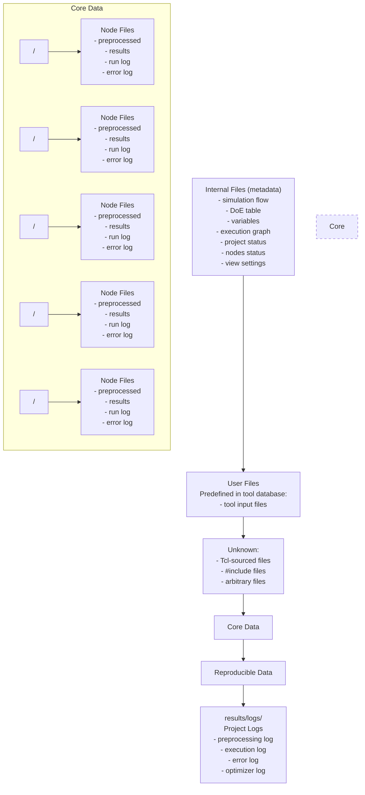
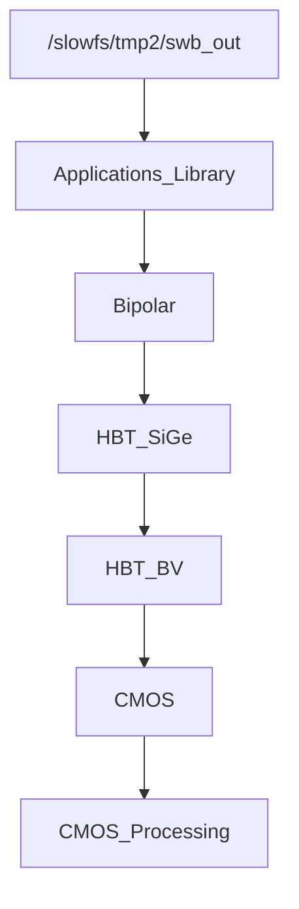
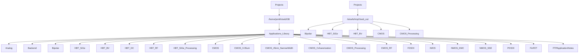

<!-- page:1 -->
# Sentaurus™ Workbench User Guide

Version O-2018.06, June 2018

# Copyright and Proprietary Information Notice

<!-- page:2 -->
© 2018 Synopsys, Inc. This Synopsys software and all associated documentation are proprietary to Synopsys, Inc. and may only be used pursuant to the terms and conditions of a written license agreement with Synopsys, Inc. All other use, reproduction, modification, or distribution of the Synopsys software or the associated documentation is strictly prohibited.

# Destination Control Statement

All technical data contained in this publication is subject to the export control laws of the United States of America. Disclosure to nationals of other countries contrary to United States law is prohibited. It is the reader’s responsibility to determine the applicable regulations and to comply with them.

# Disclaimer

SYNOPSYS, INC., AND ITS LICENSORS MAKE NO WARRANTY OF ANY KIND, EXPRESS OR IMPLIED, WITH REGARD TO THIS MATERIAL, INCLUDING, BUT NOT LIMITED TO, THE IMPLIED WARRANTIES OF MERCHANTABILITY AND FITNESS FOR A PARTICULAR PURPOSE.

# Trademarks

Synopsys and certain Synopsys product names are trademarks of Synopsys, as set forth at https://www.synopsys.com/company/legal/trademarks-brands.html. All other product or company names may be trademarks of their respective owners.

# Free and Open-Source Licensing Notices

If applicable, Free and Open-Source Software (FOSS) licensing notices are available in the product installation.

# Third-Party Links

Any links to third-party websites included in this document are for your convenience only. Synopsys does not endorse and is not responsible for such websites and their practices, including privacy practices, availability, and content.

Synopsys, Inc.

Mountain View, CA 94043

www.synopsys.com

<!-- page:3 -->
# About This Guide xiii

Related Publications . . xiii

Conventions xiii

Customer Support . . . xiv

Accessing SolvNet. . . . xiv

Contacting Synopsys Support . . . xiv

Contacting Your Local TCAD Support Team Directly. . . .

# Chapter 1 Introduction to Sentaurus Workbench 1

Functionality of Sentaurus Workbench. . .

Sentaurus Workbench Projects . . .

Compatibility With Previous Versions . .

Starting Sentaurus Workbench . . .

Setting Up Environment Variables . . .

Launching Sentaurus Workbench From the Command Line . . .

User Interface . .

Projects Browser . . . . 4

Viewing Directories . . .

Attaching Root Directories . . .

Updating the Status of Directories . . . .

Project Editor . . . . . 6

Scheduler . .

Utilities . . . 8

gcleanup . . . . . . 8

gjob . . 8

gsub

gtclsh . .

spp . . .

swbdiag . . .

swblm. .

swbopt . . . . 10

# Chapter 2 Managing Projects 11

Creating Project Directories . . .

Creating Folders . . .

Opening Projects . . . . . 12

<!-- page:4 -->
Changing the Runtime Editing Mode of a Project . . 12

Changing the Default Runtime Editing Mode of Projects. . . . 13

Copying Projects or Folders . . . 13

Linking Projects . . . 14

Command File of the Bridge Tool. . . 14

Synchronizing Dependent Projects . . . . . 15

Saving Projects . . . 1

Automatically Saving Projects. . . . 18

Moving Projects or Folders. . . 18

Renaming Projects or Folders . . . 19

Deleting Projects or Folders . . . 19

Accessing Project Documentation 19

Exporting and Importing Projects . . . . . 20

Encrypted Packages . . . . . 22

Configuring Sentaurus Workbench to Exit Automatically . . . . . 22

Resetting the Inactivity Time-Out . . . . 23

# Chapter 3 View Settings 25

View Settings for Projects. . . . . 25

Configuring the Default View Settings in Preferences . . . . 26

Restoring the Default View Settings in Preferences . . . 27

Configuring the Project Orientation . . 2

Setting the Project View Mode . . . . 27

Customizing the View of the Current Project . . . . 28

Changing the Font of the Project View . . . . . 31

Changing the Application Font . . . . 32

Configuring the Column Width and Row Height . . . . . 32

Magnifying the Project View. . . . 32

Freezing Columns and Rows . . . . 33

Copying Data to Other Tools. . . . 34

Main Sections of Project View . . . . 34

Family Tree . . . . 34

Specifying a Tool Comment. . . . 36

Specifying a Parameter Process Name . . . . . 37

Showing the Tool Labels . . . . 37

Experimental Plan . . . . 37

Parameter Values . . . . 38

Variable Values . . . . 38

Nodes . . . 38

Configuring Node Colors. . . . 39

Selecting Nodes With Mouse and Keyboard Operations . . 40

<!-- page:5 -->
Viewing the Output Files of Nodes . . . . 41

Viewing the Output Files of Nodes in Sentaurus Visual . . . 43

Selecting Files Using Filters. . . . . 44

Viewing Visualizer Nodes Simultaneously . . . 45

Comparing Command Files of Nodes . . . . 46

Running Sentaurus Process Nodes Interactively . . . . . 46

Node Explorer . . . . 47

Exporting Spreadsheets. . . . . 50

Exporting a Spreadsheet to a Text File . . . . 50

Exporting a Spreadsheet to a Plot File. . . . . 50

Viewing Log Files. . . . . . 51

Visualizing Response Surfaces . . . . 51

View Settings for Scheduler . . . . . 51

Modifying User-Level Tool Queues . . . . 51

Modifying Project-Level Tool Queues . . . . 52

Editing Queue Files . . . . 53

# Chapter 4 Editing Projects 55

Read-Only and Writable Projects . . . . 55

Undoing Changes . . . . . 55

Limiting the Number of Changes . . . . 56

Tools . . . 56

Adding Tools to the Flow . . . 56

Deleting Tools From the Flow. . . . 61

Copying Tools . . . . . 62

Controlling the Copying of Tools. . . . . . 62

Resolving File Conflicts . . . . . 63

Changing Tool Properties . . . . 64

Editing Tool Input Files . . . . 65

Editing the Parameter File for Sentaurus Device. . . . . 67

Including Additional Materials to a Parameter File . . . . 69

Locking and Unlocking Tools . . . . . 71

Configuring Double-Click Operations on Tools . . . . . 72

Parameters . . . 72

Adding Parameters to a Tool . . . 73

Adding the First Parameter to a Tool . . . . 73

Adding Subsequent Parameters to a Tool. . . . 74

Adding Values to Parameters . . . 75

Deleting New Values . . . . 76

Limiting the Number of Values Specified for Parameters . . . . 76

Deleting Parameters . . . 76

<!-- page:6 -->
Copying Parameters. . . . 78

Controlling the Copying of Parameters . . . . 78

Changing Parameter Properties . . . . 79

Removing Parameter Values . . . . 80

Configuring Double-Click Operations on Parameters. . . . 80

Variables . . . . 81

Adding Global Variables . . . 82

Changing the Default Value of Global Variables . . . . 83

Deleting Global Variables . . . . 83

Copying Global Variables . . . . 83

Formatting Variables . . . . 84

Defining Variables Per Node. . . . 84

Changing and Deleting Variable Values at a Node . . . . . 85

Configuring Double-Click Operations on Variables . . . . . 86

Nodes . . . . 86

Viewing and Editing Node Properties . . . . 86

Changing Parameter Values Directly in Node Cells . . . . . 88

Editing Parameter Values of Multiple Nodes . . . . 89

Configuring Double-Click Operations on Nodes . . . . 90

Copying Nodes . . . . 91

Viewing Node Dependencies. . . . . 91

Experiments and Scenarios . . . . 92

Adding Experiments . . . 92

Excluding Experiments . . . 94

Deleting Experiments . 94

Sorting Experiments . . 94

Importing Experiments From a File. . . . . 95

Viewing Experiment Properties. . . . . 97

Adding Scenarios. . . . 97

Removing Scenarios . . . . 98

Including Experiments in Different Scenarios. . . . 99

Excluding Experiments From Scenarios . . . . 100

Copying and Moving Experiments Between Projects . . . . . 101

Pruning and Unpruning . . . . . . 101

Locking Nodes. . . . . . 102

Quick-Running Nodes . . . . . 102

Folding and Unfolding Nodes . . . . . 103

Project Consistency Control . . . . . 104

Switching On Project Consistency Control . . . 105

Removing Exclamation Marks . . . . . . 106

Reexecuting Marked Nodes . . . . 106

# Chapter 5 Design-of-Experiments Wizard and Taguchi Wizard 109

<!-- page:7 -->
Design-of-Experiments (DoE) Wizard . . . . 109

Step 1: Selecting the Design-of-Experiments Option . . . . . 109

Step 2: Selecting Parameters . . . . 110

Step 3: Screening Option . . . . . 111

Step 3: Response Surface Model Option . . . . . 112

Step 3: Stochastic Design Option . . . . . 113

Step 3: Square Design Option . . . . . . 114

Step 3: Sensitivity Analysis Option . . . . . 115

Standard Mode . . . . 116

Taurus Workbench–Compatible Mode . . . . . 118

Step 3: User-Defined Parameters. . . . 120

Final Step: Summary . . . . . . 121

Taguchi Wizard. . . 122

Step 1: Selecting the Design . . . . 122

Step 2: Specifying the Inner Array . . . . . 122

Step 3: Specifying the Outer Array . . . . . 124

Final Step: Viewing the Design . . . . . 125

# Chapter 6 Preprocessing Projects 127

Introduction to Project Parameterization . 127

Global and Runtime Preprocessing . . . . 127

Preprocessor #-Commands . . . 128

@-References and Tree Navigation . . . . . 129

@-Expressions . . . . . 130

Expression @[...]@ . . . . . 130

Expression @<...>@ . . . . . 131

Redefining Delimiters . . . . . 131

Preprocessing Nodes . . . . . . 132

Node Filters . . . . . 132

Node Expressions . . . 133

Examples . . . . 133

Split Points . . . . . 133

Preprocessing Variables . . . . . . 134

Extracted Variables . . . . . 135

Execution Dependencies . . . . 137

Setting and Unsetting Dependencies . . . . . . 137

Using Tcl Command Blocks . . . . . . 138

Creating Tcl Command Blocks . . . . 138

Preprocessing Tcl Command Blocks. . . . . . 139

<!-- page:8 -->
Tcl Command Blocks and Sentaurus Workbench Variables. . . 140

Input and Output Operations Inside Tcl Command Blocks. . . . . 141

When to Use Tcl Command Blocks . . . 142

Summary of Rules for Using Tcl Command Blocks . . . . . 143

# Chapter 7 Running Projects 145

Running Projects From the Project Editor . . . . . 145

Running Projects From the Command Line . . . . . 146

Submitting Jobs to Queues . . . 146

Launching a Specific Job. . . . . 147

Running Projects From the Scheduler . . . . 148

Runtime Editing Modes for Projects. . . . . 149

Locked Runtime Editing Mode . . . . 149

Editable Runtime Editing Mode . 150

Choosing the Appropriate Runtime Editing Mode for Projects . . . . 151

Concurrency Mode for Experiments. . . . 152

Configuring the Execution of Jobs . . . . . . 154

Auto-Detection of Threads for Shared-Memory Parallelization. . . . 158

Limiting the Number of Threads Requested . . . 161

Defining Run Limits . . . . 161

Defining the User Quota . . . . 161

Defining a Submission Delay . . . . 163

Defining Project Run Limits . . . . 163

Changing the Order of the Execution of Nodes. . . . . 166

Delaying the Execution of Projects and Nodes. . . . . 166

Configuring a Delay Between Simulations . . . . 167

Protecting Executed Nodes . . . . . . 167

Preprocessing Projects . . . . . 169

Terminating Projects and Nodes . . . . . . 170

Terminating Projects . . . . 170

Terminating Nodes . . . . . 170

Unexpected Termination of Running Projects. . . . . . 171

Updating Node Statuses and Extracted Variables. . . . 171

Customizing the Execution of Projects and Nodes. . . . . 172

Customizing Project Execution . . . . 172

Customizing Node Execution . . . . . 172

Viewing Project Files . . . . 173

Viewing the Project Summary . . . . . 174

Recognizing Suspended Jobs . . . . 174

<!-- page:9 -->
# Chapter 8 Cleaning Up Projects 177

Cleaning Up Projects . . . . 177

Cleaning Up the Output of Nodes . . . . . 178

Cleaning Up Projects From the Command Line. . . . 179

Detecting Files to Remove . . . . 179

Specifying Project Exclude File Patterns . . . . . 180

Backing Up Node Files Automatically . . . . 181

# Chapter 9 Configuring Sentaurus Workbench 183

Preferences . . 183

Preference Levels. . . 183

Configuring User Preferences . . . 184

Configuring Global and Site Preferences . . . 185

Forcing Global Preferences to All Users . . . . . . 186

Propagating Default Preferences to Users . . . . . 186

Restoring Default Preferences . . . 186

Available Preferences . 187

Tool Databases . . . . . 198

Configuring Tool Databases . . . 199

Project Tool Database . . . . 201

Run Limits Settings. . . . . . 202

Format of XML-Compatible Run Limits Settings File . . . . . 204

Example 1 . . . 206

Example 2 . . . . 207

Changing the Run Limits Settings . . . . . 209

Bypassing Unwanted License Checks . . . . . 209

# Chapter 10 Integrating Sentaurus Workbench With Other Tools 211

Creating Symbolic Links to Node Output Files . . . . . . 211

Visualizing Response Surface Models . . . . 212

Step 1 of RSM Visualization . . . . . 212

Including Parameters in the Modeling . . . . . . 214

Step 2 of RSM Visualization . . . . . 214

Visualization Options . . . . . 215

Model Information . . . . . 215

Visualizing the Model . . . . 216

<!-- page:10 -->
# Chapter 11 Schedulers 217

Scheduling Systems . . . 217

Supported Schedulers . . 217

LSF Scheduler. . . . 219

Troubleshooting LSF . . . 221

Nodes Submitted But Not Executed. . . . 221

Nodes Not Executed and Log File Contains Complaints About bjobs Output . . 222

SGE Scheduler . . . 223

Troubleshooting SGE . . 225

Job Polling Occurs Too Frequently . . . . . . 225

TM Scheduler . . . . . 225

Troubleshooting TM . 227

Job Polling Occurs Too Frequently . . . . 227

RTDA Scheduler. . . 227

Troubleshooting RTDA . . . . 228

Job Polling Occurs Too Frequently . . . . 229

Configuring Scheduling Systems . . . . 229

Global Queue Configuration File . . . . . 229

Local Queues . . . . . 230

LSF Queues . . . . 231

SGE Queues . . . . 232

TM Queues . . . . 233

RTDA Queues . . . 233

Site Queue Configuration . . 234

Tool Associations . . . . 234

Global Tool Associations . . . . 235

User Tool Associations. . . . 235

Project Tool Associations. . . . . 236

Node-Specific Constraints . . . . 236

Extended Scheduler Log . . . . . 236

Launching Sentaurus Workbench as an Interactive Job on the Cluster . . . . . . . 237

Batch Processes . . . . 238

# Chapter 12 Organization of Projects 241

Limitations of the Traditional Project Organization . . . . 241

Hierarchical Project Organization. . . . . 242

Location of Project Files . . . . . 242

Advantages of the Hierarchical Project Organization . . . . . 244

Better Performance . . . 244

Split Storage of Project Files . . . . . . 245

<!-- page:11 -->
Renumbering Nodes Without Cleaning Up a Project. . . . . 245

Activating the Hierarchical Mode of Sentaurus Workbench. . . . 245

Compatibility With the Traditional Project Organization . . . . . 246

Converting Projects to Hierarchical Organization . . . . . 247

Loading Projects Without Conversion . . . . . 248

Loading Projects in Traditional Mode . . . . . . 248

Navigating Through Node Files . . . . 248

Renumbering Nodes Without Cleaning Up a Project . . . . 249

Separate Storage of Project Files . . . . . . 250

Migration to the Hierarchical Project Organization . . . . 253

Extended Preprocessor Syntax . . . . 254

Linking Input Project Files in Node Folders . . . . . . 255

# Appendix A Preprocessor and Reference Syntax 257

@-References and Tree Navigation . . . . 257

Horizontal Flow Orientation . 258

Vertical Flow Orientation . . . 260

#-Commands . . . . 262

Split Commands . . . . 264

Node Expressions . . . . . 265

# Appendix B Menus and Toolbar Buttons of the User Interface 267

Project Menu . . . . . 267

Edit Menu . . . 269

Scheduler Menu . . . . 270

View Menu . . . . . 271

Scenario Menu . . . . 273

Tool Menu . . . . . 273

Parameter Menu . . . 274

Experiments Menu . . 275

Nodes Menu . . . . . 276

Variables Menu . . . . . 279

Optimization Menu . . . . . 280

Calibration Menu . . . . . 280

PCM Studio Menu . . 281

Extensions Menu. . . . 281

Help Menu. . . . . . 282

Toolbar Buttons of Project Editor . . . . . 283

Keyboard Navigation Keys. . . . . . 284

Appendix C Sentaurus Workbench Files 285   
Project Files. . . . . . 285   
Hidden Files . . . . 286   
User Configuration Files . . . . . 286   
Global Configuration Files . . . . 286   
Site Configuration Files . . . . . 287   
Typical Input and Output Files . . . . . . 287

<!-- page:12 -->
Appendix D Known Issues on VNC Clients 289

Double-Clicking Operation Does Not Work . . . . 289

Appendix E Troubleshooting Network Issues 291

Sentaurus Workbench Diagnostics Tool. . . . 291

Troubleshooting the Sentaurus Workbench Network. . . . 291

Limitations and Assumptions . . . . 292

Usage . . . . . 293

Report and Log File . . . . . 293

<!-- page:13 -->
The Synopsys Sentaurus™ Workbench tool is the primary graphical front end for the integration of TCAD Sentaurus simulation software into one environment.

Sentaurus Workbench provides a convenient framework to design, organize, and automatically run complete TCAD simulation projects. Its user interface drives various Synopsys simulation and visualization tools as well as third-party tools, and automates the execution of fully parameterized projects. Sentaurus Workbench also supports design-of-experiments, extraction and analysis of results, optimization, and uncertainty analysis. It has an integrated job scheduler to speed up simulations and takes full advantage of distributed, heterogeneous, and corporate computing resources.

# Related Publications

For additional information, see:

The documentation installed with the software package and available from the Sentaurus Workbench Help menu.   
The TCAD Sentaurus release notes, available on the Synopsys SolvNet® support site (see Accessing SolvNet on page xiv).   
■ Documentation available on SolvNet at https://solvnet.synopsys.com/DocsOnWeb.

# Conventions

The following conventions are used in Synopsys documentation.

<table><tr><td>Convention</td><td>Description</td></tr><tr><td>Blue text</td><td>Identifies a cross-reference (only on the screen).</td></tr><tr><td>Bold text</td><td>Identifies a selectable icon, button, menu, or tab. It also indicates the name of a field or an option.</td></tr><tr><td>Courier font</td><td>Identifies text that is displayed on the screen or that you must type. It identifies the names of files, directories, paths, parameters, keywords, and variables.</td></tr><tr><td>Italicized text</td><td>Used for emphasis, the titles of books and journals, and non-English words. It also identifies components of an equation or a formula, a placeholder, or an identifier.</td></tr><tr><td>Key+Key</td><td>Indicates keyboard actions, for example, Ctrl+I (press the I key while pressing the Ctrl key).</td></tr><tr><td>Menu &gt; Command</td><td>Indicates a menu command, for example, File &gt; New (from the File menu, select New).</td></tr></table>

<!-- page:14 -->
# Customer Support

Customer support is available through the Synopsys SolvNet customer support website and by contacting the Synopsys support center.

# Accessing SolvNet

The SolvNet support site includes an electronic knowledge base of technical articles and answers to frequently asked questions about Synopsys tools. The site also gives you access to a wide range of Synopsys online services, which include downloading software, viewing documentation, and entering a call to the Support Center.

To access the SolvNet site:

1. Go to the web page at https://solvnet.synopsys.com.

2. If prompted, enter your user name and password. (If you do not have a Synopsys user name and password, follow the instructions to register.)

If you need help using the site, click Help on the menu bar.

# Contacting Synopsys Support

If you have problems, questions, or suggestions, you can contact Synopsys support in the following ways:

Go to the Synopsys Global Support Centers site on synopsys.com. There you can find email addresses and telephone numbers for Synopsys support centers throughout the world.

Go to either the Synopsys SolvNet site or the Synopsys Global Support Centers site and open a case online (Synopsys user name and password required).

# Contacting Your Local TCAD Support Team Directly

<!-- page:15 -->
# Send an e-mail message to:

■ support-tcad-us@synopsys.com from within North America and South America   
support-tcad-eu@synopsys.com from within Europe   
support-tcad-ap@synopsys.com from within Asia Pacific (China, Taiwan, Singapore, Malaysia, India, Australia)   
support-tcad-kr@synopsys.com from Korea   
support-tcad-jp@synopsys.com from Japan

<!-- page:17 -->
This chapter provides an overview of Sentaurus Workbench.

# Functionality of Sentaurus Workbench

Sentaurus Workbench is the framework environment designed to simplify the use of Synopsys TCAD tools. It frees you from typing system commands for handling data files or starting applications. One of its main advantages is the possibility of parameterizing input files to run simulation groups automatically. The main features of Sentaurus Workbench include:

The user interface simplifies the editing and handling of complex simulation projects, and the flexible open tool interface makes it possible to plug in third-party tools.   
■ It allows for the flexible configuration and storing of the view of the project simulation flow.   
Simulations can be organized into projects and folders, which provide a clear overview of the overall simulation environment.   
The project database is mapped to the underlying native file systems and allows robust file management in a multiuser distributed environment.   
You can set up tool flows with multiple instances of the same tool.   
Simulation parameters can be used in any input file, and the resulting simulation experiments can be edited before running the simulations.   
■ It is easy to build new simulation projects by copying parts of existing projects.   
■ Many example projects are available to be copied and modified as required.   
■ You can perform design-of-experiments, optimization, and statistical analysis.   
The scheduler integrated into the user interface can schedule and monitor the running of simulation projects.   
There is easy access to backend scheduling systems to run large simulations in parallel on a network of workstations and computing clusters.

<!-- page:18 -->
# Sentaurus Workbench Projects

A project consists of a family of scenarios. Each scenario consists of several experiments where certain input variables take different values. Parameters can be introduced at any point in the simulation flow, from the process to the device simulation phases.

A project exists as a directory in the file system. If a directory contains a .project file, this indicates to Sentaurus Workbench that the current directory is a project directory.

A parameterized project is represented as a tree structure, shown in the Family Tree part of the project view, which is derived from a simulation flow and a combination of all the parameter values. Each level shown in the Family Tree corresponds to a simulation phase, as defined in the simulation flow.

In the Family Tree, each node has a unique number – the node key (<nkey>). A real node represents the end of a simulation phase and holds the output of the corresponding tool instance. Sentaurus Workbench associates output to a node by adding the prefix n<nkey>\_ to all the output file names of the tool used.

You need to distinguish between real and virtual simulation phases. Real simulation phases correspond to the execution of tool instances, and virtual simulation phases are introduced by parameters and do not lead to any tool execution. In a real simulation phase, there are as many tool instances as nodes in the corresponding tree level. Each tool instance is characterized by a combination of parameter values that define the path from the root node to the tool instance node.

The main attribute of a project is its runtime editing mode, which defines the editing and running policy for that project. You can choose either the Locked mode or the Editable mode (the default mode). Projects in the Locked mode have the maximum level of automation and consistency; however, you are limited with regard to applying changes to a running project. In contrast, projects in the Editable mode have maximum flexibility, while Sentaurus Workbench partially delegates to you the responsibility of maintaining consistency between input data and simulation results. You can change the runtime editing mode at any time in the preferences (see Changing the Default Runtime Editing Mode of Projects on page 13).

# Compatibility With Previous Versions

Sentaurus Workbench can load, edit, and run projects created in previous versions of the tool. Sentaurus Workbench makes all of the necessary conversions automatically.

NOTE There is no guarantee that you can edit new projects using earlier versions of Sentaurus Workbench.

<!-- page:19 -->
# Starting Sentaurus Workbench

You must set up environment variables before starting Sentaurus Workbench.

# Setting Up Environment Variables

You must set up the following environment variables before starting Sentaurus Workbench:

STDB The directory where all user projects reside.

STRELEASE The version of Sentaurus Workbench. If not specified, the default is the current version.

STROOT The location where the Synopsys TCAD software is installed.

The following example illustrates the settings in a .cshrc file:

setenv STROOT /home/user/ST

setenv STRELEASE O-2018.06

setenv STDB \$HOME/DBtest

# Launching Sentaurus Workbench From the Command Line

You can launch Sentaurus Workbench from the command line by specifying:

swb [<options>] [<directory> | <file>]

where:

<options> can be any of the following:

-a: Initializes the Sentaurus Workbench Advanced mode that includes the Optimizer and Calibration menus.

-b: Initializes the Sentaurus Workbench Basic mode that does not include the Optimizer and Calibration menus.

-default: Resets preferences to the default settings.

-h: Displays help information.

-hierarchical: Initializes hierarchical Sentaurus Workbench mode to work with hierarchically organized projects.

<!-- page:20 -->
# 1: Introduction to Sentaurus Workbench

User Interface

-nowait: Switches off license queueing.   
Without this option, if you launch Sentaurus Workbench when no license is available, Sentaurus Workbench queues for the license from the license manager and waits until a license is available. If you launch Sentaurus Workbench with the -nowait option, it will not queue for a license. If no license is available, Sentaurus Workbench exits.   
-plugin null: Switches off standard plug-ins.   
-traditional: Initializes traditional Sentaurus Workbench mode to work with traditionally organized projects. This is the default.   
-v: Displays the version of Sentaurus Workbench.   
-verbose: Displays all messages.   
■ <directory>: Specify a Sentaurus Workbench project directory.   
<file>: Specify a compressed file with a Sentaurus Workbench project.

NOTE If you launch Sentaurus Workbench without either the -a or -b option, it opens in the Basic mode.

# Examples

Launch Sentaurus Workbench Basic mode:

```txt
swb & swb -b & 
```

Launch Sentaurus Workbench Basic mode and load a project directory:

```batch
swb /u/jbrown/sample_app/myproject & 
```

# User Interface

The main window of Sentaurus Workbench consists of the projects browser and tabs for the Project Editor (Project tab) and the Scheduler (Scheduler tab).

# Projects Browser

You can manage projects in the projects browser (the Projects panel) (see Figure 1 on page 5). The projects are organized hierarchically as a tree. The tree displays the current file system as specified by the setting of the STDB environment variable.

<!-- page:21 -->
Directories are identified as Sentaurus Workbench project directories by the presence of a .project file, and Sentaurus Workbench displays project directories like files with the icon. The color of this icon reflects the status of the project.

The projects browser shows a global view of the project database of the user as a hierarchy of folders and projects. It features a tree representation to navigate through this hierarchy, to open and close folders, and to load projects, and for diverse operations on entire projects and folders, such as copying and moving projects. Additional hierarchies of folders and projects can be attached to the projects browser.

NOTE Any folders under a project directory are not displayed. Sentaurus Workbench does not work if there is a .project file anywhere above STDB.


<details>
<summary>text_image</summary>

/slowfs/ch10cae5/users/vryvkin/STDB/CMOS/CMOS_Ccharerization (Runtime Mode : Editable) - SWB@topo2.internal.synopsys.com
Project Edit Scheduler View Scenario Tool Parameter Experiments Nodes Variables Optimization Calibration PCM Studio Extensions Help
Scenario: all
Projects Scheduler
SDE
SDEVICE
SY15UAL
SDEVICE
SY15UAL
sde IdVg_lin PlotIdVg_lin IdVg_sat PlotIdVg_sat
Type Igate Vdd Vdlin IdVg_lin IdVg_sat Vtgm VtLin IdLin SSin
1 nMOS 0.022 -- 1.0 0.05 1 -- -- 1 -- 0.309 0.266 1.076e-04 101.484
2 0.032 -- 1.0 0.05 1 -- -- 1 -- 0.334 0.295 9.940e-05 82.830
3 0.045 -- 1.0 0.05 1 -- -- 1 -- 0.315 0.271 9.530e-05 76.209
4 0.065 -- 1.0 0.05 1 -- -- 1 -- 0.285 0.225 9.047e-05 75.102
5 0.090 -- 1.0 0.05 1 -- -- 1 -- 0.269 0.195 8.596e-05 75.242
6 0.13 -- 1.0 0.05 1 -- -- 1 -- 0.258 0.173 7.939e-05 75.296
7 pMOS 0.022 -- 1.0 0.05 1 -- -- 1 -- -0.503 -0.488 6.728e-05 133.311
8 0.032 -- 1.0 0.05 1 -- -- 1 -- -0.543 -0.529 5.730e-05 136.337
9 0.045 -- 1.0 0.05 1 -- -- 1 -- -0.532 -0.514 5.127e-05 106.758
10 0.065 -- 1.0 0.05 1 -- -- 1 -- -0.503 -0.474 4.601e-05 81.779
11 0.090 -- 1.0 0.05 1 -- -- 1 -- -0.485 -0.445 4.174e-05 77.315
12 0.13 -- 1.0 0.05 1 -- -- 1 -- -0.471 -0.422 3.625e-05 76.457
Edit mode none queued ready pending running done failed aborted virtual pruned folded
</details>

Figure 1 Main window with projects browser (green box) and Project Editor view showing traditional horizontal flow orientation

# Viewing Directories

The directories can be expanded or collapsed, allowing you to view the subdirectories and project folders below directories. You can navigate the directories using keyboard and mouse operations.

Right-click the Projects panel to display the context menu.

<!-- page:22 -->
# Attaching Root Directories

While you can specify the file system directory where all your projects reside using the STDB environment variable, you can also include other directories at the same level, in the projects browser.

Such a directory is a root directory, which typically contains a collection of folders and projects, and it can also be a project directory.

To add a root directory to the projects browser:

1. In the Projects panel, right-click and choose Folder > Attach Root.   
2. In the Open Directory dialog box, navigate to the directory to be added.   
3. Click OK.

NOTE Any directories above a root directory must not contain project directories or .project files, which Sentaurus Workbench interprets as project directories.

# Updating the Status of Directories

In the projects browser, the status of the directory structure, attached root directories, and projects is updated regularly. The interval for updates is set in the preferences. However, you can update a project directory or root directory manually at any time.

To update the status of a directory:

■ Right-click the directory and choose Refresh, or press the F5 key.

# Project Editor

The Project Editor allows you to access, organize, and edit a database of simulation projects on the Project tab. The simulation flow can be oriented horizontally (see Figure 1 on page 5) or vertically (see Figure 2 on page 7).

The Project tab displays an individual project as a table of experiments and simulation results. The rows from left to right in the horizontal flow orientation (see Figure 1) or columns from top to bottom in the vertical flow orientation (see Figure 2) represent the simulation flow followed by extracted results.

The simulation flow is the sequence of tools running the simulations steps, split by parameters. Columns in the horizontal orientation (or rows in the vertical orientation) represent different experiments and their corresponding parameter and variable values. You can add, remove, and modify experiments, and control the running of experiments.


<details>
<summary>other</summary>

| Metric | Value |
| :--- | :--- |
| sde |  |
| Type | nMOS |
| Igate | 0.022 |
| ldVg_lin |  |
| Vdd | 1.0 |
| Vdlin | 0.05 |
| ldVg_lin | 1 |
| PlotIdVg_lin | -- |
| ldVg_sat | -- |
| ldVg_sat | 1 |
| Vtgm | 0.309 |
| VtlLin | 0.266 |
| ldLin | 1.076e-04 |
| SStin | 101.484 |
| gmLin | 3.418e-04 |
| ldSat | 1.255e-03 |
| loff | 2.769e-06 |
| -- |  |
| -- |  |
| -- |  |
| -- |  |
| -- |  |
| -- |  |
| -- |  |
| -- |  |
| -- |  |
| -- |  |
| -- |  |
| -- |  |
| -- |  |
| -- |  |
| -- |  |
| -- |  |
| -- |  |
| -- |  |
| -- |  |
| -- |  |
| -- | -0.503 |
| -- | -0.543 |
| -- | -0.532 |
| -- | -0.503 |
| -- | -0.488 |
| -- | -0.529 |
| -- | -0.514 |
| -- | -0.474 |
| -- | -0.517 |
| -- | -0.514 |
| -- | -0.474 |
| -- | -0.517 |
| -- | -0.474 |
| -- | -0.517 |
| -- | -0.474 |
| -- | -0.517 |
| -- | -0.474 |
| -- | -0.517 |
| -- | -0.474 |
| -- | -0.517 |
| -- | -0.474 |
| -- | -0.516 |
| -- | -0.474 |
| -- | -0.516 |
| -- | -0.474 |
| -- | -0.516 |
| -- | -0.474 |
| -- | -0.516 |
| -- | -0.474 |
| -- | -0.516 |
| -- | -0.474 |
| -- | -0.515 |
| -- | -0.515 |
| -- | -0.515 |
| -- | -0.515 |
| -- | -0.515 |
| -- | -0.515 |
| -- | -0.515 |
| -- | -0.515 |
| -- | -0.515 |
| -- | -0.515 |
| -- | -0.514 |
| -- | -0.514 |
| -- | -0.514 |
| -- | -0.514 |
| -- | -0.514 |
| -- | -0.514 |
| -- | -0.514 |
| -- | -0.514 |
| -- | -0.514 |
| -- | -0.514 |
| -- | -0.513 |
| -- | -0.513 |
| -- | -0.513 |
| -- | -0.513 |
| -- | -0.513 |
| -- | -0.513 |
| -- | -0.513 |
| -- | -0.513 |
| -- | -0.513 |
| -- | -0.513 |
| -- | -0.512 |
| -- | -0.512 |
| -- | -0.512 |
| -- | -0.512 |
| -- | -0.512 |
| -- | -0.512 |
| -- | -0.512 |
| -- | -0.512 |
| -- | -0.512 |
| -- | -0.512 |
| -- | -0.511 |
| -- | -0.511 |
| -- | -0.511 |
| -- | -0.511 |
| -- | -0.511 |
| -- | -0.511 |
| -- | -0.511 |
| -- | -0.511 |
| -- | -0.511 |
| -- | -0.510 |
| -- | -0.510 |
| -- | -0.510 |
| -- | -0.510 |
| -- | -0.510 |
| -- | -0.510 |
| -- | -0.510 |
| -- | -0.510 |
| -- | -0.510 |
| -- | -0.510 |
| -- | -0.51   |
| -- | -0.51   |
| -- | -0.51   |
| -- | -0.51   |
| -- | -0.51   |
| -- | -0.51   |
| -- | -0.5    |
| -- | -0.5    |
| -- | -0.5    |
| -- | -0.5    |
| -- | -0.5    |
| -- | -0.5    |
| -- | -0.5    |
| -- | -0.5    |
| -- | -0.5    |
| -- | -0.5    |
| -- | -0.5    |
| -- | -0.5    |

| Parameter/Model       | Value     |
|:------------------------|-----------|
| sde                    | 2         |

| Type                  | nMOS      |
| ---------------------- | ---------- |
| Igate                  | 0.022     |
| ldVg_lin               | 1          |

| SDEVICE                | 2         |

| SVISUAL                | 2         |

| SDEVICE                | 2         |

| SDEVICE                | 2         |

| SVISUAL                | 2         |

| SVISUAL                | 2         |

| Vtgm                   | 2         |

| VtlLin                 | 2         |

| ldLin                  | 2         |

| SStin                  | 2         |

| gmLin                  | 2         |

| ldSat                  | 2         |

| loff                   | 2         |

{ Parameter/Model: }  
editerrates are labeled as 'sdev' in the code; 'value' is not specified in the chart.
</details>

Figure 2 Main window with Project Editor view showing vertical flow orientation

<!-- page:23 -->
# Scheduler

You can use the Scheduler to submit, terminate, and monitor the simulation jobs of a project. You can also define scheduling queues and job-mapping restrictions. The Scheduler gives you an overview of the running jobs and their distribution on the local area network.

To open the Scheduler:

Choose Scheduler > Show Scheduler, or click the Scheduler tab (see Figure 3 on page 8).

The Scheduler tab displays a table of running jobs with scheduling information, such as running time and running host. Only jobs belonging to the selected project or folder are shown. By default, Sentaurus Workbench shows the running jobs of the currently open project.


<details>
<summary>text_image</summary>

/slowfs/ch10cae5/users/vryvkin/STDB/CMOS/NMOS_SSE (Runtime Mode : Editable) - SWB@topo2.internal.synopsys.com
Project Edit Scheduler View Scenario Tool Parameter Experiments Nodes Variables Optimization Calibration PCM Studio Extensions Help
Projects Scheduled
Show all running nodes from: /slowfs/ch10cae5/users/vryvkin/STDB/CMOS
Node Project Tool Name Host Name Running Tir
4 /slowfs/ch10cae5/users/vryvkin/STDB/CMOS/CMOS_0.35um sprocess sarura27.internal.synopsys.com 00:00:20
5 /slowfs/ch10cae5/users/vryvkin/STDB/CMOS/CMOS_0.35um sprocess sarura27.internal.synopsys.com 00:00:20
6 /slowfs/ch10cae5/users/vryvkin/STDB/CMOS/CMOS_0.35um sprocess lagrev19.internal.synopsys.com 00:00:21
7 /slowfs/ch10cae5/users/vryvkin/STDB/CMOS/CMOS_0.35um sprocess lagrev19.internal.synopsys.com 00:00:21
8 /slowfs/ch10cae5users/vryvkin/STDB/CMOS/CMOS_0.35um sprocess vadret8.internal.synopsys.com 00:00:21
9 /slowfs/ch10cae5users/vryvkin/STDB/CMOS/CMOS_0.35um sprocess vadret8.internal.synopsys.com 00:00:21
10 /slowfs/ch10cae5users/vryvkin/STDB/CMOS/CMOS_0.35um sprocess sarura21.internal.synopsys.com 00:00:21
11 /slowfs/ch10cae5users/vryvkin/STDB/CMOS/CMOS_0.35um sprocess sarura21.internal.synopsys.com 00:00:21
12 /slowfs/ch10cae5users/vryvkin/STDB/CMOS/CMOS_0.35um sprocess kesch7.internal.synopsys.com 00:00:20
13 /slowfs/ch10cae5users/vryvkin/STDB/CMOS/CMOS_0.35um sprocess kesch7.internal.synopsys.com 00:00:20
14 /slowfs/ch10cae5users/vryvkin/STDB/CMOS/CMOS_0.35um sprocess kesch7.internal.synopsys.com 00:00:20
15 /slowfs/ch10cae5users/vryvkin/STDB/CMOS/CMOS_0.35um sprocess kesch7.internal.synopsys.com 00:00:20
16 /slowfs/ch10cae5users/vryvkin/STDB/CMOS/CMOS_0.35um sprocess kesch7internal.synopsys.com 00:00:20
17 /slowfs/ch10cae5users/vryvkin/STDB/CMOS/CMOS_0.35um sprocess kesch7internal.synopsys.com 00:00:20
18 /slowfs/ch10cae5users/vryvkin/STDB/CMOS/CMOS_0.35um sprocess kesch7internal.synopsys.com 00:00:20
19 /slowfs/ch10cae5users/vryvkin/STDB/CMOS/CMOS_0.35um sprocess kesch7internal.synopsys.com 00:00:20
28 /slowfs/ch10cae5users/vryvkin/STDB/CMOS/CMOS_45nm_NarrowWidth sprocess sarura26.internal.synopsys.com 00:00:50
29 /slowfs/ch10cae5users/vryvkin/STDB/CMOS/CMOS_45nm_NarrowWidth sprocess lagrev18.internal.synopsys.com 00:00:50
30 /slowfs/ch10cae5users/vryvkin/STDB/CMOS/CMOS_45nm_NarrowWidth sprocess lagrev19.internal.synopsys.com 00:00:49
31 /slowfs/ch10cae5users/vryvkin/STDB/CMOS/CMOS_45nm_NarrowWidth sprocess lagrev20.internal.synopsys.com 00:00:49
32 /slowfs/ch10cae5users/vryvkin/STDB/CMOS/CMOS_45nm_NarrowWidth sprocess vadret1 internal.synopsys.com 00:00:48
33 /slowfs/ch10cae5users/vryvkin/STDB/CMOS/CMOS_45nm_NarrowWidth sprocess sarura21 internal.synopsys.com 00:00:51
34 /slowfs/ch10cae5users/vryvkin/STDB/CMOS/CMOS_45nm_NarrowWidth sprocess kesch7 internal.synopsys.com 00:00:48
35 /slowfs/ch10cae5users/vryvkin/STDB/CMOS/CMOS_45nm_NarrowWidth sprocess kesch7 internal.synopsys.com 00:00:48
36 /slowfs/ch10cae5users/vryvkin/STDB/CMOS/CMOS_45nm_NarrowWidth sprocess kesch8internal.synopsys.com 00:00:50
37 /slowfs/ch10cae5users/vryvkin/STDB/CMOS/CMOS_45nm_NarrowWidth sprocess kesch8internal.synopsys.com 00:00:50
38 /slowfs/ch10cae5users/vryvkin/STDB/CMOS/CMOS_45nm_NarrowWidth sprocess kesch8internal.synopsys.com 00:00:50
39 /slowfs/ch10cae5users/vryvkin/STDB/CMOS/CMOS_45nm_NarrowWidth sprocess kesch8internal.synopsys.com 00:00:50
43 /slowfs/ch10cae5users/vryvkin/STDB/CMOS/NMOS_SSE sde kesch8internal.synopsys.com 00:00:21
Running @ topo2.internal.synopsys.com none queued ready pending running done filled shorted virtual pruned folded
</details>

Figure 3 Main window of Sentaurus Workbench showing the Scheduler tab

<!-- page:24 -->
# Utilities

This section describes the different utilities available in Sentaurus Workbench.

# gcleanup

This utility cleans up a project and performs all of the cleanup operations including the renumbering of the tree (see Cleaning Up Projects From the Command Line on page 179).

# gjob

This utility manages the execution of individual jobs and controls the evaluation of the job prologue and epilogue, and the running of the corresponding simulation tool (see Launching a Specific Job on page 147).

<!-- page:25 -->
# gsub

This utility consists of a simple command to submit jobs to the Scheduler for execution. It also constitutes the interface of Sentaurus Workbench to different internal or external batch systems (see Submitting Jobs to Queues on page 146).

# gtclsh

This utility is a tool command language (Tcl) shell that has been extended with all of the internal commands of Sentaurus Workbench, such as tree manipulation.

# spp

This utility is the Sentaurus Workbench preprocessor that prepares a project for execution, which includes:

Calculating an optimum execution graph from the simulation tree to use parallel computing while enforcing start–completion job interdependencies.   
Generating actual tool input files from user-provided templates to differentiate experiments.

See Preprocessing Projects on page 169.

# swbdiag

This utility is used to troubleshoot issues originating in customer environments that might affect the behavior of Sentaurus Workbench (see Appendix E on page 291).

# swblm

This daemon process is a dispatcher of interprocess communications between the Sentaurus Workbench components swb, gjob, gsub, and spp. Sentaurus Workbench starts this process automatically when needed. You do not need to terminate a running daemon process or to start a new one manually (see Appendix E on page 291).

<!-- page:26 -->
# swbopt

This utility is available in the Sentaurus Workbench Advanced mode and is designed for parametric studies in large-scale projects with hundreds of individual simulations, such as automatic iterative optimization, sensitivity analysis, and uncertainty analysis. For more information, see the Optimizer User Guide.

<!-- page:27 -->
This chapter describes the operations that can be performed on projects and directories using the projects browser.

# Creating Project Directories

To create a project directory:

1. Choose Project > New > New Project, or press Ctrl+N.   
A new project directory called untitled\_project is added to the root directory.   
2. Rename the project by right-clicking and choosing Rename.   
3. Type the name of the project directory.   
4. Press the Enter key.

<!-- page:28 -->
NOTE Sentaurus Workbench prohibits the use of the following characters in project names, including full paths: / \ \~ \* ? \$ ! " < > : [ ] { } = | ; <tab> <space>

In addition, it is not recommended to use any of the following characters in project names: , @ # ( ) ' \` + & ^ %

# Creating Folders

NOTE You cannot create folders inside project directories.

To create a folder:

1. Select a directory that is not a project directory.   
2. Choose Project > New > New Folder, or right-click and choose Folder > New Folder.   
3. Type the name of the new folder.   
4. Press the Enter key.

NOTE Sentaurus Workbench prohibits the use of the following characters in folder names, including full paths: / \ \~ \* ? \$ ! " < > : [ ] { } = | ; <tab> <space>

In addition, it is not recommended to use any of the following characters in folder names: , @ # ( ) ' \` + & ^ %

# Opening Projects

To open a project:

■ Double-click the project in the projects browser.

Alternatively, to open a project:

1. Select the project in the projects browser.   
2. Press the Enter key, or double-click the selection, or right-click and choose Open.

# Changing the Runtime Editing Mode of a Project

NOTE Projects must be in the writable area to change the runtime editing mode.

You cannot change the runtime editing mode of a running project.

To change the runtime editing mode of a project:

1. Select a project in the Projects panel.   
2. Right-click the project, choose Project > Runtime Editing Mode, and choose either:

• Locked for the Locked mode

• Editable for the Editable mode

See Locked Runtime Editing Mode on page 149 and Editable Runtime Editing Mode on page 150.

# Changing the Default Runtime Editing Mode of Projects

<!-- page:29 -->
The Editable mode is the default mode for projects. However, you can configure Sentaurus Workbench to set up the runtime editing mode automatically for new projects and any old projects that do not have a runtime editing mode selected.

To change the default runtime editing mode of projects:

1. Choose Edit > Preferences, or press the F12 key.   
2. In the SWB Preferences dialog box, expand Project > Runtime Editing Mode > Default Mode.   
3. Select either Locked or Editable.   
4. Click Apply.

# Copying Projects or Folders

You can copy multiple projects or folders.

NOTE Projects and folders cannot be copied inside other projects.

If a project is copied over its original project, the new project is created in the same folder with Copy\_of\_ prefixed to the project name. If a folder is copied over its original folder, the new folder with all its contents is created in the same parent folder with Copy\_of\_ prefixed to the folder name.

To copy projects or folders:

1. In the Projects panel, select the required projects.   
2. Press Ctrl+C, or right-click and choose Copy.   
3. Navigate to the required destination folder or keep the selection.   
4. Press Ctrl+V, or right-click and choose Paste.

<!-- page:30 -->
# Linking Projects

You can link two different projects, which allows you to refer to the simulation results of one project in another project without executing the referred nodes.

In this section, such projects are called parent and child projects for demonstration purposes only. A parent project contains Sentaurus Workbench parameters, variables, and output files that also can be accessed in a child project.

The Bridge tool is used to link projects and must be added to the flow of a child project. Synchronizing the two projects links them. The Sentaurus Workbench parameters of a parent project are copied into the nodes of the Bridge tool after a child project is synchronized with a parent project.

You can link projects with different project organizations (see Chapter 12 on page 241).

NOTE Sentaurus Workbench supports only one Bridge tool in a project. In other words, you can link a child project to only one parent project.

# Command File of the Bridge Tool

The command file of the Bridge tool specifies the name of a parent project and the nodes from the parent project to be linked to a child project.

The Bridge tool supports the following instructions specified in its command file bridge\_tcl.cmd:

```tcl
#noexec
set Parent "../Parent"
set ptools "sprocess IdVg"
set pvars "Vt Ioff Ion"
set PStoSync all
set infoLevel 3 
```

In this example, the Parent setting contains the path to a parent project. The path can be either an absolute or a relative path to a child project.

The ptools setting is a list of tools in a parent project. Parameters defined for these tools in a parent project are copied into the Bridge parameters in a child project when the child and parent projects are synchronized. If you omit this setting, Sentaurus Workbench copies the parameters of all tools of a parent project.

<!-- page:31 -->
The pvars setting contains a list of variables of a parent project to copy to a child project. If you omit this setting, no variables are copied.

The PStoSync setting specifies the reference scenario in a parent project. It instructs Sentaurus Workbench to copy parameters with the values of the given scenario. If you omit this setting, all parameter values of a parent project will be copied to a child project, which is equivalent to set PStoSync all.

Sentaurus Workbench logs the project synchronization into the syncwparent.log file. The setting infoLevel sets the verbosity of output in the log file, which can range from 0 (no output) to 3 (the most detailed output). The default is 0.

The presence of the Bridge tool in a project flow instructs the preprocessor to support the following instructions for linking purposes:

@ppwd@: Path to a parent project as defined in the Bridge tool input   
@pprjorg@: Project organization of a parent project: traditional or hierarchical (see Chapter 12 on page 241)   
@ppwdout@: Path to the directory where output files of a parent project are stored if project files are stored in a different location   
■ @pnodesdir@: Path to the directory where node folders of a parent project are stored   
■ @plogesdir@: Path to the directory where log files of a parent project are stored   
@pnode|toolname@: Matching node in a parent project that corresponds to the tool toolname

NOTE There is no need to execute nodes of the Bridge tool, since the linking occurs automatically during project preprocessing and execution. This is the reason why the #noexec preprocessor directive is used in the Bridge command file.

# Synchronizing Dependent Projects

Different synchronization modes of parent and child projects are available under the Tool menu when the Bridge tool is selected:

Tool > Clean and Synchronize With Parent Project

This command performs the following operations:

• Removes all parameters under the Bridge tool of a child project   
Copies parameters of the required tools in a parent project to the Bridge tool of a child project (required tools are set using ptools)

<!-- page:32 -->
Makes Sentaurus Workbench variables listed in pvars available in a child project after preprocessing or execution

# Tool > Synchronize With Parent Project

This command performs the following operations:

Finds parameters of the required tools in a parent project that have not been synchronized yet and adds them to the Bridge tool of a child project (required tools are set using ptools)   
Adds values of synchronized parameters from a parent project that are not yet in a child project   
Makes Sentaurus Workbench variables listed in pvars available in a child project after preprocessing or execution

This command is useful when new parameters or variations are added to a parent project while a child project already contains simulation results corresponding to the previous parent state. In that case, you might not want to clean up the child project.

Figure 4 shows a parent project and child project synchronized with the Clean and Synchronize With Parent Project command and executed. 

<table><tr><td></td><td colspan="5">SPROCESS</td><td colspan="4">SDEVICE</td></tr><tr><td></td><td colspan="5">sprocess</td><td colspan="4">IdVg</td></tr><tr><td></td><td></td><td>Type</td><td>L</td><td>H</td><td>W</td><td></td><td>Vdd</td><td>WF</td><td>Vgg</td></tr><tr><td>1</td><td rowspan="2">[n1]: --</td><td>[n2]: nMOS</td><td>[n4]: 0.025</td><td>[n6]: 0.035</td><td>[n8]: 0.01</td><td>[n10]: --</td><td>[n12]: 0.8</td><td>[n14]: 4.301</td><td>[n16]: 0.8</td></tr><tr><td>2</td><td>[n3]: pMOS</td><td>[n5]: 0.025</td><td>[n7]: 0.035</td><td>[n9]: 0.01</td><td>[n11]: --</td><td>[n13]: 0.8</td><td>[n15]: 4.882</td><td>[n17]: 0.8</td></tr></table>

<table><tr><td></td><td colspan="8">BRIDGE</td><td>SYISUAL</td></tr><tr><td></td><td colspan="8">bridge</td><td>PlotIdVg</td></tr><tr><td></td><td></td><td>Type</td><td>L</td><td>H</td><td>W</td><td>Vdd</td><td>WF</td><td>Vgg</td><td></td></tr><tr><td>1</td><td rowspan="2">[n3]: --</td><td>[n4]: nMOS</td><td>[n5]: 0.025</td><td>[n6]: 0.035</td><td>[n7]: 0.01</td><td>[n8]: 0.8</td><td>[n9]: 4.301</td><td>[n10]: 0.8</td><td>[n11]: --</td></tr><tr><td>2</td><td>[n12]: pMOS</td><td>[n13]: 0.025</td><td>[n14]: 0.035</td><td>[n15]: 0.01</td><td>[n16]: 0.8</td><td>[n17]: 4.882</td><td>[n18]: 0.8</td><td>[n19]: --</td></tr></table>

Figure 4 (Top) Parent project and (bottom) child project after synchronization and execution of the child project

Figure 5 on page 17 shows an example of using the Synchronize With Parent Project command. The parameter mf with values 0.4 (default) and 0.5 is added to the Sentaurus Process tool in the parent project. When the previously executed child project is synchronized without cleaning, the default mf parameter value (0.4) is added to the previously executed experiments. A new experiment corresponding to the new mf value (0.5) is added to the parent project.

<table><tr><td></td><td colspan="6">SPROCESS</td><td colspan="4">SDEVICE</td></tr><tr><td></td><td colspan="6">sprocess</td><td colspan="4">IdVg</td></tr><tr><td></td><td></td><td>Type</td><td>L</td><td>H</td><td>W</td><td>mf</td><td></td><td>Vdd</td><td>WF</td><td>Vgg</td></tr><tr><td>1</td><td rowspan="3">[n1]: --</td><td>[n2]: nMOS</td><td>[n4]: 0.025</td><td>[n6]: 0.035</td><td>[n18]: 0.01</td><td>[n8]: 0.4</td><td>[n10]: --</td><td>[n12]: 0.8</td><td>[n14]: 4.301</td><td>[n16]: 0.8</td></tr><tr><td>2</td><td rowspan="2">[n3]: pMOS</td><td rowspan="2">[n5]: 0.025</td><td rowspan="2">[n7]: 0.035</td><td rowspan="2">[n19]: 0.01</td><td>[n9]: 0.4</td><td>[n11]: --</td><td>[n13]: 0.8</td><td>[n15]: 4.882</td><td>[n17]: 0.8</td></tr><tr><td>3</td><td>[n25]: 0.5</td><td>[n26]: --</td><td>[n27]: 0.8</td><td>[n28]: 4.862</td><td>[n29]: 0.8</td></tr></table>

<table><tr><td></td><td colspan="9">BRIDGE</td><td>SVISUAL</td></tr><tr><td></td><td colspan="9">bridge</td><td>PlotIdVg</td></tr><tr><td></td><td></td><td>Type</td><td>L</td><td>H</td><td>W</td><td>mf</td><td>Vdd</td><td>WF</td><td>Vgg</td><td></td></tr><tr><td>1</td><td rowspan="3">[n3]: --</td><td>[n4]: nMOS</td><td>[n5]: 0.025</td><td>[n6]: 0.035</td><td>[n20]: 0.01</td><td>[n7]: 0.4</td><td>[n8]: 0.8</td><td>[n9]: 4.301</td><td>[n10]: 0.8</td><td>[n11]: --</td></tr><tr><td>2</td><td rowspan="2">[n12]: pMOS</td><td rowspan="2">[n13]: 0.025</td><td rowspan="2">[n14]: 0.035</td><td rowspan="2">[n21]: 0.01</td><td>[n15]: 0.4</td><td>[n16]: 0.8</td><td>[n17]: 4.882</td><td>[n18]: 0.8</td><td>[n19]: --</td></tr><tr><td>3</td><td>[n22]: 0.5</td><td>[n23]: 0.8</td><td>[n24]: 4.882</td><td>[n25]: 0.8</td><td>[n26]: --</td></tr></table>

Figure 5 (Top) Parent project and (bottom) child project synchronized with the parent project without cleaning the child project

<!-- page:33 -->
# Saving Projects

To save the current project in the same directory:

Choose Project > Save, or press Ctrl+S.

To save a project with a different name or in a new directory (the entire contents of the project directory are saved to the new directory):

Choose Project > Save As > Project.

To omit copying all of the preprocessed and node output files:

Choose Project > Save As > Clean Project.

To create a new project based on selected experiments:

■ Choose Project > Save Selected Experiments As > Project.

To create a new project based on selected experiments, but without copying the simulation results:

■ Choose Project > Save Selected Experiments As > Clean Project.

<!-- page:34 -->
# Automatically Saving Projects

You can configure Sentaurus Workbench to save your projects automatically. Sentaurus Workbench periodically saves the currently opened project for your convenience.

NOTE Automatic saving takes effect only when projects are not running.

To switch on automatic saving of a project:

1. Choose Edit > Preferences, or press the F12 key.   
2. In the SWB Preferences dialog box, expand Project > Auto Save.   
3. Set Project Auto Save Interval (min) to a nonzero value specifying the interval in minutes.   
The default value of 0 means that this feature is switched off.   
4. Click Apply.

# Moving Projects or Folders

You can move projects and folders across directories by either a drag-and-drop operation or a cut-and-paste operation.

NOTE The following restrictions apply when moving projects or folders:

You cannot move projects opened in the projects browser or running projects.   
You cannot move folders with any open or running project.   
• You cannot place projects or folders inside projects.   
• Projects without write permission are copied.

To move a project or folder using a drag-and-drop operation:

1. Select the project or folder in the Projects panel.   
2. Drag the project or folder to the destination project or folder.

To move a project or folder using a cut-and-paste operation:

1. Select the project or folder in the Projects panel.   
2. Press Ctrl+X, or right-click and choose Cut.

3. Navigate to the destination project or folder.   
4. Press Ctrl+V, or right-click and choose Paste.

<!-- page:35 -->
# Renaming Projects or Folders

NOTE Operations on the Family Tree directly act on the file system. Therefore, any delete, move, or rename operation cannot be undone.

To rename a project or folder:

1. Select the project or folder.   
2. Right-click and choose Rename.   
3. Type the new name.   
4. Press the Enter key.

NOTE A file name must contain only characters permitted by the operating system. Although the projects browser is configured to identify all invalid characters, extreme file names are likely to cause unpredictable behavior and might result in the loss of work.

# Deleting Projects or Folders

You can delete multiple projects or folders.

NOTE This operation irreversibly removes project directories.

To delete a project or folder:

1. Select the project or folder in the Projects panel.   
2. Choose Edit > Delete, or right-click and choose Delete.

# Accessing Project Documentation

You can attach a documentation file to a project. The file format must be PDF, and the file name should be greadme.pdf. The file can contain any information about the project.

<!-- page:36 -->
To access a documentation file in Adobe Reader:

1. Select a project in the projects browser.   
2. Choose Project > Properties > Documentation.

# Exporting and Importing Projects

You can export projects and directories into a package.

NOTE You can redefine the default project export options in the SWB Preferences dialog box by expanding Project > Export.

To export projects and directories:

1. Select one or more projects or data directories in the projects browser.   
To make multiple selections, hold the Ctrl key when clicking.

2. Choose Project > Export.

The Export to Package dialog box is displayed.


<details>
<summary>text_image</summary>

Export to Package
Package Name: applications_Library/CMOS/Test_CMOS.gzp
Exclude Patterns:
□ Export SWB Projects As Clean
✓ Compress Package (gzip)
✓ Encrypt Package (openssl)
Encryption Key: swb
OK Cancel
</details>

3. In the Package Name field, enter the name and location of the package file.

4. In the Exclude Patterns field, enter the patterns of files and directories to be excluded from the package.

NOTE The exclude patterns are applied automatically (see Specifying Project Exclude File Patterns on page 180).

<!-- page:37 -->
5. Select from the following options:

Export SWB Projects As Clean: Packages all Sentaurus Workbench projects in the selected hierarchy as clean projects. The original projects are not cleaned up during packaging.   
• Compress Package (gzip): Compresses the package.   
• Encrypt Package (openssl): Encrypts the package.

6. If you selected Encrypt Package (openssl), you must enter a key in the Encryption Key box (see Encrypted Packages on page 22).

NOTE The following characters are prohibited in an encryption key:

Single quotation marks (')   
• Backslash (\)   
• Whitespace (space, tabulator, newline)

7. Click OK.

To import projects and directories:

1. Double-click a .gzp or .tar file in the projects browser.   
2. In the Unpacking dialog box, select one or more projects or directories.


<details>
<summary>text_image</summary>

Unpacking
The file '/u/vryvkin/STDB/Applications_Library/Bipolar/Bipolar.gzp'
contains packaged SWB projects and directories.
Open: Unpack a selected project into a temporary directory and open it.
Save As: Unpack and save selected projects/directories.
Extract All: Unpack and save all projects/directories.
Cancel: Do not unpack the content.
Projects / Directories
HBT_BV
HBT_DC
HBT_RF
SiGeHBT_processing
Data_folder
Mockup
Open Save As... Extract All... Cancel
</details>

<!-- page:38 -->
3. Click Save As to unpack and store the selected items at the specified location.

Click Extract All to unpack and store all the items from the file.

# Encrypted Packages

Many users have difficulties using email to send packaged Sentaurus Workbench projects. Firewalls and email filters unpack the package, detect files with potentially dangerous extensions (.cmd), and block those files or even the entire email message.

Encryption allows your package to go through email filters without problems. When unpacking an encrypted package, Sentaurus Workbench uses a default encryption key. You can control the encryption key and package your projects with specific keys for confidential deliveries.

If the package has been encrypted with a nondefault key, Sentaurus Workbench asks you to enter this key when importing a packaged project.

NOTE With the default Synopsys encryption key swb, Sentaurus Workbench guarantees successful importing of packaged projects by another user. When you need additional security, package your project with a specific encryption key and communicate it to the recipient of the package.

You cannot import a packaged project that is encrypted with an unknown (or forgotten) key.

It is not recommended to send extremely large packages (exceeding 1 GB). There might be unexpected issues with unpacking such packages in different environments. In such cases, you should split the data into several packages that individually are less than 1 GB.

# Configuring Sentaurus Workbench to Exit Automatically

You might forget to exit Sentaurus Workbench, for example, before leaving for vacation or the weekend. As the result, inactive tools keep checked out licenses. You can configure Sentaurus Workbench to exit automatically if no user activity is registered for a given time.

To configure Sentaurus Workbench to exit automatically when there is no user activity:

1. Choose Edit > Preferences, or press the F12 key.

2. In the SWB Preferences dialog box, expand Auto Exit When Inactive > Inactivity Time-Out for SWB (hours).

3. Specify the number of hours of inactivity after which time Sentaurus Workbench will exit.   
If the time-out is set to 0, this feature is not activated.   
4. For the Alert Before Time-Out for SWB (min) field, specify when a warning dialog box opens before the tool exits.   
If set to 0, no warning dialog box is shown before the tool exits.

<!-- page:39 -->
5. Click Apply.

As soon as the inactivity time-out expires, Sentaurus Workbench exits and prints a warning message to the terminal where it has been launched, for example:

WARNING: SWB has exited after 24 hours of user inactivity.

NOTE Unsaved changes in a project opened in Sentaurus Workbench are not stored when the tool exits.

Similarly, you can configure Sentaurus Visual and Inspect to exit automatically when there is no user activity:

1. Choose Edit > Preferences or press the F12 key.   
2. In the SWB Preferences dialog box, expand Auto Exit When Inactive > Inactivity Time-Out for Visualization Tools (hours).   
3. Specify the number of hours of inactivity after which time Sentaurus Visual and Inspect will exit.   
If the time-out is set to 0, this feature is not activated.   
4. For the Alert Before Time-Out for Visualization (min) field, specify when a warning dialog box opens before the tools exit.   
If set to 0, no warning dialog box is shown before the tools exit.

5. Click Apply.

The inactivity time-out applies to all Sentaurus Visual and Inspect processes launched from and outside of Sentaurus Workbench.

# Resetting the Inactivity Time-Out

Click the mouse button or press any key in the user interface of Sentaurus Workbench or Sentaurus Visual to reset the inactivity time-out.

<!-- page:40 -->
# 2: Managing Projects

Configuring Sentaurus Workbench to Exit Automatically

<!-- page:41 -->
This chapter describes how to modify and save the view settings for projects in Sentaurus Workbench.

# View Settings for Projects

The Project tab consists of the following main sections: Family Tree, Experimental Plan, Parameter Values, and Variable Values (see Figure 6).

  
Figure 6 Different parts of the Project tab shown in the horizontal orientation

These sections, as well as other project view settings, can be configured by changing the default view options in the preferences or selecting the appropriate commands from the View menu. Your project view configuration is stored together with the project data. The next time you load the project, its view settings are used automatically.

You can configure the project view settings on both the user level and the project level (see Table 1).

Table 1 Setting project views at project and user levels 

<table><tr><td>Level</td><td>Where to set</td><td>Description</td></tr><tr><td>Project</td><td>Commands are available from the View menu.</td><td>These view settings are stored in the .database file under the project directory and apply only to a specific project. The view settings are saved each time you save a project or switch to another project in the projects browser.</td></tr><tr><td>User</td><td>Choose Edit &gt; Preferences to open the SWB Preferences dialog box. Expand Table &gt; Default View Options.</td><td>These view settings apply to all projects of a given user, unless the project does not have project-level view settings in the .database file.</td></tr></table>

<!-- page:42 -->
Project-level view settings override user-level settings. So, if a project does not have the .database file, the default view settings from the preferences are applied. Otherwise, the view settings from the .database file are used.

The project view on the Project tab can be oriented either horizontally or vertically. In this chapter, view settings for horizontally oriented projects are considered. For vertically oriented projects, the view settings apply in the same way.

  
Figure 7 Different parts of the Project tab shown in the vertical orientation

# Configuring the Default View Settings in Preferences

The default view settings are configured in the preferences (see Preferences on page 183). These settings apply to any project that does not have project-level view settings, that is, the project does not have the .database file in its directory.

NOTE It is recommended that you start by configuring the view settings in the preferences. Specify them so that they match the view requirements for most of your projects. You can customize these settings later for specific projects.

# Restoring the Default View Settings in Preferences

<!-- page:43 -->
The view settings stored in the .database file under the project directory override the settings in the preferences.

To restore the default view settings in the preferences for the currently opened project:

■ Choose View > Restore Default View Options, or press Ctrl+8.

# Configuring the Project Orientation

By default, Sentaurus Workbench displays projects in the horizontal orientation, where the tool flow is shown in the topmost row from left to right, and parameterized experiments are rows of the Family Tree (see Figure 6 on page 25).

Alternatively, you can display projects with a vertical orientation, where the tool flow is shown in the leftmost column from top to bottom, and parameterized experiments are columns of the Family Tree (see Figure 7 on page 26).

The project orientation depends on your preferences and the project structure. Some projects are more convenient to display horizontally, while other projects are best viewed in a vertical orientation.

To switch between horizontal and vertical orientations, either:

■ Choose View > Flow Orientation > Vertical.

■ Choose View > Flow Orientation > Horizontal.

The project orientation is stored in the .database file and is restored the next time you load the project.

# Setting the Project View Mode

Sentaurus Workbench allows you to display projects in two modes:

■ In full mode (default), the entire simulation flow is displayed (see Figure 1 on page 5).

In compact mode, only varying parameterization parts of the simulation flow with extracted variables are displayed. All other parts of the flow are hidden. This mode allows you to focus on the active parameterization part of the project and can be useful for large designof-experiments projects (see Figure 8 on page 28).

The mode is stored in the .database file and is restored the next time you load the project.

<!-- page:44 -->
To switch from full mode to compact mode:

■ Choose View > Flow View Mode > Compact.

To switch from compact mode to full mode:

Choose View > Flow View Mode > Full.

<table><tr><td>Project</td><td>Scheduler</td><td colspan="12"></td></tr><tr><td></td><td>Igate</td><td>HaloDose</td><td>HaloEnergy</td><td>Vds</td><td>Lgeff</td><td>Xj</td><td>Ygox</td><td>Tox</td><td>Vtgm</td><td>Vti</td><td>Id</td><td>SS</td><td>gm</td></tr><tr><td>1</td><td rowspan="6">0.18</td><td rowspan="4">1e13</td><td rowspan="2">15</td><td>0.05</td><td>1.533e-01</td><td>1.363e-01</td><td>6.357e-04</td><td>3.307e-03</td><td>0.357</td><td>0.268</td><td>6.865e-05</td><td>79.366</td><td>7.674e-05</td></tr><tr><td>2</td><td>1.5</td><td>1.533e-01</td><td>1.363e-01</td><td>6.357e-04</td><td>3.307e-03</td><td>✘</td><td>0.255</td><td>4.381e-04</td><td>78.769</td><td>4.578e-04</td></tr><tr><td>3</td><td rowspan="2">25</td><td>0.05</td><td>1.521e-01</td><td>1.271e-01</td><td>6.357e-04</td><td>3.307e-03</td><td>0.384</td><td>0.317</td><td>6.776e-05</td><td>79.861</td><td>7.781e-05</td></tr><tr><td>4</td><td>1.5</td><td>1.521e-01</td><td>1.271e-01</td><td>6.357e-04</td><td>3.307e-03</td><td>✘</td><td>0.284</td><td>4.243e-04</td><td>79.006</td><td>4.572e-04</td></tr><tr><td>5</td><td rowspan="2">1e12</td><td rowspan="2">15</td><td>0.05</td><td>1.506e-01</td><td>1.373e-01</td><td>6.357e-04</td><td>3.307e-03</td><td>0.301</td><td>0.238</td><td>7.410e-05</td><td>77.270</td><td>8.286e-05</td></tr><tr><td>6</td><td>1.5</td><td>1.506e-01</td><td>1.373e-01</td><td>6.357e-04</td><td>3.307e-03</td><td>✘</td><td>0.199</td><td>4.782e-04</td><td>76.941</td><td>4.716e-04</td></tr><tr><td>7</td><td rowspan="6">0.13</td><td rowspan="4">1e13</td><td rowspan="2">15</td><td>0.05</td><td>1.029e-01</td><td>1.363e-01</td><td>6.346e-04</td><td>3.386e-03</td><td>0.366</td><td>0.297</td><td>8.929e-05</td><td>82.605</td><td>1.027e-04</td></tr><tr><td>8</td><td>1.5</td><td>1.029e-01</td><td>1.363e-01</td><td>6.346e-04</td><td>3.386e-03</td><td>✘</td><td>0.220</td><td>5.183e-04</td><td>83.532</td><td>5.145e-04</td></tr><tr><td>9</td><td rowspan="2">25</td><td>0.05</td><td>1.022e-01</td><td>1.271e-01</td><td>6.346e-04</td><td>3.386e-03</td><td>0.382</td><td>0.315</td><td>8.947e-05</td><td>82.612</td><td>1.058e-04</td></tr><tr><td>10</td><td>1.5</td><td>1.022e-01</td><td>1.271e-01</td><td>6.346e-04</td><td>3.386e-03</td><td>✘</td><td>0.234</td><td>5.123e-04</td><td>82.579</td><td>5.151e-04</td></tr><tr><td>11</td><td rowspan="2">1e12</td><td rowspan="2">15</td><td>0.05</td><td>1.009e-01</td><td>1.373e-01</td><td>6.346e-04</td><td>3.386e-03</td><td>0.272</td><td>0.204</td><td>9.869e-05</td><td>82.191</td><td>1.114e-04</td></tr><tr><td>12</td><td>1.5</td><td>1.009e-01</td><td>1.373e-01</td><td>6.346e-04</td><td>3.386e-03</td><td>✘</td><td>0.109</td><td>5.864e-04</td><td>86.280</td><td>5.268e-04</td></tr></table>

Figure 8 Project view with compact mode activated

# Customizing the View of the Current Project

You can customize the view of the current project by showing or hiding the following flow elements manually:

Tool instance   
■ Default tool step of a tool instance   
■ Parameter step of a tool instance   
■ Variable

To hide a flow element, for example, a parameter step:

Select a cell separation line to the right of the parameter name cell and drag the line to the left until the cell disappears. Release the mouse button.

Alternatively, choose Parameter > Hide.

This operation hides the parameter step. To remind you that a flow element is hidden, Sentaurus Workbench shows the corresponding cell separator line in bold (see Figure 9 on page 29).


<details>
<summary>text_image</summary>

/slowfs/ch10cae5/users/vryvkin/STDB/CMOS/CMOS_Processing (Runtime Mode : Editable) - SWB@topo2.internal.synopsys.com
Project Edit Scheduler View Scenario Tool Parameter Experiments Nodes Variables Optimization Calibration PCM Studio Extensions Help
Projects
Nowfs/ch10cae5/users/vryvkin/STDB
Analog
Backend
Bipolar
CMOS
CMOS.gzp
CMOS_0.35um
CMOS_45nm_NarrowWidth
CMOS_180nm
CMOS_Ccharization
CMOS_Ccharization_Copy
CMOS_Noise
CMOS_RF
FDSOI
IMOS
NMOS_KMC
NMOS_SSE
PDSOI
FinFET
Project Scheduler
SPROCESS
CUT Halo Vdd IdVg_lin IdVg_sat Lgeff VtlLin IdLin SSlin
1 SIM2N 1 1.0 1 -- -- 1 -- -- 2.0500e-02 0.393 1.381e-04 96.954
2 SIM2P 1 1.0 1 -- -- 1 -- -- 3.0360e-02 0.362 1.303e-04 82.852
3 SIM2P 1 1.0 1 -- -- 1 -- -- 1.6160e-02 -0.569 5.494e-05 109.175
4 SIM2P 1 1.0 1 -- -- 1 -- -- 2.6120e-02 -0.632 4.138e-05 86.968
Edit mode none queue ready pending running done failed aborted virtual pruned folded
</details>

Figure 9 Project with hidden tools, parameters, and variables (red arrows indicate hidden flow elements)

<!-- page:45 -->
To redisplay a hidden parameter step:

■ Select the bold cell separation line and drag the line to the right. Release the mouse button.

Alternatively, choose Parameter > Show.

You can show or hide other flow elements in a similar way.

For convenience, you can use the Customize Current View dialog box to show or hide different flow elements in one step (see Figure 10 on page 30).

To display the Customize Current View dialog box:

■ Choose View > Customize Current View.

All your customizations are stored in the view settings .database file and are restored the next time you load the project.

<!-- page:46 -->
# 3: View Settings

View Settings for Projects


<details>
<summary>text_image</summary>

Customize Current View
tool instance : sprocess
Default Step
Type
CUT
Igate
f
ver
Poly
Halo
Ext
SD
Backend
MESH
Xcut
PolyDop
tool instance : IdVg_lin
Default Step
Vdd
Vdlin
IdVg_lin
tool instance : PlotIdVg_lin
tool instance : IdVg_sat
tool instance : PlotIdVg_sat
tool instance : IdVd
tool instance : PlotIdVd
tool instance : CV
tool instance : PlotCV
Global Variables
Set Variables
Extracted Variables
Lgeff
Xj
YMAX
</details>

Figure 10 Customize Current View dialog box

<!-- page:47 -->
# Changing the Font of the Project View

You can change the font attributes of the project view for the currently open project.

To change the font of the project view:

1. Choose View > Table Options > Change Table Font.

The Change Font dialog box is displayed.

2. Select one of the following options:

Apply System Default Font specifies that Sentaurus Workbench automatically detects the optimal font to use.   
Choose Font from Dialog displays the Font Selection dialog box where you can select the font attributes that are available for the operating system.


<details>
<summary>text_image</summary>

Font Selection
Font
helvetica
hrger.pfa
hrgrr.pfa
hrrtr.pfa
hrpld.pfa
hrpldi.pfa
Size
9
10
11
12
13
14
Style
Bold
Italic
Underline
Overstrike
Hello World!
OK	Cancel
</details>

3. Click OK.

The next time the project is loaded, the font settings are applied.

To apply a particular font to all projects:

1. Choose Edit > Preferences.   
2. In the SWB Preferences dialog box, expand Table > Font.   
3. Configure the font attributes in a similar way as configuring the font of the Family Tree.   
4. Click Apply.

<!-- page:48 -->
NOTE Font attributes set up in the preferences apply to both the Family Tree and the projects browser.

The font attributes of the Family Tree are stored in the .database file and these attributes overwrite font settings in the preferences.

# Changing the Application Font

Sentaurus Workbench uses the default system font as the default application font except for the project view, that is, the main menus, projects browser, and dialog boxes.

You can change the attributes of the default application font in the user-level X configuration file .Xdefaults using the standard X logical font description with the swb\*font name, for example:

```css
swb*font: -adobe-helvetica-medium-r-n*-14-*-75-75-*-iso10646-1 
```

To change the default application font used to preview node files in the Node Explorer and to view output files, specify a fixed font with the swb\*fixedfont name, for example:

```css
swb*fixedfont: -*-courier-medium-r-*-20-*--*--*--*--*
```

# Configuring the Column Width and Row Height

By default, Sentaurus Workbench automatically calculates the column widths and the row heights to adjust the project data. You can customize the width of all columns and the height of all rows in the project table by manually changing their size using mouse operations.

Sentaurus Workbench stores all the column widths and row heights in the view settings .database file and applies these sizes the next time you load the project.

To restore the default column and row sizes at any time:

■ Choose View > Restore Default Cell Size, or press Ctrl+7.

# Magnifying the Project View

You can change the magnification of the project view. When a project has a large Family Tree, it can be useful to zoom out of the project view.

Sentaurus Workbench will display values in a smaller font size, which allows you to reduce the cell size and to see a bigger part of the parameterization table at one time. Zooming in will result in the opposite effect. The font name and other font attributes are retained without change (see Changing the Font of the Project View on page 31).

<!-- page:49 -->
To zoom in to the project view:

■ Choose View > Zoom In, press Ctrl+Plus sign (+), or click the Zoom In button.

To zoom out of the project view:

■ Choose View > Zoom Out, press Ctrl+Minus sign (-), or click the Zoom Out button.

To switch the zoom off from a previously zoomed part of the project view:

Choose View > Zoom Off, press Ctrl+0, or click the Zoom Off button.

# Freezing Columns and Rows

When a project has many tools and parametric steps, you might want to freeze a certain part of the Family Tree and keep it visible on your screen when scrolling through the rest of the Family Tree to the right.

For example, imagine a simulation setup that starts with a process simulation and remeshing followed by multiple device tests. You might want to configure the project view so that the process simulation and remeshing part remains visible on-screen when you scroll through the device tests part (see Figure 11).

<table><tr><td></td><td colspan="10">SPROCESS</td><td colspan="3">SDE</td><td colspan="3">SDEVICE</td><td>INSPECT</td><td></td></tr><tr><td></td><td>Type</td><td>CUT</td><td>Igate</td><td>f</td><td>ver</td><td>Poly</td><td>Halo</td><td>Ext</td><td>SD</td><td>Backend</td><td></td><td>Ycut</td><td>PolyDop</td><td></td><td>Vdd</td><td>Vdlin</td><td>IdVg_lin</td><td></td></tr><tr><td>1</td><td rowspan="4">--</td><td rowspan="2">nMOS</td><td rowspan="2">SIM2N</td><td>0.09</td><td>1</td><td>1</td><td>0</td><td>0</td><td>0</td><td>0</td><td>--</td><td>2.0</td><td>1.0e20</td><td>--</td><td>1.2</td><td>0.05</td><td>1</td><td>--</td></tr><tr><td>2</td><td>0.05</td><td>1</td><td>1</td><td>0</td><td>0</td><td>0</td><td>0</td><td>--</td><td>2.0</td><td>1.0e20</td><td>--</td><td>1.2</td><td>0.05</td><td>1</td><td>--</td></tr><tr><td>3</td><td rowspan="2">pMOS</td><td rowspan="2">SIM2P</td><td>0.09</td><td>1</td><td>1</td><td>0</td><td>0</td><td>0</td><td>0</td><td>--</td><td>1.0</td><td>1.0e20</td><td>--</td><td>1.2</td><td>0.05</td><td>1</td><td>--</td></tr><tr><td>4</td><td>0.05</td><td>1</td><td>1</td><td>0</td><td>0</td><td>0</td><td>0</td><td>--</td><td>1.0</td><td>1.0e20</td><td>--</td><td>1.2</td><td>0.05</td><td>1</td><td>--</td></tr></table>

Figure 11 Project with frozen columns (indicated by cells with black background)

To freeze columns or rows:

1. Select the columns in the parameter row or tool row.   
2. Choose View > Freeze Rows/Columns.

Sentaurus Workbench freezes the selected columns, so they remain visible on-screen when you scroll through the Family Tree. Frozen columns are shown in black, which identifies them the next time you load the project.

To unfreeze columns or rows:

Choose View > Unfreeze Rows/Columns.

<!-- page:50 -->
In addition, you can select an arbitrary set of nodes and freeze it. As a result, Sentaurus Workbench will determine the rectangular area of the Family Tree and freeze the area.

# Copying Data to Other Tools

You can easily copy data from the table on the Project tab to other tools. Spreadsheet applications support direct copy-and-paste operations of tabbed data.

# Main Sections of Project View

The main sections of the project view are:

Family Tree   
Experimental Plan   
Parameter Values   
Variable Values

# Family Tree

The Family Tree shows the simulation flow, which is the backbone of all projects. It defines the sequence of tools and parameters involved in the simulations. Each parameter belongs to a tool instance, and experiments are arranged vertically. The table cells are either real or virtual nodes associated with individual simulations.

To show or hide the Family Tree:

■ Choose View > Tree Options > Show Tree, or press the F1 key.

  
Figure 12 Family Tree with horizontal orientation

<!-- page:51 -->
Figure 12 shows different parts of the Family Tree including:

<table><tr><td>Information title row</td><td>Shows the titles of the main parts of project view such as Family Tree and Variable Values.</td></tr><tr><td>Tool row</td><td>Shows the icons of all tools of the project.</td></tr><tr><td>Tool label row (hidden in Figure 12)</td><td>Shows all tool labels directly below the tool row. In the SWB Preferences dialog box, expand Default View Options and set Display Tool Labels to true, and reload the project.</td></tr><tr><td>Tool comment row</td><td>Shows comments about tools in the project.</td></tr><tr><td>Process name row</td><td>Shows the process names for the parameters.</td></tr><tr><td>Parameter row</td><td>Shows all parameters of the project.</td></tr><tr><td>Experiments column</td><td>Shows all numbered experiments.</td></tr></table>

<!-- page:52 -->
When the project view is oriented vertically, rows become columns and vice versa, so the project view looks like Figure 13.

<table><tr><td></td><td></td><td></td><td></td><td></td><td></td><td>1</td><td>2</td><td>3</td><td>4</td></tr><tr><td rowspan="11">Family Tree</td><td></td><td rowspan="5">sprocess</td><td rowspan="5">Sentaurus Process input fileAuthor: John Smith Flow version: 1.0.10</td><td></td><td></td><td colspan="4"></td></tr><tr><td rowspan="3">SPROCESS</td><td rowspan="3">deposit_120</td><td>Type</td><td colspan="4"></td></tr><tr><td>Igate</td><td colspan="4">0.18</td></tr><tr><td>HaloDose</td><td colspan="4">1e13</td></tr><tr><td></td><td>etching</td><td>HaloEnergy</td><td colspan="2">15</td><td colspan="2">25</td></tr><tr><td></td><td rowspan="2">sde</td><td rowspan="2">SDE for remeshing Author: John Smith Flow version: 1.0.10</td><td></td><td></td><td colspan="2">--</td><td colspan="2">--</td></tr><tr><td>SDE</td><td></td><td>PolyDop</td><td colspan="2">6e19</td><td colspan="2">6e19</td></tr><tr><td rowspan="3"></td><td rowspan="3">sdevice</td><td rowspan="3">Sentaurus Device input fileAuthor: John Smith Version: 2.0.7</td><td></td><td></td><td colspan="2">--</td><td colspan="2">--</td></tr><tr><td></td><td>Vdd</td><td colspan="2">1.5</td><td colspan="2">1.5</td></tr><tr><td></td><td>Vds</td><td>0.05</td><td>1.5</td><td>0.05</td><td>1.5</td></tr><tr><td></td><td>inspect</td><td>Extracting: Author: John Smith Flow version: 1.0.10</td><td></td><td></td><td>--</td><td>--</td><td>--</td><td>--</td></tr><tr><td rowspan="8">Variable Values</td><td></td><td></td><td></td><td></td><td>Lgeff</td><td>1.533e-01</td><td>1.533e-01</td><td>1.521e-01</td><td>1.521e-01</td></tr><tr><td></td><td></td><td></td><td></td><td>Xj</td><td>1.363e-01</td><td>1.363e-01</td><td>1.271e-01</td><td>1.271e-01</td></tr><tr><td></td><td></td><td></td><td></td><td>Ygox</td><td>6.357e-04</td><td>6.357e-04</td><td>6.357e-04</td><td>6.357e-04</td></tr><tr><td></td><td></td><td></td><td></td><td>Tox</td><td>3.307e-03</td><td>3.307e-03</td><td>3.307e-03</td><td>3.307e-03</td></tr><tr><td></td><td></td><td></td><td></td><td>Vtgm</td><td>0.357</td><td>x</td><td>0.384</td><td>x</td></tr><tr><td></td><td></td><td></td><td></td><td>Vti</td><td>0.288</td><td>0.255</td><td>0.317</td><td>0.284</td></tr><tr><td></td><td></td><td></td><td></td><td>Id</td><td>6.865e-05</td><td>4.381e-04</td><td>6.776e-05</td><td>4.243e-04</td></tr><tr><td></td><td></td><td></td><td></td><td>SS</td><td>79.366</td><td>78.769</td><td>79.861</td><td>79.006</td></tr></table>

Figure 13 Family Tree with vertical orientation

You can change the Family Tree view to display information about a node or from the node status files. Use the commands available from View > Tree Options and View > Table Options (see Table 24 on page 271).

NOTE To change views sequentially, click the $\sharp$ button.

# Specifying a Tool Comment

You can specify comments for any tool in the project flow. The comments are displayed in the tool comment row. Sentaurus Workbench displays this row when at least one tool contains a comment. A comment is arbitrary multiline text.

To specify a tool comment:

1. Choose View > Table Options > Show Comments.

A text box appears below each tool icon in the tool flow.

2. Type the comment.

Sentaurus Workbench saves tool comments in the project directory in the gcomments.dat file and displays the comments the next time you load the project.

<!-- page:53 -->
# Specifying a Parameter Process Name

You can specify a process name for each parameter of all process tools in the tool flow. This allows process engineers who often involve many process variations and splits in process simulations to conveniently group process parameters. A process name is an arbitrary identifier that can reflect certain process steps, splits, and so on.

When you create a Sentaurus Workbench parameter for any process tool, you can also specify the process name to which this parameter belongs. The process name as well as the parameter name can be changed later in the Parameter Properties dialog box.

Process names are displayed in a separate row immediately above the parameter row.

To specify a parameter process name:

■ Choose View > Table Options > Show Parameter Process Names.

Sentaurus Workbench saves the specified process names in the core project files and displays them the next time you load the project.

NOTE Process names are supported for process simulators and process-aware tools such as Sentaurus Process, Sentaurus Structure Editor, Sentaurus Topography, Sentaurus Topography 3D, and Taurus™ TSUPREM-4™.

# Showing the Tool Labels

In addition to tool icons, you can also display the tool label as rollover text. This feature is switched off by default.

To switch on the feature:

■ Choose View > Tree Options > Hinting Tool Labels.

In addition, you can show the tool labels permanently in the tool label row.

To show the tool label row permanently:

■ Choose View > Table Options > Show Tool Labels.

# Experimental Plan

The Experimental Plan view provides a way to view parametric combinations. It is used for viewing purposes only. The header rows show all parameters and their values.

<!-- page:54 -->
For each experiment, all its parameter values are also shown in the Experimental Plan columns in blue, under their corresponding values. This feature can be useful to observe certain patterns in the variation of parameters.

To switch on or off the Experimental Plan view:

■ Choose View > Tree Options > Show Experimental Plan, or press the F2 key.

# Parameter Values

The Parameter Values view contains the tools and their parameters on separate header rows. It is used for viewing purposes only. The parameter value is shown for each experiment and for each parameter.

To switch on or off the Parameter Values view:

■ Choose View > Tree Options > Show Parameters, or press the F3 key.

# Variable Values

The Variable Values view is used for viewing, editing, deleting, and adding variables. By default, it shows all variable types (see Variables on page 81).

To switch on or off the Variable Values view:

Choose View > Tree Options > Show Variables, or press the F4 key.

You can hide certain variable types using the Customize Current View dialog box (see Customizing the View of the Current Project on page 28).

# Nodes

Nodes are colored according to their status and are labeled with unique numbers called node keys. All nodes in the Family Tree can be one of the following:

Real nodes correspond to real simulation phases. For example, if a tool has no parameters, all nodes of this tool are real nodes.   
Real nodes are colored according to the execution status of the corresponding simulation job.   
If a tool has parameters, the parameters introduce intermediate nodes, which do not usually correspond to real simulation phases and, therefore, do not hold any results. These intermediate nodes are virtual nodes.

<!-- page:55 -->
Virtual nodes are either light blue or white depending on whether you have chosen the option View > Tree Options > Check Virtual Nodes.

NOTE Tools with split capabilities such as Sentaurus Process, Sentaurus Structure Editor, and Taurus TSUPREM-4 can create real intermediate nodes (see Split Points on page 133).

If the View > Tree Options > Check Virtual Nodes option is switched on, Sentaurus Workbench shows the status of intermediate nodes as follows:

Real intermediate nodes are colored according to their status.   
Virtual intermediate nodes are light blue.

The definitions of the different node colors are shown in the status bar of the main window (see Configuring Node Colors).

For more information about a simulation, choose Nodes > Edit Properties.

# Configuring Node Colors

Nodes are colored according to their status. The default color scheme for nodes is displayed in the status bar (see Figure 14).


<details>
<summary>text_image</summary>

none queued ready pending running done failed aborted virtual pruned folded
</details>

Figure 14 Default node colors as shown in the status bar

Sentaurus Workbench recognizes Tk symbolic color names or hexadecimal 8-bit RGB values. For details, go to http://www.tcl.tk/man/tcl8.6/TkCmd/colors.htm.

Table 2 RGB values for the default colors of nodes 

<table><tr><td>Node status</td><td>Hexadecimal 8-bit RGB value</td></tr><tr><td>none</td><td>#FFFFFF</td></tr><tr><td>queued</td><td>#ACFF75</td></tr><tr><td>ready</td><td>#7CFF75</td></tr><tr><td>pending</td><td>#75FFA0</td></tr><tr><td>running</td><td>#ADD8E6</td></tr><tr><td>done</td><td>#FFD700</td></tr><tr><td>failed</td><td>#FF0000</td></tr><tr><td>aborted</td><td>#FF00FF</td></tr><tr><td>virtual</td><td>#E0FFFF</td></tr><tr><td>pruned</td><td>#B3B3B3</td></tr><tr><td>folded</td><td>#8465A5</td></tr></table>

<!-- page:56 -->
To change the standard color scheme for better differentiation of colors on-screen:

1. Choose Edit > Preferences.   
2. In the SWB Preferences dialog box, expand Table > Node Status Color.   
3. Change the colors in one of the following ways:

Specify the hexadecimal RGB value manually.

Select the color from the Choose Color for Status dialog box, and click OK (see Figure 15).

4. Click Apply.

New colors are applied immediately after reloading a project, and they apply to all Sentaurus Workbench projects.


<details>
<summary>text_image</summary>

Choose Color for Status 'running'
Red: 173
Green: 216
Blue: 230
Selection:
#add8e6
OK	Cancel
</details>

Figure 15 Choose Color for Status dialog box for changing the color of a node status

# Selecting Nodes With Mouse and Keyboard Operations

You can select nodes as for any spreadsheet application. You can make a typical rectangular node selection using mouse operations.

<!-- page:57 -->
Alternatively, to select a large rectangular region where scrolling the Family Tree is needed:

1. Click the upper-left node of the required rectangular region.   
2. Scroll the Family Tree until the lower-right node of the rectangular selection appears.   
3. Click this node while holding the Shift key.

Clicking cells with experiment numbers results in selecting all the nodes belonging to these experiments. Clicking tool or parameter cells while holding the Shift key allows you to select all nodes belonging to the given tools or parameters.

When combining different selection techniques with the Ctrl key, you can make complex selections containing multiple regions.

# Viewing the Output Files of Nodes

Each real node can have several output files. You can view the contents of these files using Sentaurus Visual (the default visualization tool in Sentaurus Workbench), Inspect, or the text editor.

To view all output files of one or more nodes:

1. Select the nodes on the Project tab.   
2. Choose Nodes > Quick Visualize, or click the Quick Visualize toolbar button.

All of the available output files for the selected nodes open in the default visualizer, Sentaurus Visual. If no output files correspond to the selected nodes, Sentaurus Workbench launches the default visualizer without any files.

To view all output files of one or more nodes with a specific visualization tool:

1. Select the nodes on the Project tab.   
2. Click the Visualize toolbar button, and select the required visualizer.   
All visualization tools available for the selected nodes are listed.   
Alternatively, to make all visualization tools available, choose Nodes > Visualize.   
If no output files correspond to a particular node, the visualizer will be launched empty.

To view the output files of nodes belonging to different projects:

1. Select multiple projects in the projects browser.   
2. Select the required nodes of the currently open project on the Project tab.

<!-- page:58 -->
Viewing the output files of nodes displays those files belonging to the current project as well as the output files belonging to nodes with the same node numbers in other selected projects (if they exist).

NOTE The currently open project must be one of the selected projects in the projects browser.

The visualization tools, the file patterns to visualize, and the maximum number of files are configured in the tool database. By default, Sentaurus Workbench configures several viewers as shown in Figure 16.

<table><tr><td rowspan="4">Project</td><td rowspan="4">Scheduler</td><td rowspan="3" colspan="5"></td><td colspan="4">Sentaurus Visual (Select File...)</td><td colspan="2"></td></tr><tr><td colspan="4">Sentaurus Visual (Select by Type)</td><td rowspan="2" colspan="2">All XY-Plot Files
All Boundary Files
All Mesh Files
All IDR Files</td></tr><tr><td rowspan="2" colspan="4">Sentaurus Visual (All Files)
Tecplot SV (Select File...)
Tecplot SV (All Files)
Inspect (Select File...)</td></tr><tr><td colspan="2">SDE</td><td colspan="3">SDEV10</td><td colspan="2">SDEV10</td></tr><tr><td></td><td colspan="3">sde</td><td colspan="3">IdVg_li</td><td colspan="4">Inspect (All Files)</td><td>IdVg_sat</td><td>PlotIdVg_sat</td></tr><tr><td></td><td></td><td>Type</td><td>Igate</td><td></td><td>Vdd</td><td></td><td colspan="4">Text (Select File...)</td><td></td><td></td></tr><tr><td>1</td><td rowspan="12">[n1]: --</td><td rowspan="6">[n2]: nMOS</td><td>[n4]: 0.022</td><td>[n16]: --</td><td>[n28]: 1.0</td><td colspan="5">[ SDE (Select .sat File...)</td><td>-[n88]: 1</td><td>[n100]: --</td></tr><tr><td>2</td><td>[n5]: 0.032</td><td>[n17]: --</td><td>[n29]: 1.0</td><td rowspan="2" colspan="5">[ Sentaurus Visual - Sentaurus Process Link 
XML LogFile (Select .xml File...)</td><td>-[n89]: 1</td><td>[n101]: --</td></tr><tr><td>3</td><td>[n6]: 0.045</td><td>[n18]: --</td><td>[n30]: 1.0</td><td>-[n90]: 1</td><td>[n102]: --</td></tr><tr><td>4</td><td>[n7]: 0.065</td><td>[n19]: --</td><td>[n31]: 1.0</td><td rowspan="2" colspan="5">[ HTML LogFile (Select .html File...)</td><td>-[n91]: 1</td><td>[n103]: --</td></tr><tr><td>5</td><td>[n8]: 0.090</td><td>[n20]: --</td><td>[n32]: 1.0</td><td>-[n92]: 1</td><td>[n104]: --</td></tr><tr><td>6</td><td>[n9]: 0.13</td><td>[n21]: --</td><td>[n33]: 1.0</td><td rowspan="3" colspan="5">[ Run Selected Visualizer Nodes Together 
Compare Command Files of Selected Nodes</td><td>-[n93]: 1</td><td>[n105]: --</td></tr><tr><td>7</td><td rowspan="6">[n3]: pMOS</td><td>[n10]: 0.022</td><td>[n22]: --</td><td>[n34]: 1.0</td><td>-[n94]: 1</td><td>[n106]: --</td></tr><tr><td>8</td><td>[n11]: 0.032</td><td>[n23]: --</td><td>[n35]: 1.0</td><td>-[n95]: 1</td><td>[n107]: --</td></tr><tr><td>9</td><td>[n12]: 0.045</td><td>[n24]: --</td><td>[n36]: 1.0</td><td rowspan="2" colspan="5">[ PCM Studio: Export Current Scenario 
PCM Studio: Configure Export</td><td>-[n96]: 1</td><td>[n108]: --</td></tr><tr><td>10</td><td>[n13]: 0.065</td><td>[n25]: --</td><td>[n37]: 1.0</td><td>-[n97]: 1</td><td>[n109]: --</td></tr><tr><td>11</td><td>[n14]: 0.090</td><td>[n26]: --</td><td>[n38]: 1.0</td><td>[n50]: 0.05</td><td>[n62]: 1</td><td>[n74]: --</td><td colspan="2">[n86]: --</td><td>[n98]: 1</td><td>[n110]: --</td></tr><tr><td>12</td><td>[n15]: 0.13</td><td>[n27]: --</td><td>[n39]: 1.0</td><td>[n51]: 0.05</td><td>[n63]: 1</td><td>[n75]: --</td><td colspan="2">[n87]: --</td><td>[n99]: 1</td><td>[n111]: --</td></tr></table>

Figure 16 Output files visualization menu

The visualization tools appear more than once in the following modes:

■ Select File: Sentaurus Workbench prompts you to select files for visualization.   
Select by Type: Sentaurus Workbench allows you to visualize files according to type. This mode is available for Sentaurus Visual only. If the number of such files exceeds the maximum number specified in the tool database for this viewer, Sentaurus Workbench prompts you to select files as in the Select File mode.   
■ All Files: All files of the selected nodes are visualized without prompting. If the number of such files exceeds the maximum number specified in the tool database for this viewer, Sentaurus Workbench prompts you to select files as in the Select File mode. You will be also prompted to select the target Sentaurus Visual instance if you have one or more running Sentaurus Visual instances launched from the current Sentaurus Workbench session (see Viewing the Output Files of Nodes in Sentaurus Visual on page 43).

<!-- page:59 -->
Sentaurus Workbench offers the following predefined file filters for the Select by Type mode:

■ All XY-Plot Files (\*.plt, \*.plx)   
■ All Boundary Files (\*bnd.tdr)   
■ All Mesh Files (\*msh.tdr)   
■ All TDR Files (\*.tdr)

Each file filter defines a list of file patterns separated by space. Additional file filters can be created in the Sentaurus Visual Visualization dialog box (see Figure 17 on page 44). You also can change the patterns of the existing file filters in the preferences (expand Visualization > File Filters).

Any viewer can be defined as the default visualization tool in the tool database using the variable WB\_tool(default,visualizer). In Sentaurus Workbench, the default viewer is Sentaurus Visual.

# Viewing the Output Files of Nodes in Sentaurus Visual

Sentaurus Visual is the default visualization tool in Sentaurus Workbench. The comprehensive integration of Sentaurus Workbench and Sentaurus Visual provides special capabilities that are not available in Inspect.

You can view the output files in a new instance of Sentaurus Visual or in an already running instance of Sentaurus Visual.

Sentaurus Workbench detects the Sentaurus Visual instances that you launched from the current instance of Sentaurus Workbench, and it displays the Sentaurus Visual Visualization dialog box (see Figure 17 on page 44).

To visualize the output files of nodes in Sentaurus Visual:

1. In the Sentaurus Visual Visualization dialog box, select files in the left pane.   
See Selecting Files Using Filters on page 44.

2. Choose the instance of Sentaurus Visual to use in the right pane.

Already running Sentaurus Visual instances are noted as SWB\_1, SWB\_2, and so on. To identify the corresponding instance of Sentaurus Visual, check the title of the main window of Sentaurus Visual, which displays the same identification.

NOTE Sentaurus Workbench recognizes only those instances of Sentaurus Visual that were launched from itself.

<!-- page:60 -->
3. Depending on the number of already running Sentaurus Visual instances launched from the current Sentaurus Workbench session, you can choose to visualize selected files in either the last-used Sentaurus Visual instance (the one you used last time to visualize files), or the last-launched Sentaurus Visual instance, or a new Sentaurus Visual instance.

Sentaurus Workbench selects the correct Sentaurus Visual instance according to the preferences (expand Visualization > Default S-Visual Instance, whose value can be Last Used, Last Created, or New Instance).

The default behavior is to visualize the selected files in the last-used Sentaurus Visual instance.

# 4. Click OK.


<details>
<summary>text_image</summary>

Sentaurus Visual Visualization
Files
There are 12 files submitted to the S-Visual viewer.
Choose the files to visualize.
Transfer_n185_des.plt
Transfer_n186_des.plt
Transfer_n251_des.plt
Transfer_n252_des.plt
n185_des.tdr
n186_des.tdr
n251_des.tdr
n252_des.tdr
n75_fps.tdr
n76_fps.tdr
Viewers
There are 3 S-Visual instances linked to this SWB session.
Choose where to visualize files.
new S-Visual instance
SWB_1
SWB_2
SWB_3
Clear Selection
Select All
OK
Cancel
</details>

Figure 17 Sentaurus Visual Visualization dialog box

# Selecting Files Using Filters

The number of files that can be visualized can be very large. If you apply file filters using the text box below the left pane, this will reduce the list, displaying only the files you want.

Each file filter specifies one or more file patterns, and only files matching at least one pattern of the selected file filter is displayed. The following predefined file filters are available from the list of the text box:

■ All XY-Plot Files $( \star _ { \cdot \tt p l t } , \star _ { \cdot \tt p l x } )$   
■ All Boundary Files (\*bnd.tdr)

■ All Mesh Files (\*msh.tdr)   
■ All TDR Files (\*.tdr)   
■ S-Process Command File (\*.cmd)

<!-- page:61 -->
Alternatively, you can enter your own space-separated file patterns in the text box, and Sentaurus Workbench automatically updates the list of matching files.

If you want to reuse a file filter, click the + button next to the text box and, in the dialog box that is displayed, enter the name of the file filter. Next time, your file filter will appear in the list of the text box and in the Select by Type menu (see Viewing the Output Files of Nodes on page 41). Similarly, you can remove any of the file filters by clicking the - button. You also can change the patterns of the existing file filters in the preferences (expand Visualization > File Filters).

NOTE The initial list of files in the left pane of the Sentaurus Visual Visualization dialog box is based on the file patterns defined for the "svisual" viewer in the tool database. By default, this list contains the output files of the selected nodes. File filters apply to the initial list of files of the selected nodes.

# Viewing Visualizer Nodes Simultaneously

You can view one or more visualizer nodes simultaneously. Visualizer nodes are those belonging to either Sentaurus Visual or Inspect tool instances.

NOTE You cannot mix Sentaurus Visual and Inspect nodes in a selection.

To view visualizer nodes simultaneously:

1. Select one or more Sentaurus Visual or Inspect nodes on the Project tab.   
2. Choose Nodes > Visualize > Run Selected Visualizer Nodes Together, or click the Run Selected Visualizer Nodes Together toolbar button.

Sentaurus Workbench preprocesses the selected nodes, merges their input command files into one command file, and runs the merged command file in the corresponding visualization tool (Sentaurus Visual or Inspect).

The visualization tool always launches in interactive mode on the local host. You can view selected visualizer nodes simultaneously at any time regardless of the project status and the node dependencies. Sentaurus Workbench splits the visualization output into node-specific parts, extracts the corresponding simulation results, and updates the extracted results in the Family Tree.

<!-- page:62 -->
You can use this capability to extract and visualize the intermediate results of long-running simulations. You can analyze the extracted data before a simulation is fully completed. For example, you can see the intermediate results of a running 3D device simulation by visualizing the next extraction Sentaurus Visual node. Doing this for multiple extraction nodes allows you to compare the intermediate results.

A complex evaluation on half-finished data can fail, for example, to determine the maximum of a curve, if the curve does not contain a maximum yet. It can be complicated to determine whether a simulation has finished based only on the data. Therefore, in critical parts of the Sentaurus Visual and Inspect input command files, you can specify a node-readiness check to prevent this issue, for example:

```tcl
set status @[gproject::GetNodeStatus @node|sdevice@]@
if { $status == "done" } {
    # Sentaurus Device node is completed, so proceed with data evaluation
} 
```

# Comparing Command Files of Nodes

You can compare the content of command files of selected nodes using a comparison application.

The default comparison application is tkdiff. You can change this in the preferences (choose Edit > Preferences and, in the SWB Preferences dialog box, expand Utilities > Diff Tool).

To compare command files:

1. Select one or two nodes on the Project tab.

2. Choose Nodes > Visualize > Compare Command Files of Selected Nodes.

If one node is selected, Sentaurus Workbench compares its command file to the master command file of the corresponding tool. If two nodes are selected, their command files are compared.

# Running Sentaurus Process Nodes Interactively

From Sentaurus Workbench, you can open the interface between Sentaurus Visual and Sentaurus Process to interactively run the process flow of a selected Sentaurus Process node.

<!-- page:63 -->
To open the interface:

1. Select the required Sentaurus Process node.   
2. Choose Nodes > Visualize > Sentaurus Visual - Sentaurus Process Link.

Sentaurus Workbench launches Sentaurus Visual with the already loaded Sentaurus Process flow as shown in Figure 18.

Alternatively, choose Extensions > Run Sentaurus Visual - Sentaurus Process Link to open the interface directly with an empty process flow. You must load the Sentaurus Process flow manually.


<details>
<summary>text_image</summary>

S Processing (Runtime Mode : Editable) - SWB@topo2.i
Nodes	Variables	Optimization	Calibration	PCM Studio	Extensions	Help
Select
Extend Selection To
Edit Value	F6
Edit Properties...
Modify Multiple Parameter Values...
Set Variable Value...
Preprocess
Run...	Ctrl+R	1	[n22]: 1	[n26]: 1	[n30]: 1
Quick Run...	1	[n23]: 1	[n27]: 1	[n31]: 1
Abort	Ctrl+T	1	[n24]: 1	[n28]: 1	[n32]: 1
Visualize
Quick Visualize
Node Explorer	F7
View Output...	Ctrl+W
Clean Up Node Output...	Del
Configuration
none	queued	ready	pending
Sangerus Visual - Sentaurus Process Link
XML LogFile (Select xml file...)
HTML LogFile (Select html file...)
Run Selected Visualizer Nodes Together
Compare Command Files of Selected Nodes
S /slowfs/ch10cae5/users/vryvkin/STDB/CMOS/CMOS_Processing - Sentaurus Visual
File	Edit	View	Tools	Data	Window	Help
Simulation Control
/slowfs/ch10cae5/users/vryvkin/STDB/CMOS/CMOS_Processing/pp30_fps.cmd
icwb stretch name= "MOS_L" value=-0.01
set DIM [icwb dimension]
# Query utility: Returns the dimension of the selected simulation domain.
LogFile "icwb: dimension -> $DIM"
# Query utility: Returns the boundaries of the 2D simulation domain
set Ymin [icwb bbox left]
set Ymax [icwb bbox right]
LogFile "icwb: Domain boundaries -> $Ymin $Ymax"
set Ymid [expr ($Ymax-$Ymin)/2.0]
set CNode 30
init tdr=n26
strip Oxynitride
strip PolySilicon
transform cut min= {-10 -10 -10} max= {0.5 1.0 1.0}
</details>

Figure 18 Interface to Sentaurus Visual showing loaded Sentaurus Process flow in right pane

See Sentaurus™ Process User Guide, Interface to Sentaurus Visual on page 11, for more information about the interface.

# Node Explorer

The Node Explorer assembles all node-related data and files in one place, which simplifies navigating through node files, analyzing simulation results, and tracking simulation problems.

The Node Explorer is divided into two parts:

■ The upper part displays node properties, together with the defined parameters and extracted data.   
The lower part allows you to navigate through node files.

<!-- page:64 -->
The features of the Node Explorer include:

Viewing the properties of the node.   
Viewing the values of Sentaurus Workbench parameters defined on the node.   
Viewing the data extracted from the node.   
■ Navigating through node input and output files using buttons and file patterns.   
Previewing text files in the text pane.   
■ Visualizing node files with the viewer or editors defined in the tool database.


<details>
<summary>text_image</summary>

Node 47 Explorer
Node Data
Node: 47
Host: tcadrd4.internal.synopsys.com
Started On: 03:32:35 Jan 30 2018
Job ID: local: 1218
Status: done
Tool Name: sprocess
DB Tool Name: sprocess
Parameter: PolyDop : 1e20
Project Name: /u/vryvkin/STDB/Applications_Library/CMOS/CMOS_processing
Defined Parameters PolyDop : 1e20
Xcut : 2
MESH : 0
Backend : 0
SD : 0
Extracted Data Lgeff : 0.0338
Xj : 9.947e-02
YMAX : 0.425
Vtgm : --
VtiLin : --
Input and Output Files
All Node Files
Node Input Files
Simulator Output Files
Node Output Files
Standard Output
Standard Error
Job Log Info
Job Log File
Prologue Simulation Epilogue
n47_bnd.tdr
n47_fps.cmd
n47_fps.err
n47_fps.job
n47_fps.log
n47_fps.out
n47_fps.sta
n47_fps.tdr
n47_local.err
pp47_fps.cmd
/u/vryvkin/STDB/Applications_Library/CMOS/CMOSProcessing/n47_fps.out
Detailed CPU time report:
2.28 sec (27.8%) SnMesh meshing (3 calls).
1.20 sec (14.6%) Other Program Parts (1 calls).
0.84 sec (10.3%) Bulk Interpolation (5 calls).
0.59 sec (7.2%) implant command (230 calls).
0.59 sec (7.2%) FieldServer copy (8 calls).
0.56 sec (6.9%) transform command (3 calls).
0.54 sec (6.6%) init command (2 calls).
0.33 sec (4.0%) Transfer from mesher 1D/2D (4 calls).
0.24 sec (3.0%) struct command (1 calls).
0.23 sec (2.9%) grid command (1 calls).
0.15 sec (1.8%) reaction command (42 calls).
0.10 sec (1.2%) FieldServer add (1 calls).
Detailed elapsed time report:
2.28 sec (26.2%) SnMesh meshing (3 calls).
1.44 sec (16.5%) Other Program Parts (1 calls).
0.84 sec (9.7%) Bulk Interpolation (5 calls).
0.68 sec (7.8%) implant command (230 calls).
0.67 sec (7.7%) init command (2 calls).
0.59 sec (6.7%) FieldServer copy (8 calls).
0.56 sec (6.5%) transform command (3 calls).
0.32 sec (3.7%) Transfer from mesher 1D/2D (4 calls).
0.29 sec (3.3%) struct command (1 calls).
0.23 sec (2.7%) grid command (1 calls).
0.16 sec (1.8%) reaction command (42 calls).
0.10 sec (1.2%) FieldServer add (1 calls).
Simulation completed with 1 warning.
====================-
WARNING 1 ====================
Cannot find axis aligned mesh line for clipping.
Proceeding with another algorithm that will remesh the structure.
Search
Refresh Close
</details>

Figure 19 Node Explorer

<!-- page:65 -->
To open the Node Explorer:

1. Select a node.

2. Choose Nodes > Node Explorer, or press the F7 key.

When the Node Explorer is displayed, it shows the end of the simulator standard output file. The content of this file is updated dynamically when the node is running.

Table 3 Buttons in Node Explorer 

<table><tr><td>Button</td><td>Description</td></tr><tr><td>All Node Files</td><td>Displays all files that are associated with the current node. To determine these files, tool database file patterns are used.</td></tr><tr><td>Node Input Files</td><td>Displays the input files of the current mode, which are registered in the tool database.</td></tr><tr><td>Node Output Files</td><td>Displays the output files of the current node, which are registered in the tool database.</td></tr><tr><td>Standard Output</td><td>Displays the standard output of the node simulation task.</td></tr><tr><td>Standard Error</td><td>Displays the standard error of the node simulation task.</td></tr><tr><td>Job Log File</td><td>Displays the job log file (output of node gjob process).</td></tr><tr><td>Prologue</td><td>Displays the prologue section of the job log file.</td></tr><tr><td>Simulation</td><td>Displays the simulation section of the job log file.</td></tr><tr><td>Epilogue</td><td>Displays the epilogue section of the job log file.</td></tr><tr><td></td><td>Specifies the path to which a file pattern search is applied. By default, this is the project directory.</td></tr><tr><td>Apply</td><td>Applies the file search based on the specified file pattern.</td></tr><tr><td>Launch</td><td>Every file that is displayed in the upper list box has one or more associated viewers. This button opens the currently selected viewer together with the currently selected file.</td></tr><tr><td>Track the Problem</td><td>Assists you to find the reason for a node failure. Sentaurus Workbench analyzes the prologue, simulation, and epilogue sections of the job log file for error messages. In addition, it checks the standard error and standard output files of the simulation for additional error information.</td></tr><tr><td>Search</td><td>The Node Explorer looks for the specified pattern in the currently previewed file.</td></tr><tr><td>Refresh</td><td>Updates the node information.</td></tr></table>

<!-- page:66 -->
# Exporting Spreadsheets

This section describes how to export spreadsheets for viewing in spreadsheet applications or Inspect.

# Exporting a Spreadsheet to a Text File

A spreadsheet can be exported as a character-separated value file, which can be loaded into different spreadsheet applications.

To export a spreadsheet to a text file:

1. Choose Experiments > Export > Text File.   
2. Select the separation character (comma, tab, space, semicolon, user-defined).   
3. Select additional options to include the header and column names if required.   
4. Click OK.   
5. Select the file name in the File dialog box.   
6. Click Save.

To open spreadsheet software with the current view:

Choose Experiments > Export > Run Spreadsheet Application, or click the button.

This saves the current view to a temporary text file and loads it with a spreadsheet application that is configured in the preferences (expand Utilities > Spreadsheet Application).

# Exporting a Spreadsheet to a Plot File

A spreadsheet can be exported for viewing in Inspect.

To export a spreadsheet to a plot file:

1. Choose Experiments > Export > Plot File.   
2. Select the file name in the File dialog box.   
3. Click Save.

To save the current view to a temporary plot file and load it into Inspect:

Choose Experiments > Export > Run Inspect.

<!-- page:67 -->
# Viewing Log Files

To view the preprocessor and project log files for projects of Sentaurus Workbench:

■ Choose Project > Logs > Preprocessor or Project > Logs > Project.

To view Optimizer log files:

■ Choose Optimization > View Log.

# Visualizing Response Surfaces

See Visualizing Response Surface Models on page 212.

# View Settings for Scheduler

The Scheduler tab lists all the running nodes that belong to the selected running projects in the projects browser. The status of nodes is updated based on the refresh frequency setting.

# Modifying User-Level Tool Queues

To modify user-level tool queues (see Tool Associations on page 234):

1. Choose Scheduler > Configure Queues > User Queues.   
The Configure User Queues dialog box is displayed (see Figure 20 on page 52).   
2. Modify the tool queue assignments, and enter specific options associated with the Scheduler.   
3. Click OK.


<details>
<summary>text_image</summary>

Configure User Queues
sprocess Global
User
sge:mt4
sptopo3d Global
User
sge:mt8
sptopo Global
User
sge:normal
sde Global
User
sinterconnect Global
User
OK Save Cancel
</details>

Figure 20 Configure User Queues dialog box

<!-- page:68 -->
# Modifying Project-Level Tool Queues

To modify project-level tool queues (see Tool Associations on page 234):

1. Choose Scheduler > Configure Queues > Project Queues.   
The Configure Project Queues dialog box is displayed (see Figure 21 on page 53).   
2. Modify the tool queue assignments.   
These assignments apply only to a particular project.   
3. Click OK.


<details>
<summary>text_image</summary>

Configure '/u/vryvkin/STDB/Applications_Library/CMOS/CMOS_processing' Queues
sprocess Global
User
sge:mt4
Project
sptopo3d Global
User
sge:mt8
Project
sptopo Global
User
sge:mt8
User
sge:mt8
sptopo
Global
User
sge:mt8
User
sge:mt8
sptopo
Global
User
sge:mt8
User
sge:mt8
sptopo
Global
User
sge:mt8
User
sge:mt8
sptopo
Global
User
sge:mt8
User
sge:mt8
sptopo
Global
User
sge:mt8
User
Sge:normal
Project
local:default
sinterconnect Global
User
sge:normal
User
local:default
sinterconnect Global
User
sge:normal
User
local:default
sinterconnect Global
User
sge:normal
User
local:default
sinterconnect Global
User
sge:normal
User
local:default
sinterconnect Global
User
sge:normal
User
local:default
sinterconnect Global
User
sge:normal
User
local:default
sinterconnect Global
User
sge:%normal
User
local:default
sinterconnect Global
User
sge:%normal
User
local:default
sinterconnect Global
User
sge:%normal
User
local:default
sinterconnect Global
User
sge:%normal
User
local:default
</details>

Figure 21 Configure Project Queues dialog box

<!-- page:69 -->
# Editing Queue Files

The Scheduler does not have an interface to add node constraints for user-level or project-level queues. You can only do so by editing the user queue or project queue files manually.

To edit user queue files:

■ Choose Scheduler > Configure Queues > Edit User Queues.

To edit project queue files:

■ Choose Scheduler > Configure Queues > Edit Project Queues.

<!-- page:70 -->
# 3: View Settings

View Settings for Scheduler

<!-- page:71 -->
This chapter describes how to edit projects in Sentaurus Workbench.

# Read-Only and Writable Projects

Sentaurus Workbench projects must be placed in a disk-writable location to edit, preprocess, and execute those projects. Sentaurus Workbench recognizes a disk-writable location by analyzing user permissions of a project directory and project files.

A writable Sentaurus Workbench project must match the following criteria:

■ A project directory contains the file .project (it is a Sentaurus Workbench project).   
■ A project directory is writable; users can create and delete files in the directory.   
Files in the project directory are writable. Sentaurus Workbench checks user permissions for several key project files.

A writable project in the Locked runtime editing mode can be cleaned, edited, preprocessed, and executed only if the project is not running.

A writable project in the Editable runtime editing mode can be cleaned, edited, preprocessed, and executed at any time.

NOTE Sentaurus Workbench does not require writable projects to be placed under the STDB file hierarchy. Attached roots can contain writable projects. Only user permissions and the runtime editing mode define the writability of a project.

# Undoing Changes

To undo a change:

■ Choose Edit > Undo or press Ctrl+Z.

NOTE Only tree modifications can be undone. Modified or deleted input or output files cannot be restored.

The undo data is not released after saving a project.

<!-- page:72 -->
To release undo data, you can either:

■ Choose Project > Operations > Clean Up, or press Ctrl+L (see Chapter 8 on page 177).   
Restart Sentaurus Workbench.

# Limiting the Number of Changes

If you work with the same instance of Sentaurus Workbench for long periods, you can observe that the Sentaurus Workbench process consumes considerable memory on the host where it runs. The reason for such an increase in memory consumption is that Sentaurus Workbench retains all the changes made to the Family Tree of a project to enable Sentaurus Workbench to undo them if needed. By default, the number of changes kept in memory is unlimited.

You can reduce memory consumption by limiting the number of recent changes Sentaurus Workbench stores. To do this, set the SWB\_UNDO\_STACK\_SIZE environment variable to the maximum number of changes you want Sentaurus Workbench to be able to undo. For example, the following setting restricts Sentaurus Workbench to the latest 10 changes in the Family Tree:

setenv SWB\_UNDO\_STACK\_SIZE 10

# Tools

Tools are, in general, TCAD simulation tools. Other tools can be available depending on the configuration of the tool databases of Sentaurus Workbench (see Tool Databases on page 198).

NOTE There can be multiple instances of the same tool in simulation flows.

# Adding Tools to the Flow

In a new project, to add the first tool to the flow:

1. Choose Tool > Add or press the Insert key.   
The Add Tool dialog box is displayed (see Figure 22 on page 58).   
2. On the Tool Properties tab, select the tool from the Name list or click the Tools button to select the tool from the Select DB Tool dialog box (see Figure 26 on page 60).   
3. Type a unique tool label if you want to change the default label.   
4. Type any command-line options if required.

<!-- page:73 -->
5. If applicable, select a run mode from either batch or interactive.

Sentaurus Visual has the additional batchX option, which allows you to export plots in the batch run.

6. Type a comment associated with the tool if required.

7. Click the Input Files tab (see Figure 23 on page 58).

The table on this tab specifies all the default tool input files registered in the tool database. Each tool input file is either a user-specified file (master file) or the output file generated from the previous simulation step. Master files are usually involved in preprocessing.

8. If applicable, select whether grid and boundary files are provided as master files or produced by previous tools.

9. If applicable, select whether the tool should use common or individual parameter files.

Each input master file has the default Sentaurus Workbench name specified in the tool database. This name cannot be changed.

10. To import the content of an existing file into the master file:

a) Select the master file.

b) Click Import, and select the file in the Open File dialog box.

NOTE The content of the imported file replaces the content of the master file. For convenience, Sentaurus Workbench creates a backup copy of the existing master file with the extension .backup.

11. Click the Output Files tab (see Figure 24 on page 59).

The read-only table on this tab specifies the names of node files that Sentaurus Workbench generates when it preprocesses the default tool input files registered in the tool database.

12. Click the Parallelization tab (see Figure 25 on page 59).

On this tab, you configure settings for parallel jobs of the tools supporting either sharedmemory parallelization or message passing interface (MPI) parallelization (see Configuring the Execution of Jobs on page 154).

13. Click OK or Apply.

<!-- page:74 -->
# 4: Editing Projects

Tools


<details>
<summary>text_image</summary>

Add Tool
Tool Properties | Input Files | Output Files | Parallelization |
Name	sprocess
Label	sprocess
Binary	sprocess
Command Line
Run As	○ batch	● interactive
Comment
This is the first instance of Sentaurus Process in the project.
OK	Apply	Cancel
</details>

Figure 22 Add Tool dialog box showing Tool Properties tab


<details>
<summary>text_image</summary>

Add Tool
Tool Properties Input Files Output Files Parallelization
File Type Master File Node File
commands sprocess_fps.cmd pp@node@_fps.cmd
doping sprocess_fps.dat
grid sprocess_fps.grd
plot sprocess_fps.plt
fdmp sprocess_fps.unknown
Edit... Import...
OK Apply Cancel
</details>

Figure 23 Add Tool dialog box showing Input Files tab


<details>
<summary>text_image</summary>

Add Tool
Tool Properties | Input Files | Output Files | Parallelization |
File Type File Name
commands n@node@_msh.cmd
boundary n@node@_msh.bnd
doping n@node@_fps.dat.gz
fdmp n@node@_fps.dmf
grid n@node@_fps.grd.gz
joblog n@node@_fps.job
log n@node@_fps.log
plot n@node@_fps.plt
state n@node@_fps.sta
stderr n@node@_fps.err
stdout n@node@_fps.out
tdr n@node@_fps.tdr
tdrboundary n@node@_bnd.tdr
OK Apply Cancel
</details>

Figure 24 Add Tool dialog box showing Output Files tab   


<details>
<summary>text_image</summary>

Add Tool
Tool Properties | Input Files | Output Files | Parallelization |
□ Activate Parallel Settings
□ Auto-Detection of Threads
Number of Processes 1
Threads per Process 1
GPUs per Process 0
Processes per Host ● Lowest ○ Highest
User-Defined MPI Hosts
File for Local Jobs
Min. Memory per Host (MB) 0
Cluster Type Isf
Resource Requirements
OK Apply Cancel
</details>

Figure 25 Add Tool dialog box showing Parallelization tab


<details>
<summary>text_image</summary>

Select DB Tool
SENTAURUS PROCESS SIMULATION, STRUCTURE GENERATION, INTERCONNECT SIMULATION, LITHOGRAPHY
SPROCESS SPTOPO3D SPTOPO SDE SINTERCO. SLITHO
SENTAURUS GRID GENERATION
SNMESH
SENTAURUS DEVICE SIMULATION
SDEVICE EMW SBAND OJX
SENTAURUS VISUALIZATION
SYVISUAL INSPECT TECPLOT
EXTRACTION
RAPHAEL
TCAD TO SPICE
ENGMA GARAND MYSTIC RANDOMSPICE
UTILITIES
TDX BRIDGE BASH C SHELL TCLSH PYTHON MY TOOL
TAURUS PROCESS AND DEVICE SIMULATION
TSUPREM4 MEDICI
PROCESS EMULATION
SPX
OK Cancel
</details>

Figure 26 Select DB Tool dialog box showing supported tools

<!-- page:77 -->
To add subsequent tools to the flow:

1. Select a tool icon in the tool row.   
2. Choose Tool > Add or press the Insert key.

The Add Tool dialog box is displayed.


<details>
<summary>text_image</summary>

Add Tool
Tool Properties | Input Files | Output Files | Parallelization |
Name	sdevice	Tools...
Label	sdevice
Binary	sdevice
Command Line
Add Tool	● After Selected Tool	○ Before Selected Tool
Comment
OK	Apply	Cancel
</details>

3. Follow Steps 2–12 for adding the first tool in the flow (see Adding Tools to the Flow on page 56).   
4. On the Tool Properties tab, select After Selected Tool or Before Selected Tool.   
5. Click OK or Apply.

# Deleting Tools From the Flow

To delete a tool instance from the flow:

1. Select the required tool icon in the tool row.   
Hold the Ctrl key during selection to select multiple tools.   
2. Choose Tool > Delete or press the Delete key.

<!-- page:78 -->
3. If the tool has parameters, specify in the dialog box whether to assign the parameters to the previous tool or the next tool, or to delete the parameters.


<details>
<summary>text_image</summary>

Question
Which action is required
for the parameters of sdevice_fastCV?
• Assign Parameters to the Previous Tool
• Assign Parameters to the Next Tool
• Delete Parameters
OK	Cancel
</details>

4. Click OK.

# Copying Tools

You can copy tools in a project as well as between projects.

To copy a tool:

1. Select one tool or multiple tools in the flow.   
2. Choose Edit > Copy, or press Ctrl+C, or right-click the tool and choose Copy.   
3. Go to the target project (the same project or another project) and select a tool in the flow. New tools are inserted immediately after the selected tool.   
4. Choose Edit > Paste, or press Ctrl+V, or right-click the tool and choose Paste or Paste Special.

New tools are inserted with their input command files and properties. Tool input files are copied from the source project to the target project.

# Controlling the Copying of Tools

By default, Sentaurus Workbench copies tools with their parameterization, including variables specified on the nodes of the parameterization. You can control exactly what you want to insert.

<!-- page:79 -->
To control the copying of a tool:

1. Choose Edit > Paste Special or press Ctrl+M.

The Paste dialog box is displayed.


<details>
<summary>text_image</summary>

Paste
Tools
Tools, Parameters
Tools, Parameters with Values
Tools, Parameters with Values, Variables
OK	Cancel
</details>

2. Select one of the following options:

<table><tr><td>Option</td><td>What is inserted into project...</td></tr><tr><td>Tools</td><td>• Tool with its configuration and input files.</td></tr><tr><td>Tools, Parameters</td><td>• Tool with its configuration and input files.• Tool parameters with default values.</td></tr><tr><td>Tools, Parameters with Values</td><td>• Tool with its configuration and input files.• Tool parameters with default values.• Value variation for each parameter.</td></tr><tr><td>Tools, Parameters with Values, Variables</td><td>• Tool with its configuration and input files.• Tool parameters with default values.• Value variation for each parameter.• User-defined variables specified on the nodes of the parameterization. This is the default.</td></tr></table>

3. Click OK.

# Resolving File Conflicts

Sentaurus Workbench copies tools and their input files including command files and parameter files. Before copying tools into the target project directory, Sentaurus Workbench checks for potential file conflicts. If the target project directory already contains a file that is included with a tool to be copied, Sentaurus Workbench displays the Resolve File Conflict dialog box (see Figure 27 on page 64).


<details>
<summary>text_image</summary>

WARNING: Resolve File Conflict
The file 'sdevice.par' already exists in the project directory. Select one of the following options to proceed:
• Overwrite with file '/u/vryvkin/DBtest/CMOS/CMOS/CMOS_0.35um/sdevice.par'
✓ Back up original file: sdevice.par.backup
○ Keep original file
○ Copy as individual file: sdevice_CV_des.par
○ Do not copy tool

OK	Cancel
</details>

Figure 27 Resolve File Conflict dialog box

<!-- page:80 -->
You can select to overwrite the existing file or to keep the original file in the target project directory. If you decide to overwrite the existing file, you can instruct Sentaurus Workbench to back up this file by selecting Back up original file.

Some input files can be shared by several instances of the same tool in the simulation flow, for example, the Sentaurus Device parameter file. If there is a conflict with such a file, you can copy the new file as an individual file for this tool instance, which also resolves the file conflict.

Sentaurus Workbench displays the Resolve File Conflict dialog box for all conflicting files. Selecting Do not copy tool and clicking OK, or clicking Cancel, cancels the whole copying operation. As a result, the tool and its files are not copied into the target project directory.

# Changing Tool Properties

To change tool properties:

1. Select a tool in the tool row.   
2. Choose Tool > Properties or double-click the tool icon.

The Tool Properties dialog box for that tool is displayed (see Figure 28 on page 65).

3. Make changes as required (see Adding Tools to the Flow on page 56).   
4. Click OK or Apply.

NOTE If the project is in edit mode, you can commit changes on the Tool Properties tab and Input Files tab of the Add Tool dialog box. If the project is in running mode, all your modifications will not be supported.


<details>
<summary>text_image</summary>

Tool Properties for new_sdevice_label
Tool Properties | Input Files | Output Files | Parallelization |
Name	sdevice	Tools...
Label=new_sdevice_label
Binary	sdevice
Command Line
Comment
OK	Apply	Cancel
</details>

Figure 28 Tool Properties dialog box for Sentaurus Device

<!-- page:81 -->
# Editing Tool Input Files

To edit tool input files:

1. Select a tool in the tool row.   
2. Choose Tool > Edit Input and select the required input file.   
Alternatively, right-click the tool icon and choose Edit Input and then the required input file (see Figure 29 on page 66).   
3. Edit the file and save the changes.

Alternatively, you can use the Tool Properties dialog box to edit tool input files.

NOTE You must have write permissions for the file or project to edit files. Otherwise, the files are read only.


<details>
<summary>text_image</summary>

SPROCESS
GOxTime	LDD_Dose
1	10	1e+14	--
2	2e+14	--
3	15	1e+14	--
4	2e+14	--
5	15	2e+14	--
6	Edit Input	Commands...
7	Preprocess	Parameter...
8	Freeze Rows/Columns	Include Materials...
9	Unfreeze Rows/Columns	.0101	1.227
10	Hide	.0130	1.095
11	Show	.0130	1.326
12	Lock	.0130	1.095
13	Unlock
14	
15	
16	
tox	Vtgm
.0101	0.784
Cut	Ctrl+X	.0101	0.997
Copy	Ctrl+C	.0101	0.781
Paste	Ctrl+V	.0101	0.996
Paste_Special...	Ctrl+M	.0130	0.852
.0130	1.053
Edit Input
Commands...
Preprocess
Include Materials...
</details>

Figure 29 Selecting a tool input file to edit

<!-- page:82 -->
To edit tool input files using the Tool Properties dialog box:

1. Select the required tool in the tool row.   
2. Choose Tool > Properties or double-click the tool icon.

The Tool Properties dialog box for that tool is displayed (see Figure 28 on page 65).

3. Click the Input Files tab.   
4. Select the master file in the table to edit.   
5. Click Edit.   
6. Edit the file.   
7. Click OK or Apply.

# Editing the Parameter File for Sentaurus Device

<!-- page:83 -->
Sentaurus Workbench allows you to edit an optional parameter file for Sentaurus Device.

To edit a Sentaurus Device parameter file:

1. Select the required Sentaurus Device tool in the tool row.   
2. Choose Tool > Edit Input > Parameter, or right-click the tool icon and choose Edit Input > Parameter.   
3. Create or edit the parameter file.   
4. Click OK.

If the Sentaurus Device parameter file does not exist, Sentaurus Workbench displays the Create Parameter File dialog box (see Figure 30 on page 68) where you have the options to:

Create a parameter file with the included model parameters for silicon.   
Create a parameter file with the model parameters for the selected materials.   
Create an empty parameter file and manually write it.

NOTE Selecting the Silicon option of the Create Parameter File dialog box is equivalent to selecting the only silicon material with the Choose Materials option.

The dialog box provides all the materials with their aliases specified in the Synopsys configuration database for materials (datexcodes.txt file). The materials are highlighted with different colors:

Green indicates the material exists in the Sentaurus Device material database (MaterialDB).   
■ Black indicates the material does not exist in the Sentaurus Device material database.

For each selected material highlighted in green, Sentaurus Workbench creates a copy of the corresponding Sentaurus Device MaterialDB file in the project directory and includes this file in the generated Sentaurus Device parameter file.

For each selected material highlighted in black, Sentaurus Workbench includes a warning string in the generated Sentaurus Device parameter file. In this case, you must specify the model parameters for these materials.

Finally, Sentaurus Workbench opens a text editor with the content of the Sentaurus Device parameter file.


<details>
<summary>text_image</summary>

Create Parameter File
Parameter file sdevice.par does not exist. Choose an option to generate this file and populate it with the appropriate content.
Materials without a definition in MaterialDB are highlighted in black.
● Silicon ○ Choose Materials ○ Create Empty File
Select Materials to Include
□ 4HSiC □ 6HSiC □ AlAs
□ AlGaAs □ AlGaN □ AlGaP
□ AlInGaAs □ AlInGaN □ AlInGaP
□ AlInN □ AlInP □ AlN
□ AlP □ Aluminum □ Ambient
□ Anyinsulator □ Anymaterial □ Anysemiconductor
□ BN □ BSG □ CdTe
□ Ceramic □ Cobalt □ CobaltSilicide
□ Copper □ Default □ GaAs
□ GaAsP □ GaAsSb □ GaInP
□ GaInSb □ GaN □ GaP
□ GaSb □ Gas □ GatePolySilicon
□ GeOxide □ Germanium □ Gold
□ HfO2 □ HgCdTe □ HgTe
□ InAlAs □ InAs □ InAsP
□ InAsSb □ InGaAs □ InGaAsP
□ InGaAsSb □ InGaN □ InN
□ InP □ InSb □ Insulator1
□ Select/Deselect All Materials
OK Cancel
</details>


<details>
<summary>text_image</summary>

Create Parameter File
Parameter file sdevice.par does not exist. Choose an option to generate this file and populate it with the appropriate content.
Materials without a definition in MaterialDB are highlighted in black.
○ Silicon
● Choose Materials
○ Create Empty File
Select Materials to Include
□ 4HSiC
□ 6HSiC
□ AlAs
□ AlGaAs
□ AlGaN
□ AlGaP
□ AlInGaAs
□ AlInGaN
□ AlInGaP
□ AlInN
□ AlInP
□ AlN
□ AIP
□ Aluminum
□ Ambient
□ Anyinsulator
□ Anymaterial
□ Anysemiconductor
□ BN
□ BSG
□ CdTe
□ Ceramic
□ Cobalt
□ CobaltSilicide
□ Copper
□ Default
□ GaAs
□ GaAsP
□ GaAsSb
□ GaInP
□ GaInSb
□ GaN
□ GaP
□ GaSb
□ Gas
□ GatePolySilicon
□ GeOxide
□ Germanium
□ Gold
□ HfO2
□ HgCdTe
□ HgTe
□ InAlAs
□ InAs
□ InAsP
□ InAsSb
□ InGaAs
□ InGaAsP
□ InGaAsSb
□ InGaN
□ InN
□ InP
□ InSb
Insulator1
○ Select/Deselect All Materials
OK	Cancel
</details>

Figure 30 Create Parameter File dialog box: (left) Silicon option selected and (right) Choose Materials option selected

<!-- page:84 -->
For example, assume that you choose the materials GatePolySilicon, PolySi, and Silicon. The file will look like the following:

```hcl
#define ParFileDir.
Material="GatePolySilicon" {
    # WARNING: no parameter file found for material GatePolySilicon in the material database
}
Material="PolySi" {
    #includeext "ParFileDir/PolySi.par"
}
```

```hcl
Material="Silicon" {
    #includeext "ParFileDir/Silicon.par"
}
```

# Including Additional Materials to a Parameter File

<!-- page:85 -->
To include more materials to a Sentaurus Device parameter file:

1. Select the required Sentaurus Device tool in the tool row.   
2. Choose Tool > Edit Input > Include Materials, or right-click the tool icon and choose Edit Input > Include Materials.

The Include Materials in Parameter File dialog box is displayed (see Figure 31).

3. Select the required materials.

4. Click OK.


<details>
<summary>text_image</summary>

Include Materials in Parameter File
Select Materials to Include
□ 4HSiC	□ 6HSiC	□ AlAs
□ AlGaAs	□ AlGaN	□ AlGaP
□ AlInGaAs	□ AlInGaN	□ AlInGaP
□ AlInN	□ AlInP	□ AlN
□ AlP	□ Aluminum	□ Ambient
□ Anyinsulator	□ Anymaterial	□ Anysemiconductor
□ BN	□ BSG	□ CdTe
□ Ceramic	☑ Cobalt	□ CobaltSilicide
□ Copper	□ Default	□ GaAs
□ GaAsP	□ GaAsSb	□ GaInP
□ GaInSb	□ GaN	□ GaP
□ GaSb	□ Gas	☑ GatePolySilicon
□ GeOxide	☑ Germanium	□ Gold
□ HfO2	□ HgCdTe	□ HgTe
□ InAlAs	□ InAs	□ InAsP
□ InAsSb	□ InGaAs	□ InGaAsP
□ InGaAsSb	□ InGaN	□ InN
□ InP	□ InSb	□ Insulator1
□ Insulator2	□ Insulator3	□ InsulatorX
□ InterfacialOxide	□ Iron	□ Metal
□ Molybdenum	□ Nickel	□ NickelSilicide
□ Nitride	□ Oxide	□ OxideAsSemiconductor
□ Oxynitride	□ Photoresist	□ Platinum
□ PolySi	□ PolySilicon	□ Resist
□ Si3N4	□ SiC_4H	□ SiC_6H
□ SiO2	□ Silicide	☑ Silicon
□ SiliconCarbide	□ SiliconGermanium	□ Silver
OK	Cancel
</details>

Figure 31 Include Materials in Parameter File dialog box

<!-- page:86 -->
To remove materials from a Sentaurus Device parameter file:

1. Select the required Sentaurus Device tool in the tool row.   
2. Choose Tool > Edit Input > Parameter, or right-click the tool icon and choose Edit Input > Parameter.   
3. Manually remove blocks of the corresponding materials.

You can configure each Sentaurus Device tool instance in the tool row to work with either common or individual parameter files, in the Tool Properties dialog box (see Figure 32):

Sentaurus Device tool instances with the Common File option share the same Sentaurus Device parameter file sdevice.par.   
Sentaurus Device tool instances with the Individual File option use their own parameter files.


<details>
<summary>text_image</summary>

Tool Properties for IdVg
Tool Properties | Input Files | Output Files | Parallelization |
parameter
● Common File ○ Individual File
File Type	Master File Nanode File
commands IdVg_des.cmd pp@node@_des.cmd
wizard IdVg_des. unknown
epitcl IdVg_des.tcl
parameter sdevice.par pp@node@_des.par
grid	n@node|sprocess@_fps.grd.gz
doping	n@node|sprocess@_fps.dat.gz
tdr	n@node|sprocess@_fps.tdr
Edit...	Import...
OK	Apply	Cancel
</details>


<details>
<summary>text_image</summary>

Tool Properties for IdVg
Tool Properties | Input Files | Output Files | Parallelization |
parameter
Common File
Individual File
File Type	Master File Nanode File
commands IdVg_des.cmd pp@node@_des.cmd
wizard IdVg_des. unknown
epitcl IdVg_des.tcl
parameter IdVg_des.par pp@node@_des.par
grid,n@node|sprocess@_fps.grd.gz
doping,n@node|sprocess@_fps.dat.gz
tdr,n@node|sprocess@_fps.tdr
Edit...	Import...
OK	Apply	Cancel
</details>

Figure 32 Tool Properties dialog box for Sentaurus Device: (left) Common File option selected and (right) Individual File option selected

Included material parameter files are named differently depending on the selected option (see Table 4).

Table 4 Names of parameter file and material file

<table><tr><td>File</td><td>Name of common file</td><td>Name of individual file</td></tr><tr><td>Parameter file</td><td>sdevice.par</td><td>_des.par</td></tr><tr><td>Material file</td><td>.par</td><td>_.par</td></tr></table>

<!-- page:87 -->
# Locking and Unlocking Tools

You can lock tool instances temporarily to prevent executing them. This means that nodes belonging to a locked tool are not involved in the next simulation run of the corresponding project. After unlocking the tool, it is a part again of the simulation project.

To lock a tool and its nodes:

1. Select the tool icon.   
2. Choose Tool > Lock, or right-click the tool icon and choose Lock.

All nodes, real and virtual, belonging to the selected tool are locked. The icon of the locked tool changes to show a lock symbol to distinguish locked and unlocked tools (see Figure 33).

To unlock a tool and its nodes:

1. Select the tool icon.   
2. Choose Tool > Unlock, or right-click the tool icon and choose Unlock.

All nodes, virtual and real, belonging to the selected tool are unlocked. The lock symbol in the tool icon disappears.

NOTE After unlocking a tool, the project should be preprocessed to guarantee that the correct node dependencies are taken into account in the next simulation run.

<table><tr><td></td><td colspan="11">Family Tree</td></tr><tr><td></td><td colspan="5">SPROCESS</td><td colspan="2">SDE</td><td colspan="3">SDEVICE</td><td>INSPECT</td></tr><tr><td></td><td colspan="5">process_1</td><td></td><td></td><td colspan="3"></td><td></td></tr><tr><td></td><td></td><td>Type</td><td>Igate</td><td>HaloDose</td><td>HaloEnergy</td><td></td><td>PolyDop</td><td></td><td>Vdd</td><td>Vds</td><td></td></tr><tr><td>1</td><td rowspan="12">--</td><td rowspan="12">nMOS</td><td rowspan="6">0.18</td><td rowspan="4">1e13</td><td rowspan="2">15</td><td rowspan="2">--</td><td rowspan="2">6e19</td><td rowspan="2">--</td><td rowspan="2">1.5</td><td>0.05</td><td>--</td></tr><tr><td>2</td><td>1.5</td><td>--</td></tr><tr><td>3</td><td rowspan="2">25</td><td rowspan="2">--</td><td rowspan="2">6e19</td><td rowspan="2">--</td><td rowspan="2">1.5</td><td>0.05</td><td>--</td></tr><tr><td>4</td><td>1.5</td><td>--</td></tr><tr><td>5</td><td rowspan="2">1e12</td><td rowspan="2">15</td><td rowspan="2">--</td><td rowspan="2">6e19</td><td rowspan="2">--</td><td rowspan="2">1.5</td><td>0.05</td><td>--</td></tr><tr><td>6</td><td>1.5</td><td>--</td></tr><tr><td>7</td><td rowspan="6">0.13</td><td rowspan="4">1e13</td><td rowspan="2">15</td><td rowspan="2">--</td><td rowspan="2">6e19</td><td rowspan="2">--</td><td rowspan="2">1.5</td><td>0.05</td><td>--</td></tr><tr><td>8</td><td>1.5</td><td>--</td></tr><tr><td>9</td><td rowspan="2">25</td><td rowspan="2">--</td><td rowspan="2">6e19</td><td rowspan="2">--</td><td rowspan="2">1.5</td><td>0.05</td><td>--</td></tr><tr><td>10</td><td>1.5</td><td>--</td></tr><tr><td>11</td><td rowspan="2">1e12</td><td rowspan="2">15</td><td rowspan="2">--</td><td rowspan="2">6e19</td><td rowspan="2">--</td><td rowspan="2">1.5</td><td>0.05</td><td>--</td></tr><tr><td>12</td><td>1.5</td><td>--</td></tr></table>

Figure 33 Locked and unlocked tools in the Family Tree

# Configuring Double-Click Operations on Tools

<!-- page:88 -->
You can configure the behavior of double-clicking a tool and link it to the required action.

NOTE If the double-click operation does not work on a VNC client, see Appendix D on page 289.

To configure double-click operations on tools:

1. Choose Edit > Preferences or press the F12 key.

The SWB Preferences dialog box is displayed.

2. Expand Table > Double Click Action > On Tools.

3. Select one of the following options:

<table><tr><td>Option</td><td>Double-clicking a tool launches</td></tr><tr><td>Show Properties</td><td>Tool Properties dialog box (seeChanging Tool Properties on page 64)</td></tr><tr><td>Edit Input File</td><td>Corresponding editor for tool input command file (seeEditing Tool Input Files on page 65)</td></tr></table>

4. Click Apply.

# Parameters

A parameter is part of a tool and splits the flow at the insertion point to derive variations of that tool. Each parameter is characterized by a unique name and an arbitrary number of values.

Parameters create a family of similar simulations represented as a tree structure – the simulation tree – where levels from root to leaves (left to right) match the steps in the simulation flow.

<!-- page:89 -->
# Adding Parameters to a Tool

NOTE Parameters can be added only to existing tools in a flow.

# Adding the First Parameter to a Tool

To add the first parameter to a flow with only one tool:

1. Choose Parameter > Add Parameter/Values or press the Insert key.

The Add Parameter/Values dialog box is displayed (see Figure 34 on page 74).

2. In the Parameter field, type the name of the parameter.

3. (Optional) In the Process Name field, type the name of the process.

This field is available only for process tools.

4. Select the option for specifying values for the parameter:

a) List allows you to type values in the List of Values field.

Values can be any alphanumeric character and can include + (plus), - (dash), \* (start), \_ (underscore), . (dot), and : (colon). Space is prohibited.

NOTE Do not use a double dash (--) as a parameter value. It is reserved for internal Sentaurus Workbench use.

b) Lin uses linear scale to generate values. Specify the values for the various fields.

c) Log uses logarithmic scale to generate values. Specify the values for the various fields.

d) Gaussian uses a Gaussian function to generate values. Specify the values for the various fields.

NOTE The first defined value becomes the default value of the parameter. You can change it later in the Parameter Properties dialog box.

5. Select the sorting order for the values from Ascending, Descending, or Do Not Sort (keeps the original order).

6. From the Format list, select how values will be formatted: none (retains the original values), scientific, float, or integer.

7. Check the correctness of the values in the preview pane on the right of the dialog box.

Values are displayed as they will appear in the project flow.

<!-- page:90 -->
8. Click OK to add a new parameter and to close the dialog box.

To continue working with the Add Parameter/Values dialog box to create multiple new parameters, click Apply.


<details>
<summary>text_image</summary>

Add Parameter/Values
Scenario: all
Parameter: Lgate
Insert after Parameter Type
Process Name:
List of Values: 0.045 0.05 0.078
● List ○ Lin ○ Log ○ Gaussian
Sorting Order: ● Ascending ○ Descending
○ Do Not Sort
Format:
□ Add Values to Selected Experiments Only
OK Apply Cancel
0.045
0.05
0.078
</details>

Figure 34 Add Parameter/Values dialog box

# Adding Subsequent Parameters to a Tool

To add another parameter to a tool or to add a parameter to a tool with more than one split:

1. Select the position where the new parameter should be inserted in the parameter row.   
1. Choose Parameter > Add Parameter/Values or press the Insert key.

The Add Parameter/Values dialog box is displayed (see Figure 34).

2. Repeat the procedure in Adding the First Parameter to a Tool on page 73.   
3. Select where to place the new parameter as follows:

a) From the Insert list, select before or after the parameter chosen next.   
a) From the Parameter list, select the name of the parameter.

By default, the Insert list shows the after option, that is, the default behavior is to insert a new parameter after the one you chose before displaying the Add Parameter/Values dialog box.

<!-- page:91 -->
4. Click OK to add a new parameter and to close the dialog box.

To continue working with the Add Parameter/Values dialog box to create multiple new parameters, click Apply.

# Adding Values to Parameters

To add new values to an existing parameter in the flow:

1. Select the parameter in the parameter row.   
2. Choose Parameter > Add Parameter/Values or press the Insert key.   
The Add Parameter Values dialog box is displayed.

3. Depending on the option selected, type new values as follows:

a) For List, type the new values in the List of Values field. Values can be any alphanumeric character and can include + (plus), - (dash), \* (start), \_ (underscore), . (dot), and : (colon). Space is prohibited.

NOTE Do not use a double dash (--) as a parameter value. It is reserved for internal Sentaurus Workbench use.

b) For Lin, type the new values in the specified fields.   
c) For Log, type the new values in the specified fields.   
d) For Gaussian, type the new values in the specified fields.

4. Select the sorting order for the values from Ascending, Descending, or Do Not Sort (keeps the original order).   
5. From the Format list, select how values will be formatted: none (retains the original values), scientific, float, or integer.   
6. Check the correctness of the values in the preview pane on the right of the dialog box.

Values are displayed as they will appear in the project flow.

7. Click OK to add the new values to the parameter and to close the dialog box.

To continue working with the Add Parameter/Values dialog box to create new values for multiple parameters, click Apply.

NOTE New values are added to the existing ones for the selected parameter. Duplicates are not added. The order and the format of the new values do not affect existing values of the selected parameter.

<!-- page:92 -->
# Deleting New Values

In the Add Parameter/Values dialog box, click Cancel to cancel adding of new values to a parameter.

Choose Edit > Undo to revert already added values.

# Limiting the Number of Values Specified for Parameters

You can unintentionally add too many values to parameters using the Lin, Log, or Gaussian option. For example, a typographic error using the Lin option can lead to a large minimum–maximum range with a small step and a huge number of values. This can take Sentaurus Workbench substantial time to accommodate so many values in the parameterization table.

You can prevent this situation by defining the maximum number of new values in the preferences. The default is 100.

To limit the number of new values for a parameter:

1. Choose Edit > Preferences or press the F12 key.   
The SWB Preferences dialog box.   
2. Expand Table > Parameter > Add Parameter/Value Defaults > Maximum Number of Values.   
3. Specify the maximum number of new values allowed.   
4. Click Save.

# Deleting Parameters

To delete a parameter from a flow:

1. Select the parameter in the parameter row.   
2. Choose Parameter > Delete or press the Delete key.

<!-- page:93 -->
3. (Optional) If the parameter has more than one value, confirm which branches of the tree to keep in the Delete Parameter dialog box.

All other branches will be deleted.


<details>
<summary>text_image</summary>

Delete Parameter
If yes, which branches of the simulation tree do you want to keep?
Specify the corresponding branch by selecting a value
of the parameter you want to delete and click OK.
Parameter: Type
Keep Value: nMOS
OK Cancel
</details>

4. Click OK.

To delete multiple parameters from a flow:

1. Select the parameters in the parameter row.   
2. Choose Parameter > Delete or press the Delete key.   
3. (Optional) If the parameters have more than one value, confirm the branches to retain in the Delete Parameters dialog box.


<details>
<summary>text_image</summary>

Delete Parameters
This operation will delete nodes (branches may also be deleted) and their simulation results.
Do you want to continue? If not, click Cancel.

If yes, which branches of the simulation tree do you want to keep?
Specify the corresponding branch by selecting a value
of the parameter you want to delete and click OK.

Tool Name	Parameter Name	Value to Keep
sprocesswerase Type	nMOS
sprocesswerase Igate	0.09
____________________________
____________________________
____________________________
____________________________
____________________________
OK	Cancel
</details>

4. Click OK.

<!-- page:94 -->
# Copying Parameters

You can copy parameters in a project as well as between projects.

To copy parameters:

1. Select one or multiple parameters.   
2. Choose Edit > Copy, or press Ctrl+C, or right-click the parameters and choose Copy.   
3. Select the location in the target project (same project or another project) where to insert the parameters.

When you select a tool, new parameters are added to the tool after existing ones. When you select a parameter, the new parameter is added immediately after the selected one.

4. Choose Edit > Paste, or press Ctrl+V, or right-click the parameters and choose Paste orPaste Special.

By default, parameters are copied with their parameterization, including variables specified on the nodes of the parameterization. When parameters are inserted into an empty project, Sentaurus Workbench also creates tool instances to which parameters belong.

# Controlling the Copying of Parameters

You can control exactly what you want to insert into a project.

To control the copying of a parameter:

1. Choose Edit > Paste Special or press Ctrl+M.

The Paste dialog box is displayed.


<details>
<summary>text_image</summary>

Paste
Parameters
Parameters,Values
Parameters with Values, Variables
OK	Cancel
</details>

# 2. Select one of the following options:

<table><tr><td>Option</td><td>What is inserted into project...</td></tr><tr><td>Parameters</td><td>• Parameters with default values.</td></tr><tr><td>Parameters, Values</td><td>• Parameters with default values.• Value variation for each parameter.</td></tr><tr><td>Parameters with Values, Variables</td><td>• Parameters with default values.• Value variation for each parameter.• User-defined variables specified on the nodes of the parameterization.This is the default.</td></tr></table>

<!-- page:95 -->
# 3. Click OK.

# Changing Parameter Properties

NOTE You can change the properties of parameters only if the project is in edit mode.

To change the properties of a parameter:

1. Select a parameter in the parameter row.   
2. Choose Parameter > Properties or double-click the parameter.   
The Parameter Properties dialog box for that parameter is displayed.


<details>
<summary>text_image</summary>

Parameter lgate Properties
Parameter: lgate
Default Value: 0.09
Process Name:
Tool: sprocess
Step: 3
Number of Values: 2
OK Cancel
</details>

# 3. Rename the parameter as required.

NOTE If you change the parameter name, it changes only in the Family Tree. All references to that parameter in input files and variables are not changed.

# 4. Type a new default value as required.

5. (Optional) For the parameters of process tools, change the process name as required.   
6. Click OK.

<!-- page:96 -->
# Removing Parameter Values

NOTE You can remove parameter values only if the project is in edit mode.

To remove a parameter value:

1. Select the parameter in the parameter row.   
2. Choose Parameter > Remove Value.

The Remove parameter Value dialog box is displayed.


<details>
<summary>text_image</summary>

Remove Parameter Value
Scenario: all
Parameter: lgate
Remove Value: 0.09
OK Apply Cancel
</details>

3. Select the value to be removed.   
4. Click OK to remove the value and close the dialog box, or click Apply to continue removing additional values.

# Configuring Double-Click Operations on Parameters

You can configure the behavior of double-clicking a parameter and link it to the required action.

NOTE If the double-click operation does not work on a VNC client, see Appendix D on page 289.

To configure double-click operations on parameters:

1. Choose Edit > Preferences or press the F12 key.

The SWB Preferences dialog box is displayed.

2. Expand Table > Double Click Action > On Parameters.

# 3. Select one of the following options:

<table><tr><td>Option</td><td>Double-clicking a parameter launches</td></tr><tr><td>Show Properties</td><td>Parameter Properties dialog box (see Changing Parameter Properties on page 79)</td></tr><tr><td>Add Parameter Value</td><td>Add Parameter Values dialog box (see Adding Experiments on page 92)</td></tr><tr><td>Remove Value</td><td>Remove Parameter Value dialog box (see Removing Parameter Values on page 80)</td></tr></table>

# 4. Click Apply.

# Variables

Variables are not part of the simulation. They are intended to help you interpret the results and for preprocessing.

You can define variables as either global or per node, where per node definitions overwrite global definitions. Per node definitions overwrite per node definitions used earlier in the tool flow (that is, closer to the root).

You can use the following variable types according to their priority (from highest to lowest):

Extracted variables result from simulation runs, and their format in output files is DOE: <varname> <value> (see Extracted Variables on page 135).   
Preprocessed variables are preprocessing definitions, and their format in input files is #set <varname> <value> (see Preprocessing Variables on page 134).   
Defined variables (or global variables) are defined globally for a node and its children. You can add these variables using the user interface.

# Adding Global Variables

To add a new global variable to a project:

1. Choose Variables > Add, or press the Insert key.

The Add Variable dialog box is displayed.


<details>
<summary>text_image</summary>

Add Variable
Variable: Var1
Default Value: [expr {(@Param1@/@Var0@ + sin(@Param2@)}]
Before Selected Variable
After Selected Variable
OK Cancel
</details>

2. In the Variable field, enter the name of the variable.   
3. Type the default value of the variable (the Default Value field can remain empty).

Examples of default values are:

```txt
[format %f10 @param1@]
[expr 2*@param1@ + sin(@var1@)]
[if {@param1@ > 0.5} {set var1 "passed"} else {set var1 "failed"}] 
```

4. (Optional) If you selected another variable in the parameter row, select the option for adding the new variable from either Before Selected Variable or After Selected Variable.   
5. Click OK.

The default value (or formula) of a variable can be an arbitrary string, and it is used when there is no defined value per node. A Tcl parser preprocesses the value, and Tcl expressions in brackets can be used as variable values. They can have references to parameters or other variables. The references must be placed inside of a pair of @ signs.

The default value of a variable can also be used for formatting, using the Tcl format command, which has similar arguments as the ANSI C printf command.

# Changing the Default Value of Global Variables

To change the default value of a global variable:

1. Select a variable in the parameter row of the Variables Values view.   
2. Choose Variables > Properties, or right-click and choose Properties.   
3. In the Variable dialog box, type the new default value.   
4. Click OK.

# Deleting Global Variables

To delete a global variable:

1. Select a variable in the parameter row.   
Hold the Ctrl key to select multiple variables.   
2. Choose Variables > Delete or press the Delete key.

# Copying Global Variables

You can copy global variables in a project as well as between projects.

NOTE Only global variables can be copied.

To copy global variables:

1. Select one or more variables.   
2. Choose Edit > Copy, or press Ctrl+C, or right-click the variables and choose Copy.   
3. Select the variable in the target project (the same project or another project) where you want to insert the variables.   
New variables are added immediately after the selected one.   
4. Choose Edit > Paste, or press Ctrl+V, or right-click the variables and choose Paste or Paste Special.

Inserted variables contain their values. A variable that is inserted into an empty project does not display its value. The variable value is visible as soon as a new tool is added to the empty project.

# Formatting Variables

# To format a variable:

1. Select a variable in the parameter row.   
2. Choose Variables > Format.

The Format Variable dialog box is displayed.

3. Select one of the predefined format options, or enter a new format using the ANSI C sprintf command or Tcl format command.

For examples, see the rollover text available from the text box.

4. Click OK.

# Defining Variables Per Node

If you define a variable at a particular node, it will overwrite the default value of that variable as well as any value of that variable that is defined higher in the simulation tree (that is, closer to the root).

# To define a variable per node:

1. Select a node.   
2. Choose Nodes > Set Variable Value.

The Add Variable to Node dialog box is displayed.

3. In the Name field, select a variable that you want to define for this node.   
4. In the Value field, enter a value for the variable.

The default value of the variable is preset in the text box.

5. Click OK.

NOTE The Tcl parser does not parse the value of a variable at a node, unlike the default value of a variable. The value of a variable is taken as a string.

# Changing and Deleting Variable Values at a Node

NOTE Variable values at a node can be modified only for global variables. To see which nodes have global variables, choose View > Tree Options > Show Variables.

To change or delete a variable value at a node:

1. Select a node.   
2. Choose Nodes > Edit Properties or double-click the node.

The Node Information dialog box is displayed.


<details>
<summary>text_image</summary>

Node 244 Info
Node Properties
Node: 244
Tool: sdevice_IdVd
Step: 17
Parameter: IdVd
Value: 1
Status: queued
Date: 15:46:07 Feb 02 2018
Host: topo3.internal.synopsys.com
Arg: sdevice
Node Is Locked: no
Defined Variables
✓ loff: abc
Parameters From Previous Steps
DEV_TYPE=nMOS
L=0.3
PolyDop=1e20
tox_eff=6.0
Vdd=3.3
barrier=0.000
W=10.0
Nint=0
CV=1
fastCV=1
IdVd=1
OK Cancel Delete
</details>

3. Under Defined Variables, select the check box next to the required variable.

Only previously defined variables are listed.

4. Type a new value of the variable.   
5. Click OK to change a value, or click Delete to delete the variable from the node.

# Configuring Double-Click Operations on Variables

You can configure the behavior of double-clicking a variable and link it to the required action.

NOTE If the double-clicking operation does not work on a VNC client, see Appendix D on page 289.

To configure double-click operations on variables:

1. Choose Edit > Preferences or press the F12 key.   
The SWB Preferences dialog box is displayed.   
2. Expand Table > Double Click Action > On Variables.   
<!-- page:97 -->
3. Select one of the following options:

Option

Double-clicking a variable launches

Show Properties

Variable Properties dialog box where you can change the variable value

Specify Format

<!-- page:100 -->
Formatting Variables dialog box (see Formatting Variables on page 84)

4. Click Apply.

# Nodes

A node is a point in the Family Tree where (possibly virtual) parametric splits can occur or where a simulation tool can be changed in the tool flow. Real nodes have simulation results. In one sense, a node is an atom of the simulation.

# Viewing and Editing Node Properties

To view and edit node properties:

1. Select a node in the flow.   
2. Choose Nodes > Edit Properties.

<!-- page:101 -->
The Node Information dialog box is displayed (see Figure 35 on page 87).

3. In the Value field, change the value of the node.   
4. From the Status list, change the status of the node.   
5. Click OK.


<details>
<summary>text_image</summary>

Node 14 Info
Node Properties
Node: 14
Tool: sprocess
Step: 5
Parameter: ver
Value: 1
Status: done
Date: 02:07:08 Jan 30 2018
Host: tcadrd4.internal.synopsys.com
Arg: 27
Node Is Locked: no
Extracted Variables
YMAX: 0.445
Parameters From Previous Steps
Type=nMOS
CUT=SIM2N
Igate=0.09
f=1
ver=1
OK Cancel
</details>

Figure 35 Node information dialog box

# Changing Parameter Values Directly in Node Cells

You can change parameter values directly in node cells. By default, this feature is switched off.

To switch on this feature:

1. Choose Edit > Preferences or press the F12 key.

The SWB Preferences dialog box is displayed.

2. Expand Table and set Edit Value in a Cell to true.

3. Click Save.

To edit the parameter value in a node cell:

1. Select a node in the flow.

2. Change the value in one of the following ways:

a) Type directly in the cell.   
b) Click twice with a small time interval (this is not a double-click).   
c) Double-click a node.

This option is available only if the double-click operation is configured as Edit Cell (see Configuring Double-Click Operations on Nodes on page 90).

d) Choose Nodes > Edit Value, or press the F6 key.

3. Type the necessary value.

Use the Backspace key to delete the last symbol.

4. Press the Enter key or arrow keys, or click another node, to save the change.

5. Press the Esc key to undo the change.

NOTE Even when this feature is switched off, you can edit the parameter value of a selected node directly in the node cell by choosing Nodes > Edit Value or pressing the F6 key.

<table><tr><td></td><td colspan="5">SPROCESS</td><td colspan="2">SDEVICE</td><td>SYISUAL</td><td></td><td></td></tr><tr><td></td><td></td><td>Lg</td><td>NWell</td><td>GOxTime</td><td>LDD_Dose</td><td></td><td>Vd</td><td></td><td>tox</td><td>Vtgm</td></tr><tr><td>1</td><td rowspan="16">--</td><td rowspan="16">0.25</td><td rowspan="8">1e+17</td><td rowspan="4">10</td><td rowspan="2">1e+14</td><td rowspan="2">--</td><td>0.05</td><td>--</td><td>0.0101</td><td>0.784</td></tr><tr><td>2</td><td>1.0</td><td>--</td><td>0.0101</td><td>0.997</td></tr><tr><td>3</td><td rowspan="2">2e+14</td><td rowspan="2">--</td><td>0.058</td><td>--</td><td>0.0101</td><td>0.781</td></tr><tr><td>4</td><td>1.0</td><td>--</td><td>0.0101</td><td>0.996</td></tr><tr><td>5</td><td rowspan="4">15</td><td rowspan="2">1e+14</td><td rowspan="2">--</td><td>0.05</td><td>--</td><td>0.0130</td><td>0.852</td></tr><tr><td>6</td><td>1.0</td><td>--</td><td>0.0130</td><td>1.053</td></tr><tr><td>7</td><td rowspan="2">2e+14</td><td rowspan="2">--</td><td>0.05</td><td>--</td><td>0.0130</td><td>0.854</td></tr><tr><td>8</td><td>1.0</td><td>--</td><td>0.0130</td><td>1.052</td></tr><tr><td>9</td><td rowspan="8">2e+17</td><td rowspan="4">10</td><td rowspan="2">1e+14</td><td rowspan="2">--</td><td>0.05</td><td>--</td><td>0.0101</td><td>0.980</td></tr><tr><td>10</td><td>1.0</td><td>--</td><td>0.0101</td><td>1.227</td></tr><tr><td>11</td><td rowspan="2">2e+14</td><td rowspan="2">--</td><td>0.05</td><td>--</td><td>0.0101</td><td>0.981</td></tr><tr><td>12</td><td>1.0</td><td>--</td><td>0.0101</td><td>1.223</td></tr><tr><td>13</td><td rowspan="4">15</td><td rowspan="2">1e+14</td><td rowspan="2">--</td><td>0.05</td><td>--</td><td>0.0130</td><td>1.095</td></tr><tr><td>14</td><td>1.0</td><td>--</td><td>0.0130</td><td>1.326</td></tr><tr><td>15</td><td rowspan="2">2e+14</td><td rowspan="2">--</td><td>0.05</td><td>--</td><td>0.0130</td><td>1.095</td></tr><tr><td>16</td><td>1.0</td><td>--</td><td>0.0130</td><td>1.321</td></tr></table>

Figure 36 Editing a value directly in a node cell indicated by white cell under the Vd column

# Editing Parameter Values of Multiple Nodes

Sentaurus Workbench allows you to change parameter values defined on several nodes at the same time:

1. Select multiple nodes in the simulation flow.   
2. Choose Nodes > Modify Multiple Parameter Values.

The Modify Multiple Parameter Values dialog box is displayed.


<details>
<summary>text_image</summary>

Modify Multiple Parameter Values
Parameter Value for All Nodes: 
Apply
Parameter Nanode Current Value New Value
IdVg_sat 88 1
IdVg_lin 52 1
Vdlin 40 0.05
Vdd 28 1.2
Igate 4 0.045
OK Cancel
</details>

3. Specify the necessary value for each node in the New Value column.   
4. Click OK.

To specify the same parameter value for all nodes:

1. Type the value in the Parameter Value for All Nodes field.   
2. Click Apply.   
3. Click OK.

# Configuring Double-Click Operations on Nodes

<!-- page:102 -->
You can configure the behavior of double-clicking a node and link it to the required action.

NOTE If the double-click operation does not work on a VNC client, see Appendix D on page 289.

To configure double-click operations on nodes:

<!-- page:104 -->
1. Choose Edit > Preferences or press the F12 key.

The SWB Preferences dialog box is displayed.

2. Expand Table > Double Click Action > On Nodes.

3. Select one of the following options:

<table><tr><td>Option</td><td>Double-clicking a node launches</td></tr><tr><td>Show Properties</td><td>Node Information dialog box (see Viewing and Editing Node Properties on page 86)</td></tr><tr><td>Edit Cell</td><td>Editor for the node cells that allows you to modify a value directly in the node cell</td></tr><tr><td>Launch Explorer</td><td>Node Explorer (see Node Explorer on page 47)</td></tr><tr><td>Run</td><td>Run Project dialog box (see Figure 64 on page 150)</td></tr><tr><td>Preprocess</td><td>Preprocessing of the current node.</td></tr><tr><td>Visualize Results</td><td>Default visualizer for viewing node output files</td></tr></table>

4. Click Apply.

# Copying Nodes

You can copy nodes in a project and between projects.

To copy nodes:

1. Select one or multiple nodes.   
You can only make horizontal or vertical selections of nodes. Rectangular selection is not supported.   
2. Choose Edit > Copy, press Ctrl+C, or right-click the nodes and choose Copy.   
3. Select nodes in the target project (the same project or another project) where you want to insert the nodes.   
4. Choose Edit > Paste, press Ctrl+V, or right-click the nodes and choose Paste or Paste Special.

Copying nodes means copying parameter values, with no change to the parameterization structure. When inserting nodes into an empty project, Sentaurus Workbench creates the necessary infrastructure: tools and parameters are copied together with the nodes.

The behavior of Sentaurus Workbench when copying nodes might differ depending on the selection of where to insert the nodes:

Node values are replaced by copied ones when the geometry of the selected nodes is the same between the source project and the target project.   
Nodes that are copied in the tool row or the parameter row of a target project are inserted together with their parameters.

NOTE When copying nodes, the node output files are not copied to the target project.

# Viewing Node Dependencies

You can view nodes that are prerequisites of selected nodes. Both implicit and explicit node dependencies are taken into account.

To view prerequisite nodes:

1. Select one or more nodes.   
2. Choose Nodes > Extend Selection To > Prerequisite Nodes.

Sentaurus Workbench selects all nodes that are prerequisites of the originally selected ones.

# Experiments and Scenarios

An experiment or parameter setting is a tuple that contains one value for each parameter of the flow. A scenario is a subtree of a simulation tree that contains a particular subset of experiments. Scenarios can overlap, that is, a particular node or path can be part of more than one scenario. Scenarios can be run and edited independently.

NOTE All projects have the scenario all that includes all the experiments of a project. Every experiment in the project is included in at least one scenario all. An experiment can be included in multiple scenarios.

# Adding Experiments

An experiment can be added only if parameters are defined in a flow.

To add a single experiment:

1. Choose Experiments > Add New Experiment, or press the Insert key.

The Add New Experiment dialog box is displayed.


<details>
<summary>text_image</summary>

Add New Experiment
Scenario: all
Type: nMOS
Igate: 0.045
Vdd: 1.2
Vdlin: 0.05
IdVg_lin: 1
IdVg_sat: 1
Vgmin: 0.3
Vgmax: 1.2
NVg: 4
IdVd: 1
CV: 1
RollOff: 0
OK    Apply    Cancel
</details>

2. From the Scenario list, select a scenario where the new experiment will be added.

The default is the current scenario.

3. Select or type values for all parameters.

If an experiment is selected, the values are preset to those of the selected experiment.

4. Click Apply to add more experiments, or click OK to add the experiment and close the dialog box.

To add experiments by adding parameter values:

1. Choose Experiments > Add Parameter/Values.

The Add Parameter/Values dialog box is displayed (see Figure 34 on page 74).

2. Select a scenario where the new experiment will be added.

The default is the current scenario.

3. Select a parameter for which you want to add a value.

4. Select a minimum value for the parameter.

It can be alphanumeric if only one value is added. It must be numeric if more than one value is added.

5. Repeat Steps 3–7 as specified in Adding Values to Parameters on page 75.

If some experiments have been preselected, there is an option to add the new parameter values to all experiments (full factorial) or only to the selected experiments. By default, new values are added to selected experiments only.

It can be helpful to add a default experiment to an empty scenario. Default experiments are defined by the tuple of all project parameters with their default values. Usually, the default value of a parameter is the first value of its variation, which means the value the parameter takes in the first experiment in the Family Tree. However, you can change this in the Parameter Properties dialog box (see Changing Parameter Properties on page 79).

To create a default scenario:

1. Choose Experiments > Create Default Experiment.

2. In the Create Default Experiment dialog box, select a scenario where the new experiment will be added.

3. Click OK.

# Excluding Experiments

Excluding experiments removes them from the current scenario but retains them in other scenarios in which they are included.

To exclude an experiment from the current scenario:

1. Select an experiment in the experiments column.   
2. Choose Experiments > Exclude Experiments.

NOTE Experiments cannot be excluded from the scenario all. To do this, you must delete experiments.

# Deleting Experiments

Deleting experiments excludes them from all project scenarios and removes them permanently from a project.

To delete experiments:

1. Select experiments in the experiments column.   
2. Choose Experiments > Delete Experiments, or press the Delete key.

NOTE Apply this operation cautiously. If you want to delete experiments from the current scenario only, the correct procedure is to exclude experiments (see Excluding Experiments).

# Sorting Experiments

You can sort experiments according to the values of a selected parameter.

To sort experiments:

1. Select experiments.   
2. Choose Experiments > Sort Experiments.   
The Select Parameters to Sort dialog box is displayed.   
3. Select the scenario, parameter, and sorting order as required.   
4. Click OK.


<details>
<summary>text_image</summary>

Select Parameters to Sort
Select Scenario all
Select Parameter lgate
Selection Order ascending
OK Cancel
</details>

Figure 37 Select Parameters to Sort dialog box

NOTE Experiments are sorted in the given order inside each subtree rather than on the entire simulation tree. That is why two experiments with the same value of the sorting parameter do not necessarily become neighbors.

# Importing Experiments From a File

You can import experiments from a text file that contains character-separated values, for example, a .csv file:

To import experiments from a file:

1. Choose Experiments > Import From File.

The Import From File dialog box is displayed.

2. Select the required file and click Open.

The Import Experiments dialog box is displayed (see Figure 38 on page 96).

3. Select or type a scenario where the experiment will be imported.

4. For each parameter or variable, select either a column number in the file from which you want to take this parameter value (the column number starts from 0) or a constant value that will be used for all imported experiments.

5. Select a delimiter between columns in the file.

6. Select the number of first lines that will be omitted when reading experiments.

7. Select how many experiments (lines) are read from the file.

This number is preset to the number of lines in the file.

8. (Optional) Select Treat Consecutive Delimiters as One.

This option is often used for space-separated values.

# 4: Editing Projects

Experiments and Scenarios

9. Click Preview to view which experiments will be imported.

10. Click OK.


<details>
<summary>text_image</summary>

Import Experiments
Scenario
Add to Scenario: export
Parameters
Type: Column: 0 Value: nMOS
CUT: Column: 1 Value: SIM2N
Igate: Column: 2 Value: 0.09
f: Column: 3 Value: 1
Variables
Lgeff: Column: 22 Value:
Xj: Column: 23 Value:
YMAX: Column: 24 Value:
Vtgm: Column: 25 Value:
Format
Delimiter: Comma Tab Space Semicolon Other:
Skip First 0 Lines Read 13 Experiments
Treat Consecutive Delimiters as One
Preview of /remote/ch10h8/vryvkin/STDB/Applications_Library/CMOS/export.csv
Typs.lags.Udd.Udlin.IdUs.lin.IdUg_sot Ugmin Ugmax.dWs.IdWd.CU Rolloff4.UTgm.Utilin.IdLin.SClin.sLin.IdSot.Itoff-Ut:
nMOS 0.065 1.2 0.85 1.1 0.3 1.2 4.8 0.8 0.8 216.8 222.6 494e-85 39.555 1.542e-84 6.455e-84 1.151e-87 0.124 92.334 7.
nMOS 0.065 1.2 0.85 1.1 0.3 1.2 4.8 0.8 0.8 411.0 375.5 637e-85 31.433 1.367e-84 4.313e-84 3.435e-16 0.329 79.886 6.
nMOS 0.03 1.2 0.85 1.1 0.3 1.2 4.8 0.8 0.8 426.0 326.5 612e-85 73.716 1.193e-84 4.616e-84 4.788e-11 0.247,72.173,5.3
nMOS 0.12 1.2 0.85 1.1 0.3 1.2 4.8 0.8 0.8 417.0 362.4 312e-85 78.517 3.282e-85 3.371e-84 3.423e-11 0.242,77.632,5.2
nMOS 0.25 1.2 0.85 1.1 0.3 1.2 4.8 0.8 0.8 404.0 344e-85 77.853 6.199e-85 2.523e-84 3.221e-11 0.318,77.646,4
nMOS 1.0 1.2 0.85 1.1 0.3 1.2 4.8 0.8 0.8 -0.239 -0.242,3.623e-85,6726e-85,6762 e-85,6762 e-85,6762 e-85,6762 e-85,6762 e-85,6762 e-85,6762 e-85,6762 e-85,6762 e-85,6762 e-85,6762 e-85,6762 e -0
PMOS:0.045 E.D.D.D.D.D.D.D.D.D.D.D.D.D.D.D.D.D.D.D.D.D.D.D.D.D.D.D.D.D.D.D.D.D.D.D.D.D.D.D.D.D.D.D.D.D.D.D.D.D.D.D.D.D.D.D.D.D.D.D.D.D.D.D.D.D.D.D.D.D.D.D.D.D.D.D.D.D.D.D.D.D.D.D.D.D.D.D.D.D.D.D.D.D.D.D.D.D.D.D.D.E.
PMOS:0.065 E.D.B.E.E.E.E.E.E.E.E.E.E.E.E.E.E.E.E.E.E.E.E.E.E.E.E.E.E.E.E.E.E.E.E.E.E.E.E.E.E.E.E.E.E.E.E.E.E.E.E.E.E.E.E.E.E.E.E.E.E.E.E.E.E.E.E.E.E.E.E.E.E.E.E.E.E.E.E.E.E.E.E.E.E.E.E.E.E.E.E.E.E.E.E.E.E.E.E.E.E.E.E.A.
PMOS:0.03 E.M.B.B.B.B.B.B.B.B.B.B.B.B.B.B.B.B.B.B.B.B.B.B.B.B.B.B.B.B.B.B.B.B.B.B.B.B.B.B.B.B.B.B.B.B.B.B.B.B.B.B.B.B.B.B.B.B.B.B.B.B.B.B.B.B.B.B.B.B.B.B.B.B.B.B.B.B.B.B.B.B.B.B.B.B.B.B.B.B.B.B.B.B.B.B.B.B.B.B.B.B-B.B.B.B.B.B.B.B.B.B.B.B.B.B.B.B.B.B.B.B.B.B.B.B.B.B.B.B.B.B.B.B.B.B.B.B.B.B.B.B.B.B.B.B.B.B.B.B.B.B.B.B.B.B.B.B.B.B.LB B B B B B B B B B B B B B B B B B B B B B B B B B B B B B B B B B B B B B B B B B B B B B B B B B B B B B B B B B B B B B B B B B B B B B B B B B B B B B B B B B B B B B B B B B B B B B B B B B B B B
OK Preview Cancel
</details>

Figure 38 Import Experiments dialog box

# Viewing Experiment Properties

To view the properties of an experiment:

1. Select an experiment in the experiments column.   
2. Choose Experiments > Properties, or double-click the experiment.

# Adding Scenarios

To add a scenario to the simulation tree:

1. Choose Scenario > Add.

The Add Scenario dialog box is displayed.


<details>
<summary>text_image</summary>

Add Scenario
New Scenario: Big_Lgate
Include Experiments by Expression: all:{$lgate > 0.05}
OK Cancel
</details>

2. Type a new scenario name.   
3. (Optional) Specify a node expression as described in the node expression references syntax (see Node Expressions on page 265).   
If a valid node expression is specified, Sentaurus Workbench includes matching experiments in the new scenario.   
4. Click OK.

# Removing Scenarios

To remove a scenario from the simulation tree:

1. Choose Scenario > Remove.

The Remove Scenarios dialog box is displayed.


<details>
<summary>text_image</summary>

Remove Scenarios
Scenarios
nMOS
pMOS
Big_Lgate
Delete Included Experiments From Project
OK	Cancel
</details>

2. Select a scenario.

Hold the Ctrl key during selection to select multiple scenarios.

3. (Optional) Select Delete Included Experiments From Project.

If you select this option, the included experiments are deleted permanently from the project.

By default, experiments are excluded only from the scenarios you delete and are included in the scenario all.

4. Click OK.

# Including Experiments in Different Scenarios

You can manage which experiments are included in different scenarios.

To include experiments into different scenarios:

1. Select the experiments in the experiments column.

Hold the Ctrl key during selection to select multiple experiments.

2. Choose Experiments > Manage Membership in Scenarios.

The Manage Membership in Scenarios dialog box is displayed.


<details>
<summary>text_image</summary>

Manage Membership in Scenarios
Available Scenarios
Select the scenarios in which
to include experiments
nMOS
pMOS
Big_Lgate
-
+
-
Add New Scenario...
Common Scenarios for Selected Experiments
Select the scenarios that
will exclude experiments
Big_Lgate
pMOS
Reset Scenario Inclusion
OK	Cancel
</details>

3. In the Common Scenarios for Selected Experiments field, list the scenarios in which you want to include selected experiments.   
Any scenario added to this field will include all the selected experiments.   
4. Add scenarios from the Available Scenarios field to the Common Scenarios field by clicking the -> button.   
5. Remove scenarios from the Common Scenarios field by clicking the <- button.

If a scenario does not exist yet, click Add New Scenario to create it, and then add it to the Common Scenarios field.

6. Click OK.

When you click OK, Sentaurus Workbench ensures that selected experiments are included in all the scenarios listed in the Common Scenarios field. Sentaurus Workbench excludes the selected experiments from all other scenarios that are not listed in the Common Scenarios field.

Another option is to copy or move experiments between scenarios.

To copy experiments between scenarios:

1. Select the experiments to be copied in the experiments column.   
Hold the Ctrl key during selection to select multiple experiments.   
2. Choose Edit > Copy to copy experiments, or choose Edit > Cut to move experiments.   
3. Select the scenario where you want to copy experiments from the scenario box in the toolbar, or choose Scenario > Next or Scenario > Previous.   
4. Choose Edit > Paste.

# Excluding Experiments From Scenarios

To exclude experiments from dedicated scenarios:

1. Select the experiments to be included in the experiments column.   
To select multiple experiments, hold the Ctrl key during selection.   
2. Choose Experiments > Manage Membership in Scenarios.   
The Manage Membership in Scenarios dialog box is displayed (see Including Experiments in Different Scenarios on page 99).   
3. In the Common Scenarios field, remove the scenarios that should not have the selected experiments.   
4. (Optional) Click Reset Scenario Inclusion to exclude the selected experiments from all the common scenarios and to clear the Common Scenarios field.   
5. (Optional) Click Add New Scenario to create a new empty scenario in the Available Scenarios field.   
6. Click OK.

When you click OK, Sentaurus Workbench ensures that selected experiments are included in all the scenarios listed in the Common Scenarios field. Sentaurus Workbench excludes the selected experiments from all other scenarios that are not listed in the Common Scenarios field.

# Copying and Moving Experiments Between Projects

To copy and move experiments between projects if both projects have same number of parameters in the flow:

1. Select the experiments to be copied in the experiments column.   
Hold the Ctrl key during selection to select multiple experiments.   
2. Choose Edit > Copy to copy experiments, or choose Edit > Cut to move experiments.   
3. Open a project where you want to copy experiments in the same instance of Sentaurus Workbench.   
4. Select the scenario where you want to copy experiments from the scenario box in the toolbar, or choose Scenario > Next, or Scenario > Previous.   
5. Choose Edit > Paste.

NOTE When copying experiments into an empty project, Sentaurus Workbench creates the corresponding infrastructure (tool steps and parameters).

When copying experiments into a project with experiments, the experiments are copied only if the source and target projects have the same number of parameters and the parameters in both projects have the same names and appear in the same order.

# Pruning and Unpruning

Pruning removes superfluous paths from a simulation tree. An entire subtree can be removed, reducing the simulation tree.

NOTE Pruning and unpruning are not as important as in previous versions of Sentaurus Workbench, since it is no longer necessary to use a full factorial tree. This feature is provided for backward compatibility and special applications that require partial trees.

To prune a simulation tree:

1. Select the nodes.   
The entire subtree starting with these nodes will be pruned.   
2. Choose Nodes > Configuration > Prune, or press Ctrl+E.

To unprune a tree:

1. Select the nodes.   
The entire subtree starting with these nodes will be unpruned.

2. Choose Nodes > Configuration > Unprune, or press Ctrl+U.

To show or hide pruned nodes:

■ Choose View > Tree Options > Show Pruned, or press the F8 key.

# Locking Nodes

Node locking is useful for large projects where preprocessing all nodes is cumbersome. In addition, if you need to keep the current status of the preprocessing results for a specific tool, scenario, or node, the corresponding nodes can be locked. Locking prevents nodes from being preprocessed. These nodes can be unlocked if preprocessing is required.

To lock nodes:

1. Select the nodes.   
2. Choose Nodes > Configuration > Lock.

To unlock nodes:

1. Select the nodes.   
2. Choose Nodes > Configuration > UnLock.

# Quick-Running Nodes

The quick-running of nodes submits nodes directly to the queue specified, and nodes are run based on the function of the queue. The project is set to a running state.

To quick-run a node:

1. Select the nodes.   
2. Choose Nodes > Quick Run, and select the required queue.

NOTE The queue list is loaded from the global queue definition file or the site queue definition file, if it is specified by the environment variable SWB\_SITE\_SETTINGS\_DIR.

# Folding and Unfolding Nodes

It can be difficult to navigate projects having large tables with thousands of experiments. You can reduce the size of the table by folding multiple experiments into one experiment. You can apply folding to split points of the parameterization tree. Where new experiments appear, these are nodes having two or more child nodes.

To fold nodes:

1. Select the nodes.

The entire subtree starting with these nodes will be folded.

2. Choose Nodes > Configuration > Fold.

Figure 39 shows how the view of the project tree changes after two folding operations:

Folding nodes 6 and 44   
Folding nodes 2 and 3

<table><tr><td></td><td></td><td>Type</td><td>Xeb</td><td>Xbc</td><td></td><td>Vce</td><td>Vbestart</td><td>Vbemax</td><td>GummelAC</td><td></td><td>RFpar</td><td></td></tr><tr><td>1</td><td rowspan="12">[n1]: --</td><td rowspan="6">[n2]: npn</td><td rowspan="4">[n4]: 0</td><td rowspan="2">[n8]: 0.16</td><td rowspan="2">[n14]: --</td><td rowspan="2">[n20]: 1.5</td><td rowspan="2">[n26]: 0.7</td><td rowspan="2">[n32]: 1.1</td><td rowspan="2">[n38]: 1</td><td rowspan="2">[n44]: --</td><td>[n50]: ft</td><td>[n62]: --</td></tr><tr><td>2</td><td>[n51]: fmax</td><td>[n63]: --</td></tr><tr><td>3</td><td rowspan="2">[n9]: 0</td><td rowspan="2">[n15]: --</td><td rowspan="2">[n21]: 1.5</td><td rowspan="2">[n27]: 0.7</td><td rowspan="2">[n33]: 1.1</td><td rowspan="2">[n39]: 1</td><td rowspan="2">[n45]: --</td><td>[n52]: ft</td><td>[n64]: --</td></tr><tr><td>4</td><td>[n53]: fmax</td><td>[n65]: --</td></tr><tr><td>5</td><td rowspan="2">[n5]: 0.16</td><td rowspan="2">[n10]: 0.16</td><td rowspan="2">[n16]: --</td><td rowspan="2">[n22]: 1.5</td><td rowspan="2">[n28]: 0.6</td><td rowspan="2">[n34]: 1.0</td><td rowspan="2">[n40]: 1</td><td rowspan="2">[n46]: --</td><td>[n54]: ft</td><td>[n66]: --</td></tr><tr><td>6</td><td>[n55]: fmax</td><td>[n67]: --</td></tr><tr><td>7</td><td rowspan="6">[n3]: pnp</td><td rowspan="4">[n6]: 0</td><td rowspan="2">[n11]: 0.16</td><td rowspan="2">[n17]: --</td><td rowspan="2">[n23]: 1.5</td><td rowspan="2">[n29]: 0.7</td><td rowspan="2">[n35]: 1.1</td><td rowspan="2">[n41]: 1</td><td rowspan="2">[n47]: --</td><td>[n56]: ft</td><td>[n68]: --</td></tr><tr><td>8</td><td>[n57]: fmax</td><td>[n69]: --</td></tr><tr><td>9</td><td rowspan="2">[n12]: 0</td><td rowspan="2">[n18]: --</td><td rowspan="2">[n24]: 1.5</td><td rowspan="2">[n30]: 0.7</td><td rowspan="2">[n36]: 1.1</td><td rowspan="2">[n42]: 1</td><td rowspan="2">[n48]: --</td><td>[n58]: ft</td><td>[n70]: --</td></tr><tr><td>10</td><td>[n59]: fmax</td><td>[n71]: --</td></tr><tr><td>11</td><td rowspan="2">[n7]: 0.16</td><td rowspan="2">[n13]: 0.16</td><td rowspan="2">[n19]: --</td><td rowspan="2">[n25]: 1.5</td><td rowspan="2">[n31]: 0.6</td><td rowspan="2">[n37]: 1.0</td><td rowspan="2">[n43]: 1</td><td rowspan="2">[n49]: --</td><td>[n60]: ft</td><td>[n72]: --</td></tr><tr><td>12</td><td>[n61]: fmax</td><td>[n73]: --</td></tr></table>

<table><tr><td></td><td></td><td>Type</td><td>Xeb</td><td>Xbc</td><td></td><td>Vce</td><td>Vbestart</td><td>Vbemax</td><td>GummelAC</td><td></td><td>RFpar</td><td></td></tr><tr><td>1</td><td rowspan="8">[n1]: --</td><td rowspan="5">[n2]: npn</td><td rowspan="3">[n4]: 0</td><td>[n8]: 0.16</td><td>[n14]: --</td><td>[n20]: 1.5</td><td>[n26]: 0.7</td><td>[n32]: 1.1</td><td>[n38]: 1</td><td>[n44]: --</td><td>[n50:51]: fmax-ft</td><td>[n62:63]: --</td></tr><tr><td>2</td><td rowspan="2">[n9]: 0</td><td rowspan="2">[n15]: --</td><td rowspan="2">[n21]: 1.5</td><td rowspan="2">[n27]: 0.7</td><td rowspan="2">[n33]: 1.1</td><td rowspan="2">[n39]: 1</td><td rowspan="2">[n45]: --</td><td>[n52]: ft</td><td>[n64]: --</td></tr><tr><td>3</td><td>[n53]: fmax</td><td>[n65]: --</td></tr><tr><td>4</td><td rowspan="2">[n5]: 0.16</td><td rowspan="2">[n10]: 0.16</td><td rowspan="2">[n16]: --</td><td rowspan="2">[n22]: 1.5</td><td rowspan="2">[n28]: 0.6</td><td rowspan="2">[n34]: 1.0</td><td rowspan="2">[n40]: 1</td><td rowspan="2">[n46]: --</td><td>[n54]: ft</td><td>[n66]: --</td></tr><tr><td>5</td><td>[n55]: fmax</td><td>[n67]: --</td></tr><tr><td>6</td><td rowspan="3">[n3]: pnp</td><td>[n6]: 0</td><td>n11:12]: 0-0.16</td><td>[n17:18]: --</td><td>[n23:24]: 1.5</td><td>[n29:30]: 0.7</td><td>[n35:36]: 1.1</td><td>[n41:42]: 1</td><td>[n47:48]: --</td><td>[n56:59]: fmax-ft</td><td>[n68:71]: --</td></tr><tr><td>7</td><td rowspan="2">[n7]: 0.16</td><td rowspan="2">[n13]: 0.16</td><td rowspan="2">[n19]: --</td><td rowspan="2">[n25]: 1.5</td><td rowspan="2">[n31]: 0.6</td><td rowspan="2">[n37]: 1.0</td><td rowspan="2">[n43]: 1</td><td rowspan="2">[n49]: --</td><td>[n60]: ft</td><td>[n72]: --</td></tr><tr><td>8</td><td>[n61]: fmax</td><td>[n73]: --</td></tr></table>

<table><tr><td></td><td></td><td>Type</td><td>Xeb</td><td>Xbc</td><td></td><td>Vce</td><td>Vbestart</td><td>Vbemax</td><td>GummelAC</td><td></td><td>RFpar</td><td></td></tr><tr><td>1</td><td rowspan="2">[n1]: --</td><td>[n2]: npn</td><td>[n4:5]: 0-0.16</td><td>[n8:10]: 0-0.16</td><td>[n14:16]: --</td><td>[n20:22]: 1.5</td><td>[n26:28]: 0.6-0.7</td><td>[n32:34]: 1.0-1.1</td><td>[n38:40]: 1</td><td>[n44:46]: --</td><td>[n50:55]: fmax-ft</td><td>[n62:67]: --</td></tr><tr><td>2</td><td>[n3]: pnp</td><td>[n6:7]: 0-0.16</td><td>[n11:13]: 0-0.16</td><td>[n17:19]: --</td><td>[n23:25]: 1.5</td><td>[n29:31]: 0.6-0.7</td><td>[n35:37]: 1.0-1.1</td><td>[n41:43]: 1</td><td>[n47:49]: --</td><td>[n56:61]: fmax-ft</td><td>[n68:73]: --</td></tr></table>

Figure 39 Original and folded project tree

The fold operation is applied from left to right. If the selected node does not have direct child nodes, Sentaurus Workbench tries to fold all the nodes to the right of this node.

Nodes belonging to collapsed experiments represent several nodes and are shown with the specific folded status. These nodes display a range of values of all the nodes behind them. You can apply almost all operations to folded nodes, that is, you can preprocess, run, terminate, and clean up nodes, and you can visualize node results. You can consider the folded node as a multiple-node selection that includes the folded node and all the nodes hidden behind it.

NOTE Folding nodes does not remove any experiments or result files. The fold operation simply hides nodes behind the folded node. You can display hidden nodes and experiments at any time using the unfold operation.

To unfold nodes:

1. Select the folded nodes or nodes to the left.   
2. Choose Nodes > Configuration > UnFold.

This operation unfolds the experiments collapsed at that point. If you fold experiments to the right of this node, the folding will be retained.

To unfold all experiments in the scenario:

Choose Scenario > Unfold All.

This operation unfolds all folded experiments and restores the project tree to its original configuration.

NOTE The configuration of folded nodes is stored with the project and is applied the next time you load the project.

# Project Consistency Control

Project consistency control prevents you from running simulations that could be based on invalid results from previous simulations. Sentaurus Workbench automatically identifies nodes that might need to be reexecuted after making changes in the project structure and tool input files. Project consistency control can be helpful after the following user actions:

Modifying a tool input file and reloading the project   
■ Modifying the project parameterization table, for example:   
• Modifying the value of one or more parameters on a node level   
• Inserting a new parameter, or removing a parameter   
■ Modifying the project tool flow, for example, adding a new tool or removing a tool   
Modifying user-defined variables that are involved in the simulations (are used in tool input files)   
Removing experiments that contain nodes whose simulation results are referenced in other experiments

# Switching On Project Consistency Control

To switch on project consistency control:

<!-- page:106 -->
1. Choose Edit > Preferences or press the F12 key.

The SWB Preferences dialog box is displayed.


<details>
<summary>text_image</summary>

SWB Preferences
User Global
✓ Nothing
Entry Type Entry Value
Project
Consistency Control
Actions on Inconsistent Nodes
Rerun Ambiguous Nodes Next Time
Enumeration Nothing
Enumeration Never
Safety
Export
Organization
Runtime Editing Mode
Auto Save
Other Settings
Table
Scheduler
Visualization
Utilities
Auto Exit When Inactive
Miscellaneous
Save Apply Cancel
</details>

2. Expand Project > Consistency Control.   
3. For Actions on Inconsistent Nodes, select one of the following values:

Value Description

Nothing Default. Project consistency control is switched off.

Clean Up This is the most rigorous mode. Sentaurus Workbench determines ambiguous nodes and ultimately cleans them up.

Use this mode with caution because automatic cleanup might result in loss of simulation results. Use this mode with automatic backup switched on (see Backing Up Node Files Automatically on page 181).

# Value Description

Mark Ambiguous

This is an information mode. Sentaurus Workbench marks nodes that are potentially not upto-date and that might need to be reexecuted with a red exclamation mark (see Figure 40). The red exclamation mark means that you must decide whether to rerun this node after the latest changes in the project have been completed.

Sentaurus Workbench does not take any other actions at this point, such as deleting the node simulation results or extracted variables.

See Removing Exclamation Marks and Reexecuting Marked Nodes.

# 4. Click Apply.

<table><tr><td></td><td colspan="10">Family Tree</td><td>Variable Values</td></tr><tr><td></td><td colspan="5">TSUPREM4</td><td colspan="4">TSUPREM4</td><td>TSUPREM4</td><td>No Variables</td></tr><tr><td></td><td colspan="5">tsuprem4</td><td colspan="4">tsuprem41</td><td>tsuprem42</td><td></td></tr><tr><td></td><td></td><td>ModuleSelector</td><td>implant</td><td>energy</td><td>angle</td><td></td><td>ModuleSelector_1</td><td>diffuse_time</td><td>diffuse_temp</td><td></td><td></td></tr><tr><td>1</td><td rowspan="9">--</td><td rowspan="3">1</td><td rowspan="3">1e+14</td><td rowspan="3">60</td><td rowspan="3">0</td><td rowspan="3">--</td><td>1</td><td>2</td><td>1000</td><td>--</td><td></td></tr><tr><td>2</td><td>2</td><td>2.5</td><td>1000</td><td>--</td><td></td></tr><tr><td>3</td><td>3</td><td>3</td><td>1000</td><td>--</td><td></td></tr><tr><td>4</td><td rowspan="3">2</td><td rowspan="3">1e+14</td><td rowspan="3">60</td><td rowspan="3">7.51</td><td rowspan="3">--</td><td>1</td><td>2</td><td>1000</td><td>--</td><td></td></tr><tr><td>5</td><td>2</td><td>2.5</td><td>1000</td><td>--</td><td></td></tr><tr><td>6</td><td>3</td><td>3</td><td>1000</td><td>--</td><td></td></tr><tr><td>7</td><td rowspan="3">3</td><td rowspan="3">1e+14</td><td rowspan="3">60</td><td rowspan="3">15</td><td rowspan="3">--</td><td>1</td><td>2</td><td>1000</td><td>--</td><td></td></tr><tr><td>8</td><td>2</td><td>2.5</td><td>1000</td><td>--</td><td></td></tr><tr><td>9</td><td>3</td><td>3</td><td>1000</td><td>--</td><td></td></tr><tr><td></td><td></td><td></td><td></td><td></td><td></td><td></td><td></td><td></td><td></td><td></td><td></td></tr></table>

Figure 40 After modifying the parameter value in node 12, successive ambiguous nodes have red exclamation mark

# Removing Exclamation Marks

You must remove red exclamation marks if you decide some marked nodes should not be rerun.

To remove exclamation marks:

1. Select the nodes.   
2. Choose Nodes > Unmark Ambiguous.

# Reexecuting Marked Nodes

You must clean up nodes if you need to reexecute marked nodes.

To reexecute marked nodes:

1. Select the nodes.   
2. Choose Nodes > Clean Up Node Output.

If you leave nodes marked, Sentaurus Workbench will reexecute nodes depending on the setting for Rerun Ambiguous Nodes Next Time in the SWB Preferences dialog box (expand Project > Consistency Control). The options are:

Never (default): Sentaurus Workbench considers marked nodes as up-to-date nodes and does not restart them the next time you execute simulations.   
■ Always: Sentaurus Workbench reruns ambiguous nodes.

This chapter describes the Design-of-Experiments (DoE) Wizard and the Taguchi Wizard that are available in Sentaurus Workbench.

# Design-of-Experiments (DoE) Wizard

This wizard facilitates the use of tools for DoE available in Sentaurus Workbench. You sequentially specify settings of different factors that determine the type of design to generate.

# Step 1: Selecting the Design-of-Experiments Option

In Step 1 (see Figure 41), you choose one of the design options. These design options implicitly relate to the objectives of users for that design. Each option is explained briefly in the lower part of the window.


<details>
<summary>text_image</summary>

DoE Wizard - Step 1
Select the design of experiments required.
• Screening
• Response Surface Model
• Custom Design
• Stochastic Design
• Square Design
• Sensitivity Analysis
Contains first-order designs that are used to identify the factors that have the most impact on the response.
Help	Cancel	Next >
</details>

Figure 41 DoE Wizard - Step 1

NOTE Although a stochastic design is used to implement an uncertainty analysis instead of an optimization process, this design option is included in the DoE Wizard because an uncertainty analysis can be performed more efficiently with an appropriate stochastic design, such as the one provided by the probabilistic collocation method.

# Step 2: Selecting Parameters

In Step 2 (see Figure 42), you select which parameters will be included in the study. The listed parameters in the left pane are those in the current project.

You must move the parameters under investigation to either:

The DoE field (upper-right pane).

Parameters in this field define a DoE suitable to achieve the objective selected in Step 1.

The SDoE field (middle-right pane).

The SDoE button becomes active only when the Stochastic Design option is selected in Step 1, that is, only if the goal is to perform an uncertainty analysis. Therefore, you cannot mix, in the same experimental plan, parameters that by definition have different objectives, such as deterministic parameters that are used to optimize the response and stochastic parameters intended to perform an uncertainty analysis.

The USERD (user-defined) field (lower-right pane).

Parameters in this field allow for the previously mentioned DoE to be run under different conditions, with each parameter measuring a different response.


<details>
<summary>text_image</summary>

DoE Wizard - Step 2
gate
V_DRAIN
MESH
PAR_B
PAR_A
Delta
Delta_2
DoE >
OX_TH
BF2_IMPL_DOSE
PAR_C
SDoE >
<
USERD >
<
Help	Cancel	< Back	Next >
</details>

Figure 42 DoE Wizard - Step 2

Unselected parameters remaining in the left pane are considered to be constants during the simulation. Their values are those belonging to the experiment selected. If you did not select an experiment when launching the DoE Wizard, their values are the default ones assigned by you when creating the project.

NOTE If you selected multiple experiments, the DoE Wizard takes the values of the first selected experiment as constant parameters.

The next steps differ depending on the option selected in Step 1.

# Step 3: Screening Option

For a screening process, in Step 3, you must specify the levels for each parameter and the scale in which they are measured (see Figure 43).


<details>
<summary>text_image</summary>

DoE Wizard - Step 3
Screening
DoE SDoE User Defined
Parameters:
OX_TH
BF2_IMPL_DOSE
V_DRAIN
DoE Levels
Levels: 2
Min.: 2e4
Max.: 9e4
• Lin Log
Help Cancel < Back Next >
</details>

Figure 43 DoE Wizard - Step 3 for screening

When you have specified the parameters, Step 4 provides a list of suitable designs to fit a firstorder model. The length of the list depends on the number of parameters selected in the DoE field (Step 2).

In Step 4, the Runs column displays the required number of runs to complete each design and the Resolution column shows the resolution of each design (see Figure 44 on page 112).

You must choose one design. Consider that the higher the resolution, the better the quality of the fitted model will be and the higher the cost of the experimental plan will be.


<details>
<summary>text_image</summary>

DoE Wizard - Step 4
Screening
Design	Runs	Resolution
1/8 Factorial	128	Res V
1/16 Factorial	64	Res V
Plackett-Burman	16	Res III
Folded Plackett-Burman	32	Res IV
Help	Cancel	< Back	Next >
</details>

Figure 44 DoE Wizard - Step 4 for screening

# Step 3: Response Surface Model Option

Step 3 for a response surface model (RSM) is the same as for screening (see Figure 43 on page 111). Nevertheless, you must be aware that, for the Response Surface Model option, the objective is to fit a second-order model. This implies that the DoE Wizard adds at least one more level to each parameter automatically.

Step 4 for an RSM provides a list of designs that allow the fitting of a second-order model. The second column in the table shows the number of simulations or runs required to complete each experimental plan.

If Central Composite Complete or Central Composite Small is selected, you must define the axial distance in a special step (see Figure 45 on page 113).


<details>
<summary>text_image</summary>

DoE Wizard - Step 5
CENTRAL COMPOSITE COMPLETE
Face Centered
Factorial + Star(Circumscribed)
Factorial + Star(Inscribed)
Orthogonal
User Defined
Alpha 1.00
-1 +1
Help Cancel < Back Next >
</details>

Figure 45 DoE Wizard - Step 5 for response surface model

# Step 3: Stochastic Design Option

Step 3 for stochastic design (see Figure 46) allows you to define the characteristics of stochastic parameters. This means that you must associate each parameter with a probabilistic distribution and a number of collocation points (parameter settings).


<details>
<summary>text_image</summary>

DoE Wizard - Step 3
Stochastic Design
DoE SDoE User Defined
Monte Carlo Design
Parameters:
OX_TH
Igate
BF2_IMPL_DOSE
V_DRAIN
Function:
Uniform
Normal
Parameters:
Min 0
Max 1
Points: 2
Help Cancel < Back Next >
</details>

Figure 46 DoE Wizard - Step 3 for stochastic design

The stochastic design produces experiments by combining random values that are generated according to user settings for each involved parameter: the random distribution and the number of values. The alternative is to generate an independent set of experiments. You can define the final number of experiments to generate, and Sentaurus Workbench creates experiments by generating a random value for each parameter variation.

# To use this mode of DoE:

1. Select the Monte Carlo Design option (see Figure 47).   
2. In the Experiments box, specify the final number of experiments to generate.


<details>
<summary>text_image</summary>

DoE Wizard - Step 3
Stochastic Design
DoE SDoE User Defined
✓ Monte Carlo Design
Experiments: 12
Parameters:
OX_TH
Igate
BF2_IMPL_DOSE
V_DRAIN
Function:
Uniform
Normal
Parameters:
Min 0
Max 1
Help Cancel < Back Next >
</details>

Figure 47 DoE Wizard – Step 3 for Monte Carlo stochastic design

# Step 3: Square Design Option

Square designs are deterministic designs that are used to study more than two levels for each parameter effectively, using Latin or Greco Latin or Hyper Greco Latin square.

In this case, in Step 3, you define from three to eight levels for each parameter (see Figure 48 on page 115).


<details>
<summary>text_image</summary>

DoE Wizard - Step 3
Square Design
DoE SDoE User Defined
Parameters:
OX_TH
Igate
BF2_IMPL_DOSE
V_DRAIN
DoE Levels
Levels: 3
low
medium
high
Help Cancel < Back Next >
</details>

Figure 48 DoE Wizard - Step 3 for square design

# Step 3: Sensitivity Analysis Option

Sensitivity analysis is used to analyze model outputs as a function of very small changes to a single parameter with all other parameters fixed. Therefore, sensitivity analysis reveals only the local gradient of the response surface of the model with regard to a given parameter.

Sentaurus Workbench supports the following sensitivity analysis modes:

■ The standard mode provides a powerful and flexible way of generating experiments based on the involved parameters.   
The Taurus™ Workbench–compatibility mode implements the Taurus Workbench style of creating experiments for sensitivity analysis.

# Standard Mode

Step 3 for sensitivity analysis consists of the following group boxes.

# TWB Compatibility Group Box

In this group box, you leave the TWB Sensitivity Analysis option unselected to use the standard mode (see Figure 49).


<details>
<summary>text_image</summary>

DoE Wizard - Step 3
Sensitivity Analysis
DoE SDoE User Defined
TWB Compatibility
TWB Sensitivity Analysis
Global Settings
Sensitivity Range %: 10 Apply to All Parameters
Points: 3 Apply to All Parameters
Parameter Settings
Parameter Lin Log Nominal Points Range% Min. Max Smooth. Points smooth Range% Smooth. Min. Smooth. Max.
OX_TH ○ ○ 2e4 3 10 18000.0 22000.0 0 1 19800.0 20200.0
Igate ○ ○ 0.0045 3 10 0.00405 0.00495 0 1 0.004455 0.004545
BF2_IMPL_DOSE ○ ○ 334 3 10 300.6 367.4 0 1 330.66 337.34
Help Cancel < Back Next >
</details>

Figure 49 DoE Wizard – Step 3 for standard mode of sensitivity analysis

# Global Settings Group Box

In this group box, you can specify settings that apply to all of the involved parameters. This can save time when several parameters have similar values of the sensitivity range and the number of samples inside that range.

The Sensitivity Range box refers to the range around the nominal value that covers the area of the parameter variations. The default range is 10% and symmetric. For the nominal value ,X the corresponding sensitivity range is .X ± 10%

The Points box specifies the number of samples inside the sensitivity range (the default is 3).

When you click Apply to All Parameters for Sensitivity Range and Points, the global values overwrite the corresponding parameter-specific settings in the Parameter Settings group box.

# Parameter Settings Group Box

In this group box, you define settings specifically for each involved parameter.

Table 5 Parameter settings 

<table><tr><td>Parameter setting</td><td>Description</td></tr><tr><td>Lin or Log</td><td>Select either linear scale or logarithmic scale.</td></tr><tr><td>Nominal</td><td>Nominal value of the parameter. By default, this is the value of the selected experiment. Otherwise, it is the default parameter value.</td></tr><tr><td>Points</td><td>The number of parameter variations (samples).</td></tr><tr><td>Range%</td><td>The sensitivity range. By default, this is a symmetric range around the nominal value.</td></tr><tr><td>Min.</td><td>The lower point of the sensitivity range.</td></tr><tr><td>Max.</td><td>The upper point of the sensitivity range.</td></tr><tr><td>Smooth Points</td><td>Specifies an additional number of sample points inside the smooth range (the interval around the nominal value). The default is 0.The Smooth Pointsetting can be helpful when the evaluation of the response leads to an unwanted increase or noise at the nominal value of the parameter. In that case, additional points around the parameter nominal value can help to interpolate the response curve (surface).</td></tr><tr><td>Smooth Range%</td><td>Specifies a smooth range around the nominal value, where additional points (samples) are defined.</td></tr><tr><td>Smooth Min.</td><td>The lower point of the smooth sensitivity range.</td></tr><tr><td>Smooth Max.</td><td>The upper point of the smooth sensitivity range.</td></tr></table>

By default, the symmetric sensitivity range is defined by the parameter nominal value and the value of Range% (in percent from the nominal value). You can redefine the default sensitivity range by the direct specification of the Min. and Max. values. In this case, the Range% value is removed to avoid confusion.

After applying the standard mode, Sentaurus Workbench generates the experiments as shown in Figure 50 on page 118.

<table><tr><td>Project</td><td>Scheduler</td><td colspan="3"></td></tr><tr><td></td><td colspan="4">SPROCESS</td></tr><tr><td></td><td></td><td>Lg</td><td>GOxTime</td><td>LDD_Dose</td></tr><tr><td>1</td><td rowspan="7">[n41]: --</td><td rowspan="5">[n42]: 0.25</td><td rowspan="3">[n43]: 10</td><td>[n44]: 1e+14</td></tr><tr><td>2</td><td>[n70]: 9e+13</td></tr><tr><td>3</td><td>[n74]: 1.1e+14</td></tr><tr><td>4</td><td>[n60]: 9</td><td>[n61]: 1e+14</td></tr><tr><td>5</td><td>[n65]: 11</td><td>[n66]: 1e+14</td></tr><tr><td>6</td><td>[n48]: 0.225</td><td>[n49]: 10</td><td>[n50]: 1e+14</td></tr><tr><td>7</td><td>[n54]: 0.275</td><td>[n55]: 10</td><td>[n56]: 1e+14</td></tr></table>

Figure 50 Experiments generated by the standard mode of sensitivity analysis

# Taurus Workbench–Compatible Mode

Step 3 for sensitivity analysis consists of the following group boxes.

# TWB Compatibility Group Box

In this group box, you select the TWB Sensitivity Analysis option for the Taurus Workbench–compatibility mode (see Figure 51).


<details>
<summary>text_image</summary>

DoE Wizard - Step 3
Sensitivity Analysis
DoE SDoE User Defined
TWB Compatibility
✓ TWB Sensitivity Analysis ● Sensitivity V
● Sensitivity R
Global Settings
Sensitivity Range %: 10
Parameter Settings
Parameter Nominal Mean
Lg 0.25 0
GOxTime 10 0
LDD_Dose 1e+14 0
Help Cancel < Back Next >
</details>

Figure 51 DoE Wizard - Step 3 for Taurus Workbench–compatible mode of sensitivity analysis: Sensitivity V model

After you select this option, additional options are available to allow you to switch between two models:

Sensitivity V   
Sensitivity R

The window changes depending on the selected model (see Figure 51 on page 118 and Figure 52).


<details>
<summary>text_image</summary>

DoE Wizard - Step 3
Sensitivity Analysis
DoE SDoE User Defined
TWB Compatibility
✓ TWB Sensitivity Analysis ○ Sensitivity V
● Sensitivity R
Global Settings
Sensitivity Range %: 10
Parameter Settings
Parameter Nominal Min. Max.
Lg 0.25 0.225 0.275
GOxTime 10 9 11
LDD_Dose 1e+14 9e+13 1.1e+14
Help Cancel < Back Next >
</details>

Figure 52 DoE Wizard - Step 3 for Taurus Workbench–compatible mode of sensitivity analysis: Sensitivity R model

# Global Setting Group Box

In this group box, you specify the sensitivity range, which is a global option for all of the involved parameters. The default is 10%.

# Parameter Settings Group Box

In this group box, you can define the following parameter-specific values:

Nominal   
Minimal and maximal (Sensitivity R model only)   
■ Mean (Sensitivity V model only)

After applying the Sensitivity R model, Sentaurus Workbench generates the following sample values for each involved parameter:

<nominal>   
■ (<min + max>) / 2   
■ (<min> + <max>) / 2 + <sensitivity range> \* 0.01 \* (<min> + <max>) / 2

After applying the Sensitivity V model, Sentaurus Workbench generates the following sample values for each involved parameter:

<nominal>   
<mean>   
<mean> + <sensitivity range> \* 0.01 \* <mean>

<table><tr><td>Project</td><td>Scheduler</td><td colspan="3"></td></tr><tr><td></td><td colspan="4">SPROCESS</td></tr><tr><td></td><td></td><td>Lg</td><td>GOxTime</td><td>LDD_Dose</td></tr><tr><td>1</td><td rowspan="4">--</td><td rowspan="3">0.25</td><td rowspan="2">10</td><td>1e+14</td></tr><tr><td>2</td><td>0</td></tr><tr><td>3</td><td>0</td><td>1e+14</td></tr><tr><td>4</td><td>0</td><td>10</td><td>1e+14</td></tr></table>

<table><tr><td>Project</td><td>Scheduler</td><td colspan="3"></td></tr><tr><td></td><td colspan="4">SPROCESS</td></tr><tr><td></td><td></td><td>Lg</td><td>GOxTime</td><td>LDD_Dose</td></tr><tr><td>1</td><td rowspan="4">--</td><td rowspan="3">0.25</td><td rowspan="2">10</td><td>1e+14</td></tr><tr><td>2</td><td>1.01e+14</td></tr><tr><td>3</td><td>10.1</td><td>1e+14</td></tr><tr><td>4</td><td>0.2525</td><td>10</td><td>1e+14</td></tr></table>

Figure 53 Experiments generated by Sentaurus Workbench for (left) Sensitivity V model and (right) Sensitivity R model

# Step 3: User-Defined Parameters

So far, only DoE and SDoE parameters have been explained, but user-defined parameters can be defined in the same way, despite the option selected in Step 1. These parameters can be defined as either continuous with any number of levels or categorical.


<details>
<summary>text_image</summary>

DoE Wizard - Step 3
Screening
DoE | SDoE | User Defined
Parameters:
OX_TH
V_DRAIN
Levels
Continuous Categorical
Levels: 2
Min.: 1.2
Max.: 3.2
Lin Log
Help Cancel < Back Next >
</details>

Figure 54 DoE Wizard - Step 3 for user-defined parameters

# Final Step: Summary

This step is common to all the design options chosen in Step 1 and summarizes all the relevant information about the design you will generate. It helps you to detect problems such as unfeasible combinations or excessive runs for the resources and time available for the experimental plan.


<details>
<summary>text_image</summary>

DoE Wizard - Final Step
DoE Data Collected by Wizard
Summary | Design |
DesignType: Screening
DoE Parameters:
Name Min Max Levels Lin/Log
OX_TH 2.04e+04 3.24e+04 2 Lin
1gate 0.0045 0.0445 2 Lin
BF2_IMPL_DOSE 334 355 2 Lin
V_DRAIN 1.2 2.5 2 Lin
MESH 5.67 10.67 2 Lin
Not Selected Parameters:
Name Default Value
PAR_C 4e-7
PAR_B 4e-7
PAR_A 4e-7
Scenario Name scDOE_1
Cancel < Back Finish
</details>

Figure 55 DoE Wizard - Final Step

# Taguchi Wizard

The Taguchi Wizard helps you to create a Taguchi DoE. This wizard offers basic options that allow for the definition of the characteristics of the required Taguchi design. An optional step shows the values generated according to user specifications in the last steps. The wizard also allows for the generated design to be copied to the main worksheet of Sentaurus Workbench as a new scenario.

# Step 1: Selecting the Design

In Step 1 (see Figure 56), you select the number level of the Taguchi design.


<details>
<summary>text_image</summary>

Taguchi Wizard - Select Design
2 Level
L4 L8 L12 L16 L32
Multilevel With Noise
L18 (2x3^7) L18 (6x3^6) L36 (2^11*3^12) L108 (3^49)
Select Outer Array Design
none L4 L8
Scenario Name: Scenario_1
Cancel < Back Next >
</details>

Figure 56 Taguchi Wizard - Select Design

Note that:

Choices are divided between 2 Level and Multilevel With Noise.   
When a Multilevel With Noise design is selected, the Select Outer Array Design options are available to allow you to define the design to be used as noise.

# Step 2: Specifying the Inner Array

In the next step:

The Factors column is read only and contains the experiment references designated alphabetically, A, B, C, and so on.

The Parameters column allows for the selection of one of the valid parameters from Sentaurus Workbench. When a parameter is selected, it is not available for any further selection in the other boxes.

In Step 2 for the 2 Level designs (see Figure 57), you define the design corresponding to the Taguchi inner array. In the Center and Shift columns, you must define parameter values as center shift.±


<details>
<summary>text_image</summary>

Taguchi Wizard - Inner Array
Factors	Parameters	Center	Shift
A	Delta_2	1	0.5
B	Delta	1	0.5
C	PAR_A	1	0.5
D	PAR_B	1	0.5
E	PAR_C	1	0.5
F'Igate	1	0.5
G	V_DRAIN	1	0.5
View Design	Default Parameters
Cancel	< Back	Finish
</details>

Figure 57 Two Level design - Step 2

Step 2 for the Multilevel With Noise designs (see Figure 58) contains entries to select parameter values for each level. In the columns L1 to Ln, you must set the values of the levels for the selected parameter.


<details>
<summary>text_image</summary>

Taguchi Wizard - Inner Array
Factors	Parameters	L1	L2	L3
A	Delta_2	-1	0	
B	Delta	-1	0	1	
C	PAR_A	-1	0	1	
D	PAR_B	-1	0	1	
E	PAR_C	-1	0	1	
F	MESH	-1	0	1	
G	Igate	-1	0	1	
H	V_DRAIN	-1	0	1	
View Design	Default Parameters
Cancel	< Back	Finish
</details>

Figure 58 Multilevel With Noise - Step 2

# Step 3: Specifying the Outer Array

Step 3 of Multilevel With Noise models (see Figure 59) contains entries to specify the values of the outer (noise) array. The No Noise, N1, and N2 columns allow you to insert three levels of error factor that will be used to create the error design to be applied.

If the Percentage column is selected, the error factor is applied as a percentage of the value (Value With Error = value + value \* error / 100). Otherwise, the factor is applied as a simple value (Value With Error = value + error).


<details>
<summary>text_image</summary>

Taguchi Wizard - Outer Array
Factors	Parameters	No Noise	N1	N2	Percentage
A	PAR_A	0	0	1	✓ %
B	PAR_B	0	22	1	✓ %
C	PAR_C	0	0	1	□ %
View Design	Default Parameters
Cancel	< Back	Finish
</details>

Figure 59 Multilevel With Noise - Step 3

# Final Step: Viewing the Design

You can click the View Design button (see Figure 59 on page 124) to display the View Design dialog box (see Figure 60), where you can see the design that will be generated.


<details>
<summary>text_image</summary>

Taguchi Wizard - View Design
Taguchi Data collected by Taguchi Wizard
Scenario Name: Scenario_1
0X_TH	1gate	BF2_IMPL_DOSE	V_DRAIN	MESH	PAR_C
20000	0.0045	-1	-1	-1	-1
20000	0.0045	0	0	0	0
20000	0.0045	1	1	1	1
20000	0.0045	1	1	0	0
20000	0.0045	-1	-1	1	1
20000	0.0045	0	0	-1	-1
20000	0.0045	1	0	1	-1
20000	0.0045	-1	1	-1	0
20000	0.0045	0	-1	0	1
20000	0.0045	-1	0	0	1
20000	0.0045	0	1	1	-1
20000	0.0045	1	-1	-1	0
20000	0.0045	0	1	-1	1
20000	0.0045	1	-1	0	-1
20000	0.0045	-1	0	1	0
20000	0.0045	0	-1	1	0
20000	0.0045	1	0	-1	1
20000	0.0045	-1	1	0	-1
Close
</details>

Figure 60 Taguchi Wizard - View Design dialog box

After clicking the Finish button (see Figure 59), the selected design is created in Sentaurus Workbench (see Figure 61).

<table><tr><td></td><td colspan="11">Family Tree</td><td>ariable Value</td></tr><tr><td></td><td colspan="11">INSPECT</td><td></td></tr><tr><td></td><td></td><td>PAR_1</td><td>PAR_2</td><td>PAR_3</td><td>PAR_5</td><td>PAR_6</td><td>PAR_7</td><td>PAR_8</td><td>PAR_9</td><td>PAR_11</td><td>PAR_10</td><td>RunOrder</td></tr><tr><td>1</td><td rowspan="11"></td><td rowspan="9">-1.0</td><td rowspan="3">-1.0</td><td>-1</td><td>-1</td><td>-1</td><td>-1</td><td>-1</td><td>1</td><td>1</td><td>1</td><td>1</td></tr><tr><td>2</td><td>0</td><td>0</td><td>0</td><td>0</td><td>0</td><td>1</td><td>1</td><td>1</td><td>6</td></tr><tr><td>3</td><td>1</td><td>1</td><td>1</td><td>1</td><td>1</td><td>1</td><td>1</td><td>1</td><td>11</td></tr><tr><td>4</td><td rowspan="3">0.0</td><td>-1</td><td>0</td><td>0</td><td>1</td><td>1</td><td>1</td><td>1</td><td>1</td><td>16</td></tr><tr><td>5</td><td>0</td><td>1</td><td>1</td><td>-1</td><td>-1</td><td>1</td><td>1</td><td>1</td><td>21</td></tr><tr><td>6</td><td>1</td><td>-1</td><td>-1</td><td>0</td><td>0</td><td>1</td><td>1</td><td>1</td><td>26</td></tr><tr><td>7</td><td rowspan="3">1.0</td><td>-1</td><td>-1</td><td>1</td><td>0</td><td>1</td><td>1</td><td>1</td><td>1</td><td>31</td></tr><tr><td>8</td><td>0</td><td>0</td><td>-1</td><td>1</td><td>-1</td><td>1</td><td>1</td><td>1</td><td>36</td></tr><tr><td>9</td><td>1</td><td>1</td><td>0</td><td>-1</td><td>0</td><td>1</td><td>1</td><td>1</td><td>41</td></tr><tr><td>10</td><td rowspan="2"></td><td rowspan="2">-1.22</td><td>-1</td><td>-1</td><td>-1</td><td>-1</td><td>-1</td><td>1</td><td>1</td><td>1</td><td>2</td></tr><tr><td>11</td><td>0</td><td>0</td><td>0</td><td>0</td><td>0</td><td>1</td><td>1</td><td>1</td><td>7</td></tr></table>

Figure 61 Taguchi Wizard results

5: Design-of-Experiments Wizard and Taguchi Wizard Taguchi Wizard

This chapter discusses how Sentaurus Workbench preprocesses projects.

# Introduction to Project Parameterization

An important feature of Sentaurus Workbench is support for project parameterization. A parameterized project consists of a set of experiments where certain sensible input variables take different values. A parameterized project is represented as a tree structure called gtree.

In a project, you provide the set of input file templates for each tool as defined in the tool database. You can express variations in templates using the preprocessor language of Sentaurus Workbench. The categories of preprocessor language constructs are:

Preprocessor #-commands (see Preprocessor #-Commands on page 128)   
@-references (see @-References and Tree Navigation on page 129)

The Sentaurus Workbench preprocessor also supports special Tcl command blocks, which contain arbitrary Tcl commands (see Using Tcl Command Blocks on page 138).

To differentiate nodes in gtree and to take into account already computed results, the Sentaurus Workbench preprocessor (the spp utility) automatically generates actual input files at runtime. Dynamic preprocessing allows a simulation to depend on the results of other simulations, that is, the behavior of a node can vary as a function of variables extracted at other nodes.

# Global and Runtime Preprocessing

NOTE Locked nodes are not preprocessed.

Preprocessing is performed in two phases:

1. The global projectwide preprocessing phase, before project execution, does not create real input files (pp\*). Instead, it scans the user input templates of the tool to extract the job interdependencies and to produce the project execution graph (file gexec.cmd), and finds the #set commands and inserts variable values into the project variable file (gvars.dat). In addition, global preprocessing can apply to expressions, nodes, and scenarios (see Node Expressions on page 133).

2. The second phase is the generation of job input files before you start a job. All preprocessor commands and @-references are resolved and replaced at that time. A variable reference is replaced with the most recently extracted value or with the value given at the closest #set command if there is no extracted value. Finally, all preprocessor Tcl blocks are extracted, evaluated, and substituted with the result of the Tcl evaluation (standard output).

To perform phase 1 only, use the command:

spp PROJECT

To perform both phases for the entire project (create the execution graph and variable file, and generate all pp\* input files), use the command:

spp -input PROJECT

NOTE In the global preprocessing phase, the variable references are replaced with #set values, not with extracted values.

The gsub utility automatically performs phase 1 preprocessing when required (if any input file has been modified since the last global preprocessing), before job submission.

The gjob utility automatically performs phase 2 preprocessing before job execution, unless the project is in Editable runtime editing mode or the -nopp command-line option is specified explicitly.

# Preprocessor #-Commands

The #-commands give instructions to the Sentaurus Workbench preprocessor (the spp utility). They are used when simple @-references are not sufficient to modify the behavior of a tool. For example, conditional commands instruct spp to create different sections of an input file for different nodes (or groups of nodes). Conditions typically refer to parameters, as shown in the following input file fragment of Sentaurus Device:

```txt
#if @WithHydro@ == 1
coupled { Poisson Electron Hole eTemperature }
#else
coupled { Poisson Electron Hole }
#endif 
```

The following example shows a template with two sections, one for even and one for odd node indices:

```txt
#if @node:index@ % 2 == 0
# section for even node indices
#else 
```

```txt
# section for odd node indices
#endif 
```

The following example shows how to test for the next or previous tool:

```txt
#if "@tool_label| + 1@" == "shell2"
    next tool is shell2
#else
    next tool is something else
#endif 
```

See #-Commands on page 262 for a list of all the available #-commands of Sentaurus Workbench.

# @-References and Tree Navigation

Since Sentaurus Workbench must control all tool input and output files in the simulation tree and determine job interdependencies, file names must appear only as file references in input files.

Do not use absolute, hard-coded file names. Use node references instead of hard-coded node keys. At runtime, the Sentaurus Workbench preprocessor substitutes file references and node references with the corresponding file names or node keys.

The following conventions and notations are used:

Each node is uniquely identified by its key noted nkey.   
■ Node keys can be displayed in the Project Editor.   
Tool output file names are prefixed with n<nkey>\_<acronym>, where <acronym> is a three-character string identifying a specific tool.   
■ The set of nodes at a certain tree level represents all occurrences of the tool at that level. These nodes are indexed from 1 to , where 1 denotes the leftmost node and is then n rightmost node. A node index is the absolute position of the node in its tree level.

@-references can be parameters, variables, expressions, or commands that are enclosed in a pair of at signs (@). The preprocessor evaluates and substitutes the enclosed content. A simple reference of Sentaurus Workbench usually refers to the current node (@node@).

Navigation operators can be used to move the reference from the current node to another node in the simulation tree. Relative navigation can be in all directions around the current node: up, down, left, right, and also in absolute indices.

To illustrate the use of file references, a typical Sentaurus Device File section is:

```hcl
File {
    grid = "@grid@"
    doping = "@doping@"
    plot = "@dat@"
    current = "@plot@"
    output = "@log@"
} 
```

NOTE For historical reasons, the meaning of the keyword plot is different in Sentaurus Device and Sentaurus Workbench. In Sentaurus Device, plot refers to the plots of primary and derived quantities over the computational domain. In Sentaurus Workbench, plot refers to I–V curves.

# @-Expressions

Sentaurus Workbench supports two @-expression types that are evaluated during preprocessing: @[...]@ and @<...>@.

Both types of @-expression can be nested in any way, for example:

```txt
@< ... @[...]@ ...>@
@[ ... @<... @[...]@ ...>@ ...]@ 
```

The following expressions are equivalent:

```txt
@< @HaloDose@ + 1e-14 >@
@[ expr {@HaloDose@ + 1e-14} ]@ 
```

Combined with #-commands, @-expressions help you to make your command files even more flexible.

# Expression @[...]@

When the preprocessor finds an expression of @[...]@ type, it extracts the expression from the brackets and evaluates it in Tcl interpreter like this:

```twig
% eval <expression> 
```

For example, the expression:

```txt
@[string compare @HaloDose@ 1e-14]@ 
```

will be processed as follows:

@HaloDose@ is substituted with the corresponding Sentaurus Workbench value for the current node.   
The following command is evaluated in the Tcl interpreter:

```erlang
% eval string compare <HaloDoseValue> 1e-14 
```

# Expression @<...>@

When the preprocessor finds an expression of @<...>@ type, it extracts the expression from the angle brackets and evaluates it in Tcl interpreter like this:

```txt
% eval expr { <expression> } 
```

For example, the expression:

```txt
@< @HaloDose@ + 1e-14 >@ 
```

will be processed as follows:

@HaloDose@ is substituted with the corresponding Sentaurus Workbench value for the current node.   
The following command is evaluated in the Tcl interpreter:

```txt
% eval expr {<HaloDoseValue> + 1e-14} 
```

# Redefining Delimiters

NOTE Redefining delimiters works only when the Sentaurus Workbench preprocessor (the spp utility) is used.

As mentioned in @-References and Tree Navigation on page 129, the preprocessor recognizes the at sign (@) as a delimiter for parameters, variables, expressions, or commands. At the same time, the input language syntax of some tools integrated into Sentaurus Workbench allows the use of the at sign (@) internally in language-specific constructions, for example, internal variables for Taurus TSUPREM-4.

To avoid problems during preprocessing, all such character expressions in the input file must be protected with the #verbatim keyword. However, this can overload the input file with preprocessor commands and instructions, making the file difficult to read. Other preprocessing problems might arise when a preprocessor reference @...@ is used on the same line as an @… language construction.

To avoid such problems, the default delimiter symbol can be redefined for a tool by setting up a particular tool database instruction, for example:

```txt
set WB_tool(<tool_name>,substitution_delimiter) <delimiter> 
```

where <tool\_name> is the tool name. The delimiter can be either a single character or a combination of characters (space is not allowed).

The at sign (@) remains a valid delimiter for input files of other tools. The redefined delimiter takes effect for all of the tool-related files involved in the preprocessing. At the same time, toolspecific setup, prologue, and epilogue scripts from the tool database, as well as the variable extraction commands, can be specified only using the standard @-delimiter.

# Preprocessing Nodes

You can use node filters and node expressions when preprocessing projects.

# Node Filters

A node filter is a Tcl expression that evaluates to true (!=0) or false (0) for any existing node in the simulation tree. The syntax of a filter is:

```txt
filter: "{"EXPR"}" 
```

EXPR is a Tcl expression that evaluates to a number and can refer to parameters or variables existing in the current tree using the \$NAME notation. For example, the following expression will evaluate to true for nodes where the value of parameter P2 is equal to 3 and the value of variable V1 is greater than 2:

```txt
{ \(P2 == 3 && V1 > 2 \} 
```

Nodes for which a referenced parameter or variable is not defined are rejected (evaluated to false). In other words, the previous expression is equivalent to:

{ ([info exists P2] && $P2 == 3$ ) && ([info exists V1] && $V1 > 2$ ) }

In addition, EXPR recognizes the predefined functions min(NAME) and max(NAME). The following example will evaluate to true for nodes where the value of parameter P2 is equal to the minimal value of P2:

```awk
{ $P2 == min(P2) }
```

# Node Expressions

Sentaurus Workbench provides expressions – abbreviated to gexpr – to selected nodes in the simulation tree. A node expression gexpr returns a list of node keys and is used especially in the Scheduler to submit nodes for execution. See Node Expressions on page 265 for the syntax of node expressions.

The following example returns the leaf nodes belonging to both scenarios sc1 and sc2, where parameter P1 is equal to 1:

```txt
"sc1 | last: { $P1 == 1 } * sc2 | last: { $P1 == 1 } " 
```

# Examples

Combining node expressions and node filters is a powerful tool for scripting in tool input command files.

The following preprocessor expression is resolved as a list of nodes of the Sentaurus Structure Editor tool (sde) where the parameter Type takes the value nMOS:

```txt
@node | sde : { $Type == "nMOS" } @ 
```

In the following example, the preprocessor expression is resolved as a list of nodes of the tool sde where the parameter Type takes the value nMOS and the parameter lgate takes a value that is less than 0.050:

```txt
@node | sde: { $Type == "nMOS" && $lgate < 0.050 }@ 
```

# Split Points

A parameter introduces a new level in the simulation tree to the right of the tool step. Viewed from the tree, a parameter splits the overall tool simulation phase into two subphases. This is only an abstract view because each tool instance usually executes the entire simulation phase from the beginning to end in one run.

As a result, the same first subphase (or subphases) is unnecessarily executed several times. This is only true for tools whose command file defines a linear control flow (that is, a flow executed sequentially from the beginning to end, command after command). These tools are linear tools. Typically, process simulation tools are linear tools.

Sentaurus Workbench provides a splitting facility so that linear tools can save and restore their state; each intermediate branch in the tree can be executed only once. This facility can save considerable computing time, especially for lengthy jobs with multiple phases.

A tool can be split only when the Save and Load commands are defined in the tool database. For example, Sentaurus Process has the following two lines in the standard tool database:

```txt
set WB_tool(sprocess, split, save_cmd) "struct tdr=n@node@"  
set WB_tool(sprocess, split, load_cmd) "init tdr=n@previous@" 
```

NOTE To ensure that Sentaurus Workbench shows the real status of intermediate nodes, confirm whether View > Tree Options > Check Virtual Nodes is selected (see Nodes on page 38).

# Preprocessing Variables

Like parameters, variables hold a value and can be referenced in any form of @-references. The main difference is that a variable does not create a split in the simulation flow and, therefore, does not change the shape of the simulation tree.

The #set command defines a preprocessed variable and assigns a value to it:

```erb
#set <varname> <value> 
```

A defined variable can then be referenced by its name in any @-reference notation. A variable reference creates an execution dependency from the node where the reference is performed to the first ancestor where the variable has been set. The scope of a variable is similar to that of a parameter, that is, from the node with the first #set directive to all of its descendants.

You can reassign a variable in one of the following ways:

■ Use another #set directive, that is, override it with another preprocessed value.   
Perform an extraction, that is, override it with an extracted value (see Extracted Variables on page 135).

All variables are shown in the Family Tree.

A typical use of #set commands is to define a set of variables bound to a parameter, such as the fields of a record:

```txt
#if @PARAM@ == 1
#set PARAM_V1 1.5
#set PARAM_V2 2.5
#elif @PARAM@ == 2
#set PARAM_V1 11.5 
```

```c
#set PARAM_V2 12.5
#endif 
```

This construct avoids the declaration of two artificial parameters and reduces the size of the overall project tree.

# Extracted Variables

Another common use of variables is to extract a value from the tool output file and refer to it in the next tool input file.

Values are extracted from node output files. After the node has been successfully executed, its output file is parsed for strings that match the following mask:

```txt
DOE: <varname> <value> 
```

Then, the values found are written to the gvars.dat file. If the specified variable already exists, the extracted value will overwrite the existing one. If the specified variable does not exist, that is, it was not defined globally or with the #set command, a new variable will be created. After that, the extracted variable can be referenced in any subsequent tool input files by using standard preprocessor @-references.

The only way to inform Sentaurus Workbench that a value must be extracted during the simulation and assigned to some variable is to provide the DOE: <varname> <value> string in the node output file. Usually, it should be printed in the tool command file. The corresponding command strictly depends on the tool and its command syntax. For example, for Sentaurus Process, it can be a simple Tcl command:

```tcl
puts "DOE: ENERGY 120.56" 
```

In the Inspect command file, you can export values to the Family Tree using the predefined ft\_scalar function:

```txt
ft_scalar <varname> <value> 
```

This function prints the DOE extraction mask to the node output file as you would do manually with the puts Tcl command.

Extracted values and preprocessed values are separated. Extracted values become available during the simulation running phase, and preprocessed values are already known at the preprocessing stage.

NOTE A common cause of errors when using extracted variables is that a corresponding variable does not exist during preprocessing. In this case, preprocessing of the project can fail if there are any references to this variable in the input files of other tools. To avoid this error, globally declare the variable or use the #set preprocessing command.

The following example demonstrates how the algorithm extracts values from the simulation step and accesses them in the subsequent simulation steps:

1. In the tool where the extraction is performed, an arbitrary default value must be assigned to the extracted variable:

```asm
#set EXTRACTED_VAR 0 
```

This command can be also specified in any preceding tools if they exist.

2. In the tool where the extraction is performed, the printing command must be specified in the tool command file. In the case of Sentaurus Process, it could be one of the following:

```txt
puts "DOE: ENERGY 120.56"
puts "DOE: ENERGY @ENERGY_2@" 
```

where ENERGY\_2 is another variable.

3. The variable EXTRACTED\_VAR can be referenced in any subsequent tool input files by using standard preprocessor @-references and #-commands, for example:

```txt
@EXTRACTED_VAR@
@< @EXTRACTED_VAR:+1@ / 2 >@
#if @EXTRACTED_VAR@ > 1.5e15
...
#endif 
```

NOTE Extracted variables work only for tools for which the extracting algorithm has been defined in the tool database. For example, the global tool database defines it for Sentaurus Process in this way:

```txt
set WB_tool(sprocess,epilogue) { extract_vars $wdir @stdout@ @node@; ... } 
```

where the extract\_vars function is defined also in the global tool database. This definition means that the values for each executed node will be extracted from the output file on the basis of the DoE: the pattern specified in the function. In the global tool database, this extraction algorithm is defined for Sentaurus Process, Taurus TSUPREM-4, Raphael™, and Inspect. To enable other tools to support extracted variables, the corresponding definition must be specified in the user or project tool database. It is also possible to define a user-specific extracting algorithm for extracting values between Family Tree steps.

# Execution Dependencies

During preprocessing, all dependencies in the files are analyzed in the following way.

If there is a file reference @file\_type@ with possible, additional, relative direction suffixes (see Appendix A on page 257 for information about @-references and tree navigation) in any of the command files or parameterized input files, the execution is made dependent on the successful completion of the pointed node.

NOTE @node@ references do not create any dependencies and there are no implicit child-to-parent dependencies.

Dependencies can be forced using the #setdep command. For example, the following command creates a barrier before the current level, that is, no node at the current level can start execution before all nodes at the previous level have been successfully completed:

#setdep @node|-1:all@

The Sentaurus Workbench preprocessor (spp) checks for circular references and fails if one is found.

You can view dependencies by extending the selection to prerequisite nodes (see Viewing Node Dependencies on page 91).

You can remove dependencies explicitly using the #remdep command, for example:

#remdep @node|+1@

NOTE Although the reference @previous@ is, in principle, equivalent to @node|-1@, the difference is that @previous@ creates a dependency, while @node|-1@ does not.

# Setting and Unsetting Dependencies

The order in which dependencies are set or unset is important. Unsetting a dependency does not have any effect if the dependency is reset later in the same input file, either implicitly or explicitly. Therefore, a #remdep command at the beginning of a file does not have any effect. This command typically appears at the end of an input file.

# Using Tcl Command Blocks

The concept of Tcl command blocks is to bring the power of Tcl to the complex languages used by some tools incorporated in Sentaurus Workbench.

# Creating Tcl Command Blocks

Tcl command blocks consist of an arbitrary set of Tcl command lines that are delimited by "!(" and ")!". During the final stage of preprocessing, the preprocessor extracts and evaluates Tcl command blocks. In the node input file, each Tcl block is replaced with the standard output of its Tcl evaluation.

The following example illustrates the use of Tcl command blocks to power some Sentaurus Device code. Consider the following part of an input file for Sentaurus Device (Tcl blocks are italicized):

```tcl
#if @<polarization>@ == "on"
!(   
#====================   
# Computation of piezo/spontaneous charge
# using SWB capability to interpret Tcl command blocks
#====================   
set q 1.602e-19; # elementary charge
set Psp_AlN [expr -8.1e-6/$q]; # AlN build-in spontaneous polarization
set Psp_GaN [expr -2.9e-6/$q]; # GaN build-in spontaneous polarization
set Psp_AlGaN [expr @x@*$Psp_AlN+(1-@x@)*$Psp_GaN]; # AlGaN spontaneous polarization
set DPsp [expr $Psp_GaN-$Psp_AlGaN]; # interface charge due to spontaneous polarization
set e33i [expr (@x@*1.46e-4+(1-@x@)*0.73e-4)/$q]
set e31i [expr (@x@*-0.60e-4+(1-@x@)*-0.49e-4)/$q]
set c13i [expr @x@*108+(1-@x@)*103]
set c33i [expr @x@*373+(1-@x@)*405]
set straini [expr @x@*(3.189-3.112)/(@x@*3.112+(1-@x@)*3.189)]
set Ppz_AlGaN [expr 2*$straini($e31i-$c13i/$c33i*$e33i)]
set DPpz $Ppz_AlGaN
set intCharge [expr $DPsp+$DPpz]; # resulting value of the interface charge
# Transfer the resulting charge to the project Family Tree as SWB variable
set SWB_VARIABLES(Charge) [format %.6e $intCharge]
)! 
* Spontaneous polarization for AlGaN: !(puts -nonewline [format %.2e $Psp_AlGaN])!
* Piezopolarization for AlGaN: !(puts -nonewline [format %.2e $Ppz_AlGaN])!
* Total AlGaN Polarization: !(puts [format %.2e [expr 
```

```txt
\(Psp_AlGaN+\(Ppz_AlGaN\)] )!
* Total GaN Polarization: !(puts [format %.2e \(Psp_GaN\)] )!
#endif
...
Physics(materialinterface="GaN/AlGaN")
{
#if @<polarization>@ == "on"
    Charge( Conc=! (puts -nonewline [format %.4e $intCharge]) ! )
#endif
#if [string match "*NL*" "@model@"]
* hetero barrier non-local barrier tunneling
    Recombination(eBarrierTunneling(nonlocal))
#endif
}
... 
```

This file is preprocessed to the following node file:   
```txt
* Spontaneous polarization for AlGaN: -5.06e+13
* Piezopolarization for AlGaN: -1.85e+13
* Total AlGaN Polarization: -6.91e+13
* Total GaN Polarization: -1.81e+13
...
Physics(materialinterface="GaN/AlGaN")
{
    Charge( Conc=1.3925e+13 )
* hetero barrier non-local barrier tunneling
    Recombination(eBarrierTunneling(nonlocal))
}
... 
```

NOTE If a Tcl command block prints nothing (no Tcl puts command is used), the standard output of the Tcl evaluation is empty. This is the reason why there will be nothing from this block in the preprocessed node input file.

# Preprocessing Tcl Command Blocks

The Sentaurus Workbench preprocessor evaluates Tcl command blocks automatically at the final stage of project preprocessing. After the evaluation of preprocessor #-commands, @- references, and @-expressions is completed, Sentaurus Workbench starts evaluating Tcl command blocks (see Preprocessor #-Commands on page 128, @-References and Tree Navigation on page 129, and @-Expressions on page 130).

In the node input file, each Tcl command block is replaced with the standard output of its Tcl evaluation. Evaluation of Tcl command blocks follows the experiment-wise rule: Tcl blocks appearing in the input files of the nodes belonging to the same experiment are evaluated in the context of the same Tcl interpreter, from the first node to the last node. This rule makes it possible to organize an experiment-wise logic of Tcl command blocks that appear in the nodes of the same experiment. For example, a Tcl variable that you set in the Tcl command block of the first node in the experiment is accessible in Tcl command blocks appearing in all other nodes of the same experiment.

Tcl command blocks cannot be used in preprocessor #-commands because Tcl blocks are evaluated only at the final stage of project preprocessing. As the result, the evaluation of #- commands fails.

For example, using Tcl blocks in an #include preprocessor command is incorrect:

```txt
#include "!(puts -nonewline "[file join /the/path myfile.cmd]")!" 
```

In such a case, use an @-expression instead:

```txt
#include "@[file join /the/ myfile.cmd]@" 
```

To reduce the preprocessing time, you can call Tcl preprocessing explicitly in one of the following ways:

Choose Project > Operations > Preprocess Tcl Blocks.   
Press Ctrl+B.   
Right-click a project and choose Project > Preprocess Tcl Blocks.

In this preprocessing mode, only Tcl command blocks in the tool input files are Tcl evaluated. All unresolved Sentaurus Workbench parameters and expressions (@...@, @<...>@, @[...]@) are substituted with dummy values. This light preprocessing mode is useful for testing purposes only. To obtain the expected results, the entire preprocessing procedure must be activated.

# Tcl Command Blocks and Sentaurus Workbench Variables

Tcl command blocks provide a possibility to create or update Sentaurus Workbench variables. They are equivalent to preprocessing variables created with the #set command. For this purpose, a special SWB\_VARIABLES Tcl array must be updated in the Tcl command block. This array is global.

To instruct the Sentaurus Workbench preprocessor to initialize the Sentaurus Workbench variable "myvar" with the value "myval", the following Tcl instruction must be inserted into the Tcl command block:

```batch
set SWB_VARIABLES(myvar) "myval" 
```

The following example creates the variables var1, var2, and var3 with the values 1, 2, and 3:

```txt
!(...
set SWB_VARIABLES(var1) 1
set SWB_VARIABLES(var2) 2
set SWB_VARIABLES(var3) 3
...
) 
```

<table><tr><td></td><td colspan="2">Family Tree</td><td colspan="8">Variable Values</td><td></td></tr><tr><td></td><td colspan="2">SDEVICE</td><td></td><td></td><td></td><td></td><td></td><td></td><td></td><td></td><td></td></tr><tr><td></td><td></td><td>TestParam</td><td>time</td><td>time2</td><td>AAA</td><td>var3</td><td>pi1</td><td>var1</td><td>pi2</td><td>var2</td><td></td></tr><tr><td>1</td><td rowspan="2">[n1]: --</td><td>[n2]: 0</td><td>1</td><td>3</td><td>4</td><td>3</td><td>3.14</td><td>1</td><td>3.1415</td><td>2</td><td></td></tr><tr><td>2</td><td>[n3]: 0.5</td><td>1</td><td>3</td><td>4</td><td>3</td><td>3.14</td><td>1</td><td>3.1415</td><td>2</td><td></td></tr><tr><td></td><td></td><td></td><td></td><td></td><td></td><td></td><td></td><td></td><td></td><td></td><td></td></tr><tr><td></td><td></td><td></td><td></td><td></td><td></td><td></td><td></td><td></td><td></td><td></td><td></td></tr><tr><td></td><td></td><td></td><td></td><td></td><td></td><td></td><td></td><td></td><td></td><td></td><td></td></tr><tr><td></td><td></td><td></td><td></td><td></td><td></td><td></td><td></td><td></td><td></td><td></td><td></td></tr><tr><td></td><td></td><td></td><td></td><td></td><td></td><td></td><td></td><td></td><td></td><td></td><td></td></tr><tr><td></td><td></td><td></td><td></td><td></td><td></td><td></td><td></td><td></td><td></td><td></td><td></td></tr><tr><td></td><td></td><td></td><td></td><td></td><td></td><td></td><td></td><td></td><td></td><td></td><td></td></tr></table>

Figure 62 Creation of three variables

# Input and Output Operations Inside Tcl Command Blocks

It is necessary to force flushing of output streams in Tcl command blocks. Use the Tcl flush command when writing files inside a Tcl command block. Otherwise, the file will not be available until the node has been executed, for example:

```txt
set FID [open "@pwd@/tmp_n@node@_ins.cmd" w]
...
...
puts $FID "Hello World"
flush $FID
close $FID 
```

# When to Use Tcl Command Blocks

Using Tcl command blocks is helpful in the following circumstances:

■ For comprehensive calculations that are difficult to implement in the language of the tool and that use the result value in the native language constructions of the tool. For example, in the case of Sentaurus Device, you could implement in the sdevice\_des.cmd file:

```swift
!(if { "@Type@" == "nMOS" } {
    set SIGN 1.0
    set HFS1 "eHighFieldSaturation( CarrierTempDrive )"
    set HFS2 "hHighFieldSaturation( GradQuasiFermi )"
    set DG "eQuantumPotential"
    set cTemp "eTemperature"
    set EQN0 "Poisson eQuantumPotential Electron Hole"
    set EQNS "Poisson eQuantumPotential Electron Hole Temperature
    eTemperature"
} else {
    set SIGN -1.0
    set HFS1 "hHighFieldSaturation( CarrierTempDrive )"
    set HFS2 "eHighFieldSaturation( GradQuasiFermi )"
    set DG "hQuantumPotential"
    set cTemp "hTemperature"
    set EQN0 "Poisson hQuantumPotential Electron Hole"
    set EQNS "Poisson hQuantumPotential Electron Hole Temperature
    hTemperature"
} 
```

■ For enhancing the capabilities of native tool languages. For example, the following Tcl command block will write 100 Sentaurus Device Physics sections with different concentrations in the preprocessed command file of Sentaurus Device (imitation of forloop):

```txt
!( for {set i 0} {$i < 100} {incr i} { puts "Physics (materialInterface=\"Silicon/Oxide\")" puts "Charge(Conc=[expr 6.0e11 + $i*1e11])" } )! 
```

NOTE Using Tcl command blocks for Tcl-aware tools such as Sentaurus Process is allowed but provides no additional benefits. Such a practice might lead to confusion since Tcl command blocks and the native Tcl flow are evaluated on different scopes. In addition, it makes the tool command file less readable.

# Summary of Rules for Using Tcl Command Blocks

When using Tcl command blocks, note the following requirements:

■ A Tcl block contains an arbitrary number of native Tcl instructions between a "!(" and ")!" pair of symbols.   
Tcl blocks cannot be nested.   
A Tcl block can be inserted in any place of any preprocessed file, such as tool command files and parameter files for Sentaurus Device.   
Each file can contain an arbitrary number of Tcl blocks.   
All Tcl blocks are evaluated by a separate Tcl interpreter, which is specific for each experiment in the project.   
All Tcl blocks are evaluated for each tool, from left to right, and from the beginning to the end of each file.   
A Tcl block can contain a reference to the Tcl variable set in a previous block, which can be placed in the same file or another file of the same experiment.   
■ Sentaurus Workbench replaces each Tcl block with the result of its output (standard output). Therefore, to extract the value of the Tcl variable "aaa", you must specify "puts \$aaa". This provides transparency when interpreting Tcl blocks; all blocks are evaluated in the same way. If a Tcl block does not provide any output, nothing will go to the preprocessed file. However, all the Tcl variables and procedures declared in that block, of course, will exist in the interpreter of the current experiment and could be used further.   
The Sentaurus Workbench preprocessor evaluates all the Tcl blocks after the standard preprocessing of #... commands and the resolving of @...@, @<...>@, and @[...]@ expressions. This means that you can use any of these standard preprocessing directives inside the Tcl blocks. However, you cannot use Tcl blocks in preprocessor #-commands and @-expressions.   
Sentaurus Workbench has a preprocessing mode (choose Project > Operations > Preprocess Tcl Blocks) that evaluates only Tcl command blocks without standard Sentaurus Workbench preprocessing. This preprocessing mode is reasonably fast and can be used for checking purposes.   
Sentaurus Workbench provides a way to show the values of the Tcl variables in the Sentaurus Workbench variables table. The Tcl block must contain a special Tcl command such as:

```txt
set out ... (comprehensive calculations)
set SWB_VARIABLES(myvar) $out 
```

After the successful evaluation of a Tcl command block, you can see the new Sentaurus Workbench variable "myvar" in the Sentaurus Workbench variables table. This feature works like the standard Sentaurus Workbench #set var value instruction.

This chapter discusses how to run projects in Sentaurus Workbench.

Projects can be run from the Project Editor, the command line, or the Scheduler.

# Running Projects From the Project Editor

# To run a project:

1. Browse the projects on the tree.   
2. Open the project in the Project Editor.   
3. Select the nodes or open the required scenario.

You can run multiple selected projects from the projects browser.

# To run the selected nodes:

1. Select nodes (see Selecting Nodes With Mouse and Keyboard Operations on page 40).   
2. Choose Project > Operations > Run, or press Ctrl+R, or click the Run button.

# To run a scenario:

1. Select the required scenario (default is all).   
2. Select the nodes to run from either remaining (all nodes that do not have the status done) or all.

By default, Sentaurus Workbench submits remaining nodes.

3. Choose Project > Operations > Run, or press Ctrl+R, or click the Run button.

The Run Project dialog box is displayed and nodes are assigned, based on the queue definitions and tool assignments of the user. The Run button submits the nodes to the corresponding scheduler or queues.

# Running Projects From the Command Line

You can submit jobs to queues or launch a specific job.

# Submitting Jobs to Queues

The gsub utility is the actual backend system, which performs the following:

Preprocesses a project (on demand).   
Reads queue assignments.   
Expands the generic expression to determine the node or takes the nodes from the list provided.   
■ Submits jobs to the queues, calls gjob on several machines, and executes the jobs.

The syntax of the gsub command is:

gsub [options] (FILENAME | PROJECT)

Table 6 Command-line options of the gsub command 

<table><tr><td>Option</td><td>Description</td></tr><tr><td>-e [xpr] &quot;GEXPR&quot;</td><td>Nodes resulting from the GEXPR expression.</td></tr><tr><td>-h [elp]</td><td>Displays help information.</td></tr><tr><td>-max [Experiments]</td><td>Defines the maximum number of concurrently running experiments.</td></tr><tr><td>-n [odes] [|&quot;]</td><td>Remaining nodes in, or given node numbers.</td></tr><tr><td>-q [ueue] &quot;queue name&quot;</td><td>Submits all the jobs to a queue.</td></tr><tr><td>-startTime</td><td>Start date and time of the submission (default: immediately). Format is:&quot;mm/dd/yyyy hh:mm:ss AM|PM&quot;</td></tr><tr><td>-v [ersion]</td><td>Displays version information.</td></tr><tr><td>-verbose</td><td>Displays additional initialization and loading information.</td></tr><tr><td colspan="2">Arguments</td></tr><tr><td>FILENAME</td><td>Text file defining a list of jobs.</td></tr><tr><td>PROJECT</td><td>Project directory.</td></tr></table>

# Example

gsub -verbose -e all -q local:default @STDB@/folder/project

This command launches all nodes of the given project locally.

# Launching a Specific Job

The gjob utility runs a given job or the node of a project locally. It performs the following:

Preprocesses the node of the given project.   
■ Runs the given job or the node of the given project locally.

The syntax of the gjob command is:

gjob [options] -job NAME (FILENAME | PROJECT)

Table 7 Command-line options of the gjob command 

<table><tr><td>Option</td><td>Description</td></tr><tr><td>-h[elp]</td><td>Displays help information.</td></tr><tr><td>-nice NUMBER</td><td>Job scheduling priority (default: 0): · Highest: -20 · Lowest: 19</td></tr><tr><td>-nopp</td><td>Does not overwrite node input files of the project while preprocessing (only valid if the project is in the Editable runtime editing mode).</td></tr><tr><td>-p[ack]</td><td>Does not generate empty lines while preprocessing.</td></tr><tr><td>-v[ersion]</td><td>Displays version information.</td></tr><tr><td>-verbose</td><td>Displays additional initialization and runtime information.</td></tr><tr><td colspan="2">Arguments (one of the following)</td></tr><tr><td>-j[ob] NAME</td><td>Job name or node number.</td></tr><tr><td>FILENAME</td><td>Text file defining jobs.</td></tr><tr><td>PROJECT</td><td>Project directory.</td></tr></table>

NOTE The gjob command cannot use the node-queue or tool-queue assignments as the gsub command does. The gjob command essentially runs the given node locally.

# Example

gjob -verbose -job 2 -nopp -nice -10 @STDB@/folder/project

This command launches node 2 of the given project locally with a priority of -10, and it instructs Sentaurus Workbench to not overwrite the node input files.

# Running Projects From the Scheduler

Sentaurus Workbench submits nodes in the order that is defined by implicit and explicit node dependencies of the project:

Implicit node dependencies come from the tool input or output interface specified in the tool database.   
Explicit node dependencies are usually those you define in the tool input files using #setdep or @previous@ preprocessor instructions and references.

The set of these node dependencies defines the submission order of project nodes. Dependencies can be viewed by extending the selection to prerequisite nodes (see Viewing Node Dependencies on page 91).

Sentaurus Workbench implements a strict dependency model. A node is launched only when all its prerequisite nodes have been executed successfully and appear with the status done. If the execution of, at least, one prerequisite node fails or is terminated, Sentaurus Workbench does not launch the next node and removes this node from the execution list.

There can be exceptions to this strict dependency model. In certain cases, you might want to execute the entire simulation project in one run despite some failed nodes. Assume you run a large design-of-experiments (DoE) project and you want to build a model based on this DoE. To build the model, all of the project nodes must be executed. However, some Sentaurus Device nodes might fail because of convergence problems or because your device is punch-through. Despite failures, Sentaurus Device might have already stored important results such as $\mathrm { \Delta V _ { t l i n } }$ and $\mathrm { V } _ { \mathrm { t s a t } } .$ Then, you want the corresponding Sentaurus Visual or Inspect extraction step to execute and extract these results.

Sentaurus Workbench allows you to relax the strict dependency model for Sentaurus Visual, Inspect, gtclsh, cshell, and bash. These tools are used typically for extracting and visualizing the results produced by Sentaurus Device simulations, so they can complete their tasks even though a Sentaurus Device node failed or was terminated.

You relax the strict dependency model in the Tool Properties dialog box (see Figure 63). The options in the Tool Properties dialog box for the Dependency field are:

strict (default): Sentaurus Workbench launches a node only when all its prerequisite nodes have the status done.   
relaxed: Sentaurus Workbench launches a node even when its prerequisite nodes have the status done, failed, or aborted.


<details>
<summary>text_image</summary>

Tool Properties for IdVg
Tool Properties | Input Files | Output Files | Parallelization |
Name	svisual	Tools...
Label,idVg
Binary	svisual
Command Line
Run As	batch	batchX	interactive
Dependency	strict	relaxed
Comment
OK	Apply	Cancel
</details>

Figure 63 Dependency control in the Tool Properties dialog box for Sentaurus Visual

# Runtime Editing Modes for Projects

Projects can have different runtime editing modes.

# Locked Runtime Editing Mode

As soon as a project is running, it is locked for any changes in the parameterization table. All you can do is run additional nodes, or terminate selected nodes or the entire running project.

Sentaurus Workbench implements strict safeguards to prevent any kind of inconsistency between input project data and the simulation results. Changes made to the tool database files and the tool input files result in the failure of currently running nodes as well as the failure to run pending nodes due to background file timestamp checks.

Runtime preprocessing is a mandatory part of the execution of a project with the Locked mode. All your changes made on the node input files will be lost during the execution; while each node input file will be replaced with the preprocessed tool input file.


<details>
<summary>text_image</summary>

Run Project /slowfs/ch10cae5/users/vryvkin/ST
Nodes/Scenario: all
Run Nodes: remaining all
Queue: local:default
Concurrently Running Experiments
Concurrency Mode: Unlimited
Maximum Number of
Running Experiments: 1
Delayed Execution
OK Cancel
</details>

Figure 64 Run Project dialog box for a project in Locked mode

Sentaurus Workbench provides a direct and consistent way of scheduling project nodes. The node can be submitted for execution only when the nodes on which it depends (prerequisite nodes) are executed successfully. Sentaurus Workbench automatically determines a list of all the prerequisite nodes from the nodes that you select for submission. All you need to do is select the nodes to run, and Sentaurus Workbench will handle what is required for this.

# Editable Runtime Editing Mode

In contrast to projects in Locked mode, a running project in Editable mode is not locked for changes. You can add or remove tools, parameters, and experiments, and edit tool input files and Sentaurus Workbench configuration files, and so on. In addition, you can edit node input files and rerun them without the obligatory preprocessing and node file regeneration. To do this, select Just run, do not preprocess in the Run Project dialog box (see Figure 65 on page 151).

However, Sentaurus Workbench does not provide background checks of file timestamps. This might result in inconsistency between the tool input file and the simulation result of a certain node. To prevent this, you can preprocess certain nodes or the entire project at any time.

NOTE Preprocessing the entire project is highly recommended after making changes to the parameterization table.

A node can be executed when some prerequisite nodes are not yet completed, have not started, or have failed. When submitting a group of nodes, the order of the node execution takes into account node dependencies inside the group, but it ignores external node dependencies.


<details>
<summary>text_image</summary>

Run Project /slowfs/ch10cae5/users/vryvkin/ST
Nodes/Scenario: all
Run Nodes: remaining all
Queue: local:default
Concurrently Running Experiments
Concurrency Mode: Unlimited
Maximum Number of
Running Experiments: 1
How would you like to run nodes?
Just run, do not preprocess
Preprocess, then run (rewrites node input files)
Delayed Execution
OK Cancel
</details>

Figure 65 Run Project dialog box for a project in Editable mode

# Choosing the Appropriate Runtime Editing Mode for Projects

Sentaurus Workbench creates new projects using the runtime editing mode specified in the preferences (see Changing the Default Runtime Editing Mode of Projects on page 13). The Editable mode is the default.

Changing the runtime editing mode of an existing project must be performed manually (see Changing the Runtime Editing Mode of a Project on page 12).

You cannot change the runtime editing mode of a running project, which is why it is highly recommended to specify the appropriate mode for your project before you launch it. If you regularly work with typical simulation setups, it is worthwhile making a reasonable choice for the default runtime editing mode for your new projects in the preferences.

For many use cases where you need to change parts of your simulation project and to run them while other project parts keep running, the Editable mode can be the best choice. It gives you maximum flexibility.

The properly chosen runtime editing mode for a project saves time when you create and run your simulations in Sentaurus Workbench.

# Concurrency Mode for Experiments

The order in which projects are scheduled for execution is defined by node dependencies (see Running Projects From the Scheduler on page 148). This approach guarantees the most effective project execution because Sentaurus Workbench immediately submits all nodes that are ready for execution, that is, all their prerequisite nodes have been executed already. Most simulation projects are scheduled in an order that is close to a stepwise order. This is a typical node dependency scheme where a node depends on a previous node of the same experiment.

However, in some cases, you might want to change this predefined project execution order. Sentaurus Workbench allows you to do this by setting a concurrency mode for experiments in the Run Project dialog box in the Concurrency Mode field:

■ Unlimited: Default. Sentaurus Workbench uses the standard job-scheduling approach. In general, all project experiments run simultaneously, and you observe a stepwise execution order (see Figure 65 on page 151).   
Limited: You specify the maximum number of running experiments that can be executed simultaneously. Sentaurus Workbench ensures this limit is respected during the entire project execution. This number must be between 1 and , where is the total numberN – 1 N of experiments. The default is 1, which gives you a strict experiment-wise project execution order (see Figure 66 on page 153).

By default, Sentaurus Workbench uses the Unlimited concurrency mode.

To change the mode:

1. Choose Edit > Preferences or press the F12 key.   
2. In the SWB Preferences dialog box, expand Scheduler > General Settings.   
3. Set Default Concurrency of Running Experiments to Limited.   
4. Click Apply.

NOTE You cannot change the concurrency mode of an already running project. To change it, you must stop the project and rerun it in the required mode.

Although the Unlimited concurrency mode generally leads to a stepwise execution order, it is not a fully strict stepwise order. For example, if your project has nonstandard node dependencies, these dependencies can affect the execution order.

The Limited concurrency mode allows your project to be executed in an experiment-wise manner. However, this can affect the overall project scheduling performance.


<details>
<summary>text_image</summary>

Run Project /slowfs/ch10cae5/users/vryvkin/ST
Nodes/Scenario: all
Run Nodes: remaining all
Queue: local:default
Concurrently Running Experiments
Concurrency Mode: Limited
Maximum Number of
Running Experiments: 1
How would you like to run nodes?
Just run, do not preprocess
Preprocess, then run (rewrites node input files)
Delayed Execution
OK Cancel
</details>

Figure 66 Run Project dialog box with Limited selected as the concurrency mode

In the Unlimited concurrency mode, only node dependencies should be fulfilled, and ready nodes are immediately submitted. In the Limited concurrency mode, Sentaurus Workbench does not execute nodes despite that they are ready to run, so as to respect the given limitation. This approach is much less effective than the Unlimited concurrency mode. Typically, the difference in the overall project execution time between these two modes increases with the number of steps in the Family Table view. The more steps you have, the longer it takes to execute the project.

If a project has nonstandard node dependencies, it can lead to exceeding the maximum number of running experiments in the Limited concurrency mode. For example, assume a node depends on all the nodes in the previous step. Such a dependency requires that all experiments are executed up to the current step. Sentaurus Workbench can prevent a deadlock in such a situation by executing a larger number of experiments, which might temporarily exceed the given limit.

NOTE You cannot use the Limited concurrency mode when run limits are set (see Defining Run Limits on page 161).

# Configuring the Execution of Jobs

TCAD Sentaurus simulator jobs can run in parallel using either shared-memory parallelization (SMP) or message passing interface (MPI) parallelization. SMP means that the job process launches multiple parallel threads. MPI parallelization is a case of distributed parallelism: the simulator launches several worker processes that run in parallel on different hosts. Each MPI worker process can be either a serial or multithreaded process.

Sentaurus Workbench supports job execution locally and on different job scheduling systems (cluster or farm) (see Chapter 11 on page 217):

■ IBM Platform LSF (LSF)   
■ Oracle Grid Engine and Univa Grid Engine (SGE)   
■ TORQUE Resource Manager (TM)   
Runtime Design Automation NetworkComputer (RTDA)

Typically, these remote schedulers provide an infrastructure for executing SMP and MPI parallelization jobs. However, the schedulers require that you allocate the required resources before job execution, such as the number of requested parallel slots (CPUs) and the amount of memory (RAM). Sentaurus Workbench takes over this task and requests appropriate computational resources during the submission of a job.

You configure the job execution on the Parallelization tab of the Tool Properties dialog box.

By default, Activate Parallel Settings is not selected, in which case, you cannot specify any job execution settings. Sentaurus Workbench assumes that the job is a serial process.

To properly launch a job on a remote cluster, you must ensure that you specify the appropriate resources in the definition of the queue to which you submit your job.

To precisely configure the job execution:

# 1. Select Activate Parallel Settings.

The fields are now available.


<details>
<summary>text_image</summary>

Tool Properties for sptopo3d
Tool Properties | Input Files | Output Files | Parallelization |
✓ Activate Parallel Settings
☐ Auto-Detection of Threads
Number of Processes                    4
Threads per Process                  1
GPUs per Process                   0
Processes per Host              ○ Lowest      ● Highest
User-Defined MPI Hosts
File for Local Jobs               /
Min. Memory per Host (MB)                2000
Cluster Type                  Isf
Resource Requirements (Isf)              -R "rusage[prod1=1,prrod2=1]"
OK        Apply        Cancel
</details>

2. Select Auto-Detection of Threads to instruct Sentaurus Workbench about whether to use user-defined or auto-detected number of threads:

• If you select this option, Sentaurus Workbench assumes the optimal number of threads (see Auto-Detection of Threads for Shared-Memory Parallelization on page 158).   
• If you do not select this option (default), Sentaurus Workbench takes the number of threads specified in the Thread per Process field.

3. In the Number of Processes field, specify how many parallel processes launch the job:

• 1: (default) A serial or an SMP job   
• > 1: An MPI job

4. In the Threads per Process field, specify how many threads each process launches:

• 1: (default) A serial process   
• > 1: A shared-memory (multithreaded) process

NOTE The GPUs per Process field is reserved for future use and is deactivated for all TCAD Sentaurus tools. It specifies how many GPUs each process uses. The default is 0, which means no GPU parallelization

5. In the Processes per Host field, specify which policy to use to distribute processes over the available computing resources when the job is submitted to a job scheduling system (the implementation and behavior might depend on the scheduler configuration):

• The Lowest option (default) tries to start as few processes as possible on the same host.   
• The Highest option tries to start as many processes as possible on the same host.

6. When you submit an MPI job to a local queue, by default, Sentaurus Workbench launches all MPI processes on the local host. However, you can instruct Sentaurus Workbench to distribute MPI processes on other hosts using the User-Defined MPI Hosts File for Local Jobs field. Specify a list of hosts with the number of processes to run on each host in the format as described in the TCAD Parallelization Environment Setup User Guide. For example:

```yaml
tcad3g1:4
tcad3g2:2
tcad3g3:2 
```

NOTE The user-defined list of MPI hosts is ignored when you launch the job on a job scheduler, such as SGE and LSF. In that case, Sentaurus Workbench composes the MPI hosts file with the hosts allocated by the scheduler.

7. In the Min. Memory per Host (MB) field, specify how much memory in megabytes must be reserved per host when the job is submitted to a job scheduling system:

0: (default) Sentaurus Workbench does not request memory explicitly. In this case, the submission queue defines the memory policy.   
• > 0: Sentaurus Workbench requests a given amount of memory. Use a decimal notation, for example, 1000 = 1 GB.

8. From the Cluster Type list, select the scheduler.

9. In the Resource Requirements field, specify the particular resources on the target scheduler using its own syntax.

For each supported scheduler (LSF, SGE, RTDA, or TM), enter a string with the resource request. The content of this string is added as an additional resource requirement on job submission. Default: Empty for all supported clusters

10. Click Apply.

The following TCAD Sentaurus tools support SMP:

Sentaurus Band Structure   
Sentaurus Device   
■ Sentaurus Device Electromagnetic Wave Solver (EMW)   
■ Sentaurus Device QTX (Subband-BTE solver)   
Sentaurus Interconnect   
Sentaurus Mesh   
Sentaurus Process   
■ Sentaurus Topography 3D

The following TCAD Sentaurus tools support MPI parallelization:

■ Sentaurus Device Electromagnetic Wave Solver (EMW)   
Sentaurus Device QTX (NEGF solver)   
Sentaurus Process (only Monte Carlo implantation)   
Sentaurus Topography 3D

Sentaurus Workbench deactivates settings that do not apply to a given tool.

For greater flexibility, Sentaurus Workbench allows you to parameterize some job execution settings, namely, the number of processes, number of threads per process, memory, and scheduler-specific resource requirements (see Figure 67 on page 158).

# 7: Running Projects

Auto-Detection of Threads for Shared-Memory Parallelization


<details>
<summary>text_image</summary>

Tool Properties for sptopo3d
Tool Properties | Input Files | Output Files | Parallelization |
✓ Activate Parallel Settings
☐ Auto-Detection of Threads
Number of Processes @nbProcesses@
Threads per Process @nbThreads@
GPUs per Process 0
Processes per Host ● Lowest ○ Highest
User-Defined MPI Hosts frame11:4
file for Local Jobs frame12:@< @nbProcesses@ - 4 >@
Min. Memory per Host (MB) @< @memPP * 2 >@
Cluster Type Isf
Resource Requirements (Isf) -R "rusage[prod1=@p1@" -R "res_prod1"
OK Apply Cancel
</details>

Figure 67 Tool Properties dialog box with parameterized parallelization settings

# Auto-Detection of Threads for Shared-Memory Parallelization

You can instruct Sentaurus Workbench to assess the number of threads required for job execution. By default, this feature is switched off. To activate it, select Auto-Detection of Threads (see Figure 68 on page 159).


<details>
<summary>text_image</summary>

Tool Properties for sptopo3d
Tool Properties | Input Files | Output Files | Parallelization |
✓ Activate Parallel Settings
✓ Auto-Detection of Threads
Number of Processes                    4
Threads per Process                  1
GPUs per Process                   0
Processes per Host              ● Lowest          ○ Highest
User-Defined MPI Hosts              frame11:1        /
File for Local Jobs              frame12:3      /
Min. Memory per Host (MB)                2000
Cluster Type                  Isf
Resource Requirements (Isf)              -R "rusage[prod1=@p1@" -R "res_prod1"
OK    Apply    Cancel
</details>

Figure 68 Tool Properties dialog box with Auto-Detection of Threads option selected

In this mode, Sentaurus Workbench deactivates the Threads per Process field, so you cannot explicitly specify the number of threads.

With Auto-Detection of Threads selected, Sentaurus Workbench performs the following steps for each node you launch on a cluster:

1. Preprocess the node (if needed).   
2. Inspect the node command file and identify parallelization-specific keywords that might depend on the tool syntax.   
3. Check command-line arguments in the tool properties (some tools support command-line options specifying the number of CPUs for parallelization).   
4. Inspect the input TDR files (some tools store parallelization keywords there).   
5. Consider the highest of all found numbers as the required number of threads.

Sentaurus Workbench allows auto-detection of CPUs only for tools supporting SMP.

Be careful with thread-related instructions in the case of Sentaurus Process split nodes. Sentaurus Process stores thread-related settings in a TDR file. If you want to change the

# 7: Running Projects

Auto-Detection of Threads for Shared-Memory Parallelization

number of requested CPUs for a job explicitly, ensure that the input TDR file does not contain other thread-specific instructions inherited from previous nodes.

For example, the following Sentaurus Process code executes in four nodes with assessed multithreading requirements as 4, 8, 8, and 8 corresponding to the numThreadsMC value in the third node:

```batch
...
math numThreads=4
...
#split @implant@
...
math numThreads=1
math numThreadsMC=8
...
#split @mask@
...
math numThreads=1
math numThreadsMC=1
...
#split @temp@
...
math numThreads=2
math numThreadsMC=2 
```

If you want the last two nodes to execute with one and two threads, you must change the numThreadsMC value in the last two splits:

```shell
...
#split @mask@
...
math numThreadsMC=1
...
#split @temp@
...
math numThreads=2
... 
```

NOTE For complex process flows, it is recommended to split the flow into simpler parts with definitive multithreading requirements. Otherwise, Sentaurus Workbench might provide an unexpected assessment of the resource requirements.

# Limiting the Number of Threads Requested

The auto-detection of threads might lead to requesting too many threads to be allocated, which can potentially exceed the limit provided by the hardware.

To prevent such a situation, you can specify the maximum number of threads to be allocated in preferences:

1. Choose Edit > Preferences or press the F12 key.   
2. In the SWB Preferences dialog box, expand Scheduler > General Settings > CPUs Auto-Detection Upper Limit.   
3. Set the limit.   
The default is 0, which means the detected number of threads is not limited. Otherwise, the auto-detection algorithm is restricted to the value specified.   
4. Click Apply.

# Defining Run Limits

Sentaurus Workbench helps you to organize effective use of both available TCAD Sentaurus licenses and corporate computational resources for a group of users sharing the same installation of TCAD Sentaurus. This goal is achieved by controlling the maximum number of simultaneously running simulations of a certain tool by a user. Hereafter, this maximum number is referred to as run limits.

NOTE You cannot use run limits together with the Limited concurrency mode (see Concurrency Mode for Experiments on page 152).

# Defining the User Quota

The following example illustrates how run limits are taken into account when running simulations. Assume you want to run no more than four Sentaurus Process instances simultaneously. When the next Sentaurus Process job is ready to be submitted, Sentaurus Workbench checks the number of your currently running Sentaurus Process jobs. When this number is less than four, Sentaurus Workbench submits this job. Otherwise, the job is not submitted and remains in a ready status until the next free job slot to run the simulation.

Sentaurus Workbench allows a flexible definition of run limits (see Run Limits Settings on page 202). The simplest case is defining constant run limits for certain tools. You can go further and define a run limits timetable where run limits depend on the day of the week, the time of the day, holidays, and so on. With the timetable approach, TCAD users can establish a flexible and dynamic run limits schedule taking into account resource availability.

Depending on corporate resource-sharing strategies, you can define run limits on a centralized level (global or site) or allow users to apply their own run limits on the user level. As a TCAD installation administrator, you have full control over run limits settings. When needed, you can prohibit redefinition of global run limits on a user level. You can modify run limits at any time without interrupting already running projects. Run limits restrictions that are agreed upon and applied inside a group provide a fair distribution of available licenses between users, as well as the possibility of the temporary concentration of available resources for urgent work.

Sentaurus Workbench calculates the number of currently running simulations of a certain tool on a user-based mode. All the simulations that you launch in Sentaurus Workbench are taken into account. The number of currently running jobs is controlled by the daemon process swblm, which runs in the background. Before submitting a simulation job, Sentaurus Workbench checks with swblm as to whether the number of currently running jobs of the same type exceeds the allowed maximum number and, if not, Sentaurus Workbench submits the job.

When all available job slots are occupied, Sentaurus Workbench tries to resubmit a job in case an available slot appears. You can set up a maximum number of times that Sentaurus Workbench tries to resubmit a job. After that number is reached, Sentaurus Workbench can either report the job as failed (default behavior) or proceed with the job submission ignoring the run restrictions.

NOTE Run limits are defined as the maximum number of slots for a given tool to run simultaneously. It is not related to the number of specific licenses the tool checks out at runtime.

Run limits are switched off by default, which means that no restrictions are applied. To activate run limits, they must be specified in the global, site, or user run limits files (see Run Limits Settings on page 202).

NOTE Only those simulations you launch from Sentaurus Workbench are taken into account by run limits control in Sentaurus Workbench. If you launch a tool outside of Sentaurus Workbench, for example, on the command line, Sentaurus Workbench is not aware of this job.

Run limits defined on a centralized level (global or site) or on user levels specify a user quota. Sentaurus Workbench ensures that you do not exceed your user quota when running your simulation projects.

# Defining a Submission Delay

Together with the user quota, you can define a delay between two sequential submissions of a given tool. This delay might be helpful if you want to set up a fair distribution of computational resources among TCAD users and to ensure that no single user occupies all the available running slots on the cluster for a short period. Defining a submission delay also reduces the load on overworked clusters.

Sentaurus Workbench allows you to define a submission delay for tools with and without run limits. Unlike run limits, the submission delay is constant per tool and cannot depend on the day of the week, the time of the day, holidays, and so on.

# Defining Project Run Limits

Another important aspect of organizing effective use of available TCAD Sentaurus licenses and corporate computational resources is the ability to partition your user quota among different projects that you want to run simultaneously. By default, Sentaurus Workbench does not control how the user quota is distributed among projects. If you launch several projects simultaneously, your user quota might be reached in a single project run, while other running projects must wait until a free slot becomes available.

Sentaurus Workbench allows you to control how your run limits quota is partitioned among your projects by setting up optional project run limits.

Project run limits are additional restrictions that affect only a given project and can be defined only if the user quota has been configured (see Defining the User Quota on page 161).

When launching a project, you specify project run limits directly in the Run Project dialog box (see Figure 69 on page 164). If you do not see the project run limits part of the dialog box, click Show Project Run Limits.

NOTE Only tools with the defined user quota are available for setting the project run limits in the Run Project dialog box.

By default, the project run limits are switched off. All tools in a project have the default project run limits of 0, which means that no restrictions on the project level apply. In this case, the number of simultaneously running tools is defined exclusively by the user quota.

If you want to set up a project run limits for specific tools, type the appropriate limits in the corresponding entries, using 0 for other tools. In general, specify project run limits as follows:

■ 0: You do not want to limit this tool in the current project.   
Not 0: You want to limit the number of concurrently running instances of this tool in the current project to the given number. For low-priority projects, you would specify a smaller number than for high-priority projects. The minimum value is 1. The maximum number is set by the corresponding user quota defined by the run limits on the global, site, or user level.

NOTE If you specify project run limits that exceed the corresponding user quota, the user quota takes effect. Regardless of what you specify for project run limits, Sentaurus Workbench ensures that the user quota is not exceeded.


<details>
<summary>text_image</summary>

Run Project /slowfs/ch10cae5/users/vryvkin/STDB/Fir
Nodes/Scenario: all
Run Nodes: ● remaining ○ all
Queue: local:default
How would you like to run nodes?
○ Just run, do not preprocess
● Preprocess, then run (rewrites node input files)
Delayed Execution
Hide Project Run Limits
Enter Project Run Limits (0: no limit)
sprocess 3
svisual 0
snmesh 5
sdevice 2
OK Cancel
</details>

Figure 69 Run Project dialog box with options for project run limits shown

The project run limits are stored in the Sentaurus Workbench project and are applied to this specific project only. The next time you launch the project, you will see a dialog box that requires confirmation as to whether you want to use the same project run limits as you used on the previous run. You can change or remove the project run limits by specifying 0 for all tools.

The project run limits take effect during the overall project execution. However, you can change the project run limits of a running project in one of the following ways:

If you plan to submit additional project nodes for execution:

Select those nodes and click Run. Change the project run limits in the Run Project dialog box and click OK to launch the selected nodes.

Sentaurus Workbench launches the selected nodes and applies the new project run limits.

■ If you do not want to submit additional project nodes for execution:

Select any node and click Run. Change the project run limits in the Run Project dialog box and click Apply Run Limits Only.

Sentaurus Workbench sends the new project run limits to the running project (see Figure 70).

NOTE It might take some time until the new project run limits take effect for a running project, in case you decided to lower the previously specified project run limits. Sentaurus Workbench does not interrupt already running jobs. New project run limits are applied as soon as possible, that is, when some of the running jobs are finished.


<details>
<summary>text_image</summary>

Run Project /u/vryvkin/STDB/Applications_Library/Finl
Nodes	31
Queue	sge.normal
How would you like to run nodes?
○ Just run, do not preprocess
● Preprocess, then run (rewrites node input files)
Delayed Execution
Hide Project Run Limits
Enter Project Run Limits (0: no limit)
sprocess	2
svisual	0
snmesh	5
sdevice	5
OK	Apply Run Limits Only	Cancel
</details>

Figure 70 Changing the run limits of a running project in the Run Project dialog box

# Changing the Order of the Execution of Nodes

NOTE This feature is available only if run limits are active. When run limits are not active, use the concurrency mode to access the same functionality (see Concurrency Mode for Experiments on page 152).

When there are no node dependencies or there is a choice as to which nodes to run first, you can specify how Sentaurus Workbench should submit nodes. You can choose from the following node orders:

Depth\_First: Sentaurus Workbench tries to complete the current experiment and then proceeds to the next experiment.   
Breadth\_First: Sentaurus Workbench tries to execute as many experiments as possible. This is the default.

To change the order of submitted nodes:

1. Choose Edit > Preferences or press the F12 key.   
2. In the SWB Preferences dialog box, expand Scheduler > General Settings.   
3. Set Nodes Running Order Under Run Limits to Depth\_First.   
4. Click Apply.

When a project has node dependencies (which is the case for most Sentaurus Workbench simulation projects), you will not see a difference between the different node orders because node dependencies take priority and define the node submission order.

# Delaying the Execution of Projects and Nodes

The Delayed Execution button on the Run Project dialog box allows you to define the time at which a project or selected nodes are submitted (see Figure 71).


<details>
<summary>text_image</summary>

Delayed Project Run
Project will start at (local time):
Date (mm/dd/yyyy): 04/03/2018
Time (hh:mm:ss AM|PM): 1:30:20 PM
OK Cancel
</details>

Figure 71 Delayed Project Run dialog box

Sentaurus Workbench preprocesses launched nodes immediately, while nodes submission is suspended until the given time. By default, the Delayed Project Run dialog box populates the fields with the current date and time, that is, nodes are submitted immediately.

Delayed execution in Sentaurus Workbench has some limitations as follows:

You cannot submit multiple node groups with a different submission time.   
Sentaurus Workbench does not mark nodes waiting for submission with a specific status (or color), so it might be difficult to distinguish such nodes without analyzing of the project submission log file (glog.txt).

Given that the main goal of delayed execution is to optimize the use of available computational resources and TCAD Sentaurus licenses, it is highly recommended to use a dynamic run limits schedule to maximize flexibility (see Defining Run Limits on page 161).

# Configuring a Delay Between Simulations

You might have a situation where node execution fails unexpectedly because the simulation process cannot source some input files. For example, the TDR file stored on the previous node cannot be loaded for the next node. Such a problem could appear on slow (or busy) network file systems, which require more time to synchronize file content between file servers.

To configure a delay between simulations:

1. Choose Edit > Preferences or press the F12 key.   
2. In the SWB Preferences dialog box, expand Scheduler > General Settings.   
3. Set Delay After Simulation (msec) to the time to wait after completing the simulation.   
4. Click Apply.

The longer the delay, the less likely a node failure will occur.

NOTE A correctly configured network file system does not require such finetuning.

# Protecting Executed Nodes

When working with a large project, you might accidentally select and submit nodes that have been completed already, which will delete the previous results. Such an error might cost substantial time and computational resources.

Sentaurus Workbench provides a mechanism to protect executed nodes with the done status from being rerun. By default, this mechanism is switched off.

To protect executed nodes:

1. Choose Edit > Preferences or press the F12 key.   
2. In the SWB Preferences dialog box, expand Scheduler > General Settings > Protecting of Done Nodes.   
3. Set Allow Rerun Done Nodes to No.   
4. Click Apply.

With this protection, Sentaurus Workbench does not launch completed nodes with the done status. At the bottom of the project log file (glog.txt), Sentaurus Workbench prints a summary that includes nodes that did not start because they had the done status:

SCHEDULING REPORT

+++ done: 10 11 13 22 23 25

+++ protected: 12 24

The only way to rerun completed nodes is to clean them up explicitly (see Cleaning Up the Output of Nodes on page 178).

You can set up a notification to inform you when you try to submit done nodes before the execution starts.

To switch on this notification:

1. Choose Edit > Preferences or press the F12 key.   
2. In the SWB Preferences dialog box, expand Scheduler > General Settings > Protecting of Done Nodes.   
3. Set Show Warning if No Rerun Allowed to Yes.   
4. Click Apply.

A warning message appears only if protection for executed nodes is switched on.

Protecting executed nodes does not prevent these nodes from being preprocessed. In general, it might lead to inconsistency between the preprocessed node command file and the actual simulation results. To ensure overall consistency, consider activating project consistency control (see Project Consistency Control on page 104).

# Preprocessing Projects

Preprocessing is the initial step before jobs actually run and can be performed separately from execution either from the user interface (choose Project > Operations > Preprocess or press Ctrl+P) or from the command line (call the Sentaurus Workbench preprocessor (spp utility)).

NOTE The spp utility is executed as a separate process from the user interface, and the result of spp is stored in the file preprocessor.log, which can be accessed by choosing Project > Logs > Preprocessor.

You can preprocess multiple selected projects from the projects browser.

The spp utility preprocesses the given tool input file to standard output or performs a global preprocessing pass in a project, for example:

```txt
spp "BOR_IMPL_ENRGY80" "N_DOSE1e15" @STDB@/nmos,process/lig.cmd
spp -verbose @STDB@/nmos,process
spp -expr "scnr_name" @STDB@/nmos,process 
```

Table 8 Command-line options of spp 

<table><tr><td>Option</td><td>Description</td></tr><tr><td>-e [xpr]</td><td>Preprocess based on an expression.</td></tr><tr><td>-h [elp]</td><td>Displays help information.</td></tr><tr><td>-i [nput]</td><td>Generates all of the initial, preprocessed pp* files in project.</td></tr><tr><td>-n [odes]</td><td>Preprocess just these nodes.</td></tr><tr><td>-onlytcl</td><td>Preprocess only Tcl blocks in command files.</td></tr><tr><td>-p [ack]</td><td>Does not generate empty lines while preprocessing.</td></tr><tr><td>-v [ersion]</td><td>Displays version information.</td></tr><tr><td>-verbose</td><td>Displays additional initialization and runtime information.</td></tr><tr><td colspan="2">Arguments</td></tr><tr><td>FILENAME</td><td>Marked tool input file.</td></tr><tr><td>PROJECT</td><td>Project directory.</td></tr></table>

# Terminating Projects and Nodes

You can terminate projects and nodes as required.

# Terminating Projects

You can terminate a running project from the Project Editor or the projects browser.

To terminate a project from the Project Editor:

1. Select a project.   
2. Double-click the selection, or right-click and choose Open.   
The project opens in running mode.   
3. Choose Project > Operations > Abort, or press Ctrl+T, or click the corresponding toolbar button.   
4. Confirm that the project is to be terminated.

To terminate a project from the projects browser:

1. Select a project.   
2. Choose Project > Operations > Abort, press Ctrl+T, or right-click and choose Project > Abort.   
3. Confirm that the project is to be terminated.

NOTE You can terminate multiple selected projects from the projects browser.

# Terminating Nodes

You can terminate specific running nodes in a project from the Project Editor, the Scheduler, or the command line.

To terminate a running node from the Project Editor:

1. Select a project.   
2. Double-click the selection, or right-click and choose Open.   
The project opens in running mode.   
3. Select a node.

4. Choose Nodes > Abort, press Ctrl+T, or right-click and choose Abort, or click the corresponding toolbar button.   
5. Confirm that the node is to be terminated.

To terminate a running node from the Scheduler:

1. Select a node from the right pane of the Scheduler, which displays the current list of running nodes.   
2. Choose Nodes > Abort, press Ctrl+T, or right-click and choose Abort.   
3. Confirm that the node is to be terminated.

NOTE If you want to terminate the entire project, it is more efficient to implement that at the project level (see Terminating Projects on page 170) rather than selecting all the project nodes and terminating them.

# Unexpected Termination of Running Projects

If the terminal from which Sentaurus Workbench was launched is closed or crashes, it might lead to the unexpected termination of Sentaurus Workbench and the running projects you launched in this Sentaurus Workbench instance. In this case, gsub processes receive the signal to terminate from the operating system.

If closing the terminal is inevitable and you must terminate running projects, you can force Sentaurus Workbench and gsub to run in a daemon mode by setting the environment variable SWB\_DAEMONIZE to 1:

setenv SWB\_DAEMONIZE 1

This will launch Sentaurus Workbench and the gsub processes that are disconnected from the parent terminal process from where you launched Sentaurus Workbench. As a result, your running projects will be completed even if the terminal process crashes or is terminated.

# Updating Node Statuses and Extracted Variables

Sentaurus Workbench updates the node statuses of running projects and extracts simulation results automatically as soon as the node status changes.

Simulation results are extracted from a node output file as soon as the simulation is completed. However, for long-running simulations, it might be helpful to see completed results before the simulation itself is finished. You can force the status updating of all project nodes as well as the values of extracted variables at any time. In this case, Sentaurus Workbench reads the statuses of nodes and the values of extracted variables from the project files.

To update the status of nodes at any time:

■ Choose View > Refresh or press the F5 key.

NOTE You should refresh project nodes rather than reload the project when you need to monitor the progress of running projects. Refreshing the status of nodes is much faster than reloading a project.

# Customizing the Execution of Projects and Nodes

You can customize the execution of projects and nodes.

# Customizing Project Execution

Sentaurus Workbench allows you to customize project execution by defining optional prologue and epilogue Tcl scripts in the tool database. The syntax is:

```txt
set WB_tool(gsub, prologue) { ... arbitrary Tcl script ... }
set WB_tool(gsub, epilogue) { ... arbitrary Tcl script ... } 
```

The prologue Tcl script is evaluated at the beginning of the execution session when you launch the project (start of gsub process). The epilogue Tcl script is evaluated at the end of the execution session (end of gsub process).

The prologue script can be useful to prepare for project execution, for example, to clean up the disk space, while the epilogue script can be used for user-specific report generation on an executed project.

# Customizing Node Execution

A similar approach to project execution can be used to customize node execution. Sentaurus Workbench allows you to customize node execution by defining tool-specific prologue and epilogue Tcl scripts in the tool database. The syntax is:

```tcl
set WB_tool(<tool>,prologue) { ... arbitrary Tcl script ... }
set WB_tool(<tool>,epilogue) { ... arbitrary Tcl script ... } 
```

For example, the prologue and epilogue Tcl scripts defined in the tool database for Sentaurus Mesh (snmesh) are:

```txt
set WB_tool(snmesh,prologue) { snmesh_prologue $wdir @node@ @commands@ @tdr@ @tdrboundary@ }
set WB_tool(snmesh,epilogue) { extract_vars "$wdir" @stdout@ @node@ } 
```

Both prologue and epilogue scripts are optional.

If you define a tool prologue Tcl script, Sentaurus Workbench evaluates it immediately before the node simulation task starts.

You can define an epilogue script for almost all supported tools. If you define a tool epilogue Tcl script, Sentaurus Workbench evaluates it immediately after the node simulation task finishes only if the node is successful (node status is done). However, you can instruct Sentaurus Workbench to evaluate a tool epilogue Tcl script for failed and terminated simulation tasks as follows:

1. In the SWB Preferences dialog box, expand Scheduler > General Settings.   
2. Set Run Epilogue on Failed and Aborted Nodes to true.   
3. Click Apply.

NOTE Be careful when redefining tool prologue and epilogue Tcl scripts in the tool database. The best practice is to append your Tcl commands to the end of the existing Tcl script (if any).

# Viewing Project Files

To view a project log file:

1. Select a project.   
2. Choose Project > Logs > Project, press Ctrl+J, or right-click and choose Project > View Log.

To view a project history file:

1. Select a project.   
2. Choose Project > Logs > History, press Ctrl+H, or right-click and choose Project > View History.

# Viewing the Project Summary

The project summary provides a short description of a project that was run. The summary file is stored under gsummary.txt in the project directory and is generated automatically when the project finishes.

To view the project summary:

■ Choose Project > Properties > Summary or press Ctrl+Y.

The following information is provided in this file:

Project details:

Current status   
• When the last modification occurred   
. Who modified the file   
• On which host it was run

Total number of nodes: active nodes and virtual nodes   
■ Nodes by status: list of nodes sorted by status   
Hosts and execution information followed by a list of hosts and runtime on each host and number of nodes executed   
Total runtime

# Recognizing Suspended Jobs

For some TCAD Sentaurus simulators, such as Sentaurus Process and Sentaurus Device, you can suspend and resume their execution. The simulator releases its license during the suspension period and checks it out again when you resume job execution.

Sentaurus Workbench can recognize suspended jobs that were launched from Sentaurus Workbench locally or remotely. Information is communicated to users in the project execution log file (glog.txt), for example:

Node 50 has been SUSPENDED

Suspended nodes are displayed with a red pause icon in the lower-left corner of the node cell (see Figure 72).

<table><tr><td colspan="4">SPROCESS</td><td colspan="2">SDEVICE</td></tr><tr><td colspan="4">sprocess</td><td colspan="2">sdevice</td></tr><tr><td>IWell</td><td>GOxTime</td><td>NBT</td><td>LDD_Dose</td><td></td><td>Vd</td></tr><tr><td rowspan="4">: 1e+17</td><td rowspan="4">[n5]: 10</td><td rowspan="4">[n9]: 1</td><td rowspan="2">[n13]: 1e+14</td><td rowspan="2">[n21]: --</td><td>[n29]: 5.0</td></tr><tr><td>[n30]: 1.0</td></tr><tr><td rowspan="2">[n14]: 2e+14</td><td rowspan="2">[n22]: --</td><td>[n31]: 0.05</td></tr><tr><td>[n32]: 1.0</td></tr></table>

Figure 72 Icon indicating that node has been suspended: second cell under LDD\_Dose column

As soon as you resume a suspended job, Sentaurus Workbench recognizes it and provides the following output to the project execution log file and removes the icon from the node cell:

Node 50 has been RESUMED

NOTE Sentaurus Workbench does not allow you to suspend and then to resume running nodes.

Recognizing suspended jobs is an experimental feature with some limitations:

You cannot suspend and then resume running nodes directly in Sentaurus Workbench. Instead, you must do it manually using the appropriate commands, which might depend on where you run your jobs.   
You must resume suspended jobs before stopping them in Sentaurus Workbench.

To suspend and resume running jobs, enter the correct command on the command line. The following table specifies how to stop and continue a running job with the job identifier 12345. To display job identifiers as node data in Sentaurus Workbench, choose View > Tree Options > Job Identifier.

<table><tr><td>Where a job runs</td><td>To suspend a job</td><td>To resume a job</td></tr><tr><td>Locally</td><td>kill -TSTP -12345</td><td>kill -CONT -12345</td></tr><tr><td>LSF</td><td>bstop 12345</td><td>bresume 12345</td></tr><tr><td>RTDA</td><td>nc suspend 12345</td><td>nc resume 12345</td></tr><tr><td>SGE</td><td>qmod -sj 12345</td><td>qmod -usj 12345</td></tr><tr><td>TM</td><td>qsig -s suspend 12345</td><td>qsig -s resume 12345</td></tr></table>

# 7: Running Projects

Recognizing Suspended Jobs

# NOTE

You might experience a delay until the issued command takes effect and suspends or resumes the job running on a remote scheduler. This delay is configurable on the cluster. If you experience an unreasonable delay, contact your IT.

Some schedulers implement job suspension by sending the signal STOP. While a job is suspended, the license is not released. To ensure that the license is released when a job is suspended, the scheduler must send the signal TSTP. Contact your IT to request configuring the job suspension method.

This chapter describes how to clean up projects from the user interface or from the command line.

# Cleaning Up Projects

You can clean up multiple selected projects from the projects browser.

To clean up a project:

1. Choose Project > Operations > Clean Up or press Ctrl+L.

The Clean Up Options dialog box is displayed.


<details>
<summary>text_image</summary>

Cleanup Options
Preprocessor Data
✓ Preprocessed Files
✓ Set Variables
Simulation Data
✓ Output Files
✓ Extracted Variables
Project Data
✓ Log Files
✓ Backup Files
✓ Reset Project Status
□ Renumber the Tree
Cleanup	Fast Cleanup	Cancel
</details>

2. Select the required options:

<table><tr><td>Option</td><td>Description</td></tr><tr><td>Preprocessor Data</td><td>Deletes preprocessor data. Forces preprocessing before running a project:</td></tr><tr><td>Preprocessed Files</td><td>Deletes all preprocessor files (pp*).</td></tr><tr><td>Set Variables</td><td>Deletes variables set by preprocessor from gvars.dat.</td></tr><tr><td>Simulation Data</td><td>Deletes data remaining after simulation:</td></tr><tr><td>Output Files</td><td>Deletes all output files (n&lt;nkey&gt;*, pp&lt;nkey&gt;*, and so on).</td></tr><tr><td>Extracted Variables</td><td>Deletes extracted variables from gvars.dat.</td></tr><tr><td>Project Data</td><td>Deletes data on the project level (in the project directory):</td></tr><tr><td>Log Files</td><td>Deletes project log files (glog.txt, gsummary.txt, preprocessor.log, .history, and so on).</td></tr><tr><td>Backup Files</td><td>Deletes the subdirectory .backup inside the project directory.</td></tr><tr><td>Reset Project Status</td><td>Deletes project status file (.status).</td></tr><tr><td>Renumber the Tree</td><td>Renumbers the tree.The Renumber the Tree option is available only if all the options under Preprocessor Data and Simulation Data are selected.</td></tr></table>

# 3. Click Cleanup or Fast Cleanup.

NOTE The Fast Cleanup button initiates a faster project cleanup, which is especially noticeable on large projects with many files. The original project directory is removed and then is re-created during this type of cleanup. Therefore, it is highly recommended to close all other applications that are working with project files to avoid unexpected errors or possible loss of data.

# Cleaning Up the Output of Nodes

To delete the output and preprocessor data of selected nodes:

1. Select nodes (see Selecting Nodes With Mouse and Keyboard Operations on page 40).   
2. Choose Nodes > Clean Up Node Output.   
3. Select whether you want to delete simulation-extracted variables from gvars.dat.   
4. Select whether you want to delete preprocessed variables from gvars.dat.   
5. Select output and preprocessor files to be deleted.   
All output and preprocessor files associated with the selected nodes are preset.   
<!-- page:115 -->
6. Click OK.

# Cleaning Up Projects From the Command Line

The gcleanup utility can clean up a project from the command line, for example:

gcleanup -default /folder/project

Table 9 Command-line options of gcleanup 

<table><tr><td>Option</td><td>Description</td></tr><tr><td>-back</td><td>Clean up backup files.</td></tr><tr><td>-d[efault]</td><td>Switches on the following options:-back, -log, -pp, -res, -sv, -xv, -unlock</td></tr><tr><td>-f[ast]</td><td>Perform fast cleanup.CAUTION The original project directory is removed and then is recreated. You should close all other applications that are working with project files to avoid unexpected errors or possible loss of data.</td></tr><tr><td>-h[elp]</td><td>Display help information.</td></tr><tr><td>-log</td><td>Clean up log files.</td></tr><tr><td>-n &quot;node list&quot;</td><td>Clean up given nodes only.</td></tr><tr><td>-pp</td><td>Clean up preprocessed files.</td></tr><tr><td>-ren</td><td>Renumber; automatically switches on the following options:-pp, -res, -sv, -xv</td></tr><tr><td>-res</td><td>Clean up output files.</td></tr><tr><td>-sv</td><td>Clean up set variables.</td></tr><tr><td>-unlock</td><td>Delete the project status file.</td></tr><tr><td>-v[ersion]</td><td>Display version information.</td></tr><tr><td>-verbose</td><td>Display additional information.</td></tr><tr><td>-xv</td><td>Clean up extracted variables.</td></tr><tr><td colspan="2">Arguments</td></tr><tr><td>PROJECT</td><td>Project directory.</td></tr></table>

# Detecting Files to Remove

The default Sentaurus Workbench cleanup scenario detects a reproducible part of a project and removes it. All files that appear as the result of project preprocessing and execution are considered to be reproducible files.

To detect files to remove from a project and at node levels, Sentaurus Workbench uses cleanup patterns declared in the tool database. Reproducible node files are set up for each tool. For example, the following line sets up output file patterns for Sentaurus Device nodes:

```txt
set WB_tool(sdevice,output,files) "n@node@_* pp@node@_* *_n@node@_*" 
```

Node files are removed during the overall project cleanup and the cleanup of selected nodes.

# Specifying Project Exclude File Patterns

Sentaurus Workbench allows you to specify several exclude file patterns. These patterns define the project files that must be excluded from the project packaging and must be removed during project cleanup. The default Sentaurus Workbench patterns are:

```txt
set WB_tool(garbage_exclude_patterns) ".nfs* core core.*"
set WB_tool(export_exclude_patterns) ""
set WB_tool(cleanup_exclude_patterns) "" 
```

The WB\_tool(garbage\_exclude\_patterns) setting defines the files to appear as the result of system crashes or the deleting of open files. These files must be removed during project cleanup and must not appear in exported project packages.

The WB\_tool(export\_exclude\_patterns) setting defines the files not to be included in the package when you export a project (see Exporting and Importing Projects on page 20).

The WB\_tool(cleanup\_exclude\_patterns) setting defines the files that must be removed during project cleanup; however, they can be included in exported project packages.

Table 10 summarizes the impact of the project exclude file patterns and the node file patterns on project export and project cleanup operations.

Table 10 Pattern settings affecting project operations 

<table><tr><td>Pattern setting</td><td>Cleanup</td><td>Export</td><td>Export as clean</td></tr><tr><td>WB_tool(garbageExclude_patterns)</td><td>+</td><td>+</td><td>+</td></tr><tr><td>WB_tool(exportExclude_patterns)</td><td>-</td><td>+</td><td>+</td></tr><tr><td>WB_tool(cleanupExclude_patterns)</td><td>+</td><td>-</td><td>+</td></tr><tr><td>WB_tool(,output,files)</td><td>+</td><td>-</td><td>+</td></tr></table>

# Backing Up Node Files Automatically

Sentaurus Workbench allows you to back up simulation results automatically. The automatic backup stores a copy of each node file being deleted after automatic or manual node-level cleanup under the .backup subdirectory inside the project folder.

The backup feature is switched off by default.

In an emergency, you can restore deleted files by copying them from the project .backup subdirectory to the project folder.

To switch on automatic backup:

<!-- page:121 -->
1. Choose Edit > Preferences or press the F12 key.   
2. In the SWB Preferences dialog box, expand Safety and set Backup Node Files Before Deletion to true.   
3. Click Apply.

NOTE Automatic project backup takes effect only during node-level cleanup in Sentaurus Workbench. The node files are not backed up when cleaning up the overall project.

The Sentaurus Workbench backup system provides a simple one-level backup only. When a file is being backed up, it overwrites the file with the same name if that file exists in the .backup subdirectory (such a file could be saved when cleaning up nodes of another project).

This chapter discusses how to configure Sentaurus Workbench.

# Preferences

Sentaurus Workbench preferences combine different settings that control the appearance and the overall behavior of Sentaurus Workbench (see Available Preferences on page 187).

# Preference Levels

Typically, preferences are configured on the user level. You can configure Sentaurus Workbench as required. However, in some cases, the systems administrator must configure some settings on the global level and propagate them to all users of TCAD Sentaurus. This is especially important for settings related to computational resource sharing, job scheduling, and the location of standard executables. Therefore, Sentaurus Workbench preferences can be defined on three levels: global, site, and user.

Global preferences are usually set up by the systems administrator and are not writable. When your company has multiple groups of users of TCAD Sentaurus, distributed to different sites, it might be useful to customize global preferences for all users at a specific site. To do this, site preferences must be created. The global and site preferences are optional.

To create or access the site tool database, set up the following environment variable to refer to the directory that stores the site settings:

```erb
% setenv SWB_SITE_SETTINGS_DIR <path_to_site_directory> 
```

Like global preferences, site preferences are usually not writable.

Sentaurus Workbench stores preference files at:

■ Global level: \$STROOT/tcad/\$STRELEASE/lib/glib2/gpref2.\$STRELEASE.xml   
Site level: \$SWB\_SITE\_SETTINGS\_DIR/gpref2.\$STRELEASE.xml   
User level: \$STDB/gpref2\_<username>.\$STRELEASE.xml

Preferences are release specific. Sentaurus Workbench provides automatic conversion of the preferences from the existing preference file of the latest available TCAD Sentaurus release. This conversion is applied separately to the global, site, and user levels. Conversion does not trigger saving the preference file automatically. To store the preference file, in the SWB Preferences dialog box, click Save or Apply.

User preferences override global and site preferences. Site preferences override global preferences. The hierarchical order is (in descending order):

User preferences   
Site preferences   
Global preferences

# Configuring User Preferences

To configure user preferences:

1. Choose Edit > Preferences or press the F12 key.

The SWB Preferences dialog box is displayed.


<details>
<summary>text_image</summary>

SWB Preferences
User Site Global
Editable
Project
Consistency Control
Safety
Export
Organization
Runtime Editing Mode
Settings for Editable Mode
Default Mode
Auto Save
Other Settings
Table
Scheduler
Visualization
Utilities
Auto Exit When Inactive
Miscellaneous
Entry Type Entry Value
Enumeration Editable
Save Apply Cancel
</details>

2. Select a preference.   
3. Type a new value in the text box.   
4. Click Accept Changes or press the Enter key.   
5. Click Apply or Save.

# Configuring Global and Site Preferences

NOTE You can configuring global and site preferences only if you have write permission to the corresponding preference file.

To configure global or site preferences:

1. Choose Edit > Preferences or press the F12 key.

The SWB Preferences dialog box is displayed.


<details>
<summary>text_image</summary>

SWB Preferences
User Site Global
Editable Editable True False
Project
Consistency Control
Safety
Export
Organization
Runtime Editing Mode
Settings for Editable Mode
Default Mode
Auto Save
Other Settings
Table
Scheduler
Visualization
Utilities
Auto Exit When Inactive
Miscellaneous
Entry Type Entry Value
Enumeration Editable
Save Apply Cancel
</details>

2. Select Site or Global at the top of the dialog box.   
3. Select a preference.   
4. Type a new value in the text box.   
5. (Optional) Select the False option for Editable in the upper-right corner of the dialog box to prohibit changing the new value on lower preference levels.   
6. Click Accept Changes or press the Enter key.   
7. Click Apply or Save.

NOTE Click Apply when switching between user, site, and global preferences to store your updates in the corresponding preference file.

XML preference files have a distinct main tag depending on the preference level: <GlobalPreferences>, <SitePreferences>, and <UserPreferences>. If you want to use an existing preference file as a template for another level, you must change the main tag accordingly.

# Forcing Global Preferences to All Users

The standard hierarchical order of overriding settings can be changed in the site or global preferences. For each individual preference setting, you can prohibit changing lower precedence levels. To do this, set the attribute Editable of the required preference setting to False. This setting takes effect regardless of the corresponding settings at lower levels.

As the TCAD administrator, you might want to propagate certain Sentaurus Workbench settings to all users and to ensure that users do not change them at the user level. Use this approach to propagate global preferences at the user level (see Configuring Global and Site Preferences on page 185, upper-right corner of dialog box).

# Propagating Default Preferences to Users

As the TCAD administrator, you might want to establish a corporate set of Sentaurus Workbench settings, so that new users start working with Sentaurus Workbench using your default settings rather than the Synopsys defaults. To do this, ensure that your new default settings are specified in the global or site preferences. The standard hierarchical order of overriding settings applies.

NOTE The changed defaults are propagated only to new users of Sentaurus Workbench. If a user already has user preferences stored for the current version or older versions of Sentaurus Workbench, these stored settings take precedence.

# Restoring Default Preferences

To restore the default user settings, run Sentaurus Workbench with the -default commandline option.

Alternatively, you can remove the user preference file and run Sentaurus Workbench.

NOTE It is highly recommended to store the restored default preferences to ensure that they take effect when using utilities such as gjob, gsub, and swbopt.

# Available Preferences

The following tables describe all of the supported Sentaurus Workbench preferences.

Table 11 Project preferences 

<table><tr><td>Preference</td><td>Type</td><td>Default value</td><td>Description</td></tr><tr><td>Consistency Control</td><td></td><td></td><td>Specifies Sentaurus Workbench project consistency mode and settings.</td></tr><tr><td>Actions on Inconsistent Nodes</td><td>Enumeration</td><td>Nothing</td><td>Specifies what Sentaurus Workbench does with inconsistent nodes. Options are:Nothing:Sentaurus Workbench ignores inconsistent nodes.Clean Up:Sentaurus Workbench automatically cleans up ambiguous nodes (this is the most critical option and must be used with caution).Mark Ambiguous:Sentaurus Workbench automatically marks ambiguous nodes with a red exclamation mark.</td></tr><tr><td>Rerun Ambiguous Nodes Next Time</td><td>Enumeration</td><td>Never</td><td>Specifies how Sentaurus Workbench treats marked ambiguous nodes. Options are:Never:Does not rerun ambiguous nodes.Always:Reruns ambiguous nodes.</td></tr><tr><td>Safety</td><td></td><td></td><td>Setting that helps to recover data that might be lost.</td></tr><tr><td>Backup Node Files Before Deletion</td><td>Boolean</td><td>false</td><td>Switches on and off automatic backup during node-level cleanup. Files are saved in the .backup subdirectory located in the project directory. This functionality takes effect only during manual or automatic (project consistency control) node-level cleanup.</td></tr><tr><td>Export</td><td></td><td></td><td>Settings for exporting projects.</td></tr><tr><td>Compress Package</td><td>Boolean</td><td>true</td><td>Switches on and off package compression (gzip).</td></tr><tr><td>Encrypt Package</td><td>Boolean</td><td>true</td><td>Switches on and off package encryption (openssl).</td></tr><tr><td>Encryption Key</td><td>String</td><td>swb</td><td>Specifies default encryption key.</td></tr><tr><td>Export Project As Clean</td><td>Boolean</td><td>false</td><td>Switches on and off exporting projects as clean projects.</td></tr><tr><td>Export Text File:</td><td></td><td></td><td>Settings for export data to a text file.</td></tr><tr><td>Include Column Names</td><td>Boolean</td><td>true</td><td>Switches on and off including column names when exporting a DoE table to a text file.</td></tr><tr><td>Default Separator</td><td>String</td><td>,</td><td>Selects the default separator when exporting a DoE table to a text file.</td></tr><tr><td>Organization</td><td></td><td></td><td>Settings related to hierarchical project organization.</td></tr><tr><td>Convert From Traditional Project Organization:</td><td></td><td></td><td>Default settings for dialog box when converting a project from traditional project organization to hierarchical project organization.</td></tr><tr><td>Convert Command Files</td><td>Enumeration</td><td>Yes</td><td>Specifies whether the tool input command files should be converted.</td></tr><tr><td>Display Changes in Files</td><td>Enumeration</td><td>Yes</td><td>Specifies whether to display applied changes versus original file in the default diff application.</td></tr><tr><td>Display Conversion Log</td><td>Enumeration</td><td>Yes</td><td>Specifies whether to display a log file with the conversion results.</td></tr><tr><td>Existing Result Files</td><td>Enumeration</td><td>Relocate</td><td>Specifies what to do with existing node files. Options are: · Relocate: Moves existing files from the root project directory to the nodes hierarchy. · Remove: Deletes existing node files.</td></tr><tr><td>Save Backup Project</td><td>Enumeration</td><td>Yes</td><td>Specifies whether to save a backup copy of the traditional project organization before conversion.</td></tr><tr><td>GUI Settings for Hierarchical Mode:</td><td></td><td></td><td>Settings for the main window when Sentaurus Workbench is launched in hierarchical mode.</td></tr><tr><td>Background</td><td>Enumeration</td><td>bisque</td><td>Background color of the main window of Sentaurus Workbench.</td></tr><tr><td>Foreground</td><td>Enumeration</td><td>System default (white/gray)</td><td>Foreground color of the main window of Sentaurus Workbench.</td></tr><tr><td>Settings for Hierarchical Project Organization:</td><td></td><td></td><td>Settings that take effect on a project with hierarchical organization.</td></tr><tr><td>Link Input Files in Node Folder</td><td>Enumeration</td><td>No</td><td>Specifies whether to create symbolic links to files in the root project directory in each node folder.</td></tr><tr><td>Project Output Files Location</td><td>Directory</td><td>@STDB@</td><td>Specifies where to store output files of the project. If it is set to @STDB@, output files are stored together with core project files. Otherwise, activates the separate storage of project files.</td></tr><tr><td>Location of Temporary Node Files</td><td>Directory</td><td></td><td>Specifies temporary storage of node files when running the project.</td></tr><tr><td>Runtime Editing Mode</td><td></td><td></td><td>Settings related to a project configuration.</td></tr><tr><td>Settings for Editable Mode:</td><td></td><td></td><td>Options for Editable mode.</td></tr><tr><td>How to run nodes by default</td><td>Enumeration</td><td>Preprocess, then run (rewrites node input files)</td><td>Specifies the default action in the Run Project dialog box. Options are:Just run, do not preprocess: Runs the node as is, without runtime preprocessing. User changes made in the node input files (if any) take effect.Preprocess, then run (rewrites node input files): Initiates runtime preprocessing and runs the node. User changes made in the node input files (if any) do not take effect.</td></tr><tr><td>Default Mode</td><td>Enumeration</td><td>Editable</td><td>Specifies the default runtime editing mode for new projects as well as old projects without the mode attributes. Options are:Locked: Maximum automation and consistency level. Running project is locked for changes. Editable: Running project is open for changes, node-level changes in input files are allowed, and all the internal consistency safeguards are switched off.</td></tr><tr><td>Auto Save</td><td></td><td></td><td>Setting for automatic saving of projects.</td></tr><tr><td>Project Auto Save Interval (min)Other Settings</td><td>Integer</td><td>0</td><td>The interval in minutes for periodical automatic saving of the currently opened project. When set to 0, automatic saving is switched off.Miscellaneous settings.</td></tr><tr><td>Polling Interval for Project Database (msec)</td><td>Integer</td><td>1000</td><td>The interval for periodical querying of the project database (.database) when it is locked (busy).</td></tr><tr><td>Show Project Log</td><td>Boolean</td><td>true</td><td>Switches on or off the automatic display of the Project Log window when a project is launched.</td></tr></table>

Table 12 Table preferences 

<table><tr><td>Preference</td><td>Type</td><td>Default value</td><td>Description</td></tr><tr><td>Background</td><td>Enumeration</td><td>System default (white/gray) or from .Xdefaults</td><td>Background color of table.</td></tr><tr><td>Double Click Action</td><td></td><td></td><td></td></tr><tr><td>On Nodes</td><td>Enumeration</td><td>Launch Explorer</td><td>Specifies the action when double-clicking nodes. Options are:Show Properties: Displays the Node Information dialog box.Launch Explorer: Displays the Node Explorer.Run: Displays the Run Project dialog box.Preprocess: Preprocesses the current node.Edit Cell: Displays an editor that allows you to modify a value directly in the node cell.Visualize Results: Opens the default visualizer for viewing node output files.</td></tr><tr><td>On Parameters</td><td>Enumeration</td><td>Show Properties</td><td>Specifies the action when double-clicking parameters. Options are:Show Properties: Displays the Parameter Properties dialog box.Add Parameter Value: Displays the Add Parameter Values dialog box.Remove Value: Displays the Remove Parameter Value dialog box.</td></tr><tr><td>On Tools</td><td>Enumeration</td><td>Show Properties</td><td>Specifies the action when double-clicking tools. Options are:Show Properties: Displays the Tool Properties dialog box.Edit Input File: Opens the corresponding editor for tool input command files.</td></tr><tr><td>On Variables</td><td>Enumeration</td><td>Show Properties</td><td>Specifies the action when double-clicking variables. Options are:• Show Properties: Displays the Variable Properties dialog box where you can change the variable value.• Specify Format: Displays the Formatting Variables dialog box.</td></tr><tr><td>Edit Value in a Cell</td><td>Boolean</td><td>false</td><td>Switches on value-editing in a node cell.</td></tr><tr><td>Foreground</td><td>Enumeration</td><td>System default (white/gray) or from .Xdefaults</td><td>Foreground color of table.</td></tr><tr><td>Font</td><td></td><td></td><td>Font used in project view and projects browser.</td></tr><tr><td>Family</td><td>Enumeration</td><td>System default or customized font selected by user</td><td>Specifies the font family to use.</td></tr><tr><td>Size</td><td>Integer</td><td>-</td><td>Specifies the font size.</td></tr><tr><td>Slant</td><td>Enumeration</td><td>roman</td><td>Specifies slant of the font. Options are:• roman: Font is not italicized.• italic: Font is italicized.</td></tr><tr><td>Weight</td><td>Enumeration</td><td>normal</td><td>Specifies the weight of the font. Options are:• normal: Font is not bold.• bold: Font is bold.</td></tr><tr><td>Mouse Wheel</td><td>Integer</td><td>1</td><td>Number of experiments moved when moving the mouse wheel (if supported).</td></tr><tr><td>Node Status Color</td><td></td><td></td><td></td></tr><tr><td>List of node statuses</td><td>Color</td><td>RGB color code</td><td>Colors specified as RGB designations for each node status.</td></tr><tr><td>Parameter</td><td></td><td></td><td></td></tr><tr><td rowspan="2">Add Parameter/Value Defaults:FormatMaximum Number of Values</td><td>Enumeration</td><td>None</td><td rowspan="2">Specifies defaults for Add Parameter/Values dialog box.Default format of new values. Options are:• None• Scientific• Float• IntegerMaximum number of values to generate at the same time.</td></tr><tr><td>Integer</td><td>100</td></tr><tr><td>Order</td><td>Enumeration</td><td>Ascending</td><td>Default sorting of new values. Options are:• Ascending• Descending• Do not sort</td></tr><tr><td>Scale</td><td>Enumeration</td><td>User Defined List</td><td>Default scale (mode) of new values. Options are:• Linear• Logarithmic• Gaussian• User Defined List</td></tr><tr><td>Scenario</td><td></td><td></td><td></td></tr><tr><td>Remove:Action on Experiments</td><td>Enumeration</td><td>Keep in the Project</td><td>What to do with experiments when removing scenarios.Options are:• Keep in the Project (include in scenario all)• Delete from Project</td></tr><tr><td>Title</td><td></td><td></td><td></td></tr><tr><td>Background</td><td>Enumeration</td><td>Gray</td><td>Background color of table title.</td></tr><tr><td>Foreground</td><td>Enumeration</td><td>Black</td><td>Foreground color of table title.</td></tr><tr><td>Default View Options</td><td></td><td></td><td>Default options when showing the tree.</td></tr><tr><td>Check Virtual Nodes</td><td>Boolean</td><td>True</td><td>View &gt; Tree Options &gt; Check Virtual Nodes.</td></tr><tr><td>Default Project Orientation</td><td>Enumeration</td><td>horizontal</td><td>View &gt; Flow Orientation.</td></tr><tr><td>Display Tool Labels</td><td>Boolean</td><td>False</td><td>View &gt; Table Options &gt; Show Tool Labels.</td></tr><tr><td>Show Experiment Numbers</td><td>Boolean</td><td>True</td><td>View &gt; Table Options &gt; Show Experiment Numbers.</td></tr><tr><td>Hint Tool Labels</td><td>Boolean</td><td>False</td><td>View &gt; Tree Options &gt; Hinting Tool Labels.</td></tr><tr><td>Display Additional Node Data</td><td>Enumeration</td><td>Parameter Values</td><td>Options are:• Parameter Values: Choose View &gt; Tree Options &gt; Parameter Values.• Node Numbers: Choose View &gt; Tree Options &gt; Node Numbers.• Host: Choose View &gt; Tree Options &gt; Host.• Date: Choose View &gt; Tree Options &gt; Date.• Execution Time: Choose View &gt; Tree Options &gt; Execution Time.• Variables: Choose View &gt; Tree Options &gt; Variables.• Job Identifier: Choose View &gt; Tree Options &gt; Job Identifier.</td></tr><tr><td>Show Parameter Tag Names</td><td>Boolean</td><td>false</td><td>View &gt; Table Options &gt; Show Parameter Process Names.</td></tr><tr><td>Display Comments</td><td>Boolean</td><td>false</td><td>View &gt; Table Options &gt; Show Comment.</td></tr><tr><td>Show Exp Plan</td><td>Boolean</td><td>false</td><td>View &gt; Tree Options &gt; Show Experimental Plan.</td></tr><tr><td>Show Info Titles</td><td>Boolean</td><td>false</td><td>View &gt; Table Options &gt; Show Information Titles.</td></tr><tr><td>Show Node Numbers</td><td>Boolean</td><td>false</td><td>View &gt; Tree Options &gt; Show Node Numbers.</td></tr><tr><td>Show Parameters</td><td>Boolean</td><td>false</td><td>View &gt; Tree Options &gt; Show Parameters.</td></tr><tr><td>Show Parameter and Variable Names</td><td>Boolean</td><td>false</td><td>View &gt; Table Options &gt; Show Parameter and Variable Names.</td></tr><tr><td>Show Pruned</td><td>Boolean</td><td>true</td><td>View &gt; Tree Options &gt; Show Pruned.</td></tr><tr><td>Show Tool Icons</td><td>Boolean</td><td>true</td><td>View &gt; Table Options &gt; Show Tool Icons.</td></tr><tr><td>Show Tree</td><td>Boolean</td><td>true</td><td>View &gt; Tree Options &gt; Show Tree.</td></tr><tr><td>Show Variables</td><td>Boolean</td><td>true</td><td>View &gt; Tree Options &gt; Show Variables.</td></tr><tr><td>Show Merged Cells</td><td>Boolean</td><td>true</td><td>View &gt; Tree Options &gt; Show Merged Cells.</td></tr><tr><td>Automatically Update Variables</td><td>Boolean</td><td>false</td><td>Variables &gt; Automatically Update Variables.</td></tr></table>

Table 13 Scheduler preferences 

<table><tr><td>Preference name</td><td>Type</td><td>Default value</td><td>Description</td></tr><tr><td>General Settings</td><td></td><td></td><td>General settings of the Sentaurus Workbench scheduler.</td></tr><tr><td>CPUs Auto-Detection Upper Limit</td><td>Integer</td><td>0</td><td>Restricts the number of threads detected by the auto-detection algorithm for shared-memory parallelization to the value specified. If 0, the detected number of threads is not limited.</td></tr><tr><td>Default Concurrency of Running Experiments</td><td>Enumeration</td><td>Unlimited</td><td>Specifies concurrency running mode for experiments. Options are:• Unlimited: Sentaurus Workbench runs all experiments concurrently.• Limited: Sentaurus Workbench runs a limited number of experiments concurrently. You can set the limit in the Run Project dialog box.</td></tr><tr><td>Nodes Running Order Under Run Limits</td><td>Enumeration</td><td>Breadth_First</td><td>Specifies the order of running nodes when run limits are active: Breadth_First: Sentaurus Workbench tries to complete an entire parametric step of the simulation. Depth_First: Sentaurus Workbench tries to complete an entire experiment before starting another one.</td></tr><tr><td>Run Epilogue on Failed and Aborted Nodes</td><td>Enumeration</td><td>No</td><td>Specifies whether to launch an epilogue Tcl script if the simulation job failed or was terminated. Options are Yes or No. Useful for debugging purposes</td></tr><tr><td>Delay After Simulation (msec)</td><td>Integer</td><td>0</td><td>Specifies an optional delay between simulation jobs in milliseconds (0: no delay). Useful for slow network file systems.</td></tr><tr><td rowspan="2">Protecting of Done Nodes: Allow Rerun Done Nodes Show Warning if No Rerun Allowed</td><td>Enumeration</td><td>Yes</td><td rowspan="2">Specifies whether already executed nodes with the done status can be rerun. Specifies whether to show a warning message if users try to run already executed nodes with the done status. This option takes effect only if these nodes are not allowed to be rerun.</td></tr><tr><td>Enumeration</td><td>No</td></tr><tr><td>Update Interval of GUI Scheduler Tab (msec)</td><td>Integer</td><td>15000</td><td>Idle task frequency for updating node statuses in the Sentaurus Workbench user interface.</td></tr><tr><td>Local Jobs</td><td></td><td></td><td>Settings applied to locally submitted jobs.</td></tr><tr><td>Job Polling interval (msec)</td><td>Integer</td><td>1000</td><td>The interval between sequential checks of the status of the running job (in milliseconds).</td></tr><tr><td>Maximum Number of Simultaneous Jobs</td><td>Integer</td><td>1</td><td>Maximum number of jobs that can be launched on a local machine simultaneously.</td></tr><tr><td>Default Nice Level</td><td>Integer</td><td>19</td><td>The priority of locally submitted jobs (an argument for the UNIX nice command). The range is from 0 to 19.</td></tr><tr><td>LSF Jobs</td><td></td><td></td><td>Setting applied to jobs submitted to LSF.</td></tr><tr><td>Job Polling interval (msec)</td><td>Integer</td><td>1000</td><td>The interval between sequential checks of the status of the running job (in milliseconds).</td></tr><tr><td>Project Name Command-Line OptionSGE Jobs</td><td>String</td><td>-P</td><td>Creates the bsub command in LSF with the -P or -J option. The same option also is applied to the bjob command.Setting applied to jobs submitted to Oracle Grid Engine and Univa Grid Engine, as well as other SGE derivatives.</td></tr><tr><td>Job Polling interval (msec)</td><td>Integer</td><td>1000</td><td>The interval between sequential checks of the status of the running job (in milliseconds).</td></tr><tr><td>Parallel Environment With Lowest Processes per Host Distribution (MPI)</td><td>String</td><td>dp</td><td>Name of the parallel environment for distributed processing parallelization jobs. SGE allocates fewer processes of the same message passing interface (MPI) job on the same host. Contact your IT if this environment is not configured in the SGE grid.The parallel environment must be configured with the round_robin allocation rule.To run hybrid jobs (MPI and SMP) on SGE, your IT must configure child parallel environments of this one with a suffix equal to the number of threads per process. For example, to run an MPI job whose processes launch four threads, Sentaurus Workbench requires the parallel environment dp4.</td></tr><tr><td>Parallel Environment With Highest Processes per Host Distribution (MPI)</td><td>String</td><td>dp</td><td>Name of the parallel environment for distributed processing parallelization jobs. SGE allocates more processes of the same MPI job on the same host.Contact your IT if this environment is not configured in the SGE grid.The parallel environment must be configured with the fill_up allocation rule.To run hybrid jobs (MPI and SMP) on SGE, your IT must configure child parallel environments of this one with a suffix equal to the number of threads per process. For example, to run an MPI job whose processes launch four threads, Sentaurus Workbench requires the parallel environment dp4.</td></tr><tr><td>Parallel Environment for SMP Jobs</td><td>String</td><td>mt</td><td>Name of the parallel environment for shared-memory parallelization (SMP) (multithreaded) jobs.Contact your IT if this environment is not configured in the SGE grid.</td></tr><tr><td>TM Jobs</td><td></td><td></td><td>Setting applied to jobs submitted to the TORQUE Resource Manager.</td></tr><tr><td>Job Polling interval (msec)</td><td>Integer</td><td>1000</td><td>The interval between sequential checks of the status of the running job (in milliseconds).</td></tr><tr><td>RTDA Jobs</td><td></td><td></td><td>Setting applied to jobs submitted to the NetworkComputer.</td></tr><tr><td>Job Polling interval (msec)</td><td>Integer</td><td>1000</td><td>The interval between sequential checks of the status of the running job (in milliseconds).</td></tr></table>

Table 14 Visualization preferences 

<table><tr><td>Preference name</td><td>Type</td><td>Default value</td><td>Description</td></tr><tr><td>Default S-Visual Interface</td><td>Enumeration</td><td>Last Used</td><td>Sets where to visualize selected files. Options are:Last Used: In the last-used Sentaurus Visual instance.Last Created: In the last-launched Sentaurus Visual instance.New Instance: In a new Sentaurus Visual instance.</td></tr><tr><td>File Filters</td><td></td><td></td><td>Predefined file filters available from the Visualize &gt;Sentaurus Visual (Select by Type) menu.</td></tr><tr><td>Boundary</td><td>String</td><td>*bnd.tdr</td><td>All Boundary Files.</td></tr><tr><td>Mesh</td><td>String</td><td>*msh.tdr</td><td>All Mesh Files.</td></tr><tr><td>TDR</td><td>String</td><td>*.tdr</td><td>All TDR Files.</td></tr><tr><td>XY-Plot</td><td>String</td><td>*.plt, *.plx</td><td>All XY-Plot Files.</td></tr></table>

Table 15 Utilities preferences 

<table><tr><td>Preference name</td><td>Type</td><td>Default value</td><td>Description</td></tr><tr><td>PDF Reader</td><td>File</td><td>evince</td><td>Location of the tool for viewing PDF files.</td></tr><tr><td>Internet Browser</td><td>File</td><td>firefox</td><td>Location of browser for viewing the TCAD Sentaurus Tutorial (training material).</td></tr><tr><td>Diff Tool</td><td>File</td><td>tkdiff</td><td>Location of diff tool executable file.</td></tr><tr><td>Editor</td><td>File</td><td>gedit</td><td>Location of text editor executable file. Sentaurus Workbench launches it for both viewing and editing text files. The default text editor is detected as follows:• gedit is used in a GNOME desktop environment.• Kate is used in a KDE desktop environment.• If neither of these text editors is installed, sedit is used as the default.</td></tr><tr><td>Spreadsheet Application</td><td>File</td><td>oocalc</td><td>Location of spreadsheet executable file or tool to use when choosing Experiments &gt; Export &gt; Run Spreadsheet Application.</td></tr><tr><td>Layout Viewer</td><td>File</td><td>none</td><td>Location of layout viewer. If none is specified, no layout viewer will be launched.</td></tr><tr><td>Terminal</td><td>File</td><td>xterm</td><td>Location of terminal executable file. Sentaurus Workbench launches it when opening a command prompt in a project directory as a separate shell.</td></tr></table>

Table 16 Auto Exit When Inactive preferences 

<table><tr><td>Preference name</td><td>Type</td><td>Default value</td><td>Description</td></tr><tr><td>Inactivity Time-Out for SWB (hours)</td><td>Number</td><td>0</td><td>Sentaurus Workbench exits automatically after the specified idle time has lapsed. If 0, no automatic exit is activated.</td></tr><tr><td>Alert Before Time-Out for SWB (min)</td><td>Number</td><td>0</td><td>Sentaurus Workbench opens a warning dialog box a given number of minutes before it exits automatically. You can cancel the automatic exit by clicking the mouse or pressing a key in the Sentaurus Workbench window.If set to 0, no warning dialog box opens. This option takes effect only if Inactivity Time-Out for SWB is not 0.</td></tr><tr><td>Inactivity Time-Out for Visualization Tools (hours)</td><td>Number</td><td>0</td><td>Sentaurus Visual and Inspect exit automatically after the specified idle time has lapsed. If 0, no automatic exit is activated.</td></tr><tr><td>Alert Before Time-Out for Visualization (min)</td><td>Number</td><td>0</td><td>Sentaurus Visual and Inspect open a warning dialog box a given number of minutes before they exit automatically. You can cancel the automatic exit by clicking the mouse or pressing a key in the Sentaurus Visual or Inspect window.If set to 0, no warning dialog box opens. This option takes effect only if Inactivity Time-Out for Visualization Tools is not 0.</td></tr></table>

Table 17 Miscellaneous preferences 

<table><tr><td>Preference name</td><td>Type</td><td>Default value</td><td>Description</td></tr><tr><td>Attach Applications Library on Start Up</td><td>Boolean</td><td>true</td><td>Attaches Applications Library when Sentaurus Workbench opens.</td></tr><tr><td>Attached Roots on Start Up</td><td></td><td></td><td></td></tr><tr><td>Root 1 to Root 5</td><td>Directory (subentries)</td><td>Path to Applications Library</td><td>Attached roots when Sentaurus Workbench opens. Up to five roots are supported.</td></tr><tr><td>Number of Bookmarks</td><td>Integer</td><td>10</td><td>Number of last projects visited in Project &gt; Recent Projects. The range is from 0 to 200.</td></tr><tr><td>Manuals Front Page</td><td>File</td><td>Path to manuals</td><td>Location of front page for Help &gt; Manuals.</td></tr><tr><td>Idle Task Frequency</td><td></td><td></td><td>Idle task frequency for refreshing (milliseconds).</td></tr><tr><td>Automatically Calculate Refresh Rate</td><td>Boolean</td><td>true</td><td>When true, calculates the refresh rate automatically.</td></tr><tr><td>Explorer</td><td>Nonnegative integer</td><td>30000</td><td>Projects browser.</td></tr><tr><td>Node Refresh Rate</td><td>Nonnegative integer</td><td>10000</td><td>Status of nodes (when running).</td></tr><tr><td>Sentaurus Device Material Database</td><td>Directory</td><td>-</td><td>Path to the MaterialDB file.</td></tr><tr><td>Obsolete Tools</td><td>String</td><td>List of obsolete tools</td><td>Comma list of tool names. The tools specified here are no longer available in the Add Tool dialog box.</td></tr><tr><td>Tailing File Size</td><td>Integer</td><td>1024</td><td>Specifies the maximum size of a node output file, which should be displayed without tailing (in kilobytes). If this size is exceeded, only the tail of the file is displayed in Sentaurus Workbench.</td></tr><tr><td>Tailing Lines Number</td><td>Integer</td><td>1000</td><td>Specifies the number of lines of a node output file to be displayed in the tailing mode.</td></tr><tr><td>Temp Directory</td><td>Directory</td><td>STDB/tmp</td><td>Location of the temporary directory of Sentaurus Workbench.</td></tr><tr><td>Training Documentation</td><td>File</td><td>-</td><td>Path to TCAD Sentaurus Tutorial.</td></tr><tr><td>SWB Exit Warning</td><td>Boolean</td><td>false</td><td>Asks for a confirmation from the user when closing Sentaurus Workbench.</td></tr></table>

# Tool Databases

All tools are defined in the tool databases of Sentaurus Workbench. The tool databases (tooldb) are global, site, user, and project.

To access a tool database in Sentaurus Workbench, choose the appropriate command:

■ Edit > Tool DB > Global.   
Edit > Tool DB > Site.

Edit > Tool DB > User.   
■ Edit > Tool DB > Project.

Entries in the user tool database complement or override entries in the global and site tool databases, and entries in the project tool database complement or override entries in the other tool databases. The hierarchical order is (in descending order):

1. Project tool database   
2. User tool database   
3. Site tool database   
4. Global tool database

Simulation tools are divided into the following categories:

■ Sentaurus Process Simulation, Structure Generation, Interconnect Simulation, Lithography   
Sentaurus Grid Generation   
□ Sentaurus Device Simulation   
■ Sentaurus Visualization   
Extraction   
TCAD to SPICE   
Utilities   
Taurus Process and Device Simulation   
■ Process Emulation

The order of these categories (from top to bottom) reflects the order in which the corresponding simulation phases link to each other (apart from the utilities). For example, it is not typical for a grid generation tool to precede a process simulation tool in the tool flow.

# Configuring Tool Databases

The global tool database is usually set up by the systems administrator and is not writable. Initially, the global tool database contains the complete set of TCAD simulation tools and an example of the definition of a user tool such as mytool.

If your company has multiple groups of users of the TCAD Sentaurus platform, distributed in different sites, it might be useful to customize global database settings for all users at a specific site. To do this, the site tool database must be created. The site tool database is optional.

To create the site tool database:

1. Place your site-specific tool database settings into the tooldb.tcl file stored under an arbitrary directory.   
2. Set up the following environment variable to refer to this directory:

% setenv SWB\_SITE\_SETTINGS\_DIR <path\_to\_site\_directory>

Like the global tool database, the site tool database is usually not writable.

You can add your own tools or modify existing ones by changing the user or project tool database.

The global, site, and user tool databases are loaded when starting Sentaurus Workbench or any utilities such as gsub and gjob. You should restart Sentaurus Workbench to ensure that your changes in these tool databases take effect.

The project tool database is loaded with the project and is applied only to that project. You should reload the project in Sentaurus Workbench to ensure that your changes take effect.

User functions can be defined in the user and project tool databases. These functions can customize standard Sentaurus Workbench preprocessing.

For example, you can extend the standard value extraction algorithm (see Extracted Variables on page 135). First, create your own extract function in the user or project tool database where you traverse the output file from\_file of the node nkey stored in the project directory wdir, and extract those values that are not covered by the standard Sentaurus Workbench value extraction.

The function returns a Tcl list of pairs (name and value). For example, the function can look like:

```tcl
proc ::my_extract_func { wdir from_file nkey } {
    # extract results from input file
    set extracted_results [list]
    set in_file [file join $wdir $from_file]
    set in_strm [open $in_file r]
    while { [eof $in_strm] == 0 } {
    set line [gets $in_strm]
    # here you look for names and values to extract
    # ...
    # extracted variable "myVar" has the value stored in the variable "myVal"
    lappend extracted_results [list myVar $myVal]
    }
    return $extracted_results
} 
```

Then, in the same tool database file, redefine the tool epilogue for the required tool. In the case of Sentaurus Topography 3D, it would look like:

```tcl
set WB_tool(sptopo3d,epilogue) { extract_vars "$wdir" @stdout@ @node@ ::my_extract_func } 
```

The results extracted by these functions are added to the results extracted by the standard Sentaurus Workbench extraction algorithm. However, if you want to overwrite the default extraction, include an additional Boolean flag at the end of the extract\_vars call in the tool epilogue:

```perl
set WB_tool(sptopo3d,epilogue) { extract_vars "$wdir" @stdout@ @node@ ::my_extract_func true } 
```

In this case, only the results that the function extracts appear in Sentaurus Workbench.

# Project Tool Database

Sentaurus Workbench handles the project tool database in a different way to other tool databases. Global, site, and user tool databases are sourced in a global Tcl namespace. The project tool database is sourced in a separate Tcl namespace for each loaded project. Use the following technique when configuring a project tool database:

Do not globalize Tcl variables (for example, WB\_tool) with the global keyword or the double-colon (::) prefix. Otherwise, your project-specific settings might affect other projects.   
■ Provide the :: prefix for user-defined functions in a project tool database:   
Use the globalexists function to check whether a Tcl variable has been set up on a higher hierarchical level of the tool database (global, site, user):   
Use the getglobal function to access the value that has been set up on a higher hierarchical level of the tool database (global, site, user):   
Use the getactual function to access the value that has been set up in a project tool database or in a higher hierarchical level of the tool database:

```txt
proc ::my_extract_funv {wdir from_file nkey} 
```

```txt
if { [globalexists WB_tool(sdevice, input)] } {
    ...
} 
```

```htaccess
set global_tools [getglobal WB_tool(all)] 
```

```htaccess
set project_tools [getactual WB_tool(all)] 
```

NOTE It is better to use the getactual function rather than the getglobal function. The getactual function returns the actual value that takes into account all hierarchies of the tool database.

# Run Limits Settings

Run limits are switched off by default, which means that no restrictions are applied. To switch on run limits, they must be specified on the global, site, or user levels in XML-compatible files.

The systems administrator typically sets up the file runlimits.xml for the global run limits settings, which is not writable.

When companies have multiple groups of users of TCAD Sentaurus, distributed over different sites, it might be useful to customize global run limits settings for all users at a specific site. To do this, the site run limits file must be created. This file is optional.

To create the site run limits file:

1. Place your site-specific run limits settings into the runlimits.xml file stored under an arbitrary directory.   
2. Set up the following environment variable to refer to this directory:

% setenv SWB\_SITE\_SETTINGS\_DIR <path\_to\_site\_directory>

Like the global run limits settings, the site run limits settings are usually not writable.

The user run limits settings complement the ones defined on the global and site levels. The site run limits settings complement the ones defined on the global level. The hierarchical order is (in descending order):

1. User run limits: \$STDB/runlimits\_<user>.xml   
2. Site run limits: \$SWB\_SITE\_SETTINGS\_DIR/runlimits.xml   
3. Global run limits: \$STROOT/tcad/\$STRELEASE/lib/glib2/runlimits.xml

When a part of the run limits settings is defined on more than one level, it is overridden in accordance with the hierarchical order.

You can completely or partially prohibit the overriding of run limits settings on the user and site levels by defining a corresponding flag in the global run limits settings.

To access a run limits settings, choose the appropriate command:

■ Edit > Run Limits > Global.   
Edit > Run Limits > Site.   
■ Edit > Run Limits > User.

You can define different types of run limits for each tool:

Constant run limits, without any specific day or time restriction   
Weekday run limits (Mon–Fri)   
Weekend run limits (Sat, Sun)   
■ Run limits on specific days of the week (Mon, Tue, Wed, Thu, Fri, Sat, Sun)   
■ Run limits on special dates (such as public holidays and vacations)

NOTE Timetable run limits settings, where the run limits depend on the day of the week, the time of the day, holidays, and so on, do not support multiple time zones.

Run limits must be defined separately for each tool over which you want to have run limits control. Any combination of different types of run limits can be used. You can bind an arbitrary number of time frames with different run limits for each tool. The only exception is constant run limits: No time frames are allowed for this type of run limits.

Sentaurus Workbench prioritizes the run limits settings in the following way (1=lowest priority and 4=highest priority):

1. Constant run limits   
2. Weekday, weekend run limits   
3. Run limits on specific days of the week   
4. Run limits on special dates

Optional project run limits are defined in Sentaurus Workbench when launching the project (see Defining Run Limits on page 161). Sentaurus Workbench stores the project run limits in a plain text file (runlimits.txt) in the project directory. The file has a very simple structure:

sprocess 5

snmesh 5

sdevice 3

Only those tools that have nonzero project run limits are stored in the file. You can change the project run limits directly in the runlimits.txt file before you launch a project in Sentaurus Workbench or on the command line using the gsub command. However, changes to the file will not take effect if the project is already running.

# Format of XML-Compatible Run Limits Settings File

Table 18 describes the available tags, their attributes, and the attribute value types for specifying run limits settings.

NOTE The attribute names and values are case sensitive. All values must be enclosed in double quotation marks.

1. For TimeSegment tag, only one attribute is mandatory, either Begin or End. If the second attribute is omitted, the missing value is generated as follows: 00:00 for Begin attribute and 24:00 for End attribute.   
Table 18 Available tags, their attributes, and attribute value type 

<table><tr><td>Tag</td><td>Attribute</td><td>Attribute value type [Predefined values]</td><td>Description</td></tr><tr><td rowspan="6">RunLimitsTable</td><td>Version</td><td>String[0.0]</td><td>Attribute not used. Reserved for future extensions. Use 0.0.</td></tr><tr><td>Editable</td><td>String[true, false]</td><td>If false, prohibits changing any run limits settings on the next levels (site, user). Default: true.</td></tr><tr><td>RestrictionModel</td><td>String[per_user, none]</td><td>If none, switches off a run limits quota, so that no limits are applied.If per_user, a run limits quota is applied to all user projects.Default: per_user.</td></tr><tr><td>MaxTrials</td><td>Integer</td><td>Specifies the maximum number of attempts to acquire a running slot.Default: 17280.</td></tr><tr><td>PollInterval</td><td>Integer</td><td>Defines the time interval, in milliseconds, between two sequential attempts to acquire a running slot.Default: 5000 ms (5 s).</td></tr><tr><td>ProceedAnyway</td><td>String[true, false]</td><td>Instructs Sentaurus Workbench how to proceed when the maximum waiting time has been reached but no running slot is available. If false, the job is considered to have failed. If true, the execution of the job proceeds.Default: false.</td></tr><tr><td>Tool</td><td>Name</td><td>String</td><td>Name of tool.</td></tr><tr><td>RunLimit</td><td>Value</td><td>Integer</td><td>Defines the maximum number of simultaneously running instances of a tool.</td></tr><tr><td>SubmitDelay</td><td>Value</td><td>Integer</td><td>Defines the interval in seconds for sequential submission of two instances of a tool.</td></tr><tr><td rowspan="2">TimeSegment</td><td>Begin</td><td>Time: HH:MM</td><td>Time in 00:00–24:00 $^1$  format.</td></tr><tr><td>End</td><td>Time: HH:MM</td><td>Time in 00:00–24:00 $^1$  format. Must be later than Begin. Otherwise, values will be swapped.</td></tr><tr><td rowspan="3">Holiday</td><td>Begin</td><td>Date: DD/MM/[YYYY]</td><td>Date in 10/03/2018 format. Year is optional; if not defined, it means every year.</td></tr><tr><td>End</td><td>Date: DD/MM/[YYYY]</td><td>Date in 28/03/2018 format. Year is optional; if not defined, it means every year.</td></tr><tr><td>Editable</td><td>String[true, false]</td><td>Prohibits (false) or allows (true) tag editing. Default: true.</td></tr><tr><td>Weekdays</td><td>Editable</td><td>String[true, false]</td><td>Prohibits (false) or allows (true) tag editing. Default: true.</td></tr><tr><td>Weekends</td><td>Editable</td><td>String[true, false]</td><td>Prohibits (false) or allows (true) tag editing. Default: true.</td></tr><tr><td>Mon</td><td>Editable</td><td>String[true, false]</td><td>Prohibits (false) or allows (true) tag editing. Default: true.</td></tr><tr><td>Tue</td><td>Editable</td><td>String[true, false]</td><td>Prohibits (false) or allows (true) tag editing. Default: true.</td></tr><tr><td>Wed</td><td>Editable</td><td>String[true, false]</td><td>Prohibits (false) or allows (true) tag editing. Default: true.</td></tr><tr><td>Thu</td><td>Editable</td><td>String[true, false]</td><td>Prohibits (false) or allows (true) tag editing. Default: true.</td></tr><tr><td>Fri</td><td>Editable</td><td>String[true, false]</td><td>Prohibits (false) or allows (true) tag editing. Default: true.</td></tr><tr><td>Sat</td><td>Editable</td><td>String[true, false]</td><td>Prohibits (false) or allows (true) tag editing. Default: true.</td></tr><tr><td>Sun</td><td>Editable</td><td>String[true, false]</td><td>Prohibits (false) or allows (true) tag editing. Default: true.</td></tr></table>

You must follow these rules in run limits XML settings:

■ No empty lines in the file.   
For timetable settings, time segments must not intersect the end of the day. Use 00:00-08:00, 08:00-17:00, or 17:00-24:00 rather than 08:00-17:00 or 17:00-08:00.   
■ The Weekends or Weekdays tag is mandatory for timetable settings.

# Example 1

Assume you want to define the following run limits for Sentaurus Process (sprocess), which can be redefined on a user level:

Weekdays:

08:00-17:00: run limit = 10

17:00-22:00: run limit = 30

Nights, weekends, the rest of time: run limit = 80

The following timetable is applicable:

General run limits for tool "sprocess": 80

Weekdays (Mon-Fri):

08:00-17:00: run limit = 10

17:00-22:00: run limit = 30

This is the run limits settings file that would implement these specifications:

```xml
<RunLimitsTable Version="0.0" RestrictionModel="per_user">
    <Tool Name="sprocess">
    <RunLimit Value="80" />
    <Weekdays>
    <TimeSegment Begin="08:00" End="17:00">
    <RunLimit Value="10" />
    </TimeSegment>
    <TimeSegment Begin="17:00" End="22:00">
    <RunLimit Value="30" />
    </TimeSegment>
    </Weekdays>
    </Tool>
</RunLimitsTable> 
```

# Example 2

Assume you want to implement a more complex run limits timetable for Sentaurus Process (sprocess), which cannot be redefined on a user level:

General: run limit = 20

```txt
Weekdays: run limit = 20
08:00-17:00: run limit = 5
18:00-24:00: run limit = 30 
```

Weekends: run limit = 40

```txt
Monday: 13:00-14:00: run limit = 10
Tuesday: 15:00-17:00: run limit = 15
Wednesday: 17:00-24:00: run limit = 15
Thursday: 15:00-17:00: run limit = 15
Friday: 15:00-24:00: run limit = 35
Saturday: 00:00-07:00: run limit = 50
Sunday: 20:00-24:00: run limit = 5 
```

```txt
Exceptions (for example, vacation):
10 March 2018 – 28 March 2018
General: run limit = 15
17:00-24:00: run limit = 5 
```

```txt
1 August every year
General: run limit = 60 
```

This is the run limits settings file that would implement these specifications:

```xml
<RunLimitsTable Version="0.0" Editable="false" RestrictionModel="per_user">
    <Tool Name="sprocess">
    <RunLimit Value="20" />
    <Weekdays>
    <RunLimit Value="20" />
    <TimeSegment Begin="08:00" End="17:00">
    <RunLimit Value="5" />
    </TimeSegment>
    <TimeSegment Begin="18:00" End="24:00">
    <RunLimit Value="30" />
    </TimeSegment>
    </Weekdays>
    <Weekends>
    <RunLimit Value="40" />
</RunLimitsTable> 
```

# 9: Configuring Sentaurus Workbench

# Run Limits Settings

```xml
</Weekends>
<Mon>
    <TimeSegment Begin="13:00" End="14:00">
    <RunLimit Value="10" />
    </TimeSegment>
</Mon>
<Tue>
    <TimeSegment Begin="15:00" End="17:00">
    <RunLimit Value="15" />
    </TimeSegment>
</Tue>
<Wed>
    <TimeSegment Begin="17:00" End="24:00">
    <RunLimit Value="15" />
    </TimeSegment>
</Wed>
<Thu>
    <TimeSegment Begin="15:00" End="17:00">
    <RunLimit Value="15" />
    </TimeSegment>
</Thu>
<Fri>
    <TimeSegment Begin="15:00" End="24:00">
    <RunLimit Value="35" />
    </TimeSegment>
</Fri>
<Sat>
    <TimeSegment Begin="00:00" End="07:00">
    <RunLimit Value="50" />
    </TimeSegment>
</Sat>
<Sun>
    <TimeSegment Begin="20:00" End="24:00">
    <RunLimit Value="5" />
    </TimeSegment>
</Sun>
<Holiday Begin="10/03/2018" End="28/03/2018">
    <RunLimit Value="15" />
    <TimeSegment Begin="17:00" End="24:00">
    <RunLimit Value="5" />
    </TimeSegment>
</Holiday>
<Holiday Begin="01/08">
    <RunLimit Value="60" />
</Holiday>
</Tool>
</RunLimitsTable> 
```

# Changing the Run Limits Settings

Sentaurus Workbench automatically recognizes any changes you apply to the global, site, or user run limits settings. Changes in the corresponding files apply to both already running projects and projects you will launch after the changes.

You can use this capability when organizing a fair distribution of licenses among your work group. For example, you can implement a script that monitors the availability of licenses on the license server (for example, using the lmstat command) and updates the global run limits file accordingly.

# Bypassing Unwanted License Checks

Sentaurus Workbench checks the availability of Sentaurus PCM Studio licenses on startup. If licenses are available, Sentaurus Workbench extends the menu bar with additional items (see Table 34 on page 281).

Depending on the setup of the Synopsys Common Licensing (SCL) server, checking the availability of nonexistent licenses might take a considerable amount of time, and you might think that Sentaurus Workbench is not working.

If you do not have Sentaurus PCM Studio licenses and experience a long loading time of Sentaurus Workbench, set the following environment variable to bypass unwanted license checks in Sentaurus Workbench:

setenv SWB\_BYPASS\_AUTH\_ spcmstd 1

This chapter discusses how to use other tools and features from Sentaurus Workbench.

# Creating Symbolic Links to Node Output Files

In some process simulation projects, it can be useful to look for simulation results not by node number, but by a combination of experiment number, parameter name, or parameter process name. Sentaurus Workbench allows you to create these symbolic links automatically.

NOTE This feature applies only to process tool steps.

To create symbolic links to node output files:

1. Select a process tool step.   
2. Choose Tool > Create Process Output Links.

NOTE The symbolic link is not created when there is a file with the same name.

Process simulators store simulation results in TDR files with the following naming convention:

```txt
n<node>_<tool_acronym>.tdr 
```

As the result of automatic linking, all available node output TDR files are linked using the following symbolic links:

```xml
<experiment_number>_<parameter><process_name>.tdr 
```

NOTE Sentaurus Workbench allows a node to belong to multiple experiments. In this case, the first matching experiment number is used to create the symbolic links.

# Visualizing Response Surface Models

You can visualize a surface corresponding to a response surface model (RSM).

To visualize a response surface model:

1. Run Sentaurus Workbench and open a project containing response values (see Figure 73).   
2. Choose Optimization > RSM Visualization.

The RSM Visualization window opens (see Figure 74 on page 213).

3. See Step 1 of RSM Visualization.

<table><tr><td>Project</td><td>Scheduler</td><td colspan="8"></td></tr><tr><td></td><td colspan="5">Family Tree</td><td colspan="4">Variable Values</td></tr><tr><td></td><td colspan="2">SPROCESS</td><td></td><td>SDEVICE</td><td>INSPECT</td><td></td><td></td><td></td><td></td></tr><tr><td></td><td></td><td>BOR_IMPL_ENRGY</td><td>N_DOSE</td><td></td><td></td><td>VT1</td><td>VT3</td><td>S</td><td>gm</td></tr><tr><td>1</td><td rowspan="12">--</td><td>44.6268</td><td>4.42062e+15</td><td>--</td><td>--</td><td>0.3628235</td><td>0.30910502</td><td>83.629472</td><td>5.175966e-06</td></tr><tr><td>2</td><td>41.0388</td><td>6.43985e+15</td><td>--</td><td>--</td><td>0.37560268</td><td>0.31675743</td><td>83.712332</td><td>5.2670597e-06</td></tr><tr><td>3</td><td>40.4551</td><td>6.70557e+15</td><td>--</td><td>--</td><td>0.37746058</td><td>0.31791033</td><td>83.71546</td><td>5.2767464e-06</td></tr><tr><td>4</td><td>39.0979</td><td>6.08401e+15</td><td>--</td><td>--</td><td>0.37381175</td><td>0.31440458</td><td>82.663609</td><td>5.1879043e-06</td></tr><tr><td>5</td><td>41.3318</td><td>7.21596e+15</td><td>--</td><td>--</td><td>0.37381078</td><td>0.31584484</td><td>83.725437</td><td>5.3033522e-06</td></tr><tr><td>6</td><td>37.1814</td><td>6.92258e+15</td><td>--</td><td>--</td><td>0.37830033</td><td>0.31714633</td><td>82.440295</td><td>5.2292507e-06</td></tr><tr><td>7</td><td>39.3961</td><td>6.43749e+15</td><td>--</td><td>--</td><td>0.37366964</td><td>0.31412579</td><td>82.646605</td><td>5.2087485e-06</td></tr><tr><td>8</td><td>42.6499</td><td>6.06413e+15</td><td>--</td><td>--</td><td>0.36989072</td><td>0.31328821</td><td>83.671427</td><td>5.2524364e-06</td></tr><tr><td>9</td><td>39.5506</td><td>4.25533e+15</td><td>--</td><td>--</td><td>0.37395802</td><td>0.31432096</td><td>82.728058</td><td>5.0990348e-06</td></tr><tr><td>10</td><td>38.8718</td><td>7.7506e+15</td><td>--</td><td>--</td><td>0.37300703</td><td>0.31422824</td><td>82.659758</td><td>5.2599054e-06</td></tr><tr><td>11</td><td>39.6984</td><td>6.90166e+15</td><td>--</td><td>--</td><td>0.37322606</td><td>0.31386495</td><td>82.659947</td><td>5.2280503e-06</td></tr><tr><td>12</td><td>38.5112</td><td>7.32227e+15</td><td>--</td><td>--</td><td>0.37430569</td><td>0.31491183</td><td>82.614702</td><td>5.2443528e-06</td></tr></table>

Figure 73 Example of project with parameterization and responses

# Step 1 of RSM Visualization

In Step 1 of RSM visualization (see Figure 74), specify the following fields to define the RSM to be visualized:

Scenario The scenario in the loaded project that will be used to create the RSM.

X-axis The parameter to be used as the x-axis of the plot.

Y-axis The parameter to be used as the y-axis of the plot.

Z-axis The response to be used as the z-axis of the plot.

Type The type of RSM model (standard or Kriging).

Model The RSM model degree (first order or second order).

All project parameters that are not assigned to the x-axis or y-axis can be included in the modeling.


<details>
<summary>text_image</summary>

RSM Visualization - Step 1
Scenario
Scenario all
Non-numeric Parameters & Responses: Type
Parameters & Responses with mixed numeric and non-numeric values: SSlin, gmLin
More Info...
RSM Main Parameters
Parameters
X-axis Igate
Response
Z-axis VtiLin
Y-axis HD
Additional RSM Parameters
Checked parameters in column "Include" are considered in RSM. Parameter evaluates to value set in column "Value for Model".
If parameter is unchecked, RSM is built with experiment matching the value defined in the combobox.
More Info...
Parameter Include Value for Model Take Experiments with Value
tox ✓ 0.004 0.002
IdVd ✓ 0.5 0
CV ✓ 0.5 0
RollOff ✓ 0.5 0
/
Response Surface Model
Type standard Model second
Cancel < Back Next >
</details>

Figure 74 RSM Visualization - Step 1

If any project parameters or responses have any nonnumeric values, Sentaurus Workbench specifies their names in the Scenario group box. You cannot include these parameters and responses in the modeling.

# Including Parameters in the Modeling

To include parameters in the modeling:

1. Select the corresponding check box in the Include column.   
2. Specify the fixed value in the Value for Model column.   
3. Click Next to continue.   
4. See Step 2 of RSM Visualization.

# Step 2 of RSM Visualization

In Step 2 of RSM visualization (see Figure 75), select the values that determine the plot ranges and the number of points for the parameters attached to the x-axis and y-axis of the resulting plot. Sentaurus Workbench automatically calculates the minimum and maximum parameter values from the project data. The default value for the number of points is 30.


<details>
<summary>text_image</summary>

RSM Visualization - Step 2
Surface Definition
Igate min 0.045 max 1.0 points 30
HD min 1.2e18 max 1.7e+18 points 30
Visualization Options
Dimension:
● 2D ● 3D
Diagram:
✓ Contour □ Mesh □ Shade □ Boundary
○ Contour Variable X
○ Contour Variable Y
● Contour Variable Response
Parameter Scale:
Igate ○ linear ○ logarithmic
HD ○ linear ○ logarithmic
VtiLin ○ linear ○ logarithmic
Model Info
Cancel < Back Generate
</details>

Figure 75 RSM Visualization - Step 2

# Visualization Options

Sentaurus Workbench offers different visualization options to display the RSM.

Table 19 Visualization options 

<table><tr><td>Option</td><td>Description</td></tr><tr><td>2D</td><td>Displays an xy plot when one parameter and a response are selected.When you select two parameters and a response, the response is displayed as a contour plot.</td></tr><tr><td>3D</td><td>Displays a 3D surface.This is the default setting when you select two parameters and a response.</td></tr><tr><td>Boundary</td><td>Sets the plotting style. Displays the boundaries of the surface.</td></tr><tr><td>Contour</td><td>Sets the plotting style. Displays the surface as a contour plot.When you select this option, you can specify whether x, y, or the response should be used as the contour variable. By default, the response is selected as the contour variable. The parameters and the response can be displayed in a logarithmic or linear scale.</td></tr><tr><td>Mesh</td><td>Sets the plotting style. Displays the surface as a mesh plot.</td></tr><tr><td>Shade</td><td>Sets the plotting style. Displays the surface as a shade plot.</td></tr></table>

# Model Information

Click the Model Info button to see information about the model (see Figure 76).


<details>
<summary>text_image</summary>

Model Info
General	Coefficients	Variance	ANOVA	Evaluation	RSM Values
Model:	sstandard
Degree:	2
Coefficient of Determination (r2):	0.976323
Adjusted Coefficient of Determination (r2-adj):	0.968332
Variance of Error:	0.00237479
OK
</details>

Figure 76 Model Info dialog box for an RSM

The following information about a model is available: statistics, coefficients, variance, ANOVA table, and evaluation of the experiments that were used to create the RSM. In addition, you can use the Evaluation tab to evaluate the model for any combination of parameter values.

# Visualizing the Model

To visualize the model, click the Generate button (see Figure 75 on page 214).


<details>
<summary>heatmap</summary>

| lgate | HD    | VtiLin     |
|-------|-------|------------|
| 0.2   | 18.1  | -7.517e-02 |
| 0.2   | 18.2  | -5.623e-01 |
| 0.4   | 18.1  | -1.049e+00 |
| 0.4   | 18.2  | -1.537e+00 |
| 0.6   | 18.1  | -2.024e+00 |
| 0.6   | 18.2  | -2.511e+00 |
| 0.8   | 18.1  | -2.998e+00 |
</details>

Figure 77 Example of 2D RSM contour plot visualized in Sentaurus Visual

This chapter describes the schedulers used in Sentaurus Workbench.

# Scheduling Systems

Parameter studies involving several parameters usually require a large number of simulation runs. The limited interdependency of the individual simulation steps makes this type of application an excellent candidate for exploiting coarse-grain parallelism on a network of workstations.

Sentaurus Workbench offers access to different, more or less sophisticated, backend job scheduling systems. Access to these systems is transparent. However, the installation and initialization of a distributed scheduling system is usually a complicated task, as it requires many conditions to be fulfilled in the network environment. A distributed system is also much more difficult to troubleshoot than a conventional application.

Sentaurus Workbench provides a unified scheduling approach, by which you can submit jobs to any scheduler or queue. Each node can be assigned to any queue defined by the systems administrator in the global queue file or site queue file.

This section provides guidelines to set up, test, and successfully operate the scheduling facilities of Sentaurus Workbench. Details about installing and configuring the IBM Platform LSF system, the Oracle Grid Engine system, the Univa Grid Engine system, the TORQUE Resource Manager system, and the Runtime Design Automation NetworkComputer can be found in the appropriate vendor manuals.

# Supported Schedulers

Sentaurus Workbench supports the following backend execution engines:

IBM® Platform™ LSF (Load Sharing Facility)

IBM Platform LSF offers a wide range of scheduling options and a complete set of administration tools. LSF is a corporate-size solution to consolidate computational resources into a cluster. See LSF Scheduler on page 219.

Oracle Grid Engine (formerly, Sun Grid Engine)

The Sun Grid Engine (SGE) was originally developed by Sun Microsystems as an opensource batch-queuing system. Now, Univa supports it as the Oracle Grid Engine. There are several open-source and proprietary derivatives of the Sun Grid Engine, for example, the Univa® Grid Engine™. Such SGE-based solutions are typically used on a computer farm or computer cluster, and are responsible for accepting, scheduling, dispatching, and managing the remote execution of large numbers of standalone, parallel, or interactive user jobs. In addition, it manages and schedules the allocation of distributed resources such as processors, memory, disk space, and software licenses. SGE is better suited to large corporate networks. See SGE Scheduler on page 223.

# TORQUE Resource Manager

TORQUE Resource Manager (TM), supported by Adaptive Computing, Inc., provides control over batch jobs and distributed computing resources. It is an advanced open-source product based on the original PBS project and incorporates the best of both community and professional development. See TM Scheduler on page 225.

# Runtime Design Automation NetworkComputer™

NetworkComputer (RTDA) is an enterprise-grade high-performance job scheduler, otherwise known as a batch processing system or a distributed resource management system (DRMS). It provides a cost-effective solution for distributing an IT workload over any compute farm (cluster) topology. NetworkComputer can manage farms with many thousands of processors, with instantaneous workloads in excess of 2 million jobs, and throughput of millions of jobs per day. RTDA Scheduler on page 227.

# Local

The local scheduler executes jobs sequentially on the local machine. It does not require any special setup and does not produce any scheduling overhead. It is useful for running short simulations, or setting up and debugging more complex projects.

The LSF, SGE, TM, and RTDA systems work on a cluster of heterogeneous workstations sharing a common file namespace. Therefore, the following conditions are mandatory for their proper use:

Synopsys TCAD simulation software is installed on all of the workstations that will be used. STROOT is identical (same absolute path) on all workstations. The easiest way to obtain this is to share (NFS mount) the file system where the Synopsys software is installed.   
The user project space is shared by all participating workstations and accessible through the same absolute path. Again, the easiest way to obtain this is to NFS mount the file system where the STDB of the user resides.   
A global queue definition file and, when necessary, a site queue definition file must be set up by the systems administrator, who provides the list containing queue names.

# LSF Scheduler

Sentaurus Workbench provides an interface to the Load Sharing Facility (LSF) system, which integrates a cluster of heterogeneous workstations into a single system environment and provides sophisticated job scheduling policies. It can be used to submit and distribute project simulation jobs over the local network.

To use LSF, the following conditions must be fulfilled:

1. The local host (the one running Sentaurus Workbench and gsub) is a LSF client or server.   
2. On the local host, the LSF binaries are accessible through the environment variable PATH (add \$LSF/bin to your PATH variable before starting Sentaurus Workbench).   
3. Synopsys TCAD simulation software is accessible to all LSF server workstations.   
4. The project space is accessible to all LSF servers with the same absolute path.

To confirm points 1 and 2, the following two commands should succeed on the local host:

```txt
% lsid
IBM Platform LSF Standard 9.1.1.0, Feb 27 2013
Copyright International Business Machines Corp, 1992-2013.
US Government Users Restricted Rights - Use, duplication or disclosure restricted by GSA ADP Schedule Contract with IBM Corp. 
```

```txt
My cluster name is snps
My master name is snpsemt317 
```

```asm
% bqueues
QUEUE_NAME PRIO STATUS MAX JL/U JL/P JL/H NJOBS PEND RUN SUSP
bhigh 100 Open:Active - - - - 0 0 0 0
vg 100 Open:Active - - - - 1 1 0 0
normal 100 Open:Active - - - - 0 0 0 0
nightly_build 100 Open:Active - - - - 1 1 0 0
ams_cae 100 Open:Active - - - - 0 0 0 0
bnormal 40 Open:Active - - - - 28 18 10 0
lost_and_found 1 Closed:Inact - 0 0 - 22 22 0 0 
```

The gsub utility uses the bsub command to submit jobs to LSF, the bjobs command to track the job status, and the bkill command to terminate jobs. You can specify additional bsub command-line options using queue options (see Configuring Scheduling Systems on page 229).

To execute each node, gsub does not directly submit the corresponding tool command line, but launches a job wrapper, the gjob utility. The latter updates the job status and locally executes the prologue tool and epilogue of the corresponding tool as defined in the tool database.

NOTE Tool database settings control which bsub, bjobs, and lsid commands will be executed. The corresponding settings are WB\_binaries(tool,bsub), WB\_binaries(tool,bjobs), and WB\_binaries(tool,lsid).

You can control which command-line option the LSF command bsub uses to link a submitted job to a specific LSF project name or to LSF job name attributes. By default, LSF uses the –P option and specifies the LSF project name. Alternatively, you can use the –J option, which specifies the LSF job name.

To switch to the -J option:

1. Choose Edit > Preferences or press the F12 key.   
The SWB Preferences dialog box is displayed.   
2. Expand Scheduler > LSF Jobs.   
3. Set Project Name Command-Line Option to -J.   
<!-- page:122 -->
4. Click Apply.

You can specify LSF resource requirements on a per-tool basis. Different resource requirements can be set up for specific tools in a Sentaurus Workbench project. For the syntax of the LSF resource requirement string, refer to the definition of the -R option of the bsub command in the LSF documentation.

The per-tool LSF resource requirements can be set up in the Sentaurus Workbench tool database (on the global, user, or project level) using the syntax:

```txt
set WB_tool(<tool_name>,LSF,resource) {<resource_string>} 
```

where <tool\_name> is the database name of the tool, and <resource\_string> defines the resource requirements. For example:

```tcl
set WB_tool(sprocess,LSF,resource) {rusage[sprocess_all=1,sprocess3d_all=1]}
set WB_tool(sprocess,LSF,resource) {rusage[sprocess_all=1||SK_sprocess_all=1]}
set WB_tool(sdevice,LSF,resource) {mem>5000 rusage[sdevice_all=1]} 
```

The resource requirement string, specified in the tool database, overwrites the one specified in the LSF queue in the Sentaurus Workbench global or site queue configuration files (gqueues.dat). For example, when the following LSF queue name is defined in the queue configuration file:

```batch
queue lsf:mylsfqueue "bsub -R \ "swp > 5 && mem > 10\ " -q normal" 
```

and you run a Sentaurus Process simulation over this LSF queue, the tool-related resource setting rusage[sprocess\_all=1,sprocess3d\_all=1] replaces the global setting swp > 5 && mem > 10.

NOTE Do not specify the -R option for the resource requirement string. Sentaurus Workbench adds it automatically.

# Troubleshooting LSF

This section describes how to solve two typical issues you might experience with the LSF cluster.

# Nodes Submitted But Not Executed

This issue can appear on overworked or slow LSF clusters. After Sentaurus Workbench submits node jobs in the LSF environment with the bsub command, it starts periodical checking of job polling by calling the bjobs command to obtain the status of the submitted jobs. In some cases, the first call of bjobs occurs before the LSF scheduler completes the actual job submission. This results in an empty output of the bjobs command, which Sentaurus Workbench considers to be the end of the LSF execution session.

# Workaround

Sentaurus Workbench provides options to control the job-polling algorithm, which you can fine-tune to allow the LSF cluster to work more effectively with Sentaurus Workbench:

The tool database setting:

```txt
WB_tool(bjobs,delay) 
```

specifies the time interval between the submission of the first node and the first call of the bjobs command to check the status of the jobs. Set the value in seconds. By default, Sentaurus Workbench defines it as 15 s.

The preferences setting Scheduler > LSF Jobs > Job Polling Interval (sec) specifies the time interval between two sequential calls of bjobs. This value is set in seconds (default is 1 s). Increasing this time interval might be helpful for LSF clusters that are overworked with many requests.

# Nodes Not Executed and Log File Contains Complaints About bjobs Output

This issue can appear when the LSF bjobs command provides output in a format that is not expected by Sentaurus Workbench, for example, when a user-specific script or application is called instead of the standard LSF bjobs command.

# Workaround

You can adapt nonstandard bjobs output by defining your own parsing algorithm. Implement the following Tcl function and put it into the tool database:

```autohotkey
proc ::glsf::ParseBjobsOutput { text } {
...
} 
```

This Tcl function overwrites the standard one that Sentaurus Workbench uses for parsing the bjobs output. The function returns the output of the bjobs call as the input (text) and parses it. Sentaurus Workbench expects this function to return the Tcl list of the following data triplets for each LSF job:

jobID   
status   
execution\_host

For example, the returning Tcl list can look like:

```txt
{ {1234 DONE tcadxps1} {3343 EXIT tcadcat3} {1123 PEND myhost} } 
```

Supported status values are:

DONE  
EXIT   
PEND   
RUN   
PSUSP   
USUSP   
SSUSP

# SGE Scheduler

As an alternative to the LSF scheduler, Sentaurus Workbench provides an interface to the SGE scheduler. SGE is a queuing facility that manages various system resources, running different operating systems, and helps you to submit and manage your jobs.

To use SGE, the following conditions must be fulfilled:

1. Correct SGE environment settings are specified. Check with your systems administrator on which SGE configuration script to source or how to modify your environment settings manually. In particular, the SGE binaries are accessible through the environment variable PATH.   
2. The local host (the one running Sentaurus Workbench and gsub) is an SGE submit or admit host.   
3. Synopsys TCAD simulation software is accessible to all SGE hosts.   
4. The project space is accessible to all SGE hosts with the same absolute path.

To confirm points 1 and 2, the following command should succeed on the local host:

% qconf -sconf global

This command displays the SGE scheduler configuration. If point 2 is not fulfilled, you will see the following output:

% qconf -sconf global denied: host "myhostname" is neither submit nor admin host

In this case, check with your systems administrator.

The gsub utility uses the qsub command to submit jobs to SGE, the qstat command to track the job status, and the gdel command to terminate jobs. You can specify additional qsub command-line options using queue options (see Configuring Scheduling Systems on page 229). To execute each node, gsub does not directly submit the corresponding tool command line, but launches a job wrapper, the gjob utility. The latter updates the job status and locally executes the prologue tool and epilogue of the corresponding tool as defined in the tool database.

You can specify SGE resource descriptions on a per-tool basis. Different resource descriptions can be set up for specific tools in a Sentaurus Workbench project. For descriptions of the SGE resource flags, refer to the definition of the -l option of the qsub command in the SGE documentation.

The per-tool resource descriptions can be set up in the Sentaurus Workbench tool database (on the global, user, or project level) using the syntax:

```txt
set WB_tool(<tool_name>, SGE, resource) {<resource_description>} 
```

where <tool\_name> is the database name of the tool, and <resource\_description> defines the comma list of resource flags. For example:

```python
set WB_tool(sprocess, SGE, resource)
    {arch = glinux, kernel_version = 2.6.9, num_proc = 4, mem_inst = 2G}
set WB_tool(tsuprem4, SGE, resource) {arch = glinux, kernel_version = 2.4.21} 
```

The resource description, specified in the tool database, overwrites the one specified in the SGE queue in the Sentaurus Workbench global or site queue configuration files (gqueues.dat). For example, when the following SGE queue name is defined in the queue configuration file:

```txt
queue sge:normal64 "qsub -V -cwd -now n -P bnormal -l arch=glinux, kernel_version=2.6.9" 
```

and you run a Sentaurus Process simulation over this SGE queue, the tool-related resource description arch=glinux,kernel\_version=2.6.9,num\_proc=4,mem\_inst=2G replaces the global setting arch=glinux,kernel\_version=2.6.9.

NOTE Do not specify the -l option for the resource requirement string. Sentaurus Workbench adds it automatically.

Before setting up resource descriptions in the tool database and the global or site queue file, it is recommended to check the validity of the descriptor and the availability of the requested resources. You can do this by using the following command:

```txt
% qhost -l <resource_descriptor> 
```

Other useful SGE commands are:

```txt
% ghost 
```

Returns the list of SGE hosts that fulfill your resource descriptor.

```txt
% qaccess 
```

Allows you to check which SGE hosts you have access to.

```txt
% qconf -sc 
```

Provides you with detailed information on the resource flags that you can use in your resource descriptors.

% qconf -se <SGE\_hostname>

Informs you on the resource flags that are supported by the given SGE host.

# Troubleshooting SGE

Systems administrators of overworked SGE clusters might receive complaints from Sentaurus Workbench users about job polling occurring too frequently. This section describes how to fine-tune Sentaurus Workbench schedule settings in this case.

# Job Polling Occurs Too Frequently

This issue can occur on overworked or slow SGE clusters. After Sentaurus Workbench submits node jobs in the SGE environment with the qsub command, it starts a periodical check of job polling by calling the qstat command to obtain the status of the submitted jobs.

# Workaround

You can reduce this frequency in the Sentaurus Workbench preferences and the tool database.

The preferences setting Scheduler > SGE Jobs > Job Polling Interval (sec) specifies the time interval (in seconds) between two sequential calls of qstat (default: 1 s). Increasing this time interval might be helpful for SGE clusters that are overworked with many requests.

# TM Scheduler

As an alternative to LSF and SGE, Sentaurus Workbench provides an interface to the TORQUE Resource Manager (TM) scheduler. This scheduler is an advanced open-source product and incorporates the best of both community and professional development. It incorporates significant advances in the areas of scalability, reliability, and functionality.

TM can be freely used, modified, and distributed, which is an important advantage over LSF and proprietary derivatives of SGE.

To use TM, the following conditions must be fulfilled:

1. Correct TM environment settings are set up. Check with your systems administrator about which TM configuration script to source or how to modify your environment settings manually. In particular, the TM binaries are accessible through the environment variable PATH.   
2. The local host (the one running Sentaurus Workbench and gsub) is a TM submit or admit host.   
3. Synopsys TCAD simulation software is accessible to all TM hosts.   
4. The project space is accessible to all TM hosts with the same absolute path.

To confirm points 1 and 2, the following command should succeed on the local host:

```txt
% qstat -u non_existing_user 
```

If this command does not work properly, check with your systems administrator.

The gsub utility uses the qsub command to submit jobs to TM, the qstat command to track the job status, and the qdel command to terminate jobs. You can specify additional qsub command-line options using the queue options (see TM Queues on page 233). To execute each node, gsub does not directly submit the corresponding tool command, but launches a job wrapper, the gjob utility. The latter updates the job status and locally executes the prologue tool and the epilogue of the corresponding tool as defined in the tool database.

You can specify TM resource descriptions on a per-tool basis. Different resource descriptions can be set up for specific tools in a Sentaurus Workbench project. For descriptions of the TM resource flags, refer to the definition of the -l option of the qsub command in the TORQUE Resource Manager documentation.

The per-tool resource descriptions can be set up in the Sentaurus Workbench tool database (on the global, user, or project level) using the syntax:

```txt
set WB_tool(<tool_name>,TM,resource) {<resource_description>} 
```

where <tool\_name> is the database name of the tool, and <resource\_description> defines the comma list of resource flags.

NOTE Do not specify the -l option for the resource requirement string.

Sentaurus Workbench adds it automatically.

The resource description, specified in the tool database, overwrites the one specified in the TM queue in the Sentaurus Workbench global or site queue configuration files (gqueues.dat).

# Troubleshooting TM

Systems administrators of overworked TM clusters might receive complaints from Sentaurus Workbench users about job polling occurring too frequently. This section describes how to fine-tune the Sentaurus Workbench schedule settings in this case.

# Job Polling Occurs Too Frequently

This issue can occur on overworked or slow TM clusters. After Sentaurus Workbench submits node jobs in the TM environment with the qsub command, it starts a periodical check of job polling by calling the qstat command to obtain the status of the submitted jobs.

# Workaround

You can reduce this frequency in the Sentaurus Workbench preferences and the tool database.

The preferences setting Scheduler > TM Jobs > Job Polling Interval (sec) specifies the time interval (in seconds) between two sequential calls of the qstat command (default: 1 s). Increasing this time interval might help the TM clusters that are overworked.

# RTDA Scheduler

Sentaurus Workbench provides an interface to the Runtime Design Automation (RTDA) NetworkComputer. It is used to manage a computer farm or computer cluster, and is responsible for accepting, scheduling, dispatching, and managing the remote execution of standalone, parallel, or interactive user jobs. It also manages the allocation of resources such as processors, memory, disk space, software licenses, and custom objects to jobs that require them. RTDA uses a unique event-driven scheduler that results in very low overhead per job, usually in the millisecond range.

To use RTDA, the following conditions must be fulfilled:

1. Correct RTDA environment settings are set up. Check with your systems administrator about which RTDA configuration script to source or how to modify your environment settings manually. In particular, the RTDA binaries are accessible through the environment variable PATH.   
2. The local host (the one running Sentaurus Workbench and gsub) is an RTDA submit or admit host.   
3. Synopsys TCAD simulation software is accessible to all RTDA hosts.   
4. The project space is accessible to all RTDA hosts with the same absolute path.

To confirm points 1 and 2, the following command should succeed on the local host:

% vovarch

If this command fails, check with your systems administrator.

The gsub utility uses the nc run command to submit jobs to RTDA, the nc list command to track the job status, and the nc stop command to terminate jobs. In addition, the nc forget command is called for completed jobs to ensure they no longer appear in the list of jobs returned by the nc list command.

You can specify additional nc run command-line options using the queue options (see RTDA Queues on page 233). To execute each node, gsub does not directly submit the corresponding tool command, but launches a job wrapper, the gjob utility. The latter updates the job status and locally executes the prologue tool and the epilogue of the corresponding tool as defined in the tool database.

You can specify RTDA resource descriptions on a per-tool basis. Different resource descriptions can be set up for specific tools in a Sentaurus Workbench project. For descriptions of the RTDA resource flags, refer to the definition of the -r option of the nc run command in the NetworkComputer documentation.

The per-tool resource descriptions can be set up in the Sentaurus Workbench tool database (on the global, user, or project level) using the syntax:

set WB\_tool(<tool\_name>,RTDA,resource) {<resource\_description>}

where <tool\_name> is the database name of the tool, and <resource\_description> defines the space list of resources preceded by the -r+ and -r- options, for example:

set WB\_tool(sprocess,RTDA,resource) { -r+ CPUS/4 -r- linux64 -r+ RAM/500 }

The resource description, specified in the tool database, is added to the one specified in the RTDA queue in the Sentaurus Workbench global or site queue configuration files (gqueues.dat).

# Troubleshooting RTDA

Systems administrators of overworked RTDA clusters might receive complaints from Sentaurus Workbench users about job polling occurring too frequently. This section describes how to fine-tune Sentaurus Workbench schedule settings in this case.

# Job Polling Occurs Too Frequently

This issue can occur on overworked or slow RTDA clusters. After Sentaurus Workbench submits node jobs in the RTDA environment with the nc run command, it starts a periodical check of job polling by calling the nc list command to obtain the status of the submitted jobs.

# Workaround

You can reduce this frequency in the Sentaurus Workbench preferences and the tool database.

The preferences setting Scheduler > RTDA Jobs > Job Polling Interval (sec) specifies the time interval (in seconds) between two sequential calls of the nc list command (default: 1 s). Increasing this time interval might help RTDA clusters that are overworked.

# Configuring Scheduling Systems

Scheduling systems require a queue configuration file gqueues.dat to be defined on a global or site level. The systems administrator must set up this file.

In addition to the queue configuration, tools must be properly associated with the queues in scheduling systems.

# Global Queue Configuration File

A queue configuration file (gqueues.dat) combines definitions of all resources available to you for running simulations in Sentaurus Workbench. The file contains a list of Sentaurus Workbench queue definitions.

Each Sentaurus Workbench queue consists of the name of the scheduler, a unique queue name, and optional parameters. Sentaurus Workbench and the command-line job submission utilities (gsub and swbopt) use these queues when launching simulations.

From the Sentaurus Workbench side, in the global queue configuration, the systems administrator lists all the queues that you can access in your corporate computation environment. The systems administrator must also set up the resource strings, specifying applicable resource restrictions.

In the gqueues.dat file, lines starting with a hash (#) character are considered comments and are ignored. An example of a queue definition file is:

```shell
#local queues
queue local:default "19"
queue local:priority "10"

#lsf queues
queue lsf:normal "bsub"
queue lsf:mylsfquee "bub -R \"swp > 5 && mem > 10\" -q normal"
queue lsf:sp "bsub -R \"rusage[mem=410] span[hosts=1]\\" -n 4 -P tcad -q normal"

#sge queues
queue sge:normal "qsub"
queue sge:normal64 "qsub -V -cwd -now n -P bnormal -l arch=glinux"
queue sge:mt4 "qsub -V -cwd -now n -P bnormal -pe mt 4"

#tm queues
queue tm:normal "qsub"
queue tm:mt4 "qsub -l nodes=1:ppn=4"

#rtda queues
queue rtda:normal "nc run -C swb"
queue rtda:mt4 "nc run -r+ CPUS/4 -r+ RAM/500 -r+ linux64" 
```

Sentaurus Workbench looks for the global queue file in the following order:

1. Release-independent directory: \$STROOT/queues/gqueues.dat   
2. Release-specific directory: \$STROOT/tcad/\$STRELEASE/lib/gqueues.dat   
3. Release-specific directory: \$STROOT/tcad/\$STRELEASE/lib/glib2/gqueues.dat

The global queue file also can be specified on a site level: \$SWB\_SITE\_SETTINGS\_DIR/ gqueues.dat. When this file exists, it replaces the global one (see Site Queue Configuration on page 234).

Sentaurus Workbench supports different schedulers, which can be used simultaneously: local, LSF, SGE, TM, and RTDA. The global queue file can combine queues for all available resources. As a minimum requirement, the global queue file must contain at least one local queue to launch Sentaurus Workbench jobs locally.

# Local Queues

The queue configuration for local queues (that is, for jobs that are run on a local machine) is set up as follows:

```txt
queue local:<queue_name><desired nice level> 
```

For example, a priority queue can have a lower nice level:

queue local:priority "10"

Sentaurus Workbench provides the following predefined local queues in the \$STROOT/tcad/ \$STRELEASE/lib/glib2/gqueues.dat file:

queue local:default "19"

queue local:priority "0"

# LSF Queues

For installing and setting up LSF queues, refer to the LSF installation manual.

The format of the LSF queue specification string for the global queue configuration file is:

queue lsf:<lsf\_queue\_name> "bsub <constraint\_options>"

where:

<lsf\_queue\_name> is the name of the corresponding LSF queue.

<constraint\_options> contains arbitrary constraint specifications and the commandline options of the bsub command.

For example, a queue <mylsfqueue> with additional resource constraints can be defined for Sentaurus Workbench as:

queue lsf:mylsfqueue "bsub -R \"linux && mem>1000\""

When Sentaurus Workbench runs a job using this queue, the following command will be generated on the basis of the queue definition:

bsub -R "linux && mem>1000" -o <log\_file> -q mylsfqueue -P <project\_id> \ -J <job\_name> <gjob command string>

NOTE You must use the backslash (\) in the specification of an LSF resource string to protect double quotation marks. Otherwise, Sentaurus Workbench removes double quotation marks during Tcl evaluation and the LSF bsub command fails on the incorrect syntax.

The name of a real LSF queue and the name of the corresponding queue in the global or site queue configuration file of Sentaurus Workbench usually are the same, but it is not mandatory. Sentaurus Workbench allows you to create queue aliases, where Sentaurus Workbench queues have different names and resource strings, and refer to the same LSF queue. For example:

queue lsf:refqueue1 "bsub -R \"swp > 5 && mem > 10\" -q normal"

queue lsf:refqueue2 "bsub -R \"swp > 10 && mem > 20\" -q normal"

queue lsf:refqueue3 "bsub -R \"swp > 15 && mem > 30\" -q normal"

# 11: Schedulers

# Configuring Scheduling Systems

These Sentaurus Workbench queues refqueue1, refqueue2, and refqueue3 are not real LSF queues, that is, they do not exist in the LSF environment. In fact, these queues refer to the same LSF normal queue. The LSF bsub command supports multiple -q command-line options, but the last one specifies the LSF queue for the execution. That is why, in the above example, simulations scheduled among these three queues will be submitted to the same LSF queue normal, but with different resource restrictions.

When the lsf:default queue for LSF is specified in the global or site queue configuration file, Sentaurus Workbench expects explicit specification of the LSF queue in the constraint options, for example:

queue lsf:default "bsub -R \"linux && mem>1000\" -q mylsfqueue"

For additional bsub options, refer to the LSF documentation.

# SGE Queues

For installing and setting up SGE queues, refer to the SGE documentation.

The format of the SGE queue specification string for the global or site queue configuration file is:

queue sge:<sge\_queue\_name> "qsub <arguments>"

where:

<sge\_queue\_name> is the SGE queue name that you will see in Sentaurus Workbench.   
<arguments> contains the list of options. It can contain arbitrary resource descriptors to filter out hosts with requested resources.

The main option is -P, which specifies the name of the associated SGE project. The SGE project specifies the group of SGE hosts where the simulation job is to be scheduled.

For example, a queue <mysgequeue> with additional resource descriptors can be defined for Sentaurus Workbench as:

queue sge:mylsfqueue "qsub -P bnormal -l arch=glinux,kernel\_version=2.6.9"

When Sentaurus Workbench runs a job using this SGE queue, it first packs the gjob call into the shell script:

```shell
#!/bin/sh
#$ -S /bin/sh
trap "kill -INT $!;sleep(5);kill -TERM $$" USR1 USR2
<gjob command string> 
```

and then submits this script to the SGE engine using the command:

qsub -notify -V -cwd -now n -P bnormal -l arch=glinux,kernel\_version=2.6.9

-o <log\_file> -e <sge\_error\_file> -N <project\_name> <shell script above>

This command returns the job ID, which Sentaurus Workbench uses to monitor the progress of the job by periodically calling the command:

qstat -u <user\_name> -j <jobID from qsub>

For additional qsub and qstat options, refer to the SGE documentation.

# TM Queues

For installing and setting up TM queues, refer to the TORQUE Resource Manager documentation.

The syntax of TM queues is similar to that for SGE queues since both schedulers are based on the same PBS scheduling system:

queue tm:<sge\_queue\_name> "qsub <arguments>"

Note that qsub arguments might differ in SGE and TM. For additional qsub and qstat options, refer to the TORQUE Resource Manager documentation.

# RTDA Queues

For installing and setting up RTDA queues and job classes, refer to the NetworkComputer documentation.

The format of the RTDA queue specification string for the global queue configuration file is:

queue rtda:<rtda\_queue\_name> "nc run <options>"

where <rtda\_queue\_name> is the name of the corresponding RTDA queue, and <options> contains arbitrary constraint specifications and instructions for the nc run command.

For example, a queue <mt4> with additional resource constraints can be defined for Sentaurus Workbench as:

queue rtda:mt4 "nc run -C swb -r+ CPUS/4 -r+ RAM/500 -r+ linux64"

When Sentaurus Workbench runs a job using this queue, the following command is generated on the basis of the queue definition:

nc run -C nc\_swb0 -r+ CPUS/4 -r+ RAM/500 -r+ linux64 -l <log\_file> \ -J <job\_name> -v 1 -rundir <project\_dir> <log\_file>

For additional nc run options, refer to the NetworkComputer documentation.

# Site Queue Configuration

When your company has multiple groups of users of the Sentaurus platform, distributed in different sites, it might be useful to redefine global queue configuration settings for all users of the specific site.

# To do this:

1. Create your site-specific settings in the gqueues.dat file.   
2. Place the file under an arbitrary directory.   
3. Set up the following environment variable to refer to this directory:

% setenv SWB\_SITE\_SETTINGS\_DIR <path\_to\_site\_directory>

Like the global queue configuration file, its site counterpart is usually not writable.

The directory referenced by the environment variable SWB\_SITE\_SETTINGS\_DIR can also contain the site tool database settings file tooldb.tcl. Unlike the site tool database file, the site queue configuration file completely replaces the settings provided by its global counterpart. Therefore, when a site-specific gqueues.dat file is specified, the global gqueues.dat file is not mandatory.

NOTE The site-level queue configuration file allows you to create your own queue settings that differ from those at the global level.

# Tool Associations

<!-- page:131 -->
Sentaurus Workbench supports the following levels of tool-queue associations: global, user, project, and node. The systems administrator sets up the global tool-queue association. You can configure the other three levels to meet your requirements.

NOTE You cannot use the queue keyword in user-project queues files. This means you cannot set up new queues on the user and project levels. These levels have permission to assign the tools and the nodes to specific queues.

Global, user, and project tool-queue associations have a specific format:

tool <tool\_name> "options" <scheduler:queue\_name>

The following example defines the running of all nodes associated with the Sentaurus Process tool on the hosts specified by the lsf:normal queue:

tool sprocess "" lsf:normal

You can use the keyword default to specify all tools. For example, the following assignment means that all tools will run in the sge:mt4 queue with the subset of hosts provided in the options field:

tool default "" sge:mt4

Options are specific to the scheduler used and differ accordingly (see Global Queue Configuration File on page 229).

NOTE Of the following options, the user tool associations and project tool associations can be modified on the Scheduler tab. The node-specific constraints can be edited manually from the Scheduler tab or by using a text editor (see Modifying Project-Level Tool Queues on page 52).

# Global Tool Associations

Global tool associations are written to the global queue configuration file or site queue configuration file or both, and are loaded with the setup. These associations apply to all users.

Sentaurus Workbench delivers the following default tool associations in the global queue file \$STROOT/tcad/\$STRELEASE/lib/glib2/gqueues.dat:

```ruby
tool tecplot "" local:default
tool inspect "" local:default
tool svisual "" local:default
tool bridge "" local:default
tool enigma "" local:default
tool enigma_garand "" local:default
tool enigma_mystic "" local:default
tool enigma_randomspice "" local:default
tool default "" local:default 
```

These tool associations are used to run interactive tools locally regardless of the queue to which they are scheduled.

# User Tool Associations

You can use the list of queues and prepare the assignment of tools to queues. Options can be modified according to the requirements. The user tool associations are stored in the file gqueues\_<username>.dat in the \$STDB directory of the user. All the definitions specified complement and override any definitions at the global level and apply to all of your projects.

# Project Tool Associations

You can configure the tool queue associations at the project level. These definitions are stored in the gqueues.dat file in the project directory.

All definitions override any setting at the global level or user level, and apply to the current project only.

For the local scheduler, the option field represents the nice level at which the tool must be run. For other schedulers, the option field redefines the resource string.

# Node-Specific Constraints

Node-specific constraints are handled by expanding the expression and applying the constraints to the nodes that match the expression. Node-level constraints are applied during runtime:

```txt
node "gexpr" <queue:name> "options" 
```

For example:

```txt
node "all: { @P1@ > 2.0 }" local:default "11" 
```

Node-specific constraints can be set up at the global, user, or project level. These settings are stored in the respective definition files as previously mentioned.

NOTE Definitions are cascaded with the latest setting overwriting the setting of the previous level, that is, the global and site queue files are loaded initially, and the global or site tool-queue associations and their corresponding strings are loaded. Then, the user-queue definition file is loaded. Any previous definition related to a particular tool is overwritten. Similarly, the project queue definition overwrites the user definitions.

You can set up queues on the global and site levels only. However, tool queue assignments can be overwritten on other levels.

# Extended Scheduler Log

The Sentaurus Workbench Scheduler can generate detailed log information, which can help to debug scheduling-related problems. This additional information is accumulated in the project log file (glog.txt) and in the node-related job files (n<nkey>\_<acr>.job).

The GSUB\_ADVANCED\_LOG environment variable controls the volume of data logged. To switch on the advanced log feature, specify:

GSUB\_ADVANCED\_LOG 1

By default, this feature is switched off (0 or undefined).

NOTE The advanced log feature must be used cautiously, since it adds large amounts of data to project-related files.

# Launching Sentaurus Workbench as an Interactive Job on the Cluster

Some clusters offer the possibility to launch interactive jobs. For example, the LSF and SGE schedulers can launch an interactive terminal job on the cluster, which can be used to work with Sentaurus Workbench. Alternatively, clusters allow direct launching of dedicated interactive jobs, in which case, a so-called pseudo-terminal job starts automatically.

To launch an interactive terminal job on LSF, use the following command:

bsub -q <iqueue> -I xterm

where <iqueue> is the name of the LSF queue on your cluster that supports interactive jobs.

To launch an interactive terminal job on SGE, use the following command:

qsh -cwd -P <iproject>

where <iproject> is the name of the SGE project on your cluster that supports interactive jobs.

NOTE Ensure that you have either correctly set up your DISPLAY environment variable or specified a correct X display name on the command line of the submission command.

The actual submission commands might look different. Check with your corporate IT team for details and usage policy.

Running user interface applications as interactive jobs on compute clusters has become more common because many companies want to reduce the number of dedicated Linux machines. To benefit from this way of working with Sentaurus Workbench, you must consider the CPU resources your interactive job requires to prevent unwanted performance slowdown.

The cluster allocates CPU resources for your interactive job (slot). You need to take into account that Sentaurus Workbench itself and every additional process you launch from Sentaurus Workbench will share the same slot that the cluster has allocated for your interactive jobs.

# Batch Processes

Sentaurus Workbench is a serial process. However, the Sentaurus Workbench infrastructure includes other batch processes running in the background. Sentaurus Workbench launches these processes on the same host, that is, they run on your interactive slot and share the same resources:

swblm

This daemon process facilitates communication between all the Sentaurus Workbench processes run by one user. It is a TCAD release–specific process, so if you run different releases of Sentaurus Workbench concurrently, you will have multiple swblm instances on the same host.

This daemon process typically does not consume much CPU or memory resources. However, if you run large DoE projects with fast-running simulations, swblm can run in parallel (up to 20 threads) and consume significant CPU resources.

gsub

For every project you run, Sentaurus Workbench launches the gsub process that manages project scheduling. Each gsub is a serial process. However, for large DoE projects, gsub can consume significant CPU time.

gjob + simulation processes

By default, Sentaurus Workbench redirects Sentaurus Visual and Inspect jobs to local execution regardless of which cluster queue you selected in Sentaurus Workbench for project execution, unless it is redefined in the queue file (\$STROOT/queues/ gqueues.dat). Depending on the specified maximum of the simultaneously running local jobs (see the Sentaurus Workbench preferences; default is 1), you might have one or multiple Sentaurus Visual or Inspect processes running concurrently on the same interactive slot where Sentaurus Workbench runs. In addition, for each of these processes, you will have a Sentaurus Workbench job wrapper process gjob. Despite gjob being a serial process, it can consume significant CPU time during runtime preprocessing of the project.

If you encounter performance issues when running Sentaurus Workbench as an interactive job on the cluster, do the following:

1. Check with your corporate IT team about which CPU resources are allocated for interactive jobs. By default, it is typical to have one or even fewer CPU cores per interactive job.

2. Try to allocate more CPU resources to an interactive job.

For example, you can allocate four CPUs for a terminal job on the same host as follows:

```makefile
LSF: bsub -q <iqueue> -R "span[hosts=1]" -n 4 -I xterm
SGE: qsh -cwd -P <iproject> -pe mt 4 
```

The optimal CPU resources for a Sentaurus Workbench interactive job depend on the way you work with Sentaurus Workbench. If you run a few small or medium-sized projects in one Sentaurus Workbench instance, one CPU core is sufficient for a Sentaurus Workbench interactive job on the cluster. If you launch several large DoE projects in the same Sentaurus Workbench instance, the Sentaurus Workbench infrastructure would require more resources.

In the case of performance slowdown, you can try to increase the number of cores and to find reasonable CPU resources required for Sentaurus Workbench interactive jobs.

# 11: Schedulers

Launching Sentaurus Workbench as an Interactive Job on the Cluster

This chapter describes the hierarchical project organization as an alternative to the traditional project organization in Sentaurus Workbench.

# Limitations of the Traditional Project Organization

Sentaurus Workbench traditionally supports the organization of projects where all files are placed inside one directory that contains the following (see Figure 78):

Core data such as tool inputs, simulation tool flow, design-of-experiments (DoE) table, and variables. This includes other user-specific data such as preferences, queue settings, and project run limits quota.   
■ Reproducible data such as preprocessed inputs, results, log files, and error files.

# Project Folder

# Project

# Internal Files (metadata)

− simulation flow   
− DoE table   
− variables   
− execution graph   
− project status   
− nodes status   
− view settings

# User Files

# Predefined in tool database:

− tool input files

# Unknown:

− Tcl-sourced files   
− #include files   
− arbitrary files

# Project

# Project Quota

# Core Data

# Reproducible Data

# Project Logs

− preprocessing log   
− execution log   
− error log   
− optimizer log

# Node Files

− preprocessed   
− results   
− run log   
− error log

Figure 78 Traditional project organization of files in Sentaurus Workbench

# 12: Organization of Projects

Hierarchical Project Organization

While the traditional project organization is simple and easy to use, it has limitations when working with large DoE projects. As soon as the number of experiments exceeds a certain number (usually, one hundred or more), Sentaurus Workbench slows down on multiple queries, such as:

■ Deleting experiments, parametric steps, and tool instances.   
Copying and pasting selected experiments.   
Saving experiments as a new project.   
■ Cleaning up selected nodes and the entire project.

To identify files belonging to a given node, Sentaurus Workbench launches queries on a traditional project directory using output file patterns defined in the tool database. This is the main cause of the slowdown, because querying a directory with thousands of files takes substantial time.

With the traditional project organization, you cannot split project files to store them on different disks. In addition, Sentaurus Workbench does not allow renumbering of nodes without losing the simulation results.

# Hierarchical Project Organization

While the traditional project organization is the default in Sentaurus Workbench, to address its limitations, in Version O-2018.06, you can use the hierarchical project organization.

# Location of Project Files

With the hierarchical project organization (see Figure 79 on page 243):

Core data files are separated from reproducible data files. Core data files are stored under the root project directory as in the traditional project organization.   
Reproducible data files are stored in a node-wise hierarchy.


<details>
<summary>flowchart</summary>


</details>

Figure 79 Hierarchical project organization of files in Sentaurus Workbench

Reproducible data files, such as those generated by the execution or preprocessing of a project, are the largest part of a project. All reproducible data files are stored in the results subdirectory of the root project directory:

Project log files are stored in the results/logs folder.   
Node files are stored in individual results/nodes/<node#> folders, without any further structure (see Figure 80 on page 244). The naming of node files remains the same as in the traditional project organization.

NOTE Virtual nodes do not have folders.


<details>
<summary>flowchart</summary>

```mermaid
graph TD
    A["Project Log Files"] --> B{glog.txt
gsub.err
preprocessor.log
gopt.log
...}
    B --> C["logs<br>glog.txt<br>gsub.err<br>preprocessor.log<br>gopt.log"]
    D["Node Input / Output Files"] --> E["n64_des.err<br>n64_des.job<br>n64_des.log<br>n64_des.out<br>n64_des.plt<br>n64_des.sta<br>n64_des.tcb<br>n64_des.tdr<br>n64_local.err<br>IdVg_n64_des.plt<br>pp64_des.cmd<br>pp64_des.par<br>...<br>n100_des.err<br>n100_des.job<br>n100_des.log<br>n100_des.out<br>n100_des.plt<br>n100_des.sta<br>n100_des.tcb<br>n100_des.tdr<br>n100_local.err"]
    E --> F[nodes
64
n64_des.err
n64_des.job
n64_des.log
n64_des.out
n64_des.plt
...
...
100
n100_des.err
n100_des.job
n100_des.log
n100_des.out
n100_des.plt
...
```
</details>

Figure 80 Example of how files are stored comparing (left) the traditional project organization with (right) the hierarchical project organization

# Advantages of the Hierarchical Project Organization

# Better Performance

The hierarchical project organization significantly improves performance with large DoE projects.

For example, deleting and cleaning up operations on a simulation project with 1300 experiments (\~3000 nodes and \~80000 files) take only several seconds to complete. In contrast, the same operations take more than 20 minutes on a simulation project that uses the traditional project organization. Similarly, saving selected experiments as a new project (see Saving Projects on page 17) is much faster compared to the traditional project organization.

# Split Storage of Project Files

Activating the hierarchical project organization allows you to split the storage of project files on to different disks (see Separate Storage of Project Files on page 250).

# Renumbering Nodes Without Cleaning Up a Project

With the traditional project organization, you can renumber nodes only when cleaning up a projects. With the hierarchical project organization, you can renumber nodes without losing the simulation results (see Renumbering Nodes Without Cleaning Up a Project on page 249).

# Activating the Hierarchical Mode of Sentaurus Workbench

Sentaurus Workbench has two modes of project organization: traditional and hierarchical. Each mode has its own set of binaries. You work with traditionally organized projects in the traditional mode of Sentaurus Workbench, which is the default.

To work with hierarchically organized projects, you must launch Sentaurus Workbench in hierarchical mode by specifying the -hierarchical option on the command line (see Launching Sentaurus Workbench From the Command Line on page 3):

swb -hierarchical

The traditional mode creates new projects with traditional organization. It does not support hierarchical projects and generates an error message if you open a hierarchical project in traditional mode.

The hierarchical mode creates new projects with hierarchical organization. In this mode, you can also open a traditionally organized project and convert it to hierarchical organization (see Compatibility With the Traditional Project Organization on page 246).

Every Sentaurus Workbench project stores its organization (traditional or hierarchical) in the project file .organization. If this file is omitted, Sentaurus Workbench assumes that the project has traditional organization. The project organization is stored when you create a new project. You cannot later change the project organization from hierarchical to traditional. However, you can change the project organization from traditional to hierarchical using a converter (see Compatibility With the Traditional Project Organization on page 246).

To revert to the traditional mode of Sentaurus Workbench, you must launch Sentaurus Workbench specifying the -traditional option on the command line, or you can omit this option (see Launching Sentaurus Workbench From the Command Line on page 3).

# 12: Organization of Projects

Hierarchical Project Organization

For example, both of the following commands launch Sentaurus Workbench in traditional mode:

```txt
swb -traditional
swb 
```

You can work simultaneously with two Sentaurus Workbench sessions launched in both traditional and hierarchical modes.

When Sentaurus Workbench starts in hierarchical mode, its background color differs from that in traditional mode. By default, it is bisque. You can change the background and foreground colors of the main window of Sentaurus Workbench in hierarchical mode in user preferences (expand Project > Organization > GUI Settings for Hierarchical Mode).

When you load a project, Sentaurus Workbench displays an additional label in the title of the main window showing the organization of the project (see Figure 81).


<details>
<summary>other</summary>

| Time Interval | Lg | NWell | GOxTime | NBT | slot | LDD_Dose | Vd | tox |
|---|---|---|---|---|---|---|---|---|
| 1 | [n1]: -- | [n2]: 0.25 | [n3]: 1e+17 | [n5]: 10 | [n61]: 1 | [n9]: 1 | [n13]: 1e+14 | [n21]: -- |
| 2 | [n13]: 1e+14 | [n21]: -- | [n29]: 5.0 | [n21]: -- | [n30]: 1.0 | [n45]: -- | [n45]: -- | 0.0101 |
| 3 | [n14]: 2e+14 | [n22]: -- | [n30]: 1.0 | [n31]: 0.05 | [n32]: 1.0 | [n47]: -- | [n47]: -- | 0.0101 |
| 4 | [n65]: 2 | [n66]: 1e+14 | [n68]: 5.0 | [n68]: 5.0 | [n70]: 1.0 | [n71]: -- | [n71]: -- | 0.0101 |
| 5 | [n72]: 2e+14 | [n73]: -- | [n74]: 0.05 | [n74]: 0.05 | [n76]: 1.0 | [n75]: -- | [n75]: -- | 0.0101 |
| 6 | [n76]: 1.0 | [n77]: -- | [n77]: -- | [n77]: -- | [n33]: 0.05 | [n49]: -- | [n49]: -- | 0.0101 |
| 7 | [n66]: 2e+14 | [n67]: -- | [n70]: 1.0 | [n70]: 1.0 | [n74]: 0.05 | [n75]: -- | [n75]: -- | 0.0101 |
| 8 | [n73]: -- | [n73]: -- | [n74]: 0.05 | [n74]: 0.05 | [n76]: 1.0 | [n77]: -- | [n77]: -- | 0.0101 |
| 9 | [n66]: 15 | [n62]: 2 | [n68]: 1e+14 | [n68]: 1e+14 | [n23]: -- | [n33]: 0.05 | [n49]: -- | 0.0130 |
| 10 | [n66]: 15 | [n62]: 2 | [n68]: 1e+14 | [n68]: 1e+14 | [n23]: -- | [n34]: 1.0 | [n50]: -- | 0.0130 |
| 11 | [n66]: 15 | [n62]: 2 | [n68]: 1e+14 | [n68]: 1e+14 | [n24]: -- | [n35]: 0.05 | [n51]: -- | 0.0130 |
| 12 | [n66]: 15 | [n62]: 2 | [n68]: 1e+14 | [n68]: 1e+14 | [n24]: -- | [n36]: 1.0 | [n52]: -- | 0.0130 |
| 13 | [n66]: 15 | [n62]: 2 | [n68]: 1e+14 | [n68]: 1e+14 | [n24]: -- | [n36]: 1.0 | [n52]: -- | 0.0130 |
| 14 | [n66]: 15 | [n62]: 2 | [n68]: 1e+14 | [n68]: 1e+14 | [n24]: -- | [n81]: 0.05 | [n82]: -- | 0.0130 |
| 15 | [n66]: 15 | [n62]: 2 | [n68]: 1e+14 | [n68]: 1e+14 | [n24]: -- | [n83]: 1.0 | [n84]: -- | 0.0130 |
</details>

Figure 81 Sentaurus Workbench in hierarchical mode, indicated by additional label in title (red box)

# Compatibility With the Traditional Project Organization

Sentaurus Workbench in hierarchical mode recognizes projects with traditional organization.

When you open a traditionally organized project in Sentaurus Workbench that is launched in hierarchical mode, Sentaurus Workbench displays a dialog box with several options (see Figure 82 on page 247).


<details>
<summary>text_image</summary>

How to proceed with this traditional project?
• Convert Project to Hierarchical Organization
✓ Save Backup: SimpleMOS-BACKUP
✓ Convert Command Files
Result Files: ○ Relocate ○ Remove
✓ Display Changes
✓ Display Log
○ Load Project Without Conversion (Read-Only)
○ Open in Traditional Mode
OK	Cancel
</details>

Figure 82 Options for a project with traditional organization

# Converting Projects to Hierarchical Organization

The Convert Project to Hierarchical Organization option (this is the default) allows you to configure the conversion from traditional to hierarchical project organization.

NOTE This converter has limitations and cannot convert all use cases.

The default conversion options are configured according to user preference settings under Project > Organization > Convert From Traditional Project Organization:

If the Save Backup option is selected, Sentaurus Workbench saves a backup copy of the original project with the given name in the same directory where the original project resides.   
If the Convert Command Files option is selected, Sentaurus Workbench parses tool input command files and applies changes required for hierarchical project organization.   
For Result Files, you specify what action to take with existing log files and node files if the original project has been preprocessed or executed:

With the Relocate option selected, Sentaurus Workbench recognizes existing files and moves them into the corresponding results hierarchy.   
With the Remove option selected, Sentaurus Workbench deletes these files and cleans the project.

If the Display Changes option is selected, Sentaurus Workbench launches a diff tool for every tool input file changed during conversion.   
If the Display Log option is selected, Sentaurus Workbench displays the conversion log file (results/logs/convert.log) with a report of the project conversion. This file might contain warnings with references to the instructions Sentaurus Workbench could not convert, in which case, you might need to make required changes manually.

# Loading Projects Without Conversion

The Load Project Without Conversion (Read-Only) option opens a project as is, with no conversion and no changes applied (see Figure 82 on page 247). The project retains its traditional organization, which Sentaurus Workbench displays in the title of the main window. In this mode, Sentaurus Workbench does not recognize existing node files, so the project looks like a cleaned project.

This mode can be useful for viewing purposes. You cannot preprocess or run the project with the traditional organization unless you convert it to hierarchical organization.

# Loading Projects in Traditional Mode

The Open in Traditional Mode option launches a new Sentaurus Workbench session in traditional mode and opens the project in this session (see Figure 82 on page 247). Then, you can proceed working with the project as usual.

NOTE Sentaurus Workbench does not provide a converter for forward compatibility. As soon as you convert a project to hierarchical organization, you cannot convert it back to traditional organization automatically. However, with manually applied changes, you still can work with this project in traditional mode.

# Navigating Through Node Files

Typically, you use the Node Explorer to navigate through node files, analyzing simulation results, and tracking simulation problems. It supports both traditional and hierarchical project organizations (see Node Explorer on page 47).

For projects using the hierarchical project organization, you can also navigate through node files using the Web Node Explorer.

To open the Web Node Explorer:

Choose Extensions > Web Node Explorer.

The Web Node Explorer opens in your default browser showing the project simulation tree (see Figure 83). Each node except virtual nodes has a hypertext link. When you click a hypertext link, you can see the files in the node directory and visualize those in text or graphical format.

NOTE TDR files cannot be visualized in the Web Node Explorer.

<table><tr><td colspan="6">sprocess</td><td colspan="2">sdevice</td><td>ldVg</td></tr><tr><td>Experiments</td><td></td><td>Lg</td><td>NWell</td><td>GOxTime</td><td>LDD_Dose</td><td></td><td>Vd</td><td></td></tr><tr><td>1</td><td rowspan="7"></td><td rowspan="7"></td><td rowspan="7">[n1]: --</td><td rowspan="4">[n5]: --</td><td rowspan="2">[n125]: 1e+14</td><td rowspan="2">[n17]: --</td><td>[n25]: 0.05</td><td>[n41]: --</td></tr><tr><td>2</td><td>[n26]: 1.0</td><td>[n42]: --</td></tr><tr><td>3</td><td rowspan="2">[n40]: 2e+14</td><td rowspan="2">[n18]: --</td><td>[n27]: 0.05</td><td>[n43]: --</td></tr><tr><td>4</td><td>[n28]: 1.0</td><td>[n44]: --</td></tr><tr><td>5</td><td rowspan="3">[n6]: --</td><td rowspan="2">[n11]: 1e+14</td><td rowspan="2">[n19]: --</td><td>[n29]: 0.05</td><td>[n45]: --</td></tr><tr><td>6</td><td>[n30]: 1.0</td><td>[n46]: --</td></tr><tr><td>7</td><td>[n12]: 2e+14</td><td>[n20]: --</td><td>[n31]: 0.05</td><td>[n47]: --</td></tr></table>

Figure 83 Web Node Explorer

# Renumbering Nodes Without Cleaning Up a Project

You can renumber nodes without cleaning up a project in one of the following ways:

■ Choose Nodes > Renumber All Nodes.   
Press Ctrl+Alt+R.   
Right-click a node and choose Renumber All Nodes.

Renumbering nodes is also possible when cleaning up projects.

# To renumber nodes:

1. Choose Project > Operations > Clean Up, or press Ctrl+L.   
2. In the Cleanup Options dialog box, select Renumber the Tree.   
3. Deselect Node Files (Output, Preprocessed).   
4. Click Cleanup.

Sentaurus Workbench restores standard tree-based node numbering and ensures that node files are renamed appropriately. However, the content of node files might still contain references to previous node numbers. The next time you preprocess or run a project, the content of the node files will be updated.

# Separate Storage of Project Files

Sentaurus Workbench projects usually require substantial storage space due to the size of TDR files, even though TDR files are compressed internally.

With the hierarchical project organization switched on, you can store the core and reproducible data files of projects separately, thereby optimizing the use of disk space. For example, you might want to store core data files on the backup disk and reproducible data files on the scratch disk.

By default, core data files and reproducible data files are stored together (see Figure 79 on page 243). In other words, the results subdirectory containing project log files and node files is stored under the root project directory.

To change the location of the reproducible data files:

1. Choose Edit > Preferences, or press the F12 key.   
2. In the SWB Preferences dialog box, expand Project > Organization > Settings for Hierarchical Project Organization > Project Output Files Location.   
3. Specify the path where you want to store the output files of projects.   
The default is @STDB@, indicating that core data files and reproducible data files are stored together.   
4. Click Apply.

All projects under the current STDB directory share the same output storage rules (see Figure 84 on page 251). Each preprocessed or executed project under the current STDB directory stores its reproducible data files in the same hierarchical structure. Practically, Sentaurus Workbench works with two separate hierarchies in the file system:

The core files hierarchy (STDB) contains only core data files.   
The output files hierarchy (from preferences, expand Project > Organization > Settings for Hierarchical Project Organization > Project Output Files Location) contains only reproducible data files.

Both the core files and output files hierarchies have a symmetric structure related to their root directories, that is, a project has the same relative path in both hierarchies. For example, if the core data files of a project are stored in the following folder:

\$STDB/the/path/to/myTestProject

the reproducible data files of this project are stored in the following folder:

[Project > Organization > Settings for Hierarchical Project Organization > Project Output Files Location]/the/path/to/myTestProject

The core files hierarchy referenced by STDB is the one that Sentaurus Workbench displays in the projects browser (Projects panel). The output files hierarchy is used only to store generated files and is not shown in Sentaurus Workbench.

STDB= /home/jsmith/swb/DB


<details>
<summary>text_image</summary>

Projects
/home/jsmith/swb/DB
Applications_Library
Analog
Backend
Bipolar
HBT_SiGe
HBT_BV
HBT_DC
HBT_RF
HBT_SiGe_Processing
CMOS
CMOS_0.35um
CMOS_45nm_NarrowWidth
CMOS_Ccharacterization
CMOS_Processing
CMOS_RF
FDSOI
IMOS
NMOS_KMC
NMOS_SSE
PDSOI
FinFET
FTPApplicationNotes
</details>

Project > Organization > Settings for Hierarchical Project Organization > Project Output Files Location= /slowfs/tmp2/swb\_out


<details>
<summary>flowchart</summary>


</details>

Figure 84 Example of the hierarchy used for the separate storage of (left) core files and (right) output files

Sentaurus Workbench supports projects stored outside the STDB directory, provided the required file system permissions are available. If you instructed Sentaurus Workbench to store the output files of a project separately from the core files, the path in the output files hierarchy cannot be the same as its relative path in the core files hierarchy. In this case, Sentaurus Workbench adds the absolute path of the core project directory to the root output files hierarchy (see Figure 85 on page 252).

NOTE A Sentaurus Workbench project itself does not contain any information about where its output data is stored.

If you want to copy, move, delete, or export a project outside Sentaurus Workbench (for example, in a terminal window), you must take care of the files stored in the output files hierarchy.

# 12: Organization of Projects

Hierarchical Project Organization

A TCAD administrator can establish the output storage policy for Sentaurus Workbench users. That is, you can force the default location of output files to all users or propagate it to new Sentaurus Workbench users.


<details>
<summary>flowchart</summary>


</details>

Figure 85 Example of rules for the location of output files

The path to the location of output files can include environment variables enclosed in @...@. Sentaurus Workbench substitutes these settings with the real values of the corresponding environment variables to detect the target path.

For example, a TCAD administrator can set up the following user-specific path in a convenient file system to store reproducible data files:

In preferences:

```txt
Project > Organization > Settings for Hierarchical Project Organization > Project Output Files Location = /sim/tmp/@USER@/tcad/ 
```

The following setting will make this path release-specific:

In preferences:

```txt
Project > Organization > Settings for Hierarchical Project Organization > Project
Output Files Location = /sim/tmp/@USER@/tcad/@STRELEASE@ 
```

If you work with multiple STDB directories, there might be a conflict when multiple STDB directories have the same project in the same place. To prevent this, include STDB in the path, for example:

In preferences:

Project > Organization > Settings for Hierarchical Project Organization > Project

Output Files Location = /sim/tmp/@USER@/tcad/@STDB@

# Migration to the Hierarchical Project Organization

The following rules will help you to migrate from the traditional project organization to the hierarchical project organization:

Remember the following:   
• Node files (preprocessed and results) are stored in individual node folders.   
• Each simulation is executed in a node folder, rather than in a root project directory.

■ Stop assuming that all project files are stored under the root project directory.

If necessary, apply changes to old projects, that is, adjust tool input files, so that the projects work using the hierarchical project organization.

# Example: Sentaurus Visual input file assumes all node files are in the same directory

With the traditional project organization, you would use:

load\_file IdVg\_n@node|sdevice@\_des.plt -name PLT(\$N)

With the hierarchical project organization, you would use:

load\_file ../@node|sdevice@/IdVg\_n@node|sdevice@\_des.plt -name PLT(\$N)

# Example: Sentaurus Process input file assumes the current directory is the root project directory

With the traditional project organization, you would use:

icwb filename= "SRAM\_lyt.mac" scale=1e-3

With the hierarchical project organization, you would use:

icwb filename= "@pwd@/SRAM\_lyt.mac" scale=1e-3

# Extended Preprocessor Syntax

With the hierarchical project organization switched on, Sentaurus Workbench launches simulation tasks in the dedicated node folders. The preprocessor substitutes @...@ references to node files, with their corresponding relative path to the current node folder. In addition, Sentaurus Workbench provides syntax to allow you to set up your tool input command files so that they run properly regardless of the project organization (see Table 20).

Table 20 Preprocessor references and their substitution 

<table><tr><td>Preprocessor syntax</td><td>Description</td><td>Traditional project organization</td><td>Hierarchical project organization</td></tr><tr><td>@node@</td><td>Node number</td><td>8</td><td>8</td></tr><tr><td>@node|sdevice@</td><td>Node of the last Sentaurus Device tool instance</td><td>6</td><td>6</td></tr><tr><td>@tdr@</td><td>TDR file</td><td>n8_fps.tdr</td><td>../8/n8_fps.tdr</td></tr><tr><td>@tdr|-1@</td><td>TDR file generated on the previous step</td><td>n7_fps.tdr</td><td>../7/n7_fps.tdr</td></tr><tr><td>@plot@</td><td>Plot file</td><td>n12_des.plt</td><td>../12/n12_des.plt</td></tr><tr><td>@prjorg@</td><td>Project organization</td><td>traditional</td><td>hierarchical</td></tr><tr><td>@pwd@</td><td>Project path in core files hierarchy (STDB)</td><td>$STDB/path/to/prj</td><td>$STDB/path/to/prj</td></tr><tr><td>@pwdout@</td><td>Project path in output files hierarchy</td><td>$STDB/path/to/prj</td><td>Common storage:$STDB/path/to/prjSeparate storage:/out_root/path/to/prj</td></tr><tr><td>@nodedir@</td><td>Path to node folder, relative to @pwdout@</td><td>.</td><td>results/nodes/8</td></tr><tr><td>@nodedirpath@</td><td>Full path to node folder</td><td>$STDB/path/to/prj</td><td>Common storage:$STDB/path/to/prj/results/nodes/8Separate storage:/out_root/path/to/prj/results/nodes/8</td></tr><tr><td>@nodesdir@</td><td>Full path to directory with node folders</td><td>$STDB/path/to/prj</td><td>Common storage:$STDB/path/to/prj/results/nodesSeparate storage:/out_root/path/to/prj/results/nodes</td></tr><tr><td>@logsdir@</td><td>Full path to directory with project log files</td><td>$STDB/path/to/prj</td><td>Common storage: $STDB/path/to/prj/results/logs Separate storage: /out_root/path/to/prj/results/logs</td></tr></table>

# Linking Input Project Files in Node Folders

NOTE Sentaurus Workbench provides this capability solely to improve user experience with the hierarchical project organization and to allow you to work with legacy projects that are difficult to convert. Avoid using this capability for all your projects, and switch it on only for projects that are too expensive to change. This capability might be removed in future releases.

Tool input command files can contain code that cannot be converted automatically. For example, you can source other files in your Tcl command file for Sentaurus Process, and these sourced files might source other files, and so on. The converter cannot follow such a source chain, which might be arbitrarily complex.

If you face such challenges, consider the following best practices:

Introduce manual changes to input command files and other related files.   
Reconsider the scripting technique you use in tool command files.

If neither of these approaches is feasible but you want to work with such a project in hierarchical mode, Sentaurus Workbench provides an option to reflect all input project files in node folders.

When you preprocess or run your project, Sentaurus Workbench creates symbolic links to all project files (except internal Sentaurus Workbench files and the results/ folder) residing in the root directory inside each node folder, just before the node is preprocessed or executed. In other words, Sentaurus Workbench partially mimics the traditional project organization on the node level. With this option switched on, the traditional-based complex scripting in tool input command files works as expected even under hierarchical project organization.

To enable this capability:

1. Choose Project > Properties > Link Input Files in Node Folders.   
2. Set it to Yes.

# 12: Organization of Projects Extended Preprocessor Syntax

The project stores this setting until you change it to No.

If your project does not yet have this setting, the default value is taken from user preferences. To enable this capability:

1. Choose Edit > Preferences, or press the F12 key.   
2. In the SWB Preferences dialog box, expand Project > Organization > Settings for Hierarchical Project Organization > Link Input Files in Node Folder.   
3. Change the value to Yes.   
4. Click Save.

By default, this capability is switched off in user preferences.

This appendix discusses the syntax of @-references and preprocessor commands.

<!-- page:145 -->
# @-References and Tree Navigation

The syntax of @-references in EBNF notation is:   
```ocaml
reference: simple_reference [ operator [operator] ]
simple_reference: ("node" | "previous" | file_type ["/i"] | ["/o"] |
    "experiment" | "experiments" | "process_name" | "swb_parameter" |
    parameter_name | variable_name)
operator: (": "|"") (["+"|-"] number | tool_label | "first" | "last" |
    "index" | "all" | "min" | "max") 
```  
where:

```txt
file_type One of the file types defined in the tool database.
/i and /o Extensions to file_type refer to the corresponding input and output files of the current tool. Without extensions, an implicit input file generated by a preceding tool is searched further up the tree.
parameter_name One of the declared parameters.
variable_name One of the known variables.
tool_label The label of a tool instance in the simulation flow. The corresponding tool is defined in the tool database of Sentaurus Workbench.
experiment Returns the first experiment to which a node belongs.
experiments Returns all experiments to which a node belongs.
process_name Returns the process name to which the current node belongs.
swb_parameter Returns the parameter name of the current node. 
```

The following relative direction suffixes can be used (depending on the flow orientation):

<table><tr><td>|</td><td>Horizontal flow orientation: horizontal navigation operator.Vertical flow orientation: vertical navigation operator.</td></tr><tr><td>:</td><td>Horizontal flow orientation: vertical navigation operator.Vertical flow orientation: horizontal navigation operator.</td></tr><tr><td>+number</td><td>Horizontal flow orientation: relative reference in right horizontal or downward vertical direction.Vertical flow orientation: relative reference in downward vertical or right horizontal direction.</td></tr><tr><td>-number</td><td>Horizontal flow orientation: relative reference in left horizontal or upward vertical direction.Vertical flow orientation: relative reference in upward vertical or left horizontal direction.</td></tr><tr><td>number</td><td>Horizontal flow orientation: absolute index reference in right horizontal or downward vertical direction.Vertical flow orientation: absolute index reference in downward vertical or right horizontal direction.</td></tr></table>

Vertical and horizontal navigation operators can be combined.

# Horizontal Flow Orientation

In the vertical direction, a unit represents an entire simulation phase. Intermediate nodes (virtual nodes or split points) are not taken into account. For horizontal operators, the following additional keywords can be used instead of numbers:

<table><tr><td>&quot;all&quot;</td><td>Returns a list of all references at the indicated horizontal level.</td></tr><tr><td>&quot;first&quot;</td><td>Returns the first, leftmost reference at the indicated level.</td></tr><tr><td>&quot;last&quot;</td><td>Returns the last, rightmost reference at the indicated level.</td></tr><tr><td>&quot;inindex&quot;</td><td>Returns the horizontal index of the node at the respective level instead of the node number, with 1 being the index of the leftmost node.</td></tr><tr><td>&quot;min&quot;</td><td>Returns the index of the leftmost node at the respective level (always 1).</td></tr><tr><td>&quot;max&quot;</td><td>Returns the index of the rightmost node at the respective level.</td></tr></table>

With a vertical operator, you also can use the tool instance label (tool\_label) as an absolute position indicator.

# The reference evaluates to:

■ A horizontal node index if index, min, or max is used as the horizontal operator.   
A parameter value if parameter\_name is used as the reference.   
■ A file name if file\_type is used as the reference.   
■ A tool label if tool\_label is used as the reference.   
■ A node key if node or previous is used as the reference.

If several values result from the reference, a space-separated list is returned. Examples are:

<table><tr><td>@node@</td><td>Current node key (the key of the output node of the current tool instance).</td></tr><tr><td>@node:all@</td><td>List of all node keys at the current tree level, that is, at the level of the current tool output nodes.</td></tr><tr><td>@node:2@</td><td>Node key of the second node at the current tree level.</td></tr><tr><td>@node:+2@</td><td>Node key two positions below the current node (in the same column).</td></tr><tr><td>@node:-1@</td><td>Node key immediately above the current node (in the same column).</td></tr><tr><td>@node:first@</td><td>Uppermost node key at the current tree level (column).</td></tr><tr><td>@node|-1:all@</td><td>All nodes on the previous level (column).</td></tr><tr><td>@node|+3@</td><td>Node keys at the third generation of siblings of the current node (virtual nodes are ignored), three real levels to the right.</td></tr><tr><td>@node:index@</td><td>Index of the current node.</td></tr><tr><td>@node:min@</td><td>First index at the current tree level (always 1).</td></tr><tr><td>@file_type@</td><td>Output file of the first preceding matching tool.</td></tr><tr><td>@file_type:all@</td><td>List of all file names of type file_type produced by the tool at the current tree level.</td></tr><tr><td>@file_type:3@</td><td>File name of type file_type of the third tool instance at the current tree level.</td></tr><tr><td>@file_type:+1@</td><td>File of type file_type at the node below the current node (in the same column).</td></tr><tr><td>@file_type:last@</td><td>Rightmost file of type file_type at the current level.</td></tr><tr><td>@file_type/i@</td><td>Input file of type file_type of the current tool (for example, n5_mesh.tdr).</td></tr><tr><td>@file_type/o@</td><td>Output file of type file_type of the current tool if defined as an output file.</td></tr><tr><td>@file_type/o|-1@</td><td>Output file of type file_type of the previous tool if defined as an output file.</td></tr><tr><td>@node:max@</td><td>Last index at the current tree level, the number of nodes at the current level.</td></tr><tr><td>@tool_label@</td><td>Label of the tool at the current node.</td></tr><tr><td>@tool_label|all@</td><td>List of labels of tools appearing in the simulation flow.</td></tr><tr><td>@tool_label|1@</td><td>Label of the first tool in the simulation flow, the tool at absolute level 1.</td></tr><tr><td>@tool_label|+1@</td><td>Label of the following tool.</td></tr><tr><td>@tool_label|-1@</td><td>Label of the previous tool.</td></tr><tr><td>@tool_label|first@</td><td>Label of the first tool in the simulation flow.</td></tr><tr><td>@tool_label|last@</td><td>Label of the last tool in the simulation flow.</td></tr></table>

# Vertical Flow Orientation

In the horizontal direction, a unit represents an entire simulation phase. Intermediate nodes (virtual nodes or split points) are not taken into account. For vertical operators, the following additional keywords can be used instead of numbers:

<table><tr><td>&quot;all&quot;</td><td>Returns a list of all references at the indicated vertical level.</td></tr><tr><td>&quot;first&quot;</td><td>Returns the first, upward reference at the indicated level.</td></tr><tr><td>&quot;last&quot;</td><td>Returns the last, downward reference at the indicated level.</td></tr><tr><td>&quot;inindex&quot;</td><td>Returns the vertical index of the node at the respective level instead of the node number, with 1 being the index of the upward node.</td></tr><tr><td>&quot;min&quot;</td><td>Returns the index of the upward node at the respective level (always 1).</td></tr><tr><td>&quot;max&quot;</td><td>Returns the index of the downward node at the respective level.</td></tr></table>

With a horizontal operator, you also can use the tool instance label (tool\_label) as an absolute position indicator.

# The reference evaluates to:

■ A vertical node index if index, min, or max is used as the vertical operator.   
A parameter value if parameter\_name is used as the reference.   
■ A file name if file\_type is used as the reference.   
■ A tool label if tool\_label is used as the reference.   
■ A node key if node or previous is used as the reference.

If several values result from the reference, a space-separated list is returned. Examples are:

<table><tr><td>@node@</td><td>Current node key (the key of the output node of the current tool instance).</td></tr><tr><td>@node:all@</td><td>List of all node keys at the current tree level, that is, at the level of the current tool output nodes.</td></tr><tr><td>@node:2@</td><td>Node key of the second node at the current tree level.</td></tr><tr><td>@node:+2@</td><td>Node key two positions to the right of the current node (in the same row).</td></tr><tr><td>@node:-1@</td><td>Node key immediately to the left of the current node (in the same row).</td></tr><tr><td>@node:first@</td><td>Leftmost node key at the current tree level (row).</td></tr><tr><td>@node|-1:all@</td><td>All nodes on the previous level (row).</td></tr><tr><td>@node|+3@</td><td>Node keys at the third generation of siblings of the current node (virtual nodes are ignored), three real levels to the bottom.</td></tr><tr><td>@node:index@</td><td>Index of the current node.</td></tr><tr><td>@node:min@</td><td>First index at the current tree level (always 1).</td></tr><tr><td>@file_type@</td><td>Output file of the first preceding matching tool.</td></tr><tr><td>@file_type:all@</td><td>List of all file names of type file_type produced by the tool at the current tree level.</td></tr><tr><td>@file_type:3@</td><td>File name of type file_type of the third tool instance at the current tree level.</td></tr><tr><td>@file_type:+1@</td><td>File of type file_type at the node to the right of the current node (in the same row).</td></tr><tr><td>@file_type:last@</td><td>Downward file of type file_type at the current level.</td></tr><tr><td>@file_type/i@</td><td>Input file of type file_type of the current tool (for example, n5_mesh.tdr).</td></tr><tr><td>@file_type/o@</td><td>Output file of type file_type of the current tool if defined as an output file.</td></tr><tr><td>@file_type/o|-1@</td><td>Output file of type file_type of the previous tool if defined as an output file.</td></tr><tr><td>@node:max@</td><td>Last index at the current tree level, the number of nodes at the current level.</td></tr><tr><td>@tool_label@</td><td>Label of the tool at the current node.</td></tr><tr><td>@tool_label|all@</td><td>List of labels of tools appearing in the simulation flow.</td></tr><tr><td>@tool_label|1@</td><td>Label of the first tool in the simulation flow, the tool at absolute level 1.</td></tr><tr><td>@tool_label|+1@</td><td>Label of the following tool.</td></tr><tr><td>@tool_label|-1@</td><td>Label of the previous tool.</td></tr><tr><td>@tool_label|first@</td><td>Label of the first tool in the simulation flow.</td></tr><tr><td>@tool_label|last@</td><td>Label of the last tool in the simulation flow.</td></tr></table>

You can use additional references that returns the current directory without suffixes only:

<table><tr><td>@pwd@</td><td>Absolute path of project.</td></tr><tr><td>@pwd@/@file_type@</td><td>File reference with absolute path.</td></tr></table>

# #-Commands

Any preprocessor command starts with a hash (#) as the first character on a line. Space or tab characters are allowed after the initial # for indentation. The spp utility recognizes the following commands:

<table><tr><td></td><td>This is a comment. spp strips all comment lines from the preprocessed file and replaces them with empty lines.is any string not listed here as a preprocessor command.</td></tr><tr><td>#define</td><td>Defines a new macro. spp replaces subsequent instances of</td></tr><tr><td></td><td>with.</td></tr><tr><td>#setdep</td><td>Explicitly sets dependencies of these nodes.</td></tr><tr><td></td><td></td></tr><tr><td>#remdep</td><td>Explicitly removes dependencies from these nodes.</td></tr><tr><td></td><td></td></tr><tr><td>#include "</td><td>Includes the contents of file name at this point. spp processes the included file as if it were part of the current file.</td></tr><tr><td>#includeext "</td><td>Same as the #include command, but with advanced processing of. It allows to contain macros already defined with the #define command.</td></tr><tr><td>#if expression&gt;</td><td>Subsequent lines up to the matching #else, #elif, or #endif commands appear in the output only if evaluates to nonzero. is any standard Tcl expression that evaluates to a number. Before evaluation, all @-substitutions are expanded in.</td></tr><tr><td>#if in</td><td>Same as the previous #if command, but evaluated to true when the current node belongs to the nodes returned by gexpr (see Node Expressions on page 133).</td></tr><tr><td>#elif</td><td>Any number of #elif commands can appear between an #if command and a matching #else or #endif command. If the expression evaluates to nonzero, subsequent #elif and #else commands are ignored up to the matching #endif. Any expression allowed in an #if command is allowed in an #elif command. The lines following the #elif command appear in the output only if all of the following conditions are met:- The expression in the preceding #if command is evaluated to zero.- The expressions in all preceding #elif commands are evaluated to zero.- The current expression evaluates to nonzero.</td></tr><tr><td>#else</td><td>Inverts the sense of the conditional command otherwise in effect. If the preceding conditional indicates that lines are to be included, lines between the #else and the matching #endif are ignored. If the preceding conditional indicates that lines would be ignored, subsequent lines are included in the output. Conditional commands and corresponding #else commands can be nested.</td></tr><tr><td>#endif</td><td>Ends an #if section.</td></tr><tr><td>#exit</td><td>Stops preprocessing at this line. The following lines are stripped.</td></tr><tr><td>#verbatim</td><td>A line starting with #verbatim is not stripped, that is, the prefix #verbatim is removed, but the rest of the line is not touched.</td></tr></table>

<table><tr><td>#rem</td><td></td><td>A line starting with #rem is not stripped, but @-substitutions are expanded in the rest of the line.</td></tr><tr><td>#noexec</td><td></td><td>Does not execute (submit to scheduler) the current node.</td></tr><tr><td>#set</td><td></td><td>Sets the value of.</td></tr><tr><td></td><td></td><td></td></tr></table>

# Split Commands

The following preprocessor commands handle split points:

<table><tr><td>#header</td><td>Marks the first line of the header section. The header section is copied in the beginning of each partial input file before the load command. Only one header can be defined.</td></tr><tr><td>#endheader</td><td>Last line of the header section, replaced by a blank line.</td></tr><tr><td>#postheader</td><td>A postheader is an input file section that is copied after the load command in each partial input file. This is useful to define simulator defaults, which must be reset after a load command. Any number of postheaders can be defined at any position in the original input file. They are appended after the load command in the order of their definition. Nesting or overlapping postheaders are not allowed.</td></tr><tr><td>#endpostheader</td><td>Last line of a postheader section, replaced by a blank line.</td></tr><tr><td>#split @PNAME@</td><td>Defines a split on parameter PNAME. The input file is cut at this point into (1) a partial input file from the previous split point to the current line and (2) another partial input file from the current line to the next split point (or to the end of the file). The current line is replaced with a save command at the end of the first partial input file. The second partial input file starts with the header, followed by the simulator load command, the optional postheaders and, finally, the real partial input section. param_name denotes the tree level where the split applies.</td></tr></table>

NOTE Multiple split points are valid only if they appear in the same order as the corresponding parameters in the simulation flow. If that is not the case, the preprocessor takes only the best possible match, ignoring certain split points.

A partial input file (corresponding to a split section) is considered a conventional tool input file regarding forward references. A common mistake is to introduce a split point after a parameter @-reference, when the referenced parameter appears after the split parameter in the simulation flow.

Every #-preprocessor command that should be unique (common) to all split files must be placed in the header section (#header ... #endheader). For example, the following three macro definitions will appear in all files produced by #split:

```c
#header
...
#define macro1 string1
#define macro2 string2
#define macro3 string3
...
#endheader 
```

Otherwise, these macro definitions will be placed in the first file only and will be unknown to the other files that were created after splitting. It can result in a preprocessing error.

<!-- page:149 -->
# Node Expressions

The EBNF syntax of a node expression GEXPR is:   
```txt
gexpr : gterm [operator gterm]
operator : "+" | "*" | "-" | "^"
gterm : scnr["| "level][":{" filter"}"] | tool_label[:{" filter"}"] | node | "(" gterm ")" | "~" gterm
node : integer
scnr : "all" | identifier
level : integer | "last" | tool
tool : identifier
filter : tcl_expr 
```

where:   
```txt
scnr Name of a scenario
tool_label Label of a tool instance
node Node number
level Tree level, starting from 0
last Last tree level 
```

# A: Preprocessor and Reference Syntax

Node Expressions

<table><tr><td>&quot;+&quot;</td><td>The ‘or’ or ‘union’ binary operator</td></tr><tr><td>&quot;*&quot;</td><td>The ‘and’ or ‘intersection’ binary operator</td></tr><tr><td>&quot;-&quot;</td><td>The ‘difference’ binary operator</td></tr><tr><td>&quot;^&quot;</td><td>The ‘exclusive-or’ binary operator</td></tr><tr><td>&quot;~&quot;</td><td>The ‘extend-to-root’ binary operator</td></tr><tr><td>filter</td><td>Tcl expression</td></tr></table>

This appendix lists the menus and the toolbar buttons of the user interface of Sentaurus Workbench.

# Project Menu

Table 21 Project menu commands 

<table><tr><td>Command</td><td>Toolbar button</td><td>Shortcut keys</td><td>Description</td></tr><tr><td>New:New ProjectNew Folder</td><td>[XXW6]</td><td>Ctrl+N</td><td>Creates a new project.Creates a new folder in the projects browser.</td></tr><tr><td>Open</td><td></td><td>Ctrl+O</td><td>Opens a project.</td></tr><tr><td>Close</td><td></td><td>Ctrl+F4</td><td>Closes currently opened project.</td></tr><tr><td>Save</td><td></td><td>Ctrl+S</td><td>Saves project under an existing name.</td></tr><tr><td>Save As:ProjectClean Project</td><td></td><td></td><td>Saves project under another name.Saves project under another name but does not copy. output and preprocessed files.</td></tr><tr><td>Save Selected Experiments As:ProjectClean Project</td><td></td><td></td><td>Creates a new project based on the selected experiments.The new project contains the simulation results of the selected nodes.Creates a new project based on the selected experiments.The new project does not contain the simulation results of the selected nodes.</td></tr><tr><td>Operations:</td><td></td><td></td><td></td></tr><tr><td>Reload</td><td>[C300]</td><td>Ctrl+D</td><td>Reloads project.</td></tr><tr><td>Stop Loading</td><td></td><td>Esc key</td><td>Stops project loading or reloading.</td></tr><tr><td>Preprocess</td><td></td><td>Ctrl+P</td><td>Preprocesses current project.</td></tr><tr><td>Preprocess Tcl Blocks</td><td></td><td>Ctrl+B</td><td>Preprocesses Tcl command blocks.</td></tr><tr><td>Run</td><td>[6×KZ]</td><td>Ctrl+R</td><td>Runs current project.</td></tr><tr><td>Abort</td><td></td><td>Ctrl+T</td><td>Terminates running project.</td></tr><tr><td>Clean Up</td><td></td><td>Ctrl+L</td><td>Shows several project cleanup options.</td></tr><tr><td>Rename</td><td></td><td></td><td>Renames project in the projects browser.</td></tr><tr><td>Reset Status</td><td></td><td>Ctrl+K</td><td>Resets project status to None.</td></tr><tr><td>Properties:</td><td></td><td></td><td>Project properties:</td></tr><tr><td>Runtime Editing Mode:</td><td></td><td></td><td></td></tr><tr><td>Locked</td><td></td><td></td><td>Specifies the Locked mode for a project.</td></tr><tr><td>Editable</td><td></td><td></td><td>Specifies the Editable mode for a project.</td></tr><tr><td>Link Input Files in Node Folders:</td><td></td><td></td><td>Only available in hierarchical mode.</td></tr><tr><td>Yes</td><td></td><td></td><td>Creates symbolic links to project files inside each node folder.</td></tr><tr><td>No</td><td></td><td></td><td>Does not create symbolic links.</td></tr><tr><td>Summary</td><td></td><td>Ctrl+Y</td><td>Shows project summary.</td></tr><tr><td>Readme</td><td></td><td></td><td>Opens an editor with the project readme file.</td></tr><tr><td>Documentation</td><td></td><td></td><td>Opens a project documentation file greadme.pdf in the default PDF viewer.</td></tr><tr><td>Logs:</td><td></td><td></td><td>Options for viewing project-related logs:</td></tr><tr><td>Preprocessor</td><td></td><td></td><td>Views preprocessor log.</td></tr><tr><td>Project</td><td></td><td>Ctrl+J</td><td>Views project log.</td></tr><tr><td>History</td><td></td><td>Ctrl+H</td><td>Views history log.</td></tr><tr><td>Export</td><td></td><td></td><td>Packages the contents of a project to a .gzp file according to user settings in the Export to Package dialog box.</td></tr><tr><td>Import</td><td></td><td></td><td>Extracts a zipped or tarred file containing a project into a directory and opens it.</td></tr><tr><td>Recent Projects</td><td></td><td></td><td>List of recently opened projects.</td></tr><tr><td>Exit</td><td></td><td>Ctrl+Q</td><td>Exits Sentaurus Workbench.</td></tr></table>

# Edit Menu

Table 22 Edit menu commands 

<table><tr><td>Command</td><td>Toolbar button</td><td>Shortcut keys</td><td>Description</td></tr><tr><td>Undo</td><td></td><td>Ctrl+Z</td><td>Undoes previous operation.</td></tr><tr><td>Cut</td><td></td><td>Ctrl+X</td><td>Cuts a selection of experiments.</td></tr><tr><td>Copy</td><td>[ZHKH]</td><td>Ctrl+C</td><td>Copies a selection of experiments.</td></tr><tr><td>Paste</td><td></td><td>Ctrl+V</td><td>Pastes a cut or copied selection of experiments.</td></tr><tr><td>Paste Special</td><td></td><td>Ctrl+M</td><td>Allows you to specify what to insert.</td></tr><tr><td>Delete</td><td></td><td>Delete key</td><td>Deletes currently selected item.</td></tr><tr><td>Attach Root</td><td></td><td></td><td>Attaches a new root in the projects browser.</td></tr><tr><td>Detach Root</td><td></td><td></td><td>Detaches root selected in the projects browser.</td></tr><tr><td>Tool DB:</td><td></td><td></td><td>Options for viewing tool database files:</td></tr><tr><td>Global</td><td></td><td></td><td>Global tool database.</td></tr><tr><td>Site</td><td></td><td></td><td>Site tool database; available when SWB_SITE_SETTINGS_DIR is defined.</td></tr><tr><td>User</td><td></td><td></td><td>User tool database.</td></tr><tr><td>Project</td><td></td><td></td><td>Project tool database.</td></tr><tr><td>Run Limits:</td><td></td><td></td><td>Options for viewing run limits settings files:</td></tr><tr><td>Global</td><td></td><td></td><td>Global run limits settings.</td></tr><tr><td>Site</td><td></td><td></td><td>Site run limits settings; available when SWB_SITE_SETTINGS_DIR is defined.</td></tr><tr><td>User</td><td></td><td></td><td>User run limits settings.</td></tr><tr><td>Preferences</td><td></td><td>F12 key</td><td>Opens SWB Preferences dialog box.</td></tr></table>

# Scheduler Menu

Table 23 Scheduler menu commands 

<table><tr><td>Command</td><td>Toolbar button</td><td>Shortcut keys</td><td>Description</td></tr><tr><td>Show Scheduler</td><td></td><td></td><td>Opens Scheduler.</td></tr><tr><td>Configure Queues:User QueuesProject QueuesEdit User QueuesEdit Project Queues</td><td></td><td></td><td>Configures tool associations and node expressions:Configs user queues using user interface.Configures project queues using user interface.Edits user queues using standard text editor.Edits project queues using standard text editor.</td></tr><tr><td>View Global Queues</td><td></td><td></td><td>Views the global queue settings in read-only mode.</td></tr><tr><td>View Site Queues</td><td></td><td></td><td>Views the site queue settings in read-only mode; available when SWB_SITE_SETTINGS_DIR is defined.</td></tr></table>

# View Menu

Table 24 View menu commands 

<table><tr><td>Command</td><td>Toolbar button</td><td>Shortcut keys</td><td>Description</td></tr><tr><td>Flow Orientation:</td><td></td><td></td><td>Configures simulation flow orientation:</td></tr><tr><td>Horizontal</td><td></td><td></td><td>Horizontal orientation (default).</td></tr><tr><td>Vertical</td><td></td><td></td><td>Vertical orientation.</td></tr><tr><td>Flow View Mode:</td><td></td><td></td><td>Configures simulation flow display:</td></tr><tr><td>Full</td><td></td><td></td><td>Displays full simulation flow (default).</td></tr><tr><td>Compact</td><td></td><td></td><td>Displays only varying parameters and responses.</td></tr><tr><td>Customize Current View</td><td></td><td></td><td>Configures project view by hiding or showing different parts of the simulation flow.</td></tr><tr><td>Tree Options:</td><td></td><td></td><td>Submenu for options of viewing tree:</td></tr><tr><td>Show Tree</td><td></td><td>F1 key</td><td>When true, shows the simulation tree.</td></tr><tr><td>Show Experimental Plan</td><td></td><td>F2 key</td><td>When true, shows the experimental plan.</td></tr><tr><td>Show Parameters</td><td></td><td>F3 key</td><td>When true, shows parameter information.</td></tr><tr><td>Show Variables</td><td></td><td>F4 key</td><td>When true, shows variable information.</td></tr><tr><td>Show Pruned</td><td></td><td>F8 key</td><td>When true, shows pruned nodes.</td></tr><tr><td>Show Node Numbers</td><td></td><td>F9 key</td><td>When true, always shows node numbers with parameter values.</td></tr><tr><td>Hinting Tool Labels</td><td></td><td>Ctrl+F9</td><td>When true, shows rollover text with the tool labels when the pointer is positioned over the tool icon.</td></tr><tr><td>Check Virtual Nodes</td><td></td><td>Ctrl+0</td><td>When true, checks the node status of virtual nodes when running. Distinguishes virtual and real nodes using different colors. Displays virtual nodes in blue.</td></tr><tr><td>Show Merged Cells</td><td></td><td></td><td>When true, merges node cells with the same parameter value.</td></tr><tr><td>Parameter Values</td><td></td><td>Ctrl+1</td><td>Shows parameter values in node cells of the loaded project.</td></tr><tr><td>Node Numbers</td><td></td><td>Ctrl+2</td><td>Shows node numbers in node cells.</td></tr><tr><td>Host</td><td></td><td>Ctrl+3</td><td>Shows the last host on which the node was run.</td></tr><tr><td>Date</td><td></td><td>Ctrl+4</td><td>Shows the time when the last run of the node was completed.</td></tr><tr><td>Execution Time</td><td></td><td>Ctrl+5</td><td>Shows the time taken for the last run of the node or an error message.</td></tr><tr><td>Variables</td><td></td><td>Ctrl+6</td><td>Shows information about the variables associated with the nodes.</td></tr><tr><td>Job Identifier</td><td></td><td>Ctrl+7</td><td>Shows the job identifier assigned to the node when running on a cluster (farm, grid).</td></tr><tr><td>Table Options:</td><td></td><td></td><td>Submenu for options of viewing simulation table:</td></tr><tr><td>Show Information Titles</td><td></td><td></td><td>Shows the row with titles such as Family Tree and Variable Values.</td></tr><tr><td>Show Tool Icons</td><td></td><td></td><td>Shows the row with tool icons.</td></tr><tr><td>Show Tool Labels</td><td></td><td></td><td>Shows the rows with tool labels.</td></tr><tr><td>Show Comments</td><td></td><td></td><td>Shows the row with tool comments (arbitrary multiline text).</td></tr><tr><td>Show Parameter Process Names</td><td></td><td></td><td>Shows the row with the process names of parameters (for process tools only).</td></tr><tr><td>Show Parameter and Variable Names</td><td></td><td></td><td>Shows the row with the names of parameters and variables.</td></tr><tr><td>Show Experiment Numbers</td><td></td><td></td><td>Shows the column with the numbers of experiments.</td></tr><tr><td>Change Table Font</td><td></td><td></td><td>Displays a dialog box where you can select the font.</td></tr><tr><td>Zoom In</td><td></td><td>Ctrl+Plus sign</td><td>Zooms in to the project view.</td></tr><tr><td>Zoom Out</td><td></td><td>Ctrl+Minus sign</td><td>Zooms out of the project view.</td></tr><tr><td>Zoom Off</td><td></td><td>Ctrl+0</td><td>Resets zoom to the default.</td></tr><tr><td>Freeze Rows/Columns</td><td></td><td></td><td>Freezes selected rows or columns or both from scrolling</td></tr><tr><td>Unfreeze Rows/Columns</td><td></td><td></td><td>Unfreezes selected rows or columns or both</td></tr><tr><td>Restore Default Cell Size</td><td></td><td>Ctrl+7</td><td>Restores default cell size for all project nodes.</td></tr><tr><td>Restore Default View Options</td><td></td><td>Ctrl+8</td><td>Restores default view options from preferences.</td></tr><tr><td>Refresh</td><td></td><td>F5 key</td><td>Refreshes the tree or browser view.</td></tr><tr><td>Properties</td><td></td><td></td><td>Shows the basic properties of the tree.</td></tr></table>

# Scenario Menu

Table 25 Scenario menu commands 

<table><tr><td>Command</td><td>Toolbar button</td><td>Shortcut keys</td><td>Description</td></tr><tr><td>Add</td><td></td><td></td><td>Adds a new scenario to the tree.</td></tr><tr><td>Remove</td><td></td><td></td><td>Removes scenarios from the tree.</td></tr><tr><td>Next</td><td></td><td>Alt+ →</td><td>Shows next scenario in the tree.</td></tr><tr><td>Previous</td><td></td><td>Alt+ ←</td><td>Shows previous scenario in the tree.</td></tr><tr><td>Lock</td><td></td><td></td><td>Locks all nodes of current scenario from preprocessing.</td></tr><tr><td>Unlock</td><td></td><td></td><td>Unlocks all nodes of current scenario for preprocessing.</td></tr><tr><td>Unfold All</td><td></td><td>Ctrl+Alt+A</td><td>Unfolds all folded nodes of the current scenario.</td></tr><tr><td>Preprocess</td><td></td><td></td><td>Preprocesses current scenario.</td></tr></table>

# Tool Menu

Table 26 Tool menu commands 

<table><tr><td>Command</td><td>Toolbar button</td><td>Shortcut keys</td><td>Description</td></tr><tr><td>Add</td><td></td><td>Insert key</td><td>Adds a new tool, parameter, experiment, or variable to the tree.</td></tr><tr><td>Delete</td><td></td><td>Delete key</td><td>Deletes selected tool, parameter, experiment, or variable from the tree.</td></tr><tr><td>Properties</td><td></td><td></td><td>Shows basic properties of selected tool.</td></tr><tr><td>Edit Input</td><td></td><td></td><td>Opens submenu for editing input files of selected tool.</td></tr><tr><td>Clean and Synchronize With Parent Project</td><td></td><td></td><td>Synchronizes parameters and variables with a parent project with cleanup of a previous synchronization. This command is available only for the Bridge tool.</td></tr><tr><td>Synchronize With Parent Project</td><td></td><td></td><td>Synchronizes parameters and variables missing after the previous synchronization with a parent project. This command is available only for the Bridge tool.</td></tr><tr><td>Open Parent Project</td><td></td><td></td><td>Closes current project and opens parent project. If the project has a different organization, Sentaurus Workbench restarts in the correct mode.</td></tr><tr><td>Open Parent Project in New SWB Instance</td><td></td><td></td><td>Launches a new Sentaurus Workbench instance with the parent project.</td></tr><tr><td>Create Process Output Links</td><td></td><td></td><td>Allows creation of symbolic links to TDR output files; command appears only for process tools.</td></tr><tr><td>Preprocess</td><td></td><td></td><td>Preprocesses all nodes belonging to the selected tools.</td></tr><tr><td>Hide</td><td></td><td></td><td>Hides selected tools.</td></tr><tr><td>Show</td><td></td><td></td><td>Shows a hidden tool.</td></tr><tr><td>Lock</td><td></td><td></td><td>Locks selected tool with all its nodes.</td></tr><tr><td>Unlock</td><td></td><td></td><td>Unlocks selected tool with all its nodes.</td></tr></table>

# Parameter Menu

Table 27 Parameter menu commands 

<table><tr><td>Command</td><td>Toolbar button</td><td>Shortcut keys</td><td>Description</td></tr><tr><td>Add Parameter/Values</td><td></td><td>Insert key</td><td>Displays the Add Parameter/Values dialog box where you can add a new parameter with variation to the flow or add values to the selected parameter.</td></tr><tr><td>Delete</td><td></td><td>Delete key</td><td>Deletes selected parameter from the flow.</td></tr><tr><td>Properties</td><td></td><td></td><td>Shows properties of selected parameter.</td></tr><tr><td>Edit Values</td><td></td><td></td><td>Displays dialog box to edit values of the selected parameter.</td></tr><tr><td>Remove Value</td><td></td><td></td><td>Removes a value of the selected parameter.</td></tr><tr><td>Hide</td><td></td><td></td><td>Hides selected parameters.</td></tr><tr><td>Show</td><td></td><td></td><td>Shows a hidden parameter.</td></tr></table>

# Experiments Menu

Table 28 Experiments menu commands 

<table><tr><td>Command</td><td>Toolbar button</td><td>Shortcut keys</td><td>Description</td></tr><tr><td>Create Default Experiment</td><td></td><td></td><td>Creates a new experiment for a specified scenario; default values are used for all parameters.</td></tr><tr><td>Add New Experiment</td><td></td><td>Insert key</td><td>Adds a new experiment to the tree (the default values are preset to a selected experiment if there is one).</td></tr><tr><td>Add Parameter/Values</td><td></td><td></td><td>Adds parameter values to all experiments (full factorial) or selected experiments.</td></tr><tr><td>Manage Membership in Scenarios</td><td></td><td></td><td>Displays the Manage Membership in Scenarios dialog box where you can manage scenarios and associated experiments.</td></tr><tr><td>Exclude Experiments</td><td></td><td>Delete key</td><td>Excludes selected experiments from the current scenario.</td></tr><tr><td>Delete Experiments</td><td></td><td></td><td>Deletes selected experiments from the flow.</td></tr><tr><td>DoE: DoE Wizard Taguchi Wizard</td><td></td><td></td><td>Design-of-experiments options (see Chapter 5 on page 109): Opens the DoE Wizard. Opens the Taguchi Wizard.</td></tr><tr><td>Export: Text File Plot File Run Inspect Run Spreadsheet Application</td><td>[TWZW]</td><td></td><td>Submenu for exporting current project view: Exports view into a Microsoft Excel-compatible file. Exports view into an Inspect-compatible file. Exports view into a file and opens it with Inspect. Exports view into a file and opens it with a spreadsheet application configurable in preferences.</td></tr><tr><td>Import From File</td><td></td><td></td><td>Imports experiments from a text file.</td></tr><tr><td>Sort Experiments</td><td></td><td></td><td>Sorts experiments according to a defined parameter.</td></tr><tr><td>Properties</td><td></td><td></td><td>Shows parameter values of selected experiment.</td></tr></table>

# Nodes Menu

Table 29 Node menu commands 

<table><tr><td>Command</td><td>Toolbar button</td><td>Shortcut key</td><td>Description</td></tr><tr><td>Select:</td><td rowspan="6"></td><td rowspan="5">Ctrl+A</td><td rowspan="3">Nodes selection submenu:Selects all nodes.Selects nodes according to an expression.</td></tr><tr><td>All</td></tr><tr><td>By Expression</td></tr><tr><td>By Status</td><td>Submenu for selecting nodes by their status; all submitted and all not yet running nodes.</td></tr><tr><td>Inverse Of</td><td>Submenu for selecting nodes by the inverse of their status or their current selection.</td></tr><tr><td>Deselect All</td><td>Esc key</td><td>Deselects all selected cells.</td></tr><tr><td>Extend Selection To:</td><td rowspan="5"></td><td rowspan="5"></td><td rowspan="5">Submenu for extending selected nodes to:Root.Leaves.Experiments.Prerequisite nodes.</td></tr><tr><td>Root</td></tr><tr><td>Leaves</td></tr><tr><td>Experiments</td></tr><tr><td>Prerequisite Nodes</td></tr><tr><td>Edit Value</td><td></td><td>F6 key</td><td>Switches selected node cell to edit mode to allow modifying the value; only single-node selection is supported.</td></tr><tr><td>Edit Properties</td><td></td><td></td><td>Sets properties of a single selected node or allows you to modify the status of multiple selected nodes.</td></tr><tr><td>Modify Multiple Parameter Values</td><td></td><td></td><td>Sets parameter values on multiple nodes at the same time.</td></tr><tr><td>Set Variable Value</td><td></td><td></td><td>Sets a variable value for the selected node; creates a variable if it does not exists.</td></tr><tr><td>Preprocess</td><td></td><td></td><td>Preprocesses selected nodes.</td></tr><tr><td>Run</td><td>[×40C]</td><td>Ctrl+R</td><td>Runs selected nodes.</td></tr><tr><td>Quick Run</td><td></td><td></td><td>Runs selected nodes in a selected queue immediately.</td></tr><tr><td>Abort</td><td>[2507]</td><td>Ctrl+T</td><td>Terminates running of selected nodes.</td></tr><tr><td>Visualize</td><td></td><td></td><td>Visualizes output files for selected nodes (see Viewing the Output Files of Nodes on page 41).See Table 30 on page 278 for details of the Nodes &gt; Visualize submenu commands</td></tr><tr><td>Quick Visualize</td><td></td><td></td><td>Quickly visualizes output files for selected nodes with the default visualizer.</td></tr><tr><td>Node Explorer</td><td></td><td>F7 key</td><td>Displays the Node Explorer.</td></tr><tr><td>View Output</td><td></td><td>Ctrl+W</td><td>Views standard output and error files of selected nodes.</td></tr><tr><td>Clean Up Node Output</td><td></td><td>Delete key</td><td>Shows cleanup options for selected node.</td></tr><tr><td>Configuration:Tool DB InfoLockUnlockMark AmbiguousUnmark AmbiguousPruneUnpruneFoldUnfold</td><td></td><td>Ctrl+ECtrl+U</td><td>Nodes configuration submenu:Shows input and output file names of selected nodes according to the tool database.Locks selected nodes from preprocessing.Unlocks selected nodes from preprocessing.Marks selected nodes with a red exclamation mark.Removes red exclamation mark from selected nodes.Prunes selected nodes.Unprunes selected nodes.Folds selected nodes; nodes that do not have child nodes are not folded.Unfolds selected nodes; if a node is not folded, this operation unfolds the nearest preceding folded node (if any).</td></tr></table>

Table 30 Visualize submenu commands 

<table><tr><td>Command</td><td>Toolbar button</td><td>Shortcut keys</td><td>Description</td></tr><tr><td>Sentaurus Visual</td><td></td><td></td><td>Visualizes output files for selected nodes in Sentaurus Visual (see Viewing the Output Files of Nodes on page 41):Select File: Displays a dialog box where you select files for visualization.All Files: Visualizes all supported files.</td></tr><tr><td>Sentaurus Visual (Select by Type):All XY-Plot FilesAll Boundary FilesAll Mesh FilesAll TDR Files</td><td></td><td></td><td>Visualizes specific output files for selected nodes in Sentaurus Visual (see Viewing the Output Files of Nodes on page 41):Files with the extensions .plt and .plx.Files with the extension *_bnd.tdr.Files with the extension *_msh.tdr.Files with the extension .tdr.</td></tr><tr><td>Tecplot SV</td><td></td><td></td><td>Visualizes output files for selected nodes in Tecplot SV:Select File: Displays a dialog box where you select files for visualization.All Files: Visualizes all supported files.</td></tr><tr><td>Inspect</td><td></td><td></td><td>Visualizes output files for selected nodes in Inspect:Select File: Displays a dialog box where you select files for visualization.All Files: Visualizes all supported files.</td></tr><tr><td>Text</td><td></td><td></td><td>Visualizes text files for selected nodes.</td></tr><tr><td>SDE</td><td></td><td></td><td>Visualizes .sat files for selected nodes in Sentaurus Structure Editor.</td></tr><tr><td>Sentaurus Visual - Sentaurus Process Link</td><td></td><td></td><td>Launches Sentaurus Visual with the Sentaurus Process interface with the process flow of the selected Sentaurus Process node loaded.</td></tr><tr><td>XML LogFile</td><td></td><td></td><td>Visualizes .xml files for selected nodes in the TCAD Logfile Browser.</td></tr><tr><td>HTML LogFile</td><td></td><td></td><td>Visualizes .html files for selected nodes in the default browser.</td></tr><tr><td>Run Selected Visualizer Nodes Together</td><td></td><td></td><td>Preprocesses selected visualizer nodes (Sentaurus Visual or Inspect), merges their input command files into one file, and runs the merged file in the visualizer locally (see Viewing Visualizer Nodes Simultaneously on page 45).</td></tr><tr><td>Compare Command Files of Selected Nodes</td><td></td><td></td><td>Compares the content of command files of selected nodes using a comparison application (see Comparing Command Files of Nodes on page 46).</td></tr><tr><td>PCM Studio: Export Current Scenario</td><td></td><td></td><td>See Table 34 on page 281.</td></tr><tr><td>PCM Studio: Configure Export</td><td></td><td></td><td>See Table 34 on page 281.</td></tr></table>

# Variables Menu

Table 31 Variables menu commands 

<table><tr><td>Command</td><td>Toolbar button</td><td>Shortcut keys</td><td>Description</td></tr><tr><td>Add</td><td></td><td>Insert key</td><td>Adds a new variable to the project.</td></tr><tr><td>Delete</td><td></td><td>Delete key</td><td>Deletes selected variables from the project.</td></tr><tr><td>Properties</td><td></td><td></td><td>Shows default formula of selected variable.</td></tr><tr><td>Format</td><td></td><td></td><td>Displays a dialog box with formatting options for selected variable.</td></tr><tr><td>Update Variables</td><td></td><td></td><td>Updates variables view if variables file (gvars.dat) has changed on disk.</td></tr><tr><td>Hide</td><td></td><td></td><td>Hides selected variables.</td></tr><tr><td>Show</td><td></td><td></td><td>Shows a hidden variable.</td></tr></table>

# Optimization Menu

<!-- page:192 -->
NOTE This menu is shown only in Sentaurus Workbench Advanced mode.

Table 32 Optimization menu commands 

<table><tr><td>Command</td><td>Toolbar button</td><td>Shortcut keys</td><td>Description</td></tr><tr><td>Edit Input</td><td></td><td></td><td>Opens an editor with Optimizer input file.</td></tr><tr><td>Run</td><td></td><td></td><td>Runs Optimizer.</td></tr><tr><td>View Log</td><td></td><td></td><td>Views Optimizer log file.</td></tr><tr><td>View Optimization Plot</td><td></td><td></td><td>Views optimization plot using Inspect.</td></tr><tr><td>RSM Visualization</td><td></td><td></td><td>Displays RSM Visualization dialog box.</td></tr><tr><td>Optimization GUI</td><td></td><td></td><td>Displays user interface to create the optimization command file.</td></tr></table>

# Calibration Menu

NOTE This menu is shown only in Sentaurus Workbench Advanced mode.

Table 33 Calibration menu commands 

<table><tr><td>Command</td><td>Toolbar button</td><td>Shortcut keys</td><td>Description</td></tr><tr><td>Project Wizard</td><td></td><td></td><td>See the Calibration Kit User Guide.</td></tr><tr><td>Scenario Wizard</td><td></td><td></td><td>See the Calibration Kit User Guide.</td></tr><tr><td>Process Wizard</td><td></td><td></td><td>See the Calibration Kit User Guide.</td></tr><tr><td>Parameter Wizard</td><td></td><td></td><td>See the Calibration Kit User Guide.</td></tr><tr><td>Optimization Wizard</td><td></td><td></td><td>See the Calibration Kit User Guide.</td></tr></table>

# PCM Studio Menu

NOTE This menu is shown only when a license for Sentaurus PCM Studio is available. Refer to the Sentaurus™ PCM Studio User Guide for more information.

Table 34 PCM Studio menu commands 

<table><tr><td>Command</td><td>Toolbar button</td><td>Shortcut keys</td><td>Description</td></tr><tr><td>Export Current Scenario</td><td></td><td></td><td>Exports the current scenario to a temporary CSV file, then starts Sentaurus PCM Studio with this file.</td></tr><tr><td>Save Current Scenario to CSV Files</td><td></td><td></td><td>Exports the current scenario to a CSV file.csv and stores it in the project directory.</td></tr><tr><td>Configure Export</td><td></td><td></td><td>Displays dialog box to configure exporting to a CSV file.</td></tr></table>

# Extensions Menu

Table 35 Extensions menu commands 

<table><tr><td>Command</td><td>Toolbar button</td><td>Shortcut keys</td><td>Description</td></tr><tr><td>File Browser</td><td></td><td>F11 key</td><td>Browses directory files of project.</td></tr><tr><td>Command Prompt Here</td><td></td><td></td><td>Opens a command prompt in the selected project.</td></tr><tr><td>New Script</td><td></td><td></td><td>Creates and opens a new file for a Tcl script.</td></tr><tr><td>Run Script</td><td></td><td></td><td>Runs a Tcl script.</td></tr><tr><td>Edit Script</td><td></td><td></td><td>Edits a file containing a Tcl script.</td></tr><tr><td>Web Node Explorer</td><td></td><td></td><td>Launches the Web Node Explorer for navigating through node files. Only available in the hierarchical mode.</td></tr><tr><td>Run Sentaurus Structure Editor</td><td></td><td></td><td>Launches Sentaurus Structure Editor.</td></tr><tr><td>Run Sentaurus Process</td><td></td><td></td><td>Launches Sentaurus Process.</td></tr><tr><td>Run Sentaurus Visual</td><td></td><td></td><td>Launches Sentaurus Visual.</td></tr><tr><td>Run Inspect</td><td></td><td></td><td>Launches Inspect.</td></tr><tr><td>Run Tecplot SV</td><td></td><td></td><td>Launches Tecplot SV.</td></tr><tr><td>Run Merger</td><td></td><td></td><td>Launches Merger.</td></tr><tr><td>Run Log Browser</td><td></td><td></td><td>Launches TCAD Logfile Browser to view .xml and .html log files of the selected node.</td></tr><tr><td>Run Sentaurus Visual - Sentaurus Process Link</td><td></td><td></td><td>Launches Sentaurus Visual with Sentaurus Process interface where you can load the process flow of the selected Sentaurus Process node and interactively run it.</td></tr><tr><td>Run Layout Viewer</td><td></td><td></td><td>Launches the layout viewer as specified in the preferences:Utilities &gt; Layout Viewer.</td></tr><tr><td>Reconstruct Extracted Results</td><td></td><td></td><td>Parses all the node output files n* _*.out, finds the extracted results, and updates the Variables field in the project.</td></tr><tr><td>Save Extracted Results Summary</td><td></td><td></td><td>Parses all the node output files n* _*.out, finds the extracted results, and saves them in the given .csv file.</td></tr></table>

# Help Menu

Table 36 Help menu commands 

<table><tr><td>Command</td><td>Toolbar button</td><td>Shortcut keys</td><td>Description</td></tr><tr><td>About</td><td></td><td>Ctrl+B</td><td>Provides version information.</td></tr><tr><td>Manuals</td><td></td><td></td><td>Opens a front page to the technical documentation (PDF) in Adobe Reader.</td></tr><tr><td>Training</td><td>[∅62A]</td><td></td><td>Opens TCAD Sentaurus Tutorial (HTML training material) in a browser.</td></tr></table>

# Toolbar Buttons of Project Editor

Table 37 Project Editor toolbar buttons 

<table><tr><td>Toolbar button</td><td>Description</td><td>Toolbar button</td><td>Description</td></tr><tr><td></td><td>Creates a new project.</td><td>[CDS6]</td><td>Runs selected visualization nodes together.</td></tr><tr><td>[WC4A]</td><td>Opens a project.</td><td></td><td>Displays information (properties) about the currently selected item.</td></tr><tr><td>[7SA3]</td><td>Saves a project under an existing name.</td><td></td><td>Runs current project or selected nodes.</td></tr><tr><td>[HS56]</td><td>Reloads a project.</td><td>[6STX]</td><td>Terminates running project or selected nodes.</td></tr><tr><td></td><td>Stops the loading of a project.</td><td>[2T72]</td><td>Zooms in to the project view.</td></tr><tr><td></td><td>Closes the currently opened project.</td><td>[SZZD]</td><td>Zooms out of the project view.</td></tr><tr><td>[0WDD]</td><td>Cuts a selection.</td><td>[CSBY]</td><td>Resets zoom to the default.</td></tr><tr><td></td><td>Copies a selection.</td><td></td><td>Changes the current project view to the next view.</td></tr><tr><td></td><td>Pastes a cut or copied selection.</td><td></td><td>Opens a spreadsheet application with the current view.</td></tr><tr><td>[scss]</td><td>Undoes previous operation.</td><td>[swind]</td><td>Displays a simulation project vertically.</td></tr><tr><td>[ZKB8]</td><td>Adds a new tool, parameter, experiment, or variable to the tree.</td><td></td><td>Displays a simulation project horizontally.</td></tr><tr><td>[see]</td><td>Deletes selected tool, parameter, experiment, or variable from the tree.</td><td>[see]</td><td>Displays a simulation project in compact mode.</td></tr><tr><td></td><td>Adds a new experiment to the tree (the default values are preset to a selected experiment if there is one).</td><td></td><td>Displays a simulation project in full mode.</td></tr><tr><td>[YDDS]</td><td>Adds parameter values to either all (full factorial) or selected experiments.</td><td>[ZDDD]</td><td>Opens a command prompt in a project directory as a separate shell.</td></tr><tr><td></td><td>Opens submenu for editing input files of selected tool.</td><td></td><td>Opens manuals in PDF format using the Adobe® Reader® application.</td></tr><tr><td>[pretest]</td><td>Visualizes output files for selected nodes.</td><td></td><td>Opens TCAD Sentaurus Tutorial (HTML training material) in the default browser.</td></tr><tr><td></td><td>Quickly visualizes output files for selected nodes with the default visualizer.</td><td></td><td></td></tr></table>

# Keyboard Navigation Keys

Table 38 Keyboard navigation keys 

<table><tr><td>Key</td><td>Description</td></tr><tr><td>Tab</td><td>Moves between the projects browser and project viewer panel.</td></tr></table>

This appendix lists the different files relevant to Sentaurus Workbench.

# Project Files

The following project files are specific to Sentaurus Workbench:

gtree.dat Contains the simulation tree.

gvars.dat Contains all variables of a project.

gtooldb.tcl The tool database of a project.

glog.txt Contains the project log data.

greadme.txt The readme file of a project.

greadme.pdf The documentation file of a project.

preprocessor.log Contains preprocessor log data.

gexec.cmd Jobs execution graph.

gopt.cmd Optimizer input file.

gopt.log Optimizer log file.

gqueues.dat Queues configuration file.

gsummary.txt Summary of a project.

gcomments.dat Contains comments for project tool steps.

runlimits.txt Contains project run limits.

# Hidden Files

The following hidden files are not necessarily visible in the directory listings of a project:

<table><tr><td>.database</td><td>Database of project view settings.</td></tr><tr><td>.history</td><td>Events history of a project (including preprocessing, runs, and cleanup).</td></tr><tr><td>.organization</td><td>Project organization, either traditional or hierarchical.</td></tr><tr><td>.project</td><td>Empty file indicating that the current directory is a project directory.</td></tr><tr><td>.status</td><td>Project status.</td></tr></table>

# User Configuration Files

All these files are in the env(STDB) directory:

<table><tr><td>gqueues_.dat</td><td>Queues configuration file.</td></tr><tr><td>tooldb_.</td><td>The tool database of the user.</td></tr><tr><td>runlimits_.xml</td><td>Run limits settings of the user.</td></tr></table>

<table><tr><td>gpref2_&lt;user&gt;.&lt;release&gt;.xml</td><td>Preference file. There is one preference file for each release of TCAD Sentaurus, including feature and service pack releases. For example: - Sentaurus Workbench, Version N-2017.09, would use the gpref2_jsmith.N-2017.09.xml file. - Sentaurus Workbench, Version N-2017.09-SP1, would use the gpref2_jsmith.N-2017.09-SP1.xml file.</td></tr></table>

# Global Configuration Files

These files are in the following directories:

\$STROOT/queues; \$STROOT/tcad/\$STRELEASE/lib/glib2: gqueues.dat Queues configuration file.

\$STROOT/tcad/\$STRELEASE/lib/glib2:

tooldb.tcl Global tool database.

runlimits.xml Global run limits settings.

gpref2.\$STRELEASE.xml Global preferences.

# Site Configuration Files

These files are in the following directories:

SWB\_SITE\_SETTINGS\_DIR:

gqueues.dat Queues configuration file.

tooldb.tcl Site tool database.

runlimits.xml Site run limits settings.

gpref2.\$STRELEASE.xml Site preferences.

# Typical Input and Output Files

These are some typical file patterns seen in projects. The actual file names depend on the definitions of the tool database:

<tool\_label>\_<tool\_acronym>.cmd Input file template: the command file of a tool.

<tool\_label>\_<tool\_acronym>.\* The other input files of a tool that are configurable in the tool database.

pp<node\_number>\_<tool\_acronym>.\* Node input files created by preprocessing.

n<node\_number>\_<tool\_acronym>.\* Node output files.

# C: Sentaurus Workbench Files

Typical Input and Output Files

This appendix discusses known issues related to running Sentaurus

Workbench on VNC clients.

# Double-Clicking Operation Does Not Work

On some VNC clients, double-clicking a node, parameter, tool, or variable does not work as expected. For example, if the action of double-clicking a tool is bound to editing the tool input file in the preferences, the expected text editor does not open after double-clicking.

In particular, this problem appears on the TightVNC client where the double-clicking operation is prevented by the default mouse settings on the TightVNC client.


<details>
<summary>text_image</summary>

New TightVNC Connection
TightVNC Server: frame1:1
Connection profile
Low-bandwidth connection
Default connection options
High-speed network
Options...
Configuration...
Listening mode
Close
</details>


<details>
<summary>text_image</summary>

Connection Options
Format and Encodings
Use encoding:
Tight
Use 8-bit color
Custom compression level:
fast: best
level: 1
Allow JPEG compression:
poor: best
quality: 6
Allow CopyRect encoding
Display
Scale by: 100 %
Full-screen mode
Deiconify on remote Bell event
Mouse
Emulate 3 buttons (with 2-button click)
Swap mouse buttons 2 and 3
Mouse Cursor
Track remote cursor locally
Let remote server deal with mouse cursor
Don't show remote cursor
Restrictions
View only (inputs ignored)
Disable clipboard transfer
Request shared session
<!-- page:234 -->
Local Cursor Shape
Dot cursor
Small dot cursor
Normal arrow
No local cursor
OK Cancel
</details>

Figure 86 TightVNC connection options

<!-- page:237 -->
# Workaround

In the Connection Options dialog box (see Figure 86 on page 289), the Emulate 3 buttons (with 2-button click) option is selected by default, which results in incorrect double-clicking action in Sentaurus Workbench. This option must be cleared.

This problem has not been observed on other VNC clients, in particular, RealVNC.

This appendix describes how to diagnose network issues affecting the communication between Sentaurus Workbench components.

# Sentaurus Workbench Diagnostics Tool

Synopsys’ customers work in differently configured distributed environments. It might be that networking issues or incorrect environment settings affect Sentaurus Workbench operations.

Investigations of various issues that customers have experienced working with Sentaurus Workbench have shown that most of these issues seem to be due to specific operating system configurations or network issues. Examples include, but are not limited to:

TCP ports of the host are closed.   
Host A does not see host B with the ping command, and so on.   
■ A significant network latency.

The Sentaurus Workbench Diagnostics tool checks whether the Sentaurus Workbench infrastructure can run properly on two given hosts, so that detected issues can be addressed promptly from the customer side.

# Troubleshooting the Sentaurus Workbench Network

To test and debug possible issues with the communication architecture of Sentaurus Workbench, the Sentaurus Workbench Diagnostics tool must be executed.

This batch tool detects and addresses specific issues in the working environment that can affect the behavior of Sentaurus Workbench. In particular, this tool checks that the:

1. Sentaurus Workbench infrastructure can communicate among two or more hosts.   
2. Sentaurus Workbench environment variables STROOT, STRELEASE, STROOT\_LIB, and STDB are set correctly.

For item 1, given a list of machines, the tool iterates through all combinations, starting the swblm daemon process on one machine and having all other machines, iteratively, trying to ping it and, if successful, trying to connect to the daemon.

# E: Troubleshooting Network Issues

Troubleshooting the Sentaurus Workbench Network

In more detail, the steps for item 1 are:

1. Select a machine (the server) to host the swblm daemon and connect to it.   
2. Terminate any previous instance of swblm on the host machine.   
<!-- page:254 -->
3. Start a new swblm daemon.   
4. Check for the \~/.swb/swblm/<release>/swblm.conf file.   
5. Iterate through the rest of the machines and:

a) Connect to the selected machine (the client).   
b) Ping from the client machine to the server machine.

6. Request a connection to the swblm daemon on the server machine.

7. Return to Step 1.

For item 2, the tool checks the following environment variables:

STROOT: It issues a warning if the variable is not set.   
STRELEASE: It issues a warning if the variable is not set.   
STROOT\_LIB:

• It does not issue a warning if the variable is not set. Typically, users do not set this variable.   
If you set this variable, the tool issues a warning if the variable is not set to the default value of \$STROOT/tcad/\$STRELEASE/lib, since there might be a library mismatch between different TCAD Sentaurus releases.

STDB: It issues a warning if the variable is not set.

# Limitations and Assumptions

<!-- page:307 -->
The Sentaurus Workbench Diagnostics tool does not check the validity of host names. It assumes these follow the proper rules of the system.

The entire Sentaurus Workbench infrastructure must be switched off during such tests since the swblm daemon must be restarted. You must stop all your running projects and exit all Sentaurus Workbench instances of the current release.

A silent remote connection is required (no password is needed or other interactive authentication) in the case of remote host checking.

It is assumed that all checked hosts share the file system, which is also the assumption for Sentaurus Workbench operations.

# Usage

To start the test, execute the following command in the shell:

```txt
% swbdiag [options] [HOSTS] 
```

The options are:

```txt
-h [elp] 
```

Displays details about how to use the Sentaurus Workbench Diagnostics tool.

```txt
-v [ersion] 
```

Displays the current version of the tool.

```txt
-f [ile] 
```

Allows you to specify a file containing a list of hosts to test. If this option is defined, any list of hosts specified outside the file is ignored.

Instead of a file, you can directly provide a list of hosts as arguments. The following example illustrates the differences:

Hosts specified through a file:

% swbdiag -f hosts.txt

Hosts specified as direct arguments:

% swbdiag hostA rsh:hostB ssh:hostC

If the list of hosts is provided in a file, it must be a plain text file containing the name of the hosts separated by space, tabs, or newlines.

<!-- page:308 -->
The Sentaurus Workbench Diagnostics tool requires and accepts the rsh: and ssh: prefixes to specify the connection type to the remote host. The tool assumes that hosts without a prefix correspond to the local host.

# Report and Log File

<!-- page:309 -->
The Sentaurus Workbench Diagnostics tool prints to the screen the current step of the test. If the tool successfully terminates any previous instance of the swblm daemon (item 1, Step 2), at the end of the test, a report is generated and saved to:

```txt
~/.swb/swblm/<RELEASE>/swblm.test 
```

<!-- page:310 -->
This file contains exactly the same information that has been printed to the screen.

The report is delimited as follows:

Each test to check the Sentaurus Workbench infrastructure (item 1) is delimited by two lines composed of the hash (#) character.   
Each connection test between the local host and the remote host is delimited by one line composed of the equal sign (=).   
At the end of the test, the Sentaurus Workbench environment variables are checked. The results are printed immediately after the last pair of lines composed of the # character:

• If everything is acceptable with a variable, you should see only the following message:   
<Timestamp> - INFO: Checking variable <Variable under test>   
• If the case is not set, a warning is issued.   
The only exception is STROOT\_LIB since it is not a problem if this environment variable is not set (only an information message is printed). However, a warning is issued if the variable is set but does not match the following path:

\$STROOT/tcad/\$STRELEASE/lib

If an error is detected during the testing of the Sentaurus Workbench infrastructure, a summary table is printed at the end of the log file. The report groups the error messages into the following categories:

Initialization: SWBLM could not be initialized   
■ Release mismatch: SWBLM release version mismatch or not found   
■ Configuration file: SWBLM configuration file not found or corrupted   
Connection: These hosts could not connect to server/SWBLM or host does not exist

Here is an example of the report:

```txt
Server Issue
us01acme01 SWBLM could not be initialized
cl01narf03 SWBLM release version mismatch or not found
cn04kung12 SWBLM configuration file not found or corrupted
us03acmerh05 These hosts could not connect to server/SWBLM or host does not exist: * us03acmerh01,* us03acmerh02,* us03acmerh03 
```

The Server column indicates the machine that it is hosting the swblm daemon during that stage of the test.
